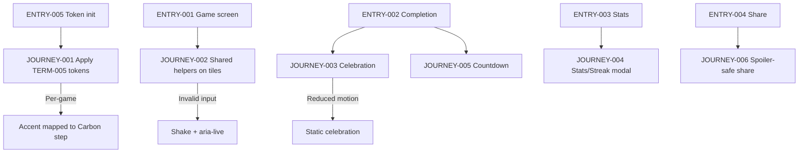
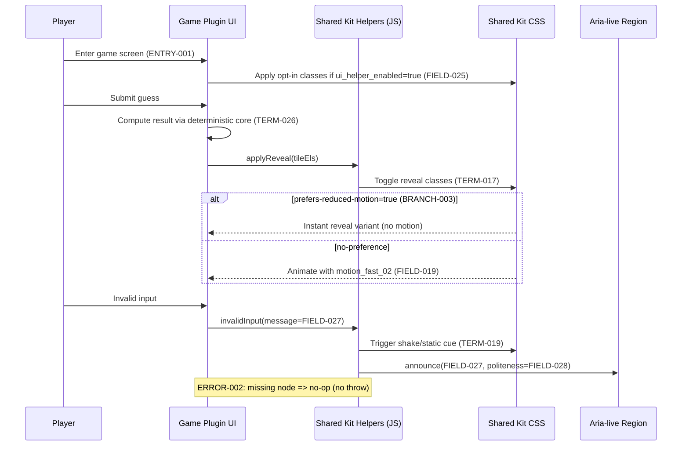
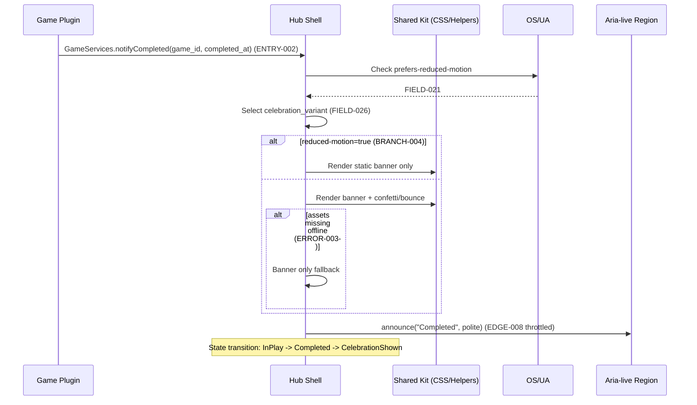
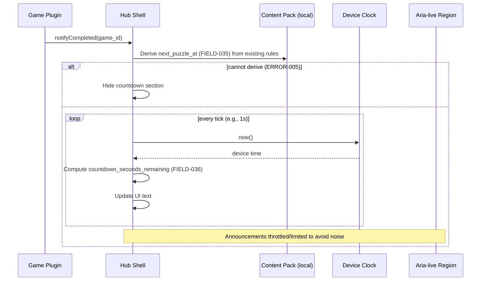

<!-- generated: 2026-07-24T18:51:50Z -->
<!-- mode: feature -->
<!-- feature-slug: carbon-and-gamefeel -->
<!-- a2a-endpoint: https://bob-sdlc-orchestrator.2as6l7wq9qj8.eu-gb.codeengine.appdomain.cloud/v1/rpc -->

# Glossary

## Terms

### TERM-001: CIC Games Hub
- **Definition:** The host application (offline-first PWA + Capacitor app) that renders and manages 22 daily word-puzzle games as plugins, providing shared UI shell and shared services.
- **Synonyms:** Hub, Shell, Host app
- **Anti-definition:** Not an individual game plugin; not a backend service.
- **Source:** User request

### TERM-002: Game Plugin
- **Definition:** A game implementation loaded by the CIC Games Hub that provides UI integration points and uses shared services, while keeping deterministic core logic isolated.
- **Synonyms:** Plugin, Game module
- **Anti-definition:** Not the hub shell; not the shared kit itself.
- **Source:** User request

### TERM-003: Shared Kit
- **Definition:** A reusable package (CSS + helper modules) consumed by the hub and game plugins to apply consistent UI tokens, animations, and retention components.
- **Synonyms:** UI kit, Shared UI kit
- **Anti-definition:** Not per-game content packs; not the deterministic core logic.
- **Source:** User request

### TERM-004: IBM Carbon Design System
- **Definition:** A design system whose tokens (color, spacing, typography, motion, focus) and interaction patterns are used as the visual layer baseline.
- **Synonyms:** Carbon
- **Anti-definition:** Not a bespoke theme; not arbitrary ad-hoc styling.
- **Source:** User request

### TERM-005: Carbon Token Layer
- **Definition:** A set of CSS custom properties in the Shared Kit that map hub/game styling to Carbon-aligned tokens (colors, spacing, type roles, motion).
- **Synonyms:** Token layer, Design tokens
- **Anti-definition:** Not hardcoded hex colors or ad-hoc pixel values spread across plugins.
- **Source:** User request

### TERM-006: Carbon g100 Dark Theme
- **Definition:** The Carbon dark theme palette baseline used for backgrounds, layers, text, borders, and interactive states.
- **Synonyms:** g100 dark
- **Anti-definition:** Not a light theme; not a custom palette unrelated to Carbon.
- **Source:** User request

### TERM-007: Accent Color
- **Definition:** A per-game brand color retained for each Game Plugin, mapped to a Carbon palette step for consistency and contrast control.
- **Synonyms:** Game accent, Brand accent
- **Anti-definition:** Not the global interactive token; not used as the only state indicator.
- **Source:** User request

### TERM-008: UI State Color
- **Definition:** A semantic token used to represent success, warning, error, focus, interactive border, etc., in a consistent manner.
- **Synonyms:** Semantic color
- **Anti-definition:** Not decorative accent; not non-semantic arbitrary colors.
- **Source:** User request

### TERM-009: Non-Color Channel Feedback
- **Definition:** An additional cue besides color (e.g., icon, label text, pattern, or aria-live announcement) used to convey state to meet accessibility requirements.
- **Synonyms:** Redundant cue
- **Anti-definition:** Not color-only feedback.
- **Source:** User request

### TERM-010: WCAG 2.1 AA
- **Definition:** Accessibility conformance level requiring contrast, keyboard access, non-color reliance, and related criteria.
- **Synonyms:** AA, WCAG AA
- **Anti-definition:** Not AAA-only requirements; not informal accessibility guidance.
- **Source:** User request

### TERM-011: Prefers Reduced Motion
- **Definition:** An OS/user-agent setting exposed via `prefers-reduced-motion` used to reduce or disable non-essential motion.
- **Synonyms:** Reduced motion
- **Anti-definition:** Not a per-game option only; not ignored by animations.
- **Source:** User request

### TERM-012: Motion Token
- **Definition:** A token defining animation/transition durations aligned to Carbon (e.g., fast-02, moderate-01) with reduced-motion fallbacks.
- **Synonyms:** Duration token
- **Anti-definition:** Not arbitrary transition durations.
- **Source:** User request

### TERM-013: Type Role
- **Definition:** A named typography role (e.g., heading/body/label) mapped to Carbon typography guidance and applied via tokens.
- **Synonyms:** Typography token
- **Anti-definition:** Not random font sizes applied ad hoc.
- **Source:** User request

### TERM-014: Spacing Scale
- **Definition:** A discrete set of spacing tokens (2/4/8/12/16/24/32/48px) exposed as CSS variables.
- **Synonyms:** Spacing tokens
- **Anti-definition:** Not arbitrary pixel margins/padding.
- **Source:** User request

### TERM-015: Shared Game-Feel Helpers
- **Definition:** Reusable CSS classes and helper module APIs that provide consistent micro-interactions (flip/reveal, win celebration, shake, focus ring).
- **Synonyms:** Juice layer, UI helpers
- **Anti-definition:** Not changes to deterministic game logic; not per-game bespoke animations.
- **Source:** User request

### TERM-016: Tile / Result Cell
- **Definition:** A UI element representing a guess letter/slot or result state that can be animated (e.g., flip/reveal).
- **Synonyms:** Cell, Tile
- **Anti-definition:** Not the puzzle definition; not content pack data.
- **Source:** User request

### TERM-017: Tile Flip / Reveal Animation
- **Definition:** A shared animation applied to Tiles/Result Cells during result reveal, with reduced-motion alternatives.
- **Synonyms:** Flip, Reveal
- **Anti-definition:** Not a mandatory animation; not a physics engine.
- **Source:** User request

### TERM-018: Win Celebration Effect
- **Definition:** A shared celebratory UI effect (banner + confetti or bounce) with a static fallback for reduced motion.
- **Synonyms:** Celebration, Victory effect
- **Anti-definition:** Not required for puzzle completion correctness.
- **Source:** User request

### TERM-019: Invalid Input Shake
- **Definition:** A shared motion or reduced-motion alternative feedback used to indicate invalid input without relying only on color.
- **Synonyms:** Shake feedback
- **Anti-definition:** Not a validation rule itself; not an error toast only.
- **Source:** User request

### TERM-020: Focus-Visible Ring
- **Definition:** A keyboard-focus indicator applied when focus is visible, using the Carbon focus token and meeting contrast requirements.
- **Synonyms:** Focus ring, :focus-visible styling
- **Anti-definition:** Not focus suppression; not mouse-only focus.
- **Source:** User request

### TERM-021: Retention Features
- **Definition:** Shared UX components that encourage return play: stats/streak modal, next-puzzle countdown, spoiler-safe share.
- **Synonyms:** Engagement features
- **Anti-definition:** Not monetization features; not networked notifications.
- **Source:** User request

### TERM-022: Stats/Streak Modal
- **Definition:** A shared modal displaying per-game play stats (games played, win %, streaks, distribution) sourced from existing per-game stats.
- **Synonyms:** Stats modal
- **Anti-definition:** Not cross-game aggregated analytics; not server-backed stats.
- **Source:** User request

### TERM-023: Next-Puzzle Countdown
- **Definition:** A timer shown on puzzle completion indicating time remaining until the next daily puzzle.
- **Synonyms:** Countdown timer
- **Anti-definition:** Not a network time sync requirement.
- **Source:** User request

### TERM-024: Spoiler-Safe Share Affordance
- **Definition:** A unified sharing UI that generates share text/visuals without revealing the solution, using platform share capabilities when available.
- **Synonyms:** Share button, Share sheet
- **Anti-definition:** Not sharing the answer; not requiring social network APIs.
- **Source:** User request

### TERM-025: GameServices Contract
- **Definition:** The existing interface exposed by the hub to plugins for shared capabilities (e.g., stats retrieval, share, UI hooks).
- **Synonyms:** Services API
- **Anti-definition:** Not a new network API; not a breaking change without compatibility.
- **Source:** User request

### TERM-026: Deterministic Core Logic
- **Definition:** The pure, deterministic game engine logic that must not be changed by this work.
- **Synonyms:** Core logic, Engine
- **Anti-definition:** Not UI rendering; not storage adapters.
- **Source:** User request

### TERM-027: Content Pack
- **Definition:** The data/content defining puzzles, word lists, or daily schedules, which must not be changed.
- **Synonyms:** Puzzle pack
- **Anti-definition:** Not UI tokens; not stats data.
- **Source:** User request

### TERM-028: Offline-First
- **Definition:** The app functions without network connectivity; no new network dependency is introduced by these features.
- **Synonyms:** Works offline
- **Anti-definition:** Not “online-only with caching.”
- **Source:** User request

### TERM-029: Unit Tests
- **Definition:** Existing automated tests for modules/components that must continue to pass without modification of expected behavior beyond UI layer changes.
- **Synonyms:** Jest tests (if applicable)
- **Anti-definition:** Not e2e tests.
- **Source:** User request

### TERM-030: Playwright E2E Tests
- **Definition:** Existing end-to-end UI tests that must continue to pass after the upgrade.
- **Synonyms:** E2E tests
- **Anti-definition:** Not unit tests.
- **Source:** User request

### TERM-031: aria-live Announcement
- **Definition:** Screen-reader announcement mechanism using `aria-live` regions for dynamic updates (e.g., invalid input, completion, countdown updates).
- **Synonyms:** Live region
- **Anti-definition:** Not visual-only messages.
- **Source:** User request

### TERM-032: Shared Stylesheet
- **Definition:** The central CSS (or CSS-in-JS output) in the Shared Kit where token variables and shared classes are defined.
- **Synonyms:** Kit CSS
- **Anti-definition:** Not per-plugin local styles only.
- **Source:** User request

### TERM-033: Adoption (Per-Plugin)
- **Definition:** Minimal changes in a Game Plugin to opt into shared tokens/classes/modules without rewriting plugin UI.
- **Synonyms:** Opt-in integration
- **Anti-definition:** Not a full plugin rewrite.
- **Source:** User request


## Data Dictionary

| ID | Name | Type | Format | Range/Enum | Units | Default | Nullable | PII | Source | Validation |
|---|---|---|---|---|---|---|---|---|---|---|
| FIELD-001 | theme_id | string | kebab-case | `carbon-g100-dark` | n/a | `carbon-g100-dark` | No | None | TERM-001 config | Must equal supported theme IDs |
| FIELD-002 | token_background | string | hex | `#161616` | n/a | `#161616` | No | None | TERM-005 | Must be valid hex color |
| FIELD-003 | token_layer_01 | string | hex | `#262626` | n/a | `#262626` | No | None | TERM-005 | Must be valid hex color |
| FIELD-004 | token_border_interactive | string | hex | `#0f62fe` | n/a | `#0f62fe` | No | None | TERM-005 | Must be valid hex color |
| FIELD-005 | token_support_success | string | hex | `#24a148` | n/a | `#24a148` | No | None | TERM-005 | Must be valid hex color |
| FIELD-006 | token_support_warning | string | hex | `#f1c21b` | n/a | `#f1c21b` | No | None | TERM-005 | Must be valid hex color |
| FIELD-007 | token_support_error | string | hex | `#da1e28` | n/a | `#da1e28` | No | None | TERM-005 | Must be valid hex color |
| FIELD-008 | token_focus | string | hex | `#0f62fe` | n/a | `#0f62fe` | No | None | TERM-005 | Must be valid hex color |
| FIELD-009 | token_text_primary | string | css-color | (per Carbon) | n/a | (by theme) | No | None | TERM-005 | Must resolve to computed color |
| FIELD-010 | token_text_secondary | string | css-color | (per Carbon) | n/a | (by theme) | No | None | TERM-005 | Must resolve to computed color |
| FIELD-011 | spacing_01 | number | integer | 2 | px | 2 | No | None | TERM-014 | Must be one of allowed spacing scale values |
| FIELD-012 | spacing_02 | number | integer | 4 | px | 4 | No | None | TERM-014 | Must be one of allowed spacing scale values |
| FIELD-013 | spacing_03 | number | integer | 8 | px | 8 | No | None | TERM-014 | Must be one of allowed spacing scale values |
| FIELD-014 | spacing_04 | number | integer | 12 | px | 12 | No | None | TERM-014 | Must be one of allowed spacing scale values |
| FIELD-015 | spacing_05 | number | integer | 16 | px | 16 | No | None | TERM-014 | Must be one of allowed spacing scale values |
| FIELD-016 | spacing_06 | number | integer | 24 | px | 24 | No | None | TERM-014 | Must be one of allowed spacing scale values |
| FIELD-017 | spacing_07 | number | integer | 32 | px | 32 | No | None | TERM-014 | Must be one of allowed spacing scale values |
| FIELD-018 | spacing_09 | number | integer | 48 | px | 48 | No | None | TERM-014 | Must be one of allowed spacing scale values |
| FIELD-019 | motion_fast_02 | number | integer | 110 | ms | 110 | No | None | TERM-012 | Must be >= 0 |
| FIELD-020 | motion_moderate_01 | number | integer | 150 | ms | 150 | No | None | TERM-012 | Must be >= 0 |
| FIELD-021 | reduced_motion_enabled | boolean | boolean | true/false | n/a | (from OS) | No | None | TERM-011 | Must reflect `prefers-reduced-motion` |
| FIELD-022 | type_role_id | string | kebab-case | e.g. `body-compact-01` | n/a | (by component) | No | None | TERM-013 | Must be a supported role ID |
| FIELD-023 | game_id | string | slug | (existing) | n/a | n/a | No | None | TERM-002 | Must match registered plugin ID |
| FIELD-024 | game_accent_token | string | token-ref | e.g. `--game-accent-60` | n/a | n/a | No | None | TERM-007 | Must map to a Carbon palette step |
| FIELD-025 | ui_helper_enabled | boolean | boolean | true/false | n/a | false | No | None | TERM-015 | Must be explicit opt-in |
| FIELD-026 | celebration_variant | string | enum | `confetti` \| `bounce` \| `static` | n/a | `confetti` | No | None | TERM-018 | Must be one of enum |
| FIELD-027 | invalid_input_message | string | plain-text | length 1–140 | n/a | n/a | Yes | None | TERM-019/TERM-031 | Must be non-empty when emitted |
| FIELD-028 | aria_live_politeness | string | enum | `polite` \| `assertive` | n/a | `polite` | No | None | TERM-031 | Must be one of enum |
| FIELD-029 | stats_games_played | integer | int32 | 0…2^31-1 | count | 0 | No | None | TERM-022 (from per-game) | Must be >= 0 |
| FIELD-030 | stats_win_percent | number | decimal | 0…100 | percent | 0 | No | None | TERM-022 | Must be between 0 and 100 |
| FIELD-031 | stats_current_streak | integer | int32 | 0…2^31-1 | days | 0 | No | None | TERM-022 | Must be >= 0 |
| FIELD-032 | stats_max_streak | integer | int32 | 0…2^31-1 | days | 0 | No | None | TERM-022 | Must be >= 0 |
| FIELD-033 | stats_attempt_distribution | array<number> | JSON array | each >=0 | count | [] | No | None | TERM-022 | Length must match game’s max attempts |
| FIELD-034 | puzzle_completed_at | string | ISO-8601 datetime | valid datetime | n/a | n/a | Yes | None | TERM-023 | Must parse as datetime |
| FIELD-035 | next_puzzle_at | string | ISO-8601 datetime | valid datetime | n/a | n/a | No | None | TERM-023 | Must be > now when shown |
| FIELD-036 | countdown_seconds_remaining | integer | int32 | 0…86400 | seconds | 0 | No | None | TERM-023 | Must be computed from local clock |
| FIELD-037 | share_payload_text | string | plain-text | length 1–2000 | n/a | n/a | No | None | TERM-024 | Must not contain solution string |
| FIELD-038 | share_payload_contains_spoiler | boolean | boolean | true/false | n/a | false | No | None | TERM-024 | Must be false for unified share |
| FIELD-039 | share_method | string | enum | `web-share` \| `clipboard` | n/a | `clipboard` | No | None | TERM-024 | Must be one of enum |
| FIELD-040 | storage_namespace | string | string | (existing) | n/a | n/a | No | None | TERM-028 | Must be stable across sessions |
| FIELD-041 | game_services_version | string | semver | x.y.z | n/a | n/a | No | None | TERM-025 | Must be valid semver |
| FIELD-042 | focus_visible_enabled | boolean | boolean | true/false | n/a | true | No | None | TERM-020 | Must be true when :focus-visible supported |

# User Journeys

## Roles

| Role ID | Role | Type | Description |
|---|---|---|---|
| ROLE-001 | Player | Primary | Plays games, sees results, uses stats, countdown, and share. |
| ROLE-002 | Keyboard-only Player | Primary | Uses keyboard navigation and needs strong focus indicators (TERM-020). |
| ROLE-003 | Screen-reader Player | Primary | Uses assistive tech and relies on TERM-031 announcements and non-color cues (TERM-009). |
| ROLE-004 | Plugin Developer | Secondary | Adopts shared kit tokens/classes/modules with minimal per-plugin changes (TERM-033). |
| ROLE-005 | QA Engineer | Secondary | Validates no regressions in TERM-029/TERM-030 and offline-first behavior (TERM-028). |
| ROLE-006 | System (Hub Runtime) | System | Applies token layer, detects reduced motion, provides GameServices (TERM-025). |

## Entry Points

| Entry ID | Location | Trigger | Auth |
|---|---|---|---|
| ENTRY-001 | Hub UI: Game screen | Player opens a game (TERM-002) in the hub (TERM-001) | n/a (local) |
| ENTRY-002 | Hub UI: Completion state | Puzzle completion event in a plugin UI | n/a (local) |
| ENTRY-003 | Hub UI: Stats button/menu | Player selects “Stats” | n/a (local) |
| ENTRY-004 | Hub UI: Share button | Player selects “Share” | n/a (local) |
| ENTRY-005 | Runtime: CSS token initialization | App load / route change | n/a |
| ENTRY-006 | Runtime: prefers-reduced-motion | OS setting evaluation | n/a |
| ENTRY-007 | Plugin integration: GameServices | Plugin calls GameServices APIs | n/a (in-process) |

## Role Permission Matrix

| Capability | ROLE-001 | ROLE-002 | ROLE-003 | ROLE-004 | ROLE-005 | ROLE-006 |
|---|---:|---:|---:|---:|---:|---:|
| View Carbon-themed UI (TERM-005/TERM-006) | Y | Y | Y | N | Y | Y |
| Use shared game-feel helpers (TERM-015) | Y | Y | Y | N | Y | Y |
| Open stats/streak modal (TERM-022) | Y | Y | Y | N | Y | Y |
| View countdown (TERM-023) | Y | Y | Y | N | Y | Y |
| Use spoiler-safe share (TERM-024) | Y | Y | Y | N | Y | Y |
| Adopt shared kit in plugin (TERM-033) | N | N | N | Y | N | Y |
| Run/validate tests (TERM-029/TERM-030) | N | N | N | N | Y | N |

## Journeys

### JOURNEY-001: Apply Carbon token layer across hub and plugins
- **Role/Goal:** ROLE-006; apply TERM-005 consistently so UI uses tokens instead of ad-hoc styles.
- **Entry:** ENTRY-005
- **Happy path:**
  1. Hub runtime loads Shared Stylesheet (TERM-032) and sets `FIELD-001 theme_id` to `carbon-g100-dark`.  
  2. Shared Stylesheet defines Carbon g100 tokens for background/layers/borders/text using `FIELD-002..FIELD-010`.  
  3. Shared Stylesheet defines spacing scale using `FIELD-011..FIELD-018`.  
  4. Shared Stylesheet defines motion tokens using `FIELD-019..FIELD-020` and reads `FIELD-021 reduced_motion_enabled`.  
  5. Hub sets per-plugin accent mapping `FIELD-024 game_accent_token` keyed by `FIELD-023 game_id` (TERM-007).  
  6. Hub and plugins render UI using tokens (TERM-005) for colors/spacing/type roles (FIELD-022).
- **Decision branches:**
  - **BRANCH-001:** If `FIELD-021 reduced_motion_enabled` is true, then motion tokens are overridden to reduced/none per TERM-011.
  - **BRANCH-002:** If a plugin does not opt in (`FIELD-025 ui_helper_enabled` is false), then only global tokens apply (no helper classes).
- **Error states:**
  - **ERROR-001:** Trigger: plugin references missing `FIELD-024 game_accent_token`. Response: fallback to `FIELD-004 token_border_interactive` for interactive highlights; Recovery: plugin developer sets mapping in hub registry.
- **Loop-back paths:**
  - **LOOP-001:** On theme/token stylesheet updates, hub reloads token variables without changing deterministic core logic (TERM-026).
- **Edge cases:**
  - **EDGE-001:** High-contrast needs: ensure focus ring and text tokens (`FIELD-008..FIELD-010`) remain distinguishable on `FIELD-002` background.
  - **EDGE-002:** Legacy ad-hoc hex values in plugins: ensure token layer overrides without breaking layout.
  - **EDGE-003:** Offline-first: token initialization uses no network calls (TERM-028).

### JOURNEY-002: Player experiences shared game-feel animations with reduced-motion support
- **Role/Goal:** ROLE-001; get consistent micro-interactions (TERM-015) without affecting game correctness.
- **Entry:** ENTRY-001
- **Happy path:**
  1. Player enters a game screen (TERM-002) in hub (TERM-001).  
  2. Plugin opts into helpers by enabling `FIELD-025 ui_helper_enabled` and applying shared CSS classes from TERM-015 to Tiles (TERM-016).  
  3. On result reveal, plugin applies Tile Flip/Reveals (TERM-017) using `FIELD-019 motion_fast_02`.  
  4. On invalid input, plugin triggers Invalid Input Shake (TERM-019) and emits `FIELD-027 invalid_input_message` to an `aria-live` region (TERM-031).  
  5. Keyboard focus uses Focus-Visible Ring (TERM-020) via `FIELD-008 token_focus`.
- **Decision branches:**
  - **BRANCH-003:** If `FIELD-021 reduced_motion_enabled` is true, then flip/shake/celebration transitions use reduced-motion variants (TERM-011).
- **Error states:**
  - **ERROR-002:** Trigger: animation class applied to non-existent DOM node after rapid input. Response: no-op; Recovery: next render applies class correctly.
- **Loop-back paths:**
  - **LOOP-002:** Repeated guesses continue to reuse helper classes for each reveal without accumulating stale classes.
- **Edge cases:**
  - **EDGE-004:** Concurrency: rapid multi-key input during reveal must not desync DOM state.
  - **EDGE-005:** :focus-visible support differences: fallback maintains visible focus using `FIELD-042 focus_visible_enabled`.
  - **EDGE-006:** Non-color-only feedback: invalid state must include icon/label/aria-live (TERM-009/TERM-031).

### JOURNEY-003: Show win celebration on completion with spoiler-safe fallback
- **Role/Goal:** ROLE-001; get completion feedback and celebration (TERM-018) without motion issues or spoilers.
- **Entry:** ENTRY-002
- **Happy path:**
  1. Plugin reaches completion state and notifies hub shell completion hook via GameServices (TERM-025).  
  2. Hub shows a banner (TERM-018) using Carbon tokens (TERM-005) and the plugin’s `FIELD-024 game_accent_token`.  
  3. Hub plays celebration variant `FIELD-026 celebration_variant` (confetti or bounce) using motion tokens.  
  4. If player opens share, hub prepares `FIELD-037 share_payload_text` with `FIELD-038 share_payload_contains_spoiler=false`.
- **Decision branches:**
  - **BRANCH-004:** If `FIELD-021 reduced_motion_enabled` is true, hub sets `FIELD-026 celebration_variant=static`.
- **Error states:**
  - **ERROR-003:** Trigger: celebration assets unavailable offline. Response: show banner only; Recovery: none required (offline-first).
- **Loop-back paths:**
  - **LOOP-003:** Replaying viewing completion screen reuses the same completion components without duplicating confetti canvases.
- **Edge cases:**
  - **EDGE-007:** Multiple completions (user revisits screen): celebration should not autoplay repeatedly unless explicitly re-triggered.
  - **EDGE-008:** Screen reader: completion message announced via aria-live (TERM-031) without repeating excessively.

### JOURNEY-004: View stats/streak modal sourced from existing per-game stats
- **Role/Goal:** ROLE-001; see stats and streaks (TERM-022) derived from existing data only.
- **Entry:** ENTRY-003
- **Happy path:**
  1. Player selects “Stats” in hub shell.  
  2. Hub calls GameServices (TERM-025) for the current `FIELD-023 game_id` to retrieve per-game stats fields (`FIELD-029..FIELD-033`).  
  3. Hub renders Stats/Streak Modal (TERM-022) using Carbon type roles (FIELD-022) and spacing tokens (`FIELD-011..FIELD-018`).  
  4. Modal is keyboard navigable; focus is trapped; focus ring uses `FIELD-008 token_focus`.  
  5. Screen-reader summary is announced via aria-live with `FIELD-028 aria_live_politeness=polite`.
- **Decision branches:**
  - **BRANCH-005:** If stats are empty (e.g., `FIELD-029 stats_games_played=0`), modal shows empty-state copy without charts.
- **Error states:**
  - **ERROR-004:** Trigger: GameServices stats payload missing required fields. Response: show “Stats unavailable” state; Recovery: player can close modal; plugin developer fixes contract usage.
- **Loop-back paths:**
  - **LOOP-004:** Player closes and reopens modal; values refresh from local storage namespace (`FIELD-040`).
- **Edge cases:**
  - **EDGE-009:** Attempt distribution length mismatch vs game max attempts: modal renders only available entries and labels them.
  - **EDGE-010:** Offline storage corruption: stats retrieval returns defaults (zeros) rather than crashing.

### JOURNEY-005: Show next-puzzle countdown after completion
- **Role/Goal:** ROLE-001; know when next daily puzzle unlocks (TERM-023) offline.
- **Entry:** ENTRY-002
- **Happy path:**
  1. On completion, hub computes `FIELD-035 next_puzzle_at` from local schedule/content pack rules (TERM-027) without network.  
  2. Hub computes `FIELD-036 countdown_seconds_remaining` from device time and updates display at a fixed interval.  
  3. Hub displays countdown using Carbon tokens and provides aria-live update rules to avoid noisy announcements.
- **Decision branches:**
  - **BRANCH-006:** If device time is past `FIELD-035 next_puzzle_at`, countdown shows `0` and prompts reload to access new puzzle.
- **Error states:**
  - **ERROR-005:** Trigger: next puzzle time cannot be derived. Response: hide countdown section; Recovery: player can still use stats/share.
- **Loop-back paths:**
  - **LOOP-005:** Every tick recomputes `FIELD-036` until it reaches 0.
- **Edge cases:**
  - **EDGE-011:** App background/foreground: countdown resumes and re-syncs on resume without drift accumulation.
  - **EDGE-012:** Timezone/DST changes: countdown recalculates based on current device time.

### JOURNEY-006: Use unified spoiler-safe share affordance
- **Role/Goal:** ROLE-001; share results (TERM-024) without revealing solution and without network.
- **Entry:** ENTRY-004
- **Happy path:**
  1. Player selects “Share” from completion UI.  
  2. Hub asks plugin via GameServices (TERM-025) for a spoiler-safe share payload and sets `FIELD-038 share_payload_contains_spoiler=false`.  
  3. Hub produces `FIELD-037 share_payload_text` and chooses `FIELD-039 share_method` (`web-share` if available else `clipboard`).  
  4. Hub confirms success with non-color feedback (TERM-009) and optional aria-live announcement (TERM-031).
- **Decision branches:**
  - **BRANCH-007:** If Web Share API unavailable, hub falls back to clipboard.
- **Error states:**
  - **ERROR-006:** Trigger: clipboard write denied. Response: show selectable text for manual copy; Recovery: player copies manually.
- **Loop-back paths:**
  - **LOOP-006:** Player can retry share via same button after error.
- **Edge cases:**
  - **EDGE-013:** Spoiler detection: payload must not include solution string; hub enforces `FIELD-038=false`.
  - **EDGE-014:** Very long share text: truncate to max length while preserving header and score line.

## Journey Map



# Requirements

### REQ-001: Provide Carbon g100 token variables in shared stylesheet
- **EARS Pattern:** Ubiquitous
- **EARS Statement:** The CIC Games Hub (TERM-001) shall expose a Carbon Token Layer (TERM-005) for Carbon g100 Dark Theme (TERM-006) via the Shared Stylesheet (TERM-032).
- **Inputs:** FIELD-001
- **Outputs:** FIELD-002..FIELD-010
- **Preconditions:** Shared Kit (TERM-003) is loaded.
- **Postconditions:** Token variables resolve to computed CSS values on hub root.
- **Invariants:** No network dependency is introduced (TERM-028).
- **Trigger:** App load (ENTRY-005)
- **Actor:** ROLE-006
- **EntityScope:** TERM-005
- **ErrorModes:** ERROR-001
- **NFR-Tags:** accessibility, compatibility, offline
- **Source:** JOURNEY-001 step 1–2
- **Dependencies:** n/a
- **Priority:** P0
- **AcceptanceCriteria:**
  - **TEST-001:** Given the hub is loaded, when inspecting computed styles, then background token equals `FIELD-002=#161616`.
  - **TEST-002:** Given the hub is loaded, when inspecting computed styles, then layer-01 token equals `FIELD-003=#262626`.
  - **TEST-003:** Given the hub is loaded, when inspecting computed styles, then border-interactive token equals `FIELD-004=#0f62fe`.
- **Assumptions:** CSS custom properties are supported by target browsers/webview.
- **OpenQuestions:** Which existing CSS variable names must be preserved for backward compatibility?

### REQ-002: Replace ad-hoc spacing with Carbon spacing scale tokens
- **EARS Pattern:** Ubiquitous
- **EARS Statement:** The Shared Kit (TERM-003) shall provide a Spacing Scale (TERM-014) as CSS tokens mapped to `FIELD-011..FIELD-018`.
- **Inputs:** n/a
- **Outputs:** FIELD-011..FIELD-018
- **Preconditions:** Shared Stylesheet (TERM-032) is loaded.
- **Postconditions:** Shared components can consume spacing tokens.
- **Invariants:** Token values remain within the defined discrete scale.
- **Trigger:** App load (ENTRY-005)
- **Actor:** ROLE-006
- **EntityScope:** TERM-014
- **ErrorModes:** n/a
- **NFR-Tags:** compatibility
- **Source:** JOURNEY-001 step 3
- **Dependencies:** REQ-001
- **Priority:** P1
- **AcceptanceCriteria:**
  - **TEST-004:** Given the shared stylesheet is loaded, then `--spacing-01` computes to `FIELD-011=2px`.
  - **TEST-005:** Given the shared stylesheet is loaded, then `--spacing-09` computes to `FIELD-018=48px`.
  - **TEST-006:** Given a shared component uses spacing tokens, then no literal pixel spacing values are required in that component’s CSS.
- **Assumptions:** Component CSS can be refactored to token usage incrementally.
- **OpenQuestions:** Which components are in scope for first-pass refactor?

### REQ-003: Provide Carbon motion duration tokens with reduced-motion overrides
- **EARS Pattern:** Ubiquitous
- **EARS Statement:** The Shared Kit (TERM-003) shall expose Motion Tokens (TERM-012) for `FIELD-019` and `FIELD-020` and shall override non-essential motion when `FIELD-021 reduced_motion_enabled` is true.
- **Inputs:** FIELD-021
- **Outputs:** FIELD-019, FIELD-020
- **Preconditions:** Reduced motion preference can be evaluated (ENTRY-006).
- **Postconditions:** Motion durations are reduced or eliminated for non-essential animations.
- **Invariants:** Motion preferences are applied without changing Deterministic Core Logic (TERM-026).
- **Trigger:** App load or media query change (ENTRY-006)
- **Actor:** ROLE-006
- **EntityScope:** TERM-012
- **ErrorModes:** n/a
- **NFR-Tags:** accessibility, compatibility
- **Source:** JOURNEY-001 step 4; JOURNEY-002 BRANCH-003
- **Dependencies:** REQ-001
- **Priority:** P0
- **AcceptanceCriteria:**
  - **TEST-007:** Given `prefers-reduced-motion: reduce`, then flip and celebration animations use reduced-motion variants.
  - **TEST-008:** Given `prefers-reduced-motion: no-preference`, then durations match `FIELD-019=110ms` and `FIELD-020=150ms`.
  - **TEST-009:** Given reduced motion is enabled, then gameplay state progression remains unchanged (TERM-026).
- **Assumptions:** “Non-essential” motion excludes focus indicators and essential state changes.
- **OpenQuestions:** Which animations (if any) are considered essential and thus not removed?

### REQ-004: Map each game’s accent color to a Carbon palette step
- **EARS Pattern:** Ubiquitous
- **EARS Statement:** The CIC Games Hub (TERM-001) shall map each Game Plugin Accent Color (TERM-007) to a Carbon-aligned token reference in `FIELD-024 game_accent_token` keyed by `FIELD-023 game_id`.
- **Inputs:** FIELD-023
- **Outputs:** FIELD-024
- **Preconditions:** Plugin registry exists.
- **Postconditions:** Plugins can reference accent token consistently.
- **Invariants:** Accent mapping does not replace semantic state colors (TERM-008).
- **Trigger:** Game load (ENTRY-001)
- **Actor:** ROLE-006
- **EntityScope:** TERM-007
- **ErrorModes:** ERROR-001
- **NFR-Tags:** accessibility, compatibility
- **Source:** JOURNEY-001 step 5
- **Dependencies:** REQ-001
- **Priority:** P1
- **AcceptanceCriteria:**
  - **TEST-010:** Given a registered `FIELD-023 game_id`, then `FIELD-024` resolves to a token reference.
  - **TEST-011:** Given an unregistered game_id, then interactive UI falls back to `FIELD-004 token_border_interactive`.
  - **TEST-012:** Given accent is used, then success/warning/error continue using `FIELD-005..FIELD-007`.
- **Assumptions:** A Carbon palette step set is defined/available in the codebase.
- **OpenQuestions:** What exact Carbon palette steps are permitted for accents (e.g., 40/50/60)?

### REQ-005: Provide focus-visible ring using Carbon focus token
- **EARS Pattern:** Ubiquitous
- **EARS Statement:** The Shared Kit (TERM-003) shall style Focus-Visible Ring (TERM-020) using `FIELD-008 token_focus` for keyboard-focusable elements.
- **Inputs:** FIELD-008
- **Outputs:** Visible focus ring styling
- **Preconditions:** Focusable elements exist in hub and plugins.
- **Postconditions:** Keyboard navigation has a visible focus indicator.
- **Invariants:** Focus styling does not rely on color alone (TERM-009) when combined with outline thickness/shape.
- **Trigger:** Focus-visible event in UI
- **Actor:** ROLE-002
- **EntityScope:** TERM-020
- **ErrorModes:** n/a
- **NFR-Tags:** accessibility
- **Source:** JOURNEY-002 step 5; JOURNEY-004 step 4
- **Dependencies:** REQ-001
- **Priority:** P0
- **AcceptanceCriteria:**
  - **TEST-013:** Given keyboard tab navigation, then focused controls display a focus ring using `FIELD-008=#0f62fe`.
  - **TEST-014:** Given mouse click focus, then focus ring follows :focus-visible behavior.
  - **TEST-015:** Given a plugin uses shared classes, then focus ring appears without plugin-specific CSS.
- **Assumptions:** :focus-visible is supported or polyfilled.
- **OpenQuestions:** Do any existing components intentionally suppress outlines?

### REQ-006: Provide reusable tile flip/reveal animation helper
- **EARS Pattern:** Ubiquitous
- **EARS Statement:** The Shared Kit (TERM-003) shall provide a Tile Flip / Reveal Animation (TERM-017) as opt-in shared CSS classes usable by a Tile / Result Cell (TERM-016).
- **Inputs:** FIELD-025, FIELD-019, FIELD-021
- **Outputs:** CSS class behavior on tiles
- **Preconditions:** Plugin opts in via `FIELD-025 ui_helper_enabled=true`.
- **Postconditions:** Tiles animate on reveal or use reduced-motion variant.
- **Invariants:** Animation does not mutate game state (TERM-026).
- **Trigger:** Plugin applies reveal class during render
- **Actor:** ROLE-001
- **EntityScope:** TERM-017
- **ErrorModes:** ERROR-002
- **NFR-Tags:** accessibility, compatibility
- **Source:** JOURNEY-002 step 2–3; BRANCH-003
- **Dependencies:** REQ-003
- **Priority:** P1
- **AcceptanceCriteria:**
  - **TEST-016:** Given reduced motion is off, when reveal class is applied, then tile uses duration `FIELD-019=110ms`.
  - **TEST-017:** Given reduced motion is on, when reveal class is applied, then tile uses a non-motion state change (e.g., instant swap).
  - **TEST-018:** Given rapid input, then applying the class to a missing node does not throw (ERROR-002 no-op).
- **Assumptions:** Tile markup can accept class hooks without structural changes.
- **OpenQuestions:** Which tile states (correct/present/absent) need distinct reveal timing?

### REQ-007: Provide reusable invalid-input feedback with aria-live messaging
- **EARS Pattern:** Event-Driven
- **EARS Statement:** When a Game Plugin (TERM-002) emits an invalid input event, the Shared Kit (TERM-003) shall present Invalid Input Shake (TERM-019) and shall emit `FIELD-027 invalid_input_message` to an aria-live region (TERM-031).
- **Inputs:** FIELD-027, FIELD-021
- **Outputs:** Shake/alternative feedback; aria-live announcement
- **Preconditions:** Plugin routes invalid input through helper module.
- **Postconditions:** Player receives non-color-only feedback (TERM-009).
- **Invariants:** No network calls are made (TERM-028).
- **Trigger:** Invalid input event
- **Actor:** ROLE-001 / ROLE-003
- **EntityScope:** TERM-019
- **ErrorModes:** n/a
- **NFR-Tags:** accessibility, offline
- **Source:** JOURNEY-002 step 4; EDGE-006
- **Dependencies:** REQ-003
- **Priority:** P0
- **AcceptanceCriteria:**
  - **TEST-019:** Given invalid input, then a visible feedback occurs without relying only on color (TERM-009).
  - **TEST-020:** Given a screen reader is active, then `FIELD-027` is announced via aria-live.
  - **TEST-021:** Given reduced motion is enabled, then shake uses a static alternative (e.g., border + icon + message).
- **Assumptions:** Plugins already have an invalid input concept.
- **OpenQuestions:** What are the canonical invalid input message strings per game?

### REQ-008: Provide win celebration effect with static reduced-motion fallback
- **EARS Pattern:** Event-Driven
- **EARS Statement:** When a puzzle is completed, the CIC Games Hub (TERM-001) shall display a Win Celebration Effect (TERM-018) using `FIELD-026 celebration_variant`.
- **Inputs:** FIELD-026, FIELD-021, FIELD-023, FIELD-024
- **Outputs:** Celebration banner/effect
- **Preconditions:** Completion hook is invoked via GameServices (TERM-025).
- **Postconditions:** Completion feedback is displayed.
- **Invariants:** Deterministic Core Logic (TERM-026) is unchanged.
- **Trigger:** Completion event (ENTRY-002)
- **Actor:** ROLE-001
- **EntityScope:** TERM-018
- **ErrorModes:** ERROR-003
- **NFR-Tags:** accessibility, offline
- **Source:** JOURNEY-003 step 1–3; BRANCH-004
- **Dependencies:** REQ-003, REQ-004
- **Priority:** P1
- **AcceptanceCriteria:**
  - **TEST-022:** Given reduced motion is off, then variant is `confetti` or `bounce` and renders without blocking input.
  - **TEST-023:** Given reduced motion is on, then `FIELD-026` resolves to `static` and only the banner renders.
  - **TEST-024:** Given celebration assets missing offline, then banner still renders (ERROR-003).
- **Assumptions:** Confetti/bounce can be implemented without external libraries requiring network.
- **OpenQuestions:** Which celebration effect is preferred by default on web vs native?

### REQ-009: Provide shared stats/streak modal component in hub shell
- **EARS Pattern:** Ubiquitous
- **EARS Statement:** The CIC Games Hub (TERM-001) shall provide a Stats/Streak Modal (TERM-022) that renders `FIELD-029..FIELD-033` for the active `FIELD-023 game_id`.
- **Inputs:** FIELD-023, FIELD-029..FIELD-033
- **Outputs:** Modal UI
- **Preconditions:** Per-game stats exist in local storage (TERM-028) and are accessible via GameServices (TERM-025).
- **Postconditions:** Modal can be opened and closed.
- **Invariants:** Stats are sourced from existing per-game stats only (no new data collection).
- **Trigger:** Player selects stats (ENTRY-003)
- **Actor:** ROLE-001
- **EntityScope:** TERM-022
- **ErrorModes:** ERROR-004
- **NFR-Tags:** accessibility, privacy, offline
- **Source:** JOURNEY-004 step 1–3; BRANCH-005
- **Dependencies:** REQ-001
- **Priority:** P0
- **AcceptanceCriteria:**
  - **TEST-025:** Given games played is 0 (`FIELD-029=0`), then modal shows an empty-state view.
  - **TEST-026:** Given stats exist, then modal renders games played, win percent, current streak, max streak from `FIELD-029..FIELD-032`.
  - **TEST-027:** Given attempt distribution exists, then modal renders a distribution view based on `FIELD-033`.
- **Assumptions:** Existing per-game stats schema can be adapted without breaking.
- **OpenQuestions:** Are attempt distributions normalized across all games?

### REQ-010: Enforce keyboard operability for stats modal
- **EARS Pattern:** State-Driven
- **EARS Statement:** While the Stats/Streak Modal (TERM-022) is open, the CIC Games Hub (TERM-001) shall trap keyboard focus within the modal.
- **Inputs:** Focus events
- **Outputs:** Focus order behavior
- **Preconditions:** Modal open state.
- **Postconditions:** Focus does not escape to the page behind.
- **Invariants:** Close action remains reachable via keyboard.
- **Trigger:** Modal open
- **Actor:** ROLE-002
- **EntityScope:** TERM-022
- **ErrorModes:** n/a
- **NFR-Tags:** accessibility
- **Source:** JOURNEY-004 step 4
- **Dependencies:** REQ-005, REQ-009
- **Priority:** P0
- **AcceptanceCriteria:**
  - **TEST-028:** Given modal is open, when tabbing forward repeatedly, then focus remains within modal controls.
  - **TEST-029:** Given modal is open, when pressing Escape, then modal closes and focus returns to the opener control.
  - **TEST-030:** Given modal is open, then the focus ring uses `FIELD-008 token_focus`.
- **Assumptions:** Hub has a modal framework or can add one in kit.
- **OpenQuestions:** Is Escape-to-close consistent with existing hub modals?

### REQ-011: Provide next-puzzle countdown on completion screen
- **EARS Pattern:** Event-Driven
- **EARS Statement:** When a puzzle is completed, the CIC Games Hub (TERM-001) shall display a Next-Puzzle Countdown (TERM-023) computed from `FIELD-035 next_puzzle_at`.
- **Inputs:** FIELD-035, device time
- **Outputs:** FIELD-036 displayed countdown
- **Preconditions:** Completion screen is displayed.
- **Postconditions:** Countdown is visible when derivable.
- **Invariants:** Computation uses no network (TERM-028).
- **Trigger:** Completion event (ENTRY-002)
- **Actor:** ROLE-001
- **EntityScope:** TERM-023
- **ErrorModes:** ERROR-005
- **NFR-Tags:** offline, accessibility
- **Source:** JOURNEY-005 step 1–2
- **Dependencies:** REQ-001
- **Priority:** P1
- **AcceptanceCriteria:**
  - **TEST-031:** Given `FIELD-035` is available, then `FIELD-036` equals the integer seconds difference between now and `FIELD-035`.
  - **TEST-032:** Given `FIELD-035` cannot be derived, then countdown section is hidden (ERROR-005).
  - **TEST-033:** Given the app resumes from background, then countdown updates based on current device time (EDGE-011).
- **Assumptions:** Next puzzle time can be derived from existing schedule rules/content packs.
- **OpenQuestions:** What is the authoritative daily rollover time per game (local midnight vs fixed UTC)?

### REQ-012: Provide unified spoiler-safe share affordance with fallback to clipboard
- **EARS Pattern:** Ubiquitous
- **EARS Statement:** The CIC Games Hub (TERM-001) shall provide a Spoiler-Safe Share Affordance (TERM-024) that produces `FIELD-037 share_payload_text` with `FIELD-038 share_payload_contains_spoiler=false`.
- **Inputs:** Plugin-provided share data via TERM-025
- **Outputs:** FIELD-037, FIELD-039
- **Preconditions:** Completion state exists or share is available.
- **Postconditions:** Share intent completes or provides manual copy UI.
- **Invariants:** No new network dependency is introduced (TERM-028).
- **Trigger:** Player selects share (ENTRY-004)
- **Actor:** ROLE-001
- **EntityScope:** TERM-024
- **ErrorModes:** ERROR-006
- **NFR-Tags:** offline, accessibility, privacy
- **Source:** JOURNEY-006 step 1–4; EDGE-013
- **Dependencies:** REQ-001
- **Priority:** P0
- **AcceptanceCriteria:**
  - **TEST-034:** Given Web Share API is available, then `FIELD-039=web-share` is used.
  - **TEST-035:** Given Web Share API is unavailable, then `FIELD-039=clipboard` is used.
  - **TEST-036:** Given clipboard write is denied, then selectable text is shown for manual copy (ERROR-006).
- **Assumptions:** Plugins can generate spoiler-safe representations.
- **OpenQuestions:** Do any games currently generate shares that include hidden spoilers (e.g., encoded answer)?

### REQ-013: Preserve deterministic core logic and content packs
- **EARS Pattern:** Unwanted
- **EARS Statement:** The upgrade shall not modify Deterministic Core Logic (TERM-026) or any Content Pack (TERM-027).
- **Inputs:** n/a
- **Outputs:** n/a
- **Preconditions:** Existing games are integrated as plugins (TERM-002).
- **Postconditions:** Game outcomes remain identical for identical inputs.
- **Invariants:** UI-only changes remain isolated to TERM-003 and hub shell (TERM-001).
- **Trigger:** During implementation and integration
- **Actor:** ROLE-004
- **EntityScope:** TERM-026
- **ErrorModes:** n/a
- **NFR-Tags:** compatibility, reliability
- **Source:** User request constraint; applies across JOURNEY-001..006
- **Dependencies:** n/a
- **Priority:** P0
- **AcceptanceCriteria:**
  - **TEST-037:** Given a fixed seed/input sequence, then the game’s computed results match pre-upgrade results.
  - **TEST-038:** Given content pack hashes pre-upgrade, then hashes are unchanged post-upgrade.
  - **TEST-039:** Given only kit modules and CSS change, then plugin core logic files remain unchanged.
- **Assumptions:** There is a way to identify core logic vs UI layer in repository structure.
- **OpenQuestions:** How is “core logic” formally separated/enforced in the repo?

### REQ-014: Ensure existing unit tests continue to pass
- **EARS Pattern:** Ubiquitous
- **EARS Statement:** The delivery shall preserve passing status of existing Unit Tests (TERM-029).
- **Inputs:** Test suite execution
- **Outputs:** Pass/fail result
- **Preconditions:** CI runs unit tests.
- **Postconditions:** Unit tests remain green.
- **Invariants:** No new network dependency is introduced (TERM-028).
- **Trigger:** CI pipeline run
- **Actor:** ROLE-005
- **EntityScope:** TERM-029
- **ErrorModes:** n/a
- **NFR-Tags:** reliability
- **Source:** User request constraint
- **Dependencies:** REQ-013
- **Priority:** P0
- **AcceptanceCriteria:**
  - **TEST-040:** Given the main branch baseline, then unit test pass count remains unchanged.
  - **TEST-041:** Given offline mode in tests, then no tests introduce network calls.
  - **TEST-042:** Given snapshot tests exist, then snapshots are updated only where tokenized styling is expected (and remain stable thereafter).
- **Assumptions:** Snapshot tests are permitted to update once for intentional UI changes.
- **OpenQuestions:** Are snapshot updates allowed, or must snapshots remain byte-identical?

### REQ-015: Ensure existing Playwright e2e tests continue to pass
- **EARS Pattern:** Ubiquitous
- **EARS Statement:** The delivery shall preserve passing status of existing Playwright E2E Tests (TERM-030).
- **Inputs:** Playwright run
- **Outputs:** Pass/fail result
- **Preconditions:** CI runs Playwright against PWA and/or web build.
- **Postconditions:** E2E tests remain green.
- **Invariants:** No changes require new selectors that break tests without compatibility.
- **Trigger:** CI pipeline run
- **Actor:** ROLE-005
- **EntityScope:** TERM-030
- **ErrorModes:** n/a
- **NFR-Tags:** reliability, compatibility
- **Source:** User request constraint
- **Dependencies:** REQ-013
- **Priority:** P0
- **AcceptanceCriteria:**
  - **TEST-043:** Given current Playwright suite, then all tests pass without increasing timeouts.
  - **TEST-044:** Given focus-visible and modal changes, then keyboard navigation tests (if present) still pass.
  - **TEST-045:** Given completion flow changes, then share/stats actions remain reachable via existing selectors or stable data-testid attributes.
- **Assumptions:** Tests use stable selectors or data-testid; if not, compatibility shims may be required.
- **OpenQuestions:** Are there any tests asserting exact CSS values that will need token-based updates?

### NFR-001: WCAG 2.1 AA contrast and non-color-only state communication
- **EARS Pattern:** Ubiquitous
- **EARS Statement:** The CIC Games Hub (TERM-001) shall ensure UI State Colors (TERM-008) meet WCAG 2.1 AA (TERM-010) and shall provide Non-Color Channel Feedback (TERM-009) for success, warning, error, and invalid states.
- **Inputs:** FIELD-005..FIELD-008, UI state events
- **Outputs:** Visual + textual/iconic + aria-live cues
- **Preconditions:** UI states exist.
- **Postconditions:** Users can perceive state without color dependence.
- **Invariants:** Per-game Accent Color (TERM-007) does not replace semantic state channels.
- **Trigger:** Rendering of states
- **Actor:** ROLE-003
- **EntityScope:** TERM-008
- **ErrorModes:** n/a
- **NFR-Tags:** accessibility
- **Source:** User request; JOURNEY-002 EDGE-006; JOURNEY-003 EDGE-008
- **Dependencies:** REQ-001, REQ-007
- **Priority:** P0
- **AcceptanceCriteria:**
  - **TEST-046:** Given a success/warning/error UI state, then an icon or label is present in addition to color (TERM-009).
  - **TEST-047:** Given token colors on g100 background, then text and key UI states meet AA contrast thresholds.
  - **TEST-048:** Given a screen reader, then critical state changes can be announced via aria-live (TERM-031) where applicable.
- **Assumptions:** Contrast can be verified via automated tooling for core surfaces.
- **OpenQuestions:** Which exact surfaces/components are in the “key UI states” audit list?

### NFR-002: Offline-first with no new network dependency
- **EARS Pattern:** Unwanted
- **EARS Statement:** The CIC Games Hub (TERM-001) shall not introduce any new network dependency to deliver TERM-005, TERM-015, or TERM-021.
- **Inputs:** Runtime network availability
- **Outputs:** Feature availability offline
- **Preconditions:** App is offline (TERM-028).
- **Postconditions:** Tokens, helpers, stats, countdown, and share remain usable.
- **Invariants:** All assets required are bundled locally.
- **Trigger:** Offline usage
- **Actor:** ROLE-001
- **EntityScope:** TERM-028
- **ErrorModes:** ERROR-003
- **NFR-Tags:** offline, reliability
- **Source:** User request; JOURNEY-001 EDGE-003
- **Dependencies:** REQ-008, REQ-009, REQ-011, REQ-012
- **Priority:** P0
- **AcceptanceCriteria:**
  - **TEST-049:** Given airplane mode, then stats modal opens and renders from local stats.
  - **TEST-050:** Given airplane mode, then share works via clipboard fallback.
  - **TEST-051:** Given airplane mode, then celebration falls back gracefully if optional assets are unavailable.
- **Assumptions:** Web Share API availability is local capability, not network.
- **OpenQuestions:** Are any current assets loaded via remote URLs that must be bundled?

### NFR-003: Reduced-motion compliance for non-essential animations
- **EARS Pattern:** State-Driven
- **EARS Statement:** While Prefers Reduced Motion (TERM-011) is enabled, the Shared Game-Feel Helpers (TERM-015) shall use reduced-motion variants for TERM-017, TERM-018, and TERM-019.
- **Inputs:** FIELD-021
- **Outputs:** Reduced-motion behavior
- **Preconditions:** Reduced motion preference is detectable.
- **Postconditions:** Non-essential motion is minimized.
- **Invariants:** UX still provides state feedback via non-motion channels (TERM-009).
- **Trigger:** Reduced motion enabled state
- **Actor:** ROLE-001
- **EntityScope:** TERM-015
- **ErrorModes:** n/a
- **NFR-Tags:** accessibility
- **Source:** JOURNEY-002 BRANCH-003; JOURNEY-003 BRANCH-004
- **Dependencies:** REQ-003, REQ-006, REQ-007, REQ-008
- **Priority:** P0
- **AcceptanceCriteria:**
  - **TEST-052:** Given reduced motion enabled, then flip animation is replaced by instant reveal.
  - **TEST-053:** Given reduced motion enabled, then celebration renders as static banner.
  - **TEST-054:** Given reduced motion enabled, then invalid input feedback uses static cue + message.
- **Assumptions:** CSS media query is honored in Capacitor webview.
- **OpenQuestions:** Do we also need an in-app toggle in addition to OS setting?

### NFR-004: Observability for helper-triggered UI events (local-only)
- **EARS Pattern:** Event-Driven
- **EARS Statement:** When a shared helper effect is triggered, the CIC Games Hub (TERM-001) shall emit a local debug log entry that includes `FIELD-023 game_id` and the helper type.
- **Inputs:** Helper trigger; FIELD-023
- **Outputs:** Local log entry
- **Preconditions:** Debug logging is enabled in build configuration.
- **Postconditions:** QA can diagnose animation/aria-live issues without network.
- **Invariants:** Logs contain no PII (all fields are None PII).
- **Trigger:** Helper activation
- **Actor:** ROLE-005
- **EntityScope:** TERM-015
- **ErrorModes:** n/a
- **NFR-Tags:** observability, privacy, offline
- **Source:** QA/diagnostics need implied by cross-cutting changes; JOURNEY-002 ERROR-002
- **Dependencies:** REQ-006, REQ-007, REQ-008
- **Priority:** P2
- **AcceptanceCriteria:**
  - **TEST-055:** Given flip animation triggers, then a debug log includes `FIELD-023` and “flip”.
  - **TEST-056:** Given invalid input triggers, then a debug log includes `FIELD-023` and “invalid-input”.
  - **TEST-057:** Given production build with logging disabled, then no helper logs are emitted.
- **Assumptions:** A local logging facility exists.
- **OpenQuestions:** What build flag controls debug logging today?
# Architecture

## Components & Responsibilities

### CIC Games Hub Shell (PWA + Capacitor Host) (TERM-001)
- **Responsibilities**
  - Bootstraps the runtime UI shell and loads the Shared Kit (TERM-003) assets (REQ-001/002/003/005).
  - Hosts plugin routes/screens and provides the in-process GameServices contract (TERM-025) (REQ-009/011/012).
  - Owns shared retention UI: Stats/Streak Modal (TERM-022), Next-Puzzle Countdown (TERM-023), Spoiler-Safe Share affordance (TERM-024) (REQ-009/010/011/012).
  - Owns win celebration container/boundary at completion-time (REQ-008).
  - Maintains per-game accent mapping registry keyed by `game_id` (REQ-004).
  - Emits local-only debug logs for helper triggers when enabled (NFR-004).
- **Boundaries**
  - **Owns:** shared shell UI, plugin registry + accent mapping, GameServices implementation, shared retention components, celebration surface.
  - **Does not own:** deterministic core logic inside plugins (TERM-026) (REQ-013), content packs (TERM-027) (REQ-013), per-game stats generation logic (it only reads existing stats) (REQ-009).
- **Interfaces exposed**
  - In-process `GameServices` (TERM-025), versioned (FIELD-041) including:
    - `getStats(game_id) -> {FIELD-029..FIELD-033}` (REQ-009)
    - `getSharePayload(game_id) -> {FIELD-037, FIELD-038}` (REQ-012)
    - `notifyCompleted(game_id, completed_at)` (REQ-008/011)
    - `getAccentToken(game_id) -> FIELD-024` (REQ-004)
  - UI routes/commands: openStats(), openShare(), showCompletion() (hub-internal).
- **Interfaces consumed**
  - Web platform APIs: Web Share, Clipboard, Storage (local), `matchMedia('(prefers-reduced-motion)')`, timers.
  - Shared Kit CSS + helper modules (TERM-003).

### Shared Kit Package (CSS + helper modules) (TERM-003)
- **Responsibilities**
  - Provides Carbon token layer (TERM-005) and shared stylesheet (TERM-032) for g100 dark theme (TERM-006) (REQ-001).
  - Provides spacing scale tokens (TERM-014) (REQ-002).
  - Provides motion tokens + reduced-motion overrides (TERM-012/TERM-011) (REQ-003, NFR-003).
  - Provides type role tokens (FIELD-022) aligned to Carbon guidance (REQ-001 adjunct).
  - Provides focus-visible ring styling using Carbon focus token (TERM-020) (REQ-005).
  - Provides opt-in shared game-feel helpers (TERM-015): flip/reveal (REQ-006), invalid-input feedback + aria-live plumbing (REQ-007), optional celebration helper primitives used by hub (REQ-008).
- **Boundaries**
  - **Owns:** CSS custom properties, shared classes, small helper module APIs, a11y helper utilities (aria-live region helper), reduced-motion variants.
  - **Does not own:** hub routing, plugin DOM structure beyond documented class hooks, any gameplay state logic (TERM-026) (REQ-013).
- **Interfaces exposed**
  - CSS variables: `--token-*`, `--spacing-*`, `--motion-*`, `--type-*`, `--game-accent-*` (REQ-001/002/003/004).
  - CSS classes: e.g., `.cic-tile--reveal`, `.cic-invalid--shake`, `.cic-focus-ring`, `.cic-celebration-*` (REQ-005/006/007/008).
  - JS helper module (opt-in): `applyReveal(el)`, `invalidInput(message)`, `announce(message, politeness)`; all no-op safe (ERROR-002) (REQ-006/007).
- **Interfaces consumed**
  - Platform media queries (`prefers-reduced-motion`), DOM APIs, no network dependencies (NFR-002).

### Game Plugin (per game) (TERM-002)
- **Responsibilities**
  - Renders game UI and wires user input to deterministic core logic (TERM-026) unchanged (REQ-013).
  - Opts into Shared Kit helpers via `ui_helper_enabled` (FIELD-025) and shared class hooks (REQ-006/007).
  - Emits completion and share/stats requests through GameServices (TERM-025) (REQ-008/009/011/012).
  - Supplies spoiler-safe share payload (without solution) (REQ-012, EDGE-013).
- **Boundaries**
  - **Owns:** plugin UI composition, existing stats storage format (as-is), existing share representation logic (must be spoiler-safe).
  - **Does not own:** token definitions, modal/countdown/share UI, celebration container, global a11y infrastructure.
- **Interfaces exposed**
  - In-process calls to hub: uses `GameServices` only (TERM-025).
  - Optional DOM hooks: applies Shared Kit classes to known elements (tile/result cell).
- **Interfaces consumed**
  - Shared Kit CSS/classes and helper module.
  - GameServices from hub.

### Local Storage Layer (existing; browser storage / Capacitor storage abstraction)
- **Responsibilities**
  - Persists existing per-game stats and completion markers in stable namespaces (FIELD-040) (REQ-009/011).
  - Provides offline-first availability (TERM-028) (NFR-002).
- **Boundaries**
  - **Owns:** persistence mechanics and corruption handling defaults (EDGE-010).
  - **Does not own:** schema evolution beyond existing formats; no new PII (all None PII per dictionary).
- **Interfaces exposed**
  - `get(namespace, key)`, `set(namespace, key, value)` (existing abstractions).
- **Interfaces consumed**
  - Underlying IndexedDB/localStorage/native storage.

### Accessibility & Feedback Utilities (within Shared Kit + Hub integration)
- **Responsibilities**
  - Manages aria-live region(s) and announcement throttling rules (TERM-031) for invalid input, completion, and (selectively) countdown (REQ-007/009/011/012, EDGE-008).
  - Ensures non-color channel feedback (icons/labels/text) accompanies semantic states (TERM-009) (NFR-001).
- **Boundaries**
  - **Owns:** aria-live DOM placement and helper APIs; icon/label conventions.
  - **Does not own:** the game’s rule system; only the presentation/announcement layer.
- **Interfaces exposed**
  - `announce(text, politeness)`; `renderStatusIcon(state)` conventions.
- **Interfaces consumed**
  - Hub components and Shared Kit classes.

---

## Data Flow

### JOURNEY-001: Apply Carbon token layer across hub and plugins
```mermaid
sequenceDiagram
  participant OS as OS/UA
  participant Hub as Hub Shell
  participant Kit as Shared Kit CSS
  participant Plugin as Game Plugin

  Hub->>Kit: Load Shared Stylesheet (TERM-032)
  Kit-->>Hub: Define CSS vars (FIELD-002..010, spacing, motion)
  Hub->>OS: Evaluate prefers-reduced-motion (ENTRY-006)
  OS-->>Hub: reduced_motion_enabled (FIELD-021)
  Hub->>Kit: Set reduced-motion override class/vars (BRANCH-001)
  Hub->>Hub: Resolve theme_id=carbon-g100-dark (FIELD-001)
  Hub->>Hub: Lookup accent token by game_id (FIELD-023 -> FIELD-024)
  alt Missing accent mapping (ERROR-001)
    Hub->>Hub: Fallback accent to token_border_interactive (FIELD-004)
  end
  Hub->>Plugin: Render plugin route within tokenized shell
  Plugin-->>Kit: Consume tokens in styles; optional helper classes (BRANCH-002)

  Note over Hub,Plugin: State transition: ThemeInitialized -> PluginMounted
```

### JOURNEY-002: Shared game-feel helpers with reduced-motion support


### JOURNEY-003: Win celebration on completion with spoiler-safe fallback


### JOURNEY-004: View stats/streak modal from existing per-game stats
```mermaid
sequenceDiagram
  participant Player as Player
  participant Hub as Hub Shell
  participant GS as GameServices
  participant Store as Local Storage

  Player->>Hub: Click Stats (ENTRY-003)
  Hub->>GS: getStats(game_id=FIELD-023)
  GS->>Store: Read existing stats (FIELD-040 namespace)
  Store-->>GS: FIELD-029..FIELD-033 (or defaults)
  GS-->>Hub: Stats payload
  alt Missing/invalid payload (ERROR-004)
    Hub->>Hub: Render "Stats unavailable"
  else games_played=0 (BRANCH-005)
    Hub->>Hub: Render empty state
  else
    Hub->>Hub: Render Stats/Streak Modal (TERM-022)
    Hub->>Hub: Trap focus; ESC closes (REQ-010)
  end

  Note over Hub: State transition: ModalClosed -> ModalOpen -> ModalClosed
```

### JOURNEY-005: Next-puzzle countdown after completion (offline)


### JOURNEY-006: Unified spoiler-safe share affordance
```mermaid
sequenceDiagram
  participant Player as Player
  participant Hub as Hub Shell
  participant GS as GameServices
  participant Plugin as Game Plugin
  participant WebShare as Web Share API
  participant Clip as Clipboard API
  participant A11y as Aria-live Region

  Player->>Hub: Click Share (ENTRY-004)
  Hub->>GS: getSharePayload(game_id)
  GS->>Plugin: request share payload
  Plugin-->>GS: FIELD-037 text, FIELD-038=false
  GS-->>Hub: Share payload
  Hub->>Hub: Validate no spoiler (EDGE-013); enforce FIELD-038=false
  alt Web Share available (BRANCH-007)
    Hub->>WebShare: navigator.share(text)
    WebShare-->>Hub: success/failure
  else
    Hub->>Clip: writeText(FIELD-037)
    alt denied (ERROR-006)
      Hub->>Hub: Show selectable text for manual copy
    end
  end
  Hub->>A11y: announce("Copied to clipboard" or "Share opened", polite)
```

---

## Deployment Topology

- **Runtime environments**
  - **PWA/Web:** Single-page app running in browser; Service Worker caches assets for offline-first.
  - **Capacitor:** Embedded WebView + native bridge (no new native plugins required).
  - **No serverless/edge required** for these features; all local execution (NFR-002).
- **Network boundaries & trust zones**
  - **Device boundary:** All data remains local (stats, share payload generation, countdown computation).
  - **No new outbound network calls** introduced by tokens/helpers/retention features.
  - Optional OS-provided share sheet and clipboard are local OS capabilities (not network dependencies).
- **Scaling units and limits**
  - Scaling is per-device; constraints are performance/memory:
    - Confetti/bounce effects must be lightweight; degrade to banner-only on constrained devices or reduced-motion.
    - Countdown tick interval (1s) bounded; pauses when app backgrounded (EDGE-011).
- **Deployment diagram**
```mermaid
graph TD
  subgraph Device[User Device]
    subgraph BrowserWebView[Browser / Capacitor WebView]
      Hub[Hub Shell SPA]
      Plugins[Game Plugins (22)]
      Kit[Shared Kit (CSS + JS helpers)]
      Store[Local Storage (IndexedDB/localStorage/native)]
      SW[Service Worker Cache (PWA)]
      OSAPI[OS/UA APIs: prefers-reduced-motion, Web Share, Clipboard]
    end
  end

  Hub --> Kit
  Plugins --> Kit
  Hub --> Plugins
  Hub --> Store
  Plugins --> Store
  Hub --> OSAPI
  Hub --> SW
```

---

## Security Architecture

- **AuthN mechanism per actor type**
  - **Players (ROLE-001/002/003):** No authentication; all local/offline.
  - **Plugin Developer / QA:** Not runtime actors; controlled by repository access and CI permissions.
  - **System (ROLE-006):** In-process trust within the same app bundle.
- **AuthZ model**
  - **In-process capability-based API surface via GameServices** (effectively RBAC-lite by design):
    - Plugins only receive a limited `GameServices` object; no direct access to other plugins’ state.
    - Hub validates `game_id` and schema on inbound plugin calls (REQ-004, ERROR-004).
- **Secret management**
  - None required for these features (no backend, no tokens/keys). Ensure no accidental addition of third-party SDK keys (NFR-002).
- **Data classification & encryption**
  - Data handled: gameplay stats (non-PII per dictionary), share text (non-PII), UI preferences (reduced motion flag is derived).
  - **At rest:** Stored locally using existing storage; rely on OS/browser storage protections. No new sensitive fields introduced.
  - **In transit:** Not applicable (no network). Web Share/Clipboard are local OS interactions.
- **Threat model summary (top 5)**
  1. **Spoiler leakage via share payload**
     - *Risk:* Plugin returns text that includes solution.
     - *Mitigation:* Hub enforces `FIELD-038=false` and runs spoiler checks/truncation (EDGE-013/EDGE-014); fallback to safe template if validation fails.
  2. **Accessibility regression (color-only, noisy announcements, focus escape)**
     - *Risk:* Token refactor breaks contrast or removes cues.
     - *Mitigation:* Enforce semantic tokens + icon/label (NFR-001), focus-visible ring (REQ-005), focus trap tests (REQ-010), aria-live throttling rules.
  3. **DoS/perf degradation from animations (confetti, repeated DOM nodes)**
     - *Risk:* Repeated completion visits create multiple canvases or heavy CPU.
     - *Mitigation:* Single celebration instance per completion state (LOOP-003/EDGE-007), reduced-motion static fallback (REQ-008/NFR-003), hard limits on particle count.
  4. **Contract misuse / malformed stats payload**
     - *Risk:* Plugin returns missing fields causing runtime errors.
     - *Mitigation:* Schema validation with defaults; render “Stats unavailable” (ERROR-004); do not crash.
  5. **CSS token collisions / breaking legacy styling**
     - *Risk:* Token variables override plugin CSS unexpectedly.
     - *Mitigation:* Namespace token variables; provide compatibility aliases for legacy vars; phased adoption flag per plugin (FIELD-025) (BRANCH-002).

---

## Integration Points

### Inbound interfaces
1. **GameServices (in-process)**
   - **Protocol:** Direct JS/TS call (no network).
   - **Schema reference:** Data Dictionary FIELD-023, FIELD-024, FIELD-029..033, FIELD-037..039; version via FIELD-041.
   - **Failure mode:** Throws prevented; return `Result`/defaults; hub renders fallback UIs (ERROR-004/006).
   - **SLA expectation:** Immediate (<16ms typical); must not block main thread with heavy work.

2. **Hub UI routes / commands**
   - **Protocol:** SPA internal routing/events.
   - **Schema:** n/a.
   - **Failure mode:** Route not found -> safe redirect to home.
   - **SLA:** Frame-responsive.

3. **CSS token initialization on app load**
   - **Protocol:** CSS load + root class/vars set.
   - **Schema:** FIELD-001..021, FIELD-042.
   - **Failure mode:** Missing accent token -> fallback (ERROR-001).
   - **SLA:** Must complete before first paint where feasible; otherwise progressive enhancement.

### Outbound dependencies
1. **Web Share API**
   - **Protocol:** `navigator.share({ text })`
   - **Schema:** FIELD-037
   - **Failure mode:** Not supported or user cancels -> fallback to clipboard/manual copy.
   - **SLA:** Best-effort; user-driven.

2. **Clipboard API**
   - **Protocol:** `navigator.clipboard.writeText(text)`
   - **Schema:** FIELD-037
   - **Failure mode:** Permission denied (ERROR-006) -> show selectable text.
   - **SLA:** Best-effort; user-driven.

3. **Local Storage**
   - **Protocol:** existing storage abstraction
   - **Schema:** FIELD-040 plus existing per-game stats schema mapped to FIELD-029..033
   - **Failure mode:** Corruption -> defaults (EDGE-010).
   - **SLA:** Fast; avoid blocking large reads on UI thread.

4. **Media Query / OS setting**
   - **Protocol:** `matchMedia('(prefers-reduced-motion: reduce)')`
   - **Schema:** FIELD-021
   - **Failure mode:** Unsupported -> assume no-preference; still accessible.
   - **SLA:** Immediate.

---

## Architecture Decision Records

### ADR-001: Implement Carbon visual layer via CSS custom properties in Shared Kit
- **Status:** Accepted
- **Context:** Need hub + 22 plugins to adopt Carbon g100 dark tokens without rewriting UIs; must stay offline-first and avoid breaking tests (REQ-001/013/014/015, NFR-002).
- **Decision:** Use a Shared Stylesheet (TERM-032) exporting namespaced CSS variables for tokens/spacing/motion/type; hub sets theme root and accent mapping vars.
- **Consequences:**
  - + Minimal per-plugin changes (swap to tokens progressively).
  - + Works offline; no runtime dependencies.
  - - Risk of variable name collisions and legacy CSS overrides; requires compatibility aliases and careful cascade control.
- **Alternatives:**
  - CSS-in-JS per plugin (higher churn; harder consistency).
  - Compile-time theming only (less flexible for runtime reduced-motion changes).

### ADR-002: Reduced-motion behavior via media query + token overrides, not per-game toggles
- **Status:** Proposed
- **Context:** Must respect `prefers-reduced-motion` globally (REQ-003, NFR-003) and keep adoption simple; open question whether an in-app toggle is needed (NFR-003 OpenQuestions).
- **Decision:** Default to OS/UA media query; implement reduced-motion by overriding motion tokens and swapping helper classes to static variants.
- **Consequences:**
  - + Centralized, consistent compliance across all games.
  - + Minimal per-plugin logic.
  - - Users cannot override OS preference inside app (potential support request).
- **Alternatives:**
  - Add in-app setting stored locally (more UI + tests; must reconcile with OS preference).

### ADR-003: Keep GameServices contract backward compatible via versioning and additive APIs
- **Status:** Accepted
- **Context:** Plugins integrate through existing GameServices (TERM-025) and tests must remain stable (REQ-015). New retention features require stats/share/completion hooks.
- **Decision:** Add additive methods and a `game_services_version` (FIELD-041); do not remove or change existing signatures. Provide defaults/fallback behaviors when plugins don’t implement new optional methods.
- **Consequences:**
  - + Avoids breaking existing plugins and Playwright selectors.
  - - Slightly larger surface area; requires runtime capability detection and validation.
- **Alternatives:**
  - New separate “RetentionServices” interface (more refactor, more plugin churn).

### ADR-004: Celebration effect implemented as hub-owned UI with optional lightweight assets
- **Status:** Accepted
- **Context:** Celebration must not affect deterministic logic, must handle offline assets missing (REQ-008/013, ERROR-003, NFR-002).
- **Decision:** Hub renders banner always; confetti/bounce as optional, bundled assets; reduced-motion forces static variant.
- **Consequences:**
  - + Predictable UX and accessibility handling centralized.
  - - Visual parity differences if assets fail to load; requires clear fallback styling.
- **Alternatives:**
  - Let each plugin implement celebration (inconsistent, high adoption cost).

---

## Cross-Cutting Concerns

- **Logging, tracing, metrics, alerting**
  - Local-only debug logging for helper triggers including `game_id` + helper type (NFR-004).
  - No remote telemetry added (offline-first constraint).
  - Provide an internal debug panel or console prefix to aid QA; disabled in production builds (TEST-057).

- **Configuration and feature flags**
  - `ui_helper_enabled` per plugin (FIELD-025) controls adoption of shared game-feel helpers (BRANCH-002).
  - Hub-level flags (build-time) for debug logging and optional celebration intensity (particle count).
  - Accent mapping registry keyed by `game_id` with safe fallback (REQ-004, ERROR-001).

- **Error handling strategy**
  - **No-throw UI helpers:** missing DOM nodes become no-ops (ERROR-002).
  - **Schema validation at boundaries:** GameServices returns defaults or “unavailable” states (ERROR-004/EDGE-010).
  - **Capability fallbacks:** Web Share -> Clipboard -> Manual copy (ERROR-006).
  - **Asset fallbacks:** Celebration assets missing -> banner only (ERROR-003).
  - All fallbacks must preserve accessibility cues (non-color + aria-live where appropriate).

- **Backwards compatibility / versioning**
  - Maintain legacy CSS variable aliases where required to avoid breaking existing plugin styles (REQ-001 OpenQuestions).
  - Keep existing DOM selectors/data-testid stable to preserve Playwright tests (REQ-015).
  - Version GameServices (FIELD-041) and use feature detection for newly added methods.
  - Token adoption is incremental: plugins can consume tokens without enabling helper classes; helpers require explicit opt-in (FIELD-025).
# Review

## Risks (table sorted by severity descending)

| Risk ID | Title | Category | Likelihood | Impact | Severity | Affected requirements | Mitigation | Owner | Status |
|---|---|---|---|---|---|---|---|---|---|
| RISK-001 | GameServices contract drift breaks one or more of 22 plugins | Dependency | High | High | **Critical** | REQ-008, REQ-009, REQ-011, REQ-012, REQ-015, ADR-003 | Make new GameServices APIs **additive + optional** with runtime capability detection; provide defaults (no celebration, hide countdown, “Stats unavailable”, fallback share template). Add contract conformance tests per plugin (lightweight unit tests) and a “strict mode” in CI. | Hub lead + Plugin owners | Open |
| RISK-002 | CSS token layer causes visual regressions due to cascade collisions with legacy plugin CSS | Technical | High | High | **Critical** | REQ-001, REQ-002, REQ-004, REQ-015, ADR-001 | Namespacing + compatibility aliases plan: publish `--cic-*` canonical tokens and (optionally) map legacy vars to them; constrain scope via a hub root class (e.g., `.cic-theme`). Add visual regression checks for top surfaces; include “known override” guidance for plugin authors. | Shared Kit lead | Open |
| RISK-003 | Accessibility regression: AA contrast not met across real components, not just base tokens | Compliance | Medium | High | **High** | REQ-001, REQ-005, REQ-007, NFR-001 | Define an audited component/surface list (buttons, tiles, modal, banners, toasts, focus ring, disabled). Add automated contrast checks in CI (axe + targeted CSS computed-color checks). Require non-color cues (icons/labels/pattern) for each semantic state. | Accessibility owner | Open |
| RISK-004 | Aria-live becomes noisy (countdown ticks, repeated completion, rapid invalid input) | Operational | Medium | High | **High** | REQ-007, REQ-011, NFR-001, Architecture “Accessibility & Feedback Utilities” | Centralize announcements with throttling/debouncing rules: countdown announce only at meaningful intervals (e.g., 60s/10s/0), invalid-input coalesce (latest message only), completion announce once per completion state. Add SR UX test cases. | Shared Kit lead | Open |
| RISK-005 | Reduced-motion handling inconsistent in Capacitor WebView / older browsers | Technical | Medium | High | **High** | REQ-003, REQ-006, REQ-008, NFR-003 | Implement both CSS media-query and JS-evaluated fallback; expose `reduced_motion_enabled` consistently; add device matrix testing for iOS/Android WebView. Ensure animations degrade safely to “instant” state changes. | Mobile/Runtime owner | Open |
| RISK-006 | Performance/DoS: confetti/bounce effects cause jank, battery drain, or memory leaks on repeat visits | Operational | Medium | High | **High** | REQ-008, NFR-002, EDGE-007, LOOP-003 | Enforce single-instance celebration container; cap particles/duration; pause when backgrounded; ensure cleanup on route change/unmount. Add performance budget and a “low-power” fallback. | Hub UI owner | Open |
| RISK-007 | Countdown correctness failures due to device time manipulation, DST changes, timezone variance, or unclear rollover rule | Operational | Medium | Medium | **Medium** | REQ-011, EDGE-012 | Document authoritative rollover rule per game (local midnight vs UTC vs pack-defined). Recompute on resume and on detected timezone offset change. Display “time may be inaccurate” if device clock changes drastically. | Product + Hub owner | Open |
| RISK-008 | Spoiler-safe share validation is under-specified; plugins may leak answers via encoding or implicit hints | Security | Medium | Medium | **Medium** | REQ-012, EDGE-013, Architecture threat model #1 | Specify validation strategy beyond “contains solution string”: define a safe template contract (grid/emoji + score + day #) and allow only whitelisted tokens. If validation fails, hub generates a safe generic share. Add per-game share unit tests with known answers. | Security/A11y + Plugin owners | Open |
| RISK-009 | Stats schema variance across games (attempt distribution length, missing fields, legacy formats) leads to incorrect modal rendering | Dependency | Medium | Medium | **Medium** | REQ-009, EDGE-009, ERROR-004 | Define a normalization layer in GameServices: map each game’s stored schema to the canonical fields with defaults and metadata (maxAttempts). Version the stats payload separately from GameServices version. | Hub + Plugin owners | Open |
| RISK-010 | Focus management regressions: focus trap conflicts with existing routing/overlays; Escape handling inconsistent | Technical | Medium | Medium | **Medium** | REQ-010, REQ-005, REQ-015 | Use a proven focus-trap utility (bundled locally). Define and test focus return target behavior. Add Playwright keyboard regression tests specifically for modal open/close and route changes. | Hub UI owner | Open |
| RISK-011 | “No change to deterministic core logic” is not enforceable by process; accidental edits slip in | Schedule | Low | High | **Medium** | REQ-013, REQ-014, REQ-015 | Add repo guardrails: CODEOWNERS on core-logic paths, CI diff checks preventing edits in `/core/` and content pack directories, plus hash check automation (TEST-038). | Eng lead | Open |
| RISK-012 | Offline-first violated indirectly (remote fonts/icons/assets pulled in by Carbon adoption) | Compliance | Low | High | **Medium** | REQ-001, REQ-008, NFR-002 | Inventory all asset URLs; bundle fonts/icons locally or rely on system fonts. Add CI check to fail build on new `http(s)` asset references. Test airplane-mode flows (NFR-002 tests). | Build/Release owner | Open |
| RISK-013 | Test brittleness: Playwright selectors/snapshots depend on old DOM/CSS and will fail | Schedule | Medium | Medium | **Medium** | REQ-014, REQ-015 | Establish stable `data-testid` contract in hub shell for stats/share/completion UI. Avoid CSS-value assertions in e2e. If snapshots exist, approve one-time update with stabilization rules. | QA owner | Open |
| RISK-014 | Token acceptance criteria hardcode hex values (e.g., `#161616`) that may differ by computed color format or future token update | Technical | Low | Medium | **Low** | REQ-001 | In tests, compare normalized RGB values or verify against token name mapping rather than exact string. Document when hex equality is required vs equivalent computed value. | QA owner | Open |

## Missing Edge Cases

1. **Initial render / FOUC:** If Shared Stylesheet loads after plugin UI mounts, users may see un-themed flash. Requirements don’t specify ordering, SSR/preload, or “theme-ready” gating for first paint.
2. **High-contrast / forced-colors mode:** EDGE-001 mentions contrast generally, but no requirement for `forced-colors: active` behavior (Windows HC) and how focus ring/state icons should adapt.
3. **Keyboard-only gameplay surfaces:** REQ-005/010 cover focus ring and modal trap, but not keyboard interaction patterns inside each game (grid navigation, on-screen keyboard buttons) once token layer modifies outlines/borders.
4. **Screen reader semantics for tiles/results:** No explicit requirements for ARIA roles/labels on tile/result cells during reveal (e.g., announcing letter/state changes without spamming).
5. **Countdown announcement policy:** Architecture mentions throttling, but no explicit requirement/acceptance criteria governing aria-live frequency and politeness for countdown.
6. **User-cancel share:** Web Share “cancel” is common; requirements only cover API unavailability and clipboard denial. Define UX for cancel vs error and whether to announce.
7. **Clipboard unavailable in insecure contexts / iOS quirks:** Clipboard API may not exist or may require user gesture; define fallback behavior beyond “denied” (e.g., not present at all).
8. **Multiple open overlays:** What if stats modal is opened from within completion overlay/celebration banner? Z-order, focus, and Escape handling not specified.
9. **Plugin not opting into helpers but still needing invalid input a11y:** If `ui_helper_enabled=false`, REQ-007 precondition implies no shared invalid feedback; clarify minimum a11y baseline expected even without opt-in.
10. **Localization/length stress:** Share text max length noted, but not UI label lengths (modal headings, button labels) and how spacing/type roles handle long strings.
11. **Persistence limitations:** Local storage quota exceeded or write failures (especially in iOS WKWebView) are not covered for stats/completion markers.
12. **Game accent misuse:** REQ-004 says accent doesn’t replace semantic colors, but no guardrails to prevent plugins from applying accent to error/success states.

## Dependency Conflicts

1. **Circular-ish coupling between Shared Kit and Hub for celebration:** Shared Kit “optional celebration helper primitives used by hub” + Hub “owns win celebration container” is fine, but the boundary can blur. Risk: Hub starts depending on Kit internal DOM/class details while Kit assumes hub containers. Recommend a small, explicit celebration API surface (props + CSS contract) to avoid implicit coupling.
2. **REQ-003 vs NFR-003 scope overlap:** Both define reduced-motion behavior. This can create conflicting interpretations (“override non-essential motion” vs “flip/celebration/invalid must be reduced”). Consolidate into a single normative source of truth for which animations are reduced and how.
3. **REQ-001 acceptance criteria hardcode token values vs ADR-001 “Carbon-aligned tokens”:** If later Carbon g100 values shift or you adopt upstream Carbon token files, these hex-based tests may conflict. Decide whether you are pinning exact values or mapping to Carbon semantics.
4. **REQ-009 depends on existing per-game stats, but normalization not specified:** Architecture assumes existing schemas; journey includes mismatch handling. Without a defined normalization contract, plugins and hub can disagree (stats distribution length, max attempts), causing recurring “Stats unavailable”.
5. **Playwright stability vs UI refactor:** REQ-015 forbids breaking selectors but requirements also call for new hub-owned UI (modal, banner, countdown). Without explicit selector compatibility strategy, these goals conflict.

## Recommendations

1. **Define and publish a versioned “GameServices Retention Extension” spec** (methods optionality, payload schemas, defaults) and add an automated conformance test that runs across all 22 plugins in CI.
2. **Adopt strict CSS token namespacing (`--cic-*`) plus a compatibility alias layer** for any legacy variables; document the cascade rules and provide a plugin migration guide with “do/don’t” examples.
3. **Add explicit requirements for aria-live throttling and announcement policy** (invalid input debouncing, completion once-per-state, countdown announce intervals) with acceptance criteria and Playwright/axe coverage.
4. **Create an accessibility verification matrix** (WCAG AA contrast + non-color cues) for the specific components you are changing: tiles, on-screen keyboard, modal, banners, countdown, share confirmation, focus ring; automate as much as possible.
5. **Specify the authoritative daily rollover rule per game** (and where it lives—content pack metadata vs convention). Add tests for DST/timezone changes and device clock shifts.
6. **Make spoiler-safe share a whitelist-based contract** (template + allowed tokens) rather than “string must not contain solution”; implement hub-side fallback generation when validation fails.
7. **Introduce performance budgets and lifecycle cleanup for celebration effects** (single instance, capped particles, teardown on unmount, pause in background), and add a low-end device test run.
8. **Harden offline-first via build-time checks** that fail CI on new remote asset references (fonts/icons/images) and add explicit offline e2e scenarios for share/stats/completion.
9. **Lock down “no deterministic core/content pack changes” with repo guardrails** (CODEOWNERS + CI diff/hashes) so the constraint is enforced mechanically, not by review alone.
10. **Stabilize e2e selectors now** by adding `data-testid` to the new hub-owned retention UI and ensuring existing selectors remain valid (or provide a compatibility shim layer).
# Test Plan

## Feature Files

```gherkin
# file: tokens-and-theming.feature
@regression
Feature: Carbon token layer (g100 dark) and theming for hub + plugins
  The hub and plugins consume Carbon-aligned tokens from the Shared Kit stylesheet.
  Token initialization must be offline-first and backward compatible.

  @REQ-001 @AC-TEST-001 @integration @regression
  Scenario: Background token computes to Carbon g100 background
    Given the Shared Kit stylesheet is loaded
    And the hub root uses theme_id "carbon-g100-dark"
    When I inspect the computed CSS variable "--token-background" on the hub root
    Then the computed color equals "#161616"

  @REQ-001 @AC-TEST-002 @integration @regression
  Scenario: Layer-01 token computes to Carbon g100 layer-01
    Given the Shared Kit stylesheet is loaded
    And the hub root uses theme_id "carbon-g100-dark"
    When I inspect the computed CSS variable "--token-layer-01" on the hub root
    Then the computed color equals "#262626"

  @REQ-001 @AC-TEST-003 @integration @regression
  Scenario: Border-interactive token computes to Carbon interactive blue
    Given the Shared Kit stylesheet is loaded
    And the hub root uses theme_id "carbon-g100-dark"
    When I inspect the computed CSS variable "--token-border-interactive" on the hub root
    Then the computed color equals "#0f62fe"
```

```gherkin
# file: spacing-tokens.feature
@regression
Feature: Carbon spacing scale tokens
  Shared components should use spacing tokens rather than ad-hoc literal pixel values.

  @REQ-002 @AC-TEST-004 @unit @regression
  Scenario: Spacing token --spacing-01 computes to 2px
    Given the Shared Kit stylesheet is loaded
    When I inspect the computed CSS variable "--spacing-01" on the hub root
    Then the computed length equals "2px"

  @REQ-002 @AC-TEST-005 @unit @regression
  Scenario: Spacing token --spacing-09 computes to 48px
    Given the Shared Kit stylesheet is loaded
    When I inspect the computed CSS variable "--spacing-09" on the hub root
    Then the computed length equals "48px"

  @REQ-002 @AC-TEST-006 @unit @regression
  Scenario: Shared component spacing does not require literal pixel values
    Given a Shared Kit component stylesheet "in-scope component CSS"
    When I scan the stylesheet for disallowed literal pixel spacing values
    Then no disallowed literal pixel spacing values are present
    And spacing is expressed using "--spacing-*" tokens
```

```gherkin
# file: motion-and-reduced-motion.feature
@regression @a11y
Feature: Motion tokens and prefers-reduced-motion behavior
  Motion durations must match tokens when allowed and switch to reduced-motion variants when requested.

  @REQ-003 @AC-TEST-007 @integration @a11y @regression
  Scenario: Reduced motion replaces flip and celebration animations with reduced-motion variants
    Given prefers-reduced-motion is "reduce"
    And a plugin has ui_helper_enabled "true"
    When the plugin triggers a tile reveal
    Then the tile reveal uses a reduced-motion variant
    When the hub renders the completion celebration
    Then the celebration variant resolves to "static"

  @REQ-003 @AC-TEST-008 @unit @regression
  Scenario: Motion tokens match expected durations when reduced motion is not requested
    Given prefers-reduced-motion is "no-preference"
    When I inspect the computed CSS variable "--motion-fast-02" on the hub root
    Then the computed duration equals "110ms"
    When I inspect the computed CSS variable "--motion-moderate-01" on the hub root
    Then the computed duration equals "150ms"

  @REQ-003 @AC-TEST-009 @e2e @regression
  Scenario: Reduced motion does not change gameplay state progression
    Given a deterministic game plugin "sample-game" is mounted with a fixed input sequence
    And prefers-reduced-motion is "reduce"
    When I replay the fixed input sequence through the UI
    Then the computed game results match the pre-upgrade golden results
    And the number of turns and final outcome are unchanged
```

```gherkin
# file: accent-mapping.feature
@regression
Feature: Per-game accent mapping to Carbon palette steps
  Each game keeps its accent identity, but the hub provides a consistent token reference with safe fallback.

  @REQ-004 @AC-TEST-010 @integration @regression
  Scenario: Registered game_id resolves to an accent token reference
    Given the hub plugin registry contains game_id "game-registered"
    When the hub resolves the accent token for game_id "game-registered"
    Then the resolved accent token is a token reference

  @REQ-004 @AC-TEST-011 @integration @regression
  Scenario: Unregistered game_id falls back to border-interactive token
    Given the hub plugin registry does not contain game_id "game-unregistered"
    When the hub resolves the accent token for game_id "game-unregistered"
    Then the resolved accent token equals "--token-border-interactive"

  @REQ-004 @AC-TEST-012 @integration @regression
  Scenario: Accent does not replace semantic state colors
    Given a screen showing semantic states "success,warning,error"
    And the game accent token is applied to decorative accents only
    When I inspect the computed colors for the semantic state elements
    Then success uses "--token-support-success"
    And warning uses "--token-support-warning"
    And error uses "--token-support-error"
```

```gherkin
# file: focus-visible.feature
@regression @a11y
Feature: Focus-visible ring styling using Carbon focus token
  Keyboard users must always have a visible focus indicator.

  @REQ-005 @AC-TEST-013 @e2e @a11y @regression
  Scenario: Tabbing shows a focus-visible ring using the Carbon focus token
    Given the hub is loaded on a page with focusable controls
    When I navigate using keyboard Tab
    Then the focused element displays a focus-visible ring
    And the focus ring color equals "#0f62fe"

  @REQ-005 @AC-TEST-014 @e2e @a11y @regression
  Scenario: Mouse focus follows :focus-visible behavior
    Given the hub is loaded on a page with focusable controls
    When I click a focusable control using the mouse
    Then the focus-visible ring is not shown unless :focus-visible applies

  @REQ-005 @AC-TEST-015 @integration @a11y @regression
  Scenario: Plugin using shared classes receives focus ring without plugin-specific CSS
    Given a plugin has ui_helper_enabled "true"
    And the plugin renders a focusable element with the shared focus ring class
    When the element receives keyboard focus
    Then the focus ring is visible without plugin-defined focus styles
```

```gherkin
# file: shared-helpers-tile-reveal.feature
@regression @a11y
Feature: Shared tile flip/reveal helper (opt-in)
  Plugins opt into shared reveal animation behavior without changing deterministic results.

  @REQ-006 @AC-TEST-016 @integration @regression
  Scenario: Reveal class animates tiles using motion_fast_02 when reduced motion is off
    Given prefers-reduced-motion is "no-preference"
    And a plugin has ui_helper_enabled "true"
    And the plugin renders a tile element
    When the plugin applies the shared reveal class to the tile
    Then the tile reveal transition duration equals "110ms"

  @REQ-006 @AC-TEST-017 @integration @a11y @regression
  Scenario: Reveal class uses instant state change when reduced motion is on
    Given prefers-reduced-motion is "reduce"
    And a plugin has ui_helper_enabled "true"
    And the plugin renders a tile element
    When the plugin applies the shared reveal class to the tile
    Then the tile reveal uses a non-motion variant
    And the tile state updates without animated transform

  @REQ-006 @AC-TEST-018 @unit @regression
  Scenario: Applying reveal to a missing node is a no-op without throwing
    Given a plugin has ui_helper_enabled "true"
    And the tile element does not exist in the DOM
    When the plugin calls the shared helper "applyReveal" with the missing element reference
    Then no exception is thrown
```

```gherkin
# file: shared-helpers-invalid-input.feature
@regression @a11y
Feature: Invalid-input feedback helper with aria-live
  Invalid input must provide non-color feedback and screen reader announcements, offline-first.

  @REQ-007 @AC-TEST-019 @e2e @a11y @regression
  Scenario: Invalid input provides visible non-color feedback
    Given a plugin has ui_helper_enabled "true"
    And the player is on a game screen
    When the plugin emits an invalid input event with message "Not in word list"
    Then a visible invalid-input feedback is shown
    And the feedback includes a non-color channel cue "icon or label or text"

  @REQ-007 @AC-TEST-020 @e2e @a11y @regression
  Scenario: Invalid input message is announced via aria-live
    Given a plugin has ui_helper_enabled "true"
    And a screen reader is active in the test harness
    When the plugin emits an invalid input event with message "Not enough letters"
    Then the aria-live region announces "Not enough letters"

  @REQ-007 @AC-TEST-021 @e2e @a11y @regression
  Scenario: Reduced motion uses static alternative feedback for invalid input
    Given prefers-reduced-motion is "reduce"
    And a plugin has ui_helper_enabled "true"
    When the plugin emits an invalid input event with message "Invalid guess"
    Then the invalid-input feedback uses a static alternative to shake
    And the feedback includes a non-color channel cue "icon or label or text"
```

```gherkin
# file: celebration.feature
@regression @a11y
Feature: Win celebration effect on completion
  Hub-owned completion celebration must be accessible, reduced-motion aware, and offline-safe.

  @REQ-008 @AC-TEST-022 @e2e @regression
  Scenario: Celebration renders confetti or bounce without blocking input when reduced motion is off
    Given prefers-reduced-motion is "no-preference"
    And a completed game "game-registered" is displayed
    When the hub shows the completion celebration
    Then the celebration variant is one of "confetti,bounce"
    And primary completion actions remain clickable

  @REQ-008 @AC-TEST-023 @e2e @a11y @regression
  Scenario: Reduced motion forces static celebration variant
    Given prefers-reduced-motion is "reduce"
    And a completed game "game-registered" is displayed
    When the hub shows the completion celebration
    Then the celebration variant equals "static"
    And only the banner is rendered

  @REQ-008 @AC-TEST-024 @e2e @regression @security
  Scenario: Missing optional celebration assets offline falls back to banner only
    Given the device is offline
    And the celebration optional assets are unavailable
    And a completed game "game-registered" is displayed
    When the hub shows the completion celebration
    Then the banner is rendered
    And no unhandled asset loading error is shown
```

```gherkin
# file: stats-modal.feature
@regression @a11y
Feature: Stats/Streak modal from existing per-game stats
  Stats must be sourced locally via GameServices without new data collection.

  @REQ-009 @AC-TEST-025 @e2e @regression
  Scenario: Empty-state view is shown when games played is 0
    Given the hub has local stats for game_id "game-registered" with games_played 0
    When the player opens the stats modal
    Then the stats modal is visible
    And an empty-state view is shown
    And no distribution chart is shown

  @REQ-009 @AC-TEST-026 @e2e @regression
  Scenario: Stats modal renders core stats fields when stats exist
    Given the hub has local stats for game_id "game-registered" with games_played 10 and win_percent 70 and current_streak 3 and max_streak 5
    When the player opens the stats modal
    Then games played equals 10
    And win percent equals 70
    And current streak equals 3
    And max streak equals 5

  @REQ-009 @AC-TEST-027 @e2e @regression
  Scenario: Stats modal renders attempt distribution when available
    Given the hub has local stats for game_id "game-registered" with attempt_distribution "[1,2,3,4,0,0]"
    When the player opens the stats modal
    Then the distribution view is rendered
    And the distribution bar count equals 6
```

```gherkin
# file: stats-modal-keyboard.feature
@regression @a11y
Feature: Keyboard operability and focus management for stats modal
  The modal must trap focus, close on Escape, and return focus to the opener.

  @REQ-010 @AC-TEST-028 @e2e @a11y @regression
  Scenario: Focus is trapped within the stats modal when tabbing
    Given the stats modal is open
    When I press Tab repeatedly 20 times
    Then focus remains within the stats modal

  @REQ-010 @AC-TEST-029 @e2e @a11y @regression
  Scenario: Escape closes the stats modal and returns focus to the opener
    Given the stats modal is open
    And the focus is inside the stats modal
    When I press the Escape key
    Then the stats modal is closed
    And focus returns to the stats opener control

  @REQ-010 @AC-TEST-030 @e2e @a11y @regression
  Scenario: Focus ring in the stats modal uses the Carbon focus token
    Given the stats modal is open
    When I navigate to the close button using keyboard
    Then the focused close button displays a focus-visible ring
    And the focus ring color equals "#0f62fe"
```

```gherkin
# file: countdown.feature
@regression @a11y
Feature: Next-puzzle countdown on completion screen
  Countdown must compute from local data and device time with safe fallbacks.

  @REQ-011 @AC-TEST-031 @integration @regression
  Scenario: Countdown seconds remaining equals integer difference between now and next_puzzle_at
    Given the completion screen is visible
    And next_puzzle_at is "2030-01-01T00:00:10Z"
    And the device time is "2030-01-01T00:00:00Z"
    When the hub computes the countdown
    Then countdown_seconds_remaining equals 10

  @REQ-011 @AC-TEST-032 @e2e @regression
  Scenario: Countdown section is hidden when next puzzle time cannot be derived
    Given the completion screen is visible
    And next_puzzle_at cannot be derived from local schedule rules
    When the completion UI is rendered
    Then the countdown section is not displayed

  @REQ-011 @AC-TEST-033 @e2e @regression
  Scenario: Countdown recalculates correctly after app resumes from background
    Given the completion screen is visible
    And next_puzzle_at is "2030-01-01T00:10:00Z"
    And the device time is "2030-01-01T00:00:00Z"
    When the app is backgrounded for 120 seconds and then resumed
    Then the countdown is updated based on the current device time
    And the countdown does not drift by more than 1 second beyond elapsed time
```

```gherkin
# file: share.feature
@regression @a11y @security
Feature: Spoiler-safe share affordance with Web Share and clipboard fallbacks
  Sharing must not reveal the solution and must work offline without new network dependency.

  @REQ-012 @AC-TEST-034 @e2e @regression
  Scenario: Web Share is used when available
    Given Web Share API is available
    And the completion screen is visible
    When the player selects Share
    Then share_method equals "web-share"
    And a share intent is invoked with spoiler-safe text

  @REQ-012 @AC-TEST-035 @e2e @regression
  Scenario: Clipboard is used when Web Share is unavailable
    Given Web Share API is unavailable
    And Clipboard API is available
    And the completion screen is visible
    When the player selects Share
    Then share_method equals "clipboard"
    And the spoiler-safe text is written to the clipboard

  @REQ-012 @AC-TEST-036 @e2e @a11y @regression
  Scenario: Manual copy UI is shown when clipboard write is denied
    Given Web Share API is unavailable
    And Clipboard API write is denied
    And the completion screen is visible
    When the player selects Share
    Then a manual copy UI with selectable text is displayed
    And the selectable text is spoiler-safe
```

```gherkin
# file: core-logic-and-content-protection.feature
@regression @security
Feature: Guardrails for deterministic core logic and content packs
  The upgrade must be UI-layer only with no changes to core logic or content packs.

  @REQ-013 @AC-TEST-037 @integration @regression
  Scenario: Deterministic results match pre-upgrade golden results for fixed inputs
    Given a deterministic game plugin "sample-game" is mounted with a fixed seed and fixed inputs
    When I execute the fixed input sequence
    Then the final computed outcome equals the pre-upgrade baseline outcome
    And each intermediate result equals the pre-upgrade baseline results

  @REQ-013 @AC-TEST-038 @unit @security @regression
  Scenario: Content pack hashes are unchanged post-upgrade
    Given the repository baseline content pack hashes are recorded
    When I compute content pack hashes in the current build
    Then the hashes equal the recorded baseline hashes

  @REQ-013 @AC-TEST-039 @unit @security @regression
  Scenario: Core logic files remain unchanged by the upgrade
    Given the repository baseline file manifest for "core logic paths" is recorded
    When I diff the current branch against baseline for core logic paths
    Then no changes are present in core logic files
```

```gherkin
# file: ci-regression-unit-tests.feature
@regression
Feature: Preserve existing unit test suite behavior
  The delivery must not break existing unit tests or introduce network usage.

  @REQ-014 @AC-TEST-040 @integration @regression
  Scenario: Unit test pass count remains unchanged compared to baseline
    Given the baseline unit test report is available
    When I run the unit test suite in CI
    Then the total passing test count equals the baseline passing test count
    And there are zero new failing tests

  @REQ-014 @AC-TEST-041 @integration @security @regression
  Scenario: Unit tests do not introduce network calls in offline mode
    Given the test environment blocks outbound network requests
    When I run the unit test suite
    Then no outbound network requests are attempted

  @REQ-014 @AC-TEST-042 @integration @regression
  Scenario: Snapshot tests change only where tokenized styling is expected and remain stable thereafter
    Given snapshot tests exist
    When I run snapshot tests twice on the same commit
    Then snapshots are stable across runs
    And any snapshot diffs are limited to approved tokenization surfaces
```

```gherkin
# file: ci-regression-playwright.feature
@regression
Feature: Preserve existing Playwright e2e suite behavior
  UI upgrades must not break existing selectors/flows or require increased timeouts.

  @REQ-015 @AC-TEST-043 @integration @regression
  Scenario: Existing Playwright suite passes without increasing timeouts
    Given the baseline Playwright configuration is available
    When I run the Playwright suite in CI
    Then all Playwright tests pass
    And no test requires increased timeout compared to baseline

  @REQ-015 @AC-TEST-044 @integration @a11y @regression
  Scenario: Keyboard navigation tests remain valid across focus-visible and modal changes
    Given Playwright keyboard navigation tests exist
    When I run the keyboard navigation subset
    Then all tests pass without selector changes

  @REQ-015 @AC-TEST-045 @integration @regression
  Scenario: Completion flow actions remain reachable via stable selectors or data-testid
    Given the completion screen is visible
    When I locate the Stats and Share actions
    Then they are reachable via existing selectors or stable data-testid attributes
```

```gherkin
# file: nfr-accessibility.feature
@regression @a11y
Feature: WCAG 2.1 AA non-color cues and contrast for key UI states
  Semantic states must be conveyed via more than color and meet AA contrast on g100 dark surfaces.

  @NFR-001 @AC-TEST-046 @e2e @a11y @regression
  Scenario Outline: Semantic state includes an additional non-color cue
    Given a UI component in state "<state>"
    When the component is rendered
    Then a non-color channel cue is present "icon or label or text"
    And the state color token used is "<token>"

    Examples:
      | state   | token                   |
      | success | --token-support-success |
      | warning | --token-support-warning |
      | error   | --token-support-error   |

  @NFR-001 @AC-TEST-047 @integration @a11y @regression
  Scenario: Token colors and text meet AA contrast thresholds on g100 background for audited surfaces
    Given the audited surfaces list is configured
    When I run automated contrast checks on the audited surfaces
    Then each surface meets WCAG 2.1 AA contrast requirements

  @NFR-001 @AC-TEST-048 @e2e @a11y @regression
  Scenario: Critical state changes can be announced via aria-live where applicable
    Given a screen reader is active in the test harness
    When a critical state change occurs "invalid input or completion or share confirmation"
    Then an aria-live announcement is emitted with appropriate politeness
```

```gherkin
# file: nfr-offline-first.feature
@regression @security
Feature: Offline-first behavior with no new network dependency
  Core features must function in airplane mode; no new outbound requests.

  @NFR-002 @AC-TEST-049 @e2e @regression
  Scenario: Stats modal opens and renders from local stats while offline
    Given the device is offline
    And the hub has local stats for game_id "game-registered"
    When the player opens the stats modal
    Then the stats modal renders successfully
    And no network requests are made

  @NFR-002 @AC-TEST-050 @e2e @regression
  Scenario: Share works via clipboard fallback while offline
    Given the device is offline
    And Web Share API is unavailable
    And Clipboard API is available
    When the player selects Share
    Then the share payload is copied to clipboard
    And no network requests are made

  @NFR-002 @AC-TEST-051 @e2e @regression
  Scenario: Celebration falls back gracefully if optional assets are unavailable offline
    Given the device is offline
    And the celebration optional assets are unavailable
    When the hub shows the completion celebration
    Then the banner is still shown
    And the completion UI remains usable
```

```gherkin
# file: nfr-reduced-motion.feature
@regression @a11y
Feature: Reduced-motion compliance for shared helpers
  With reduced motion enabled, non-essential motion is minimized while preserving clear feedback.

  @NFR-003 @AC-TEST-052 @e2e @a11y @regression
  Scenario: Reduced motion replaces flip with instant reveal
    Given prefers-reduced-motion is "reduce"
    And a plugin has ui_helper_enabled "true"
    When the plugin triggers a tile reveal
    Then the tile reveals instantly without animation

  @NFR-003 @AC-TEST-053 @e2e @a11y @regression
  Scenario: Reduced motion renders celebration as static banner
    Given prefers-reduced-motion is "reduce"
    When the hub shows the completion celebration
    Then the celebration is a static banner only

  @NFR-003 @AC-TEST-054 @e2e @a11y @regression
  Scenario: Reduced motion uses static cue and message for invalid input
    Given prefers-reduced-motion is "reduce"
    When the plugin emits an invalid input event with message "Invalid"
    Then the feedback includes a static visual cue
    And the aria-live region announces "Invalid"
```

```gherkin
# file: nfr-observability.feature
@regression
Feature: Local-only observability for shared helper triggers
  Debug logs help QA diagnose UI helper issues without adding telemetry or PII.

  @NFR-004 @AC-TEST-055 @integration @regression
  Scenario: Flip helper emits a local debug log entry with game_id and helper type
    Given debug logging is enabled
    And the active game_id is "game-registered"
    When the flip/reveal helper is triggered
    Then a local debug log entry includes game_id "game-registered"
    And the log entry includes helper type "flip"

  @NFR-004 @AC-TEST-056 @integration @regression
  Scenario: Invalid-input helper emits a local debug log entry with game_id and helper type
    Given debug logging is enabled
    And the active game_id is "game-registered"
    When the invalid-input helper is triggered
    Then a local debug log entry includes game_id "game-registered"
    And the log entry includes helper type "invalid-input"

  @NFR-004 @AC-TEST-057 @integration @regression
  Scenario: Production build with logging disabled emits no helper logs
    Given debug logging is disabled
    And the active game_id is "game-registered"
    When the flip/reveal helper is triggered
    Then no helper debug logs are emitted
```

## Step Definitions

| Step (Reusable) | Type | Notes / Implementation hints |
|---|---|---|
| Given the Shared Kit stylesheet is loaded | Given | Ensure CSS bundle injected; wait for stylesheet load event in e2e; for unit use JSDOM + CSS var map stub. |
| Given the hub root uses theme_id {string} | Given | Applies `.cic-theme` root class and/or sets `data-theme` + token vars. |
| When I inspect the computed CSS variable {string} on the hub root | When | `getComputedStyle(document.documentElement).getPropertyValue(var)`; normalize whitespace. |
| Then the computed color equals {string} | Then | Normalize to RGB/hex equivalence to avoid format mismatches (RISK-014). |
| Then the computed length equals {string} | Then | Normalize units; compare canonical strings. |
| Then the computed duration equals {string} | Then | Parse `ms` values. |
| Given prefers-reduced-motion is {string} | Given | Stub `matchMedia('(prefers-reduced-motion)')` in unit/integration; in Playwright emulate media. |
| Given a plugin has ui_helper_enabled {string} | Given | Mount a fixture plugin with opt-in flag on/off; ensure class hooks present. |
| When the plugin triggers a tile reveal | When | Call helper `applyReveal` or apply `.cic-tile--reveal` class; assert timing/variant. |
| Then the tile reveal uses a reduced-motion variant | Then | Assert no transform transition or duration = 0; or class `.cic-reduce-motion` applied. |
| Then the tile reveal transition duration equals {string} | Then | Read computed `transition-duration` for the relevant property. |
| When the plugin emits an invalid input event with message {string} | When | Call helper `invalidInput(message)`; ensure aria-live region exists. |
| Then a visible invalid-input feedback is shown | Then | Assert presence of feedback container, icon/label, and/or CSS class `.cic-invalid-*`. |
| Given a screen reader is active in the test harness | Given | Use Playwright + aria-live capture helper; or axe + live region observer. |
| Then the aria-live region announces {string} | Then | Listen to DOM changes in live region; assert latest message (debounced if applicable). |
| Given the device is offline | Given | Playwright `context.setOffline(true)`; ensure service worker doesn’t attempt network. |
| Then no network requests are made | Then | Intercept/fail any `http(s)` requests; assert none occurred. |
| Given Web Share API is available/unavailable | Given | Stub `navigator.share` existence and behavior. |
| Given Clipboard API is available and write is denied | Given | Stub `navigator.clipboard.writeText` to reject with `NotAllowedError`. |
| When the player selects Share | When | Click share button (prefer `data-testid=share-button`). |
| Then share_method equals {string} | Then | Assert internal state or UI indicator; if not visible, assert via instrumentation hook/log. |
| Then a manual copy UI with selectable text is displayed | Then | Assert `<textarea>`/selectable block with the share text. |
| Given the stats modal is open | Given | Open stats via UI action; assert modal visible. |
| When I press Tab repeatedly {int} times | When | Keyboard events; track focused elements; ensure cycle stays within modal. |
| When I press the Escape key | When | Send `Escape`; assert close + focus return. |
| Then focus returns to the stats opener control | Then | Assert `document.activeElement` is opener. |
| Given the completion screen is visible | Given | Drive game to completed state via fixture or call `notifyCompleted`. |
| And next_puzzle_at is {string} / cannot be derived | Given | Stub content pack schedule derivation success/failure. |
| When the hub computes the countdown | When | Invoke countdown compute; freeze time for deterministic checks. |
| When the app is backgrounded for {int} seconds and then resumed | When | Simulate visibilitychange / pause timers; advance fake clock; resume. |
| Given debug logging is enabled/disabled | Given | Build-time flag or runtime toggle; capture console output with prefix. |
| Then a local debug log entry includes game_id {string} | Then | Assert on captured logs; ensure no PII. |
| Given baseline reports/manifests/hashes are recorded | Given | Provide CI artifacts as fixtures (JSON) in test workspace. |
| When I diff the current branch against baseline for core logic paths | When | Git diff in CI step; or file manifest compare. |

## Test Fixtures

| Fixture Name | Contents | Used By |
|---|---|---|
| FX-001 ThemeRoot_g100 | Hub root with theme applied; Shared Kit stylesheet loaded | REQ-001, REQ-002, REQ-003, NFR-001 |
| FX-002 Plugin_registered_optIn | Fixture plugin `game-registered` with `ui_helper_enabled=true`, tile DOM hooks, and GameServices wired | REQ-006, REQ-007, REQ-008, NFR-003, NFR-004 |
| FX-003 Plugin_unregistered | Fixture plugin `game-unregistered` absent from accent registry | REQ-004 |
| FX-004 Stats_empty | Local stats payload for `game-registered`: games_played=0 | REQ-009 |
| FX-005 Stats_populated | Local stats payload: games_played=10, win_percent=70, current_streak=3, max_streak=5, distribution=[1,2,3,4,0,0] | REQ-009, NFR-002 |
| FX-006 Share_payload_safe | Share text that intentionally excludes solution; contains header + score line | REQ-012 |
| FX-007 Share_payload_spoiler_candidate | Share text containing known solution substring to validate enforcement (hub must reject/override if implemented) | (Supports security regression beyond listed ACs) |
| FX-008 ContentPack_hash_baseline | Recorded hashes for content pack directories | REQ-013 |
| FX-009 CoreLogic_manifest_baseline | Recorded manifest/checksums for deterministic core logic paths | REQ-013 |
| FX-010 GoldenResults_fixedInputs | Pre-upgrade golden outputs for a fixed seed and input sequence | REQ-003, REQ-013 |
| FX-011 Offline_mode | Playwright context offline + request blocker | NFR-002, REQ-014 |
| FX-012 ReducedMotion_on/off | Media emulation toggles | REQ-003, REQ-006, REQ-007, REQ-008, NFR-003 |
| FX-013 Celebration_assets_missing | Stub asset loader to fail (e.g., throw/404) without network | REQ-008, NFR-002 |
| FX-014 DebugLogging_enabled/disabled | Runtime/build flag injection + log capture | NFR-004 |

## Coverage Matrix

| Requirement | Unit | Integration | E2E | Security | Perf | A11y |
|---|---:|---:|---:|---:|---:|---:|
| REQ-001 |  | X |  |  |  |  |
| REQ-002 | X |  |  |  |  |  |
| REQ-003 | X | X | X |  |  | X |
| REQ-004 |  | X |  |  |  |  |
| REQ-005 |  | X | X |  |  | X |
| REQ-006 | X | X |  |  |  | X |
| REQ-007 |  |  | X |  |  | X |
| REQ-008 |  |  | X | X |  | X |
| REQ-009 |  |  | X |  |  | X |
| REQ-010 |  |  | X |  |  | X |
| REQ-011 |  | X | X |  |  | X |
| REQ-012 |  |  | X | X |  | X |
| REQ-013 | X | X | X | X |  |  |
| REQ-014 |  | X |  | X |  |  |
| REQ-015 |  | X |  |  |  |  |
| NFR-001 |  | X | X |  |  | X |
| NFR-002 |  |  | X | X |  |  |
| NFR-003 |  |  | X |  |  | X |
| NFR-004 |  | X |  |  |  |  |