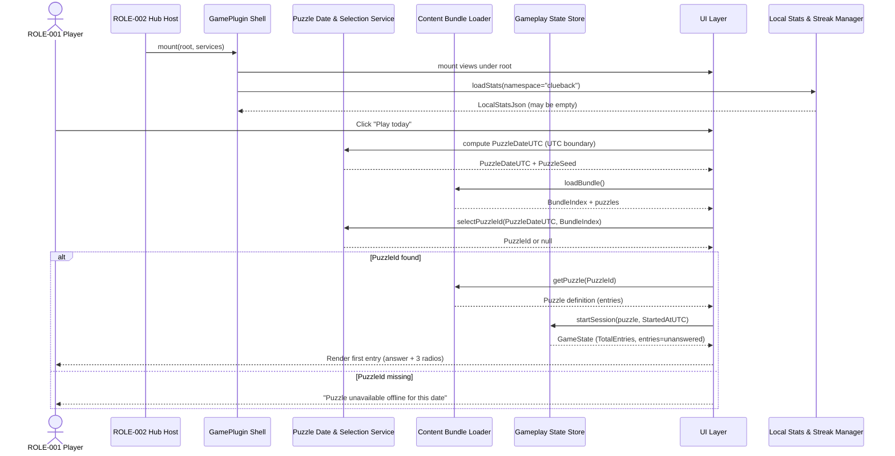
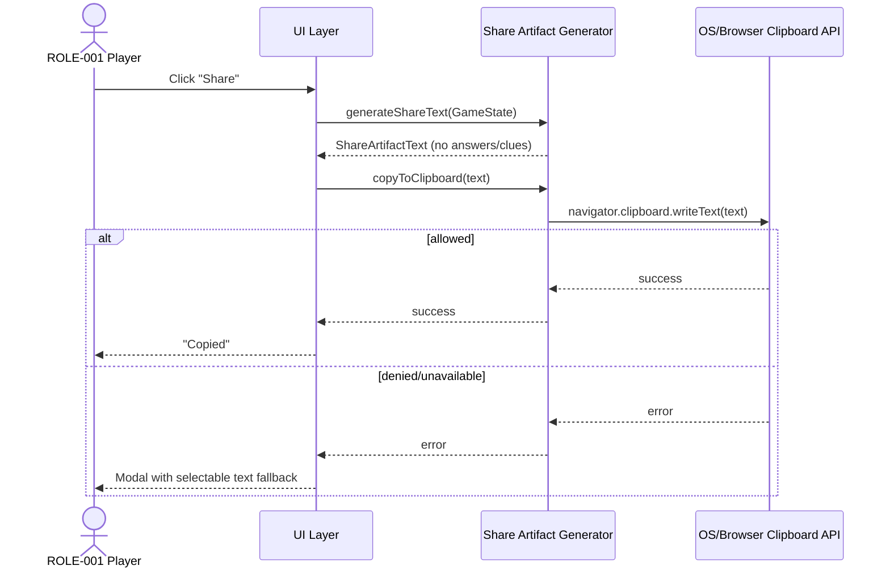
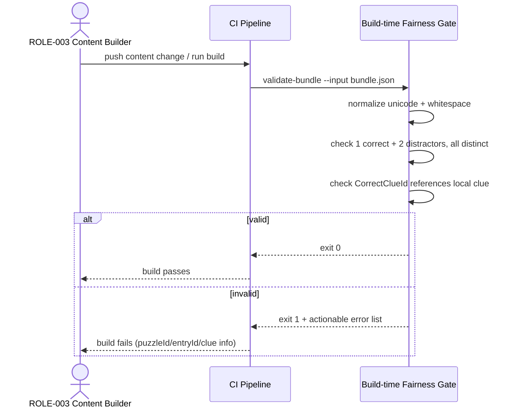
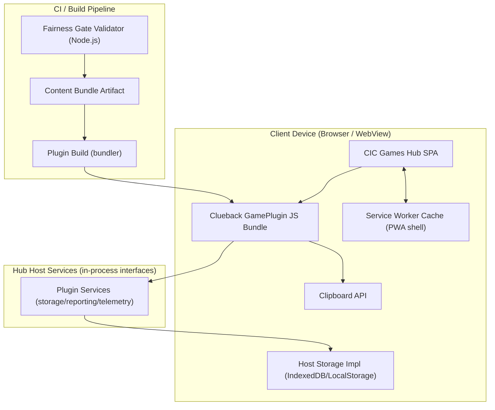

<!-- generated: 2026-07-25T20:11:26Z -->
<!-- mode: feature -->
<!-- feature-slug: clueback -->
<!-- a2a-endpoint: https://bob-sdlc-orchestrator.2as6l7wq9qj8.eu-gb.codeengine.appdomain.cloud/v1/rpc -->

# Glossary

## Terms

### TERM-001: Clueback
- **Definition:** A daily reverse-crossword game mode where the **grid is pre-filled with correct answers** and the player selects the **correct clue** for each answer from multiple candidates.
- **Synonyms:** reverse-crossword, answer-to-clue game
- **Anti-definition:** Not a traditional crossword (clues-to-answers). Not a generic trivia/clue quiz without crossword-style entries.
- **Source:** User request

### TERM-002: Daily Puzzle
- **Definition:** The deterministic puzzle instance generated/selected for a specific **UTC calendar date**.
- **Synonyms:** daily, today’s puzzle
- **Anti-definition:** Not based on local timezone or device time; not randomized per user.
- **Source:** User request

### TERM-003: UTC Day Boundary
- **Definition:** The day rollover rule where a new **TERM-002** becomes active at 00:00:00 UTC.
- **Synonyms:** UTC midnight boundary
- **Anti-definition:** Not user locale midnight; not server-region midnight.
- **Source:** User request

### TERM-004: Puzzle Seed
- **Definition:** A deterministic value derived from **FIELD-001 PuzzleDateUTC** used to select or generate the **TERM-002**.
- **Synonyms:** daily seed
- **Anti-definition:** Not entropy-based; not user-input-based.
- **Source:** User request

### TERM-005: Answer Entry
- **Definition:** A single crossword-style answer (entry) included in a **TERM-002**, consisting of the solved answer string and its clue candidates.
- **Synonyms:** entry, answer
- **Anti-definition:** Not an individual letter cell; not a clue by itself.
- **Source:** User request

### TERM-006: Correct Clue
- **Definition:** The single true clue that correctly corresponds to a given **TERM-005**.
- **Synonyms:** real clue, true clue
- **Anti-definition:** Not a distractor; not “best” by subjective preference.
- **Source:** User request

### TERM-007: Distractor Clue
- **Definition:** An incorrect clue option for a given **TERM-005**, intended to be plausible but not correct.
- **Synonyms:** decoy clue
- **Anti-definition:** Not duplicated across the same entry’s candidate set; not the correct clue.
- **Source:** User request

### TERM-008: Candidate Clue Set
- **Definition:** The group of clue options shown for a **TERM-005**, consisting of exactly one **TERM-006** and two **TERM-007**.
- **Synonyms:** options, multiple-choice clues
- **Anti-definition:** Not open text entry; not fewer or more than three options.
- **Source:** User request

### TERM-009: Selection
- **Definition:** The player’s chosen clue option (a single choice) for a given **TERM-005**.
- **Synonyms:** pick, answer selection
- **Anti-definition:** Not multi-select; not freeform input.
- **Source:** User request

### TERM-010: Score
- **Definition:** The count of **TERM-009** selections that match the **TERM-006** across all entries in the **TERM-002**.
- **Synonyms:** final tally
- **Anti-definition:** Not time-based scoring unless explicitly added; not weighted scoring.
- **Source:** User request

### TERM-011: Mistake Budget
- **Definition:** An optional constraint limiting the number of incorrect **TERM-009** selections allowed before ending or flagging the session.
- **Synonyms:** lives, strikes
- **Anti-definition:** Not required if the mode uses only a final tally.
- **Source:** User request

### TERM-012: Session
- **Definition:** A single playthrough attempt of a **TERM-002** on a device, from start/resume to completion.
- **Synonyms:** run
- **Anti-definition:** Not a multi-day streak; not an install lifecycle.
- **Source:** User request

### TERM-013: Daily Result
- **Definition:** The structured outcome reported by the game to the hub, containing at minimum date, score, and completion metadata for the **TERM-002**.
- **Synonyms:** result payload
- **Anti-definition:** Not raw gameplay logs; not containing answers/clues.
- **Source:** User request

### TERM-014: Spoiler-safe Share Artifact
- **Definition:** A shareable representation of performance that does **not reveal answers or clues**, showing per-entry correctness using squares/icons and text not reliant on color alone.
- **Synonyms:** share card, share text
- **Anti-definition:** Not a screenshot of answers; not including clue text.
- **Source:** User request

### TERM-015: Offline-first PWA
- **Definition:** A progressive web app that works without network connectivity once installed/loaded, using local storage/caching.
- **Synonyms:** offline-capable web app
- **Anti-definition:** Not requiring server calls during play.
- **Source:** User request

### TERM-016: Fully Client-side
- **Definition:** All gameplay logic and content necessary to play the **TERM-002** is available locally; no runtime API calls required for puzzle content or scoring.
- **Synonyms:** local-only gameplay
- **Anti-definition:** Not server-validated scoring; not remote content fetch required.
- **Source:** User request

### TERM-017: GamePlugin
- **Definition:** The CIC Games hub integration contract where the game is packaged as a plugin exposing `mount(root, services)` and using provided services for persistence/reporting.
- **Synonyms:** plugin, hub mini-game
- **Anti-definition:** Not a standalone app without hub services.
- **Source:** User request

### TERM-018: Plugin Services
- **Definition:** The host-provided interfaces passed into **TERM-017** for storage, navigation, telemetry, and reporting.
- **Synonyms:** host services
- **Anti-definition:** Not direct access to host internals beyond the interface.
- **Source:** User request

### TERM-019: Namespaced Local Stats
- **Definition:** Locally persisted statistics stored under a plugin-specific namespace to avoid collisions with other games.
- **Synonyms:** local stats, per-game stats
- **Anti-definition:** Not shared global stats across plugins unless explicitly aggregated by host.
- **Source:** User request

### TERM-020: Streak
- **Definition:** A count of consecutive **TERM-002** days completed (per UTC day) by a player on a given device/profile per namespace.
- **Synonyms:** daily streak
- **Anti-definition:** Not based on local timezone; not counting partial plays as completion.
- **Source:** User request

### TERM-021: Fairness Gate (Build-time)
- **Definition:** A build step that validates puzzle content rules: each **TERM-005** has exactly one **TERM-006**, and **TERM-007** are distinct within an entry.
- **Synonyms:** content validation, lint
- **Anti-definition:** Not a runtime-only check; not subjective “fun” evaluation.
- **Source:** User request

### TERM-022: Content Bundle
- **Definition:** The packaged dataset shipped with the client containing daily puzzles or generator inputs (answers + clues + distractors) used offline.
- **Synonyms:** embedded content, local dataset
- **Anti-definition:** Not fetched at runtime.
- **Source:** User request

### TERM-023: Carbon Web Components
- **Definition:** IBM Carbon Design System web components (e.g., `cds-button`, `cds-radio-button`) used to implement the UI.
- **Synonyms:** Carbon components, CDS components
- **Anti-definition:** Not custom lookalikes; not non-Carbon component libraries for primary controls.
- **Source:** User request

### TERM-024: Accessibility (WCAG 2.1 AA)
- **Definition:** Conformance targets including keyboard operability, visible focus, non-color-only state indication, and reduced motion handling.
- **Synonyms:** a11y
- **Anti-definition:** Not “best effort”; not optional.
- **Source:** User request

### TERM-025: Reduced Motion Preference
- **Definition:** The user agent setting `prefers-reduced-motion` that must reduce/disable non-essential animations.
- **Synonyms:** reduced motion
- **Anti-definition:** Not ignoring OS/browser preference.
- **Source:** User request

### TERM-026: Per-entry Feedback State
- **Definition:** The UI state for an **TERM-005** indicating unanswered, answered-correct, answered-incorrect, or locked (if applicable).
- **Synonyms:** status, correctness state
- **Anti-definition:** Not global-only feedback; not color-only encoding.
- **Source:** User request

### TERM-027: Deterministic Puzzle Selection
- **Definition:** The method for mapping **FIELD-001 PuzzleDateUTC** (via **TERM-004**) to exactly one puzzle definition in **TERM-022**.
- **Synonyms:** date-to-puzzle mapping
- **Anti-definition:** Not random by session; not dependent on network.
- **Source:** User request

## Data Dictionary

| ID | Name | Type | Format | Range | Units | Default | Nullable | PII | Source | Validation |
|---|---|---|---|---|---|---|---|---|---|---|
| FIELD-001 | PuzzleDateUTC | string | `YYYY-MM-DD` | valid UTC calendar date | n/a | computed at runtime | false | Non-PII | Client runtime clock | Must match regex `^\d{4}-\d{2}-\d{2}$` and represent a real date |
| FIELD-002 | PuzzleId | string | slug | `[a-z0-9\-_.]+` | n/a | derived from bundle | false | Non-PII | TERM-022 | Must be unique within TERM-022 |
| FIELD-003 | PuzzleSeed | string | `YYYY-MM-DD` or hash | non-empty | n/a | from FIELD-001 | false | Non-PII | Client runtime | Must be deterministically derived from FIELD-001 |
| FIELD-004 | EntryId | string | slug/uuid | non-empty | n/a | from bundle | false | Non-PII | TERM-022 | Unique within a puzzle |
| FIELD-005 | AnswerText | string | uppercase recommended | length 1..30 | letters/spaces | from bundle | false | Non-PII | TERM-022 | Must be non-empty; must not contain clue text |
| FIELD-006 | AnswerLength | integer | int | 1..30 | letters | derived | false | Non-PII | Client derived | Must equal sanitized length of FIELD-005 |
| FIELD-007 | CorrectClueId | string | slug/uuid | non-empty | n/a | from bundle | false | Non-PII | TERM-022 | Must reference a clue in this entry’s set |
| FIELD-008 | CorrectClueText | string | plain text | length 1..160 | chars | from bundle | false | Non-PII | TERM-022 | Must be distinct from distractors in same entry |
| FIELD-009 | DistractorClueText1 | string | plain text | length 1..160 | chars | from bundle | false | Non-PII | TERM-022 | Must not equal FIELD-008 or FIELD-010 |
| FIELD-010 | DistractorClueText2 | string | plain text | length 1..160 | chars | from bundle | false | Non-PII | TERM-022 | Must not equal FIELD-008 or FIELD-009 |
| FIELD-011 | CandidateClues | array(string) | length=3 | exactly 3 strings | n/a | derived | false | Non-PII | Client derived | Must contain FIELD-008 plus both distractors, all distinct |
| FIELD-012 | CandidateCluesOrder | array(int) | permutation | values {0,1,2} | n/a | runtime shuffle | false | Non-PII | Client runtime | Must be a permutation of indices; deterministic per day if required |
| FIELD-013 | SelectedClueIndex | integer | int | 0..2 | n/a | null | true | Non-PII | Client state | Must be null or within 0..2 |
| FIELD-014 | IsSelectionCorrect | boolean | boolean | true/false | n/a | null | true | Non-PII | Client derived | When FIELD-013 set, must equal comparison to correct clue index |
| FIELD-015 | EntryStatus | string | enum | `unanswered`,`answered_correct`,`answered_incorrect` | n/a | `unanswered` | false | Non-PII | Client state | Must be consistent with FIELD-013 and FIELD-014 |
| FIELD-016 | TotalEntries | integer | int | 1..200 | count | derived | false | Non-PII | Client derived | Must equal number of entries in puzzle |
| FIELD-017 | CorrectCount | integer | int | 0..FIELD-016 | count | 0 | false | Non-PII | Client derived | Must equal count of entries with FIELD-014=true |
| FIELD-018 | IncorrectCount | integer | int | 0..FIELD-016 | count | 0 | false | Non-PII | Client derived | Must equal count of entries with FIELD-014=false |
| FIELD-019 | MistakeBudget | integer | int | 0..FIELD-016 | mistakes | null | true | Non-PII | Config | If non-null, must be >=0 |
| FIELD-020 | MistakesRemaining | integer | int | 0..FIELD-019 | mistakes | null | true | Non-PII | Client derived | If FIELD-019 non-null, must be FIELD-019 - FIELD-018 (clamped at 0) |
| FIELD-021 | IsPuzzleComplete | boolean | boolean | true/false | n/a | false | false | Non-PII | Client derived | True when completion condition met (all answered or budget exhausted) |
| FIELD-022 | StartedAtUTC | string | ISO-8601 | datetime | n/a | set on start | false | Non-PII | Client runtime | Must parse as valid ISO date-time |
| FIELD-023 | CompletedAtUTC | string | ISO-8601 | datetime | n/a | null | true | Non-PII | Client runtime | If present, must be >= FIELD-022 |
| FIELD-024 | DurationMs | integer | int | 0..600000 | ms | derived | false | Non-PII | Client derived | Must equal (CompletedAt - StartedAt) when complete |
| FIELD-025 | ShareArtifactText | string | text | length 1..2000 | chars | derived | false | Non-PII | Client derived | Must not contain FIELD-005 or any clue texts |
| FIELD-026 | ShareArtifactGrid | string | text | pattern | squares/icons only | derived | false | Non-PII | Client derived | Must represent per-entry correctness without revealing answers/clues |
| FIELD-027 | PluginNamespace | string | slug | non-empty | n/a | `clueback` | false | Non-PII | Plugin constant | Must be stable across versions |
| FIELD-028 | LocalStatsJson | object | JSON | schema-defined | n/a | `{}` | false | Non-PII | Local storage | Must validate against stats schema |
| FIELD-029 | CurrentStreakCount | integer | int | 0..10000 | days | 0 | false | Non-PII | LocalStatsJson | Must be non-negative integer |
| FIELD-030 | LastCompletedPuzzleDateUTC | string | `YYYY-MM-DD` | valid date | n/a | null | true | Non-PII | LocalStatsJson | If set, must be valid date |
| FIELD-031 | BestScore | integer | int | 0..FIELD-016 | count | 0 | false | Non-PII | LocalStatsJson | Must be within valid score range |
| FIELD-032 | DailyResultPayload | object | JSON | schema-defined | n/a | derived | false | Non-PII | Client derived | Must exclude answers/clues; must include FIELD-001, FIELD-002, FIELD-017, FIELD-016 |
| FIELD-033 | TelemetryEventName | string | enum | `puzzle_start`,`entry_select`,`puzzle_complete`,`share_copy` | n/a | n/a | false | Non-PII | Plugin | Must be one of enumerated values |
| FIELD-034 | A11yReducedMotion | boolean | boolean | true/false | n/a | from UA | false | Non-PII | User agent | Must reflect `prefers-reduced-motion` |
| FIELD-035 | UiFocusVisible | boolean | boolean | true/false | n/a | true | false | Non-PII | UI | Must be true for keyboard interactions |

# User Journeys

## Roles

| Role ID | Role | Type | Description |
|---|---|---|---|
| ROLE-001 | Player | Primary | Plays **TERM-001** daily puzzle, selects clues, views results, shares **TERM-014** |
| ROLE-002 | Hub Host | System | Embeds **TERM-017**, provides **TERM-018**, receives **TERM-013** |
| ROLE-003 | Content Builder | Admin/Dev | Maintains **TERM-022** and runs **TERM-021** during build |
| ROLE-004 | OS/Browser | System | Provides offline cache, storage, `prefers-reduced-motion` (**TERM-025**) and accessibility APIs |

## Entry Points

| Entry ID | Location | Trigger | Auth |
|---|---|---|---|
| ENTRY-001 | GamePlugin `mount(root, services)` | Hub loads plugin route | Host-controlled (implicit) |
| ENTRY-002 | In-game “Play today” button (Carbon `cds-button`) | Player click/keyboard activate | none |
| ENTRY-003 | Resume state on app reopen | Player returns to hub/game | none |
| ENTRY-004 | Share button (Carbon `cds-button`) | Player activates share | none |
| ENTRY-005 | Build pipeline content validation | CI/build step | dev/admin |

## Role Permission Matrix

| Capability | ROLE-001 Player | ROLE-002 Hub Host | ROLE-003 Content Builder | ROLE-004 OS/Browser |
|---|---:|---:|---:|---:|
| Start/resume **TERM-002** | Yes | No | No | No |
| Select **TERM-009** for **TERM-005** | Yes | No | No | No |
| Persist **TERM-019/TERM-020** stats | Yes (via services) | Provides storage | No | Provides storage mechanism |
| Receive **TERM-013** (**FIELD-032**) | No | Yes | No | No |
| Generate/ship **TERM-022** | No | No | Yes | No |
| Enforce **TERM-021** | No | No | Yes | No |
| Provide a11y settings (reduced motion) | No | No | No | Yes |

## Journeys

### JOURNEY-001: Launch and load today’s deterministic puzzle
- **Role/Goal:** ROLE-001 Player; load **TERM-002** for **TERM-003** and begin **TERM-012**
- **Entry:** ENTRY-001 (mount) then ENTRY-002
- **Happy path:**
  1. Plugin initializes **TERM-017** with `mount(root, services)` and stores **FIELD-027 PluginNamespace**.  
     Data: **FIELD-027**
  2. Client computes **FIELD-001 PuzzleDateUTC** from UTC clock and derives **TERM-004** into **FIELD-003 PuzzleSeed**.  
     Data: **FIELD-001**, **FIELD-003**
  3. Client selects **FIELD-002 PuzzleId** via **TERM-027** from **TERM-022 Content Bundle**.  
     Data: **FIELD-002**
  4. Client loads puzzle entries list; sets **FIELD-016 TotalEntries**; initializes per-entry **FIELD-015 EntryStatus** to `unanswered`.  
     Data: **FIELD-016**, **FIELD-015**
  5. Client sets **FIELD-022 StartedAtUTC** and renders first **TERM-005** with **TERM-008** (3 radio options using **TERM-023**).  
     Data: **FIELD-022**, **FIELD-011**, **FIELD-012**
- **BRANCH-001 (existing completion for today):** If local stats indicate **FIELD-030 LastCompletedPuzzleDateUTC == FIELD-001**, show results view and share option; allow review-only.
- **ERROR-001 (content missing):** Trigger: **FIELD-002** not found in **TERM-022**. Response: show “Puzzle unavailable offline for this date” and disable play. Recovery: update app/content (outside scope) or pick nearest available date (if permitted).
- **EDGE-001 (device time skew):** If UTC time cannot be determined reliably, use system UTC anyway; display **FIELD-001** explicitly so user can see which day is loaded.
- **EDGE-002 (offline):** Must succeed without network; all steps use **TERM-022** and local storage only.

### JOURNEY-002: Make a clue selection for an answer entry (keyboard-operable)
- **Role/Goal:** ROLE-001 Player; choose the correct **TERM-006** among **TERM-008**
- **Entry:** ENTRY-002 (in-play)
- **Happy path:**
  1. For the current **TERM-005**, UI displays **FIELD-005 AnswerText** and three radio options (**TERM-023** `cds-radio-button`) for **FIELD-011 CandidateClues**.  
     Data: **FIELD-005**, **FIELD-011**
  2. Player navigates options via keyboard (arrow/tab) and selects one option, setting **FIELD-013 SelectedClueIndex**.  
     Data: **FIELD-013**
  3. Client computes **FIELD-014 IsSelectionCorrect** by comparing selection to **FIELD-007 CorrectClueId** / correct index mapping; sets **FIELD-015 EntryStatus** accordingly.  
     Data: **FIELD-014**, **FIELD-015**, **FIELD-007**
  4. Client updates running **FIELD-017 CorrectCount** and **FIELD-018 IncorrectCount**.  
     Data: **FIELD-017**, **FIELD-018**
  5. UI conveys correctness with icon/text (not color-only) and preserves visible focus (**FIELD-035**).  
     Data: **FIELD-015**, **FIELD-035**
- **BRANCH-002 (mistake budget enabled):** If **FIELD-019 MistakeBudget** is non-null, after an incorrect selection update **FIELD-020 MistakesRemaining**.
- **ERROR-002 (invalid selection index):** Trigger: attempted set **FIELD-013** outside 0..2. Response: ignore update and log telemetry. Recovery: user reselects.
- **EDGE-003 (double-submit):** Rapid repeated selection input must not increment **FIELD-017/018** more than once for the same entry once locked/answered.
- **EDGE-004 (reduced motion):** If **FIELD-034 A11yReducedMotion=true**, any feedback animation must be disabled or reduced.

### JOURNEY-003: Complete puzzle and view results
- **Role/Goal:** ROLE-001 Player; finish **TERM-012** and see **TERM-010**
- **Entry:** In-play continuation
- **Happy path:**
  1. After each entry, player advances through remaining entries until completion condition is met.  
     Data: **FIELD-015**, **FIELD-016**
  2. Client sets **FIELD-021 IsPuzzleComplete=true**, sets **FIELD-023 CompletedAtUTC**, and computes **FIELD-024 DurationMs**.  
     Data: **FIELD-021**, **FIELD-023**, **FIELD-024**
  3. Client renders results screen showing **FIELD-017 CorrectCount** out of **FIELD-016 TotalEntries** and optional mistakes remaining.  
     Data: **FIELD-017**, **FIELD-016**, **FIELD-020**
  4. Client updates **FIELD-028 LocalStatsJson**: **FIELD-029 CurrentStreakCount**, **FIELD-030 LastCompletedPuzzleDateUTC**, **FIELD-031 BestScore**.  
     Data: **FIELD-028..031**, **FIELD-001**
  5. Client creates **FIELD-032 DailyResultPayload** and reports **TERM-013** to hub via **TERM-018**.  
     Data: **FIELD-032**
- **BRANCH-003 (completion by all answered):** Completion triggers when all **FIELD-015** are not `unanswered`.
- **BRANCH-004 (completion by budget exhausted):** If **FIELD-019** enabled, completion triggers when **FIELD-020==0** after an incorrect selection.
- **ERROR-003 (storage write failure):** Trigger: local stats cannot be persisted. Response: continue showing results; show non-blocking warning. Recovery: retry on next app focus.
- **EDGE-005 (concurrency across tabs):** If two sessions complete same **FIELD-001** concurrently, last write wins but must not corrupt JSON; streak computation must remain valid.

### JOURNEY-004: Create and share spoiler-safe artifact
- **Role/Goal:** ROLE-001 Player; share performance without spoilers (**TERM-014**)
- **Entry:** ENTRY-004
- **Happy path:**
  1. Player activates “Share” (`cds-button`) on results screen.
  2. Client generates **FIELD-026 ShareArtifactGrid** representing per-entry correctness using squares/icons and includes **FIELD-001 PuzzleDateUTC** and **FIELD-017/016** summary in **FIELD-025 ShareArtifactText**.  
     Data: **FIELD-026**, **FIELD-025**, **FIELD-001**, **FIELD-017**, **FIELD-016**
  3. Client copies **FIELD-025** to clipboard or invokes native share if available.
- **ERROR-004 (clipboard denied):** Trigger: clipboard API not available/denied. Response: show modal with selectable text for manual copy. Recovery: user selects and copies.
- **EDGE-006 (spoiler leakage):** Artifact must not include **FIELD-005 AnswerText** or any clue text (**FIELD-008..010**).

### JOURNEY-005: Build-time fairness gate validation
- **Role/Goal:** ROLE-003 Content Builder; ensure **TERM-022** meets **TERM-021**
- **Entry:** ENTRY-005
- **Happy path:**
  1. Build loads each puzzle and each **TERM-005** entry.
  2. Build verifies each entry has exactly one **TERM-006** and exactly two **TERM-007**; all three clue texts are distinct.  
     Data: **FIELD-008..011**
  3. Build verifies mapping references are valid (**FIELD-007 CorrectClueId** points to the correct clue in that entry).  
     Data: **FIELD-007**
  4. Build fails with actionable error output if any check fails.
- **ERROR-005 (duplicate distractor):** Trigger: **FIELD-009 == FIELD-010**. Response: fail build with entry id reference.
- **EDGE-007 (unicode normalization):** Distinctness checks must normalize whitespace and Unicode to avoid visually identical duplicates.

## Journey Map

```mermaid
flowchart TD
  A[ENTRY-001 mount(root, services)] --> B[Compute FIELD-001 PuzzleDateUTC]
  B --> C[Select FIELD-002 PuzzleId via TERM-027]
  C --> D[Render entries + radios (TERM-023)]
  D --> E[Player sets FIELD-013 SelectedClueIndex]
  E --> F[Compute FIELD-014 IsSelectionCorrect + update FIELD-017/018]
  F --> G{Completion condition}
  G -->|All answered| H[Set FIELD-021 true + compute duration]
  G -->|Budget exhausted (FIELD-020==0)| H
  H --> I[Persist FIELD-028 LocalStatsJson + streak]
  I --> J[Report FIELD-032 DailyResultPayload to host]
  J --> K[Generate FIELD-025/026 share artifact]
```

# Requirements

### REQ-001: Initialize Clueback plugin
- **EARS Pattern:** Event-Driven
- **EARS Statement:** When the hub calls **TERM-017** `mount(root, services)`, the system shall initialize the game under **FIELD-027 PluginNamespace**.
- **Inputs:** `root`, **TERM-018 Plugin Services**
- **Outputs:** Mounted UI rooted at `root`
- **Preconditions:** ENTRY-001 invoked by ROLE-002
- **Postconditions:** Plugin ready to load **TERM-002**
- **Invariants:** Namespace remains constant for the session
- **Trigger:** `mount(root, services)`
- **Actor:** ROLE-002 Hub Host
- **EntityScope:** **TERM-017 GamePlugin**
- **ErrorModes:** None
- **NFR-Tags:** compatibility
- **Source:** JOURNEY-001 step 1
- **Dependencies:** None
- **Priority:** P0
- **AcceptanceCriteria:**
  - **TEST-001:** Given a host calls `mount`, when the plugin renders, then **FIELD-027** equals `clueback`.
  - **TEST-002:** Given `mount` is called, when rendering completes, then the root element contains interactive Carbon components (**TERM-023**).
- **Assumptions:** Host provides a stable DOM root
- **OpenQuestions:** None

### REQ-002: Compute puzzle date using UTC
- **EARS Pattern:** Event-Driven
- **EARS Statement:** When a **TERM-002 Daily Puzzle** is loaded, the system shall compute **FIELD-001 PuzzleDateUTC** using the **TERM-003 UTC Day Boundary**.
- **Inputs:** Device clock
- **Outputs:** **FIELD-001**
- **Preconditions:** Plugin initialized
- **Postconditions:** Date is available for deterministic selection
- **Invariants:** **FIELD-001** format remains `YYYY-MM-DD`
- **Trigger:** Load daily puzzle
- **Actor:** ROLE-001 Player
- **EntityScope:** **TERM-002 Daily Puzzle**
- **ErrorModes:** ERROR-001 content missing (downstream)
- **NFR-Tags:** compatibility
- **Source:** JOURNEY-001 step 2
- **Dependencies:** REQ-001
- **Priority:** P0
- **AcceptanceCriteria:**
  - **TEST-003:** Given system time `2026-07-25T23:59:59Z`, when loading, then **FIELD-001** is `2026-07-25`.
  - **TEST-004:** Given system time `2026-07-26T00:00:00Z`, when loading, then **FIELD-001** is `2026-07-26`.
- **Assumptions:** Device provides UTC time
- **OpenQuestions:** None

### REQ-003: Select deterministic daily puzzle from content bundle
- **EARS Pattern:** Event-Driven
- **EARS Statement:** When **FIELD-001 PuzzleDateUTC** is available, the system shall select exactly one **FIELD-002 PuzzleId** from **TERM-022 Content Bundle** using **TERM-027 Deterministic Puzzle Selection**.
- **Inputs:** **FIELD-001**
- **Outputs:** **FIELD-002**
- **Preconditions:** Content bundle present locally
- **Postconditions:** Puzzle id selected
- **Invariants:** Same **FIELD-001** yields same **FIELD-002** on same content bundle version
- **Trigger:** Puzzle date computed
- **Actor:** ROLE-001 Player
- **EntityScope:** **TERM-022 Content Bundle**
- **ErrorModes:** ERROR-001 content missing
- **NFR-Tags:** offline
- **Source:** JOURNEY-001 step 3
- **Dependencies:** REQ-002
- **Priority:** P0
- **AcceptanceCriteria:**
  - **TEST-005:** Given a fixed bundle and **FIELD-001**, when selecting, then **FIELD-002** is stable across app restarts.
  - **TEST-006:** Given two different **FIELD-001** values, when selecting, then **FIELD-002** values are not required to differ but must each resolve to one valid puzzle.
- **Assumptions:** Bundle contains a mapping or index usable offline
- **OpenQuestions:** Is the mapping a simple modulo over puzzle list, or a direct date-keyed lookup?

### REQ-004: Render answer entries with three candidate clues
- **EARS Pattern:** Event-Driven
- **EARS Statement:** When a **TERM-005 Answer Entry** is displayed, the system shall render **FIELD-005 AnswerText** and **FIELD-011 CandidateClues** as exactly three radio options using **TERM-023 Carbon Web Components**.
- **Inputs:** **FIELD-005**, **FIELD-011**
- **Outputs:** Entry UI
- **Preconditions:** Puzzle loaded
- **Postconditions:** Player can select one option
- **Invariants:** Candidate clue count equals 3
- **Trigger:** Entry render
- **Actor:** ROLE-001 Player
- **EntityScope:** **TERM-005 Answer Entry**
- **ErrorModes:** None
- **NFR-Tags:** accessibility, compatibility
- **Source:** JOURNEY-002 step 1
- **Dependencies:** REQ-003
- **Priority:** P0
- **AcceptanceCriteria:**
  - **TEST-007:** Given an entry, when rendered, then exactly 3 `cds-radio-button` options are present.
  - **TEST-008:** Given the rendered entry, when inspecting the DOM, then a Carbon `cds-button` is used for primary actions (next/submit where applicable).
- **Assumptions:** Carbon components are available in the host environment
- **OpenQuestions:** Is the selection committed immediately on click, or is there a separate “Confirm” action?

### REQ-005: Record single selection per entry
- **EARS Pattern:** Event-Driven
- **EARS Statement:** When the player selects a clue option, the system shall set **FIELD-013 SelectedClueIndex** for that **TERM-005 Answer Entry**.
- **Inputs:** UI selection index
- **Outputs:** Updated per-entry state
- **Preconditions:** Entry displayed
- **Postconditions:** Selection stored
- **Invariants:** **FIELD-013** is null or within 0..2
- **Trigger:** Selection event
- **Actor:** ROLE-001 Player
- **EntityScope:** **TERM-005 Answer Entry**
- **ErrorModes:** ERROR-002 invalid selection index
- **NFR-Tags:** accessibility
- **Source:** JOURNEY-002 step 2
- **Dependencies:** REQ-004
- **Priority:** P0
- **AcceptanceCriteria:**
  - **TEST-009:** Given an entry, when the player selects option 1, then **FIELD-013** becomes `1`.
  - **TEST-010:** Given an entry, when an invalid index is dispatched, then **FIELD-013** remains unchanged.
- **Assumptions:** Options are indexed consistently with **FIELD-012**
- **OpenQuestions:** Do we lock after first selection (no change allowed), or allow changes until advancing?

### REQ-006: Compute correctness for a selection
- **EARS Pattern:** Event-Driven
- **EARS Statement:** When **FIELD-013 SelectedClueIndex** is set, the system shall compute **FIELD-014 IsSelectionCorrect** for that **TERM-005 Answer Entry**.
- **Inputs:** **FIELD-013**, correct clue mapping (**FIELD-007**)
- **Outputs:** **FIELD-014**
- **Preconditions:** Entry has a correct clue definition
- **Postconditions:** Correctness derived
- **Invariants:** **FIELD-014** is null only when **FIELD-013** is null
- **Trigger:** Selection recorded
- **Actor:** ROLE-001 Player
- **EntityScope:** **TERM-005 Answer Entry**
- **ErrorModes:** None
- **NFR-Tags:** none
- **Source:** JOURNEY-002 step 3
- **Dependencies:** REQ-005
- **Priority:** P0
- **AcceptanceCriteria:**
  - **TEST-011:** Given a selection that matches the correct clue, when computed, then **FIELD-014** is `true`.
  - **TEST-012:** Given a selection that does not match, when computed, then **FIELD-014** is `false`.
- **Assumptions:** Correct clue identity is well-defined in content
- **OpenQuestions:** Is correctness based on text match or id match? (Recommended: id)

### REQ-007: Set per-entry feedback status
- **EARS Pattern:** Event-Driven
- **EARS Statement:** When **FIELD-014 IsSelectionCorrect** is computed, the system shall set **FIELD-015 EntryStatus** to `answered_correct` or `answered_incorrect`.
- **Inputs:** **FIELD-014**
- **Outputs:** **FIELD-015**
- **Preconditions:** Selection made
- **Postconditions:** Entry status updated
- **Invariants:** `unanswered` only when **FIELD-013** is null
- **Trigger:** Correctness computed
- **Actor:** ROLE-001 Player
- **EntityScope:** **TERM-026 Per-entry Feedback State**
- **ErrorModes:** None
- **NFR-Tags:** accessibility
- **Source:** JOURNEY-002 step 3
- **Dependencies:** REQ-006
- **Priority:** P0
- **AcceptanceCriteria:**
  - **TEST-013:** Given **FIELD-014=true**, when updating, then **FIELD-015** is `answered_correct`.
  - **TEST-014:** Given **FIELD-014=false**, when updating, then **FIELD-015** is `answered_incorrect`.
- **Assumptions:** Status is displayed in UI
- **OpenQuestions:** None

### REQ-008: Update running score counters
- **EARS Pattern:** Event-Driven
- **EARS Statement:** When **FIELD-015 EntryStatus** changes from `unanswered`, the system shall update **FIELD-017 CorrectCount**.
- **Inputs:** Per-entry statuses
- **Outputs:** **FIELD-017**
- **Preconditions:** At least one entry answered
- **Postconditions:** CorrectCount accurate
- **Invariants:** 0 ≤ **FIELD-017** ≤ **FIELD-016**
- **Trigger:** Entry answered
- **Actor:** ROLE-001 Player
- **EntityScope:** **TERM-010 Score**
- **ErrorModes:** EDGE-003 double-submit (prevent overcount)
- **NFR-Tags:** none
- **Source:** JOURNEY-002 step 4
- **Dependencies:** REQ-007
- **Priority:** P0
- **AcceptanceCriteria:**
  - **TEST-015:** Given two correct entries, when both answered, then **FIELD-017** equals 2.
  - **TEST-016:** Given an entry receives duplicate selection events after answered, when events occur, then **FIELD-017** does not increase.
- **Assumptions:** Counts derived from status rather than increment-only
- **OpenQuestions:** None

### REQ-009: Update running incorrect counter
- **EARS Pattern:** Event-Driven
- **EARS Statement:** When **FIELD-015 EntryStatus** changes from `unanswered`, the system shall update **FIELD-018 IncorrectCount**.
- **Inputs:** Per-entry statuses
- **Outputs:** **FIELD-018**
- **Preconditions:** At least one entry answered
- **Postconditions:** IncorrectCount accurate
- **Invariants:** 0 ≤ **FIELD-018** ≤ **FIELD-016**
- **Trigger:** Entry answered
- **Actor:** ROLE-001 Player
- **EntityScope:** **TERM-010 Score**
- **ErrorModes:** EDGE-003 double-submit (prevent overcount)
- **NFR-Tags:** none
- **Source:** JOURNEY-002 step 4
- **Dependencies:** REQ-007
- **Priority:** P0
- **AcceptanceCriteria:**
  - **TEST-017:** Given one incorrect entry, when answered, then **FIELD-018** equals 1.
  - **TEST-018:** Given a duplicate selection event for an already-answered entry, when fired, then **FIELD-018** does not increase.
- **Assumptions:** Counts derived from status rather than increment-only
- **OpenQuestions:** None

### REQ-010: Compute mistake budget remaining (optional)
- **EARS Pattern:** State-Driven
- **EARS Statement:** While **FIELD-019 MistakeBudget** is not null, the system shall compute **FIELD-020 MistakesRemaining**.
- **Inputs:** **FIELD-019**, **FIELD-018**
- **Outputs:** **FIELD-020**
- **Preconditions:** Budget configured
- **Postconditions:** Remaining mistakes visible/usable
- **Invariants:** 0 ≤ **FIELD-020** ≤ **FIELD-019**
- **Trigger:** Any change to incorrect count
- **Actor:** ROLE-001 Player
- **EntityScope:** **TERM-011 Mistake Budget**
- **ErrorModes:** None
- **NFR-Tags:** none
- **Source:** JOURNEY-002 BRANCH-002
- **Dependencies:** REQ-009
- **Priority:** P1
- **AcceptanceCriteria:**
  - **TEST-019:** Given **FIELD-019=3** and **FIELD-018=1**, then **FIELD-020=2**.
  - **TEST-020:** Given **FIELD-018 > FIELD-019**, then **FIELD-020=0**.
- **Assumptions:** Budget mode may be off by default
- **OpenQuestions:** Is **FIELD-019** always null (tally-only) for v1?

### REQ-011: Determine puzzle completion by all answered
- **EARS Pattern:** Event-Driven
- **EARS Statement:** When all **TERM-005 Answer Entry** items have **FIELD-015 EntryStatus** not equal to `unanswered`, the system shall set **FIELD-021 IsPuzzleComplete** to true.
- **Inputs:** All entry statuses
- **Outputs:** **FIELD-021**
- **Preconditions:** Puzzle loaded
- **Postconditions:** Completion state set
- **Invariants:** Completion remains true once set for the session
- **Trigger:** Entry status update
- **Actor:** ROLE-001 Player
- **EntityScope:** **TERM-002 Daily Puzzle**
- **ErrorModes:** None
- **NFR-Tags:** none
- **Source:** JOURNEY-003 BRANCH-003
- **Dependencies:** REQ-007
- **Priority:** P0
- **AcceptanceCriteria:**
  - **TEST-021:** Given all entries answered, when the last one is answered, then **FIELD-021** becomes true.
- **Assumptions:** Entry count is finite and known (**FIELD-016**)
- **OpenQuestions:** None

### REQ-012: Determine puzzle completion by budget exhaustion (optional)
- **EARS Pattern:** Event-Driven
- **EARS Statement:** When **FIELD-020 MistakesRemaining** equals 0, the system shall set **FIELD-021 IsPuzzleComplete** to true.
- **Inputs:** **FIELD-020**
- **Outputs:** **FIELD-021**
- **Preconditions:** Budget mode enabled
- **Postconditions:** Puzzle completes early
- **Invariants:** Completion remains true once set for the session
- **Trigger:** MistakesRemaining update
- **Actor:** ROLE-001 Player
- **EntityScope:** **TERM-002 Daily Puzzle**
- **ErrorModes:** None
- **NFR-Tags:** none
- **Source:** JOURNEY-003 BRANCH-004
- **Dependencies:** REQ-010
- **Priority:** P1
- **AcceptanceCriteria:**
  - **TEST-022:** Given **FIELD-019=1**, when the first incorrect answer occurs, then **FIELD-021** becomes true.
- **Assumptions:** Early completion is desired in budget mode
- **OpenQuestions:** Should unanswered entries be auto-marked incorrect on early completion?

### REQ-013: Capture completion timestamps and duration
- **EARS Pattern:** Event-Driven
- **EARS Statement:** When **FIELD-021 IsPuzzleComplete** becomes true, the system shall set **FIELD-023 CompletedAtUTC**.
- **Inputs:** Completion event
- **Outputs:** **FIELD-023**
- **Preconditions:** **FIELD-022 StartedAtUTC** exists
- **Postconditions:** Completion time recorded
- **Invariants:** **FIELD-023** ≥ **FIELD-022**
- **Trigger:** Puzzle completion
- **Actor:** ROLE-001 Player
- **EntityScope:** **TERM-012 Session**
- **ErrorModes:** None
- **NFR-Tags:** observability
- **Source:** JOURNEY-003 step 2
- **Dependencies:** REQ-011
- **Priority:** P0
- **AcceptanceCriteria:**
  - **TEST-023:** Given a started session, when completed, then **FIELD-023** is set and parses as ISO-8601.
- **Assumptions:** StartedAt is set at session start
- **OpenQuestions:** None

### REQ-014: Compute duration in milliseconds
- **EARS Pattern:** Event-Driven
- **EARS Statement:** When **FIELD-023 CompletedAtUTC** is set, the system shall compute **FIELD-024 DurationMs**.
- **Inputs:** **FIELD-022**, **FIELD-023**
- **Outputs:** **FIELD-024**
- **Preconditions:** Start and completion timestamps exist
- **Postconditions:** Duration available for stats/result
- **Invariants:** **FIELD-024** ≥ 0
- **Trigger:** Completion timestamp set
- **Actor:** ROLE-001 Player
- **EntityScope:** **TERM-012 Session**
- **ErrorModes:** None
- **NFR-Tags:** none
- **Source:** JOURNEY-003 step 2
- **Dependencies:** REQ-013
- **Priority:** P1
- **AcceptanceCriteria:**
  - **TEST-024:** Given start and complete times 10s apart, then **FIELD-024** equals 10000 ± 50ms.
- **Assumptions:** Timer resolution may vary by platform
- **OpenQuestions:** None

### REQ-015: Persist namespaced local stats
- **EARS Pattern:** Event-Driven
- **EARS Statement:** When a puzzle is completed, the system shall persist **FIELD-028 LocalStatsJson** under **FIELD-027 PluginNamespace**.
- **Inputs:** Completion state, score fields
- **Outputs:** Stored stats
- **Preconditions:** Storage available via **TERM-018**
- **Postconditions:** Stats available on next load
- **Invariants:** Stored JSON remains parseable
- **Trigger:** Puzzle completion
- **Actor:** ROLE-001 Player
- **EntityScope:** **TERM-019 Namespaced Local Stats**
- **ErrorModes:** ERROR-003 storage write failure
- **NFR-Tags:** offline, reliability
- **Source:** JOURNEY-003 step 4
- **Dependencies:** REQ-013
- **Priority:** P0
- **AcceptanceCriteria:**
  - **TEST-025:** Given completion, when reopening the game, then **FIELD-028** loads and includes updated **FIELD-030**.
  - **TEST-026:** Given storage failure, when completing, then results still display and a warning is shown.
- **Assumptions:** Host services expose a persistent store
- **OpenQuestions:** Exact storage API shape of **TERM-018**?

### REQ-016: Update streak using UTC dates
- **EARS Pattern:** Event-Driven
- **EARS Statement:** When **FIELD-030 LastCompletedPuzzleDateUTC** is updated, the system shall compute **FIELD-029 CurrentStreakCount** using **TERM-003 UTC Day Boundary**.
- **Inputs:** **FIELD-001**, prior **FIELD-030**, prior **FIELD-029**
- **Outputs:** **FIELD-029**
- **Preconditions:** Completion occurred
- **Postconditions:** Streak updated
- **Invariants:** Streak is non-negative integer
- **Trigger:** Stats update
- **Actor:** ROLE-001 Player
- **EntityScope:** **TERM-020 Streak**
- **ErrorModes:** None
- **NFR-Tags:** none
- **Source:** JOURNEY-003 step 4
- **Dependencies:** REQ-015
- **Priority:** P1
- **AcceptanceCriteria:**
  - **TEST-027:** Given last completed date is yesterday (UTC), when completing today, then streak increments by 1.
  - **TEST-028:** Given last completed date is older than yesterday, when completing today, then streak becomes 1.
- **Assumptions:** Single completion per UTC day counts
- **OpenQuestions:** If player replays after completion, does it affect streak? (Recommended: no)

### REQ-017: Report daily result to hub host
- **EARS Pattern:** Event-Driven
- **EARS Statement:** When a puzzle is completed, the system shall submit **FIELD-032 DailyResultPayload** to the hub via **TERM-018 Plugin Services**.
- **Inputs:** **FIELD-032**
- **Outputs:** Host receives result
- **Preconditions:** Completion occurred
- **Postconditions:** Result reported once per day per device/session
- **Invariants:** Payload contains no answers or clue texts
- **Trigger:** Puzzle completion
- **Actor:** ROLE-001 Player
- **EntityScope:** **TERM-013 Daily Result**
- **ErrorModes:** ERROR-003 storage write failure (non-blocking); reporting failure handled locally (retry policy in NFR)
- **NFR-Tags:** auditability, privacy
- **Source:** JOURNEY-003 step 5
- **Dependencies:** REQ-013
- **Priority:** P0
- **AcceptanceCriteria:**
  - **TEST-029:** Given completion, when reporting, then **FIELD-032** includes **FIELD-001**, **FIELD-002**, **FIELD-017**, **FIELD-016**.
  - **TEST-030:** Given completion, when inspecting payload, then it does not include **FIELD-005** or **FIELD-008..010**.
- **Assumptions:** Host provides a result reporting method
- **OpenQuestions:** Required schema keys beyond the minimum?

### REQ-018: Generate spoiler-safe share artifact
- **EARS Pattern:** Event-Driven
- **EARS Statement:** When the player activates Share, the system shall generate **FIELD-025 ShareArtifactText**.
- **Inputs:** Results state
- **Outputs:** **FIELD-025**
- **Preconditions:** Puzzle completed
- **Postconditions:** Text ready for clipboard/share
- **Invariants:** Text excludes **FIELD-005** and clue texts (**FIELD-008..010**)
- **Trigger:** Share activation
- **Actor:** ROLE-001 Player
- **EntityScope:** **TERM-014 Spoiler-safe Share Artifact**
- **ErrorModes:** None
- **NFR-Tags:** privacy
- **Source:** JOURNEY-004 step 2
- **Dependencies:** REQ-013
- **Priority:** P0
- **AcceptanceCriteria:**
  - **TEST-031:** Given a completed puzzle, when generating, then **FIELD-025** includes **FIELD-001** and the `correct/total` summary.
  - **TEST-032:** Given generated **FIELD-025**, when searching, then it contains no substring equal to any **FIELD-005** or **FIELD-008..010**.
- **Assumptions:** Share format is text-based
- **OpenQuestions:** Desired exact share template?

### REQ-019: Copy share artifact to clipboard with fallback
- **EARS Pattern:** Event-Driven
- **EARS Statement:** When Share is activated, the system shall copy **FIELD-025 ShareArtifactText** to the clipboard.
- **Inputs:** **FIELD-025**
- **Outputs:** Clipboard content
- **Preconditions:** Share artifact generated
- **Postconditions:** Player can paste share text
- **Invariants:** Clipboard write occurs at most once per activation
- **Trigger:** Share activation
- **Actor:** ROLE-001 Player
- **EntityScope:** **TERM-014 Spoiler-safe Share Artifact**
- **ErrorModes:** ERROR-004 clipboard denied
- **NFR-Tags:** compatibility
- **Source:** JOURNEY-004 step 3; ERROR-004
- **Dependencies:** REQ-018
- **Priority:** P1
- **AcceptanceCriteria:**
  - **TEST-033:** Given clipboard allowed, when Share is clicked, then clipboard equals **FIELD-025**.
  - **TEST-034:** Given clipboard denied, when Share is clicked, then a modal displays **FIELD-025** for manual copy.
- **Assumptions:** Clipboard API availability varies by platform
- **OpenQuestions:** Should we support native share sheet on iOS/Android wrapper?

### REQ-020: Enforce build-time fairness gate for clue distinctness
- **EARS Pattern:** Event-Driven
- **EARS Statement:** When the build validates **TERM-022 Content Bundle**, the system shall fail the build if any **TERM-005 Answer Entry** has non-distinct clue texts within **FIELD-011 CandidateClues**.
- **Inputs:** Content bundle
- **Outputs:** Pass/fail build
- **Preconditions:** CI/build running
- **Postconditions:** Bundle accepted or rejected
- **Invariants:** Distinctness uses normalization per EDGE-007
- **Trigger:** Build validation run
- **Actor:** ROLE-003 Content Builder
- **EntityScope:** **TERM-021 Fairness Gate**
- **ErrorModes:** ERROR-005 duplicate distractor
- **NFR-Tags:** quality
- **Source:** JOURNEY-005 step 2; ERROR-005; EDGE-007
- **Dependencies:** None
- **Priority:** P0
- **AcceptanceCriteria:**
  - **TEST-035:** Given distractor equals correct clue after normalization, when validating, then build fails citing **FIELD-004 EntryId**.
- **Assumptions:** Build pipeline can run custom validation
- **OpenQuestions:** Should normalization be NFC + trim + collapse whitespace?

### REQ-021: Enforce build-time correctness reference validity
- **EARS Pattern:** Event-Driven
- **EARS Statement:** When the build validates **TERM-022 Content Bundle**, the system shall fail the build if **FIELD-007 CorrectClueId** does not reference the correct clue in the same **TERM-005 Answer Entry**.
- **Inputs:** Bundle entry objects
- **Outputs:** Pass/fail
- **Preconditions:** CI/build running
- **Postconditions:** Invalid bundles rejected
- **Invariants:** Reference checks are per entry
- **Trigger:** Build validation run
- **Actor:** ROLE-003 Content Builder
- **EntityScope:** **TERM-021 Fairness Gate**
- **ErrorModes:** None
- **NFR-Tags:** quality
- **Source:** JOURNEY-005 step 3
- **Dependencies:** None
- **Priority:** P0
- **AcceptanceCriteria:**
  - **TEST-036:** Given an entry with a missing **FIELD-007** target, when validating, then build fails listing **FIELD-004**.
- **Assumptions:** Content model includes clue ids or equivalent mapping
- **OpenQuestions:** Do we store clue ids explicitly or derive by position?

### NFR-001: Offline-first gameplay (no runtime content fetch)
- **EARS Pattern:** Ubiquitous
- **EARS Statement:** The system shall allow completing a **TERM-002 Daily Puzzle** without any network requests for puzzle content.
- **Inputs:** **TERM-022 Content Bundle**
- **Outputs:** Completed gameplay
- **Preconditions:** App installed/loaded once
- **Postconditions:** Results computed locally
- **Invariants:** Gameplay logic uses local state only
- **Trigger:** Any play session
- **Actor:** ROLE-001 Player
- **EntityScope:** **TERM-016 Fully Client-side**
- **ErrorModes:** None
- **NFR-Tags:** offline, reliability
- **Source:** JOURNEY-001 EDGE-002; user request “Fully client-side”
- **Dependencies:** REQ-003
- **Priority:** P0
- **AcceptanceCriteria:**
  - **TEST-037:** Given the device is in airplane mode, when playing and completing, then completion and results succeed.
- **Assumptions:** Hub may still load plugin shell from cache
- **OpenQuestions:** Are telemetry calls allowed while offline (queued), or prohibited?

### NFR-002: Session length target instrumentation
- **EARS Pattern:** Ubiquitous
- **EARS Statement:** The system shall record **FIELD-024 DurationMs** for each completed **TERM-012 Session**.
- **Inputs:** Timestamps
- **Outputs:** Duration value in result/stats
- **Preconditions:** Session started and completed
- **Postconditions:** Duration stored/reported
- **Invariants:** Duration non-negative
- **Trigger:** Completion
- **Actor:** ROLE-001 Player
- **EntityScope:** **TERM-012 Session**
- **ErrorModes:** None
- **NFR-Tags:** observability
- **Source:** User request “Sub-3-minute session”; JOURNEY-003 step 2
- **Dependencies:** REQ-014
- **Priority:** P2
- **AcceptanceCriteria:**
  - **TEST-038:** Given a completed session, when inspecting **FIELD-032**, then it includes **FIELD-024** if the host schema allows it, else stats store includes it.
- **Assumptions:** Duration is used to monitor (not enforce) the 3-minute target
- **OpenQuestions:** Must the game enforce a hard time limit? (Not requested)

### NFR-003: WCAG 2.1 AA keyboard operability for selections
- **EARS Pattern:** Ubiquitous
- **EARS Statement:** The system shall allow completing all **TERM-009 Selection** actions using keyboard-only input.
- **Inputs:** Keyboard events
- **Outputs:** Updated **FIELD-013**
- **Preconditions:** Entry rendered
- **Postconditions:** Selection possible without pointer
- **Invariants:** Focus order reaches radios and primary buttons
- **Trigger:** Keyboard navigation
- **Actor:** ROLE-001 Player
- **EntityScope:** **TERM-024 Accessibility (WCAG 2.1 AA)**
- **ErrorModes:** None
- **NFR-Tags:** accessibility
- **Source:** User request; JOURNEY-002 step 2
- **Dependencies:** REQ-004, REQ-005
- **Priority:** P0
- **AcceptanceCriteria:**
  - **TEST-039:** Given focus on the radio group, when using arrow keys/space, then **FIELD-013** changes accordingly.
- **Assumptions:** Carbon components support keyboard patterns
- **OpenQuestions:** None

### NFR-004: Non-color-only state communication
- **EARS Pattern:** Ubiquitous
- **EARS Statement:** The system shall convey **TERM-026 Per-entry Feedback State** using text and/or icons in addition to color.
- **Inputs:** **FIELD-015**
- **Outputs:** UI indicators
- **Preconditions:** Entry answered
- **Postconditions:** Correctness perceivable without color
- **Invariants:** Indicators remain present in high-contrast modes
- **Trigger:** Entry status update
- **Actor:** ROLE-001 Player
- **EntityScope:** **TERM-024 Accessibility (WCAG 2.1 AA)**
- **ErrorModes:** None
- **NFR-Tags:** accessibility
- **Source:** User request; JOURNEY-002 step 5
- **Dependencies:** REQ-007
- **Priority:** P0
- **AcceptanceCriteria:**
  - **TEST-040:** Given an incorrect answer, when rendered in grayscale simulation, then the UI still shows an explicit “Incorrect” label or icon with accessible name.
- **Assumptions:** Iconography has accessible labels
- **OpenQuestions:** Preferred icon set within Carbon?

### NFR-005: Visible focus indicator
- **EARS Pattern:** Ubiquitous
- **EARS Statement:** The system shall display a visible focus indicator for interactive controls.
- **Inputs:** Focus events
- **Outputs:** Visible focus ring/outline
- **Preconditions:** Keyboard navigation used
- **Postconditions:** Focus location is perceivable
- **Invariants:** Focus indicator meets 3:1 contrast against adjacent colors (WCAG focus appearance guidance)
- **Trigger:** Focus change
- **Actor:** ROLE-001 Player
- **EntityScope:** **TERM-024 Accessibility (WCAG 2.1 AA)**
- **ErrorModes:** None
- **NFR-Tags:** accessibility
- **Source:** User request; JOURNEY-002 step 5
- **Dependencies:** REQ-004
- **Priority:** P0
- **AcceptanceCriteria:**
  - **TEST-041:** Given tab navigation, when focus moves onto a `cds-button`, then a visible focus style is present.
- **Assumptions:** Carbon default focus styles are acceptable
- **OpenQuestions:** None

### NFR-006: Respect prefers-reduced-motion
- **EARS Pattern:** State-Driven
- **EARS Statement:** While **FIELD-034 A11yReducedMotion** is true, the system shall disable non-essential animations.
- **Inputs:** UA media query
- **Outputs:** Reduced motion UI behavior
- **Preconditions:** UI includes animations
- **Postconditions:** Animations reduced/disabled
- **Invariants:** Feedback remains perceivable without animation
- **Trigger:** Reduced motion state detected
- **Actor:** ROLE-004 OS/Browser
- **EntityScope:** **TERM-025 Reduced Motion Preference**
- **ErrorModes:** None
- **NFR-Tags:** accessibility
- **Source:** User request; JOURNEY-002 EDGE-004
- **Dependencies:** REQ-004
- **Priority:** P0
- **AcceptanceCriteria:**
  - **TEST-042:** Given `prefers-reduced-motion: reduce`, when selecting an option, then no motion animation exceeding 100ms occurs for feedback transitions.
- **Assumptions:** Some micro-transitions may remain if essential
- **OpenQuestions:** Define “non-essential” animations list for the UI.

### NFR-007: Use IBM Carbon web components for primary UI controls
- **EARS Pattern:** Ubiquitous
- **EARS Statement:** The system shall implement primary interactive controls using **TERM-023 Carbon Web Components**.
- **Inputs:** UI design
- **Outputs:** DOM includes `cds-*` components
- **Preconditions:** Carbon library included
- **Postconditions:** Consistent UI kit
- **Invariants:** No replacement custom components for radios/buttons
- **Trigger:** UI render
- **Actor:** ROLE-001 Player
- **EntityScope:** **TERM-023 Carbon Web Components**
- **ErrorModes:** None
- **NFR-Tags:** compatibility
- **Source:** User request
- **Dependencies:** REQ-004
- **Priority:** P0
- **AcceptanceCriteria:**
  - **TEST-043:** Given an entry screen, when inspecting DOM, then selection control is `cds-radio-button` (or Carbon equivalent) and action control is `cds-button`.
- **Assumptions:** Carbon components are permitted in hub environment
- **OpenQuestions:** Which Carbon version is mandated by CIC Games hub?

### NFR-008: Privacy—no spoilers in persisted stats or result payload
- **EARS Pattern:** Unwanted
- **EARS Statement:** The system shall not store or transmit **FIELD-005 AnswerText** or clue texts (**FIELD-008**, **FIELD-009**, **FIELD-010**) in **FIELD-028 LocalStatsJson** or **FIELD-032 DailyResultPayload**.
- **Inputs:** Stats/result serialization
- **Outputs:** Sanitized persisted/reported data
- **Preconditions:** Completion or stats write
- **Postconditions:** Only non-spoiler metadata stored
- **Invariants:** Share and reporting remain spoiler-safe
- **Trigger:** Persist/report actions
- **Actor:** ROLE-001 Player
- **EntityScope:** **TERM-014 Spoiler-safe Share Artifact**
- **ErrorModes:** None
- **NFR-Tags:** privacy, security
- **Source:** User request; JOURNEY-004 EDGE-006; REQ-017/018
- **Dependencies:** REQ-015, REQ-017, REQ-018
- **Priority:** P0
- **AcceptanceCriteria:**
  - **TEST-044:** Given a completed session, when inspecting local storage values, then none contain any **FIELD-005** or **FIELD-008..010** strings.
  - **TEST-045:** Given a completion report, when inspecting **FIELD-032**, then it contains no answers/clues.
- **Assumptions:** Content bundle itself contains spoilers (allowed) but is not “stats/result”
- **OpenQuestions:** Is encrypting local bundle required? (Not requested)
# Architecture

## Components & Responsibilities

### GamePlugin Shell (Clueback Plugin Entry)
- **Satisfies:** REQ-001, NFR-001, NFR-007
- **Responsibilities**
  - Implement `mount(root, services)` and bootstrap the plugin runtime.
  - Store and expose `PluginNamespace=clueback` for all persistence/reporting calls.
  - Wire host-provided Plugin Services into internal adapters.
- **Boundaries**
  - **Owns:** Plugin lifecycle, dependency wiring, route/view mounting under `root`.
  - **Does not own:** Host navigation, global auth, host storage implementation details.
- **Exposes interfaces**
  - `mount(root: HTMLElement, services: PluginServices): void` (TERM-017)
- **Consumes interfaces**
  - `PluginServices` (TERM-018): storage, reporting, telemetry, (optional) navigation.

### Puzzle Date & Selection Service
- **Satisfies:** REQ-002, REQ-003, TERM-003/004/027
- **Responsibilities**
  - Compute `PuzzleDateUTC` using UTC day boundary (00:00:00Z).
  - Derive deterministic `PuzzleSeed` from date (default: seed = `PuzzleDateUTC` string).
  - Select `PuzzleId` deterministically from the Content Bundle (see ADR-001).
- **Boundaries**
  - **Owns:** Date/seed computation, mapping logic to `PuzzleId`.
  - **Does not own:** Device clock correctness; it uses OS-provided time as-is (EDGE-001).
- **Exposes interfaces**
  - `getPuzzleDateUTC(now: Date): YYYY-MM-DD`
  - `selectPuzzleId(dateUTC: YYYY-MM-DD, bundleIndex): PuzzleId | null`
- **Consumes interfaces**
  - Content Bundle Index/Manifest (local, bundled asset).

### Content Bundle Loader
- **Satisfies:** REQ-003, NFR-001
- **Responsibilities**
  - Load the embedded Content Bundle (TERM-022) from local assets (no runtime fetch required).
  - Provide an in-memory representation of puzzles/entries for the selected `PuzzleId`.
- **Boundaries**
  - **Owns:** Parsing, schema validation (lightweight) at runtime; surfacing “missing content” error state.
  - **Does not own:** Content authoring rules (enforced at build-time by Fairness Gate).
- **Exposes interfaces**
  - `loadBundle(): Bundle`
  - `getPuzzle(puzzleId): Puzzle | null`
- **Consumes interfaces**
  - Browser asset loading / module import.
  - (Optional) Service Worker cache (PWA shell), but gameplay does not require network.

### Gameplay State Store (Session + Per-entry State)
- **Satisfies:** REQ-004..REQ-014, NFR-003..NFR-006
- **Responsibilities**
  - Maintain session state: `StartedAtUTC`, `CompletedAtUTC`, `DurationMs`, `IsPuzzleComplete`.
  - Maintain per-entry state: `SelectedClueIndex`, `IsSelectionCorrect`, `EntryStatus`.
  - Maintain derived counters: `TotalEntries`, `CorrectCount`, `IncorrectCount`, `MistakeBudget`, `MistakesRemaining`.
  - Enforce single-answer semantics / idempotency for “double-submit” (EDGE-003).
- **Boundaries**
  - **Owns:** Pure client-side rules for correctness, completion, counters, mistake budget.
  - **Does not own:** Server validation; scoring is local-only by design (TERM-016).
- **Exposes interfaces**
  - `startSession(puzzle): void`
  - `selectClue(entryId, selectedIndex): void`
  - `completeIfDone(): void`
  - `getState(): GameState`
- **Consumes interfaces**
  - Puzzle definition (from Content Bundle Loader).

### UI Layer (Carbon Web Components Views)
- **Satisfies:** REQ-004, REQ-007, REQ-018/019, NFR-003..NFR-007
- **Responsibilities**
  - Render screens: Start/Today, Entry Play, Results, Share modal fallback.
  - Use IBM Carbon web components for primary controls (`cds-radio-button`, `cds-button`).
  - Accessibility: keyboard operability, visible focus, non-color-only feedback, reduced motion behavior.
  - Present spoiler-safe share artifact (no answers/clues).
- **Boundaries**
  - **Owns:** DOM rendering and interaction wiring; a11y semantics; focus management.
  - **Does not own:** Business rules (delegated to Gameplay State Store).
- **Exposes interfaces**
  - Internal view components; no external API.
- **Consumes interfaces**
  - Gameplay State Store subscriptions/selectors.
  - Browser APIs: Clipboard, Web Share (optional), `prefers-reduced-motion`.

### Local Stats & Streak Manager (Namespaced Persistence)
- **Satisfies:** REQ-015, REQ-016, NFR-008
- **Responsibilities**
  - Persist `LocalStatsJson` under `PluginNamespace`.
  - Update `CurrentStreakCount`, `LastCompletedPuzzleDateUTC`, `BestScore` using UTC rules.
  - Ensure persisted stats contain no answers/clues (privacy invariant).
  - Handle concurrency across tabs with last-write-wins and JSON integrity (EDGE-005).
- **Boundaries**
  - **Owns:** Stats schema, migration/versioning for stats payload, streak computation.
  - **Does not own:** Underlying storage durability; it relies on host storage service.
- **Exposes interfaces**
  - `loadStats(): LocalStats`
  - `saveOnCompletion(resultMeta): void`
- **Consumes interfaces**
  - `services.storage.get(namespace, key)` / `set(...)` (shape TBD; see Integration Points).

### Result Reporting Adapter (Hub Integration)
- **Satisfies:** REQ-017, NFR-008
- **Responsibilities**
  - Construct `DailyResultPayload` with required non-spoiler fields (date, puzzleId, correct/total, duration if allowed).
  - Submit result to host via Plugin Services.
  - Apply “report once per UTC day per device/session” guard to avoid duplicate submissions.
- **Boundaries**
  - **Owns:** Payload shaping and spoiler stripping.
  - **Does not own:** Host-side aggregation, identity, or leaderboard semantics.
- **Exposes interfaces**
  - `reportCompletion(payload): Promise<void>`
- **Consumes interfaces**
  - `services.reporting.submitDailyResult(payload)` (name TBD).

### Share Artifact Generator
- **Satisfies:** REQ-018, REQ-019, NFR-008
- **Responsibilities**
  - Generate spoiler-safe artifact grid/text from per-entry correctness only.
  - Copy to clipboard; fallback modal for manual copy on denial.
- **Boundaries**
  - **Owns:** Artifact formatting rules, spoiler-safety checks.
  - **Does not own:** OS clipboard permissions or platform share sheet behavior.
- **Exposes interfaces**
  - `generateShareText(state): string`
  - `copyToClipboard(text): Promise<void>`
- **Consumes interfaces**
  - `navigator.clipboard`, (optional) `navigator.share`.

### Build-time Fairness Gate (CI Content Validation)
- **Satisfies:** REQ-020, REQ-021, TERM-021
- **Responsibilities**
  - Validate each entry has exactly 3 candidate clues: 1 correct + 2 distractors.
  - Enforce distinctness under normalization (EDGE-007).
  - Validate `CorrectClueId` references a clue within the same entry.
  - Fail build with actionable error messages (puzzleId/entryId).
- **Boundaries**
  - **Owns:** Content linting rules; does not ship to runtime.
  - **Does not own:** Authoring tooling or content generation process.
- **Exposes interfaces**
  - CLI script: `validate-bundle --input bundle.json`
- **Consumes interfaces**
  - Node.js runtime in CI; file system.

---

## Data Flow

### JOURNEY-001: Launch and load today’s deterministic puzzle


**State transitions**
- Session: `NotStarted -> InProgress` when `startSession` sets `StartedAtUTC`.
- If `LastCompletedPuzzleDateUTC == PuzzleDateUTC`: `Completed (review-only)` view shown; gameplay inputs disabled.

### JOURNEY-002: Make a clue selection for an answer entry
```mermaid
sequenceDiagram
  actor Player as ROLE-001 Player
  participant UI as UI Layer
  participant Store as Gameplay State Store

  Player->>UI: Keyboard select radio option (0..2)
  UI->>Store: selectClue(entryId, selectedIndex)
  Store->>Store: validate index; ignore if invalid
  Store->>Store: set SelectedClueIndex
  Store->>Store: compute IsSelectionCorrect (id mapping)
  Store->>Store: set EntryStatus answered_correct/answered_incorrect
  Store->>Store: recompute CorrectCount/IncorrectCount (derived)
  Store-->>UI: updated GameState
  UI-->>Player: Show text/icon feedback + preserve focus
```

**State transitions**
- Entry: `unanswered -> answered_correct|answered_incorrect` (locked for v1; see ADR-003).
- Counters: recomputed from entry statuses to ensure idempotency (mitigates EDGE-003).

### JOURNEY-003: Complete puzzle, persist stats, and report result
```mermaid
sequenceDiagram
  actor Player as ROLE-001 Player
  participant Store as Gameplay State Store
  participant UI as UI Layer
  participant Stats as Local Stats & Streak Manager
  participant Report as Result Reporting Adapter
  participant Host as ROLE-002 Hub Host

  Store->>Store: check completion condition (all answered OR mistakesRemaining==0)
  Store->>Store: set IsPuzzleComplete=true
  Store->>Store: set CompletedAtUTC; compute DurationMs
  Store-->>UI: completed GameState
  UI-->>Player: Render Results (correct/total, duration optional)

  UI->>Stats: saveOnCompletion(resultMeta)
  alt storage ok
    Stats-->>UI: ok
  else storage failure
    Stats-->>UI: error (non-blocking)
    UI-->>Player: show warning (non-blocking)
  end

  UI->>Report: reportCompletion(DailyResultPayload)
  Report->>Host: submit via services (no spoilers)
  Host-->>Report: ack/fail (host-defined)
  Report-->>UI: ok/fail (handled locally; retry policy in Cross-Cutting)
```

**State transitions**
- Session: `InProgress -> Completed` once `IsPuzzleComplete` becomes true.
- Stats: `LastCompletedPuzzleDateUTC` updated; `CurrentStreakCount` transitions based on date difference (yesterday->increment, else->reset to 1).

### JOURNEY-004: Share spoiler-safe artifact


### JOURNEY-005: Build-time fairness gate validation


---

## Deployment Topology

- **Runtime environments**
  - **Web (Hub + PWA):** Single-page plugin running in the hub’s browser context.
  - **iOS/Android:** WebView wrapper (or equivalent) loading the hub + plugin; same JS bundle.
  - **Build-time:** Node.js CI job running fairness gate.
- **Network boundaries and trust zones**
  - **Client trust zone:** Browser/WebView executing fully client-side gameplay.
  - **Host trust zone:** Hub host environment providing Plugin Services; considered “trusted but constrained” (plugin must treat services as external).
  - **No gameplay backend** for puzzle fetch/scoring (offline-first).
- **Scaling units and limits**
  - Primary scaling is **client-side** (per device/session).
  - Content bundle size should be bounded (practical limit for initial load/offline cache); enforce via CI artifact size checks (cross-cutting).
- **Deployment diagram**


---

## Security Architecture

- **AuthN (authentication)**
  - **ROLE-001 Player:** No direct auth in plugin; relies on hub context (implicit). Plugin must function without identity for offline-first.
  - **ROLE-002 Hub Host:** AuthN handled by hub; plugin trusts that `mount()` is called by the host.
  - **ROLE-003 Content Builder:** CI identity (e.g., Git provider / enterprise SSO) for committing bundle changes; outside runtime scope.
- **AuthZ (authorization)**
  - **Model:** Host-enforced capability-based interface (pragmatic RBAC at host level, but plugin only sees granted service methods).
  - Plugin assumes only the provided `services.*` methods are allowed; no privileged operations beyond these.
- **Secret management**
  - No runtime secrets in plugin (preferred for offline-first and client-only).
  - CI secrets (signing keys, if any) stored in CI secret vault; not embedded in bundle.
- **Data classification & encryption**
  - **Content Bundle:** Non-PII but spoiler-sensitive; stored as static assets. No requirement to encrypt (Open Question in NFR-008); rely on spoiler-safe reporting/sharing instead.
  - **Local Stats / Daily Result:** Non-PII, must be spoiler-free.
  - **In transit:** If host reports results over network, it must use HTTPS/TLS (host responsibility); plugin calls the host interface only.
  - **At rest:** Local stats stored in host storage; encryption depends on platform (browser storage is not encrypted by default). Data is non-PII and minimal.
- **Threat model summary (top 5)**
  1. **Spoiler leakage via stats/result/share**
     - *Mitigations:* Strict payload schemas excluding answers/clues (NFR-008); unit tests scanning for forbidden substrings (TEST-044/045); share generator only uses correctness booleans.
  2. **Content tampering (modified bundle to cheat or inject)**
     - *Mitigations:* Treat scoring as client-side and non-authoritative; host should not grant competitive rewards based on it. Optional integrity: bundle hashing + build signing (Proposed; see ADR-004).
  3. **XSS / DOM injection in clue text**
     - *Mitigations:* Render clue/answer text as text nodes only (no `innerHTML`); rely on framework escaping; CSP inherited from hub.
  4. **Abuse of Plugin Services (exfiltration or excessive calls)**
     - *Mitigations:* Minimal interfaces; rate-limit/guard telemetry/reporting calls; report-once-per-day guard; no raw gameplay logs in results.
  5. **Local storage corruption / concurrency issues causing streak manipulation**
     - *Mitigations:* Validate and default stats schema on load; last-write-wins with atomic replace; compute streak deterministically from `LastCompletedPuzzleDateUTC`.

---

## Integration Points

### Inbound interfaces
1. **`mount(root, services)`**
   - **Protocol:** In-process JS function call (TERM-017)
   - **Schema:** `services` matches host Plugin Services contract (TBD)
   - **Failure mode:** Missing/partial services → degrade (disable reporting, warn for storage)
   - **SLA expectation:** Immediate; synchronous mount, async init allowed

2. **UI Routes / Views (within plugin)**
   - **Protocol:** Client-side navigation/state (no external routing contract)
   - **Schema:** n/a
   - **Failure mode:** None (local)

### Outbound dependencies
1. **Host Storage Service (namespaced)**
   - **Protocol:** In-process async calls (Promise-based)
   - **Schema reference:** `LocalStatsJson` schema (plugin-owned); keying: `{namespace:"clueback", key:"stats"}`
   - **Failure mode:** quota exceeded, unavailable (private mode), serialization errors → show non-blocking warning; retry on next focus (ERROR-003)
   - **SLA expectation:** Best-effort; must not block gameplay

2. **Host Result Reporting Service**
   - **Protocol:** In-process async call; host may forward over network
   - **Schema reference:** `DailyResultPayload` minimal keys: `PuzzleDateUTC, PuzzleId, CorrectCount, TotalEntries` (+ `DurationMs` if accepted)
   - **Failure mode:** offline/host rejects/transient error → queue retry locally (see Cross-Cutting); never include spoilers
   - **SLA expectation:** Best-effort; eventual delivery acceptable

3. **Host Telemetry Service (optional)**
   - **Protocol:** In-process async event emit
   - **Schema reference:** `TelemetryEventName` enum (FIELD-033) + minimal metadata (no spoilers)
   - **Failure mode:** ignore on failure; must not impact UX
   - **SLA expectation:** Best-effort

4. **Browser APIs**
   - **Clipboard:** `navigator.clipboard.writeText`
     - Failure: denied/unavailable → fallback modal (ERROR-004)
   - **Reduced motion:** `prefers-reduced-motion` media query
     - Failure: unavailable → default animations minimal

---

## Architecture Decision Records

### ADR-001: Deterministic daily puzzle selection method
- **Status:** Proposed
- **Context:** REQ-003 requires mapping `PuzzleDateUTC` to exactly one `PuzzleId` offline. Open question: direct date-keyed lookup vs modulo/hash over available puzzles.
- **Decision:** Prefer **date-keyed lookup** when bundle contains an explicit `date -> puzzleId` map; otherwise use **stable hash(date) mod N** over the ordered puzzle list.
- **Consequences:**
  - Date-keyed lookup enables curated schedules and avoids repetition but requires bundle maintenance for new dates.
  - Hash/modulo is simple and future-proof with a finite bundle but may repeat puzzles and changes when N changes (bundle updates) unless care is taken.
- **Alternatives:**
  - Always modulo over a fixed-size list (simplest, but repeats and shifts on content updates).
  - Embed a generator (but content model is bundled; complexity and risk).

### ADR-002: Fully client-side scoring with non-authoritative results
- **Status:** Accepted
- **Context:** NFR-001/TERM-016 require no runtime content fetch or server validation; REQ-017 reports results to hub.
- **Decision:** Compute correctness, score, completion, and duration entirely on-device; report results as **informational** and spoiler-free.
- **Consequences:**
  - Enables offline play and low latency.
  - Trade-off: results are user-modifiable (no anti-cheat); hub must not attach competitive value without additional controls.
- **Alternatives:**
  - Server-verified scoring (breaks offline-first).
  - Hybrid: deferred verification (requires backend and raises privacy/spoiler concerns).

### ADR-003: Selection locking behavior per entry (changeable vs locked)
- **Status:** Proposed
- **Context:** REQ-005 open question: allow changes until advancing vs lock after first selection. EDGE-003 requires idempotency.
- **Decision:** **Lock after first selection** for v1 to simplify state and avoid ambiguity in scoring and share artifact.
- **Consequences:**
  - Simpler mental model and state management; prevents “gaming” by toggling.
  - Trade-off: less forgiving UX; users cannot correct mis-clicks.
- **Alternatives:**
  - Allow changes until “Next/Confirm” (more UX flexibility, more state transitions).
  - Allow changes anytime but compute score at completion only (can confuse feedback).

### ADR-004: Content bundle integrity (signing/hashing)
- **Status:** Proposed
- **Context:** Offline bundle is the source of truth for puzzles; tampering is possible in client environments.
- **Decision:** Defer signing requirements; optionally add **bundle hash** embedded at build + runtime self-check for accidental corruption (not anti-tamper).
- **Consequences:**
  - Lightweight corruption detection without complex key management.
  - Trade-off: does not prevent malicious modification; true signing would add operational overhead.
- **Alternatives:**
  - Full digital signature verification (requires key distribution and rotation).
  - No integrity checks (simplest, but harder to diagnose corruption).

---

## Cross-Cutting Concerns

- **Logging, tracing, metrics, alerting**
  - Client-side structured logs (console in dev; host telemetry in prod).
  - Telemetry events (FIELD-033): `puzzle_start`, `entry_select`, `puzzle_complete`, `share_copy` with non-spoiler metadata only.
  - Measure: completion rate, average `DurationMs`, share usage, storage/report failures.
  - Alerting is host-owned; plugin emits error counters/events.

- **Configuration and feature flags**
  - Feature flags via host services or build-time constants:
    - `mistakeBudgetEnabled` + `MistakeBudget` value (REQ-010/012).
    - `enableNativeShareSheet` (if wrappers support it).
  - Config must not alter daily determinism (avoid per-user randomness for puzzle selection).

- **Error handling strategy**
  - **Fail open for gameplay:** content missing disables play for that date; storage/reporting failures do not block results.
  - Recoverable operations:
    - Storage save retry on app focus/next load.
    - Reporting: retry with exponential backoff while app open; persist a small “pending report” marker in stats (spoiler-free) to retry later.

- **Backwards compatibility / versioning**
  - Version LocalStatsJson with `statsVersion` field; migrations on load.
  - Version DailyResultPayload with `schemaVersion` if host requires (keep additive changes only).
  - Content Bundle version pinned at build; selection determinism must be stable within a bundle version (REQ-003 invariant).
# Review

## Risks (table sorted by severity descending)

| Risk ID | Title | Category | Likelihood | Impact | Severity | Affected requirements | Mitigation | Owner | Status |
|---|---|---|---|---|---|---|---|---|---|
| RISK-001 | Deterministic puzzle mapping instability across bundle updates (hash/modulo shifts) | Operational / Compliance (fairness) | High | High | **Critical** | REQ-003, REQ-002, TERM-027, ADR-001 | Make ADR-001 **Accepted** and mandate **date-keyed schedule** (explicit `YYYY-MM-DD -> PuzzleId`) for all shipped dates; if fallback hash/modulo exists, pin ordering and include `bundleVersion` + deterministic mapping test fixtures; document behavior when bundle changes. | Architect + Content Builder | Open |
| RISK-002 | Host Plugin Services contract is “TBD” (storage/reporting/telemetry shapes unclear) causing integration failure late | Dependency / Schedule | High | High | **Critical** | REQ-001, REQ-015, REQ-017, Architecture Integration Points | Obtain and version the hub `PluginServices` TypeScript contract early; create an adapter with feature detection and clear degrade modes (storage-only, reporting-disabled, telemetry-disabled); add contract tests in CI using a mock host harness. | Tech Lead + Hub team | Open |
| RISK-003 | Offline-first claim conflicts with host behaviors (hub shell may require network; reporting/telemetry may inadvertently fire) | Operational / Technical | Medium | High | **High** | NFR-001, REQ-017, Integration Points, Cross-Cutting | Define “offline-first” precisely: gameplay must work offline **after first load**; ensure no runtime fetches for bundle; gate telemetry/reporting behind connectivity checks and/or queue; add a “no network during play” automated test (service worker + request spying). | Tech Lead | Open |
| RISK-004 | Device clock skew undermines “daily” determinism and streak fairness (user can change device time) | Compliance (fairness) / Operational | High | Medium | **High** | REQ-002, REQ-016, JOURNEY-001 EDGE-001 | Decide policy: accept as known limitation (client-only) and ensure hub does not grant competitive rewards; optionally store “firstSeenDateUTC” and prevent streak increment if date goes backward; surface “Date used (UTC)” in UI (already noted) and add anti-regression tests around streak transitions. | Product + Architect | Open |
| RISK-005 | Carbon Web Components compatibility in hub/WebView (version mismatch, Shadow DOM/CSP issues) | Dependency / Technical | Medium | High | **High** | REQ-004, NFR-007, REQ-001 | Confirm mandated Carbon version and loading mechanism in hub; run a spike in hub + iOS/Android WebView; add a “Carbon availability” startup check with graceful error; avoid unsupported theming APIs; verify CSP allows component assets. | Frontend Lead | Open |
| RISK-006 | Share artifact spoiler leakage via substring scan limitations (case/normalization/partial reveals) | Security / Privacy | Medium | High | **High** | REQ-018, NFR-008, FIELD-025 validation | Define spoiler-safe generation as **construct-only** from booleans and counts (never from content strings) rather than “scan to exclude”; keep scan tests as defense-in-depth with Unicode normalization/case folding; ensure no logging of answers/clues. | Security Champion + FE Lead | Open |
| RISK-007 | Results reporting duplication / replay behavior not fully specified (report-once guard correctness across reinstalls/tabs) | Operational | Medium | Medium | **Medium** | REQ-017, JOURNEY-003, EDGE-005 | Specify idempotency key `{PuzzleDateUTC, PuzzleId, namespace}` stored locally; on completion set a “reported=true” marker; for multi-tab use storage events or compare-and-swap; define behavior on reinstall (likely resets). | Tech Lead | Open |
| RISK-008 | Storage corruption/migration gaps for LocalStatsJson causing streak/score loss or crashes | Operational / Technical | Medium | Medium | **Medium** | REQ-015, REQ-016, Architecture Stats Manager | Add explicit `statsVersion` + migration plan (mentioned but not in requirements); on load validate schema and reset to defaults on failure; write fuzz tests for corrupted JSON; ensure atomic writes. | Tech Lead | Open |
| RISK-009 | Completion-by-budget exhaustion ambiguous (what happens to unanswered entries, share grid length, scoring definition) | Product / Technical | Medium | Medium | **Medium** | REQ-012, REQ-011, REQ-018 | Decide: on early completion either (a) lock remaining as unanswered but excluded? (breaks score definition) or (b) auto-mark remaining as incorrect for consistent `correct/total`; update requirements + share artifact rules accordingly. | Product Owner | Open |
| RISK-010 | Accessibility gaps in radio group semantics/focus management when using web components | Compliance (a11y) | Medium | Medium | **Medium** | NFR-003..NFR-006, REQ-004 | Add explicit a11y acceptance criteria: proper grouping/labels, SR announcements on correctness, focus move after selection/Next, high-contrast checks; test with NVDA/JAWS/VoiceOver; verify Carbon components meet expectations in Shadow DOM context. | UX/A11y Lead | Open |
| RISK-011 | Content bundle size/performance risk for offline cache and initial load in WebView | Technical / Operational | Medium | Medium | **Medium** | NFR-001, Deployment Topology | Add CI size budget and lazy-load only the day’s puzzle subset if possible (manifest + chunking); ensure parsing is incremental; measure time-to-interactive for low-end devices. | Tech Lead + Content Builder | Open |
| RISK-012 | XSS/vector via untrusted text if any rendering uses `innerHTML` or unsafe templating | Security | Low | High | **Medium** | REQ-004, Security Architecture | Enforce lint rule and code review checklist: render as text nodes only; escape by default; add a unit test with `` in clue text to ensure it is not executed. | Security Champion | Open |

## Missing Edge Cases

- **Resume semantics across UTC rollover:** If a session starts before 00:00 UTC and resumes after, which puzzle is shown and which date is recorded for streak/reporting?
- **Replay/change-selection policy finalization:** ADR-003 proposed “lock after first selection,” but REQ-005 still has an open question; also define behavior for mis-click (undo?) and keyboard accidental selection.
- **Candidate clue order determinism:** FIELD-012 allows runtime shuffle; requirements don’t state whether order must be deterministic per day/device (important for fairness/reproducibility and testing).
- **Puzzle with 1 entry or large entry counts:** UI pagination/scrolling, share grid formatting, and performance when `TotalEntries` is high (up to 200 in data dictionary).
- **Non-ASCII answers/clues:** Unicode grapheme counting for `AnswerLength`, normalization for distinctness, and font rendering in WebView.
- **Duplicate content across different entries:** Fairness gate enforces distinctness *within an entry* only; do you allow identical clue texts across different answers on the same day (could confuse users)?
- **Local stats scope:** “per device/profile per namespace” is stated, but host profile concept is absent; what happens if the hub supports multiple profiles/accounts on one device?
- **Private browsing / storage unavailable at start:** Requirements cover write failure on completion but not **read failure / no storage** at launch; define behavior (play allowed but no streak).
- **Reporting failure handling:** Cross-cutting mentions retry, but no requirement defines retry limits, persistence of pending report, or user feedback.
- **Clipboard/share on insecure contexts:** `navigator.clipboard` often requires HTTPS + user gesture; define behavior in dev/local and within hub wrappers.
- **Accessibility for results and share modal:** Requirements focus on selection; ensure results summary, share text, and any modals are fully keyboard-operable and screen-reader friendly.

## Dependency Conflicts

- **REQ-013 depends only on REQ-011 but completion can also occur via REQ-012.** As written, if completion is triggered by mistake budget exhaustion, REQ-013/REQ-014 may not run. Fix by making REQ-013 depend on **(REQ-011 OR REQ-012)** or directly on `FIELD-021` transition regardless of cause.
- **REQ-003 invariant “same FIELD-001 yields same FIELD-002 on same bundle version” conflicts with ADR-001 fallback hash/modulo when N changes.** Without pinning list order and bundle version semantics, this can break determinism expectations for users comparing results.
- **REQ-008/REQ-009 wording suggests incremental updates but assumptions say “derived from status rather than increment-only.”** Make requirements explicit that counts are recomputed from per-entry statuses to guarantee idempotency.
- **NFR-001 vs Integration Points:** Telemetry/reporting are outbound and may cause network indirectly via host even during gameplay. Needs a clarified rule: “no network for content; reporting may be deferred/queued.”
- **TERM-008 requires exactly 3 options; FIELD-012 allows shuffle “deterministic per day if required” but no requirement defines it.** This is a hidden dependency between UX fairness and data model.

## Recommendations

1. **Accept and formalize ADR-001**: require a **date-keyed schedule** for all supported dates; document behavior for missing dates (disable play vs nearest date) and add CI tests that map a calendar range to puzzleIds deterministically.
2. **Lock down the Hub `PluginServices` contract now** (types, method names, error behaviors, quotas) and add an **integration test harness** that runs the plugin in a simulated host (web + WebView).
3. **Fix completion dependency logic**: update REQ-013/REQ-014 to trigger on `FIELD-021` becoming true regardless of whether it came from REQ-011 or REQ-012; add tests for both paths.
4. **Resolve the budget-mode ambiguity** (REQ-012 open question): decide how unanswered entries are treated on early completion and ensure score/share grid remain consistent (`correct/total` always uses `TotalEntries`).
5. **Make candidate clue order deterministic** (or explicitly non-deterministic): if shuffled, derive order from `PuzzleSeed + EntryId` so players can compare fairly and QA can reproduce.
6. **Define resume/rollover behavior**: specify what happens if the UTC day changes mid-session and how it impacts reporting/streak; add an acceptance test around 23:59:59Z → 00:00:00Z transitions while in-progress.
7. **Add explicit a11y acceptance criteria beyond keyboard**: radio group labeling, screen-reader announcements for correctness, focus management after selection/Next, results/share modal accessibility, and high-contrast verification in WebView.
8. **Strengthen spoiler-safety by construction**: generate share text solely from booleans/counts; prohibit any logging/telemetry fields that include answer/clue strings; keep normalization-based scanning tests as secondary defense.
9. **Specify reporting retry/idempotency**: define local “reported marker” and retry policy (max attempts, backoff, persistence) to prevent duplicates across tabs and intermittent connectivity.
10. **Add runtime “storage unavailable” handling**: if storage read/write fails at launch, allow play but disable streak persistence and clearly message “Stats unavailable on this device/session.”
# Test Plan

## Feature Files

```gherkin
# file: plugin_init.feature
@regression
Feature: GamePlugin initialization and Carbon UI presence
  The Clueback game mounts into the CIC Games hub as a GamePlugin and renders primary controls using IBM Carbon web components.

  @REQ-001 @AC-TEST-001 @integration @regression
  Scenario: Plugin namespace is initialized to "clueback" on mount
    Given a hub host provides a DOM root element and Plugin Services
    When the host calls mount(root, services)
    Then the plugin namespace should equal "clueback"

  @REQ-001 @AC-TEST-002 @e2e @regression
  Scenario: Mounted UI contains interactive Carbon components
    Given a hub host provides a DOM root element and Plugin Services
    When the host calls mount(root, services)
    Then the root element should contain an interactive "cds-button" component
    And the root element should contain an interactive Carbon component set for gameplay
```

```gherkin
# file: daily_puzzle_date_and_selection.feature
@regression
Feature: UTC daily puzzle date computation and deterministic selection
  The daily puzzle is determined by UTC date and selected deterministically from an offline content bundle.

  @REQ-002 @AC-TEST-003 @unit @regression
  Scenario: Compute PuzzleDateUTC just before the UTC day boundary
    Given the system time is "2026-07-25T23:59:59Z"
    When the daily puzzle is loaded
    Then the computed PuzzleDateUTC should be "2026-07-25"

  @REQ-002 @AC-TEST-004 @unit @regression
  Scenario: Compute PuzzleDateUTC at the UTC day boundary
    Given the system time is "2026-07-26T00:00:00Z"
    When the daily puzzle is loaded
    Then the computed PuzzleDateUTC should be "2026-07-26"

  @REQ-003 @AC-TEST-005 @integration @regression
  Scenario: Deterministic PuzzleId selection is stable across app restarts on the same bundle version
    Given a fixed content bundle version "bundle-v1" is available offline
    And the computed PuzzleDateUTC is "2026-07-25"
    When the app selects a PuzzleId from the content bundle
    And the app is restarted
    And the app selects a PuzzleId again for the same PuzzleDateUTC
    Then the selected PuzzleId should be the same across restarts

  @REQ-003 @AC-TEST-006 @integration @regression
  Scenario: Each date resolves to exactly one valid puzzle (dates may map to the same puzzle)
    Given a fixed content bundle version "bundle-v1" is available offline
    When the app selects a PuzzleId for PuzzleDateUTC "2026-07-25"
    Then the selected PuzzleId should resolve to an existing puzzle in the bundle
    When the app selects a PuzzleId for PuzzleDateUTC "2026-07-26"
    Then the selected PuzzleId should resolve to an existing puzzle in the bundle
```

```gherkin
# file: entry_render_and_selection.feature
@regression
Feature: Entry rendering, selection, correctness, feedback, and counters
  Each answer entry shows exactly three candidate clues as radio options, supports a single selection, computes correctness, and updates score counters.

  @REQ-004 @AC-TEST-007 @e2e @a11y @regression
  Scenario: Render an entry with exactly three Carbon radio options
    Given today's puzzle is loaded with at least 1 entry
    When the current entry is displayed
    Then exactly 3 "cds-radio-button" options should be present for the candidate clue set

  @REQ-004 @AC-TEST-008 @e2e @regression
  Scenario: Primary actions use Carbon cds-button on the entry screen
    Given today's puzzle is loaded with at least 1 entry
    When the current entry is displayed
    Then the entry screen should provide a primary action implemented as "cds-button"

  @REQ-005 @AC-TEST-009 @integration @a11y @regression
  Scenario: Selecting option 1 sets SelectedClueIndex to 1
    Given today's puzzle is loaded and an unanswered entry is displayed
    When the player selects candidate clue option index 1
    Then the entry SelectedClueIndex should be 1

  @REQ-005 @AC-TEST-010 @integration @security @regression
  Scenario: Invalid selection index is ignored and does not change SelectedClueIndex
    Given today's puzzle is loaded and an unanswered entry has SelectedClueIndex null
    When an invalid selection index 3 is dispatched for that entry
    Then the entry SelectedClueIndex should remain null

  @REQ-006 @AC-TEST-011 @unit @regression
  Scenario: Correct selection computes IsSelectionCorrect true
    Given an entry where the correct clue index is 2
    When the player selects candidate clue option index 2
    Then the entry IsSelectionCorrect should be true

  @REQ-006 @AC-TEST-012 @unit @regression
  Scenario: Incorrect selection computes IsSelectionCorrect false
    Given an entry where the correct clue index is 2
    When the player selects candidate clue option index 1
    Then the entry IsSelectionCorrect should be false

  @REQ-007 @AC-TEST-013 @unit @a11y @regression
  Scenario: EntryStatus becomes answered_correct when IsSelectionCorrect is true
    Given an entry with SelectedClueIndex set
    And the entry IsSelectionCorrect is true
    When the entry feedback status is updated
    Then the entry EntryStatus should be "answered_correct"

  @REQ-007 @AC-TEST-014 @unit @a11y @regression
  Scenario: EntryStatus becomes answered_incorrect when IsSelectionCorrect is false
    Given an entry with SelectedClueIndex set
    And the entry IsSelectionCorrect is false
    When the entry feedback status is updated
    Then the entry EntryStatus should be "answered_incorrect"

  @REQ-008 @AC-TEST-015 @integration @regression
  Scenario: CorrectCount equals 2 after two correct entries are answered
    Given a puzzle session with 2 entries
    And both entries are unanswered
    When the player answers entry 1 correctly
    And the player answers entry 2 correctly
    Then CorrectCount should be 2

  @REQ-008 @AC-TEST-016 @integration @security @regression
  Scenario: Duplicate selection events do not increase CorrectCount after an entry is already answered
    Given a puzzle session with 1 entry
    And the entry has been answered correctly
    When a duplicate selection event is fired again for the same entry
    Then CorrectCount should remain 1

  @REQ-009 @AC-TEST-017 @integration @regression
  Scenario: IncorrectCount equals 1 after one incorrect entry is answered
    Given a puzzle session with 1 entry
    And the entry is unanswered
    When the player answers the entry incorrectly
    Then IncorrectCount should be 1

  @REQ-009 @AC-TEST-018 @integration @security @regression
  Scenario: Duplicate selection events do not increase IncorrectCount after an entry is already answered
    Given a puzzle session with 1 entry
    And the entry has been answered incorrectly
    When a duplicate selection event is fired again for the same entry
    Then IncorrectCount should remain 1
```

```gherkin
# file: mistake_budget_and_completion.feature
@regression
Feature: Mistake budget (optional), completion, timestamps, and duration
  The session completes when all entries are answered, or (optionally) when the mistake budget is exhausted; completion records timestamps and duration.

  @REQ-010 @AC-TEST-019 @unit @regression
  Scenario: MistakesRemaining is computed as budget minus incorrect count
    Given MistakeBudget is 3
    And IncorrectCount is 1
    When MistakesRemaining is computed
    Then MistakesRemaining should be 2

  @REQ-010 @AC-TEST-020 @unit @regression
  Scenario: MistakesRemaining is clamped at 0 when incorrect exceeds budget
    Given MistakeBudget is 1
    And IncorrectCount is 3
    When MistakesRemaining is computed
    Then MistakesRemaining should be 0

  @REQ-011 @AC-TEST-021 @integration @regression
  Scenario: Puzzle completes when the last unanswered entry is answered
    Given a puzzle session with 2 entries
    And entry 1 is answered
    And entry 2 is unanswered
    When the player answers entry 2
    Then IsPuzzleComplete should be true

  @REQ-012 @AC-TEST-022 @integration @regression
  Scenario: Puzzle completes when MistakesRemaining reaches 0 with budget enabled
    Given MistakeBudget is 1
    And a puzzle session with 1 entry is in progress
    When the player answers the entry incorrectly
    Then IsPuzzleComplete should be true

  @REQ-013 @AC-TEST-023 @integration @regression
  Scenario: CompletedAtUTC is set as an ISO-8601 timestamp on completion
    Given a puzzle session has StartedAtUTC set
    And the puzzle is not complete
    When the puzzle transitions to complete
    Then CompletedAtUTC should be set
    And CompletedAtUTC should be a valid ISO-8601 datetime
    And CompletedAtUTC should be greater than or equal to StartedAtUTC

  @REQ-014 @AC-TEST-024 @unit @regression
  Scenario: DurationMs equals the delta between StartedAtUTC and CompletedAtUTC
    Given StartedAtUTC is "2026-07-25T12:00:00.000Z"
    And CompletedAtUTC is "2026-07-25T12:00:10.000Z"
    When DurationMs is computed
    Then DurationMs should equal 10000 with tolerance 50
```

```gherkin
# file: persistence_streak_and_reporting.feature
@regression
Feature: Namespaced local stats persistence, streak computation, and host reporting
  On completion, the plugin persists spoiler-free stats under a namespace, updates streak by UTC, and reports a spoiler-free daily result to the host.

  @REQ-015 @AC-TEST-025 @integration @regression
  Scenario: Stats are persisted under the plugin namespace and reload includes updated LastCompletedPuzzleDateUTC
    Given the plugin namespace is "clueback"
    And local storage under namespace "clueback" is available
    And a puzzle session for PuzzleDateUTC "2026-07-25" completes
    When the game is reopened
    Then LocalStatsJson should load successfully from namespace "clueback"
    And LocalStatsJson.LastCompletedPuzzleDateUTC should equal "2026-07-25"

  @REQ-015 @AC-TEST-026 @integration @regression
  Scenario: Storage write failure does not block results and shows a warning
    Given the plugin namespace is "clueback"
    And the host storage service will fail writes
    And a puzzle session completes
    When the results screen is rendered
    Then the results summary should be visible
    And a non-blocking storage warning should be shown

  @REQ-016 @AC-TEST-027 @unit @regression
  Scenario: Streak increments when completing consecutive UTC days
    Given CurrentStreakCount is 5
    And LastCompletedPuzzleDateUTC is "2026-07-24"
    And PuzzleDateUTC is "2026-07-25"
    When the puzzle is completed and streak is updated
    Then CurrentStreakCount should be 6

  @REQ-016 @AC-TEST-028 @unit @regression
  Scenario: Streak resets to 1 when last completion is older than yesterday
    Given CurrentStreakCount is 5
    And LastCompletedPuzzleDateUTC is "2026-07-20"
    And PuzzleDateUTC is "2026-07-25"
    When the puzzle is completed and streak is updated
    Then CurrentStreakCount should be 1

  @REQ-017 @AC-TEST-029 @integration @regression
  Scenario: DailyResultPayload includes required non-spoiler fields
    Given a puzzle session completes for PuzzleDateUTC "2026-07-25" and PuzzleId "puz-2026-07-25"
    When the plugin reports the daily result to the host
    Then the DailyResultPayload should include PuzzleDateUTC "2026-07-25"
    And the DailyResultPayload should include PuzzleId "puz-2026-07-25"
    And the DailyResultPayload should include CorrectCount
    And the DailyResultPayload should include TotalEntries

  @REQ-017 @AC-TEST-030 @integration @security @regression
  Scenario: DailyResultPayload does not include answers or clue texts
    Given a puzzle session completes with known AnswerText and candidate clue texts in memory
    When the plugin reports the daily result to the host
    Then the DailyResultPayload should NOT contain any AnswerText values
    And the DailyResultPayload should NOT contain any clue text values
```

```gherkin
# file: share_artifact_and_clipboard.feature
@regression
Feature: Spoiler-safe share artifact and clipboard behavior
  The share artifact is generated without spoilers and is copied to clipboard with a fallback when clipboard is denied.

  @REQ-018 @AC-TEST-031 @e2e @regression
  Scenario: ShareArtifactText includes puzzle date and correct/total summary
    Given a puzzle session is completed for PuzzleDateUTC "2026-07-25" with CorrectCount 3 and TotalEntries 5
    When the player activates Share
    Then ShareArtifactText should include "2026-07-25"
    And ShareArtifactText should include "3/5"

  @REQ-018 @AC-TEST-032 @e2e @security @regression
  Scenario: ShareArtifactText contains no answers or clue texts
    Given a puzzle session is completed with known AnswerText and clue texts
    When the player activates Share
    Then ShareArtifactText should NOT contain any AnswerText values
    And ShareArtifactText should NOT contain any clue text values

  @REQ-019 @AC-TEST-033 @e2e @regression
  Scenario: Share copies ShareArtifactText to clipboard when permitted
    Given a puzzle session is completed and ShareArtifactText is generated
    And clipboard permission is granted
    When the player activates Share
    Then the clipboard content should equal ShareArtifactText

  @REQ-019 @AC-TEST-034 @e2e @regression
  Scenario: Share shows a selectable text modal when clipboard is denied
    Given a puzzle session is completed and ShareArtifactText is generated
    And clipboard permission is denied or clipboard API is unavailable
    When the player activates Share
    Then a share fallback modal should be displayed
    And the modal should display ShareArtifactText as selectable text
```

```gherkin
# file: build_fairness_gate.feature
@regression
Feature: Build-time fairness gate validation for content bundle
  The CI fairness gate validates each entry has distinct clue texts and a valid CorrectClueId reference.

  @REQ-020 @AC-TEST-035 @unit @security @regression
  Scenario: Build fails when any candidate clue text duplicates the correct clue after normalization
    Given a content bundle entry where a distractor clue text equals the correct clue text after unicode and whitespace normalization
    When the fairness gate validates the bundle
    Then the build should fail
    And the error output should cite the failing EntryId

  @REQ-021 @AC-TEST-036 @unit @regression
  Scenario: Build fails when CorrectClueId does not reference a clue within the same entry
    Given a content bundle entry with a CorrectClueId that does not exist in that entry's candidate clue set
    When the fairness gate validates the bundle
    Then the build should fail
    And the error output should list the failing EntryId
```

```gherkin
# file: offline_a11y_carbon_privacy_nfrs.feature
@regression
Feature: Non-functional requirements (offline-first, accessibility, Carbon usage, privacy)
  Validate offline-first gameplay, keyboard operability, non-color-only feedback, visible focus, reduced motion, Carbon components, and spoiler-free persistence/reporting.

  @NFR-001 @AC-TEST-037 @e2e @perf @regression
  Scenario: Complete gameplay in airplane mode without runtime content network requests
    Given the device is in airplane mode
    And the app has been loaded at least once previously
    When the player plays today's puzzle to completion
    Then the puzzle should complete successfully
    And there should be no network requests for puzzle content during gameplay

  @NFR-002 @AC-TEST-038 @integration @regression
  Scenario: DurationMs is available in result payload if supported, otherwise in local stats
    Given a puzzle session completes with DurationMs computed
    When the plugin submits the DailyResultPayload to the host
    Then the DailyResultPayload should include DurationMs if the host schema allows it
    Else LocalStatsJson should include DurationMs

  @NFR-003 @AC-TEST-039 @e2e @a11y @regression
  Scenario: Keyboard-only selection updates SelectedClueIndex
    Given an entry is displayed with focus on the radio group
    When the player uses keyboard navigation to change the selected radio option and activates it
    Then SelectedClueIndex should update to the focused option index

  @NFR-004 @AC-TEST-040 @e2e @a11y @regression
  Scenario: Incorrect state is conveyed by text or icon not reliant on color
    Given an entry has been answered incorrectly
    When the entry feedback is rendered under grayscale simulation
    Then an explicit "Incorrect" label or an icon with an accessible name indicating incorrectness should be present

  @NFR-005 @AC-TEST-041 @e2e @a11y @regression
  Scenario: Visible focus indicator appears on Carbon buttons during tab navigation
    Given the entry screen is displayed
    When the player tabs focus onto a "cds-button"
    Then a visible focus indicator should be present for that control

  @NFR-006 @AC-TEST-042 @e2e @a11y @regression
  Scenario: Reduced motion disables non-essential feedback animations
    Given the user agent preference "prefers-reduced-motion" is "reduce"
    And an entry is displayed
    When the player selects a candidate clue option
    Then no feedback transition animation exceeding 100ms should occur

  @NFR-007 @AC-TEST-043 @e2e @regression
  Scenario: Primary controls are implemented with IBM Carbon web components
    Given the entry screen is displayed
    When the DOM is inspected for primary interactive controls
    Then the selection control should be "cds-radio-button" (or Carbon equivalent)
    And the primary action control should be "cds-button"

  @NFR-008 @AC-TEST-044 @e2e @security @regression
  Scenario: Persisted LocalStatsJson contains no answers or clue texts
    Given a puzzle session completes with known AnswerText and clue texts
    When the plugin persists LocalStatsJson to local storage
    Then no stored local stats value should contain any AnswerText values
    And no stored local stats value should contain any clue text values

  @NFR-008 @AC-TEST-045 @integration @security @regression
  Scenario: Reported DailyResultPayload contains no answers or clue texts
    Given a puzzle session completes with known AnswerText and clue texts
    When the plugin reports DailyResultPayload to the host
    Then the DailyResultPayload should NOT contain any AnswerText values
    And the DailyResultPayload should NOT contain any clue text values
```

## Step Definitions

| Step | Reusable Step Definition (intent) |
|---|---|
| Given a hub host provides a DOM root element and Plugin Services | Create DOM root fixture and mock `services` object (storage/reporting/telemetry) |
| When the host calls mount(root, services) | Invoke plugin `mount` and wait for initial render/microtasks |
| Then the plugin namespace should equal "clueback" | Assert plugin constant/derived namespace exposed to adapters |
| Then the root element should contain an interactive "cds-button" component | Query for `cds-button` with enabled/visible state |
| Then the root element should contain an interactive Carbon component set for gameplay | Query for at least one Carbon control used in game views |
| Given the system time is "<isoZ>" | Stub `Date.now()` / time provider to fixed instant |
| When the daily puzzle is loaded | Trigger “Play today” or equivalent load action |
| Then the computed PuzzleDateUTC should be "<yyyy-mm-dd>" | Assert derived `PuzzleDateUTC` in state/UI |
| Given a fixed content bundle version "<ver>" is available offline | Load bundle fixture into loader; disallow network |
| When the app selects a PuzzleId for PuzzleDateUTC "<date>" | Call selection service and store result |
| Then the selected PuzzleId should resolve to an existing puzzle in the bundle | Assert `getPuzzle(puzzleId)` returns non-null |
| Given today's puzzle is loaded with at least 1 entry | Load bundle, select puzzle, start session |
| When the current entry is displayed | Navigate/render entry view |
| Then exactly 3 "cds-radio-button" options should be present for the candidate clue set | Count radios for entry |
| Then the entry screen should provide a primary action implemented as "cds-button" | Assert next/submit control is a `cds-button` |
| Given today's puzzle is loaded and an unanswered entry is displayed | Start session, ensure entry status `unanswered` |
| When the player selects candidate clue option index <n> | Fire UI event or call store `selectClue(entryId,n)` |
| Then the entry SelectedClueIndex should be <n> | Assert state `SelectedClueIndex` |
| When an invalid selection index <n> is dispatched for that entry | Dispatch out-of-range selection event |
| Then the entry SelectedClueIndex should remain <val> | Assert unchanged |
| Given an entry where the correct clue index is <n> | Create entry fixture with known correct index mapping |
| Then the entry IsSelectionCorrect should be <bool> | Assert derived correctness |
| Given the entry IsSelectionCorrect is <bool> | Set precomputed flag in unit fixture |
| When the entry feedback status is updated | Run reducer/derivation step |
| Then the entry EntryStatus should be "<status>" | Assert enum value |
| Given a puzzle session with <n> entries | Create session state with N entries |
| When the player answers entry <k> correctly/incorrectly | Select correct/incorrect index for that entry |
| Then CorrectCount/IncorrectCount should be <n> | Assert derived counts |
| When a duplicate selection event is fired again for the same entry | Re-dispatch selection after status is answered |
| Given MistakeBudget is <n> | Configure budget feature flag + value |
| When MistakesRemaining is computed | Run derivation from budget and incorrect count |
| Then MistakesRemaining should be <n> | Assert value (clamped) |
| Given a puzzle session has StartedAtUTC set | Seed session start timestamp |
| When the puzzle transitions to complete | Trigger completion condition evaluation |
| Then CompletedAtUTC should be set | Assert non-null |
| Then CompletedAtUTC should be a valid ISO-8601 datetime | Validate parseable ISO |
| Then CompletedAtUTC should be greater than or equal to StartedAtUTC | Compare timestamps |
| Given StartedAtUTC is "<iso>" / CompletedAtUTC is "<iso>" | Fixed timestamp fixtures |
| Then DurationMs should equal <ms> with tolerance <tol> | Assert numeric delta |
| Given local storage under namespace "<ns>" is available | Mock storage get/set succeeds |
| Given the host storage service will fail writes | Mock storage `set` rejects/throws |
| When the game is reopened | Re-mount plugin and load stats |
| Then LocalStatsJson should load successfully from namespace "<ns>" | Assert stats parsing success |
| Then LocalStatsJson.LastCompletedPuzzleDateUTC should equal "<date>" | Assert field |
| Then a non-blocking storage warning should be shown | Assert UI banner/toast exists |
| Given CurrentStreakCount is <n> and LastCompletedPuzzleDateUTC is "<date>" and PuzzleDateUTC is "<date>" | Seed stats and today date |
| When the puzzle is completed and streak is updated | Run stats update logic |
| Then CurrentStreakCount should be <n> | Assert value |
| Given a puzzle session completes for PuzzleDateUTC "<date>" and PuzzleId "<id>" | Build completion state fixture |
| When the plugin reports the daily result to the host | Call reporting adapter and capture payload |
| Then the DailyResultPayload should include <field> | Assert keys/values |
| Given a puzzle session completes with known AnswerText and clue texts in memory | Provide list of forbidden substrings from fixture |
| Then the DailyResultPayload/ShareArtifactText/LocalStatsJson should NOT contain any AnswerText/clue text values | Normalize and scan for forbidden strings |
| Given the device is in airplane mode | Use browser context network stubbing/offline mode |
| Then there should be no network requests for puzzle content during gameplay | Spy on fetch/XHR; assert none for bundle/content |
| Given focus on the radio group / When keyboard navigation ... | Use Playwright to send Tab/Arrow/Space events |
| Then a visible focus indicator should be present | Compute CSS outline/box-shadow or use a11y snapshot for focus-visible |
| Given grayscale simulation | Use CSS filter or screenshot pipeline to validate label/icon independent of color |
| Given prefers-reduced-motion is "reduce" | Emulate media feature in test runner |
| Then no feedback transition animation exceeding 100ms should occur | Instrument animations / CSS transition durations and measure |
| When the player activates Share | Click share `cds-button` |
| Then the clipboard content should equal ShareArtifactText | Stub clipboard and assert writeText arg |
| Then a share fallback modal should be displayed | Assert modal open and contains selectable text |
| When the fairness gate validates the bundle | Invoke `validate-bundle` CLI or module function with fixture JSON |
| Then the build should fail and error output should cite the failing EntryId | Assert non-zero exit and message contains EntryId |

## Test Fixtures

| Fixture Name | Purpose / Contents |
|---|---|
| `services_mock_happy` | PluginServices mock: storage get/set ok; reporting submit ok; telemetry noop |
| `services_mock_storage_fail` | Storage `set` rejects to simulate ERROR-003 |
| `services_mock_clipboard_allowed` | Clipboard stub resolves; captures written text |
| `services_mock_clipboard_denied` | Clipboard stub rejects / API missing |
| `bundle_v1_minimal_valid` | Content bundle with deterministic mapping; at least 2 dates; 1–2 puzzles; entries each with 3 distinct clue texts and a valid CorrectClueId |
| `bundle_v1_missing_puzzle_for_date` | Bundle index missing mapping for a tested date (for future negative tests if specified) |
| `entry_fixture_correct_index_2` | Single entry with known correct clue at index 2 and two distractors |
| `session_2_entries_mixed` | Two-entry session with controlled correct/incorrect selections for counter tests |
| `stats_empty_v1` | Empty/initial LocalStatsJson with defaults |
| `stats_with_yesterday_completion` | Stats with LastCompletedPuzzleDateUTC = yesterday and streak preset |
| `stats_with_old_completion` | Stats with LastCompletedPuzzleDateUTC older than yesterday and streak preset |
| `fairness_gate_duplicate_after_normalization` | Entry where distractor equals correct after NFC + trim + collapse whitespace |
| `fairness_gate_missing_correct_id` | Entry with CorrectClueId not present in candidate set |
| `forbidden_spoiler_strings_set` | List of AnswerText + clue texts used to assert absence in stats/result/share artifacts |

## Coverage Matrix

| REQ / NFR | unit | integration | e2e |
|---|---:|---:|---:|
| REQ-001 Initialize plugin |  | ✅ | ✅ |
| REQ-002 Compute UTC date | ✅ |  |  |
| REQ-003 Deterministic puzzle selection |  | ✅ |  |
| REQ-004 Render entry w/ 3 candidate clues (Carbon) |  |  | ✅ |
| REQ-005 Record single selection per entry |  | ✅ |  |
| REQ-006 Compute correctness | ✅ |  |  |
| REQ-007 Set per-entry feedback status | ✅ |  |  |
| REQ-008 Update running correct counter |  | ✅ |  |
| REQ-009 Update running incorrect counter |  | ✅ |  |
| REQ-010 Mistake budget remaining (optional) | ✅ |  |  |
| REQ-011 Completion by all answered |  | ✅ |  |
| REQ-012 Completion by budget exhaustion (optional) |  | ✅ |  |
| REQ-013 Completion timestamp |  | ✅ |  |
| REQ-014 DurationMs computation | ✅ |  |  |
| REQ-015 Persist namespaced local stats |  | ✅ |  |
| REQ-016 Update streak using UTC dates | ✅ |  |  |
| REQ-017 Report daily result to host |  | ✅ |  |
| REQ-018 Generate share artifact text |  |  | ✅ |
| REQ-019 Copy to clipboard with fallback |  |  | ✅ |
| REQ-020 Fairness gate: clue distinctness | ✅ |  |  |
| REQ-021 Fairness gate: correct reference validity | ✅ |  |  |
| NFR-001 Offline-first gameplay |  |  | ✅ |
| NFR-002 Duration instrumentation |  | ✅ |  |
| NFR-003 Keyboard operability |  |  | ✅ |
| NFR-004 Non-color-only feedback |  |  | ✅ |
| NFR-005 Visible focus |  |  | ✅ |
| NFR-006 Reduced motion |  |  | ✅ |
| NFR-007 Carbon components for primary controls |  |  | ✅ |
| NFR-008 Privacy: no spoilers in stats/result |  | ✅ | ✅ |