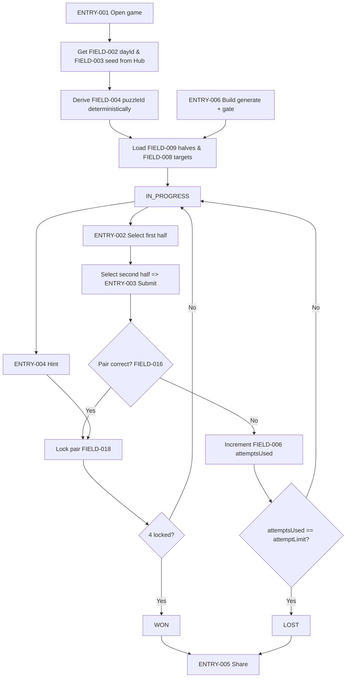
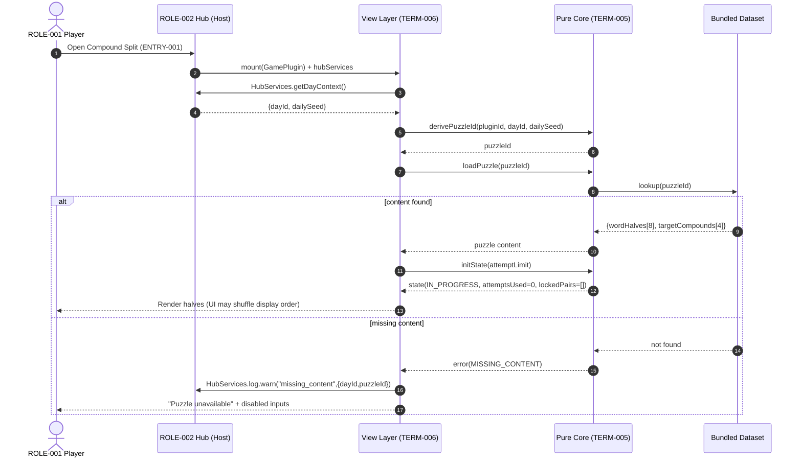
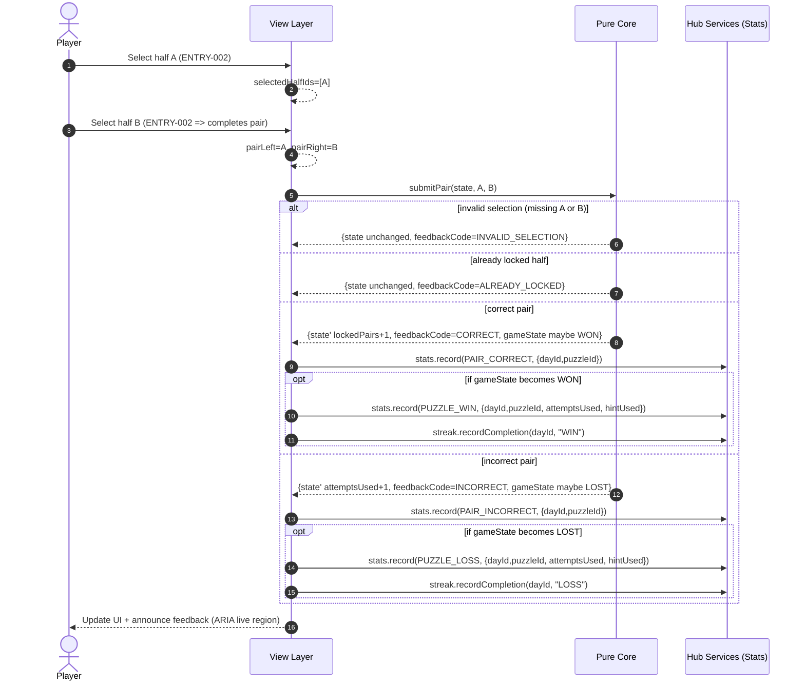
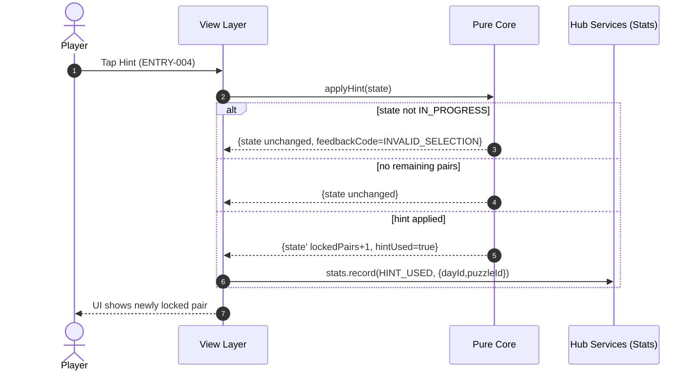
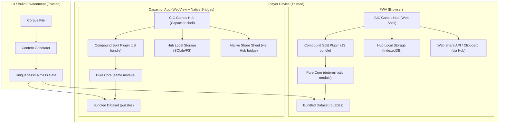

<!-- generated: 2026-07-24T14:10:47Z -->
<!-- mode: initial -->
<!-- feature-slug: compound-split -->
<!-- a2a-endpoint: https://bob-sdlc-orchestrator.2as6l7wq9qj8.eu-gb.codeengine.appdomain.cloud/v1/rpc -->

# Glossary

## Terms

### TERM-001: Compound Split
- **Definition:** The daily word puzzle game mode in the CIC Games hub where a player pairs 8 shuffled word-halves into 4 target compound words.
- **Synonyms:** CompoundSplit, compound puzzle
- **Anti-definition:** Not a free-form anagram game; not a vocabulary quiz with arbitrary answers beyond the day’s target set.
- **Source:** User request

### TERM-002: CIC Games Hub
- **Definition:** The host application/platform that loads plugins, provides shared services (seed, stats, share), and runs as an offline-first PWA + Capacitor app.
- **Synonyms:** hub, host app, platform
- **Anti-definition:** Not a remote backend service.
- **Source:** User request

### TERM-003: Plugin
- **Definition:** A packaged game module integrated into the hub that implements `GamePlugin` with a pure core and a view layer.
- **Synonyms:** game plugin, module
- **Anti-definition:** Not a standalone app with its own accounts/backend.
- **Source:** User request

### TERM-004: GamePlugin Interface
- **Definition:** The hub-defined contract a plugin implements to integrate lifecycle, deterministic daily content, and hub services access.
- **Synonyms:** plugin interface, integration contract
- **Anti-definition:** Not a storage API; not a clock API.
- **Source:** User request

### TERM-005: Pure Core
- **Definition:** Deterministic logic module containing pair validation, matching-uniqueness checks, and state transitions; it does not access storage, system clock, or network.
- **Synonyms:** core engine, deterministic core
- **Anti-definition:** Not UI rendering; not persistence; not analytics dispatch.
- **Source:** User request

### TERM-006: View Layer
- **Definition:** UI implementation that renders the puzzle, accepts input, and calls the Pure Core; it may use hub services for stats/share.
- **Synonyms:** UI, front-end
- **Anti-definition:** Not the source of truth for game rules.
- **Source:** User request

### TERM-007: Daily Puzzle
- **Definition:** The specific set of 4 target compound words (and their 8 halves) selected deterministically for a given day identifier and seed.
- **Synonyms:** day’s puzzle, today’s puzzle
- **Anti-definition:** Not an arbitrary random set per device without determinism.
- **Source:** User request

### TERM-008: Compound Word
- **Definition:** A valid target answer formed by concatenating exactly two halves (left half + right half) in order.
- **Synonyms:** target compound, answer word
- **Anti-definition:** Not a phrase with spaces; not a reversible concatenation unless explicitly in the target list.
- **Source:** User request

### TERM-009: Word Half
- **Definition:** One of the 8 displayed tokens; each half participates in exactly one target compound word in the Daily Puzzle.
- **Synonyms:** half, token, fragment
- **Anti-definition:** Not an arbitrary substring generated at runtime; not reusable across multiple targets in the same puzzle.
- **Source:** User request

### TERM-010: Pair
- **Definition:** A player-selected ordered tuple of two Word Halves intended to form a compound word by concatenation.
- **Synonyms:** selection pair, attempt pair
- **Anti-definition:** Not an unordered set if order matters for concatenation.
- **Source:** User request

### TERM-011: Pair Validation
- **Definition:** Pure deterministic string operation that concatenates the chosen halves and checks membership in the day’s target compound set.
- **Synonyms:** check, verify, validation
- **Anti-definition:** Not an online dictionary lookup.
- **Source:** User request

### TERM-012: Locked Pair
- **Definition:** A correctly validated Pair that becomes immutable and remains placed/marked as solved for the remainder of the puzzle.
- **Synonyms:** solved pair, fixed pair
- **Anti-definition:** Not merely “selected”; not removable after locking.
- **Source:** User request

### TERM-013: Attempt
- **Definition:** One consumption of the limited attempt counter caused by an incorrect Pair submission.
- **Synonyms:** wrong guess, strike
- **Anti-definition:** Not consumed on correct pairs unless specified otherwise.
- **Source:** User request

### TERM-014: Attempt Limit
- **Definition:** The configured maximum number of incorrect Attempts allowed before the puzzle is lost.
- **Synonyms:** max attempts, lives
- **Anti-definition:** Not time-based.
- **Source:** User request

### TERM-015: Feedback
- **Definition:** User-visible response after a Pair submission indicating whether the concatenation is a valid compound in the Daily Puzzle; must be non-color-dependent.
- **Synonyms:** result message, validation feedback
- **Anti-definition:** Not a spoiler revealing un-found words.
- **Source:** User request

### TERM-016: Win State
- **Definition:** Game state where all 4 target compound words are correctly formed and locked.
- **Synonyms:** solved, completed
- **Anti-definition:** Not reaching attempt limit.
- **Source:** User request

### TERM-017: Loss State
- **Definition:** Game state where the Attempt Limit has been exhausted before all 4 Locked Pairs are formed.
- **Synonyms:** failed, game over
- **Anti-definition:** Not quitting the app.
- **Source:** User request

### TERM-018: Hint
- **Definition:** A user action that locks one correct pair without requiring the player to discover it by trial.
- **Synonyms:** reveal pair, assist
- **Anti-definition:** Not revealing all answers; not increasing attempts.
- **Source:** User request

### TERM-019: Build-time Content Generation
- **Definition:** Process during plugin build that selects candidate compound words from a bundled list and emits daily puzzle data.
- **Synonyms:** precomputed content, build pipeline generation
- **Anti-definition:** Not runtime server fetch.
- **Source:** User request

### TERM-020: Bundled Compound-word List
- **Definition:** Static dataset packaged with the plugin containing allowable compound words and their splits.
- **Synonyms:** word list, corpus
- **Anti-definition:** Not user-provided content; not downloaded.
- **Source:** User request

### TERM-021: Uniqueness/Fairness Gate
- **Definition:** Build-time validation ensuring the 8 halves for a daily puzzle admit exactly one perfect matching into 4 valid compounds (no ambiguous half that can pair into multiple targets).
- **Synonyms:** matching uniqueness check, ambiguity gate
- **Anti-definition:** Not a runtime heuristic; not a difficulty rating.
- **Source:** User request

### TERM-022: Perfect Matching
- **Definition:** A partition of the 8 Word Halves into 4 disjoint Pairs such that each Pair concatenation is a target compound word.
- **Synonyms:** unique solution, exact matching
- **Anti-definition:** Not partial matching or multiple-solution puzzle.
- **Source:** User request

### TERM-023: Deterministic Daily Selection
- **Definition:** Selection of the Daily Puzzle using hub-provided seedable hashing so the same day identifier yields the same puzzle across devices/platforms.
- **Synonyms:** seeded daily, deterministic rotation
- **Anti-definition:** Not per-session randomness.
- **Source:** User request

### TERM-024: Day Identifier
- **Definition:** A canonical representation of the “day” used to index the Daily Puzzle (provided by hub, not by plugin clock).
- **Synonyms:** dayKey, puzzle date key
- **Anti-definition:** Not local device time.
- **Source:** User request

### TERM-025: Hub Services
- **Definition:** Platform-provided APIs for local stats/streaks, seed/hash, and share sheet integration.
- **Synonyms:** platform services, hub APIs
- **Anti-definition:** Not networked backend services.
- **Source:** User request

### TERM-026: Local Stats
- **Definition:** On-device aggregated metrics for the player’s play history (e.g., plays, wins, attempts used), stored via hub services.
- **Synonyms:** statistics, metrics
- **Anti-definition:** Not account-linked analytics.
- **Source:** User request

### TERM-027: Streak
- **Definition:** Consecutive-day completion metric derived from Daily Puzzle completion records, stored via hub services.
- **Synonyms:** win streak
- **Anti-definition:** Not dependent on wall-clock inside plugin.
- **Source:** User request

### TERM-028: Spoiler-safe Emoji Share
- **Definition:** A shareable text block using emojis to represent progress (e.g., pairs found per attempt) without revealing any words/halves.
- **Synonyms:** emoji grid, share card text
- **Anti-definition:** Not sharing the answers or halves.
- **Source:** User request

### TERM-029: Offline-first
- **Definition:** The game runs fully without network connectivity after install; all gameplay data is local.
- **Synonyms:** offline-capable
- **Anti-definition:** Not requiring online dictionary validation.
- **Source:** User request

### TERM-030: Accessibility Support
- **Definition:** Keyboard-operable selection, screen-reader accessible labels/announcements, and non-color-only feedback.
- **Synonyms:** a11y
- **Anti-definition:** Not purely visual-only cues.
- **Source:** User request

## Data Dictionary

| ID | Name | Type | Format | Range/Enum | Units | Default | Nullable | PII | Source | Validation |
|---|---|---|---|---|---|---|---|---|---|---|
| FIELD-001 | pluginId | string | slug | fixed (`compound-split`) | n/a | `compound-split` | No | None | Plugin | Must equal registered plugin id |
| FIELD-002 | dayId | string | `YYYY-MM-DD` (canonical) | valid calendar date | n/a | none | No | None | Hub Services (TERM-025) | Must match regex `^\d{4}-\d{2}-\d{2}$` |
| FIELD-003 | dailySeed | string | opaque | n/a | n/a | none | No | None | Hub Services | Non-empty string |
| FIELD-004 | puzzleId | string | hash/slug | n/a | n/a | derived | No | None | Pure Core | Must be deterministic function of (FIELD-001, FIELD-002, FIELD-003) |
| FIELD-005 | attemptLimit | integer | int32 | 0..20 | attempts | 6 | No | None | Plugin config | Must be >= 0 |
| FIELD-006 | attemptsUsed | integer | int32 | 0..FIELD-005 | attempts | 0 | No | None | Pure Core state | Must be within range |
| FIELD-007 | hintUsed | boolean | boolean | true/false | n/a | false | No | None | Pure Core state | n/a |
| FIELD-008 | targetCompounds | string[] | uppercase ASCII recommended | length=4 | n/a | none | No | None | Build-time content | Each item must be concatenation of exactly two halves present in FIELD-009 |
| FIELD-009 | wordHalves | string[] | token text | length=8 | n/a | none | No | None | Build-time content | All halves non-empty; must map to exactly one compound per TERM-021 |
| FIELD-010 | halfId | string | `H{0..7}` | `H0`..`H7` | n/a | none | No | None | View model | Must be unique within puzzle |
| FIELD-011 | halfText | string | display text | 1..32 chars | n/a | none | No | None | Build-time content | Must be normalized (see FIELD-026) and non-empty |
| FIELD-012 | selectedHalfIds | string[] | array of FIELD-010 | length 0..2 | n/a | [] | No | None | View model | Must contain unique ids |
| FIELD-013 | pairLeftHalfId | string | FIELD-010 | n/a | n/a | none | Yes | None | Pure Core input | If present, must exist in puzzle halves |
| FIELD-014 | pairRightHalfId | string | FIELD-010 | n/a | n/a | none | Yes | None | Pure Core input | If present, must exist in puzzle halves |
| FIELD-015 | concatenatedText | string | token text | 1..64 chars | n/a | none | Yes | None | Pure Core derived | Must equal leftHalfText + rightHalfText exactly |
| FIELD-016 | isCorrectPair | boolean | boolean | true/false | n/a | none | No | None | Pure Core output | n/a |
| FIELD-017 | lockedPairIds | string[] | array of `P{0..3}` | length 0..4 | n/a | [] | No | None | Pure Core state | Unique; length <= 4 |
| FIELD-018 | lockedPairs | object[] | JSON | 0..4 items | n/a | [] | No | None | Pure Core state | Each entry has (leftHalfId,rightHalfId,targetCompound) |
| FIELD-019 | gameState | string | enum | `IN_PROGRESS`,`WON`,`LOST` | n/a | `IN_PROGRESS` | No | None | Pure Core state | Must be one of enum |
| FIELD-020 | submissionIndex | integer | int32 | 1..(4+attemptLimit+1) | n/a | 0 | No | None | Pure Core state | Increments per pair submission and hint use (if tracked) |
| FIELD-021 | feedbackCode | string | enum | `CORRECT`,`INCORRECT`,`ALREADY_LOCKED`,`INVALID_SELECTION`,`NO_ATTEMPTS_LEFT` | n/a | none | No | None | Pure Core output | Must be one of enum |
| FIELD-022 | sharePayload | string | text | <= 1000 chars | n/a | none | Yes | None | View/Hub Services | Must contain no FIELD-011, FIELD-008 substrings |
| FIELD-023 | statsEventType | string | enum | `PUZZLE_START`,`PAIR_CORRECT`,`PAIR_INCORRECT`,`HINT_USED`,`PUZZLE_WIN`,`PUZZLE_LOSS`,`SHARE` | n/a | none | No | None | Hub Services | Must be one of enum |
| FIELD-024 | statsRecord | object | JSON | schema-defined | n/a | none | Yes | None | Hub Services | Must validate against hub stats schema |
| FIELD-025 | streakCount | integer | int32 | 0..100000 | days | 0 | No | None | Hub Services | Must be >= 0 |
| FIELD-026 | normalizationRule | string | enum | `UPPERCASE_TRIM_NO_SPACES` | n/a | `UPPERCASE_TRIM_NO_SPACES` | No | None | Plugin | Applied identically across platforms |

**FIELD ↔ TERM cross-links (ownership):**
- FIELD-002, FIELD-003, FIELD-004, FIELD-008, FIELD-009 belong to **TERM-007 Daily Puzzle**, **TERM-023 Deterministic Daily Selection**.
- FIELD-009..FIELD-016 belong to **TERM-009 Word Half**, **TERM-010 Pair**, **TERM-011 Pair Validation**.
- FIELD-017..FIELD-019 belong to **TERM-012 Locked Pair**, **TERM-016 Win State**, **TERM-017 Loss State**.
- FIELD-022 belongs to **TERM-028 Spoiler-safe Emoji Share**.
- FIELD-023..FIELD-025 belong to **TERM-025 Hub Services**, **TERM-026 Local Stats**, **TERM-027 Streak**.

# User Journeys

## Roles

| Role ID | Role | Type | Goals (summary) | Auth |
|---|---|---|---|---|
| ROLE-001 | Player | Primary | Play daily puzzle, use hint, share result, view stats | Hub session (local), no account |
| ROLE-002 | Hub | System | Provide dayId/seed/hash, stats/streak storage, share sheet | Internal trusted |
| ROLE-003 | Build Pipeline | System/Admin | Generate daily content and enforce uniqueness/fairness gate | CI/build-time |
| ROLE-004 | Accessibility User (Keyboard/SR) | Primary | Play fully via keyboard and screen reader | Same as ROLE-001 |

## Entry Points

| Entry ID | Location | Trigger | Auth | Notes |
|---|---|---|---|---|
| ENTRY-001 | UI route: Hub → Compound Split | Player taps game tile | Local | Loads plugin view + obtains FIELD-002/FIELD-003 from ROLE-002 |
| ENTRY-002 | UI action: Select half | Tap/click/keyboard on a half | Local | Updates FIELD-012 selectedHalfIds |
| ENTRY-003 | UI action: Submit pair | Second half selection completes a pair | Local | Calls Pure Core Pair Validation using FIELD-013/FIELD-014 |
| ENTRY-004 | UI action: Use hint | Player taps “Hint” | Local | Calls Pure Core hint transition |
| ENTRY-005 | UI action: Share | Player taps “Share” | Local + OS share | Uses hub share service with FIELD-022 |
| ENTRY-006 | Build step: Generate puzzles | `npm build` / CI | Trusted | Emits FIELD-008/FIELD-009 dataset and runs TERM-021 gate |

## Role Permission Matrix

| Capability | ROLE-001 Player | ROLE-004 A11y User | ROLE-002 Hub | ROLE-003 Build Pipeline |
|---|---:|---:|---:|---:|
| Play puzzle (select/submit) | Y | Y | N | N |
| Use hint | Y | Y | N | N |
| View feedback and state | Y | Y | N | N |
| Persist stats/streaks | via hub | via hub | Y | N |
| Provide dayId/seed | N | N | Y | N |
| Build-time content generation | N | N | N | Y |
| Enforce uniqueness/fairness gate | N | N | N | Y |

## Journeys

### JOURNEY-001: Start today’s Daily Puzzle
- **Role/Goal:** ROLE-001 / Load TERM-007 Daily Puzzle deterministically for FIELD-002 dayId
- **Entry:** ENTRY-001
- **Happy path:**
  1. View requests FIELD-002 dayId and FIELD-003 dailySeed from ROLE-002 Hub Services (TERM-025).
  2. View calls Pure Core to derive FIELD-004 puzzleId from (FIELD-001 pluginId, FIELD-002, FIELD-003) using TERM-023 deterministic selection.
  3. Pure Core loads prebundled content for FIELD-004 and returns FIELD-009 wordHalves (8) and FIELD-008 targetCompounds (4).
  4. View shuffles display order (UI-only) and renders 8 halves with accessible labels (TERM-030).
  5. Pure Core initializes FIELD-006 attemptsUsed=0, FIELD-017 lockedPairIds=[], FIELD-019 gameState=`IN_PROGRESS`.
- **BRANCH-001 (No content for day):**
  - Trigger: No record exists for FIELD-004 puzzleId in bundled data.
  - System response: Show “Puzzle unavailable” state and disable selection.
  - Recovery: LOOP-001 (restart app) after update/install containing content.
- **ERROR-001 (Hub seed unavailable):**
  - Trigger: ROLE-002 does not provide FIELD-002 or FIELD-003.
  - System response: Show blocking error and do not start puzzle.
  - Recovery: Retry loading; allow user to return to hub home.
- **EDGE-001 (Offline mode):**
  - Condition: Device has no network.
  - Expected: Steps 1–5 still succeed because content is bundled (TERM-029).

### JOURNEY-002: Select halves and submit a pair
- **Role/Goal:** ROLE-001 / Form a TERM-010 Pair and get TERM-015 Feedback
- **Entry:** ENTRY-002 then ENTRY-003
- **Happy path:**
  1. Player selects a first half; view sets FIELD-012 selectedHalfIds=[halfId].
  2. Player selects a second half; view sets FIELD-013 pairLeftHalfId and FIELD-014 pairRightHalfId (ordered by selection).
  3. View calls Pure Core Pair Validation (TERM-011) to compute FIELD-015 concatenatedText and FIELD-016 isCorrectPair.
  4. If FIELD-016 isCorrectPair=true, Pure Core adds to FIELD-018 lockedPairs and updates FIELD-017 lockedPairIds.
  5. View renders locked styling and removes/disabled locked halves from selection.
  6. Pure Core checks completion; if 4 locked pairs then set FIELD-019 gameState=`WON`.
- **BRANCH-002 (Incorrect pair):**
  - Trigger: FIELD-016 isCorrectPair=false.
  - System response: Pure Core increments FIELD-006 attemptsUsed by 1 and returns FIELD-021 feedbackCode=`INCORRECT`.
  - Recovery: LOOP-002 (try again) while FIELD-019=`IN_PROGRESS`.
- **BRANCH-003 (Attempt limit reached):**
  - Trigger: FIELD-006 attemptsUsed becomes equal to FIELD-005 attemptLimit after an incorrect pair.
  - System response: Pure Core sets FIELD-019=`LOST` and returns FIELD-021=`NO_ATTEMPTS_LEFT`.
  - Recovery: None for same day; player can exit to hub.
- **ERROR-002 (Invalid selection size):**
  - Trigger: Submit called with missing FIELD-013 or FIELD-014.
  - System response: Return FIELD-021=`INVALID_SELECTION` without changing FIELD-006/FIELD-018.
  - Recovery: User selects two halves again.
- **ERROR-003 (Selecting a locked half):**
  - Trigger: User tries to select a half that is already part of FIELD-018 lockedPairs.
  - System response: View prevents selection; if core receives it, core returns FIELD-021=`ALREADY_LOCKED`.
  - Recovery: Select an unlocked half.
- **EDGE-002 (Rapid double-tap / concurrency):**
  - Condition: Two submit actions fire close together.
  - Expected: Pure Core remains deterministic; second submission is rejected as `INVALID_SELECTION` or `ALREADY_LOCKED` based on current state.
- **EDGE-003 (Order sensitivity):**
  - Condition: Player selects halves in reverse order relative to a target compound.
  - Expected: Concatenation is evaluated exactly as selected; may be incorrect even if reversed would be correct.

### JOURNEY-003: Use a hint to lock one correct pair
- **Role/Goal:** ROLE-001 / Use TERM-018 Hint to progress without guessing
- **Entry:** ENTRY-004
- **Happy path:**
  1. Player triggers Hint.
  2. View calls Pure Core hint transition with current FIELD-018 lockedPairs.
  3. Pure Core selects one remaining target compound from FIELD-008 not yet in FIELD-018 and adds it as a new locked pair.
  4. Pure Core sets FIELD-007 hintUsed=true.
  5. View updates UI to show the newly locked pair.
- **BRANCH-004 (Hint when already won/lost):**
  - Trigger: FIELD-019 is `WON` or `LOST`.
  - System response: No state change; return feedback indicating action not available (reuse FIELD-021=`INVALID_SELECTION`).
  - Recovery: Exit to hub.
- **ERROR-004 (No remaining pairs to hint):**
  - Trigger: All 4 pairs already locked.
  - System response: No-op.
  - Recovery: Proceed to share.
- **EDGE-004 (Determinism):**
  - Condition: Hint selection must be deterministic given current state.
  - Expected: Same state → same hinted pair chosen across platforms.

### JOURNEY-004: Share spoiler-safe emoji result
- **Role/Goal:** ROLE-001 / Generate TERM-028 Spoiler-safe Emoji Share without revealing words
- **Entry:** ENTRY-005
- **Happy path:**
  1. Player taps Share from win or loss screen.
  2. View computes FIELD-022 sharePayload from attempt history (e.g., per submission: ✅ correct, ❌ incorrect; and total pairs found), excluding FIELD-011 halfText and FIELD-008 targetCompounds.
  3. View passes FIELD-022 to ROLE-002 hub share service to invoke OS share sheet.
  4. View records a hub stats event FIELD-023=`SHARE`.
- **ERROR-005 (Share service unavailable):**
  - Trigger: Hub share API throws error / OS share canceled.
  - System response: Show non-blocking message; keep result screen.
  - Recovery: Retry share.

### JOURNEY-005: Build-time content generation and uniqueness/fairness gate
- **Role/Goal:** ROLE-003 / Produce daily puzzle dataset meeting TERM-021 uniqueness/fairness constraints
- **Entry:** ENTRY-006
- **Happy path:**
  1. Build pipeline loads TERM-020 bundled compound-word list.
  2. Pipeline selects 4 compounds for each day index and derives 8 halves (FIELD-009) and 4 targets (FIELD-008).
  3. Pipeline runs TERM-021 Uniqueness/Fairness Gate to ensure exactly one TERM-022 Perfect Matching exists for the 8 halves.
  4. If gate passes, pipeline emits bundled dataset keyed by deterministic day index (later mapped via FIELD-004 puzzleId).
- **BRANCH-005 (Gate fails due to ambiguity):**
  - Trigger: A half can pair with more than one other half to form a valid target (multiple perfect matchings).
  - System response: Build fails with report listing ambiguous halves/compounds.
  - Recovery: Replace candidates and rerun build.
- **EDGE-005 (Normalization collisions):**
  - Condition: Different source words normalize to same token under FIELD-026.
  - Expected: Gate treats them as duplicates and fails build.

## Journey Map



# Requirements

### REQ-001: Derive deterministic puzzleId
- **EARS Pattern:** Ubiquitous
- **EARS Statement:** The Pure Core (TERM-005) shall derive FIELD-004 puzzleId deterministically from FIELD-001 pluginId, FIELD-002 dayId, and FIELD-003 dailySeed.
- **Inputs:** FIELD-001, FIELD-002, FIELD-003
- **Outputs:** FIELD-004
- **Preconditions:** FIELD-002 and FIELD-003 are available from TERM-025.
- **Postconditions:** Same inputs yield identical FIELD-004 across platforms.
- **Invariants:** No access to clock/network/storage.
- **Trigger:** Core initialization (JOURNEY-001 step 2)
- **Actor:** ROLE-001 via View Layer (TERM-006)
- **EntityScope:** TERM-007 Daily Puzzle
- **ErrorModes:** Invalid/missing FIELD-002 or FIELD-003
- **NFR-Tags:** determinism
- **Source:** JOURNEY-001 step 2; ERROR-001
- **Dependencies:** NFR-001
- **Priority:** P0
- **AcceptanceCriteria:**
  - **TEST-001:** Given identical FIELD-001/002/003 on two platforms, when deriving FIELD-004, then FIELD-004 is identical.
  - **TEST-002:** Given different FIELD-002 values, when deriving FIELD-004, then FIELD-004 differs.
- **Assumptions:** Hub provides canonical FIELD-002 formatting.
- **OpenQuestions:** What exact hash function does the hub standardize?

### REQ-002: Load daily puzzle content by puzzleId
- **EARS Pattern:** Event-Driven
- **EARS Statement:** When FIELD-004 puzzleId is requested, the Pure Core (TERM-005) shall return the corresponding FIELD-009 wordHalves and FIELD-008 targetCompounds from bundled content (TERM-020).
- **Inputs:** FIELD-004
- **Outputs:** FIELD-009, FIELD-008
- **Preconditions:** Bundled dataset present in app package.
- **Postconditions:** Returned arrays have lengths 8 and 4 respectively.
- **Invariants:** No network access (TERM-029).
- **Trigger:** Daily puzzle start
- **Actor:** ROLE-001
- **EntityScope:** TERM-007 Daily Puzzle
- **ErrorModes:** Missing content for FIELD-004
- **NFR-Tags:** offline
- **Source:** JOURNEY-001 step 3; BRANCH-001
- **Dependencies:** REQ-001
- **Priority:** P0
- **AcceptanceCriteria:**
  - **TEST-003:** Given a valid FIELD-004 in the bundled dataset, when loading, then FIELD-009 length is 8 and FIELD-008 length is 4.
  - **TEST-004:** Given an unknown FIELD-004, when loading, then an error is returned and no gameplay state is initialized.
- **Assumptions:** View handles “unavailable” screen.
- **OpenQuestions:** How many days of puzzles are bundled per release?

### REQ-003: Normalize halves and targets consistently
- **EARS Pattern:** Ubiquitous
- **EARS Statement:** The Pure Core (TERM-005) shall apply FIELD-026 normalizationRule to FIELD-011 halfText and FIELD-008 targetCompounds before performing TERM-011 Pair Validation.
- **Inputs:** FIELD-009, FIELD-008
- **Outputs:** Normalized internal tokens
- **Preconditions:** FIELD-026 is defined.
- **Postconditions:** Validation uses normalized tokens only.
- **Invariants:** Normalization is a pure string operation.
- **Trigger:** Puzzle load / validation
- **Actor:** System
- **EntityScope:** TERM-011 Pair Validation
- **ErrorModes:** None
- **NFR-Tags:** determinism, compatibility
- **Source:** JOURNEY-002 step 3; EDGE-005
- **Dependencies:** None
- **Priority:** P1
- **AcceptanceCriteria:**
  - **TEST-005:** Given halves with mixed case/whitespace, when validating, then results equal those for already-normalized inputs.
- **Assumptions:** Corpus is compatible with chosen normalization.
- **OpenQuestions:** Are hyphens/apostrophes allowed in corpus?

### REQ-004: Validate a submitted pair by concatenation membership
- **EARS Pattern:** Event-Driven
- **EARS Statement:** When FIELD-013 pairLeftHalfId and FIELD-014 pairRightHalfId are submitted, the Pure Core (TERM-005) shall set FIELD-016 isCorrectPair to true only if FIELD-015 concatenatedText equals an element of FIELD-008 targetCompounds.
- **Inputs:** FIELD-013, FIELD-014, FIELD-009, FIELD-008
- **Outputs:** FIELD-015, FIELD-016
- **Preconditions:** FIELD-019 gameState is `IN_PROGRESS`.
- **Postconditions:** FIELD-015 is computed as leftHalfText + rightHalfText.
- **Invariants:** Identical operation across platforms (TERM-011).
- **Trigger:** ENTRY-003
- **Actor:** ROLE-001
- **EntityScope:** TERM-010 Pair
- **ErrorModes:** Invalid half ids
- **NFR-Tags:** determinism
- **Source:** JOURNEY-002 steps 2–4; EDGE-003
- **Dependencies:** REQ-003
- **Priority:** P0
- **AcceptanceCriteria:**
  - **TEST-006:** Given submitted halves that form a target in FIELD-008, when validating, then FIELD-016=true.
  - **TEST-007:** Given submitted halves that do not form a target, when validating, then FIELD-016=false.
- **Assumptions:** Order is selection order.
- **OpenQuestions:** Does UI allow swapping order prior to submission?

### REQ-005: Reject submissions with missing half selection
- **EARS Pattern:** Event-Driven
- **EARS Statement:** When a pair submission is received with FIELD-013 or FIELD-014 null, the Pure Core (TERM-005) shall return FIELD-021 feedbackCode=`INVALID_SELECTION` and shall not change FIELD-006 attemptsUsed.
- **Inputs:** FIELD-013, FIELD-014
- **Outputs:** FIELD-021
- **Preconditions:** None
- **Postconditions:** No change to state fields.
- **Invariants:** Deterministic.
- **Trigger:** ENTRY-003
- **Actor:** ROLE-001
- **EntityScope:** TERM-010 Pair
- **ErrorModes:** Invalid selection
- **NFR-Tags:** correctness
- **Source:** JOURNEY-002 ERROR-002
- **Dependencies:** None
- **Priority:** P0
- **AcceptanceCriteria:**
  - **TEST-008:** Given only one half selected, when submitting, then feedbackCode is `INVALID_SELECTION` and attemptsUsed unchanged.
- **Assumptions:** View may prevent submit; core still guards.
- **OpenQuestions:** None

### REQ-006: Lock a correct pair
- **EARS Pattern:** Event-Driven
- **EARS Statement:** When FIELD-016 isCorrectPair is true, the Pure Core (TERM-005) shall append the pair to FIELD-018 lockedPairs.
- **Inputs:** FIELD-013, FIELD-014, FIELD-016
- **Outputs:** FIELD-018
- **Preconditions:** FIELD-019 is `IN_PROGRESS`.
- **Postconditions:** The corresponding halves become part of a TERM-012 Locked Pair.
- **Invariants:** A half cannot appear in more than one item of FIELD-018.
- **Trigger:** Successful validation
- **Actor:** ROLE-001
- **EntityScope:** TERM-012 Locked Pair
- **ErrorModes:** Half already locked
- **NFR-Tags:** correctness
- **Source:** JOURNEY-002 step 4; ERROR-003
- **Dependencies:** REQ-004
- **Priority:** P0
- **AcceptanceCriteria:**
  - **TEST-009:** Given a correct pair using two unlocked halves, when submitted, then FIELD-018 length increases by 1.
  - **TEST-010:** Given a submission using a half already in FIELD-018, when submitted, then feedbackCode is `ALREADY_LOCKED` and FIELD-018 unchanged.
- **Assumptions:** Core maintains locked-half index.
- **OpenQuestions:** Should `ALREADY_LOCKED` consume an attempt? (currently no)

### REQ-007: Increment attempts on incorrect pair
- **EARS Pattern:** Event-Driven
- **EARS Statement:** When FIELD-016 isCorrectPair is false, the Pure Core (TERM-005) shall increment FIELD-006 attemptsUsed by 1.
- **Inputs:** FIELD-016, FIELD-006
- **Outputs:** FIELD-006
- **Preconditions:** FIELD-019 is `IN_PROGRESS`.
- **Postconditions:** attemptsUsed increases by exactly 1.
- **Invariants:** attemptsUsed ≤ attemptLimit unless transitioning to TERM-017 Loss State.
- **Trigger:** Incorrect validation result
- **Actor:** ROLE-001
- **EntityScope:** TERM-013 Attempt
- **ErrorModes:** None
- **NFR-Tags:** correctness
- **Source:** JOURNEY-002 BRANCH-002
- **Dependencies:** REQ-004
- **Priority:** P0
- **AcceptanceCriteria:**
  - **TEST-011:** Given attemptsUsed=k and an incorrect pair, when submitted, then attemptsUsed=k+1.
- **Assumptions:** Correct pairs do not increment attempts.
- **OpenQuestions:** None

### REQ-008: Return feedback code for incorrect pair
- **EARS Pattern:** Event-Driven
- **EARS Statement:** When an incorrect pair is submitted, the Pure Core (TERM-005) shall return FIELD-021 feedbackCode=`INCORRECT`.
- **Inputs:** Pair submission
- **Outputs:** FIELD-021
- **Preconditions:** FIELD-019 is `IN_PROGRESS`.
- **Postconditions:** User can attempt again if attempts remain.
- **Invariants:** Does not reveal any target words.
- **Trigger:** Incorrect validation
- **Actor:** ROLE-001
- **EntityScope:** TERM-015 Feedback
- **ErrorModes:** None
- **NFR-Tags:** UX
- **Source:** JOURNEY-002 BRANCH-002
- **Dependencies:** REQ-004
- **Priority:** P1
- **AcceptanceCriteria:**
  - **TEST-012:** Given an incorrect pair, when submitted, then feedbackCode is `INCORRECT`.
- **Assumptions:** View maps feedbackCode to accessible messaging.
- **OpenQuestions:** Should feedback mention “real compound (general)” vs “in today’s set”? (request suggests “one of the day’s target compound words”)

### REQ-009: Transition to WON when all pairs locked
- **EARS Pattern:** State-Driven
- **EARS Statement:** While FIELD-018 lockedPairs has length 4, the Pure Core (TERM-005) shall set FIELD-019 gameState to `WON`.
- **Inputs:** FIELD-018
- **Outputs:** FIELD-019
- **Preconditions:** Puzzle loaded.
- **Postconditions:** Game state equals TERM-016 Win State.
- **Invariants:** No further attempts are consumed after win.
- **Trigger:** After locking a pair
- **Actor:** System
- **EntityScope:** TERM-016 Win State
- **ErrorModes:** None
- **NFR-Tags:** correctness
- **Source:** JOURNEY-002 step 6
- **Dependencies:** REQ-006
- **Priority:** P0
- **AcceptanceCriteria:**
  - **TEST-013:** Given 3 locked pairs, when the 4th correct pair is locked, then gameState becomes `WON`.
- **Assumptions:** Exactly 4 targets per day.
- **OpenQuestions:** None

### REQ-010: Transition to LOST when attempts reach limit
- **EARS Pattern:** State-Driven
- **EARS Statement:** While FIELD-006 attemptsUsed equals FIELD-005 attemptLimit, the Pure Core (TERM-005) shall set FIELD-019 gameState to `LOST`.
- **Inputs:** FIELD-006, FIELD-005
- **Outputs:** FIELD-019
- **Preconditions:** attemptLimit configured.
- **Postconditions:** Game state equals TERM-017 Loss State.
- **Invariants:** Loss occurs only after an incorrect submission increments attemptsUsed.
- **Trigger:** After incrementing attemptsUsed
- **Actor:** System
- **EntityScope:** TERM-017 Loss State
- **ErrorModes:** None
- **NFR-Tags:** correctness
- **Source:** JOURNEY-002 BRANCH-003
- **Dependencies:** REQ-007
- **Priority:** P0
- **AcceptanceCriteria:**
  - **TEST-014:** Given attemptLimit=6 and attemptsUsed=5, when an incorrect pair is submitted, then gameState becomes `LOST`.
- **Assumptions:** attemptLimit can be 0.
- **OpenQuestions:** If attemptLimit=0, does puzzle start already lost? (recommend no; see OpenQuestions)

### REQ-011: Provide deterministic hint selection
- **EARS Pattern:** Event-Driven
- **EARS Statement:** When a hint is requested in FIELD-019 gameState=`IN_PROGRESS`, the Pure Core (TERM-005) shall add exactly one remaining target from FIELD-008 to FIELD-018 lockedPairs using a deterministic selection rule.
- **Inputs:** FIELD-008, FIELD-018, FIELD-019
- **Outputs:** FIELD-018
- **Preconditions:** There exists at least one remaining target not yet locked.
- **Postconditions:** FIELD-018 length increases by 1.
- **Invariants:** Hint does not consume FIELD-006 attemptsUsed.
- **Trigger:** ENTRY-004
- **Actor:** ROLE-001
- **EntityScope:** TERM-018 Hint
- **ErrorModes:** Hint requested when not in progress
- **NFR-Tags:** determinism
- **Source:** JOURNEY-003 steps 1–4; BRANCH-004; EDGE-004
- **Dependencies:** REQ-002
- **Priority:** P1
- **AcceptanceCriteria:**
  - **TEST-015:** Given the same state and hint request on two platforms, when hint is applied, then the same target pair is locked.
  - **TEST-016:** Given a hint request, when applied, then attemptsUsed is unchanged.
- **Assumptions:** Deterministic rule can be “lowest index remaining target” in FIELD-008.
- **OpenQuestions:** Should the hinted pair be visually distinguished for share/stats?

### REQ-012: Record hint usage flag
- **EARS Pattern:** Event-Driven
- **EARS Statement:** When a hint is successfully applied, the Pure Core (TERM-005) shall set FIELD-007 hintUsed to true.
- **Inputs:** Hint action
- **Outputs:** FIELD-007
- **Preconditions:** FIELD-019 is `IN_PROGRESS`.
- **Postconditions:** hintUsed=true.
- **Invariants:** Remains true once set.
- **Trigger:** ENTRY-004
- **Actor:** ROLE-001
- **EntityScope:** TERM-018 Hint
- **ErrorModes:** None
- **NFR-Tags:** stats
- **Source:** JOURNEY-003 step 4
- **Dependencies:** REQ-011
- **Priority:** P2
- **AcceptanceCriteria:**
  - **TEST-017:** Given hintUsed=false, when hint is applied, then hintUsed=true.
- **Assumptions:** View persists via hub services if needed.
- **OpenQuestions:** None

### REQ-013: Enforce build-time uniqueness/fairness gate
- **EARS Pattern:** Event-Driven
- **EARS Statement:** When build-time content is generated, the build pipeline (TERM-019) shall fail the build if the 8 halves (FIELD-009) for any day admit more than one TERM-022 Perfect Matching into FIELD-008 targetCompounds.
- **Inputs:** Candidate FIELD-008, FIELD-009
- **Outputs:** Build pass/fail report
- **Preconditions:** Corpus available (TERM-020).
- **Postconditions:** Bundled dataset contains only puzzles with exactly one perfect matching.
- **Invariants:** Gate uses the same FIELD-026 normalizationRule as runtime.
- **Trigger:** ENTRY-006
- **Actor:** ROLE-003
- **EntityScope:** TERM-021 Uniqueness/Fairness Gate
- **ErrorModes:** Ambiguous matching
- **NFR-Tags:** quality
- **Source:** JOURNEY-005 steps 2–4; BRANCH-005; EDGE-005
- **Dependencies:** REQ-003
- **Priority:** P0
- **AcceptanceCriteria:**
  - **TEST-018:** Given a constructed ambiguous set of halves that allows two matchings, when gate runs, then build fails.
  - **TEST-019:** Given a constructed unique-matching set, when gate runs, then build passes.
- **Assumptions:** Gate is implemented in CI as a deterministic algorithm (e.g., bipartite matching enumeration).
- **OpenQuestions:** Do we also forbid “near-ambiguity” where a wrong pair forms a real English compound not in today’s set?

### REQ-014: Generate spoiler-safe share payload without words
- **EARS Pattern:** Event-Driven
- **EARS Statement:** When the player requests share, the View Layer (TERM-006) shall generate FIELD-022 sharePayload containing no FIELD-011 halfText and no FIELD-008 targetCompounds.
- **Inputs:** Attempt history, completion state
- **Outputs:** FIELD-022
- **Preconditions:** Puzzle has started.
- **Postconditions:** Share payload is spoiler-safe.
- **Invariants:** Payload uses emojis only to represent outcomes.
- **Trigger:** ENTRY-005
- **Actor:** ROLE-001
- **EntityScope:** TERM-028 Spoiler-safe Emoji Share
- **ErrorModes:** None
- **NFR-Tags:** privacy
- **Source:** JOURNEY-004 steps 1–2
- **Dependencies:** None
- **Priority:** P1
- **AcceptanceCriteria:**
  - **TEST-020:** Given any puzzle content, when generating FIELD-022, then no substring equals any target compound in FIELD-008.
  - **TEST-021:** Given any puzzle content, when generating FIELD-022, then no substring equals any half text in FIELD-009.
- **Assumptions:** Exact substring comparison is sufficient given normalization; no need for fuzzy matching.
- **OpenQuestions:** Should the share include dayId (FIELD-002) or puzzle number?

### REQ-015: Submit share payload to hub share service
- **EARS Pattern:** Event-Driven
- **EARS Statement:** When FIELD-022 sharePayload is generated, the plugin shall pass FIELD-022 to the hub share service (TERM-025).
- **Inputs:** FIELD-022
- **Outputs:** OS share invocation
- **Preconditions:** Hub share service available.
- **Postconditions:** OS share sheet is opened or an error is surfaced.
- **Invariants:** No network required.
- **Trigger:** ENTRY-005
- **Actor:** ROLE-001
- **EntityScope:** TERM-025 Hub Services
- **ErrorModes:** Share service unavailable
- **NFR-Tags:** compatibility
- **Source:** JOURNEY-004 steps 3–4; ERROR-005
- **Dependencies:** REQ-014
- **Priority:** P2
- **AcceptanceCriteria:**
  - **TEST-022:** Given a share request, when hub share service succeeds, then the OS share sheet is invoked with FIELD-022.
- **Assumptions:** Hub exposes a promise-based API.
- **OpenQuestions:** Do we treat user-cancel of share as error or neutral?

### NFR-001: Deterministic core behavior across platforms
- **EARS Pattern:** Ubiquitous
- **EARS Statement:** The Pure Core (TERM-005) shall produce identical outputs for identical inputs across all supported platforms by using only deterministic operations on FIELD-002..FIELD-019 and FIELD-026.
- **Inputs:** Pure Core inputs
- **Outputs:** Pure Core outputs
- **Preconditions:** Same versions of bundled content.
- **Postconditions:** Cross-platform equality holds for validation and hint selection.
- **Invariants:** No non-deterministic APIs (time, RNG without seed, locale-dependent collation).
- **Trigger:** Any core call
- **Actor:** System
- **EntityScope:** TERM-005 Pure Core
- **ErrorModes:** None
- **NFR-Tags:** determinism, compatibility
- **Source:** JOURNEY-002 step 3; EDGE-004
- **Dependencies:** REQ-003
- **Priority:** P0
- **AcceptanceCriteria:**
  - **TEST-023:** Given a golden test vector (state + inputs), when run on web and native, then outputs match byte-for-byte.
- **Assumptions:** String normalization does not depend on locale.
- **OpenQuestions:** Define supported character set for halves (ASCII vs Unicode).

### NFR-002: Offline-only gameplay
- **EARS Pattern:** Ubiquitous
- **EARS Statement:** The plugin shall not require network access to start or play the Daily Puzzle (TERM-007).
- **Inputs:** n/a
- **Outputs:** n/a
- **Preconditions:** App installed with bundled dataset.
- **Postconditions:** All gameplay flows work in airplane mode.
- **Invariants:** No runtime fetch for TERM-020.
- **Trigger:** ENTRY-001..ENTRY-004
- **Actor:** ROLE-001
- **EntityScope:** TERM-029 Offline-first
- **ErrorModes:** None
- **NFR-Tags:** offline
- **Source:** JOURNEY-001 EDGE-001
- **Dependencies:** REQ-002
- **Priority:** P0
- **AcceptanceCriteria:**
  - **TEST-024:** Given no network connectivity, when starting and solving a puzzle, then no network requests are made.

### NFR-003: Accessibility keyboard operability
- **EARS Pattern:** Ubiquitous
- **EARS Statement:** The View Layer (TERM-006) shall allow selection and submission of a Pair (TERM-010) using keyboard-only interaction.
- **Inputs:** Keyboard events
- **Outputs:** Selection state updates
- **Preconditions:** Puzzle rendered.
- **Postconditions:** All actions available without pointer.
- **Invariants:** Focus order covers all halves and actions.
- **Trigger:** ENTRY-002 and ENTRY-003 via keyboard
- **Actor:** ROLE-004
- **EntityScope:** TERM-030 Accessibility Support
- **ErrorModes:** None
- **NFR-Tags:** accessibility
- **Source:** User request; JOURNEY-002
- **Dependencies:** None
- **Priority:** P0
- **AcceptanceCriteria:**
  - **TEST-025:** Given keyboard focus on halves, when activating two halves via keyboard, then a pair submission occurs.

### NFR-004: Accessibility screen-reader announcements
- **EARS Pattern:** Event-Driven
- **EARS Statement:** When FIELD-021 feedbackCode changes after a submission, the View Layer (TERM-006) shall announce the feedback via an ARIA live region.
- **Inputs:** FIELD-021
- **Outputs:** Screen reader announcement
- **Preconditions:** Screen reader enabled.
- **Postconditions:** Outcome is perceivable without color.
- **Invariants:** Announcement contains no FIELD-011 text beyond selected halves labels.
- **Trigger:** ENTRY-003 result
- **Actor:** ROLE-004
- **EntityScope:** TERM-030 Accessibility Support
- **ErrorModes:** None
- **NFR-Tags:** accessibility, privacy
- **Source:** JOURNEY-002; TERM-015
- **Dependencies:** REQ-008
- **Priority:** P1
- **AcceptanceCriteria:**
  - **TEST-026:** Given a correct or incorrect submission, when feedbackCode updates, then assistive tech receives a live announcement.

### NFR-005: Privacy—no account identifiers stored by plugin
- **EARS Pattern:** Unwanted
- **EARS Statement:** The plugin shall not collect or transmit user identifiers or personal data.
- **Inputs:** n/a
- **Outputs:** n/a
- **Preconditions:** None
- **Postconditions:** Only non-PII local stats via hub are used.
- **Invariants:** No account system.
- **Trigger:** Any plugin operation
- **Actor:** System
- **EntityScope:** TERM-025 Hub Services
- **ErrorModes:** None
- **NFR-Tags:** privacy
- **Source:** User request (“No accounts, no backend”)
- **Dependencies:** None
- **Priority:** P0
- **AcceptanceCriteria:**
  - **TEST-027:** Static analysis confirms no outbound network calls and no storage of emails/usernames by plugin code.

### NFR-006: Observability—local error logging
- **EARS Pattern:** Event-Driven
- **EARS Statement:** When BRANCH-001 (missing content) occurs, the plugin shall emit a local diagnostic log entry containing FIELD-004 puzzleId and FIELD-002 dayId.
- **Inputs:** FIELD-004, FIELD-002
- **Outputs:** Local log entry
- **Preconditions:** Hub logging facility available.
- **Postconditions:** Log is accessible to developers in debug mode.
- **Invariants:** Log contains no FIELD-011 halfText and no FIELD-008 targets.
- **Trigger:** Missing content
- **Actor:** System
- **EntityScope:** TERM-025 Hub Services
- **ErrorModes:** None
- **NFR-Tags:** observability, privacy
- **Source:** JOURNEY-001 BRANCH-001
- **Dependencies:** REQ-002
- **Priority:** P2
- **AcceptanceCriteria:**
  - **TEST-028:** Given missing content, when starting puzzle, then exactly one log entry is recorded with puzzleId and dayId.

### NFR-007: Compatibility—Capacitor + PWA parity
- **EARS Pattern:** Ubiquitous
- **EARS Statement:** The plugin shall provide equivalent gameplay behavior for PWA and Capacitor builds for selection, validation, hint, and win/loss transitions.
- **Inputs:** User interactions
- **Outputs:** State transitions
- **Preconditions:** Same bundled content version.
- **Postconditions:** Behavior matches for REQ-004/006/009/010/011.
- **Invariants:** Core logic is shared.
- **Trigger:** ENTRY-001..ENTRY-004
- **Actor:** ROLE-001
- **EntityScope:** TERM-003 Plugin
- **ErrorModes:** None
- **NFR-Tags:** compatibility
- **Source:** User request (“identical across platforms”)
- **Dependencies:** NFR-001
- **Priority:** P1
- **AcceptanceCriteria:**
  - **TEST-029:** Given a scripted interaction sequence, when executed on web and native, then resulting FIELD-019 and FIELD-006 match.
# Architecture

## Components & Responsibilities

### CIC Games Hub (Host App)
- **Responsibilities**
  - Provides plugin runtime and lifecycle for `GamePlugin` (mount/unmount, route navigation).
  - Provides **Hub Services** (TERM-025): dayId/seed/hash, local stats/streak storage, logging, OS share sheet bridge.
  - Provides offline-first shell (PWA + Capacitor) and consistent storage primitives.
- **Boundaries**
  - **Owns:** canonical `dayId` (FIELD-002), `dailySeed` (FIELD-003), hash/seed standard, stats schema, share invocation, local diagnostics facility.
  - **Does not own:** Compound Split rules, puzzle content corpus, pair validation logic, hint logic.
- **Interfaces exposed**
  - `HubServices.getDayContext(): { dayId, dailySeed }`
  - `HubServices.hash(input): string` (standardized deterministic hash)
  - `HubServices.stats.record(eventType, payload)`
  - `HubServices.stats.getAggregate(pluginId)`
  - `HubServices.streak.get(pluginId)` / `HubServices.streak.recordCompletion(dayId, result)`
  - `HubServices.share.open(textPayload)`
  - `HubServices.log.debug/info/warn/error(event, fields)`
- **Interfaces consumed**
  - `GamePlugin` contract implemented by plugin.

### Compound Split Plugin Package
- **Responsibilities**
  - Implements `GamePlugin` entrypoint for the hub.
  - Wires View Layer to Pure Core and to Hub Services.
  - Bundles daily puzzle dataset built at build-time.
- **Boundaries**
  - **Owns:** pluginId (`compound-split`), plugin UI route(s), packaging of dataset, mapping hub services into the view.
  - **Does not own:** hub persistence implementation, OS share mechanics, global navigation.
- **Interfaces exposed**
  - `GamePlugin.mount(ctx: { hubServices, routeParams }): UI`
  - `GamePlugin.getMetadata()` (tile name, id, etc.)
- **Interfaces consumed**
  - Hub `GamePlugin` loader and Hub Services APIs.

### Pure Core (Deterministic Game Engine) (TERM-005)
- **Satisfies requirements**
  - REQ-001..REQ-013, REQ-004..REQ-012, REQ-002, REQ-003, NFR-001.
- **Responsibilities**
  - Deterministically derive `puzzleId` from `(pluginId, dayId, dailySeed)` (REQ-001).
  - Load puzzle data by `puzzleId` from bundled dataset (REQ-002).
  - Normalize tokens using `UPPERCASE_TRIM_NO_SPACES` (FIELD-026) (REQ-003).
  - Validate pair submission by concatenation membership (REQ-004, REQ-005, REQ-006, REQ-007, REQ-008).
  - Perform state transitions to `WON`/`LOST` (REQ-009, REQ-010).
  - Deterministic hint selection and apply hint state transition (REQ-011, REQ-012).
- **Boundaries**
  - **Owns:** game state (attemptsUsed, lockedPairs, hintUsed, gameState, feedbackCode), deterministic rules, error codes.
  - **Does not own:** UI shuffle order, storage, analytics dispatch, system clock, RNG, network.
- **Interfaces exposed (suggested)**
  - `derivePuzzleId(pluginId, dayId, dailySeed): puzzleId`
  - `loadPuzzle(puzzleId): { wordHalves[8], targetCompounds[4] } | { error: MISSING_CONTENT }`
  - `initState(attemptLimit): GameState`
  - `submitPair(state, pairLeftHalfId, pairRightHalfId): { state', feedbackCode, isCorrectPair }`
  - `applyHint(state): { state', feedbackCode? }`
- **Interfaces consumed**
  - Bundled dataset module (pure data import).

### View Layer (UI + Accessibility) (TERM-006)
- **Satisfies requirements**
  - REQ-014, REQ-015, NFR-003, NFR-004, NFR-002 (by not using network).
- **Responsibilities**
  - Render the 8 halves and current locked pairs; enforce selection UX; disable locked halves.
  - Maintain transient UI state (selectedHalfIds, focus state) and call Pure Core for authoritative transitions.
  - Provide keyboard operability and screen reader announcements for feedback (NFR-003, NFR-004).
  - Generate spoiler-safe emoji share payload without any words (REQ-014) and invoke hub share (REQ-015).
  - Forward stats/streak events to hub services (local-only).
- **Boundaries**
  - **Owns:** presentation, input handling, ARIA/live region text, emoji share formatting, optional UI-only shuffle.
  - **Does not own:** puzzle selection rules, validation rules, determinism guarantees.
- **Interfaces exposed**
  - UI route(s): `/games/compound-split` (ENTRY-001) and internal component events for select/submit/hint/share.
- **Interfaces consumed**
  - Pure Core API
  - Hub Services: day context, stats/streak, share, logging.

### Bundled Daily Puzzle Dataset (Generated Content Artifact)
- **Satisfies requirements**
  - REQ-002, NFR-002; supports REQ-013 by being gated.
- **Responsibilities**
  - Provide lookup from `puzzleId` → `{ wordHalves, targetCompounds }` (offline).
  - Provide stable ordering of halves/targets for deterministic hint selection (hint picks lowest remaining index, for example).
- **Boundaries**
  - **Owns:** static content only (no code behavior).
  - **Does not own:** selection algorithm at runtime, UI ordering (UI may shuffle display).
- **Interfaces exposed**
  - `dataset.get(puzzleId)` or static map import.
- **Interfaces consumed**
  - None at runtime.

### Build Pipeline: Content Generator + Uniqueness/Fairness Gate (TERM-019 + TERM-021)
- **Satisfies requirements**
  - REQ-013 (P0), supports REQ-002 (content presence), supports REQ-003 (shared normalization).
- **Responsibilities**
  - Load corpus (TERM-020), select daily compounds, emit dataset keyed by deterministic day index/puzzleId mapping.
  - Enforce exactly one perfect matching for the 8 halves (fail build if ambiguous).
  - Produce build report listing failures (ambiguous halves/targets, normalization collisions).
- **Boundaries**
  - **Owns:** generation algorithm, gate algorithm, reporting, reproducibility.
  - **Does not own:** hub dayId/seed at runtime; it must produce enough content for expected release window.
- **Interfaces exposed**
  - CI step `generate-content` producing `puzzles.json` (or TS module) + `gate-report.txt`.
- **Interfaces consumed**
  - Corpus file(s), normalization library (shared implementation with core).

### Local Stats & Streaks (Hub-managed storage)
- **Satisfies requirements**
  - Supports “Local stats/streaks via hub services” and NFR-005 (no identifiers).
- **Responsibilities**
  - Store aggregated counters and per-day completion markers required to compute streak.
  - Provide read model for UI stats screen/section.
- **Boundaries**
  - **Owns:** persistence format, migration/versioning of stats schema.
  - **Does not own:** game rule computation (e.g., what constitutes a win).
- **Interfaces exposed**
  - `record(eventType, payload)`, `getAggregate(pluginId)`, `recordCompletion(dayId, result)`, `getStreak(pluginId)`.
- **Interfaces consumed**
  - Underlying device storage (IndexedDB/SQLite/etc.), managed by hub.

---

## Data Flow

### JOURNEY-001: Start today’s Daily Puzzle



**State transitions**
- `∅` → `IN_PROGRESS` on successful `initState`.
- No gameplay state initialized on missing content (REQ-002 / BRANCH-001).

### JOURNEY-002: Select halves and submit a pair



**State transitions**
- `IN_PROGRESS` → `IN_PROGRESS` on correct (unless 4th lock) or incorrect (unless attemptLimit reached).
- `IN_PROGRESS` → `WON` when `lockedPairs.length == 4` (REQ-009).
- `IN_PROGRESS` → `LOST` when `attemptsUsed == attemptLimit` after increment (REQ-010).
- From `WON/LOST`, subsequent submissions are rejected or treated as no-ops (implementation detail; keep deterministic).

### JOURNEY-003: Use a hint to lock one correct pair



**Deterministic hint rule (REQ-011)**
- Choose the **lowest index** target compound in `targetCompounds` not yet present in `lockedPairs`, then lock its corresponding halves (mapping stored in dataset or derivable deterministically).

### JOURNEY-004: Share spoiler-safe emoji result

```mermaid
sequenceDiagram
  autonumber
  actor Player as Player
  participant View as View Layer
  participant Hub as Hub Services (Share+Stats)

  Player->>View: Tap Share (ENTRY-005)
  View-->>View: Build sharePayload (emoji-only, no halves/targets)
  View->>Hub: share.open(sharePayload)
  alt share succeeds
    Hub-->>View: ok
    View->>Hub: stats.record(SHARE,{dayId,puzzleId})
  else share canceled/unavailable
    Hub-->>View: error/canceled
    View-->>Player: Non-blocking message; remain on result screen
  end
```

**State transitions**
- No core state change required; share is a UI/hub side-effect only.

### JOURNEY-005: Build-time content generation and uniqueness/fairness gate

```mermaid
sequenceDiagram
  autonumber
  participant CI as ROLE-003 Build Pipeline
  participant Corpus as Bundled Compound-word List
  participant Gate as Uniqueness/Fairness Gate
  participant Out as Generated Dataset Artifact

  CI->>Corpus: Load corpus (words + splits)
  CI-->>CI: Select 4 compounds per day index; derive 8 halves
  CI->>Gate: validate(halves, targets, normalizationRule)
  alt gate passes (unique perfect matching)
    Gate-->>CI: pass
    CI->>Out: emit puzzles dataset + index
  else gate fails (ambiguity/collision)
    Gate-->>CI: fail(report)
    CI-->>CI: fail build with report
  end
```

---

## Deployment Topology

- **Runtime environments**
  - **PWA:** plugin runs in browser process; assets cached (Service Worker managed by hub).
  - **Capacitor:** plugin runs in WebView; uses native bridges for share/storage via hub.
  - No backend/serverless components required for gameplay (NFR-002).
- **Network boundaries & trust zones**
  - **Trusted zone:** Hub + Plugin code executing on-device.
  - **Untrusted zone:** OS share targets (external apps) receive only spoiler-safe text.
  - No network trust boundary required for core gameplay (must not call network).
- **Scaling units and limits**
  - Scales per-device only.
  - Dataset size is the main constraint: bundle size vs number of precomputed days.
  - CPU limits: gate algorithm in CI can be heavy; runtime core must remain O(1)/small (8 halves).
- **Deployment diagram**



---

## Security Architecture

- **AuthN (authentication)**
  - **ROLE-001 / ROLE-004 Players:** implicitly authenticated by local hub session (no accounts, no login). Any “identity” is device-local only.
  - **ROLE-002 Hub:** trusted in-process module boundary (same app/package).
  - **ROLE-003 Build Pipeline:** CI credentials to access repo/artifacts; not part of runtime.
- **AuthZ (authorization)**
  - In-app capability-based API surface: plugin only gets a scoped `hubServices` object.
  - No multi-tenant user data; no remote authorization required.
- **Secret management**
  - No runtime secrets required for gameplay (offline, no backend).
  - CI secrets (if any) limited to artifact publishing; stored in CI secret store (e.g., GitHub Actions secrets).
- **Data classification & encryption**
  - **Puzzle content (FIELD-008/009):** Public, non-PII. Integrity matters more than confidentiality.
  - **Local stats/streaks:** Non-PII behavioral data; store locally using hub storage. Rely on platform encryption-at-rest where available (iOS/Android device encryption); for web, IndexedDB without guaranteed at-rest encryption.
  - **In transit:** No network transit required. Share payload leaves app boundary to OS share target; payload must be spoiler-safe by design (REQ-014).
- **Threat model summary (top 5)**
  1. **Spoiler leakage via share payload**
     - *Threat:* Accidental inclusion of halves/targets in share text.
     - *Mitigations:* REQ-014 substring exclusion tests (TEST-020/021), code review rule: share generator cannot reference dataset text, automated unit tests over all puzzles.
  2. **Non-determinism across platforms causes inconsistent daily puzzle**
     - *Threat:* Locale-dependent casing/normalization, RNG use, unstable ordering.
     - *Mitigations:* NFR-001; strict normalization rule; golden test vectors (TEST-023); avoid `toLocaleUpperCase`; define ASCII/Unicode policy.
  3. **Content tampering (modified bundle) to cheat**
     - *Threat:* Player modifies dataset or code to auto-solve.
     - *Mitigations:* Acceptable risk (offline casual game). Optional: hub-level integrity checks (signed assets) as a platform concern.
  4. **Denial of play due to missing content for day**
     - *Threat:* User opens day not present in bundle.
     - *Mitigations:* BRANCH-001 UX, NFR-006 logging with dayId/puzzleId, release planning (bundle enough days), ADR for “how many days bundled”.
  5. **Data corruption in local stats affects streak**
     - *Threat:* Storage corruption or schema mismatch.
     - *Mitigations:* Hub-managed schema migrations, defensive reads with defaults, append-only event log option in hub, stats validation.

---

## Integration Points

### Inbound interfaces (to the plugin)
1. **UI Route:** `Hub → /games/compound-split`
   - **Protocol:** in-process navigation / router
   - **Schema reference:** GamePlugin mount context (`hubServices`, optional params)
   - **Failure mode:** mount fails → hub shows plugin load error
   - **SLA expectation:** instant/local

2. **User Inputs:** select/submit/hint/share actions
   - **Protocol:** DOM/Capacitor UI events
   - **Schema reference:** internal view events using FIELD-010..FIELD-014
   - **Failure mode:** rapid double-tap → core rejects deterministically (EDGE-002)
   - **SLA:** <50ms typical local interaction

### Outbound dependencies (from the plugin)
1. **HubServices.getDayContext()**
   - **Protocol:** in-process async call (Promise)
   - **Schema:** `{ dayId: FIELD-002, dailySeed: FIELD-003 }`
   - **Failure mode:** throws/returns null → blocking error (ERROR-001)
   - **SLA:** local; must resolve quickly at app start

2. **Hub hash/seed function (if used by core via view)**
   - **Protocol:** in-process pure function call
   - **Schema:** `hash(input: string|bytes) => string`
   - **Failure mode:** inconsistent implementation across platforms → determinism break
   - **SLA:** local; deterministic and versioned

3. **Hub Stats/Streak Storage**
   - **Protocol:** in-process async calls
   - **Schema:** `statsEventType` (FIELD-023) + hub-defined payload schema
   - **Failure mode:** write failure (storage full/corrupt) → gameplay continues; stats best-effort
   - **SLA:** best-effort; should not block UI thread

4. **Hub Share Service**
   - **Protocol:** in-process async call bridging to Web Share / native share sheet
   - **Schema:** `share.open(text: FIELD-022)`
   - **Failure mode:** unavailable or user cancels → non-blocking (ERROR-005)
   - **SLA:** best-effort; UI remains responsive

5. **Hub Logging Facility**
   - **Protocol:** in-process
   - **Schema:** event name + structured fields (must exclude words/targets)
   - **Failure mode:** logging unavailable → ignore
   - **SLA:** best-effort

---

## Architecture Decision Records

### ADR-001: Pure Core must be a deterministic, side-effect-free module
- **Status:** Accepted
- **Context:** Cross-platform parity (PWA + Capacitor) and offline-first require identical behavior across runtimes; core must not depend on clock/network/storage (NFR-001, NFR-007).
- **Decision:** Implement all game rules and state transitions in a pure function style (input state + action → output state + feedback). No direct hub service calls from core.
- **Consequences:**
  - (+) Golden-testable; deterministic across platforms.
  - (+) UI can be swapped without changing rules.
  - (-) Requires explicit plumbing for persistence/stats via view.
- **Alternatives:**
  - Core reads/writes hub storage directly (rejected: introduces side effects and platform variation).
  - Implement logic in UI only (rejected: harder to test, likely drift across platforms).

### ADR-002: Build-time precomputed puzzles with uniqueness/fairness gate
- **Status:** Accepted
- **Context:** Must be offline-only and avoid runtime dictionary checks; puzzle must have a unique perfect matching (REQ-013, NFR-002).
- **Decision:** Generate daily puzzles at build time from a bundled corpus, and fail build if any day has >1 perfect matching under the normalization rule.
- **Consequences:**
  - (+) Offline gameplay; predictable content quality.
  - (+) Prevents ambiguous puzzles by construction.
  - (-) Limits content to prebundled window; requires release cadence planning.
- **Alternatives:**
  - Runtime generation with seeded RNG (rejected: harder to enforce uniqueness; risk of platform divergence).
  - Server-provided daily puzzles (rejected: violates “no backend” and offline-first).

### ADR-003: Hint selection uses “lowest remaining target index” determinism
- **Status:** Accepted
- **Context:** Hint must be deterministic given state (REQ-011 / EDGE-004) and must not rely on RNG.
- **Decision:** Store targets in a stable order in the dataset; hint locks the lowest-index target not yet locked.
- **Consequences:**
  - (+) Simple, testable, deterministic.
  - (-) Predictable hint may reduce perceived randomness/variety.
- **Alternatives:**
  - Seeded RNG based on puzzleId + state (Proposed alternative; more variety but more complexity).
  - “Hardest remaining pair” heuristic (rejected: introduces subjective/complex scoring and risk of platform differences).

### ADR-004: AttemptLimit=0 behavior at puzzle start
- **Status:** Proposed
- **Context:** REQ-010 notes attemptLimit can be 0; unclear if puzzle should start as LOST or allow only perfect play.
- **Decision:** Proposed: start `IN_PROGRESS` even if attemptLimit=0; first incorrect submission transitions immediately to `LOST`.
- **Consequences:**
  - (+) Allows play; consistent with “loss occurs only after incorrect submission increments attemptsUsed”.
  - (-) Edge case complexity; UI must display 0 attempts clearly.
- **Alternatives:**
  - Start immediately `LOST` when attemptLimit=0 (simpler but surprising).
  - Disallow 0 in config (breaks stated range).

### ADR-005: Define supported character set and normalization (ASCII vs Unicode)
- **Status:** Proposed
- **Context:** Deterministic normalization across platforms can break with locale/Unicode casing rules (NFR-001, REQ-003).
- **Decision:** Proposed: restrict corpus to uppercase ASCII A–Z only, enforced at build time; runtime uses non-locale uppercasing and trims spaces.
- **Consequences:**
  - (+) Strong determinism; simpler validation.
  - (-) Limits word list (no diacritics, hyphens/apostrophes unless explicitly supported).
- **Alternatives:**
  - Unicode normalization (NFKD/NFKC) + locale-independent casing (more inclusive but more complex and riskier).

---

## Cross-Cutting Concerns

- **Logging, tracing, metrics, alerting**
  - Local-only structured logs via hub logging facility.
  - Log only identifiers (dayId, puzzleId) and error codes; never log halves/targets (NFR-006).
  - Stats events recorded via hub (FIELD-023) are local telemetry, not network analytics.
  - No distributed tracing (no backend).
- **Configuration and feature flags**
  - `attemptLimit` (FIELD-005) as plugin config (default 6).
  - Optional feature flag hooks via hub (if supported) for: enabling hint, varying attemptLimit, enabling additional a11y verbosity.
  - Dataset versioning included in plugin build metadata for debugging “missing content”.
- **Error handling strategy**
  - Core returns explicit `feedbackCode` and/or typed errors; view maps to accessible messages (including ARIA live announcements).
  - Missing content: show unavailable state + log once per open (NFR-006).
  - Hub service failures (stats/share): best-effort; must not block gameplay.
- **Backwards compatibility / versioning**
  - Version bundled dataset and maintain a stable lookup contract: `puzzleId -> {halves, targets}`.
  - Version core state schema if persisted by hub (if hub chooses to persist per-day progress); migrations handled by hub.
  - If hub hash function changes, bump plugin/core version and treat as a breaking change (affects REQ-001 determinism).
# Review

## Risks (table sorted by severity descending)

| Risk ID | Title | Category | Likelihood | Impact | Severity | Affected requirements | Mitigation | Owner | Status |
|---|---|---:|---:|---:|---:|---|---|---|---|
| RISK-001 | Hash/normalization differences break “same day = same puzzle” across platforms | Technical / Dependency | Med | High | **High** | REQ-001, REQ-003, REQ-011, NFR-001, NFR-007 | Standardize the exact hash algorithm/version and input encoding (UTF-8, delimiter rules). Prohibit locale-sensitive casing (`toLocaleUpperCase`). Decide corpus character set (ADR-005) and enforce at build-time. Add golden vectors covering puzzleId derivation + hint selection across PWA/Capacitor (expand TEST-023). | Hub + Plugin | Open |
| RISK-002 | Insufficient bundled “days” causes frequent “Puzzle unavailable” | Operational / Schedule | High | High | **Critical** | REQ-002, NFR-002, NFR-006 | Define a bundling policy (e.g., 365/730 days) and release cadence; include “grace window” (past + future). Add CI check: dataset contains day range >= configured min. Add a user-facing fallback (e.g., “install update for more puzzles”) and telemetry via local logs. | Product + Build Pipeline | Open |
| RISK-003 | Hint cannot lock halves deterministically without an explicit target→half mapping | Technical | Med | High | **High** | REQ-011, REQ-002, REQ-013 | Ensure dataset includes explicit mapping `{targetCompound: (leftHalfId,rightHalfId)}` or sufficient structure to derive it deterministically after UI shuffle. Specify in schema and validate at build time. Add tests that `applyHint` locks the intended halves regardless of UI order. | Plugin + Build Pipeline | Open |
| RISK-004 | Share payload spoiler leak via indirect text (ARIA labels, debug logs, share formatting) | Security / Privacy | Med | High | **High** | REQ-014, NFR-004, NFR-006 | Expand spoiler tests beyond substring match: prevent referencing dataset strings in share generator module; add lint rule / static scan for dataset imports in share module. Ensure logs never include half/target text (already stated). Confirm SR announcements don’t include the full half text if that’s considered a spoiler (currently ambiguous). | Plugin | Open |
| RISK-005 | Requirements ambiguous: feedback says “real compound?” vs “in today’s set” | UX / Compliance (accessibility clarity) | Med | Med | **Medium** | REQ-008, TERM-015, NFR-004 | Decide and specify: feedback must only indicate “correct for today” vs “not in today’s set” (recommended), because “real compound” would require a dictionary (conflicts with offline/no-backend) and confuses users when a real compound is rejected. Update copy + acceptance tests. | Product + Plugin | Open |
| RISK-006 | attemptLimit=0 edge leads to inconsistent state initialization or instant loss | Technical | Med | Med | **Medium** | REQ-010, ADR-004 | Convert ADR-004 (“Proposed”) into a decided requirement + tests: `initState` always yields `IN_PROGRESS`; only incorrect submission triggers loss. Add UI requirement to display remaining attempts clearly when 0. | Plugin | Open |
| RISK-007 | Stats/streak semantics not specified (when is “completion” recorded? hint impact?) | Operational / Dependency | Med | Med | **Medium** | (Architecture stats flows), REQ-012, REQ-015 | Define event schema/payload minimums and when to record streak completion (on win only vs both win/loss). Specify whether hintUsed affects streak, share formatting, or stats aggregates. Add contract tests against hub stats schema. | Hub + Product | Open |
| RISK-008 | Build-time uniqueness gate can be computationally heavy as corpus grows; CI timeouts | Schedule / Technical | Med | Med | **Medium** | REQ-013 | Bound algorithmic complexity: with 8 halves, enumerate matchings is small, but candidate selection may be heavy. Cache intermediate results; add CI performance budget; deterministic seed for generator; produce reproducible failure artifacts. | Build Pipeline | Open |
| RISK-009 | Data-set integrity/version mismatch causes puzzleId lookup failures after hub hash change | Dependency | Low | High | **Medium** | REQ-001, REQ-002, NFR-001 | Version the hash function at hub level; include hashVersion in day context or in plugin metadata. Treat hash changes as breaking; coordinate release. Add runtime “hash version mismatch” diagnostic message. | Hub | Open |
| RISK-010 | Concurrency/race in UI can cause double-submissions and inconsistent view state | Technical | Med | Low | **Low** | REQ-004..REQ-008, EDGE-002 | Ensure UI disables input during state transition or serializes actions; core already guards but UX can flicker. Add e2e test with rapid taps. | Plugin | Open |

## Missing Edge Cases

- **Persistence of in-progress daily state:** Requirements define core state but do not specify whether progress is persisted across app restarts for the same day (important for offline-first expectations). Define: persist per-day progress via hub storage or explicitly “no persistence, starts fresh each open”.
- **Replay behavior for the same day:** Can a user replay after WIN/LOSS? If not, should UI lock the day? If yes, how does streak/stats handle multiple plays in one day?
- **Selection rules for identical half text:** Gate prevents ambiguous matching, but halves could still have identical displayed text (e.g., repeated fragment) while still unique by ID. Specify UI behavior and SR labeling (“Half 1: …”, etc.) to avoid confusion.
- **Delimiter/spacing in compounds:** Normalization rule removes spaces; requirements don’t address hyphens/apostrophes explicitly. Decide allowed corpus characters and how they display/validate.
- **“Already solved target” submission:** If a player submits the exact same correct pair again (both halves already locked), REQ-006 mentions `ALREADY_LOCKED` but does not specify whether this consumes an attempt (open question). Make explicit and test it.
- **Hint when only some halves are selected:** If player has one half selected and presses Hint, should selection clear? Should hint apply regardless? Specify deterministic UX/state interaction.
- **End-state input handling:** After WON/LOST, what does core do with submitPair/applyHint? Architecture says “rejected or no-ops”; make it a requirement to avoid divergent implementations.
- **Accessibility announcements content:** NFR-004 says announcement contains no halfText “beyond selected halves labels”; but if half labels include the text fragment, SR users may effectively get spoilers when navigating the grid. Clarify what counts as a spoiler (halves are already visible; but share/log must not leak).
- **Dataset ordering contract:** Hint determinism depends on stable ordering of `targetCompounds`. Make “stable order is part of dataset contract” explicit (currently implied).
- **Localization/i18n:** If the hub supports multiple languages, specify that puzzle content is language-fixed (English only) and UI strings localizable, without affecting normalization/determinism.

## Dependency Conflicts

- **REQ-001 depends on NFR-001 but needs hub contract detail:** REQ-001’s determinism requires a *hub-standard hash function* and canonical string encoding; this is currently an open question and a cross-team dependency. If hub hash differs between web/native, determinism fails (circular reliance: plugin claims determinism; hub provides determinism primitives).
- **REQ-011 (hint) depends on REQ-002 dataset structure not specified:** The hint rule (“lowest remaining target index”) requires stable target ordering and a deterministic mapping from target to half IDs. If UI shuffles halves and the dataset doesn’t include IDs/mapping, core cannot lock the correct halves reliably.
- **REQ-014 spoiler-safe share depends on normalization/corpus policy:** Substring checks can be defeated by case/Unicode normalization differences; without ADR-005 finalized, share safety and determinism are coupled to unresolved character-set decisions.
- **Local stats/streak APIs are hub-owned, but requirements don’t bind them:** Architecture uses `stats.record` and `streak.recordCompletion`, but no explicit requirements or acceptance criteria ensure these calls exist/behave consistently; risk of integration churn.

## Recommendations

1. **Finalize and document the hub hash contract** (algorithm, versioning, input encoding, delimiters) and add cross-platform golden tests for `puzzleId` derivation and hint application (expand TEST-023).
2. **Decide and codify the “bundled days” policy** (minimum day range, past/future coverage) and add a CI guardrail that fails the build if coverage is insufficient; align release cadence accordingly.
3. **Extend the dataset schema to include deterministic target→(leftHalfId,rightHalfId) mapping** and validate it during generation; update REQ-002/REQ-011 acceptance tests to cover hint locking regardless of UI shuffle.
4. **Resolve the feedback semantics ambiguity**: specify feedback as “in today’s set” (recommended) and update REQ-008/NFR-004 messaging and tests to avoid implying dictionary validation.
5. **Convert ADR-004 and ADR-005 from “Proposed” to “Accepted/Rejected”** and reflect decisions in requirements + tests (attemptLimit=0 behavior; ASCII vs Unicode corpus).
6. **Specify persistence and replay rules** (persist in-progress state across restarts? allow replay after end-state? how stats/streak behave) to prevent divergent implementations between PWA and Capacitor.
7. **Harden spoiler-safety controls**: add static checks preventing share module from importing dataset text; add unit tests that iterate over *all* puzzles to ensure share/log payloads never contain any half/target text even after normalization.
8. **Add explicit end-state behavior requirements** for `submitPair` and `applyHint` when gameState is WON/LOST (no-op with specific feedbackCode), to lock down determinism and UX parity.
# Test Plan

## Feature Files

```gherkin
# file: core_determinism_and_loading.feature
@regression
Feature: Pure Core deterministic daily puzzle selection and offline loading

  @REQ-001 @AC-TEST-001 @integration @regression
  Scenario: Derive identical puzzleId on two platforms for identical inputs
    Given pluginId is "compound-split"
    And dayId is "2026-07-24"
    And dailySeed is "SEED-ABC-123"
    When deriving puzzleId from pluginId, dayId, and dailySeed on platform "web"
    And deriving puzzleId from pluginId, dayId, and dailySeed on platform "native"
    Then the derived puzzleIds are identical

  @REQ-001 @AC-TEST-002 @unit @regression
  Scenario: Derive different puzzleId when dayId differs
    Given pluginId is "compound-split"
    And dailySeed is "SEED-ABC-123"
    And dayId is "2026-07-24"
    When deriving puzzleId from pluginId, dayId, and dailySeed
    Then the derived puzzleId is stored as "puzzleIdA"
    When dayId is "2026-07-25"
    And deriving puzzleId from pluginId, dayId, and dailySeed
    Then the derived puzzleId is not equal to stored "puzzleIdA"

  @REQ-002 @AC-TEST-003 @unit @regression
  Scenario: Load puzzle content returns 8 halves and 4 targets for a known puzzleId
    Given the bundled dataset contains puzzleId "PID_KNOWN_001"
    When the core loads puzzle content for puzzleId "PID_KNOWN_001"
    Then wordHalves length is 8
    And targetCompounds length is 4

  @REQ-002 @AC-TEST-004 @integration @regression
  Scenario: Loading unknown puzzleId returns error and does not initialize gameplay state
    Given the bundled dataset does not contain puzzleId "PID_UNKNOWN_999"
    When the core loads puzzle content for puzzleId "PID_UNKNOWN_999"
    Then a missing content error is returned
    And no gameplay state is initialized

  @REQ-003 @AC-TEST-005 @unit @regression
  Scenario Outline: Pair validation is invariant to normalization of halves and targets
    Given a puzzle is loaded with word halves:
      | halfId | halfText |
      | H0     | <left>   |
      | H1     | <right>  |
    And targetCompounds are:
      | target |
      | <target> |
    And the game state is IN_PROGRESS with attemptLimit 6
    When submitting pair left "H0" and right "H1"
    Then feedbackCode is CORRECT
    And isCorrectPair is true

    Examples:
      | left   | right   | target     |
      | "SUN " | " flower" | "sunflower" |
      | " sun" | "FLOWER" | " SUNFLOWER " |

  @NFR-001 @AC-TEST-023 @integration @regression
  Scenario: Golden vector produces byte-for-byte identical outputs across platforms
    Given the golden test vector "GV_001" is loaded
    When executing the golden vector on platform "web"
    And executing the golden vector on platform "native"
    Then the golden vector outputs match byte-for-byte
```

```gherkin
# file: core_pair_submission_and_state.feature
@regression
Feature: Pair submission, feedback, locking, and win/loss state transitions

  @REQ-004 @AC-TEST-006 @unit @regression
  Scenario: Valid target concatenation yields isCorrectPair true
    Given the puzzle "PUZ_SUNFLOWER_SET" is loaded
    And the game state is IN_PROGRESS with attemptLimit 6
    When submitting pair left "H0" and right "H1"
    Then concatenatedText equals "SUNFLOWER"
    And isCorrectPair is true

  @REQ-004 @AC-TEST-007 @unit @regression
  Scenario: Non-target concatenation yields isCorrectPair false
    Given the puzzle "PUZ_SUNFLOWER_SET" is loaded
    And the game state is IN_PROGRESS with attemptLimit 6
    When submitting pair left "H1" and right "H0"
    Then concatenatedText equals "FLOWERSUN"
    And isCorrectPair is false

  @REQ-005 @AC-TEST-008 @unit @security @regression
  Scenario: Missing half selection is rejected and attemptsUsed does not change
    Given the puzzle "PUZ_SUNFLOWER_SET" is loaded
    And the game state is IN_PROGRESS with attemptLimit 6
    And attemptsUsed is 2
    When submitting pair with left "H0" and right null
    Then feedbackCode is INVALID_SELECTION
    And attemptsUsed remains 2
    And lockedPairs length remains 0

  @REQ-006 @AC-TEST-009 @unit @regression
  Scenario: Correct pair locks and lockedPairs length increases by one
    Given the puzzle "PUZ_SUNFLOWER_SET" is loaded
    And the game state is IN_PROGRESS with attemptLimit 6
    And lockedPairs length is 0
    When submitting pair left "H0" and right "H1"
    Then feedbackCode is CORRECT
    And lockedPairs length is 1
    And the locked pair contains left "H0" and right "H1"

  @REQ-006 @AC-TEST-010 @unit @security @regression
  Scenario: Submitting a pair using a locked half is rejected and state does not change
    Given the puzzle "PUZ_SUNFLOWER_SET" is loaded
    And the game state is IN_PROGRESS with attemptLimit 6
    And the pair left "H0" and right "H1" is already locked
    And attemptsUsed is 0
    When submitting pair left "H0" and right "H2"
    Then feedbackCode is ALREADY_LOCKED
    And lockedPairs length remains 1
    And attemptsUsed remains 0

  @REQ-007 @AC-TEST-011 @unit @regression
  Scenario: Incorrect pair increments attemptsUsed by exactly one
    Given the puzzle "PUZ_SUNFLOWER_SET" is loaded
    And the game state is IN_PROGRESS with attemptLimit 6
    And attemptsUsed is 3
    When submitting an incorrect pair left "H1" and right "H0"
    Then feedbackCode is INCORRECT
    And attemptsUsed is 4

  @REQ-008 @AC-TEST-012 @unit @regression
  Scenario: Incorrect pair returns feedbackCode INCORRECT
    Given the puzzle "PUZ_SUNFLOWER_SET" is loaded
    And the game state is IN_PROGRESS with attemptLimit 6
    When submitting an incorrect pair left "H1" and right "H0"
    Then feedbackCode is INCORRECT

  @REQ-009 @AC-TEST-013 @unit @regression
  Scenario: Locking the fourth correct pair transitions gameState to WON
    Given the puzzle "PUZ_FULL_4_TARGETS" is loaded
    And the game state is IN_PROGRESS with attemptLimit 6
    And exactly 3 correct pairs are already locked
    When submitting the remaining correct pair
    Then lockedPairs length is 4
    And gameState is WON

  @REQ-010 @AC-TEST-014 @unit @regression
  Scenario: Incorrect submission at attemptLimit-1 transitions gameState to LOST
    Given the puzzle "PUZ_SUNFLOWER_SET" is loaded
    And the game state is IN_PROGRESS with attemptLimit 6
    And attemptsUsed is 5
    When submitting an incorrect pair left "H1" and right "H0"
    Then attemptsUsed is 6
    And gameState is LOST
```

```gherkin
# file: core_hint.feature
@regression
Feature: Deterministic hint selection and hint state updates

  @REQ-011 @AC-TEST-015 @integration @regression
  Scenario: Applying a hint locks the same target pair on two platforms for the same state
    Given the puzzle "PUZ_FULL_4_TARGETS" is loaded with stable target ordering
    And the game state is IN_PROGRESS with attemptLimit 6
    And exactly 1 correct pair is already locked
    When applying hint on platform "web"
    And applying hint on platform "native"
    Then the newly locked pair (by target index) is identical across platforms

  @REQ-011 @AC-TEST-016 @unit @regression
  Scenario: Hint does not consume an attempt
    Given the puzzle "PUZ_FULL_4_TARGETS" is loaded
    And the game state is IN_PROGRESS with attemptLimit 6
    And attemptsUsed is 2
    When applying a hint
    Then attemptsUsed remains 2
    And lockedPairs length increases by 1

  @REQ-012 @AC-TEST-017 @unit @regression
  Scenario: Applying a hint sets hintUsed to true and remains true
    Given the puzzle "PUZ_FULL_4_TARGETS" is loaded
    And the game state is IN_PROGRESS with attemptLimit 6
    And hintUsed is false
    When applying a hint
    Then hintUsed is true
    When applying a hint again
    Then hintUsed is true
```

```gherkin
# file: build_uniqueness_gate.feature
@regression
Feature: Build-time uniqueness/fairness gate for generated puzzles

  @REQ-013 @AC-TEST-018 @integration @security @regression
  Scenario: Ambiguous halves set fails the uniqueness gate
    Given a constructed ambiguous puzzle candidate "AMBIG_001" with 8 halves and 4 targets
    And normalizationRule is UPPERCASE_TRIM_NO_SPACES
    When running the uniqueness/fairness gate on "AMBIG_001"
    Then the gate result is FAIL
    And the report lists more than one perfect matching

  @REQ-013 @AC-TEST-019 @integration @regression
  Scenario: Unique perfect-matching set passes the uniqueness gate
    Given a constructed unique puzzle candidate "UNIQ_001" with 8 halves and 4 targets
    And normalizationRule is UPPERCASE_TRIM_NO_SPACES
    When running the uniqueness/fairness gate on "UNIQ_001"
    Then the gate result is PASS
```

```gherkin
# file: view_share_and_hub_integration.feature
@regression
Feature: Spoiler-safe share payload and hub share integration

  @REQ-014 @AC-TEST-020 @unit @security @regression
  Scenario: Share payload contains no target compound substrings
    Given the puzzle "PUZ_FULL_4_TARGETS" is loaded
    And an attempt history exists for the current puzzle
    When generating the share payload
    Then the share payload does not contain any target compound text from the puzzle

  @REQ-014 @AC-TEST-021 @unit @security @regression
  Scenario: Share payload contains no half text substrings
    Given the puzzle "PUZ_FULL_4_TARGETS" is loaded
    And an attempt history exists for the current puzzle
    When generating the share payload
    Then the share payload does not contain any half text from the puzzle

  @REQ-015 @AC-TEST-022 @e2e @regression
  Scenario: Hub share service is invoked with the generated share payload
    Given the game result screen is visible
    And the hub share service is stubbed to succeed
    When the player taps Share
    Then the hub share service is called once with the generated share payload
    And the OS share sheet is invoked
```

```gherkin
# file: nfr_offline_accessibility_privacy_observability.feature
@regression
Feature: Non-functional requirements (offline, accessibility, privacy, observability, parity)

  @NFR-002 @AC-TEST-024 @e2e @perf @regression
  Scenario: No network connectivity still allows start and solve without network requests
    Given the device network is disabled
    And all network requests are captured
    When the player starts today's puzzle
    And the player solves the puzzle to completion
    Then no network requests are made

  @NFR-003 @AC-TEST-025 @e2e @a11y @regression
  Scenario: Keyboard-only interaction can select two halves and submit a pair
    Given the puzzle UI is rendered
    And keyboard focus is on the first half token
    When the user activates a first half using the keyboard
    And the user moves focus to a second half token using the keyboard
    And the user activates the second half using the keyboard
    Then a pair submission occurs
    And feedback is displayed

  @NFR-004 @AC-TEST-026 @e2e @a11y @security @regression
  Scenario Outline: Feedback updates are announced via an ARIA live region
    Given a screen reader is enabled
    And the puzzle UI is rendered with an ARIA live region for feedback
    When the user submits a <submissionType> pair
    Then the ARIA live region announces the feedback outcome
    And the announcement does not reveal any target compound words

    Examples:
      | submissionType |
      | "correct"      |
      | "incorrect"    |

  @NFR-005 @AC-TEST-027 @integration @security @regression
  Scenario: Static analysis confirms no outbound network calls and no PII storage by plugin
    Given the plugin source is available for static scanning
    When scanning the plugin for outbound network usage and PII collection
    Then no outbound network call sites are found in the plugin runtime code
    And no references to storing emails or usernames are found

  @NFR-006 @AC-TEST-028 @integration @security @regression
  Scenario: Missing content logs exactly one diagnostic entry without spoilers
    Given the bundled dataset does not contain puzzleId "PID_UNKNOWN_999"
    And hub logging is enabled in debug mode
    When the player starts today's puzzle with puzzleId "PID_UNKNOWN_999" and dayId "2026-07-24"
    Then exactly one warning log entry is recorded with fields:
      | field   |
      | puzzleId |
      | dayId   |
    And the log entry does not contain any half text or target compound text

  @NFR-007 @AC-TEST-029 @e2e @regression
  Scenario: Scripted interaction sequence yields identical final state on web and native
    Given the scripted interaction sequence "SEQ_001" is defined
    When executing "SEQ_001" on platform "web"
    And executing "SEQ_001" on platform "native"
    Then final gameState matches across platforms
    And final attemptsUsed matches across platforms
```

---

## Step Definitions

| Step | Reusable Given/When/Then (intent) |
|---|---|
| Given pluginId is {string} | Set FIELD-001 |
| Given dayId is {string} | Set FIELD-002 (canonical YYYY-MM-DD) |
| Given dailySeed is {string} | Set FIELD-003 |
| When deriving puzzleId from pluginId, dayId, and dailySeed | Call core.derivePuzzleId and store FIELD-004 |
| When deriving puzzleId ... on platform {string} | Execute derivePuzzleId in specified runtime harness (web/native) |
| Then the derived puzzleIds are identical | Assert equality across platform runs |
| Then the derived puzzleId is stored as {string} | Save current puzzleId under alias |
| Then the derived puzzleId is not equal to stored {string} | Assert inequality |
| Given the bundled dataset contains puzzleId {string} | Fixture: dataset map includes key |
| Given the bundled dataset does not contain puzzleId {string} | Fixture: dataset map excludes key |
| When the core loads puzzle content for puzzleId {string} | Call core.loadPuzzle |
| Then wordHalves length is {int} | Assert FIELD-009 length |
| Then targetCompounds length is {int} | Assert FIELD-008 length |
| Then a missing content error is returned | Assert typed error / error code |
| And no gameplay state is initialized | Assert initState not called / state remains null |
| Given a puzzle is loaded with word halves: (table) | Load minimal puzzle object with FIELD-010/011 |
| And targetCompounds are: (table) | Provide FIELD-008 list |
| Given the puzzle {string} is loaded | Load named fixture puzzle (halves+targets+ids+mapping) |
| And the game state is IN_PROGRESS with attemptLimit {int} | core.initState + set FIELD-005/019 |
| And attemptsUsed is {int} | Set FIELD-006 |
| And hintUsed is {word} | Set FIELD-007 |
| And lockedPairs length is {int} | Prepare state with N locked pairs |
| And the pair left {string} and right {string} is already locked | Seed state with locked pair containing those halves |
| When submitting pair left {string} and right {string} | Call core.submitPair |
| When submitting pair with left {string} and right null | Call core.submitPair with missing right |
| When submitting an incorrect pair left {string} and right {string} | Submit and assert isCorrectPair=false (or use fixture known incorrect) |
| Then concatenatedText equals {string} | Assert FIELD-015 |
| Then isCorrectPair is {word} | Assert FIELD-016 |
| Then feedbackCode is {word} | Assert FIELD-021 |
| Then attemptsUsed remains {int} / is {int} | Assert FIELD-006 |
| Then lockedPairs length increases by {int} / is {int} / remains {int} | Assert FIELD-018 length behavior |
| And the locked pair contains left {string} and right {string} | Assert lockedPairs includes tuple |
| And gameState is {word} | Assert FIELD-019 |
| Given exactly {int} correct pairs are already locked | Seed state to N locked pairs using fixture mapping |
| When submitting the remaining correct pair | Submit last un-locked correct pair (fixture-derived) |
| Given the puzzle {string} is loaded with stable target ordering | Ensure fixture preserves FIELD-008 order and mapping |
| When applying a hint | Call core.applyHint |
| When applying hint on platform {string} | Execute applyHint in platform harness with same starting state |
| Then the newly locked pair (by target index) is identical across platforms | Compare locked pair target identity / half IDs |
| Given a constructed ambiguous puzzle candidate {string} ... | Provide build-gate input fixture |
| When running the uniqueness/fairness gate on {string} | Run CI gate function |
| Then the gate result is PASS/FAIL | Assert outcome |
| And the report lists more than one perfect matching | Assert report content |
| Given an attempt history exists for the current puzzle | Seed attempt timeline in view model |
| When generating the share payload | Call view.sharePayloadBuilder |
| Then the share payload does not contain any target compound text from the puzzle | Substring check across FIELD-008 (normalized + raw) |
| Then the share payload does not contain any half text from the puzzle | Substring check across FIELD-009 (normalized + raw) |
| Given the game result screen is visible | Navigate to result UI state (win/loss) |
| And the hub share service is stubbed to succeed | Stub hubServices.share.open |
| When the player taps Share | UI click/keyboard action |
| Then the hub share service is called once with the generated share payload | Assert call args |
| And the OS share sheet is invoked | Assert hub stub recorded invocation |
| Given the device network is disabled | Test runner disables network |
| And all network requests are captured | Attach request spy/proxy |
| When the player starts today's puzzle | Execute ENTRY-001 flow |
| And the player solves the puzzle to completion | Use scripted correct submissions |
| Then no network requests are made | Assert zero requests |
| Given the puzzle UI is rendered | Mount view |
| And keyboard focus is on the first half token | Focus management fixture |
| When the user activates a first/second half using the keyboard | Send key events (Enter/Space) |
| When the user moves focus ... | Send Tab/Arrow per design |
| Then a pair submission occurs | Assert core.submitPair called |
| And feedback is displayed | Assert visible feedback element updated |
| Given a screen reader is enabled | Use a11y test harness mode |
| And the puzzle UI is rendered with an ARIA live region for feedback | Ensure live region exists |
| When the user submits a correct/incorrect pair | Perform submission that yields desired feedback |
| Then the ARIA live region announces the feedback outcome | Assert live region text update event |
| And the announcement does not reveal any target compound words | Assert no FIELD-008 substrings appear |
| Given the plugin source is available for static scanning | Provide repo path |
| When scanning the plugin for outbound network usage and PII collection | Run static ruleset |
| Then no outbound network call sites are found... | Assert scan results |
| And no references to storing emails or usernames are found | Assert scan results |
| Given hub logging is enabled in debug mode | Stub hubServices.log.warn |
| When the player starts today's puzzle with puzzleId {string} and dayId {string} | Trigger missing-content path |
| Then exactly one warning log entry is recorded with fields: (table) | Assert structured log fields |
| And the log entry does not contain any half text or target compound text | Assert absence of puzzle words |
| Given the scripted interaction sequence {string} is defined | Load SEQ fixture |
| When executing {string} on platform {string} | Run e2e script in harness |
| Then final gameState matches across platforms | Compare final FIELD-019 |
| And final attemptsUsed matches across platforms | Compare final FIELD-006 |

---

## Test Fixtures

| Fixture Name | Type | Contents / Notes |
|---|---|---|
| PUZ_SUNFLOWER_SET | Core unit | 8 halves with IDs H0..H7; includes at least one known target "SUNFLOWER" mapped to (H0,H1); includes other targets for realism; includes at least one known incorrect reverse pair (H1,H0) |
| PUZ_FULL_4_TARGETS | Core unit | Full day puzzle with 4 targets and explicit deterministic mapping target→(leftHalfId,rightHalfId); stable ordering of targetCompounds |
| GV_001 | Golden vector | Full core state + action sequence + expected outputs for derivePuzzleId, submitPair, applyHint; stored as JSON for cross-runtime comparison |
| SEQ_001 | E2E parity script | Deterministic sequence: load puzzle, submit 1 incorrect, submit 2 correct, apply hint, finish; expected final attemptsUsed/gameState |
| PID_KNOWN_001 / PID_UNKNOWN_999 | Dataset IDs | Known present/absent keys in bundled dataset test double |
| AMBIG_001 | Build-gate | Constructed case with >1 perfect matching under normalization rule (e.g., halves allow two recombinations into targets) |
| UNIQ_001 | Build-gate | Constructed case with exactly one perfect matching |
| AttemptHistory_001 | View unit | Attempt timeline for share payload builder (mix of correct/incorrect; includes hint usage flag if represented) |
| NetworkCaptureHarness | E2E infra | Request spy/proxy to assert “no network requests” |
| HubServicesStubs | Integration/E2E | Stubs for getDayContext, hash (if used), share.open, log.warn, stats.record |

---

## Coverage Matrix

| REQ / NFR | @unit | @integration | @e2e |
|---|---:|---:|---:|
| REQ-001 | 1 | 1 | 0 |
| REQ-002 | 1 | 1 | 0 |
| REQ-003 | 1 | 0 | 0 |
| REQ-004 | 2 | 0 | 0 |
| REQ-005 | 1 | 0 | 0 |
| REQ-006 | 2 | 0 | 0 |
| REQ-007 | 1 | 0 | 0 |
| REQ-008 | 1 | 0 | 0 |
| REQ-009 | 1 | 0 | 0 |
| REQ-010 | 1 | 0 | 0 |
| REQ-011 | 1 | 1 | 0 |
| REQ-012 | 1 | 0 | 0 |
| REQ-013 | 0 | 2 | 0 |
| REQ-014 | 2 | 0 | 0 |
| REQ-015 | 0 | 0 | 1 |
| NFR-001 | 0 | 1 | 0 |
| NFR-002 | 0 | 0 | 1 |
| NFR-003 | 0 | 0 | 1 |
| NFR-004 | 0 | 0 | 1 |
| NFR-005 | 0 | 1 | 0 |
| NFR-006 | 0 | 1 | 0 |
| NFR-007 | 0 | 0 | 1 |