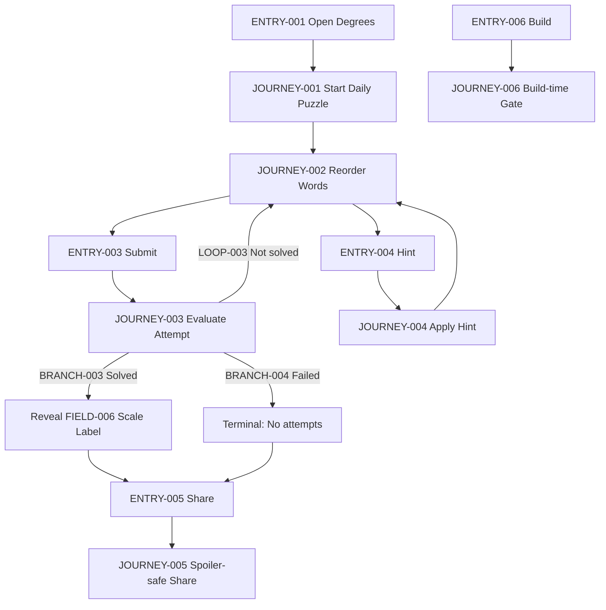
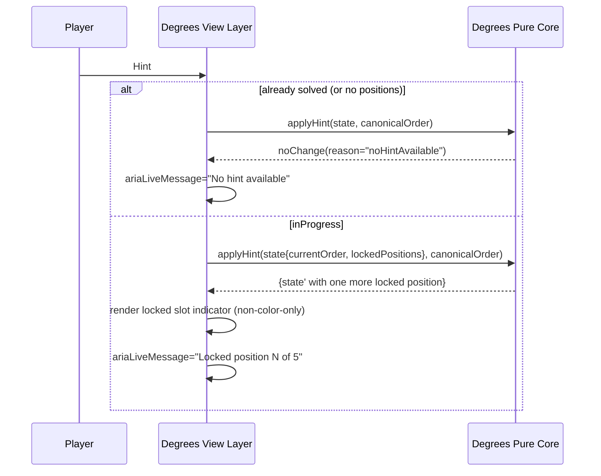
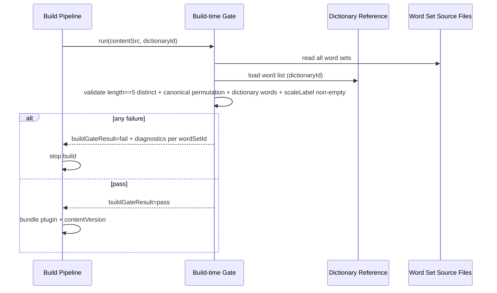
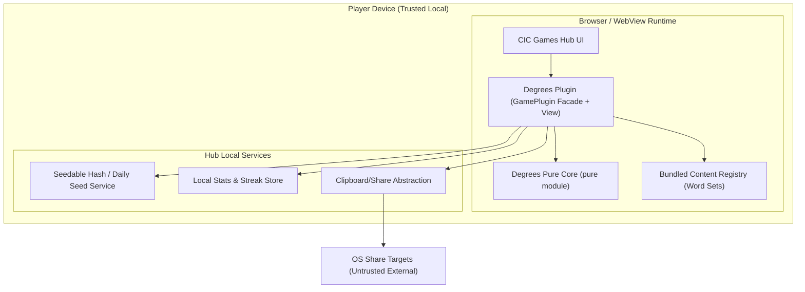

<!-- generated: 2026-07-24T10:01:51Z -->
<!-- mode: initial -->
<!-- feature-slug: degrees -->
<!-- a2a-endpoint: https://bob-sdlc-orchestrator.2as6l7wq9qj8.eu-gb.codeengine.appdomain.cloud/v1/rpc -->

# Glossary

## Terms

### TERM-001: Degrees
- **Definition:** The daily word-ordering puzzle game in the CIC Games hub where the player orders 5 words along a hidden intensity scale.
- **Synonyms:** Daily degrees puzzle, Degrees plugin
- **Anti-definition:** Not a crossword, not a word-guessing game, not a synonym matching game.
- **Source:** User request

### TERM-002: CIC Games Hub
- **Definition:** The host application/platform that runs multiple games as plugins, provides seedable daily selection and local stats/streak services.
- **Synonyms:** Hub, CIC hub
- **Anti-definition:** Not a backend server; not an account system.
- **Source:** User request

### TERM-003: Game Plugin
- **Definition:** A hub-loadable module implementing the hub’s plugin contract to render a game view and interact with hub services.
- **Synonyms:** Plugin
- **Anti-definition:** Not a standalone app; not a server component.
- **Source:** User request

### TERM-004: GamePlugin Interface
- **Definition:** The required contract that the Degrees plugin must implement; includes separation of a pure core and a view layer.
- **Synonyms:** Plugin contract
- **Anti-definition:** Not a persistence API; not a network API.
- **Source:** User request

### TERM-005: Offline-first PWA
- **Definition:** A web app designed to function without network connectivity after installation/caching.
- **Synonyms:** PWA
- **Anti-definition:** Not a web-only experience requiring connectivity.
- **Source:** User request

### TERM-006: Capacitor Wrapper
- **Definition:** The native shell used to run the PWA as an installable app on mobile/desktop targets.
- **Synonyms:** Capacitor app
- **Anti-definition:** Not a separate feature implementation; not a different ruleset.
- **Source:** User request

### TERM-007: Daily Puzzle
- **Definition:** The specific Degrees puzzle for a given calendar day, selected deterministically via the hub’s seedable hash and a content index.
- **Synonyms:** Today’s puzzle
- **Anti-definition:** Not user-generated; not randomized per user device.
- **Source:** User request

### TERM-008: Word Set
- **Definition:** A curated group of exactly five distinct dictionary words that lie on one intensity/degree scale with a single canonical order.
- **Synonyms:** Scaled set, item set
- **Anti-definition:** Not a list with duplicates; not a set with ambiguous ordering.
- **Source:** User request

### TERM-009: Scale Label
- **Definition:** The human-readable name of the hidden dimension for a Word Set (e.g., “temperature”, “size”), revealed only after the player solves.
- **Synonyms:** Dimension label, axis label
- **Anti-definition:** Not shown during active unsolved play; not included in share text before solving.
- **Source:** User request

### TERM-010: Canonical Order
- **Definition:** The curated weakest-to-strongest ordering of the five words for a Word Set.
- **Synonyms:** Answer order, solution order
- **Anti-definition:** Not alphabetical; not derived at runtime by AI/LLM.
- **Source:** User request

### TERM-011: Shuffled Order
- **Definition:** The initial permutation of the five words presented to the player at the start of a Daily Puzzle.
- **Synonyms:** Scrambled order
- **Anti-definition:** Not the canonical order (unless by coincidence).
- **Source:** User request

### TERM-012: Attempt
- **Definition:** One submitted ordering by the player for the current Daily Puzzle.
- **Synonyms:** Guess, submission
- **Anti-definition:** Not a reorder action; not a hint use.
- **Source:** User request

### TERM-013: Attempt Limit
- **Definition:** The maximum number of Attempts allowed for a Daily Puzzle.
- **Synonyms:** Max attempts
- **Anti-definition:** Not time-based; not unlimited.
- **Source:** User request

### TERM-014: Correct Absolute Position Count
- **Definition:** The number of words whose current position index matches the Canonical Order position index, reported as a single integer after submit.
- **Synonyms:** Correct-position count
- **Anti-definition:** Not “correct relative adjacency”; not per-word correctness feedback.
- **Source:** User request

### TERM-015: Solve
- **Definition:** The state where the player’s submitted order matches the Canonical Order for all five words.
- **Synonyms:** Win, completed
- **Anti-definition:** Not “3/5 correct”; not “no attempts remaining”.
- **Source:** User request

### TERM-016: Game State
- **Definition:** The current deterministic state of the puzzle session (e.g., in-progress, solved, failed) and its derived outputs, excluding storage/clock.
- **Synonyms:** Session state
- **Anti-definition:** Not persisted by core; not dependent on device time.
- **Source:** User request

### TERM-017: Pure Core
- **Definition:** A deterministic, side-effect-free module that performs permutation comparison, computes Correct Absolute Position Count, and enforces state transitions.
- **Synonyms:** Core engine, rules engine
- **Anti-definition:** Not responsible for storage, UI rendering, hub calls, network, or device clock.
- **Source:** User request

### TERM-018: View Layer
- **Definition:** The UI implementation that renders the puzzle, accepts input (drag/buttons/keyboard), announces feedback, and calls the Pure Core.
- **Synonyms:** UI, front-end
- **Anti-definition:** Not the source of truth for rules; not non-deterministic rule logic.
- **Source:** User request

### TERM-019: Reorder Control
- **Definition:** Any supported interaction method to rearrange the five words (drag-and-drop, up/down buttons, keyboard).
- **Synonyms:** Sorting controls
- **Anti-definition:** Not submit; not hint.
- **Source:** User request

### TERM-020: Submit
- **Definition:** The user action that converts the current arrangement into an Attempt and requests evaluation by the Pure Core.
- **Synonyms:** Check, confirm
- **Anti-definition:** Not autosave; not continuous evaluation.
- **Source:** User request

### TERM-021: Hint
- **Definition:** A user action that locks the correct word into its first (weakest) unfilled position in the current arrangement.
- **Synonyms:** Assist
- **Anti-definition:** Not revealing the full solution; not revealing the Scale Label before solve.
- **Source:** User request

### TERM-022: Locked Slot
- **Definition:** A position in the list that cannot be moved by reordering controls because it was fixed by a Hint.
- **Synonyms:** Fixed position
- **Anti-definition:** Not disabled due to attempts; not immutable across days.
- **Source:** User request

### TERM-023: Build-time Content Generation
- **Definition:** The process that packages curated Word Sets into the plugin bundle during build, not fetched at runtime.
- **Synonyms:** Prebaked content
- **Anti-definition:** Not remote content delivery; not runtime generation.
- **Source:** User request

### TERM-024: Build-time Gate
- **Definition:** A build validation step that verifies each Word Set meets constraints: exactly 5 distinct dictionary words, single unambiguous Canonical Order, and includes a Scale Label (hidden until solve).
- **Synonyms:** Content validator
- **Anti-definition:** Not a runtime check; not optional QA guidance.
- **Source:** User request

### TERM-025: Dictionary Word
- **Definition:** A single token used as a puzzle word, validated against a defined dictionary/wordlist for allowable characters and casing.
- **Synonyms:** Valid word
- **Anti-definition:** Not a phrase; not containing whitespace.
- **Source:** User request

### TERM-026: Deterministic Daily Selection
- **Definition:** The method to select the Daily Puzzle index using the hub-provided seedable hash so the same day yields the same Word Set on all platforms.
- **Synonyms:** Seeded selection
- **Anti-definition:** Not random per device; not time-zone dependent within the core.
- **Source:** User request

### TERM-027: Hub Seedable Hash
- **Definition:** A hub-provided deterministic function or service that maps (gameId, dateKey) to a stable selection seed/index.
- **Synonyms:** Daily seed
- **Anti-definition:** Not cryptographic requirement unless specified; not device RNG.
- **Source:** User request

### TERM-028: Local Stats
- **Definition:** Per-device aggregated gameplay metrics stored locally via hub services (e.g., plays, wins, streak).
- **Synonyms:** Stats
- **Anti-definition:** Not cloud sync; not per-account.
- **Source:** User request

### TERM-029: Streak
- **Definition:** A count of consecutive days with a Solve for the Daily Puzzle, maintained via hub local stats services.
- **Synonyms:** Win streak
- **Anti-definition:** Not attempt streak; not based on app opens.
- **Source:** User request

### TERM-030: Spoiler-safe Share
- **Definition:** A shareable emoji/text summary that includes Correct Absolute Position Count per Attempt and ends on Solve, without including words or Scale Label.
- **Synonyms:** Emoji share
- **Anti-definition:** Not revealing the answer order; not including Scale Label pre-solve.
- **Source:** User request

### TERM-031: Accessibility Support
- **Definition:** Features enabling keyboard-only reordering, screen-reader announcements, and feedback not dependent solely on color.
- **Synonyms:** A11y
- **Anti-definition:** Not limited to visual cues; not mouse-only.
- **Source:** User request

### TERM-032: Screen-reader Announcement
- **Definition:** Programmatic spoken feedback for important state changes (e.g., submission result, locked slot) using accessible live regions/ARIA.
- **Synonyms:** SR announcement
- **Anti-definition:** Not purely visual toast without accessible equivalent.
- **Source:** User request

### TERM-033: Correctness Check
- **Definition:** The comparison between the player’s current order and the Canonical Order that yields either Solve or a Correct Absolute Position Count.
- **Synonyms:** Evaluation
- **Anti-definition:** Not fuzzy matching; not partial reveal of which words are correct.
- **Source:** User request

## Data Dictionary

| ID | Name | Type | Format | Range/Enum | Units | Default | Nullable | PII | Source | Validation |
|---|---|---|---|---|---|---|---|---|---|---|
| FIELD-001 | puzzleId | string | `degrees:YYYY-MM-DD` | pattern | n/a | n/a | false | Non-PII | Hub (dateKey) + plugin | Must match `^degrees:\d{4}-\d{2}-\d{2}$` |
| FIELD-002 | dateKey | string | `YYYY-MM-DD` | valid calendar date | n/a | hub-provided | false | Non-PII | CIC Games Hub | Must be provided by hub; core shall not derive from device clock |
| FIELD-003 | gameId | string | slug | fixed `degrees` | n/a | `degrees` | false | Non-PII | Plugin constant | Must equal `degrees` |
| FIELD-004 | contentVersion | string | semver-ish | free text | n/a | build-defined | false | Non-PII | Build pipeline | Must be non-empty |
| FIELD-005 | wordSetId | string | opaque id | unique within bundle | n/a | n/a | false | Non-PII | Build-time content | Must be unique across all word sets |
| FIELD-006 | scaleLabel | string | plain text | 1..64 chars | n/a | n/a | false | Non-PII | Build-time content | Must be non-empty; must not be displayed before solved state |
| FIELD-007 | words | string[5] | tokens | exactly 5 | n/a | n/a | false | Non-PII | Build-time content | Array length must be 5; all distinct (case-insensitive) |
| FIELD-008 | canonicalOrder | integer[5] | indices | permutation of 0..4 | n/a | n/a | false | Non-PII | Build-time content | Must be a permutation; maps weakest→strongest |
| FIELD-009 | shuffledOrder | integer[5] | indices | permutation of 0..4 | n/a | generated | false | Non-PII | View layer (using hub seed) | Must be a permutation; deterministic from FIELD-002 + FIELD-005 |
| FIELD-010 | currentOrder | integer[5] | indices | permutation of 0..4 | n/a | equals shuffledOrder | false | Non-PII | View state | Must remain a permutation respecting locked slots |
| FIELD-011 | lockedPositions | boolean[5] | flags | true/false | n/a | all false | false | Non-PII | View state derived from core hint result | Length must be 5 |
| FIELD-012 | attemptsUsed | integer | int | 0..FIELD-013 | attempts | 0 | false | Non-PII | Pure core state | Must increment by 1 per submit outcome (non-solved) and per submit event (see REQs) |
| FIELD-013 | attemptLimit | integer | int | 1..10 | attempts | 6 | false | Non-PII | Plugin config | Must be >=1 |
| FIELD-014 | correctPositionCount | integer | int | 0..5 | words | n/a | true | Non-PII | Pure core output | Must equal count of i where currentOrder[i] == canonicalOrder[i] |
| FIELD-015 | isSolved | boolean | boolean | true/false | n/a | false | false | Non-PII | Pure core state | True iff currentOrder equals canonical order |
| FIELD-016 | isFailed | boolean | boolean | true/false | n/a | false | false | Non-PII | Pure core state | True iff attemptsUsed == attemptLimit and not isSolved |
| FIELD-017 | submissionIndex | integer | int | 1..attemptLimit | n/a | n/a | true | Non-PII | View layer | Must be attemptsUsed + 1 at time of submit |
| FIELD-018 | submissionHistory | integer[] | list | each 0..5 | words | empty | false | Non-PII | View state (for share) | Append correctPositionCount per attempt; length == attemptsUsed (or attempts made) |
| FIELD-019 | hintUses | integer | int | 0..5 | hints | 0 | false | Non-PII | Pure core state | Must increment by 1 per hint action that locks a word |
| FIELD-020 | shareText | string | text | <= 500 chars | n/a | n/a | true | Non-PII | View layer | Must not contain any element of FIELD-007 or FIELD-006 |
| FIELD-021 | reorderMethod | string | enum | `drag` \| `buttons` \| `keyboard` | n/a | n/a | true | Non-PII | View telemetry (optional) | If collected locally, must be one enum value |
| FIELD-022 | ariaLiveMessage | string | text | <= 140 chars | n/a | n/a | true | Non-PII | View layer | Must be set on key feedback events |
| FIELD-023 | hubStatsWriteResult | string | enum | `ok` \| `error` | n/a | n/a | true | Non-PII | Hub stats service | If error, UI must still allow play offline |
| FIELD-024 | buildGateResult | string | enum | `pass` \| `fail` | n/a | n/a | false | Non-PII | Build pipeline | Must be `pass` for release artifact |
| FIELD-025 | dictionaryId | string | id | e.g. `en-US-basic` | n/a | build-defined | false | Non-PII | Build pipeline | Must be non-empty |

FIELD-to-TERM linkage (primary):
- **TERM-007 Daily Puzzle:** FIELD-001..003, FIELD-005, FIELD-009..016
- **TERM-008 Word Set:** FIELD-005..008, FIELD-006, FIELD-007
- **TERM-014 Correct Absolute Position Count:** FIELD-014, FIELD-018
- **TERM-013 Attempt Limit / TERM-012 Attempt:** FIELD-012, FIELD-013, FIELD-017, FIELD-018
- **TERM-021 Hint / TERM-022 Locked Slot:** FIELD-011, FIELD-019
- **TERM-030 Spoiler-safe Share:** FIELD-020, FIELD-018
- **TERM-024 Build-time Gate:** FIELD-024, FIELD-005..008, FIELD-006..007, FIELD-025

# User Journeys

## Roles

| Role ID | Role Name | Type | Description |
|---|---|---|---|
| ROLE-001 | Player | Primary | Plays TERM-001 Degrees daily puzzle in the hub UI |
| ROLE-002 | Hub (Host) | System | Provides TERM-027 Hub Seedable Hash, dateKey, and local stats/streak services |
| ROLE-003 | Build Pipeline | System | Runs TERM-024 Build-time Gate and packages TERM-023 content |
| ROLE-004 | Accessibility Tech | Secondary | Screen reader / keyboard-only interaction with TERM-018 View Layer |

## Entry Points

| Entry ID | Location | Trigger | Auth |
|---|---|---|---|
| ENTRY-001 | Hub UI route (e.g., `/games/degrees`) | Player opens Degrees tile | None |
| ENTRY-002 | Plugin init hook (GamePlugin) | Hub loads plugin module | Host-managed |
| ENTRY-003 | Submit button / keyboard submit | Player activates TERM-020 Submit | None |
| ENTRY-004 | Hint button / keyboard shortcut | Player activates TERM-021 Hint | None |
| ENTRY-005 | Share action | Player taps Share after solved/failed | None |
| ENTRY-006 | Build command (CI) | Build starts | CI-managed |

## Role Permission Matrix

| Capability | ROLE-001 Player | ROLE-002 Hub | ROLE-003 Build Pipeline | ROLE-004 Accessibility Tech |
|---|---:|---:|---:|---:|
| View daily puzzle words (FIELD-007) | Y | N/A | Y (as content) | Y |
| Reorder words (TERM-019) | Y | N | N | Y (via keyboard) |
| Submit attempt (TERM-020) | Y | N | N | Y |
| Use hint (TERM-021) | Y | N | N | Y |
| Reveal scale label (FIELD-006) | Only after TERM-015 Solve | N/A | Y (as content) | Only after solve |
| Persist local stats/streak (TERM-028/029) | Indirect via hub | Y | N | Indirect via hub |
| Validate content (TERM-024) | N | N | Y | N |

## Journeys

### JOURNEY-001: Start Daily Puzzle (deterministic selection, offline)
- **Role/Goal:** ROLE-001 Player; start today’s TERM-007 Daily Puzzle and see 5 shuffled words (FIELD-007, FIELD-009).
- **Entry:** ENTRY-001, ENTRY-002
- **Success criteria:** UI shows 5 words in a deterministic shuffled order; no network required.
- **Failure criteria:** Words not shown; order differs across platforms for same FIELD-002/dateKey and content.

**Happy path**
1. Hub loads plugin via TERM-004 GamePlugin Interface (ENTRY-002) and supplies FIELD-002 dateKey and TERM-027 seed function/context.
2. Plugin selects FIELD-005 wordSetId for FIELD-002 using TERM-026 Deterministic Daily Selection.
3. View requests Word Set content (FIELD-007 words, FIELD-008 canonicalOrder, FIELD-006 scaleLabel) from bundled TERM-023 Build-time Content Generation.
4. View computes FIELD-009 shuffledOrder deterministically from (FIELD-002 dateKey, FIELD-005 wordSetId, gameId FIELD-003).
5. View initializes FIELD-010 currentOrder = FIELD-009 and FIELD-011 lockedPositions = all false.
6. View renders the five Dictionary Words (TERM-025) in shuffled order; does not render FIELD-006 scaleLabel.

**BRANCH-001:** Missing content for selected index
- Trigger: Deterministic selection maps to an out-of-range Word Set index.
- System response: Show an error screen with retry and diagnostic code.
- Recovery: LOOP-001 retry after contentVersion update.

**ERROR-001:** Corrupt bundled content
- Trigger: Word set fails runtime sanity checks (e.g., not 5 words, not distinct).
- System response: Block play for the day and show “Content error” screen.
- User recovery: None offline; instruct to update app.

**EDGE-001:** Offline device
- Condition: No connectivity at launch.
- Expected: Steps 1–6 still complete; no network calls.

**EDGE-002:** Cross-platform determinism
- Condition: Same FIELD-002 and contentVersion on two devices.
- Expected: Same FIELD-005 selection and FIELD-009 shuffledOrder.

---

### JOURNEY-002: Reorder words (drag/buttons/keyboard) with accessibility
- **Role/Goal:** ROLE-001 Player; arrange FIELD-007 words by intensity without hints.
- **Entry:** ENTRY-001
- **Success criteria:** Player can reorder all unlocked items; SR announces changes; no color-only cues.
- **Failure criteria:** Cannot reorder via keyboard; locked slots move.

**Happy path**
1. Player uses TERM-019 Reorder Control to move an item in FIELD-010 currentOrder.
2. View updates FIELD-010 while preserving any FIELD-011 lockedPositions.
3. View updates accessible label/state and sets FIELD-022 ariaLiveMessage describing the move (e.g., “Moved WORD to position 3 of 5”).
4. LOOP-002 repeats steps 1–3 until player is satisfied.

**BRANCH-002:** Attempt to move into/through a locked slot
- System response: Reject move that would change a locked item’s position; announce via FIELD-022.

**ERROR-002:** Keyboard focus lost
- Trigger: After reordering, focus is not on a meaningful control.
- System response: Return focus to the moved item or list container; announce position.

**EDGE-003:** Rapid reorders / concurrency
- Condition: Multiple reorder inputs in quick succession.
- Expected: Final FIELD-010 reflects last action; no duplicate indices; remains a permutation.

---

### JOURNEY-003: Submit attempt and receive correct-position count (no spoilers)
- **Role/Goal:** ROLE-001 Player; submit an ordering and learn only TERM-014 Correct Absolute Position Count (FIELD-014).
- **Entry:** ENTRY-003
- **Success criteria:** System reports count only; does not reveal which positions are correct; attempts decrement; win detected.
- **Failure criteria:** Reveals answer; reveals per-word correctness; inconsistent counts across platforms.

**Happy path**
1. Player activates TERM-020 Submit.
2. View passes FIELD-010 currentOrder and Word Set canonical definition (FIELD-008 canonicalOrder) to TERM-017 Pure Core.
3. Pure Core performs TERM-033 Correctness Check and returns FIELD-014 correctPositionCount and updated FIELD-015 isSolved / FIELD-012 attemptsUsed.
4. View appends FIELD-014 to FIELD-018 submissionHistory.
5. View displays “X of 5 in the correct position” (X = FIELD-014) and sets FIELD-022 ariaLiveMessage with the same information.
6. If FIELD-015 isSolved is false, LOOP-003 returns to JOURNEY-002 for another attempt.

**BRANCH-003:** Solved on submit
- Condition: FIELD-014 == 5 and FIELD-015 true.
- System response: Transition to solved UI; reveal FIELD-006 scaleLabel; enable share (ENTRY-005).

**BRANCH-004:** Attempts exhausted
- Condition: FIELD-016 isFailed true after evaluation.
- System response: Show “No attempts remaining”; do not reveal canonical order; share remains spoiler-safe.

**ERROR-003:** Submit while already solved/failed
- Trigger: Player presses Submit after terminal state.
- System response: No state change; announce “Puzzle already completed.”

**EDGE-004:** Deterministic count
- Condition: Same FIELD-010 and FIELD-008 on different platforms.
- Expected: Same FIELD-014 value.

---

### JOURNEY-004: Use hint to lock weakest unfilled position
- **Role/Goal:** ROLE-001 Player; get assistance by locking one correct word into the first unfilled weakest position.
- **Entry:** ENTRY-004
- **Success criteria:** Exactly one new slot becomes locked with correct word; reordering respects locks.
- **Failure criteria:** Hint reveals scale label early; locks wrong position; locks multiple positions at once.

**Happy path**
1. Player activates TERM-021 Hint.
2. View calls TERM-017 Pure Core with FIELD-010 currentOrder, FIELD-008 canonicalOrder, and FIELD-011 lockedPositions.
3. Pure Core identifies the first (lowest index) unlocked position and places the correct word for that position there, returning updated FIELD-010 and FIELD-011.
4. View increments FIELD-019 hintUses (from core state) and announces via FIELD-022 (e.g., “Locked position 1 of 5”).
5. LOOP-004 returns to JOURNEY-002.

**BRANCH-005:** No available hint positions
- Condition: All positions locked or puzzle solved.
- System response: No change; announce “No hint available.”

**EDGE-005:** Hint interaction with duplicates (should be impossible)
- Condition: Corrupt state where currentOrder not a permutation.
- Expected: Core rejects with error mode (see requirements) and view shows recoverable reset option.

---

### JOURNEY-005: Spoiler-safe share after completion
- **Role/Goal:** ROLE-001 Player; share results without spoilers.
- **Entry:** ENTRY-005
- **Success criteria:** Share contains only emoji/counts per attempt; no words; no scale label.
- **Failure criteria:** Share includes any FIELD-007 word token or FIELD-006 scaleLabel.

**Happy path**
1. Player activates Share on solved/failed screen.
2. View generates FIELD-020 shareText from FIELD-018 submissionHistory and attemptLimit FIELD-013.
3. View copies shareText to clipboard / invokes native share sheet (platform-dependent).
4. View confirms via FIELD-022 ariaLiveMessage “Copied share text”.

**ERROR-004:** Share unavailable
- Trigger: Platform blocks clipboard/share sheet.
- System response: Show shareText in selectable text field for manual copy.

**EDGE-006:** Share before completion
- Condition: Player attempts share while in-progress.
- Expected: Share action disabled or produces “Complete the puzzle to share”.

---

### JOURNEY-006: Build-time gate validates content
- **Role/Goal:** ROLE-003 Build Pipeline; ensure only valid Word Sets ship.
- **Entry:** ENTRY-006
- **Success criteria:** Invalid sets fail build; valid sets produce bundle.
- **Failure criteria:** Invalid set ships; ambiguous ordering present.

**Happy path**
1. Build loads curated Word Sets (FIELD-005..008, FIELD-006) and dictionary reference FIELD-025.
2. Build-time Gate checks each set for 5 distinct TERM-025 Dictionary Words (FIELD-007), exactly one permutation FIELD-008, and non-empty FIELD-006.
3. Build-time Gate emits FIELD-024 buildGateResult = `pass` and build continues.

**ERROR-005:** Gate failure
- Trigger: Any set violates constraints.
- System response: FIELD-024 = `fail`; build stops with per-set diagnostic output.

**EDGE-007:** Non-dictionary word
- Condition: Word contains whitespace or unsupported characters.
- Expected: Gate fails with the offending word and set id.

## Journey Map



# Requirements

### REQ-001: Deterministic daily word set selection
- **EARS Pattern:** Ubiquitous
- **EARS Statement:** The Degrees plugin shall select the TERM-008 Word Set for the TERM-007 Daily Puzzle using TERM-026 Deterministic Daily Selection based on FIELD-002 dateKey and FIELD-003 gameId.
- **Inputs:** FIELD-002, FIELD-003, bundled list of FIELD-005
- **Outputs:** FIELD-005
- **Preconditions:** Plugin loaded via TERM-004
- **Postconditions:** A single FIELD-005 is chosen for the day
- **Invariants:** Selection does not use device clock within TERM-017 Pure Core
- **Trigger:** Plugin initialization
- **Actor:** ROLE-002 Hub (host invokes), ROLE-001 Player (indirect)
- **EntityScope:** TERM-007 Daily Puzzle
- **ErrorModes:** Out-of-range content index
- **NFR-Tags:** determinism
- **Source:** JOURNEY-001 step 2; BRANCH-001
- **Dependencies:** NFR-001
- **Priority:** P0
- **AcceptanceCriteria:**
  - TEST-001: Given the same FIELD-002 and identical bundled content, when initialized on two platforms, then the plugin returns the same FIELD-005.
  - TEST-002: Given a selection index outside available sets, when initializing, then the plugin enters the BRANCH-001 error UI path.
- **Assumptions:** Hub provides stable dateKey definition for “daily”
- **OpenQuestions:** What is the hub API signature for seedable selection?

### REQ-002: Deterministic shuffled order generation
- **EARS Pattern:** Event-Driven
- **EARS Statement:** When a TERM-007 Daily Puzzle is initialized, the Degrees view layer shall generate FIELD-009 shuffledOrder deterministically from FIELD-002 dateKey and FIELD-005 wordSetId.
- **Inputs:** FIELD-002, FIELD-005
- **Outputs:** FIELD-009
- **Preconditions:** FIELD-007 and FIELD-008 are available for FIELD-005
- **Postconditions:** FIELD-010 currentOrder is initialized to FIELD-009
- **Invariants:** FIELD-009 is a permutation of 0..4
- **Trigger:** Daily puzzle initialization
- **Actor:** ROLE-001 Player
- **EntityScope:** TERM-011 Shuffled Order
- **ErrorModes:** Non-permutation shuffle output
- **NFR-Tags:** determinism
- **Source:** JOURNEY-001 step 4–5; EDGE-002
- **Dependencies:** REQ-001
- **Priority:** P0
- **AcceptanceCriteria:**
  - TEST-003: Given same FIELD-002 and FIELD-005, when initialized twice, then FIELD-009 is identical.
  - TEST-004: Given initialization, then FIELD-009 contains each integer 0..4 exactly once.
- **Assumptions:** Deterministic PRNG is available in view layer (not core)
- **OpenQuestions:** Should shuffle be derived via hub seed function directly or local hash?

### REQ-003: Render five words without scale label pre-solve
- **EARS Pattern:** State-Driven
- **EARS Statement:** While FIELD-015 isSolved is false, the Degrees view layer shall not display FIELD-006 scaleLabel.
- **Inputs:** FIELD-006, FIELD-015
- **Outputs:** Rendered UI
- **Preconditions:** Puzzle initialized
- **Postconditions:** Scale label remains hidden until solve
- **Invariants:** Hidden state maintained across attempts
- **Trigger:** UI render
- **Actor:** ROLE-001 Player
- **EntityScope:** TERM-009 Scale Label
- **ErrorModes:** Accidental reveal of scale label
- **NFR-Tags:** spoiler-safety
- **Source:** JOURNEY-001 step 6; user request
- **Dependencies:** REQ-012
- **Priority:** P0
- **AcceptanceCriteria:**
  - TEST-005: Given an unsolved puzzle, when rendering, then scale label text is not present in the DOM/accessibility tree.
- **Assumptions:** Scale label is known to view but conditionally rendered
- **OpenQuestions:** Should scale label be entirely excluded from markup or just hidden?

### REQ-004: Reorder updates current order while preserving locks
- **EARS Pattern:** Event-Driven
- **EARS Statement:** When the player performs a TERM-019 Reorder Control action, the Degrees view layer shall update FIELD-010 currentOrder without changing any position where FIELD-011 lockedPositions is true.
- **Inputs:** FIELD-010, FIELD-011, reorder intent
- **Outputs:** Updated FIELD-010
- **Preconditions:** Puzzle in progress (FIELD-015 false, FIELD-016 false)
- **Postconditions:** List order changes only on unlocked positions
- **Invariants:** FIELD-010 remains a permutation of 0..4
- **Trigger:** Reorder gesture/keypress
- **Actor:** ROLE-001 Player
- **EntityScope:** TERM-020? (No) TERM-019 Reorder Control
- **ErrorModes:** Locked slot moved
- **NFR-Tags:** accessibility
- **Source:** JOURNEY-002 steps 1–2; BRANCH-002; EDGE-003
- **Dependencies:** REQ-015
- **Priority:** P0
- **AcceptanceCriteria:**
  - TEST-006: Given a locked position, when attempting to move its word, then FIELD-010 for that position does not change.
  - TEST-007: Given rapid reorders, then FIELD-010 always contains each index 0..4 exactly once.
- **Assumptions:** Lock semantics apply only to positions, not words
- **OpenQuestions:** Are locked positions visually indicated (non-color-only)?

### REQ-005: Submission triggers core evaluation
- **EARS Pattern:** Event-Driven
- **EARS Statement:** When the player activates TERM-020 Submit, the TERM-017 Pure Core shall compute FIELD-014 correctPositionCount from FIELD-010 currentOrder and FIELD-008 canonicalOrder.
- **Inputs:** FIELD-010, FIELD-008
- **Outputs:** FIELD-014
- **Preconditions:** Puzzle initialized
- **Postconditions:** A single integer feedback is available to the view
- **Invariants:** Output is deterministic for identical inputs
- **Trigger:** Submit action
- **Actor:** ROLE-001 Player
- **EntityScope:** TERM-033 Correctness Check
- **ErrorModes:** Invalid permutation input
- **NFR-Tags:** determinism
- **Source:** JOURNEY-003 steps 1–3; EDGE-004
- **Dependencies:** REQ-002
- **Priority:** P0
- **AcceptanceCriteria:**
  - TEST-008: Given FIELD-010 equals FIELD-008, when submitted, then FIELD-014 equals 5.
  - TEST-009: Given FIELD-010 differs in exactly one position, when submitted, then FIELD-014 equals 4.
  - TEST-010: Given FIELD-010 is not a permutation, when submitted, then the core returns an invalid-input error mode.
- **Assumptions:** canonicalOrder is represented in same index-space as currentOrder
- **OpenQuestions:** What is the core error return type pattern in GamePlugin?

### REQ-006: Correct-position feedback is count-only
- **EARS Pattern:** Ubiquitous
- **EARS Statement:** The Degrees view layer shall display only FIELD-014 correctPositionCount as aggregate feedback for an Attempt.
- **Inputs:** FIELD-014
- **Outputs:** UI message
- **Preconditions:** A submission was evaluated
- **Postconditions:** Player sees “X of 5” style message
- **Invariants:** No per-position indicators derived from evaluation result
- **Trigger:** After evaluation
- **Actor:** ROLE-001 Player
- **EntityScope:** TERM-014 Correct Absolute Position Count
- **ErrorModes:** Per-word correctness leakage
- **NFR-Tags:** spoiler-safety
- **Source:** JOURNEY-003 step 5; user request
- **Dependencies:** REQ-005
- **Priority:** P0
- **AcceptanceCriteria:**
  - TEST-011: Given any evaluated attempt, then UI does not render a correct/incorrect marker per word position based on evaluation.
- **Assumptions:** UI may still show locked slots (from hints) independently
- **OpenQuestions:** Are animations allowed if they don’t encode per-word correctness?

### REQ-007: Winning condition transitions to solved state
- **EARS Pattern:** Event-Driven
- **EARS Statement:** When FIELD-014 equals 5 for a submission, the TERM-017 Pure Core shall set FIELD-015 isSolved to true.
- **Inputs:** FIELD-014
- **Outputs:** FIELD-015
- **Preconditions:** Submission evaluated
- **Postconditions:** Puzzle enters terminal solved state
- **Invariants:** isSolved remains true once set
- **Trigger:** Evaluation result equals 5
- **Actor:** ROLE-001 Player
- **EntityScope:** TERM-016 Game State
- **ErrorModes:** Incorrect state transition
- **NFR-Tags:** determinism
- **Source:** JOURNEY-003 BRANCH-003
- **Dependencies:** REQ-005
- **Priority:** P0
- **AcceptanceCriteria:**
  - TEST-012: Given a solved submission, then subsequent renders show solved UI state.
- **Assumptions:** solved is terminal
- **OpenQuestions:** Does solved state also freeze reordering?

### REQ-008: Increment attempts used per evaluated submit while unsolved
- **EARS Pattern:** Event-Driven
- **EARS Statement:** When the player activates TERM-020 Submit while FIELD-015 isSolved is false and FIELD-016 isFailed is false, the TERM-017 Pure Core shall increment FIELD-012 attemptsUsed by 1.
- **Inputs:** FIELD-015, FIELD-016, submit event
- **Outputs:** FIELD-012
- **Preconditions:** Puzzle in progress
- **Postconditions:** Attempt consumed
- **Invariants:** FIELD-012 never exceeds FIELD-013
- **Trigger:** Submit action during in-progress state
- **Actor:** ROLE-001 Player
- **EntityScope:** TERM-012 Attempt
- **ErrorModes:** attemptsUsed overflow
- **NFR-Tags:** none
- **Source:** JOURNEY-003 step 3; user request
- **Dependencies:** REQ-005, REQ-010
- **Priority:** P0
- **AcceptanceCriteria:**
  - TEST-013: Given attemptsUsed = 0, when submitting once (unsolved), then attemptsUsed = 1.
  - TEST-014: Given attemptsUsed = attemptLimit, when submitting, then attemptsUsed does not increase.
- **Assumptions:** A solved submission may still count as an attempt; clarify in OpenQuestions
- **OpenQuestions:** Should the solving submission increment attemptsUsed?

### REQ-009: Transition to failed state on attempt exhaustion
- **EARS Pattern:** Event-Driven
- **EARS Statement:** When FIELD-012 attemptsUsed becomes equal to FIELD-013 attemptLimit while FIELD-015 isSolved is false, the TERM-017 Pure Core shall set FIELD-016 isFailed to true.
- **Inputs:** FIELD-012, FIELD-013, FIELD-015
- **Outputs:** FIELD-016
- **Preconditions:** At least one submission occurred
- **Postconditions:** Puzzle enters terminal failed state
- **Invariants:** isFailed remains true once set
- **Trigger:** attemptsUsed reaches attemptLimit while unsolved
- **Actor:** ROLE-001 Player
- **EntityScope:** TERM-016 Game State
- **ErrorModes:** Failure not triggered at limit
- **NFR-Tags:** none
- **Source:** JOURNEY-003 BRANCH-004
- **Dependencies:** REQ-008
- **Priority:** P0
- **AcceptanceCriteria:**
  - TEST-015: Given attemptLimit = 2 and two unsolved submissions, then isFailed is true.
- **Assumptions:** No additional attempts after failure
- **OpenQuestions:** Should hints be allowed after failure?

### REQ-010: Block submit in terminal states
- **EARS Pattern:** State-Driven
- **EARS Statement:** While FIELD-015 isSolved is true, the Degrees view layer shall ignore TERM-020 Submit actions without changing FIELD-012 attemptsUsed.
- **Inputs:** FIELD-015, submit action
- **Outputs:** No state mutation
- **Preconditions:** Solved state reached
- **Postconditions:** No additional attempt recorded
- **Invariants:** submissionHistory not appended
- **Trigger:** Submit action while solved
- **Actor:** ROLE-001 Player
- **EntityScope:** TERM-016 Game State
- **ErrorModes:** Attempts consumed after solved
- **NFR-Tags:** none
- **Source:** JOURNEY-003 ERROR-003
- **Dependencies:** REQ-007
- **Priority:** P1
- **AcceptanceCriteria:**
  - TEST-016: Given isSolved true, when pressing Submit, then attemptsUsed remains unchanged.
- **Assumptions:** Failed state handled separately
- **OpenQuestions:** Do we also block submit while isFailed true (separate REQ)?

### REQ-011: Hint locks first weakest unfilled position
- **EARS Pattern:** Event-Driven
- **EARS Statement:** When the player activates TERM-021 Hint while FIELD-015 isSolved is false, the TERM-017 Pure Core shall set FIELD-011 lockedPositions true for the first unlocked position index and place the correct word for that position into FIELD-010 currentOrder.
- **Inputs:** FIELD-010, FIELD-011, FIELD-008
- **Outputs:** Updated FIELD-010, FIELD-011
- **Preconditions:** At least one unlocked position exists
- **Postconditions:** Exactly one additional position becomes locked
- **Invariants:** FIELD-010 remains a permutation
- **Trigger:** Hint action
- **Actor:** ROLE-001 Player
- **EntityScope:** TERM-021 Hint
- **ErrorModes:** No unlocked positions available
- **NFR-Tags:** determinism
- **Source:** JOURNEY-004 steps 1–3; BRANCH-005
- **Dependencies:** REQ-005
- **Priority:** P0
- **AcceptanceCriteria:**
  - TEST-017: Given lockedPositions all false, when hint is used once, then lockedPositions[0] is true and currentOrder[0] equals canonicalOrder[0].
  - TEST-018: Given lockedPositions[0] true and [1] false, when hint is used, then lockedPositions[1] becomes true.
- **Assumptions:** “First weakest unfilled” maps to smallest index
- **OpenQuestions:** Does hint consume an attempt or separate resource?

### REQ-012: Reveal scale label after solve
- **EARS Pattern:** Event-Driven
- **EARS Statement:** When FIELD-015 isSolved becomes true, the Degrees view layer shall display FIELD-006 scaleLabel.
- **Inputs:** FIELD-015, FIELD-006
- **Outputs:** UI display
- **Preconditions:** Scale label exists in content
- **Postconditions:** Player sees label on solved screen
- **Invariants:** Scale label remains visible on solved screen
- **Trigger:** Transition to solved
- **Actor:** ROLE-001 Player
- **EntityScope:** TERM-009 Scale Label
- **ErrorModes:** Label not shown on solve
- **NFR-Tags:** accessibility
- **Source:** JOURNEY-003 BRANCH-003
- **Dependencies:** REQ-007, REQ-003
- **Priority:** P1
- **AcceptanceCriteria:**
  - TEST-019: Given a solved puzzle, when viewing results, then the scale label is visible as text.
- **Assumptions:** Label is safe to reveal only after solve
- **OpenQuestions:** Should failed state reveal scale label? (currently: no)

### REQ-013: Generate spoiler-safe share text
- **EARS Pattern:** Event-Driven
- **EARS Statement:** When the player activates Share in a terminal state, the Degrees view layer shall generate FIELD-020 shareText from FIELD-018 submissionHistory without including FIELD-007 words.
- **Inputs:** FIELD-018, FIELD-007
- **Outputs:** FIELD-020
- **Preconditions:** FIELD-015 true or FIELD-016 true
- **Postconditions:** Share text available to copy/share
- **Invariants:** Share text contains only aggregate per-attempt counts
- **Trigger:** Share action
- **Actor:** ROLE-001 Player
- **EntityScope:** TERM-030 Spoiler-safe Share
- **ErrorModes:** Word leakage in share text
- **NFR-Tags:** privacy, spoiler-safety
- **Source:** JOURNEY-005 steps 1–2
- **Dependencies:** REQ-005
- **Priority:** P0
- **AcceptanceCriteria:**
  - TEST-020: Given any terminal game, when generating shareText, then shareText does not contain any element of FIELD-007 as a substring match.
  - TEST-021: Given submissionHistory length N, then shareText encodes N results in order and ends with the solved attempt if solved.
- **Assumptions:** Emoji format is defined elsewhere by hub conventions
- **OpenQuestions:** Required exact emoji template?

### REQ-014: Share text excludes scale label
- **EARS Pattern:** Unwanted
- **EARS Statement:** The Degrees view layer shall not include FIELD-006 scaleLabel in FIELD-020 shareText.
- **Inputs:** FIELD-006, FIELD-020
- **Outputs:** Validated share text
- **Preconditions:** Share generated
- **Postconditions:** No scale label leak
- **Invariants:** Applies even after solve
- **Trigger:** Share generation
- **Actor:** ROLE-001 Player
- **EntityScope:** TERM-030 Spoiler-safe Share
- **ErrorModes:** Scale label leakage
- **NFR-Tags:** spoiler-safety
- **Source:** User request; JOURNEY-005
- **Dependencies:** REQ-013
- **Priority:** P0
- **AcceptanceCriteria:**
  - TEST-022: Given a solved puzzle, when generating shareText, then shareText does not contain the scaleLabel string.
- **Assumptions:** Share is intended to be spoiler-safe even post-solve
- **OpenQuestions:** Is it acceptable to include “Degrees” title only?

### REQ-015: Keyboard-accessible reordering
- **EARS Pattern:** Ubiquitous
- **EARS Statement:** The Degrees view layer shall provide a keyboard-only method to reorder FIELD-007 words in FIELD-010 currentOrder.
- **Inputs:** Keyboard events, FIELD-010
- **Outputs:** Updated FIELD-010
- **Preconditions:** Puzzle view visible
- **Postconditions:** Word order changes without pointer input
- **Invariants:** Works with locked positions per FIELD-011
- **Trigger:** Keyboard interaction
- **Actor:** ROLE-004 Accessibility Tech, ROLE-001 Player
- **EntityScope:** TERM-019 Reorder Control
- **ErrorModes:** No keyboard path
- **NFR-Tags:** accessibility
- **Source:** JOURNEY-002; user request
- **Dependencies:** REQ-004
- **Priority:** P0
- **AcceptanceCriteria:**
  - TEST-023: Given focus on a word, when pressing configured keys to move it up/down, then currentOrder updates accordingly.
- **Assumptions:** Specific keys follow hub accessibility guidelines
- **OpenQuestions:** Which keybindings are standard in CIC hub?

### REQ-016: Screen-reader announcements for key feedback
- **EARS Pattern:** Event-Driven
- **EARS Statement:** When an Attempt is evaluated, the Degrees view layer shall set FIELD-022 ariaLiveMessage to the “X of 5 in the correct position” feedback using FIELD-014.
- **Inputs:** FIELD-014
- **Outputs:** FIELD-022
- **Preconditions:** Evaluation complete
- **Postconditions:** SR announces result
- **Invariants:** Message does not depend on color
- **Trigger:** Evaluation completion
- **Actor:** ROLE-004 Accessibility Tech
- **EntityScope:** TERM-032 Screen-reader Announcement
- **ErrorModes:** Missing announcement
- **NFR-Tags:** accessibility
- **Source:** JOURNEY-003 step 5
- **Dependencies:** REQ-005
- **Priority:** P0
- **AcceptanceCriteria:**
  - TEST-024: Given an evaluated attempt with correctPositionCount=3, then ariaLiveMessage equals a string containing “3” and “5”.
- **Assumptions:** Live region is correctly configured
- **OpenQuestions:** Localization requirements for announcements?

### REQ-017: Core contains no storage or clock access
- **EARS Pattern:** Unwanted
- **EARS Statement:** The TERM-017 Pure Core shall not read from or write to persistent storage or system clock APIs.
- **Inputs:** n/a
- **Outputs:** n/a
- **Preconditions:** Core invoked
- **Postconditions:** No side effects
- **Invariants:** Deterministic operation preserved
- **Trigger:** Any core function call
- **Actor:** ROLE-002 Hub, ROLE-001 Player (indirect)
- **EntityScope:** TERM-017 Pure Core
- **ErrorModes:** Side-effectful dependency introduced
- **NFR-Tags:** determinism, architecture
- **Source:** User request
- **Dependencies:** None
- **Priority:** P0
- **AcceptanceCriteria:**
  - TEST-025: Static analysis/build step confirms core module has no imports of storage/clock APIs as configured.
- **Assumptions:** Repo structure separates core and view packages
- **OpenQuestions:** Which APIs count as “clock” in Capacitor/PWA context?

### REQ-018: Build-time gate validates each word set structure
- **EARS Pattern:** Event-Driven
- **EARS Statement:** When the build runs TERM-024 Build-time Gate, the build pipeline shall fail if any TERM-008 Word Set does not contain exactly five distinct FIELD-007 words.
- **Inputs:** FIELD-007
- **Outputs:** FIELD-024
- **Preconditions:** Content files present
- **Postconditions:** Invalid content blocks build
- **Invariants:** Distinctness is case-insensitive
- **Trigger:** Build gate execution
- **Actor:** ROLE-003 Build Pipeline
- **EntityScope:** TERM-008 Word Set
- **ErrorModes:** Duplicate or wrong-length word list
- **NFR-Tags:** quality
- **Source:** JOURNEY-006 step 2; ERROR-005
- **Dependencies:** None
- **Priority:** P0
- **AcceptanceCriteria:**
  - TEST-026: Given a set with 4 words, when gating, then buildGateResult is `fail`.
  - TEST-027: Given a set with duplicate words differing only by case, when gating, then buildGateResult is `fail`.
- **Assumptions:** Dictionary normalization rule is defined (e.g., lowercasing)
- **OpenQuestions:** Allow diacritics and locale-specific casing?

### REQ-019: Build-time gate validates canonical order permutation
- **EARS Pattern:** Event-Driven
- **EARS Statement:** When the build runs TERM-024 Build-time Gate, the build pipeline shall fail if FIELD-008 canonicalOrder is not a permutation of integers 0 through 4.
- **Inputs:** FIELD-008
- **Outputs:** FIELD-024
- **Preconditions:** Content files present
- **Postconditions:** Invalid ordering blocks build
- **Invariants:** No repeated indices
- **Trigger:** Build gate execution
- **Actor:** ROLE-003 Build Pipeline
- **EntityScope:** TERM-010 Canonical Order
- **ErrorModes:** Non-permutation canonicalOrder
- **NFR-Tags:** quality
- **Source:** JOURNEY-006 step 2
- **Dependencies:** None
- **Priority:** P0
- **AcceptanceCriteria:**
  - TEST-028: Given canonicalOrder `[0,1,1,3,4]`, when gating, then build fails.
- **Assumptions:** Indices map to FIELD-007 array positions
- **OpenQuestions:** Store canonical order as words vs indices?

### REQ-020: Build-time gate validates dictionary word format
- **EARS Pattern:** Event-Driven
- **EARS Statement:** When the build runs TERM-024 Build-time Gate, the build pipeline shall fail if any FIELD-007 word is not a TERM-025 Dictionary Word according to FIELD-025 dictionaryId.
- **Inputs:** FIELD-007, FIELD-025
- **Outputs:** FIELD-024
- **Preconditions:** Dictionary reference available
- **Postconditions:** Invalid tokens block build
- **Invariants:** Words contain no whitespace
- **Trigger:** Build gate execution
- **Actor:** ROLE-003 Build Pipeline
- **EntityScope:** TERM-025 Dictionary Word
- **ErrorModes:** Non-dictionary token
- **NFR-Tags:** i18n, quality
- **Source:** JOURNEY-006; EDGE-007
- **Dependencies:** None
- **Priority:** P1
- **AcceptanceCriteria:**
  - TEST-029: Given a word containing a space, when gating, then build fails.
- **Assumptions:** A dictionary list exists and is versioned
- **OpenQuestions:** Are proper nouns allowed?

---

### NFR-001: Cross-platform deterministic evaluation
- **EARS Pattern:** Ubiquitous
- **EARS Statement:** The TERM-017 Pure Core shall produce identical FIELD-014 and FIELD-015 outputs for identical FIELD-010 and FIELD-008 inputs across all supported platforms.
- **Inputs:** FIELD-010, FIELD-008
- **Outputs:** FIELD-014, FIELD-015
- **Preconditions:** Same inputs provided
- **Postconditions:** Same outputs returned
- **Invariants:** No floating point or locale-sensitive comparison
- **Trigger:** Any core evaluation call
- **Actor:** ROLE-001 Player
- **EntityScope:** TERM-017 Pure Core
- **ErrorModes:** Platform-dependent output variance
- **NFR-Tags:** determinism, compatibility
- **Source:** JOURNEY-003 EDGE-004; user request
- **Dependencies:** REQ-017
- **Priority:** P0
- **AcceptanceCriteria:**
  - TEST-030: Golden test vectors of (canonicalOrder,currentOrder) yield identical outputs in web and native CI runs.
- **Assumptions:** CI runs both targets
- **OpenQuestions:** Which platforms are in scope (iOS/Android/Web/Desktop)?

### NFR-002: Offline operation without backend
- **EARS Pattern:** Unwanted
- **EARS Statement:** The Degrees plugin shall not require network connectivity to load content or evaluate Attempts.
- **Inputs:** n/a
- **Outputs:** n/a
- **Preconditions:** App installed/cached
- **Postconditions:** Game playable offline
- **Invariants:** All content is bundled (TERM-023)
- **Trigger:** Launch and play
- **Actor:** ROLE-001 Player
- **EntityScope:** TERM-001 Degrees
- **ErrorModes:** Network dependency introduced
- **NFR-Tags:** reliability, compatibility
- **Source:** JOURNEY-001 EDGE-001; user request
- **Dependencies:** REQ-001, REQ-005
- **Priority:** P0
- **AcceptanceCriteria:**
  - TEST-031: With device in airplane mode, user can start and complete a puzzle.
- **Assumptions:** Hub itself can launch offline
- **OpenQuestions:** Any optional online features to explicitly omit?

### NFR-003: Accessibility—no color-only feedback
- **EARS Pattern:** Ubiquitous
- **EARS Statement:** The Degrees view layer shall present submission feedback in text such that understanding FIELD-014 does not depend on color perception.
- **Inputs:** FIELD-014
- **Outputs:** UI feedback text
- **Preconditions:** Submission evaluated
- **Postconditions:** Feedback understandable without color
- **Invariants:** Text is always present
- **Trigger:** After submit
- **Actor:** ROLE-004 Accessibility Tech
- **EntityScope:** TERM-031 Accessibility Support
- **ErrorModes:** Color-only cue
- **NFR-Tags:** accessibility
- **Source:** JOURNEY-003 step 5; user request
- **Dependencies:** REQ-006
- **Priority:** P0
- **AcceptanceCriteria:**
  - TEST-032: Visual inspection/test asserts presence of textual “X of 5” message regardless of theme.
- **Assumptions:** Themes may use colors but not exclusively
- **OpenQuestions:** Required WCAG level (AA/AAA)?

### NFR-004: Privacy—no account identifiers stored by plugin
- **EARS Pattern:** Unwanted
- **EARS Statement:** The Degrees plugin shall not collect or store any user identifiers or contact information.
- **Inputs:** n/a
- **Outputs:** n/a
- **Preconditions:** Play occurs
- **Postconditions:** No PII persisted by plugin
- **Invariants:** Stats use hub local services without account linkage
- **Trigger:** Any gameplay
- **Actor:** ROLE-001 Player
- **EntityScope:** TERM-028 Local Stats
- **ErrorModes:** PII collection introduced
- **NFR-Tags:** privacy
- **Source:** User request (no accounts)
- **Dependencies:** REQ-017
- **Priority:** P0
- **AcceptanceCriteria:**
  - TEST-033: Code audit confirms no writes of PII-classified fields; data dictionary shows all Non-PII.
- **Assumptions:** Hub stats are per-device anonymous
- **OpenQuestions:** Is any coarse analytics permitted locally only?

### NFR-005: Observability—local debug diagnostics for content errors
- **EARS Pattern:** Event-Driven
- **EARS Statement:** When ERROR-001 occurs, the Degrees view layer shall display a diagnostic code containing FIELD-004 contentVersion and FIELD-005 wordSetId.
- **Inputs:** FIELD-004, FIELD-005
- **Outputs:** UI diagnostic string
- **Preconditions:** Runtime content sanity check fails
- **Postconditions:** User can report issue
- **Invariants:** Does not reveal FIELD-008 or FIELD-006
- **Trigger:** Content error detected
- **Actor:** ROLE-001 Player
- **EntityScope:** TERM-023 Build-time Content Generation
- **ErrorModes:** Missing diagnostic
- **NFR-Tags:** observability, spoiler-safety
- **Source:** JOURNEY-001 ERROR-001
- **Dependencies:** REQ-018, REQ-019
- **Priority:** P2
- **AcceptanceCriteria:**
  - TEST-034: Given a forced corrupt content in dev mode, then error UI shows contentVersion and wordSetId only.
- **Assumptions:** Dev/test hooks exist to simulate corruption
- **OpenQuestions:** Should diagnostics be copyable for support?
# Architecture

## Components & Responsibilities

### CIC Games Hub (Host Runtime)
- **Responsibilities**
  - Loads the Degrees plugin via the hub’s GamePlugin contract (ENTRY-002).
  - Supplies `dateKey` (FIELD-002) and a deterministic seedable hash/seed context (TERM-027) used for daily selection and shuffle determinism.
  - Provides local stats/streak services (TERM-028/029) for per-device persistence.
  - Provides platform capabilities used by the plugin (clipboard/share sheet, storage abstractions, accessibility conventions).
- **Owns / Does not own**
  - Owns: routing (`/games/degrees`), seed function semantics, local stats store, and cross-plugin UX shell.
  - Does not own: Degrees content curation, Degrees rule correctness, Degrees view state specifics.
- **Exposes interfaces**
  - `GamePlugin` lifecycle hooks (init/mount/unmount) (TERM-004).
  - Seed API: `getDailySeed(gameId, dateKey) -> seed` (exact signature TBD; see ADR-003).
  - Local stats API: `readStats(gameId)`, `writeStats(gameId, delta)`; streak helper.
  - Platform share/clipboard API (web + Capacitor abstraction).
- **Consumes interfaces**
  - Plugin module bundle (ESM) implementing `GamePlugin`.

**Requirements satisfied:** Provides prerequisites for REQ-001/REQ-002 (seed + dateKey), and local stats for “Local stats/streaks via hub services” (non-numbered statement; referenced in journeys).

---

### Degrees Plugin Module (GamePlugin Facade)
- **Responsibilities**
  - Implements hub `GamePlugin` interface; wires hub services into Degrees view.
  - Orchestrates initialization: daily selection, content load, shuffle, initial state.
  - Enforces offline-first: no network calls at runtime (NFR-002).
- **Owns / Does not own**
  - Owns: composition root, dependency wiring, module-level configuration (e.g., attemptLimit default).
  - Does not own: rule logic (core) and long-term persistence (hub-owned).
- **Exposes interfaces**
  - `GamePlugin` methods required by hub (mount/render).
- **Consumes interfaces**
  - Hub seed/date/stats/share APIs.
  - Bundled content registry.
  - Pure Core API.

**Requirements satisfied:** REQ-001, REQ-002 (through wiring), NFR-002, NFR-004.

---

### Degrees Pure Core (TERM-017)
- **Responsibilities**
  - Deterministic evaluation: compute `correctPositionCount` (FIELD-014) from `currentOrder` (FIELD-010) and `canonicalOrder` (FIELD-008). (REQ-005, NFR-001)
  - State transitions:
    - Set `isSolved` when count==5 (REQ-007)
    - Increment `attemptsUsed` for in-progress submits (REQ-008)
    - Set `isFailed` when attempts exhaust while unsolved (REQ-009)
  - Apply hint operation:
    - Lock the first unlocked (lowest index) position and place correct word there, preserving permutation validity (REQ-011)
  - Validate inputs (permutation checks) and return explicit error mode for invalid state (REQ-005 error mode, JOURNEY-004 EDGE-005).
- **Owns / Does not own**
  - Owns: game rules, transitions, invariants; deterministic outputs; error typing.
  - Does not own: UI rendering, shuffling, content selection, storage, clock, network. (REQ-017)
- **Exposes interfaces**
  - `evaluateSubmit(state, canonicalOrder) -> {state’, correctPositionCount}` (shape TBD but stable, pure).
  - `applyHint(state, canonicalOrder) -> {state’}`.
  - `validatePermutation(order) -> ok|error`.
- **Consumes interfaces**
  - None (must remain dependency-free of storage/clock/network per REQ-017).

**Requirements satisfied:** REQ-005..REQ-009, REQ-011, REQ-017, NFR-001.

**Trade-off (explicit):** Keeping shuffle logic out of the core preserves strict determinism and testability (REQ-017) at the cost of having two deterministic mechanisms (selection/shuffle in view/plugin, evaluation in core) that must be carefully versioned together (addressed via ADR-002 and versioning in Cross-Cutting).

---

### Degrees View Layer (UI + Interaction)
- **Responsibilities**
  - Renders the 5 words in shuffled order; hides scale label pre-solve (REQ-003).
  - Implements reorder controls:
    - Drag-and-drop (when available)
    - Buttons (up/down)
    - Keyboard-only reorder (REQ-015)
  - Maintains view state: `currentOrder`, `lockedPositions`, `submissionHistory`, terminal screens.
  - Calls Pure Core on submit and hint; renders count-only feedback (REQ-006) and terminal results.
  - Accessibility:
    - Announces reorders and results via ARIA live region (REQ-016, JOURNEY-002).
    - No color-only feedback (NFR-003).
  - Generates spoiler-safe share text; invokes hub share/clipboard; provides fallback UI (REQ-013/REQ-014, JOURNEY-005).
  - Shows diagnostic code on runtime content errors without spoilers (NFR-005).
- **Owns / Does not own**
  - Owns: interaction details, focus management, ARIA/live region management, local transient state, deterministic shuffle generation.
  - Does not own: rule correctness or state transitions (core), persistence of stats (hub), network.
- **Exposes interfaces**
  - Internal UI routes/states (in-progress, solved, failed, content-error) as part of the plugin view.
- **Consumes interfaces**
  - Pure Core API.
  - Bundled content registry.
  - Hub seed/date context.
  - Hub stats + share APIs.

**Requirements satisfied:** REQ-002..REQ-004, REQ-006, REQ-010, REQ-012..REQ-016, NFR-003, NFR-005.

---

### Bundled Content Registry (Build-time Content Package)
- **Responsibilities**
  - Provides read-only access to curated Word Sets:
    - `wordSetId` (FIELD-005), `words` (FIELD-007), `canonicalOrder` (FIELD-008), `scaleLabel` (FIELD-006), `contentVersion` (FIELD-004)
  - Ensures content is locally available offline (TERM-023, NFR-002).
- **Owns / Does not own**
  - Owns: content files and index; contentVersion stamping.
  - Does not own: daily selection algorithm (plugin), correctness logic (core).
- **Exposes interfaces**
  - `getWordSetById(id)` / `getWordSetByIndex(i)` and `listWordSets()`.
- **Consumes interfaces**
  - None at runtime.

**Requirements satisfied:** Supports REQ-001/REQ-003; enables NFR-002.

---

### Build-time Gate (TERM-024) + CI Pipeline Step
- **Responsibilities**
  - Validates each Word Set:
    - exactly 5 distinct words (case-insensitive) (REQ-018)
    - `canonicalOrder` is a permutation of 0..4 (REQ-019)
    - each word is in dictionary / format rules (REQ-020)
    - `scaleLabel` is present and non-empty (implied by TERM-024 definition)
  - Emits `buildGateResult` (FIELD-024) and fails build on violations (JOURNEY-006).
  - Produces release artifact containing plugin + content + contentVersion.
- **Owns / Does not own**
  - Owns: validation logic and dictionary reference management.
  - Does not own: runtime state; hub services.
- **Exposes interfaces**
  - CLI/build step: `npm run gate:degrees` (example) producing machine-readable diagnostics.
- **Consumes interfaces**
  - Content files, dictionary list (FIELD-025).

**Requirements satisfied:** REQ-018..REQ-020, supports NFR-005 by preventing corrupt content.

---

## Data Flow

### JOURNEY-001 Start Daily Puzzle (deterministic selection, offline)

```mermaid
sequenceDiagram
  participant Player
  participant Hub as CIC Hub
  participant Plugin as Degrees GamePlugin Facade
  participant Content as Bundled Content Registry
  participant View as Degrees View Layer
  participant Core as Degrees Pure Core

  Player->>Hub: Open /games/degrees
  Hub->>Plugin: load() / init(dateKey, seedCtx)
  Plugin->>Hub: getDailySeed(gameId="degrees", dateKey)
  Hub-->>Plugin: seed/selectionIndex
  Plugin->>Content: listWordSets() / getByIndex(selectionIndex)
  alt BRANCH-001 out-of-range index
    Content-->>Plugin: error(outOfRange)
    Plugin->>View: renderError("missing content", diagnosticCode)
  else ok
    Content-->>Plugin: WordSet(wordSetId, words, canonicalOrder, scaleLabel, contentVersion)
    Plugin->>View: init(wordSet, dateKey, seedCtx)
    Note over View: REQ-002: compute shuffledOrder deterministically from (dateKey, wordSetId, gameId/seed)
    View->>View: currentOrder := shuffledOrder; lockedPositions := [false..]
    View->>View: render words (scaleLabel not rendered)
    Note over View: REQ-003: scaleLabel excluded pre-solve
  end
```

**State transitions**
- `GameState`: `notStarted -> inProgress` upon successful init.
- Terminal error UI on content selection failure (BRANCH-001) or runtime sanity check failure (ERROR-001).

---

### JOURNEY-002 Reorder words (drag/buttons/keyboard) with accessibility

```mermaid
sequenceDiagram
  participant Player
  participant View as Degrees View Layer

  loop Each reorder interaction
    Player->>View: ReorderControl(move from i to j) / keypress
    alt target crosses locked slot
      View->>View: reject move; keep currentOrder
      View->>View: ariaLiveMessage="That position is locked"
    else ok
      View->>View: update currentOrder (permutation; locked positions unchanged)
      View->>View: ariaLiveMessage="Moved WORD to position X of 5"
    end
    View->>View: maintain focus on moved item/list
  end
```

**State transitions**
- `GameState` remains `inProgress`.
- `currentOrder` transitions between permutations; invariant: indices 0..4 each exactly once.

---

### JOURNEY-003 Submit attempt and receive correct-position count (no spoilers)

```mermaid
sequenceDiagram
  participant Player
  participant View as Degrees View Layer
  participant Core as Degrees Pure Core
  participant Hub as CIC Hub

  Player->>View: Submit
  alt terminal state (solved/failed)
    View->>View: ignore; ariaLiveMessage="Puzzle already completed"
  else inProgress
    View->>Core: evaluateSubmit(state{currentOrder, attemptsUsed, attemptLimit, isSolved, isFailed}, canonicalOrder)
    alt invalid permutation input
      Core-->>View: error(invalidInput)
      View->>View: render recoverable error + reset option
    else ok
      Core-->>View: {state', correctPositionCount}
      View->>View: submissionHistory.append(correctPositionCount)
      View->>View: render "X of 5 in the correct position" (text)
      View->>View: ariaLiveMessage="X of 5 in the correct position"
      alt solved (X==5)
        View->>View: render solved UI; reveal scaleLabel
        View->>Hub: writeStats(gameId, delta={win:1, streak:+1})
      else attempts exhausted
        View->>View: render failed UI (no answer reveal)
        View->>Hub: writeStats(gameId, delta={play:1, streakReset:true})
      else continue
        View->>Hub: writeStats(gameId, delta={play:1})
      end
    end
  end
```

**State transitions**
- `inProgress -> solved` when `correctPositionCount==5` (REQ-007).
- `inProgress -> failed` when `attemptsUsed==attemptLimit` and not solved (REQ-009).
- Attempts increment on each in-progress submit (REQ-008).  
  **Open question remains** whether the solving submission increments attemptsUsed (REQ-008 OpenQuestions; ADR-004 Proposed).

---

### JOURNEY-004 Use hint to lock weakest unfilled position



**State transitions**
- `GameState` remains `inProgress`.
- `lockedPositions`: exactly one additional `false -> true` per valid hint (REQ-011).

---

### JOURNEY-005 Spoiler-safe share after completion

```mermaid
sequenceDiagram
  participant Player
  participant View as Degrees View Layer
  participant Hub as CIC Hub

  Player->>View: Share
  alt not terminal
    View->>View: disable or message "Complete the puzzle to share"
  else terminal
    View->>View: shareText := format(submissionHistory, attemptLimit) excluding words & scaleLabel
    alt platform share available
      View->>Hub: openShareSheet(shareText) / copyToClipboard(shareText)
      Hub-->>View: ok
      View->>View: ariaLiveMessage="Copied share text"
    else ERROR-004
      View->>View: display selectable shareText field
      View->>View: ariaLiveMessage="Share unavailable; text shown for manual copy"
    end
  end
```

**State transitions**
- None (terminal state persists).

---

### JOURNEY-006 Build-time gate validates content



**State transitions**
- Build artifact only produced on `pass`.

---

## Deployment Topology

- **Runtime environments**
  - **Web/PWA:** Degrees plugin runs in the hub web app runtime (browser JS, service worker caching managed by hub). No required network calls (NFR-002).
  - **Capacitor Wrapper:** Same bundled web assets run inside a native WebView; sharing/clipboard routed through Capacitor/hub abstraction.
  - **No backend services** for Degrees (explicit constraint).
- **Network boundaries / trust zones**
  - **Client-only trust zone:** hub + plugin + content all local.
  - Optional OS-level share targets are outside trust boundary; only shareText is exported (spoiler-safe).
- **Scaling units and limits**
  - Scales per-device only. Primary constraints: bundle size (content), memory footprint, and deterministic compute time (tiny; fixed-size arrays of 5).
  - Attempt limit max constrained by config (FIELD-013 suggests 1..10).
- **Deployment diagram**



---

## Security Architecture

- **AuthN (Authentication)**
  - **Player (ROLE-001):** none (no accounts, offline).
  - **Hub (ROLE-002):** host-controlled plugin loading; trust is implicit via signed/bundled app distribution.
  - **Build Pipeline (ROLE-003):** CI credentials for repo access (outside Degrees runtime scope).
- **AuthZ (Authorization)**
  - **Model:** Capability-based via hub-provided APIs (plugin receives only allowed interfaces). No user-level permissions.
  - Degrees view enforces state-based authorization:
    - Submit disabled/ignored in terminal state (REQ-010; also apply to failed by convention even if not separately required).
    - Share only in terminal state (REQ-013 precondition).
    - Scale label rendered only post-solve (REQ-003/REQ-012).
- **Secret management**
  - No runtime secrets required (no backend).  
  - CI secrets limited to build/publish pipeline; not embedded in plugin artifacts.
- **Data classification & encryption**
  - All gameplay data is **Non-PII** per data dictionary.
  - **At rest:** hub local stats storage is device-local; rely on platform storage protections (OS/browser). No additional encryption required for non-PII, but acceptable if hub provides it.
  - **In transit:** none required for Degrees (offline). Share text may leave device via OS share; ensure it contains no words/scale label (REQ-013/REQ-014).
- **Threat model (top 5)**
  1. **Spoiler leakage via UI/DOM/accessibility tree (scale label shown early)**
     - Mitigation: exclude scale label from DOM/accessibility tree while unsolved (REQ-003 acceptance test explicitly checks DOM/a11y tree).
  2. **Spoiler leakage via share text (words or scale label included)**
     - Mitigation: share formatter uses only numeric history; automated substring tests against words + scaleLabel (REQ-013/REQ-014).
  3. **Non-determinism across platforms (daily selection/shuffle/evaluation diverge)**
     - Mitigation: pure core with golden vectors (NFR-001); deterministic shuffle uses hub seed + stable algorithm; CI runs web+native determinism suite.
  4. **Corrupt/malicious content shipped (wrong length, duplicates, invalid canonical order)**
     - Mitigation: build-time gate (REQ-018/REQ-019/REQ-020) + runtime sanity checks with safe error UI (JOURNEY-001 ERROR-001, NFR-005 diagnostics).
  5. **State tampering via devtools leading to crashes (invalid permutations/locks)**
     - Mitigation: core validates permutations and returns controlled errors; view offers recoverable reset path (REQ-005 error mode, JOURNEY-004 EDGE-005).

---

## Integration Points

### Inbound interfaces
1. **Hub route**
   - **Interface:** `/games/degrees` (ENTRY-001)
   - **Protocol:** internal SPA route
   - **Schema:** n/a
   - **Failure mode:** plugin fails to mount → hub shows generic plugin error shell
   - **SLA expectation:** instantaneous local navigation; no network dependency

2. **GamePlugin lifecycle**
   - **Interface:** `GamePlugin.init(ctx)` / `mount(container, ctx)` (TERM-004; signature TBD)
   - **Protocol:** in-process JS call
   - **Schema reference:** Hub plugin contract (not provided)
   - **Failure mode:** thrown error → hub catches and displays error boundary
   - **SLA:** <100ms init excluding rendering; deterministic

3. **UI events**
   - **Interface:** submit/hint/share/reorder controls (ENTRY-003/004/005)
   - **Protocol:** DOM events / keyboard events
   - **Failure mode:** ignored when invalid state; never crashes
   - **SLA:** immediate (<16ms per interaction where possible)

### Outbound dependencies
1. **Hub seedable hash / daily seed**
   - **Protocol:** in-process call
   - **Schema:** `getDailySeed(gameId, dateKey) -> seed | index`
   - **Failure mode:** seed unavailable → fallback error screen; cannot guarantee determinism
   - **SLA:** always available offline
   - **Notes:** Open signature/semantics (REQ-001/REQ-002 OpenQuestions) → ADR-003 Proposed.

2. **Hub local stats/streak service**
   - **Protocol:** in-process call; local storage behind hub abstraction
   - **Schema:** `writeStats(gameId, delta) -> {ok|error}` (FIELD-023)
   - **Failure mode:** returns `error` → UI must still allow play (FIELD-023 definition); stats silently degraded
   - **SLA:** best-effort, non-blocking; no gameplay impact

3. **Clipboard / share sheet**
   - **Protocol:** Web Clipboard API / Capacitor Share plugin via hub abstraction
   - **Schema:** `share(text)` / `copy(text)`
   - **Failure mode:** blocked by platform permissions → fallback selectable text (ERROR-004)
   - **SLA:** best-effort; user-driven

4. **Bundled content registry**
   - **Protocol:** local module import/read
   - **Schema:** WordSet `{wordSetId, words[5], canonicalOrder[5], scaleLabel, contentVersion}`
   - **Failure mode:** missing/corrupt set → content error UI + diagnostic code (NFR-005)
   - **SLA:** constant-time local access

---

## Architecture Decision Records

### ADR-001: Bundle all puzzle content (no backend)
- **Status:** Accepted
- **Context:** Requirements mandate offline-first operation and “no backend” (NFR-002). Daily puzzles must load without network.
- **Decision:** Package curated Word Sets into the plugin bundle at build time (TERM-023) and validate with a build-time gate (TERM-024).
- **Consequences:**
  - (+) Fully offline, deterministic, low latency, simpler security posture.
  - (−) Larger app bundle; content updates require app release/update.
- **Alternatives:**
  - Remote fetch of daily content (rejected: violates NFR-002 and introduces backend dependency).
  - Hybrid: initial bundle + optional updates (deferred; would require new requirements and trust model).

### ADR-002: Strict separation—Pure Core has no shuffle, storage, clock, or hub calls
- **Status:** Accepted
- **Context:** Core must be deterministic across platforms and side-effect-free (REQ-017, NFR-001). Shuffle depends on hub seed and may vary by platform APIs if not controlled.
- **Decision:** Keep Pure Core limited to evaluation, hint application, and state transitions. Selection/shuffle occur in plugin/view using hub seed.
- **Consequences:**
  - (+) Core is trivially testable with golden vectors; portable across web/native.
  - (−) Determinism now depends on correct wiring + stable shuffle algorithm outside core.
- **Alternatives:**
  - Put shuffle in core (rejected: would require hub seed access in core or passing more context; risks violating REQ-017’s spirit and coupling).

### ADR-003: Deterministic daily selection & shuffle derive from hub seed API (signature TBD)
- **Status:** Proposed
- **Context:** REQ-001/REQ-002 require deterministic selection/shuffle; hub provides “seedable hash” but API signature is unknown.
- **Decision:** Standardize on a hub-provided function that returns a stable seed (integer/bytes) for `(gameId, dateKey)`; plugin will:
  - map seed -> wordSet index (mod N) for selection
  - derive shuffle PRNG seed from `(seed, wordSetId)` for FIELD-009
- **Consequences:**
  - (+) Cross-platform determinism anchored in hub’s canonical dateKey/seed definition.
  - (−) Requires hub contract clarity; changes to hub seed algorithm could change historical puzzles.
- **Alternatives:**
  - Local hashing of `dateKey` in plugin (risk: diverges from hub’s definition; timezone/dateKey mismatch).
  - Bundle explicit calendar mapping `dateKey -> wordSetId` (increases content size and editorial overhead).

### ADR-004: Whether the solving submission consumes an attempt
- **Status:** Proposed
- **Context:** REQ-008 increments attempts on in-progress submit; open question explicitly asks whether solving submit increments `attemptsUsed`.
- **Decision:** Tentatively count the solving submission as an attempt (common UX; simplifies invariants: “each submit in progress consumes 1”), but confirm with product.
- **Consequences:**
  - (+) Simple mental model; `submissionHistory.length == attemptsUsed`.
  - (−) Some games display “solved in 0 attempts” if first submit is correct; counting may affect stats.
- **Alternatives:**
  - Do not increment on solving submit (requires special-case logic; stats semantics differ).

---

## Cross-Cutting Concerns

- **Logging, tracing, metrics, alerting**
  - No backend telemetry by default (privacy + offline).  
  - Local-only debug logging (dev builds) for:
    - content load failures (include `contentVersion`, `wordSetId` only; never words/canonicalOrder/scaleLabel) (NFR-005)
    - core invalid-input errors (include diagnostic code, not payloads that reveal answers)
  - Optional: hub-local aggregated counters (plays/wins) are stored through hub stats service; not exported.

- **Configuration and feature flags**
  - `attemptLimit` (FIELD-013) as plugin config with safe bounds (1..10).
  - Feature flags (if hub supports): enable/disable drag-and-drop per platform; keyboard-only always enabled (REQ-015).

- **Error handling strategy**
  - **Content errors:** fail closed (do not allow play), show non-spoiler diagnostic code (NFR-005).
  - **Core invalid state (non-permutation):** show recoverable UI with “Reset puzzle state” (recompute deterministic shuffle + clear local state) to restore invariants.
  - **Hub stats write failure:** non-blocking; gameplay continues (FIELD-023).
  - **Share/clipboard failure:** fallback to manual copy field (ERROR-004).

- **Backwards compatibility / versioning**
  - **Content versioning:** `contentVersion` (FIELD-004) embedded in bundle and shown in diagnostics; changing content changes the daily mapping results.
  - **Determinism contract:** selection + shuffle algorithms must be treated as versioned behavior. If algorithm changes, consider pinning by `contentVersion` to avoid inconsistent experiences across app versions on the same date (unresolved; candidate future ADR if needed).
  - **Core API versioning:** Pure Core exported functions and state shape should be semvered within the repo; golden test vectors protect behavior (NFR-001).
# Review

## Risks (table sorted by severity descending)

| ID | Title | Category | Likelihood | Impact | Severity | Affected requirements | Mitigation | Owner | Status |
|---|---|---:|---:|---:|---:|---|---|---|---|
| RISK-001 | Hub seed/dateKey contract undefined → daily selection/shuffle may diverge across platforms/versions | Dependency | High | High | **Critical** | REQ-001, REQ-002, NFR-001, NFR-002, ADR-003 | Finalize and version the hub API: exact signature, seed type/size, normalization of `dateKey`, and guarantee of offline availability. Add contract tests in hub+plugin CI. Consider “seed contract version” surfaced to plugin. | Hub + Plugin leads | Open |
| RISK-002 | Deterministic shuffle implemented in view layer may be inconsistent (PRNG differences, locale/encoding, wordSetId hashing) | Technical | High | High | **Critical** | REQ-002, NFR-001, ADR-002/003 | Specify shuffle algorithm precisely (e.g., Fisher–Yates + fixed PRNG like xorshift32) and canonical string/byte encoding for inputs. Add golden vectors for shuffle across web/native, not just core evaluation. | Plugin lead | Open |
| RISK-003 | Attempt accounting ambiguity (does solving submit consume an attempt?) causes inconsistent stats/share semantics | Operational | High | Medium | **High** | REQ-008, REQ-009, REQ-013, ADR-004 | Decide and document single rule; align invariants (`submissionHistory.length == attemptsMade`) and UI (“Solved in N attempts”). Add explicit acceptance test(s) for solving submit behavior. | Product + Plugin lead | Open |
| RISK-004 | Missing requirement to block Submit in failed state (only solved covered) → users may consume attempts/history or get inconsistent terminal behavior | Functional | Medium | High | **High** | REQ-010, REQ-009, JOURNEY-003 ERROR-003 | Add REQ: “While isFailed true, ignore Submit without state mutation” mirroring REQ-010; add tests for submissionHistory not appended. | Plugin lead | Open |
| RISK-005 | Spoiler leakage via accessibility tree/DOM or analytics/debug logs (scaleLabel/words present pre-solve) | Security | Medium | High | **High** | REQ-003, REQ-013, REQ-014, NFR-005 | Enforce “not present in DOM/a11y tree” (already in TEST-005) plus: ensure scaleLabel/words never included in ariaLive messages, diagnostics, or share. Add lint/test to scan rendered DOM snapshots + log outputs in CI. | Plugin lead | Open |
| RISK-006 | Content change across app versions breaks “same day same puzzle” for users on different versions (contentVersion drift) | Operational | Medium | High | **High** | REQ-001, TERM-007, Cross-cutting versioning note | Define policy: either accept drift, or pin daily mapping by `contentVersion` (e.g., include contentVersion in seed input or publish a stable calendar mapping). Communicate in UX if mismatch possible. | Product + Hub | Open |
| RISK-007 | Hint operation can inadvertently create non-permutation state or violate locked-slot invariants if not precisely specified | Technical | Medium | Medium | **Medium** | REQ-011, REQ-004, REQ-005 | Specify exact algorithm for applying hint: swap mechanics, treatment when correct word already elsewhere, and preservation of other locked positions. Add unit tests for all hint permutations/lock patterns. | Core owner | Open |
| RISK-008 | Stats/streak update rules are not captured as requirements → inconsistent streaks (plays vs wins; failure handling; replays) | Operational | Medium | Medium | **Medium** | (Implicit; referenced in Architecture/Journeys), NFR-004 | Add explicit requirements for when `writeStats` occurs (on first submit vs on completion), idempotency (avoid double-writes on remount), and what constitutes a “play” and “win”. | Product + Hub | Open |
| RISK-009 | Build-time gate does not explicitly validate “single unambiguous canonical order” beyond permutation correctness | Quality/Dependency | Medium | Medium | **Medium** | TERM-024, REQ-018/019/020 | Clarify what “unambiguous” means operationally (editorial guarantee vs computable rule). If editorial-only, rename to avoid false assurance; if computable, add checks/metadata and enforce in gate. | Content + Build | Open |
| RISK-010 | Share substring checks can false-pass/false-fail (case, diacritics, punctuation) and could still leak via near-matches | Security | Low | Medium | **Low** | REQ-013, REQ-014 | Normalize (NFKC + casefold) before checks; additionally assert shareText matches strict allowed regex/template rather than only “does not contain word substrings”. | Plugin lead | Open |

## Missing Edge Cases

- **Failed-state submit behavior**: Requirements cover “submit while solved” (REQ-010) but not “submit while failed”; journey mentions both.
- **Rehydration / app suspend-resume**: What happens to in-progress state on refresh/app kill? (Offline-first PWA + Capacitor makes this common.) Decide whether to persist transient state via hub services or restart deterministically.
- **dateKey rollover while playing**: If the hub’s `dateKey` changes at midnight while the puzzle is open, does the session continue, warn, or restart?
- **Deterministic selection when content list length changes**: If selection is `seed mod N`, changing N changes historical mapping. Define expected behavior.
- **Hint availability constraints**: After failure, can hints be used (REQ-009 OpenQuestion)? After solve, hints should no-op (covered partially).
- **Terminal-state reordering**: REQ-007 OpenQuestion asks if reordering freezes; not specified. Similar for hint usage in terminal states.
- **Accessibility specifics for DnD**: Drag-and-drop is optional; ensure a non-DnD path exists for all platforms and that locked slots are announced with meaningful semantics (position locked, cannot move).
- **Localization**: ARIA/live messages and UI strings may need localization; requirements mention none, but hub may require it.
- **Content error recovery loop**: BRANCH-001 suggests retry after contentVersion update; offline constraints mean “retry” likely won’t help until app update—needs UX clarity.
- **Dictionary/casing rules**: Diacritics, apostrophes, hyphens, and locale casing rules are open; could break gate or determinism if not standardized.

## Dependency Conflicts

- **REQ-003 depends on REQ-012 (circular-ish rendering constraint)**: REQ-003 says “don’t show label while unsolved” and depends on REQ-012 “show after solved”. This is not a true circular dependency but is a spec smell; both are state-driven render rules and should depend on `isSolved` only, not each other.
- **Selection/shuffle dependency ambiguity**: REQ-001 depends on NFR-001 (core evaluation determinism), but selection is not in core. The determinism NFR should be split: one for core evaluation (already) and another for selection+shuffle determinism (currently implied).
- **ADR-002 vs deterministic needs**: Keeping shuffle out of core is fine, but then NFR-001 only protects evaluation, not shuffle. This creates a coverage gap where the most likely cross-platform divergence sits.

## Recommendations

1. **Finalize and version the hub seed/dateKey contract** (signature, encoding, offline guarantees, and whether seed returns an index vs raw seed) and add hub-plugin contract tests in CI.  
2. **Specify a deterministic shuffle algorithm and inputs precisely** (byte encoding, normalization, PRNG, Fisher–Yates details) and add cross-platform golden tests for shuffle and selection (not just core).  
3. **Resolve attempt semantics (ADR-004) and codify it** with explicit acceptance criteria; align `attemptsUsed`, `submissionHistory`, share formatting, and stats language.  
4. **Add missing terminal-state guards**: new requirement(s) to block Submit and Hint while `isFailed` (and confirm behavior while `isSolved`) plus tests that history/stats don’t mutate.  
5. **Promote stats/streak behavior into explicit requirements**: when to write stats, idempotency on remount, what constitutes play/win, and how streak resets on failure.  
6. **Tighten spoiler-safety verification**: enforce strict shareText template/regex; add DOM/a11y snapshot tests ensuring scaleLabel is absent pre-solve and that diagnostics/logs never include words/label.  
7. **Clarify content “unambiguous order” validation**: either treat as editorial-only and reword TERM-024 accordingly, or add metadata + gate checks that operationalize the claim.
# Test Plan

## Feature Files

```gherkin
# file: degrees_daily_init.feature
@regression
Feature: Degrees daily initialization (selection, shuffle, offline, spoiler safety)
  The plugin must deterministically select and shuffle the daily word set using hub-provided dateKey/seed,
  operate offline, and avoid spoilers (scale label) until solved.

  @REQ-001 @AC-TEST-001 @integration @regression
  Scenario: Deterministic daily selection is identical across platforms for the same dateKey and content
    Given the hub provides dateKey "2026-01-15" for gameId "degrees"
    And the bundled content registry is identical on "web" and "native" with contentVersion "1.2.3"
    When the Degrees plugin is initialized on "web" and on "native"
    Then the selected wordSetId should be identical on both platforms

  @REQ-001 @AC-TEST-002 @e2e @regression
  Scenario: Out-of-range daily selection index shows the missing-content error UI
    Given the hub seed service returns a selection index outside the bundled content range
    When the Degrees plugin initializes the daily puzzle
    Then the UI should show the "missing content" error screen
    And the UI should offer a retry action
    And the UI should not show the scale label or any canonical order information

  @REQ-002 @AC-TEST-003 @integration @regression
  Scenario: Shuffled order is deterministic for the same dateKey and wordSetId across two initializations
    Given dateKey "2026-01-15" and wordSetId "ws-100"
    And the Degrees view layer uses the deterministic shuffle algorithm
    When the daily puzzle is initialized twice
    Then the shuffledOrder should be identical between the two initializations

  @REQ-002 @AC-TEST-004 @unit @regression
  Scenario: Shuffled order is always a permutation of 0..4
    Given dateKey "2026-01-15" and wordSetId "ws-100"
    When the daily puzzle is initialized
    Then shuffledOrder should contain each integer 0 through 4 exactly once

  @NFR-002 @AC-TEST-031 @e2e @regression
  Scenario: The puzzle can be started and completed in airplane mode without network connectivity
    Given the device network is offline
    And the hub can launch the Degrees route with dateKey "2026-01-15"
    When the player opens Degrees and plays until the puzzle reaches a terminal state
    Then the puzzle should render five words and accept reorders
    And submissions should be evaluated without any network calls
    And the player should be able to reach solved or failed state offline
```

```gherkin
# file: degrees_ui_rendering_spoilers.feature
@regression
Feature: UI rendering rules (no spoilers, reveal on solve, count-only feedback)
  The UI must hide the scale label until solved, reveal it on solve, and never show per-position correctness.

  @REQ-003 @AC-TEST-005 @e2e @security @regression
  Scenario: Scale label is not present in the DOM or accessibility tree before solving
    Given a daily puzzle is initialized and isSolved is false
    When the puzzle view is rendered
    Then the scale label text should not be present in the DOM
    And the scale label text should not be present in the accessibility tree

  @REQ-006 @AC-TEST-011 @e2e @security @regression
  Scenario: Submission feedback is aggregate count-only with no per-word correctness markers
    Given an evaluated attempt result is available with correctPositionCount 2
    When the UI renders the submission feedback for the attempt
    Then the UI should display only an aggregate "2 of 5" style message
    And the UI should not render any per-position correct/incorrect indicator derived from evaluation results

  @REQ-012 @AC-TEST-019 @e2e @a11y @regression
  Scenario: Scale label is visible as text after solving
    Given a daily puzzle is in solved state with scaleLabel "temperature"
    When the results view is displayed
    Then the scale label "temperature" should be visible as text
```

```gherkin
# file: degrees_reorder_accessibility.feature
@regression
Feature: Reordering words with locks and accessibility (keyboard + SR)
  Reordering must preserve locked positions, remain a permutation, and provide keyboard-only control.

  @REQ-004 @AC-TEST-006 @e2e @regression
  Scenario: Attempting to move a word in a locked position does not change that position
    Given the puzzle is in progress
    And lockedPositions are [true,false,false,false,false]
    And currentOrder is a valid permutation
    When the player attempts to move the word at position 1 to position 3 using any reorder control
    Then the word at locked position 1 should remain unchanged in currentOrder
    And currentOrder should remain a valid permutation of 0..4

  @REQ-004 @AC-TEST-007 @integration @regression
  Scenario: Rapid consecutive reorders never break permutation validity
    Given the puzzle is in progress with no locked positions
    And currentOrder is [0,1,2,3,4]
    When the player performs a burst of reorder actions rapidly
    Then currentOrder should contain each integer 0 through 4 exactly once
    And no duplicate indices should exist in currentOrder

  @REQ-015 @AC-TEST-023 @e2e @a11y @regression
  Scenario: Keyboard-only reordering changes currentOrder
    Given the puzzle is in progress
    And focus is on the word at position 3
    When the player presses the configured keyboard command to move the focused word up by 1
    Then currentOrder should update to reflect the move
    And the moved word should be in position 2
```

```gherkin
# file: degrees_submit_and_state_transitions.feature
@regression
Feature: Submitting attempts and core state transitions (evaluate, attempts, solved, failed, terminal guards)
  Submit must evaluate deterministically, manage attemptsUsed, and correctly enter solved/failed terminal states.

  @REQ-005 @AC-TEST-008 @unit @regression
  Scenario: Submitting the canonical order yields correctPositionCount 5
    Given canonicalOrder is [0,1,2,3,4]
    And currentOrder is [0,1,2,3,4]
    And the core state is in progress with attemptsUsed 0 and attemptLimit 6
    When the player submits the current order for evaluation
    Then correctPositionCount should equal 5

  @REQ-005 @AC-TEST-009 @unit @regression
  Scenario: Submitting an order with exactly one incorrect absolute position yields correctPositionCount 4
    Given canonicalOrder is [0,1,2,3,4]
    And currentOrder differs from canonicalOrder in exactly one position
    And the core state is in progress with attemptsUsed 0 and attemptLimit 6
    When the player submits the current order for evaluation
    Then correctPositionCount should equal 4

  @REQ-005 @AC-TEST-010 @unit @security @regression
  Scenario: Submitting a non-permutation input returns an invalid-input error
    Given canonicalOrder is [0,1,2,3,4]
    And currentOrder is [0,0,2,3,4]
    And the core state is in progress with attemptsUsed 0 and attemptLimit 6
    When the player submits the current order for evaluation
    Then the core should return an invalid-input error mode

  @REQ-007 @AC-TEST-012 @integration @regression
  Scenario: A solved submission transitions to solved UI state on subsequent render
    Given a puzzle is in progress and not solved
    And a submission is evaluated with correctPositionCount 5
    When the view renders after applying the core state update
    Then the view should be in solved UI state

  @REQ-008 @AC-TEST-013 @unit @regression
  Scenario: attemptsUsed increments by 1 for an unsolved in-progress submission
    Given the core state is in progress with attemptsUsed 0 and attemptLimit 6
    And the submitted order is not solved
    When the player submits for evaluation
    Then attemptsUsed should equal 1

  @REQ-008 @AC-TEST-014 @unit @regression
  Scenario: attemptsUsed does not increase when already at attemptLimit
    Given the core state has attemptsUsed equal to attemptLimit and isSolved is false
    When the player submits for evaluation
    Then attemptsUsed should remain equal to attemptLimit

  @REQ-009 @AC-TEST-015 @unit @regression
  Scenario: Puzzle transitions to failed when attemptsUsed reaches attemptLimit while unsolved
    Given attemptLimit is 2
    And the core state is in progress with attemptsUsed 0 and isSolved is false
    When the player submits two unsolved submissions
    Then isFailed should be true

  @REQ-010 @AC-TEST-016 @e2e @regression
  Scenario: Submit is ignored in solved terminal state without changing attemptsUsed
    Given the puzzle is in solved terminal state
    And attemptsUsed is recorded as 3
    When the player presses Submit
    Then attemptsUsed should remain 3
    And submissionHistory should not be appended
```

```gherkin
# file: degrees_hints.feature
@regression
Feature: Hint behavior (lock first weakest unfilled position)
  A hint locks exactly one additional lowest-index unlocked position and places the correct word there.

  @REQ-011 @AC-TEST-017 @unit @regression
  Scenario: First hint locks position 0 and places the canonical weakest word there
    Given canonicalOrder is [2,0,4,1,3]
    And currentOrder is a valid permutation
    And lockedPositions are [false,false,false,false,false]
    And the puzzle is not solved
    When the player uses a hint
    Then lockedPositions[0] should be true
    And currentOrder[0] should equal canonicalOrder[0]
    And currentOrder should remain a valid permutation of 0..4

  @REQ-011 @AC-TEST-018 @unit @regression
  Scenario: Next hint locks the next lowest-index unlocked position
    Given canonicalOrder is [2,0,4,1,3]
    And currentOrder is a valid permutation
    And lockedPositions are [true,false,false,false,false]
    And the puzzle is not solved
    When the player uses a hint
    Then lockedPositions[1] should be true
    And currentOrder[1] should equal canonicalOrder[1]
    And currentOrder should remain a valid permutation of 0..4
```

```gherkin
# file: degrees_share_spoiler_safe.feature
@regression
Feature: Spoiler-safe share output (no words, no scale label, ordered attempt history)
  Share text must be generated only in terminal states and must not leak any puzzle words or the scale label.

  @REQ-013 @AC-TEST-020 @e2e @security @regression
  Scenario: Share text does not contain any word tokens as substrings
    Given the puzzle is in a terminal state
    And the word list is ["cool","tepid","warm","hot","scorching"]
    And submissionHistory is [1,2,4,5]
    When the player generates share text
    Then shareText should not contain any of the words as a substring match

  @REQ-013 @AC-TEST-021 @e2e @regression
  Scenario: Share text encodes submissionHistory length in order and ends on the solved attempt when solved
    Given the puzzle is solved
    And submissionHistory is [0,2,3,5]
    And attemptLimit is 6
    When the player generates share text
    Then shareText should encode 4 attempt results in the same order as submissionHistory
    And shareText should represent completion on the final encoded result

  @REQ-014 @AC-TEST-022 @e2e @security @regression
  Scenario: Share text never includes the scale label even after solve
    Given the puzzle is solved with scaleLabel "temperature"
    And submissionHistory is [1,3,5]
    When the player generates share text
    Then shareText should not contain "temperature"
```

```gherkin
# file: degrees_accessibility_feedback.feature
@regression
Feature: Accessibility feedback (ARIA live announcements, no color-only reliance)
  Key feedback must be announced via aria-live and understandable via text.

  @REQ-016 @AC-TEST-024 @e2e @a11y @regression
  Scenario: ARIA live message announces evaluated attempt result "3 of 5"
    Given an evaluated attempt has correctPositionCount 3
    When the view updates submission feedback
    Then ariaLiveMessage should contain "3"
    And ariaLiveMessage should contain "5"
    And ariaLiveMessage should describe aggregate correct positions

  @NFR-003 @AC-TEST-032 @e2e @a11y @regression
  Scenario: Submission feedback includes text and does not rely on color perception
    Given an evaluated attempt has correctPositionCount 4
    When the UI renders the submission feedback in any theme
    Then a textual "4 of 5" style message should be present
```

```gherkin
# file: degrees_core_purity_and_determinism.feature
@regression
Feature: Core purity and cross-platform determinism
  The pure core must have no storage/clock dependencies and must produce identical outputs for identical inputs.

  @REQ-017 @AC-TEST-025 @unit @security @regression
  Scenario: Static analysis confirms the core has no storage or clock API imports
    Given the repository is configured with forbidden import rules for storage and clock APIs
    When static analysis runs against the pure core module
    Then the build should fail if any forbidden storage or clock import is detected

  @NFR-001 @AC-TEST-030 @integration @regression
  Scenario: Golden test vectors yield identical evaluation outputs in web and native CI runs
    Given the golden vector set of (canonicalOrder,currentOrder) pairs is available
    When the core evaluation suite runs in "web" and in "native"
    Then all vectors should yield identical correctPositionCount outputs across platforms
    And all vectors should yield identical isSolved outputs across platforms
```

```gherkin
# file: degrees_build_gate.feature
@regression
Feature: Build-time content gate validation
  The build pipeline must block invalid word sets from shipping.

  @REQ-018 @AC-TEST-026 @integration @regression
  Scenario: Gate fails if a word set does not contain exactly five words
    Given a candidate word set with words length 4
    When the build-time gate runs for Degrees content
    Then buildGateResult should be "fail"

  @REQ-018 @AC-TEST-027 @integration @regression
  Scenario: Gate fails if a word set contains duplicates differing only by case
    Given a candidate word set with words ["Hot","hot","warm","cool","tepid"]
    When the build-time gate runs for Degrees content
    Then buildGateResult should be "fail"

  @REQ-019 @AC-TEST-028 @integration @regression
  Scenario: Gate fails if canonicalOrder is not a permutation of 0..4
    Given a candidate word set with canonicalOrder [0,1,1,3,4]
    When the build-time gate runs for Degrees content
    Then buildGateResult should be "fail"

  @REQ-020 @AC-TEST-029 @integration @regression
  Scenario: Gate fails if any word contains whitespace and violates dictionary word format
    Given a candidate word set with a word token "very hot"
    And the dictionaryId is "en-US-basic"
    When the build-time gate runs for Degrees content
    Then buildGateResult should be "fail"
```

```gherkin
# file: degrees_observability_content_error.feature
@regression
Feature: Observability for runtime content errors (diagnostic code without spoilers)
  When runtime content sanity checks fail, the UI must show safe diagnostics for support.

  @NFR-005 @AC-TEST-034 @e2e @security @regression
  Scenario: Content error screen shows only contentVersion and wordSetId in diagnostic code
    Given a forced runtime content sanity-check failure for wordSetId "ws-777"
    And contentVersion is "1.2.3"
    When the plugin renders the content error UI
    Then the diagnostic code should include "1.2.3"
    And the diagnostic code should include "ws-777"
    And the diagnostic code should not include any puzzle words
    And the diagnostic code should not include the scale label
```

## Step Definitions

| Step (regex-style) | Reuse | Type | Notes / Implementation hints |
|---|---|---:|---|
| `^the hub provides dateKey "([^"]+)" for gameId "([^"]+)"$` | High | integration/e2e | Stub hub context passed to GamePlugin init. |
| `^the bundled content registry is identical on "([^"]+)" and "([^"]+)" with contentVersion "([^"]+)"$` | Med | integration | Loads same fixture content into both runtimes. |
| `^the Degrees plugin is initialized on "([^"]+)" and on "([^"]+)"$` | High | integration | Harness to init twice and capture outputs. |
| `^the selected wordSetId should be identical on both platforms$` | High | integration | Compare captured FIELD-005. |
| `^the hub seed service returns a selection index outside the bundled content range$` | Low | e2e | Mock seed -> invalid index. |
| `^the Degrees plugin initializes the daily puzzle$` | High | e2e | Navigate to route and mount plugin. |
| `^the UI should show the "([^"]+)" error screen$` | Med | e2e | Assert error component visible. |
| `^the UI should offer a retry action$` | Med | e2e | Assert retry button exists/enabled. |
| `^the UI should not show the scale label or any canonical order information$` | Low | e2e | Ensure label absent; no answer display. |
| `^dateKey "([^"]+)" and wordSetId "([^"]+)"$` | Med | unit/integration | Provide deterministic shuffle inputs. |
| `^the Degrees view layer uses the deterministic shuffle algorithm$` | Med | integration | Ensures algorithm version pinned. |
| `^the daily puzzle is initialized twice$` | Med | integration | Init -> capture shuffledOrder; reset; re-init. |
| `^the shuffledOrder should be identical between the two initializations$` | Med | integration | Compare FIELD-009 arrays. |
| `^shuffledOrder should contain each integer 0 through 4 exactly once$` | High | unit | Permutation assertion helper. |
| `^the device network is offline$` | Med | e2e | Browser context: block network; native: airplane-mode simulator. |
| `^the hub can launch the Degrees route with dateKey "([^"]+)"$` | Med | e2e | Ensure hub shell loads without network. |
| `^the player opens Degrees and plays until the puzzle reaches a terminal state$` | Low | e2e | Script: reorder/submit loop until solved/failed. |
| `^submissions should be evaluated without any network calls$` | Med | e2e | Network spy: assert no requests. |
| `^a daily puzzle is initialized and isSolved is false$` | High | e2e | Ensure initial state. |
| `^the puzzle view is rendered$` | High | e2e | Render complete and stable. |
| `^the scale label text should not be present in the DOM$` | High | e2e | Query DOM for FIELD-006 exact string. |
| `^the scale label text should not be present in the accessibility tree$` | Med | e2e | Use a11y tree snapshot / ARIA queries. |
| `^an evaluated attempt result is available with correctPositionCount (\d+)$` | Med | e2e | Inject evaluated result into view (or drive submit with fixture). |
| `^the UI renders the submission feedback for the attempt$` | Med | e2e | Verify rendered message. |
| `^the UI should display only an aggregate "([^"]+)" style message$` | Med | e2e | Pattern match for “X of 5”. |
| `^the UI should not render any per-position correct/incorrect indicator derived from evaluation results$` | Med | e2e | Assert absence of per-item correctness classes/icons. |
| `^a daily puzzle is in solved state with scaleLabel "([^"]+)"$` | Med | e2e | Drive solve or inject state. |
| `^the results view is displayed$` | Med | e2e | Navigate to solved screen. |
| `^the scale label "([^"]+)" should be visible as text$` | Med | e2e | Text visible + accessible name. |
| `^the puzzle is in progress$` | High | e2e | Ensure isSolved/isFailed false. |
| `^lockedPositions are \[([^\]]+)\]$` | Med | unit/e2e | Parse booleans fixture. |
| `^currentOrder is a valid permutation$` | Med | e2e | Set or verify starting order. |
| `^the player attempts to move the word at position (\d+) to position (\d+) using any reorder control$` | Med | e2e | Attempt drag/buttons/keyboard depending on platform. |
| `^the word at locked position (\d+) should remain unchanged in currentOrder$` | Med | e2e | Inspect view state or DOM order mapping. |
| `^currentOrder should remain a valid permutation of 0\.\.4$` | High | unit/e2e | Permutation check helper. |
| `^currentOrder is \[([^\]]+)\]$` | Med | integration | Set explicit order for stress test. |
| `^the player performs a burst of reorder actions rapidly$` | Low | integration | Fire events quickly; assert final order valid. |
| `^focus is on the word at position (\d+)$` | Med | e2e | Tab/roving tabindex to item. |
| `^the player presses the configured keyboard command to move the focused word up by (\d+)$` | Med | e2e | Keybinding per hub standard (TBD). |
| `^the moved word should be in position (\d+)$` | Med | e2e | Assert position. |
| `^canonicalOrder is \[([^\]]+)\]$` | High | unit | Provide array fixture. |
| `^currentOrder differs from canonicalOrder in exactly one position$` | Low | unit | Derive a near-solved permutation. |
| `^the core state is in progress with attemptsUsed (\d+) and attemptLimit (\d+)$` | Med | unit | Build core state object. |
| `^the player submits the current order for evaluation$` | High | unit | Call core evaluateSubmit. |
| `^correctPositionCount should equal (\d+)$` | High | unit | Assert FIELD-014. |
| `^the core should return an invalid-input error mode$` | High | unit | Assert error type/tag. |
| `^a puzzle is in progress and not solved$` | Med | integration | Prepare view+core state. |
| `^a submission is evaluated with correctPositionCount (\d+)$` | Med | integration | Apply core output to view. |
| `^the view renders after applying the core state update$` | Med | integration | Re-render and assert. |
| `^the view should be in solved UI state$` | Med | integration | Assert solved screen elements. |
| `^the submitted order is not solved$` | Med | unit | Choose a non-solved permutation. |
| `^attemptsUsed should equal (\d+)$` | High | unit | Assert FIELD-012. |
| `^attemptsUsed should remain equal to attemptLimit$` | High | unit | Assert cap. |
| `^attemptLimit is (\d+)$` | Med | unit | Configure limit. |
| `^the player submits two unsolved submissions$` | Low | unit | Two evaluate calls with non-solve orders. |
| `^isFailed should be true$` | High | unit | Assert FIELD-016. |
| `^the puzzle is in solved terminal state$` | Med | e2e | Ensure solved. |
| `^attemptsUsed is recorded as (\d+)$` | Low | e2e | Capture attemptsUsed before action. |
| `^the player presses Submit$` | Med | e2e | Click/keypress submit. |
| `^submissionHistory should not be appended$` | Med | e2e | Assert history length unchanged. |
| `^lockedPositions\[([0-4])\] should be true$` | Med | unit | Assert lock. |
| `^currentOrder\[([0-4])\] should equal canonicalOrder\[([0-4])\]$` | Med | unit | Assert placement. |
| `^the puzzle is not solved$` | Med | unit | isSolved false. |
| `^the player uses a hint$` | High | unit | Call core applyHint. |
| `^the puzzle is in a terminal state$` | Med | e2e | solved or failed. |
| `^the word list is \[(.+)\]$` | Med | e2e | Fixture words. |
| `^submissionHistory is \[(.+)\]$` | Med | e2e | Fixture history. |
| `^the player generates share text$` | High | e2e | Click Share; capture FIELD-020. |
| `^shareText should not contain any of the words as a substring match$` | High | e2e | Iterate words; substring assert. |
| `^attemptLimit is (\d+)$` | Med | e2e | Configure view attemptLimit. |
| `^shareText should encode (\d+) attempt results in the same order as submissionHistory$` | Med | e2e | Parse share template tokens; compare sequence. |
| `^shareText should represent completion on the final encoded result$` | Low | e2e | Detect solved marker/ending rule. |
| `^the puzzle is solved with scaleLabel "([^"]+)"$` | Med | e2e | Fixture. |
| `^shareText should not contain "([^"]+)"$` | High | e2e | Substring assert. |
| `^an evaluated attempt has correctPositionCount (\d+)$` | Med | e2e | Drive submit or inject result. |
| `^the view updates submission feedback$` | Med | e2e | Trigger state update. |
| `^ariaLiveMessage should contain "([^"]+)"$` | Med | e2e | Read live region text. |
| `^ariaLiveMessage should describe aggregate correct positions$` | Low | e2e | Regex like `\d+\s+of\s+5`. |
| `^the UI renders the submission feedback in any theme$` | Low | e2e | Run in light/dark/high-contrast if available. |
| `^a textual "([^"]+)" style message should be present$` | Med | e2e | Assert visible text. |
| `^the repository is configured with forbidden import rules for storage and clock APIs$` | Med | unit | ESLint/tsconfig/depcruiser config fixture. |
| `^static analysis runs against the pure core module$` | Med | unit | Run linter/dep check. |
| `^the build should fail if any forbidden storage or clock import is detected$` | High | unit | Assert nonzero exit when violation injected. |
| `^the golden vector set of \(canonicalOrder,currentOrder\) pairs is available$` | Med | integration | Shared JSON vectors fixture. |
| `^the core evaluation suite runs in "([^"]+)" and in "([^"]+)"$` | Med | integration | Execute in both runtimes. |
| `^all vectors should yield identical correctPositionCount outputs across platforms$` | High | integration | Compare outputs. |
| `^all vectors should yield identical isSolved outputs across platforms$` | High | integration | Compare outputs. |
| `^a candidate word set with words length (\d+)$` | Med | integration | Build-gate fixture. |
| `^a candidate word set with words \[(.+)\]$` | Med | integration | Build-gate fixture. |
| `^a candidate word set with canonicalOrder \[(.+)\]$` | Med | integration | Build-gate fixture. |
| `^the build-time gate runs for Degrees content$` | High | integration | Run gate CLI in test mode. |
| `^buildGateResult should be "([^"]+)"$` | High | integration | Assert output. |
| `^a candidate word set with a word token "([^"]+)"$` | Med | integration | Build-gate fixture. |
| `^the dictionaryId is "([^"]+)"$` | Med | integration | Gate input. |
| `^a forced runtime content sanity-check failure for wordSetId "([^"]+)"$` | Med | e2e | Dev hook to simulate ERROR-001. |
| `^contentVersion is "([^"]+)"$` | Med | e2e | Provide FIELD-004. |
| `^the plugin renders the content error UI$` | Med | e2e | Render error route. |
| `^the diagnostic code should include "([^"]+)"$` | Med | e2e | Substring assert. |
| `^the diagnostic code should not include any puzzle words$` | Low | e2e | Scan against word list fixture. |
| `^the diagnostic code should not include the scale label$` | Med | e2e | Ensure no FIELD-006 present. |

## Test Fixtures

| Fixture Name | Contents | Used By |
|---|---|---|
| `Content.ValidMinimalSet.ws-100` | wordSetId `ws-100`, words[5], canonicalOrder[5], scaleLabel, contentVersion | REQ-001/002/003 smoke |
| `Content.TemperatureExample.ws-temp` | words `["cool","tepid","warm","hot","scorching"]`, canonicalOrder `[0,1,2,3,4]`, scaleLabel `temperature` | share + spoiler checks |
| `Content.Invalid.Length4` | words length 4 | REQ-018 TEST-026 |
| `Content.Invalid.DuplicateCase` | words with case-insensitive duplicates | REQ-018 TEST-027 |
| `Content.Invalid.CanonicalNotPermutation` | canonicalOrder `[0,1,1,3,4]` | REQ-019 TEST-028 |
| `Content.Invalid.WordWithSpace` | includes `"very hot"` | REQ-020 TEST-029 |
| `HubCtx.DateKey.2026-01-15` | dateKey `"2026-01-15"`, gameId `"degrees"` | init determinism |
| `HubSeed.OutOfRangeIndex` | seed service returns invalid index | REQ-001 TEST-002 |
| `ShuffleGoldenVectors.v1` | fixed tuples `(dateKey, wordSetId) -> shuffledOrder` | REQ-002 determinism risk coverage (recommended) |
| `CoreGoldenVectors.v1` | fixed tuples `(canonicalOrder,currentOrder) -> (count,isSolved)` | NFR-001 TEST-030 |
| `Runtime.ContentError.Forced.ws-777` | dev hook toggles runtime sanity-check failure | NFR-005 TEST-034 |

## Coverage Matrix

| Requirement | @unit | @integration | @e2e |
|---|---:|---:|---:|
| REQ-001 |  | ✅ | ✅ |
| REQ-002 | ✅ | ✅ |  |
| REQ-003 |  |  | ✅ |
| REQ-004 |  | ✅ | ✅ |
| REQ-005 | ✅ |  |  |
| REQ-006 |  |  | ✅ |
| REQ-007 |  | ✅ |  |
| REQ-008 | ✅ |  |  |
| REQ-009 | ✅ |  |  |
| REQ-010 |  |  | ✅ |
| REQ-011 | ✅ |  |  |
| REQ-012 |  |  | ✅ |
| REQ-013 |  |  | ✅ |
| REQ-014 |  |  | ✅ |
| REQ-015 |  |  | ✅ |
| REQ-016 |  |  | ✅ |
| REQ-017 | ✅ |  |  |
| REQ-018 |  | ✅ |  |
| REQ-019 |  | ✅ |  |
| REQ-020 |  | ✅ |  |
| NFR-001 |  | ✅ |  |
| NFR-002 |  |  | ✅ |
| NFR-003 |  |  | ✅ |
| NFR-004 | ✅ |  |  |
| NFR-005 |  |  | ✅ |