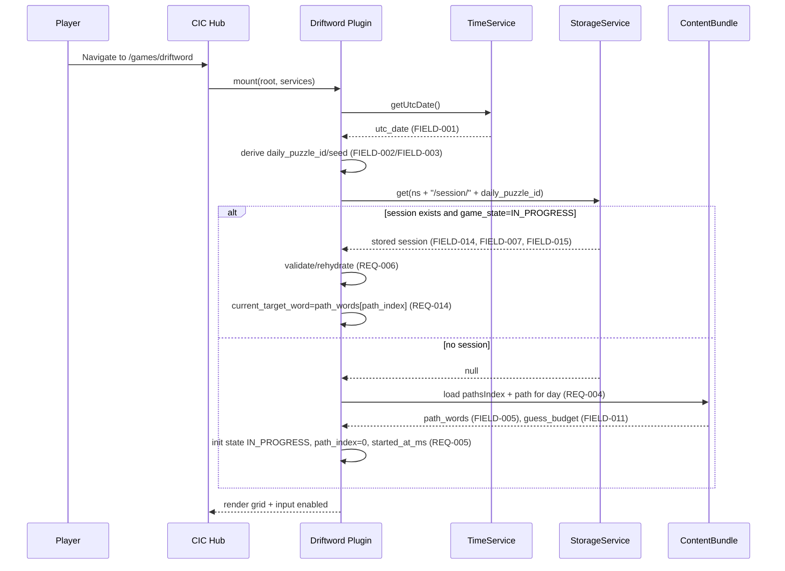
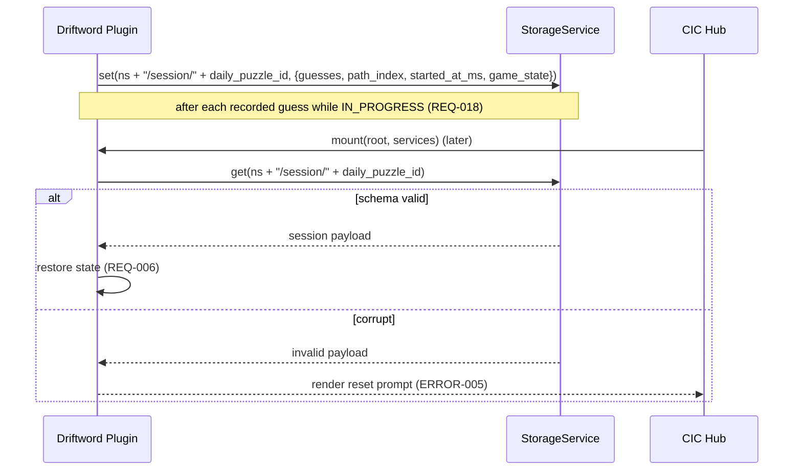
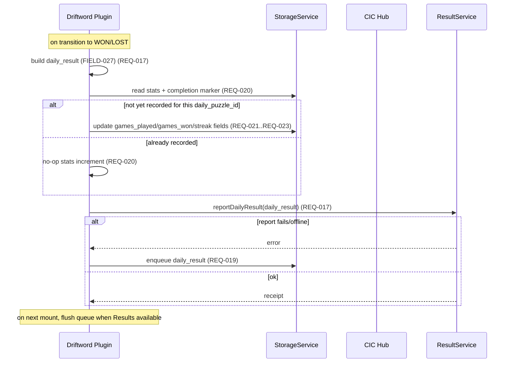
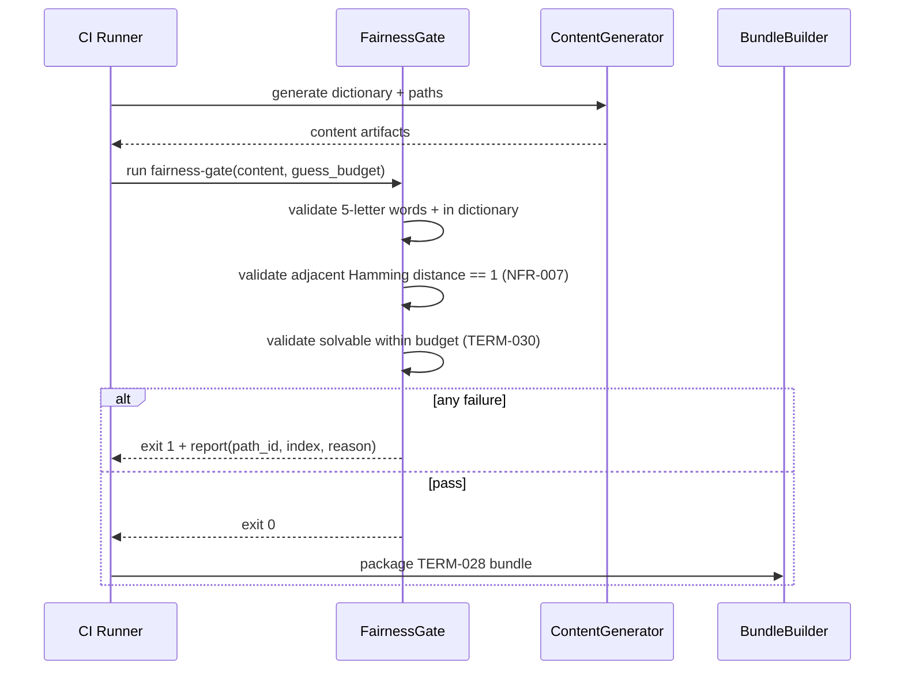

```mermaid
sequenceDiagram
  participant Player
  participant Game as Driftword Plugin
  participant Hub as CIC Hub
  participant Share as ShareService
  participant Clip as ClipboardService

  Player->>Game: Tap Share
  Game->>Game: assert terminal state (WON/LOST)
  Game->>Game: generate share_text from puzzle_id + feedback only (REQ-016, NFR-008)
  Game->>Share: shareText(share_text)
  alt share API unavailable/fails
    Share-->>Game: error/unavailable
    Game->>Clip: copy(share_text)
    Clip-->>Game: ok
    Game-->>Player: "Copied to clipboard"
  else shared
    Share-->>Game: ok
    Game-->>Player: "Shared"
  end
```

<!-- generated: 2026-07-25T17:09:44Z -->
<!-- mode: feature -->
<!-- feature-slug: driftword -->
<!-- a2a-endpoint: https://bob-sdlc-orchestrator.2as6l7wq9qj8.eu-gb.codeengine.appdomain.cloud/v1/rpc -->

# Glossary

## Terms

### TERM-001: Driftword
- **Definition:** The daily 5-letter deduction game where the target word changes deterministically by exactly one letter after each guess, following a pre-published drift rule.
- **Synonyms:** Driftword game, Driftword puzzle
- **Anti-definition:** Not an adversarial word game that adapts to the player (e.g., Absurdle); not a static-target Wordle clone.
- **Source:** User request

### TERM-002: CIC Games Hub
- **Definition:** The hosting application/container that loads games as plugins and provides shared services (storage, time, telemetry, navigation).
- **Synonyms:** Games hub, hub container
- **Anti-definition:** Not the Driftword game itself.
- **Source:** User request

### TERM-003: GamePlugin
- **Definition:** A hub integration contract where a game exposes `mount(root, services)` and reports results via a defined interface.
- **Synonyms:** Plugin, hub game module
- **Anti-definition:** Not a standalone application without hub services.
- **Source:** User request

### TERM-004: PWA (Offline-first)
- **Definition:** A Progressive Web App that prioritizes local execution and cached assets so the game is playable without network connectivity after initial install/load.
- **Synonyms:** Offline-first web app
- **Anti-definition:** Not a server-dependent web app requiring an active network session to play.
- **Source:** User request

### TERM-005: Native Shell (iOS/Android)
- **Definition:** The iOS and Android distributions of Driftword (e.g., wrapped web experience) that run fully client-side.
- **Synonyms:** Mobile app, iOS app, Android app
- **Anti-definition:** Not a platform requiring server-side scoring.
- **Source:** User request

### TERM-006: IBM Carbon Design System UI
- **Definition:** The UI component and accessibility framework used to implement Driftword’s interface in the hub.
- **Synonyms:** Carbon UI
- **Anti-definition:** Not a custom UI system outside Carbon components/tokens.
- **Source:** User request

### TERM-007: Daily Puzzle
- **Definition:** The unique Driftword puzzle determined for a specific UTC date.
- **Synonyms:** Daily game, today’s puzzle
- **Anti-definition:** Not a random per-session puzzle.
- **Source:** User request

### TERM-008: UTC Day Boundary
- **Definition:** The calendar day cutoff at 00:00:00 UTC used to select the daily puzzle.
- **Synonyms:** UTC rollover
- **Anti-definition:** Not device-local midnight.
- **Source:** User request

### TERM-009: Seed
- **Definition:** A deterministic value derived from `UTC date` used to select the `Word-ladder Path` for the `Daily Puzzle`.
- **Synonyms:** Daily seed
- **Anti-definition:** Not a secret server-provided seed.
- **Source:** User request

### TERM-010: Word
- **Definition:** A valid 5-letter dictionary entry accepted as a guess and/or used as a target.
- **Synonyms:** Valid word, dictionary word
- **Anti-definition:** Not an arbitrary 5-character string.
- **Source:** User request

### TERM-011: Guess
- **Definition:** A player-submitted 5-letter `Word` for a given turn.
- **Synonyms:** Attempt
- **Anti-definition:** Not partial input shorter/longer than 5 letters.
- **Source:** User request

### TERM-012: Guess Budget
- **Definition:** The maximum number of guesses allowed for the daily puzzle.
- **Synonyms:** Max guesses, attempts limit
- **Anti-definition:** Not unlimited guessing.
- **Source:** User request

### TERM-013: Turn
- **Definition:** One guess submission and its evaluation against the current target, after which drift is applied.
- **Synonyms:** Move
- **Anti-definition:** Not the full session.
- **Source:** User request

### TERM-014: Target Word
- **Definition:** The current secret 5-letter word for a given turn in the daily puzzle.
- **Synonyms:** Secret word, solution (turn-specific)
- **Anti-definition:** Not constant across all turns in Driftword.
- **Source:** User request

### TERM-015: Drift Rule
- **Definition:** A fixed, pre-published deterministic rule that transforms the target word to the next target by changing exactly one letter each turn.
- **Synonyms:** Drift function, drift logic
- **Anti-definition:** Not player-adaptive or adversarial selection.
- **Source:** User request

### TERM-016: Word-ladder Path
- **Definition:** A precomputed ordered list of valid 5-letter target words for a daily puzzle where each consecutive pair differs by exactly one letter.
- **Synonyms:** Ladder, drift path
- **Anti-definition:** Not a path with multi-letter changes between consecutive targets.
- **Source:** User request

### TERM-017: Path Index
- **Definition:** The integer position within a `Word-ladder Path` that indicates the current target word for the current turn.
- **Synonyms:** Ladder step
- **Anti-definition:** Not a guess count (though it typically progresses with turns).
- **Source:** User request

### TERM-018: Scoring (Green/Yellow/Gray)
- **Definition:** Per-letter feedback for a guess compared to the current target (green=correct letter & position, yellow=present wrong position, gray=absent), consistent with Wordle-style rules.
- **Synonyms:** Feedback, evaluation
- **Anti-definition:** Not scored against the initial target or final target; not adversarial.
- **Source:** User request

### TERM-019: Tile
- **Definition:** One letter cell in the grid representing a guess position and its feedback state.
- **Synonyms:** Cell, square
- **Anti-definition:** Not a freeform text field without per-position state.
- **Source:** User request

### TERM-020: Guess Grid
- **Definition:** The board showing up to `Guess Budget` rows of 5 tiles each, representing guesses and feedback.
- **Synonyms:** Board
- **Anti-definition:** Not an unbounded log.
- **Source:** User request

### TERM-021: On-screen Keyboard
- **Definition:** The virtual keyboard UI used to enter guesses on touch devices.
- **Synonyms:** Virtual keyboard
- **Anti-definition:** Not the device OS keyboard input alone; Driftword also supports physical keyboard.
- **Source:** User request

### TERM-022: Physical Keyboard Input
- **Definition:** Hardware keyboard interactions for letter entry, delete, and submit.
- **Synonyms:** Desktop keyboard input
- **Anti-definition:** Not touch-only input.
- **Source:** User request

### TERM-023: Spoiler-safe Share Artifact
- **Definition:** A shareable text block representing per-guess results using colored/monochrome blocks that does not include any words.
- **Synonyms:** Share text, share card (text)
- **Anti-definition:** Not a screenshot requiring images; not revealing targets/guesses.
- **Source:** User request

### TERM-024: DailyResult
- **Definition:** The result payload reported by the `GamePlugin` to the hub for a completed or ended daily puzzle attempt.
- **Synonyms:** Game result, daily outcome
- **Anti-definition:** Not raw guess strings (unless explicitly allowed by the hub contract).
- **Source:** User request

### TERM-025: Local Stats (Namespaced)
- **Definition:** On-device stored statistics for Driftword only, isolated under a Driftword namespace in hub storage.
- **Synonyms:** Local statistics, stats
- **Anti-definition:** Not global cross-game stats.
- **Source:** User request

### TERM-026: Streak
- **Definition:** The count of consecutive UTC days where the player completed the daily puzzle (definition of “completed” depends on win condition).
- **Synonyms:** Winning streak, daily streak
- **Anti-definition:** Not based on local time; not per-session.
- **Source:** User request

### TERM-027: Session
- **Definition:** A single play period for a daily puzzle from start until win, loss, or exit, with state persisted locally for resume.
- **Synonyms:** Play session
- **Anti-definition:** Not necessarily tied to app lifecycle; can be resumed.
- **Source:** User request

### TERM-028: Build-time Content Bundle
- **Definition:** The packaged asset delivered with the client containing word lists and the precomputed daily `Word-ladder Path` set.
- **Synonyms:** Content pack, bundled content
- **Anti-definition:** Not fetched per-day from a server at runtime.
- **Source:** User request

### TERM-029: Fairness Gate (Build-time)
- **Definition:** A build validation process that verifies each daily path meets constraints (valid words, one-letter drift, solvable within budget).
- **Synonyms:** Content validator
- **Anti-definition:** Not runtime validation in the client.
- **Source:** User request

### TERM-030: Solvable Within Budget
- **Definition:** A property of a daily puzzle path indicating there exists at least one strategy/solution that can win in ≤ `Guess Budget` guesses given the deterministic drift.
- **Synonyms:** Winnable
- **Anti-definition:** Not “easy”; only existence of a solution within the limit.
- **Source:** User request

### TERM-031: Accessibility (WCAG 2.1 AA)
- **Definition:** Compliance target including keyboard operability, non-color-only state communication, visible focus, and reduced motion support.
- **Synonyms:** a11y
- **Anti-definition:** Not optional “best effort”.
- **Source:** User request

### TERM-032: Prefers-reduced-motion
- **Definition:** An OS/browser accessibility preference indicating motion should be minimized.
- **Synonyms:** Reduced motion
- **Anti-definition:** Not a manual in-app toggle (unless added).
- **Source:** User request

### TERM-033: Client-side Scoring
- **Definition:** All guess validation and feedback computation occurs on-device without server calls.
- **Synonyms:** Offline scoring
- **Anti-definition:** Not server-scored gameplay.
- **Source:** User request

### TERM-034: Deterministic
- **Definition:** Given the same UTC date and same guess sequence, the game state evolution and feedback are identical across devices.
- **Synonyms:** Reproducible
- **Anti-definition:** Not randomized per client.
- **Source:** User request

### TERM-035: Sub-3-minute Session Target
- **Definition:** A product constraint that the typical daily play is designed to be completable in under 3 minutes.
- **Synonyms:** Short session
- **Anti-definition:** Not a hard technical timeout.
- **Source:** User request

## Data Dictionary

| ID | Name | Type | Format | Range/Enum | Units | Default | Nullable | PII | Source | Validation |
|---|---|---|---|---|---|---|---|---|---|---|
| FIELD-001 | utc_date | string | `YYYY-MM-DD` | valid UTC date | N/A | derived at runtime | false | Non-PII | Hub time service or JS Date | Must equal current UTC date for “today” puzzle selection |
| FIELD-002 | daily_puzzle_id | string | slug | `[a-z0-9-]{1,64}` | N/A | derived from `FIELD-001` | false | Non-PII | Client | Must be deterministic function of `FIELD-001` |
| FIELD-003 | seed | string | hex/base10 string | implementation-defined | N/A | derived from `FIELD-001` | false | Non-PII | Client | Must be deterministic from `FIELD-001` |
| FIELD-004 | path_id | string | slug | `[a-z0-9-]{1,64}` | N/A | derived from `seed` | false | Non-PII | Build-time bundle | Must exist in bundled content index |
| FIELD-005 | path_words | array<string> | JSON array | each is 5-letter word | N/A | N/A | false | Non-PII | Build-time bundle | Length ≥ 1; each entry matches `^[a-z]{5}$` and is in dictionary |
| FIELD-006 | path_length | integer | int32 | `1..3650` | words | derived from `path_words` | false | Non-PII | Client | Equals `len(FIELD-005)` |
| FIELD-007 | path_index | integer | int32 | `0..path_length-1` | steps | 0 | false | Non-PII | Client session state | Must increment by 1 per submitted guess until capped at `path_length-1` |
| FIELD-008 | current_target_word | string | lowercase | `^[a-z]{5}$` | N/A | derived from `path_words[path_index]` | false | Non-PII | Client | Must equal word at current index |
| FIELD-009 | guess_word | string | lowercase | `^[a-z]{5}$` | N/A | N/A | false | Potentially Sensitive (behavioral) | Client input | Must be in allowed guess dictionary |
| FIELD-010 | guess_number | integer | int32 | `1..guess_budget` | guesses | 1 | false | Non-PII | Client | Must equal count of submitted guesses + 1 |
| FIELD-011 | guess_budget | integer | int32 | `1..10` | guesses | 6 | false | Non-PII | Build-time config | Must be constant for all clients of same app version |
| FIELD-012 | tile_feedback | array<string> | JSON array length 5 | enum `G,Y,X` | N/A | N/A | false | Non-PII | Client scoring | Must be length 5; values in {G,Y,X} |
| FIELD-013 | row_feedback | string | text | regex `^[GYX]{5}$` | N/A | N/A | false | Non-PII | Client scoring | Must equal concatenation of `tile_feedback` |
| FIELD-014 | guesses | array<object> | JSON array | up to `guess_budget` | N/A | `[]` | false | Potentially Sensitive (behavioral) | Client session state | Each element includes `guess_word` + `row_feedback` |
| FIELD-015 | game_state | string | enum | `IN_PROGRESS`, `WON`, `LOST` | N/A | `IN_PROGRESS` | false | Non-PII | Client | Must transition only forward to terminal states |
| FIELD-016 | started_at_ms | integer | int64 epoch ms | `>=0` | ms | now | false | Non-PII | Client | Must be set once per daily attempt |
| FIELD-017 | ended_at_ms | integer | int64 epoch ms | `>=started_at_ms` | ms | null | true | Non-PII | Client | Set when terminal state reached |
| FIELD-018 | duration_ms | integer | int64 | `>=0` | ms | derived | true | Non-PII | Client | `ended_at_ms - started_at_ms` |
| FIELD-019 | drift_rule_version | string | semver | `MAJOR.MINOR.PATCH` | N/A | build-defined | false | Non-PII | Build-time config | Must match rule described in help UI and content generation |
| FIELD-020 | share_text | string | text | length `1..2000` | N/A | generated | false | Non-PII | Client | Must not contain any substring equal to any `guess_word` or `current_target_word` |
| FIELD-021 | stats_namespace | string | slug | e.g., `driftword` | N/A | `driftword` | false | Non-PII | Hub storage contract | Must prefix all stored keys for this game |
| FIELD-022 | games_played | integer | int32 | `>=0` | games | 0 | false | Non-PII | Local stats | Increment only when a daily attempt reaches terminal state |
| FIELD-023 | games_won | integer | int32 | `0..games_played` | games | 0 | false | Non-PII | Local stats | Must be ≤ `games_played` |
| FIELD-024 | current_streak | integer | int32 | `>=0` | days | 0 | false | Non-PII | Local stats | Resets when a UTC day is missed or a loss occurs (per defined rules) |
| FIELD-025 | max_streak | integer | int32 | `>=0` | days | 0 | false | Non-PII | Local stats | Must be ≥ `current_streak` |
| FIELD-026 | last_completed_utc_date | string | `YYYY-MM-DD` | valid UTC date | N/A | null | true | Non-PII | Local stats | Must be set only on terminal state |
| FIELD-027 | daily_result | object | JSON | hub-defined schema | N/A | generated | false | Non-PII | Client -> Hub | Must include at least puzzle id, state, guess count, duration |
| FIELD-028 | guess_count | integer | int32 | `0..guess_budget` | guesses | 0 | false | Non-PII | Client | Equals `len(guesses)` |
| FIELD-029 | install_state | string | enum | `NOT_INSTALLED`, `INSTALLED` | N/A | platform-defined | true | Non-PII | PWA/native | If present, must match platform capability detection |
| FIELD-030 | reduced_motion | boolean | boolean | `true/false` | N/A | from OS/browser | false | Non-PII | Client | Must reflect `prefers-reduced-motion` media query or platform API |
| FIELD-031 | locale | string | BCP-47 | e.g., `en-US` | N/A | platform-defined | true | Non-PII | Hub/platform | If present, must be valid BCP-47 |
| FIELD-032 | dictionary_version | string | semver | `MAJOR.MINOR.PATCH` | N/A | build-defined | false | Non-PII | Build-time bundle | Must match the bundled word list used by fairness gate |

# User Journeys

## Roles

| Role ID | Role | Type | Description |
|---|---|---|---|
| ROLE-001 | Player | Primary | Plays the daily Driftword puzzle and shares results. |
| ROLE-002 | Hub Host | System | Loads the GamePlugin, provides `services` (time, storage, share, telemetry). |
| ROLE-003 | Build Engineer | Admin | Builds the app and runs the fairness gate for the content bundle. |
| ROLE-004 | Accessibility Auditor | Secondary | Validates WCAG 2.1 AA behaviors. |

## Entry Points

| Entry ID | Location | Trigger | Auth |
|---|---|---|---|
| ENTRY-001 | Hub UI route (e.g., `/games/driftword`) | Player selects Driftword in hub | Hub session (if applicable) |
| ENTRY-002 | GamePlugin API `mount(root, services)` | Hub loads game | Trusted internal |
| ENTRY-003 | In-game “Submit guess” action | Player presses Enter/Submit | N/A |
| ENTRY-004 | In-game “Share” action | Player taps Share | N/A |
| ENTRY-005 | App launch while offline | Player opens installed PWA/app | N/A |
| ENTRY-006 | Build pipeline job `fairness-gate` | CI build step | CI credentials |

## Role Permission Matrix

| Capability | ROLE-001 Player | ROLE-002 Hub Host | ROLE-003 Build Engineer | ROLE-004 Accessibility Auditor |
|---|---:|---:|---:|---:|
| Play daily puzzle | Y | N | N | Y (for testing) |
| Persist local state/stats (namespaced) | Y | Y (via services) | N | Y |
| Generate/share spoiler-safe artifact | Y | Y (share service) | N | Y |
| Access/modify bundled paths | N | N | Y | N |
| Run fairness gate | N | N | Y | N |

## Journeys

### JOURNEY-001: Launch today’s daily puzzle (offline-first)
- **Role/Goal:** ROLE-001 Player — Start today’s `TERM-007` and see the empty `TERM-020`.
- **Entry:** ENTRY-001, ENTRY-002, ENTRY-005
- **Happy path:**
  1. Hub calls `mount(root, services)` (TERM-003) to initialize Driftword. (uses FIELD-021)
  2. Game reads current `FIELD-001 utc_date` from hub time service (TERM-008) or computes UTC date locally.
  3. Game derives `FIELD-002 daily_puzzle_id` and `FIELD-003 seed` (TERM-009, TERM-034).
  4. Game loads `FIELD-004 path_id` and `FIELD-005 path_words` from `TERM-028` bundle (TERM-016).
  5. Game initializes session state: `FIELD-015 game_state=IN_PROGRESS`, `FIELD-014 guesses=[]`, `FIELD-007 path_index=0`, `FIELD-016 started_at_ms=now`.
  6. Game renders `TERM-020` with `FIELD-011 guess_budget` rows and accepts input (TERM-021/TERM-022).
- **BRANCH-001 (resume existing session):**
  - If namespaced storage contains in-progress state for `FIELD-002`, load `FIELD-014`, `FIELD-007`, `FIELD-015` and render prior rows.
- **ERROR-001 (missing content path):**
  - **Trigger:** `FIELD-004` not found in bundle index.
  - **System response:** Show blocking error with retry and “Update app” guidance.
  - **Recovery:** Player retries after updating to a version containing the path.
- **EDGE-001 (UTC boundary mid-session):**
  - If `FIELD-001` changes while `FIELD-015=IN_PROGRESS`, the game keeps the current session pinned to the original `FIELD-002` until terminal state.

### JOURNEY-002: Submit a guess and apply deterministic drift
- **Role/Goal:** ROLE-001 Player — Enter a valid `TERM-011` and receive `TERM-018` against the current `TERM-014`, then advance drift.
- **Entry:** ENTRY-003
- **Happy path:**
  1. Player enters letters to form `FIELD-009 guess_word` (TERM-011) in the active row (`FIELD-010 guess_number`).
  2. Player submits the guess.
  3. Game validates `FIELD-009` is exactly 5 letters and is a valid `TERM-010` in the guess dictionary (`FIELD-032 dictionary_version`).
  4. Game computes `FIELD-012 tile_feedback` and `FIELD-013 row_feedback` versus `FIELD-008 current_target_word` at `FIELD-007 path_index` (TERM-018, TERM-033).
  5. Game appends guess record to `FIELD-014 guesses` and updates `FIELD-028 guess_count`.
  6. Game checks win condition (see BRANCH-002/BRANCH-003).
  7. Game applies drift by incrementing `FIELD-007 path_index = path_index + 1` and updates `FIELD-008 current_target_word` from `FIELD-005`.
- **BRANCH-002 (win):**
  - If `FIELD-009` equals `FIELD-008` for that turn, set `FIELD-015=WON`, set `FIELD-017 ended_at_ms`, compute `FIELD-018 duration_ms`.
- **BRANCH-003 (loss by budget):**
  - If `FIELD-028 guess_count == FIELD-011 guess_budget` and not won, set `FIELD-015=LOST`, set `FIELD-017 ended_at_ms`, compute `FIELD-018 duration_ms`.
- **ERROR-002 (invalid length):**
  - **Trigger:** `FIELD-009` not length 5 on submit.
  - **System response:** Do not consume a turn; announce validation error text.
  - **Recovery:** Player edits input.
- **ERROR-003 (not in dictionary):**
  - **Trigger:** `FIELD-009` not found in allowed guess dictionary.
  - **System response:** Do not consume a turn; announce “Not in word list”.
  - **Recovery:** Player enters a different word.
- **EDGE-002 (repeated guess):**
  - If the same `FIELD-009` was already used in `FIELD-014`, show non-blocking warning; submission policy is product-defined (see OpenQuestions in requirements).
- **EDGE-003 (path end before budget):**
  - If `FIELD-007` would exceed `FIELD-006-1`, cap at last index and continue scoring against last `FIELD-008`.

### JOURNEY-003: Share spoiler-safe results
- **Role/Goal:** ROLE-001 Player — Share `TERM-023` without revealing words.
- **Entry:** ENTRY-004
- **Happy path:**
  1. Player opens Share after terminal state `FIELD-015` is `WON` or `LOST`.
  2. Game generates `FIELD-020 share_text` using `FIELD-002`, `FIELD-028`, and each `FIELD-013 row_feedback`, with no words included.
  3. Game invokes hub share service with `FIELD-020`.
- **ERROR-004 (share unavailable):**
  - **Trigger:** Platform share API not available.
  - **System response:** Copy `FIELD-020` to clipboard and show confirmation.
  - **Recovery:** Player pastes manually.
- **EDGE-004 (accessibility share):**
  - Provide a text-only share preview so screen readers can read the artifact.

### JOURNEY-004: Persist and resume daily attempt
- **Role/Goal:** ROLE-001 Player — Close and reopen while keeping progress for the same `FIELD-002`.
- **Entry:** ENTRY-005, ENTRY-001
- **Happy path:**
  1. During `FIELD-015=IN_PROGRESS`, game persists `FIELD-014`, `FIELD-007`, `FIELD-016`, and `FIELD-002` in namespaced storage (TERM-025).
  2. On launch, game detects stored in-progress state for today’s `FIELD-002` and restores it (BRANCH-001 in JOURNEY-001).
- **ERROR-005 (corrupt local state):**
  - **Trigger:** Stored `FIELD-014` fails schema/validation.
  - **System response:** Offer “Reset today” action; do not crash.
  - **Recovery:** Player resets and starts over (record as no completed game).
- **EDGE-005 (multi-tab concurrency):**
  - If multiple instances modify the same storage keys, the last-write-wins behavior is applied and a banner warns “Progress updated in another session”.

### JOURNEY-005: Report DailyResult to hub and update local stats/streak
- **Role/Goal:** ROLE-001 Player — Ensure completion updates stats and hub receives `TERM-024`.
- **Entry:** Terminal transition in JOURNEY-002 BRANCH-002/BRANCH-003
- **Happy path:**
  1. When `FIELD-015` becomes terminal, game builds `FIELD-027 daily_result` containing `FIELD-002`, `FIELD-015`, `FIELD-028`, `FIELD-018`, and `FIELD-001`.
  2. Game submits `FIELD-027` to hub via plugin services.
  3. Game updates namespaced local stats: `FIELD-022`, `FIELD-023`, `FIELD-024`, `FIELD-025`, `FIELD-026` (TERM-026).
- **ERROR-006 (hub service failure):**
  - **Trigger:** Result reporting throws or is unavailable offline.
  - **System response:** Queue `FIELD-027` locally for later delivery; still update local stats.
  - **Recovery:** On next mount with services available, flush queued results.
- **EDGE-006 (duplicate reporting):**
  - If the game is reopened after completion, it must not increment stats twice for the same `FIELD-002`.

### JOURNEY-006: Build-time fairness gate validates content
- **Role/Goal:** ROLE-003 Build Engineer — Ensure bundled content meets `TERM-029`.
- **Entry:** ENTRY-006
- **Happy path:**
  1. CI loads bundled `Word-ladder Path` definitions (`FIELD-005`) and dictionary (`FIELD-032`).
  2. For each path, verify each adjacent pair differs by exactly one letter (TERM-016).
  3. Verify each word matches 5 letters and exists in dictionary (TERM-010).
  4. Verify each daily puzzle is solvable within `FIELD-011 guess_budget` (TERM-030).
  5. If all checks pass, emit build artifact containing `TERM-028`.
- **ERROR-007 (fairness failure):**
  - **Trigger:** Any validation fails.
  - **System response:** Fail the build with a report identifying `path_id` and failing index.
  - **Recovery:** Fix content generation and rerun.

## Journey Map

```mermaid
flowchart TD
  A[ENTRY-002 mount()] --> B[JOURNEY-001 Load utc_date FIELD-001]
  B --> C[Select path_id FIELD-004 and path_words FIELD-005]
  C --> D[Render grid TERM-020; state IN_PROGRESS FIELD-015]
  D --> E[JOURNEY-002 Submit guess FIELD-009]
  E --> F[Score vs current_target_word FIELD-008 -> row_feedback FIELD-013]
  F --> G{Win? BRANCH-002}
  G -- Yes --> H[Set WON; ended_at_ms FIELD-017]
  G -- No --> I{Budget exhausted? BRANCH-003}
  I -- Yes --> J[Set LOST; ended_at_ms FIELD-017]
  I -- No --> K[Increment path_index FIELD-007 (drift)]
  K --> D
  H --> L[JOURNEY-005 Report daily_result FIELD-027]
  J --> L
  L --> M[JOURNEY-003 Share share_text FIELD-020]
  D --> N[JOURNEY-004 Persist/Resume]
  O[JOURNEY-006 Fairness Gate] --> C
```

# Requirements

### REQ-001: Initialize plugin and namespace storage
- **EARS Pattern:** Ubiquitous
- **EARS Statement:** The Driftword client shall prefix all locally persisted keys with `FIELD-021 stats_namespace`.
- **Inputs:** `FIELD-021`
- **Outputs:** Namespaced storage keys
- **Preconditions:** `mount(root, services)` invoked (TERM-003)
- **Postconditions:** Keys are isolated from other games
- **Invariants:** Namespace is constant within an app version
- **Trigger:** Plugin initialization
- **Actor:** ROLE-002 Hub Host
- **EntityScope:** TERM-025 Local Stats (Namespaced)
- **ErrorModes:** None
- **NFR-Tags:** privacy
- **Source:** JOURNEY-001 step 1
- **Dependencies:** None
- **Priority:** P0
- **AcceptanceCriteria:**
  - TEST-001: Given stored keys without the namespace, when the client writes stats, then all new keys start with `FIELD-021`.
  - TEST-002: Given another game uses a different namespace, when both write stats, then no keys collide.
- **Assumptions:** Hub provides a stable storage service or Web Storage equivalent.
- **OpenQuestions:** None

### REQ-002: Select daily puzzle by UTC date
- **EARS Pattern:** Event-Driven
- **EARS Statement:** When the client loads the game, the Driftword client shall compute `FIELD-001 utc_date` using the UTC day boundary.
- **Inputs:** System time or hub time service
- **Outputs:** `FIELD-001`
- **Preconditions:** Game is mounted
- **Postconditions:** UTC date is available for puzzle selection
- **Invariants:** UTC date format is `YYYY-MM-DD`
- **Trigger:** Game load
- **Actor:** ROLE-002 Hub Host
- **EntityScope:** TERM-008 UTC Day Boundary
- **ErrorModes:** ERROR-001
- **NFR-Tags:** compatibility
- **Source:** JOURNEY-001 step 2
- **Dependencies:** None
- **Priority:** P0
- **AcceptanceCriteria:**
  - TEST-003: Given device local timezone is not UTC, when the game loads, then `FIELD-001` equals the current UTC date.
  - TEST-004: Given time is 00:00:00 UTC, when the game loads, then `FIELD-001` rolls to the new day.
- **Assumptions:** A correct time source is available.
- **OpenQuestions:** Should hub time service be mandatory over client time?

### REQ-003: Derive deterministic daily puzzle id
- **EARS Pattern:** Ubiquitous
- **EARS Statement:** The Driftword client shall derive `FIELD-002 daily_puzzle_id` deterministically from `FIELD-001 utc_date`.
- **Inputs:** `FIELD-001`
- **Outputs:** `FIELD-002`
- **Preconditions:** `FIELD-001` computed
- **Postconditions:** Daily puzzle can be referenced for storage and reporting
- **Invariants:** Same `FIELD-001` yields same `FIELD-002` across devices
- **Trigger:** After `FIELD-001` is available
- **Actor:** ROLE-001 Player
- **EntityScope:** TERM-007 Daily Puzzle
- **ErrorModes:** None
- **NFR-Tags:** auditability
- **Source:** JOURNEY-001 step 3
- **Dependencies:** REQ-002
- **Priority:** P0
- **AcceptanceCriteria:**
  - TEST-005: Given two devices on the same app version, when both compute for the same `FIELD-001`, then both produce the same `FIELD-002`.
- **Assumptions:** The derivation function is versioned implicitly by app version.
- **OpenQuestions:** Does the hub require a specific `daily_puzzle_id` format?

### REQ-004: Load bundled word-ladder path for the day
- **EARS Pattern:** Event-Driven
- **EARS Statement:** When `FIELD-002 daily_puzzle_id` is available, the Driftword client shall load `FIELD-005 path_words` for `FIELD-004 path_id` from the build-time content bundle.
- **Inputs:** `FIELD-002`, bundled index
- **Outputs:** `FIELD-005`, `FIELD-006`
- **Preconditions:** Content bundle present (TERM-028)
- **Postconditions:** Path is ready for gameplay
- **Invariants:** `FIELD-006` equals `len(FIELD-005)`
- **Trigger:** Daily puzzle initialization
- **Actor:** ROLE-001 Player
- **EntityScope:** TERM-016 Word-ladder Path
- **ErrorModes:** ERROR-001
- **NFR-Tags:** offline, compatibility
- **Source:** JOURNEY-001 step 4
- **Dependencies:** REQ-003
- **Priority:** P0
- **AcceptanceCriteria:**
  - TEST-006: Given a valid `FIELD-004`, when loading, then `FIELD-005` is present and `FIELD-006` matches its length.
- **Assumptions:** Bundle includes an index mapping day to path.
- **OpenQuestions:** How many days of paths are bundled (e.g., multi-year)?

### REQ-005: Initialize new daily session state
- **EARS Pattern:** Event-Driven
- **EARS Statement:** When no in-progress state exists for `FIELD-002 daily_puzzle_id`, the Driftword client shall initialize `FIELD-015 game_state`, `FIELD-014 guesses`, `FIELD-007 path_index`, and `FIELD-016 started_at_ms`.
- **Inputs:** `FIELD-002`
- **Outputs:** Initialized state fields
- **Preconditions:** Path loaded
- **Postconditions:** Ready to accept first guess
- **Invariants:** `FIELD-007=0` and `FIELD-014=[]` at start
- **Trigger:** New daily start
- **Actor:** ROLE-001 Player
- **EntityScope:** TERM-027 Session
- **ErrorModes:** None
- **NFR-Tags:** offline
- **Source:** JOURNEY-001 step 5
- **Dependencies:** REQ-004
- **Priority:** P0
- **AcceptanceCriteria:**
  - TEST-007: Given no stored state for `FIELD-002`, when starting, then state equals defaults and `started_at_ms` is set.
- **Assumptions:** Only one active session per day per device.
- **OpenQuestions:** Allow multiple attempts per day after completion?

### REQ-006: Resume in-progress daily session
- **EARS Pattern:** Event-Driven
- **EARS Statement:** When stored session state exists for `FIELD-002 daily_puzzle_id` with `FIELD-015=IN_PROGRESS`, the Driftword client shall restore `FIELD-014 guesses` and `FIELD-007 path_index`.
- **Inputs:** Namespaced storage, `FIELD-002`
- **Outputs:** Restored state
- **Preconditions:** Stored state passes validation
- **Postconditions:** Board shows previous guesses
- **Invariants:** `FIELD-028` equals `len(FIELD-014)`
- **Trigger:** Game load
- **Actor:** ROLE-001 Player
- **EntityScope:** TERM-027 Session
- **ErrorModes:** ERROR-005
- **NFR-Tags:** offline, reliability
- **Source:** JOURNEY-001 BRANCH-001; JOURNEY-004 step 2
- **Dependencies:** REQ-003
- **Priority:** P0
- **AcceptanceCriteria:**
  - TEST-008: Given stored in-progress state, when reloading, then the same rows and feedback are displayed and the next input row is correct.
- **Assumptions:** Storage read is synchronous or awaited before render completion.
- **OpenQuestions:** None

### REQ-007: Validate guess length on submit
- **EARS Pattern:** Event-Driven
- **EARS Statement:** When the player submits a guess, the Driftword client shall reject the submission if `FIELD-009 guess_word` is not exactly 5 letters.
- **Inputs:** `FIELD-009`
- **Outputs:** Validation error message
- **Preconditions:** `FIELD-015=IN_PROGRESS`
- **Postconditions:** `FIELD-014` unchanged
- **Invariants:** Guess count does not increase on validation failure
- **Trigger:** Submit action
- **Actor:** ROLE-001 Player
- **EntityScope:** TERM-011 Guess
- **ErrorModes:** ERROR-002
- **NFR-Tags:** accessibility
- **Source:** JOURNEY-002 step 3; ERROR-002
- **Dependencies:** None
- **Priority:** P0
- **AcceptanceCriteria:**
  - TEST-009: Given 4 letters entered, when submit, then no turn is consumed and an error is announced.
  - TEST-010: Given 6 letters entered, when submit, then no turn is consumed and an error is announced.
- **Assumptions:** Input constraints may prevent >5, but validation still applies.
- **OpenQuestions:** None

### REQ-008: Validate guess against dictionary
- **EARS Pattern:** Event-Driven
- **EARS Statement:** When the player submits a 5-letter `FIELD-009 guess_word`, the Driftword client shall reject the submission if the word is not present in the bundled guess dictionary.
- **Inputs:** `FIELD-009`, dictionary
- **Outputs:** “Not in word list” message
- **Preconditions:** REQ-007 passed
- **Postconditions:** `FIELD-014` unchanged
- **Invariants:** Dictionary is derived from `FIELD-032 dictionary_version`
- **Trigger:** Submit action
- **Actor:** ROLE-001 Player
- **EntityScope:** TERM-010 Word
- **ErrorModes:** ERROR-003
- **NFR-Tags:** offline
- **Source:** JOURNEY-002 step 3; ERROR-003
- **Dependencies:** REQ-007
- **Priority:** P0
- **AcceptanceCriteria:**
  - TEST-011: Given `guess_word` not in dictionary, when submit, then no turn is consumed and error text is displayed.
- **Assumptions:** Guess dictionary is bundled with the app.
- **OpenQuestions:** Are proper nouns excluded?

### REQ-009: Score guess against current target for that turn
- **EARS Pattern:** Event-Driven
- **EARS Statement:** When a valid guess is submitted, the Driftword client shall compute `FIELD-013 row_feedback` by comparing `FIELD-009 guess_word` to `FIELD-008 current_target_word` at the current `FIELD-007 path_index`.
- **Inputs:** `FIELD-009`, `FIELD-008`, `FIELD-007`
- **Outputs:** `FIELD-012`, `FIELD-013`
- **Preconditions:** `FIELD-015=IN_PROGRESS`
- **Postconditions:** Feedback is displayed for the submitted row
- **Invariants:** `FIELD-013` matches regex `^[GYX]{5}$`
- **Trigger:** Valid submit
- **Actor:** ROLE-001 Player
- **EntityScope:** TERM-018 Scoring (Green/Yellow/Gray)
- **ErrorModes:** None
- **NFR-Tags:** offline
- **Source:** JOURNEY-002 step 4
- **Dependencies:** REQ-008
- **Priority:** P0
- **AcceptanceCriteria:**
  - TEST-012: Given a known target and guess, when submit, then `row_feedback` matches Wordle-style scoring rules.
- **Assumptions:** Duplicate-letter scoring follows Wordle conventions.
- **OpenQuestions:** Confirm exact duplicate-letter policy (Wordle vs alternative).

### REQ-010: Append guess record to session history
- **EARS Pattern:** Event-Driven
- **EARS Statement:** When `FIELD-013 row_feedback` is computed, the Driftword client shall append `{FIELD-009 guess_word, FIELD-013 row_feedback}` to `FIELD-014 guesses`.
- **Inputs:** `FIELD-009`, `FIELD-013`
- **Outputs:** Updated `FIELD-014`, `FIELD-028`
- **Preconditions:** REQ-009 satisfied
- **Postconditions:** Guess is recorded
- **Invariants:** `FIELD-028` equals `len(FIELD-014)`
- **Trigger:** Feedback computed
- **Actor:** ROLE-001 Player
- **EntityScope:** TERM-027 Session
- **ErrorModes:** None
- **NFR-Tags:** offline
- **Source:** JOURNEY-002 step 5
- **Dependencies:** REQ-009
- **Priority:** P0
- **AcceptanceCriteria:**
  - TEST-013: Given one submitted guess, when stored, then `guess_count=1` and history contains one record.
- **Assumptions:** Storage persists after append (see REQ-018).
- **OpenQuestions:** None

### REQ-011: Detect win on exact match for that turn
- **EARS Pattern:** Event-Driven
- **EARS Statement:** When a guess is recorded, the Driftword client shall set `FIELD-015 game_state` to `WON` if `FIELD-009 guess_word` equals `FIELD-008 current_target_word` for that turn.
- **Inputs:** `FIELD-009`, `FIELD-008`
- **Outputs:** `FIELD-015`, `FIELD-017`, `FIELD-018`
- **Preconditions:** REQ-010 satisfied
- **Postconditions:** Session becomes terminal
- **Invariants:** `FIELD-017` is set once
- **Trigger:** After guess record append
- **Actor:** ROLE-001 Player
- **EntityScope:** TERM-015 Target Word
- **ErrorModes:** None
- **NFR-Tags:** auditability
- **Source:** JOURNEY-002 BRANCH-002
- **Dependencies:** REQ-010
- **Priority:** P0
- **AcceptanceCriteria:**
  - TEST-014: Given guess equals current target, when submitted, then `game_state=WON` and `ended_at_ms` is set.
- **Assumptions:** Win is only possible immediately after scoring a guess.
- **OpenQuestions:** None

### REQ-012: Detect loss when guess budget is exhausted
- **EARS Pattern:** Event-Driven
- **EARS Statement:** When `FIELD-028 guess_count` becomes equal to `FIELD-011 guess_budget` while `FIELD-015=IN_PROGRESS`, the Driftword client shall set `FIELD-015 game_state` to `LOST`.
- **Inputs:** `FIELD-028`, `FIELD-011`, `FIELD-015`
- **Outputs:** `FIELD-015`, `FIELD-017`, `FIELD-018`
- **Preconditions:** Guess recorded
- **Postconditions:** Session becomes terminal
- **Invariants:** `FIELD-017` is set once
- **Trigger:** Guess count update
- **Actor:** ROLE-001 Player
- **EntityScope:** TERM-012 Guess Budget
- **ErrorModes:** None
- **NFR-Tags:** auditability
- **Source:** JOURNEY-002 BRANCH-003
- **Dependencies:** REQ-010
- **Priority:** P0
- **AcceptanceCriteria:**
  - TEST-015: Given `guess_count=guess_budget` and not won, when the last guess is recorded, then `game_state=LOST`.
- **Assumptions:** Budget is constant per version (FIELD-011).
- **OpenQuestions:** None

### REQ-013: Apply deterministic drift after a non-terminal turn
- **EARS Pattern:** Event-Driven
- **EARS Statement:** When a valid guess is recorded and `FIELD-015=IN_PROGRESS`, the Driftword client shall increment `FIELD-007 path_index` by 1.
- **Inputs:** `FIELD-007`, `FIELD-015`
- **Outputs:** Updated `FIELD-007`
- **Preconditions:** REQ-010 satisfied; not terminal
- **Postconditions:** Next turn target advances
- **Invariants:** `FIELD-007` is non-decreasing
- **Trigger:** End of non-terminal turn
- **Actor:** ROLE-001 Player
- **EntityScope:** TERM-017 Path Index
- **ErrorModes:** None
- **NFR-Tags:** determinism
- **Source:** JOURNEY-002 step 7
- **Dependencies:** REQ-010, REQ-011, REQ-012
- **Priority:** P0
- **AcceptanceCriteria:**
  - TEST-016: Given `path_index=0`, when a non-winning guess is recorded, then `path_index=1`.
- **Assumptions:** Drift always advances exactly one step per submitted guess.
- **OpenQuestions:** If guess is invalid, drift must not apply (covered by REQ-007/008).

### REQ-014: Update current target from path index
- **EARS Pattern:** Event-Driven
- **EARS Statement:** When `FIELD-007 path_index` changes, the Driftword client shall set `FIELD-008 current_target_word` to `FIELD-005 path_words[FIELD-007]`.
- **Inputs:** `FIELD-007`, `FIELD-005`
- **Outputs:** `FIELD-008`
- **Preconditions:** Path loaded
- **Postconditions:** Current target is ready for scoring
- **Invariants:** `FIELD-008` matches `^[a-z]{5}$`
- **Trigger:** Path index update
- **Actor:** ROLE-001 Player
- **EntityScope:** TERM-014 Target Word
- **ErrorModes:** None
- **NFR-Tags:** determinism
- **Source:** JOURNEY-002 step 7
- **Dependencies:** REQ-004, REQ-013
- **Priority:** P0
- **AcceptanceCriteria:**
  - TEST-017: Given a known path_words array, when `path_index` updates, then `current_target_word` equals the word at that index.
- **Assumptions:** Path words are validated at build time.
- **OpenQuestions:** None

### REQ-015: Prevent drift beyond end of path
- **EARS Pattern:** State-Driven
- **EARS Statement:** While `FIELD-007 path_index` equals `FIELD-006 path_length - 1`, the Driftword client shall not increment `FIELD-007 path_index`.
- **Inputs:** `FIELD-007`, `FIELD-006`
- **Outputs:** None
- **Preconditions:** Path loaded
- **Postconditions:** Target remains last word
- **Invariants:** `FIELD-007` remains within `0..FIELD-006-1`
- **Trigger:** Drift application attempt at end of path
- **Actor:** ROLE-001 Player
- **EntityScope:** TERM-016 Word-ladder Path
- **ErrorModes:** None
- **NFR-Tags:** reliability
- **Source:** JOURNEY-002 EDGE-003
- **Dependencies:** REQ-013
- **Priority:** P1
- **AcceptanceCriteria:**
  - TEST-018: Given `path_index=path_length-1`, when a non-terminal guess is recorded, then `path_index` remains unchanged.
- **Assumptions:** Paths are at least as long as required for expected play.
- **OpenQuestions:** Should reaching path end force a terminal state?

### REQ-016: Generate spoiler-safe share text without words
- **EARS Pattern:** Event-Driven
- **EARS Statement:** When the player requests sharing after a terminal game, the Driftword client shall generate `FIELD-020 share_text` using only `FIELD-002 daily_puzzle_id`, `FIELD-028 guess_count`, and each `FIELD-013 row_feedback`.
- **Inputs:** `FIELD-002`, `FIELD-028`, `FIELD-013` set
- **Outputs:** `FIELD-020`
- **Preconditions:** `FIELD-015` is `WON` or `LOST`
- **Postconditions:** Share artifact ready
- **Invariants:** `FIELD-020` contains no 5-letter substrings equal to any `FIELD-009 guess_word` or `FIELD-008 current_target_word` from the session
- **Trigger:** Share action
- **Actor:** ROLE-001 Player
- **EntityScope:** TERM-023 Spoiler-safe Share Artifact
- **ErrorModes:** None
- **NFR-Tags:** privacy
- **Source:** JOURNEY-003 step 2
- **Dependencies:** REQ-010
- **Priority:** P0
- **AcceptanceCriteria:**
  - TEST-019: Given a completed game with guesses, when generating share text, then it includes feedback rows and no guess/target words.
- **Assumptions:** Share format is text-based.
- **OpenQuestions:** Include game title/version in share header?

### REQ-017: Report DailyResult to hub
- **EARS Pattern:** Event-Driven
- **EARS Statement:** When `FIELD-015 game_state` becomes `WON` or `LOST`, the Driftword client shall submit `FIELD-027 daily_result` to the hub result reporting service.
- **Inputs:** `FIELD-027`
- **Outputs:** Hub receipt (implementation-defined)
- **Preconditions:** Hub services available
- **Postconditions:** Hub has the daily result
- **Invariants:** `FIELD-027` includes `FIELD-002`, `FIELD-015`, `FIELD-028`, `FIELD-018`, and `FIELD-001`
- **Trigger:** Terminal transition
- **Actor:** ROLE-002 Hub Host
- **EntityScope:** TERM-024 DailyResult
- **ErrorModes:** ERROR-006
- **NFR-Tags:** observability
- **Source:** JOURNEY-005 step 2; ERROR-006
- **Dependencies:** REQ-011, REQ-012
- **Priority:** P0
- **AcceptanceCriteria:**
  - TEST-020: Given a win, when the game ends, then a DailyResult is submitted containing required fields.
- **Assumptions:** Hub exposes a stable reporting API through `services`.
- **OpenQuestions:** Exact DailyResult schema required by hub?

### REQ-018: Persist in-progress session state locally
- **EARS Pattern:** State-Driven
- **EARS Statement:** While `FIELD-015 game_state` is `IN_PROGRESS`, the Driftword client shall persist `FIELD-014 guesses` and `FIELD-007 path_index` to namespaced local storage after each recorded guess.
- **Inputs:** `FIELD-014`, `FIELD-007`, `FIELD-015`
- **Outputs:** Stored state
- **Preconditions:** Storage available
- **Postconditions:** Progress is resumable
- **Invariants:** Stored `guess_count` equals `len(guesses)`
- **Trigger:** Guess recorded
- **Actor:** ROLE-001 Player
- **EntityScope:** TERM-027 Session
- **ErrorModes:** ERROR-005
- **NFR-Tags:** offline, reliability
- **Source:** JOURNEY-004 step 1
- **Dependencies:** REQ-010
- **Priority:** P0
- **AcceptanceCriteria:**
  - TEST-021: Given one recorded guess, when the app is closed and reopened, then the guess row and path_index are restored.
- **Assumptions:** Local storage is durable across app restarts.
- **OpenQuestions:** Storage quota handling strategy?

### REQ-019: Queue result reporting when hub service is unavailable
- **EARS Pattern:** Event-Driven
- **EARS Statement:** When result reporting fails for `FIELD-027 daily_result`, the Driftword client shall store the result in a local outbound queue for later submission.
- **Inputs:** `FIELD-027`
- **Outputs:** Queued item
- **Preconditions:** Terminal state reached
- **Postconditions:** Result is retained for later delivery
- **Invariants:** Queue items are namespaced by `FIELD-021`
- **Trigger:** Reporting failure
- **Actor:** ROLE-001 Player
- **EntityScope:** TERM-024 DailyResult
- **ErrorModes:** ERROR-006
- **NFR-Tags:** offline, reliability
- **Source:** JOURNEY-005 ERROR-006
- **Dependencies:** REQ-017
- **Priority:** P1
- **AcceptanceCriteria:**
  - TEST-022: Given reporting throws, when the game ends, then a queued DailyResult exists locally.
- **Assumptions:** Hub can accept late-arriving results for a date.
- **OpenQuestions:** Should queued results expire?

### REQ-020: Prevent duplicate stats increments for the same day
- **EARS Pattern:** Unwanted
- **EARS Statement:** The Driftword client shall not increment `FIELD-022 games_played` more than once for the same `FIELD-002 daily_puzzle_id`.
- **Inputs:** `FIELD-002`, stats store
- **Outputs:** Updated stats (or no-op)
- **Preconditions:** Terminal state reached
- **Postconditions:** Stats remain consistent
- **Invariants:** One completion contributes at most +1 to games_played
- **Trigger:** Completion processing
- **Actor:** ROLE-001 Player
- **EntityScope:** TERM-025 Local Stats (Namespaced)
- **ErrorModes:** None
- **NFR-Tags:** auditability
- **Source:** JOURNEY-005 EDGE-006
- **Dependencies:** REQ-021
- **Priority:** P0
- **AcceptanceCriteria:**
  - TEST-023: Given a completed day is reopened, when completion logic runs again, then games_played does not change.
- **Assumptions:** `FIELD-026 last_completed_utc_date` or equivalent is stored.
- **OpenQuestions:** Store per-day completion map or single last-completed marker?

### REQ-021: Update local stats on terminal state
- **EARS Pattern:** Event-Driven
- **EARS Statement:** When `FIELD-015 game_state` becomes `WON` or `LOST`, the Driftword client shall update `FIELD-022 games_played`.
- **Inputs:** `FIELD-015`
- **Outputs:** `FIELD-022`
- **Preconditions:** Completion not yet recorded for `FIELD-002`
- **Postconditions:** games_played increased by 1
- **Invariants:** `FIELD-022>=0`
- **Trigger:** Terminal transition
- **Actor:** ROLE-001 Player
- **EntityScope:** TERM-025 Local Stats (Namespaced)
- **ErrorModes:** None
- **NFR-Tags:** auditability
- **Source:** JOURNEY-005 step 3
- **Dependencies:** REQ-020
- **Priority:** P0
- **AcceptanceCriteria:**
  - TEST-024: Given a new completion, when game ends, then games_played increments by 1.
- **Assumptions:** Completion uniqueness check exists.
- **OpenQuestions:** None

### REQ-022: Update wins counter on win
- **EARS Pattern:** Event-Driven
- **EARS Statement:** When `FIELD-015 game_state` becomes `WON`, the Driftword client shall increment `FIELD-023 games_won` by 1.
- **Inputs:** `FIELD-015`
- **Outputs:** `FIELD-023`
- **Preconditions:** Completion not yet recorded for `FIELD-002`
- **Postconditions:** games_won increased by 1
- **Invariants:** `FIELD-023 <= FIELD-022`
- **Trigger:** Win transition
- **Actor:** ROLE-001 Player
- **EntityScope:** TERM-025 Local Stats (Namespaced)
- **ErrorModes:** None
- **NFR-Tags:** auditability
- **Source:** JOURNEY-005 step 3
- **Dependencies:** REQ-011, REQ-020, REQ-021
- **Priority:** P0
- **AcceptanceCriteria:**
  - TEST-025: Given a win completion, when the game ends, then games_won increments.
- **Assumptions:** Loss does not affect games_won.
- **OpenQuestions:** None

### REQ-023: Update streak using UTC dates
- **EARS Pattern:** Event-Driven
- **EARS Statement:** When a terminal completion is recorded, the Driftword client shall set `FIELD-026 last_completed_utc_date` to `FIELD-001 utc_date`.
- **Inputs:** `FIELD-001`
- **Outputs:** `FIELD-026`
- **Preconditions:** Completion uniqueness check passed
- **Postconditions:** Last completion date stored
- **Invariants:** `FIELD-026` is valid `YYYY-MM-DD`
- **Trigger:** Completion recording
- **Actor:** ROLE-001 Player
- **EntityScope:** TERM-026 Streak
- **ErrorModes:** None
- **NFR-Tags:** auditability
- **Source:** JOURNEY-005 step 3
- **Dependencies:** REQ-002, REQ-020
- **Priority:** P1
- **AcceptanceCriteria:**
  - TEST-026: Given completion today, when stats updated, then last_completed_utc_date equals today’s utc_date.
- **Assumptions:** Additional streak increment/reset logic will use this field.
- **OpenQuestions:** Define streak policy for losses vs wins (request implies “completed”; clarify).

### NFR-001: Offline-first gameplay without network dependency
- **EARS Pattern:** Ubiquitous
- **EARS Statement:** The Driftword client shall allow gameplay actions for JOURNEY-001 and JOURNEY-002 without requiring network connectivity after the content bundle is available locally.
- **Inputs:** Local bundle, local storage
- **Outputs:** Playable UI and scoring
- **Preconditions:** App installed or previously loaded
- **Postconditions:** Player can complete daily puzzle offline
- **Invariants:** Scoring uses TERM-033 client-side scoring
- **Trigger:** Any gameplay action
- **Actor:** ROLE-001 Player
- **EntityScope:** TERM-004 PWA (Offline-first)
- **ErrorModes:** ERROR-001
- **NFR-Tags:** offline, reliability
- **Source:** JOURNEY-001 step 4-6; JOURNEY-002 step 4
- **Dependencies:** REQ-004, REQ-009
- **Priority:** P0
- **AcceptanceCriteria:**
  - TEST-027: Given airplane mode enabled, when starting and playing with a cached bundle, then guesses score and drift progresses normally.
- **Assumptions:** Initial install may require network.
- **OpenQuestions:** Is first-ever load expected to work offline in native shells?

### NFR-002: Determinism across devices
- **EARS Pattern:** Ubiquitous
- **EARS Statement:** The Driftword client shall produce identical `FIELD-013 row_feedback` sequences for the same `FIELD-001 utc_date` and the same submitted `FIELD-009 guess_word` sequence.
- **Inputs:** `FIELD-001`, guess sequence
- **Outputs:** Feedback sequence
- **Preconditions:** Same app version and content bundle version
- **Postconditions:** Reproducible gameplay
- **Invariants:** Uses same `FIELD-032 dictionary_version` and drift path selection
- **Trigger:** Guess submissions
- **Actor:** ROLE-001 Player
- **EntityScope:** TERM-034 Deterministic
- **ErrorModes:** None
- **NFR-Tags:** determinism, auditability
- **Source:** JOURNEY-002 step 4-7
- **Dependencies:** REQ-002, REQ-003, REQ-004, REQ-009, REQ-013, REQ-014
- **Priority:** P0
- **AcceptanceCriteria:**
  - TEST-028: Given two devices, when both enter the same guesses for the same utc_date, then `row_feedback` matches at every turn.
- **Assumptions:** No nondeterministic randomness in scoring.
- **OpenQuestions:** How to handle app version mismatch sharing comparisons?

### NFR-003: WCAG 2.1 AA keyboard operability
- **EARS Pattern:** Ubiquitous
- **EARS Statement:** The Driftword client shall provide full gameplay operability using only a keyboard for entering letters, deleting, submitting, and activating share.
- **Inputs:** Keyboard events
- **Outputs:** UI actions invoked
- **Preconditions:** Focusable UI present
- **Postconditions:** No pointer required
- **Invariants:** Focus order is reachable for all controls
- **Trigger:** Keyboard navigation
- **Actor:** ROLE-001 Player
- **EntityScope:** TERM-031 Accessibility (WCAG 2.1 AA)
- **ErrorModes:** None
- **NFR-Tags:** accessibility
- **Source:** User request; JOURNEY-001 step 6; JOURNEY-003
- **Dependencies:** None
- **Priority:** P0
- **AcceptanceCriteria:**
  - TEST-029: Given no mouse input, when using Tab/Shift+Tab/Enter/Backspace, then a player can complete a puzzle.
- **Assumptions:** Standard key bindings are acceptable.
- **OpenQuestions:** Specify exact key mapping for on-screen keyboard focus mode?

### NFR-004: Non-color-only feedback communication
- **EARS Pattern:** Ubiquitous
- **EARS Statement:** The Driftword client shall convey each tile state using text or iconography in addition to color.
- **Inputs:** `FIELD-012 tile_feedback`
- **Outputs:** Accessible labels or glyphs
- **Preconditions:** Tile rendered
- **Postconditions:** State is perceivable without color
- **Invariants:** Each state maps to a distinct non-color indicator
- **Trigger:** Feedback render
- **Actor:** ROLE-001 Player
- **EntityScope:** TERM-019 Tile
- **ErrorModes:** None
- **NFR-Tags:** accessibility
- **Source:** User request
- **Dependencies:** REQ-009
- **Priority:** P0
- **AcceptanceCriteria:**
  - TEST-030: Given grayscale display, when a row is scored, then states remain distinguishable via non-color indicator.
- **Assumptions:** Carbon components support additional indicators.
- **OpenQuestions:** Preferred indicator (letters G/Y/X, patterns, icons)?

### NFR-005: Visible focus indication
- **EARS Pattern:** Ubiquitous
- **EARS Statement:** The Driftword client shall render a visible focus indicator for the currently focused interactive element.
- **Inputs:** Focus state
- **Outputs:** Focus styling
- **Preconditions:** Keyboard navigation
- **Postconditions:** Focus is perceivable
- **Invariants:** Focus indicator contrast meets WCAG 2.1 AA expectations
- **Trigger:** Focus change
- **Actor:** ROLE-001 Player
- **EntityScope:** TERM-031 Accessibility (WCAG 2.1 AA)
- **ErrorModes:** None
- **NFR-Tags:** accessibility
- **Source:** User request
- **Dependencies:** None
- **Priority:** P0
- **AcceptanceCriteria:**
  - TEST-031: Given keyboard navigation, when focus moves, then the new focused element is visually indicated.
- **Assumptions:** Carbon default focus ring is acceptable if not overridden.
- **OpenQuestions:** None

### NFR-006: Reduced motion compliance
- **EARS Pattern:** State-Driven
- **EARS Statement:** While `FIELD-030 reduced_motion` is true, the Driftword client shall disable non-essential animations used for tile reveal and transitions.
- **Inputs:** `FIELD-030`
- **Outputs:** Adjusted animation behavior
- **Preconditions:** UI supports animation
- **Postconditions:** Motion reduced
- **Invariants:** Gameplay feedback remains perceivable
- **Trigger:** Render/animation start
- **Actor:** ROLE-001 Player
- **EntityScope:** TERM-032 Prefers-reduced-motion
- **ErrorModes:** None
- **NFR-Tags:** accessibility, compatibility
- **Source:** User request
- **Dependencies:** None
- **Priority:** P0
- **AcceptanceCriteria:**
  - TEST-032: Given prefers-reduced-motion enabled, when scoring a guess, then tiles update without flip/slide animations.
- **Assumptions:** Essential state changes can be instantaneous.
- **OpenQuestions:** Any animations considered essential?

### NFR-007: Build-time fairness gate enforcement
- **EARS Pattern:** Event-Driven
- **EARS Statement:** When the build pipeline runs the fairness gate, the pipeline shall fail the build if any adjacent pair in `FIELD-005 path_words` differs by more than one letter.
- **Inputs:** `FIELD-005`
- **Outputs:** Build pass/fail report
- **Preconditions:** Content generated
- **Postconditions:** Invalid content is blocked from release
- **Invariants:** Comparison is Hamming distance == 1 for consecutive words
- **Trigger:** CI validation step
- **Actor:** ROLE-003 Build Engineer
- **EntityScope:** TERM-029 Fairness Gate (Build-time)
- **ErrorModes:** ERROR-007
- **NFR-Tags:** quality, determinism
- **Source:** JOURNEY-006 step 2; ERROR-007
- **Dependencies:** None
- **Priority:** P0
- **AcceptanceCriteria:**
  - TEST-033: Given a path with a two-letter change, when the gate runs, then the build fails and reports the index.
- **Assumptions:** Words are normalized to lowercase for comparison.
- **OpenQuestions:** None

### NFR-008: Privacy by design for share artifact
- **EARS Pattern:** Unwanted
- **EARS Statement:** The Driftword client shall not include `FIELD-009 guess_word` or `FIELD-008 current_target_word` in `FIELD-020 share_text`.
- **Inputs:** Session data
- **Outputs:** Share text
- **Preconditions:** Share requested
- **Postconditions:** Share is spoiler-safe
- **Invariants:** Share text contains feedback blocks only
- **Trigger:** Share generation
- **Actor:** ROLE-001 Player
- **EntityScope:** TERM-023 Spoiler-safe Share Artifact
- **ErrorModes:** None
- **NFR-Tags:** privacy
- **Source:** JOURNEY-003 step 2
- **Dependencies:** REQ-016
- **Priority:** P0
- **AcceptanceCriteria:**
  - TEST-034: Given any completed session, when share text is generated, then it contains no 5-letter words from guesses or targets.
- **Assumptions:** “Spoiler-safe” means no words; feedback is acceptable.
- **OpenQuestions:** Should it also avoid revealing guess count if lost?
# Architecture

## Components & Responsibilities

### CIC Games Hub (Host Container)
- **Responsibilities**
  - Loads the Driftword `GamePlugin` and calls `mount(root, services)` (ENTRY-002).
  - Provides shared `services`: time, storage, share, telemetry, navigation, and result reporting.
  - Owns the hub UI route that hosts Driftword (ENTRY-001).
- **Boundaries**
  - **Owns:** Hub session (if any), service implementations, platform-specific share/clipboard, storage backend selection.
  - **Does not own:** Driftword game rules, scoring, drift logic, bundled content generation, client-side session state schema.
- **Interfaces exposed**
  - `mount(root, services)` invocation contract to plugin.
  - `services.time.getUtcDate(): YYYY-MM-DD` (or equivalent).
  - `services.storage.get/set/remove/listen` (namespaced consumer).
  - `services.share.shareText(text)` and/or `services.clipboard.copy(text)`.
  - `services.results.reportDailyResult(payload)` (schema hub-defined).
  - `services.telemetry.emit(eventName, props)` (optional/offline tolerant).
- **Interfaces consumed**
  - Consumes `DailyResult` payload from plugin (REQ-017).

### Driftword GamePlugin (Client Runtime)
- **Responsibilities**
  - Implements the plugin entrypoint `mount(root, services)` (TERM-003).
  - Computes UTC date (`FIELD-001`) and deterministic `daily_puzzle_id` (`FIELD-002`) (REQ-002, REQ-003).
  - Loads the day’s word-ladder path from the build-time content bundle (REQ-004).
  - Manages session state (`FIELD-014 guesses`, `FIELD-007 path_index`, `FIELD-015 game_state`, timestamps) (REQ-005, REQ-006).
  - Validates and scores guesses fully client-side (REQ-007..REQ-010, REQ-009 / TERM-033).
  - Applies deterministic drift by advancing `path_index` and updating `current_target_word` (REQ-013..REQ-015).
  - Generates spoiler-safe share text (REQ-016, NFR-008) and invokes hub share/clipboard (JOURNEY-003).
  - Updates local stats/streak and deduplicates per day (REQ-020..REQ-023).
  - Reports `DailyResult` to hub and queues on failure (REQ-017, REQ-019).
  - Meets WCAG 2.1 AA constraints using IBM Carbon components/tokens (NFR-003..NFR-006).
- **Boundaries**
  - **Owns:** Game state machine, scoring logic, drift progression, share artifact generation, local persistence format (under namespace), UI rendering and accessibility semantics.
  - **Does not own:** Any server-side scoring, dynamic per-day content fetching, user identity, cross-game stats.
- **Interfaces exposed**
  - Plugin contract: `mount(root, services)`; optional `unmount()` if hub supports.
- **Interfaces consumed**
  - `services.time`, `services.storage`, `services.share/clipboard`, `services.results`, `services.telemetry`.

### Build-time Content Bundle (Static Assets)
- **Responsibilities**
  - Packages dictionary and precomputed daily `Word-ladder Path` sets (TERM-028).
  - Provides an index mapping from `seed`/date-derived id to `path_id` and `path_words`.
  - Provides build-defined constants: `guess_budget` (`FIELD-011`), `dictionary_version` (`FIELD-032`), `drift_rule_version` (`FIELD-019`).
- **Boundaries**
  - **Owns:** The authoritative list of valid guess words and daily paths for the shipped app version.
  - **Does not own:** Runtime validation beyond basic safety checks; cannot adapt post-release without an update.
- **Interfaces exposed**
  - Static JSON (or compressed binary) assets: `pathsIndex`, `pathsById`, `dictionary`.
- **Interfaces consumed**
  - None at runtime; consumed by Driftword client.

### Fairness Gate (CI Validation Job)
- **Responsibilities**
  - Validates each path: all words are valid 5-letter dictionary entries; adjacent words differ by exactly one letter; puzzle solvable within budget (TERM-029, TERM-030; NFR-007; JOURNEY-006).
  - Fails build with a report identifying the failing `path_id` and index on violations (ERROR-007).
- **Boundaries**
  - **Owns:** Build-time correctness enforcement for bundled content.
  - **Does not own:** Runtime enforcement; user-visible gameplay.
- **Interfaces exposed**
  - CLI/job exit code + machine-readable report artifact (e.g., JSON) for CI.
- **Interfaces consumed**
  - Content generator output (paths + dictionary) in the build workspace.

### Namespaced Local Storage Layer (via Hub Storage Service)
- **Responsibilities**
  - Stores:
    - In-progress daily session state (REQ-018).
    - Local stats/streak (REQ-021..REQ-023).
    - Outbound queue for delayed result reporting (REQ-019).
  - Enforces key prefixing by consumer convention (`FIELD-021 stats_namespace`) (REQ-001).
  - Optionally provides a storage-change listener to detect multi-tab updates (EDGE-005).
- **Boundaries**
  - **Owns:** Physical persistence (IndexedDB/localStorage/Keychain-backed store depending on shell).
  - **Does not own:** Interpretation of values; deduplication semantics (REQ-020 is in plugin).
- **Interfaces exposed**
  - `get(key)`, `set(key, value)`, `remove(key)`, `list(prefix)`, `subscribe(prefix, handler)` (shape hub-defined).
- **Interfaces consumed**
  - Underlying platform storage (browser or native shell).

### PWA / Native Shell Runtime
- **Responsibilities**
  - Hosts the hub + plugin web runtime for:
    - Offline-first caching (service worker / app cache strategy).
    - Platform share and clipboard integration (via hub).
    - App lifecycle events (suspend/resume) affecting persistence timing.
- **Boundaries**
  - **Owns:** Installation state, offline cache storage, OS integration points.
  - **Does not own:** Driftword logic or content integrity (beyond caching).
- **Interfaces exposed**
  - Standard web APIs + native bridges used by hub.
- **Interfaces consumed**
  - Static asset hosting (CDN/app package).

**Requirement-to-component mapping (high level)**
- REQ-001..REQ-006, REQ-007..REQ-016, REQ-018..REQ-023, NFR-001..NFR-006, NFR-008 → **Driftword GamePlugin** (with **Hub services** as dependencies)
- REQ-004, FIELD-011/019/032 constants → **Build-time Content Bundle**
- NFR-007, JOURNEY-006, ERROR-007 → **Fairness Gate**
- Offline caching support for NFR-001 → **PWA/Native Shell Runtime** (implemented by hub deployment)

## Data Flow

### JOURNEY-001: Launch today’s daily puzzle (offline-first) + optional resume


**State transitions**
- `NULL` → `IN_PROGRESS` on initialization (REQ-005)
- `IN_PROGRESS` persists across app restarts via storage (REQ-018)
- UTC boundary mid-session: remain pinned to original `daily_puzzle_id` until terminal (EDGE-001)

### JOURNEY-002: Submit a guess and apply deterministic drift
```mermaid
sequenceDiagram
  participant Player
  participant Game as Driftword Plugin
  participant Bundle as Dictionary/Content
  participant Store as StorageService

  Player->>Game: Submit guess_word (FIELD-009)
  Game->>Game: validate length==5 (REQ-007)
  alt invalid length
    Game-->>Player: announce validation error (ERROR-002)
  else valid length
    Game->>Bundle: dictionary contains guess_word? (REQ-008)
    alt not in dictionary
      Game-->>Player: "Not in word list" (ERROR-003)
    else valid word
      Game->>Game: score vs current_target_word (REQ-009) => row_feedback (FIELD-013)
      Game->>Game: append to guesses (REQ-010), guess_count (FIELD-028)
      alt guess_word == current_target_word
        Game->>Game: set game_state=WON; ended_at_ms; duration_ms (REQ-011)
      else guess_count == guess_budget
        Game->>Game: set game_state=LOST; ended_at_ms; duration_ms (REQ-012)
      else still IN_PROGRESS
        Game->>Game: path_index++ (REQ-013)
        Game->>Game: current_target_word=path_words[path_index] (REQ-014)
        Game->>Store: persist session after guess (REQ-018)
      end
      Game-->>Player: updated grid + keyboard hints
    end
  end
```

**State transitions**
- `IN_PROGRESS` → `WON` (REQ-011) OR `IN_PROGRESS` → `LOST` (REQ-012)
- `path_index` monotonically increases but is capped at `path_length-1` (REQ-015)

### JOURNEY-003: Share spoiler-safe results


### JOURNEY-004: Persist and resume daily attempt


### JOURNEY-005: Report DailyResult and update stats/streak


### JOURNEY-006: Build-time fairness gate validates content


## Deployment Topology

- **Runtime environments**
  - **Client:** Browser/PWA runtime (service worker + cached assets) and native shells (iOS/Android webview container).
  - **No gameplay servers required** (TERM-033 client-side scoring; NFR-001 offline-first).
  - **Optional hub endpoints** (telemetry/result ingestion) used when online; game remains functional without them.
- **Network boundaries / trust zones**
  - **Device trust zone:** Plugin + hub code executes locally; local storage is on-device.
  - **Internet zone:** CDN/static hosting for hub+plugin assets; optional hub API for telemetry/results.
  - **CI trust zone:** Build pipeline with permissions to publish bundles/releases.
- **Scaling units and limits**
  - **Client scaling:** Horizontal by users; limited by device memory/storage.
  - **Static hosting:** CDN scales by request volume; cache headers critical.
  - **Result/telemetry endpoints (if any):** scale independently; Driftword must tolerate unavailability (REQ-019).
  - **Bundle size constraint:** dictionary + paths must fit typical PWA cache and mobile package limits (trade-off: offline completeness vs app size).

```mermaid
graph TD
  subgraph Device[Player Device Trust Zone]
    HubUI[Hub UI (Web)]
    Plugin[Driftword GamePlugin (Web)]
    SW[Service Worker Cache]
    LS[(Namespaced Local Storage)]
    HubUI --> Plugin
    Plugin --> LS
    HubUI --> SW
    Plugin --> SW
  end

  subgraph Internet[Internet / Untrusted Network]
    CDN[CDN / Static Hosting]
    ResultsAPI[Hub Results API (optional)]
    TelemetryAPI[Hub Telemetry API (optional)]
  end

  subgraph CI[CI Trust Zone]
    Gate[Fairness Gate Job]
    BundleBuild[Bundle Builder]
    Gate --> BundleBuild
  end

  CDN --> HubUI
  CDN --> Plugin

  Plugin -. when online .-> ResultsAPI
  Plugin -. when online .-> TelemetryAPI

  BundleBuild --> CDN
```

## Security Architecture

- **AuthN (authentication)**
  - **ROLE-001 Player:** No Driftword-specific auth required for gameplay (offline-first). If the hub has a user session, Driftword treats it as opaque and only uses hub services.
  - **ROLE-002 Hub Host (system):** Trusted caller of `mount()` within same runtime origin/app bundle.
  - **ROLE-003 Build Engineer:** CI credentials to publish releases and artifacts; enforced by CI provider (OIDC to artifact store/app store).
  - **ROLE-004 Accessibility Auditor:** No special auth; uses test builds or local runs.

- **AuthZ (authorization)**
  - **Model:** Capability-based via `services` object supplied by hub (least privilege by interface).
  - Plugin only receives explicit service handles; no direct access to hub internals.
  - Storage isolation via namespace prefixing (REQ-001); hub may also enforce per-game storage partitions (defense-in-depth).

- **Secret management**
  - **Runtime:** No secrets required for core gameplay. Avoid embedding API keys in the client.
  - **CI:** Signing keys/app-store credentials stored in CI secret manager; rotate regularly; restrict to release workflows.

- **Data classification & encryption**
  - **Local session + stats:** Non-PII but potentially sensitive behavioral data (guess patterns). Store on-device; rely on OS/browser sandboxing.
  - **In transit:** If reporting results/telemetry, require HTTPS/TLS 1.2+.
  - **At rest:** On-device encryption handled by platform (iOS/Android). For web, storage is origin-scoped; no additional encryption required unless hub mandates it.

- **Threat model (top 5) + mitigations**
  1. **Content tampering / modified bundle to cheat or alter daily paths**
     - Mitigations: bundle integrity via app signing + HTTPS; fairness gate in CI; optionally embed bundle hash and verify at runtime (Proposed ADR below).
  2. **Spoiler leakage via share text**
     - Mitigations: generate share artifact from feedback only (REQ-016, NFR-008); run automated tests to ensure no guess/target substrings; avoid logging guess words.
  3. **Local storage corruption causing crashes/data loss**
     - Mitigations: schema validation on load; safe reset flow (ERROR-005); keep minimal state; version stored schema for migration.
  4. **Result replay/duplication (double-counting stats or hub results)**
     - Mitigations: dedupe by `daily_puzzle_id` locally (REQ-020); include deterministic idempotency key in `DailyResult` (recommended) so hub can dedupe.
  5. **Time manipulation impacting UTC date selection**
     - Mitigations: prefer hub time service when available (REQ-002 open question); pin session to initial `daily_puzzle_id` until completion (EDGE-001); record `utc_date` used in result (REQ-017 invariants).

## Integration Points

### Inbound interfaces
- **Hub route**
  - **Interface:** Hub UI navigation to `/games/driftword` (ENTRY-001)
  - **Protocol:** Internal SPA route
  - **Schema:** N/A
  - **Failure mode:** Route not registered → hub 404/blank; SLA: hub-defined
- **Plugin mount**
  - **Interface:** `mount(root, services)` (ENTRY-002)
  - **Protocol:** In-process JS call
  - **Schema:** `services` contract versioned by hub
  - **Failure mode:** missing required service methods → plugin shows blocking error; SLA: same-release compatibility expectation

### Outbound dependencies (from plugin)
- **Time service**
  - **Protocol:** In-process call `services.time.getUtcDate()`
  - **Schema:** returns `FIELD-001` `YYYY-MM-DD`
  - **Failure mode:** unavailable → plugin falls back to JS Date UTC computation (trade-off: determinism vs trust); SLA: best-effort
- **Storage service**
  - **Protocol:** In-process async get/set/listen
  - **Schema:** JSON blobs for session/stats/queue; keys prefixed with `FIELD-021` (REQ-001)
  - **Failure mode:** quota exceeded / unavailable → warn and degrade resume/stats; gameplay continues in-memory; SLA: best-effort on device
- **Share / clipboard**
  - **Protocol:** in-process wrapper over Web Share API / native share sheet; clipboard fallback
  - **Schema:** text payload `FIELD-020`
  - **Failure mode:** share unavailable → clipboard copy (ERROR-004); SLA: best-effort
- **Result reporting**
  - **Protocol:** `services.results.reportDailyResult(daily_result)` (REQ-017)
  - **Schema reference:** hub-defined `DailyResult` schema; must include `FIELD-002`, `FIELD-015`, `FIELD-028`, `FIELD-018`, `FIELD-001`
  - **Failure mode:** offline/HTTP error/exception → queue locally (REQ-019) and retry on next mount; SLA: at-least-once delivery from client, idempotent on hub recommended
- **Telemetry (optional)**
  - **Protocol:** `services.telemetry.emit(name, props)`; may batch
  - **Schema:** event-name + properties; must avoid words/guesses to reduce sensitivity
  - **Failure mode:** drop events when offline; SLA: best-effort

## Architecture Decision Records

### ADR-001: Offline-first, fully client-side deterministic gameplay
- **Status:** Accepted
- **Context:** Requirements mandate offline-first PWA + native shells, deterministic daily puzzle by UTC date, and client-side scoring (NFR-001, NFR-002, TERM-033).
- **Decision:** Implement all gameplay logic (puzzle selection, scoring, drift) in the Driftword plugin using only bundled content and local storage; no runtime server dependency for play.
- **Consequences:**
  - (+) Works offline; low latency; simpler ops.
  - (-) Content cannot be corrected post-release without an update; cheating via bundle modification is easier than server-authoritative play.
- **Alternatives:**
  - Server-authoritative daily puzzle/seed and scoring (rejected: violates offline-first and increases latency/ops).
  - Hybrid: server provides seed only (rejected: still breaks offline-first for first load and adds dependency).

### ADR-002: Precomputed word-ladder paths shipped in build-time content bundle with fairness gate
- **Status:** Accepted
- **Context:** Daily drift path must be deterministic, one-letter transitions, valid words, solvable within budget (REQ-004, TERM-029/030, NFR-007).
- **Decision:** Generate and validate all daily paths at build time; ship in static bundle with an index from date/seed to `path_id`.
- **Consequences:**
  - (+) Guarantees constraints before release; fast runtime selection.
  - (-) Bundle size grows with number of days included; requires pipeline sophistication (solvability checking).
- **Alternatives:**
  - Generate path on-device from dictionary (rejected: heavy compute, hard to ensure solvability consistently).
  - Fetch daily path from server (rejected: offline constraint).

### ADR-003: Result reporting reliability via local outbound queue + idempotency
- **Status:** Accepted
- **Context:** Hub result service may be unavailable offline; still must update local stats and later report (REQ-017, REQ-019, ERROR-006).
- **Decision:** On report failure, persist `DailyResult` to a namespaced queue; flush on next mount when reporting is available. Include `daily_puzzle_id` as an idempotency key (client-enforced dedupe; hub dedupe recommended).
- **Consequences:**
  - (+) Preserves results offline; improves eventual consistency.
  - (-) Requires queue management (growth/expiry policy is open); potential duplicates if hub not idempotent.
- **Alternatives:**
  - Drop results when offline (rejected: violates reliability expectation).
  - Block completion until report succeeds (rejected: violates offline-first and UX).

### ADR-004: Time source priority (Hub time service vs device time)
- **Status:** Proposed
- **Context:** REQ-002 open question: hub time service mandatory? Device time may be incorrect; hub time may be unavailable offline.
- **Decision (proposed):** Prefer hub time service when present; otherwise fall back to device UTC time with a banner if large skew is detected (if hub provides last-known server time), and pin session to initial puzzle id (EDGE-001).
- **Consequences:**
  - (+) Better alignment with hub UTC boundary when online; still playable offline.
  - (-) Potential for “wrong day” selection offline on mis-set devices; added complexity for skew detection.
- **Alternatives:**
  - Always require hub time (rejected: breaks offline-first).
  - Always use device UTC (rejected: increases mismatch risk vs hub).

### ADR-005: Bundle integrity verification at runtime
- **Status:** Proposed
- **Context:** Client-only logic is susceptible to tampered assets (Threat #1). Hub may want additional fairness guarantees.
- **Decision (proposed):** Embed a signed manifest (hashes for dictionary/paths) verified by hub or by the plugin using a public key shipped with the app.
- **Consequences:**
  - (+) Detects tampering; improves trust in reported results.
  - (-) More build/release complexity; key management overhead; limited benefit if attacker can modify runtime JS too.
- **Alternatives:**
  - Rely solely on app signing + HTTPS (simpler; current baseline).
  - Server validation of results (not possible without sending guesses; conflicts with privacy/offline goals).

## Cross-Cutting Concerns

- **Logging, tracing, metrics, alerting**
  - Client-side structured logs (dev builds) without logging `guess_word` or `current_target_word` (privacy).
  - Telemetry events (optional): `game_loaded`, `guess_submitted` (counts only), `game_completed` (state, guess_count, duration_ms), `share_clicked`, `error_missing_path`, `storage_corrupt`, `report_queued/flushed`.
  - Correlation: include `daily_puzzle_id` and app version/dictionary_version, not words.
  - Alerts: primarily on hub backend (if any) for spikes in `error_missing_path` or report failures.

- **Configuration and feature flags**
  - Build-time constants: `guess_budget`, `dictionary_version`, `drift_rule_version`.
  - Optional hub-provided runtime flags via `services.config` (if available): enable/disable telemetry, share format variants, repeated-guess policy (EDGE-002 open).
  - Trade-off: runtime flags add complexity but help mitigate issues without shipping new binaries; must not break determinism of gameplay rules for a given version.

- **Error handling strategy**
  - **Blocking errors:** missing content path (ERROR-001) → show “Update app” guidance and retry.
  - **Non-blocking validation:** invalid length/not in dictionary (ERROR-002/003) → announce via ARIA live region; do not consume turn.
  - **Recoverable persistence issues:** corrupt state (ERROR-005) → offer reset for today.
  - **Integration degradation:** share unavailable (ERROR-004) → clipboard fallback; result reporting failure (ERROR-006) → local queue.

- **Backwards compatibility / versioning**
  - Version session/stats schema in storage (e.g., `ns/session/v1/...`) to allow migrations without corrupting resumes.
  - Include `dictionary_version` and `drift_rule_version` in `DailyResult` (if hub schema allows) to interpret results across app versions (supports NFR-002 and auditing).
  - Share text should include a minimal version marker (proposed) to reduce confusion when comparing across versions; ensure it remains spoiler-safe.
# Review

## Risks (table sorted by severity descending)

| Risk ID | Title | Category | Likelihood | Impact | Severity | Affected requirements | Mitigation | Owner | Status |
|---|---|---|---|---|---|---|---|---|---|
| RISK-001 | Streak/stat logic underspecified → inconsistent “completion”, streak resets, and hub reporting semantics | Operational | High | High | **Critical** | REQ-020..REQ-023, JOURNEY-005, TERM-026 | Define explicit streak policy (win-only vs complete-only; loss breaks streak?), “missed day” rules, and how multiple attempts interact. Add acceptance tests for consecutive days across UTC boundary and for loss behavior. Align with hub’s definitions. | Product + Eng | Open |
| RISK-002 | Circular dependency between REQ-020 and REQ-021 blocks implementation clarity (dedupe depends on stats update and vice versa) | Technical | High | Medium | **High** | REQ-020, REQ-021, REQ-022, REQ-023 | Refactor requirements: introduce a single “recordCompletionOnce(daily_puzzle_id)” primitive (idempotent) that both updates stats and stores a completion marker; make REQ-020 a constraint, not a dependency. | Eng | Open |
| RISK-003 | DailyResult schema mismatch / idempotency not guaranteed by hub → duplicates, rejected payloads, or analytics gaps | Dependency | Medium | High | **High** | REQ-017, REQ-019, ADR-003 | Obtain hub-owned schema and add contract tests. Include an explicit idempotency key (e.g., `daily_puzzle_id + device_install_id?` if allowed) and require hub-side dedupe. Define hub behavior for late-arriving results and replays. | Hub team + Eng | Open |
| RISK-004 | Device time manipulation/offline skew selects wrong day puzzle → breaks determinism vs hub and streak accuracy | Operational | Medium | High | **High** | REQ-002, REQ-003, REQ-023, EDGE-001, ADR-004 | Decide time-source precedence and document it. When hub time available, persist last-known UTC date and optionally detect large skew; when offline, show “device time may be inaccurate” banner. Ensure streak uses the same time source as puzzle selection. | Eng | Proposed (ADR-004) |
| RISK-005 | Content bundle coverage/size trade-off unresolved → missing path for date (ERROR-001) or oversized app impacting install and cache eviction | Schedule/Operational | Medium | High | **High** | REQ-004, NFR-001, ERROR-001, Architecture “Bundle size constraint” | Specify bundling horizon (e.g., 2–5 years) and update cadence. Add monitoring/telemetry for missing path. Consider rolling bundles per app release, and a graceful “no puzzle available” UX distinct from “update app”. | Product + Eng | Open |
| RISK-006 | “Solvable within budget” is ambiguous for a drifting target and may be computationally expensive to validate | Technical | Medium | High | **High** | TERM-030, JOURNEY-006 step 4, NFR-007 (partial) | Precisely define solvability: what constitutes a “strategy” (perfect information of drift rule/path? only feedback?), and whether it assumes optimal play. Implement fairness gate with bounded search and publish constraints; add deterministic test seeds. | Eng + Content Gen | Open |
| RISK-007 | Duplicate-letter scoring rule not fully specified → cross-device determinism and user trust issues | Technical | Medium | Medium | **Medium** | REQ-009, NFR-002, TERM-018 | Explicitly adopt Wordle duplicate-letter policy with examples in spec and unit tests. Version scoring rules (`drift_rule_version` currently exists; add `scoring_rule_version` or include in help). | Eng | Open |
| RISK-008 | Repeated-guess policy undefined (warn vs block vs consume turn) affects fairness, UX, and determinism of results | Product/Operational | Medium | Medium | **Medium** | JOURNEY-002 EDGE-002, REQ-010..REQ-013 | Decide policy and codify requirement + tests (e.g., block without consuming; or allow but warn). Ensure share/result reflect actual consumed turns. | Product | Open |
| RISK-009 | Local storage quota/availability not handled for session persistence and outbound queue growth | Operational | Medium | Medium | **Medium** | REQ-018, REQ-019, ERROR-005 | Add explicit error mode for quota exceeded. Implement bounded queue (max items/bytes), eviction policy, and user-visible warning when persistence disabled. Add “Reset/clear data” control. | Eng | Open |
| RISK-010 | Multi-tab concurrency is only “last-write-wins” → can corrupt perceived progress and duplicate reporting | Operational | Medium | Medium | **Medium** | EDGE-005, REQ-018, REQ-017, REQ-020 | Add a session version counter / optimistic concurrency token in stored state; resolve conflicts (e.g., keep highest guess_count). Gate terminal transitions to single execution (mutex/leader election by tab). | Eng | Open |
| RISK-011 | Share artifact “no 5-letter substrings” check can false-positive/false-negative and isn’t localized/normalized | Security/Privacy | Low | Medium | **Low** | REQ-016, NFR-008, FIELD-020 validation | Define normalization (case, Unicode, punctuation) and ensure share format cannot accidentally include raw guesses (including via debug logs or accessibility labels). Prefer construction-only approach (never concatenating guesses) rather than substring scanning. | Eng | Open |
| RISK-012 | Accessibility requirements lack concrete UI interaction model for on-screen keyboard focus and screen reader semantics | Compliance | Medium | Low | **Low** | NFR-003..NFR-006, JOURNEY-003 EDGE-004 | Add UX specs: focus order, ARIA labels, live region behavior, keyboard shortcuts, and how tile states are announced. Validate with assistive tech matrix (VoiceOver/TalkBack/NVDA). | Eng + A11y | Open |

## Missing Edge Cases

- **Terminal-state persistence**: Requirements persist state only while `IN_PROGRESS` (REQ-018). Missing: persistence of terminal sessions to support share after app restart and to enforce REQ-020 reliably.
- **Resume requires content path**: JOURNEY-001 resume branch loads session first, but `current_target_word` depends on `path_words`. Missing explicit requirement/order: always load bundle path before rehydrating `path_index` and scoring.
- **Schema/version migrations**: Architecture suggests versioning keys (`/v1/`) but no requirement for schema version field, migration, or reset rules across app updates.
- **Handling corrupted *stats* separately from corrupted *session***: ERROR-005 covers session corruption; missing similar behavior for stats corruption/outbound queue corruption.
- **Queue flush triggers**: REQ-019 queues results; missing requirement for when/how to flush (on mount, on network regain, on timer) and backoff strategy.
- **Late result acceptance window**: Assumption in REQ-019 that hub accepts late results; missing explicit requirement/contract with hub (e.g., accept N days).
- **Guess input normalization**: Missing requirements for uppercase input, non-letter characters, IME/composition events, and locale-specific keyboards; ensure determinism by normalizing to `[a-z]`.
- **Word list locale and profanity policy**: Missing requirements for content filtering, allowed words list policy, and whether multiple locales are supported (FIELD-031 exists but unused).
- **Path end behavior**: REQ-015 caps drift at last word; missing explicit win/loss semantics if player keeps guessing against final target (could allow trivial “grind” until budget ends; also solvability definition should account for this).
- **UTC boundary with paused app**: EDGE-001 pins mid-session, but missing behavior when app is backgrounded across UTC midnight and then resumed (banner? offer switch to today?).
- **Telemetry privacy**: Architecture mentions telemetry events; missing explicit prohibition on emitting guesses/targets and any retention policy alignment with hub.
- **Share availability pre-terminal**: Requirements assume share only after terminal; missing defined UX/error when share clicked mid-game.
- **Service absence handling**: Architecture says show blocking error if required service methods missing; missing requirement to detect service contract version and degrade gracefully.

## Dependency Conflicts

- **Circular dependency**: REQ-020 depends on REQ-021, while REQ-021 depends on REQ-020 (hard cycle). This should be broken (see RISK-002).
- **Ordering conflict in flows**: Data-flow diagram shows session load before bundle load in the resume branch, but REQ-006 restoration needs `path_words` to compute `current_target_word` (REQ-014). Specify deterministic initialization order.
- **REQ-013 dependencies**: REQ-013 depends on REQ-011 and REQ-012, but it is triggered when “guess recorded and still IN_PROGRESS.” That gating can be specified without hard dependency on win/loss requirements; current dependency chain increases coupling and testing complexity.
- **REQ-002 ErrorModes**: REQ-002 lists ERROR-001 (missing content path), which is not a time computation error and creates a traceability mismatch.

## Recommendations

1. **Define completion/streak rules unambiguously** (win vs complete, loss behavior, missed-day detection, multiple attempts) and add tests covering consecutive UTC dates and boundary scenarios.
2. **Refactor REQ-020..REQ-023 to remove circular dependencies** by introducing an idempotent “record completion” step with a dedicated completion marker store (e.g., `completedByPuzzleId`).
3. **Lock down hub integration contracts**: publish `DailyResult` schema + idempotency expectations; add automated contract tests in CI between hub and plugin.
4. **Specify and test scoring rules for duplicate letters** with canonical examples; version the scoring rule separately if drift rules can evolve.
5. **Decide and codify repeated-guess policy** (block/allow/consume) because it affects fairness, stats, and sharing comparability.
6. **Add persistence requirements for terminal sessions and share-after-restart**, and ensure resume always loads bundle content before applying stored `path_index`.
7. **Define storage quota and outbound queue management** (limits, eviction, expiry, and user messaging), plus flush triggers and retry/backoff behavior.
8. **Clarify bundle horizon and release/update cadence** to minimize ERROR-001 incidence; document expected offline availability window.
9. **Strengthen time-source strategy**: adopt ADR-004 with explicit precedence, store last-known hub UTC date, and provide UX for suspected skew.
10. **Expand accessibility specs beyond NFRs**: concrete focus model, ARIA announcements, and assistive-tech test matrix for keyboard and screen readers.
# Test Plan

## Feature Files

```gherkin
# file: storage-namespacing.feature
@regression
Feature: Namespaced local storage isolation
  The Driftword client must isolate persisted session/stats/queue keys under a stable namespace.

  @REQ-001 @AC-TEST-001 @integration @security @regression
  Scenario: New stats keys are written with the Driftword namespace prefix
    Given the hub storage contains pre-existing non-namespaced keys
    And the Driftword stats namespace is "driftword"
    When the client writes Driftword stats to local storage
    Then all new Driftword keys in storage should start with "driftword/"

  @REQ-001 @AC-TEST-002 @integration @security @regression
  Scenario: Driftword keys do not collide with another game's namespace
    Given the hub storage contains keys under namespace "othergame/"
    And the Driftword stats namespace is "driftword"
    When both games write stats to local storage
    Then there should be no identical storage keys between "driftword/" and "othergame/"
```

```gherkin
# file: daily-puzzle-selection.feature
@regression
Feature: Daily puzzle selection by UTC date and deterministic puzzle id
  The daily puzzle is selected by UTC day boundary and produces a deterministic puzzle identifier.

  @REQ-002 @AC-TEST-003 @integration @regression
  Scenario: UTC date is used even when device timezone is not UTC
    Given the device local timezone is not UTC
    And the hub time service returns UTC date "2026-07-25"
    When the game loads
    Then the computed utc_date should equal "2026-07-25"

  @REQ-002 @AC-TEST-004 @integration @regression
  Scenario: UTC date rolls at 00:00:00 UTC
    Given the hub time service time is exactly "00:00:00" at UTC date "2026-07-26"
    When the game loads
    Then the computed utc_date should equal "2026-07-26"

  @REQ-003 @AC-TEST-005 @integration @regression
  Scenario: Daily puzzle id is deterministic across devices for the same UTC date
    Given two devices running the same app version
    And the hub time service returns UTC date "2026-07-25"
    When both devices derive the daily_puzzle_id from utc_date
    Then both devices should produce the same daily_puzzle_id
```

```gherkin
# file: content-bundle-loading.feature
@regression
Feature: Load daily word-ladder path from the bundled content
  The Driftword client loads a precomputed daily path from the build-time content bundle.

  @REQ-004 @AC-TEST-006 @integration @regression
  Scenario: Path words are loaded and path_length matches the number of words
    Given the daily puzzle id maps to path_id "path-001" in the bundled index
    And the bundled content contains path_id "path-001" with path_words
      | word  |
      | slate |
      | plate |
      | place |
    When the client loads the path for the day
    Then path_words should be present
    And path_length should equal 3
```

```gherkin
# file: session-initialization-and-resume.feature
@regression
Feature: Initialize and resume daily session state
  The client initializes a new session when none exists, or restores an in-progress session.

  @REQ-005 @AC-TEST-007 @integration @regression
  Scenario: New daily session initializes defaults and started_at_ms
    Given there is no stored session state for today's daily_puzzle_id
    And the bundled content path is loaded for today
    When the client starts today's session
    Then game_state should be "IN_PROGRESS"
    And guesses should be empty
    And path_index should equal 0
    And started_at_ms should be set

  @REQ-006 @AC-TEST-008 @integration @regression
  Scenario: In-progress session restores previous rows and next input row
    Given there is stored session state for today's daily_puzzle_id with game_state "IN_PROGRESS"
    And the stored session contains guesses with row_feedback
      | guess_word | row_feedback |
      | crane      | XXYXX        |
      | slate      | GXXYX        |
    And the stored session path_index is 2
    When the game loads
    Then the grid should display 2 completed rows with the stored feedback
    And the active input row should be row number 3
    And guess_count should equal 2
```

```gherkin
# file: guess-validation.feature
@regression
Feature: Guess submission validation
  Guess submission must enforce length and dictionary membership without consuming turns on failure.

  @REQ-007 @AC-TEST-009 @e2e @a11y @regression
  Scenario: Submitting a 4-letter guess is rejected without consuming a turn and is announced
    Given the game_state is "IN_PROGRESS"
    And the active row has input "abcd"
    When the player submits the guess
    Then no guess should be recorded
    And an error message should be announced to assistive technology
    And the active row should remain the same row

  @REQ-007 @AC-TEST-010 @e2e @a11y @regression
  Scenario: Submitting a 6-letter guess is rejected without consuming a turn and is announced
    Given the game_state is "IN_PROGRESS"
    And the active row has input "abcdef"
    When the player submits the guess
    Then no guess should be recorded
    And an error message should be announced to assistive technology
    And the active row should remain the same row

  @REQ-008 @AC-TEST-011 @e2e @regression
  Scenario: Submitting a word not in the bundled dictionary is rejected without consuming a turn
    Given the game_state is "IN_PROGRESS"
    And the bundled guess dictionary does not contain "qzxyz"
    And the active row has input "qzxyz"
    When the player submits the guess
    Then no guess should be recorded
    And the UI should display "Not in word list"
```

```gherkin
# file: scoring-and-drift.feature
@regression
Feature: Scoring against current target and deterministic drift
  Valid guesses are scored against the current turn target, recorded, and drift advances when non-terminal.

  @REQ-009 @AC-TEST-012 @unit @regression
  Scenario: Row feedback matches Wordle-style scoring rules for a known target and guess
    Given the current_target_word is "slate"
    When the client scores the guess_word "stale"
    Then row_feedback should equal "GYYYG"

  @REQ-010 @AC-TEST-013 @integration @regression
  Scenario: Guess record is appended and guess_count reflects history length
    Given the game_state is "IN_PROGRESS"
    And the current_target_word is "slate"
    When the player submits the valid guess_word "crane"
    Then guesses should contain 1 record
    And the first guess record should equal guess_word "crane" with a 5-character row_feedback
    And guess_count should equal 1

  @REQ-011 @AC-TEST-014 @integration @regression
  Scenario: Exact match sets game_state to WON and sets ended_at_ms
    Given the game_state is "IN_PROGRESS"
    And the current_target_word is "slate"
    When the player submits the valid guess_word "slate"
    Then game_state should be "WON"
    And ended_at_ms should be set
    And duration_ms should be greater than or equal to 0

  @REQ-012 @AC-TEST-015 @integration @regression
  Scenario: Budget exhaustion sets game_state to LOST when not won
    Given the game_state is "IN_PROGRESS"
    And the guess_budget is 2
    And guess_count is 1
    And the current_target_word is "slate"
    When the player submits the valid guess_word "crane"
    Then guess_count should equal 2
    And game_state should be "LOST"
    And ended_at_ms should be set
    And duration_ms should be greater than or equal to 0

  @REQ-013 @AC-TEST-016 @integration @regression
  Scenario: Non-winning recorded guess increments path_index by exactly 1
    Given the game_state is "IN_PROGRESS"
    And path_index is 0
    And the current_target_word is "slate"
    When the player submits the valid non-winning guess_word "crane"
    Then path_index should equal 1

  @REQ-014 @AC-TEST-017 @integration @regression
  Scenario: Updating path_index sets current_target_word from path_words[path_index]
    Given path_words are
      | index | word  |
      | 0     | slate |
      | 1     | plate |
      | 2     | place |
    And path_index is 0
    When path_index is updated to 2
    Then current_target_word should equal "place"

  @REQ-015 @AC-TEST-018 @integration @regression
  Scenario: Path index does not increment when already at end of path
    Given the game_state is "IN_PROGRESS"
    And path_length is 3
    And path_index is 2
    When a non-terminal guess is recorded
    Then path_index should remain 2
```

```gherkin
# file: share-artifact.feature
@regression
Feature: Spoiler-safe sharing
  Sharing must be available after terminal state and must not include any guessed or target words.

  @REQ-016 @AC-TEST-019 @e2e @security @regression
  Scenario: Share text includes feedback rows and no guess or target words
    Given the game_state is "WON"
    And the daily_puzzle_id is "dw-2026-07-25"
    And the session guesses are
      | guess_word | row_feedback |
      | crane      | XXYXX        |
      | slate      | GGGGG        |
    And the session target words are
      | word  |
      | slate |
      | plate |
    When the player requests sharing
    Then share_text should include "dw-2026-07-25"
    And share_text should include the row_feedback lines
    And share_text should not contain "crane"
    And share_text should not contain "slate"
    And share_text should not contain "plate"

  @NFR-008 @AC-TEST-034 @e2e @security @regression
  Scenario: Share text never contains any 5-letter words from guesses or targets
    Given the game_state is "LOST"
    And the session contains some guesses and targets
    When share_text is generated
    Then share_text should not include any guess_word from the session
    And share_text should not include any current_target_word from the session
```

```gherkin
# file: hub-reporting-and-queue.feature
@regression
Feature: DailyResult reporting and offline queueing
  Terminal results are reported to the hub when possible; otherwise queued for later submission.

  @REQ-017 @AC-TEST-020 @integration @regression @observability
  Scenario: DailyResult is submitted with required fields on win
    Given the game has just transitioned to "WON"
    And utc_date is "2026-07-25"
    And daily_puzzle_id is "dw-2026-07-25"
    And guess_count is 4
    And duration_ms is 95000
    When the client reports the DailyResult
    Then the hub results service should receive a DailyResult payload containing
      | field         |
      | daily_puzzle_id |
      | utc_date      |
      | game_state    |
      | guess_count   |
      | duration_ms   |

  @REQ-019 @AC-TEST-022 @integration @regression
  Scenario: Reporting failure queues the DailyResult locally under the namespace
    Given the game has just transitioned to "LOST"
    And the hub results service will throw an error
    When the client attempts to report the DailyResult
    Then a DailyResult item should be stored in the outbound queue
    And the outbound queue storage key should start with "driftword/"
```

```gherkin
# file: persistence.feature
@regression
Feature: Persist and restore in-progress state
  The client persists progress after each recorded guess while IN_PROGRESS.

  @REQ-018 @AC-TEST-021 @integration @regression
  Scenario: After one recorded guess, closing and reopening restores guess row and path_index
    Given the game_state is "IN_PROGRESS"
    And path_index is 0
    When the player submits the valid guess_word "crane"
    And the app is closed
    And the app is reopened on the same daily_puzzle_id
    Then the restored session should include guess_word "crane"
    And the restored path_index should equal 1
```

```gherkin
# file: stats-and-deduplication.feature
@regression
Feature: Local stats updates and completion deduplication
  Terminal completion updates stats once per daily_puzzle_id and never double-counts.

  @REQ-020 @AC-TEST-023 @integration @security @regression
  Scenario: Reopening a completed day does not increment games_played again
    Given local stats show games_played is 10
    And the completion marker indicates daily_puzzle_id "dw-2026-07-25" is already recorded
    When completion logic runs for daily_puzzle_id "dw-2026-07-25" again
    Then games_played should remain 10

  @REQ-021 @AC-TEST-024 @integration @regression
  Scenario: A new terminal completion increments games_played by 1
    Given local stats show games_played is 10
    And daily_puzzle_id "dw-2026-07-25" is not yet recorded as completed
    When the game transitions to terminal state "LOST"
    Then games_played should equal 11

  @REQ-022 @AC-TEST-025 @integration @regression
  Scenario: A win increments games_won by 1
    Given local stats show games_won is 7
    And daily_puzzle_id "dw-2026-07-25" is not yet recorded as completed
    When the game transitions to terminal state "WON"
    Then games_won should equal 8

  @REQ-023 @AC-TEST-026 @integration @regression
  Scenario: Terminal completion sets last_completed_utc_date to today's utc_date
    Given utc_date is "2026-07-25"
    And daily_puzzle_id "dw-2026-07-25" is not yet recorded as completed
    When the game transitions to terminal state "WON"
    Then last_completed_utc_date should equal "2026-07-25"
```

```gherkin
# file: offline-and-determinism-nfrs.feature
@regression
Feature: Offline-first gameplay and determinism across devices
  Gameplay must work offline and produce deterministic feedback given the same date and guesses.

  @NFR-001 @AC-TEST-027 @e2e @regression
  Scenario: Gameplay works offline with cached bundle and local scoring
    Given airplane mode is enabled
    And the content bundle is already cached locally
    And the game is loaded for today's puzzle
    When the player submits the valid guess_word "crane"
    Then the guess should be scored and displayed
    And path_index should advance according to drift
    And no network requests should be required for scoring

  @NFR-002 @AC-TEST-028 @integration @regression
  Scenario: Two devices produce identical feedback sequences for same date and guesses
    Given two devices running the same app version and same bundled content
    And utc_date is "2026-07-25"
    And both devices submit guesses in this order
      | guess_word |
      | crane      |
      | slate      |
      | plate      |
    When both devices complete scoring for each turn
    Then row_feedback at turn 1 should match across devices
    And row_feedback at turn 2 should match across devices
    And row_feedback at turn 3 should match across devices
```

```gherkin
# file: accessibility.feature
@regression
Feature: Accessibility compliance (WCAG 2.1 AA essentials)
  The game must be operable via keyboard, provide non-color cues, visible focus, and reduced motion.

  @NFR-003 @AC-TEST-029 @e2e @a11y @regression
  Scenario: Full puzzle is playable using only a keyboard
    Given no mouse input is used
    And the game is loaded and focused
    When the player uses keyboard input to enter letters, delete letters, and submit guesses
    And the player uses keyboard navigation to activate Share after completion
    Then the player should be able to complete a puzzle without using a pointer device

  @NFR-004 @AC-TEST-030 @e2e @a11y @regression
  Scenario: Tile feedback states are distinguishable without color
    Given the display is in grayscale mode
    And a guess has been scored
    When the scored tiles are rendered
    Then each tile should expose a non-color indicator for its state
    And the three states should be distinguishable

  @NFR-005 @AC-TEST-031 @e2e @a11y @regression
  Scenario: Visible focus indicator is rendered on keyboard focus changes
    Given the game UI has multiple interactive elements
    When the player presses Tab to move focus
    Then the newly focused element should display a visible focus indicator

  @NFR-006 @AC-TEST-032 @e2e @a11y @regression
  Scenario: Reduced motion disables non-essential animations during tile reveal
    Given prefers-reduced-motion is enabled
    When the player submits a valid guess
    Then tiles should update without flip or slide animations
```

```gherkin
# file: fairness-gate.feature
@regression
Feature: Build-time fairness gate validation
  The CI fairness gate must reject invalid word-ladder paths.

  @NFR-007 @AC-TEST-033 @unit @perf @regression
  Scenario: Fairness gate fails the build on a two-letter change and reports the index
    Given a generated path_words list
      | index | word  |
      | 0     | slate |
      | 1     | plate |
      | 2     | place |
      | 3     | peace |
    And the adjacent pair at indices 2 and 3 differs by more than one letter
    When the fairness gate runs
    Then the build should fail
    And the report should include the failing path_id and index 3
```

---

## Step Definitions

| Step | Type | Reuse Notes |
|---|---|---|
| Given the Driftword stats namespace is {string} | Given | Backed by config/constant `FIELD-021` |
| Given the hub time service returns UTC date {string} | Given | Mock `services.time.getUtcDate()` |
| Given the hub time service time is exactly {string} at UTC date {string} | Given | Use fixed clock fixture |
| When the game loads | When | Calls `mount(root, services)` and waits for ready |
| Then the computed utc_date should equal {string} | Then | Assert `FIELD-001` |
| When both devices derive the daily_puzzle_id from utc_date | When | Deterministic function exercised on both clients |
| Then both devices should produce the same daily_puzzle_id | Then | Cross-client compare |
| Given the daily puzzle id maps to path_id {string} in the bundled index | Given | Bundle index fixture |
| Given the bundled content contains path_id {string} with path_words | Given | Provide `FIELD-005` |
| When the client loads the path for the day | When | Executes REQ-004 flow |
| Then path_length should equal {int} | Then | Assert `FIELD-006 == len(FIELD-005)` |
| Given there is no stored session state for today's daily_puzzle_id | Given | Storage get returns null |
| When the client starts today's session | When | Executes REQ-005 |
| Then game_state should be {string} | Then | Assert `FIELD-015` |
| Then guesses should be empty | Then | Assert `FIELD-014 == []` |
| Then started_at_ms should be set | Then | Assert `FIELD-016` non-null |
| Given there is stored session state for today's daily_puzzle_id with game_state {string} | Given | Storage fixture with schema-valid payload |
| When the player submits the guess | When | Trigger submit action (Enter/submit button) |
| When the player submits the valid guess_word {string} | When | Includes length+dictionary pass |
| Then no guess should be recorded | Then | Assert `FIELD-014` unchanged and `guess_count` unchanged |
| Then an error message should be announced to assistive technology | Then | Assert ARIA live region announcement |
| Given the bundled guess dictionary does not contain {string} | Given | Dictionary fixture |
| Then the UI should display {string} | Then | UI assertion |
| Given the current_target_word is {string} | Given | Set `FIELD-008` in unit/integration harness |
| When the client scores the guess_word {string} | When | Calls scoring function (pure unit) |
| Then row_feedback should equal {string} | Then | Assert `FIELD-013` |
| Given the guess_budget is {int} | Given | Fixture `FIELD-011` |
| Given guess_count is {int} | Given | Preload session |
| Then ended_at_ms should be set | Then | Assert `FIELD-017` |
| Then duration_ms should be greater than or equal to {int} | Then | Assert `FIELD-018` |
| Given path_words are | Given | Data table to array |
| When path_index is updated to {int} | When | Invoke drift update hook |
| Then current_target_word should equal {string} | Then | Assert `FIELD-008` |
| When a non-terminal guess is recorded | When | Bypass validation/scoring; append+post-turn logic with IN_PROGRESS |
| Given the session guesses are | Given | Table of `{guess_word,row_feedback}` |
| Given the session target words are | Given | Used for spoiler checks |
| When the player requests sharing | When | Trigger share action |
| Then share_text should include {string} | Then | Assert `FIELD-020` contains |
| Then share_text should include the row_feedback lines | Then | Assert all feedback rows present |
| Then share_text should not contain {string} | Then | Assert substring absent |
| Given the hub results service will throw an error | Given | Mock `services.results.reportDailyResult` to throw |
| When the client attempts to report the DailyResult | When | Executes REQ-017 handler |
| Then a DailyResult item should be stored in the outbound queue | Then | Assert queue key/value in storage |
| Given airplane mode is enabled | Given | Network disabled in e2e harness |
| And the content bundle is already cached locally | Given | Service worker/cache fixture |
| Then no network requests should be required for scoring | Then | Assert no fetch/xhr during scoring |
| Given prefers-reduced-motion is enabled | Given | Set `FIELD-030` / media query emulation |
| Then tiles should update without flip or slide animations | Then | Assert CSS/animation events disabled |
| When the fairness gate runs | When | Invoke CI validator with fixture content |
| Then the build should fail | Then | Non-zero exit / thrown error |
| And the report should include the failing path_id and index {int} | Then | Assert report fields |

---

## Test Fixtures

| Fixture Name | Description |
|---|---|
| FX-001 NamespaceDriftword | `stats_namespace="driftword"` and empty storage sandbox |
| FX-002 StorageWithForeignKeys | Storage contains non-namespaced keys and `othergame/` keys |
| FX-003 UtcClock_Rollover | Fixed clock at `2026-07-25T23:59:59Z` and `2026-07-26T00:00:00Z` |
| FX-004 Bundle_Path001 | `path_id="path-001"` with `["slate","plate","place"]` plus index mapping for test date |
| FX-005 Dictionary_Min | Dictionary contains `crane, slate, plate, place` and excludes `qzxyz` |
| FX-006 StoredSession_InProgress | Namespaced stored session: `game_state=IN_PROGRESS`, guesses table, `path_index=2` |
| FX-007 StoredStats_Base | Stats baseline: `games_played=10`, `games_won=7`, completion marker absent/present depending on test |
| FX-008 TerminalSession_ForShare | Terminal session with guesses + targets to validate spoiler-safe share |
| FX-009 ResultsService_Fails | Mock results service throws; storage queue enabled |
| FX-010 TwoDeviceHarness | Two isolated clients with same version/bundle; shared test vectors |
| FX-011 FairnessGate_BadHamming | Path with known >1 letter adjacent change and expected report index |

---

## Coverage Matrix

| REQ / NFR | unit | integration | e2e | security | perf | a11y |
|---|---:|---:|---:|---:|---:|---:|
| REQ-001 |  | X |  | X |  |  |
| REQ-002 |  | X |  |  |  |  |
| REQ-003 |  | X |  |  |  |  |
| REQ-004 |  | X |  |  |  |  |
| REQ-005 |  | X |  |  |  |  |
| REQ-006 |  | X |  |  |  |  |
| REQ-007 |  |  | X |  |  | X |
| REQ-008 |  |  | X |  |  |  |
| REQ-009 | X |  |  |  |  |  |
| REQ-010 |  | X |  |  |  |  |
| REQ-011 |  | X |  |  |  |  |
| REQ-012 |  | X |  |  |  |  |
| REQ-013 |  | X |  |  |  |  |
| REQ-014 |  | X |  |  |  |  |
| REQ-015 |  | X |  |  |  |  |
| REQ-016 |  |  | X | X |  |  |
| REQ-017 |  | X |  |  |  |  |
| REQ-018 |  | X |  |  |  |  |
| REQ-019 |  | X |  |  |  |  |
| REQ-020 |  | X |  | X |  |  |
| REQ-021 |  | X |  |  |  |  |
| REQ-022 |  | X |  |  |  |  |
| REQ-023 |  | X |  |  |  |  |
| NFR-001 |  |  | X |  |  |  |
| NFR-002 |  | X |  |  |  |  |
| NFR-003 |  |  | X |  |  | X |
| NFR-004 |  |  | X |  |  | X |
| NFR-005 |  |  | X |  |  | X |
| NFR-006 |  |  | X |  |  | X |
| NFR-007 | X |  |  |  | X |  |
| NFR-008 |  |  | X | X |  |  |