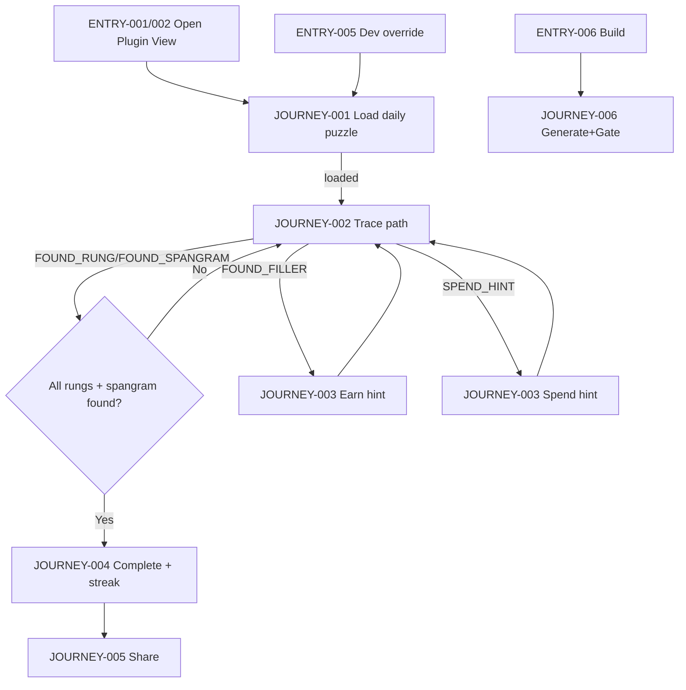
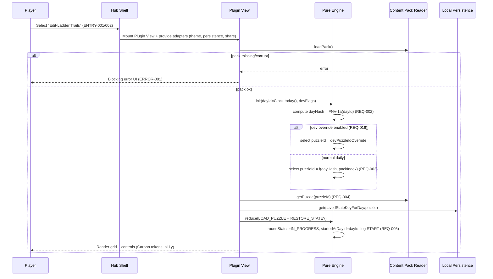
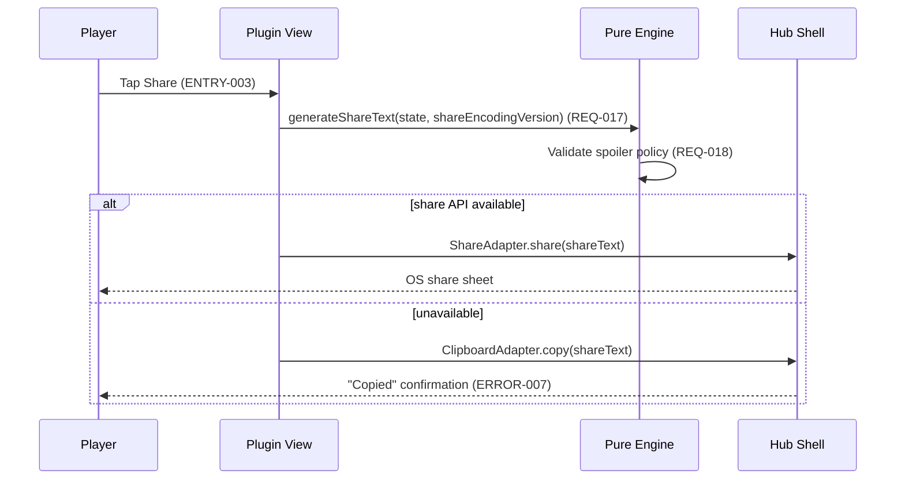
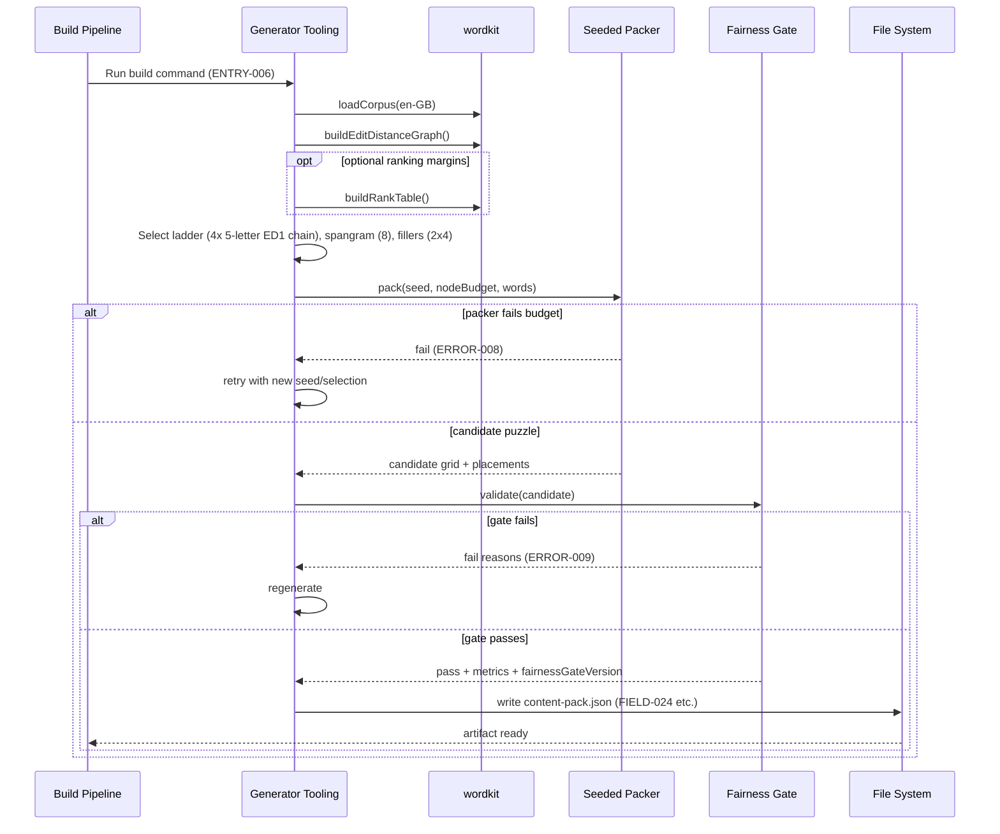
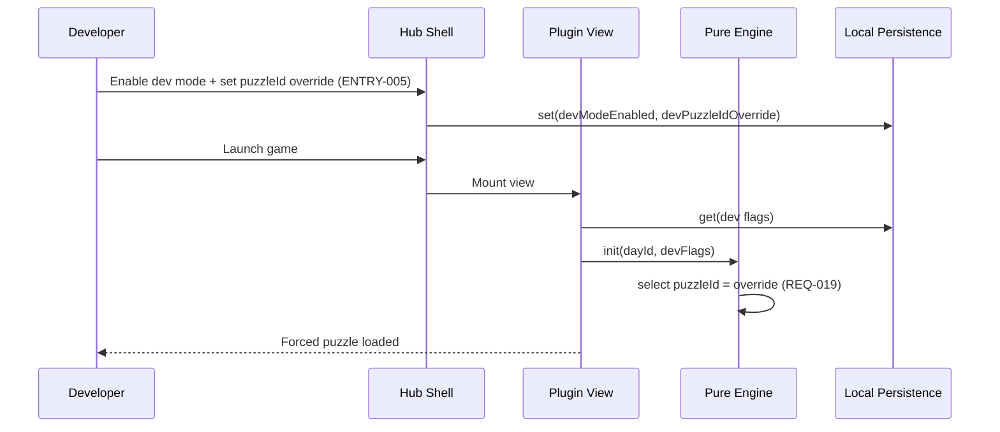

<!-- generated: 2026-07-25T08:23:38Z -->
<!-- mode: feature -->
<!-- feature-slug: edit-ladder-trails -->
<!-- a2a-endpoint: https://bob-sdlc-orchestrator.2as6l7wq9qj8.eu-gb.codeengine.appdomain.cloud/v1/rpc -->

# Glossary

## Terms

### TERM-001: Edit-Ladder Trails
- **Definition:** The daily word-puzzle game plugin for the cic-games hub, featuring a 6x6 grid that is a perfect cover of solution words including an edit-ladder and a spangram.
- **Synonyms:** Edit Ladder, Ladder Trails
- **Anti-definition (what it is NOT):** Not a runtime-generated puzzle; not a backend service; not an account-based game.
- **Source:** User request

### TERM-002: cic-games Hub
- **Definition:** The host application that lists and launches game plugins, provides shared UI shell, and stores local preferences/streaks.
- **Synonyms:** Hub, Games hub
- **Anti-definition:** Not the content generator; not a remote server.
- **Source:** User request (existing hub with 27 games)

### TERM-003: Game Plugin
- **Definition:** A hub-registered module implementing existing per-game plugin conventions: pure engine, plugin view, share output, and local persistence.
- **Synonyms:** Plugin
- **Anti-definition:** Not a standalone app requiring a backend.
- **Source:** User request

### TERM-004: Puzzle (Daily Puzzle)
- **Definition:** One deterministically selected board for a given calendar day, playable offline, with a fixed solution set and grid layout.
- **Synonyms:** Daily board, Daily level
- **Anti-definition:** Not procedurally created at runtime; not personalized per user.
- **Source:** User request

### TERM-005: Day ID
- **Definition:** A deterministic identifier derived from the calendar date and hashed using FNV-1a to select the daily puzzle.
- **Synonyms:** dayId
- **Anti-definition:** Not a random seed; not a server-provided ID.
- **Source:** User request

### TERM-006: Content Pack
- **Definition:** A public JSON bundle produced at build time containing all precomputed puzzles and metadata needed for offline play.
- **Synonyms:** JSON content pack
- **Anti-definition:** Not fetched dynamically from an API at runtime.
- **Source:** User request

### TERM-007: Letter Grid (6x6 Grid)
- **Definition:** A 6 by 6 matrix of letter cells (36 total) used to trace words via 8-direction adjacency.
- **Synonyms:** Board, Grid
- **Anti-definition:** Not variable-sized; not containing unused letters.
- **Source:** User request

### TERM-008: Cell (Tile)
- **Definition:** One position in the 6x6 grid containing a single letter.
- **Synonyms:** Tile
- **Anti-definition:** Not multi-letter; not empty.
- **Source:** User request

### TERM-009: Path
- **Definition:** An ordered sequence of adjacent cells (8-neighbour) selected by the player to form a candidate word.
- **Synonyms:** Trace, Snaking path
- **Anti-definition:** Not allowing jumps; not reusing a cell within the same traced word.
- **Source:** User request

### TERM-010: 8-Neighbour Adjacency
- **Definition:** The set of valid step directions between neighbouring cells: N, NE, E, SE, S, SW, W, NW.
- **Synonyms:** 8-direction, king-move adjacency
- **Anti-definition:** Not 4-direction-only; not knight moves.
- **Source:** User request

### TERM-011: Answer Word
- **Definition:** Any word in the intended solution set embedded in the grid as a valid path.
- **Synonyms:** Solution word
- **Anti-definition:** Not an arbitrary dictionary match found by the user if not in the solution set.
- **Source:** User request

### TERM-012: Theme Word
- **Definition:** Any of the four 5-letter ladder rungs that form the edit ladder chain.
- **Synonyms:** Ladder rung, Rung
- **Anti-definition:** Not the spangram; not filler.
- **Source:** User request

### TERM-013: Edit Ladder
- **Definition:** A chain of exactly four 5-letter en-GB words where each adjacent pair differs by edit-distance 1 (single letter substitution).
- **Synonyms:** Ladder chain
- **Anti-definition:** Not insertion/deletion ladders; not variable length.
- **Source:** User request

### TERM-014: Edit-distance-1 (Substitution)
- **Definition:** Two equal-length strings differ in exactly one character position.
- **Synonyms:** Hamming distance 1 (for equal length)
- **Anti-definition:** Not Levenshtein with insert/delete; not distance > 1.
- **Source:** User request

### TERM-015: Spangram
- **Definition:** The single 8-letter answer word that anchors the theme and whose placed path touches both the top row and bottom row of the grid.
- **Synonyms:** Theme spangram
- **Anti-definition:** Not multiple spangrams; not shorter/longer than 8 letters.
- **Source:** User request

### TERM-016: Filler Word
- **Definition:** One of exactly two non-theme 4-letter answer words included to complete the perfect cover.
- **Synonyms:** Non-theme word
- **Anti-definition:** Not arbitrary extra answers; not hint-only content.
- **Source:** User request

### TERM-017: Perfect Cover
- **Definition:** A placement property where every grid cell belongs to exactly one of the embedded answer-word paths (no overlaps and no unused cells).
- **Synonyms:** Exact cover
- **Anti-definition:** Not allowing overlaps; not allowing unused tiles.
- **Source:** User request

### TERM-018: Placement
- **Definition:** The mapping from each answer word to a specific path of cell coordinates in the grid.
- **Synonyms:** Layout
- **Anti-definition:** Not user-created; not mutable during play.
- **Source:** User request

### TERM-019: Fairness/Uniqueness Gate
- **Definition:** A build-time validator that verifies constraints (perfect cover, valid paths, spangram spanning, valid ladder, bounded alternative covers) before puzzles are shipped.
- **Synonyms:** Fairness gate, Uniqueness gate
- **Anti-definition:** Not a runtime checker used to generate new boards.
- **Source:** User request

### TERM-020: Alternative Valid Cover
- **Definition:** A different set of word-to-path placements that also perfectly covers the grid under the same dictionary constraints.
- **Synonyms:** Alternate solution
- **Anti-definition:** Not a different day’s puzzle; not a partial word match.
- **Source:** User request

### TERM-021: Build-time Generator Tooling
- **Definition:** The deterministic tooling pipeline that selects ladder/spangram/fillers and packs them into a 6x6 perfect cover using a seeded, node-budgeted backtracking packer.
- **Synonyms:** Content builder, Generator
- **Anti-definition:** Not executed in the shipped client for puzzle creation.
- **Source:** User request

### TERM-022: Node-budgeted Seeded Backtracking Packer
- **Definition:** The algorithm that searches placements using a deterministic seed and stops after a configured node/step budget to control build time.
- **Synonyms:** Packer
- **Anti-definition:** Not an unbounded exhaustive solver at runtime.
- **Source:** User request

### TERM-023: Wordkit Corpus (en-GB)
- **Definition:** The available word-data primitive providing a frequency-tiered British English corpus via `loadCorpus` and `wordTier`.
- **Synonyms:** Corpus, wordkit
- **Anti-definition:** Not an online dictionary API; not en-US.
- **Source:** User request

### TERM-024: Word Tier
- **Definition:** A discrete frequency tier label for a word from the wordkit corpus.
- **Synonyms:** Frequency tier
- **Anti-definition:** Not a probability; not a difficulty rating by itself.
- **Source:** User request

### TERM-025: Edit-distance Graph
- **Definition:** A graph of words where edges connect words at edit-distance-1 (substitution for equal-length sets), produced by `buildEditDistanceGraph`.
- **Synonyms:** ED1 graph
- **Anti-definition:** Not a semantic similarity graph.
- **Source:** User request

### TERM-026: GloVe Rank Table
- **Definition:** Precomputed similarity rank tables (`buildRankTable`) used only for coarse rank margins during selection.
- **Synonyms:** Similarity ranks
- **Anti-definition:** Not used to generate runtime hints; not used as the sole difficulty measure.
- **Source:** User request

### TERM-027: Hint
- **Definition:** A progressive reward earned by finding filler words, which can be spent to reveal assistance without penalty.
- **Synonyms:** Hints currency
- **Anti-definition:** Not paid currency; not a per-guess penalty mechanic.
- **Source:** User request

### TERM-028: Hint Spend (Hint Action)
- **Definition:** A user action consuming one or more hints to reveal assistance (e.g., highlight an unfound word’s cells) without revealing letters in share output.
- **Synonyms:** Use hint
- **Anti-definition:** Not an automatic reveal; not required to win.
- **Source:** User request (implied)

### TERM-029: Discovery (Found Word)
- **Definition:** The event of correctly tracing an answer word; the word becomes highlighted and locked.
- **Synonyms:** Solve
- **Anti-definition:** Not selecting letters that happen to form a non-answer.
- **Source:** User request

### TERM-030: Locked Highlight
- **Definition:** The visual and state change applied to a found answer word’s path so it remains marked and cannot be altered as an unfound candidate.
- **Synonyms:** Locked, Marked
- **Anti-definition:** Not a temporary selection highlight.
- **Source:** User request

### TERM-031: Round
- **Definition:** One play session for the selected daily puzzle, ending when all theme words and the spangram are found.
- **Synonyms:** Game, Puzzle session
- **Anti-definition:** Not multi-day; not endless mode.
- **Source:** User request

### TERM-032: Win State
- **Definition:** The completion state where all theme words (4 rungs) and the spangram are found.
- **Synonyms:** Completed
- **Anti-definition:** Not requiring filler words; not having a lose state.
- **Source:** User request

### TERM-033: Streak
- **Definition:** A local per-day completion continuity counter for the daily puzzle.
- **Synonyms:** Daily streak
- **Anti-definition:** Not server-verified; not account-bound.
- **Source:** User request

### TERM-034: Dev-mode Override
- **Definition:** A developer-facing capability to force a specific puzzle selection instead of the daily-deterministic one.
- **Synonyms:** Debug override
- **Anti-definition:** Not available to normal users by default.
- **Source:** User request

### TERM-035: Share Result
- **Definition:** A spoiler-free encoded summary of the player’s round, using emoji/dot grid and discovery order plus hints used, without revealing any letters.
- **Synonyms:** Share text
- **Anti-definition:** Not including solution words; not including the grid letters.
- **Source:** User request

### TERM-036: Discovery Order
- **Definition:** The chronological order in which theme words, spangram, and filler-triggered hint earnings occurred (and hint spends occurred if applicable).
- **Synonyms:** Solve order
- **Anti-definition:** Not the solution order in the ladder chain.
- **Source:** User request

### TERM-037: Offline-first PWA
- **Definition:** A web app that runs fully offline after install, using local content pack and local storage.
- **Synonyms:** PWA
- **Anti-definition:** Not requiring network connectivity to play.
- **Source:** User request

### TERM-038: Capacitor App
- **Definition:** iOS/Android app packaging of the same offline game via Capacitor.
- **Synonyms:** Mobile wrapper
- **Anti-definition:** Not a separate backend-connected client.
- **Source:** User request

### TERM-039: IBM Carbon g100 Tokens
- **Definition:** The design token set used for UI styling and theming consistency within the hub.
- **Synonyms:** Carbon tokens
- **Anti-definition:** Not custom ad-hoc styling.
- **Source:** User request

### TERM-040: Accessibility (Keyboard + Screen Reader)
- **Definition:** Full keyboard operability and screen-reader accessible semantics for all gameplay and navigation.
- **Synonyms:** A11y
- **Anti-definition:** Not mouse/touch-only; not visual-only cues.
- **Source:** User request

### TERM-041: Plugin View
- **Definition:** The UI route/view that renders the game inside the hub using the plugin convention.
- **Synonyms:** Game screen
- **Anti-definition:** Not a separate standalone route outside the hub.
- **Source:** User request

### TERM-042: Engine (Pure Engine)
- **Definition:** Deterministic game logic module that updates game state from inputs without side effects except via provided persistence interfaces.
- **Synonyms:** Reducer-style engine
- **Anti-definition:** Not directly manipulating DOM; not fetching network resources.
- **Source:** User request

### TERM-043: Local Persistence
- **Definition:** Storage of progress, completion, streak, settings, and dev override on-device without accounts.
- **Synonyms:** Local storage
- **Anti-definition:** Not cloud save.
- **Source:** User request

---

## Data Dictionary

| ID | Name | Type | Format | Range/Enum | Units | Default | Nullable | PII | Source | Validation |
|---|---|---|---|---|---|---|---|---|---|---|
| FIELD-001 | puzzleId | string | slug | `[a-z0-9_-]+` | n/a | n/a | No | Non-PII | TERM-006 Content Pack | Must be unique within content pack |
| FIELD-002 | dayId | string | `YYYY-MM-DD` | valid calendar date | n/a | today (device-local) | No | Non-PII | TERM-005 Day ID | Must parse as ISO date; no time component |
| FIELD-003 | dayHash | string | hex | `^[0-9a-f]{8,16}$` | n/a | computed | No | Non-PII | TERM-005 Day ID | Must equal FNV-1a hash of FIELD-002 using defined algorithm/version |
| FIELD-004 | gridSize | object | JSON | `{rows:6, cols:6}` | cells | `{6,6}` | No | Non-PII | TERM-007 Letter Grid | rows=6 and cols=6 only |
| FIELD-005 | gridLetters | string[] | array length 36 | `A-Z` | n/a | n/a | No | Non-PII | TERM-007 Letter Grid | Length=36; each entry matches `^[A-Z]$` |
| FIELD-006 | cellIndex | integer | int | 0..35 | index | n/a | No | Non-PII | TERM-008 Cell | Must map to (row=floor(i/6), col=i%6) |
| FIELD-007 | row | integer | int | 0..5 | index | n/a | No | Non-PII | TERM-007 Letter Grid | Must be within bounds |
| FIELD-008 | col | integer | int | 0..5 | index | n/a | No | Non-PII | TERM-007 Letter Grid | Must be within bounds |
| FIELD-009 | pathCellIndices | integer[] | array | each 0..35, unique | cells | empty | No | Non-PII | TERM-009 Path | Adjacent by TERM-010; no duplicates |
| FIELD-010 | tracedString | string | uppercase | `^[A-Z]+$` | n/a | "" | No | Non-PII | TERM-009 Path | Must equal concatenation of FIELD-005 along FIELD-009 |
| FIELD-011 | answerId | string | slug | `[a-z0-9_-]+` | n/a | n/a | No | Non-PII | TERM-011 Answer Word | Unique within puzzle |
| FIELD-012 | answerType | string | enum | `SPANGRAM|RUNG|FILLER` | n/a | n/a | No | Non-PII | TERM-011 Answer Word | Must match word length constraints by type |
| FIELD-013 | answerWord | string | lowercase | `^[a-z]+$` | n/a | n/a | No | Non-PII | TERM-011 Answer Word | Must be en-GB corpus member (TERM-023) |
| FIELD-014 | answerLength | integer | int | 4,5,8 | letters | derived | No | Non-PII | TERM-011 Answer Word | Must equal `len(FIELD-013)` |
| FIELD-015 | placementPath | integer[] | array | 0..35 | cells | n/a | No | Non-PII | TERM-018 Placement | Length must equal FIELD-014 and match adjacency rules |
| FIELD-016 | touchesTopRow | boolean | bool | true/false | n/a | computed | No | Non-PII | TERM-015 Spangram | True iff any cell row==0 |
| FIELD-017 | touchesBottomRow | boolean | bool | true/false | n/a | computed | No | Non-PII | TERM-015 Spangram | True iff any cell row==5 |
| FIELD-018 | ladderWords | string[] | array length 4 | lowercase words | n/a | n/a | No | Non-PII | TERM-013 Edit Ladder | Each len=5; unique |
| FIELD-019 | ladderIsValid | boolean | bool | true/false | n/a | computed | No | Non-PII | TERM-013 Edit Ladder | True iff each adjacent pair differs by TERM-014 |
| FIELD-020 | spangramWord | string | lowercase | `^[a-z]{8}$` | n/a | n/a | No | Non-PII | TERM-015 Spangram | Must be in corpus |
| FIELD-021 | fillerWords | string[] | array length 2 | lowercase words | n/a | n/a | No | Non-PII | TERM-016 Filler Word | Each len=4; unique; not in ladder/spangram |
| FIELD-022 | coverIsPerfect | boolean | bool | true/false | n/a | computed | No | Non-PII | TERM-017 Perfect Cover | True iff union of all placement paths is size 36 and disjoint |
| FIELD-023 | alternativeCoverCount | integer | int | 0..N | covers | 0 | No | Non-PII | TERM-020 Alternative Valid Cover | Must be <= configured fairness threshold |
| FIELD-024 | fairnessGateVersion | string | semver | `x.y.z` | n/a | n/a | No | Non-PII | TERM-019 Fairness/Uniqueness Gate | Must be present in content pack metadata |
| FIELD-025 | packerSeed | string | hex/base10 | implementation-defined | n/a | n/a | No | Non-PII | TERM-022 Packer | Must be deterministic given puzzleId/tool version |
| FIELD-026 | nodeBudget | integer | int | 1..10^9 | nodes | n/a | No | Non-PII | TERM-022 Packer | Must be >0 |
| FIELD-027 | wordTier | integer | int | corpus-defined tiers | tier | n/a | Yes | Non-PII | TERM-024 Word Tier | If present, must be produced by `wordTier` |
| FIELD-028 | gloveRankMargin | integer | int | 0..10^9 | rank | n/a | Yes | Non-PII | TERM-026 GloVe Rank Table | If present, must come from `buildRankTable` output |
| FIELD-029 | gameStateVersion | integer | int | >=1 | n/a | 1 | No | Non-PII | TERM-042 Engine | Must match engine serializer version |
| FIELD-030 | foundAnswerIds | string[] | array | answerId list | n/a | [] | No | Non-PII | TERM-029 Discovery | Subset of puzzle answerIds; unique |
| FIELD-031 | lockedPaths | object | JSON map | `{answerId: pathCellIndices}` | n/a | {} | No | Non-PII | TERM-030 Locked Highlight | Each path equals the placementPath for that answerId |
| FIELD-032 | hintBalance | integer | int | >=0 | hints | 0 | No | Non-PII | TERM-027 Hint | Cannot be negative |
| FIELD-033 | hintEarnEvents | integer | int | >=0 | events | 0 | No | Non-PII | TERM-027 Hint | Increments on filler discovery |
| FIELD-034 | hintSpendEvents | integer | int | >=0 | events | 0 | No | Non-PII | TERM-028 Hint Spend | Increments on hint action |
| FIELD-035 | discoveryLog | object[] | JSON array | event objects | n/a | [] | No | Non-PII | TERM-036 Discovery Order | Each event has timestampOffsetMs and type |
| FIELD-036 | eventType | string | enum | `FOUND_RUNG|FOUND_SPANGRAM|FOUND_FILLER|SPEND_HINT|START|COMPLETE` | n/a | n/a | No | Non-PII | TERM-036 Discovery Order | Must be one of enum |
| FIELD-037 | timestampOffsetMs | integer | int | >=0 | ms | 0 | No | Non-PII | TERM-031 Round | Monotonic non-decreasing within a round |
| FIELD-038 | roundStatus | string | enum | `IN_PROGRESS|COMPLETED` | n/a | IN_PROGRESS | No | Non-PII | TERM-031 Round | COMPLETED iff TERM-032 satisfied |
| FIELD-039 | startedAtDayId | string | `YYYY-MM-DD` | valid date | n/a | n/a | No | Non-PII | TERM-031 Round | Must equal selected FIELD-002 at round start |
| FIELD-040 | completedAtDayId | string | `YYYY-MM-DD` | valid date | n/a | n/a | Yes | Non-PII | TERM-032 Win State | Must be set when round completes |
| FIELD-041 | streakCount | integer | int | >=0 | days | 0 | No | Non-PII | TERM-033 Streak | Derived from completion history |
| FIELD-042 | completionHistory | string[] | array | list of dayId | n/a | [] | No | Non-PII | TERM-033 Streak | Must be unique dates; sorted ascending |
| FIELD-043 | devModeEnabled | boolean | bool | true/false | n/a | false | No | Non-PII | TERM-034 Dev-mode Override | Only settable via dev UI/build flag |
| FIELD-044 | devPuzzleIdOverride | string | slug | `[a-z0-9_-]+` | n/a | null | Yes | Non-PII | TERM-034 Dev-mode Override | If set, must exist in content pack |
| FIELD-045 | shareText | string | utf-8 | length 1..5000 | chars | "" | No | Non-PII | TERM-035 Share Result | Must not contain any letters from FIELD-005 (A-Z) sequences representing grid |
| FIELD-046 | shareEncodingVersion | string | semver | `x.y.z` | n/a | n/a | No | Non-PII | TERM-035 Share Result | Must be included in share output header |
| FIELD-047 | uiThemeTokenSet | string | enum | `carbon-g100` | n/a | carbon-g100 | No | Non-PII | TERM-039 IBM Carbon g100 Tokens | Must equal `carbon-g100` |
| FIELD-048 | locale | string | BCP-47 | e.g. `en-GB` | n/a | `en-GB` | No | Non-PII | TERM-023 Wordkit Corpus | Must be supported locale list (initially only en-GB) |

# User Journeys

## Roles

| Role ID | Role Name | Type | Description |
|---|---|---|---|
| ROLE-001 | Player | Primary | Plays the daily TERM-001 puzzle offline, traces TERM-009 paths, earns TERM-027 hints, completes TERM-032. |
| ROLE-002 | Developer | Admin/Dev | Uses TERM-034 dev override and validates content pack integrity during development/testing. |
| ROLE-003 | Build Pipeline | System | Runs TERM-021 tooling to generate TERM-006 content pack and enforce TERM-019 gate. |
| ROLE-004 | Hub Shell | System | Loads TERM-003 plugin, provides navigation, persistence hooks, and share surface. |
| ROLE-005 | Screen Reader User | Secondary | Player using assistive tech; requires TERM-040 compliant interactions. |

## Entry Points

| Entry ID | Location | Trigger | Auth |
|---|---|---|---|
| ENTRY-001 | Hub game list → Plugin View (TERM-041) | Player selects “Edit-Ladder Trails” | None |
| ENTRY-002 | Hub deep link route `/games/edit-ladder-trails` (example) | Route navigation | None |
| ENTRY-003 | In-game “Share” button | Player requests TERM-035 | None (OS share sheet) |
| ENTRY-004 | In-game “Hint” control | Player spends TERM-027 | None |
| ENTRY-005 | Dev settings panel (hub or plugin) | Developer toggles FIELD-043 / sets FIELD-044 | Local-only (dev build flag) |
| ENTRY-006 | Build command (CI/CLI) | Pipeline runs generator + gate | CI credentials (not gameplay auth) |

## Role Permission Matrix

| Capability | ROLE-001 Player | ROLE-002 Developer | ROLE-003 Build Pipeline | ROLE-004 Hub Shell | ROLE-005 Screen Reader User |
|---|---:|---:|---:|---:|---:|
| Load daily puzzle by FIELD-002/FIELD-003 | Y | Y | N | Y | Y |
| Override puzzle selection via FIELD-044 | N | Y | N | N | N |
| Trace selection paths (TERM-009) | Y | Y | N | N | Y |
| Spend/earn hints (TERM-027/028) | Y | Y | N | N | Y |
| Persist progress locally (TERM-043) | Y | Y | N | Y (provides API) | Y |
| Generate content pack (TERM-006) | N | Y (local) | Y | N | N |
| Enforce fairness gate (TERM-019) | N | Y (local) | Y | N | N |
| Share spoiler-free result (TERM-035) | Y | Y | N | Y (invokes share) | Y |

## Journeys

### JOURNEY-001: Start daily puzzle (Player)
- **Role/Goal:** ROLE-001; start today’s TERM-004 using deterministic selection (success: puzzle loaded, round started; failure: content pack missing/corrupt).
- **Entry:** ENTRY-001 or ENTRY-002

**Happy path**
1. System reads device date into **FIELD-002 dayId** (TERM-005).
2. System computes **FIELD-003 dayHash** using FNV-1a (TERM-005).
3. System selects **FIELD-001 puzzleId** from TERM-006 content pack deterministically from **FIELD-003**.
4. System loads puzzle payload: **FIELD-005 gridLetters**, answer list (**FIELD-011..FIELD-021**), and placements (**FIELD-015**).
5. System initializes round state: **FIELD-038 roundStatus=IN_PROGRESS**, **FIELD-039 startedAtDayId=FIELD-002**, append **FIELD-036 eventType=START** to **FIELD-035 discoveryLog**.
6. System renders TERM-007 grid and input affordances consistent with TERM-039/TERM-040.

**BRANCH-001 (Dev override enabled)**
- Trigger: **FIELD-043 devModeEnabled=true** and **FIELD-044 devPuzzleIdOverride** present.
- Path: Step 3 uses **FIELD-044** instead of **FIELD-003** to choose **FIELD-001**.

**ERROR-001 (Content pack missing)**
- Trigger: TERM-006 not found in bundle or cannot be parsed.
- System response: Show blocking error state with retry/help text; do not start round.
- Recovery: Player returns to hub and updates/reinstalls app.

**ERROR-002 (PuzzleId not found)**
- Trigger: deterministic selection produces a **FIELD-001** not present in pack.
- System response: Show error and fall back to a safe default puzzle (e.g., first puzzle) only if explicitly allowed by policy; otherwise block.
- Recovery: Player restarts app; Developer investigates pack integrity.

**EDGE-001 (Timezone/date rollover)**
- Scenario: App open across midnight; **FIELD-002** changes.
- Handling: On returning to foreground, system prompts to continue current **FIELD-039** round or switch to new day selection.

---

### JOURNEY-002: Trace a word path and get feedback (Player)
- **Role/Goal:** ROLE-001; discover TERM-011 answers by tracing TERM-009 (success: correct words lock; failure: incorrect trace gives gentle feedback).
- **Entry:** From active puzzle view after JOURNEY-001

**Happy path**
1. Player starts a selection on a TERM-008 cell (references **FIELD-006 cellIndex**).
2. Player extends selection through adjacent cells following TERM-010, updating **FIELD-009 pathCellIndices**.
3. System derives **FIELD-010 tracedString** from **FIELD-005 gridLetters** at **FIELD-009**.
4. Player ends selection.
5. System checks whether **FIELD-010** corresponds to an embedded **FIELD-011 answerId** and exact **FIELD-015 placementPath**.
6. If match: system records discovery by adding to **FIELD-030 foundAnswerIds**, adds entry to **FIELD-031 lockedPaths**, and appends event to **FIELD-035** with **FIELD-036** set according to **FIELD-012 answerType**.
7. System applies TERM-030 locked highlight for that answer’s path.

**BRANCH-002 (Selection violates adjacency)**
- Trigger: Player attempts to extend to a non-adjacent cell per TERM-010.
- System response: Reject the extension; keep current **FIELD-009** unchanged.

**BRANCH-003 (Backtrack within current trace)**
- Trigger: Player drags back to previous selected cell.
- System response: Pop last cell(s) from **FIELD-009** (LOOP-001).

**ERROR-003 (Duplicate cell in trace)**
- Trigger: Player attempts to include a cellIndex already in **FIELD-009**.
- System response: Reject that move; optionally announce via aria-live for ROLE-005.
- Recovery: Player continues tracing without the duplicate.

**ERROR-004 (Not an answer)**
- Trigger: **FIELD-010** not equal to any **FIELD-013 answerWord** for this puzzle.
- System response: Clear temporary highlight; optionally show “Not in puzzle” toast; no penalty.
- Recovery: Player tries another path.

**EDGE-002 (Concurrency with locked tiles)**
- Scenario: Player traces across already-locked path cells.
- Handling: Allow selection only if it exactly matches an unfound answer placement; otherwise block selecting locked cells (policy to be defined).

---

### JOURNEY-003: Earn and spend hints (Player)
- **Role/Goal:** ROLE-001; earn TERM-027 by finding TERM-016 fillers; spend hints to get assistance (success: hint balance updates; failure: cannot spend without balance).
- **Entry:** ENTRY-004 and discovery events from JOURNEY-002

**Happy path (earn)**
1. Player finds a filler answer (TERM-016), resulting in discovery event **FIELD-036 eventType=FOUND_FILLER**.
2. System increments **FIELD-033 hintEarnEvents** and increments **FIELD-032 hintBalance** by 1 (or configured amount).
3. System presents non-spoiler feedback “Hint earned” without revealing any letters.

**Happy path (spend)**
4. Player activates hint control (ENTRY-004).
5. System decrements **FIELD-032 hintBalance** by 1.
6. System increments **FIELD-034 hintSpendEvents** and appends **FIELD-036 eventType=SPEND_HINT** to **FIELD-035**.
7. System reveals assistance (e.g., highlights a starting cell or outlines an unfound answer path) without revealing letters.

**BRANCH-004 (No hint balance)**
- Trigger: **FIELD-032 hintBalance==0**.
- System response: Disable hint control and announce reason via accessible label; no state change.

**ERROR-005 (Hint target already found)**
- Trigger: hint algorithm selects an answerId already in **FIELD-030**.
- System response: Re-select target deterministically to an unfound answer; if none, do not spend and inform user.
- Recovery: Player continues; can share/finish.

**EDGE-003 (Hint determinism)**
- Scenario: Offline and no backend; hint target selection must be deterministic given state.
- Handling: Choose hint target based on stable ordering (e.g., answer list order and **FIELD-030**) to ensure consistent behavior across devices.

---

### JOURNEY-004: Complete the round and update streak (Player)
- **Role/Goal:** ROLE-001; reach TERM-032 win state (success: completion recorded, streak updated; failure: persistence unavailable).
- **Entry:** Triggered after each discovery from JOURNEY-002

**Happy path**
1. After a discovery, system checks whether all theme answers (all **FIELD-012=RUNG**) and the spangram (**FIELD-012=SPANGRAM**) are included in **FIELD-030 foundAnswerIds**.
2. If yes, system sets **FIELD-038 roundStatus=COMPLETED** and sets **FIELD-040 completedAtDayId=FIELD-002**.
3. System appends **FIELD-036 eventType=COMPLETE** to **FIELD-035** with **FIELD-037 timestampOffsetMs**.
4. System updates **FIELD-042 completionHistory** to include **FIELD-002** and recomputes **FIELD-041 streakCount**.
5. System shows completion UI and enables share (ENTRY-003).

**ERROR-006 (Local persistence failure)**
- Trigger: Write to TERM-043 storage fails (quota/disabled).
- System response: Keep in-memory completion state and show warning; streak may not persist.
- Recovery: Player exports share text; may retry after enabling storage.

**EDGE-004 (Replay same day)**
- Scenario: Player reopens after completion.
- Handling: Load completed state; allow free exploration but do not change streak for the same **FIELD-002**.

---

### JOURNEY-005: Share spoiler-free result (Player)
- **Role/Goal:** ROLE-001; generate TERM-035 share output without spoilers (success: shareText contains no letters; failure: OS share unavailable).
- **Entry:** ENTRY-003

**Happy path**
1. Player taps “Share”.
2. System composes **FIELD-045 shareText** from **FIELD-035 discoveryLog**, including **FIELD-046 shareEncodingVersion**, completion status, discovery order groupings (rungs, spangram, hint events), and a dot/emoji grid that does not reveal letters.
3. System verifies **FIELD-045** contains no substrings derived from **FIELD-005 gridLetters** (no letter grid disclosure).
4. System invokes OS share sheet with **FIELD-045**.

**ERROR-007 (Share API unavailable)**
- Trigger: Platform lacks share capability.
- System response: Copy **FIELD-045** to clipboard and show confirmation.
- Recovery: Player pastes into desired app.

**EDGE-005 (Accessibility of share content)**
- Scenario: Screen reader reads emoji grid.
- Handling: Provide an alternate accessible textual summary line (counts/order/hints) preceding the emoji grid.

---

### JOURNEY-006: Generate and validate content pack (Build Pipeline)
- **Role/Goal:** ROLE-003; produce TERM-006 with only valid puzzles (success: pack built; failure: fairness gate rejects).
- **Entry:** ENTRY-006

**Happy path**
1. Tool loads TERM-023 corpus via `loadCorpus` (affects **FIELD-048 locale**, **FIELD-027 wordTier**).
2. Tool builds TERM-025 graph via `buildEditDistanceGraph`.
3. Tool selects a TERM-013 ladder producing **FIELD-018 ladderWords**; validates **FIELD-019 ladderIsValid=true**.
4. Tool selects TERM-015 spangram (**FIELD-020 spangramWord**) and TERM-016 fillers (**FIELD-021 fillerWords**).
5. Tool runs TERM-022 packer with **FIELD-025 packerSeed** and **FIELD-026 nodeBudget** to produce **FIELD-005 gridLetters** and **FIELD-015 placementPath** for each answer.
6. Tool runs TERM-019 gate to compute **FIELD-022 coverIsPerfect**, **FIELD-016/017** for spangram spanning, and **FIELD-023 alternativeCoverCount**.
7. Tool emits JSON with **FIELD-024 fairnessGateVersion** and puzzle records.

**ERROR-008 (Packer fails within node budget)**
- Trigger: No valid perfect cover found before **FIELD-026** exhausted.
- System response: Mark attempt as failed; retry with new seed or different word selection.
- Recovery: Automated retries within build rules.

**ERROR-009 (Fairness gate fails)**
- Trigger: Any of **FIELD-022=false**, spangram not spanning (**FIELD-016/017** not both true), **FIELD-019=false**, or **FIELD-023** exceeds threshold.
- System response: Reject puzzle; regenerate.
- Recovery: Adjust parameters/word selection.

**EDGE-006 (Determinism across tool versions)**
- Scenario: Tool changes alter outputs.
- Handling: Record **FIELD-024 fairnessGateVersion** and generator version; require reproducible builds in CI.

---

### JOURNEY-007: Dev-mode force puzzle selection (Developer)
- **Role/Goal:** ROLE-002; set TERM-034 override to load a specific puzzle for debugging (success: chosen puzzle loads; failure: invalid id).
- **Entry:** ENTRY-005

**Happy path**
1. Developer enables **FIELD-043 devModeEnabled=true**.
2. Developer sets **FIELD-044 devPuzzleIdOverride** to a valid **FIELD-001 puzzleId**.
3. Developer launches game (JOURNEY-001); BRANCH-001 selects overridden puzzle.

**ERROR-010 (Override puzzleId invalid)**
- Trigger: **FIELD-044** not in content pack.
- System response: Show validation error; do not apply override.
- Recovery: Developer selects an existing id.

---

## Journey Map



# Requirements

### REQ-001: Register game plugin in hub
- **EARS Pattern:** Ubiquitous
- **EARS Statement:** The TERM-002 cic-games Hub shall register TERM-001 Edit-Ladder Trails as a TERM-003 Game Plugin.
- **Inputs:** TERM-003 plugin manifest
- **Outputs:** Hub game list entry
- **Preconditions:** Hub build includes plugin bundle
- **Postconditions:** Plugin is launchable via ENTRY-001
- **Invariants:** No backend dependency
- **Trigger:** App startup / hub registry load
- **Actor:** ROLE-004 Hub Shell
- **EntityScope:** TERM-003 Game Plugin
- **ErrorModes:** Missing plugin manifest
- **NFR-Tags:** compatibility
- **Source:** JOURNEY-001 step 0 (entry), user request “register in the hub”
- **Dependencies:** None
- **Priority:** P0
- **AcceptanceCriteria:**
  - **TEST-001:** Given the hub game list, when the list renders, then “Edit-Ladder Trails” appears as a selectable game entry.
  - **TEST-002:** Given the game entry, when selected, then the plugin view loads without network access.
- **Assumptions:** Hub has an existing plugin registry mechanism.
- **OpenQuestions:** What are the exact manifest fields required by the hub?

### REQ-002: Deterministically compute day hash
- **EARS Pattern:** Ubiquitous
- **EARS Statement:** The TERM-042 Engine shall compute FIELD-003 dayHash as an FNV-1a hash of FIELD-002 dayId.
- **Inputs:** FIELD-002
- **Outputs:** FIELD-003
- **Preconditions:** FIELD-002 is a valid date string
- **Postconditions:** FIELD-003 available for puzzle selection
- **Invariants:** Same FIELD-002 yields same FIELD-003 for a given algorithm/version
- **Trigger:** JOURNEY-001 step 2
- **Actor:** ROLE-004 Hub Shell
- **EntityScope:** TERM-005 Day ID
- **ErrorModes:** Invalid dayId format
- **NFR-Tags:** reliability
- **Source:** JOURNEY-001 step 2
- **Dependencies:** NFR-007 (versioning/compat)
- **Priority:** P0
- **AcceptanceCriteria:**
  - **TEST-003:** Given FIELD-002=`2026-07-25`, when hashing, then FIELD-003 equals the published expected value for the chosen FNV-1a variant.
- **Assumptions:** A specific FNV-1a width (32/64) will be standardized.
- **OpenQuestions:** Use FNV-1a 32-bit or 64-bit, and what output hex length?

### REQ-003: Select daily puzzle deterministically
- **EARS Pattern:** Event-Driven
- **EARS Statement:** When FIELD-003 dayHash is available, the TERM-042 Engine shall select FIELD-001 puzzleId deterministically from the TERM-006 Content Pack.
- **Inputs:** FIELD-003, TERM-006 pack index
- **Outputs:** FIELD-001
- **Preconditions:** Content pack parsed successfully
- **Postconditions:** Selected puzzle is ready to load
- **Invariants:** Selection is stable for a given pack and hash
- **Trigger:** JOURNEY-001 step 3
- **Actor:** ROLE-004 Hub Shell
- **EntityScope:** TERM-004 Puzzle
- **ErrorModes:** puzzleId not found
- **NFR-Tags:** reliability
- **Source:** JOURNEY-001 step 3, ERROR-002
- **Dependencies:** REQ-002, REQ-004
- **Priority:** P0
- **AcceptanceCriteria:**
  - **TEST-004:** Given a fixed content pack ordering and FIELD-003, when selecting, then the same FIELD-001 is produced across app restarts offline.
- **Assumptions:** Content pack defines a stable ordered list of puzzles.
- **OpenQuestions:** What is the exact selection mapping (mod length, consistent ordering key, etc.)?

### REQ-004: Load puzzle from content pack offline
- **EARS Pattern:** Event-Driven
- **EARS Statement:** When FIELD-001 puzzleId is selected, the TERM-041 Plugin View shall load FIELD-005 gridLetters and all answer placements FIELD-015 from the TERM-006 Content Pack without network access.
- **Inputs:** FIELD-001, TERM-006 JSON
- **Outputs:** Renderable puzzle model
- **Preconditions:** Pack is bundled locally
- **Postconditions:** Puzzle rendered in UI
- **Invariants:** No runtime fetch is required
- **Trigger:** JOURNEY-001 step 4
- **Actor:** ROLE-001 Player
- **EntityScope:** TERM-006 Content Pack
- **ErrorModes:** content pack missing/unparseable
- **NFR-Tags:** offline, compatibility
- **Source:** JOURNEY-001 steps 4-6, ERROR-001
- **Dependencies:** REQ-001
- **Priority:** P0
- **AcceptanceCriteria:**
  - **TEST-005:** Given airplane mode enabled, when opening the plugin view, then the puzzle loads and displays a 6x6 grid.
- **Assumptions:** Hub bundles game packs as static assets.
- **OpenQuestions:** Where in the repo/build are content packs stored per existing convention?

### REQ-005: Initialize round state on puzzle start
- **EARS Pattern:** Event-Driven
- **EARS Statement:** When a puzzle is loaded, the TERM-042 Engine shall set FIELD-038 roundStatus to `IN_PROGRESS` and set FIELD-039 startedAtDayId to FIELD-002.
- **Inputs:** FIELD-002, puzzle load event
- **Outputs:** Initialized game state
- **Preconditions:** Puzzle payload loaded
- **Postconditions:** Round can accept input
- **Invariants:** startedAtDayId remains constant for the round
- **Trigger:** JOURNEY-001 step 5
- **Actor:** ROLE-004 Hub Shell
- **EntityScope:** TERM-031 Round
- **ErrorModes:** None
- **NFR-Tags:** auditability
- **Source:** JOURNEY-001 step 5
- **Dependencies:** REQ-004
- **Priority:** P0
- **AcceptanceCriteria:**
  - **TEST-006:** Given a newly loaded puzzle, when inspecting state, then FIELD-038 is `IN_PROGRESS` and FIELD-039 equals today’s FIELD-002.
- **Assumptions:** Engine state is inspectable in dev tools.
- **OpenQuestions:** None

### REQ-006: Enforce 8-neighbour adjacency during tracing
- **EARS Pattern:** Event-Driven
- **EARS Statement:** When the player extends a TERM-009 Path, the TERM-041 Plugin View shall accept the next FIELD-006 cellIndex only if it is adjacent by TERM-010 to the current path end.
- **Inputs:** Current FIELD-009, candidate FIELD-006
- **Outputs:** Updated FIELD-009 or rejection
- **Preconditions:** Round in progress (FIELD-038)
- **Postconditions:** Path remains valid under adjacency
- **Invariants:** Path steps are 8-neighbour
- **Trigger:** JOURNEY-002 step 2, BRANCH-002
- **Actor:** ROLE-001 Player
- **EntityScope:** TERM-009 Path
- **ErrorModes:** Non-adjacent extension
- **NFR-Tags:** accessibility
- **Source:** JOURNEY-002 step 2, BRANCH-002
- **Dependencies:** None
- **Priority:** P0
- **AcceptanceCriteria:**
  - **TEST-007:** Given a current path ending at cell (r,c), when the player attempts to add a cell not in the 8 neighbours, then the path does not change.
- **Assumptions:** Input model supports incremental cell additions.
- **OpenQuestions:** Should diagonal adjacency be visually hinted?

### REQ-007: Prevent duplicate cell reuse within a trace
- **EARS Pattern:** Event-Driven
- **EARS Statement:** When the player selects a FIELD-006 cellIndex already present in FIELD-009 pathCellIndices, the TERM-041 Plugin View shall reject adding that cell to the path.
- **Inputs:** FIELD-009, candidate FIELD-006
- **Outputs:** No change to FIELD-009
- **Preconditions:** Active trace
- **Postconditions:** Path remains a simple sequence
- **Invariants:** FIELD-009 contains unique indices
- **Trigger:** JOURNEY-002 ERROR-003
- **Actor:** ROLE-001 Player
- **EntityScope:** TERM-009 Path
- **ErrorModes:** Duplicate-cell selection
- **NFR-Tags:** accessibility
- **Source:** JOURNEY-002 ERROR-003
- **Dependencies:** REQ-006
- **Priority:** P0
- **AcceptanceCriteria:**
  - **TEST-008:** Given a path containing cellIndex X, when the player attempts to re-add X, then X appears only once in FIELD-009.
- **Assumptions:** Backtracking is handled separately (REQ-008).
- **OpenQuestions:** None

### REQ-008: Support backtracking during tracing
- **EARS Pattern:** Event-Driven
- **EARS Statement:** When the player moves the pointer/focus back to the previous cell in FIELD-009 pathCellIndices, the TERM-041 Plugin View shall remove the last cell from FIELD-009.
- **Inputs:** FIELD-009, current pointer cellIndex
- **Outputs:** Shortened FIELD-009
- **Preconditions:** FIELD-009 length >= 2
- **Postconditions:** Trace reflects backtrack
- **Invariants:** Order is preserved for remaining cells
- **Trigger:** JOURNEY-002 BRANCH-003 (LOOP-001)
- **Actor:** ROLE-001 Player
- **EntityScope:** TERM-009 Path
- **ErrorModes:** None
- **NFR-Tags:** accessibility
- **Source:** JOURNEY-002 BRANCH-003
- **Dependencies:** REQ-006
- **Priority:** P1
- **AcceptanceCriteria:**
  - **TEST-009:** Given a path [A,B,C], when the user backtracks to B, then the path becomes [A,B].
- **Assumptions:** Touch drag and keyboard selection both map to this behavior.
- **OpenQuestions:** Define exact keyboard gesture for backtrack.

### REQ-009: Match traced word to an embedded answer by placement
- **EARS Pattern:** Event-Driven
- **EARS Statement:** When the player ends a trace, the TERM-042 Engine shall mark an answer as found only if FIELD-009 pathCellIndices exactly equals that answer’s FIELD-015 placementPath.
- **Inputs:** FIELD-009, puzzle answers with FIELD-015
- **Outputs:** Updated FIELD-030 and FIELD-031
- **Preconditions:** Puzzle loaded
- **Postconditions:** Found answer becomes locked
- **Invariants:** No partial or anagram matches qualify
- **Trigger:** JOURNEY-002 steps 4-6
- **Actor:** ROLE-001 Player
- **EntityScope:** TERM-018 Placement
- **ErrorModes:** Trace does not match any placement
- **NFR-Tags:** reliability
- **Source:** JOURNEY-002 steps 4-6, ERROR-004
- **Dependencies:** REQ-010
- **Priority:** P0
- **AcceptanceCriteria:**
  - **TEST-010:** Given a known answer placement, when the user traces exactly that path, then the corresponding answerId is appended to FIELD-030.
- **Assumptions:** Answers are unique by placement.
- **OpenQuestions:** Do we accept reverse-path spelling, or only forward? (Strands typically allows either.)

### REQ-010: Lock and persist found answers
- **EARS Pattern:** Event-Driven
- **EARS Statement:** When an answer is marked found, the TERM-042 Engine shall add its FIELD-011 answerId to FIELD-030 foundAnswerIds.
- **Inputs:** FIELD-011
- **Outputs:** FIELD-030 updated
- **Preconditions:** Answer not already found
- **Postconditions:** Answer included in found set
- **Invariants:** FIELD-030 contains unique answerIds
- **Trigger:** JOURNEY-002 step 6
- **Actor:** ROLE-001 Player
- **EntityScope:** TERM-029 Discovery
- **ErrorModes:** Duplicate discovery attempt
- **NFR-Tags:** auditability
- **Source:** JOURNEY-002 step 6
- **Dependencies:** REQ-009
- **Priority:** P0
- **AcceptanceCriteria:**
  - **TEST-011:** Given an answer already in FIELD-030, when found again, then FIELD-030 does not change.
- **Assumptions:** UI may allow re-tracing; engine de-duplicates.
- **OpenQuestions:** None

### REQ-011: Award a hint on filler discovery
- **EARS Pattern:** Event-Driven
- **EARS Statement:** When the player discovers a TERM-016 Filler Word, the TERM-042 Engine shall increment FIELD-032 hintBalance by 1.
- **Inputs:** Discovery of answer with FIELD-012=`FILLER`
- **Outputs:** FIELD-032
- **Preconditions:** Round in progress
- **Postconditions:** Hint balance increased
- **Invariants:** FIELD-032 is non-negative
- **Trigger:** JOURNEY-003 step 1-2
- **Actor:** ROLE-001 Player
- **EntityScope:** TERM-027 Hint
- **ErrorModes:** None
- **NFR-Tags:** none
- **Source:** JOURNEY-003 step 1-2
- **Dependencies:** REQ-010
- **Priority:** P1
- **AcceptanceCriteria:**
  - **TEST-012:** Given hintBalance=0, when a filler is found, then hintBalance=1.
- **Assumptions:** 1 filler = 1 hint (configurable later).
- **OpenQuestions:** Should filler discovery grant more than 1 hint?

### REQ-012: Prevent hint spending at zero balance
- **EARS Pattern:** State-Driven
- **EARS Statement:** While FIELD-032 hintBalance is 0, the TERM-041 Plugin View shall disable the hint spend control.
- **Inputs:** FIELD-032
- **Outputs:** Disabled UI state
- **Preconditions:** Hint control exists
- **Postconditions:** No hint spend action possible
- **Invariants:** No negative balances
- **Trigger:** JOURNEY-003 BRANCH-004
- **Actor:** ROLE-001 Player
- **EntityScope:** TERM-028 Hint Spend
- **ErrorModes:** None
- **NFR-Tags:** accessibility
- **Source:** JOURNEY-003 BRANCH-004
- **Dependencies:** REQ-013
- **Priority:** P0
- **AcceptanceCriteria:**
  - **TEST-013:** Given hintBalance=0, when the user tabs to the hint control, then the control is disabled and its accessible name indicates unavailability.
- **Assumptions:** UI framework supports disabled semantics.
- **OpenQuestions:** None

### REQ-013: Spend a hint and reveal assistance
- **EARS Pattern:** Event-Driven
- **EARS Statement:** When the player activates the hint control with FIELD-032 hintBalance greater than 0, the TERM-042 Engine shall decrement FIELD-032 hintBalance by 1.
- **Inputs:** Hint activation
- **Outputs:** FIELD-032 updated
- **Preconditions:** FIELD-032 > 0
- **Postconditions:** Hint consumed
- **Invariants:** FIELD-032 remains >= 0
- **Trigger:** JOURNEY-003 step 4-6
- **Actor:** ROLE-001 Player
- **EntityScope:** TERM-027 Hint
- **ErrorModes:** None
- **NFR-Tags:** none
- **Source:** JOURNEY-003 steps 4-6
- **Dependencies:** REQ-012, REQ-014
- **Priority:** P1
- **AcceptanceCriteria:**
  - **TEST-014:** Given hintBalance=2, when the player spends a hint, then hintBalance=1.
- **Assumptions:** The reveal effect is handled by UI requirement REQ-014.
- **OpenQuestions:** None

### REQ-014: Determine hint target deterministically
- **EARS Pattern:** Ubiquitous
- **EARS Statement:** The TERM-042 Engine shall select the hint reveal target deterministically from unfound answers using FIELD-030 foundAnswerIds.
- **Inputs:** Answer list (FIELD-011/012), FIELD-030
- **Outputs:** A target FIELD-011 answerId to reveal assistance for
- **Preconditions:** At least one unfound answer exists
- **Postconditions:** Same state yields same target
- **Invariants:** Target is not in FIELD-030
- **Trigger:** JOURNEY-003 step 7, ERROR-005, EDGE-003
- **Actor:** ROLE-004 Hub Shell
- **EntityScope:** TERM-011 Answer Word
- **ErrorModes:** Selected target already found
- **NFR-Tags:** reliability, offline
- **Source:** JOURNEY-003 step 7, ERROR-005, EDGE-003
- **Dependencies:** REQ-013
- **Priority:** P1
- **AcceptanceCriteria:**
  - **TEST-015:** Given a fixed answer ordering and foundAnswerIds, when spending a hint twice from the same state snapshot, then the same target answerId is produced.
- **Assumptions:** Answer list order in content pack is stable.
- **OpenQuestions:** Should hints prefer theme answers over fillers?

### REQ-015: Detect win state based on theme + spangram only
- **EARS Pattern:** Event-Driven
- **EARS Statement:** When FIELD-030 foundAnswerIds changes, the TERM-042 Engine shall set FIELD-038 roundStatus to `COMPLETED` if and only if all answers with FIELD-012 `RUNG` or `SPANGRAM` are in FIELD-030.
- **Inputs:** FIELD-030, answer list with FIELD-012
- **Outputs:** FIELD-038 updated
- **Preconditions:** Puzzle loaded
- **Postconditions:** Completion state correct
- **Invariants:** Fillers are not required for completion
- **Trigger:** JOURNEY-004 step 1-2
- **Actor:** ROLE-001 Player
- **EntityScope:** TERM-032 Win State
- **ErrorModes:** None
- **NFR-Tags:** none
- **Source:** JOURNEY-004 step 1-2
- **Dependencies:** REQ-010
- **Priority:** P0
- **AcceptanceCriteria:**
  - **TEST-016:** Given all rungs and spangram found but no fillers found, when state updates, then roundStatus becomes COMPLETED.
- **Assumptions:** Exactly 4 rungs and 1 spangram exist per puzzle.
- **OpenQuestions:** None

### REQ-016: Update completion history locally on completion
- **EARS Pattern:** Event-Driven
- **EARS Statement:** When FIELD-038 roundStatus becomes `COMPLETED`, the TERM-042 Engine shall append FIELD-002 dayId to FIELD-042 completionHistory.
- **Inputs:** FIELD-038 transition, FIELD-002
- **Outputs:** FIELD-042 updated
- **Preconditions:** Local persistence available
- **Postconditions:** Completion recorded for streak computation
- **Invariants:** FIELD-042 contains unique dayIds
- **Trigger:** JOURNEY-004 step 4
- **Actor:** ROLE-001 Player
- **EntityScope:** TERM-033 Streak
- **ErrorModes:** Local persistence write failure
- **NFR-Tags:** reliability
- **Source:** JOURNEY-004 step 4, ERROR-006
- **Dependencies:** NFR-004
- **Priority:** P0
- **AcceptanceCriteria:**
  - **TEST-017:** Given completionHistory does not contain today, when completing, then completionHistory contains today exactly once.
- **Assumptions:** Persistence layer supports atomic write of state.
- **OpenQuestions:** Where does hub store per-game state (key namespace)?

### REQ-017: Generate spoiler-free share text
- **EARS Pattern:** Event-Driven
- **EARS Statement:** When the player activates ENTRY-003 Share, the TERM-042 Engine shall generate FIELD-045 shareText from FIELD-035 discoveryLog.
- **Inputs:** FIELD-035
- **Outputs:** FIELD-045
- **Preconditions:** Round started
- **Postconditions:** Share text available to UI
- **Invariants:** Share content does not include FIELD-005 gridLetters
- **Trigger:** JOURNEY-005 steps 1-2
- **Actor:** ROLE-001 Player
- **EntityScope:** TERM-035 Share Result
- **ErrorModes:** None
- **NFR-Tags:** privacy
- **Source:** JOURNEY-005 steps 1-2
- **Dependencies:** REQ-018
- **Priority:** P0
- **AcceptanceCriteria:**
  - **TEST-018:** Given a discoveryLog, when generating shareText, then shareText includes shareEncodingVersion and a discovery order encoding.
- **Assumptions:** A share encoding format will be specified.
- **OpenQuestions:** Exact emoji/dot encoding spec and header lines?

### REQ-018: Prohibit letter spoilers in share text
- **EARS Pattern:** Unwanted
- **EARS Statement:** The TERM-042 Engine shall not include any contiguous substring of FIELD-005 gridLetters within FIELD-045 shareText.
- **Inputs:** FIELD-005, FIELD-045
- **Outputs:** Validated shareText
- **Preconditions:** ShareText composed
- **Postconditions:** ShareText passes spoiler policy
- **Invariants:** No solution words or letters exposed
- **Trigger:** JOURNEY-005 step 3
- **Actor:** ROLE-004 Hub Shell
- **EntityScope:** TERM-035 Share Result
- **ErrorModes:** Spoiler validation failure
- **NFR-Tags:** privacy
- **Source:** JOURNEY-005 step 3
- **Dependencies:** REQ-017
- **Priority:** P0
- **AcceptanceCriteria:**
  - **TEST-019:** Given any gridLetters A-Z and any solved puzzle, when shareText is produced, then it contains no A-Z sequences representing the solution letters.
- **Assumptions:** “Spoiler” is defined as inclusion of letters; counts and symbols are allowed.
- **OpenQuestions:** Are single letters allowed anywhere (e.g., game title)? Recommend: disallow A-Z entirely in the encoded grid section only.

### REQ-019: Apply dev-mode puzzle override
- **EARS Pattern:** State-Driven
- **EARS Statement:** While FIELD-043 devModeEnabled is true and FIELD-044 devPuzzleIdOverride is not null, the TERM-042 Engine shall select FIELD-001 puzzleId equal to FIELD-044.
- **Inputs:** FIELD-043, FIELD-044
- **Outputs:** FIELD-001
- **Preconditions:** Dev mode exposed
- **Postconditions:** Forced puzzle loads
- **Invariants:** Override applies only when enabled
- **Trigger:** JOURNEY-001 BRANCH-001 and JOURNEY-007
- **Actor:** ROLE-002 Developer
- **EntityScope:** TERM-034 Dev-mode Override
- **ErrorModes:** Invalid override id
- **NFR-Tags:** compatibility
- **Source:** JOURNEY-007 steps 1-3, ERROR-010
- **Dependencies:** REQ-004
- **Priority:** P2
- **AcceptanceCriteria:**
  - **TEST-020:** Given devModeEnabled=true and devPuzzleIdOverride set to an existing puzzleId, when opening the game, then that puzzle loads.
- **Assumptions:** Dev mode is gated by build flag.
- **OpenQuestions:** Where is dev UI hosted (hub-wide vs per-plugin)?

### NFR-001: Offline-only gameplay
- **EARS Pattern:** Ubiquitous
- **EARS Statement:** The TERM-001 Edit-Ladder Trails client shall provide full gameplay functionality without any network connectivity.
- **Inputs:** Local TERM-006 content pack, TERM-043 persistence
- **Outputs:** Playable puzzle
- **Preconditions:** App installed
- **Postconditions:** None
- **Invariants:** No runtime network calls are required for core loop
- **Trigger:** All gameplay journeys
- **Actor:** ROLE-001 Player
- **EntityScope:** TERM-001 Edit-Ladder Trails
- **ErrorModes:** None
- **NFR-Tags:** offline
- **Source:** JOURNEY-001..005, user constraint “no backend, fully offline”
- **Dependencies:** REQ-004
- **Priority:** P0
- **AcceptanceCriteria:**
  - **TEST-021:** Given airplane mode enabled, when starting, playing, completing, and sharing (copy fallback), then all actions succeed without errors related to network.
- **Assumptions:** Share sheet may be OS-provided; copy fallback exists.
- **OpenQuestions:** Is any optional analytics already present in hub? If yes, must be disabled for this plugin.

### NFR-002: Accessibility—keyboard operability
- **EARS Pattern:** Ubiquitous
- **EARS Statement:** The TERM-041 Plugin View shall make all gameplay actions operable using only a keyboard.
- **Inputs:** Keyboard events
- **Outputs:** Same state transitions as touch
- **Preconditions:** Focusable UI elements exist
- **Postconditions:** None
- **Invariants:** No action requires pointer/touch
- **Trigger:** JOURNEY-001..005
- **Actor:** ROLE-005 Screen Reader User
- **EntityScope:** TERM-041 Plugin View
- **ErrorModes:** Keyboard trap
- **NFR-Tags:** accessibility
- **Source:** TERM-040, all journeys
- **Dependencies:** REQ-006..REQ-008
- **Priority:** P0
- **AcceptanceCriteria:**
  - **TEST-022:** Given the puzzle grid, when using Tab/arrow keys and an activation key, then a user can select a path, submit it, and clear it without using a pointer.
- **Assumptions:** A keyboard interaction model will be defined (focus cell, extend selection, submit).
- **OpenQuestions:** Specify exact key bindings to align with other hub games.

### NFR-003: Accessibility—screen reader semantics
- **EARS Pattern:** Ubiquitous
- **EARS Statement:** The TERM-041 Plugin View shall expose screen-reader accessible names, roles, and state for the TERM-007 Letter Grid, current selection, hint balance, and completion status.
- **Inputs:** UI state (FIELD-009, FIELD-032, FIELD-038)
- **Outputs:** Accessible tree updates
- **Preconditions:** Assistive tech enabled
- **Postconditions:** None
- **Invariants:** Critical feedback is available non-visually
- **Trigger:** JOURNEY-002..004, ERROR-003/004
- **Actor:** ROLE-005 Screen Reader User
- **EntityScope:** TERM-040 Accessibility
- **ErrorModes:** Missing aria labels
- **NFR-Tags:** accessibility
- **Source:** TERM-040; journeys with feedback
- **Dependencies:** REQ-012
- **Priority:** P0
- **AcceptanceCriteria:**
  - **TEST-023:** Given a correct word found, when screen reader focus is on the grid, then an aria-live announcement indicates the word type found (rung/spangram/filler) without revealing letters.
- **Assumptions:** Spoiler policy applies to announcements.
- **OpenQuestions:** What non-spoiler phrasing is preferred (e.g., “Theme word found 2 of 4”)?

### NFR-004: Local persistence durability
- **EARS Pattern:** Ubiquitous
- **EARS Statement:** The TERM-043 Local Persistence layer shall persist FIELD-030 foundAnswerIds, FIELD-032 hintBalance, FIELD-035 discoveryLog, and FIELD-042 completionHistory across app restarts.
- **Inputs:** State fields
- **Outputs:** Restored state
- **Preconditions:** Storage enabled
- **Postconditions:** State restored on next launch
- **Invariants:** Serialization uses FIELD-029 gameStateVersion
- **Trigger:** JOURNEY-002..004, ERROR-006
- **Actor:** ROLE-004 Hub Shell
- **EntityScope:** TERM-043 Local Persistence
- **ErrorModes:** Quota exceeded
- **NFR-Tags:** reliability
- **Source:** JOURNEY-004 ERROR-006
- **Dependencies:** None
- **Priority:** P0
- **AcceptanceCriteria:**
  - **TEST-024:** Given a partially completed round, when the app is terminated and reopened, then found answers and hint balance are restored.
- **Assumptions:** Hub provides a standard persistence API for plugins.
- **OpenQuestions:** Storage backend (IndexedDB vs localStorage vs Capacitor Preferences) per platform?

### NFR-005: UI design tokens compliance
- **EARS Pattern:** Ubiquitous
- **EARS Statement:** The TERM-041 Plugin View shall use IBM Carbon g100 design tokens identified by FIELD-047 uiThemeTokenSet.
- **Inputs:** Token set
- **Outputs:** Styled UI
- **Preconditions:** Token set available in hub
- **Postconditions:** None
- **Invariants:** No hard-coded colors for core surfaces/text
- **Trigger:** JOURNEY-001 step 6
- **Actor:** ROLE-004 Hub Shell
- **EntityScope:** TERM-039 IBM Carbon g100 Tokens
- **ErrorModes:** Token missing
- **NFR-Tags:** compatibility
- **Source:** User request “IBM Carbon g100 design tokens”
- **Dependencies:** REQ-001
- **Priority:** P1
- **AcceptanceCriteria:**
  - **TEST-025:** Given the app theme is g100, when rendering the plugin, then computed styles for primary surfaces/text derive from token variables rather than literal hex values.
- **Assumptions:** Existing hub theming infrastructure is token-based.
- **OpenQuestions:** Are there any allowed exceptions (e.g., share preview)?

### NFR-006: Build-time fairness gate enforcement
- **EARS Pattern:** Event-Driven
- **EARS Statement:** When the build pipeline generates a TERM-004 Puzzle, the TERM-021 Build-time Generator Tooling shall reject the puzzle if FIELD-022 coverIsPerfect is false.
- **Inputs:** Candidate puzzle placement
- **Outputs:** Pass/fail
- **Preconditions:** Packer produced a candidate
- **Postconditions:** Only valid puzzles included in pack
- **Invariants:** Every shipped puzzle is a TERM-017 Perfect Cover
- **Trigger:** JOURNEY-006 step 6-7, ERROR-009
- **Actor:** ROLE-003 Build Pipeline
- **EntityScope:** TERM-019 Fairness/Uniqueness Gate
- **ErrorModes:** Imperfect cover
- **NFR-Tags:** reliability
- **Source:** JOURNEY-006 step 6-7
- **Dependencies:** NFR-008
- **Priority:** P0
- **AcceptanceCriteria:**
  - **TEST-026:** Given a candidate with overlapping paths, when gating, then the candidate is rejected and not emitted to the content pack.
- **Assumptions:** Gate computes cover validation deterministically.
- **OpenQuestions:** None

### NFR-007: Determinism versioning for selection and share encoding
- **EARS Pattern:** Ubiquitous
- **EARS Statement:** The TERM-006 Content Pack shall include FIELD-024 fairnessGateVersion and the client shall include FIELD-046 shareEncodingVersion in FIELD-045 shareText.
- **Inputs:** Build metadata; share generator
- **Outputs:** Versioned artifacts
- **Preconditions:** Pack build and share generation occur
- **Postconditions:** Versions visible for debugging
- **Invariants:** Versions follow semver strings
- **Trigger:** JOURNEY-006 step 7 and JOURNEY-005 step 2
- **Actor:** ROLE-003 Build Pipeline
- **EntityScope:** TERM-006 Content Pack
- **ErrorModes:** Missing version field
- **NFR-Tags:** auditability, compatibility
- **Source:** FIELD-024/FIELD-046; journeys
- **Dependencies:** REQ-002, REQ-017
- **Priority:** P1
- **AcceptanceCriteria:**
  - **TEST-027:** Given a built content pack, when inspecting metadata, then fairnessGateVersion is present and semver-formatted.
  - **TEST-028:** Given a generated shareText, when inspecting, then shareEncodingVersion is present and semver-formatted.
- **Assumptions:** Tooling already tracks versions.
- **OpenQuestions:** Should selection hash version also be recorded somewhere (to avoid dayHash drift)?

### NFR-008: Build-time validation of spangram spanning
- **EARS Pattern:** Event-Driven
- **EARS Statement:** When validating a candidate puzzle, the TERM-019 Fairness/Uniqueness Gate shall reject the puzzle if FIELD-016 touchesTopRow is false.
- **Inputs:** Spangram placementPath
- **Outputs:** Pass/fail
- **Preconditions:** Candidate placement exists
- **Postconditions:** Only spanning spangrams shipped
- **Invariants:** Spangram touches both opposing sides via separate NFR-009
- **Trigger:** JOURNEY-006 step 6, ERROR-009
- **Actor:** ROLE-003 Build Pipeline
- **EntityScope:** TERM-015 Spangram
- **ErrorModes:** Spangram does not touch top
- **NFR-Tags:** reliability
- **Source:** JOURNEY-006 step 6
- **Dependencies:** None
- **Priority:** P0
- **AcceptanceCriteria:**
  - **TEST-029:** Given a candidate spangram path that does not include any row=0 cell, when gating, then the puzzle is rejected.
- **Assumptions:** touchesTopRow is computed from placementPath indices.
- **OpenQuestions:** None

### NFR-009: Build-time validation of spangram spanning bottom
- **EARS Pattern:** Event-Driven
- **EARS Statement:** When validating a candidate puzzle, the TERM-019 Fairness/Uniqueness Gate shall reject the puzzle if FIELD-017 touchesBottomRow is false.
- **Inputs:** Spangram placementPath
- **Outputs:** Pass/fail
- **Preconditions:** Candidate placement exists
- **Postconditions:** Only spanning spangrams shipped
- **Invariants:** Spangram touches both top and bottom
- **Trigger:** JOURNEY-006 step 6, ERROR-009
- **Actor:** ROLE-003 Build Pipeline
- **EntityScope:** TERM-015 Spangram
- **ErrorModes:** Spangram does not touch bottom
- **NFR-Tags:** reliability
- **Source:** JOURNEY-006 step 6
- **Dependencies:** None
- **Priority:** P0
- **AcceptanceCriteria:**
  - **TEST-030:** Given a candidate spangram path that does not include any row=5 cell, when gating, then the puzzle is rejected.
- **Assumptions:** None
- **OpenQuestions:** None
# Architecture

## Components & Responsibilities

### Hub Shell (cic-games Hub)
- **Responsibilities**
  - Registers and lists the Edit-Ladder Trails plugin in the hub game list. *(satisfies REQ-001)*
  - Hosts the plugin route/view container and shared UI chrome. *(ENTRY-001/002)*
  - Provides standard plugin services: persistence adapter, share surface (OS share sheet / clipboard), theming context (Carbon tokens), and optional dev settings surface.
- **Boundaries**
  - **Owns:** global navigation, plugin lifecycle, shared theming, shared persistence contract.
  - **Does not own:** puzzle generation, game logic, puzzle content correctness.
- **Interfaces exposed**
  - `PluginRegistry.register(manifest)`
  - `PersistenceAdapter` (get/set per plugin namespace)
  - `ShareAdapter.share(text)` / `ClipboardAdapter.copy(text)`
  - `ThemeProvider` (Carbon token variables)
  - `DevSettings` surface (build-flag gated)
- **Interfaces consumed**
  - Plugin manifest + plugin entry module (view + engine factory).

### Edit-Ladder Trails Plugin Bundle
- **Responsibilities**
  - Provides plugin manifest, route/view, engine integration, and assets (including the content pack).
  - Ensures offline-first operation (no required network calls). *(satisfies NFR-001, REQ-004)*
- **Boundaries**
  - **Owns:** game-specific UI, state model, share encoding, puzzle selection logic.
  - **Does not own:** hub navigation/persistence implementation details; any backend services (none exist by constraint).
- **Interfaces exposed**
  - `manifest.json` (hub plugin descriptor)
  - `createGameEngine(deps)` returning pure reducer + serializers
  - `PluginView` component (hub-rendered)
- **Interfaces consumed**
  - Hub `PersistenceAdapter`, `ShareAdapter`, `ThemeProvider`, and route params (if any).

### Pure Game Engine (Reducer-style)
- **Responsibilities**
  - Deterministic day selection primitives:
    - Compute `dayHash = FNV-1a(dayId)` *(REQ-002; open choice: 32 vs 64-bit)*.
    - Select `puzzleId` deterministically from the content pack index *(REQ-003)*.
    - Apply dev override selection when enabled *(REQ-019)*.
  - Round lifecycle:
    - Initialize round state on load *(REQ-005)*.
    - Validate trace submission against exact placement paths *(REQ-009)*.
    - Record discoveries (found answers, locked paths, discovery log) *(REQ-010)*.
    - Award/spend hints and choose hint targets deterministically *(REQ-011/013/014)*.
    - Detect completion and update completion history (via persistence boundary) *(REQ-015/016)*.
  - Produce spoiler-safe share text with encoding version *(REQ-017, NFR-007)* and enforce spoiler policy *(REQ-018)*.
- **Boundaries**
  - **Owns:** state transitions, determinism rules, share encoding, hint target selection, win-state rules.
  - **Does not own:** DOM/UI events, rendering, direct storage I/O (only via injected adapter), runtime puzzle generation.
- **Interfaces exposed**
  - `reduce(state, action) -> state`
  - `selectors` (derived data like win state, hint availability)
  - `serialize(state) / deserialize(payload)` using `gameStateVersion` *(FIELD-029; NFR-004)*
  - `computeDayHash(dayId)`, `selectPuzzleId(dayHash, packIndex, override?)`
  - `generateShareText(state, puzzleMeta) -> shareText`
- **Interfaces consumed**
  - `ContentPackReader` (read-only puzzle records)
  - `PersistencePort` (abstract get/set)
  - `ClockPort` (provides local `YYYY-MM-DD` dayId)
  - `DevModePort` (flags/override id; build-gated)

### Plugin View (UI + Interaction Layer)
- **Responsibilities**
  - Render 6x6 grid, selection affordances, locked highlights, hint balance, completion UI. *(REQ-004)*
  - Enforce interaction rules during tracing:
    - Accept only 8-neighbour adjacency extensions *(REQ-006)*.
    - Reject duplicate cell reuse *(REQ-007)*.
    - Support backtracking gesture *(REQ-008)*.
  - Provide keyboard-only gameplay model *(NFR-002)* and screen reader semantics/announcements *(NFR-003)*.
  - Disable hint control at zero balance *(REQ-012)*.
  - Trigger share flow and fallback copy when share API unavailable *(JOURNEY-005 ERROR-007)*.
  - Apply Carbon g100 tokens (no hardcoded core colors). *(NFR-005)*
- **Boundaries**
  - **Owns:** input mapping (touch/mouse/keyboard), accessibility tree, visual feedback.
  - **Does not own:** correctness of puzzle data; business rules (engine decides).
- **Interfaces exposed**
  - Hub route: `/games/edit-ladder-trails` (example) *(ENTRY-002)*
- **Interfaces consumed**
  - Engine reducer/actions/selectors
  - Hub ThemeProvider tokens
  - Hub Share/Clipboard adapters
  - Hub persistence adapter (through engine deps)

### Local Persistence Adapter (Hub-provided)
- **Responsibilities**
  - Store and restore per-plugin state: found answers, hint balance, discovery log, completion history, dev override flags. *(NFR-004, REQ-016, REQ-019)*
- **Boundaries**
  - **Owns:** storage backend choice per platform (IndexedDB/localStorage/Capacitor Preferences).
  - **Does not own:** schema semantics beyond namespacing/versioning contract.
- **Interfaces exposed**
  - `get(key)`, `set(key, value)`, `remove(key)`
- **Interfaces consumed**
  - Browser storage APIs / Capacitor storage plugin.

### Content Pack Reader (Runtime Read-only)
- **Responsibilities**
  - Load and parse bundled JSON content pack at startup of plugin view *(REQ-004)*.
  - Provide stable puzzle ordering/index used by deterministic selection *(REQ-003 assumption)*.
- **Boundaries**
  - **Owns:** parsing/validation of required fields presence; mapping to in-memory structures.
  - **Does not own:** generation correctness (handled at build time).
- **Interfaces exposed**
  - `loadPack() -> {metadata, puzzles[], index}`
  - `getPuzzle(puzzleId)`
- **Interfaces consumed**
  - Static asset loader (bundler/Vite/webpack) or file read in Capacitor.

### Build-time Generator Tooling (CLI)
- **Responsibilities**
  - Build corpus and helper structures:
    - `loadCorpus(en-GB)`, `wordTier`
    - `buildEditDistanceGraph`
    - (Optional) `buildRankTable` for coarse rank margins only
  - Select ladder/spangram/fillers, then run seeded node-budgeted packer to create placements and grid. *(JOURNEY-006)*
  - Emit `Content Pack` JSON including versions and metadata *(NFR-007)*.
- **Boundaries**
  - **Owns:** determinism, reproducible builds, generator parameters (seed, node budget).
  - **Does not own:** runtime gameplay.
- **Interfaces exposed**
  - CLI: `etl-build --seed ... --nodeBudget ... --out pack.json`
- **Interfaces consumed**
  - wordkit APIs, filesystem, CI environment.

### Fairness/Uniqueness Gate (Build-time)
- **Responsibilities**
  - Validate every candidate puzzle:
    - Perfect cover *(NFR-006)*
    - Valid 8-neighbour contiguous paths for each word
    - Spangram spans top and bottom *(NFR-008/009)*
    - Ladder chain is valid edit-distance-1 with real en-GB words
    - Alternative valid cover count within threshold *(TERM-020 / FIELD-023)*
  - Stamp `fairnessGateVersion` into pack metadata *(FIELD-024; NFR-007)*.
- **Boundaries**
  - **Owns:** acceptance/rejection decisions for shipping content.
  - **Does not own:** UI/game logic.
- **Interfaces exposed**
  - `validate(puzzleCandidate) -> {pass|fail, reasons, metrics}`
- **Interfaces consumed**
  - Candidate puzzle from generator tooling.

---

## Data Flow

### JOURNEY-001: Start daily puzzle (Player)

**State transitions**
- `roundStatus: (none) -> IN_PROGRESS` on puzzle start *(REQ-005)*.
- Optional: resume previously saved `IN_PROGRESS` state instead of fresh init *(NFR-004)*.

### JOURNEY-002: Trace a word path and get feedback
```mermaid
sequenceDiagram
  participant P as Player
  participant V as Plugin View
  participant E as Pure Engine
  participant S as Local Persistence

  P->>V: Start trace at cellIndex
  loop extend path
    P->>V: Move to next cellIndex
    alt non-adjacent (REQ-006)
      V-->>P: Reject extension (announce if SR)
    else duplicate cell (REQ-007)
      V-->>P: Reject extension
    else backtrack gesture (REQ-008)
      V->>V: Pop path tail
    else valid
      V->>V: Append cell to current path
    end
  end
  P->>V: End trace (submit)
  V->>E: reduce(SUBMIT_TRACE, pathCellIndices)
  E->>E: Match exact placementPath (REQ-009)
  alt match found
    E->>E: Add answerId to foundAnswerIds; add lockedPaths; append discovery event (REQ-010)
    V->>S: set(persistedState)
    V-->>P: Lock highlight; feedback (non-spoiler)
  else not an answer
    V-->>P: Clear temp highlight; "Not in puzzle" (ERROR-004)
  end
```
**State transitions**
- `foundAnswerIds: [] -> [...]` on discovery *(REQ-010)*.
- `lockedPaths` gains immutable mapping for discovered answer.

### JOURNEY-003: Earn and spend hints
```mermaid
sequenceDiagram
  participant P as Player
  participant V as Plugin View
  participant E as Pure Engine
  participant S as Local Persistence

  alt earning (on filler discovery)
    V->>E: reduce(DISCOVERY_FOUND, answerType=FILLER)
    E->>E: hintBalance++ ; hintEarnEvents++ ; log FOUND_FILLER (REQ-011)
    V->>S: set(state)
    V-->>P: "Hint earned" (no letters)
  else spending
    P->>V: Activate hint control (ENTRY-004)
    alt hintBalance == 0
      V-->>P: Control disabled + SR explanation (REQ-012)
    else hintBalance > 0
      V->>E: reduce(SPEND_HINT)
      E->>E: hintBalance-- ; hintSpendEvents++ ; log SPEND_HINT (REQ-013)
      E->>E: choose deterministic hint target from unfound answers (REQ-014)
      V->>S: set(state)
      V-->>P: Reveal assistance for target (no letters)
    end
  end
```
**State transitions**
- `hintBalance: n -> n+1` on filler discovery *(REQ-011)*.
- `hintBalance: n -> n-1` on spend *(REQ-013)*.

### JOURNEY-004: Complete round and update streak
```mermaid
sequenceDiagram
  participant V as Plugin View
  participant E as Pure Engine
  participant S as Local Persistence
  participant P as Player

  V->>E: reduce(DISCOVERY_FOUND, ...)
  E->>E: Check win: all RUNG + SPANGRAM found (REQ-015)
  alt completed
    E->>E: roundStatus=COMPLETED; completedAtDayId=today; log COMPLETE
    E->>E: append today to completionHistory (REQ-016)
    V->>S: set(state)
    V-->>P: Completion UI + streak display
  else not completed
    V->>S: set(state)
  end
  alt persistence fails
    S-->>V: error (quota/disabled)
    V-->>P: Warning; keep in-memory (ERROR-006)
  end
```
**State transitions**
- `roundStatus: IN_PROGRESS -> COMPLETED` iff theme complete *(REQ-015)*.
- `completionHistory` adds `dayId` exactly once *(REQ-016)*.

### JOURNEY-005: Share spoiler-free result

**State transitions**
- None required; share is derivation-only (but may log a UI event optionally; not required by current requirements).

### JOURNEY-006: Generate and validate content pack (Build Pipeline)


### JOURNEY-007: Dev-mode force puzzle selection (Developer)


---

## Deployment Topology

- **Runtime environments**
  - **Web/PWA:** single-page app assets served statically; runs in browser process; offline via Service Worker caching.
  - **Mobile (Capacitor):** WebView runtime + native bridge; assets bundled in app; persistence via Capacitor storage or IndexedDB depending on hub standard.
  - **Build-time tooling:** Node.js CLI executed in CI runners and locally by developers.

- **Network boundaries and trust zones**
  - **Client runtime (trusted local):** no required outbound network for gameplay *(NFR-001)*.
  - **Optional hub-level telemetry (if exists):** must be treated as out-of-scope for core loop; plugin must not depend on it.
  - **CI environment (trusted for build):** has filesystem write and dependency install privileges; produces public JSON pack.

- **Scaling units and limits**
  - **Client:** scales per device; primary limit is local storage quota (IndexedDB/localStorage/Capacitor).
  - **CI:** generator runtime bounded by `nodeBudget` and retry rules; parallelizable across puzzle batch generation.

```mermaid
graph TD
  subgraph Client_Device["Client Device (Trust Zone: Local)"]
    B[Browser / WebView Runtime]
    SW[Service Worker Cache (PWA)]
    LS[(Local Persistence\nIndexedDB/localStorage/Capacitor)]
    AS[Static Assets\nJS/CSS + content-pack.json]
    B --> LS
    B --> AS
    B --> SW
  end

  subgraph Hub["cic-games Hub App Shell"]
    HR[Hub Router + Plugin Host]
    TP[Theme Provider (Carbon g100)]
    SA[Share/Clipboard Adapters]
    PA[Persistence Adapter]
  end

  HR --> B
  TP --> B
  SA --> B
  PA --> LS

  subgraph CI["CI / Build (Trust Zone: CI)"]
    CLI[Generator CLI (Node.js)]
    WK[wordkit libs\nloadCorpus/wordTier/buildEditDistanceGraph/buildRankTable]
    FG[Fairness/Uniqueness Gate]
    OUT[Artifact: content-pack.json]
    CLI --> WK
    CLI --> FG
    CLI --> OUT
  end

  OUT --> AS
```

---

## Security Architecture

- **AuthN mechanism per actor type**
  - **Player / Screen Reader User:** none (no accounts; offline).
  - **Developer:** local-only dev-mode gated by **build flag** and/or hub dev settings visibility; no remote authentication.
  - **Build Pipeline:** CI credentials only for source/artifact storage; not part of gameplay runtime.

- **AuthZ model**
  - **Local capability gating** (policy-based via build flags + UI exposure):
    - Dev-mode actions (set `devModeEnabled`, override puzzleId) only available in dev builds or when a hub dev setting is enabled.
  - No RBAC/ABAC required at runtime due to no identities; however, treat dev mode as a privileged capability.

- **Secret management**
  - **Runtime:** none required (no API keys).
  - **CI:** standard CI secret store for repo/token access; generator itself should not embed secrets into artifacts.

- **Data classification and encryption**
  - **Data stored:** non-PII gameplay progress (foundAnswerIds, hint counts, completion dates) and share text. Classified as **Non-PII Local Game Data**.
  - **At rest:** relies on platform storage protections (browser profile / mobile app sandbox). No additional encryption required by current requirements.
  - **In transit:** none required for gameplay (offline). Share text is user-exported plaintext by design.

- **Threat model summary (top 5)**
  1. **Spoiler leakage via share text (letters/solutions exposed)**
     - *Mitigation:* enforce spoiler validation (REQ-018); keep share encoding strictly symbol-based; add automated tests for letter leakage.
  2. **Content pack tampering / corruption leading to crashes or invalid puzzles**
     - *Mitigation:* strict JSON schema validation on load; fail closed with clear error UI (ERROR-001/002); include `fairnessGateVersion` and (recommended) pack version metadata.
     - *Trade-off:* strict validation may block play if a pack is partially corrupted vs “best-effort” loading.
  3. **Dev-mode override accidentally enabled in production**
     - *Mitigation:* build-flag gate; hide dev UI in production bundles; ignore override fields unless build flag enabled.
  4. **Local persistence unavailability causing loss of streak/progress**
     - *Mitigation:* graceful degradation (ERROR-006); keep in-memory state; allow share/copy even when persistence fails.
  5. **Accessibility regressions causing unusable gameplay for keyboard/SR users**
     - *Mitigation:* a11y contract tests (keyboard paths, aria-live announcements without spoilers); maintain consistent interaction model across hub games.

---

## Integration Points

### Inbound interfaces
- **Hub plugin registration**
  - **Protocol:** in-process module import + manifest JSON
  - **Schema reference:** hub plugin manifest schema (TBD from existing hub) *(REQ-001 open question)*
  - **Failure mode:** missing/invalid manifest → plugin not listed
  - **SLA expectation:** immediate at app startup

- **UI routes**
  - **Route:** `/games/edit-ladder-trails` (example) *(ENTRY-002)*
  - **Protocol:** SPA router navigation
  - **Failure mode:** route mismatch → 404/redirect to hub list
  - **SLA:** immediate

- **Player interactions**
  - **Protocol:** DOM events (pointer/touch/keyboard), mapped to engine actions
  - **Failure mode:** incorrect mappings → broken tracing; mitigated by unit/integration tests
  - **SLA:** <16ms per input for perceived responsiveness (target)

### Outbound dependencies
- **Local Persistence (Hub adapter)**
  - **Protocol:** synchronous or async JS API (hub-defined)
  - **Schema reference:** per-plugin state payload; versioned by `gameStateVersion` *(FIELD-029; NFR-004)*
  - **Failure mode:** quota exceeded / blocked storage → warn + in-memory fallback (ERROR-006)
  - **SLA:** best-effort local; no strict guarantee (device-dependent)

- **Share / Clipboard**
  - **Protocol:** Web Share API / native share sheet via Capacitor; clipboard API fallback
  - **Schema reference:** `shareText` (FIELD-045) including `shareEncodingVersion` *(FIELD-046; NFR-007)*
  - **Failure mode:** API unavailable → clipboard copy (ERROR-007)
  - **SLA:** best-effort; must not block UI thread

- **Static Content Pack Asset**
  - **Protocol:** local file fetch/import (bundled)
  - **Schema reference:** Content pack JSON schema includes puzzles, placements, `fairnessGateVersion` *(FIELD-024)*
  - **Failure mode:** missing/corrupt → blocking error (ERROR-001)
  - **SLA:** must load within typical startup budget; size bounded by pack volume

- **Build-time only: wordkit primitives**
  - **Protocol:** Node module calls (`loadCorpus`, `wordTier`, `buildEditDistanceGraph`, `buildRankTable`)
  - **Failure mode:** dependency mismatch or non-determinism across versions → reproducibility failures; mitigated by lockfiles and version stamping *(NFR-007, EDGE-006)*
  - **SLA:** CI job time bounded by nodeBudget and retry policy

---

## Architecture Decision Records

### ADR-001: Offline-first, content-pack-only runtime (no backend)
- **Status:** Accepted
- **Context:** Requirements mandate no backend, no accounts, fully offline gameplay (NFR-001) while still supporting daily puzzles and streaks.
- **Decision:** Ship all puzzles as a static JSON content pack generated at build time; runtime only reads pack + local persistence.
- **Consequences:**
  - (+) Works fully offline; simplest privacy posture; no operational backend cost.
  - (-) Content updates require app update (or hub update) unless hub supports asset patching.
- **Alternatives:**
  - Remote daily puzzle API (rejected: violates constraints).
  - Hybrid: optional online pack refresh (Proposed if hub later supports; would require new requirements and security review).

### ADR-002: Deterministic daily selection using FNV-1a over `YYYY-MM-DD`
- **Status:** Proposed
- **Context:** REQ-002 requires FNV-1a day hash but open question remains: 32-bit vs 64-bit and output format.
- **Decision:** Standardize on **FNV-1a 32-bit** returning 8-hex chars, then map `index = hash % puzzles.length`.
- **Trade-off:** 32-bit is simpler and sufficient for distribution across a modest pack size, but has higher collision probability than 64-bit (though collisions only matter if mapping uses full hash; with modulo, collisions are expected anyway).
- **Consequences:**
  - (+) Easy cross-platform implementation; stable test vectors.
  - (-) Any future change to hash width/format breaks day-to-puzzle mapping unless versioned.
- **Alternatives:**
  - FNV-1a 64-bit (lower collision, but more implementation variance in JS bigint handling).
  - SHA-256 (rejected: not requested; heavier; no benefit offline).

### ADR-003: Exact-placement matching (path equality) rather than dictionary matching
- **Status:** Accepted
- **Context:** Game requires perfect cover with precomputed embedded answers; runtime should not accept arbitrary corpus matches (REQ-009).
- **Decision:** On submit, accept a word only if the traced `pathCellIndices` exactly equals an answer’s `placementPath` (forward or reverse direction to be decided).
- **Trade-off:** Exact-path matching prevents unintended alternate solutions and keeps gameplay aligned with the crafted cover; but can feel strict if players trace the same letters in reverse or via an alternate valid path.
- **Consequences:**
  - (+) Simple, deterministic, spoiler-safe; no runtime dictionary dependency.
  - (-) Requires clarity on whether reverse paths are accepted (open question in REQ-009).
- **Alternatives:**
  - Match by spelled letters only (rejected: would allow unintended paths/ambiguity).
  - Runtime solver to validate any path (rejected: complexity and may enable alternative covers).

### ADR-004: Hint target selection prioritization (theme-first vs any unfound)
- **Status:** Proposed
- **Context:** REQ-014 requires deterministic hint target selection but does not define prioritization; UX impact is significant.
- **Decision:** Prefer selecting from **unfound theme answers (RUNG/SPANGRAM) first**, then fillers if none remain, using stable content-pack order as tie-breaker.
- **Trade-off:** Theme-first improves chance hints progress toward win state, but reduces “exploration” feel and may make fillers less meaningful late-game.
- **Consequences:**
  - (+) More helpful hints; consistent completion pacing.
  - (-) Less variety; might reduce discovery satisfaction for some players.
- **Alternatives:**
  - Strict pack order across all unfound answers.
  - Randomized (rejected: violates offline determinism requirement).

---

## Cross-Cutting Concerns

- **Logging, tracing, metrics, alerting**
  - **Runtime:** local-only debug logging behind dev flag (avoid console noise in production).
  - **Build-time:** emit structured logs for generator attempts, nodeBudget exhaustion, and gate failures; export summary metrics (pass rate, average nodes used, alt cover counts).
  - **Alerting:** CI fails build on gate failure rate above threshold (policy-driven).

- **Configuration and feature flags**
  - Build-time configuration: `nodeBudget`, retry count, alternative cover threshold, ladder selection constraints, pack size.
  - Runtime flags:
    - `devModeEnabled` gated by build flag (prevents accidental production enablement).
    - Optional feature flags for hint behavior or selection mapping, but must be careful: flags can change determinism.

- **Error handling strategy**
  - **Fail closed** on content pack load/parse errors: block gameplay with remediation text (reinstall/update).
  - **Fail soft** on persistence: keep in-memory state and warn; do not block completion/share.
  - **Share:** fallback to clipboard when share APIs unavailable.

- **Backwards compatibility / versioning**
  - `gameStateVersion` for persisted state schema evolution *(FIELD-029; NFR-004)* with migration on load.
  - `fairnessGateVersion` in content pack metadata *(FIELD-024; NFR-007)* for build reproducibility.
  - `shareEncodingVersion` in share output *(FIELD-046; NFR-007)* to allow future encoding changes without breaking comparisons.
  - **Open:** versioning for day-hash algorithm/selection mapping (recommended to add a `selectionVersion` field to pack metadata; ties to ADR-002).
# Review

## Risks (table sorted by severity descending)

| Risk ID | Title | Category | Likelihood | Impact | Severity | Affected requirements | Mitigation | Owner | Status |
|---|---|---:|---:|---:|---:|---|---|---|---|
| RISK-001 | Daily selection/hash/version drift causing wrong “daily” puzzle | Technical / Operational | High | High | **Critical** | REQ-002, REQ-003, NFR-007, ADR-002 | Specify **exact** FNV-1a variant (32 vs 64, init, encoding, hex width) + selection mapping (ordering key, modulo, endianness). Add `selectionVersion` + `packVersion` to content pack metadata and embed in share header. Provide published test vectors + cross-platform unit tests. | Tech Lead (Engine) | Open |
| RISK-002 | Pack ordering instability breaks determinism across builds/releases | Dependency / Technical | High | High | **Critical** | REQ-003, REQ-014 (assumes stable ordering), REQ-004 | Define a canonical ordering key in pack (e.g., `puzzleId` sort) and persist an explicit `puzzleIndex` array. Ensure generator emits stable order; runtime must not rely on JSON object iteration order. | Build/Content Pipeline Owner | Open |
| RISK-003 | Share “no letters” rule is underspecified and may false-pass or false-block | Security / Compliance (spoiler policy) | Med | High | **High** | REQ-017, REQ-018, NFR-003 | Replace “no contiguous substring of gridLetters” with a precise policy: e.g., **disallow `[A-Z]` anywhere in share body**, allow only in fixed header title if needed; ensure SR announcements also follow policy. Add property-based tests generating random grids. | Security Reviewer + Engine Owner | Open |
| RISK-004 | Reverse-path acceptance unresolved leads to UX bugs and fairness issues | Technical / Product | High | Med | **High** | REQ-009 (open question), JOURNEY-002 | Decide: accept both forward and reverse `placementPath` (common in Strands-like tracing) or forward only. If accepting reverse, define how discovery log records it and ensure no alternate placements collide. Update tests. | Product Owner + Engine Owner | Open |
| RISK-005 | Locked-tile interaction policy undefined → inconsistent tracing behavior | Product / Technical | High | Med | **High** | JOURNEY-002 EDGE-002, REQ-006..REQ-009 | Define explicit rule: can a trace traverse locked cells? If yes, under what conditions (e.g., only if matches an unfound answer path segment)? Document and test for touch + keyboard. | UX Owner | Open |
| RISK-006 | Generator performance instability (nodeBudget/retry) risks CI timeouts and low yield | Schedule / Operational | Med | High | **High** | JOURNEY-006, FIELD-026, ERROR-008/009, NFR-006 | Establish build SLOs: max attempts per puzzle, parallelization strategy, backoff/seed schedule, metrics (pass rate, avg nodes). Precompute caches for corpus/graph. Gate CI on yield thresholds with actionable logs. | Build Pipeline Owner | Open |
| RISK-007 | Alternative cover counting may be computationally expensive or poorly bounded | Technical / Schedule | Med | High | **High** | TERM-020, FIELD-023, Fairness Gate description | Define threshold and algorithm (exact vs approximate). If approximate, document error bounds. Consider limiting search depth/time, and incorporate into `fairnessGateVersion` semantics. | Content Algorithm Owner | Open |
| RISK-008 | Local persistence keying (by day vs puzzle) can corrupt streak/progress after pack updates | Operational | Med | High | **High** | REQ-016, NFR-004, JOURNEY-001 restore logic | Define persistence namespace scheme: include `packVersion` and `dayId` and/or `puzzleId`. Specify migration behavior when pack changes. Prevent “today changed puzzle” overwriting old progress. | Hub Integration Owner | Open |
| RISK-009 | Dev-mode override leakage into production builds | Security / Operational | Low | High | **Medium** | REQ-019, FIELD-043/044, Security architecture | Enforce compile-time dead-stripping or runtime hard gate (e.g., `if (!__DEV__) ignore dev fields`). Add automated test ensuring production bundles cannot enable dev mode via persisted flags. | Release Engineering | Open |
| RISK-010 | Accessibility requirements are high but interaction model is not fully specified | Compliance (a11y) / Schedule | Med | Med | **Medium** | NFR-002, NFR-003, REQ-008, REQ-012 | Define keyboard model (focus movement, extend selection, backtrack, submit, clear). Add a11y acceptance tests (Playwright + Axe + SR-friendly announcements). Ensure “no spoilers” in aria-live. | UI Lead | Open |
| RISK-011 | Content pack size and load time may degrade startup/offline caching | Operational / Technical | Med | Med | **Medium** | REQ-004, Deployment topology | Specify max pack size, chunking strategy (e.g., index + per-month packs), compression, and PWA caching strategy. Add perf budgets. | Frontend Lead | Open |
| RISK-012 | Locale/corpus edge cases (en-GB) may ship obscure/undesirable words | Product / Compliance | Med | Low | **Low** | FIELD-013, TERM-023, generator selection | Add selection constraints using `wordTier`, blacklist, and possibly human review sampling. Document profanity/appropriateness policy. | Content Owner | Open |

## Missing Edge Cases

- **DayId source ambiguity:** FIELD-002 uses device-local date; edge cases for users traveling/timezone changes and devices with incorrect clocks (beyond EDGE-001). Define whether “daily” follows local calendar always, and how to handle manual clock changes.
- **Determinism across platforms:** JS number vs BigInt issues for FNV-1a 64-bit if chosen; even for 32-bit, specify overflow behavior and UTF-8 encoding of dayId.
- **Persistence restore precedence:** If there is saved state for a puzzle/day, should REQ-005 reinitialize or resume? Current flows mention RESTORE_STATE? but requirements don’t define merge rules.
- **Multiple sessions per day:** If a user starts, partially plays, then later chooses “new day” at midnight prompt (EDGE-001), define whether old day remains accessible.
- **Duplicate puzzleIds / schema validation:** Need explicit runtime schema validation behavior (fail closed vs partial load) and developer diagnostics.
- **Hint reveal UX constraints:** REQ-013/014 define target selection but not *what* is revealed (start cell, outline, count). Also missing: whether hint can reveal spangram/rungs only, and whether multiple hints can stack on same target.
- **Discovery log growth / storage quota:** FIELD-035 could grow; define compaction strategy (e.g., store only events necessary for share: eventType order + counts).
- **Share availability on web:** Clipboard permissions and failure modes (private browsing, denied permissions) not covered; ERROR-007 covers only “Share API unavailable”.
- **Input cancellation:** How to cancel/clear current trace without submitting (keyboard and touch).
- **Win state when already completed:** If user spends hints or traces after completion, should discoveryLog continue to record? Share consistency needs a defined rule.
- **LockedPaths persistence correctness:** FIELD-031 requires exact placementPath; ensure engine stores canonical paths and validates on load to detect corruption.
- **Content pack update mid-streak:** If hub updates pack, the mapping from dayId→puzzleId could change; this can retroactively affect streak meaning unless versioned.

## Dependency Conflicts

- **REQ-012 depends on REQ-013 (reverse dependency):** Disabling the hint control at zero balance should not depend on spending logic. Current dependency graph suggests REQ-012 → REQ-013, but it should be independent or REQ-013 should depend on REQ-012 as a UI guard only. Risk: circular reasoning in implementation/tests.
- **REQ-009 depends on REQ-010 but text implies the opposite:** Matching (REQ-009) logically precedes locking/persisting found answers (REQ-010). Stated dependency is `REQ-009 -> REQ-010` (ok), but ensure no engine action tries to “lock” before “match” is complete.
- **Ordering reliance without a formal contract:** REQ-003 and REQ-014 both assume “stable ordering” from the content pack, but no requirement defines the ordering mechanism. This is an implicit dependency on generator JSON emission and runtime parsing behavior.
- **Actor mismatch:** Several engine requirements list Actor as ROLE-004 Hub Shell though the engine is in plugin bundle; clarify responsibility boundaries to avoid implementation confusion (Hub provides adapters; plugin owns engine logic).

## Recommendations

1. **Specify and version deterministic selection end-to-end:** finalize FNV-1a variant + selection mapping + canonical puzzle ordering; add `selectionVersion` and `packVersion` to pack metadata and include in share header for diagnosability.
2. **Define a canonical content pack index contract:** generator must emit an explicit ordered `puzzles[]` list (sorted by `puzzleId` or explicit `puzzleNumber`), and runtime must use only that list for `hash % length`.
3. **Tighten spoiler policy:** change REQ-018 to a clear machine-checkable rule (e.g., forbid `[A-Z]` in share body and in aria-live announcements); add automated tests (including fuzz/property-based).
4. **Resolve tracing policy decisions now:** decide reverse-path acceptance and locked-cell traversal rules; update REQ-009 and add explicit requirements/tests for EDGE-002 and reverse tracing.
5. **Formalize keyboard interaction model:** document key bindings (move focus, extend, backtrack, submit, cancel) and add a11y acceptance tests; ensure no spoilers in SR output.
6. **Add persistence keying + migration requirement:** include pack/version in storage keys; define restore precedence (resume vs restart), and behavior when day/puzzle mapping changes after updates.
7. **Operationalize generator reliability:** define CI budgets, retry strategy, and metrics; ensure fairness gate (including alternative cover counting) has bounded runtime with clear failure diagnostics.
8. **Add runtime schema validation requirement for content pack:** fail closed with actionable error messaging; in dev builds, surface validation errors for quick diagnosis.
# Test Plan

## Feature Files

```gherkin
# file: hub_plugin_registration.feature
@regression
Feature: Hub plugin registration and offline launchability

  @REQ-001 @AC-TEST-001 @e2e
  Scenario: Hub game list shows "Edit-Ladder Trails" entry
    Given the hub app is launched with the Edit-Ladder Trails plugin bundle installed
    When the hub game list is rendered
    Then the game list includes a selectable entry labeled "Edit-Ladder Trails"

  @REQ-001 @AC-TEST-002 @e2e @integration
  Scenario: Plugin view loads offline from the hub entry
    Given the device is offline
    And the hub game list includes the "Edit-Ladder Trails" entry
    When the player selects "Edit-Ladder Trails"
    Then the Edit-Ladder Trails plugin view loads successfully
    And no network requests are made by the plugin during initial load
```

```gherkin
# file: daily_selection_and_load.feature
@regression
Feature: Daily puzzle determinism and offline loading

  @REQ-002 @AC-TEST-003 @unit
  Scenario: Compute dayHash using the standardized FNV-1a variant
    Given dayId is "2026-07-25"
    When the engine computes dayHash using the published FNV-1a variant and output format
    Then dayHash equals the published expected test vector for "2026-07-25"

  @REQ-003 @AC-TEST-004 @unit
  Scenario: Deterministic puzzle selection is stable across offline restarts
    Given a content pack with a stable ordered puzzle index
    And a dayHash "deadbeef"
    When the engine selects puzzleId from the pack index using the deterministic mapping
    And the app is restarted offline
    And the engine selects puzzleId again from the same pack index using the same dayHash
    Then the selected puzzleId is the same in both selections

  @REQ-004 @AC-TEST-005 @e2e @integration
  Scenario: Load and render 6x6 puzzle offline
    Given the device is offline
    And a valid content pack is bundled locally
    When the player opens the Edit-Ladder Trails plugin view
    Then a puzzle loads from the bundled content pack without network access
    And a 6 by 6 letter grid is displayed

  @REQ-005 @AC-TEST-006 @integration
  Scenario: Initialize round state on puzzle load
    Given a puzzle has been loaded in the plugin
    And the device dayId is "2026-07-25"
    When the engine initializes a new round for the loaded puzzle
    Then roundStatus is "IN_PROGRESS"
    And startedAtDayId equals "2026-07-25"
```

```gherkin
# file: tracing_and_discovery.feature
@regression
Feature: Tracing rules, submission matching, and locking

  @REQ-006 @AC-TEST-007 @integration
  Scenario: Reject non-adjacent cell extension while tracing
    Given a round is in progress
    And the current traced path ends at row 2 col 2
    When the player attempts to extend the path to row 2 col 4
    Then the traced path does not change

  @REQ-007 @AC-TEST-008 @integration
  Scenario: Reject duplicate cell reuse within the current trace
    Given a round is in progress
    And the current traced path contains cellIndex 10
    When the player attempts to add cellIndex 10 again to the current traced path
    Then cellIndex 10 appears only once in the traced path

  @REQ-008 @AC-TEST-009 @integration @a11y
  Scenario: Backtrack removes the last cell from the trace
    Given a round is in progress
    And the current traced path is [A,B,C]
    When the player backtracks to cell B
    Then the traced path becomes [A,B]

  @REQ-009 @AC-TEST-010 @unit
  Scenario: Exact placementPath match marks the corresponding answer as found
    Given a loaded puzzle with an answerId "ans-1" whose placementPath is [0,1,2,3,4]
    And foundAnswerIds is empty
    When the player submits a trace with pathCellIndices [0,1,2,3,4]
    Then foundAnswerIds contains "ans-1"

  @REQ-010 @AC-TEST-011 @unit
  Scenario: Duplicate discovery does not change foundAnswerIds
    Given a loaded puzzle where foundAnswerIds contains "ans-1"
    When the player submits the exact placementPath for answerId "ans-1" again
    Then foundAnswerIds remains unchanged
```

```gherkin
# file: hints.feature
@regression
Feature: Hint earning, hint spending, and deterministic hint targeting

  @REQ-011 @AC-TEST-012 @unit
  Scenario: Finding a filler word awards one hint
    Given hintBalance is 0
    And an unfound answer "fill-1" has answerType "FILLER"
    When the engine records discovery of answerId "fill-1"
    Then hintBalance is 1

  @REQ-012 @AC-TEST-013 @e2e @a11y
  Scenario: Hint control is disabled at zero balance with accessible explanation
    Given hintBalance is 0
    And the player is on the puzzle view
    When the player tabs focus to the hint control
    Then the hint control is disabled
    And the hint control accessible name indicates it is unavailable due to zero hints

  @REQ-013 @AC-TEST-014 @integration
  Scenario: Spending a hint decrements hintBalance
    Given hintBalance is 2
    And there is at least one unfound answer remaining
    When the player activates the hint control
    Then hintBalance is 1

  @REQ-014 @AC-TEST-015 @unit
  Scenario: Hint target selection is deterministic from a state snapshot
    Given a loaded puzzle with a stable answer ordering
    And foundAnswerIds is ["ans-2"]
    And hintBalance is 2
    When the engine selects a hint target from this exact state snapshot
    And the engine selects a hint target again from the same exact state snapshot
    Then the selected hint target answerId is the same for both selections
```

```gherkin
# file: completion_and_streak.feature
@regression
Feature: Win state and local completion history

  @REQ-015 @AC-TEST-016 @unit
  Scenario: Completion requires all rungs and spangram but not fillers
    Given a loaded puzzle contains exactly four answers of type "RUNG" and one answer of type "SPANGRAM"
    And foundAnswerIds contains all "RUNG" and "SPANGRAM" answerIds
    And foundAnswerIds contains no "FILLER" answerIds
    When the engine evaluates win state after foundAnswerIds changes
    Then roundStatus becomes "COMPLETED"

  @REQ-016 @AC-TEST-017 @integration
  Scenario: Completing appends today to completionHistory exactly once
    Given the device dayId is "2026-07-25"
    And completionHistory does not contain "2026-07-25"
    And roundStatus is "IN_PROGRESS"
    When roundStatus transitions to "COMPLETED"
    Then completionHistory contains "2026-07-25" exactly once
```

```gherkin
# file: share_spoiler_free.feature
@regression
Feature: Spoiler-free share text generation

  @REQ-017 @AC-TEST-018 @unit
  Scenario: Share text includes encoding version and discovery order encoding
    Given a round has started
    And discoveryLog contains a sequence of events including FOUND_RUNG and FOUND_SPANGRAM
    When the engine generates shareText from discoveryLog
    Then shareText includes shareEncodingVersion
    And shareText includes an encoding of discovery order and hint usage

  @REQ-018 @AC-TEST-019 @security @unit
  Scenario: Share text contains no letter spoilers from the grid
    Given a loaded puzzle with gridLetters containing A-Z letters
    And the round has any combination of solved answers
    When the engine generates shareText
    Then shareText should NOT contain any A-Z letter sequences representing solution letters
```

```gherkin
# file: dev_mode_override.feature
@regression
Feature: Developer override of puzzle selection

  @REQ-019 @AC-TEST-020 @integration
  Scenario: Dev-mode override forces the selected puzzleId
    Given devModeEnabled is true
    And devPuzzleIdOverride is set to an existing puzzleId "puz-123"
    And a valid content pack includes puzzleId "puz-123"
    When the game is opened
    Then the selected puzzleId is "puz-123"
```

```gherkin
# file: nfr_offline_accessibility_persistence_theming_and_build_gate.feature
@regression
Feature: Cross-cutting NFRs for offline, accessibility, persistence, theming, and build validation

  @NFR-001 @AC-TEST-021 @e2e @perf
  Scenario: Full core loop works offline without network errors
    Given the device is offline
    And a valid content pack is bundled locally
    When the player starts the game, discovers at least one answer, completes the round, and invokes share with clipboard fallback if needed
    Then all actions succeed without errors related to network connectivity
    And no network requests are made by the plugin during the core loop

  @NFR-002 @AC-TEST-022 @e2e @a11y
  Scenario: Puzzle is fully operable with keyboard only
    Given the player is on the puzzle view
    When the player uses keyboard navigation to move focus within the grid
    And the player uses keyboard actions to extend a path
    And the player submits the path
    And the player clears the current selection
    Then the same gameplay state transitions occur as with pointer input
    And the player can complete these actions without using a pointer device

  @NFR-003 @AC-TEST-023 @e2e @a11y @security
  Scenario: Screen reader announces discoveries without revealing letters
    Given a screen reader is enabled
    And the player is on the puzzle view
    When the player finds a correct answer
    Then an aria-live announcement indicates the word type found (rung, spangram, or filler)
    And the announcement contains no solution letters

  @NFR-004 @AC-TEST-024 @e2e
  Scenario: Persist and restore in-progress round across restart
    Given a round is in progress
    And the player has found at least one answer
    And hintBalance is greater than or equal to 0
    When the app is terminated and reopened
    Then found answers are restored from local persistence
    And hintBalance is restored from local persistence

  @NFR-005 @AC-TEST-025 @integration
  Scenario: UI uses Carbon g100 design tokens rather than hard-coded core colors
    Given the hub theme token set is "carbon-g100"
    When the plugin view is rendered
    Then primary surface and text computed styles derive from token variables
    And core surfaces and text do not use literal hex color values

  @NFR-006 @AC-TEST-026 @integration
  Scenario: Fairness gate rejects candidates with overlapping paths
    Given a candidate puzzle where at least two placement paths overlap on a cell
    When the fairness/uniqueness gate validates the candidate
    Then the candidate is rejected
    And the candidate is not emitted into the content pack

  @NFR-007 @AC-TEST-027 @integration
  Scenario: Content pack includes fairnessGateVersion in semver format
    Given a built content pack artifact
    When the metadata is inspected
    Then fairnessGateVersion is present
    And fairnessGateVersion matches semantic version format

  @NFR-007 @AC-TEST-028 @unit
  Scenario: Share text includes shareEncodingVersion in semver format
    Given a round has started
    When the engine generates shareText
    Then shareEncodingVersion is present in shareText
    And shareEncodingVersion matches semantic version format

  @NFR-008 @AC-TEST-029 @integration
  Scenario: Fairness gate rejects candidates whose spangram does not touch the top row
    Given a candidate puzzle whose spangram placementPath includes no cell in row 0
    When the fairness/uniqueness gate validates the candidate
    Then the candidate is rejected

  @NFR-009 @AC-TEST-030 @integration
  Scenario: Fairness gate rejects candidates whose spangram does not touch the bottom row
    Given a candidate puzzle whose spangram placementPath includes no cell in row 5
    When the fairness/uniqueness gate validates the candidate
    Then the candidate is rejected
```

## Step Definitions

| Step | Reusable definition intent (implementation hint) |
|---|---|
| Given the hub app is launched with the Edit-Ladder Trails plugin bundle installed | Boot hub with plugin manifest discoverable by registry; ensure plugin module available. |
| Given the device is offline | Toggle network interception/offline mode in test runner; assert `navigator.onLine=false` or blocked requests. |
| When the hub game list is rendered | Navigate to hub home/list route and wait for list to settle. |
| Then the game list includes a selectable entry labeled "Edit-Ladder Trails" | Assert visible list item/button text and clickability. |
| When the player selects "Edit-Ladder Trails" | Click/tap the hub entry; wait for route/view mount. |
| Then the Edit-Ladder Trails plugin view loads successfully | Assert grid container present; no fatal error UI. |
| Then no network requests are made by the plugin during initial load | Network spy: assert zero outgoing requests after view mount (excluding hub shell if needed; ideally plugin-scoped). |
| Given dayId is "YYYY-MM-DD" | Provide deterministic clock port / set system date fixture for unit tests. |
| When the engine computes dayHash using the published FNV-1a variant and output format | Call `computeDayHash(dayId)` with standardized variant. |
| Then dayHash equals the published expected test vector for "YYYY-MM-DD" | Compare against fixed constant from spec/test vector file. |
| Given a content pack with a stable ordered puzzle index | Load fixture pack with explicit `puzzles[]` order. |
| When the engine selects puzzleId from the pack index using the deterministic mapping | Call `selectPuzzleId(dayHash, packIndex, override)` and capture. |
| Given a valid content pack is bundled locally | Provide local asset / mocked ContentPackReader returning fixture. |
| When the player opens the Edit-Ladder Trails plugin view | Navigate to plugin route/deep link via hub. |
| Then a puzzle loads from the bundled content pack without network access | Assert content pack load succeeded and network spy is empty. |
| Then a 6 by 6 letter grid is displayed | Assert 36 cells rendered; row/col semantics present. |
| Given a puzzle has been loaded in the plugin | Ensure load completed and engine has puzzle state. |
| When the engine initializes a new round for the loaded puzzle | Dispatch LOAD/INIT action; or call init function. |
| Then roundStatus is "IN_PROGRESS" | Assert engine state field. |
| And startedAtDayId equals "YYYY-MM-DD" | Assert engine state field. |
| Given a round is in progress | Ensure state `roundStatus=IN_PROGRESS`. |
| And the current traced path ends at row r col c | Set UI/interaction state with a path ending at that coordinate. |
| When the player attempts to extend the path to row r col c | Perform pointer drag/keyboard extend to target cell. |
| Then the traced path does not change | Assert selection path array unchanged. |
| And the current traced path contains cellIndex X | Seed selection state to include X. |
| When the player attempts to add cellIndex X again to the current traced path | Attempt to extend to same cell. |
| Then cellIndex X appears only once in the traced path | Assert uniqueness. |
| And the current traced path is [A,B,C] | Use named cell fixtures mapping to indices/coords. |
| When the player backtracks to cell B | Perform backtrack gesture (drag backwards or keyboard “undo last”). |
| Then the traced path becomes [A,B] | Assert selection list truncated. |
| Given a loaded puzzle with an answerId "ans-1" whose placementPath is [...] | Use unit fixture puzzle with known placements. |
| When the player submits a trace with pathCellIndices [...] | Dispatch SUBMIT_TRACE action with the list. |
| Then foundAnswerIds contains "ans-1" | Assert state update. |
| Given a loaded puzzle where foundAnswerIds contains "ans-1" | Seed state with found. |
| When the player submits the exact placementPath for answerId "ans-1" again | Dispatch SUBMIT_TRACE again. |
| Then foundAnswerIds remains unchanged | Assert no duplicates and same array/set. |
| Given hintBalance is N | Seed state. |
| And an unfound answer "fill-1" has answerType "FILLER" | Fixture puzzle metadata. |
| When the engine records discovery of answerId "fill-1" | Dispatch DISCOVERY_FOUND with answerId/type. |
| Then hintBalance is N | Assert. |
| Given the player is on the puzzle view | E2E: plugin view mounted and ready. |
| When the player tabs focus to the hint control | Use keyboard Tab sequence to focus control. |
| Then the hint control is disabled | Assert `disabled`/`aria-disabled=true`. |
| And the hint control accessible name indicates it is unavailable due to zero hints | Assert `aria-label`/`aria-describedby` text. |
| And there is at least one unfound answer remaining | Ensure state has unfound answers. |
| When the player activates the hint control | Press Enter/Space on control (or click). |
| Given a loaded puzzle with a stable answer ordering | Ensure fixture ordering is explicit. |
| When the engine selects a hint target from this exact state snapshot | Call selector/function for hint targeting without mutating state. |
| Given a loaded puzzle contains exactly four answers of type "RUNG" and one answer of type "SPANGRAM" | Fixture puzzle. |
| When the engine evaluates win state after foundAnswerIds changes | Dispatch update / run reducer. |
| Then roundStatus becomes "COMPLETED" | Assert. |
| Given completionHistory does not contain "YYYY-MM-DD" | Seed persistence/state. |
| When roundStatus transitions to "COMPLETED" | Dispatch completion-causing action. |
| Then completionHistory contains "YYYY-MM-DD" exactly once | Assert de-dup. |
| Given discoveryLog contains events including FOUND_RUNG and FOUND_SPANGRAM | Seed state. |
| When the engine generates shareText from discoveryLog | Call `generateShareText(state)`. |
| Then shareText includes shareEncodingVersion | Assert header line. |
| And shareText includes an encoding of discovery order and hint usage | Assert presence of expected markers. |
| Then shareText should NOT contain any A-Z letter sequences representing solution letters | Enforce regex-based spoiler rule per requirement (and/or stricter policy if adopted). |
| Given devModeEnabled is true | Seed dev flags. |
| And devPuzzleIdOverride is set to an existing puzzleId "puz-123" | Seed dev override. |
| When the game is opened | Mount plugin view/init engine. |
| Then the selected puzzleId is "puz-123" | Assert selection result. |
| When the player starts the game, discovers at least one answer, completes the round, and invokes share with clipboard fallback if needed | Script the full offline flow; allow either Web Share or clipboard. |
| Then all actions succeed without errors related to network connectivity | Assert no UI/network errors. |
| When the player uses keyboard navigation to move focus within the grid | Use arrow keys/tab per defined model. |
| And the player uses keyboard actions to extend a path | Use extend key per defined model. |
| And the player submits the path | Use submit key. |
| And the player clears the current selection | Use clear/cancel key. |
| Then the same gameplay state transitions occur as with pointer input | Compare resulting state deltas to pointer-based baseline fixture. |
| Given a screen reader is enabled | Test environment flag; at minimum assert aria attributes and aria-live region updates. |
| When the player finds a correct answer | Trigger discovery via valid trace. |
| Then an aria-live announcement indicates the word type found (rung, spangram, or filler) | Assert live region text. |
| And the announcement contains no solution letters | Assert no `[A-Za-z]` (or per finalized spoiler policy). |
| Given a round is in progress and the player has found at least one answer | Seed + persist state. |
| When the app is terminated and reopened | E2E: reload page / relaunch wrapper with same storage. |
| Then found answers are restored from local persistence | Assert restored state equals persisted. |
| Given the hub theme token set is "carbon-g100" | Run under g100 theme context. |
| Then primary surface and text computed styles derive from token variables | Inspect computed styles or CSS variable usage (implementation-specific). |
| Given a candidate puzzle where at least two placement paths overlap on a cell | Build-time fixture candidate. |
| When the fairness/uniqueness gate validates the candidate | Call `validate(candidate)`. |
| Then the candidate is rejected | Assert `pass=false` and reason includes overlap. |
| Given a built content pack artifact | Load pack JSON artifact fixture. |
| Then fairnessGateVersion is present and matches semantic version format | Regex `^\d+\.\d+\.\d+(-.*)?$`. |
| Then shareEncodingVersion is present in shareText and matches semantic version format | Regex check. |
| Given a candidate puzzle whose spangram placementPath includes no cell in row 0/row 5 | Fixture candidate with indices constrained. |
| Then the candidate is rejected | Assert fail reason. |

## Test Fixtures

| Fixture Name | Description | Used by |
|---|---|---|
| FIX-PACK-001 MinimalValidPack | Small content pack with stable `puzzles[]` ordering and at least 2 puzzles | REQ-003, REQ-004 |
| FIX-PUZZLE-001 KnownPlacements | Single puzzle with explicit gridLetters and known placementPath for ans-1 | REQ-009, REQ-010 |
| FIX-STATE-001 InProgressWithFinds | Persisted state with foundAnswerIds non-empty and hintBalance set | NFR-004 |
| FIX-HASH-001 FnVTestVectors | Table of `dayId -> expected dayHash` per chosen FNV-1a spec | REQ-002 |
| FIX-CAND-001 OverlappingPathsCandidate | Candidate puzzle with overlapping placement paths | NFR-006 |
| FIX-CAND-002 SpangramNoTopCandidate | Candidate puzzle spangram not touching top row | NFR-008 |
| FIX-CAND-003 SpangramNoBottomCandidate | Candidate puzzle spangram not touching bottom row | NFR-009 |
| FIX-THEME-001 CarbonG100ThemeContext | Hub theme provider set to carbon-g100 | NFR-005 |

## Coverage Matrix

| Requirement | unit | integration | e2e | security | perf | a11y |
|---|---:|---:|---:|---:|---:|---:|
| REQ-001 |  | 1 | 2 |  |  |  |
| REQ-002 | 1 |  |  |  |  |  |
| REQ-003 | 1 |  |  |  |  |  |
| REQ-004 |  |  | 1 |  |  |  |
| REQ-005 |  | 1 |  |  |  |  |
| REQ-006 |  | 1 |  |  |  |  |
| REQ-007 |  | 1 |  |  |  |  |
| REQ-008 |  | 1 |  |  |  | 1 |
| REQ-009 | 1 |  |  |  |  |  |
| REQ-010 | 1 |  |  |  |  |  |
| REQ-011 | 1 |  |  |  |  |  |
| REQ-012 |  |  | 1 |  |  | 1 |
| REQ-013 |  | 1 |  |  |  |  |
| REQ-014 | 1 |  |  |  |  |  |
| REQ-015 | 1 |  |  |  |  |  |
| REQ-016 |  | 1 |  |  |  |  |
| REQ-017 | 1 |  |  |  |  |  |
| REQ-018 | 1 |  |  | 1 |  |  |
| REQ-019 |  | 1 |  |  |  |  |
| NFR-001 |  |  | 1 |  | 1 |  |
| NFR-002 |  |  | 1 |  |  | 1 |
| NFR-003 |  |  | 1 | 1 |  | 1 |
| NFR-004 |  |  | 1 |  |  |  |
| NFR-005 |  | 1 |  |  |  |  |
| NFR-006 |  | 1 |  |  |  |  |
| NFR-007 | 1 | 1 |  |  |  |  |
| NFR-008 |  | 1 |  |  |  |  |
| NFR-009 |  | 1 |  |  |  |  |