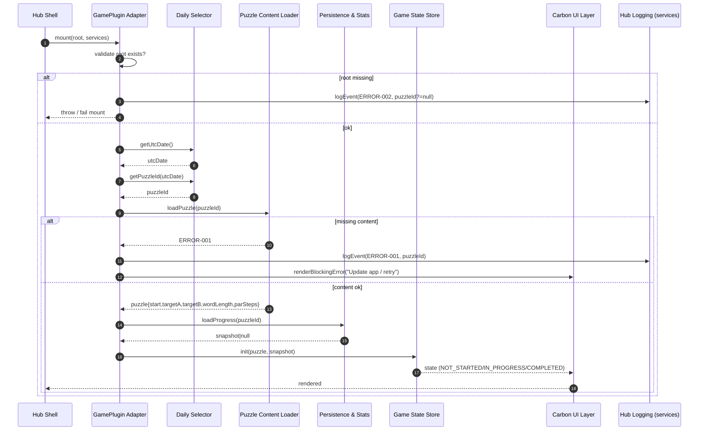
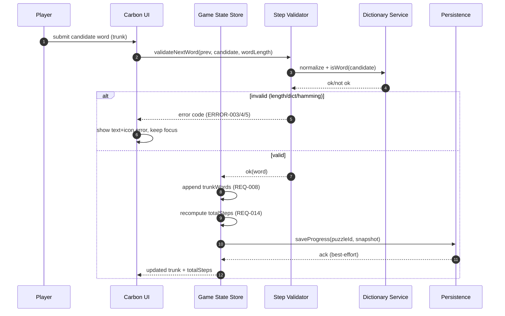
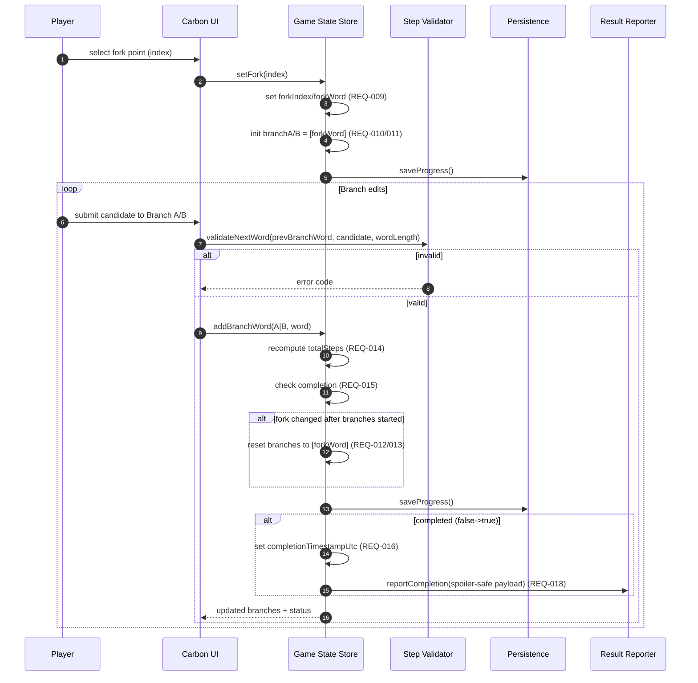
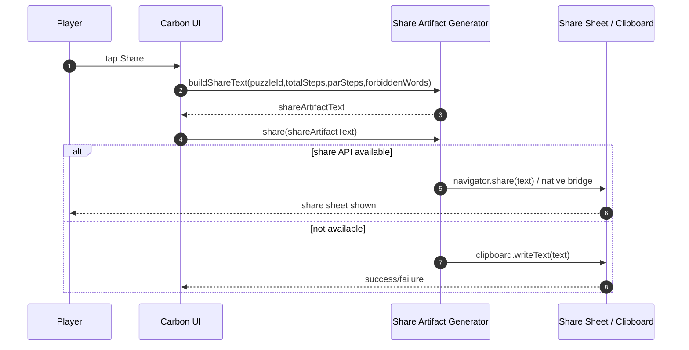
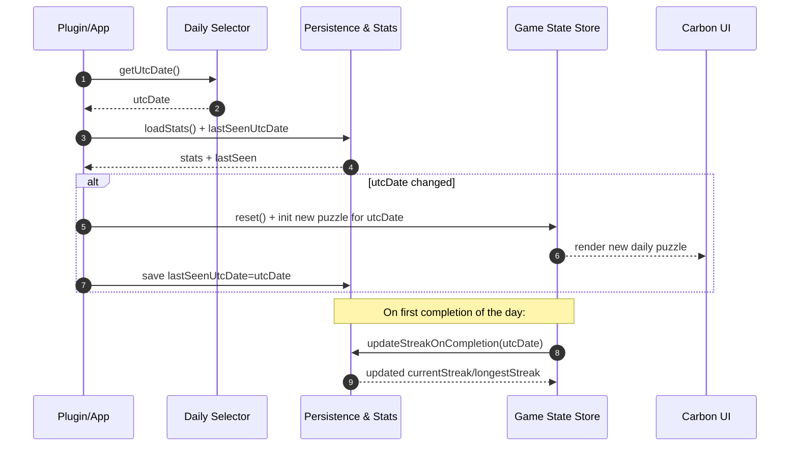

<!-- generated: 2026-07-25T19:17:54Z -->
<!-- mode: feature -->
<!-- feature-slug: fork -->
<!-- a2a-endpoint: https://bob-sdlc-orchestrator.2as6l7wq9qj8.eu-gb.codeengine.appdomain.cloud/v1/rpc -->

# Glossary

## Terms

### TERM-001: Fork Puzzle
- **Definition:** A daily word-ladder puzzle consisting of one **Start Word** and two **Target Words** of equal length, requiring a shared **Trunk Path** that later splits at a **Fork Point** into two **Branch Paths** reaching each target.
- **Synonyms:** daily fork ladder, two-target word ladder
- **Anti-definition:** Not a single-target word ladder; not an anagram; not a crossword.
- **Source:** User request

### TERM-002: Start Word
- **Definition:** The single initial word from which all moves begin for a given **Fork Puzzle**.
- **Synonyms:** source word
- **Anti-definition:** Not a target; not a guess history.
- **Source:** User request

### TERM-003: Target Word
- **Definition:** One of two goal words in a **Fork Puzzle** that must each be reached via valid one-letter steps from the **Start Word**, sharing a common **Trunk Path** up to the **Fork Point**.
- **Synonyms:** goal word, destination
- **Anti-definition:** Not the start; not an intermediate rung.
- **Source:** User request

### TERM-004: Word Length
- **Definition:** The number of letters in the **Start Word** and both **Target Words**, which must match within a **Fork Puzzle**.
- **Synonyms:** ladder length (contextual)
- **Anti-definition:** Not the number of steps.
- **Source:** User request

### TERM-005: Dictionary
- **Definition:** The bundled on-device lexicon used to validate whether a candidate step is a real word and to compute reachability/par at build time.
- **Synonyms:** word list, lexicon
- **Anti-definition:** Not an online API; not user-generated content.
- **Source:** User request

### TERM-006: One-Letter Change
- **Definition:** A transformation between two same-length words that differs by exactly one character position.
- **Synonyms:** single-letter substitution
- **Anti-definition:** Not insertion/deletion; not swapping letters; not changing multiple letters.
- **Source:** User request

### TERM-007: Valid Step
- **Definition:** A transition from one word to the next that satisfies **One-Letter Change** and where the new word exists in the **Dictionary**.
- **Synonyms:** legal move
- **Anti-definition:** Not an invalid/non-dictionary word; not multi-letter change.
- **Source:** User request

### TERM-008: Trunk Path
- **Definition:** The initial sequence of words starting at the **Start Word** that is shared before branching to each **Target Word**.
- **Synonyms:** shared path, common path
- **Anti-definition:** Not the branch-only segments.
- **Source:** User request

### TERM-009: Fork Point
- **Definition:** The word in the player’s constructed sequence at which the single path splits into two **Branch Paths**.
- **Synonyms:** branch point, split point
- **Anti-definition:** Not necessarily the start word; not necessarily a target.
- **Source:** User request

### TERM-010: Branch Path
- **Definition:** One of two sequences of words starting at the **Fork Point** and ending at its associated **Target Word**.
- **Synonyms:** branch, arm
- **Anti-definition:** Not the shared trunk segment.
- **Source:** User request

### TERM-011: Total Steps
- **Definition:** The objective measure minimized by the player: number of **Valid Step** transitions in the **Trunk Path** plus the number of **Valid Step** transitions in each **Branch Path**, counting trunk transitions once.
- **Synonyms:** total moves
- **Anti-definition:** Not word count; not time.
- **Source:** User request

### TERM-012: Par
- **Definition:** The minimum achievable **Total Steps** for a given **Fork Puzzle**, computed at build time using BFS-derived shortest-path distances on the word graph and selecting the optimal **Fork Point** (Steiner-tree-like).
- **Synonyms:** optimal steps, minimum steps
- **Anti-definition:** Not the player’s score; not a guess.
- **Source:** User request

### TERM-013: Daily Puzzle Seed
- **Definition:** Deterministic value derived from the UTC date used to select the day’s **Fork Puzzle**.
- **Synonyms:** daily seed
- **Anti-definition:** Not device-local time; not random-per-user.
- **Source:** User request

### TERM-014: UTC Day Boundary
- **Definition:** The moment at which the daily puzzle changes, defined as 00:00:00 UTC.
- **Synonyms:** daily rollover (UTC)
- **Anti-definition:** Not local midnight.
- **Source:** User request

### TERM-015: Daily Result
- **Definition:** The summary outcome of a player’s attempt for a specific UTC date, reported back to the CIC Games hub via **GamePlugin** services.
- **Synonyms:** game result, completion result
- **Anti-definition:** Not the full word list solution; not share artifact.
- **Source:** User request

### TERM-016: Share Artifact (Spoiler-safe)
- **Definition:** A shareable text/visual representation that conveys performance (e.g., steps vs **Par**) without revealing any words.
- **Synonyms:** share string, emoji blocks share
- **Anti-definition:** Not a screenshot showing words; not the solution path.
- **Source:** User request

### TERM-017: Offline-first PWA
- **Definition:** A web app designed to function without network connectivity after installation/first load by using local assets and storage.
- **Synonyms:** installable web app
- **Anti-definition:** Not requiring server validation at play time.
- **Source:** User request

### TERM-018: Native App Shell (iOS/Android)
- **Definition:** The iOS and Android distribution targets that host the same **Fork Puzzle** experience and local validation, likely via a WebView/container or shared codebase.
- **Synonyms:** mobile apps
- **Anti-definition:** Not web-only.
- **Source:** User request

### TERM-019: IBM Carbon Design System UI
- **Definition:** The UI component and interaction design system to be used for the game interface.
- **Synonyms:** Carbon
- **Anti-definition:** Not custom ad-hoc component styling.
- **Source:** User request

### TERM-020: GamePlugin
- **Definition:** The CIC Games hub integration contract implemented by the game, including `mount(root, services)` and reporting **Daily Result** plus namespaced local stats/streak.
- **Synonyms:** plugin, game module
- **Anti-definition:** Not a standalone app with no hub integration.
- **Source:** User request

### TERM-021: Local Stats Namespace
- **Definition:** A storage keyspace scoped to this game to avoid collisions with other CIC hub games.
- **Synonyms:** namespaced storage
- **Anti-definition:** Not global/shared keys across games.
- **Source:** User request

### TERM-022: Streak
- **Definition:** A count of consecutive UTC days with a completed **Daily Result** meeting the game’s completion criteria.
- **Synonyms:** daily streak
- **Anti-definition:** Not total plays; not longest ladder.
- **Source:** User request

### TERM-023: Session
- **Definition:** A single play period of the daily puzzle, intended to be completed within 3 minutes.
- **Synonyms:** play session
- **Anti-definition:** Not an account lifetime.
- **Source:** User request

### TERM-024: On-device Validation
- **Definition:** Verification of each **Valid Step** and completion status using the local **Dictionary** and puzzle data without network calls.
- **Synonyms:** client-side validation
- **Anti-definition:** Not server-side judge.
- **Source:** User request

### TERM-025: Fairness Gate (Build-time)
- **Definition:** A build pipeline check that verifies reachability of both targets from the start via BFS on the word graph and computes **Par** for the puzzle content.
- **Synonyms:** content gate, build-time validator
- **Anti-definition:** Not a runtime check on player actions.
- **Source:** User request

### TERM-026: BFS Reachability
- **Definition:** Breadth-first search over the one-letter-change graph to determine whether a target is reachable from the start and to compute shortest distances.
- **Synonyms:** shortest-path BFS (unweighted)
- **Anti-definition:** Not weighted shortest path; not heuristic-only.
- **Source:** User request

### TERM-027: Accessibility (WCAG 2.1 AA)
- **Definition:** Conformance requirements including keyboard operability, visible focus, non-color-only state, and respecting reduced-motion preferences.
- **Synonyms:** a11y
- **Anti-definition:** Not best-effort accessibility.
- **Source:** User request

### TERM-028: Reduced Motion Preference
- **Definition:** Platform/user setting indicating `prefers-reduced-motion`, used to adjust or remove non-essential animations.
- **Synonyms:** PRM
- **Anti-definition:** Not disabling all transitions always.
- **Source:** User request

## Data Dictionary

| ID | Name | Type | Format | Range | Units | Default | Nullable | PII | Source | Validation |
|---|---|---|---|---|---|---|---|---|---|---|
| FIELD-001 | puzzleId | string | `fork-YYYY-MM-DD` (UTC date) | regex `^fork-\d{4}-\d{2}-\d{2}$` | n/a | n/a | No | None | TERM-013/014 | Must match UTC date used by app for that session |
| FIELD-002 | utcDate | string | `YYYY-MM-DD` | valid ISO date | n/a | today(UTC) | No | None | TERM-014 | Must be computed from UTC clock, not local time |
| FIELD-003 | startWord | string | lowercase a-z | length = FIELD-006 | n/a | n/a | No | None | TERM-002 | Must exist in TERM-005 Dictionary |
| FIELD-004 | targetWordA | string | lowercase a-z | length = FIELD-006 | n/a | n/a | No | None | TERM-003 | Must exist in Dictionary; must differ from startWord |
| FIELD-005 | targetWordB | string | lowercase a-z | length = FIELD-006 | n/a | n/a | No | None | TERM-003 | Must exist in Dictionary; must differ from startWord and targetWordA |
| FIELD-006 | wordLength | integer | base10 | 3–8 (configurable) | letters | n/a | No | None | TERM-004 | Must equal lengths of FIELD-003/004/005 |
| FIELD-007 | dictionaryVersion | string | semver-ish | pattern `x.y.z` | n/a | n/a | No | None | TERM-005 | Must be present in build metadata |
| FIELD-008 | trunkWords | string[] | array of words | each length=FIELD-006 | n/a | `[]` | No | None | TERM-008 | First element must equal FIELD-003 when non-empty |
| FIELD-009 | forkIndex | integer | base10 | 0..(len(trunkWords)-1) | index | 0 | Yes | None | TERM-009 | If set, must reference an index within trunkWords |
| FIELD-010 | branchWordsA | string[] | array of words | each length=FIELD-006 | n/a | `[]` | No | None | TERM-010 | When non-empty, first element must equal forkWord |
| FIELD-011 | branchWordsB | string[] | array of words | each length=FIELD-006 | n/a | `[]` | No | None | TERM-010 | When non-empty, first element must equal forkWord |
| FIELD-012 | forkWord | string | lowercase a-z | length = FIELD-006 | n/a | n/a | Yes | None | TERM-009 | If present, must equal trunkWords[forkIndex] |
| FIELD-013 | totalSteps | integer | base10 | 0..999 | steps | 0 | No | None | TERM-011 | Must equal transitions(trunk)+transitions(branchA)+transitions(branchB) with trunk counted once |
| FIELD-014 | parSteps | integer | base10 | 0..999 | steps | n/a | No | None | TERM-012/025 | Must equal build-time computed optimum for puzzleId |
| FIELD-015 | isComplete | boolean | true/false | {true,false} | n/a | false | No | None | TERM-015 | True only when both targets reached with valid steps |
| FIELD-016 | completionTimestampUtc | string | ISO-8601 | `YYYY-MM-DDTHH:mm:ssZ` | n/a | n/a | Yes | None | TERM-015 | If isComplete=true, timestamp must be present |
| FIELD-017 | dailyResultStatus | string | enum | `NOT_STARTED` \| `IN_PROGRESS` \| `COMPLETED` | n/a | `NOT_STARTED` | No | None | TERM-015 | Must be consistent with isComplete and stored progress |
| FIELD-018 | shareArtifactText | string | text | max 2,000 chars | n/a | n/a | Yes | None | TERM-016 | Must not contain any substring equal to any of start/target/entered words |
| FIELD-019 | stepsVsParBlocks | string | line-based blocks | chars from set `[#.= ]` (config) | n/a | n/a | Yes | None | TERM-016 | Must encode FIELD-013 and FIELD-014 without words |
| FIELD-020 | statsNamespaceKey | string | `cic.games.fork.*` | prefix constraint | n/a | `cic.games.fork` | No | None | TERM-021 | Must be used for all local storage keys |
| FIELD-021 | currentStreak | integer | base10 | 0..36500 | days | 0 | No | None | TERM-022 | Increment only on first completion per utcDate |
| FIELD-022 | longestStreak | integer | base10 | 0..36500 | days | 0 | No | None | TERM-022 | Must be >= currentStreak |
| FIELD-023 | hasReducedMotion | boolean | true/false | {true,false} | n/a | false | No | None | TERM-028 | Derived from prefers-reduced-motion media query / OS setting |
| FIELD-024 | networkStatus | string | enum | `ONLINE` \| `OFFLINE` | n/a | n/a | No | None | TERM-017 | Derived from platform network indicator |
| FIELD-025 | pluginMountRootId | string | DOM id | non-empty | n/a | n/a | No | None | TERM-020 | Must exist in DOM at mount time |
| FIELD-026 | servicesApiVersion | string | semver | `x.y.z` | n/a | n/a | No | None | TERM-020 | Must be compatible with GamePlugin contract |

# User Journeys

## Roles

| Role ID | Role | Type | Description |
|---|---|---|---|
| ROLE-001 | Player | Primary | Plays the daily **TERM-001 Fork Puzzle** in PWA/iOS/Android. |
| ROLE-002 | Hub Shell | System | CIC Games hub host that loads the **TERM-020 GamePlugin** and provides services/storage hooks. |
| ROLE-003 | Build Pipeline | System/Admin | Runs **TERM-025 Fairness Gate** at build time to validate puzzle content and compute **TERM-012 Par**. |
| ROLE-004 | QA/Accessibility Tester | Secondary | Verifies WCAG 2.1 AA behavior and daily rollover correctness. |

## Entry Points

| Entry ID | Location | Trigger | Auth |
|---|---|---|---|
| ENTRY-001 | GamePlugin `mount(root, services)` | Hub loads game | Hub-controlled (implicit trusted host) |
| ENTRY-002 | UI route: Daily Puzzle screen | Player opens game | none (local) |
| ENTRY-003 | UI action: Enter next word | Player submits a word | none (local) |
| ENTRY-004 | UI action: Set fork point | Player chooses **TERM-009 Fork Point** | none (local) |
| ENTRY-005 | UI action: Share | Player taps share | OS/share sheet permissions (platform) |
| ENTRY-006 | Background event: UTC rollover | Clock passes **TERM-014 UTC Day Boundary** | none |
| ENTRY-007 | Build script: `validatePuzzles` | CI build runs | repo/CI credentials |

## Role Permission Matrix

| Capability | ROLE-001 Player | ROLE-002 Hub Shell | ROLE-003 Build Pipeline | ROLE-004 QA |
|---|---:|---:|---:|---:|
| Play daily puzzle offline | Y | N | N | Y |
| Validate step vs dictionary | Y (client) | N | N | Y |
| Persist progress in local namespace | Y | Y (via services) | N | Y |
| Compute/ship puzzle content & par | N | N | Y | N |
| Invoke share artifact | Y | N | N | Y |
| Mount plugin | N | Y | N | N |

## Journeys

### JOURNEY-001: Load today’s Fork Puzzle (mount + daily selection)
- **Role/Goal:** ROLE-001 Player loads today’s **TERM-001 Fork Puzzle** for **FIELD-002 utcDate** with deterministic selection and offline readiness.
  - **Success criteria:** Puzzle data present (FIELD-003/004/005/006), UI ready, local progress loaded under **FIELD-020 statsNamespaceKey**.
  - **Failure criteria:** Missing/invalid puzzle bundle; cannot compute **FIELD-001 puzzleId**; plugin mount fails.
- **Entry:** ENTRY-001, ENTRY-002
- **Happy path:**
  1. System receives `mount` with **FIELD-025 pluginMountRootId** and **FIELD-026 servicesApiVersion** (TERM-020).  
  2. System computes **FIELD-002 utcDate** using UTC clock and derives **FIELD-001 puzzleId** (TERM-013/014).  
  3. System loads bundled puzzle content for puzzleId: **FIELD-003 startWord**, **FIELD-004 targetWordA**, **FIELD-005 targetWordB**, **FIELD-006 wordLength**, **FIELD-014 parSteps**.  
  4. System loads stored progress/result for puzzleId from namespaced storage **FIELD-020 statsNamespaceKey** (TERM-021).  
  5. System renders Daily Puzzle UI using **TERM-019 Carbon UI** and sets initial **FIELD-017 dailyResultStatus**.
- **Decision branches:**
  - **BRANCH-001:** Existing completion found
    - If stored **FIELD-015 isComplete=true**, show completed state and enable **ENTRY-005 Share**.
  - **BRANCH-002:** Existing in-progress state found
    - If stored trunk/branches exist (**FIELD-008/010/011**), hydrate editor state.
- **Error states:**
  - **ERROR-001:** Puzzle bundle missing for utcDate  
    - **Trigger:** No content record for **FIELD-001 puzzleId**.  
    - **Response:** Show blocking error with retry and fallback messaging.  
    - **Recovery:** Player retries; if still missing, show “update app” guidance (offline-first friendly).
  - **ERROR-002:** Plugin mount root missing  
    - **Trigger:** DOM root not found for **FIELD-025**.  
    - **Response:** Fail mount with logged error.  
    - **Recovery:** Hub reloads plugin container.
- **Loop-back paths:**
  - **LOOP-001:** Re-open app
    - Player re-enters ENTRY-002; system repeats steps 2–5.
- **Edge cases:**
  - **EDGE-001:** Device local date differs from UTC; ensure **FIELD-002** is UTC-derived.
  - **EDGE-002:** Offline on first open; ensure puzzle bundle already packaged; avoid network requirement (**FIELD-024 networkStatus=OFFLINE**).
  - **EDGE-003:** Corrupt local storage payload; system must discard and start fresh within namespace.

### JOURNEY-002: Build trunk path with on-device validation
- **Role/Goal:** ROLE-001 Player creates **TERM-008 Trunk Path** from **TERM-002 Start Word** using **TERM-007 Valid Step** rules.
  - **Success criteria:** Each added trunk word passes validation; total steps updates (**FIELD-013**).
  - **Failure criteria:** Invalid word accepted; incorrect step count; app blocks keyboard use.
- **Entry:** ENTRY-003
- **Happy path:**
  1. UI displays **FIELD-003 startWord** as fixed first word context for trunk (TERM-002/008).
  2. Player inputs a candidate next word; system normalizes to lowercase and checks length equals **FIELD-006 wordLength**.
  3. System validates candidate exists in **TERM-005 Dictionary** (**FIELD-007 dictionaryVersion**) (TERM-024).
  4. System validates **TERM-006 One-Letter Change** against the previous trunk word in **FIELD-008 trunkWords** (or **FIELD-003** if trunk empty).
  5. System appends candidate to **FIELD-008 trunkWords**, recalculates **FIELD-013 totalSteps**, and persists progress in **FIELD-020 statsNamespaceKey**.
- **Decision branches:**
  - **BRANCH-003:** Candidate equals a target word
    - If candidate equals **FIELD-004** or **FIELD-005**, allow it in trunk; completion still requires both targets via branches.
- **Error states:**
  - **ERROR-003:** Wrong length  
    - **Trigger:** candidate length != **FIELD-006**.  
    - **Response:** Reject input and show text error.  
    - **Recovery:** Player edits and resubmits.
  - **ERROR-004:** Not in dictionary  
    - **Trigger:** candidate not found in **TERM-005 Dictionary**.  
    - **Response:** Reject and show “not in dictionary” message.  
    - **Recovery:** Player enters different word.
  - **ERROR-005:** More than one letter changed / zero letters changed  
    - **Trigger:** Hamming distance != 1.  
    - **Response:** Reject and show “change exactly one letter” message.  
    - **Recovery:** Player revises input.
- **Loop-back paths:**
  - **LOOP-002:** Continue adding trunk words
    - Repeat steps 2–5 until player sets fork point (ENTRY-004).
- **Edge cases:**
  - **EDGE-004:** Rapid double-submit; ensure only one append occurs (debounce/disable submit).
  - **EDGE-005:** Non a–z characters (hyphen/apostrophe); reject consistently with dictionary rules.
  - **EDGE-006:** Player deletes last trunk word; totalSteps must update and persist.

### JOURNEY-003: Choose fork point and create two branches
- **Role/Goal:** ROLE-001 Player selects **TERM-009 Fork Point** and builds two **TERM-010 Branch Paths** to reach both **TERM-003 Target Words**.
  - **Success criteria:** Both branches reach respective targets with valid steps; trunk counted once in **FIELD-013**.
  - **Failure criteria:** Fork selection inconsistent; branch starts from wrong word; completion awarded incorrectly.
- **Entry:** ENTRY-004, ENTRY-003
- **Happy path:**
  1. Player selects a fork point in the trunk UI; system sets **FIELD-009 forkIndex** and **FIELD-012 forkWord** (TERM-009).
  2. System initializes **FIELD-010 branchWordsA** and **FIELD-011 branchWordsB** with first element equal to **FIELD-012 forkWord** (TERM-010).
  3. Player adds next word to Branch A; system validates length, dictionary membership, and one-letter change vs previous Branch A word.
  4. Player adds next word to Branch B; system validates similarly vs previous Branch B word.
  5. System updates **FIELD-013 totalSteps** as transitions(trunk up to fork) + transitions(branchA) + transitions(branchB).
  6. When Branch A ends at **FIELD-004 targetWordA** and Branch B ends at **FIELD-005 targetWordB**, system sets **FIELD-015 isComplete=true**, **FIELD-017 dailyResultStatus=COMPLETED**, and **FIELD-016 completionTimestampUtc**.
- **Decision branches:**
  - **BRANCH-004:** Fork point moved after branches started
    - If player changes **FIELD-009 forkIndex**, system must reconcile branches (e.g., reset branches or rebase) per defined rule.
  - **BRANCH-005:** Targets swapped by player
    - If player reaches **FIELD-005** on Branch A and **FIELD-004** on Branch B, system still treats completion as satisfied (targets are unordered) or enforces mapping (open question).
- **Error states:**
  - **ERROR-006:** Branch start mismatch  
    - **Trigger:** Branch first word != **FIELD-012 forkWord**.  
    - **Response:** Prevent state update; show error; offer reset branch.  
    - **Recovery:** Player resets branch.
  - **ERROR-007:** Completion without both targets  
    - **Trigger:** Only one branch reaches a target.  
    - **Response:** Keep **FIELD-015=false**; UI indicates remaining target.  
    - **Recovery:** Continue building missing branch.
- **Loop-back paths:**
  - **LOOP-003:** Iterate branch additions
    - Repeat steps 3–5 until both targets reached.
- **Edge cases:**
  - **EDGE-007:** Fork at start word (empty trunk); ensure step count correctness.
  - **EDGE-008:** Fork at a target word; branch to the other target remains required.
  - **EDGE-009:** Branch contains repeated words/cycles; allow or disallow (open question) but step validation must remain correct.
  - **EDGE-010:** Concurrent edits (fast switching between branches); avoid losing input state.

### JOURNEY-004: Share spoiler-safe result
- **Role/Goal:** ROLE-001 Player shares a spoiler-safe summary without words.
  - **Success criteria:** Share artifact contains steps and par only; no puzzle words; includes puzzle date/id.
  - **Failure criteria:** Words leak; share unavailable on platform; incorrect steps/par.
- **Entry:** ENTRY-005
- **Happy path:**
  1. Player taps Share; system builds **FIELD-019 stepsVsParBlocks** from **FIELD-013 totalSteps** and **FIELD-014 parSteps** (TERM-016).
  2. System composes **FIELD-018 shareArtifactText** including **FIELD-001 puzzleId** and blocks, excluding any words (TERM-016).
  3. System invokes platform share sheet / clipboard copy with **FIELD-018**.
- **Decision branches:**
  - **BRANCH-006:** Not completed
    - If **FIELD-015=false**, system either disables share or shares “in progress” blocks (open question).
- **Error states:**
  - **ERROR-008:** Share API unavailable  
    - **Trigger:** Platform does not support share sheet.  
    - **Response:** Provide copy-to-clipboard fallback.  
    - **Recovery:** Player copies text manually.
- **Loop-back paths:**
  - **LOOP-004:** Share again after improvements
    - Player continues play, reduces steps, then re-shares.
- **Edge cases:**
  - **EDGE-011:** Ensure blocks encoding does not allow reconstruction of words.
  - **EDGE-012:** Localization impacts (line breaks, RTL); ensure still spoiler-safe.

### JOURNEY-005: UTC rollover and streak/stat updates
- **Role/Goal:** ROLE-001 Player experiences correct daily change at **TERM-014 UTC Day Boundary** and streak updates in **TERM-021 Local Stats Namespace**.
  - **Success criteria:** New puzzle appears after rollover; streak increments only once per day on first completion.
  - **Failure criteria:** Uses local midnight; double-increments; loses prior day result.
- **Entry:** ENTRY-006, ENTRY-002
- **Happy path:**
  1. At app open (or timer tick), system computes **FIELD-002 utcDate** and compares with last seen date in storage.
  2. If utcDate changed, system loads new **FIELD-001 puzzleId** content and resets in-memory editor state.
  3. When a puzzle is first completed for a given **FIELD-002**, system updates **FIELD-021 currentStreak** and **FIELD-022 longestStreak** under **FIELD-020 statsNamespaceKey**.
- **Decision branches:**
  - **BRANCH-007:** Missed days
    - If last completion date is not yesterday (UTC), reset currentStreak to 1 on next completion.
- **Error states:**
  - **ERROR-009:** Clock skew
    - **Trigger:** Device clock incorrect, causing wrong utcDate.  
    - **Response:** Continue using device UTC; show no error (open question whether to warn).  
    - **Recovery:** Player corrects device clock.
- **Loop-back paths:**
  - **LOOP-005:** Return daily
    - Player repeats JOURNEY-001 each day.
- **Edge cases:**
  - **EDGE-013:** Completion exactly at boundary; ensure attribution to correct **FIELD-002**.
  - **EDGE-014:** Multiple devices (no account sync); streak is device-local.

```mermaid
flowchart TD
  A[ENTRY-001 mount()] --> B[Compute FIELD-002 utcDate]
  B --> C[Derive FIELD-001 puzzleId]
  C --> D[Load puzzle bundle: start/targets/par]
  D --> E[Load local progress/result (FIELD-020)]
  E --> F{FIELD-015 isComplete?}
  F -- Yes --> G[Show completed UI + Share]
  F -- No --> H[Edit trunk (FIELD-008)]
  H --> I[Set fork (FIELD-009/012)]
  I --> J[Edit branch A (FIELD-010)]
  I --> K[Edit branch B (FIELD-011)]
  J --> L{Reached target A?}
  K --> M{Reached target B?}
  L --> N{Both reached?}
  M --> N
  N -- Yes --> O[Set FIELD-015/016/017 + update streak]
  O --> P[ENTRY-005 Share spoiler-safe]
  N -- No --> J
  N -- No --> K
```

# Requirements

### REQ-001: Compute UTC date for daily selection
- **EARS Pattern:** Ubiquitous
- **EARS Statement:** The system shall compute **FIELD-002 utcDate** using UTC time.
- **Inputs:** device clock
- **Outputs:** FIELD-002
- **Preconditions:** Game loaded (JOURNEY-001 step 1)
- **Postconditions:** FIELD-002 available for puzzle selection
- **Invariants:** FIELD-002 is independent of local timezone
- **Trigger:** App initialization
- **Actor:** ROLE-002 Hub Shell (invokes), ROLE-001 Player (experiences)
- **EntityScope:** TERM-014 UTC Day Boundary
- **ErrorModes:** device clock incorrect (ERROR-009)
- **NFR-Tags:** compatibility
- **Source:** JOURNEY-001 step 2; JOURNEY-005 step 1
- **Dependencies:** none
- **Priority:** P0
- **AcceptanceCriteria:**
  - **TEST-001:** Given a device in any timezone, when the system computes the date, then FIELD-002 equals the current UTC date.
- **Assumptions:** Device provides a UTC clock
- **OpenQuestions:** Should the UI warn on extreme clock skew?

### REQ-002: Derive puzzleId from UTC date
- **EARS Pattern:** Event-Driven
- **EARS Statement:** When **FIELD-002 utcDate** is computed, the system shall derive **FIELD-001 puzzleId** in the format `fork-YYYY-MM-DD`.
- **Inputs:** FIELD-002
- **Outputs:** FIELD-001
- **Preconditions:** FIELD-002 computed
- **Postconditions:** puzzleId available for content lookup
- **Invariants:** FIELD-001 matches regex in FIELD-001 validation
- **Trigger:** FIELD-002 computed
- **Actor:** System
- **EntityScope:** TERM-013 Daily Puzzle Seed
- **ErrorModes:** invalid date format
- **NFR-Tags:** auditability
- **Source:** JOURNEY-001 step 2
- **Dependencies:** REQ-001
- **Priority:** P0
- **AcceptanceCriteria:**
  - **TEST-002:** Given FIELD-002 = `2026-07-25`, when derived, then FIELD-001 = `fork-2026-07-25`.
- **Assumptions:** None
- **OpenQuestions:** None

### REQ-003: Load bundled puzzle content for puzzleId
- **EARS Pattern:** Event-Driven
- **EARS Statement:** When **FIELD-001 puzzleId** is derived, the system shall load **FIELD-003 startWord**, **FIELD-004 targetWordA**, **FIELD-005 targetWordB**, **FIELD-006 wordLength**, and **FIELD-014 parSteps** from the bundled content.
- **Inputs:** FIELD-001
- **Outputs:** FIELD-003, FIELD-004, FIELD-005, FIELD-006, FIELD-014
- **Preconditions:** Game initialized (JOURNEY-001 step 1)
- **Postconditions:** Daily puzzle is ready to play
- **Invariants:** All loaded words have length FIELD-006
- **Trigger:** FIELD-001 derived
- **Actor:** System
- **EntityScope:** TERM-001 Fork Puzzle
- **ErrorModes:** missing bundled record (ERROR-001)
- **NFR-Tags:** offline, compatibility
- **Source:** JOURNEY-001 step 3
- **Dependencies:** REQ-002
- **Priority:** P0
- **AcceptanceCriteria:**
  - **TEST-003:** Given a valid bundled record for FIELD-001, when loaded, then FIELD-003/004/005/006/014 are non-null and pass validation rules.
- **Assumptions:** Content is packaged with the app
- **OpenQuestions:** What is the supported FIELD-006 range in the initial release?

### REQ-004: Fail with blocking error when puzzle content missing
- **EARS Pattern:** Event-Driven
- **EARS Statement:** When no bundled puzzle content exists for **FIELD-001 puzzleId**, the system shall present an error state corresponding to **ERROR-001**.
- **Inputs:** FIELD-001
- **Outputs:** UI error state
- **Preconditions:** REQ-003 attempted
- **Postconditions:** Player can retry or exit
- **Invariants:** No gameplay state is created without content
- **Trigger:** Content lookup returns empty
- **Actor:** System
- **EntityScope:** TERM-001 Fork Puzzle
- **ErrorModes:** missing bundled record
- **NFR-Tags:** usability, offline
- **Source:** JOURNEY-001 ERROR-001
- **Dependencies:** REQ-003
- **Priority:** P0
- **AcceptanceCriteria:**
  - **TEST-004:** Given FIELD-001 with no bundled record, when load occurs, then an error UI is shown and gameplay controls are disabled.
- **Assumptions:** UI has an error component (Carbon)
- **OpenQuestions:** Should there be a fallback to the most recent available puzzle?

### REQ-005: Validate candidate word length
- **EARS Pattern:** Event-Driven
- **EARS Statement:** When the player submits a candidate word, the system shall reject the submission if its length is not equal to **FIELD-006 wordLength**.
- **Inputs:** candidate text, FIELD-006
- **Outputs:** validation error (ERROR-003) or pass
- **Preconditions:** Puzzle loaded (REQ-003)
- **Postconditions:** Candidate not appended on reject
- **Invariants:** All stored words match FIELD-006
- **Trigger:** ENTRY-003
- **Actor:** ROLE-001 Player
- **EntityScope:** TERM-007 Valid Step
- **ErrorModes:** wrong length (ERROR-003)
- **NFR-Tags:** accessibility
- **Source:** JOURNEY-002 step 2; ERROR-003
- **Dependencies:** REQ-003
- **Priority:** P0
- **AcceptanceCriteria:**
  - **TEST-005:** Given FIELD-006=4, when player submits a 3-letter word, then the system rejects it and does not modify FIELD-008/010/011.
- **Assumptions:** Input submission exists for trunk and branches
- **OpenQuestions:** Should whitespace be trimmed before length check?

### REQ-006: Validate dictionary membership on-device
- **EARS Pattern:** Event-Driven
- **EARS Statement:** When the player submits a candidate word of valid length, the system shall reject the submission if the word is not present in the **TERM-005 Dictionary**.
- **Inputs:** candidate word, FIELD-007 dictionaryVersion
- **Outputs:** validation error (ERROR-004) or pass
- **Preconditions:** REQ-005 passed
- **Postconditions:** Candidate not appended on reject
- **Invariants:** Validation is performed without network access
- **Trigger:** ENTRY-003
- **Actor:** ROLE-001 Player
- **EntityScope:** TERM-024 On-device Validation
- **ErrorModes:** not in dictionary (ERROR-004)
- **NFR-Tags:** offline, privacy
- **Source:** JOURNEY-002 step 3; ERROR-004
- **Dependencies:** REQ-003, REQ-005
- **Priority:** P0
- **AcceptanceCriteria:**
  - **TEST-006:** Given the device is offline (FIELD-024=OFFLINE), when a non-dictionary word is submitted, then it is rejected with ERROR-004.
- **Assumptions:** Dictionary lookups are deterministic
- **OpenQuestions:** Case normalization rules (accept uppercase input?)—assumed lowercase normalization.

### REQ-007: Validate one-letter change between consecutive words
- **EARS Pattern:** Event-Driven
- **EARS Statement:** When the player submits a candidate word that is in the dictionary, the system shall reject the submission if it differs by a Hamming distance other than 1 from the previous word in the active path.
- **Inputs:** candidate word, previous word
- **Outputs:** validation error (ERROR-005) or pass
- **Preconditions:** REQ-006 passed
- **Postconditions:** Candidate not appended on reject
- **Invariants:** All accepted steps satisfy **TERM-006 One-Letter Change**
- **Trigger:** ENTRY-003
- **Actor:** ROLE-001 Player
- **EntityScope:** TERM-006 One-Letter Change
- **ErrorModes:** invalid letter distance (ERROR-005)
- **NFR-Tags:** correctness
- **Source:** JOURNEY-002 step 4; ERROR-005; JOURNEY-003 steps 3–4
- **Dependencies:** REQ-006
- **Priority:** P0
- **AcceptanceCriteria:**
  - **TEST-007:** Given previous word `cold`, when candidate `cord` is submitted, then it passes; when `card` is submitted (2 letters changed vs `cold`), then it is rejected.
- **Assumptions:** Only substitution steps are allowed
- **OpenQuestions:** Are repeated words allowed if they still meet Hamming distance 1?

### REQ-008: Append valid trunk word and persist progress
- **EARS Pattern:** Event-Driven
- **EARS Statement:** When a trunk candidate word passes validation, the system shall append it to **FIELD-008 trunkWords** and persist the updated state under **FIELD-020 statsNamespaceKey**.
- **Inputs:** validated word
- **Outputs:** FIELD-008 updated; storage write
- **Preconditions:** Puzzle loaded; trunk editing mode active
- **Postconditions:** Trunk state durable across reload
- **Invariants:** FIELD-008 contains only dictionary words of length FIELD-006
- **Trigger:** ENTRY-003 (trunk context)
- **Actor:** ROLE-001 Player
- **EntityScope:** TERM-008 Trunk Path
- **ErrorModes:** storage write failure (local) *(single mode)*
- **NFR-Tags:** offline, reliability
- **Source:** JOURNEY-002 step 5
- **Dependencies:** REQ-005, REQ-006, REQ-007
- **Priority:** P0
- **AcceptanceCriteria:**
  - **TEST-008:** Given a valid candidate, when submitted in trunk context, then FIELD-008 length increases by 1 and the state is restored after app reload.
- **Assumptions:** Local storage is available
- **OpenQuestions:** Which storage mechanism is provided by services (IndexedDB vs localStorage)?

### REQ-009: Set fork point from trunk
- **EARS Pattern:** Event-Driven
- **EARS Statement:** When the player selects a fork point in the trunk, the system shall set **FIELD-009 forkIndex** and **FIELD-012 forkWord** to the selected trunk position.
- **Inputs:** selected index
- **Outputs:** FIELD-009, FIELD-012
- **Preconditions:** FIELD-008 has at least one word or start is selectable
- **Postconditions:** Fork point established for branches
- **Invariants:** FIELD-012 equals trunkWords[forkIndex] or startWord if fork at start (config rule)
- **Trigger:** ENTRY-004
- **Actor:** ROLE-001 Player
- **EntityScope:** TERM-009 Fork Point
- **ErrorModes:** invalid index selection
- **NFR-Tags:** accessibility
- **Source:** JOURNEY-003 step 1; EDGE-007
- **Dependencies:** REQ-003
- **Priority:** P0
- **AcceptanceCriteria:**
  - **TEST-009:** Given trunkWords has N words, when player selects index i in [0..N-1], then FIELD-009=i and FIELD-012=trunkWords[i].
- **Assumptions:** UI exposes selectable trunk nodes
- **OpenQuestions:** Is “fork at start word” represented by forkIndex = null or a sentinel?

### REQ-010: Initialize branch paths from fork word
- **EARS Pattern:** Event-Driven
- **EARS Statement:** When **FIELD-012 forkWord** is set, the system shall initialize **FIELD-010 branchWordsA** with the fork word as its first element.
- **Inputs:** FIELD-012
- **Outputs:** FIELD-010
- **Preconditions:** REQ-009 completed
- **Postconditions:** Branch A ready for edits
- **Invariants:** branchWordsA[0] == forkWord
- **Trigger:** forkWord set
- **Actor:** System
- **EntityScope:** TERM-010 Branch Path
- **ErrorModes:** none
- **NFR-Tags:** correctness
- **Source:** JOURNEY-003 step 2
- **Dependencies:** REQ-009
- **Priority:** P0
- **AcceptanceCriteria:**
  - **TEST-010:** When forkWord changes from `aaaa` to `bbbb`, then branchWordsA[0] becomes `bbbb`.
- **Assumptions:** Branch reset-on-fork-change is acceptable
- **OpenQuestions:** Should existing branch be reset or rebased when fork changes? (see REQ-012)

### REQ-011: Initialize branch paths from fork word (branch B)
- **EARS Pattern:** Event-Driven
- **EARS Statement:** When **FIELD-012 forkWord** is set, the system shall initialize **FIELD-011 branchWordsB** with the fork word as its first element.
- **Inputs:** FIELD-012
- **Outputs:** FIELD-011
- **Preconditions:** REQ-009 completed
- **Postconditions:** Branch B ready for edits
- **Invariants:** branchWordsB[0] == forkWord
- **Trigger:** forkWord set
- **Actor:** System
- **EntityScope:** TERM-010 Branch Path
- **ErrorModes:** none
- **NFR-Tags:** correctness
- **Source:** JOURNEY-003 step 2
- **Dependencies:** REQ-009
- **Priority:** P0
- **AcceptanceCriteria:**
  - **TEST-011:** When forkWord is set, then branchWordsB[0] equals forkWord.
- **Assumptions:** Same as REQ-010
- **OpenQuestions:** Same as REQ-010

### REQ-012: Reset branches when fork point changes
- **EARS Pattern:** Event-Driven
- **EARS Statement:** When the player changes **FIELD-009 forkIndex** after entering any branch words beyond the fork word, the system shall reset **FIELD-010 branchWordsA** to contain only **FIELD-012 forkWord**.
- **Inputs:** FIELD-009 change event; existing FIELD-010
- **Outputs:** FIELD-010 reset
- **Preconditions:** Branch A length > 1
- **Postconditions:** Branch A consistent with new fork
- **Invariants:** branchWordsA[0] == forkWord
- **Trigger:** forkIndex changed
- **Actor:** ROLE-001 Player
- **EntityScope:** TERM-009 Fork Point
- **ErrorModes:** none
- **NFR-Tags:** usability, correctness
- **Source:** JOURNEY-003 BRANCH-004
- **Dependencies:** REQ-009, REQ-010
- **Priority:** P1
- **AcceptanceCriteria:**
  - **TEST-012:** Given branchWordsA has length 3, when forkIndex changes, then branchWordsA length becomes 1 and equals [forkWord].
- **Assumptions:** Reset is the chosen reconcile strategy
- **OpenQuestions:** Should the same reset apply to Branch B (see REQ-013)?

### REQ-013: Reset branches when fork point changes (branch B)
- **EARS Pattern:** Event-Driven
- **EARS Statement:** When the player changes **FIELD-009 forkIndex** after entering any branch words beyond the fork word, the system shall reset **FIELD-011 branchWordsB** to contain only **FIELD-012 forkWord**.
- **Inputs:** FIELD-009 change event; existing FIELD-011
- **Outputs:** FIELD-011 reset
- **Preconditions:** Branch B length > 1
- **Postconditions:** Branch B consistent with new fork
- **Invariants:** branchWordsB[0] == forkWord
- **Trigger:** forkIndex changed
- **Actor:** ROLE-001 Player
- **EntityScope:** TERM-009 Fork Point
- **ErrorModes:** none
- **NFR-Tags:** usability, correctness
- **Source:** JOURNEY-003 BRANCH-004
- **Dependencies:** REQ-009, REQ-011
- **Priority:** P1
- **AcceptanceCriteria:**
  - **TEST-013:** Given branchWordsB has length 2, when forkIndex changes, then branchWordsB becomes [forkWord].
- **Assumptions:** Reset is desired for both branches
- **OpenQuestions:** None

### REQ-014: Compute totalSteps from trunk and branches
- **EARS Pattern:** Ubiquitous
- **EARS Statement:** The system shall compute **FIELD-013 totalSteps** as the number of transitions in the trunk up to **FIELD-009 forkIndex** plus the number of transitions in **FIELD-010 branchWordsA** plus the number of transitions in **FIELD-011 branchWordsB**.
- **Inputs:** FIELD-008, FIELD-009, FIELD-010, FIELD-011
- **Outputs:** FIELD-013
- **Preconditions:** Puzzle loaded
- **Postconditions:** Score shown to player
- **Invariants:** Trunk transitions are counted once
- **Trigger:** Any path state change
- **Actor:** System
- **EntityScope:** TERM-011 Total Steps
- **ErrorModes:** missing forkIndex when branches exist
- **NFR-Tags:** correctness
- **Source:** JOURNEY-003 step 5
- **Dependencies:** REQ-009, REQ-010, REQ-011
- **Priority:** P0
- **AcceptanceCriteria:**
  - **TEST-014:** Given trunk transitions=2, branchA transitions=3, branchB transitions=4, then totalSteps=9.
- **Assumptions:** “Transition count” = arrayLength-1
- **OpenQuestions:** If fork at start word, how is trunk transition count defined when trunkWords is empty?

### REQ-015: Mark completion when both targets reached
- **EARS Pattern:** Event-Driven
- **EARS Statement:** When the last word of **FIELD-010 branchWordsA** equals **FIELD-004 targetWordA** and the last word of **FIELD-011 branchWordsB** equals **FIELD-005 targetWordB**, the system shall set **FIELD-015 isComplete** to true.
- **Inputs:** FIELD-010, FIELD-011, FIELD-004, FIELD-005
- **Outputs:** FIELD-015
- **Preconditions:** Branches initialized
- **Postconditions:** Completion state available for result/share
- **Invariants:** Completion requires both targets
- **Trigger:** Branch word appended
- **Actor:** System
- **EntityScope:** TERM-015 Daily Result
- **ErrorModes:** none
- **NFR-Tags:** correctness
- **Source:** JOURNEY-003 step 6; ERROR-007
- **Dependencies:** REQ-010, REQ-011
- **Priority:** P0
- **AcceptanceCriteria:**
  - **TEST-015:** Given branch A ends at targetWordA and branch B ends at targetWordB, when either branch updates to satisfy both, then isComplete becomes true.
- **Assumptions:** Target assignment is fixed to A/B
- **OpenQuestions:** Should reaching targets in swapped branches also count as completion? (see BRANCH-005)

### REQ-016: Record completion timestamp in UTC
- **EARS Pattern:** Event-Driven
- **EARS Statement:** When **FIELD-015 isComplete** becomes true, the system shall set **FIELD-016 completionTimestampUtc** to an ISO-8601 UTC timestamp.
- **Inputs:** completion event
- **Outputs:** FIELD-016
- **Preconditions:** REQ-015 satisfied
- **Postconditions:** Result is timestamped
- **Invariants:** Timestamp ends with `Z`
- **Trigger:** isComplete transitions false→true
- **Actor:** System
- **EntityScope:** TERM-015 Daily Result
- **ErrorModes:** none
- **NFR-Tags:** auditability
- **Source:** JOURNEY-003 step 6
- **Dependencies:** REQ-015
- **Priority:** P1
- **AcceptanceCriteria:**
  - **TEST-016:** When completion occurs, then completionTimestampUtc matches `YYYY-MM-DDTHH:mm:ssZ`.
- **Assumptions:** Device provides time
- **OpenQuestions:** None

### REQ-017: Generate spoiler-safe share text without words
- **EARS Pattern:** Event-Driven
- **EARS Statement:** When the player invokes Share, the system shall generate **FIELD-018 shareArtifactText** that contains **FIELD-013 totalSteps** and **FIELD-014 parSteps** and contains none of **FIELD-003 startWord**, **FIELD-004 targetWordA**, **FIELD-005 targetWordB**, nor any entered path words.
- **Inputs:** FIELD-013, FIELD-014, words
- **Outputs:** FIELD-018
- **Preconditions:** Puzzle loaded
- **Postconditions:** Share artifact ready
- **Invariants:** No puzzle words appear in FIELD-018
- **Trigger:** ENTRY-005
- **Actor:** ROLE-001 Player
- **EntityScope:** TERM-016 Share Artifact (Spoiler-safe)
- **ErrorModes:** none
- **NFR-Tags:** privacy
- **Source:** JOURNEY-004 steps 1–2; EDGE-011
- **Dependencies:** REQ-014, REQ-003
- **Priority:** P0
- **AcceptanceCriteria:**
  - **TEST-017:** When shareArtifactText is generated, then searching it for startWord/targetWordA/targetWordB returns no matches.
- **Assumptions:** Entered words are available to the generator for exclusion checks
- **OpenQuestions:** Should the share include puzzleId/date explicitly?

### REQ-018: Report Daily Result to hub services
- **EARS Pattern:** Event-Driven
- **EARS Statement:** When **FIELD-015 isComplete** becomes true, the system shall report a **TERM-015 Daily Result** to the hub via **TERM-020 GamePlugin** services.
- **Inputs:** FIELD-001, FIELD-013, FIELD-014, FIELD-016
- **Outputs:** Daily Result payload (service call)
- **Preconditions:** Mounted with services (JOURNEY-001 step 1)
- **Postconditions:** Hub can record completion
- **Invariants:** Result payload does not contain any words
- **Trigger:** isComplete transitions false→true
- **Actor:** System
- **EntityScope:** TERM-020 GamePlugin
- **ErrorModes:** services call fails (local)
- **NFR-Tags:** privacy, observability
- **Source:** User request; JOURNEY-003 step 6
- **Dependencies:** REQ-015, REQ-016
- **Priority:** P0
- **AcceptanceCriteria:**
  - **TEST-018:** When completion occurs, then a result event is emitted containing puzzleId, totalSteps, parSteps, and completionTimestampUtc and containing no words.
- **Assumptions:** Services API includes a result reporting method
- **OpenQuestions:** Exact DailyResult schema expected by CIC hub?

### NFR-001: Offline-first gameplay without network
- **EARS Pattern:** Ubiquitous
- **EARS Statement:** The system shall allow all gameplay validation and completion determination using only bundled content and on-device storage when **FIELD-024 networkStatus** is `OFFLINE`.
- **Inputs:** FIELD-024
- **Outputs:** playable experience
- **Preconditions:** App installed / assets cached
- **Postconditions:** Player can complete daily puzzle offline
- **Invariants:** No network dependency for **TERM-024 On-device Validation**
- **Trigger:** Any gameplay action
- **Actor:** ROLE-001 Player
- **EntityScope:** TERM-017 Offline-first PWA
- **ErrorModes:** none
- **NFR-Tags:** offline, reliability
- **Source:** User request; JOURNEY-001 EDGE-002; JOURNEY-002
- **Dependencies:** REQ-003, REQ-006, REQ-007
- **Priority:** P0
- **AcceptanceCriteria:**
  - **TEST-101:** With network disabled, the player can add valid steps, reach completion, and generate shareArtifactText.
- **Assumptions:** Bundled dictionary and puzzles are present
- **OpenQuestions:** Is first-run offline supported without prior caching? (PWA nuance)

### NFR-002: WCAG 2.1 AA keyboard operability
- **EARS Pattern:** Ubiquitous
- **EARS Statement:** The system shall make all interactive gameplay controls operable via keyboard input alone.
- **Inputs:** keyboard events
- **Outputs:** focus moves; actions triggered
- **Preconditions:** UI rendered
- **Postconditions:** Player can complete without pointer
- **Invariants:** No pointer-only interactions
- **Trigger:** User navigates with keyboard
- **Actor:** ROLE-001 Player
- **EntityScope:** TERM-027 Accessibility (WCAG 2.1 AA)
- **ErrorModes:** none
- **NFR-Tags:** accessibility
- **Source:** User request
- **Dependencies:** UI implementation
- **Priority:** P0
- **AcceptanceCriteria:**
  - **TEST-102:** A user can enter words, set fork point, switch branches, and share using only keyboard navigation and activation keys.
- **Assumptions:** PWA supports keyboard; mobile may use external keyboard
- **OpenQuestions:** Define standard key bindings for branch switching?

### NFR-003: Visible focus indicator
- **EARS Pattern:** Ubiquitous
- **EARS Statement:** The system shall render a visible focus indicator for the currently focused interactive element.
- **Inputs:** focus state
- **Outputs:** visual focus style
- **Preconditions:** Keyboard navigation in use
- **Postconditions:** Focus location is perceivable
- **Invariants:** Focus indicator is not removed via CSS
- **Trigger:** focus changes
- **Actor:** ROLE-001 Player
- **EntityScope:** TERM-027 Accessibility (WCAG 2.1 AA)
- **ErrorModes:** none
- **NFR-Tags:** accessibility
- **Source:** User request
- **Dependencies:** Carbon theming
- **Priority:** P0
- **AcceptanceCriteria:**
  - **TEST-103:** When tabbing through controls, each focused control shows a visible outline/indicator.
- **Assumptions:** Carbon provides default focus styles
- **OpenQuestions:** None

### NFR-004: Non-color-only state communication
- **EARS Pattern:** Ubiquitous
- **EARS Statement:** The system shall convey validation states and completion states using text and/or icons in addition to color.
- **Inputs:** validation/completion state
- **Outputs:** text/icon indicators
- **Preconditions:** UI rendered
- **Postconditions:** State understandable without color perception
- **Invariants:** Color is not the sole indicator
- **Trigger:** State changes
- **Actor:** ROLE-001 Player
- **EntityScope:** TERM-027 Accessibility (WCAG 2.1 AA)
- **ErrorModes:** none
- **NFR-Tags:** accessibility
- **Source:** User request
- **Dependencies:** UI components
- **Priority:** P0
- **AcceptanceCriteria:**
  - **TEST-104:** When an invalid word is submitted, an error message appears in text and an error icon is present.
- **Assumptions:** Carbon supports inline notifications
- **OpenQuestions:** None

### NFR-005: Respect prefers-reduced-motion
- **EARS Pattern:** State-Driven
- **EARS Statement:** While **FIELD-023 hasReducedMotion** is true, the system shall disable non-essential animations in gameplay UI transitions.
- **Inputs:** FIELD-023
- **Outputs:** reduced animations
- **Preconditions:** UI rendered
- **Postconditions:** Reduced motion experience
- **Invariants:** Essential motion (if any) is minimized
- **Trigger:** Reduced motion preference detected
- **Actor:** ROLE-001 Player
- **EntityScope:** TERM-028 Reduced Motion Preference
- **ErrorModes:** none
- **NFR-Tags:** accessibility
- **Source:** User request
- **Dependencies:** UI implementation
- **Priority:** P1
- **AcceptanceCriteria:**
  - **TEST-105:** With prefers-reduced-motion enabled, adding/removing words does not trigger animation beyond a 0–50ms fade (or none).
- **Assumptions:** Team defines “non-essential animations”
- **OpenQuestions:** Specify acceptable minimal transition durations?

### NFR-006: Privacy—no words in reported results
- **EARS Pattern:** Unwanted
- **EARS Statement:** The system shall not include **FIELD-003 startWord**, **FIELD-004 targetWordA**, **FIELD-005 targetWordB**, **FIELD-008 trunkWords**, **FIELD-010 branchWordsA**, or **FIELD-011 branchWordsB** in the reported **TERM-015 Daily Result** payload.
- **Inputs:** result payload assembly
- **Outputs:** sanitized payload
- **Preconditions:** Completion occurs
- **Postconditions:** Hub receives spoiler-safe analytics
- **Invariants:** Payload contains only non-word metrics/ids
- **Trigger:** REQ-018
- **Actor:** System
- **EntityScope:** TERM-015 Daily Result
- **ErrorModes:** none
- **NFR-Tags:** privacy
- **Source:** User request; JOURNEY-004
- **Dependencies:** REQ-018
- **Priority:** P0
- **AcceptanceCriteria:**
  - **TEST-106:** Inspect emitted payload and confirm it contains no fields equal to any puzzle/entered words.
- **Assumptions:** Hub does not require word content
- **OpenQuestions:** Are aggregate anonymized word-level analytics ever desired?

### NFR-007: Observability—client error logging for mount/content failures
- **EARS Pattern:** Event-Driven
- **EARS Statement:** When **ERROR-001** or **ERROR-002** occurs, the system shall emit a client log event including **FIELD-001 puzzleId** when available.
- **Inputs:** error event, puzzleId (optional)
- **Outputs:** log event via services (or console fallback)
- **Preconditions:** Error detected
- **Postconditions:** Diagnostics available
- **Invariants:** Log contains no puzzle words
- **Trigger:** ERROR-001 or ERROR-002
- **Actor:** System
- **EntityScope:** TERM-020 GamePlugin
- **ErrorModes:** logging channel unavailable
- **NFR-Tags:** observability, privacy
- **Source:** JOURNEY-001 ERROR-001; ERROR-002
- **Dependencies:** REQ-004
- **Priority:** P2
- **AcceptanceCriteria:**
  - **TEST-107:** Simulate missing content and verify a log event is emitted containing puzzleId and error code, and containing no words.
- **Assumptions:** services includes logging hook or equivalent
- **OpenQuestions:** What log/event pipeline is provided by CIC hub?

### NFR-008: Compatibility—Carbon Design System components
- **EARS Pattern:** Ubiquitous
- **EARS Statement:** The system shall implement the gameplay UI using **TERM-019 IBM Carbon Design System UI** components for inputs, buttons, notifications, and layout primitives.
- **Inputs:** UI implementation
- **Outputs:** Carbon-based UI
- **Preconditions:** None
- **Postconditions:** Consistent hub look-and-feel
- **Invariants:** Core controls map to Carbon components
- **Trigger:** UI rendering
- **Actor:** System
- **EntityScope:** TERM-019 IBM Carbon Design System UI
- **ErrorModes:** none
- **NFR-Tags:** compatibility
- **Source:** User request
- **Dependencies:** UI build system
- **Priority:** P1
- **AcceptanceCriteria:**
  - **TEST-108:** UI review confirms Carbon components are used for the specified control categories.
- **Assumptions:** Carbon is available in the hub tech stack
- **OpenQuestions:** Which Carbon flavor (React, Web Components) is mandated by CIC hub?
# Architecture

## Components & Responsibilities

### GamePlugin Adapter (Plugin Entry)
- **Responsibilities**
  - Implement `mount(root, services)` per **TERM-020 GamePlugin**.
  - Validate `root` exists (**ERROR-002**) and `servicesApiVersion` compatibility (**FIELD-026**).
  - Provide a thin boundary between hub-provided services (storage/logging/result reporting) and internal modules.
- **Owns**
  - Plugin lifecycle: mount/unmount hooks, wiring of services to app modules.
- **Does not own**
  - Puzzle logic, UI state, or dictionary/puzzle assets.
- **Exposes interfaces**
  - `mount(root: HTMLElement, services: HubServices): void`
  - `unmount(): void` (recommended even if not specified; for hub navigation)
- **Consumes interfaces**
  - `services.storage` (namespaced get/set)
  - `services.reportDailyResult(payload)`
  - `services.logEvent(event)` (or equivalent)

**Requirements satisfied:** REQ-018, NFR-007 (log emission pathway), ENTRY-001.

---

### Daily Selector (UTC Date + PuzzleId)
- **Responsibilities**
  - Compute `utcDate` using UTC clock (**REQ-001**).
  - Derive `puzzleId = fork-YYYY-MM-DD` (**REQ-002**).
  - Provide a stable “today key” for storage lookup and content selection.
- **Owns**
  - UTC date derivation rules and formatting.
- **Does not own**
  - Puzzle content lookup, streak logic.
- **Exposes interfaces**
  - `getUtcDate(): YYYY-MM-DD`
  - `getPuzzleId(utcDate): puzzleId`
- **Consumes interfaces**
  - Platform clock (`Date` / system time).

**Requirements satisfied:** REQ-001, REQ-002, JOURNEY-005.

---

### Puzzle Content Loader (Bundled)
- **Responsibilities**
  - Load bundled puzzle record by `puzzleId` (**REQ-003**).
  - Validate content invariants (word lengths match; non-null; par present).
  - Surface missing content with blocking error UI trigger (**REQ-004 / ERROR-001**).
- **Owns**
  - Mapping of `puzzleId -> {startWord, targets, wordLength, parSteps}`.
- **Does not own**
  - Content generation (build-time), dictionary, or gameplay state.
- **Exposes interfaces**
  - `loadPuzzle(puzzleId): Puzzle {startWord, targetA, targetB, wordLength, parSteps}`
- **Consumes interfaces**
  - Local bundled asset access (ES module import / JSON fetch from app bundle).

**Requirements satisfied:** REQ-003, REQ-004, NFR-001 (offline content).

---

### Dictionary Service (On-device Lexicon)
- **Responsibilities**
  - Provide fast membership check `isWord(word)` against bundled **TERM-005 Dictionary** (**REQ-006**).
  - Enforce normalization rules (lowercase, a–z only).
  - Expose dictionary version metadata (**FIELD-007**).
- **Owns**
  - Dictionary data structure (e.g., minimal perfect hash / sorted list + binary search / Bloom+set).
- **Does not own**
  - Step validation (distance), UI messaging, or build-time reachability.
- **Exposes interfaces**
  - `normalize(input): word | error`
  - `isWord(word): boolean`
  - `getVersion(): dictionaryVersion`
- **Consumes interfaces**
  - Bundled dictionary asset.

**Requirements satisfied:** REQ-006, NFR-001, JOURNEY-002.

---

### Step Validator (Rules Engine)
- **Responsibilities**
  - Validate candidate submission:
    - length equals `wordLength` (**REQ-005**)
    - in dictionary (**REQ-006**)
    - Hamming distance = 1 vs previous word (**REQ-007**)
  - Provide reason codes for UI errors (**ERROR-003/004/005**).
- **Owns**
  - Core rule evaluation logic and error classification.
- **Does not own**
  - State mutation/persistence or UI components.
- **Exposes interfaces**
  - `validateNextWord(prevWord, candidate, wordLength): {ok: true, word} | {ok:false, code}`
- **Consumes interfaces**
  - Dictionary Service.

**Requirements satisfied:** REQ-005, REQ-006, REQ-007, NFR-001.

---

### Game State Store (Trunk/Fork/Branches + Derived State)
- **Responsibilities**
  - Hold canonical state fields:
    - trunk: **FIELD-008**
    - fork: **FIELD-009/012**
    - branches: **FIELD-010/011**
    - derived: **FIELD-013 totalSteps** (**REQ-014**)
    - completion: **FIELD-015/016/017** (**REQ-015/016**)
  - Apply reconcile rules when fork changes (reset branches) (**REQ-012/013**).
  - Ensure idempotence / debounce against rapid double-submit (**EDGE-004**).
- **Owns**
  - State transitions and invariants.
- **Does not own**
  - Storage mechanics (delegated to Persistence), reporting to hub.
- **Exposes interfaces**
  - Commands: `addTrunkWord(word)`, `setFork(index|sentinel)`, `addBranchWord(branchId, word)`, `deleteLast(pathId)`, `reset()`
  - Selectors: `getTotalSteps()`, `isComplete()`, `getDailyStatus()`
- **Consumes interfaces**
  - Step Validator for gatekeeping mutations.

**Requirements satisfied:** REQ-008–REQ-016, JOURNEY-002/003.

---

### Persistence & Stats (Namespaced Local Storage)
- **Responsibilities**
  - Load/save per-`puzzleId` progress snapshot under **FIELD-020 statsNamespaceKey** (**REQ-008**, JOURNEY-001 step 4).
  - Maintain streak metrics: **FIELD-021/022** on first completion per UTC day (JOURNEY-005).
  - Handle corrupt payload by discard/reset (**EDGE-003**).
- **Owns**
  - Storage schema (versioned), namespace discipline, migration strategy.
- **Does not own**
  - UI state rendering or result reporting.
- **Exposes interfaces**
  - `loadProgress(puzzleId): ProgressSnapshot | null`
  - `saveProgress(puzzleId, snapshot): void`
  - `loadStats(): Stats`
  - `updateStreakOnCompletion(utcDate): Stats`
- **Consumes interfaces**
  - `services.storage` from hub OR browser storage fallback (IndexedDB/localStorage) depending on host.

**Requirements satisfied:** REQ-008, JOURNEY-001 step 4, JOURNEY-005.

---

### Result Reporter (Hub Integration)
- **Responsibilities**
  - On completion transition false→true, emit spoiler-safe **Daily Result** to hub (**REQ-018**, **NFR-006**).
  - Retry policy (best-effort) and offline buffering if hub services unavailable.
- **Owns**
  - Result payload assembly and sanitization (no words).
- **Does not own**
  - Share artifact generation (separate), nor gameplay correctness.
- **Exposes interfaces**
  - `reportCompletion({puzzleId, totalSteps, parSteps, completionTimestampUtc})`
- **Consumes interfaces**
  - `services.reportDailyResult(payload)`.

**Requirements satisfied:** REQ-018, NFR-006.

---

### Share Artifact Generator
- **Responsibilities**
  - Generate `stepsVsParBlocks` and `shareArtifactText` (**REQ-017**).
  - Enforce “no words” constraint by scanning against all known puzzle/entered words (**FIELD-018 invariant**).
  - Provide fallback copy-to-clipboard if share API unavailable (**ERROR-008**).
- **Owns**
  - Share text format (including puzzleId/date inclusion).
- **Does not own**
  - OS share-sheet implementation (platform).
- **Exposes interfaces**
  - `buildShareText({puzzleId, totalSteps, parSteps, forbiddenWords[]}): shareArtifactText`
  - `share(text): Promise<void>` (uses Web Share API / native share bridge)
- **Consumes interfaces**
  - Platform share APIs; clipboard APIs.

**Requirements satisfied:** REQ-017, JOURNEY-004.

---

### UI Layer (Carbon UI + Accessibility)
- **Responsibilities**
  - Render Daily Puzzle screen and controls using **TERM-019 Carbon** (**NFR-008**).
  - Keyboard operability, visible focus, non-color-only indicators (**NFR-002/003/004**).
  - Respect reduced motion (**NFR-005**).
  - Drive Game State Store commands and present validation messages.
- **Owns**
  - Presentation, interaction patterns, focus management, ARIA attributes.
- **Does not own**
  - Game rules or persistence logic.
- **Exposes interfaces**
  - UI routes/screens within the plugin container (internal).
- **Consumes interfaces**
  - Game State Store selectors/commands.

**Requirements satisfied:** NFR-002..NFR-005, NFR-008, JOURNEY-001..004.

---

### Build-time Fairness Gate (CI Tooling)
- **Responsibilities**
  - Validate each puzzle: both targets reachable from start via BFS (**TERM-026**) and compute **parSteps** (**TERM-012**) (**TERM-025**).
  - Fail CI on invalid/unfair content; emit build artifact bundle.
- **Owns**
  - BFS implementation, par computation (Steiner-tree-like fork optimization), content QA outputs.
- **Does not own**
  - Runtime gameplay validation.
- **Exposes interfaces**
  - CLI: `validatePuzzles` (ENTRY-007)
  - Outputs: `puzzles.json` (or equivalent), plus report logs.
- **Consumes interfaces**
  - Source puzzle candidates; dictionary asset in CI.

**Requirements satisfied:** (implicit content requirement from prompt), supports REQ-003 invariants.

---

## Data Flow

### JOURNEY-001: Load today’s Fork Puzzle (mount + daily selection)



**State transitions**
- `dailyResultStatus`: `NOT_STARTED` → `IN_PROGRESS` when first valid word is stored; → `COMPLETED` when REQ-015 satisfied.
- Error state: blocking “missing content” prevents any transition into gameplay state.

---

### JOURNEY-002: Build trunk path with on-device validation



**State transitions**
- `dailyResultStatus`: `NOT_STARTED` → `IN_PROGRESS` on first successful append.

---

### JOURNEY-003: Choose fork point and create two branches



**State transitions**
- `dailyResultStatus`: `IN_PROGRESS` → `COMPLETED` when both branch endpoints match targets (REQ-015).
- `isComplete`: false → true triggers timestamp + hub report.

---

### JOURNEY-004: Share spoiler-safe result



**State transitions**
- None (share is derived). If “share while incomplete” is allowed, share text must avoid implying completion; currently **open (BRANCH-006)**.

---

### JOURNEY-005: UTC rollover and streak/stat updates



**State transitions**
- `currentStreak`: increments only once per `utcDate` on first completion; resets on missed days.

---

## Deployment Topology

- **Runtime environments**
  - **PWA**: Browser tab / installed app, Service Worker for offline caching of assets (dictionary, puzzles, JS/CSS).
  - **iOS/Android**: Native shell hosting WebView (or shared runtime) bundling same assets; optional native bridge for share sheet.
  - **Build pipeline**: CI container/job running `validatePuzzles` and producing static assets.
- **Network boundaries & trust zones**
  - **Client device trust zone**: all gameplay and validation occurs locally.
  - **Hub services trust zone**: plugin calls host-provided `services` (storage/logging/result reporting). Treat as trusted boundary but still sanitize payloads (no words).
  - **No direct third-party network dependency** required for gameplay (offline-first).
- **Scaling units and limits**
  - Primary scaling is **client-side**; server-side scaling only applies to hub’s existing telemetry/result endpoints.
  - Asset size constraints: dictionary + puzzles must fit within reasonable PWA cache / mobile bundle limits (trade-off captured in ADRs).
- **Deployment diagram**

```mermaid
graph TD
  subgraph CI[CI / Build Pipeline Trust Zone]
    V[Fairness Gate: validatePuzzles (BFS + par)]
    A[Build Artifacts: app bundle + puzzles + dictionary]
    V --> A
  end

  subgraph Client[Player Device Trust Zone]
    SW[Service Worker Cache (PWA)]
    APP[Game Runtime (WebView/Browser JS)]
    UI[Carbon UI]
    APP --> UI
    APP --> SW
    APP -->|reads bundled| D[Dictionary Asset]
    APP -->|reads bundled| P[Puzzle Bundle]
    APP --> LS[Local Progress + Stats (namespaced)]
  end

  subgraph Hub[Hub Shell Trust Zone]
    HS[Hub Shell]
    SVC[Hub Services: storage/logging/result]
  end

  HS -->|mount(root, services)| APP
  APP -->|reportDailyResult (spoiler-safe)| SVC
  APP -->|logEvent| SVC
  APP -->|optional delegated storage| SVC
```

---

## Security Architecture

- **AuthN mechanisms**
  - **Player (ROLE-001)**: no explicit authentication required for local gameplay (offline-first). If hub provides a logged-in identity, it remains within hub; plugin does not authenticate directly.
  - **Hub Shell (ROLE-002)**: trusted host that provides `services` object at mount time; plugin treats it as the authenticated integration context.
  - **Build Pipeline (ROLE-003)**: CI uses repo/CI credentials to publish artifacts (standard CI auth).
- **AuthZ model**
  - **Implicit capability-based authorization** via the `services` object: plugin can only call methods exposed by hub.
  - Within the plugin, no multi-user access control is required (single local user context).
- **Secret management**
  - Plugin contains **no embedded secrets**.
  - CI secrets (artifact publishing tokens) stored in CI secret manager (e.g., GitHub Actions secrets) and not bundled.
- **Data classification & encryption**
  - **Puzzle content & dictionary**: public, non-PII.
  - **Local progress & stats**: low sensitivity; still treat as private to the device.
  - **Daily Result payload**: non-PII, spoiler-safe metrics only (puzzleId, steps, par, timestamp).
  - **Encryption in transit**: any hub reporting/logging should be over HTTPS/TLS (handled by hub shell environment).
  - **Encryption at rest**: relies on platform storage protections (browser/OS). No additional encryption required given no PII and offline-first constraints; avoid storing words in hub payload regardless.
- **Threat model (top 5)**
  1. **Spoiler leakage via reporting/share**
     - *Mitigation:* Enforce NFR-006 and REQ-017: sanitize payloads; explicit “forbidden word” scan before share/report; unit tests verifying no word substrings.
  2. **Content tampering / unfair puzzles shipped**
     - *Mitigation:* Build-time Fairness Gate (BFS reachability + par). CI fails on invalid puzzles; content checksum/versioning in build metadata.
  3. **XSS / injection through user input**
     - *Mitigation:* Treat entered words as plain text; never render as HTML; escape in UI; strict a–z normalization; CSP from hub if available.
  4. **Local storage corruption leading to crashes or inconsistent state**
     - *Mitigation:* Versioned storage schema; validate on load; discard corrupt payload (EDGE-003) and reset safely.
  5. **Denial of service via oversized inputs / rapid submits**
     - *Mitigation:* Input length checks (REQ-005), debounce submits (EDGE-004), cap stored arrays (reasonable max steps), and guard loops.

---

## Integration Points

### Inbound interfaces
1. **GamePlugin mount**
   - **Interface:** `mount(root, services)`
   - **Protocol:** in-process JS call from hub
   - **Schema ref:** TERM-020; FIELD-025/026
   - **Failure mode:** root missing / incompatible services → fail mount (ERROR-002)
   - **SLA expectation:** immediate (sync), deterministic

2. **UI routes/actions**
   - **Interface:** Daily Puzzle screen; actions: submit word, set fork, share
   - **Protocol:** internal UI events
   - **Schema ref:** FIELD-008..FIELD-017 state model
   - **Failure mode:** validation reject with inline errors (ERROR-003/004/005)
   - **SLA:** <50ms per validation on typical devices (target)

3. **UTC rollover trigger**
   - **Interface:** app open / timer tick
   - **Protocol:** internal scheduler (setInterval) + app lifecycle events
   - **Failure mode:** clock skew (ERROR-009) → continue using device UTC
   - **SLA:** update within 0–60s of boundary when app active; immediate on reopen

### Outbound dependencies
1. **Hub services: storage**
   - **Interface:** `services.storage.get/set` (or similar)
   - **Protocol:** in-process JS call
   - **Schema ref:** `cic.games.fork.*` namespace (FIELD-020); versioned snapshot
   - **Failure mode:** write fails → continue in-memory, retry later; do not block play
   - **SLA:** best-effort; must not exceed a few ms typical

2. **Hub services: result reporting**
   - **Interface:** `services.reportDailyResult(payload)`
   - **Protocol:** in-process JS call (hub handles network)
   - **Schema ref:** spoiler-safe payload: `{puzzleId, totalSteps, parSteps, completionTimestampUtc}`
   - **Failure mode:** call throws/offline → queue locally and retry next mount/open
   - **SLA:** eventual; do not block completion UI

3. **Hub services: logging**
   - **Interface:** `services.logEvent({code, puzzleId?, details})`
   - **Protocol:** in-process JS call
   - **Schema ref:** NFR-007; never include words
   - **Failure mode:** unavailable → console fallback
   - **SLA:** best-effort

4. **Platform share/clipboard**
   - **Interface:** `navigator.share`, `navigator.clipboard.writeText` or native bridge
   - **Protocol:** platform API
   - **Schema ref:** FIELD-018/019
   - **Failure mode:** unsupported/denied (ERROR-008) → alternative method
   - **SLA:** immediate UX feedback

---

## Architecture Decision Records

### ADR-001: Offline-first, bundled dictionary and puzzles (no runtime judge)
- **Status:** Accepted
- **Context:** Gameplay must work offline (NFR-001) and validate steps on-device (TERM-024). Daily puzzle must be deterministic and available without network.
- **Decision:** Ship dictionary + daily puzzle bundle (including `parSteps`) with the client; perform all validation locally.
- **Consequences:**
  - Pros: works fully offline; low latency; privacy-friendly (no word telemetry).
  - Cons / trade-off: larger app bundle; updates required to add puzzles/dictionary changes; cannot prevent client-side tampering (but this is a casual game).
- **Alternatives:**
  - Server-side validation/judge per move (rejected: violates offline-first).
  - Hybrid: client play offline but server verifies completion later (proposed only if competitive features added).

### ADR-002: Fork-change reconciliation resets both branches
- **Status:** Accepted
- **Context:** Player may change fork after starting branches (JOURNEY-003 BRANCH-004). Keeping branches could lead to inconsistent branch origins.
- **Decision:** When fork changes and a branch has words beyond the fork word, reset that branch to `[forkWord]` (REQ-012/013).
- **Consequences:**
  - Pros: simple mental model; guarantees invariants; easy implementation.
  - Cons / trade-off: potentially frustrating if player loses branch work; no “smart rebase.”
- **Alternatives:**
  - Attempt to rebase branches if the new fork word appears in existing branch (complex, edge-heavy).
  - Block fork changes once branches started (hurts usability).

### ADR-003: Spoiler-safe reporting and sharing: enforce “no words” via explicit forbidden-word scan
- **Status:** Accepted
- **Context:** Must not leak start/targets/entered words in share artifact or hub results (REQ-017, NFR-006).
- **Decision:** Centralize share/report generation; require a `forbiddenWords[]` list (start, targets, all entered words) and assert generated text contains none of them before returning/sending.
- **Consequences:**
  - Pros: defense-in-depth; testable invariant; reduces accidental leaks via formatting changes.
  - Cons / trade-off: small runtime cost to scan strings; must maintain canonical forbidden set.
- **Alternatives:**
  - Rely on “format has no words” by construction (riskier during future changes).
  - Hash words and include hashes (still potentially sensitive and unnecessary).

### ADR-004: Target mapping in branches (A/B fixed vs unordered)
- **Status:** Proposed
- **Context:** JOURNEY-003 BRANCH-005: player might reach targetB on branchA and targetA on branchB. REQ-015 currently assumes fixed mapping.
- **Decision:** TBD.
- **Consequences:**
  - If **unordered targets**: better UX, fewer “gotchas,” but must adjust completion logic and UI labeling.
  - If **fixed mapping**: simpler rules explanation if UI explicitly labels branches A/B as Target A/B; but can frustrate users.
- **Alternatives:**
  - Unordered completion (recommended for casual play).
  - Fixed completion but allow “swap targets” button after completion attempt.

### ADR-005: Storage backend (hub-provided vs IndexedDB/localStorage)
- **Status:** Proposed
- **Context:** REQ-008 open question: what storage mechanism is provided by `services`. Need reliable offline persistence and possible migrations.
- **Decision:** Prefer `services.storage` when available; fall back to IndexedDB in PWA standalone mode; avoid localStorage for large payloads if dictionary/puzzle history grows.
- **Consequences:**
  - Pros: works in hub and standalone; IndexedDB more robust than localStorage.
  - Cons / trade-off: additional abstraction and testing matrix.
- **Alternatives:**
  - Only use `services.storage` (simpler, but reduces portability).
  - Only use browser storage (ignores hub integration expectations).

---

## Cross-Cutting Concerns

- **Logging, tracing, metrics, alerting**
  - Client log events for **ERROR-001/002** with puzzleId when available (NFR-007).
  - Log schema includes: `{eventCode, puzzleId?, utcDate?, appVersion, dictionaryVersion, platform}`; explicitly exclude words.
  - Optional lightweight performance marks: mount time, dictionary lookup time percentile (local only unless hub supports metrics).
- **Configuration and feature flags**
  - Build-time config: supported `wordLength` range; share format version; max stored steps; animation durations.
  - Runtime flags (if hub supports): enable/disable “share while incomplete”, enable unordered targets (ADR-004), enable clock-skew warning (REQ-001 open question).
- **Error handling strategy**
  - **Blocking errors**: missing content (ERROR-001) → disable gameplay UI, show retry/update guidance.
  - **Non-blocking errors**: validation errors inline (ERROR-003/004/005); storage/reporting failures are best-effort with retry and do not block gameplay completion feedback.
  - Corrupt storage payload: discard and reset within namespace; log diagnostic without words.
- **Backwards compatibility / versioning**
  - Version local storage snapshots with `schemaVersion`; migrate or discard on incompatible versions.
  - Version share text format with a leading token (e.g., `Fork YYYY-MM-DD v1`) to allow future enhancements without breaking parsing (if any).
  - Keep `servicesApiVersion` compatibility checks in plugin adapter; fail fast with clear error if incompatible.
# Review

## Risks (table sorted by severity descending)

| Risk ID | Title | Category | Likelihood | Impact | Severity | Affected requirements | Mitigation | Owner | Status |
|---|---|---|---|---|---|---|---|---|---|
| RISK-001 | Ambiguous “fork at start word” representation breaks invariants and step counts | Technical | High | High | **Critical** | REQ-009, REQ-014, REQ-010/011 | Define canonical model: include `startWord` as implicit trunk node at index `-1` **or** require `trunkWords` to always begin with `startWord`. Update FIELD-009 constraints and REQ-014 formula accordingly; add tests for empty trunk + fork-at-start. | Tech Lead | Open |
| RISK-002 | Target mapping ambiguity (A/B fixed vs unordered) can block completion incorrectly | Operational / UX | High | High | **Critical** | REQ-015, JOURNEY-003 BRANCH-005 | Decide ADR-004 now; prefer unordered targets for casual play. If fixed, UI must hard-label Branch A/B to Target A/B and provide “swap targets” action; update REQ-015 acceptance tests to cover both behaviors. | Product + UX | Open |
| RISK-003 | Missing defined schema/contract for `services.reportDailyResult` causes integration rework | Dependency | High | High | **Critical** | REQ-018, NFR-006, Architecture “Result Reporter” | Obtain CIC hub schema + API versioning rules; create a typed adapter with contract tests and a mock services harness in CI. Include backward-compat strategy if servicesApiVersion mismatches. | Integration Lead | Open |
| RISK-004 | Offline completion reporting may be lost (no queue semantics formally required) | Operational | Medium | High | **High** | REQ-018, NFR-001, Architecture “Result Reporter” | Make “offline queue + retry on next mount” a requirement (new REQ). Persist a “pendingResults[]” list in namespaced storage, flush on mount/online. Add idempotency key = puzzleId to avoid duplicates. | Tech Lead | Open |
| RISK-005 | Bundle size/performance risk: dictionary + puzzles may exceed PWA cache/mobile constraints | Schedule / Technical | Medium | High | **High** | NFR-001, REQ-006, REQ-003 | Establish size budgets (e.g., <10–20MB compressed); choose compact dictionary structure (MPH, DAWG, trie) and compress puzzles. Add perf tests: lookup p95 < 5ms; cold start < target. | Tech Lead | Open |
| RISK-006 | Share “no words” check based on substring matching can false-pass/false-block (case, diacritics, punctuation, overlaps) | Security / Privacy | Medium | High | **High** | REQ-017, FIELD-018 validation, ADR-003 | Define canonical normalization for forbidden-word scan (lowercase a–z only) and enforce that share format never includes free text beyond controlled tokens. Add unit tests for tricky cases (word appears across line breaks; “start” appearing as part of “restart”; locale-specific casing). | Security/Privacy | Open |
| RISK-007 | Storage schema/versioning not formally required; corrupt/migrated payload may crash or silently mis-score | Operational | Medium | Medium | **Medium** | REQ-008, JOURNEY-001 EDGE-003, Persistence component | Add explicit `schemaVersion` and validation requirements; specify discard vs migrate behavior; add tests for corrupt JSON, partial fields, older versions. | Tech Lead | Open |
| RISK-008 | UTC rollover attribution around boundary may mis-assign completion/streak | Technical | Medium | Medium | **Medium** | REQ-001/002, JOURNEY-005 EDGE-013, streak logic | Define rule: puzzleId is locked at session start vs recomputed at completion. Recommend: lock puzzleId per loaded puzzle; completion counts toward that puzzleId even if boundary passes mid-session. Add boundary tests. | Product + Tech Lead | Open |
| RISK-009 | Carbon component availability mismatch (React vs Web Components) could cause UI rebuild | Dependency / Schedule | Medium | Medium | **Medium** | NFR-008, UI Layer, OpenQuestion | Resolve “Carbon flavor” early; spike within hub shell to validate bundling, theming, focus styles, and keyboard interactions in the actual host environment. | Frontend Lead | Open |
| RISK-010 | Accessibility gaps not fully specified for screen readers and error announcement | Compliance | Medium | Medium | **Medium** | NFR-002/003/004, validation errors | Add ARIA requirements: input labels, role/status for validation messages, focus management after errors, and announcements (`aria-live`). Include SR test cases (NVDA/VoiceOver). | Accessibility Owner | Open |
| RISK-011 | One-letter rule + dictionary normalization not fully specified (whitespace, uppercase, locale) leads to inconsistent validation | Technical | Medium | Medium | **Medium** | REQ-005/006/007 | Make normalization explicit: trim whitespace, lowercase ASCII, reject non a–z; define behavior for pasted words and multi-token input. Add tests. | Tech Lead | Open |
| RISK-012 | Rapid input / concurrency may corrupt state (double-submit, switching branches) | Technical | Low | Medium | **Low** | REQ-008, Game State Store, EDGE-004/010 | Require atomic state updates and UI disable/debounce on submit; add tests for repeated submit events and interleaved branch edits. | Frontend Lead | Open |

## Missing Edge Cases

- **Session locking vs UTC rollover:** If player is mid-puzzle and UTC day changes, do you (a) auto-switch puzzle and discard in-progress, or (b) allow finishing the prior puzzle? Currently described as “reset in-memory editor state” on utcDate change; needs explicit rule and UX.
- **Share while incomplete:** BRANCH-006 is open; requirements don’t define whether sharing is disabled, allowed with “in progress”, or allowed only after completion (affects REQ-017 wording and UI).
- **Deletion/editing beyond trunk:** EDGE-006 mentions deleting last trunk word, but no equivalent for branch deletions, undo, or editing earlier trunk nodes after branches exist (impacts fork validity, totalSteps recompute, and completion revocation).
- **Completion revocation:** If user deletes/changes a word after completion, does `isComplete` revert to false? How does hub reporting handle already-reported results (idempotency / update vs ignore)?
- **Repeated words / cycles:** EDGE-009 is an open question; needs a rule (allowed but potentially infinite; or disallowed to reduce trivial loops). Also impacts par comparison expectations.
- **Max path length / storage limits:** No constraints on how many steps can be stored; could bloat storage or hurt performance.
- **Dictionary version mismatch with puzzle content:** If puzzle bundle and dictionary drift (e.g., a target not in dictionary), runtime validation and “forbidden word scan” assumptions break. Build-time gate should assert targets and all puzzle words exist in shipped dictionary version.
- **Input method edge cases:** paste with newline, trailing spaces, autocorrect inserting capitalization/apostrophes, IME composition events; should not accept partial/invalid composed text.
- **Platform share/clipboard permissions:** clipboard write may be denied; need UI feedback and fallback (manual select/copy).
- **Service worker first-run offline nuance:** NFR-001 open question: if user opens PWA first time while offline, do they get a meaningful error vs blank? Needs explicit behavior and test.
- **Unmount lifecycle:** Architecture recommends `unmount()` but no requirement covers cleanup (timers for rollover checks, event listeners) to avoid memory leaks in hub navigation.

## Dependency Conflicts

- **REQ-009 vs Data Dictionary FIELD-009/012 constraints:** FIELD-009 nullable “Yes” and range `0..len(trunkWords)-1` conflicts with EDGE-007 “fork at start word” and REQ-009 invariant (“or startWord if fork at start”). This is a structural conflict that will cascade into REQ-014 and branch initialization.
- **REQ-003/REQ-006 vs Build-time Fairness Gate dependency:** Runtime requirements assume bundled content is valid and words exist in dictionary, but there is no explicit requirement linking shipped puzzles to the exact shipped `dictionaryVersion` (FIELD-007). This creates a hidden dependency on CI correctness.
- **NFR-001 vs REQ-018:** Gameplay is offline-first, but result reporting depends on hub services availability; without explicit queue semantics, the “completion must report” requirement may be unachievable offline.
- **NFR-008 Carbon vs hub tech stack:** “Use Carbon” is required but the hub’s mandated implementation (React/Web Components) is unknown; building against the wrong one risks rework.

## Recommendations

1. **Resolve and formalize the fork-at-start model** (data model + REQ-009 + REQ-014 + FIELD-009 constraints) and add boundary tests for empty trunk, fork at start, and fork at first trunk node.
2. **Decide ADR-004 (unordered vs fixed targets) now**, then update REQ-015, UI labeling, and acceptance tests to match the chosen rule.
3. **Lock down the hub services contract**: obtain exact DailyResult schema, storage/logging APIs, and servicesApiVersion policy; add integration contract tests with a stub hub harness.
4. **Add an explicit “offline queue + idempotent reporting” requirement** for REQ-018, including retry triggers (next mount/online) and duplicate suppression keyed by puzzleId.
5. **Specify normalization rules end-to-end** (trim, lowercase ASCII, reject non a–z) and align REQ-005/006/007 plus share/report forbidden-word scanning to the same normalization.
6. **Define lifecycle behavior at UTC rollover** (auto-switch vs allow finishing prior puzzle) and how streak attribution works for boundary completions; add tests for EDGE-013.
7. **Add storage schema versioning + validation requirements** (schemaVersion, migrations/discard policy) and tests for corrupt/partial payloads to prevent crashes and mis-scoring.
8. **Expand accessibility requirements beyond keyboard/focus**: require screen reader announcements for validation errors and completion, explicit labels, and predictable focus management; add SR test cases.
9. **Set performance and size budgets** (dictionary/puzzles, lookup time, mount time) and select dictionary data structure accordingly; add CI checks to prevent regressions.
10. **Add requirements for unmount/cleanup** (timers, listeners, pending async) to avoid leaks inside the hub shell navigation model.
# Test Plan

## Feature Files

```gherkin
# file: daily_selection_and_content.feature
@regression
Feature: Daily UTC selection and bundled content loading
  The game selects the daily Fork puzzle using UTC date, derives puzzleId, and loads bundled content offline-first.

  @REQ-001 @AC-TEST-001 @integration @regression
  Scenario Outline: Compute utcDate using UTC regardless of local timezone
    Given the device timezone is "<timezone>"
    And the device clock current instant is "<instantUtc>"
    When the system computes utcDate
    Then FIELD-002 utcDate equals "<expectedUtcDate>"

    Examples:
      | timezone                | instantUtc              | expectedUtcDate |
      | Pacific/Honolulu        | 2026-07-25T00:30:00Z    | 2026-07-25      |
      | America/Los_Angeles     | 2026-07-25T23:30:00Z    | 2026-07-25      |
      | Europe/London           | 2026-07-25T00:00:01Z    | 2026-07-25      |
      | Asia/Tokyo              | 2026-07-25T12:00:00Z    | 2026-07-25      |

  @REQ-002 @AC-TEST-002 @unit @regression
  Scenario: Derive puzzleId from utcDate
    Given FIELD-002 utcDate is "2026-07-25"
    When the system derives puzzleId
    Then FIELD-001 puzzleId equals "fork-2026-07-25"
    And FIELD-001 puzzleId matches regex "^fork-\\d{4}-\\d{2}-\\d{2}$"

  @REQ-003 @AC-TEST-003 @integration @regression
  Scenario: Load bundled puzzle content for puzzleId and validate invariants
    Given FIELD-001 puzzleId is "fork-2026-07-25"
    And a bundled puzzle record exists for FIELD-001
    When the system loads bundled puzzle content
    Then FIELD-003 startWord is non-empty
    And FIELD-004 targetWordA is non-empty
    And FIELD-005 targetWordB is non-empty
    And FIELD-006 wordLength equals the length of FIELD-003
    And FIELD-006 wordLength equals the length of FIELD-004
    And FIELD-006 wordLength equals the length of FIELD-005
    And FIELD-014 parSteps is a positive integer

  @REQ-004 @AC-TEST-004 @e2e @regression
  Scenario: Show blocking error state when bundled puzzle content is missing
    Given FIELD-001 puzzleId is "fork-2099-01-01"
    And no bundled puzzle record exists for FIELD-001
    When the system attempts to load bundled puzzle content
    Then a blocking error UI corresponding to ERROR-001 is shown
    And gameplay controls are disabled
```

```gherkin
# file: step_validation_and_persistence.feature
@regression
Feature: On-device step validation and progress persistence
  The game validates length, dictionary membership, and one-letter change on-device and persists trunk updates.

  @REQ-005 @AC-TEST-005 @e2e @a11y @regression
  Scenario: Reject submission when candidate word length does not equal wordLength
    Given FIELD-006 wordLength is 4
    And the active editing context is "TRUNK"
    And FIELD-008 trunkWords is []
    When the player submits the candidate word "cat"
    Then the system rejects the submission with ERROR-003
    And FIELD-008 trunkWords remains []
    And FIELD-010 branchWordsA remains unchanged
    And FIELD-011 branchWordsB remains unchanged

  @REQ-006 @AC-TEST-006 @integration @security @regression
  Scenario: Reject non-dictionary word offline using on-device dictionary
    Given FIELD-024 networkStatus is "OFFLINE"
    And FIELD-006 wordLength is 4
    And the active editing context is "TRUNK"
    And the dictionary version FIELD-007 is loaded
    When the player submits the candidate word "zzzz"
    Then the system rejects the submission with ERROR-004
    And no network request is made for validation

  @REQ-007 @AC-TEST-007 @unit @regression
  Scenario: Enforce Hamming distance of exactly 1 for consecutive words
    Given the previous word is "cold"
    When the player submits the candidate word "cord"
    Then the system accepts the candidate word
    When the player submits the candidate word "card"
    Then the system rejects the submission with ERROR-005

  @REQ-008 @AC-TEST-008 @e2e @regression
  Scenario: Append valid trunk word and restore progress after reload
    Given a bundled puzzle is loaded with FIELD-006 wordLength 4
    And the dictionary contains the word "cord"
    And the previous trunk word is "cold"
    And the active editing context is "TRUNK"
    When the player submits the candidate word "cord"
    Then FIELD-008 trunkWords becomes ["cord"]
    And progress is persisted under FIELD-020 statsNamespaceKey for the current FIELD-001 puzzleId
    When the app is reloaded for the same FIELD-001 puzzleId
    Then the trunk editor state is restored with FIELD-008 trunkWords ["cord"]
```

```gherkin
# file: fork_and_branching.feature
@regression
Feature: Fork point selection, branch initialization, reconciliation, scoring, and completion
  The game sets a fork point on the trunk, initializes both branches at the fork word, resets branches on fork change, computes totalSteps, and marks completion.

  @REQ-009 @AC-TEST-009 @e2e @a11y @regression
  Scenario Outline: Set fork point from an existing trunk index
    Given FIELD-008 trunkWords is ["<w0>", "<w1>", "<w2>"]
    When the player selects fork index <i>
    Then FIELD-009 forkIndex equals <i>
    And FIELD-012 forkWord equals "<expectedForkWord>"

    Examples:
      | w0   | w1   | w2   | i | expectedForkWord |
      | cord | card | ward | 0 | cord             |
      | cord | card | ward | 1 | card             |
      | cord | card | ward | 2 | ward             |

  @REQ-010 @AC-TEST-010 @unit @regression
  Scenario: Initialize Branch A from fork word and reset on forkWord change
    Given FIELD-012 forkWord is "aaaa"
    When the system initializes branch A from the fork word
    Then FIELD-010 branchWordsA equals ["aaaa"]
    When FIELD-012 forkWord changes to "bbbb"
    Then FIELD-010 branchWordsA equals ["bbbb"]

  @REQ-011 @AC-TEST-011 @unit @regression
  Scenario: Initialize Branch B from fork word
    Given FIELD-012 forkWord is "node"
    When the system initializes branch B from the fork word
    Then FIELD-011 branchWordsB equals ["node"]

  @REQ-012 @AC-TEST-012 @integration @regression
  Scenario: Reset Branch A to forkWord when forkIndex changes after branch edits
    Given FIELD-012 forkWord is "fork"
    And FIELD-010 branchWordsA equals ["fork", "form", "foam"]
    When the player changes FIELD-009 forkIndex
    Then FIELD-010 branchWordsA equals ["fork"]

  @REQ-013 @AC-TEST-013 @integration @regression
  Scenario: Reset Branch B to forkWord when forkIndex changes after branch edits
    Given FIELD-012 forkWord is "fork"
    And FIELD-011 branchWordsB equals ["fork", "work"]
    When the player changes FIELD-009 forkIndex
    Then FIELD-011 branchWordsB equals ["fork"]

  @REQ-014 @AC-TEST-014 @unit @regression
  Scenario: Compute totalSteps as trunk transitions up to fork plus branch transitions
    Given trunk transitions up to fork are 2
    And branch A transitions are 3
    And branch B transitions are 4
    When the system computes FIELD-013 totalSteps
    Then FIELD-013 totalSteps equals 9

  @REQ-015 @AC-TEST-015 @integration @regression
  Scenario: Mark completion when both targets are reached on their respective branches
    Given FIELD-004 targetWordA is "warm"
    And FIELD-005 targetWordB is "card"
    And FIELD-010 branchWordsA ends with "warm"
    And FIELD-011 branchWordsB ends with "card"
    When either branch updates such that both conditions are satisfied
    Then FIELD-015 isComplete becomes true

  @REQ-016 @AC-TEST-016 @integration @regression
  Scenario: Record completion timestamp in ISO-8601 UTC when completion occurs
    Given FIELD-015 isComplete is false
    When FIELD-015 isComplete transitions from false to true
    Then FIELD-016 completionTimestampUtc matches regex "^\\d{4}-\\d{2}-\\d{2}T\\d{2}:\\d{2}:\\d{2}Z$"
```

```gherkin
# file: share_and_hub_reporting.feature
@regression
Feature: Spoiler-safe sharing and hub reporting
  The game generates spoiler-safe share text and reports spoiler-safe daily results to the hub services.

  @REQ-017 @AC-TEST-017 @e2e @security @regression
  Scenario: Generate shareArtifactText containing steps and par and containing no words
    Given FIELD-001 puzzleId is "fork-2026-07-25"
    And FIELD-013 totalSteps is 9
    And FIELD-014 parSteps is 7
    And the forbidden words set includes start/targets and all entered words:
      | word |
      | cold |
      | warm |
      | card |
      | cord |
    When the player invokes Share
    Then FIELD-018 shareArtifactText contains "fork-2026-07-25"
    And FIELD-018 shareArtifactText contains "9"
    And FIELD-018 shareArtifactText contains "7"
    And FIELD-018 shareArtifactText contains none of the forbidden words

  @REQ-018 @AC-TEST-018 @integration @security @regression
  Scenario: Report spoiler-safe Daily Result to hub services on completion
    Given the game is mounted with hub services stubs
    And FIELD-001 puzzleId is "fork-2026-07-25"
    And FIELD-013 totalSteps is 9
    And FIELD-014 parSteps is 7
    And FIELD-016 completionTimestampUtc is "2026-07-25T12:34:56Z"
    When FIELD-015 isComplete transitions from false to true
    Then services.reportDailyResult is called once with payload containing puzzleId, totalSteps, parSteps, completionTimestampUtc
    And the payload contains no puzzle words or entered words

  @NFR-006 @AC-TEST-106 @integration @security @regression
  Scenario: The system must NOT include any words in the reported Daily Result payload
    Given a completion event has occurred for "fork-2026-07-25"
    And the puzzle words and entered words are:
      | word |
      | cold |
      | warm |
      | card |
      | cord |
    When the system assembles the Daily Result payload for reporting
    Then the payload should NOT contain any of the listed words
    And the payload includes only puzzleId, totalSteps, parSteps, and completionTimestampUtc
```

```gherkin
# file: nfr_offline_a11y_observability_carbon.feature
@regression
Feature: NFRs - offline-first, accessibility, observability, and Carbon usage
  The game meets offline gameplay, WCAG 2.1 AA interaction requirements, emits logs for critical errors, and uses Carbon components.

  @NFR-001 @AC-TEST-101 @e2e @regression
  Scenario: Complete gameplay flow offline without network dependency
    Given FIELD-024 networkStatus is "OFFLINE"
    And a bundled puzzle and dictionary are available locally
    When the player enters valid trunk steps and valid branch steps to reach both targets
    Then the system marks completion without requiring network access
    And the player can generate shareArtifactText successfully

  @NFR-002 @AC-TEST-102 @e2e @a11y @regression
  Scenario: All interactive gameplay controls are operable via keyboard alone
    Given the Daily Puzzle UI is rendered
    When the user navigates using Tab and Shift+Tab and activates controls using Enter or Space
    Then the user can enter words, set the fork point, switch between branches, and invoke Share without using a pointer

  @NFR-003 @AC-TEST-103 @e2e @a11y @regression
  Scenario: Focus indicator is visible for each focused interactive element
    Given the Daily Puzzle UI is rendered
    When the user tabs through all interactive controls
    Then each focused control shows a visible focus indicator

  @NFR-004 @AC-TEST-104 @e2e @a11y @regression
  Scenario: Validation and completion states are not conveyed by color alone
    Given the Daily Puzzle UI is rendered
    When the player submits an invalid word
    Then an error message appears as text
    And an error icon is shown alongside the message

  @NFR-005 @AC-TEST-105 @e2e @a11y @regression
  Scenario: Reduced motion preference disables non-essential animations
    Given FIELD-023 hasReducedMotion is true
    And the Daily Puzzle UI is rendered
    When the player adds and removes words in trunk and branches
    Then non-essential animations are disabled or limited to minimal transitions

  @NFR-007 @AC-TEST-107 @integration @security @regression
  Scenario: Emit client log event for missing bundled content including puzzleId and no words
    Given FIELD-001 puzzleId is "fork-2099-01-01"
    And no bundled puzzle record exists for FIELD-001
    When the system attempts to load bundled puzzle content
    Then a client log event is emitted with error code "ERROR-001" and puzzleId "fork-2099-01-01"
    And the log event contains no puzzle words

  @NFR-008 @AC-TEST-108 @integration @regression
  Scenario: Gameplay UI uses IBM Carbon Design System components for core controls
    Given the Daily Puzzle UI is rendered
    When the UI component tree is inspected
    Then the word input uses a Carbon input component
    And primary actions use Carbon button components
    And validation messaging uses a Carbon notification component
    And layout uses Carbon layout primitives
```

## Step Definitions

| Step | Type | Reuse Notes |
|---|---|---|
| Given the device timezone is {timezone} | Given | Use time-mocking + TZ override in test runner |
| Given the device clock current instant is {instantUtc} | Given | Fake timers/Date.now; keep instant in UTC |
| When the system computes utcDate | When | Calls Daily Selector `getUtcDate()` |
| Then FIELD-002 utcDate equals {date} | Then | Assert exact string |
| Given FIELD-002 utcDate is {date} | Given | Directly set in unit scope |
| When the system derives puzzleId | When | Calls `getPuzzleId(utcDate)` |
| Then FIELD-001 puzzleId equals {puzzleId} | Then | Assert exact string |
| Then FIELD-001 puzzleId matches regex {regex} | Then | Regex assertion |
| Given a bundled puzzle record exists for FIELD-001 | Given | Fixture inject into Content Loader |
| Given no bundled puzzle record exists for FIELD-001 | Given | Ensure lookup returns null |
| When the system loads bundled puzzle content | When | Calls Content Loader `loadPuzzle(puzzleId)` |
| When the system attempts to load bundled puzzle content | When | Executes load path that can error |
| Then a blocking error UI corresponding to ERROR-001 is shown | Then | Assert error component + copy |
| And gameplay controls are disabled | Then | Assert disabled state of inputs/buttons |
| Given the active editing context is "{TRUNK|BRANCH_A|BRANCH_B}" | Given | Sets store mode / focused editor |
| When the player submits the candidate word {word} | When | Simulate form submit/enter key |
| Then the system rejects the submission with {ERROR-003|ERROR-004|ERROR-005} | Then | Assert inline error and no state mutation |
| Then the system accepts the candidate word | Then | Assert validator ok |
| And no network request is made for validation | Then | Assert fetch/XHR not called |
| Given the previous word is {word} | Given | Unit validator setup |
| Given a bundled puzzle is loaded with FIELD-006 wordLength {n} | Given | Initializes store with puzzle fixture |
| Given the dictionary contains the word {word} | Given | Inject dictionary fixture membership |
| Given the previous trunk word is {word} | Given | Seed trunk context prev word |
| Then FIELD-008 trunkWords becomes {jsonArray} | Then | Deep-equals assertion |
| And progress is persisted under FIELD-020 statsNamespaceKey for the current FIELD-001 puzzleId | Then | Assert storage.set called with namespaced key |
| When the app is reloaded for the same FIELD-001 puzzleId | When | Re-mount plugin and loadProgress |
| Then the trunk editor state is restored with FIELD-008 trunkWords {jsonArray} | Then | State hydration assertion |
| Given FIELD-008 trunkWords is {jsonArray} | Given | Seed trunk list |
| When the player selects fork index {int} | When | UI click/keyboard activate trunk node |
| Then FIELD-009 forkIndex equals {int} | Then | Assert store field |
| And FIELD-012 forkWord equals {word} | Then | Assert store field |
| Given FIELD-012 forkWord is {word} | Given | Seed fork word |
| When the system initializes branch A from the fork word | When | Call branch init |
| When the system initializes branch B from the fork word | When | Call branch init |
| Then FIELD-010 branchWordsA equals {jsonArray} | Then | Assert |
| Then FIELD-011 branchWordsB equals {jsonArray} | Then | Assert |
| When FIELD-012 forkWord changes to {word} | When | Dispatch forkWord change event |
| Given FIELD-010 branchWordsA equals {jsonArray} | Given | Seed branch A |
| Given FIELD-011 branchWordsB equals {jsonArray} | Given | Seed branch B |
| When the player changes FIELD-009 forkIndex | When | SetFork to a new index |
| Given trunk transitions up to fork are {int} | Given | Provide derived counts |
| And branch A transitions are {int} | Given | Provide derived counts |
| And branch B transitions are {int} | Given | Provide derived counts |
| When the system computes FIELD-013 totalSteps | When | Calls scoring function |
| Then FIELD-013 totalSteps equals {int} | Then | Assert scoring |
| Given FIELD-004 targetWordA is {word} | Given | Seed puzzle |
| And FIELD-005 targetWordB is {word} | Given | Seed puzzle |
| And FIELD-010 branchWordsA ends with {word} | Given | Seed branch end |
| And FIELD-011 branchWordsB ends with {word} | Given | Seed branch end |
| When either branch updates such that both conditions are satisfied | When | Simulate final append |
| Then FIELD-015 isComplete becomes true | Then | Assert completion |
| Given FIELD-015 isComplete is false | Given | Seed |
| When FIELD-015 isComplete transitions from false to true | When | Trigger completion transition |
| Then FIELD-016 completionTimestampUtc matches regex {regex} | Then | Assert |
| Given the forbidden words set includes start/targets and all entered words: | Given | Load table into forbiddenWords[] |
| When the player invokes Share | When | Call Share generator and share action |
| Then FIELD-018 shareArtifactText contains {text} | Then | String contains |
| And FIELD-018 shareArtifactText contains none of the forbidden words | Then | For each forbidden, assert not present |
| Given the game is mounted with hub services stubs | Given | Mock services.reportDailyResult/logEvent/storage |
| Then services.reportDailyResult is called once with payload containing puzzleId, totalSteps, parSteps, completionTimestampUtc | Then | Assert call + schema |
| And the payload contains no puzzle words or entered words | Then | Assert sanitized payload |
| Given FIELD-024 networkStatus is {ONLINE|OFFLINE} | Given | Stub navigator.onLine + internal flag |
| Given the Daily Puzzle UI is rendered | Given | Mount UI into test DOM |
| When the user navigates using Tab and Shift+Tab and activates controls using Enter or Space | When | Keyboard simulation |
| Then the user can enter words, set the fork point, switch between branches, and invoke Share without using a pointer | Then | Assert actions achievable |
| Then each focused control shows a visible focus indicator | Then | CSS/visual assertion (Playwright) |
| When the player submits an invalid word | When | Submit known-invalid input |
| Then an error message appears as text | Then | Assert text content |
| And an error icon is shown alongside the message | Then | Assert icon present / accessible name |
| Given FIELD-023 hasReducedMotion is true | Given | Stub prefers-reduced-motion media query |
| Then non-essential animations are disabled or limited to minimal transitions | Then | Assert computed durations / reduced-motion class |
| Then a client log event is emitted with error code {code} and puzzleId {puzzleId} | Then | Assert services.logEvent called |
| And the log event contains no puzzle words | Then | Assert log payload does not include forbidden words |
| When the UI component tree is inspected | When | Use component selectors/roles/testids |
| Then the word input uses a Carbon input component | Then | Assert Carbon class/name/testid |
| And primary actions use Carbon button components | Then | Assert |
| And validation messaging uses a Carbon notification component | Then | Assert |
| And layout uses Carbon layout primitives | Then | Assert |

## Test Fixtures

| Fixture Name | Contents | Used By |
|---|---|---|
| FX-UTC-INSTANTS | Set of UTC instants around day boundary + multiple timezones | REQ-001 |
| FX-PUZZLE-2026-07-25 | Bundled puzzle record: puzzleId fork-2026-07-25, start/targets/wordLength/parSteps | REQ-003, NFR-001, REQ-017/018 |
| FX-PUZZLE-MISSING | No record for a specific puzzleId (e.g., fork-2099-01-01) | REQ-004, NFR-007 |
| FX-DICT-SMALL | Dictionary membership for unit/integration tests (includes cold/cord/card/ward/warm etc.) | REQ-006/007/008 |
| FX-STORAGE-NAMESPACE | statsNamespaceKey = "cic.games.fork" and stubbed storage backend capturing get/set | REQ-008 |
| FX-HUB-SERVICES-STUBS | services.reportDailyResult/logEvent/storage with call-capture | REQ-018, NFR-006, NFR-007 |
| FX-FORBIDDEN-WORDS | start+targets+entered words table for scanning share/report payloads | REQ-017, REQ-018, NFR-006 |
| FX-A11Y-SETUP | Keyboard-only runner config + reduced motion media query stubs | NFR-002..005 |
| FX-CARBON-SELECTORS | Stable selectors/testids to identify Carbon components | NFR-008 |

## Coverage Matrix

| REQ/NFR | @unit | @integration | @e2e | @security | @perf | @a11y |
|---|---:|---:|---:|---:|---:|---:|
| REQ-001 |  | X |  |  |  |  |
| REQ-002 | X |  |  |  |  |  |
| REQ-003 |  | X |  |  |  |  |
| REQ-004 |  |  | X |  |  |  |
| REQ-005 |  |  | X |  |  | X |
| REQ-006 |  | X |  | X |  |  |
| REQ-007 | X |  |  |  |  |  |
| REQ-008 |  |  | X |  |  |  |
| REQ-009 |  |  | X |  |  | X |
| REQ-010 | X |  |  |  |  |  |
| REQ-011 | X |  |  |  |  |  |
| REQ-012 |  | X |  |  |  |  |
| REQ-013 |  | X |  |  |  |  |
| REQ-014 | X |  |  |  |  |  |
| REQ-015 |  | X |  |  |  |  |
| REQ-016 |  | X |  |  |  |  |
| REQ-017 |  |  | X | X |  |  |
| REQ-018 |  | X |  | X |  |  |
| NFR-001 |  |  | X |  |  |  |
| NFR-002 |  |  | X |  |  | X |
| NFR-003 |  |  | X |  |  | X |
| NFR-004 |  |  | X |  |  | X |
| NFR-005 |  |  | X |  |  | X |
| NFR-006 |  | X |  | X |  |  |
| NFR-007 |  | X |  | X |  |  |
| NFR-008 |  | X |  |  |  |  |