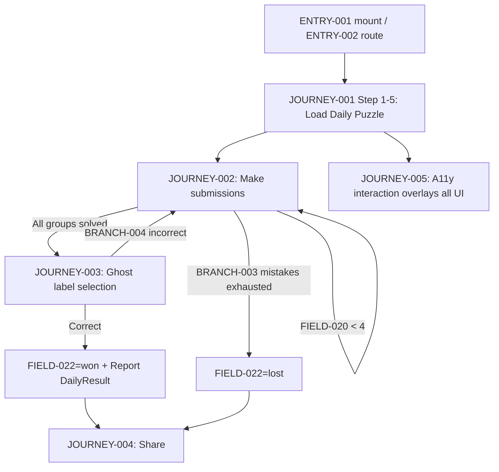
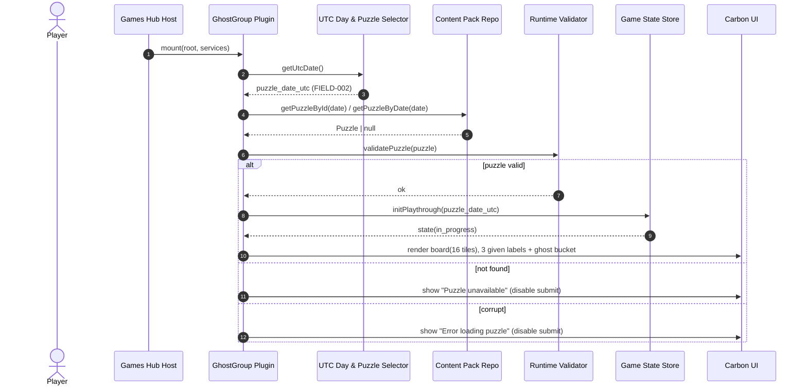
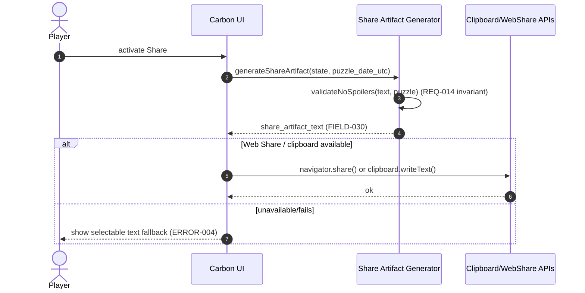
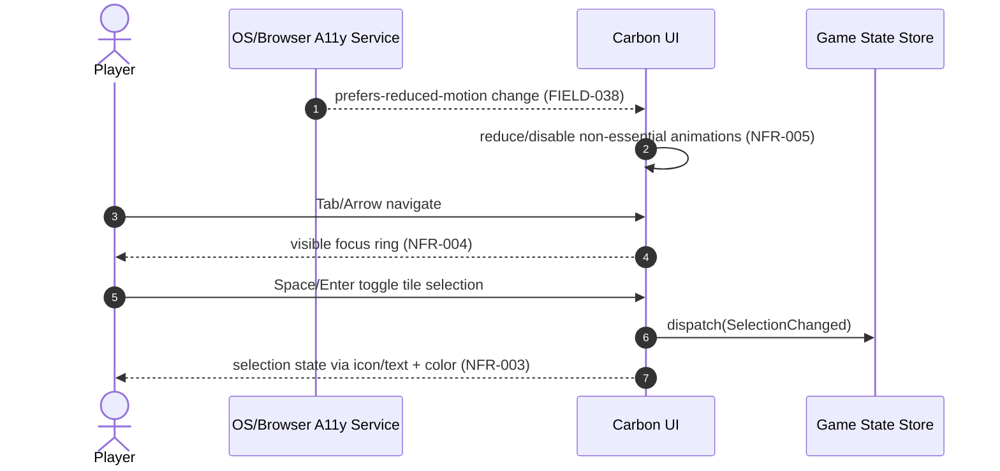
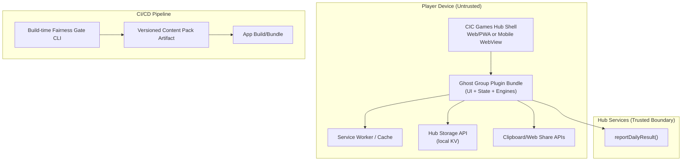

<!-- generated: 2026-07-25T19:08:09Z -->
<!-- mode: feature -->
<!-- feature-slug: ghost-group -->
<!-- a2a-endpoint: https://bob-sdlc-orchestrator.2as6l7wq9qj8.eu-gb.codeengine.appdomain.cloud/v1/rpc -->

# Glossary

## Terms

### TERM-001: Ghost Group
- **Definition:** The CIC Games hub daily word-grouping game where players sort 16 words into four groups of four, with three group labels shown upfront and the fourth being a **Ghost Category** to be deduced and named.
- **Synonyms:** Ghost Group game, daily Ghost Group
- **Anti-definition:** Not a freeform crossword; not NYT Connections (because three labels are given and the ghost category must be identified via multiple choice).
- **Source:** User request

### TERM-002: Daily Puzzle
- **Definition:** The single deterministic puzzle instance for a given UTC date, consisting of a 16-word board and its solution metadata.
- **Synonyms:** Today’s puzzle, daily board
- **Anti-definition:** Not randomized per user; not time-zone dependent beyond UTC.
- **Source:** User request

### TERM-003: UTC Day Boundary
- **Definition:** The moment at 00:00:00 UTC when the Daily Puzzle changes.
- **Synonyms:** UTC rollover, daily reset (UTC)
- **Anti-definition:** Not based on device locale midnight.
- **Source:** User request

### TERM-004: Word Board
- **Definition:** The set of 16 distinct words shown to the player for a Daily Puzzle.
- **Synonyms:** Board, grid, word set
- **Anti-definition:** Not fewer or more than 16; not containing duplicates.
- **Source:** User request

### TERM-005: Word Tile
- **Definition:** A selectable UI element representing one word on the Word Board.
- **Synonyms:** Tile, card
- **Anti-definition:** Not a group; not a label.
- **Source:** User request

### TERM-006: Category
- **Definition:** A solution grouping concept that connects exactly four words.
- **Synonyms:** Group, set, connection
- **Anti-definition:** Not a single word; not arbitrary player-created categories.
- **Source:** User request

### TERM-007: Given Category
- **Definition:** One of the three Categories whose label is shown upfront to the player.
- **Synonyms:** Named group, labeled group
- **Anti-definition:** Not the Ghost Category.
- **Source:** User request

### TERM-008: Ghost Category
- **Definition:** The fourth Category whose label is not shown upfront and must be deduced by elimination and then identified by selecting a description from candidates after solving.
- **Synonyms:** Hidden group, negative-space group
- **Anti-definition:** Not revealed upfront; not optional.
- **Source:** User request

### TERM-009: Category Label
- **Definition:** The human-readable description/name for a Category.
- **Synonyms:** Label, category name
- **Anti-definition:** Not the list of words; not a color.
- **Source:** User request

### TERM-010: Ghost Label Candidates
- **Definition:** The multiple-choice list of candidate Category Labels presented for the Ghost Category naming step.
- **Synonyms:** Ghost choices, label options
- **Anti-definition:** Not free-text input.
- **Source:** User request

### TERM-011: Submission
- **Definition:** A player action that proposes an assignment of words to one or more Categories for evaluation against the solution, consuming from the Mistake Budget if not fully correct.
- **Synonyms:** Attempt, guess, check
- **Anti-definition:** Not selecting a tile; not sharing.
- **Source:** User request

### TERM-012: Group Assignment
- **Definition:** The player-selected set of exactly four Word Tiles intended to match a specific Category (Given or Ghost).
- **Synonyms:** Proposed group, selected quartet
- **Anti-definition:** Not fewer/more than four; not unordered selection without target group.
- **Source:** User request

### TERM-013: Feedback
- **Definition:** The post-submission result shown to the player indicating how many Categories are fully correct for that submission.
- **Synonyms:** Result, evaluation
- **Anti-definition:** Not revealing words-to-category mapping for incorrect groups.
- **Source:** User request

### TERM-014: Mistake Budget
- **Definition:** The allowed number of incorrect submissions per Daily Puzzle, fixed at 4; exceeding ends the run for that day.
- **Synonyms:** Four strikes, lives
- **Anti-definition:** Not unlimited; not time-based.
- **Source:** User request

### TERM-015: Solve
- **Definition:** The state where all four Categories are correctly identified by word membership and the Ghost Category label is correctly selected from candidates.
- **Synonyms:** Completed, finished
- **Anti-definition:** Not merely grouping words; not selecting the ghost label alone.
- **Source:** User request

### TERM-016: Spoiler-safe Share Artifact
- **Definition:** A shareable, text-based artifact that encodes per-attempt group-color outcomes as a grid without revealing any words or labels.
- **Synonyms:** Share grid, results share
- **Anti-definition:** Not a screenshot containing words; not containing solution labels.
- **Source:** User request

### TERM-017: DailyResult
- **Definition:** The standardized result object reported by the game plugin to the CIC Games hub services for the current UTC date.
- **Synonyms:** Result payload, game result
- **Anti-definition:** Not global user profile data; not cross-game stats.
- **Source:** User request

### TERM-018: Local Stats
- **Definition:** Namespaced, on-device statistics maintained by the game (e.g., streak, win rate) without server dependency.
- **Synonyms:** Offline stats, device stats
- **Anti-definition:** Not shared across devices unless the hub provides it (out of scope).
- **Source:** User request

### TERM-019: Streak
- **Definition:** A count of consecutive UTC days in which the player Solves the Daily Puzzle.
- **Synonyms:** Daily streak
- **Anti-definition:** Not based on local time; not number of plays.
- **Source:** User request

### TERM-020: GamePlugin
- **Definition:** The integration contract whereby the game is mounted into the CIC Games hub via `mount(root, services)` and uses provided services to report DailyResult and access storage.
- **Synonyms:** Plugin, hub integration
- **Anti-definition:** Not a standalone app shell; not a backend service.
- **Source:** User request

### TERM-021: Offline-first PWA
- **Definition:** A Progressive Web App that functions fully client-side, including gameplay, with cached assets/content available without network connectivity after initial install/load.
- **Synonyms:** Offline-capable PWA
- **Anti-definition:** Not requiring a server roundtrip for checking submissions.
- **Source:** User request

### TERM-022: Build-time Fairness Gate
- **Definition:** A content build process step that validates each Daily Puzzle is disjoint, unambiguous, and that the Ghost Category is deducible by elimination.
- **Synonyms:** Puzzle validator, content gate
- **Anti-definition:** Not runtime user-facing logic; not subjective manual review only.
- **Source:** User request

### TERM-023: Content Pack
- **Definition:** The bundled set of Daily Puzzles shipped with the client application.
- **Synonyms:** Puzzle bundle, embedded content
- **Anti-definition:** Not fetched daily from a server (in scope is fully client-side).
- **Source:** User request

### TERM-024: Carbon Design System UI
- **Definition:** IBM Carbon Design System components and patterns used to implement the game UI across PWA/iOS/Android (where applicable via design parity).
- **Synonyms:** Carbon UI
- **Anti-definition:** Not custom UI that violates Carbon accessibility patterns.
- **Source:** User request

### TERM-025: Accessibility Compliance (WCAG 2.1 AA)
- **Definition:** The set of accessibility requirements including keyboard operability, non-color-only state, visible focus, and reduced motion respect.
- **Synonyms:** WCAG AA compliance
- **Anti-definition:** Not “best effort”; must be testable.
- **Source:** User request

### TERM-026: Reduced Motion Preference
- **Definition:** OS/browser setting indicating the user prefers reduced motion; the game must adjust animations accordingly.
- **Synonyms:** prefers-reduced-motion
- **Anti-definition:** Not a game setting toggle only.
- **Source:** User request

### TERM-027: Session
- **Definition:** A single play period intended to complete within 3 minutes for the Daily Puzzle.
- **Synonyms:** Play session
- **Anti-definition:** Not a timed mode requirement; just target duration.
- **Source:** User request

## Data Dictionary

| ID | Name | Type | Format | Range | Units | Default | Nullable | PII | Source | Validation |
|---|---|---|---|---|---|---|---|---|---|---|
| FIELD-001 | puzzle_id | string | `YYYY-MM-DD` | UTC date | n/a | none | No | None | TERM-002 | Must equal `puzzle_date_utc` formatted as ISO date |
| FIELD-002 | puzzle_date_utc | string | `YYYY-MM-DD` | UTC date | n/a | today (UTC) | No | None | TERM-003 | Must be valid ISO-8601 date and match deterministic seed selection |
| FIELD-003 | seed_utc_date | string | `YYYY-MM-DD` | UTC date | n/a | today (UTC) | No | None | TERM-002 | Must be derived from UTC time, not local |
| FIELD-004 | board_words | string[] | array length 16 | unique strings | n/a | none | No | None | TERM-004 | Exactly 16 items; all unique; trimmed; non-empty |
| FIELD-005 | word_id | string | opaque | enum/any | n/a | none | No | None | TERM-005 | Must be unique within a puzzle |
| FIELD-006 | word_text | string | display text | 1..64 chars | n/a | none | No | None | TERM-005 | No leading/trailing whitespace; no control chars |
| FIELD-007 | category_id | string | opaque | 4 per puzzle | n/a | none | No | None | TERM-006 | Must be unique within a puzzle |
| FIELD-008 | category_label | string | display text | 1..80 chars | n/a | none | No | None | TERM-009 | Required for Given Categories and for ghost solution label |
| FIELD-009 | is_ghost_category | boolean | true/false | {true,false} | n/a | false | No | None | TERM-008 | Exactly one category per puzzle must be true |
| FIELD-010 | category_word_ids | string[] | array length 4 | subset of word_id | n/a | none | No | None | TERM-006 | Exactly 4; disjoint across categories; union covers all 16 |
| FIELD-011 | given_category_ids | string[] | array length 3 | category_id | n/a | none | No | None | TERM-007 | Must reference non-ghost categories only |
| FIELD-012 | ghost_category_id | string | opaque | category_id | n/a | none | No | None | TERM-008 | Must reference the category where `is_ghost_category=true` |
| FIELD-013 | ghost_label_candidates | string[] | array length 3..8 | strings | n/a | none | No | None | TERM-010 | Must include the correct ghost label exactly once |
| FIELD-014 | correct_ghost_label | string | display text | member of candidates | n/a | none | No | None | TERM-008 | Must be equal to one item in FIELD-013 |
| FIELD-015 | submission_id | string | UUID v4 | n/a | n/a | auto | No | None | TERM-011 | Must be unique within `playthrough_id` |
| FIELD-016 | submission_index | integer | int | 1..N | count | 1 | No | None | TERM-011 | Must increment by 1 per submission |
| FIELD-017 | selected_word_ids | string[] | array length 4 | word_id | n/a | none | No | None | TERM-012 | Must be 4 unique ids present on board |
| FIELD-018 | target_category_id | string | opaque | category_id | n/a | none | No | None | TERM-012 | Must be one of 4 categories (including ghost bucket) |
| FIELD-019 | fully_correct_groups_count | integer | int | 0..4 | groups | 0 | No | None | TERM-013 | Must be computed deterministically from solution |
| FIELD-020 | mistakes_used | integer | int | 0..4 | mistakes | 0 | No | None | TERM-014 | Must not exceed 4 |
| FIELD-021 | mistakes_remaining | integer | int | 0..4 | mistakes | 4 | No | None | TERM-014 | Must equal `4 - mistakes_used` |
| FIELD-022 | play_state | string | enum | `in_progress`,`won`,`lost` | n/a | in_progress | No | None | TERM-015 | Must transition per rules; terminal states immutable |
| FIELD-023 | solved_categories | string[] | array | category_id | n/a | [] | No | None | TERM-015 | Must only include categories verified correct |
| FIELD-024 | ghost_label_selected | string | display text | candidate | n/a | null | Yes | None | TERM-010 | If set, must be one of FIELD-013 |
| FIELD-025 | ghost_label_correct | boolean | true/false | {true,false} | n/a | null | Yes | None | TERM-015 | Nullable until selection made |
| FIELD-026 | playthrough_id | string | UUID v4 | n/a | n/a | auto | No | None | TERM-027 | Must be unique per puzzle attempt session |
| FIELD-027 | started_at_utc | string | ISO-8601 datetime | n/a | n/a | now | No | None | TERM-027 | Must be valid ISO-8601 with `Z` |
| FIELD-028 | ended_at_utc | string | ISO-8601 datetime | n/a | n/a | null | Yes | None | TERM-027 | If present must be >= started_at_utc |
| FIELD-029 | duration_ms | integer | int | 0..3,600,000 | ms | 0 | No | None | TERM-027 | Must equal ended-started when ended |
| FIELD-030 | share_artifact_text | string | text | 1..500 chars | n/a | null | Yes | None | TERM-016 | Must not contain any FIELD-004 words or FIELD-008 labels |
| FIELD-031 | share_grid_rows | string[] | array | 1..10 rows | n/a | [] | No | None | TERM-016 | Encodes per-submission outcomes only |
| FIELD-032 | result_status | string | enum | `won`,`lost`,`incomplete` | n/a | incomplete | No | None | TERM-017 | Must align to FIELD-022 at report time |
| FIELD-033 | attempts_count | integer | int | 0..20 | attempts | 0 | No | None | TERM-017 | Must equal number of submissions made |
| FIELD-034 | streak_current | integer | int | 0..10,000 | days | 0 | No | None | TERM-019 | Must be computed from local history by UTC date |
| FIELD-035 | stats_namespace | string | slug | `ghost-group` | n/a | `ghost-group` | No | None | TERM-018 | Must be constant for this game |
| FIELD-036 | storage_key | string | namespaced key | n/a | n/a | none | No | None | TERM-018 | Must be prefixed with stats_namespace |
| FIELD-037 | carbon_component_id | string | token | n/a | n/a | none | Yes | None | TERM-024 | Must map to approved Carbon components list |
| FIELD-038 | prefers_reduced_motion | boolean | true/false | {true,false} | n/a | false | No | None | TERM-026 | Must reflect OS/browser media query at runtime |

# User Journeys

## Roles

| Role ID | Role | Type | Description |
|---|---|---|---|
| ROLE-001 | Player | Primary | End user who plays TERM-001 daily puzzle |
| ROLE-002 | Games Hub Host | System | CIC Games hub shell that loads TERM-020 and provides services |
| ROLE-003 | Content Builder | Admin/Dev | Maintains TERM-023 and runs TERM-022 at build time |
| ROLE-004 | OS/Browser Accessibility Service | System | Provides keyboard navigation and TERM-026 preference signals |

## Entry Points

| Entry ID | Location | Trigger | Auth |
|---|---|---|---|
| ENTRY-001 | GamePlugin `mount(root, services)` | Hub loads plugin | Hub-managed (no end-user auth in scope) |
| ENTRY-002 | UI route `/ghost-group` (within hub) | Player selects game | Hub-managed |
| ENTRY-003 | Daily puzzle initialization | App start or UTC rollover | None |
| ENTRY-004 | “Submit group” control | Player action | None |
| ENTRY-005 | “Select ghost label” dialog | Player action after word solve | None |
| ENTRY-006 | “Share” control | Player action | None |
| ENTRY-007 | Offline load | Network unavailable | None |

## Role Permission Matrix

| Capability | ROLE-001 Player | ROLE-002 Host | ROLE-003 Builder | ROLE-004 A11y Service |
|---|---:|---:|---:|---:|
| Load Daily Puzzle (TERM-002) | Y | Y | N | N |
| Make Submission (TERM-011) | Y | N | N | N |
| View Feedback (TERM-013) | Y | N | N | N |
| Select Ghost Label (TERM-010) | Y | N | N | N |
| Generate Share Artifact (TERM-016) | Y | N | N | N |
| Persist Local Stats (TERM-018) | Y | Y (via services) | N | N |
| Report DailyResult (TERM-017) | N | Y (via services API) | N | N |
| Build/Validate Content Pack (TERM-023/022) | N | N | Y | N |

## Journeys

### JOURNEY-001: Start daily puzzle (offline-first)
- **Role/Goal:** ROLE-001 Player — start TERM-002 for FIELD-002 and see TERM-004 with three TERM-007 labels.
- **Entry:** ENTRY-001 / ENTRY-002 / ENTRY-003
- **Happy path:**
  1. System determines FIELD-002 by UTC time (TERM-003) and sets FIELD-003. (FIELDS: FIELD-002, FIELD-003)
  2. System selects the puzzle content matching FIELD-001 from TERM-023. (FIELDS: FIELD-001)
  3. System renders 16 TERM-005 using FIELD-004 / FIELD-006. (FIELDS: FIELD-004, FIELD-006)
  4. System renders three TERM-007 labels from FIELD-011 + FIELD-008 and shows an unnamed ghost bucket for TERM-008. (FIELDS: FIELD-011, FIELD-008, FIELD-012)
  5. System initializes play tracking: FIELD-026, FIELD-022=`in_progress`, FIELD-020=0, FIELD-033=0. (FIELDS: FIELD-026, FIELD-022, FIELD-020, FIELD-033)
- **BRANCH-001 (Puzzle not found in Content Pack):**
  - Trigger: No puzzle matches FIELD-001.
  - Outcome: Show “Puzzle unavailable” state and prevent play.
- **ERROR-001 (Corrupt content):**
  - Trigger: Content violates FIELD-004/010/009 validations at runtime.
  - Response: Show error state and disable submissions.
  - Recovery: Player can restart; if persists, display support info (non-normative).
- **EDGE-001 (Offline first load):**
  - Condition: ENTRY-007 network unavailable.
  - Expectation: Load from local assets; no remote dependency.
- **EDGE-002 (UTC rollover mid-session):**
  - Condition: Device crosses TERM-003 while FIELD-022=`in_progress`.
  - Expectation: Keep current playthrough tied to FIELD-002 started; offer next puzzle on restart.

### JOURNEY-002: Create a group submission and receive feedback
- **Role/Goal:** ROLE-001 Player — propose TERM-012 and get TERM-013; keep within TERM-014.
- **Entry:** ENTRY-004
- **Happy path:**
  1. Player selects 4 Word Tiles; system stores FIELD-017. (FIELDS: FIELD-017, FIELD-005)
  2. Player selects a target group (one of 3 given labels or ghost bucket); system stores FIELD-018. (FIELDS: FIELD-018, FIELD-011, FIELD-012)
  3. Player activates submit; system creates FIELD-015 and increments FIELD-016 and FIELD-033. (FIELDS: FIELD-015, FIELD-016, FIELD-033)
  4. System evaluates submission against solution mappings FIELD-010 and computes FIELD-019. (FIELDS: FIELD-010, FIELD-019)
  5. If the targeted group is correct and unsolved, system adds to FIELD-023 and locks those words from further selection. (FIELDS: FIELD-023, FIELD-017)
  6. If incorrect, system increments FIELD-020 and updates FIELD-021. (FIELDS: FIELD-020, FIELD-021)
  7. System shows Feedback: FIELD-019 and remaining mistakes FIELD-021. (FIELDS: FIELD-019, FIELD-021)
- **BRANCH-002 (Correct group already solved):**
  - Trigger: Submission matches a category already in FIELD-023.
  - Outcome: No state change; show message “Already solved”.
- **BRANCH-003 (Mistake budget exhausted):**
  - Trigger: FIELD-020 becomes 4.
  - Outcome: Transition FIELD-022=`lost` and end playthrough.
- **ERROR-002 (Invalid selection size):**
  - Trigger: FIELD-017 length != 4.
  - Response: Disable submit and announce requirement.
  - Recovery: Player adjusts selection.
- **EDGE-003 (Duplicate word selection):**
  - Condition: UI attempts to include same FIELD-005 twice.
  - Expectation: Prevent duplicates at selection time.
- **EDGE-004 (Concurrency double-submit):**
  - Condition: Player activates submit twice quickly.
  - Expectation: Deduplicate by disabling button while evaluating; no double increment of FIELD-020/FIELD-033.

### JOURNEY-003: Solve all word groups then identify the Ghost Category label
- **Role/Goal:** ROLE-001 Player — reach TERM-015 including ghost naming step.
- **Entry:** ENTRY-005 (after word grouping complete)
- **Happy path:**
  1. System detects all four Categories’ word membership solved (FIELD-023 size=4) and prompts ghost naming with FIELD-013. (FIELDS: FIELD-023, FIELD-013)
  2. Player selects a candidate; system stores FIELD-024. (FIELDS: FIELD-024)
  3. System compares FIELD-024 to FIELD-014 and sets FIELD-025. (FIELDS: FIELD-014, FIELD-025)
  4. If correct, system sets FIELD-022=`won`, sets FIELD-028, FIELD-029, and prepares FIELD-032=`won`. (FIELDS: FIELD-022, FIELD-028, FIELD-029, FIELD-032)
  5. System updates TERM-018/TERM-019 using FIELD-034 and persists namespaced keys FIELD-036. (FIELDS: FIELD-034, FIELD-036, FIELD-035)
  6. System reports TERM-017 to host services. (FIELDS: FIELD-032, FIELD-033, FIELD-029, FIELD-002)
- **BRANCH-004 (Ghost label incorrect):**
  - Trigger: FIELD-025=false.
  - Outcome: Keep FIELD-022=`in_progress` or move to `lost` depending on rules (see OpenQuestions in requirements); prompt retry if allowed.
- **ERROR-003 (Ghost candidates missing correct label):**
  - Trigger: FIELD-014 not in FIELD-013.
  - Response: Show error state; block naming step.
  - Recovery: Restart; content must be fixed in build.
- **EDGE-005 (Player solved words but exits before naming):**
  - Condition: App closed after FIELD-023 complete but before FIELD-024 chosen.
  - Expectation: Resume at naming step on reload for same FIELD-002.

### JOURNEY-004: Share spoiler-safe results
- **Role/Goal:** ROLE-001 Player — generate TERM-016 without spoilers and share it.
- **Entry:** ENTRY-006
- **Happy path:**
  1. System generates FIELD-031 from submissions history and solved group colors; excludes FIELD-004 and FIELD-008. (FIELDS: FIELD-031, FIELD-004, FIELD-008)
  2. System formats FIELD-030 including puzzle date FIELD-002, attempts FIELD-033, and grid rows FIELD-031. (FIELDS: FIELD-030, FIELD-002, FIELD-033, FIELD-031)
  3. System copies FIELD-030 to clipboard or invokes OS share (platform-specific). (FIELDS: FIELD-030)
- **ERROR-004 (Clipboard/share unavailable):**
  - Trigger: Platform API fails.
  - Response: Present FIELD-030 in selectable text for manual copy.
  - Recovery: User long-press/select and copy.
- **EDGE-006 (Share before completion):**
  - Condition: FIELD-022=`in_progress`.
  - Expectation: Artifact reflects current attempts without revealing words.

### JOURNEY-005: Accessibility-first interaction (keyboard + reduced motion)
- **Role/Goal:** ROLE-001 Player — fully play using keyboard and with reduced motion respected.
- **Entry:** ENTRY-002
- **Happy path:**
  1. Player navigates Word Tiles via keyboard; focus indicator is visible. (FIELDS: n/a; TERM-025)
  2. Player selects/deselects tiles via keyboard action; selection state is conveyed via text/icon and not only color. (TERM-025)
  3. When FIELD-038=true, system reduces or removes non-essential animations. (FIELDS: FIELD-038)
- **ERROR-005 (Focus trap):**
  - Trigger: Modal (ghost naming) opens and focus is not contained.
  - Response: Move focus to first interactive element and restore on close.
  - Recovery: Keyboard user continues.

## Journey Map



# Requirements

### REQ-001: Determine daily puzzle date by UTC
- **EARS Pattern:** Ubiquitous
- **EARS Statement:** The Ghost Group client shall set FIELD-002 based on the current UTC date.
- **Inputs:** System clock (UTC)
- **Outputs:** FIELD-002
- **Preconditions:** Game mounted via TERM-020
- **Postconditions:** FIELD-002 populated
- **Invariants:** FIELD-002 uses TERM-003 not local midnight
- **Trigger:** ENTRY-003
- **Actor:** ROLE-002 (system)
- **EntityScope:** TERM-002
- **ErrorModes:** ERROR-001
- **NFR-Tags:** compatibility
- **Source:** JOURNEY-001 step 1
- **Dependencies:** None
- **Priority:** P0
- **AcceptanceCriteria:**
  - **TEST-001:** Given local time zone ≠ UTC, when time is 23:30 local and 00:30 UTC, then FIELD-002 equals the UTC date.
  - **TEST-002:** Given time is 00:00:00 UTC, when app initializes, then FIELD-002 equals the new UTC date.
- **Assumptions:** Device clock is available
- **OpenQuestions:** None

### REQ-002: Select deterministic puzzle by UTC date seed
- **EARS Pattern:** Event-Driven
- **EARS Statement:** When FIELD-002 is set, the Ghost Group client shall select the TERM-002 content matching FIELD-001.
- **Inputs:** FIELD-002
- **Outputs:** FIELD-001 and in-memory puzzle content
- **Preconditions:** TERM-023 is bundled
- **Postconditions:** A puzzle is selected or BRANCH-001 occurs
- **Invariants:** Same FIELD-002 selects same content on same app version
- **Trigger:** FIELD-002 set
- **Actor:** ROLE-002 (system)
- **EntityScope:** TERM-002
- **ErrorModes:** BRANCH-001
- **NFR-Tags:** reliability
- **Source:** JOURNEY-001 step 2, BRANCH-001
- **Dependencies:** REQ-001
- **Priority:** P0
- **AcceptanceCriteria:**
  - **TEST-003:** Given FIELD-002 is `2026-07-25`, when app starts twice, then FIELD-001 is identical both times.
  - **TEST-004:** Given no bundled puzzle matches FIELD-001, when selection runs, then the UI shows “Puzzle unavailable” and disables submissions.
- **Assumptions:** Content pack includes mapping from date to puzzle
- **OpenQuestions:** Is FIELD-001 always equal to FIELD-002, or an index derived from it?

### REQ-003: Render 16 unique word tiles
- **EARS Pattern:** Ubiquitous
- **EARS Statement:** The Ghost Group client shall render exactly 16 TERM-005 using FIELD-004 for the selected TERM-002.
- **Inputs:** FIELD-004
- **Outputs:** UI tiles showing FIELD-006
- **Preconditions:** Puzzle selected
- **Postconditions:** Board visible
- **Invariants:** Words are unique per FIELD-004 validation
- **Trigger:** After REQ-002
- **Actor:** ROLE-002 (system)
- **EntityScope:** TERM-004
- **ErrorModes:** ERROR-001
- **NFR-Tags:** accessibility
- **Source:** JOURNEY-001 step 3
- **Dependencies:** REQ-002
- **Priority:** P0
- **AcceptanceCriteria:**
  - **TEST-005:** Given a valid puzzle, when rendered, then 16 tiles are present.
  - **TEST-006:** Given content includes a duplicate word, when validation runs, then an error state is shown and submissions are disabled.
- **Assumptions:** Word display strings are provided via FIELD-006
- **OpenQuestions:** None

### REQ-004: Display three given category labels and a ghost bucket
- **EARS Pattern:** Ubiquitous
- **EARS Statement:** The Ghost Group client shall display TERM-009 for each FIELD-011 category and shall display an unlabeled bucket for FIELD-012.
- **Inputs:** FIELD-011, FIELD-012, FIELD-008
- **Outputs:** UI group targets
- **Preconditions:** Puzzle selected
- **Postconditions:** Player can target 4 groups
- **Invariants:** Exactly 3 given labels are visible before solve
- **Trigger:** After REQ-002
- **Actor:** ROLE-002 (system)
- **EntityScope:** TERM-006
- **ErrorModes:** ERROR-001
- **NFR-Tags:** accessibility
- **Source:** JOURNEY-001 step 4
- **Dependencies:** REQ-002
- **Priority:** P0
- **AcceptanceCriteria:**
  - **TEST-007:** Given a puzzle, when board loads, then exactly three category labels are visible and the ghost bucket has no label.
- **Assumptions:** Given categories are identified by FIELD-011
- **OpenQuestions:** Should the ghost bucket display placeholder text (e.g., “Ghost”)?

### REQ-005: Enforce selection of exactly four words before submit
- **EARS Pattern:** State-Driven
- **EARS Statement:** While FIELD-017 does not contain exactly four unique word_ids, the Ghost Group client shall disable the submit control.
- **Inputs:** FIELD-017
- **Outputs:** Disabled/enabled submit control state
- **Preconditions:** Board rendered
- **Postconditions:** Only valid-size submissions can be triggered
- **Invariants:** No submission created when disabled
- **Trigger:** Selection change
- **Actor:** ROLE-001
- **EntityScope:** TERM-012
- **ErrorModes:** ERROR-002
- **NFR-Tags:** accessibility
- **Source:** JOURNEY-002 step 1, ERROR-002, EDGE-003
- **Dependencies:** REQ-003
- **Priority:** P0
- **AcceptanceCriteria:**
  - **TEST-008:** Given 3 selected tiles, then submit is disabled.
  - **TEST-009:** Given 4 selected unique tiles, then submit is enabled.
- **Assumptions:** UI prevents selecting the same tile twice
- **OpenQuestions:** Can the player submit without choosing a target group?

### REQ-006: Record a submission atomically
- **EARS Pattern:** Event-Driven
- **EARS Statement:** When the player activates submit, the Ghost Group client shall create a new FIELD-015 and increment FIELD-033 by 1.
- **Inputs:** Submit action
- **Outputs:** FIELD-015, FIELD-033
- **Preconditions:** REQ-005 enabled; FIELD-022=`in_progress`
- **Postconditions:** Submission exists in history
- **Invariants:** FIELD-015 unique within FIELD-026
- **Trigger:** ENTRY-004
- **Actor:** ROLE-001
- **EntityScope:** TERM-011
- **ErrorModes:** EDGE-004
- **NFR-Tags:** reliability
- **Source:** JOURNEY-002 step 3, EDGE-004
- **Dependencies:** REQ-005
- **Priority:** P0
- **AcceptanceCriteria:**
  - **TEST-010:** Given one submit action, then FIELD-033 increases by exactly 1.
  - **TEST-011:** Given rapid double-click, then FIELD-033 increases by exactly 1.
- **Assumptions:** Client maintains a submissions list (structure not specified)
- **OpenQuestions:** Is FIELD-016 required separately from FIELD-033?

### REQ-007: Compute fully-correct groups count for a submission
- **EARS Pattern:** Event-Driven
- **EARS Statement:** When a submission is recorded, the Ghost Group client shall compute FIELD-019 by comparing FIELD-017 and FIELD-018 to FIELD-010.
- **Inputs:** FIELD-017, FIELD-018, FIELD-010
- **Outputs:** FIELD-019
- **Preconditions:** Puzzle loaded
- **Postconditions:** Feedback value available
- **Invariants:** Deterministic for same inputs
- **Trigger:** Submission recorded
- **Actor:** ROLE-002 (system)
- **EntityScope:** TERM-013
- **ErrorModes:** ERROR-001
- **NFR-Tags:** reliability
- **Source:** JOURNEY-002 step 4
- **Dependencies:** REQ-006
- **Priority:** P0
- **AcceptanceCriteria:**
  - **TEST-012:** Given a correct quartet targeted to its correct category, then FIELD-019 is ≥ 1.
- **Assumptions:** FIELD-019 counts “fully correct groups per submission” as specified
- **OpenQuestions:** Does FIELD-019 count only newly-correct groups in this submission, or total correct groups identified so far?

### REQ-008: Lock words for solved categories
- **EARS Pattern:** Event-Driven
- **EARS Statement:** When a submission matches a not-yet-solved category in FIELD-010, the Ghost Group client shall add that category_id to FIELD-023.
- **Inputs:** Submission evaluation result
- **Outputs:** FIELD-023 updated
- **Preconditions:** FIELD-022=`in_progress`
- **Postconditions:** Category becomes solved
- **Invariants:** FIELD-023 contains no duplicates
- **Trigger:** Correct submission detected
- **Actor:** ROLE-002 (system)
- **EntityScope:** TERM-015
- **ErrorModes:** BRANCH-002
- **NFR-Tags:** reliability
- **Source:** JOURNEY-002 step 5, BRANCH-002
- **Dependencies:** REQ-007
- **Priority:** P0
- **AcceptanceCriteria:**
  - **TEST-013:** Given a category not in FIELD-023, when correctly submitted, then it is appended to FIELD-023.
  - **TEST-014:** Given a category already in FIELD-023, when submitted again, then FIELD-023 is unchanged.
- **Assumptions:** UI “locks” are derived from FIELD-023
- **OpenQuestions:** Should a correct group require targeting the correct category, or can any correct quartet be accepted regardless of target?

### REQ-009: Increment mistakes on incorrect submission
- **EARS Pattern:** Event-Driven
- **EARS Statement:** When a submission does not match the targeted category in FIELD-010, the Ghost Group client shall increment FIELD-020 by 1.
- **Inputs:** Submission evaluation result
- **Outputs:** FIELD-020
- **Preconditions:** FIELD-022=`in_progress`
- **Postconditions:** Mistake budget consumed
- **Invariants:** FIELD-020 ≤ 4
- **Trigger:** Incorrect submission detected
- **Actor:** ROLE-002 (system)
- **EntityScope:** TERM-014
- **ErrorModes:** BRANCH-003
- **NFR-Tags:** reliability
- **Source:** JOURNEY-002 step 6, BRANCH-003
- **Dependencies:** REQ-007
- **Priority:** P0
- **AcceptanceCriteria:**
  - **TEST-015:** Given FIELD-020=0, when an incorrect submission occurs, then FIELD-020=1.
- **Assumptions:** Mistakes are only consumed on incorrect submissions
- **OpenQuestions:** Are there “near-miss” messages (e.g., 3-of-4) or strictly count correct groups only?

### REQ-010: End game as lost on exhausting mistake budget
- **EARS Pattern:** Event-Driven
- **EARS Statement:** When FIELD-020 becomes 4, the Ghost Group client shall set FIELD-022 to `lost`.
- **Inputs:** FIELD-020
- **Outputs:** FIELD-022
- **Preconditions:** FIELD-022=`in_progress`
- **Postconditions:** Game ends
- **Invariants:** Terminal state immutable
- **Trigger:** Mistake increment to 4
- **Actor:** ROLE-002 (system)
- **EntityScope:** TERM-015
- **ErrorModes:** None
- **NFR-Tags:** reliability
- **Source:** JOURNEY-002 BRANCH-003
- **Dependencies:** REQ-009
- **Priority:** P0
- **AcceptanceCriteria:**
  - **TEST-016:** Given FIELD-020 transitions to 4, then FIELD-022 equals `lost`.
- **Assumptions:** Player cannot submit after lost
- **OpenQuestions:** Should the solution be revealed on loss (and if so, how to keep share spoiler-safe)?

### REQ-011: Prompt ghost label selection after all word groups solved
- **EARS Pattern:** Event-Driven
- **EARS Statement:** When FIELD-023 contains four category_ids, the Ghost Group client shall display FIELD-013 for ghost label selection.
- **Inputs:** FIELD-023, FIELD-013
- **Outputs:** Ghost label selection UI
- **Preconditions:** Puzzle loaded
- **Postconditions:** Player can choose FIELD-024
- **Invariants:** Only shown once per playthrough unless dismissed
- **Trigger:** All categories solved
- **Actor:** ROLE-002 (system)
- **EntityScope:** TERM-010
- **ErrorModes:** ERROR-003
- **NFR-Tags:** accessibility
- **Source:** JOURNEY-003 step 1, ERROR-003
- **Dependencies:** REQ-008
- **Priority:** P0
- **AcceptanceCriteria:**
  - **TEST-017:** Given FIELD-023 has length 4, then candidate list FIELD-013 is displayed.
- **Assumptions:** FIELD-013 is bundled per puzzle
- **OpenQuestions:** Can the player postpone ghost naming and return later?

### REQ-012: Validate ghost label selection against correct answer
- **EARS Pattern:** Event-Driven
- **EARS Statement:** When the player selects FIELD-024, the Ghost Group client shall set FIELD-025 based on equality with FIELD-014.
- **Inputs:** FIELD-024, FIELD-014
- **Outputs:** FIELD-025
- **Preconditions:** Candidates displayed
- **Postconditions:** Correctness known
- **Invariants:** FIELD-024 must be in FIELD-013 (FIELD-024 validation)
- **Trigger:** ENTRY-005 selection
- **Actor:** ROLE-001
- **EntityScope:** TERM-008
- **ErrorModes:** ERROR-003
- **NFR-Tags:** reliability
- **Source:** JOURNEY-003 steps 2-3
- **Dependencies:** REQ-011
- **Priority:** P0
- **AcceptanceCriteria:**
  - **TEST-018:** Given FIELD-024 equals FIELD-014, then FIELD-025=true.
  - **TEST-019:** Given FIELD-024 does not equal FIELD-014, then FIELD-025=false.
- **Assumptions:** Exact string match is acceptable
- **OpenQuestions:** Are candidates localized (i18n) or fixed English strings?

### REQ-013: Mark game as won when ghost label is correct
- **EARS Pattern:** Event-Driven
- **EARS Statement:** When FIELD-025 becomes true, the Ghost Group client shall set FIELD-022 to `won`.
- **Inputs:** FIELD-025
- **Outputs:** FIELD-022
- **Preconditions:** FIELD-023 length 4
- **Postconditions:** Game won
- **Invariants:** Terminal state immutable
- **Trigger:** Correct ghost label selection
- **Actor:** ROLE-002 (system)
- **EntityScope:** TERM-015
- **ErrorModes:** None
- **NFR-Tags:** reliability
- **Source:** JOURNEY-003 step 4
- **Dependencies:** REQ-012
- **Priority:** P0
- **AcceptanceCriteria:**
  - **TEST-020:** Given FIELD-025 transitions to true, then FIELD-022=`won`.
- **Assumptions:** Win requires both word solve and ghost naming
- **OpenQuestions:** None

### REQ-014: Generate spoiler-safe share artifact without words or labels
- **EARS Pattern:** Event-Driven
- **EARS Statement:** When the player activates share, the Ghost Group client shall generate FIELD-030 such that it contains neither FIELD-004 word_text values nor any FIELD-008 category_label values.
- **Inputs:** Submissions history; FIELD-004; FIELD-008
- **Outputs:** FIELD-030
- **Preconditions:** At least one submission exists or game ended
- **Postconditions:** Share text available
- **Invariants:** Spoiler-safe constraint
- **Trigger:** ENTRY-006
- **Actor:** ROLE-001
- **EntityScope:** TERM-016
- **ErrorModes:** ERROR-004
- **NFR-Tags:** privacy
- **Source:** JOURNEY-004 steps 1-3
- **Dependencies:** REQ-006
- **Priority:** P0
- **AcceptanceCriteria:**
  - **TEST-021:** Given any puzzle, when share is generated, then no board word appears as a substring in FIELD-030.
  - **TEST-022:** Given any puzzle, when share is generated, then no category label appears as a substring in FIELD-030.
- **Assumptions:** Substring checks are feasible for shipped content
- **OpenQuestions:** Should the share include puzzle number/date and win/loss status?

### REQ-015: Persist local stats with a fixed namespace
- **EARS Pattern:** Ubiquitous
- **EARS Statement:** The Ghost Group client shall store TERM-018 using keys prefixed by FIELD-035.
- **Inputs:** Stats updates
- **Outputs:** Storage writes to FIELD-036
- **Preconditions:** Storage service available via TERM-020 services
- **Postconditions:** Stats retrievable on reload
- **Invariants:** No collisions with other games
- **Trigger:** On win/loss and on load
- **Actor:** ROLE-002 (system)
- **EntityScope:** TERM-018
- **ErrorModes:** None
- **NFR-Tags:** compatibility
- **Source:** JOURNEY-003 step 5
- **Dependencies:** REQ-013, REQ-010
- **Priority:** P1
- **AcceptanceCriteria:**
  - **TEST-023:** Given stored stats, when app reloads, then values are retrieved using keys starting with `ghost-group`.
- **Assumptions:** Hub provides a key-value storage API
- **OpenQuestions:** What exact stats beyond FIELD-034 are required?

### REQ-016: Report DailyResult via GamePlugin services
- **EARS Pattern:** Event-Driven
- **EARS Statement:** When FIELD-022 transitions to `won` or `lost`, the Ghost Group client shall report TERM-017 including FIELD-002, FIELD-032, FIELD-033, and FIELD-029.
- **Inputs:** FIELD-022, FIELD-002, FIELD-033, FIELD-029
- **Outputs:** DailyResult call to host services
- **Preconditions:** Game mounted and services available
- **Postconditions:** Result reported once for that terminal state
- **Invariants:** Idempotent for same FIELD-002 and FIELD-026
- **Trigger:** Terminal state transition
- **Actor:** ROLE-002 (system)
- **EntityScope:** TERM-017
- **ErrorModes:** None
- **NFR-Tags:** observability
- **Source:** JOURNEY-003 step 6; Journey map terminal nodes
- **Dependencies:** REQ-013, REQ-010
- **Priority:** P1
- **AcceptanceCriteria:**
  - **TEST-024:** Given a win, when FIELD-022 becomes `won`, then DailyResult is emitted with FIELD-032=`won`.
  - **TEST-025:** Given a loss, when FIELD-022 becomes `lost`, then DailyResult is emitted with FIELD-032=`lost`.
- **Assumptions:** Host services define DailyResult schema; mapping is agreed
- **OpenQuestions:** Should “incomplete” be reported on app exit?

### NFR-001: Fully client-side gameplay (no network dependency)
- **EARS Pattern:** Ubiquitous
- **EARS Statement:** The Ghost Group client shall evaluate submissions using only bundled TERM-023 content without requiring network access.
- **Inputs:** Local content pack
- **Outputs:** Feedback and state transitions
- **Preconditions:** App installed/loaded at least once
- **Postconditions:** Play possible offline
- **Invariants:** No submission-check API calls
- **Trigger:** ENTRY-007 or normal play
- **Actor:** ROLE-002 (system)
- **EntityScope:** TERM-021
- **ErrorModes:** None
- **NFR-Tags:** reliability, compatibility
- **Source:** JOURNEY-001 EDGE-001; user request “Fully client-side”
- **Dependencies:** REQ-002, REQ-007
- **Priority:** P0
- **AcceptanceCriteria:**
  - **TEST-026:** Given network is disabled, when a submission is made, then feedback is produced.
- **Assumptions:** All puzzles required for target period are bundled
- **OpenQuestions:** How many days of puzzles are shipped per release?

### NFR-002: Accessibility—keyboard operability
- **EARS Pattern:** Ubiquitous
- **EARS Statement:** The Ghost Group client shall provide keyboard operability for selecting/deselecting each TERM-005 and activating submission and ghost label selection controls.
- **Inputs:** Keyboard events
- **Outputs:** Selection state changes; actions triggered
- **Preconditions:** Focusable UI elements exist
- **Postconditions:** Full play possible without pointer
- **Invariants:** No keyboard-only dead ends
- **Trigger:** Keyboard interaction
- **Actor:** ROLE-001
- **EntityScope:** TERM-025
- **ErrorModes:** ERROR-005
- **NFR-Tags:** accessibility
- **Source:** JOURNEY-005 steps 1-3
- **Dependencies:** REQ-003, REQ-005, REQ-011
- **Priority:** P0
- **AcceptanceCriteria:**
  - **TEST-027:** Given keyboard-only navigation, when user tabs through, then each tile and primary control is reachable and activatable.
- **Assumptions:** Carbon components used where possible
- **OpenQuestions:** Specify exact keybindings (Enter/Space/Arrow keys)?

### NFR-003: Accessibility—do not convey state by color alone
- **EARS Pattern:** Ubiquitous
- **EARS Statement:** The Ghost Group client shall present selection and correctness states using text and/or icons in addition to color.
- **Inputs:** Game state (selected/locked/solved)
- **Outputs:** UI indicators
- **Preconditions:** UI rendered
- **Postconditions:** States are perceivable without color
- **Invariants:** Color is not sole carrier
- **Trigger:** Any state change
- **Actor:** ROLE-002 (system)
- **EntityScope:** TERM-025
- **ErrorModes:** None
- **NFR-Tags:** accessibility
- **Source:** User request WCAG note; JOURNEY-005 step 2
- **Dependencies:** REQ-008, REQ-014
- **Priority:** P0
- **AcceptanceCriteria:**
  - **TEST-028:** Given solved group colors are shown, when CSS colors are disabled, then solved/selected states remain distinguishable via text/icon.
- **Assumptions:** Iconography is available in Carbon set
- **OpenQuestions:** What exact icon vocabulary is preferred?

### NFR-004: Accessibility—visible focus indicator
- **EARS Pattern:** Ubiquitous
- **EARS Statement:** The Ghost Group client shall display a visible focus indicator on the currently focused interactive element.
- **Inputs:** Focus state
- **Outputs:** Focus styling
- **Preconditions:** Keyboard navigation used
- **Postconditions:** Focus location perceivable
- **Invariants:** Focus indicator meets WCAG contrast requirements (to be specified by design tokens)
- **Trigger:** Focus change
- **Actor:** ROLE-004 (system)
- **EntityScope:** TERM-025
- **ErrorModes:** ERROR-005
- **NFR-Tags:** accessibility
- **Source:** User request; JOURNEY-005 step 1
- **Dependencies:** None
- **Priority:** P0
- **AcceptanceCriteria:**
  - **TEST-029:** Given tab navigation, when focus moves, then a visible focus ring is present on the focused element.
- **Assumptions:** Carbon focus styles are acceptable
- **OpenQuestions:** Confirm contrast measurement target (e.g., 3:1 for focus indicator)?

### NFR-005: Respect reduced motion preference
- **EARS Pattern:** State-Driven
- **EARS Statement:** While FIELD-038 is true, the Ghost Group client shall disable non-essential animations.
- **Inputs:** FIELD-038
- **Outputs:** Reduced-motion UI behavior
- **Preconditions:** Animations exist
- **Postconditions:** Motion reduced
- **Invariants:** Core feedback still conveyed
- **Trigger:** Preference change or initial load
- **Actor:** ROLE-004 (system)
- **EntityScope:** TERM-026
- **ErrorModes:** None
- **NFR-Tags:** accessibility
- **Source:** User request; JOURNEY-005 step 3
- **Dependencies:** None
- **Priority:** P0
- **AcceptanceCriteria:**
  - **TEST-030:** Given prefers-reduced-motion is enabled, when user solves a group, then no animation longer than 0ms occurs for non-essential transitions.
- **Assumptions:** “Non-essential” excludes focus change and instantaneous state updates
- **OpenQuestions:** Are micro-animations (<=100ms) allowed?

### NFR-006: Content fairness gate validations
- **EARS Pattern:** Ubiquitous
- **EARS Statement:** The content build pipeline shall reject any TERM-002 where FIELD-010 groups are not disjoint and do not cover all 16 FIELD-005 values.
- **Inputs:** Puzzle source data
- **Outputs:** Build pass/fail
- **Preconditions:** TERM-022 runs in build
- **Postconditions:** Only valid puzzles shipped
- **Invariants:** Exactly one FIELD-009 true
- **Trigger:** Content build
- **Actor:** ROLE-003
- **EntityScope:** TERM-022
- **ErrorModes:** None
- **NFR-Tags:** reliability
- **Source:** User request “build-time fairness gate”
- **Dependencies:** None
- **Priority:** P0
- **AcceptanceCriteria:**
  - **TEST-031:** Given a puzzle where a word appears in two categories, when gate runs, then build fails.
  - **TEST-032:** Given a puzzle with 15 or 17 unique words, when gate runs, then build fails.
- **Assumptions:** “Unambiguous” and “deducible by elimination” require additional formal checks beyond disjointness
- **OpenQuestions:** Define measurable criteria for “unambiguous” and “ghost deducible” (e.g., uniqueness of partition given the three labels).
# Architecture

## Components & Responsibilities

### GamePlugin Entry (Ghost Group Plugin)
- **Satisfies:** REQ-001..016, NFR-001..006 (as the client delivery unit)
- **Responsibilities**
  - Implement `mount(root, services)` and bootstrap the game inside the Hub.
  - Wire hub-provided services (storage, result reporting, optional telemetry hooks) to internal modules.
  - Own lifecycle: init, render, teardown, and safe re-mount.
- **Boundaries**
  - **Owns:** all gameplay logic/UI for Ghost Group; client-side state; content-pack usage.
  - **Does not own:** authentication, global navigation, cross-game profile/stats, backend APIs.
- **Exposes interfaces**
  - `mount(root: HTMLElement, services: HubServices): UnmountFn`
- **Consumes interfaces**
  - `HubServices.storage` (key-value)
  - `HubServices.reportDailyResult(result: DailyResult)` (REQ-016)
  - Optional: `HubServices.clipboard/share` wrappers (if provided), otherwise platform APIs.

### UTC Day & Puzzle Selector
- **Satisfies:** REQ-001, REQ-002, JOURNEY-001, EDGE-002
- **Responsibilities**
  - Compute `puzzle_date_utc` from device clock using UTC day boundary.
  - Select a deterministic puzzle for the UTC date from the bundled Content Pack.
  - Pin an in-progress playthrough to the `puzzle_date_utc` at start (do not auto-switch mid-session).
- **Boundaries**
  - **Owns:** date calculation, mapping from date → puzzle lookup key, “puzzle unavailable” state.
  - **Does not own:** content generation; server time authority (offline-first assumption).
- **Exposes interfaces**
  - `getUtcDate(now = Date): YYYY-MM-DD`
  - `selectPuzzle(dateUtc: YYYY-MM-DD, pack: ContentPack): Puzzle | NotFound | Corrupt`
- **Consumes interfaces**
  - `ContentPackRepository.getPack()` (local bundle)
  - `RuntimeValidator.validatePuzzle(puzzle)` (defensive runtime validation)

### Content Pack Repository (Bundled)
- **Satisfies:** NFR-001, REQ-002, REQ-011/012 (candidates), ERROR-001/003
- **Responsibilities**
  - Provide read-only access to bundled puzzles (TERM-023).
  - Support lookup by `puzzle_id`/date and expose puzzle metadata (words, categories, ghost candidates).
- **Boundaries**
  - **Owns:** in-app representation + loading/parsing of the pack.
  - **Does not own:** build-time fairness gate (that is pipeline-side), network fetching (explicitly out).
- **Exposes interfaces**
  - `getPuzzleById(id: YYYY-MM-DD): Puzzle | null`
  - `getPuzzleByDate(date: YYYY-MM-DD): Puzzle | null` (if different mapping is chosen)
- **Consumes interfaces**
  - Static asset import / local file system in packaged builds.

### Runtime Content Validator (Defensive)
- **Satisfies:** ERROR-001, ERROR-003, REQ-003/004 invariants
- **Responsibilities**
  - Validate critical puzzle invariants at runtime (lengths, uniqueness, ghost candidate correctness inclusion).
  - Fail closed: block submissions and show error state if corrupt.
- **Boundaries**
  - **Owns:** runtime checks (subset of NFR-006).
  - **Does not own:** “unambiguous/deducible” proof (build-time gate; runtime is minimal safety).
- **Exposes interfaces**
  - `validatePuzzle(puzzle): {ok:true} | {ok:false, reason}`
- **Consumes interfaces**
  - None (pure functions).

### Game State Store (Playthrough Model)
- **Satisfies:** REQ-006..013, REQ-015, EDGE-002/005, BRANCH-002/003/004
- **Responsibilities**
  - Hold the authoritative in-memory state for a playthrough:
    - `playthrough_id`, `play_state`, `mistakes_used`, `attempts_count`, `solved_categories`, submissions history, timestamps.
  - Enforce state transitions (in_progress → won/lost; terminal immutability).
  - Provide derived selectors (mistakes remaining, submit enabled, “all categories solved”).
- **Boundaries**
  - **Owns:** state machine + atomic update semantics (prevent double-submit).
  - **Does not own:** UI rendering; long-term cross-device persistence.
- **Exposes interfaces**
  - `dispatch(action): void` (or equivalent reducer pattern)
  - `getState(): GameState`
  - `subscribe(listener): Unsub`
- **Consumes interfaces**
  - `EvaluationEngine.evaluateSubmission(...)`
  - `StatsEngine.updateOnTerminal(...)`
  - `DailyResultReporter.reportOnce(...)`

### Evaluation Engine (Submission Scoring)
- **Satisfies:** REQ-007, REQ-008, REQ-009, REQ-010; NFR-001
- **Responsibilities**
  - Compare `selected_word_ids` + `target_category_id` against solution mapping.
  - Compute `fully_correct_groups_count` per submission (FIELD-019) deterministically.
  - Decide “correct group” vs “incorrect submission” and drive mistake consumption.
  - Enforce “already solved” branch behavior.
- **Boundaries**
  - **Owns:** pure evaluation logic and deterministic scoring.
  - **Does not own:** UI affordances (messages), persistence, or content authoring.
- **Exposes interfaces**
  - `evaluateSubmission(state, puzzle, submission): EvaluationResult`
- **Consumes interfaces**
  - Puzzle solution data (FIELD-010, FIELD-011/012).

### Ghost Label Flow Controller
- **Satisfies:** REQ-011, REQ-012, REQ-013, EDGE-005
- **Responsibilities**
  - Detect “word groups solved” condition and trigger ghost naming UI with candidates.
  - Validate selection against correct label and finalize win state if correct.
  - Handle incorrect ghost label selection per configured rules (open question; see ADR).
- **Boundaries**
  - **Owns:** ghost naming step gating and correctness check.
  - **Does not own:** how candidates are authored; localization strategy.
- **Exposes interfaces**
  - `shouldPromptGhostLabel(state): boolean`
  - `submitGhostLabel(choice: string): {correct:boolean}`
- **Consumes interfaces**
  - `GameStateStore` for solved-categories state
  - Puzzle fields `ghost_label_candidates`, `correct_ghost_label`

### Share Artifact Generator
- **Satisfies:** REQ-014, JOURNEY-004
- **Responsibilities**
  - Convert submission history into spoiler-safe grid rows (no words/labels).
  - Format share text including date/attempts/status (exact template TBD; see ADR).
  - Support share via Clipboard API / Web Share API / fallback text selection.
- **Boundaries**
  - **Owns:** artifact generation + spoiler-safety checks.
  - **Does not own:** OS share UI reliability; host-level share wrappers.
- **Exposes interfaces**
  - `generateShareArtifact(state, puzzle_date_utc): {text, rows}`
  - `validateNoSpoilers(text, puzzle): boolean`
- **Consumes interfaces**
  - Browser Clipboard/Web Share APIs or `services.share/clipboard` if available.

### Local Stats Engine (Namespaced)
- **Satisfies:** REQ-015, TERM-018/019
- **Responsibilities**
  - Maintain namespaced stats keys (`ghost-group:*`) including streak computation by UTC date.
  - Update stats on terminal outcomes (win/loss) and read on load.
- **Boundaries**
  - **Owns:** schema/version of local stats object and migration.
  - **Does not own:** cross-device sync (explicitly out of scope).
- **Exposes interfaces**
  - `loadStats(): Stats`
  - `updateOnTerminal(stats, result, puzzle_date_utc): Stats`
  - `persistStats(stats): void`
- **Consumes interfaces**
  - `services.storage.get/set` (REQ-015)

### DailyResult Reporter (Hub Integration)
- **Satisfies:** REQ-016, observability tag
- **Responsibilities**
  - Map internal terminal state to `DailyResult` payload.
  - Ensure idempotent “report once per (puzzle_date_utc, playthrough_id, terminal_state)” behavior.
  - Queue/report when online if hub requires network (plugin remains playable offline).
- **Boundaries**
  - **Owns:** de-duplication keys and call timing.
  - **Does not own:** hub’s backend reliability; user identity.
- **Exposes interfaces**
  - `reportOnce(state): void`
- **Consumes interfaces**
  - `services.reportDailyResult(payload)`

### UI Layer (Carbon Design System)
- **Satisfies:** REQ-003..005, REQ-011, NFR-002..005
- **Responsibilities**
  - Render tiles, category targets, feedback, modals, share UI using Carbon components/patterns.
  - Keyboard operability and focus management (including modal focus trap).
  - Respect `prefers-reduced-motion` and avoid color-only communication.
- **Boundaries**
  - **Owns:** presentation, accessibility behaviors, input handling.
  - **Does not own:** scoring/business rules (delegates to store/engines).
- **Exposes interfaces**
  - UI routes within hub (e.g., `/ghost-group`) as configured by host.
- **Consumes interfaces**
  - Carbon component library
  - `window.matchMedia('(prefers-reduced-motion: reduce)')`

### Build-time Fairness Gate (Pipeline)
- **Satisfies:** NFR-006, TERM-022
- **Responsibilities**
  - Validate each puzzle’s structural correctness (disjoint coverage, one ghost).
  - Validate “unambiguous” and “ghost deducible by elimination” to the extent measurable.
  - Fail CI build on invalid puzzles; emit actionable diagnostics for content builders.
- **Boundaries**
  - **Owns:** build validations and reporting.
  - **Does not own:** runtime behavior; user analytics.
- **Exposes interfaces**
  - CLI: `validate-content-pack --in pack.json --out report.json`
- **Consumes interfaces**
  - CI runner, node/python tooling, content source repository.

## Data Flow

### JOURNEY-001: Start daily puzzle (offline-first)



- **State transitions**
  - `play_state`: (unset) → `in_progress`
  - On UTC rollover mid-session: **no transition**; playthrough remains pinned to the started `puzzle_date_utc` (EDGE-002).

### JOURNEY-002: Create a group submission and receive feedback

```mermaid
sequenceDiagram
  autonumber
  actor Player
  participant UI as Carbon UI
  participant Store as Game State Store
  participant Eval as Evaluation Engine

  Player->>UI: select 4 tiles + target group
  UI->>Store: dispatch(SelectionChanged: FIELD-017, FIELD-018)
  Store-->>UI: derived submitEnabled=true (REQ-005)

  Player->>UI: click/press Submit
  UI->>Store: dispatch(SubmitRequested)
  Store->>Store: atomic lock submit (prevent double-submit)
  Store->>Eval: evaluateSubmission(state, puzzle, submissionDraft)
  Eval-->>Store: EvaluationResult(FIELD-019, correct?, solvedCategory?, mistakesDelta)
  alt correct & unsolved category
    Store->>Store: add category to solved (FIELD-023); lock words
  else already solved
    Store->>Store: no-op on solved list (BRANCH-002)
  else incorrect
    Store->>Store: increment mistakes_used (FIELD-020); compute remaining (FIELD-021)
    alt mistakes_used == 4
      Store->>Store: play_state = lost (REQ-010)
    end
  end
  Store-->>UI: updated state + feedback(FIELD-019, FIELD-021)
  UI-->>Player: render feedback + updated board
```

- **State transitions**
  - `attempts_count`: +1 per accepted submit (REQ-006)
  - `mistakes_used`: +1 on incorrect targeted submission (REQ-009)
  - `play_state`: `in_progress` → `lost` when mistakes reach 4 (REQ-010)

### JOURNEY-003: Solve all word groups then identify the Ghost Category label

```mermaid
sequenceDiagram
  autonumber
  actor Player
  participant Store as Game State Store
  participant Ghost as Ghost Label Flow
  participant UI as Carbon UI
  participant Stats as Local Stats Engine
  participant Report as DailyResult Reporter
  participant Hub as Games Hub Host

  Store->>Ghost: shouldPromptGhostLabel(state)
  alt solved_categories == 4
    Ghost-->>UI: open modal with candidates (FIELD-013)
    Player->>UI: choose candidate
    UI->>Ghost: submitGhostLabel(choice=FIELD-024)
    Ghost->>Store: dispatch(GhostLabelSelected)
    Ghost->>Store: compare with correct (FIELD-014) => FIELD-025
    alt FIELD-025 == true
      Store->>Store: play_state = won; set ended_at/duration
      Store->>Stats: updateOnTerminal(won, puzzle_date_utc)
      Stats->>Hub: storage.set(ghost-group:stats, ...)
      Store->>Report: reportOnce(DailyResult)
      Report->>Hub: reportDailyResult(payload)
    else incorrect
      Store-->>UI: show incorrect message / allow retry (rule TBD)
    end
  end
```

- **State transitions**
  - `play_state`: `in_progress` → `won` when ghost label correct (REQ-013)
  - Terminal states immutable.

### JOURNEY-004: Share spoiler-safe results



### JOURNEY-005: Accessibility-first interaction (keyboard + reduced motion)



## Deployment Topology

- **Runtime environments**
  - **Web/PWA:** Single-page app bundle loaded inside CIC Games hub web shell; Service Worker caches static assets + content pack for offline play (TERM-021).
  - **iOS/Android:** WebView-based host app or native wrapper loading the same web bundle; offline via platform cache / embedded assets (implementation detail belongs to hub).
  - **Build-time:** CI runners executing fairness gate and producing versioned content pack artifacts.
- **Network boundaries & trust zones**
  - **Client Trust Zone (Untrusted):** Player device running plugin code and storage; no secrets assumed.
  - **Hub Services Trust Boundary:** Calls to `reportDailyResult` go through hub abstraction; may enqueue and forward to backend when online.
  - **No gameplay network dependency** (NFR-001): submission evaluation uses bundled content only.
- **Scaling units and limits**
  - Runtime scaling is per-device (client-side). No game backend to scale.
  - Hub telemetry/result ingestion (outside scope) must tolerate burst at UTC boundary; plugin provides idempotency keys.
  - Content pack size limits: constrained by mobile bundle size; ship a bounded horizon of puzzles per release (open question in NFR-001).
- **Deployment diagram**



## Security Architecture

- **AuthN (by actor)**
  - **Player (ROLE-001):** No explicit auth in scope; hub-managed context only.
  - **Games Hub Host (ROLE-002):** AuthN to backend (if any) is handled by hub; plugin never handles tokens directly.
  - **Content Builder (ROLE-003):** AuthN via source control/CI credentials (pipeline concern).
- **AuthZ model**
  - **Within plugin:** capability-based via `HubServices` object—plugin can only call what is injected (practical least privilege).
  - **Hub side:** out of scope; assume hub enforces per-plugin permissions (e.g., storage namespace, result reporting).
- **Secret management**
  - Plugin stores **no secrets**. Any hub tokens remain inside hub process; plugin uses an abstracted `reportDailyResult`.
  - Build pipeline secrets (CI) managed by CI secret store; fairness gate requires none.
- **Data classification & encryption**
  - **PII:** none in defined fields. Local stats and results are non-PII gameplay telemetry.
  - **At rest:** local storage (IndexedDB/localStorage via hub storage) relies on platform protections; do not store sensitive data.
  - **In transit:** if hub forwards `DailyResult` to backend, require TLS (hub responsibility).
- **Threat model summary (top 5)**
  1. **Content tampering / malicious puzzle pack injection**
     - *Risk:* corrupt puzzles break gameplay or cause UI issues.
     - *Mitigations:* signed/hashed app bundle by distribution channel; runtime validator fails closed; fairness gate in CI.
  2. **Result spoofing / inflated wins**
     - *Risk:* player manipulates client state and reports false wins.
     - *Mitigations:* treat results as best-effort/low-trust; hub may apply anomaly detection; optionally include verifiable metadata (e.g., attempts count bounds) but no strong guarantees client-side.
     - *Trade-off:* strong anti-cheat would require server authority, conflicting with NFR-001.
  3. **XSS / DOM injection inside hub**
     - *Risk:* plugin could become an XSS vector affecting hub.
     - *Mitigations:* strict CSP in hub; avoid `dangerouslySetInnerHTML`; sanitize any dynamic strings (content pack) before rendering; lock dependencies.
  4. **Local storage corruption / replay**
     - *Risk:* broken stats/streak or repeated reporting.
     - *Mitigations:* schema versioning + defensive parsing; idempotent reporting keys; ignore impossible values (e.g., negative attempts).
  5. **Spoiler leakage via share artifact**
     - *Risk:* share text includes words/labels.
     - *Mitigations:* generator never reads/render words; explicit substring checks against board words and labels before finalizing (REQ-014); unit tests with adversarial cases.

## Integration Points

### Inbound interfaces
- **Game mount**
  - **Interface:** `mount(root, services)` (TERM-020)
  - **Protocol:** in-process JS call
  - **Schema:** `HubServices` contract (external to this doc)
  - **Failure mode:** missing required services → plugin shows integration error and disables reporting/storage.
  - **SLA expectation:** synchronous availability at mount time.
- **UI route**
  - **Interface:** `/ghost-group` within hub router
  - **Protocol:** SPA navigation
  - **Failure mode:** route misconfigured → game unreachable (hub concern)
  - **SLA:** n/a
- **Accessibility signals**
  - **Interface:** `prefers-reduced-motion` media query
  - **Protocol:** browser API
  - **Failure mode:** unsupported → default to normal motion; still WCAG compliant via minimal animations.
  - **SLA:** n/a

### Outbound dependencies
- **Hub Storage API**
  - **Purpose:** REQ-015 local stats persistence
  - **Protocol:** in-process async API
  - **Schema reference:** key-value operations; keys prefixed `ghost-group` (FIELD-035)
  - **Failure mode:** quota exceeded / denied → run continues; stats may not persist; surface non-blocking toast.
  - **SLA expectation:** best-effort; must not block gameplay.
- **Hub DailyResult Reporting**
  - **Purpose:** REQ-016
  - **Protocol:** in-process async call; hub may forward over network
  - **Schema reference:** TERM-017 fields: `puzzle_date_utc`, `result_status`, `attempts_count`, `duration_ms`
  - **Failure mode:** offline / hub queue full → retry with backoff; persist “reported” flag locally to avoid duplicates.
  - **SLA expectation:** eventual delivery; gameplay not blocked.
- **Clipboard / Web Share**
  - **Purpose:** JOURNEY-004 share
  - **Protocol:** `navigator.clipboard.writeText`, `navigator.share`
  - **Schema:** plain text (FIELD-030)
  - **Failure mode:** permission denied / unavailable → fallback to selectable text (ERROR-004)
  - **SLA:** immediate best-effort.

## Architecture Decision Records

### ADR-001: Client-side deterministic daily puzzle selection keyed by UTC date
- **Status:** Accepted
- **Context:** Need deterministic “Daily Puzzle” (TERM-002) that changes at UTC day boundary (TERM-003) and works fully offline (NFR-001).
- **Decision:** Compute `puzzle_date_utc` on device using UTC and select puzzle from bundled Content Pack via date key (REQ-001/002).
- **Consequences:**
  - Pro: Works offline; consistent across devices on same app version.
  - Con: Device clock manipulation can change selected puzzle; cannot be prevented offline.
- **Alternatives:**
  - Server-authoritative date/puzzle fetch (reject: violates NFR-001).
  - Ship an indexed schedule independent of device clock (still depends on clock for “today”).

### ADR-002: Gameplay state machine with atomic submit lock to prevent double-submit
- **Status:** Accepted
- **Context:** Must ensure submission history increments exactly once even with rapid input (EDGE-004) and terminal states are immutable.
- **Decision:** Centralize all mutations in a single store/reducer; on submit, set an “evaluating” flag/lock and ignore duplicate submit actions until evaluation completes.
- **Consequences:**
  - Pro: Deterministic behavior; simplifies testing; prevents counter drift.
  - Con: Slight UI latency complexity; must ensure lock always released on error.
- **Alternatives:**
  - Debounce in UI only (weaker; can still race with async operations).
  - Use browser mutex primitives (unnecessary complexity).

### ADR-003: Spoiler-safe share artifact as derived grid with explicit “no words/labels” validation
- **Status:** Accepted
- **Context:** Share must not leak board words or category labels (REQ-014) while still being meaningful.
- **Decision:** Generate share text solely from attempt outcomes and puzzle date; run a final defensive check that the generated text contains no substrings matching any board words or labels for that puzzle.
- **Consequences:**
  - Pro: Strong safety; easy to unit test.
  - Con: Substring checks can false-positive if a word is very common (e.g., “IN”) and appears in template text; requires careful template design.
- **Alternatives:**
  - Rely only on “generator doesn’t reference words” (riskier).
  - Use hashing/encoding scheme (less readable, harder for users).

### ADR-004: Rules for incorrect ghost label selection (retry vs consumes mistake vs immediate loss)
- **Status:** Proposed
- **Context:** BRANCH-004 is unspecified: after solving word memberships, player chooses ghost label; need clear rule on incorrect choice and whether it impacts mistake budget or end state.
- **Decision:** TBD. Candidate options:
  1) Allow unlimited retries (no additional mistakes),
  2) Consume remaining mistake budget,
  3) Single attempt then lose.
- **Consequences:**
  - Trade-off between difficulty/fairness and user frustration; impacts streak logic and reporting semantics.
- **Alternatives:** As above.

### ADR-005: Meaning of FIELD-019 “fully_correct_groups_count” per submission
- **Status:** Proposed
- **Context:** Requirement text implies “number of fully-correct groups per submission,” but ambiguity exists whether this is “newly solved by this submission” or “total correct in that submission vs solution,” especially if a submission can somehow include multiple groups.
- **Decision:** TBD; recommend interpret as: for the submitted quartet targeted to a category, count is `1` if correct else `0` (since only one group is targeted). If future UX allows multiple groups per submission, revisit.
- **Consequences:**
  - Simpler UI and evaluation; aligns with “target group” model.
  - Limits expressiveness if multi-group submission is desired later.
- **Alternatives:**
  - Define FIELD-019 as number of categories solved so far (but then it’s not “per submission” feedback).
  - Allow multi-group submissions (complex UX; higher cognitive load).

## Cross-Cutting Concerns

- **Logging, tracing, metrics, alerting**
  - Client-side structured logs (debug-level gated) for: puzzle load, validation failures, submit evaluation, state transitions, report attempts.
  - Emit lightweight hub events if services exist (optional): `game_loaded`, `game_completed`, `share_generated`, `content_error`.
  - No on-device alerting; hub may collect and alert on error-rate spikes (e.g., corrupt pack).
- **Configuration and feature flags**
  - Build-time constants: content pack version, max mistakes (=4), share template version.
  - Feature flags (if hub supports): ghost label incorrect rule (ADR-004), share format variant (ADR-003), keybindings customization (NFR-002 open question).
- **Error handling strategy**
  - Fail closed for content integrity errors (ERROR-001/003): show explicit error UI, disable submissions.
  - Best-effort for integrations (storage/report/share): do not block gameplay; surface non-blocking messaging and provide fallback paths.
  - Defensive parsing of stored stats with schema version + migration; reset to defaults on unrecoverable corruption.
- **Backwards compatibility / versioning**
  - Content pack versioned alongside app release; deterministic daily selection is only guaranteed **within the same app/content version** (REQ-002 invariant).
  - Local stats stored with a version field; migrations handled on load.
  - DailyResult payload versioning: include `game_version`/`content_version` fields if hub schema allows (recommended) to interpret results correctly across releases.
# Review

## Risks (table sorted by severity descending)

| Risk ID | Title | Category | Likelihood | Impact | Severity | Affected requirements | Mitigation | Owner | Status |
|---|---|---:|---:|---:|---:|---|---|---|---|
| RISK-001 | Undefined core scoring semantics (FIELD-019) leads to inconsistent UX/tests | Technical | High | High | **Critical** | REQ-007, JOURNEY-002, ADR-005 | Decide and document scoring: given “target group” UX, define FIELD-019 as `{1 if quartet matches target category else 0}`; alternatively remove FIELD-019 and present simpler correct/incorrect feedback. Update tests accordingly. | Product + Tech Lead | Open |
| RISK-002 | Ghost-label incorrect rule (retry/mistakes/loss) undefined; impacts win/loss, streak, reporting | Operational | High | High | **Critical** | REQ-012/013, JOURNEY-003 BRANCH-004, REQ-015/016, ADR-004 | Finalize rule set and state transitions (incl. whether ghost-label attempts consume mistake budget, and terminal conditions). Add explicit requirements + acceptance tests for incorrect selections and maximum attempts. | Product Owner | Open |
| RISK-003 | Fairness gate “unambiguous/deducible by elimination” not measurable → subjective content defects ship | Schedule / Dependency | High | High | **Critical** | NFR-006, TERM-022, ERROR-001/003 | Define objective validators (e.g., uniqueness constraints, prohibition of “overlapping plausible connections,” deducibility criteria), plus mandatory human review step where automation can’t prove. Add reporting and blocking criteria in CI. | Content Lead + Build/CI Owner | Open |
| RISK-004 | Offline deterministic “today” depends on device clock; users can time-travel puzzles / streak inaccuracies | Operational | High | Medium | **High** | REQ-001/002, REQ-015, TERM-019, ADR-001 | Accept as product stance (document “best-effort” streak). Add mitigations: detect large clock jumps; warn user; prevent multiple “wins” for same puzzle_id; store last-played UTC date and clamp streak updates to monotonic progression where feasible. | Product + Tech Lead | Open |
| RISK-005 | Content pack horizon not defined; “Puzzle unavailable” may occur frequently → churn | Schedule | Medium | High | **High** | REQ-002 BRANCH-001, NFR-001 OpenQuestion | Define minimum bundled days (e.g., 90/180/365) and release cadence. Add telemetry for “unavailable” occurrences. Consider optional hub-provided content updates later (flagged, still offline-capable after fetch). | Product + Release Manager | Open |
| RISK-006 | Share spoiler-check via substring may false-positive (common short words like “IN”, “ON”) breaking sharing | Technical | Medium | Medium | **Medium** | REQ-014, ADR-003 | Constrain board words (min length, disallow extremely short/common tokens) or change check to tokenized/word-boundary match, case-folding, normalization; keep template free of common substrings; add adversarial tests. | Tech Lead | Open |
| RISK-007 | Result reporting idempotency key not fully specified; duplicates likely on retries/remounts | Dependency | Medium | Medium | **Medium** | REQ-016, DailyResult Reporter | Define dedupe key explicitly: `(game_id, puzzle_date_utc, playthrough_id, terminal_state)`; persist “reported” flags in storage; define behavior on remount and offline queue replay. | Hub Integration Owner | Open |
| RISK-008 | Storage quota/denial may corrupt stats or break streak logic silently | Operational | Medium | Medium | **Medium** | REQ-015 | Add explicit error handling: surface non-blocking “Stats not saved” message; implement schema versioning + integrity checks; fall back to in-memory stats for session. | Client Engineer | Open |
| RISK-009 | Accessibility gaps in complex interactions (tile grid, target selection, modal focus) risk WCAG non-compliance | Compliance | Medium | High | **High** | NFR-002..005, REQ-003..005, REQ-011 | Add explicit keyboard interaction model (tab order, arrow-key grid navigation, selection shortcut, target selection semantics); add automated a11y tests (axe) + manual screen reader pass; ensure modal focus trap and announcements. | UX + Frontend Lead | Open |
| RISK-010 | Target-category requirement ambiguous: can a correct quartet be submitted to wrong target and still count? | Technical | Medium | Medium | **Medium** | REQ-008 OpenQuestion, REQ-007/009 | Decide rule. If targeting matters, keep as-is. If not, simplify: remove target selection and auto-detect which category the quartet matches; update feedback semantics and UI. | Product Owner | Open |
| RISK-011 | UTC rollover mid-session pinned to start date can confuse users around midnight UTC | Operational | Medium | Low | **Low** | JOURNEY-001 EDGE-002 | Add UI indicator of puzzle date and “Next puzzle available in Xh Ym (UTC)”; on rollover, optionally show unobtrusive banner “New puzzle available after finishing.” | UX Owner | Open |
| RISK-012 | i18n/localization not addressed; ghost-label equality by string match breaks if localized | Dependency / Technical | Low | Medium | **Low-Med** | REQ-012 OpenQuestion, content model | Use stable `ghost_label_id` for correctness; localize display strings separately. Define normalization rules if remaining string-based. | Tech Lead | Open |

## Missing Edge Cases

- **Restart/remount behavior:** What happens to an in-progress playthrough on plugin unmount/remount (hub navigation)? Requirements cover resume after exit for naming (EDGE-005) but not general persistence of in-progress state (submissions, mistakes, solved categories).
- **Post-terminal restrictions:** Explicitly block submissions/changes after `won`/`lost` (implied, not specified). Include behavior for share generation after terminal and before any submissions.
- **Target group selection validation:** REQ-005 enforces 4 tiles but not that a target category is selected (REQ-005 OpenQuestion). Need disable/validation behavior for missing/invalid target.
- **Submitting an already-solved category with different words:** BRANCH-002 covers “submission matches already solved category,” but not “target is solved category yet selected words differ.” Define whether that consumes a mistake (likely yes) and message copy.
- **Multiple correct quartets in board state:** If the player selects a quartet that corresponds to a different category than the chosen target, define feedback (0 correct groups vs “one group correct but wrong target” hint—currently disallowed by spoiler constraints?).
- **Ghost bucket mechanics:** Can the ghost category be solved before the other three? Current flow implies any category can be solved via targeting, but the naming prompt waits for all 4 solved. Confirm/define.
- **Duration tracking:** Start/end/duration rules on loss and on win are mentioned but not fully required (REQ-013 sets win; REQ-010 sets loss; timestamps are only described in journeys). Add explicit requirements for FIELD-027/028/029 on both terminal paths.
- **Clock change during playthrough:** Beyond UTC rollover, handle manual clock changes that cause date to jump backward/forward mid-session; define whether to keep pinned date regardless.
- **Content normalization:** Case, punctuation, diacritics, whitespace in words/labels and in spoiler checks; also how words are displayed vs internal ids.
- **Accessibility announcements:** Screen reader live-region announcements for feedback (mistakes remaining, “already solved”, modal opened) not specified.
- **Service Worker/cache failure:** First-load offline is mentioned as EDGE-001 but depends on having previously cached assets; need explicit “first-ever launch requires connectivity” messaging or packaging strategy.

## Dependency Conflicts

- **REQ-014 substring “no spoilers” vs ADR-003 false-positive risk:** The defensive substring check can conflict with having short/common board words; without content constraints, valid share text may be blocked.
- **Offline-first (NFR-001) vs “fairness/unambiguous” requirement:** Without server authority, any runtime ambiguity can’t be corrected; therefore NFR-006 must be strong and measurable, or you’ll ship unsolvable/arguable puzzles with no remediation path until next app release.
- **String-based equality (REQ-012) vs potential localization (OpenQuestion):** If labels are localized, equality must not be on display strings; introduces a hidden dependency on i18n strategy.
- **Deterministic daily puzzle “same app version” (REQ-002 invariant) vs streak semantics (TERM-019):** If users update and the date→puzzle mapping changes (or pack horizon shifts), streak should remain per UTC date, not per puzzle content; ensure streak uses puzzle_date only, not pack index.

No circular requirement references detected; primary issues are **ambiguities** that propagate into multiple modules (Evaluation Engine, Ghost Label Flow, Stats, Reporter).

## Recommendations

1. **Close ADR-004 and ADR-005 immediately** and convert decisions into explicit requirements + tests (ghost label incorrect handling; FIELD-019 definition; whether target selection is mandatory and whether it matters).
2. **Define the fairness gate as an executable spec**: add measurable rules for “unambiguous” and “ghost deducible,” plus a mandatory manual review checklist for anything automation can’t prove; make CI fail with actionable diagnostics.
3. **Specify persistence scope**: decide whether in-progress playthrough state is persisted (and for how long) across reload/remount; add requirements for state restore, including naming-step resume and prevention of duplicate reporting.
4. **Harden share artifact safety without brittleness**: implement token/word-boundary spoiler detection + normalization; add content constraints (e.g., minimum word length) and a suite of adversarial tests.
5. **Write an explicit keyboard interaction contract** (tab order, arrow navigation, shortcuts, focus management) and add automated a11y gates (axe + Playwright) plus a manual SR test plan to meet WCAG 2.1 AA.
6. **Define content pack horizon + release cadence** (minimum shipped days) and add telemetry/error counting for “Puzzle unavailable” and “Corrupt content” screens to catch operational issues early.
7. **Make idempotency explicit for DailyResult**: specify keys, storage of “reported” status, and behavior under retries/offline queueing; add acceptance tests for remount and network flaps.
8. **Replace string-match correctness for ghost label with IDs** (or define strict normalization) to future-proof for localization and avoid subtle equality bugs.
# Test Plan

## Feature Files

```gherkin
# file: daily-puzzle-selection.feature
@regression
Feature: Daily puzzle selection by UTC date (offline-first)
  The game determines the Daily Puzzle by UTC date and selects deterministic bundled content.

  @REQ-001 @AC-TEST-001 @integration @regression
  Scenario Outline: Use UTC date (not local time zone) for puzzle_date_utc
    Given the game plugin is mounted with hub services
    And the system clock is set to "<iso_instant>" and the device time zone is "<device_tz>"
    When the game initializes the daily puzzle
    Then the puzzle_date_utc (FIELD-002) equals "<expected_utc_date>"

    Examples:
      | iso_instant           | device_tz                | expected_utc_date |
      | 2026-07-25T00:30:00Z  | America/Los_Angeles      | 2026-07-25        |

  @REQ-001 @AC-TEST-002 @integration @regression
  Scenario: Change puzzle_date_utc at the UTC day boundary
    Given the game plugin is mounted with hub services
    And the system clock is set to "2026-07-25T00:00:00Z" and the device time zone is "Pacific/Auckland"
    When the game initializes the daily puzzle
    Then the puzzle_date_utc (FIELD-002) equals "2026-07-25"

  @REQ-002 @AC-TEST-003 @integration @regression
  Scenario: Deterministically select the same puzzle for the same UTC date on repeated starts
    Given a bundled content pack that contains a puzzle with puzzle_id "2026-07-25"
    And the game plugin is mounted with hub services
    And the system clock is set to "2026-07-25T12:00:00Z" and the device time zone is "UTC"
    When the game initializes the daily puzzle
    And the game is restarted on the same app version with the same content pack
    Then the selected puzzle_id (FIELD-001) is identical across both starts

  @REQ-002 @AC-TEST-004 @e2e @regression
  Scenario: Show puzzle unavailable when the content pack has no matching daily puzzle
    Given a bundled content pack that does not contain a puzzle with puzzle_id "2026-07-25"
    And the game plugin is mounted with hub services
    And the system clock is set to "2026-07-25T12:00:00Z" and the device time zone is "UTC"
    When the game initializes the daily puzzle
    Then the UI shows a "Puzzle unavailable" state
    And submissions are disabled

  @NFR-001 @AC-TEST-026 @e2e @regression
  Scenario: Evaluate a submission fully offline without network access
    Given network access is disabled
    And a bundled content pack that contains a valid puzzle with puzzle_id "2026-07-25"
    And the game plugin is mounted with hub services
    And the system clock is set to "2026-07-25T12:00:00Z" and the device time zone is "UTC"
    When the player selects 4 valid tiles and a target category
    And the player submits the group
    Then feedback is produced without any network request for submission checking
```

```gherkin
# file: board-rendering-and-targets.feature
@regression
Feature: Board rendering and category targets
  The game renders the 16-word board and exposes 3 given labels plus an unlabeled ghost bucket.

  @REQ-003 @AC-TEST-005 @e2e @regression
  Scenario: Render exactly 16 tiles for a valid puzzle
    Given a bundled content pack that contains a valid puzzle with puzzle_id "2026-07-25"
    And the game plugin is mounted with hub services
    And the system clock is set to "2026-07-25T12:00:00Z" and the device time zone is "UTC"
    When the board is rendered
    Then exactly 16 word tiles are present

  @REQ-003 @AC-TEST-006 @integration @security @regression
  Scenario: Fail closed on duplicate word content and disable submissions
    Given a bundled content pack that contains a corrupt puzzle with a duplicate word_text
    And the game plugin is mounted with hub services
    When the game initializes the daily puzzle
    Then an error state is shown
    And submissions are disabled

  @REQ-004 @AC-TEST-007 @e2e @regression
  Scenario: Show three given category labels and an unlabeled ghost bucket on load
    Given a bundled content pack that contains a valid puzzle with puzzle_id "2026-07-25"
    And the game plugin is mounted with hub services
    And the system clock is set to "2026-07-25T12:00:00Z" and the device time zone is "UTC"
    When the board loads
    Then exactly three category labels are visible
    And the ghost bucket has no category label
```

```gherkin
# file: selection-and-submission.feature
@regression
Feature: Selection rules, submission recording, scoring, and mistakes
  The player must select exactly four unique tiles, submit atomically, receive feedback, and consume a 4-mistake budget.

  @REQ-005 @AC-TEST-008 @e2e @a11y @regression
  Scenario: Disable submit when fewer than 4 tiles are selected
    Given a loaded board in an in-progress play state
    When the player selects 3 tiles
    Then the submit control is disabled
    And an accessible hint indicates that exactly 4 tiles are required

  @REQ-005 @AC-TEST-009 @e2e @a11y @regression
  Scenario: Enable submit when exactly 4 unique tiles are selected
    Given a loaded board in an in-progress play state
    When the player selects 4 unique tiles
    Then the submit control is enabled

  @REQ-006 @AC-TEST-010 @integration @regression
  Scenario: Record a single submit action as exactly one submission
    Given a loaded board in an in-progress play state
    And the player has selected 4 unique tiles and a target category
    And attempts_count (FIELD-033) is 0
    When the player submits the group
    Then a new submission_id (FIELD-015) exists in history
    And attempts_count (FIELD-033) equals 1

  @REQ-006 @AC-TEST-011 @integration @regression
  Scenario: Prevent double-submit from incrementing attempts_count more than once
    Given a loaded board in an in-progress play state
    And the player has selected 4 unique tiles and a target category
    And attempts_count (FIELD-033) is 0
    When the player triggers submit twice in rapid succession
    Then attempts_count (FIELD-033) equals 1
    And only one submission_id (FIELD-015) is recorded

  @REQ-007 @AC-TEST-012 @unit @regression
  Scenario: Compute fully_correct_groups_count for a correct targeted quartet
    Given a valid puzzle solution mapping exists
    And the player selects a quartet that exactly matches the target category solution
    When the submission is evaluated
    Then fully_correct_groups_count (FIELD-019) is greater than or equal to 1

  @REQ-008 @AC-TEST-013 @integration @regression
  Scenario: Append a newly solved category to solved_categories
    Given a loaded board in an in-progress play state
    And solved_categories (FIELD-023) does not contain the target category_id
    And the player submits a correct quartet for that target category_id
    When the submission is processed
    Then solved_categories (FIELD-023) includes the target category_id exactly once
    And the words belonging to that category are locked from further selection

  @REQ-008 @AC-TEST-014 @integration @regression
  Scenario: Do not change solved_categories when submitting a category already solved
    Given a loaded board in an in-progress play state
    And solved_categories (FIELD-023) already contains the target category_id
    When the player submits the same correct quartet for that already-solved category_id
    Then solved_categories (FIELD-023) is unchanged
    And the UI shows an "Already solved" message

  @REQ-009 @AC-TEST-015 @integration @regression
  Scenario: Increment mistakes_used by 1 on an incorrect submission
    Given a loaded board in an in-progress play state
    And mistakes_used (FIELD-020) is 0
    And the player has selected 4 unique tiles and a target category
    And the selected quartet does not match the target category solution
    When the player submits the group
    Then mistakes_used (FIELD-020) equals 1
    And mistakes_remaining (FIELD-021) equals 3

  @REQ-010 @AC-TEST-016 @integration @regression
  Scenario: Transition play_state to lost when mistakes_used reaches 4
    Given a loaded board in an in-progress play state
    And mistakes_used (FIELD-020) is 3
    When an incorrect submission is processed
    Then mistakes_used (FIELD-020) equals 4
    And play_state (FIELD-022) equals "lost"
```

```gherkin
# file: ghost-label-flow.feature
@regression
Feature: Ghost category label selection and win state
  After all word groups are solved, the player must pick the ghost label from candidates to win.

  @REQ-011 @AC-TEST-017 @e2e @a11y @regression
  Scenario: Prompt ghost label selection when all categories are solved
    Given a loaded board in an in-progress play state
    And solved_categories (FIELD-023) contains 4 category_ids
    When the game checks completion state
    Then the ghost label candidates list (FIELD-013) is displayed

  @REQ-012 @AC-TEST-018 @unit @regression
  Scenario: Set ghost_label_correct true when the selected label equals the correct label
    Given the ghost label candidates are displayed
    And correct_ghost_label (FIELD-014) is "Correct Ghost Label"
    When the player selects ghost_label_selected (FIELD-024) as "Correct Ghost Label"
    Then ghost_label_correct (FIELD-025) equals true

  @REQ-012 @AC-TEST-019 @unit @regression
  Scenario: Set ghost_label_correct false when the selected label does not equal the correct label
    Given the ghost label candidates are displayed
    And correct_ghost_label (FIELD-014) is "Correct Ghost Label"
    When the player selects ghost_label_selected (FIELD-024) as "Wrong Label"
    Then ghost_label_correct (FIELD-025) equals false

  @REQ-013 @AC-TEST-020 @integration @regression
  Scenario: Transition play_state to won when ghost_label_correct becomes true
    Given a loaded board in an in-progress play state
    And solved_categories (FIELD-023) contains 4 category_ids
    When ghost_label_correct (FIELD-025) transitions to true
    Then play_state (FIELD-022) equals "won"
```

```gherkin
# file: share-artifact.feature
@regression
Feature: Spoiler-safe share artifact
  Share output must not leak any board words or category labels and must have a fallback if clipboard/share fails.

  @REQ-014 @AC-TEST-021 @integration @security @regression
  Scenario: Share artifact contains none of the board word strings
    Given a loaded board with known board_words (FIELD-004)
    And the player has made at least one submission
    When the player generates the share artifact
    Then the share_artifact_text (FIELD-030) contains no board word_text substring from FIELD-004

  @REQ-014 @AC-TEST-022 @integration @security @regression
  Scenario: Share artifact contains none of the category label strings
    Given a loaded board with known category labels (FIELD-008)
    And the player has made at least one submission
    When the player generates the share artifact
    Then the share_artifact_text (FIELD-030) contains no category_label substring from FIELD-008
```

```gherkin
# file: stats-and-reporting.feature
@regression
Feature: Local stats namespace and DailyResult reporting
  Terminal outcomes update namespaced local stats and are reported once via hub services.

  @REQ-015 @AC-TEST-023 @integration @regression
  Scenario: Load stats using keys prefixed with the fixed namespace
    Given hub storage contains stats values stored under keys prefixed with "ghost-group"
    And the game plugin is mounted with hub services
    When the game loads local stats
    Then the game reads stats only using storage keys starting with "ghost-group"

  @REQ-016 @AC-TEST-024 @integration @regression
  Scenario: Emit DailyResult with status won when play_state becomes won
    Given the game plugin is mounted with hub services that capture reportDailyResult calls
    And a loaded board in an in-progress play state
    When play_state (FIELD-022) transitions to "won"
    Then exactly one DailyResult is reported
    And the DailyResult includes puzzle_date_utc (FIELD-002)
    And the DailyResult includes result_status (FIELD-032) as "won"
    And the DailyResult includes attempts_count (FIELD-033)
    And the DailyResult includes duration_ms (FIELD-029)

  @REQ-016 @AC-TEST-025 @integration @regression
  Scenario: Emit DailyResult with status lost when play_state becomes lost
    Given the game plugin is mounted with hub services that capture reportDailyResult calls
    And a loaded board in an in-progress play state
    When play_state (FIELD-022) transitions to "lost"
    Then exactly one DailyResult is reported
    And the DailyResult includes puzzle_date_utc (FIELD-002)
    And the DailyResult includes result_status (FIELD-032) as "lost"
    And the DailyResult includes attempts_count (FIELD-033)
    And the DailyResult includes duration_ms (FIELD-029)
```

```gherkin
# file: accessibility.feature
@regression
Feature: Accessibility (WCAG 2.1 AA) keyboard, focus, non-color cues, reduced motion
  The game must be fully operable by keyboard, show visible focus, avoid color-only state, and respect reduced motion.

  @NFR-002 @AC-TEST-027 @e2e @a11y @regression
  Scenario: Keyboard-only user can reach and activate each tile and primary control
    Given the game is loaded on the board screen
    When the user navigates using keyboard only through interactive elements
    Then each word tile is reachable by focus
    And the submit control is reachable by focus
    And the ghost label selection controls are reachable by focus when the modal is open
    And the user can activate tile selection and submission using keyboard

  @NFR-003 @AC-TEST-028 @e2e @a11y @regression
  Scenario: Selection and solved states remain distinguishable when colors are disabled
    Given the game is loaded on the board screen
    And at least one tile is selected and at least one category is solved
    When UI colors are disabled by the test harness
    Then selected and solved states are still conveyed via text and/or icons

  @NFR-004 @AC-TEST-029 @e2e @a11y @regression
  Scenario: Focus ring is visible on focused elements during keyboard navigation
    Given the game is loaded on the board screen
    When focus moves between interactive elements via Tab
    Then a visible focus indicator is present on the focused element

  @NFR-005 @AC-TEST-030 @e2e @a11y @regression
  Scenario: Reduced motion disables non-essential animations
    Given the OS prefers-reduced-motion setting is enabled
    And the game is loaded on the board screen
    When the player solves a group
    Then non-essential UI transitions do not animate longer than 0ms
```

```gherkin
# file: content-fairness-gate.feature
@regression
Feature: Build-time fairness gate validations for content packs
  CI must fail when puzzles violate structural invariants (disjointness, coverage, board size).

  @NFR-006 @AC-TEST-031 @unit @regression
  Scenario: Reject a puzzle where a word appears in two categories
    Given a candidate puzzle where one word_id appears in two category_word_ids lists
    When the content fairness gate validates the puzzle
    Then validation fails with a diagnostic indicating non-disjoint categories

  @NFR-006 @AC-TEST-032 @unit @regression
  Scenario Outline: Reject a puzzle whose board does not contain exactly 16 unique words
    Given a candidate puzzle with "<unique_word_count>" unique word_ids on the board
    When the content fairness gate validates the puzzle
    Then validation fails with a diagnostic indicating invalid board size

    Examples:
      | unique_word_count |
      | 15                |
      | 17                |
```

## Step Definitions

| Step | Reusable definition intent |
|---|---|
| Given the game plugin is mounted with hub services | Mounts `mount(root, services)` with stubs for storage/report/share as needed |
| Given the system clock is set to "<iso_instant>" and the device time zone is "<device_tz>" | Test harness controls time + tz (or mocks Date + Intl) |
| When the game initializes the daily puzzle | Runs bootstrap: compute UTC date, select puzzle, validate, init state |
| Given a bundled content pack that contains a puzzle with puzzle_id "<id>" | Loads fixture content pack with known puzzle |
| Given a bundled content pack that does not contain a puzzle with puzzle_id "<id>" | Loads fixture without that date |
| Given a bundled content pack that contains a corrupt puzzle with a duplicate word_text | Loads corrupt fixture to trigger runtime validator |
| When the board is rendered / When the board loads | Waits for UI render completion |
| Then exactly 16 word tiles are present | DOM assertion for tile count |
| Then exactly three category labels are visible | DOM assertion for given labels count |
| Then the ghost bucket has no category label | Asserts no label text or aria-label for category label is present (bucket can still be focusable) |
| Given a loaded board in an in-progress play state | Initializes with valid puzzle and `play_state=in_progress` |
| When the player selects N tiles | Simulates selection; updates FIELD-017 |
| When the player selects 4 unique tiles and a target category | Ensures selection size + target set; satisfies submit prerequisites |
| Then the submit control is enabled/disabled | Checks UI state + aria-disabled |
| When the player submits the group | Triggers submit; waits for evaluation completion |
| When the player triggers submit twice in rapid succession | Fires two submit events without awaiting; expects atomic lock |
| Then a new submission_id (FIELD-015) exists in history | Inspects store/submissions history |
| Then attempts_count (FIELD-033) equals X | Inspects store value |
| Given a valid puzzle solution mapping exists | Uses fixture puzzle solution (FIELD-010) |
| When the submission is evaluated | Calls evaluation engine directly (unit) or via store (integration) |
| Then fully_correct_groups_count (FIELD-019) is ... | Asserts evaluation result/store feedback |
| Then solved_categories (FIELD-023) includes ... exactly once | Asserts list contains category_id once |
| And the words belonging to that category are locked ... | Asserts UI prevents selection of locked tiles |
| And the UI shows an "Already solved" message | Asserts toast/inline message present (copy may be tokenized) |
| Then mistakes_used (FIELD-020) equals X / mistakes_remaining (FIELD-021) equals Y | Store assertions |
| When play_state transitions to "<terminal>" | Forces state transition via store action or completing flow |
| Given solved_categories contains 4 category_ids | Sets store state accordingly |
| Then the ghost label candidates list (FIELD-013) is displayed | Asserts modal/list visible with candidate items |
| When the player selects ghost_label_selected as "<label>" | Simulates candidate selection |
| Then ghost_label_correct equals true/false | Store assertion |
| Given the player has made at least one submission | Creates minimal submissions history |
| When the player generates the share artifact | Triggers share generator |
| Then share_artifact_text contains no ... substrings | Performs substring scan against fixture words/labels |
| Given hub storage contains stats values stored under keys prefixed with "ghost-group" | Seeds storage stub with namespaced keys |
| When the game loads local stats | Calls stats loader at init |
| Then the game reads stats only using storage keys starting with "ghost-group" | Verifies storage get calls keys |
| Given hub services that capture reportDailyResult calls | Spy/mock capturing payloads + call count |
| Then exactly one DailyResult is reported | Asserts idempotency per terminal transition |
| Given network access is disabled | Runs in browser context with network blocked (Playwright) |
| Then feedback is produced without any network request for submission checking | Asserts feedback rendered; asserts no fetch/XHR to submission endpoints |
| Given the OS prefers-reduced-motion setting is enabled | Mocks `matchMedia('(prefers-reduced-motion: reduce)')` |
| Then non-essential UI transitions do not animate longer than 0ms | Asserts computed styles / animation-duration is 0ms for target transitions |
| When UI colors are disabled by the test harness | Injects CSS to neutralize colors (e.g., forced-colors simulation or overriding color vars) |
| Then selected and solved states are still conveyed via text and/or icons | Asserts presence of icons/text/aria-pressed/aria-selected etc. |
| Given a candidate puzzle ... | Loads puzzle object into gate validator (unit) |
| When the content fairness gate validates the puzzle | Executes CLI validator function |
| Then validation fails with a diagnostic ... | Asserts non-zero exit or error object contains code/message |

## Test Fixtures

- **FXT-PACK-VALID-2026-07-25**: Content pack containing one fully valid puzzle for `2026-07-25` (16 unique words, 4 disjoint categories, 1 ghost, candidates include correct label).
- **FXT-PACK-NOTFOUND-2026-07-25**: Content pack intentionally missing puzzle id/date `2026-07-25`.
- **FXT-PACK-CORRUPT-DUP-WORD**: Puzzle with duplicate `word_text` / duplicate `word_id` to trigger runtime validation fail-closed.
- **FXT-PUZZLE-SOLUTION-MAPPING**: Puzzle object exposing FIELD-010 mapping used for evaluation unit tests (includes known “correct quartet” and “incorrect quartet” sets).
- **FXT-STORAGE-NAMESPACED-STATS**: Storage pre-seeded with keys like `ghost-group:stats` and unrelated keys to ensure isolation.
- **FXT-GHOST-CANDIDATES**: Candidate list (3..8) containing `correct_ghost_label` exactly once plus distractors.
- **FXT-GATE-NONDISJOINT**: Puzzle with one word in two categories for fairness gate negative test.
- **FXT-GATE-BAD-BOARD-SIZE-15 / FXT-GATE-BAD-BOARD-SIZE-17**: Gate fixtures for invalid unique word counts.
- **FXT-NETWORK-OFFLINE**: Playwright/browser context with all network routes blocked (except initial bundle load, if required by harness).

## Coverage Matrix

| REQ / NFR | unit | integration | e2e | security | perf | a11y |
|---|---:|---:|---:|---:|---:|---:|
| REQ-001 |  | X |  |  |  |  |
| REQ-002 |  | X | X |  |  |  |
| REQ-003 |  | X | X | X |  |  |
| REQ-004 |  |  | X |  |  |  |
| REQ-005 |  |  | X |  |  | X |
| REQ-006 |  | X |  |  |  |  |
| REQ-007 | X |  |  |  |  |  |
| REQ-008 |  | X |  |  |  |  |
| REQ-009 |  | X |  |  |  |  |
| REQ-010 |  | X |  |  |  |  |
| REQ-011 |  |  | X |  |  | X |
| REQ-012 | X |  |  |  |  |  |
| REQ-013 |  | X |  |  |  |  |
| REQ-014 |  | X |  | X |  |  |
| REQ-015 |  | X |  |  |  |  |
| REQ-016 |  | X |  |  |  |  |
| NFR-001 |  |  | X |  |  |  |
| NFR-002 |  |  | X |  |  | X |
| NFR-003 |  |  | X |  |  | X |
| NFR-004 |  |  | X |  |  | X |
| NFR-005 |  |  | X |  |  | X |
| NFR-006 | X |  |  |  |  |  |