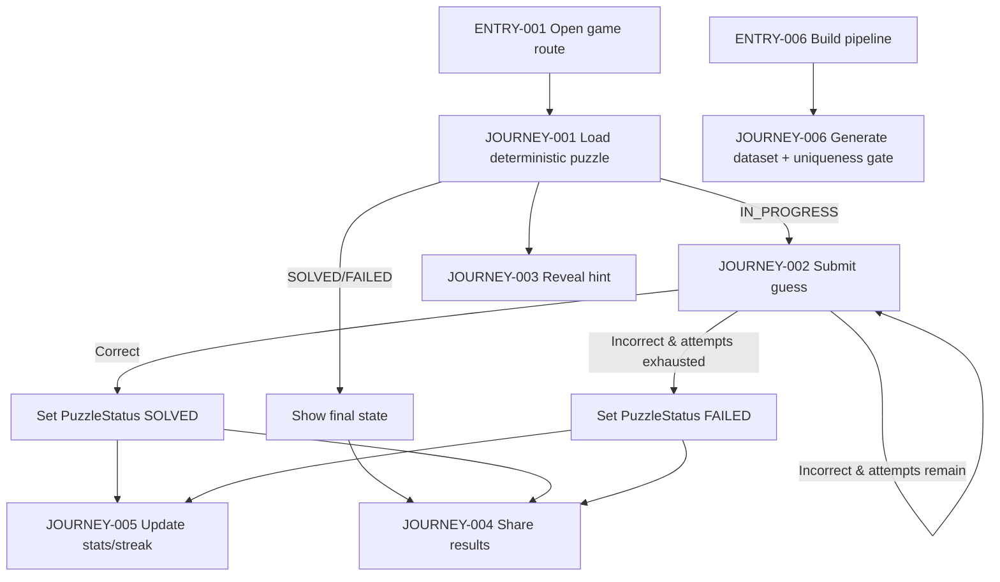
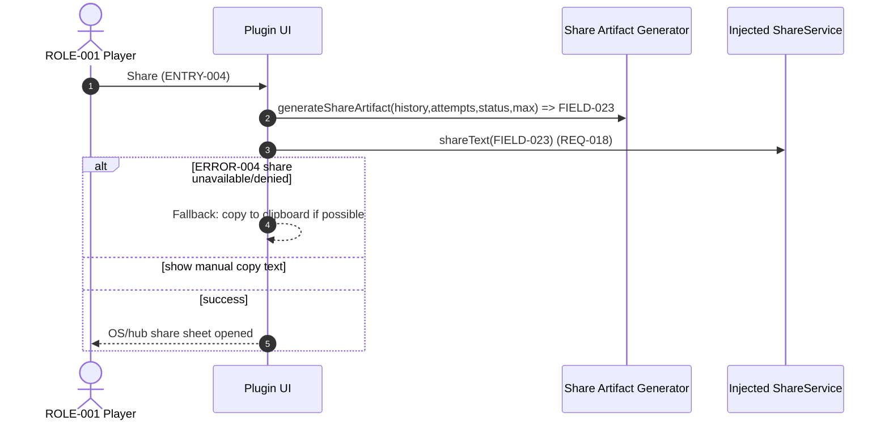
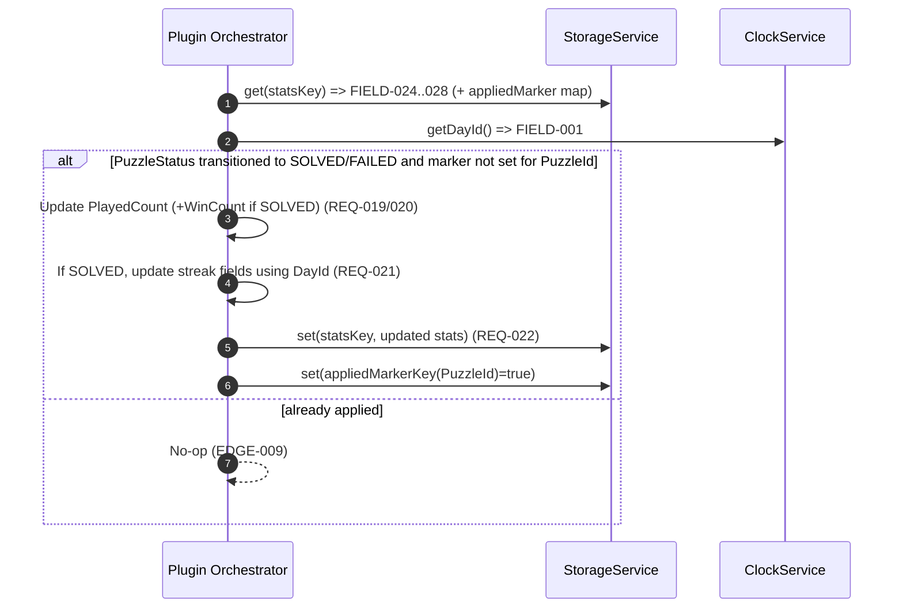
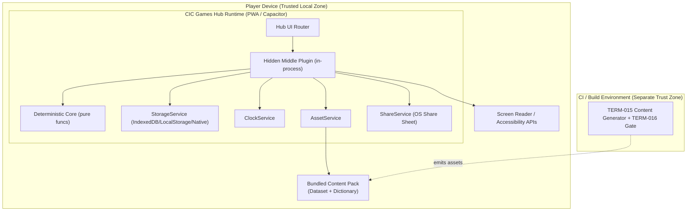

<!-- generated: 2026-07-24T08:50:41Z -->
<!-- mode: initial -->
<!-- feature-slug: hidden-middle -->
<!-- a2a-endpoint: https://bob-sdlc-orchestrator.2as6l7wq9qj8.eu-gb.codeengine.appdomain.cloud/v1/rpc -->

# Glossary

## Terms

### TERM-001: Hidden Middle Game
- **Definition:** The CIC Games hub plugin implementing the Hidden Middle daily word puzzle, including UI view and pure deterministic core logic.
- **Synonyms:** Hidden Middle, HM game, daily substring puzzle
- **Anti-definition:** Not a networked multiplayer game; not a backend service.
- **Source:** User request

### TERM-002: CIC Games Hub
- **Definition:** The host application/platform that loads games via a **TERM-017 GamePlugin Contract** and provides shared services (storage, clock, share, assets).
- **Synonyms:** hub, CIC hub
- **Anti-definition:** Not part of the Hidden Middle game bundle itself.
- **Source:** User request

### TERM-003: GamePlugin Contract
- **Definition:** The interface/protocol a game implements to be mounted in the hub and to use injected services.
- **Synonyms:** plugin contract, hub plugin interface
- **Anti-definition:** Not the game’s internal business logic rules.
- **Source:** User request

### TERM-004: PWA + Capacitor App Shell
- **Definition:** Offline-first, client-side runtime environment used across web and iOS/Android via Capacitor.
- **Synonyms:** offline-first PWA, Capacitor wrapper
- **Anti-definition:** Not a server runtime; not dependent on network at play time.
- **Source:** User request

### TERM-005: Daily Puzzle
- **Definition:** The single deterministic puzzle instance for a given **FIELD-001 DayId** and **FIELD-002 DatasetId** and **FIELD-003 ContentPackVersion**, identical for all players.
- **Synonyms:** today’s puzzle, daily challenge
- **Anti-definition:** Not personalized per user; not randomized per session.
- **Source:** User request

### TERM-006: Carrier Word
- **Definition:** The longer word displayed to the player that contains the hidden answer as a contiguous substring.
- **Synonyms:** carrier, container word
- **Anti-definition:** Not the answer itself; not a phrase with spaces (unless explicitly allowed by dataset rules; not specified here).
- **Source:** User request

### TERM-007: Hidden Answer (Intended Answer)
- **Definition:** The unique correct dictionary word that is a contiguous substring of the **TERM-006 Carrier Word** and matches the **TERM-008 Clue**.
- **Synonyms:** answer, solution, intended substring
- **Anti-definition:** Not any arbitrary valid substring; not any dictionary word inside the carrier if it doesn’t equal intended answer.
- **Source:** User request

### TERM-008: Clue
- **Definition:** The definitional text shown to the player that defines the **TERM-007 Hidden Answer**.
- **Synonyms:** definition, prompt
- **Anti-definition:** Not the carrier word; not a hint output.
- **Source:** User request

### TERM-009: Guess
- **Definition:** A player-submitted candidate word for the hidden answer.
- **Synonyms:** attempt, entry
- **Anti-definition:** Not automatically accepted just because it is a substring; not stored remotely.
- **Source:** User request

### TERM-010: Attempt
- **Definition:** One consumption of the limited attempt budget caused by submitting an incorrect guess.
- **Synonyms:** try
- **Anti-definition:** Not consumed on correct solve; not consumed by viewing a hint (unless explicitly designed; not specified).
- **Source:** User request

### TERM-011: Attempt Limit
- **Definition:** The maximum number of incorrect guesses permitted for a puzzle.
- **Synonyms:** max tries
- **Anti-definition:** Not unlimited; not per-session variable unless set by rules.
- **Source:** User request

### TERM-012: Validation Feedback
- **Definition:** Non-spoiling per-guess feedback indicating (a) whether guess is a contiguous substring of carrier and (b) whether guess is a real dictionary word, without revealing the intended answer.
- **Synonyms:** feedback flags, check results
- **Anti-definition:** Not revealing the answer; not indicating closeness beyond stated flags.
- **Source:** User request

### TERM-013: Dictionary
- **Definition:** The bundled word list used client-side to validate whether a guess is a real word and to generate/build puzzles.
- **Synonyms:** word list, lexicon
- **Anti-definition:** Not an online dictionary lookup.
- **Source:** User request

### TERM-014: Substring (Contiguous)
- **Definition:** A sequence of consecutive characters within the carrier word; membership check is a deterministic string operation.
- **Synonyms:** contiguous substring
- **Anti-definition:** Not a subsequence with gaps; not an anagram.
- **Source:** User request

### TERM-015: Build-Time Content Generation
- **Definition:** The offline/build pipeline that produces the daily dataset (carrier, clue, answer) from the dictionary and clue text.
- **Synonyms:** dataset build, content build
- **Anti-definition:** Not generated at runtime on device.
- **Source:** User request

### TERM-016: Uniqueness/Fairness Gate
- **Definition:** A build-time verification step that rejects carriers where more than one substring could satisfy the clue answer condition; ensures exactly one intended answer per puzzle.
- **Synonyms:** uniqueness gate, fairness check
- **Anti-definition:** Not a runtime validation; not a heuristic “best” answer selector.
- **Source:** User request

### TERM-017: Deterministic Selection
- **Definition:** The algorithm selecting the daily puzzle from the dataset using a seedable hash of dayId, content-pack version, and dataset id.
- **Synonyms:** deterministic daily pick, seeded selection
- **Anti-definition:** Not dependent on device RNG; not dependent on network.
- **Source:** User request

### TERM-018: Pure Deterministic Functional Core
- **Definition:** The platform-independent rules engine implementing substring check, dictionary check, answer match, and attempt-state transitions with no storage/clock access.
- **Synonyms:** rules engine, pure core
- **Anti-definition:** Not UI code; not persisting state; not reading current date/time.
- **Source:** User request

### TERM-019: Injected Services
- **Definition:** Hub-provided services passed into the plugin: storage, clock, share, asset loading.
- **Synonyms:** hub services, shared services
- **Anti-definition:** Not direct OS APIs called ad hoc by core logic.
- **Source:** User request

### TERM-020: Local Stats
- **Definition:** On-device aggregated metrics (e.g., played count, win count) stored via hub storage service.
- **Synonyms:** statistics, metrics
- **Anti-definition:** Not server analytics; not PII.
- **Source:** User request

### TERM-021: Streak
- **Definition:** The count of consecutive days solved (per deterministic dayId sequence) stored locally.
- **Synonyms:** win streak
- **Anti-definition:** Not global leaderboard; not cross-device without account.
- **Source:** User request

### TERM-022: Share Artifact
- **Definition:** A spoiler-safe emoji grid/string representing attempts used and solve outcome, excluding carrier, clue, and answer text.
- **Synonyms:** emoji share, share text
- **Anti-definition:** Not including the words or clue; not a screenshot requirement.
- **Source:** User request

### TERM-023: Hint
- **Definition:** An optional action that reveals the length and starting position of the hidden word within the carrier.
- **Synonyms:** reveal hint, position hint
- **Anti-definition:** Not revealing the answer text itself.
- **Source:** User request

### TERM-024: Accessibility Support
- **Definition:** Requirements ensuring full keyboard operation, screen reader announcements, and non-color-only feedback.
- **Synonyms:** a11y
- **Anti-definition:** Not limited to visual UI tweaks only.
- **Source:** User request

## Data Dictionary

| ID | Name | Type | Format | Range/Enum | Units | Default | Nullable | PII | Source | Validation |
|---|---|---|---|---|---|---|---|---|---|---|
| FIELD-001 | DayId | string | `YYYY-MM-DD` | Valid calendar date | day | (from injected clock) | No | None | TERM-019 Injected Services (clock) | Must match regex `^\d{4}-\d{2}-\d{2}$` and parse to a valid date |
| FIELD-002 | DatasetId | string | slug | `[a-z0-9-_.]+` | n/a | bundled | No | None | TERM-015 Build output | Must be non-empty; must match regex `^[a-z0-9][a-z0-9-_.]*$` |
| FIELD-003 | ContentPackVersion | string | semver-ish | `MAJOR.MINOR.PATCH` | n/a | bundled | No | None | app bundle metadata | Must match regex `^\d+\.\d+\.\d+$` |
| FIELD-004 | PuzzleId | string | hash/slug | implementation-defined | n/a | derived | No | None | TERM-017 Deterministic Selection | Must be stable for same (FIELD-001, FIELD-002, FIELD-003) |
| FIELD-005 | CarrierWord | string | uppercase recommended | letters only (dataset rule) | chars | from dataset | No | None | TERM-015 Build output | Must be non-empty; must contain FIELD-007 AnswerWord as contiguous substring |
| FIELD-006 | ClueText | string | plain text | 1..280 chars (proposed) | chars | from dataset | No | None | TERM-015 Build output | Must be non-empty; must not contain FIELD-005 or FIELD-007 literals (spoiler avoidance; build-time rule) |
| FIELD-007 | AnswerWord | string | uppercase recommended | letters only (dataset rule) | chars | from dataset | No | None | TERM-015 Build output | Must be non-empty; must be a dictionary word per FIELD-012 |
| FIELD-008 | MaxIncorrectAttempts | integer | int32 | 1..10 (proposed) | attempts | 6 (proposed) | No | None | game config | Must be >=1 |
| FIELD-009 | GuessText | string | trimmed | 1..64 chars (proposed) | chars | empty | No | None | player input | Must be non-empty on submit; normalization per FIELD-010 |
| FIELD-010 | NormalizedGuessText | string | uppercase | A–Z only after normalization (proposed) | chars | derived | No | None | TERM-018 core | Must equal `normalize(GuessText)`; normalization must be deterministic |
| FIELD-011 | IsSubstring | boolean | boolean | true/false | n/a | derived | No | None | TERM-018 core | true iff NormalizedGuessText is contiguous substring of CarrierWord |
| FIELD-012 | IsDictionaryWord | boolean | boolean | true/false | n/a | derived | No | None | TERM-018 core + TERM-013 Dictionary | true iff NormalizedGuessText exists in bundled dictionary |
| FIELD-013 | IsIntendedAnswer | boolean | boolean | true/false | n/a | derived | No | None | TERM-018 core | true iff NormalizedGuessText equals AnswerWord |
| FIELD-014 | IncorrectAttemptsUsed | integer | int32 | 0..MaxIncorrectAttempts | attempts | 0 | No | None | persisted local state | Must be within range |
| FIELD-015 | PuzzleStatus | enum | string | `IN_PROGRESS` \| `SOLVED` \| `FAILED` | n/a | `IN_PROGRESS` | No | None | persisted local state | Must be one of enum values |
| FIELD-016 | GuessHistory | array | JSON array | list of prior guesses | n/a | [] | No | None | persisted local state | Each entry must include FIELD-010 and evaluation flags |
| FIELD-017 | GuessResultCode | enum | string | `CORRECT` \| `INCORRECT` | n/a | derived | No | None | TERM-018 core | Must align with IsIntendedAnswer |
| FIELD-018 | FeedbackSubstringFlag | boolean | boolean | true/false | n/a | derived | No | None | TERM-012 Feedback | Must equal FIELD-011 |
| FIELD-019 | FeedbackDictionaryFlag | boolean | boolean | true/false | n/a | derived | No | None | TERM-012 Feedback | Must equal FIELD-012 |
| FIELD-020 | HintRevealed | boolean | boolean | true/false | n/a | false | No | None | persisted local state | If true, hint fields must be present |
| FIELD-021 | HintStartIndex | integer | int32 | 0..len(CarrierWord)-1 | index | null | Yes | None | derived from dataset | Must be within carrier bounds; equals start position of AnswerWord in CarrierWord |
| FIELD-022 | HintLength | integer | int32 | 1..len(CarrierWord) | chars | null | Yes | None | derived from dataset | Must equal length of AnswerWord |
| FIELD-023 | ShareEmojiArtifact | string | text | implementation-defined | n/a | derived | No | None | TERM-022 Share Artifact | Must not contain CarrierWord, ClueText, or AnswerWord as substrings |
| FIELD-024 | PlayedCount | integer | int32 | 0..2^31-1 | games | 0 | No | None | TERM-020 Local Stats | Must be >=0 |
| FIELD-025 | WinCount | integer | int32 | 0..PlayedCount | games | 0 | No | None | TERM-020 Local Stats | Must be between 0 and PlayedCount |
| FIELD-026 | CurrentStreak | integer | int32 | 0..2^31-1 | days | 0 | No | None | TERM-021 Streak | Must be >=0 |
| FIELD-027 | BestStreak | integer | int32 | 0..2^31-1 | days | 0 | No | None | TERM-021 Streak | Must be >= CurrentStreak |
| FIELD-028 | LastSolvedDayId | string | `YYYY-MM-DD` | valid date | day | null | Yes | None | TERM-021 Streak | If non-null must parse to date |
| FIELD-029 | A11yAnnouncementText | string | plain text | 0..280 chars (proposed) | chars | empty | No | None | UI layer | Must be updated on feedback/status changes |
| FIELD-030 | StorageKeyNamespace | string | reverse-dns | implementation-defined | n/a | bundled | No | None | TERM-019 storage | Must be stable across app updates for continuity |

# User Journeys

## Roles

| Role ID | Role | Type | Description |
|---|---|---|---|
| ROLE-001 | Player | Primary | Plays the daily **TERM-005 Daily Puzzle**, enters **TERM-009 Guess**es, uses **TERM-023 Hint**, views stats, shares results. |
| ROLE-002 | Hub Host | System | Loads **TERM-001 Hidden Middle Game** via **TERM-003 GamePlugin Contract** and provides **TERM-019 Injected Services**. |
| ROLE-003 | Build Engineer | Admin/System | Runs **TERM-015 Build-Time Content Generation** and enforces **TERM-016 Uniqueness/Fairness Gate**. |
| ROLE-004 | Screen Reader | System/Assistive | Consumes **TERM-024 Accessibility Support** outputs (announcements, focus order). |

## Entry Points

| Entry ID | Location | Trigger | Auth |
|---|---|---|---|
| ENTRY-001 | Hub UI route: `/games/hidden-middle` | Player selects game in hub | none (no accounts) |
| ENTRY-002 | Hub UI action: “Submit guess” control | Player presses Enter/clicks submit | none |
| ENTRY-003 | Hub UI action: “Reveal hint” control | Player activates hint button | none |
| ENTRY-004 | Hub UI action: “Share” control | Player activates share button | none |
| ENTRY-005 | Plugin lifecycle hook (GamePlugin mount) | Hub loads plugin view | none |
| ENTRY-006 | Build pipeline command (CLI) | CI/build runs dataset generation | n/a |

## Role Permission Matrix

| Capability | ROLE-001 Player | ROLE-002 Hub Host | ROLE-003 Build Engineer | ROLE-004 Screen Reader |
|---|---:|---:|---:|---:|
| View daily puzzle (FIELD-005, FIELD-006) | Y | Y (renders) | N | Y (via a11y) |
| Submit guess (FIELD-009) | Y | Y (dispatch) | N | N |
| Evaluate guess (FIELD-011..FIELD-013) | N | Y (via core) | N | N |
| Persist local state/stats (FIELD-014..FIELD-028) | N | Y (via storage service) | N | N |
| Generate dataset | N | N | Y | N |
| Reveal hint (FIELD-021..FIELD-022) | Y | Y (renders) | N | Y (announcement) |
| Share results (FIELD-023) | Y | Y (via share service) | N | N |

## Journeys

### JOURNEY-001: Open today’s deterministic puzzle
- **Role/Goal:** ROLE-001 Player opens **TERM-005 Daily Puzzle** for **FIELD-001 DayId** and sees **FIELD-005 CarrierWord** and **FIELD-006 ClueText**.
- **Entry:** ENTRY-001, ENTRY-005
- **Happy path:**
  1. Hub mounts plugin (ENTRY-005) and injects **TERM-019 Injected Services** including clock and storage. (uses FIELD-001, FIELD-030)
  2. Plugin computes **FIELD-004 PuzzleId** via **TERM-017 Deterministic Selection** from (FIELD-001, FIELD-002, FIELD-003).  
  3. Plugin loads puzzle record from bundled dataset (**TERM-015**) and displays **FIELD-005 CarrierWord** + **FIELD-006 ClueText**.
  4. Plugin loads persisted state for this **FIELD-004 PuzzleId** (FIELD-014..FIELD-016, FIELD-015).
- **BRANCH-001 (already solved/failed):** If **FIELD-015 PuzzleStatus** is `SOLVED` or `FAILED`, show final state UI and disable guess submission.
- **ERROR-001 (missing dataset record):**
  - **Trigger:** No puzzle record exists for computed **FIELD-004 PuzzleId**.
  - **System response:** Show non-spoiling error state and disable gameplay inputs.
  - **Recovery:** Player can update app/content pack; no in-session recovery.
- **EDGE-001 (clock mismatch):** Device clock yields wrong **FIELD-001 DayId**; puzzle shown differs from “real” day. No backend correction possible; ensure deterministic behavior given clock input.
- **EDGE-002 (corrupt local state):** Persisted JSON for FIELD-016 fails to parse; reset to defaults for this puzzle while preserving aggregate stats if possible.

### JOURNEY-002: Submit a guess and receive feedback
- **Role/Goal:** ROLE-001 Player submits **TERM-009 Guess** and receives **TERM-012 Validation Feedback**; win on correct answer.
- **Entry:** ENTRY-002
- **Happy path:**
  1. Player types **FIELD-009 GuessText** and submits.
  2. UI normalizes to **FIELD-010 NormalizedGuessText** using deterministic rules (TERM-018).
  3. Core evaluates:
     - **FIELD-011 IsSubstring** against **FIELD-005 CarrierWord** (TERM-014).
     - **FIELD-012 IsDictionaryWord** against **TERM-013 Dictionary**.
     - **FIELD-013 IsIntendedAnswer** against **FIELD-007 AnswerWord**.
  4. If **FIELD-013** is true: set **FIELD-015 PuzzleStatus**=`SOLVED`, append to **FIELD-016 GuessHistory**, render success state.
  5. If **FIELD-013** is false: increment **FIELD-014 IncorrectAttemptsUsed**, append to **FIELD-016**, render feedback flags (**FIELD-018**, **FIELD-019**) without revealing **FIELD-007**.
- **BRANCH-002 (empty input):** If **FIELD-009 GuessText** is empty/whitespace, do not evaluate; show validation message.
- **BRANCH-003 (attempts exhausted):** If incrementing **FIELD-014** reaches **FIELD-008 MaxIncorrectAttempts**, set **FIELD-015**=`FAILED` and disable further submissions.
- **ERROR-002 (submission while not in progress):**
  - **Trigger:** Player submits when **FIELD-015** != `IN_PROGRESS`.
  - **System response:** Ignore submission and announce state.
  - **Recovery:** None; player can navigate to other games/days.
- **EDGE-003 (case/diacritics):** Input includes lowercase or diacritics; normalization to **FIELD-010** must be deterministic across platforms.
- **EDGE-004 (duplicate guess):** Player submits a guess already in **FIELD-016 GuessHistory**; behavior must be defined (consume attempt or not).
- **EDGE-005 (concurrency/double submit):** Rapid double-tap Enter triggers two submits; ensure only one state transition per UI event.

### JOURNEY-003: Reveal hint (start position and length)
- **Role/Goal:** ROLE-001 Player uses **TERM-023 Hint** to learn where the answer starts and its length.
- **Entry:** ENTRY-003
- **Happy path:**
  1. Player activates hint control.
  2. System sets **FIELD-020 HintRevealed**=true.
  3. System displays **FIELD-021 HintStartIndex** and **FIELD-022 HintLength** derived from dataset (AnswerWord location within CarrierWord).
- **BRANCH-004 (hint already revealed):** If **FIELD-020** true, keep displayed hint unchanged.
- **ERROR-003 (hint derivation failure):**
  - **Trigger:** AnswerWord not found within CarrierWord due to dataset inconsistency.
  - **System response:** Show generic hint unavailable message.
  - **Recovery:** None; content pack update required.
- **EDGE-006 (accessibility):** Hint reveal must update **FIELD-029 A11yAnnouncementText** with non-spoiling content.

### JOURNEY-004: Share spoiler-safe results
- **Role/Goal:** ROLE-001 Player shares **TERM-022 Share Artifact** without leaking **FIELD-005/006/007**.
- **Entry:** ENTRY-004
- **Happy path:**
  1. Player activates share control.
  2. System generates **FIELD-023 ShareEmojiArtifact** from **FIELD-016 GuessHistory**, **FIELD-014**, **FIELD-015**, and **FIELD-008**.
  3. System invokes hub share service with **FIELD-023**.
- **BRANCH-005 (not finished):** If **FIELD-015**=`IN_PROGRESS`, share artifact indicates attempts used so far and “in progress” marker (design-defined) without spoiler text.
- **ERROR-004 (share service unavailable):**
  - **Trigger:** Injected share service fails/denied.
  - **System response:** Copy **FIELD-023** to clipboard if available; else show text for manual copy.
  - **Recovery:** Player retries or copies manually.
- **EDGE-007 (spoiler leakage):** Ensure **FIELD-023** cannot contain **FIELD-005**, **FIELD-006**, or **FIELD-007** substrings.

### JOURNEY-005: Persist and display local stats and streaks
- **Role/Goal:** ROLE-001 Player sees **TERM-020 Local Stats** and **TERM-021 Streak** updated after finishing a puzzle.
- **Entry:** ENTRY-001 (view stats panel), implicit on solve/fail
- **Happy path:**
  1. On transition to **FIELD-015**=`SOLVED` or `FAILED`, system increments **FIELD-024 PlayedCount**.
  2. If solved, system increments **FIELD-025 WinCount** and updates **FIELD-026 CurrentStreak**, **FIELD-027 BestStreak**, and **FIELD-028 LastSolvedDayId** based on **FIELD-001 DayId**.
  3. Stats are persisted via storage service under **FIELD-030 StorageKeyNamespace**.
- **ERROR-005 (storage write failure):**
  - **Trigger:** Storage service rejects write/quota exceeded.
  - **System response:** Keep in-memory stats for session and show “not saved” message.
  - **Recovery:** Player frees space/retries; next launch may lose session updates.
- **EDGE-008 (day gaps):** If DayId is not consecutive to LastSolvedDayId, reset CurrentStreak to 1 on solve.
- **EDGE-009 (replay same day):** Re-opening solved puzzle must not double-increment PlayedCount/WinCount.

### JOURNEY-006: Build-time dataset generation with uniqueness gate
- **Role/Goal:** ROLE-003 Build Engineer produces a dataset where each puzzle has exactly one intended answer satisfying constraints.
- **Entry:** ENTRY-006
- **Happy path:**
  1. Build loads **TERM-013 Dictionary** and clue/answer candidates.
  2. For each puzzle candidate, build selects **FIELD-005 CarrierWord**, **FIELD-006 ClueText**, **FIELD-007 AnswerWord**.
  3. **TERM-016 Uniqueness/Fairness Gate** enumerates all contiguous substrings of CarrierWord that are dictionary words and checks that exactly one equals AnswerWord for that clue.
  4. Build emits dataset bundle annotated with **FIELD-002 DatasetId** and **FIELD-003 ContentPackVersion**.
- **BRANCH-006 (reject carrier):** If more than one qualifying substring exists, reject and resample carrier.
- **ERROR-006 (no valid candidate):**
  - **Trigger:** Build cannot find any carrier meeting uniqueness constraints for a clue/answer.
  - **System response:** Fail build with report listing the problematic clue/answer pair.
  - **Recovery:** Adjust content inputs or dictionary; rerun build.
- **EDGE-010 (dictionary drift):** Changing dictionary affects uniqueness; gate must run against the exact bundled dictionary version.

## Journey Map



# Requirements

### REQ-001: Compute deterministic PuzzleId
- **EARS Pattern:** Event-Driven
- **EARS Statement:** When the plugin is mounted (ENTRY-005), the Hidden Middle Game (TERM-001) shall compute FIELD-004 PuzzleId from FIELD-001 DayId, FIELD-002 DatasetId, and FIELD-003 ContentPackVersion using TERM-017 Deterministic Selection.
- **Inputs:** FIELD-001, FIELD-002, FIELD-003
- **Outputs:** FIELD-004
- **Preconditions:** Dataset bundle for (FIELD-002, FIELD-003) is available in app assets.
- **Postconditions:** FIELD-004 is available for dataset lookup and local-state keys.
- **Invariants:** Same inputs produce same FIELD-004 across platforms.
- **Trigger:** ENTRY-005
- **Actor:** ROLE-002 Hub Host (system mount)
- **EntityScope:** TERM-005 Daily Puzzle
- **ErrorModes:** ERROR-001
- **NFR-Tags:** compatibility, reliability
- **Source:** JOURNEY-001 step 2; ERROR-001
- **Dependencies:** NFR-006 (deterministic string/hash compatibility) (see below)
- **Priority:** P0
- **AcceptanceCriteria:**
  - **TEST-001:** Given identical FIELD-001/002/003 on web and iOS, when computing FIELD-004, then the PuzzleId values are identical.
  - **TEST-002:** Given a fixed FIELD-001/002/003, when computing FIELD-004 twice, then the results are identical.
- **Assumptions:** Hub provides FIELD-001 DayId via injected clock service.
- **OpenQuestions:** What exact hash algorithm is mandated by the hub?

### REQ-002: Load puzzle record by PuzzleId
- **EARS Pattern:** Event-Driven
- **EARS Statement:** When FIELD-004 PuzzleId is computed, the Hidden Middle Game (TERM-001) shall load FIELD-005 CarrierWord, FIELD-006 ClueText, and FIELD-007 AnswerWord for that PuzzleId from the bundled dataset (TERM-015).
- **Inputs:** FIELD-004
- **Outputs:** FIELD-005, FIELD-006, FIELD-007
- **Preconditions:** Dataset contains a record for FIELD-004.
- **Postconditions:** Puzzle content is available for rendering and evaluation.
- **Invariants:** Loaded fields are immutable for the session.
- **Trigger:** PuzzleId computed
- **Actor:** ROLE-002 Hub Host (system)
- **EntityScope:** TERM-005 Daily Puzzle
- **ErrorModes:** ERROR-001
- **NFR-Tags:** offline, compatibility
- **Source:** JOURNEY-001 step 3; ERROR-001
- **Dependencies:** REQ-001
- **Priority:** P0
- **AcceptanceCriteria:**
  - **TEST-003:** Given a dataset containing PuzzleId, when loading, then CarrierWord and ClueText are displayed and AnswerWord is available to core.
- **Assumptions:** Dataset is bundled and readable offline.
- **OpenQuestions:** Dataset storage format (JSON, binary) and indexing strategy?

### REQ-003: Load persisted per-puzzle state
- **EARS Pattern:** Event-Driven
- **EARS Statement:** When a puzzle record is loaded, the Hidden Middle Game (TERM-001) shall load FIELD-014 IncorrectAttemptsUsed, FIELD-015 PuzzleStatus, FIELD-016 GuessHistory, and FIELD-020 HintRevealed for FIELD-004 PuzzleId via the injected storage service (TERM-019).
- **Inputs:** FIELD-004
- **Outputs:** FIELD-014, FIELD-015, FIELD-016, FIELD-020
- **Preconditions:** Storage service is available.
- **Postconditions:** UI reflects prior progress.
- **Invariants:** State keys are scoped under FIELD-030 StorageKeyNamespace.
- **Trigger:** Puzzle record loaded
- **Actor:** ROLE-002 Hub Host (system)
- **EntityScope:** TERM-005 Daily Puzzle
- **ErrorModes:** ERROR-005
- **NFR-Tags:** offline, reliability
- **Source:** JOURNEY-001 step 4; ERROR-005
- **Dependencies:** REQ-002
- **Priority:** P0
- **AcceptanceCriteria:**
  - **TEST-004:** Given existing stored state for PuzzleId, when opening the game, then prior PuzzleStatus and IncorrectAttemptsUsed are restored.
- **Assumptions:** Storage read is synchronous or promise-based but deterministic in result.
- **OpenQuestions:** Required behavior on JSON parse failure (reset only per-puzzle vs global)?

### REQ-004: Reject guess submission when not in progress
- **EARS Pattern:** State-Driven
- **EARS Statement:** While FIELD-015 PuzzleStatus is not `IN_PROGRESS`, the Hidden Middle Game (TERM-001) shall ignore submissions of FIELD-009 GuessText.
- **Inputs:** FIELD-015, FIELD-009
- **Outputs:** none
- **Preconditions:** Puzzle state loaded.
- **Postconditions:** No change to FIELD-014 or FIELD-016.
- **Invariants:** No post-finish state mutation via submit.
- **Trigger:** ENTRY-002
- **Actor:** ROLE-001 Player
- **EntityScope:** TERM-005 Daily Puzzle
- **ErrorModes:** ERROR-002
- **NFR-Tags:** reliability
- **Source:** JOURNEY-002 ERROR-002
- **Dependencies:** REQ-003
- **Priority:** P0
- **AcceptanceCriteria:**
  - **TEST-005:** Given PuzzleStatus=`SOLVED`, when submitting any guess, then IncorrectAttemptsUsed does not change.
- **Assumptions:** UI still routes events even if button is disabled (defense in depth).
- **OpenQuestions:** Should an a11y announcement be made on ignored submit?

### REQ-005: Validate non-empty guess input
- **EARS Pattern:** Event-Driven
- **EARS Statement:** When the player submits FIELD-009 GuessText, the Hidden Middle Game (TERM-001) shall reject the submission if FIELD-009 GuessText is empty after trimming.
- **Inputs:** FIELD-009
- **Outputs:** UI validation message (non-spoiling)
- **Preconditions:** FIELD-015=`IN_PROGRESS`
- **Postconditions:** No change to FIELD-014 or FIELD-016.
- **Invariants:** Trimming behavior is deterministic.
- **Trigger:** ENTRY-002
- **Actor:** ROLE-001 Player
- **EntityScope:** TERM-009 Guess
- **ErrorModes:** BRANCH-002
- **NFR-Tags:** accessibility
- **Source:** JOURNEY-002 BRANCH-002
- **Dependencies:** REQ-003
- **Priority:** P1
- **AcceptanceCriteria:**
  - **TEST-006:** Given GuessText="   ", when submitting, then the system does not record a guess and displays a validation message.
- **Assumptions:** Trim uses Unicode whitespace definition consistent across platforms.
- **OpenQuestions:** Do we allow hyphens/apostrophes in input?

### REQ-006: Normalize guess deterministically
- **EARS Pattern:** Event-Driven
- **EARS Statement:** When the player submits FIELD-009 GuessText, the Hidden Middle Game (TERM-001) shall transform it into FIELD-010 NormalizedGuessText using a deterministic normalization function implemented in TERM-018.
- **Inputs:** FIELD-009
- **Outputs:** FIELD-010
- **Preconditions:** FIELD-015=`IN_PROGRESS` and FIELD-009 not empty after trim.
- **Postconditions:** FIELD-010 is used for all evaluations.
- **Invariants:** Same FIELD-009 produces same FIELD-010 across platforms.
- **Trigger:** ENTRY-002
- **Actor:** ROLE-001 Player
- **EntityScope:** TERM-009 Guess
- **ErrorModes:** EDGE-003
- **NFR-Tags:** compatibility
- **Source:** JOURNEY-002 steps 1-3; EDGE-003
- **Dependencies:** NFR-006
- **Priority:** P0
- **AcceptanceCriteria:**
  - **TEST-007:** Given GuessText="scan", when submitted, then NormalizedGuessText="SCAN".
  - **TEST-008:** Given GuessText with diacritics (e.g., "café"), when submitted, then normalization result is identical on web and iOS for the same input string.
- **Assumptions:** A single normalization spec will be defined (e.g., uppercasing + stripping non A–Z).
- **OpenQuestions:** Exact normalization rules for diacritics and non-letters.

### REQ-007: Evaluate substring membership
- **EARS Pattern:** Event-Driven
- **EARS Statement:** When FIELD-010 NormalizedGuessText is available, the Hidden Middle Game (TERM-001) shall set FIELD-011 IsSubstring to true if and only if FIELD-010 is a TERM-014 Substring (contiguous) of FIELD-005 CarrierWord.
- **Inputs:** FIELD-010, FIELD-005
- **Outputs:** FIELD-011
- **Preconditions:** Puzzle content loaded.
- **Postconditions:** FIELD-018 FeedbackSubstringFlag can be produced.
- **Invariants:** Uses deterministic string operations.
- **Trigger:** Submission evaluation
- **Actor:** ROLE-002 Hub Host (system via core)
- **EntityScope:** TERM-006 Carrier Word
- **ErrorModes:** none
- **NFR-Tags:** compatibility
- **Source:** JOURNEY-002 step 3
- **Dependencies:** REQ-006, REQ-002
- **Priority:** P0
- **AcceptanceCriteria:**
  - **TEST-009:** Given CarrierWord="SCANDALOUS" and NormalizedGuessText="SCAN", then IsSubstring=true.
  - **TEST-010:** Given CarrierWord="SCANDALOUS" and NormalizedGuessText="SAD", then IsSubstring=false.
- **Assumptions:** CarrierWord and NormalizedGuessText are in the same normalization space (e.g., uppercase A–Z).
- **OpenQuestions:** Are overlapping substrings relevant? (Not for boolean containment.)

### REQ-008: Evaluate dictionary membership
- **EARS Pattern:** Event-Driven
- **EARS Statement:** When FIELD-010 NormalizedGuessText is available, the Hidden Middle Game (TERM-001) shall set FIELD-012 IsDictionaryWord to true if and only if FIELD-010 exists in the bundled TERM-013 Dictionary.
- **Inputs:** FIELD-010
- **Outputs:** FIELD-012
- **Preconditions:** Dictionary loaded/available client-side.
- **Postconditions:** FIELD-019 FeedbackDictionaryFlag can be produced.
- **Invariants:** Dictionary lookup is offline.
- **Trigger:** Submission evaluation
- **Actor:** ROLE-002 Hub Host (system via core)
- **EntityScope:** TERM-013 Dictionary
- **ErrorModes:** none
- **NFR-Tags:** offline
- **Source:** JOURNEY-002 step 3
- **Dependencies:** REQ-006
- **Priority:** P0
- **AcceptanceCriteria:**
  - **TEST-011:** Given a dictionary containing "SCAN", when NormalizedGuessText="SCAN", then IsDictionaryWord=true.
- **Assumptions:** Dictionary uses same normalization as guesses.
- **OpenQuestions:** Case-sensitivity and inclusion of proper nouns?

### REQ-009: Evaluate intended answer match
- **EARS Pattern:** Event-Driven
- **EARS Statement:** When FIELD-010 NormalizedGuessText is available, the Hidden Middle Game (TERM-001) shall set FIELD-013 IsIntendedAnswer to true if and only if FIELD-010 equals FIELD-007 AnswerWord.
- **Inputs:** FIELD-010, FIELD-007
- **Outputs:** FIELD-013
- **Preconditions:** Puzzle content loaded.
- **Postconditions:** Correctness is determined.
- **Invariants:** Equality comparison is deterministic.
- **Trigger:** Submission evaluation
- **Actor:** ROLE-002 Hub Host (system via core)
- **EntityScope:** TERM-007 Hidden Answer
- **ErrorModes:** none
- **NFR-Tags:** compatibility
- **Source:** JOURNEY-002 step 3
- **Dependencies:** REQ-006, REQ-002
- **Priority:** P0
- **AcceptanceCriteria:**
  - **TEST-012:** Given AnswerWord="SCAN" and NormalizedGuessText="SCAN", then IsIntendedAnswer=true.
- **Assumptions:** AnswerWord stored normalized to same scheme.
- **OpenQuestions:** None.

### REQ-010: Record a correct guess as solved
- **EARS Pattern:** Event-Driven
- **EARS Statement:** When FIELD-013 IsIntendedAnswer is true, the Hidden Middle Game (TERM-001) shall set FIELD-015 PuzzleStatus to `SOLVED`.
- **Inputs:** FIELD-013
- **Outputs:** FIELD-015
- **Preconditions:** FIELD-015=`IN_PROGRESS`
- **Postconditions:** Puzzle is finished as solved.
- **Invariants:** SOLVED is terminal for submissions (see REQ-004).
- **Trigger:** Correct evaluation
- **Actor:** ROLE-002 Hub Host (system via core)
- **EntityScope:** TERM-005 Daily Puzzle
- **ErrorModes:** none
- **NFR-Tags:** reliability
- **Source:** JOURNEY-002 step 4
- **Dependencies:** REQ-009
- **Priority:** P0
- **AcceptanceCriteria:**
  - **TEST-013:** Given IsIntendedAnswer=true, when applying state transition, then PuzzleStatus becomes SOLVED.
- **Assumptions:** State transitions are applied exactly once per submit (see NFR-004).
- **OpenQuestions:** Does solving on first correct submission also record guess history separately (handled by REQ-012)?

### REQ-011: Record an incorrect guess consumes one attempt
- **EARS Pattern:** Event-Driven
- **EARS Statement:** When FIELD-013 IsIntendedAnswer is false, the Hidden Middle Game (TERM-001) shall increment FIELD-014 IncorrectAttemptsUsed by 1.
- **Inputs:** FIELD-013, FIELD-014
- **Outputs:** FIELD-014
- **Preconditions:** FIELD-015=`IN_PROGRESS`
- **Postconditions:** Attempt budget reduced.
- **Invariants:** FIELD-014 remains within 0..FIELD-008.
- **Trigger:** Incorrect evaluation
- **Actor:** ROLE-002 Hub Host (system via core)
- **EntityScope:** TERM-010 Attempt
- **ErrorModes:** BRANCH-003
- **NFR-Tags:** reliability
- **Source:** JOURNEY-002 step 5; BRANCH-003
- **Dependencies:** REQ-009
- **Priority:** P0
- **AcceptanceCriteria:**
  - **TEST-014:** Given IncorrectAttemptsUsed=2 and IsIntendedAnswer=false, when applied, then IncorrectAttemptsUsed=3.
- **Assumptions:** Duplicate guess policy is separate (see REQ-016).
- **OpenQuestions:** None.

### REQ-012: Append guess to guess history
- **EARS Pattern:** Event-Driven
- **EARS Statement:** When a guess is evaluated, the Hidden Middle Game (TERM-001) shall append an entry to FIELD-016 GuessHistory containing FIELD-010 NormalizedGuessText and FIELD-011 IsSubstring and FIELD-012 IsDictionaryWord and FIELD-017 GuessResultCode.
- **Inputs:** FIELD-010, FIELD-011, FIELD-012, FIELD-013
- **Outputs:** FIELD-016, FIELD-017
- **Preconditions:** FIELD-015=`IN_PROGRESS`
- **Postconditions:** History reflects the submitted guess.
- **Invariants:** FIELD-017 is `CORRECT` iff FIELD-013 is true.
- **Trigger:** Evaluation complete
- **Actor:** ROLE-002 Hub Host (system via core)
- **EntityScope:** TERM-009 Guess
- **ErrorModes:** none
- **NFR-Tags:** auditability
- **Source:** JOURNEY-002 steps 4-5
- **Dependencies:** REQ-007, REQ-008, REQ-009
- **Priority:** P0
- **AcceptanceCriteria:**
  - **TEST-015:** Given a submitted guess, when evaluated, then GuessHistory length increases by 1 and contains the normalized guess and flags.
- **Assumptions:** GuessHistory schema is stable for share generation.
- **OpenQuestions:** Do we store timestamps? (Core cannot use clock.)

### REQ-013: Set failed status when attempt limit reached
- **EARS Pattern:** Event-Driven
- **EARS Statement:** When FIELD-014 IncorrectAttemptsUsed becomes equal to FIELD-008 MaxIncorrectAttempts, the Hidden Middle Game (TERM-001) shall set FIELD-015 PuzzleStatus to `FAILED`.
- **Inputs:** FIELD-014, FIELD-008
- **Outputs:** FIELD-015
- **Preconditions:** FIELD-015=`IN_PROGRESS`
- **Postconditions:** Puzzle is finished as failed.
- **Invariants:** FAILED is terminal for submissions (see REQ-004).
- **Trigger:** Post-increment check
- **Actor:** ROLE-002 Hub Host (system via core)
- **EntityScope:** TERM-005 Daily Puzzle
- **ErrorModes:** none
- **NFR-Tags:** reliability
- **Source:** JOURNEY-002 BRANCH-003
- **Dependencies:** REQ-011
- **Priority:** P0
- **AcceptanceCriteria:**
  - **TEST-016:** Given MaxIncorrectAttempts=6 and IncorrectAttemptsUsed becomes 6, then PuzzleStatus=FAILED.
- **Assumptions:** IncorrectAttemptsUsed counts incorrect submissions only.
- **OpenQuestions:** None.

### REQ-014: Provide non-spoiling feedback flags for incorrect guesses
- **EARS Pattern:** Event-Driven
- **EARS Statement:** When FIELD-013 IsIntendedAnswer is false, the Hidden Middle Game (TERM-001) shall present TERM-012 Validation Feedback consisting of FIELD-018 FeedbackSubstringFlag and FIELD-019 FeedbackDictionaryFlag.
- **Inputs:** FIELD-013, FIELD-011, FIELD-012
- **Outputs:** FIELD-018, FIELD-019 (and UI rendering)
- **Preconditions:** A guess was evaluated.
- **Postconditions:** Player sees whether the guess is inside the carrier and whether it is a dictionary word.
- **Invariants:** Feedback flags equal the evaluated booleans.
- **Trigger:** Incorrect evaluation
- **Actor:** ROLE-001 Player
- **EntityScope:** TERM-012 Validation Feedback
- **ErrorModes:** none
- **NFR-Tags:** accessibility
- **Source:** JOURNEY-002 step 5
- **Dependencies:** REQ-007, REQ-008, REQ-009
- **Priority:** P0
- **AcceptanceCriteria:**
  - **TEST-017:** Given IsSubstring=false and IsDictionaryWord=true for an incorrect guess, then the UI indicates those two facts without revealing AnswerWord.
- **Assumptions:** UI text/icons exist for each flag.
- **OpenQuestions:** Exact wording/localization needs?

### REQ-015: Reveal hint position and length
- **EARS Pattern:** Event-Driven
- **EARS Statement:** When the player activates the hint control (ENTRY-003), the Hidden Middle Game (TERM-001) shall set FIELD-020 HintRevealed to true.
- **Inputs:** Hint action
- **Outputs:** FIELD-020
- **Preconditions:** Puzzle content loaded.
- **Postconditions:** Hint is considered revealed for persistence and rendering.
- **Invariants:** Hint reveal does not change FIELD-014 IncorrectAttemptsUsed.
- **Trigger:** ENTRY-003
- **Actor:** ROLE-001 Player
- **EntityScope:** TERM-023 Hint
- **ErrorModes:** none
- **NFR-Tags:** usability, accessibility
- **Source:** JOURNEY-003 step 2
- **Dependencies:** REQ-003
- **Priority:** P1
- **AcceptanceCriteria:**
  - **TEST-018:** Given HintRevealed=false, when player taps Reveal hint, then HintRevealed=true and IncorrectAttemptsUsed is unchanged.
- **Assumptions:** Hint reveal is allowed even after SOLVED/FAILED (not specified).
- **OpenQuestions:** Is hint allowed only while IN_PROGRESS?

### REQ-016: Define duplicate guess handling
- **EARS Pattern:** Ubiquitous
- **EARS Statement:** The Hidden Middle Game (TERM-001) shall treat a submitted FIELD-010 NormalizedGuessText that already exists in FIELD-016 GuessHistory as a non-consuming submission that does not change FIELD-014 IncorrectAttemptsUsed.
- **Inputs:** FIELD-010, FIELD-016
- **Outputs:** UI message + no state change to attempts
- **Preconditions:** FIELD-015=`IN_PROGRESS`
- **Postconditions:** GuessHistory is unchanged.
- **Invariants:** Duplicate detection uses exact string equality on FIELD-010.
- **Trigger:** ENTRY-002
- **Actor:** ROLE-001 Player
- **EntityScope:** TERM-009 Guess
- **ErrorModes:** EDGE-004
- **NFR-Tags:** reliability
- **Source:** JOURNEY-002 EDGE-004
- **Dependencies:** REQ-012
- **Priority:** P2
- **AcceptanceCriteria:**
  - **TEST-019:** Given GuessHistory contains "SCAN", when submitting "scan" again, then IncorrectAttemptsUsed is unchanged and GuessHistory length is unchanged.
- **Assumptions:** This is the desired UX; can be changed if product prefers consumption.
- **OpenQuestions:** Confirm product decision: consume attempt on duplicates or not?

### REQ-017: Generate spoiler-safe emoji share artifact
- **EARS Pattern:** Event-Driven
- **EARS Statement:** When the player activates the share control (ENTRY-004), the Hidden Middle Game (TERM-001) shall generate FIELD-023 ShareEmojiArtifact from FIELD-016 GuessHistory, FIELD-014 IncorrectAttemptsUsed, FIELD-015 PuzzleStatus, and FIELD-008 MaxIncorrectAttempts.
- **Inputs:** FIELD-016, FIELD-014, FIELD-015, FIELD-008
- **Outputs:** FIELD-023
- **Preconditions:** Puzzle loaded.
- **Postconditions:** Share text is ready for share service.
- **Invariants:** FIELD-023 contains no FIELD-005 CarrierWord, FIELD-006 ClueText, or FIELD-007 AnswerWord substrings.
- **Trigger:** ENTRY-004
- **Actor:** ROLE-001 Player
- **EntityScope:** TERM-022 Share Artifact
- **ErrorModes:** ERROR-004
- **NFR-Tags:** privacy
- **Source:** JOURNEY-004 steps 2-3; EDGE-007
- **Dependencies:** REQ-012
- **Priority:** P0
- **AcceptanceCriteria:**
  - **TEST-020:** Given a solved game with 3 incorrect attempts, when generating share artifact, then the artifact encodes attempts used and does not include CarrierWord or AnswerWord.
- **Assumptions:** Emoji legend is fixed and documented.
- **OpenQuestions:** Exact emoji scheme and whether to include puzzle number/day.

### REQ-018: Invoke hub share service with share artifact
- **EARS Pattern:** Event-Driven
- **EARS Statement:** When FIELD-023 ShareEmojiArtifact is generated, the Hidden Middle Game (TERM-001) shall invoke the injected share service (TERM-019) with FIELD-023 as the shared text.
- **Inputs:** FIELD-023
- **Outputs:** Share intent/dialog
- **Preconditions:** Share service injected and available.
- **Postconditions:** OS/hub share flow is opened or an error is shown.
- **Invariants:** Shared content equals FIELD-023 exactly.
- **Trigger:** Share artifact generated
- **Actor:** ROLE-002 Hub Host (system via service)
- **EntityScope:** TERM-019 Injected Services
- **ErrorModes:** ERROR-004
- **NFR-Tags:** compatibility
- **Source:** JOURNEY-004 step 3; ERROR-004
- **Dependencies:** REQ-017
- **Priority:** P1
- **AcceptanceCriteria:**
  - **TEST-021:** Given share service success, when sharing, then the share sheet opens containing the artifact text.
- **Assumptions:** Hub provides a standard share abstraction across platforms.
- **OpenQuestions:** Clipboard fallback availability on all platforms?

### REQ-019: Update local stats on puzzle completion
- **EARS Pattern:** Event-Driven
- **EARS Statement:** When FIELD-015 PuzzleStatus transitions to `SOLVED` or `FAILED`, the Hidden Middle Game (TERM-001) shall increment FIELD-024 PlayedCount by 1.
- **Inputs:** FIELD-015, FIELD-024
- **Outputs:** FIELD-024
- **Preconditions:** Aggregate stats loaded.
- **Postconditions:** PlayedCount reflects completed puzzles.
- **Invariants:** Completing the same FIELD-004 PuzzleId multiple times does not increment PlayedCount more than once.
- **Trigger:** Status transition to terminal
- **Actor:** ROLE-002 Hub Host (system)
- **EntityScope:** TERM-020 Local Stats
- **ErrorModes:** EDGE-009, ERROR-005
- **NFR-Tags:** reliability
- **Source:** JOURNEY-005 step 1; EDGE-009; ERROR-005
- **Dependencies:** REQ-010, REQ-013, REQ-003
- **Priority:** P1
- **AcceptanceCriteria:**
  - **TEST-022:** Given a puzzle transitions to SOLVED, when applying stats update, then PlayedCount increments by 1 exactly once for that PuzzleId.
- **Assumptions:** There is a per-puzzle “statsApplied” marker in storage (implementation detail).
- **OpenQuestions:** Where to store the “already applied” marker?

### REQ-020: Update win count on solve
- **EARS Pattern:** Event-Driven
- **EARS Statement:** When FIELD-015 PuzzleStatus transitions to `SOLVED`, the Hidden Middle Game (TERM-001) shall increment FIELD-025 WinCount by 1.
- **Inputs:** FIELD-015, FIELD-025
- **Outputs:** FIELD-025
- **Preconditions:** Aggregate stats loaded.
- **Postconditions:** WinCount updated.
- **Invariants:** WinCount <= PlayedCount.
- **Trigger:** Transition to SOLVED
- **Actor:** ROLE-002 Hub Host (system)
- **EntityScope:** TERM-020 Local Stats
- **ErrorModes:** ERROR-005
- **NFR-Tags:** reliability
- **Source:** JOURNEY-005 step 2
- **Dependencies:** REQ-010, REQ-019
- **Priority:** P1
- **AcceptanceCriteria:**
  - **TEST-023:** Given PuzzleStatus transitions to SOLVED, when updating stats, then WinCount increments by 1.
- **Assumptions:** Same “apply once per PuzzleId” mechanism as REQ-019.
- **OpenQuestions:** None.

### REQ-021: Update streak on solve
- **EARS Pattern:** Event-Driven
- **EARS Statement:** When FIELD-015 PuzzleStatus transitions to `SOLVED`, the Hidden Middle Game (TERM-001) shall update FIELD-026 CurrentStreak based on FIELD-001 DayId and FIELD-028 LastSolvedDayId.
- **Inputs:** FIELD-015, FIELD-001, FIELD-028, FIELD-026
- **Outputs:** FIELD-026
- **Preconditions:** Streak fields loaded.
- **Postconditions:** CurrentStreak reflects consecutive solved days.
- **Invariants:** CurrentStreak >= 0.
- **Trigger:** Transition to SOLVED
- **Actor:** ROLE-002 Hub Host (system)
- **EntityScope:** TERM-021 Streak
- **ErrorModes:** EDGE-008, ERROR-005
- **NFR-Tags:** reliability
- **Source:** JOURNEY-005 step 2; EDGE-008
- **Dependencies:** REQ-010
- **Priority:** P1
- **AcceptanceCriteria:**
  - **TEST-024:** Given LastSolvedDayId is yesterday and puzzle solved today, when updating, then CurrentStreak increments by 1.
  - **TEST-025:** Given LastSolvedDayId is not yesterday and puzzle solved today, when updating, then CurrentStreak becomes 1.
- **Assumptions:** “Yesterday” is computed from DayId string in local time as defined by hub.
- **OpenQuestions:** Should streak be based on UTC or device local day boundary?

### REQ-022: Persist state changes locally
- **EARS Pattern:** Event-Driven
- **EARS Statement:** When FIELD-014 IncorrectAttemptsUsed or FIELD-015 PuzzleStatus or FIELD-016 GuessHistory or FIELD-020 HintRevealed changes, the Hidden Middle Game (TERM-001) shall persist the updated value via the injected storage service (TERM-019) under FIELD-030 StorageKeyNamespace.
- **Inputs:** FIELD-014, FIELD-015, FIELD-016, FIELD-020
- **Outputs:** persisted records
- **Preconditions:** Storage service available.
- **Postconditions:** Progress survives app restart.
- **Invariants:** Writes are scoped per FIELD-004 PuzzleId.
- **Trigger:** Any listed field change
- **Actor:** ROLE-002 Hub Host (system)
- **EntityScope:** TERM-019 Injected Services
- **ErrorModes:** ERROR-005
- **NFR-Tags:** offline, reliability
- **Source:** JOURNEY-002 steps 4-5; JOURNEY-003 step 2; JOURNEY-005 step 3; ERROR-005
- **Dependencies:** REQ-003
- **Priority:** P0
- **AcceptanceCriteria:**
  - **TEST-026:** Given an incorrect guess, when app is force-closed and reopened, then IncorrectAttemptsUsed and GuessHistory reflect the guess.
- **Assumptions:** Storage service is durable.
- **OpenQuestions:** Batch vs per-field writes?

---

### NFR-001: Offline-only gameplay
- **EARS Pattern:** Ubiquitous
- **EARS Statement:** The Hidden Middle Game (TERM-001) shall execute gameplay flows in JOURNEY-001 through JOURNEY-005 without requiring network connectivity.
- **Inputs:** none
- **Outputs:** none
- **Preconditions:** App bundle installed.
- **Postconditions:** All core actions function offline.
- **Invariants:** No runtime dependency on remote APIs.
- **Trigger:** Any gameplay action
- **Actor:** ROLE-001 Player
- **EntityScope:** TERM-001 Hidden Middle Game
- **ErrorModes:** none
- **NFR-Tags:** offline, reliability
- **Source:** User request; JOURNEY-001..005
- **Dependencies:** none
- **Priority:** P0
- **AcceptanceCriteria:**
  - **TEST-027:** With device in airplane mode, player can open puzzle, submit guesses, reveal hint, and generate share artifact.
- **Assumptions:** Hub itself can operate offline for mounted games.
- **OpenQuestions:** None.

### NFR-002: No account and no PII collection
- **EARS Pattern:** Ubiquitous
- **EARS Statement:** The Hidden Middle Game (TERM-001) shall not collect or transmit player PII.
- **Inputs:** none
- **Outputs:** none
- **Preconditions:** none
- **Postconditions:** Only local non-PII fields (FIELD-024..FIELD-028) are stored.
- **Invariants:** FIELD-023 ShareEmojiArtifact is spoiler-safe and contains no personal data.
- **Trigger:** Any gameplay action
- **Actor:** ROLE-001 Player
- **EntityScope:** TERM-020 Local Stats
- **ErrorModes:** none
- **NFR-Tags:** privacy
- **Source:** User request; JOURNEY-004 EDGE-007
- **Dependencies:** REQ-017
- **Priority:** P0
- **AcceptanceCriteria:**
  - **TEST-028:** Inspect stored records and share output to confirm absence of PII fields.
- **Assumptions:** Hub does not add PII into game storage namespace.
- **OpenQuestions:** None.

### NFR-003: Keyboard operability
- **EARS Pattern:** Ubiquitous
- **EARS Statement:** The Hidden Middle Game (TERM-001) shall provide full gameplay interaction using only a keyboard, including entering FIELD-009 GuessText and triggering ENTRY-002 and ENTRY-003 and ENTRY-004.
- **Inputs:** keyboard events
- **Outputs:** triggered actions
- **Preconditions:** Game view focused.
- **Postconditions:** All actions achievable without pointer.
- **Invariants:** Focus order is stable.
- **Trigger:** Keyboard navigation
- **Actor:** ROLE-001 Player
- **EntityScope:** TERM-024 Accessibility Support
- **ErrorModes:** none
- **NFR-Tags:** accessibility
- **Source:** User request; JOURNEY-002/003/004
- **Dependencies:** none
- **Priority:** P0
- **AcceptanceCriteria:**
  - **TEST-029:** Using only keyboard, player can type a guess, submit, reveal hint, and open share.
- **Assumptions:** Standard HTML/Capacitor accessibility APIs are available.
- **OpenQuestions:** Do we require on-screen keyboard on mobile as well? (Likely yes, via input focus.)

### NFR-004: Screen reader announcements for state and feedback
- **EARS Pattern:** Event-Driven
- **EARS Statement:** When feedback flags (FIELD-018 or FIELD-019) or FIELD-015 PuzzleStatus change, the Hidden Middle Game (TERM-001) shall update FIELD-029 A11yAnnouncementText with an equivalent textual announcement.
- **Inputs:** FIELD-018, FIELD-019, FIELD-015
- **Outputs:** FIELD-029
- **Preconditions:** Screen reader may be active.
- **Postconditions:** Changes are perceivable without color/visual-only cues.
- **Invariants:** Announcement content does not include FIELD-007 AnswerWord unless solved state is already shown.
- **Trigger:** Feedback/status change
- **Actor:** ROLE-004 Screen Reader (consumer)
- **EntityScope:** TERM-024 Accessibility Support
- **ErrorModes:** none
- **NFR-Tags:** accessibility, privacy
- **Source:** User request; JOURNEY-002 step 5; JOURNEY-003 EDGE-006
- **Dependencies:** REQ-014, REQ-010, REQ-013
- **Priority:** P0
- **AcceptanceCriteria:**
  - **TEST-030:** After an incorrect guess, a screen reader announces both substring and dictionary flags in text.
- **Assumptions:** Hub shell supports aria-live or platform equivalent.
- **OpenQuestions:** Announcement phrasing and localization.

### NFR-005: Feedback not conveyed by color alone
- **EARS Pattern:** Ubiquitous
- **EARS Statement:** The Hidden Middle Game (TERM-001) shall render TERM-012 Validation Feedback using text and/or icons in addition to any color styling.
- **Inputs:** FIELD-018, FIELD-019
- **Outputs:** UI elements
- **Preconditions:** none
- **Postconditions:** Color-blind users can interpret feedback.
- **Invariants:** Icons/text meanings are consistent.
- **Trigger:** Feedback display
- **Actor:** ROLE-001 Player
- **EntityScope:** TERM-012 Validation Feedback
- **ErrorModes:** none
- **NFR-Tags:** accessibility
- **Source:** User request; JOURNEY-002
- **Dependencies:** REQ-014
- **Priority:** P0
- **AcceptanceCriteria:**
  - **TEST-031:** With colors disabled (or grayscale), user can still distinguish substring vs dictionary indicators.
- **Assumptions:** UI has space for labels/icons.
- **OpenQuestions:** Icon set availability via hub assets?

### NFR-006: Cross-platform deterministic string operations
- **EARS Pattern:** Ubiquitous
- **EARS Statement:** The Hidden Middle Game (TERM-001) shall implement TERM-018 substring validation and answer matching using deterministic string operations that produce identical FIELD-011 and FIELD-013 results across all supported platforms.
- **Inputs:** FIELD-005, FIELD-010, FIELD-007
- **Outputs:** FIELD-011, FIELD-013
- **Preconditions:** Normalization rules defined.
- **Postconditions:** No platform-specific discrepancies.
- **Invariants:** Algorithm and normalization are versioned with the content pack (FIELD-003) or game version.
- **Trigger:** Any evaluation
- **Actor:** ROLE-002 Hub Host (system via core)
- **EntityScope:** TERM-018 Pure Deterministic Functional Core
- **ErrorModes:** none
- **NFR-Tags:** compatibility
- **Source:** User request; JOURNEY-002; TERM-018
- **Dependencies:** REQ-006, REQ-007, REQ-009
- **Priority:** P0
- **AcceptanceCriteria:**
  - **TEST-032:** Golden test vectors run on web/iOS/Android produce identical evaluation outputs for a fixed set of (CarrierWord, GuessText, AnswerWord).
- **Assumptions:** Same JS/TS core library used across platforms.
- **OpenQuestions:** How are golden vectors distributed and run in CI?

### NFR-007: Build-time uniqueness/fairness enforcement
- **EARS Pattern:** Event-Driven
- **EARS Statement:** When TERM-015 Build-Time Content Generation runs, the build pipeline shall fail the build if TERM-016 Uniqueness/Fairness Gate finds that more than one dictionary substring of FIELD-005 CarrierWord could correspond to the puzzle’s intended FIELD-007 AnswerWord.
- **Inputs:** dictionary, candidate puzzle content
- **Outputs:** build pass/fail report
- **Preconditions:** Dictionary and content inputs available.
- **Postconditions:** Released dataset guarantees unique intended answer.
- **Invariants:** Gate runs against the exact bundled TERM-013 Dictionary.
- **Trigger:** ENTRY-006
- **Actor:** ROLE-003 Build Engineer
- **EntityScope:** TERM-016 Uniqueness/Fairness Gate
- **ErrorModes:** ERROR-006, BRANCH-006
- **NFR-Tags:** quality, auditability
- **Source:** JOURNEY-006 steps 3-4; ERROR-006; BRANCH-006
- **Dependencies:** none
- **Priority:** P0
- **AcceptanceCriteria:**
  - **TEST-033:** Given a carrier with two valid dictionary substrings matching the intended answer condition, when running the gate, then the build fails with a report.
- **Assumptions:** “Matches the clue answer” is represented as equality to FIELD-007 AnswerWord.
- **OpenQuestions:** Should the gate also detect ambiguous clues (same answer fits multiple clues)? (Out of scope per request.)

### NFR-008: Local persistence key stability
- **EARS Pattern:** Ubiquitous
- **EARS Statement:** The Hidden Middle Game (TERM-001) shall keep FIELD-030 StorageKeyNamespace stable across app updates within the same major FIELD-003 ContentPackVersion.
- **Inputs:** FIELD-003
- **Outputs:** stable keys
- **Preconditions:** Update installed.
- **Postconditions:** Stats/streaks persist across updates.
- **Invariants:** Namespace changes are treated as migrations.
- **Trigger:** App update
- **Actor:** ROLE-002 Hub Host (system)
- **EntityScope:** TERM-019 Injected Services
- **ErrorModes:** none
- **NFR-Tags:** reliability, compatibility
- **Source:** User request; JOURNEY-005
- **Dependencies:** REQ-022
- **Priority:** P1
- **AcceptanceCriteria:**
  - **TEST-034:** After updating app version, previously stored stats are still displayed.
- **Assumptions:** Hub storage persists across updates.
- **OpenQuestions:** How to handle dataset id changes—separate stats or shared?
# Architecture

## Components & Responsibilities

### Hidden Middle Plugin (GamePlugin Implementation)
- **Responsibilities**
  - Implement the **TERM-003 GamePlugin Contract** and provide the mounted view for route `/games/hidden-middle` (ENTRY-001/005).
  - Orchestrate journeys JOURNEY-001..005: load puzzle, load/save state, dispatch user actions to core, render UI, call injected services.
  - Enforce UX guardrails: ignore submit when not `IN_PROGRESS` (REQ-004), reject empty input (REQ-005), handle duplicates (REQ-016), double-submit defense (EDGE-005).
- **Boundaries**
  - **Owns:** UI composition, wiring to injected services, persistence keying, state hydration, a11y announcements, share/hint affordances.
  - **Does not own:** Clock source, storage implementation, OS share sheet, network, user identity/accounts, server data.
- **Interfaces exposed**
  - `GamePlugin.mount(hostContext): void|Promise<void>`
  - `GamePlugin.unmount(): void`
  - UI route/view contract as defined by the hub (TERM-003).
- **Interfaces consumed**
  - Hub injected services (TERM-019): `ClockService`, `StorageService`, `ShareService`, `AssetService`.
  - Bundled content pack assets: dataset + dictionary.

**Requirement coverage:** REQ-001..005, REQ-015, REQ-017..022; NFR-001..005, NFR-008.

---

### Pure Deterministic Functional Core (Rules Engine) (TERM-018)
- **Responsibilities**
  - Deterministic normalization of guess text (REQ-006, NFR-006).
  - Deterministic evaluation:
    - substring membership (REQ-007)
    - dictionary membership (REQ-008)
    - intended answer match (REQ-009)
  - Deterministic state transitions:
    - append guess history (REQ-012)
    - increment incorrect attempts (REQ-011)
    - set solved/failed statuses (REQ-010, REQ-013)
  - Provide structured outputs suitable for UI feedback and announcements (REQ-014, NFR-004/005).
- **Boundaries**
  - **Owns:** Pure functions only; no side effects; no storage/clock/network.
  - **Does not own:** Persistence, current day computation, dataset loading, UI rendering.
- **Interfaces exposed (illustrative)**
  - `normalizeGuess(raw: string): NormalizedGuessText`
  - `evaluateGuess(puzzle: {carrier, answer}, dict: Dictionary, guess: NormalizedGuessText): {isSubstring,isDictionaryWord,isIntendedAnswer,resultCode}`
  - `applyGuess(state, evaluation, maxAttempts): newState`
- **Interfaces consumed**
  - Dictionary lookup abstraction (in-memory set/trie) provided by plugin at runtime (still offline).

**Requirement coverage:** REQ-006..014; NFR-006.

---

### Content Pack (Bundled Dataset + Dictionary)
- **Responsibilities**
  - Provide offline puzzle content for deterministic lookup by `PuzzleId` (REQ-002).
  - Provide bundled dictionary for offline validation (REQ-008).
  - Provide metadata: `DatasetId` (FIELD-002) and `ContentPackVersion` (FIELD-003).
- **Boundaries**
  - **Owns:** Immutable data files shipped with the app.
  - **Does not own:** Runtime selection logic, persistence, build pipeline.
- **Interfaces exposed**
  - Asset files loaded via hub `AssetService` (e.g., `hidden-middle/dataset.json`, `hidden-middle/dictionary.bin`).
- **Interfaces consumed**
  - None at runtime (purely read by plugin).

**Requirement coverage:** REQ-002, REQ-008; NFR-001.

---

### Deterministic Daily Selection Module (TERM-017)
- **Responsibilities**
  - Compute `PuzzleId` deterministically from `(DayId, DatasetId, ContentPackVersion)` (REQ-001).
- **Boundaries**
  - **Owns:** Hash/selection implementation compatible across platforms.
  - **Does not own:** Clock or timezone; it only consumes `DayId` given by hub.
- **Interfaces exposed**
  - `computePuzzleId(dayId, datasetId, contentPackVersion): PuzzleId`
- **Interfaces consumed**
  - Hash primitive mandated/available in hub (open question in REQ-001).

**Requirement coverage:** REQ-001; NFR-006.

---

### Persistence & State Manager (within plugin)
- **Responsibilities**
  - Load per-puzzle state (REQ-003) and persist state changes (REQ-022).
  - Load/update/persist aggregate stats and streaks (REQ-019..021).
  - Apply “idempotency” for stats to prevent double increments per `PuzzleId` (REQ-019 invariants, EDGE-009).
  - Handle corrupt JSON recovery (EDGE-002) using reset strategy.
- **Boundaries**
  - **Owns:** Key schema under `StorageKeyNamespace` (FIELD-030), migrations (if any), serialization format.
  - **Does not own:** Storage durability/quota decisions (hub).
- **Interfaces exposed**
  - `loadPuzzleState(puzzleId)`
  - `savePuzzleState(puzzleId, state)`
  - `loadStats() / saveStats(stats)`
- **Interfaces consumed**
  - Hub `StorageService` get/set/remove primitives.

**Requirement coverage:** REQ-003, REQ-019..022; NFR-008.

---

### Accessibility Adapter (within plugin UI)
- **Responsibilities**
  - Maintain keyboard operability for all primary actions (NFR-003).
  - Emit screen reader announcements via `FIELD-029 A11yAnnouncementText` updates (NFR-004).
  - Ensure feedback is not color-only (NFR-005).
- **Boundaries**
  - **Owns:** ARIA/live-region strategy inside the view.
  - **Does not own:** Screen reader behavior itself (ROLE-004).
- **Interfaces exposed**
  - `announce(text)` (updates bound live region / a11y field)
- **Interfaces consumed**
  - UI framework primitives (DOM/ARIA in PWA; Capacitor WebView accessibility support).

**Requirement coverage:** NFR-003..005; supports REQ-014/015.

---

### Share Artifact Generator (within plugin/core boundary)
- **Responsibilities**
  - Build spoiler-safe emoji share artifact from game state (REQ-017) and validate “no spoiler substrings” invariant (EDGE-007).
  - Invoke hub share service (REQ-018) with fallback behavior (ERROR-004).
- **Boundaries**
  - **Owns:** Emoji encoding scheme and invariant checks.
  - **Does not own:** OS share sheet / clipboard permissioning.
- **Interfaces exposed**
  - `generateShareArtifact(state, maxAttempts): ShareEmojiArtifact`
  - `share(text): Promise<void>`
- **Interfaces consumed**
  - Hub `ShareService`; optional hub clipboard capability if provided.

**Requirement coverage:** REQ-017, REQ-018; NFR-002.

---

### Build-Time Content Generation Pipeline (TERM-015) + Uniqueness/Fairness Gate (TERM-016)
- **Responsibilities**
  - Generate dataset records (carrier, clue, answer) from inputs (JOURNEY-006).
  - Enforce uniqueness/fairness gate (NFR-007) against the exact bundled dictionary (EDGE-010).
  - Emit content pack assets and metadata (`DatasetId`, `ContentPackVersion`).
- **Boundaries**
  - **Owns:** Build tooling, reports, failure outputs.
  - **Does not own:** Runtime gameplay logic, user state.
- **Interfaces exposed**
  - CLI command in CI (ENTRY-006), e.g. `hm-build --dict ... --input ... --out ...`
  - Build report artifact (JSON/text) for rejected candidates.
- **Interfaces consumed**
  - Source dictionary + clue/answer source files, CI environment.

**Requirement coverage:** JOURNEY-006, NFR-007.

---

## Data Flow

### JOURNEY-001: Open today’s deterministic puzzle
```mermaid
sequenceDiagram
  autonumber
  actor Player as ROLE-001 Player
  participant Hub as CIC Games Hub (Host)
  participant Plugin as Hidden Middle Plugin
  participant Clock as Injected ClockService
  participant Assets as Injected AssetService
  participant Select as Deterministic Selection (TERM-017)
  participant Store as Injected StorageService

  Player->>Hub: Navigate /games/hidden-middle (ENTRY-001)
  Hub->>Plugin: mount(context) (ENTRY-005)
  Plugin->>Clock: getDayId() => FIELD-001
  Plugin->>Assets: loadContentPackMeta() => FIELD-002, FIELD-003
  Plugin->>Select: computePuzzleId(dayId,datasetId,version) => FIELD-004
  Plugin->>Assets: loadDatasetRecord(FIELD-004) => FIELD-005/006/007
  alt ERROR-001 missing dataset record
    Plugin-->>Hub: Render non-spoiling error state; disable inputs
  else dataset record found
    Plugin->>Store: get(puzzleStateKey(FIELD-004)) => FIELD-014/015/016/020
    alt EDGE-002 corrupt state JSON
      Plugin-->>Plugin: Reset per-puzzle state defaults; preserve aggregate stats if possible
    end
    Plugin-->>Hub: Render carrier+clue; stateful UI
  end
```

**State transitions**
- None required; this journey hydrates state. UI mode depends on `FIELD-015` (`IN_PROGRESS` vs terminal).

---

### JOURNEY-002: Submit a guess and receive feedback
```mermaid
sequenceDiagram
  autonumber
  actor Player as ROLE-001 Player
  participant UI as Plugin UI
  participant Core as Functional Core (TERM-018)
  participant Store as StorageService

  Player->>UI: Submit GuessText (ENTRY-002)
  UI->>UI: trim(GuessText)
  alt REQ-004 not IN_PROGRESS
    UI-->>UI: Ignore submit; announce current status
  else IN_PROGRESS
    alt REQ-005 empty after trim
      UI-->>UI: Show validation message; announce
    else non-empty
      UI->>Core: normalizeGuess(GuessText) => FIELD-010
      UI->>UI: check duplicate in FIELD-016 by FIELD-010
      alt REQ-016 duplicate
        UI-->>UI: Show "already guessed"; announce; no state change
      else new guess
        UI->>Core: evaluateGuess(carrier,answer,dict,FIELD-010) => FIELD-011/012/013/017
        UI->>Core: applyGuess(state,evaluation,maxAttempts) => updated FIELD-014/015/016
        UI->>Store: set(puzzleStateKey, updated state) (REQ-022)
        UI-->>UI: Render feedback (REQ-014) + update a11y announcement (NFR-004)
      end
    end
  end
```

**State transitions (core-owned)**
- `IN_PROGRESS` + correct => `SOLVED`
- `IN_PROGRESS` + incorrect & attempts remaining => `IN_PROGRESS` with `IncorrectAttemptsUsed++`
- `IN_PROGRESS` + incorrect reaching limit => `FAILED`
- `SOLVED/FAILED` are terminal for submit (REQ-004)

---

### JOURNEY-003: Reveal hint (start position and length)
```mermaid
sequenceDiagram
  autonumber
  actor Player as ROLE-001 Player
  participant UI as Plugin UI
  participant Store as StorageService

  Player->>UI: Reveal hint (ENTRY-003)
  alt Hint already revealed
    UI-->>UI: No-op; keep hint visible
  else First reveal
    UI->>UI: Set FIELD-020=true; derive FIELD-021/022 from dataset
    alt ERROR-003 derivation failure
      UI-->>UI: Show generic "hint unavailable"; announce
    else success
      UI->>Store: set(puzzleStateKey, HintRevealed=true) (REQ-022)
      UI-->>UI: Render hint + announce (NFR-004)
    end
  end
```

**State transitions**
- `HintRevealed: false -> true` (no attempt consumption invariant).

---

### JOURNEY-004: Share spoiler-safe results


**State transitions**
- None (share is derived output). May be allowed in any `PuzzleStatus`.

---

### JOURNEY-005: Persist and display local stats and streaks


**State transitions**
- Stats/streak aggregates update only once per `PuzzleId` to maintain idempotency.

---

### JOURNEY-006: Build-time dataset generation with uniqueness gate
```mermaid
sequenceDiagram
  autonumber
  actor BE as ROLE-003 Build Engineer
  participant CI as CI Runner
  participant Build as Dataset Generator (TERM-015)
  participant Gate as Uniqueness Gate (TERM-016)
  participant Out as Content Pack Output

  BE->>CI: Run CLI (ENTRY-006)
  CI->>Build: load dictionary + clue/answer sources
  loop for each candidate puzzle
    Build->>Build: select carrier for answer + clue
    Build->>Gate: enumerate substrings; check dictionary; enforce uniqueness (NFR-007)
    alt BRANCH-006 reject carrier
      Gate-->>Build: reject + reason
      Build-->>Build: resample/choose new carrier
    else accept
      Gate-->>Build: accept
      Build->>Out: write record (carrier, clue, answer)
    end
  end
  alt ERROR-006 no valid candidate
    Build-->>CI: fail build with report
  else success
    Build-->>CI: emit DatasetId + ContentPackVersion + assets
  end
```

**State transitions**
- Build pipeline pass/fail; no runtime state.

---

## Deployment Topology

- **Runtime environments**
  - **Client-only**: PWA running in browser; iOS/Android via **Capacitor WebView** (TERM-004).
  - Hidden Middle plugin runs **in-process** within the hub’s JS runtime.
  - Build-time pipeline runs in CI (separate environment; not shipped).
- **Network boundaries / trust zones**
  - **Device trust zone**: hub + plugin + local storage.
  - **No required network zone** for gameplay (NFR-001). Optional OS share target apps are outside trust boundary.
- **Scaling units and limits**
  - Scaling is per-device/per-install (no server scaling).
  - Limits:
    - Dataset size impacts app bundle size + memory on load; mitigate with indexed format or lazy loading (ADR proposed below).
    - Storage quota is platform-dependent; handle write failures (ERROR-005).



---

## Security Architecture

- **AuthN (per actor type)**
  - **ROLE-001 Player:** none (no accounts).
  - **ROLE-002 Hub Host:** trusted in-process caller by contract; plugin relies on hub to inject services.
  - **ROLE-003 Build Engineer:** CI identity (repo/CI access controls); not part of runtime.
  - **ROLE-004 Screen Reader:** OS assistive tech; no auth.
- **AuthZ model**
  - **Implicit capability-based** via injected services: the plugin can only do what the hub exposes (storage/clock/share/assets). No additional RBAC/ABAC needed due to no multi-user/server resources.
- **Secret management**
  - None required for gameplay (no backend, no keys). Build pipeline may use CI secrets for artifact publishing, but that is outside plugin runtime scope.
- **Data classification & encryption**
  - **Data classification**
    - Local game progress, stats, streaks: **non-PII** (NFR-002).
    - Share artifact: non-PII, spoiler-safe (REQ-017).
  - **Encryption in transit:** not applicable for gameplay (offline). If hub updates content packs over network, that is hub-controlled.
  - **Encryption at rest:** relies on platform storage protections. Do not store sensitive data; treat as best-effort durability, not confidentiality.
- **Threat model summary (top 5 + mitigations)**
  1. **Spoiler leakage via share text** (EDGE-007)  
     - Mitigation: share generator forbids inclusion of carrier/clue/answer substrings; add automated tests scanning output; keep share artifact derived only from attempt counts and generic markers (REQ-017).
  2. **Cross-platform determinism mismatch (hash/normalization) leading to different daily puzzles or validations** (NFR-006)  
     - Mitigation: single shared core library; golden test vectors across web/iOS/Android (TEST-032); pin hash algorithm/version (ADR).
  3. **Tampering with local storage to fake streak/stats**  
     - Mitigation: accept as non-security-critical (no leaderboard); ensure UI remains robust to invalid values (range checks, reset strategy).
  4. **Denial of service via oversized input / pathological strings**  
     - Mitigation: enforce max guess length (FIELD-009 proposed 64); normalize to A–Z only; avoid expensive operations beyond substring check and dictionary lookup.
  5. **Content pack inconsistency (AnswerWord not in CarrierWord) causing crashes** (ERROR-003)  
     - Mitigation: build-time validation gate + additional dataset integrity checks; runtime fallback to “hint unavailable” and error states without crashing.

---

## Integration Points

### Inbound interfaces
1. **Hub UI Route**
   - **Interface:** `/games/hidden-middle` (ENTRY-001)
   - **Protocol:** internal SPA routing
   - **Schema:** N/A
   - **Failure mode:** plugin mount failure → hub shows generic error boundary
   - **SLA expectation:** local-only; target <200ms time-to-interactive after assets cached

2. **GamePlugin Contract Lifecycle**
   - **Interface:** `mount(context)`, `unmount()` (ENTRY-005)
   - **Protocol:** in-process JS/TS call
   - **Schema reference:** TERM-003 (hub-defined)
   - **Failure mode:** exceptions during mount → hub error boundary
   - **SLA:** must not block UI thread excessively; defer heavy loads

3. **UI Actions**
   - **Submit guess** (ENTRY-002), **Reveal hint** (ENTRY-003), **Share** (ENTRY-004)
   - **Protocol:** in-app events/handlers
   - **Failure mode:** ignored per REQ-004/005/016; a11y announcement required where appropriate
   - **SLA:** immediate (<50ms) local response excluding share sheet

### Outbound dependencies
1. **Injected ClockService**
   - **Protocol:** in-process call
   - **Schema:** returns `FIELD-001 DayId` string (`YYYY-MM-DD`)
   - **Failure mode:** invalid day format → treat as fatal for puzzle selection; show non-spoiling error
   - **SLA:** negligible; must be deterministic

2. **Injected StorageService**
   - **Protocol:** in-process async (Promise) or sync (hub-defined)
   - **Schema:** keys under `FIELD-030 StorageKeyNamespace`; values JSON-serialized
   - **Failure mode:** quota exceeded / write rejected (ERROR-005) → keep session state; show “not saved”
   - **SLA:** best-effort; should complete within ~100ms typical

3. **Injected AssetService**
   - **Protocol:** in-process asset fetch/read
   - **Schema:** dataset/dictionary file formats (TBD; see ADR)
   - **Failure mode:** missing/corrupt assets (ERROR-001) → disable gameplay; prompt update
   - **SLA:** depends on cache; should stream/parse efficiently

4. **Injected ShareService**
   - **Protocol:** in-process call to hub abstraction that opens OS share UI
   - **Schema:** text payload = `FIELD-023 ShareEmojiArtifact`
   - **Failure mode:** denied/unavailable (ERROR-004) → clipboard/manual copy fallback
   - **SLA:** best-effort; user-driven completion

---

## Architecture Decision Records

### ADR-001: Shared pure functional core used across all platforms
- **Status:** Accepted
- **Context:** NFR-006 requires identical substring/answer results on web/iOS/Android; TERM-018 must avoid platform-specific behavior.
- **Decision:** Implement core logic as a single shared TS library with pure functions; UI calls core for normalization/evaluation/state transitions.
- **Consequences:**
  - (+) Determinism and testability; easy golden test vectors.
  - (-) Requires careful avoidance of locale-dependent APIs (e.g., `toUpperCase` with locale); may need custom ASCII-only transforms.
- **Alternatives:**
  - Implement separately per platform (risk of drift).
  - Use native modules for performance (adds platform variance).

### ADR-002: Normalization restricted to deterministic ASCII A–Z mapping
- **Status:** Proposed
- **Context:** REQ-006 + EDGE-003 highlight diacritics/Unicode inconsistencies across engines.
- **Decision:** Define normalization as: trim, Unicode NFKD decomposition, drop non A–Z after removing combining marks, then uppercase via ASCII mapping; reject if result empty.
- **Consequences:**
  - (+) Cross-platform consistency; aligns with dictionary normalization.
  - (-) Non-English words may become unguessable; may surprise users typing accents.
- **Alternatives:**
  - Locale-aware uppercasing (risk inconsistencies).
  - Allow extended alphabets and ship larger dictionary (bundle size increase).

### ADR-003: Dataset & dictionary storage format and indexing
- **Status:** Proposed
- **Context:** REQ-002 open question on dataset format; performance and bundle size matter for offline app startup.
- **Decision:** Use an indexed format:
  - dataset: JSON lines or binary table keyed by `PuzzleId`, with a small in-memory index (map PuzzleId → offset).
  - dictionary: compressed bloom+set or minimal perfect hash / sorted array + binary search.
- **Consequences:**
  - (+) Faster lookup; reduced memory footprint vs loading full JSON objects.
  - (-) More build complexity; harder to inspect manually.
- **Alternatives:**
  - Plain JSON object map `{PuzzleId: record}` (simple but memory-heavy).
  - SQLite (Capacitor) (adds runtime dependency and platform differences).

### ADR-004: Deterministic PuzzleId hash algorithm compatibility with hub
- **Status:** Proposed
- **Context:** REQ-001 open question: hub-mandated hash algorithm; must be identical across platforms and versions.
- **Decision:** Adopt hub-provided hashing function via injected utility if available; otherwise standardize on SHA-256 over UTF-8 of `dayId|datasetId|contentPackVersion` and truncate to a stable slug.
- **Consequences:**
  - (+) Stable IDs; reproducible in build and runtime.
  - (-) If hub mandates a different hash later, requires migration or adapter and may break continuity.
- **Alternatives:**
  - Use a simple non-crypto hash (risk collisions).
  - Use incremental puzzle number rather than hash (requires dataset ordering contract).

### ADR-005: Stats idempotency marker strategy
- **Status:** Accepted
- **Context:** REQ-019/EDGE-009 require “apply once per PuzzleId” for stats/streak.
- **Decision:** Store a per-puzzle boolean marker `statsApplied:<PuzzleId>` under the same namespace; apply updates only when transitioning to terminal and marker absent.
- **Consequences:**
  - (+) Simple and robust against reopens/re-renders.
  - (-) Additional storage keys; needs migration strategy if key schema changes.
- **Alternatives:**
  - Derive from GuessHistory (brittle).
  - Store a list/set of applied PuzzleIds (can grow unbounded).

---

## Cross-Cutting Concerns

- **Logging, tracing, metrics, alerting**
  - Local-only structured logs (debug level) gated by hub debug flag; do not emit PII (NFR-002).
  - Log key events: dataset missing (ERROR-001), storage failures (ERROR-005), share failures (ERROR-004), parse resets (EDGE-002).
  - No distributed tracing (no backend). Optional hub-provided telemetry is out of scope; if present, ensure anonymized and opt-in.

- **Configuration and feature flags**
  - Config values: `MaxIncorrectAttempts` (FIELD-008), emoji scheme version, normalization version.
  - Feature flags (optional): hint availability after completion, share allowed while `IN_PROGRESS`, duplicate-guess handling (REQ-016) if product revisits.

- **Error handling strategy**
  - Prefer **non-spoiling** error states: never reveal `AnswerWord` in errors.
  - Dataset missing/corrupt: disable gameplay, show update prompt (ERROR-001).
  - Storage failures: continue in-memory for session, show “not saved” banner (ERROR-005).
  - Invalid state values: clamp/reset per-puzzle; preserve aggregates when possible (EDGE-002).
  - Share failure: clipboard/manual copy fallback (ERROR-004).

- **Backwards compatibility / versioning**
  - Version persisted schemas with a `stateSchemaVersion` and `statsSchemaVersion` under namespace; provide migration or reset strategy.
  - Keep `StorageKeyNamespace` stable across app updates within same major content pack (NFR-008).
  - Version share artifact format (`shareFormatVersion`) to keep old shares interpretable while allowing evolution.
  - Tie deterministic selection + normalization versions to `ContentPackVersion` where changes would otherwise alter puzzle identity or validation outcomes (trade-off: stricter versioning increases complexity but preserves fairness and continuity).
# Review

## Risks (table sorted by severity descending)

| Risk ID | Title | Category | Likelihood | Impact | Severity | Affected requirements | Mitigation | Owner | Status |
|---|---|---|---|---|---|---|---|---|---|
| RISK-001 | Deterministic PuzzleId hash algorithm not specified → different daily puzzle across platforms/versions | Technical / Dependency | High | High | **Critical** | REQ-001, REQ-002, ADR-004, NFR-006 | Mandate one canonical algorithm (and exact input string encoding, delimiter, UTF-8, truncation) in the spec; add golden vectors for PuzzleId across web/iOS/Android; if hub provides hash util, require use via contract and version it | Tech Lead + Hub team | Open |
| RISK-002 | Day boundary / timezone ambiguity breaks “daily” fairness and streak logic | Operational / Technical | High | High | **Critical** | REQ-001, REQ-021, JOURNEY-001 EDGE-001, REQ-021 OpenQuestion | Define DayId source-of-truth (UTC vs local) in hub ClockService contract; define what happens when user changes timezone or clock; add tests around DST transitions and travel | Hub team | Open |
| RISK-003 | Dictionary/dataset normalization mismatch causes “real word” false negatives or unintended acceptance | Technical | Medium | High | **High** | REQ-006, REQ-008, NFR-006, ADR-002, EDGE-003 | Specify normalization once and apply to **both** dictionary build and runtime guesses (same library); include compatibility tests with diacritics, ligatures, punctuation; consider rejecting unsupported characters with explicit UI message | Tech Lead | Open |
| RISK-004 | Share artifact spoiler leakage via substring check is insufficient (e.g., clue/answer appears across emoji + metadata boundaries or via day/date inclusion) | Security / Privacy | Medium | High | **High** | REQ-017, JOURNEY-004 EDGE-007, NFR-002 | Strengthen invariant: share output must be constructed only from fixed alphabet (emoji + digits + fixed labels) and never from user input; add automated “leak scan” that checks for carrier/clue/answer and also checks for partial tokens; decide whether DayId can be included and if so how | Product + Tech Lead | Open |
| RISK-005 | Storage idempotency for stats/streaks can drift due to race/double-submit/multi-tab causing double increments | Operational / Technical | Medium | High | **High** | REQ-019..REQ-022, EDGE-005, ADR-005 | Make stats update atomic: single “apply completion” transaction keyed by PuzzleId; lock per PuzzleId in-memory; ensure core/applyGuess is single-threaded; add tests for rapid double submit and multi-tab reopen | Tech Lead | Open |
| RISK-006 | Dataset lookup by PuzzleId lacks defined indexing/format → performance and memory regressions on mobile | Technical / Schedule | Medium | Medium | **Medium** | REQ-002, ADR-003 | Decide dataset format early; prototype on low-end Android; add perf budgets (time-to-first-puzzle, memory ceiling); ensure asset streaming and minimal parse | Tech Lead | Proposed |
| RISK-007 | Build-time uniqueness gate definition is underspecified (“could correspond to clue answer”) and may not guarantee user-perceived uniqueness | Quality / Operational | Medium | Medium | **Medium** | NFR-007, TERM-016, JOURNEY-006 | Clarify gate: uniqueness is based on **AnswerWord equality only** (as assumed) vs semantic clue matching; add additional gate: “no other dictionary substring equals AnswerWord” (already implied) + “AnswerWord occurs exactly once in CarrierWord” to avoid multiple positions for hint | Content/Build Engineer | Open |
| RISK-008 | Hint derivation assumes AnswerWord occurs once; if it occurs multiple times, HintStartIndex ambiguous | Technical / Quality | Medium | Medium | **Medium** | REQ-015, JOURNEY-003, ERROR-003 | Add build-time constraint: AnswerWord occurs exactly once in CarrierWord; otherwise reject carrier. Persist both start+length from dataset rather than deriving at runtime | Build Engineer | Open |
| RISK-009 | Accessibility announcements may inadvertently spoil answer when transitioning to SOLVED (or via history readout) | Accessibility / Privacy | Low | High | **Medium** | NFR-004, REQ-010, REQ-014 | Specify announcement content precisely for each state; prohibit announcing AnswerWord unless user explicitly requests “reveal answer” (not in scope) | UX/A11y | Open |
| RISK-010 | Schema/versioning for stored state not defined → breaking changes or data loss across updates | Operational | Medium | Low | **Medium** | REQ-022, NFR-008 | Add `stateSchemaVersion` and migrations; define reset strategy per puzzle vs global; document StorageKeyNamespace evolution rules | Tech Lead | Open |
| RISK-011 | Duplicate guess handling defined (non-consuming) but not integrated into core state model; can diverge between UI and core | Technical | Low | Medium | **Low** | REQ-016, REQ-011, REQ-012 | Implement duplicate check in one place (prefer core `applyGuess` to guarantee invariants); add tests ensuring no attempt consumption and no history append | Tech Lead | Open |

## Missing Edge Cases

1. **Invalid DayId from clock service**: format mismatch or non-existent date (e.g., 2026-02-30). Needs explicit error handling requirement (currently only implied in integration points).
2. **AnswerWord length > CarrierWord length** or AnswerWord not substring (dataset integrity). ERROR-003 covers hint derivation but not general gameplay correctness; add runtime “dataset invalid” handling path.
3. **AnswerWord appears multiple times** in CarrierWord (see RISK-008): impacts hint correctness and potentially perceived fairness.
4. **Guess normalization results in empty string** (e.g., input is only punctuation/emoji/diacritics after stripping). REQ-005 only checks trim-empty, not “post-normalization empty”.
5. **Max guess length enforcement**: FIELD-009 proposes 64 chars but no requirement enforces it; needed to prevent pathological input and UI issues.
6. **Dictionary loading failures / corrupt dictionary asset**: REQ-008 assumes dictionary available; define error mode similar to ERROR-001.
7. **Multi-instance concurrency**: same game open in two tabs/windows (web) leading to conflicting writes; define “last write wins” vs lock.
8. **Replay behavior after FAIL**: Can hint be revealed after FAILED? Share while IN_PROGRESS is defined, but hint gating is open. Needs explicit rule.
9. **Localization**: clue text length limit and announcements mention 280 chars “proposed”; no requirement for truncation, wrapping, or RTL support.
10. **Case sensitivity of dataset fields**: CarrierWord/AnswerWord “uppercase recommended” but not mandated; if mixed case appears, substring/equality rules must define normalization of dataset too.

## Dependency Conflicts

1. **REQ-016 depends on REQ-012** but REQ-016 needs to run *before* appending to history; as written, it conceptually requires history already loaded (REQ-003) and normalization (REQ-006), not REQ-012. Recommend changing dependency to **REQ-003 + REQ-006** and/or moving duplicate handling into the core transition function.
2. **NFR-006 lists dependencies on REQ-006/007/009**, but those requirements themselves already depend on NFR-006 (REQ-001, REQ-006). This creates a **circular dependency chain** in documentation (not runtime): REQ-006 → NFR-006 and NFR-006 → REQ-006. Recommend making NFR-006 a parent constraint with no dependency links, referenced by the REQs instead.
3. **REQ-019/REQ-020 “apply once” marker** is an implementation assumption, but architecture makes it accepted (ADR-005). Ensure requirements explicitly include the marker key behavior (or define a generic idempotency mechanism) to avoid mismatch between spec and implementation.
4. **REQ-001 depends on NFR-006** and also has open question “hash algorithm mandated by hub”; this is a hard external dependency on hub contract not captured as a formal dependency item with an owner/SLA.

## Recommendations

1. **Standardize and freeze the deterministic PuzzleId algorithm** (hash, encoding, delimiter, truncation) and publish golden test vectors; make hub provide/mandate the function via GamePlugin contract.
2. **Resolve DayId/timezone rules**: specify UTC vs local day boundary, DST behavior, and how streak uses “yesterday”; add dedicated requirements and tests.
3. **Make normalization a single shared spec applied everywhere** (guess input, dictionary build, dataset AnswerWord/CarrierWord); add “post-normalization empty” and max-length requirements with clear user messaging.
4. **Add build-time integrity constraints** beyond uniqueness: AnswerWord must occur exactly once in CarrierWord; persist hint start/length in dataset to avoid runtime derivation ambiguity.
5. **Eliminate documentation circular dependencies** by making NFR-006 a top-level constraint and adjusting REQ dependency lists (notably REQ-016).
6. **Define explicit error modes for dictionary/asset failures and invalid DayId**, aligned with the non-spoiling UX requirement.
7. **Harden stats/streak idempotency and concurrency behavior**: implement atomic “completion apply” per PuzzleId, handle double-submit and multi-tab scenarios, and add automated tests.
8. **Constrain share artifact to a fixed safe alphabet and schema** (no dynamic text other than attempt markers) and add automated leak scanning in CI against carrier/clue/answer for many puzzles.
# Test Plan

## Feature Files

```gherkin
# file: puzzle_selection_and_loading.feature
@regression
Feature: Deterministic puzzle selection and content/state loading
  The plugin loads a single deterministic daily puzzle offline and restores prior progress.

  @REQ-001 @AC-TEST-001 @integration @regression
  Scenario: PuzzleId is identical across web and iOS for the same DayId, DatasetId, and ContentPackVersion
    Given a deterministic selection implementation "TERM-017" is available on "web"
    And the same deterministic selection implementation "TERM-017" is available on "iOS"
    And DayId is "2026-07-24"
    And DatasetId is "hm-default"
    And ContentPackVersion is "1.0.0"
    When the plugin computes PuzzleId on platform "web"
    And the plugin computes PuzzleId on platform "iOS"
    Then the PuzzleId values are identical

  @REQ-001 @AC-TEST-002 @unit @regression
  Scenario: PuzzleId computation is stable for repeated calls with the same inputs
    Given DayId is "2026-07-24"
    And DatasetId is "hm-default"
    And ContentPackVersion is "1.0.0"
    When the plugin computes PuzzleId twice using deterministic selection "TERM-017"
    Then the two PuzzleId values are identical

  @REQ-002 @AC-TEST-003 @integration @regression
  Scenario: Loading a dataset record by PuzzleId provides carrier and clue for display and answer for core evaluation
    Given a bundled dataset contains a record for PuzzleId "PUZ-123"
    When the plugin loads the puzzle record for PuzzleId "PUZ-123"
    Then the CarrierWord is available for rendering
    And the ClueText is available for rendering
    And the AnswerWord is available to the functional core

  @REQ-003 @AC-TEST-004 @integration @regression
  Scenario: Existing stored per-puzzle state is restored on open
    Given storage contains per-puzzle state for PuzzleId "PUZ-123" with PuzzleStatus "IN_PROGRESS" and IncorrectAttemptsUsed 2
    When the plugin opens the game for PuzzleId "PUZ-123"
    Then PuzzleStatus is "IN_PROGRESS"
    And IncorrectAttemptsUsed is 2

  @NFR-001 @AC-TEST-027 @e2e @regression
  Scenario: Gameplay flows operate in airplane mode
    Given the device network state is "AIRPLANE_MODE"
    And the bundled content pack assets are available locally
    When the player opens the Hidden Middle game
    And the player submits a non-empty guess
    And the player reveals a hint
    And the player generates a share artifact
    Then the game does not require network connectivity to complete those actions
```

```gherkin
# file: guess_submission_and_evaluation.feature
@regression
Feature: Guess submission, normalization, evaluation, feedback, and terminal state
  The player submits guesses; core evaluation is deterministic and updates attempts, history, and status.

  @REQ-004 @AC-TEST-005 @e2e @regression
  Scenario: Submissions are ignored when PuzzleStatus is SOLVED
    Given a loaded puzzle with PuzzleStatus "SOLVED"
    And IncorrectAttemptsUsed is 1
    When the player submits GuessText "anything"
    Then IncorrectAttemptsUsed remains 1
    And GuessHistory length remains unchanged

  @REQ-005 @AC-TEST-006 @e2e @a11y @regression
  Scenario: Empty-after-trim guess is rejected with a validation message and not recorded
    Given a loaded puzzle with PuzzleStatus "IN_PROGRESS"
    When the player submits GuessText "   "
    Then no guess is recorded in GuessHistory
    And IncorrectAttemptsUsed remains unchanged
    And a non-spoiling validation message is displayed

  @REQ-006 @AC-TEST-007 @unit @regression
  Scenario: Guess normalization uppercases deterministically for ASCII letters
    Given raw GuessText is "scan"
    When the core normalizes the guess
    Then NormalizedGuessText is "SCAN"

  @REQ-006 @AC-TEST-008 @integration @regression
  Scenario: Guess normalization result for diacritics is identical on web and iOS for the same input
    Given raw GuessText is "café"
    When the core normalizes the guess on platform "web"
    And the core normalizes the guess on platform "iOS"
    Then the normalized results are identical

  @REQ-007 @AC-TEST-009 @unit @regression
  Scenario: IsSubstring is true when the normalized guess is a contiguous substring of the carrier
    Given CarrierWord is "SCANDALOUS"
    And NormalizedGuessText is "SCAN"
    When the core evaluates substring membership
    Then IsSubstring is true

  @REQ-007 @AC-TEST-010 @unit @regression
  Scenario: IsSubstring is false when the normalized guess is not a contiguous substring of the carrier
    Given CarrierWord is "SCANDALOUS"
    And NormalizedGuessText is "SAD"
    When the core evaluates substring membership
    Then IsSubstring is false

  @REQ-008 @AC-TEST-011 @unit @regression
  Scenario: IsDictionaryWord is true when the normalized guess exists in the bundled dictionary
    Given the bundled dictionary contains the word "SCAN"
    And NormalizedGuessText is "SCAN"
    When the core evaluates dictionary membership
    Then IsDictionaryWord is true

  @REQ-009 @AC-TEST-012 @unit @regression
  Scenario: IsIntendedAnswer is true when the normalized guess equals AnswerWord
    Given AnswerWord is "SCAN"
    And NormalizedGuessText is "SCAN"
    When the core evaluates intended answer equality
    Then IsIntendedAnswer is true

  @REQ-010 @AC-TEST-013 @unit @regression
  Scenario: Correct evaluation transitions PuzzleStatus to SOLVED
    Given PuzzleStatus is "IN_PROGRESS"
    And IsIntendedAnswer is true
    When the core applies the guess result
    Then PuzzleStatus becomes "SOLVED"

  @REQ-011 @AC-TEST-014 @unit @regression
  Scenario: Incorrect evaluation consumes one attempt
    Given PuzzleStatus is "IN_PROGRESS"
    And IncorrectAttemptsUsed is 2
    And IsIntendedAnswer is false
    When the core applies the guess result
    Then IncorrectAttemptsUsed becomes 3

  @REQ-012 @AC-TEST-015 @unit @regression
  Scenario: Evaluated guess is appended to GuessHistory with normalized text, flags, and result code
    Given PuzzleStatus is "IN_PROGRESS"
    And GuessHistory is empty
    And NormalizedGuessText is "SAD"
    And IsSubstring is false
    And IsDictionaryWord is true
    And IsIntendedAnswer is false
    When the core appends the evaluated guess to history
    Then GuessHistory length becomes 1
    And the last history entry contains NormalizedGuessText "SAD"
    And the last history entry contains IsSubstring false
    And the last history entry contains IsDictionaryWord true
    And the last history entry contains GuessResultCode "INCORRECT"

  @REQ-013 @AC-TEST-016 @unit @regression
  Scenario: PuzzleStatus transitions to FAILED when the incorrect attempt limit is reached
    Given PuzzleStatus is "IN_PROGRESS"
    And MaxIncorrectAttempts is 6
    And IncorrectAttemptsUsed is 5
    And IsIntendedAnswer is false
    When the core applies the guess result
    Then IncorrectAttemptsUsed becomes 6
    And PuzzleStatus becomes "FAILED"

  @REQ-014 @AC-TEST-017 @e2e @a11y @regression
  Scenario: Incorrect guess displays non-spoiling substring and dictionary feedback flags without revealing the answer
    Given a loaded puzzle with CarrierWord "SCANDALOUS" and AnswerWord "SCAN"
    And the bundled dictionary contains the word "SAD"
    And PuzzleStatus is "IN_PROGRESS"
    When the player submits GuessText "sad"
    Then the UI indicates FeedbackSubstringFlag is false
    And the UI indicates FeedbackDictionaryFlag is true
    And the UI does not display the AnswerWord

  @REQ-016 @AC-TEST-019 @e2e @regression
  Scenario: Duplicate normalized guess does not consume an attempt and does not append to history
    Given a loaded puzzle with PuzzleStatus "IN_PROGRESS"
    And GuessHistory contains NormalizedGuessText "SCAN"
    And IncorrectAttemptsUsed is 2
    When the player submits GuessText "scan"
    Then IncorrectAttemptsUsed remains 2
    And GuessHistory length remains unchanged
    And a non-spoiling duplicate-guess message is displayed
```

```gherkin
# file: hint_share_accessibility.feature
@regression
Feature: Hint, share, accessibility, and privacy constraints
  Hint reveals position/length; share is spoiler-safe; accessibility requirements are met; no PII is stored or shared.

  @REQ-015 @AC-TEST-018 @e2e @a11y @regression
  Scenario: Reveal hint sets HintRevealed true and does not consume attempts
    Given a loaded puzzle with PuzzleStatus "IN_PROGRESS"
    And HintRevealed is false
    And IncorrectAttemptsUsed is 2
    When the player activates the Reveal hint control
    Then HintRevealed becomes true
    And IncorrectAttemptsUsed remains 2

  @REQ-017 @AC-TEST-020 @integration @security @regression
  Scenario: Share artifact encodes attempts used and is spoiler-safe (no carrier or answer text)
    Given a loaded puzzle with CarrierWord "SCANDALOUS" and ClueText "a quick look" and AnswerWord "SCAN"
    And PuzzleStatus is "SOLVED"
    And MaxIncorrectAttempts is 6
    And IncorrectAttemptsUsed is 3
    And GuessHistory contains evaluated guesses consistent with 3 incorrect attempts and one correct
    When the plugin generates the ShareEmojiArtifact
    Then the ShareEmojiArtifact encodes attempts used as 3 out of 6
    And the ShareEmojiArtifact does not contain "SCANDALOUS"
    And the ShareEmojiArtifact does not contain "a quick look"
    And the ShareEmojiArtifact does not contain "SCAN"

  @REQ-018 @AC-TEST-021 @e2e @regression
  Scenario: Share service is invoked with the generated share artifact text
    Given the plugin has generated ShareEmojiArtifact "HM 3/6\n⬛⬛⬛🟩"
    And the hub share service is available
    When the player activates the Share control
    Then the hub share service is invoked with exactly "HM 3/6\n⬛⬛⬛🟩"
    And the OS or hub share sheet is opened

  @NFR-002 @AC-TEST-028 @integration @security @regression
  Scenario: Stored records and share output contain no PII
    Given the player has played at least one puzzle and generated a share artifact
    When test instrumentation inspects all keys under StorageKeyNamespace
    And test instrumentation inspects the latest ShareEmojiArtifact
    Then no PII fields are present in stored records
    And the share artifact contains no personal identifiers

  @NFR-003 @AC-TEST-029 @e2e @a11y @regression
  Scenario: Full gameplay is operable using only a keyboard
    Given the game view is focused
    When the player types GuessText "scan" using the keyboard
    And the player triggers Submit guess using the keyboard
    And the player triggers Reveal hint using the keyboard
    And the player triggers Share using the keyboard
    Then all actions are completed without pointer input

  @NFR-004 @AC-TEST-030 @e2e @a11y @regression
  Scenario: Screen reader announcement updates after incorrect guess with substring and dictionary flags without spoiling the answer
    Given a loaded puzzle with CarrierWord "SCANDALOUS" and AnswerWord "SCAN"
    And the bundled dictionary contains the word "SAD"
    And PuzzleStatus is "IN_PROGRESS"
    When the player submits GuessText "sad"
    Then A11yAnnouncementText includes an announcement for substring membership "not in carrier"
    And A11yAnnouncementText includes an announcement for dictionary membership "is a word"
    And A11yAnnouncementText does not include the AnswerWord

  @NFR-005 @AC-TEST-031 @e2e @a11y @regression
  Scenario: Feedback is not conveyed by color alone
    Given the game is configured to render in grayscale or with CSS colors disabled
    When the player submits an incorrect guess
    Then the UI provides text and/or icon indicators for substring and dictionary feedback that remain perceivable without color

  @NFR-006 @AC-TEST-032 @integration @regression
  Scenario: Golden vectors produce identical evaluation outputs across web, iOS, and Android
    Given a golden vector set of (CarrierWord, GuessText, AnswerWord) is available
    When the golden vectors are executed on platform "web"
    And the golden vectors are executed on platform "iOS"
    And the golden vectors are executed on platform "Android"
    Then all platforms produce identical outputs for IsSubstring and IsIntendedAnswer for every vector
```

```gherkin
# file: stats_streaks_and_persistence.feature
@regression
Feature: Local stats, streaks, and persistence
  Completing puzzles updates local-only stats once per PuzzleId and persists state across restarts.

  @REQ-019 @AC-TEST-022 @integration @regression
  Scenario: PlayedCount increments exactly once per PuzzleId when puzzle transitions to SOLVED
    Given aggregate stats PlayedCount is 10
    And a puzzle with PuzzleId "PUZ-123" has not yet had stats applied
    When PuzzleStatus transitions to "SOLVED" for PuzzleId "PUZ-123"
    And the plugin applies completion stats for PuzzleId "PUZ-123"
    And the player reopens the same solved puzzle "PUZ-123"
    And the plugin attempts to apply completion stats again for PuzzleId "PUZ-123"
    Then PlayedCount becomes 11
    And PlayedCount does not increment again for PuzzleId "PUZ-123"

  @REQ-020 @AC-TEST-023 @integration @regression
  Scenario: WinCount increments when puzzle transitions to SOLVED
    Given aggregate stats WinCount is 4
    And a puzzle with PuzzleId "PUZ-124" has not yet had stats applied
    When PuzzleStatus transitions to "SOLVED" for PuzzleId "PUZ-124"
    And the plugin applies completion stats for PuzzleId "PUZ-124"
    Then WinCount becomes 5

  @REQ-021 @AC-TEST-024 @integration @regression
  Scenario: CurrentStreak increments when solving on the day after LastSolvedDayId
    Given DayId is "2026-07-24"
    And LastSolvedDayId is "2026-07-23"
    And CurrentStreak is 3
    When PuzzleStatus transitions to "SOLVED"
    And the plugin updates streak fields
    Then CurrentStreak becomes 4

  @REQ-021 @AC-TEST-025 @integration @regression
  Scenario: CurrentStreak resets to 1 when solving with a gap since LastSolvedDayId
    Given DayId is "2026-07-24"
    And LastSolvedDayId is "2026-07-20"
    And CurrentStreak is 7
    When PuzzleStatus transitions to "SOLVED"
    And the plugin updates streak fields
    Then CurrentStreak becomes 1

  @REQ-022 @AC-TEST-026 @e2e @regression
  Scenario: Per-puzzle state changes persist across force-close and reopen after an incorrect guess
    Given a loaded puzzle with PuzzleId "PUZ-123" and PuzzleStatus "IN_PROGRESS"
    And IncorrectAttemptsUsed is 0
    When the player submits an incorrect guess
    And the app is force-closed
    And the app is reopened to the same puzzle "PUZ-123"
    Then IncorrectAttemptsUsed reflects the incorrect guess
    And GuessHistory contains the submitted guess
```

```gherkin
# file: build_pipeline_uniqueness_gate.feature
@regression
Feature: Build-time dataset generation uniqueness/fairness gate
  The build pipeline rejects ambiguous carriers to ensure one intended answer.

  @NFR-007 @AC-TEST-033 @integration @security @regression
  Scenario: Build fails when uniqueness gate finds more than one qualifying dictionary substring
    Given a candidate puzzle with CarrierWord containing at least two distinct dictionary substrings
    And the uniqueness gate is configured to enforce exactly one intended AnswerWord
    When the build pipeline runs the uniqueness/fairness gate
    Then the build fails
    And the build report lists the offending CarrierWord and the conflicting substrings
```

## Step Definitions

| Step (reusable) | Type | Notes / Parameters |
|---|---|---|
| Given DayId is {string} | Given | Valid `YYYY-MM-DD` |
| Given DatasetId is {string} | Given | Slug |
| Given ContentPackVersion is {string} | Given | `MAJOR.MINOR.PATCH` |
| Given a deterministic selection implementation {string} is available on {string} | Given | Platforms: web/iOS/Android |
| When the plugin computes PuzzleId on platform {string} | When | Uses TERM-017/REQ-001 |
| When the plugin computes PuzzleId twice using deterministic selection {string} | When | Stores both outputs |
| Then the PuzzleId values are identical | Then | Cross-platform equality |
| Given a bundled dataset contains a record for PuzzleId {string} | Given | Asset fixture dataset |
| When the plugin loads the puzzle record for PuzzleId {string} | When | REQ-002 |
| Then the CarrierWord is available for rendering | Then | UI model contains CarrierWord |
| Then the ClueText is available for rendering | Then | UI model contains ClueText |
| Then the AnswerWord is available to the functional core | Then | Core receives AnswerWord |
| Given storage contains per-puzzle state for PuzzleId {string} with PuzzleStatus {string} and IncorrectAttemptsUsed {int} | Given | REQ-003 |
| When the plugin opens the game for PuzzleId {string} | When | Mount + load record + load state |
| Then PuzzleStatus is {string} | Then | State assertion |
| Then IncorrectAttemptsUsed is {int} | Then | State assertion |
| Given a loaded puzzle with PuzzleStatus {string} | Given | Hydrated state |
| Given a loaded puzzle with PuzzleId {string} and PuzzleStatus {string} | Given | Hydrated state |
| When the player submits GuessText {string} | When | ENTRY-002 |
| Then GuessHistory length remains unchanged | Then | No append |
| Then IncorrectAttemptsUsed remains {int} | Then | No consumption |
| Then no guess is recorded in GuessHistory | Then | Length unchanged and/or no last entry |
| Then a non-spoiling validation message is displayed | Then | UI text (no answer) |
| Given raw GuessText is {string} | Given | Unit core input |
| When the core normalizes the guess | When | REQ-006 |
| When the core normalizes the guess on platform {string} | When | For cross-platform harness |
| Then NormalizedGuessText is {string} | Then | Exact match |
| Then the normalized results are identical | Then | Equality across platforms |
| Given CarrierWord is {string} | Given | Unit evaluation input |
| Given AnswerWord is {string} | Given | Unit evaluation input |
| Given NormalizedGuessText is {string} | Given | Unit evaluation input |
| Given the bundled dictionary contains the word {string} | Given | Dictionary fixture |
| When the core evaluates substring membership | When | REQ-007 |
| When the core evaluates dictionary membership | When | REQ-008 |
| When the core evaluates intended answer equality | When | REQ-009 |
| Then IsSubstring is {word} | Then | true/false |
| Then IsDictionaryWord is {word} | Then | true/false |
| Then IsIntendedAnswer is {word} | Then | true/false |
| Given PuzzleStatus is {string} | Given | Unit core state |
| Given GuessHistory is empty | Given | Unit core state |
| Given GuessHistory contains NormalizedGuessText {string} | Given | For duplicate case |
| Given IncorrectAttemptsUsed is {int} | Given | Unit core state |
| Given MaxIncorrectAttempts is {int} | Given | Unit core config |
| Given IsIntendedAnswer is {word} | Given | Unit core evaluation |
| Given IsDictionaryWord is {word} | Given | Unit core evaluation |
| When the core applies the guess result | When | REQ-010/011/013 |
| When the core appends the evaluated guess to history | When | REQ-012 |
| Then PuzzleStatus becomes {string} | Then | SOLVED/FAILED |
| Then IncorrectAttemptsUsed becomes {int} | Then | Increment check |
| Then GuessHistory length becomes {int} | Then | Append check |
| Then the last history entry contains NormalizedGuessText {string} | Then | Schema check |
| Then the last history entry contains IsSubstring {word} | Then | Schema check |
| Then the last history entry contains IsDictionaryWord {word} | Then | Schema check |
| Then the last history entry contains GuessResultCode {string} | Then | CORRECT/INCORRECT |
| Given a loaded puzzle with CarrierWord {string} and AnswerWord {string} | Given | UI + core wired |
| Given a loaded puzzle with CarrierWord {string} and ClueText {string} and AnswerWord {string} | Given | For spoiler scan |
| Then the UI indicates FeedbackSubstringFlag is {word} | Then | REQ-014 |
| Then the UI indicates FeedbackDictionaryFlag is {word} | Then | REQ-014 |
| Then the UI does not display the AnswerWord | Then | Spoiler avoidance |
| Then a non-spoiling duplicate-guess message is displayed | Then | REQ-016 |
| Given HintRevealed is {word} | Given | Persisted state field |
| When the player activates the Reveal hint control | When | ENTRY-003 |
| Then HintRevealed becomes true | Then | REQ-015 |
| When the plugin generates the ShareEmojiArtifact | When | REQ-017 |
| Then the ShareEmojiArtifact encodes attempts used as {int} out of {int} | Then | Format check (implementation-defined) |
| Then the ShareEmojiArtifact does not contain {string} | Then | Spoiler substring scan |
| Given the plugin has generated ShareEmojiArtifact {string} | Given | Prepared output |
| Given the hub share service is available | Given | Stubbed service |
| When the player activates the Share control | When | ENTRY-004 |
| Then the hub share service is invoked with exactly {string} | Then | REQ-018 invariant |
| Then the OS or hub share sheet is opened | Then | Stub asserts invoked |
| Given the device network state is {string} | Given | AIRPLANE_MODE |
| Given the bundled content pack assets are available locally | Given | Asset fixture |
| When the player opens the Hidden Middle game | When | Mount path |
| When the player submits a non-empty guess | When | Representative action |
| When the player reveals a hint | When | Representative action |
| When the player generates a share artifact | When | Representative action |
| Then the game does not require network connectivity to complete those actions | Then | Network spy shows no calls |
| Given the player has played at least one puzzle and generated a share artifact | Given | End-to-end setup |
| When test instrumentation inspects all keys under StorageKeyNamespace | When | Storage enumeration |
| When test instrumentation inspects the latest ShareEmojiArtifact | When | Capture output |
| Then no PII fields are present in stored records | Then | Schema/allowlist check |
| Then the share artifact contains no personal identifiers | Then | Pattern-based check |
| Given the game view is focused | Given | A11y setup |
| When the player types GuessText {string} using the keyboard | When | Keyboard events |
| When the player triggers Submit guess using the keyboard | When | Enter/shortcut |
| When the player triggers Reveal hint using the keyboard | When | Tab+Space/Enter |
| When the player triggers Share using the keyboard | When | Tab+Space/Enter |
| Then all actions are completed without pointer input | Then | No mouse/touch used |
| Then A11yAnnouncementText includes an announcement for substring membership {string} | Then | NFR-004 |
| Then A11yAnnouncementText includes an announcement for dictionary membership {string} | Then | NFR-004 |
| Then A11yAnnouncementText does not include the AnswerWord | Then | NFR-004 privacy guard |
| Given the game is configured to render in grayscale or with CSS colors disabled | Given | Visual test harness |
| When the player submits an incorrect guess | When | Any incorrect submission |
| Then the UI provides text and/or icon indicators for substring and dictionary feedback that remain perceivable without color | Then | NFR-005 |
| Given a golden vector set of (CarrierWord, GuessText, AnswerWord) is available | Given | Shared fixture |
| When the golden vectors are executed on platform {string} | When | Cross-platform runner |
| Then all platforms produce identical outputs for IsSubstring and IsIntendedAnswer for every vector | Then | NFR-006 |
| Given aggregate stats PlayedCount is {int} | Given | Stats fixture |
| Given aggregate stats WinCount is {int} | Given | Stats fixture |
| Given a puzzle with PuzzleId {string} has not yet had stats applied | Given | Marker absent |
| When PuzzleStatus transitions to {string} for PuzzleId {string} | When | Terminal transition event |
| When the plugin applies completion stats for PuzzleId {string} | When | REQ-019/020 |
| When the player reopens the same solved puzzle {string} | When | Rehydrate |
| When the plugin attempts to apply completion stats again for PuzzleId {string} | When | Idempotency check |
| Then PlayedCount becomes {int} | Then | Exactly once |
| Then PlayedCount does not increment again for PuzzleId {string} | Then | Marker works |
| Then WinCount becomes {int} | Then | Win increment |
| Given LastSolvedDayId is {string} | Given | Streak fixture |
| Given CurrentStreak is {int} | Given | Streak fixture |
| When the plugin updates streak fields | When | REQ-021 |
| Then CurrentStreak becomes {int} | Then | Streak rule |
| When the app is force-closed | When | Mobile/web harness |
| When the app is reopened to the same puzzle {string} | When | Reload + hydrate |
| Then IncorrectAttemptsUsed reflects the incorrect guess | Then | REQ-022 durability |
| Then GuessHistory contains the submitted guess | Then | REQ-022 durability |
| Given a candidate puzzle with CarrierWord containing at least two distinct dictionary substrings | Given | Build fixture |
| Given the uniqueness gate is configured to enforce exactly one intended AnswerWord | Given | Gate config |
| When the build pipeline runs the uniqueness/fairness gate | When | CI harness |
| Then the build fails | Then | Non-zero exit |
| Then the build report lists the offending CarrierWord and the conflicting substrings | Then | Report content |
```

## Test Fixtures

| Fixture Name | Contents | Used By |
|---|---|---|
| `contentPackMeta_v1` | `DatasetId="hm-default"`, `ContentPackVersion="1.0.0"` | REQ-001, NFR-001 |
| `dataset_minimal` | Dataset with known `PuzzleId="PUZ-123"` mapping to `CarrierWord="SCANDALOUS"`, `ClueText="a quick look"`, `AnswerWord="SCAN"` | REQ-002, REQ-014, REQ-017 |
| `dictionary_minimal` | Dictionary set including `"SCAN"`, `"SAD"` and excluding `"SCA"` | REQ-008, REQ-014 |
| `puzzleState_inProgress_attempts2` | Stored per-puzzle JSON for `PUZ-123`: `IncorrectAttemptsUsed=2`, `PuzzleStatus=IN_PROGRESS`, `GuessHistory=[...]`, `HintRevealed=false` | REQ-003 |
| `puzzleState_solved` | Stored per-puzzle JSON for `PUZ-123`: `PuzzleStatus=SOLVED`, attempts/history populated | REQ-004, REQ-019 |
| `shareState_solved_3incorrect` | State with `PuzzleStatus=SOLVED`, `IncorrectAttemptsUsed=3`, `MaxIncorrectAttempts=6`, history consistent | REQ-017 |
| `stats_initial` | `PlayedCount=10`, `WinCount=4`, `CurrentStreak=3`, `BestStreak=5`, `LastSolvedDayId="2026-07-23"` | REQ-019..021 |
| `statsAppliedMarker_absent` | No `statsApplied:<PuzzleId>` key present | REQ-019/020 idempotency |
| `goldenVectors_v1` | Cross-platform vectors for normalization + substring + answer equality (including diacritics inputs) | NFR-006, REQ-006 |
| `buildCandidate_ambiguousCarrier` | Build-time candidate where carrier contains two dictionary substrings qualifying (per gate) | NFR-007 |

## Coverage Matrix

| REQ/NFR | @unit | @integration | @e2e | @security | @perf | @a11y |
|---|---:|---:|---:|---:|---:|---:|
| REQ-001 | 1 | 1 | 0 | 0 | 0 | 0 |
| REQ-002 | 0 | 1 | 0 | 0 | 0 | 0 |
| REQ-003 | 0 | 1 | 0 | 0 | 0 | 0 |
| REQ-004 | 0 | 0 | 1 | 0 | 0 | 0 |
| REQ-005 | 0 | 0 | 1 | 0 | 0 | 1 |
| REQ-006 | 1 | 1 | 0 | 0 | 0 | 0 |
| REQ-007 | 2 | 0 | 0 | 0 | 0 | 0 |
| REQ-008 | 1 | 0 | 0 | 0 | 0 | 0 |
| REQ-009 | 1 | 0 | 0 | 0 | 0 | 0 |
| REQ-010 | 1 | 0 | 0 | 0 | 0 | 0 |
| REQ-011 | 1 | 0 | 0 | 0 | 0 | 0 |
| REQ-012 | 1 | 0 | 0 | 0 | 0 | 0 |
| REQ-013 | 1 | 0 | 0 | 0 | 0 | 0 |
| REQ-014 | 0 | 0 | 1 | 0 | 0 | 1 |
| REQ-015 | 0 | 0 | 1 | 0 | 0 | 1 |
| REQ-016 | 0 | 0 | 1 | 0 | 0 | 0 |
| REQ-017 | 0 | 1 | 0 | 1 | 0 | 0 |
| REQ-018 | 0 | 0 | 1 | 0 | 0 | 0 |
| REQ-019 | 0 | 1 | 0 | 0 | 0 | 0 |
| REQ-020 | 0 | 1 | 0 | 0 | 0 | 0 |
| REQ-021 | 0 | 2 | 0 | 0 | 0 | 0 |
| REQ-022 | 0 | 0 | 1 | 0 | 0 | 0 |
| NFR-001 | 0 | 0 | 1 | 0 | 0 | 0 |
| NFR-002 | 0 | 1 | 0 | 1 | 0 | 0 |
| NFR-003 | 0 | 0 | 1 | 0 | 0 | 1 |
| NFR-004 | 0 | 0 | 1 | 0 | 0 | 1 |
| NFR-005 | 0 | 0 | 1 | 0 | 0 | 1 |
| NFR-006 | 0 | 1 | 0 | 0 | 0 | 0 |
| NFR-007 | 0 | 1 | 0 | 1 | 0 | 0 |
| NFR-008 | 0 | 0 | 0 | 0 | 0 | 0 |