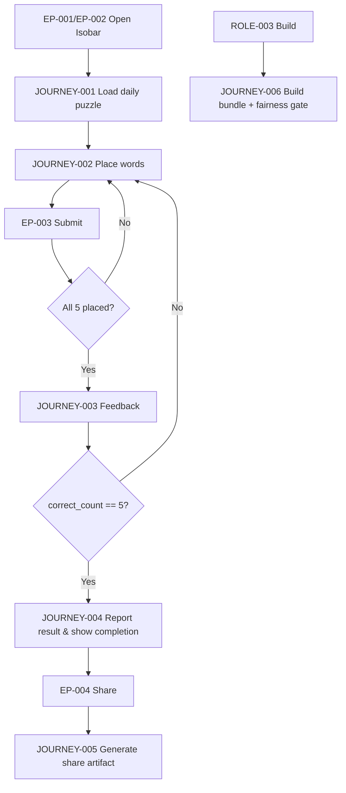
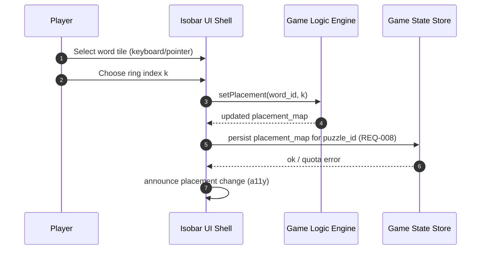
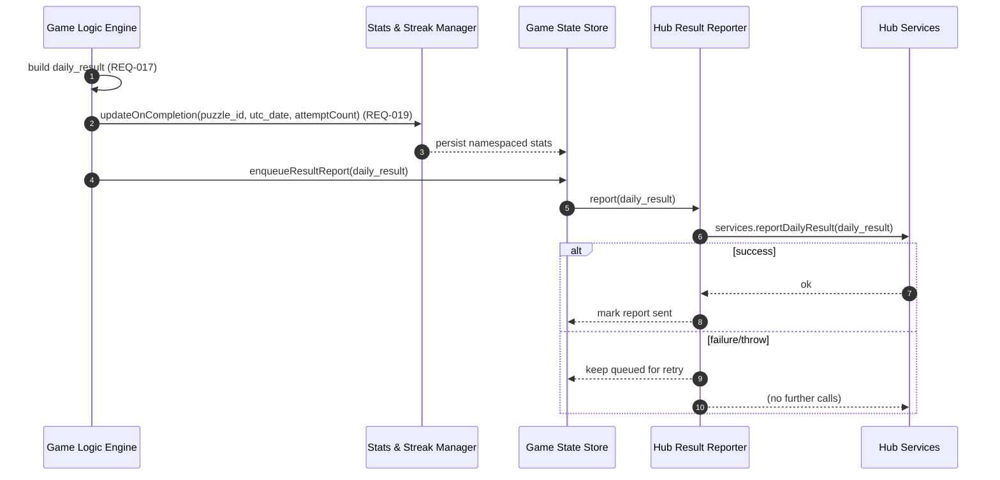
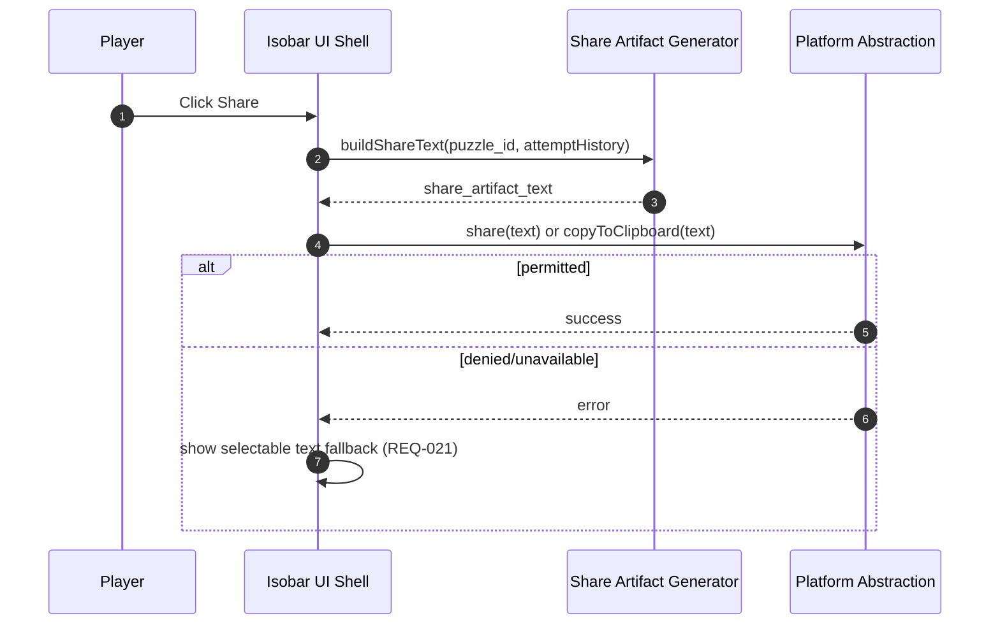
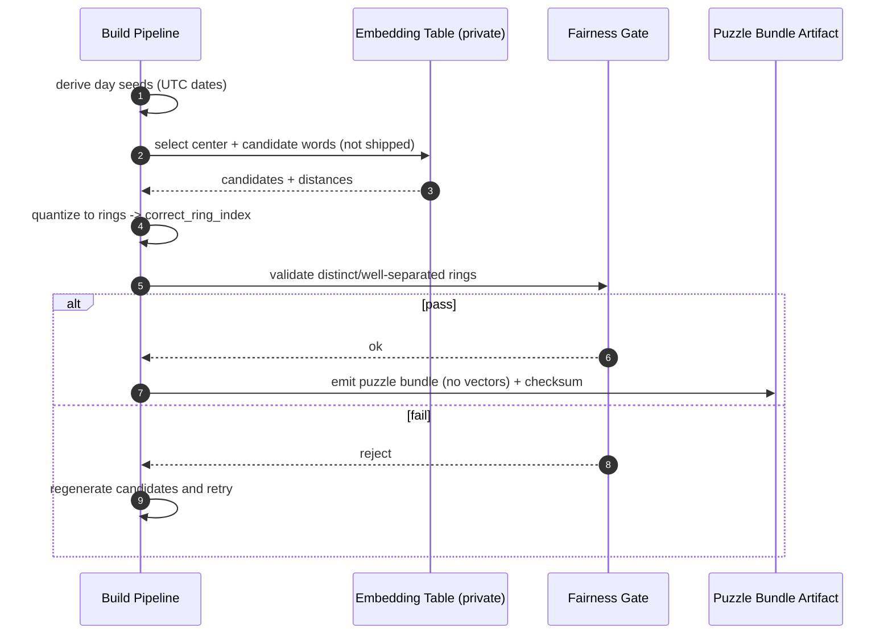
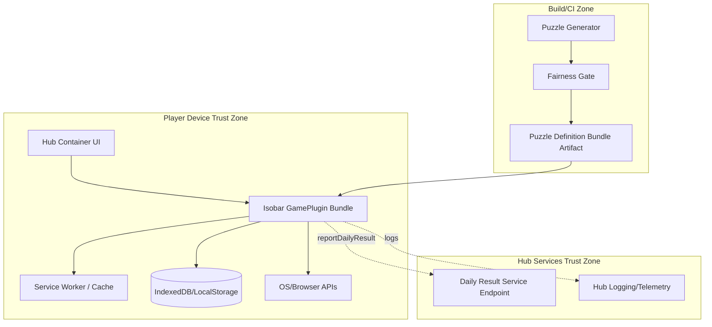

<!-- generated: 2026-07-25T18:49:23Z -->
<!-- mode: feature -->
<!-- feature-slug: isobar -->
<!-- a2a-endpoint: https://bob-sdlc-orchestrator.2as6l7wq9qj8.eu-gb.codeengine.appdomain.cloud/v1/rpc -->

# Glossary

## Terms

### TERM-001: Isobar Puzzle
- **Definition:** A deterministic daily game instance consisting of exactly five given words (TERM-002) that must be placed into concentric meaning rings (TERM-003) relative to a hidden center word (TERM-004), with feedback limited to correctness counts and near/far hints (TERM-006) without revealing the center.
- **Synonyms:** daily puzzle, daily Isobar
- **Anti-definition:** Not a freeform word-guessing game; not a single-target guess game (e.g., Semantle/Contexto).
- **Source:** User request

### TERM-002: Puzzle Word
- **Definition:** One of the five visible words presented to the player for a given Isobar Puzzle, each with a precomputed correct ring index (FIELD-006).
- **Synonyms:** given word, tile word
- **Anti-definition:** Not the hidden center word; not user-entered text.
- **Source:** User request

### TERM-003: Meaning Ring
- **Definition:** A discrete ring position indexed from 0 (closest) to N (farthest) representing quantized semantic-distance bands from the hidden center word for the daily puzzle.
- **Synonyms:** ring, semantic band, distance band
- **Anti-definition:** Not a continuous distance value; not a radial pixel distance.
- **Source:** User request

### TERM-004: Center Word
- **Definition:** The hidden target word for the daily puzzle used only to derive correct ring indices; it is never displayed and never directly guessed by the player.
- **Synonyms:** hidden center, target (hidden)
- **Anti-definition:** Not visible content; not a user input field.
- **Source:** User request

### TERM-005: Placement
- **Definition:** The current assignment of each Puzzle Word (TERM-002) to a Meaning Ring (TERM-003) by the player prior to submission.
- **Synonyms:** arrangement, mapping
- **Anti-definition:** Not the correct answer key; not a final result until submitted.
- **Source:** User request

### TERM-006: Near/Far Hint
- **Definition:** Per-word feedback after a submission that indicates the placed ring is off by exactly one ring, shown as an arrow indicating nearer-to-center or farther-from-center.
- **Synonyms:** arrow hint, snap hint
- **Anti-definition:** Not a numeric distance; not a multi-ring directional gradient; not a reveal of the center word.
- **Source:** User request

### TERM-007: Submission
- **Definition:** An explicit player action to check the current Placement (TERM-005) against the correct ring indices (FIELD-006) and receive feedback (TERM-008).
- **Synonyms:** check, validate, submit attempt
- **Anti-definition:** Not auto-check on every drag/drop unless explicitly triggered.
- **Source:** User request

### TERM-008: Attempt Feedback
- **Definition:** The outcome returned to the player for a Submission (TERM-007), consisting of the correct-count (FIELD-012) and any Near/Far Hints (TERM-006) for words off by one ring.
- **Synonyms:** results, response
- **Anti-definition:** Not the full solution; not center word disclosure.
- **Source:** User request

### TERM-009: Daily Seed
- **Definition:** The deterministic seed derived from the UTC date (FIELD-002) used to select the daily puzzle content.
- **Synonyms:** day seed
- **Anti-definition:** Not local time based; not device-locale dependent.
- **Source:** User request

### TERM-010: Puzzle Definition Bundle
- **Definition:** A client-shipped table for each date/puzzle containing the five words and their correct ring indices, precomputed at build time without shipping embeddings/vectors.
- **Synonyms:** puzzle table, daily data bundle
- **Anti-definition:** Not a runtime model download; not an embedding table.
- **Source:** User request

### TERM-011: Fairness Gate
- **Definition:** A build-time validation step ensuring the five Puzzle Words fall into distinct and well-separated Meaning Rings so the puzzle is decisive.
- **Synonyms:** build-time fairness check
- **Anti-definition:** Not a runtime heuristic; not a server-side moderation step.
- **Source:** User request

### TERM-012: Spoiler-Safe Share Artifact
- **Definition:** A shareable text payload that includes per-attempt correct-count blocks but contains no words and does not reveal the center word.
- **Synonyms:** share text, share card text
- **Anti-definition:** Not a screenshot requirement; not word-bearing content.
- **Source:** User request

### TERM-013: Daily Result
- **Definition:** A structured outcome object reported by the game to CIC Games hub services upon completion, containing completion status and attempt count for the UTC day.
- **Synonyms:** result payload, completion report
- **Anti-definition:** Not raw telemetry; not personally identifying data.
- **Source:** User request

### TERM-014: GamePlugin
- **Definition:** The integration contract for CIC Games hub where the game is mounted via `mount(root, services)` and reports a Daily Result (TERM-013) with namespaced local stats.
- **Synonyms:** plugin, hub integration
- **Anti-definition:** Not a standalone app shell requirement (though it can be deployed as PWA/iOS/Android).
- **Source:** User request

### TERM-015: Offline-First Client
- **Definition:** A fully client-side implementation that can load and play the daily puzzle without network connectivity once assets and puzzle bundle are cached locally.
- **Synonyms:** offline-first PWA
- **Anti-definition:** Not dependent on server validation at submission time.
- **Source:** User request

### TERM-016: Namespaced Local Stats
- **Definition:** Local, device-scoped statistics for Isobar (e.g., streak, win count) stored under an Isobar-specific namespace to avoid collisions with other games.
- **Synonyms:** local stats, local streak
- **Anti-definition:** Not cross-game global stats; not cloud-synced unless services provide it.
- **Source:** User request

### TERM-017: Session
- **Definition:** A single play period for the daily puzzle typically under three minutes, spanning from puzzle open to completion or exit.
- **Synonyms:** play session
- **Anti-definition:** Not a background service; not continuous play across days.
- **Source:** User request

### TERM-018: Carbon Design System UI
- **Definition:** UI components and patterns conforming to IBM Carbon Design System, including focus states and accessibility patterns.
- **Synonyms:** Carbon UI
- **Anti-definition:** Not custom UI patterns that conflict with Carbon accessibility guidance.
- **Source:** User request

### TERM-019: Accessibility Conformance (WCAG 2.1 AA)
- **Definition:** Accessibility requirements including keyboard operable placement, visible focus, non-color-only state, and reduced motion support.
- **Synonyms:** WCAG AA
- **Anti-definition:** Not WCAG AAA; not mouse-only interaction.
- **Source:** User request

### TERM-020: Day Boundary (UTC)
- **Definition:** The daily puzzle changes at 00:00 UTC based on UTC date, regardless of user locale.
- **Synonyms:** UTC rollover
- **Anti-definition:** Not device-local midnight.
- **Source:** User request

## Data Dictionary

| ID | Name | Type | Format | Range | Units | Default | Nullable | PII | Source | Validation |
|---|---|---|---|---|---|---|---|---|---|---|
| FIELD-001 | puzzle_id | string | `isobar-YYYY-MM-DD` | n/a | n/a | n/a | No | None | TERM-010 | Must match regex `^isobar-\d{4}-\d{2}-\d{2}$` and align to FIELD-002 |
| FIELD-002 | utc_date | string | `YYYY-MM-DD` | valid calendar date | day | device UTC clock | No | None | TERM-009/TERM-020 | Must be derived from UTC, not locale time |
| FIELD-003 | ring_count | integer | int | 2..10 | rings | n/a | No | None | TERM-003 | Must be > max correct_ring_index (FIELD-006) |
| FIELD-004 | ring_index | integer | int | 0..(ring_count-1) | ring | 0 | No | None | TERM-003 | Must be within bounds for current puzzle |
| FIELD-005 | word_id | string | slug | `[a-z0-9-]+` | n/a | n/a | No | None | TERM-002 | Unique within a puzzle_id |
| FIELD-006 | correct_ring_index | integer | int | 0..(ring_count-1) | ring | n/a | No | None | TERM-010 | Present for each of 5 words; all 5 must be distinct (fairness) |
| FIELD-007 | displayed_word | string | Unicode string | length 1..32 | chars | n/a | No | None | TERM-002/TERM-010 | Must be non-empty; must not equal center word (TERM-004) |
| FIELD-008 | placement_ring_index | integer | int | 0..(ring_count-1) | ring | n/a | Yes | None | TERM-005 | Nullable only before player places a word |
| FIELD-009 | placement_map | object | JSON map | `word_id -> placement_ring_index` | n/a | `{}` | No | None | TERM-005 | Must include all 5 word_id values before submission |
| FIELD-010 | attempt_number | integer | int | 1..20 | attempts | 1 | No | None | TERM-007 | Increments by 1 per submission for puzzle_id |
| FIELD-011 | max_attempts | integer | int | 1..50 | attempts | 20 | No | None | Product constraint | Must be >=1 if enforced |
| FIELD-012 | correct_count | integer | int | 0..5 | words | 0 | No | None | TERM-008 | Must equal count of words where placement_ring_index == correct_ring_index |
| FIELD-013 | per_word_hint | object | JSON | `{ word_id, status, direction? }` | n/a | n/a | No | None | TERM-006/TERM-008 | `status` in enum; `direction` present only for off-by-one |
| FIELD-014 | hint_status | string | enum | `correct`, `off_by_one`, `other_incorrect` | n/a | n/a | No | None | TERM-008 | Exactly one status per word per attempt |
| FIELD-015 | hint_direction | string | enum | `nearer`, `farther` | n/a | n/a | Yes | None | TERM-006 | Nullable unless hint_status == `off_by_one` |
| FIELD-016 | is_completed | boolean | bool | true/false | n/a | false | No | None | TERM-013 | True only when all 5 correct in a submission |
| FIELD-017 | completed_at_utc | string | ISO-8601 | datetime | n/a | n/a | Yes | None | TERM-013 | Required when is_completed=true; must be UTC (`Z`) |
| FIELD-018 | daily_result | object | JSON | `{ puzzle_id, is_completed, attempt_count }` | n/a | n/a | No | None | TERM-013/TERM-014 | Must not include displayed_word or center word |
| FIELD-019 | attempt_count | integer | int | 0..max_attempts | attempts | 0 | No | None | TERM-013 | Equals last attempt_number used when completed |
| FIELD-020 | share_artifact_text | string | text | length 1..2000 | chars | n/a | Yes | None | TERM-012 | Must not contain any displayed_word substrings |
| FIELD-021 | share_block | string | text | chars set `[#._-]` etc. | n/a | n/a | No | None | TERM-012 | Must encode only correct_count per attempt (no word ids) |
| FIELD-022 | stats_namespace | string | string | `cic.isobar` | n/a | `cic.isobar` | No | None | TERM-016 | Must be constant across platforms |
| FIELD-023 | current_streak_days | integer | int | 0..36500 | days | 0 | No | None | TERM-016 | Increments only on consecutive UTC days with completion |
| FIELD-024 | best_streak_days | integer | int | 0..36500 | days | 0 | No | None | TERM-016 | Must be >= current_streak_days |
| FIELD-025 | prefers_reduced_motion | boolean | bool | true/false | n/a | false | No | None | TERM-019 | Derived from OS/browser setting |
| FIELD-026 | input_method | string | enum | `pointer`, `keyboard` | n/a | n/a | Yes | None | TERM-019 | Used for a11y behavior tuning (no PII) |
| FIELD-027 | plugin_mount_root_id | string | DOM id | n/a | n/a | n/a | No | None | TERM-014 | Must reference existing root element |
| FIELD-028 | services_daily_result_endpoint | string | URI | n/a | n/a | n/a | Yes | None | TERM-014 | Optional if services provides reporting callback instead |
| FIELD-029 | local_cache_version | integer | int | 1..n | n/a | 1 | No | None | TERM-015 | Increment when puzzle bundle schema changes |
| FIELD-030 | puzzle_bundle_checksum | string | hex/base64 | n/a | n/a | n/a | Yes | None | TERM-010/TERM-015 | If present, must match computed checksum for integrity |

# User Journeys

## Roles

| Role ID | Role | Type | Description |
|---|---|---|---|
| ROLE-001 | Player | Primary | Plays the daily Isobar Puzzle (TERM-001), places words, submits, shares results |
| ROLE-002 | Hub Container | System | CIC Games hub runtime hosting the GamePlugin (TERM-014), provides services object |
| ROLE-003 | Build Pipeline | System/Admin | Produces Puzzle Definition Bundle (TERM-010) and runs Fairness Gate (TERM-011) |
| ROLE-004 | OS/Browser | System | Provides offline cache, accessibility settings (FIELD-025), clipboard/share APIs |

## Entry Points

| EP ID | Location | Trigger | Auth |
|---|---|---|---|
| EP-001 | GamePlugin `mount(root, services)` | Hub loads plugin | Hub-managed |
| EP-002 | UI route `/isobar` (within hub) | Player opens game | Hub session (if any); game must work offline |
| EP-003 | “Submit” button | Player initiates Submission (TERM-007) | None |
| EP-004 | “Share” button | Player requests Spoiler-Safe Share Artifact (TERM-012) | None |
| EP-005 | UTC day rollover | FIELD-002 changes at 00:00 UTC | None |
| EP-006 | App offline/online state change | OS/Browser network changes | None |

## Role Permission Matrix

| Capability | ROLE-001 Player | ROLE-002 Hub Container | ROLE-003 Build Pipeline | ROLE-004 OS/Browser |
|---|---|---|---|---|
| Load puzzle for FIELD-002 | R | R/W (provides services) | n/a | R (cache) |
| Modify Placement (TERM-005) | R/W | n/a | n/a | n/a |
| Submit attempt (TERM-007) | R/W | n/a | n/a | n/a |
| Generate share text (TERM-012) | R/W | n/a | n/a | R (clipboard/share) |
| Persist Namespaced Local Stats (TERM-016) | R/W | n/a | n/a | R/W (storage) |
| Produce Puzzle Definition Bundle (TERM-010) | n/a | n/a | R/W | n/a |
| Enforce Fairness Gate (TERM-011) | n/a | n/a | R/W | n/a |

## Journeys

### JOURNEY-001: Load daily puzzle (offline-first)
- **Role/Goal:** ROLE-001 Player loads the Isobar Puzzle (TERM-001) for current FIELD-002 quickly enough for a sub-3-minute Session (TERM-017).
- **Entry Point:** EP-002 `/isobar` (or EP-001 mount)
- **Happy path:**
  1. System derives FIELD-002 (utc_date) from device UTC clock (TERM-020).
  2. System computes FIELD-001 (puzzle_id) from FIELD-002.
  3. System loads the matching Puzzle Definition Bundle (TERM-010) entry for FIELD-001 from local packaged data/cache (TERM-015).
  4. System renders 5 Puzzle Words (TERM-002) using FIELD-005 (word_id) + FIELD-007 (displayed_word) and renders Meaning Rings (TERM-003) using FIELD-003 (ring_count).
  5. System initializes FIELD-009 (placement_map) with null FIELD-008 values until player places each word.
- **BRANCH-001 (No puzzle data for date):**
  - **Trigger:** No bundle entry found for FIELD-001.
  - **System response:** Show an error state with puzzle unavailable for date and disable submissions.
  - **Recovery:** Player updates app content (if available) and reopens.
- **ERROR-001 (Corrupt bundle entry):**
  - **Trigger:** Bundle fails validation (e.g., FIELD-006 out of range).
  - **System response:** Show non-spoiler error; do not start puzzle.
  - **Recovery:** Clear local cache (if applicable) and reload.
- **EDGE-001 (Offline on first open):**
  - **Condition:** No cached assets yet; device offline.
  - **Expected:** Show offline-unavailable message; do not hang.
- **EDGE-002 (UTC boundary during play):**
  - **Condition:** EP-005 occurs mid-session.
  - **Expected:** Preserve current session until exit; prompt on next open (see JOURNEY-004).

### JOURNEY-002: Place words into meaning rings (keyboard + pointer)
- **Role/Goal:** ROLE-001 Player assigns each Puzzle Word (TERM-002) to a Meaning Ring (TERM-003) creating a complete Placement (TERM-005).
- **Entry Point:** EP-002
- **Happy path:**
  1. Player selects a word tile (FIELD-005/FIELD-007) via pointer or keyboard focus (TERM-019).
  2. Player chooses a target ring (FIELD-004) via drag-and-drop or keyboard “move to ring” control.
  3. System updates FIELD-008 (placement_ring_index) for that word and updates FIELD-009 (placement_map).
  4. System announces placement change via text and iconography (not color-only) per TERM-019.
  5. Player repeats until FIELD-009 includes all 5 word_id keys with non-null FIELD-008.
- **BRANCH-002 (Re-assign already placed word):**
  - **Trigger:** Player moves a word already assigned to a ring.
  - **System response:** Overwrite that word’s FIELD-008 and update UI.
- **ERROR-002 (Keyboard trap / unreachable ring):**
  - **Trigger:** Focus cannot reach ring controls.
  - **System response:** Provide alternative control (e.g., ring list selector) and maintain visible focus.
  - **Recovery:** Player uses alternative control.
- **EDGE-003 (Duplicate occupancy):**
  - **Condition:** Multiple words placed into same ring index allowed.
  - **Expected:** System permits it (puzzle logic does not forbid).
- **EDGE-004 (Reduced motion):**
  - **Condition:** FIELD-025 true.
  - **Expected:** Disable/limit snapping animations; still provide state updates.

### JOURNEY-003: Submit placement and receive feedback without spoilers
- **Role/Goal:** ROLE-001 Player performs a Submission (TERM-007) and receives Attempt Feedback (TERM-008) to deduce correct Placement without revealing Center Word (TERM-004).
- **Entry Point:** EP-003 “Submit”
- **Happy path:**
  1. Player presses Submit.
  2. System validates FIELD-009 contains all five word_id entries with non-null FIELD-008.
  3. System computes FIELD-012 (correct_count) by comparing FIELD-008 vs FIELD-006 for each word.
  4. System generates FIELD-013 per_word_hint entries:
     - If correct: FIELD-014=`correct`.
     - If off-by-one ring: FIELD-014=`off_by_one` and FIELD-015 direction `nearer`/`farther` relative to correct ring.
     - Else: FIELD-014=`other_incorrect` with no direction.
  5. System displays correct_count summary (e.g., “3/5”) and per-word hint icons/text (TERM-006) without displaying FIELD-006 or TERM-004.
  6. System increments FIELD-010 (attempt_number).
  7. If FIELD-012 == 5, system sets FIELD-016 is_completed=true and records FIELD-017 completed_at_utc.
- **BRANCH-003 (Incomplete placement):**
  - **Trigger:** Any FIELD-008 is null.
  - **System response:** Disable submit or show message “Place all 5 words” with focus to first unplaced word.
  - **Recovery:** Player completes placements then submits.
- **ERROR-003 (Attempt limit reached, if enforced):**
  - **Trigger:** FIELD-010 would exceed FIELD-011.
  - **System response:** Lock further submissions; show final state.
  - **Recovery:** None for that day.
- **EDGE-005 (State mismatch after reload):**
  - **Condition:** App reloads mid-day; persisted placements exist.
  - **Expected:** Restore FIELD-009 and attempt history to continue.

### JOURNEY-004: Complete puzzle and report Daily Result to hub
- **Role/Goal:** ROLE-001 completes; ROLE-002 receives a Daily Result (TERM-013) for hub surfaces (streaks, cards).
- **Entry Point:** Completion event in JOURNEY-003 step 7
- **Happy path:**
  1. System constructs FIELD-018 daily_result with FIELD-001, FIELD-016, FIELD-019.
  2. System updates Namespaced Local Stats (TERM-016) under FIELD-022 including FIELD-023 current_streak_days and FIELD-024 best_streak_days using UTC day rules (TERM-020).
  3. System reports Daily Result to ROLE-002 via provided services interface (TERM-014), without words.
  4. System displays completion UI including attempt count and Share action (EP-004).
- **BRANCH-004 (Rollover after completion):**
  - **Trigger:** Player opens after EP-005.
  - **System response:** Show new day puzzle; streak logic uses UTC.
- **ERROR-004 (Hub service unavailable):**
  - **Trigger:** services reporting call throws/fails.
  - **System response:** Queue/report later locally; do not block completion UI.
  - **Recovery:** Retry when EP-006 online.

### JOURNEY-005: Generate and share spoiler-safe artifact
- **Role/Goal:** ROLE-001 shares results without spoilers (TERM-012).
- **Entry Point:** EP-004 “Share”
- **Happy path:**
  1. Player taps Share.
  2. System generates FIELD-020 share_artifact_text containing FIELD-001, and per-attempt FIELD-021 blocks encoding only FIELD-012 values (and optionally attempt count), with no FIELD-007 words.
  3. System copies to clipboard or invokes native share sheet depending on platform.
- **ERROR-005 (Clipboard/share denied):**
  - **Trigger:** OS denies clipboard/share API.
  - **System response:** Present selectable text field containing FIELD-020.
  - **Recovery:** Player manually copies.

### JOURNEY-006: Build-time content generation and fairness gate
- **Role/Goal:** ROLE-003 Build Pipeline produces Puzzle Definition Bundle (TERM-010) and ensures decisiveness (TERM-011).
- **Entry Point:** Build job
- **Happy path:**
  1. Pipeline selects TERM-004 (center word) per day seed (TERM-009) and derives candidate TERM-002 words using embedding table (not shipped).
  2. Pipeline assigns each word a quantized FIELD-006 correct_ring_index based on semantic-distance bands.
  3. Pipeline runs Fairness Gate (TERM-011): verifies FIELD-006 are all distinct and well-separated.
  4. Pipeline emits bundled table containing only FIELD-007 and FIELD-006 (and required metadata), with no vectors.
- **ERROR-006 (Fairness gate failure):**
  - **Trigger:** Any two words map to same ring or bands are not well-separated.
  - **System response:** Reject puzzle generation for that day; select new candidate set.
  - **Recovery:** Iterate generation until pass.

## Journey Map



# Requirements

### REQ-001: Derive UTC puzzle date
- **EARS Pattern:** Ubiquitous
- **EARS Statement:** The client shall derive FIELD-002 (utc_date) using UTC time (TERM-020).
- **Inputs:** Device/system clock
- **Outputs:** FIELD-002
- **Preconditions:** App is running
- **Postconditions:** FIELD-002 is available for puzzle selection
- **Invariants:** FIELD-002 is not derived from locale midnight
- **Trigger:** App open (EP-002) or mount (EP-001)
- **Actor:** ROLE-001
- **EntityScope:** TERM-009
- **ErrorModes:** Incorrect time source
- **NFR-Tags:** i18n, compatibility
- **Source:** JOURNEY-001 step 1
- **Dependencies:** None
- **Priority:** P0
- **AcceptanceCriteria:**
  - **TEST-001:** Given a device set to a non-UTC timezone, when local time crosses local midnight but UTC date has not changed, then FIELD-002 remains unchanged.
  - **TEST-002:** Given UTC time crosses 00:00, when the game is opened after rollover, then FIELD-002 matches the new UTC date.
- **Assumptions:** Device clock is reasonably accurate
- **OpenQuestions:** None

### REQ-002: Compute puzzle identifier from UTC date
- **EARS Pattern:** Ubiquitous
- **EARS Statement:** The client shall compute FIELD-001 (puzzle_id) from FIELD-002 (utc_date) using format `isobar-YYYY-MM-DD`.
- **Inputs:** FIELD-002
- **Outputs:** FIELD-001
- **Preconditions:** FIELD-002 exists
- **Postconditions:** FIELD-001 available for lookup
- **Invariants:** FIELD-001 string format is stable across platforms
- **Trigger:** After REQ-001
- **Actor:** ROLE-001
- **EntityScope:** TERM-001
- **ErrorModes:** Format mismatch
- **NFR-Tags:** compatibility
- **Source:** JOURNEY-001 step 2
- **Dependencies:** REQ-001
- **Priority:** P0
- **AcceptanceCriteria:**
  - **TEST-003:** When FIELD-002=`2026-07-25`, then FIELD-001=`isobar-2026-07-25`.
- **Assumptions:** None
- **OpenQuestions:** None

### REQ-003: Load puzzle definition from local bundle/cache
- **EARS Pattern:** Event-Driven
- **EARS Statement:** When FIELD-001 (puzzle_id) is computed, the client shall load the corresponding Puzzle Definition Bundle (TERM-010) entry from local packaged data or offline cache (TERM-015).
- **Inputs:** FIELD-001, local bundle/cache
- **Outputs:** 5×(FIELD-005, FIELD-007, FIELD-006), FIELD-003
- **Preconditions:** App assets installed/cached
- **Postconditions:** Puzzle data available to render
- **Invariants:** No embedding vectors are loaded at runtime
- **Trigger:** FIELD-001 available
- **Actor:** ROLE-001
- **EntityScope:** TERM-010
- **ErrorModes:** Missing bundle entry
- **NFR-Tags:** reliability, offline
- **Source:** JOURNEY-001 step 3, BRANCH-001
- **Dependencies:** REQ-002
- **Priority:** P0
- **AcceptanceCriteria:**
  - **TEST-004:** Given a valid bundled entry for FIELD-001, when opened offline, then the five FIELD-007 words render.
  - **TEST-005:** Given no bundled entry exists for FIELD-001, when opened, then submissions are disabled and a non-spoiler error is shown.
- **Assumptions:** Bundle includes required date range
- **OpenQuestions:** How many days of puzzles are bundled per release?

### REQ-004: Validate puzzle bundle schema at runtime
- **EARS Pattern:** Event-Driven
- **EARS Statement:** When a Puzzle Definition Bundle (TERM-010) entry is loaded, the client shall validate that each FIELD-006 (correct_ring_index) is within `0..(FIELD-003-1)`.
- **Inputs:** Loaded puzzle entry, FIELD-003, FIELD-006
- **Outputs:** Validation pass/fail
- **Preconditions:** Puzzle entry loaded
- **Postconditions:** Invalid entries are not playable
- **Invariants:** Validation failures do not reveal TERM-004
- **Trigger:** After REQ-003
- **Actor:** ROLE-001
- **EntityScope:** TERM-010
- **ErrorModes:** Out-of-range ring index
- **NFR-Tags:** reliability
- **Source:** JOURNEY-001 ERROR-001
- **Dependencies:** REQ-003
- **Priority:** P0
- **AcceptanceCriteria:**
  - **TEST-006:** Given FIELD-006 equals FIELD-003, when loading, then the client shows an error state and does not start the puzzle.
- **Assumptions:** None
- **OpenQuestions:** None

### REQ-005: Render rings and word tiles
- **EARS Pattern:** Event-Driven
- **EARS Statement:** When puzzle data is available, the client shall render FIELD-003 (ring_count) Meaning Rings (TERM-003) and five Puzzle Words (TERM-002) using FIELD-007 (displayed_word).
- **Inputs:** FIELD-003, FIELD-007
- **Outputs:** UI state
- **Preconditions:** REQ-003 succeeded
- **Postconditions:** Player can interact with rings and words
- **Invariants:** TERM-004 is not displayed
- **Trigger:** Puzzle data ready
- **Actor:** ROLE-001
- **EntityScope:** TERM-001
- **ErrorModes:** Render failure
- **NFR-Tags:** accessibility, compatibility
- **Source:** JOURNEY-001 step 4
- **Dependencies:** REQ-003
- **Priority:** P0
- **AcceptanceCriteria:**
  - **TEST-007:** On load, exactly five word tiles are visible and labeled with FIELD-007.
- **Assumptions:** Carbon components available
- **OpenQuestions:** Exact ring_count value for MVP?

### REQ-006: Support pointer-based placement
- **EARS Pattern:** Ubiquitous
- **EARS Statement:** The client shall allow ROLE-001 to assign a FIELD-005 (word_id) to a FIELD-004 (ring_index) using pointer input.
- **Inputs:** Pointer actions, FIELD-005, FIELD-004
- **Outputs:** FIELD-008, FIELD-009 updates
- **Preconditions:** Puzzle rendered
- **Postconditions:** Placement stored in FIELD-009
- **Invariants:** Assignment does not require network
- **Trigger:** Player drag/drop or click-assign
- **Actor:** ROLE-001
- **EntityScope:** TERM-005
- **ErrorModes:** Input not recognized
- **NFR-Tags:** accessibility
- **Source:** JOURNEY-002 steps 1-3
- **Dependencies:** REQ-005
- **Priority:** P0
- **AcceptanceCriteria:**
  - **TEST-008:** When a word tile is dropped on ring k, then FIELD-009[word_id]=k.
- **Assumptions:** Pointer DnD supported on platform
- **OpenQuestions:** Will mobile use tap-to-select + tap-ring instead of DnD?

### REQ-007: Support keyboard operable placement
- **EARS Pattern:** Ubiquitous
- **EARS Statement:** The client shall allow ROLE-001 to assign a FIELD-005 (word_id) to a FIELD-004 (ring_index) using keyboard-only interaction.
- **Inputs:** Keyboard actions
- **Outputs:** FIELD-009 update
- **Preconditions:** Puzzle rendered
- **Postconditions:** Placement possible without pointer
- **Invariants:** Focus is visible during interaction
- **Trigger:** Keyboard selection and move action
- **Actor:** ROLE-001
- **EntityScope:** TERM-019
- **ErrorModes:** Keyboard trap
- **NFR-Tags:** accessibility
- **Source:** JOURNEY-002 ERROR-002
- **Dependencies:** REQ-005
- **Priority:** P0
- **AcceptanceCriteria:**
  - **TEST-009:** When using Tab/Shift+Tab and activation keys, the player can place each of the five words onto any ring.
- **Assumptions:** Carbon focus styles used
- **OpenQuestions:** Exact key bindings (arrow keys vs menu)?

### REQ-008: Persist placement locally for the UTC day
- **EARS Pattern:** Event-Driven
- **EARS Statement:** When FIELD-009 (placement_map) changes, the client shall persist FIELD-009 locally under FIELD-022 (stats_namespace) for FIELD-001.
- **Inputs:** FIELD-009, FIELD-022, FIELD-001
- **Outputs:** Local storage write
- **Preconditions:** Storage available
- **Postconditions:** Reload restores placement
- **Invariants:** Stored data contains no TERM-004
- **Trigger:** Placement update
- **Actor:** ROLE-001
- **EntityScope:** TERM-016
- **ErrorModes:** Storage quota exceeded
- **NFR-Tags:** offline, reliability, privacy
- **Source:** JOURNEY-003 EDGE-005
- **Dependencies:** REQ-002
- **Priority:** P1
- **AcceptanceCriteria:**
  - **TEST-010:** Given a placed map, when the app reloads, then FIELD-009 is restored for the same FIELD-001.
- **Assumptions:** Web: IndexedDB/localStorage; native: platform storage
- **OpenQuestions:** Storage mechanism standard across hub?

### REQ-009: Prevent submission with incomplete placement
- **EARS Pattern:** State-Driven
- **EARS Statement:** While any FIELD-008 (placement_ring_index) is null, the client shall prevent Submission (TERM-007).
- **Inputs:** FIELD-009 / FIELD-008
- **Outputs:** Submit disabled or blocked
- **Preconditions:** Puzzle loaded
- **Postconditions:** No attempt recorded
- **Invariants:** Prevention does not reveal correct rings
- **Trigger:** EP-003
- **Actor:** ROLE-001
- **EntityScope:** TERM-007
- **ErrorModes:** Incomplete placement
- **NFR-Tags:** usability, accessibility
- **Source:** JOURNEY-003 BRANCH-003
- **Dependencies:** REQ-005
- **Priority:** P0
- **AcceptanceCriteria:**
  - **TEST-011:** With at least one unplaced word, clicking Submit does not increment FIELD-010.
- **Assumptions:** Submit button exists
- **OpenQuestions:** Disable vs inline error copy?

### REQ-010: Compute correct count for a submission
- **EARS Pattern:** Event-Driven
- **EARS Statement:** When a Submission (TERM-007) occurs, the client shall compute FIELD-012 (correct_count) by comparing FIELD-008 to FIELD-006 for all five words.
- **Inputs:** FIELD-009, FIELD-006
- **Outputs:** FIELD-012
- **Preconditions:** All placements non-null
- **Postconditions:** correct_count computed
- **Invariants:** No correct ring indices are displayed directly
- **Trigger:** EP-003
- **Actor:** ROLE-001
- **EntityScope:** TERM-008
- **ErrorModes:** Comparison failure
- **NFR-Tags:** none
- **Source:** JOURNEY-003 step 3
- **Dependencies:** REQ-009
- **Priority:** P0
- **AcceptanceCriteria:**
  - **TEST-012:** Given 3 placements match FIELD-006, when submitted, then FIELD-012 equals 3.
- **Assumptions:** Exactly five words per puzzle
- **OpenQuestions:** None

### REQ-011: Generate per-word hint status
- **EARS Pattern:** Event-Driven
- **EARS Statement:** When a Submission (TERM-007) occurs, the client shall generate FIELD-014 (hint_status) for each FIELD-005 as `correct`, `off_by_one`, or `other_incorrect`.
- **Inputs:** FIELD-008, FIELD-006
- **Outputs:** FIELD-013 list including FIELD-014
- **Preconditions:** Submission valid
- **Postconditions:** Per-word hint available
- **Invariants:** Hint does not reveal FIELD-006 value
- **Trigger:** EP-003
- **Actor:** ROLE-001
- **EntityScope:** TERM-006
- **ErrorModes:** Hint generation failure
- **NFR-Tags:** none
- **Source:** JOURNEY-003 step 4
- **Dependencies:** REQ-009
- **Priority:** P0
- **AcceptanceCriteria:**
  - **TEST-013:** If `abs(placement_ring_index - correct_ring_index)=1`, then hint_status is `off_by_one`.
- **Assumptions:** Ring indices are integer bands
- **OpenQuestions:** None

### REQ-012: Generate near/far direction only for off-by-one
- **EARS Pattern:** State-Driven
- **EARS Statement:** While FIELD-014 (hint_status) equals `off_by_one`, the client shall set FIELD-015 (hint_direction) to `nearer` or `farther`.
- **Inputs:** FIELD-008, FIELD-006, FIELD-014
- **Outputs:** FIELD-015
- **Preconditions:** REQ-011 produced statuses
- **Postconditions:** Direction shown for off-by-one only
- **Invariants:** No direction for non-off-by-one
- **Trigger:** After submission evaluation
- **Actor:** ROLE-001
- **EntityScope:** TERM-006
- **ErrorModes:** Wrong direction
- **NFR-Tags:** none
- **Source:** JOURNEY-003 step 4
- **Dependencies:** REQ-011
- **Priority:** P0
- **AcceptanceCriteria:**
  - **TEST-014:** If placement_ring_index = correct_ring_index+1, then hint_direction is `nearer`.
  - **TEST-015:** If placement_ring_index = correct_ring_index-1, then hint_direction is `farther`.
- **Assumptions:** Ring 0 is nearest
- **OpenQuestions:** None

### REQ-013: Display submission summary as correct_count out of five
- **EARS Pattern:** Event-Driven
- **EARS Statement:** When Attempt Feedback (TERM-008) is available, the client shall display FIELD-012 as a summary in the form `X/5`.
- **Inputs:** FIELD-012
- **Outputs:** UI text
- **Preconditions:** Submission processed
- **Postconditions:** Player sees progress metric
- **Invariants:** Does not display center word
- **Trigger:** After REQ-010
- **Actor:** ROLE-001
- **EntityScope:** TERM-008
- **ErrorModes:** Incorrect summary rendering
- **NFR-Tags:** accessibility
- **Source:** JOURNEY-003 step 5
- **Dependencies:** REQ-010
- **Priority:** P0
- **AcceptanceCriteria:**
  - **TEST-016:** When FIELD-012 is 3, UI shows `3/5`.
- **Assumptions:** Fixed word count = 5
- **OpenQuestions:** None

### REQ-014: Increment attempt number per submission
- **EARS Pattern:** Event-Driven
- **EARS Statement:** When a Submission (TERM-007) is processed, the client shall increment FIELD-010 (attempt_number) by 1 for FIELD-001.
- **Inputs:** FIELD-010, FIELD-001
- **Outputs:** Updated FIELD-010
- **Preconditions:** Valid submission
- **Postconditions:** Attempt history advances
- **Invariants:** Attempt numbers start at 1 per day
- **Trigger:** EP-003
- **Actor:** ROLE-001
- **EntityScope:** TERM-007
- **ErrorModes:** Attempt counter desync
- **NFR-Tags:** auditability
- **Source:** JOURNEY-003 step 6
- **Dependencies:** REQ-009
- **Priority:** P1
- **AcceptanceCriteria:**
  - **TEST-017:** Two valid submissions for the same FIELD-001 result in FIELD-010=2 on the second feedback.
- **Assumptions:** Attempt history stored locally
- **OpenQuestions:** Is a max attempts rule required?

### REQ-015: Mark completion when all five are correct
- **EARS Pattern:** Event-Driven
- **EARS Statement:** When FIELD-012 (correct_count) equals 5, the client shall set FIELD-016 (is_completed) to true for FIELD-001.
- **Inputs:** FIELD-012
- **Outputs:** FIELD-016
- **Preconditions:** Submission evaluated
- **Postconditions:** Puzzle marked completed
- **Invariants:** Completion is tied to UTC day puzzle_id
- **Trigger:** After REQ-010
- **Actor:** ROLE-001
- **EntityScope:** TERM-013
- **ErrorModes:** Completion not recorded
- **NFR-Tags:** reliability
- **Source:** JOURNEY-003 step 7
- **Dependencies:** REQ-010
- **Priority:** P0
- **AcceptanceCriteria:**
  - **TEST-018:** When FIELD-012 becomes 5, FIELD-016 becomes true in the same UI update.
- **Assumptions:** None
- **OpenQuestions:** None

### REQ-016: Record completion timestamp in UTC
- **EARS Pattern:** Event-Driven
- **EARS Statement:** When FIELD-016 (is_completed) becomes true, the client shall set FIELD-017 (completed_at_utc) to an ISO-8601 UTC timestamp ending in `Z`.
- **Inputs:** System clock
- **Outputs:** FIELD-017
- **Preconditions:** REQ-015 occurred
- **Postconditions:** Completion time recorded
- **Invariants:** Timestamp is UTC
- **Trigger:** Completion event
- **Actor:** ROLE-001
- **EntityScope:** TERM-013
- **ErrorModes:** Non-UTC timestamp
- **NFR-Tags:** auditability
- **Source:** JOURNEY-003 step 7
- **Dependencies:** REQ-015
- **Priority:** P1
- **AcceptanceCriteria:**
  - **TEST-019:** On completion, completed_at_utc matches regex `Z$`.
- **Assumptions:** Clock available offline
- **OpenQuestions:** None

### REQ-017: Build Daily Result payload without words
- **EARS Pattern:** Event-Driven
- **EARS Statement:** When a puzzle is completed, the client shall construct FIELD-018 (daily_result) containing FIELD-001, FIELD-016, and FIELD-019 and excluding FIELD-007.
- **Inputs:** FIELD-001, FIELD-016, FIELD-019
- **Outputs:** FIELD-018
- **Preconditions:** Completed state
- **Postconditions:** Payload ready to report
- **Invariants:** No displayed_word and no center word included
- **Trigger:** Completion
- **Actor:** ROLE-001
- **EntityScope:** TERM-013
- **ErrorModes:** Payload contains words
- **NFR-Tags:** privacy
- **Source:** JOURNEY-004 step 1
- **Dependencies:** REQ-015
- **Priority:** P0
- **AcceptanceCriteria:**
  - **TEST-020:** Serialized daily_result JSON does not contain any of the five FIELD-007 strings.
- **Assumptions:** Game can access current puzzle words to test exclusion
- **OpenQuestions:** Required schema for hub DailyResult beyond fields listed?

### REQ-018: Report Daily Result via services interface
- **EARS Pattern:** Event-Driven
- **EARS Statement:** When FIELD-018 (daily_result) is constructed, the client shall report it to the Hub Container (ROLE-002) using the provided services interface (TERM-014).
- **Inputs:** services object, FIELD-018
- **Outputs:** Service call invocation
- **Preconditions:** Game is mounted with services
- **Postconditions:** Hub receives completion info or failure is handled
- **Invariants:** Reporting does not block local completion UI
- **Trigger:** After REQ-017
- **Actor:** ROLE-002
- **EntityScope:** TERM-014
- **ErrorModes:** Service call failure
- **NFR-Tags:** reliability, observability
- **Source:** JOURNEY-004 step 3, ERROR-004
- **Dependencies:** REQ-017
- **Priority:** P0
- **AcceptanceCriteria:**
  - **TEST-021:** If services reporting throws, the completion UI still renders and a retry is queued locally.
- **Assumptions:** services exposes a result reporting function
- **OpenQuestions:** Exact method name/signature for reporting?

### REQ-019: Maintain namespaced local stats and streak by UTC day
- **EARS Pattern:** Event-Driven
- **EARS Statement:** When FIELD-016 (is_completed) becomes true, the client shall update FIELD-023 (current_streak_days) under FIELD-022 (stats_namespace) using UTC day adjacency (TERM-020).
- **Inputs:** FIELD-001/FIELD-002, prior stats
- **Outputs:** Updated FIELD-023
- **Preconditions:** Prior stats readable
- **Postconditions:** Streak reflects consecutive UTC completions
- **Invariants:** Namespace is constant FIELD-022
- **Trigger:** Completion
- **Actor:** ROLE-001
- **EntityScope:** TERM-016
- **ErrorModes:** Wrong day adjacency
- **NFR-Tags:** auditability
- **Source:** JOURNEY-004 step 2
- **Dependencies:** REQ-015, REQ-001
- **Priority:** P1
- **AcceptanceCriteria:**
  - **TEST-022:** Completing puzzles on two consecutive UTC dates increments current_streak_days by 1 on the second completion.
- **Assumptions:** Local stats are device-scoped
- **OpenQuestions:** Do we track “last_completed_puzzle_id” explicitly?

### REQ-020: Generate spoiler-safe share text without words
- **EARS Pattern:** Event-Driven
- **EARS Statement:** When the player activates Share, the client shall generate FIELD-020 (share_artifact_text) that excludes FIELD-007 and includes per-attempt FIELD-021 blocks derived from FIELD-012 history.
- **Inputs:** Attempt history (FIELD-012 per attempt), FIELD-001
- **Outputs:** FIELD-020
- **Preconditions:** At least one submission occurred
- **Postconditions:** Share text available
- **Invariants:** No words and no center word are present
- **Trigger:** EP-004
- **Actor:** ROLE-001
- **EntityScope:** TERM-012
- **ErrorModes:** Share text contains words
- **NFR-Tags:** privacy
- **Source:** JOURNEY-005 steps 1-2
- **Dependencies:** REQ-010, REQ-014
- **Priority:** P0
- **AcceptanceCriteria:**
  - **TEST-023:** Generated share_artifact_text does not contain any of the five displayed words.
- **Assumptions:** Attempt history stored locally
- **OpenQuestions:** Exact block encoding characters desired?

### REQ-021: Provide fallback when clipboard/share is unavailable
- **EARS Pattern:** Event-Driven
- **EARS Statement:** When the OS clipboard or share API is unavailable, the client shall present FIELD-020 (share_artifact_text) in a selectable text control.
- **Inputs:** Clipboard/share API result, FIELD-020
- **Outputs:** UI fallback
- **Preconditions:** Share requested
- **Postconditions:** Player can manually copy
- **Invariants:** Fallback remains spoiler-safe
- **Trigger:** EP-004 failure
- **Actor:** ROLE-001
- **EntityScope:** TERM-012
- **ErrorModes:** Share API denied
- **NFR-Tags:** accessibility, compatibility
- **Source:** JOURNEY-005 ERROR-005
- **Dependencies:** REQ-020
- **Priority:** P1
- **AcceptanceCriteria:**
  - **TEST-024:** If clipboard write throws, a text area containing share_artifact_text is shown and focusable.
- **Assumptions:** Platforms differ in permissions
- **OpenQuestions:** None

### REQ-022: Do not reveal the center word in UI or outputs
- **EARS Pattern:** Unwanted
- **EARS Statement:** The client shall not display TERM-004 (center word) in the UI or include it in FIELD-018 (daily_result) or FIELD-020 (share_artifact_text).
- **Inputs:** n/a
- **Outputs:** n/a
- **Preconditions:** Any state
- **Postconditions:** Center word remains hidden
- **Invariants:** Center word is never guessed directly
- **Trigger:** Any render/report/share action
- **Actor:** ROLE-001
- **EntityScope:** TERM-004
- **ErrorModes:** Accidental disclosure
- **NFR-Tags:** privacy
- **Source:** User request; JOURNEY-003/004/005
- **Dependencies:** None
- **Priority:** P0
- **AcceptanceCriteria:**
  - **TEST-025:** Searching the rendered DOM/native view tree for the center word returns no matches.
- **Assumptions:** Center word exists only in build pipeline artifacts, not shipped
- **OpenQuestions:** None

### REQ-023: Snap/indicate off-by-one with direction indicator
- **EARS Pattern:** State-Driven
- **EARS Statement:** While a word has FIELD-014 (hint_status) equal to `off_by_one`, the client shall display a direction indicator representing FIELD-015 (hint_direction).
- **Inputs:** FIELD-014, FIELD-015
- **Outputs:** UI indicator (icon + text)
- **Preconditions:** A submission occurred
- **Postconditions:** Player sees near/far hint
- **Invariants:** Indicator is not color-only
- **Trigger:** Feedback display
- **Actor:** ROLE-001
- **EntityScope:** TERM-006
- **ErrorModes:** Missing indicator
- **NFR-Tags:** accessibility
- **Source:** JOURNEY-003 step 5
- **Dependencies:** REQ-012
- **Priority:** P0
- **AcceptanceCriteria:**
  - **TEST-026:** For an off-by-one word, the UI shows an arrow icon and a text label (“Nearer” or “Farther”).
- **Assumptions:** Carbon icons available
- **OpenQuestions:** Should the word “snap” animation be optional?

### NFR-001: Offline-first playability
- **EARS Pattern:** Ubiquitous
- **EARS Statement:** The client shall allow loading and playing the daily puzzle without network connectivity after assets and the Puzzle Definition Bundle (TERM-010) are cached.
- **Inputs:** Cached assets/bundle
- **Outputs:** Playable UI and submissions evaluated locally
- **Preconditions:** Prior successful install/load
- **Postconditions:** Full gameplay available offline
- **Invariants:** No server calls required for validation
- **Trigger:** EP-006 offline state
- **Actor:** ROLE-001
- **EntityScope:** TERM-015
- **ErrorModes:** Cache miss
- **NFR-Tags:** offline, reliability
- **Source:** JOURNEY-001, TERM-015
- **Dependencies:** REQ-003, REQ-010
- **Priority:** P0
- **AcceptanceCriteria:**
  - **TEST-027:** With airplane mode enabled and cached bundle present, the player can complete the puzzle and receive feedback.
- **Assumptions:** PWA/native caching implemented
- **OpenQuestions:** Cache strategy for iOS/Android wrappers?

### NFR-002: Accessibility—visible focus
- **EARS Pattern:** Ubiquitous
- **EARS Statement:** The client shall render a visible focus indicator for all interactive controls involved in Placement (TERM-005) and Submission (TERM-007).
- **Inputs:** Focus state
- **Outputs:** Visual focus styling
- **Preconditions:** Keyboard navigation
- **Postconditions:** Focus location is perceivable
- **Invariants:** Focus indicator meets WCAG 2.1 AA expectations
- **Trigger:** Tab navigation
- **Actor:** ROLE-001
- **EntityScope:** TERM-019
- **ErrorModes:** Focus not visible
- **NFR-Tags:** accessibility
- **Source:** User request; JOURNEY-002
- **Dependencies:** REQ-007
- **Priority:** P0
- **AcceptanceCriteria:**
  - **TEST-028:** Tabbing through word tiles and ring controls always shows a focus ring distinct from non-focused state.
- **Assumptions:** Carbon focus tokens available
- **OpenQuestions:** None

### NFR-003: Accessibility—non-color-only state communication
- **EARS Pattern:** Ubiquitous
- **EARS Statement:** The client shall convey hint states (FIELD-014) using text and/or icons in addition to color.
- **Inputs:** FIELD-014
- **Outputs:** UI labels/icons
- **Preconditions:** Feedback displayed
- **Postconditions:** Color is not sole channel
- **Invariants:** Works in monochrome/high-contrast
- **Trigger:** After submission
- **Actor:** ROLE-001
- **EntityScope:** TERM-019
- **ErrorModes:** Color-only feedback
- **NFR-Tags:** accessibility
- **Source:** User request; JOURNEY-003 step 5
- **Dependencies:** REQ-023
- **Priority:** P0
- **AcceptanceCriteria:**
  - **TEST-029:** With CSS forced-colors/high-contrast mode, the user can still distinguish correct/off-by-one/incorrect via icon/text.
- **Assumptions:** Platforms expose high contrast mode
- **OpenQuestions:** None

### NFR-004: Accessibility—prefers reduced motion
- **EARS Pattern:** State-Driven
- **EARS Statement:** While FIELD-025 (prefers_reduced_motion) is true, the client shall disable non-essential placement animations.
- **Inputs:** FIELD-025
- **Outputs:** Reduced-motion UI behavior
- **Preconditions:** OS setting enabled
- **Postconditions:** Motion reduced
- **Invariants:** Gameplay feedback remains available
- **Trigger:** UI animation attempt
- **Actor:** ROLE-004
- **EntityScope:** TERM-019
- **ErrorModes:** Animation still plays
- **NFR-Tags:** accessibility
- **Source:** JOURNEY-002 EDGE-004
- **Dependencies:** REQ-006, REQ-023
- **Priority:** P1
- **AcceptanceCriteria:**
  - **TEST-030:** When prefers-reduced-motion is enabled, word “snap” uses no motion tween longer than 0ms (instant state change).
- **Assumptions:** Definition of “non-essential” excludes focus transitions
- **OpenQuestions:** Are micro-animations allowed if <100ms?

### NFR-005: Privacy—no PII collection
- **EARS Pattern:** Unwanted
- **EARS Statement:** The client shall not store or transmit any PII as part of FIELD-018 (daily_result) or Namespaced Local Stats (TERM-016).
- **Inputs:** Result/stats objects
- **Outputs:** Stored/transmitted payloads
- **Preconditions:** Completion/reporting
- **Postconditions:** No PII present
- **Invariants:** PII classification remains None for listed fields
- **Trigger:** Stats update or reporting
- **Actor:** ROLE-001
- **EntityScope:** TERM-016
- **ErrorModes:** Accidental PII inclusion
- **NFR-Tags:** privacy, security
- **Source:** User request (fully client-side; spoiler-safe sharing)
- **Dependencies:** REQ-017, REQ-019
- **Priority:** P0
- **AcceptanceCriteria:**
  - **TEST-031:** Inspecting persisted stats shows only fields analogous to FIELD-023/024 and puzzle ids, with no user identifiers.
- **Assumptions:** Hub services do not require user id from plugin
- **OpenQuestions:** Does hub automatically attach an authenticated user id server-side?

### NFR-006: Observability—local diagnostic logging without spoilers
- **EARS Pattern:** Ubiquitous
- **EARS Statement:** The client shall log validation and service-reporting failures without including FIELD-007 (displayed_word) or TERM-004 (center word).
- **Inputs:** Error events
- **Outputs:** Log entries
- **Preconditions:** Error occurs
- **Postconditions:** Debuggable without spoilers
- **Invariants:** Logs remain word-free
- **Trigger:** ERROR-001, ERROR-004
- **Actor:** ROLE-002
- **EntityScope:** TERM-015
- **ErrorModes:** Spoiler in logs
- **NFR-Tags:** observability, privacy
- **Source:** JOURNEY-001 ERROR-001; JOURNEY-004 ERROR-004
- **Dependencies:** REQ-003, REQ-018
- **Priority:** P1
- **AcceptanceCriteria:**
  - **TEST-032:** Triggering a bundle validation error produces a log entry containing FIELD-001 but none of the five FIELD-007 words.
- **Assumptions:** Logging facility exists in hub container
- **OpenQuestions:** Where do logs surface (console vs hub logger API)?

### NFR-007: Compatibility—Carbon Design System components
- **EARS Pattern:** Ubiquitous
- **EARS Statement:** The client shall implement UI controls using Carbon Design System UI patterns (TERM-018) for interactive elements involved in placement and submission.
- **Inputs:** n/a
- **Outputs:** UI component selection
- **Preconditions:** Carbon available in stack
- **Postconditions:** Consistent hub UI
- **Invariants:** A11y properties preserved
- **Trigger:** UI rendering
- **Actor:** ROLE-001
- **EntityScope:** TERM-018
- **ErrorModes:** Non-Carbon controls used for core interactions
- **NFR-Tags:** compatibility, accessibility
- **Source:** User request
- **Dependencies:** REQ-005, REQ-007
- **Priority:** P2
- **AcceptanceCriteria:**
  - **TEST-033:** Inspecting the UI component tree shows Carbon equivalents for buttons, focusable lists/tiles, and dialogs used by the game.
- **Assumptions:** Carbon is mandated by hub
- **OpenQuestions:** Which Carbon framework variant (React, Web Components, native wrappers)?
# Architecture

## Components & Responsibilities

### GamePlugin Adapter (Isobar Plugin Entry)
- **Responsibilities**
  - Implements `mount(root, services)` (TERM-014) and bootstraps the app.
  - Wires hub-provided services (logging, result reporting, optional feature flags/config).
  - Provides a thin integration layer so core game logic is hub-agnostic.
- **Boundaries**
  - **Owns:** plugin lifecycle, parsing/validating the `services` contract, handing off to the Isobar App.
  - **Does not own:** puzzle generation, embeddings, server calls for validation.
- **Exposes interfaces**
  - `mount(root: HTMLElement, services: HubServices): void`
  - Optional `unmount(): void` (if hub requires cleanup).
- **Consumes interfaces**
  - `services.reportDailyResult(dailyResult)` (REQ-018; exact signature TBD)
  - `services.logger` (or console fallback) (NFR-006)
  - Optional: `services.getFeatureFlags()` / `services.getConfig()` (Cross-cutting)

**Requirement mapping:** REQ-018, NFR-006, TERM-014.

---

### Isobar UI Shell (Carbon UI + Routing)
- **Responsibilities**
  - Renders `/isobar` route content within hub container (EP-002).
  - Presents rings, tiles, submission controls, feedback, completion and share UI.
  - Ensures WCAG 2.1 AA behaviors: visible focus, non-color-only status, reduced motion support, keyboard placement controls.
- **Boundaries**
  - **Owns:** view composition, focus management, announcements, reduced-motion branching.
  - **Does not own:** scoring logic, hint computation, persistence mechanics (delegates to domain/store).
- **Exposes interfaces**
  - UI events: `onPlace(wordId, ringIndex)`, `onSubmit()`, `onShare()`.
- **Consumes interfaces**
  - Reads state from Game State Store (placements, attempts, puzzle data, completion).
  - Uses OS/Browser APIs via Platform Abstraction.

**Requirement mapping:** REQ-005, REQ-006, REQ-007, REQ-009, REQ-013, REQ-023, NFR-002, NFR-003, NFR-004, NFR-007.

---

### Puzzle Bundle Loader & Validator
- **Responsibilities**
  - Derives `utc_date` and `puzzle_id` for selection (REQ-001, REQ-002).
  - Loads the puzzle definition entry from packaged bundle / offline cache (REQ-003).
  - Validates schema constraints (REQ-004) and optionally verifies checksum if present (FIELD-030).
  - Provides a clean domain object: `{ puzzle_id, ring_count, words[] }`.
- **Boundaries**
  - **Owns:** bundle format parsing, runtime validation, “puzzle unavailable” error state signals.
  - **Does not own:** fairness gate (build-time only), embeddings, network retrieval (offline-first).
- **Exposes interfaces**
  - `loadPuzzle(puzzleId): Result<PuzzleDefinition, PuzzleLoadError>`
  - `getTodayPuzzleId(): { utc_date, puzzle_id }`
- **Consumes interfaces**
  - Local asset access / cache (Service Worker cache or native asset store).
  - Platform clock (UTC) via Platform Abstraction.

**Requirement mapping:** REQ-001, REQ-002, REQ-003, REQ-004, NFR-001.

---

### Game Logic Engine (Placement, Submission, Hints)
- **Responsibilities**
  - Maintains placement map (FIELD-009) and attempt history.
  - Prevents submission until all placed (REQ-009).
  - Computes correct count (REQ-010), hint status (REQ-011), near/far direction for off-by-one (REQ-012).
  - Marks completion and records UTC completion time (REQ-015, REQ-016).
  - Produces spoiler-safe share artifact text (REQ-020) without words.
- **Boundaries**
  - **Owns:** deterministic evaluation using shipped correct ring indices; spoiler constraints for outputs.
  - **Does not own:** UI rendering; reporting transport; build-time puzzle creation.
- **Exposes interfaces**
  - `setPlacement(wordId, ringIndex)`
  - `canSubmit(): boolean`
  - `submit(): AttemptFeedback`
  - `getShareText(): string`
- **Consumes interfaces**
  - Puzzle definition (from Bundle Loader).
  - Clock (UTC) for completion time and day adjacency (via Platform Abstraction).

**Requirement mapping:** REQ-009..REQ-016, REQ-020, REQ-022.

---

### Game State Store (Session + Persistence Orchestration)
- **Responsibilities**
  - Single source of truth for: current puzzle, placement_map, attempts, completion state, queued hub reports, local stats.
  - Persists placement and attempt history per `puzzle_id` under stats namespace (REQ-008).
  - Restores state after reload (JOURNEY-003 EDGE-005).
- **Boundaries**
  - **Owns:** state transitions, serialization, versioning (`local_cache_version`), storage keys.
  - **Does not own:** rendering; hub reporting semantics beyond queue/retry.
- **Exposes interfaces**
  - `loadSession(puzzleId)`
  - `saveSession(puzzleId, state)`
  - `enqueueResultReport(dailyResult)`
  - `flushQueuedReports(services)`
- **Consumes interfaces**
  - Local storage provider (IndexedDB/localStorage/native key-value).
  - Hub services for reporting (via Plugin Adapter).
  - Online/offline signals (EP-006) via Platform Abstraction.

**Requirement mapping:** REQ-008, REQ-014, REQ-018 (retry behavior), REQ-019, NFR-001.

---

### Stats & Streak Manager (Namespaced Local Stats)
- **Responsibilities**
  - Updates namespaced local stats (TERM-016) including streak computation using UTC adjacency (REQ-019).
  - Tracks best streak and current streak, and last completed day marker.
- **Boundaries**
  - **Owns:** streak rules, namespace enforcement, minimal data retention (no PII).
  - **Does not own:** hub/global leaderboards; cloud sync unless provided by hub.
- **Exposes interfaces**
  - `updateOnCompletion(puzzleId, utcDate, attemptCount)`
  - `getStats(): NamespacedStats`
- **Consumes interfaces**
  - Storage provider (via State Store).
  - UTC date (via Platform Abstraction).

**Requirement mapping:** REQ-019, NFR-005.

---

### Hub Result Reporter (Service Call + Retry Queue)
- **Responsibilities**
  - Constructs daily result payload (REQ-017) and reports via services interface (REQ-018).
  - Implements “fail-open” behavior: UI completion never blocked; retries later on failure (ERROR-004).
  - Logs failures without spoilers (NFR-006).
- **Boundaries**
  - **Owns:** report formatting, retry policy, backoff, idempotency keys (client-side).
  - **Does not own:** server-side persistence or user identification; that is hub responsibility if applicable.
- **Exposes interfaces**
  - `report(dailyResult): Promise<void>`
  - `retryPending(): Promise<void>`
- **Consumes interfaces**
  - `services.reportDailyResult(...)`
  - Logger

**Requirement mapping:** REQ-017, REQ-018, NFR-006, NFR-005.

---

### Share Artifact Generator
- **Responsibilities**
  - Generates spoiler-safe share text blocks from attempt history (REQ-020).
  - Enforces “no words” constraint (REQ-022) and provides UI-safe fallback (REQ-021).
- **Boundaries**
  - **Owns:** encoding rules, output sanitation/validation (e.g., verify none of the five displayed words appear).
  - **Does not own:** OS clipboard/share invocation (Platform Abstraction).
- **Exposes interfaces**
  - `buildShareText(puzzleId, attempts): string`
- **Consumes interfaces**
  - Clipboard/share APIs via Platform Abstraction.

**Requirement mapping:** REQ-020, REQ-021, REQ-022.

---

### Platform Abstraction Layer (PAL)
- **Responsibilities**
  - Normalizes platform differences for: UTC time, offline/online, storage, clipboard/share sheet, prefers-reduced-motion.
  - Provides test seams for deterministic unit tests (clock, storage).
- **Boundaries**
  - **Owns:** API adapters and capability detection.
  - **Does not own:** business rules or UI.
- **Exposes interfaces**
  - `nowUtc()`, `utcDateString()`
  - `isOnline()`, `onNetworkChange(cb)`
  - `read/write storage`
  - `share(text)` / `copyToClipboard(text)`
  - `prefersReducedMotion()`
- **Consumes interfaces**
  - Browser APIs / native wrapper bridges.

**Requirement mapping:** REQ-001, REQ-016, REQ-021, NFR-001, NFR-004.

---

### Build Pipeline: Puzzle Generator + Fairness Gate (Build-time only)
- **Responsibilities**
  - Generates daily puzzles seeded by UTC date (TERM-009).
  - Computes quantized correct rings from embeddings; runs Fairness Gate (TERM-011).
  - Outputs Puzzle Definition Bundle without vectors (TERM-010).
- **Boundaries**
  - **Owns:** embeddings usage, center word secrecy, content QA/fairness.
  - **Does not own:** runtime validation, gameplay state.
- **Exposes interfaces**
  - Build artifact: `puzzle-bundle.json` (or equivalent chunked assets) + checksum.
- **Consumes interfaces**
  - Embedding store, build runners/CI.

**Requirement mapping:** TERM-010, TERM-011, JOURNEY-006 (non-runtime), REQ-003 invariant (no vectors ship).

---

## Data Flow

### JOURNEY-001: Load daily puzzle (offline-first)

```mermaid
sequenceDiagram
  autonumber
  participant Player
  participant UI as Isobar UI Shell
  participant PAL as Platform Abstraction
  participant Loader as Bundle Loader/Validator
  participant Store as Game State Store

  Player->>UI: Open /isobar (or hub mounts plugin)
  UI->>PAL: utcDateString()
  PAL-->>UI: FIELD-002 utc_date
  UI->>Loader: compute puzzle_id from utc_date
  Loader-->>UI: FIELD-001 puzzle_id
  UI->>Store: loadSession(puzzle_id)
  Store-->>UI: restored state? (placement/attempts) or empty
  UI->>Loader: loadPuzzle(puzzle_id)
  Loader->>Loader: validate schema (REQ-004)
  alt bundle entry valid
    Loader-->>UI: PuzzleDefinition {ring_count, words[5]}
    UI->>UI: render rings + tiles (REQ-005)
  else missing/corrupt
    Loader-->>UI: PuzzleLoadError
    UI->>UI: show non-spoiler error; disable submit
  end
```

**State transitions**
- `AppState: Init -> LoadingPuzzle -> Ready | Unavailable`
- On UTC rollover mid-session: `Ready(today)` remains until exit; next open recalculates `puzzle_id`.

---

### JOURNEY-002: Place words into rings (pointer + keyboard)



**State transitions**
- `Placement(word_id): null -> ring_index (0..N-1) -> ring_index (reassigned)`
- Submission eligibility: `canSubmit=false` until all five non-null.

---

### JOURNEY-003: Submit placement and receive feedback (no spoilers)

```mermaid
sequenceDiagram
  autonumber
  participant Player
  participant UI as Isobar UI Shell
  participant Engine as Game Logic Engine
  participant Store as Game State Store
  participant PAL as Platform Abstraction

  Player->>UI: Click Submit
  UI->>Engine: canSubmit()?
  alt incomplete placement
    Engine-->>UI: false
    UI->>UI: block submit; focus first unplaced
  else complete
    UI->>Engine: submit()
    Engine->>Engine: compute correct_count (REQ-010)
    Engine->>Engine: compute per_word_hint (REQ-011/012)
    Engine->>Store: persist attempt history + attempt_number (REQ-014)
    Engine-->>UI: AttemptFeedback {correct_count, per_word_hint}
    UI->>UI: render X/5 + hints (REQ-013/023)
    opt completion
      Engine->>PAL: nowUtc()
      PAL-->>Engine: completed_at_utc
      Engine-->>UI: is_completed=true (REQ-015/016)
    end
  end
```

**State transitions**
- `AttemptState: N -> N+1` on valid submit.
- `PuzzleCompletion: false -> true` only when `correct_count==5`.

---

### JOURNEY-004: Complete puzzle and report Daily Result to hub



**State transitions**
- `ReportQueueItem: pending -> sent | pending(retry)`
- `Stats: last_completed_utc_date` updated on completion.

---

### JOURNEY-005: Generate and share spoiler-safe artifact



**State transitions**
- None (pure output), except optional “last_shared_at” if tracked (not required).

---

### JOURNEY-006: Build-time generation and fairness gate



---

## Deployment Topology

- **Runtime environments**
  - **Web (PWA within hub):** single-page app loaded by hub container; optional Service Worker for offline caching.
  - **iOS/Android:** WebView-based wrapper (or hub-native shell) hosting same plugin bundle; offline cache via platform web cache + packaged assets.
  - **Build-time:** CI runners generate puzzle bundle artifact.
- **Network boundaries / trust zones**
  - **Client zone (untrusted device):** all gameplay runs locally; no server validation required.
  - **Hub services zone (trusted by hub):** only receives Daily Result; may attach user identity server-side if hub is authenticated (NFR-005 assumes plugin does not send PII).
- **Scaling units and limits**
  - Runtime scales per user device (no Isobar backend). Hub services scale independently; Isobar traffic is minimal (daily_result only).
  - Bundle size limits drive release cadence; consider chunking by month to cap initial download.
- **Deployment diagram**



---

## Security Architecture

- **AuthN**
  - **Player (ROLE-001):** none required for local play.
  - **Hub Container (ROLE-002):** hub-managed session/auth if present; plugin does not handle login.
  - **Build Pipeline (ROLE-003):** CI credentials for accessing embedding tables and publishing artifacts.
- **AuthZ**
  - **Client runtime:** no privileged operations; local-only state. If hub services are available, calls occur through the `services` object (capability-based authorization by injection).
  - **Policy model:** capability-based (services object exposes only allowed operations). Internally, no RBAC needed.
- **Secret management**
  - **Client:** no secrets shipped. Avoid API keys in bundle (offline-first).
  - **CI:** secrets stored in CI secret manager (e.g., GitHub Actions secrets), rotated; least privilege for artifact publishing and embedding-store access.
- **Data classification & encryption**
  - **Data classification:** all fields in glossary are **Non-PII** (NFR-005). Still treat puzzle words as **spoiler-sensitive**.
  - **At rest:** local storage not encrypted by app; relies on platform sandboxing. Do not store center word or embeddings.
  - **In transit:** hub reporting uses HTTPS/TLS enforced by hub.
- **Threat model (top 5)**
  1. **Spoiler leakage via logs/telemetry**
     - Mitigation: strict log redaction; never log `displayed_word` or center word; log only `puzzle_id` and error codes (NFR-006).
  2. **Bundle tampering / cheating by modifying correct rings**
     - Mitigation: optional checksum validation (FIELD-030) and signed assets via platform store/hub; accept that offline-first cannot fully prevent client tampering (trade-off).
  3. **Accidental center word inclusion in artifacts**
     - Mitigation: center word never shipped; automated tests scan share output and result payload for word substrings (REQ-017/020/022).
  4. **XSS / injection via displayed_word rendering**
     - Mitigation: render words as text nodes (no HTML injection), content pipeline sanitizes; CSP enforced by hub where possible.
  5. **Privacy regression (PII added to stats/result)**
     - Mitigation: schema linting in CI; unit tests asserting allowed fields only; code reviews with “PII none” checklist (NFR-005).

---

## Integration Points

### Inbound interfaces
- **Plugin mount**
  - **Interface:** `mount(root, services)` (TERM-014)
  - **Protocol:** in-process JS call
  - **Schema:** `HubServices` (TBD by hub)
  - **Failure mode:** missing method(s) on services → degrade (disable reporting/logging), still playable offline.
  - **SLA expectation:** immediate availability at load.

- **UI route**
  - **Interface:** `/isobar` rendered within hub SPA
  - **Protocol:** internal routing
  - **Failure mode:** route unavailable → hub-level issue; plugin remains mountable.

### Outbound dependencies
- **Hub Daily Result reporting**
  - **Interface:** `services.reportDailyResult(daily_result)` (REQ-018; method name/signature TBD)
  - **Protocol:** in-process call that likely results in HTTPS from hub
  - **Schema reference:** FIELD-018 `{ puzzle_id, is_completed, attempt_count }`
  - **Failure mode:** throw/network failure → queue locally; retry on online (ERROR-004)
  - **SLA expectation:** best-effort; non-blocking.

- **Local persistence**
  - **Interface:** IndexedDB/localStorage/native KV via PAL
  - **Protocol:** local calls
  - **Schema:** `SessionState` (puzzle_id, placement_map, attempt history, completion, queued reports); `NamespacedLocalStats` under `cic.isobar`
  - **Failure mode:** quota/denied → run in-memory; warn user; streak/report queue may not persist.

- **Clipboard / Share sheet**
  - **Interface:** `navigator.clipboard.writeText`, `navigator.share`, native share bridge
  - **Protocol:** OS API
  - **Schema:** plain text (FIELD-020)
  - **Failure mode:** permission denied/unavailable → show selectable text fallback (REQ-021)
  - **SLA expectation:** immediate; user-driven.

---

## Architecture Decision Records

### ADR-001: Fully client-side validation (no server check on submission)
- **Status:** Accepted
- **Context:** Requirements mandate offline-first playability (NFR-001) and fully client-side logic, with deterministic daily puzzles and spoiler constraints.
- **Decision:** Evaluate submissions locally using shipped correct ring indices; no runtime server validation.
- **Consequences:**
  - (+) Works offline; low latency; simple ops (no Isobar backend).
  - (-) Cheating is possible by inspecting bundle or modifying client; accept as product trade-off.
- **Alternatives:**
  - Server-side validation endpoint (breaks offline; adds infra).
  - Hybrid: local play + server verification for “official” stats (adds complexity).

### ADR-002: Ship “Puzzle Definition Bundle” with correct ring indices but no embeddings/vectors
- **Status:** Accepted
- **Context:** Need deterministic puzzles without shipping model data; center word must never be revealed.
- **Decision:** Bundle contains only `{ displayed_word, correct_ring_index, ring_count, puzzle_id }` for each day; embeddings and center word remain build-time only.
- **Consequences:**
  - (+) Small runtime footprint; preserves center secrecy; predictable offline.
  - (-) Correct answers are present client-side (by necessity), enabling reverse engineering.
- **Alternatives:**
  - Obfuscate/encrypt bundle (security-through-obscurity; key management issues offline).
  - Compute rings on-device (would require vectors/model shipping).

### ADR-003: Use capability-based “services object” for hub integration and reporting
- **Status:** Proposed
- **Context:** REQ-018/TERM-014 mention a services interface but method names/signature are open.
- **Decision:** Treat `services` as a capability container; feature-detect `reportDailyResult`, logger, flags; provide safe fallbacks.
- **Consequences:**
  - (+) Backward compatible with multiple hub versions; graceful degradation.
  - (-) More conditional logic; requires contract tests with hub.
- **Alternatives:**
  - Hard dependency on a strict services version (simpler but brittle).
  - Separate adapter packages per hub version.

### ADR-004: Persistence mechanism for session state (IndexedDB vs localStorage vs platform storage)
- **Status:** Proposed
- **Context:** Need to persist placements/attempts and queued reports (REQ-008) across web + iOS/Android wrappers.
- **Decision:** Prefer IndexedDB on web (structured state, larger quotas); fallback to localStorage for minimal stats; wrappers use equivalent persistent store via PAL.
- **Consequences:**
  - (+) Reliable persistence; supports retry queues and attempt history.
  - (-) Increased implementation/testing across platforms.
- **Alternatives:**
  - localStorage only (simpler, quota risk, sync writes).
  - No persistence (violates REQ-008, degrades UX).

---

## Cross-Cutting Concerns

- **Logging, tracing, metrics, alerting**
  - Log only non-spoiler identifiers: `puzzle_id`, error codes, validation failures (NFR-006).
  - If hub provides telemetry, emit:
    - `puzzle_load_failed{reason}`
    - `result_report_failed`
    - `offline_unavailable_on_first_open`
  - No words, no center word, no user identifiers.
- **Configuration and feature flags**
  - Read optional hub flags via `services` (if present): e.g., `max_attempts`, share format version, bundle range warnings.
  - Default behavior must function with no flags (offline-first).
- **Error handling strategy**
  - **Fail-open for gameplay:** reporting failures never block completion UI (REQ-018).
  - **Fail-closed for corrupt puzzle data:** if schema validation fails, do not start puzzle (REQ-004).
  - Provide recoverable UX: “puzzle unavailable for date” and “update app” guidance (BRANCH-001).
- **Backwards compatibility / versioning**
  - Version puzzle bundle schema with `local_cache_version` (FIELD-029); maintain loader capable of reading prior versions if feasible.
  - Namespaced keys under `cic.isobar` (FIELD-022) to avoid collisions.
  - Share artifact includes a lightweight header/version marker (recommended) so encoding can evolve without breaking parsing by users/screenshots.

# Review

## Risks (table sorted by severity descending)

| Risk ID | Title | Category | Likelihood | Impact | Severity | Affected requirements | Mitigation | Owner | Status |
|---|---|---:|---:|---:|---:|---|---|---|---|
| RISK-001 | Hub `services` contract is underspecified (method name/signature/versioning) | Dependency | High | High | **Critical** | REQ-018, NFR-006, Architecture: GamePlugin Adapter/Hub Result Reporter | Define a versioned `HubServices` interface (TypeScript types + runtime feature detection), add contract tests against hub, document fallback behavior when `reportDailyResult` missing; add telemetry for “reporting unavailable”. | Integration lead / Hub platform owner | Open |
| RISK-002 | Puzzle bundle range & update cadence mismatch causes frequent “puzzle unavailable” | Operational / Schedule | High | High | **Critical** | REQ-003, JOURNEY-001 BRANCH-001, NFR-001 | Decide and document bundling horizon (e.g., 90–180 days) + release cadence; implement month-chunked bundles + prefetch; add in-app warning when within N days of end-of-bundle; define wrapper update policy for iOS/Android. | Product + Release engineering | Open |
| RISK-003 | Client-side answer key enables trivial reverse engineering/cheating and hub stats integrity concerns | Security / Operational | High | Medium | **High** | REQ-003, REQ-010..REQ-018, ADR-001/002 | Explicitly accept in product policy; if hub surfaces competitive stats, add “unverified” flag or server-side attestation option later; optionally sign bundle and verify signature to prevent casual tampering (doesn’t stop inspection). | Product owner + Security reviewer | Accepted trade-off not formalized |
| RISK-004 | Device clock manipulation breaks UTC date selection, streaks, and reporting | Operational | Medium | High | **High** | REQ-001, REQ-019, REQ-016, JOURNEY-001 | Add “clock sanity” checks (compare to last seen utc_date; detect large backward jumps); store last_opened_utc_date; handle anomalies by freezing puzzle_id to last known date until restart or showing warning; ensure streak logic uses stored completion dates rather than “now”. | Client tech lead | Open |
| RISK-005 | Persistence reliability varies across PWA/WebView (quota eviction, private mode, iOS IndexedDB quirks) | Technical / Operational | Medium | High | **High** | REQ-008, REQ-014, REQ-018 retry, REQ-019 | Implement PAL-backed storage with capability detection; define minimum viable persistence (stats + completion) even if session history lost; add migration/versioning with FIELD-029; add “storage unavailable” UX; test matrix for iOS WKWebView persistence. | Mobile/web platform lead | Open |
| RISK-006 | Share “no words” validation can false-positive/false-negative (substrings, casing, Unicode normalization) | Security / Compliance (spoiler policy) | Medium | Medium | **Medium** | REQ-020, REQ-022, FIELD-020 validation note | Normalize Unicode (NFKC), apply case folding; check whole-word boundaries where possible; consider using a share format that never includes user-entered/free text; add automated tests for tricky words (e.g., “an”, “in”, punctuation, diacritics). | Client tech lead / QA | Open |
| RISK-007 | Accessibility implementation risk: keyboard placement model not concretely specified (focus order, controls, announcements) | Compliance (WCAG) | Medium | Medium | **Medium** | REQ-007, NFR-002/003/004, REQ-023 | Specify exact interaction pattern (e.g., roving tabindex list of words + ring selector menu); add ARIA semantics and screen reader announcements; run WCAG audits (axe + manual NVDA/VoiceOver); add acceptance tests for keyboard-only completion. | UX + Accessibility owner | Open |
| RISK-008 | Attempt limit behavior is ambiguous (max attempts optional; impacts UX and share encoding) | Product / Operational | Medium | Medium | **Medium** | FIELD-011, JOURNEY-003 ERROR-003, REQ-014, REQ-020 | Decide whether max attempts exists for MVP; if yes, define value, lock-state UX, and share formatting for “failed” day; if no, remove/park FIELD-011 and related error journey to avoid scope creep. | Product owner | Open |
| RISK-009 | Bundle integrity/checksum is optional; corrupt cache could soft-brick a day without recovery path | Technical | Low | High | **Medium** | REQ-004, FIELD-030, JOURNEY-001 ERROR-001 | Make checksum verification mandatory when FIELD-030 present; provide “clear cache and reload” action; ensure service worker updates don’t leave mixed-version assets. | Client tech lead | Open |
| RISK-010 | Logging/telemetry may accidentally include spoiler words via generic error objects | Security / Compliance | Low | High | **Medium** | NFR-006, REQ-017/020/022 | Implement structured logging with allowlisted fields only (puzzle_id, error codes); never log raw puzzle definition; sanitize thrown errors before forwarding to hub logger. | Platform/integration lead | Open |

## Missing Edge Cases

- **UTC rollover + completion/reporting race:** What if the user completes just before 00:00 UTC and the report flush happens after rollover—does hub attribute the result to the prior puzzle_id reliably? (Need idempotency keyed by puzzle_id, not “today”.)
- **Replay after completion:** Requirements don’t specify whether the player can continue submitting after completion (should likely lock gameplay, keep view-only, still allow share).
- **Partial attempt history persistence:** REQ-020 depends on attempt history; REQ-014 increments attempts, but there is no explicit requirement to persist **attempt feedback history** (only placement_map in REQ-008). Define storage schema for per-attempt correct_count and hints (or at least correct_count list).
- **Multiple tabs / concurrent sessions:** Two open instances could overwrite placement/attempt state and double-increment attempt_number.
- **Missing/duplicate word_id constraints at runtime:** Fairness gate is build-time, but runtime validation only checks ring bounds. Add runtime validation that there are exactly 5 words, unique FIELD-005, and ring_count > max(correct_ring_index) (some is in data dictionary but not in REQ-004).
- **Ring_count extremes:** Behavior for ring_count=2 or ring_count=10 (layout, keyboard navigation scale, hint direction logic at boundaries).
- **Localization/i18n:** Words are Unicode; but UI strings (“Nearer/Farther”, “X/5”, error states) need locale behavior; also bidi rendering considerations.
- **Profanity/appropriateness of displayed words:** No content policy for daily words (operational risk for brand); consider a build-time filter.
- **Offline-first first install path:** EDGE-001 covers “offline on first open”, but doesn’t specify the UX for recovering once online (e.g., “retry” button, cache warm-up).
- **Service worker update mid-session:** Updated bundle version could change puzzle data while playing; should pin to loaded puzzle definition until session ends.
- **Share before any attempts:** REQ-020 precondition says at least one submission; UI should disable Share until first attempt or define a share format for 0 attempts (e.g., “0 tries” not allowed).

## Dependency Conflicts

- **REQ-008 vs Architecture scope:** REQ-008 persists placement_map only, but Architecture “Game State Store” claims to persist attempts, completion state, and queued reports. This is a requirements/architecture mismatch: either expand requirements to cover persisting attempt history + queued report items, or scope architecture down.
- **REQ-018 retry requirement depends on persistence not guaranteed:** Acceptance criterion TEST-021 says “a retry is queued locally”, but there’s no explicit requirement that the queue survives reload/offline periods (and storage can fail). Clarify required durability (in-memory vs persisted).
- **NFR-001 offline-first vs BRANCH-001 “update app content”:** If content must be updated frequently to avoid missing dates, that operational dependency conflicts with “fully offline-first” expectations; needs explicit bundling horizon and prefetch strategy.
- **TERM-010 “precomputed at build time without shipping embeddings” vs validation/testing:** REQ-017/020 tests require scanning outputs for presence of displayed words; ensure test harness has access to the five displayed words without logging/leaking them in CI artifacts.

## Recommendations

1. **Freeze and publish the HubServices contract** (types, versioning, method names, error semantics) and add an automated contract test suite that runs in both hub and plugin repos (addresses RISK-001).
2. **Decide the puzzle bundle horizon and release cadence** (e.g., ship 180 days, warn at 30 days remaining, monthly chunking + prefetch) and add a requirement for “end-of-bundle warning UX” to reduce BRANCH-001 frequency (addresses RISK-002).
3. **Add explicit requirements for persisting attempt history and report queue durability**, including schema/versioning via FIELD-029 and minimum fields needed for share artifact and retry behavior (fixes REQ-008/REQ-018 mismatch).
4. **Expand runtime bundle validation (REQ-004) to cover decisiveness invariants that are currently only in glossary/data dictionary**: exactly 5 words, unique word_id, correct_ring_index distinct, ring_count bounds, and optional checksum verification when present.
5. **Define the post-completion state machine** (lock further submits, allow share, allow viewing attempt history) and align UI/engine/store behaviors.
6. **Specify the keyboard interaction design in detail** (focus order, commands, ARIA roles, announcements) and add WCAG-focused acceptance tests beyond “can place” (addresses RISK-007).
7. **Implement clock-anomaly handling for UTC date/streak** (store last_seen_utc_date, detect backward jumps, base streak on stored completion dates) and add tests for manipulated clocks (addresses RISK-004).
8. **Harden spoiler-safety controls**: structured allowlist logging, Unicode-normalized share validation, and CI checks that no words/center appear in logs, results, share text, or DOM (addresses RISK-006/010).
9. **Make a product decision on max attempts** and either formalize it (including failure share format) or remove attempt-limit paths from MVP to avoid ambiguous behavior (addresses RISK-008).
# Test Plan

## Feature Files

```gherkin
# file: puzzle_selection_and_bundle_loading.feature
@regression
Feature: Puzzle selection and offline bundle loading
  The client derives the UTC date, computes the puzzle_id, and loads a local puzzle bundle entry (offline-first)
  without shipping embeddings, and without revealing the center word.

  @REQ-001 @AC-TEST-001 @integration @regression
  Scenario: UTC date does not change at local midnight when UTC date is unchanged
    Given the device timezone is set to "America/Los_Angeles"
      And the platform UTC time is "2026-07-25T07:59:59Z"
      And the game is mounted
    When the local time crosses local midnight without UTC date changing
    Then the derived utc_date should remain "2026-07-25"

  @REQ-001 @AC-TEST-002 @integration @regression
  Scenario: UTC date changes after 00:00 UTC rollover when opening the game
    Given the platform UTC time is "2026-07-25T23:59:59Z"
      And the game is not running
    When the platform UTC time becomes "2026-07-26T00:00:01Z"
      And the player opens the game
    Then the derived utc_date should be "2026-07-26"

  @REQ-002 @AC-TEST-003 @unit @regression
  Scenario: Puzzle identifier is computed from UTC date with stable format
    Given the derived utc_date is "2026-07-25"
    Then the computed puzzle_id should be "isobar-2026-07-25"

  @REQ-003 @AC-TEST-004 @e2e @regression
  Scenario: Offline open renders five words from a valid bundled entry
    Given the device is offline
      And a valid puzzle bundle entry exists for puzzle_id "isobar-2026-07-25"
      And the platform UTC time is "2026-07-25T12:00:00Z"
    When the player opens the game
    Then exactly 5 puzzle word tiles should render from the bundle entry

  @REQ-003 @AC-TEST-005 @e2e @regression
  Scenario: Missing bundled entry shows non-spoiler error and disables submissions
    Given a puzzle bundle entry does not exist for puzzle_id "isobar-2099-01-01"
      And the platform UTC time is "2099-01-01T12:00:00Z"
    When the player opens the game
    Then a non-spoiler puzzle unavailable error should be shown
      And the Submit control should be disabled

  @REQ-004 @AC-TEST-006 @integration @regression
  Scenario: Out-of-range correct ring index blocks gameplay without spoilers
    Given a puzzle bundle entry for puzzle_id "isobar-2026-07-25" has ring_count 5
      And the entry contains a word with correct_ring_index equal to 5
    When the player opens the game
    Then a non-spoiler puzzle data error should be shown
      And the puzzle should not start

  @REQ-005 @AC-TEST-007 @e2e @regression @a11y
  Scenario: On load, exactly five labeled word tiles are visible
    Given a valid puzzle bundle entry exists for puzzle_id "isobar-2026-07-25"
    When the player opens the game
    Then exactly 5 word tiles should be visible
      And each word tile should display its displayed_word label
```

```gherkin
# file: placement_input_and_accessibility.feature
@regression @a11y
Feature: Placement interaction via pointer and keyboard (WCAG 2.1 AA)
  The player can place each of five words onto any ring via pointer or keyboard, with visible focus and
  reduced-motion behavior respected.

  @REQ-006 @AC-TEST-008 @e2e @regression
  Scenario: Pointer drop assigns a word to a ring index
    Given the puzzle is loaded for puzzle_id "isobar-2026-07-25"
      And the word tile with word_id "w1" is visible
    When the player drops word "w1" onto ring index 2 using pointer input
    Then the placement_map for "w1" should equal 2

  @REQ-007 @AC-TEST-009 @e2e @regression @a11y
  Scenario: Keyboard-only interaction can place all five words onto any ring
    Given the puzzle is loaded for puzzle_id "isobar-2026-07-25"
    When the player uses Tab and activation keys to place each of the 5 words onto ring index 1
    Then the placement_map should contain 5 placed words
      And each placed word should have placement_ring_index equal to 1

  @REQ-008 @AC-TEST-010 @integration @regression
  Scenario: Placement map is restored after reload for the same puzzle_id and namespace
    Given the puzzle is loaded for puzzle_id "isobar-2026-07-25"
      And the stats namespace is "cic.isobar"
      And the player has placed all 5 words across rings
    When the app reloads
    Then the placement_map should be restored for puzzle_id "isobar-2026-07-25"

  @NFR-002 @AC-TEST-028 @e2e @regression @a11y
  Scenario: Visible focus indicator is shown for all interactive placement and submission controls
    Given the puzzle is loaded for puzzle_id "isobar-2026-07-25"
    When the player tabs through word tiles, ring controls, and the Submit control
    Then each focused element should show a visible focus indicator distinct from non-focused state

  @NFR-004 @AC-TEST-030 @e2e @regression @a11y
  Scenario: Prefers-reduced-motion disables non-essential snap/placement animations
    Given the puzzle is loaded for puzzle_id "isobar-2026-07-25"
      And prefers-reduced-motion is enabled
    When the player moves a word to a different ring
    Then the placement state should update instantly with no non-essential animation duration
```

```gherkin
# file: submission_feedback_and_completion.feature
@regression
Feature: Submission evaluation, feedback, attempts, and completion
  Submissions are prevented until all 5 words are placed; valid submissions compute correct counts and per-word hints
  without spoilers, increment attempts, and mark completion with UTC timestamp.

  @REQ-009 @AC-TEST-011 @e2e @regression @a11y
  Scenario: Submit is prevented when at least one word is unplaced
    Given the puzzle is loaded for puzzle_id "isobar-2026-07-25"
      And at least one word has no placement
      And the current attempt_number is 1
    When the player activates Submit
    Then attempt_number should remain 1

  @REQ-010 @AC-TEST-012 @unit @regression
  Scenario: Correct count equals number of placements matching correct ring indices
    Given a puzzle definition with 5 words and known correct_ring_index values
      And a placement_map where exactly 3 words match their correct_ring_index
    When the player submits the placement
    Then correct_count should equal 3

  @REQ-011 @AC-TEST-013 @unit @regression
  Scenario: Off-by-one placement produces off_by_one hint status
    Given a puzzle definition with ring_count 6
      And a word "w1" has correct_ring_index 3
      And the placement_ring_index for "w1" is 4
    When the player submits the placement
    Then the hint_status for "w1" should be "off_by_one"

  @REQ-012 @AC-TEST-014 @unit @regression
  Scenario: placement one farther than correct indicates "nearer" direction
    Given a word "w1" has correct_ring_index 2
      And the placement_ring_index for "w1" is 3
      And the hint_status for "w1" is "off_by_one"
    When hint directions are computed
    Then the hint_direction for "w1" should be "nearer"

  @REQ-012 @AC-TEST-015 @unit @regression
  Scenario: placement one nearer than correct indicates "farther" direction
    Given a word "w1" has correct_ring_index 2
      And the placement_ring_index for "w1" is 1
      And the hint_status for "w1" is "off_by_one"
    When hint directions are computed
    Then the hint_direction for "w1" should be "farther"

  @REQ-013 @AC-TEST-016 @e2e @regression @a11y
  Scenario: Submission summary displays correct_count as X/5
    Given the puzzle is loaded for puzzle_id "isobar-2026-07-25"
      And a submitted attempt produces correct_count 3
    When attempt feedback is displayed
    Then the submission summary should display "3/5"

  @REQ-014 @AC-TEST-017 @integration @regression
  Scenario: Attempt number increments on each valid submission for the same puzzle_id
    Given the puzzle is loaded for puzzle_id "isobar-2026-07-25"
      And all 5 words are placed
    When the player submits successfully
      And the player submits successfully again
    Then the latest attempt_number should equal 2

  @REQ-015 @AC-TEST-018 @integration @regression
  Scenario: Completion flag becomes true immediately when correct_count reaches 5
    Given the puzzle is loaded for puzzle_id "isobar-2026-07-25"
      And all 5 words are placed correctly
    When the player submits the placement
    Then is_completed should be true in the same UI update

  @REQ-016 @AC-TEST-019 @integration @regression
  Scenario: Completion timestamp is recorded in UTC with trailing Z
    Given the puzzle is loaded for puzzle_id "isobar-2026-07-25"
      And all 5 words are placed correctly
    When the player submits the placement
    Then completed_at_utc should match the regex "Z$"

  @REQ-023 @AC-TEST-026 @e2e @regression @a11y
  Scenario: Off-by-one words show arrow icon and text label for direction
    Given the puzzle is loaded for puzzle_id "isobar-2026-07-25"
      And a submission results in at least one word with hint_status "off_by_one" and hint_direction "nearer"
    When attempt feedback is displayed
    Then that word should show a direction arrow icon
      And that word should show the text label "Nearer"

  @NFR-003 @AC-TEST-029 @e2e @regression @a11y
  Scenario: Hint states are distinguishable without color in high-contrast mode
    Given the puzzle is loaded for puzzle_id "isobar-2026-07-25"
      And the OS/browser is in forced-colors or high-contrast mode
      And a submission produces a mix of "correct", "off_by_one", and "other_incorrect" hint_status values
    When attempt feedback is displayed
    Then each hint state should be conveyed via icon and/or text in addition to any color
```

```gherkin
# file: reporting_stats_and_privacy.feature
@regression @security
Feature: Daily result reporting, namespaced stats, privacy, and spoiler-safe observability
  On completion, the client builds a word-free Daily Result, reports via hub services with fail-open UI,
  updates namespaced local stats/streak by UTC adjacency, stores no PII, and logs without spoilers.

  @REQ-017 @AC-TEST-020 @integration @regression @security
  Scenario: Daily result payload excludes displayed words
    Given the puzzle is completed for puzzle_id "isobar-2026-07-25"
      And the current puzzle has 5 displayed words
    When the client serializes the daily_result payload
    Then the serialized daily_result should not contain any displayed_word substrings

  @REQ-018 @AC-TEST-021 @integration @regression
  Scenario: Reporting failure does not block completion UI and queues retry locally
    Given the puzzle is completed for puzzle_id "isobar-2026-07-25"
      And the hub services reportDailyResult call is configured to throw an error
    When the client attempts to report the daily_result
    Then the completion UI should still render
      And a daily_result retry should be queued locally

  @REQ-019 @AC-TEST-022 @integration @regression
  Scenario: Current streak increments for consecutive UTC day completions
    Given namespaced local stats under "cic.isobar" indicate the last completed utc_date is "2026-07-24" with current_streak_days 4
      And the platform UTC date is "2026-07-25"
      And the player completes puzzle_id "isobar-2026-07-25"
    When stats are updated on completion
    Then current_streak_days should equal 5

  @NFR-005 @AC-TEST-031 @integration @regression @security
  Scenario: Persisted local stats and daily_result contain no PII fields
    Given the player has completed a puzzle and stats have been persisted under "cic.isobar"
    When the test inspects persisted stats and the latest daily_result payload
    Then only non-PII fields should be present (puzzle ids, streak counts, attempt counts, completion flags)
      And no user identifiers should be present

  @NFR-006 @AC-TEST-032 @integration @regression @security
  Scenario: Diagnostic logs include puzzle_id but no displayed words on bundle validation error
    Given a puzzle bundle entry for puzzle_id "isobar-2026-07-25" is invalid due to ring bounds
      And logging is enabled
      And the current puzzle has 5 displayed words
    When the client reports the validation error
    Then the emitted log entry should contain the puzzle_id "isobar-2026-07-25"
      And the emitted log entry should not contain any displayed_word substrings
```

```gherkin
# file: sharing_and_spoiler_safety.feature
@regression @security
Feature: Share artifact generation and share/clipboard fallback (spoiler-safe)
  The share artifact contains per-attempt correct-count blocks, includes no words, and provides an accessible fallback
  when share APIs are unavailable.

  @REQ-020 @AC-TEST-023 @integration @regression @security
  Scenario: Generated share text excludes all displayed words
    Given the puzzle is loaded for puzzle_id "isobar-2026-07-25"
      And at least one submission has been made and stored in attempt history
      And the current puzzle has 5 displayed words
    When the player activates Share
    Then share_artifact_text should not contain any displayed_word substrings

  @REQ-021 @AC-TEST-024 @e2e @regression @a11y
  Scenario: Clipboard/share denial shows focusable selectable text fallback
    Given share_artifact_text has been generated
      And the clipboard write operation is configured to throw an error
    When the player activates Share
    Then a selectable text control containing the share_artifact_text should be shown
      And the selectable text control should be focusable

  @REQ-022 @AC-TEST-025 @e2e @regression @security
  Scenario: Center word is not present anywhere in rendered UI tree
    Given the puzzle is loaded for puzzle_id "isobar-2026-07-25"
      And the center word for this puzzle is known to the test harness as "CENTERWORD"
    When the test searches the rendered UI tree text content
    Then there should be no matches for "CENTERWORD"

  @NFR-001 @AC-TEST-027 @e2e @regression
  Scenario: Offline-first cached play allows completing puzzle and receiving feedback without network
    Given the device is offline
      And cached assets and the puzzle bundle entry exist for puzzle_id "isobar-2026-07-25"
    When the player opens the game and completes the puzzle through submissions
    Then the player should receive attempt feedback after each submission
      And the puzzle should be completable without any network calls
```

```gherkin
# file: carbon_compatibility.feature
@regression @a11y
Feature: Carbon Design System compatibility for core interactions
  Core game interactions use Carbon Design System components/patterns to align with hub UX and accessibility.

  @NFR-007 @AC-TEST-033 @e2e @regression @a11y
  Scenario: Core interactive controls use Carbon equivalents
    Given the puzzle is loaded for puzzle_id "isobar-2026-07-25"
    When the test inspects the rendered component tree for core controls
    Then the game should use Carbon-equivalent components for buttons, focusable tiles/lists, and dialogs used by the game
```

## Step Definitions

| Step (reusable) | Type | Notes / Implementation hints |
|---|---|---|
| Given the game is mounted | integration/e2e | Calls `mount(root, services)` with test services |
| Given the player opens the game | e2e | Navigates to `/isobar` (or triggers mount + route) |
| Given the platform UTC time is {isoUtc} | unit/integration/e2e | PAL clock stub; must affect `utcDateString()` and `nowUtc()` |
| Given the device timezone is set to {ianaTz} | integration/e2e | Browser context timezone (e.g., Playwright `timezoneId`) |
| When the local time crosses local midnight without UTC date changing | integration | Advance local time via timezone simulation + clock stub |
| Then the derived utc_date should be {yyyyMmDd} | unit/integration | Assert FIELD-002 |
| Given the derived utc_date is {yyyyMmDd} | unit | Directly set derived value in loader |
| Then the computed puzzle_id should be {puzzleId} | unit | Assert FIELD-001 formatting |
| Given a valid puzzle bundle entry exists for puzzle_id {puzzleId} | integration/e2e | Fixture injects TERM-010 entry in cache/asset loader |
| Given a puzzle bundle entry does not exist for puzzle_id {puzzleId} | integration/e2e | Loader returns “not found” |
| Given a puzzle bundle entry for puzzle_id {puzzleId} has ring_count {n} | integration | Fixture with controlled ring_count |
| And the entry contains a word with correct_ring_index equal to {k} | integration | Corrupt schema fixture |
| When the player opens the game | e2e | Boot + load puzzle |
| Then exactly {n} puzzle word tiles should render from the bundle entry | e2e | Count tiles in DOM/view |
| Then exactly {n} word tiles should be visible | e2e | UI assertion |
| And each word tile should display its displayed_word label | e2e | Verify text labels are present |
| Then a non-spoiler puzzle unavailable error should be shown | e2e | Error copy must not include words/center |
| Then a non-spoiler puzzle data error should be shown | e2e | As above |
| And the Submit control should be disabled | e2e | Disabled attribute/aria-disabled |
| Then the puzzle should not start | e2e | No rings/tiles interactive; or app state Unavailable |
| Given the puzzle is loaded for puzzle_id {puzzleId} | e2e | Ensure ready state |
| When the player drops word {wordId} onto ring index {k} using pointer input | e2e | Drag/drop or click-assign per platform |
| Then the placement_map for {wordId} should equal {k} | integration/e2e | Read store state or UI binding |
| When the player uses Tab and activation keys to place each of the 5 words onto ring index {k} | e2e | Keyboard-only path; relies on implemented bindings |
| Then the placement_map should contain {n} placed words | integration/e2e | All five non-null |
| And each placed word should have placement_ring_index equal to {k} | integration/e2e | Assert all set |
| Given the player has placed all 5 words across rings | e2e | Place via helper |
| When the app reloads | e2e | Hard reload; preserve storage |
| Then the placement_map should be restored for puzzle_id {puzzleId} | integration/e2e | Assert persisted state restored |
| When the player tabs through word tiles, ring controls, and the Submit control | e2e | Iterate focusable elements |
| Then each focused element should show a visible focus indicator distinct from non-focused state | e2e | Visual regression or computed style assertions |
| Given prefers-reduced-motion is enabled | e2e | Emulate media feature `prefers-reduced-motion: reduce` |
| When the player moves a word to a different ring | e2e | Any placement change |
| Then the placement state should update instantly with no non-essential animation duration | e2e | Assert no transition/animation duration or immediate DOM state change |
| Given at least one word has no placement | e2e | Ensure null FIELD-008 exists |
| Given the current attempt_number is {n} | integration | Seed store state |
| When the player activates Submit | e2e | Click/keyboard activate |
| Then attempt_number should remain {n} | integration/e2e | Assert no increment |
| Given a puzzle definition with 5 words and known correct_ring_index values | unit | Pure engine fixture |
| And a placement_map where exactly {n} words match their correct_ring_index | unit | Deterministic map |
| When the player submits the placement | unit/integration/e2e | Calls engine `submit()` or UI submit |
| Then correct_count should equal {n} | unit/integration | Assert FIELD-012 |
| Given a word {wordId} has correct_ring_index {k} | unit | Setup |
| And the placement_ring_index for {wordId} is {k} | unit | Setup |
| Then the hint_status for {wordId} should be {status} | unit | Assert FIELD-014 |
| When hint directions are computed | unit | Compute FIELD-015 based on indices |
| Then the hint_direction for {wordId} should be {direction} | unit | Assert FIELD-015 |
| Given a submitted attempt produces correct_count {n} | e2e | Force placements then submit |
| When attempt feedback is displayed | e2e | UI rendered results state |
| Then the submission summary should display "{n}/5" | e2e | Text assertion |
| When the player submits successfully | integration/e2e | Ensures canSubmit true and submit processed |
| Then the latest attempt_number should equal {n} | integration/e2e | Assert FIELD-010 |
| Given all 5 words are placed correctly | integration/e2e | Use fixture with known answer mapping |
| Then is_completed should be true in the same UI update | integration/e2e | Observe state/DOM without extra action |
| Then completed_at_utc should match the regex {pattern} | integration | Regex match |
| Given a submission results in at least one word with hint_status "off_by_one" and hint_direction {direction} | e2e | Controlled placements |
| Then that word should show a direction arrow icon | e2e | Icon role/label presence |
| And that word should show the text label {label} | e2e | Non-color-only requirement |
| Given the OS/browser is in forced-colors or high-contrast mode | e2e | Emulation where supported |
| Then each hint state should be conveyed via icon and/or text in addition to any color | e2e | Assert presence of text/icons for each status |
| Given the puzzle is completed for puzzle_id {puzzleId} | integration/e2e | Drive to completion |
| And the current puzzle has 5 displayed words | integration | Provide to harness for exclusion checks (not for logs) |
| When the client serializes the daily_result payload | integration | Serialize FIELD-018 JSON |
| Then the serialized daily_result should not contain any displayed_word substrings | integration | Substring scan (case/Unicode normalization in harness) |
| Given the hub services reportDailyResult call is configured to throw an error | integration | Stub services |
| When the client attempts to report the daily_result | integration | Trigger reporting pipeline |
| Then the completion UI should still render | e2e | Fail-open UI |
| And a daily_result retry should be queued locally | integration | Assert queue state persisted/in-memory per design |
| Given namespaced local stats under "cic.isobar" indicate the last completed utc_date is {date} with current_streak_days {n} | integration | Seed stats store |
| When stats are updated on completion | integration | Call stats manager update |
| Then current_streak_days should equal {n} | integration | Assert FIELD-023 |
| Given the player has completed a puzzle and stats have been persisted under "cic.isobar" | integration | Setup |
| When the test inspects persisted stats and the latest daily_result payload | integration | Read storage + last payload |
| Then only non-PII fields should be present (puzzle ids, streak counts, attempt counts, completion flags) | integration | Allowlist schema validation |
| And no user identifiers should be present | integration | Assert absence of userId/email/etc keys |
| Given logging is enabled | integration | services.logger stub captures entries |
| When the client reports the validation error | integration | Trigger loader validation error |
| Then the emitted log entry should contain the puzzle_id {puzzleId} | integration | Assert log content |
| And the emitted log entry should not contain any displayed_word substrings | integration | Substring scan |
| Given at least one submission has been made and stored in attempt history | integration/e2e | Ensure share generator has attempts |
| When the player activates Share | e2e | Click Share |
| Then share_artifact_text should not contain any displayed_word substrings | integration/e2e | Spoiler-safe check |
| Given the clipboard write operation is configured to throw an error | e2e | Stub PAL clipboard |
| Then a selectable text control containing the share_artifact_text should be shown | e2e | Textarea/readonly field present |
| And the selectable text control should be focusable | e2e | Tab focus reachable |
| Given the center word for this puzzle is known to the test harness as {center} | e2e | Harness-only secret (not shipped) |
| When the test searches the rendered UI tree text content | e2e | DOM textContent / accessibility tree extraction |
| Then there should be no matches for {center} | e2e | Unwanted disclosure test |
| Given cached assets and the puzzle bundle entry exist for puzzle_id {puzzleId} | e2e | Preload service worker/cache fixture |
| Then the player should receive attempt feedback after each submission | e2e | UI feedback visible |
| And the puzzle should be completable without any network calls | e2e | Network request interception should show 0 calls |
| When the test inspects the rendered component tree for core controls | e2e | Framework-specific introspection or DOM signature checks |
| Then the game should use Carbon-equivalent components for buttons, focusable tiles/lists, and dialogs used by the game | e2e | Heuristic checks (Carbon classes/roles) + manual audit hook |

## Test Fixtures

| Fixture name | Contents | Used by |
|---|---|---|
| `bundle.valid.isobar-2026-07-25` | ring_count (e.g., 6), five words `{word_id, displayed_word, correct_ring_index}` with valid bounds | REQ-003/005/006/007 flows |
| `bundle.missing.isobar-2099-01-01` | Loader returns not found | REQ-003 TEST-005 |
| `bundle.invalid.ring_oob` | ring_count=5 and one word correct_ring_index=5 | REQ-004 TEST-006, NFR-006 TEST-032 |
| `session.placements.complete` | placement_map with all 5 assigned | REQ-008 restore |
| `session.placements.incomplete` | placement_map with at least one null | REQ-009 |
| `engine.submission.correct3` | puzzle definition + placement_map yielding correct_count=3 | REQ-010/013 |
| `engine.submission.off_by_one_cases` | word with correct=2 and placements 1 and 3 | REQ-011/012 |
| `completion.perfect` | placements all correct → completion | REQ-015/016/017/018 |
| `services.stub.success` | reportDailyResult succeeds; logger captures allowlisted fields | REQ-018 baseline |
| `services.stub.throwingReporter` | reportDailyResult throws | REQ-018 TEST-021 |
| `stats.seed.consecutive_day` | stats with last_completed_utc_date=prior day and current_streak_days set | REQ-019 TEST-022 |
| `share.attempt_history.sample` | attempt history with multiple correct_count entries | REQ-020/021 |
| `platform.offline.cached` | network offline + cache warmed + request blocker | NFR-001 TEST-027 |
| `platform.high_contrast` | forced-colors/high-contrast emulation (where supported) | NFR-003 TEST-029 |
| `platform.prefers_reduced_motion` | media feature reduce enabled | NFR-004 TEST-030 |
| `security.centerword.harness_only` | harness knows center word string for DOM scan; not available to app | REQ-022 TEST-025 |

## Coverage Matrix

| REQ / NFR | unit | integration | e2e | security | perf | a11y |
|---|---:|---:|---:|---:|---:|---:|
| REQ-001 |  | ✅ | ✅ |  |  |  |
| REQ-002 | ✅ |  |  |  |  |  |
| REQ-003 |  |  | ✅ |  |  |  |
| REQ-004 |  | ✅ |  |  |  |  |
| REQ-005 |  |  | ✅ |  |  | ✅ |
| REQ-006 |  |  | ✅ |  |  |  |
| REQ-007 |  |  | ✅ |  |  | ✅ |
| REQ-008 |  | ✅ |  |  |  |  |
| REQ-009 |  |  | ✅ |  |  | ✅ |
| REQ-010 | ✅ |  |  |  |  |  |
| REQ-011 | ✅ |  |  |  |  |  |
| REQ-012 | ✅ |  |  |  |  |  |
| REQ-013 |  |  | ✅ |  |  | ✅ |
| REQ-014 |  | ✅ |  |  |  |  |
| REQ-015 |  | ✅ |  |  |  |  |
| REQ-016 |  | ✅ |  |  |  |  |
| REQ-017 |  | ✅ |  | ✅ |  |  |
| REQ-018 |  | ✅ |  |  |  |  |
| REQ-019 |  | ✅ |  |  |  |  |
| REQ-020 |  | ✅ |  | ✅ |  |  |
| REQ-021 |  |  | ✅ |  |  | ✅ |
| REQ-022 |  |  | ✅ | ✅ |  |  |
| REQ-023 |  |  | ✅ |  |  | ✅ |
| NFR-001 |  |  | ✅ |  |  |  |
| NFR-002 |  |  | ✅ |  |  | ✅ |
| NFR-003 |  |  | ✅ |  |  | ✅ |
| NFR-004 |  |  | ✅ |  |  | ✅ |
| NFR-005 |  | ✅ |  | ✅ |  |  |
| NFR-006 |  | ✅ |  | ✅ |  |  |
| NFR-007 |  |  | ✅ |  |  | ✅ |