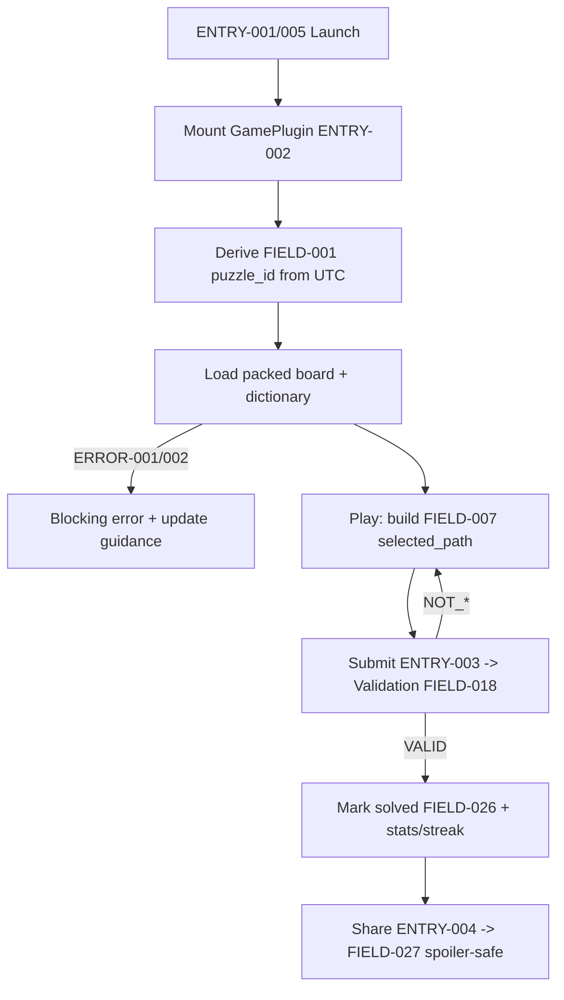
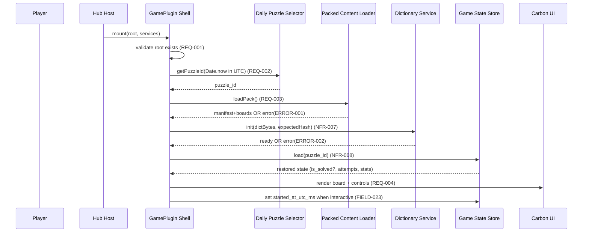
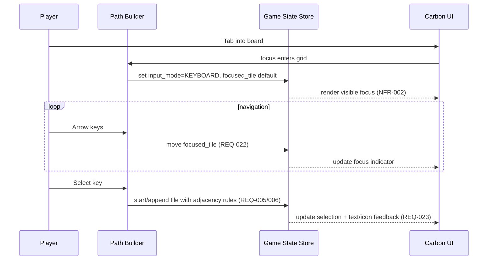
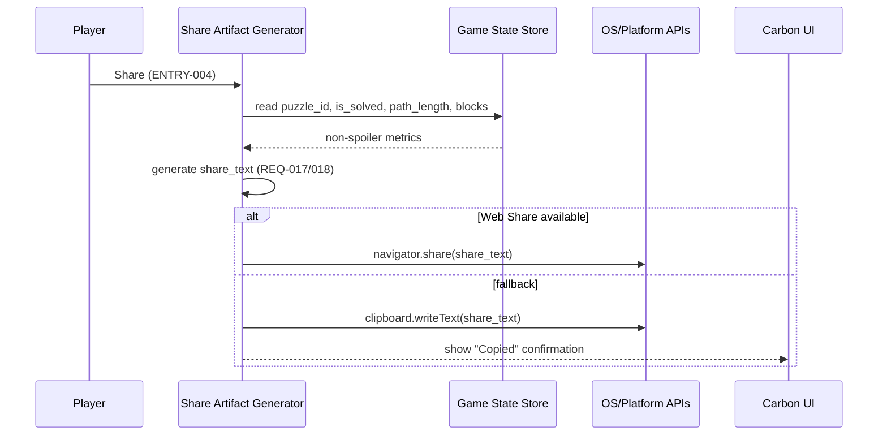
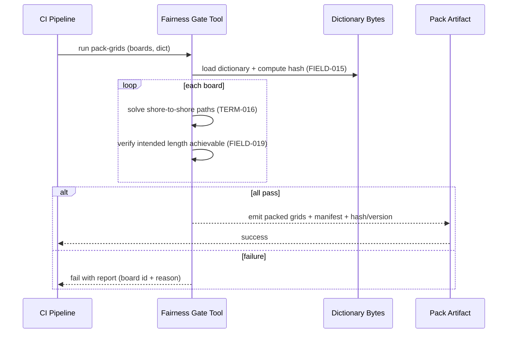

<!-- generated: 2026-07-25T16:57:52Z -->
<!-- mode: feature -->
<!-- feature-slug: isthmus -->
<!-- a2a-endpoint: https://bob-sdlc-orchestrator.2as6l7wq9qj8.eu-gb.codeengine.appdomain.cloud/v1/rpc -->

# Glossary

## Terms

### TERM-001: Isthmus Game
- **Definition:** The daily word-path puzzle experience where a player selects adjacent letter tiles to form a shore-to-shore valid word-path on a small grid.
- **Synonyms:** Isthmus, daily word game, Isthmus puzzle
- **Anti-definition:** Not a high-score word game (e.g., Scrabble); not an area-coverage word search.
- **Source:** User request

### TERM-002: Board
- **Definition:** The rectangular grid of letter tiles for a single daily puzzle.
- **Synonyms:** Grid, puzzle grid
- **Anti-definition:** Not an infinite canvas; not a random board generated at runtime.
- **Source:** User request

### TERM-003: Tile
- **Definition:** A single cell on the Board containing one letter and addressable by row/column.
- **Synonyms:** Letter tile, cell
- **Anti-definition:** Not a multi-letter tile; not a blank/wildcard tile (unless explicitly added later).
- **Source:** User request

### TERM-004: Shore (Top Shore, Bottom Shore)
- **Definition:** The two opposite board edges that define start and end constraints for a valid solution: the top edge (row 0) and bottom edge (row max).
- **Synonyms:** Top edge, bottom edge
- **Anti-definition:** Not left/right edges; not arbitrary endpoints.
- **Source:** User request

### TERM-005: Word-Path
- **Definition:** One continuous ordered sequence of Tiles where each successive tile is adjacent (orthogonally or diagonally) to the previous tile.
- **Synonyms:** Path, trace, chain
- **Anti-definition:** Not multiple disconnected paths; not revisiting tiles unless explicitly allowed.
- **Source:** User request

### TERM-006: Adjacency (8-direction)
- **Definition:** The rule that two tiles are adjacent if they differ by at most 1 in row and column, excluding zero difference (i.e., 8 neighbors).
- **Synonyms:** Orthogonal/diagonal adjacency, Moore neighborhood
- **Anti-definition:** Not knight-moves; not wrap-around adjacency.
- **Source:** User request

### TERM-007: Continuous Selection
- **Definition:** The interaction constraint that the player’s selected tiles must form a valid Word-Path under Adjacency.
- **Synonyms:** Drag path, tile chaining
- **Anti-definition:** Not selecting arbitrary non-adjacent tiles.
- **Source:** User request

### TERM-008: Shore-to-Shore Connection
- **Definition:** A Word-Path that starts on the Top Shore and ends on the Bottom Shore (in either direction, if allowed by rules).
- **Synonyms:** Bridge, connect shores
- **Anti-definition:** Not a path that starts/ends in interior tiles only.
- **Source:** User request

### TERM-009: Dictionary Word
- **Definition:** A word that exists in the bundled on-device dictionary used for validation.
- **Synonyms:** Valid word, accepted word
- **Anti-definition:** Not “looks like a word”; not server-validated.
- **Source:** User request

### TERM-010: Word Chain
- **Definition:** A path spelling that may be segmented into multiple Dictionary Words according to game rules (e.g., delimiter points), collectively satisfying Shore-to-Shore Connection.
- **Synonyms:** Chain of words
- **Anti-definition:** Not multiple separate paths.
- **Source:** User request

### TERM-011: Validation
- **Definition:** Client-side checks that a selection is (a) a Dictionary Word or Word Chain and (b) satisfies Shore-to-Shore Connection.
- **Synonyms:** Check, verify
- **Anti-definition:** Not server-side adjudication; not score computation.
- **Source:** User request

### TERM-012: Daily Puzzle
- **Definition:** The unique Board and associated metadata for a given UTC date.
- **Synonyms:** Daily
- **Anti-definition:** Not per-user randomized; not local-time-based day boundary.
- **Source:** User request

### TERM-013: UTC Day Boundary
- **Definition:** The rule that the daily puzzle changes at 00:00:00 UTC.
- **Synonyms:** UTC rollover
- **Anti-definition:** Not device-local midnight.
- **Source:** User request

### TERM-014: Deterministic Seed
- **Definition:** A reproducible value derived from UTC date used to select the daily puzzle from packed content.
- **Synonyms:** Daily seed
- **Anti-definition:** Not random entropy at runtime.
- **Source:** User request

### TERM-015: Packed Grids
- **Definition:** The set of Daily Puzzle boards bundled into the app at build time for fully offline play.
- **Synonyms:** Bundled boards, content pack
- **Anti-definition:** Not downloaded on demand; not generated on device.
- **Source:** User request

### TERM-016: Fairness Gate
- **Definition:** A build-time verification process ensuring each packed Board has at least one valid Shore-to-Shore Connection and that intended solution length is achievable.
- **Synonyms:** Build-time validator, content QA gate
- **Anti-definition:** Not a runtime check; not a difficulty balancer without explicit metrics.
- **Source:** User request

### TERM-017: Intended Solution Length
- **Definition:** A target tile-count (or word-length) that the puzzle is designed around and that must be achievable by at least one valid solution.
- **Synonyms:** Target length
- **Anti-definition:** Not necessarily the shortest or longest possible solution.
- **Source:** User request

### TERM-018: Session
- **Definition:** A single attempt/play period for the Daily Puzzle, expected to complete in under 3 minutes.
- **Synonyms:** Play session
- **Anti-definition:** Not a long-running campaign.
- **Source:** User request

### TERM-019: Offline-first PWA
- **Definition:** A Progressive Web App that functions without network connectivity after installation by using cached assets and bundled content.
- **Synonyms:** PWA
- **Anti-definition:** Not a web page requiring live API calls to play.
- **Source:** User request

### TERM-020: Native Wrapper (iOS/Android)
- **Definition:** The iOS and Android app shells hosting the same game logic/UI, with offline capability.
- **Synonyms:** iOS app, Android app
- **Anti-definition:** Not separate gameplay rules per platform.
- **Source:** User request

### TERM-021: IBM Carbon Design System UI
- **Definition:** The UI component and interaction style guidelines used for the game interface.
- **Synonyms:** Carbon UI
- **Anti-definition:** Not custom bespoke UI without Carbon primitives.
- **Source:** User request

### TERM-022: GamePlugin
- **Definition:** The integration contract with CIC Games hub, exposing `mount(root, services)` and reporting results.
- **Synonyms:** Hub plugin, game module
- **Anti-definition:** Not a standalone app without hub services.
- **Source:** User request

### TERM-023: Hub Services
- **Definition:** The host-provided services passed into the GamePlugin at mount time (e.g., navigation, storage namespace, analytics hooks, accessibility helpers).
- **Synonyms:** services, host services
- **Anti-definition:** Not direct dependency on global window APIs when a hub service exists.
- **Source:** User request

### TERM-024: DailyResult
- **Definition:** The structured outcome reported to the hub for a given Daily Puzzle (e.g., solved status, attempts, completion time, share stats).
- **Synonyms:** Result payload
- **Anti-definition:** Not raw selected letters; not spoiler content.
- **Source:** User request

### TERM-025: Local Stats (Namespaced)
- **Definition:** On-device stored aggregated metrics for this game under a namespace to avoid collisions (e.g., streak, plays, solves).
- **Synonyms:** Stats, local persistence
- **Anti-definition:** Not shared across games; not stored server-side (unless hub adds).
- **Source:** User request

### TERM-026: Streak
- **Definition:** Count of consecutive UTC days with a solved Daily Puzzle.
- **Synonyms:** Daily streak
- **Anti-definition:** Not local-time streak; not total solves.
- **Source:** User request

### TERM-027: Spoiler-safe Share Artifact
- **Definition:** A shareable text payload that reveals progress/length/blocks but never the solution word(s) or board letters.
- **Synonyms:** Share text, share card (text)
- **Anti-definition:** Not a screenshot of the board; not the word.
- **Source:** User request

### TERM-028: Accessibility (WCAG 2.1 AA)
- **Definition:** Conformance requirements including keyboard operability, non-color-only state, visible focus, and respecting prefers-reduced-motion.
- **Synonyms:** A11y
- **Anti-definition:** Not “best effort”; not color-dependent UX.
- **Source:** User request


## Data Dictionary

| ID | Name | Type | Format | Range/Enum | Units | Default | Nullable | PII | Source | Validation |
|---|---|---|---|---|---|---|---|---|---|---|
| FIELD-001 | puzzle_id | string | `YYYY-MM-DD` (UTC) | ISO date | N/A | none | No | None | Deterministic selection from TERM-014 | Must equal current UTC date at render time or selected history date |
| FIELD-002 | utc_epoch_ms | integer | int64 | `>=0` | ms | none | No | None | Device clock | Must be monotonic within a session; used to derive UTC date |
| FIELD-003 | board_rows | integer | int32 | `2..10` | tiles | none | No | None | Packed grid metadata | Must match board_letters dimensions |
| FIELD-004 | board_cols | integer | int32 | `2..10` | tiles | none | No | None | Packed grid metadata | Must match board_letters dimensions |
| FIELD-005 | board_letters | string[][] | 2D array | `A-Z` | N/A | none | No | None | TERM-015 | Each entry must be single uppercase A–Z |
| FIELD-006 | tile_coord | object | `{row:int, col:int}` | row `0..rows-1`, col `0..cols-1` | N/A | none | No | None | Runtime | Must be within bounds |
| FIELD-007 | selected_path | object[] | array of FIELD-006 | length `0..(rows*cols)` | tiles | `[]` | No | None | Runtime | No duplicates (unless rules changed); each step adjacent per TERM-006 |
| FIELD-008 | allows_tile_reuse | boolean | bool | `true/false` | N/A | `false` | No | None | Game rules | If false, selected_path must contain unique tile_coord |
| FIELD-009 | adjacency_mode | string | enum | `EIGHT_WAY` | N/A | `EIGHT_WAY` | No | None | Game rules | Must be `EIGHT_WAY` for this feature |
| FIELD-010 | start_shore | string | enum | `TOP` | N/A | `TOP` | No | None | Game rules | Must be `TOP` |
| FIELD-011 | end_shore | string | enum | `BOTTOM` | N/A | `BOTTOM` | No | None | Game rules | Must be `BOTTOM` |
| FIELD-012 | is_shore_to_shore | boolean | bool | `true/false` | N/A | `false` | No | None | Validation | True iff first coord on top row and last coord on bottom row |
| FIELD-013 | spelled_text | string | `[A-Z]+` | length `0..(rows*cols)` | chars | `""` | No | None | Derived from FIELD-007 + FIELD-005 | Must equal concatenation of letters along selected_path |
| FIELD-014 | dictionary_version | string | semver-ish | e.g., `v1.2.0` | N/A | none | No | None | Build metadata | Must be present to ensure deterministic validation |
| FIELD-015 | dictionary_hash | string | hex | 64-char SHA-256 | N/A | none | No | None | Build metadata | Must match bundled dictionary bytes |
| FIELD-016 | is_dictionary_word | boolean | bool | `true/false` | N/A | `false` | No | None | Validation | True iff FIELD-013 exists in bundled dictionary |
| FIELD-017 | is_valid_word_chain | boolean | bool | `true/false` | N/A | `false` | No | None | Validation | True iff segmentation rules produce all dictionary words (rules TBD) |
| FIELD-018 | validation_status | string | enum | `EMPTY_SELECTION, NOT_ADJACENT, REUSED_TILE, NOT_A_WORD, NOT_SHORE_TO_SHORE, VALID` | N/A | `EMPTY_SELECTION` | No | None | Validation | Must be one of enum values derived from checks order |
| FIELD-019 | intended_solution_length | integer | int32 | `1..(rows*cols)` | tiles | none | No | None | TERM-016 pack metadata | Must be achievable by at least one valid solution per fairness gate |
| FIELD-020 | min_solution_length | integer | int32 | `1..(rows*cols)` | tiles | none | Yes | None | Pack metadata | If present, must be `<= max_solution_length` |
| FIELD-021 | max_solution_length | integer | int32 | `1..(rows*cols)` | tiles | none | Yes | None | Pack metadata | If present, must be `>= min_solution_length` |
| FIELD-022 | attempt_count | integer | int32 | `0..999` | attempts | `0` | No | None | Runtime | Increment on each submitted validation attempt |
| FIELD-023 | started_at_utc_ms | integer | int64 | `>=0` | ms | none | No | None | Runtime | Set when puzzle view first becomes interactive |
| FIELD-024 | completed_at_utc_ms | integer | int64 | `>=0` | ms | null | Yes | None | Runtime | Set when first valid shore-to-shore solution accepted |
| FIELD-025 | duration_ms | integer | int64 | `>=0` | ms | null | Yes | None | Derived | `completed_at - started_at` when completed |
| FIELD-026 | is_solved | boolean | bool | `true/false` | N/A | `false` | No | None | Runtime | True after acceptance; must persist for puzzle_id |
| FIELD-027 | share_text | string | text | length `1..2000` | N/A | null | Yes | None | Generated client-side | Must not include FIELD-005 or FIELD-013 literal content |
| FIELD-028 | share_blocks | string[] | array | enum tokens (TBD) | N/A | `[]` | No | None | Generated | Must encode progress without letters/words |
| FIELD-029 | path_length | integer | int32 | `0..(rows*cols)` | tiles | `0` | No | None | Derived | Must equal `selected_path.length` at share time |
| FIELD-030 | local_stats_namespace | string | slug | e.g., `cic.ithmus` | N/A | none | No | None | Hub services | Must be unique per game |
| FIELD-031 | streak_count | integer | int32 | `0..9999` | days | `0` | No | None | Local stats | Updated only on transitions of UTC days |
| FIELD-032 | last_solved_puzzle_id | string | `YYYY-MM-DD` | ISO date | N/A | null | Yes | None | Local stats | If present, must be a valid date string |
| FIELD-033 | prefers_reduced_motion | boolean | bool | `true/false` | N/A | `false` | No | None | OS/media query | Read from platform setting |
| FIELD-034 | input_mode | string | enum | `POINTER, KEYBOARD` | N/A | `POINTER` | No | None | Runtime | Determined by last input device used |
| FIELD-035 | focused_tile | object | FIELD-006 | in-bounds coord | N/A | null | Yes | None | Runtime | Must be within bounds when non-null |
| FIELD-036 | plugin_mount_root_id | string | DOM id | text | N/A | none | No | None | GamePlugin | Must refer to existing DOM node |
| FIELD-037 | daily_result | object | JSON | schema-defined | N/A | none | No | None | Report to hub | Must not include spoiler data (letters/words) |
| FIELD-038 | install_state | string | enum | `NOT_INSTALLED, INSTALLED` | N/A | `NOT_INSTALLED` | No | None | PWA runtime | Derived from platform installability |

# User Journeys

## Roles

| Role ID | Role | Type | Description |
|---|---|---|---|
| ROLE-001 | Player | Primary | Plays the Daily Puzzle, traces a TERM-005, views validation, shares results. |
| ROLE-002 | Hub Host | System | Loads TERM-022 GamePlugin, provides TERM-023 services, receives TERM-024 DailyResult. |
| ROLE-003 | Build/Content Engineer | Admin | Packages TERM-015 Packed Grids and runs TERM-016 Fairness Gate. |
| ROLE-004 | Accessibility Auditor | Secondary | Verifies TERM-028 compliance across input methods and reduced motion. |
| ROLE-005 | OS/Platform | System | Provides storage, clipboard/share sheet, media query for FIELD-033. |

## Entry Points

| Entry ID | Location | Trigger | Auth |
|---|---|---|---|
| ENTRY-001 | Hub route `/games/isthmus` | Player selects game in hub | Hub-auth (implicit) |
| ENTRY-002 | GamePlugin `mount(root, services)` | Hub Host mounts plugin | Trusted host call |
| ENTRY-003 | In-game “Submit/Validate” action | Player indicates selection complete | None |
| ENTRY-004 | In-game “Share” action | Player taps Share after attempt/solve | None |
| ENTRY-005 | App cold start (PWA/native) | OS launches app | None |
| ENTRY-006 | Build pipeline content step | CI job runs pack + gate | CI permissions |

## Role Permission Matrix

| Capability | ROLE-001 Player | ROLE-002 Hub Host | ROLE-003 Build Eng | ROLE-004 Auditor | ROLE-005 OS |
|---|---:|---:|---:|---:|---:|
| View today’s TERM-012 | Y | N | N | Y | N |
| Select tiles (FIELD-007) | Y | N | N | Y | N |
| Run client-side TERM-011 | Y | N | N | Y | N |
| Persist TERM-025 stats | Y | N | N | Y | OS provides storage |
| Receive FIELD-037 daily_result | N | Y | N | N | N |
| Generate/share TERM-027 | Y | N | N | Y | OS provides share |
| Package TERM-015 | N | N | Y | N | N |
| Run TERM-016 | N | N | Y | N | N |

## Journeys

### JOURNEY-001: Launch daily puzzle (offline-first)
- **Role/Goal:** ROLE-001 Player wants to open today’s TERM-012 Daily Puzzle even without network.
  - **Success:** Board renders using FIELD-005; FIELD-001 matches current UTC date; interaction enabled.
  - **Failure:** No packed content available or corrupted; player sees blocking error with recovery guidance.
- **Entry:** ENTRY-001 + ENTRY-002 or ENTRY-005
- **Happy path:**
  1. Hub Host calls `mount` with FIELD-036 `plugin_mount_root_id` and TERM-023 Hub Services. (TERM-022)
  2. Game computes FIELD-001 `puzzle_id` from FIELD-002 `utc_epoch_ms` using TERM-013. (TERM-012)
  3. Game selects Board from TERM-015 Packed Grids deterministically using TERM-014. (FIELD-001, TERM-015)
  4. Game renders TERM-002 Board with FIELD-003/004 and FIELD-005; sets FIELD-023 `started_at_utc_ms`. (TERM-003)
- **BRANCH-001 (Already solved):**
  - If local state indicates FIELD-026 `is_solved=true` for FIELD-001, show solved state and enable share.  
- **ERROR-001 (Missing/invalid packed grid):**
  - **Trigger:** Packed content cannot be loaded or fails validation.
  - **System response:** Show non-spoiler error and disable play; log diagnostic.
  - **Recovery:** Offer “Restart app” and “Check for update” guidance.
- **EDGE-001 (Device clock incorrect):**
  - If FIELD-002 is far from actual date, the player may see an unexpected FIELD-001; show UTC date explicitly in UI.
- **EDGE-002 (No network):**
  - Ensure no blocking network dependency for selecting board/dictionary.

### JOURNEY-002: Trace a continuous shore-to-shore word-path and validate
- **Role/Goal:** ROLE-001 Player wants to create TERM-005 Word-Path and receive TERM-011 Validation feedback.
  - **Success:** FIELD-018 becomes `VALID`; FIELD-012 and word validity (FIELD-016 or FIELD-017) true; puzzle marked solved.
  - **Failure:** Invalid adjacency/shore/word feedback is shown; selection can be edited and retried.
- **Entry:** ENTRY-003
- **Happy path:**
  1. Player selects a starting TERM-003 Tile on TERM-004 Top Shore (row 0), creating FIELD-007 `selected_path` with first FIELD-006. (FIELD-010)
  2. Player extends selection by choosing adjacent tiles per TERM-006; app updates FIELD-013 `spelled_text`. (FIELD-009, FIELD-005, FIELD-007)
  3. Player ends selection on TERM-004 Bottom Shore (last row). (FIELD-011)
  4. Player triggers validation (Submit). (ENTRY-003)
  5. App validates: adjacency, reuse rule FIELD-008, shore-to-shore FIELD-012, dictionary FIELD-016 or chain FIELD-017; sets FIELD-018 accordingly. (TERM-011)
  6. If valid, app sets FIELD-026 `is_solved=true`, FIELD-024 `completed_at_utc_ms`, FIELD-025 `duration_ms`, increments stats and streak. (TERM-025, TERM-026)
- **BRANCH-002 (Not adjacent):**
  - If next tile is not adjacent, set FIELD-018=`NOT_ADJACENT` and prevent extending path (or auto-reject step).
- **BRANCH-003 (Tile reuse attempted):**
  - If FIELD-008 is false and player selects an already used FIELD-006, set FIELD-018=`REUSED_TILE`.
- **BRANCH-004 (Not shore-to-shore):**
  - If first/last tiles aren’t on required shores, set FIELD-018=`NOT_SHORE_TO_SHORE`.
- **BRANCH-005 (Not a word):**
  - If FIELD-013 not in dictionary and not a valid chain, set FIELD-018=`NOT_A_WORD`.
- **ERROR-002 (Dictionary missing/corrupt):**
  - **Trigger:** Bundled dictionary load fails or hash mismatch with FIELD-015.
  - **System response:** Disable validation; show error and remediation.
  - **Recovery:** Restart/update guidance.
- **LOOP-001 (Retry attempts):**
  - After any non-VALID FIELD-018, player clears or edits FIELD-007 and re-submits; increment FIELD-022 attempt_count per submit.
- **EDGE-003 (Empty selection):**
  - Submit with FIELD-007 empty => FIELD-018=`EMPTY_SELECTION`.
- **EDGE-004 (Concurrency: rapid input):**
  - Rapid pointer moves/keypresses should not corrupt ordering of FIELD-007.
- **EDGE-005 (Diagonal-only connection):**
  - Ensure diagonal adjacency is accepted per TERM-006.
- **EDGE-006 (Repeated solve):**
  - If FIELD-026 already true, subsequent validations must not change completion time/stats for the same FIELD-001.

### JOURNEY-003: Keyboard-only play with WCAG 2.1 AA constraints
- **Role/Goal:** ROLE-001 Player (keyboard) wants to complete a valid solution without pointer input.
  - **Success:** All tile selection and submission possible via keyboard; focus visible; state not color-only.
  - **Failure:** Trap focus, invisible focus, or inability to extend/submit path.
- **Entry:** ENTRY-001
- **Happy path:**
  1. Player tabs into the Board; app sets FIELD-034 `input_mode=KEYBOARD` and FIELD-035 `focused_tile` to a default in-bounds tile. (FIELD-035)
  2. Arrow keys (and optional diagonals via key combos, TBD) move FIELD-035 among tiles; focus indicator visible. (TERM-028)
  3. Player presses “Select” key to add focused tile to FIELD-007 if adjacent; app updates FIELD-013. (TERM-007)
  4. Player presses “Submit” key/button to validate and receive FIELD-018 feedback via text/icon. (TERM-028)
- **ERROR-003 (Focus not visible):**
  - **Trigger:** Focus ring not rendered on tiles.
  - **System response:** Fail accessibility check; must render visible outline per Carbon + WCAG.
  - **Recovery:** N/A (dev fix).
- **EDGE-007 (Color-only indication):**
  - Selected tiles and validation state must have non-color indicators (text/icon/aria).

### JOURNEY-004: Share spoiler-safe result
- **Role/Goal:** ROLE-001 Player wants to share progress/solve without revealing letters/words.
  - **Success:** Share text contains FIELD-001 and non-spoiler metrics (FIELD-029, FIELD-028) and copies/shares successfully.
  - **Failure:** Share contains spoiler content or share action fails.
- **Entry:** ENTRY-004
- **Happy path:**
  1. Player taps Share.
  2. App generates FIELD-027 `share_text` including FIELD-001 `puzzle_id`, status (solved/unsolved), FIELD-029 `path_length`, and FIELD-028 `share_blocks`. (TERM-027)
  3. App invokes OS share sheet / clipboard via platform APIs. (ROLE-005)
- **ERROR-004 (Share API unavailable):**
  - **Trigger:** Platform doesn’t support native share.
  - **System response:** Offer “Copy to clipboard” fallback.
  - **Recovery:** Player copies text manually.
- **EDGE-008 (Spoiler leakage):**
  - Ensure FIELD-027 does not include FIELD-013 or any substring matching board letters layout (FIELD-005).

### JOURNEY-005: Build-time packing and fairness gate
- **Role/Goal:** ROLE-003 Build/Content Engineer ensures every packed puzzle is solvable and meets intended length constraints.
  - **Success:** CI step produces TERM-015 pack; all boards pass TERM-016; outputs metadata including FIELD-019.
  - **Failure:** Gate fails and blocks release with actionable report.
- **Entry:** ENTRY-006
- **Happy path:**
  1. CI loads candidate boards and dictionary version (FIELD-014/015).
  2. For each board, solver searches for at least one Shore-to-Shore Connection under TERM-006 and FIELD-008=false. (TERM-016)
  3. CI verifies at least one solution meets FIELD-019 `intended_solution_length` (or within min/max if provided). (FIELD-019..021)
  4. CI emits packed artifact and manifest with board dimensions and metadata.
- **ERROR-005 (Unsolvable board):**
  - **Trigger:** No valid shore-to-shore path found.
  - **System response:** Fail build; report puzzle identifier and reason.
  - **Recovery:** Replace/regenerate offending board.
- **EDGE-009 (Dictionary mismatch):**
  - If dictionary changes, previously solvable boards may fail; gate must run against exact bundled dictionary hash.

## Journey Map



# Requirements

### REQ-001: GamePlugin mount initializes game
- **EARS Pattern:** Event-Driven
- **EARS Statement:** When the hub host calls TERM-022 `mount(root, services)`, the Isthmus Game shall render the TERM-012 Daily Puzzle into FIELD-036 `plugin_mount_root_id`.
- **Inputs:** FIELD-036
- **Outputs:** Rendered TERM-002 Board
- **Preconditions:** Valid DOM root exists for FIELD-036
- **Postconditions:** Puzzle UI is interactive; FIELD-023 is set
- **Invariants:** Fully client-side; no required network calls
- **Trigger:** ENTRY-002
- **Actor:** ROLE-002
- **EntityScope:** TERM-022
- **ErrorModes:** Invalid root id
- **NFR-Tags:** compatibility
- **Source:** JOURNEY-001 step 1
- **Dependencies:** REQ-002
- **Priority:** P0
- **AcceptanceCriteria:**
  - TEST-001: Given a valid root element, when `mount` is called, then the board container is created under that root.
  - TEST-002: Given a missing root element, when `mount` is called, then the game shows a blocking error UI instead of crashing.
- **Assumptions:** Hub provides a stable mount root.
- **OpenQuestions:** What exact hub `services` interface is required?

### REQ-002: Compute puzzle_id from UTC date
- **EARS Pattern:** Ubiquitous
- **EARS Statement:** The Isthmus Game shall derive FIELD-001 `puzzle_id` from the current UTC date using TERM-013 UTC Day Boundary.
- **Inputs:** FIELD-002
- **Outputs:** FIELD-001
- **Preconditions:** Device provides a system clock
- **Postconditions:** FIELD-001 available for selection, stats, and share
- **Invariants:** UTC-based; not device-local midnight
- **Trigger:** N/A
- **Actor:** ROLE-001
- **EntityScope:** TERM-012
- **ErrorModes:** Device clock unavailable
- **NFR-Tags:** compatibility
- **Source:** JOURNEY-001 step 2
- **Dependencies:** NFR-006
- **Priority:** P0
- **AcceptanceCriteria:**
  - TEST-003: Given a known UTC timestamp, when derived, then FIELD-001 equals the expected `YYYY-MM-DD`.
- **Assumptions:** Device clock can be read.
- **OpenQuestions:** Should the UI warn if device time appears inconsistent?

### REQ-003: Deterministically select packed board for puzzle_id
- **EARS Pattern:** Event-Driven
- **EARS Statement:** When FIELD-001 `puzzle_id` is determined, the Isthmus Game shall select a TERM-002 Board from TERM-015 Packed Grids deterministically using TERM-014 Deterministic Seed.
- **Inputs:** FIELD-001, TERM-015 pack
- **Outputs:** FIELD-003, FIELD-004, FIELD-005
- **Preconditions:** Pack is present in app bundle
- **Postconditions:** Board data loaded in memory
- **Invariants:** Same puzzle_id yields same board for all clients with same pack
- **Trigger:** FIELD-001 set
- **Actor:** ROLE-001
- **EntityScope:** TERM-015
- **ErrorModes:** Pack missing/corrupt
- **NFR-Tags:** reliability
- **Source:** JOURNEY-001 step 3
- **Dependencies:** REQ-002, NFR-007
- **Priority:** P0
- **AcceptanceCriteria:**
  - TEST-004: Given the same FIELD-001 and same pack, when selected on two devices, then FIELD-005 is identical.
- **Assumptions:** Pack versioning is consistent across clients.
- **OpenQuestions:** Is selection 1:1 mapping or modulo over a list?

### REQ-004: Render board grid with Carbon components
- **EARS Pattern:** Ubiquitous
- **EARS Statement:** The Isthmus Game shall render TERM-002 Board tiles using TERM-021 IBM Carbon Design System UI primitives.
- **Inputs:** FIELD-003, FIELD-004, FIELD-005
- **Outputs:** Visible grid UI
- **Preconditions:** Board loaded
- **Postconditions:** Tiles are individually interactable
- **Invariants:** Letter displayed matches FIELD-005
- **Trigger:** N/A
- **Actor:** ROLE-001
- **EntityScope:** TERM-002
- **ErrorModes:** N/A
- **NFR-Tags:** compatibility, accessibility
- **Source:** JOURNEY-001 step 4
- **Dependencies:** REQ-003, NFR-001
- **Priority:** P1
- **AcceptanceCriteria:**
  - TEST-005: Given FIELD-005, when the board renders, then each tile shows the corresponding letter.
- **Assumptions:** Carbon components are available in the hub stack.
- **OpenQuestions:** Exact Carbon components for tile grid (button vs. clickable div)?

### REQ-005: Start a selection path from a top-shore tile
- **EARS Pattern:** Event-Driven
- **EARS Statement:** When the player selects a TERM-003 Tile on the TERM-004 Top Shore, the Isthmus Game shall set FIELD-007 `selected_path` to start with that FIELD-006 `tile_coord`.
- **Inputs:** Tile interaction, FIELD-006
- **Outputs:** FIELD-007
- **Preconditions:** Board rendered; not solved or selection allowed
- **Postconditions:** FIELD-007 length is 1
- **Invariants:** First coord row equals 0
- **Trigger:** Tile select
- **Actor:** ROLE-001
- **EntityScope:** TERM-005
- **ErrorModes:** Selection started on non-top tile
- **NFR-Tags:** accessibility
- **Source:** JOURNEY-002 step 1
- **Dependencies:** REQ-004
- **Priority:** P0
- **AcceptanceCriteria:**
  - TEST-006: Given a top-row tile, when selected as first tile, then FIELD-007[0].row equals 0.
- **Assumptions:** Rules require starting at top shore (not bottom).
- **OpenQuestions:** Is bottom-to-top start allowed as equivalent?

### REQ-006: Enforce 8-way adjacency when extending path
- **EARS Pattern:** Event-Driven
- **EARS Statement:** When the player selects a next tile, the Isthmus Game shall append it to FIELD-007 only if it is adjacent to the last tile under TERM-006 Adjacency.
- **Inputs:** Candidate FIELD-006, existing FIELD-007
- **Outputs:** Updated FIELD-007 or unchanged
- **Preconditions:** FIELD-007 length >= 1
- **Postconditions:** If appended, last step is adjacent to previous
- **Invariants:** adjacency_mode equals FIELD-009 `EIGHT_WAY`
- **Trigger:** Tile select
- **Actor:** ROLE-001
- **EntityScope:** TERM-006
- **ErrorModes:** Not adjacent
- **NFR-Tags:** accessibility
- **Source:** JOURNEY-002 step 2, BRANCH-002
- **Dependencies:** REQ-005
- **Priority:** P0
- **AcceptanceCriteria:**
  - TEST-007: Given a last tile at (r,c), when selecting (r+1,c+1), then the tile is appended.
  - TEST-008: Given a last tile at (r,c), when selecting (r+2,c), then FIELD-007 is not appended and FIELD-018 becomes `NOT_ADJACENT`.
- **Assumptions:** Diagonals are always permitted.
- **OpenQuestions:** Should invalid selection be ignored or show immediate error?

### REQ-007: Prevent tile reuse when reuse is disallowed
- **EARS Pattern:** State-Driven
- **EARS Statement:** While FIELD-008 `allows_tile_reuse` is false, the Isthmus Game shall reject adding any FIELD-006 already present in FIELD-007.
- **Inputs:** FIELD-008, FIELD-007, candidate FIELD-006
- **Outputs:** FIELD-018 `REUSED_TILE`
- **Preconditions:** FIELD-007 non-empty
- **Postconditions:** FIELD-007 unchanged on reuse attempt
- **Invariants:** Uniqueness in FIELD-007
- **Trigger:** Tile select
- **Actor:** ROLE-001
- **EntityScope:** TERM-005
- **ErrorModes:** Reused tile
- **NFR-Tags:** N/A
- **Source:** JOURNEY-002 BRANCH-003
- **Dependencies:** REQ-006
- **Priority:** P0
- **AcceptanceCriteria:**
  - TEST-009: Given a tile already in FIELD-007, when selected again, then FIELD-018 is `REUSED_TILE`.
- **Assumptions:** Default is no reuse.
- **OpenQuestions:** None.

### REQ-008: Derive spelled_text from selected_path
- **EARS Pattern:** Event-Driven
- **EARS Statement:** When FIELD-007 `selected_path` changes, the Isthmus Game shall set FIELD-013 `spelled_text` to the concatenation of FIELD-005 letters in path order.
- **Inputs:** FIELD-007, FIELD-005
- **Outputs:** FIELD-013
- **Preconditions:** Board loaded
- **Postconditions:** FIELD-013 updated
- **Invariants:** Length(FIELD-013) equals length(FIELD-007)
- **Trigger:** FIELD-007 change
- **Actor:** ROLE-001
- **EntityScope:** TERM-005
- **ErrorModes:** Out-of-bounds coord
- **NFR-Tags:** N/A
- **Source:** JOURNEY-002 step 2
- **Dependencies:** REQ-003, REQ-006
- **Priority:** P1
- **AcceptanceCriteria:**
  - TEST-010: Given a path of 3 coords, when updated, then FIELD-013 length equals 3 and letters match FIELD-005 at those coords.
- **Assumptions:** Letters are uppercase A–Z.
- **OpenQuestions:** None.

### REQ-009: Validate shore-to-shore connectivity on submit
- **EARS Pattern:** Event-Driven
- **EARS Statement:** When the player triggers validation, the Isthmus Game shall set FIELD-012 `is_shore_to_shore` to true only if the first tile is on the top row and the last tile is on the bottom row.
- **Inputs:** FIELD-007, FIELD-003
- **Outputs:** FIELD-012
- **Preconditions:** Submit action available
- **Postconditions:** FIELD-012 set for this attempt
- **Invariants:** start_shore=FIELD-010, end_shore=FIELD-011
- **Trigger:** ENTRY-003
- **Actor:** ROLE-001
- **EntityScope:** TERM-008
- **ErrorModes:** Not shore-to-shore
- **NFR-Tags:** N/A
- **Source:** JOURNEY-002 step 5, BRANCH-004
- **Dependencies:** REQ-005
- **Priority:** P0
- **AcceptanceCriteria:**
  - TEST-011: Given first tile row 0 and last tile row rows-1, when submitted, then FIELD-012 is true.
- **Assumptions:** Path direction is top-to-bottom.
- **OpenQuestions:** Allow bottom-to-top equivalence?

### REQ-010: Validate dictionary word on submit
- **EARS Pattern:** Event-Driven
- **EARS Statement:** When the player triggers validation, the Isthmus Game shall set FIELD-016 `is_dictionary_word` to true only if FIELD-013 `spelled_text` exists in the bundled dictionary.
- **Inputs:** FIELD-013, bundled dictionary
- **Outputs:** FIELD-016
- **Preconditions:** Dictionary loaded and hash verified
- **Postconditions:** FIELD-016 set for this attempt
- **Invariants:** Uses bundled dictionary only
- **Trigger:** ENTRY-003
- **Actor:** ROLE-001
- **EntityScope:** TERM-009
- **ErrorModes:** Dictionary unavailable
- **NFR-Tags:** privacy
- **Source:** JOURNEY-002 step 5, BRANCH-005, ERROR-002
- **Dependencies:** NFR-007
- **Priority:** P0
- **AcceptanceCriteria:**
  - TEST-012: Given FIELD-013 is in dictionary, when submitted, then FIELD-016 is true.
- **Assumptions:** Dictionary lookup is exact-match.
- **OpenQuestions:** Case-folding and diacritics rules?

### REQ-011: Set validation_status for empty selection
- **EARS Pattern:** Event-Driven
- **EARS Statement:** When the player triggers validation with FIELD-007 `selected_path` empty, the Isthmus Game shall set FIELD-018 `validation_status` to `EMPTY_SELECTION`.
- **Inputs:** FIELD-007
- **Outputs:** FIELD-018
- **Preconditions:** N/A
- **Postconditions:** User sees error state
- **Invariants:** attempt_count increments separately (REQ-014)
- **Trigger:** ENTRY-003
- **Actor:** ROLE-001
- **EntityScope:** TERM-011
- **ErrorModes:** Empty selection
- **NFR-Tags:** accessibility
- **Source:** JOURNEY-002 EDGE-003
- **Dependencies:** REQ-014
- **Priority:** P1
- **AcceptanceCriteria:**
  - TEST-013: Given FIELD-007 is `[]`, when submitted, then FIELD-018 is `EMPTY_SELECTION`.
- **Assumptions:** Submit is available even with no tiles selected.
- **OpenQuestions:** Should submit be disabled instead?

### REQ-012: Set validation_status for non-adjacent attempt
- **EARS Pattern:** Event-Driven
- **EARS Statement:** When a tile selection violates TERM-006 Adjacency, the Isthmus Game shall set FIELD-018 `validation_status` to `NOT_ADJACENT`.
- **Inputs:** Candidate selection, FIELD-007
- **Outputs:** FIELD-018
- **Preconditions:** FIELD-007 non-empty
- **Postconditions:** Error is presented non-color-only
- **Invariants:** FIELD-007 unchanged for the invalid step
- **Trigger:** Tile select
- **Actor:** ROLE-001
- **EntityScope:** TERM-011
- **ErrorModes:** Not adjacent
- **NFR-Tags:** accessibility
- **Source:** JOURNEY-002 BRANCH-002
- **Dependencies:** REQ-006, NFR-002
- **Priority:** P1
- **AcceptanceCriteria:**
  - TEST-014: Given a non-adjacent tile is selected, then FIELD-018 equals `NOT_ADJACENT` and a text/icon cue is shown.
- **Assumptions:** Immediate feedback is desired.
- **OpenQuestions:** None.

### REQ-013: Accept solution when both word-valid and shore-to-shore
- **EARS Pattern:** Event-Driven
- **EARS Statement:** When FIELD-012 `is_shore_to_shore` is true and either FIELD-016 `is_dictionary_word` is true or FIELD-017 `is_valid_word_chain` is true, the Isthmus Game shall set FIELD-018 `validation_status` to `VALID`.
- **Inputs:** FIELD-012, FIELD-016, FIELD-017
- **Outputs:** FIELD-018
- **Preconditions:** Submit occurred
- **Postconditions:** Validation status is valid
- **Invariants:** Exactly one continuous path (FIELD-007)
- **Trigger:** ENTRY-003
- **Actor:** ROLE-001
- **EntityScope:** TERM-011
- **ErrorModes:** N/A
- **NFR-Tags:** N/A
- **Source:** JOURNEY-002 step 5
- **Dependencies:** REQ-009, REQ-010, REQ-015
- **Priority:** P0
- **AcceptanceCriteria:**
  - TEST-015: Given FIELD-012 true and FIELD-016 true, when submitted, then FIELD-018 is `VALID`.
- **Assumptions:** Word-chain rules will be defined.
- **OpenQuestions:** Define the exact segmentation rules for TERM-010.

### REQ-014: Count validation attempts per puzzle
- **EARS Pattern:** Event-Driven
- **EARS Statement:** When the player triggers validation, the Isthmus Game shall increment FIELD-022 `attempt_count` by 1 for the current FIELD-001 `puzzle_id`.
- **Inputs:** ENTRY-003, FIELD-001
- **Outputs:** FIELD-022
- **Preconditions:** Puzzle loaded
- **Postconditions:** Attempt recorded locally
- **Invariants:** Attempts are scoped to puzzle_id
- **Trigger:** ENTRY-003
- **Actor:** ROLE-001
- **EntityScope:** TERM-012
- **ErrorModes:** Storage write failure
- **NFR-Tags:** reliability
- **Source:** JOURNEY-002 LOOP-001
- **Dependencies:** NFR-008
- **Priority:** P1
- **AcceptanceCriteria:**
  - TEST-016: Given attempt_count is N, when submit occurs, then it becomes N+1.
- **Assumptions:** Attempts are not sent to server.
- **OpenQuestions:** Should “clear selection” count as attempt? (assumed no)

### REQ-015: Mark puzzle solved and freeze completion time
- **EARS Pattern:** Event-Driven
- **EARS Statement:** When FIELD-018 `validation_status` becomes `VALID` for a FIELD-001 `puzzle_id` that is not yet solved, the Isthmus Game shall set FIELD-026 `is_solved` to true and set FIELD-024 `completed_at_utc_ms`.
- **Inputs:** FIELD-018, FIELD-001
- **Outputs:** FIELD-026, FIELD-024
- **Preconditions:** Not already solved for puzzle_id
- **Postconditions:** Solved state persisted locally
- **Invariants:** FIELD-024 does not change after first solve for a puzzle_id
- **Trigger:** FIELD-018 becomes `VALID`
- **Actor:** ROLE-001
- **EntityScope:** TERM-024
- **ErrorModes:** Storage write failure
- **NFR-Tags:** reliability, auditability
- **Source:** JOURNEY-002 step 6, EDGE-006
- **Dependencies:** REQ-013, NFR-008
- **Priority:** P0
- **AcceptanceCriteria:**
  - TEST-017: Given unsolved puzzle, when VALID occurs, then is_solved becomes true and completed_at is set.
  - TEST-018: Given solved puzzle, when VALID occurs again, then completed_at does not change.
- **Assumptions:** Only first valid solution counts.
- **OpenQuestions:** Allow “improve time” after solve? (assumed no)

### REQ-016: Compute duration on solve
- **EARS Pattern:** Event-Driven
- **EARS Statement:** When FIELD-024 `completed_at_utc_ms` is set, the Isthmus Game shall set FIELD-025 `duration_ms` to `FIELD-024 - FIELD-023`.
- **Inputs:** FIELD-023, FIELD-024
- **Outputs:** FIELD-025
- **Preconditions:** started_at set
- **Postconditions:** duration_ms available for reporting
- **Invariants:** duration_ms >= 0
- **Trigger:** FIELD-024 set
- **Actor:** ROLE-001
- **EntityScope:** TERM-018
- **ErrorModes:** started_at missing
- **NFR-Tags:** N/A
- **Source:** JOURNEY-002 step 6
- **Dependencies:** REQ-015
- **Priority:** P1
- **AcceptanceCriteria:**
  - TEST-019: Given started_at and completed_at, when completed_at set, then duration_ms equals their difference.
- **Assumptions:** started_at is set when puzzle becomes interactive.
- **OpenQuestions:** Pause/background handling?

### REQ-017: Generate spoiler-safe share text
- **EARS Pattern:** Event-Driven
- **EARS Statement:** When the player triggers share, the Isthmus Game shall generate FIELD-027 `share_text` that excludes FIELD-005 `board_letters` and excludes FIELD-013 `spelled_text`.
- **Inputs:** FIELD-001, FIELD-026, FIELD-029, FIELD-028
- **Outputs:** FIELD-027
- **Preconditions:** Puzzle loaded
- **Postconditions:** Share text available
- **Invariants:** No letters/words are included
- **Trigger:** ENTRY-004
- **Actor:** ROLE-001
- **EntityScope:** TERM-027
- **ErrorModes:** N/A
- **NFR-Tags:** privacy
- **Source:** JOURNEY-004 steps 1-2, EDGE-008
- **Dependencies:** REQ-018
- **Priority:** P0
- **AcceptanceCriteria:**
  - TEST-020: Given any board, when share text generated, then it does not contain any tile letter sequence equal to FIELD-013.
- **Assumptions:** Share format is text-only.
- **OpenQuestions:** Exact block encoding tokens for FIELD-028?

### REQ-018: Include non-spoiler metrics in share artifact
- **EARS Pattern:** Ubiquitous
- **EARS Statement:** The Isthmus Game shall include FIELD-001 `puzzle_id`, solved status, and FIELD-029 `path_length` in FIELD-027 `share_text`.
- **Inputs:** FIELD-001, FIELD-026, FIELD-029
- **Outputs:** FIELD-027
- **Preconditions:** Share generation
- **Postconditions:** Share text contains these fields
- **Invariants:** Does not include spoiler content (REQ-017)
- **Trigger:** N/A
- **Actor:** ROLE-001
- **EntityScope:** TERM-027
- **ErrorModes:** N/A
- **NFR-Tags:** N/A
- **Source:** JOURNEY-004 step 2
- **Dependencies:** REQ-017
- **Priority:** P1
- **AcceptanceCriteria:**
  - TEST-021: Given a generated share text, then it contains the puzzle_id and a numeric path length.
- **Assumptions:** Path length is shareable even when unsolved.
- **OpenQuestions:** Should attempt_count be included?

### REQ-019: Report DailyResult to hub
- **EARS Pattern:** Event-Driven
- **EARS Statement:** When a puzzle becomes solved, the Isthmus Game shall send FIELD-037 `daily_result` to TERM-023 Hub Services as a TERM-024 DailyResult.
- **Inputs:** FIELD-026, FIELD-001, FIELD-025, FIELD-022
- **Outputs:** FIELD-037
- **Preconditions:** Hub services provide a result reporting API
- **Postconditions:** Hub receives result
- **Invariants:** Result payload is spoiler-safe
- **Trigger:** FIELD-026 becomes true
- **Actor:** ROLE-001
- **EntityScope:** TERM-024
- **ErrorModes:** Hub service unavailable
- **NFR-Tags:** observability, privacy
- **Source:** JOURNEY-002 step 6
- **Dependencies:** REQ-015, REQ-017, NFR-008
- **Priority:** P0
- **AcceptanceCriteria:**
  - TEST-022: Given solved state, when reported, then payload includes puzzle_id and duration_ms and excludes spelled_text.
- **Assumptions:** Hub defines the DailyResult schema.
- **OpenQuestions:** Exact DailyResult fields required by CIC hub?

### REQ-020: Persist namespaced local stats and streak
- **EARS Pattern:** Ubiquitous
- **EARS Statement:** The Isthmus Game shall store TERM-025 Local Stats under FIELD-030 `local_stats_namespace`.
- **Inputs:** FIELD-030
- **Outputs:** Persisted stats including FIELD-031 and FIELD-032
- **Preconditions:** Storage available
- **Postconditions:** Stats retrievable on next launch
- **Invariants:** No collisions with other games’ stats
- **Trigger:** N/A
- **Actor:** ROLE-001
- **EntityScope:** TERM-025
- **ErrorModes:** Storage read/write failure
- **NFR-Tags:** reliability
- **Source:** JOURNEY-001 BRANCH-001, JOURNEY-002 step 6
- **Dependencies:** NFR-008
- **Priority:** P0
- **AcceptanceCriteria:**
  - TEST-023: Given two different namespaces, when writing stats, then values do not overwrite each other.
- **Assumptions:** Hub provides a namespace or guidance.
- **OpenQuestions:** Storage API: hub service vs localStorage/IndexedDB?

### REQ-021: Enforce UTC-based streak calculation
- **EARS Pattern:** Event-Driven
- **EARS Statement:** When a puzzle is solved for FIELD-001 `puzzle_id`, the Isthmus Game shall update FIELD-031 `streak_count` based on consecutive UTC dates.
- **Inputs:** FIELD-001, FIELD-032
- **Outputs:** FIELD-031, FIELD-032
- **Preconditions:** Local stats loaded
- **Postconditions:** streak_count updated; last_solved_puzzle_id set to puzzle_id
- **Invariants:** Uses UTC date strings only
- **Trigger:** Solve event
- **Actor:** ROLE-001
- **EntityScope:** TERM-026
- **ErrorModes:** Malformed stored date
- **NFR-Tags:** N/A
- **Source:** JOURNEY-002 step 6, TERM-013
- **Dependencies:** REQ-015, REQ-020
- **Priority:** P1
- **AcceptanceCriteria:**
  - TEST-024: Given last_solved_puzzle_id is yesterday UTC, when solving today, then streak_count increments by 1.
- **Assumptions:** One solve per UTC day counts.
- **OpenQuestions:** What if player solves missed days offline with old app version?

### REQ-022: Provide keyboard operable tile selection
- **EARS Pattern:** Ubiquitous
- **EARS Statement:** The Isthmus Game shall allow selecting and extending FIELD-007 `selected_path` using keyboard input without requiring pointer input.
- **Inputs:** Keyboard events, FIELD-035
- **Outputs:** FIELD-007 updates
- **Preconditions:** Board rendered
- **Postconditions:** Same gameplay capability as pointer
- **Invariants:** Focus remains within the board while navigating tiles
- **Trigger:** N/A
- **Actor:** ROLE-001
- **EntityScope:** TERM-028
- **ErrorModes:** Focus trap / unreachable tiles
- **NFR-Tags:** accessibility
- **Source:** JOURNEY-003 steps 1-4
- **Dependencies:** NFR-001, NFR-002
- **Priority:** P0
- **AcceptanceCriteria:**
  - TEST-025: Given keyboard-only usage, when navigating and selecting, then a valid solution can be completed and submitted.
- **Assumptions:** A key map will be defined.
- **OpenQuestions:** How are diagonal moves performed on keyboard?

### REQ-023: Show validation feedback not by color alone
- **EARS Pattern:** Ubiquitous
- **EARS Statement:** The Isthmus Game shall convey FIELD-018 `validation_status` using text and/or icon in addition to any color styling.
- **Inputs:** FIELD-018
- **Outputs:** UI feedback elements
- **Preconditions:** Validation attempted
- **Postconditions:** Feedback is perceivable without color
- **Invariants:** Applies to all statuses in FIELD-018 enum
- **Trigger:** N/A
- **Actor:** ROLE-001
- **EntityScope:** TERM-028
- **ErrorModes:** Color-only feedback
- **NFR-Tags:** accessibility
- **Source:** JOURNEY-003, EDGE-007
- **Dependencies:** REQ-012, REQ-011
- **Priority:** P0
- **AcceptanceCriteria:**
  - TEST-026: Given simulated monochrome mode, when status changes, then the status remains understandable via text/icon.
- **Assumptions:** Carbon icons available.
- **OpenQuestions:** Exact wording/icons per status?

### REQ-024: Respect prefers-reduced-motion
- **EARS Pattern:** State-Driven
- **EARS Statement:** While FIELD-033 `prefers_reduced_motion` is true, the Isthmus Game shall disable non-essential animations for tile selection and validation feedback.
- **Inputs:** FIELD-033
- **Outputs:** Reduced motion UI behavior
- **Preconditions:** Media query available
- **Postconditions:** Animations reduced
- **Invariants:** Core state changes still indicated
- **Trigger:** N/A
- **Actor:** ROLE-001
- **EntityScope:** TERM-028
- **ErrorModes:** N/A
- **NFR-Tags:** accessibility
- **Source:** User request (reduced motion)
- **Dependencies:** NFR-001
- **Priority:** P1
- **AcceptanceCriteria:**
  - TEST-027: Given prefers-reduced-motion enabled, when selecting tiles, then no animated transitions exceed 0ms for non-essential effects.
- **Assumptions:** Define “non-essential” as purely decorative.
- **OpenQuestions:** Are brief opacity changes considered essential?

---

### NFR-001: WCAG 2.1 AA conformance for core flows
- **EARS Pattern:** Ubiquitous
- **EARS Statement:** The Isthmus Game shall conform to TERM-028 Accessibility (WCAG 2.1 AA) for tile selection, validation, and sharing flows.
- **Inputs:** N/A
- **Outputs:** Accessible UI behavior
- **Preconditions:** N/A
- **Postconditions:** Conformance evidence can be produced
- **Invariants:** Applies across PWA, iOS, Android wrappers
- **Trigger:** N/A
- **Actor:** ROLE-001
- **EntityScope:** TERM-028
- **ErrorModes:** N/A
- **NFR-Tags:** accessibility
- **Source:** User request; JOURNEY-003
- **Dependencies:** REQ-022, REQ-023, NFR-002, NFR-003
- **Priority:** P0
- **AcceptanceCriteria:**
  - TEST-028: Given keyboard-only usage, then all interactive controls are reachable and operable.
  - TEST-029: Given focus navigation, then focused element has a visible indicator.
- **Assumptions:** Audit tools + manual testing will be used.
- **OpenQuestions:** Required VPAT format for CIC?

### NFR-002: Visible focus for all interactive tiles and controls
- **EARS Pattern:** Ubiquitous
- **EARS Statement:** The Isthmus Game shall render a visible focus indicator for the focused tile and all interactive controls.
- **Inputs:** Focus state
- **Outputs:** Focus styling
- **Preconditions:** Keyboard navigation in use
- **Postconditions:** Focus always perceivable
- **Invariants:** Contrast and thickness follow Carbon/WCAG guidance
- **Trigger:** N/A
- **Actor:** ROLE-001
- **EntityScope:** TERM-028
- **ErrorModes:** N/A
- **NFR-Tags:** accessibility
- **Source:** User request; JOURNEY-003 ERROR-003
- **Dependencies:** REQ-004
- **Priority:** P0
- **AcceptanceCriteria:**
  - TEST-030: Given a tile is focused, then its focus indicator is visible without relying on hover.
- **Assumptions:** Carbon focus tokens are used.
- **OpenQuestions:** None.

### NFR-003: Offline-first operation with no required network
- **EARS Pattern:** Ubiquitous
- **EARS Statement:** The Isthmus Game shall allow completing TERM-012 Daily Puzzle gameplay and validation without network connectivity after installation.
- **Inputs:** TERM-015 pack, bundled dictionary
- **Outputs:** Playable game offline
- **Preconditions:** App assets cached/bundled
- **Postconditions:** All validations function offline
- **Invariants:** No API calls required for dictionary or puzzle content
- **Trigger:** N/A
- **Actor:** ROLE-001
- **EntityScope:** TERM-019
- **ErrorModes:** Missing cache/bundle
- **NFR-Tags:** reliability, compatibility
- **Source:** User request; JOURNEY-001 EDGE-002
- **Dependencies:** REQ-003, REQ-010
- **Priority:** P0
- **AcceptanceCriteria:**
  - TEST-031: Given airplane mode, when launching and solving, then validation succeeds using bundled assets.
- **Assumptions:** PWA service worker or native bundling exists.
- **OpenQuestions:** Required offline caching strategy for hub-hosted PWA?

### NFR-004: Session length suitability (< 3 minutes typical)
- **EARS Pattern:** Ubiquitous
- **EARS Statement:** The Isthmus Game shall present a single Daily Puzzle designed for a TERM-018 Session that can be completed without requiring more than one board load.
- **Inputs:** N/A
- **Outputs:** Single-board session UX
- **Preconditions:** Puzzle loaded
- **Postconditions:** No multi-level flow required
- **Invariants:** One board per day
- **Trigger:** N/A
- **Actor:** ROLE-001
- **EntityScope:** TERM-018
- **ErrorModes:** N/A
- **NFR-Tags:** usability
- **Source:** User request (sub-3-minute session)
- **Dependencies:** REQ-003
- **Priority:** P2
- **AcceptanceCriteria:**
  - TEST-032: Given a solved session, then the app does not require additional screens beyond solve/share to complete the daily play.
- **Assumptions:** Difficulty tuned via content gate rather than runtime hints.
- **OpenQuestions:** Do we need explicit timer display?

### NFR-005: Spoiler-safe telemetry and results
- **EARS Pattern:** Unwanted
- **EARS Statement:** The Isthmus Game shall not include FIELD-005 `board_letters` or FIELD-013 `spelled_text` in FIELD-037 `daily_result`.
- **Inputs:** FIELD-037
- **Outputs:** Spoiler-safe payload
- **Preconditions:** Reporting occurs
- **Postconditions:** Payload contains only non-spoiler metrics
- **Invariants:** No raw letters/words leave the client via hub reporting
- **Trigger:** Solve event
- **Actor:** ROLE-001
- **EntityScope:** TERM-024
- **ErrorModes:** N/A
- **NFR-Tags:** privacy
- **Source:** User request; JOURNEY-004 EDGE-008; JOURNEY-002 step 6
- **Dependencies:** REQ-019
- **Priority:** P0
- **AcceptanceCriteria:**
  - TEST-033: Given a captured DailyResult payload, then it contains no substrings equal to FIELD-013 and no serialized FIELD-005.
- **Assumptions:** Hub is trusted but still receives minimal data.
- **OpenQuestions:** Are anonymized heatmaps allowed? (assumed no)

### NFR-006: UTC day boundary consistency across platforms
- **EARS Pattern:** Ubiquitous
- **EARS Statement:** The Isthmus Game shall use TERM-013 UTC Day Boundary to select TERM-012 Daily Puzzle consistently across PWA, iOS, and Android.
- **Inputs:** FIELD-002
- **Outputs:** FIELD-001 consistency
- **Preconditions:** Clock readable
- **Postconditions:** Same UTC moment yields same puzzle_id
- **Invariants:** No locale/timezone influence
- **Trigger:** N/A
- **Actor:** ROLE-001
- **EntityScope:** TERM-013
- **ErrorModes:** N/A
- **NFR-Tags:** compatibility
- **Source:** User request
- **Dependencies:** REQ-002
- **Priority:** P0
- **AcceptanceCriteria:**
  - TEST-034: Given the same UTC timestamp, then puzzle_id is identical on all platforms.
- **Assumptions:** Runtime uses standard date library with UTC methods.
- **OpenQuestions:** None.

### NFR-007: Integrity check for bundled dictionary
- **EARS Pattern:** Event-Driven
- **EARS Statement:** When the game loads the bundled dictionary, the Isthmus Game shall verify it matches FIELD-015 `dictionary_hash`.
- **Inputs:** Dictionary bytes, FIELD-015
- **Outputs:** Verified/failed load state
- **Preconditions:** Hash available in build metadata
- **Postconditions:** Validation enabled only if verified
- **Invariants:** Deterministic validation requires known dictionary
- **Trigger:** Dictionary load
- **Actor:** ROLE-001
- **EntityScope:** TERM-009
- **ErrorModes:** Hash mismatch
- **NFR-Tags:** security, reliability
- **Source:** JOURNEY-002 ERROR-002; JOURNEY-005 EDGE-009
- **Dependencies:** REQ-010
- **Priority:** P1
- **AcceptanceCriteria:**
  - TEST-035: Given a modified dictionary file, when loaded, then the game blocks validation and shows an error.
- **Assumptions:** Hashing cost is acceptable at startup or cached.
- **OpenQuestions:** Should hash verification be per launch or per install?

### NFR-008: Local persistence durability
- **EARS Pattern:** Ubiquitous
- **EARS Statement:** The Isthmus Game shall persist FIELD-026 `is_solved`, FIELD-022 `attempt_count`, and TERM-025 Local Stats such that they remain available after app restart.
- **Inputs:** Local storage API
- **Outputs:** Restored state
- **Preconditions:** Storage permitted
- **Postconditions:** State restored on launch
- **Invariants:** Data scoped by FIELD-030 namespace and FIELD-001 puzzle_id
- **Trigger:** N/A
- **Actor:** ROLE-001
- **EntityScope:** TERM-025
- **ErrorModes:** Storage unavailable
- **NFR-Tags:** reliability
- **Source:** JOURNEY-001 BRANCH-001; JOURNEY-002 step 6
- **Dependencies:** REQ-015, REQ-020
- **Priority:** P0
- **AcceptanceCriteria:**
  - TEST-036: Given a solved puzzle, when the app restarts, then is_solved remains true for that puzzle_id.
- **Assumptions:** iOS/Android storage sandbox persists by default.
- **OpenQuestions:** Storage tech choice for PWA (IndexedDB vs localStorage)?
# Architecture

## Components & Responsibilities

### GamePlugin Shell (Isthmus Plugin Entry)
- **Satisfies:** REQ-001, REQ-019, REQ-020; NFR-003
- **Responsibilities**
  - Expose `mount(root, services)` (TERM-022) and bootstrap the game into the provided DOM root.
  - Validate mount preconditions (root exists) and render blocking error UI if not. (REQ-001)
  - Hold a reference to TERM-023 Hub Services for navigation/storage/analytics/result reporting. (REQ-019, REQ-020)
- **Boundaries**
  - **Owns:** Plugin lifecycle, wiring of services into internal modules, top-level error boundary UI.
  - **Does not own:** Hub routing/auth, global app shell, network/session management.
- **Interfaces exposed**
  - `mount(root: HTMLElement, services: HubServices): void`
  - `unmount?(): void` (recommended for hub lifecycle hygiene; not in requirements but implied)
- **Interfaces consumed**
  - `HubServices` (storage namespace/provider, result reporting API, optional analytics hooks, a11y helpers)

### Daily Puzzle Selector (UTC + Deterministic Seed)
- **Satisfies:** REQ-002, REQ-003; NFR-006
- **Responsibilities**
  - Derive `puzzle_id` (`YYYY-MM-DD`) from current UTC time. (REQ-002)
  - Convert `puzzle_id` to deterministic seed (TERM-014) and select a board from the packed grids. (REQ-003)
  - Surface UTC date explicitly in UI to reduce confusion when device clock is wrong. (JOURNEY-001 EDGE-001)
- **Boundaries**
  - **Owns:** UTC date computation, deterministic selection algorithm.
  - **Does not own:** Content generation, solver, dictionary validation.
- **Interfaces exposed**
  - `getPuzzleId(nowUtcMs): puzzle_id`
  - `selectBoard(puzzle_id, packManifest): boardRef`
- **Interfaces consumed**
  - Time source (`Date.now()` or hub-provided clock if available)

### Packed Content Loader (Boards + Manifest)
- **Satisfies:** REQ-003, REQ-004; NFR-003
- **Responsibilities**
  - Load bundled TERM-015 Packed Grids + manifest (dimensions, metadata like FIELD-019).
  - Validate structural integrity: dimensions match letters array; letters are A–Z. (FIELD-003..005)
  - Provide a safe failure mode (blocking error, diagnostic logging) if pack missing/corrupt. (JOURNEY-001 ERROR-001)
- **Boundaries**
  - **Owns:** Reading bundled assets and runtime sanity checks.
  - **Does not own:** Choosing *which* board (that’s the selector), fairness gating (build-time).
- **Interfaces exposed**
  - `loadPack(): {manifest, boards}`
  - `getBoard(boardRef): Board`
- **Interfaces consumed**
  - Runtime asset loading (ESM import / fetch-from-cache depending on host packaging)

### Dictionary Service (Bundled Dictionary + Integrity)
- **Satisfies:** REQ-010; NFR-007, NFR-003
- **Responsibilities**
  - Load on-device dictionary bytes.
  - Verify dictionary hash against FIELD-015; disable validation if mismatch. (NFR-007, JOURNEY-002 ERROR-002)
  - Provide fast lookup for `spelled_text` membership. (REQ-010)
- **Boundaries**
  - **Owns:** Dictionary storage format, hash verification, lookup API.
  - **Does not own:** Word-chain segmentation rules (separate module; currently TBD).
- **Interfaces exposed**
  - `init({dictionaryBytes, expectedHash, version}): Ready|Error`
  - `has(word: string): boolean`
- **Interfaces consumed**
  - Crypto hash implementation (WebCrypto in PWA; native equivalent in wrappers)

### Game State Store (Session + Persistence)
- **Satisfies:** REQ-014, REQ-015, REQ-016, REQ-020, REQ-021; NFR-008
- **Responsibilities**
  - Maintain session state: `selected_path`, `spelled_text`, `attempt_count`, timestamps, `is_solved`. (FIELD-007, 013, 022..026)
  - Enforce “freeze completion time after first solve.” (REQ-015)
  - Persist and restore per `puzzle_id` and namespace. (REQ-020, NFR-008)
  - Compute and persist UTC-based streak updates. (REQ-021)
- **Boundaries**
  - **Owns:** State transitions, persistence schema/keys, migration/versioning of local state.
  - **Does not own:** Rendering/UI, hub reporting transport.
- **Interfaces exposed**
  - `load(puzzle_id): GameState`
  - `dispatch(action): void` (e.g., `SELECT_TILE`, `SUBMIT`, `SOLVED`)
  - `persist(): void`
- **Interfaces consumed**
  - Namespaced storage provider (hub service preferred; fallback to IndexedDB/localStorage in standalone)

### Path Builder (Input Handling: Pointer + Keyboard)
- **Satisfies:** REQ-005, REQ-006, REQ-007, REQ-008, REQ-022; NFR-001, NFR-002, REQ-024
- **Responsibilities**
  - Convert pointer drag/click and keyboard navigation into ordered `selected_path`. (REQ-005/006/022)
  - Enforce adjacency and no-reuse rules at selection time; set immediate status on invalid step. (REQ-006/007/012)
  - Maintain focus state (`focused_tile`) and visible focus ring. (NFR-002)
  - Respect prefers-reduced-motion for selection/feedback animations. (REQ-024)
- **Boundaries**
  - **Owns:** Input event handling, focus management, adjacency checks for incremental selection.
  - **Does not own:** Submit-time validation semantics (shore-to-shore and dictionary checks).
- **Interfaces exposed**
  - `handlePointerSelect(coord)`
  - `handleKey(event)` (navigation + select)
- **Interfaces consumed**
  - Board geometry, Game State Store dispatch

### Validation Engine (Submit-time Validation)
- **Satisfies:** REQ-009..REQ-013, REQ-011, REQ-012; NFR-005
- **Responsibilities**
  - On submit: increment attempts, compute `is_shore_to_shore`, run dictionary check, derive `validation_status`. (REQ-009/010/013/014)
  - Ensure ordering of checks yields deterministic `validation_status` enum. (FIELD-018)
  - Provide spoiler-safe outputs only (never expose letters in telemetry/result). (NFR-005)
- **Boundaries**
  - **Owns:** Submit-time validation logic and status mapping.
  - **Does not own:** UI phrasing/icons; dictionary storage.
- **Interfaces exposed**
  - `validate(state, board, dictionary): {status, is_shore_to_shore, is_dictionary_word, is_valid_word_chain?}`
- **Interfaces consumed**
  - Dictionary Service, Game State Store, (future) Word-Chain Segmenter

### Share Artifact Generator
- **Satisfies:** REQ-017, REQ-018; NFR-005
- **Responsibilities**
  - Generate spoiler-safe `share_text` and `share_blocks` from non-spoiler metrics. (REQ-017/018)
  - Enforce “no letters/words” constraints (guardrails + tests). (REQ-017, EDGE-008)
- **Boundaries**
  - **Owns:** Share format template + block encoding.
  - **Does not own:** OS share sheet implementation details.
- **Interfaces exposed**
  - `generateShare({puzzle_id, is_solved, path_length, attempt_count?, share_blocks}): share_text`
- **Interfaces consumed**
  - OS/Web Share API, Clipboard API (via wrapper/hub service when available)

### Hub Integration Adapter (Results + Storage Namespace)
- **Satisfies:** REQ-019, REQ-020; NFR-005
- **Responsibilities**
  - Map internal solved event into hub `DailyResult` schema (TERM-024) and submit via Hub Services. (REQ-019)
  - Acquire and apply `local_stats_namespace` from hub configuration. (REQ-020)
  - Handle hub unavailability gracefully (queue locally; retry best-effort). (REQ-019 error mode)
- **Boundaries**
  - **Owns:** Schema mapping, retry/backoff policy.
  - **Does not own:** Hub backend, cross-game identity/auth.
- **Interfaces exposed**
  - `reportDailyResult(payload): Promise<void>`
  - `getNamespace(): string`
- **Interfaces consumed**
  - Hub Services APIs

### Build-time Packager & Fairness Gate (CI Tooling)
- **Satisfies:** JOURNEY-005; TERM-016; FIELD-019..021; NFR-007 (alignment), NFR-003
- **Responsibilities**
  - Produce TERM-015 packed grids + manifest, bundled into app build.
  - Run solver against each board to guarantee at least one shore-to-shore solution and intended length achievable. (TERM-016)
  - Emit actionable failure report (board id, reason, dictionary hash/version used). (ERROR-005, EDGE-009)
- **Boundaries**
  - **Owns:** CI-time validation and artifact generation.
  - **Does not own:** Runtime selection algorithm (must remain compatible and documented).
- **Interfaces exposed**
  - CLI: `pack-grids --in boards/ --dict dict.bin --out pack/`
  - CI report artifact (JSON) for failures
- **Interfaces consumed**
  - Dictionary bytes used for runtime (must match FIELD-015)

---

## Data Flow

### JOURNEY-001: Launch daily puzzle (offline-first)



**State transitions**
- `AppBoot` → `ContentReady` (pack + dictionary OK) → `Interactive`
- If pack/dict fails: `AppBoot` → `BlockedError`

### JOURNEY-002: Trace continuous path and validate

```mermaid
sequenceDiagram
  participant Player
  participant Input as Path Builder
  participant Store as Game State Store
  participant Validator as Validation Engine
  participant Dict as Dictionary Service
  participant HubAdapter as Hub Integration Adapter
  participant UI as Carbon UI

  Player->>Input: select start tile (top shore)
  Input->>Store: dispatch(START_PATH coord) (REQ-005)
  Store-->>UI: selected_path updated; spelled_text derived (REQ-008)

  loop extend path
    Player->>Input: select next tile
    Input->>Input: check adjacency + reuse (REQ-006/007)
    alt valid step
      Input->>Store: dispatch(APPEND_TILE coord)
      Store-->>UI: update selection + spelled_text
    else invalid step
      Input->>Store: dispatch(SET_STATUS NOT_ADJACENT/REUSED_TILE) (REQ-012/REQ-007)
      Store-->>UI: show non-color-only feedback (REQ-023)
    end
  end

  Player->>Validator: Submit (ENTRY-003)
  Validator->>Store: increment attempt_count (REQ-014)
  Validator->>Validator: compute is_shore_to_shore (REQ-009)
  Validator->>Dict: has(spelled_text) (REQ-010)
  Dict-->>Validator: true/false
  Validator-->>Store: set validation_status (REQ-011..013)
  alt VALID and unsolved
    Store->>Store: set is_solved, completed_at (REQ-015)
    Store->>Store: compute duration_ms (REQ-016)
    Store->>Store: update stats + streak (REQ-020/021)
    Store->>HubAdapter: reportDailyResult(spoiler-safe) (REQ-019, NFR-005)
  end
  Store-->>UI: render status + solved state
```

**State transitions**
- `Selecting` ↔ `SelectingWithError`
- On submit: `Selecting` → `Validating` → `Solved` or back to `Selecting`

### JOURNEY-003: Keyboard-only play (WCAG)



### JOURNEY-004: Share spoiler-safe result



### JOURNEY-005: Build-time packing and fairness gate



---

## Deployment Topology

- **Runtime environments**
  - **PWA (offline-first):** Single-page app + Service Worker + Cache Storage/IndexedDB.
  - **iOS/Android wrappers:** WebView hosting the same web bundle; offline assets bundled or cached on first run.
  - **Build-time:** CI runner executes packer + fairness gate; outputs static assets embedded into app bundle.
- **Network boundaries and trust zones**
  - **Client-only gameplay zone (trusted local):** board + dictionary + validation entirely local; no dependency on network (NFR-003).
  - **Hub services boundary (trusted host API):** result reporting + namespaced storage are host-provided; treat as “trusted but minimize data” (NFR-005).
- **Scaling units and limits**
  - Runtime scales per client device only (no game servers).
  - CI fairness gate scales per board count; solver runtime is the main cost (parallelizable per board).
- **Deployment diagram**

```mermaid
graph TD
  subgraph ClientDevice["Client Device (Trust Zone: Local)"]
    HubUI["CIC Games Hub Shell"]
    Plugin["Isthmus GamePlugin (Web Bundle)"]
    SW["Service Worker (PWA only)"]
    Store["Local Persistence (IndexedDB/localStorage or Hub storage)"]
    Assets["Bundled Assets: Packed Grids + Dictionary"]
    OS["OS Share/Clipboard APIs"]
    HubUI -->|mount(root, services)| Plugin
    Plugin --> Assets
    Plugin --> Store
    Plugin --> OS
    Plugin --> SW
  end

  subgraph CI["CI / Build System (Trust Zone: Build)"]
    Gate["Fairness Gate + Packager CLI"]
    BoardsRepo["Boards Source"]
    DictRepo["Dictionary Source"]
    Gate -->|pack + manifest| Assets
    BoardsRepo --> Gate
    DictRepo --> Gate
  end
```

---

## Security Architecture

- **AuthN per actor type**
  - **Player (ROLE-001):** No in-game authentication; relies on hub session implicitly for access to hub route.
  - **Hub Host (ROLE-002):** Trusted caller of `mount`; plugin assumes host integrity but validates inputs (root existence).
  - **Build/Content Engineer (ROLE-003):** CI identity/permissions for running pack/gate and committing artifacts.
- **AuthZ model**
  - **Runtime:** No user-level authorization (single-player local state). Capabilities are implicit by UI access.
  - **Hub integration:** Use hub-provided capability surface only (e.g., `services.results.report()`); do not access global APIs when a hub API exists (reduces ambient authority).
- **Secret management**
  - No secrets required for gameplay.
  - If hub services require tokens, they remain in host context; plugin must not handle or persist tokens.
- **Data classification and encryption**
  - **Classification:** Gameplay state, attempts, streak, duration are **non-PII** per provided data dictionary.
  - **At rest:** Stored in platform storage (IndexedDB/localStorage/WebView storage). Rely on OS sandboxing; do not store spoilers (letters/words) in share/result payloads.
  - **In transit:** If hub reporting transmits over network, that is hub-managed; assume TLS from hub app.
- **Threat model summary (top 5)**
  1. **Spoiler leakage via reporting/share**
     - *Mitigation:* Strict schema filtering (NFR-005), unit tests ensuring FIELD-005/FIELD-013 never serialized; generate share from whitelist fields only.
  2. **Tampering with dictionary/pack to change validation**
     - *Mitigation:* Dictionary hash verification at runtime (NFR-007); pack structural validation; fail closed (disable validation / show blocking error).
     - *Trade-off:* Hash verification costs startup CPU; may require caching “verified” state per install.
  3. **XSS / hostile host environment manipulating plugin**
     - *Mitigation:* Avoid `innerHTML`; use framework-safe rendering; treat hub services as the only bridge; implement CSP in hosting page where possible.
  4. **Local storage corruption leading to crashes or invalid streak**
     - *Mitigation:* Validate and sanitize persisted state; schema versioning + reset-on-corrupt with user-visible notice.
  5. **Device clock manipulation affecting puzzle selection/streak**
     - *Mitigation:* Display UTC date in UI; streak logic based on stored UTC `puzzle_id` strings; avoid trusting monotonic time for day selection.

---

## Integration Points

### Inbound interfaces
1. **GamePlugin mount**
   - **Protocol:** In-process JS call
   - **Interface:** `mount(root, services)` (TERM-022)
   - **Schema reference:** Hub-defined `HubServices` contract (open question in REQ-001/019/020)
   - **Failure mode:** Missing root → blocking error UI (REQ-001); missing services capabilities → degrade (no reporting) but keep gameplay
   - **SLA expectation:** Immediate, synchronous mount; no network dependency

2. **UI events (pointer/keyboard)**
   - **Protocol:** DOM events
   - **Schema:** N/A
   - **Failure mode:** Rapid events → must not corrupt ordering (JOURNEY-002 EDGE-004); handle via single-threaded reducer/store updates
   - **SLA:** <16ms per interaction typical on modern devices

3. **Share action**
   - **Protocol:** Web Share API / Clipboard API (or wrapper equivalents)
   - **Failure mode:** API unavailable → fallback to copy-to-clipboard / manual copy (JOURNEY-004 ERROR-004)
   - **SLA:** Best-effort

### Outbound dependencies
1. **Hub result reporting**
   - **Protocol:** In-process call to hub service; hub may forward over network
   - **Schema reference:** `DailyResult` (TERM-024 / FIELD-037) — exact fields TBD (open question REQ-019)
   - **Failure mode:** Service unavailable → queue locally and retry next launch; never block gameplay on reporting
   - **SLA expectation:** Best-effort delivery; no guarantee offline

2. **Namespaced storage**
   - **Protocol:** Hub service storage API OR browser storage (IndexedDB/localStorage)
   - **Schema:** Internal JSON schema versioned by app
   - **Failure mode:** Quota exceeded / denied → run in ephemeral mode, show non-blocking warning; solved state may not persist (NFR-008 error mode)
   - **SLA:** Local; fast (<50ms typical)

3. **Bundled assets**
   - **Protocol:** Local file/resource fetch/import
   - **Schema:** Pack manifest includes board dimensions, letters, intended length (FIELD-003..005, FIELD-019)
   - **Failure mode:** Missing/corrupt → blocking error (JOURNEY-001 ERROR-001)
   - **SLA:** Local; must load quickly for <3-minute session usability

---

## Architecture Decision Records

### ADR-001: Offline-first, fully client-side validation with bundled dictionary
- **Status:** Accepted
- **Context:** NFR-003 requires no network for gameplay/validation; REQ-010 mandates bundled dictionary lookup.
- **Decision:** All validation (adjacency, shore-to-shore, dictionary) runs on-device using bundled assets; no server adjudication.
- **Consequences:**
  - (+) Works offline; low latency; simple ops (no backend).
  - (−) Dictionary/pack size impacts bundle; updates require app release; integrity checks needed (NFR-007).
- **Alternatives:**
  - Server-side validation via API (rejected: violates offline-first).
  - Hybrid (offline limited, online full) (rejected: inconsistent behavior).

### ADR-002: Deterministic daily selection derived from UTC date (not local midnight)
- **Status:** Accepted
- **Context:** TERM-013/NFR-006 require consistency across platforms and hub; REQ-002/003 depend on it.
- **Decision:** Derive `puzzle_id` strictly from UTC date and use deterministic seed to select a board from the pack.
- **Consequences:**
  - (+) Same puzzle globally per day; aligns with hub.
  - (−) Device clock errors yield “wrong day” puzzle; must display UTC date and tolerate surprises (EDGE-001).
- **Alternatives:**
  - Local-time daily rollover (rejected).
  - Hub-provided authoritative date (Proposed; would reduce clock issues but adds host dependency).

### ADR-003: Spoiler-safe telemetry/reporting via allowlist-only payload construction
- **Status:** Accepted
- **Context:** NFR-005 + REQ-017 prohibit leaking letters/words; hub receives DailyResult.
- **Decision:** Construct `DailyResult` and `share_text` from a strict allowlist of non-spoiler fields (puzzle_id, solved, attempts, duration, path_length, share_blocks). Never serialize board letters or spelled text.
- **Consequences:**
  - (+) Strong guardrails against accidental leakage.
  - (−) Limits future analytics (e.g., heatmaps); requires deliberate new ADR to expand.
- **Alternatives:**
  - Blacklist-based filtering (rejected: brittle).
  - Send encrypted spoilers (rejected: still exfiltration risk).

### ADR-004: Word-chain segmentation rules (TERM-010) are deferred
- **Status:** Proposed
- **Context:** REQ-013 allows `is_valid_word_chain` but rules are TBD (open question).
- **Decision:** Ship v1 with single dictionary word validation (`FIELD-016`) and keep `FIELD-017` hard-false until segmentation rules are specified; ensure UI copy reflects this.
- **Consequences:**
  - (+) Avoids ambiguous behavior; ships core game sooner.
  - (−) Reduces design space/difficulty tuning until chain rules land.
- **Alternatives:**
  - Implement naive segmentation (e.g., any split) (rejected: likely inconsistent and exploitable).

---

## Cross-Cutting Concerns

- **Logging, tracing, metrics, alerting**
  - Client-side structured logs (console in dev; hub-provided logger in prod if available).
  - Log only diagnostics and non-spoiler metadata (puzzle_id, error codes); never log board letters or spelled_text in production.
  - Minimal metrics: time-to-interactive, validation error counts by enum, share invoked; all spoiler-safe.
- **Configuration and feature flags**
  - Build-time flags: dictionary version/hash, pack version, selection algorithm version.
  - Runtime flags (optional via hub services): enable/disable result reporting, enable word-chain feature once specified.
- **Error handling strategy**
  - **Fail closed** for integrity failures (dictionary hash mismatch) by disabling validation and showing blocking remediation UI.
  - **Fail open** for non-critical integrations (hub reporting/share) with fallbacks and non-blocking notices.
  - State store uses schema validation on load; on corrupt state, reset affected keys and continue.
- **Backwards compatibility / versioning**
  - Local persistence schema versioned (`state_schema_version`) to support migrations.
  - Pack manifest versioned; deterministic selection algorithm versioned to avoid changing historical puzzles unintentionally.
  - DailyResult payload versioned (`result_version`) so hub can evolve schema without breaking older clients.
# Review

## Risks (table sorted by severity descending)

| Risk ID | Title | Category | Likelihood | Impact | Severity | Affected requirements | Mitigation | Owner | Status |
|---|---|---|---|---|---|---|---|---|---|
| RISK-001 | Word-chain feature ambiguity creates inconsistent “VALID” outcomes | Schedule / Dependency | High | High | **Critical** | REQ-013, REQ-010, FIELD-017, ADR-004 | Lock scope for v1: enforce ADR-004 in requirements (explicitly set `is_valid_word_chain=false`), remove/feature-flag chain UI copy; create separate EPIC with defined segmentation rules + tests. | Product + Tech Lead | Open |
| RISK-002 | DailyResult schema and HubServices contract undefined; integration may break late | Dependency / Schedule | High | High | **Critical** | REQ-001, REQ-019, REQ-020 (and architecture Hub Integration Adapter) | Obtain CIC hub interface spec early; create a typed adapter with runtime capability detection; contract tests in CI using a mocked hub; define minimum required services vs optional. | Integration Lead | Open |
| RISK-003 | Device clock manipulation causes wrong puzzle/day and streak inconsistencies | Operational | High | Medium | **High** | REQ-002, REQ-021, JOURNEY-001 EDGE-001, NFR-006 | Add explicit UI banner “Puzzle date (UTC): YYYY-MM-DD”; add “clock seems off” heuristic (large delta vs build timestamp or monotonic session time); ensure streak update logic is resilient (only based on solved puzzle_id strings). Optionally use hub-provided authoritative UTC if available (ADR update). | Tech Lead | Open |
| RISK-004 | Offline-first packaging differs across PWA vs wrappers; asset load failures undermine P0 flows | Technical / Operational | Medium | High | **High** | REQ-003, REQ-010, NFR-003, JOURNEY-001 ERROR-001/002 | Define packaging strategy per platform: PWA SW precache manifest + integrity checks; wrappers bundle assets in app package (no first-run network). Add startup self-test and clear error guidance. | Platform Lead | Open |
| RISK-005 | Dictionary hash verification performance/compatibility (WebCrypto availability, large file hashing) | Technical | Medium | High | **High** | NFR-007, REQ-010 | Use streaming hash where possible; cache “verified” result per installed version (hash+version) to avoid re-hashing every launch; define fallback crypto implementation for wrappers; measure startup budgets. | Tech Lead | Open |
| RISK-006 | Share “spoiler-safe” constraint can be accidentally violated via logs, analytics, or UI strings | Security / Privacy | Medium | High | **High** | REQ-017, REQ-019, NFR-005, architecture logging section | Enforce allowlist serialization only; add automated tests that grep built bundles/log statements for `FIELD-005`/`FIELD-013` emission; add lint rule banning logging of spelled_text/board_letters; security review for share/result generators. | Security Champion | Open |
| RISK-007 | Validation status precedence not fully specified; conflicting statuses yield inconsistent UX | Technical | Medium | Medium | **Medium** | FIELD-018, REQ-011..REQ-013, Validation Engine | Specify deterministic precedence order (e.g., EMPTY_SELECTION → NOT_ADJACENT/REUSED_TILE (selection-time) → NOT_SHORE_TO_SHORE → NOT_A_WORD → VALID). Add tests for multi-failure cases. | Tech Lead | Open |
| RISK-008 | Persistence failure modes not defined (quota denied, private mode, iOS eviction) leading to lost solves/streak | Operational | Medium | Medium | **Medium** | NFR-008, REQ-015, REQ-020, REQ-021 | Define degraded “ephemeral mode” UX: warn user, continue play, but indicate stats may not persist. Implement storage health check and schema validation + reset-on-corrupt. | Platform Lead | Open |
| RISK-009 | Fairness gate may be too slow/complex as board count grows; CI bottleneck | Schedule / Technical | Medium | Medium | **Medium** | TERM-016, JOURNEY-005 | Parallelize per-board solving; set timeouts and provide partial diagnostics; store solver artifacts; define maximum board size/pack size constraints. | Build/Content Eng | Open |
| RISK-010 | Keyboard diagonal navigation is TBD; may fail WCAG equivalence to pointer play | Compliance / Accessibility | Medium | Medium | **Medium** | REQ-022, JOURNEY-003, NFR-001 | Define keymap for 8-way movement (e.g., arrow keys + modifier, or numeric keypad, or separate “diagonal mode” toggle). Ensure discoverability and document in help. | UX + A11y Owner | Open |
| RISK-011 | “Start must be top shore” may contradict earlier definition of shore-to-shore “either direction” | Requirements / Dependency | Low | Medium | **Low** | TERM-008, REQ-005, REQ-009 | Decide rule: enforce top-to-bottom only (current), or allow either direction. Align glossary + requirements + UI copy. | Product Owner | Open |

## Missing Edge Cases

- **Submit-time vs selection-time errors:** If selection-time sets `NOT_ADJACENT`/`REUSED_TILE`, what happens on Submit—does it re-validate or keep last error? Need explicit rule to avoid stale status.
- **Minimum word length constraints:** No requirement for min length (e.g., 2+ letters). Dictionary may contain 1-letter words depending on language pack; clarify allowed lengths.
- **Non-English / diacritics / case rules:** REQ-010 open question; without definition, dictionary lookup may diverge across platforms (normalization issues).
- **Backtracking/editing path:** Requirements mention “clear or edit” but no behavior defined for removing last tile, restarting selection, or selecting a different top tile mid-path.
- **Pointer drag semantics:** If drag passes over tiles quickly, does it auto-select intermediate tiles or only entered tiles? Also: handling pointer leaving board and re-entering.
- **Multi-touch / touchcancel events:** Mobile browsers can cancel touch/gesture; need resilience so `selected_path` doesn’t corrupt.
- **App backgrounding:** REQ-016 asks about pause/background; duration can become negative or inflated if clocks change or app sleeps. Define whether to pause timer, and how to handle date rollover mid-session (UTC midnight during play).
- **UTC rollover during open puzzle:** If player starts before 00:00 UTC and submits after, is puzzle_id locked to session start or recomputed? Needs explicit behavior for fairness and streak.
- **Pack version changes:** If app updates, the same `puzzle_id` could map to a different board if selection algorithm or pack list changes. Need explicit version pinning strategy for historical days.
- **Reporting retries:** Architecture says “queue locally; retry next launch” but no requirement to cap retries, avoid duplicate reports, or guarantee idempotency (e.g., include a deterministic report_id).
- **Accessibility announcements:** Validation feedback should be announced to screen readers (ARIA live region). WCAG is referenced but no explicit requirement for SR feedback.
- **Color contrast / high contrast mode:** WCAG AA implies contrast requirements; not explicitly covered for tile letters, focus ring, selected state.
- **Share length constraints:** FIELD-027 allows up to 2000 chars, but some share targets have smaller limits. Define truncation strategy.
- **Corrupt local state migration:** Architecture mentions schema versioning but requirements don’t define migration/rollback/reset behavior.

## Dependency Conflicts

- **Circular dependency risk in requirements:**  
  - REQ-011 depends on REQ-014 (“attempt_count increments separately”), while REQ-014 is independent and shouldn’t be a prerequisite for defining EMPTY_SELECTION status. This creates unnecessary coupling and could be interpreted as circular in validation implementation.  
  **Fix:** Remove REQ-011 dependency on REQ-014; instead define validation as atomic: “On submit, increment attempt_count and compute validation_status.”
- **REQ-001 depends on REQ-002 but REQ-002 “Trigger: N/A”:** The mount flow relies on puzzle_id computation; make REQ-002 explicitly invoked during mount/init to avoid ambiguity.
- **TERM-008 vs REQ-005/REQ-009 directionality:** Glossary hints “either direction, if allowed,” but requirements enforce top-to-bottom start. This is a semantic conflict across sections.
- **NFR-001 dependencies include REQ-022/REQ-023, but those themselves depend on NFR-001/NFR-002 concepts:** Keep NFRs as constraints, not prerequisites, to avoid logical loops in traceability.
- **Hub storage vs local storage fallback:** REQ-020 open question plus architecture suggests fallback; without a decision, persistence behavior may diverge by environment and break acceptance criteria comparability across platforms.

## Recommendations

1. **Decide and document v1 rule set:** Explicitly confirm “top-to-bottom only” (or allow either), confirm whether word-chain is **out of scope for v1**, and update REQ-013/ADR-004/field semantics accordingly.
2. **Lock the HubServices + DailyResult contract now:** Add a concrete interface definition (types + required/optional capabilities), and add integration contract tests in CI.
3. **Specify validation precedence and lifecycle:** Define a single deterministic validation pipeline for Submit and how it interacts with selection-time errors (including status reset rules).
4. **Define time behaviors:** Clarify (a) puzzle_id locking during a session, (b) UTC rollover handling, and (c) duration timing during backgrounding/suspend and clock changes.
5. **Harden spoiler-safety:** Implement allowlist-only serialization, add automated tests (unit + snapshot) for share/result/logging, and introduce a “no spoilers in production logs” lint rule.
6. **Finalize keyboard 8-way navigation design:** Publish a keymap including diagonals and ensure it’s discoverable (help tooltip) and testable (WCAG + automated e2e).
7. **Resolve persistence strategy per platform:** Choose hub storage vs IndexedDB/localStorage as primary, define fallback order, and add an “ephemeral mode” UX for storage denial/eviction.
8. **Add pack/version pinning:** Version the pack manifest and selection algorithm so the same `puzzle_id` maps consistently within a given app version; document expected behavior across app updates.
9. **Add explicit screen-reader feedback requirement:** Require ARIA live announcements for validation status changes and solved state, plus focus management rules after Submit/Share dialogs.
10. **Make requirement dependencies cleaner:** Remove unnecessary cross-dependencies (e.g., REQ-011→REQ-014), and adjust REQ-002 to be invoked as part of REQ-001 init flow for clearer traceability.
# Test Plan

## Feature Files

```gherkin
# file: plugin_mount_and_launch.feature
@regression
Feature: GamePlugin mount and daily puzzle launch
  The game is mounted by the CIC hub and must render today's deterministic daily puzzle
  without requiring network connectivity.

  @REQ-001 @AC-TEST-001 @integration @regression
  Scenario: Mount renders the board container under a valid root element
    Given a DOM root element exists with id "game-root"
    And hub services are provided with storage and result reporting capabilities
    When the hub host calls mount on the GamePlugin with root id "game-root"
    Then the game renders a board container under the root element
    And the puzzle UI becomes interactive
    And started_at_utc_ms is set

  @REQ-001 @AC-TEST-002 @integration @regression
  Scenario: Mount with a missing root element shows a blocking error UI instead of crashing
    Given no DOM root element exists with id "missing-root"
    And hub services are provided with storage and result reporting capabilities
    When the hub host calls mount on the GamePlugin with root id "missing-root"
    Then the game shows a blocking error UI
    And the game does not throw an unhandled exception

  @REQ-002 @AC-TEST-003 @unit @regression
  Scenario Outline: puzzle_id is derived from a known UTC timestamp using the UTC day boundary
    Given the system time source returns UTC epoch ms "<utc_epoch_ms>"
    When the game derives the puzzle_id from the current UTC date
    Then puzzle_id equals "<expected_puzzle_id>"

    Examples:
      | utc_epoch_ms   | expected_puzzle_id |
      | 0              | 1970-01-01         |
      | 1704067199000  | 2023-12-31         |
      | 1704067200000  | 2024-01-01         |

  @REQ-003 @AC-TEST-004 @integration @regression
  Scenario: Deterministic board selection yields identical board_letters for the same puzzle_id and pack
    Given a packed grids artifact "PACK_V1" is bundled and loadable
    And the puzzle_id is "2026-07-25"
    When device A selects the board for puzzle_id "2026-07-25" from pack "PACK_V1"
    And device B selects the board for puzzle_id "2026-07-25" from pack "PACK_V1"
    Then the selected board_letters are identical on device A and device B

  @REQ-004 @AC-TEST-005 @e2e @regression
  Scenario: Rendering shows each tile letter matching the board_letters data
    Given a loaded board with dimensions 4 by 4 and board_letters:
      | A | B | C | D |
      | E | F | G | H |
      | I | J | K | L |
      | M | N | O | P |
    When the board is rendered
    Then each tile displays the corresponding letter from board_letters
```

```gherkin
# file: path_building_and_validation.feature
@regression
Feature: Path building and validation
  Players must build one continuous 8-way-adjacent path from the top shore to the bottom shore
  and validate it against the bundled dictionary.

  @REQ-005 @AC-TEST-006 @e2e @regression
  Scenario: Selecting a top-row tile as the first tile starts the selected_path
    Given a rendered board with 4 rows
    And the current puzzle is not solved
    When the player selects tile at row 0 col 2 as the first tile
    Then selected_path length is 1
    And selected_path[0].row equals 0
    And selected_path[0].col equals 2

  @REQ-006 @AC-TEST-007 @e2e @regression
  Scenario: Diagonal adjacency is accepted when extending the path
    Given an existing selected_path ending at row 1 col 1
    When the player selects tile at row 2 col 2
    Then the tile at row 2 col 2 is appended to selected_path

  @REQ-006 @AC-TEST-008 @e2e @regression
  Scenario: Non-adjacent selection is rejected and validation_status becomes NOT_ADJACENT
    Given an existing selected_path ending at row 1 col 1
    When the player selects tile at row 3 col 1
    Then selected_path is not appended
    And validation_status equals "NOT_ADJACENT"

  @REQ-007 @AC-TEST-009 @e2e @regression
  Scenario: Tile reuse is rejected when allows_tile_reuse is false
    Given allows_tile_reuse is false
    And selected_path contains tile at row 0 col 0
    When the player selects tile at row 0 col 0 again
    Then selected_path is unchanged
    And validation_status equals "REUSED_TILE"

  @REQ-008 @AC-TEST-010 @integration @regression
  Scenario: spelled_text is derived as the concatenation of board letters along selected_path
    Given a loaded board with board_letters:
      | C | A |
      | T | S |
    And selected_path is:
      | row | col |
      | 0   | 0   |
      | 0   | 1   |
      | 1   | 0   |
    When selected_path changes
    Then spelled_text equals "CAT"
    And the length of spelled_text equals 3

  @REQ-009 @AC-TEST-011 @integration @regression
  Scenario: Submitting a path sets is_shore_to_shore true only when first is top row and last is bottom row
    Given a loaded board with 3 rows
    And selected_path is:
      | row | col |
      | 0   | 1   |
      | 1   | 1   |
      | 2   | 1   |
    When the player submits the selection for validation
    Then is_shore_to_shore is true

  @REQ-010 @AC-TEST-012 @integration @regression
  Scenario: Submitting a dictionary word sets is_dictionary_word true when spelled_text is in the bundled dictionary
    Given the bundled dictionary is loaded and verified
    And the dictionary contains the word "CAT"
    And spelled_text equals "CAT"
    When the player submits the selection for validation
    Then is_dictionary_word is true

  @REQ-011 @AC-TEST-013 @e2e @regression
  Scenario: Submitting with an empty selection sets validation_status to EMPTY_SELECTION
    Given selected_path is empty
    When the player submits the selection for validation
    Then validation_status equals "EMPTY_SELECTION"

  @REQ-012 @AC-TEST-014 @e2e @a11y @regression
  Scenario: Non-adjacent selection shows NOT_ADJACENT and provides a text or icon cue
    Given an existing selected_path ending at row 0 col 0
    When the player selects tile at row 2 col 2
    Then validation_status equals "NOT_ADJACENT"
    And a non-color-only validation feedback element is shown for "NOT_ADJACENT"

  @REQ-013 @AC-TEST-015 @integration @regression
  Scenario: A submission is VALID when the path is shore-to-shore and the word is dictionary-valid
    Given a loaded board with 3 rows
    And selected_path starts on the top shore and ends on the bottom shore
    And spelled_text equals "CAT"
    And the bundled dictionary is loaded and verified
    And the dictionary contains the word "CAT"
    When the player submits the selection for validation
    Then is_shore_to_shore is true
    And is_dictionary_word is true
    And validation_status equals "VALID"

  @REQ-014 @AC-TEST-016 @integration @regression
  Scenario: attempt_count increments by 1 each time submit is triggered for the current puzzle_id
    Given the current puzzle_id is "2026-07-25"
    And attempt_count for puzzle_id "2026-07-25" is 3
    When the player submits the selection for validation
    Then attempt_count for puzzle_id "2026-07-25" is 4

  @REQ-015 @AC-TEST-017 @integration @regression
  Scenario: First VALID marks the puzzle solved and sets completed_at_utc_ms
    Given the current puzzle_id is "2026-07-25"
    And is_solved for puzzle_id "2026-07-25" is false
    And validation_status becomes "VALID"
    When the game processes the solved transition
    Then is_solved for puzzle_id "2026-07-25" becomes true
    And completed_at_utc_ms is set

  @REQ-015 @AC-TEST-018 @integration @regression
  Scenario: Re-solving the same puzzle does not change completed_at_utc_ms
    Given the current puzzle_id is "2026-07-25"
    And is_solved for puzzle_id "2026-07-25" is true
    And completed_at_utc_ms for puzzle_id "2026-07-25" is 1700000000000
    When validation_status becomes "VALID" again for puzzle_id "2026-07-25"
    Then completed_at_utc_ms for puzzle_id "2026-07-25" remains 1700000000000

  @REQ-016 @AC-TEST-019 @unit @regression
  Scenario: duration_ms is computed as completed_at_utc_ms minus started_at_utc_ms
    Given started_at_utc_ms is 1700000000000
    And completed_at_utc_ms is 1700000001234
    When completed_at_utc_ms is set
    Then duration_ms equals 1234
    And duration_ms is greater than or equal to 0
```

```gherkin
# file: sharing_and_reporting.feature
@regression
Feature: Spoiler-safe sharing and hub reporting
  Share artifacts and hub-reported results must not include spoilers (letters/words),
  but must include non-spoiler progress/solve metrics.

  @REQ-017 @AC-TEST-020 @security @integration @regression
  Scenario: share_text generation excludes spelled_text
    Given puzzle_id is "2026-07-25"
    And spelled_text equals "SPOILERWORD"
    And board_letters contain the letter sequence "SPOILERWORD"
    When the player triggers share
    Then share_text is generated
    And share_text does not contain the substring "SPOILERWORD"

  @REQ-018 @AC-TEST-021 @integration @regression
  Scenario: share_text includes puzzle_id and numeric path_length
    Given puzzle_id is "2026-07-25"
    And is_solved is true
    And path_length is 9
    When the player triggers share
    Then share_text contains "2026-07-25"
    And share_text contains a numeric path length "9"

  @REQ-019 @AC-TEST-022 @security @integration @regression
  Scenario: Reporting DailyResult includes puzzle_id and duration_ms and excludes spelled_text
    Given hub services provide a result reporting API
    And the current puzzle_id is "2026-07-25"
    And duration_ms is 42000
    And attempt_count is 2
    And spelled_text equals "SPOILERWORD"
    When the puzzle becomes solved
    Then the game sends a daily_result payload to hub services
    And the payload includes puzzle_id "2026-07-25"
    And the payload includes duration_ms 42000
    And the payload does not include spelled_text
```

```gherkin
# file: stats_and_streak.feature
@regression
Feature: Namespaced local stats and UTC-based streak
  Stats must be persisted under a unique namespace and streak logic must use UTC date strings.

  @REQ-020 @AC-TEST-023 @integration @regression
  Scenario: Stats written under different namespaces do not overwrite each other
    Given a storage provider is available
    And local_stats_namespace is "cic.isthmus"
    And another local_stats_namespace is "cic.othergame"
    When the game writes streak_count 5 under namespace "cic.isthmus"
    And the game writes streak_count 99 under namespace "cic.othergame"
    Then reading streak_count under namespace "cic.isthmus" returns 5
    And reading streak_count under namespace "cic.othergame" returns 99

  @REQ-021 @AC-TEST-024 @integration @regression
  Scenario: Solving today increments streak when last_solved_puzzle_id is yesterday (UTC)
    Given local stats last_solved_puzzle_id is "2026-07-24"
    And local stats streak_count is 10
    And the current puzzle_id is "2026-07-25"
    When the puzzle becomes solved for puzzle_id "2026-07-25"
    Then streak_count becomes 11
    And last_solved_puzzle_id becomes "2026-07-25"
```

```gherkin
# file: accessibility_and_offline.feature
@regression
Feature: Accessibility and offline-first behavior
  Core flows must be WCAG 2.1 AA aligned and playable offline after installation.

  @REQ-022 @AC-TEST-025 @e2e @a11y @regression
  Scenario: Keyboard-only play can complete and submit a valid solution
    Given the board is rendered and focused for keyboard navigation
    And the bundled dictionary is loaded and verified
    And a solvable test board is loaded with a known valid solution path
    When the player uses keyboard navigation to select the tiles for the known valid solution path
    And the player activates the Submit control via keyboard
    Then validation_status equals "VALID"

  @REQ-023 @AC-TEST-026 @e2e @a11y @regression
  Scenario: Validation feedback remains understandable without color using text or icon
    Given the UI is rendered in simulated monochrome mode
    When validation_status is set to "NOT_A_WORD"
    Then a non-color-only validation feedback element is shown for "NOT_A_WORD"

  @REQ-024 @AC-TEST-027 @e2e @a11y @regression
  Scenario: prefers-reduced-motion disables non-essential animations for selection and feedback
    Given prefers_reduced_motion is true
    And the board is rendered
    When the player selects tiles and triggers validation feedback
    Then non-essential selection and feedback animations are disabled

  @NFR-001 @AC-TEST-028 @e2e @a11y @regression
  Scenario: All interactive controls are reachable and operable with keyboard-only usage
    Given the game is mounted into a valid root
    When the player navigates through all interactive controls using Tab and Shift+Tab
    Then all interactive controls are reachable
    And all interactive controls are operable via keyboard

  @NFR-001 @AC-TEST-029 @e2e @a11y @regression
  Scenario: Focus navigation always shows a visible focus indicator
    Given the game is mounted into a valid root
    When the player moves focus across tiles and controls using the keyboard
    Then the currently focused element has a visible focus indicator

  @NFR-002 @AC-TEST-030 @e2e @a11y @regression
  Scenario: Focus indicator is visible on a focused tile without relying on hover
    Given the board is rendered
    When tile at row 1 col 1 receives keyboard focus
    Then the tile shows a visible focus indicator

  @NFR-003 @AC-TEST-031 @e2e @regression
  Scenario: Gameplay and validation succeed in airplane mode using bundled assets
    Given the device network is offline
    And a packed grids artifact is bundled and loadable
    And the bundled dictionary is loaded and verified
    When the player launches today's puzzle and completes a known valid solution
    Then validation succeeds without any network requests

  @NFR-004 @AC-TEST-032 @e2e
  Scenario: After solving, no additional screens are required beyond solve and share to complete the daily play
    Given the player has just solved today's puzzle
    When the player views the post-solve UI
    Then the experience provides solve confirmation and share access
    And the app does not require navigating to another board or level to complete the daily play

  @NFR-005 @AC-TEST-033 @security @integration @regression
  Scenario: DailyResult payload contains no spelled_text and no serialized board_letters
    Given hub services provide a result reporting API
    And the current puzzle is solved
    And the board_letters are loaded
    And spelled_text is present in client state
    When the game reports the DailyResult payload
    Then the payload does not include spelled_text
    And the payload does not include board_letters

  @NFR-006 @AC-TEST-034 @unit @regression
  Scenario Outline: The same UTC timestamp yields the same puzzle_id across platforms
    Given the system time source returns UTC epoch ms "<utc_epoch_ms>"
    When platform "<platform>" derives the puzzle_id from UTC time
    Then puzzle_id equals "<expected_puzzle_id>"

    Examples:
      | platform | utc_epoch_ms   | expected_puzzle_id |
      | PWA      | 1704067200000  | 2024-01-01         |
      | iOS      | 1704067200000  | 2024-01-01         |
      | Android  | 1704067200000  | 2024-01-01         |

  @NFR-007 @AC-TEST-035 @security @integration @regression
  Scenario: Modified dictionary fails hash verification and validation is blocked
    Given the expected dictionary_hash is "KNOWN_GOOD_HASH"
    And the loaded dictionary bytes have a different hash than "KNOWN_GOOD_HASH"
    When the dictionary service initializes
    Then the game blocks validation
    And the game shows a blocking dictionary integrity error UI

  @NFR-008 @AC-TEST-036 @integration @regression
  Scenario: Solved state persists after app restart for the same puzzle_id
    Given the current puzzle_id is "2026-07-25"
    And the player has solved the puzzle and state is persisted
    When the app restarts and reloads state for puzzle_id "2026-07-25"
    Then is_solved remains true for puzzle_id "2026-07-25"
```

## Step Definitions

| Step (regex-friendly) | Type | Reuse | Notes |
|---|---:|---:|---|
| Given a DOM root element exists with id {string} | integration/e2e | High | Mount precondition. |
| Given no DOM root element exists with id {string} | integration/e2e | Med | Negative mount. |
| Given hub services are provided with storage and result reporting capabilities | integration/e2e | High | Use mock HubServices; capability detection can be parameterized later. |
| Given hub services provide a result reporting API | integration/e2e | High | Spy on `services.results.report(...)`. |
| When the hub host calls mount on the GamePlugin with root id {string} | integration/e2e | High | Calls `mount(rootEl, services)` or `mountById`. |
| Then the game renders a board container under the root element | integration/e2e | Med | Assert container exists (e.g., `[data-testid="board"]`). |
| Then the puzzle UI becomes interactive | integration/e2e | Med | Assert tiles enabled / pointer events. |
| Then started_at_utc_ms is set | integration | Med | Assert store state value not null. |
| Then the game shows a blocking error UI | integration/e2e | High | Assert `[role="alert"]` + blocking state. |
| Then the game does not throw an unhandled exception | integration/e2e | Med | Hook window error handler/test harness. |
| Given the system time source returns UTC epoch ms {long} | unit | High | Fake clock. |
| When the game derives the puzzle_id from the current UTC date | unit | High | Call selector `getPuzzleId(nowMs)`. |
| Then puzzle_id equals {string} | unit | High | Straight assert. |
| Given a packed grids artifact {string} is bundled and loadable | integration/e2e | Med | Fixture pack loader. |
| When device A selects the board for puzzle_id {string} from pack {string} | integration | Low | Determinism contract test (two runs). |
| Then the selected board_letters are identical on device A and device B | integration | Low | Deep-equal arrays. |
| Given a loaded board with dimensions {int} by {int} and board_letters: | e2e | Med | DataTable -> board fixture injection. |
| When the board is rendered | e2e | High | Render UI with provided board. |
| Then each tile displays the corresponding letter from board_letters | e2e | Med | Query each tile textContent. |
| Given a rendered board with {int} rows | e2e | Med | Generic board render. |
| Given the current puzzle is not solved | e2e | Med | Ensure persisted state empty. |
| When the player selects tile at row {int} col {int} as the first tile | e2e | Med | Pointer click / keyboard select depending on context. |
| Given an existing selected_path ending at row {int} col {int} | e2e | Med | Preload store state. |
| When the player selects tile at row {int} col {int} | e2e | High | Unified selection action. |
| Then the tile at row {int} col {int} is appended to selected_path | e2e | Med | Assert path last element. |
| Then selected_path is not appended | e2e | Med | Assert length unchanged. |
| Then validation_status equals {string} | integration/e2e | High | Assert enum in state + UI if needed. |
| Given allows_tile_reuse is false | e2e | Low | Set rule flag. |
| Given selected_path contains tile at row {int} col {int} | e2e | Med | Preload. |
| When selected_path changes | integration | Med | Trigger reducer or store update. |
| Then spelled_text equals {string} | integration | Med | Assert derived text. |
| Given the bundled dictionary is loaded and verified | integration/e2e | High | Dictionary service ready state. |
| Given the dictionary contains the word {string} | integration | Med | Stub dictionary membership. |
| When the player submits the selection for validation | e2e | High | Click/keypress Submit control. |
| Then is_shore_to_shore is true | integration/e2e | Med | Assert boolean. |
| Then is_dictionary_word is true | integration/e2e | Med | Assert boolean. |
| Given selected_path is empty | e2e | High | Reset selection. |
| And a non-color-only validation feedback element is shown for {string} | e2e | Med | Assert text/icon/aria-label present. |
| Given the current puzzle_id is {string} | integration | High | Set in store context. |
| Given attempt_count for puzzle_id {string} is {int} | integration | Med | Seed persisted attempts. |
| Then attempt_count for puzzle_id {string} is {int} | integration | Med | Assert incremented. |
| When the game processes the solved transition | integration | Low | Dispatch SOLVED action. |
| Then completed_at_utc_ms is set | integration | Med | Not null. |
| Then completed_at_utc_ms for puzzle_id {string} remains {long} | integration | Med | Freeze invariant. |
| Given prefers_reduced_motion is true | e2e | Low | Mock media query. |
| Then non-essential selection and feedback animations are disabled | e2e | Low | Assert CSS/transition durations or animation flags. |
| Given the device network is offline | e2e | Med | Playwright offline mode; also assert no network requests. |
| Then validation succeeds without any network requests | e2e | Med | Assert VALID + network spy = none. |
| When the player triggers share | integration/e2e | Med | Click Share. |
| Then share_text is generated | integration | Med | Assert non-empty. |
| Then share_text does not contain the substring {string} | integration | Med | Spoiler guard. |
| Then the game sends a daily_result payload to hub services | integration | Med | Spy call captured. |
| Then the payload does not include board_letters | integration | Med | Deep scan/JSON stringify should not contain. |
| When the dictionary service initializes | integration | Med | Call init. |
| Then the game blocks validation | integration/e2e | Med | Submit disabled or blocks with error. |
| When the app restarts and reloads state for puzzle_id {string} | integration | Med | New store instance reads persisted state. |

## Test Fixtures

| Fixture Name | Description | Used By |
|---|---|---|
| PACK_V1 | Deterministic packed grids manifest + boards for selection determinism tests | REQ-003 |
| BOARD_4x4_ALPHA | Simple 4x4 board A–P for render assertions | REQ-004 |
| BOARD_2x2_CAT | 2x2 board enabling spelled_text “CAT” path (coords preset) | REQ-008/010/013 |
| DICT_MINIMAL_V1 | Bundled dictionary stub containing {CAT} and excluding spoilers | REQ-010/013 |
| DICT_TAMPERED | Same as DICT_MINIMAL_V1 but altered bytes to force hash mismatch | NFR-007 |
| HUB_SERVICES_MOCK_OK | Mock HubServices: storage namespace, storage provider, results.report spy | REQ-001/019/020 |
| HUB_SERVICES_MOCK_NO_REPORT | Mock HubServices without result reporting capability (for future negative tests; not tied to existing AC) | (future) |
| PERSISTED_STATE_SOLVED_2026_07_25 | Persisted storage blob with is_solved=true and completed_at fixed | NFR-008/REQ-015 |
| STATS_NAMESPACE_PAIR | Two namespaces with distinct values to verify no overwrite | REQ-020 |
| SOLVABLE_KEYBOARD_BOARD | Board + scripted key sequence that yields a known VALID path | REQ-022 |

## Coverage Matrix

| Requirement | unit | integration | e2e | security | perf | a11y |
|---|---:|---:|---:|---:|---:|---:|
| REQ-001 |  | ✅ | ✅ |  |  |  |
| REQ-002 | ✅ |  |  |  |  |  |
| REQ-003 |  | ✅ |  |  |  |  |
| REQ-004 |  |  | ✅ |  |  | ✅ (via NFRs) |
| REQ-005 |  |  | ✅ |  |  |  |
| REQ-006 |  |  | ✅ |  |  |  |
| REQ-007 |  |  | ✅ |  |  |  |
| REQ-008 |  | ✅ |  |  |  |  |
| REQ-009 |  | ✅ |  |  |  |  |
| REQ-010 |  | ✅ |  |  |  |  |
| REQ-011 |  |  | ✅ |  |  |  |
| REQ-012 |  |  | ✅ |  |  | ✅ |
| REQ-013 |  | ✅ |  |  |  |  |
| REQ-014 |  | ✅ |  |  |  |  |
| REQ-015 |  | ✅ |  |  |  |  |
| REQ-016 | ✅ |  |  |  |  |  |
| REQ-017 |  | ✅ |  | ✅ |  |  |
| REQ-018 |  | ✅ |  |  |  |  |
| REQ-019 |  | ✅ |  | ✅ |  |  |
| REQ-020 |  | ✅ |  |  |  |  |
| REQ-021 |  | ✅ |  |  |  |  |
| REQ-022 |  |  | ✅ |  |  | ✅ |
| REQ-023 |  |  | ✅ |  |  | ✅ |
| REQ-024 |  |  | ✅ |  |  | ✅ |
| NFR-001 |  |  | ✅ |  |  | ✅ |
| NFR-002 |  |  | ✅ |  |  | ✅ |
| NFR-003 |  |  | ✅ |  |  |  |
| NFR-004 |  |  | ✅ |  |  |  |
| NFR-005 |  | ✅ |  | ✅ |  |  |
| NFR-006 | ✅ |  |  |  |  |  |
| NFR-007 |  | ✅ |  | ✅ |  |  |
| NFR-008 |  | ✅ |  |  |  |  |