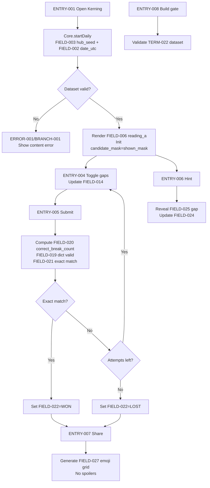
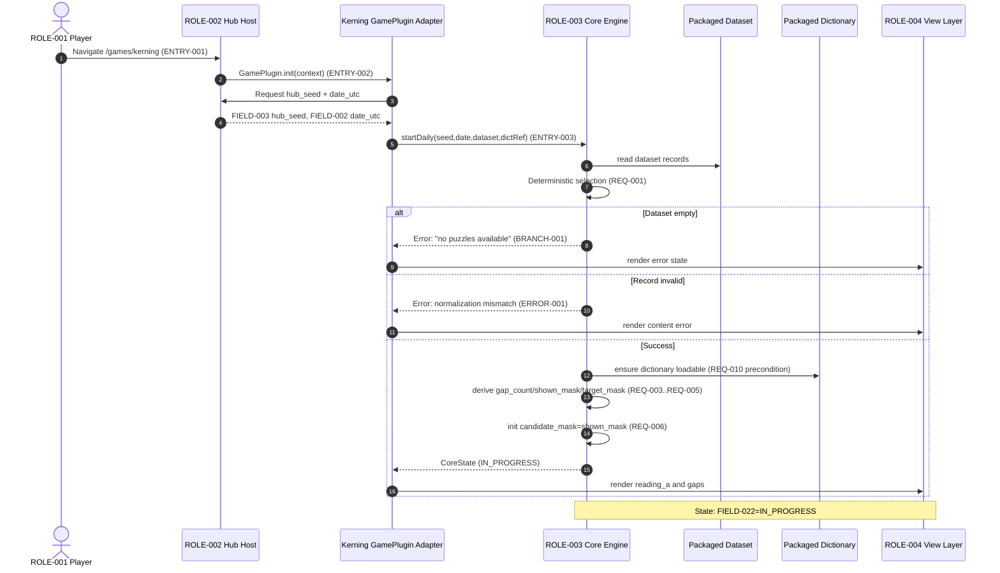
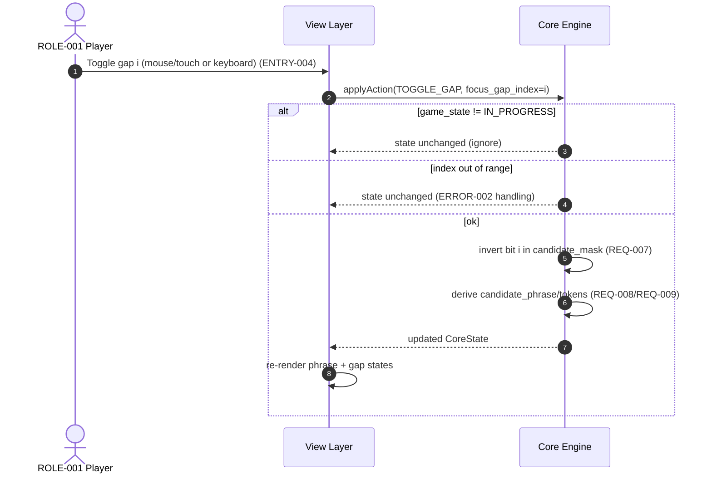
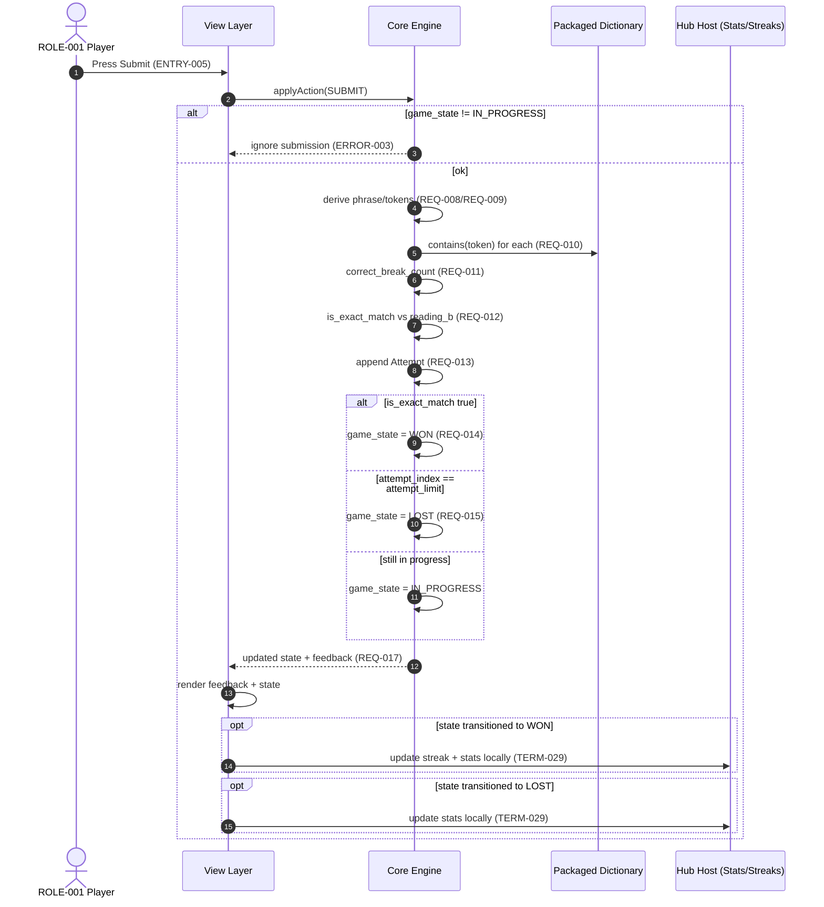
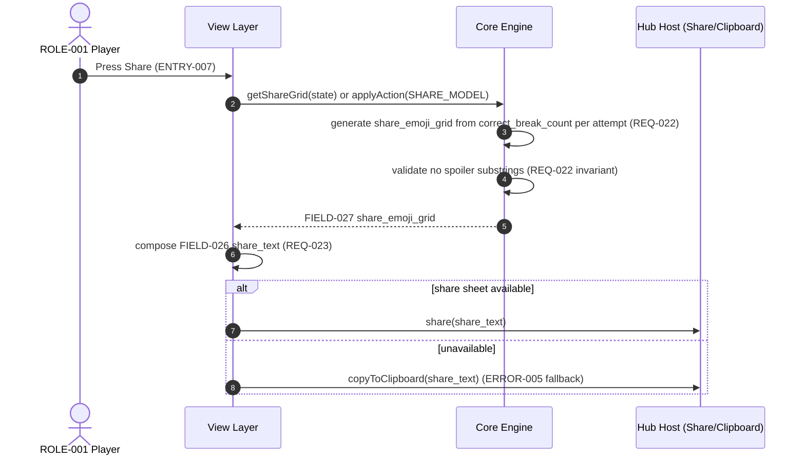
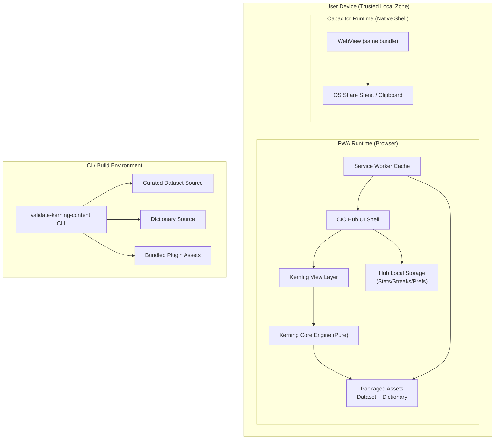

<!-- generated: 2026-07-24T10:42:38Z -->
<!-- mode: initial -->
<!-- feature-slug: kerning -->
<!-- a2a-endpoint: https://bob-sdlc-orchestrator.2as6l7wq9qj8.eu-gb.codeengine.appdomain.cloud/v1/rpc -->

# Glossary

## Terms

### TERM-001: Kerning
- **Definition:** The daily word puzzle game mode where a player re-inserts spaces into a fixed letter sequence to transform shown segmentation (**TERM-006 Reading A**) into a hidden target segmentation (**TERM-007 Reading B**).
- **Synonyms:** Kerning puzzle, daily kerning.
- **Anti-definition:** Not a crossword/anagram; letters do not change order and no letters are added/removed.
- **Source:** User request.

### TERM-002: CIC Games Hub
- **Definition:** The host application that runs multiple games as plugins and provides shared services (e.g., deterministic daily selection, stats/streaks).
- **Synonyms:** Hub, CIC hub.
- **Anti-definition:** Not a backend server.
- **Source:** User request.

### TERM-003: GamePlugin
- **Definition:** The plugin interface contract implemented by the Kerning plugin, including separation of pure core logic and UI view.
- **Synonyms:** Plugin contract, hub plugin interface.
- **Anti-definition:** Not a monolithic app; not coupled to storage/clock.
- **Source:** User request.

### TERM-004: Offline-first PWA + Capacitor
- **Definition:** Deployment model where the game runs without network connectivity (PWA) and can be packaged as a native app via Capacitor.
- **Synonyms:** Offline-first app.
- **Anti-definition:** Not requiring online API calls for gameplay.
- **Source:** User request.

### TERM-005: Daily Puzzle
- **Definition:** The puzzle instance selected for a given day using a deterministic selection method from the curated dataset.
- **Synonyms:** Today’s puzzle.
- **Anti-definition:** Not a randomly changing puzzle per refresh.
- **Source:** User request.

### TERM-006: Reading A (Shown Segmentation)
- **Definition:** The segmentation of the letter run displayed to the player at start; uses the same letters as Reading B but with spaces inserted at different positions.
- **Synonyms:** Display phrase, prompt phrase.
- **Anti-definition:** Not the win condition.
- **Source:** User request.

### TERM-007: Reading B (Target Segmentation)
- **Definition:** The intended hidden segmentation of the same letter run; exact match to this segmentation is the win condition.
- **Synonyms:** Target phrase, hidden phrase.
- **Anti-definition:** Not merely “a valid segmentation”; must match the curated target.
- **Source:** User request.

### TERM-008: Letter Run
- **Definition:** The canonical, space-free uppercase (or normalized) sequence of letters shared by Reading A and Reading B.
- **Synonyms:** Character run, raw string.
- **Anti-definition:** Not tokenized; contains no spaces.
- **Source:** User request.

### TERM-009: Gap Position
- **Definition:** A position between two adjacent letters in the **TERM-008 Letter Run** where a space may be inserted.
- **Synonyms:** Break position, split point.
- **Anti-definition:** Not an index of a letter; it is between letters.
- **Source:** User request.

### TERM-010: Segmentation
- **Definition:** A set/bitmask of **TERM-009 Gap Positions** indicating where spaces occur, yielding a token sequence when applied to the **TERM-008 Letter Run**.
- **Synonyms:** Spacing pattern, split mask.
- **Anti-definition:** Not a rearrangement of letters.
- **Source:** User request.

### TERM-011: Candidate Segmentation
- **Definition:** The segmentation currently constructed by the player via toggling gap positions prior to submission.
- **Synonyms:** Player answer, guess.
- **Anti-definition:** Not necessarily valid or winning.
- **Source:** User request.

### TERM-012: Submission
- **Definition:** The act of the player committing the current **TERM-011 Candidate Segmentation** as an attempt to solve the puzzle.
- **Synonyms:** Guess, enter.
- **Anti-definition:** Not an autosave; it is an evaluated attempt.
- **Source:** User request.

### TERM-013: Attempt
- **Definition:** One evaluated submission, recorded with feedback and contributing to attempt limit.
- **Synonyms:** Guess.
- **Anti-definition:** Not a UI edit action.
- **Source:** User request.

### TERM-014: Attempt Limit
- **Definition:** The maximum number of attempts allowed for the daily puzzle.
- **Synonyms:** Max guesses.
- **Anti-definition:** Not time-based.
- **Source:** User request.

### TERM-015: Correct-Break Count
- **Definition:** The number of gap positions in the **TERM-011 Candidate Segmentation** that exactly match gap positions in **TERM-007 Reading B**.
- **Synonyms:** Correct split count, correct gaps count.
- **Anti-definition:** Not token correctness; does not include incorrect gaps.
- **Source:** User request.

### TERM-016: Dictionary Word
- **Definition:** A token that exists in the game’s packaged dictionary used for validation.
- **Synonyms:** Valid word.
- **Anti-definition:** Not “sounds like a word”; must be present in the packaged list.
- **Source:** User request.

### TERM-017: Dictionary Check
- **Definition:** The evaluation that all tokens produced by a segmentation are **TERM-016 Dictionary Words**.
- **Synonyms:** Word validity check.
- **Anti-definition:** Not the win check; win requires exact match to Reading B.
- **Source:** User request.

### TERM-018: Feedback
- **Definition:** Post-submission information shown to the player including **TERM-015 Correct-Break Count** and the result of **TERM-017 Dictionary Check**.
- **Synonyms:** Result, evaluation.
- **Anti-definition:** Not revealing phrases or correct positions (except via hint).
- **Source:** User request.

### TERM-019: Win
- **Definition:** State where the submitted segmentation exactly equals **TERM-007 Reading B**.
- **Synonyms:** Solved.
- **Anti-definition:** Not achieved by “all words valid” alone.
- **Source:** User request.

### TERM-020: Lose
- **Definition:** State where the player has exhausted the **TERM-014 Attempt Limit** without achieving **TERM-019 Win**.
- **Synonyms:** Failed.
- **Anti-definition:** Not a crash/exit.
- **Source:** User request.

### TERM-021: Hint
- **Definition:** An action that reveals one correct **TERM-009 Gap Position** from **TERM-007 Reading B** to the player.
- **Synonyms:** Reveal split, reveal gap.
- **Anti-definition:** Not revealing the full phrase or multiple gaps at once.
- **Source:** User request.

### TERM-022: Curated Pair
- **Definition:** A build-time content record containing one **TERM-008 Letter Run** with exactly two intended sensible segmentations: **TERM-006 Reading A** and **TERM-007 Reading B**.
- **Synonyms:** Puzzle record, content entry.
- **Anti-definition:** Not user-generated content.
- **Source:** User request.

### TERM-023: Build-time Gate
- **Definition:** A build-time validation step that ensures both readings tokenize into dictionary words and that Reading B is unique among sensible segmentations besides Reading A.
- **Synonyms:** Content validator, CI content check.
- **Anti-definition:** Not a runtime online check.
- **Source:** User request.

### TERM-024: Sensible Segmentation
- **Definition:** A segmentation whose tokens are all **TERM-016 Dictionary Words** per **TERM-017 Dictionary Check**.
- **Synonyms:** Valid segmentation.
- **Anti-definition:** Not “grammatical”; only dictionary-valid is required.
- **Source:** User request.

### TERM-025: Deterministic Daily Selection
- **Definition:** The method to choose the **TERM-005 Daily Puzzle** based on a hub-provided seedable hash and the date/puzzle index, producing the same result on all platforms.
- **Synonyms:** Daily hash selection.
- **Anti-definition:** Not random per device.
- **Source:** User request.

### TERM-026: Hub Seed
- **Definition:** An input seed provided by **TERM-002 CIC Games Hub** services to drive **TERM-025 Deterministic Daily Selection**.
- **Synonyms:** Seed, daily seed.
- **Anti-definition:** Not secret/auth material.
- **Source:** User request.

### TERM-027: Core Engine (Pure Core)
- **Definition:** Platform-independent logic implementing segmentation evaluation, feedback computation, hint selection, and state transitions, with no direct dependencies on storage or wall clock.
- **Synonyms:** Pure core, game core.
- **Anti-definition:** Not UI; not persistence.
- **Source:** User request.

### TERM-028: View Layer
- **Definition:** UI implementation that renders the puzzle, handles input, and calls the **TERM-027 Core Engine**.
- **Synonyms:** Frontend, UI.
- **Anti-definition:** Not where puzzle validation rules live.
- **Source:** User request.

### TERM-029: Hub Services (Stats/Streaks)
- **Definition:** Shared host-provided services for storing local stats and streaks for the user across games.
- **Synonyms:** Stats service, streak service.
- **Anti-definition:** Not a remote account system.
- **Source:** User request.

### TERM-030: Local Stats
- **Definition:** Locally stored aggregated play data for Kerning (e.g., plays, wins, distribution) stored via **TERM-029 Hub Services**.
- **Synonyms:** Statistics.
- **Anti-definition:** Not cloud-synced.
- **Source:** User request.

### TERM-031: Streak
- **Definition:** Count of consecutive days the user achieves **TERM-019 Win** for the **TERM-005 Daily Puzzle**.
- **Synonyms:** Daily streak.
- **Anti-definition:** Not total wins.
- **Source:** User request.

### TERM-032: Spoiler-safe Emoji Share
- **Definition:** A shareable text artifact containing only per-attempt **TERM-015 Correct-Break Count** (and optionally attempt number/state) without revealing **TERM-006/TERM-007** phrases.
- **Synonyms:** Share card text.
- **Anti-definition:** Not including the actual words/letter run.
- **Source:** User request.

### TERM-033: Accessibility Support
- **Definition:** Support for keyboard-only play, screen reader compatibility, and feedback not relying solely on color.
- **Synonyms:** A11y.
- **Anti-definition:** Not optional if the platform requires it.
- **Source:** User request.

### TERM-034: Input Method (Keyboard Gap Toggling)
- **Definition:** Mechanism to move focus between **TERM-009 Gap Positions** and toggle them using keyboard controls.
- **Synonyms:** Keyboard controls.
- **Anti-definition:** Not mouse/touch-only.
- **Source:** User request.

### TERM-035: Canonical Normalization
- **Definition:** Deterministic rules applied to readings/inputs (e.g., casing, whitespace normalization) so segmentation checks are identical across platforms.
- **Synonyms:** Normalization rules.
- **Anti-definition:** Not locale-dependent transformations unless specified.
- **Source:** User request.

## Data Dictionary

| ID | Name | Type | Format | Range/Enum | Units | Default | Nullable | PII | Source | Validation |
|---|---|---|---|---|---|---|---|---|---|---|
| FIELD-001 | puzzle_id | string | `KERNING-YYYYMMDD` or dataset key | non-empty | n/a | none | no | None | TERM-005 | Must be unique within dataset and stable for a date |
| FIELD-002 | date_utc | string | ISO-8601 `YYYY-MM-DD` | valid date | days | none | no | None | TERM-005 | Must parse as UTC date |
| FIELD-003 | hub_seed | string | opaque | non-empty | n/a | none | no | None | TERM-026 | Must be stable for a given day/context provided by hub |
| FIELD-004 | dataset_version | string | semver | `MAJOR.MINOR.PATCH` | n/a | none | no | None | TERM-022 | Must match packaged content version |
| FIELD-005 | letter_run | string | `^[A-Z]+$` (post-normalization) | length 2..64 | chars | none | no | None | TERM-008 | Must equal Reading A + Reading B with spaces removed |
| FIELD-006 | reading_a | string | uppercase words separated by single spaces | length 2..128 | chars | none | no | None | TERM-006 | Removing spaces must equal FIELD-005 |
| FIELD-007 | reading_b | string | uppercase words separated by single spaces | length 2..128 | chars | none | no | None | TERM-007 | Removing spaces must equal FIELD-005 |
| FIELD-008 | gap_count | integer | int32 | 1..63 | gaps | derived | no | None | TERM-009 | Must equal `len(letter_run)-1` |
| FIELD-009 | segmentation_mask | string | bitstring length = gap_count | chars `0/1` | bits | all `0` | no | None | TERM-010 | Length must equal FIELD-008; only `0`/`1` |
| FIELD-010 | target_mask | string | bitstring | `0/1` | bits | derived | no | None | TERM-007 | Must correspond to spaces in FIELD-007 |
| FIELD-011 | shown_mask | string | bitstring | `0/1` | bits | derived | no | None | TERM-006 | Must correspond to spaces in FIELD-006 |
| FIELD-012 | attempt_index | integer | int32 | 1..FIELD-013 | attempts | none | no | None | TERM-013 | Must increment by 1 per submission |
| FIELD-013 | attempt_limit | integer | int32 | 1..10 | attempts | 6 | no | None | TERM-014 | Must be constant for a puzzle instance |
| FIELD-014 | candidate_mask | string | bitstring | `0/1` | bits | none | no | None | TERM-011 | Must be valid per FIELD-009 rules |
| FIELD-015 | candidate_phrase | string | uppercase words separated by single spaces | length 2..128 | chars | derived | no | None | TERM-011 | Removing spaces must equal FIELD-005 |
| FIELD-016 | candidate_tokens | string[] | array | each token `^[A-Z]+$` | tokens | derived | no | None | TERM-010 | Concatenation must equal FIELD-005 |
| FIELD-017 | dictionary_id | string | opaque | non-empty | n/a | `default-en` | no | None | TERM-016 | Must map to packaged dictionary |
| FIELD-018 | token_is_dictionary_word | boolean | bool | true/false | n/a | derived | no | None | TERM-017 | True iff token exists in dictionary set |
| FIELD-019 | all_tokens_dictionary_valid | boolean | bool | true/false | n/a | derived | no | None | TERM-017 | True iff all FIELD-016 tokens are valid |
| FIELD-020 | correct_break_count | integer | int32 | 0..FIELD-008 | gaps | derived | no | None | TERM-015 | Must equal count of positions where candidate_mask=1 and target_mask=1 |
| FIELD-021 | is_exact_match | boolean | bool | true/false | n/a | derived | no | None | TERM-019 | True iff candidate_phrase equals reading_b exactly (post-normalization) |
| FIELD-022 | game_state | string | enum | `IN_PROGRESS, WON, LOST` | n/a | IN_PROGRESS | no | None | TERM-027 | Must transition only via core state machine |
| FIELD-023 | hint_used | boolean | bool | true/false | n/a | false | no | None | TERM-021 | Once true, cannot revert to false for puzzle instance |
| FIELD-024 | revealed_gap_positions | integer[] | array | each 1..FIELD-008 | gaps | empty | no | None | TERM-021 | Must be subset of target gaps; no duplicates |
| FIELD-025 | hint_revealed_gap | integer | int32 | 1..FIELD-008 | gap index | none | yes | None | TERM-021 | If present, must be in target gaps and not previously revealed |
| FIELD-026 | share_text | string | text | length 1..2000 | chars | derived | no | None | TERM-032 | Must not contain FIELD-006/007/005 substrings |
| FIELD-027 | share_emoji_grid | string | text | lines of emoji/squares | length 1..1000 | chars | derived | no | None | TERM-032 | Must encode only per-attempt counts/outcomes |
| FIELD-028 | local_stats_blob | object | JSON | schema-defined | n/a | empty | no | None | TERM-030 | Must be storable via hub services and backward-compatible |
| FIELD-029 | streak_count | integer | int32 | 0..10000 | days | 0 | no | None | TERM-031 | Must update only when puzzle state becomes WON |
| FIELD-030 | normalized_locale | string | BCP-47 | e.g., `en-US` | n/a | `en` | no | None | TERM-035 | Must not change normalization semantics unless explicitly versioned |
| FIELD-031 | normalization_version | string | semver | `MAJOR.MINOR.PATCH` | n/a | `1.0.0` | no | None | TERM-035 | Must be identical across platforms for same build |
| FIELD-032 | focus_gap_index | integer | int32 | 1..FIELD-008 | gaps | 1 | no | None | TERM-034 | Must stay in range; wraps per UI rule |
| FIELD-033 | input_action | string | enum | `MOVE_LEFT, MOVE_RIGHT, TOGGLE_GAP, SUBMIT, HINT, SHARE` | n/a | none | no | None | TERM-034 | Must map to accessible controls |
| FIELD-034 | build_gate_status | string | enum | `PASS, FAIL` | n/a | PASS | no | None | TERM-023 | FAIL must stop content packaging |
| FIELD-035 | build_gate_error | string | text | length 0..5000 | chars | empty | no | None | TERM-023 | Must be non-empty when status=FAIL |

# User Journeys

## Roles

| Role ID | Role | Type | Description |
|---|---|---|---|
| ROLE-001 | Player | Primary | Person playing the daily Kerning puzzle in the hub UI. |
| ROLE-002 | Hub Host | System | CIC Games Hub runtime providing **TERM-029 Hub Services**, routing, and seed for **TERM-025**. |
| ROLE-003 | Plugin Core | System | **TERM-027 Core Engine** providing deterministic evaluation and state transitions. |
| ROLE-004 | Plugin View | System | **TERM-028 View Layer** rendering UI and capturing inputs. |
| ROLE-005 | Content Maintainer | Admin/Build | Curates **TERM-022 Curated Pairs** and runs **TERM-023 Build-time Gate**. |

## Entry Points

| Entry ID | Location | Trigger | Auth |
|---|---|---|---|
| ENTRY-001 | Hub UI route: `/games/kerning` | Player opens Kerning | none |
| ENTRY-002 | Plugin API: `GamePlugin.init(context)` | Hub loads plugin | hub internal |
| ENTRY-003 | Plugin API: `Core.startDaily(seed, date)` | Hub provides **FIELD-003 hub_seed** + **FIELD-002 date_utc** | hub internal |
| ENTRY-004 | UI control: gap toggle | Player clicks/taps or keyboard toggles (**TERM-034**) | none |
| ENTRY-005 | UI control: Submit | Player submits (**TERM-012**) | none |
| ENTRY-006 | UI control: Hint | Player requests **TERM-021 Hint** | none |
| ENTRY-007 | UI control: Share | Player requests **TERM-032 Share** | none |
| ENTRY-008 | Build pipeline step: `validate-kerning-content` | CI/build runs **TERM-023** | build-only |

## Role Permission Matrix

| Capability | ROLE-001 Player | ROLE-002 Hub Host | ROLE-003 Plugin Core | ROLE-004 Plugin View | ROLE-005 Content Maintainer |
|---|---:|---:|---:|---:|---:|
| Start daily puzzle |  | X | X |  |  |
| Toggle gaps | X |  |  | X |  |
| Submit attempt | X |  | X | X |  |
| Request hint | X |  | X | X |  |
| Generate share text | X |  | X | X |  |
| Read/write local stats/streak |  | X |  |  |  |
| Package content dataset |  |  |  |  | X |
| Run build-time gate |  |  |  |  | X |

## Journeys

### JOURNEY-001: Load today’s Kerning puzzle
- **Role / Goal:** ROLE-001 Player / See today’s **TERM-005 Daily Puzzle** and start in **FIELD-022 game_state=IN_PROGRESS**.
- **Entry:** ENTRY-001, ENTRY-002, ENTRY-003
- **Success criteria:** The UI shows **FIELD-006 reading_a** as spaced text and initializes **FIELD-009 segmentation_mask** to **FIELD-011 shown_mask** with correct **FIELD-005 letter_run**.
- **Failure criteria:** No puzzle can be selected from dataset; invalid content record.

**Happy path**
1. Hub loads plugin via `GamePlugin.init(context)` (ENTRY-002) and provides **FIELD-003 hub_seed**, **FIELD-002 date_utc**, and access to packaged dataset **TERM-022**.
2. Core computes deterministic selection (**TERM-025**) yielding **FIELD-001 puzzle_id** and record fields **FIELD-005/006/007**.
3. Core derives **FIELD-008 gap_count**, **FIELD-011 shown_mask**, **FIELD-010 target_mask**.
4. View renders **FIELD-006 reading_a** and interactive gaps representing **FIELD-008**; initializes current **FIELD-014 candidate_mask** = **FIELD-011 shown_mask**.

**BRANCH-001 (Dataset empty)**
- Trigger: No **TERM-022 Curated Pair** entries available.
- Result: Show an error state and disable gameplay.

**ERROR-001 (Invalid record normalization)**
- Trigger: **FIELD-006** or **FIELD-007** removes spaces to a value not equal to **FIELD-005**.
- System response: Treat as content error; refuse to start puzzle.
- Recovery: Update dataset and rebuild (ROLE-005).

**EDGE-001 (Cross-platform determinism)**
- Condition: Same **FIELD-003** and **FIELD-002** on different platforms.
- Expectation: Same **FIELD-001 puzzle_id** and **FIELD-005/006/007** are selected.

---

### JOURNEY-002: Toggle gaps to create a candidate segmentation
- **Role / Goal:** ROLE-001 Player / Build **TERM-011 Candidate Segmentation** by toggling **TERM-009 Gap Positions**.
- **Entry:** ENTRY-004
- **Success criteria:** **FIELD-014 candidate_mask** updates deterministically and **FIELD-015 candidate_phrase** reflects inserted spaces.
- **Failure criteria:** Input cannot be performed with keyboard; focus goes out of range.

**Happy path**
1. Player focuses a gap (tracked as **FIELD-032 focus_gap_index**) between letters in **FIELD-005 letter_run**.
2. Player toggles the gap (mouse/touch or keyboard action **FIELD-033 input_action=TOGGLE_GAP**).
3. View updates **FIELD-014 candidate_mask** bit at **FIELD-032**.
4. View re-renders **FIELD-015 candidate_phrase** derived by applying **FIELD-014** to **FIELD-005**.

**BRANCH-002 (Keyboard navigation)**
- If player uses keyboard:
  1. `MOVE_LEFT/RIGHT` changes **FIELD-032 focus_gap_index**.
  2. `TOGGLE_GAP` flips the bit at the focused gap.

**ERROR-002 (Out-of-range focus)**
- Trigger: Focus index becomes `<1` or `>FIELD-008`.
- System response: Clamp or wrap per UI rule; do not corrupt **FIELD-014**.
- Recovery: Continue interaction.

**EDGE-002 (Rapid toggling)**
- Condition: Multiple toggles in quick succession.
- Expectation: Final **FIELD-014** equals parity of toggles; no missed events.

---

### JOURNEY-003: Submit an attempt and receive feedback
- **Role / Goal:** ROLE-001 Player / Submit a segmentation and see **TERM-018 Feedback**.
- **Entry:** ENTRY-005
- **Success criteria:** Attempt is evaluated; feedback includes **FIELD-020 correct_break_count** and **FIELD-019 all_tokens_dictionary_valid**; state updates to **FIELD-022 WON** on exact match.
- **Failure criteria:** Attempt limit not enforced; inconsistent evaluation across platforms.

**Happy path**
1. Player presses Submit (ENTRY-005) with current **FIELD-014 candidate_mask**.
2. Core derives **FIELD-015 candidate_phrase** and **FIELD-016 candidate_tokens** from **FIELD-005** + **FIELD-014** using **TERM-035 Canonical Normalization**.
3. Core computes **FIELD-019 all_tokens_dictionary_valid** by checking each token in **FIELD-016** against **FIELD-017 dictionary_id**.
4. Core computes **FIELD-020 correct_break_count** by comparing **FIELD-014** to **FIELD-010 target_mask** (count of matching `1` positions).
5. Core computes **FIELD-021 is_exact_match** by comparing **FIELD-015 candidate_phrase** to **FIELD-007 reading_b** (post-normalization).
6. Core appends an **TERM-013 Attempt** with **FIELD-012 attempt_index** and feedback.
7. If **FIELD-021=true**, core sets **FIELD-022 game_state=WON**; else keep **IN_PROGRESS** unless attempt limit reached.

**BRANCH-003 (Win on exact match)**
- Condition: **FIELD-021 is_exact_match=true**
- Result: Show win state; disable further submissions.

**BRANCH-004 (Exhaust attempt limit)**
- Condition: **FIELD-012 attempt_index == FIELD-013 attempt_limit** and **FIELD-021=false**
- Result: Set **FIELD-022 game_state=LOST**.

**ERROR-003 (Submit when not IN_PROGRESS)**
- Trigger: Player submits while **FIELD-022** is WON or LOST.
- System response: Ignore submission; keep state unchanged.
- Recovery: Offer Share and navigation back.

**EDGE-003 (Dictionary missing)**
- Condition: Packaged dictionary for **FIELD-017 dictionary_id** not available.
- Expectation: Puzzle cannot start (fall back to JOURNEY-001 error) or dictionary check returns deterministic failure with explicit message.

---

### JOURNEY-004: Use a hint to reveal one correct break position
- **Role / Goal:** ROLE-001 Player / Get help by revealing one correct gap from **TERM-007 Reading B**.
- **Entry:** ENTRY-006
- **Success criteria:** Exactly one new gap position from target is revealed and recorded in **FIELD-024 revealed_gap_positions**; **FIELD-023 hint_used=true**.
- **Failure criteria:** Hint reveals multiple gaps; reveals wrong gap; non-deterministic reveal.

**Happy path**
1. Player presses Hint (ENTRY-006) while **FIELD-022=IN_PROGRESS**.
2. Core selects one gap index (**FIELD-025 hint_revealed_gap**) that is `1` in **FIELD-010 target_mask** and not yet in **FIELD-024**.
3. Core sets **FIELD-023 hint_used=true** and appends index to **FIELD-024 revealed_gap_positions**.
4. View marks that gap as revealed (without revealing words) and keeps interaction enabled.

**BRANCH-005 (No remaining unrevealed target gaps)**
- Condition: All target gaps are already revealed in **FIELD-024**.
- Result: Show “No more hints” and make no state changes.

**ERROR-004 (Hint when not IN_PROGRESS)**
- Trigger: Hint requested in WON/LOST.
- System response: Ignore; no state changes.
- Recovery: None required.

**EDGE-004 (Deterministic hint selection)**
- Condition: Same puzzle + same current revealed set.
- Expectation: Selected **FIELD-025** is deterministic (platform-independent).

---

### JOURNEY-005: Share results without spoilers
- **Role / Goal:** ROLE-001 Player / Share outcome and per-attempt counts without revealing phrases.
- **Entry:** ENTRY-007
- **Success criteria:** **FIELD-026 share_text** / **FIELD-027 share_emoji_grid** contains attempt-wise **FIELD-020** only and excludes **FIELD-005/006/007** content.
- **Failure criteria:** Share contains the answer or prompt phrase.

**Happy path**
1. Player presses Share (ENTRY-007).
2. Core/view generates **FIELD-027 share_emoji_grid** encoding each attempt’s **FIELD-020 correct_break_count** (and optionally solved/failed marker) without including any tokens or letter sequences.
3. View invokes OS/web share sheet with **FIELD-026 share_text**.

**ERROR-005 (Share API unavailable)**
- Trigger: Platform does not support share sheet.
- System response: Provide copy-to-clipboard fallback for **FIELD-026**.
- Recovery: Player copies and shares manually.

**EDGE-005 (Spoiler substring)**
- Condition: Generated share text accidentally includes **FIELD-006** or **FIELD-007**.
- Expectation: Validation blocks generation and produces a safe fallback.

---

### JOURNEY-006: Build-time content validation (curation gate)
- **Role / Goal:** ROLE-005 Content Maintainer / Ensure dataset only contains valid curated pairs meeting uniqueness constraints.
- **Entry:** ENTRY-008
- **Success criteria:** **FIELD-034 build_gate_status=PASS** for the dataset; invalid records fail the build.
- **Failure criteria:** Bad record is packaged.

**Happy path**
1. Build runs `validate-kerning-content` (ENTRY-008) over all **TERM-022 Curated Pair** records.
2. For each record, validator applies **TERM-035 Canonical Normalization** and checks **FIELD-006** and **FIELD-007** remove spaces to equal **FIELD-005**.
3. Validator tokenizes **FIELD-006** and **FIELD-007** and verifies every token is a **TERM-016 Dictionary Word** in the build dictionary.
4. Validator enumerates all **TERM-024 Sensible Segmentations** of **FIELD-005** (per dictionary) and asserts exactly two exist, matching **FIELD-006** and **FIELD-007** (order irrelevant) and that **FIELD-007** is unique as the target.
5. If any check fails, emit **FIELD-034=FAIL** with **FIELD-035 build_gate_error** and stop packaging.

**ERROR-006 (Uniqueness violation)**
- Trigger: More than two dictionary-valid segmentations exist for **FIELD-005** or **FIELD-007** is not unique besides **FIELD-006**.
- System response: Fail build with offending record details.
- Recovery: Edit/remove record.

**EDGE-006 (Dictionary update drift)**
- Condition: Dictionary changes cause previously valid records to gain/lose segmentations.
- Expectation: Gate deterministically flags changes; dataset version **FIELD-004** updated.

## Journey Map



# Requirements

### REQ-001: Deterministic daily puzzle selection
- **EARS Pattern:** Event-Driven
- **EARS Statement:** When the plugin core is started with **FIELD-003 hub_seed** and **FIELD-002 date_utc**, the **TERM-027 Core Engine** shall select exactly one **TERM-022 Curated Pair** as the **TERM-005 Daily Puzzle** and expose its **FIELD-001 puzzle_id**.
- **Inputs:** FIELD-003, FIELD-002, FIELD-004 dataset_version
- **Outputs:** FIELD-001
- **Preconditions:** Packaged dataset exists for FIELD-004.
- **Postconditions:** A puzzle record is selected or a deterministic error is produced.
- **Invariants:** Same inputs yield same output across platforms (**TERM-035**).
- **Trigger:** ENTRY-003
- **Actor:** ROLE-002
- **EntityScope:** TERM-005
- **ErrorModes:** Selection fails due to empty dataset (BRANCH-001).
- **NFR-Tags:** compatibility
- **Source:** JOURNEY-001 step 2, EDGE-001
- **Dependencies:** REQ-002
- **Priority:** P0
- **AcceptanceCriteria:**
  - **TEST-001:** Given identical FIELD-003 and FIELD-002 on two platforms, when startDaily runs, then FIELD-001 is identical.
  - **TEST-002:** Given an empty dataset, when startDaily runs, then selection returns a deterministic “no puzzles available” error.
- **Assumptions:** Hub provides stable seed/date inputs.
- **OpenQuestions:** What exact hash function and modulus strategy does hub standardize for plugins?

### REQ-002: Load curated pair fields for the selected puzzle
- **EARS Pattern:** Event-Driven
- **EARS Statement:** When a **TERM-022 Curated Pair** is selected, the **TERM-027 Core Engine** shall provide **FIELD-005 letter_run**, **FIELD-006 reading_a**, and **FIELD-007 reading_b** for that **TERM-005 Daily Puzzle**.
- **Inputs:** FIELD-001
- **Outputs:** FIELD-005, FIELD-006, FIELD-007
- **Preconditions:** Selected puzzle_id exists in dataset.
- **Postconditions:** Fields are available to view/core.
- **Invariants:** Removing spaces from FIELD-006 and FIELD-007 equals FIELD-005.
- **Trigger:** Selection completion
- **Actor:** ROLE-003
- **EntityScope:** TERM-022
- **ErrorModes:** Invalid record normalization (ERROR-001).
- **NFR-Tags:** compatibility
- **Source:** JOURNEY-001 step 2, ERROR-001
- **Dependencies:** NFR-006
- **Priority:** P0
- **AcceptanceCriteria:**
  - **TEST-003:** Given a valid record, then `reading_a.replace(" ","") == letter_run` and `reading_b.replace(" ","") == letter_run`.
- **Assumptions:** Dataset is packaged locally.
- **OpenQuestions:** Are hyphens/apostrophes allowed in tokens or letters limited to A–Z only?

### REQ-003: Derive gap count from letter run
- **EARS Pattern:** Event-Driven
- **EARS Statement:** When **FIELD-005 letter_run** is loaded, the **TERM-027 Core Engine** shall set **FIELD-008 gap_count** to `length(letter_run) - 1`.
- **Inputs:** FIELD-005
- **Outputs:** FIELD-008
- **Preconditions:** FIELD-005 length >= 2.
- **Postconditions:** gap_count computed.
- **Invariants:** FIELD-008 >= 1.
- **Trigger:** Puzzle load
- **Actor:** ROLE-003
- **EntityScope:** TERM-009
- **ErrorModes:** None.
- **NFR-Tags:** none
- **Source:** JOURNEY-001 step 3
- **Dependencies:** REQ-002
- **Priority:** P0
- **AcceptanceCriteria:**
  - **TEST-004:** Given letter_run length N, then gap_count equals N-1.
- **Assumptions:** Max length bounded by content rules.
- **OpenQuestions:** What maximum letter_run length should be enforced at build-time?

### REQ-004: Compute shown mask from Reading A
- **EARS Pattern:** Event-Driven
- **EARS Statement:** When **FIELD-006 reading_a** is loaded, the **TERM-027 Core Engine** shall derive **FIELD-011 shown_mask** representing **TERM-006 Reading A** gap positions over **FIELD-005 letter_run**.
- **Inputs:** FIELD-006, FIELD-005
- **Outputs:** FIELD-011
- **Preconditions:** FIELD-006 normalizes to FIELD-005 when spaces removed.
- **Postconditions:** shown_mask available for initialization.
- **Invariants:** shown_mask length equals FIELD-008.
- **Trigger:** Puzzle load
- **Actor:** ROLE-003
- **EntityScope:** TERM-006
- **ErrorModes:** Invalid record normalization (ERROR-001).
- **NFR-Tags:** compatibility
- **Source:** JOURNEY-001 step 3
- **Dependencies:** REQ-003, NFR-006
- **Priority:** P0
- **AcceptanceCriteria:**
  - **TEST-005:** Given reading_a with spaces, when shown_mask is applied to letter_run, then the resulting phrase equals reading_a (post-normalization).
- **Assumptions:** Normalization rules are stable.
- **OpenQuestions:** Should multiple spaces be allowed in source content or normalized to single?

### REQ-005: Compute target mask from Reading B
- **EARS Pattern:** Event-Driven
- **EARS Statement:** When **FIELD-007 reading_b** is loaded, the **TERM-027 Core Engine** shall derive **FIELD-010 target_mask** representing **TERM-007 Reading B** gap positions over **FIELD-005 letter_run**.
- **Inputs:** FIELD-007, FIELD-005
- **Outputs:** FIELD-010
- **Preconditions:** FIELD-007 normalizes to FIELD-005 when spaces removed.
- **Postconditions:** target_mask available for evaluation/hints.
- **Invariants:** target_mask length equals FIELD-008.
- **Trigger:** Puzzle load
- **Actor:** ROLE-003
- **EntityScope:** TERM-007
- **ErrorModes:** Invalid record normalization (ERROR-001).
- **NFR-Tags:** compatibility
- **Source:** JOURNEY-001 step 3
- **Dependencies:** REQ-003, NFR-006
- **Priority:** P0
- **AcceptanceCriteria:**
  - **TEST-006:** Given reading_b with spaces, when target_mask is applied to letter_run, then the resulting phrase equals reading_b (post-normalization).
- **Assumptions:** Normalization rules are stable.
- **OpenQuestions:** None.

### REQ-006: Initialize candidate mask to shown mask
- **EARS Pattern:** Event-Driven
- **EARS Statement:** When a **TERM-005 Daily Puzzle** is presented, the **TERM-027 Core Engine** shall initialize **FIELD-014 candidate_mask** to **FIELD-011 shown_mask**.
- **Inputs:** FIELD-011
- **Outputs:** FIELD-014
- **Preconditions:** Puzzle loaded successfully.
- **Postconditions:** Candidate equals shown segmentation.
- **Invariants:** FIELD-014 length equals FIELD-008.
- **Trigger:** Puzzle start
- **Actor:** ROLE-003
- **EntityScope:** TERM-011
- **ErrorModes:** None.
- **NFR-Tags:** none
- **Source:** JOURNEY-001 step 4
- **Dependencies:** REQ-004
- **Priority:** P0
- **AcceptanceCriteria:**
  - **TEST-007:** On new puzzle start, candidate_mask equals shown_mask.
- **Assumptions:** View reads candidate_mask from core state.
- **OpenQuestions:** Should the UI permit starting from an “all no-spaces” mask instead?

### REQ-007: Toggle a single gap position
- **EARS Pattern:** Event-Driven
- **EARS Statement:** When the player toggles a **TERM-009 Gap Position** at index **FIELD-032 focus_gap_index**, the **TERM-027 Core Engine** shall invert the corresponding bit in **FIELD-014 candidate_mask**.
- **Inputs:** FIELD-032, FIELD-014
- **Outputs:** FIELD-014
- **Preconditions:** FIELD-022 game_state is `IN_PROGRESS`.
- **Postconditions:** Candidate mask updated deterministically.
- **Invariants:** Only one bit changes per toggle.
- **Trigger:** ENTRY-004
- **Actor:** ROLE-001
- **EntityScope:** TERM-009
- **ErrorModes:** Out-of-range focus (ERROR-002).
- **NFR-Tags:** accessibility
- **Source:** JOURNEY-002 step 2, ERROR-002
- **Dependencies:** REQ-006
- **Priority:** P0
- **AcceptanceCriteria:**
  - **TEST-008:** Given candidate_mask and a valid index i, when toggled, then only bit i differs from prior value.
  - **TEST-009:** Given invalid index, when toggled, then candidate_mask remains unchanged.
- **Assumptions:** View enforces index bounds but core also validates.
- **OpenQuestions:** Clamp vs wrap behavior for invalid focus should be standardized?

### REQ-008: Derive candidate phrase from mask and letter run
- **EARS Pattern:** Event-Driven
- **EARS Statement:** When **FIELD-014 candidate_mask** changes, the **TERM-027 Core Engine** shall derive **FIELD-015 candidate_phrase** by inserting spaces into **FIELD-005 letter_run** at `1` bits in **FIELD-014 candidate_mask**.
- **Inputs:** FIELD-014, FIELD-005
- **Outputs:** FIELD-015
- **Preconditions:** Mask length equals FIELD-008.
- **Postconditions:** Candidate phrase available for evaluation/display.
- **Invariants:** Removing spaces from FIELD-015 equals FIELD-005.
- **Trigger:** Candidate mask update
- **Actor:** ROLE-003
- **EntityScope:** TERM-010
- **ErrorModes:** None.
- **NFR-Tags:** compatibility
- **Source:** JOURNEY-002 step 4
- **Dependencies:** NFR-006
- **Priority:** P0
- **AcceptanceCriteria:**
  - **TEST-010:** For any mask, `candidate_phrase.replace(" ","") == letter_run`.
- **Assumptions:** Phrase uses single spaces only.
- **OpenQuestions:** None.

### REQ-009: Tokenize candidate phrase
- **EARS Pattern:** Event-Driven
- **EARS Statement:** When **FIELD-015 candidate_phrase** is derived, the **TERM-027 Core Engine** shall derive **FIELD-016 candidate_tokens** by splitting **FIELD-015 candidate_phrase** on single spaces.
- **Inputs:** FIELD-015
- **Outputs:** FIELD-016
- **Preconditions:** candidate_phrase uses single spaces between tokens.
- **Postconditions:** Tokens available for dictionary check.
- **Invariants:** Concatenation of tokens equals FIELD-005.
- **Trigger:** Candidate phrase derivation
- **Actor:** ROLE-003
- **EntityScope:** TERM-010
- **ErrorModes:** None.
- **NFR-Tags:** none
- **Source:** JOURNEY-003 step 2
- **Dependencies:** REQ-008
- **Priority:** P0
- **AcceptanceCriteria:**
  - **TEST-011:** Joining candidate_tokens with empty string equals letter_run.
- **Assumptions:** No empty tokens exist.
- **OpenQuestions:** Should leading/trailing spaces be forbidden by construction (recommended)?

### REQ-010: Perform dictionary check for candidate tokens
- **EARS Pattern:** Event-Driven
- **EARS Statement:** When **FIELD-016 candidate_tokens** are available, the **TERM-027 Core Engine** shall set **FIELD-019 all_tokens_dictionary_valid** to true iff each token in **FIELD-016** exists in the dictionary identified by **FIELD-017 dictionary_id**.
- **Inputs:** FIELD-016, FIELD-017
- **Outputs:** FIELD-019
- **Preconditions:** Dictionary is packaged and loadable.
- **Postconditions:** Dictionary validity result available for feedback.
- **Invariants:** Evaluation is deterministic for a given dictionary version.
- **Trigger:** Submission evaluation
- **Actor:** ROLE-003
- **EntityScope:** TERM-017
- **ErrorModes:** Dictionary missing (EDGE-003).
- **NFR-Tags:** compatibility
- **Source:** JOURNEY-003 step 3, EDGE-003
- **Dependencies:** REQ-009
- **Priority:** P0
- **AcceptanceCriteria:**
  - **TEST-012:** Given tokens all present in dictionary, then all_tokens_dictionary_valid is true.
  - **TEST-013:** Given any token absent, then all_tokens_dictionary_valid is false.
- **Assumptions:** Dictionary lookup is case-normalized by **TERM-035**.
- **OpenQuestions:** What dictionary source/format is used (word list, DAWG, trie)?

### REQ-011: Compute correct-break count
- **EARS Pattern:** Event-Driven
- **EARS Statement:** When an attempt is submitted, the **TERM-027 Core Engine** shall compute **FIELD-020 correct_break_count** as the count of indices where **FIELD-014 candidate_mask** has value `1` and **FIELD-010 target_mask** has value `1`.
- **Inputs:** FIELD-014, FIELD-010
- **Outputs:** FIELD-020
- **Preconditions:** Both masks have same length.
- **Postconditions:** Correct-break count available for feedback.
- **Invariants:** 0 <= correct_break_count <= FIELD-008.
- **Trigger:** ENTRY-005
- **Actor:** ROLE-001
- **EntityScope:** TERM-015
- **ErrorModes:** None.
- **NFR-Tags:** compatibility
- **Source:** JOURNEY-003 step 4
- **Dependencies:** REQ-005, NFR-006
- **Priority:** P0
- **AcceptanceCriteria:**
  - **TEST-014:** Given candidate_mask equals target_mask, then correct_break_count equals number of `1` bits in target_mask.
- **Assumptions:** Only “correct 1 positions” are counted (no penalty for extra gaps).
- **OpenQuestions:** Do we also want to display total target gaps count to contextualize feedback?

### REQ-012: Determine exact match win condition
- **EARS Pattern:** Event-Driven
- **EARS Statement:** When an attempt is submitted, the **TERM-027 Core Engine** shall set **FIELD-021 is_exact_match** to true iff **FIELD-015 candidate_phrase** equals **FIELD-007 reading_b** after applying **TERM-035 Canonical Normalization**.
- **Inputs:** FIELD-015, FIELD-007, FIELD-031 normalization_version
- **Outputs:** FIELD-021
- **Preconditions:** Candidate phrase derived.
- **Postconditions:** Exact match result available for state transition.
- **Invariants:** Equality check is byte-for-byte on normalized strings.
- **Trigger:** ENTRY-005
- **Actor:** ROLE-003
- **EntityScope:** TERM-019
- **ErrorModes:** None.
- **NFR-Tags:** compatibility
- **Source:** JOURNEY-003 step 5
- **Dependencies:** REQ-008, NFR-006
- **Priority:** P0
- **AcceptanceCriteria:**
  - **TEST-015:** Given candidate_phrase equals reading_b, then is_exact_match is true; otherwise false.
- **Assumptions:** Reading B stored in normalized form or normalized at comparison time.
- **OpenQuestions:** Should normalization include stripping punctuation or only whitespace/case?

### REQ-013: Record an evaluated attempt
- **EARS Pattern:** Event-Driven
- **EARS Statement:** When **FIELD-021 is_exact_match** is computed for a submission, the **TERM-027 Core Engine** shall append an **TERM-013 Attempt** with **FIELD-012 attempt_index**, **FIELD-014 candidate_mask**, **FIELD-020 correct_break_count**, and **FIELD-019 all_tokens_dictionary_valid**.
- **Inputs:** FIELD-021, FIELD-014, FIELD-020, FIELD-019, FIELD-013 attempt_limit
- **Outputs:** Attempt list (core state)
- **Preconditions:** FIELD-022 game_state is `IN_PROGRESS`.
- **Postconditions:** Attempt count increments by 1.
- **Invariants:** attempt_index increases by exactly 1 per appended attempt.
- **Trigger:** ENTRY-005
- **Actor:** ROLE-003
- **EntityScope:** TERM-013
- **ErrorModes:** Submit when not IN_PROGRESS (ERROR-003).
- **NFR-Tags:** none
- **Source:** JOURNEY-003 step 6, ERROR-003
- **Dependencies:** REQ-010, REQ-011, REQ-012
- **Priority:** P0
- **AcceptanceCriteria:**
  - **TEST-016:** Given prior attempts count k, when a valid submission occurs in IN_PROGRESS, then attempts count becomes k+1 and attempt_index equals k+1.
- **Assumptions:** Core maintains attempt list in memory; persistence handled by hub separately if needed.
- **OpenQuestions:** Does the hub expect plugin to expose attempts for resume within the same day?

### REQ-014: Transition to WON on exact match
- **EARS Pattern:** Event-Driven
- **EARS Statement:** When **FIELD-021 is_exact_match** becomes true for a submission, the **TERM-027 Core Engine** shall set **FIELD-022 game_state** to `WON`.
- **Inputs:** FIELD-021
- **Outputs:** FIELD-022
- **Preconditions:** FIELD-022 is `IN_PROGRESS`.
- **Postconditions:** Game state is WON.
- **Invariants:** WON is terminal for the puzzle instance.
- **Trigger:** ENTRY-005 evaluation
- **Actor:** ROLE-003
- **EntityScope:** TERM-019
- **ErrorModes:** None.
- **NFR-Tags:** none
- **Source:** JOURNEY-003 BRANCH-003
- **Dependencies:** REQ-012
- **Priority:** P0
- **AcceptanceCriteria:**
  - **TEST-017:** When is_exact_match is true, then game_state becomes WON.
- **Assumptions:** UI reacts to game_state changes.
- **OpenQuestions:** Should Reading B be revealed after win (player request not specified)?

### REQ-015: Transition to LOST on attempt limit reached
- **EARS Pattern:** Event-Driven
- **EARS Statement:** When an attempt is recorded with **FIELD-012 attempt_index** equal to **FIELD-013 attempt_limit** and **FIELD-021 is_exact_match** is false, the **TERM-027 Core Engine** shall set **FIELD-022 game_state** to `LOST`.
- **Inputs:** FIELD-012, FIELD-013, FIELD-021
- **Outputs:** FIELD-022
- **Preconditions:** FIELD-022 is `IN_PROGRESS`.
- **Postconditions:** Game state is LOST.
- **Invariants:** LOST is terminal for the puzzle instance.
- **Trigger:** Attempt recording completion
- **Actor:** ROLE-003
- **EntityScope:** TERM-020
- **ErrorModes:** None.
- **NFR-Tags:** none
- **Source:** JOURNEY-003 BRANCH-004
- **Dependencies:** REQ-013
- **Priority:** P0
- **AcceptanceCriteria:**
  - **TEST-018:** Given attempt_index=attempt_limit and is_exact_match=false, then game_state becomes LOST.
- **Assumptions:** attempt_limit is fixed per puzzle instance.
- **OpenQuestions:** Should the player be shown the correct Reading B after loss?

### REQ-016: Prevent submissions after terminal state
- **EARS Pattern:** Unwanted
- **EARS Statement:** The **TERM-027 Core Engine** shall not record a new **TERM-013 Attempt** when **FIELD-022 game_state** is `WON` or `LOST`.
- **Inputs:** FIELD-022
- **Outputs:** None
- **Preconditions:** Terminal state reached.
- **Postconditions:** Attempt list unchanged.
- **Invariants:** Terminal states are immutable by submission.
- **Trigger:** ENTRY-005
- **Actor:** ROLE-001
- **EntityScope:** TERM-013
- **ErrorModes:** Submit when not IN_PROGRESS (ERROR-003).
- **NFR-Tags:** none
- **Source:** JOURNEY-003 ERROR-003
- **Dependencies:** REQ-014, REQ-015
- **Priority:** P0
- **AcceptanceCriteria:**
  - **TEST-019:** Given game_state=WON, when submit is invoked, then attempts count does not change.
- **Assumptions:** View may also disable Submit, but core enforces rule.
- **OpenQuestions:** None.

### REQ-017: Provide feedback payload for each submission
- **EARS Pattern:** Event-Driven
- **EARS Statement:** When a submission is evaluated, the **TERM-027 Core Engine** shall expose **TERM-018 Feedback** consisting of **FIELD-020 correct_break_count** and **FIELD-019 all_tokens_dictionary_valid** for the latest **TERM-013 Attempt**.
- **Inputs:** FIELD-020, FIELD-019
- **Outputs:** Feedback model to view
- **Preconditions:** Submission evaluated.
- **Postconditions:** View can render feedback without revealing **FIELD-007**.
- **Invariants:** Feedback contains no gap positions except via **TERM-021 Hint**.
- **Trigger:** ENTRY-005
- **Actor:** ROLE-003
- **EntityScope:** TERM-018
- **ErrorModes:** None.
- **NFR-Tags:** none
- **Source:** JOURNEY-003 steps 3–6
- **Dependencies:** REQ-010, REQ-011
- **Priority:** P0
- **AcceptanceCriteria:**
  - **TEST-020:** After submission, feedback includes a numeric correct_break_count and boolean all_tokens_dictionary_valid.
- **Assumptions:** UI decides wording/presentation.
- **OpenQuestions:** Should feedback also include “attempts remaining” as a separate derived field?

### REQ-018: Reveal one target gap via hint
- **EARS Pattern:** Event-Driven
- **EARS Statement:** When the player requests a **TERM-021 Hint** while **FIELD-022 game_state** is `IN_PROGRESS`, the **TERM-027 Core Engine** shall select one unrevealed target gap index and set **FIELD-025 hint_revealed_gap** to that index.
- **Inputs:** FIELD-010, FIELD-024, FIELD-022
- **Outputs:** FIELD-025
- **Preconditions:** At least one target gap exists that is not in FIELD-024.
- **Postconditions:** One gap index is returned for display.
- **Invariants:** Returned index is a `1` bit in target_mask and not previously revealed.
- **Trigger:** ENTRY-006
- **Actor:** ROLE-001
- **EntityScope:** TERM-021
- **ErrorModes:** Hint when not IN_PROGRESS (ERROR-004).
- **NFR-Tags:** compatibility
- **Source:** JOURNEY-004 steps 1–3, EDGE-004
- **Dependencies:** REQ-005, NFR-006
- **Priority:** P1
- **AcceptanceCriteria:**
  - **TEST-021:** Given unrevealed target gaps exist, when hint is requested, then hint_revealed_gap is one of those indices.
- **Assumptions:** Selection rule is deterministic (e.g., lowest index, or seeded choice).
- **OpenQuestions:** Which deterministic selection rule is preferred (lowest remaining vs seeded)?

### REQ-019: Persist hint usage and revealed gaps in core state
- **EARS Pattern:** Event-Driven
- **EARS Statement:** When **FIELD-025 hint_revealed_gap** is set, the **TERM-027 Core Engine** shall set **FIELD-023 hint_used** to true.
- **Inputs:** FIELD-025
- **Outputs:** FIELD-023
- **Preconditions:** hint_revealed_gap is not null.
- **Postconditions:** hint_used becomes true.
- **Invariants:** hint_used cannot revert to false.
- **Trigger:** Hint resolution
- **Actor:** ROLE-003
- **EntityScope:** TERM-021
- **ErrorModes:** None.
- **NFR-Tags:** none
- **Source:** JOURNEY-004 step 3
- **Dependencies:** REQ-018
- **Priority:** P1
- **AcceptanceCriteria:**
  - **TEST-022:** After a successful hint, hint_used is true.
- **Assumptions:** Core maintains revealed gaps list separately.
- **OpenQuestions:** None.

### REQ-020: Append revealed gap to revealed list
- **EARS Pattern:** Event-Driven
- **EARS Statement:** When **FIELD-025 hint_revealed_gap** is set, the **TERM-027 Core Engine** shall append the value to **FIELD-024 revealed_gap_positions**.
- **Inputs:** FIELD-025, FIELD-024
- **Outputs:** FIELD-024
- **Preconditions:** hint_revealed_gap not already in revealed_gap_positions.
- **Postconditions:** List includes the new index.
- **Invariants:** No duplicates in revealed_gap_positions.
- **Trigger:** Hint resolution
- **Actor:** ROLE-003
- **EntityScope:** TERM-021
- **ErrorModes:** None.
- **NFR-Tags:** none
- **Source:** JOURNEY-004 step 3
- **Dependencies:** REQ-018
- **Priority:** P1
- **AcceptanceCriteria:**
  - **TEST-023:** After two hints (if available), revealed_gap_positions contains two distinct indices.
- **Assumptions:** If no remaining gaps, hint does nothing (BRANCH-005).
- **OpenQuestions:** Should revealed gaps visually lock the corresponding toggle state or just highlight?

### REQ-021: Do nothing when no hint gaps remain
- **EARS Pattern:** State-Driven
- **EARS Statement:** While all target gap indices are present in **FIELD-024 revealed_gap_positions**, the **TERM-027 Core Engine** shall return no **FIELD-025 hint_revealed_gap** value in response to a hint request.
- **Inputs:** FIELD-010, FIELD-024
- **Outputs:** FIELD-025
- **Preconditions:** Hint requested.
- **Postconditions:** No state changes.
- **Invariants:** revealed list remains unchanged.
- **Trigger:** ENTRY-006
- **Actor:** ROLE-001
- **EntityScope:** TERM-021
- **ErrorModes:** None.
- **NFR-Tags:** none
- **Source:** JOURNEY-004 BRANCH-005
- **Dependencies:** REQ-020
- **Priority:** P2
- **AcceptanceCriteria:**
  - **TEST-024:** Given all target gaps revealed, when hint is requested, then hint_revealed_gap is null and revealed list unchanged.
- **Assumptions:** View displays “No more hints”.
- **OpenQuestions:** None.

### REQ-022: Generate spoiler-safe emoji share grid
- **EARS Pattern:** Event-Driven
- **EARS Statement:** When the player requests share, the **TERM-027 Core Engine** shall generate **FIELD-027 share_emoji_grid** that encodes only **FIELD-020 correct_break_count** for each **TERM-013 Attempt**.
- **Inputs:** Attempt list with FIELD-020 values
- **Outputs:** FIELD-027
- **Preconditions:** At least one attempt exists or a completed game exists (implementation choice).
- **Postconditions:** Share artifact available.
- **Invariants:** Share grid contains no substrings from **FIELD-005 letter_run**, **FIELD-006 reading_a**, or **FIELD-007 reading_b**.
- **Trigger:** ENTRY-007
- **Actor:** ROLE-001
- **EntityScope:** TERM-032
- **ErrorModes:** Spoiler substring detected (EDGE-005).
- **NFR-Tags:** privacy
- **Source:** JOURNEY-005 steps 1–3, EDGE-005
- **Dependencies:** REQ-013
- **Priority:** P1
- **AcceptanceCriteria:**
  - **TEST-025:** Generated share_emoji_grid does not contain letter_run, reading_a, or reading_b.
- **Assumptions:** Encoding scheme is defined (e.g., map counts to blocks).
- **OpenQuestions:** What exact emoji mapping should be standardized across hub games?

### REQ-023: Provide share text wrapper
- **EARS Pattern:** Event-Driven
- **EARS Statement:** When **FIELD-027 share_emoji_grid** is generated, the **TERM-028 View Layer** shall compose **FIELD-026 share_text** by combining a fixed title line, the date or puzzle identifier, and **FIELD-027 share_emoji_grid**.
- **Inputs:** FIELD-027, FIELD-002 or FIELD-001
- **Outputs:** FIELD-026
- **Preconditions:** Share grid exists.
- **Postconditions:** Share text ready for share sheet or clipboard.
- **Invariants:** Share text contains no phrases (**FIELD-006/007**) or **FIELD-005**.
- **Trigger:** ENTRY-007
- **Actor:** ROLE-004
- **EntityScope:** TERM-032
- **ErrorModes:** Share API unavailable (ERROR-005).
- **NFR-Tags:** accessibility
- **Source:** JOURNEY-005 step 3, ERROR-005
- **Dependencies:** REQ-022
- **Priority:** P2
- **AcceptanceCriteria:**
  - **TEST-026:** share_text includes share_emoji_grid verbatim and excludes reading_a/reading_b/letter_run.
- **Assumptions:** Date display does not leak content.
- **OpenQuestions:** Should share include attempt count and result (WON/LOST) explicitly?

### REQ-024: Validate content at build time for dictionary tokenization
- **EARS Pattern:** Event-Driven
- **EARS Statement:** When the build pipeline runs the **TERM-023 Build-time Gate**, the validator shall fail the build if any token in **FIELD-006 reading_a** is not a **TERM-016 Dictionary Word**.
- **Inputs:** Dataset records, dictionary
- **Outputs:** FIELD-034, FIELD-035
- **Preconditions:** Dictionary available in build environment.
- **Postconditions:** Build stops on failure.
- **Invariants:** Validation uses the same tokenization/normalization as runtime.
- **Trigger:** ENTRY-008
- **Actor:** ROLE-005
- **EntityScope:** TERM-023
- **ErrorModes:** Build gate fail (ERROR-006 family).
- **NFR-Tags:** compatibility
- **Source:** JOURNEY-006 step 3
- **Dependencies:** NFR-006
- **Priority:** P0
- **AcceptanceCriteria:**
  - **TEST-027:** Given a record with an out-of-dictionary token in reading_a, then build_gate_status=FAIL with build_gate_error mentioning the record.
- **Assumptions:** Dictionary is authoritative for “sensible”.
- **OpenQuestions:** Are proper nouns allowed (dictionary inclusion policy)?

### REQ-025: Validate content at build time for Reading B dictionary tokenization
- **EARS Pattern:** Event-Driven
- **EARS Statement:** When the build pipeline runs the **TERM-023 Build-time Gate**, the validator shall fail the build if any token in **FIELD-007 reading_b** is not a **TERM-016 Dictionary Word**.
- **Inputs:** Dataset records, dictionary
- **Outputs:** FIELD-034, FIELD-035
- **Preconditions:** Same as REQ-024.
- **Postconditions:** Same as REQ-024.
- **Invariants:** Same as REQ-024.
- **Trigger:** ENTRY-008
- **Actor:** ROLE-005
- **EntityScope:** TERM-023
- **ErrorModes:** Build gate fail (ERROR-006 family).
- **NFR-Tags:** compatibility
- **Source:** JOURNEY-006 step 3
- **Dependencies:** NFR-006
- **Priority:** P0
- **AcceptanceCriteria:**
  - **TEST-028:** Given a record with an out-of-dictionary token in reading_b, then build_gate_status=FAIL.
- **Assumptions:** None.
- **OpenQuestions:** None.

### REQ-026: Validate content at build time for exactly two sensible segmentations
- **EARS Pattern:** Event-Driven
- **EARS Statement:** When the build pipeline runs the **TERM-023 Build-time Gate**, the validator shall fail the build if the **FIELD-005 letter_run** has a number of **TERM-024 Sensible Segmentations** not equal to 2.
- **Inputs:** FIELD-005, dictionary
- **Outputs:** FIELD-034, FIELD-035
- **Preconditions:** Dictionary available.
- **Postconditions:** Invalid records are rejected.
- **Invariants:** “Sensible” is defined only by dictionary validity (**TERM-024**).
- **Trigger:** ENTRY-008
- **Actor:** ROLE-005
- **EntityScope:** TERM-024
- **ErrorModes:** Uniqueness violation (ERROR-006).
- **NFR-Tags:** capacity
- **Source:** JOURNEY-006 step 4, ERROR-006
- **Dependencies:** REQ-024, REQ-025
- **Priority:** P0
- **AcceptanceCriteria:**
  - **TEST-029:** Given a letter_run with 3 dictionary-valid segmentations, then build_gate_status=FAIL and error lists the count.
- **Assumptions:** Exhaustive segmentation enumeration is feasible for chosen max length.
- **OpenQuestions:** What max letter_run length keeps enumeration tractable with the chosen dictionary structure?

### REQ-027: Validate content at build time that the two segmentations match readings A and B
- **EARS Pattern:** Event-Driven
- **EARS Statement:** When the build pipeline runs the **TERM-023 Build-time Gate**, the validator shall fail the build if the two **TERM-024 Sensible Segmentations** of **FIELD-005 letter_run** do not exactly equal **FIELD-006 reading_a** and **FIELD-007 reading_b** after **TERM-035 Canonical Normalization**.
- **Inputs:** FIELD-005, FIELD-006, FIELD-007, dictionary
- **Outputs:** FIELD-034, FIELD-035
- **Preconditions:** Exactly two sensible segmentations exist.
- **Postconditions:** Record is certified as a valid **TERM-022 Curated Pair**.
- **Invariants:** Equality checks are normalized.
- **Trigger:** ENTRY-008
- **Actor:** ROLE-005
- **EntityScope:** TERM-022
- **ErrorModes:** Build gate fail (ERROR-006 family).
- **NFR-Tags:** compatibility
- **Source:** JOURNEY-006 step 4
- **Dependencies:** REQ-026, NFR-006
- **Priority:** P0
- **AcceptanceCriteria:**
  - **TEST-030:** If the two enumerated phrases differ from reading_a/reading_b, then build fails and reports the expected vs actual.
- **Assumptions:** The validator can reconstruct phrases from segmentation masks.
- **OpenQuestions:** None.

### NFR-001: Offline-only gameplay dependency
- **EARS Pattern:** Unwanted
- **EARS Statement:** The Kerning plugin shall not require network access to load the **TERM-005 Daily Puzzle** or evaluate a **TERM-012 Submission**.
- **Inputs:** n/a
- **Outputs:** n/a
- **Preconditions:** Packaged dataset and dictionary are present locally.
- **Postconditions:** Gameplay works in airplane mode.
- **Invariants:** All checks occur locally in **TERM-027 Core Engine**.
- **Trigger:** ENTRY-001, ENTRY-005
- **Actor:** ROLE-001
- **EntityScope:** TERM-001
- **ErrorModes:** None.
- **NFR-Tags:** reliability, compatibility
- **Source:** User request; JOURNEY-001, JOURNEY-003
- **Dependencies:** REQ-002, REQ-010
- **Priority:** P0
- **AcceptanceCriteria:**
  - **TEST-031:** With network disabled, player can load puzzle and submit attempts and receive feedback.
- **Assumptions:** Hub route loading does not hard-require network.
- **OpenQuestions:** Does hub ever lazy-fetch plugin bundles online (if so, pre-cache requirement)?

### NFR-002: Attempt evaluation performance budget
- **EARS Pattern:** Ubiquitous
- **EARS Statement:** The **TERM-027 Core Engine** shall complete evaluation of a submission (compute **FIELD-019**, **FIELD-020**, **FIELD-021**) within 20 ms on a mid-tier mobile device for **FIELD-005 letter_run** length up to 32.
- **Inputs:** FIELD-014, FIELD-010, FIELD-016, FIELD-017
- **Outputs:** FIELD-019, FIELD-020, FIELD-021
- **Preconditions:** Dictionary in-memory structure initialized.
- **Postconditions:** Feedback available promptly.
- **Invariants:** Deterministic results.
- **Trigger:** ENTRY-005
- **Actor:** ROLE-003
- **EntityScope:** TERM-027
- **ErrorModes:** None.
- **NFR-Tags:** performance
- **Source:** User request (“daily word puzzle”, offline); JOURNEY-003
- **Dependencies:** REQ-010, REQ-011, REQ-012
- **Priority:** P1
- **AcceptanceCriteria:**
  - **TEST-032:** Benchmark on reference device shows p95 eval time <= 20 ms for length 32.
- **Assumptions:** “Mid-tier mobile” reference device is defined by hub team.
- **OpenQuestions:** Provide target devices list for performance tests.

### NFR-003: Accessibility—keyboard operability for gap toggling
- **EARS Pattern:** Ubiquitous
- **EARS Statement:** The **TERM-028 View Layer** shall provide keyboard controls to move **FIELD-032 focus_gap_index** and trigger **FIELD-033 input_action=TOGGLE_GAP** and `SUBMIT` without requiring pointer input.
- **Inputs:** Keyboard events
- **Outputs:** FIELD-032 updates; toggles/submission actions
- **Preconditions:** Puzzle rendered.
- **Postconditions:** Full gameplay possible with keyboard.
- **Invariants:** Focus indicator is perceivable without color alone.
- **Trigger:** ENTRY-004, ENTRY-005
- **Actor:** ROLE-001
- **EntityScope:** TERM-034
- **ErrorModes:** None.
- **NFR-Tags:** accessibility
- **Source:** User request; JOURNEY-002 BRANCH-002
- **Dependencies:** REQ-007
- **Priority:** P0
- **AcceptanceCriteria:**
  - **TEST-033:** Using only keyboard, player can toggle multiple gaps and submit an attempt.
- **Assumptions:** Hub provides standard focus management primitives.
- **OpenQuestions:** Define exact keybindings (arrows vs WASD vs tab/space).

### NFR-004: Accessibility—screen reader semantics
- **EARS Pattern:** Ubiquitous
- **EARS Statement:** The **TERM-028 View Layer** shall expose each **TERM-009 Gap Position** as an interactive control with an accessible name that includes its position (1..**FIELD-008**) and state (space inserted or not).
- **Inputs:** UI state (FIELD-014, FIELD-008)
- **Outputs:** Accessibility tree properties
- **Preconditions:** Screen reader enabled.
- **Postconditions:** Gaps are operable and understandable via assistive tech.
- **Invariants:** Announcements do not reveal **FIELD-007 reading_b**.
- **Trigger:** ENTRY-004
- **Actor:** ROLE-001
- **EntityScope:** TERM-033
- **ErrorModes:** None.
- **NFR-Tags:** accessibility, privacy
- **Source:** User request; JOURNEY-002
- **Dependencies:** REQ-007, REQ-008
- **Priority:** P0
- **AcceptanceCriteria:**
  - **TEST-034:** Screen reader announces gap control label and toggled state; toggling updates announcement.
- **Assumptions:** Platform accessibility APIs available in PWA/Capacitor.
- **OpenQuestions:** Should tokens themselves be read aloud as the phrase updates, or only gap states?

### NFR-005: Observability—local diagnostic logging (no PII)
- **EARS Pattern:** Ubiquitous
- **EARS Statement:** The plugin shall emit local diagnostic events for puzzle load, submission evaluated, and state transition, and the events shall not include **FIELD-005**, **FIELD-006**, or **FIELD-007**.
- **Inputs:** Core lifecycle events
- **Outputs:** Local logs/events
- **Preconditions:** Hub provides logging sink.
- **Postconditions:** Debuggability without spoilers.
- **Invariants:** No content strings logged.
- **Trigger:** ENTRY-003, ENTRY-005
- **Actor:** ROLE-002
- **EntityScope:** TERM-032
- **ErrorModes:** None.
- **NFR-Tags:** observability, privacy
- **Source:** Spoiler-safe requirement; operational need
- **Dependencies:** REQ-022
- **Priority:** P2
- **AcceptanceCriteria:**
  - **TEST-035:** Verify log payloads exclude letter_run and readings using substring checks.
- **Assumptions:** Logs stay on-device unless user exports.
- **OpenQuestions:** What is the hub’s standard event schema?

### NFR-006: Cross-platform deterministic normalization and evaluation
- **EARS Pattern:** Ubiquitous
- **EARS Statement:** The **TERM-027 Core Engine** shall apply **TERM-035 Canonical Normalization** using the same **FIELD-031 normalization_version** across platforms so that **FIELD-021 is_exact_match**, **FIELD-020 correct_break_count**, and **FIELD-019 all_tokens_dictionary_valid** are identical for the same inputs.
- **Inputs:** FIELD-031, FIELD-015, FIELD-007, FIELD-016, FIELD-017
- **Outputs:** FIELD-021, FIELD-020, FIELD-019
- **Preconditions:** Same build/version of plugin content and dictionary.
- **Postconditions:** Identical outcomes across PWA and Capacitor.
- **Invariants:** No locale-dependent casing beyond specified rules.
- **Trigger:** ENTRY-005
- **Actor:** ROLE-003
- **EntityScope:** TERM-035
- **ErrorModes:** None.
- **NFR-Tags:** compatibility
- **Source:** User request; JOURNEY-001 EDGE-001; JOURNEY-004 EDGE-004
- **Dependencies:** REQ-010, REQ-011, REQ-012
- **Priority:** P0
- **AcceptanceCriteria:**
  - **TEST-036:** Golden test vectors produce identical outputs on web and native runtimes.
- **Assumptions:** Core is shared as a single TypeScript module.
- **OpenQuestions:** Publish the exact normalization spec (case folding, whitespace rules, allowed characters).
# Architecture

## Components & Responsibilities

### CIC Games Hub Host (Runtime Shell) — *(TERM-002, ROLE-002)*
- **Responsibilities**
  - Loads and mounts the Kerning plugin via `GamePlugin.init(context)` (ENTRY-002).
  - Provides deterministic inputs: **FIELD-003 hub_seed**, **FIELD-002 date_utc** (ENTRY-003) to satisfy **REQ-001**.
  - Provides shared services:
    - Local stats/streaks storage APIs (**TERM-029**) to support **TERM-030/031** (implied by user request).
    - Logging sink (NFR-005).
  - Provides navigation route `/games/kerning` (ENTRY-001).
- **Boundaries**
  - **Owns:** app shell, plugin lifecycle, seed/date source of truth, local shared storage abstractions, share-sheet abstraction (where available).
  - **Does not own:** Kerning rules, content validation logic, dictionary semantics, puzzle evaluation.
- **Interfaces exposed**
  - `GamePlugin.init(context)`
  - `HubServices.getDailySeed(): string` (conceptual; yields **FIELD-003**)
  - `HubServices.getDateUTC(): YYYY-MM-DD` (conceptual; yields **FIELD-002**)
  - `HubServices.stats.*` / `HubServices.streaks.*` (local)
  - `HubServices.logger.emit(event)`
  - `HubServices.share(text)` and/or clipboard fallback
- **Interfaces consumed**
  - Consumes Kerning plugin’s `GamePlugin` implementation and UI view export.

---

### Kerning Plugin Adapter (GamePlugin Facade) — *(TERM-003)*
- **Responsibilities**
  - Bridges hub lifecycle/context to pure core + view.
  - Initializes packaged assets (dataset + dictionary) and passes handles into core/view.
  - Wires hub services (stats, logging, share) into view-only code paths (keeping core pure).
- **Boundaries**
  - **Owns:** dependency injection, wiring, configuration defaults (attempt limit, dictionary_id, dataset_version).
  - **Does not own:** evaluation logic, state machine logic, build-time gate.
- **Interfaces exposed**
  - `GamePlugin.init(context)`
  - View mount entrypoint (e.g., `render(container, props)`)
- **Interfaces consumed**
  - `CoreEngine.startDaily(seed, date, dataset, dictionaryRef)`
  - `CoreEngine.reducer/dispatch`-style API (or equivalent) for actions: toggle, submit, hint, share-model generation.
  - Hub services (logger, stats/streaks, share/clipboard).

---

### Kerning Core Engine (Pure Core) — *(TERM-027, ROLE-003)*
- **Responsibilities (mapped to requirements)**
  - Deterministic daily selection (**REQ-001**) using hub inputs (**FIELD-003**, **FIELD-002**) and local dataset.
  - Load selected curated pair fields (**REQ-002**) and derive:
    - gap count (**REQ-003**)
    - shown_mask (**REQ-004**)
    - target_mask (**REQ-005**)
    - candidate init (**REQ-006**)
  - Candidate editing:
    - toggle gap bit (**REQ-007**)
    - derive candidate_phrase (**REQ-008**) and tokens (**REQ-009**)
  - Submission evaluation:
    - dictionary check (**REQ-010**)
    - correct-break count (**REQ-011**)
    - exact match (**REQ-012**)
    - attempt recording (**REQ-013**)
    - state transitions WON/LOST + terminal enforcement (**REQ-014..REQ-016**)
    - feedback model (**REQ-017**)
  - Hint selection and tracking (**REQ-018..REQ-021**) deterministically (EDGE-004).
  - Generate spoiler-safe share grid (**REQ-022**) and enforce spoiler checks.
  - Canonical normalization implementation + versioning (**NFR-006**).
- **Boundaries**
  - **Owns:** all game rules, deterministic algorithms, state machine, normalization.
  - **Does not own:** rendering, OS share sheet, persistence, system time, network.
- **Interfaces exposed**
  - `startDaily({hub_seed, date_utc, dataset_version, dictionary_id}) -> CoreState | Error`
  - `applyAction(state, action) -> newState` where `action ∈ {MOVE_FOCUS, TOGGLE_GAP, SUBMIT, HINT}`
  - `getShareGrid(state) -> share_emoji_grid` (and/or action that returns it)
- **Interfaces consumed**
  - Read-only access to packaged dataset records and dictionary lookup structure (provided as parameters/handles, not global singletons).
  - No direct hub service consumption (kept pure).

---

### Kerning View Layer (UI) — *(TERM-028, ROLE-004)*
- **Responsibilities**
  - Renders Reading A prompt (**FIELD-006**) and interactive gap controls from **FIELD-005** / **FIELD-008** (JOURNEY-001/002).
  - Implements accessibility:
    - keyboard-only navigation/toggling/submission (**NFR-003**, **TERM-034**)
    - screen reader semantics per gap position (**NFR-004**, **TERM-033**)
    - feedback not color-only
  - Displays feedback (**TERM-018**) without revealing Reading B except via hint.
  - Invokes hint and marks revealed gap positions (**FIELD-024**).
  - Composes share_text wrapper (**REQ-023**) and triggers share-sheet/clipboard.
  - Calls hub stats/streak services when core state transitions to WON/LOST (local-only).
- **Boundaries**
  - **Owns:** presentation, interaction handling, focus rules (clamp/wrap), platform UX fallbacks.
  - **Does not own:** game correctness, dictionary membership, daily selection.
- **Interfaces exposed**
  - Hub route `/games/kerning` UI entry (through adapter)
- **Interfaces consumed**
  - Core engine state + actions API
  - Hub services: share/clipboard, stats/streaks, logging sink.

---

### Packaged Content Dataset (Curated Pairs) — *(TERM-022)*
- **Responsibilities**
  - Provides local records `{puzzle_id, letter_run, reading_a, reading_b, dataset_version}` used at runtime by core (**REQ-001/REQ-002**).
- **Boundaries**
  - **Owns:** static content only.
  - **Does not own:** validation (that is build-time), selection logic.
- **Interfaces exposed**
  - Read-only query/list interface to core (e.g., `dataset.records[]`).
- **Interfaces consumed**
  - None at runtime.

---

### Packaged Dictionary (Offline Word List Structure)
- **Responsibilities**
  - Provides deterministic membership test for tokens (**REQ-010**, **NFR-006**) and is reused by build gate (**REQ-024..REQ-027**).
- **Boundaries**
  - **Owns:** word set + lookup structure (e.g., trie/DAWG or hash set).
  - **Does not own:** tokenization rules (owned by core normalization/tokenizer).
- **Interfaces exposed**
  - `contains(token: string): boolean`
  - `dictionary_id`/version metadata
- **Interfaces consumed**
  - None at runtime.

---

### Build-time Content Gate (Validator CLI) — *(TERM-023, ROLE-005)*
- **Responsibilities (mapped to requirements)**
  - Validates tokenization of Reading A/B against dictionary (**REQ-024**, **REQ-025**).
  - Validates exactly two sensible segmentations (**REQ-026**) and exact match to curated A/B (**REQ-027**).
  - Enforces canonical normalization parity with runtime (**NFR-006**).
  - Emits `PASS/FAIL` with detailed errors (**FIELD-034/035**).
- **Boundaries**
  - **Owns:** CI/build validation only; never ships to runtime.
  - **Does not own:** daily selection, UI, gameplay.
- **Interfaces exposed**
  - CLI: `validate-kerning-content --dataset path --dictionary path --normalizationVersion x`
- **Interfaces consumed**
  - Same normalization/tokenization module as core (shared library).
  - Dictionary structure loader.

---

## Data Flow

### JOURNEY-001: Load today’s Kerning puzzle


**State transitions**
- `null -> IN_PROGRESS` on successful `startDaily`.
- Remains `IN_PROGRESS` until submission yields `WON` or attempts exhaust to `LOST`.

---

### JOURNEY-002: Toggle gaps (candidate segmentation editing)


**State transitions**
- `IN_PROGRESS` remains `IN_PROGRESS` (editing only).

---

### JOURNEY-003: Submit attempt and receive feedback


**State transitions**
- `IN_PROGRESS -> WON` on exact match.
- `IN_PROGRESS -> LOST` when attempt_limit reached without exact match.
- `WON` and `LOST` are terminal (REQ-016).

---

### JOURNEY-004: Hint reveals one correct gap
```mermaid
sequenceDiagram
  autonumber
  actor Player as ROLE-001 Player
  participant View as View Layer
  participant Core as Core Engine

  Player->>View: Press Hint (ENTRY-006)
  View->>Core: applyAction(HINT)
  alt game_state != IN_PROGRESS
    Core-->>View: ignore (ERROR-004)
  else no remaining unrevealed target gaps
    Core-->>View: hint_revealed_gap = null; no changes (REQ-021)
  else ok
    Core->>Core: select deterministic unrevealed target gap (REQ-018, EDGE-004)
    Core->>Core: hint_used=true (REQ-019)
    Core->>Core: append to revealed_gap_positions (REQ-020)
    Core-->>View: updated state + hint_revealed_gap
    View->>View: mark revealed gap visually/a11y without revealing words
  end
```

**State transitions**
- No change to `FIELD-022`; remains `IN_PROGRESS`.

---

### JOURNEY-005: Spoiler-safe share


**State transitions**
- None.

---

### JOURNEY-006: Build-time content validation (CI gate)
```mermaid
sequenceDiagram
  autonumber
  actor Maint as ROLE-005 Content Maintainer
  participant CI as Build Pipeline
  participant Gate as validate-kerning-content (TERM-023)
  participant Dict as Build Dictionary
  participant Data as Dataset Files

  Maint->>CI: Commit content changes
  CI->>Gate: Run validate-kerning-content (ENTRY-008)
  Gate->>Data: load all curated pairs
  Gate->>Dict: load dictionary structure
  loop each record
    Gate->>Gate: normalize + invariant checks (spaces removed == letter_run)
    Gate->>Gate: tokenize reading_a/b; dict membership (REQ-024/025)
    Gate->>Gate: enumerate sensible segmentations; count==2 (REQ-026)
    Gate->>Gate: ensure the two phrases == reading_a & reading_b (REQ-027)
  end
  alt any failure
    Gate-->>CI: FIELD-034=FAIL + FIELD-035 error
    CI-->>Maint: Fail build; report offending record(s)
  else success
    Gate-->>CI: FIELD-034=PASS
    CI->>CI: Package dataset + dictionary into plugin bundle
  end
```

---

## Deployment Topology
- **Runtime environments**
  - **PWA:** runs in browser (single-page app) with service worker caching for offline-first use (**TERM-004**, **NFR-001**).
  - **Capacitor:** same web bundle packaged into native shell; runs in a WebView with OS share sheet access.
  - **Build/CI:** separate environment for `validate-kerning-content`.
- **Network boundaries / trust zones**
  - **Device-local trust zone:** all gameplay computation, dataset, dictionary, stats live locally. No outbound network required (NFR-001).
  - **Optional network (non-gameplay):** only if hub itself updates bundles; gameplay must not depend on it.
- **Scaling units and limits**
  - Scaling is per-device; no server-side scaling.
  - Performance constraint: submission eval p95 <= 20ms for letter_run length <= 32 (NFR-002). Dictionary structure must be in-memory and efficient.



---

## Security Architecture

- **AuthN mechanism per actor type**
  - **Player (ROLE-001):** none (no accounts).
  - **Hub Host (ROLE-002) → Plugin:** internal trust boundary; plugin loaded as local code. Authentication is implicit via runtime containment, not user identity.
  - **Content Maintainer (ROLE-005):** handled by source control/CI permissions (outside plugin scope).

- **AuthZ model**
  - **Local capability-based authorization** enforced by architecture boundaries:
    - Core is pure and cannot call hub services (prevents data exfiltration by design).
    - View/adapter may call hub services but only for stats/share/logging.
  - Within gameplay: state machine authorization (REQ-016 prevents invalid actions after terminal state; hint/submit constrained by `IN_PROGRESS`).

- **Secret management**
  - No secrets required for gameplay. **FIELD-003 hub_seed** is explicitly *not* a secret (TERM-026).
  - If hub uses signing keys for bundle integrity, that is hub infrastructure (out of scope).

- **Data classification and encryption**
  - **Data stored locally**
    - Game progress/attempts: non-PII, but **spoiler-sensitive** (contains masks and outcomes).
    - Local stats/streaks: non-PII aggregates.
  - **At rest:** rely on platform storage protections (browser storage / mobile sandbox). No additional encryption required given no PII; optionally encrypt if hub mandates.
  - **In transit:** none required for gameplay. If hub sync exists in future, require TLS.

- **Threat model summary (top 5)**
  1. **Spoiler leakage via logs/telemetry**
     - *Mitigation:* NFR-005 event schema forbids logging **FIELD-005/006/007**; add automated tests that substring-scan logs and share output.
  2. **Spoiler leakage via share content**
     - *Mitigation:* REQ-022 invariant checks; reject/replace share text if it contains letter_run/reading strings (EDGE-005).
  3. **Cross-platform nondeterminism causing inconsistent daily puzzles/results**
     - *Mitigation:* single shared core module; fixed **FIELD-031 normalization_version**; golden test vectors (NFR-006, TEST-036).
  4. **Tampered dataset/dictionary leading to broken puzzles**
     - *Mitigation:* build gate (TERM-023) blocks invalid content; hub may optionally validate asset hashes on load.
  5. **Denial-of-service via pathological content (huge letter_run) impacting performance**
     - *Mitigation:* enforce max lengths at build time (open question in REQ-003/REQ-026); dictionary structure chosen for O(total token length) membership; maintain NFR-002 benchmarks.

---

## Integration Points

### Inbound interfaces
1. **Hub UI Route**
   - **Interface:** `/games/kerning` (ENTRY-001)
   - **Protocol:** internal SPA navigation
   - **Schema:** n/a
   - **Failure mode:** plugin bundle missing → show hub error
   - **SLA:** instant local load once cached

2. **Plugin Lifecycle**
   - **Interface:** `GamePlugin.init(context)` (ENTRY-002)
   - **Protocol:** in-process JS/TS call
   - **Schema:** `context` includes seed/date providers, services handles, locale, build metadata
   - **Failure mode:** thrown exception → hub catches and displays plugin error
   - **SLA:** < 100ms typical (local)

3. **Core Start**
   - **Interface:** `Core.startDaily(seed, date)` (ENTRY-003)
   - **Protocol:** in-process call
   - **Schema reference:** uses **FIELD-002**, **FIELD-003**, **FIELD-004**
   - **Failure modes:** empty dataset (BRANCH-001), invalid record (ERROR-001), missing dictionary (EDGE-003)
   - **SLA:** < 50ms typical (dataset scan + selection)

4. **UI Actions**
   - **Interface:** `TOGGLE_GAP`, `SUBMIT`, `HINT`, `SHARE` (ENTRY-004..007)
   - **Protocol:** in-process action dispatch
   - **Failure mode:** ignored when terminal or invalid index (ERROR-002/003/004)
   - **SLA:** submit evaluation p95 <= 20ms (NFR-002)

### Outbound dependencies
1. **Hub Services: Stats/Streaks**
   - **Protocol:** in-process API (no network)
   - **Schema:** `local_stats_blob` (**FIELD-028**) versioned JSON
   - **Failure modes:** storage quota exceeded / unavailable → degrade gracefully (gameplay unaffected)
   - **SLA:** best-effort local write (< 20ms typical)

2. **Hub Services: Share / Clipboard**
   - **Protocol:** Web Share API / native share sheet via Capacitor; clipboard API fallback
   - **Schema:** **FIELD-026 share_text**
   - **Failure mode:** share unavailable (ERROR-005) → copy-to-clipboard
   - **SLA:** OS-dependent; best-effort

3. **Logging Sink**
   - **Protocol:** in-process event emitter
   - **Schema:** hub-standard diagnostic event schema (open question NFR-005)
   - **Failure mode:** sink disabled → no logs
   - **SLA:** non-blocking; drop on backpressure

---

## Architecture Decision Records

### ADR-001: Pure core engine with injected dataset/dictionary (no storage/clock)
- **Status:** Accepted
- **Context:** Requirements demand offline-first operation (NFR-001) and identical evaluation across platforms (NFR-006). Core must not couple to hub storage or wall clock (TERM-027).
- **Decision:** Implement a pure deterministic core module that:
  - Accepts seed/date/dataset/dictionary handles as inputs.
  - Exposes state + reducer/action API.
  - Contains normalization/tokenization/evaluation/state transitions.
- **Consequences:**
  - (+) Determinism and testability improve; golden vectors easy.
  - (+) Same module reused by build-time gate.
  - (-) Adapter/view must handle persistence/resume concerns; more wiring code.
- **Alternatives:**
  - Put selection/evaluation in view layer (rejected: harder to test, risks divergence).
  - Use a backend for selection/evaluation (rejected: violates offline-only).

### ADR-002: Bitmask string representation for segmentations (`segmentation_mask` as `0/1` string)
- **Status:** Accepted
- **Context:** Need compact, deterministic, serialization-friendly representation across web/native and build/runtime (FIELD-009/010/011/014).
- **Decision:** Represent masks as fixed-length `0/1` strings (or equivalent immutable bitset) whose length equals `gap_count`.
- **Consequences:**
  - (+) Easy to compare, store, log safely (without phrases), and test.
  - (+) Deterministic across platforms; avoids endianness issues.
  - (-) Less memory-efficient than bit-packed arrays for long runs (mitigated by length caps).
- **Alternatives:**
  - Uint32 bitsets (faster but platform/serialization complexity).
  - Arrays of indices (simple but slower to evaluate and compare).

### ADR-003: Deterministic hint selection rule
- **Status:** Proposed
- **Context:** Hints must be deterministic given same puzzle + revealed set (EDGE-004), but rule is not specified (REQ-018 OpenQuestions).
- **Decision:** Choose one of:
  - **Option A:** lowest-index unrevealed target gap (simplest deterministic).
  - **Option B:** seeded pseudo-random choice using (hub_seed + puzzle_id + revealed_set_hash) for a less “obvious” pattern while remaining deterministic.
- **Consequences:**
  - Option A: (+) trivial, transparent; (-) predictable and may reduce perceived fairness/variety.
  - Option B: (+) variety; (-) more complexity and risk of cross-platform PRNG drift unless strictly specified.
- **Alternatives:**
  - Reveal a random gap using `Math.random()` (rejected: nondeterministic).
  - Let view decide (rejected: determinism risk).

### ADR-004: Dictionary data structure (hash set vs trie/DAWG)
- **Status:** Proposed
- **Context:** Submission evaluation must be <= 20ms p95 on mid-tier mobile for length <= 32 (NFR-002) and also support build-time segmentation enumeration (REQ-026).
- **Decision:** Use:
  - **Runtime:** in-memory hash set for O(1) membership checks.
  - **Build-time:** trie/DAWG for efficient segmentation enumeration and prefix pruning.
  - Shared interface `contains(token)`; build gate uses additional `hasPrefix(prefix)` if needed.
- **Consequences:**
  - (+) Keeps runtime fast and simple; build gate remains efficient.
  - (-) Two implementations to maintain; must ensure identical word normalization and contents.
- **Alternatives:**
  - Single trie everywhere (more code/size).
  - Single hash set everywhere (enumeration becomes expensive without prefix pruning).

---

## Cross-Cutting Concerns

- **Logging / tracing / metrics / alerting**
  - Emit local diagnostic events for:
    - puzzle load success/failure (include `puzzle_id`, `dataset_version`, *exclude* **FIELD-005/006/007**)
    - submission evaluated (include attempt_index, correct_break_count, dict_valid, state transition)
    - hint used (include revealed count)
  - No distributed tracing (no backend). Metrics are local counters; hub may aggregate only if it has a privacy-safe mechanism.
  - Add automated “no spoiler strings in logs” tests (NFR-005).

- **Configuration and feature flags**
  - Versioned configuration bundled with plugin:
    - `attempt_limit` default (FIELD-013)
    - `dictionary_id` (FIELD-017)
    - `normalization_version` (FIELD-031)
    - `dataset_version` (FIELD-004)
  - Feature flags (hub-controlled) allowed only in view/adapter (e.g., reveal Reading B after win/loss), never changing core evaluation.

- **Error handling strategy**
  - **Core returns typed errors** (e.g., `EMPTY_DATASET`, `INVALID_RECORD`, `MISSING_DICTIONARY`) rather than throwing.
  - **View renders**:
    - blocking error screen for puzzle load failures (JOURNEY-001 branches)
    - non-blocking toast/banner for share unavailability (ERROR-005)
  - Terminal-state actions are ignored deterministically (REQ-016, ERROR-003/004).

- **Backwards compatibility / versioning**
  - **Normalization version** (FIELD-031) must be pinned per build; changes require:
    - new dataset_version (FIELD-004)
    - regenerated build-gate results and golden tests (NFR-006)
  - **Local stats schema** (FIELD-028) must be forward/backward compatible:
    - include `schema_version`
    - additive fields only; default-safe parsing
  - If hub supports resume across sessions, persist core state using a versioned snapshot schema (Proposed; depends on REQ-013 open question about resume expectations).
# Review

## Risks (table sorted by severity descending)

| Risk ID | Title | Category | Likelihood | Impact | Severity | Affected requirements | Mitigation | Owner | Status |
|---|---|---:|---:|---:|---:|---|---|---|---|
| RISK-001 | Cross-platform nondeterminism in daily selection/hash/PRNG | Technical / Dependency | High | High | **Critical** | REQ-001, NFR-006, EDGE-001, ADR-003 | Standardize and publish: (1) hash function, (2) input canonicalization for `hub_seed` + `date_utc` + `dataset_version`, (3) integer modulus behavior, (4) tie-breaking. Add golden vectors for selection across web/native. Avoid `Math.random()` anywhere in core. | Hub + Plugin Core | Open |
| RISK-002 | Build-time “enumerate all sensible segmentations” becomes intractable as dictionary/content grows | Schedule / Technical | Med | High | **High** | REQ-026, REQ-027, ADR-004, REQ-003 OpenQ | Define and enforce max `letter_run` length at build time (and preferably min/max token count). Implement trie/DAWG with prefix pruning for gate; add CI time budget and fail-fast diagnostics. Consider caching results per `letter_run` and dictionary version. | Content Maintainer + Build/CI | Open |
| RISK-003 | Dictionary drift breaks previously valid puzzles or changes “exactly two sensible segmentations” property | Operational / Dependency | High | Med | **High** | REQ-024..REQ-027, EDGE-006, REQ-010 | Version dictionary explicitly and tie dataset to dictionary version; gate must run against the *exact* packaged dictionary artifact. Require dataset_version bump on dictionary changes; keep release notes and regression suite for content. | Content + Release Mgmt | Open |
| RISK-004 | “Canonical normalization” underspecified leading to mismatched tokenization/equality (case, punctuation, Unicode) | Technical / Compliance | Med | High | **High** | NFR-006, REQ-008..REQ-012, REQ-024..REQ-027, FIELD-030/031 | Write a normative normalization spec (allowed chars, Unicode normalization form, whitespace rules, locale handling). Enforce `^[A-Z]+$` earlier (build gate) or formally support punctuation/hyphen/apostrophe with deterministic mapping. Add cross-runtime test vectors. | Plugin Core | Open |
| RISK-005 | Spoiler leakage via logs/share text despite substring checks (e.g., partial runs, transformed forms, locale casing) | Security / Privacy | Med | High | **High** | REQ-022, REQ-023, NFR-005, EDGE-005 | Expand “spoiler-safe” definition: forbid *any* inclusion of `letter_run`, `reading_a`, `reading_b`, and also forbid long substrings (e.g., length ≥ N), and forbid any token list. Centralize share/log sanitization in one utility; add automated tests that generate worst-case strings and scan logs/share output. | Plugin Core + Hub Logging | Open |
| RISK-006 | Ambiguity between “pure core” and view responsibilities causes persistence/resume bugs and inconsistent streaks | Operational / Dependency | Med | Med | **Medium** | Architecture (core purity), TERM-029/030/031 implied, REQ-013 OpenQ | Define whether same-day resume is required; if yes, specify a versioned core-state snapshot schema and ownership (hub vs plugin). Ensure streak update is idempotent and triggered only on transition to WON once. | Hub + Plugin Adapter/View | Open |
| RISK-007 | Hint selection rule not finalized; seeded choice risks PRNG drift, lowest-index may reduce perceived quality | Technical / Product | Med | Med | **Medium** | REQ-018, EDGE-004, ADR-003 | Decide and document rule. If seeded: specify PRNG algorithm and exact seed material + encoding. Add deterministic tests for hint selection given revealed set permutations. | Product + Plugin Core | Open |
| RISK-008 | Accessibility gaps: 63 gap controls may be verbose for screen readers; keyboard focus management complexity | Operational / Compliance | Med | Med | **Medium** | NFR-003, NFR-004, REQ-007, ERROR-002 | Provide additional a11y affordances: jump by word/10 gaps, “toggle current gap” with clear aria-pressed, announce candidate phrase optionally (configurable), and ensure roving tabindex pattern. Add an a11y QA checklist per platform (PWA + iOS/Android WebView). | Plugin View | Open |
| RISK-009 | Share and clipboard APIs vary across PWA/Capacitor; failures may block sharing or crash | Operational | Med | Low | **Low** | REQ-023, ERROR-005 | Treat share as best-effort; always provide copy-to-clipboard + manual select fallback. Add feature detection and error handling; e2e tests per platform. | Plugin View | Open |
| RISK-010 | Mask length and indexing off-by-one (1..gap_count) inconsistencies across core/view/build gate | Technical | Low | Med | **Low** | FIELD-024/025 indexing, REQ-007, REQ-018..REQ-021 | Create a single shared utility for mapping between indices and string positions; add property-based tests (round-trip: phrase→mask→phrase). | Plugin Core | Open |

## Missing Edge Cases

- **Time/date boundary and “daily puzzle” definition**
  - What happens if device date is wrong, changes mid-session, or user crosses time zones? Requirements assume `date_utc` is hub-provided but do not specify refresh behavior (e.g., at UTC midnight) while app is open.
- **Dataset changes across app updates**
  - If `dataset_version` changes, how are in-progress attempts handled? Is it acceptable that “today’s puzzle” changes after an update on the same day?
- **Duplicate submissions**
  - Submitting the same `candidate_mask` multiple times: allowed or should be blocked/not counted? Not specified (impacts fairness and stats).
- **Attempt limit configuration**
  - FIELD-013 exists but no requirement defines where it comes from, how it’s pinned per day/build, or if it can vary by puzzle.
- **Hint interaction with candidate mask**
  - If a hint reveals a gap, should the UI auto-toggle that gap, lock it, or just highlight? Current requirements only record revealed gaps; behavior affects usability and a11y.
- **Dictionary/tokenization corner cases**
  - Very short tokens (1-letter words), acronyms, proper nouns, pluralization rules—policy is unspecified.
  - Handling of repeated spaces or leading/trailing spaces in curated content (REQ-004 OpenQ, REQ-009 OpenQ) should be made normative and enforced in the gate.
- **Non-ASCII / Unicode**
  - Glossary/data dictionary implies `^[A-Z]+$` but open questions mention hyphens/apostrophes; need explicit rule for accented letters and Unicode normalization form.
- **Performance worst cases**
  - NFR-002 is defined for evaluation, but not for initial dictionary loading time/memory footprint (important for offline-first PWA cold start).
- **Storage failure modes**
  - Hub stats/streaks storage quota exceeded/unavailable: should gameplay proceed (likely yes) but requirements don’t specify user messaging or retry behavior.
- **Share before any attempt**
  - REQ-022 says “at least one attempt exists or completed game exists (implementation choice)” but doesn’t define expected UX and output format (e.g., “no attempts yet”).
- **Security/tamper expectations**
  - Offline-only means users can modify local assets in some environments; do you care about preventing cheating/streak manipulation? No explicit stance.

## Dependency Conflicts

- **REQ-001 depends on REQ-002**, but REQ-002’s dependency is listed as **NFR-006** (normalization) while selection typically should not require normalization. Potential confusion: selection should depend on a *stable dataset ordering* and hash spec, not normalization (unless puzzle_id normalization occurs).
- **REQ-002 “Dependencies: NFR-006”**: loading fields shouldn’t require normalization parity unless you normalize content at runtime. Consider moving normalization enforcement to build gate and treat runtime normalization as defensive.
- **NFR-005 depends on REQ-022**: logging requirements shouldn’t depend on share generation; both share a “no spoilers” constraint but are otherwise independent. This creates an artificial coupling.
- **Architecture says view updates stats/streaks on WON/LOST**, but there are **no explicit requirements** for stats/streak updates, idempotency, or schema. This is a dependency gap between architecture and requirements (implicit feature not specified).
- **ADR-004 proposes different dictionary structures for runtime vs build-time**, which risks divergence in normalization/word-set contents unless the artifact pipeline is tightly controlled. This is a dependency risk between CI and runtime packaging.

## Recommendations

1. **Publish a deterministic selection specification** (hash algorithm, inputs, encoding, modulus, dataset ordering) and add cross-platform golden tests to close RISK-001.
2. **Finalize Canonical Normalization v1.0.0 as a normative spec** (allowed character set, Unicode normalization form, whitespace rules, case folding, locale independence) and enforce it in both runtime and build gate (RISK-004).
3. **Set and enforce a build-time maximum for `letter_run` length** (and optionally max token count) based on measured gate performance; implement trie-based prefix pruning for segmentation enumeration (RISK-002).
4. **Version-lock dataset ↔ dictionary**: package a single dictionary artifact with an explicit version; require dataset_version bumps when dictionary changes; gate must run against the packaged artifact (RISK-003).
5. **Define persistence/resume and stats/streak requirements explicitly**: who stores what, snapshot schema, idempotent streak update rules, behavior on storage failures (addresses RISK-006 and missing edge cases).
6. **Decide hint behavior and determinism rule now** (lowest-index vs seeded) and codify tests; if seeded, specify PRNG algorithm and seeding inputs precisely (RISK-007).
7. **Strengthen spoiler-safety beyond substring equality**: centralize redaction/safety checks for logs and share; consider banning any long substrings of `letter_run` and any token emission; add automated scanning tests (RISK-005).
8. **Add explicit requirements for API variability fallbacks** (share/clipboard, storage failures, dictionary missing) to ensure consistent UX and prevent runtime crashes (RISK-009, EDGE-003).
9. **Add property-based tests for masks/indexing and round-trips** (phrase↔mask) and unify indexing conventions (1-based vs 0-based) in a single shared utility (RISK-010).
10. **Accessibility scalability**: specify and test roving tabindex + concise screen-reader announcements for many gaps; include “jump” controls and ensure non-color feedback (RISK-008).
# Test Plan

## Feature Files

```gherkin
# file: core/daily-selection.feature
Feature: Deterministic daily puzzle selection and loading

  @REQ-001 @AC-TEST-001 @integration @regression
  Scenario: startDaily selects the same puzzle across platforms for identical seed and date
    Given a packaged dataset "dataset_v1_valid"
    And a packaged dictionary "dict_default_en_v1"
    And a hub seed "SEED-ABC"
    And a UTC date "2026-07-24"
    When the core engine starts the daily puzzle on platform "web" with dataset_version "1.0.0"
    And the core engine starts the daily puzzle on platform "native" with dataset_version "1.0.0"
    Then the selected puzzle_id from platform "web" equals the selected puzzle_id from platform "native"

  @REQ-001 @AC-TEST-002 @integration @regression
  Scenario: startDaily returns deterministic error when dataset is empty
    Given a packaged dataset "dataset_empty"
    And a packaged dictionary "dict_default_en_v1"
    And a hub seed "SEED-ABC"
    And a UTC date "2026-07-24"
    When the core engine starts the daily puzzle on platform "web" with dataset_version "1.0.0"
    Then the startDaily result is an error "NO_PUZZLES_AVAILABLE"

  @REQ-002 @AC-TEST-003 @unit @regression
  Scenario: Loaded reading_a and reading_b remove spaces to equal letter_run
    Given a curated pair record "pair_NOWHERE"
    When the core engine loads the curated pair fields
    Then removing spaces from reading_a equals letter_run
    And removing spaces from reading_b equals letter_run
```

```gherkin
# file: core/masks-and-derivations.feature
Feature: Mask derivation and candidate phrase/token derivation

  @REQ-003 @AC-TEST-004 @unit @regression
  Scenario Outline: gap_count equals length(letter_run) minus one
    Given a letter_run "<letter_run>"
    When the core engine derives gap_count
    Then gap_count equals <expected_gap_count>

    Examples:
      | letter_run | expected_gap_count |
      | AB         | 1                  |
      | NOWHERE    | 6                  |
      | THERAPIST  | 8                  |

  @REQ-004 @AC-TEST-005 @unit @regression
  Scenario: shown_mask derived from reading_a reproduces reading_a when applied
    Given a curated pair record "pair_NOWHERE"
    When the core engine derives shown_mask from reading_a
    Then applying shown_mask to letter_run yields reading_a after canonical normalization
    And the shown_mask length equals gap_count

  @REQ-005 @AC-TEST-006 @unit @regression
  Scenario: target_mask derived from reading_b reproduces reading_b when applied
    Given a curated pair record "pair_NOWHERE"
    When the core engine derives target_mask from reading_b
    Then applying target_mask to letter_run yields reading_b after canonical normalization
    And the target_mask length equals gap_count

  @REQ-006 @AC-TEST-007 @unit @regression
  Scenario: candidate_mask initializes to shown_mask at puzzle start
    Given a started daily puzzle state from curated pair "pair_NOWHERE"
    When the puzzle is presented to the player
    Then candidate_mask equals shown_mask

  @REQ-008 @AC-TEST-010 @unit @regression
  Scenario Outline: candidate_phrase always removes spaces to equal letter_run for any mask
    Given a letter_run "<letter_run>"
    And a candidate_mask "<candidate_mask>"
    When the core engine derives candidate_phrase from the mask and letter_run
    Then removing spaces from candidate_phrase equals letter_run

    Examples:
      | letter_run | candidate_mask |
      | NOWHERE    | 010001         |
      | NOWHERE    | 000000         |
      | NOWHERE    | 111111         |

  @REQ-009 @AC-TEST-011 @unit @regression
  Scenario: candidate_tokens concatenation equals letter_run
    Given a letter_run "NOWHERE"
    And a candidate_mask "010001"
    When the core engine derives candidate_phrase and candidate_tokens
    Then concatenating candidate_tokens equals letter_run
```

```gherkin
# file: core/editing-and-submission.feature
Feature: Editing gaps, submitting attempts, feedback and terminal states

  @REQ-007 @AC-TEST-008 @unit @regression
  Scenario: Toggling a valid gap index inverts only that bit in candidate_mask
    Given a started daily puzzle state from curated pair "pair_NOWHERE"
    And candidate_mask is "010001"
    And focus_gap_index is 2
    When the player toggles the focused gap in the core engine
    Then candidate_mask equals "000001"

  @REQ-007 @AC-TEST-009 @unit @regression
  Scenario: Toggling an invalid gap index does not change candidate_mask
    Given a started daily puzzle state from curated pair "pair_NOWHERE"
    And candidate_mask is "010001"
    And focus_gap_index is 0
    When the player toggles the focused gap in the core engine
    Then candidate_mask remains "010001"

  @REQ-010 @AC-TEST-012 @unit @regression
  Scenario: Dictionary check is true when all tokens exist in dictionary
    Given a packaged dictionary "dict_default_en_v1"
    And candidate_tokens are ["NO","WHERE"]
    When the core engine performs dictionary check with dictionary_id "default-en"
    Then all_tokens_dictionary_valid is true

  @REQ-010 @AC-TEST-013 @unit @regression
  Scenario: Dictionary check is false when any token is absent from dictionary
    Given a packaged dictionary "dict_default_en_v1"
    And candidate_tokens are ["NO","WHEER"]
    When the core engine performs dictionary check with dictionary_id "default-en"
    Then all_tokens_dictionary_valid is false

  @REQ-011 @AC-TEST-014 @unit @regression
  Scenario: correct_break_count equals number of 1 bits when candidate_mask equals target_mask
    Given a started daily puzzle state from curated pair "pair_NOWHERE"
    And candidate_mask is equal to target_mask
    When the player submits the current candidate segmentation
    Then correct_break_count equals the number of 1 bits in target_mask

  @REQ-012 @AC-TEST-015 @unit @regression
  Scenario Outline: is_exact_match is true iff candidate_phrase equals reading_b after normalization
    Given a started daily puzzle state from curated pair "pair_NOWHERE"
    And candidate_phrase is "<candidate_phrase>"
    When the core engine checks exact match against reading_b using normalization_version "1.0.0"
    Then is_exact_match is <expected>

    Examples:
      | candidate_phrase | expected |
      | NO WHERE         | true     |
      | NOW HERE         | false    |
      | NO  WHERE        | true     |

  @REQ-013 @AC-TEST-016 @integration @regression
  Scenario: Submission in IN_PROGRESS appends one evaluated attempt with incremented attempt_index
    Given a started daily puzzle state from curated pair "pair_NOWHERE" with attempt_limit 6
    And the current attempts count is 0
    And candidate_mask is "010001"
    When the player submits the current candidate segmentation
    Then the attempts count becomes 1
    And the latest attempt_index equals 1
    And the latest attempt includes candidate_mask
    And the latest attempt includes correct_break_count
    And the latest attempt includes all_tokens_dictionary_valid

  @REQ-014 @AC-TEST-017 @integration @regression
  Scenario: Exact match submission transitions game_state to WON
    Given a started daily puzzle state from curated pair "pair_NOWHERE" with attempt_limit 6
    And candidate_phrase equals reading_b
    When the player submits the current candidate segmentation
    Then game_state is "WON"

  @REQ-015 @AC-TEST-018 @integration @regression
  Scenario: Non-matching submission at attempt_limit transitions game_state to LOST
    Given a started daily puzzle state from curated pair "pair_NOWHERE" with attempt_limit 1
    And candidate_phrase does not equal reading_b
    When the player submits the current candidate segmentation
    Then game_state is "LOST"

  @REQ-016 @AC-TEST-019 @security @integration @regression
  Scenario: Submissions are not recorded after terminal state WON
    Given a started daily puzzle state from curated pair "pair_NOWHERE"
    And game_state is "WON"
    And the current attempts count is 2
    When the player submits the current candidate segmentation
    Then the attempts count remains 2

  @REQ-017 @AC-TEST-020 @integration @regression
  Scenario: Feedback payload exposes correct_break_count and all_tokens_dictionary_valid for latest attempt
    Given a started daily puzzle state from curated pair "pair_NOWHERE"
    And candidate_mask is "010001"
    When the player submits the current candidate segmentation
    Then the latest feedback includes numeric correct_break_count
    And the latest feedback includes boolean all_tokens_dictionary_valid
```

```gherkin
# file: core/hints.feature
Feature: Hint selection and persistence

  @REQ-018 @AC-TEST-021 @unit @regression
  Scenario: Hint returns an unrevealed target gap index when available
    Given a started daily puzzle state from curated pair "pair_NOWHERE"
    And game_state is "IN_PROGRESS"
    And revealed_gap_positions are []
    When the player requests a hint
    Then hint_revealed_gap is one of the target gap indices not in revealed_gap_positions

  @REQ-019 @AC-TEST-022 @unit @regression
  Scenario: Successful hint sets hint_used true
    Given a started daily puzzle state from curated pair "pair_NOWHERE"
    And game_state is "IN_PROGRESS"
    And revealed_gap_positions are []
    When the player requests a hint
    Then hint_used is true

  @REQ-020 @AC-TEST-023 @unit @regression
  Scenario: Two successful hints append two distinct indices to revealed_gap_positions
    Given a started daily puzzle state from curated pair "pair_THERAPIST"
    And game_state is "IN_PROGRESS"
    And revealed_gap_positions are []
    When the player requests a hint
    And the player requests a hint
    Then revealed_gap_positions contains 2 distinct indices

  @REQ-021 @AC-TEST-024 @unit @regression
  Scenario: Hint request returns null and makes no changes when no unrevealed target gaps remain
    Given a started daily puzzle state from curated pair "pair_NOWHERE"
    And game_state is "IN_PROGRESS"
    And revealed_gap_positions include all target gap indices
    When the player requests a hint
    Then hint_revealed_gap is null
    And revealed_gap_positions remains unchanged
```

```gherkin
# file: sharing/spoiler-safe-share.feature
Feature: Spoiler-safe share generation and composition

  @REQ-022 @AC-TEST-025 @security @integration @regression
  Scenario: share_emoji_grid contains no puzzle letter_run or readings
    Given a started daily puzzle state from curated pair "pair_NOWHERE"
    And the player has submitted 2 attempts
    When the core engine generates share_emoji_grid
    Then share_emoji_grid does not contain the letter_run substring
    And share_emoji_grid does not contain the reading_a substring
    And share_emoji_grid does not contain the reading_b substring

  @REQ-023 @AC-TEST-026 @security @e2e @regression
  Scenario: share_text includes emoji grid verbatim and excludes spoilers
    Given the view has received share_emoji_grid from the core engine
    And the current puzzle has puzzle_id "KERNING-20260724"
    When the view composes share_text
    Then share_text contains the share_emoji_grid verbatim
    And share_text does not contain the letter_run substring
    And share_text does not contain the reading_a substring
    And share_text does not contain the reading_b substring
```

```gherkin
# file: build/content-gate.feature
Feature: Build-time content validation gate

  @REQ-024 @AC-TEST-027 @integration @regression
  Scenario: Build gate fails if any token in reading_a is not in dictionary
    Given a build dataset "dataset_with_invalid_reading_a_token"
    And a build dictionary "dict_default_en_v1"
    When the build-time gate validates the dataset with normalization_version "1.0.0"
    Then build_gate_status is "FAIL"
    And build_gate_error mentions the offending record and token

  @REQ-025 @AC-TEST-028 @integration @regression
  Scenario: Build gate fails if any token in reading_b is not in dictionary
    Given a build dataset "dataset_with_invalid_reading_b_token"
    And a build dictionary "dict_default_en_v1"
    When the build-time gate validates the dataset with normalization_version "1.0.0"
    Then build_gate_status is "FAIL"

  @REQ-026 @AC-TEST-029 @perf @integration @regression
  Scenario: Build gate fails if letter_run has a sensible segmentation count not equal to 2
    Given a build dataset "dataset_with_3_segmentations_record"
    And a build dictionary "dict_default_en_v1"
    When the build-time gate validates the dataset with normalization_version "1.0.0"
    Then build_gate_status is "FAIL"
    And build_gate_error includes the sensible segmentation count

  @REQ-027 @AC-TEST-030 @integration @regression
  Scenario: Build gate fails if the two sensible segmentations do not match reading_a and reading_b after normalization
    Given a build dataset "dataset_with_mismatched_readings"
    And a build dictionary "dict_default_en_v1"
    When the build-time gate validates the dataset with normalization_version "1.0.0"
    Then build_gate_status is "FAIL"
    And build_gate_error includes expected reading_a and reading_b and the enumerated phrases
```

```gherkin
# file: nfr/offline-accessibility-observability.feature
Feature: Offline operation, accessibility, observability and determinism NFRs

  @NFR-001 @AC-TEST-031 @e2e @regression
  Scenario: Gameplay works with network disabled for load and submission evaluation
    Given network access is disabled
    And the hub has the Kerning plugin bundle, dataset, and dictionary cached locally
    When the player opens the Kerning route "/games/kerning"
    And the player toggles at least 1 gap
    And the player submits an attempt
    Then the puzzle is loaded successfully
    And the player sees feedback for the submitted attempt

  @NFR-002 @AC-TEST-032 @perf @integration @regression
  Scenario: Submission evaluation completes within performance budget for letter_run length 32 (p95 <= 20ms)
    Given a started daily puzzle state with letter_run length 32 and a warmed dictionary "dict_default_en_v1"
    And a set of 200 candidate_masks covering typical and worst-case toggles
    When the benchmark harness submits all candidate_masks and records evaluation durations
    Then the p95 submission evaluation time is less than or equal to 20 milliseconds

  @NFR-003 @AC-TEST-033 @a11y @e2e @regression
  Scenario: Player can toggle gaps and submit using only keyboard
    Given the player is on the Kerning puzzle view
    When the player uses keyboard to move focus across gaps
    And the player uses keyboard to toggle at least 3 gaps
    And the player uses keyboard to submit an attempt
    Then the attempt is submitted successfully
    And the UI indicates which gap is focused without relying on color alone

  @NFR-004 @AC-TEST-034 @a11y @e2e @regression
  Scenario: Screen reader announces each gap control with position and state and updates on toggle
    Given a screen reader is enabled
    And the player is on the Kerning puzzle view
    When the screen reader focuses a gap control at position 1
    Then the accessible name includes the gap position "1"
    And the accessible name includes whether a space is inserted
    When the player toggles the focused gap
    Then the screen reader announcement reflects the updated inserted/not-inserted state
    And the announcements do not reveal reading_b

  @NFR-005 @AC-TEST-035 @security @integration @regression
  Scenario: Diagnostic logs contain no spoilers (letter_run or readings)
    Given a started daily puzzle state from curated pair "pair_NOWHERE"
    And the hub logging sink is capturing plugin diagnostic events
    When the player submits an attempt
    And the player requests share
    Then every captured log event payload does not contain the letter_run substring
    And every captured log event payload does not contain the reading_a substring
    And every captured log event payload does not contain the reading_b substring

  @NFR-006 @AC-TEST-036 @integration @regression
  Scenario: Golden vectors produce identical evaluation outputs across web and native runtimes
    Given a golden vector set "golden_vectors_v1" with normalization_version "1.0.0"
    When the vectors are executed on platform "web"
    And the vectors are executed on platform "native"
    Then for each vector the outputs is_exact_match, correct_break_count, and all_tokens_dictionary_valid are identical across platforms
```

## Step Definitions

| Step (reusable) | Type | Notes / Parameters |
|---|---|---|
| Given a packaged dataset {datasetName} | Given | Loads runtime dataset fixture into adapter/core startDaily inputs |
| Given a build dataset {datasetName} | Given | Loads dataset fixture for build gate CLI |
| Given a packaged dictionary {dictName} | Given | Loads runtime dictionary fixture (contains(token) behavior) |
| Given a build dictionary {dictName} | Given | Loads build-time dictionary fixture |
| Given a hub seed {seed} | Given | Deterministic selection input |
| Given a UTC date {yyyy-mm-dd} | Given | Deterministic selection input |
| When the core engine starts the daily puzzle on platform {platform} with dataset_version {ver} | When | Returns either CoreState or typed Error; records selected puzzle_id |
| Then the startDaily result is an error {errorCode} | Then | Validates typed error code and determinism |
| Given a curated pair record {pairId} | Given | Provides letter_run, reading_a, reading_b |
| When the core engine loads the curated pair fields | When | Exercises REQ-002 invariant checks |
| Then removing spaces from reading_a equals letter_run | Then | Uses canonical normalization rules for spaces |
| Then removing spaces from reading_b equals letter_run | Then |  |
| Given a letter_run {string} | Given | Uppercase normalized by test harness (or explicitly not) |
| When the core engine derives gap_count | When |  |
| Then gap_count equals {int} | Then |  |
| When the core engine derives shown_mask from reading_a | When |  |
| When the core engine derives target_mask from reading_b | When |  |
| Then applying {maskType} to letter_run yields {readingType} after canonical normalization | Then | maskType ∈ {shown_mask,target_mask}; readingType ∈ {reading_a,reading_b} |
| Given a started daily puzzle state from curated pair {pairId} [with attempt_limit {int}] | Given | Constructs CoreState with computed masks, candidate init, attempts=[], state=IN_PROGRESS |
| When the puzzle is presented to the player | When | Alias for start/init boundary |
| Then candidate_mask equals shown_mask | Then |  |
| And candidate_mask is {bitstring} | Given/Then | Sets or asserts candidate_mask |
| And focus_gap_index is {int} | Given | 1-based index per FIELD-032 |
| When the player toggles the focused gap in the core engine | When | Dispatches TOGGLE_GAP action |
| Then candidate_mask remains {bitstring} | Then | No change assertion |
| When the core engine derives candidate_phrase from the mask and letter_run | When |  |
| When the core engine derives candidate_phrase and candidate_tokens | When |  |
| Then removing spaces from candidate_phrase equals letter_run | Then |  |
| Then concatenating candidate_tokens equals letter_run | Then |  |
| Given candidate_tokens are {jsonArray} | Given | e.g., ["NO","WHERE"] |
| When the core engine performs dictionary check with dictionary_id {id} | When | Produces all_tokens_dictionary_valid |
| Then all_tokens_dictionary_valid is {bool} | Then |  |
| And candidate_phrase is {string} | Given | Explicitly sets candidate_phrase (bypassing mask) for normalization tests |
| When the core engine checks exact match against reading_b using normalization_version {ver} | When | Produces is_exact_match |
| Then is_exact_match is {bool} | Then |  |
| When the player submits the current candidate segmentation | When | Dispatches SUBMIT; computes feedback; appends attempt; updates game_state |
| And the current attempts count is {int} | Given |  |
| Then the attempts count becomes {int} | Then |  |
| Then the attempts count remains {int} | Then |  |
| Then the latest attempt_index equals {int} | Then |  |
| Then the latest attempt includes {fieldName} | Then | fieldName ∈ {candidate_mask, correct_break_count, all_tokens_dictionary_valid} |
| Then game_state is {state} | Then | IN_PROGRESS/WON/LOST |
| Then the latest feedback includes numeric correct_break_count | Then |  |
| Then the latest feedback includes boolean all_tokens_dictionary_valid | Then |  |
| Given revealed_gap_positions are {jsonArray} | Given | e.g., [] |
| Given revealed_gap_positions include all target gap indices | Given | Auto-populates with target positions derived from target_mask |
| When the player requests a hint | When | Dispatches HINT |
| Then hint_revealed_gap is one of the target gap indices not in revealed_gap_positions | Then | Validates index is in target_mask and not already revealed |
| Then hint_revealed_gap is null | Then |  |
| Then revealed_gap_positions contains {int} distinct indices | Then |  |
| Then revealed_gap_positions remains unchanged | Then |  |
| Then hint_used is true | Then |  |
| When the core engine generates share_emoji_grid | When | Calls core share generator |
| Then share_emoji_grid does not contain the {contentType} substring | Then | contentType ∈ {letter_run,reading_a,reading_b} |
| Given the view has received share_emoji_grid from the core engine | Given | View-layer unit/e2e setup |
| When the view composes share_text | When | Implements REQ-023 wrapper |
| Then share_text contains the share_emoji_grid verbatim | Then |  |
| Then share_text does not contain the {contentType} substring | Then |  |
| When the build-time gate validates the dataset with normalization_version {ver} | When | Executes validator; captures build_gate_status/error |
| Then build_gate_status is {PASS_FAIL} | Then |  |
| And build_gate_error mentions the offending record and token | Then |  |
| And build_gate_error includes the sensible segmentation count | Then |  |
| And build_gate_error includes expected reading_a and reading_b and the enumerated phrases | Then |  |
| Given network access is disabled | Given | e2e: airplane mode / request blocking |
| Given the hub has the Kerning plugin bundle, dataset, and dictionary cached locally | Given | e2e: service worker/Capacitor pre-cache fixture |
| When the player opens the Kerning route {path} | When | e2e navigation |
| And the player toggles at least {int} gap | When | e2e interaction |
| And the player submits an attempt | When | e2e submit |
| Then the puzzle is loaded successfully | Then | UI shows Reading A and gaps; no error state |
| Then the player sees feedback for the submitted attempt | Then | UI shows correct-break count + dict-valid boolean |
| Given a set of {int} candidate_masks covering typical and worst-case toggles | Given | perf harness setup |
| When the benchmark harness submits all candidate_masks and records evaluation durations | When | perf harness execution |
| Then the p95 submission evaluation time is less than or equal to {int} milliseconds | Then | perf assertion |
| Given a screen reader is enabled | Given | e2e a11y environment |
| When the screen reader focuses a gap control at position {int} | When |  |
| Then the accessible name includes the gap position {string} | Then |  |
| Then the accessible name includes whether a space is inserted | Then | aria-pressed / state text |
| Then the announcements do not reveal reading_b | Then | substring scan for reading_b |
| Given the hub logging sink is capturing plugin diagnostic events | Given | integration harness |
| Then every captured log event payload does not contain the {contentType} substring | Then | NFR-005 spoiler check |
| Given a golden vector set {vectorSetId} with normalization_version {ver} | Given | Contains inputs and expected outputs |
| When the vectors are executed on platform {platform} | When | Runs same vectors under two runtimes |
| Then for each vector the outputs is_exact_match, correct_break_count, and all_tokens_dictionary_valid are identical across platforms | Then | Cross-platform equivalence |

## Test Fixtures

| Fixture Name | Type | Contents |
|---|---|---|
| dataset_v1_valid | Dataset | Includes at least `pair_NOWHERE`, `pair_THERAPIST`, stable ordering and puzzle_ids; dataset_version `1.0.0` |
| dataset_empty | Dataset | No records |
| pair_NOWHERE | Curated Pair | letter_run `NOWHERE`, reading_a `NOW HERE`, reading_b `NO WHERE`, precomputed shown/target masks for assertions |
| pair_THERAPIST | Curated Pair | A known valid pair (letters fixed, two segmentations) with multiple target gaps to support multi-hint tests |
| dict_default_en_v1 | Dictionary | Contains tokens used by fixtures (e.g., NO, WHERE, NOW, HERE, THERAPIST, THE, RAPIST only if intended by fixture policy) with deterministic contains() |
| dataset_with_invalid_reading_a_token | Build Dataset | A record where reading_a contains at least one token not in dict_default_en_v1 |
| dataset_with_invalid_reading_b_token | Build Dataset | A record where reading_b contains at least one token not in dict_default_en_v1 |
| dataset_with_3_segmentations_record | Build Dataset | A record whose letter_run yields 3 sensible segmentations in dict_default_en_v1 |
| dataset_with_mismatched_readings | Build Dataset | A record where enumeration yields two phrases but they do not equal provided reading_a/reading_b after normalization |
| golden_vectors_v1 | Golden Vector Set | Multiple vectors across platforms: (letter_run, target_mask, candidate_mask, candidate_phrase variations) with expected (dict_valid, correct_break_count, exact_match) and normalization_version `1.0.0` |
| cached_offline_bundle | E2E Environment | Service worker cache (PWA) / Capacitor bundled assets present; network blocked |

## Coverage Matrix

| REQ/NFR | unit | integration | e2e | security | perf | a11y |
|---|---:|---:|---:|---:|---:|---:|
| REQ-001 |  | X |  |  |  |  |
| REQ-002 | X |  |  |  |  |  |
| REQ-003 | X |  |  |  |  |  |
| REQ-004 | X |  |  |  |  |  |
| REQ-005 | X |  |  |  |  |  |
| REQ-006 | X |  |  |  |  |  |
| REQ-007 | X |  |  |  |  |  |
| REQ-008 | X |  |  |  |  |  |
| REQ-009 | X |  |  |  |  |  |
| REQ-010 | X |  |  |  |  |  |
| REQ-011 | X |  |  |  |  |  |
| REQ-012 | X |  |  |  |  |  |
| REQ-013 |  | X |  |  |  |  |
| REQ-014 |  | X |  |  |  |  |
| REQ-015 |  | X |  |  |  |  |
| REQ-016 |  | X |  | X |  |  |
| REQ-017 |  | X |  |  |  |  |
| REQ-018 | X |  |  |  |  |  |
| REQ-019 | X |  |  |  |  |  |
| REQ-020 | X |  |  |  |  |  |
| REQ-021 | X |  |  |  |  |  |
| REQ-022 |  | X |  | X |  |  |
| REQ-023 |  |  | X | X |  |  |
| REQ-024 |  | X |  |  |  |  |
| REQ-025 |  | X |  |  |  |  |
| REQ-026 |  | X |  |  | X |  |
| REQ-027 |  | X |  |  |  |  |
| NFR-001 |  |  | X |  |  |  |
| NFR-002 |  | X |  |  | X |  |
| NFR-003 |  |  | X |  |  | X |
| NFR-004 |  |  | X |  |  | X |
| NFR-005 |  | X |  | X |  |  |
| NFR-006 |  | X |  |  |  |  |