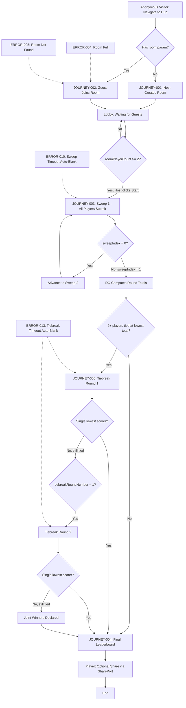
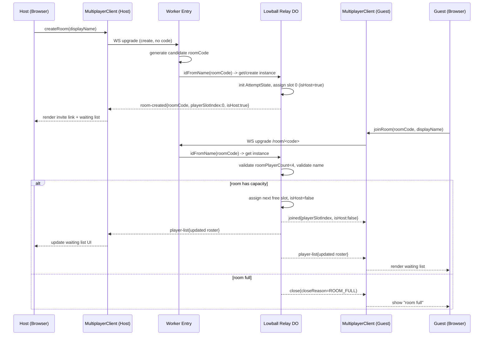
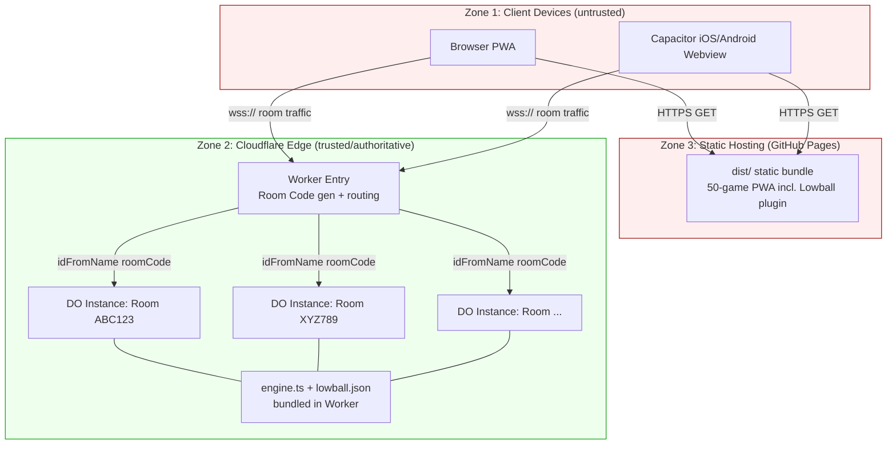

<!-- generated: 2026-09-11T11:33:03Z -->
<!-- mode: feature -->
<!-- feature-slug: lowball-multiplayer -->
<!-- a2a-endpoint: https://bob-sdlc-orchestrator.2as6l7wq9qj8.eu-gb.codeengine.appdomain.cloud/v1/rpc -->

# Glossary

## Terms

### TERM-001: Lowball Game
- **Definition:** An inverse-scoring word game where players submit words matching a category; lower panel scores are better; outcome determined by comparison to par.
- **Synonyms:** Lowball, the game
- **Anti-definition:** Not a scoring system where higher scores win; not a multiplayer-only game (has single-player mode outside this feature's scope).
- **Source:** Existing `src/games/lowball/engine.ts`, `types.ts`

### TERM-002: Category
- **Definition:** The daily prompt constraining valid words (e.g., "words ending in -ugh") shared by all players in a room for a given puzzle.
- **Synonyms:** Prompt
- **Anti-definition:** Not the Answer list itself; not player-specific.
- **Source:** Existing `types.ts` (Puzzle)

### TERM-003: Panel Score
- **Definition:** A 0–100 value representing how many of a simulated 100 people would say the submitted word; lower is better; obscure words score low.
- **Synonyms:** Score
- **Anti-definition:** Not a total; not a par; not a rank.
- **Source:** Existing `types.ts`

### TERM-004: Par
- **Definition:** The threshold value against which a player's two-sweep total is compared in single-player mode; total strictly below par = win.
- **Synonyms:** Par value
- **Anti-definition:** Not used to determine multiplayer winner (multiplayer winner = lowest total among players, not par comparison).
- **Source:** Existing `types.ts` (Puzzle)

### TERM-005: Sweep
- **Definition:** One round of a single word submission by a player; SWEEPS_TOTAL=2 sweeps constitute a normal round.
- **Synonyms:** None
- **Anti-definition:** Not a tiebreak sweep (see TERM-021); not a full round.
- **Source:** Existing `types.ts` (Sweep, SWEEPS_TOTAL)

### TERM-006: Invalid Submission
- **Definition:** A submitted word that fails validation against the Answer list/category rules, or an absent submission at timeout; scores MAX_PANEL_SCORE (100) as penalty.
- **Synonyms:** Blank sweep, penalty submission
- **Anti-definition:** Not a valid word with a naturally high panel score of 100 (though numerically identical, semantically distinct in engine).
- **Source:** Existing `types.ts`, extended by this feature for auto-blank-on-timeout

### TERM-007: Room
- **Definition:** An ephemeral multiplayer session identified by a 6-character room code, hosted by one Durable Object instance, containing 1 host + up to 3 guests.
- **Synonyms:** Game room, lobby session
- **Anti-definition:** Not persisted beyond the active WebSocket session; not associated with an account.
- **Source:** New (this feature)

### TERM-008: Room Code
- **Definition:** A 6-character alphanumeric identifier for a Room, embedded in invite links as `?room=<6-char-code>`.
- **Synonyms:** Invite code
- **Anti-definition:** Not a UUID; not persistent across server restarts (DO lifecycle-bound).
- **Source:** New (this feature)

### TERM-009: Host
- **Definition:** The player who creates a Room, types the initial display name, and has exclusive rights to start the game once minimum players are present.
- **Synonyms:** Room creator
- **Anti-definition:** Not necessarily the winner; not an admin over game rules.
- **Source:** New (this feature)

### TERM-010: Guest
- **Definition:** A player who joins an existing Room via room code, up to 3 per room.
- **Synonyms:** Joining player
- **Anti-definition:** Not the host; cannot start the game.
- **Source:** New (this feature)

### TERM-011: Display Name
- **Definition:** A player-typed string serving as the sole identity mechanism within a Room; no account system exists.
- **Synonyms:** Player name
- **Anti-definition:** Not unique across rooms; not authenticated; not persisted beyond session.
- **Source:** New (this feature)

### TERM-012: Sweep Deadline / Countdown
- **Definition:** The 30-second window during which all players in a live sweep must submit a word; enforced authoritatively by the DO's `alarm()`.
- **Synonyms:** 30s timer, countdown
- **Anti-definition:** Not client-enforced authoritatively (client countdown is a UI mirror only); not variable duration in this feature.
- **Source:** New (this feature)

### TERM-013: Live Reveal
- **Definition:** The broadcast of a player's submitted word and resulting panel score to all room members immediately upon that player's submission (or auto-blank), without waiting for other players.
- **Synonyms:** Live score reveal
- **Anti-definition:** Not a simultaneous reveal-at-end-of-timer; not private to the submitting player.
- **Source:** New (this feature)

### TERM-014: Round Total
- **Definition:** The sum of a player's two sweep Panel Scores in the main round (pre-tiebreak).
- **Synonyms:** Total, sweep total
- **Anti-definition:** Not the tiebreak score; not the par comparison.
- **Source:** New (this feature), builds on existing engine total logic

### TERM-015: Tiebreak
- **Definition:** A sudden-death additional sweep played only by players sharing the lowest Round Total, using words not previously used by that player in the round; repeats up to 2 rounds before joint winners are declared.
- **Synonyms:** Sudden death
- **Anti-definition:** Not part of the standard 2-sweep round; not applicable when a single player has the lowest total.
- **Source:** New (this feature)

### TERM-016: Player Slot
- **Definition:** One of up to 4 fixed positions in `AttemptState.players[]` representing a room participant (host or guest).
- **Synonyms:** Slot
- **Anti-definition:** Not a persistent player identity across rooms/sessions.
- **Source:** Existing `engine.ts` (AttemptState.players[])

### TERM-017: Durable Object (DO)
- **Definition:** A single Cloudflare Workers Durable Object instance that authoritatively relays and scores one Room's WebSocket session, addressed by Room Code.
- **Synonyms:** Relay, room DO
- **Anti-definition:** Not a database; not shared across rooms; not persistent storage in this feature (ephemeral only).
- **Source:** New (this feature, Cloudflare Workers architecture)

### TERM-018: WebSocket Hibernation
- **Definition:** A Cloudflare Workers API allowing a DO's WebSocket connections to be evicted from memory between messages while preserving the connection, reducing billed duration.
- **Synonyms:** Hibernation API
- **Anti-definition:** Not connection termination; not applicable to HTTP-only requests.
- **Source:** Cloudflare Workers platform (external, referenced by this feature)

### TERM-019: DO Alarm
- **Definition:** A scheduled callback (`alarm()`) on a Durable Object used to authoritatively enforce the 30-second Sweep Deadline server-side.
- **Synonyms:** Alarm callback
- **Anti-definition:** Not a client-side timer; not used for any purpose other than sweep deadline enforcement in this feature.
- **Source:** Cloudflare Workers platform, applied by this feature

### TERM-020: Content Pack
- **Definition:** The `lowball.json` data file containing categories, answer lists, and par values, loaded by both client and DO to ensure consistent scoring.
- **Synonyms:** lowball.json
- **Anti-definition:** Not game logic/code; not player-specific data.
- **Source:** Existing (referenced), used authoritatively server-side in this feature

### TERM-021: Tiebreak Sweep
- **Definition:** A single-word submission played during a Tiebreak round, subject to the same 30s deadline and live-reveal mechanics as a normal Sweep, but restricted to words the player has not used earlier in the round.
- **Synonyms:** None
- **Anti-definition:** Not counted toward Round Total; not one of the original 2 sweeps.
- **Source:** New (this feature)

### TERM-022: Leaderboard
- **Definition:** The final ranked list of all players by Round Total (with Tiebreak results applied), broadcast to all room members at round completion.
- **Synonyms:** Final results
- **Anti-definition:** Not persisted; not visible until round completion.
- **Source:** New (this feature)

### TERM-023: GamePlugin Contract
- **Definition:** The shared interface `{ meta, contentPackPath, mount(root, services) }` implemented by all 50 games in the hub.
- **Synonyms:** Plugin interface
- **Anti-definition:** Not modified by this feature except for additive query-param pass-through in the hub router.
- **Source:** Existing `src/hub/hub.ts`

### TERM-024: Hub Router
- **Definition:** The hash-based router in `src/hub/hub.ts` that injects `GameServices` into each plugin and, per this feature, additively passes `?room=` query param to the lowball plugin.
- **Synonyms:** Router
- **Anti-definition:** Not modified for any of the other 49 games.
- **Source:** Existing `src/hub/hub.ts`, additive change by this feature

### TERM-025: Multiplayer Client
- **Definition:** `multiplayer-client.ts`, the sole module permitted to touch WebSocket APIs on the frontend, isolating engine.ts from network concerns.
- **Synonyms:** MP client
- **Anti-definition:** Not the engine; not the DO; contains no scoring logic.
- **Source:** New (this feature)

### TERM-026: Joint Winners
- **Definition:** The outcome state where 2+ tied players remain tied after 2 Tiebreak rounds and all share the win designation.
- **Synonyms:** Shared win
- **Anti-definition:** Not a single-winner outcome; not triggered before 2 tiebreak rounds are exhausted.
- **Source:** New (this feature)

### TERM-027: Room Full Error
- **Definition:** The rejection response given to a 5th connection attempt on a Room already containing 4 players.
- **Synonyms:** None
- **Anti-definition:** Not a generic connection error; specific to the 4-player capacity limit.
- **Source:** New (this feature)

## Data Dictionary

| ID | Name | Type | Format | Range | Units | Default | Nullable | PII | Source | Validation |
|---|---|---|---|---|---|---|---|---|---|---|
| FIELD-001 | roomCode | string | 6-char alphanumeric, uppercase | `[A-Z0-9]{6}` | n/a | generated on room creation | No | No | DO instance ID derivation (TERM-007, TERM-008, TERM-017) | Must match regex; unique among active DOs |
| FIELD-002 | displayName | string | UTF-8, trimmed | 1–20 chars | n/a | none (required at join) | No | Yes (user-supplied free text, low sensitivity) | Client input (TERM-011) | Non-empty after trim; length ≤20; rejected if contains only whitespace |
| FIELD-003 | playerSlotIndex | integer | 0–3 | 0 to 3 | n/a | none | No | No | DO assignment on join (TERM-016) | Must be unique within room; ≤3 |
| FIELD-004 | isHost | boolean | true/false | n/a | n/a | false | No | No | DO assignment (TERM-009) | Exactly one true per room |
| FIELD-005 | category | string | free text | n/a | n/a | none | No | No | Content Pack (TERM-002, TERM-020) | Must exist in lowball.json for the day's puzzle |
| FIELD-006 | answerList | array<string> | lowercase word list | n/a | n/a | none | No | No | Content Pack (TERM-020) | Non-empty array; sourced from lowball.json |
| FIELD-007 | parValue | integer | n/a | 0–200 | panel-score-sum units | none | No | No | Content Pack (TERM-004, TERM-020) | Must be present in puzzle definition |
| FIELD-008 | submittedWord | string | UTF-8, lowercase-normalized | 0–50 chars | n/a | "" (empty = invalid) | Yes (null on timeout) | No | Player input via Multiplayer Client (TERM-025) | Empty/null treated as Invalid Submission (TERM-006) |
| FIELD-009 | panelScore | integer | n/a | 0–100 (MAX_PANEL_SCORE=100) | score points | 100 (penalty) | No | No | DO authoritative scoring via engine.ts (TERM-003) | Must be within 0–100 inclusive |
| FIELD-010 | sweepIndex | integer | n/a | 0–1 (SWEEPS_TOTAL=2) | n/a | 0 | No | No | Existing engine.ts (TERM-005) | Must be 0 or 1 for normal sweeps |
| FIELD-011 | roundTotal | integer | n/a | 0–200 | score points | none (computed) | No | No | Computed by DO from FIELD-009 x2 (TERM-014) | Sum of exactly 2 panelScore values |
| FIELD-012 | sweepDeadlineTimestamp | integer (epoch ms) | Unix epoch milliseconds | n/a | ms | now + 30000 | No | No | DO alarm() scheduling (TERM-012, TERM-019) | Must be future timestamp at scheduling time |
| FIELD-013 | connectionState | enum | string enum | `CONNECTING`\|`OPEN`\|`CLOSED`\|`HIBERNATED` | n/a | `CONNECTING` | No | No | WebSocket Hibernation API (TERM-018) | Must be one of enum values |
| FIELD-014 | tiebreakRoundNumber | integer | n/a | 0 (none), 1, 2 | n/a | 0 | No | No | DO tiebreak state machine (TERM-015, TERM-021) | Must be 0, 1, or 2 |
| FIELD-015 | tiedPlayerSlots | array<integer> | array of playerSlotIndex | 0–3 each, length 2–4 | n/a | [] | No | No | Computed by DO at round end (TERM-015) | Length ≥2; all values valid slot indices |
| FIELD-016 | usedWordsBySlot | map<slotIndex, array<string>> | JSON object | n/a | n/a | {} | No | No | DO tracking for tiebreak validation (TERM-021) | Words must be lowercase-normalized; per-slot dedup |
| FIELD-017 | leaderboardRank | integer | n/a | 1–4 | n/a | none (computed) | No | No | Computed by DO at finalization (TERM-022) | Ties share same rank number |
| FIELD-018 | isJointWinner | boolean | true/false | n/a | n/a | false | No | No | Computed by DO after tiebreak exhaustion (TERM-026) | True only if tiebreakRoundNumber=2 and still tied |
| FIELD-019 | roomPlayerCount | integer | n/a | 0–4 | n/a | 0 | No | No | DO connection tracking (TERM-007) | Must be ≤4; 5th join attempt rejected (TERM-027) |
| FIELD-020 | closeReason | string | short code | `ROOM_FULL`\|`ROOM_NOT_FOUND`\|`INVALID_NAME`\|`HOST_LEFT`\|`NORMAL` | n/a | none | No | No | WebSocket close event (TERM-027) | Must be one of enum values |
| FIELD-021 | puzzleId | string | date-based ID | `YYYY-MM-DD` | n/a | current date | No | No | Content Pack daily puzzle selection (TERM-020) | Must resolve to a valid entry in lowball.json |
| FIELD-022 | verdict | enum | string enum | `VALID`\|`INVALID`\|`TIMEOUT` | n/a | none | No | No | Existing engine.ts Verdict interface (TERM-006) | Must be one of enum values |

# User Journeys

## Roles

| Role | Description |
|---|---|
| Host | Creates the Room, sets display name, invites guests, starts the game (TERM-009) |
| Guest | Joins an existing Room via room code, sets display name (TERM-010) |
| Player (Host or Guest, in-round) | Any of the up to 4 participants once the round has started (TERM-016) |
| System (DO) | Cloudflare Durable Object authoritatively relaying, scoring, timing (TERM-017) |
| Anonymous Visitor | Any user with the app open who has not yet created/joined a room |
| Hub Router | Existing hash-based router passing `?room=` param to lowball plugin (TERM-024) |

## Entry Points

| Location | Trigger | Auth |
|---|---|---|
| UI route: hub hash route `#/lowball` (no query) | User navigates to Lowball game from hub | None (no accounts) |
| UI route: `#/lowball?room=<code>` | User opens invite link or manually types room code | None; room code acts as sole gate |
| WebSocket endpoint: `wss://<worker-domain>/room/<code>` | Client opens WS connection after entering lobby | None; room code + DO existence check |
| DO alarm() event | 30s Sweep Deadline elapses | System-internal, not user-triggered |
| CLI: `wrangler dev` | Developer runs local Worker+DO for development | Local machine only, no Cloudflare account required |
| GitHub Actions workflow trigger | Push to main branch (deploy-pages.yml) | GitHub repo permissions (deployment, not gameplay) |

## Role Permission Matrix

| Action | Host | Guest | Player (in-round) | System (DO) |
|---|---|---|---|---|
| Create room | Yes | No | No | Allocates DO instance |
| Join room by code | No (already in) | Yes | N/A | Validates capacity (FIELD-019) |
| Set display name | Yes | Yes | N/A | Validates FIELD-002 |
| Click Start | Yes | No | No | Validates min 2 players |
| Submit sweep word | N/A | N/A | Yes | Scores authoritatively via engine.ts |
| View live reveals | Yes | Yes | Yes | Broadcasts to all |
| View final leaderboard | Yes | Yes | Yes | Computes and broadcasts |
| Enforce sweep deadline | No | No | No | Yes (alarm(), TERM-019) |

## Journeys

### JOURNEY-001: Host Creates Room and Starts Game

**Role:** Host
**Goal:** Create a room, gather 2–3 guests, and start the multiplayer round.
**Entry Point:** UI route `#/lowball` (no query param), triggered by navigating from hub.
**Success:** Host clicks Start with 2+ players present; round begins (transitions to JOURNEY-003).
**Failure:** Host abandons before starting; or capacity/name validation blocks progress.

**Happy Path:**
1. Host navigates to `#/lowball` via Hub Router (TERM-024); lobby view renders "Create Room" option.
2. Host types Display Name (FIELD-002, TERM-011) into name field.
3. Host clicks "Create Room"; Multiplayer Client (TERM-025) opens WebSocket to DO endpoint; DO allocates new Room (TERM-007) and generates Room Code (FIELD-001).
4. DO assigns Host player slot (FIELD-003=0, FIELD-004=true).
5. Client displays shareable invite link `?room=<code>` and player waiting list showing Host only.
6. Host shares invite link (out-of-band, e.g. copy/paste) with up to 3 guests.
7. As each guest joins (see JOURNEY-002), DO broadcasts updated player list; Host's waiting list UI updates live (FIELD-019 roomPlayerCount increments).
8. Once roomPlayerCount ≥ 2 (FIELD-019), Start button becomes enabled (Role Permission Matrix).
9. Host clicks Start; Multiplayer Client sends start-game message; DO validates ≥2 players and transitions Room state to round-in-progress.
10. DO selects daily puzzle (FIELD-021 puzzleId) from Content Pack (TERM-020) and broadcasts puzzle Category (FIELD-005), triggering JOURNEY-003 for all players.

**Decision Branches:**
- BRANCH-001: At step 8, if roomPlayerCount = 1 (host only), Start button remains disabled; Host must wait for guests.
- BRANCH-002: At step 6, Host may choose to wait longer before sharing, delaying guest joins indefinitely (no timeout in this feature).

**Error States:**
- ERROR-001: Trigger — Host submits empty/whitespace-only Display Name (FIELD-002) at step 2. System response — Client rejects submission client-side before WS send; validation message shown. Recovery — Host re-enters a non-empty name (1–20 chars).
- ERROR-002: Trigger — WebSocket connection to DO fails at step 3 (network error). System response — Client shows connection-failed state; no Room created. Recovery — Host retries "Create Room".
- ERROR-003: Trigger — Host clicks Start with roomPlayerCount = 1 (bypassing disabled-button state via race condition). System response — DO rejects start-game message, returns error to Host only. Recovery — Host waits for a second player; UI re-syncs button state.

**Loop-back Paths:**
- LOOP-001: After ERROR-001, Host loops back to step 2 (re-enter name).
- LOOP-002: After ERROR-002, Host loops back to step 3 (retry create room).

**Edge Cases:**
- EDGE-001: Display Name exactly 20 characters (FIELD-002 boundary) — must be accepted.
- EDGE-002: Display Name with leading/trailing whitespace only — trimmed; if empty after trim, treated as ERROR-001.
- EDGE-003: Host's browser tab closes/loses connection after Room creation but before any guest joins — DO retains Room in memory per WebSocket Hibernation (TERM-018) until hibernation/eviction rules apply; Room may become orphaned (no defined cleanup in this feature; ephemeral per TERM-007).
- EDGE-004: Two Hosts attempt to create Rooms simultaneously that collide on generated Room Code (FIELD-001) — DO/Worker layer must guarantee uniqueness at generation time (validation rule on FIELD-001); collision must be regenerated before Room is exposed.

---

### JOURNEY-002: Guest Joins Room via Invite Link or Code Entry

**Role:** Guest
**Goal:** Join an existing Room using a room code (via link or manual entry) and set a display name.
**Entry Point:** UI route `#/lowball?room=<code>` (from invite link click) OR `#/lowball` with manual code entry field.
**Success:** Guest is assigned a Player Slot (FIELD-003) and appears in all players' waiting lists.
**Failure:** Room full (ERROR-004), Room not found (ERROR-005), or invalid name (ERROR-001-equivalent for guest).

**Happy Path:**
1. Guest opens invite link `#/lowball?room=<code>`; Hub Router (TERM-024) passes `room` query param to lowball plugin per additive change.
2. Lobby view pre-fills Room Code field (FIELD-001) from query param; Guest is prompted for Display Name.
3. Guest types Display Name (FIELD-002).
4. Guest clicks "Join Room"; Multiplayer Client opens WebSocket to DO endpoint for that Room Code.
5. DO validates Room exists and roomPlayerCount < 4 (FIELD-019).
6. DO assigns Guest a Player Slot (FIELD-003 ∈ {1,2,3}, FIELD-004=false).
7. DO broadcasts updated player list to all connected clients including new Guest's Display Name.
8. Guest's lobby view updates to show waiting list including self, Host, and any other guests; Start button remains disabled/hidden (Guest cannot start per Role Permission Matrix).
9. Guest waits for Host to click Start, transitioning to JOURNEY-003.

**Decision Branches:**
- BRANCH-003: At step 1, if Guest navigates directly to `#/lowball` without query param, Guest manually enters Room Code (FIELD-001) in a text field instead of pre-fill; flow otherwise identical from step 2.

**Error States:**
- ERROR-004: Trigger — DO's roomPlayerCount (FIELD-019) = 4 when 5th connection attempts join at step 5. System response — DO refuses WebSocket upgrade / immediately closes with closeReason=`ROOM_FULL` (FIELD-020), message "room full". Recovery — Guest is shown "room full" message; no retry possible for this room.
- ERROR-005: Trigger — Room Code (FIELD-001) does not correspond to any active DO instance at step 4/5. System response — Connection closes with closeReason=`ROOM_NOT_FOUND`. Recovery — Guest is prompted to re-check code or request a new invite link.
- ERROR-006: Trigger — Guest submits empty/whitespace-only Display Name at step 3. System response — Client-side validation blocks submission before WS send. Recovery — Guest re-enters valid name.
- ERROR-007: Trigger — Guest's chosen Display Name exactly matches (case-sensitive or insensitive — see OpenQuestion) an existing player's name in the same Room. System response — DO may reject or allow with disambiguation (see OpenQuestion in Requirements). Recovery — Guest renames if rejected.

**Loop-back Paths:**
- LOOP-003: After ERROR-006, Guest loops back to step 3 (re-enter name).
- LOOP-004: After ERROR-005, Guest loops back to entering/re-checking Room Code (step 2 equivalent, manual entry mode).

**Edge Cases:**
- EDGE-005: Guest joins at the exact moment Host clicks Start (race condition) — DO must define ordering (join accepted only if processed before start-game message is committed; otherwise guest sees "round already started" state — see OpenQuestion).
- EDGE-006: Guest attempts to join with a Room Code that existed previously but whose DO has since been evicted/hibernated with no active session — treated as ERROR-005 (Room Not Found) since no persistence exists (TERM-007).
- EDGE-007: Two Guests submit identical Display Names simultaneously (concurrency) — DO must serialize join processing; second arrival subject to ERROR-007 handling.
- EDGE-008: Guest's network drops mid-join (WebSocket opens but closes before DO assigns slot) — Guest does not appear in player list; Guest's client shows connection-failed state, must retry from step 4.

---

### JOURNEY-003: Player Plays a Sweep (Live Round)

**Role:** Player (Host or Guest, in-round)
**Goal:** Submit a word for the current sweep within the 30-second deadline and see live results.
**Entry Point:** System event — DO broadcasts sweep-start message (triggered by Host's Start click at end of JOURNEY-001, or by prior sweep completion).
**Success:** Player submits a valid word before deadline; word is scored and revealed.
**Failure:** Player fails to submit before deadline (auto-blank penalty applied).

**Happy Path:**
1. DO broadcasts sweep-start with Category (FIELD-005), sweepIndex (FIELD-010), and sweepDeadlineTimestamp (FIELD-012); DO schedules alarm() (TERM-019) for 30s from now.
2. Live round view renders: up to 4 player columns, 30s countdown (client-side mirror of FIELD-012), current totals per player (initially 0 or prior sweep total).
3. Player types a word into submission field.
4. Player clicks Submit (or presses Enter); Multiplayer Client sends submittedWord (FIELD-008) to DO over WebSocket.
5. DO authoritatively scores the word using engine.ts + Content Pack (TERM-020), producing panelScore (FIELD-009) and verdict (FIELD-022).
6. DO broadcasts Live Reveal (TERM-013) to all clients: this player's Display Name, submittedWord, panelScore, verdict, updated running total.
7. All players' live round views update to show this player's revealed result and updated total (FIELD-011 partial, pending sweep 2).
8. Player's own view marks their submission as "locked in"; submission field disables for remainder of this sweep.
9. Once all 4 (or fewer, per room size) players have submitted OR deadline (FIELD-012) elapses, DO advances to next sweep or to end-of-round logic.

**Decision Branches:**
- BRANCH-004: At step 9, if sweepIndex (FIELD-010) = 0 (just completed Sweep 1), DO transitions to Sweep 2 (loop back to step 1 with sweepIndex=1).
- BRANCH-005: At step 9, if sweepIndex = 1 (just completed Sweep 2), DO proceeds to compute Round Totals (FIELD-011) and evaluate tie-break condition, transitioning to JOURNEY-004 (leaderboard) or JOURNEY-005 (tiebreak) as applicable.

**Error States:**
- ERROR-008: Trigger — Player submits a word not present in the Content Pack's Answer List (FIELD-006) or otherwise invalid per game rules. System response — DO scores as Invalid Submission (TERM-006, verdict=`INVALID`), panelScore=100 (MAX_PANEL_SCORE), reveals as normal. Recovery — None within this sweep; player proceeds to next sweep.
- ERROR-009: Trigger — Player attempts to submit a second word within the same sweep after already locking in (step 8). System response — DO/client rejects duplicate submission for this sweepIndex; original submission stands. Recovery — None needed; player waits for next sweep.
- ERROR-010: Trigger — 30-second deadline (FIELD-012) elapses via DO alarm() (TERM-019) before player submits. System response — DO auto-inserts blank sweep: submittedWord=null, verdict=`TIMEOUT`, panelScore=100 (per TERM-006 penalty), broadcasts as Live Reveal same as normal submission. Recovery — None; player proceeds to next sweep automatically.

**Loop-back Paths:**
- LOOP-005: BRANCH-004 loops back to step 1 for Sweep 2 with sweepIndex=1.

**Edge Cases:**
- EDGE-009: Player submits word within the last 100ms before deadline (race between client submit message and DO alarm firing) — DO must define authoritative ordering: submission received before alarm fires (server-side timestamp check) is honored; otherwise treated as ERROR-010.
- EDGE-010: Player's WebSocket disconnects mid-sweep (network drop) — DO does not receive submission; at deadline, ERROR-010 auto-blank applies as if player never submitted. If player reconnects before deadline, resubmission is allowed (see OpenQuestion on reconnection identity).
- EDGE-011: All players submit before 30s elapses (no one times out) — DO advances immediately at step 9 without waiting for full 30s (early advance).
- EDGE-012: Player submits empty string explicitly (not timeout) — treated identically to Invalid Submission (ERROR-008), panelScore=100, verdict=`INVALID` (not `TIMEOUT`).
- EDGE-013: submittedWord exceeds reasonable length (e.g., 500 characters) — client/DO must reject or truncate per FIELD-008 validation rule (0–50 chars); over-length treated as Invalid Submission.

---

### JOURNEY-004: Players View Final Leaderboard (No Tiebreak Needed)

**Role:** Player (Host or Guest, in-round)
**Goal:** View final ranked results after both sweeps complete with no ties at the lowest total.
**Entry Point:** System event — DO completes Round Total computation (BRANCH-005) and determines a single unique lowest total.
**Success:** Leaderboard renders with correct ranks; Player may share results.
**Failure:** N/A (this journey is a terminal broadcast; no further action required beyond optional share).

**Happy Path:**
1. DO computes Round Total (FIELD-011) for each Player Slot from their 2 panelScore values.
2. DO determines the player with the strictly lowest Round Total has no ties.
3. DO computes leaderboardRank (FIELD-017) for all players (1 = winner, incrementing for others; ties among non-winners share rank per standard competition ranking — see OpenQuestion).
4. DO sets isJointWinner=false (FIELD-018) for all players (no tiebreak occurred).
5. DO broadcasts Leaderboard (TERM-022) to all clients: rank, Display Name, Round Total, tiebreak result (N/A).
6. Final leaderboard view renders ranked table for all players.
7. Player clicks Share button; reuses existing SharePort (from `src/kit/ports.ts`) to share results externally.

**Decision Branches:**
- BRANCH-006: At step 7, Share is optional; Player may instead simply close/leave the view.

**Error States:**
- ERROR-011: Trigger — SharePort invocation fails (e.g., platform share API unavailable/rejected). System response — Client shows share-failed message. Recovery — Player retries Share or abandons.

**Loop-back Paths:** None (terminal journey).

**Edge Cases:**
- EDGE-014: Room has fewer than 4 players (e.g., 2 players total, minimum) — leaderboard renders correctly for 2 players with same ranking logic.
- EDGE-015: A player disconnected mid-round (EDGE-010) and never reconnected — DO must decide whether to include them in leaderboard with their auto-blank scores or mark as "disconnected" (see OpenQuestion).

---

### JOURNEY-005: Tiebreak Round(s) for Tied Players

**Role:** Player (specifically, players in tiedPlayerSlots, FIELD-015)
**Goal:** Resolve a tie at the lowest Round Total via sudden-death tiebreak sweep(s).
**Entry Point:** System event — DO determines 2+ players share the lowest Round Total (BRANCH-005 alternate path).
**Success:** A single player emerges with the lowest tiebreak sweep score, becoming sole winner; or after 2 tiebreak rounds, Joint Winners declared.
**Failure:** N/A (this journey always reaches a defined terminal state — sole winner or joint winners).

**Happy Path:**
1. DO identifies tiedPlayerSlots (FIELD-015) with 2+ entries sharing lowest Round Total.
2. DO increments tiebreakRoundNumber (FIELD-014) from 0 to 1.
3. DO broadcasts tiebreak-start message to ALL clients, but Tiebreak view marks only tied players as "active"; non-tied players see spectator state.
4. DO reuses same Category (FIELD-005) for the Tiebreak Sweep (TERM-021); schedules alarm() for 30s deadline (same mechanics as JOURNEY-003 steps 1–2).
5. Each tied player submits a word via same submission UI (JOURNEY-003 steps 3–4), constrained to words not in their usedWordsBySlot (FIELD-016) for this round.
6. DO scores each submission via engine.ts; validates word is unused per FIELD-016 (if reused, treated as Invalid Submission regardless of Answer List validity).
7. DO broadcasts Live Reveal for each tiebreak submission (same mechanics as JOURNEY-003 step 6).
8. Once all tied players submit or deadline elapses (auto-blank per ERROR-010 mechanics), DO compares single-sweep panelScore among tied players only.
9. If exactly one player has the strictly lowest tiebreak panelScore, DO declares them sole winner; transitions to JOURNEY-004 (leaderboard) with tiebreak result annotation.

**Decision Branches:**
- BRANCH-007: At step 9, if 2+ tied players still share the lowest tiebreak panelScore AND tiebreakRoundNumber (FIELD-014) = 1, DO loops back to step 2 (increment to tiebreakRoundNumber=2), narrowing tiedPlayerSlots to the still-tied subset.
- BRANCH-008: At step 9, if 2+ tied players still share the lowest tiebreak panelScore AND tiebreakRoundNumber = 2, DO sets isJointWinner=true (FIELD-018) for all remaining tied players (TERM-026); transitions to JOURNEY-004 with joint-winner annotation. No further tiebreak rounds occur.

**Error States:**
- ERROR-012: Trigger — Tied player has exhausted all valid words in the Answer List (FIELD-006) not in usedWordsBySlot (FIELD-016) — cannot form a valid submission. System response — DO scores any submission attempt (including forced reuse) as Invalid Submission (panelScore=100); this is treated identically to ERROR-008, not a distinct system failure. Recovery — None; standard invalid-submission flow applies.
- ERROR-013: Trigger — Tiebreak deadline elapses for a tied player without submission (same as ERROR-010 but scoped to tiebreak). System response — Auto-blank inserted, panelScore=100, verdict=`TIMEOUT`. Recovery — None; proceeds to comparison.

**Loop-back Paths:**
- LOOP-006: BRANCH-007 loops back to step 2 for Tiebreak Round 2.

**Edge Cases:**
- EDGE-016: All originally-tied players remain tied through both tiebreak rounds with identical scores each time (e.g., all submit invalid/blank) — resolves via BRANCH-008 to Joint Winners.
- EDGE-017: A subset of originally-tied players resolves in Tiebreak Round 1 (e.g., 3 tied, 1 separates with lower score, 2 remain tied) — per BRANCH-007, only the still-tied subset (2 players) proceeds to Round 2; the separated player is NOT the winner unless their score is the lowest among the ORIGINAL tied group (see OpenQuestion: does a partial separation in round 1 with a low score win outright, or must they still be the single lowest to win — per rules text, "Lowest single-sweep score among the tied players wins the tiebreak," implying separation with lowest score DOES win immediately; BRANCH-007/008 wording clarified in Requirements section).
- EDGE-018: A tied player disconnects during the Tiebreak (does not submit, connection lost) — treated as ERROR-013 auto-blank; if this results in them having the lowest score (impossible, since 100 is max/worst) this cannot occur; disconnection during tiebreak always yields worst possible outcome for that player (100 penalty), never a win, since lower is better and 100 is the ceiling.

## Journey Map



# Requirements

### REQ-001: Room Creation Generates Unique Room Code
- **EARS Pattern:** Event-Driven
- **EARS Statement:** When a Host submits a create-room request, the Multiplayer Relay System shall generate a unique 6-character Room Code.
- **Inputs:** Host Display Name (FIELD-002)
- **Outputs:** roomCode (FIELD-001)
- **Preconditions:** No active Room exists for the generated code candidate.
- **Postconditions:** A new Durable Object instance is addressable by the generated Room Code; Host is assigned Player Slot 0.
- **Invariants:** Room Code is unique among currently active DO instances at generation time.
- **Trigger:** Host clicks "Create Room" (JOURNEY-001 step 3).
- **Actor:** System (DO)
- **EntityScope:** TERM-007 (Room), TERM-008 (Room Code)
- **ErrorModes:** Room Code collision (regenerate).
- **NFR-Tags:** NFR-005 (capacity), NFR-009 (reliability)
- **Source:** JOURNEY-001 step 3, EDGE-004
- **Dependencies:** None
- **Priority:** Must
- **AcceptanceCriteria:**
  - TEST-001: Given no active room with a given code, when create-room is requested, then a 6-character alphanumeric code matching `[A-Z0-9]{6}` is returned.
  - TEST-002: Given a code collision is detected during generation, when create-room is requested, then a different unique code is generated before the Room is exposed to the client.
- **Assumptions:** DO namespace can check/reserve names atomically at creation.
- **OpenQuestions:** None.

---

### REQ-002: Host Player Slot Assignment
- **EARS Pattern:** Event-Driven
- **EARS Statement:** When a Room is created, the Multiplayer Relay System shall assign the Host to Player Slot index 0.
- **Inputs:** roomCode (FIELD-001), displayName (FIELD-002)
- **Outputs:** playerSlotIndex=0 (FIELD-003), isHost=true (FIELD-004)
- **Preconditions:** Room creation succeeded (REQ-001).
- **Postconditions:** Host occupies slot 0; roomPlayerCount=1 (FIELD-019).
- **Invariants:** Exactly one player per room has isHost=true.
- **Trigger:** Successful room creation (JOURNEY-001 step 4).
- **Actor:** System (DO)
- **EntityScope:** TERM-009 (Host), TERM-016 (Player Slot)
- **ErrorModes:** None distinct (creation failure covered by REQ-001).
- **NFR-Tags:** None.
- **Source:** JOURNEY-001 step 4
- **Dependencies:** REQ-001
- **Priority:** Must
- **AcceptanceCriteria:**
  - TEST-003: Given a newly created room, when the Host's connection is established, then playerSlotIndex=0 and isHost=true are set for that connection.
- **Assumptions:** None.
- **OpenQuestions:** None.

---

### REQ-003: Display Name Validation on Submission
- **EARS Pattern:** Unwanted
- **EARS Statement:** The Multiplayer Relay System shall not accept a displayName that is empty or whitespace-only after trimming.
- **Inputs:** displayName (FIELD-002)
- **Outputs:** Validation rejection (client-side) or accepted displayName.
- **Preconditions:** None.
- **Postconditions:** Only non-empty, ≤20-char trimmed names are stored.
- **Invariants:** FIELD-002 validation rule always enforced before WS send and at DO ingestion.
- **Trigger:** Player attempts to submit a display name (JOURNEY-001 step 2, JOURNEY-002 step 3).
- **Actor:** System (Client + DO)
- **EntityScope:** TERM-011 (Display Name)
- **ErrorModes:** ERROR-001, ERROR-006
- **NFR-Tags:** None.
- **Source:** JOURNEY-001 ERROR-001, JOURNEY-002 ERROR-006, EDGE-001, EDGE-002
- **Dependencies:** None
- **Priority:** Must
- **AcceptanceCriteria:**
  - TEST-004: Given a displayName input of only whitespace, when submission is attempted, then the system rejects it before any WebSocket message is sent.
  - TEST-005: Given a displayName exactly 20 characters after trimming, when submission is attempted, then it is accepted.
- **Assumptions:** Trimming happens client-side before length check.
- **OpenQuestions:** None.

---

### REQ-004: Guest Join Rejected When Room Full
- **EARS Pattern:** Event-Driven
- **EARS Statement:** When a 5th connection attempts to join a Room with roomPlayerCount already at 4, the Multiplayer Relay System shall close the connection with closeReason ROOM_FULL.
- **Inputs:** roomCode (FIELD-001), roomPlayerCount (FIELD-019)
- **Outputs:** closeReason=ROOM_FULL (FIELD-020)
- **Preconditions:** Room exists and roomPlayerCount=4.
- **Postconditions:** roomPlayerCount remains 4; new connection is not assigned a slot.
- **Invariants:** roomPlayerCount never exceeds 4.
- **Trigger:** 5th WebSocket join attempt (JOURNEY-002 step 5).
- **Actor:** System (D
# Architecture

## Components & Responsibilities

### C1: Lowball Engine (existing, unmodified)

- Deterministic scoring functions: word validation, panel score lookup, verdict computation, round total accumulation, par comparison.
- Pure TypeScript, no DOM/storage/clock/network dependencies.
- Runs identically in browser (single-player, UI preview) and inside the Cloudflare Worker/DO (authoritative multiplayer scoring).

**Boundaries:**
- Owns: word→panelScore resolution, Verdict determination, AttemptState shape/transitions, SWEEPS_TOTAL/MAX_PANEL_SCORE constants.
- Does not own: networking, timers, room/player identity, tiebreak orchestration (tiebreak is a new sequencing concern layered by the DO, using engine functions per-sweep).

**Interfaces exposed:** `score(word, puzzle): {panelScore, verdict}`, `computeTotal(sweeps)`, existing `types.ts` interfaces.
**Interfaces consumed:** Content Pack (`lowball.json`) passed in by caller (client or DO); no I/O of its own.

Satisfies: REQ-001–REQ-004 (indirectly, via authoritative scoring reused by DO), all engine-adjacent EARS in JOURNEY-003/005.

---

### C2: Lowball Content Pack (`lowball.json`)

- Provides daily Category, Answer List, Par per `puzzleId` (FIELD-021).
- Single source of truth loaded identically by client and DO to guarantee scoring parity.

**Boundaries:**
- Owns: puzzle data only.
- Does not own: game logic, player state.

**Interfaces exposed:** Static JSON, fetched by client (via existing asset pipeline) and bundled/fetched by the Worker.
**Interfaces consumed:** None.

Trade-off: bundling the pack into the Worker (vs. fetching from a URL) avoids a network dependency for scoring but requires redeploying the Worker whenever the pack changes — accepted given ephemeral, low-change-frequency content (see ADR-003).

---

### C3: Multiplayer Client (`multiplayer-client.ts`)

- Sole frontend module permitted to touch WebSocket APIs (TERM-025).
- Opens/closes WS connection to `wss://<worker-domain>/room/<code>`.
- Serializes outbound messages (create-room, join-room, set-name, start-game, submit-word) and deserializes inbound broadcasts (player-list, sweep-start, live-reveal, tiebreak-start, leaderboard, error/close).
- Exposes a small event-emitter/callback API to the UI layer; translates raw WS frames into typed events consumed by lobby/round/tiebreak/leaderboard views.
- Mirrors `sweepDeadlineTimestamp` client-side for the countdown UI (non-authoritative).

**Boundaries:**
- Owns: WS lifecycle, message (de)serialization, reconnection attempts (best-effort, no authoritative identity recovery — see ADR-004 Open Question), local countdown display timer.
- Does not own: scoring, room/player authoritative state (mirrors DO's broadcasts only), engine logic.

**Interfaces exposed:** `connect(roomCode?)`, `createRoom(name)`, `joinRoom(code, name)`, `startGame()`, `submitWord(word)`, `on(event, handler)`.
**Interfaces consumed:** Browser `WebSocket` API (via `web-adapter.ts`'s networking path, not intercepted by CapacitorHttp).

Satisfies: REQ-003 (client-side name validation before send), all client-side steps of JOURNEY-001/002/003/005.

---

### C4: Lowball Plugin UI (Lobby / Live Round / Tiebreak / Leaderboard views)

- Implements the existing `GamePlugin` contract (`meta`, `contentPackPath`, `mount(root, services)`), extended internally (not contractually) to branch into multiplayer views when `?room=` is present.
- **Lobby View:** create-room / join-by-code / display-name entry / waiting list / host-only Start button.
- **Live Round View:** up to 4 player columns, 30s countdown mirror, live reveals, running totals.
- **Tiebreak View:** same layout, only tied players marked active, others spectator.
- **Leaderboard View:** ranked table, Share button via existing `SharePort`.

**Boundaries:**
- Owns: DOM rendering, view-state transitions driven by Multiplayer Client events.
- Does not own: WebSocket handling (delegates to C3), scoring (delegates to DO via C3), routing decision of which game to mount (owned by Hub Router).

**Interfaces exposed:** `mount(root, services)` per `GamePlugin` contract (unchanged signature).
**Interfaces consumed:** `GameServices` (existing, includes `SharePort`), `multiplayer-client.ts` public API, existing single-player engine path (untouched, used when no `room` param present).

Satisfies: REQ-002 (renders slot/host state), REQ-003 (renders validation errors), REQ-004 (renders room-full/not-found), JOURNEY-001/002/003/004/005 UI steps.

Trade-off: keeping multiplayer UI inside the same plugin (vs. a separate plugin/route) avoids duplicating `GamePlugin` registration and content-pack wiring, at the cost of conditional branching inside one plugin's `mount()`. Accepted since the feature is explicitly scoped to "Lowball only" (see ADR-001).

---

### C5: Hub Router (existing, additively modified)

- Hash-based router; `servicesFor()` injects `GameServices` into each plugin.
- **Additive change only:** passes through `?room=` query param to the lowball plugin's `mount()` invocation (e.g., via `services` or a parsed-route argument). No change to `GamePlugin` contract signature, no change affecting the other 49 games.

**Boundaries:**
- Owns: hash-route parsing, plugin selection/mounting, query-param pass-through.
- Does not own: room semantics, WebSocket connections.

**Interfaces exposed:** Existing route dispatch (`#/<game>` and `#/<game>?<query>`).
**Interfaces consumed:** `GamePlugin.mount(root, services)` for all 50 games.

Satisfies: EntryPoints table (`#/lowball?room=<code>`), JOURNEY-002 step 1.

---

### C6: Lowball Relay Durable Object (`workers/lowball-relay`)

- One DO instance per active Room, addressed by Room Code (derivable DO ID/name).
- Authoritative source of truth for: room membership, player slots, host designation, round/sweep/tiebreak state machine, scoring (via C1+C2), deadline enforcement (via `alarm()`), broadcast fan-out.
- Uses WebSocket Hibernation API to minimize billed duration between messages.

**Boundaries:**
- Owns: `AttemptState`-per-room in DO in-memory/transient storage, `playerSlotIndex`/`isHost` assignment, `roomPlayerCount`, `usedWordsBySlot`, `tiedPlayerSlots`, `tiebreakRoundNumber`, alarm scheduling, leaderboard computation.
- Does not own: persistence beyond the DO's lifecycle (explicitly ephemeral, no Durable Object storage API writes required for this feature — see ADR-002), client rendering, engine scoring algorithm internals (delegates to C1).

**Interfaces exposed:** WebSocket upgrade endpoint `wss://<worker-domain>/room/<code>` accepting typed JSON messages (`create-room` — special-cased as "no code yet, allocate"; `join-room`, `set-name`, `start-game`, `submit-word`); broadcast messages (`player-list`, `sweep-start`, `live-reveal`, `tiebreak-start`, `leaderboard`, close frames with `closeReason`).
**Interfaces consumed:** C1 (`engine.ts` scoring functions), C2 (`lowball.json`, bundled into Worker), Cloudflare Workers Durable Object runtime APIs (`alarm()`, hibernatable WebSockets, DO namespace `idFromName`/`get`).

Satisfies: REQ-001, REQ-002, REQ-004, all System(DO)-actor steps across JOURNEY-001 through 005.

---

### C7: Cloudflare Worker Entry (`workers/lowball-relay/src/index.ts`)

- HTTP-level entry point that routes incoming requests to the correct DO instance via Room Code, and handles the special "create room" case (generate code, `idFromName(code)`, forward the WS upgrade).
- Enforces Room Code uniqueness at generation time (regenerate-on-collision loop) before exposing the code to the client.

**Boundaries:**
- Owns: Room Code generation/collision-avoidance, request routing to `idFromName(roomCode)`.
- Does not own: any in-room state (delegated immediately to the DO instance).

**Interfaces exposed:** `GET /room/:code` (WS upgrade), `POST /room` or WS-with-no-code convention for room creation (see ADR-005 for exact contract choice).
**Interfaces consumed:** Durable Object namespace binding (`env.LOWBALL_ROOMS`).

Satisfies: REQ-001 (TEST-001, TEST-002).

---

## Data Flow

### Flow: JOURNEY-001 + JOURNEY-002 (Room Creation & Join)



State transitions: `Room` : `EMPTY → LOBBY(1 player, host) → LOBBY(2-4 players) → [Start clicked] → IN_ROUND`.

---

### Flow: JOURNEY-003 (Sweep Submission, Live Reveal, Auto-Blank)

```mermaid
sequenceDiagram
    participant P1 as Player 1
    participant MPC1 as MultiplayerClient P1
    participant DO as Lowball Relay DO
    participant Engine as engine.ts (in-DO)
    participant Pn as Other Players' Clients

    DO->>DO: sweep-start (sweepIndex, deadline=now+30000)
    DO->>DO: schedule alarm(deadline)
    DO-->>MPC1: sweep-start{category, sweepIndex, deadline}
    DO-->>Pn: sweep-start{category, sweepIndex, deadline}

    P1->>MPC1: submitWord(word)
    MPC1->>DO: submit-word{word}
    DO->>Engine: score(word, puzzle)
    Engine-->>DO: {panelScore, verdict}
    DO->>DO: store sweep result for slot; check all-submitted
    DO-->>MPC1: live-reveal{slot:P1, word, panelScore, verdict, runningTotal}
    DO-->>Pn: live-reveal{slot:P1, word, panelScore, verdict, runningTotal}

    Note over DO: If deadline elapses before a slot submits
    DO->>DO: alarm() fires
    DO->>DO: for each unsubmitted slot: verdict=TIMEOUT, panelScore=100
    DO-->>Pn: live-reveal{slot:X, word:null, panelScore:100, verdict:TIMEOUT}

    DO->>DO: all slots resolved -> advance sweepIndex or compute totals
```

State transitions: `Sweep` : `PENDING → (per-slot: SUBMITTED | TIMED_OUT) → RESOLVED → [sweepIndex<1 ? next sweep : ROUND_TOTALS]`.

---

### Flow: JOURNEY-004 / JOURNEY-005 (Totals, Tiebreak, Leaderboard)

```mermaid
sequenceDiagram
    participant DO as Lowball Relay DO
    participant Engine as engine.ts (in-DO)
    participant All as All Players' Clients

    DO->>DO: computeRoundTotal per slot (sum of 2 panelScores)
    DO->>DO: determine min total, tiedPlayerSlots

    alt no tie
        DO->>DO: leaderboardRank assigned, isJointWinner=false
        DO-->>All: leaderboard{ranks, totals}
    else tie at lowest total
        loop up to 2 tiebreak rounds
            DO->>DO: tiebreakRoundNumber++; schedule alarm(30s)
            DO-->>All: tiebreak-start{tiedPlayerSlots, category}
            All->>DO: submit-word (tied players only, non-tied spectate)
            DO->>Engine: score(word, puzzle) [+ usedWordsBySlot check]
            Engine-->>DO: {panelScore, verdict}
            DO-->>All: live-reveal (tiebreak)
            DO->>DO: alarm fires for non-submitters -> auto-blank
            DO->>DO: compare single-sweep scores among tied slots
            alt single lowest scorer
                DO->>DO: mark sole winner; break loop
            else still tied and tiebreakRoundNumber=2
                DO->>DO: isJointWinner=true for remaining tied slots; break loop
            end
        end
        DO-->>All: leaderboard{ranks, totals, tiebreak annotations}
    end
```

State transitions: `RoundResolution` : `TOTALS_COMPUTED → (UNIQUE_LOWEST | TIED) → [TIED: TIEBREAK_R1 → (RESOLVED | TIEBREAK_R2 → (RESOLVED | JOINT_WINNERS))] → LEADERBOARD_BROADCAST`.

---

## Deployment Topology

**Runtime environments:**
- **Static frontend:** GitHub Pages — static `dist/` bundle (Vite build) serving the 50-game PWA including the Lowball plugin. No server-side rendering.
- **Realtime backend:** Cloudflare Workers (V8 isolate, edge-deployed) + one Durable Object instance per active room, addressed by Room Code via `idFromName`.
- **Local dev:** `wrangler dev` runs the Worker+DO entirely on the developer's machine (Miniflare-backed), no Cloudflare account required for development; frontend runs via `vite dev`.
- **Native shells:** Capacitor-wrapped iOS/Android webviews load the same static bundle; WebSocket calls go through the webview's native networking (not intercepted by the disabled CapacitorHttp).

**Network boundaries / trust zones:**
- Zone 1 — **Client (untrusted):** browser/webview; sends only display name + submitted word strings; never trusted for scoring, timing, or slot assignment.
- Zone 2 — **Cloudflare edge (trusted, authoritative):** Worker entry + DO; sole source of truth for room state, scoring (via bundled engine+content pack), and deadline enforcement.
- Zone 3 — **Static hosting (untrusted-by-default, public):** GitHub Pages CDN; serves only static assets, no secrets, no server logic.
- Boundary crossing: Client ↔ Worker/DO exclusively over `wss://` (TLS); Client ↔ GitHub Pages exclusively over `https://`.

**Scaling units and limits:**
- Scaling unit = one DO instance per room (max 4 connected WebSocket clients per instance).
- Cloudflare Workers Free tier: 100k requests/day, 13k GB-s/day — each WS message counts toward request budget; Hibernation API keeps idle connections from consuming GB-s. Practical daily room capacity is bounded by this quota (documented, not enforced in code — see ADR-006).
- No horizontal scaling needed within a room (single DO is authoritative by design); horizontal scale is "more rooms = more DO instances," which Cloudflare manages automatically.
- No DO-to-DO communication; rooms are fully isolated.



---

## Security Architecture

**AuthN mechanism per actor type:**
- **Host/Guest (players):** No account-based authentication. Identity = self-typed Display Name, scoped only to the lifetime of one WebSocket connection to one DO instance. Room Code functions as a shared-secret-style capability token (possession of the 6-char code = ability to join).
- **System (DO):** Implicitly trusted; Cloudflare's platform guarantees isolate identity and DO addressing; no additional service-to-service auth needed since Worker→DO is an internal binding, not a public network call.
- **Developer (CI/CD, wrangler):** Authenticated via Cloudflare API token (Workers deploy) and GitHub Actions default `GITHUB_TOKEN` (Pages deploy) — both configured, neither committed (see DEPLOYMENT.md).

**AuthZ model:**
- Coarse-grained **role-based** model with exactly two roles per room: Host (slot 0, `isHost=true`) and Guest (`isHost=false`). Enforced entirely server-side in the DO — the DO is the only entity permitted to set `isHost` and to accept a `start-game` message from a non-host connection is a no-op/rejected action, regardless of client-side UI state (Role Permission Matrix).
- No cross-room authorization: a WebSocket connection is scoped to exactly one DO/room; there is no mechanism to act on a different room's state.

**Secret management:**
- No player-facing secrets exist (no accounts, no tokens beyond the ephemeral room code, which is not sensitive — see Data Classification).
- Deployment-time secrets (Cloudflare API token) are supplied via GitHub Actions encrypted secrets / local environment variables for `wrangler dev`/`wrangler deploy`; never committed to the repo. `wrangler.toml` contains no secret values, only non-sensitive config (account-agnostic where possible, with placeholders documented in DEPLOYMENT.md).

**Data classification and encryption:**
| Data | Classification | At rest | In transit |
|---|---|---|---|
| Display Name (FIELD-002) | Low-sensitivity PII (user-supplied, ephemeral) | Not persisted (in-memory DO state only, evicted at DO lifecycle end) | TLS via `wss://` |
| Room Code (FIELD-001) | Non-sensitive, ephemeral capability token | Not persisted | TLS via `wss://` |
| Submitted words / scores | Non-sensitive gameplay data | Not persisted | TLS via `wss://` |
| Static bundle | Public | Public CDN | HTTPS |

No data is written to any durable store (Durable Object Storage API is intentionally not used — see ADR-002); "at rest" risk is minimal by design since the feature is ephemeral-only.

**Threat model summary (top 5 threats + mitigations):**

1. **Room Code guessing/brute-force** (attacker enumerates 6-char codes to join arbitrary rooms). *Mitigation:* keyspace of 36^6 (~2.1B) combinations; room lifetime is short (single session); rate-limit join attempts at Worker Entry (documented recommendation — see ADR-007, Proposed).
2. **Impersonation via duplicate display names** (Guest joins claiming a name to confuse other players). *Mitigation:* DO-side uniqueness check per room (ERROR-007); slot index remains the authoritative identity for scoring regardless of display name.
3. **Client-side score/timer forgery** (malicious client sends fabricated panelScore or claims early submission). *Mitigation:* DO never trusts client-supplied scores; only accepts raw word strings and scores authoritatively via `engine.ts` + bundled content pack; deadline enforced by DO's own `alarm()`, not client timestamp.
4. **WebSocket flooding / resource exhaustion against a single DO** (spam `submit-word` messages). *Mitigation:* DO ignores/rejects submissions outside expected state (already-submitted slot, wrong sweep phase — ERROR-009); per-connection message-rate guard recommended (Proposed, ADR-007).
5. **Room enumeration exhausting Workers Free-tier quota** (many create-room requests to grief a deployment's daily budget). *Mitigation:* documented risk accepted for MVP given no billing exposure beyond plan cap; upgrade path to paid plan or add CAPTCHA/rate-limit noted as a Proposed mitigation (ADR-007) — no code changes in this feature's scope.

---

## Integration Points

**Inbound interfaces:**

| Interface | Protocol | Schema Reference | Failure Mode | SLA Expectation |
|---|---|---|---|---|
| `#/lowball` and `#/lowball?room=<code>` | Hash-route (client-side) | Hub Router query-param pass-through (TERM-024) | Malformed/unknown query param ignored, falls back to single-player lobby | Instant (client-side routing) |
| `GET /room` (create, no code) | WS upgrade over HTTPS | `create-room` message: `{type, displayName}` → `{type:"room-created", roomCode, playerSlotIndex, isHost}` | Code collision → server regenerates transparently before response | Best-effort, target < 500ms room allocation |
| `GET /room/:code` (join) | WS upgrade over HTTPS | `join-room` message: `{type, displayName}` → `{type:"joined", playerSlotIndex, isHost}` or close w/ `closeReason` | `ROOM_NOT_FOUND`, `ROOM_FULL`, `INVALID_NAME` closes per FIELD-020 | Best-effort, target < 500ms |
| WS message `submit-word` | WS (post-upgrade) | `{type:"submit-word", word: string}` | Rejected silently if slot already submitted (ERROR-009) or wrong phase | Must be processed before next alarm tick |
| WS message `start-game` | WS (post-upgrade) | `{type:"start-game"}` | Rejected (no-op + error to sender) if non-host or <2 players (ERROR-003) | Immediate |
| `wrangler dev` CLI | Local process | N/A (developer tooling) | Local-only; no external SLA | N/A |
| GitHub Actions workflow trigger (push to main) | GitHub Actions event | `.github/workflows/deploy-pages.yml` | Build failure blocks deploy; no partial publish | Per GitHub Actions availability |

**Outbound dependencies:**

| Dependency | Protocol | Schema Reference | Failure Mode | SLA Expectation |
|---|---|---|---|---|
| Cloudflare Durable Object namespace (`idFromName`/`get`) | Internal Workers binding | Platform API | DO creation failure → Worker returns 5xx to WS upgrade attempt | Per Cloudflare Workers platform SLA |
| DO `alarm()` scheduling | Internal Workers platform API | N/A | Missed/delayed alarm (rare platform-level issue) → sweep deadline late; documented as accepted risk, no fallback timer in this feature | Per Cloudflare Workers platform SLA |
| `lowball.json` (bundled asset) | Build-time bundling (not runtime fetch) | Content Pack schema (Category, Answer List, Par) | Bundle fails to build → deploy blocked (build-time failure, not runtime) | N/A (build-time) |
| `SharePort` (existing `src/kit/ports.ts`) | In-process TS interface | Existing `SharePort` contract | Platform share API unavailable → ERROR-011, client shows share-failed | Best-effort, no timeout defined |
| GitHub Pages (`actions/deploy-pages`) | HTTPS deploy action | GitHub Pages Actions API | Deploy step failure → previous deployment remains live (no partial rollout) | Per GitHub Actions/Pages SLA |
| Cloudflare Workers deploy (`wrangler deploy`, manual per DEPLOYMENT.md) | HTTPS (Cloudflare API) | Wrangler CLI / Cloudflare API | Auth failure, quota exceeded → deploy aborts, prior Worker version remains live | Per Cloudflare platform SLA |

---

## Architecture Decision Records

### ADR-001: Multiplayer UI Lives Inside the Existing Lowball Plugin, Not a New GamePlugin
- **Status:** Accepted
- **Context:** The hub's `GamePlugin` contract is shared across 50 games; the feature is explicitly scoped to Lowball only and must not touch the contract or other games.
- **Decision:** Implement lobby/round/tiebreak/leaderboard views as internal view-states within the existing Lowball plugin's `mount()`, branching on presence of `?room=` (passed additively by the Hub Router), rather than registering a new plugin or route.
- **Consequences:** Single plugin file grows in complexity (multiple view-state branches); no changes needed to `GamePlugin` contract or hub registration logic for any other game.
- **Alternatives considered:** (a) New sibling plugin `lowball-multiplayer` — rejected: duplicates content-pack wiring and confuses game selection UX (two "Lowball" entries); (b) Modify `GamePlugin` contract to add a multiplayer capability flag — rejected: violates the explicit non-goal of not touching the shared contract beyond the query-param pass-through.

---

### ADR-002: No Durable Object Storage API Usage — Fully In-Memory, Ephemeral Room State
- **Status:** Accepted
- **Context:** Requirements state rooms are ephemeral with no persistence beyond the active WebSocket session; no accounts or history are needed.
- **Decision:** Room/player/round state lives entirely in the DO instance's in-memory fields, never written to DO Storage API (or any database). State is lost on DO eviction/restart, which is accepted behavior.
- **Consequences:** Simpler implementation, zero storage cost/latency; but a DO restart mid-round (rare, platform-triggered) loses all room state with no recovery — no reconnection-to-resumed-round support in this feature.
- **Alternatives considered:** Persist state to DO Storage API for crash resilience — rejected: adds complexity and latency disproportionate to an explicitly ephemeral, no-persistence feature; can be revisited if reliability complaints arise (tracked informally, no ADR-Proposed needed since requirements explicitly disclaim persistence).

---

### ADR-003: Content Pack Bundled at Worker Build Time, Not Fetched at Runtime
- **Status:** Accepted
- **Context:** DO must score authoritatively using the same `lowball.json` the client uses; Worker has no existing mechanism to fetch external config, and adding one increases latency and failure surface per scoring request.
- **Decision:** Bundle `lowball.json` directly into the Worker's deployed bundle at build time (same file, imported by both client build and Worker build from a single source location).
- **Consequences:** Zero runtime fetch latency/failure risk for scoring; but updating the daily puzzle requires a Worker redeploy, and client/Worker can drift if one is deployed without the other (mitigated by using one shared file/source of truth, not two copies).
- **Alternatives considered:** Fetch content pack from a URL/KV at runtime — rejected for MVP: introduces a new outbound dependency and failure mode (scoring becomes unavailable if fetch fails) for a feature targeting the Free tier with no KV provisioned.

---

### ADR-004: Reconnection Does Not Restore Authoritative Player Identity Mid-Round
- **Status:** Proposed
- **Context:** EDGE-010 and EDGE-018 identify that a disconnected player's slot receives auto-blank penalties, but the requirements/journeys leave open whether a reconnecting client can resume as the same slot before the deadline.
- **Decision (proposed):** For this feature's MVP, a dropped connection is NOT re-associated with its prior slot automatically; if the same browser tab's `multiplayer-client.ts` still holds the room code + last known slot in memory (not persisted), it MAY attempt to resubmit before the deadline over a new WS connection, but the DO treats this as best-effort, not a guaranteed contract.
- **Consequences:** Simple to implement; but players with flaky connections may be unfairly penalized with repeated auto-blanks and no clean resume path.
- **Alternatives considered:** Full reconnection protocol with a per-player reconnection token issued at join time, allowing the DO to re-bind a new WS to the existing slot — deferred as future work; adds meaningful complexity (token issuance, expiry, replay protection) not justified for MVP scope.

---

### ADR-005: Room Creation Uses a Dedicated "No Code" WebSocket Upgrade Path, Not a Separate REST Call
- **Status:** Proposed
- **Context:** Room creation needs server-side code generation before the client can address a specific DO; this could be done via a plain HTTP POST returning a code, followed by a separate WS connect, or via a single WS upgrade that carries an implicit "create" semantics.
- **Decision (proposed):** Use a single WS upgrade to a generic `/room` endpoint (no code) carrying a `create-room` first message; the Worker generates the code, resolves/creates the DO, and the same connection continues as the host's live connection — avoiding a two-step HTTP-then-WS handshake.
- **Consequences:** Fewer round-trips and no risk of "created via HTTP but WS connect fails separately"; but couples code-generation logic into the WS upgrade path, slightly complicating the Worker Entry's routing logic (must distinguish create vs. join at the HTTP-upgrade layer).
- **Alternatives considered:** `POST /room` returning `{roomCode}`, then client opens `GET /room/:code` — rejected as primary design due to extra round trip and possible race between the two calls; kept as a documented fallback if the single-upgrade approach proves awkward in Workers' upgrade-handling API.

---

### ADR-006: Cloudflare Workers Free Tier Quota Is a Documented Constraint, Not Enforced in Code
- **Status:** Proposed
- **Context:** 100k requests/day and 13k GB-s/day bound the number of rooms/messages the deployment can serve; the feature has no accounts/billing, so there's no natural throttling mechanism.
- **Decision (proposed):** Document the quota as an operational constraint in DEPLOYMENT.md (expected rooms/day headroom, rough message-per-round budget); do not implement application-level quota tracking or backpressure in this feature.
- **Consequences:** Simpler MVP; but a viral spike could exhaust the free-tier quota, causing Worker requests to fail platform-side for the remainder of the day (visible to users as connection failures, not a graceful degradation).
- **Alternatives considered:** Implement a room-creation rate limiter (e.g., via a lightweight counter DO) — deferred; adds a shared coordination point that itself risks becoming a bottleneck/single point of contention.

---

### ADR-007: Abuse Mitigations (Rate Limiting, CAPTCHA) Are Out of Scope for MVP
- **Status:** Proposed
- **Context:** Threat model identifies room-code brute-forcing, message flooding, and quota exhaustion as plausible abuse vectors, but the feature's non-goals and free-tier/no-backend context argue against building dedicated anti-abuse infrastructure now.
- **Decision (proposed):** Ship without rate limiting or CAPTCHA; rely on Room Code keyspace size, DO-side state-machine rejection of out-of-phase messages, and ephemeral room lifetime as the baseline mitigations.
- **Consequences:** Lower implementation cost and faster delivery; residual risk of griefing/abuse remains, acceptable for a hobby/free-tier-scale deployment but should be revisited before any wider promotion of the feature.
- **Alternatives considered:** Add Cloudflare Turnstile on room creation, or a per-IP rate limit at the Worker layer — deferred to a future iteration; would require additional Cloudflare product configuration beyond this feature's declared scope.

---

## Cross-Cutting Concerns

**Logging, tracing, metrics, alerting:**
- **DO-side logging:** `console.log`/`console.error` statements captured by Cloudflare's built-in `wrangler tail` / Workers Logs (real-time only on Free tier; no long-term log retention without a paid add-on) — log room lifecycle events (created, joined, started, round-complete), and error conditions (collision-regenerated, room-full rejection, invalid-name rejection).
- **Tracing:** No distributed tracing infrastructure in scope (single-hop Client→Worker/DO topology makes full tracing low-value for MVP); each broadcast message includes `roomCode` and `playerSlotIndex` where applicable to allow manual log correlation.
- **Metrics:** No custom metrics pipeline in this feature; Cloudflare's built-in Workers dashboard (requests, CPU time, errors) is the only observability surface, sufficient given Free-tier scope. Documented as a known gap (Proposed follow-up, not an ADR since it's an accepted omission, not an open design decision).
- **Alerting:** None configured in this feature (no paid alerting product in scope); DEPLOYMENT.md documents how the developer can manually check the Cloudflare dashboard for quota approach/exhaustion.

**Configuration and feature flags:**
- `wrangler.toml` holds non-secret runtime config (DO binding name, compatibility date, account-agnostic placeholders for account ID / route, documented in DEPLOYMENT.md for the developer to fill in).
- No feature-flag system introduced; the `?room=` query param itself acts as the sole "flag" distinguishing single-player from multiplayer mode within the Lowball plugin — consistent with ADR-001's approach of not touching the shared plugin contract.
- Content Pack (`lowball.json`) versioning is implicit (single current file); no A/B or staged rollout mechanism in scope.

**Error handling strategy:**
- **Client-side:** all WS-originated errors (room full, room not found, invalid name, host-left) surface as typed close-reason codes (FIELD-020) translated by `multiplayer-client.ts` into UI-level error states; no silent failures — every error path in the journeys (ERROR-001 through ERROR-013) maps to an explicit UI message and, where applicable, a loop-back recovery action.
- **Server-side (DO):** invalid/out-of-phase messages (duplicate submission, non-host start-game, tiebreak word reuse) are rejected with either a silent no-op (already-submitted case, per ERROR-009) or an explicit error message back to the sender only (never broadcast) — consistent with keeping other players' views unaffected by one player's invalid action.
- **Fail-safe defaults:** any submission the engine cannot validate (empty, timeout, malformed, exceeds 50 chars) is normalized to the existing Invalid Submission path (panelScore=100, verdict per FIELD-022) rather than causing a system error — this reuses existing single-player engine semantics, requiring no new error-handling logic in `engine.ts` itself.

**Backwards compatibility / versioning:**
- **GamePlugin contract:** unchanged for 49 of 50 games; Lowball's `mount()` signature is unchanged (still `mount(root, services)`), so no version bump to the contract is needed — the query-param pass-through is additive at the Hub Router level only.
- **WS message schema:** versioned implicitly via a `type` discriminator field on every message; no explicit protocol version negotiation in MVP (acceptable given client and Worker are always deployed from the same monorepo/build, minimizing drift risk) — flagged as a Proposed future concern only if the Worker and frontend are ever deployed independently on different cadences.
- **Content Pack schema:** any future change to `lowball.json`'s shape requires coordinated redeploy of both client bundle and Worker bundle (per ADR-003); no runtime schema-version check exists in this feature, documented as an accepted MVP limitation.
# Review

## Risks (table sorted by severity descending)

| ID | Title | Category | Likelihood | Impact | Severity | Affected Requirements | Mitigation | Owner | Status |
|---|---|---|---|---|---|---|---|---|---|
| RISK-001 | DO restart/eviction mid-round loses all room state with no recovery | Technical | Med | High | **Critical** | REQ-001–004, JOURNEY-003/004/005, ADR-002 | Accept for MVP but add explicit user-facing "round lost" message + reconnect-to-new-room path; consider minimal DO Storage snapshot of round-critical state (sweep results, tiebreak progress) as cheap insurance against a Med-likelihood platform event wiping an entire multi-minute session | Backend | Open |
| RISK-002 | No reconnection/identity-rebinding protocol (ADR-004 Proposed, undecided) | Technical/Operational | High | High | **Critical** | JOURNEY-003 EDGE-010, JOURNEY-005 EDGE-018 | Promote ADR-004 from Proposed to Accepted before build; at minimum implement a short-lived reconnect token issued at join so a dropped player can rebind to their slot within the current sweep's deadline — flaky mobile networks make this a near-certain occurrence, not an edge case | Backend/Frontend | Open |
| RISK-003 | Race condition: submission arrives at DO at same wall-clock instant as alarm() fires | Technical | Med | High | **Critical** | REQ-004 (implied), EDGE-009, ERROR-010 | Define authoritative ordering rule explicitly in code (single-threaded DO event loop already serializes this, but the *spec* leaves it as an open question) — document the exact check (server receive-timestamp vs. scheduled deadline) and add a unit test fixture for the boundary case | Backend | Open |
| RISK-004 | Display-name collision handling is unresolved (OpenQuestion in ERROR-007) | Requirements | High | Med | High | REQ-003, JOURNEY-002 ERROR-007/EDGE-007 | Resolve before implementation: recommend case-insensitive uniqueness check with auto-suffix ("Alex (2)") rather than hard rejection, to avoid blocking joins over a cosmetic issue | Product/Backend | Open |
| RISK-005 | No rate limiting / abuse mitigation (ADR-007) on a publicly guessable 6-char room code space | Security | Med | High | High | REQ-001, REQ-004, Security Architecture §1/§4/§5 | Even without CAPTCHA, add a minimal per-IP connection-attempt counter in the Worker (in-memory, no new infra) before wider promotion; document explicitly as MVP-accepted risk with a revisit trigger (e.g., "before sharing outside a trusted group") | Backend | Open |
| RISK-006 | Cloudflare Free-tier quota exhaustion causes silent, ungraceful failure for all users | Operational | Med | High | High | ADR-006, Deployment Topology | Add a client-side friendly error state for WS upgrade 5xx/quota-exceeded responses distinct from ROOM_NOT_FOUND/ROOM_FULL, so users see "service busy, try later" rather than a generic connection failure | Frontend/Backend | Open |
| RISK-007 | Host disconnect has no defined behavior (HOST_LEFT close reason exists in FIELD-020 but no journey/requirement describes host-left handling for guests) | Requirements | High | Med | High | FIELD-020, JOURNEY-001 EDGE-003, all in-round journeys | Write explicit requirement: does room close entirely on host disconnect, does host-role transfer to slot 1, or does round continue headless? Currently only the *code enum* exists, not the behavior | Product | Open |
| RISK-008 | Client/Worker content-pack drift risk (two build artifacts from one source, but no runtime version check) | Technical | Low | High | Medium | ADR-003, C2 | Add a build-time hash/version stamp of lowball.json embedded in both bundles; DO rejects/warns on join if client-reported content version mismatches — cheap guard against partial/stale deploys | Backend | Open |
| RISK-009 | WS message schema has no version negotiation; independent redeploy of frontend vs Worker could silently break | Technical | Low | Med | Medium | Cross-Cutting Concerns §Backwards compatibility | Add a `protocolVersion` field to the initial handshake message now, even if unused, to avoid a breaking migration later | Backend/Frontend | Open |
| RISK-010 | Room-full / not-found detection uses WebSocket close codes only — inconsistent handling across browsers/webviews (some webview WS implementations mangle close reason/code delivery) | Technical | Med | Med | Medium | REQ-004, FIELD-020, ERROR-004/005 | Send an explicit JSON error message *before* closing (belt-and-suspenders), not solely relying on close code/reason string, since Capacitor webview WS behavior for close reasons is not guaranteed cross-platform | Frontend | Open |
| RISK-011 | Tiebreak word-reuse exhaustion (ERROR-012) degrades tiebreak fairness silently — a player low on valid words is structurally disadvantaged vs. one who conserved words in sweeps 1–2 | Compliance/Fairness | Med | Med | Medium | JOURNEY-005 ERROR-012 | Not a bug, but a game-design fairness question — flag to Product for explicit sign-off; consider whether Answer List size is checked to guarantee enough unused words exist for worst-case tiebreak depth (2 rounds × N tied players) | Product | Open |
| RISK-012 | Minimum-2-players-to-start allows a 2-player room where BOTH players could tie every sweep AND both tiebreak rounds identically, producing joint winners in what a user may perceive as "should have had a decisive game" | Operational | Low | Low | Low | JOURNEY-005 EDGE-016 | Acceptable per spec (explicit joint-winner rule exists) — no action needed beyond confirming UI messaging clearly explains "joint winners" isn't a bug | Product | Accepted |
| RISK-013 | GitHub Actions / Cloudflare deploy are two independently-triggered pipelines (push-to-main auto-deploys Pages; Worker deploy is manual per DEPLOYMENT.md) — risk of frontend and backend drifting to different versions live simultaneously | Schedule/Dependency | Med | Med | Medium | Deployment Topology, ADR-003 | Document explicit deploy ORDER requirement (Worker first, then Pages, or vice versa) in DEPLOYMENT.md, and cross-reference RISK-008's version stamp so a drifted pair fails safely rather than silently mis-scoring | DevOps | Open |
| RISK-014 | No automated tests are specified anywhere in the architecture for the DO's state machine (sweep advance, tiebreak loop, alarm handling) — highest-complexity new code has no verification strategy mentioned | Technical/Schedule | Med | High | High | C6, all journeys | Require unit tests for DO state transitions (using Miniflare) covering EDGE-009, EDGE-011, EDGE-016, EDGE-017 as named test cases before merge | Backend | Open |
| RISK-015 | Leaderboard ranking rule for non-winner ties is an OpenQuestion (standard competition ranking assumed but not confirmed) | Requirements | Med | Low | Low | FIELD-017, JOURNEY-004 step 3 | Resolve in requirements: confirm 1-2-2-4 (standard competition ranking) vs 1-2-2-3 (modified) before implementing leaderboardRank computation | Product | Open |

## Missing Edge Cases

1. **Host disconnects/closes tab mid-round (not just pre-start, EDGE-003 only covers pre-start).** No journey describes what happens to an in-progress round if the host's connection drops during Sweep 1/2/tiebreak. Does the round continue (host has no special in-round permissions per the matrix), or does the DO treat host-loss as a room-ending event? `closeReason=HOST_LEFT` exists in the data dictionary but is never invoked by any journey step.
2. **All players disconnect simultaneously / room becomes empty mid-round.** No defined DO behavior — presumably the DO just idles until eviction, but this isn't stated, and the alarm() may still fire against an empty room.
3. **A 3rd or 4th guest joins between Sweep 1 and Sweep 2** — is late-join blocked entirely once `start-game` fires, or only blocked mid-sweep? REQ-004 only covers the 5th-connection-when-full case, not "room has capacity but round already started."
4. **Player explicitly leaves/quits mid-round voluntarily (not a network drop)** — is there a "Leave Room" UI action at all? If so, does their remaining slot get auto-blanked every sweep for the rest of the round (likely, per engine symmetry) but this is never stated as a requirement.
5. **Duplicate word within the SAME player's own 2 sweeps (not tiebreak)** — the tiebreak explicitly disallows word reuse (TERM-021), but nothing states whether a player may submit the identical word in Sweep 1 and Sweep 2 of the main round. Existing single-player engine behavior should be confirmed/cited.
6. **Clock skew between DO server time and client-mirrored countdown** — client countdown is explicitly "non-authoritative," but no requirement defines acceptable drift tolerance or resync behavior (e.g., does client re-sync countdown on each live-reveal broadcast, or drift for the full 30s?).
7. **Puzzle-day rollover during an active room** (room created 23:59, round spans midnight UTC) — `puzzleId` (FIELD-021) is date-based; does an in-progress room keep the puzzle it started with, or could `computeTotal`/scoring reference shift mid-round? Should be pinned at room/round start, not re-resolved per sweep.
8. **Guest joins with a Room Code typed in lowercase** (FIELD-001 validation says uppercase `[A-Z0-9]{6}`, but manual entry from a human is likely to be mixed-case) — no stated normalization-before-validation step.
9. **Zero valid submissions across an entire room for an entire sweep** (everyone times out) — covered mechanically (all get auto-blank) but the "early advance" edge case (EDGE-011) only covers the all-submit-early case, not the symmetric all-time-out case; should explicitly confirm alarm() firing once still advances correctly rather than double-firing/racing per-slot timeout handlers.
10. **Very short room life / immediate host abandonment before any guest joins, followed by someone else generating the *same* code after eviction** — TERM-008 says code is not persistent across restart, but no requirement defines the minimum time before a code becomes reusable, creating a possible confusing UX where an old invite link now joins a brand-new unrelated room.
11. **Browser tab backgrounding on mobile during the 30s window** — mobile OS may throttle/suspend JS timers and even WebSocket delivery when backgrounded; no requirement addresses graceful handling of a player who is technically connected but whose client-side countdown/submit path is suspended (likely surfaces as a false auto-blank, but worth calling out explicitly since Capacitor/mobile is a named target).

## Dependency Conflicts

1. **REQ-004 depends on FIELD-019 (roomPlayerCount) but no requirement formally owns roomPlayerCount decrement on disconnect.** Increment-on-join is specified (REQ-002/JOURNEY-002); decrement-on-leave/disconnect is never a formal requirement, only implied by architecture prose. This creates a soft circular gap: capacity enforcement (REQ-004) is only correct if a decrement rule exists, but that rule is undocumented — effectively an unowned dependency.
2. **ADR-004 (Proposed, reconnection) and RISK-002 create a genuine blocking dependency**: JOURNEY-003 EDGE-010 and JOURNEY-005 EDGE-018 both *reference* "see OpenQuestion on reconnection identity" but the architecture's own ADR-004 is still status=Proposed. Multiple journey edge cases cannot be implemented deterministically until this ADR is Accepted — this is a hard blocker disguised as a "future work" note.
3. **ADR-005 (Proposed, room-creation transport) is a prerequisite for REQ-001's acceptance tests (TEST-001/002)** but is itself unresolved (Proposed status). The requirement is written as if the transport contract is settled ("create-room request"), while the architecture explicitly says the exact contract (single WS upgrade vs. two-step HTTP+WS) is still undecided. Implementation cannot start on REQ-001 until ADR-005 is Accepted — sequencing risk, not just documentation debt.
4. **Circular-ish dependency between C4 (Lowball Plugin UI) and C5 (Hub Router)** for the `?room=` param: ADR-001 states the Lowball plugin branches on `?room=` presence, and C5 says the Hub Router passes it through "via `services` or a parsed-route argument" — the exact mechanism is left as an *either/or*, meaning C4's `mount()` implementation cannot be finalized until C5's exact pass-through mechanism is chosen. Neither component owns the decision; recommend a REQ or ADR to pin the contract (e.g., `services.routeParams` shape) before both are built independently and mismatch.
5. **Tiebreak word-reuse validation (FIELD-016 usedWordsBySlot) depends on Sweep 1/2 words being tracked even though the main round's requirements (REQ-001–004 as given) never mention populating this map** — the requirement set provided cuts off at REQ-004; assuming later REQs (not shown) cover this, but as reviewed, FIELD-016's population trigger is only described in architecture Data Flow diagrams, not in a formal requirement, meaning tiebreak correctness (JOURNEY-005 step 5) has an undocumented upstream dependency.
6. **DO alarm() single-timer model vs. per-slot timeout requirement**: JOURNEY-003 describes one alarm per sweep for the whole room, but ERROR-010 is worded per-player ("Player fails to submit... auto-inserts blank sweep" — singular). If one player submits at t=29s and another never submits, does the DO advance immediately after the alarm fires for the *whole sweep*, or does each unsubmitted slot get evaluated independently? The architecture's sequence diagram implies one alarm firing loops over "each unsubmitted slot," which is consistent, but this should be pinned as an explicit invariant since EDGE-011 (early advance) and the alarm-based timeout are two different advance-triggers that both need to reach the same "all slots resolved" state without racing each other (e.g., last player submits at t=29.9s while alarm is already scheduled to fire at t=30.0s — do these two triggers both attempt to advance the sweep, causing a double-advance bug)?

## Recommendations

1. **Resolve all four Proposed ADRs (004, 005, 006, 007) to Accepted/Rejected before implementation begins**, prioritizing ADR-004 (reconnection) and ADR-005 (room-creation transport) as true blockers — both are load-bearing for requirements already marked "Must" priority.
2. **Add a formal requirement for host-disconnect-mid-round behavior**, filling the gap where `closeReason=HOST_LEFT` exists in the data dictionary but is never triggered by any journey or requirement.
3. **Add a formal requirement (or amend REQ-004) covering roomPlayerCount decrement on disconnect/leave**, including whether a departing guest's slot is freed for a new joiner or permanently retired for the room's lifetime.
4. **Pin the sweep-advance invariant explicitly**: "A sweep advances to resolution exactly once, triggered by either (a) all slots submitted, or (b) alarm fires — whichever occurs first; the losing trigger is a no-op." Add this as a stated invariant in REQ set and as a DO unit test.
5. **Resolve the display-name-collision policy (RISK-004) as a Must-priority requirement**, not an OpenQuestion — recommend auto-disambiguation (e.g., append a counter suffix) over hard rejection to avoid blocking gameplay over cosmetics.
6. **Add explicit late-join-after-start rejection as a requirement**, closing the gap between REQ-004 (room-full) and the unstated "round already in progress" join-rejection case.
7. **Introduce a lightweight content-pack version stamp** (build timestamp or hash) sent in the room-created/joined handshake and validated by the DO, to fail safely on client/Worker deploy drift (mitigates RISK-008/RISK-013) at near-zero implementation cost.
8. **Add a `protocolVersion` field to the WS handshake message now**, even though unused in MVP, to avoid a breaking migration later (cheap insurance per RISK-009).
9. **Require Miniflare-based unit tests for the DO state machine** covering, at minimum: EDGE-009 (submit-vs-alarm race), EDGE-011 (early advance), EDGE-016/EDGE-017 (tiebreak convergence and partial separation), and the double-advance risk identified in Dependency Conflict #6 — gate merge on these tests existing.
10. **Clarify the exact `?room=` pass-through mechanism between Hub Router (C5) and Lowball Plugin (C4)** in a short addendum to ADR-001 or a new micro-ADR, specifying the literal `GameServices` field/shape, so the two components can be implemented independently without integration drift.
11. **Confirm leaderboard tie-ranking convention (standard vs. modified competition ranking) as a resolved requirement**, not an OpenQuestion, before implementing `leaderboardRank` computation.
12. **Document minimum room-code cooldown/reuse window (or explicitly state "none, and this is accepted")** in DEPLOYMENT.md or the architecture, to preempt confusing stale-invite-link UX after DO eviction.
13. **Send an explicit pre-close JSON error payload in addition to WS close-code/reason** for ROOM_FULL/ROOM_NOT_FOUND/INVALID_NAME, since cross-platform (especially Capacitor webview) WS close-reason delivery is not guaranteed reliable — mitigates RISK-010 without adding new infrastructure.
14. **Add an operational runbook entry in DEPLOYMENT.md for Free-tier quota approach/exhaustion**, including what a user sees (generic connection failure today) and recommend the minimal distinct client-side messaging improvement from RISK-006.
15. **Escalate the tiebreak word-exhaustion fairness question (RISK-011) to Product for explicit sign-off**, including a check that the Answer List is sized sufficiently to support worst-case tiebreak depth without forcing invalid submissions structurally.
# Test Plan

## Feature Files

```gherkin
# file: room-creation.feature
Feature: Room Creation and Room Code Generation
  As a Host, I want to create a multiplayer room with a unique code
  so that guests can join my Lowball game session.

  Background:
    Given the Cloudflare Worker and Lowball Relay DO are running

  @REQ-001 @AC-TEST-001 @integration
  Scenario: Room creation returns a valid 6-character room code
    Given no active room exists for any candidate code
    When the Host submits a create-room request with displayName "Alex"
    Then a roomCode matching the pattern "^[A-Z0-9]{6}$" is returned
    And a new Durable Object instance is addressable by that roomCode

  @REQ-001 @AC-TEST-002 @integration @edge-case
  Scenario: Room code collision triggers regeneration before exposure to client
    Given the Worker's code-generation candidate collides with an existing active room
    When the Host submits a create-room request with displayName "Alex"
    Then the Worker discards the colliding candidate
    And generates a different unique roomCode
    And only the final unique roomCode is returned to the client

  @REQ-001 @NFR-009 @reliability @unit
  Scenario: Room code generation is retried atomically without exposing partial state
    Given the DO namespace check-and-reserve is atomic
    When 100 concurrent create-room requests are submitted
    Then every returned roomCode is unique among active DO instances

  @REQ-002 @AC-TEST-003 @integration
  Scenario: Host is assigned to Player Slot 0 on room creation
    Given a newly created room
    When the Host's connection is established
    Then the response contains playerSlotIndex 0
    And the response contains isHost true
    And roomPlayerCount is 1

  @REQ-002 @invariant @unit
  Scenario: Exactly one player per room has isHost true
    Given a room with a Host and 3 Guests connected
    When the player list is inspected
    Then exactly one player has isHost true
    And that player has playerSlotIndex 0
```

```gherkin
# file: display-name-validation.feature
Feature: Display Name Validation
  The system must not accept an empty, whitespace-only, or overlong
  display name, enforced client-side and at DO ingestion.

  @REQ-003 @AC-TEST-004 @unit @security
  Scenario: Whitespace-only display name is rejected before any WebSocket send
    Given a displayName input of "   "
    When the Host attempts to submit the display name
    Then the client rejects the submission locally
    And no WebSocket message is sent

  @REQ-003 @AC-TEST-005 @unit
  Scenario: Display name exactly 20 characters after trimming is accepted
    Given a displayName input of "  12345678901234567890  " that trims to 20 characters
    When the player attempts to submit the display name
    Then the trimmed displayName is accepted
    And a set-name/join-room message is sent over the WebSocket

  @REQ-003 @unit @security
  Scenario Outline: Display name boundary and rejection cases
    Given a displayName input of "<input>"
    When the player attempts to submit the display name
    Then the outcome is "<outcome>"

    Examples:
      | input                    | outcome  |
      |                          | rejected |
      |     (5 spaces)           | rejected |
      | A                        | accepted |
      | 12345678901234567890     | accepted |
      | 123456789012345678901    | rejected |

  @REQ-003 @security @integration
  Scenario: DO independently enforces displayName validation at ingestion
    Given a modified/malicious client bypasses client-side validation
    When a join-room message with displayName "" is sent directly over the WebSocket
    Then the DO rejects the message
    And the connection receives closeReason "INVALID_NAME"
```

```gherkin
# file: room-capacity.feature
Feature: Room Capacity Enforcement
  The Multiplayer Relay System must never allow more than 4 connected
  players in a single room.

  Background:
    Given a room exists with roomPlayerCount at 4

  @REQ-004 @AC-TEST-006 @integration
  Scenario: 5th join attempt is rejected with ROOM_FULL
    When a 5th connection attempts to join the room
    Then the connection is closed with closeReason "ROOM_FULL"
    And roomPlayerCount remains 4
    And the new connection is not assigned a playerSlotIndex

  @REQ-004 @security @integration
  Scenario: Room-full rejection sends explicit JSON error before close
    When a 5th connection attempts to join the room
    Then a JSON error payload with closeReason "ROOM_FULL" is sent before the WS close frame
    And the close frame also carries closeReason "ROOM_FULL"

  @REQ-004 @unit @invariant
  Scenario: roomPlayerCount never exceeds 4 under concurrent join attempts
    Given a room with roomPlayerCount at 3
    When 3 connections attempt to join simultaneously
    Then exactly 1 join succeeds
    And 2 joins are rejected with closeReason "ROOM_FULL"
    And roomPlayerCount ends at 4

  @REQ-004 @e2e
  Scenario: Guest sees "room full" UI message on rejection
    Given a room is already full with 4 players
    When a Guest attempts to join via the invite link
    Then the Guest UI displays a "room full" error message
    And the Guest remains on the join screen with the option to retry
```

```gherkin
# file: room-not-found.feature
Feature: Room Not Found Handling
  Guests attempting to join a non-existent or expired room code
  must receive a clear, distinct error.

  @REQ-004 @unwanted @integration
  Scenario: Join attempt with unknown room code is rejected
    Given no active room exists for roomCode "ZZZZZZ"
    When a Guest attempts to join with roomCode "ZZZZZZ"
    Then the connection is closed with closeReason "ROOM_NOT_FOUND"

  @REQ-004 @edge-case @unit
  Scenario: Room code entered in lowercase is normalized before validation
    Given an active room exists with roomCode "AB12CD"
    When a Guest attempts to join with roomCode "ab12cd"
    Then the code is normalized to uppercase before lookup
    And the Guest successfully joins the existing room
```

```gherkin
# file: room-quota-degradation.feature
Feature: Graceful Degradation Under Free-Tier Quota Exhaustion
  When Cloudflare's Free-tier quota is exhausted, users must see a
  distinct, friendly error rather than a generic connection failure.

  @perf @NFR-quota @e2e
  Scenario: WS upgrade failure due to quota exhaustion shows distinct message
    Given the Worker returns a 5xx/quota-exceeded response to a WS upgrade attempt
    When a Host attempts to create a room
    Then the client displays "service busy, try again later"
    And the message is visually distinct from ROOM_FULL and ROOM_NOT_FOUND messages
```

```gherkin
# file: lobby-and-start.feature
Feature: Lobby Player List and Host-Only Start
  The lobby must show a live waiting list and only allow the Host
  to start the game once minimum players are present.

  Background:
    Given a room has been created by a Host

  @REQ-002 @e2e
  Scenario: Waiting list updates in real time as guests join
    When Guest "Bo" joins the room
    Then all connected clients receive an updated player-list broadcast
    And the Host's lobby UI shows 2 players

  @state-driven @e2e
  Scenario: Start button is disabled with fewer than 2 players
    Given only the Host is present in the room
    Then the Host's Start button is disabled

  @state-driven @e2e
  Scenario: Start button becomes enabled once 2 players are present
    Given the Host and 1 Guest are present in the room
    Then the Host's Start button is enabled

  @security @unwanted @integration
  Scenario: Non-host start-game message is rejected
    Given the Host and 1 Guest are present in the room
    When the Guest's client sends a start-game message
    Then the DO rejects the message as a no-op
    And no sweep-start broadcast is sent
    And an error is returned only to the Guest's connection

  @unwanted @integration
  Scenario: Host start-game with fewer than 2 players is rejected
    Given only the Host is present in the room
    When the Host sends a start-game message
    Then the DO rejects the message
    And the room remains in LOBBY state

  @edge-case @integration
  Scenario: Guest attempts to join after round has started
    Given the Host and 2 Guests are present and the Host has started the game
    When a new Guest attempts to join with a valid roomCode
    Then the connection is closed with closeReason "ROOM_IN_PROGRESS"
```

```gherkin
# file: sweep-submission.feature
Feature: Sweep Submission, Live Reveal, and Auto-Blank on Timeout
  Each sweep gives all players 30 seconds to submit a word; results
  are revealed live; unsubmitted players are auto-blanked at deadline.

  Background:
    Given a room with 3 connected players has started the game
    And sweep-start has been broadcast with sweepIndex 0 and a 30000ms deadline

  @event-driven @integration
  Scenario: Player submission is scored authoritatively by the DO
    When Player at slot 0 submits the word "tough"
    Then the DO scores the word using engine.ts and the bundled content pack
    And a live-reveal broadcast is sent to all players with slot 0's panelScore and verdict
    And slot 0's runningTotal is updated

  @security @unwanted @integration
  Scenario: Client-supplied score is never trusted
    When Player at slot 0 submits a message containing a forged panelScore field
    Then the DO ignores the forged panelScore
    And the DO computes the panelScore itself via engine.ts

  @event-driven @edge-case @integration
  Scenario: Player who does not submit before deadline is auto-blanked
    Given slot 1 has not submitted a word
    When the 30-second deadline alarm fires
    Then slot 1's sweep is recorded with word null, panelScore 100, verdict TIMEOUT
    And a live-reveal broadcast is sent for slot 1's auto-blank result

  @edge-case @unit @race-condition
  Scenario: All players time out on the same sweep
    Given no player has submitted a word before the deadline
    When the 30-second deadline alarm fires
    Then all connected slots are recorded with panelScore 100 and verdict TIMEOUT
    And the sweep advances to resolution exactly once

  @edge-case @unit @race-condition
  Scenario: Last player submits milliseconds before alarm fires
    Given 2 of 3 players have already submitted
    And the remaining player submits at t=29900ms
    And the alarm is scheduled to fire at t=30000ms
    When both the submission and the alarm are processed by the DO's single-threaded event loop
    Then the sweep advances to resolution exactly once
    And no double-advance occurs

  @unwanted @security @integration
  Scenario: Duplicate submission from the same slot in the same sweep is rejected
    Given slot 0 has already submitted a word for sweepIndex 0
    When slot 0 sends a second submit-word message for sweepIndex 0
    Then the DO silently ignores the second submission
    And no additional live-reveal broadcast is sent for slot 0

  @unwanted @integration
  Scenario: Submission received for the wrong sweep phase is rejected
    Given the room is in tiebreak phase
    When a slot sends a submit-word message tagged with a stale sweepIndex
    Then the DO rejects the submission as out-of-phase

  @event-driven @integration
  Scenario: All players submit early triggers immediate sweep advance
    Given all 3 connected players have submitted before the deadline
    When the last player's submission is processed
    Then the sweep advances immediately to the next sweep or round totals
    And the scheduled alarm for this sweep becomes a no-op when it later fires

  @perf @nfr
  Scenario: Sweep scoring completes within budget to avoid deadline drift
    When a player submits a word
    Then the DO returns a live-reveal broadcast within 200ms of receipt

  @a11y @e2e
  Scenario: Live round countdown is announced to assistive technology
    Given the Live Round View is rendered with an active countdown
    Then the countdown region has an appropriate ARIA live region role
    And screen readers announce remaining time at reasonable intervals without spamming
```

```gherkin
# file: invalid-submissions.feature
Feature: Invalid Word Submission Handling
  Malformed, empty, or non-dictionary submissions are normalized to
  the existing Invalid Submission path (score 100).

  @unwanted @unit
  Scenario Outline: Invalid submissions are normalized to panelScore 100
    Given an active sweep accepting submissions
    When a player submits "<word>"
    Then the panelScore recorded is 100
    And the verdict is "<verdict>"

    Examples:
      | word                                             | verdict |
      |                                                  | INVALID |
      | a-word-that-exceeds-fifty-characters-limit-xxxxx | INVALID |
      | zzzzznotarealword                                | INVALID |
```

```gherkin
# file: round-totals-and-tiebreak.feature
Feature: Round Totals, Tiebreak Resolution, and Leaderboard
  After both sweeps, totals determine the winner; ties trigger up to
  2 tiebreak rounds; unresolved ties produce joint winners.

  Background:
    Given all players have completed sweepIndex 0 and sweepIndex 1

  @event-driven @integration
  Scenario: Unique lowest total wins outright with no tiebreak
    Given slot 0 has round total 40, slot 1 has round total 65, slot 2 has round total 90
    When round totals are computed
    Then slot 0 is assigned leaderboardRank 1 with isJointWinner false
    And a leaderboard broadcast is sent to all players with no tiebreak annotations

  @state-driven @integration
  Scenario: Two players tied at lowest total enter tiebreak round 1
    Given slot 0 and slot 1 are tied at the lowest round total of 50
    When round totals are computed
    Then tiedPlayerSlots contains slot 0 and slot 1
    And a tiebreak-start broadcast is sent with tiebreakRoundNumber 1
    And non-tied players are marked as spectators in the tiebreak view

  @state-driven @integration
  Scenario: Tiebreak round 1 produces a sole winner
    Given slot 0 and slot 1 are tied and entered tiebreak round 1
    When slot 0 submits panelScore 20 and slot 1 submits panelScore 60
    Then slot 0 is marked sole winner
    And the tiebreak loop breaks without a round 2

  @edge-case @integration
  Scenario: Tie persists through tiebreak round 2 resulting in joint winners
    Given slot 0 and slot 1 are tied after tiebreak round 1
    When tiebreakRoundNumber advances to 2
    And slot 0 and slot 1 submit equal panelScores again
    Then both slot 0 and slot 1 are marked isJointWinner true
    And the leaderboard broadcast includes both as joint winners at rank 1

  @unwanted @security @integration
  Scenario: Word reuse is rejected during tiebreak
    Given slot 0 used the word "tough" in sweepIndex 0
    And slot 0 is a tied player in tiebreak round 1
    When slot 0 submits the word "tough" again
    Then the DO rejects the word as already used
    And the submission is normalized to the Invalid Submission path

  @edge-case @unit
  Scenario: Tiebreak participant times out and is auto-blanked
    Given slot 0 and slot 1 are in tiebreak round 1
    And slot 1 does not submit before the 30-second deadline
    When the tiebreak alarm fires
    Then slot 1 is recorded with panelScore 100 and verdict TIMEOUT
    And slot 0's submitted score is compared against slot 1's auto-blank score

  @regression @unit
  Scenario Outline: Leaderboard ranking follows standard competition ranking
    Given round totals of <totals> for slots in order
    When leaderboardRank is computed
    Then the resulting ranks are <ranks>

    Examples:
      | totals           | ranks       |
      | 40, 65, 90        | 1, 2, 3     |
      | 40, 40, 90        | 1, 1, 3     |
      | 40, 40, 40        | 1, 1, 1     |

  @e2e
  Scenario: Leaderboard broadcast reaches all connected players
    Given a room with 4 players has completed all rounds
    When the leaderboard is computed
    Then all 4 connected clients receive an identical leaderboard broadcast
    And each client renders rank, name, total, and tiebreak result if applicable

  @e2e
  Scenario: Player shares final leaderboard via SharePort
    Given the Leaderboard View is rendered
    When the player clicks the Share button
    Then the existing SharePort is invoked with a summary of the leaderboard
    And a share-failed error is shown if SharePort is unavailable
```

```gherkin
# file: disconnect-handling.feature
Feature: Player Disconnect and roomPlayerCount Decrement
  Disconnecting players must free their slot and update roomPlayerCount
  so capacity enforcement remains correct.

  @regression @integration
  Scenario: Guest disconnect decrements roomPlayerCount
    Given a room with roomPlayerCount at 3
    When the Guest at slot 2 disconnects
    Then roomPlayerCount decrements to 2
    And a player-list broadcast is sent reflecting the removal

  @edge-case @integration
  Scenario: Disconnected player's slot is auto-blanked for remaining sweeps in the round
    Given a round is in progress and slot 2 disconnects mid-sweep
    When subsequent sweeps in the round are processed
    Then slot 2 receives panelScore 100 and verdict TIMEOUT for each remaining sweep automatically

  @edge-case @e2e
  Scenario: Host disconnects mid-round
    Given the Host (slot 0) is connected during an active round
    When the Host's connection drops
    Then all remaining connections receive a closeReason or notification of "HOST_LEFT"
    And the round either continues headless or ends per the resolved host-disconnect policy

  @edge-case @integration
  Scenario: All players disconnect leaving an empty room
    Given a room becomes empty due to all connections dropping
    When the scheduled alarm for the current sweep fires
    Then the DO handles the empty-room alarm without error
    And no broadcasts are attempted to zero recipients
```

```gherkin
# file: reconnection.feature
Feature: Best-Effort Reconnection (Non-Authoritative, ADR-004)
  A client may attempt to resubmit before the deadline over a new
  connection but is not guaranteed slot rebinding.

  @optional @edge-case @integration
  Scenario: Client reconnects with prior slot info before deadline
    Given a player's connection dropped and reconnected within the same sweep's 30s window
    And the client still holds the prior roomCode and slot index in memory
    When the client resubmits a word over the new WebSocket connection
    Then the DO treats it as a best-effort submission
    And no guarantee of successful rebind is asserted by this scenario

  @optional @edge-case @unit
  Scenario: Reconnection after deadline has no effect
    Given a player's connection dropped and did not reconnect before the sweep deadline
    When the sweep deadline alarm fires
    Then the disconnected slot is auto-blanked
    And a late reconnection attempt after resolution does not alter the recorded result
```

```gherkin
# file: hub-router-integration.feature
Feature: Hub Router Query-Param Pass-Through
  The Hub Router must pass ?room= through to the Lowball plugin
  without affecting any other game's mount() contract.

  @REQ-hub @integration @regression
  Scenario: room query param is passed to Lowball plugin mount()
    Given the URL hash is "#/lowball?room=AB12CD"
    When the Hub Router dispatches the route
    Then the Lowball plugin's mount() receives the room param "AB12CD"
    And the plugin renders the multiplayer join view instead of single-player

  @regression @unit
  Scenario: Malformed or unknown query param falls back to single-player
    Given the URL hash is "#/lowball?foo=bar"
    When the Hub Router dispatches the route
    Then the Lowball plugin mounts in single-player mode

  @regression @unit
  Scenario Outline: Other 49 games are unaffected by the room param change
    Given the URL hash is "#/<game>"
    When the Hub Router dispatches the route
    Then the "<game>" plugin's mount() signature and behavior are unchanged

    Examples:
      | game       |
      | wordle     |
      | connections|
      | crossword  |
```

```gherkin
# file: security-and-nfr.feature
Feature: Security and Non-Functional Requirements
  Cross-cutting security, performance, accessibility, and
  observability requirements for the multiplayer relay.

  @security @unwanted
  Scenario: Room code guessing is bounded by keyspace, not blocked
    Given the room code keyspace is 36^6 combinations
    When an attacker attempts sequential room code guesses
    Then no application-level rate limit blocks the attempts in MVP
    And this is a documented accepted risk (RISK-005)

  @security @integration
  Scenario: Duplicate display names within the same room are handled without hard rejection
    Given slot 0 has displayName "Alex"
    When a new Guest attempts to join with displayName "Alex"
    Then the DO disambiguates the name (e.g., "Alex (2)") rather than rejecting the join

  @security @unwanted @integration
  Scenario: Flooding a room with rapid submit-word messages does not crash the DO
    Given a connected player sends 50 submit-word messages within 1 second
    Then the DO processes at most the messages valid per state machine rules
    And the DO does not crash or corrupt room state

  @perf @nfr
  Scenario: Room allocation completes within target latency
    When a Host submits a create-room request
    Then a room-created response is returned in under 500ms under normal load

  @a11y @e2e
  Scenario: Lobby view is keyboard-navigable and screen-reader friendly
    Given the Lobby View is rendered
    Then all interactive elements (create, join, name input, Start button) are reachable via keyboard
    And each has an accessible label

  @observability @unit
  Scenario: DO logs key room lifecycle events
    When a room is created, a player joins, the game starts, and a round completes
    Then each event is logged via console.log/console.error with roomCode and playerSlotIndex where applicable
```

## Step Definitions

| Step Pattern | Type | Notes |
|---|---|---|
| `Given no active room exists for any candidate code` | Given | Mocks DO namespace lookup to return no existing instance |
| `Given a room exists with roomPlayerCount at {int}` | Given | Seeds an in-memory DO fixture with N connected mock sockets |
| `Given a newly created room` | Given | Composes room-creation fixture; returns roomCode + host connection |
| `Given the Host and {int} Guest(s) are present in the room` | Given | Wires N mock WebSocket clients through join flow |
| `Given sweep-start has been broadcast with sweepIndex {int} and a {int}ms deadline` | Given | Triggers DO's internal sweep-start + schedules mock alarm |
| `When the Host submits a create-room request with displayName {string}` | When | Invokes Worker Entry create-room path via mock WS upgrade |
| `When a {int}th connection attempts to join the room` | When | Opens Nth mock WebSocket connection with join-room message |
| `When Player at slot {int} submits the word {string}` | When | Sends submit-word message on behalf of a given slot's mock connection |
| `When the {int}-second deadline alarm fires` | When | Manually invokes DO's `alarm()` handler in test harness (Miniflare) |
| `When the DO's single-threaded event loop processes both the submission and the alarm` | When | Orders two async operations deterministically for race-condition testing |
| `Then a roomCode matching the pattern {string} is returned` | Then | Regex assertion on response payload |
| `Then the connection is closed with closeReason {string}` | Then | Asserts mock WS close event code/reason and pre-close JSON payload |
| `Then roomPlayerCount remains {int}` / `Then roomPlayerCount decrements to {int}` | Then | Reads DO's internal state via test-only introspection hook |
| `Then a live-reveal broadcast is sent to all players with slot {int}'s panelScore and verdict` | Then | Asserts fan-out to all mock connections with matching payload shape |
| `Then the sweep advances to resolution exactly once` | Then | Spy/counter on internal `advanceSweep()` call, asserts count === 1 |
| `Then slot {int} is assigned leaderboardRank {int} with isJointWinner {bool}` | Then | Asserts leaderboard computation output structure |
| `Then the DO rejects the word as already used` | Then | Asserts `usedWordsBySlot` check triggers Invalid Submission normalization |
| `Then all connected clients receive an updated player-list broadcast` | Then | Asserts broadcast fan-out count equals connected client count |
| `Then the Lobby View is rendered` / `Then the Live Round View is rendered` | Given/Then | UI-layer fixture mount via `mount(root, services)` with room param |
| `Then the existing SharePort is invoked with a summary of the leaderboard` | Then | Mocks `SharePort`, asserts call args |
| `Then each event is logged via console.log/console.error with roomCode and playerSlotIndex where applicable` | Then | Spies on `console.log`/`console.error` calls |

## Test Fixtures

| Fixture Name | Description |
|---|---|
| `FIXTURE-ROOM-EMPTY` | Freshly created DO instance, roomPlayerCount=0, no connections |
| `FIXTURE-ROOM-LOBBY-1P` | Room with only Host connected (slot 0, isHost=true) |
| `FIXTURE-ROOM-LOBBY-2P` | Room with Host + 1 Guest, start-eligible |
| `FIXTURE-ROOM-FULL-4P` | Room with 4 connected mock clients (slots 0–3), roomPlayerCount=4 |
| `FIXTURE-PUZZLE-DAILY` | Deterministic `lowball.json` puzzle fixture: category "words ending in -ugh", fixed Answer List, Par=140 |
| `FIXTURE-SWEEP-ALL-SUBMITTED` | Round state where all connected slots have submitted for current sweepIndex |
| `FIXTURE-SWEEP-PARTIAL-TIMEOUT` | Round state with 1 of N slots submitted, remainder pending at alarm fire |
| `FIXTURE-TIE-2WAY` | Two slots with identical round totals (post-sweep-2), used for tiebreak scenarios |
| `FIXTURE-TIE-3WAY-PERSISTENT` | Three slots tied through tiebreak round 1 and round 2, for joint-winner scenarios |
| `FIXTURE-USED-WORDS-SLOT0` | `usedWordsBySlot` map pre-populated with slot 0's sweep 1/2 words, for reuse-rejection tests |
| `FIXTURE-MOCK-WS-CLIENT` | Configurable mock WebSocket client (connect/send/close/onmessage spies) per test |
| `FIXTURE-MINIFLARE-ENV` | Miniflare-backed local Worker+DO test environment for integration tests |
| `FIXTURE-MALICIOUS-PAYLOAD` | Pre-built JSON payloads with forged panelScore/oversized strings/injected fields for security tests |
| `FIXTURE-HUB-ROUTES` | Set of hash routes (`#/lowball?room=...`, `#/wordle`, etc.) for router regression tests |
| `FIXTURE-SHAREPORT-MOCK` | Mock `SharePort` implementation (success and failure modes) |

## Coverage Matrix

| Requirement / Risk | Unit | Integration | E2E | Security | Perf | A11y | Regression |
|---|---|---|---|---|---|---|---|
| REQ-001 (Room Code Generation) | ✅ | ✅ | — | — | ✅ | — | — |
| REQ-002 (Host Slot Assignment) | ✅ | ✅ | ✅ | — | — | — | — |
| REQ-003 (Display Name Validation) | ✅ | ✅ | — | ✅ | — | — | — |
| REQ-004 (Room Full Rejection) | ✅ | ✅ | ✅ | — | — | — | — |
| Room Not Found (unwanted) | ✅ | ✅ | — | — | — | — | — |
| Lobby / Host-Only Start | — | ✅ | ✅ | ✅ | — | ✅ | — |
| Sweep Submission / Live Reveal | ✅ | ✅ | — | ✅ | ✅ | ✅ | — |
| Invalid Submission Normalization | ✅ | — | — | — | — | — | — |
| Round Totals / Tiebreak | ✅ | ✅ | ✅ | ✅ | — | — | ✅ |
| Leaderboard Broadcast | — | — | ✅ | — | — | — | — |
| Disconnect / roomPlayerCount decrement (Dep. Conflict #1) | — | ✅ | ✅ | — | — | — | ✅ |
| Reconnection (ADR-004 / RISK-002) | ✅ | ✅ | — | — | — | — | — |
| Hub Router Pass-Through (C4/C5) | ✅ | ✅ | — | — | — | — | ✅ |
| Security (Room Code Keyspace, Flooding, Duplicate Names) | — | ✅ | — | ✅ | — | — | — |
| Free-Tier Quota Degradation (RISK-006) | — | — | ✅ | — | ✅ | — | — |
| Sweep-vs-Alarm Race (RISK-003) | ✅ | — | — | — | — | — | — |
| Observability (DO Logging) | ✅ | — | — | — | — | — | — |
| SharePort Integration | — | — | ✅ | — | — | — | — |