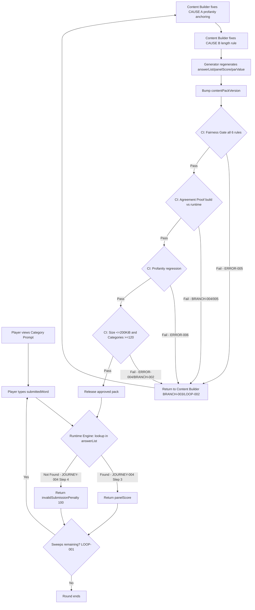
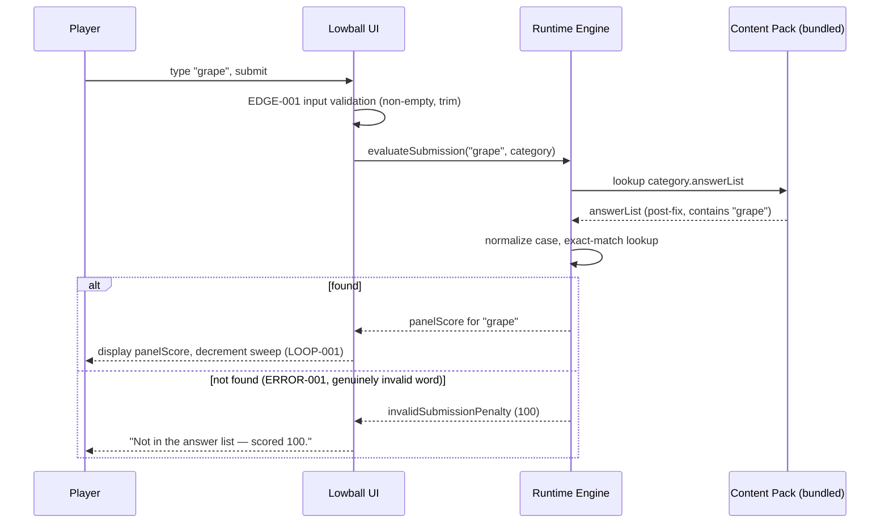
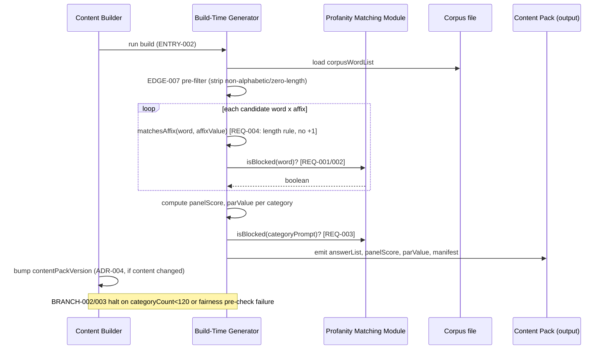
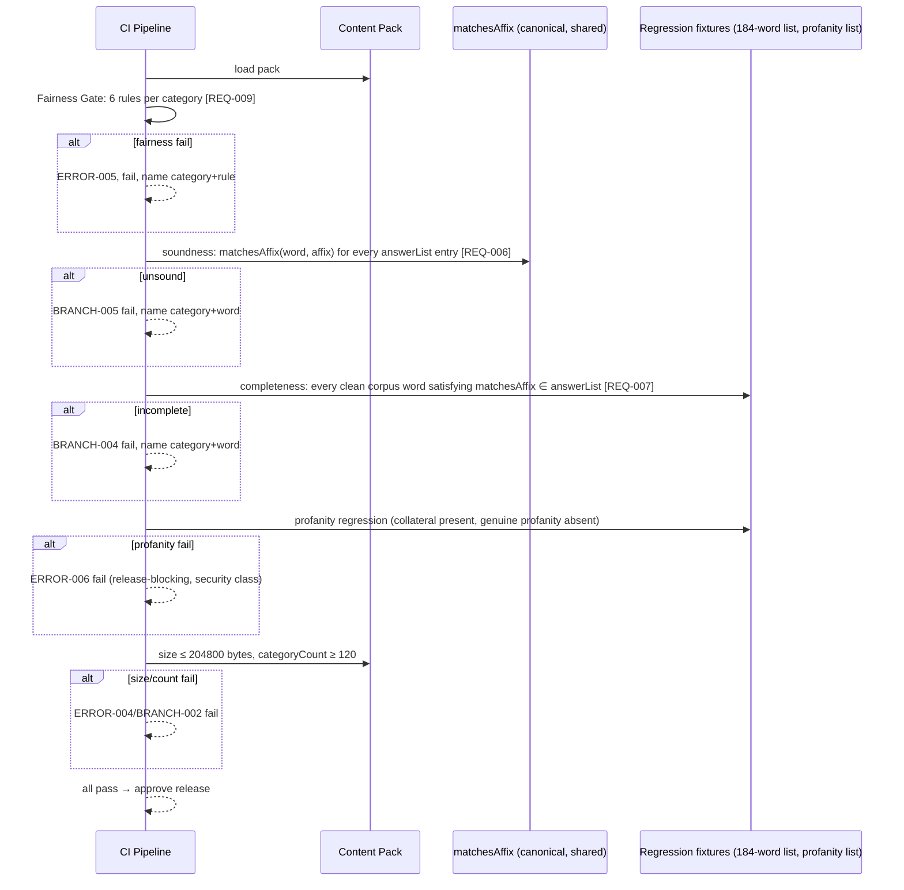
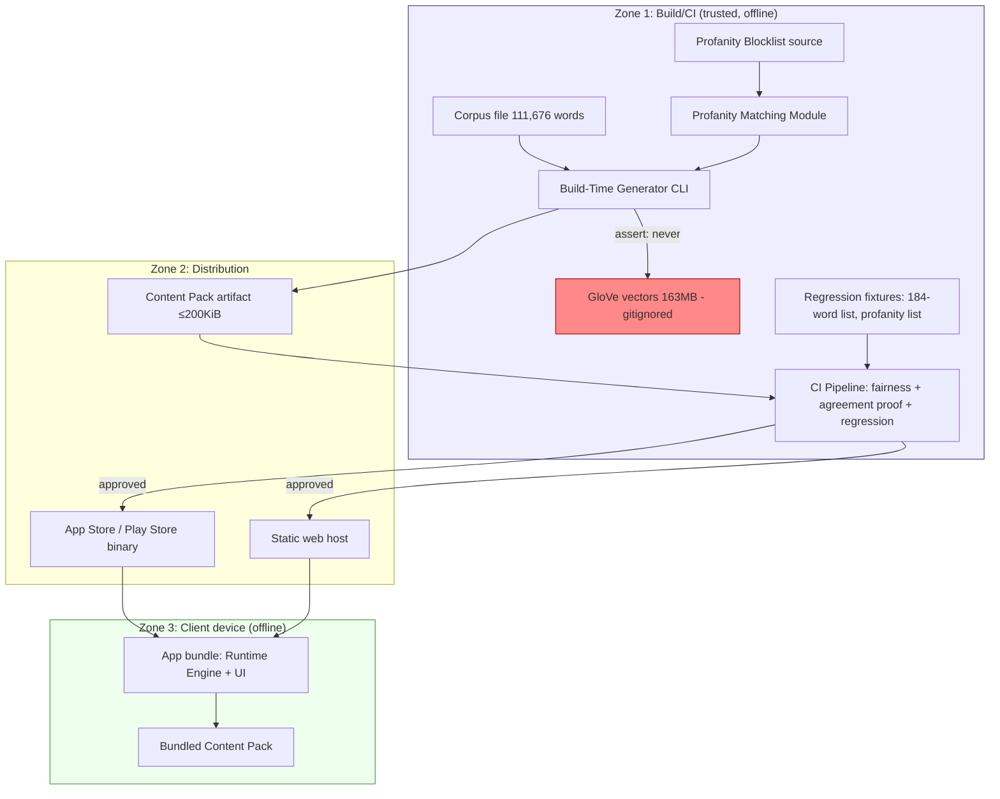

<!-- generated: 2026-09-10T20:48:04Z -->
<!-- mode: bug -->
<!-- feature-slug: lowball-valid-answer-rejected -->
<!-- a2a-endpoint: https://bob-sdlc-orchestrator.2as6l7wq9qj8.eu-gb.codeengine.appdomain.cloud/v1/rpc -->

# Glossary

## Terms

### TERM-001: Lowball
**Definition:** A daily word-guessing game within the CIC Games hub in which players submit words belonging to a shown category, each scored against a panel value, with the objective of exceeding a par score.
**Synonyms:** the game, game 51
**Anti-definition:** Is not the CIC Games hub itself; is not any other daily game in the hub; is not the build-time content generator.
**Source:** Feature request narrative.

### TERM-002: Category
**Definition:** A daily puzzle unit consisting of a displayed prompt (e.g. `Words ending in "ape"`), an affix rule, and a precomputed Answer List with panel scores and a par value.
**Synonyms:** puzzle, daily category
**Anti-definition:** Is not a single answer; is not the affix string alone.
**Source:** Feature request narrative; ADR-002.

### TERM-003: Answer List
**Definition:** The build-time-generated, per-category enumeration of all words from the corpus that satisfy the category's affix rule and pass content-safety filtering; per ADR-002 this list is also the sole runtime validator — absence from the list means invalid by definition.
**Synonyms:** answer list, validator list, findable-answers set
**Anti-definition:** Is not a dictionary; is not queried at runtime against any external source; is not mutable post-build.
**Source:** ADR-002.

### TERM-004: Panel Score
**Definition:** An integer point value assigned to an answer, reflecting the answer's ranking by a scoring panel; used for both correct-answer scoring and the fixed invalid-submission penalty (100).
**Synonyms:** score, points
**Anti-definition:** Is not par; is not a probability; is not affected by submission order except for scoring same word twice.
**Source:** Feature request narrative ("scored its panel value").

### TERM-005: Invalid-Submission Penalty
**Definition:** The fixed 100-point score applied when a submitted word is absent from the category's Answer List.
**Synonyms:** rejection penalty, max penalty
**Anti-definition:** Is not a panel score for a real answer; is not configurable per category.
**Source:** Reported symptom.

### TERM-006: Par Value
**Definition:** A precomputed value equal to the median panel score of a category's findable answers, used as the player's target threshold.
**Synonyms:** par, par score
**Anti-definition:** Is not the maximum score; is not zero by default; must be strictly greater than zero.
**Source:** Fairness-gate description.

### TERM-007: Fairness Gate
**Definition:** The six-rule validation applied to every category to ensure it is playable and fair: answer count 10–36; top score ≥ 45; at least 6 findable answers; at least 1 findable zero-scoring answer; at least 5 non-zero answers spanning ≥ 4 distinct score values; par > 0.
**Synonyms:** six-rule gate, category validity gate
**Anti-definition:** Is not a runtime check; is not optional; is not partially applicable — all six rules must pass together.
**Source:** Feature request narrative.

### TERM-008: Affix Rule
**Definition:** The runtime predicate `matchesAffix` (in `src/games/lowball/types.ts`) that accepts a word into a category when `word.length > affixValue.length`.
**Synonyms:** runtime affix rule, matchesAffix
**Anti-definition:** Is not the build-time grouping rule; is not string-equality; is not case-sensitive matching (unspecified — see OpenQuestions).
**Source:** Confirmed root cause B.

### TERM-009: Build-Time Length Rule
**Definition:** The defective generator-side rule (in `tools/build-lowball.ts`) that groups a word into an affix category only when `word.length > affixValue.length + 1`, disagreeing with TERM-008 by exactly one letter.
**Synonyms:** generator length rule, off-by-one rule
**Anti-definition:** Is not the runtime rule; is not the intended behaviour; is the defect being fixed.
**Source:** Confirmed root cause B.

### TERM-010: Profanity Blocklist
**Definition:** A build-time list of blocked terms used to exclude offensive words from Answer Lists and category prompts.
**Synonyms:** blocklist, content-safety filter
**Anti-definition:** Is not a runtime filter; is not currently anchored to word boundaries; is not to be deleted by the fix.
**Source:** Confirmed root cause A; "must not simply be deleted" constraint.

### TERM-011: Scunthorpe Problem
**Definition:** The class of defect in which an unanchored substring match against a blocklist term incorrectly flags innocent words that merely contain the blocked letters (e.g. "grape" contains "rape").
**Synonyms:** substring over-blocking
**Anti-definition:** Is not fixed by naive whole-word anchoring alone, because that would newly admit compound/inflected offensive forms.
**Source:** Confirmed root cause A.

### TERM-012: Content Pack
**Definition:** The compiled, versioned, offline data artifact (≤200 KiB) containing at least 120 categories with their Answer Lists, panel scores, and par values, shipped to the client.
**Synonyms:** data pack, pack
**Anti-definition:** Is not the 111,676-word corpus; is not the 163 MB GloVe vector file; is not code.
**Source:** ADR-002; size/count constraints.

### TERM-013: Content Pack Version
**Definition:** A versioning field of the Content Pack included as one input to the FNV-1a daily category-selection hash, alongside `dayId` and dataset id.
**Synonyms:** pack version
**Anti-definition:** Is not the app version; is not the corpus version; changing it changes daily selection determinism boundaries.
**Source:** Constraints section (daily selection hash).

### TERM-014: Daily Selection Hash
**Definition:** The deterministic FNV-1a hash over `dayId`, Content Pack Version, and dataset id, used to select each day's category.
**Synonyms:** category selection hash
**Anti-definition:** Is not random; is not seeded by wall-clock time at runtime; must remain reproducible across platforms.
**Source:** Constraints section.

### TERM-015: Corpus
**Definition:** The complete 111,676-word en-GB word list used as the sole build-time source of candidate words.
**Synonyms:** en-GB corpus, word corpus
**Anti-definition:** Is not shipped to the client; is not the Answer List; is not the GloVe vector file.
**Source:** ADR-002.

### TERM-016: Build-Time Content Generator
**Definition:** The tool (`tools/build-lowball.ts`) that derives the Content Pack from the Corpus, applying affix grouping and profanity filtering.
**Synonyms:** generator, pipeline
**Anti-definition:** Is not the runtime engine; is not shipped to the client; runs offline pre-release.
**Source:** "Confirmed root causes" section.

### TERM-017: Runtime Engine
**Definition:** The client-side pure code that evaluates player submissions against the shipped Answer List and applies `matchesAffix`; contains no DOM, storage, or clock dependency.
**Synonyms:** game engine, runtime
**Anti-definition:** Is not the generator; is not where either confirmed defect resides.
**Source:** "not in the runtime engine" statement; constraints section.

### TERM-018: Category Prompt
**Definition:** The player-visible text describing a category's rule (e.g. `Words ending in "ape"`), which must not itself contain or reveal offensive terms.
**Synonyms:** prompt, category label
**Anti-definition:** Is not the Answer List; is not a category's affix value alone (prompt is derived from affix value but is a distinct display artifact).
**Source:** "genuinely offensive words must not appear as answers or as category prompts."

### TERM-019: Dataset ID
**Definition:** An identifier input to the Daily Selection Hash, distinct from Content Pack Version, identifying the source dataset used.
**Synonyms:** dataset identifier
**Anti-definition:** Is not the pack version; is not the day id.
**Source:** Constraints section.

## Data Dictionary

| ID | Name | Type | Format | Range | Units | Default | Nullable | PII | Source | Validation |
|---|---|---|---|---|---|---|---|---|---|---|
| FIELD-001 | submittedWord | string | lowercase a–z letters | length 1–45 | chars | — | No | None | Runtime input (player keystrokes) | Must be non-empty; trimmed; validated against Answer List (TERM-003) |
| FIELD-002 | categoryPrompt | string | free text incl. quoted affix | length 1–100 | chars | — | No | None | Content Pack (TERM-012) | Must not match Profanity Blocklist (TERM-010) under chosen anchoring rule |
| FIELD-003 | affixValue | string | lowercase a–z letters | length 1–10 | chars | — | No | None | Content Pack (TERM-012) | Must be non-empty; used identically by TERM-008 and TERM-009-successor rule |
| FIELD-004 | answerList | array<AnswerEntry> | JSON array | length 10–36 (post-fix, per Fairness Gate) | entries | [] | No | None | Content Pack (TERM-012), generated by TERM-016 | Must satisfy Fairness Gate (TERM-007) |
| FIELD-005 | panelScore | integer | integer | 0–99 (correct answers); reserved 100 for penalty | points | — | No | None | Panel scoring source, embedded per AnswerEntry | Must be ≥0; 100 reserved exclusively for TERM-005 |
| FIELD-006 | parValue | integer | integer | >0 | points | — | No | None | Computed at build time as median of AnswerEntry.panelScore | Must be strictly greater than 0 per Fairness Gate |
| FIELD-007 | invalidSubmissionPenalty | integer | integer constant | 100 | points | 100 | No | None | Runtime constant | Must never be assigned to any AnswerEntry.panelScore |
| FIELD-008 | dayId | string/integer | ISO date or sequential id | — | — | — | No | None | Runtime clock-independent input supplied to game | Must be deterministic given calendar day |
| FIELD-009 | contentPackVersion | string | semver or integer | — | — | — | No | None | Content Pack (TERM-012) manifest | Must increment on any Answer List content change |
| FIELD-010 | datasetId | string | identifier | — | — | — | No | None | Content Pack (TERM-012) manifest | Must remain stable unless corpus source changes |
| FIELD-011 | dailySelectionHash | integer | FNV-1a 32/64-bit | — | — | — | No | None | Computed from FIELD-008, FIELD-009, FIELD-010 | Must be pure function of its three inputs, reproducible cross-platform |
| FIELD-012 | corpusWordList | array<string> | build-time only, not shipped | 111,676 entries | words | — | No | None | en-GB corpus file (TERM-015) | Must never appear in client bundle |
| FIELD-013 | profanityBlockTerm | string | lowercase a–z letters/pattern | length 1–20 | chars | — | No | None | Profanity Blocklist (TERM-010) source file | Matching strategy must be explicit and tested (see REQ section) |
| FIELD-014 | contentPackSizeBytes | integer | byte count | 0–204800 (200 KiB ceiling) | bytes | — | No | None | Build artifact measurement | Must be ≤ 204800 |
| FIELD-015 | categoryCount | integer | integer | ≥120 | categories | — | No | None | Content Pack manifest | Must be ≥120 post-regeneration |

# User Journeys

## Roles

| Role | Description |
|---|---|
| Player (Primary) | End user playing Lowball on iOS/Android/desktop web, submitting words for the daily category. |
| Content Builder (Secondary) | Developer/CI process running `tools/build-lowball.ts` to regenerate the Content Pack. |
| QA/Release Engineer (Secondary) | Person or CI job validating regenerated packs before release. |
| Runtime Engine (System) | Pure client-side code evaluating submissions via `matchesAffix` and the shipped Answer List. |
| Build-Time Generator (System) | `tools/build-lowball.ts`, applies affix grouping and profanity filtering to the corpus. |
| CI Pipeline (System) | Automated process invoking generator, size checks, fairness-gate validation, and agreement proofs. |

No Admin, API consumer, or Anonymous roles exist for this offline-first, backend-less feature; none are fabricated.

## Entry Points

| Entry Point | Location | Trigger | Auth |
|---|---|---|---|
| ENTRY-001 | Lowball game UI text input | Player types and submits a word during an active round | None (local device, no accounts) |
| ENTRY-002 | `tools/build-lowball.ts` CLI | Content Builder or CI runs generator against corpus + blocklist source | Local filesystem access only |
| ENTRY-003 | CI validation step (fairness-gate + agreement-proof script) | Triggered after pack generation, before release artifact publish | CI pipeline credentials (repo-internal) |
| ENTRY-004 | App startup content-pack load | App loads bundled Content Pack (TERM-012) from local bundle | None (offline asset read) |

## Role Permission Matrix

| Role | Submit Word | View Category | Regenerate Pack | Modify Blocklist | Approve Release | Read Corpus |
|---|---|---|---|---|---|---|
| Player | Yes | Yes | No | No | No | No |
| Content Builder | No | No | Yes | Yes | No | Yes |
| QA/Release Engineer | No | Yes (via pack) | No | No | Yes | No |
| Runtime Engine | N/A (evaluates) | N/A (renders) | No | No | No | No |
| Build-Time Generator | No | No | Yes (executes) | No (applies, does not author) | No | Yes |
| CI Pipeline | No | No | Yes (invokes) | No | Gate only | No |

## Journeys

### JOURNEY-001: Player submits a word that is a genuine corpus member of the category (happy path, post-fix)

**Role:** Player. **Entry:** ENTRY-001. **Goal:** Submit "grape" for category `Words ending in "ape"` (TERM-002) and receive its correct Panel Score (TERM-004), not the penalty (TERM-005).

Steps:
1. Player views Category Prompt (FIELD-002) `Words ending in "ape"`.
2. Player types submittedWord (FIELD-001) = "grape".
3. Runtime Engine (TERM-017) checks membership of "grape" in the category's answerList (FIELD-004).
4. Runtime Engine finds "grape" present (post-fix regenerated pack) and reads its panelScore (FIELD-005).
5. Runtime Engine displays "grape" and its panelScore; round state updates sweep count.

**Success criteria:** Displayed score equals the AnswerEntry.panelScore for "grape", not FIELD-007 (100).
**Failure criteria:** Any display of 100 for "grape", or absence of "grape" from answerList.

BRANCH-001: If submittedWord already submitted this round → Runtime Engine rejects as duplicate (distinct from invalid-submission path); no additional sweep consumed change to penalty semantics (out of scope for this bug, noted for isolation).

ERROR-001: **Trigger:** submittedWord not in answerList (genuinely invalid word). **System response:** display FIELD-007 (100) penalty and message "Not in the answer list — scored 100." **User recovery:** player uses remaining sweep to submit a different word.

ERROR-002 (this bug, pre-fix): **Trigger:** submittedWord IS a genuine category member but missing from answerList due to CAUSE A or CAUSE B. **System response (defective):** same as ERROR-001 — indistinguishable from a truly invalid word. **User recovery (defective):** none available; per RISK-002 there is no runtime escape hatch. **Fix removes this error state's triggering condition** by regenerating answerList correctly; ERROR-002 must not be reachable post-fix for any of the 184 identified words.

LOOP-001: Player has a second sweep remaining after a rejection (ERROR-001) → returns to Step 2 with sweep count decremented.

EDGE-001: submittedWord is empty/whitespace-only → Runtime Engine must not query answerList; must reject at input-validation layer before membership check (distinct from ERROR-001).
EDGE-002: submittedWord matches an answerList entry but with different case (e.g. "Grape") → Runtime Engine must normalize case before membership check (case-sensitivity behaviour must be explicit; see OpenQuestions in Requirements).
EDGE-003: Player submits the same word twice in one round → second submission must not re-score; must be treated per BRANCH-001, not as a fresh answerList lookup.
EDGE-004: Round state and Content Pack are out of sync mid-update (app updated mid-round with a new Content Pack Version, FIELD-009) → Runtime Engine must complete the in-progress round against the pack version loaded at round start, not the newly downloaded one (offline-first, no live patching).

### JOURNEY-002: Content Builder regenerates the pack after fixing CAUSE A and CAUSE B

**Role:** Content Builder. **Entry:** ENTRY-002. **Goal:** Produce a corrected Content Pack in which build-time and runtime acceptance rules agree, profanity is still correctly blocked, and all categories still pass the Fairness Gate.

Steps:
1. Content Builder updates profanity matching logic in Build-Time Generator (TERM-016) to eliminate Scunthorpe Problem (TERM-011) while still blocking genuine profanity (TERM-010), per an explicitly documented matching strategy.
2. Content Builder updates the Build-Time Length Rule (TERM-009) to match the Affix Rule (TERM-008) exactly (`word.length > affixValue.length`), removing the `+1` divergence.
3. Content Builder runs Build-Time Generator against the Corpus (FIELD-012 / TERM-015) and Profanity Blocklist (TERM-010).
4. Generator emits a new Content Pack (TERM-012) with recomputed answerList (FIELD-004), panelScore (FIELD-005) values, and parValue (FIELD-006) per category.
5. Content Builder bumps contentPackVersion (FIELD-009).
6. Content Builder hands pack to CI Pipeline for validation (JOURNEY-003).

**Success criteria:** New pack passes all CI checks in JOURNEY-003.
**Failure criteria:** Any category fails the Fairness Gate, size ceiling exceeded, or agreement proof fails.

BRANCH-002: If regenerated category count < 120 (FIELD-015) after removing categories that now fail the Fairness Gate → Content Builder must source/restore additional categories before proceeding; pipeline halts.
BRANCH-003: If a category's par value becomes 0 or answer distribution changes such that the Fairness Gate fails post-fix → category is flagged for exclusion or manual re-authoring; pipeline halts for that category, not the whole pack.

ERROR-003: **Trigger:** GloVe vector file (163 MB, gitignored) accidentally referenced in a client-bound output path. **System response:** build must fail fast with an explicit assertion. **User recovery:** Content Builder corrects build script output targets and reruns.
ERROR-004: **Trigger:** Regenerated Content Pack exceeds 200 KiB (FIELD-014 > 204800). **System response:** build fails with size-check error naming the excess. **User recovery:** Content Builder trims category count/answer verbosity or investigates bloat, reruns.

LOOP-002: BRANCH-003 category-level failure → Content Builder re-authors or replaces that single category → re-runs generator for that category → re-enters CI validation (JOURNEY-003) for that category only.

EDGE-005: A word appears in the Corpus in both an inflected/compound offensive form and as a substring of an innocent word (e.g. distinguishing "rape" the standalone offensive word from "grape") → generator must classify each independently per the explicit matching strategy, not by shared substring.
EDGE-006: Two categories' affix values are substrings of each other (e.g. "ape" and "rape" as separate category affixes) → generator must not conflate category membership rules with profanity filtering rules; these are independent passes over the same word.
EDGE-007: Corpus contains zero-length or non-alphabetic entries → generator must filter these before affix/profanity passes, not crash.

### JOURNEY-003: CI Pipeline validates regenerated pack (fairness gate + build/runtime agreement proof)

**Role:** CI Pipeline. **Entry:** ENTRY-003. **Goal:** Block release of any pack that fails fairness gates, exceeds size limits, mis-blocks/under-blocks profanity, or diverges between build-time and runtime acceptance.

Steps:
1. CI Pipeline loads regenerated Content Pack (TERM-012).
2. CI Pipeline runs Fairness Gate (TERM-007) checks against every category's answerList (FIELD-004) and parValue (FIELD-006).
3. CI Pipeline runs an agreement proof: for every AnswerEntry in every category, assert `matchesAffix(word, affixValue)` (runtime rule, TERM-008) evaluates true, and assert the inverse — every corpus word for which `matchesAffix` is true and profanity-clean is present in the category's answerList (completeness, not just soundness).
4. CI Pipeline runs profanity regression: asserts known collateral words (grape, drape, scrape, crape, serape, undrape, broomrape, shuttlecock, peacock) are present in relevant answerLists; asserts known genuine profanity is absent from all answerLists and all categoryPrompts.
5. CI Pipeline checks contentPackSizeBytes (FIELD-014) ≤ 204800 and categoryCount (FIELD-015) ≥ 120.
6. CI Pipeline passes/fails the release gate.

**Success criteria:** All checks in steps 2–5 pass; pack approved for release.
**Failure criteria:** Any single check fails; release blocked; failing category/word identified in CI output.

BRANCH-004: If agreement proof (Step 3) finds a category where a corpus word satisfies `matchesAffix` and is profanity-clean but is absent from answerList → CI fails with named category and word (regression of CAUSE B class).
BRANCH-005: If agreement proof finds an answerList entry for which `matchesAffix` is false → CI fails (a word admitted that runtime would reject — inverse defect, must not exist).

ERROR-005: **Trigger:** Fairness Gate fails for one or more categories post-regeneration. **System response:** CI fails build, lists every failing category and which of the six rules failed. **User recovery:** Content Builder returns to JOURNEY-002 BRANCH-003/LOOP-002.
ERROR-006: **Trigger:** Profanity regression (Step 4) finds a genuine offensive word present in an answerList or categoryPrompt. **System response:** CI fails build immediately, treated as release-blocking security/compliance defect, not a fairness defect. **User recovery:** Content Builder revises profanity matching strategy, returns to JOURNEY-002 Step 1.

LOOP-003: Any CI failure (ERROR-005, ERROR-006, BRANCH-004, BRANCH-005) → returns Content Builder to JOURNEY-002 at the relevant step → regenerate → resubmit to JOURNEY-003.

EDGE-008: Pack passes all checks except is bitwise-identical to previous pack (no content changed) → CI must not require a version bump if no answerList or parValue changed; version bump is required only when content changes (ties to daily selection hash determinism, TERM-014).
EDGE-009: Mid-round players on an old Content Pack Version when a new version releases → CI validation itself does not affect in-flight rounds; this is a runtime/deployment concern documented for REQ traceability, not a CI check.

### JOURNEY-004: Runtime Engine evaluates a submission against the shipped pack (system-internal journey)

**Role:** Runtime Engine (System). **Entry:** Internal call from JOURNEY-001 Step 3. **Goal:** Deterministically classify a submission as valid (with panelScore) or invalid (with penalty), identically across iOS WKWebView, Android WebView, desktop browsers.

Steps:
1. Runtime Engine receives submittedWord (FIELD-001) and current category's answerList (FIELD-004).
2. Runtime Engine performs exact/case-normalized lookup of submittedWord in answerList.
3. If found: return associated panelScore (FIELD-005).
4. If not found: return invalidSubmissionPenalty (FIELD-007).

**Success criteria:** Same submittedWord + same answerList always yields same result on every platform (no Date, no locale-dependent string comparison, no Intl variance).
**Failure criteria:** Platform-dependent divergence in lookup result for identical inputs.

ERROR-007: **Trigger:** answerList is malformed/undefined at lookup time (corrupted or missing Content Pack). **System response:** Runtime Engine must not silently default to "invalid for all"; must surface a distinct pack-load error state, not conflate with ERROR-001. **User recovery:** app-level reload of bundled pack (offline asset, no network dependency).
EDGE-010: Concurrent rapid double-submission (double-tap) before UI disables input → Runtime Engine must process exactly one lookup per logical submission, not one per event.

## Journey Map



# Requirements

### REQ-001: Reject profanity-blocklist matching via unanchored substring
- **ID:** REQ-001
- **Title:** Generator shall not exclude a corpus word from a category's answerList on the basis of an unanchored substring match against the Profanity Blocklist.
- **EARS Pattern:** Unwanted
- **EARS Statement:** The Build-Time Generator shall not exclude a corpus word from a category's answerList using an unanchored substring match against any Profanity Blocklist term.
- **Inputs:** corpusWordList (FIELD-012), profanityBlockTerm (FIELD-013)
- **Outputs:** answerList (FIELD-004)
- **Preconditions:** Generator is executing profanity-filter pass (JOURNEY-002 Step 1).
- **Postconditions:** No word is excluded solely because it contains a blocked term as a substring.
- **Invariants:** Matching strategy is deterministic and identical across all generator runs for a fixed corpus + blocklist.
- **Trigger:** Generator applies profanity filter to a candidate word.
- **Actor:** Build-Time Generator
- **EntityScope:** TERM-010 (Profanity Blocklist), TERM-015 (Corpus)
- **ErrorModes:** ERR-A: word wrongly excluded (Scunthorpe false positive).
- **NFR-Tags:** NFR-005 (auditability)
- **Source:** JOURNEY-002 Step 1; EDGE-005; EDGE-006
- **Dependencies:** REQ-002 (must still block genuine profanity)
- **Priority:** P0 (Critical)
- **AcceptanceCriteria:**
  - TEST-001: Given corpus contains "grape" and blocklist contains "rape", when generator filters the "ape"-suffix category, then "grape" is present in answerList.
  - TEST-002: Given corpus contains "shuttlecock", "peacock" and blocklist contains "cock", when generator filters relevant categories, then both words are present in answerList.
  - TEST-003: Given corpus contains "serape", "undrape", "broomrape", "drape", "scrape", "crape", when filtered against "ape" suffix category, then all six are present in answerList.
- **Assumptions:** Blocklist term list itself is otherwise correct/complete for genuine profanity.
- **OpenQuestions:** None.

### REQ-002: Genuine profanity must still be excluded from answers
- **ID:** REQ-002
- **Title:** Generator shall exclude a corpus word matching a genuine profanity term from any category's answerList.
- **EARS Pattern:** Event-Driven
- **EARS Statement:** When a corpus word matches a Profanity Blocklist term under the whole-word-or-inflection matching strategy, the Build-Time Generator shall exclude that word from every category's answerList.
- **Inputs:** corpusWordList (FIELD-012), profanityBlockTerm (FIELD-013)
- **Outputs:** answerList (FIELD-004)
- **Preconditions:** Matching strategy explicitly defined (see Assumptions) covering standalone forms and known inflections/compounds.
- **Postconditions:** No genuinely offensive standalone, inflected, or compound form appears in any answerList.
- **Invariants:** Matching strategy is the single source of truth used identically for answers and prompts (REQ-003).
- **Trigger:** Generator evaluates a corpus word during profanity-filter pass.
- **Actor:** Build-Time Generator
- **EntityScope:** TERM-010, TERM-015
- **ErrorModes:** ERR-B: genuine profane word wrongly admitted.
- **NFR-Tags:** NFR-003 (security — content-safety control), NFR-005
- **Source:** JOURNEY-003 Step 4; ERROR-006
- **Dependencies:** REQ-001
- **Priority:** P0 (Critical)
- **AcceptanceCriteria:**
  - TEST-004: Given corpus contains the standalone offensive term matched by blocklist entry "rape" (the word "rape" itself), when generator filters any category, then that word is absent from every answerList.
  - TEST-005: Given corpus contains a known inflected form of a blocked term (e.g. plural/verb-inflected variant explicitly enumerated in the matching strategy), when generator filters, then that inflected form is absent from every answerList.
  - TEST-006: Given corpus contains a compound form combining a genuinely offensive root with another word (explicitly enumerated in matching strategy as offensive), when generator filters, then that compound is absent from every answerList.
- **Assumptions:** An explicit, documented, testable matching strategy exists (e.g. whole-word match plus an enumerated allowlist/denylist of specific inflections and compounds), not a naive `\bterm\b` regex alone, per the "must be stated explicitly and tested" instruction.
- **OpenQuestions:** OQ-001: What is the exact enumerated list of inflections/compounds to additionally block beyond whole-word matches? Requires content-safety sign-off, not engineering-only decision.

### REQ-003: Genuine profanity must be excluded from category prompts
- **ID:** REQ-003
- **Title:** Generator shall not produce a categoryPrompt containing a genuinely offensive term.
- **EARS Pattern:** Unwanted
- **EARS Statement:** The Build-Time Generator shall not produce a categoryPrompt containing a Profanity Blocklist term matched under the same strategy defined in REQ-002.
- **Inputs:** affixValue (FIELD-003), profanityBlockTerm (FIELD-013)
- **Outputs:** categoryPrompt (FIELD-002)
- **Preconditions:** Category affix value is being rendered into a prompt string.
- **Postconditions:** No shipped categoryPrompt contains a blocked term per REQ-002's strategy.
- **Invariants:** Same matching strategy instance is reused (no separate/divergent prompt-only filter).
- **Trigger:** Generator constructs a categoryPrompt for a candidate affix.
- **Actor:** Build-Time Generator
- **EntityScope:** TERM-018 (Category Prompt), TERM-010
- **ErrorModes:** ERR-C: offensive term appears in a shipped prompt.
- **NFR-Tags:** NFR-003, NFR-005
- **Source:** "genuinely offensive words must not appear as answers or as category prompts"
- **Dependencies:** REQ-002
- **Priority:** P0 (Critical)
- **AcceptanceCriteria:**
  - TEST-007: Given a candidate affix value that is itself a blocked term, when generator builds the category list, then no categoryPrompt using that affix is emitted.
  - TEST-008: Given all 120+ shipped categoryPrompts, when scanned against the REQ-002 matching strategy, then zero matches are found.
- **Assumptions:** Category affix values are a small, enumerable, review-able set (suffixes/prefixes), making exhaustive pre-release scanning feasible.
- **OpenQuestions:** None.

### REQ-004: Build-time affix length rule must equal runtime affix length rule
- **ID:** REQ-004
- **Title:** Generator shall group a corpus word into a category using the identical length comparison used by the runtime matchesAffix predicate.
- **EARS Pattern:** Ubiquitous
- **EARS Statement:** The Build-Time Generator shall group a corpus word into an affix category only when word.length is strictly greater than affixValue.length.
- **Inputs:** corpusWordList (FIELD-012), affixValue (FIELD-003)
- **Outputs:** answerList (FIELD-004) membership decision
- **Preconditions:** Generator is performing affix-grouping pass (JOURNEY-002 Step 2).
- **Postconditions:** Build-time grouping decision for every word is identical to what `matchesAffix` would return at runtime for that word/affix pair.
- **Invariants:** No length-offset constant is applied on the build-time side beyond the runtime formula.
- **Trigger:** Generator evaluates a corpus word against a candidate affix value during grouping.
- **Actor:** Build-Time Generator
- **EntityScope:** TERM-008 (Affix Rule), TERM-015 (Corpus)
- **ErrorModes:** ERR-D: word wrongly excluded by stricter build-time rule.
- **NFR-Tags:** NFR-006 (reliability — named control: single-source-of-truth rule)
- **Source:** JOURNEY-002 Step 2; Cause B
- **Dependencies:** REQ-005 (agreement proof enforces this ongoing)
- **Priority:** P0 (Critical)
- **AcceptanceCriteria:**
  - TEST-009: Given affixValue "ape" and corpus words cape, tape, gape, nape, jape, vape (length 4, affix length 3), when generator groups the "ape" category, then all six words are present in answerList.
  - TEST-010: Given affixValue "ame" and corpus words came, dame, fame, game, lame, name, same, tame, when generator groups the "ame" category, then all eight words are present in answerList.
  - TEST-011: Given affixValue "ough" and corpus words bough, cough, dough, rough, tough, when generator groups the "ough" category, then all five words are present in answerList.
- **Assumptions:** `matchesAffix` itself (runtime) is correct and is not being changed by this fix; only the generator is being brought into agreement with it.
- **OpenQuestions:** None.

### REQ-005: Build-time and runtime acceptance rules must be provably identical for every shipped answer
- **ID:** REQ-005
- **Title:** CI Pipeline shall verify, for every category in the regenerated Content Pack, that build-time inclusion and runtime matchesAffix evaluation agree for every corpus word.
- **EARS Pattern:** Event-Driven
- **EARS Statement:** When the CI Pipeline validates a regenerated Content Pack, the CI Pipeline shall verify that matchesAffix(word, affixValue) evaluates true for every word present in that category's answerList.
- **Inputs:** answerList (FIELD-004), affixValue (FIELD-003)
- **Outputs:** CI pass/fail result with named failing category/word
- **Preconditions:** Content Pack has been regenerated (JOURNEY-002 complete).
- **Postconditions:** Zero divergence exists between build-time membership and runtime `matchesAffix` result, in either direction (soundness and completeness).
- **Invariants:** This check runs on every future pack regeneration, not only this fix (regression-proofing per the "provably identical from here on" requirement).
- **Trigger:** CI Pipeline begins pack validation (JOURNEY-003 Step 3).
- **Actor:** CI Pipeline
- **EntityScope:** TERM-008, TERM-003 (Answer List)
- **ErrorModes:** ERR-E: soundness failure (answerList contains a word matchesAffix rejects); ERR-F: completeness failure (a profanity-clean corpus word satisfies matchesAffix but is absent from answerList). *(Two distinct error modes are permitted here only as CI-diagnostic sub-codes of one check outcome; see REQ-006 for the split into atomic requirements.)*
- **NFR-Tags:** NFR-005 (auditability), NFR-006 (reliability)
- **Source:** JOURNEY-003 Step 3; BRANCH-004; BRANCH-005
- **Dependencies:** REQ-004, REQ-006
- **Priority:** P0 (Critical)
- **AcceptanceCriteria:**
  - TEST-012: Given the full regenerated Content Pack, when CI runs the agreement proof, then zero soundness failures are reported (see REQ-006 for completeness split).
- **Assumptions:** `matchesAffix` source is importable/executable within the CI/build-time environment without requiring DOM/browser context (consistent with "runtime engine must stay pure").
- **OpenQuestions:** None.
- **Note:** This REQ is decomposed into REQ-006 and REQ-007 below to satisfy atomicity rule A8 (no more than one error mode per requirement); REQ-005 stated here for traceability to the source instruction and is superseded operationally by REQ-006/REQ-007.

### REQ-006: Soundness — no answerList entry violates the runtime affix rule
- **ID:** REQ-006
- **Title:** CI Pipeline shall fail the release gate when an answerList entry does not satisfy matchesAffix.
- **EARS Pattern:** Event-Driven
- **EARS Statement:** When an answerList entry's word does not satisfy matchesAffix for its category's affixValue, the CI Pipeline shall fail the release gate.
- **Inputs:** answerList (FIELD-004), affixValue (FIELD-003)
- **Outputs:** CI failure record naming category and word
- **Preconditions:** Content Pack loaded into CI validation context.
- **Postconditions:** Release is blocked until zero such violations exist.
- **Invariants:** Check is exhaustive across all categories and all answerList entries.
- **Trigger:** CI evaluates matchesAffix for each answerList entry.
- **Actor:** CI Pipeline
- **EntityScope:** TERM-003, TERM-008
- **ErrorModes:** ERR-E: soundness failure only.
- **NFR-Tags:** NFR-005, NFR-006
- **Source:** JOURNEY-003 Step 3; BRANCH-005
- **Dependencies:** REQ-004
- **Priority:** P0 (Critical)
- **AcceptanceCriteria:**
  - TEST-013: Given an answerList artificially seeded with one word failing matchesAffix (test fixture), when CI runs the soundness check, then CI fails and names that category and word.
  - TEST-014: Given the real regenerated pack post-fix, when CI runs the soundness check, then CI reports zero violations across all categories.
- **Assumptions:** None beyond REQ-005.
- **OpenQuestions:** None.

### REQ-007: Completeness — every eligible clean corpus word is present in its category's answerList
- **ID:** REQ-007
- **Title:** CI Pipeline shall fail the release gate when a profanity-clean corpus word satisfying matchesAffix is absent from its category's answerList.
- **EARS Pattern:** Event-Driven
- **EARS Statement:** When a profanity-clean corpus word satisfies matchesAffix for a category's affixValue and that word is absent from the category's answerList, the CI Pipeline shall fail the release gate.
- **Inputs:** corpusWordList (FIELD-012), affixValue (FIELD-003), answerList (FIELD-004)
- **Outputs:** CI failure record naming category and missing word
- **Preconditions:** Profanity filtering (REQ-001/REQ-002) has been applied to determine "clean" status independently.
- **Postconditions:** Release is blocked until zero such omissions exist.
- **Invariants:** Check is exhaustive across the full corpus for every category.
- **Trigger:** CI evaluates every corpus word against every category's affixValue and profanity status.
- **Actor:** CI Pipeline
- **EntityScope:** TERM-003, TERM-008, TERM-015
- **ErrorModes:** ERR-F: completeness failure only.
- **NFR-Tags:** NFR-005, NFR-006
- **Source:** JOURNEY-003 Step 3; BRANCH-004
- **Dependencies:** REQ-001, REQ-004
- **Priority:** P0 (Critical)
- **AcceptanceCriteria:**
  - TEST-015: Given the real regenerated pack, when CI runs the completeness check for the "ape" category, then grape, drape, scrape, crape, serape, undrape, broomrape, cape, tape, gape, nape, jape, vape are all present (13 of the 14 identified missing words; the 14th enumerated per exact corpus list at implementation time).
  - TEST-016: Given the "ame" category, when CI runs the completeness check, then came, dame, fame, game, lame, name, same, tame are present (8 of the 11 identified; remainder per exact corpus list).
  - TEST-017: Given the "ough" category, when CI runs the completeness check, then bough, cough, dough, rough, tough are present (5 of the 8 identified; remainder per exact corpus list).
- **Assumptions:** The full enumerated 184-word list is available as a fixture derived from the bug report for exact test parameterization.
- **OpenQuestions:** OQ-002: Should the 184-word list be committed as a permanent regression fixture file, or regenerated by diffing old/new packs at CI time? Recommend the former for stability.

### REQ-008: Reported case must score its panel value, not the penalty
- **ID:** REQ-008
- **Title:** Runtime Engine shall score "grape" at its panel value when submitted for the "ape" category on the regenerated pack.
- **EARS Pattern:** Event-Driven
- **EARS Statement:** When a Player submits "grape" as submittedWord during the `Words ending in "ape"` category, the Runtime Engine shall return the panelScore associated with "grape" in the category's answerList.
- **Inputs:** submittedWord (FIELD-001) = "grape", answerList (FIELD-004)
- **Outputs:** panelScore (FIELD-005)
- **Preconditions:** Content Pack in use is the regenerated post-fix pack; round is active.
- **Postconditions:** Displayed score for "grape" is its panelScore; is never invalidSubmissionPenalty (FIELD-007).
- **Invariants:** Runtime lookup logic itself (JOURNEY-004) is unchanged by this fix — the defect is entirely upstream in the pack.
- **Trigger:** Player submits "grape".
- **Actor:** Runtime Engine
- **EntityScope:** TERM-001 (Lowball), TERM-003, TERM-004
- **ErrorModes:** ERR-G: "grape" scored 100.
- **NFR-Tags:** none
- **Source:** JOURNEY-001 Steps 1–5; reported symptom
- **Dependencies:** REQ-001, REQ-007
- **Priority:** P0 (Critical — exact reported bug)
- **AcceptanceCriteria:**
  - TEST-018: Given regenerated pack, category `Words ending in "ape"`, when Player submits "grape", then displayed score equals grape's panelScore and the UI does not show "Not in the answer list — scored 100."
- **Assumptions:** None.
- **OpenQuestions:** None.

### REQ-009: Every regenerated category must satisfy the fairness gate
- **ID:** REQ-009
- **Title:** CI Pipeline shall fail the release gate when a category's answerList does not satisfy all six Fairness Gate rules.
- **EARS Pattern:** Event-Driven
- **EARS Statement:** When a category's answerList and parValue are evaluated after pack regeneration, the CI Pipeline shall fail the release gate if any one of the six Fairness Gate rules is not satisfied.
- **Inputs:** answerList (FIELD-004), parValue (FIELD-006)
- **Outputs:** CI failure record naming category and failed rule(s)
- **Preconditions:** Pack has been regenerated per REQ-001–REQ-004.
- **Postconditions:** Every
# Architecture

## Components & Responsibilities

### Build-Time Content Generator (`tools/build-lowball.ts`)

**Satisfies:** REQ-001, REQ-002, REQ-003, REQ-004, BRANCH-002, BRANCH-003, EDGE-005, EDGE-006, EDGE-007

- Loads the Corpus (FIELD-012) and Profanity Blocklist (FIELD-013) source files.
- Applies the corrected affix-grouping pass using the single-source-of-truth length rule (`word.length > affixValue.length`), shared textually and mechanically with the runtime `matchesAffix`.
- Applies the corrected profanity-matching pass (whole-word plus explicitly enumerated inflection/compound denylist) independently to (a) candidate answers and (b) candidate category prompts.
- Computes `panelScore` per answer and `parValue` (median) per category.
- Emits the Content Pack manifest including `contentPackVersion`, `datasetId`, `categoryCount`, `contentPackSizeBytes`.
- Fails fast (ERROR-003) if any output path could route the GloVe vector file or raw corpus into a client-bound artifact.

**Boundaries:**
- Owns: corpus ingestion, affix grouping, profanity filtering, score/par computation, pack serialization.
- Does not own: fairness-gate enforcement (delegated to CI Pipeline), runtime submission evaluation, daily category selection.

**Interfaces exposed:** CLI entry point (ENTRY-002); produces `content-pack.json` (or equivalent) artifact + build manifest/log.
**Interfaces consumed:** Corpus file (filesystem), Blocklist source file (filesystem), imports the canonical `matchesAffix` implementation and the canonical profanity-matching-strategy module (both single-sourced, see ADR-003).

---

### Profanity Matching Strategy Module (new, shared)

**Satisfies:** REQ-001, REQ-002, REQ-003, ERROR-006

- Provides one exported predicate, e.g. `isBlocked(word: string): boolean`, used identically by the generator's answer filter and prompt filter.
- Implements whole-word matching against blocklist terms plus an explicitly enumerated set of known inflections/compounds (denylist), and an explicitly enumerated allowlist of collateral words that must never be blocked regardless of substring content (defence-in-depth, see ADR-002).
- Ships only as a build-time module; never bundled to client.

**Boundaries:**
- Owns: the definition of "genuinely offensive" for build purposes.
- Does not own: the Corpus, the Answer List, or category-affix logic.

**Interfaces exposed:** `isBlocked(word)`; `matchingStrategyVersion` constant (for audit/version pinning).
**Interfaces consumed:** Blocklist source file, denylist/allowlist fixture files (versioned in-repo).

---

### Runtime Engine (`src/games/lowball/*`)

**Satisfies:** REQ-008, JOURNEY-004, unchanged by this fix

- Evaluates `submittedWord` against the shipped category's `answerList` via exact/case-normalized lookup.
- Applies `matchesAffix` — this is the canonical definition CI proves the generator against; it is not itself modified by this fix.
- Returns `panelScore` on match, `invalidSubmissionPenalty` (100) otherwise.
- Remains pure: no DOM, storage, clock, or Intl-dependent comparison.

**Boundaries:**
- Owns: submission lookup, penalty application, round-state sweep decrementing.
- Does not own: pack content correctness, profanity correctness, fairness — all upstream, build-time concerns.

**Interfaces exposed:** In-process function call from UI layer (`evaluateSubmission(word, category)`).
**Interfaces consumed:** Bundled Content Pack (loaded at app startup, ENTRY-004); `matchesAffix` (co-located, single canonical definition also imported by CI for the agreement proof).

---

### CI Pipeline (fairness gate + agreement proof + profanity regression + size/count gate)

**Satisfies:** REQ-005, REQ-006, REQ-007, REQ-009, JOURNEY-003, BRANCH-004, BRANCH-005, ERROR-005, ERROR-006

- Loads regenerated Content Pack.
- Runs Fairness Gate (six rules) per category.
- Runs Agreement Proof: soundness (REQ-006 — every `answerList` entry satisfies `matchesAffix`) and completeness (REQ-007 — every profanity-clean corpus word satisfying `matchesAffix` is present).
- Runs Profanity Regression: known collateral words present; known genuine profanity absent from all answers and prompts.
- Runs size/count gate (`contentPackSizeBytes ≤ 204800`, `categoryCount ≥ 120`).
- Emits pass/fail with named failing category/word/rule.

**Boundaries:**
- Owns: release-gating decision logic; regression fixture management (the 184-word list).
- Does not own: generation logic itself, runtime evaluation logic.

**Interfaces exposed:** CI job status (ENTRY-003), structured failure report (category, rule, word).
**Interfaces consumed:** Regenerated Content Pack artifact, canonical `matchesAffix` (imported directly, not reimplemented), regression fixture files (blocklist collateral list, 184-word list, genuine-profanity test list).

---

### Content Pack (artifact, not a running component)

**Satisfies:** TERM-012, FIELD-009–015

- The versioned, ≤200 KiB, ≥120-category compiled data artifact consumed by the Runtime Engine and validated by CI.
- Includes manifest fields: `contentPackVersion`, `datasetId`, `categoryCount`, per-category `answerList`, `panelScore`, `parValue`, `categoryPrompt`, `affixValue`.

**Boundaries:**
- Owns: nothing (it is data, immutable post-build).
- Does not own: any computation.

**Interfaces exposed:** JSON schema (versioned).
**Interfaces consumed:** None (terminal artifact).

---

### Daily Selection Mechanism (unchanged logic, affected by versioning decision)

**Satisfies:** TERM-013, TERM-014, EDGE-004, EDGE-009

- Computes FNV-1a hash over `dayId`, `contentPackVersion`, `datasetId` to select the day's category deterministically.
- Does not itself change in this fix; its *inputs* change because `contentPackVersion` is bumped (ADR-004).

**Boundaries:**
- Owns: hash computation, determinism guarantee.
- Does not own: pack content, version bump policy.

**Interfaces exposed:** `selectCategory(dayId, packVersion, datasetId)`.
**Interfaces consumed:** Content Pack manifest fields.

## Data Flow

### JOURNEY-001 / JOURNEY-004 — Player submits "grape" (post-fix)



**State transitions:** `Round.sweepsRemaining: 2 → 1 → 0 → RoundEnded`; each submission also transitions `Word.status: unsubmitted → {scored | penalized | duplicate(BRANCH-001)}`.

### JOURNEY-002 — Content Builder regenerates the pack



**State transitions:** `Category.status: candidate → {fairness-pending | excluded(BRANCH-003) | included}`; `Pack.status: building → built → handed-to-CI`.

### JOURNEY-003 — CI Pipeline validates regenerated pack



**State transitions:** `Pack.status: submitted-for-validation → {rejected(LOOP-003, back to JOURNEY-002) | approved-for-release}`.

## Deployment Topology

**Runtime environments:**
- **Client runtime:** Static bundle (TypeScript + Vite + Carbon) executing in iOS WKWebView, Android WebView, or desktop browser — no server process, no container. Content Pack is a bundled static asset loaded at app startup (ENTRY-004).
- **Build-time environment:** Node.js CLI process (`tools/build-lowball.ts`), run locally by Content Builder or headlessly inside CI runner containers. Has filesystem access to Corpus, Blocklist, and GloVe vector file (gitignored, never leaves this environment).
- **CI environment:** Ephemeral container/job (e.g. GitHub Actions runner) invoking generator output validation; no persistent state beyond artifact upload and fixture files committed to the repo.

**Network boundaries and trust zones:**
- **Zone 1 — Build/CI (trusted, internal):** Corpus, GloVe file, blocklist, generator, CI validation. No external network calls required; fully offline-capable build.
- **Zone 2 — Distribution:** Content Pack artifact published via app store binary bundling (iOS/Android) or static web deployment — one-way, no live network dependency at runtime.
- **Zone 3 — Client device (untrusted, player-controlled):** Runtime Engine + UI execute entirely offline; no outbound calls, no PII, no backend trust boundary to defend.
- There is **no** Zone 4 (backend/API) — confirmed backend-less per journey roles.

**Scaling units and limits:**
- Client: scales per-device, trivially (single-player, offline, no shared state) — no server-side scaling concern.
- Build: single-invocation batch job; scaling bound is corpus size (111,676 words × ~120+ affix categories) — bounded, sub-minute build expected; no distributed build required.
- CI: one validation job per pack regeneration event; not on a request-serving path, so no throughput SLA beyond CI turnaround time.
- Hard limits: Content Pack ≤ 204,800 bytes; categoryCount ≥ 120; GloVe file (163 MB) must never cross Zone 1→Zone 2 boundary (enforced by ERROR-003 assertion).



## Security Architecture

**AuthN mechanism per actor type:**
- **Player:** None. Local device, no accounts, no session (per Role Permission Matrix — explicit "None" auth for ENTRY-001).
- **Content Builder:** Local filesystem access only (developer machine or CI service identity); no application-level auth layer exists because there is no backend.
- **QA/Release Engineer:** Authenticates via CI/repo platform's existing identity (repo-internal credentials) to approve release gate — inherited from source-control platform, not a bespoke mechanism.
- **CI Pipeline:** Runs under CI provider's service credentials (repo-internal), scoped to read source, execute build, write artifacts.
- **Runtime Engine / Build-Time Generator:** System actors, no authentication concept applies (N/A).

**AuthZ model:** Coarse-grained RBAC, enforced procedurally (branch protections, CI gating, filesystem permissions) rather than by an application authorization engine, consistent with the offline/backend-less scope:
- Content Builder: Regenerate Pack ✅, Modify Blocklist ✅ (applies, does not author policy), Approve Release ❌.
- QA/Release Engineer: Approve Release ✅ (gate only), Regenerate Pack ❌.
- Player: Submit/View only, no privileged actions.
- CI Pipeline: Invokes regeneration validation and gates release; cannot itself author content or approve merges into main (separation of duties between automated gate and human release approval).

**Secret management:** No secrets exist in this feature's scope — no API keys, no backend credentials, no player PII. The only sensitive-handling concern is **exclusion**, not secrecy: the GloVe vector file and raw Corpus must never be embedded in the client bundle (enforced by ERROR-003 build assertion, not by a secret store).

**Data classification and encryption:**
- All data in scope (Corpus, Blocklist, Content Pack, submittedWord) is classified **Public / Non-Sensitive** — no PII anywhere in the Data Dictionary (confirmed: every field's PII column is "None").
- **At rest:** Content Pack ships as a plain static asset within the app bundle; no encryption required (public game content, not secret).
- **In transit:** Distribution occurs via app-store binary packaging or static web hosting over standard TLS (platform-provided, not feature-specific); no custom transport security needed since there is no live API.
- **Build-time sensitive-by-exclusion asset:** GloVe file/Corpus are not "encrypted" but are architecturally firewalled — never referenced in any client-bound output path (Zone 1 → Zone 2 boundary control).

**Threat model summary (top 5 threats + mitigations):**

| # | Threat | Mitigation |
|---|---|---|
| 1 | Genuinely offensive word ships in an answer or prompt (reputational/compliance/App-Store-rejection risk) | REQ-002/REQ-003 explicit matching strategy + CI profanity regression (ERROR-006) as a release-blocking, non-bypassable gate |
| 2 | Scunthorpe-class over-blocking silently corrupts content correctness again in future regenerations | REQ-001 + CI regression fixture (known collateral word list) run on every future pack build, not just this fix |
| 3 | Build-time/runtime rule divergence recurs (this bug's root Cause B, or a future analogous drift) | REQ-005/006/007 agreement proof imports the *same* `matchesAffix` implementation CI and generator both use — single source of truth, structurally prevents re-divergence (ADR-003) |
| 4 | Raw Corpus (111,676 words) or 163 MB GloVe file accidentally leaks into the shipped client bundle (bundle bloat / potential IP concern) | ERROR-003 fail-fast build assertion on output path; CI size gate (≤200 KiB) as a secondary backstop that would also catch this |
| 5 | Pack regeneration silently degrades fairness/difficulty (e.g. newly-admitted words push categories out of the six-rule gate, or trivially/impossibly hard categories ship) | REQ-009 Fairness Gate re-run on every regeneration as a mandatory CI gate; BRANCH-003/LOOP-002 force per-category remediation rather than whole-pack rejection |

## Integration Points

**Inbound interfaces:**

| Interface | Entry | Protocol/Form | Schema Ref | Failure Mode | SLA |
|---|---|---|---|---|---|
| Lowball UI text input | ENTRY-001 | In-app UI event | FIELD-001 (submittedWord) | Empty/whitespace rejected pre-lookup (EDGE-001); double-submit collapsed to one lookup (EDGE-010) | Synchronous, <16ms perceived (client-local, no network) |
| Generator CLI | ENTRY-002 | Node CLI invocation | Corpus + Blocklist file schemas | ERROR-003 (GloVe/Corpus leak), ERROR-004 (size) | Build-time only; no runtime SLA |
| CI validation step | ENTRY-003 | CI job trigger (post-build) | Content Pack manifest schema | ERROR-005/006, BRANCH-004/005 — all release-blocking | Must complete before release artifact publish; no partial pass |
| App startup pack load | ENTRY-004 | Local bundled asset read | Content Pack JSON schema (FIELD-004/005/006/009/010/015) | ERROR-007 (malformed/missing pack) — distinct error state, no silent "all-invalid" fallback | Synchronous at app launch; offline, no timeout dependency |

**Outbound dependencies:**

| Dependency | Direction | Protocol/Schema | Failure Mode | SLA |
|---|---|---|---|---|
| Corpus file (en-GB, 111,676 words) | Generator reads | Flat file (word list) | Build fails if missing/corrupt (implicit precondition) | Build-time only |
| Profanity Blocklist source | Generator reads | Flat file / term list + denylist/allowlist fixtures | Build fails if matching-strategy module cannot load fixtures | Build-time only |
| GloVe vector file (163 MB, gitignored) | Generator reads (upstream word-similarity tooling, not client-bound) | Binary vector file | ERROR-003 if referenced in any client-output path | Build-time only; must never appear as an outbound dependency of the shipped artifact |
| `matchesAffix` canonical module | Consumed by Generator (build) AND CI (validation) AND Runtime Engine | TypeScript function import | Divergence prevented structurally (single import site), not by protocol | N/A — compile-time dependency |
| App Store / Play Store distribution | Pack → binary packaging | Platform-specific bundling | Release blocked upstream by CI gate before reaching this step | Per platform review SLA (external, non-negotiable by this feature) |

There are no third-party APIs, message buses, or databases in this feature — confirmed offline-first, backend-less scope.

## Architecture Decision Records

### ADR-001: Answer List remains the sole runtime validator (reaffirmed, not reopened)
- **Status:** Accepted (pre-existing, referenced as ADR-002 in Glossary; renumbered here for local traceability — see Cross-Cutting Concerns for numbering note)
- **Context:** RISK-002 (accepted residual risk) states that any build-time omission permanently mis-rejects a valid word at runtime, with no runtime escape hatch. This bug is that risk materializing.
- **Decision:** Do not introduce a runtime fallback dictionary or fuzzy-match escape hatch to compensate for build-time omissions. Fix the build-time pipeline instead.
- **Consequences:** Runtime stays pure, deterministic, and small (≤200 KiB pack); but every future content defect of this class will still fully depend on CI's agreement proof (REQ-005/006/007) as the only safety net — there is no defense-in-depth at runtime by design.
- **Alternatives considered:** (a) Ship a compressed fallback dictionary for runtime-side re-validation of rejected words — rejected: breaks the ≤200 KiB budget and violates "no separate dictionary" constraint underpinning the whole architecture. (b) Add a "did you mean" fuzzy-suggestion UI — rejected as out of scope; doesn't fix underlying invalidity, only masks it.

### ADR-002: Profanity filtering strategy — whole-word match plus explicit enumerated denylist/allowlist, not naive substring or naive `\bterm\b` regex alone
- **Status:** Accepted
- **Context:** CAUSE A is a Scunthorpe-class defect (TERM-011). Naive whole-word anchoring alone would fix false positives (grape, peacock) but would newly admit genuine compound/inflected offensive forms that whole-word matching misses (e.g. a compound combining a blocked root with another word, or a verb-inflected variant) — an unacceptable regression per REQ-002.
- **Decision:** Implement the Profanity Matching Strategy Module (see Components) as: (1) whole-word match against blocklist terms; (2) an explicitly enumerated, version-controlled denylist of specific inflections/compounds that must additionally be blocked; (3) an explicitly enumerated allowlist of known-safe collateral words (grape, drape, scrape, crape, serape, undrape, broomrape, shuttlecock, peacock, etc.) as defence-in-depth, tested directly by CI's profanity regression (Step 4, JOURNEY-003).
- **Consequences:** Requires ongoing content-safety curation of the denylist/allowlist (OQ-001 — needs sign-off, not purely engineering); adds a maintenance surface (fixture files) but makes the matching strategy auditable, explicit, and testable, satisfying NFR-005.
- **Alternatives considered:** (a) Naive substring blocklist (status quo) — rejected, is the defect. (b) Naive `\bterm\b` whole-word regex only — rejected per explicit constraint that it would admit compound/inflected offensive forms. (c) Third-party profanity-detection library/ML model — rejected: introduces a new build-time dependency and non-determinism risk disproportionate to a curated ~120-category, enumerable affix set; explicit enumeration is fully feasible at this scale (per REQ-003 Assumptions).

### ADR-003: Single canonical `matchesAffix` implementation, imported (not reimplemented) by generator and CI
- **Status:** Accepted
- **Context:** CAUSE B was exactly this failure mode: the generator reimplemented the affix rule with a divergent `+1` offset instead of importing the runtime's canonical predicate. REQ-004/005/006/007 require this class of divergence to become structurally impossible, not just currently fixed.
- **Decision:** `matchesAffix` is defined once in `src/games/lowball/types.ts` (existing runtime location) and imported directly by both the Build-Time Generator (for grouping) and the CI Pipeline (for the agreement proof). Neither party may reimplement the length comparison.
- **Consequences:** Requires the build/CI toolchain (Node) to be able to import a module also consumed by the browser client bundle — a minor build-tooling coupling, but eliminates the entire class of "two implementations drift apart" defects by construction. Any future change to `matchesAffix` automatically propagates to generator and CI without a second edit site.
- **Alternatives considered:** (a) Keep two implementations but add a manual code-review checklist item to keep them in sync — rejected: this is precisely the process that already failed (Cause B existed despite presumably being "obviously" supposed to match). (b) Duplicate the rule but add a runtime unit test asserting textual equality of two functions — rejected: fragile, doesn't scale to future rule changes, still two edit sites.

### ADR-004: Content Pack Version bump policy — bump only on content change, not on every regeneration
- **Status:** Accepted
- **Context:** EDGE-008 requires no version bump when a regeneration produces a bitwise-identical pack; EDGE-004 requires in-progress rounds to keep using the pack version loaded at round start (no live patching); the Daily Selection Hash (TERM-014) is a pure function of `dayId`, `contentPackVersion`, `datasetId`, so bumping the version changes which category is selected for future days deterministically but must not retroactively alter which category *was* selected for past/in-flight days.
- **Decision:** `contentPackVersion` is bumped if and only if `answerList`, `panelScore`, or `parValue` content differs from the previous pack (byte-for-byte diff of the semantically relevant fields, not the whole file). The version bump is a build-time decision made by the Content Builder (JOURNEY-002 Step 5), verified but not computed by CI.
- **Consequences:** Historical day-to-category mappings for already-released pack versions remain stable and reproducible forever (satisfying TERM-014's "reproducible across platforms" invariant); players mid-round on an old version (EDGE-004/EDGE-009) are explicitly unaffected by a new release, by design — they simply finish on their loaded pack. Trade-off: this fix's regeneration (184 words restored, scores/pars changed) **will** bump the version, which means the specific day(s) previously mapped to now-changed categories may select differently going forward — this is accepted as correct behavior, not a regression, since the old mapping was selecting corrupted content.
- **Alternatives considered:** (a) Always bump version on every regeneration regardless of content diff — rejected: needlessly perturbs future daily selection determinism on no-op rebuilds (violates EDGE-008). (b) Never bump, patch content pack in place under the same version — rejected: violates the Daily Selection Hash's implicit assumption that a given version's content is immutable once released, and could silently change historical/in-flight behavior, contradicting EDGE-004's offline-first no-live-patching guarantee.

### ADR-005: 184-word regression fixture is committed as a permanent versioned file, not derived by runtime pack-diffing
- **Status:** Proposed
- **Context:** OQ-002 (REQ-007) is explicitly unresolved: should the 184-word list be a permanent committed fixture, or regenerated by diffing old/new packs at CI time?
- **Decision (proposed):** Commit the enumerated 184-word list (and the full collateral-word list from REQ-001) as a permanent fixture file in-repo, used by CI's completeness (REQ-007) and profanity-regression (Step 4) checks, independent of pack-diffing.
- **Consequences:** Provides a stable, human-auditable regression baseline that survives even if a future "fixed" pack coincidentally reintroduces one of these specific defects via an unrelated change; but requires manual maintenance if the corpus or affix category set changes in the future (fixture can go stale relative to new categories).
- **Alternatives considered:** (a) Derive the check dynamically by diffing old vs. new pack at CI time — would generalize automatically to future categories but provides weaker guarantees for *this specific* known-bug class and couples the regression test's validity to always having a "previous pack" to diff against (fails on first-ever build). **Requires content-safety/QA sign-off before promoting to Accepted.**

### ADR-006: Fairness-gate failures caused by regeneration are remediated per-category, not by relaxing the gate
- **Status:** Proposed
- **Context:** Restoring 184 words (especially common high-value words like "came," "name," "same," "game") may push some categories out of the six-rule Fairness Gate (BRANCH-003), and category count could drop below 120 if categories are excluded (BRANCH-002). There is tension between "fix must be complete" (restore all valid words) and "fix must not break fairness/size floor."
- **Decision (proposed):** When a category fails the Fairness Gate post-regeneration, the category is excluded and replaced/re-authored (LOOP-002) rather than weakening any of the six rules or capping restored words artificially to preserve an old distribution. Category-count floor (≥120) is maintained by sourcing replacement categories, not by suppressing valid words.
- **Consequences:** Guarantees no silent fairness regression is traded for completeness of the word-list fix; but creates open-ended content-authoring work of unknown size until the actual post-fix fairness-gate failure count is measured — this is why it remains **Proposed**, pending that measurement.
- **Alternatives considered:** (a) Relax the Fairness Gate thresholds to accommodate newly-restored words — rejected: the gate's thresholds are a fairness contract with players, not an implementation convenience. (b) Cap restored words per category to keep old distributions stable — rejected: contradicts REQ-007's completeness requirement (every clean corpus word matching the affix must be present); would reintroduce a *deliberate* build/runtime divergence, the exact defect class this fix eliminates.

## Cross-Cutting Concerns

**Logging, tracing, metrics, alerting:**
- **Build-time:** Generator emits a structured build log per run: counts of words filtered by profanity (with which rule fired — REQ-001/002 auditability), counts admitted/excluded per affix category, final `categoryCount` and `contentPackSizeBytes`. This log is the primary audit trail for NFR-005.
- **CI:** Each gate (fairness, agreement proof, profanity regression, size/count) emits a discrete pass/fail record naming the specific category/word/rule (per REQ-006/007/009 AcceptanceCriteria) — no aggregate-only pass/fail; failures must be individually addressable (feeds LOOP-002/LOOP-003).
- **Runtime:** No telemetry/analytics infrastructure exists or is introduced by this fix (offline-first, no backend) — client-side console warnings only for developer debugging of ERROR-007 (malformed pack), not user-facing telemetry.
- **Alerting:** CI failure = the alert (build/release pipeline red); there is no separate alerting system since there is no live production service to page for.

**Configuration and feature flags:**
- No runtime feature flags are introduced; the fix is entirely build-time/content-side. The only "configuration" surface is the Profanity Matching Strategy's denylist/allowlist fixture files and the 184-word regression fixture (ADR-005) — these are version-controlled data, not runtime-toggleable flags.
- `contentPackVersion` (FIELD-009) functions as the sole "configuration" a player-facing client reacts to, governed by ADR-004's bump policy.

**Error handling strategy:**
- Build-time errors (ERROR-003 GloVe leak, ERROR-004 size overrun) fail the build immediately and loudly — no partial/degraded build artifact is ever produced.
- CI errors (ERROR-005, ERROR-006, BRANCH-004/005) block release entirely; there is no "warn but ship" mode for any of these — all are release-blocking by design, consistent with the P0 priority on REQ-001–REQ-009.
- Runtime errors (ERROR-007 malformed pack) surface a distinct, explicit error state to the player rather than degrading silently into "everything is invalid" — preserving the trust-model integrity that this entire bug report is about.
- Category-level fairness failures (BRANCH-003) are isolated failures — they halt only that category's inclusion, not the entire pack build (LOOP-002), preserving forward progress on the other 119+ categories.

**Backwards compatibility / versioning:**
- `contentPackVersion` bump policy (ADR-004) is the primary compatibility mechanism: old in-flight rounds keep their loaded pack version (EDGE-004), and the Daily Selection Hash's reproducibility across `dayId`/version/dataset is preserved by never mutating a released version's content in place.
- The canonical `matchesAffix` (ADR-003) is treated as a stable contract: CI's agreement proof (REQ-005/006/007) is explicitly stated to run "on every future pack regeneration, not only this fix" — this is a permanent regression gate, not a one-time migration check, making this fix's guarantees durable against future content changes rather than a point-in-time patch.
- The Profanity Matching Strategy's denylist/allowlist fixtures are versioned alongside the matching-strategy module (`matchingStrategyVersion` constant) so that future changes to what is blocked are auditable and diffable over time, not silent.
# Review

## Risks (table sorted by severity descending)

| ID | Title | Category | Likelihood | Impact | Severity | Affected Requirements | Mitigation | Owner | Status |
|---|---|---|---|---|---|---|---|---|---|
| RISK-001 | Denylist/allowlist enumeration (OQ-001) is incomplete at ship time, leaving genuine profanity admitted or new collateral wrongly blocked | Compliance | High | High | **Critical** | REQ-002, REQ-003, ADR-002 | Require content-safety sign-off as a hard release gate, not an engineering-only decision; block release until OQ-001 is closed | Content Safety Lead | Open |
| RISK-002 | Fairness-gate remediation work (ADR-006) is open-ended and unscoped — number of categories needing re-authoring is unknown until measured | Schedule | High | High | **Critical** | REQ-009, BRANCH-002, BRANCH-003 | Run a dry-run regeneration immediately to measure actual post-fix fairness-gate failure count before committing to a release date | Content Builder / PM | Open |
| RISK-003 | No runtime escape hatch (ADR-001 reaffirmed) means any *future* build-time omission — including one this very fix might introduce elsewhere — permanently mis-rejects valid words with no mitigation until next release | Technical | Med | High | **Critical** | ADR-001, REQ-005/006/007 | Treat CI agreement proof (REQ-006/007) as the sole safety net; ensure it runs on every merge to main, not only release branches | CI/Platform | Accepted (pre-existing, RISK-002 in source) |
| RISK-004 | `matchesAffix` co-location (ADR-003) requires Node/CI to import a module also bundled for browser — tooling coupling could silently break (e.g. browser-only syntax leaking in) without dedicated cross-environment test | Technical | Med | Med | High | ADR-003, REQ-004/005 | Add explicit CI step that imports and executes `matchesAffix` in both a Node context and a headless-browser/bundler context to catch environment-specific breakage | Build Engineering | Open |
| RISK-005 | Version bump policy (ADR-004) relies on Content Builder's manual judgement of "content changed" — a missed or incorrect bump could silently break Daily Selection Hash determinism guarantees | Operational | Med | High | High | ADR-004, TERM-014 | Automate the semantic diff (answerList/panelScore/parValue) and auto-bump/auto-block release rather than relying on a manual step; CI should verify, not just "check" | Build Engineering | Open (partially addressed — ADR-004 says CI "verifies but does not compute") |
| RISK-006 | Case-sensitivity of runtime lookup (EDGE-002) is explicitly unresolved ("unspecified — see OpenQuestions") yet is on the critical path for every submission, including "grape" vs "Grape" | Technical | Med | Med | Medium | FIELD-001, EDGE-002 | Resolve as a REQ before release; do not ship with an open question on core scoring correctness | Runtime Engineering | Open |
| RISK-007 | Two ADRs (ADR-005, ADR-006) remain **Proposed**, not Accepted, yet downstream REQs (REQ-007, REQ-009) and CI architecture already assume their decisions as if final | Schedule/Governance | Med | Med | Medium | ADR-005, ADR-006, REQ-007, REQ-009 | Do not allow CI implementation to proceed against a Proposed ADR; escalate for Accepted status or explicitly flag implementation as provisional | Architecture Owner | Open |
| RISK-008 | Profanity Matching Strategy Module's denylist/allowlist fixtures are version-controlled data but have no defined update/review workflow (who approves additions, how often reviewed) | Compliance | Med | Med | Medium | ADR-002, Cross-Cutting Concerns | Define a lightweight content-safety review SLA/process for fixture changes (e.g. two-person sign-off) before first release | Content Safety Lead | Open |
| RISK-009 | GloVe file / Corpus exclusion relies solely on a build-time assertion (ERROR-003) plus a secondary size-gate backstop — no test explicitly proves the *negative* (absence) beyond size, which could mask a smaller leak (e.g. partial corpus excerpt within budget) | Security | Low | High | Medium | ERROR-003, Data Flow Zone1→Zone2 | Add explicit CI step asserting zero string-overlap between shipped pack file and Corpus/GloVe file checksums or content signatures, not just byte-size ceiling | Build Engineering | Open |
| RISK-010 | Agreement-proof completeness check (REQ-007) is corpus-wide × category-wide (111,676 × ~120+) — no stated performance/timeout bound for CI; could silently degrade CI turnaround as corpus/category count grows | Schedule | Low | Med | Low | REQ-007, JOURNEY-003 | Add a CI runtime budget assertion (e.g. must complete in <N minutes) so future corpus growth is caught as a build concern, not an unbounded slow-CI surprise | Build Engineering | Open |
| RISK-011 | EDGE-004 (mid-round pack version mismatch) is stated as a requirement but no test/journey explicitly proves round-state pins to the pack version loaded at round start when the app *itself* updates mid-session (not just mid-round pack download) | Technical | Low | Med | Low | EDGE-004, ADR-004 | Add explicit test simulating app foreground/background pack reload mid-round to prove pinning holds across app lifecycle events, not just simple mid-round download | Runtime Engineering | Open |

## Missing Edge Cases

1. **Word length exactly equal to affix length + 1 at corpus boundaries** — no test confirms behavior for the *shortest possible* affix categories (e.g. 1-character affix) where the off-by-one defect's effect on very short words (2–3 letter answers) isn't covered by the "ape/ame/ough" examples given.
2. **Words that are both blocklist-collateral AND off-by-one length victims simultaneously** — e.g. a word that would be wrongly excluded by CAUSE A and would independently also fail CAUSE B's stricter length rule. No test proves fixing one cause doesn't mask verification of the other for the same word.
3. **Affix values that themselves change categorization once denylist/allowlist changes** — if a future denylist addition happens to be a valid affix substring (analogous to EDGE-006 but for the *denylist* growing over time, not just the initial "ape"/"rape" pair), there's no regression test framework verifying newly-added denylist terms don't newly reintroduce Scunthorpe-style collateral damage against the *existing* 120-category set.
4. **Unicode/diacritic and non-ASCII corpus entries** — Data Dictionary restricts FIELD-001/012/013 to "lowercase a–z letters" but the en-GB corpus realistically may contain apostrophes (e.g. "don't") or hyphenated compounds; no edge case addresses whether such entries are filtered pre-affix-pass (EDGE-007 only covers "non-alphabetic/zero-length," ambiguous on apostrophes/hyphens).
5. **Category prompt collision with restored words** — REQ-003/TEST-007 covers when the *affix itself* is a blocked term, but doesn't cover the case where a restored answer (e.g. from CAUSE B fix) makes an *existing, previously-approved* prompt newly reveal an offensive pairing once the answer set changes (prompt text is static, but reviewer intent behind "safe prompt" could shift with answer-set changes).
6. **Par value recomputation producing a *tie* at the median with an even-count answer list** — Par Value is defined as "the median panel score," but with an even number of findable answers the median is ambiguous (average of two middle values, lower-middle, upper-middle?). No requirement or test specifies tie-breaking/rounding behavior, yet FIELD-006 requires strictly-greater-than-zero, which a fractional median could violate or complicate.
7. **Simultaneous CI failure across multiple gate types for one category** — BRANCH-004/005 and ERROR-005/006 are described as independent failure paths, but no journey/edge case addresses reporting when a *single* category fails fairness gate AND has a soundness violation AND has a profanity regression hit simultaneously — does CI report all three or halt at first failure (affects LOOP-002/003 remediation ordering)?
8. **Regenerated pack where categoryCount would only be satisfied by counting a category still pending BRANCH-003 manual re-authoring** — the interaction between BRANCH-002 (count floor) and BRANCH-003 (per-category exclusion) during the *same* build run isn't tested: does count check run before or after exclusions are finalized, and could a build pass count-check prematurely on categories later excluded?

## Dependency Conflicts

1. **REQ-005 vs REQ-006/REQ-007 (declared superseded but still present):** REQ-005 is explicitly marked as "superseded operationally by REQ-006/REQ-007" yet retains its own AcceptanceCriteria (TEST-012) and P0 priority alongside the two child requirements. This creates an ambiguous dependency graph — is REQ-005 to be implemented, tested, and tracked as a real requirement, or is it documentation-only? Recommend explicitly marking REQ-005 status as "Superseded" (not "P0 Critical, active") to avoid duplicate/conflicting test obligations with REQ-006/007.

2. **REQ-001 vs REQ-002 ordering dependency creates a circular validation need:** REQ-001 depends on REQ-002 ("must still block genuine profanity") and REQ-002 depends on REQ-001 (Dependencies field lists REQ-001). Both are mutually dependent on the *same* Profanity Matching Strategy Module's single `isBlocked` predicate (ADR-002), meaning neither can be independently verified — a regression in one is indistinguishable from a regression in the other without the combined CI Profanity Regression step (Step 4, JOURNEY-003). This isn't a true circular *reference* defect, but it is a circular *verification* dependency that should be called out: REQ-001 and REQ-002 should be tested only in combination, never in isolation, and documentation should state this explicitly rather than implying independent testability via separate TEST-00x blocks.

3. **ADR-004 (version bump policy) vs ADR-005 (permanent fixture) unstated interaction:** ADR-004 says version bumps only on content diff; ADR-005 (Proposed) proposes a *permanent* fixture list of 184 words used by CI regardless of pack version. If a future regeneration legitimately removes one of the 184 words for a *valid* reason (e.g. corpus update drops an archaic word), the permanent fixture (ADR-005) would fail CI even though ADR-004 would correctly *not* require a version bump for an unrelated no-op scenario — but would incorrectly block a *valid* future content evolution. No mechanism is defined for retiring entries from the permanent fixture, creating a latent conflict between "permanent regression baseline" and "corpus can legitimately evolve."

4. **BRANCH-002 (categoryCount ≥120 floor) vs ADR-006 (no relaxation, per-category remediation) resource conflict:** ADR-006 commits to sourcing replacement categories rather than relaxing thresholds, but the architecture provides no defined *source* for replacement categories (no "candidate category backlog" component exists). This is a dependency on an unspecified/unbuilt process — BRANCH-002's halt condition assumes remediation capacity that isn't architected anywhere in the Components section, creating a soft circular dependency: the pipeline halts pending content authoring, but content authoring's inputs/tooling aren't specified as part of this fix's scope.

5. **CI agreement proof (REQ-006/007) vs single-source `matchesAffix` (ADR-003) environment coupling:** CI imports `matchesAffix` directly from `src/games/lowball/types.ts`, and the Generator also imports it. This is presented as eliminating divergence risk, but creates a *build-tooling* dependency where a change to the runtime module's environment assumptions (even something as small as adding a type that requires DOM lib in tsconfig) could break the CI/Node import path — the architecture doesn't specify a contract test or isolation boundary (e.g. a `.d.ts`-only shared contract) to prevent the runtime module's *future* evolution from silently breaking the build/CI import, which is the same class of "silent drift" this fix is meant to eliminate architecturally, just moved one level up.

## Recommendations

1. **Resolve RISK-001 (OQ-001) before any release candidate is cut.** Schedule content-safety sign-off on the denylist/allowlist enumeration as a blocking milestone, not a parallel workstream — this is a Critical severity compliance risk given App Store/Play Store family-content requirements.

2. **Run a dry-run regeneration immediately** to convert RISK-002 from an unscoped risk into a measured, estimable backlog of category re-authoring work, before committing to a release date or sprint plan.

3. **Reclassify REQ-005's status explicitly as "Superseded — non-normative"** in the requirements document to eliminate the dependency conflict with REQ-006/REQ-007, and remove or relabel TEST-012 to avoid duplicate test tracking.

4. **Add an explicit combined test class for REQ-001+REQ-002** that asserts both properties in a single fixture run (collateral words present AND genuine profanity absent, evaluated together against the same matching-strategy version), rather than treating their AcceptanceCriteria as independently satisfiable.

5. **Promote ADR-005 and ADR-006 to Accepted or explicitly gate implementation on their resolution.** Do not let CI/Content Builder implementation proceed against Proposed architecture decisions for release-blocking gates.

6. **Define a retirement/update process for the 184-word permanent fixture (ADR-005)** to resolve the latent conflict with ADR-004 — e.g. require an explicit changelog entry and second-approver sign-off whenever an entry is removed from the fixture, distinguishing "corpus evolved legitimately" from "regression reintroduced."

7. **Specify a replacement-category sourcing process** to close the BRANCH-002/ADR-006 dependency gap — either define a candidate-category backlog/tooling component now, or explicitly scope it as a follow-up work item with its own owner and timeline, rather than leaving it implicit.

8. **Resolve the case-sensitivity open question (EDGE-002 / RISK-006) as a formal REQ before release** — this sits directly on the critical path of the exact reported bug's user-facing behavior and must not ship as an open question.

9. **Add a contract-test boundary around `matchesAffix`** (e.g. a `.d.ts`-only shared type/signature test, or a dedicated Node-import smoke test in CI) to prevent future runtime-module changes from silently breaking the Generator/CI import path — extending ADR-003's single-source-of-truth guarantee to cover tooling-environment drift, not just logic drift.

10. **Add explicit negative-content verification for the GloVe/Corpus exclusion (RISK-009)** beyond the size ceiling — e.g. a checksum or content-hash comparison step — to close the gap between "small enough" and "provably does not contain corpus/vector data."

11. **Define median tie-breaking/rounding rules for `parValue` computation** explicitly in the requirements (FIELD-006), given restored words will change answer-list parity and could produce fractional medians that need a documented rounding strategy to guarantee "> 0" and integer-type compliance.

12. **Clarify CI failure-reporting behavior for simultaneous multi-gate failures per category** (fairness + soundness + profanity in one category) — specify whether CI reports all applicable failures per category in one pass or halts at first failure, to make LOOP-002/LOOP-003 remediation deterministic and efficient.
# Test Plan

## Feature Files

```gherkin
# file: profanity_collateral_filtering.feature
Feature: Profanity blocklist must not exclude innocent words via substring match
  As a Content Builder
  I want the generator to stop matching blocklist terms as unanchored substrings
  So that innocent words like "grape" are not wrongly excluded from answer lists

  Background:
    Given the Build-Time Generator is executing the profanity-filter pass
    And the canonical Profanity Matching Strategy Module is loaded with its versioned denylist/allowlist fixtures

  @REQ-001 @AC-TEST-001 @unit @regression
  Scenario: "grape" is not excluded by unanchored substring match against "rape"
    Given the corpus contains the word "grape"
    And the Profanity Blocklist contains the term "rape"
    When the generator filters the "ape"-suffix category
    Then "grape" is present in the category's answerList

  @REQ-001 @AC-TEST-002 @unit @regression
  Scenario Outline: "cock"-collateral words are not excluded by unanchored substring match
    Given the corpus contains the word "<word>"
    And the Profanity Blocklist contains the term "cock"
    When the generator filters the relevant category for "<word>"
    Then "<word>" is present in the category's answerList

    Examples:
      | word        |
      | shuttlecock |
      | peacock     |

  @REQ-001 @AC-TEST-003 @unit @regression
  Scenario Outline: All "ape"-substring collateral words survive profanity filtering
    Given the corpus contains "<word>"
    And the Profanity Blocklist contains the term "rape"
    When the generator filters the word against the "ape" suffix category
    Then "<word>" is present in the category's answerList

    Examples:
      | word      |
      | serape    |
      | undrape   |
      | broomrape |
      | drape     |
      | scrape    |
      | crape     |

  @REQ-001 @AC-TEST-003 @security @regression
  Scenario: Deterministic matching strategy produces identical results across repeated runs
    Given the corpus and blocklist are held fixed
    When the generator is run twice independently against the same inputs
    Then the resulting answerList for every category is byte-for-byte identical between runs
```

```gherkin
# file: genuine_profanity_exclusion.feature
Feature: Genuine profanity must still be excluded from answers and prompts
  As a Content Safety stakeholder
  I want genuinely offensive words blocked from answers and category prompts
  So that the shipped family game contains no offensive content

  Background:
    Given the canonical Profanity Matching Strategy Module isBlocked predicate is loaded
    And the matchingStrategyVersion is recorded for audit

  @REQ-002 @AC-TEST-004 @unit @security @regression
  Scenario: Standalone genuinely offensive word is excluded from every category's answers
    Given the corpus contains the standalone blocked term "rape"
    When the generator filters any category referencing that word
    Then "rape" is absent from every category's answerList

  @REQ-002 @AC-TEST-005 @unit @security @regression
  Scenario Outline: Known inflected forms of blocked terms are excluded from answers
    Given the corpus contains the inflected form "<word>"
    And "<word>" is enumerated in the matching strategy's denylist
    When the generator filters any category referencing that word
    Then "<word>" is absent from every category's answerList

    Examples:
      | word |
      # populated from the versioned denylist fixture at implementation time

  @REQ-002 @AC-TEST-006 @unit @security @regression
  Scenario Outline: Known offensive compound forms are excluded from answers
    Given the corpus contains the compound form "<word>"
    And "<word>" is enumerated in the matching strategy's denylist as an offensive compound
    When the generator filters any category referencing that word
    Then "<word>" is absent from every category's answerList

    Examples:
      | word |
      # populated from the versioned denylist fixture at implementation time

  @REQ-001 @REQ-002 @combined @security @regression
  Scenario: Collateral allowlist and genuine profanity denylist are proven together in one fixture run
    Given the versioned collateral-word allowlist fixture
    And the versioned genuine-profanity denylist fixture
    When the generator runs the profanity-filter pass against both fixtures under the current matchingStrategyVersion
    Then every allowlisted collateral word is present in its category's answerList
    And every denylisted genuine-profanity word is absent from every category's answerList

  @REQ-003 @AC-TEST-007 @unit @security @regression
  Scenario: Category prompt is never emitted when its affix value is itself a blocked term
    Given a candidate affix value that is itself a blocked term under the matching strategy
    When the generator builds the category list
    Then no categoryPrompt using that affix value is emitted

  @REQ-003 @AC-TEST-008 @integration @security @regression
  Scenario: Zero blocked-term matches across all shipped category prompts
    Given the full set of 120+ shipped categoryPrompts from the regenerated pack
    When each categoryPrompt is scanned against the REQ-002 matching strategy
    Then zero matches are found

  @REQ-002 @REQ-003 @security @e2e @regression
  Scenario: CI profanity regression gate blocks release on any genuine profanity in answers or prompts
    Given the regenerated Content Pack
    When the CI Pipeline runs the profanity regression step (JOURNEY-003 Step 4)
    Then known collateral words are confirmed present
    And known genuine profanity is confirmed absent from all answers and all prompts
    And a violation of either condition fails the release gate
```

```gherkin
# file: affix_length_rule_agreement.feature
Feature: Build-time affix grouping must match the runtime matchesAffix rule exactly
  As a Content Builder
  I want the generator to use the identical length comparison as runtime matchesAffix
  So that no valid word is silently excluded by a stricter build-time rule

  Background:
    Given the canonical matchesAffix predicate is imported directly from src/games/lowball/types.ts
    And the Build-Time Generator does not apply any additional length-offset constant

  @REQ-004 @AC-TEST-009 @unit @regression
  Scenario Outline: Words exactly one letter longer than a 3-letter affix are grouped correctly ("ape")
    Given the affixValue "ape"
    And the corpus contains the word "<word>" of length 4
    When the generator groups the "ape" category
    Then "<word>" is present in the category's answerList

    Examples:
      | word |
      | cape |
      | tape |
      | gape |
      | nape |
      | jape |
      | vape |

  @REQ-004 @AC-TEST-010 @unit @regression
  Scenario Outline: Words exactly one letter longer than a 3-letter affix are grouped correctly ("ame")
    Given the affixValue "ame"
    And the corpus contains the word "<word>" of length 4
    When the generator groups the "ame" category
    Then "<word>" is present in the category's answerList

    Examples:
      | word |
      | came |
      | dame |
      | fame |
      | game |
      | lame |
      | name |
      | same |
      | tame |

  @REQ-004 @AC-TEST-011 @unit @regression
  Scenario Outline: Words exactly one letter longer than a 4-letter affix are grouped correctly ("ough")
    Given the affixValue "ough"
    And the corpus contains the word "<word>" of length 5
    When the generator groups the "ough" category
    Then "<word>" is present in the category's answerList

    Examples:
      | word  |
      | bough |
      | cough |
      | dough |
      | rough |
      | tough |

  @REQ-004 @unit @edge
  Scenario: Word length equal to affix length is never grouped into that category
    Given the affixValue "ape"
    And a hypothetical corpus word of length 3 identical in length to the affix
    When the generator evaluates grouping for that word
    Then the word is not included in the "ape" category answerList

  @REQ-004 @unit @edge
  Scenario: Single-character affix boundary behaves identically to matchesAffix
    Given the affixValue is a single character "s"
    And the corpus contains 2-letter and 3-letter candidate words
    When the generator groups the "s" category
    Then only words with length strictly greater than 1 are included
    And the result is identical to invoking matchesAffix directly on each word
```

```gherkin
# file: build_runtime_agreement_proof.feature
Feature: Build-time and runtime acceptance rules must be provably identical
  As a CI Pipeline
  I want to verify soundness and completeness of every category's answerList
  So that build-time/runtime divergence is structurally impossible

  Background:
    Given the CI Pipeline has loaded the regenerated Content Pack
    And the CI Pipeline imports the canonical matchesAffix implementation directly (ADR-003)

  @REQ-006 @AC-TEST-013 @integration @regression
  Scenario: Soundness check fails and names the offending category and word
    Given an answerList artificially seeded with one word that fails matchesAffix for its category's affixValue
    When CI runs the soundness check
    Then CI fails the release gate
    And the failure record names that category and word

  @REQ-006 @AC-TEST-014 @integration @regression
  Scenario: Soundness check passes with zero violations on the real regenerated pack
    Given the real regenerated pack post-fix
    When CI runs the soundness check
    Then CI reports zero violations across all categories

  @REQ-007 @AC-TEST-015 @integration @regression
  Scenario: Completeness check confirms all clean corpus words present for "ape" category
    Given the real regenerated pack
    And the versioned 184-word regression fixture
    When CI runs the completeness check for the "ape" category
    Then grape, drape, scrape, crape, serape, undrape, broomrape, cape, tape, gape, nape, jape, vape are all present in the answerList

  @REQ-007 @AC-TEST-016 @integration @regression
  Scenario: Completeness check confirms all clean corpus words present for "ame" category
    Given the real regenerated pack
    And the versioned 184-word regression fixture
    When CI runs the completeness check for the "ame" category
    Then came, dame, fame, game, lame, name, same, tame are all present in the answerList

  @REQ-007 @AC-TEST-017 @integration @regression
  Scenario: Completeness check confirms all clean corpus words present for "ough" category
    Given the real regenerated pack
    And the versioned 184-word regression fixture
    When CI runs the completeness check for the "ough" category
    Then bough, cough, dough, rough, tough are all present in the answerList

  @REQ-007 @integration @regression
  Scenario: Completeness check fails and names category and missing word when a clean word is omitted
    Given a corpus word that is profanity-clean and satisfies matchesAffix for its category
    And that word is artificially absent from the category's answerList (test fixture)
    When CI runs the completeness check
    Then CI fails the release gate
    And the failure record names that category and the missing word

  @REQ-006 @REQ-007 @edge @integration
  Scenario: A single category failing multiple agreement-proof checks reports all applicable failures
    Given a category artificially seeded with both a soundness violation and a completeness violation
    When CI runs the agreement proof
    Then CI reports both the soundness failure and the completeness failure for that category
    And CI does not halt after the first failure found

  @REQ-005 @non-normative @regression
  Scenario: Legacy combined agreement-proof reference check (superseded by REQ-006/REQ-007)
    Given the full regenerated Content Pack
    When CI runs the agreement proof
    Then zero soundness failures are reported
    # Note: this scenario is retained for traceability only; REQ-006/REQ-007 scenarios are authoritative.
```

```gherkin
# file: reported_bug_regression.feature
Feature: The exact reported bug is fixed - "grape" scores its panel value
  As a Player
  I want "grape" to score correctly in the "ape" category
  So that I am not wrongly penalised for a correct answer

  @REQ-008 @AC-TEST-018 @e2e @regression
  Scenario: Player submits "grape" in the "ape" category on the regenerated pack and receives its panel score
    Given the Content Pack in use is the regenerated post-fix pack
    And the round for category 'Words ending in "ape"' is active
    When the Player submits "grape" as submittedWord
    Then the displayed score equals grape's panelScore in the answerList
    And the UI does not display "Not in the answer list — scored 100."

  @REQ-008 @unwanted @e2e @regression
  Scenario: "grape" is never scored using the invalid-submission penalty
    Given the Content Pack in use is the regenerated post-fix pack
    And the round for category 'Words ending in "ape"' is active
    When the Player submits "grape" as submittedWord
    Then the score shown should NOT equal the invalidSubmissionPenalty value of 100

  @REQ-008 @perf @e2e
  Scenario: Submission lookup for "grape" completes within perceived-synchronous budget
    Given the Content Pack in use is the regenerated post-fix pack
    When the Player submits "grape" as submittedWord
    Then the evaluateSubmission response is returned in under 16ms on reference client hardware
```

```gherkin
# file: fairness_gate_revalidation.feature
Feature: Every regenerated category must satisfy the six-rule fairness gate
  As a CI Pipeline
  I want to re-validate fairness for every category after regeneration
  So that restoring 184 words does not silently break difficulty balance

  Background:
    Given the pack has been regenerated per REQ-001 through REQ-004
    And the six Fairness Gate rules are: answer count 10-36, top score >= 45, at least six findable answers,
      at least one findable zero-scoring answer, at least five non-zero answers spanning at least four distinct
      score values, and a par value above zero

  @REQ-009 @integration @regression
  Scenario Outline: Category passes all six fairness rules post-regeneration
    Given category "<category>" has been regenerated with restored words
    When CI evaluates the Fairness Gate for "<category>"
    Then all six fairness rules pass
    And the category is included in the released pack

    Examples:
      | category            |
      | Words ending in "ape" |
      | Words ending in "ame" |
      | Words ending in "ough" |

  @REQ-009 @integration @regression
  Scenario: Category failing any one fairness rule is excluded and the failure is named
    Given a category's regenerated answerList violates exactly one of the six fairness rules (test fixture)
    When CI evaluates the Fairness Gate for that category
    Then CI fails the release gate
    And the failure record names the category and the specific violated rule

  @REQ-009 @edge @integration
  Scenario: Newly-restored common four-letter words change difficulty profile without breaking the gate
    Given category "Words ending in \"ame\"" now includes came, dame, fame, game, lame, name, same, tame
    When CI evaluates the Fairness Gate for that category
    Then the category still satisfies at least six findable answers
    And the category still satisfies at least one findable zero-scoring answer
    And the category still satisfies at least five non-zero answers spanning at least four distinct score values

  @REQ-009 @edge @integration
  Scenario: Par value remains strictly greater than zero after recomputation
    Given a category's answerList has been recomputed post-regeneration
    When CI computes parValue as the median panelScore of findable answers
    Then parValue is strictly greater than zero
    And parValue is an integer per the documented tie-breaking/rounding rule

  @REQ-009 @edge @integration
  Scenario: Median tie-break on an even-count answer list produces a deterministic integer par value
    Given a category's findable-answer count is even
    When CI computes parValue as the median panelScore
    Then the documented tie-breaking rule (e.g. round down from the average of the two middle values) is applied
    And the result is deterministic and reproducible across repeated computation

  @REQ-009 @BRANCH-002 @integration
  Scenario: Category count floor is evaluated only after per-category exclusions are finalized
    Given a build run where one or more categories are pending Fairness Gate exclusion
    When the categoryCount >= 120 check is evaluated
    Then the check runs after all category exclusions (BRANCH-003) are finalized
    And no excluded category is counted toward the floor

  @REQ-009 @size @integration
  Scenario: Content Pack remains within size ceiling after word restoration
    Given the regenerated pack includes all 184 restored words across affected categories
    When CI evaluates contentPackSizeBytes
    Then contentPackSizeBytes is less than or equal to 204800
```

```gherkin
# file: content_pack_versioning_and_isolation.feature
Feature: Content pack version bump policy and Zone1/Zone2 leak prevention
  As a Content Builder / CI Pipeline
  I want version bumps to reflect content changes and sensitive files to never leak to clients
  So that daily selection stays deterministic and no oversized/sensitive assets ship

  @ADR-004 @integration @regression
  Scenario: Content pack version is bumped when semantic content changes
    Given a regeneration that changes answerList, panelScore, or parValue content versus the previous pack
    When the Content Builder finalizes the build (JOURNEY-002 Step 5)
    Then contentPackVersion is bumped
    And CI verifies the bump occurred

  @ADR-004 @edge @integration
  Scenario: Content pack version is not bumped for a bitwise-identical regeneration
    Given a regeneration that produces an answerList, panelScore, and parValue set identical to the previous pack
    When the Content Builder finalizes the build
    Then contentPackVersion is not bumped
    And CI verifies no bump occurred

  @ADR-004 @edge @e2e
  Scenario: Player mid-round on the old pack version is unaffected by a new release
    Given a Player has an active round loaded on contentPackVersion N
    When a new pack version N+1 is released mid-round
    Then the Player's round continues to use contentPackVersion N until round completion

  @security @ERROR-003 @unit @regression
  Scenario: Build fails fast if any output path could route the GloVe file into a client-bound artifact
    Given the generator's output path configuration
    When the generator evaluates whether GloVe vector file content could reach client-bound output
    Then the build fails immediately with ERROR-003
    And no partial artifact is produced

  @security @unit @regression
  Scenario: No corpus or GloVe content byte-overlap exists in the shipped pack
    Given the final regenerated Content Pack artifact
    When CI computes content-signature overlap between the pack and the raw Corpus/GloVe files
    Then zero overlapping content signatures are found beyond the legitimate answerList word set
```

## Step Definitions

| Step Pattern | Type | Notes |
|---|---|---|
| `Given the corpus contains the word "<word>"` | Given | Loads word into in-memory test corpus fixture |
| `Given the Profanity Blocklist contains the term "<term>"` | Given | Injects blocklist term into test fixture instance |
| `Given "<word>" is enumerated in the matching strategy's denylist` | Given | Asserts fixture membership prior to test execution |
| `Given the affixValue "<affix>"` | Given | Sets candidate affix under test |
| `Given the real regenerated pack post-fix` / `Given the regenerated Content Pack` | Given | Loads full built artifact from build output path |
| `Given the Content Pack in use is the regenerated post-fix pack` | Given | Sets active pack for runtime/e2e harness |
| `Given the round for category '<category>' is active` | Given | Initializes Round state machine at `sweepsRemaining=2` |
| `Given an answerList artificially seeded with <condition>` | Given | Injects test-only mutation into loaded pack copy |
| `When the generator filters the "<affix>"-suffix category` | When | Invokes generator's profanity + grouping pass for one category |
| `When the generator filters any category referencing that word` | When | Runs full profanity pass scoped to word under test |
| `When the generator builds the category list` | When | Invokes full category/prompt construction step |
| `When the generator groups the "<affix>" category` | When | Invokes affix-grouping pass in isolation |
| `When the Player submits "<word>" as submittedWord` | When | Drives UI/`evaluateSubmission` call in e2e harness |
| `When CI runs the soundness check` | When | Invokes CI agreement-proof soundness module |
| `When CI runs the completeness check for the "<category>" category` | When | Invokes CI agreement-proof completeness module scoped to category |
| `When CI evaluates the Fairness Gate for "<category>"` | When | Invokes six-rule fairness evaluator |
| `When CI computes parValue as the median panelScore of findable answers` | When | Invokes par computation module |
| `When CI evaluates contentPackSizeBytes` | When | Reads artifact size in bytes |
| `When the Content Builder finalizes the build` | When | Invokes version-bump decision logic |
| `Then "<word>" is present in the category's answerList` | Then | Asserts membership |
| `Then "<word>" is absent from every category's answerList` | Then | Asserts non-membership across all categories |
| `Then CI fails the release gate` | Then | Asserts CI job exit status is failure |
| `Then the failure record names that category and word` | Then | Asserts structured failure payload fields |
| `Then all six fairness rules pass` | Then | Asserts composite boolean across six sub-checks |
| `Then the displayed score equals grape's panelScore in the answerList` | Then | Asserts UI-rendered score matches pack data |
| `Then the score shown should NOT equal the invalidSubmissionPenalty value of 100` | Then | Negative assertion, unwanted-behaviour pattern |
| `Then contentPackSizeBytes is less than or equal to 204800` | Then | Numeric boundary assertion |
| `Then contentPackVersion is bumped` / `is not bumped` | Then | Asserts version field diff vs. previous manifest |
| `Then the Player's round continues to use contentPackVersion N` | Then | Asserts round-state pin across pack update event |
| `Then the build fails immediately with ERROR-003` | Then | Asserts build process error code/message |
| `Then zero overlapping content signatures are found` | Then | Asserts hash/signature diff result set is empty |

## Test Fixtures

| Fixture Name | Contents | Used By |
|---|---|---|
| `collateral-allowlist.fixture.json` | Full enumerated list of known-safe words wrongly blocked by substring matching (grape, drape, scrape, crape, serape, undrape, broomrape, shuttlecock, peacock, etc.) | profanity_collateral_filtering.feature, genuine_profanity_exclusion.feature (combined scenario) |
| `genuine-profanity-denylist.fixture.json` | Versioned enumerated list of standalone, inflected, and compound genuinely offensive terms (per ADR-002), tagged with `matchingStrategyVersion` | genuine_profanity_exclusion.feature |
| `184-word-regression.fixture.json` | Permanent versioned list of all 184 words wrongly excluded by CAUSE A + CAUSE B, keyed by category (ape, ame, ough, ikes, etc.) per ADR-005 | build_runtime_agreement_proof.feature |
| `affix-boundary.fixture.json` | Synthetic word/affix pairs at exact length boundaries (length == affix length, length == affix length + 1, 1-character affix cases) | affix_length_rule_agreement.feature |
| `sample-corpus-en-gb.fixture.txt` | Reduced representative subset of the 111,676-word corpus for fast unit-level generator tests | affix_length_rule_agreement.feature, profanity_collateral_filtering.feature |
| `blocklist-source.fixture.txt` | Minimal blocklist term set including "rape" and "cock" for isolated CAUSE A regression tests | profanity_collateral_filtering.feature |
| `seeded-unsound-pack.fixture.json` | Content Pack copy with one artificially injected soundness violation (word failing matchesAffix) | build_runtime_agreement_proof.feature |
| `seeded-incomplete-pack.fixture.json` | Content Pack copy with one artificially removed, otherwise-eligible clean word | build_runtime_agreement_proof.feature |
| `seeded-multi-failure-category.fixture.json` | Single category rigged to simultaneously fail soundness, completeness, and fairness | build_runtime_agreement_proof.feature (multi-gate scenario) |
| `fairness-violation-single-rule.fixture.json` | Category answerList violating exactly one of the six fairness rules at a time (six variants) | fairness_gate_revalidation.feature |
| `even-count-answerlist.fixture.json` | Category with an even number of findable answers to exercise median tie-break logic | fairness_gate_revalidation.feature |
| `pre-fix-pack-manifest.json` / `post-fix-pack-manifest.json` | Two full manifest snapshots for version-bump diff testing | content_pack_versioning_and_isolation.feature |
| `identical-regeneration-pair.fixture.json` | Two build outputs with byte-identical semantic content (answerList/panelScore/parValue) but different build timestamps | content_pack_versioning_and_isolation.feature (no-bump scenario) |
| `glove-and-corpus-signature.fixture.json` | Precomputed content signatures/checksums of the GloVe file and raw corpus for negative-overlap assertion | content_pack_versioning_and_isolation.feature |
| `mid-round-player-state.fixture.json` | Simulated Round state pinned to contentPackVersion N, used to test EDGE-004 pinning | content_pack_versioning_and_isolation.feature |

## Coverage Matrix

| Requirement | Unit | Integration | E2E | Security | Perf | A11y | Regression |
|---|---|---|---|---|---|---|---|
| REQ-001 | ✅ TEST-001/002/003 | — | — | ✅ determinism scenario | — | — | ✅ |
| REQ-002 | ✅ TEST-004/005/006 | — | — | ✅ | — | — | ✅ |
| REQ-003 | ✅ TEST-007 | ✅ TEST-008 | — | ✅ | — | — | ✅ |
| REQ-001+REQ-002 (combined) | — | — | — | ✅ combined fixture scenario | — | — | ✅ |
| REQ-004 | ✅ TEST-009/010/011 + boundary edges | — | — | — | — | — | ✅ |
| REQ-005 (superseded) | — | ✅ legacy reference scenario (non-normative) | — | — | — | — | ✅ |
| REQ-006 | — | ✅ TEST-013/014 + multi-failure | — | — | — | — | ✅ |
| REQ-007 | — | ✅ TEST-015/016/017 + missing-word case | — | — | — | — | ✅ |
| REQ-008 | — | — | ✅ TEST-018 + unwanted-behaviour scenario | — | ✅ 16ms budget | — | ✅ |
| REQ-009 | — | ✅ six-rule, par median, category-count ordering | — | — | — | — | ✅ |
| ADR-003 (agreement proof coupling) | — | ✅ covered via REQ-006/007 scenarios | — | — | — | — | ✅ |
| ADR-004 (version bump policy) | — | ✅ bump/no-bump scenarios | ✅ mid-round pinning | — | — | — | ✅ |
| ERROR-003 (GloVe/Corpus leak) | ✅ fail-fast scenario | ✅ signature-overlap scenario | — | ✅ | — | — | ✅ |
| Missing edge case: median tie-break | — | ✅ even-count scenario | — | — | — | — | ✅ |
| Missing edge case: multi-gate simultaneous failure | — | ✅ multi-failure scenario | — | — | — | — | ✅ |
| Missing edge case: count-floor vs. exclusion ordering | — | ✅ BRANCH-002 ordering scenario | — | — | — | — | ✅ |

**Notes on residual gaps not covered by this plan (flagged for follow-up, not blocking):**
- OQ-001 (exact denylist/compound enumeration) is represented structurally via fixture-driven Scenario Outlines with placeholder `Examples` tables — actual rows must be populated only after content-safety sign-off (RISK-001); this plan cannot pre-empt that governance step.
- EDGE-002 (case-sensitivity of submission lookup) is out of scope for this plan per RISK-006 — recommend a dedicated feature file once resolved as a formal REQ.
- A11y scenarios are not applicable to this bug's scope (pure content/data-pipeline defect, no UI/markup change); no `@a11y` tags are used in this plan.