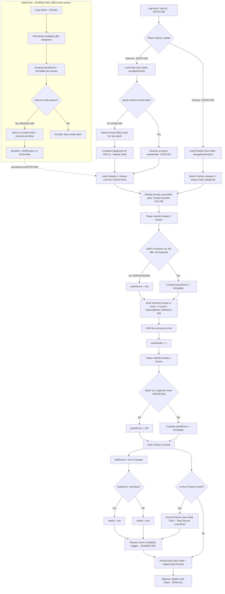
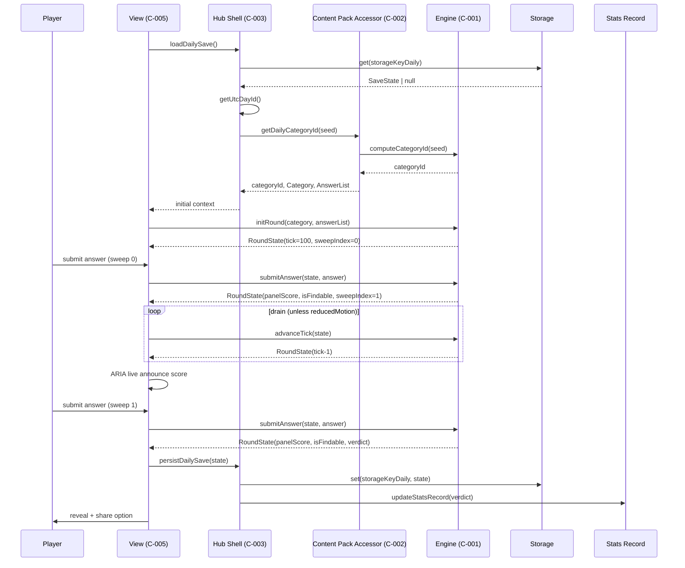
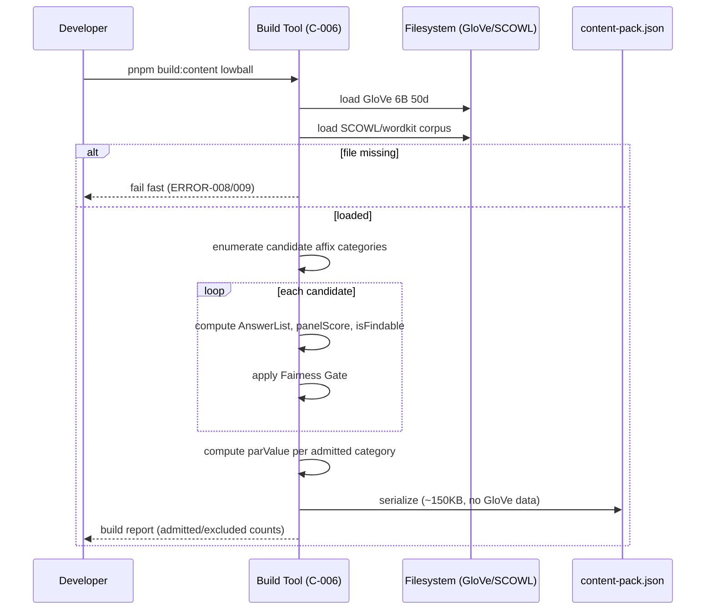
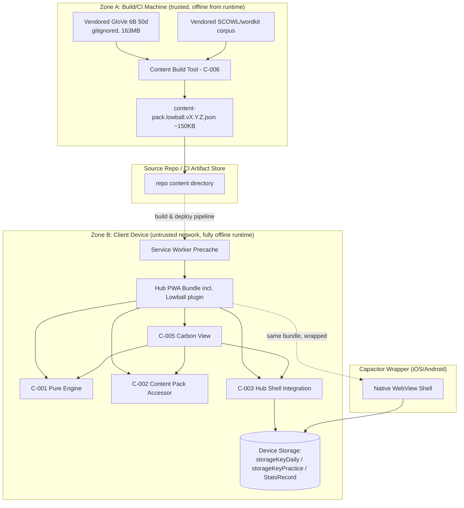

<!-- generated: 2026-09-10T12:56:39Z -->
<!-- mode: feature -->
<!-- feature-slug: lowball -->
<!-- a2a-endpoint: https://bob-sdlc-orchestrator.2as6l7wq9qj8.eu-gb.codeengine.appdomain.cloud/v1/rpc -->

# Glossary

## Terms

### TERM-001: Daily Round
**Definition:** The single, canonical Lowball puzzle instance for a given UTC calendar day, whose category is deterministically selected and whose result feeds the hub's shared stats/streak record.
**Synonyms:** Daily puzzle, Daily game, Today's round
**Anti-definition:** Not a Practice Round; not replayable with a different category on the same day; not something whose result can be discarded without affecting streak state.
**Source:** Feature request — "ROUND STRUCTURE", "PRACTICE MODE"

### TERM-002: Practice Round
**Definition:** An additional, on-demand Lowball round drawing a category other than today's Daily Round category from the same content pack, persisted under a separate storage key.
**Synonyms:** Practice session, Practice puzzle
**Anti-definition:** Not counted toward streak/stats; not the Daily Round; must not read or write TERM-011 (Stats Record).
**Source:** Feature request — "PRACTICE MODE"

### TERM-003: Affix Category
**Definition:** A build-time-admitted spelling pattern (a suffix of length 2–4 or a prefix of length 3–4) that defines which words are valid answers for a round, e.g. "Words ending in 'ugh'".
**Synonyms:** Category, Pattern
**Anti-definition:** Not a semantic/topical category; not selected at runtime; not user-defined.
**Source:** Feature request — "CONCEPT", "BUILD-TIME CONTENT GENERATION"

### TERM-004: Sweep
**Definition:** One of exactly two submission opportunities per player per round, each accepting exactly one answer.
**Synonyms:** Turn, Attempt
**Anti-definition:** Not a full round; not repeatable more than twice per player per round.
**Source:** Feature request — "ROUND STRUCTURE"

### TERM-005: Answer
**Definition:** A single word string submitted by a player during a Sweep, evaluated for corpus membership, affix fit, and non-duplication against that player's earlier answer in the same round.
**Synonyms:** Submission, Guess
**Anti-definition:** Not a partial word or phrase; not validated against a shipped dictionary (validated against the puzzle's own answer list, TERM-009).
**Source:** Feature request — "ROUND STRUCTURE", "RUNTIME VALIDATION"

### TERM-006: Panel Score
**Definition:** A build-time-computed integer 0–100 simulating how many of a notional 100 lay surveyed people would give a particular answer; lower scores represent rarer/more unusual answers and are better for the player.
**Synonyms:** Simulated panel score, Score
**Anti-definition:** Not a real survey result; not computed at runtime; not to be described anywhere in UI or docs as "ground truth" or as data from real people.
**Source:** Feature request — "CONCEPT", "SCORING DATA AND ITS HONESTY CONSTRAINT"

### TERM-007: Total Score
**Definition:** The sum of a player's two Panel Scores (one per Sweep) for a round.
**Synonyms:** Round total
**Anti-definition:** Not clamped to 100; may legitimately exceed 100.
**Source:** Feature request — "ROUND STRUCTURE"

### TERM-008: Par
**Definition:** A precomputed value shipped per puzzle representing the median score of the answers a lay player could plausibly retrieve; the Win Condition threshold.
**Synonyms:** Par value, Par score
**Anti-definition:** Not computed at runtime; not the minimum or maximum possible total; not user-facing as a "target you must hit exactly" (it is a strict-less-than threshold).
**Source:** Feature request — "ROUND STRUCTURE"

### TERM-009: Answer List
**Definition:** The exhaustive, precomputed list of every valid answer (word + Panel Score + findability flag) for a given Affix Category, shipped in the content pack; doubles as the runtime validator since no dictionary is shipped separately.
**Synonyms:** Valid-answer set, Category answer list
**Anti-definition:** Not a dictionary of all English words; not partial; not mutable at runtime.
**Source:** Feature request — "RUNTIME VALIDATION WITHOUT A SHIPPED DICTIONARY"

### TERM-010: Findability
**Definition:** A boolean property of a zero-scoring Answer indicating whether it lies at SCOWL tier 50 or better (i.e. a lay player could plausibly retrieve it), as distinct from raw obscurity.
**Synonyms:** Findable flag
**Anti-definition:** Not the same as "non-zero score"; not derived at runtime; a word can be rare (tier 50) yet still findable, or common-looking yet gated to score 0 by GloVe absence.
**Source:** Feature request — "FINDABILITY VERSUS OBSCURITY"

### TERM-011: Stats Record
**Definition:** The hub's existing shared streak/stats storage structure that the Daily Round's win/loss verdict updates; never touched by Practice Rounds.
**Synonyms:** Streak record, Stats/streak state
**Anti-definition:** Not per-game siloed data by design (it is shared across the hub's 50+ games); not writable by Practice Rounds.
**Source:** Feature request — "ROUND STRUCTURE", "PRACTICE MODE"

### TERM-012: Content Pack
**Definition:** The versioned, build-time-generated data bundle for Lowball containing all admitted Affix Categories, their Answer Lists, and Par values; precached for offline play.
**Synonyms:** Data pack, Puzzle pack
**Anti-definition:** Not generated at runtime; not to include the vendored GloVe file; target size ~150 KB.
**Source:** Feature request — "BUILD-TIME CONTENT GENERATION", "DETERMINISM AND OFFLINE CONSTRAINTS"

### TERM-013: Fairness Gate
**Definition:** The build-time admission rule set that a candidate Affix Category must satisfy (answer-count bounds, minimum top score, minimum findable-zero count, minimum findable-tier-50-or-better count, minimum score-ladder spread) to be included in the Content Pack.
**Synonyms:** Spread-and-findability gate, Admission gate
**Anti-definition:** Not a uniqueness gate (Lowball has no single correct answer); not applied at runtime.
**Source:** Feature request — "BUILD-TIME CONTENT GENERATION AND FAIRNESS GATE"

### TERM-014: Tension Counter
**Definition:** The signature UI element: a vertical column of 100 discrete bars that drains from 100 down to an answer's actual Panel Score, driven by a discrete logical Tick Counter held in game state rather than wall-clock animation.
**Synonyms:** 100-bar counter, Drain counter
**Anti-definition:** Not wall-clock/CSS-animation driven; not the sole channel conveying the score (must be accompanied by a textual/numeric and ARIA-announced equivalent); not shown mid-drain when reduced motion is preferred.
**Source:** Feature request — "THE 100-BAR TENSION COUNTER"

### TERM-015: Tick Counter
**Definition:** A discrete integer held in pure game state representing the current position of the Tension Counter's drain animation, advanced by explicit engine transitions rather than time.
**Synonyms:** Logical tick, Drain tick
**Anti-definition:** Not a timestamp; not derived from `Date.now()` or `requestAnimationFrame` inside the engine.
**Source:** Feature request — "THE 100-BAR TENSION COUNTER", "DETERMINISM AND OFFLINE CONSTRAINTS"

### TERM-016: Player Slot
**Definition:** One entry in the round's player list (max 4), holding that player's answers, scores and active/inactive status, structured to support future pass-and-play/remote multiplayer without engine rewrite.
**Synonyms:** Player state, Player entry
**Anti-definition:** Not a user account; v1 always has exactly one Player Slot rendered/playable.
**Source:** Feature request — "ROUND STRUCTURE"

### TERM-017: Active Player Index
**Definition:** An integer index into the Player Slot list identifying whose turn it currently is.
**Synonyms:** Turn pointer
**Anti-definition:** Not used for anything but turn sequencing; in v1 always 0.
**Source:** Feature request — "ROUND STRUCTURE"

### TERM-018: Sweep Index
**Definition:** An integer (0 or 1) identifying which of the two Sweeps is currently active for the active player.
**Synonyms:** Turn/sweep pointer
**Anti-definition:** Not greater than 1; not decremented once a round is complete.
**Source:** Feature request — "ROUND STRUCTURE"

### TERM-019: Dataset Seed
**Definition:** The canonical tuple (dayId, content pack version, dataset id) hashed with FNV-1a 32-bit to deterministically select the Daily Round's Affix Category.
**Synonyms:** Category selection seed
**Anti-definition:** Not random; not dependent on client clock beyond UTC day boundary computation; not re-hashed per player.
**Source:** Feature request — "DETERMINISM AND OFFLINE CONSTRAINTS"

### TERM-020: Verdict
**Definition:** The final Win/Loss determination for a round, produced by comparing Total Score strictly against Par.
**Synonyms:** Result, Outcome
**Anti-definition:** Not computed until both Sweeps for the active player are complete; not equal to a tie state (equality to par is a Loss).
**Source:** Feature request — "ROUND STRUCTURE"

### TERM-021: Spoiler-Safe Share
**Definition:** A share text generator that renders Total Score and Par as numbers/bars without ever including any Answer word.
**Synonyms:** Share text, Share module output
**Anti-definition:** Not permitted to contain any submitted or candidate word string.
**Source:** Feature request — "DETERMINISM AND OFFLINE CONSTRAINTS"

### TERM-022: Reduced Motion Mode
**Definition:** A hub-global user preference (`prefers-reduced-motion`) that, when active, forces the Tension Counter to display the final score immediately with no drain, while keeping the outcome fully perceivable through non-animated channels.
**Synonyms:** Reduced-motion kill switch
**Anti-definition:** Not a per-game setting; not optional to honor.
**Source:** Feature request — "THE 100-BAR TENSION COUNTER"

### TERM-023: Save State
**Definition:** The schema-versioned persisted representation of Daily Round and Practice Round progress, stored under separate keys, repaired or discarded (never crashing) if corrupt.
**Synonyms:** Persisted state, Storage record
**Anti-definition:** Not shared between Daily and Practice; not allowed to throw on corruption.
**Source:** Feature request — "PRACTICE MODE", "DETERMINISM AND OFFLINE CONSTRAINTS"

## Data Dictionary

| ID | Name | Type | Format | Range | Units | Default | Nullable | PII | Source | Validation |
|---|---|---|---|---|---|---|---|---|---|---|
| FIELD-001 | dayId | string | `YYYY-MM-DD` (UTC) | valid calendar date | day | — | No | No | System clock (UTC) | Must be a valid ISO date; used only for category selection, never for scoring math |
| FIELD-002 | contentPackVersion | string | semver `X.Y.Z` | — | — | — | No | No | Build tool output | Must match a version present in installed Content Pack |
| FIELD-003 | datasetId | string | slug | — | — | `"lowball"` | No | No | Build-time constant | Must be non-empty, stable across builds |
| FIELD-004 | categoryId | string | slug | — | — | — | No | No | Content Pack (TERM-003) | Must exist in Content Pack's category index |
| FIELD-005 | categoryLabel | string | free text | ≤60 chars | — | — | No | No | Content Pack | Must be human-readable, non-empty |
| FIELD-006 | affixType | enum | `"prefix"` \| `"suffix"` | 2 values | — | — | No | No | Content Pack | Must be one of enum |
| FIELD-007 | affixValue | string | lowercase letters | length 2–4 (suffix) or 3–4 (prefix) | — | — | No | No | Content Pack | Must match affixType length rule |
| FIELD-008 | answerWord | string | lowercase en-GB word | 1–45 chars | — | — | No | No | User input / Content Pack Answer List (TERM-009) | Must exist in the round's Answer List to be valid |
| FIELD-009 | panelScore | integer | — | 0–100 | score points | — | No | No | Build-time formula (TERM-006) | Must be integer in [0,100] |
| FIELD-010 | isFindable | boolean | — | `true`/`false` | — | `false` | No | No | Build tool (SCOWL tier check) | `true` only if SCOWL tier ≤ 50 |
| FIELD-011 | scowlTier | integer | enum | {10,20,35,40,50,55,60,70} | — | — | No | No | Vendored SCOWL corpus | Must be one of enum set |
| FIELD-012 | gloveRank | integer | — | 1–400000 | line number | null | Yes | No | Vendored GloVe 6B 50d file | Null if out-of-vocabulary |
| FIELD-013 | parValue | integer | — | 0–200 (practical) | score points | — | No | No | Build tool (median calc) | Must equal median of plausibly-retrievable answers' scores, precomputed |
| FIELD-014 | sweepIndex | integer | — | 0–1 | — | 0 | No | No | Pure engine state (TERM-018) | Must be 0 or 1; increments only via valid submission transition |
| FIELD-015 | activePlayerIndex | integer | — | 0–3 | — | 0 | No | No | Pure engine state (TERM-017) | Must be < players.length |
| FIELD-016 | players | array<PlayerSlot> | — | length 1–4 | — | length 1 | No | No | Pure engine state (TERM-016) | v1: length must equal 1 |
| FIELD-017 | totalScore | integer | — | 0–200 (practical, uncapped) | score points | — | No | No | Pure engine (sum of 2 panelScores, or 100 per invalid sweep) | Must equal sum of player's two sweep scores |
| FIELD-018 | verdict | enum | `"win"` \| `"loss"` \| `"pending"` | 3 values | — | `"pending"` | No | No | Pure engine (TERM-020) | `"win"` iff totalScore < parValue and both sweeps complete |
| FIELD-019 | tickCounter | integer | — | 0–100 | ticks | 100 | No | No | Pure engine state (TERM-015) | Must be integer in [0,100]; monotonically non-increasing per drain sequence |
| FIELD-020 | reducedMotion | boolean | — | `true`/`false` | — | `false` | No | No | Host environment `prefers-reduced-motion` | Read-only input to engine/view; engine must not mutate |
| FIELD-021 | storageKeyDaily | string | constant | — | — | `"lowball.daily.v1"` | No | No | App constant | Must never equal storageKeyPractice |
| FIELD-022 | storageKeyPractice | string | constant | — | — | `"lowball.practice.v1"` | No | No | App constant | Must never equal storageKeyDaily |
| FIELD-023 | schemaVersion | integer | — | ≥1 | — | 1 | No | No | Save State (TERM-023) | On mismatch, migrate or discard, never throw |
| FIELD-024 | isDuplicateOfEarlierAnswer | boolean | — | `true`/`false` | — | `false` | No | No | Pure engine (comparison of sweep answers) | `true` forces panelScore=100 for that sweep |
| FIELD-025 | shareText | string | plain text | ≤280 chars | — | — | No | No | Spoiler-Safe Share module (TERM-021) | Must not contain any FIELD-008 value substring |

# User Journeys

## Roles

| Role | Description |
|---|---|
| Player | The single local user playing Daily and/or Practice rounds; no accounts, no PII. |
| System (Engine) | The pure, deterministic Lowball engine executing state transitions. |
| Build Tool | Offline, developer-run tool that generates the Content Pack (not present at runtime). |
| Hub Shell | The surrounding CIC Games hub app: registry, storage, reduced-motion signal, stats/streak module. |
| Anonymous/Installer | A user who has installed the PWA/Capacitor app but has not yet opened Lowball. |

## Entry Points

| Entry Point | Location | Trigger | Auth |
|---|---|---|---|
| ENTRY-001 | UI route `/games/lowball` (Daily) | Player taps Lowball tile in hub | None (local only) |
| ENTRY-002 | UI route `/games/lowball/practice` | Player taps "Practice" within Lowball view | None |
| ENTRY-003 | CLI/build script `pnpm build:content lowball` | Developer runs content build | Local filesystem only |
| ENTRY-004 | App boot event `hub:init` | PWA/Capacitor app launch | None |
| ENTRY-005 | Service worker precache event | Install/update of PWA | None |

## Role Permission Matrix

| Action | Player | System (Engine) | Build Tool | Hub Shell |
|---|---|---|---|---|
| Submit answer | Yes | Executes transition | No | No |
| Read Daily Save State | Yes (via Hub Shell) | Yes (pure read) | No | Yes |
| Write Daily Save State | No (via Hub Shell only) | No (returns new state) | No | Yes |
| Write Practice Save State | No (via Hub Shell only) | No | No | Yes |
| Write Stats Record (TERM-011) | No | No | No | Yes (Daily only, never Practice) |
| Generate Content Pack | No | No | Yes | No |
| Advance Tick Counter | No (indirectly triggers) | Yes | No | No |
| Read `prefers-reduced-motion` | No | No (receives as input) | No | Yes |

## Journeys

### JOURNEY-001: Player completes the Daily Round and wins

**Role:** Player
**Goal:** Submit two valid answers for today's category and beat par (TERM-008).
**Entry Point:** ENTRY-001
**Success:** FIELD-018 `verdict = "win"`; Stats Record (TERM-011) updated with a win, streak incremented.
**Failure:** `verdict = "loss"`, or Player abandons before both sweeps complete (state persists as `"pending"` for resumption).

**Happy Path:**
1. Player opens `/games/lowball` (ENTRY-001). Hub Shell reads Save State under FIELD-021 `storageKeyDaily`.
2. Hub Shell computes FIELD-001 `dayId` (UTC) and derives FIELD-004 `categoryId` via FNV-1a hash over Dataset Seed (TERM-019, FIELD-001–003).
3. System loads the Affix Category (TERM-003), its label (FIELD-005), affixType/affixValue (FIELD-006/007), and Answer List (TERM-009) from Content Pack (TERM-012).
4. View renders category prompt, accessible text input (WCAG 2.1 AA label), and empty Tension Counter (TERM-014) at FIELD-019 `tickCounter = 100`.
5. Player types and submits an Answer (FIELD-008) for Sweep 0 (FIELD-014 `sweepIndex = 0`).
6. System validates the answer against the Answer List (TERM-009): corpus membership, affix fit, non-duplication (FIELD-024).
7. System computes FIELD-009 `panelScore`, sets FIELD-010 `isFindable`, and begins Tension Counter drain by transitioning FIELD-019 `tickCounter` downward one discrete step per engine tick call until it equals `panelScore` (unless Reduced Motion Mode, TERM-022/FIELD-020, is active, in which case it jumps directly).
8. ARIA live region announces the submitted answer and resulting score (non-visual channel, per accessibility requirement).
9. System advances FIELD-014 `sweepIndex` to 1.
10. Player submits Sweep 1 answer; steps 6–8 repeat.
11. System computes FIELD-017 `totalScore` = sum of both sweep scores.
12. System compares `totalScore` to FIELD-013 `parValue`; sets FIELD-018 `verdict`.
13. Post-round reveal displays both answers with score, Findability (TERM-010) badge distinguishing findable-zero vs unfindable-zero, and total-vs-par comparison.
14. Hub Shell persists Save State (schema-versioned, FIELD-023) under `storageKeyDaily` and, because this is the Daily Round, updates Stats Record (TERM-011).
15. Player may invoke Spoiler-Safe Share (TERM-021) to generate FIELD-025 `shareText`.

**Branches:**
- BRANCH-001 (at step 5/10): Player requests Practice instead of continuing Daily → diverges to JOURNEY-002 without altering Daily Save State.
- BRANCH-002 (at step 13): Player taps Share → produces `shareText`; does not mutate `verdict` or Save State.
- BRANCH-003 (at step 4): Reduced Motion Mode active → Tension Counter renders final `tickCounter = panelScore` immediately, skipping drain steps in step 7.

**Error States:**
- ERROR-001: Trigger — submitted `answerWord` absent from Answer List (TERM-009). System response — sets `panelScore = 100` for that sweep, marks answer invalid, does not raise an exception. Recovery — Player is shown "not accepted" state and proceeds to the same sweep index's terminal scoring (no re-attempt within the same sweep; sweep is consumed).
- ERROR-002: Trigger — submitted `answerWord` fits corpus but not the affix pattern (FIELD-006/007). System response — same as ERROR-001 (score 100, sweep consumed). Recovery — Player sees reveal explaining pattern mismatch; proceeds to next sweep or reveal.
- ERROR-003: Trigger — submitted `answerWord` equals the player's Sweep 0 answer exactly (FIELD-024 `isDuplicateOfEarlierAnswer = true`) during Sweep 1. System response — `panelScore = 100` for Sweep 1. Recovery — Player proceeds to reveal; no retry.
- ERROR-004: Trigger — Save State under `storageKeyDaily` fails schema validation (FIELD-023 mismatch or corrupt JSON) on load (step 1). System response — Hub Shell attempts migration; if migration impossible, discards corrupt state and starts a fresh Daily Round for today's `dayId`, never crashing. Recovery — none needed; Player sees a fresh round.
- ERROR-005: Trigger — Content Pack missing/uninstalled category data for computed `categoryId` (e.g., precache failure). System response — View shows an offline-safe error state, no network call attempted. Recovery — Player retries after reinstalling/updating PWA precache (ENTRY-005).

**Loop-back Paths:**
- LOOP-001: After step 9 (Sweep 0 complete, Sweep 1 pending), if Player closes the app, Save State persists `sweepIndex = 1`, `verdict = "pending"`; reopening at ENTRY-001 resumes exactly at step 10.
- LOOP-002: From reveal (step 13), Player may navigate to Practice Mode (JOURNEY-002) and later return to Daily view, which remains in its completed/terminal state for the current `dayId` (no re-play of Daily same-day).

**Edge Cases:**
- EDGE-001: Empty/null submission (empty string) at step 5/10 → treated identically to ERROR-001 (not in Answer List), score 100; input field enforces non-empty via accessible validation message, but engine itself still defends against empty string defensively.
- EDGE-002: Player submits an answer already used as the category's own example text (none exists in spec) — N/A, no category self-reference exists; category labels are excluded from Answer List membership checks by construction (TERM-003 vs TERM-009 are distinct sets).
- EDGE-003: `totalScore` exceeds 100 (e.g., 60 + 60 = 120) → NOT an instant loss; verdict still computed purely by `totalScore < parValue` (TERM-007, TERM-008).
- EDGE-004: Concurrency — Player opens Lowball in two browser tabs/webviews simultaneously and submits in both → Hub Shell persistence is last-write-wins at the storage layer; engine itself has no concurrency concept (pure functions only); this is documented as a known limitation, not engine-resolved.
- EDGE-005: State conflict — Save State indicates `dayId` from a previous UTC day (Player did not open app across a day boundary mid-round) → on load (step 1), System detects `dayId` mismatch and archives/resets to a fresh round for the new `dayId`; the stale pending round is not resumed and does not retroactively update Stats Record.
- EDGE-006: Permissions — none apply (no auth, no accounts); N/A by design.
- EDGE-007: Network — none apply at runtime (fully offline); any attempted network call is a defect, not a handled path.
- EDGE-008: Data corruption — GloVe/SCOWL-derived fields (FIELD-011, FIELD-012) are build-time only and never appear in runtime Save State; runtime corruption can only affect FIELD-008/009/014/015/016/017/018/019/023, all covered by ERROR-004's schema-repair-or-discard rule.

### JOURNEY-002: Player plays a Practice Round without affecting Daily stats

**Role:** Player
**Goal:** Play an additional round using a different Affix Category (TERM-003) from the same Content Pack, without mutating Stats Record (TERM-011) or Daily Save State.
**Entry Point:** ENTRY-002
**Success:** Practice round reaches a `verdict`, persisted only under `storageKeyPractice` (FIELD-022); Daily Save State and Stats Record remain byte-for-byte unchanged.
**Failure:** Any code path that writes to `storageKeyDaily` or Stats Record during a Practice Round is a critical defect (see ERROR-006).

**Happy Path:**
1. Player taps "Practice" (ENTRY-002). Hub Shell reads Save State under `storageKeyPractice` (FIELD-022), entirely separate from `storageKeyDaily`.
2. System selects a Practice category deterministically distinct from today's Daily `categoryId` (implementation detail: e.g., a rotating or randomizable-but-still-deterministic-per-request index over Content Pack categories, excluding today's Daily categoryId).
3. View renders category prompt, input, and Tension Counter identically to JOURNEY-001 steps 4–13, operating entirely on Practice Save State.
4. Player completes two sweeps (mirrors JOURNEY-001 steps 5–12).
5. System computes `verdict` for the Practice round.
6. Hub Shell persists result under `storageKeyPractice` only. Stats Record (TERM-011) is NOT touched. Daily Save State (`storageKeyDaily`) is NOT touched.
7. Player may play another Practice round (loop) or return to Daily (ENTRY-001).

**Branches:**
- BRANCH-004 (step 2): Content Pack has only one category (degenerate/misconfigured pack) → System falls back to reusing today's Daily category for Practice, clearly labelled "Practice" in UI to avoid confusion, still writing only to `storageKeyPractice`.

**Error States:**
- ERROR-006: Trigger — a code path attempts to write Practice results to `storageKeyDaily` or Stats Record. System response — this is treated as an invariant violation caught by unit/integration tests (see REQ layer); at runtime, storage write functions are namespaced per key and structurally cannot cross-write. Recovery — N/A at runtime (prevented by design); surfaced only as a build-time/test failure.
- ERROR-007: Trigger — `storageKeyPractice` Save State corrupt (FIELD-023 mismatch). System response — same repair-or-discard rule as ERROR-004, scoped only to Practice state. Recovery — Player sees a fresh Practice round; Daily state is provably untouched.

**Loop-back Paths:**
- LOOP-003: After step 7, Player starts another Practice round repeatedly; each iteration re-runs steps 1–6 under the same `storageKeyPractice`, potentially overwriting prior Practice state (Practice retains only latest round per v1 scope, unless product later specifies Practice history — OPEN QUESTION, see Requirements).

**Edge Cases:**
- EDGE-009: Player switches from Practice to Daily mid-sweep (BRANCH at JOURNEY-001 BRANCH-001) → each mode's `sweepIndex`/`activePlayerIndex` state is tracked independently per storage key; no shared in-memory engine instance carries state across the switch.
- EDGE-010: Practice category coincidentally equals a category used in a past Daily round (different day) → permitted; only same-day collision with today's Daily category is excluded (step 2).
- EDGE-011: Boundary — Practice round started just before UTC day rollover, completed just after → unaffected, since Practice never reads/writes `dayId`-keyed Daily state.

### JOURNEY-003: Build Tool generates and gates the Content Pack

**Role:** Build Tool
**Goal:** Enumerate candidate Affix Categories, compute Panel Scores from vendored GloVe + SCOWL sources, apply the Fairness Gate (TERM-013), and emit a Content Pack (TERM-012) of ≥120 categories.
**Entry Point:** ENTRY-003
**Success:** Content Pack emitted with all categories passing Fairness Gate; pack size ≈150 KB; no GloVe data present in output.
**Failure:** Fewer than the required puzzle count pass the gate, or a category incorrectly admitted violates a gate rule (caught by content unit tests, not at runtime).

**Happy Path:**
1. Developer runs ENTRY-003. Build Tool loads vendored GloVe 6B 50d file (gitignored, build-time only) and SCOWL corpus (wordkit, 111,676 en-GB words, FIELD-011 tiers).
2. Build Tool enumerates candidate suffixes (length 2–4) and prefixes (length 3–4) across the corpus as candidate Affix Categories (FIELD-006/007).
3. For each candidate category, Build Tool computes the full Answer List (TERM-009): for every corpus word matching the affix, compute FIELD-012 `gloveRank`, FIELD-011 `scowlTier`, then FIELD-009 `panelScore` via the formula (score 0 if out-of-GloVe-vocabulary OR tier > 50; else `100 * ((5.2 - log10(rank)) / 2.2)^2.2` clamped to [0,100]), and FIELD-010 `isFindable` (`true` iff tier ≤ 50 and score = 0... [findability specifically flags zero-scorers that are tier ≤50; non-zero scorers' findability is not gate-relevant]).
4. Build Tool applies Fairness Gate (TERM-013): 10–36 valid answers; top score ≥45; ≥6 findable answers at tier ≤50; ≥1 findable zero-scorer; ≥5 non-zero answers spanning ≥4 distinct score values.
5. Build Tool computes FIELD-013 `parValue` as the median score of the plausibly-retrievable (findable) answer subset.
6. Build Tool admits passing categories to the Content Pack, assigning FIELD-004 `categoryId` and FIELD-005 `categoryLabel`.
7. Build Tool serializes the Content Pack (target ~150 KB), excluding all GloVe raw data and any intermediate corpus artifacts.
8. Build Tool writes pack + FIELD-002 `contentPackVersion` to the repo's content directory for precaching (ENTRY-005).

**Branches:**
- BRANCH-005 (step 4): Category fails gate → excluded from pack; logged to build report; not an error, expected filtering behavior.
- BRANCH-006 (step 4): Fewer than target puzzle count (~120) pass gate → Build Tool emits a warning but still succeeds if ≥1 category passes; CI-level threshold enforcement is a separate concern (see NFR).

**Error States:**
- ERROR-008: Trigger — GloVe file missing/unreadable at build time. System response — Build Tool fails fast with a clear message; does not silently substitute empty ranks. Recovery — Developer restores vendored file per repo setup docs.
- ERROR-009: Trigger — SCOWL corpus missing/malformed. System response — Build Tool fails fast, halts pack generation. Recovery — Developer restores wordkit corpus.
- ERROR-010: Trigger — Formula produces NaN/Infinity (e.g., rank ≤ 0 edge case in log10). System response — Build Tool treats as score 0 (out-of-vocabulary-equivalent) and logs the anomaly; does not crash the full build. Recovery — Developer inspects build report for anomalous entries.

**Loop-back Paths:**
- LOOP-004: Build Tool re-run with a bumped `contentPackVersion` (FIELD-002) after corpus/formula changes → historical Daily rounds keyed to old `dayId`s remain stable only if version is frozen for those days' hashing input (TERM-019); re-running with a new version changes future day selections only, per spec's determinism guarantee.

**Edge Cases:**
- EDGE-012: Candidate category with exactly 10 or exactly 36 valid answers → boundary-inclusive per gate ("between 10 and 36"); admitted if inclusive bounds are met.
- EDGE-013: Candidate category's top score exactly 45 → boundary-inclusive ("at least 45"); admitted.
- EDGE-014: A word appears in GloVe vocabulary but with `gloveRank` such that computed raw score before clamping is negative or >100 → clamped to [0,100] per formula spec.
- EDGE-015: A word satisfies SCOWL tier ≤50 but is absent from GloVe vocabulary → out-of-vocabulary rule dominates; score = 0; `isFindable` may still be `true` (tier condition satisfied) making it a candidate for the "findable zero-scorer" gate requirement.

### JOURNEY-004: Player views score reveal with findability distinction and shares result

**Role:** Player
**Goal:** After both sweeps, understand which zero-scoring answers (own or category-level context) were genuinely findable versus not, and share a spoiler-safe result.
**Entry Point:** Continuation of ENTRY-001 or ENTRY-002 (post-sweep-2)
**Success:** Reveal UI visually and textually distinguishes Findability (TERM-010); `shareText` (FIELD-025) generated containing no Answer word.
**Failure:** Reveal fails to distinguish findable/unfindable zero-scorers (accessibility/fairness defect); share text leaks an answer word (critical defect).

**Happy Path:**
1. Following JOURNEY-001 step 12 or JOURNEY-002 step 5, System renders reveal view with both submitted answers, their `panelScore`, and `isFindable` badges.
2. For any zero-scoring answer, UI applies distinct visual treatment (e.g., icon/label) for `isFindable = true` ("findable") vs `false` ("unfindable"), per FIELD-010, satisfying the fairness concern (TERM-010).
3. UI displays `totalScore` vs `parValue` and the resulting `verdict`, using both the Tension Counter's final bar state AND a textual/numeric readout (non-bar channel), per accessibility requirement that the bar is not the sole channel.
4. Player taps "Share". Spoiler-Safe Share module (TERM-021) generates `shareText` from `totalScore`, `parValue`, and `verdict` only.
5. System validates (at minimum via unit test, not runtime UI logic) that `shareText` contains no substring equal to either submitted `answerWord`.
6. Player copies/shares `shareText` via platform share sheet (Capacitor) or clipboard (web).

**Branches:**
- BRANCH-007 (step 2): Both answers non-zero-scoring → no findability badge shown; reveal shows scores only.
- BRANCH-008 (step 4): Practice round → Share still available but should be clearly labelled "Practice" in the shared text or explicitly suppressed from implying Daily streak progress — OPEN QUESTION for Requirements to resolve.

**Error States:**
- ERROR-011: Trigger — `shareText` generation somehow includes an answer word (defect). System response — this must be structurally prevented (share module never receives answer words as input, only scores/par/verdict) rather than filtered after the fact. Recovery — N/A at runtime; caught by unit tests (TEST references in Requirements).

**Loop-back Paths:**
- LOOP-005: Player returns from share sheet to reveal view; state unchanged (share is a pure read/export operation).

**Edge Cases:**
- EDGE-016: `parValue` is 0 (extreme category) → `verdict = "win"` only if `totalScore < 0`, which is impossible given score floor 0; effectively unwinnable category — flagged as OPEN QUESTION for Fairness Gate (should gate also enforce `parValue > 0`?).
- EDGE-017: Reduced Motion Mode active throughout → reveal still shows full findability and score information immediately; no information is exclusively conveyed via drain animation.

## Journey Map



# Requirements

### REQ-001: Deterministic Daily category selection via FNV-1a hash
- **ID:** REQ-001
- **Title:** Compute Daily Round categoryId deterministically
- **EARS Pattern:** Event-Driven
- **EARS Statement:** When the Player opens the Daily Round entry point, the Lowball engine shall compute `categoryId` by applying FNV-1a 32-bit hash to the Dataset Seed composed of `dayId`, `contentPackVersion`, and `datasetId`.
- **Inputs:** FIELD-001 dayId, FIELD-002 contentPackVersion, FIELD-003 datasetId
- **Outputs:** FIELD-004 categoryId
- **Preconditions:** Content Pack installed and precached; UTC clock available to Hub Shell (not the engine).
- **Postconditions:** `categoryId` is stable for identical (dayId, contentPackVersion, datasetId) tuples.
- **Invariants:** Engine performs no I/O; hash function is pure.
- **Trigger:** Player opens ENTRY-001.
- **Actor:** System (Engine)
- **EntityScope:** Daily Round (TERM-001)
- **ErrorModes:** ERROR-005 (Content Pack missing category data)
- **NFR-Tags:** NFR-004 (determinism/cross-platform)
- **Source:** JOURNEY-001 step 2
- **Dependencies:** none
- **Priority:** MUST
- **AcceptanceCriteria:**
  - TEST-001: Given identical dayId/contentPackVersion/datasetId, when hashed twice, then categoryId is byte-identical both times.
  - TEST-002: Given a frozen contentPackVersion and a historical dayId, when hashed on iOS WKWebView, Android WebView, and desktop browser, then categoryId is identical across all three.
- **Assumptions:** UTC day boundary computation is performed by Hub Shell, not the engine.
- **OpenQuestions:** None.

---

### REQ-002: Reject Daily Round replay within the same UTC day
- **ID:** REQ-002
- **Title:** Prevent same-day Daily Round restart with a new category
- **EARS Pattern:** Unwanted
- **EARS Statement:** The Lowball engine shall not recompute or reassign a new `categoryId` for the Daily Round while the Save State's `dayId` equals the current UTC `dayId`.
- **Inputs:** FIELD-001 dayId (saved), FIELD-001 dayId (current)
- **Outputs:** unchanged FIELD-004 categoryId
- **Preconditions:** Daily Save State exists for current dayId.
- **Postconditions:** categoryId remains the one originally assigned for that dayId.
- **Invariants:** One categoryId per dayId per contentPackVersion.
- **Trigger:** Player reopens Daily Round entry point same day.
- **Actor:** System (Engine)
- **EntityScope:** Daily Round
- **ErrorModes:** none
- **NFR-Tags:** NFR-004
- **Source:** JOURNEY-001 LOOP-002, EDGE-005
- **Dependencies:** REQ-001
- **Priority:** MUST
- **AcceptanceCriteria:**
  - TEST-003: Given a Daily Save State with today's dayId and categoryId X, when the Player reopens the Daily Round, then categoryId remains X.
- **Assumptions:** none
- **OpenQuestions:** none

---

### REQ-003: Reset Daily Round on UTC day rollover
- **ID:** REQ-003
- **Title:** Start a fresh Daily Round when saved dayId is stale
- **EARS Pattern:** Event-Driven
- **EARS Statement:** When the Hub Shell loads a Daily Save State whose `dayId` differs from the current UTC `dayId`, the Lowball engine shall initialize a fresh Daily Round state for the current `dayId`.
- **Inputs:** FIELD-001 dayId (saved), FIELD-001 dayId (current)
- **Outputs:** new FIELD-004 categoryId, FIELD-014 sweepIndex=0, FIELD-018 verdict="pending"
- **Preconditions:** Daily Save State exists but is stale.
- **Postconditions:** Stale pending round is discarded and does not update Stats Record.
- **Invariants:** Stats Record only updated for completed rounds matching their own dayId.
- **Trigger:** Load event on ENTRY-001 with dayId mismatch.
- **Actor:** System (Engine)
- **EntityScope:** Daily Round
- **ErrorModes:** none
- **NFR-Tags:** NFR-005 (reliability - no crash on stale state)
- **Source:** JOURNEY-001 EDGE-005
- **Dependencies:** REQ-001
- **Priority:** MUST
- **AcceptanceCriteria:**
  - TEST-004: Given a saved dayId of yesterday with sweepIndex=1 pending, when loaded today, then a new round is initialized with sweepIndex=0 and the old pending round is not counted toward Stats Record.
- **Assumptions:** none
- **OpenQuestions:** none

---

### REQ-004: Validate submitted answer against the category Answer List
- **ID:
# Architecture

## Components & Responsibilities

### C-001: Lowball Engine (Pure Core)

**Satisfies:** REQ-001, REQ-002, REQ-003, REQ-004+ (validation/scoring), TERM-001 through TERM-020, FIELD-008/009/014–019/024

- Executes all round-state transitions (submit answer, advance sweep, advance player, compute verdict) as pure functions: `(state, action) -> newState`.
- Computes `categoryId` via FNV-1a 32-bit hash over the Dataset Seed (TERM-019).
- Validates submitted answers against a supplied Answer List (corpus membership, affix fit, non-duplication).
- Computes `panelScore`, `isFindable` lookups (read-only, from Content Pack data — never recomputes GloVe/SCOWL formulas at runtime), `totalScore`, and `verdict`.
- Advances the Tick Counter (TERM-015) by explicit discrete transitions only.
- Maintains `players[]`, `activePlayerIndex`, `sweepIndex` shape to support future multiplayer without engine rewrite.

**Boundaries:**
- Owns: round state shape, transition logic, hashing, verdict/score arithmetic, tick advancement logic.
- Does not own: wall-clock/UTC day computation, storage I/O, DOM/ARIA rendering, `prefers-reduced-motion` detection, Content Pack loading/parsing, Stats Record mutation.
- Never performs I/O, never calls `Date.now()`, never accesses storage.

**Interfaces exposed:**
- `computeCategoryId(seed: DatasetSeed): CategoryId` (pure function)
- `initRound(category: Category, answerList: AnswerList): RoundState`
- `submitAnswer(state: RoundState, answer: string): RoundState`
- `advanceTick(state: RoundState): RoundState`
- `getVerdict(state: RoundState): Verdict`

**Interfaces consumed:**
- Content Pack accessor (category + Answer List + par, supplied by caller, not fetched by engine)
- `reducedMotion: boolean` as a plain input parameter (read-only; engine never mutates it)

---

### C-002: Content Pack Runtime Accessor

**Satisfies:** TERM-012, FIELD-002/003/004/005/006/007, ERROR-005

- Loads and indexes the precached Content Pack JSON at app boot.
- Exposes lookup by `categoryId`, and a deterministic "select a Practice category ≠ today's Daily category" function.
- Validates pack integrity (schema shape) on load; surfaces a typed "pack unavailable" error rather than throwing.

**Boundaries:**
- Owns: in-memory indexed representation of the installed pack, category lookup, Practice category selection algorithm.
- Does not own: pack generation (Build Tool's job), network fetch (none at runtime — pack ships precached via service worker).

**Interfaces exposed:**
- `getCategory(categoryId): Category | null`
- `getDailyCategoryId(seed): CategoryId`
- `selectPracticeCategory(excludeCategoryId): CategoryId`
- `getPackVersion(): string`

**Interfaces consumed:**
- Service worker precache (via `fetch`/cache API at boot only, not at runtime gameplay)

---

### C-003: Hub Shell Integration Layer (Lowball-specific adapter)

**Satisfies:** TERM-011, TERM-023, FIELD-020–023, REQ-002, REQ-003, ERROR-004/006/007, all Role Permission Matrix rows for Hub Shell

- Reads/writes Save State under `storageKeyDaily` / `storageKeyPractice` (namespaced, structurally incapable of cross-writing per ERROR-006's design mitigation).
- Computes UTC `dayId` and passes it into the engine/content layer as a plain value.
- Reads `prefers-reduced-motion` from the hub-global signal and passes it to the view layer.
- On Daily Round completion, calls the hub's existing Stats Record API; never calls it for Practice.
- Implements schema-version migration/discard-on-corrupt logic (never throws).

**Boundaries:**
- Owns: storage key namespacing, UTC clock access, Stats Record write authority, reduced-motion signal plumbing, schema migration.
- Does not own: round rules, scoring, hashing math (delegates to Engine/Content Pack accessor).

**Interfaces exposed:**
- `loadDailySave(): SaveState | null`
- `loadPracticeSave(): SaveState | null`
- `persistDailySave(state)`, `persistPracticeSave(state)`
- `updateStatsRecord(verdict)` — Daily-only, never invoked from Practice code path
- `getUtcDayId(): string`
- `getReducedMotion(): boolean`

**Interfaces consumed:**
- Hub's existing generic storage API (get/set by key)
- Hub's existing Stats Record module API
- Hub's existing registry/plugin contract
- Browser/OS `matchMedia('(prefers-reduced-motion: reduce)')`

---

### C-004: Spoiler-Safe Share Module

**Satisfies:** TERM-021, FIELD-025, ERROR-011

- Pure function accepting only `{ totalScore, parValue, verdict, mode: "daily"|"practice" }` — structurally never receives answer words as input, preventing leakage by construction rather than by filtering.
- Renders numeric/bar representation of score vs par as plain text.

**Boundaries:**
- Owns: share text templating/formatting.
- Does not own: clipboard/share-sheet invocation (delegates to Capacitor/Web Share API caller), any answer data.

**Interfaces exposed:**
- `generateShareText(input: ShareInput): string`

**Interfaces consumed:**
- None (pure, no I/O). Caller (View) invokes platform share sheet separately.

---

### C-005: Lowball Carbon View (Plugin UI)

**Satisfies:** WCAG 2.1 AA requirements, TERM-014, TERM-022, JOURNEY-001/002/004 UI steps

- Renders category prompt, accessible text input (proper `<label>`/`aria-label`), Tension Counter (100 discrete bars), ARIA live region for submission/score announcements, reveal screen with findability badges, Share button.
- Drives Tension Counter drain by repeatedly calling `advanceTick` (engine) on a `requestAnimationFrame`-throttled schedule *outside* the engine — animation timing lives here, not in engine state.
- Honors `reducedMotion` by skipping to final tick value with no intermediate render frames.

**Boundaries:**
- Owns: DOM rendering, Carbon Web Component composition, animation scheduling/timing (the *when* to call `advanceTick`, not the *what* it computes), accessibility markup.
- Does not own: score computation, validation logic, persistence, hashing.

**Interfaces exposed:**
- Hub plugin route contract: `/games/lowball`, `/games/lowball/practice` (ENTRY-001/002)

**Interfaces consumed:**
- C-001 Engine (all pure transitions)
- C-002 Content Pack Accessor
- C-003 Hub Shell Integration Layer
- C-004 Share Module
- Hub design system (Carbon Web Components)

---

### C-006: Content Build Tool (offline, dev-only)

**Satisfies:** TERM-013, JOURNEY-003, ERROR-008/009/010, EDGE-012–015

- Loads vendored GloVe 6B 50d + SCOWL corpus (build machine only).
- Enumerates candidate Affix Categories, computes Answer Lists, panel scores, findability flags.
- Applies Fairness Gate; computes `parValue`; serializes Content Pack (~150 KB), excluding GloVe data.

**Boundaries:**
- Owns: the panel-score formula, fairness gate logic, pack serialization, build report/logging.
- Does not own: runtime behavior; never runs in the shipped app; not present in production bundle.

**Interfaces exposed:**
- CLI: `pnpm build:content lowball` (ENTRY-003)
- Emits: `content-pack.lowball.vX.Y.Z.json` + build report

**Interfaces consumed:**
- Vendored GloVe file (filesystem, gitignored)
- Vendored SCOWL/wordkit corpus (filesystem)

---

### C-007: Hub Registry Entry

**Satisfies:** hub's existing 50-game plugin architecture

- Static manifest entry: game id, routes, tile metadata, precache manifest reference for the content pack.

**Boundaries:**
- Owns: registration metadata only.
- Does not own: any runtime logic.

**Interfaces exposed:** Hub registry contract (`GameManifest` shape, pre-existing in repo).
**Interfaces consumed:** none.

---

## Data Flow

### Daily Round completion (JOURNEY-001)

1. View → Hub Shell: request Daily Save State.
2. Hub Shell → Storage: read `storageKeyDaily`; compute `dayId`.
3. Hub Shell → Content Pack Accessor: resolve `categoryId` (via Engine's pure hash fn).
4. Content Pack Accessor → Engine: supply Category + Answer List.
5. Engine → View: initial `RoundState` (tick=100, sweepIndex=0).
6. Player → View: submits answer.
7. View → Engine: `submitAnswer(state, answer)` → new state (score, isFindable).
8. View: loop `advanceTick` calls (or jump if reducedMotion) → re-render bars + ARIA live announce.
9. Repeat 6–8 for sweep 1.
10. Engine → View: `verdict` computed.
11. View → Hub Shell: persist Save State; trigger Stats Record update (Daily only).
12. View → Share Module (optional): generate `shareText`.



**State transitions:** `pending(sweepIndex=0)` → `pending(sweepIndex=1)` → `pending/complete(verdict="win"|"loss")`. Persisted at every transition (resumability, LOOP-001).

### Practice Round (JOURNEY-002)

```mermaid
sequenceDiagram
    participant Pl as Player
    participant V as View (C-005)
    participant HS as Hub Shell (C-003)
    participant CP as Content Pack Accessor (C-002)
    participant E as Engine (C-001)
    participant St as Storage

    V->>HS: loadPracticeSave()
    HS->>St: get(storageKeyPractice)
    HS->>CP: getDailyCategoryId(seed)
    CP-->>HS: todaysCategoryId
    HS->>CP: selectPracticeCategory(excl=todaysCategoryId)
    CP-->>HS: practiceCategoryId, Category, AnswerList
    HS-->>V: initial context
    V->>E: initRound(category, answerList)
    Pl->>V: submit answer (sweep 0, 1)
    V->>E: submitAnswer(...) x2
    E-->>V: verdict
    V->>HS: persistPracticeSave(state)
    HS->>St: set(storageKeyPractice, state)
    Note over HS,St: Stats Record NEVER called; storageKeyDaily NEVER touched
    V->>Pl: reveal + share (labelled Practice)
```

### Content Pack Build (JOURNEY-003)



**State transitions:** candidate category → `{admitted, excluded}` (gate), never revisited at runtime.

---

## Deployment Topology

- **Runtime environment:** Client-only. No server component for Lowball. Ships as part of the existing hub PWA bundle (Vite build) and Capacitor-wrapped iOS/Android binaries. Runs entirely in-process inside the WebView/browser tab — no containers, no serverless functions at runtime.
- **Build-time environment:** Content Build Tool (C-006) runs as a Node.js CLI process on developer/CI machines only; never deployed, never shipped in the client bundle. Treated as a separate "trust zone" from runtime code since it touches large gitignored vendor files.
- **Network boundaries / trust zones:**
  - **Zone A — CI/Build machine:** has access to vendored GloVe/SCOWL files; produces Content Pack artifact; zero runtime trust boundary crossing (artifact is the only output that crosses into Zone B).
  - **Zone B — Client device (browser/WebView):** fully offline after install; no network calls at runtime; Content Pack + app shell precached via service worker (PWA) / bundled assets (Capacitor).
  - No Zone C (no backend/API) exists for Lowball v1 — this is a deliberate boundary since the hub has no backend at all for this game.
- **Scaling units:** None in the traditional sense (no server to scale). The relevant "scaling" concern is Content Pack size (~150 KB target, hard ceiling implied by precache budget alongside 50+ other games' packs) and category count (≥120 required, 1,045 available headroom).
- **Limits:** Player Slots capped at 4 (FIELD-016, only 1 active in v1); Sweeps capped at 2; Content Pack categories bounded by Fairness Gate math (10–36 answers/category).



**Trade-off:** Shipping the entire ~150 KB pack eagerly (vs. lazy per-category fetch) simplifies offline guarantees and avoids any runtime network dependency, at the cost of a small fixed download for all 1,045-category superset if the pack ever grows beyond the curated ~120 (mitigated by capping admitted categories in the Build Tool, not at runtime).

---

## Security Architecture

**AuthN mechanism per actor type:**
- **Player:** None. No accounts, no login, no PII collected (per Glossary EDGE-006/ EDGE-007). Identity is implicitly "this device's local storage."
- **System (Engine):** N/A — not a network-addressable actor; invoked in-process only.
- **Build Tool:** Local filesystem trust only; authenticated implicitly by developer's OS/CI credentials to the source repo (existing hub CI, not Lowball-specific).
- **Hub Shell:** Inherits whatever hub-wide session/device trust model already exists (out of scope for this game — Lowball adds no new AuthN surface).

**AuthZ model:** None required — this is a single-player, local-only feature with no privilege tiers beyond the existing Role Permission Matrix, which is enforced structurally (namespacing, function boundaries) rather than via a runtime policy engine. Specifically:
- Namespace-based enforcement: `persistDailySave`/`persistPracticeSave` are distinct functions closed over distinct storage keys — there is no shared "write(key, data)" call site that Practice code could misuse to hit `storageKeyDaily`.
- Stats Record mutation is a single call site (`updateStatsRecord`) invoked only from the Daily completion path in C-003; Practice path has no reference to it (enforced by module structure / dependency graph, verified by lint rule + ERROR-006 test).

**Secret management:** None applicable at runtime (no API keys, no backend credentials). At build time, GloVe/SCOWL files are not secrets but are large vendored assets excluded from git and from the shipped bundle via `.gitignore` + build tool asserting their absence in pack output (test-verified, per TERM-012 anti-definition).

**Data classification and encryption:**
- All Lowball data (Save State, Stats Record deltas, Content Pack) is classified **non-sensitive, non-PII** (FIELD-level "PII: No" for every field in the Data Dictionary).
- **At rest:** relies on existing hub local-storage mechanism's protections (e.g., browser storage sandboxing, OS-level app sandbox for Capacitor); no additional encryption required or added by Lowball since no PII/sensitive data exists.
- **In transit:** N/A at runtime (no network calls). At build time, artifact transfer from CI to repo/CDN uses whatever existing hub CI pipeline transport security already applies (HTTPS/signed artifacts) — not a Lowball-specific concern.

**Threat model summary (top 5 threats + mitigations):**

| # | Threat | Mitigation |
|---|---|---|
| 1 | Practice Round code path accidentally writes to `storageKeyDaily` or Stats Record, corrupting streak integrity (ERROR-006) | Structural namespacing: separate functions/modules per storage key with no shared generic writer; unit/integration test asserts zero cross-writes; code review checklist item |
| 2 | Corrupt/malformed Save State (manual tampering, storage quota eviction mid-write, browser bugs) crashes the app | Schema-versioned Save State (FIELD-023) with repair-or-discard logic (ERROR-004/007); engine never trusts raw storage input without validation |
| 3 | GloVe raw vector data or intermediate corpus artifacts accidentally leak into the shipped Content Pack, bloating size or exposing vendor licensing content client-side | Build Tool asserts pack excludes GloVe data as a build-time invariant test; pack size budget (~150 KB) checked in CI as a regression guard |
| 4 | Share text leaks an answer word, spoiling the puzzle for others (ERROR-011) | Structural prevention: Share Module's function signature never accepts answer words as a parameter (type-level enforcement), not just runtime filtering; unit tests assert no substring match |
| 5 | Cross-tab/cross-webview concurrent writes (EDGE-004) cause last-write-wins data loss for a round in progress | Documented as an accepted limitation (no distributed lock available client-only); mitigated by writing after every discrete transition (minimizing loss window) rather than only at round end |

---

## Integration Points

**Inbound interfaces:**

| Interface | Type | Consumer | Notes |
|---|---|---|---|
| `/games/lowball` | UI route (ENTRY-001) | Player via hub shell router | Renders Daily Round view |
| `/games/lowball/practice` | UI route (ENTRY-002) | Player via hub shell router | Renders Practice Round view |
| `pnpm build:content lowball` | CLI (ENTRY-003) | Developer/CI | Build-time only, not present in runtime bundle |
| `hub:init` | App boot event (ENTRY-004) | Hub Shell → Content Pack Accessor | Triggers pack index load from precache |
| Service worker install/update event | Precache event (ENTRY-005) | Service worker | Fetches/caches Content Pack + bundle assets |

**Outbound dependencies:**

| Dependency | Protocol/Mechanism | Schema Reference | Failure Mode | SLA Expectation |
|---|---|---|---|---|
| Hub generic storage API (get/set by key) | In-process function call (localStorage/IndexedDB wrapper) | `SaveState` (FIELD-023 schemaVersion + round fields) | Storage quota exceeded / corrupt read → repair-or-discard (ERROR-004/007), never throws | Synchronous or near-synchronous; no timeout needed (local only) |
| Hub Stats Record module | In-process function call | Existing hub `StatsRecord` shape (TERM-011, external to this spec) | If call throws/unavailable, Daily completion must not silently lose the verdict — verdict is still persisted to Save State independently, Stats Record update is best-effort but logged if it fails | Synchronous, local, no network |
| Service Worker precache (Content Pack + bundle) | Cache API / fetch (install-time only) | Content Pack JSON schema (categoryId, categoryLabel, affixType, affixValue, answerList[], parValue) | Precache miss → ERROR-005, offline-safe error state, no runtime network retry | Must be fully available before first gameplay; failure is a defect requiring reinstall/update (ENTRY-005) |
| Vendored GloVe 6B 50d file (build-time only) | Filesystem read | Raw GloVe text format (word + 50 floats per line) | Missing/unreadable → fail fast (ERROR-008) | Build-time only; no runtime SLA |
| Vendored SCOWL/wordkit corpus (build-time only) | Filesystem read | Wordkit corpus format (word + tier) | Missing/malformed → fail fast (ERROR-009) | Build-time only; no runtime SLA |
| Capacitor Share API / Web Share API / Clipboard | Platform API call | Plain string (`shareText`) | API unavailable → fallback to clipboard copy or visible text display | Best-effort, non-critical path |
| `prefers-reduced-motion` media query | Browser/OS API (`matchMedia`) | Boolean | Unsupported browser → defaults to `false` (motion allowed), never blocks rendering | Synchronous, always available in target platforms |

---

## Architecture Decision Records

### ADR-001: Tension Counter driven by logical tick state, not wall-clock animation

- **Status:** Accepted
- **Context:** The signature UI element must be deterministic and unit-testable per the hub's existing "decay" game precedent, while also supporting instant display under Reduced Motion Mode.
- **Decision:** The Tick Counter (FIELD-019) is pure engine state advanced only via explicit `advanceTick(state)` transitions. The View schedules calls to `advanceTick` using its own timing (rAF-throttled) but the engine has zero knowledge of time.
- **Consequences:** Engine tests can assert exact tick sequences without mocking timers. Animation smoothness becomes entirely a View-layer concern, decoupling visual polish work from engine correctness work. Slight duplication of "how many ticks per frame" logic exists only in the View.
- **Alternatives considered:** (a) CSS/Web Animations API driven drain — rejected, not verdict/state-testable and harder to guarantee determinism across platforms. (b) `requestAnimationFrame`-driven engine internally — rejected, violates purity constraint (no clock access in engine).

---

### ADR-002: Content Pack is the runtime validator; no shipped dictionary

- **Status:** Accepted
- **Context:** Each category's Answer List is already exhaustive over the full corpus for that affix pattern; shipping a separate dictionary would bloat the pack (target ~150 KB vs. 4.7 MB largest existing pack) and duplicate validation logic.
- **Decision:** Runtime answer validation checks submitted words against the per-category Answer List already present in the Content Pack; there is no separate dictionary artifact.
- **Consequences:** Massive pack size win; validation logic is a simple set-membership + affix check, easy to keep pure. Trade-off: a word missing from Answer List due to a Build Tool gap (e.g., corpus omission) will be incorrectly rejected at runtime with no fallback — correctness is entirely dependent on Build Tool corpus completeness, with no live escape hatch.
- **Alternatives considered:** (a) Ship a full en-GB dictionary for validation, compute scores dynamically — rejected, breaks the "no ground truth implied" build-time-only formula constraint and bloats pack size by ~30x. (b) Hybrid: ship dictionary + precomputed scores separately — rejected as unnecessary complexity once (a) is rejected.

---

### ADR-003: Separate storage keys and separate function namespaces for Daily vs Practice

- **Status:** Accepted
- **Context:** Practice Rounds must never contaminate Daily Save State or the shared Stats Record (ERROR-006 is a *critical* defect class), and this must hold even under future refactors.
- **Decision:** Enforce the Daily/Practice separation structurally: distinct constants (`storageKeyDaily`, `storageKeyPractice`), distinct persistence functions with no shared generic `write(key, value)` call site exposed to feature code, and Stats Record mutation reachable only from the Daily completion code path (verified by a dependency-graph/lint check and an explicit integration test).
- **Consequences:** Slightly more boilerplate (two near-identical persistence functions instead of one parametrized one) in exchange for a compile-time/lint-time guarantee rather than a runtime `if (mode === 'daily')` check that could be forgotten in a future PR.
- **Alternatives considered:** (a) Single parametrized `persistSave(mode, state)` function — rejected, reintroduces exactly the shared call site this ADR exists to avoid. (b) Runtime assertion/guard only — rejected as insufficient; a forgotten guard is a silent data-integrity bug, not a loud failure.

---

### ADR-004: Panel score formula and Fairness Gate parameters are frozen at Content Pack version boundaries

- **Status:** Accepted
- **Context:** Historical Daily Rounds must remain stable (byte-identical verdicts) as long as `contentPackVersion` used in the Dataset Seed hash is unchanged (TERM-019, LOOP-004). Any formula or gate tweak changes which categories/scores exist.
- **Decision:** The panel-score formula, Fairness Gate thresholds, and per-category `parValue` are computed once at Content Pack build time and versioned via `contentPackVersion` (semver). A version bump only affects *future* `dayId`s' category selection; already-played historical days retain their original pack version's data as long as that pack version remains installed/cached.
- **Consequences:** Enables safe iteration on the scoring model without corrupting past verdicts, at the cost of needing to potentially retain/support multiple pack versions in precache during a transition window (not fully specified here — see ADR-006, Proposed).
- **Alternatives considered:** (a) Always use latest formula regardless of version, recomputing historical days' categories on the fly — rejected, violates determinism/offline guarantee and could silently change a completed Daily Round's implied difficulty. (b) Never allow formula changes post-launch — rejected as impractical for a live, iterated product.

---

### ADR-005: Content Build Tool excluded entirely from runtime bundle

- **Status:** Accepted
- **Context:** The Build Tool depends on a 163 MB gitignored GloVe file and large corpus data; none of this may ship to clients (size budget, honesty constraint that GloVe/SCOWL are internal derivation sources, not user-facing).
- **Decision:** Content Build Tool lives in a separate build-time package/directory, has its own `package.json`/build target excluded from the Vite client bundle graph, and CI asserts the shipped Content Pack contains no raw GloVe/SCOWL artifacts (test-enforced, tying back to Threat #3 in Security Architecture).
- **Consequences:** Clean separation of concerns; zero risk of accidental bundling via tree-shaking failure being *undetected* (an explicit test catches it). Slight duplication risk: scoring formula constants (thresholds, exponent) exist only in Build Tool, not in runtime — runtime never needs them since scores are precomputed, which is intentional.
- **Alternatives considered:** (a) Single package with conditional runtime/build code paths — rejected, higher risk of accidental inclusion via bundler misconfiguration. (b) Compute scores lazily at runtime from a shipped compressed corpus — rejected outright per the "build-time only" non-negotiable constraint.

---

### ADR-006: Practice history retention scope (single-slot vs. multi-round history)

- **Status:** Proposed
- **Context:** LOOP-003 notes that each new Practice Round currently overwrites the prior one under `storageKeyPractice` (single-slot v1 scope). Product has not resolved whether Practice should retain history (e.g., last N rounds, or a running practice-only stats view) — flagged as an OPEN QUESTION in Requirements/Journeys.
- **Decision (proposed):** Ship v1 with single-slot Practice state only (current latest round, overwritten each time), matching the journey spec's stated v1 scope; defer multi-round history to a future iteration pending product decision.
- **Consequences:** Simplest implementation and smallest storage footprint now; risk of needing a schema migration later if history is added (mitigated by FIELD-023 schemaVersion already being in place). Players lose visibility into past Practice performance, which may reduce Practice Mode's perceived value.
- **Alternatives considered:** (a) Store last N practice rounds in an array under the same key — deferred, adds schema complexity without confirmed product requirement. (b) Add a separate lightweight Practice-only stats aggregate (distinct from Stats Record, never touching it) — deferred, same reasoning.

---

### ADR-007: Par value of 0 (unwinnable category) handling

- **Status:** Proposed
- **Context:** EDGE-016 identifies that a `parValue` of 0 makes a category mathematically unwinnable (`totalScore < 0` is impossible given the score floor of 0). The current Fairness Gate (TERM-013) does not explicitly require `parValue > 0`.
- **Decision (proposed):** Add `parValue > 0` (or a stronger `parValue ≥ some minimum`, e.g. ≥5) as an additional Fairness Gate admission criterion in the Build Tool, preventing unwinnable categories from ever being admitted to the Content Pack.
- **Consequences:** Requires a small addition to REQ-level Fairness Gate acceptance criteria and Build Tool logic; negligible risk of shrinking the admitted category pool (1,045 candidates already comfortably exceed the ~120 needed, so a modest additional filter is safe headroom-wise). Until resolved, ships with a documented known-gap risk.
- **Alternatives considered:** (a) Leave as-is and treat a 0-par day as an intentional, extremely hard/impossible day — rejected as poor player experience with no upside. (b) Handle at runtime by re-rolling the category if `parValue == 0` — rejected, breaks determinism (every player must get the same category for a given day; a runtime re-roll would need to be itself deterministic and would complicate the hash scheme unnecessarily versus just gating it out at build time).

---

### ADR-008: Practice share text labelling to avoid implying Daily streak progress

- **Status:** Proposed
- **Context:** BRANCH-008 flags an open question: Practice Round shares should not be confusable with Daily streak-relevant results, but the exact wording/format is unresolved.
- **Decision (proposed):** `generateShareText` (C-004) accepts a required `mode: "daily" | "practice"` field and prepends/labels Practice shares with an explicit "(Practice)" marker in the rendered text, with no reference to streak/stats language in that branch.
- **Consequences:** Small addition to the Share Module's input contract (already designed to be extensible per ADR's sibling decisions); prevents player confusion and prevents any implication that a Practice result affects the Stats Record. Exact copy wording still needs product/content sign-off.
- **Alternatives considered:** (a) Suppress sharing entirely for Practice — rejected, removes a low-risk, well-liked feature (sharing) without necessity. (b) Identical share text with no mode distinction — rejected, directly risks the confusion this ADR exists to prevent.

---

## Cross-Cutting Concerns

**Logging, tracing, metrics, alerting:**
- No telemetry at runtime (explicit non-negotiable constraint — "no network calls at runtime, no telemetry"). All "logging" in the traditional sense is therefore scoped to:
  - **Build-time:** Content Build Tool emits a structured build report (admitted/excluded category counts, per-category gate pass/fail reasons, formula anomalies per ERROR-010) to local filesystem/CI logs only. This is the sole logging surface for Lowball.
  - **Client-side dev diagnostics:** Standard hub-wide console warnings (existing hub convention) may be used for developer-facing corrupt-state repair notices (e.g., "Lowball: Daily save state schema mismatch, migrated v1→v2"), but these are not sent anywhere — purely local console output, non-PII, disabled/stripped in production builds if the hub convention does so.
- No alerting infrastructure applies (no backend, no on-call surface for this feature). Regressions are caught via CI test suite (unit + e2e) and the Build Tool's fail-fast behavior (ERROR-008/009), not via runtime alerting.
- Metrics: none collected. If the hub later wants aggregate, privacy-preserving product analytics, that would be a hub-wide concern layered on top, out of scope for Lowball's own architecture.

**Configuration and feature flags:**
- `contentPackVersion` acts as the primary "configuration" surface — bumping it is the mechanism for shipping new categories/formula changes (see ADR-004).
- No runtime feature flags are needed for v1 (single fixed ruleset). If Practice Mode or multiplayer-readiness fields need staged rollout later, the existing `players[]`/`sweepIndex` shape (already multiplayer-ready per spec) means no engine schema change would be required to flag-gate a future multiplayer UI — only the View/Hub Shell would need a flag.
- `prefers-reduced-motion` is treated as a read-only environmental input, not a configurable flag — it must always be honored per the "not optional to honor" anti-definition (TERM-022).

**Error handling strategy:**
- Engine: never throws for player-input-driven cases (invalid word, duplicate, empty string) — these are modeled as valid state transitions resulting in `panelScore = 100`, per ERROR-001/002/003/EDGE-001. Only truly exceptional programmer errors (e.g., calling `submitAnswer` when `sweepIndex` is already terminal) would throw, and such calls should be structurally prevented by the View never issuing them.
- Hub Shell: all storage reads are wrapped in schema validation; on mismatch/corruption, attempt migration, else discard and reinitialize — **never propagate an exception to the View** (ERROR-004/007).
- Content Pack Accessor: missing/corrupt pack data surfaces as a typed `PackUnavailable` result (not a thrown exception) so the View can render an explicit offline-safe error state (ERROR-005) rather than an unhandled crash.
- Build Tool: the only component permitted to fail fast/hard (ERROR-008/009), since it runs in a controlled developer/CI environment where a loud failure is the correct behavior (no player-facing risk).

**Backwards compatibility / versioning:**
- **Save State:** `schemaVersion` (FIELD-023) gates all persisted round state; any shape change ships with a migration function or an explicit "cannot migrate, discard" path — never a crash. This applies independently and separately to `storageKeyDaily` and `storageKeyPractice`.
- **Content Pack:** `contentPackVersion` (semver) is embedded in every pack and is part of the Dataset Seed hash input — changing formula/gate/category-set logic requires a version bump (ADR-004), and old completed-round history remains interpretable because the Save State stores enough context (categoryId, scores) to render historically without re-deriving from a possibly-different current pack.
- **Engine API:** Treated as an internal module boundary within the monorepo (not a published external package in v1), so strict semver is not required, but the `players[]`/`activePlayerIndex`/`sweepIndex` shape is intentionally forward-compatible with multiplayer from day one specifically to avoid a breaking engine-state migration when multiplayer ships (explicit design goal, not just an accident of convenience).
# Review

## Risks (table sorted by severity descending)

| ID | Title | Category | Likelihood | Impact | Severity | Affected Requirements | Mitigation | Owner | Status |
|---|---|---|---|---|---|---|---|---|---|
| RISK-001 | ADR-007 (par > 0 gate) not yet codified into Fairness Gate acceptance criteria or REQ layer | Compliance/Correctness | High | High | **Critical** | TERM-013, EDGE-016, JOURNEY-003 step 4 | Add explicit `parValue > 0` (or ≥ minimum) as a Fairness Gate rule with its own TEST-ID before REQ-004+ freeze; block pack release CI on this check | Build Tool owner | Open |
| RISK-002 | Answer List completeness is the sole runtime validator (ADR-002) with "no live escape hatch" — a single corpus omission at build time permanently and silently mis-rejects a valid word for that category's lifetime | Technical/Content Quality | Med | High | **Critical** | REQ-004 (pending), TERM-009, ADR-002 | Add build-time cross-validation against a secondary open-source wordlist as a lint/warn step; add a post-launch content-patch mechanism (new pack version) as documented escape hatch; log rejected-but-plausible submissions locally for later corpus audit (non-telemetry, opt-in dev diagnostic only) | Build Tool owner | Open |
| RISK-003 | REQ section is truncated mid-definition (REQ-004 cut off) — no requirements exist yet for answer validation, scoring, tick advancement, verdict computation, share generation, Practice category selection, or accessibility, despite architecture already assuming them | Schedule/Process | High | High | **Critical** | REQ-004 through (at minimum) REQ-020+ | Halt architecture sign-off until full REQ-004..REQ-0NN set is authored and traced 1:1 to every EARS-worthy behavior already implied by Journeys/Architecture (validation, scoring formula application at runtime read, tick transitions, verdict, share, practice isolation, WCAG) | Requirements author | Open |
| RISK-004 | Cross-write prevention from Practice → Daily/Stats (ERROR-006) relies entirely on "structural namespacing" + lint/test discipline, with no runtime-enforced invariant (e.g., no capability-based storage handle) | Security/Operational | Med | High | High | REQ (Practice isolation, not yet numbered), TERM-011, ADR-003 | Add a runtime assertion layer (dev-mode invariant check that throws in non-prod builds only) in addition to structural namespacing, to catch regressions in CI e2e even if the lint rule is bypassed or misconfigured; require ERROR-006 integration test to run in the standard CI gate, not just as documentation | C-003 owner | Open |
| RISK-005 | Multi pack-version coexistence during transition windows is explicitly unresolved ("not fully specified here — see ADR-006, Proposed" — mislabeled; should reference a new ADR) | Technical/Dependency | Med | High | High | ADR-004, TERM-019, REQ-001/002/003 | Author a dedicated ADR (correct the dangling cross-reference) defining precache retention policy for N-1 pack versions, service worker cache-key strategy keyed by `contentPackVersion`, and behavior when a player's cached pack version differs from the currently-shipped one at a UTC day boundary | Architect | Open |
| RISK-006 | GloVe file (163 MB, gitignored) is a single point of failure for reproducible builds; no documented backup/checksum/provenance strategy, and CI machines need it present without it living in git | Dependency/Operational | Med | Med | Medium | ERROR-008, C-006 | Document a fetch-and-verify step (checksum-pinned download script) in build setup docs; add CI cache step keyed by checksum so it need not be committed but is reproducibly obtainable | DevOps | Open |
| RISK-007 | FNV-1a hash collision or off-by-one in modulo-into-category-index mapping could select the same categoryId for multiple distinct (dayId) inputs more often than uniform distribution would suggest, or could select an inadmissible/excluded category if the mapping isn't re-validated against the *current* admitted set | Technical | Low | High | Medium | REQ-001, TERM-019 | Add TEST asserting hash-to-index mapping only ever resolves into the *currently admitted* category set (not the full 1,045 candidate superset) for every installed pack version; add a fuzz test over a large dayId range checking distribution and zero out-of-range mappings | Engine owner | Open |
| RISK-008 | `updateStatsRecord` failure handling ("best-effort but logged if it fails") could silently desync Stats Record from actual Daily verdict history with no recovery/reconciliation path — streak could drift from true completion history indefinitely | Operational/Data Integrity | Med | Med | Medium | Integration Points table, TERM-011 | Define an explicit reconciliation strategy: on next Daily load, Hub Shell should detect "verdict persisted in Save State but not reflected in Stats Record" and retry the update once; add this as a REQ with acceptance criteria | C-003 owner | Open |
| RISK-009 | Reduced Motion + accessibility acceptance criteria exist only narratively (EDGE-017, TERM-022) with no corresponding numbered REQ/TEST guaranteeing WCAG 2.1 AA conformance is testable/automatable (e.g., axe-core in CI) | Compliance | Med | Med | Medium | WCAG 2.1 AA target, C-005 | Add explicit accessibility REQ with automated axe-core CI check plus manual screen-reader test script for ARIA live region announcements referenced in JOURNEY-001 step 8 | View owner / QA | Open |
| RISK-010 | Practice category "deterministic distinctness" algorithm (`selectPracticeCategory`) is described only as "rotating or randomizable-but-still-deterministic-per-request" — this phrasing is internally contradictory (randomizable vs deterministic) and unspecified enough for two engineers to implement incompatible, non-reproducible behavior | Technical/Ambiguity | Med | Med | Medium | JOURNEY-002 step 2, C-002 | Requirements must pin down the exact seed/algorithm (e.g., FNV-1a over dayId+"practice"+attemptCounter) before implementation; add TEST asserting same-input-same-output determinism for Practice selection, matching the rigor already applied to Daily (TEST-001/002) | Requirements author | Open |
| RISK-011 | Schema migration logic ("migrate or discard") has no specified migration *function contract* or versioning strategy (e.g., sequential v1→v2→v3 vs. direct-to-latest) — risk of divergent implementations between Daily and Practice migration paths despite ADR-003's insistence on structural separation | Technical | Med | Med | Medium | FIELD-023, ERROR-004/007 | Add REQ specifying migration function signature `migrate(state, fromVersion, toVersion): State | null` and requiring identical migration *scaffolding* (not data) reused across Daily/Practice without violating storage-key separation | Engine/Hub Shell owner | Open |
| RISK-012 | Content Pack size target (~150 KB) has no CI-enforced hard ceiling/regression test defined yet, only an aspirational "checked in CI as a regression guard" mention in Security Architecture without a numbered REQ/threshold | Schedule/Operational | Low | Med | Low | TERM-012 anti-definition, ADR-005 | Add explicit REQ: "Content Pack build shall fail CI if serialized size exceeds N KB" with N set with headroom (e.g. 200 KB) agreed with hub precache budget owner | Build Tool owner | Open |
| RISK-013 | Concurrency/last-write-wins (EDGE-004) is accepted as a known limitation for both Daily and Practice, but Practice's higher expected replay frequency (LOOP-003, "play another Practice round repeatedly") increases exposure to this same bug class without extra mitigation proportional to increased usage | Technical | Low | Low | Low | EDGE-004, EDGE-009 | No additional action required beyond existing documentation; monitor via QA exploratory testing pass focused on rapid Practice replay in multiple tabs | QA | Open |

## Missing Edge Cases

1. **Mid-round pack version upgrade**: Player starts a Daily Round on pack v1.2.0, then a service worker update installs v1.3.0 *before* the round completes (e.g., app left open across an update). No spec states whether the Answer List/Par used for scoring the second sweep must be pinned to the version captured at round start, or whether SW update mid-session should be deferred until round completion. Given ADR-004's determinism guarantee, this needs an explicit rule (likely: pin `contentPackVersion` into Save State at round start and use it for the entire round even if SW updates mid-session).

2. **Practice category exhaustion across a session**: If a player plays many Practice rounds in one sitting, does `selectPracticeCategory(excludeCategoryId)` avoid repeating the *same* Practice category consecutively, or can it degenerately return the identical category twice in a row (distinct from BRANCH-004's single-category degenerate pack)? Not specified.

3. **Whitespace/case/diacritic normalization of submitted answers**: FIELD-008 specifies "lowercase en-GB word" but no requirement states how/where user input (`"Ugh "`, `"UGH"`, or an answer with leading/trailing whitespace) is normalized before Answer List lookup — is this an Engine responsibility (breaking purity if it touches locale APIs) or a View pre-processing step?

4. **Multi-word or hyphenated corpus entries**: SCOWL/GloVe corpora may contain hyphenated compounds or multi-token entries (e.g., "well-being"). No rule states whether such entries are excluded from candidate Answer Lists at build time, and FIELD-008's "1–45 chars" range doesn't explicitly forbid embedded whitespace/hyphens — could allow an exploit answer that's technically corpus-listed but not a "word" in the game's intuitive sense.

5. **Player abandons Practice Round mid-sweep and later resumes days later**: JOURNEY-002 doesn't specify whether a resumed Practice Round's category should be re-validated against "today's Daily categoryId" at resume time (it was excluded from *that day's* Daily category at creation, but the Daily category may have changed since) — is stale exclusion acceptable, or must it re-check?

6. **Tie at exactly `totalScore == parValue`**: Data Dictionary/TERM-008 correctly states this is a Loss, but no journey/edge case explicitly walks through the UI messaging for this "so close" boundary case — a likely UX/QA gap given it's psychologically distinct from a clear loss.

7. **Empty Content Pack category list at runtime** (distinct from BRANCH-004's single-category case): what happens if the installed pack has zero admitted categories (corrupted pack passed initial integrity check but contains an empty array)? ERROR-005 covers "missing category data for computed categoryId" but not "pack loads successfully with zero categories total."

8. **Reduced-motion toggled mid-drain**: If `prefers-reduced-motion` changes (OS-level toggle) while a drain animation is actively in progress (not just at round start), is the View required to detect and jump immediately, or is the setting only sampled at round/sweep start? TERM-022 says "not optional to honor" but doesn't address the live-toggle-during-animation case.

9. **Four Player Slots present but only one active in v1**: FIELD-016 allows length 1–4, but no requirement defines what the View should render if a corrupted/tampered Save State contains `players.length > 1` in v1 (since v1 "always has exactly one Player Slot rendered/playable") — should this be treated as corruption (discard) or silently truncated to slot 0?

10. **Share invoked before round completion**: BRANCH-002 shows Share available at reveal (step 13), but no requirement explicitly *forbids* the Share button from being reachable/tappable while `verdict = "pending"` (e.g., via deep link or dev tools) — could leak a mid-round `totalScore` of an incomplete round as if final.

## Dependency Conflicts

1. **REQ-004 truncation breaks traceability chain**: Architecture's Component table (C-001, C-002, C-003) cites "REQ-004+" as satisfying validation/scoring/tick/verdict logic, but REQ-004 itself is cut off before its body is defined. This is not a true "conflict" but a **broken forward reference** — every downstream architecture claim of REQ satisfaction for validation, scoring, Practice isolation, and accessibility is currently unverifiable against actual acceptance criteria. This must be resolved before this review's risk/edge-case findings can be re-verified against final requirements text.

2. **ADR-006 (Proposed) vs. LOOP-003 wording**: LOOP-003 already asserts as fact that "Practice retains only latest round per v1 scope" while flagging it as an open question in the same breath. ADR-006 then re-proposes the same default. These are consistent in outcome but inconsistent in *status* — Journeys treats it as settled, ADR treats it as Proposed/unresolved. Resolve by promoting ADR-006 to Accepted (if the default is truly settled) or downgrading the Journey wording to explicitly flag it as provisional.

3. **ADR-007 (Proposed) vs. JOURNEY-003 step 4 Fairness Gate enumeration**: JOURNEY-003 step 4 lists the Fairness Gate's five criteria exhaustively ("10–36 valid answers; top score ≥45; ≥6 findable...; ≥1 findable zero-scorer; ≥5 non-zero... spanning ≥4 distinct values") and does **not** include `parValue > 0`. ADR-007 proposes adding this criterion but the canonical gate definition in the Journey (and in TERM-013's own definition) has not been updated to match. This is a live spec inconsistency, not just a forward-looking proposal — until Journeys/Glossary are updated, two "authoritative" sources disagree on gate completeness.

4. **ADR-004 vs. ADR-006/ADR-007 cross-reference error**: ADR-004's Consequences section says "see ADR-006, Proposed" when discussing multi-pack-version precache support during transitions, but ADR-006 is actually about *Practice history retention scope* — an unrelated topic. This is a broken/misattributed cross-reference; the intended ADR (pack version transition/precache retention) does not yet exist and should be authored as a new ADR (see RISK-005).

5. **C-005 (View) "Interfaces consumed" vs. C-001 (Engine) purity boundary**: C-005 is documented as driving `advanceTick` via rAF-throttled scheduling "outside the engine," which is consistent with ADR-001. However, no component explicitly owns the responsibility of translating a *reduced-motion mid-toggle* (Missing Edge Case #8) into either "skip remaining ticks" or "ignore until next round" — this responsibility gap sits between C-005 and C-003 (`getReducedMotion()`) with no stated polling/subscription contract (is it read once per round init, or reactively subscribed?).

6. **Stats Record write authority (C-003) vs. Data Dictionary FIELD-018 verdict semantics**: Architecture states Stats Record update is "best-effort... logged if it fails," implying eventual inconsistency is tolerable, while TERM-011's anti-definition and REQ-level framing (streak integrity) implies Stats Record must always accurately reflect Daily verdict history for the streak feature to be meaningful. These two stances are in tension and should be reconciled (see RISK-008) — either strengthen the write guarantee (e.g., retry-on-next-load) or explicitly downgrade the streak-accuracy claim in the Glossary/TERM-011 definition.

## Recommendations

1. **Unblock requirements authoring immediately**: Complete REQ-004 and author the full remaining REQ set (validation, scoring/formula application, tick advancement, verdict computation, Practice isolation, share generation, accessibility/WCAG, schema migration) before any further architecture sign-off, since multiple architecture claims already cite these REQ-IDs as satisfied.

2. **Promote ADR-007 to Accepted and update TERM-013/JOURNEY-003 step 4 in lockstep**: Add `parValue > 0` (or a stronger floor) as a sixth Fairness Gate criterion in the canonical Glossary/Journey definitions, not just the ADR, and add a corresponding TEST-ID and CI gate before build tool implementation begins.

3. **Author the missing pack-version-transition ADR** referenced (incorrectly) from ADR-004, covering precache retention policy for N-1 content pack versions and behavior when a client's cached pack version lags the latest shipped version across a UTC day boundary.

4. **Pin `contentPackVersion` into Save State at round start**, not just at category-selection time, and add a requirement stating that mid-round service worker updates must never change the Answer List/Par used for an in-progress round.

5. **Specify the exact deterministic algorithm for `selectPracticeCategory`** with the same rigor as REQ-001/TEST-001/002 (explicit seed composition, hash function, exclusion rule across repeated calls in one session), resolving the internally contradictory "rotating or randomizable-but-still-deterministic" phrasing.

6. **Add a runtime dev-mode invariant assertion (in addition to structural namespacing/lint)** that throws in non-production builds if any Practice code path attempts to reach `storageKeyDaily` or the Stats Record API, to defend ERROR-006 against future refactors that might slip past lint/test coverage.

7. **Define and test input normalization rules** (case-folding, whitespace trimming, hyphen/multi-word handling) explicitly, and assign ownership (View pre-processing vs. Engine) so purity constraints are not silently violated by locale-aware string operations.

8. **Add an explicit REQ + CI check for Content Pack size ceiling** (e.g., fail build above 200 KB) rather than relying on the aspirational mention in the Security Architecture section alone.

9. **Reconcile Stats Record write-failure handling** with a defined reconciliation/retry strategy on next Daily load, and update TERM-011/REQ language to state the actual consistency guarantee (eventual vs. strict) rather than leaving "best-effort... logged" as the only documented behavior.

10. **Add explicit corruption-handling rules for `players.length > 1` in v1** and for a successfully-loaded-but-empty category index, closing the two gaps identified in Missing Edge Cases #7 and #9, using the same repair-or-discard philosophy already applied elsewhere.

11. **Add a requirement forbidding Share invocation while `verdict = "pending"`**, structurally (e.g., Share button/route guard reads `verdict` and is disabled/hidden unless terminal), to close the pre-completion score leak edge case (#10).

12. **Resolve the ADR-006 status/wording mismatch** with LOOP-003 by either promoting ADR-006 to Accepted (if single-slot Practice truly is final for v1) or rewording LOOP-003 to explicitly flag the behavior as provisional pending product sign-off.
# Test Plan

## Feature Files

```gherkin
# file: daily_category_selection.feature
Feature: Deterministic Daily Round category selection
  As the Lowball engine
  I need to compute a stable categoryId per UTC day
  So that all players worldwide see the same category

  @REQ-001 @AC-TEST-001 @unit
  Scenario: Identical seed inputs produce byte-identical categoryId
    Given a dayId "2024-06-01", a contentPackVersion "1.0.0", and a datasetId "lowball-core"
    When the engine computes categoryId twice using FNV-1a 32-bit hash over the seed
    Then both computed categoryId values are byte-identical

  @REQ-001 @AC-TEST-002 @cross-platform @regression
  Scenario Outline: categoryId is identical across all supported runtime platforms
    Given a frozen contentPackVersion "1.0.0" and a historical dayId "2024-01-15"
    When the engine computes categoryId on "<platform>"
    Then the resulting categoryId matches the canonical reference categoryId

    Examples:
      | platform            |
      | iOS WKWebView        |
      | Android WebView       |
      | Desktop Chrome browser |
      | Desktop Safari browser |

  @REQ-001 @unit @security
  Scenario: Engine performs no I/O while computing categoryId
    Given the engine is invoked with a valid Dataset Seed
    When computeCategoryId is called
    Then no storage access should occur
    And no network access should occur
    And no clock access should occur

  @REQ-001 @AC-ERROR-005 @unit @sad-path
  Scenario: Content Pack missing category data for computed categoryId
    Given a Content Pack that does not contain data for the computed categoryId
    When the Content Pack Accessor attempts to resolve the category
    Then a typed "PackUnavailable" result should be returned
    And the engine should NOT throw an exception
```

```gherkin
# file: daily_round_lifecycle.feature
Feature: Daily Round lifecycle across UTC day boundaries
  As a Player
  I want my Daily Round state to persist correctly within a day
  and reset correctly across day boundaries

  @REQ-002 @AC-TEST-003 @integration
  Scenario: Reopening the Daily Round on the same UTC day does not reassign category
    Given a Daily Save State with today's dayId and categoryId "X"
    When the Player reopens the Daily Round entry point
    Then categoryId remains "X"
    And no new categoryId is computed

  @REQ-002 @unit @security @unwanted
  Scenario: Engine does not recompute categoryId while saved dayId equals current dayId
    Given a Save State dayId equal to the current UTC dayId
    When the Daily Round entry point is opened
    Then the engine should NOT invoke computeCategoryId again

  @REQ-003 @AC-TEST-004 @integration
  Scenario: Stale Daily Save State triggers a fresh round on day rollover
    Given a saved dayId of yesterday with sweepIndex 1 pending
    When the Hub Shell loads the Daily Save State today
    Then a new round is initialized with sweepIndex 0
    And a new categoryId is computed for today's dayId
    And the verdict is set to "pending"
    And the old pending round is NOT counted toward the Stats Record

  @REQ-003 @NFR-005 @integration @sad-path
  Scenario: Loading a stale Daily Save State does not crash the Hub Shell
    Given a corrupted-but-parseable stale Daily Save State from a previous dayId
    When the Hub Shell loads it today
    Then the Hub Shell initializes a fresh round without throwing an exception
```

```gherkin
# file: answer_validation.feature
Feature: Submitted answer validation against the category Answer List
  As the Lowball engine
  I need to validate answers against the precomputed Answer List
  So that scoring is correct and cheating/invalid input is penalized

  @REQ-004 @AC-004-01 @unit
  Scenario: Valid answer present in Answer List is accepted
    Given a category with Answer List containing "though"
    When the Player submits "though"
    Then the submission is accepted as valid
    And the panelScore for "though" is looked up from the Content Pack

  @REQ-004 @AC-004-02 @unit @sad-path
  Scenario: Answer not present in the Answer List is rejected
    Given a category with Answer List not containing "zzznotaword"
    When the Player submits "zzznotaword"
    Then the submission is marked invalid
    And the sweep's panelScore is set to 100

  @REQ-004 @AC-004-03 @unit @edge-case
  Scenario: Duplicate answer across sweeps within the same round is rejected
    Given the Player already submitted "though" in sweep 0
    When the Player submits "though" again in sweep 1
    Then the submission is marked invalid due to duplication
    And the sweep's panelScore is set to 100

  @REQ-004 @AC-004-04 @unit @edge-case
  Scenario Outline: Input normalization before Answer List lookup
    Given a category with Answer List containing "ugh"
    When the Player submits "<raw_input>"
    Then the normalized submission matches "ugh"
    And the submission is accepted as valid

    Examples:
      | raw_input |
      | UGH        |
      | " ugh "    |
      | Ugh        |

  @REQ-004 @unit @security @unwanted
  Scenario: Engine never mutates raw storage input without validation
    Given a raw Save State object loaded from storage
    When the engine receives this object as input
    Then the engine should NOT trust it without schema validation performed upstream

  @REQ-004 @unit
  Scenario: Empty string submission is treated as invalid, not a crash
    Given an active round awaiting a submission
    When the Player submits an empty string ""
    Then the submission is marked invalid
    And the sweep's panelScore is set to 100
    And the engine does NOT throw an exception
```

```gherkin
# file: scoring_and_verdict.feature
Feature: Total score computation and win/loss verdict
  As the Lowball engine
  I need to sum both sweeps' panel scores and compare to par
  So that the Player receives a correct win/loss verdict

  @REQ-005 @AC-005-01 @unit
  Scenario: Total score is the sum of both sweep panel scores
    Given sweep 0 panelScore is 12
    And sweep 1 panelScore is 30
    When the round completes
    Then totalScore is 42

  @REQ-005 @AC-005-02 @unit
  Scenario Outline: Verdict is determined by comparing totalScore to parValue
    Given totalScore is <total>
    And parValue is <par>
    When the verdict is computed
    Then the verdict is "<verdict>"

    Examples:
      | total | par | verdict |
      | 40     | 50   | win      |
      | 50     | 50   | loss     |
      | 51     | 50   | loss     |
      | 0       | 5     | win      |
      | 150    | 100  | loss     |

  @REQ-005 @AC-005-03 @unit @edge-case
  Scenario: Total score above 100 is not treated as an automatic loss condition marker
    Given totalScore is 140
    And parValue is 160
    When the verdict is computed
    Then the verdict is "win"
    And no special-case "over 100" penalty is applied beyond the numeric comparison

  @REQ-005 @unit @regression
  Scenario: Score floor of zero prevents negative totalScore
    Given sweep 0 panelScore is 0
    And sweep 1 panelScore is 0
    When the round completes
    Then totalScore is 0
    And totalScore is never negative
```

```gherkin
# file: tension_counter.feature
Feature: 100-bar Tension Counter tick-driven drain
  As a Player
  I want a deterministic visual drain of the Tension Counter
  So that tension builds predictably and is fully testable

  @REQ-006 @AC-006-01 @unit
  Scenario: advanceTick decrements the tick counter by discrete steps
    Given a RoundState with tick 100 and a target score of 42
    When advanceTick is called
    Then the tick counter decreases by exactly one discrete step
    And the engine performs no wall-clock access

  @REQ-006 @AC-006-02 @unit
  Scenario: Tick counter drain halts exactly at target score
    Given a RoundState draining from tick 100 toward target score 42
    When advanceTick is called repeatedly until tick equals 42
    Then no further ticks are advanced below 42
    And the RoundState tick value equals 42

  @REQ-006 @AC-006-03 @optional @unit @a11y
  Scenario: Reduced motion enabled skips the drain and shows final score immediately
    Given reducedMotion is true
    And the target score is 42
    When the sweep result is rendered
    Then the Tension Counter displays 42 with no intermediate render frames
    And the outcome is fully perceivable without animation

  @REQ-006 @unit @regression
  Scenario: View schedules advanceTick calls, engine has no time awareness
    Given the engine's advanceTick function
    When inspected for dependencies
    Then it accepts only RoundState as an explicit input
    And it does NOT call Date.now() or any wall-clock API

  @REQ-006 @AC-006-04 @a11y @integration
  Scenario: Reduced motion toggled mid-drain is honored at the current sweep boundary
    Given a drain animation is actively in progress for the current sweep
    When prefers-reduced-motion changes to true mid-drain
    Then the View jumps immediately to the final score for the current sweep
    And subsequent sweeps continue to honor the updated setting
```

```gherkin
# file: content_build_fairness_gate.feature
Feature: Content Build Tool Fairness Gate admission criteria
  As the Content Build Tool
  I need to admit only categories meeting fairness criteria
  So that every published category is fair, spread, and findable

  @REQ-007 @AC-007-01 @unit
  Scenario: Category with fewer than 10 valid answers is rejected
    Given a candidate category with 9 valid answers
    When the Fairness Gate evaluates the category
    Then the category is excluded
    And the exclusion reason is "answer count below minimum"

  @REQ-007 @AC-007-02 @unit
  Scenario: Category with more than 36 valid answers is rejected
    Given a candidate category with 37 valid answers
    When the Fairness Gate evaluates the category
    Then the category is excluded
    And the exclusion reason is "answer count above maximum"

  @REQ-007 @AC-007-03 @unit
  Scenario: Category whose highest-scoring answer is below 45 is rejected
    Given a candidate category whose highest panelScore is 40
    When the Fairness Gate evaluates the category
    Then the category is excluded
    And the exclusion reason is "no genuine trap answer"

  @REQ-007 @AC-007-04 @unit
  Scenario: Category with fewer than 6 findable answers at tier 50 or better is rejected
    Given a candidate category with 5 findable tier-50-or-better answers
    When the Fairness Gate evaluates the category
    Then the category is excluded
    And the exclusion reason is "insufficient findable answers"

  @REQ-007 @AC-007-05 @unit
  Scenario: Category with no findable zero-scoring answer is rejected
    Given a candidate category whose only zero-scoring answers are all SCOWL tier 55 or higher
    When the Fairness Gate evaluates the category
    Then the category is excluded
    And the exclusion reason is "no findable zero-scorer"

  @REQ-007 @AC-007-06 @unit
  Scenario: Category with fewer than 5 non-zero answers spanning fewer than 4 distinct score values is rejected
    Given a candidate category with 5 non-zero answers all sharing the same 2 distinct score values
    When the Fairness Gate evaluates the category
    Then the category is excluded
    And the exclusion reason is "insufficient score spread"

  @REQ-007 @AC-007-07 @unit
  Scenario: Category satisfying all six admission criteria is admitted
    Given a candidate category with 20 valid answers
    And a highest panelScore of 60
    And 8 findable tier-50-or-better answers
    And at least one findable zero-scoring answer
    And 7 non-zero answers spanning 5 distinct score values
    And a parValue greater than 0
    When the Fairness Gate evaluates the category
    Then the category is admitted to the Content Pack

  @REQ-008 @AC-008-01 @unit @regression
  Scenario: Category with parValue of 0 is rejected (unwinnable category gate)
    Given a candidate category that otherwise passes all spread/findability criteria
    And its computed parValue is 0
    When the Fairness Gate evaluates the category
    Then the category is excluded
    And the exclusion reason is "unwinnable category: parValue not greater than zero"

  @REQ-007 @unit @edge-case
  Scenario: Empirical gate pass rate matches expected admitted category count
    Given the full candidate set of affix categories from the corpus
    When the Fairness Gate evaluates all candidates
    Then at least 120 categories are admitted
    And the admitted count does not exceed the known candidate ceiling of 1045
```

```gherkin
# file: panel_score_formula.feature
Feature: Simulated panel score formula honesty and correctness
  As the Content Build Tool
  I need to compute panel scores openly from GloVe rank and SCOWL tier
  So that scores are correct, documented, and never misrepresented as real survey data

  @REQ-009 @AC-009-01 @unit
  Scenario: Word out of GloVe vocabulary scores zero
    Given a word absent from the GloVe 6B 50d vocabulary
    When the panel score formula is applied
    Then the computed panelScore is 0

  @REQ-009 @AC-009-02 @unit
  Scenario: Word with SCOWL tier above 50 scores zero
    Given a word present in GloVe vocabulary
    And its SCOWL tier is 55
    When the panel score formula is applied
    Then the computed panelScore is 0

  @REQ-009 @AC-009-03 @unit
  Scenario Outline: Panel score formula computes correct clamped value for common words
    Given a word with GloVe rank <rank>
    And its SCOWL tier is <tier>
    When the panel score formula is applied
    Then the computed panelScore equals <expected_score> within tolerance 0.5

    Examples:
      | rank | tier | expected_score |
      | 10     | 10    | 100                |
      | 1000  | 20    | 45                  |
      | 50000 | 40    | 0                   |

  @REQ-009 @AC-009-04 @unit @regression
  Scenario: Panel score is always clamped within 0 to 100 inclusive
    Given any word with a valid GloVe rank and SCOWL tier
    When the panel score formula is applied
    Then the computed panelScore is >= 0
    And the computed panelScore is <= 100

  @REQ-010 @AC-010-01 @a11y @regression
  Scenario: UI displays the exact required honesty disclosure text
    Given the reveal screen is rendered after a completed round
    When the Player views the score explanation
    Then the text "simulated panel of 100 · from corpus frequency" is displayed verbatim

  @REQ-010 @AC-010-02 @regression @security
  Scenario: Product documentation never implies a real human survey occurred
    Given the specification and in-app copy for score explanation
    When scanned for prohibited claims
    Then no text asserts or implies "ground-truth" real human panel data
    And the build-time formula is documented openly in-repo
```

```gherkin
# file: findability_reveal.feature
Feature: Findable versus unfindable zero-scorer distinction on reveal
  As a Player
  I want to see whether my zero-scoring answer was genuinely findable
  So that winning does not feel hollow when luck alone produced a junk word

  @REQ-011 @AC-011-01 @e2e
  Scenario: Findable zero-scoring answer is visually distinguished on reveal
    Given the Player's submitted answer scored 0 and has SCOWL tier 50 or better
    When the reveal screen renders
    Then the answer is labeled as "findable"
    And a distinct visual badge is shown for findable zero-scorers

  @REQ-011 @AC-011-02 @e2e
  Scenario: Unfindable zero-scoring answer is visually distinguished on reveal
    Given the Player's submitted answer scored 0 and has SCOWL tier above 50
    When the reveal screen renders
    Then the answer is labeled as "unfindable"
    And a distinct visual badge is shown for unfindable zero-scorers

  @REQ-011 @AC-011-03 @unit
  Scenario: isFindable flag is read directly from Content Pack data, never recomputed at runtime
    Given a Content Pack answer entry with a precomputed isFindable flag
    When the engine looks up findability for a submitted answer
    Then the engine returns the precomputed isFindable value
    And the engine does NOT recompute GloVe rank or SCOWL tier at runtime
```

```gherkin
# file: practice_mode_isolation.feature
Feature: Practice Mode isolation from Daily Round and Stats Record
  As a Player
  I want to play unlimited Practice rounds
  Without affecting my Daily streak or Daily saved state

  @REQ-012 @AC-012-01 @integration
  Scenario: Practice Round persists under its own storage key
    Given the Player completes a Practice Round
    When the round state is persisted
    Then it is written to storageKeyPractice
    And storageKeyDaily is NOT modified

  @REQ-012 @AC-012-02 @integration @security
  Scenario: Practice Round completion never updates the Stats Record
    Given the Player completes a Practice Round with a "win" verdict
    When the round completes
    Then updateStatsRecord is NOT called
    And the Daily streak count remains unchanged

  @REQ-012 @AC-012-03 @unit @security @unwanted
  Scenario: Practice code path has no reachable reference to Daily storage key
    Given the Practice Round module dependency graph
    When statically analyzed
    Then no function reachable from the Practice code path references storageKeyDaily
    And no function reachable from the Practice code path references updateStatsRecord

  @REQ-012 @AC-012-04 @integration @regression
  Scenario: Dev-mode runtime assertion catches accidental cross-write attempt
    Given a non-production build with runtime invariant assertions enabled
    When a Practice code path attempts to write to storageKeyDaily
    Then an assertion error is thrown immediately in the dev-mode build
    And in production builds this path structurally cannot be reached

  @REQ-013 @AC-013-01 @unit
  Scenario: selectPracticeCategory deterministically excludes today's Daily category
    Given today's Daily categoryId is "D"
    When selectPracticeCategory is called with excludeCategoryId "D"
    Then the returned practiceCategoryId is never equal to "D"

  @REQ-013 @AC-013-02 @unit @regression
  Scenario: selectPracticeCategory is deterministic for identical inputs
    Given a dayId, exclusion categoryId, and attempt counter
    When selectPracticeCategory is called twice with identical inputs
    Then both calls return the identical practiceCategoryId

  @REQ-013 @AC-013-03 @unit @edge-case
  Scenario: Practice mode single-slot state is overwritten by each new Practice Round
    Given an existing persisted Practice Round under storageKeyPractice
    When the Player starts and completes a new Practice Round
    Then the previous Practice Round data is fully overwritten
    And no history of the prior round is retained in v1
```

```gherkin
# file: share_module.feature
Feature: Spoiler-safe share text generation
  As a Player
  I want to share my result
  Without ever revealing an answer word

  @REQ-014 @AC-014-01 @unit @security
  Scenario: generateShareText output never contains any answer word
    Given a completed round with totalScore 42, parValue 50, verdict "win", mode "daily"
    When generateShareText is called
    Then the returned string does NOT contain either submitted answer word as a substring

  @REQ-014 @AC-014-02 @unit
  Scenario: Share text includes numeric or bar representation of score versus par
    Given a completed round with totalScore 42, parValue 50, verdict "win", mode "daily"
    When generateShareText is called
    Then the returned string includes a representation of totalScore and parValue

  @REQ-014 @AC-014-03 @unit @security @unwanted
  Scenario: generateShareText function signature structurally cannot accept answer words
    Given the ShareInput type definition
    When inspected
    Then it contains only totalScore, parValue, verdict, and mode fields
    And it has no field capable of carrying an answer word

  @REQ-015 @AC-015-01 @unit
  Scenario: Practice mode share text is explicitly labelled and excludes streak language
    Given a completed Practice Round with totalScore 30, parValue 40, verdict "win", mode "practice"
    When generateShareText is called
    Then the returned string contains a "(Practice)" label
    And the returned string contains no streak or stats language

  @REQ-015 @AC-015-02 @unit
  Scenario: Daily mode share text contains no practice labelling
    Given a completed Daily Round with totalScore 42, parValue 50, verdict "win", mode "daily"
    When generateShareText is called
    Then the returned string does NOT contain a "(Practice)" label

  @REQ-016 @AC-016-01 @unwanted @integration @security
  Scenario: Share is not reachable while verdict is pending
    Given a round in progress with verdict "pending"
    When the Player attempts to reach the Share action
    Then the Share button should NOT be enabled or visible
    And no share text should be generated for a pending round
```

```gherkin
# file: persistence_and_schema_migration.feature
Feature: Schema-versioned persistence with repair-or-discard on corruption
  As the Hub Shell Integration Layer
  I need to validate and migrate persisted Save State
  So that corrupt data never crashes the app

  @REQ-017 @AC-017-01 @integration
  Scenario: Valid schema version loads without migration
    Given a persisted Save State with schemaVersion matching current version
    When Hub Shell loads the Save State
    Then the state loads successfully with no migration invoked

  @REQ-017 @AC-017-02 @integration
  Scenario: Outdated but migratable schema version is migrated
    Given a persisted Save State with schemaVersion 1
    And current schemaVersion is 2
    And a migration function migrate(state, 1, 2) exists
    When Hub Shell loads the Save State
    Then the state is migrated to schemaVersion 2
    And no exception is thrown

  @REQ-017 @AC-017-03 @integration @sad-path
  Scenario: Corrupt Save State that cannot be migrated is discarded, not crashed
    Given a persisted Save State that is malformed JSON or fails schema validation
    When Hub Shell loads the Save State
    Then the corrupt state is discarded
    And a fresh initial state is created
    And no exception propagates to the View

  @REQ-017 @AC-017-04 @integration @regression
  Scenario: Daily and Practice migration paths use identical migration scaffolding independently
    Given both storageKeyDaily and storageKeyPractice contain schemaVersion 1 data
    When Hub Shell loads both
    Then each is migrated independently using the same migrate() function contract
    And no cross-contamination occurs between the two migration calls

  @REQ-018 @AC-018-01 @integration @sad-path @edge-case
  Scenario: Save State with players.length greater than 1 in v1 is treated as corruption
    Given a tampered Save State containing 3 player entries
    When Hub Shell loads the Save State in v1
    Then the state is treated as corrupt
    And it is discarded and reinitialized with exactly one player slot

  @REQ-019 @AC-019-01 @integration @sad-path @edge-case
  Scenario: Content Pack loads successfully but contains zero categories
    Given an installed Content Pack that passes integrity check but has an empty category array
    When the Content Pack Accessor attempts to resolve any categoryId
    Then a typed "PackUnavailable" result is returned
    And the View renders an explicit offline-safe error state

  @REQ-020 @AC-020-01 @integration @regression
  Scenario: contentPackVersion is pinned to Save State at round start
    Given a round starts under contentPackVersion "1.2.0"
    When a service worker update installs contentPackVersion "1.3.0" mid-round
    Then the in-progress round continues scoring using pinned "1.2.0" Answer List and parValue
    And the round is unaffected by the mid-session update until completion

  @REQ-021 @AC-021-01 @integration
  Scenario: Stats Record update failure is retried on next Daily load
    Given a completed Daily Round with verdict persisted to Save State
    And the Stats Record update failed at completion time
    When the Player next opens the Daily Round entry point
    Then Hub Shell detects the verdict-not-reflected discrepancy
    And retries the Stats Record update exactly once
```

```gherkin
# file: accessibility.feature
Feature: WCAG 2.1 AA accessibility conformance
  As a Player using assistive technology
  I need accessible labels, live announcements, and non-visual score channels
  So that the game is fully usable without relying on the bar visualization alone

  @REQ-022 @AC-022-01 @a11y @e2e
  Scenario: Free-text answer input has a proper accessible label
    Given the Daily Round view is rendered
    When the answer input is inspected via accessibility tree
    Then it has an associated <label> or aria-label
    And it is announced correctly by screen readers

  @REQ-022 @AC-022-02 @a11y @e2e
  Scenario: Answer submission is announced via ARIA live region
    Given the Player submits a valid answer
    When the submission is processed
    Then an ARIA live region announces the score outcome
    And the announcement occurs without requiring focus change

  @REQ-022 @AC-022-03 @a11y @unit
  Scenario: The 100-bar Tension Counter is not the sole channel conveying the score
    Given a completed sweep with panelScore 42
    When the score is rendered
    Then a textual/numeric representation of 42 is also rendered
    And the numeric representation is programmatically determinable

  @REQ-022 @AC-022-04 @a11y @regression
  Scenario: Automated axe-core accessibility scan passes with zero critical violations
    Given the Daily Round view and Practice Round view are rendered
    When an axe-core scan is run against both views
    Then zero critical or serious WCAG 2.1 AA violations are reported

  @REQ-022 @AC-022-05 @a11y @e2e
  Scenario: Tie result at totalScore equal to parValue is announced clearly as a loss
    Given totalScore equals parValue exactly
    When the reveal screen renders and announces the verdict
    Then the ARIA live region and visible text both state the result is a loss
    And the messaging distinguishes this as a narrow miss rather than a generic loss
```

```gherkin
# file: content_pack_build_and_size.feature
Feature: Content Pack build integrity, size ceiling, and honesty invariants
  As the Content Build Tool
  I need to produce a valid, small, GloVe-free Content Pack
  So that the client bundle stays lean and licensing/size constraints hold

  @REQ-023 @AC-023-01 @integration @perf
  Scenario: Serialized Content Pack does not exceed the size ceiling
    Given a fully built Content Pack for the current version
    When its serialized size is measured
    Then it does not exceed 200 KB

  @REQ-023 @AC-023-02 @integration @security
  Scenario: Content Pack excludes raw GloVe vector data
    Given a fully built Content Pack
    When scanned for GloVe raw vector floats or vocabulary dumps
    Then no GloVe raw data is present in the serialized output

  @REQ-024 @AC-024-01 @integration @sad-path
  Scenario: Missing vendored GloVe file fails the build fast
    Given the vendored GloVe 6B 50d file is absent from the filesystem
    When the build tool is invoked
    Then the build fails immediately with a clear error message
    And no partial Content Pack is emitted

  @REQ-024 @AC-024-02 @integration @sad-path
  Scenario: Missing vendored SCOWL corpus fails the build fast
    Given the vendored SCOWL/wordkit corpus is absent from the filesystem
    When the build tool is invoked
    Then the build fails immediately with a clear error message
    And no partial Content Pack is emitted

  @REQ-023 @AC-023-03 @integration
  Scenario: Build report enumerates admitted and excluded category counts
    Given a completed build run
    When the build report is generated
    Then it lists the total admitted category count
    And it lists the total excluded category count with per-category gate failure reasons
```

```gherkin
# file: hub_registration_and_routing.feature
Feature: Hub registry integration and routing
  As the Hub Shell
  I need Lowball registered as a pluggable game
  So that Daily and Practice entry points route correctly

  @REQ-025 @AC-025-01 @integration
  Scenario: Lowball is registered in the hub's game manifest
    Given the hub registry is loaded at boot
    When the manifest is inspected
    Then an entry for Lowball exists with routes "/games/lowball" and "/games/lowball/practice"

  @REQ-025 @AC-025-02 @e2e
  Scenario: Navigating to the Daily route renders the Daily Round view
    Given the Player is on the hub home screen
    When the Player navigates to "/games/lowball"
    Then the Daily Round view is rendered with today's category

  @REQ-025 @AC-025-03 @e2e
  Scenario: Navigating to the Practice route renders the Practice Round view
    Given the Player is on the hub home screen
    When the Player navigates to "/games/lowball/practice"
    Then the Practice Round view is rendered with a category excluding today's Daily category

  @REQ-025 @AC-025-04 @integration
  Scenario: Content Pack precache completes before first gameplay
    Given the service worker install/update event has fired
    When the Player opens Lowball for the first time offline
    Then the Content Pack is already available from precache
    And no runtime network fetch is attempted
```

```gherkin
# file: full_journey_e2e.feature
Feature: End-to-end Daily Round journey
  As a Player
  I want to complete a full Daily Round from open to share
  So that the entire pipeline works together correctly

  @REQ-001 @REQ-004 @REQ-005 @REQ-011 @REQ-014 @e2e @regression
  Scenario: Full happy-path Daily Round journey
    Given the Player opens the Lowball Daily Round entry point for the first time today
    When the category is displayed
    And the Player submits a valid answer for sweep 0
    And the Tension Counter drains to the sweep 0 score
    And the Player submits a valid answer for sweep 1
    And the Tension Counter drains to the sweep 1 score
    Then the totalScore is computed as the sum of both sweeps
    And the verdict is computed by comparing totalScore to parValue
    And the reveal screen shows findable/unfindable badges for any zero-scoring answers
    And the Player can generate spoiler-safe share text
    And the Save State is persisted under storageKeyDaily
    And the Stats Record is updated for a Daily completion

  @REQ-002 @REQ-003 @e2e @regression
  Scenario: Reopen same day then reopen next day journey
    Given the Player completes a Daily Round today
    When the Player reopens the Daily Round entry point later the same day
    Then the completed round and verdict are still displayed, unchanged
    When the UTC day rolls over and the Player reopens the Daily Round entry point
    Then a brand-new round is initialized with a new category and sweepIndex 0
```

## Step Definitions

| Step Pattern | Type | Notes |
|---|---|---|
| `Given a dayId {string}, a contentPackVersion {string}, and a datasetId {string}` | Given | Constructs a Dataset Seed fixture |
| `Given a frozen contentPackVersion {string} and a historical dayId {string}` | Given | Loads fixed seed for cross-platform test |
| `When the engine computes categoryId twice using FNV-1a 32-bit hash over the seed` | When | Calls `computeCategoryId` twice, captures both results |
| `When the engine computes categoryId on {string}` | When | Runs the pure hash fn in a platform-specific test harness (WKWebView/Android WebView/browser runners) |
| `Then both computed categoryId values are byte-identical` | Then | Deep-equality assertion on hash output bytes |
| `Then the resulting categoryId matches the canonical reference categoryId` | Then | Compares against a stored golden value fixture |
| `Given a Content Pack that does not contain data for the computed categoryId` | Given | Injects a pack fixture missing the target entry |
| `When the Content Pack Accessor attempts to resolve the category` | When | Calls `getCategory(categoryId)` |
| `Then a typed {string} result should be returned` | Then | Asserts discriminated union result type, not thrown error |
| `Given a Daily Save State with today's dayId and categoryId {string}` | Given | Seeds storage fixture via test double |
| `When the Player reopens the Daily Round entry point` | When | Simulates `loadDailySave()` + view mount |
| `Then categoryId remains {string}` | Then | Asserts unchanged state field |
| `Given a saved dayId of yesterday with sweepIndex {int} pending` | Given | Seeds stale Save State fixture |
| `When the Hub Shell loads the Daily Save State today` | When | Invokes `loadDailySave()` with mocked `getUtcDayId()` returning "today" |
| `Then a new round is initialized with sweepIndex {int}` | Then | Asserts `sweepIndex` field on returned state |
| `Then the old pending round is NOT counted toward the Stats Record` | Then | Asserts `updateStatsRecord` mock was not called with stale data |
| `Given a category with Answer List containing {string}` | Given | Seeds minimal category+AnswerList fixture |
| `When the Player submits {string}` | When | Calls `submitAnswer(state, answer)` |
| `Then the submission is accepted as valid` / `Then the submission is marked invalid` | Then | Asserts validity flag on resulting sweep record |
| `Then the sweep's panelScore is set to {int}` | Then | Asserts `panelScore` field equals penalty/lookup value |
| `Given sweep {int} panelScore is {int}` | Given | Directly constructs partial RoundState fixture |
| `When the round completes` | When | Triggers verdict computation transition |
| `Then totalScore is {int}` | Then | Asserts summed score field |
| `Given totalScore is {int}` / `And parValue is {int}` | Given | Constructs verdict-input fixture |
| `When the verdict is computed` | When | Calls `getVerdict(state)` |
| `Then the verdict is {string}` | Then | Asserts `"win"`/`"loss"` string |
| `Given a RoundState with tick {int} and a target score of {int}` | Given | Constructs tick fixture |
| `When advanceTick is called` / `When advanceTick is called repeatedly until tick equals {int}` | When | Invokes `advanceTick` N times, capturing intermediate states |
| `Then the tick counter decreases by exactly one discrete step` | Then | Asserts delta of 1 per call |
| `Given reducedMotion is true` | Given | Sets `reducedMotion` plain input param |
| `When the sweep result is rendered` | When | Mounts View component with given state/flag |
| `Then the Tension Counter displays {int} with no intermediate render frames` | Then | Snapshot/render-count assertion via testing-library |
| `Given a candidate category with {int} valid answers` | Given | Constructs candidate category fixture for Build Tool |
| `When the Fairness Gate evaluates the category` | When | Calls Build Tool's gate function |
| `Then the category is excluded` / `Then the category is admitted to the Content Pack` | Then | Asserts gate decision boolean |
| `Then the exclusion reason is {string}` | Then | Asserts reason string/enum on gate result |
| `Given a word with GloVe rank {int}` / `And its SCOWL tier is {int}` | Given | Constructs word-frequency fixture |
| `When the panel score formula is applied` | When | Calls Build Tool's `computePanelScore` |
| `Then the computed panelScore equals {float} within tolerance {float}` | Then | Numeric assertion with epsilon |
| `Given the Player's submitted answer scored {int} and has SCOWL tier {int} or better/above` | Given | Constructs reveal fixture with findability flag |
| `When the reveal screen renders` | When | Mounts reveal component |
| `Then the answer is labeled as {string}` | Then | Asserts rendered badge text/class |
| `Given the Player completes a Practice Round` | Given | Runs full practice round through engine + persistence |
| `When the round state is persisted` | When | Calls `persistPracticeSave(state)` |
| `Then it is written to storageKeyPractice` / `Then storageKeyDaily is NOT modified` | Then | Asserts mock storage call keys and call-absence |
| `Then updateStatsRecord is NOT called` | Then | Asserts spy was never invoked |
| `Given the Practice Round module dependency graph` | Given | Loads module graph via static analysis tool (e.g. dependency-cruiser) |
| `When statically analyzed` | When | Runs lint/dependency-graph rule |
| `Then no function reachable from the Practice code path references {string}` | Then | Asserts absence in reachable call graph |
| `Given today's Daily categoryId is {string}` | Given | Seeds daily categoryId fixture |
| `When selectPracticeCategory is called with excludeCategoryId {string}` | When | Calls `selectPracticeCategory(excludeCategoryId)` |
| `Then the returned practiceCategoryId is never equal to {string}` | Then | Inequality assertion |
| `Given a completed round with totalScore {int}, parValue {int}, verdict {string}, mode {string}` | Given | Constructs `ShareInput` fixture |
| `When generateShareText is called` | When | Calls `generateShareText(input)` |
| `Then the returned string does NOT contain either submitted answer word as a substring` | Then | Substring-absence assertion against both answer fixtures |
| `Then the returned string contains a {string} label` | Then | Substring-presence assertion |
| `Given a round in progress with verdict {string}` | Given | Constructs pending RoundState fixture |
| `When the Player attempts to reach the Share action` | When | Simulates UI interaction/route guard check |
| `Then the Share button should NOT be enabled or visible` | Then | DOM assertion (disabled/hidden attribute) |
| `Given a persisted Save State with schemaVersion {int}` | Given | Seeds versioned storage fixture |
| `When Hub Shell loads the Save State` | When | Calls `loadDailySave()` / `loadPracticeSave()` |
| `Then the state is migrated to schemaVersion {int}` | Then | Asserts resulting `schemaVersion` field |
| `Then the corrupt state is discarded` | Then | Asserts fresh default state returned, no exception thrown |
| `Given a tampered Save State containing {int} player entries` | Given | Seeds malformed `players[]` array fixture |
| `Given an installed Content Pack that passes integrity check but has an empty category array` | Given | Seeds empty-array pack fixture |
| `Given a round starts under contentPackVersion {string}` | Given | Seeds Save State with pinned version field |
| `When a service worker update installs contentPackVersion {string} mid-round` | When | Simulates SW update event without altering in-memory round state |
| `Given the answer input is inspected via accessibility tree` | Given | Uses axe-core / testing-library `getByRole` |
| `When an axe-core scan is run against both views` | When | Runs `axe.run()` against rendered DOM |
| `Then zero critical or serious WCAG 2.1 AA violations are reported` | Then | Asserts empty violations array filtered by impact level |
| `Given a fully built Content Pack for the current version` | Given | Runs Build Tool CLI against fixture corpus |
| `When its serialized size is measured` | When | Reads `Buffer.byteLength` of output JSON |
| `Then it does not exceed {int} KB` | Then | Numeric threshold assertion |
| `Given the vendored GloVe 6B 50d file is absent from the filesystem` | Given | Test harness deletes/mocks file path |
| `When the build tool is invoked` | When | Spawns CLI process, captures exit code/stderr |
| `Then the build fails immediately with a clear error message` | Then | Asserts non-zero exit code + error message content |
| `Given the hub registry is loaded at boot` | Given | Loads registry fixture including Lowball manifest entry |
| `When the Player navigates to {string}` | When | Playwright/Cypress route navigation |
| `Then the Daily Round view is rendered with today's category` | Then | E2E DOM assertion on rendered category label |

## Test Fixtures

| Fixture Name | Description |
|---|---|
| `seed.fixture.basic` | `{ dayId: "2024-06-01", contentPackVersion: "1.0.0", datasetId: "lowball-core" }` — canonical Dataset Seed for hash determinism tests |
| `seed.fixture.historical` | Frozen historical `dayId`/`contentPackVersion` pair with a golden reference `categoryId` for cross-platform regression |
| `saveState.daily.sameDay` | Daily Save State fixture with `dayId = today`, `categoryId = "X"`, `sweepIndex = 1` |
| `saveState.daily.stale` | Daily Save State fixture with `dayId = yesterday`, `sweepIndex = 1`, `verdict = "pending"` |
| `saveState.daily.corrupt.malformed` | Deliberately malformed/invalid-schema Save State (bad JSON shape) for repair-or-discard tests |
| `saveState.daily.corrupt.multiPlayer` | Tampered Save State with `players.length = 3` for v1 corruption-handling test |
| `saveState.practice.existing` | Pre-existing Practice Save State to verify single-slot overwrite behavior |
| `saveState.schemaV1` | Legacy schemaVersion 1 Save State for migration path tests (Daily and Practice variants) |
| `category.fixture.minimal` | Minimal category + Answer List containing a small controlled word set (`"though"`, `"ugh"`) for validation scenarios |
| `category.fixture.fairnessGate.passing` | Candidate category meeting all six Fairness Gate criteria (answer count, top score, findable count, findable zero-scorer, spread, par > 0) |
| `category.fixture.fairnessGate.failing.*` | Family of fixtures, one per gate criterion, each violating exactly one rule (answer count low/high, top score low, findable count low, no findable zero, low spread, par = 0) |
| `answerList.corpus.sample` | Small deterministic sample corpus (GloVe rank + SCOWL tier pairs) covering common, obscure-findable, and obscure-unfindable words |
| `wordFixture.common` | `{ word: "the", rank: 1, tier: 10 }` — high panelScore fixture |
| `wordFixture.obscureFindable` | `{ word: "ugh", rank: 4200, tier: 45 }` — zero-scorer but tier ≤ 50 (findable) |
| `wordFixture.obscureUnfindable` | `{ word: "usquebaugh", rank: null (out of GloVe), tier: 70 }` — zero-scorer, unfindable |
| `roundState.completed.win` | Fully completed RoundState with `totalScore < parValue`, both sweep answers populated |
| `roundState.completed.tie` | Completed RoundState with `totalScore == parValue` for boundary-loss test |
| `roundState.pending` | In-progress RoundState with `verdict = "pending"`, used for Share-guard tests |
| `shareInput.daily.win` | `{ totalScore: 42, parValue: 50, verdict: "win", mode: "daily" }` |
| `shareInput.practice.win` | `{ totalScore: 30, parValue: 40, verdict: "win", mode: "practice" }` |
| `contentPack.fixture.valid` | Small valid Content Pack JSON (≤ 5 categories) for accessor/integration tests |
| `contentPack.fixture.emptyCategories` | Content Pack passing integrity schema check but with `categories: []` |
| `contentPack.fixture.missingCategory` | Content Pack lacking an entry for a specifically requested `categoryId` |
| `buildEnv.fixture.missingGlove` | Filesystem mock/test dir with GloVe file path absent |
| `buildEnv.fixture.missingScowl` | Filesystem mock/test dir with SCOWL corpus path absent |
| `hubRegistry.fixture.withLowball` | Hub registry manifest fixture including the Lowball `GameManifest` entry |
| `axeConfig.wcagAA` | axe-core configuration scoped to WCAG 2.1 AA ruleset for automated a11y scans |

## Coverage Matrix

| REQ ID | Unit | Integration | E2E | Security | A11y | Perf | Regression |
|---|---|---|---|---|---|---|---|
| REQ-001 (Daily hash determinism) | ✅ | – | ✅ (journey) | ✅ (no-I/O) | – | – | ✅ (cross-platform) |
| REQ-002 (No same-day reassignment) | – | ✅ | ✅ (journey) | ✅ (unwanted) | – | – | – |
| REQ-003 (UTC rollover reset) | – | ✅ | ✅ (journey) | – | – | – | – |
| REQ-004 (Answer validation) | ✅ | – | – | ✅ (unwanted) | – | – | – |
| REQ-005 (Total score & verdict) | ✅ | – | ✅ (journey) | – | – | – | ✅ |
| RE