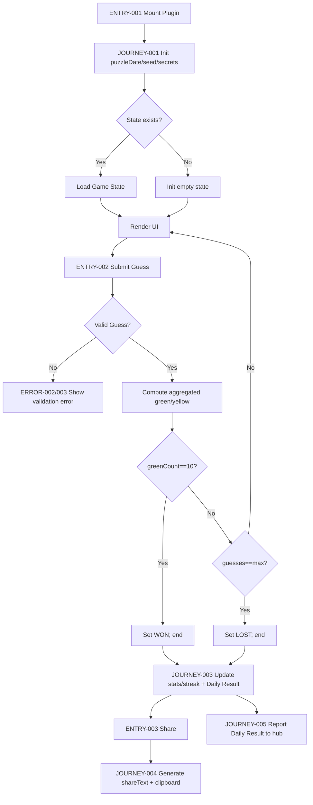
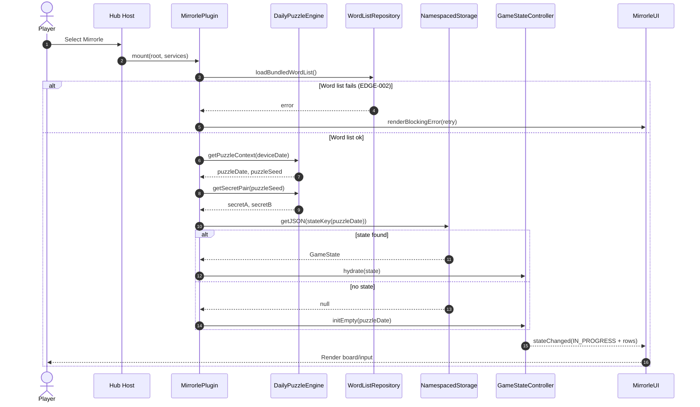
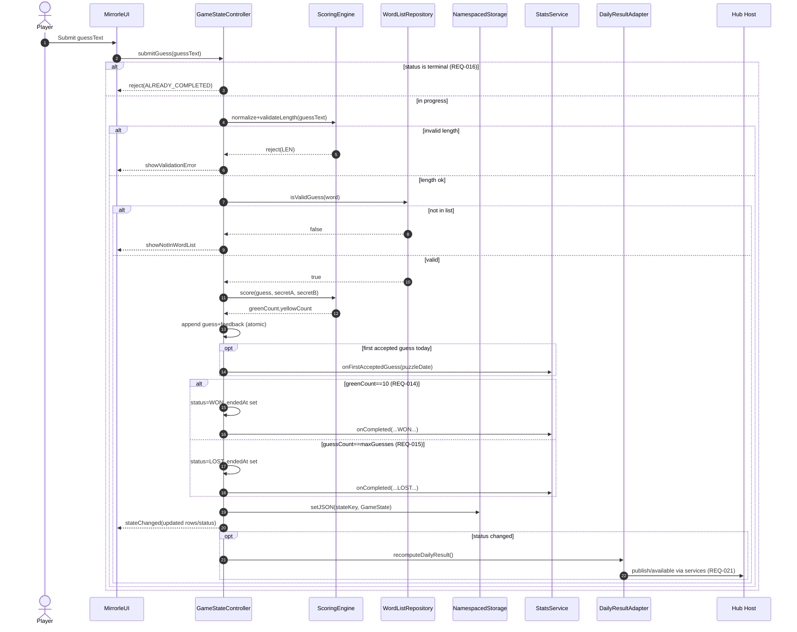
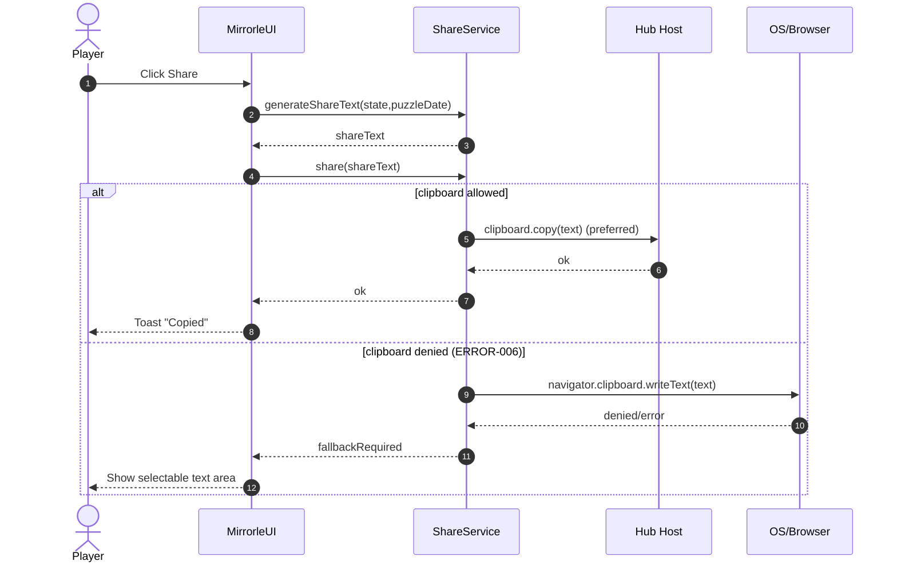
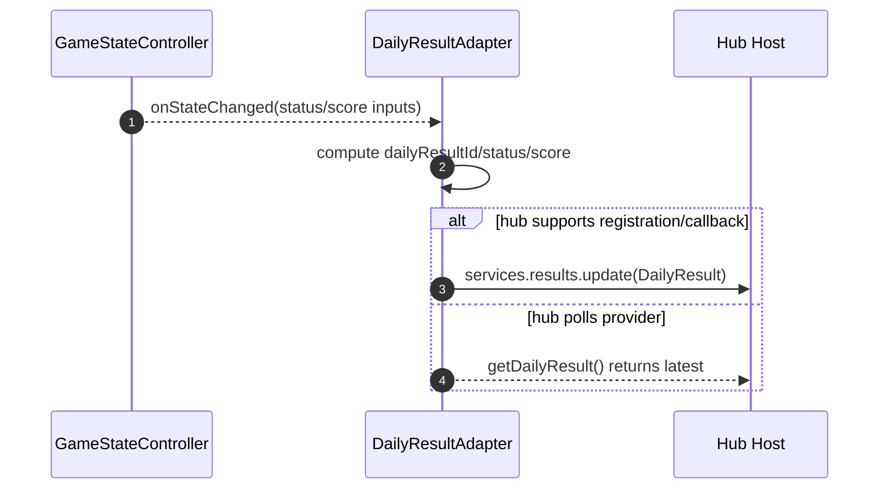
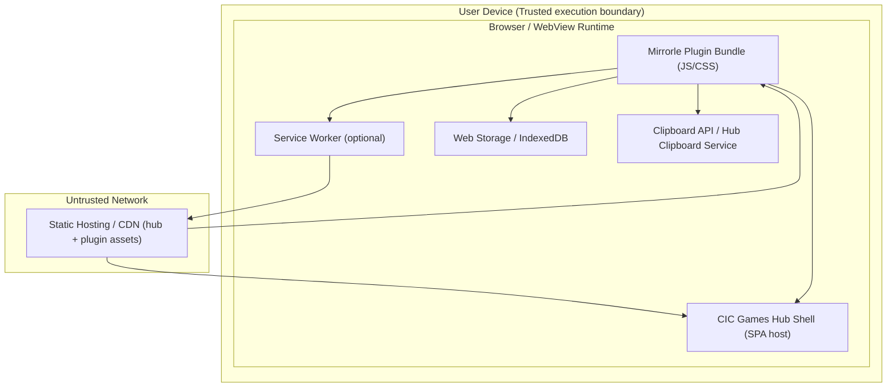

<!-- generated: 2026-07-25T16:09:01Z -->
<!-- mode: feature -->
<!-- feature-slug: mirrorle -->
<!-- a2a-endpoint: https://bob-sdlc-orchestrator.2as6l7wq9qj8.eu-gb.codeengine.appdomain.cloud/v1/rpc -->

# Glossary

## Terms

### TERM-001: Mirrorle
- **Definition:** A daily deduction word game in the CIC Games hub where the player must deduce **two** hidden 5-letter secret words using aggregated feedback from each guess.
- **Synonyms:** Mirrorle game, two-target aggregated Wordle variant
- **Anti-definition:** Not a multi-board Wordle that provides per-target grids/feedback (e.g., Quordle).
- **Source:** User request

### TERM-002: Daily Puzzle
- **Definition:** The deterministic puzzle instance for a specific calendar date, identical for all players on that date.
- **Synonyms:** Daily challenge, daily seed
- **Anti-definition:** Not randomized per player; not server-generated.
- **Source:** User request

### TERM-003: Secret Word
- **Definition:** One of the two hidden 5-letter target words the player must deduce.
- **Synonyms:** Target word, answer word
- **Anti-definition:** Not the player’s guesses.
- **Source:** User request

### TERM-004: Secret Pair
- **Definition:** The ordered pair of two Secret Words used for a Daily Puzzle.
- **Synonyms:** Two-word solution
- **Anti-definition:** Not revealed to the player during play; not a list of multiple boards.
- **Source:** User request

### TERM-005: Guess
- **Definition:** A single 5-letter word entered by the player on a turn.
- **Synonyms:** Attempt, entry
- **Anti-definition:** Not partial input; not longer/shorter than 5 letters.
- **Source:** User request

### TERM-006: Turn
- **Definition:** One cycle of entering a Guess and receiving aggregated feedback counts.
- **Synonyms:** Move
- **Anti-definition:** Not multiple guesses at once.
- **Source:** User request

### TERM-007: Guess Budget
- **Definition:** The maximum number of guesses allowed for the Daily Puzzle (e.g., 9).
- **Synonyms:** Max guesses, attempt limit
- **Anti-definition:** Not unlimited mode.
- **Source:** User request

### TERM-008: Aggregated Feedback
- **Definition:** The feedback returned per Guess consisting only of summed counts across both Secret Words: (a) correct letter in correct position (green) count, and (b) present letter in wrong position (yellow) count.
- **Synonyms:** Summed feedback, combined counts
- **Anti-definition:** Not per-letter tiles; not per-secret breakdown.
- **Source:** User request

### TERM-009: Green Count
- **Definition:** The total number of positions where the Guess letter matches the corresponding position in either Secret Word, summed across both Secret Words.
- **Synonyms:** Correct-position total
- **Anti-definition:** Not indicating which secret/position; not per-letter marking.
- **Source:** User request

### TERM-010: Yellow Count
- **Definition:** The total number of letters from the Guess that are present in either Secret Word but not counted as Green for that Secret Word, summed across both Secret Words, respecting per-word letter multiplicity rules.
- **Synonyms:** Present-wrong-position total
- **Anti-definition:** Not indicating which secret/position; not double-counting beyond letter occurrences.
- **Source:** User request

### TERM-011: Letter Accounting Rule
- **Definition:** The deterministic algorithm that computes Green Count and Yellow Count for a Guess against a Secret Word, including handling duplicate letters, then sums results across both Secret Words.
- **Synonyms:** Scoring algorithm, evaluation algorithm
- **Anti-definition:** Not ambiguous or heuristic; not learned.
- **Source:** User request (implied by Wordle-like scoring)

### TERM-012: Word List
- **Definition:** The bundled on-device dictionary used to validate guesses and to source secret words.
- **Synonyms:** Dictionary, lexicon
- **Anti-definition:** Not fetched from server at runtime.
- **Source:** User request

### TERM-013: Valid Guess
- **Definition:** A Guess that is exactly 5 letters and exists in the Word List.
- **Synonyms:** Acceptable word
- **Anti-definition:** Not any 5-letter string.
- **Source:** User request

### TERM-014: Game State
- **Definition:** The locally stored state for the current Daily Puzzle including guesses made, feedback rows, and completion status.
- **Synonyms:** Session state
- **Anti-definition:** Not global hub state; not server state.
- **Source:** User request

### TERM-015: Daily Result
- **Definition:** The standardized summary object reported by the game to the hub for dashboard display, describing completion and performance for the Daily Puzzle.
- **Synonyms:** Result payload
- **Anti-definition:** Not containing secret words in plaintext.
- **Source:** User request

### TERM-016: Share Artifact
- **Definition:** A spoiler-safe, shareable text representation of the player’s outcome (e.g., emoji grid of summed-green counts per row) that does not reveal the secret words.
- **Synonyms:** Share text, share card (text)
- **Anti-definition:** Not a screenshot requirement; not containing answers.
- **Source:** User request

### TERM-017: Streak
- **Definition:** The count of consecutive days the player has completed the Daily Puzzle (definition of “completed” specified by completion status).
- **Synonyms:** Win streak, play streak
- **Anti-definition:** Not cross-device synced.
- **Source:** User request

### TERM-018: Stats
- **Definition:** Locally stored aggregated metrics for Mirrorle such as plays, wins, distribution by guesses used, and best time (if tracked).
- **Synonyms:** Analytics (local), performance stats
- **Anti-definition:** Not server analytics; not user-tracking telemetry unless explicitly added.
- **Source:** User request

### TERM-019: Offline-first PWA
- **Definition:** A Progressive Web App that functions without network connectivity after installation/initial load by using cached assets and bundled Word List.
- **Synonyms:** Offline-capable web app
- **Anti-definition:** Not requiring backend calls to play.
- **Source:** User request

### TERM-020: GamePlugin
- **Definition:** The integration contract used by CIC Games hub to mount a game UI and interact with hub services.
- **Synonyms:** Plugin module
- **Anti-definition:** Not a standalone app outside the hub.
- **Source:** User request

### TERM-021: Hub Services
- **Definition:** The host-provided services passed into `mount(root, services)` used for navigation, storage, theming, clipboard, toasts, etc.
- **Synonyms:** Host services API
- **Anti-definition:** Not network APIs for gameplay.
- **Source:** User request

### TERM-022: Namespaced Local Storage
- **Definition:** Storage where all Mirrorle keys are prefixed/scoped to avoid collisions with other hub games.
- **Synonyms:** Scoped storage
- **Anti-definition:** Not shared keys across games.
- **Source:** User request

### TERM-023: Carbon Design System UI
- **Definition:** IBM Carbon Design System components and patterns used to implement Mirrorle UI.
- **Synonyms:** Carbon UI
- **Anti-definition:** Not custom component library unless required by hub.
- **Source:** User request

### TERM-024: Accessibility Compliance (WCAG 2.1 AA)
- **Definition:** Conformance with WCAG 2.1 AA including keyboard operability, non-color-only state indication, visible focus, and reduced motion support.
- **Synonyms:** A11y AA
- **Anti-definition:** Not “best effort” accessibility.
- **Source:** User request

### TERM-025: Session Duration Target
- **Definition:** Design target that a typical play session completes within 3 minutes.
- **Synonyms:** Time-to-complete target
- **Anti-definition:** Not a hard timeout.
- **Source:** User request

### TERM-026: Platform Targets
- **Definition:** Supported clients: offline-first PWA plus iOS and Android builds (e.g., via wrapper) using the same gameplay logic.
- **Synonyms:** Mobile platforms
- **Anti-definition:** Not desktop-native only.
- **Source:** User request

## Data Dictionary

| ID | Name | Type | Format | Range/Enum | Units | Default | Nullable | PII | Source | Validation |
|---|---|---|---|---|---|---|---|---|---|---|
| FIELD-001 | puzzleDate | string | YYYY-MM-DD | valid calendar date | N/A | device local date | false | None | Client runtime | Must parse as ISO local date; must match computed seed date |
| FIELD-002 | puzzleSeed | string | stable hash/seed string | implementation-defined | N/A | derived | false | None | Client runtime | Must be deterministic from FIELD-001 (+ optional version salt) |
| FIELD-003 | secretWordA | string | A–Z{5} | 5 letters | N/A | derived | false | None | Client runtime | Must exist in TERM-012 Word List; stored only if explicitly allowed (prefer not stored) |
| FIELD-004 | secretWordB | string | A–Z{5} | 5 letters | N/A | derived | false | None | Client runtime | Must exist in TERM-012 Word List; stored only if explicitly allowed (prefer not stored) |
| FIELD-005 | guessText | string | A–Z{5} | 5 letters | N/A | "" | false | None | User input | Must be exactly 5 alphabetic letters after normalization |
| FIELD-006 | guessIndex | integer | int32 | 1..FIELD-010 | turns | 0 | false | None | Client runtime | Must increment by 1 per accepted guess |
| FIELD-007 | greenCount | integer | int32 | 0..10 | letters | 0 | false | None | Client runtime | Must equal sum of greens vs secret A and B (0..5 each) |
| FIELD-008 | yellowCount | integer | int32 | 0..10 | letters | 0 | false | None | Client runtime | Must equal sum of yellows vs secret A and B (0..5 each) |
| FIELD-009 | feedbackRow | object | {greenCount,yellowCount} | N/A | N/A | N/A | false | None | Client runtime | Must include FIELD-007 and FIELD-008 for the guess |
| FIELD-010 | maxGuesses | integer | int32 | 1..20 | guesses | 9 | false | None | Game config | Must be >=1; recommended 9 per feature request |
| FIELD-011 | guessList | array | list of FIELD-005 | length 0..maxGuesses | guesses | [] | false | None | Client runtime | Each entry must be a TERM-013 Valid Guess |
| FIELD-012 | feedbackList | array | list of FIELD-009 | length 0..maxGuesses | rows | [] | false | None | Client runtime | Length must equal length of FIELD-011 |
| FIELD-013 | gameStatus | string | enum | IN_PROGRESS, WON, LOST | N/A | IN_PROGRESS | false | None | Client runtime | Transition rules: IN_PROGRESS→WON/LOST only; terminal otherwise |
| FIELD-014 | startedAt | string | RFC3339 datetime | N/A | N/A | now | false | None | Client runtime | Must be <= endedAt when endedAt exists |
| FIELD-015 | endedAt | string | RFC3339 datetime | N/A | N/A | null | true | None | Client runtime | Must exist when status is WON or LOST |
| FIELD-016 | durationMs | integer | int64 | 0..3_600_000 | ms | derived | false | None | Client runtime | Must equal endedAt-startedAt when endedAt exists |
| FIELD-017 | completionGuessCount | integer | int32 | 0..maxGuesses | guesses | 0 | false | None | Client runtime | If WON, must be 1..maxGuesses; if LOST, must equal maxGuesses |
| FIELD-018 | shareText | string | text | length 1..2000 | N/A | derived | false | None | Client runtime | Must not contain FIELD-003/004 substrings; must include date and row markers |
| FIELD-019 | dailyResultId | string | stable id | implementation-defined | N/A | derived | false | None | Client runtime | Must be deterministic from puzzleDate + game key |
| FIELD-020 | dailyResultStatus | string | enum | COMPLETED, SKIPPED, IN_PROGRESS | N/A | IN_PROGRESS | false | None | Client runtime | Must map from FIELD-013 and presence of play |
| FIELD-021 | dailyResultScore | integer | int32 | 0..maxGuesses | guesses | derived | false | None | Client runtime | If WON: completionGuessCount; if LOST: maxGuesses; if in progress: null handled via status (store sentinel if needed) |
| FIELD-022 | streakCurrent | integer | int32 | 0..10000 | days | 0 | false | None | Namespaced Local Storage | Must update only on day completion; reset on missed day per rules |
| FIELD-023 | streakBest | integer | int32 | 0..10000 | days | 0 | false | None | Namespaced Local Storage | Must be >= streakCurrent historically |
| FIELD-024 | statsPlays | integer | int32 | 0..1_000_000 | plays | 0 | false | None | Namespaced Local Storage | Increment once per day when a puzzle is started (first guess) |
| FIELD-025 | statsWins | integer | int32 | 0..1_000_000 | wins | 0 | false | None | Namespaced Local Storage | Increment once per day when status becomes WON |
| FIELD-026 | guessDistribution | object | map<int,int> | keys 1..maxGuesses | count | {} | false | None | Namespaced Local Storage | For WON, increment bucket = completionGuessCount |
| FIELD-027 | storageNamespace | string | slug | [a-z0-9.-]+ | N/A | "cic.mirrorle" | false | None | Game config | Must prefix all keys with this value |
| FIELD-028 | wordListVersion | string | semver/string | implementation-defined | N/A | bundled | false | None | App bundle | Must be present for seed salt/versioning |
| FIELD-029 | locale | string | BCP-47 | e.g., en-US | N/A | device locale | false | None | Client runtime | Must be a valid BCP-47 tag or fallback |
| FIELD-030 | reducedMotion | boolean | true/false | boolean | N/A | from OS | false | None | Client runtime | Must reflect prefers-reduced-motion |
| FIELD-031 | lastPlayedDate | string | YYYY-MM-DD | valid date | N/A | null | true | None | Namespaced Local Storage | Must update when a daily puzzle is completed (WON/LOST) |

# User Journeys

## Roles

| Role ID | Role | Type | Description |
|---|---|---|---|
| ROLE-001 | Player | Primary | End user who plays the daily Mirrorle puzzle. |
| ROLE-002 | Hub Host | System | CIC Games hub that loads the GamePlugin and consumes Daily Result. |
| ROLE-003 | OS/Browser | System | Platform providing storage, clipboard, accessibility settings, offline cache. |

## Entry Points

| Entry ID | Location | Trigger | Auth |
|---|---|---|---|
| ENTRY-001 | Hub route → GamePlugin `mount(root, services)` (TERM-020, TERM-021) | Player selects Mirrorle in hub | Hub session (implicit), no gameplay auth |
| ENTRY-002 | In-game keyboard/input control (Carbon UI) | Player types and submits a Guess | None |
| ENTRY-003 | Share action (button/menu) | Player taps “Share” | None |
| ENTRY-004 | Resume state on load | Player re-opens game same day | None |
| ENTRY-005 | New day rollover | Local date changes to new FIELD-001 | None |

## Role Permission Matrix

| Capability | ROLE-001 Player | ROLE-002 Hub Host | ROLE-003 OS/Browser |
|---|---:|---:|---:|
| Start Daily Puzzle (TERM-002) | Yes | Indirect (loads plugin) | No |
| Submit Guess (TERM-005) | Yes | No | No |
| Compute secrets on-device (TERM-004) | Indirect | No | No |
| Read/write namespaced local storage (TERM-022) | Indirect | No | Provides API |
| Receive Daily Result (TERM-015) | No | Yes | No |
| Copy Share Artifact to clipboard (TERM-016) | Yes | No | Provides API |
| Enforce prefers-reduced-motion (TERM-024) | Indirect | No | Provides setting |

## Journeys

### JOURNEY-001: Start today’s puzzle (load + initialize)
- **Role/Goal:** ROLE-001 Player; start TERM-002 Daily Puzzle with correct deterministic setup.
- **Entry:** ENTRY-001
- **Happy path:**
  1. System mounts Mirrorle via TERM-020 GamePlugin `mount(root, services)` using TERM-021 Hub Services.
  2. System determines FIELD-001 puzzleDate from device local date.
  3. System derives FIELD-002 puzzleSeed deterministically from FIELD-001 and FIELD-028 wordListVersion (TERM-002).
  4. System computes TERM-004 Secret Pair (FIELD-003 secretWordA, FIELD-004 secretWordB) from FIELD-002 and TERM-012 Word List.
  5. System loads any existing TERM-014 Game State for FIELD-001 from TERM-022 Namespaced Local Storage (FIELD-027).
  6. System renders the game UI using TERM-023 Carbon Design System UI and shows current progress (FIELD-011 guessList, FIELD-012 feedbackList, FIELD-013 gameStatus).
- **BRANCH-001 (existing state found):** If stored state exists for FIELD-001, load and continue at step 6 with existing FIELD-011/FIELD-012.
- **BRANCH-002 (no state found):** If no stored state exists, initialize FIELD-011/FIELD-012 empty and FIELD-013 IN_PROGRESS.
- **ERROR-001 (storage unavailable):**
  - **Trigger:** local storage read/write throws or is denied.
  - **System response:** operate in ephemeral memory state; show non-blocking warning toast.
  - **User recovery:** continue playing; inform that stats/streak may not persist.
- **EDGE-001 (timezone/date boundary):** Device date changes while app is open; must ensure FIELD-001 is consistent for the session until puzzle completion or explicit refresh.
- **EDGE-002 (word list missing/corrupt):** Bundled TERM-012 Word List fails to load; block play with error screen and retry action.

### JOURNEY-002: Enter a guess and receive aggregated feedback
- **Role/Goal:** ROLE-001 Player; make a TERM-005 Guess and receive TERM-008 Aggregated Feedback to progress within TERM-007 Guess Budget.
- **Entry:** ENTRY-002
- **Happy path:**
  1. Player types letters to form FIELD-005 guessText (exactly 5 letters).
  2. Player submits the guess (Enter button/key).
  3. System normalizes FIELD-005 (case-fold to A–Z) and validates TERM-013 Valid Guess against TERM-012 Word List.
  4. System increments FIELD-006 guessIndex and appends FIELD-005 to FIELD-011 guessList.
  5. System computes FIELD-007 greenCount and FIELD-008 yellowCount using TERM-011 Letter Accounting Rule against FIELD-003 and FIELD-004 and sums results (TERM-008).
  6. System appends FIELD-009 feedbackRow to FIELD-012 feedbackList aligned with the guess.
  7. System updates UI row to display counts (text/icon cues in addition to color per TERM-024).
  8. System persists updated TERM-014 Game State to TERM-022 Namespaced Local Storage (FIELD-027).
- **BRANCH-003 (win condition):** If FIELD-007 == 10 for a row, set FIELD-013 WON and set FIELD-015 endedAt.
- **BRANCH-004 (loss condition):** If FIELD-006 reaches FIELD-010 maxGuesses while FIELD-013 still IN_PROGRESS, set FIELD-013 LOST and set FIELD-015 endedAt.
- **ERROR-002 (invalid length):**
  - **Trigger:** FIELD-005 not length 5 at submit.
  - **System response:** reject submit; announce error via accessible inline message.
  - **User recovery:** continue editing input.
- **ERROR-003 (not in word list):**
  - **Trigger:** FIELD-005 not found in TERM-012 Word List.
  - **System response:** reject submit; show “Not in word list” message (non-color-only).
  - **User recovery:** edit and resubmit.
- **ERROR-004 (already completed):**
  - **Trigger:** submit attempt when FIELD-013 is WON or LOST.
  - **System response:** ignore guess submission; move focus to share/stats actions.
  - **User recovery:** start next day when available.
- **EDGE-003 (duplicate letters):** Guess contains repeated letters; scoring must respect TERM-011 multiplicity per secret word before summing.
- **EDGE-004 (concurrency):** Rapid double-submit (Enter spam); must accept at most one guess per row index.
- **EDGE-005 (offline):** No network; gameplay must remain fully functional (TERM-019).

### JOURNEY-003: View outcome, stats, and streak
- **Role/Goal:** ROLE-001 Player; see completion state and personal TERM-018 Stats / TERM-017 Streak stored locally.
- **Entry:** ENTRY-004 (resume) or post completion from JOURNEY-002
- **Happy path:**
  1. System detects terminal FIELD-013 (WON/LOST) and calculates FIELD-016 durationMs.
  2. System computes FIELD-017 completionGuessCount.
  3. System updates FIELD-024 statsPlays (if first play of day), FIELD-025 statsWins (if WON), and FIELD-026 guessDistribution.
  4. System updates FIELD-022 streakCurrent / FIELD-023 streakBest using FIELD-031 lastPlayedDate and FIELD-001 puzzleDate.
  5. System displays stats/streak UI using Carbon components with accessible labels (TERM-024).
  6. System prepares TERM-015 Daily Result fields (FIELD-019..FIELD-021) for hub consumption.
- **BRANCH-005 (first interaction today):** If no prior play for FIELD-001, count a play when the first valid guess is accepted (ties to statsPlays increment).
- **ERROR-005 (stats write failure):**
  - **Trigger:** cannot persist stats/streak.
  - **System response:** show non-blocking warning; keep UI functional.
  - **User recovery:** none required.
- **EDGE-006 (device date changed backwards/forwards):** Streak logic must be based on FIELD-001 and FIELD-031 as stored; avoid negative streak effects on same-day replays.

### JOURNEY-004: Share spoiler-safe result artifact
- **Role/Goal:** ROLE-001 Player; share TERM-016 Share Artifact without revealing secrets.
- **Entry:** ENTRY-003
- **Happy path:**
  1. Player selects “Share”.
  2. System generates FIELD-018 shareText derived from FIELD-012 feedbackList (e.g., per-row representation of FIELD-007 greenCount; optionally include yellowCount) and metadata (FIELD-001, guesses used).
  3. System verifies FIELD-018 contains no plaintext secret words (FIELD-003/FIELD-004) and no per-secret attribution.
  4. System copies FIELD-018 to clipboard via hub/OS capability and confirms via toast.
- **BRANCH-006 (share before completion):** If FIELD-013 is IN_PROGRESS, shareText indicates in-progress status without secrets.
- **ERROR-006 (clipboard denied):**
  - **Trigger:** clipboard API fails/permission denied.
  - **System response:** present shareText in a selectable text area for manual copy.
  - **User recovery:** long-press/select and copy manually.
- **EDGE-007 (spoiler safety):** shareText must never include guesses or secrets if policy is “counts only”; if guesses are included, must be explicitly approved (default: exclude guesses).

### JOURNEY-005: Report Daily Result to hub dashboard
- **Role/Goal:** ROLE-002 Hub Host; obtain TERM-015 Daily Result for dashboards.
- **Entry:** ENTRY-001 (mount) + internal hub polling/callback pattern via TERM-021
- **Happy path:**
  1. System constructs FIELD-019 dailyResultId for (Mirrorle, FIELD-001).
  2. When FIELD-013 changes, system updates FIELD-020 dailyResultStatus and FIELD-021 dailyResultScore.
  3. System exposes/returns TERM-015 Daily Result through the GamePlugin contract for hub aggregation.
- **ERROR-007 (service contract mismatch):**
  - **Trigger:** required hub service method missing or incompatible.
  - **System response:** degrade gracefully: gameplay works; Daily Result reporting disabled with console warning.
  - **User recovery:** none (hub-side fix).

## Journey Map



# Requirements

### REQ-001: Mount Mirrorle as a GamePlugin
- **EARS Pattern:** Ubiquitous
- **EARS Statement:** The Mirrorle client shall implement TERM-020 GamePlugin with a `mount(root, services)` entry to render the game UI.
- **Inputs:** DOM root, TERM-021 Hub Services
- **Outputs:** Rendered UI
- **Preconditions:** Hub loads plugin module
- **Postconditions:** Mirrorle UI visible and interactive
- **Invariants:** No backend dependency for gameplay (TERM-019)
- **Trigger:** ENTRY-001
- **Actor:** ROLE-002
- **EntityScope:** TERM-020
- **ErrorModes:** ERROR-007
- **NFR-Tags:** compatibility
- **Source:** JOURNEY-001 step 1; JOURNEY-005
- **Dependencies:** None
- **Priority:** P0
- **AcceptanceCriteria:**
  - **TEST-001:** Given hub calls `mount`, when provided a valid root, then the Mirrorle UI renders.
  - **TEST-002:** Given hub calls `mount`, when `services` is provided, then no gameplay call requires network connectivity.
- **Assumptions:** Hub defines the GamePlugin interface
- **OpenQuestions:** What is the exact TypeScript interface for Daily Result reporting?

### REQ-002: Determine puzzle date from device local date
- **EARS Pattern:** Event-Driven
- **EARS Statement:** When the game is mounted, the system shall set FIELD-001 puzzleDate from the device local calendar date.
- **Inputs:** Device date/time
- **Outputs:** FIELD-001
- **Preconditions:** Plugin mounted
- **Postconditions:** FIELD-001 available for seed derivation
- **Invariants:** FIELD-001 formatted as YYYY-MM-DD
- **Trigger:** ENTRY-001
- **Actor:** ROLE-003
- **EntityScope:** TERM-002
- **ErrorModes:** EDGE-001
- **NFR-Tags:** compatibility
- **Source:** JOURNEY-001 step 2
- **Dependencies:** REQ-001
- **Priority:** P0
- **AcceptanceCriteria:**
  - **TEST-003:** When mounted on 2026-07-25 local date, then FIELD-001 equals "2026-07-25".
- **Assumptions:** Local date, not UTC, defines “today”
- **OpenQuestions:** Does hub define a canonical timezone for “daily” across players?

### REQ-003: Derive deterministic daily seed
- **EARS Pattern:** Event-Driven
- **EARS Statement:** When FIELD-001 puzzleDate is established, the system shall derive FIELD-002 puzzleSeed deterministically from FIELD-001 and FIELD-028 wordListVersion.
- **Inputs:** FIELD-001, FIELD-028
- **Outputs:** FIELD-002
- **Preconditions:** Word list version available
- **Postconditions:** Seed available for secret selection
- **Invariants:** Same inputs produce same FIELD-002
- **Trigger:** FIELD-001 set
- **Actor:** ROLE-001
- **EntityScope:** TERM-002
- **ErrorModes:** EDGE-001
- **NFR-Tags:** auditability
- **Source:** JOURNEY-001 step 3
- **Dependencies:** REQ-002
- **Priority:** P0
- **AcceptanceCriteria:**
  - **TEST-004:** Given the same FIELD-001 and FIELD-028, when derived twice, then FIELD-002 matches exactly.
- **Assumptions:** A stable PRNG/seed function is chosen
- **OpenQuestions:** Should a game/version salt be included beyond wordListVersion?

### REQ-004: Compute two secret words on-device from the word list
- **EARS Pattern:** Event-Driven
- **EARS Statement:** When FIELD-002 puzzleSeed is available, the system shall compute FIELD-003 secretWordA from TERM-012 Word List on-device.
- **Inputs:** FIELD-002, TERM-012
- **Outputs:** FIELD-003
- **Preconditions:** Word list loaded
- **Postconditions:** secretWordA selected
- **Invariants:** FIELD-003 is 5 letters and in Word List
- **Trigger:** FIELD-002 available
- **Actor:** ROLE-001
- **EntityScope:** TERM-003
- **ErrorModes:** EDGE-002
- **NFR-Tags:** privacy
- **Source:** JOURNEY-001 step 4
- **Dependencies:** REQ-003
- **Priority:** P0
- **AcceptanceCriteria:**
  - **TEST-005:** When seed is set, then FIELD-003 is a 5-letter entry present in the bundled word list.
- **Assumptions:** Selection method is deterministic
- **OpenQuestions:** Are secret words allowed to repeat (A==B)?

### REQ-005: Compute second secret word on-device from the word list
- **EARS Pattern:** Event-Driven
- **EARS Statement:** When FIELD-002 puzzleSeed is available, the system shall compute FIELD-004 secretWordB from TERM-012 Word List on-device.
- **Inputs:** FIELD-002, TERM-012
- **Outputs:** FIELD-004
- **Preconditions:** Word list loaded
- **Postconditions:** secretWordB selected
- **Invariants:** FIELD-004 is 5 letters and in Word List
- **Trigger:** FIELD-002 available
- **Actor:** ROLE-001
- **EntityScope:** TERM-003
- **ErrorModes:** EDGE-002
- **NFR-Tags:** privacy
- **Source:** JOURNEY-001 step 4
- **Dependencies:** REQ-003
- **Priority:** P0
- **AcceptanceCriteria:**
  - **TEST-006:** When seed is set, then FIELD-004 is a 5-letter entry present in the bundled word list.
- **Assumptions:** Selection method is deterministic
- **OpenQuestions:** Must FIELD-003 and FIELD-004 be distinct?

### REQ-006: Load existing game state for today
- **EARS Pattern:** Event-Driven
- **EARS Statement:** When the game is mounted, the system shall load TERM-014 Game State for FIELD-001 from TERM-022 Namespaced Local Storage.
- **Inputs:** FIELD-001, FIELD-027
- **Outputs:** FIELD-011, FIELD-012, FIELD-013, FIELD-014, FIELD-015
- **Preconditions:** Storage available
- **Postconditions:** State restored or initialized
- **Invariants:** FIELD-012 length equals FIELD-011 length
- **Trigger:** ENTRY-001
- **Actor:** ROLE-001
- **EntityScope:** TERM-014
- **ErrorModes:** ERROR-001
- **NFR-Tags:** reliability
- **Source:** JOURNEY-001 step 5
- **Dependencies:** REQ-002, REQ-001
- **Priority:** P0
- **AcceptanceCriteria:**
  - **TEST-007:** Given saved state for today, when mounted, then the UI reflects saved guesses and feedback.
- **Assumptions:** Hub permits local storage
- **OpenQuestions:** Use IndexedDB vs localStorage per hub standards?

### REQ-007: Initialize empty state when no saved state exists
- **EARS Pattern:** Event-Driven
- **EARS Statement:** When no stored state exists for FIELD-001, the system shall initialize FIELD-011 guessList and FIELD-012 feedbackList as empty with FIELD-013 set to IN_PROGRESS.
- **Inputs:** FIELD-001
- **Outputs:** Initialized state
- **Preconditions:** REQ-006 attempted
- **Postconditions:** Ready for first guess
- **Invariants:** guessIndex derived from list length
- **Trigger:** No saved state found
- **Actor:** ROLE-001
- **EntityScope:** TERM-014
- **ErrorModes:** ERROR-001
- **NFR-Tags:** reliability
- **Source:** JOURNEY-001 BRANCH-002
- **Dependencies:** REQ-006
- **Priority:** P0
- **AcceptanceCriteria:**
  - **TEST-008:** Given no saved state, when mounted, then the first row is empty and status is IN_PROGRESS.
- **Assumptions:** None
- **OpenQuestions:** None

### REQ-008: Enforce guess length of 5 letters
- **EARS Pattern:** Event-Driven
- **EARS Statement:** When the player submits FIELD-005 guessText, the system shall reject the submission if FIELD-005 is not exactly 5 letters after normalization.
- **Inputs:** FIELD-005
- **Outputs:** Validation error UI
- **Preconditions:** FIELD-013 is IN_PROGRESS
- **Postconditions:** No change to FIELD-011/FIELD-012 on rejection
- **Invariants:** Accepted guesses are length 5
- **Trigger:** ENTRY-002 submit
- **Actor:** ROLE-001
- **EntityScope:** TERM-005
- **ErrorModes:** ERROR-002
- **NFR-Tags:** accessibility
- **Source:** JOURNEY-002 step 3; ERROR-002
- **Dependencies:** REQ-006
- **Priority:** P0
- **AcceptanceCriteria:**
  - **TEST-009:** When submitting 4 letters, then no new row is added and an error message is announced.
- **Assumptions:** Normalization is A–Z only
- **OpenQuestions:** Allow accented letters in non-English locales?

### REQ-009: Validate guess against bundled word list
- **EARS Pattern:** Event-Driven
- **EARS Statement:** When the player submits a 5-letter FIELD-005 guessText, the system shall reject the submission if FIELD-005 is not found in TERM-012 Word List.
- **Inputs:** FIELD-005, TERM-012
- **Outputs:** Validation error UI
- **Preconditions:** FIELD-013 is IN_PROGRESS; FIELD-005 length is 5
- **Postconditions:** No state mutation on rejection
- **Invariants:** All saved guesses are TERM-013 Valid Guess
- **Trigger:** ENTRY-002 submit
- **Actor:** ROLE-001
- **EntityScope:** TERM-012
- **ErrorModes:** ERROR-003
- **NFR-Tags:** offline, accessibility
- **Source:** JOURNEY-002 step 3; ERROR-003
- **Dependencies:** REQ-008
- **Priority:** P0
- **AcceptanceCriteria:**
  - **TEST-010:** When submitting a non-dictionary 5-letter string, then no new row is added and “Not in word list” is displayed.
- **Assumptions:** Word list lookup is case-insensitive
- **OpenQuestions:** Separate “answer list” vs “guess list”?

### REQ-010: Append valid guess to guess list
- **EARS Pattern:** Event-Driven
- **EARS Statement:** When a submitted FIELD-005 guessText is a TERM-013 Valid Guess, the system shall append FIELD-005 to FIELD-011 guessList.
- **Inputs:** FIELD-005
- **Outputs:** Updated FIELD-011
- **Preconditions:** FIELD-013 is IN_PROGRESS; FIELD-011 length < FIELD-010
- **Postconditions:** guessList length increments by 1
- **Invariants:** FIELD-011 length equals FIELD-012 length after feedback append
- **Trigger:** Valid guess accepted
- **Actor:** ROLE-001
- **EntityScope:** TERM-014
- **ErrorModes:** EDGE-004
- **NFR-Tags:** reliability
- **Source:** JOURNEY-002 step 4
- **Dependencies:** REQ-009
- **Priority:** P0
- **AcceptanceCriteria:**
  - **TEST-011:** When a valid guess is submitted, then FIELD-011 length increases by 1 and the guess appears in the UI list.
- **Assumptions:** Duplicate guesses allowed unless specified
- **OpenQuestions:** Disallow repeated guesses?

### REQ-011: Compute aggregated green count per guess
- **EARS Pattern:** Event-Driven
- **EARS Statement:** When a TERM-013 Valid Guess is accepted, the system shall compute FIELD-007 greenCount as the sum of correct-position matches against FIELD-003 and against FIELD-004.
- **Inputs:** FIELD-005, FIELD-003, FIELD-004
- **Outputs:** FIELD-007
- **Preconditions:** Secrets computed for day
- **Postconditions:** greenCount available for feedback row
- **Invariants:** FIELD-007 in range 0..10
- **Trigger:** Valid guess accepted
- **Actor:** ROLE-001
- **EntityScope:** TERM-008
- **ErrorModes:** EDGE-003
- **NFR-Tags:** auditability
- **Source:** JOURNEY-002 step 5
- **Dependencies:** REQ-004, REQ-005, REQ-010
- **Priority:** P0
- **AcceptanceCriteria:**
  - **TEST-012:** Given a fixed secret pair and guess, when evaluated, then FIELD-007 equals greens(secretA,guess)+greens(secretB,guess).
- **Assumptions:** Green evaluation is per-position equality
- **OpenQuestions:** None

### REQ-012: Compute aggregated yellow count per guess with multiplicity
- **EARS Pattern:** Event-Driven
- **EARS Statement:** When a TERM-013 Valid Guess is accepted, the system shall compute FIELD-008 yellowCount as the sum of present-wrong-position counts against FIELD-003 and against FIELD-004 using TERM-011 Letter Accounting Rule.
- **Inputs:** FIELD-005, FIELD-003, FIELD-004
- **Outputs:** FIELD-008
- **Preconditions:** Secrets computed for day
- **Postconditions:** yellowCount available for feedback row
- **Invariants:** FIELD-008 in range 0..10
- **Trigger:** Valid guess accepted
- **Actor:** ROLE-001
- **EntityScope:** TERM-008
- **ErrorModes:** EDGE-003
- **NFR-Tags:** auditability
- **Source:** JOURNEY-002 step 5; EDGE-003
- **Dependencies:** REQ-004, REQ-005, REQ-010
- **Priority:** P0
- **AcceptanceCriteria:**
  - **TEST-013:** Given a fixed secret word and guess with duplicate letters, when evaluated, then yellow count does not exceed remaining letter occurrences after greens.
- **Assumptions:** Use Wordle-style two-pass accounting per secret word
- **OpenQuestions:** Publish the exact scoring spec in help?

### REQ-013: Append feedback row aligned with guess
- **EARS Pattern:** Event-Driven
- **EARS Statement:** When FIELD-007 and FIELD-008 are computed for an accepted guess, the system shall append a FIELD-009 feedbackRow to FIELD-012 feedbackList at the same index as the guess in FIELD-011.
- **Inputs:** FIELD-007, FIELD-008
- **Outputs:** Updated FIELD-012
- **Preconditions:** Guess appended
- **Postconditions:** feedbackList length increments by 1
- **Invariants:** lengths of FIELD-011 and FIELD-012 are equal
- **Trigger:** Feedback computed
- **Actor:** ROLE-001
- **EntityScope:** TERM-014
- **ErrorModes:** EDGE-004
- **NFR-Tags:** reliability
- **Source:** JOURNEY-002 step 6
- **Dependencies:** REQ-011, REQ-012
- **Priority:** P0
- **AcceptanceCriteria:**
  - **TEST-014:** When a guess is accepted, then a feedback row with counts is added and displayed for that same row.
- **Assumptions:** None
- **OpenQuestions:** None

### REQ-014: Detect win condition by aggregated greens
- **EARS Pattern:** Event-Driven
- **EARS Statement:** When a feedback row is added, the system shall set FIELD-013 gameStatus to WON if FIELD-007 greenCount equals 10.
- **Inputs:** FIELD-007
- **Outputs:** FIELD-013, FIELD-015
- **Preconditions:** FIELD-013 is IN_PROGRESS
- **Postconditions:** Terminal win state; endedAt set
- **Invariants:** After WON, no further guesses accepted
- **Trigger:** Feedback row appended
- **Actor:** ROLE-001
- **EntityScope:** TERM-014
- **ErrorModes:** None
- **NFR-Tags:** none
- **Source:** JOURNEY-002 BRANCH-003
- **Dependencies:** REQ-013
- **Priority:** P0
- **AcceptanceCriteria:**
  - **TEST-015:** When greenCount becomes 10 on row N, then status becomes WON and endedAt is populated.
- **Assumptions:** Both secrets are length 5 so total positions is 10
- **OpenQuestions:** None

### REQ-015: Detect loss condition by max guesses
- **EARS Pattern:** Event-Driven
- **EARS Statement:** When FIELD-011 guessList length equals FIELD-010 maxGuesses while FIELD-013 gameStatus is IN_PROGRESS, the system shall set FIELD-013 gameStatus to LOST.
- **Inputs:** FIELD-011, FIELD-010, FIELD-013
- **Outputs:** FIELD-013, FIELD-015
- **Preconditions:** In progress
- **Postconditions:** Terminal loss state; endedAt set
- **Invariants:** After LOST, no further guesses accepted
- **Trigger:** Guess appended
- **Actor:** ROLE-001
- **EntityScope:** TERM-007
- **ErrorModes:** None
- **NFR-Tags:** none
- **Source:** JOURNEY-002 BRANCH-004
- **Dependencies:** REQ-010
- **Priority:** P0
- **AcceptanceCriteria:**
  - **TEST-016:** When the 9th guess is accepted and no win occurred, then status becomes LOST and endedAt is populated.
- **Assumptions:** maxGuesses defaults to 9 (FIELD-010)
- **OpenQuestions:** Offer configurable difficulty?

### REQ-016: Prevent guessing after completion
- **EARS Pattern:** Unwanted
- **EARS Statement:** The system shall not accept a submitted guess when FIELD-013 gameStatus is WON or LOST.
- **Inputs:** FIELD-013, FIELD-005
- **Outputs:** No mutation to FIELD-011/FIELD-012; UI guidance
- **Preconditions:** Terminal state
- **Postconditions:** State unchanged
- **Invariants:** Terminal states are immutable for guesses
- **Trigger:** ENTRY-002 submit
- **Actor:** ROLE-001
- **EntityScope:** TERM-014
- **ErrorModes:** ERROR-004
- **NFR-Tags:** reliability
- **Source:** JOURNEY-002 ERROR-004
- **Dependencies:** REQ-014, REQ-015
- **Priority:** P0
- **AcceptanceCriteria:**
  - **TEST-017:** Given status WON, when submitting a guess, then the guess list length does not change.
- **Assumptions:** UI provides a disabled submit control
- **OpenQuestions:** None

### REQ-017: Persist game state locally under a namespace
- **EARS Pattern:** Event-Driven
- **EARS Statement:** When the game state changes, the system shall persist TERM-014 Game State using TERM-022 Namespaced Local Storage with prefix FIELD-027 storageNamespace.
- **Inputs:** FIELD-011, FIELD-012, FIELD-013, FIELD-014, FIELD-015, FIELD-027
- **Outputs:** Stored state record
- **Preconditions:** Storage available
- **Postconditions:** State restorable
- **Invariants:** Keys are prefixed with FIELD-027
- **Trigger:** State mutation
- **Actor:** ROLE-001
- **EntityScope:** TERM-022
- **ErrorModes:** ERROR-001
- **NFR-Tags:** reliability, compatibility
- **Source:** JOURNEY-002 step 8; JOURNEY-001 step 5
- **Dependencies:** REQ-006
- **Priority:** P0
- **AcceptanceCriteria:**
  - **TEST-018:** When a guess is accepted, then a namespaced storage key is updated and can be read back on reload.
- **Assumptions:** Namespace string is constant per install
- **OpenQuestions:** Exact storage schema keys?

### REQ-018: Generate spoiler-safe share text from aggregated counts
- **EARS Pattern:** Event-Driven
- **EARS Statement:** When the player triggers Share, the system shall generate FIELD-018 shareText from FIELD-012 feedbackList without including FIELD-003 or FIELD-004.
- **Inputs:** FIELD-012, FIELD-001
- **Outputs:** FIELD-018
- **Preconditions:** At least one row exists or status available
- **Postconditions:** shareText ready for copy
- **Invariants:** No secret words in output
- **Trigger:** ENTRY-003
- **Actor:** ROLE-001
- **EntityScope:** TERM-016
- **ErrorModes:** EDGE-007
- **NFR-Tags:** privacy
- **Source:** JOURNEY-004 steps 2–3; EDGE-007
- **Dependencies:** REQ-013
- **Priority:** P0
- **AcceptanceCriteria:**
  - **TEST-019:** Given any completed game, when share is generated, then shareText does not contain the secret words.
- **Assumptions:** Share format is “emoji grid of summed-green counts per row” as requested
- **OpenQuestions:** Include yellow counts in share artifact or only green counts?

### REQ-019: Copy share text to clipboard or provide manual copy fallback
- **EARS Pattern:** Event-Driven
- **EARS Statement:** When FIELD-018 shareText is generated, the system shall copy FIELD-018 to the clipboard.
- **Inputs:** FIELD-018
- **Outputs:** Clipboard content
- **Preconditions:** Clipboard API available
- **Postconditions:** User can paste elsewhere
- **Invariants:** Clipboard content matches shareText exactly
- **Trigger:** Share action after generation
- **Actor:** ROLE-001
- **EntityScope:** TERM-016
- **ErrorModes:** ERROR-006
- **NFR-Tags:** compatibility
- **Source:** JOURNEY-004 step 4
- **Dependencies:** REQ-018
- **Priority:** P0
- **AcceptanceCriteria:**
  - **TEST-020:** When Share is tapped and clipboard is permitted, then clipboard content equals shareText.
- **Assumptions:** Hub services may wrap clipboard
- **OpenQuestions:** Preferred clipboard service method?

### REQ-020: Provide manual copy UI when clipboard fails
- **EARS Pattern:** Event-Driven
- **EARS Statement:** When clipboard copy fails, the system shall present FIELD-018 shareText in a selectable text control.
- **Inputs:** Clipboard error, FIELD-018
- **Outputs:** Manual copy UI
- **Preconditions:** Share attempted
- **Postconditions:** User can select/copy
- **Invariants:** shareText unchanged
- **Trigger:** Clipboard failure
- **Actor:** ROLE-001
- **EntityScope:** TERM-016
- **ErrorModes:** ERROR-006
- **NFR-Tags:** accessibility
- **Source:** JOURNEY-004 ERROR-006
- **Dependencies:** REQ-019
- **Priority:** P1
- **AcceptanceCriteria:**
  - **TEST-021:** Given clipboard is denied, when Share is tapped, then a text area appears containing shareText.
- **Assumptions:** None
- **OpenQuestions:** None

### REQ-021: Produce Daily Result for hub dashboard
- **EARS Pattern:** Event-Driven
- **EARS Statement:** When FIELD-013 gameStatus changes, the system shall update TERM-015 Daily Result fields FIELD-019 dailyResultId, FIELD-020 dailyResultStatus, and FIELD-021 dailyResultScore.
- **Inputs:** FIELD-013, FIELD-001, FIELD-017
- **Outputs:** Daily Result object
- **Preconditions:** Plugin mounted
- **Postconditions:** Hub can display result
- **Invariants:** Daily result contains no secret words
- **Trigger:** gameStatus change
- **Actor:** ROLE-002
- **EntityScope:** TERM-015
- **ErrorModes:** ERROR-007
- **NFR-Tags:** privacy, compatibility
- **Source:** JOURNEY-003 step 6; JOURNEY-005 steps 1–2
- **Dependencies:** REQ-014, REQ-015
- **Priority:** P0
- **AcceptanceCriteria:**
  - **TEST-022:** When status becomes WON, then dailyResultStatus is COMPLETED and dailyResultScore equals completionGuessCount.
- **Assumptions:** Hub expects per-day id stability
- **OpenQuestions:** Does hub support IN_PROGRESS results?

### REQ-022: Update local stats plays on first accepted guess of the day
- **EARS Pattern:** Event-Driven
- **EARS Statement:** When the first TERM-013 Valid Guess for FIELD-001 is accepted, the system shall increment FIELD-024 statsPlays by 1 in TERM-022 Namespaced Local Storage.
- **Inputs:** FIELD-001, FIELD-011 length transition, FIELD-024
- **Outputs:** Updated FIELD-024
- **Preconditions:** Storage available
- **Postconditions:** Plays counted once per day
- **Invariants:** At most one increment per puzzleDate
- **Trigger:** First accepted guess
- **Actor:** ROLE-001
- **EntityScope:** TERM-018
- **ErrorModes:** ERROR-005
- **NFR-Tags:** reliability
- **Source:** JOURNEY-003 step 3; BRANCH-005
- **Dependencies:** REQ-010, REQ-017
- **Priority:** P1
- **AcceptanceCriteria:**
  - **TEST-023:** When the first valid guess is submitted today, then statsPlays increases by 1 and does not increase on subsequent guesses.
- **Assumptions:** A per-date marker is stored
- **OpenQuestions:** Count a play on load vs on first guess?

### REQ-023: Update local win stats when puzzle is won
- **EARS Pattern:** Event-Driven
- **EARS Statement:** When FIELD-013 gameStatus becomes WON, the system shall increment FIELD-025 statsWins by 1 in TERM-022 Namespaced Local Storage.
- **Inputs:** FIELD-013, FIELD-025
- **Outputs:** Updated FIELD-025
- **Preconditions:** Storage available
- **Postconditions:** Wins counted once per day
- **Invariants:** One win per day maximum
- **Trigger:** Status becomes WON
- **Actor:** ROLE-001
- **EntityScope:** TERM-018
- **ErrorModes:** ERROR-005
- **NFR-Tags:** reliability
- **Source:** JOURNEY-003 step 3
- **Dependencies:** REQ-014, REQ-017
- **Priority:** P1
- **AcceptanceCriteria:**
  - **TEST-024:** When the game transitions to WON, then statsWins increases by 1.
- **Assumptions:** Cannot win twice in a day
- **OpenQuestions:** None

### REQ-024: Update guess distribution on win
- **EARS Pattern:** Event-Driven
- **EARS Statement:** When FIELD-013 gameStatus becomes WON, the system shall increment FIELD-026 guessDistribution at key FIELD-017 completionGuessCount by 1.
- **Inputs:** FIELD-013, FIELD-017, FIELD-026
- **Outputs:** Updated FIELD-026
- **Preconditions:** completionGuessCount computed
- **Postconditions:** Distribution updated
- **Invariants:** Key range 1..maxGuesses
- **Trigger:** Status becomes WON
- **Actor:** ROLE-001
- **EntityScope:** TERM-018
- **ErrorModes:** ERROR-005
- **NFR-Tags:** reliability
- **Source:** JOURNEY-003 step 3
- **Dependencies:** REQ-014, REQ-017
- **Priority:** P2
- **AcceptanceCriteria:**
  - **TEST-025:** When a win occurs in 6 guesses, then guessDistribution[6] increments by 1.
- **Assumptions:** Distribution only for wins
- **OpenQuestions:** Track distribution for losses?

### REQ-025: Update streak on completion
- **EARS Pattern:** Event-Driven
- **EARS Statement:** When FIELD-013 gameStatus becomes WON or LOST, the system shall update FIELD-022 streakCurrent using FIELD-031 lastPlayedDate and FIELD-001 puzzleDate.
- **Inputs:** FIELD-013, FIELD-031, FIELD-001
- **Outputs:** Updated FIELD-022, FIELD-031
- **Preconditions:** Storage available
- **Postconditions:** Streak updated for day
- **Invariants:** FIELD-031 equals FIELD-001 after update
- **Trigger:** Status becomes terminal
- **Actor:** ROLE-001
- **EntityScope:** TERM-017
- **ErrorModes:** EDGE-006
- **NFR-Tags:** reliability
- **Source:** JOURNEY-003 step 4; EDGE-006
- **Dependencies:** REQ-014, REQ-015, REQ-017
- **Priority:** P1
- **AcceptanceCriteria:**
  - **TEST-026:** Given lastPlayedDate is yesterday, when today is completed, then streakCurrent increments by 1 and lastPlayedDate becomes today.
- **Assumptions:** Streak counts completions, not only wins
- **OpenQuestions:** Should streak require a win?

### NFR-001: Offline-first gameplay with no backend dependency
- **EARS Pattern:** Ubiquitous
- **EARS Statement:** The system shall allow the player to complete TERM-002 Daily Puzzle without any network connectivity by using only bundled assets and TERM-012 Word List.
- **Inputs:** None
- **Outputs:** Playable game
- **Preconditions:** App installed/loaded at least once
- **Postconditions:** Full play loop works offline
- **Invariants:** No runtime gameplay API calls
- **Trigger:** Any gameplay action
- **Actor:** ROLE-001
- **EntityScope:** TERM-019
- **ErrorModes:** EDGE-005
- **NFR-Tags:** offline, reliability
- **Source:** JOURNEY-002 EDGE-005; user request
- **Dependencies:** REQ-004, REQ-005, REQ-009
- **Priority:** P0
- **AcceptanceCriteria:**
  - **TEST-027:** With network disabled, when launching and playing, then guesses validate and feedback computes successfully.
- **Assumptions:** Word list is bundled
- **OpenQuestions:** Service worker caching strategy prescribed by hub?

### NFR-002: Accessibility—keyboard operability
- **EARS Pattern:** Ubiquitous
- **EARS Statement:** The system shall provide full gameplay control using keyboard-only navigation and activation for all interactive elements.
- **Inputs:** Keyboard events
- **Outputs:** Focus movement, activation
- **Preconditions:** None
- **Postconditions:** Game playable without pointer
- **Invariants:** No keyboard traps
- **Trigger:** Any UI interaction
- **Actor:** ROLE-001
- **EntityScope:** TERM-024
- **ErrorModes:** None
- **NFR-Tags:** accessibility
- **Source:** User request; JOURNEY-002 steps 1–2
- **Dependencies:** REQ-001
- **Priority:** P0
- **AcceptanceCriteria:**
  - **TEST-028:** Using Tab/Shift+Tab and Enter/Space, a user can enter and submit guesses and activate Share.
- **Assumptions:** On-screen keyboard does not replace physical keyboard support
- **OpenQuestions:** Required ARIA patterns for custom keyboard?

### NFR-003: Accessibility—do not convey state by color alone
- **EARS Pattern:** Ubiquitous
- **EARS Statement:** The system shall present FIELD-007 greenCount and FIELD-008 yellowCount with text or icons in addition to any color styling.
- **Inputs:** Feedback counts
- **Outputs:** Visible non-color indicators
- **Preconditions:** Feedback computed
- **Postconditions:** Users can interpret feedback without color
- **Invariants:** Counts are readable with high contrast
- **Trigger:** Feedback row render
- **Actor:** ROLE-001
- **EntityScope:** TERM-024
- **ErrorModes:** None
- **NFR-Tags:** accessibility
- **Source:** User request; JOURNEY-002 step 7
- **Dependencies:** REQ-013
- **Priority:** P0
- **AcceptanceCriteria:**
  - **TEST-029:** When a row is displayed, then counts are visible as numerals or labeled icons even if colors are removed.
- **Assumptions:** Carbon components can be composed to meet this
- **OpenQuestions:** Preferred iconography for green/yellow?

### NFR-004: Accessibility—visible focus indicator
- **EARS Pattern:** Ubiquitous
- **EARS Statement:** The system shall render a visible focus indicator for the currently focused interactive element.
- **Inputs:** Focus state
- **Outputs:** Visual outline/indicator
- **Preconditions:** Keyboard navigation
- **Postconditions:** Focus is perceivable
- **Invariants:** Focus contrast meets WCAG 2.1 AA expectations
- **Trigger:** Focus changes
- **Actor:** ROLE-001
- **EntityScope:** TERM-024
- **ErrorModes:** None
- **NFR-Tags:** accessibility
- **Source:** User request
- **Dependencies:** REQ-001
- **Priority:** P0
- **AcceptanceCriteria:**
  - **TEST-030:** When tabbing through controls, then the focused control is visually indicated at all times.
- **Assumptions:** Carbon default focus styles may be used
- **OpenQuestions:** Any hub theming overrides?

### NFR-005: Accessibility—prefers-reduced-motion support
- **EARS Pattern:** State-Driven
- **EARS Statement:** While FIELD-030 reducedMotion is true, the system shall disable non-essential animations and transitions.
- **Inputs:** prefers-reduced-motion
- **Outputs:** Reduced motion UI behavior
- **Preconditions:** UI uses animations
- **Postconditions:** Motion minimized
- **Invariants:** Gameplay feedback remains perceivable
- **Trigger:** OS setting detected
- **Actor:** ROLE-003
- **EntityScope:** TERM-024
- **ErrorModes:** None
- **NFR-Tags:** accessibility
- **Source:** User request
- **Dependencies:** REQ-001
- **Priority:** P1
- **AcceptanceCriteria:**
  - **TEST-031:** With prefers-reduced-motion enabled, when submitting guesses, then no row-shake/flip animations occur beyond instantaneous state updates.
- **Assumptions:** Some animation may exist by default
- **OpenQuestions:** Define “non-essential” animations list?

### NFR-006: Privacy—do not transmit gameplay data
- **EARS Pattern:** Unwanted
- **EARS Statement:** The system shall not transmit FIELD-011 guessList, FIELD-012 feedbackList, FIELD-003 secretWordA, or FIELD-004 secretWordB to any remote service.
- **Inputs:** Gameplay data
- **Outputs:** No network requests containing gameplay data
- **Preconditions:** Network may be available
- **Postconditions:** Privacy preserved
- **Invariants:** Gameplay is client-side only
- **Trigger:** Any gameplay action
- **Actor:** ROLE-001
- **EntityScope:** TERM-019
- **ErrorModes:** None
- **NFR-Tags:** privacy, security
- **Source:** User request
- **Dependencies:** REQ-001
- **Priority:** P0
- **AcceptanceCriteria:**
  - **TEST-032:** During gameplay, network inspector shows no requests containing guess/secret payloads.
- **Assumptions:** Hub may still load static assets
- **OpenQuestions:** Are crash reports/telemetry enabled in hub environment?

### NFR-007: Compatibility—use IBM Carbon Design System components
- **EARS Pattern:** Ubiquitous
- **EARS Statement:** The system shall implement its UI using TERM-023 Carbon Design System UI components consistent with the CIC Games hub theming.
- **Inputs:** Theme tokens (if provided)
- **Outputs:** Carbon-based UI
- **Preconditions:** Carbon available in hub stack
- **Postconditions:** Visual consistency
- **Invariants:** Avoid non-Carbon replacements for standard controls
- **Trigger:** UI render
- **Actor:** ROLE-002
- **EntityScope:** TERM-023
- **ErrorModes:** ERROR-007
- **NFR-Tags:** compatibility
- **Source:** User request
- **Dependencies:** REQ-001
- **Priority:** P1
- **AcceptanceCriteria:**
  - **TEST-033:** UI uses Carbon input/button/modal components for guess entry, submit, share, and stats.
- **Assumptions:** Carbon version is fixed by hub
- **OpenQuestions:** Which Carbon packages are approved for mobile wrappers?
# Architecture

## Components & Responsibilities

### GamePlugin Entry (`MirrorlePlugin`)
- **Responsibilities**
  - Implement `mount(root, services)` and render the Mirrorle UI (REQ-001).
  - Perform capability detection for optional hub services (clipboard, daily result reporting) and degrade gracefully (ERROR-007).
  - Wire together domain logic, storage, and UI; set up event handlers for guess submit/share.
- **Boundaries**
  - **Owns:** plugin lifecycle, initialization flow, integration to hub services, top-level error boundaries.
  - **Does not own:** hub routing/session/auth, network/CDN config, OS permissions models.
- **Exposes interfaces**
  - `mount(root: HTMLElement, services: HubServices): UnmountHandle`
  - Optional: `getDailyResult(): DailyResult` or `services.results.registerProvider(...)` (open per REQ-001/REQ-021).
- **Consumes interfaces**
  - Hub Services (TERM-021): storage abstraction (if provided), theming, clipboard, toasts, navigation, optional dashboard/result API.

**Requirements satisfied:** REQ-001, REQ-021 (via wiring), NFR-007, NFR-006 (ensures no gameplay network).

---

### Puzzle Determinism & Secret Selection (`DailyPuzzleEngine`)
- **Responsibilities**
  - Compute `puzzleDate` from device local date (REQ-002).
  - Derive deterministic `puzzleSeed` from `puzzleDate` + `wordListVersion` (+ optional salt) (REQ-003).
  - Compute `secretWordA` and `secretWordB` deterministically from bundled `WordList` (REQ-004, REQ-005).
  - Enforce “session date stability” while app remains open (EDGE-001): do not silently swap puzzles mid-session.
- **Boundaries**
  - **Owns:** determinism rules, seed derivation, selection algorithm.
  - **Does not own:** actual word list content/versioning pipeline; timezone policy across hub (open in REQ-002).
- **Exposes interfaces**
  - `getPuzzleContext(now: Date): { puzzleDate, puzzleSeed, wordListVersion }`
  - `getSecretPair(puzzleSeed): { secretA, secretB }`
- **Consumes interfaces**
  - `WordListRepository` for word list and version.

**Requirements satisfied:** REQ-002, REQ-003, REQ-004, REQ-005, NFR-001.

---

### Word List Repository (`WordListRepository`)
- **Responsibilities**
  - Load bundled word list into memory; provide fast membership test for guess validation (REQ-009).
  - Provide deterministic indexing for secret selection (REQ-004/REQ-005).
  - Surface failure if list missing/corrupt (EDGE-002) and support retry/reload UI path.
- **Boundaries**
  - **Owns:** word list loading/parsing, lookup structure (e.g., Set for validation, Array for indexing), `wordListVersion`.
  - **Does not own:** localization beyond initial scope; online updates (explicitly avoided by NFR-001/NFR-006).
- **Exposes interfaces**
  - `isValidGuess(word: string): boolean`
  - `getWordByIndex(i: number): string`
  - `size(): number`
  - `getVersion(): string`
- **Consumes interfaces**
  - Bundled asset loader (imported JSON/text), runtime environment file access (PWA cache).

**Requirements satisfied:** REQ-009, REQ-004, REQ-005, NFR-001.

---

### Guess Validation & Scoring (`ScoringEngine`)
- **Responsibilities**
  - Normalize input to A–Z and validate length==5 (REQ-008).
  - Validate guess exists in `WordList` (REQ-009).
  - Compute aggregated `greenCount` and `yellowCount` using Wordle-style letter accounting per secret, then sum across both secrets (REQ-011, REQ-012).
  - Provide deterministic, testable scoring spec; handle duplicates correctly (EDGE-003).
- **Boundaries**
  - **Owns:** scoring algorithm implementation; invariants on ranges (0..10).
  - **Does not own:** UI representation of feedback; persistence.
- **Exposes interfaces**
  - `normalize(input): string`
  - `validateGuess(word): { ok: boolean, reason?: 'LEN'|'NOT_IN_LIST' }`
  - `score(guess, secretA, secretB): { greenCount, yellowCount }`
- **Consumes interfaces**
  - `WordListRepository.isValidGuess`.

**Requirements satisfied:** REQ-008..REQ-013 (with orchestrator), REQ-011, REQ-012, NFR-003 (data required for non-color indicators).

---

### Game State Orchestrator (`GameStateController`)
- **Responsibilities**
  - Load state for today from namespaced storage (REQ-006) or initialize empty (REQ-007).
  - Accept at most one guess per turn; protect against double-submit (EDGE-004).
  - Append guess and feedback row atomically (REQ-010, REQ-013).
  - Transition `gameStatus` to WON/LOST and freeze input after terminal (REQ-014, REQ-015, REQ-016).
  - Persist updated state on each mutation (REQ-017).
- **Boundaries**
  - **Owns:** authoritative in-memory state for the session; state transition rules.
  - **Does not own:** storage medium choice details; UI rendering; hub dashboard behavior.
- **Exposes interfaces**
  - `loadOrInit(puzzleDate): GameState`
  - `submitGuess(guessText): { accepted: boolean, error?: ... }`
  - `getState(): GameState`
  - Event stream: `onStateChanged(listener)`
- **Consumes interfaces**
  - `NamespacedStorage` for persistence; `ScoringEngine`; `DailyPuzzleEngine` for secrets; `Clock` abstraction for timestamps.

**Requirements satisfied:** REQ-006, REQ-007, REQ-010, REQ-013..REQ-017, REQ-016, NFR-001.

---

### Local Persistence (`NamespacedStorage`)
- **Responsibilities**
  - Provide key prefixing by `storageNamespace` (FIELD-027) (REQ-017).
  - Store/retrieve: today’s game state, stats, streak markers (REQ-006/REQ-017/REQ-022..REQ-025).
  - Handle storage unavailable/denied by falling back to ephemeral memory state (ERROR-001/ERROR-005).
- **Boundaries**
  - **Owns:** schema keys, serialization, migration/versioning for stored objects.
  - **Does not own:** cross-device sync; server backups.
- **Exposes interfaces**
  - `getJSON<T>(key): T | null`
  - `setJSON(key, value): void`
  - `remove(key): void`
- **Consumes interfaces**
  - Browser storage APIs (localStorage/IndexedDB) or hub-provided storage abstraction (open per REQ-006).

**Requirements satisfied:** REQ-006, REQ-017, REQ-022..REQ-025.

---

### Stats & Streak Service (`StatsService`)
- **Responsibilities**
  - Increment plays once per day on first accepted guess (REQ-022).
  - Increment wins and distribution buckets on win (REQ-023, REQ-024).
  - Update streakCurrent/streakBest/lastPlayedDate on completion (REQ-025) with date anomaly tolerance (EDGE-006).
- **Boundaries**
  - **Owns:** stats/streak computation rules and idempotency markers.
  - **Does not own:** any hub-wide identity or cross-device streak.
- **Exposes interfaces**
  - `onFirstAcceptedGuess(puzzleDate)`
  - `onCompleted(puzzleDate, status, completionGuessCount)`
  - `getStats(): StatsSnapshot`
- **Consumes interfaces**
  - `NamespacedStorage`, `Clock`.

**Requirements satisfied:** REQ-022..REQ-025, JOURNEY-003.

---

### Daily Result Adapter (`DailyResultAdapter`)
- **Responsibilities**
  - Compute and update `DailyResult` object when `gameStatus` changes (REQ-021).
  - Ensure no secrets/guesses are included in Daily Result payload (privacy invariant).
  - Register/return the result via hub GamePlugin contract (JOURNEY-005).
- **Boundaries**
  - **Owns:** mapping from game state to hub result fields (FIELD-019..FIELD-021).
  - **Does not own:** hub dashboard storage or aggregation.
- **Exposes interfaces**
  - `getDailyResult(): DailyResult`
  - `notifyHub(result)` (if hub supports push model)
- **Consumes interfaces**
  - Hub service contract for results (TBD), `GameStateController` events.

**Requirements satisfied:** REQ-021, NFR-006.

---

### Share Service (`ShareService`)
- **Responsibilities**
  - Generate spoiler-safe `shareText` from aggregated feedback only (REQ-018).
  - Verify secrets are not present in output (EDGE-007) (best-effort safeguard).
  - Copy to clipboard using hub/OS API; fallback to manual copy UI (REQ-019, REQ-020).
- **Boundaries**
  - **Owns:** share formatting rules; spoiler constraints.
  - **Does not own:** actual clipboard permission policy.
- **Exposes interfaces**
  - `generateShareText(state, puzzleDate): string`
  - `share(text): { ok: boolean, fallbackRequired: boolean }`
- **Consumes interfaces**
  - Hub clipboard service or `navigator.clipboard`.

**Requirements satisfied:** REQ-018..REQ-020.

---

### UI Layer (`MirrorleUI` using Carbon)
- **Responsibilities**
  - Render board, input controls, feedback rows, stats modal, share modal using Carbon components (NFR-007).
  - Enforce WCAG 2.1 AA aspects in UI: keyboard operability, visible focus, non-color-only feedback, reduced-motion behavior (NFR-002..NFR-005).
  - Present error states (invalid word, storage warning, word list load failure) accessibly.
- **Boundaries**
  - **Owns:** presentation, focus management, ARIA labels, theming application.
  - **Does not own:** game logic correctness; persistence correctness.
- **Exposes interfaces**
  - None (internal); driven by state and controller events.
- **Consumes interfaces**
  - `GameStateController`, `ShareService`, `StatsService`, Hub theming/toast services.

**Requirements satisfied:** NFR-002..NFR-005, NFR-007, REQ-008/REQ-009 error UX, ERROR-001/ERROR-006 UX.

---

## Data Flow

### JOURNEY-001: Start today’s puzzle (load + initialize)


**State transitions:** none necessarily; status remains `IN_PROGRESS` unless a completed state was loaded.

---

### JOURNEY-002: Enter a guess and receive aggregated feedback


**State transitions:**
- `IN_PROGRESS -> WON` when a row has `greenCount == 10`.
- `IN_PROGRESS -> LOST` when `guessList.length == maxGuesses` without winning.
- Terminal states reject future `submitGuess`.

---

### JOURNEY-004: Share spoiler-safe result artifact


**State transitions:** none (share is derived from state).

---

### JOURNEY-005: Report Daily Result to hub dashboard


**State transitions:** `dailyResultStatus` follows game state: `IN_PROGRESS`/`COMPLETED` mapping per hub contract (open question in REQ-021).

---

## Deployment Topology

- **Runtime environments**
  - **PWA:** Single-page app running in browser tab; optional Service Worker for asset caching (NFR-001).
  - **iOS/Android builds:** WebView wrapper hosting the same bundle (TERM-026); storage and clipboard routed through WebView capabilities or hub abstractions.
  - **No backend services** for gameplay, scoring, validation, or puzzle generation (NFR-001, NFR-006).
- **Network boundaries and trust zones**
  - **Trusted:** on-device runtime (JS sandbox), local storage/IndexedDB, bundled assets.
  - **Untrusted:** any network; used only for initial static asset delivery/CDN and possibly hub shell loading.
- **Scaling units and limits**
  - Scaling is via **client installs/sessions**; no server-side scaling required.
  - Limits: memory footprint of word list (optimize with Set/bitset); storage quota constraints; WebView performance on low-end devices.
- **Deployment diagram**


---

## Security Architecture

- **AuthN mechanisms**
  - **Player (ROLE-001):** no gameplay authentication; relies on hub session only for access to hub shell (REQ-001, NFR-001).
  - **Hub Host (ROLE-002):** trusted host environment calling `mount`; plugin trusts the passed `services` object.
  - **OS/Browser (ROLE-003):** permission-gated APIs (clipboard, storage quota) enforced by platform.
- **AuthZ model**
  - No in-game privileged actions requiring RBAC/ABAC.
  - Capability-based authorization via presence/absence of hub services methods (e.g., clipboard/result reporting). Missing capability → graceful degradation (ERROR-007).
- **Secret management**
  - No external secrets (API keys) because no backend calls.
  - If build-time configuration exists (e.g., game key, namespace), treat as non-secret constants baked into bundle.
- **Data classification & encryption**
  - **Data stored locally:** Game State, Stats, Streak (non-PII per data dictionary).
  - **Secrets (secretWordA/B):** computed in-memory; **should not be persisted** by default (privacy/spoiler risk).
  - **Encryption in transit:** HTTPS/TLS for static asset delivery (CDN ↔ device).
  - **Encryption at rest:** relies on OS/browser storage protections; no additional encryption assumed (data is non-PII).
- **Threat model summary (top 5)**
  1. **Client-side tampering / cheating (modify JS or state to reveal secrets).**  
     - *Mitigations:* Accept as non-goal (offline, no backend validation). Avoid persisting secrets; obfuscation not relied upon. Keep determinism logic transparent/tested.
  2. **Spoiler leakage via share text including secrets/guesses.**  
     - *Mitigations:* ShareService generates from feedback counts only (REQ-018); automated check that `shareText` does not contain secret substrings; exclude guesses by default (EDGE-007).
  3. **Supply-chain/XSS risk from hub shell or third-party scripts.**  
     - *Mitigations:* Follow hub CSP; avoid `dangerouslySetInnerHTML`; treat all dynamic text as escaped; pin dependencies; integrity checks where supported.
  4. **Local storage data loss/corruption leading to broken UX or incorrect streak.**  
     - *Mitigations:* Schema versioning + validation on load; fall back to init empty state; non-blocking warnings (ERROR-001/ERROR-005).
  5. **Clipboard abuse / permission denial UX failure.**  
     - *Mitigations:* Use hub clipboard abstraction when available; on failure provide manual copy textarea (REQ-020) and never auto-share externally.

---

## Integration Points

### Inbound interfaces
- **GamePlugin mount**
  - **Interface:** `mount(root, services)`
  - **Protocol:** in-process JS/TS call
  - **Schema:** `HubServices` (TBD by hub); `UnmountHandle`
  - **Failure mode:** missing methods or incompatible versions → disable result reporting/clipboard and warn (ERROR-007)
  - **SLA expectation:** N/A (in-process)

- **UI events**
  - **Interface:** guess submit, share click, modal open/close, keyboard events
  - **Protocol:** DOM events
  - **Failure mode:** double-submit → controller enforces single acceptance (EDGE-004)
  - **SLA:** immediate (<100ms typical) for validation/scoring

### Outbound dependencies
- **Hub clipboard**
  - **Protocol:** in-process service call (preferred) or `navigator.clipboard`
  - **Schema:** `copy(text: string): Promise<void>`
  - **Failure mode:** permission denied / not supported → fallback UI (ERROR-006)
  - **SLA:** best-effort; user-perceived <1s

- **Hub daily result reporting**
  - **Protocol:** in-process service call or polling getter
  - **Schema reference:** TERM-015 Daily Result fields (FIELD-019..FIELD-021)
  - **Failure mode:** contract mismatch / absent service → gameplay unaffected; dashboard reporting disabled (ERROR-007)
  - **SLA:** update on state change; eventual consistency acceptable

- **Local persistence**
  - **Protocol:** Web Storage / IndexedDB or hub storage abstraction
  - **Schema:** Namespaced keys under `cic.mirrorle` (FIELD-027); JSON-serialized objects
  - **Failure mode:** quota exceeded/disabled → ephemeral state + warnings (ERROR-001/ERROR-005)
  - **SLA:** synchronous localStorage (fast), async IndexedDB (target <50ms typical)

- **Static asset delivery**
  - **Protocol:** HTTPS GET
  - **Schema:** JS/CSS/word list asset files
  - **Failure mode:** first-load offline → cannot start until cached; subsequent loads should work via SW cache (NFR-001)
  - **SLA:** depends on CDN; not in gameplay loop

---

## Architecture Decision Records

### ADR-001: Client-side deterministic daily puzzle with on-device secret generation
- **Status:** Accepted
- **Context:** Requirements mandate identical daily puzzle for all players, offline-first, no backend (REQ-003..REQ-005, NFR-001, NFR-006).
- **Decision:** Derive seed from `puzzleDate + wordListVersion (+ optional game salt)` and select two secrets from bundled word list deterministically on-device.
- **Consequences:**
  - Pros: fully offline; zero backend; consistent daily puzzle.
  - Cons/trade-off: secrets can be reverse-engineered by inspecting bundle/logic; cheating cannot be prevented.
- **Alternatives:**
  - Server-generated daily secrets (rejected: violates offline/no-backend).
  - Precomputed secrets shipped per date (rejected: large payload, operational overhead).

### ADR-002: Aggregated feedback scoring = Wordle-style per-secret accounting, then sum
- **Status:** Accepted
- **Context:** Need correct handling of duplicates and deterministic feedback (REQ-011, REQ-012, EDGE-003).
- **Decision:** Implement two-pass Wordle accounting per secret (greens first, then yellows limited by remaining letter counts), produce `(gA+yA)` and `(gB+yB)`, then sum counts across both secrets.
- **Consequences:**
  - Pros: familiar, testable, unambiguous; prevents overcounting duplicates.
  - Cons/trade-off: harder for players to reason about than naive letter presence; must document rules.
- **Alternatives:**
  - Naive multiset intersection across both secrets combined (rejected: ambiguous and inconsistent with Wordle expectations).
  - Provide per-letter tiles (rejected: violates aggregated-only rule).

### ADR-003: Storage mechanism selection (localStorage vs IndexedDB) behind `NamespacedStorage`
- **Status:** Proposed
- **Context:** Need namespaced persistence for state/stats/streak (REQ-006, REQ-017) with reliability across PWA + mobile WebView; hub may prescribe a standard.
- **Decision:** Implement a `NamespacedStorage` adapter interface; default to `localStorage` for simplicity, with option to switch to IndexedDB or hub storage service without impacting domain logic.
- **Consequences:**
  - Pros: isolates persistence choice; easier future migration.
  - Cons/trade-off: added abstraction complexity; migration code needed if switching stores.
- **Alternatives:**
  - Use localStorage only (risk: quota/blocked in some environments).
  - Use IndexedDB only (more complex, async everywhere).

### ADR-004: Timezone policy for “daily” puzzle date (device-local vs hub-canonical)
- **Status:** Proposed
- **Context:** REQ-002 uses device local date; hub may want a canonical timezone across players; streak calculations depend on date boundaries (EDGE-001, EDGE-006).
- **Decision:** Default to device-local date for v1; add extension point to accept an optional hub-provided “today” date service if available.
- **Consequences:**
  - Pros: simplest; offline; matches user expectation of “today” on their device.
  - Cons/trade-off: players in different timezones see different “daily” at the same moment globally; may confuse shared discussions.
- **Alternatives:**
  - Force UTC date (could mismatch local “today” experience).
  - Hub-canonical timezone (requires hub contract and potentially network/time service).

---

## Cross-Cutting Concerns

- **Logging, tracing, metrics, alerting**
  - Console logging only (debug-level gated) for: word list load failures, storage failures, missing hub services (ERROR-007).
  - No telemetry by default to satisfy NFR-006; if hub mandates crash reporting, ensure it excludes gameplay payloads (guesses/secrets).
- **Configuration and feature flags**
  - Build-time config: `storageNamespace`, `maxGuesses` default (9), `gameKey`, share format options.
  - Feature flags (local): include yellow counts in share artifact (open in REQ-018), difficulty variations (open in REQ-015).
- **Error handling strategy**
  - Recoverable errors (storage/clipboard) → non-blocking toast + fallback behavior (ERROR-001, ERROR-005, ERROR-006).
  - Blocking errors (word list missing/corrupt) → dedicated error screen with retry (EDGE-002).
  - Validation errors (length/not-in-list) → inline, accessible messages; no state mutation (REQ-008/REQ-009).
- **Backwards compatibility / versioning**
  - Version persisted schemas with a `schemaVersion` field; on mismatch, attempt migrate or reset safely.
  - Include `wordListVersion` in seed derivation (REQ-003) to preserve determinism per released dictionary; changing word list intentionally changes future puzzles.
  - If hub daily result contract changes, detect capability/version in `services` and degrade gracefully (ERROR-007).
# Review

## Risks (table sorted by severity descending)

| Risk ID | Title | Category | Likelihood | Impact | Severity | Affected requirements | Mitigation | Owner | Status |
|---|---|---:|---:|---:|---:|---|---|---|---|
| RISK-001 | “Daily puzzle” not identical across players due to device-local date/timezone drift | Operational / Compliance | High | High | **Critical** | REQ-002, REQ-003, REQ-025, ADR-004 | Define canonical “today” policy: either hub-provided date service (preferred) or explicit UTC-based rules; document in UI/help; freeze puzzleDate per session and persist chosen date in state; handle travel/timezone changes explicitly. | Product + Tech Lead | Open |
| RISK-002 | Secret pair reverse-engineerable (client-only determinism) undermines “daily” integrity | Security | High | Medium | **High** | REQ-003–REQ-005, NFR-001, NFR-006, ADR-001 | Accept as non-goal explicitly (anti-cheat not provided); minimize spoiler impact by never persisting secrets; optionally add lightweight obfuscation only as nuisance (do not claim security); ensure share/result never includes guesses or secrets. | Product Owner | Open |
| RISK-003 | Scoring ambiguity with duplicates across two secrets leads to inconsistent implementations/bugs | Technical | Medium | High | **High** | REQ-011, REQ-012, TERM-011, ADR-002 | Publish an exact normative scoring spec + examples (including duplicates) in requirements; create golden test vectors; property-based tests (invariants: greens+yellows per secret ≤5; totals ≤10). | Engineering Lead | Open |
| RISK-004 | Hub service contract mismatch blocks DailyResult reporting and/or clipboard | Dependency | High | Medium | **High** | REQ-001, REQ-019–REQ-021, ERROR-007 | Lock down TypeScript interfaces with hub team; version/capability negotiation in `services`; contract tests in CI against hub stubs; define fallback behaviors (no-result mode) explicitly in UX. | Integration Owner | Open |
| RISK-005 | Local storage restrictions (ITP, private mode, WebView quirks) break state/stats/streak persistence | Operational | Medium | High | **High** | REQ-006, REQ-017, REQ-022–REQ-025, ERROR-001/005, ADR-003 | Prefer IndexedDB where available; implement schema validation + corruption recovery; surface clear user messaging for non-persistence; include automated tests on iOS/Android WebViews. | Mobile/Web Lead | Open |
| RISK-006 | Word list size/performance on low-end devices causes slow validation/scoring and misses 3-minute target | Technical / Schedule | Medium | Medium | **Medium** | REQ-009, NFR-001, TERM-025 | Use memory-efficient structures (Set + Array); lazy-load word list with progress; ensure scoring is O(5) per secret; performance budget tests (time-to-first-interaction, submit latency). | Engineering Lead | Open |
| RISK-007 | WCAG 2.1 AA gaps due to custom board/keyboard patterns and focus management | Compliance | Medium | Medium | **Medium** | NFR-002–NFR-005, REQ-008/009 UX | A11y review with keyboard-only + screen reader; ensure error announcements use aria-live; ensure focus is placed predictably after submit/error; avoid color-only; document reduced-motion behaviors. | UX + Accessibility Owner | Open |
| RISK-008 | Share artifact may inadvertently leak information (guesses, secrets, per-target attribution) via formatting or localization | Security / Privacy | Low | High | **Medium** | REQ-018–REQ-020, EDGE-007, NFR-006 | Make “counts-only” a hard requirement; add automated checks: no guessList included, no secret substrings, no per-target labels; keep share text locale-stable to avoid parsing confusion. | Engineering Lead | Open |
| RISK-009 | Seed/versioning changes (wordListVersion) can invalidate past puzzles or break resuming old states | Operational | Low | Medium | **Low** | REQ-003, REQ-006, REQ-017 | Persist puzzleSeed inputs (puzzleDate + wordListVersion + salt) with state; on mismatch, show “puzzle version changed” and reset safely; avoid changing word list mid-release without migration plan. | Release Manager | Open |

## Missing Edge Cases

- **Secret pair uniqueness rules**: REQ-004/005 ask whether A==B is allowed, but no requirement defines behavior. If allowed, win condition by greenCount==10 becomes easier to hit; also impacts scoring expectations.
- **Normalization rules beyond A–Z**: REQ-008 has an open question on accented letters/locales. Need explicit rules for: diacritics stripping, ligatures, non-Latin keyboards, and uppercase mapping.
- **Hard constraint on total matches**: No explicit invariant that for each secret word, `greens + yellows ≤ 5`, and therefore aggregated totals respect `greenCount + yellowCount ≤ 10`. This is an important correctness guardrail for duplicates.
- **Handling repeated guesses**: REQ-010 leaves open whether duplicate guesses are allowed; this affects UX, fairness, and share artifact expectations.
- **Partial/in-progress reporting semantics**: REQ-021 open question “IN_PROGRESS results” but requirements don’t define mapping for “started but not finished” vs “never opened today”.
- **“Play counted” idempotency marker**: REQ-022 says “at most one increment per puzzleDate” but doesn’t specify the marker key/field or what happens if storage fails then recovers mid-session.
- **Rollover behavior**: EDGE-001 says keep puzzleDate consistent until completion or explicit refresh, but no requirement defines what UI control/flow constitutes “explicit refresh” and how to prevent accidental switching.
- **First-load offline**: NFR-001 assumes “loaded at least once” but there’s no explicit requirement for service worker caching completeness or what happens when first launch is offline (expected blocking state vs degraded mode).
- **Data migration/versioning**: Architecture mentions `schemaVersion` but requirements don’t mandate schema versioning or validation on load (important for corruption and future changes).
- **Timer/duration**: Fields exist for startedAt/endedAt/durationMs, but no requirement defines when startedAt is set (mount vs first guess) or how pauses/backgrounding affect it.

## Dependency Conflicts

- **REQ-002 vs TERM-002 (“identical for all players on that date”)**: Using *device local date* can violate “identical” at a given moment globally; two players can be on different calendar dates concurrently. This is a policy conflict unless explicitly accepted and communicated.
- **NFR-006 (no transmission of gameplay data) vs REQ-021 (Daily Result reporting)**: Clarify that DailyResult contains only status/score and no guesses/feedback/secrets. Currently implied, but the hub integration surface is an easy place for accidental leakage (e.g., attaching shareText or feedback list).
- **REQ-006 (load existing state for today) depends on REQ-002 (device date)**: If device date changes, “today” key changes and may appear as lost progress. EDGE-001 acknowledges but requirements don’t specify storage keying strategy (e.g., persisted session puzzleDate).
- **ADR-003 (storage abstraction) vs REQ-006 OpenQuestion (IndexedDB vs localStorage)**: Without a decision, mobile wrapper behavior is a schedule/dependency risk; IndexedDB availability varies across WebViews and needs validation early.

## Recommendations

1. **Decide and document the canonical “daily” date policy** (device-local vs hub-provided vs UTC) and update REQ-002/REQ-003/REQ-025 accordingly, including clear UX copy for timezone travel and rollover.
2. **Make the scoring algorithm normative**: add a formal spec section with at least 10 concrete examples (including duplicates) and add invariants (`greens+yellows ≤5 per secret; totals ≤10`) plus golden test vectors tied to REQ-011/REQ-012.
3. **Finalize hub contracts now**: define the exact `HubServices` TypeScript interfaces for clipboard and DailyResult (push vs pull), include versioning/capability detection, and add contract tests to prevent integration regressions (REQ-001/REQ-021).
4. **Lock down secret pair rules**: explicitly require whether secretWordA and secretWordB must be distinct, and if not, define consequences for scoring/win condition and communicate to players.
5. **Add persistence robustness requirements**: mandate schemaVersioning, validation on load, and recovery behaviors (reset/repair paths) for corrupted or incompatible stored data (REQ-006/REQ-017/REQ-025).
6. **Clarify play/streak semantics**: define what counts as “started”, “completed”, “skipped”, and how streak behaves for losses vs wins; align DailyResultStatus mapping with those semantics (REQ-021–REQ-025).
7. **Specify input normalization and i18n constraints**: explicitly constrain to English A–Z word list for v1 (or define locale-specific lists), and define how non-ASCII input is handled to avoid inconsistent validation across platforms (REQ-008/REQ-009).
8. **Run early cross-platform storage/clipboard spikes** (iOS/Android WebView + PWA) to validate local persistence, clipboard fallbacks, and a11y behaviors; treat failures as release blockers due to their impact on core loops.
# Test Plan

## Feature Files

```gherkin
# file: plugin_mount_and_init.feature
@regression
Feature: GamePlugin mount and daily puzzle initialization
  The Mirrorle plugin mounts in the CIC Games hub, initializes a deterministic daily puzzle context,
  and loads or initializes today's game state without requiring network connectivity.

  @REQ-001 @AC-TEST-001 @e2e @regression
  Scenario: Render Mirrorle UI on mount with a valid root
    Given the hub has a valid DOM root element
    And the hub provides Hub Services for Mirrorle
    When the hub calls MirrorlePlugin mount with the root and services
    Then the Mirrorle UI is rendered and interactive

  @REQ-001 @AC-TEST-002 @e2e @security @regression
  Scenario: Gameplay does not require network connectivity when services are provided
    Given the hub has a valid DOM root element
    And the hub provides Hub Services for Mirrorle
    And the device network is disabled
    When the hub calls MirrorlePlugin mount with the root and services
    Then the game initializes and is playable without any network requests for gameplay functionality

  @REQ-002 @AC-TEST-003 @integration @regression
  Scenario: Set puzzleDate from device local date on mount
    Given the device local date is "2026-07-25"
    When Mirrorle is mounted
    Then the puzzleDate is set to "2026-07-25"

  @REQ-003 @AC-TEST-004 @unit @regression
  Scenario: Derive deterministic daily seed from puzzleDate and wordListVersion
    Given puzzleDate is "2026-07-25"
    And wordListVersion is "1.0.0"
    When the puzzleSeed is derived twice from puzzleDate and wordListVersion
    Then both derived puzzleSeed values are exactly equal

  @REQ-004 @AC-TEST-005 @unit @regression
  Scenario: Compute secretWordA from bundled word list on-device
    Given a bundled word list is loaded
    And a puzzleSeed is available
    When the daily secretWordA is computed
    Then secretWordA is exactly 5 letters
    And secretWordA exists in the bundled word list

  @REQ-005 @AC-TEST-006 @unit @regression
  Scenario: Compute secretWordB from bundled word list on-device
    Given a bundled word list is loaded
    And a puzzleSeed is available
    When the daily secretWordB is computed
    Then secretWordB is exactly 5 letters
    And secretWordB exists in the bundled word list

  @REQ-006 @AC-TEST-007 @integration @regression
  Scenario: Load existing game state for today when present in namespaced storage
    Given puzzleDate is "2026-07-25"
    And namespaced storage contains a saved game state for puzzleDate "2026-07-25"
    When Mirrorle is mounted
    Then the UI shows the saved guess list and feedback list for "2026-07-25"
    And the feedback list length equals the guess list length

  @REQ-007 @AC-TEST-008 @integration @regression
  Scenario: Initialize empty state when no saved state exists for today
    Given puzzleDate is "2026-07-25"
    And namespaced storage has no saved game state for puzzleDate "2026-07-25"
    When Mirrorle is mounted
    Then the game status is "IN_PROGRESS"
    And the guess list is empty
    And the feedback list is empty
```

```gherkin
# file: guessing_validation_and_scoring.feature
@regression
Feature: Guess submission, validation, scoring, and terminal state rules
  The player submits 5-letter guesses validated against a bundled word list.
  For accepted guesses, aggregated green/yellow counts are computed and appended.
  Terminal states stop further guessing.

  @REQ-008 @AC-TEST-009 @e2e @a11y @regression
  Scenario: Reject submission when guess length is not exactly 5 letters
    Given the game status is "IN_PROGRESS"
    And the current guess input is "TREE"
    When the player submits the guess
    Then no new guess row is added
    And an accessible error message is announced indicating the guess must be 5 letters

  @REQ-009 @AC-TEST-010 @e2e @a11y @regression
  Scenario: Reject submission when 5-letter guess is not in the bundled word list
    Given the game status is "IN_PROGRESS"
    And the current guess input is "ABCDE"
    And "ABCDE" is not in the bundled word list
    When the player submits the guess
    Then no new guess row is added
    And an accessible message "Not in word list" is displayed

  @REQ-010 @AC-TEST-011 @e2e @regression
  Scenario: Append a valid guess to the guess list and show it in the UI
    Given the game status is "IN_PROGRESS"
    And "CRANE" is in the bundled word list
    And the current guess input is "CRANE"
    When the player submits the guess
    Then the guess list length increases by 1
    And the last guess displayed in the UI is "CRANE"

  @REQ-011 @AC-TEST-012 @unit @regression
  Scenario: Compute aggregated greenCount as sum of per-secret correct-position matches
    Given the secretWordA is "ABCDE"
    And the secretWordB is "AXCYE"
    And the accepted guess is "AZCDE"
    When the guess is scored
    Then the greenCount equals greens versus "ABCDE" plus greens versus "AXCYE"

  @REQ-012 @AC-TEST-013 @unit @regression
  Scenario: Compute yellowCount with multiplicity so duplicates are not overcounted
    Given the secretWordA is "EERIE"
    And the secretWordB is "LEVEL"
    And the accepted guess is "EEEEL"
    When the guess is scored
    Then the yellowCount does not exceed remaining letter occurrences after greens for each secret word before summing

  @REQ-013 @AC-TEST-014 @integration @regression
  Scenario: Append feedback row aligned to the accepted guess index
    Given the game status is "IN_PROGRESS"
    And the secret pair is fixed for today
    And "CRANE" is in the bundled word list
    When the player submits the valid guess "CRANE"
    Then a feedback row is appended at the same index as the guess
    And the feedback row displays greenCount and yellowCount for that row

  @REQ-014 @AC-TEST-015 @integration @regression
  Scenario: Transition to WON when a feedback row greenCount equals 10 and set endedAt
    Given the game status is "IN_PROGRESS"
    And the next accepted guess will produce greenCount 10
    When a feedback row is appended for that guess
    Then the game status becomes "WON"
    And endedAt is populated

  @REQ-015 @AC-TEST-016 @integration @regression
  Scenario: Transition to LOST when maxGuesses is reached without winning and set endedAt
    Given maxGuesses is 9
    And the game status is "IN_PROGRESS"
    And the next accepted guess will be the 9th accepted guess
    And no prior guess produced greenCount 10
    When the player submits the 9th valid guess
    Then the game status becomes "LOST"
    And endedAt is populated

  @REQ-016 @AC-TEST-017 @e2e @security @regression
  Scenario: Do not accept a submitted guess when status is WON
    Given the game status is "WON"
    And the guess list length is 5
    And the current guess input is "CRANE"
    When the player submits the guess
    Then the guess list length remains 5
    And the feedback list length remains 5
```

```gherkin
# file: persistence_and_namespacing.feature
@regression
Feature: Namespaced local persistence of game state
  Game state changes are persisted under a storage namespace and are restorable after reload.

  @REQ-017 @AC-TEST-018 @integration @regression
  Scenario: Persist namespaced game state update when a guess is accepted and restore on reload
    Given storageNamespace is "cic.mirrorle"
    And puzzleDate is "2026-07-25"
    And the game is mounted with no prior state for "2026-07-25"
    And "CRANE" is in the bundled word list
    When the player submits the valid guess "CRANE"
    Then a namespaced storage key under prefix "cic.mirrorle" is written for puzzleDate "2026-07-25"
    When Mirrorle is reloaded for puzzleDate "2026-07-25"
    Then the saved guess "CRANE" is present in the restored game state
```

```gherkin
# file: share_artifact.feature
@regression
Feature: Spoiler-safe share artifact generation and clipboard behaviors
  Share text must be derived from aggregated counts and must not include secret words.
  It should be copied to clipboard when possible, with a manual copy fallback when not.

  @REQ-018 @AC-TEST-019 @e2e @security @regression
  Scenario: Generate shareText that does not contain the secret words
    Given a completed game exists for puzzleDate "2026-07-25"
    And the secretWordA is "APPLE"
    And the secretWordB is "BERRY"
    When the player triggers Share
    Then the generated shareText does not contain "APPLE"
    And the generated shareText does not contain "BERRY"

  @REQ-019 @AC-TEST-020 @e2e @regression
  Scenario: Copy shareText to clipboard when permitted
    Given a game state exists with a generated shareText
    And clipboard permission is granted
    When the player taps Share
    Then the clipboard content equals the generated shareText

  @REQ-020 @AC-TEST-021 @e2e @a11y @regression
  Scenario: Provide selectable manual copy UI when clipboard is denied
    Given a game state exists with a generated shareText
    And clipboard permission is denied
    When the player taps Share
    Then a selectable text control is displayed containing the generated shareText
```

```gherkin
# file: daily_result_reporting.feature
@regression
Feature: Daily Result reporting to hub dashboard
  Daily Result is updated when gameStatus changes and contains only status/score identifiers.

  @REQ-021 @AC-TEST-022 @integration @regression
  Scenario: Produce Daily Result on win with COMPLETED status and score equal to completionGuessCount
    Given the plugin is mounted with hub results services available
    And a game is in progress for puzzleDate "2026-07-25"
    When the game transitions to status "WON" in 6 guesses
    Then dailyResultStatus is "COMPLETED"
    And dailyResultScore equals 6
    And the Daily Result contains no secret words
```

```gherkin
# file: stats_and_streak.feature
@regression
Feature: Local stats and streak updates
  Plays are counted once per day on first accepted guess.
  Wins and guess distribution are updated on win.
  Streak updates on completion based on lastPlayedDate and puzzleDate.

  @REQ-022 @AC-TEST-023 @integration @regression
  Scenario: Increment statsPlays once on first accepted guess and not on subsequent guesses
    Given statsPlays is 10 in namespaced storage
    And puzzleDate is "2026-07-25"
    And the game status is "IN_PROGRESS"
    And "CRANE" and "SLATE" are in the bundled word list
    When the player submits the first valid guess "CRANE" today
    Then statsPlays becomes 11
    When the player submits another valid guess "SLATE" today
    Then statsPlays remains 11

  @REQ-023 @AC-TEST-024 @integration @regression
  Scenario: Increment statsWins when game transitions to WON
    Given statsWins is 3 in namespaced storage
    And a game is in progress for puzzleDate "2026-07-25"
    When the game status becomes "WON"
    Then statsWins becomes 4

  @REQ-024 @AC-TEST-025 @integration @regression
  Scenario: Increment guessDistribution bucket for completionGuessCount on win
    Given guessDistribution[6] is 2 in namespaced storage
    And a game is in progress for puzzleDate "2026-07-25"
    When the game status becomes "WON" with completionGuessCount 6
    Then guessDistribution[6] becomes 3

  @REQ-025 @AC-TEST-026 @integration @regression
  Scenario: Update streakCurrent when lastPlayedDate is yesterday and today is completed
    Given lastPlayedDate is "2026-07-24"
    And streakCurrent is 5
    And puzzleDate is "2026-07-25"
    When the game status becomes "WON" or "LOST" for puzzleDate "2026-07-25"
    Then streakCurrent becomes 6
    And lastPlayedDate becomes "2026-07-25"
```

```gherkin
# file: nfr_offline_privacy_accessibility.feature
@regression
Feature: Non-functional requirements - offline, privacy, and accessibility
  Core loop must work offline, not transmit gameplay data, and meet WCAG 2.1 AA interaction requirements.

  @NFR-001 @AC-TEST-027 @e2e @regression
  Scenario: Complete core gameplay loop with network disabled
    Given the device network is disabled
    And Mirrorle is already installed or loaded once with bundled assets available
    When the player launches Mirrorle and submits valid guesses
    Then guesses validate against the bundled word list
    And feedback computes and displays successfully
    And the game can reach a terminal state without network connectivity

  @NFR-002 @AC-TEST-028 @e2e @a11y @regression
  Scenario: Full gameplay control via keyboard-only navigation and activation
    Given Mirrorle is mounted
    When the player uses Tab and Shift+Tab to navigate interactive elements
    And the player uses Enter or Space to activate Submit and Share
    Then the player can enter and submit guesses and activate Share without using a pointer
    And there is no keyboard trap

  @NFR-003 @AC-TEST-029 @e2e @a11y @regression
  Scenario: Feedback is not conveyed by color alone
    Given the player has submitted a valid guess producing non-zero feedback counts
    When the feedback row is displayed
    Then greenCount and yellowCount are visible as numerals or labeled icons in addition to any color styling

  @NFR-004 @AC-TEST-030 @e2e @a11y @regression
  Scenario: Visible focus indicator is shown for the focused control
    Given Mirrorle is mounted
    When the player tabs through interactive controls
    Then the currently focused control has a visible focus indicator at all times

  @NFR-005 @AC-TEST-031 @e2e @a11y @regression
  Scenario: Reduced motion disables non-essential animations during gameplay interactions
    Given prefers-reduced-motion is enabled
    And Mirrorle is mounted
    When the player submits a valid guess
    Then non-essential animations and transitions are disabled for the feedback update

  @NFR-006 @AC-TEST-032 @e2e @security @regression
  Scenario: Do not transmit gameplay data to any remote service during gameplay
    Given the device network is enabled
    And network inspection is active
    When the player plays the game by submitting guesses and generating share text
    Then no network request payload contains guessList or feedbackList
    And no network request payload contains secretWordA or secretWordB

  @NFR-007 @AC-TEST-033 @e2e @regression
  Scenario: UI uses Carbon Design System components for key interactions
    Given Mirrorle is mounted
    When the player views guess entry, submit, share, and stats interfaces
    Then the UI uses Carbon input, button, and modal components for these interactions
```

## Step Definitions

| Step | Type | Reuse / Notes |
|---|---|---|
| Given the hub has a valid DOM root element | Given | Create/attach a test root container in DOM |
| Given the hub provides Hub Services for Mirrorle | Given | Provide stubbed services object; capability toggles for clipboard/results |
| When the hub calls MirrorlePlugin mount with the root and services | When | Calls `mount(root, services)` and awaits first render |
| Then the Mirrorle UI is rendered and interactive | Then | Assert key controls exist and are enabled (input + submit) |
| Given the device local date is {string} | Given | Freeze clock / stub date provider (local date) |
| When Mirrorle is mounted | When | Mount with default services/root |
| Then the puzzleDate is set to {string} | Then | Assert controller/UI state shows puzzleDate (or internal state via adapter) |
| Given puzzleDate is {string} | Given | Set puzzle date context for engine/controller |
| Given wordListVersion is {string} | Given | Stub `WordListRepository.getVersion()` |
| When the puzzleSeed is derived twice from puzzleDate and wordListVersion | When | Call seed derivation twice |
| Then both derived puzzleSeed values are exactly equal | Then | Strict equality |
| Given a bundled word list is loaded | Given | Load fixture word list into repository |
| And a puzzleSeed is available | Given | Provide deterministic seed value |
| When the daily secretWordA is computed | When | Call secret selection for A |
| When the daily secretWordB is computed | When | Call secret selection for B |
| Then {word} is exactly 5 letters | Then | Regex `^[A-Z]{5}$` after normalization |
| And {word} exists in the bundled word list | Then | Membership check |
| Given namespaced storage contains a saved game state for puzzleDate {string} | Given | Pre-populate storage key with serialized GameState fixture |
| Given namespaced storage has no saved game state for puzzleDate {string} | Given | Ensure key absent |
| Then the UI shows the saved guess list and feedback list for {string} | Then | Assert rows count + values |
| Given the game status is {string} | Given | Set controller state to IN_PROGRESS/WON/LOST |
| Given the current guess input is {string} | Given | Fill input control |
| When the player submits the guess | When | Trigger submit (button click or Enter key) |
| Then no new guess row is added | Then | Assert guessList length unchanged |
| And an accessible error message is announced indicating the guess must be 5 letters | Then | Assert aria-live region or inline error with screen-reader announcement |
| And {string} is not in the bundled word list | Given | Ensure repository returns false for the word |
| And an accessible message "Not in word list" is displayed | Then | Assert visible text and announced status |
| Given {string} is in the bundled word list | Given | Ensure repository contains the word |
| Then the guess list length increases by 1 | Then | Compare pre/post lengths |
| And the last guess displayed in the UI is {string} | Then | Assert last row text |
| Given the secretWordA is {string} | Given | Set fixed secret A |
| Given the secretWordB is {string} | Given | Set fixed secret B |
| Given the accepted guess is {string} | Given | Provide guess to scoring engine |
| When the guess is scored | When | Call scoring engine |
| Then the greenCount equals greens versus {string} plus greens versus {string} | Then | Compare computed greenCount vs helper greens() sum |
| Then the yellowCount does not exceed remaining letter occurrences after greens for each secret word before summing | Then | Assert against Wordle accounting helper (golden) |
| Given the secret pair is fixed for today | Given | Wire DailyPuzzleEngine to return fixed secrets |
| When the player submits the valid guess {string} | When | Submit the guess via controller/UI |
| Then a feedback row is appended at the same index as the guess | Then | Assert index alignment |
| And the feedback row displays greenCount and yellowCount for that row | Then | Assert visible numerals/icons |
| Given the next accepted guess will produce greenCount 10 | Given | Stub scoring to return greenCount=10 (or choose secrets/guess fixture) |
| When a feedback row is appended for that guess | When | Submit and append feedback |
| Then the game status becomes {string} | Then | Assert transition |
| And endedAt is populated | Then | Assert endedAt non-null and parseable |
| Given maxGuesses is {int} | Given | Configure controller maxGuesses |
| Given the next accepted guess will be the {int}th accepted guess | Given | Preload state with (n-1) accepted guesses |
| And no prior guess produced greenCount 10 | Given | Ensure status still IN_PROGRESS |
| Given the guess list length is {int} | Given | Preload state length |
| Then the guess list length remains {int} | Then | Assert unchanged |
| And the feedback list length remains {int} | Then | Assert unchanged |
| Given storageNamespace is {string} | Given | Configure NamespacedStorage prefix |
| Then a namespaced storage key under prefix {string} is written for puzzleDate {string} | Then | Assert key name startswith prefix and value updated |
| When Mirrorle is reloaded for puzzleDate {string} | When | Unmount + mount, or new controller load |
| Then the saved guess {string} is present in the restored game state | Then | Assert persisted content |
| Given a completed game exists for puzzleDate {string} | Given | Load fixture completed state with feedback list |
| When the player triggers Share | When | Activate share action |
| Then the generated shareText does not contain {string} | Then | Substring negative assertion |
| Given a game state exists with a generated shareText | Given | Stub ShareService generation output |
| Given clipboard permission is granted | Given | Stub clipboard service to succeed |
| Given clipboard permission is denied | Given | Stub clipboard service to throw/deny |
| When the player taps Share | When | Activate share |
| Then the clipboard content equals the generated shareText | Then | Read from clipboard stub |
| Then a selectable text control is displayed containing the generated shareText | Then | Assert textarea/input present and value equals |
| Given the plugin is mounted with hub results services available | Given | Provide services.results stub or provider registration |
| When the game transitions to status "WON" in {int} guesses | When | Drive controller to win with completionGuessCount n |
| Then dailyResultStatus is {string} | Then | Assert adapter output |
| And dailyResultScore equals {int} | Then | Assert adapter output |
| And the Daily Result contains no secret words | Then | Assert payload excludes secrets/guesses |
| Given statsPlays is {int} in namespaced storage | Given | Preload stats store |
| When the player submits the first valid guess {string} today | When | Ensure first accepted guess path |
| Then statsPlays becomes {int} | Then | Assert persisted value |
| Then statsPlays remains {int} | Then | Assert no further increment |
| Given statsWins is {int} in namespaced storage | Given | Preload statsWins |
| When the game status becomes "WON" | When | Trigger win transition |
| Then statsWins becomes {int} | Then | Assert persisted |
| Given guessDistribution[{int}] is {int} in namespaced storage | Given | Preload distribution bucket |
| When the game status becomes "WON" with completionGuessCount {int} | When | Trigger win with count |
| Then guessDistribution[{int}] becomes {int} | Then | Assert persisted |
| Given lastPlayedDate is {string} | Given | Preload lastPlayedDate |
| Given streakCurrent is {int} | Given | Preload streak |
| When the game status becomes "WON" or "LOST" for puzzleDate {string} | When | Trigger completion |
| Then streakCurrent becomes {int} | Then | Assert update |
| And lastPlayedDate becomes {string} | Then | Assert update |
| Given the device network is disabled | Given | Use browser context offline mode / network stubbing |
| Given the device network is enabled | Given | Ensure online |
| And network inspection is active | Given | Attach request interceptor/log |
| Then the game initializes and is playable without any network requests for gameplay functionality | Then | Assert no runtime gameplay fetch/XHR; allow initial asset load if needed |
| Then no network request payload contains guessList or feedbackList | Then | Inspect requests and bodies |
| And no network request payload contains secretWordA or secretWordB | Then | Inspect requests and bodies |
| Given Mirrorle is already installed or loaded once with bundled assets available | Given | Ensure assets/word list available in test context |
| When the player uses Tab and Shift+Tab... | When | Drive keyboard |
| Then ... no keyboard trap | Then | Assert focus can leave/loop predictably |
| Given prefers-reduced-motion is enabled | Given | Emulate `prefers-reduced-motion: reduce` |
| Then non-essential animations and transitions are disabled | Then | Assert CSS/animation hooks disabled or no animation events fired |
| Then the UI uses Carbon input, button, and modal components | Then | Assert component markers/classes/roles per Carbon implementation |

## Test Fixtures

| Fixture Name | Contents | Used By |
|---|---|---|
| FX-ROOT-VALID | DOM root element container | REQ-001 |
| FX-SERVICES-FULL | HubServices stub including clipboard + results + toasts + storage | REQ-001, REQ-019, REQ-021 |
| FX-SERVICES-MINIMAL | HubServices stub without optional methods (for graceful behavior in broader suites) | General mounting |
| FX-WORDLIST-SMALL | Small deterministic word list (e.g., 50–200 words) + version "1.0.0" | REQ-003..REQ-005, REQ-009 |
| FX-STATE-TODAY-INPROGRESS | Saved state for "2026-07-25" with 2 guesses + 2 feedback rows | REQ-006 |
| FX-STATE-TODAY-COMPLETED | Completed state with feedback rows and terminal status | REQ-018..REQ-020 |
| FX-SECRETS-FIXED-1 | secretA="ABCDE", secretB="AXCYE" | REQ-011 |
| FX-SECRETS-DUPLICATES-1 | secretA="EERIE", secretB="LEVEL" | REQ-012 |
| FX-SCORING-WIN-STUB | Scoring stub returning greenCount=10 | REQ-014 |
| FX-STATS-BASELINE | statsPlays=10, statsWins=3, guessDistribution[6]=2 | REQ-022..REQ-024 |
| FX-STREAK-YESTERDAY | lastPlayedDate="2026-07-24", streakCurrent=5 | REQ-025 |
| FX-CLIPBOARD-ALLOW | Clipboard stub success | REQ-019 |
| FX-CLIPBOARD-DENY | Clipboard stub throws/denies | REQ-020 |
| FX-NETWORK-LOG | Captured request log/interceptor | NFR-006 |

## Coverage Matrix

| REQ / NFR | @unit | @integration | @e2e |
|---|---:|---:|---:|
| REQ-001 |  |  | X |
| REQ-002 |  | X |  |
| REQ-003 | X |  |  |
| REQ-004 | X |  |  |
| REQ-005 | X |  |  |
| REQ-006 |  | X |  |
| REQ-007 |  | X |  |
| REQ-008 |  |  | X |
| REQ-009 |  |  | X |
| REQ-010 |  |  | X |
| REQ-011 | X |  |  |
| REQ-012 | X |  |  |
| REQ-013 |  | X |  |
| REQ-014 |  | X |  |
| REQ-015 |  | X |  |
| REQ-016 |  |  | X |
| REQ-017 |  | X |  |
| REQ-018 |  |  | X |
| REQ-019 |  |  | X |
| REQ-020 |  |  | X |
| REQ-021 |  | X |  |
| REQ-022 |  | X |  |
| REQ-023 |  | X |  |
| REQ-024 |  | X |  |
| REQ-025 |  | X |  |
| NFR-001 |  |  | X |
| NFR-002 |  |  | X |
| NFR-003 |  |  | X |
| NFR-004 |  |  | X |
| NFR-005 |  |  | X |
| NFR-006 |  |  | X |
| NFR-007 |  |  | X |