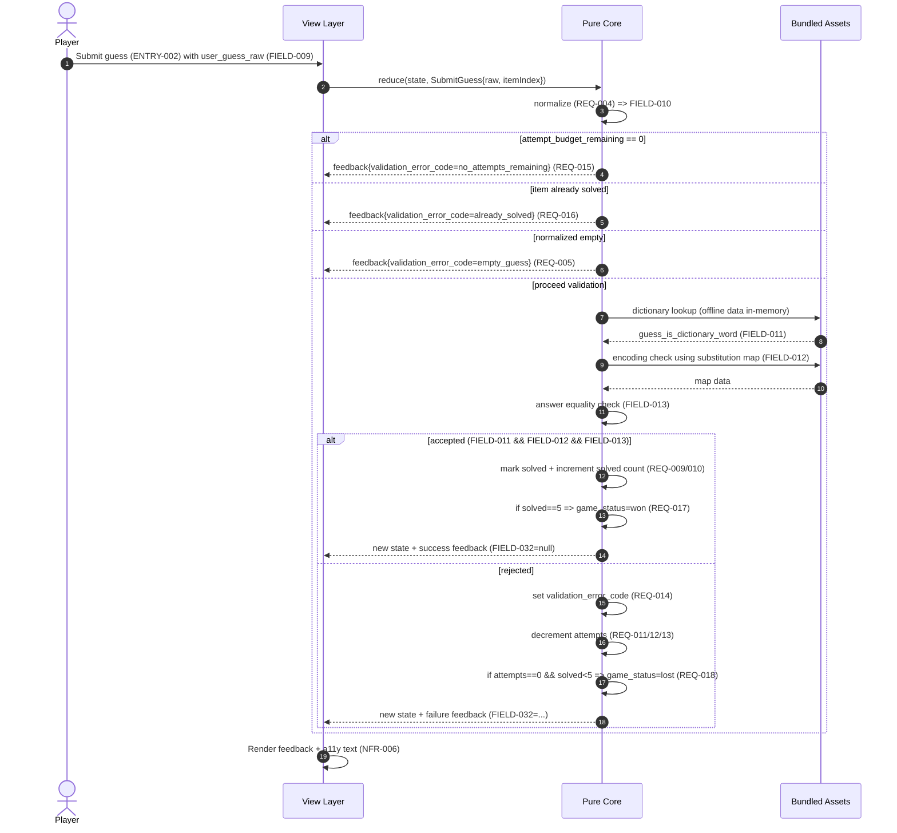
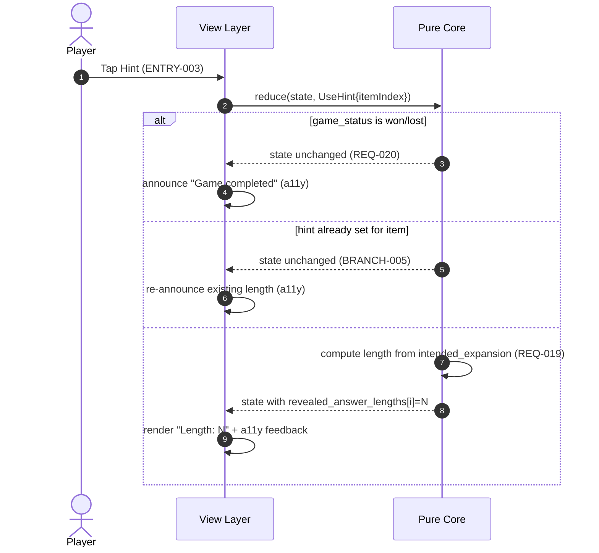
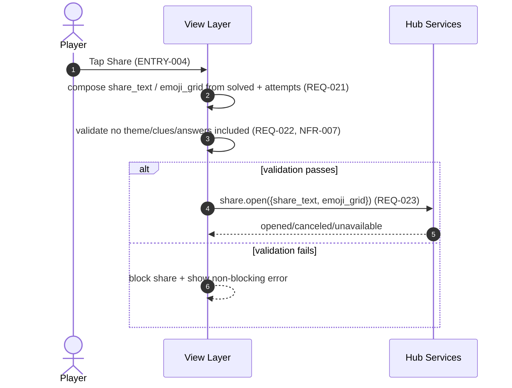

<!-- generated: 2026-07-24T10:30:13Z -->
<!-- mode: initial -->
<!-- feature-slug: numeronym -->
<!-- a2a-endpoint: https://bob-sdlc-orchestrator.2as6l7wq9qj8.eu-gb.codeengine.appdomain.cloud/v1/rpc -->

# Glossary

## Terms

### TERM-001: Numeronym
- **Definition:** A texting-style clue string where one or more letter sounds are replaced by digits or single letters according to a substitution map (e.g., `GR8`, `L8R`, `W8`, `B4`, `2NITE`).
- **Synonyms:** texting numeronym, digit-sound shorthand, clue string
- **Anti-definition (NOT):** Leetspeak (e.g., `H4X0R`) unless it is explicitly in the substitution map; a generic abbreviation without substitution rules.
- **Source:** User request

### TERM-002: Expansion
- **Definition:** The full intended answer word/phrase the player types that corresponds to a shown TERM-001 Numeronym and is validated by encoding-match plus answer-match rules.
- **Synonyms:** decoded word, full word, answer text
- **Anti-definition (NOT):** Any string that merely “looks right” but fails dictionary check, encoding-match, or intended-answer equality.
- **Source:** User request

### TERM-003: Substitution Map
- **Definition:** The bundled build-time mapping of token(s) (digits/letters) to one or more sound-alike expansions used for encoding checks (e.g., `8 -> ate|eight`, `4 -> for|four`, `2 -> to|too|two`, `1 -> one`).
- **Synonyms:** encoding map, phonetic map, token map
- **Anti-definition (NOT):** A runtime-updatable configuration fetched from a server.
- **Source:** User request

### TERM-004: Encoding
- **Definition:** The deterministic transformation that, given a candidate TERM-002 Expansion, generates one or more possible TERM-001 Numeronyms using TERM-003 Substitution Map; used to verify an “encoding match” with the displayed clue.
- **Synonyms:** encode function, numeronymization
- **Anti-definition (NOT):** Fuzzy matching, approximate phonetics, locale-dependent comparisons.
- **Source:** User request

### TERM-005: Encoding Match
- **Definition:** Boolean result that the displayed TERM-001 Numeronym is exactly one of the valid encodings produced from the candidate TERM-002 Expansion under TERM-003 Substitution Map and normalization rules.
- **Synonyms:** clue match, numeronym match
- **Anti-definition (NOT):** “Close enough” match; substring match; edit-distance match.
- **Source:** User request

### TERM-006: Dictionary
- **Definition:** A bundled offline wordlist used to determine whether a candidate TERM-002 Expansion is a “real dictionary word/expansion”.
- **Synonyms:** word list, lexicon
- **Anti-definition (NOT):** Online spellcheck; API-backed dictionary.
- **Source:** User request

### TERM-007: Theme
- **Definition:** The daily category/label that determines a specific group of five intended answers (e.g., “Travel”, “Food”, etc.) used for that day’s puzzle.
- **Synonyms:** daily theme, category
- **Anti-definition (NOT):** A visual UI theme (colors, styles).
- **Source:** User request

### TERM-008: Daily Puzzle
- **Definition:** The deterministic set for a given date comprising TERM-007 Theme plus exactly five (Numeronym, intended Expansion) pairs, attempt budget, and hint availability.
- **Synonyms:** today’s puzzle, daily set
- **Anti-definition (NOT):** An endless/random mode.
- **Source:** User request

### TERM-009: Puzzle Item
- **Definition:** One of the five entries in a TERM-008 Daily Puzzle consisting of a displayed TERM-001 Numeronym clue and its intended TERM-002 Expansion answer.
- **Synonyms:** row, clue-answer pair, entry
- **Anti-definition (NOT):** A guess attempt record.
- **Source:** User request

### TERM-010: Guess
- **Definition:** A user-submitted text attempt for the currently active TERM-009 Puzzle Item.
- **Synonyms:** attempt, submission
- **Anti-definition (NOT):** Auto-fill; hint reveal.
- **Source:** User request

### TERM-011: Attempt Budget
- **Definition:** The shared remaining number of incorrect TERM-010 Guesses allowed across the whole TERM-008 Daily Puzzle.
- **Synonyms:** lives, tries remaining
- **Anti-definition (NOT):** Per-item attempt counts that are independent.
- **Source:** User request

### TERM-012: Feedback
- **Definition:** The per-guess result information indicating (a) dictionary validity and (b) encoding match status; and whether the guess equals the intended answer.
- **Synonyms:** validation results, check results
- **Anti-definition (NOT):** Revealing the intended answer, theme, or other spoilers beyond the defined hint.
- **Source:** User request

### TERM-013: Hint
- **Definition:** A user-triggered aid that reveals the length (character count) of the intended TERM-002 Expansion for the current TERM-009 Puzzle Item.
- **Synonyms:** length hint
- **Anti-definition (NOT):** Revealing letters, the answer itself, or alternate valid expansions.
- **Source:** User request

### TERM-014: Game State
- **Definition:** The in-memory, pure, deterministic representation of progress for a TERM-008 Daily Puzzle (solved items, current item index, attempt budget remaining, hints used, completion state).
- **Synonyms:** session state, puzzle state
- **Anti-definition (NOT):** Persistent storage; hub stats store.
- **Source:** User request

### TERM-015: State Transition
- **Definition:** A pure function that takes TERM-014 Game State plus an input event (guess, hint, navigation) and outputs a new TERM-014 Game State plus TERM-012 Feedback.
- **Synonyms:** reducer, update function
- **Anti-definition (NOT):** Side-effecting transitions (writing storage, reading clock).
- **Source:** User request

### TERM-016: Deterministic Daily Selection
- **Definition:** The method to select the day’s TERM-008 Daily Puzzle using a hub-provided seedable hash, producing the same puzzle for the same seed/date across platforms.
- **Synonyms:** seeded selection, daily hash selection
- **Anti-definition (NOT):** Device-local randomness; time-zone dependent selection without explicit rules.
- **Source:** User request

### TERM-017: Hub Services
- **Definition:** CIC Games hub-provided APIs/utilities for deterministic seed/hash, local stats/streak persistence, and share-sheet integration.
- **Synonyms:** platform services, hub SDK
- **Anti-definition (NOT):** Remote backend services requiring connectivity.
- **Source:** User request

### TERM-018: Local Stats
- **Definition:** Persisted per-device aggregated metrics for the plugin (e.g., games played, wins, current streak, max streak), stored via TERM-017 Hub Services.
- **Synonyms:** player stats, history
- **Anti-definition (NOT):** Cloud-synced profile; account-based stats.
- **Source:** User request

### TERM-019: Streak
- **Definition:** Count of consecutive days the player completes the daily puzzle (win) according to hub-defined date boundaries and recorded via TERM-017 Hub Services.
- **Synonyms:** win streak
- **Anti-definition (NOT):** Session-based streak within a single day.
- **Source:** User request

### TERM-020: Spoiler-safe Share
- **Definition:** A shareable emoji/text summary that reveals only solved count and attempts used, and does not include words, numeronyms, or the theme.
- **Synonyms:** emoji grid share, result share
- **Anti-definition (NOT):** Sharing the puzzle content; including theme name; including clue strings.
- **Source:** User request

### TERM-021: Plugin
- **Definition:** The Numeronym game module integrated into the CIC Games hub as an offline-first PWA + Capacitor component implementing the required plugin interface.
- **Synonyms:** game plugin, module
- **Anti-definition (NOT):** Standalone app outside the hub.
- **Source:** User request

### TERM-022: GamePlugin Interface
- **Definition:** The hub contract that the plugin implements, including lifecycle hooks and separation between “pure core” logic and the view layer.
- **Synonyms:** plugin API, hub plugin contract
- **Anti-definition (NOT):** An ad-hoc integration without defined boundaries.
- **Source:** User request

### TERM-023: Pure Core
- **Definition:** Platform-independent deterministic logic implementing encoding/decoding checks, dictionary check, answer match, and state transitions; it does not access storage or clock.
- **Synonyms:** core engine, game logic
- **Anti-definition (NOT):** UI rendering; persistence; network calls; reading device time.
- **Source:** User request

### TERM-024: View Layer
- **Definition:** UI components that render the game and forward user actions to TERM-023 Pure Core; may call TERM-017 Hub Services for persistence/share.
- **Synonyms:** UI, front-end
- **Anti-definition (NOT):** Containing core validation rules.
- **Source:** User request

### TERM-025: Build-time Content Generation
- **Definition:** The pipeline step that uses TERM-003 Substitution Map plus themed answer groups to produce the bundled daily content set and uniqueness verification artifacts.
- **Synonyms:** content build, static generation
- **Anti-definition (NOT):** Runtime puzzle generation on device.
- **Source:** User request

### TERM-026: Uniqueness Gate
- **Definition:** A build-time check ensuring each produced TERM-001 Numeronym clue maps to exactly one common intended TERM-002 Expansion within its TERM-007 Theme.
- **Synonyms:** uniqueness validation, ambiguity check
- **Anti-definition (NOT):** Runtime conflict resolution; allowing multiple correct answers.
- **Source:** User request

### TERM-027: Attempt Consumption
- **Definition:** The rule that decrements TERM-011 Attempt Budget on incorrect guesses as defined by the game logic.
- **Synonyms:** spend attempt, lose a try
- **Anti-definition (NOT):** Decrementing on valid correct answers or on hint use (unless explicitly defined).
- **Source:** User request

### TERM-028: Accessibility Support
- **Definition:** Keyboard operability, screen-reader support, and non-color-dependent feedback in the view layer.
- **Synonyms:** a11y
- **Anti-definition (NOT):** Only color-based correctness indicators; mouse-only interaction.
- **Source:** User request

### TERM-029: Normalization
- **Definition:** Deterministic string preprocessing applied before validation (e.g., trim, case-fold) with explicitly defined rules used consistently across platforms.
- **Synonyms:** canonicalization
- **Anti-definition (NOT):** Locale-specific transformations that vary by platform without specification.
- **Source:** User request

### TERM-030: Daily Seed
- **Definition:** The seed input used by TERM-016 Deterministic Daily Selection (e.g., derived from hub seed + day identifier) to select the day’s theme/puzzle.
- **Synonyms:** selection seed
- **Anti-definition (NOT):** `Math.random()` or device entropy.
- **Source:** User request

## Data Dictionary

| ID | Name | Type | Format | Range/Enum | Units | Default | Nullable | PII | Source | Validation |
|---|---|---|---|---|---|---|---|---|---|---|
| FIELD-001 | puzzle_date_id | string | `YYYY-MM-DD` | valid date string | n/a | none | false | None | TERM-016 hub date rule | Must match regex `^\d{4}-\d{2}-\d{2}$` and be parseable to a calendar date |
| FIELD-002 | daily_seed | string | opaque | non-empty | n/a | none | false | None | TERM-017 hub services | Length 1..256; must be stable for same hub context |
| FIELD-003 | daily_selection_hash | string | hex/base64 (specified by hub) | non-empty | n/a | none | false | None | TERM-017 hub services | Must be deterministic function of FIELD-001 + FIELD-002 |
| FIELD-004 | theme_id | string | slug | `[a-z0-9-]+` | n/a | none | false | None | build content bundle | Must exist in bundled theme index |
| FIELD-005 | theme_name | string | UTF-8 | length 1..64 | n/a | none | false | None | build content bundle | Non-empty; used for display only (not share) |
| FIELD-006 | puzzle_item_index | integer | int | 0..4 | n/a | 0 | false | None | TERM-014 game state | Must be within item count |
| FIELD-007 | numeronym_clue | string | ASCII/UTF-8 | length 1..32 | n/a | none | false | None | build content bundle | Must match allowed token charset set by TERM-003 + letters; no whitespace unless specified |
| FIELD-008 | intended_expansion | string | UTF-8 | length 1..32 | n/a | none | false | None | build content bundle | Must be in TERM-006 dictionary; must pass TERM-026 uniqueness gate |
| FIELD-009 | user_guess_raw | string | UTF-8 | length 0..64 | n/a | empty | false | Potentially Sensitive (free text) | UI input | Must be capturable without crashing; may include spaces/punct (normalized later) |
| FIELD-010 | user_guess_normalized | string | UTF-8 | canonical | length 0..64 | n/a | empty | Potentially Sensitive | TERM-023 core | Must apply TERM-029 normalization (spec’d) |
| FIELD-011 | guess_is_dictionary_word | boolean | boolean | true/false | n/a | false | false | None | TERM-023 core | True iff FIELD-010 exists in TERM-006 dictionary |
| FIELD-012 | guess_encoding_matches_clue | boolean | boolean | true/false | n/a | false | false | None | TERM-023 core | True iff TERM-005 encoding match holds for FIELD-010 against FIELD-007 |
| FIELD-013 | guess_matches_intended_answer | boolean | boolean | true/false | n/a | false | false | None | TERM-023 core | True iff FIELD-010 equals normalized FIELD-008 |
| FIELD-014 | attempt_budget_total | integer | int | 1..99 | attempts | (config) | false | None | build/config | Must be >=1 |
| FIELD-015 | attempt_budget_remaining | integer | int | 0..FIELD-014 | attempts | FIELD-014 | false | None | TERM-014 game state | Must not go below 0 |
| FIELD-016 | incorrect_guess_count | integer | int | 0..999 | guesses | 0 | false | None | TERM-014 game state | Must increment only on incorrect guesses that consume attempts |
| FIELD-017 | solved_item_count | integer | int | 0..5 | items | 0 | false | None | TERM-014 game state | Must equal count of solved flags in items |
| FIELD-018 | item_solved_flags | boolean[] | array | length=5 | n/a | all false | false | None | TERM-014 game state | Array length must equal item count |
| FIELD-019 | revealed_answer_lengths | integer[] | array | length=5 | characters | 0 | false | None | TERM-014 game state | Each entry is 0 (not revealed) or equals length of intended answer for that item |
| FIELD-020 | current_input_target | enum | string | `current-item` \| `any-unsolved` | n/a | `current-item` | false | None | UI/config | Must be one of enum values |
| FIELD-021 | game_status | enum | string | `in_progress` \| `won` \| `lost` | n/a | `in_progress` | false | None | TERM-014 game state | Must transition per rules; terminal states immutable |
| FIELD-022 | completion_timestamp_local | string | ISO-8601 | ISO datetime | n/a | none | true | None | TERM-017 hub services | If present must be ISO-8601 parseable |
| FIELD-023 | stats_games_played | integer | int | 0..2^31-1 | games | 0 | false | None | TERM-017 hub services | Must be non-decreasing |
| FIELD-024 | stats_wins | integer | int | 0..2^31-1 | wins | 0 | false | None | TERM-017 hub services | Must be <= games played |
| FIELD-025 | streak_current | integer | int | 0..36500 | days | 0 | false | None | TERM-017 hub services | Updated only on win; hub defines boundaries |
| FIELD-026 | streak_max | integer | int | 0..36500 | days | 0 | false | None | TERM-017 hub services | Must be >= current streak |
| FIELD-027 | share_text | string | UTF-8 | length 1..512 | n/a | none | false | None | TERM-024 view | Must not include FIELD-007, FIELD-008, FIELD-005 |
| FIELD-028 | share_emoji_grid | string | UTF-8 | lines of emoji | length 1..256 | n/a | none | false | None | TERM-024 view | Must encode only solved/attempts summary (no clues/answers/theme) |
| FIELD-029 | dictionary_version | string | semver/hash | non-empty | n/a | none | false | None | build artifact | Must match bundled dictionary checksum metadata |
| FIELD-030 | content_bundle_version | string | semver/hash | non-empty | n/a | none | false | None | build artifact | Must match bundled puzzle content metadata |
| FIELD-031 | substitution_map_version | string | semver/hash | non-empty | n/a | none | false | None | build artifact | Must match bundled TERM-003 map metadata |
| FIELD-032 | validation_error_code | enum | string | `empty_guess` \| `not_in_dictionary` \| `encoding_mismatch` \| `wrong_answer` \| `no_attempts_remaining` \| `already_solved` | n/a | none | true | None | TERM-023 core | Must be null on correct guess acceptance |
| FIELD-033 | a11y_feedback_text | string | UTF-8 | length 0..256 | n/a | empty | false | None | TERM-024 view | Must be non-color-dependent description of outcome |
| FIELD-034 | build_uniqueness_result | enum | string | `pass` \| `fail` | n/a | none | false | None | build pipeline | Must be `pass` for shipping bundle |
| FIELD-035 | ambiguity_count | integer | int | 0..9999 | matches | 0 | false | None | build pipeline | Must equal number of expansions matching same clue within a theme |

**FIELD-to-TERM ownership (cross-link):**
- TERM-008 Daily Puzzle: FIELD-001..006, 014, 021
- TERM-009 Puzzle Item: FIELD-006..008, 018, 019
- TERM-010 Guess: FIELD-009..013, 032
- TERM-011 Attempt Budget: FIELD-014..016
- TERM-007 Theme: FIELD-004, FIELD-005
- TERM-016 Deterministic Daily Selection: FIELD-001..003
- TERM-020 Spoiler-safe Share: FIELD-027, FIELD-028
- TERM-018/019 Stats/Streak: FIELD-022..026
- TERM-003 Substitution Map: FIELD-031
- TERM-006 Dictionary: FIELD-029
- TERM-025/026 Build-time + Gate: FIELD-030, FIELD-034, FIELD-035


# User Journeys

## Roles

| Role ID | Role Name | Type | Description |
|---|---|---|---|
| ROLE-001 | Player | Primary | Plays the TERM-008 Daily Puzzle via TERM-024 View Layer |
| ROLE-002 | Hub Services | System | Provides TERM-016 selection inputs and TERM-018 stats/streak persistence and share integration |
| ROLE-003 | Build Pipeline | System | Produces bundled content via TERM-025 and enforces TERM-026 Uniqueness Gate |
| ROLE-004 | Screen Reader | Secondary/System | Consumes TERM-033 a11y feedback output from the view |

## Entry Points

| Entry ID | Location | Trigger | Auth |
|---|---|---|---|
| ENTRY-001 | UI route `/games/numeronym/daily` | Player opens plugin in hub | Hub session (no account required by plugin) |
| ENTRY-002 | UI action “Submit guess” | Player presses Enter/clicks Submit | Same as ENTRY-001 |
| ENTRY-003 | UI action “Use hint” | Player selects Hint button | Same as ENTRY-001 |
| ENTRY-004 | UI action “Share” | Player selects Share button | Same as ENTRY-001 |
| ENTRY-005 | Plugin init hook `GamePlugin.init()` | Hub loads plugin | Hub-managed |
| ENTRY-006 | Build step `generate-content` | CI/build runs | Build identity |

## Role Permission Matrix

| Capability | ROLE-001 Player | ROLE-002 Hub Services | ROLE-003 Build Pipeline | ROLE-004 Screen Reader |
|---|---|---|---|---|
| View today’s TERM-008 Daily Puzzle | R | n/a | n/a | R (via a11y text) |
| Submit TERM-010 Guess | C | n/a | n/a | n/a |
| Receive TERM-012 Feedback | R | n/a | n/a | R |
| Consume TERM-011 Attempt Budget | R | n/a | n/a | n/a |
| Use TERM-013 Hint | C/R | n/a | n/a | R |
| Persist TERM-018 Local Stats | n/a | C/U | n/a | n/a |
| Generate TERM-020 Spoiler-safe Share | C/R | R (share sheet) | n/a | R (via a11y text) |
| Generate and validate content bundle | n/a | n/a | C/U | n/a |

## Journeys

### JOURNEY-001: Open daily puzzle (deterministic selection)
- **Role/Goal:** ROLE-001 Player; view today’s TERM-008 Daily Puzzle with five TERM-009 Puzzle Items.
- **Entry:** ENTRY-001, ENTRY-005
- **Happy path:**
  1. System obtains FIELD-001 `puzzle_date_id` from hub-defined rule (TERM-016).  
  2. System obtains FIELD-002 `daily_seed` from TERM-017 Hub Services.
  3. TERM-023 Pure Core computes FIELD-003 `daily_selection_hash` deterministically from FIELD-001 + FIELD-002 (TERM-016).
  4. System selects FIELD-004 `theme_id` and five items (FIELD-007 `numeronym_clue`, FIELD-008 `intended_expansion`) from the bundled content (TERM-025) using FIELD-003.
  5. System initializes TERM-014 Game State with FIELD-015 `attempt_budget_remaining` = FIELD-014, FIELD-018 all false, FIELD-021 `game_status`=`in_progress`.
  6. TERM-024 View Layer renders FIELD-005 `theme_name` (if allowed), five FIELD-007 clues, and input for FIELD-009 for the current FIELD-006 index.
- **BRANCH-001 (existing in-progress state in hub storage):**
  - If hub persistence returns an existing saved progress snapshot, the view restores it into TERM-014 Game State (as allowed by hub) rather than reinitializing.
- **ERROR-001 (missing/invalid bundle):**
  - **Trigger:** content bundle metadata FIELD-030 fails validation or cannot load.
  - **System response:** show non-blocking error message; disable gameplay.
  - **Recovery:** prompt to reinstall/update; allow retry load.
- **EDGE-001 (timezone boundary):**
  - Daily selection uses FIELD-001 per hub-defined date boundary; device timezone changes must not affect selection if hub date rule is stable.
- **EDGE-002 (offline mode):**
  - No network calls; puzzle loads from bundle and hub seed service (offline-capable).

### JOURNEY-002: Submit a guess and receive feedback
- **Role/Goal:** ROLE-001 Player; solve items by entering correct TERM-002 Expansions; consume shared TERM-011 Attempt Budget on incorrect guesses.
- **Entry:** ENTRY-002
- **Happy path:**
  1. Player types FIELD-009 `user_guess_raw` for current FIELD-006 `puzzle_item_index`.
  2. TERM-023 core normalizes to FIELD-010 `user_guess_normalized` (TERM-029).
  3. TERM-023 core checks FIELD-011 `guess_is_dictionary_word` against TERM-006 Dictionary.
  4. TERM-023 core checks FIELD-012 `guess_encoding_matches_clue` by encoding FIELD-010 using TERM-003 Substitution Map and comparing against the current FIELD-007 (TERM-005).
  5. TERM-023 core checks FIELD-013 `guess_matches_intended_answer` by comparing FIELD-010 to normalized FIELD-008.
  6. If FIELD-011, FIELD-012, FIELD-013 are true, system marks FIELD-018[current]=true and increments FIELD-017.
  7. View fills in the solved word display for that item and advances FIELD-006 to the next unsolved item (or stays if configuration FIELD-020=`current-item` and no next).
- **BRANCH-002 (dictionary fail):**
  - If FIELD-011=false, set FIELD-032=`not_in_dictionary`, do not solve item, consume attempt per TERM-027 rules.
- **BRANCH-003 (encoding mismatch):**
  - If FIELD-011=true and FIELD-012=false, set FIELD-032=`encoding_mismatch`, do not solve item, consume attempt per TERM-027.
- **BRANCH-004 (wrong answer but encodes):**
  - If FIELD-011=true and FIELD-012=true and FIELD-013=false, set FIELD-032=`wrong_answer`, do not solve item, consume attempt per TERM-027.
- **ERROR-002 (no attempts remaining):**
  - **Trigger:** FIELD-015=0 and player submits a guess.
  - **System response:** set FIELD-032=`no_attempts_remaining`; reject submission; keep state unchanged; show end state CTA.
  - **Recovery:** allow share; allow navigate away.
- **ERROR-003 (already solved item):**
  - **Trigger:** submit guess when FIELD-018[current]=true.
  - **System response:** set FIELD-032=`already_solved`; no attempt consumed.
  - **Recovery:** auto-advance to next unsolved item.
- **LOOP-001 (repeat guessing):**
  - Player repeats ENTRY-002 until FIELD-017=5 (win) or FIELD-015=0 (loss).
- **EDGE-003 (empty guess):**
  - FIELD-010 is empty after normalization; set FIELD-032=`empty_guess`; do not consume attempt.
- **EDGE-004 (case/punctuation differences):**
  - Normalization must ensure consistent results across platforms (TERM-029), affecting FIELD-010 comparisons in steps 3–5.
- **EDGE-005 (concurrency/double submit):**
  - Rapid double submission must not decrement FIELD-015 twice for the same UI event.

### JOURNEY-003: Use hint (reveal answer length)
- **Role/Goal:** ROLE-001 Player; get TERM-013 Hint revealing length for current item without spoilers.
- **Entry:** ENTRY-003
- **Happy path:**
  1. Player triggers hint for current FIELD-006.
  2. System reads FIELD-008 intended expansion for current item (bundle) and computes its character length.
  3. System stores length in FIELD-019[current] and renders “Length: N”.
  4. View emits FIELD-033 a11y text describing the revealed length.
- **BRANCH-005 (hint re-used):**
  - If FIELD-019[current] already non-zero, system does not change state; re-announces length.
- **ERROR-004 (hint while game over):**
  - **Trigger:** FIELD-021 is `won` or `lost`.
  - **System response:** ignore hint action; provide a11y message “Game completed”.
  - **Recovery:** none.
- **EDGE-006 (multi-word expansions):**
  - If expansions can include spaces/hyphens, “length” must be defined consistently (characters vs letters-only) and used deterministically.

### JOURNEY-004: Win/lose and update local stats
- **Role/Goal:** ROLE-001 Player; finish puzzle, record TERM-018 Local Stats/TERM-019 Streak via hub.
- **Entry:** Implicit after JOURNEY-002 loop; also on re-open (ENTRY-001)
- **Happy path (win):**
  1. When FIELD-017 becomes 5, TERM-023 sets FIELD-021=`won`.
  2. View requests TERM-017 Hub Services to increment FIELD-023 games played and FIELD-024 wins and update FIELD-025/FIELD-026 streak values.
  3. Hub stores FIELD-022 completion timestamp (hub-defined) for streak computation.
- **Happy path (loss):**
  1. When an incorrect guess consumes the last attempt and FIELD-015 becomes 0 while FIELD-017<5, TERM-023 sets FIELD-021=`lost`.
  2. View requests TERM-017 Hub Services to increment FIELD-023 games played (wins unchanged).
- **ERROR-005 (stats persistence failure):**
  - **Trigger:** hub stats write fails (e.g., storage quota).
  - **System response:** show message; gameplay result remains; queue retry in memory until app close.
  - **Recovery:** retry button.
- **EDGE-007 (re-opening after completion):**
  - Opening the same day’s puzzle must not double-increment stats.

### JOURNEY-005: Spoiler-safe share
- **Role/Goal:** ROLE-001 Player; share result without spoilers using TERM-020 Spoiler-safe Share.
- **Entry:** ENTRY-004
- **Happy path:**
  1. Player taps Share.
  2. View composes FIELD-027 share text and/or FIELD-028 emoji grid containing only FIELD-017 solved count and attempts used derived from FIELD-014 and FIELD-015 (and optionally FIELD-021).
  3. View validates that FIELD-027/FIELD-028 does not include FIELD-007, FIELD-008, or FIELD-005.
  4. View calls TERM-017 Hub Services share sheet with FIELD-027 and/or FIELD-028.
- **ERROR-006 (share canceled/unavailable):**
  - **Trigger:** platform share sheet not available or user cancels.
  - **System response:** no state change; show non-blocking notice.
  - **Recovery:** copy-to-clipboard fallback if provided by hub.
- **EDGE-008 (share before completion):**
  - Sharing while FIELD-021=`in_progress` must still be spoiler-safe (e.g., “3/5, attempts used: 2”).

## Journey Map

```mermaid
flowchart TD
  A[ENTRY-001 Open /daily] --> B[JOURNEY-001 Select daily puzzle (FIELD-001..003)]
  B --> C[Render clues (FIELD-007 x5) + state init (FIELD-014..021)]
  C --> D[ENTRY-002 Submit guess]
  D --> E{Dictionary? FIELD-011}
  E -- no --> E1[BRANCH-002 not_in_dictionary; maybe consume attempt]
  E -- yes --> F{Encoding match? FIELD-012}
  F -- no --> F1[BRANCH-003 encoding_mismatch; maybe consume attempt]
  F -- yes --> G{Equals intended? FIELD-013}
  G -- no --> G1[BRANCH-004 wrong_answer; consume attempt]
  G -- yes --> H[Mark solved (FIELD-018), increment (FIELD-017)]
  H --> I{Solved all 5?}
  I -- yes --> J[Set status won; JOURNEY-004 persist stats]
  I -- no --> K{Attempts remaining? FIELD-015}
  K -- yes --> C
  K -- no --> L[Set status lost; JOURNEY-004 persist stats]
  C --> M[ENTRY-003 Hint] --> N[JOURNEY-003 reveal length (FIELD-019)]
  J --> S[ENTRY-004 Share] --> T[JOURNEY-005 spoiler-safe share]
  L --> S
  C --> S
```


# Requirements

### REQ-001: Deterministic daily puzzle selection from hub seed
- **EARS Pattern:** Event-Driven
- **EARS Statement:** When the plugin is initialized via ENTRY-005, the TERM-023 Pure Core shall compute FIELD-003 `daily_selection_hash` deterministically from FIELD-001 `puzzle_date_id` and FIELD-002 `daily_seed`.
- **Inputs:** FIELD-001, FIELD-002
- **Outputs:** FIELD-003
- **Preconditions:** FIELD-001 and FIELD-002 are available from TERM-017 Hub Services
- **Postconditions:** FIELD-003 is stable for same FIELD-001+FIELD-002
- **Invariants:** No access to device clock inside TERM-023 Pure Core
- **Trigger:** ENTRY-005
- **Actor:** ROLE-002 Hub Services (provides inputs), ROLE-001 indirectly
- **EntityScope:** TERM-016 Deterministic Daily Selection
- **ErrorModes:** `validation_error_code` not used (null)
- **NFR-Tags:** determinism, compatibility
- **Source:** JOURNEY-001 step 1-4
- **Dependencies:** NFR-003 (cross-platform determinism spec)
- **Priority:** P0
- **AcceptanceCriteria:**
  - **TEST-001:** Given identical FIELD-001 and FIELD-002 on two platforms, when computing FIELD-003, then FIELD-003 is identical.
  - **TEST-002:** Given different FIELD-001 values with same FIELD-002, when computing FIELD-003, then FIELD-003 differs.
  - **TEST-003:** Given different FIELD-002 values with same FIELD-001, when computing FIELD-003, then FIELD-003 differs.
- **Assumptions:** Hub defines how FIELD-001 is derived.
- **OpenQuestions:** What exact hash format is required (hex vs base64)?

### REQ-002: Select daily theme and five items from bundled content
- **EARS Pattern:** Event-Driven
- **EARS Statement:** When FIELD-003 `daily_selection_hash` is computed, the system shall select one FIELD-004 `theme_id` and five TERM-009 Puzzle Items from the bundled content using FIELD-003.
- **Inputs:** FIELD-003, bundled content (FIELD-030)
- **Outputs:** FIELD-004, five sets of FIELD-007 and FIELD-008
- **Preconditions:** Content bundle loads successfully
- **Postconditions:** Exactly 5 items are available for the daily puzzle
- **Invariants:** No network calls are required for selection
- **Trigger:** Completion of REQ-001
- **Actor:** ROLE-002 System
- **EntityScope:** TERM-008 Daily Puzzle
- **ErrorModes:** missing/invalid bundle (surfaced by UI, see NFR-006 observability)
- **NFR-Tags:** offline, determinism
- **Source:** JOURNEY-001 step 4
- **Dependencies:** REQ-001, NFR-004 (offline)
- **Priority:** P0
- **AcceptanceCriteria:**
  - **TEST-004:** Given a valid bundle and FIELD-003, when selecting, then exactly five FIELD-007 values and five FIELD-008 values are returned.
  - **TEST-005:** Given the same FIELD-003, when selecting twice, then the same theme and items are returned.
  - **TEST-006:** Given a bundle missing the selected theme_id, when selecting, then the UI enters an error state (ERROR-001).
- **Assumptions:** Bundle provides deterministic indexable structure.
- **OpenQuestions:** Are puzzles pre-generated per day or selected from theme pools?

### REQ-003: Initialize game state for the selected puzzle
- **EARS Pattern:** Event-Driven
- **EARS Statement:** When the daily puzzle items are loaded, the TERM-023 Pure Core shall initialize TERM-014 Game State with FIELD-015 `attempt_budget_remaining` set to FIELD-014 `attempt_budget_total` and FIELD-021 `game_status` set to `in_progress`.
- **Inputs:** FIELD-014, selected items
- **Outputs:** FIELD-015, FIELD-018, FIELD-017, FIELD-021
- **Preconditions:** REQ-002 completed
- **Postconditions:** FIELD-018 length is 5 and all false; FIELD-017 is 0
- **Invariants:** TERM-023 Pure Core performs no storage I/O
- **Trigger:** Completion of REQ-002
- **Actor:** ROLE-002 System
- **EntityScope:** TERM-014 Game State
- **ErrorModes:** none
- **NFR-Tags:** determinism
- **Source:** JOURNEY-001 step 5
- **Dependencies:** REQ-002
- **Priority:** P0
- **AcceptanceCriteria:**
  - **TEST-007:** Given FIELD-014=6, when initializing, then FIELD-015=6 and FIELD-021=`in_progress`.
  - **TEST-008:** When initializing, then FIELD-018 is an array length 5 with all values false.
  - **TEST-009:** When initializing, then FIELD-017=0.
- **Assumptions:** Attempt total is configured and bundled.
- **OpenQuestions:** What is the attempt budget total value?

### REQ-004: Normalize guess input deterministically
- **EARS Pattern:** Event-Driven
- **EARS Statement:** When the player submits FIELD-009 `user_guess_raw`, the TERM-023 Pure Core shall produce FIELD-010 `user_guess_normalized` using TERM-029 Normalization rules.
- **Inputs:** FIELD-009
- **Outputs:** FIELD-010
- **Preconditions:** FIELD-021=`in_progress`
- **Postconditions:** FIELD-010 is used for all subsequent checks
- **Invariants:** Normalization does not depend on locale-specific platform APIs unless specified
- **Trigger:** ENTRY-002
- **Actor:** ROLE-001 Player
- **EntityScope:** TERM-010 Guess
- **ErrorModes:** none
- **NFR-Tags:** determinism, compatibility
- **Source:** JOURNEY-002 step 1-2, EDGE-004
- **Dependencies:** NFR-003
- **Priority:** P0
- **AcceptanceCriteria:**
  - **TEST-010:** Given ` user_guess_raw = " Great "`, when normalizing, then FIELD-010 equals the canonical form (per spec).
  - **TEST-011:** Given the same raw input across platforms, when normalizing, then FIELD-010 is identical.
  - **TEST-012:** Given empty/whitespace input, when normalizing, then FIELD-010 is empty.
- **Assumptions:** Normalization spec will define case-folding and allowed characters.
- **OpenQuestions:** Are spaces/hyphens allowed in expansions?

### REQ-005: Reject empty guess without consuming attempts
- **EARS Pattern:** Event-Driven
- **EARS Statement:** When FIELD-010 `user_guess_normalized` is empty, the TERM-023 Pure Core shall set FIELD-032 `validation_error_code` to `empty_guess`.
- **Inputs:** FIELD-010
- **Outputs:** FIELD-032
- **Preconditions:** FIELD-021=`in_progress`
- **Postconditions:** FIELD-015 unchanged
- **Invariants:** No item solve flags are changed
- **Trigger:** ENTRY-002 after REQ-004
- **Actor:** ROLE-001 Player
- **EntityScope:** TERM-010 Guess
- **ErrorModes:** `empty_guess`
- **NFR-Tags:** usability, accessibility
- **Source:** JOURNEY-002 EDGE-003
- **Dependencies:** REQ-004
- **Priority:** P0
- **AcceptanceCriteria:**
  - **TEST-013:** Given FIELD-010 empty, when submitting, then FIELD-032=`empty_guess`.
  - **TEST-014:** Given FIELD-010 empty, then FIELD-015 does not decrement.
  - **TEST-015:** Given FIELD-010 empty, then FIELD-018 does not change.
- **Assumptions:** UI will display error state.
- **OpenQuestions:** Should empty guess clear previous feedback?

### REQ-006: Dictionary validation for a guess
- **EARS Pattern:** Event-Driven
- **EARS Statement:** When FIELD-010 `user_guess_normalized` is non-empty, the TERM-023 Pure Core shall set FIELD-011 `guess_is_dictionary_word` to true iff FIELD-010 exists in the bundled TERM-006 Dictionary.
- **Inputs:** FIELD-010, FIELD-029
- **Outputs:** FIELD-011
- **Preconditions:** FIELD-021=`in_progress`
- **Postconditions:** FIELD-011 available for feedback logic
- **Invariants:** Dictionary lookup is offline
- **Trigger:** ENTRY-002 after REQ-004
- **Actor:** ROLE-001 Player
- **EntityScope:** TERM-006 Dictionary
- **ErrorModes:** none
- **NFR-Tags:** offline, determinism
- **Source:** JOURNEY-002 step 3
- **Dependencies:** REQ-004
- **Priority:** P0
- **AcceptanceCriteria:**
  - **TEST-016:** Given FIELD-010 is a dictionary entry, when validating, then FIELD-011=true.
  - **TEST-017:** Given FIELD-010 is not a dictionary entry, when validating, then FIELD-011=false.
  - **TEST-018:** Given offline mode, when validating, then no network calls are made.
- **Assumptions:** Dictionary contains the intended answers.
- **OpenQuestions:** Are multi-word phrases allowed in the dictionary?

### REQ-007: Encoding-match validation for a guess against the displayed clue
- **EARS Pattern:** Event-Driven
- **EARS Statement:** When FIELD-010 `user_guess_normalized` is non-empty, the TERM-023 Pure Core shall set FIELD-012 `guess_encoding_matches_clue` to true iff FIELD-007 `numeronym_clue` is one of the valid encodings of FIELD-010 produced using TERM-003 Substitution Map.
- **Inputs:** FIELD-010, FIELD-007, TERM-003 map (FIELD-031)
- **Outputs:** FIELD-012
- **Preconditions:** FIELD-021=`in_progress`
- **Postconditions:** FIELD-012 available for feedback logic
- **Invariants:** Encoding uses only deterministic string operations
- **Trigger:** ENTRY-002 after REQ-004
- **Actor:** ROLE-001 Player
- **EntityScope:** TERM-005 Encoding Match
- **ErrorModes:** none
- **NFR-Tags:** determinism, compatibility
- **Source:** JOURNEY-002 step 4
- **Dependencies:** REQ-004, NFR-003
- **Priority:** P0
- **AcceptanceCriteria:**
  - **TEST-019:** Given FIELD-010=`great` and FIELD-007=`GR8`, when validating, then FIELD-012=true (subject to normalization/token rules).
  - **TEST-020:** Given FIELD-010=`later` and FIELD-007=`GR8`, when validating, then FIELD-012=false.
  - **TEST-021:** Given the same inputs on two platforms, when validating, then FIELD-012 results are identical.
- **Assumptions:** Encoding algorithm enumerates valid substitutions deterministically.
- **OpenQuestions:** Are partial substitutions allowed (e.g., `W8` vs `WAIT`)?

### REQ-008: Answer equality validation
- **EARS Pattern:** Event-Driven
- **EARS Statement:** When FIELD-010 `user_guess_normalized` is available, the TERM-023 Pure Core shall set FIELD-013 `guess_matches_intended_answer` to true iff FIELD-010 equals the normalized FIELD-008 `intended_expansion` for the current TERM-009 Puzzle Item.
- **Inputs:** FIELD-010, FIELD-008, FIELD-006
- **Outputs:** FIELD-013
- **Preconditions:** FIELD-021=`in_progress`
- **Postconditions:** FIELD-013 available for accept/reject decision
- **Invariants:** Equality comparison is deterministic
- **Trigger:** ENTRY-002 after REQ-004
- **Actor:** ROLE-001 Player
- **EntityScope:** TERM-002 Expansion
- **ErrorModes:** none
- **NFR-Tags:** determinism
- **Source:** JOURNEY-002 step 5
- **Dependencies:** REQ-004
- **Priority:** P0
- **AcceptanceCriteria:**
  - **TEST-022:** Given FIELD-010 equals intended, when validating, then FIELD-013=true.
  - **TEST-023:** Given FIELD-010 differs by at least one character, when validating, then FIELD-013=false.
  - **TEST-024:** Given identical inputs across platforms, then FIELD-013 is identical.
- **Assumptions:** Intended expansions are normalized consistently with guesses.
- **OpenQuestions:** Is case-insensitive equality sufficient?

### REQ-009: Accept correct guess and mark item solved
- **EARS Pattern:** Event-Driven
- **EARS Statement:** When FIELD-011, FIELD-012, and FIELD-013 are true for the current TERM-009 Puzzle Item, the TERM-023 Pure Core shall set FIELD-018 at FIELD-006 to true.
- **Inputs:** FIELD-011, FIELD-012, FIELD-013, FIELD-006
- **Outputs:** FIELD-018
- **Preconditions:** FIELD-021=`in_progress`
- **Postconditions:** Item is solved
- **Invariants:** FIELD-015 does not decrement on correct acceptance
- **Trigger:** ENTRY-002 after REQ-006..REQ-008
- **Actor:** ROLE-001 Player
- **EntityScope:** TERM-009 Puzzle Item
- **ErrorModes:** none
- **NFR-Tags:** determinism
- **Source:** JOURNEY-002 step 6
- **Dependencies:** REQ-006, REQ-007, REQ-008
- **Priority:** P0
- **AcceptanceCriteria:**
  - **TEST-025:** Given all three booleans true, when submitting, then FIELD-018[current]=true.
  - **TEST-026:** Given FIELD-018[current] becomes true, then FIELD-015 remains unchanged.
  - **TEST-027:** Given FIELD-018[current] already true, then no change occurs (see REQ-013).
- **Assumptions:** Only one current item index is active.
- **OpenQuestions:** Should solving auto-advance be in core or view?

### REQ-010: Increment solved item count on solve
- **EARS Pattern:** Event-Driven
- **EARS Statement:** When FIELD-018 at FIELD-006 transitions from false to true, the TERM-023 Pure Core shall increment FIELD-017 `solved_item_count` by 1.
- **Inputs:** FIELD-018, FIELD-006
- **Outputs:** FIELD-017
- **Preconditions:** FIELD-017 reflects count of solved flags before transition
- **Postconditions:** FIELD-017 updated
- **Invariants:** FIELD-017 equals the count of true values in FIELD-018
- **Trigger:** Solve transition
- **Actor:** ROLE-001 Player
- **EntityScope:** TERM-014 Game State
- **ErrorModes:** none
- **NFR-Tags:** correctness
- **Source:** JOURNEY-002 step 6
- **Dependencies:** REQ-009
- **Priority:** P0
- **AcceptanceCriteria:**
  - **TEST-028:** Given FIELD-017=2 and one new solve occurs, then FIELD-017=3.
  - **TEST-029:** Given two items already solved, recomputing count equals FIELD-017.
  - **TEST-030:** Given repeated submission on already-solved item, FIELD-017 does not increment.
- **Assumptions:** State transition knows whether a solve is new.
- **OpenQuestions:** None.

### REQ-011: Consume one attempt on incorrect guess that is non-empty
- **EARS Pattern:** Event-Driven
- **EARS Statement:** When a submitted guess is rejected with FIELD-032 equal to `not_in_dictionary`, the TERM-023 Pure Core shall decrement FIELD-015 `attempt_budget_remaining` by 1.
- **Inputs:** FIELD-032, FIELD-015
- **Outputs:** FIELD-015
- **Preconditions:** FIELD-021=`in_progress` and FIELD-015>0
- **Postconditions:** FIELD-015 reduced by 1
- **Invariants:** FIELD-015 must not go below 0
- **Trigger:** Guess rejection with `not_in_dictionary`
- **Actor:** ROLE-001 Player
- **EntityScope:** TERM-011 Attempt Budget
- **ErrorModes:** `not_in_dictionary`
- **NFR-Tags:** correctness
- **Source:** JOURNEY-002 BRANCH-002
- **Dependencies:** REQ-006, REQ-014
- **Priority:** P0
- **AcceptanceCriteria:**
  - **TEST-031:** Given FIELD-015=3 and FIELD-032=`not_in_dictionary`, then FIELD-015=2.
  - **TEST-032:** Given FIELD-015=1 and FIELD-032=`not_in_dictionary`, then FIELD-015=0.
  - **TEST-033:** Given FIELD-015=0, then decrement does not occur (see REQ-015).
- **Assumptions:** Not-in-dictionary counts as an incorrect guess.
- **OpenQuestions:** Should encoding mismatch also consume attempts? (specified below)

### REQ-012: Consume one attempt on encoding mismatch
- **EARS Pattern:** Event-Driven
- **EARS Statement:** When a submitted guess is rejected with FIELD-032 equal to `encoding_mismatch`, the TERM-023 Pure Core shall decrement FIELD-015 `attempt_budget_remaining` by 1.
- **Inputs:** FIELD-032, FIELD-015
- **Outputs:** FIELD-015
- **Preconditions:** FIELD-021=`in_progress` and FIELD-015>0
- **Postconditions:** FIELD-015 reduced by 1
- **Invariants:** FIELD-015 must not go below 0
- **Trigger:** Guess rejection with `encoding_mismatch`
- **Actor:** ROLE-001 Player
- **EntityScope:** TERM-011 Attempt Budget
- **ErrorModes:** `encoding_mismatch`
- **NFR-Tags:** correctness
- **Source:** JOURNEY-002 BRANCH-003
- **Dependencies:** REQ-007, REQ-014
- **Priority:** P0
- **AcceptanceCriteria:**
  - **TEST-034:** Given FIELD-015=3 and FIELD-032=`encoding_mismatch`, then FIELD-015=2.
  - **TEST-035:** Given FIELD-015=0, then attempt is not decremented.
  - **TEST-036:** Given an encoding mismatch, then FIELD-018 does not change.
- **Assumptions:** Encoding mismatch counts as an incorrect guess.
- **OpenQuestions:** None.

### REQ-013: Consume one attempt on wrong answer that encodes
- **EARS Pattern:** Event-Driven
- **EARS Statement:** When a submitted guess is rejected with FIELD-032 equal to `wrong_answer`, the TERM-023 Pure Core shall decrement FIELD-015 `attempt_budget_remaining` by 1.
- **Inputs:** FIELD-032, FIELD-015
- **Outputs:** FIELD-015
- **Preconditions:** FIELD-021=`in_progress` and FIELD-015>0
- **Postconditions:** FIELD-015 reduced by 1
- **Invariants:** FIELD-015 must not go below 0
- **Trigger:** Guess rejection with `wrong_answer`
- **Actor:** ROLE-001 Player
- **EntityScope:** TERM-011 Attempt Budget
- **ErrorModes:** `wrong_answer`
- **NFR-Tags:** correctness
- **Source:** JOURNEY-002 BRANCH-004
- **Dependencies:** REQ-008, REQ-014
- **Priority:** P0
- **AcceptanceCriteria:**
  - **TEST-037:** Given FIELD-032=`wrong_answer` and FIELD-015=2, then FIELD-015=1.
  - **TEST-038:** Given FIELD-015=0, then attempt is not decremented.
  - **TEST-039:** Given wrong_answer, then FIELD-017 does not increment.
- **Assumptions:** Encodes-but-wrong is still incorrect.
- **OpenQuestions:** None.

### REQ-014: Emit validation error code for rejected non-empty guesses
- **EARS Pattern:** Event-Driven
- **EARS Statement:** When a non-empty guess is not accepted, the TERM-023 Pure Core shall set FIELD-032 `validation_error_code` to exactly one of `not_in_dictionary`, `encoding_mismatch`, or `wrong_answer`.
- **Inputs:** FIELD-011, FIELD-012, FIELD-013
- **Outputs:** FIELD-032
- **Preconditions:** FIELD-021=`in_progress`
- **Postconditions:** FIELD-032 non-null
- **Invariants:** FIELD-032 is null on accepted guess
- **Trigger:** ENTRY-002 after REQ-006..REQ-008
- **Actor:** ROLE-001 Player
- **EntityScope:** TERM-012 Feedback
- **ErrorModes:** one of the three values
- **NFR-Tags:** correctness, accessibility
- **Source:** JOURNEY-002 BRANCH-002/003/004
- **Dependencies:** REQ-006, REQ-007, REQ-008
- **Priority:** P0
- **AcceptanceCriteria:**
  - **TEST-040:** Given FIELD-011=false, then FIELD-032=`not_in_dictionary`.
  - **TEST-041:** Given FIELD-011=true and FIELD-012=false, then FIELD-032=`encoding_mismatch`.
  - **TEST-042:** Given FIELD-011=true and FIELD-012=true and FIELD-013=false, then FIELD-032=`wrong_answer`.
- **Assumptions:** Dictionary failure has precedence over encoding check in reporting.
- **OpenQuestions:** Should the UI show both booleans separately as well as code?

### REQ-015: Reject guesses when attempt budget is exhausted
- **EARS Pattern:** State-Driven
- **EARS Statement:** While FIELD-015 `attempt_budget_remaining` is 0, the TERM-023 Pure Core shall set FIELD-032 `validation_error_code` to `no_attempts_remaining` for submitted guesses.
- **Inputs:** FIELD-015, FIELD-009
- **Outputs:** FIELD-032
- **Preconditions:** FIELD-021=`in_progress`
- **Postconditions:** No other state changes occur
- **Invariants:** FIELD-015 remains 0
- **Trigger:** ENTRY-002
- **Actor:** ROLE-001 Player
- **EntityScope:** TERM-011 Attempt Budget
- **ErrorModes:** `no_attempts_remaining`
- **NFR-Tags:** correctness
- **Source:** JOURNEY-002 ERROR-002
- **Dependencies:** REQ-004
- **Priority:** P0
- **AcceptanceCriteria:**
  - **TEST-043:** Given FIELD-015=0, when submitting any guess, then FIELD-032=`no_attempts_remaining`.
  - **TEST-044:** Given FIELD-015=0, then FIELD-018 does not change.
  - **TEST-045:** Given FIELD-015=0, then FIELD-017 does not change.
- **Assumptions:** Game loss state is handled separately (REQ-017).
- **OpenQuestions:** Should UI disable the submit control when 0?

### REQ-016: Ignore submission on already solved item
- **EARS Pattern:** State-Driven
- **EARS Statement:** While FIELD-018 at FIELD-006 is true, the TERM-023 Pure Core shall set FIELD-032 `validation_error_code` to `already_solved` for submitted guesses.
- **Inputs:** FIELD-018, FIELD-006, FIELD-009
- **Outputs:** FIELD-032
- **Preconditions:** FIELD-021=`in_progress`
- **Postconditions:** FIELD-015 unchanged
- **Invariants:** Solved state for that item remains true
- **Trigger:** ENTRY-002
- **Actor:** ROLE-001 Player
- **EntityScope:** TERM-009 Puzzle Item
- **ErrorModes:** `already_solved`
- **NFR-Tags:** correctness
- **Source:** JOURNEY-002 ERROR-003
- **Dependencies:** REQ-003
- **Priority:** P1
- **AcceptanceCriteria:**
  - **TEST-046:** Given current item solved, when submitting, then FIELD-032=`already_solved`.
  - **TEST-047:** Given current item solved, then FIELD-015 does not decrement.
  - **TEST-048:** Given current item solved, then FIELD-017 does not increment.
- **Assumptions:** View may also auto-advance, but core returns this code.
- **OpenQuestions:** None.

### REQ-017: Set game status to won when all items solved
- **EARS Pattern:** Event-Driven
- **EARS Statement:** When FIELD-017 `solved_item_count` becomes 5, the TERM-023 Pure Core shall set FIELD-021 `game_status` to `won`.
- **Inputs:** FIELD-017
- **Outputs:** FIELD-021
- **Preconditions:** FIELD-021=`in_progress`
- **Postconditions:** Terminal state reached
- **Invariants:** FIELD-021 does not revert from `won`
- **Trigger:** Solve event updates FIELD-017
- **Actor:** ROLE-001 Player
- **EntityScope:** TERM-014 Game State
- **ErrorModes:** none
- **NFR-Tags:** correctness
- **Source:** JOURNEY-004 win step 1
- **Dependencies:** REQ-010
- **Priority:** P0
- **AcceptanceCriteria:**
  - **TEST-049:** Given FIELD-017 transitions to 5, then FIELD-021=`won`.
  - **TEST-050:** Given FIELD-021=`won`, further submissions keep FIELD-021=`won`.
  - **TEST-051:** Given FIELD-021=`won`, hints are ignored (see REQ-020).
- **Assumptions:** Exactly 5 items per puzzle.
- **OpenQuestions:** None.

### REQ-018: Set game status to lost when attempts reach zero before completion
- **EARS Pattern:** Event-Driven
- **EARS Statement:** When FIELD-015 `attempt_budget_remaining` becomes 0 while FIELD-017 `solved_item_count` is less than 5, the TERM-023 Pure Core shall set FIELD-021 `game_status` to `lost`.
- **Inputs:** FIELD-015, FIELD-017
- **Outputs:** FIELD-021
- **Preconditions:** FIELD-021=`in_progress`
- **Postconditions:** Terminal state reached
- **Invariants:** FIELD-021 does not revert from `lost`
- **Trigger:** Attempt consumption (REQ-011/012/013)
- **Actor:** ROLE-001 Player
- **EntityScope:** TERM-014 Game State
- **ErrorModes:** none
- **NFR-Tags:** correctness
- **Source:** JOURNEY-004 loss step 1
- **Dependencies:** REQ-011, REQ-012, REQ-013
- **Priority:** P0
- **AcceptanceCriteria:**
  - **TEST-052:** Given FIELD-015 transitions to 0 and FIELD-017=4, then FIELD-021=`lost`.
  - **TEST-053:** Given FIELD-021=`lost`, further submissions do not change solved flags.
  - **TEST-054:** Given FIELD-017=5, then FIELD-021 is `won` not `lost`.
- **Assumptions:** Win has precedence if both conditions could occur.
- **OpenQuestions:** None.

### REQ-019: Provide hint revealing answer length for current item
- **EARS Pattern:** Event-Driven
- **EARS Statement:** When the player triggers ENTRY-003 for an in-progress game, the system shall set FIELD-019 at FIELD-006 to the length of FIELD-008 `intended_expansion` for the current item.
- **Inputs:** FIELD-006, FIELD-008
- **Outputs:** FIELD-019
- **Preconditions:** FIELD-021=`in_progress`
- **Postconditions:** Hint length is available for rendering
- **Invariants:** Hint does not reveal letters
- **Trigger:** ENTRY-003
- **Actor:** ROLE-001 Player
- **EntityScope:** TERM-013 Hint
- **ErrorModes:** none
- **NFR-Tags:** usability, accessibility
- **Source:** JOURNEY-003 step 1-3
- **Dependencies:** REQ-002, NFR-010 (a11y feedback)
- **Priority:** P1
- **AcceptanceCriteria:**
  - **TEST-055:** Given intended expansion length 5, when hint used, then FIELD-019[current]=5.
  - **TEST-056:** Given hint used twice, then FIELD-019[current] remains unchanged.
  - **TEST-057:** Given hint used, then FIELD-008 is not displayed.
- **Assumptions:** “Length” definition is specified (see OpenQuestions).
- **OpenQuestions:** Is length counted including spaces/hyphens?

### REQ-020: Ignore hint actions after game completion
- **EARS Pattern:** State-Driven
- **EARS Statement:** While FIELD-021 `game_status` is `won` or `lost`, the system shall not modify FIELD-019 `revealed_answer_lengths` in response to ENTRY-003.
- **Inputs:** FIELD-021, FIELD-019
- **Outputs:** FIELD-019 (unchanged)
- **Preconditions:** Game completed
- **Postconditions:** No state change
- **Invariants:** Completed games remain completed
- **Trigger:** ENTRY-003
- **Actor:** ROLE-001 Player
- **EntityScope:** TERM-013 Hint
- **ErrorModes:** none
- **NFR-Tags:** correctness
- **Source:** JOURNEY-003 ERROR-004
- **Dependencies:** REQ-017, REQ-018
- **Priority:** P2
- **AcceptanceCriteria:**
  - **TEST-058:** Given FIELD-021=`won`, when hint pressed, then FIELD-019 unchanged.
  - **TEST-059:** Given FIELD-021=`lost`, when hint pressed, then FIELD-019 unchanged.
  - **TEST-060:** Given completed state, UI announces completion via FIELD-033.
- **Assumptions:** UI provides messaging; core blocks changes.
- **OpenQuestions:** None.

### REQ-021: Generate spoiler-safe share payload
- **EARS Pattern:** Event-Driven
- **EARS Statement:** When the player triggers ENTRY-004, the TERM-024 View Layer shall generate FIELD-027 `share_text` from FIELD-017 `solved_item_count`, FIELD-014 `attempt_budget_total`, and FIELD-015 `attempt_budget_remaining`.
- **Inputs:** FIELD-017, FIELD-014, FIELD-015, FIELD-021
- **Outputs:** FIELD-027
- **Preconditions:** Puzzle state exists
- **Postconditions:** Share payload is ready for hub share sheet
- **Invariants:** Payload contains no puzzle content fields
- **Trigger:** ENTRY-004
- **Actor:** ROLE-001 Player
- **EntityScope:** TERM-020 Spoiler-safe Share
- **ErrorModes:** none
- **NFR-Tags:** privacy
- **Source:** JOURNEY-005 step 1-2
- **Dependencies:** REQ-022
- **Priority:** P1
- **AcceptanceCriteria:**
  - **TEST-061:** Given solved=5 and attempts used=2, generated text includes “5/5” and “2” (format-defined).
  - **TEST-062:** Given in-progress solved=3, generated text includes “3/5”.
  - **TEST-063:** Given any state, generated text does not include FIELD-005, FIELD-007, or FIELD-008.
- **Assumptions:** Share format is product-defined.
- **OpenQuestions:** Exact share template?

### REQ-022: Enforce spoiler-safe share validation
- **EARS Pattern:** Event-Driven
- **EARS Statement:** When FIELD-027 `share_text` is generated, the TERM-024 View Layer shall validate that FIELD-027 does not contain FIELD-005 `theme_name`, FIELD-007 `numeronym_clue`, or FIELD-008 `intended_expansion`.
- **Inputs:** FIELD-027, FIELD-005, FIELD-007, FIELD-008
- **Outputs:** allow/deny share invocation
- **Preconditions:** Share initiated
- **Postconditions:** Spoiler content blocked from being shared
- **Invariants:** Validation is deterministic string containment check
- **Trigger:** ENTRY-004
- **Actor:** ROLE-001 Player
- **EntityScope:** TERM-020 Spoiler-safe Share
- **ErrorModes:** none
- **NFR-Tags:** privacy
- **Source:** JOURNEY-005 step 3
- **Dependencies:** REQ-021
- **Priority:** P0
- **AcceptanceCriteria:**
  - **TEST-064:** Given share_text includes a numeronym clue, share is blocked.
  - **TEST-065:** Given share_text includes theme_name, share is blocked.
  - **TEST-066:** Given share_text contains none of those, share proceeds.
- **Assumptions:** Theme/clues/answers are available for validation in memory.
- **OpenQuestions:** Should blocking replace with redacted text automatically?

### REQ-023: Submit share payload via hub share sheet
- **EARS Pattern:** Event-Driven
- **EARS Statement:** When spoiler-safe validation passes, the system shall invoke TERM-017 Hub Services to open the platform share sheet with FIELD-027 `share_text`.
- **Inputs:** FIELD-027
- **Outputs:** share intent dispatched
- **Preconditions:** REQ-022 passed
- **Postconditions:** OS share flow opened or failure reported
- **Invariants:** No game state mutation
- **Trigger:** ENTRY-004
- **Actor:** ROLE-001 Player, ROLE-002 Hub Services
- **EntityScope:** TERM-020 Spoiler-safe Share
- **ErrorModes:** share canceled/unavailable
- **NFR-Tags:** compatibility
- **Source:** JOURNEY-005 step 4, ERROR-006
- **Dependencies:** REQ-022
- **Priority:** P1
- **AcceptanceCriteria:**
  - **TEST-067:** Given hub share is available, invoking opens share sheet.
  - **TEST-068:** Given user cancels share, game state remains unchanged.
  - **TEST-069:** Given hub share not available, UI shows a non-blocking message.
- **Assumptions:** Hub provides share API.
- **OpenQuestions:** Copy-to-clipboard fallback required?

### REQ-024: Persist stats on win via hub services
- **EARS Pattern:** Event-Driven
- **EARS Statement:** When FIELD-021 `game_status` becomes `won`, the TERM-024 View Layer shall request TERM-017 Hub Services to update FIELD-023 `stats_games_played`, FIELD-024 `stats_wins`, and streak fields FIELD-025 and FIELD-026.
- **Inputs:** FIELD-021, current stored stats
- **Outputs:** updated stats in hub storage
- **Preconditions:** Hub stats service available offline
- **Postconditions:** Stats reflect the win exactly once
- **Invariants:** Plugin stores no accounts
- **Trigger:** REQ-017 completion
- **Actor:** ROLE-001 Player, ROLE-002 Hub Services
- **EntityScope:** TERM-018 Local Stats
- **ErrorModes:** hub stats persistence failure
- **NFR-Tags:** offline
- **Source:** JOURNEY-004 win step 2-3
- **Dependencies:** REQ-017, REQ-026 (no double count)
- **Priority:** P1
- **AcceptanceCriteria:**
  - **TEST-070:** Given a win, stats_games_played increments by 1.
  - **TEST-071:** Given a win, stats_wins increments by 1.
  - **TEST-072:** Given two app opens after same-day win, stats are not incremented twice.
- **Assumptions:** Hub defines streak update rules.
- **OpenQuestions:** How to detect “already recorded today”?

### REQ-025: Persist stats on loss via hub services
- **EARS Pattern:** Event-Driven
- **EARS Statement:** When FIELD-021 `game_status` becomes `lost`, the TERM-024 View Layer shall request TERM-017 Hub Services to update FIELD-023 `stats_games_played`.
- **Inputs:** FIELD-021, current stored stats
- **Outputs:** updated stats in hub storage
- **Preconditions:** Hub stats service available
- **Postconditions:** Games played increments exactly once
- **Invariants:** Wins do not increment on loss
- **Trigger:** REQ-018 completion
- **Actor:** ROLE-001 Player, ROLE-002 Hub Services
- **EntityScope:** TERM-018 Local Stats
- **ErrorModes:** hub stats persistence failure
- **NFR-Tags:** offline
- **Source:** JOURNEY-004 loss step 2
- **Dependencies:** REQ-018, REQ-026
- **Priority:** P2
- **AcceptanceCriteria:**
  - **TEST-073:** Given a loss, stats_games_played increments by 1.
  - **TEST-074:** Given a loss, stats_wins does not change.
  - **TEST-075:** Given re-open after same-day loss, no double increment occurs.
- **Assumptions:** Same “already recorded today” mechanism as win.
- **OpenQuestions:** None.

### REQ-026: Prevent double-counting stats for a completed day
- **EARS Pattern:** State-Driven
- **EARS Statement:** While the hub indicates completion is already recorded for FIELD-001 `puzzle_date_id`, the system shall not submit another stats update for that same FIELD-001.
- **Inputs:** FIELD-001, hub completion marker (implementation-defined), FIELD-021
- **Outputs:** suppressed stats update
- **Preconditions:** Game is completed and re-opened
- **Postconditions:** Stats remain unchanged
- **Invariants:** Idempotent completion recording
- **Trigger:** ENTRY-001 or completion event
- **Actor:** ROLE-002 Hub Services
- **EntityScope:** TERM-018 Local Stats
- **ErrorModes:** none
- **NFR-Tags:** correctness
- **Source:** JOURNEY-004 EDGE-007
- **Dependencies:** REQ-024, REQ-025
- **Priority:** P1
- **AcceptanceCriteria:**
  - **TEST-076:** Given completion recorded for today, then stats update calls are not made on re-open.
  - **TEST-077:** Given completion not recorded, then exactly one stats update call is made on completion.
  - **TEST-078:** Given storage cleared, stats update occurs once after next completion.
- **Assumptions:** Hub provides a “completion marker” primitive.
- **OpenQuestions:** What is the hub API for the completion marker?

### REQ-027: Enforce build-time uniqueness gate per theme
- **EARS Pattern:** Event-Driven
- **EARS Statement:** When the build pipeline runs ENTRY-006, the build pipeline shall fail the build if any FIELD-007 `numeronym_clue` maps to more than one common FIELD-008 `intended_expansion` within the same FIELD-004 `theme_id`.
- **Inputs:** theme groups, TERM-003 map, TERM-006 dictionary
- **Outputs:** FIELD-034, FIELD-035
- **Preconditions:** Content generation is configured
- **Postconditions:** Shipping bundle passes ambiguity constraints
- **Invariants:** Gate runs at build time only
- **Trigger:** ENTRY-006
- **Actor:** ROLE-003 Build Pipeline
- **EntityScope:** TERM-026 Uniqueness Gate
- **ErrorModes:** build fail
- **NFR-Tags:** quality
- **Source:** User request + TERM-026; JOURNEY-001 step 4
- **Dependencies:** NFR-008 (auditability of build artifacts)
- **Priority:** P0
- **AcceptanceCriteria:**
  - **TEST-079:** Given ambiguity_count>0 for a theme, build outputs FIELD-034=`fail`.
  - **TEST-080:** Given all clues unique per theme, build outputs FIELD-034=`pass`.
  - **TEST-081:** Given FIELD-034=`fail`, artifact reports which clue and expansions caused it (format-defined).
- **Assumptions:** “Common answer” list is defined in content source.
- **OpenQuestions:** How is “common” determined (frequency list)?

### NFR-001: Offline-only operation (no backend dependency)
- **EARS Pattern:** Ubiquitous
- **EARS Statement:** The system shall operate without network connectivity for gameplay, including dictionary validation, encoding match, and daily puzzle selection from bundled content.
- **Inputs:** none
- **Outputs:** none
- **Preconditions:** Bundle present on device
- **Postconditions:** Gameplay functions in airplane mode
- **Invariants:** No HTTP calls are required for core gameplay
- **Trigger:** n/a
- **Actor:** ROLE-001 Player
- **EntityScope:** TERM-021 Plugin
- **ErrorModes:** none
- **NFR-Tags:** offline, reliability
- **Source:** User request; JOURNEY-001 EDGE-002; JOURNEY-002 step 3-5
- **Dependencies:** REQ-002, REQ-006
- **Priority:** P0
- **AcceptanceCriteria:**
  - **TEST-082:** Given device offline, daily puzzle loads and guesses validate.
  - **TEST-083:** Given device offline, no network requests are observed during puzzle play.
  - **TEST-084:** Given device offline, share may still open OS sheet (platform-dependent) without blocking gameplay.
- **Assumptions:** Hub seed service is offline-capable or pre-provided.
- **OpenQuestions:** Is hub seed derivation purely local?

### NFR-002: No accounts and minimal data handling
- **EARS Pattern:** Ubiquitous
- **EARS Statement:** The system shall not create, request, or store user accounts or identifiers beyond what TERM-017 Hub Services requires for local stats storage.
- **Inputs:** none
- **Outputs:** none
- **Preconditions:** n/a
- **Postconditions:** No account UI or flows exist
- **Invariants:** FIELD-009 is not persisted by plugin logic
- **Trigger:** n/a
- **Actor:** ROLE-001 Player
- **EntityScope:** TERM-021 Plugin
- **ErrorModes:** none
- **NFR-Tags:** privacy
- **Source:** User request
- **Dependencies:** REQ-024, REQ-025
- **Priority:** P0
- **AcceptanceCriteria:**
  - **TEST-085:** App has no sign-in/sign-up screens for this plugin.
  - **TEST-086:** Clearing app data removes all plugin stats (device-local).
  - **TEST-087:** Inspecting storage shows no persisted guesses (FIELD-009/010) by plugin.
- **Assumptions:** Hub stats store is local-only.
- **OpenQuestions:** Does hub store any device-scoped identifier?

### NFR-003: Cross-platform deterministic core logic
- **EARS Pattern:** Ubiquitous
- **EARS Statement:** The TERM-023 Pure Core shall produce identical outputs for FIELD-011, FIELD-012, FIELD-013, and FIELD-032 given identical inputs across all supported platforms.
- **Inputs:** FIELD-007..013
- **Outputs:** FIELD-011..013, FIELD-032
- **Preconditions:** Same dictionary and substitution map versions
- **Postconditions:** Results match bit-for-bit
- **Invariants:** No platform locale-dependent string APIs without explicit specification
- **Trigger:** Any guess validation
- **Actor:** ROLE-002 System
- **EntityScope:** TERM-023 Pure Core
- **ErrorModes:** none
- **NFR-Tags:** determinism, compatibility
- **Source:** User request; JOURNEY-002 EDGE-004
- **Dependencies:** REQ-004, REQ-006, REQ-007, REQ-008
- **Priority:** P0
- **AcceptanceCriteria:**
  - **TEST-088:** Given a fixed test vector set, outputs match on web and native builds.
  - **TEST-089:** Given fixed map/dictionary versions, outputs are stable across app restarts.
  - **TEST-090:** Given different map versions, outputs may differ and are gated by versioning metadata.
- **Assumptions:** Test vectors are maintained with the repo.
- **OpenQuestions:** Which platforms are officially supported?

### NFR-004: Performance bound for guess validation
- **EARS Pattern:** Ubiquitous
- **EARS Statement:** The TERM-023 Pure Core shall complete validation for a single guess (REQ-006 through REQ-008) within 50 ms on a mid-tier mobile device for FIELD-010 length up to 32.
- **Inputs:** FIELD-010, FIELD-007
- **Outputs:** FIELD-011..013
- **Preconditions:** Warm cache (dictionary loaded)
- **Postconditions:** UI can render feedback without noticeable delay
- **Invariants:** No exponential blowup in encoding enumeration for supported length
- **Trigger:** ENTRY-002
- **Actor:** ROLE-001 Player
- **EntityScope:** TERM-023 Pure Core
- **ErrorModes:** none
- **NFR-Tags:** performance
- **Source:** User request (offline-first, daily puzzle UX)
- **Dependencies:** REQ-007
- **Priority:** P1
- **AcceptanceCriteria:**
  - **TEST-091:** Benchmark 100 validations completes with p95 <= 50 ms each.
  - **TEST-092:** FIELD-010 length 32 does not exceed bound at p95.
  - **TEST-093:** Encoding-match does not allocate unbounded memory for typical cases.
- **Assumptions:** “Mid-tier” device profile is defined by the hub.
- **OpenQuestions:** What device baseline should CI use?

### NFR-005: Accessibility (keyboard, screen reader, non-color feedback)
- **EARS Pattern:** Ubiquitous
- **EARS Statement:** The TERM-024 View Layer shall provide keyboard-operable controls for guess submission and hint/share actions.
- **Inputs:** keyboard events
- **Outputs:** UI action dispatches
- **Preconditions:** n/a
- **Postconditions:** All actions possible without pointer
- **Invariants:** Focus order is logical
- **Trigger:** User interaction
- **Actor:** ROLE-001 Player
- **EntityScope:** TERM-028 Accessibility Support
- **ErrorModes:** none
- **NFR-Tags:** accessibility
- **Source:** User request
- **Dependencies:** REQ-019, REQ-023
- **Priority:** P0
- **AcceptanceCriteria:**
  - **TEST-094:** Enter submits guess from input field.
  - **TEST-095:** Hint and Share are reachable and activatable via keyboard.
  - **TEST-096:** Focus is visible and does not rely on color alone.

### NFR-006: Screen-reader feedback text for validation outcomes
- **EARS Pattern:** Event-Driven
- **EARS Statement:** When FIELD-032 `validation_error_code` is set, the TERM-024 View Layer shall set FIELD-033 `a11y_feedback_text` describing the outcome without relying on color.
- **Inputs:** FIELD-032, FIELD-011, FIELD-012, FIELD-013
- **Outputs:** FIELD-033
- **Preconditions:** A validation attempt occurred
- **Postconditions:** Screen reader can announce outcome
- **Invariants:** FIELD-033 contains no spoilers (no FIELD-008)
- **Trigger:** Completion of guess validation
- **Actor:** ROLE-004 Screen Reader (consumer), ROLE-001 Player
- **EntityScope:** TERM-012 Feedback
- **ErrorModes:** none
- **NFR-Tags:** accessibility, privacy
- **Source:** User request; JOURNEY-003 step 4; JOURNEY-002 feedback
- **Dependencies:** REQ-014
- **Priority:** P0
- **AcceptanceCriteria:**
  - **TEST-097:** Given `not_in_dictionary`, a11y text states the guess is not in the dictionary.
  - **TEST-098:** Given `encoding_mismatch`, a11y text states the guess does not match the clue encoding.
  - **TEST-099:** Given correct acceptance, a11y text states the item is solved without stating the answer.

### NFR-007: Privacy constraint for share payload
- **EARS Pattern:** Ubiquitous
- **EARS Statement:** The system shall not include FIELD-007 `numeronym_clue`, FIELD-008 `intended_expansion`, or FIELD-005 `theme_name` in FIELD-027 `share_text` or FIELD-028 `share_emoji_grid`.
- **Inputs:** share composition inputs
- **Outputs:** share payload
- **Preconditions:** Share invoked
- **Postconditions:** Payload is spoiler-safe
- **Invariants:** No puzzle content included
- **Trigger:** ENTRY-004
- **Actor:** ROLE-001 Player
- **EntityScope:** TERM-020 Spoiler-safe Share
- **ErrorModes:** none
- **NFR-Tags:** privacy
- **Source:** User request; JOURNEY-005
- **Dependencies:** REQ-021, REQ-022
- **Priority:** P0
- **AcceptanceCriteria:**
  - **TEST-100:** Regex scan confirms no clue strings appear in share payload.
  - **TEST-101:** Theme name does not appear in share payload.
  - **TEST-102:** Share payload still includes solved count and attempts used.

### NFR-008: Build artifact versioning for reproducibility
- **EARS Pattern:** Ubiquitous
- **EARS Statement:** The build pipeline shall embed FIELD-029 `dictionary_version`, FIELD-031 `substitution_map_version`, and FIELD-030 `content_bundle_version` into the shipped bundle.
- **Inputs:** build artifacts
- **Outputs:** version metadata fields
- **Preconditions:** Build pipeline configured
- **Postconditions:** Runtime can report exact content versions
- **Invariants:** Versions are immutable per build
- **Trigger:** ENTRY-006
- **Actor:** ROLE-003 Build Pipeline
- **EntityScope:** TERM-025 Build-time Content Generation
- **ErrorModes:** none
- **NFR-Tags:** auditability
- **Source:** User request (build-time generation + gate)
- **Dependencies:** REQ-027
- **Priority:** P1
- **AcceptanceCriteria:**
  - **TEST-103:** Shipped assets include the three version fields.
  - **TEST-104:** Versions match CI artifact hashes/semvers.
  - **TEST-105:** Runtime can display versions in a diagnostics view (if hub provides).

### NFR-009: Observability for validation and selection errors (local)
- **EARS Pattern:** Event-Driven
- **EARS Statement:** When ERROR-001 occurs during content load or selection, the system shall log a local diagnostic event containing FIELD-030 `content_bundle_version` and FIELD-004 `theme_id` (if available).
- **Inputs:** error context, FIELD-030, FIELD-004
- **Outputs:** local log event (hub-defined)
- **Preconditions:** Diagnostics enabled by hub
- **Postconditions:** Debug information available offline
- **Invariants:** No PII included
- **Trigger:** ERROR-001
- **Actor:** ROLE-002 Hub Services (logging facility)
- **EntityScope:** TERM-021 Plugin
- **ErrorModes:** content load error
- **NFR-Tags:** observability, privacy
- **Source:** JOURNEY-001 ERROR-001
- **Dependencies:** REQ-002
- **Priority:** P2
- **AcceptanceCriteria:**
  - **TEST-106:** Simulated bundle load failure emits a diagnostic event.
  - **TEST-107:** Event contains content_bundle_version.
  - **TEST-108:** Event does not contain user_guess fields.

### NFR-010: Compatibility with offline-first PWA + Capacitor
- **EARS Pattern:** Ubiquitous
- **EARS Statement:** The system shall run in an offline-first PWA context and in a Capacitor wrapper using the same TERM-023 Pure Core module without platform-specific forks.
- **Inputs:** none
- **Outputs:** none
- **Preconditions:** Build targets configured
- **Postconditions:** Same core logic package used
- **Invariants:** Pure core has no direct DOM or native API dependencies
- **Trigger:** n/a
- **Actor:** ROLE-002 System
- **EntityScope:** TERM-022 GamePlugin Interface
- **ErrorModes:** none
- **NFR-Tags:** compatibility, maintainability
- **Source:** User request
- **Dependencies:** NFR-003
- **Priority:** P0
- **AcceptanceCriteria:**
  - **TEST-109:** Web build imports the same core module as native build.
  - **TEST-110:** Core module has zero direct imports of storage/clock/network APIs.
  - **TEST-111:** Identical test vectors pass in both build targets.
# Architecture

## Components & Responsibilities

### CIC Games Hub (Host App)
- **Responsibilities**
  - Hosts the Numeronym plugin route `/games/numeronym/daily` (ENTRY-001) and lifecycle hook `GamePlugin.init()` (ENTRY-005).
  - Provides **Hub Services** SDK for deterministic seed/date inputs, local stats persistence, logging hooks, and share sheet.
- **Boundaries**
  - **Owns:** hub session context, hub-defined date boundary rules, storage primitives, share sheet integration.
  - **Does not own:** Numeronym gameplay rules, content bundle, dictionary, substitution map.
- **Interfaces exposed**
  - `GamePlugin` lifecycle + UI container contract (TERM-022).
  - Hub Services APIs (TERM-017): seed/hash inputs, stats store, share sheet, diagnostics logger.
- **Interfaces consumed**
  - Consumes plugin bundle assets + plugin’s `GamePlugin` implementation.

### Numeronym Plugin Shell (GamePlugin Adapter)
- **Responsibilities**
  - Implements `GamePlugin.init()` and any required hub hooks (TERM-022).
  - Bootstraps asset loading (dictionary, substitution map, content bundle + metadata versions).
  - Wires View Layer events to Pure Core state transitions and back.
  - Coordinates optional “restore in-progress state” (JOURNEY-001 BRANCH-001) using hub storage primitives if available.
- **Boundaries**
  - **Owns:** integration wiring, runtime composition, error screens for missing/invalid bundle (ERROR-001).
  - **Does not own:** validation rules (must remain in Pure Core), long-term user identity (NFR-002).
- **Interfaces exposed**
  - `init()`, `mount(root)`, `unmount()` (exact signatures per hub).
- **Interfaces consumed**
  - Hub Services SDK (seed/date, stats, share sheet, logging).
  - Pure Core module API (state transition functions).
  - Bundled assets loader (local file fetch / import).

**Requirements satisfied:** REQ-001..003 (orchestration), NFR-001, NFR-010, NFR-009.

### Pure Core (Deterministic Game Engine)
- **Responsibilities**
  - Deterministically compute daily selection hash from `{puzzle_date_id, daily_seed}` (REQ-001).
  - Select today’s theme + 5 puzzle items from bundled content using the hash (REQ-002).
  - Initialize deterministic game state (REQ-003).
  - Normalize guesses (REQ-004) and validate:
    - dictionary membership (REQ-006),
    - encoding match vs clue (REQ-007),
    - equality to intended answer (REQ-008).
  - Produce validation error codes (REQ-005, REQ-014..016).
  - Apply state transitions: solve item, attempt consumption, win/loss terminal states (REQ-009..013, REQ-017..018).
  - Hint state update (length reveal) when allowed (REQ-019..020).
- **Boundaries**
  - **Owns:** all deterministic rules; state transition purity (TERM-015); normalization spec implementation (TERM-029).
  - **Does not own:** UI rendering, storage, share sheet, device clock, network calls (TERM-023, NFR-010).
- **Interfaces exposed**
  - `computeDailySelectionHash(dateId, seed) -> hash`
  - `selectDailyPuzzle(hash, contentBundle) -> {theme, items[5]}`
  - `initGameState(puzzle, attemptBudgetTotal) -> GameState`
  - `reduce(state, event) -> {state, feedback}` where `event ∈ {SubmitGuess, UseHint, Navigate}` and `feedback` contains FIELD-011..013 and FIELD-032.
- **Interfaces consumed**
  - Bundled assets passed in-memory: substitution map, dictionary index, content bundle.

**Requirements satisfied:** REQ-001..020, NFR-001, NFR-003, NFR-004.

### View Layer (PWA UI + Capacitor UI)
- **Responsibilities**
  - Render theme label (if allowed), 5 clues, current input, solved fills, attempts remaining, hint length display (JOURNEY-001).
  - Capture actions: submit guess, hint, share; prevent double-submit (EDGE-005).
  - Display feedback including non-color-dependent messaging; generate screen-reader text (NFR-005, NFR-006).
  - Compose spoiler-safe share text/grid and validate spoiler exclusion (REQ-021..022, NFR-007).
  - Invoke Hub Services share sheet (REQ-023).
  - On completion, request Hub Services to persist stats/streak idempotently (REQ-024..026).
- **Boundaries**
  - **Owns:** accessibility behavior (focus order, ARIA/live region, keyboard bindings), share composition, hub calls.
  - **Does not own:** correctness of validation/attempt rules (must come from Pure Core).
- **Interfaces exposed**
  - UI route `/games/numeronym/daily` and internal UI events.
- **Interfaces consumed**
  - Pure Core reducer and selectors.
  - Hub Services: stats, completion marker, share sheet, diagnostics logging.

**Requirements satisfied:** REQ-021..026, NFR-005..007, NFR-009.

### Bundled Assets (Static Content)
- **Responsibilities**
  - Provide immutable, versioned build artifacts:
    - Dictionary (TERM-006, FIELD-029)
    - Substitution Map (TERM-003, FIELD-031)
    - Content bundle with themes + item pools (FIELD-030)
- **Boundaries**
  - **Owns:** offline data required for gameplay.
  - **Does not own:** runtime updates (explicitly not runtime-configurable; TERM-003 anti-definition).
- **Interfaces exposed**
  - Local asset import/URL fetch; metadata manifest.
- **Interfaces consumed**
  - Produced by Build Pipeline.

**Requirements satisfied:** REQ-002, REQ-006..008, NFR-008, NFR-001.

### Build Pipeline: Content Generation + Uniqueness Gate
- **Responsibilities**
  - Generate daily-selectable content structures from themed answer groups + substitution map (TERM-025).
  - Enforce uniqueness gate per theme: each numeronym clue maps to exactly one intended “common” expansion in-theme (REQ-027, TERM-026).
  - Embed version metadata (NFR-008) and produce audit artifacts (ambiguity reports).
- **Boundaries**
  - **Owns:** shipping eligibility decision; reproducibility metadata.
  - **Does not own:** runtime selection, gameplay state.
- **Interfaces exposed**
  - CI step `generate-content` (ENTRY-006) producing artifacts + reports.
- **Interfaces consumed**
  - Source word lists/theme groups; substitution map definition; dictionary source.

**Requirements satisfied:** REQ-027, NFR-008.

### Hub Services (SDK / Local Platform Services)
- **Responsibilities**
  - Provide `{puzzle_date_id, daily_seed}` and/or deterministic hash primitive inputs (REQ-001, TERM-016/017).
  - Provide local stats/streak persistence and a “completion marker” for idempotency (REQ-024..026).
  - Provide share sheet invocation (REQ-023).
  - Provide diagnostics logging sink (NFR-009).
- **Boundaries**
  - **Owns:** storage durability and any hub-wide streak boundary logic.
  - **Does not own:** Numeronym validation rules or content.
- **Interfaces exposed**
  - `getPuzzleDateId()`, `getDailySeed()`
  - `stats.get()/stats.update()`
  - `completionMarker.get(dateId)/set(dateId, status, timestamp)`
  - `share.open(payload)`
  - `log.event(name, fields)`
- **Interfaces consumed**
  - Underlying OS storage, OS share UI.

**Requirements satisfied:** REQ-001, REQ-023..026, NFR-009.

---

## Data Flow

### JOURNEY-001: Open daily puzzle (deterministic selection + optional restore)

```mermaid
sequenceDiagram
  autonumber
  actor Player
  participant Hub as CIC Hub (Host)
  participant Plugin as Plugin Shell
  participant HubSvc as Hub Services
  participant Core as Pure Core
  participant Assets as Bundled Assets
  participant UI as View Layer

  Player->>Hub: Navigate /games/numeronym/daily
  Hub->>Plugin: GamePlugin.init()
  Plugin->>HubSvc: getPuzzleDateId()
  HubSvc-->>Plugin: puzzle_date_id (FIELD-001)
  Plugin->>HubSvc: getDailySeed()
  HubSvc-->>Plugin: daily_seed (FIELD-002)
  Plugin->>Core: computeDailySelectionHash(FIELD-001, FIELD-002)
  Core-->>Plugin: daily_selection_hash (FIELD-003)

  Plugin->>Assets: load content bundle + metadata (FIELD-030)
  Assets-->>Plugin: themes/items + versions
  Plugin->>Core: selectDailyPuzzle(FIELD-003, bundle)
  Core-->>Plugin: theme_id + 5 items (FIELD-004, FIELD-007/008 x5)

  alt Existing saved progress
    Plugin->>HubSvc: load saved progress snapshot (implementation-defined)
    HubSvc-->>Plugin: saved GameState
    Plugin->>UI: render restored state
  else No saved progress
    Plugin->>Core: initGameState(puzzle, attemptBudgetTotal)
    Core-->>Plugin: GameState (FIELD-014..021)
    Plugin->>UI: render new state
  end

  opt Bundle load/select error (ERROR-001)
    Plugin->>HubSvc: log.event(content_load_error, {content_bundle_version, theme_id?})
    Plugin->>UI: show error; disable gameplay
  end
```

**State transitions**
- `∅ -> in_progress` (REQ-003) on new initialization.
- Restore path is a *rehydration* of `GameState` (no Pure Core mutation required).

---

### JOURNEY-002: Submit guess and receive feedback (attempt budget + solve)



**State transitions**
- `in_progress` remains until terminal.
- On correct guess: `item_solved_flags[i]: false -> true`, `solved_item_count +1`.
- On incorrect (non-empty): `attempt_budget_remaining -1`.
- Terminal: `in_progress -> won` (solved=5) or `in_progress -> lost` (attempts=0 & solved<5). Terminal states immutable.

---

### JOURNEY-003: Use hint (reveal answer length)



**State transitions**
- `revealed_answer_lengths[i]: 0 -> N` at most once per item during `in_progress`.

---

### JOURNEY-004: Win/lose and update local stats (idempotent)

```mermaid
sequenceDiagram
  autonumber
  actor Player
  participant UI as View Layer
  participant Core as Pure Core
  participant HubSvc as Hub Services

  Core-->>UI: state change game_status=won or lost
  UI->>HubSvc: completionMarker.get(puzzle_date_id)
  HubSvc-->>UI: {alreadyRecorded?}

  alt not recorded yet
    alt won
      UI->>HubSvc: stats.update({games_played+1, wins+1, streak update})
    else lost
      UI->>HubSvc: stats.update({games_played+1})
    end
    UI->>HubSvc: completionMarker.set(puzzle_date_id, status, timestamp)
    HubSvc-->>UI: ok
  else already recorded
    UI-->>UI: skip stats update (REQ-026)
  end

  opt hub persistence failure (ERROR-005)
    HubSvc-->>UI: error
    UI->>UI: show message; keep result; queue retry in-memory
  end
```

**State transitions**
- Pure Core determines `won/lost`; View Layer performs side effects.
- Idempotency is enforced via a hub completion marker keyed by `puzzle_date_id`.

---

### JOURNEY-005: Spoiler-safe share



**State transitions**
- None (share is side-effect only).

---

## Deployment Topology

- **Runtime environments**
  - **PWA**: plugin runs in hub’s web runtime (browser tab / WebView).
  - **Capacitor**: plugin runs inside a native wrapper WebView; same JS/TS Pure Core.
  - No serverless/backend runtime required (NFR-001).
- **Network boundaries & trust zones**
  - **Device trust zone:** Plugin + Hub + Hub Services SDK. All gameplay offline.
  - **OS services boundary:** Share sheet and local storage are OS-managed via hub/Capacitor.
  - **Optional network zone:** may exist for hub-wide features, but Numeronym must not depend on it for gameplay.
- **Scaling units and limits**
  - Scaling is per-device/per-session only.
  - Performance bound: validation p95 ≤ 50ms on mid-tier devices (NFR-004).
  - Content size bounded by bundled assets; memory usage controlled by dictionary representation (e.g., hash set / trie).

```mermaid
graph TD
  subgraph Device["Player Device Trust Zone"]
    subgraph HubRuntime["CIC Hub Runtime (Browser/WebView)"]
      Hub["CIC Games Hub Host"]
      Plugin["Numeronym Plugin Shell + View Layer"]
      Core["Pure Core (deterministic module)"]
      Assets["Bundled Assets<br/>dictionary + substitution map + content bundle"]
      HubSvc["Hub Services SDK<br/>(seed/date, stats, logging, share)"]
    end

    OS["OS Services Boundary<br/>Storage + Share Sheet"]
  end

  Hub --> Plugin
  Plugin --> Core
  Plugin --> Assets
  Plugin --> HubSvc
  HubSvc --> OS
```



---

## Security Architecture

- **AuthN (Authentication)**
  - **ROLE-001 Player:** authenticated/authorized implicitly by hub session context to load plugin route; plugin itself has **no account system** (NFR-002).
  - **ROLE-003 Build Pipeline:** CI identity (e.g., GitHub Actions/OIDC) signs/produces artifacts; not a runtime actor.
  - **ROLE-002 Hub Services:** trusted in-process SDK; calls are local to device runtime.
- **AuthZ (Authorization)**
  - Within plugin: minimal RBAC is implicit (single “player” capability set). No privileged admin operations.
  - Hub enforces which plugins can call which Hub Services APIs (policy outside plugin scope).
- **Secret management**
  - No plugin-managed secrets (offline-only, no backend).
  - If hub requires API keys for its own services, those remain hub-managed; plugin never stores secrets.
- **Data classification & encryption**
  - **Free text guess input (FIELD-009/010):** potentially sensitive; **must not be persisted** by plugin (NFR-002).
  - **Stats/streak fields (FIELD-023..026):** non-PII, stored locally via hub; rely on OS/hub storage protections.
  - **In transit:** any hub SDK calls remain on-device; if hub syncs, TLS is hub’s responsibility (plugin is network-agnostic).
  - **At rest:** only aggregated stats and completion marker should be stored; encryption is via OS/hub storage mechanism (implementation-defined).
- **Threat model (top 5) + mitigations**
  1. **Spoiler leakage via share payload**
     - *Mitigation:* strict validation (REQ-022, NFR-007); compose share only from counts (REQ-021).
     - *Trade-off:* false positives if a theme name equals a number pattern; accept conservative blocking.
  2. **Non-determinism across platforms causing inconsistent validation**
     - *Mitigation:* Pure Core isolation (TERM-023), deterministic normalization rules, fixed test vectors (NFR-003).
     - *Trade-off:* reduced localization/Unicode cleverness to maintain determinism.
  3. **Local data over-collection (privacy risk)**
     - *Mitigation:* do not persist guesses; store only aggregated stats + completion marker (NFR-002).
     - *Trade-off:* cannot provide rich per-guess history/replay without revisiting privacy posture.
  4. **Content tampering (modified bundle leading to altered puzzles/answers)**
     - *Mitigation:* embed versions/checksums (NFR-008) + validate bundle metadata on load; fail closed to error screen (ERROR-001).
     - *Trade-off:* stricter validation may increase “cannot play” cases on corrupted installs.
  5. **Double-submit race consuming multiple attempts**
     - *Mitigation:* UI disables submit while processing; reducer treats events sequentially; optionally include event idempotency in UI layer (EDGE-005).
     - *Trade-off:* slightly more UI complexity.

---

## Integration Points

### Inbound interfaces
1. **UI Route:** `/games/numeronym/daily`
   - **Protocol:** in-app navigation (hub router)
   - **Schema reference:** n/a
   - **Failure mode:** route mount failure → show hub error screen
   - **SLA expectation:** instantaneous local navigation
2. **Lifecycle:** `GamePlugin.init()` (and mount/unmount)
   - **Protocol:** in-process JS call per TERM-022
   - **Failure mode:** init throws → hub catches and displays plugin error boundary
   - **SLA:** < 1s for asset load on typical device (best-effort)

3. **UI actions:** Submit Guess / Hint / Share
   - **Protocol:** UI event handlers → Pure Core reducer
   - **Failure mode:** invalid state (no attempts / already solved) → feedback code (REQ-015/016)
   - **SLA:** validation p95 ≤ 50ms (NFR-004)

### Outbound dependencies
1. **Hub Services: Seed/Date Inputs**
   - **Protocol:** SDK call (in-process)
   - **Schema:** returns FIELD-001, FIELD-002 (and/or hub hash format; REQ-001 open question)
   - **Failure mode:** unavailable → plugin cannot select puzzle; show error (like ERROR-001 class) and log locally
   - **SLA:** local call, < 50ms typical

2. **Hub Services: Stats/Streak Storage**
   - **Protocol:** SDK call (in-process)
   - **Schema:** read/write `{FIELD-023..026, FIELD-022}` plus completion marker keyed by FIELD-001
   - **Failure mode:** quota/write failure (ERROR-005) → show message, queue retry in memory
   - **SLA:** best-effort local persistence; must be non-blocking for gameplay completion UX

3. **Hub Services: Share Sheet**
   - **Protocol:** SDK call to OS share UI
   - **Schema:** `{share_text (FIELD-027), emoji_grid (FIELD-028 optional)}`
   - **Failure mode:** canceled/unavailable (ERROR-006) → no state change; optional fallback
   - **SLA:** OS-dependent; plugin remains responsive

4. **Hub Services: Diagnostics Logging**
   - **Protocol:** SDK call (in-process)
   - **Schema:** event name + fields (must exclude guesses; NFR-009)
   - **Failure mode:** logging disabled → no-op
   - **SLA:** non-blocking

5. **Local Bundled Asset Loader**
   - **Protocol:** local fetch/import (no network requirement)
   - **Schema:** content manifest includes FIELD-029/030/031
   - **Failure mode:** missing/corrupt assets (ERROR-001) → disable gameplay
   - **SLA:** dependent on device I/O; cacheable

---

## Architecture Decision Records

### ADR-001: Pure Core reducer-based architecture (deterministic, side-effect free)
- **Status:** Accepted
- **Context:** Requirements demand cross-platform determinism (NFR-003), offline-only (NFR-001), and no storage/clock usage in core (TERM-023).
- **Decision:** Implement all gameplay as a pure reducer (`reduce(state,event)->state+feedback`) and pure helper functions for hash/selection/validation.
- **Consequences:**
  - (+) Testable with golden vectors; identical results across PWA/Capacitor.
  - (+) Easy to reason about win/loss and attempt consumption.
  - (-) Requires a separate orchestration layer for persistence/share; more plumbing.
- **Alternatives:**
  - Put logic in UI components (rejected: non-deterministic, hard to test).
  - Stateful OO engine with hidden mutable state (rejected: harder to ensure determinism).

### ADR-002: Build-time generated content bundle + uniqueness gate (no runtime generation)
- **Status:** Accepted
- **Context:** Need offline, deterministic daily puzzles and guarantee each clue has one intended answer in-theme (REQ-027).
- **Decision:** Generate and validate content at build time; ship immutable bundle with version metadata (NFR-008).
- **Consequences:**
  - (+) No runtime ambiguity handling; consistent puzzles across devices.
  - (+) No backend needed for content updates.
  - (-) Updating content requires app/plugin release; larger bundle size.
- **Alternatives:**
  - Runtime puzzle generation (rejected: violates determinism/uniqueness assurance, adds complexity).
  - Server-served daily puzzles (rejected: violates offline-only requirement).

### ADR-003: Share payload is composed only from counts, plus explicit spoiler scan
- **Status:** Accepted
- **Context:** Share must be spoiler-safe (TERM-020, NFR-007) and must not leak theme/clues/answers.
- **Decision:** Compose share text/grid strictly from `{solved_count, attempts_used, status}` (REQ-021), then validate against in-memory forbidden strings (REQ-022) before calling share sheet.
- **Consequences:**
  - (+) Strong guarantee against accidental inclusion.
  - (-) Validation requires theme/clue/answer strings in memory at share time.
- **Alternatives:**
  - Rely on developer discipline without validation (rejected: high spoiler risk).
  - Hash-based validation only (rejected: brittle and unnecessary here).

### ADR-004: Definition of “length” for hints with multi-word/hyphen answers
- **Status:** Proposed
- **Context:** REQ-019/EDGE-006 require a deterministic length definition; open questions remain on whether spaces/hyphens are allowed.
- **Decision:** TBD. Candidate: length counts **letters only** after normalization (excluding spaces/hyphens) to avoid leaking word boundaries.
- **Consequences:**
  - (+) Reduces spoiler leakage about word shape.
  - (-) Might confuse players expecting visible character counts.
- **Alternatives:**
  - Count raw characters including spaces/hyphens.
  - Count Unicode grapheme clusters (more correct but risk of platform differences).

### ADR-005: Hub completion marker API for idempotent stats updates
- **Status:** Proposed
- **Context:** Must prevent double-counting stats on re-open (REQ-026) but hub API details are unknown.
- **Decision:** Use a hub-provided completion marker keyed by `puzzle_date_id` storing `{status, completion_timestamp}`; if absent, write stats then set marker.
- **Consequences:**
  - (+) Deterministic idempotency across restarts.
  - (-) Requires hub to provide atomic-ish semantics or tolerate rare duplicates.
- **Alternatives:**
  - Store marker in plugin local storage (rejected: plugin should use hub services; also risk of mismatch across hub resets).
  - Derive idempotency from stats deltas alone (rejected: brittle).

---

## Cross-Cutting Concerns

- **Logging, tracing, metrics, alerting**
  - Local diagnostic events via Hub Services only (NFR-009).
  - Log only non-PII: content bundle version, dictionary/map versions, theme_id (if available), error codes; never log guesses (FIELD-009/010).
  - Minimal metrics: counts of ERROR-001 occurrences, stats write failures, share failures (all local).
- **Configuration and feature flags**
  - Build-time config: attempt budget total (FIELD-014), substitution map, dictionary, content bundle.
  - Runtime flags (optional, hub-controlled): diagnostics enablement; UI behavior `current_input_target` (FIELD-020).
  - Trade-off: build-time configs preserve determinism; runtime flags risk platform divergence if not carefully constrained.
- **Error handling strategy**
  - Pure Core returns explicit `validation_error_code` (FIELD-032) for user-facing outcomes; no exceptions for expected paths.
  - Initialization failures (missing/corrupt bundle): fail closed (disable gameplay) with recovery guidance (ERROR-001).
  - Hub stats failures: non-blocking, queue retry in memory (ERROR-005).
- **Backwards compatibility / versioning**
  - Bundle embeds `{dictionary_version, substitution_map_version, content_bundle_version}` (NFR-008).
  - Pure Core should treat version mismatches as initialization errors or run with the loaded versions consistently for that session.
  - If share template changes, version the share format string in code to keep deterministic tests stable.
  - Any future changes to normalization or encoding rules require:
    - version bump of substitution map and/or core,
    - updated build-time uniqueness gate run,
    - updated cross-platform test vectors (NFR-003).
# Review

## Risks (table sorted by severity descending)

| Risk ID | Title | Category | Likelihood | Impact | Severity | Affected requirements | Mitigation | Owner | Status |
|---|---|---|---|---|---|---|---|---|---|
| RISK-001 | Normalization rules underspecified → cross-platform mismatches and “unfair” rejections | Technical | High | High | **Critical** | REQ-004, REQ-006, REQ-007, REQ-008, NFR-003 | Specify TERM-029 precisely (Unicode form, case-fold method, allowed punctuation, whitespace collapsing, handling diacritics). Provide golden test vectors covering tricky Unicode (ß/İ, accents, apostrophes, hyphens). Avoid locale-sensitive APIs. | Tech Lead (Core) | Open |
| RISK-002 | Encoding enumeration blowup (combinatorial) violates 50ms bound | Technical | Medium | High | **High** | REQ-007, NFR-004 | Do not enumerate “all encodings” naïvely. Implement a deterministic DP matcher that checks whether clue can be produced from expansion with the substitution map (token-by-token) without generating all strings. Add worst-case tests and caps. | Tech Lead (Core) | Open |
| RISK-003 | Deterministic daily selection not fully specified (hash format, date boundary) → different puzzles across platforms | Dependency | Medium | High | **High** | REQ-001, REQ-002, TERM-016, NFR-003 | Lock down: (a) hash algorithm and encoding (hex/base64), (b) how FIELD-001 is derived (UTC vs hub-local boundary), (c) content selection algorithm (modulo, shuffle, rejection sampling). Publish as a deterministic spec + test vectors from hub. | Hub SDK Owner + Plugin Architect | Open |
| RISK-004 | Stats idempotency relies on unspecified “completion marker” semantics → double counts in edge conditions | Operational | Medium | High | **High** | REQ-024, REQ-025, REQ-026 | Require explicit hub API contract: atomic check+set or idempotent `recordCompletion(dateId, status)` that internally handles dedupe. If not available, store a local marker via hub storage with transactional semantics; add race tests (rapid reopen, crash after stats update but before marker set). | Hub Services Owner | Open |
| RISK-005 | Saved progress restore path can rehydrate invalid/old state (schema drift, wrong day) | Operational | Medium | Medium | **Medium** | JOURNEY-001 BRANCH-001, REQ-003, REQ-017/018 | Version and validate saved GameState (schemaVersion + content_bundle_version + puzzle_date_id). On mismatch, discard and re-init. Ensure restore cannot load a different day’s state. | Plugin Shell Owner | Open |
| RISK-006 | Spoiler-safe share validation based on “string containment” is brittle (false negatives/positives) | Security/Privacy | Medium | Medium | **Medium** | REQ-021, REQ-022, NFR-007 | Prefer constructive safety: compose share only from numbers/known fixed template and never include theme/clue/answer variables at all. Keep REQ-022 as defense-in-depth, but also add automated tests scanning for any alphanumerics beyond allowed template. | UI Lead | Open |
| RISK-007 | Hint “length” definition ambiguous; multi-word/hyphen answers can leak word boundaries or be inconsistent | Product/Compliance (fairness) | Medium | Medium | **Medium** | REQ-019, ADR-004, EDGE-006 | Decide and document length definition (e.g., count letters after normalization excluding spaces/hyphens). Ensure dictionary + intended answers follow same normalization. Add acceptance tests for multi-word/hyphenated phrases if allowed. | Product Owner + Core Lead | Open |
| RISK-008 | Dictionary and “common” definition for uniqueness gate unclear → build gate passes but gameplay rejects (or vice versa) | Dependency/Schedule | Medium | Medium | **Medium** | REQ-006, REQ-027, TERM-026 | Define “dictionary” source of truth and “common” criteria (frequency list/version). Ensure intended_expansion always in dictionary version shipped. Emit build report that verifies every intended answer is in dictionary. | Content Pipeline Owner | Open |
| RISK-009 | Double-submit / event reentrancy still possible across async UI boundaries | Technical | Medium | Medium | **Medium** | EDGE-005, REQ-011..013, NFR-005 | In reducer, include an event sequence number or ignore duplicate submit events with same raw+timestamp within a short window. In UI, disable submit until reducer returns. Add automated UI tests. | UI Lead | Open |
| RISK-010 | Content bundle corruption handling is “disable gameplay” only; no fallback can cause widespread dead-on-arrival | Operational | Low | High | **Medium** | REQ-002, NFR-009, ERROR-001 | Add clearer recovery: show versions, provide “reinstall/update” deep link, and allow “diagnostics export” via hub if supported. Consider bundling a minimal fallback puzzle to keep plugin usable. | Plugin PM + Hub | Open |
| RISK-011 | Accessibility feedback could inadvertently leak spoilers (e.g., announcing intended answer length vs characters) | Security/Privacy | Low | Medium | **Low** | NFR-006, REQ-019 | Ensure a11y text never contains answer/theme/clue; review strings. Add unit tests that scan a11y output against forbidden fields similar to share. | Accessibility Owner | Open |

## Missing Edge Cases

- **Normalization edge cases**
  - Unicode normalization form (NFC/NFKC), combining marks, smart quotes (`’` vs `'`), em-dash vs hyphen, zero-width characters.
  - Whether to allow digits in guesses (player could type `GR8` instead of `GREAT`); currently unspecified.
  - Handling of multiple spaces, leading/trailing punctuation, and newline/tab input.

- **Encoding rules / tokenization**
  - Disambiguation of overlapping tokens (e.g., map includes `1` and `12`, or `2` and `2NITE`-style multi-token sequences). The substitution map is described as token(s)→expansions but matching algorithm specifics are absent.
  - Are single-letter sound substitutions allowed (e.g., `U`→`you`, `R`→`are`)? If yes, increases ambiguity and complexity; if no, explicitly forbid.
  - Case sensitivity in clues: is `gr8` valid clue or always `GR8`? Must be deterministic.

- **Puzzle item navigation**
  - There is a `Navigate` event in the reducer interface, but no requirements define navigation between items, behavior of FIELD-020 `current_input_target`, or whether guessing is allowed for non-current items.

- **Attempt consumption nuances**
  - What happens if a guess is dictionary-valid but normalization produces empty (e.g., input only punctuation that is stripped)?
  - Behavior when FIELD-015 is 0 but FIELD-021 has not yet been set to `lost` (ordering between REQ-015 and REQ-018).

- **Stats persistence failure**
  - ERROR-005 queues retry “in memory until app close” — if the app closes immediately after completion, stats may never record. Need a deterministic retry strategy or user-visible “not saved” indicator.

- **Content constraints**
  - FIELD-007 allows “no whitespace unless specified” but not specified; numeronyms like `2 NITE` or with punctuation are unclear.
  - Maximum lengths: FIELD-008 1..32, but examples like “see you later” exceed; need confirmation whether phrases are allowed.

## Dependency Conflicts

- **REQ-011/12/13 depend on REQ-014 (error code emission) but REQ-014 depends on REQ-006/7/8**: ordering is feasible inside one reducer, but the spec should state a single deterministic evaluation order (e.g., attempt gate → already solved gate → empty gate → compute booleans → compute error code → consume attempt → set terminal status). Without this, different implementations may diverge.

- **REQ-001 hash format open question + REQ-002 selection algorithm unspecified** creates a *hidden circularity* between hub and plugin: hub defines date boundary and possibly hash format, while plugin defines selection. If hub later changes seed/hash behavior, plugin determinism breaks unless versioned and test-vector locked.

- **REQ-026 relies on “hub indicates completion recorded”** but the architecture states the plugin may also restore in-progress state from hub storage. If completion marker and saved progress disagree (e.g., marker set but progress missing), behavior is undefined (should show completed? should allow replay without stats?).

## Recommendations

1. **Freeze a determinism spec pack**: publish a single document with (a) TERM-029 normalization, (b) hash algorithm/encoding, (c) selection algorithm, and (d) encoding-match algorithm; include golden vectors and require them in CI for web + Capacitor (addresses RISK-001/003).
2. **Implement encoding-match as a matcher (DP) not enumerator**, and add explicit complexity guards/tests (addresses RISK-002, NFR-004).
3. **Define and contract the Hub “completion marker” API semantics** (atomic/idempotent) and add crash/race scenario tests (addresses RISK-004).
4. **Version and validate rehydrated GameState** (schemaVersion + puzzle_date_id + content_bundle_version), and define precedence rules when completion marker conflicts with saved progress (addresses RISK-005 and dependency ambiguity).
5. **Make spoiler-safety constructive**: generate share/a11y strings from fixed templates with only numeric inserts; keep validation as secondary defense and add automated scanning tests (addresses RISK-006/011).
6. **Decide content policy now** (single-word vs phrases; allowed punctuation; allowed substitutions like `U/R`) and align dictionary, uniqueness gate, hint-length definition, and normalization accordingly (addresses RISK-007/008 and multiple missing edge cases).
# Test Plan

## Feature Files

```gherkin
# file: core_daily_selection.feature
@regression
Feature: Deterministic daily selection hash (Pure Core)
  The Pure Core computes a stable daily_selection_hash from hub-provided
  puzzle_date_id and daily_seed without using device clock APIs.

  @REQ-001 @AC-TEST-001 @unit @regression
  Scenario Outline: Identical inputs produce identical daily_selection_hash across platforms
    Given a hub puzzle_date_id "<puzzle_date_id>" and daily_seed "<daily_seed>"
    When the pure core computes the daily selection hash on platform "<platform>"
    Then the daily_selection_hash equals "<expected_hash>"

    Examples:
      | puzzle_date_id | daily_seed        | platform  | expected_hash |
      | 2026-01-01     | seed-abc          | web       | HASH_FIXTURE_1 |
      | 2026-01-01     | seed-abc          | capacitor | HASH_FIXTURE_1 |

  @REQ-001 @AC-TEST-002 @unit @regression
  Scenario: Different puzzle_date_id produces a different daily_selection_hash
    Given a hub puzzle_date_id "2026-01-01" and daily_seed "seed-abc"
    And a hub puzzle_date_id "2026-01-02" and daily_seed "seed-abc"
    When the pure core computes the daily selection hash for each input
    Then the two daily_selection_hash values should NOT be equal

  @REQ-001 @AC-TEST-003 @unit @regression
  Scenario: Different daily_seed produces a different daily_selection_hash
    Given a hub puzzle_date_id "2026-01-01" and daily_seed "seed-abc"
    And a hub puzzle_date_id "2026-01-01" and daily_seed "seed-def"
    When the pure core computes the daily selection hash for each input
    Then the two daily_selection_hash values should NOT be equal
```

```gherkin
# file: core_content_selection.feature
@regression
Feature: Select daily theme and five puzzle items from bundled content (Pure Core)
  Selection is deterministic from daily_selection_hash and the loaded content bundle.
  No network calls are required.

  @REQ-002 @AC-TEST-004 @unit @regression
  Scenario: Selecting returns exactly five numeronym clues and five intended expansions
    Given a valid loaded content bundle "BUNDLE_VALID_V1"
    And a daily_selection_hash "HASH_FIXTURE_1"
    When the pure core selects the daily puzzle from the bundle
    Then the selected theme_id is present in the bundle theme index
    And exactly 5 numeronym_clue values are returned
    And exactly 5 intended_expansion values are returned

  @REQ-002 @AC-TEST-005 @unit @regression
  Scenario: Selecting twice with the same hash returns the same theme and items
    Given a valid loaded content bundle "BUNDLE_VALID_V1"
    And a daily_selection_hash "HASH_FIXTURE_1"
    When the pure core selects the daily puzzle from the bundle
    And the pure core selects the daily puzzle from the bundle again
    Then the two selected theme_id values are equal
    And the two sets of 5 numeronym_clue values are identical in the same order
    And the two sets of 5 intended_expansion values are identical in the same order

  @REQ-002 @AC-TEST-006 @integration @regression @security
  Scenario: Missing selected theme_id triggers UI error state for invalid bundle
    Given a loaded content bundle "BUNDLE_MISSING_THEME"
    And a daily_selection_hash "HASH_SELECTS_MISSING_THEME"
    When the system attempts to select and render the daily puzzle
    Then the UI enters the content load/select error state
    And gameplay controls are disabled
```

```gherkin
# file: core_game_state_init.feature
@regression
Feature: Initialize game state for the selected puzzle (Pure Core)
  Initial game state is deterministic and contains 5 item flags, solved count 0,
  attempt budget remaining equals total, and game_status in_progress.

  @REQ-003 @AC-TEST-007 @unit @regression
  Scenario: Initialize sets attempt_budget_remaining to attempt_budget_total and status to in_progress
    Given a selected daily puzzle "PUZZLE_VALID_5_ITEMS"
    And attempt_budget_total is 6
    When the pure core initializes game state
    Then attempt_budget_remaining is 6
    And game_status is "in_progress"

  @REQ-003 @AC-TEST-008 @unit @regression
  Scenario: Initialize creates 5 unsolved item flags
    Given a selected daily puzzle "PUZZLE_VALID_5_ITEMS"
    And attempt_budget_total is 6
    When the pure core initializes game state
    Then item_solved_flags has length 5
    And all item_solved_flags are false

  @REQ-003 @AC-TEST-009 @unit @regression
  Scenario: Initialize sets solved_item_count to 0
    Given a selected daily puzzle "PUZZLE_VALID_5_ITEMS"
    And attempt_budget_total is 6
    When the pure core initializes game state
    Then solved_item_count is 0
```

```gherkin
# file: core_guess_normalization.feature
@regression
Feature: Deterministic guess normalization (Pure Core)
  Normalization must be identical across platforms and consistent for subsequent checks.

  @REQ-004 @AC-TEST-010 @unit @regression
  Scenario: Normalization produces the canonical form for leading/trailing whitespace
    Given user_guess_raw is " Great "
    When the pure core normalizes the guess
    Then user_guess_normalized equals "great"

  @REQ-004 @AC-TEST-011 @unit @regression
  Scenario Outline: Same raw input normalizes identically across platforms
    Given user_guess_raw is "<raw>"
    When the pure core normalizes the guess on platform "<platform>"
    Then user_guess_normalized equals "<expected>"

    Examples:
      | raw       | platform  | expected |
      |  Great    | web       | great    |
      |  Great    | capacitor | great    |

  @REQ-004 @AC-TEST-012 @unit @regression
  Scenario: Empty/whitespace input normalizes to empty
    Given user_guess_raw is "   "
    When the pure core normalizes the guess
    Then user_guess_normalized is empty
```

```gherkin
# file: core_guess_rejection_empty.feature
@regression
Feature: Reject empty guess without consuming attempts (Pure Core)
  Empty normalized guesses are rejected with empty_guess and do not change attempts or solved flags.

  @REQ-005 @AC-TEST-013 @unit @regression
  Scenario: Empty normalized guess sets validation_error_code empty_guess
    Given an in-progress game state with attempt_budget_remaining 3 and current item unsolved
    And user_guess_normalized is empty
    When the player submits the guess
    Then validation_error_code is "empty_guess"

  @REQ-005 @AC-TEST-014 @unit @regression
  Scenario: Empty normalized guess does not decrement attempt budget
    Given an in-progress game state with attempt_budget_remaining 3 and current item unsolved
    And user_guess_normalized is empty
    When the player submits the guess
    Then attempt_budget_remaining remains 3

  @REQ-005 @AC-TEST-015 @unit @regression
  Scenario: Empty normalized guess does not modify item_solved_flags
    Given an in-progress game state with attempt_budget_remaining 3 and current item unsolved
    And user_guess_normalized is empty
    When the player submits the guess
    Then item_solved_flags are unchanged
```

```gherkin
# file: core_dictionary_validation.feature
@regression
Feature: Dictionary validation for guesses (Pure Core)
  Dictionary lookup is offline and deterministic.

  @REQ-006 @AC-TEST-016 @unit @regression
  Scenario: Dictionary entry returns guess_is_dictionary_word true
    Given an in-progress game state
    And the bundled dictionary "DICT_MINI_V1" is loaded
    And user_guess_normalized is "great"
    When the pure core validates dictionary membership
    Then guess_is_dictionary_word is true

  @REQ-006 @AC-TEST-017 @unit @regression
  Scenario: Non-dictionary entry returns guess_is_dictionary_word false
    Given an in-progress game state
    And the bundled dictionary "DICT_MINI_V1" is loaded
    And user_guess_normalized is "greaht"
    When the pure core validates dictionary membership
    Then guess_is_dictionary_word is false

  @REQ-006 @AC-TEST-018 @integration @regression @security
  Scenario: Dictionary validation performs no network calls in offline mode
    Given the device network is disabled
    And an in-progress game state
    And the bundled dictionary "DICT_MINI_V1" is loaded
    And user_guess_normalized is "great"
    When the player submits the guess
    Then no network requests are observed
```

```gherkin
# file: core_encoding_match.feature
@regression
Feature: Encoding-match validation against the displayed clue (Pure Core)
  Encoding match is deterministic and based on the bundled substitution map.

  @REQ-007 @AC-TEST-019 @unit @regression
  Scenario: Guess "great" matches clue "GR8"
    Given an in-progress game state at puzzle_item_index 0 with numeronym_clue "GR8"
    And the substitution map "MAP_V1" is loaded
    And user_guess_normalized is "great"
    When the pure core validates encoding match for the current item
    Then guess_encoding_matches_clue is true

  @REQ-007 @AC-TEST-020 @unit @regression
  Scenario: Guess "later" does not match clue "GR8"
    Given an in-progress game state at puzzle_item_index 0 with numeronym_clue "GR8"
    And the substitution map "MAP_V1" is loaded
    And user_guess_normalized is "later"
    When the pure core validates encoding match for the current item
    Then guess_encoding_matches_clue is false

  @REQ-007 @AC-TEST-021 @unit @regression
  Scenario Outline: Encoding match results are identical across platforms for same inputs
    Given an in-progress game state at puzzle_item_index 0 with numeronym_clue "<clue>"
    And the substitution map "MAP_V1" is loaded
    And user_guess_normalized is "<guess>"
    When the pure core validates encoding match on platform "<platform>"
    Then guess_encoding_matches_clue is "<expected>"

    Examples:
      | clue | guess  | platform  | expected |
      | GR8  | great  | web       | true     |
      | GR8  | great  | capacitor | true     |
      | GR8  | later  | web       | false    |
      | GR8  | later  | capacitor | false    |
```

```gherkin
# file: core_answer_equality.feature
@regression
Feature: Answer equality validation for the intended expansion (Pure Core)
  Equality must be deterministic against the normalized intended answer.

  @REQ-008 @AC-TEST-022 @unit @regression
  Scenario: Guess equals intended answer returns true
    Given an in-progress game state at puzzle_item_index 0 with intended_expansion "great"
    And user_guess_normalized is "great"
    When the pure core validates answer equality for the current item
    Then guess_matches_intended_answer is true

  @REQ-008 @AC-TEST-023 @unit @regression
  Scenario: Guess differing by one character returns false
    Given an in-progress game state at puzzle_item_index 0 with intended_expansion "great"
    And user_guess_normalized is "grate"
    When the pure core validates answer equality for the current item
    Then guess_matches_intended_answer is false

  @REQ-008 @AC-TEST-024 @unit @regression
  Scenario Outline: Answer equality results are identical across platforms
    Given an in-progress game state at puzzle_item_index 0 with intended_expansion "<intended>"
    And user_guess_normalized is "<guess>"
    When the pure core validates answer equality on platform "<platform>"
    Then guess_matches_intended_answer is "<expected>"

    Examples:
      | intended | guess  | platform  | expected |
      | great    | great  | web       | true     |
      | great    | great  | capacitor | true     |
      | great    | grate  | web       | false    |
      | great    | grate  | capacitor | false    |
```

```gherkin
# file: core_guess_acceptance_and_solve.feature
@regression
Feature: Accept correct guess and mark item solved (Pure Core)
  A guess is accepted only if it is in dictionary, encoding matches the clue,
  and equals the intended answer.

  @REQ-009 @AC-TEST-025 @unit @regression
  Scenario: Accepted guess marks current item as solved
    Given an in-progress game state at puzzle_item_index 0 with numeronym_clue "GR8" and intended_expansion "great"
    And attempt_budget_remaining is 3
    And the substitution map "MAP_V1" and dictionary "DICT_MINI_V1" are loaded
    When the player submits user_guess_raw "great"
    Then item_solved_flags[0] is true
    And validation_error_code is null

  @REQ-009 @AC-TEST-026 @unit @regression
  Scenario: Accepted guess does not decrement attempt budget
    Given an in-progress game state at puzzle_item_index 0 with numeronym_clue "GR8" and intended_expansion "great"
    And attempt_budget_remaining is 3
    And the substitution map "MAP_V1" and dictionary "DICT_MINI_V1" are loaded
    When the player submits user_guess_raw "great"
    Then attempt_budget_remaining remains 3

  @REQ-009 @AC-TEST-027 @unit @regression
  Scenario: Submitting on an already-solved item causes no change to solved flag
    Given an in-progress game state at puzzle_item_index 0 where item_solved_flags[0] is true
    And the substitution map "MAP_V1" and dictionary "DICT_MINI_V1" are loaded
    When the player submits user_guess_raw "great"
    Then item_solved_flags[0] remains true
```

```gherkin
# file: core_solved_count.feature
@regression
Feature: Solved item count increments on new solve (Pure Core)
  solved_item_count must always equal the count of true flags in item_solved_flags.

  @REQ-010 @AC-TEST-028 @unit @regression
  Scenario: New solve increments solved_item_count by 1
    Given an in-progress game state with solved_item_count 2
    And item_solved_flags has exactly 2 true values
    When a current item transitions from unsolved to solved
    Then solved_item_count is 3

  @REQ-010 @AC-TEST-029 @unit @regression
  Scenario: solved_item_count equals the count of solved flags
    Given an in-progress game state with item_solved_flags set to [true, false, true, false, false]
    When the pure core computes the solved item count invariant
    Then solved_item_count equals 2

  @REQ-010 @AC-TEST-030 @unit @regression
  Scenario: Submitting on already-solved item does not increment solved_item_count
    Given an in-progress game state where item_solved_flags[0] is true and solved_item_count is 1
    When the player submits a guess for puzzle_item_index 0
    Then solved_item_count remains 1
```

```gherkin
# file: core_attempt_consumption.feature
@regression
Feature: Attempt budget consumption on rejected non-empty guesses (Pure Core)
  Incorrect non-empty guesses consume one shared attempt and never drop below zero.

  @REQ-011 @AC-TEST-031 @unit @regression
  Scenario: not_in_dictionary decrements attempt_budget_remaining by 1
    Given an in-progress game state with attempt_budget_remaining 3
    And validation_error_code is "not_in_dictionary"
    When the pure core applies attempt consumption
    Then attempt_budget_remaining is 2

  @REQ-011 @AC-TEST-032 @unit @regression
  Scenario: not_in_dictionary decrements attempt_budget_remaining to 0 when one attempt remains
    Given an in-progress game state with attempt_budget_remaining 1
    And validation_error_code is "not_in_dictionary"
    When the pure core applies attempt consumption
    Then attempt_budget_remaining is 0

  @REQ-011 @AC-TEST-033 @unit @regression
  Scenario: Attempt budget does not decrement below 0
    Given an in-progress game state with attempt_budget_remaining 0
    And validation_error_code is "not_in_dictionary"
    When the pure core applies attempt consumption
    Then attempt_budget_remaining remains 0

  @REQ-012 @AC-TEST-034 @unit @regression
  Scenario: encoding_mismatch decrements attempt_budget_remaining by 1
    Given an in-progress game state with attempt_budget_remaining 3
    And validation_error_code is "encoding_mismatch"
    When the pure core applies attempt consumption
    Then attempt_budget_remaining is 2

  @REQ-012 @AC-TEST-035 @unit @regression
  Scenario: encoding_mismatch does not decrement when attempt budget is already 0
    Given an in-progress game state with attempt_budget_remaining 0
    And validation_error_code is "encoding_mismatch"
    When the pure core applies attempt consumption
    Then attempt_budget_remaining remains 0

  @REQ-012 @AC-TEST-036 @unit @regression
  Scenario: encoding_mismatch does not modify item_solved_flags
    Given an in-progress game state with current item unsolved
    And validation_error_code is "encoding_mismatch"
    When the player submits the rejected guess
    Then item_solved_flags are unchanged

  @REQ-013 @AC-TEST-037 @unit @regression
  Scenario: wrong_answer decrements attempt_budget_remaining by 1
    Given an in-progress game state with attempt_budget_remaining 2
    And validation_error_code is "wrong_answer"
    When the pure core applies attempt consumption
    Then attempt_budget_remaining is 1

  @REQ-013 @AC-TEST-038 @unit @regression
  Scenario: wrong_answer does not decrement when attempt budget is already 0
    Given an in-progress game state with attempt_budget_remaining 0
    And validation_error_code is "wrong_answer"
    When the pure core applies attempt consumption
    Then attempt_budget_remaining remains 0

  @REQ-013 @AC-TEST-039 @unit @regression
  Scenario: wrong_answer does not increment solved_item_count
    Given an in-progress game state with solved_item_count 2
    And validation_error_code is "wrong_answer"
    When the player submits the rejected guess
    Then solved_item_count remains 2
```

```gherkin
# file: core_validation_error_code.feature
@regression
Feature: Emit a single validation_error_code for rejected non-empty guesses (Pure Core)
  The pure core reports exactly one rejection reason for non-empty guesses.

  @REQ-014 @AC-TEST-040 @unit @regression
  Scenario: Dictionary failure yields not_in_dictionary
    Given an in-progress game state
    And guess_is_dictionary_word is false
    And guess_encoding_matches_clue is false
    And guess_matches_intended_answer is false
    When the pure core selects the rejection error code
    Then validation_error_code is "not_in_dictionary"

  @REQ-014 @AC-TEST-041 @unit @regression
  Scenario: Encoding mismatch yields encoding_mismatch when dictionary is true
    Given an in-progress game state
    And guess_is_dictionary_word is true
    And guess_encoding_matches_clue is false
    When the pure core selects the rejection error code
    Then validation_error_code is "encoding_mismatch"

  @REQ-014 @AC-TEST-042 @unit @regression
  Scenario: Wrong answer yields wrong_answer when dictionary and encoding are true
    Given an in-progress game state
    And guess_is_dictionary_word is true
    And guess_encoding_matches_clue is true
    And guess_matches_intended_answer is false
    When the pure core selects the rejection error code
    Then validation_error_code is "wrong_answer"
```

```gherkin
# file: core_reject_when_no_attempts.feature
@regression
Feature: Reject guesses when attempt budget is exhausted (Pure Core)
  Submissions at attempt_budget_remaining==0 are rejected and do not change state.

  @REQ-015 @AC-TEST-043 @unit @regression
  Scenario: Submitting any guess at 0 attempts yields no_attempts_remaining
    Given an in-progress game state with attempt_budget_remaining 0
    When the player submits user_guess_raw "anything"
    Then validation_error_code is "no_attempts_remaining"

  @REQ-015 @AC-TEST-044 @unit @regression
  Scenario: Submitting at 0 attempts does not change solved flags
    Given an in-progress game state with attempt_budget_remaining 0
    And item_solved_flags set to [true, false, false, false, false]
    When the player submits user_guess_raw "great"
    Then item_solved_flags remain [true, false, false, false, false]

  @REQ-015 @AC-TEST-045 @unit @regression
  Scenario: Submitting at 0 attempts does not change solved_item_count
    Given an in-progress game state with attempt_budget_remaining 0 and solved_item_count 1
    When the player submits user_guess_raw "great"
    Then solved_item_count remains 1
```

```gherkin
# file: core_ignore_already_solved_item.feature
@regression
Feature: Ignore submission on already solved item (Pure Core)
  Submissions for an already solved current item return already_solved and do not consume attempts.

  @REQ-016 @AC-TEST-046 @unit @regression
  Scenario: Submitting on an already-solved current item returns already_solved
    Given an in-progress game state at puzzle_item_index 0 where item_solved_flags[0] is true
    When the player submits user_guess_raw "great"
    Then validation_error_code is "already_solved"

  @REQ-016 @AC-TEST-047 @unit @regression
  Scenario: already_solved does not decrement attempt budget
    Given an in-progress game state with attempt_budget_remaining 3 at puzzle_item_index 0 where item_solved_flags[0] is true
    When the player submits user_guess_raw "great"
    Then attempt_budget_remaining remains 3

  @REQ-016 @AC-TEST-048 @unit @regression
  Scenario: already_solved does not increment solved_item_count
    Given an in-progress game state with solved_item_count 1 at puzzle_item_index 0 where item_solved_flags[0] is true
    When the player submits user_guess_raw "great"
    Then solved_item_count remains 1
```

```gherkin
# file: core_game_completion.feature
@regression
Feature: Win/loss terminal states (Pure Core)
  Game transitions to won when all 5 solved, and to lost when attempts reach 0 before completion.
  Terminal states are immutable.

  @REQ-017 @AC-TEST-049 @unit @regression
  Scenario: solved_item_count reaching 5 sets game_status to won
    Given an in-progress game state with solved_item_count 4
    When a solve occurs increasing solved_item_count to 5
    Then game_status is "won"

  @REQ-017 @AC-TEST-050 @unit @regression
  Scenario: Further submissions do not change game_status once won
    Given a game state with game_status "won"
    When the player submits user_guess_raw "anything"
    Then game_status remains "won"

  @REQ-017 @AC-TEST-051 @unit @regression
  Scenario: Hints are ignored once won
    Given a game state with game_status "won"
    And revealed_answer_lengths is [0, 0, 0, 0, 0]
    When the player uses a hint on puzzle_item_index 0
    Then revealed_answer_lengths remain [0, 0, 0, 0, 0]

  @REQ-018 @AC-TEST-052 @unit @regression
  Scenario: attempt_budget_remaining reaching 0 before solving all items sets game_status to lost
    Given an in-progress game state with solved_item_count 4
    And attempt_budget_remaining is 1
    When an incorrect guess consumes the last attempt
    Then attempt_budget_remaining is 0
    And game_status is "lost"

  @REQ-018 @AC-TEST-053 @unit @regression
  Scenario: Further submissions do not change solved flags once lost
    Given a game state with game_status "lost"
    And item_solved_flags set to [true, true, true, true, false]
    When the player submits user_guess_raw "great"
    Then item_solved_flags remain [true, true, true, true, false]

  @REQ-018 @AC-TEST-054 @unit @regression
  Scenario: Win has precedence over loss when solved_item_count is 5
    Given an in-progress game state with solved_item_count 5
    And attempt_budget_remaining is 0
    When the pure core evaluates terminal status
    Then game_status is "won"
```

```gherkin
# file: core_hint.feature
@regression
Feature: Hint reveals the length of the current answer (Pure Core + View a11y)
  Hint reveals length for the current item during in_progress and does not reveal the answer.

  @REQ-019 @AC-TEST-055 @unit @regression
  Scenario: Hint sets revealed_answer_lengths[current] to intended expansion length
    Given an in-progress game state at puzzle_item_index 0 with intended_expansion "great"
    And revealed_answer_lengths is [0, 0, 0, 0, 0]
    When the player uses a hint on the current item
    Then revealed_answer_lengths[0] is 5

  @REQ-019 @AC-TEST-056 @unit @regression
  Scenario: Using hint twice does not change revealed length
    Given an in-progress game state at puzzle_item_index 0 with intended_expansion "great"
    And revealed_answer_lengths is [5, 0, 0, 0, 0]
    When the player uses a hint on the current item
    Then revealed_answer_lengths remain [5, 0, 0, 0, 0]

  @REQ-019 @AC-TEST-057 @e2e @regression @security
  Scenario: Hint does not display the intended answer text
    Given the daily puzzle UI is loaded with a current item intended_expansion "great"
    When the player taps the Hint button
    Then the UI displays only a length value for the current item
    And the UI should NOT display the intended_expansion text anywhere

  @REQ-020 @AC-TEST-058 @unit @regression
  Scenario: Hint is ignored after a win
    Given a game state with game_status "won"
    And revealed_answer_lengths is [0, 0, 0, 0, 0]
    When the player uses a hint on puzzle_item_index 0
    Then revealed_answer_lengths remain [0, 0, 0, 0, 0]

  @REQ-020 @AC-TEST-059 @unit @regression
  Scenario: Hint is ignored after a loss
    Given a game state with game_status "lost"
    And revealed_answer_lengths is [0, 0, 0, 0, 0]
    When the player uses a hint on puzzle_item_index 0
    Then revealed_answer_lengths remain [0, 0, 0, 0, 0]

  @REQ-020 @AC-TEST-060 @a11y @e2e @regression
  Scenario: After completion, UI announces that the game is completed when hint is pressed
    Given the daily puzzle UI is loaded in a completed game state "won"
    When the player activates Hint via keyboard
    Then a screen reader announcement is emitted indicating the game is completed
```

```gherkin
# file: view_share_spoiler_safe.feature
@regression
Feature: Spoiler-safe share composition and validation (View Layer)
  Share payload includes only solved count and attempts used and is blocked if it contains spoilers.

  @REQ-021 @AC-TEST-061 @e2e @regression @security
  Scenario: Share text includes solved count and attempts used for a win
    Given the daily puzzle UI is loaded with solved_item_count 5 and attempt_budget_total 6 and attempt_budget_remaining 4
    When the player taps Share
    Then the generated share_text includes "5/5"
    And the generated share_text includes "2"

  @REQ-021 @AC-TEST-062 @e2e @regression @security
  Scenario: Share text includes solved count for in-progress game
    Given the daily puzzle UI is loaded with solved_item_count 3 and attempt_budget_total 6 and attempt_budget_remaining 5
    When the player taps Share
    Then the generated share_text includes "3/5"

  @REQ-021 @AC-TEST-063 @e2e @regression @security
  Scenario: Share text does not include theme name, clues, or answers
    Given the daily puzzle UI is loaded with theme_name "Travel"
    And the daily puzzle contains numeronym_clue values ["GR8", "L8R", "W8", "B4", "2NITE"]
    And the daily puzzle contains intended_expansion values ["great", "later", "wait", "before", "tonight"]
    When the player taps Share
    Then the generated share_text should NOT contain "Travel"
    And the generated share_text should NOT contain "GR8"
    And the generated share_text should NOT contain "great"

  @REQ-022 @AC-TEST-064 @e2e @regression @security
  Scenario: Share is blocked if share_text contains a numeronym clue
    Given the share_text is "Result: GR8"
    And the daily puzzle contains numeronym_clue "GR8"
    When the player attempts to proceed with Share
    Then the share invocation is blocked

  @REQ-022 @AC-TEST-065 @e2e @regression @security
  Scenario: Share is blocked if share_text contains theme_name
    Given the share_text is "Theme: Travel"
    And the current theme_name is "Travel"
    When the player attempts to proceed with Share
    Then the share invocation is blocked

  @REQ-022 @AC-TEST-066 @e2e @regression @security
  Scenario: Share proceeds when spoiler-safe validation passes
    Given the share_text is "Numeronym 3/5 Attempts: 2"
    And the current theme_name is "Travel"
    And the daily puzzle contains numeronym_clue values ["GR8", "L8R", "W8", "B4", "2NITE"]
    And the daily puzzle contains intended_expansion values ["great", "later", "wait", "before", "tonight"]
    When the player attempts to proceed with Share
    Then the share invocation is allowed
```

```gherkin
# file: view_share_sheet_integration.feature
@regression
Feature: Share payload submission via hub share sheet (View + Hub Services)
  Share sheet is invoked when validation passes; cancellation/unavailability does not change game state.

  @REQ-023 @AC-TEST-067 @integration @regression
  Scenario: Hub share available opens share sheet with share_text
    Given hub share sheet is available
    And spoiler-safe share_text "Numeronym 5/5 Attempts: 2" is ready
    When the system invokes hub share sheet
    Then the hub share sheet is opened with share_text "Numeronym 5/5 Attempts: 2"

  @REQ-023 @AC-TEST-068 @integration @regression
  Scenario: User cancels share and game state remains unchanged
    Given hub share sheet is available
    And the daily puzzle UI is loaded with attempt_budget_remaining 4 and solved_item_count 3
    When the player taps Share and cancels the OS share sheet
    Then attempt_budget_remaining remains 4
    And solved_item_count remains 3

  @REQ-023 @AC-TEST-069 @integration @regression
  Scenario: Share sheet unavailable shows a non-blocking message
    Given hub share sheet is unavailable
    And spoiler-safe share_text "Numeronym 3/5 Attempts: 1" is ready
    When the player taps Share
    Then the UI displays a non-blocking message indicating share is unavailable
```

```gherkin
# file: view_stats_persistence.feature
@regression
Feature: Persist stats on win/loss via hub services (View + Hub Services)
  Completion is recorded idempotently per puzzle_date_id to prevent double counting.

  @REQ-024 @AC-TEST-070 @integration @regression
  Scenario: Win increments games played by 1
    Given hub stats are {games_played: 10, wins: 7}
    And completion marker for puzzle_date_id "2026-01-01" is not recorded
    And the UI observes game_status transition to "won" for puzzle_date_id "2026-01-01"
    When the view requests a stats update via hub services
    Then hub stats are updated to {games_played: 11, wins: 8}

  @REQ-024 @AC-TEST-071 @integration @regression
  Scenario: Win increments wins by 1
    Given hub stats are {games_played: 10, wins: 7}
    And completion marker for puzzle_date_id "2026-01-01" is not recorded
    And the UI observes game_status transition to "won" for puzzle_date_id "2026-01-01"
    When the view requests a stats update via hub services
    Then hub stats wins value is 8

  @REQ-024 @AC-TEST-072 @integration @regression
  Scenario: Re-opening after same-day win does not increment stats twice
    Given completion marker for puzzle_date_id "2026-01-01" is recorded as "won"
    And hub stats are {games_played: 11, wins: 8}
    When the player re-opens the daily puzzle for puzzle_date_id "2026-01-01"
    Then no hub stats update call is made

  @REQ-025 @AC-TEST-073 @integration @regression
  Scenario: Loss increments games played by 1
    Given hub stats are {games_played: 10, wins: 7}
    And completion marker for puzzle_date_id "2026-01-01" is not recorded
    And the UI observes game_status transition to "lost" for puzzle_date_id "2026-01-01"
    When the view requests a stats update via hub services
    Then hub stats games_played value is 11

  @REQ-025 @AC-TEST-074 @integration @regression
  Scenario: Loss does not increment wins
    Given hub stats are {games_played: 10, wins: 7}
    And completion marker for puzzle_date_id "2026-01-01" is not recorded
    And the UI observes game_status transition to "lost" for puzzle_date_id "2026-01-01"
    When the view requests a stats update via hub services
    Then hub stats wins value remains 7

  @REQ-025 @AC-TEST-075 @integration @regression
  Scenario: Re-opening after same-day loss does not increment stats twice
    Given completion marker for puzzle_date_id "2026-01-01" is recorded as "lost"
    And hub stats are {games_played: 11, wins: 7}
    When the player re-opens the daily puzzle for puzzle_date_id "2026-01-01"
    Then no hub stats update call is made

  @REQ-026 @AC-TEST-076 @integration @regression
  Scenario: Completion recorded suppresses stats update on re-open
    Given completion marker for puzzle_date_id "2026-01-01" is recorded
    When the player re-opens the daily puzzle for puzzle_date_id "2026-01-01"
    Then the system should NOT submit another stats update for "2026-01-01"

  @REQ-026 @AC-TEST-077 @integration @regression
  Scenario: Completion not recorded causes exactly one stats update on completion
    Given completion marker for puzzle_date_id "2026-01-01" is not recorded
    And hub stats are {games_played: 10, wins: 7}
    When the player completes the daily puzzle for "2026-01-01" with status "won"
    Then exactly 1 hub stats update call is made
    And completion marker for puzzle_date_id "2026-01-01" is recorded

  @REQ-026 @AC-TEST-078 @integration @regression
  Scenario: After storage is cleared, next completion records stats once
    Given hub storage is cleared
    And completion marker for puzzle_date_id "2026-01-02" is not recorded
    When the player completes the daily puzzle for "2026-01-02" with status "lost"
    Then exactly 1 hub stats update call is made
    And completion marker for puzzle_date_id "2026-01-02" is recorded
```

```gherkin
# file: build_uniqueness_gate.feature
@regression
Feature: Build-time uniqueness gate per theme (Build Pipeline)
  Content generation fails the build if any numeronym clue maps to >1 common intended expansion within the same theme.

  @REQ-027 @AC-TEST-079 @integration @regression
  Scenario: Ambiguity count greater than zero fails the build
    Given a content generation input set "CONTENT_WITH_AMBIGUITY"
    When the build pipeline runs generate-content
    Then build_uniqueness_result is "fail"
    And ambiguity_count is greater than 0

  @REQ-027 @AC-TEST-080 @integration @regression
  Scenario: Unique clues per theme pass the build
    Given a content generation input set "CONTENT_UNIQUE"
    When the build pipeline runs generate-content
    Then build_uniqueness_result is "pass"
    And ambiguity_count equals 0

  @REQ-027 @AC-TEST-081 @integration @regression
  Scenario: Failed uniqueness gate reports the offending clue and expansions
    Given a content generation input set "CONTENT_WITH_AMBIGUITY"
    When the build pipeline runs generate-content
    Then the ambiguity report lists the conflicting theme_id
    And the ambiguity report lists the numeronym_clue
    And the ambiguity report lists more than one intended_expansion
```

```gherkin
# file: nfr_offline_only.feature
@regression
Feature: Offline-only operation (System)
  Gameplay must work without network connectivity; core gameplay must not perform HTTP calls.

  @NFR-001 @AC-TEST-082 @e2e @regression
  Scenario: Daily puzzle loads and guesses validate while offline
    Given the device network is disabled
    When the player opens the daily puzzle route
    Then the daily puzzle renders 5 numeronym clues
    When the player submits a valid guess for the current item
    Then the UI displays validation feedback and updates state accordingly

  @NFR-001 @AC-TEST-083 @e2e @regression @security
  Scenario: No network requests occur during offline puzzle play
    Given the device network is disabled
    When the player opens the daily puzzle route and plays through 3 guess submissions
    Then no network requests are observed

  @NFR-001 @AC-TEST-084 @integration @regression
  Scenario: Share may open OS share sheet without blocking gameplay while offline
    Given the device network is disabled
    And the daily puzzle UI is loaded
    When the player taps Share
    Then the share flow is attempted via the OS share sheet
    And the puzzle remains playable after the share flow closes
```

```gherkin
# file: nfr_privacy_no_accounts.feature
@regression
Feature: Privacy posture: no accounts and minimal data handling (System)
  The plugin has no sign-in flows and does not persist raw/normalized guesses.

  @NFR-002 @AC-TEST-085 @e2e @regression @security
  Scenario: Plugin contains no sign-in or sign-up screens
    Given the player navigates within the Numeronym plugin
    Then no sign-in screen is presented
    And no sign-up screen is presented

  @NFR-002 @AC-TEST-086 @integration @regression @security
  Scenario: Clearing app data removes all plugin stats
    Given hub stats exist for the Numeronym plugin
    When the user clears app/site data for the hub
    Then the Numeronym plugin stats return to defaults on next launch

  @NFR-002 @AC-TEST-087 @integration @regression @security
  Scenario: Plugin does not persist guesses in storage
    Given the player makes several guesses including "sensitive text"
    When the tester inspects hub/plugin storage keys
    Then no stored value contains the raw guess text
    And no stored value contains the normalized guess text
```

```gherkin
# file: nfr_cross_platform_determinism.feature
@regression
Feature: Cross-platform deterministic Pure Core outputs
  Given identical inputs and artifact versions, Pure Core outputs must match exactly on web and Capacitor.

  @NFR-003 @AC-TEST-088 @integration @regression
  Scenario Outline: Golden vectors produce identical outputs on web and Capacitor
    Given the golden vector set "<vector_set>" with dictionary_version "<dict_ver>" and substitution_map_version "<map_ver>"
    When the pure core runs the vector set on platform "<platform>"
    Then the outputs match the golden expected results for "<vector_set>"

    Examples:
      | vector_set              | dict_ver        | map_ver        | platform  |
      | GOLDEN_VECTORS_CORE_V1  | DICT_MINI_V1     | MAP_V1         | web       |
      | GOLDEN_VECTORS_CORE_V1  | DICT_MINI_V1     | MAP_V1         | capacitor |

  @NFR-003 @AC-TEST-089 @integration @regression
  Scenario: Outputs are stable across app restarts with the same artifact versions
    Given the pure core artifact versions are dictionary_version "DICT_MINI_V1" and substitution_map_version "MAP_V1"
    When the app is restarted and the same guess validation is executed
    Then the outputs are identical to the previous run

  @NFR-003 @AC-TEST-090 @integration @regression
  Scenario: Different substitution map version changes are gated by version metadata
    Given the pure core artifact versions are dictionary_version "DICT_MINI_V1" and substitution_map_version "MAP_V2"
    When the golden vector set "GOLDEN_VECTORS_CORE_V1" is executed
    Then any output differences are attributable to the version change
    And the runtime reports substitution_map_version "MAP_V2"
```

```gherkin
# file: nfr_performance_guess_validation.feature
@regression
Feature: Performance bound for guess validation (Pure Core)
  Validation for a single guess must complete within 50ms p95 on a mid-tier mobile device for length up to 32.

  @NFR-004 @AC-TEST-091 @perf @regression
  Scenario: Benchmark 100 validations meet p95 <= 50ms
    Given a performance harness with warm dictionary cache and substitution map loaded
    When 100 guess validations are executed using "PERF_VECTOR_SET_100"
    Then the p95 validation time is less than or equal to 50 milliseconds

  @NFR-004 @AC-TEST-092 @perf @regression
  Scenario: Length 32 input meets p95 <= 50ms
    Given a performance harness with warm dictionary cache and substitution map loaded
    When 100 guess validations are executed with user_guess_normalized length 32
    Then the p95 validation time is less than or equal to 50 milliseconds

  @NFR-004 @AC-TEST-093 @perf @regression
  Scenario: Encoding-match validation does not allocate unbounded memory
    Given a performance harness with allocation tracking enabled
    When encoding-match validation is executed for "PERF_WORST_CASE_TOKENS"
    Then peak memory allocation stays below the defined safety threshold
```

```gherkin
# file: nfr_accessibility_keyboard.feature
@regression
Feature: Accessibility - keyboard operability (View Layer)
  All key actions must be keyboard accessible with visible focus.

  @NFR-005 @AC-TEST-094 @a11y @e2e @regression
  Scenario: Enter submits guess from the input field
    Given the daily puzzle UI is loaded
    And focus is on the guess input field
    When the player presses "Enter"
    Then a guess submission is triggered

  @NFR-005 @AC-TEST-095 @a11y @e2e @regression
  Scenario: Hint and Share are reachable and activatable via keyboard
    Given the daily puzzle UI is loaded
    When the player tabs through interactive controls
    Then the Hint control receives focus
    And the Share control receives focus
    When the player activates Hint and Share with the keyboard
    Then both actions are triggered without pointer input

  @NFR-005 @AC-TEST-096 @a11y @e2e @regression
  Scenario: Focus is visible and not color-only
    Given the daily puzzle UI is loaded
    When the player navigates focus across controls using the keyboard
    Then each focused control displays a visible focus indicator not relying on color alone
```

```gherkin
# file: nfr_accessibility_screen_reader_feedback.feature
@regression
Feature: Accessibility - screen-reader feedback for validation outcomes (View Layer)
  Validation outcomes must emit non-color, spoiler-safe a11y feedback text.

  @NFR-006 @AC-TEST-097 @a11y @e2e @regression
  Scenario: not_in_dictionary emits appropriate a11y feedback
    Given the daily puzzle UI is loaded
    When the player submits a guess that is rejected with validation_error_code "not_in_dictionary"
    Then a11y_feedback_text states the guess is not in the dictionary
    And a11y_feedback_text should NOT contain the intended answer

  @NFR-006 @AC-TEST-098 @a11y @e2e @regression
  Scenario: encoding_mismatch emits appropriate a11y feedback
    Given the daily puzzle UI is loaded
    When the player submits a guess that is rejected with validation_error_code "encoding_mismatch"
    Then a11y_feedback_text states the guess does not match the clue encoding
    And a11y_feedback_text should NOT contain the numeronym clue

  @NFR-006 @AC-TEST-099 @a11y @e2e @regression
  Scenario: Correct acceptance emits spoiler-safe solved feedback
    Given the daily puzzle UI is loaded
    When the player submits a correct guess that solves the current item
    Then a11y_feedback_text states the item is solved
    And a11y_feedback_text should NOT contain the intended answer
```

```gherkin
# file: nfr_share_privacy_constraint.feature
@regression
Feature: Privacy constraint for share payload (View Layer)
  Share text and emoji grid must not include clue strings, intended answers, or theme name.

  @NFR-007 @AC-TEST-100 @security @e2e @regression
  Scenario: Regex scan confirms no numeronym clues appear in share payload
    Given the daily puzzle contains numeronym_clue values ["GR8", "L8R", "W8", "B4", "2NITE"]
    When the player generates the share payload
    Then share_text and share_emoji_grid should NOT match any of the numeronym_clue strings

  @NFR-007 @AC-TEST-101 @security @e2e @regression
  Scenario: Theme name does not appear in share payload
    Given the current theme_name is "Travel"
    When the player generates the share payload
    Then share_text and share_emoji_grid should NOT contain "Travel"

  @NFR-007 @AC-TEST-102 @security @e2e @regression
  Scenario: Share payload includes solved count and attempts used
    Given the daily puzzle UI is loaded with solved_item_count 3 and attempt_budget_total 6 and attempt_budget_remaining 4
    When the player generates the share payload
    Then the share payload includes "3/5"
    And the share payload includes "2"
```

```gherkin
# file: nfr_build_artifact_versioning.feature
@regression
Feature: Build artifact versioning for reproducibility (Build + Runtime)
  Shipped assets embed dictionary_version, substitution_map_version, and content_bundle_version.

  @NFR-008 @AC-TEST-103 @integration @regression
  Scenario: Shipped assets include dictionary_version, substitution_map_version, and content_bundle_version
    Given a built plugin artifact "PLUGIN_BUILD_V1"
    When the test reads the asset manifest metadata
    Then dictionary_version is present
    And substitution_map_version is present
    And content_bundle_version is present

  @NFR-008 @AC-TEST-104 @integration @regression
  Scenario: Embedded versions match CI artifact hashes/semvers
    Given a built plugin artifact "PLUGIN_BUILD_V1"
    And CI reports expected dictionary_version "DICT_MINI_V1" and substitution_map_version "MAP_V1" and content_bundle_version "BUNDLE_VALID_V1"
    When the test reads the asset manifest metadata
    Then dictionary_version equals "DICT_MINI_V1"
    And substitution_map_version equals "MAP_V1"
    And content_bundle_version equals "BUNDLE_VALID_V1"

  @NFR-008 @AC-TEST-105 @integration @regression
  Scenario: Runtime can display versions in diagnostics view when available
    Given the diagnostics view is available in the hub
    When the player opens the Numeronym diagnostics view
    Then the UI displays dictionary_version
    And the UI displays substitution_map_version
    And the UI displays content_bundle_version
```

```gherkin
# file: nfr_observability_content_load_errors.feature
@regression
Feature: Observability for content load/selection errors (local diagnostics)
  Content load/select errors emit local diagnostics without PII.

  @NFR-009 @AC-TEST-106 @integration @regression
  Scenario: Simulated bundle load failure emits a diagnostic event
    Given diagnostics logging is enabled in hub services
    And loading the content bundle fails
    When the player opens the daily puzzle route
    Then a diagnostic event "content_load_error" is emitted

  @NFR-009 @AC-TEST-107 @integration @regression
  Scenario: Diagnostic event includes content_bundle_version
    Given diagnostics logging is enabled in hub services
    And content_bundle_version is "BUNDLE_VALID_V1"
    And loading the content bundle fails
    When the player opens the daily puzzle route
    Then the emitted diagnostic event includes field content_bundle_version with value "BUNDLE_VALID_V1"

  @NFR-009 @AC-TEST-108 @integration @regression @security
  Scenario: Diagnostic event excludes user guess fields
    Given diagnostics logging is enabled in hub services
    And loading the content bundle fails
    When the player opens the daily puzzle route
    Then the emitted diagnostic event should NOT include user_guess_raw
    And the emitted diagnostic event should NOT include user_guess_normalized
```

```gherkin
# file: nfr_compatibility_pwa_capacitor_same_core.feature
@regression
Feature: Compatibility with offline-first PWA + Capacitor using the same Pure Core module
  The same Pure Core package is used in both targets, with no direct storage/clock/network imports.

  @NFR-010 @AC-TEST-109 @integration @regression
  Scenario: Web and native builds import the same core module package
    Given the web build artifact and the capacitor build artifact are available
    When the test inspects module dependency manifests
    Then both builds reference the same pure core module identifier and version

  @NFR-010 @AC-TEST-110 @integration @regression @security
  Scenario: Pure Core has zero direct imports of storage/clock/network APIs
    Given the pure core module source is available
    When the test performs a static import scan
    Then no imports of "fetch" or "XMLHttpRequest" or "localStorage" or "Date" are present in pure core

  @NFR-010 @AC-TEST-111 @integration @regression
  Scenario: Identical golden vectors pass in both build targets
    Given the golden vector set "GOLDEN_VECTORS_CORE_V1"
    When the vectors are executed in the web target and the capacitor target
    Then all vector assertions pass in both targets
```

## Step Definitions

| Step | Type | Reuse Notes |
|---|---|---|
| Given a hub puzzle_date_id "{dateId}" and daily_seed "{seed}" | Given | Used for REQ-001 hash computation |
| When the pure core computes the daily selection hash on platform "{platform}" | When | Platform parameter selects build/runtime |
| When the pure core computes the daily selection hash for each input | When | Batch helper |
| Then the daily_selection_hash equals "{expected}" | Then | Uses golden/hash fixture |
| Then the two daily_selection_hash values should NOT be equal | Then | Negative compare |

| Step | Type | Reuse Notes |
|---|---|---|
| Given a valid loaded content bundle "{bundleId}" | Given | Loads bundle fixture into memory |
| Given a daily_selection_hash "{hash}" | Given | Precomputed hash fixture |
| When the pure core selects the daily puzzle from the bundle | When | Calls selectDailyPuzzle |
| Then the selected theme_id is present in the bundle theme index | Then | Validates theme exists |
| Then exactly {int} numeronym_clue values are returned | Then | Count assertion |
| Then exactly {int} intended_expansion values are returned | Then | Count assertion |
| When the system attempts to select and render the daily puzzle | When | Integration between shell/core/ui |
| Then the UI enters the content load/select error state | Then | ERROR-001 class |
| And gameplay controls are disabled | Then | UI state assertion |

| Step | Type | Reuse Notes |
|---|---|---|
| Given a selected daily puzzle "{puzzleId}" | Given | Selected puzzle fixture with 5 items |
| Given attempt_budget_total is {int} | Given | Config input |
| When the pure core initializes game state | When | Calls initGameState |
| Then attempt_budget_remaining is {int} | Then | State assertion |
| Then game_status is "{status}" | Then | in_progress/won/lost |
| Then item_solved_flags has length {int} | Then | Array length check |
| Then all item_solved_flags are false | Then | All false assertion |

| Step | Type | Reuse Notes |
|---|---|---|
| Given user_guess_raw is "{raw}" | Given | Raw input |
| When the pure core normalizes the guess | When | Calls normalization function |
| When the pure core normalizes the guess on platform "{platform}" | When | Cross-platform |
| Then user_guess_normalized equals "{expected}" | Then | Canonical output |
| Then user_guess_normalized is empty | Then | Empty assertion |

| Step | Type | Reuse Notes |
|---|---|---|
| Given an in-progress game state ... | Given | Parameterized helper to set attempts/current item/flags |
| Given the substitution map "{mapId}" is loaded | Given | Loads map fixture |
| Given the bundled dictionary "{dictId}" is loaded | Given | Loads dict fixture |
| Given an in-progress game state at puzzle_item_index {int} with numeronym_clue "{clue}" | Given | Sets current item clue |
| Given an in-progress game state at puzzle_item_index {int} with intended_expansion "{expansion}" | Given | Sets intended answer |
| When the player submits user_guess_raw "{raw}" | When | Runs reducer SubmitGuess |
| When the player submits the guess | When | Uses previously set normalized/raw |
| Then validation_error_code is "{code}" | Then | FIELD-032 assertion |
| Then validation_error_code is null | Then | Accepted guess |
| Then guess_is_dictionary_word is {bool} | Then | FIELD-011 |
| Then guess_encoding_matches_clue is {bool} | Then | FIELD-012 |
| Then guess_matches_intended_answer is {bool} | Then | FIELD-013 |
| Then item_solved_flags[{int}] is {bool} | Then | Flag assertion |
| Then item_solved_flags are unchanged | Then | No mutation assertion |
| Then solved_item_count remains {int} | Then | Count unchanged |
| Then attempt_budget_remaining remains {int} | Then | Attempts unchanged |

| Step | Type | Reuse Notes |
|---|---|---|
| Given the device network is disabled | Given | Network interceptor/offline mode |
| Then no network requests are observed | Then | Assert no HTTP calls |

| Step | Type | Reuse Notes |
|---|---|---|
| Given the daily puzzle UI is loaded ... | Given | E2E harness loads route with injected state |
| When the player taps Hint/Share | When | UI action |
| When the player activates Hint via keyboard | When | Keyboard a11y |
| Then the UI displays only a length value ... | Then | Spoiler-safe hint |
| Then the generated share_text includes "{text}" | Then | Share composition check |
| Then the share invocation is blocked/allowed | Then | REQ-022 gating |
| Given hub share sheet is available/unavailable | Given | Stub hub services |
| Then the hub share sheet is opened with share_text "{text}" | Then | Invocation args |
| Then the UI displays a non-blocking message ... | Then | Error toast/banner |

| Step | Type | Reuse Notes |
|---|---|---|
| Given hub stats are {...} | Given | Hub stats fixture |
| Given completion marker for puzzle_date_id "{dateId}" is recorded/not recorded | Given | Hub marker stub |
| When the view requests a stats update via hub services | When | Integration call assertion |
| Then no hub stats update call is made | Then | Idempotency |
| Then exactly {int} hub stats update call is made | Then | Call count |

| Step | Type | Reuse Notes |
|---|---|---|
| Given a content generation input set "{contentSetId}" | Given | Build pipeline fixture |
| When the build pipeline runs generate-content | When | CI step harness |
| Then build_uniqueness_result is "{passFail}" | Then | FIELD-034 |
| Then ambiguity_count equals {int} / is greater than {int} | Then | FIELD-035 |
| Then the ambiguity report lists ... | Then | Report parsing |

| Step | Type | Reuse Notes |
|---|---|---|
| Given the golden vector set "{vectorSetId}" ... | Given | Determinism vectors |
| When the pure core runs the vector set on platform "{platform}" | When | Executes suite |
| Then the outputs match the golden expected results for "{vectorSetId}" | Then | Bit-for-bit compare |

| Step | Type | Reuse Notes |
|---|---|---|
| When 100 guess validations are executed using "{perfSetId}" | When | Perf harness |
| Then the p95 validation time is <= {int} milliseconds | Then | Perf assertion |
| Given allocation tracking enabled | Given | Perf memory harness |
| Then peak memory allocation stays below the defined safety threshold | Then | Guardrail |

## Test Fixtures

- **HASH_FIXTURE_1**: Precomputed expected hash output for `{puzzle_date_id: 2026-01-01, daily_seed: seed-abc}` under the agreed hub hash spec.
- **BUNDLE_VALID_V1**: Content bundle with:
  - at least 1 theme `theme_id=travel` (theme_name "Travel")
  - deterministic item pool supporting selection by HASH_FIXTURE_1
  - 5 items including (clue, intended): ("GR8","great"), ("L8R","later"), ("W8","wait"), ("B4","before"), ("2NITE","tonight") for test-only theme.
- **BUNDLE_MISSING_THEME**: Bundle that causes selection to return a theme_id not present in its index (for ERROR-001 path).
- **HASH_SELECTS_MISSING_THEME**: Hash fixture that selects the missing theme in BUNDLE_MISSING_THEME.
- **PUZZLE_VALID_5_ITEMS**: Selected puzzle object with exactly 5 items and valid metadata.
- **DICT_MINI_V1**: Offline dictionary fixture containing at minimum: `great, later, wait, before, tonight` and excluding `greaht`.
- **MAP_V1**: Substitution map fixture containing at minimum: `8 -> ate|eight`, `4 -> for|four`, `2 -> to|too|two`, `1 -> one`, plus any letter token rules if supported.
- **GOLDEN_VECTORS_CORE_V1**: Cross-platform determinism test vectors containing inputs/expected outputs for normalization, dictionary, encoding, answer equality, and error code decisions.
- **PERF_VECTOR_SET_100**: 100 representative guesses (mix of correct, encoding mismatch, wrong answer, not-in-dict) with length range 1..32.
- **PERF_WORST_CASE_TOKENS**: Crafted inputs to stress encoding-match without exponential blowup (per RISK-002).
- **CONTENT_UNIQUE**: Build input with unique numeronym mapping per theme (ambiguity_count=0).
- **CONTENT_WITH_AMBIGUITY**: Build input where one numeronym clue maps to multiple common expansions within the same theme (ambiguity_count>0).
- **PLUGIN_BUILD_V1**: Built artifact bundle containing asset manifest with `dictionary_version`, `substitution_map_version`, `content_bundle_version`.

## Coverage Matrix

| Requirement | unit | integration | e2e | security | perf | a11y |
|---|---:|---:|---:|---:|---:|---:|
| REQ-001 | X |  |  |  |  |  |
| REQ-002 | X | X |  | X |  |  |
| REQ-003 | X |  |  |  |  |  |
| REQ-004 | X |  |  |  |  |  |
| REQ-005 | X |  |  |  |  |  |
| REQ-006 | X | X |  | X |  |  |
| REQ-007 | X |  |  |  |  |  |
| REQ-008 | X |  |  |  |  |  |
| REQ-009 | X |  |  |  |  |  |
| REQ-010 | X |  |  |  |  |  |
| REQ-011 | X |  |  |  |  |  |
| REQ-012 | X |  |  |  |  |  |
| REQ-013 | X |  |  |  |  |  |
| REQ-014 | X |  |  |  |  |  |
| REQ-015 | X |  |  |  |  |  |
| REQ-016 | X |  |  |  |  |  |
| REQ-017 | X |  |  |  |  |  |
| REQ-018 | X |  |  |  |  |  |
| REQ-019 | X |  | X | X |  |  |
| REQ-020 | X |  | X |  |  | X |
| REQ-021 |  |  | X | X |  |  |
| REQ-022 |  |  | X | X |  |  |
| REQ-023 |  | X |  |  |  |  |
| REQ-024 |  | X |  |  |  |  |
| REQ-025 |  | X |  |  |  |  |
| REQ-026 |  | X |  |  |  |  |
| REQ-027 |  | X |  |  |  |  |
| NFR-001 |  | X | X | X |  |  |
| NFR-002 |  | X | X | X |  |  |
| NFR-003 |  | X |  |  |  |  |
| NFR-004 |  |  |  |  | X |  |
| NFR-005 |  |  | X |  |  | X |
| NFR-006 |  |  | X | X |  | X |
| NFR-007 |  |  | X | X |  |  |
| NFR-008 |  | X |  |  |  |  |
| NFR-009 |  | X |  | X |  |  |
| NFR-010 |  | X |  | X |  |  |