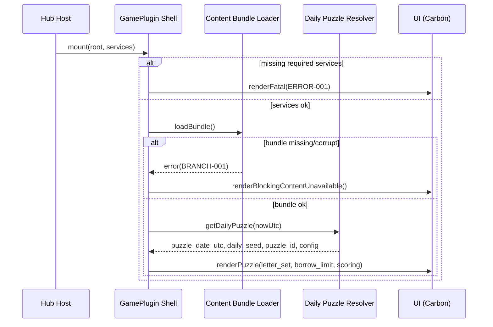
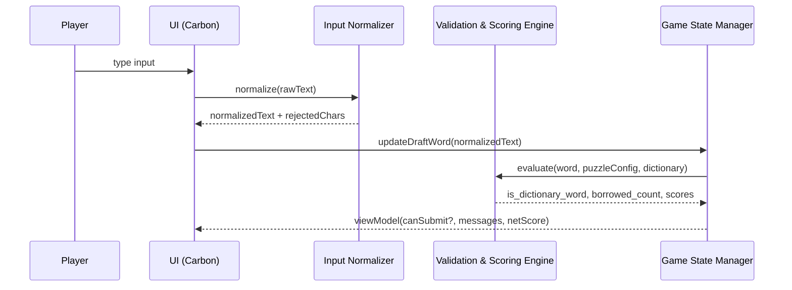
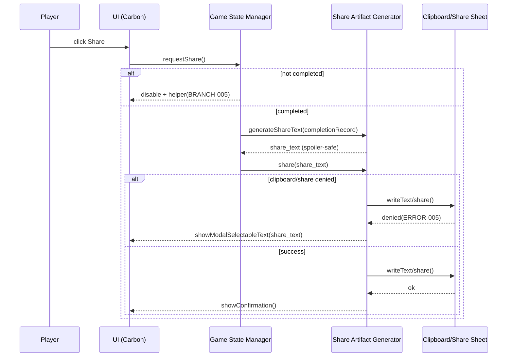
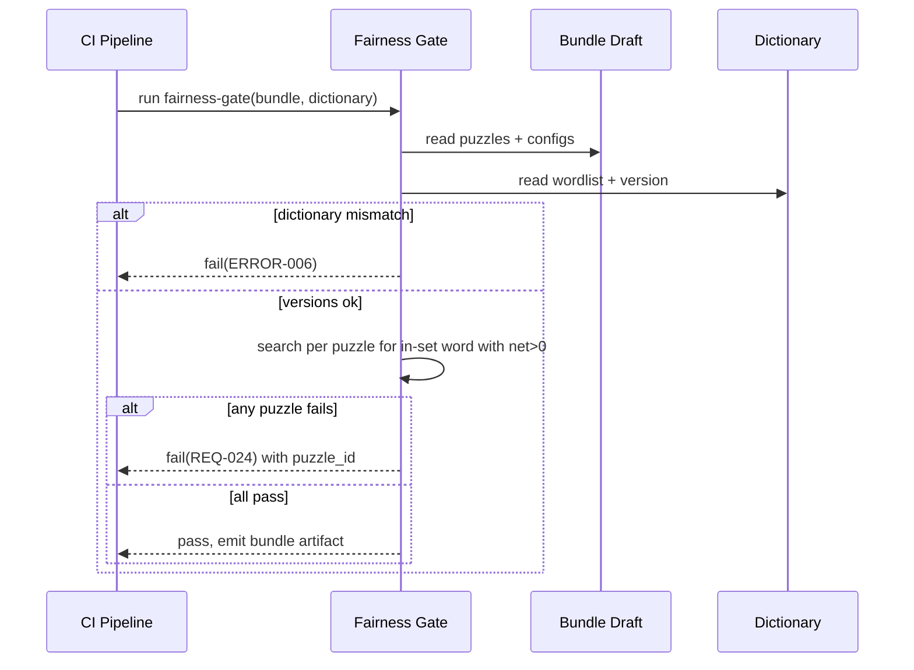

<!-- generated: 2026-07-25T20:01:50Z -->
<!-- mode: feature -->
<!-- feature-slug: overdraft -->
<!-- a2a-endpoint: https://bob-sdlc-orchestrator.2as6l7wq9qj8.eu-gb.codeengine.appdomain.cloud/v1/rpc -->

# Glossary

## Terms

### TERM-001: Overdraft
- **Definition:** A daily deterministic word-building game where a player forms exactly one word from a provided letter set, optionally using up to a limited number of out-of-set letters (“borrowed letters”) that reduce the net score via a penalty.
- **Synonyms:** Daily Overdraft puzzle, Overdraft game
- **Anti-definition:** Not a multi-word game; not a word list generator; not a Spelling Bee-style “must use only given letters” game.
- **Source:** User request

### TERM-002: Daily Puzzle
- **Definition:** The specific puzzle instance for a given UTC date, defined by a bundled configuration (letters, scoring, limits) and selected deterministically by a UTC-date-based seed.
- **Synonyms:** Daily challenge, daily draft
- **Anti-definition:** Not user-generated; not random per device; not timezone-local day boundary.
- **Source:** User request

### TERM-003: Letter Set
- **Definition:** The fixed multiset of allowed letters provided to the player for the daily puzzle, from which in-set letters may be used without penalty.
- **Synonyms:** Rack, pool, given letters
- **Anti-definition:** Not the dictionary; not the borrowed-letter allowance.
- **Source:** User request

### TERM-004: In-Set Letter
- **Definition:** A letter that appears in the TERM-003 Letter Set and is used in the player’s submitted word.
- **Synonyms:** Provided letter
- **Anti-definition:** Not an out-of-set letter.
- **Source:** User request

### TERM-005: Borrowed Letter
- **Definition:** A letter used in the submitted word that does not appear in the TERM-003 Letter Set, counted toward the borrow limit and incurring a penalty.
- **Synonyms:** Overdraft letter, out-of-set letter
- **Anti-definition:** Not a wildcard; not free to use; not required to solve.
- **Source:** User request

### TERM-006: Borrow Limit
- **Definition:** The maximum number of borrowed letters allowed in a single submitted word for the daily puzzle (default 2).
- **Synonyms:** Max overdraft, max borrow
- **Anti-definition:** Not a limit on word length; not a limit on in-set letters.
- **Source:** User request

### TERM-007: Borrow Penalty
- **Definition:** The points deducted per borrowed letter used in the submitted word.
- **Synonyms:** Overdraft cost
- **Anti-definition:** Not a multiplier; not variable by letter unless configured.
- **Source:** User request

### TERM-008: Base Score
- **Definition:** The score computed from the submitted word prior to deducting any borrowed-letter penalties (e.g., sum of per-letter values or length-based).
- **Synonyms:** Raw score, gross score
- **Anti-definition:** Not the final/net score.
- **Source:** User request

### TERM-009: Net Score
- **Definition:** Final score for the submission: TERM-008 Base Score minus (TERM-007 Borrow Penalty × borrowed-letter count).
- **Synonyms:** Final score
- **Anti-definition:** Not banded share score; not the base score.
- **Source:** User request

### TERM-010: Word Submission
- **Definition:** The single word the player commits as their attempt for the daily puzzle, including the typed letters, computed borrow count, and computed scores.
- **Synonyms:** Attempt, entry
- **Anti-definition:** Not multiple submissions after finalization.
- **Source:** User request

### TERM-011: Dictionary (Bundled)
- **Definition:** On-device word list used to validate whether a submitted word is acceptable, shipped with the client (no server validation).
- **Synonyms:** Wordlist, lexicon
- **Anti-definition:** Not an online API; not user-editable at runtime.
- **Source:** User request

### TERM-012: Fairness Gate
- **Definition:** A build-time validation process that proves at least one positive net-score word exists using only the Letter Set (0 borrowed letters), ensuring borrowing is optional.
- **Synonyms:** Build-time solvability check
- **Anti-definition:** Not a runtime solver; not a guarantee of “good” scores.
- **Source:** User request

### TERM-013: Spoiler-Safe Share Artifact
- **Definition:** A shareable text block that reveals only non-spoiler performance signals (e.g., net score band and borrow count visual blocks) and does not disclose the submitted word.
- **Synonyms:** Share card (text), share string
- **Anti-definition:** Not a screenshot requirement; not a word reveal.
- **Source:** User request

### TERM-014: Score Band
- **Definition:** A categorical bucket derived from TERM-009 Net Score used in the TERM-013 share artifact.
- **Synonyms:** Tier, band
- **Anti-definition:** Not the exact numeric score unless configured.
- **Source:** User request

### TERM-015: GamePlugin
- **Definition:** The CIC Games hub integration contract where the game is mounted via `mount(root, services)` and reports results via a `DailyResult`, storing namespaced local stats/streak.
- **Synonyms:** Hub plugin, game module
- **Anti-definition:** Not a standalone app without hub context.
- **Source:** User request

### TERM-016: Services (Hub Services)
- **Definition:** The object provided by the CIC Games hub to the GamePlugin containing capabilities such as persistence, navigation, and result reporting.
- **Synonyms:** Host services
- **Anti-definition:** Not a backend server dependency.
- **Source:** User request

### TERM-017: DailyResult
- **Definition:** The structured outcome payload reported to the hub for a given daily puzzle (date, score, completion state, borrow count, etc.).
- **Synonyms:** Result event, completion payload
- **Anti-definition:** Not raw telemetry stream.
- **Source:** User request

### TERM-018: Local Stats (Namespaced)
- **Definition:** On-device stored aggregate metrics for Overdraft only (e.g., plays, best net score), isolated from other games via a namespace.
- **Synonyms:** Local profile stats
- **Anti-definition:** Not cross-device unless hub sync exists (out of scope).
- **Source:** User request

### TERM-019: Streak (UTC)
- **Definition:** Consecutive-day completion count based on UTC day boundaries.
- **Synonyms:** Daily streak
- **Anti-definition:** Not local-time streak.
- **Source:** User request

### TERM-020: Offline-First PWA
- **Definition:** A web application that works without network connectivity after initial install/load, using local bundled assets and storage.
- **Synonyms:** Offline-capable web app
- **Anti-definition:** Not requiring network to validate submissions.
- **Source:** User request

### TERM-021: IBM Carbon Design System Web Components
- **Definition:** The UI component library requirement: real Carbon Web Components (e.g., `cds-button`, `cds-text-input`) used for the web UI.
- **Synonyms:** Carbon components, CDS web components
- **Anti-definition:** Not a lookalike implementation.
- **Source:** User request

### TERM-022: WCAG 2.1 AA Compliance
- **Definition:** Accessibility conformance target including keyboard operability, visible focus, non-color-only state signaling, and reduced-motion support.
- **Synonyms:** AA accessibility
- **Anti-definition:** Not WCAG AAA; not “best effort” accessibility.
- **Source:** User request

### TERM-023: Session
- **Definition:** A single play experience intended to complete in under 3 minutes.
- **Synonyms:** Play session
- **Anti-definition:** Not a long-running campaign mode.
- **Source:** User request

### TERM-024: Daily Seed (UTC)
- **Definition:** Deterministic seed derived from UTC date used to select the daily puzzle configuration.
- **Synonyms:** Date seed
- **Anti-definition:** Not device-random; not locale-dependent.
- **Source:** User request

### TERM-025: Content Bundle
- **Definition:** Build-time shipped data containing daily puzzle configurations (letter sets, scoring config, borrow limits/penalties) and dictionary.
- **Synonyms:** Packaged content, game data
- **Anti-definition:** Not fetched from server at runtime.
- **Source:** User request

## Data Dictionary

| ID | Name | Type | Format | Range | Units | Default | Nullable | PII | Source | Validation |
|---|---|---|---|---|---|---|---|---|---|---|
| FIELD-001 | puzzle_date_utc | string | `YYYY-MM-DD` | valid UTC calendar date | n/a | none | No | Non-PII | Client (computed) | Must match `/^\d{4}-\d{2}-\d{2}$/` and be derived from UTC “now” |
| FIELD-002 | daily_seed | string | opaque | non-empty | n/a | none | No | Non-PII | Client (computed) | Must be deterministic function of FIELD-001 |
| FIELD-003 | puzzle_id | string | opaque | non-empty | n/a | none | No | Non-PII | Content Bundle | Must exist in Content Bundle index |
| FIELD-004 | letter_set | array[string] | uppercase A–Z | length 1..30 | n/a | none | No | Non-PII | Content Bundle | Each entry must be `/^[A-Z]$/` |
| FIELD-005 | letter_points | object(map) | `{ "A": 1, ... }` | values 0..50 | points | none | No | Non-PII | Content Bundle | Must contain entries for A–Z; all integers |
| FIELD-006 | scoring_method | string | enum | `LETTER_SUM` \| `LENGTH` | n/a | `LETTER_SUM` | No | Non-PII | Content Bundle | Must be one of enum values |
| FIELD-007 | max_borrow_limit | integer | int32 | 0..2 | letters | 2 | No | Non-PII | Content Bundle | Must be ≤ 2 |
| FIELD-008 | borrow_penalty_points | integer | int32 | 0..100 | points | 0 | No | Non-PII | Content Bundle | Must be ≥ 0 |
| FIELD-009 | submitted_word | string | uppercase A–Z | length 1..64 | n/a | empty | No | Non-PII | Client (input) | Must match `/^[A-Z]+$/` after normalization |
| FIELD-010 | in_set_letter_count | integer | int32 | 0..64 | letters | 0 | No | Non-PII | Client (computed) | Must equal count of letters in submission not classified as borrowed |
| FIELD-011 | borrowed_letter_count | integer | int32 | 0..2 | letters | 0 | No | Non-PII | Client (computed) | Must be ≤ FIELD-007 |
| FIELD-012 | borrowed_letters | array[string] | uppercase A–Z | length 0..2 | n/a | `[]` | No | Non-PII | Client (computed) | Each entry `/^[A-Z]$/`; count equals FIELD-011 |
| FIELD-013 | base_score_points | integer | int32 | -9999..999999 | points | 0 | No | Non-PII | Client (computed) | Must equal configured scoring over FIELD-009 |
| FIELD-014 | penalty_points | integer | int32 | 0..999999 | points | 0 | No | Non-PII | Client (computed) | Must equal FIELD-011 × FIELD-008 |
| FIELD-015 | net_score_points | integer | int32 | -9999..999999 | points | 0 | No | Non-PII | Client (computed) | Must equal FIELD-013 − FIELD-014 |
| FIELD-016 | dictionary_version | string | semver/string | non-empty | n/a | none | No | Non-PII | Content Bundle | Must match bundled dictionary metadata |
| FIELD-017 | is_dictionary_word | boolean | n/a | true/false | n/a | false | No | Non-PII | Client (computed) | True iff FIELD-009 found in TERM-011 |
| FIELD-018 | is_submission_final | boolean | n/a | true/false | n/a | false | No | Non-PII | Client (state) | Once true, cannot revert in same FIELD-001 |
| FIELD-019 | completed_at_utc | string | ISO-8601 | valid datetime | n/a | null | Yes | Non-PII | Client (computed) | Required when FIELD-018 is true |
| FIELD-020 | score_band | string | enum | `S0`\|`S1`\|`S2`\|`S3`\|`S4`\|`S5` | n/a | `S0` | No | Non-PII | Client (computed) | Must map deterministically from FIELD-015 using configured thresholds |
| FIELD-021 | share_text | string | text | length 1..500 | n/a | empty | No | Non-PII | Client (generated) | Must not contain FIELD-009 substring |
| FIELD-022 | streak_count | integer | int32 | 0..9999 | days | 0 | No | Non-PII | Client (local stats) | Must be computed using UTC day boundary |
| FIELD-023 | best_net_score_points | integer | int32 | -9999..999999 | points | null | Yes | Non-PII | Client (local stats) | Must be max over completed days |
| FIELD-024 | plays_count | integer | int32 | 0..999999 | plays | 0 | No | Non-PII | Client (local stats) | Must increment only on first completion per day |
| FIELD-025 | plugin_namespace | string | `cic.overdraft` | non-empty | n/a | `cic.overdraft` | No | Non-PII | GamePlugin | Must be stable constant |
| FIELD-026 | daily_result_payload | object | JSON | non-empty | n/a | none | No | Non-PII | Client → Hub | Must include FIELD-001, FIELD-003, FIELD-015, FIELD-011, FIELD-018 |
| FIELD-027 | prefers_reduced_motion | boolean | n/a | true/false | n/a | false | No | Non-PII | OS/browser | Must mirror `prefers-reduced-motion` media query |
| FIELD-028 | platform | string | enum | `WEB_PWA`\|`IOS`\|`ANDROID` | n/a | `WEB_PWA` | No | Non-PII | Host app | Must be one of enum values |

**FIELD ↔ TERM membership (implicit):**  
- TERM-002 Daily Puzzle: FIELD-001..FIELD-008, FIELD-003  
- TERM-003 Letter Set: FIELD-004  
- TERM-007 Borrow Penalty: FIELD-008, FIELD-014  
- TERM-010 Word Submission: FIELD-009..FIELD-019  
- TERM-013 Share Artifact: FIELD-020..FIELD-021  
- TERM-017 DailyResult: FIELD-026  
- TERM-018/019 Stats/Streak: FIELD-022..FIELD-024  
- TERM-020/021/022 Platform & UI & A11y: FIELD-027..FIELD-028

# User Journeys

## Roles

| Role ID | Role | Type | Description |
|---|---|---|---|
| ROLE-001 | Player | Primary | Plays TERM-001 Overdraft daily puzzle and submits one TERM-010 Word Submission |
| ROLE-002 | Hub Host | System | CIC Games hub hosting TERM-015 GamePlugin and providing TERM-016 Services |
| ROLE-003 | QA/Content Builder | Admin | Builds TERM-025 Content Bundle and enforces TERM-012 Fairness Gate |

## Entry Points

| Entry ID | Location | Trigger | Auth |
|---|---|---|---|
| ENTRY-001 | UI route: `/games/overdraft` | Player opens game in hub | Hub session (opaque) |
| ENTRY-002 | GamePlugin API: `mount(root, services)` | Hub Host loads plugin | Trusted host context |
| ENTRY-003 | UI action: Submit button (`cds-button`) | Player commits TERM-010 Word Submission | Player context |
| ENTRY-004 | UI action: Share button | Player requests TERM-013 Spoiler-Safe Share Artifact | Player context |
| ENTRY-005 | Build pipeline step: `fairness-gate` | Content build runs | CI identity |

## Role Permission Matrix

| Capability | ROLE-001 Player | ROLE-002 Hub Host | ROLE-003 QA/Content Builder |
|---|---:|---:|---:|
| View daily puzzle (TERM-002) | Yes | n/a | Yes |
| Enter/edit submission before finalize | Yes | n/a | n/a |
| Finalize one submission per UTC day | Yes | n/a | n/a |
| Generate share artifact | Yes | n/a | n/a |
| Provide services / receive DailyResult | n/a | Yes | n/a |
| Modify Content Bundle | No | No | Yes |
| Run/approve Fairness Gate | No | No | Yes |

## Journeys

### JOURNEY-001: Launch daily puzzle (offline-first)
- **Role/Goal:** ROLE-001 Player; open TERM-002 Daily Puzzle quickly even without network (TERM-020).
- **Entry:** ENTRY-001, ENTRY-002
- **Happy path:**
  1. Hub Host calls `mount(root, services)` to initialize TERM-015 GamePlugin with TERM-016 Services. (FIELD-026, FIELD-025)
  2. Client computes FIELD-001 `puzzle_date_utc` using UTC and derives FIELD-002 `daily_seed`. (TERM-024)
  3. Client selects FIELD-003 `puzzle_id` deterministically from TERM-025 Content Bundle using FIELD-002. (TERM-002)
  4. Client renders TERM-003 Letter Set (FIELD-004) and scoring config (FIELD-005..FIELD-008) using TERM-021 Carbon web components.
- **BRANCH-001 (No content available):** If TERM-025 Content Bundle is missing/corrupt.
  - System response: Show blocking error state with retry and diagnostics.
  - Recovery: Reinstall/update app; reload route.
- **ERROR-001 (Mount failure):** `mount` throws due to missing services.
  - Response: Render fatal error message; do not allow play.
  - Recovery: Player navigates back; hub logs error.
- **EDGE-001 (Timezone boundary):** Player launches within ±5 minutes of UTC midnight.
  - Expected: FIELD-001 uses UTC; puzzle switches only at UTC midnight.
- **EDGE-002 (Offline cold start):** No network on first load after install.
  - Expected: All assets for play and dictionary are bundled/cached.

### JOURNEY-002: Compose a word with borrow accounting
- **Role/Goal:** ROLE-001 Player; create a high TERM-009 Net Score by deciding whether to use TERM-005 Borrowed Letters.
- **Entry:** ENTRY-001
- **Happy path:**
  1. Player types letters into input (Carbon `cds-text-input`), populating FIELD-009 `submitted_word` (normalized to uppercase A–Z).
  2. Client computes FIELD-011 `borrowed_letter_count` by comparing FIELD-009 letters to TERM-003 Letter Set (FIELD-004) under the game’s borrow rules.
  3. Client computes FIELD-013 `base_score_points` using FIELD-006 `scoring_method` and FIELD-005 `letter_points`.
  4. Client computes FIELD-014 `penalty_points` using FIELD-011 and FIELD-008.
  5. Client displays FIELD-015 `net_score_points` and borrow status (FIELD-011) with text/icon cues (TERM-022).
- **BRANCH-002 (Borrow limit exceeded):** If FIELD-011 > FIELD-007.
  - System response: Disable ENTRY-003 Submit; show inline message “Borrow limit exceeded (2)”.
  - Recovery: Player edits FIELD-009 to reduce borrowed letters.
- **BRANCH-003 (Non-dictionary word):** If FIELD-017 `is_dictionary_word` is false.
  - System response: Disable Submit; show “Not in dictionary”.
  - Recovery: Player edits word.
- **ERROR-002 (Invalid characters):** Input includes non A–Z after normalization.
  - Response: Reject character; announce via accessible text.
  - Recovery: Continue typing.
- **EDGE-003 (Empty input):** FIELD-009 empty.
  - Expected: Net score not computed or computed as 0; Submit disabled.
- **EDGE-004 (Repeated letters):** Player repeats letters beyond those present in FIELD-004.
  - Expected: Allowed as in-set if letter exists in set (free reuse) per rules; otherwise counts toward borrow (TERM-005).
- **EDGE-005 (Performance):** Rapid typing updates scores each keystroke.
  - Expected: UI remains responsive; calculations stay client-side.

### JOURNEY-003: Submit exactly one final word for the day
- **Role/Goal:** ROLE-001 Player; finalize a single TERM-010 Word Submission and get a recorded TERM-017 DailyResult.
- **Entry:** ENTRY-003
- **Happy path:**
  1. Player taps Submit (`cds-button`).
  2. Client re-validates FIELD-009 (format), FIELD-017 (dictionary), and FIELD-011 ≤ FIELD-007.
  3. Client sets FIELD-018 `is_submission_final` true and stamps FIELD-019 `completed_at_utc`.
  4. Client persists submission and updates local stats in namespace FIELD-025 (FIELD-022..FIELD-024).
  5. Client emits FIELD-026 `daily_result_payload` to hub services (TERM-016).
  6. UI shows final net score (FIELD-015) and disables further editing/submission for FIELD-001.
- **BRANCH-004 (Already completed today):** If stored FIELD-018 is already true for FIELD-001.
  - System response: Show completed screen; do not allow resubmission.
  - Recovery: Player waits for next UTC day.
- **ERROR-003 (Persist failure):** Local storage quota or write error.
  - Response: Show error; do not mark final; allow retry.
  - Recovery: Player retries; may free storage.
- **ERROR-004 (Hub reporting failure):** Hub service call fails.
  - Response: Keep local completion; queue retry until hub available in-session.
  - Recovery: Retry automatically on next mount in same day.
- **EDGE-006 (Double click):** Player clicks Submit twice rapidly.
  - Expected: Idempotent finalize; only one completion recorded.
- **EDGE-007 (App backgrounding):** App is backgrounded mid-submit.
  - Expected: On resume, either completed state shows or submission remains editable if not finalized.

### JOURNEY-004: Share spoiler-safe result
- **Role/Goal:** ROLE-001 Player; share performance without revealing FIELD-009.
- **Entry:** ENTRY-004
- **Happy path:**
  1. Player taps Share.
  2. Client generates TERM-013 Spoiler-Safe Share Artifact (FIELD-021) from FIELD-020 `score_band`, FIELD-011 `borrowed_letter_count`, and FIELD-001 `puzzle_date_utc`.
  3. Client copies FIELD-021 to clipboard (web) or invokes native share sheet (iOS/Android host) as available.
- **BRANCH-005 (Not completed):** If FIELD-018 is false.
  - System response: Offer “Share requires completion” message; no share generated.
  - Recovery: Player completes puzzle.
- **ERROR-005 (Clipboard denied):** Browser denies clipboard access.
  - Response: Show modal with selectable text for manual copy.
  - Recovery: Player long-press/copy.
- **EDGE-008 (Spoiler leakage):** Ensure share text does not contain FIELD-009.
  - Expected: Explicit validation rejects inclusion.

### JOURNEY-005: Build-time fairness gate
- **Role/Goal:** ROLE-003 QA/Content Builder; ensure each daily puzzle is solvable with a positive-score word using only given letters.
- **Entry:** ENTRY-005
- **Happy path:**
  1. CI loads TERM-025 Content Bundle draft (FIELD-004..FIELD-008) and TERM-011 Dictionary.
  2. For each puzzle, CI searches dictionary for at least one word comprised only of FIELD-004 letters (no borrow) with FIELD-015 > 0 (penalty = 0).
  3. CI fails build if any puzzle lacks such a word; otherwise produces bundle artifact.
- **ERROR-006 (Dictionary mismatch):** Dictionary version differs between gate and shipped bundle (FIELD-016).
  - Response: Fail build with version diagnostics.
  - Recovery: Align versions.
- **EDGE-009 (Penalty config):** FIELD-008 is 0.
  - Expected: Gate still enforces existence of positive-score in-set word (borrowing optional).

## Journey Map

```mermaid
flowchart TD
  A[ENTRY-002 mount(root, services)] --> B[JOURNEY-001 Load daily puzzle]
  B --> C[JOURNEY-002 Compose word]
  C -->|Submit| D[JOURNEY-003 Finalize]
  D -->|Share| E[JOURNEY-004 Share artifact]
  F[ENTRY-005 fairness-gate] --> G[JOURNEY-005 Build-time validation]
  C -->|Borrow limit exceeded| C1[BRANCH-002 Fix word]
  C -->|Not in dictionary| C2[BRANCH-003 Edit word]
  D -->|Already completed| D1[BRANCH-004 Completed screen]
```

# Requirements

### REQ-001: Initialize GamePlugin mount contract
- **EARS Pattern:** Event-Driven
- **EARS Statement:** When ENTRY-002 `mount(root, services)` is invoked, the system shall initialize TERM-015 GamePlugin using TERM-016 Services under FIELD-025 `plugin_namespace`.
- **Inputs:** `root`, `services`, FIELD-025
- **Outputs:** Rendered game shell
- **Preconditions:** Hub Host provides a DOM root
- **Postconditions:** Game UI visible or fatal error shown
- **Invariants:** Namespace remains constant per build
- **Trigger:** ENTRY-002
- **Actor:** ROLE-002
- **EntityScope:** TERM-015 GamePlugin
- **ErrorModes:** ERROR-001
- **NFR-Tags:** Observability
- **Source:** JOURNEY-001 step 1; ERROR-001
- **Dependencies:** none
- **Priority:** P0
- **AcceptanceCriteria:**
  - **TEST-001:** Given valid `services`, when `mount` is called, then the game renders a view containing TERM-003 Letter Set placeholder.
  - **TEST-002:** Given missing required services, when `mount` is called, then an error view is rendered and no submission UI is enabled.
- **Assumptions:** Hub defines required service interface
- **OpenQuestions:** Which hub service methods are mandatory vs optional?

### REQ-002: Compute UTC puzzle date
- **EARS Pattern:** Ubiquitous
- **EARS Statement:** The system shall compute FIELD-001 `puzzle_date_utc` using the current UTC date.
- **Inputs:** System clock
- **Outputs:** FIELD-001
- **Preconditions:** None
- **Postconditions:** FIELD-001 available for puzzle selection
- **Invariants:** UTC boundary defines day
- **Trigger:** App load / view render
- **Actor:** ROLE-001
- **EntityScope:** TERM-002 Daily Puzzle
- **ErrorModes:** none
- **NFR-Tags:** Compatibility
- **Source:** JOURNEY-001 step 2; EDGE-001
- **Dependencies:** none
- **Priority:** P0
- **AcceptanceCriteria:**
  - **TEST-003:** Given local timezone not UTC, when the date is computed, then FIELD-001 matches UTC calendar date.
- **Assumptions:** Device clock is reasonably accurate
- **OpenQuestions:** Do we need clock-skew messaging?

### REQ-003: Derive deterministic daily seed
- **EARS Pattern:** Event-Driven
- **EARS Statement:** When FIELD-001 `puzzle_date_utc` is available, the system shall derive FIELD-002 `daily_seed` deterministically from FIELD-001.
- **Inputs:** FIELD-001
- **Outputs:** FIELD-002
- **Preconditions:** FIELD-001 computed
- **Postconditions:** Seed ready for selection
- **Invariants:** Same FIELD-001 yields same FIELD-002 across platforms (FIELD-028)
- **Trigger:** FIELD-001 computed
- **Actor:** ROLE-001
- **EntityScope:** TERM-024 Daily Seed (UTC)
- **ErrorModes:** none
- **NFR-Tags:** Compatibility
- **Source:** JOURNEY-001 step 2
- **Dependencies:** REQ-002
- **Priority:** P0
- **AcceptanceCriteria:**
  - **TEST-004:** Given the same FIELD-001, when computed on WEB_PWA and IOS, then FIELD-002 is identical.
- **Assumptions:** Seed function is specified (e.g., hash of date string)
- **OpenQuestions:** What exact seed algorithm is required?

### REQ-004: Select daily puzzle from bundled content
- **EARS Pattern:** Event-Driven
- **EARS Statement:** When FIELD-002 `daily_seed` is computed, the system shall select FIELD-003 `puzzle_id` from TERM-025 Content Bundle deterministically using FIELD-002.
- **Inputs:** FIELD-002, Content Bundle index
- **Outputs:** FIELD-003
- **Preconditions:** Content Bundle present
- **Postconditions:** Puzzle config loaded
- **Invariants:** Deterministic mapping for a given build
- **Trigger:** FIELD-002 computed
- **Actor:** ROLE-001
- **EntityScope:** TERM-002 Daily Puzzle
- **ErrorModes:** BRANCH-001
- **NFR-Tags:** Offline
- **Source:** JOURNEY-001 step 3; BRANCH-001
- **Dependencies:** REQ-003
- **Priority:** P0
- **AcceptanceCriteria:**
  - **TEST-005:** Given a valid bundle, when FIELD-002 is computed, then FIELD-003 resolves to an existing puzzle record.
  - **TEST-006:** Given missing bundle, when selection occurs, then the app shows the “content unavailable” blocking state.
- **Assumptions:** Bundle includes an indexable list of puzzles
- **OpenQuestions:** Rotation length (how many days of puzzles) per bundle?

### REQ-005: Render letter set and scoring configuration using Carbon components
- **EARS Pattern:** Event-Driven
- **EARS Statement:** When a daily puzzle is loaded, the system shall render FIELD-004 `letter_set` and FIELD-007 `max_borrow_limit` using TERM-021 IBM Carbon Design System Web Components.
- **Inputs:** FIELD-004, FIELD-007
- **Outputs:** Visible UI
- **Preconditions:** Puzzle config loaded
- **Postconditions:** Player can see constraints
- **Invariants:** Carbon components are used for interactive controls
- **Trigger:** Puzzle load
- **Actor:** ROLE-001
- **EntityScope:** TERM-021 IBM Carbon Design System Web Components
- **ErrorModes:** none
- **NFR-Tags:** Accessibility
- **Source:** JOURNEY-001 step 4
- **Dependencies:** REQ-004
- **Priority:** P0
- **AcceptanceCriteria:**
  - **TEST-007:** The Submit control is a `cds-button` element in the rendered DOM.
- **Assumptions:** Carbon web components are available in the web stack
- **OpenQuestions:** For iOS/Android wrappers, is UI webview-based with Carbon components?

### REQ-006: Normalize submission input to uppercase A–Z
- **EARS Pattern:** Event-Driven
- **EARS Statement:** When the player enters text for FIELD-009 `submitted_word`, the system shall normalize the value to uppercase A–Z characters.
- **Inputs:** Raw text input
- **Outputs:** FIELD-009
- **Preconditions:** Puzzle loaded
- **Postconditions:** FIELD-009 contains only A–Z
- **Invariants:** Normalization is deterministic
- **Trigger:** Text input change
- **Actor:** ROLE-001
- **EntityScope:** TERM-010 Word Submission
- **ErrorModes:** ERROR-002
- **NFR-Tags:** Accessibility
- **Source:** JOURNEY-002 step 1; ERROR-002
- **Dependencies:** REQ-005
- **Priority:** P0
- **AcceptanceCriteria:**
  - **TEST-008:** Given input `a-b`, when entered, then stored FIELD-009 equals `AB` and an accessible message indicates invalid characters were rejected.
- **Assumptions:** Only English A–Z supported
- **OpenQuestions:** Should diacritics be folded (e.g., É→E) or rejected?

### REQ-007: Compute borrowed letter count
- **EARS Pattern:** Event-Driven
- **EARS Statement:** When FIELD-009 `submitted_word` changes, the system shall compute FIELD-011 `borrowed_letter_count` by comparing letters in FIELD-009 to FIELD-004 `letter_set`.
- **Inputs:** FIELD-009, FIELD-004
- **Outputs:** FIELD-011
- **Preconditions:** FIELD-004 loaded
- **Postconditions:** Borrow count displayed/available
- **Invariants:** FIELD-011 is an integer
- **Trigger:** FIELD-009 change
- **Actor:** ROLE-001
- **EntityScope:** TERM-005 Borrowed Letter
- **ErrorModes:** none
- **NFR-Tags:** Performance
- **Source:** JOURNEY-002 step 2
- **Dependencies:** REQ-006
- **Priority:** P0
- **AcceptanceCriteria:**
  - **TEST-009:** Given FIELD-004 = `[A,B,C]` and FIELD-009=`ABCD`, then FIELD-011 equals `1`.
- **Assumptions:** In-set letters are reusable without count limits
- **OpenQuestions:** Confirm rule: letter set is a set (not multiset) and reuse is always free.

### REQ-008: Enforce max borrow limit by disabling submit
- **EARS Pattern:** State-Driven
- **EARS Statement:** While FIELD-011 `borrowed_letter_count` exceeds FIELD-007 `max_borrow_limit`, the system shall disable ENTRY-003 Submit.
- **Inputs:** FIELD-011, FIELD-007
- **Outputs:** Disabled submit UI state
- **Preconditions:** Borrow count computed
- **Postconditions:** Player cannot finalize invalid submission
- **Invariants:** Disabled state is keyboard-discernible (TERM-022)
- **Trigger:** Borrow count update
- **Actor:** ROLE-001
- **EntityScope:** TERM-006 Borrow Limit
- **ErrorModes:** BRANCH-002
- **NFR-Tags:** Accessibility
- **Source:** JOURNEY-002 BRANCH-002
- **Dependencies:** REQ-007
- **Priority:** P0
- **AcceptanceCriteria:**
  - **TEST-010:** Given FIELD-007=2 and FIELD-011=3, then Submit is disabled and a visible message indicates the limit.
- **Assumptions:** Limit is constant per puzzle
- **OpenQuestions:** Should the UI show which letters are counted as borrowed?

### REQ-009: Validate word against bundled dictionary
- **EARS Pattern:** Event-Driven
- **EARS Statement:** When FIELD-009 `submitted_word` changes, the system shall set FIELD-017 `is_dictionary_word` true only if FIELD-009 exists in TERM-011 Dictionary (Bundled).
- **Inputs:** FIELD-009, TERM-011, FIELD-016
- **Outputs:** FIELD-017
- **Preconditions:** Dictionary loaded
- **Postconditions:** Dictionary validity known
- **Invariants:** Validation is client-side only
- **Trigger:** FIELD-009 change
- **Actor:** ROLE-001
- **EntityScope:** TERM-011 Dictionary (Bundled)
- **ErrorModes:** BRANCH-003
- **NFR-Tags:** Offline
- **Source:** JOURNEY-002 step 2; BRANCH-003
- **Dependencies:** REQ-006
- **Priority:** P0
- **AcceptanceCriteria:**
  - **TEST-011:** Given FIELD-009 is not in dictionary, then FIELD-017 is false and Submit is disabled.
- **Assumptions:** Dictionary lookup performance is acceptable on device
- **OpenQuestions:** Minimum word length constraints?

### REQ-010: Compute base score using letter-sum method
- **EARS Pattern:** State-Driven
- **EARS Statement:** While FIELD-006 `scoring_method` equals `LETTER_SUM`, the system shall compute FIELD-013 `base_score_points` as the sum of FIELD-005 `letter_points` for letters in FIELD-009.
- **Inputs:** FIELD-006, FIELD-005, FIELD-009
- **Outputs:** FIELD-013
- **Preconditions:** Puzzle config loaded; FIELD-009 valid
- **Postconditions:** Base score available
- **Invariants:** Integer arithmetic
- **Trigger:** FIELD-009 change
- **Actor:** ROLE-001
- **EntityScope:** TERM-008 Base Score
- **ErrorModes:** none
- **NFR-Tags:** Performance
- **Source:** JOURNEY-002 step 3
- **Dependencies:** REQ-006, REQ-004
- **Priority:** P1
- **AcceptanceCriteria:**
  - **TEST-012:** Given letter points A=1, B=3 and FIELD-009=`ABBA`, then FIELD-013 equals 8.
- **Assumptions:** Letter points exist for A–Z
- **OpenQuestions:** Are non-English alphabets in scope later?

### REQ-011: Compute base score using length method
- **EARS Pattern:** State-Driven
- **EARS Statement:** While FIELD-006 `scoring_method` equals `LENGTH`, the system shall compute FIELD-013 `base_score_points` as the length of FIELD-009.
- **Inputs:** FIELD-006, FIELD-009
- **Outputs:** FIELD-013
- **Preconditions:** Puzzle config loaded; FIELD-009 valid
- **Postconditions:** Base score available
- **Invariants:** Length counts characters A–Z
- **Trigger:** FIELD-009 change
- **Actor:** ROLE-001
- **EntityScope:** TERM-008 Base Score
- **ErrorModes:** none
- **NFR-Tags:** Performance
- **Source:** JOURNEY-002 step 3
- **Dependencies:** REQ-006, REQ-004
- **Priority:** P1
- **AcceptanceCriteria:**
  - **TEST-013:** Given FIELD-009=`ABCDE`, then FIELD-013 equals 5.
- **Assumptions:** LENGTH is an allowed configuration
- **OpenQuestions:** Any bonus rules (e.g., long-word bonus) out of scope?

### REQ-012: Compute overdraft penalty points
- **EARS Pattern:** Event-Driven
- **EARS Statement:** When FIELD-011 `borrowed_letter_count` changes, the system shall compute FIELD-014 `penalty_points` as FIELD-011 multiplied by FIELD-008 `borrow_penalty_points`.
- **Inputs:** FIELD-011, FIELD-008
- **Outputs:** FIELD-014
- **Preconditions:** Puzzle config loaded
- **Postconditions:** Penalty available
- **Invariants:** Non-negative integer
- **Trigger:** FIELD-011 change
- **Actor:** ROLE-001
- **EntityScope:** TERM-007 Borrow Penalty
- **ErrorModes:** none
- **NFR-Tags:** Performance
- **Source:** JOURNEY-002 step 4
- **Dependencies:** REQ-007
- **Priority:** P0
- **AcceptanceCriteria:**
  - **TEST-014:** Given FIELD-011=2 and FIELD-008=5, then FIELD-014 equals 10.
- **Assumptions:** Same penalty per borrowed letter
- **OpenQuestions:** Do we ever want per-letter penalty?

### REQ-013: Compute net score
- **EARS Pattern:** Event-Driven
- **EARS Statement:** When FIELD-013 `base_score_points` changes, the system shall compute FIELD-015 `net_score_points` as FIELD-013 minus FIELD-014.
- **Inputs:** FIELD-013, FIELD-014
- **Outputs:** FIELD-015
- **Preconditions:** Base score and penalty computed
- **Postconditions:** Net score displayed
- **Invariants:** Integer arithmetic
- **Trigger:** FIELD-013 change
- **Actor:** ROLE-001
- **EntityScope:** TERM-009 Net Score
- **ErrorModes:** none
- **NFR-Tags:** Performance
- **Source:** JOURNEY-002 step 5
- **Dependencies:** REQ-012, REQ-010/REQ-011
- **Priority:** P0
- **AcceptanceCriteria:**
  - **TEST-015:** Given FIELD-013=12 and FIELD-014=5, then FIELD-015 equals 7.
- **Assumptions:** Net score can be negative
- **OpenQuestions:** Should negative net score submissions be allowed?

### REQ-014: Disable submit when dictionary validation fails
- **EARS Pattern:** State-Driven
- **EARS Statement:** While FIELD-017 `is_dictionary_word` is false, the system shall disable ENTRY-003 Submit.
- **Inputs:** FIELD-017
- **Outputs:** Disabled submit UI state
- **Preconditions:** Dictionary validation computed
- **Postconditions:** Prevent invalid submissions
- **Invariants:** Disabled state is conveyed without color alone
- **Trigger:** FIELD-017 change
- **Actor:** ROLE-001
- **EntityScope:** TERM-010 Word Submission
- **ErrorModes:** BRANCH-003
- **NFR-Tags:** Accessibility
- **Source:** JOURNEY-002 BRANCH-003
- **Dependencies:** REQ-009
- **Priority:** P0
- **AcceptanceCriteria:**
  - **TEST-016:** Given FIELD-017=false, then Submit is disabled and an inline message is present in the accessibility tree.
- **Assumptions:** Inline messaging design exists
- **OpenQuestions:** Message wording localization?

### REQ-015: Finalize submission once per UTC day
- **EARS Pattern:** Event-Driven
- **EARS Statement:** When ENTRY-003 Submit is activated, the system shall set FIELD-018 `is_submission_final` to true for FIELD-001 `puzzle_date_utc`.
- **Inputs:** ENTRY-003 activation, FIELD-001
- **Outputs:** FIELD-018
- **Preconditions:** Submit enabled
- **Postconditions:** Submission finalized
- **Invariants:** Finalization is irreversible for that day on that device
- **Trigger:** ENTRY-003
- **Actor:** ROLE-001
- **EntityScope:** TERM-010 Word Submission
- **ErrorModes:** ERROR-003
- **NFR-Tags:** Reliability
- **Source:** JOURNEY-003 step 1–3; ERROR-003
- **Dependencies:** REQ-008, REQ-014
- **Priority:** P0
- **AcceptanceCriteria:**
  - **TEST-017:** Given enabled Submit, when clicked, then FIELD-018 becomes true and the input is disabled.
- **Assumptions:** One submission per day per device
- **OpenQuestions:** Is “change submission before share” allowed? (Assumed no)

### REQ-016: Stamp completion time in UTC
- **EARS Pattern:** Event-Driven
- **EARS Statement:** When FIELD-018 `is_submission_final` becomes true, the system shall set FIELD-019 `completed_at_utc` to an ISO-8601 UTC timestamp.
- **Inputs:** System clock
- **Outputs:** FIELD-019
- **Preconditions:** Finalization occurring
- **Postconditions:** Completion time stored
- **Invariants:** Timestamp ends with `Z`
- **Trigger:** FIELD-018 transition false→true
- **Actor:** ROLE-001
- **EntityScope:** TERM-017 DailyResult
- **ErrorModes:** ERROR-003
- **NFR-Tags:** Auditability
- **Source:** JOURNEY-003 step 3
- **Dependencies:** REQ-015
- **Priority:** P1
- **AcceptanceCriteria:**
  - **TEST-018:** Given completion, then FIELD-019 matches ISO-8601 UTC format and is non-null.
- **Assumptions:** Device clock available
- **OpenQuestions:** None

### REQ-017: Prevent resubmission after completion
- **EARS Pattern:** State-Driven
- **EARS Statement:** While FIELD-018 `is_submission_final` is true for FIELD-001 `puzzle_date_utc`, the system shall not allow changes to FIELD-009 `submitted_word`.
- **Inputs:** FIELD-018, FIELD-001
- **Outputs:** Read-only UI
- **Preconditions:** Completion stored
- **Postconditions:** Submission immutable
- **Invariants:** UI indicates completed state textually
- **Trigger:** View render
- **Actor:** ROLE-001
- **EntityScope:** TERM-010 Word Submission
- **ErrorModes:** BRANCH-004
- **NFR-Tags:** Accessibility
- **Source:** JOURNEY-003 step 6; BRANCH-004
- **Dependencies:** REQ-015
- **Priority:** P0
- **AcceptanceCriteria:**
  - **TEST-019:** Given completed today, when player focuses the input, then it is read-only and Submit is not available.
- **Assumptions:** Completion is stored locally by date
- **OpenQuestions:** Do we allow “view word” after completion? (Share must be spoiler-safe)

### REQ-018: Persist completion and local stats in namespaced storage
- **EARS Pattern:** Event-Driven
- **EARS Statement:** When FIELD-018 `is_submission_final` becomes true, the system shall persist completion state and update FIELD-024 `plays_count` within FIELD-025 `plugin_namespace`.
- **Inputs:** FIELD-018, FIELD-025
- **Outputs:** Updated local storage
- **Preconditions:** Storage available
- **Postconditions:** Stats reflect completion
- **Invariants:** Namespacing isolates from other games
- **Trigger:** FIELD-018 transition false→true
- **Actor:** ROLE-001
- **EntityScope:** TERM-018 Local Stats (Namespaced)
- **ErrorModes:** ERROR-003
- **NFR-Tags:** Reliability
- **Source:** JOURNEY-003 step 4; ERROR-003
- **Dependencies:** REQ-015
- **Priority:** P0
- **AcceptanceCriteria:**
  - **TEST-020:** Given first completion for FIELD-001, when finalized, then FIELD-024 increments by 1.
- **Assumptions:** Storage API differs per platform but semantics same
- **OpenQuestions:** Storage mechanism for iOS/Android wrapper?

### REQ-019: Update best net score
- **EARS Pattern:** Event-Driven
- **EARS Statement:** When FIELD-018 `is_submission_final` becomes true, the system shall set FIELD-023 `best_net_score_points` to the maximum of its current value and FIELD-015 `net_score_points`.
- **Inputs:** FIELD-018, FIELD-015, FIELD-023
- **Outputs:** FIELD-023 updated
- **Preconditions:** Completion
- **Postconditions:** Best score tracked
- **Invariants:** Max operation
- **Trigger:** FIELD-018 transition false→true
- **Actor:** ROLE-001
- **EntityScope:** TERM-018 Local Stats (Namespaced)
- **ErrorModes:** ERROR-003
- **NFR-Tags:** Reliability
- **Source:** JOURNEY-003 step 4
- **Dependencies:** REQ-018, REQ-013
- **Priority:** P2
- **AcceptanceCriteria:**
  - **TEST-021:** Given FIELD-023=10 and FIELD-015=12, when finalized, then FIELD-023 becomes 12.
- **Assumptions:** Best score is device-local
- **OpenQuestions:** None

### REQ-020: Compute UTC streak count
- **EARS Pattern:** Event-Driven
- **EARS Statement:** When FIELD-018 `is_submission_final` becomes true, the system shall compute FIELD-022 `streak_count` using UTC day boundaries.
- **Inputs:** FIELD-001, prior completions
- **Outputs:** FIELD-022
- **Preconditions:** Prior completion history may exist
- **Postconditions:** Streak updated
- **Invariants:** Uses UTC day adjacency
- **Trigger:** FIELD-018 transition false→true
- **Actor:** ROLE-001
- **EntityScope:** TERM-019 Streak (UTC)
- **ErrorModes:** ERROR-003
- **NFR-Tags:** Compatibility
- **Source:** JOURNEY-003 step 4; EDGE-001
- **Dependencies:** REQ-018, REQ-002
- **Priority:** P1
- **AcceptanceCriteria:**
  - **TEST-022:** Given completions on consecutive UTC dates, then streak increments by 1 on the later completion.
- **Assumptions:** Only one completion per day stored
- **OpenQuestions:** How to handle missed days across reinstalls? (likely reset)

### REQ-021: Report DailyResult to hub services
- **EARS Pattern:** Event-Driven
- **EARS Statement:** When FIELD-018 `is_submission_final` becomes true, the system shall send FIELD-026 `daily_result_payload` to TERM-016 Services.
- **Inputs:** FIELD-026
- **Outputs:** Hub receives DailyResult
- **Preconditions:** Services available
- **Postconditions:** Result reported
- **Invariants:** Payload contains FIELD-001, FIELD-003, FIELD-015, FIELD-011, FIELD-018
- **Trigger:** FIELD-018 transition false→true
- **Actor:** ROLE-001
- **EntityScope:** TERM-017 DailyResult
- **ErrorModes:** ERROR-004
- **NFR-Tags:** Observability
- **Source:** JOURNEY-003 step 5; ERROR-004
- **Dependencies:** REQ-015, REQ-013
- **Priority:** P0
- **AcceptanceCriteria:**
  - **TEST-023:** Given successful finalize, then a DailyResult call is made with required fields present.
- **Assumptions:** Hub provides an async reporting API
- **OpenQuestions:** Exact DailyResult schema required by hub?

### REQ-022: Generate spoiler-safe share text
- **EARS Pattern:** Event-Driven
- **EARS Statement:** When ENTRY-004 Share is activated, the system shall generate FIELD-021 `share_text` using FIELD-020 `score_band` and FIELD-011 `borrowed_letter_count` without including FIELD-009 `submitted_word`.
- **Inputs:** FIELD-020, FIELD-011, FIELD-009
- **Outputs:** FIELD-021
- **Preconditions:** Completion exists
- **Postconditions:** Share text ready
- **Invariants:** Share artifact is spoiler-safe
- **Trigger:** ENTRY-004
- **Actor:** ROLE-001
- **EntityScope:** TERM-013 Spoiler-Safe Share Artifact
- **ErrorModes:** EDGE-008
- **NFR-Tags:** Privacy
- **Source:** JOURNEY-004 step 2; EDGE-008
- **Dependencies:** REQ-015
- **Priority:** P0
- **AcceptanceCriteria:**
  - **TEST-024:** Given FIELD-009=`SECRET`, when share text is generated, then FIELD-021 does not contain `SECRET`.
- **Assumptions:** Share format uses blocks for borrow count
- **OpenQuestions:** Define exact block characters and band thresholds.

### REQ-023: Restrict share to completed puzzles
- **EARS Pattern:** State-Driven
- **EARS Statement:** While FIELD-018 `is_submission_final` is false, the system shall disable the Share action.
- **Inputs:** FIELD-018
- **Outputs:** Disabled share UI
- **Preconditions:** Puzzle loaded
- **Postconditions:** No share before completion
- **Invariants:** State conveyed not by color alone
- **Trigger:** View render
- **Actor:** ROLE-001
- **EntityScope:** TERM-013 Spoiler-Safe Share Artifact
- **ErrorModes:** BRANCH-005
- **NFR-Tags:** Accessibility
- **Source:** JOURNEY-004 BRANCH-005
- **Dependencies:** REQ-015
- **Priority:** P1
- **AcceptanceCriteria:**
  - **TEST-025:** Given not completed, then Share is disabled and includes helper text “Complete to share”.
- **Assumptions:** UX includes helper text
- **OpenQuestions:** None

### REQ-024: Fairness gate ensures positive in-set solution exists
- **EARS Pattern:** Ubiquitous
- **EARS Statement:** The build pipeline shall fail if any TERM-002 Daily Puzzle lacks at least one dictionary word that uses only FIELD-004 `letter_set` and yields FIELD-015 `net_score_points` greater than 0 with FIELD-011 equal to 0.
- **Inputs:** Content Bundle, TERM-011 Dictionary
- **Outputs:** Pass/fail build
- **Preconditions:** Dictionary version known (FIELD-016)
- **Postconditions:** Only fair bundles ship
- **Invariants:** Borrowing is optional
- **Trigger:** ENTRY-005
- **Actor:** ROLE-003
- **EntityScope:** TERM-012 Fairness Gate
- **ErrorModes:** ERROR-006
- **NFR-Tags:** Auditability
- **Source:** JOURNEY-005 step 2–3; ERROR-006
- **Dependencies:** none
- **Priority:** P0
- **AcceptanceCriteria:**
  - **TEST-026:** Given a puzzle with no positive-score in-set word, then the pipeline fails with the puzzle_id identified.
- **Assumptions:** Gate can compute scoring identically to runtime
- **OpenQuestions:** Do we store proof artifact (example word) privately for QA?

### NFR-001: Offline-first operation without runtime network dependency
- **EARS Pattern:** Ubiquitous
- **EARS Statement:** The system shall allow completing TERM-002 Daily Puzzle including TERM-011 dictionary validation without requiring network connectivity.
- **Inputs:** None
- **Outputs:** Completed play experience offline
- **Preconditions:** App previously installed/loaded with assets cached
- **Postconditions:** Completion possible
- **Invariants:** Validation is on-device
- **Trigger:** Any play session
- **Actor:** ROLE-001
- **EntityScope:** TERM-020 Offline-First PWA
- **ErrorModes:** BRANCH-001
- **NFR-Tags:** Offline, Reliability
- **Source:** JOURNEY-001; JOURNEY-002; JOURNEY-003
- **Dependencies:** REQ-004, REQ-009
- **Priority:** P0
- **AcceptanceCriteria:**
  - **TEST-027:** Given airplane mode enabled after first load, when playing and submitting, then validation and scoring work and completion is stored.
- **Assumptions:** First load caching is handled by platform
- **OpenQuestions:** Required cache strategy (service worker) specifics?

### NFR-002: Accessibility—keyboard operability and visible focus
- **EARS Pattern:** Ubiquitous
- **EARS Statement:** The system shall provide full keyboard operability for ENTRY-003 Submit and word input with a visible focus indicator.
- **Inputs:** Keyboard events
- **Outputs:** Navigable UI
- **Preconditions:** Web UI
- **Postconditions:** All actions reachable without pointer
- **Invariants:** Focus is visible at all times during keyboard navigation
- **Trigger:** Keyboard navigation
- **Actor:** ROLE-001
- **EntityScope:** TERM-022 WCAG 2.1 AA Compliance
- **ErrorModes:** none
- **NFR-Tags:** Accessibility
- **Source:** User request; JOURNEY-002/003
- **Dependencies:** REQ-005
- **Priority:** P0
- **AcceptanceCriteria:**
  - **TEST-028:** Using Tab/Enter only, a user can type a word and activate Submit when enabled.
- **Assumptions:** Carbon components expose correct focus behavior
- **OpenQuestions:** Any custom focus ring styling constraints?

### NFR-003: Accessibility—state not conveyed by color alone
- **EARS Pattern:** Ubiquitous
- **EARS Statement:** The system shall convey borrow-limit and dictionary-invalid states using text and/or icons in addition to color.
- **Inputs:** FIELD-011, FIELD-017
- **Outputs:** Accessible status indicators
- **Preconditions:** Validation states computed
- **Postconditions:** State perceivable by colorblind users
- **Invariants:** Text present in accessibility tree
- **Trigger:** State change
- **Actor:** ROLE-001
- **EntityScope:** TERM-022 WCAG 2.1 AA Compliance
- **ErrorModes:** none
- **NFR-Tags:** Accessibility
- **Source:** JOURNEY-002 BRANCH-002/003
- **Dependencies:** REQ-008, REQ-014
- **Priority:** P0
- **AcceptanceCriteria:**
  - **TEST-029:** Given borrow limit exceeded, then a text message is displayed adjacent to the input.
- **Assumptions:** Icon set available within Carbon
- **OpenQuestions:** Iconography preferences?

### NFR-004: Reduced motion support
- **EARS Pattern:** State-Driven
- **EARS Statement:** While FIELD-027 `prefers_reduced_motion` is true, the system shall disable non-essential animations.
- **Inputs:** FIELD-027
- **Outputs:** Reduced motion UI behavior
- **Preconditions:** UI includes animations
- **Postconditions:** Motion minimized
- **Invariants:** Essential transitions remain functional
- **Trigger:** Render / preference change
- **Actor:** ROLE-001
- **EntityScope:** TERM-022 WCAG 2.1 AA Compliance
- **ErrorModes:** none
- **NFR-Tags:** Accessibility
- **Source:** User request
- **Dependencies:** REQ-005
- **Priority:** P1
- **AcceptanceCriteria:**
  - **TEST-030:** Given reduced motion enabled, then celebratory/ornamental animations do not play on completion.
- **Assumptions:** There are optional animations to disable
- **OpenQuestions:** Define “non-essential” animation list.

### NFR-005: Performance—score updates during typing
- **EARS Pattern:** Ubiquitous
- **EARS Statement:** The system shall update FIELD-011 and FIELD-015 within 100 ms after a change to FIELD-009 on a mid-tier mobile device.
- **Inputs:** FIELD-009 changes
- **Outputs:** Updated borrow and net score display
- **Preconditions:** Puzzle loaded
- **Postconditions:** Responsive typing experience
- **Invariants:** Client-side computation only
- **Trigger:** Keystroke/input change
- **Actor:** ROLE-001
- **EntityScope:** TERM-023 Session
- **ErrorModes:** none
- **NFR-Tags:** Performance
- **Source:** JOURNEY-002 EDGE-005; “sub-3-minute session”
- **Dependencies:** REQ-007, REQ-013
- **Priority:** P1
- **AcceptanceCriteria:**
  - **TEST-031:** Instrumented build shows p95 update latency ≤ 100 ms for 20-character inputs.
- **Assumptions:** Dictionary lookup is incremental or efficient
- **OpenQuestions:** Define reference device class for “mid-tier”.

### NFR-006: Privacy—no submitted word in share artifact
- **EARS Pattern:** Unwanted
- **EARS Statement:** The system shall not include FIELD-009 `submitted_word` in FIELD-021 `share_text`.
- **Inputs:** FIELD-009
- **Outputs:** FIELD-021
- **Preconditions:** Share generation
- **Postconditions:** Spoiler-safe sharing
- **Invariants:** Substring and case-insensitive checks pass
- **Trigger:** ENTRY-004
- **Actor:** ROLE-001
- **EntityScope:** TERM-013 Spoiler-Safe Share Artifact
- **ErrorModes:** EDGE-008
- **NFR-Tags:** Privacy
- **Source:** JOURNEY-004; EDGE-008
- **Dependencies:** REQ-022
- **Priority:** P0
- **AcceptanceCriteria:**
  - **TEST-032:** Given any FIELD-009, then generated FIELD-021 does not contain it in any casing.
- **Assumptions:** Share artifact is plain text
- **OpenQuestions:** Should we also exclude near-anagrams? (likely no)

### NFR-007: Observability—client events for completion and errors
- **EARS Pattern:** Event-Driven
- **EARS Statement:** When ERROR-003 or ERROR-004 occurs, the system shall log a structured event including FIELD-001 `puzzle_date_utc` and FIELD-003 `puzzle_id`.
- **Inputs:** Error occurrence, FIELD-001, FIELD-003
- **Outputs:** Structured log entry (destination via services)
- **Preconditions:** Logging service available via TERM-016
- **Postconditions:** Diagnosable failures
- **Invariants:** No PII included
- **Trigger:** ERROR-003 or ERROR-004
- **Actor:** ROLE-001
- **EntityScope:** TERM-016 Services (Hub Services)
- **ErrorModes:** ERROR-003
- **NFR-Tags:** Observability, Privacy
- **Source:** JOURNEY-003 ERROR-003/ERROR-004
- **Dependencies:** REQ-021
- **Priority:** P1
- **AcceptanceCriteria:**
  - **TEST-033:** Simulate hub reporting failure and verify a structured log includes puzzle_date_utc and puzzle_id.
- **Assumptions:** Hub provides a logging hook
- **OpenQuestions:** Exact logging API and redaction rules?
# Architecture

## Components & Responsibilities

### GamePlugin Shell (Overdraft Plugin Entry)
- **Responsibilities**
  - Implement `mount(root, services)` to bootstrap the game UI and logic. (REQ-001)
  - Validate required hub services presence and render fatal error state if missing. (REQ-001, ERROR-001)
  - Provide a stable `plugin_namespace = "cic.overdraft"` for all storage/telemetry. (REQ-001, REQ-018)
- **Boundaries**
  - **Owns:** plugin lifecycle, dependency wiring, top-level error boundary.
  - **Does not own:** hub session/auth, cross-game navigation, hub storage implementation.
- **Exposes (interfaces)**
  - `mount(root: HTMLElement, services: HubServices): UnmountFn` (TERM-015)
- **Consumes (interfaces)**
  - `HubServices` (TERM-016): persistence, DailyResult reporting, logging/telemetry hooks, platform share/clipboard helpers (where available). (REQ-021, NFR-007)

### Daily Puzzle Resolver
- **Responsibilities**
  - Compute `puzzle_date_utc` from system clock (UTC). (REQ-002)
  - Derive deterministic `daily_seed` from `puzzle_date_utc` with cross-platform stable algorithm. (REQ-003)
  - Select `puzzle_id` deterministically from the bundled Content Bundle. (REQ-004)
  - Load puzzle config: `letter_set`, scoring config, borrow limit/penalty. (REQ-004)
  - Handle “content unavailable/corrupt” blocking state. (BRANCH-001)
- **Boundaries**
  - **Owns:** deterministic selection, in-memory puzzle config model.
  - **Does not own:** downloading/updating bundles at runtime (explicitly offline-first; bundled only).
- **Exposes**
  - `getDailyPuzzle(nowUtc: Date): DailyPuzzle` returning FIELD-001..FIELD-008, FIELD-003
- **Consumes**
  - Content Bundle loader/index (TERM-025)

### Content Bundle Loader
- **Responsibilities**
  - Provide access to bundled daily puzzle configurations and dictionary metadata (FIELD-016).
  - Validate basic integrity (presence, schema/version). (supports BRANCH-001, ERROR-006 diagnostics)
  - Support PWA caching via service worker (assets only; no runtime fetch needed). (NFR-001)
- **Boundaries**
  - **Owns:** reading static assets, lightweight schema validation.
  - **Does not own:** content authoring, fairness proof generation (build-time).
- **Exposes**
  - `loadBundle(): { puzzlesIndex, puzzlesById, dictionary, metadata }`
- **Consumes**
  - Platform asset delivery (web build, iOS/Android webview bundle packaging)

### Input Normalizer
- **Responsibilities**
  - Normalize player input to uppercase A–Z and reject invalid characters with accessible feedback. (REQ-006, ERROR-002)
- **Boundaries**
  - **Owns:** transformation rules and input filtering.
  - **Does not own:** UI rendering (messages are passed to UI).
- **Exposes**
  - `normalize(raw: string): { normalized: string, rejected: string[] }`
- **Consumes**
  - None

### Validation & Scoring Engine
- **Responsibilities**
  - Dictionary validation against bundled dictionary (no server calls). (REQ-009, NFR-001)
  - Compute borrowed letter count vs `letter_set`. (REQ-007)
  - Enforce borrow limit (as a state feeding UI). (REQ-008)
  - Compute base score (LETTER_SUM / LENGTH). (REQ-010, REQ-011)
  - Compute penalty and net score. (REQ-012, REQ-013)
- **Boundaries**
  - **Owns:** pure deterministic computations for FIELD-011..FIELD-015, FIELD-017.
  - **Does not own:** persistence, reporting, UI state management.
- **Exposes**
  - `evaluate(submittedWord, puzzleConfig, dictionary): EvaluationResult`
- **Consumes**
  - Dictionary index/lookup structure from Content Bundle Loader

### Game State Manager (Session + Daily State)
- **Responsibilities**
  - Maintain view model for current day: editable vs completed state. (REQ-017)
  - Handle finalize action idempotently (double-click safe). (REQ-015, EDGE-006)
  - Stamp completion time in UTC. (REQ-016)
  - Gate Share action until completed. (REQ-023)
  - Queue hub-report retries if reporting fails while keeping local completion authoritative. (ERROR-004)
- **Boundaries**
  - **Owns:** state transitions, idempotency rules, retry queue state.
  - **Does not own:** actual storage medium, hub network reliability.
- **Exposes**
  - `submitFinal()`, `canSubmit`, `canShare`, `getState()`
- **Consumes**
  - Storage Adapter, Hub Result Reporter, Validation & Scoring Engine, Puzzle Resolver

### Storage Adapter (Namespaced Local Persistence)
- **Responsibilities**
  - Persist per-day completion record keyed by `puzzle_date_utc`. (REQ-018)
  - Update local stats: plays, best net score, streak (UTC). (REQ-018, REQ-019, REQ-020)
  - Handle quota/write failures and surface recoverable errors (do not mark final if not persisted). (ERROR-003)
- **Boundaries**
  - **Owns:** storage schema, serialization, migrations/versioning.
  - **Does not own:** cross-device sync (explicitly out of scope).
- **Exposes**
  - `loadDay(date)`, `saveDay(date, record)`, `loadStats()`, `saveStats(stats)`
- **Consumes**
  - Hub persistence service if provided; otherwise browser storage (IndexedDB/localStorage) within namespace (OpenQuestion from REQ-018)

### Hub Result Reporter
- **Responsibilities**
  - Build and send `daily_result_payload` to hub services on completion. (REQ-021)
  - Implement retry strategy for transient failures; ensure at-least-once delivery within the same hub session. (ERROR-004)
  - Emit structured error/completion logs via hub logging hook without PII. (NFR-007)
- **Boundaries**
  - **Owns:** payload formation, retry/backoff, idempotency keying (date+puzzle_id).
  - **Does not own:** server-side aggregation, hub analytics pipeline.
- **Exposes**
  - `report(result: DailyResult): Promise<void>`
- **Consumes**
  - `services.reportDailyResult(...)`, `services.logEvent(...)` (exact names TBD; REQ-021/NFR-007 OpenQuestions)

### Share Artifact Generator
- **Responsibilities**
  - Compute `score_band` deterministically from net score thresholds and generate spoiler-safe `share_text`. (REQ-022)
  - Enforce “no submitted word” invariant via substring checks (case-insensitive). (NFR-006, EDGE-008)
  - Invoke clipboard/share-sheet via platform capabilities and fall back to manual copy UI on denial. (ERROR-005)
- **Boundaries**
  - **Owns:** formatting rules, spoiler checks.
  - **Does not own:** OS permission model, share destinations.
- **Exposes**
  - `generateShareText(completedRecord): string`
  - `share(text): Promise<void>`
- **Consumes**
  - Platform clipboard/share helpers (browser APIs and/or hub services)

### UI Layer (Carbon Web Components)
- **Responsibilities**
  - Render puzzle, input, computed scoring, and status messages using IBM Carbon Web Components (`cds-text-input`, `cds-button`, etc.). (REQ-005)
  - WCAG 2.1 AA: keyboard operability, visible focus, state not by color alone, reduced motion support. (NFR-002/003/004)
  - Present blocking/fatal error states (missing services, missing bundle). (ERROR-001, BRANCH-001)
- **Boundaries**
  - **Owns:** DOM rendering, accessibility semantics, interaction wiring to State Manager.
  - **Does not own:** scoring correctness, persistence semantics, hub contracts.
- **Exposes**
  - None (internal to plugin)
- **Consumes**
  - Game State Manager view model, Carbon component library

### Build-Time Fairness Gate (CI Step)
- **Responsibilities**
  - Validate each puzzle has at least one positive net-score word using only in-set letters (0 borrowed). (REQ-024)
  - Ensure dictionary version alignment between gate and shipped bundle. (ERROR-006)
  - Produce build artifacts (Content Bundle + dictionary) only if gate passes.
- **Boundaries**
  - **Owns:** offline solvability check logic, CI fail/pass criteria.
  - **Does not own:** runtime gameplay, user data.
- **Exposes**
  - CLI/CI step: `fairness-gate --bundle path --dictionary path`
- **Consumes**
  - Bundle draft, dictionary file, scoring rules library shared with runtime (recommended)

---

## Data Flow

### JOURNEY-001: Launch daily puzzle (offline-first)



**State transitions**
- `UNMOUNTED → MOUNTED → (FATAL_ERROR | BLOCKING_CONTENT_ERROR | READY)`

### JOURNEY-002: Compose a word with borrow accounting



**State transitions**
- `READY/EDITING` remains `EDITING` with derived flags:
  - `canSubmit = is_dictionary_word && borrowed_count <= max_borrow_limit && word not empty && not completed`

### JOURNEY-003: Submit exactly one final word for the day

```mermaid
sequenceDiagram
  participant Player as Player
  participant UI as UI (Carbon)
  participant State as Game State Manager
  participant Store as Storage Adapter
  participant HubRep as Hub Result Reporter
  participant Hub as Hub Services

  Player->>UI: click Submit
  UI->>State: submitFinal()
  State->>State: re-validate + compute final payload
  State->>Store: saveDay(date, completionRecord)
  alt persist failure
    Store-->>State: error(ERROR-003)
    State-->>UI: showError("Could not save; retry")
  else persisted
    Store-->>State: ok
    State->>Store: loadStats/saveStats(update plays/best/streak)
    State->>HubRep: report(daily_result_payload)
    alt hub reporting failure
      HubRep->>Hub: reportDailyResult(...)
      Hub-->>HubRep: error(ERROR-004)
      HubRep-->>State: queuedForRetry
      State-->>UI: showCompleted(localSaved=true, hubPending=true)
    else hub ok
      HubRep->>Hub: reportDailyResult(...)
      Hub-->>HubRep: ok
      State-->>UI: showCompleted(hubPending=false)
    end
  end
```

**State transitions**
- `EDITING → SUBMITTING → (EDITING with error | COMPLETED)`
- Completion is only entered after local persistence succeeds (trade-off: strict local correctness over “optimistic UI”).

### JOURNEY-004: Share spoiler-safe result



**State transitions**
- No core state change; share is a side-effect gated by `COMPLETED`.

### JOURNEY-005: Build-time fairness gate



---

## Deployment Topology

- **Runtime environments**
  - **Web/PWA:** Single-page app module loaded by CIC Games hub; runs in browser tab or installed PWA. Service Worker caches static assets (bundle + dictionary + UI). (TERM-020)
  - **iOS/Android:** Hub-hosted WebView (assumed) loading the same web bundle; native share sheet integration exposed via hub services (REQ-005 OpenQuestion).
  - **Build/CI:** Node-based pipeline job running fairness gate and producing content bundle artifacts.

- **Network boundaries / trust zones**
  - **Client sandbox (untrusted):** player device runtime; no sensitive secrets; offline-first.
  - **Hub services zone (trusted host APIs):** hub-provided JS bridge for persistence/result reporting/logging.
  - **CI zone (trusted):** content building, fairness checks; access to source bundle/dictionary.

- **Scaling units and limits**
  - Runtime scales per user device (no server scaling required for core gameplay).
  - CI fairness gate scales by number of puzzles × dictionary size; parallelizable per puzzle; bounded by build time budget.

```mermaid
graph TD
  subgraph Device["Player Device (Untrusted)"]
    HubUI["CIC Games Hub UI"]
    Plugin["Overdraft GamePlugin (SPA)"]
    SW["Service Worker Cache (PWA)"]
    Storage["Namespaced Local Storage\n(IndexedDB/localStorage or Hub persistence)"]
    HubUI -->|mount(root, services)| Plugin
    Plugin --> SW
    Plugin --> Storage
  end

  subgraph Host["Hub Host Services (Trusted APIs)"]
    HubServices["services: persistence, reportDailyResult, logEvent, share/clipboard helpers"]
  end

  Plugin -->|DailyResult + logs| HubServices
  Plugin -->|optional platform share| HubServices

  subgraph CI["CI / Build Pipeline (Trusted)"]
    Gate["Fairness Gate Step"]
    BundleBuild["Content Bundle Builder"]
    DictSrc["Dictionary Source"]
    Gate --> BundleBuild
    DictSrc --> Gate
    BundleBuild -->|publish artifacts| HubUI
  end
```

---

## Security Architecture

- **AuthN (per actor type)**
  - **Player (ROLE-001):** No direct authentication required within plugin; relies on hub session context implicitly for access to services. No user identity needed for offline play.
  - **Hub Host (ROLE-002):** Trusted caller of `mount`; provides capability-bearing `services` object.
  - **QA/Content Builder (ROLE-003):** CI identity (e.g., GitHub Actions/OIDC or internal CI service account) to run fairness gate and publish artifacts.

- **AuthZ model**
  - **Capability-based authorization via injected `services` object** (effectively ABAC/capabilities): plugin can only do what hub exposes (persist, report, log, share). No additional roles inside plugin.

- **Secret management**
  - **Runtime:** No secrets stored in the plugin; no API keys; no server calls required for gameplay.
  - **CI:** Secrets only for artifact publishing (registry/storage) managed by CI secret store; fairness gate itself requires none.

- **Data classification & encryption**
  - **Classification:** All game data is non-PII by design (submitted word stays local; share text excludes word). (NFR-006)
  - **At rest:** Local storage is best-effort protected by platform sandbox; no additional encryption assumed (trade-off: simplicity/offline vs strong local secrecy).
  - **In transit:** When reporting DailyResult/logs to hub services, rely on hub transport security (HTTPS/WebView bridge). No word content transmitted.

- **Threat model (top 5)**
  1. **Spoiler leakage via share artifact** (word included accidentally)  
     - *Mitigations:* Explicit substring/case-insensitive exclusion checks (NFR-006); unit tests (TEST-024/032); only derive share from band+borrow count.
  2. **Content tampering leading to unfair/invalid puzzles** (modified bundle)  
     - *Mitigations:* Bundle integrity validation; CI fairness gate (REQ-024); optional checksum/signature verification if hub supports (ADR proposed).
  3. **Client-side cheating (manipulating local storage / scores)**  
     - *Mitigations:* Treat DailyResult as informational; hub may apply sanity checks (e.g., borrow_count ≤ 2); no competitive leaderboard implied. (Trade-off: offline-first implies no authoritative server validation.)
  4. **Denial of play via storage quota exhaustion**  
     - *Mitigations:* Detect/write-failure handling (ERROR-003); do not finalize without persistence; provide retry guidance.
  5. **Service injection / malicious host page** (fake `services` object)  
     - *Mitigations:* Strict runtime validation of required service methods; fail closed on missing/invalid services (ERROR-001); avoid executing arbitrary callbacks beyond known contract.

---

## Integration Points

### Inbound interfaces
- **`mount(root, services)`**
  - Protocol: in-process JS call (hub → plugin)
  - Schema: `HubServices` contract (TBD, hub-owned); requires persistence + reporting + logging capabilities. (REQ-001 OpenQuestion)
  - Failure mode: missing/invalid services ⇒ fatal error screen; no gameplay. (ERROR-001)
  - SLA: immediate (synchronous mount), should render shell < 1s on typical devices.

- **UI route `/games/overdraft`**
  - Protocol: hub navigation
  - Failure mode: route loads but bundle missing ⇒ blocking “content unavailable”. (BRANCH-001)
  - SLA: best-effort; offline-capable after first cache.

- **User actions**
  - Submit (`cds-button`), Share (`cds-button`), Input (`cds-text-input`)
  - Failure modes: validation disables actions; clipboard denial fallback. (REQ-008/014/023, ERROR-005)

### Outbound dependencies
- **Hub Result Reporting**
  - Protocol: in-process JS call `services.reportDailyResult(payload)` (name TBD)
  - Schema reference: TERM-017 DailyResult minimal fields: `puzzle_date_utc`, `puzzle_id`, `net_score_points`, `borrowed_letter_count`, `is_submission_final`. (FIELD-026)
  - Failure mode: transient failure ⇒ queue retry; completion remains local. (ERROR-004)
  - SLA: best-effort; non-blocking to user completion UI.

- **Hub Logging / Telemetry**
  - Protocol: in-process JS call `services.logEvent(event)` (name TBD)
  - Schema: structured event includes `puzzle_date_utc`, `puzzle_id`, error code; excludes PII and submitted word. (NFR-007)
  - Failure mode: logging unavailable ⇒ no-op (should not block gameplay)
  - SLA: best-effort.

- **Persistence**
  - Protocol: either hub-provided persistence API or browser storage
  - Schema: namespaced keys under `cic.overdraft` storing per-day record + aggregated stats
  - Failure mode: quota/write errors ⇒ block finalization and prompt retry. (ERROR-003)
  - SLA: local synchronous/async writes; must be fast enough for submit UX.

- **Clipboard / Share sheet**
  - Protocol: Web Clipboard API (`navigator.clipboard.writeText`) or hub-native bridge
  - Failure mode: permission denied ⇒ manual copy modal. (ERROR-005)
  - SLA: immediate; user-driven.

---

## Architecture Decision Records

### ADR-001: Offline-first, fully client-side validation and scoring
- **Status:** Accepted
- **Context:** Requirements mandate no runtime network dependency and bundled dictionary validation (NFR-001, REQ-009). Hub integration exists only for result reporting.
- **Decision:** All word validation, borrow accounting, scoring, and completion gating occur on-device using bundled assets; server/hub is not authoritative for correctness.
- **Consequences:**
  - (+) Works offline; fast (<100ms updates) and consistent UX.
  - (−) Easier to cheat/tamper; hub-reported results are non-authoritative.
- **Alternatives:**
  - Server-validated submissions (rejected due to offline-first requirement).
  - Hybrid validation (local + server audit) (adds complexity; still fails offline).

### ADR-002: Deterministic daily puzzle selection via UTC-date seed
- **Status:** Proposed
- **Context:** Must be deterministic across platforms and switch at UTC midnight (REQ-002/003/004).
- **Decision:** Define `daily_seed = SHA-256("overdraft:" + puzzle_date_utc)` and select puzzle by `index = uint32(seed[0..3]) % puzzles.length` (or equivalent stable method).
- **Consequences:**
  - (+) Cross-platform consistency; simple; reproducible.
  - (−) Requires careful specification to avoid platform differences (byte order, encoding).
- **Alternatives:**
  - Simple PRNG with date numeric seed (risk of platform differences).
  - Pre-mapped date→puzzle table in bundle (larger content, but simplest runtime).

### ADR-003: Finalization only after successful local persistence (no optimistic completion)
- **Status:** Accepted
- **Context:** One submission per day must be enforced reliably; storage can fail (REQ-015/018, ERROR-003).
- **Decision:** On Submit, attempt to persist completion first; only then set in-memory state to `COMPLETED` and disable edits.
- **Consequences:**
  - (+) Prevents “completed but not saved” inconsistency; supports idempotency on retries.
  - (−) Slightly slower submit path; more visible errors when storage is constrained.
- **Alternatives:**
  - Optimistic completion UI then persist (risk of resubmission loopholes on crash).

### ADR-004: Content bundle integrity verification
- **Status:** Proposed
- **Context:** Bundle missing/corrupt is a known failure (BRANCH-001). Tampering could undermine fairness or crash clients.
- **Decision:** Add optional bundle checksum/signature validation at runtime if hub can provide a trusted manifest (e.g., Subresource Integrity for web, signed assets for mobile).
- **Consequences:**
  - (+) Reduces risk of corrupted/tampered content.
  - (−) Additional build/deploy complexity; needs hub support.
- **Alternatives:**
  - Rely solely on CI gate + basic schema checks (current baseline).

---

## Cross-Cutting Concerns

- **Logging, tracing, metrics, alerting**
  - Emit structured client events for:
    - Completion (success, hub report success/failure)
    - ERROR-003 (persist failure), ERROR-004 (hub report failure), ERROR-001 (mount/services failure), BRANCH-001 (missing bundle)
  - Include `puzzle_date_utc` and `puzzle_id`; exclude submitted word and any identifiers. (NFR-007, Privacy)
  - Destination: hub logging hook when available; otherwise console in dev builds.

- **Configuration and feature flags**
  - Puzzle-level config is data-driven from Content Bundle: `scoring_method`, `letter_points`, `max_borrow_limit`, `borrow_penalty_points`.
  - Feature flags (optional) provided by hub services or build-time constants (e.g., enable animations, debug diagnostics screen).

- **Error handling strategy**
  - **Fail closed** on missing required hub services: render fatal error; no gameplay. (ERROR-001)
  - **Blocking** on missing/corrupt content: cannot play; provide reinstall/reload guidance. (BRANCH-001)
  - **Recoverable** on storage failures: do not finalize; allow retry and show remediation. (ERROR-003)
  - **Recoverable** on hub reporting failure: keep local completion; queue retry; surface “synced pending” state. (ERROR-004)
  - Clipboard denial: provide manual copy modal. (ERROR-005)

- **Backwards compatibility / versioning**
  - Version Content Bundle + dictionary with `dictionary_version` (FIELD-016) and bundle schema version.
  - Storage schema version under `plugin_namespace` to support migrations across app updates.
  - DailyResult payload versioning: include `payload_version` field (recommended) to allow hub evolution without breaking old clients (ties to REQ-021 OpenQuestion on schema).
# Review

## Risks (table sorted by severity descending)

| ID | Title | Category | Likelihood | Impact | Severity | Affected requirements | Mitigation | Owner | Status |
|---|---|---|---|---|---|---|---|---|---|
| RISK-001 | Deterministic seed/selection not fully specified → cross-platform daily mismatch | Technical / Dependency | High | High | **Critical** | REQ-003, REQ-004, ADR-002 | Make ADR-002 **Accepted** and normatively specify: UTF-8 encoding, exact hash (SHA-256), byte order, modulo method, puzzle index ordering, and test vectors (date→seed→puzzle_id) included in repo; add cross-platform golden tests in CI. | Tech Lead | Open |
| RISK-002 | Borrow counting rule ambiguous (set vs multiset) may break fairness and player expectations | Product/Technical | High | High | **Critical** | REQ-007, JOURNEY-002 EDGE-004, REQ-024 | Explicitly define borrow calculation: whether letter_set is a multiset with per-letter counts or a set with unlimited reuse; update glossary (TERM-003) and fairness gate to match; add tests for repeated letters. | Product + Tech Lead | Open |
| RISK-003 | Hub Services contract underspecified → mount/report/logging/persistence integration failure late | Dependency / Schedule | High | High | **Critical** | REQ-001, REQ-018, REQ-021, NFR-007 | Produce a versioned `HubServices` TypeScript interface and conformance harness; identify mandatory vs optional methods; add adapter layer and graceful degradation (e.g., logging no-op, persistence fallback). | Integration Lead | Open |
| RISK-004 | Dictionary size/performance may violate 100ms update NFR on mid-tier mobile | Technical / Performance | Medium | High | **High** | REQ-009, NFR-005 | Use an efficient lookup (DAWG/trie, minimal perfect hash, Bloom+hash fallback); debounce/workerize evaluation; define “mid-tier” device and add perf budget tests in CI (p95). | Tech Lead | Open |
| RISK-005 | Offline-first “cold start after install” not guaranteed without explicit caching strategy | Operational / Schedule | Medium | High | **High** | NFR-001, JOURNEY-001 EDGE-002, Architecture: Content Bundle Loader | Specify SW caching strategy (precache manifest, cache versioning, update flow); define first-load requirement clearly (assets must be fetched once); add QA checklist for offline cold start scenarios. | Web Lead | Open |
| RISK-006 | Local persistence failures can block completion frequently on constrained devices | Operational | Medium | High | **High** | REQ-015, REQ-018, ERROR-003, ADR-003 | Minimize storage footprint; use IndexedDB where possible; implement storage health check and proactive cleanup/compaction; ensure “do not mark final if not persisted” UX is clear and retryable. | Tech Lead | Open |
| RISK-007 | Share artifact can still leak via indirect clues (exact score/date formatting, word length hints) | Privacy / Product | Medium | Medium | **Medium** | REQ-022, NFR-006 | Lock share format: only band + borrow blocks + puzzle date; avoid length/exact score; add automated scans to ensure no inclusion of submitted_word, letter_set, or exact numeric score unless explicitly desired. | Product Owner | Open |
| RISK-008 | Client-side cheating/tampering undermines hub-reported results credibility | Security | High | Medium | **Medium** | ADR-001, REQ-021 | Clarify hub use: “informational only”; include basic sanity constraints in payload (borrow_count ≤ max, net = base-penalty); optionally sign payload with hub-provided ephemeral session key if available (future). | Hub Owner | Open |
| RISK-009 | UTC boundary + device clock skew can cause wrong puzzle day and streak errors | Operational | Medium | Medium | **Medium** | REQ-002, REQ-020 | Add clock-skew detection (compare to hub time if available when online) and messaging; store last-seen hub UTC date; document behavior when offline with skew. | Tech Lead | Open |
| RISK-010 | WCAG AA gaps with Carbon components + custom messaging (aria-live, disabled semantics) | Compliance | Medium | Medium | **Medium** | REQ-005, NFR-002/003/004, REQ-008/014/023 | Add accessibility acceptance tests (axe + keyboard-only scripted); ensure inline messages are in accessibility tree and announced; verify Carbon components meet needs in hub webview. | UX/A11y Lead | Open |
| RISK-011 | Fairness gate may diverge from runtime scoring/validation implementation | Technical / Compliance | Medium | Medium | **Medium** | REQ-024, ERROR-006, Architecture: Fairness Gate | Share a single scoring/validation library between runtime and CI; include dictionary normalization rules; store version + checksum in bundle and assert at runtime. | Tech Lead | Open |
| RISK-012 | iOS/Android “Carbon web components UI” assumption may fail in WebView constraints | Dependency / Compatibility | Low | High | **Medium** | REQ-005, Deployment topology | Confirm WebView versions and web component support; add polyfills plan; test clipboard/share bridge and focus behavior on iOS/Android early. | Mobile/Hub Owner | Open |

## Missing Edge Cases

- **Borrow accounting definition gaps**
  - Multiset vs set behavior (currently contradictory: TERM-003 says “multiset” but REQ-007 assumes free reuse as set).
  - If multiset: handling when a letter appears N times in set and used N+K times—does K count as borrowed or is reuse always free?
  - Whether borrowed letters list (FIELD-012) should include *which* letters were borrowed vs just count (REQ-008 open question).

- **Minimum/maximum word constraints**
  - No explicit **minimum word length** requirement; dictionary may include 1–2 letter words that trivialize play.
  - Maximum input length is 64 (FIELD-009) but no requirement for truncation behavior, paste handling, or UI feedback.

- **Normalization and dictionary matching**
  - How to handle diacritics, apostrophes, hyphens beyond simple rejection (REQ-006 open question). Also case-folding and Unicode normalization (NFKD) should be specified if any non-ASCII can enter via mobile keyboards/paste.
  - Dictionary word casing and normalization: confirm dictionary is uppercase A–Z and whether “QU”/digraphs exist (likely not, but must be stated).

- **Net score validity**
  - REQ-013 allows negative net scores but it’s an open question whether submission should be allowed; streak/stat logic should define whether completing with negative score counts as completion.

- **Idempotency and retries**
  - Hub reporting retry “within same session” is described, but requirements don’t define persistence of the retry queue across app restarts, nor an idempotency key requirement for hub ingestion.

- **Bundle rotation / exhaustion**
  - REQ-004 open question: what happens when bundle’s puzzle list is shorter than days elapsed (e.g., app kept for months offline)? Needs policy (repeat cycle vs “out of puzzles” error state).

- **Corrupt/partial storage**
  - Storage schema versioning/migration is mentioned but no explicit requirement for corrupt record recovery (e.g., reset stats but keep today’s completion).

- **Accessibility specifics**
  - Screen reader announcements for “borrow limit exceeded” / “not in dictionary” during rapid typing (aria-live politeness, throttling) not specified.
  - Focus management after Submit and after errors (ERROR-003/ERROR-005 modal focus trap/return focus).

## Dependency Conflicts

- **TERM-003 vs REQ-007/EDGE-004 conflict (conceptual dependency conflict):**
  - Glossary defines **Letter Set as multiset**, but requirements/edge cases assume **unlimited reuse** (set). This is a foundational rules conflict that impacts: borrow count computation, fairness gate solvability, and player understanding.

- **NFR-007 depends on REQ-021 (logging via services), but errors include mount-time failures (ERROR-001):**
  - If services are missing/invalid, logging may be unavailable; requirement should allow fallback (console) or treat as best-effort without violating NFR-007.

- **Offline-first vs “offline cold start” expectation:**
  - Journey EDGE-002 expects offline cold start after install; NFR-001 assumes “previously installed/loaded with assets cached.” These are different. Clarify which is required.

- **Proposed ADR-002/ADR-004 are prerequisites for acceptance criteria stability:**
  - Current acceptance tests rely on deterministic behavior without locking down the deterministic algorithm and integrity checks; leaving ADRs “Proposed” risks later rework and inconsistent shipped behavior.

## Recommendations

1. **Resolve and lock the core letter accounting rule** (set vs multiset) and update TERM-003, REQ-007, EDGE-004, and REQ-024 accordingly; add explicit examples in spec and unit tests.
2. **Make ADR-002 Accepted and provide normative seed + selection spec** including test vectors and canonical puzzle ordering; add cross-platform golden tests (WEB_PWA/iOS/Android).
3. **Define and version the `HubServices` contract** (mandatory/optional methods) and implement an adapter with graceful degradation; add an integration test harness that runs in the hub environment.
4. **Specify dictionary format and normalization end-to-end** (allowed characters, Unicode normalization, min word length, dictionary casing); align fairness gate and runtime with a shared library.
5. **Add a clear offline caching requirement**: choose whether “offline cold start after install” is required; if yes, specify service worker precache behavior and update strategy.
6. **Address performance risk early** by selecting a dictionary lookup data structure and implementing evaluation off the main thread if needed; enforce NFR-005 with automated perf regression tests.
7. **Clarify completion semantics** (are negative net scores allowed, does any completion count for streak) and update REQ-013/REQ-020/REQ-015 acceptance criteria.
8. **Formalize hub reporting idempotency**: include an idempotency key (date+puzzle_id+namespace+payload_version) and specify retry queue persistence behavior (in-memory only vs stored).
9. **Expand accessibility acceptance tests** to include screen reader announcement behavior, focus management, modal accessibility for ERROR-005, and keyboard-only flows in iOS/Android WebViews.
10. **Define bundle rotation/exhaustion behavior** (repeat cycle, error state, or date→puzzle mapping table) to avoid undefined behavior for long-lived installs and offline extended periods.
# Test Plan

## Feature Files

```gherkin
# file: plugin_mount_and_bootstrap.feature
@regression
Feature: GamePlugin mount and bootstrap
  The Overdraft game mounts into the CIC Games hub via mount(root, services)
  and must render either a usable shell or a fatal error state.

  @REQ-001 @AC-TEST-001 @integration @regression @a11y
  Scenario: Mount renders game shell with letter set placeholder when services are valid
    Given a DOM root element is available
    And hub services include all required methods
    When the hub invokes mount(root, services)
    Then the game shell is rendered
    And the view contains a letter set placeholder

  @REQ-001 @AC-TEST-002 @integration @regression @security @a11y
  Scenario: Mount with missing required services renders error view and disables submission UI
    Given a DOM root element is available
    And hub services are missing required methods
    When the hub invokes mount(root, services)
    Then a fatal error view is rendered
    And the word input is disabled
    And the Submit action is disabled
```

```gherkin
# file: daily_puzzle_resolution.feature
@regression
Feature: Daily puzzle resolution from bundled content
  The daily puzzle is determined by UTC date, a deterministic seed, and a deterministic
  selection from the bundled content, supporting offline-first behavior.

  @REQ-002 @AC-TEST-003 @unit @regression
  Scenario: Compute puzzle_date_utc using UTC calendar date even when device timezone is not UTC
    Given the device timezone is not UTC
    And the current UTC time is "2026-07-25T00:30:00Z"
    When the puzzle date is computed
    Then puzzle_date_utc equals "2026-07-25"

  @REQ-003 @AC-TEST-004 @unit @regression
  Scenario: Derive the same daily_seed for the same puzzle_date_utc across WEB_PWA and IOS
    Given puzzle_date_utc is "2026-07-25"
    When daily_seed is derived on platform "WEB_PWA"
    And daily_seed is derived on platform "IOS"
    Then the derived daily_seed values are identical

  @REQ-004 @AC-TEST-005 @unit @regression
  Scenario: Select a puzzle_id deterministically that exists in the bundled puzzles index
    Given a valid content bundle is loaded
    And daily_seed is available
    When the daily puzzle is selected
    Then puzzle_id resolves to an existing puzzle record in the bundle

  @REQ-004 @AC-TEST-006 @integration @regression
  Scenario: Missing or corrupt content bundle shows blocking content unavailable state
    Given the content bundle is missing or corrupt
    And daily_seed is available
    When the daily puzzle is selected
    Then the app shows a blocking "content unavailable" state
```

```gherkin
# file: ui_carbon_rendering.feature
@regression @a11y
Feature: UI uses IBM Carbon Design System web components
  Interactive controls must be real Carbon web components and meet accessibility expectations.

  @REQ-005 @AC-TEST-007 @e2e @regression @a11y
  Scenario: Submit control is rendered as a cds-button element
    Given a daily puzzle is loaded successfully
    When the game UI is rendered
    Then the Submit control is a "cds-button" element in the DOM
```

```gherkin
# file: input_normalization_and_validation.feature
@regression @a11y
Feature: Input normalization, borrowed-letter accounting, and dictionary validation
  The player input is normalized to uppercase A–Z, invalid characters are rejected with
  accessible feedback, and validation gates submit availability.

  @REQ-006 @AC-TEST-008 @integration @regression @a11y
  Scenario: Normalize input to uppercase A–Z and announce rejected invalid characters
    Given a daily puzzle is loaded successfully
    When the player enters "a-b" into the word input
    Then the stored submitted_word equals "AB"
    And an accessible message indicates invalid characters were rejected

  @REQ-007 @AC-TEST-009 @unit @regression
  Scenario: Compute borrowed_letter_count by comparing submission letters to the letter_set
    Given letter_set is ["A","B","C"]
    And submitted_word is "ABCD"
    When the borrowed letter count is computed
    Then borrowed_letter_count equals 1

  @REQ-008 @AC-TEST-010 @e2e @regression @a11y
  Scenario: Disable Submit and display message when borrow limit is exceeded
    Given max_borrow_limit is 2
    And borrowed_letter_count is 3
    When the UI state is updated
    Then the Submit action is disabled
    And a visible message indicates the borrow limit is exceeded

  @REQ-009 @AC-TEST-011 @integration @regression
  Scenario: Non-dictionary word sets is_dictionary_word false and disables Submit
    Given the bundled dictionary is loaded
    And submitted_word is "ZZZZZZ"
    When the dictionary validation runs
    Then is_dictionary_word is false
    And the Submit action is disabled

  @REQ-014 @AC-TEST-016 @e2e @regression @a11y
  Scenario: Disable Submit and expose inline dictionary-invalid message in accessibility tree
    Given is_dictionary_word is false
    When the UI state is updated
    Then the Submit action is disabled
    And an inline message is present in the accessibility tree
```

```gherkin
# file: scoring_engine.feature
@regression
Feature: Scoring engine computes base, penalty, and net score
  Base score depends on configured scoring method; penalty depends on borrowed letters;
  net score is base minus penalty.

  @REQ-010 @AC-TEST-012 @unit @regression
  Scenario: Compute base_score_points using LETTER_SUM method
    Given scoring_method is "LETTER_SUM"
    And letter_points include A=1 and B=3
    And submitted_word is "ABBA"
    When the base score is computed
    Then base_score_points equals 8

  @REQ-011 @AC-TEST-013 @unit @regression
  Scenario: Compute base_score_points using LENGTH method
    Given scoring_method is "LENGTH"
    And submitted_word is "ABCDE"
    When the base score is computed
    Then base_score_points equals 5

  @REQ-012 @AC-TEST-014 @unit @regression
  Scenario: Compute penalty_points as borrowed_letter_count multiplied by borrow_penalty_points
    Given borrowed_letter_count is 2
    And borrow_penalty_points is 5
    When the penalty is computed
    Then penalty_points equals 10

  @REQ-013 @AC-TEST-015 @unit @regression
  Scenario: Compute net_score_points as base_score_points minus penalty_points
    Given base_score_points is 12
    And penalty_points is 5
    When the net score is computed
    Then net_score_points equals 7
```

```gherkin
# file: submission_finalization_and_persistence.feature
@regression @a11y
Feature: Finalize exactly one submission per UTC day and persist namespaced stats
  Submission becomes immutable once finalized for the UTC day, persists locally in a namespace,
  updates stats, and reports the DailyResult to hub services.

  @REQ-015 @AC-TEST-017 @e2e @regression @a11y
  Scenario: Finalize submission sets is_submission_final true and disables input
    Given Submit is enabled
    When the player activates Submit
    Then is_submission_final becomes true
    And the word input is disabled

  @REQ-016 @AC-TEST-018 @integration @regression
  Scenario: Completion stamps completed_at_utc as non-null ISO-8601 UTC timestamp
    Given the submission is being finalized
    When is_submission_final transitions from false to true
    Then completed_at_utc is non-null
    And completed_at_utc ends with "Z"
    And completed_at_utc matches ISO-8601 UTC format

  @REQ-017 @AC-TEST-019 @e2e @regression @a11y
  Scenario: Completed day prevents editing submitted_word and hides Submit affordance
    Given a completion record exists for today and is_submission_final is true
    When the player focuses the word input
    Then the word input is read-only
    And the Submit action is not available

  @REQ-018 @AC-TEST-020 @integration @regression
  Scenario: First completion for the day increments plays_count within plugin namespace
    Given plays_count is 5 in storage namespace "cic.overdraft"
    And no completion is stored for puzzle_date_utc "2026-07-25"
    When the player finalizes a valid submission for "2026-07-25"
    Then plays_count becomes 6 in storage namespace "cic.overdraft"

  @REQ-019 @AC-TEST-021 @integration @regression
  Scenario: Completion updates best_net_score_points to max of prior best and today net score
    Given best_net_score_points is 10 in storage namespace "cic.overdraft"
    And net_score_points for the finalized submission is 12
    When the player finalizes the submission
    Then best_net_score_points becomes 12 in storage namespace "cic.overdraft"

  @REQ-020 @AC-TEST-022 @integration @regression
  Scenario: Streak increments by 1 for consecutive UTC-date completions
    Given a completion exists for puzzle_date_utc "2026-07-24" in storage namespace "cic.overdraft"
    And no completion exists for puzzle_date_utc "2026-07-25" in storage namespace "cic.overdraft"
    When the player finalizes a valid submission for puzzle_date_utc "2026-07-25"
    Then streak_count increments by 1 for puzzle_date_utc "2026-07-25"
```

```gherkin
# file: hub_reporting_and_observability.feature
@regression @security
Feature: Hub reporting, retries, and observability
  On completion, the plugin reports a DailyResult to hub services and logs structured
  events on errors without including PII.

  @REQ-021 @AC-TEST-023 @integration @regression
  Scenario: Successful finalize triggers a DailyResult call with required fields
    Given the hub services reporting API is available
    And a valid submission is finalized for puzzle_date_utc "2026-07-25"
    When the completion flow runs
    Then a DailyResult call is made
    And the payload includes puzzle_date_utc
    And the payload includes puzzle_id
    And the payload includes net_score_points
    And the payload includes borrowed_letter_count
    And the payload includes is_submission_final

  @NFR-007 @AC-TEST-033 @integration @regression @security
  Scenario: Hub reporting failure logs a structured event with puzzle_date_utc and puzzle_id
    Given the hub services reporting API will fail
    And a valid submission is finalized for puzzle_date_utc "2026-07-25"
    When the plugin attempts to report DailyResult
    Then a structured log event is emitted
    And the log includes puzzle_date_utc
    And the log includes puzzle_id
    And the log does not include the submitted_word
```

```gherkin
# file: share_artifact.feature
@regression @a11y @security
Feature: Spoiler-safe share artifact
  Share is gated on completion, generates spoiler-safe text, and handles clipboard denial.

  @REQ-022 @AC-TEST-024 @integration @regression @security
  Scenario: Share text generation does not include submitted_word
    Given the player completed today's puzzle
    And submitted_word is "SECRET"
    When the player activates Share
    Then share_text is generated
    And share_text does not contain "SECRET"

  @REQ-023 @AC-TEST-025 @e2e @regression @a11y
  Scenario: Share is disabled before completion and shows helper text
    Given the player has not completed today's puzzle
    When the game UI is rendered
    Then the Share action is disabled
    And helper text "Complete to share" is visible

  @NFR-006 @AC-TEST-032 @unit @regression @security
  Scenario Outline: Share text must not contain submitted_word in any casing
    Given submitted_word is "<word>"
    And a completed record exists for today
    When share_text is generated
    Then share_text does not contain "<word>" case-insensitively
    Examples:
      | word      |
      | secret    |
      | SeCrEt    |
      | SECRET    |
      | OverDraft |

```

```gherkin
# file: offline_and_accessibility_nfrs.feature
@regression @a11y @perf
Feature: Offline-first and accessibility/performance NFRs
  The game must be playable offline after first load, accessible by keyboard, not rely on color
  alone, respect reduced motion, and remain responsive while typing.

  @NFR-001 @AC-TEST-027 @e2e @regression
  Scenario: Complete puzzle offline after first load with on-device validation and stored completion
    Given the app has been loaded once and assets are cached
    And the device is offline
    When the player loads today's puzzle, enters a valid dictionary word, and submits
    Then dictionary validation occurs on-device without network
    And scoring and borrow accounting work
    And completion is stored locally

  @NFR-002 @AC-TEST-028 @e2e @regression @a11y
  Scenario: Keyboard-only user can type a word and activate Submit when enabled
    Given a daily puzzle is loaded successfully
    When the user navigates using Tab and types a valid word
    And the user presses Enter on Submit
    Then the submission is finalized

  @NFR-003 @AC-TEST-029 @e2e @regression @a11y
  Scenario: Borrow-limit exceeded state is conveyed with adjacent text message
    Given a daily puzzle is loaded successfully
    And the current input exceeds the borrow limit
    When the UI state is rendered
    Then a text message describing the borrow-limit state is displayed adjacent to the input

  @NFR-004 @AC-TEST-030 @e2e @regression @a11y
  Scenario: Reduced motion disables non-essential completion animations
    Given prefers_reduced_motion is true
    And the player completes the puzzle
    When the completion screen is shown
    Then celebratory or ornamental animations do not play

  @NFR-005 @AC-TEST-031 @perf @regression
  Scenario: Score and borrow indicators update within 100ms p95 for 20-character inputs
    Given an instrumented build with performance marks is running on a mid-tier mobile device profile
    When the player enters a 20-character word character-by-character
    Then p95 latency from input event to updated borrow and net score display is at most 100ms
```

```gherkin
# file: build_time_fairness_gate.feature
@regression
Feature: Build-time fairness gate for bundled puzzles
  CI must ensure each puzzle has at least one positive net-score word using only in-set letters (0 borrow).

  @REQ-024 @AC-TEST-026 @integration @regression
  Scenario: Pipeline fails and identifies puzzle_id when no positive-score in-set word exists
    Given a content bundle contains a puzzle that has no positive-score in-set dictionary word
    When the fairness-gate pipeline step runs
    Then the pipeline fails
    And the failure output identifies the puzzle_id that failed
```

## Step Definitions

| Step (reusable) | Type | Notes / Reuse |
|---|---|---|
| Given a DOM root element is available | Given | Creates container element for plugin mount |
| Given hub services include all required methods | Given | Fixture provides required services stubs (persist, reportDailyResult, logEvent, share/clipboard) |
| Given hub services are missing required methods | Given | Negative fixture; omits at least one mandatory method |
| When the hub invokes mount(root, services) | When | Calls plugin `mount` |
| Then the game shell is rendered | Then | Assert non-empty root + expected container selectors |
| Then the view contains a letter set placeholder | Then | Assert placeholder element/text exists |
| Then a fatal error view is rendered | Then | Assert error boundary UI visible |
| Given the device timezone is not UTC | Given | Test harness sets TZ / mocks Date |
| Given the current UTC time is "<isoZ>" | Given | Fake clock |
| When the puzzle date is computed | When | Calls resolver compute date |
| Then puzzle_date_utc equals "<yyyy-mm-dd>" | Then | Assert string format and value |
| When daily_seed is derived on platform "<platform>" | When | Calls seed fn with platform-specific runtime; compares outputs |
| Given a valid content bundle is loaded | Given | Loads bundle fixture into loader |
| Given the content bundle is missing or corrupt | Given | Loader throws or returns invalid |
| When the daily puzzle is selected | When | Calls resolver selection function |
| Then puzzle_id resolves to an existing puzzle record in the bundle | Then | Assert in index |
| Then the app shows a blocking "content unavailable" state | Then | Assert blocking UI, retry guidance |
| Given a daily puzzle is loaded successfully | Given | Mount + bundle load + resolver success path |
| When the game UI is rendered | When | Render pass complete |
| Then the Submit control is a "cds-button" element in the DOM | Then | Query DOM for `cds-button` |
| When the player enters "<text>" into the word input | When | Drives `cds-text-input` value; triggers input event |
| Then the stored submitted_word equals "<text>" | Then | Assert state manager draft value |
| Then an accessible message indicates invalid characters were rejected | Then | Assert aria-live region/message in accessibility tree |
| Given letter_set is [..] | Given | Inject into puzzle config |
| Given submitted_word is "<word>" | Given | Set normalized draft directly or via UI |
| When the borrowed letter count is computed | When | Calls scoring/validation engine |
| Then borrowed_letter_count equals <n> | Then | Assert integer |
| Given max_borrow_limit is <n> | Given | Set config |
| Given borrowed_letter_count is <n> | Given | Set derived state |
| When the UI state is updated | When | Render derived flags |
| Then the Submit action is disabled | Then | Assert `cds-button[disabled]` or aria-disabled |
| Then a visible message indicates the borrow limit is exceeded | Then | Assert text near input |
| Given the bundled dictionary is loaded | Given | Load dictionary fixture |
| When the dictionary validation runs | When | Calls engine |
| Then is_dictionary_word is false | Then | Assert state |
| Then an inline message is present in the accessibility tree | Then | Assert aria-describedby/role=alert text |
| Given scoring_method is "<method>" | Given | Config setter |
| Given letter_points include A=<a> and B=<b> | Given | Minimal map for test |
| When the base score is computed | When | Calls engine |
| Then base_score_points equals <n> | Then | Assert |
| Given borrow_penalty_points is <n> | Given | Config setter |
| When the penalty is computed | When | Calls engine |
| Then penalty_points equals <n> | Then | Assert |
| Given base_score_points is <n> | Given | Set |
| Given penalty_points is <n> | Given | Set |
| When the net score is computed | When | Calls engine |
| Then net_score_points equals <n> | Then | Assert |
| Given Submit is enabled | Given | Set valid word + dictionary true + borrow within limit |
| When the player activates Submit | When | Click/Enter on `cds-button` |
| Then is_submission_final becomes true | Then | Assert state |
| And the word input is disabled | Then | Assert `disabled`/`readonly` |
| When is_submission_final transitions from false to true | When | Trigger finalize path |
| Then completed_at_utc is non-null | Then | Assert |
| And completed_at_utc ends with "Z" | Then | Assert |
| And completed_at_utc matches ISO-8601 UTC format | Then | Regex check |
| Given a completion record exists for today and is_submission_final is true | Given | Storage fixture preload |
| When the player focuses the word input | When | Focus action |
| Then the word input is read-only | Then | Assert readonly |
| And the Submit action is not available | Then | Assert hidden/disabled |
| Given plays_count is <n> in storage namespace "cic.overdraft" | Given | Storage preseed |
| When the player finalizes a valid submission for "<date>" | When | Full finalize flow with fake clock/date |
| Then plays_count becomes <n> in storage namespace "cic.overdraft" | Then | Assert stored stats |
| Given best_net_score_points is <n> in storage namespace "cic.overdraft" | Given | Preseed |
| Given net_score_points for the finalized submission is <n> | Given | Ensure scoring yields this |
| Then best_net_score_points becomes <n> in storage namespace "cic.overdraft" | Then | Assert |
| Given a completion exists for puzzle_date_utc "<date>" in storage namespace "cic.overdraft" | Given | Preseed history |
| Then streak_count increments by 1 for puzzle_date_utc "<date>" | Then | Assert computed streak |
| Given the hub services reporting API is available | Given | Stub `reportDailyResult` resolves |
| When the completion flow runs | When | Finalize triggers reporting |
| Then a DailyResult call is made | Then | Spy assertion |
| And the payload includes <field> | Then | Assert required keys exist |
| Given the hub services reporting API will fail | Given | Stub rejects |
| Then a structured log event is emitted | Then | Spy `logEvent` or console fallback |
| And the log does not include the submitted_word | Then | Ensure redaction |
| Given the player completed today's puzzle | Given | Finalize in fixture |
| When the player activates Share | When | Click share button |
| Then share_text is generated | Then | Assert non-empty |
| Then share_text does not contain "<word>" | Then | Substring check |
| Then share_text does not contain "<word>" case-insensitively | Then | Casefolded substring check |
| Given the player has not completed today's puzzle | Given | Ensure is_submission_final false |
| Then the Share action is disabled | Then | Disabled state |
| And helper text "Complete to share" is visible | Then | Text presence |
| Given the app has been loaded once and assets are cached | Given | Service worker/cache fixture (test harness) |
| Given the device is offline | Given | Network disabled in harness |
| When the player loads today's puzzle, enters a valid dictionary word, and submits | When | E2E scripted flow |
| Then dictionary validation occurs on-device without network | Then | Assert no network requests + local lookup |
| Given prefers_reduced_motion is true | Given | Set media query mock |
| Then celebratory or ornamental animations do not play | Then | Assert no animation classes/timers fired |
| Given an instrumented build with performance marks is running on a mid-tier mobile device profile | Given | Perf harness + device profile |
| Then p95 latency ... is at most 100ms | Then | Compute from marks |
| Given a content bundle contains a puzzle that has no positive-score in-set dictionary word | Given | Bundle fixture crafted to fail |
| When the fairness-gate pipeline step runs | When | Run CLI in test |
| Then the pipeline fails | Then | Non-zero exit |
| And the failure output identifies the puzzle_id that failed | Then | Parse stdout/stderr |

## Test Fixtures

| Fixture Name | Contents / Purpose |
|---|---|
| `services_valid` | Full HubServices stub: persistence adapter, reportDailyResult spy (success), logEvent spy, clipboard/share helpers |
| `services_missing_required` | HubServices stub missing one required method (e.g., persistence or reportDailyResult) |
| `bundle_valid_minimal` | Content bundle with puzzlesIndex, puzzlesById, dictionary metadata; at least 1 puzzle with letter_set, scoring config |
| `bundle_missing_or_corrupt` | Loader throws / returns invalid schema |
| `dictionary_small` | Small uppercase A–Z dictionary including known valid words for tests |
| `puzzle_config_letter_sum` | Config: scoring_method=LETTER_SUM, letter_points map, borrow_limit, borrow_penalty |
| `puzzle_config_length` | Config: scoring_method=LENGTH, borrow_limit, borrow_penalty |
| `completion_today_record` | Stored per-day record for today with is_submission_final=true, completed_at_utc set |
| `stats_seeded` | Namespaced stats with plays_count, best_net_score_points, streak history |
| `offline_cached_assets` | Service worker/cache harness state indicating assets are cached |
| `perf_instrumented_build` | Build variant with performance marks around input→render updates |
| `fairness_gate_fail_bundle` | Bundle containing a puzzle that cannot produce net_score_points > 0 with 0 borrowed letters |

## Coverage Matrix

| REQ / NFR | @unit | @integration | @e2e | @security | @perf | @a11y |
|---|---:|---:|---:|---:|---:|---:|
| REQ-001 |  | ✓ | ✓ | ✓ |  | ✓ |
| REQ-002 | ✓ |  |  |  |  |  |
| REQ-003 | ✓ |  |  |  |  |  |
| REQ-004 | ✓ | ✓ |  |  |  |  |
| REQ-005 |  |  | ✓ |  |  | ✓ |
| REQ-006 |  | ✓ |  |  |  | ✓ |
| REQ-007 | ✓ |  |  |  |  |  |
| REQ-008 |  |  | ✓ |  |  | ✓ |
| REQ-009 |  | ✓ |  |  |  |  |
| REQ-010 | ✓ |  |  |  |  |  |
| REQ-011 | ✓ |  |  |  |  |  |
| REQ-012 | ✓ |  |  |  |  |  |
| REQ-013 | ✓ |  |  |  |  |  |
| REQ-014 |  |  | ✓ |  |  | ✓ |
| REQ-015 |  |  | ✓ |  |  | ✓ |
| REQ-016 |  | ✓ |  |  |  |  |
| REQ-017 |  |  | ✓ |  |  | ✓ |
| REQ-018 |  | ✓ |  |  |  |  |
| REQ-019 |  | ✓ |  |  |  |  |
| REQ-020 |  | ✓ |  |  |  |  |
| REQ-021 |  | ✓ |  |  |  |  |
| REQ-022 |  | ✓ |  | ✓ |  |  |
| REQ-023 |  |  | ✓ |  |  | ✓ |
| REQ-024 |  | ✓ |  |  |  |  |
| NFR-001 |  |  | ✓ |  |  |  |
| NFR-002 |  |  | ✓ |  |  | ✓ |
| NFR-003 |  |  | ✓ |  |  | ✓ |
| NFR-004 |  |  | ✓ |  |  | ✓ |
| NFR-005 |  |  |  |  | ✓ |  |
| NFR-006 | ✓ |  |  | ✓ |  |  |
| NFR-007 |  | ✓ |  | ✓ |  |  |