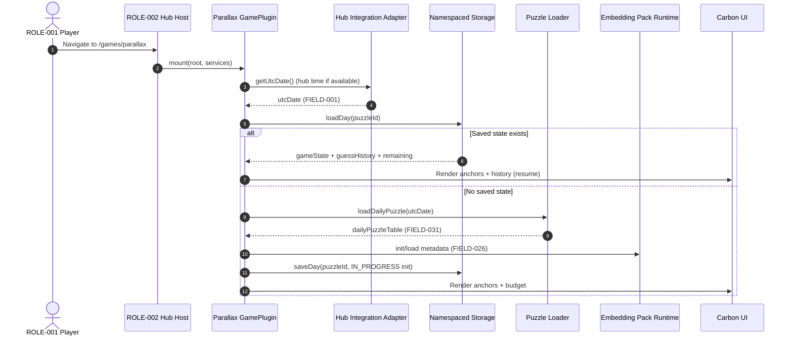
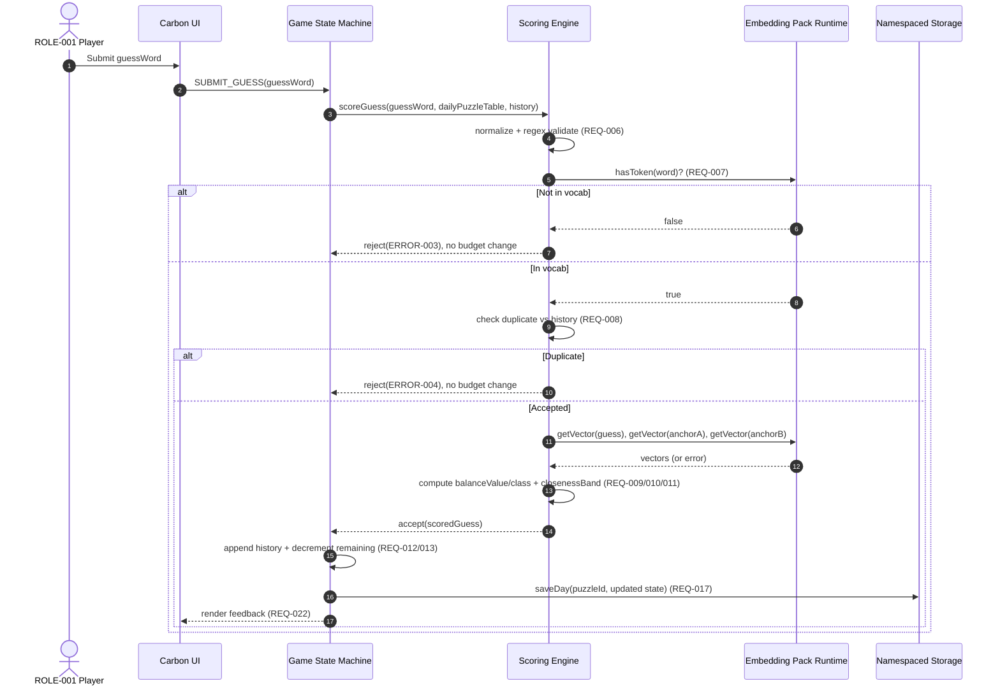
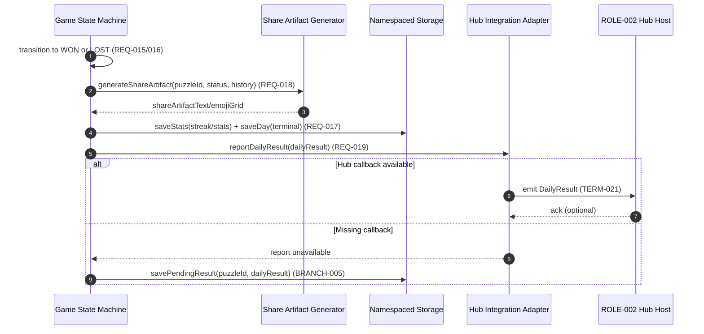
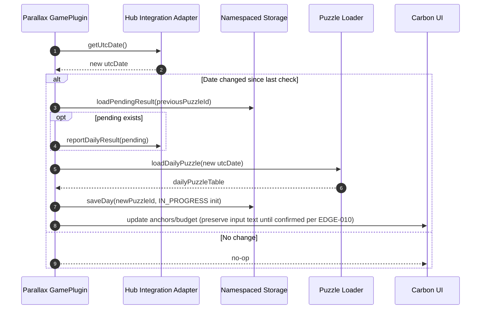
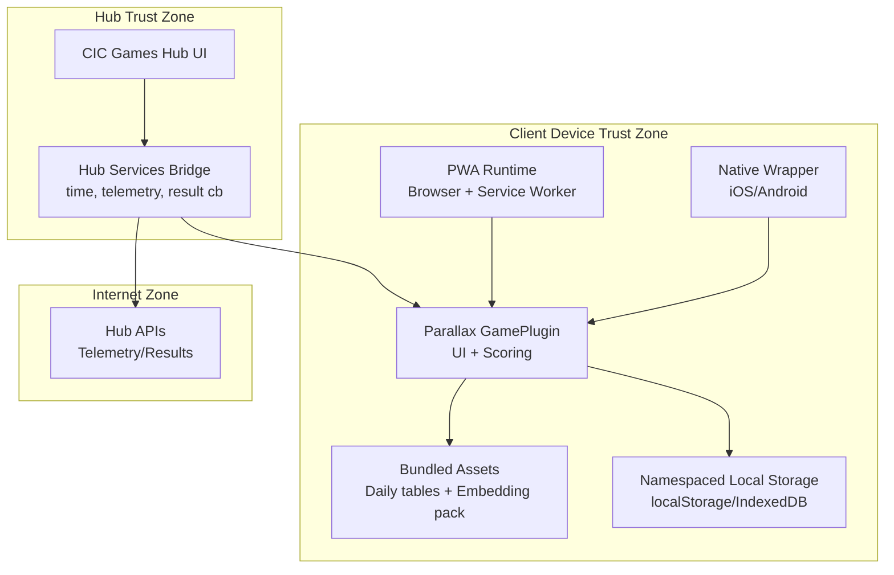

<!-- generated: 2026-07-25T16:15:12Z -->
<!-- mode: feature -->
<!-- feature-slug: parallax -->
<!-- a2a-endpoint: https://bob-sdlc-orchestrator.2as6l7wq9qj8.eu-gb.codeengine.appdomain.cloud/v1/rpc -->

# Glossary

## Terms

### TERM-001: Parallax Game
- **Definition:** The daily two-anchor semantic midpoint word game implemented as a GamePlugin within the CIC Games hub.
- **Synonyms:** Parallax, Parallax daily puzzle
- **Anti-definition:** Not a single-anchor semantic distance game (e.g., Semantle/Contexto).
- **Source:** User request

### TERM-002: Daily Puzzle
- **Definition:** The deterministic Parallax challenge for a specific UTC date, identical for all players.
- **Synonyms:** Daily, today’s puzzle, puzzle-of-the-day
- **Anti-definition:** Not user-personalized or randomized per device.
- **Source:** User request

### TERM-003: UTC Day Boundary
- **Definition:** The rule that a new Daily Puzzle starts at 00:00:00 UTC and ends at 23:59:59 UTC.
- **Synonyms:** UTC rollover, UTC reset
- **Anti-definition:** Not local-time midnight.
- **Source:** User request

### TERM-004: Anchor Word
- **Definition:** One of the two displayed words defining endpoints in semantic embedding space for the Daily Puzzle.
- **Synonyms:** Anchor A, Anchor B, endpoint word
- **Anti-definition:** Not the hidden target word; not a guess.
- **Source:** User request

### TERM-005: Target Word
- **Definition:** The single hidden solution word for the Daily Puzzle whose embedding is the intended midpoint between the two Anchor Words.
- **Synonyms:** Solution, answer
- **Anti-definition:** Not displayed to the player during play; not an anchor.
- **Source:** User request

### TERM-006: Word Embedding
- **Definition:** A numeric vector representation of a word used to compute semantic distance and balance metrics.
- **Synonyms:** Embedding vector
- **Anti-definition:** Not an on-device ML model; not computed at runtime.
- **Source:** User request

### TERM-007: Quantised Embedding Pack
- **Definition:** The bundled, build-time-generated table of word embeddings stored in a compact quantised form and shipped with the app for on-device lookup.
- **Synonyms:** Embedding table, word pack, vector pack
- **Anti-definition:** Not a remote service; not a full model distribution.
- **Source:** User request

### TERM-008: Semantic Distance
- **Definition:** A scalar distance measure computed between two Word Embeddings (e.g., cosine distance) used in scoring.
- **Synonyms:** Similarity distance, embedding distance
- **Anti-definition:** Not edit distance; not lexical similarity.
- **Source:** User request

### TERM-009: Midpoint (Semantic)
- **Definition:** The intended balance point between the two Anchor Words in embedding space (the target vicinity the player searches for).
- **Synonyms:** Balance point, equidistant point
- **Anti-definition:** Not the arithmetic midpoint of word strings; not geographic.
- **Source:** User request

### TERM-010: Balance Metric
- **Definition:** A spoiler-safe signal indicating whether a guess is closer to Anchor A, closer to Anchor B, or approximately balanced between them.
- **Synonyms:** Balance meter, tilt indicator
- **Anti-definition:** Not the identity of the target word; not exact distances to anchors.
- **Source:** User request

### TERM-011: Closeness Metric (to Midpoint)
- **Definition:** A spoiler-safe scalar or banded indication of how near a guess is to the hidden target’s midpoint region.
- **Synonyms:** Proximity, closeness score, heat
- **Anti-definition:** Not a direct rank list; not revealing the target word.
- **Source:** User request

### TERM-012: Balance Band
- **Definition:** A precomputed category/range for balance used to produce consistent, spoiler-safe feedback for guesses.
- **Synonyms:** Band, bucket
- **Anti-definition:** Not an adaptive threshold per user.
- **Source:** User request

### TERM-013: Guess
- **Definition:** A player-submitted candidate word evaluated against the day’s anchors and target midpoint metrics via on-device table lookup.
- **Synonyms:** Attempt
- **Anti-definition:** Not an anchor; not the stored target unless it matches.
- **Source:** User request

### TERM-014: Guess Budget
- **Definition:** The fixed maximum number of guesses allowed in a Daily Puzzle.
- **Synonyms:** Max attempts
- **Anti-definition:** Not time-based; not unlimited.
- **Source:** User request

### TERM-015: Game Session
- **Definition:** A play instance from opening the Parallax game UI until completion/exit, typically under 3 minutes.
- **Synonyms:** Session
- **Anti-definition:** Not a server-side session; not an account requirement.
- **Source:** User request

### TERM-016: Offline-first PWA
- **Definition:** A web application using service worker caching so the Daily Puzzle is playable without network once assets are installed.
- **Synonyms:** PWA offline mode
- **Anti-definition:** Not requiring online validation per guess.
- **Source:** User request

### TERM-017: Native Wrapper (iOS/Android)
- **Definition:** The iOS and Android app containers that host the Parallax experience with the same core logic and asset pack.
- **Synonyms:** Mobile app, iOS app, Android app
- **Anti-definition:** Not separate gameplay rules per platform.
- **Source:** User request

### TERM-018: IBM Carbon Design System UI
- **Definition:** The design system components, patterns, and accessibility conventions used for Parallax UI.
- **Synonyms:** Carbon components
- **Anti-definition:** Not bespoke UI patterns that contradict Carbon accessibility norms.
- **Source:** User request

### TERM-019: GamePlugin
- **Definition:** The CIC Games hub integration interface providing `mount(root, services)` and receiving results via `DailyResult`.
- **Synonyms:** Plugin, hub plugin
- **Anti-definition:** Not a standalone app without hub services.
- **Source:** User request

### TERM-020: Hub Services
- **Definition:** The services object provided by the hub to the GamePlugin (e.g., navigation, telemetry, storage helpers, time source).
- **Synonyms:** services
- **Anti-definition:** Not direct backend access required for scoring.
- **Source:** User request

### TERM-021: DailyResult
- **Definition:** The structured outcome reported to the hub for the current UTC day (win/loss, guess count, share artifact, streak impact).
- **Synonyms:** Result payload
- **Anti-definition:** Not raw guess words (to avoid spoilers).
- **Source:** User request

### TERM-022: Namespaced Local Storage
- **Definition:** Per-game storage partition used to store Parallax stats/streaks without colliding with other hub games.
- **Synonyms:** Namespaced storage, per-game storage
- **Anti-definition:** Not cross-game shared keys.
- **Source:** User request

### TERM-023: Streak
- **Definition:** Count of consecutive UTC days where the player completed the Daily Puzzle (typically wins; exact rule defined in requirements).
- **Synonyms:** Win streak, daily streak
- **Anti-definition:** Not tied to local timezone.
- **Source:** User request

### TERM-024: Player Stats
- **Definition:** Aggregated performance metrics stored locally (e.g., played count, win count, distribution of guesses).
- **Synonyms:** Statistics
- **Anti-definition:** Not server-synced account stats (unless hub provides).
- **Source:** User request

### TERM-025: Spoiler-safe Share Artifact
- **Definition:** A shareable text/emoji representation of a run encoding balance/closeness per guess without revealing anchors, target, or guessed words.
- **Synonyms:** Share card (text), emoji grid, trajectory
- **Anti-definition:** Not including the actual words.
- **Source:** User request

### TERM-026: Fairness Gate (Build-time)
- **Definition:** A build pipeline step that selects the day’s anchors/target and precomputes balance bands ensuring a unique, smoothly-solvable midpoint.
- **Synonyms:** Puzzle generator gate, quality gate
- **Anti-definition:** Not performed at runtime on the user device.
- **Source:** User request

### TERM-027: Deterministic Seed
- **Definition:** The rule that the Daily Puzzle is derived from the UTC date (and build pack) so all players receive identical anchors/target.
- **Synonyms:** Date seed
- **Anti-definition:** Not based on device ID or randomness per user.
- **Source:** User request

### TERM-028: Accessibility Compliance (WCAG 2.1 AA)
- **Definition:** Requirements ensuring keyboard operability, non-color-only state, visible focus, and reduced motion support.
- **Synonyms:** WCAG AA, a11y
- **Anti-definition:** Not “best effort” accessibility.
- **Source:** User request

### TERM-029: Reduced Motion Preference
- **Definition:** OS/browser preference that indicates animations should be reduced; Parallax respects it.
- **Synonyms:** prefers-reduced-motion
- **Anti-definition:** Not ignored for celebratory animations.
- **Source:** User request

### TERM-030: On-device Validation
- **Definition:** Evaluating guesses solely through local lookup into the Quantised Embedding Pack and daily precomputed puzzle data.
- **Synonyms:** Local scoring
- **Anti-definition:** Not server-side scoring for each guess.
- **Source:** User request

## Data Dictionary

| ID | Name | Type | Format | Range | Units | Default | Nullable | PII | Source | Validation |
|---|---|---|---|---|---|---|---|---|---|---|
| FIELD-001 | utcDate | string | `YYYY-MM-DD` | valid ISO date | day | (none) | No | Non-PII | TERM-003 | Must parse as UTC date; must match device UTC day when used for “today”. |
| FIELD-002 | puzzleId | string | `parallax-YYYY-MM-DD` | pattern | n/a | derived | No | Non-PII | TERM-002/027 | Must equal `parallax-` + FIELD-001. |
| FIELD-003 | anchorAWord | string | lowercase token | embedding vocab | n/a | (none) | No | Non-PII | TERM-004/002 | Must exist in TERM-007 vocabulary. |
| FIELD-004 | anchorBWord | string | lowercase token | embedding vocab | n/a | (none) | No | Non-PII | TERM-004/002 | Must exist in TERM-007 vocabulary; must not equal FIELD-003. |
| FIELD-005 | targetWord | string | lowercase token | embedding vocab | n/a | (hidden) | No | Non-PII | TERM-005/002 | Must exist in TERM-007 vocabulary; must not equal FIELD-003/004. |
| FIELD-006 | guessBudget | integer | int32 | 1..50 | guesses | 12 | No | Non-PII | TERM-014 | Must be ≥1. |
| FIELD-007 | guessIndex | integer | int32 | 1..FIELD-006 | attempt | (none) | No | Non-PII | TERM-013 | Must increment by 1 per accepted guess. |
| FIELD-008 | guessWord | string | lowercase token | 1..64 chars | n/a | (none) | No | Non-PII | TERM-013 | Trim; must match vocab token regex `^[a-z][a-z\-']*$`; must exist in TERM-007 vocabulary. |
| FIELD-009 | guessAcceptedAt | string | ISO-8601 | datetime | n/a | now | No | Non-PII | TERM-015 | Must be valid ISO timestamp. |
| FIELD-010 | balanceClass | enum | `A|B|BALANCED` | fixed | n/a | (none) | No | Non-PII | TERM-010 | Derived from relative distances to anchors using precomputed thresholds. |
| FIELD-011 | balanceValue | number | float | 0..1 | ratio | (none) | No | Non-PII | TERM-010 | 0 means fully toward A, 1 fully toward B; computed deterministically from distances. |
| FIELD-012 | closenessBand | integer | int32 | 0..9 | band | (none) | No | Non-PII | TERM-011/012 | 0 = farthest, 9 = closest; derived from precomputed bands for the day. |
| FIELD-013 | isExactSolution | boolean | boolean | true/false | n/a | false | No | Non-PII | TERM-005/013 | True iff FIELD-008 equals FIELD-005. |
| FIELD-014 | remainingGuesses | integer | int32 | 0..FIELD-006 | guesses | computed | No | Non-PII | TERM-014 | Must equal FIELD-006 - accepted guesses count. |
| FIELD-015 | gameState | enum | `NOT_STARTED|IN_PROGRESS|WON|LOST|EXPIRED` | fixed | n/a | NOT_STARTED | No | Non-PII | TERM-015/002 | Must transition per state machine in requirements. |
| FIELD-016 | guessHistory | array | JSON array | length 0..FIELD-006 | n/a | [] | No | Non-PII | TERM-013 | Each entry must include FIELD-007, FIELD-008, FIELD-010, FIELD-012. |
| FIELD-017 | shareArtifactText | string | plain text | 1..2000 chars | n/a | (none) | Yes | Non-PII | TERM-025 | Must not contain FIELD-003/004/005 or any FIELD-008 from history. |
| FIELD-018 | shareArtifactEmojiGrid | string | unicode | pattern | n/a | (none) | Yes | Non-PII | TERM-025 | Must encode exactly one row per guess; only allowed emoji set. |
| FIELD-019 | playedCount | integer | int32 | 0..1e9 | days | 0 | No | Non-PII | TERM-024 | Non-decreasing. |
| FIELD-020 | winCount | integer | int32 | 0..FIELD-019 | wins | 0 | No | Non-PII | TERM-024 | Must be ≤ FIELD-019. |
| FIELD-021 | currentStreak | integer | int32 | 0..1e6 | days | 0 | No | Non-PII | TERM-023 | Updates only on daily completion. |
| FIELD-022 | maxStreak | integer | int32 | 0..1e6 | days | 0 | No | Non-PII | TERM-023 | Must be ≥ FIELD-021 historically. |
| FIELD-023 | lastCompletedUtcDate | string | `YYYY-MM-DD` | valid ISO date | day | (none) | Yes | Non-PII | TERM-023 | Nullable until first completion; if set must be ≤ FIELD-001 when evaluated. |
| FIELD-024 | pluginNamespace | string | slug | `[a-z0-9\-]+` | n/a | `parallax` | No | Non-PII | TERM-019/022 | Must be stable across versions. |
| FIELD-025 | storageKeyPrefix | string | string | n/a | n/a | derived | No | Non-PII | TERM-022 | Must equal `${pluginNamespace}:` |
| FIELD-026 | embeddingPackVersion | string | semver/build | n/a | n/a | (none) | No | Non-PII | TERM-007 | Must match bundled pack metadata. |
| FIELD-027 | vocabSize | integer | int32 | 1..5,000,000 | words | (none) | No | Non-PII | TERM-007 | Must equal count of vocab entries in pack. |
| FIELD-028 | vectorDim | integer | int32 | 1..4096 | dims | (none) | No | Non-PII | TERM-006/007 | Must match pack metadata. |
| FIELD-029 | quantizationScheme | enum | `INT8|INT4|FP16` | fixed | n/a | INT8 | No | Non-PII | TERM-007 | Must match pack metadata. |
| FIELD-030 | distanceMetric | enum | `COSINE` | fixed | n/a | COSINE | No | Non-PII | TERM-008 | Must be supported by implementation. |
| FIELD-031 | dailyPuzzleTable | object | JSON/binary | n/a | n/a | (none) | No | Non-PII | TERM-026 | Must include anchors, target, and band thresholds for FIELD-001. |
| FIELD-032 | balanceThresholdBalanced | number | float | 0..1 | ratio | 0.5 | No | Non-PII | TERM-012 | Defines tolerance window around midpoint for BALANCED classification. |
| FIELD-033 | bandThresholds | array | JSON array | monotonic | n/a | (none) | No | Non-PII | TERM-012 | Must be strictly monotonic and length = 10 (for 0..9). |
| FIELD-034 | mountRootElementId | string | DOM id | n/a | n/a | (none) | No | Non-PII | TERM-019 | Must exist in DOM at mount time. |
| FIELD-035 | dailyResult | object | JSON | n/a | n/a | (none) | No | Non-PII | TERM-021 | Must exclude guess words and target/anchors. |
| FIELD-036 | dailyResultStatus | enum | `WON|LOST` | fixed | n/a | (none) | No | Non-PII | TERM-021 | Must match terminal FIELD-015 mapping. |
| FIELD-037 | dailyResultGuessCount | integer | int32 | 1..FIELD-006 | guesses | (none) | No | Non-PII | TERM-021 | Required when reporting completion. |
| FIELD-038 | telemetryEventName | string | string | n/a | n/a | (none) | No | Non-PII | TERM-020 | Must be from allowed enum list per hub. |
| FIELD-039 | prefersReducedMotion | boolean | boolean | true/false | n/a | false | No | Non-PII | TERM-029 | Derived from OS/browser setting. |
| FIELD-040 | uiLocale | string | BCP-47 | n/a | n/a | `en` | No | Non-PII | TERM-018 | Must be valid BCP-47 tag. |

# User Journeys

## Roles

| Role ID | Role Name | Type | Description |
|---|---|---|---|
| ROLE-001 | Player | Primary | Plays the Daily Puzzle, makes guesses, shares results. |
| ROLE-002 | Hub Host | System | Provides TERM-020 Hub Services, mounts TERM-019 GamePlugin, consumes TERM-021 DailyResult. |
| ROLE-003 | OS/Browser | System | Provides storage, offline cache, and accessibility preferences (e.g., FIELD-039). |
| ROLE-004 | Build Pipeline | Admin/System | Generates TERM-007 Quantised Embedding Pack and TERM-031 daily puzzle table via TERM-026 Fairness Gate. |

## Entry Points

| Entry ID | Location | Trigger | Auth |
|---|---|---|---|
| ENTRY-001 | Hub UI route `/games/parallax` | Player selects game tile | Hub-controlled (no Parallax auth) |
| ENTRY-002 | GamePlugin API `mount(root, services)` | Hub Host mounts plugin | Trusted host call |
| ENTRY-003 | In-game “Share” action | Player presses Share button | None |
| ENTRY-004 | UTC rollover event (timer/check) | System clock crosses TERM-003 boundary | None |
| ENTRY-005 | App install / first load | Player opens PWA/native app | None |

## Role Permission Matrix

| Capability | ROLE-001 Player | ROLE-002 Hub Host | ROLE-003 OS/Browser | ROLE-004 Build Pipeline |
|---|---:|---:|---:|---:|
| View anchors (TERM-004) | Yes | Indirect | No | Yes |
| Submit guess (TERM-013) | Yes | No | No | No |
| Compute feedback (TERM-010/011) | Indirect (client) | No | No | No |
| Persist stats (TERM-024/022) | Indirect (client) | Indirect | Yes (storage) | No |
| Read reduced motion pref (TERM-029) | Indirect | No | Yes | No |
| Generate daily tables (TERM-026) | No | No | No | Yes |
| Receive DailyResult (TERM-021) | No | Yes | No | No |

## Journeys

### JOURNEY-001: Start today’s Daily Puzzle
- **Role/Goal:** ROLE-001 Player; start TERM-002 Daily Puzzle for FIELD-001 and view TERM-004 anchors.
- **Entry:** ENTRY-001 + ENTRY-002
- **Happy path:**
  1. Hub Host calls `mount(root, services)` with FIELD-034 and TERM-020 services. (TERM-019)
  2. Game reads current FIELD-001 (UTC date) using hub time service or device UTC. (TERM-003)
  3. Game loads FIELD-031 daily puzzle data for FIELD-001 from bundled assets. (TERM-026/007)
  4. Game sets FIELD-015 to `IN_PROGRESS` if not already terminal for FIELD-001. (TERM-015)
  5. Game displays FIELD-003 and FIELD-004 as Anchor Words using TERM-018 UI patterns. (TERM-004)
  6. Game displays FIELD-006 guess budget and FIELD-014 remaining guesses. (TERM-014)
- **Decision branches:**
  - **BRANCH-001:** Existing saved state for today
    - If local saved FIELD-016 exists for FIELD-001, load it and resume with same remaining guesses.
  - **BRANCH-002:** Puzzle already completed today
    - If FIELD-015 is `WON` or `LOST` for FIELD-001, show results and share options only.
- **Error states:**
  - **ERROR-001:** Missing daily puzzle asset for FIELD-001
    - **Trigger:** FIELD-031 not found or fails validation.
    - **System response:** Show blocking error with retry and “Check for update” guidance.
    - **Recovery:** LOOP-001.
  - **ERROR-002:** Corrupt local save
    - **Trigger:** FIELD-016 fails schema validation.
    - **System response:** Offer reset for today (clears today state) and logs telemetry.
    - **Recovery:** Player selects reset → restart JOURNEY-001 step 3.
- **Loop-back paths:**
  - **LOOP-001:** Retry load assets
    - Player taps Retry → re-run step 3.
- **Edge cases:**
  - **EDGE-001:** Offline at start
    - Assets must still load from cache/bundle; no network required. (TERM-016/030)
  - **EDGE-002:** UTC day changes while on start screen
    - If ENTRY-004 occurs before first guess, reload FIELD-001 and daily data.
  - **EDGE-003:** Concurrent mounts
    - If hub calls mount twice, second mount must not duplicate timers or storage writes.

### JOURNEY-002: Submit a guess and receive spoiler-safe feedback
- **Role/Goal:** ROLE-001 Player; enter TERM-013 Guess and receive TERM-010 Balance Metric + TERM-011 Closeness Metric.
- **Entry:** ENTRY-001 (in-game input)
- **Happy path:**
  1. Player types FIELD-008 guessWord in input and submits.
  2. Game normalizes FIELD-008 (trim, lowercase) and validates it exists in TERM-007 vocabulary. (TERM-030)
  3. Game computes FIELD-011 balanceValue and derives FIELD-010 balanceClass relative to FIELD-003/FIELD-004. (TERM-010)
  4. Game computes FIELD-012 closenessBand using FIELD-033 bandThresholds for today. (TERM-011/012)
  5. Game appends entry to FIELD-016 guessHistory with FIELD-007 guessIndex and FIELD-009 timestamp.
  6. Game decrements FIELD-014 remainingGuesses and renders feedback in the guess list and meters (not color-only). (TERM-028)
  7. If FIELD-013 is true, transition to terminal state `WON`. (TERM-005)
- **Decision branches:**
  - **BRANCH-003:** Guess is the target
    - If FIELD-013 true → go to JOURNEY-003 (win flow).
  - **BRANCH-004:** Guess budget exhausted
    - If FIELD-014 becomes 0 and FIELD-013 false → transition to `LOST` and go to JOURNEY-004.
- **Error states:**
  - **ERROR-003:** Guess not in vocabulary
    - **Trigger:** FIELD-008 fails vocab lookup.
    - **System response:** Show inline message “Word not in list” and do not consume budget.
    - **Recovery:** Player edits guess and resubmits.
  - **ERROR-004:** Duplicate guess
    - **Trigger:** FIELD-008 already exists in FIELD-016.
    - **System response:** Inform duplicate; do not consume budget.
    - **Recovery:** Enter new word.
  - **ERROR-005:** Scoring data missing
    - **Trigger:** Embedding lookup for FIELD-008 fails despite vocab presence.
    - **System response:** Show error and do not consume budget; log telemetry.
    - **Recovery:** Retry or reset today.
- **Loop-back paths:**
  - **LOOP-002:** Iterative guessing
    - After step 6, return to step 1 until BRANCH-003 or BRANCH-004.
- **Edge cases:**
  - **EDGE-004:** Rapid double-submit
    - Must dedupe identical submissions within same UI tick; only one accepted.
  - **EDGE-005:** Input method editor (IME) composition
    - Submission must not interrupt IME composition mid-word.
  - **EDGE-006:** Very long token / invalid characters
    - Must block per FIELD-008 validation; do not consume budget.

### JOURNEY-003: Win the Daily Puzzle and report result
- **Role/Goal:** ROLE-001 Player; complete puzzle with `WON`, update TERM-023 streak, and provide TERM-025 share artifact; ROLE-002 consumes TERM-021.
- **Entry:** From JOURNEY-002 BRANCH-003
- **Happy path:**
  1. Game sets FIELD-015 to `WON`.
  2. Game updates FIELD-019 playedCount, FIELD-020 winCount, FIELD-021 currentStreak, FIELD-022 maxStreak, FIELD-023 lastCompletedUtcDate using FIELD-001. (TERM-022/023/024)
  3. Game generates FIELD-017/018 share artifact encoding FIELD-010 and FIELD-012 per guess without words. (TERM-025)
  4. Game constructs FIELD-035 dailyResult with FIELD-036 and FIELD-037 and share artifact.
  5. Game reports TERM-021 DailyResult to Hub Host via provided services callback.
  6. UI shows completion summary and Share button.
- **Decision branches:**
  - **BRANCH-005:** Reporting unavailable
    - If hub result callback absent, store FIELD-035 locally and retry on next mount.
- **Error states:**
  - **ERROR-006:** Storage quota exceeded
    - **Trigger:** write to Namespaced Local Storage fails.
    - **System response:** Show message that stats may not persist; allow share.
    - **Recovery:** Player can clear space / reset.
- **Edge cases:**
  - **EDGE-007:** UTC rollover after win but before report
    - Result must still be attributed to FIELD-001 (the puzzle played), not the new day.

### JOURNEY-004: Lose by running out of guesses and report result
- **Role/Goal:** ROLE-001 Player; complete puzzle with `LOST`, update stats/streak rules, share spoiler-safe artifact, report TERM-021.
- **Entry:** From JOURNEY-002 BRANCH-004
- **Happy path:**
  1. Game sets FIELD-015 to `LOST`.
  2. Game updates FIELD-019 playedCount and streak fields per defined streak rule for losses.
  3. Game generates FIELD-017/018 share artifact from guesses.
  4. Game reports FIELD-035 dailyResult with FIELD-036=`LOST`.
  5. UI shows loss summary and Share button (without revealing FIELD-005).
- **Decision branches:**
  - **BRANCH-006:** Player requests reveal
    - If “Reveal target” is offered, it must be gated to avoid share leakage (optional feature; see requirements).
- **Edge cases:**
  - **EDGE-008:** Player closes app at last guess
    - On next mount, terminal state must be restored and result reporting retried if pending.

### JOURNEY-005: Share spoiler-safe results
- **Role/Goal:** ROLE-001 Player; copy/share TERM-025 artifact that hides words.
- **Entry:** ENTRY-003
- **Happy path:**
  1. Player taps Share.
  2. Game renders FIELD-017 shareArtifactText including FIELD-002 puzzleId, outcome, guess count, and emoji grid (FIELD-018).
  3. Game copies to clipboard and/or invokes native share sheet (platform-dependent).
- **Error states:**
  - **ERROR-007:** Clipboard/share not available
    - **Trigger:** Platform API denied/unavailable.
    - **System response:** Show selectable text field containing FIELD-017.
    - **Recovery:** Manual copy.
- **Edge cases:**
  - **EDGE-009:** Spoiler leakage via words
    - Artifact must not include FIELD-003/004/005 or any FIELD-008.

### JOURNEY-006: UTC rollover and starting the new day
- **Role/Goal:** ROLE-001 Player; see the new puzzle after TERM-003 boundary; ROLE-003 triggers time change.
- **Entry:** ENTRY-004 (timer/check) or ENTRY-001 after boundary
- **Happy path:**
  1. Game detects FIELD-001 changed since last check.
  2. Game finalizes any pending report for previous day (if exists) without altering that day’s state.
  3. Game loads new FIELD-031 for new FIELD-001 and resets FIELD-016 and FIELD-015 to start new puzzle.
  4. UI updates anchors and remaining guesses.
- **Error states:**
  - **ERROR-008:** Device clock skew
    - **Trigger:** Hub time service disagrees with device UTC (if both available).
    - **System response:** Prefer hub time; show non-blocking notice if mismatch exceeds threshold.
    - **Recovery:** Continue with hub time.
- **Edge cases:**
  - **EDGE-010:** Rollover mid-guess entry
    - Must not discard text in the input; only reset on explicit confirm.

## Journey Map

```mermaid
flowchart TD
  A[ENTRY-001 Open /games/parallax] --> B[ENTRY-002 mount(root, services)]
  B --> C[JOURNEY-001 Start puzzle]
  C --> D[JOURNEY-002 Submit guess]
  D -->|BRANCH-003 isExactSolution| E[JOURNEY-003 Win]
  D -->|BRANCH-004 budget exhausted| F[JOURNEY-004 Lose]
  E --> G[JOURNEY-005 Share]
  F --> G
  C -->|ENTRY-004 UTC rollover| H[JOURNEY-006 New day]
  D -->|ENTRY-004 UTC rollover| H
  H --> C
```

# Requirements

### REQ-001: Plugin mount initializes Parallax UI
- **EARS Pattern:** Event-Driven
- **EARS Statement:** When ENTRY-002 occurs, the Parallax Game (TERM-001) shall render its UI into FIELD-034.
- **Inputs:** FIELD-034
- **Outputs:** Mounted UI
- **Preconditions:** Hub Host provides TERM-020 services.
- **Postconditions:** Game is ready to load today’s Daily Puzzle (TERM-002).
- **Invariants:** Plugin does not access network for scoring (TERM-030).
- **Trigger:** ENTRY-002
- **Actor:** ROLE-002
- **EntityScope:** TERM-019
- **ErrorModes:** root element missing
- **NFR-Tags:** compatibility
- **Source:** JOURNEY-001 step 1
- **Dependencies:** None
- **Priority:** P0
- **AcceptanceCriteria:**
  - **TEST-001:** Given a valid DOM element id, when mount is called, then Parallax renders without throwing.
  - **TEST-002:** Given an invalid DOM element id, when mount is called, then the plugin surfaces a recoverable error state.
- **Assumptions:** Hub passes a stable root reference/id.
- **OpenQuestions:** Should the plugin accept an Element reference in addition to id?

### REQ-002: Determine today’s UTC date for puzzle selection
- **EARS Pattern:** Event-Driven
- **EARS Statement:** When the Parallax Game (TERM-001) starts a Daily Puzzle (TERM-002), the system shall set FIELD-001 using UTC time (TERM-003).
- **Inputs:** Hub time service or device UTC clock
- **Outputs:** FIELD-001
- **Preconditions:** Mounted (REQ-001).
- **Postconditions:** FIELD-002 can be derived.
- **Invariants:** FIELD-001 uses UTC, not local time.
- **Trigger:** Start puzzle
- **Actor:** ROLE-001
- **EntityScope:** TERM-002
- **ErrorModes:** time source unavailable
- **NFR-Tags:** compatibility
- **Source:** JOURNEY-001 step 2
- **Dependencies:** REQ-001
- **Priority:** P0
- **AcceptanceCriteria:**
  - **TEST-003:** Given device local timezone is non-UTC, when starting, then FIELD-001 equals the current UTC date.
- **Assumptions:** A UTC-capable time source exists.
- **OpenQuestions:** Does hub provide an authoritative UTC date service?

### REQ-003: Load bundled daily puzzle data for the UTC date
- **EARS Pattern:** Event-Driven
- **EARS Statement:** When FIELD-001 is set, the system shall load FIELD-031 for FIELD-001 from bundled assets.
- **Inputs:** FIELD-001
- **Outputs:** FIELD-031
- **Preconditions:** Bundled assets include daily puzzle table(s).
- **Postconditions:** FIELD-003, FIELD-004, FIELD-005, FIELD-033 available for scoring.
- **Invariants:** Loading does not require network (TERM-016/030).
- **Trigger:** FIELD-001 set
- **Actor:** ROLE-003
- **EntityScope:** TERM-002
- **ErrorModes:** asset missing
- **NFR-Tags:** offline, reliability
- **Source:** JOURNEY-001 step 3, ERROR-001
- **Dependencies:** REQ-002
- **Priority:** P0
- **AcceptanceCriteria:**
  - **TEST-004:** Given offline mode, when loading today, then FIELD-031 loads successfully from local assets.
  - **TEST-005:** Given missing asset for today, when loading, then ERROR-001 UI is displayed.
- **Assumptions:** The build ships the required date range.
- **OpenQuestions:** How many days of puzzles are bundled per release?

### REQ-004: Display the two anchor words
- **EARS Pattern:** Event-Driven
- **EARS Statement:** When FIELD-031 is loaded, the system shall display FIELD-003 and FIELD-004 to the Player (ROLE-001).
- **Inputs:** FIELD-003, FIELD-004
- **Outputs:** Rendered anchors
- **Preconditions:** REQ-003 satisfied.
- **Postconditions:** Player can start guessing.
- **Invariants:** Anchors are visible throughout IN_PROGRESS state.
- **Trigger:** FIELD-031 loaded
- **Actor:** ROLE-001
- **EntityScope:** TERM-004
- **ErrorModes:** none
- **NFR-Tags:** accessibility
- **Source:** JOURNEY-001 step 5
- **Dependencies:** REQ-003
- **Priority:** P0
- **AcceptanceCriteria:**
  - **TEST-006:** Given loaded puzzle, then both anchors are visible and readable via screen reader labels.
- **Assumptions:** Anchors are single tokens in vocab.
- **OpenQuestions:** Are multi-word anchors allowed?

### REQ-005: Initialize guess budget and remaining guesses
- **EARS Pattern:** Event-Driven
- **EARS Statement:** When a Daily Puzzle (TERM-002) enters `IN_PROGRESS`, the system shall set FIELD-014 based on FIELD-006.
- **Inputs:** FIELD-006
- **Outputs:** FIELD-014
- **Preconditions:** Puzzle state transitions to IN_PROGRESS.
- **Postconditions:** UI can show remaining guesses.
- **Invariants:** FIELD-014 is an integer within 0..FIELD-006.
- **Trigger:** State enters IN_PROGRESS
- **Actor:** ROLE-003
- **EntityScope:** TERM-014
- **ErrorModes:** none
- **NFR-Tags:** none
- **Source:** JOURNEY-001 step 6
- **Dependencies:** REQ-003
- **Priority:** P0
- **AcceptanceCriteria:**
  - **TEST-007:** Given FIELD-006=12 at start, then FIELD-014=12 before first guess.
- **Assumptions:** Default guess budget is acceptable unless configured by hub.
- **OpenQuestions:** Is FIELD-006 fixed globally or per-day?

### REQ-006: Validate guess token format before lookup
- **EARS Pattern:** Event-Driven
- **EARS Statement:** When the Player (ROLE-001) submits FIELD-008, the system shall reject the guess if FIELD-008 fails FIELD-008 validation rules.
- **Inputs:** FIELD-008
- **Outputs:** Validation error message
- **Preconditions:** FIELD-015=`IN_PROGRESS`.
- **Postconditions:** No change to FIELD-016 or FIELD-014 on rejection.
- **Invariants:** Rejected guesses do not consume budget.
- **Trigger:** Guess submit
- **Actor:** ROLE-001
- **EntityScope:** TERM-013
- **ErrorModes:** invalid characters/length
- **NFR-Tags:** accessibility
- **Source:** JOURNEY-002 step 2, EDGE-006
- **Dependencies:** REQ-004, REQ-005
- **Priority:** P0
- **AcceptanceCriteria:**
  - **TEST-008:** Given guessWord contains digits, when submitted, then it is rejected and remaining guesses unchanged.
- **Assumptions:** Allowed token regex is sufficient for game vocab.
- **OpenQuestions:** Should accents/diacritics be supported?

### REQ-007: Validate guess exists in the embedding vocabulary
- **EARS Pattern:** Event-Driven
- **EARS Statement:** When the Player (ROLE-001) submits FIELD-008, the system shall reject the guess if FIELD-008 is not present in the Quantised Embedding Pack (TERM-007).
- **Inputs:** FIELD-008, TERM-007 vocabulary
- **Outputs:** ERROR-003 UI
- **Preconditions:** FIELD-015=`IN_PROGRESS`.
- **Postconditions:** FIELD-014 unchanged.
- **Invariants:** No network call is made for validation (TERM-030).
- **Trigger:** Guess submit
- **Actor:** ROLE-001
- **EntityScope:** TERM-007
- **ErrorModes:** vocab miss
- **NFR-Tags:** offline
- **Source:** JOURNEY-002 step 2, ERROR-003
- **Dependencies:** REQ-003
- **Priority:** P0
- **AcceptanceCriteria:**
  - **TEST-009:** Given a word not in vocab, when submitted, then “Word not in list” appears and guess is not added to history.
- **Assumptions:** Vocab membership check is deterministic.
- **OpenQuestions:** Should near-miss suggestions be shown (risk of spoilers)?

### REQ-008: Prevent duplicate guesses from consuming budget
- **EARS Pattern:** Event-Driven
- **EARS Statement:** When the Player (ROLE-001) submits FIELD-008, the system shall reject the guess if FIELD-008 already exists in FIELD-016.
- **Inputs:** FIELD-008, FIELD-016
- **Outputs:** ERROR-004 UI
- **Preconditions:** FIELD-015=`IN_PROGRESS`.
- **Postconditions:** FIELD-014 unchanged.
- **Invariants:** Duplicate detection is case-insensitive (due to normalization).
- **Trigger:** Guess submit
- **Actor:** ROLE-001
- **EntityScope:** TERM-013
- **ErrorModes:** duplicate guess
- **NFR-Tags:** none
- **Source:** JOURNEY-002 ERROR-004
- **Dependencies:** REQ-006
- **Priority:** P0
- **AcceptanceCriteria:**
  - **TEST-010:** Given “ocean” already guessed, when submitting “OCEAN”, then it is rejected as duplicate and budget unchanged.
- **Assumptions:** Guess history is stored for the day.
- **OpenQuestions:** Should duplicates be allowed but not counted (current: rejected)?

### REQ-009: Compute balance value for a valid guess
- **EARS Pattern:** Event-Driven
- **EARS Statement:** When a valid FIELD-008 is accepted, the system shall compute FIELD-011 from the Semantic Distance (TERM-008) between the guess and FIELD-003 and between the guess and FIELD-004.
- **Inputs:** FIELD-008 embedding, FIELD-003 embedding, FIELD-004 embedding, FIELD-030
- **Outputs:** FIELD-011
- **Preconditions:** REQ-007 passed; embeddings available in TERM-007.
- **Postconditions:** FIELD-010 can be derived.
- **Invariants:** Computation is deterministic for a given pack version (FIELD-026).
- **Trigger:** Guess accepted
- **Actor:** ROLE-003
- **EntityScope:** TERM-010
- **ErrorModes:** embedding missing
- **NFR-Tags:** offline, performance
- **Source:** JOURNEY-002 step 3, ERROR-005
- **Dependencies:** REQ-003, REQ-007
- **Priority:** P0
- **AcceptanceCriteria:**
  - **TEST-011:** Given the same pack version and inputs, when computing twice, then FIELD-011 is identical.
- **Assumptions:** Distance metric is FIELD-030=`COSINE`.
- **OpenQuestions:** Exact formula for mapping distances to 0..1 balanceValue?

### REQ-010: Derive balance class from balance value
- **EARS Pattern:** Event-Driven
- **EARS Statement:** When FIELD-011 is computed, the system shall set FIELD-010 based on FIELD-032.
- **Inputs:** FIELD-011, FIELD-032
- **Outputs:** FIELD-010
- **Preconditions:** REQ-009 satisfied.
- **Postconditions:** UI can show closer-to-A/B/balanced state.
- **Invariants:** BALANCED is a tolerance window around midpoint defined by FIELD-032.
- **Trigger:** FIELD-011 computed
- **Actor:** ROLE-003
- **EntityScope:** TERM-010
- **ErrorModes:** none
- **NFR-Tags:** accessibility
- **Source:** JOURNEY-002 step 3
- **Dependencies:** REQ-009
- **Priority:** P0
- **AcceptanceCriteria:**
  - **TEST-012:** Given FIELD-011 within the balanced tolerance, then FIELD-010=`BALANCED`.
- **Assumptions:** FIELD-032 is provided per day or global default.
- **OpenQuestions:** Is balanced window symmetric and how wide?

### REQ-011: Compute closeness band for a valid guess
- **EARS Pattern:** Event-Driven
- **EARS Statement:** When a valid FIELD-008 is accepted, the system shall compute FIELD-012 using FIELD-033 for FIELD-001.
- **Inputs:** FIELD-008 embedding and/or derived midpoint distance, FIELD-033, FIELD-001
- **Outputs:** FIELD-012
- **Preconditions:** REQ-003 satisfied; band thresholds exist.
- **Postconditions:** Feedback is available.
- **Invariants:** FIELD-012 is an integer 0..9.
- **Trigger:** Guess accepted
- **Actor:** ROLE-003
- **EntityScope:** TERM-011
- **ErrorModes:** thresholds invalid
- **NFR-Tags:** offline, performance
- **Source:** JOURNEY-002 step 4
- **Dependencies:** REQ-003, REQ-007
- **Priority:** P0
- **AcceptanceCriteria:**
  - **TEST-013:** Given monotonic FIELD-033, when computing, then returned FIELD-012 is within 0..9.
- **Assumptions:** Closeness is computed to the day’s hidden midpoint/target region, not to anchors.
- **OpenQuestions:** Is closeness based on distance to target embedding or to exact midpoint between anchors?

### REQ-012: Append accepted guess to guess history
- **EARS Pattern:** Event-Driven
- **EARS Statement:** When a guess is accepted, the system shall append an entry to FIELD-016 containing FIELD-007, FIELD-008, FIELD-010, FIELD-012, and FIELD-009.
- **Inputs:** FIELD-008, FIELD-010, FIELD-012
- **Outputs:** Updated FIELD-016
- **Preconditions:** Guess accepted; FIELD-015=`IN_PROGRESS`.
- **Postconditions:** Guess appears in UI list.
- **Invariants:** FIELD-007 increments by 1 and starts at 1.
- **Trigger:** Guess accepted
- **Actor:** ROLE-003
- **EntityScope:** TERM-013
- **ErrorModes:** storage write failure
- **NFR-Tags:** reliability
- **Source:** JOURNEY-002 step 5
- **Dependencies:** REQ-009, REQ-010, REQ-011
- **Priority:** P0
- **AcceptanceCriteria:**
  - **TEST-014:** Given 2 prior guesses, when a new guess is accepted, then FIELD-007=3 and history length increases by 1.
- **Assumptions:** History is persisted to namespaced storage.
- **OpenQuestions:** Persist per-guess or batched?

### REQ-013: Decrement remaining guesses on accepted guess
- **EARS Pattern:** Event-Driven
- **EARS Statement:** When a guess is accepted, the system shall decrement FIELD-014 by 1.
- **Inputs:** FIELD-014
- **Outputs:** Updated FIELD-014
- **Preconditions:** FIELD-014 > 0.
- **Postconditions:** Remaining guesses displayed.
- **Invariants:** FIELD-014 shall not become negative.
- **Trigger:** Guess accepted
- **Actor:** ROLE-003
- **EntityScope:** TERM-014
- **ErrorModes:** none
- **NFR-Tags:** none
- **Source:** JOURNEY-002 step 6
- **Dependencies:** REQ-005
- **Priority:** P0
- **AcceptanceCriteria:**
  - **TEST-015:** Given FIELD-014=12, when accepting a guess, then FIELD-014=11.
- **Assumptions:** Rejected guesses do not call this path.
- **OpenQuestions:** None

### REQ-014: Detect win condition by exact target match
- **EARS Pattern:** Event-Driven
- **EARS Statement:** When a guess is accepted, the system shall set FIELD-013 to true if FIELD-008 equals FIELD-005.
- **Inputs:** FIELD-008, FIELD-005
- **Outputs:** FIELD-013
- **Preconditions:** Today’s FIELD-005 exists (REQ-003).
- **Postconditions:** Win transition can occur.
- **Invariants:** Comparison uses the same normalization as FIELD-008 validation.
- **Trigger:** Guess accepted
- **Actor:** ROLE-003
- **EntityScope:** TERM-005
- **ErrorModes:** none
- **NFR-Tags:** none
- **Source:** JOURNEY-002 step 7, BRANCH-003
- **Dependencies:** REQ-003, REQ-012
- **Priority:** P0
- **AcceptanceCriteria:**
  - **TEST-016:** Given targetWord “delta”, when guessWord “DELTA” is accepted, then FIELD-013=true.
- **Assumptions:** Target is a single vocab token.
- **OpenQuestions:** Are alternate spellings allowed (likely no)?

### REQ-015: Transition to WON state on exact solution
- **EARS Pattern:** Event-Driven
- **EARS Statement:** When FIELD-013 becomes true, the system shall set FIELD-015 to `WON`.
- **Inputs:** FIELD-013
- **Outputs:** FIELD-015
- **Preconditions:** FIELD-015=`IN_PROGRESS`.
- **Postconditions:** Completion UI is shown and result can be reported.
- **Invariants:** Terminal states prevent further guessing.
- **Trigger:** FIELD-013 becomes true
- **Actor:** ROLE-003
- **EntityScope:** TERM-015
- **ErrorModes:** none
- **NFR-Tags:** none
- **Source:** JOURNEY-002 BRANCH-003; JOURNEY-003 step 1
- **Dependencies:** REQ-014
- **Priority:** P0
- **AcceptanceCriteria:**
  - **TEST-017:** Given a correct guess, then subsequent guess submissions are blocked.
- **Assumptions:** Blocking is enforced both in UI and logic.
- **OpenQuestions:** None

### REQ-016: Transition to LOST state when budget is exhausted
- **EARS Pattern:** Event-Driven
- **EARS Statement:** When FIELD-014 becomes 0 while FIELD-015 is `IN_PROGRESS`, the system shall set FIELD-015 to `LOST`.
- **Inputs:** FIELD-014, FIELD-015
- **Outputs:** FIELD-015
- **Preconditions:** No earlier win.
- **Postconditions:** Completion UI is shown.
- **Invariants:** Terminal states prevent further guessing.
- **Trigger:** FIELD-014 becomes 0
- **Actor:** ROLE-003
- **EntityScope:** TERM-015
- **ErrorModes:** none
- **NFR-Tags:** none
- **Source:** JOURNEY-002 BRANCH-004; JOURNEY-004 step 1
- **Dependencies:** REQ-013
- **Priority:** P0
- **AcceptanceCriteria:**
  - **TEST-018:** Given remainingGuesses=1 and an accepted incorrect guess, then gameState becomes LOST.
- **Assumptions:** Incorrect means FIELD-013=false.
- **OpenQuestions:** None

### REQ-017: Persist per-day game state in namespaced storage
- **EARS Pattern:** Ubiquitous
- **EARS Statement:** The system shall store FIELD-015 and FIELD-016 under FIELD-025 for FIELD-002 in Namespaced Local Storage (TERM-022).
- **Inputs:** FIELD-015, FIELD-016, FIELD-002, FIELD-025
- **Outputs:** Stored records
- **Preconditions:** Storage is available.
- **Postconditions:** Resume is possible (BRANCH-001).
- **Invariants:** Storage keys are scoped to FIELD-024 namespace.
- **Trigger:** n/a
- **Actor:** ROLE-003
- **EntityScope:** TERM-022
- **ErrorModes:** quota exceeded
- **NFR-Tags:** reliability, privacy
- **Source:** JOURNEY-001 BRANCH-001; JOURNEY-003 ERROR-006
- **Dependencies:** REQ-012
- **Priority:** P0
- **AcceptanceCriteria:**
  - **TEST-019:** Given a partially played day, when remounting, then state resumes with identical guess history.
- **Assumptions:** Hub allows local storage usage.
- **OpenQuestions:** Should storage use IndexedDB for larger packs?

### REQ-018: Generate spoiler-safe share artifact from guess outcomes
- **EARS Pattern:** Event-Driven
- **EARS Statement:** When FIELD-015 becomes `WON` or `LOST`, the system shall generate FIELD-017 without including FIELD-003, FIELD-004, FIELD-005, or any FIELD-008 from FIELD-016.
- **Inputs:** FIELD-015, FIELD-016, FIELD-002
- **Outputs:** FIELD-017
- **Preconditions:** Terminal state reached.
- **Postconditions:** Artifact is available for copy/share.
- **Invariants:** Artifact encodes only FIELD-010 and FIELD-012 per guess.
- **Trigger:** FIELD-015 becomes terminal
- **Actor:** ROLE-001
- **EntityScope:** TERM-025
- **ErrorModes:** none
- **NFR-Tags:** privacy
- **Source:** JOURNEY-003 step 3; JOURNEY-004 step 3; EDGE-009
- **Dependencies:** REQ-015, REQ-016
- **Priority:** P0
- **AcceptanceCriteria:**
  - **TEST-020:** Given a completed game, when generating share text, then it does not contain any guessed word substring equal to an entry in FIELD-016.
- **Assumptions:** Anchors and target are treated as spoilers too.
- **OpenQuestions:** Should the artifact include the anchors’ first letters (likely no)?

### REQ-019: Report DailyResult to hub on completion
- **EARS Pattern:** Event-Driven
- **EARS Statement:** When FIELD-015 becomes `WON` or `LOST`, the system shall submit FIELD-035 to Hub Services (TERM-020).
- **Inputs:** FIELD-015, FIELD-037, FIELD-017/018
- **Outputs:** TERM-021 DailyResult submission
- **Preconditions:** Hub provides a result reporting callback.
- **Postconditions:** Hub can update hub-level UX.
- **Invariants:** FIELD-035 excludes FIELD-008 and FIELD-005.
- **Trigger:** Completion
- **Actor:** ROLE-002
- **EntityScope:** TERM-021
- **ErrorModes:** callback missing
- **NFR-Tags:** compatibility, privacy
- **Source:** JOURNEY-003 steps 4–5; BRANCH-005
- **Dependencies:** REQ-018
- **Priority:** P0
- **AcceptanceCriteria:**
  - **TEST-021:** Given completion and callback present, when completing, then a DailyResult payload is emitted with status and guess count.
- **Assumptions:** Hub defines the DailyResult schema.
- **OpenQuestions:** Exact DailyResult contract fields required by hub?

### REQ-020: Enforce UTC rollover to new puzzle
- **EARS Pattern:** Event-Driven
- **EARS Statement:** When the UTC Day Boundary (TERM-003) passes, the system shall set FIELD-001 to the new UTC date and load the corresponding FIELD-031.
- **Inputs:** Time source
- **Outputs:** Updated FIELD-001 and loaded FIELD-031
- **Preconditions:** Game is mounted.
- **Postconditions:** New anchors displayed.
- **Invariants:** Previous day state remains stored under its FIELD-002.
- **Trigger:** ENTRY-004
- **Actor:** ROLE-003
- **EntityScope:** TERM-002
- **ErrorModes:** asset missing
- **NFR-Tags:** reliability
- **Source:** JOURNEY-006 steps 1–3
- **Dependencies:** REQ-002, REQ-003
- **Priority:** P0
- **AcceptanceCriteria:**
  - **TEST-022:** Given game open at 23:59:59 UTC, when time reaches 00:00:00 UTC, then anchors update to the new day.
- **Assumptions:** Timer/check runs at a reasonable cadence (implementation-defined).
- **OpenQuestions:** Minimum polling interval acceptable?

### REQ-021: Keyboard operability for all core controls
- **EARS Pattern:** Ubiquitous
- **EARS Statement:** The system shall make all gameplay actions (submit guess, share, restart/view results) operable via keyboard input.
- **Inputs:** Keyboard events
- **Outputs:** Same actions as pointer input
- **Preconditions:** None
- **Postconditions:** Full playability without pointer.
- **Invariants:** Focus order is logical.
- **Trigger:** n/a
- **Actor:** ROLE-001
- **EntityScope:** TERM-028
- **ErrorModes:** none
- **NFR-Tags:** accessibility
- **Source:** User request; JOURNEY-002 step 1; JOURNEY-005
- **Dependencies:** REQ-004
- **Priority:** P0
- **AcceptanceCriteria:**
  - **TEST-023:** Given keyboard-only navigation, when tabbing through controls, then submit and share are reachable and actionable.
- **Assumptions:** Carbon components are used correctly.
- **OpenQuestions:** Any hub-level keyboard shortcuts that must be respected?

### REQ-022: Do not convey balance/closeness by color alone
- **EARS Pattern:** Ubiquitous
- **EARS Statement:** The system shall present FIELD-010 and FIELD-012 using text and/or iconography in addition to color.
- **Inputs:** FIELD-010, FIELD-012
- **Outputs:** Accessible UI rendering
- **Preconditions:** Feedback computed.
- **Postconditions:** State is perceivable for color-vision deficiencies.
- **Invariants:** Icons have accessible names.
- **Trigger:** n/a
- **Actor:** ROLE-001
- **EntityScope:** TERM-028
- **ErrorModes:** none
- **NFR-Tags:** accessibility
- **Source:** User request; JOURNEY-002 step 6
- **Dependencies:** REQ-010, REQ-011
- **Priority:** P0
- **AcceptanceCriteria:**
  - **TEST-024:** Given feedback shown, then removing CSS colors still leaves balance/closeness understandable.
- **Assumptions:** Carbon icon set is available.
- **OpenQuestions:** Preferred icon semantics for A vs B tilt?

### REQ-023: Visible focus indicator
- **EARS Pattern:** Ubiquitous
- **EARS Statement:** The system shall display a visible focus indicator for the currently focused interactive element.
- **Inputs:** Focus state
- **Outputs:** Focus styling
- **Preconditions:** Keyboard navigation.
- **Postconditions:** Users can track focus position.
- **Invariants:** Focus indicator meets WCAG contrast requirements (per Carbon guidance).
- **Trigger:** n/a
- **Actor:** ROLE-003
- **EntityScope:** TERM-028
- **ErrorModes:** none
- **NFR-Tags:** accessibility
- **Source:** User request
- **Dependencies:** REQ-021
- **Priority:** P0
- **AcceptanceCriteria:**
  - **TEST-025:** Given tabbing, then each focused control shows a visible outline distinct from unfocused state.
- **Assumptions:** Carbon default focus styles are not overridden improperly.
- **OpenQuestions:** None

### REQ-024: Respect prefers-reduced-motion
- **EARS Pattern:** State-Driven
- **EARS Statement:** While FIELD-039 is true, the system shall disable non-essential animations and transitions.
- **Inputs:** FIELD-039
- **Outputs:** Reduced motion UI behavior
- **Preconditions:** UI uses animations.
- **Postconditions:** Motion is reduced.
- **Invariants:** Essential state changes remain perceivable.
- **Trigger:** Reduced-motion preference enabled
- **Actor:** ROLE-003
- **EntityScope:** TERM-029
- **ErrorModes:** none
- **NFR-Tags:** accessibility
- **Source:** User request
- **Dependencies:** REQ-001
- **Priority:** P0
- **AcceptanceCriteria:**
  - **TEST-026:** Given prefers-reduced-motion enabled, when winning, then no celebratory animation plays beyond an instantaneous state change.
- **Assumptions:** “Non-essential” excludes focus movement and critical feedback.
- **OpenQuestions:** Are haptics considered motion (mobile)?

### NFR-001: Offline-first play without network after install
- **EARS Pattern:** Ubiquitous
- **EARS Statement:** The system shall allow completing a Daily Puzzle (TERM-002) without network connectivity after assets are installed.
- **Inputs:** Bundled assets, cached assets
- **Outputs:** Completed run (WON/LOST) and share artifact
- **Preconditions:** Assets present on device.
- **Postconditions:** FIELD-015 terminal reachable offline.
- **Invariants:** Scoring uses on-device lookup (TERM-030).
- **Trigger:** n/a
- **Actor:** ROLE-001
- **EntityScope:** TERM-016
- **ErrorModes:** asset not cached
- **NFR-Tags:** offline, reliability
- **Source:** User request; JOURNEY-001 EDGE-001
- **Dependencies:** REQ-003, REQ-009, REQ-011
- **Priority:** P0
- **AcceptanceCriteria:**
  - **TEST-027:** Given airplane mode and cached install, when playing to completion, then all guesses score and completion occurs.
- **Assumptions:** First install may require network.
- **OpenQuestions:** Required caching strategy (precache all puzzle days vs window)?

### NFR-002: Per-guess scoring latency on mid-tier mobile
- **EARS Pattern:** Ubiquitous
- **EARS Statement:** The system shall compute FIELD-010 and FIELD-012 for an accepted guess within 100 ms on a mid-tier mobile device for vocab lookup and vector operations.
- **Inputs:** FIELD-008, TERM-007
- **Outputs:** Feedback rendered
- **Preconditions:** Pack loaded and indexed.
- **Postconditions:** UI updates within the latency bound.
- **Invariants:** Deterministic computation.
- **Trigger:** n/a
- **Actor:** ROLE-003
- **EntityScope:** TERM-030
- **ErrorModes:** none
- **NFR-Tags:** performance
- **Source:** Sub-3-minute session requirement; JOURNEY-002
- **Dependencies:** REQ-009, REQ-011
- **Priority:** P1
- **AcceptanceCriteria:**
  - **TEST-028:** Given 100 accepted guesses in a test harness (without rendering), median compute time per guess is ≤ 100 ms on target device class.
- **Assumptions:** “Mid-tier mobile” to be defined by hub device matrix.
- **OpenQuestions:** Target devices and benchmark harness definition?

### NFR-003: No transmission of guesses or target words
- **EARS Pattern:** Unwanted
- **EARS Statement:** The system shall not transmit FIELD-008, FIELD-003, FIELD-004, or FIELD-005 off-device via telemetry or result reporting.
- **Inputs:** Telemetry calls, DailyResult submission
- **Outputs:** None (prohibited)
- **Preconditions:** Telemetry exists.
- **Postconditions:** Privacy preserved.
- **Invariants:** DailyResult contains only spoiler-safe aggregates.
- **Trigger:** n/a
- **Actor:** ROLE-003
- **EntityScope:** TERM-025
- **ErrorModes:** none
- **NFR-Tags:** privacy, security
- **Source:** User request; TERM-025; JOURNEY-003 step 5
- **Dependencies:** REQ-019
- **Priority:** P0
- **AcceptanceCriteria:**
  - **TEST-029:** Given network inspection during play, then no request payload contains any guessed word or anchors/target.
- **Assumptions:** Hub telemetry API is controllable.
- **OpenQuestions:** Are anonymized numeric metrics allowed (e.g., guess count)?

### NFR-004: Accessibility conformance target
- **EARS Pattern:** Ubiquitous
- **EARS Statement:** The system shall conform to WCAG 2.1 AA for the gameplay UI flows in JOURNEY-001 through JOURNEY-005.
- **Inputs:** UI
- **Outputs:** Conformant experience
- **Preconditions:** None
- **Postconditions:** A11y checks pass.
- **Invariants:** Includes keyboard, focus, non-color state, reduced motion.
- **Trigger:** n/a
- **Actor:** ROLE-001
- **EntityScope:** TERM-028
- **ErrorModes:** none
- **NFR-Tags:** accessibility
- **Source:** User request
- **Dependencies:** REQ-021, REQ-022, REQ-023, REQ-024
- **Priority:** P0
- **AcceptanceCriteria:**
  - **TEST-030:** Given an a11y audit (axe + manual), then no AA-blocking issues are found in core flows.
- **Assumptions:** Carbon components used as intended.
- **OpenQuestions:** Any hub-specific a11y audit tooling requirements?

### NFR-005: Auditability of daily puzzle determinism
- **EARS Pattern:** Ubiquitous
- **EARS Statement:** The system shall expose FIELD-002 and FIELD-026 in a diagnostics view to enable verification that the same UTC day maps to the same puzzle across installations.
- **Inputs:** FIELD-002, FIELD-026
- **Outputs:** Diagnostics UI strings
- **Preconditions:** None
- **Postconditions:** Support can verify determinism.
- **Invariants:** Diagnostics must not reveal FIELD-005.
- **Trigger:** n/a
- **Actor:** ROLE-001
- **EntityScope:** TERM-027
- **ErrorModes:** none
- **NFR-Tags:** observability, auditability
- **Source:** Deterministic daily puzzle requirement
- **Dependencies:** REQ-002, REQ-003
- **Priority:** P2
- **AcceptanceCriteria:**
  - **TEST-031:** Given opening diagnostics, then puzzleId and packVersion are visible and target word is not displayed.
- **Assumptions:** Hub allows a diagnostics affordance.
- **OpenQuestions:** Where should diagnostics live in the hub UI?
# Architecture

## Components & Responsibilities

### Parallax GamePlugin (UI Shell + Lifecycle)
- **Responsibilities**
  - Implement `mount(root, services)` and render the Parallax UI into the provided root (REQ-001).
  - Own plugin lifecycle: initialize, resume, teardown; prevent duplicate timers on concurrent mounts (JOURNEY-001 EDGE-003).
  - Coordinate loading today’s puzzle, resuming saved state, and gating interactions based on `gameState` (REQ-002/003/015/016/017).
- **Boundaries**
  - **Owns:** UI composition, lifecycle orchestration, local state machine coordination.
  - **Does not own:** Hub routing/auth; server-side persistence; generating puzzles/embeddings.
- **Exposes interfaces**
  - `mount(root, services)` (TERM-019).
- **Consumes interfaces**
  - Hub Services object (TERM-020): time source, telemetry, storage helper (if provided), result reporting callback, navigation (REQ-002/019).

### Puzzle Loader (Bundled Asset Resolver)
- **Responsibilities**
  - Resolve and load `dailyPuzzleTable` (FIELD-031) for `utcDate` (FIELD-001) from bundled/cached assets (REQ-003, NFR-001).
  - Validate schema invariants: anchors exist, target exists, monotonic thresholds, etc. (ERROR-001).
  - Provide anchors, target, and band thresholds to scoring engine.
- **Boundaries**
  - **Owns:** Asset pathing/versioning rules; schema validation; load retries.
  - **Does not own:** Network fetches for scoring; puzzle generation logic.
- **Exposes interfaces**
  - `loadDailyPuzzle(utcDate) -> dailyPuzzleTable`
- **Consumes interfaces**
  - Browser/OS fetch for local assets (service worker cache / app bundle) (TERM-016).

### Embedding Pack Runtime (Vocab + Vector Lookup)
- **Responsibilities**
  - Load/initialize the Quantised Embedding Pack metadata (FIELD-026..029) and provide:
    - Vocab membership check (REQ-007).
    - Embedding vector retrieval for known tokens (REQ-009/011; ERROR-005).
  - Provide deterministic behavior scoped by `embeddingPackVersion` (REQ-009, NFR-005).
- **Boundaries**
  - **Owns:** On-device lookup and decoding of quantized vectors.
  - **Does not own:** Generating embeddings; shipping a full ML model.
- **Exposes interfaces**
  - `hasToken(word) -> boolean`
  - `getVector(word) -> Vector | error`
  - `getPackVersion() -> string`
- **Consumes interfaces**
  - Bundled binary assets (pack files) via platform asset loading.

### Scoring Engine (On-device Semantic Metrics)
- **Responsibilities**
  - Normalize and validate guess format (REQ-006).
  - Prevent duplicate guesses (REQ-008).
  - Compute:
    - `balanceValue` from distances to both anchors (REQ-009).
    - `balanceClass` from threshold tolerance (REQ-010).
    - `closenessBand` from day thresholds (REQ-011).
  - Detect exact solution match and emit win signal (REQ-014).
  - Meet per-guess latency target (NFR-002).
- **Boundaries**
  - **Owns:** Deterministic math, mapping distances to spoiler-safe metrics, dedupe rules.
  - **Does not own:** UI rendering, persistence, telemetry policies.
- **Exposes interfaces**
  - `scoreGuess(guessWord, dailyPuzzleTable, history) -> {balanceValue, balanceClass, closenessBand, isExactSolution}`
- **Consumes interfaces**
  - Embedding Pack Runtime for vectors/vocab; Puzzle Loader for thresholds/anchors/target.

### Game State Machine (Per-day Progress + Transitions)
- **Responsibilities**
  - Maintain `gameState` (FIELD-015) with transitions:
    - `NOT_STARTED -> IN_PROGRESS -> WON|LOST`, plus `EXPIRED` if introduced later (REQ-005/015/016).
  - Maintain `guessHistory` and `remainingGuesses` updates on accepted guesses (REQ-012/013).
  - Enforce terminal-state lockout for further guessing (REQ-015/016).
  - Handle UTC rollover: finalize pending report, switch to new day data, reset per-day state (REQ-020, JOURNEY-006).
- **Boundaries**
  - **Owns:** In-memory canonical state for the mounted session.
  - **Does not own:** Cross-device sync; server-side sessions.
- **Exposes interfaces**
  - `dispatch(event)` style API (e.g., `START_DAY`, `SUBMIT_GUESS`, `ROLLOVER`).
- **Consumes interfaces**
  - Time Source (hub or device) and persistence layer.

### Persistence Layer (Namespaced Local Storage)
- **Responsibilities**
  - Persist per-day state keyed by `storageKeyPrefix` + `puzzleId` (REQ-017).
  - Persist aggregated stats/streak fields (FIELD-019..023) (JOURNEY-003/004).
  - Persist pending `DailyResult` if hub callback unavailable (JOURNEY-003 BRANCH-005).
- **Boundaries**
  - **Owns:** Key scheme, migrations/versioning for stored schemas.
  - **Does not own:** OS-level quota; encrypted storage guarantees.
- **Exposes interfaces**
  - `loadDay(puzzleId)`, `saveDay(puzzleId, state)`, `loadStats()`, `saveStats(stats)`, `savePendingResult(puzzleId, result)`
- **Consumes interfaces**
  - `localStorage` or `IndexedDB` (implementation choice; REQ-017 OpenQuestion).

### Share Artifact Generator
- **Responsibilities**
  - Generate spoiler-safe share text/grid from guess outcomes only (REQ-018, JOURNEY-005).
  - Enforce “no words” invariant: exclude anchors, target, and any guesses (NFR-003).
- **Boundaries**
  - **Owns:** Encoding format, allowed emoji set, content validation.
  - **Does not own:** Clipboard/share-sheet availability.
- **Exposes interfaces**
  - `generateShareArtifact(puzzleId, status, guessHistory) -> {text, emojiGrid}`
- **Consumes interfaces**
  - Game state (history + terminal status).

### Hub Integration Adapter
- **Responsibilities**
  - Wrap Hub Services to:
    - Obtain authoritative UTC date if available (REQ-002; ERROR-008 handling).
    - Emit `DailyResult` on completion (REQ-019).
    - Emit telemetry events without spoilers (NFR-003).
  - Handle absence of callbacks gracefully (BRANCH-005).
- **Boundaries**
  - **Owns:** Contract mapping to hub APIs; retries/backoff for result submission (local-only retry).
  - **Does not own:** Hub authentication/authorization.
- **Exposes interfaces**
  - `getUtcDate()`, `reportDailyResult(result)`, `trackEvent(name, props)`
- **Consumes interfaces**
  - Hub Services object (TERM-020).

### Accessibility & Carbon UI Layer
- **Responsibilities**
  - Implement UI using IBM Carbon components with:
    - Keyboard operability (REQ-021),
    - Non-color-only feedback (REQ-022),
    - Visible focus (REQ-023),
    - Reduced motion handling (REQ-024),
    - Overall WCAG 2.1 AA adherence (NFR-004).
- **Boundaries**
  - **Owns:** A11y semantics, focus management, responsive layout.
  - **Does not own:** Business logic/scoring math.
- **Exposes interfaces**
  - UI events: submit guess, share, reset today, open diagnostics.
- **Consumes interfaces**
  - Game State Machine state; OS/browser accessibility prefs (FIELD-039).

### Build Pipeline: Fairness Gate + Asset Packager (Offline Content)
- **Responsibilities**
  - Generate:
    - Quantised Embedding Pack (TERM-007),
    - Daily puzzle tables for a date window (FIELD-031) (TERM-026),
  - Enforce solvability/uniqueness constraints and produce band thresholds (FIELD-033) (TERM-026).
- **Boundaries**
  - **Owns:** Content generation, QA gates, deterministic seeds (TERM-027).
  - **Does not own:** Runtime scoring; player UX.
- **Exposes interfaces**
  - Build artifacts: `embedding-pack.bin`, `puzzles/YYYY-MM-DD.json` (example), metadata manifest.
- **Consumes interfaces**
  - CI/CD runners, source word lists, embedding generation toolchain.

---

## Data Flow

### JOURNEY-001: Start today’s Daily Puzzle

- **State transitions**
  - `NOT_STARTED -> IN_PROGRESS` on successful load (REQ-005).
  - If saved day is terminal: remain `WON|LOST` and render results-only (JOURNEY-001 BRANCH-002).

### JOURNEY-002: Submit a guess and receive spoiler-safe feedback

- **State transitions**
  - `IN_PROGRESS` remains until win/loss triggers (REQ-015/016).

### JOURNEY-003/004: Complete (WON/LOST) and report DailyResult

- **State transitions**
  - `IN_PROGRESS -> WON` when `isExactSolution=true` (REQ-014/015).
  - `IN_PROGRESS -> LOST` when `remainingGuesses=0` and not won (REQ-016).

### JOURNEY-006: UTC rollover and starting the new day


---

## Deployment Topology
- **Runtime environments**
  - **PWA:** Single-page app running in browser; Service Worker for offline cache (TERM-016).
  - **iOS/Android:** Native wrapper hosting a WebView or equivalent with bundled assets (TERM-017).
  - **No runtime backend required for gameplay/scoring** (TERM-030, NFR-001).
  - Optional hub-hosted telemetry/result endpoints are hub-owned, not Parallax-owned.
- **Network boundaries / trust zones**
  - **Device trust zone:** Parallax code + assets + on-device storage.
  - **Hub trust zone:** Hub UI + Hub Services bridge; provides time and callbacks.
  - **Internet zone:** Only hub-controlled endpoints (telemetry/result ingestion) if enabled; Parallax must not send spoilers (NFR-003).
- **Scaling units and limits**
  - Scaling is primarily **client-side distribution**; no Parallax service to scale.
  - Hub endpoints scale independently; Parallax limits outbound traffic by sending only completion-level aggregates.
  - Storage limits: bounded by browser/app quota; handle quota exceeded (ERROR-006).



---

## Security Architecture

- **AuthN mechanism per actor type**
  - **Player (ROLE-001):** No Parallax-specific authentication; inherits hub context implicitly. No accounts required.
  - **Hub Host (ROLE-002):** Trusted caller of `mount`; trust established by same-origin/module integration.
  - **Build Pipeline (ROLE-004):** CI credentials for artifact signing/publishing (outside runtime scope).
- **AuthZ model**
  - **Implicit capability model**: plugin may only act through provided Hub Services; no direct privileged APIs. Within plugin, no role separation is required beyond “mounted/not mounted”.
- **Secret management**
  - Parallax runtime stores **no secrets**.
  - CI/CD uses secret store (e.g., GitHub Actions/OIDC + artifact signing keys) for publishing assets; not shipped to client.
- **Data classification & encryption**
  - **Non-PII**: guesses/anchors/target treated as **spoiler-sensitive**, not personal data.
  - **At rest (device):**
    - Namespaced storage is not guaranteed encrypted in browsers; store minimal spoiler data. (Note: per-day state includes guesses locally by requirement; never transmit.)
  - **In transit:**
    - Only spoiler-safe `DailyResult` and telemetry via hub services over HTTPS (hub responsibility). Parallax enforces payload redaction (NFR-003).
- **Threat model summary (top 5)**
  1. **Spoiler exfiltration via telemetry/result payloads**
     - *Mitigation:* Strict allowlist schemas; automated tests asserting absence of FIELD-008/003/004/005; central “redaction guard” in Hub Integration Adapter (NFR-003, REQ-018/019).
  2. **Client tampering to reveal target word**
     - *Mitigation:* Accept that client can be inspected; reduce accidental leakage (no UI reveal; keep target only in memory after load; avoid logging). Trade-off: offline-first implies content is on device.
  3. **Corrupted/modified asset packs causing crashes or inconsistent scoring**
     - *Mitigation:* Schema validation on load; fail closed with ERROR-001; optional manifest hashing/signature verification in wrapper/PWA (ADR proposed).
  4. **Storage poisoning / schema drift leading to broken resumes**
     - *Mitigation:* Version stored schemas; validate on load; offer reset for today (ERROR-002); telemetry event without spoilers.
  5. **Denial of service via huge input / rapid submits**
     - *Mitigation:* Input length/regex validation (REQ-006); debounced submit + single-flight scoring; dedupe within UI tick (EDGE-004); cap history length to budget.

---

## Integration Points

### Inbound interfaces
- **GamePlugin mount**
  - **Interface:** `mount(root, services)`
  - **Protocol:** In-process JS/TS call
  - **Schema:** TERM-019 `services` contract (hub-defined)
  - **Failure mode:** Missing root → recoverable error UI (REQ-001)
  - **SLA:** Immediate; must not block UI thread excessively on mount

- **UI route**
  - **Interface:** Hub route `/games/parallax`
  - **Protocol:** Hub navigation (internal)
  - **Failure mode:** Hub routing issues (hub-owned)
  - **SLA:** Hub-defined

- **UTC rollover trigger**
  - **Interface:** Timer/poll inside plugin; optionally hub event if offered
  - **Protocol:** In-process
  - **Failure mode:** Clock skew; mitigated by preferring hub time (ERROR-008)
  - **SLA:** Update within polling interval (REQ-020 OpenQuestion)

### Outbound dependencies
- **Hub time source**
  - **Protocol:** Hub service call (in-process)
  - **Schema:** `getUtcDate(): YYYY-MM-DD` (proposed)
  - **Failure mode:** Unavailable → fallback to device UTC (REQ-002)
  - **SLA:** <10ms typical

- **Hub DailyResult reporting**
  - **Protocol:** Hub service callback (in-process), hub may forward over HTTPS
  - **Schema reference:** TERM-021 `DailyResult` (hub-defined); must include status + guessCount + share artifact; exclude spoilers (REQ-019, NFR-003)
  - **Failure mode:** Callback missing/unavailable → store pending and retry next mount (BRANCH-005)
  - **SLA:** Best-effort; must not block completion UX

- **Hub telemetry (optional)**
  - **Protocol:** Hub service call (in-process), hub forwards as needed
  - **Schema:** event-name allowlist + numeric/non-spoiler props (FIELD-038)
  - **Failure mode:** Telemetry API absent → no-op
  - **SLA:** Best-effort, async

- **Local persistence**
  - **Protocol:** Web Storage / IndexedDB API
  - **Schema:** Stored JSON state with version field (proposed)
  - **Failure mode:** Quota exceeded (ERROR-006) → degrade gracefully
  - **SLA:** Local, near-instant; avoid synchronous large writes on UI thread

---

## Architecture Decision Records

### ADR-001: On-device scoring with bundled quantised embedding pack (no per-guess backend)
- **Status:** Accepted
- **Context:** Requirements mandate offline-first play (NFR-001) and no transmission of guesses/anchors/target (NFR-003) with sub-100ms scoring (NFR-002).
- **Decision:** Ship a Quantised Embedding Pack (TERM-007) and daily puzzle tables (FIELD-031) as bundled assets; perform vocab validation and scoring entirely on-device (TERM-030).
- **Consequences:**
  - Pros: Offline play, low latency, privacy/spoiler safety by design.
  - Cons/trade-off: Determined users can inspect client assets; larger app download size; must manage asset windowing per release.
- **Alternatives:**
  - Server-side scoring API per guess (rejected: violates offline + privacy goals).
  - Hybrid: server only for vocab validation (rejected: still leaks guesses and breaks offline).

### ADR-002: Daily puzzle determinism keyed by UTC date with hub-preferred time source
- **Status:** Accepted
- **Context:** Daily puzzle must be identical for all players and roll over at 00:00 UTC (TERM-003/027); device clocks can be skewed (ERROR-008).
- **Decision:** Prefer hub-provided UTC date/time service when available; fallback to device UTC. Store and display `puzzleId` + `embeddingPackVersion` in diagnostics (NFR-005).
- **Consequences:**
  - Pros: Consistent experience across devices; mitigates clock skew.
  - Cons/trade-off: Requires a hub time API contract; fallback behavior may cause edge inconsistencies when hub time unavailable.
- **Alternatives:**
  - Device UTC only (rejected: higher skew risk).
  - Network time fetch (rejected: offline-first).

### ADR-003: Namespaced local persistence for per-day state + stats, with pending result queue
- **Status:** Accepted
- **Context:** Must resume today’s game and maintain streak/stats without accounts (REQ-017, TERM-022/023/024). Hub result callback might be missing (BRANCH-005).
- **Decision:** Persist per-day state under `${pluginNamespace}:${puzzleId}` and stats under stable keys; store pending `DailyResult` objects for retry on next mount/rollover.
- **Consequences:**
  - Pros: Reliable resume; works offline; hub integration resilient.
  - Cons/trade-off: Storage quota issues possible; local data can be cleared by OS; schema migration required.
- **Alternatives:**
  - No persistence (rejected: breaks resume/streak).
  - Hub-synced persistence (deferred: requires auth/accounts and network).

### ADR-004: Asset integrity verification (manifest hashing/signing) for daily tables and embedding pack
- **Status:** Proposed
- **Context:** Corrupt or tampered assets can cause crashes or inconsistent scoring; native wrappers can enforce stronger integrity checks than PWA.
- **Decision:** Consider shipping a signed manifest (hashes for pack + daily tables) verified at runtime (native) and best-effort verified in PWA.
- **Consequences:**
  - Pros: Better reliability, earlier detection of corruption.
  - Cons/trade-off: Added build complexity; PWA verification limited; does not prevent motivated reverse engineering.
- **Alternatives:**
  - Rely solely on schema validation (current baseline).
  - Fetch puzzles remotely with TLS (conflicts with offline-first).

---

## Cross-Cutting Concerns

- **Logging, tracing, metrics, alerting**
  - Client-side structured logs (debug build) with spoiler redaction.
  - Telemetry (if hub provides): mount success/failure, asset-load errors, scoring latency histogram, completion status + guess count only (no words) (NFR-003).
  - Diagnostics view exposes `puzzleId` and `embeddingPackVersion` (NFR-005).

- **Configuration and feature flags**
  - Config via Hub Services where available:
    - Guess budget override (FIELD-006) (open question),
    - Date window availability messaging,
    - Optional reveal-target feature (BRANCH-006) gated off by default.
  - Feature flags must be local-only and not require network for core play.

- **Error handling strategy**
  - Fail closed on missing/corrupt daily assets: blocking error with Retry + “Check for update” guidance (ERROR-001).
  - Corrupt save: validate and offer reset for today (ERROR-002).
  - Storage failures: degrade (stats may not persist) but allow play/share (ERROR-006).
  - Platform share/clipboard unavailable: show selectable text fallback (ERROR-007).

- **Backwards compatibility / versioning**
  - Version all persisted schemas (day state, stats, pending results); migrate or reset-on-incompatible with user confirmation.
  - Version bundled assets via `embeddingPackVersion` and a puzzle-table manifest version; ensure determinism by binding `puzzleId` + pack version in diagnostics (NFR-005).
  - If daily puzzle date window changes across releases, handle “missing today asset” explicitly (ERROR-001) rather than silently changing rules.
# Review

## Risks (table sorted by severity descending)

| Risk ID | Title | Category | Likelihood | Impact | Severity | Affected requirements | Mitigation | Owner | Status |
|---|---|---:|---:|---:|---:|---|---|---|---|
| RISK-001 | Bundled content window may not include “today”, causing hard-block on start | Operational / Schedule | High | High | **Critical** | REQ-003, REQ-020, NFR-001 | Define and enforce a shipped date window per release (e.g., N days forward), add “grace window” fallback behavior (e.g., last available puzzle with explicit messaging) *or* require hub update check flow; include CI check ensuring assets cover at least X days beyond build date; document update cadence and app-store lead times. | Product + Build/Release Eng | Open |
| RISK-002 | Embedding pack size/performance may violate install and 100ms latency constraints | Technical / Schedule | Medium | High | **High** | NFR-002, NFR-001, REQ-007/009/011 | Benchmark early with real pack sizes on target devices; consider smaller vocab, more aggressive quantization (INT4), SIMD/WASM acceleration, precomputed norms for cosine, memory-mapped/streamed pack, and IndexedDB caching strategy; set hard limits for pack size and vocabSize. | Tech Lead (Client) | Open |
| RISK-003 | “Spoiler-safe” leakage via telemetry, logs, crash reports, or share artifact edge cases | Security / Privacy | Medium | High | **High** | REQ-018, REQ-019, NFR-003 | Implement a central redaction/allowlist layer for **all** outbound events and logs; add automated tests that scan payloads and console logs for anchors/target/guesses; ensure crash reporting (if any) is configured to scrub input fields and state. | Security + Client Lead | Open |
| RISK-004 | Determinism breaks across versions if puzzle tables depend on pack version or algorithm changes | Dependency / Operational | Medium | High | **High** | REQ-002/003, NFR-005, ADR-002 | Bind each daily puzzle explicitly to `embeddingPackVersion` and a puzzle-table version in the daily assets; on mismatch, fail with clear guidance rather than silently re-scoring; include pack+table hash in diagnostics; define compatibility contract for scoring math. | Build Pipeline Owner | Open |
| RISK-005 | Local storage limitations (quota, eviction, privacy modes) cause data loss, streak inconsistency, or broken resume | Operational | Medium | Medium | **Medium** | REQ-017, JOURNEY-003 ERROR-006, BRANCH-001 | Prefer IndexedDB for state/stats; keep per-day history minimal; add schema versioning + robust corruption handling; make streak rules tolerant to missing history; provide clear “Reset today” and “Clear local data” UX. | Client Lead | Open |
| RISK-006 | Time-source ambiguity (hub vs device) can create player-visible day mismatch and streak disputes | Operational / Dependency | Medium | Medium | **Medium** | REQ-002, REQ-020, ERROR-008 | Make hub time service contract explicit; always display the effective UTC date in diagnostics; define mismatch threshold and UI copy; ensure streak calculations use the same authoritative source consistently. | Hub Integration Owner | Open |
| RISK-007 | Fairness gate may not guarantee “smoothly-solvable” midpoint; puzzle quality regressions | Technical / Operational | Medium | Medium | **Medium** | TERM-026, REQ-011, NFR-001 | Define measurable quality metrics (unique solution margin, gradient smoothness, band separability, anchor distance bounds); add automated regression suite and human review sampling; keep ability to blacklist days/anchors pre-release. | ML/Content Pipeline Owner | Open |
| RISK-008 | Accessibility conformance risk due to complex meter/feedback UI and focus management in WebView/PWA | Compliance | Medium | Medium | **Medium** | REQ-021..024, NFR-004 | Create explicit a11y interaction specs for meters (ARIA roles/labels), focus order, live region announcements for feedback; test with screen readers on iOS/Android WebView; add reduced-motion QA and keyboard-only test automation where feasible. | UX + Frontend Lead | Open |
| RISK-009 | Missing integrity verification leaves app susceptible to corrupted assets causing crashes or inconsistent scoring | Security / Reliability | Low | Medium | **Low** | REQ-003, ADR-004 | Complete ADR-004: ship manifest hashes; verify at runtime (strongest in native wrapper); add graceful fallback error UI on verification failure. | Build/Release Eng | Proposed |
| RISK-010 | Duplicate mount/teardown handling can leak timers and degrade performance over time in hub navigation | Technical | Low | Medium | **Low** | REQ-001, EDGE-003, REQ-020 | Require and test an `unmount()`/dispose path (even if hub doesn’t mandate yet); ensure idempotent mount; single-flight timers; add integration test in hub shell. | Hub + Client Lead | Open |

## Missing Edge Cases

- **State machine gaps**
  - `EXPIRED` exists in FIELD-015 but no requirements define when/why it occurs (e.g., day rollover while IN_PROGRESS). Define whether an in-progress prior day becomes `EXPIRED` or remains resumable.
  - No explicit requirement for **blocking guesses** when `gameState != IN_PROGRESS` beyond REQ-015 acceptance note; add a hard rule + tests.

- **Rollover behavior while playing**
  - Requirements mention rollover mid-guess text preservation (EDGE-010) but do not define what happens to an **in-progress** prior-day puzzle after UTC boundary: can it be completed, or is it frozen? (Impacts fairness/streak rules.)

- **Streak rule ambiguity**
  - TERM-023 and JOURNEY-004 say “streak rules for losses” are “defined in requirements” but they are not. Need explicit rules for: loss resets streak? does completion mean win-only or played? what about missed days?

- **DailyResult retry semantics**
  - BRANCH-005 stores pending result, but there’s no requirement for: retry timing, dedupe/idempotency, what happens if player replays/reset, or if multiple pending results exist.

- **Input/vocab edge cases**
  - Multi-word tokens and diacritics are open questions but have downstream impact on regex (REQ-006), vocab packing, and UI. Decide and lock early.
  - Homographs/casefolding and apostrophes/hyphens: normalization rules need to be explicitly specified (Unicode normalization form, allowed punctuation set).

- **Share artifact constraints**
  - FIELD-017 has max 2000 chars, but there is no requirement constraining emoji grid size vs guess budget (FIELD-006 up to 50). 50 rows may exceed limits on some share channels; specify truncation or compact encoding.
  - TEST-020 checks substring containment; this can false-pass/false-fail (e.g., “art” inside “earth”). Define exact token exclusion and scanning method.

- **Asset load and caching**
  - NFR-001 assumes “after assets installed” but doesn’t define install completeness criteria in PWA (service worker lifecycle, partial cache, update race conditions).
  - Missing requirement for handling **app update mid-session** where assets change between loads.

- **Security/privacy**
  - No explicit requirement about **not storing anchors/target** in persistent storage (only guesses are stored per-day). Currently per-day state stores FIELD-015 and FIELD-016; ensure dailyPuzzleTable including target isn’t accidentally persisted.

## Dependency Conflicts

- **Determinism vs pack updates (potential circularity)**
  - Puzzle tables (anchors/target/bands) are derived from embeddings; if embedding pack changes, the “same date” may no longer map to the same midpoint behavior unless puzzles are version-bound. This creates a hidden dependency loop: REQ-003 loads today’s puzzle, but its meaning depends on FIELD-026, which is only known after pack init. Mitigate by including `embeddingPackVersion` inside FIELD-031 and validating it before play.

- **Offline-first vs “Check for update” recovery**
  - ERROR-001 recovery suggests update guidance, but offline-first implies no network requirement. This is not a strict contradiction, but it creates a UX dependency on hub/app update mechanisms that are not specified. Clarify what “check for update” means in PWA vs native wrapper, and whether any in-app update channel exists.

- **Local storage choice vs performance**
  - REQ-017 assumes Namespaced Local Storage; open question suggests IndexedDB for larger packs. If localStorage is used synchronously on the main thread, it may conflict with NFR-002 latency expectations (jank during saves). Resolve with an architectural decision (prefer IndexedDB + async writes).

- **Hub contract undefined**
  - REQ-019 depends on hub-defined DailyResult schema; without a locked contract, implementation can stall or require rework. Also hub telemetry allowlist (FIELD-038) is undefined, creating integration uncertainty.

## Recommendations

1. **Define and lock the content availability strategy**: specify the exact bundled puzzle date window per release, update cadence, and the user-visible behavior when today’s asset is missing (block vs fallback vs prompt), then add CI checks to enforce it (addresses RISK-001).

2. **Make determinism version-safe**: include `embeddingPackVersion` (and puzzle-table version/hash) inside each daily puzzle asset; validate at runtime and surface a clear error on mismatch; show both in diagnostics (addresses RISK-004, dependency loop).

3. **Specify streak and rollover rules explicitly**: write requirements for (a) what counts toward streak (win vs completion), (b) behavior on loss, (c) missed days, (d) rollover while IN_PROGRESS (expire vs allow completion), and (e) how lastCompletedUtcDate is updated.

4. **Harden spoiler-safety end-to-end**: implement a single outbound “guard” for telemetry/result/logging; add automated tests that fail builds if anchors/target/guesses appear in any outbound payload or console logging; review crash reporting settings (addresses RISK-003).

5. **Resolve persistence technology now**: choose IndexedDB (preferred) vs localStorage, document schema versioning/migration/reset, and ensure writes are async and bounded to avoid UI thread stalls (addresses RISK-005, NFR-002 conflict).

6. **Benchmark early with real assets on target devices**: establish a performance harness for vocab lookup + vector decode + cosine distance + banding; set explicit budgets for pack size, memory, and per-guess compute; decide whether to use WASM/SIMD (addresses RISK-002).

7. **Close open questions that affect core data model**: multi-word tokens, diacritics/Unicode normalization, balanceValue mapping formula, closeness definition (target vs midpoint), and guess budget configurability—each impacts testability and fairness.

8. **Strengthen a11y specifications for the feedback UI**: define ARIA labeling for balance/closeness meters, announce guess feedback via live regions, and run platform-specific audits (iOS VoiceOver in WebView, Android TalkBack) to reduce late compliance risk (addresses RISK-008).

9. **Formalize hub integration contracts**: document `getUtcDate()` behavior, DailyResult schema fields, idempotency/dedupe keys, and telemetry event allowlist; add a contract test suite in the hub shell (addresses RISK-006 and integration rework risk).

10. **Add lifecycle disposal requirement**: require either `unmount()` or an idempotent mount/teardown strategy in the plugin to prevent timer leaks across navigations; add an integration test for repeated mounts (addresses RISK-010).
# Test Plan

## Feature Files

```gherkin
# file: parallax_mount_and_lifecycle.feature
@regression
Feature: Plugin mount and lifecycle safety
  Parallax mounts into a hub-provided root and remains resilient to host errors.

  @REQ-001 @AC-TEST-001 @integration @regression
  Scenario: Mount renders UI into a valid root without throwing
    Given a DOM contains an element with id "parallax-root"
    And hub services are available
    When the hub calls mount with root element id "parallax-root"
    Then the Parallax UI is rendered inside "parallax-root"
    And the plugin does not throw an exception

  @REQ-001 @AC-TEST-002 @integration @regression
  Scenario: Mount surfaces a recoverable error when root element id is invalid
    Given a DOM does not contain an element with id "missing-root"
    And hub services are available
    When the hub calls mount with root element id "missing-root"
    Then a recoverable error state is displayed to the player
    And the plugin does not throw an exception
```

```gherkin
# file: parallax_puzzle_selection_and_loading.feature
@regression
Feature: UTC date selection and bundled daily puzzle loading
  The daily puzzle is selected by UTC date and loaded from bundled/cached assets without network.

  @REQ-002 @AC-TEST-003 @integration @regression
  Scenario: Starting puzzle uses UTC date, not local timezone date
    Given the device timezone is set to "America/Los_Angeles"
    And the current UTC date is "2026-07-25"
    When the player starts the daily puzzle
    Then the system sets utcDate to "2026-07-25"

  @REQ-003 @AC-TEST-004 @integration @regression
  Scenario: Daily puzzle data loads successfully while offline
    Given the device is offline
    And bundled daily puzzle assets exist for utcDate "2026-07-25"
    When the system loads the daily puzzle for utcDate "2026-07-25"
    Then the daily puzzle table is loaded from local assets
    And no network request is required to load the puzzle table

  @REQ-003 @AC-TEST-005 @integration @regression
  Scenario: Missing daily puzzle asset shows blocking error UI
    Given bundled daily puzzle assets do not exist for utcDate "2099-01-01"
    When the system loads the daily puzzle for utcDate "2099-01-01"
    Then a blocking asset-missing error UI is displayed
    And the UI offers a Retry action and update guidance
```

```gherkin
# file: parallax_gameplay_ui_and_guess_flow.feature
@regression
Feature: Gameplay UI, guessing, scoring, and state transitions
  Players see anchors, submit guesses, and receive spoiler-safe feedback with correct state machine behavior.

  @REQ-004 @AC-TEST-006 @e2e @a11y @regression
  Scenario: Anchors are visible and readable via screen reader labels
    Given today's daily puzzle is loaded with anchor words "ocean" and "desert"
    When the game is displayed in IN_PROGRESS state
    Then both anchors are visible on screen
    And each anchor has an accessible name exposed to a screen reader

  @REQ-005 @AC-TEST-007 @integration @regression
  Scenario: Remaining guesses initializes from guess budget on start
    Given today's daily puzzle is loaded with guessBudget 12
    When the puzzle enters IN_PROGRESS state
    Then remainingGuesses equals 12

  @REQ-006 @AC-TEST-008 @e2e @a11y @regression
  Scenario: Guess with digits is rejected and does not consume budget
    Given the puzzle is in IN_PROGRESS state with remainingGuesses 12
    When the player submits the guess word "h3llo"
    Then the guess is rejected with a validation message
    And the guess is not added to guess history
    And remainingGuesses remains 12

  @REQ-007 @AC-TEST-009 @integration @regression
  Scenario: Guess not in vocabulary shows "Word not in list" and is not added
    Given the puzzle is in IN_PROGRESS state with remainingGuesses 12
    And the embedding vocabulary does not contain the token "qwertyasdf"
    When the player submits the guess word "qwertyasdf"
    Then "Word not in list" is displayed
    And the guess is not added to guess history
    And remainingGuesses remains 12
    And no network call is made for validation

  @REQ-008 @AC-TEST-010 @integration @regression
  Scenario: Duplicate guess is rejected case-insensitively and does not consume budget
    Given the puzzle is in IN_PROGRESS state with remainingGuesses 10
    And guess history contains the guess word "ocean"
    When the player submits the guess word "OCEAN"
    Then the duplicate guess message is displayed
    And the guess is not added to guess history
    And remainingGuesses remains 10

  @REQ-009 @AC-TEST-011 @unit @regression
  Scenario: Balance value is deterministic for the same pack version and inputs
    Given embeddingPackVersion is "1.2.3"
    And today's puzzle anchors are "ocean" and "desert"
    And the guess word is "island"
    When the system computes balanceValue for the guess twice
    Then the two computed balanceValue results are identical

  @REQ-010 @AC-TEST-012 @unit @regression
  Scenario: Balance class is BALANCED when within the balanced tolerance
    Given balanceThresholdBalanced is configured
    And a computed balanceValue lies within the balanced tolerance window
    When the system derives the balanceClass from the balanceValue
    Then balanceClass equals "BALANCED"

  @REQ-011 @AC-TEST-013 @unit @regression
  Scenario: Closeness band is always within 0..9 when thresholds are monotonic
    Given bandThresholds for today are strictly monotonic and define 10 bands
    And the guess word is "island"
    When the system computes closenessBand for the guess
    Then closenessBand is an integer between 0 and 9 inclusive

  @REQ-012 @AC-TEST-014 @integration @regression
  Scenario: Accepted guess appends to history with incremented guessIndex
    Given the puzzle is in IN_PROGRESS state
    And guess history already contains 2 accepted guesses
    When the player submits a valid, non-duplicate, in-vocabulary guess
    Then the guess is accepted
    And the new history entry has guessIndex 3
    And the guess history length increases by 1

  @REQ-013 @AC-TEST-015 @integration @regression
  Scenario: Accepted guess decrements remaining guesses by 1
    Given the puzzle is in IN_PROGRESS state with remainingGuesses 12
    When the player submits a valid, non-duplicate, in-vocabulary guess
    Then the guess is accepted
    And remainingGuesses equals 11

  @REQ-014 @AC-TEST-016 @integration @regression
  Scenario: Exact solution match sets isExactSolution true using normalization
    Given today's target word is "delta"
    And the puzzle is in IN_PROGRESS state
    When the player submits the guess word "DELTA"
    Then the guess is accepted
    And isExactSolution equals true

  @REQ-015 @AC-TEST-017 @e2e @regression
  Scenario: After winning, subsequent guess submissions are blocked
    Given the puzzle is in WON state for today
    When the player attempts to submit any guess
    Then the submission is blocked
    And guess history is unchanged
    And remainingGuesses is unchanged

  @REQ-016 @AC-TEST-018 @integration @regression
  Scenario: Remaining guesses reaching zero transitions game to LOST on incorrect last guess
    Given the puzzle is in IN_PROGRESS state with remainingGuesses 1
    And today's target word is "delta"
    When the player submits a valid guess word that is not "delta"
    Then the guess is accepted
    And remainingGuesses equals 0
    And gameState equals "LOST"
```

```gherkin
# file: parallax_persistence_resume_share_and_reporting.feature
@regression
Feature: Persistence, resume, share artifacts, and hub reporting
  Per-day state persists locally, share artifacts are spoiler-safe, and completion results are reported to the hub without leaks.

  @REQ-017 @AC-TEST-019 @integration @regression
  Scenario: Remount resumes partially played day with identical guess history
    Given a stored per-day state exists for puzzleId "parallax-2026-07-25" with gameState "IN_PROGRESS"
    And the stored state includes a guess history with 3 guesses
    When the hub remounts the plugin for the same puzzleId
    Then the game resumes in IN_PROGRESS state
    And the displayed guess history matches the stored guess history exactly

  @REQ-018 @AC-TEST-020 @integration @security @regression
  Scenario: Share text does not contain any guessed words from history
    Given the puzzle is completed with a guess history containing guessed words
    When the system generates the share artifact text
    Then the share artifact text does not contain any exact guessed word token from guess history
    And the share artifact text does not contain the anchor words
    And the share artifact text does not contain the target word

  @REQ-019 @AC-TEST-021 @integration @security @regression
  Scenario: Completion emits a DailyResult payload with status and guess count (no spoilers)
    Given hub services provide a DailyResult reporting callback
    And the puzzle is completed with status "WON" and guessCount 6
    When the completion is processed
    Then a DailyResult payload is submitted to the hub
    And the payload includes status "WON"
    And the payload includes guessCount 6
    And the payload does not include any guessed words, anchors, or the target word
```

```gherkin
# file: parallax_rollover_and_time.feature
@regression
Feature: UTC rollover behavior
  The game switches to the new daily puzzle at the UTC day boundary.

  @REQ-020 @AC-TEST-022 @e2e @regression
  Scenario: Anchors update at 00:00:00 UTC to the new day
    Given the game is open on utcDate "2026-07-25" at time "23:59:59Z"
    And daily puzzle assets exist for utcDate "2026-07-26"
    When time reaches "00:00:00Z"
    Then the system sets utcDate to "2026-07-26"
    And the game loads the daily puzzle for "2026-07-26"
    And the displayed anchors match the new day's anchors
```

```gherkin
# file: parallax_accessibility_and_motion.feature
@regression
Feature: Accessibility and reduced motion
  Gameplay is keyboard operable and perceivable without color-only cues, with visible focus and reduced motion support.

  @REQ-021 @AC-TEST-023 @e2e @a11y @regression
  Scenario: Core gameplay controls are reachable and actionable via keyboard
    Given the game UI is displayed
    When the player navigates through interactive controls using the keyboard only
    Then the guess input is reachable by tab order
    And the submit action is reachable and can be activated via keyboard
    And the share action is reachable and can be activated via keyboard

  @REQ-022 @AC-TEST-024 @e2e @a11y @regression
  Scenario: Balance and closeness feedback remains understandable without CSS colors
    Given the player has submitted an accepted guess and feedback is displayed
    When CSS colors are disabled or forced to a single monochrome palette
    Then balance feedback remains perceivable via text and/or iconography
    And closeness feedback remains perceivable via text and/or iconography
    And any icons used expose accessible names

  @REQ-023 @AC-TEST-025 @e2e @a11y @regression
  Scenario: Visible focus indicator is shown for the focused control
    Given the game UI is displayed
    When the player tabs to the next interactive control
    Then the newly focused control displays a visible focus indicator

  @REQ-024 @AC-TEST-026 @e2e @a11y @regression
  Scenario: Prefers-reduced-motion disables non-essential win animations
    Given prefers-reduced-motion is enabled
    And the puzzle is in IN_PROGRESS state
    When the player wins the puzzle
    Then no non-essential celebratory animation plays
    And the completion state change is still perceivable
```

```gherkin
# file: parallax_nfr_offline_perf_privacy_observability.feature
@regression
Feature: Non-functional requirements (offline, performance, privacy, observability)
  The game works offline, meets latency goals, does not leak spoilers, and exposes diagnostics.

  @NFR-001 @AC-TEST-027 @e2e @regression
  Scenario: Puzzle can be completed fully offline after assets are installed
    Given the app is installed and required assets are cached
    And the device is in airplane mode
    When the player plays the daily puzzle to completion
    Then all accepted guesses are scored successfully without network access
    And the puzzle reaches a terminal state of WON or LOST
    And a share artifact is generated

  @NFR-002 @AC-TEST-028 @perf @regression
  Scenario: Median compute time per accepted guess is within 100ms on target device class
    Given a performance test harness is running on a mid-tier mobile device
    And the embedding pack is loaded and indexed
    When 100 valid guesses are scored without rendering
    Then the median compute time per guess is less than or equal to 100 milliseconds

  @NFR-003 @AC-TEST-029 @e2e @security @regression
  Scenario: No outbound request contains guesses, anchors, or target words during play
    Given network inspection is enabled for all outbound requests
    When the player starts a puzzle, submits several guesses, and completes the puzzle
    Then no outbound request payload contains any guessed word
    And no outbound request payload contains either anchor word
    And no outbound request payload contains the target word

  @NFR-004 @AC-TEST-030 @e2e @a11y @regression
  Scenario: WCAG 2.1 AA audit has no AA-blocking issues in core flows
    Given an accessibility audit tool is configured (axe) and manual checks are planned
    When the audit is executed for the core flows from start through share
    Then there are no WCAG 2.1 AA blocking issues reported

  @NFR-005 @AC-TEST-031 @e2e @regression
  Scenario: Diagnostics view shows puzzleId and packVersion without revealing target word
    Given the game UI is displayed
    When the player opens the diagnostics view
    Then puzzleId is displayed
    And embeddingPackVersion is displayed
    And the target word is not displayed
```

## Step Definitions

| Step (reusable) | Type | Notes / Parameters |
|---|---|---|
| Given a DOM contains an element with id {string} | integration | Mount root fixture |
| Given a DOM does not contain an element with id {string} | integration | Negative mount |
| Given hub services are available | integration | Provides time, storage, reporting stubs |
| When the hub calls mount with root element id {string} | integration | Calls `mount(root, services)` |
| Then the Parallax UI is rendered inside {string} | integration | Assert DOM subtree exists |
| Then a recoverable error state is displayed to the player | e2e | Error boundary UI visible |
| Given the device timezone is set to {string} | integration | Test runner TZ override |
| Given the current UTC date is {string} | integration | Stub hub time or fake clock |
| When the player starts the daily puzzle | e2e | From initial screen |
| Then the system sets utcDate to {string} | integration | Assert internal state/diagnostics |
| Given the device is offline | e2e | Playwright/Cypress offline mode |
| Given bundled daily puzzle assets exist for utcDate {string} | integration | Fixture provides puzzle table |
| Given bundled daily puzzle assets do not exist for utcDate {string} | integration | Loader returns not-found |
| When the system loads the daily puzzle for utcDate {string} | integration | Call loader path |
| Then the daily puzzle table is loaded from local assets | integration | Assert loader source is local/cache |
| Then no network request is required to load the puzzle table | security | Assert no fetch to network |
| Then a blocking asset-missing error UI is displayed | e2e | ERROR-001 UI |
| Then the UI offers a Retry action and update guidance | e2e | Presence of controls/text |
| Given today's daily puzzle is loaded with anchor words {string} and {string} | e2e | Uses puzzle fixture |
| Given today's daily puzzle is loaded with guessBudget {int} | integration | Config/fixture |
| When the puzzle enters IN_PROGRESS state | integration | Start transition |
| Then remainingGuesses equals {int} | integration | State assertion |
| Given the puzzle is in IN_PROGRESS state with remainingGuesses {int} | integration | Seed state |
| When the player submits the guess word {string} | e2e | Enter input and submit |
| Then the guess is rejected with a validation message | e2e | Inline error accessible |
| Then the guess is not added to guess history | integration | History unchanged |
| Then remainingGuesses remains {int} | integration | Budget unchanged |
| Given the embedding vocabulary does not contain the token {string} | unit/integration | Stub pack.hasToken false |
| Then {string} is displayed | e2e | Exact message assertion |
| Then no network call is made for validation | security | Spy on fetch/XHR |
| Given guess history contains the guess word {string} | integration | History seed |
| Then the duplicate guess message is displayed | e2e | ERROR-004 UI |
| Given embeddingPackVersion is {string} | unit | Pack metadata fixture |
| Given today's puzzle anchors are {string} and {string} | unit | Anchor vector fixtures |
| Given the guess word is {string} | unit | Scoring input |
| When the system computes balanceValue for the guess twice | unit | Call scoring twice |
| Then the two computed balanceValue results are identical | unit | Determinism assertion |
| Given balanceThresholdBalanced is configured | unit | Provide FIELD-032 |
| Given a computed balanceValue lies within the balanced tolerance window | unit | Use representative value |
| When the system derives the balanceClass from the balanceValue | unit | Map function |
| Then balanceClass equals {string} | unit | Assert enum |
| Given bandThresholds for today are strictly monotonic and define 10 bands | unit | Provide FIELD-033 |
| When the system computes closenessBand for the guess | unit | Banding function |
| Then closenessBand is an integer between 0 and 9 inclusive | unit | Range check |
| Given the puzzle is in IN_PROGRESS state | integration | State setup |
| Given guess history already contains {int} accepted guesses | integration | Seed history length |
| When the player submits a valid, non-duplicate, in-vocabulary guess | integration | Uses fixture token |
| Then the guess is accepted | integration | Acceptance path |
| Then the new history entry has guessIndex {int} | integration | FIELD-007 check |
| Then the guess history length increases by 1 | integration | Append check |
| Given today's target word is {string} | integration | Puzzle fixture includes target |
| Then isExactSolution equals true | integration | FIELD-013 check |
| Given the puzzle is in WON state for today | e2e | Terminal-state seed |
| When the player attempts to submit any guess | e2e | Submit attempt |
| Then the submission is blocked | e2e | Disabled UI + ignored event |
| Then guess history is unchanged | integration | No writes |
| Given hub services provide a DailyResult reporting callback | integration | Stub callback + spy |
| Given the puzzle is completed with status {string} and guessCount {int} | integration | Terminal-state seed |
| When the completion is processed | integration | Trigger reporting pipeline |
| Then a DailyResult payload is submitted to the hub | integration | Callback invoked |
| Then the payload includes status {string} | integration | Schema assertion |
| Then the payload includes guessCount {int} | integration | Schema assertion |
| Then the payload does not include any guessed words, anchors, or the target word | security | Redaction assertion |
| Given the game is open on utcDate {string} at time {string} | e2e | Fake clock |
| When time reaches {string} | e2e | Advance clock |
| Then the system sets utcDate to {string} | integration | State assertion |
| Then the game loads the daily puzzle for {string} | integration | Loader called |
| Then the displayed anchors match the new day's anchors | e2e | UI text assertion |
| Given prefers-reduced-motion is enabled | e2e | Media query stub |
| When the player wins the puzzle | e2e | Submit target guess |
| Then no non-essential celebratory animation plays | a11y | Animation/timing assertions |
| Given the app is installed and required assets are cached | e2e | SW/asset cache fixture |
| When the player plays the daily puzzle to completion | e2e | Drive UI to terminal |
| Then all accepted guesses are scored successfully without network access | e2e | No errors + offline |
| Given a performance test harness is running on a mid-tier mobile device | perf | Device farm / throttling |
| When 100 valid guesses are scored without rendering | perf | Pure scoring loop |
| Then the median compute time per guess is less than or equal to 100 milliseconds | perf | Histogram assertion |
| Given network inspection is enabled for all outbound requests | security | Proxy/spy |
| When the player starts a puzzle, submits several guesses, and completes the puzzle | e2e | Full run |
| Then no outbound request payload contains any guessed word | security | DLP-style scan |
| When the player opens the diagnostics view | e2e | Navigate UI |
| Then puzzleId is displayed | e2e | FIELD-002 visible |
| Then embeddingPackVersion is displayed | e2e | FIELD-026 visible |
| Then the target word is not displayed | security | Ensure hidden |

## Test Fixtures

- **FXT-001 ValidHubServices**: hub services stub with time source, storage, telemetry spy, result callback spy.
- **FXT-002 PuzzleTable_2026-07-25**: dailyPuzzleTable with anchors `ocean`/`desert`, target `delta`, bandThresholds (length 10, strictly monotonic), balanceThresholdBalanced default.
- **FXT-003 PuzzleTable_2026-07-26**: next-day table with different anchors/target to validate rollover.
- **FXT-004 EmbeddingPack_Minimal**: deterministic small vocab (`ocean`, `desert`, `island`, `delta`, plus fillers) with fixed vectors, packVersion `1.2.3`.
- **FXT-005 StoredDayState_InProgress**: namespaced storage record for `parallax-2026-07-25` with `IN_PROGRESS`, remainingGuesses, and 3-item guessHistory.
- **FXT-006 StoredDayState_Won**: terminal state seed to validate lockout.
- **FXT-007 OfflineCachedAssets**: service worker / native bundle cache preloaded with embedding pack + puzzle tables.
- **FXT-008 PerfGuessList100**: 100 valid vocab tokens (or repeated valid tokens where duplicates are bypassed at harness layer) for scoring benchmark.

## Coverage Matrix

| REQ / NFR | @unit | @integration | @e2e | @security | @perf | @a11y |
|---|---:|---:|---:|---:|---:|---:|
| REQ-001 |  | ✔ |  |  |  |  |
| REQ-002 |  | ✔ |  |  |  |  |
| REQ-003 |  | ✔ |  |  |  |  |
| REQ-004 |  |  | ✔ |  |  | ✔ |
| REQ-005 |  | ✔ |  |  |  |  |
| REQ-006 |  |  | ✔ |  |  | ✔ |
| REQ-007 |  | ✔ |  | ✔ |  |  |
| REQ-008 |  | ✔ |  |  |  |  |
| REQ-009 | ✔ |  |  |  |  |  |
| REQ-010 | ✔ |  |  |  |  |  |
| REQ-011 | ✔ |  |  |  |  |  |
| REQ-012 |  | ✔ |  |  |  |  |
| REQ-013 |  | ✔ |  |  |  |  |
| REQ-014 |  | ✔ |  |  |  |  |
| REQ-015 |  |  | ✔ |  |  |  |
| REQ-016 |  | ✔ |  |  |  |  |
| REQ-017 |  | ✔ |  |  |  |  |
| REQ-018 |  | ✔ |  | ✔ |  |  |
| REQ-019 |  | ✔ |  | ✔ |  |  |
| REQ-020 |  |  | ✔ |  |  |  |
| REQ-021 |  |  | ✔ |  |  | ✔ |
| REQ-022 |  |  | ✔ |  |  | ✔ |
| REQ-023 |  |  | ✔ |  |  | ✔ |
| REQ-024 |  |  | ✔ |  |  | ✔ |
| NFR-001 |  |  | ✔ |  |  |  |
| NFR-002 |  |  |  |  | ✔ |  |
| NFR-003 |  |  | ✔ | ✔ |  |  |
| NFR-004 |  |  | ✔ |  |  | ✔ |
| NFR-005 |  |  | ✔ | ✔ |  |  |