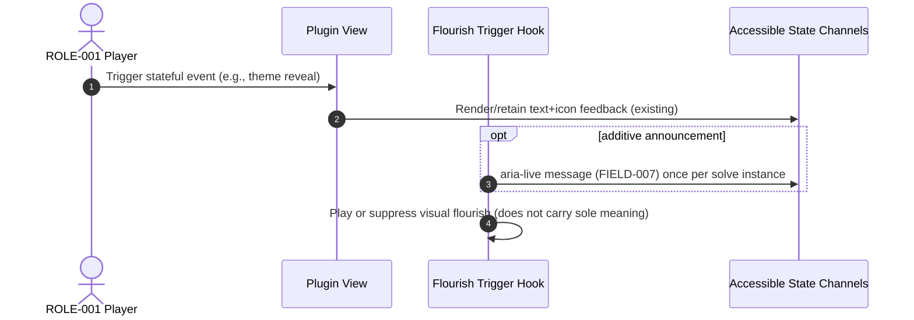
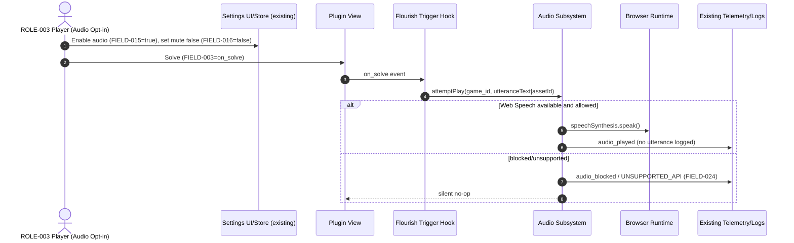
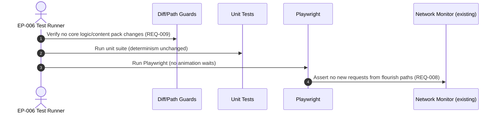
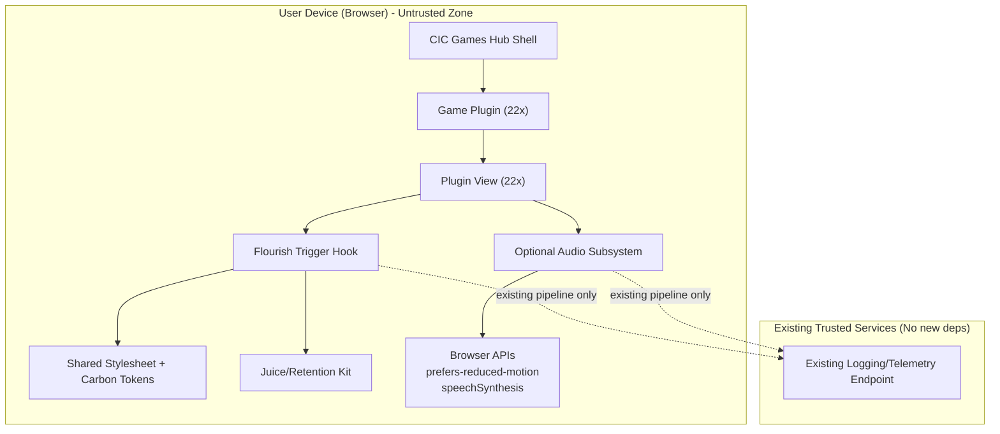

<!-- generated: 2026-07-24T19:27:55Z -->
<!-- mode: feature -->
<!-- feature-slug: per-game-flourishes -->
<!-- a2a-endpoint: https://bob-sdlc-orchestrator.2as6l7wq9qj8.eu-gb.codeengine.appdomain.cloud/v1/rpc -->

# Glossary

## Terms

### TERM-001: CIC Games Hub
- **Definition:** The host application that lists and launches the 22 daily word-puzzle games via per-game plugin views.
- **Synonyms:** Hub, Games hub, CIC hub
- **Anti-definition:** Not a single game; not a content pack; not the deterministic puzzle logic engine.
- **Source:** User request

### TERM-002: Game
- **Definition:** One of the 22 daily word-puzzle experiences available in the CIC Games Hub, each with its own plugin view and deterministic core logic.
- **Synonyms:** Daily game, Puzzle game
- **Anti-definition:** Not the shared design system; not the shared juice/retention kit.
- **Source:** User request

### TERM-003: Game Plugin
- **Definition:** The integration unit for a given game within the hub, consisting of a plugin view plus bindings to shared systems (tokens, juice helpers, retention kit).
- **Synonyms:** Plugin, Game module
- **Anti-definition:** Not the deterministic core logic; not a network service.
- **Source:** User request

### TERM-004: Plugin View
- **Definition:** The UI layer for a specific game where bespoke visual flourishes will be added without changing game logic or content.
- **Synonyms:** Game view, Per-game view
- **Anti-definition:** Not the core puzzle engine; not the content pack.
- **Source:** User request

### TERM-005: Deterministic Core Logic
- **Definition:** The game’s pure/deterministic rules and state transitions that determine outcomes (e.g., solve, wrong answer) and must not be modified.
- **Synonyms:** Game logic, Core engine
- **Anti-definition:** Not UI animations; not micro-interactions; not CSS.
- **Source:** User request

### TERM-006: Content Pack
- **Definition:** The shipped data/assets defining puzzle content; must not be changed for this feature.
- **Synonyms:** Pack, Dataset
- **Anti-definition:** Not a stylesheet; not a runtime API.
- **Source:** User request

### TERM-007: Shared Carbon Design Token Layer
- **Definition:** The existing Carbon-based shared tokens for motion/color/spacing/etc. already shipped and required to be reused where possible.
- **Synonyms:** Carbon tokens, Design tokens
- **Anti-definition:** Not per-game bespoke styling; not new third-party libraries.
- **Source:** User request

### TERM-008: Shared Juice/Retention Kit
- **Definition:** Existing shared helpers/patterns that provide “juice” (feedback, delight) and retention interactions, which bespoke flourishes should reuse.
- **Synonyms:** Juice kit, Retention helpers
- **Anti-definition:** Not per-game core logic; not network services.
- **Source:** User request

### TERM-009: Bespoke Visual Flourish
- **Definition:** A small, game-specific animation and/or micro-interaction tied to the game’s core loop, implemented in the plugin view plus shared stylesheet, without changing deterministic logic/content.
- **Synonyms:** Flourish, Micro-animation, Micro-interaction
- **Anti-definition:** Not a gameplay mechanic change; not a new content feature; not a backend dependency.
- **Source:** User request

### TERM-010: Core Loop Event
- **Definition:** A UI-observable milestone derived from existing game state (e.g., solved, best-rank warmth updated, segmentation judged) used to trigger a flourish.
- **Synonyms:** Gameplay event, Solve event
- **Anti-definition:** Not a new rule; not a new scoring algorithm.
- **Source:** User request

### TERM-011: Shared Stylesheet
- **Definition:** The common CSS (or equivalent styling layer) shared across games where reusable keyframes/utilities for flourishes will live.
- **Synonyms:** Global CSS, Shared CSS
- **Anti-definition:** Not per-game deterministic code; not external CDN assets.
- **Source:** User request

### TERM-012: Motion Token
- **Definition:** A Carbon token defining durations, easing, and motion patterns used for animations.
- **Synonyms:** Carbon motion token
- **Anti-definition:** Not arbitrary ad-hoc timing constants where reuse is possible.
- **Source:** User request

### TERM-013: Color Token
- **Definition:** A Carbon token defining color values used for UI and any flourish visuals, while respecting accessibility constraints.
- **Synonyms:** Carbon color token
- **Anti-definition:** Not hard-coded colors when reuse is possible.
- **Source:** User request

### TERM-014: prefers-reduced-motion
- **Definition:** The user OS/browser setting indicating reduced motion preference; flourishes must provide a static/instant fallback.
- **Synonyms:** Reduced motion, PRM
- **Anti-definition:** Not a per-game setting by itself (though games may offer additional toggles).
- **Source:** User request

### TERM-015: Accessible State Channel
- **Definition:** Existing non-animation, non-color-only channels that convey state: text, icons, and ARIA live regions.
- **Synonyms:** Text channel, Icon channel, aria-live
- **Anti-definition:** Not purely color change; not purely animation timing.
- **Source:** User request

### TERM-016: Offline-first Constraint
- **Definition:** The hub and games must operate without new network dependencies; flourishes must not require new runtime network calls.
- **Synonyms:** No new network deps, Offline friendly
- **Anti-definition:** Not forbidding all network activity globally; specifically forbidding new dependencies introduced by this feature.
- **Source:** User request

### TERM-017: Optional Audio Flourish
- **Definition:** An optional, off-by-default audio effect for specific games (Stress Test, Homophone Heist) using only bundled audio assets or the Web Speech API with graceful absence.
- **Synonyms:** Audio feedback, Pronunciation audio
- **Anti-definition:** Not autoplay by default; not a new third-party audio SDK; not a network TTS dependency.
- **Source:** User request

### TERM-018: Audio Control
- **Definition:** A UI control and persisted setting that allows enabling/disabling audio flourishes and muting them.
- **Synonyms:** Mute toggle, Audio setting
- **Anti-definition:** Not a volume mixer requirement; not required for games without audio.
- **Source:** User request

### TERM-019: Web Speech API
- **Definition:** Browser-provided speech synthesis capability used for optional spoken pronunciation/sentences when available.
- **Synonyms:** speechSynthesis, TTS
- **Anti-definition:** Not guaranteed to exist; not a network API.
- **Source:** User request

### TERM-020: Test Suite (Unit + Playwright E2E)
- **Definition:** The existing automated tests that must continue to pass with no changes required for deterministic logic outcomes.
- **Synonyms:** Unit tests, E2E, Playwright tests
- **Anti-definition:** Not manual QA; not performance profiling.
- **Source:** User request

### TERM-021: Flourish Trigger Hook
- **Definition:** A view-layer hook that listens to existing state changes and starts a flourish without mutating deterministic state.
- **Synonyms:** UI effect hook, Effect listener
- **Anti-definition:** Not a new reducer/action that changes game logic.
- **Source:** User request

### TERM-022: Flourish Asset
- **Definition:** Any bundled visual (SVG/Lottie-equivalent is excluded unless already in stack), CSS keyframes, or bundled audio file used to implement a flourish.
- **Synonyms:** Animation asset, CSS keyframe
- **Anti-definition:** Not a remotely fetched asset; not a new dependency library.
- **Source:** User request

### TERM-023: Game Flourish Spec
- **Definition:** A structured definition per game capturing trigger, animation behavior, reduced-motion fallback, and accessibility notes.
- **Synonyms:** Spec, Flourish definition
- **Anti-definition:** Not product copy; not a content pack change.
- **Source:** User request

### TERM-024: Color/Animation-only Prohibition
- **Definition:** The requirement that state must not be conveyed by color or animation alone; redundant cues must exist via Accessible State Channels.
- **Synonyms:** Non-color-only, Non-motion-only
- **Anti-definition:** Not banning color/animation; banning them as sole conveyors of state.
- **Source:** User request

### TERM-025: Shared Juice Helper
- **Definition:** A reusable function/component already in the juice kit (e.g., celebrate, pulse, pop, toast) that can be invoked by plugin views.
- **Synonyms:** Helper, Utility
- **Anti-definition:** Not a new library; not game logic.
- **Source:** User request

## Data Dictionary

| ID | Name | Type | Format | Range | Units | Default | Nullable | PII | Source | Validation |
|---|---|---|---|---|---|---|---|---|---|---|
| FIELD-001 | game_id | string | slug | Enum of 22 game slugs | n/a | n/a | No | None | TERM-002/Hub registry | Must match known slug list |
| FIELD-002 | flourish_id | string | slug | Unique per game | n/a | n/a | No | None | TERM-023 | Must be unique within `game_id` |
| FIELD-003 | flourish_trigger | string | enum | `on_solve`, `on_best_rank_update`, `on_wrong_all_valid`, `on_correct_breaks_snap`, `on_theme_reveal`, `on_score_delta`, `on_substring_found`, `on_respacing`, `on_etymology_reveal`, `on_receipt_stamp`, `on_bridge_progress`, etc. | n/a | n/a | No | None | TERM-010/023 | Must reference an existing UI-observable event |
| FIELD-004 | flourish_state | string | enum | `idle`, `armed`, `playing`, `completed`, `suppressed` | n/a | `idle` | No | None | TERM-009/021 | Transitions must be one-way per trigger instance |
| FIELD-005 | reduced_motion_mode | boolean | boolean | true/false | n/a | from OS | No | None | TERM-014 | Mirrors `prefers-reduced-motion` evaluation |
| FIELD-006 | reduced_motion_fallback | string | enum | `instant`, `static` | n/a | `instant` | No | None | TERM-014/009 | Must be defined for every `flourish_id` |
| FIELD-007 | aria_live_message | string | plain text | 0–256 chars | n/a | empty | Yes | None | TERM-015 | If present, must not duplicate existing messages verbatim unless idempotent |
| FIELD-008 | uses_color_token | boolean | boolean | true/false | n/a | true | No | None | TERM-013 | If true, must reference known token names |
| FIELD-009 | uses_motion_token | boolean | boolean | true/false | n/a | true | No | None | TERM-012 | If true, must reference known token names |
| FIELD-010 | motion_duration_ms | number | integer | 0–2000 | ms | token-derived | No | None | TERM-012 | Must equal a Carbon motion token value |
| FIELD-011 | motion_easing | string | token name | Token identifiers | n/a | token-derived | No | None | TERM-012 | Must match approved easing tokens |
| FIELD-012 | css_keyframe_name | string | css ident | `[a-zA-Z0-9_-]+` | n/a | n/a | No | None | TERM-011 | Must be defined in shared stylesheet |
| FIELD-013 | flourish_container_testid | string | test id | stable selector | n/a | n/a | No | None | TERM-020 | Must be stable and unique per view |
| FIELD-014 | network_requests_added | number | integer | 0 | count | 0 | No | None | TERM-016 | Must remain 0 for this feature |
| FIELD-015 | audio_enabled | boolean | boolean | true/false | n/a | false | No | None | TERM-018/017 | Must be false by default |
| FIELD-016 | audio_muted | boolean | boolean | true/false | n/a | false | No | None | TERM-018 | When true, no audio output occurs |
| FIELD-017 | audio_mode | string | enum | `bundled`, `web_speech`, `none` | n/a | `none` | No | None | TERM-017/019 | Must degrade to `none` if unsupported |
| FIELD-018 | audio_utterance_text | string | plain text | 0–256 chars | n/a | empty | Yes | None | TERM-019 | Must be derived from existing UI text/state only |
| FIELD-019 | audio_asset_id | string | slug | bundle-known ids | n/a | empty | Yes | None | TERM-022/017 | Must resolve to a bundled file if present |
| FIELD-020 | a11y_noncolor_cue_present | boolean | boolean | true/false | n/a | true | No | None | TERM-024/015 | Must be true for any stateful flourish |
| FIELD-021 | logic_mutation | boolean | boolean | must be false | n/a | false | No | None | TERM-005 | Must remain false in implementation |
| FIELD-022 | content_pack_mutation | boolean | boolean | must be false | n/a | false | No | None | TERM-006 | Must remain false in implementation |
| FIELD-023 | shared_helper_used | string | enum | known helper ids | n/a | empty | Yes | None | TERM-025 | If present, must exist in juice kit |
| FIELD-024 | flourish_error_code | string | enum | `NO_CONTAINER`, `UNSUPPORTED_API`, `ASSET_MISSING`, `PRM_SUPPRESSED` | n/a | empty | Yes | None | TERM-009/017 | Must be set only on failure paths |
| FIELD-025 | telemetry_event_name | string | slug | `flourish_played`, `flourish_suppressed`, `audio_played`, `audio_blocked` | n/a | empty | Yes | None | TERM-009 | Must use existing telemetry pipeline (no new network deps) |

# User Journeys

## Roles

| Role ID | Role | Type | Description |
|---|---|---|---|
| ROLE-001 | Player | Primary | Plays a game in the hub and experiences flourishes. |
| ROLE-002 | Player (Reduced Motion) | Primary | Player with `prefers-reduced-motion` enabled (TERM-014). |
| ROLE-003 | Player (Audio Opt-in) | Primary | Player who explicitly enables optional audio (TERM-018) for applicable games. |
| ROLE-004 | QA/Tester | Secondary | Validates flourishes and ensures tests pass (TERM-020). |
| ROLE-005 | Developer | Secondary | Implements per-plugin view changes and shared CSS keyframes (TERM-011). |
| ROLE-006 | System (Browser Runtime) | System | Executes CSS/JS, exposes PRM and Web Speech API availability (TERM-019). |

## Entry Points

| EP ID | Location | Trigger | Auth |
|---|---|---|---|
| EP-001 | Hub UI → Game route | Player selects a game tile | User session (existing) |
| EP-002 | In-game UI event bus/state | Game emits existing UI-observable state changes (TERM-010) | n/a |
| EP-003 | Settings UI (global or per-game existing area) | Player toggles audio setting (TERM-018) | User session (existing) |
| EP-004 | CSS media query | `@media (prefers-reduced-motion: reduce)` | n/a |
| EP-005 | Browser API availability | `window.speechSynthesis` presence | n/a |
| EP-006 | Test runner | Unit/Playwright execution | CI context |

## Role Permission Matrix

| Capability | ROLE-001 | ROLE-002 | ROLE-003 | ROLE-004 | ROLE-005 | ROLE-006 |
|---|---:|---:|---:|---:|---:|---:|
| Trigger flourishes via gameplay (TERM-010) | Y | Y (suppressed/instant) | Y | n/a | n/a | n/a |
| Reduced motion suppression (TERM-014) | n/a | Y | n/a | n/a | n/a | Y |
| Enable/disable audio (TERM-018) | Y (if available) | Y (if available) | Y | n/a | n/a | n/a |
| Modify plugin view / shared CSS | n/a | n/a | n/a | n/a | Y | n/a |
| Run automated tests (TERM-020) | n/a | n/a | n/a | Y | Y | n/a |

## Journeys

### JOURNEY-001: Player experiences a game-specific flourish on solve (default motion)
- **Role/Goal:** ROLE-001; see a bespoke flourish (TERM-009) tied to the game’s core loop without changing outcomes.
- **Success criteria:** Flourish plays on the correct trigger; no change to game outcome; no added network requests (FIELD-014=0).
- **Failure criteria:** Flourish fails and blocks input, changes state, or adds network dependencies.
- **Entry:** EP-001, EP-002
- **Happy path:**
  1. Player opens a game (FIELD-001) in the hub (TERM-001).  
     Data: FIELD-001
  2. Plugin view (TERM-004) renders and registers a Flourish Trigger Hook (TERM-021) for the game’s solve event (FIELD-003=`on_solve`).  
     Data: FIELD-003, FIELD-004=`armed`, FIELD-021=false
  3. Player completes the puzzle; existing UI-observable state updates to solved (TERM-010).  
     Data: FIELD-003=`on_solve`
  4. Hook starts the game’s flourish (FIELD-002) using shared helpers/tokens where available (TERM-025/007).  
     Data: FIELD-002, FIELD-004=`playing`, FIELD-009=true, FIELD-008=true, FIELD-012
  5. Flourish completes and releases any temporary UI affordances (e.g., pointer-events restored).  
     Data: FIELD-004=`completed`
- **BRANCH-001 (Flourish container missing):** If the flourish container cannot be found, skip animation and log a non-fatal error.  
  Data: FIELD-024=`NO_CONTAINER`
- **ERROR-001 (Animation blocks interaction):** Trigger: pointer-events or focus trap persists after completion. Response: immediately restore interaction; mark flourish suppressed next trigger. Recovery: player continues.  
  Data: FIELD-004=`suppressed`
- **LOOP-001 (Replays within session):** If player re-solves or replays, the hook re-arms and plays at most once per solve event instance.  
  Data: FIELD-004 transitions `completed`→`armed` on new solve instance
- **EDGE-001 (Concurrency):** Solve event fires twice due to double dispatch; system must de-dupe and play once.  
  Data: FIELD-004 must not re-enter `playing`
- **EDGE-002 (Offline-first):** No new network requests may be introduced by flourish.  
  Data: FIELD-014=0

### JOURNEY-002: Player with prefers-reduced-motion receives static/instant fallback
- **Role/Goal:** ROLE-002; avoid motion while still receiving feedback.
- **Success criteria:** No motion animation occurs; fallback is static/instant; state still conveyed via existing channels (TERM-015).
- **Entry:** EP-004, EP-001, EP-002
- **Happy path:**
  1. Player has reduced motion enabled (FIELD-005=true).  
     Data: FIELD-005
  2. Player triggers a core loop event (FIELD-003) (e.g., solve).  
     Data: FIELD-003
  3. Plugin view applies reduced-motion fallback (FIELD-006=`instant` or `static`) and sets flourish to suppressed or instantly completed without keyframes.  
     Data: FIELD-006, FIELD-004=`completed` or `suppressed`
  4. Existing non-motion channels still announce outcome (TERM-015).  
     Data: FIELD-007 (if used), FIELD-020=true
- **BRANCH-002 (Fallback=static):** Render a static end-state illustration (e.g., filled thermometer) with no transitions.  
- **ERROR-002 (Motion leaks):** Trigger: CSS keyframes still run under PRM. Response: disable animation properties and set duration to 0ms. Recovery: continue.  
  Data: FIELD-024=`PRM_SUPPRESSED`
- **EDGE-003 (Mixed settings):** Browser PRM on but user tries to enable audio; audio remains allowed because it is non-motion, but still off by default.  
  Data: FIELD-015, FIELD-016

### JOURNEY-003: Player verifies state is not conveyed by color/animation alone
- **Role/Goal:** ROLE-001; understand result even if animation/color is missed.
- **Success criteria:** A redundant cue exists (text/icon/aria-live) for any stateful flourish.
- **Entry:** EP-002
- **Happy path:**
  1. Player triggers a flourish-worthy event (FIELD-003).  
  2. Plugin view plays flourish visuals (optional) while existing UI shows solved/score/feedback text and/or icon.  
     Data: FIELD-020=true
  3. If aria-live is used, it announces an additional short message without changing game logic.  
     Data: FIELD-007 (optional)
- **ERROR-003 (Color-only signal):** Trigger: flourish indicates “warmth” or “correct” only via color/animation with no textual/iconic cue. Response: do not ship; add redundant cue or remove statefulness of flourish.  
  Data: FIELD-020 must be true
- **EDGE-004 (High contrast mode):** Token colors may shift; cues must remain visible via text/icon.

### JOURNEY-004: Optional audio flourish (Stress Test / Homophone Heist) opt-in and playback
- **Role/Goal:** ROLE-003; enable and hear optional pronunciation/speech on solve.
- **Success criteria:** Audio is off by default; can be muted; uses bundled assets or Web Speech API; degrades gracefully.
- **Entry:** EP-003, EP-005, EP-002
- **Happy path:**
  1. Player opens Stress Test or Homophone Heist game (FIELD-001).  
  2. Player enables audio (FIELD-015=true) and does not mute (FIELD-016=false).  
  3. On solve (FIELD-003=`on_solve`), plugin attempts audio in configured mode (FIELD-017).  
     Data: FIELD-017, FIELD-018 or FIELD-019
  4. If Web Speech API is available, system speaks the utterance; otherwise uses bundled audio if present; otherwise no audio with silent fallback.  
     Data: FIELD-017 transitions `web_speech`→`none` if unsupported
- **BRANCH-003 (Audio blocked by browser policy):** If playback/speech is blocked, show existing non-audio feedback and keep setting enabled without repeated prompts.  
  Data: FIELD-024=`UNSUPPORTED_API` or `audio_blocked` telemetry
- **ERROR-004 (Muted):** Trigger: player toggles mute. Response: no audio output on subsequent triggers.  
  Data: FIELD-016=true
- **EDGE-005 (Offline-first):** Web Speech must not require network; if it does in a given environment, treat as unsupported and fall back to none.  
  Data: FIELD-017=`none`

### JOURNEY-005: QA confirms no test regressions and no new network dependencies
- **Role/Goal:** ROLE-004; validate feature within CI expectations.
- **Success criteria:** All unit + Playwright tests pass; selectors remain stable; no added requests.
- **Entry:** EP-006
- **Happy path:**
  1. QA runs unit tests; deterministic logic tests unchanged (TERM-005).  
     Data: FIELD-021=false, FIELD-022=false
  2. QA runs Playwright; game flows pass; flourishes do not introduce flakiness (e.g., timing waits).  
     Data: FIELD-013 stable
  3. QA verifies network logs show no new requests attributable to flourishes.  
     Data: FIELD-014=0
- **ERROR-005 (Flaky timing):** Trigger: tests depend on animation completion. Response: ensure tests do not wait on animations; under test, animations can be reduced via PRM or zero duration token override. Recovery: re-run.  
- **EDGE-006 (Snapshot diffs):** If visual snapshots exist, ensure reduced motion/static states are deterministic.

## Journey Map

```mermaid
flowchart TD
  A[EP-001 Open Game] --> B[Render Plugin View]
  B --> C[Arm Flourish Hook (FIELD-004=armed)]
  C --> D{prefers-reduced-motion? (FIELD-005)}
  D -- No --> E[Play Flourish (FIELD-004=playing)]
  E --> F[Complete (FIELD-004=completed)]
  D -- Yes --> G[Apply Fallback (FIELD-006)]
  G --> F
  C --> H{Audio game + audio_enabled? (FIELD-015)}
  H -- Yes --> I{Web Speech available? (EP-005)}
  I -- Yes --> J[Speak (FIELD-017=web_speech)]
  I -- No --> K[Bundled audio or none (FIELD-017)]
  H -- No --> L[No audio]
  F --> M[Existing text/icon/aria-live feedback (TERM-015)]
  M --> N[EP-006 Tests pass + no new network (FIELD-014=0)]
```

# Requirements

### REQ-001: Provide one bespoke flourish per game in the plugin view
- **EARS Pattern:** Ubiquitous
- **EARS Statement:** The system shall implement exactly one TERM-009 Bespoke Visual Flourish per TERM-002 Game within that game’s TERM-004 Plugin View.
- **Inputs:** FIELD-001
- **Outputs:** FIELD-002
- **Preconditions:** Game plugin is renderable in hub (TERM-001).
- **Postconditions:** A flourish spec exists and is reachable from the game view.
- **Invariants:** FIELD-021=false; FIELD-022=false.
- **Trigger:** Plugin view render
- **Actor:** ROLE-005
- **EntityScope:** TERM-002
- **ErrorModes:** `NO_CONTAINER`
- **NFR-Tags:** maintainability
- **Source:** JOURNEY-001 step 2
- **Dependencies:** REQ-002, REQ-003
- **Priority:** P1
- **AcceptanceCriteria:**
  - TEST-001: For each FIELD-001 in the 22-game list, a non-empty FIELD-002 exists in a registry or per-plugin mapping.
  - TEST-002: Each flourish is implemented without modifying deterministic outcome assertions in existing unit tests.
  - TEST-003: Each flourish is reachable from the plugin view code path (e.g., container rendered or hook registered).
- **Assumptions:** The game list of 22 slugs is stable.
- **OpenQuestions:** Where is the canonical list of game slugs stored?

### REQ-002: Trigger flourishes only from existing UI-observable events
- **EARS Pattern:** Event-Driven
- **EARS Statement:** When a TERM-010 Core Loop Event occurs in a game, the system shall start that game’s TERM-009 Bespoke Visual Flourish via a TERM-021 Flourish Trigger Hook without mutating TERM-005 Deterministic Core Logic.
- **Inputs:** FIELD-003
- **Outputs:** FIELD-004=`playing`
- **Preconditions:** FIELD-004=`armed`
- **Postconditions:** FIELD-004 transitions to `completed` or `suppressed`.
- **Invariants:** FIELD-021=false
- **Trigger:** Existing state change/event already exposed to the view
- **Actor:** ROLE-006
- **EntityScope:** TERM-009
- **ErrorModes:** `NO_CONTAINER`
- **NFR-Tags:** testability
- **Source:** JOURNEY-001 steps 2–4
- **Dependencies:** REQ-005
- **Priority:** P1
- **AcceptanceCriteria:**
  - TEST-004: Starting a flourish does not dispatch any action that changes puzzle state or scoring (FIELD-021 remains false).
  - TEST-005: Each flourish trigger uses an existing event (FIELD-003) already available in the view layer.
  - TEST-006: If the flourish container is missing, the game remains playable and the flourish is skipped.
- **Assumptions:** Each game exposes at least one suitable existing event (solve or equivalent).
- **OpenQuestions:** Are there games without a solve-like event and what existing events can be observed?

### REQ-003: Centralize reusable keyframes/utilities in the shared stylesheet
- **EARS Pattern:** Ubiquitous
- **EARS Statement:** The system shall define reusable flourish CSS keyframes in the TERM-011 Shared Stylesheet and reference them from each TERM-004 Plugin View.
- **Inputs:** FIELD-012
- **Outputs:** FIELD-012 resolvable at runtime
- **Preconditions:** Shared stylesheet is loaded for game views.
- **Postconditions:** Keyframes are available without per-game duplication.
- **Invariants:** FIELD-014=0
- **Trigger:** Build time / stylesheet load
- **Actor:** ROLE-005
- **EntityScope:** TERM-011
- **ErrorModes:** `ASSET_MISSING`
- **NFR-Tags:** maintainability, bundle-size
- **Source:** User request constraint; JOURNEY-001 step 4
- **Dependencies:** NFR-004
- **Priority:** P1
- **AcceptanceCriteria:**
  - TEST-007: Each FIELD-012 referenced by a plugin view exists in the shared stylesheet.
  - TEST-008: No external stylesheets are fetched at runtime (FIELD-014=0).
  - TEST-009: Duplicate keyframes across plugins are eliminated in favor of shared definitions.
- **Assumptions:** CSS keyframes are an acceptable implementation mechanism for the stack.
- **OpenQuestions:** Is CSS Modules/Scoped CSS used, and how are shared keyframes imported?

### REQ-004: Use Carbon motion and color tokens where possible
- **EARS Pattern:** Ubiquitous
- **EARS Statement:** The system shall derive flourish motion timing and easing from TERM-012 Motion Tokens and flourish colors from TERM-013 Color Tokens where those tokens can express the intended effect.
- **Inputs:** FIELD-009, FIELD-008
- **Outputs:** FIELD-010, FIELD-011
- **Preconditions:** Token layer is available (TERM-007).
- **Postconditions:** Animations conform to tokenized motion and color.
- **Invariants:** None
- **Trigger:** Flourish definition/implementation
- **Actor:** ROLE-005
- **EntityScope:** TERM-007
- **ErrorModes:** `ASSET_MISSING`
- **NFR-Tags:** consistency
- **Source:** JOURNEY-001 step 4
- **Dependencies:** REQ-003
- **Priority:** P2
- **AcceptanceCriteria:**
  - TEST-010: Each flourish uses token-derived duration/easing (FIELD-010/011) rather than raw constants when tokens exist.
  - TEST-011: Each flourish references token colors rather than hard-coded colors when tokens exist.
  - TEST-012: If a token is not available, the flourish documents the exception in code comments and uses existing palette primitives (not new deps).
- **Assumptions:** Current token set includes at least one standard duration and easing suitable for micro-interactions.
- **OpenQuestions:** Is there an existing lint rule for token usage?

### REQ-005: De-dupe repeated triggers to avoid double-playing
- **EARS Pattern:** State-Driven
- **EARS Statement:** While a flourish is in FIELD-004=`playing`, the system shall ignore subsequent triggers for the same FIELD-002 instance.
- **Inputs:** FIELD-004, FIELD-003
- **Outputs:** FIELD-004 remains `playing`
- **Preconditions:** A flourish has started.
- **Postconditions:** At most one play per trigger instance.
- **Invariants:** None
- **Trigger:** Trigger event occurs while playing
- **Actor:** ROLE-006
- **EntityScope:** TERM-009
- **ErrorModes:** `NO_CONTAINER`
- **NFR-Tags:** reliability
- **Source:** JOURNEY-001 EDGE-001
- **Dependencies:** REQ-002
- **Priority:** P1
- **AcceptanceCriteria:**
  - TEST-013: If the solve event fires twice within the same animation window, the flourish starts only once.
  - TEST-014: After completion, a new solve instance can re-arm and play again (per design).
  - TEST-015: No console errors occur during double-dispatch scenarios.
- **Assumptions:** There is a stable per-solve-instance signal or monotonic counter to distinguish instances.
- **OpenQuestions:** What identifier can be used to correlate triggers to a single solve instance?

### REQ-006: Provide reduced-motion static/instant fallback for every flourish
- **EARS Pattern:** State-Driven
- **EARS Statement:** While FIELD-005 indicates TERM-014 prefers-reduced-motion, the system shall render each flourish using its FIELD-006 reduced-motion fallback without running CSS keyframes.
- **Inputs:** FIELD-005, FIELD-006
- **Outputs:** FIELD-004=`completed` or `suppressed`
- **Preconditions:** Flourish is armed.
- **Postconditions:** No motion runs; feedback remains available.
- **Invariants:** FIELD-020=true
- **Trigger:** Core loop event (FIELD-003) under PRM
- **Actor:** ROLE-006
- **EntityScope:** TERM-014
- **ErrorModes:** `PRM_SUPPRESSED`
- **NFR-Tags:** accessibility
- **Source:** JOURNEY-002 steps 1–3
- **Dependencies:** REQ-002
- **Priority:** P1
- **AcceptanceCriteria:**
  - TEST-016: Under PRM, computed animation-duration is 0ms or animation-name is `none` for flourish elements.
  - TEST-017: A static/instant visual end state is visible where applicable (e.g., thermometer filled) with no transitions.
  - TEST-018: The gameplay result remains understandable via existing text/icon/aria-live channels.
- **Assumptions:** PRM can be simulated in Playwright.
- **OpenQuestions:** Is there an existing global “reduce motion” test config?

### REQ-007: Do not convey state by color or animation alone
- **EARS Pattern:** Ubiquitous
- **EARS Statement:** The system shall not convey game state changes solely through color or animation in any flourish.
- **Inputs:** FIELD-020
- **Outputs:** FIELD-020=true enforced by implementation
- **Preconditions:** A flourish represents a stateful concept (e.g., warmth, correctness).
- **Postconditions:** Redundant cue exists in TERM-015 Accessible State Channels.
- **Invariants:** None
- **Trigger:** Flourish design/implementation
- **Actor:** ROLE-005
- **EntityScope:** TERM-015
- **ErrorModes:** `ASSET_MISSING`
- **NFR-Tags:** accessibility
- **Source:** JOURNEY-003
- **Dependencies:** REQ-006
- **Priority:** P1
- **AcceptanceCriteria:**
  - TEST-019: For each flourish, review confirms an existing text/icon/aria-live cue expresses the same state (FIELD-020=true).
  - TEST-020: In grayscale simulation, state remains understandable from non-color cues.
  - TEST-021: With animations disabled, state remains understandable from non-motion cues.
- **Assumptions:** Existing games already provide solved/wrong/score messaging; flourishes are additive.
- **OpenQuestions:** Do any current games rely on color-only cues today (outside this feature)?

### REQ-008: Add no new runtime network dependencies
- **EARS Pattern:** Unwanted
- **EARS Statement:** The system shall not introduce new runtime network requests as a result of implementing flourishes.
- **Inputs:** FIELD-014
- **Outputs:** FIELD-014=0
- **Preconditions:** Flourish code is present.
- **Postconditions:** Network profile unchanged for flourishes.
- **Invariants:** TERM-016 Offline-first Constraint holds.
- **Trigger:** Runtime execution of flourish paths
- **Actor:** ROLE-006
- **EntityScope:** TERM-016
- **ErrorModes:** `ASSET_MISSING`
- **NFR-Tags:** offline-first, privacy
- **Source:** JOURNEY-001 EDGE-002; JOURNEY-004 EDGE-005
- **Dependencies:** REQ-003
- **Priority:** P1
- **AcceptanceCriteria:**
  - TEST-022: Network inspection during flourish playback shows zero additional requests attributable to flourish assets (FIELD-014=0).
  - TEST-023: All flourish assets are bundled or purely CSS-based.
  - TEST-024: Audio via Web Speech uses no fetch/XHR initiated by application code.
- **Assumptions:** Existing telemetry, if any, is already approved and not expanded by this change.
- **OpenQuestions:** Is telemetry considered a “network dependency” for this constraint if it already exists?

### REQ-009: Preserve deterministic logic and content packs (no mutations)
- **EARS Pattern:** Unwanted
- **EARS Statement:** The system shall not modify TERM-005 Deterministic Core Logic or TERM-006 Content Packs to implement flourishes.
- **Inputs:** FIELD-021, FIELD-022
- **Outputs:** FIELD-021=false; FIELD-022=false
- **Preconditions:** Feature branch contains flourish changes.
- **Postconditions:** Logic and packs unchanged.
- **Invariants:** None
- **Trigger:** Code review/build validation
- **Actor:** ROLE-005
- **EntityScope:** TERM-005
- **ErrorModes:** none
- **NFR-Tags:** correctness
- **Source:** User request constraint; JOURNEY-005 step 1
- **Dependencies:** none
- **Priority:** P0
- **AcceptanceCriteria:**
  - TEST-025: Diff-based check confirms no files in core logic directories changed.
  - TEST-026: Diff-based check confirms no content pack files changed.
  - TEST-027: Existing unit tests validating deterministic outcomes remain unchanged and pass.
- **Assumptions:** Repo structure cleanly separates core logic/content packs from views.
- **OpenQuestions:** What directories are canonical for “core logic” and “content packs”?

### REQ-010: Keep existing unit and Playwright tests passing without adding animation waits
- **EARS Pattern:** Ubiquitous
- **EARS Statement:** The system shall ensure all TERM-020 Test Suite runs pass without introducing new test steps that wait for flourish animations to complete.
- **Inputs:** FIELD-013
- **Outputs:** Passing CI
- **Preconditions:** CI executes unit + Playwright.
- **Postconditions:** Green pipeline.
- **Invariants:** Animations must not gate state changes.
- **Trigger:** CI run
- **Actor:** ROLE-004
- **EntityScope:** TERM-020
- **ErrorModes:** `PRM_SUPPRESSED`
- **NFR-Tags:** testability
- **Source:** JOURNEY-005; JOURNEY-005 ERROR-005
- **Dependencies:** REQ-006, REQ-005
- **Priority:** P1
- **AcceptanceCriteria:**
  - TEST-028: Playwright flows complete with animations enabled.
  - TEST-029: Playwright flows complete with PRM enabled (0ms animations) with no flake increase beyond baseline.
  - TEST-030: Flourish selectors (FIELD-013) are stable and do not collide.
- **Assumptions:** Tests do not currently assert exact pixel motion.
- **OpenQuestions:** Are there snapshot tests that might need deterministic static states under PRM?

### REQ-011: Provide audio opt-in control (off by default) for applicable games
- **EARS Pattern:** Ubiquitous
- **EARS Statement:** The system shall default FIELD-015 audio_enabled to false for TERM-017 Optional Audio Flourish games and provide an TERM-018 Audio Control to enable it.
- **Inputs:** FIELD-001
- **Outputs:** FIELD-015
- **Preconditions:** Game is Stress Test or Homophone Heist.
- **Postconditions:** User preference is stored per existing settings mechanism.
- **Invariants:** FIELD-015=false by default
- **Trigger:** Settings UI interaction
- **Actor:** ROLE-003
- **EntityScope:** TERM-018
- **ErrorModes:** `UNSUPPORTED_API`
- **NFR-Tags:** accessibility
- **Source:** JOURNEY-004 steps 1–2
- **Dependencies:** NFR-006 (privacy), REQ-008
- **Priority:** P2
- **AcceptanceCriteria:**
  - TEST-031: Fresh install/profile has audio disabled (FIELD-015=false).
  - TEST-032: Toggling audio enabled persists across reload using existing storage.
  - TEST-033: A mute control exists and suppresses audio output when set (FIELD-016=true).
- **Assumptions:** There is an existing settings surface appropriate for per-game or global toggles.
- **OpenQuestions:** Should audio enablement be global across hub or per-game?

### REQ-012: Play audio using bundled assets or Web Speech API with graceful absence
- **EARS Pattern:** Event-Driven
- **EARS Statement:** When FIELD-003 is `on_solve` in an Optional Audio Flourish game and FIELD-015 is true and FIELD-016 is false, the system shall attempt audio playback using FIELD-017 and fall back to `none` when unsupported.
- **Inputs:** FIELD-003, FIELD-015, FIELD-016, FIELD-017, FIELD-018, FIELD-019
- **Outputs:** Audible speech/audio or silent no-op
- **Preconditions:** User opted in.
- **Postconditions:** No exception thrown; gameplay unaffected.
- **Invariants:** FIELD-014=0
- **Trigger:** Solve event
- **Actor:** ROLE-006
- **EntityScope:** TERM-017
- **ErrorModes:** `UNSUPPORTED_API`
- **NFR-Tags:** compatibility, offline-first
- **Source:** JOURNEY-004 steps 3–4; BRANCH-003
- **Dependencies:** REQ-011, REQ-008
- **Priority:** P2
- **AcceptanceCriteria:**
  - TEST-034: If `speechSynthesis` is missing, the system does not throw and sets FIELD-017=`none` for that attempt.
  - TEST-035: If bundled audio asset id is configured but missing, the system does not throw and produces silent fallback with FIELD-024=`ASSET_MISSING`.
  - TEST-036: Audio never plays when FIELD-016=true.
- **Assumptions:** Web Speech availability varies by platform and can be feature-detected.
- **OpenQuestions:** Should the app expose which audio mode is active to the user?

### NFR-001: Performance—animation CPU budget
- **EARS Pattern:** Ubiquitous
- **EARS Statement:** The system shall keep each flourish animation’s main-thread long task time below 50 ms during a single play on a median supported device.
- **Inputs:** FIELD-002
- **Outputs:** Perf measurement
- **Preconditions:** Flourish implemented.
- **Postconditions:** No noticeable jank attributable to long tasks.
- **Invariants:** None
- **Trigger:** Flourish playback
- **Actor:** ROLE-004
- **EntityScope:** TERM-009
- **ErrorModes:** none
- **NFR-Tags:** performance
- **Source:** User request (“small” flourishes) + test stability concerns in JOURNEY-005
- **Dependencies:** REQ-003
- **Priority:** P3
- **AcceptanceCriteria:**
  - TEST-037: Profiling shows no single long task >50 ms attributable to flourish code during playback.
  - TEST-038: Flourish uses transform/opacity where possible rather than layout thrash.
  - TEST-039: Flourish does not allocate unbounded timers/intervals; it cleans up on unmount.
- **Assumptions:** A “median device” profile exists in perf tooling.
- **OpenQuestions:** What devices/browsers define “median supported”?

### NFR-002: Accessibility—ARIA/live messaging does not spam
- **EARS Pattern:** State-Driven
- **EARS Statement:** While a player repeatedly triggers events in a session, the system shall limit FIELD-007 aria_live_message emissions to at most one additional message per solve instance.
- **Inputs:** FIELD-007
- **Outputs:** Controlled announcements
- **Preconditions:** aria-live is used for a flourish.
- **Postconditions:** Screen readers are not flooded.
- **Invariants:** Does not replace existing outcome messages.
- **Trigger:** Event triggers
- **Actor:** ROLE-006
- **EntityScope:** TERM-015
- **ErrorModes:** none
- **NFR-Tags:** accessibility
- **Source:** JOURNEY-003 step 3; LOOP-001
- **Dependencies:** REQ-005
- **Priority:** P3
- **AcceptanceCriteria:**
  - TEST-040: For a repeated-trigger scenario, aria-live messages do not exceed one per solve instance.
  - TEST-041: aria-live content is ≤256 chars (FIELD-007 validation).
  - TEST-042: aria-live messages are not required for understanding core state (redundant only).
- **Assumptions:** Existing aria-live region infrastructure exists.
- **OpenQuestions:** Is there a standard aria-live region per game or global?

### NFR-003: Observability—log non-fatal flourish failures
- **EARS Pattern:** Event-Driven
- **EARS Statement:** When a flourish fails to initialize or play, the system shall record FIELD-024 flourish_error_code via existing logging/telemetry without interrupting gameplay.
- **Inputs:** FIELD-024
- **Outputs:** Existing logs/telemetry event (FIELD-025)
- **Preconditions:** Existing logging pipeline exists.
- **Postconditions:** Failure is diagnosable.
- **Invariants:** FIELD-014 remains 0 for new deps (uses existing pipeline only).
- **Trigger:** Flourish failure
- **Actor:** ROLE-006
- **EntityScope:** TERM-009
- **ErrorModes:** `NO_CONTAINER`
- **NFR-Tags:** observability
- **Source:** JOURNEY-001 BRANCH-001; JOURNEY-004 BRANCH-003
- **Dependencies:** REQ-008
- **Priority:** P3
- **AcceptanceCriteria:**
  - TEST-043: Missing container results in a logged `NO_CONTAINER` and no thrown exception.
  - TEST-044: Unsupported audio API results in a logged `UNSUPPORTED_API` and silent fallback.
  - TEST-045: Logs do not include PII (PII=None for listed fields).
- **Assumptions:** Logging does not violate offline-first (buffering ok if already present).
- **OpenQuestions:** What is the existing event name taxonomy for UI micro-interactions?

### NFR-004: Compatibility—prefers-reduced-motion support across browsers
- **EARS Pattern:** Ubiquitous
- **EARS Statement:** The system shall implement reduced-motion behavior using standards-based mechanisms (CSS media query and/or equivalent runtime detection) supported by all browsers in the hub’s support matrix.
- **Inputs:** FIELD-005
- **Outputs:** Consistent suppression
- **Preconditions:** Support matrix defined.
- **Postconditions:** PRM works everywhere supported.
- **Invariants:** None
- **Trigger:** Render/play
- **Actor:** ROLE-006
- **EntityScope:** TERM-014
- **ErrorModes:** none
- **NFR-Tags:** compatibility, accessibility
- **Source:** JOURNEY-002; EP-004
- **Dependencies:** REQ-006
- **Priority:** P2
- **AcceptanceCriteria:**
  - TEST-046: In each supported browser, PRM reduces animations to 0ms or disables them.
  - TEST-047: No browser-specific APIs are required for PRM behavior.
  - TEST-048: Under PRM, UI remains fully usable and readable.
- **Assumptions:** Support matrix includes at least one evergreen browser baseline.
- **OpenQuestions:** What is the official browser support matrix?

### NFR-005: Auditability—change isolation
- **EARS Pattern:** Ubiquitous
- **EARS Statement:** The system shall confine flourish code changes to TERM-004 Plugin Views and the TERM-011 Shared Stylesheet.
- **Inputs:** Repo diff
- **Outputs:** Scoped changes
- **Preconditions:** Codebase structure present.
- **Postconditions:** No cross-cutting rewrites.
- **Invariants:** TERM-005 and TERM-006 unchanged.
- **Trigger:** Code review/CI guard
- **Actor:** ROLE-005
- **EntityScope:** TERM-003
- **ErrorModes:** none
- **NFR-Tags:** auditability, maintainability
- **Source:** User request (“minimal per-plugin view additions plus shared CSS”); JOURNEY-005
- **Dependencies:** REQ-009
- **Priority:** P1
- **AcceptanceCriteria:**
  - TEST-049: A CI rule verifies changes only occur in allowed paths (plugin views + shared stylesheet + settings UI for audio if applicable).
  - TEST-050: No new third-party packages are added for animation/audio.
  - TEST-051: Code owners can review changes per game independently (one plugin at a time).
- **Assumptions:** Repo allows path-based CI checks.
- **OpenQuestions:** What are the exact allowed path globs?

### NFR-006: Privacy—no new PII collection for audio
- **EARS Pattern:** Unwanted
- **EARS Statement:** The system shall not collect or transmit PII as part of optional audio flourishes.
- **Inputs:** FIELD-018, FIELD-025
- **Outputs:** Telemetry without PII
- **Preconditions:** Audio enabled.
- **Postconditions:** No PII leaves device via this feature.
- **Invariants:** PII classifications remain None in this feature scope.
- **Trigger:** Audio attempt/logging
- **Actor:** ROLE-006
- **EntityScope:** TERM-017
- **ErrorModes:** none
- **NFR-Tags:** privacy
- **Source:** Offline-first + graceful absence constraints; JOURNEY-004
- **Dependencies:** NFR-003
- **Priority:** P2
- **AcceptanceCriteria:**
  - TEST-052: Telemetry for `audio_played`/`audio_blocked` contains only FIELD-001/002 and non-PII codes.
  - TEST-053: If speech text is derived (FIELD-018), it is not logged.
  - TEST-054: No new permissions prompts are introduced beyond standard browser audio policies.
- **Assumptions:** The spoken text is derived from existing on-screen puzzle words (still treated as non-PII here).
- **OpenQuestions:** Is any user identifier included in existing telemetry events by default?
# Architecture

## Components & Responsibilities

### CIC Games Hub Shell (TERM-001)
- **Responsibilities**
  - Routes to a selected game plugin view (EP-001).
  - Loads shared styling layers (TERM-011) and shared Carbon token layer (TERM-007).
  - Hosts shared settings surface used by games (for audio opt-in where applicable) (EP-003).
- **Boundaries**
  - **Owns:** navigation, plugin mounting lifecycle, global settings UI entry points.
  - **Does not own:** per-game flourish behavior; deterministic logic; content packs.
- **Exposes interfaces**
  - Plugin mounting contract (e.g., `render(game_id)` / route params with FIELD-001).
  - Settings persistence primitives (existing).
- **Consumes interfaces**
  - Game Plugin registry (list of 22 games; open question REQ-001).
  - Existing session/auth (not changed by this feature).

**Requirements satisfied:** REQ-001 (hosting plugin views), NFR-005 (change isolation; hub mostly unchanged except settings UI for audio).

---

### Game Plugin (TERM-003) — per game (22)
- **Responsibilities**
  - Binds the hub to the specific plugin view for a game.
  - Declares/exports a per-game `GameFlourishSpec` (TERM-023) entry (by convention) mapping `game_id → flourish_id, trigger, fallback`.
- **Boundaries**
  - **Owns:** the integration wiring between hub and plugin view; flourish spec registration for the game.
  - **Does not own:** shared keyframe definitions; any cross-game tokens; deterministic core logic.
- **Exposes interfaces**
  - `GamePlugin` module export used by hub.
  - Optional: `getFlourishSpec(): GameFlourishSpec`.
- **Consumes interfaces**
  - Shared juice/retention helpers (TERM-008/025).
  - Shared stylesheet utilities (TERM-011).
  - View-observable game state/events (existing).

**Requirements satisfied:** REQ-001, REQ-002, NFR-005.

---

### Plugin View (TERM-004) — per game (22)
- **Responsibilities**
  - Renders the game UI and adds *one* bespoke flourish container and minimal UI bindings.
  - Registers a Flourish Trigger Hook (TERM-021) to listen to **existing** UI-observable events (TERM-010) and start a flourish (REQ-002).
  - Ensures redundant accessible cues remain (TERM-015) and never relies on color/motion alone (REQ-007).
  - Provides stable test selectors for flourish container(s) (FIELD-013) without affecting existing tests (REQ-010).
- **Boundaries**
  - **Owns:** DOM container(s) and minimal UI micro-interaction wiring for the flourish; optional aria-live additive message (FIELD-007) when needed.
  - **Does not own:** deterministic core logic and state transitions (TERM-005); content packs (TERM-006); new network calls (REQ-008).
- **Exposes interfaces**
  - DOM hooks/refs for flourish container; stable `data-testid` (FIELD-013).
- **Consumes interfaces**
  - Flourish Trigger Hook (shared).
  - Shared keyframes/utilities from shared stylesheet (FIELD-012).
  - Carbon motion/color tokens via existing token layer (REQ-004).
  - Existing game view state/events (TERM-010).

**Requirements satisfied:** REQ-001, REQ-002, REQ-005, REQ-006, REQ-007, REQ-008, REQ-009, REQ-010; NFR-001/2/3/4/5.

---

### Flourish Trigger Hook (TERM-021) — shared view-layer utility
- **Responsibilities**
  - Subscribes to existing view-observable state/event changes for a game (REQ-002).
  - Maintains a small internal flourish state machine (FIELD-004) to:
    - arm on mount / on new solve instance
    - de-dupe double-dispatch while `playing` (REQ-005)
    - transition to `completed` on animation end or instantly under PRM (REQ-006)
  - Detects reduced motion (CSS/JS evaluation of `prefers-reduced-motion`) and suppresses animation accordingly (REQ-006, NFR-004).
  - Emits non-fatal error codes (FIELD-024) to existing logging/telemetry (NFR-003).
- **Boundaries**
  - **Owns:** effect orchestration and de-dupe; no persistent domain state.
  - **Does not own:** any gameplay state updates; any network behavior.
- **Exposes interfaces**
  - `useFlourishTrigger({ gameId, flourishSpec, triggerSource, containerRef, ariaLiveRef? })`.
  - Callback hooks: `onStart`, `onComplete`, `onSuppress`.
- **Consumes interfaces**
  - Game view event source (existing state/store selectors).
  - Shared juice helpers (TERM-025) for common micro-interactions.
  - Existing telemetry/logging client (already shipped).

**Requirements satisfied:** REQ-002, REQ-005, REQ-006, REQ-010; NFR-002, NFR-003, NFR-004.

**Trade-off (explicit):** A hook-based approach keeps deterministic logic untouched and localized to the view, but requires per-game wiring to identify an appropriate existing trigger (open question REQ-002).

---

### Shared Flourish Stylesheet Layer (TERM-011)
- **Responsibilities**
  - Defines reusable CSS keyframes and utility classes for flourishes (REQ-003).
  - Provides PRM-safe definitions (e.g., `@media (prefers-reduced-motion: reduce)` overrides) (REQ-006).
  - Provides composable animation primitives tuned for performance (transform/opacity-first) (NFR-001).
- **Boundaries**
  - **Owns:** shared keyframes; token-based CSS variables usage where available.
  - **Does not own:** per-game DOM structure; business logic.
- **Exposes interfaces**
  - Named keyframes (FIELD-012) and utility classes (e.g., `.flourish--pop`, `.flourish--slide`, `.flourish--glow`).
- **Consumes interfaces**
  - Carbon token variables for motion and color (REQ-004).

**Requirements satisfied:** REQ-003, REQ-004, REQ-006, REQ-008; NFR-001, NFR-004, NFR-005.

---

### Shared Carbon Design Token Layer (TERM-007)
- **Responsibilities**
  - Supplies standardized motion durations/easings and colors to flourishes (REQ-004).
- **Boundaries**
  - **Owns:** token definitions and platform delivery mechanism.
  - **Does not own:** any per-game animation semantics.
- **Interfaces**
  - CSS variables / token accessors already in stack.

**Requirements satisfied:** REQ-004; supports NFR-004 consistency.

---

### Shared Juice/Retention Kit (TERM-008)
- **Responsibilities**
  - Provides reusable micro-interaction helpers (TERM-025) to avoid bespoke JS-heavy animation implementations.
- **Boundaries**
  - **Owns:** generic “celebrate/pulse/toast” primitives.
  - **Does not own:** per-game flourish semantics; any network behavior.
- **Interfaces**
  - Imported helper functions/components.

**Requirements satisfied:** REQ-001/2 (implementation support), NFR-001 (reduce JS), NFR-005.

---

### Optional Audio Subsystem (for Stress Test, Homophone Heist) (TERM-017/018/019)
- **Responsibilities**
  - Renders Audio Control (enable + mute) and persists settings using existing storage (REQ-011).
  - Attempts playback on `on_solve` when enabled and unmuted (REQ-012):
    - `speechSynthesis` when available (TERM-019)
    - bundled audio assets otherwise
    - silent no-op when unsupported/missing
  - Ensures audio is off by default and never blocks gameplay (REQ-011/012).
- **Boundaries**
  - **Owns:** opt-in gating and runtime feature detection.
  - **Does not own:** network access; user identity; any gameplay outcomes.
- **Exposes interfaces**
  - `useAudioFlourish({ gameId, utteranceText?, assetId? })`.
  - Settings keys in existing preferences store (FIELD-015/016).
- **Consumes interfaces**
  - Browser Web Speech API (feature-detected).
  - Bundled audio asset loader (existing build pipeline).
  - Existing logging/telemetry (for `audio_blocked` without logging speech text).

**Requirements satisfied:** REQ-011, REQ-012, REQ-008; NFR-006, NFR-003.

**Trade-off (explicit):** Using Web Speech avoids bundling many audio files, but behavior varies by browser and may be blocked; architecture therefore treats it as best-effort and falls back to `none` without prompting loops.

---

### Test & CI Guardrails (TERM-020 + path-based checks)
- **Responsibilities**
  - Enforces “no deterministic logic / content pack changes” via diff/path checks (REQ-009).
  - Ensures no new network requests attributable to flourishes (REQ-008) via existing E2E network assertions if present.
  - Ensures tests don’t require animation waits; can run with PRM to reduce flake risk (REQ-010).
- **Boundaries**
  - **Owns:** CI checks and test execution configuration.
  - **Does not own:** runtime behavior.
- **Interfaces**
  - CI pipeline steps; Playwright configuration toggles (PRM emulation).

**Requirements satisfied:** REQ-008/009/010; NFR-005.

---

## Data Flow

### JOURNEY-001: Solve-triggered flourish (default motion)
```mermaid
sequenceDiagram
  autonumber
  actor Player as ROLE-001 Player
  participant Hub as Hub Shell
  participant View as Plugin View
  participant Hook as Flourish Trigger Hook
  participant CSS as Shared Stylesheet
  participant Juice as Juice Kit
  participant Log as Existing Telemetry/Logs

  Player->>Hub: Open game route (FIELD-001)
  Hub->>View: Mount plugin view(game_id)
  View->>Hook: Register hook(trigger=on_solve, flourish_id)
  Hook->>Hook: State=armed (FIELD-004)
  Player->>View: Play game; solve
  View->>Hook: Existing UI event: on_solve (FIELD-003)
  alt container present
    Hook->>Hook: De-dupe check (REQ-005)
    Hook->>CSS: Apply keyframe class (FIELD-012) + token vars
    Hook->>Juice: Invoke helper (optional) (FIELD-023)
    Hook->>Hook: State=playing
    CSS-->>Hook: animationend (or timeout fallback)
    Hook->>Hook: State=completed
  else container missing
    Hook->>Log: Record NO_CONTAINER (FIELD-024)
    Hook->>Hook: State=suppressed
  end
```
**State transitions (FIELD-004):** `idle → armed → playing → completed` (or `armed → suppressed`).

---

### JOURNEY-002: prefers-reduced-motion fallback
```mermaid
sequenceDiagram
  autonumber
  actor Player as ROLE-002 Player (PRM)
  participant View as Plugin View
  participant Hook as Flourish Trigger Hook
  participant CSS as Shared Stylesheet
  participant A11y as Accessible State Channels

  Player->>View: Play; trigger on_solve (FIELD-003)
  Hook->>Hook: Detect PRM=true (FIELD-005)
  Hook->>CSS: Ensure animation disabled (animation-name:none or 0ms)
  Hook->>Hook: Apply fallback (FIELD-006=instant|static)
  Hook->>Hook: State=completed or suppressed
  View->>A11y: Existing text/icon/aria-live conveys outcome (TERM-015)
```
**State transitions:** `armed → completed` (instant) or `armed → suppressed`.

---

### JOURNEY-003: Redundant cues (non-color/non-motion)


---

### JOURNEY-004: Optional audio flourish (opt-in)


---

### JOURNEY-005: CI verifies no regressions / no new network


---

## Deployment Topology
- **Runtime environments**
  - **Browser SPA** (single-page app) hosting hub + game plugin views.
  - No new backend services introduced for flourishes (REQ-008).
  - Optional audio uses **browser-native APIs** (Web Speech) and/or bundled assets.
- **Network boundaries & trust zones**
  - **Client (untrusted device)**: all flourish logic runs here.
  - **Existing telemetry endpoint (trusted)**: used only if already present; no new endpoints introduced.
- **Scaling units and limits**
  - Primary scaling is **client-side** (per user device).
  - Bundle-size impact constrained by shared keyframes reuse (REQ-003) and limited audio assets (REQ-012).
  - Performance limit: <50ms long task per flourish play (NFR-001); prefer compositor-friendly CSS.


---

## Security Architecture
- **AuthN (per actor type)**
  - **Players (ROLE-001/2/3):** existing hub session/auth (unchanged).
  - **QA/Developer:** CI and repo access controls (out of runtime scope).
  - **Browser Runtime (ROLE-006):** not authenticated; treated as untrusted environment.
- **AuthZ model**
  - UI-level gating only:
    - Audio features gated by **local preference flags** (FIELD-015/016) and game_id allowlist (Stress Test, Homophone Heist).
  - No new protected resources added.
- **Secret management**
  - No new secrets introduced (REQ-008). Any existing telemetry keys remain managed by current mechanism.
- **Data classification & encryption**
  - Feature data fields are non-PII (PII=None in dictionary).
  - **In transit:** HTTPS for any existing telemetry (unchanged).
  - **At rest:** local settings storage for audio enable/mute (existing mechanism); no sensitive data.
- **Threat model summary (top 5 + mitigations)**
  1. **Supply-chain/bundle bloat** from per-game bespoke assets  
     - *Mitigation:* shared keyframes/utilities (REQ-003), no new third-party packages (NFR-005), bundle size review in CI.
  2. **State integrity regression** (flourish accidentally mutates deterministic logic)  
     - *Mitigation:* architectural boundary—hook/view only; diff guards for core logic/content (REQ-009); unit tests unchanged.
  3. **Accessibility regression** (motion leaks under PRM; color-only cues)  
     - *Mitigation:* PRM suppression via CSS media query + runtime guard (REQ-006, NFR-004); a11y review checklist enforcing REQ-007; grayscale/animation-disabled checks.
  4. **Denial of UX / input lock** (pointer-events/focus trap persists)  
     - *Mitigation:* hook ensures cleanup on completion/unmount; fail-open behavior; suppress next trigger on detected issue (JOURNEY-001 ERROR-001).
  5. **Privacy leakage via telemetry** (logging spoken text or user-derived content)  
     - *Mitigation:* never log FIELD-018 utterance text (NFR-006); telemetry limited to game_id/flourish_id/error codes; reuse existing pipelines only.

---

## Integration Points

### Inbound interfaces
1. **Hub route → Plugin View mount**
   - **Protocol:** in-app routing
   - **Schema:** `{ game_id: FIELD-001 }`
   - **Failure mode:** unknown slug → existing “game not found” handling
   - **SLA:** N/A (local)

2. **Game view observable events → Flourish Trigger Hook**
   - **Protocol:** in-process event/state subscription (e.g., store selector / event emitter)
   - **Schema:** `flourish_trigger (FIELD-003)` + optional instance identifier (open question REQ-005)
   - **Failure mode:** double dispatch / missing event → de-dupe or never plays
   - **SLA:** N/A (local)

3. **Settings UI → Audio Control**
   - **Protocol:** in-app settings store
   - **Schema:** `{ audio_enabled: FIELD-015, audio_muted: FIELD-016 }`
   - **Failure mode:** storage unavailable → default off; non-fatal
   - **SLA:** N/A (local)

### Outbound dependencies
1. **Shared stylesheet/token layer**
   - **Protocol:** bundled CSS import
   - **Schema reference:** FIELD-012 keyframe names; token variable names
   - **Failure mode:** missing keyframe/token → `ASSET_MISSING` logged; flourish suppressed
   - **SLA:** N/A (local)

2. **Existing telemetry/logging pipeline (if present today)**
   - **Protocol:** existing (e.g., HTTPS POST / beacon) — unchanged
   - **Schema:** `{ telemetry_event_name: FIELD-025, game_id: FIELD-001, flourish_id: FIELD-002, flourish_error_code?: FIELD-024 }`
   - **Failure mode:** offline/unreachable → buffered or dropped per existing behavior; must not affect gameplay
   - **SLA expectation:** best-effort (non-blocking)

3. **Browser Web Speech API (optional audio)**
   - **Protocol:** browser API call
   - **Schema:** `SpeechSynthesisUtterance(text=FIELD-018)` (not logged)
   - **Failure mode:** missing API / blocked by policy → `UNSUPPORTED_API` or `audio_blocked`; silent fallback
   - **SLA:** best-effort

4. **Bundled audio assets (optional audio)**
   - **Protocol:** local asset resolution
   - **Schema:** `audio_asset_id (FIELD-019)`
   - **Failure mode:** asset missing → `ASSET_MISSING`; silent fallback
   - **SLA:** N/A (local)

---

## Architecture Decision Records

### ADR-001: Implement flourishes strictly in plugin views + shared stylesheet (no core logic/content changes)
- **Status:** Accepted
- **Context:** REQ-009 and NFR-005 require strict isolation; deterministic outcomes and content packs must not change.
- **Decision:** All flourishes are implemented as view-layer effects (hook + DOM + CSS keyframes) and shared keyframes in TERM-011; no changes to TERM-005 or TERM-006 directories.
- **Consequences:**
  - (+) Zero risk to deterministic engine; easier review and audit.
  - (-) Some flourish ideas may be constrained by what the view can observe (REQ-002 open question).
- **Alternatives:**
  - Add new engine events/actions for flourishes (rejected: violates REQ-009 spirit and increases regression risk).
  - Server-driven animation specs (rejected: violates offline-first/no new deps).

### ADR-002: Use a shared Flourish Trigger Hook with a small state machine for de-dupe and cleanup
- **Status:** Accepted
- **Context:** Need consistent behavior across 22 games: de-dupe (REQ-005), PRM suppression (REQ-006), and non-fatal failure handling (NFR-003).
- **Decision:** Create a shared hook that owns flourish lifecycle state (FIELD-004) and exposes a minimal integration surface to plugin views.
- **Consequences:**
  - (+) Consistent reliability and reduced per-game boilerplate.
  - (-) Requires standardization of trigger identification and (ideally) a per-event instance identifier; may need per-game adapters.
- **Alternatives:**
  - Hand-roll per-game effect code (rejected: inconsistent, higher bug risk).
  - Global event bus for flourishes (rejected: broader surface area; harder isolation).

### ADR-003: Prefer CSS keyframes + tokenized CSS variables; minimize JS animation
- **Status:** Accepted
- **Context:** NFR-001 performance budget and REQ-010 test stability; avoid JS-driven animation timing issues.
- **Decision:** Use CSS keyframes in shared stylesheet, driven by Carbon motion tokens and applied via classes; JS only arms/triggers and handles completion/cleanup.
- **Consequences:**
  - (+) Better compositor utilization; fewer long tasks; less test flake.
  - (-) Some complex sequences may be harder without JS timelines; requires careful DOM structuring in views.
- **Alternatives:**
  - JS animation library (rejected: new dependency; violates NFR-005/REQ-008).
  - Lottie (rejected: dependency and asset pipeline complexity).

### ADR-004: Optional audio uses Web Speech API first, otherwise bundled assets, otherwise none
- **Status:** Accepted
- **Context:** REQ-012 requires offline-first and graceful absence, with no new network dependencies.
- **Decision:** Implement best-effort audio with feature detection: `speechSynthesis` when available; fallback to bundled audio where configured; otherwise silent.
- **Consequences:**
  - (+) Avoids network TTS and keeps audio optional/off by default.
  - (-) Web Speech is inconsistent across platforms; may be blocked; UX must tolerate silent fallback.
- **Alternatives:**
  - Remote TTS service (rejected: violates REQ-008/offline-first).
  - Ship audio for every utterance (rejected: bundle size explosion).

### ADR-005: Identify a “solve instance id” for de-dupe across double dispatch
- **Status:** Proposed
- **Context:** REQ-005 asks for de-dupe; some games may emit solve twice due to UI re-renders.
- **Decision (proposed):** Prefer an existing monotonic counter/timestamp in view state (e.g., `solveCount`, `completedAt`) if present; otherwise maintain a local last-seen signature based on stable state snapshot.
- **Consequences:**
  - (+) Robust de-dupe without engine changes.
  - (-) Signature-based approaches can be brittle if state shape differs per game.
- **Alternatives:**
  - Add an engine-level event id (rejected: touches deterministic logic boundary).
  - Ignore double dispatch (rejected: violates REQ-005).

---

## Cross-Cutting Concerns

- **Logging, tracing, metrics, alerting**
  - Log non-fatal flourish failures via existing pipeline (NFR-003): `NO_CONTAINER`, `ASSET_MISSING`, `PRM_SUPPRESSED`, `UNSUPPORTED_API`.
  - Telemetry events (FIELD-025) limited to non-PII identifiers (FIELD-001/002) and codes; do not log speech text (NFR-006).
  - No new alerting systems introduced; rely on existing dashboards if present.

- **Configuration and feature flags**
  - Per-game `GameFlourishSpec` acts as configuration: trigger, keyframe name(s), fallback mode, optional aria-live message template.
  - Audio enable/mute is a persisted user preference (FIELD-015/016), default off (REQ-011).
  - Optional: a build-time/CI flag to force PRM behavior for tests (supports REQ-010); implemented via existing Playwright media emulation.

- **Error handling strategy**
  - **Fail open:** any flourish error must not block gameplay.
  - Missing container/keyframe/audio API results in suppression + logged code, not exceptions.
  - Cleanup guaranteed on unmount and on completion (restore pointer-events/focus).

- **Backwards compatibility / versioning**
  - No API contracts exposed externally; changes are internal to the SPA.
  - Stable `data-testid` selectors (FIELD-013) added; existing selectors must remain unchanged to protect Playwright tests (REQ-010).
  - CSS keyframe names treated as internal “API”: once referenced by plugin views, changing/removing requires coordinated update across all plugins (enforced by TEST-007).
# Review

## Risks (table sorted by severity descending)

| Risk ID | Title | Category | Likelihood | Impact | Severity | Affected requirements | Mitigation | Owner | Status |
|---|---|---|---|---|---|---|---|---|---|
| RISK-001 | Per-game “existing UI-observable event” gaps (no suitable trigger without touching logic) | Dependency / Schedule | Med | High | **High** | REQ-001, REQ-002 | For each of 22 games, confirm an existing view-layer signal (selector/store value/event) early; add a per-game adapter layer that derives triggers from existing state only (no new reducers/actions). Maintain a “trigger catalog” with evidence links per game. | Product + Tech Lead | Open |
| RISK-002 | De-dupe requires a solve-instance identifier that may not exist consistently | Technical | High | High | **Critical** | REQ-005, REQ-002, REQ-010 | Standardize a per-game `triggerInstanceKey` derived from existing state (e.g., `solveCount`, `completedAt`, `resultNonce`); if absent, use a stable hash of a minimal subset of immutable state at trigger time. Add conformance tests ensuring double-dispatch plays once. | Tech Lead | Open |
| RISK-003 | Input lock/focus/pointer-events not reliably restored after animation/unmount | Operational / UX | Med | High | **High** | REQ-002, REQ-010 | Enforce “fail-open” cleanup in the hook: `try/finally` restoration, `animationcancel`/`transitioncancel` handling, unmount cleanup, and a max-duration watchdog timer. Add an automated E2E assertion that gameplay remains interactive after flourish completion/route changes. | Frontend Eng | Open |
| RISK-004 | PRM motion suppression leaks due to CSS specificity or third-party helper defaults | Accessibility / Technical | Med | High | **High** | REQ-006, NFR-004, REQ-010 | Implement PRM suppression in two layers: (1) CSS `@media (prefers-reduced-motion: reduce)` sets `animation: none !important` on flourish utility classes; (2) runtime guard sets animation-name to `none` and duration `0ms` on start. Add Playwright coverage validating computed styles. | Frontend Eng + QA | Open |
| RISK-005 | Color/animation-only meaning sneaks in for “warmth/score/theme” flourishes | Accessibility / Compliance | Med | High | **High** | REQ-007, NFR-002 | Require an explicit mapping per flourish: “what state is being communicated” → “existing text/icon/aria-live element that already communicates it.” If none exists, either add an existing-channel cue (icon/text) or redesign flourish to be purely decorative. Add grayscale + animations-disabled checks in review checklist. | Design + A11y | Open |
| RISK-006 | Test flakiness from animation timing and `animationend` reliance | Schedule / Technical | Med | High | **High** | REQ-010, REQ-006 | Avoid tests depending on animation completion: no waits; in runtime use `animationend` plus timeout fallback; in CI run Playwright with PRM emulation or forced 0ms durations for flourish classes. Ensure stable testids do not collide. | QA Lead | Open |
| RISK-007 | Shared stylesheet becomes a cross-game coupling point (keyframe naming/API drift) | Technical / Operational | Med | Med | **Medium** | REQ-003, REQ-001 | Treat keyframe names as versioned internal API: add a lint/CI check that every referenced keyframe exists; document conventions (`flourish-<pattern>-v1`). Prefer utility classes over direct keyframe references to reduce per-game coupling. | Frontend Eng | Open |
| RISK-008 | Bundle size/perf regressions from per-game assets (SVG/audio) | Technical / Operational | Med | Med | **Medium** | REQ-003, NFR-001, REQ-012 | Cap per-game added asset budgets; prefer CSS/SVG already in bundle; for audio, keep minimal assets and rely on Web Speech where possible. Add bundle size diff checks and perf smoke profiling for worst-case devices. | Tech Lead | Open |
| RISK-009 | Web Speech API offline/network behavior varies; may unexpectedly rely on network voices | Compliance / Operational | Low | High | **Medium** | REQ-012, REQ-008 | Treat Web Speech as best-effort: if speech errors/timeouts occur, mark unsupported and fall back to none; do not attempt retries that could stall. Document that speech may be unavailable offline. Ensure no app-initiated fetches occur. | Frontend Eng | Open |
| RISK-010 | Telemetry/logging interpreted as “new network dependency” or expands data scope | Compliance / Dependency | Low | Med | **Low** | REQ-008, NFR-003, NFR-006 | Clarify in writing whether using existing telemetry endpoints is permitted under REQ-008; ensure no new event types/endpoints are introduced without approval. Never log utterance text; only ids/codes. | Product + Privacy | Open |

## Missing Edge Cases

- **Route changes mid-flourish:** navigating back to hub or switching games while `playing`—must cancel animations and restore pointer-events/focus on unmount (ties to RISK-003).
- **Replay/“new puzzle” lifecycle:** some games may reset without a full remount; need explicit re-arming semantics on puzzle reset distinct from solve (REQ-005/REQ-002 interplay).
- **Multiple triggers in one puzzle:** e.g., `on_score_delta`, `on_substring_found` could happen repeatedly; requirement says “exactly one flourish per game,” but triggers may be frequent—needs a rule: play only on first occurrence per puzzle vs every occurrence, and how aria-live throttles apply beyond “solve instance.”
- **Animation disabled at browser level beyond PRM:** user agent settings/extensions that disable animations; ensure no logic depends on `animationend` firing (timeout fallback).
- **High contrast / forced colors mode:** token colors may be overridden; ensure flourishes remain decorative or redundant cues remain visible and not purely background-color based.
- **Keyboard/screen reader focus order impacts:** adding flourish containers must not insert focusable elements or alter tab order; aria-live must not steal focus.
- **Canvas/WebGL games (if any):** shared CSS keyframes won’t apply; requirements assume CSS-based view layer—confirm no game renders outside DOM/CSS paradigm.
- **Audio concurrency:** repeated solves or rapid triggers could overlap speech/audio; require a policy (cancel previous utterance, queue, or ignore while playing).
- **Persisted settings scope ambiguity:** audio setting global vs per-game (OpenQuestion in REQ-011) impacts UX consistency and testing.
- **Localization/text source for speech:** if UI text is localized, utterance derivation must use existing displayed strings; ensure not logging and not exceeding 256 chars (FIELD-018 limit).
- **Selector stability collisions:** requirement for `flourish_container_testid` uniqueness per view; also ensure it doesn’t collide across embedded components or shared helpers.

## Dependency Conflicts

- **REQ-002 vs REQ-001 (“exactly one flourish per game”):** Some example flourishes imply multiple micro-events (e.g., “all-valid-words wrong segmentation” and “snaps correct breaks”). That’s functionally more than one flourish unless treated as a single flourish with multiple sub-states. Clarify whether a flourish may have multiple triggers or must be a single trigger per game.
- **REQ-005 de-dupe vs NFR-002 aria-live throttling:** De-dupe is scoped to “while playing,” but aria-live throttling is “per solve instance.” If a flourish is triggered by non-solve events (substring found), the throttling semantics don’t map cleanly. Define “instance” generically (e.g., “trigger instance key”) and reuse it for both.
- **REQ-008 (no new network requests) vs NFR-003 (telemetry on failures):** If telemetry exists today, it’s still network. The text implies “existing pipeline only,” but REQ-008 acceptance criteria could be read as “no additional requests.” Need an explicit constraint: “no new *types/endpoints* and no incremental requests beyond existing baseline,” or allow buffered logs only when already enabled.
- **REQ-003 shared stylesheet vs “minimal per-plugin additions”:** Centralizing keyframes can increase coordination overhead; if each game needs truly bespoke animations, forcing reuse may either bloat the shared sheet or create too many one-off keyframes there. Consider allowing per-game CSS co-located but still bundled (conflicts with strict reading of REQ-003).

## Recommendations

1. **Resolve trigger availability first:** produce a 22-row matrix: `game_id → existing trigger source → triggerInstanceKey strategy → flourish concept`, and gate implementation start on confirming each trigger is view-observable without logic changes.
2. **Standardize a cross-game `triggerInstanceKey` contract** in the hook API (string/number) and require each plugin to supply it; prohibit “time-based only” keys unless paired with state evidence.
3. **Add a mandatory cleanup contract** in the hook: cancel/timeout handling, unmount cleanup, and an E2E assertion that input remains enabled after flourish completion and after route change.
4. **Define “exactly one flourish” precisely:** allow one flourish with multiple sub-animations/states, but constrain to one container and one spec entry; document whether multi-trigger is allowed and how it is throttled.
5. **Make PRM enforcement testable and centralized:** provide a shared utility class (e.g., `.flourish`) with PRM overrides and a Playwright helper that asserts computed `animation-name: none` under PRM.
6. **Create an accessibility sign-off checklist per game** (non-color cue mapping, PRM fallback defined, no focus/tab-order change, aria-live throttling), and require completion before merging each game.
7. **Clarify the “no new network” rule in writing** (especially telemetry) and encode it in CI: track added requests count in E2E and ensure flourishes do not increase it; explicitly exempt existing baseline if applicable.
8. **Introduce lightweight bundle/perf guardrails:** per-game asset budget caps, and one representative perf run for the heaviest flourish to validate the 50ms long-task target.
# Test Plan

## Feature Files

```gherkin
# file: flourishes_registry.feature
@regression
Feature: Flourish registry and per-game mapping

  @REQ-001 @AC-TEST-001 @integration @regression
  Scenario Outline: Each game has exactly one non-empty flourish_id in the registry
    Given the game registry contains the canonical list of 22 game slugs
    When I load the flourish registry
    Then the registry has exactly one flourish_id for game_id "<game_id>"
    And the flourish_id for "<game_id>" is non-empty

    Examples:
      | game_id          |
      | ladderless       |
      | overlap          |
      | sever            |
      | odd-sense        |
      | rhyme-chain      |
      | hidden-middle    |
      | tradeoff         |
      | affix-loom       |
      | word-morph       |
      | degrees          |
      | vowel-ghost      |
      | numeronym        |
      | kerning          |
      | acronym-attack   |
      | borrowed         |
      | loan-ledger      |
      | stress-test      |
      | palindial        |
      | antonym-bridge   |
      | compound-split   |
      | homophone-heist  |
      | emoji-etymon     |

  @REQ-001 @AC-TEST-002 @unit @regression
  Scenario: Flourish implementation does not change deterministic outcome assertions in existing unit tests
    Given the baseline deterministic unit test suite is available
    When I run the deterministic unit test suite
    Then all deterministic outcome assertions pass unchanged

  @REQ-001 @AC-TEST-003 @integration @regression
  Scenario Outline: Each flourish is reachable from the plugin view render path
    Given I can mount the plugin view for game_id "<game_id>"
    When the plugin view renders
    Then a flourish container with a stable data-testid exists for "<game_id>" or a flourish trigger hook is registered for "<game_id>"

    Examples:
      | game_id          |
      | ladderless       |
      | overlap          |
      | sever            |
      | odd-sense        |
      | rhyme-chain      |
      | hidden-middle    |
      | tradeoff         |
      | affix-loom       |
      | word-morph       |
      | degrees          |
      | vowel-ghost      |
      | numeronym        |
      | kerning          |
      | acronym-attack   |
      | borrowed         |
      | loan-ledger      |
      | stress-test      |
      | palindial        |
      | antonym-bridge   |
      | compound-split   |
      | homophone-heist  |
      | emoji-etymon     |
```

```gherkin
# file: flourish_trigger_hook.feature
@regression
Feature: Flourish trigger hook lifecycle, correctness, and failure handling

  @REQ-002 @AC-TEST-004 @integration @regression
  Scenario: Starting a flourish does not mutate deterministic puzzle state or scoring
    Given a mounted plugin view with an armed flourish hook
    And I have captured a snapshot of deterministic game state and score
    When an existing core loop event occurs that triggers the flourish
    Then the flourish state transitions to "playing" without dispatching any action that mutates deterministic state
    And the deterministic game state and score snapshot remain unchanged

  @REQ-002 @AC-TEST-005 @integration @regression
  Scenario Outline: Flourish triggers use only existing UI-observable events available in the view layer
    Given a mounted plugin view for game_id "<game_id>"
    When I inspect the flourish spec and trigger wiring
    Then the configured flourish_trigger references an existing view-observable event

    Examples:
      | game_id          |
      | ladderless       |
      | overlap          |
      | sever            |
      | odd-sense        |
      | rhyme-chain      |
      | hidden-middle    |
      | tradeoff         |
      | affix-loom       |
      | word-morph       |
      | degrees          |
      | vowel-ghost      |
      | numeronym        |
      | kerning          |
      | acronym-attack   |
      | borrowed         |
      | loan-ledger      |
      | stress-test      |
      | palindial        |
      | antonym-bridge   |
      | compound-split   |
      | homophone-heist  |
      | emoji-etymon     |

  @REQ-002 @AC-TEST-006 @e2e @regression
  Scenario: Missing flourish container fails open and game remains playable
    Given I mount a game plugin view where the flourish container is intentionally not rendered
    When I trigger the configured core loop event
    Then the game remains playable and accepts input
    And the flourish is skipped without throwing an exception

  @REQ-005 @AC-TEST-013 @integration @regression
  Scenario: Double-dispatch within the same play window starts the flourish only once
    Given a mounted plugin view with an armed flourish hook
    When the same trigger event fires twice within the same animation window
    Then the flourish enters "playing" exactly once
    And no duplicate "start" side-effect is observed

  @REQ-005 @AC-TEST-014 @integration @regression
  Scenario: After completion, a new solve instance can re-arm and play again
    Given a mounted plugin view with an armed flourish hook
    When I trigger a flourish and wait until it completes
    And a new trigger instance occurs
    Then the flourish re-arms and plays for the new instance

  @REQ-005 @AC-TEST-015 @integration @regression
  Scenario: Double-dispatch scenarios do not produce console errors
    Given a mounted plugin view with an armed flourish hook
    When the same trigger event fires twice within the same animation window
    Then there are no console errors during flourish playback
```

```gherkin
# file: shared_stylesheet_keyframes.feature
@regression
Feature: Shared flourish stylesheet keyframes and runtime availability

  @REQ-003 @AC-TEST-007 @integration @regression
  Scenario Outline: Every keyframe referenced by a plugin view exists in the shared stylesheet
    Given I can mount the plugin view for game_id "<game_id>"
    When I read the flourish spec css_keyframe_name for "<game_id>"
    Then the shared stylesheet defines that keyframe name

    Examples:
      | game_id          |
      | ladderless       |
      | overlap          |
      | sever            |
      | odd-sense        |
      | rhyme-chain      |
      | hidden-middle    |
      | tradeoff         |
      | affix-loom       |
      | word-morph       |
      | degrees          |
      | vowel-ghost      |
      | numeronym        |
      | kerning          |
      | acronym-attack   |
      | borrowed         |
      | loan-ledger      |
      | stress-test      |
      | palindial        |
      | antonym-bridge   |
      | compound-split   |
      | homophone-heist  |
      | emoji-etymon     |

  @REQ-003 @AC-TEST-008 @e2e @security @regression
  Scenario: Flourish styling does not fetch external stylesheets at runtime
    Given I start network recording for a game session
    When I mount a plugin view and trigger its flourish
    Then no external stylesheet requests are made at runtime attributable to flourish code

  @REQ-003 @AC-TEST-009 @integration @regression
  Scenario: Duplicate keyframes across plugins are eliminated in favor of shared definitions
    Given I analyze all flourish css_keyframe_name references across the 22 games
    When I compare their keyframe definitions
    Then shared patterns are implemented as shared keyframes or shared utility classes rather than per-plugin duplicates
```

```gherkin
# file: tokens_and_design_system.feature
@regression
Feature: Tokenized motion and color usage for flourishes

  @REQ-004 @AC-TEST-010 @integration @regression
  Scenario Outline: Flourishes use token-derived duration and easing when tokens exist
    Given I can mount the plugin view for game_id "<game_id>"
    When I inspect the computed flourish motion parameters during playback
    Then the motion_duration_ms equals a Carbon motion token value
    And the motion_easing equals an approved Carbon easing token

    Examples:
      | game_id          |
      | ladderless       |
      | overlap          |
      | sever            |
      | odd-sense        |
      | rhyme-chain      |
      | hidden-middle    |
      | tradeoff         |
      | affix-loom       |
      | word-morph       |
      | degrees          |
      | vowel-ghost      |
      | numeronym        |
      | kerning          |
      | acronym-attack   |
      | borrowed         |
      | loan-ledger      |
      | stress-test      |
      | palindial        |
      | antonym-bridge   |
      | compound-split   |
      | homophone-heist  |
      | emoji-etymon     |

  @REQ-004 @AC-TEST-011 @integration @regression
  Scenario Outline: Flourishes use token colors rather than hard-coded colors when tokens exist
    Given I can mount the plugin view for game_id "<game_id>"
    When I inspect the computed colors used by the flourish elements
    Then those colors resolve from Carbon color tokens where available

    Examples:
      | game_id          |
      | ladderless       |
      | overlap          |
      | sever            |
      | odd-sense        |
      | rhyme-chain      |
      | hidden-middle    |
      | tradeoff         |
      | affix-loom       |
      | word-morph       |
      | degrees          |
      | vowel-ghost      |
      | numeronym        |
      | kerning          |
      | acronym-attack   |
      | borrowed         |
      | loan-ledger      |
      | stress-test      |
      | palindial        |
      | antonym-bridge   |
      | compound-split   |
      | homophone-heist  |
      | emoji-etymon     |

  @REQ-004 @AC-TEST-012 @integration @regression
  Scenario: Token exceptions are documented and do not introduce new dependencies
    Given a flourish requires a value not expressible with existing tokens
    When I inspect the implementation for that flourish
    Then the exception is documented in code comments
    And the implementation uses existing palette primitives and no new third-party dependencies
```

```gherkin
# file: reduced_motion.feature
@a11y @regression
Feature: prefers-reduced-motion suppression and fallback behavior

  @REQ-006 @AC-TEST-016 @e2e @a11y @regression
  Scenario Outline: Under prefers-reduced-motion, flourish elements have no running CSS keyframes
    Given I emulate prefers-reduced-motion as "reduce"
    And I mount the plugin view for game_id "<game_id>"
    When I trigger the configured core loop event for "<game_id>"
    Then the flourish element computed animation-duration is "0ms" or the animation-name is "none"

    Examples:
      | game_id          |
      | ladderless       |
      | overlap          |
      | sever            |
      | odd-sense        |
      | rhyme-chain      |
      | hidden-middle    |
      | tradeoff         |
      | affix-loom       |
      | word-morph       |
      | degrees          |
      | vowel-ghost      |
      | numeronym        |
      | kerning          |
      | acronym-attack   |
      | borrowed         |
      | loan-ledger      |
      | stress-test      |
      | palindial        |
      | antonym-bridge   |
      | compound-split   |
      | homophone-heist  |
      | emoji-etymon     |

  @REQ-006 @AC-TEST-017 @e2e @a11y @regression
  Scenario Outline: Under prefers-reduced-motion, static or instant fallback is visible where applicable
    Given I emulate prefers-reduced-motion as "reduce"
    And I mount the plugin view for game_id "<game_id>"
    When I trigger the configured core loop event for "<game_id>"
    Then a reduced-motion fallback state is rendered without transitions for "<game_id>"

    Examples:
      | game_id          |
      | ladderless       |
      | overlap          |
      | sever            |
      | odd-sense        |
      | rhyme-chain      |
      | hidden-middle    |
      | tradeoff         |
      | affix-loom       |
      | word-morph       |
      | degrees          |
      | vowel-ghost      |
      | numeronym        |
      | kerning          |
      | acronym-attack   |
      | borrowed         |
      | loan-ledger      |
      | stress-test      |
      | palindial        |
      | antonym-bridge   |
      | compound-split   |
      | homophone-heist  |
      | emoji-etymon     |

  @REQ-006 @AC-TEST-018 @e2e @a11y @regression
  Scenario: Under prefers-reduced-motion, gameplay outcomes remain understandable via existing text/icon/aria-live channels
    Given I emulate prefers-reduced-motion as "reduce"
    And I mount a plugin view and trigger a flourish-worthy outcome
    When the outcome UI is shown
    Then an existing text and/or icon cue expresses the outcome
    And any aria-live message used is additive and not required to understand the outcome
```

```gherkin
# file: noncolor_nonmotion_cues.feature
@a11y @regression
Feature: No state conveyed by color or animation alone

  @REQ-007 @AC-TEST-019 @a11y @integration @regression
  Scenario Outline: Each flourish has an explicit redundant cue mapping in accessible state channels
    Given I can mount the plugin view for game_id "<game_id>"
    When I review the flourish accessibility contract for "<game_id>"
    Then a non-color, non-motion cue exists that conveys the same state as the flourish

    Examples:
      | game_id          |
      | ladderless       |
      | overlap          |
      | sever            |
      | odd-sense        |
      | rhyme-chain      |
      | hidden-middle    |
      | tradeoff         |
      | affix-loom       |
      | word-morph       |
      | degrees          |
      | vowel-ghost      |
      | numeronym        |
      | kerning          |
      | acronym-attack   |
      | borrowed         |
      | loan-ledger      |
      | stress-test      |
      | palindial        |
      | antonym-bridge   |
      | compound-split   |
      | homophone-heist  |
      | emoji-etymon     |

  @REQ-007 @AC-TEST-020 @a11y @e2e @regression
  Scenario: In grayscale simulation, the outcome/state remains understandable from non-color cues
    Given I enable grayscale rendering simulation
    And I mount a plugin view and trigger a stateful flourish outcome
    When the outcome UI is shown
    Then I can identify the outcome from text/icon/aria-live cues without relying on color differences

  @REQ-007 @AC-TEST-021 @a11y @e2e @regression
  Scenario: With animations disabled, the outcome/state remains understandable from non-motion cues
    Given I disable animations in the browser context
    And I mount a plugin view and trigger a stateful flourish outcome
    When the outcome UI is shown
    Then I can identify the outcome from text/icon/aria-live cues without relying on motion
```

```gherkin
# file: offline_first_no_new_network.feature
@security @regression
Feature: Offline-first and no new runtime network dependencies

  @REQ-008 @AC-TEST-022 @e2e @security @regression
  Scenario: Flourish playback introduces zero additional network requests attributable to the feature
    Given I start network recording for a game session
    When I mount a plugin view and trigger its flourish
    Then the number of network requests attributable to flourish assets or playback is 0

  @REQ-008 @AC-TEST-023 @integration @security @regression
  Scenario: All flourish assets are bundled or CSS-based
    Given I load the build artifact manifest for the app
    When I list flourish assets referenced by all game flourish specs
    Then every flourish asset resolves to a bundled file or CSS keyframes
    And no flourish asset resolves to a remote URL

  @REQ-008 @AC-TEST-024 @e2e @security @regression
  Scenario: Audio via Web Speech does not initiate application fetch/XHR requests
    Given I start network recording for a Stress Test or Homophone Heist session
    And audio is enabled and unmuted
    When I trigger on_solve audio playback
    Then no fetch or XHR requests are initiated by the application for audio playback
```

```gherkin
# file: determinism_and_change_guards.feature
@regression
Feature: Preserve deterministic logic and content packs; enforce change isolation

  @REQ-009 @AC-TEST-025 @unit @regression
  Scenario: No deterministic core logic files are changed by the flourish feature branch
    Given I have the baseline and feature branch git refs
    When I diff the deterministic core logic directories
    Then there are no file changes in deterministic core logic directories

  @REQ-009 @AC-TEST-026 @unit @regression
  Scenario: No content pack files are changed by the flourish feature branch
    Given I have the baseline and feature branch git refs
    When I diff the content pack directories
    Then there are no file changes in content pack directories

  @REQ-009 @AC-TEST-027 @unit @regression
  Scenario: Existing deterministic unit tests remain unchanged and pass
    Given the baseline deterministic unit tests are unchanged from main
    When I run the unit tests
    Then all tests pass

  @NFR-005 @AC-TEST-049 @unit @regression
  Scenario: CI path guard restricts changes to plugin views, shared stylesheet, and audio settings UI only
    Given I have the baseline and feature branch git refs
    When I diff the repository
    Then all changed files match the allowed path globs for plugin views, shared stylesheet, and audio settings UI

  @NFR-005 @AC-TEST-050 @security @unit @regression
  Scenario: No new third-party packages are added for animation or audio
    Given I have the baseline and feature branch dependency manifests
    When I compare dependencies
    Then no new third-party packages are added for flourish animation or audio

  @NFR-005 @AC-TEST-051 @integration @regression
  Scenario: Per-game changes are reviewable independently
    Given per-game plugin view changes are present
    When I inspect changes grouped by game_id
    Then each game's flourish changes are confined to that game's plugin view and the shared stylesheet utilities it uses
```

```gherkin
# file: test_suite_stability.feature
@regression
Feature: Test suite stability and selectors

  @REQ-010 @AC-TEST-028 @e2e @regression
  Scenario: Playwright flows complete with animations enabled
    Given I run Playwright end-to-end tests with default motion settings
    When the suite executes all game flows
    Then the Playwright suite passes without adding new waits for flourish animations

  @REQ-010 @AC-TEST-029 @e2e @regression
  Scenario: Playwright flows complete with prefers-reduced-motion enabled and do not become flaky
    Given I run Playwright end-to-end tests with prefers-reduced-motion emulation enabled
    When the suite executes all game flows
    Then the Playwright suite passes with no flake increase beyond baseline

  @REQ-010 @AC-TEST-030 @e2e @regression
  Scenario Outline: Flourish container testids are stable and unique within each plugin view
    Given I mount the plugin view for game_id "<game_id>"
    When I query all elements with data-testid matching the flourish container pattern
    Then there is exactly one flourish container testid for "<game_id>"
    And that testid does not collide with other testids in the view

    Examples:
      | game_id          |
      | ladderless       |
      | overlap          |
      | sever            |
      | odd-sense        |
      | rhyme-chain      |
      | hidden-middle    |
      | tradeoff         |
      | affix-loom       |
      | word-morph       |
      | degrees          |
      | vowel-ghost      |
      | numeronym        |
      | kerning          |
      | acronym-attack   |
      | borrowed         |
      | loan-ledger      |
      | stress-test      |
      | palindial        |
      | antonym-bridge   |
      | compound-split   |
      | homophone-heist  |
      | emoji-etymon     |
```

```gherkin
# file: audio_opt_in_controls.feature
@a11y @regression
Feature: Optional audio controls (Stress Test, Homophone Heist)

  @REQ-011 @AC-TEST-031 @e2e @a11y @regression
  Scenario Outline: Audio is off by default for optional audio games
    Given I start with a fresh profile with no stored settings
    When I mount the plugin view for game_id "<game_id>"
    Then audio_enabled is false by default

    Examples:
      | game_id         |
      | stress-test     |
      | homophone-heist |

  @REQ-011 @AC-TEST-032 @e2e @regression
  Scenario Outline: Enabling audio persists across reload using existing storage
    Given I start with a fresh profile with no stored settings
    And I mount the plugin view for game_id "<game_id>"
    When I enable audio in the audio control
    And I reload the page
    Then audio_enabled remains true

    Examples:
      | game_id         |
      | stress-test     |
      | homophone-heist |

  @REQ-011 @AC-TEST-033 @e2e @a11y @regression
  Scenario Outline: Mute control suppresses audio output when set
    Given I mount the plugin view for game_id "<game_id>"
    And audio is enabled
    When I enable mute
    And I trigger on_solve
    Then no audio output occurs

    Examples:
      | game_id         |
      | stress-test     |
      | homophone-heist |
```

```gherkin
# file: audio_playback_and_fallbacks.feature
@security @regression
Feature: Optional audio playback behavior and graceful absence

  @REQ-012 @AC-TEST-034 @e2e @security @regression
  Scenario Outline: Missing speechSynthesis does not throw and falls back to none
    Given I mount the plugin view for game_id "<game_id>"
    And audio is enabled and unmuted
    And the browser runtime has no speechSynthesis API
    When I trigger on_solve
    Then no exception is thrown
    And the audio mode for that attempt is "none"

    Examples:
      | game_id         |
      | stress-test     |
      | homophone-heist |

  @REQ-012 @AC-TEST-035 @integration @security @regression
  Scenario: Missing bundled audio asset produces silent fallback and logs ASSET_MISSING
    Given an optional-audio game is configured with a bundled audio_asset_id that does not exist in the bundle
    And audio is enabled and unmuted
    When I trigger on_solve
    Then no exception is thrown
    And no audio is played
    And a flourish error code "ASSET_MISSING" is recorded

  @REQ-012 @AC-TEST-036 @e2e @security @regression
  Scenario Outline: Audio never plays when muted
    Given I mount the plugin view for game_id "<game_id>"
    And audio is enabled
    And audio is muted
    When I trigger on_solve
    Then no audio output occurs

    Examples:
      | game_id         |
      | stress-test     |
      | homophone-heist |
```

```gherkin
# file: performance_budget.feature
@perf @regression
Feature: Performance budget for flourishes

  @NFR-001 @AC-TEST-037 @perf @integration
  Scenario: Flourish playback produces no single long task over 50ms attributable to flourish code
    Given I have performance instrumentation enabled for main-thread long tasks
    When I trigger a representative flourish playback
    Then no single long task attributable to the flourish exceeds 50ms

  @NFR-001 @AC-TEST-038 @perf @integration
  Scenario: Flourish uses transform/opacity-first animations to avoid layout thrash
    Given I can inspect style changes during flourish playback
    When I trigger a flourish
    Then the animated properties are primarily transform and opacity
    And layout-affecting properties are not repeatedly mutated during the animation

  @NFR-001 @AC-TEST-039 @perf @integration
  Scenario: Flourish cleans up timers/handlers on completion and unmount
    Given I mount a plugin view and start a flourish
    When I unmount the plugin view during flourish playback
    Then any timers/intervals created by flourish code are cleared
    And no further callbacks execute against the unmounted view
```

```gherkin
# file: aria_live_throttling.feature
@a11y @regression
Feature: ARIA live messaging throttling and validation

  @NFR-002 @AC-TEST-040 @a11y @integration @regression
  Scenario: aria-live emits at most one additional message per solve instance
    Given a flourish is configured to emit an aria-live message
    When I trigger repeated events within a single solve instance
    Then at most one additional aria-live message is emitted for that solve instance

  @NFR-002 @AC-TEST-041 @a11y @integration @regression
  Scenario: aria-live message length is limited to 256 characters
    Given a flourish is configured to emit an aria-live message
    When the aria-live message is emitted
    Then its length is less than or equal to 256 characters

  @NFR-002 @AC-TEST-042 @a11y @integration @regression
  Scenario: aria-live messages are additive and do not replace existing outcome messaging
    Given the game already provides outcome messaging via existing channels
    When a flourish emits an aria-live message
    Then the existing outcome messaging remains present and unchanged
    And the aria-live message does not become the only way to understand the outcome
```

```gherkin
# file: observability_nonfatal_failures.feature
@regression
Feature: Observability for non-fatal flourish failures

  @NFR-003 @AC-TEST-043 @integration @regression
  Scenario: Missing container is logged as NO_CONTAINER and does not throw
    Given a mounted plugin view where the flourish container cannot be found
    When I trigger the flourish
    Then a non-fatal error code "NO_CONTAINER" is recorded via existing logging
    And no exception is thrown
    And gameplay continues

  @NFR-003 @AC-TEST-044 @integration @regression
  Scenario: Unsupported audio API is logged as UNSUPPORTED_API and results in silent fallback
    Given an optional-audio game with audio enabled and unmuted
    And the browser runtime blocks or lacks the required audio API
    When I trigger on_solve
    Then a non-fatal error code "UNSUPPORTED_API" is recorded via existing logging
    And audio output is a silent no-op
    And gameplay continues

  @NFR-003 @AC-TEST-045 @security @integration @regression
  Scenario: Flourish logs contain no PII
    Given flourish logging is enabled using the existing telemetry pipeline
    When a flourish failure is recorded
    Then the logged payload contains only non-PII fields (game_id, flourish_id, error codes)
```

```gherkin
# file: prm_compatibility.feature
@a11y @regression
Feature: Reduced-motion compatibility across supported browsers

  @NFR-004 @AC-TEST-046 @a11y @e2e
  Scenario Outline: prefers-reduced-motion suppresses animations in supported browsers
    Given I run the test in supported browser "<browser>"
    And I emulate prefers-reduced-motion as "reduce"
    When I mount a plugin view and trigger its flourish
    Then flourish animations are suppressed (0ms duration or animation-name none)

    Examples:
      | browser  |
      | chromium |
      | firefox  |
      | webkit   |

  @NFR-004 @AC-TEST-047 @a11y @integration @regression
  Scenario: PRM implementation uses standards-based mechanisms only
    Given I inspect the flourish reduced-motion implementation
    When I verify the mechanisms used
    Then reduced-motion behavior is implemented using CSS media queries and/or standard runtime detection only
    And no browser-specific APIs are required

  @NFR-004 @AC-TEST-048 @a11y @e2e @regression
  Scenario: Under PRM, the UI remains usable and readable
    Given I emulate prefers-reduced-motion as "reduce"
    When I play through a representative game flow
    Then all interactive elements remain operable
    And the result UI remains readable
```

```gherkin
# file: privacy_audio.feature
@security @regression
Feature: Privacy constraints for optional audio

  @NFR-006 @AC-TEST-052 @security @integration @regression
  Scenario: Audio telemetry contains only non-PII identifiers and codes
    Given optional audio is enabled and an audio attempt occurs
    When an audio telemetry event is recorded
    Then it contains only non-PII fields including game_id, flourish_id, and non-fatal codes

  @NFR-006 @AC-TEST-053 @security @integration @regression
  Scenario: Speech utterance text is not logged
    Given the system derives an audio utterance text for Web Speech playback
    When logging or telemetry is emitted for the audio attempt
    Then the utterance text is not included in any logged payload

  @NFR-006 @AC-TEST-054 @security @e2e @regression
  Scenario: No new permissions prompts are introduced beyond standard browser audio policies
    Given I have a fresh profile and default browser permission settings
    When I enable optional audio and trigger on_solve
    Then the application does not introduce custom permission prompts
    And any audio blocking behavior is handled with silent fallback
```

## Step Definitions

| Step (reusable) | Type | Notes / Parameters |
|---|---|---|
| Given the game registry contains the canonical list of 22 game slugs | fixture | Source of truth for FIELD-001 list |
| When I load the flourish registry | integration | Reads mapping `game_id → flourish_id/spec` |
| Then the registry has exactly one flourish_id for game_id "<game_id>" | assertion | Enforces “exactly one” per game |
| And the flourish_id for "<game_id>" is non-empty | assertion | Non-empty string slug |
| Given I can mount the plugin view for game_id "<game_id>" | e2e/integration | Hub route mount or component mount |
| When the plugin view renders | action | Initial render lifecycle |
| Then a flourish container with a stable data-testid exists for "<game_id>" or a flourish trigger hook is registered for "<game_id>" | assertion | Supports container vs hook-only wiring |
| Given a mounted plugin view with an armed flourish hook | integration | Hook state prepared `armed` |
| When an existing core loop event occurs that triggers the flourish | action | Emits existing event (solve/theme/etc.) |
| Then the flourish state transitions to "playing" without dispatching any action that mutates deterministic state | assertion | Requires dispatch spy / state diff |
| Given I have captured a snapshot of deterministic game state and score | fixture | Baseline for mutation detection |
| And the deterministic game state and score snapshot remain unchanged | assertion | FIELD-021 stays false |
| When I inspect the flourish spec and trigger wiring | integration | Confirms FIELD-003 is from existing view signal |
| Then the configured flourish_trigger references an existing view-observable event | assertion | Uses a per-game “trigger catalog” |
| Given I mount a game plugin view where the flourish container is intentionally not rendered | fixture | Test-only flag or component override |
| Then the game remains playable and accepts input | e2e | Ensures fail-open; no input lock |
| When the same trigger event fires twice within the same animation window | integration | Emits double-dispatch |
| Then the flourish enters "playing" exactly once | assertion | De-dupe behavior |
| When I trigger a flourish and wait until it completes | integration | Completion via animationend or timeout |
| And a new trigger instance occurs | integration | New instance key / solveCount increment |
| Then the flourish re-arms and plays for the new instance | assertion | Completed → armed on new instance |
| Then there are no console errors during flourish playback | e2e | Console listener |
| When I read the flourish spec css_keyframe_name for "<game_id>" | integration | FIELD-012 |
| Then the shared stylesheet defines that keyframe name | integration | CSSOM inspection |
| Given I start network recording for a game session | e2e | Network HAR/events |
| Then no external stylesheet requests are made at runtime attributable to flourish code | security | Filter by initiator |
| Given I analyze all flourish css_keyframe_name references across the 22 games | integration | Static analysis |
| Then shared patterns are implemented as shared keyframes or shared utility classes rather than per-plugin duplicates | assertion | Enforces REQ-003 intent |
| When I inspect the computed flourish motion parameters during playback | integration | Reads computed styles/vars |
| Then the motion_duration_ms equals a Carbon motion token value | assertion | Token value whitelist |
| And the motion_easing equals an approved Carbon easing token | assertion | Token name whitelist |
| When I inspect the computed colors used by the flourish elements | integration | CSS var resolution |
| Then those colors resolve from Carbon color tokens where available | assertion | Token mapping |
| Given I emulate prefers-reduced-motion as "reduce" | e2e | Playwright `emulateMedia({ reducedMotion: 'reduce' })` |
| Then a reduced-motion fallback state is rendered without transitions for "<game_id>" | e2e | Checks end-state present; no transitions |
| Given I enable grayscale rendering simulation | e2e | CSS filter or browser emulation if supported |
| Given I disable animations in the browser context | e2e | Force `prefers-reduced-motion` + CSS override |
| Given I load the build artifact manifest for the app | integration | Bundle manifest / Vite/webpack stats |
| Then every flourish asset resolves to a bundled file or CSS keyframes | security | No remote URLs |
| Given I have the baseline and feature branch git refs | unit | CI step config |
| When I diff the deterministic core logic directories | unit | Path glob-based |
| When I diff the content pack directories | unit | Path glob-based |
| Then all changed files match the allowed path globs for plugin views, shared stylesheet, and audio settings UI | unit | Enforces NFR-005 |
| When I compare dependencies | unit | package-lock/yarn.lock diff |
| Given I run Playwright end-to-end tests with default motion settings | e2e | Full suite run |
| Given I run Playwright end-to-end tests with prefers-reduced-motion emulation enabled | e2e | CI profile |
| When I query all elements with data-testid matching the flourish container pattern | e2e | Pattern e.g., `flourish-container-*` |
| Given I start with a fresh profile with no stored settings | e2e | New context |
| When I enable audio in the audio control | e2e | UI interaction |
| Then audio_enabled remains true | e2e | Storage assertion |
| And the browser runtime has no speechSynthesis API | e2e | Stub/delete API |
| Then the audio mode for that attempt is "none" | integration | Expose mode for test only or via log spy |
| Given performance instrumentation enabled for main-thread long tasks | perf | Long task observer hook |
| Then no single long task attributable to the flourish exceeds 50ms | perf | Attribution via marks/categories |
| Given flourish logging is enabled using the existing telemetry pipeline | integration | Log spy sink |
| Then the utterance text is not included in any logged payload | security | Ensures NFR-006 |

## Test Fixtures

| Fixture Name | Contents | Used by |
|---|---|---|
| FX-001 GameSlugList-22 | Canonical 22 `game_id` slugs | REQ-001 scenarios |
| FX-002 FlourishRegistry | Mapping `game_id → flourish_id → spec(trigger,fallback,keyframe,testid)` | REQ-001/2/3/6/10 |
| FX-003 TriggerCatalog | Evidence-backed mapping of “existing UI-observable events” per game | REQ-002 AC-TEST-005 |
| FX-004 MissingContainerMount | Test-only mount that omits flourish container | REQ-002 AC-TEST-006; NFR-003 AC-TEST-043 |
| FX-005 DoubleDispatchEmitter | Utility to emit same trigger twice with same instance key | REQ-005 AC-TEST-013/15 |
| FX-006 PRMEmulationProfile | Playwright media emulation config for reduced motion | REQ-006; NFR-004 |
| FX-007 NetworkRecorder | Playwright network capture + attribution filter for flourish | REQ-008; REQ-003 AC-TEST-008 |
| FX-008 FreshProfileContext | New browser context with cleared storage | REQ-011 |
| FX-009 NoSpeechSynthesisRuntime | Stubbed environment where `window.speechSynthesis` is absent | REQ-012 AC-TEST-034 |
| FX-010 MissingAudioAssetConfig | Config with non-existent bundled `audio_asset_id` | REQ-012 AC-TEST-035 |
| FX-011 LogSpySink | Intercepts existing telemetry/log events | NFR-003; NFR-006 |
| FX-012 PerfLongTaskObserver | Long task observer & attribution markers around flourish | NFR-001 |

## Coverage Matrix

| Requirement | unit | integration | e2e | security | perf | a11y |
|---|---:|---:|---:|---:|---:|---:|
| REQ-001 | 1 | 2 | 0 | 0 | 0 | 0 |
| REQ-002 | 0 | 3 | 1 | 0 | 0 | 0 |
| REQ-003 | 0 | 2 | 1 | 1 | 0 | 0 |
| REQ-004 | 0 | 3 | 0 | 0 | 0 | 0 |
| REQ-005 | 0 | 3 | 0 | 0 | 0 | 0 |
| REQ-006 | 0 | 0 | 3 | 0 | 0 | 3 |
| REQ-007 | 0 | 1 | 2 | 0 | 0 | 3 |
| REQ-008 | 0 | 1 | 2 | 3 | 0 | 0 |
| REQ-009 | 3 | 0 | 0 | 0 | 0 | 0 |
| REQ-010 | 0 | 0 | 3 | 0 | 0 | 0 |
| REQ-011 | 0 | 0 | 3 | 0 | 0 | 2 |
| REQ-012 | 0 | 1 | 2 | 3 | 0 | 0 |
| NFR-001 | 0 | 3 | 0 | 0 | 3 | 0 |
| NFR-002 | 0 | 3 | 0 | 0 | 0 | 3 |
| NFR-003 | 0 | 3 | 0 | 1 | 0 | 0 |
| NFR-004 | 0 | 1 | 2 | 0 | 0 | 3 |
| NFR-005 | 2 | 1 | 0 | 1 | 0 | 0 |
| NFR-006 | 0 | 2 | 1 | 3 | 0 | 0 |