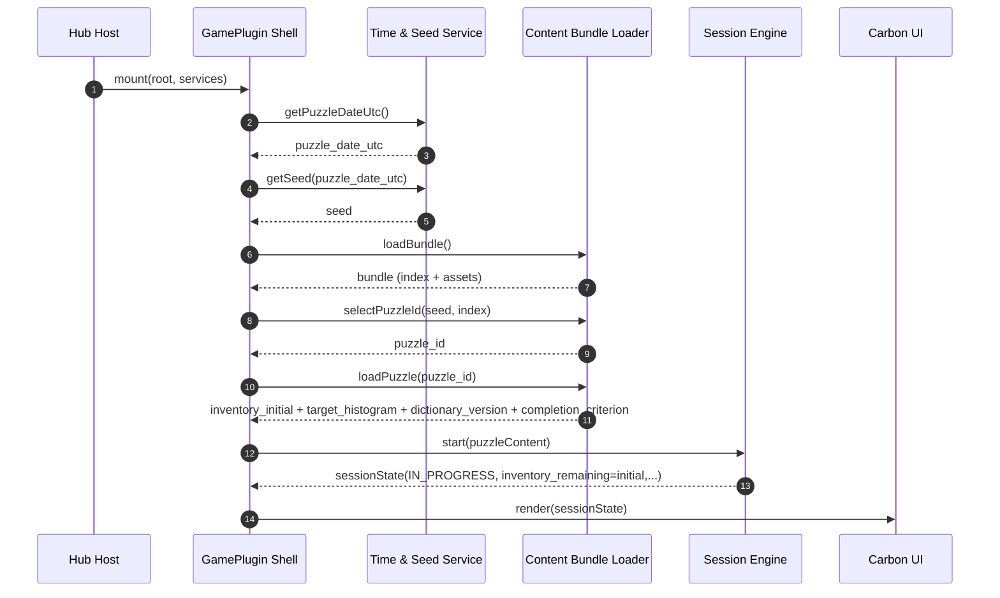
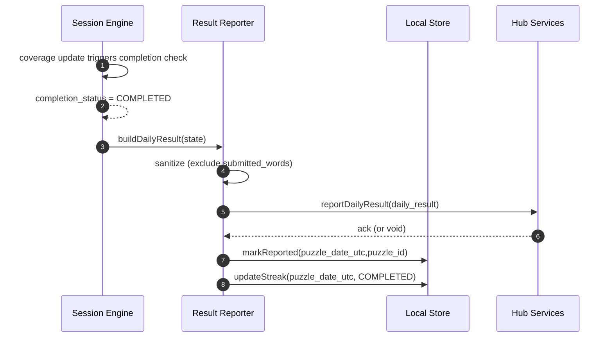
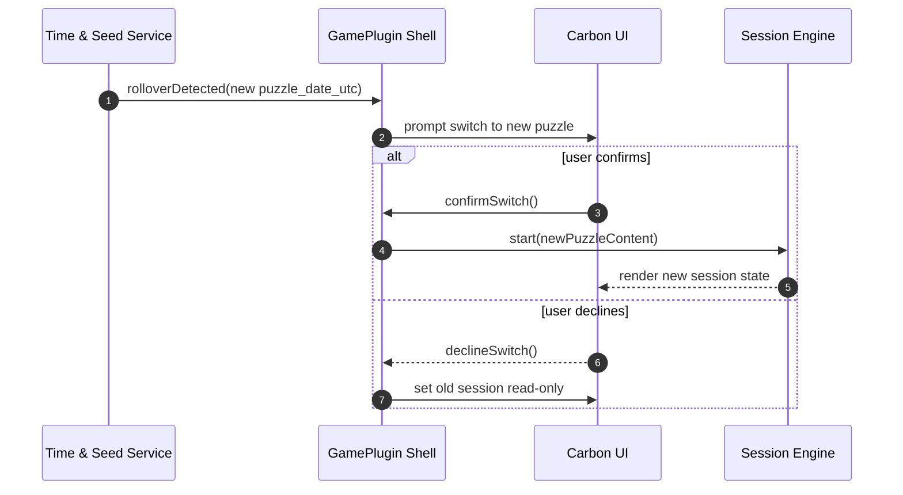
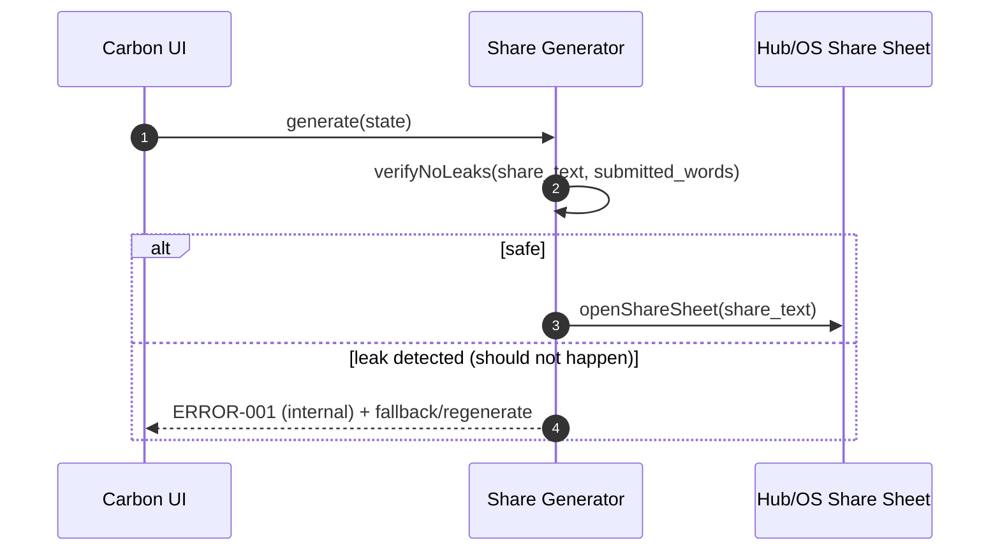
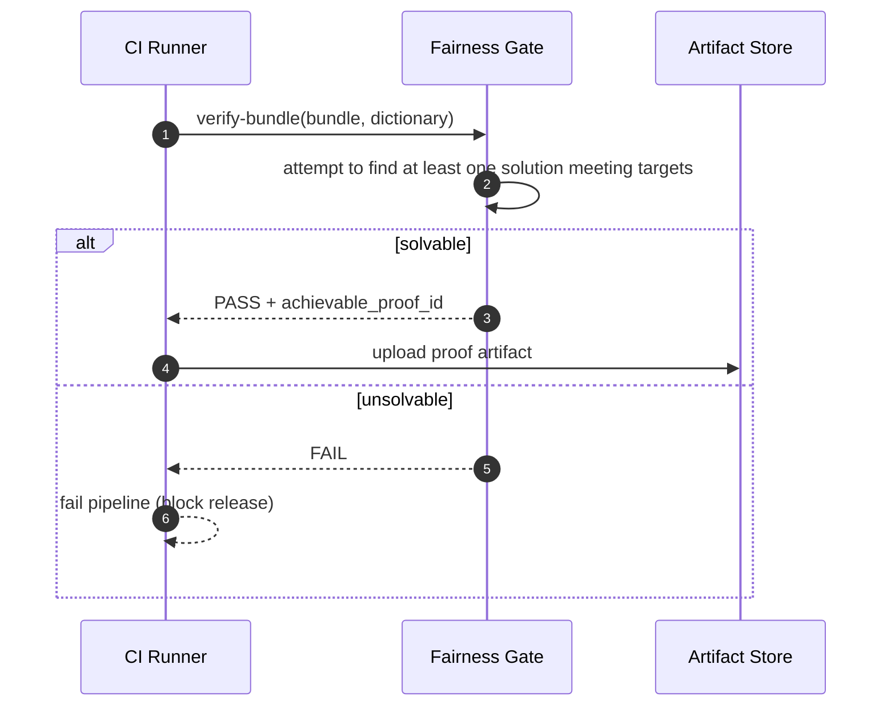

<!-- generated: 2026-07-25T19:27:32Z -->
<!-- mode: feature -->
<!-- feature-slug: ration -->
<!-- a2a-endpoint: https://bob-sdlc-orchestrator.2as6l7wq9qj8.eu-gb.codeengine.appdomain.cloud/v1/rpc -->

# Glossary

## Terms

### TERM-001: Ration
- **Definition:** The CIC Games hub daily word-formation game where players create multiple words while consuming from a shared, limited letter inventory.
- **Synonyms:** Ration game, daily ration puzzle
- **Anti-definition:** Not a word game where letters can be reused freely across words (e.g., Spelling Bee-style).
- **Source:** User request

### TERM-002: Daily Puzzle
- **Definition:** The deterministic puzzle instance for a specific UTC date, including the letter inventory and target histogram.
- **Synonyms:** Daily, today’s puzzle, puzzle-of-the-day
- **Anti-definition:** Not a randomized per-user puzzle.
- **Source:** User request

### TERM-003: UTC Day Boundary
- **Definition:** The point in time at 00:00:00 UTC when the Daily Puzzle changes and streak eligibility rolls over.
- **Synonyms:** UTC rollover, daily reset (UTC)
- **Anti-definition:** Not a local-time-based day boundary.
- **Source:** User request

### TERM-004: Seed
- **Definition:** The deterministic value derived from UTC date used to select the Daily Puzzle configuration.
- **Synonyms:** Daily seed
- **Anti-definition:** Not a secret cryptographic key.
- **Source:** User request

### TERM-005: Letter
- **Definition:** A single character unit (A–Z) that can appear in the Letter Inventory with an associated stock count.
- **Synonyms:** Tile, glyph
- **Anti-definition:** Not a multi-character grapheme (e.g., “CH”) unless explicitly modeled as such (out of scope here).
- **Source:** User request

### TERM-006: Letter Inventory
- **Definition:** A multiset of Letters, each with an initial stock count, representing the total budget available across all submitted words.
- **Synonyms:** Inventory, rack, pool
- **Anti-definition:** Not per-word letter availability; inventory is shared across all words for the session.
- **Source:** User request

### TERM-007: Stock Count
- **Definition:** The integer quantity of a specific Letter available in the Letter Inventory.
- **Synonyms:** Count, quantity, available units
- **Anti-definition:** Not a score value.
- **Source:** User request

### TERM-008: Spent Letter
- **Definition:** A Letter unit consumed from the remaining Stock Count due to word submission.
- **Synonyms:** Consumed, used up
- **Anti-definition:** Not merely “present in a word draft” unless the word is submitted.
- **Source:** User request

### TERM-009: Remaining Inventory
- **Definition:** The current Letter Inventory after subtracting Spent Letters from submitted words.
- **Synonyms:** Remaining letters, balance
- **Anti-definition:** Not the initial inventory.
- **Source:** User request

### TERM-010: Word
- **Definition:** A sequence of Letters submitted by the player and validated against the bundled Dictionary.
- **Synonyms:** Entry, guess
- **Anti-definition:** Not a partial draft; not an invalid string.
- **Source:** User request

### TERM-011: Word Length Histogram
- **Definition:** A set of word-length buckets mapped to required counts (e.g., length 5 → 1, length 4 → 2).
- **Synonyms:** Target histogram, targets, quota
- **Anti-definition:** Not a distribution of letters; not optional unless the mode says so.
- **Source:** User request

### TERM-012: Target Coverage
- **Definition:** The player’s progress toward meeting each Word Length Histogram bucket requirement.
- **Synonyms:** Coverage, completion progress
- **Anti-definition:** Not the list of words found.
- **Source:** User request

### TERM-013: Scoring Mode
- **Definition:** The ruleset used to compute score (e.g., maximize total letters used) when not solely evaluated by target coverage.
- **Synonyms:** Score objective
- **Anti-definition:** Not a dictionary validation rule.
- **Source:** User request

### TERM-014: Session
- **Definition:** A single play period for a Daily Puzzle, intended to complete in under 3 minutes.
- **Synonyms:** Run, attempt
- **Anti-definition:** Not the user’s lifetime stats.
- **Source:** User request

### TERM-015: Offline-first PWA
- **Definition:** A web app installable and usable without network after initial asset caching, including dictionary and daily puzzle bundle.
- **Synonyms:** PWA
- **Anti-definition:** Not a server-dependent experience for validation or scoring.
- **Source:** User request

### TERM-016: Native App Wrapper
- **Definition:** iOS and Android app packages embedding the same client game logic/UI and offline assets.
- **Synonyms:** iOS app, Android app
- **Anti-definition:** Not a separate gameplay ruleset.
- **Source:** User request

### TERM-017: Bundled Dictionary
- **Definition:** The on-device word list used to validate Word submissions.
- **Synonyms:** Dictionary, word list
- **Anti-definition:** Not an online API lookup.
- **Source:** User request

### TERM-018: Daily Puzzle Bundle
- **Definition:** The on-device content package containing puzzles and related metadata used for selection by Seed.
- **Synonyms:** Content bundle, puzzle pack
- **Anti-definition:** Not dynamically fetched daily content (unless updated by app update).
- **Source:** User request

### TERM-019: Fairness Gate
- **Definition:** A build-time verification step that proves targets are achievable from the inventory using the Bundled Dictionary.
- **Synonyms:** Build-time validator, solvability check
- **Anti-definition:** Not a runtime solver shown to players.
- **Source:** User request

### TERM-020: Achievable Targets Proof
- **Definition:** The artifact/result of the Fairness Gate indicating at least one valid set of words exists that meets the Target Histogram within the Letter Inventory.
- **Synonyms:** Solvability proof, feasibility proof
- **Anti-definition:** Not a disclosure of actual solution words to users.
- **Source:** User request

### TERM-021: Spoiler-safe Share Artifact
- **Definition:** A shareable text block summarizing Target Coverage (and optionally score) without revealing any submitted words.
- **Synonyms:** Share card (text), share string
- **Anti-definition:** Not a solution list.
- **Source:** User request

### TERM-022: GamePlugin
- **Definition:** The CIC Games hub integration interface exposing `mount(root, services)` and emitting a `DailyResult`.
- **Synonyms:** Plugin, game module
- **Anti-definition:** Not a standalone app without hub services.
- **Source:** User request

### TERM-023: Services (Hub Services)
- **Definition:** Host-provided capabilities passed into `mount`, including persistence, navigation, analytics hooks, and time source (if provided).
- **Synonyms:** Platform services, host APIs
- **Anti-definition:** Not server gameplay logic.
- **Source:** User request

### TERM-024: DailyResult
- **Definition:** The structured outcome for a completed Daily Puzzle (e.g., date, completion status, score, coverage) reported to the hub.
- **Synonyms:** Result, daily outcome
- **Anti-definition:** Not raw word list unless explicitly allowed (it is not, per spoiler-safe constraints).
- **Source:** User request

### TERM-025: Namespaced Local Stats
- **Definition:** On-device stored statistics keyed under a Ration-specific namespace to avoid collisions with other games.
- **Synonyms:** Local stats, per-game stats
- **Anti-definition:** Not shared cross-game stats.
- **Source:** User request

### TERM-026: Streak
- **Definition:** The count of consecutive UTC days with a completed Daily Puzzle meeting the completion criterion.
- **Synonyms:** Daily streak
- **Anti-definition:** Not based on local time days.
- **Source:** User request

### TERM-027: Completion Criterion
- **Definition:** The rule that defines “completed” for the daily (e.g., meeting all Target Histogram buckets, or other configured objective).
- **Synonyms:** Win condition
- **Anti-definition:** Not “played at least once” unless explicitly configured.
- **Source:** User request

### TERM-028: Inventory Accounting
- **Definition:** The client-side tracking of Remaining Inventory based on submitted words, preventing overspending letters.
- **Synonyms:** Budget accounting
- **Anti-definition:** Not server-side enforcement.
- **Source:** User request

### TERM-029: Input Method
- **Definition:** The means by which the player enters word letters (keyboard, on-screen letters, assistive tech).
- **Synonyms:** Keyboard input
- **Anti-definition:** Not limited to touch-only.
- **Source:** User request + WCAG requirements

### TERM-030: IBM Carbon Design System
- **Definition:** The UI component and design standard used to implement the interface for the game within the hub.
- **Synonyms:** Carbon
- **Anti-definition:** Not custom UI patterns that conflict with Carbon accessibility conventions.
- **Source:** User request

### TERM-031: WCAG 2.1 AA
- **Definition:** Accessibility standard requiring keyboard operability, visible focus, non-color-only state indication, and motion reduction support.
- **Synonyms:** Accessibility compliance
- **Anti-definition:** Not WCAG AAA.
- **Source:** User request

### TERM-032: Prefers Reduced Motion
- **Definition:** An OS/user-agent setting indicating the user prefers minimized animation.
- **Synonyms:** reduced-motion preference
- **Anti-definition:** Not a per-app toggle (though an app toggle may be added separately).
- **Source:** User request

---

## Data Dictionary

| ID | Name | Type | Format | Range | Units | Default | Nullable | PII | Source | Validation |
|---|---|---|---|---|---|---|---|---|---|---|
| FIELD-001 | puzzle_date_utc | string | YYYY-MM-DD | valid UTC calendar date | day | (computed) | No | None | client clock / host time service | Must equal UTC date used for Seed (TERM-004) |
| FIELD-002 | seed | string | `ration:YYYY-MM-DD` | non-empty | n/a | derived | No | None | client | Must be deterministic from FIELD-001 |
| FIELD-003 | puzzle_id | string | opaque | non-empty | n/a | from bundle | No | None | TERM-018 | Must exist in Daily Puzzle Bundle index |
| FIELD-004 | inventory_initial | object(map) | JSON map {letter:count} | letters A-Z; count 0..99 | tiles | from bundle | No | None | TERM-018 | Sum(count) > 0; keys uppercase A-Z |
| FIELD-005 | inventory_remaining | object(map) | JSON map {letter:count} | letters A-Z; count 0..99 | tiles | equals initial | No | None | runtime state | For all letters: remaining ≤ initial and ≥ 0 |
| FIELD-006 | letter | string | `^[A-Z]$` | A..Z | n/a | n/a | No | None | UI input | Must be single uppercase A-Z |
| FIELD-007 | stock_count | integer | int | 0..99 | tiles | n/a | No | None | bundle/runtime | Must be integer and ≥ 0 |
| FIELD-008 | word_text | string | `^[A-Z]{2,}$` | length 2..32 | letters | n/a | No | Potentially Sensitive* | user input | Must be uppercase A-Z only; length within bounds |
| FIELD-009 | word_length | integer | int | 2..32 | letters | derived | No | None | computed | Must equal length(word_text) |
| FIELD-010 | submitted_words | array(string) | JSON array | unique values | n/a | [] | No | Potentially Sensitive* | local runtime | Each must validate against dictionary; uniqueness enforced |
| FIELD-011 | dictionary_version | string | semver/string | non-empty | n/a | from bundle | No | None | TERM-018 | Must match bundled dictionary metadata |
| FIELD-012 | target_histogram | array(object) | JSON list | each {length,count} | words | from bundle | No | None | TERM-018 | length 2..32; count 0..20; no duplicate lengths |
| FIELD-013 | target_bucket_length | integer | int | 2..32 | letters | n/a | No | None | bundle | Must be integer |
| FIELD-014 | target_bucket_required_count | integer | int | 0..20 | words | n/a | No | None | bundle | Must be integer |
| FIELD-015 | coverage_by_length | object(map) | JSON map {length:countMet} | 0..required | words | 0 | No | None | runtime | For each target length: met ≤ required |
| FIELD-016 | completion_status | string | enum | `NOT_STARTED`, `IN_PROGRESS`, `COMPLETED` | n/a | NOT_STARTED | No | None | runtime | Must be one of enum values |
| FIELD-017 | completion_criterion | string | enum | `HISTOGRAM`, `SCORE_ONLY` | n/a | HISTOGRAM | No | None | bundle/config | Must be one of enum values |
| FIELD-018 | score | integer | int | 0..9999 | points | 0 | No | None | runtime | Must be integer ≥ 0 |
| FIELD-019 | letters_used_total | integer | int | 0..999 | letters | 0 | No | None | runtime | Must equal sum lengths of submitted_words |
| FIELD-020 | share_artifact_text | string | text | length 1..2000 | n/a | generated | No | None | client | Must not contain any submitted word strings |
| FIELD-021 | daily_result | object | JSON | schema-bound | n/a | generated | No | None | plugin | Must include puzzle_date_utc, puzzle_id, completion_status, score |
| FIELD-022 | streak_count | integer | int | 0..9999 | days | 0 | No | None | local stats | Must increment only on UTC day completion |
| FIELD-023 | last_completed_date_utc | string | YYYY-MM-DD | valid date | day | null | Yes | None | local stats | If set, must be ≤ current puzzle_date_utc |
| FIELD-024 | carbon_theme | string | enum | `g10`,`g90`,`g100`,`white` | n/a | host | Yes | None | host services | If set, must be one of enum values |
| FIELD-025 | reduced_motion_enabled | boolean | boolean | true/false | n/a | from OS | No | None | user agent | Must reflect `prefers-reduced-motion` |
| FIELD-026 | install_platform | string | enum | `PWA`,`IOS`,`ANDROID`,`WEB` | n/a | detected | No | None | runtime | Must be one of enum values |
| FIELD-027 | local_namespace | string | string | non-empty | n/a | `cic.ration` | No | None | plugin | Must be stable across app launches |
| FIELD-028 | fairness_gate_status | string | enum | `PASS`,`FAIL` | n/a | PASS | No | None | build pipeline | Must be PASS to ship content bundle |
| FIELD-029 | achievable_proof_id | string | opaque | non-empty | n/a | from build | No | None | build pipeline | Must exist when fairness_gate_status=PASS |
| FIELD-030 | error_code | string | enum | see errors | n/a | n/a | Yes | None | runtime | Must map to defined ERROR-XXX triggers |

\*PII note: submitted words can be treated as “Potentially Sensitive” user-generated content; store locally only and exclude from share artifact and reported `DailyResult` (TERM-024).

---

# User Journeys

## Roles

| Role ID | Role | Type | Description |
|---|---|---|---|
| ROLE-001 | Player | Primary | Plays the Daily Puzzle (TERM-002), submits words, views progress, shares results |
| ROLE-002 | Hub Host | System | Hosts the GamePlugin (TERM-022), provides Services (TERM-023), receives DailyResult (TERM-024) |
| ROLE-003 | Build Engineer | Admin/System | Runs build pipeline including Fairness Gate (TERM-019) for the Daily Puzzle Bundle (TERM-018) |
| ROLE-004 | Accessibility User | Secondary | Player using keyboard-only and/or assistive tech; relies on WCAG 2.1 AA compliance (TERM-031) |

## Entry Points

| Entry ID | Location | Trigger | Auth |
|---|---|---|---|
| ENTRY-001 | GamePlugin `mount(root, services)` | Hub launches game | Hub-controlled session |
| ENTRY-002 | UI Route: “Today” screen | Player opens daily puzzle | Same as hub session |
| ENTRY-003 | UI Action: Submit word | Player confirms word entry | n/a |
| ENTRY-004 | UI Action: Share | Player selects share | OS/hub share sheet permissions |
| ENTRY-005 | Build pipeline job | CI run for content | Internal only |

## Role Permission Matrix

| Capability | ROLE-001 Player | ROLE-002 Hub Host | ROLE-003 Build Engineer | ROLE-004 Accessibility User |
|---|---:|---:|---:|---:|
| Start/Resume Daily Puzzle | Yes | Indirect | No | Yes |
| Submit/Undo words | Yes | No | No | Yes |
| Validate word locally | Yes (client) | No | No | Yes |
| Generate share artifact | Yes | No | No | Yes |
| Receive DailyResult | No | Yes | No | No |
| Run Fairness Gate | No | No | Yes | No |

## Journeys

### JOURNEY-001: Launch and load today’s Daily Puzzle (offline-first)
- **Role/Goal:** ROLE-001 Player; open today’s puzzle (TERM-002) even offline (TERM-015)
- **Entry:** ENTRY-001 + ENTRY-002
- **Happy path:**
  1. System computes `puzzle_date_utc` (FIELD-001) using UTC Day Boundary (TERM-003).
  2. System derives `seed` (FIELD-002) from `puzzle_date_utc` (TERM-004).
  3. System selects `puzzle_id` (FIELD-003) from Daily Puzzle Bundle (TERM-018) deterministically by `seed`.
  4. System loads `inventory_initial` (FIELD-004) and `target_histogram` (FIELD-012).
  5. System initializes `inventory_remaining` (FIELD-005) to `inventory_initial`; sets `completion_status` (FIELD-016) to `IN_PROGRESS`.
- **BRANCH-001 (bundle missing/corrupt):** If Daily Puzzle Bundle cannot be read.
  - System shows an error state with `error_code` (FIELD-030) and offers retry.
- **ERROR-001:** Trigger: bundle read fails. Response: show “Content unavailable offline” message and disable play. Recovery: restart app / update app.
- **EDGE-001:** Device clock incorrect (player time skew). System still uses computed UTC; may differ from user expectation; show UTC date label `puzzle_date_utc` to clarify.
- **EDGE-002:** App resumes across UTC Day Boundary. System detects `puzzle_date_utc` change and prompts to switch to new puzzle (see JOURNEY-005).

### JOURNEY-002: Enter and submit a word consuming shared inventory
- **Role/Goal:** ROLE-001 Player; submit valid Word (TERM-010) that fits Remaining Inventory (TERM-009)
- **Entry:** ENTRY-003
- **Happy path:**
  1. Player enters `word_text` (FIELD-008) via Input Method (TERM-029).
  2. System computes `word_length` (FIELD-009).
  3. System validates `word_text` against Bundled Dictionary (TERM-017) using `dictionary_version` (FIELD-011).
  4. System checks `inventory_remaining` (FIELD-005) has sufficient Stock Count (TERM-007) for each Letter (TERM-005) in `word_text`.
  5. System appends `word_text` to `submitted_words` (FIELD-010).
  6. System decrements `inventory_remaining` according to Spent Letters (TERM-008).
  7. System updates `coverage_by_length` (FIELD-015) toward `target_histogram` (FIELD-012) (TERM-012).
  8. System recomputes `letters_used_total` (FIELD-019) and `score` (FIELD-018) (TERM-013).
- **BRANCH-002 (invalid dictionary word):** Word not in dictionary.
- **BRANCH-003 (overspends inventory):** Word requires letters beyond `inventory_remaining`.
- **BRANCH-004 (duplicate word):** Word already in `submitted_words`.
- **ERROR-002:** Trigger: BRANCH-002. Response: show inline message “Not in dictionary” and do not change inventory. Recovery: edit and resubmit.
- **ERROR-003:** Trigger: BRANCH-003. Response: show per-letter shortage and do not change inventory. Recovery: change word or undo previous submissions (see JOURNEY-003).
- **ERROR-004:** Trigger: BRANCH-004. Response: show “Already submitted” and do not change state. Recovery: enter a new word.
- **EDGE-003:** Empty input / length < 2. Response: disable submit and announce requirement.
- **EDGE-004:** Non A–Z characters. Response: reject input and announce constraint.
- **EDGE-005:** Rapid double-submit (concurrency). Response: idempotently accept only once; inventory decremented once.

### JOURNEY-003: Undo/remove a submitted word and restore inventory
- **Role/Goal:** ROLE-001 Player; correct mistakes without restarting session
- **Entry:** UI action on submitted list (implicit)
- **Happy path:**
  1. Player selects a `word_text` from `submitted_words` (FIELD-010) to remove.
  2. System removes it from `submitted_words`.
  3. System restores `inventory_remaining` by adding back letters from removed word (bounded by `inventory_initial` (FIELD-004)).
  4. System updates `coverage_by_length` and recomputes `letters_used_total` and `score`.
- **BRANCH-005 (cannot undo after completion locked):** If completion is locked after reporting DailyResult.
- **ERROR-005:** Trigger: BRANCH-005. Response: show “Already finalized” and do not modify state. Recovery: none for that day.
- **EDGE-006:** Remove last word causing bucket to drop below required. System reflects reduced Target Coverage immediately.

### JOURNEY-004: Complete the daily and report DailyResult to hub
- **Role/Goal:** ROLE-001 Player; finish daily (TERM-027) and have it recorded (TERM-024)
- **Entry:** Completion event (implicit) and/or player taps “Finish”
- **Happy path:**
  1. System evaluates completion criterion using `completion_criterion` (FIELD-017).
  2. If criterion met, system sets `completion_status` (FIELD-016) to `COMPLETED`.
  3. System creates `daily_result` (FIELD-021) including `puzzle_date_utc` (FIELD-001), `puzzle_id` (FIELD-003), `completion_status`, `score` (FIELD-018), and Target Coverage summary (derived from FIELD-015), excluding `submitted_words` (FIELD-010).
  4. System passes `daily_result` to Hub Host (ROLE-002) via Services (TERM-023).
  5. System updates Namespaced Local Stats (TERM-025): `last_completed_date_utc` (FIELD-023) and `streak_count` (FIELD-022) based on UTC Day Boundary (TERM-003).
- **BRANCH-006 (criterion not met):** Player finishes early without meeting targets (HISTOGRAM mode).
- **ERROR-006:** Trigger: BRANCH-006. Response: show unmet buckets and keep `completion_status` as `IN_PROGRESS`. Recovery: continue submitting/undoing.
- **EDGE-007:** Offline status. Reporting to hub still occurs locally/in-process; if hub requires persistence, queue in local namespace for later delivery (implementation-specific to Services).

### JOURNEY-005: Switch puzzles at UTC rollover
- **Role/Goal:** ROLE-001 Player; avoid mixing states across UTC days
- **Entry:** App resume / foreground event
- **Happy path:**
  1. System recomputes current `puzzle_date_utc` (FIELD-001).
  2. If `puzzle_date_utc` differs from session date, system prompts to start new Daily Puzzle (TERM-002).
  3. On confirmation, system resets session state to new puzzle’s `inventory_initial`, `target_histogram`, clears `submitted_words`, resets `coverage_by_length`, `score`.
- **BRANCH-007 (player declines):** Player keeps viewing old state read-only.
- **ERROR-007:** Trigger: attempting to submit word on an expired puzzle date. Response: block submission and prompt switch. Recovery: switch to today.

### JOURNEY-006: Generate spoiler-safe share artifact
- **Role/Goal:** ROLE-001 Player; share progress without revealing words (TERM-021)
- **Entry:** ENTRY-004
- **Happy path:**
  1. Player taps Share.
  2. System generates `share_artifact_text` (FIELD-020) containing `puzzle_date_utc` (FIELD-001), Target Coverage blocks derived from `coverage_by_length` (FIELD-015) vs `target_histogram` (FIELD-012), and optional `score` (FIELD-018).
  3. System verifies `share_artifact_text` does not contain any string equal to any element of `submitted_words` (FIELD-010).
  4. System invokes host/OS share sheet with `share_artifact_text`.
- **ERROR-008:** Trigger: share sheet unavailable. Response: copy to clipboard fallback if permitted; otherwise show text selectable.
- **EDGE-008:** Localization/i18n: share artifact remains parseable and spoiler-safe even if translated (keep blocks numeric/symbolic).

### JOURNEY-007: Accessibility-first interaction (keyboard + reduced motion)
- **Role/Goal:** ROLE-004 Accessibility User; complete puzzle using keyboard and assistive tech
- **Entry:** ENTRY-002 + general UI
- **Happy path:**
  1. User navigates interactive elements via keyboard with visible focus (TERM-031).
  2. System conveys Remaining Inventory changes (FIELD-005) and Target Coverage updates (FIELD-015) through text or icon + accessible name, not color alone.
  3. If `reduced_motion_enabled` (FIELD-025) is true, animations are removed or reduced.
- **ERROR-009:** Trigger: focus trap detected (cannot reach submit/share). Response: provide skip/back controls and ensure modal focus management.
- **EDGE-009:** Screen reader: inventory counts and shortages announced via ARIA live region (implementation detail) with non-spammy cadence.

### JOURNEY-008: Build-time Fairness Gate for content bundle
- **Role/Goal:** ROLE-003 Build Engineer; ensure puzzles are solvable before shipping
- **Entry:** ENTRY-005
- **Happy path:**
  1. Pipeline reads each candidate puzzle’s `inventory_initial` (FIELD-004), `target_histogram` (FIELD-012), and dictionary (TERM-017).
  2. Pipeline runs Fairness Gate (TERM-019) to confirm Achievable Targets Proof (TERM-020) exists.
  3. Pipeline sets `fairness_gate_status` (FIELD-028) to `PASS` and emits `achievable_proof_id` (FIELD-029).
- **ERROR-010:** Trigger: unsolvable puzzle. Response: set `fairness_gate_status=FAIL` and fail build. Recovery: adjust inventory/targets/dictionary selection.
- **EDGE-010:** Determinism: proof generation must be stable for the same content inputs.

## Journey Map

```mermaid
flowchart TD
  A[ENTRY-001 mount()] --> B[JOURNEY-001 Load Daily Puzzle]
  B --> C[JOURNEY-002 Submit Word]
  C --> D{Targets met?}
  D -- No --> C
  D -- Yes --> E[JOURNEY-004 Complete + Report DailyResult]
  C --> F[JOURNEY-003 Undo Word]
  F --> C
  E --> G[JOURNEY-006 Share Artifact]
  B --> H[JOURNEY-007 Accessibility Interaction]
  B --> I{UTC rollover?}
  I -- Yes --> J[JOURNEY-005 Switch Puzzle]
  I -- No --> C
  K[ENTRY-005 CI] --> L[JOURNEY-008 Fairness Gate]
```

---

# Requirements

### REQ-001: Compute daily UTC puzzle date
- **EARS Pattern:** Ubiquitous
- **EARS Statement:** The system shall compute `puzzle_date_utc` (FIELD-001) using the UTC Day Boundary (TERM-003).
- **Inputs:** device time or host time service
- **Outputs:** FIELD-001
- **Preconditions:** GamePlugin (TERM-022) mounted
- **Postconditions:** FIELD-001 available for selection logic
- **Invariants:** FIELD-001 format is YYYY-MM-DD
- **Trigger:** App/game initialization
- **Actor:** ROLE-002 Hub Host (system) / client runtime
- **EntityScope:** TERM-002 Daily Puzzle
- **ErrorModes:** ERROR-001
- **NFR-Tags:** i18n, compatibility
- **Source:** JOURNEY-001 step 1
- **Dependencies:** None
- **Priority:** P0
- **AcceptanceCriteria:**
  - **TEST-001:** Given system time 2026-07-25T00:00:00Z, when computed, then FIELD-001 equals `2026-07-25`.
  - **TEST-002:** Given system time 2026-07-25T23:59:59Z, when computed, then FIELD-001 equals `2026-07-25`.
- **Assumptions:** A UTC-capable time source is available
- **OpenQuestions:** Should host Services provide an authoritative UTC time API?

### REQ-002: Derive deterministic seed from puzzle date
- **EARS Pattern:** Event-Driven
- **EARS Statement:** When `puzzle_date_utc` (FIELD-001) is available, the system shall derive `seed` (FIELD-002) deterministically from `puzzle_date_utc`.
- **Inputs:** FIELD-001
- **Outputs:** FIELD-002
- **Preconditions:** FIELD-001 computed
- **Postconditions:** FIELD-002 available for puzzle selection
- **Invariants:** Same FIELD-001 produces same FIELD-002
- **Trigger:** FIELD-001 set
- **Actor:** client runtime
- **EntityScope:** TERM-004 Seed
- **ErrorModes:** ERROR-001
- **NFR-Tags:** reliability
- **Source:** JOURNEY-001 step 2
- **Dependencies:** REQ-001
- **Priority:** P0
- **AcceptanceCriteria:**
  - **TEST-003:** Given FIELD-001=`2026-07-25`, when derived, then FIELD-002 equals `ration:2026-07-25`.
- **Assumptions:** Seed prefix `ration:` is stable
- **OpenQuestions:** Any need for multiple puzzle variants per date?

### REQ-003: Select puzzle deterministically from bundle
- **EARS Pattern:** Event-Driven
- **EARS Statement:** When `seed` (FIELD-002) is derived, the system shall select `puzzle_id` (FIELD-003) from the Daily Puzzle Bundle (TERM-018) deterministically.
- **Inputs:** FIELD-002, TERM-018
- **Outputs:** FIELD-003
- **Preconditions:** Bundle readable
- **Postconditions:** Puzzle identified for load
- **Invariants:** Same bundle + same seed => same puzzle_id
- **Trigger:** FIELD-002 set
- **Actor:** client runtime
- **EntityScope:** TERM-018 Daily Puzzle Bundle
- **ErrorModes:** ERROR-001
- **NFR-Tags:** offline-first
- **Source:** JOURNEY-001 step 3
- **Dependencies:** REQ-002
- **Priority:** P0
- **AcceptanceCriteria:**
  - **TEST-004:** Given a fixed bundle and FIELD-002 value, repeated launches return the same FIELD-003.
- **Assumptions:** Bundle includes index/mapping strategy
- **OpenQuestions:** Is selection a direct lookup table or hash mod N?

### REQ-004: Initialize session state from puzzle content
- **EARS Pattern:** Event-Driven
- **EARS Statement:** When `puzzle_id` (FIELD-003) is selected, the system shall load `inventory_initial` (FIELD-004) and `target_histogram` (FIELD-012) for that puzzle.
- **Inputs:** FIELD-003, TERM-018
- **Outputs:** FIELD-004, FIELD-012
- **Preconditions:** Bundle readable; puzzle exists
- **Postconditions:** Content available for play
- **Invariants:** FIELD-004 keys are A-Z; FIELD-012 lengths unique
- **Trigger:** FIELD-003 set
- **Actor:** client runtime
- **EntityScope:** TERM-002 Daily Puzzle
- **ErrorModes:** ERROR-001
- **NFR-Tags:** offline-first
- **Source:** JOURNEY-001 step 4
- **Dependencies:** REQ-003
- **Priority:** P0
- **AcceptanceCriteria:**
  - **TEST-005:** Given a puzzle_id, when loaded, then FIELD-004 and FIELD-012 conform to their validation rules.
- **Assumptions:** Bundle schema is versioned
- **OpenQuestions:** Do we support multiple target sets per puzzle?

### REQ-005: Initialize remaining inventory to initial inventory
- **EARS Pattern:** Event-Driven
- **EARS Statement:** When `inventory_initial` (FIELD-004) is loaded, the system shall set `inventory_remaining` (FIELD-005) equal to `inventory_initial`.
- **Inputs:** FIELD-004
- **Outputs:** FIELD-005
- **Preconditions:** FIELD-004 present
- **Postconditions:** Player can start spending letters
- **Invariants:** For each letter: remaining == initial at start
- **Trigger:** FIELD-004 set
- **Actor:** client runtime
- **EntityScope:** TERM-009 Remaining Inventory
- **ErrorModes:** ERROR-001
- **NFR-Tags:** reliability
- **Source:** JOURNEY-001 step 5
- **Dependencies:** REQ-004
- **Priority:** P0
- **AcceptanceCriteria:**
  - **TEST-006:** Given FIELD-004 has A:3, when initialized, then FIELD-005 has A:3.
- **Assumptions:** None
- **OpenQuestions:** None

### REQ-006: Validate word characters and length before submission
- **EARS Pattern:** Event-Driven
- **EARS Statement:** When the player attempts to submit `word_text` (FIELD-008), the system shall reject submission if `word_text` fails the FIELD-008 validation rule.
- **Inputs:** FIELD-008
- **Outputs:** error_code (FIELD-030)
- **Preconditions:** completion_status (FIELD-016) is `IN_PROGRESS`
- **Postconditions:** No changes to FIELD-010 or FIELD-005 on rejection
- **Invariants:** Rejection is non-mutating
- **Trigger:** Submit action
- **Actor:** ROLE-001 Player
- **EntityScope:** TERM-010 Word
- **ErrorModes:** ERROR-002
- **NFR-Tags:** accessibility
- **Source:** JOURNEY-002 steps 1–2, EDGE-003, EDGE-004
- **Dependencies:** REQ-004
- **Priority:** P0
- **AcceptanceCriteria:**
  - **TEST-007:** Given FIELD-008 is empty, when submit, then submission is blocked and FIELD-010 unchanged.
  - **TEST-008:** Given FIELD-008 contains `A-1`, when submit, then submission is rejected.
- **Assumptions:** UI prevents most invalid input but system enforces
- **OpenQuestions:** Minimum word length is 2—confirm?

### REQ-007: Validate word against bundled dictionary
- **EARS Pattern:** Event-Driven
- **EARS Statement:** When a submit attempt passes FIELD-008 validation, the system shall reject submission if `word_text` (FIELD-008) is not found in the Bundled Dictionary (TERM-017).
- **Inputs:** FIELD-008, FIELD-011
- **Outputs:** error_code (FIELD-030)
- **Preconditions:** Dictionary available on-device
- **Postconditions:** No changes to inventory/state on rejection
- **Invariants:** Dictionary lookup uses `dictionary_version` (FIELD-011)
- **Trigger:** Submit action
- **Actor:** ROLE-001 Player
- **EntityScope:** TERM-017 Bundled Dictionary
- **ErrorModes:** ERROR-002
- **NFR-Tags:** offline-first
- **Source:** JOURNEY-002 step 3, BRANCH-002
- **Dependencies:** REQ-006
- **Priority:** P0
- **AcceptanceCriteria:**
  - **TEST-009:** Given FIELD-008 is not in dictionary, when submit, then FIELD-030 indicates dictionary invalid and FIELD-005 unchanged.
- **Assumptions:** Dictionary is case-normalized to uppercase
- **OpenQuestions:** Any rules for proper nouns/inflections?

### REQ-008: Prevent overspending letters from remaining inventory
- **EARS Pattern:** Event-Driven
- **EARS Statement:** When a submit attempt is dictionary-valid, the system shall reject submission if `inventory_remaining` (FIELD-005) does not contain sufficient Stock Count (TERM-007) for the Letters in `word_text` (FIELD-008).
- **Inputs:** FIELD-008, FIELD-005
- **Outputs:** error_code (FIELD-030)
- **Preconditions:** FIELD-005 initialized
- **Postconditions:** No decrement occurs on rejection
- **Invariants:** For all letters, FIELD-005 remains ≥ 0
- **Trigger:** Submit action
- **Actor:** ROLE-001 Player
- **EntityScope:** TERM-006 Letter Inventory
- **ErrorModes:** ERROR-003
- **NFR-Tags:** reliability, accessibility
- **Source:** JOURNEY-002 step 4, BRANCH-003
- **Dependencies:** REQ-007
- **Priority:** P0
- **AcceptanceCriteria:**
  - **TEST-010:** Given FIELD-005 has A:0 and FIELD-008=`AA`, when submit, then submission rejected and FIELD-005 unchanged.
- **Assumptions:** Letter counting is per-character A–Z
- **OpenQuestions:** Do we allow blanks/wildcards? (assumed no)

### REQ-009: Reject duplicate word submissions
- **EARS Pattern:** Event-Driven
- **EARS Statement:** When a submit attempt is inventory-feasible, the system shall reject submission if `word_text` (FIELD-008) already exists in `submitted_words` (FIELD-010).
- **Inputs:** FIELD-008, FIELD-010
- **Outputs:** error_code (FIELD-030)
- **Preconditions:** Session in progress
- **Postconditions:** No state change on rejection
- **Invariants:** FIELD-010 values are unique
- **Trigger:** Submit action
- **Actor:** ROLE-001 Player
- **EntityScope:** TERM-010 Word
- **ErrorModes:** ERROR-004
- **NFR-Tags:** reliability
- **Source:** JOURNEY-002 BRANCH-004
- **Dependencies:** REQ-008
- **Priority:** P1
- **AcceptanceCriteria:**
  - **TEST-011:** Given FIELD-010 contains `RATE`, when submitting `RATE`, then reject and do not decrement inventory.
- **Assumptions:** Uniqueness is case-insensitive after normalization
- **OpenQuestions:** Allow plural variants as distinct words? (dictionary governs)

### REQ-010: Commit accepted submission to submitted list
- **EARS Pattern:** Event-Driven
- **EARS Statement:** When a submit attempt passes dictionary, inventory, and duplicate checks, the system shall append `word_text` (FIELD-008) to `submitted_words` (FIELD-010).
- **Inputs:** FIELD-008
- **Outputs:** FIELD-010
- **Preconditions:** REQ-006..REQ-009 checks passed
- **Postconditions:** Word recorded for session
- **Invariants:** FIELD-010 remains unique
- **Trigger:** Submit action
- **Actor:** ROLE-001 Player
- **EntityScope:** TERM-014 Session
- **ErrorModes:** ERROR-001
- **NFR-Tags:** offline-first
- **Source:** JOURNEY-002 step 5
- **Dependencies:** REQ-009
- **Priority:** P0
- **AcceptanceCriteria:**
  - **TEST-012:** Given valid word, when submitted, then FIELD-010 length increases by 1 and last element equals FIELD-008.
- **Assumptions:** Submission is atomic with inventory decrement (see REQ-011)
- **OpenQuestions:** None

### REQ-011: Decrement remaining inventory for accepted word
- **EARS Pattern:** Event-Driven
- **EARS Statement:** When `word_text` (FIELD-008) is appended to `submitted_words` (FIELD-010), the system shall decrement `inventory_remaining` (FIELD-005) by the letter counts in `word_text`.
- **Inputs:** FIELD-008, FIELD-005
- **Outputs:** FIELD-005
- **Preconditions:** Word accepted
- **Postconditions:** Remaining inventory reflects spending
- **Invariants:** No letter count in FIELD-005 becomes negative
- **Trigger:** Word accepted
- **Actor:** client runtime
- **EntityScope:** TERM-028 Inventory Accounting
- **ErrorModes:** ERROR-001
- **NFR-Tags:** reliability
- **Source:** JOURNEY-002 step 6
- **Dependencies:** REQ-010
- **Priority:** P0
- **AcceptanceCriteria:**
  - **TEST-013:** Given FIELD-005 has R:1,A:1,T:1,E:1 and submitting `RATE`, then resulting FIELD-005 has each decremented to 0.
- **Assumptions:** Atomic commit order prevents partial decrement
- **OpenQuestions:** None

### REQ-012: Update target coverage after accepted word
- **EARS Pattern:** Event-Driven
- **EARS Statement:** When `inventory_remaining` (FIELD-005) is decremented for an accepted word, the system shall update `coverage_by_length` (FIELD-015) for `word_length` (FIELD-009).
- **Inputs:** FIELD-009, FIELD-012, FIELD-015
- **Outputs:** FIELD-015
- **Preconditions:** Target histogram loaded
- **Postconditions:** Coverage reflects submitted word lengths
- **Invariants:** For each target length, met count ≤ required count
- **Trigger:** Word accepted
- **Actor:** client runtime
- **EntityScope:** TERM-012 Target Coverage
- **ErrorModes:** ERROR-001
- **NFR-Tags:** reliability
- **Source:** JOURNEY-002 step 7
- **Dependencies:** REQ-011
- **Priority:** P0
- **AcceptanceCriteria:**
  - **TEST-014:** Given target includes length 4 required 2 and coverage met 0, when a 4-letter word accepted, then met becomes 1.
- **Assumptions:** Only target lengths tracked; non-target lengths may be ignored or tracked separately (TBD)
- **OpenQuestions:** Do non-target word lengths contribute to completion/score?

### REQ-013: Compute score from submitted words
- **EARS Pattern:** Event-Driven
- **EARS Statement:** When `submitted_words` (FIELD-010) changes, the system shall compute `letters_used_total` (FIELD-019) as the sum of lengths of all elements in `submitted_words`.
- **Inputs:** FIELD-010
- **Outputs:** FIELD-019
- **Preconditions:** Session active
- **Postconditions:** FIELD-019 updated
- **Invariants:** FIELD-019 ≥ 0
- **Trigger:** Word add/remove
- **Actor:** client runtime
- **EntityScope:** TERM-013 Scoring Mode
- **ErrorModes:** ERROR-001
- **NFR-Tags:** reliability
- **Source:** JOURNEY-002 step 8, JOURNEY-003 step 4
- **Dependencies:** REQ-010
- **Priority:** P1
- **AcceptanceCriteria:**
  - **TEST-015:** Given submitted words lengths 3,4,5, then FIELD-019 equals 12.
- **Assumptions:** Base score uses letters_used_total (see REQ-014)
- **OpenQuestions:** Any bonus rules?

### REQ-014: Set score equal to total letters used
- **EARS Pattern:** Event-Driven
- **EARS Statement:** When `letters_used_total` (FIELD-019) is computed, the system shall set `score` (FIELD-018) equal to `letters_used_total`.
- **Inputs:** FIELD-019
- **Outputs:** FIELD-018
- **Preconditions:** Score mode supports this rule
- **Postconditions:** Score visible and reportable
- **Invariants:** FIELD-018 is integer ≥ 0
- **Trigger:** FIELD-019 updated
- **Actor:** client runtime
- **EntityScope:** TERM-013 Scoring Mode
- **ErrorModes:** ERROR-001
- **NFR-Tags:** compatibility
- **Source:** JOURNEY-002 step 8
- **Dependencies:** REQ-013
- **Priority:** P2
- **AcceptanceCriteria:**
  - **TEST-016:** Given FIELD-019=10, then FIELD-018=10.
- **Assumptions:** Scoring is “maximize letters used” unless overridden
- **OpenQuestions:** Is HISTOGRAM completion also required even in score-only mode?

### REQ-015: Remove a submitted word
- **EARS Pattern:** Event-Driven
- **EARS Statement:** When the player removes a word from `submitted_words` (FIELD-010), the system shall delete that word from `submitted_words`.
- **Inputs:** Selected word identifier (string match)
- **Outputs:** FIELD-010
- **Preconditions:** completion_status (FIELD-016) is `IN_PROGRESS`
- **Postconditions:** Word no longer present
- **Invariants:** Remaining words stay in original order (TBD) or reflow deterministically
- **Trigger:** Remove action
- **Actor:** ROLE-001 Player
- **EntityScope:** TERM-010 Word
- **ErrorModes:** ERROR-005
- **NFR-Tags:** accessibility
- **Source:** JOURNEY-003 steps 1–2
- **Dependencies:** REQ-010
- **Priority:** P1
- **AcceptanceCriteria:**
  - **TEST-017:** Given FIELD-010 contains `RATE`, when remove `RATE`, then FIELD-010 does not contain `RATE`.
- **Assumptions:** Removal UI exists
- **OpenQuestions:** Do we support multi-undo stack?

### REQ-016: Restore inventory on word removal
- **EARS Pattern:** Event-Driven
- **EARS Statement:** When a word is deleted from `submitted_words` (FIELD-010), the system shall increment `inventory_remaining` (FIELD-005) by the letter counts in the deleted word.
- **Inputs:** Deleted word text, FIELD-005
- **Outputs:** FIELD-005
- **Preconditions:** Word existed and was removed
- **Postconditions:** Inventory restored
- **Invariants:** For each letter, remaining ≤ initial (FIELD-004)
- **Trigger:** Word removal
- **Actor:** client runtime
- **EntityScope:** TERM-006 Letter Inventory
- **ErrorModes:** ERROR-001
- **NFR-Tags:** reliability
- **Source:** JOURNEY-003 step 3
- **Dependencies:** REQ-015, REQ-005
- **Priority:** P1
- **AcceptanceCriteria:**
  - **TEST-018:** Given initial A:3, remaining A:1 after spending two As, when removing a word using one A, then remaining A becomes 2.
- **Assumptions:** Inventory increments are bounded by initial
- **OpenQuestions:** None

### REQ-017: Evaluate histogram completion
- **EARS Pattern:** State-Driven
- **EARS Statement:** While `completion_criterion` (FIELD-017) is `HISTOGRAM`, the system shall set `completion_status` (FIELD-016) to `COMPLETED` when `coverage_by_length` (FIELD-015) meets `target_histogram` (FIELD-012).
- **Inputs:** FIELD-017, FIELD-015, FIELD-012
- **Outputs:** FIELD-016
- **Preconditions:** Target histogram loaded
- **Postconditions:** Completion status updated
- **Invariants:** Completed implies all required buckets met
- **Trigger:** Coverage update
- **Actor:** client runtime
- **EntityScope:** TERM-027 Completion Criterion
- **ErrorModes:** ERROR-001
- **NFR-Tags:** reliability
- **Source:** JOURNEY-004 steps 1–2
- **Dependencies:** REQ-012
- **Priority:** P0
- **AcceptanceCriteria:**
  - **TEST-019:** Given required counts met for all target lengths, then FIELD-016 transitions to `COMPLETED`.
- **Assumptions:** Completion can occur immediately on last needed submission
- **OpenQuestions:** Can completion be reversed if undo occurs? (lock behavior TBD)

### REQ-018: Prevent submission on expired UTC date
- **EARS Pattern:** Event-Driven
- **EARS Statement:** When the player attempts to submit a word and `puzzle_date_utc` (FIELD-001) differs from the session’s puzzle date, the system shall reject the submission.
- **Inputs:** FIELD-001, session puzzle date
- **Outputs:** error_code (FIELD-030)
- **Preconditions:** Session exists
- **Postconditions:** No state mutation
- **Invariants:** Session puzzle date is immutable unless switched
- **Trigger:** Submit action after rollover
- **Actor:** ROLE-001 Player
- **EntityScope:** TERM-003 UTC Day Boundary
- **ErrorModes:** ERROR-007
- **NFR-Tags:** reliability
- **Source:** JOURNEY-005 ERROR-007
- **Dependencies:** REQ-001
- **Priority:** P1
- **AcceptanceCriteria:**
  - **TEST-020:** Given session date is yesterday and current FIELD-001 is today, when submit, then reject and prompt switch.
- **Assumptions:** Session date stored locally
- **OpenQuestions:** Should we auto-switch without prompt?

### REQ-019: Report DailyResult to hub services
- **EARS Pattern:** Event-Driven
- **EARS Statement:** When `completion_status` (FIELD-016) becomes `COMPLETED`, the system shall send `daily_result` (FIELD-021) to Hub Services (TERM-023).
- **Inputs:** FIELD-016, FIELD-021
- **Outputs:** services callback/event
- **Preconditions:** GamePlugin mounted with services
- **Postconditions:** Hub receives result
- **Invariants:** `daily_result` excludes `submitted_words` (FIELD-010)
- **Trigger:** Completion transition
- **Actor:** ROLE-002 Hub Host (receiver), client runtime (sender)
- **EntityScope:** TERM-024 DailyResult
- **ErrorModes:** ERROR-001
- **NFR-Tags:** privacy, offline-first
- **Source:** JOURNEY-004 steps 3–4
- **Dependencies:** REQ-017
- **Priority:** P0
- **AcceptanceCriteria:**
  - **TEST-021:** Given completion, when result sent, then payload contains FIELD-001, FIELD-003, FIELD-016, FIELD-018.
  - **TEST-022:** Given completion, when result sent, then payload does not contain FIELD-010.
- **Assumptions:** Services defines a stable result-reporting API
- **OpenQuestions:** Does hub require idempotency key?

### REQ-020: Update streak based on UTC completion
- **EARS Pattern:** Event-Driven
- **EARS Statement:** When `daily_result` (FIELD-021) is sent for `puzzle_date_utc` (FIELD-001), the system shall update `streak_count` (FIELD-022) using `last_completed_date_utc` (FIELD-023) based on UTC Day Boundary (TERM-003).
- **Inputs:** FIELD-001, FIELD-022, FIELD-023
- **Outputs:** FIELD-022, FIELD-023
- **Preconditions:** Local stats namespace available (FIELD-027)
- **Postconditions:** Streak persisted
- **Invariants:** FIELD-023 equals most recent completed date
- **Trigger:** Result sent
- **Actor:** client runtime
- **EntityScope:** TERM-026 Streak
- **ErrorModes:** ERROR-001
- **NFR-Tags:** reliability
- **Source:** JOURNEY-004 step 5
- **Dependencies:** REQ-019
- **Priority:** P1
- **AcceptanceCriteria:**
  - **TEST-023:** Given FIELD-023 is yesterday and today is completed, then FIELD-022 increments by 1.
  - **TEST-024:** Given FIELD-023 is not yesterday and today is completed, then FIELD-022 becomes 1.
- **Assumptions:** “Completed” means histogram completed (unless SCORE_ONLY configured)
- **OpenQuestions:** Define streak rule for SCORE_ONLY mode

### REQ-021: Generate spoiler-safe share artifact
- **EARS Pattern:** Event-Driven
- **EARS Statement:** When the player triggers Share, the system shall generate `share_artifact_text` (FIELD-020) from `puzzle_date_utc` (FIELD-001) and `coverage_by_length` (FIELD-015).
- **Inputs:** FIELD-001, FIELD-015, FIELD-012, FIELD-018
- **Outputs:** FIELD-020
- **Preconditions:** Puzzle loaded
- **Postconditions:** Share artifact ready
- **Invariants:** Artifact does not include submitted words
- **Trigger:** Share action
- **Actor:** ROLE-001 Player
- **EntityScope:** TERM-021 Spoiler-safe Share Artifact
- **ErrorModes:** ERROR-008
- **NFR-Tags:** privacy
- **Source:** JOURNEY-006 steps 1–2
- **Dependencies:** REQ-012
- **Priority:** P1
- **AcceptanceCriteria:**
  - **TEST-025:** Given coverage state, when share, then FIELD-020 includes FIELD-001 and coverage blocks for each target length.
- **Assumptions:** Share format is stable for social sharing
- **OpenQuestions:** Exact block characters/spec?

### REQ-022: Enforce share artifact contains no submitted word strings
- **EARS Pattern:** Event-Driven
- **EARS Statement:** When `share_artifact_text` (FIELD-020) is generated, the system shall reject it if it contains any element of `submitted_words` (FIELD-010) as a substring.
- **Inputs:** FIELD-020, FIELD-010
- **Outputs:** error_code (FIELD-030) or regenerated text
- **Preconditions:** FIELD-020 generated
- **Postconditions:** Only spoiler-safe text is shareable
- **Invariants:** No word leakage via share artifact
- **Trigger:** Share generation
- **Actor:** client runtime
- **EntityScope:** TERM-021 Spoiler-safe Share Artifact
- **ErrorModes:** ERROR-001
- **NFR-Tags:** privacy
- **Source:** JOURNEY-006 step 3
- **Dependencies:** REQ-021
- **Priority:** P0
- **AcceptanceCriteria:**
  - **TEST-026:** Given FIELD-010 contains `RATE`, then FIELD-020 must not contain `RATE`.
- **Assumptions:** Straight substring check is sufficient
- **OpenQuestions:** Should we also prevent anagrams of submitted words? (likely no)

### REQ-023: Namespace all local persistence keys
- **EARS Pattern:** Ubiquitous
- **EARS Statement:** The system shall store all Ration local persistence under `local_namespace` (FIELD-027).
- **Inputs:** FIELD-027
- **Outputs:** persisted keys
- **Preconditions:** Local storage available
- **Postconditions:** No collisions with other games
- **Invariants:** Namespace string stable
- **Trigger:** Any persistence write
- **Actor:** client runtime
- **EntityScope:** TERM-025 Namespaced Local Stats
- **ErrorModes:** ERROR-001
- **NFR-Tags:** compatibility
- **Source:** User request (GamePlugin + namespaced stats), JOURNEY-004 step 5
- **Dependencies:** None
- **Priority:** P0
- **AcceptanceCriteria:**
  - **TEST-027:** Given a storage inspection, then all keys begin with `cic.ration` (or configured namespace).
- **Assumptions:** Storage API exposes key naming
- **OpenQuestions:** Confirm namespace format with hub conventions

### NFR-001: Offline-first gameplay without network dependency
- **EARS Pattern:** Ubiquitous
- **EARS Statement:** The system shall validate `word_text` (FIELD-008) against the Bundled Dictionary (TERM-017) without requiring network access.
- **Inputs:** FIELD-008, TERM-017
- **Outputs:** validation result
- **Preconditions:** Dictionary bundled
- **Postconditions:** Validation works offline
- **Invariants:** No network calls required for validation
- **Trigger:** Submit action
- **Actor:** ROLE-001 Player
- **EntityScope:** TERM-015 Offline-first PWA
- **ErrorModes:** ERROR-001
- **NFR-Tags:** offline-first, reliability
- **Source:** JOURNEY-002 step 3
- **Dependencies:** REQ-007
- **Priority:** P0
- **AcceptanceCriteria:**
  - **TEST-028:** Given device is in airplane mode, when submitting a valid dictionary word, then validation succeeds.
- **Assumptions:** Dictionary lookup algorithm is on-device
- **OpenQuestions:** None

### NFR-002: Accessibility—keyboard operability
- **EARS Pattern:** Ubiquitous
- **EARS Statement:** The system shall provide full gameplay operability using keyboard-only navigation for all actions required in JOURNEY-002 through JOURNEY-006.
- **Inputs:** Keyboard events
- **Outputs:** Focus movement and action invocation
- **Preconditions:** UI rendered
- **Postconditions:** Player can play without pointer/touch
- **Invariants:** No essential action is pointer-only
- **Trigger:** User navigation
- **Actor:** ROLE-004 Accessibility User
- **EntityScope:** TERM-031 WCAG 2.1 AA
- **ErrorModes:** ERROR-009
- **NFR-Tags:** accessibility
- **Source:** JOURNEY-007 step 1
- **Dependencies:** None
- **Priority:** P0
- **AcceptanceCriteria:**
  - **TEST-029:** Given keyboard-only, then user can enter letters, submit, undo, and share without mouse/touch.
- **Assumptions:** Carbon components used appropriately
- **OpenQuestions:** Define standard keybindings (Enter submit, Backspace delete, etc.)?

### NFR-003: Accessibility—visible focus indicator
- **EARS Pattern:** Ubiquitous
- **EARS Statement:** The system shall render a visible focus indicator for the currently focused interactive element.
- **Inputs:** Focus state
- **Outputs:** Visual focus style
- **Preconditions:** Keyboard navigation used
- **Postconditions:** Focus location perceivable
- **Invariants:** Focus indicator contrast meets WCAG 2.1 AA expectations (implementation-specific)
- **Trigger:** Focus changes
- **Actor:** ROLE-004 Accessibility User
- **EntityScope:** TERM-031 WCAG 2.1 AA
- **ErrorModes:** ERROR-009
- **NFR-Tags:** accessibility
- **Source:** JOURNEY-007 step 1
- **Dependencies:** None
- **Priority:** P0
- **AcceptanceCriteria:**
  - **TEST-030:** Given tabbing through controls, then the focused control is visually indicated at all times.
- **Assumptions:** Carbon focus tokens available
- **OpenQuestions:** None

### NFR-004: Accessibility—no color-only state communication
- **EARS Pattern:** Ubiquitous
- **EARS Statement:** The system shall convey changes in `inventory_remaining` (FIELD-005) and `coverage_by_length` (FIELD-015) using text and/or iconography in addition to color.
- **Inputs:** FIELD-005, FIELD-015
- **Outputs:** UI labels/icons
- **Preconditions:** Game in progress
- **Postconditions:** State perceivable without color
- **Invariants:** Color is not the only channel
- **Trigger:** State changes
- **Actor:** ROLE-004 Accessibility User
- **EntityScope:** TERM-031 WCAG 2.1 AA
- **ErrorModes:** ERROR-001
- **NFR-Tags:** accessibility
- **Source:** JOURNEY-007 step 2
- **Dependencies:** REQ-011, REQ-012
- **Priority:** P0
- **AcceptanceCriteria:**
  - **TEST-031:** Given a bucket is met/unmet, then UI indicates status via text or icon with accessible name, not only color.
- **Assumptions:** Icon set available within Carbon
- **OpenQuestions:** Specific iconography standard?

### NFR-005: Reduced motion support
- **EARS Pattern:** State-Driven
- **EARS Statement:** While `reduced_motion_enabled` (FIELD-025) is true, the system shall disable non-essential animations.
- **Inputs:** FIELD-025
- **Outputs:** Animation behavior
- **Preconditions:** UI supports animation
- **Postconditions:** Reduced motion respected
- **Invariants:** Essential feedback remains available without animation
- **Trigger:** Render/setting change
- **Actor:** ROLE-004 Accessibility User
- **EntityScope:** TERM-032 Prefers Reduced Motion
- **ErrorModes:** ERROR-001
- **NFR-Tags:** accessibility
- **Source:** JOURNEY-007 step 3
- **Dependencies:** None
- **Priority:** P0
- **AcceptanceCriteria:**
  - **TEST-032:** Given OS prefers-reduced-motion enabled, then submission/coverage updates do not animate (or use instant transitions).
- **Assumptions:** CSS/animation system can detect preference
- **OpenQuestions:** Any animations considered “essential”?

### NFR-006: Privacy—exclude submitted words from reported results
- **EARS Pattern:** Unwanted
- **EARS Statement:** The system shall not include `submitted_words` (FIELD-010) in `daily_result` (FIELD-021).
- **Inputs:** FIELD-010, FIELD-021
- **Outputs:** Sanitized result payload
- **Preconditions:** Completion
- **Postconditions:** Shared/reporting data is spoiler-safe
- **Invariants:** Result contains only summary fields
- **Trigger:** Result generation
- **Actor:** client runtime
- **EntityScope:** TERM-024 DailyResult
- **ErrorModes:** ERROR-001
- **NFR-Tags:** privacy
- **Source:** JOURNEY-004 step 3
- **Dependencies:** REQ-019
- **Priority:** P0
- **AcceptanceCriteria:**
  - **TEST-033:** Given any submitted words exist, when daily_result is generated, then payload has no FIELD-010 property and no word strings.
- **Assumptions:** Hub doesn’t require words for anti-cheat
- **OpenQuestions:** Any anonymized aggregate needed?

### NFR-007: Build auditability—fairness gate must pass to ship
- **EARS Pattern:** Ubiquitous
- **EARS Statement:** The build pipeline shall set `fairness_gate_status` (FIELD-028) to `PASS` for every shipped Daily Puzzle Bundle (TERM-018).
- **Inputs:** TERM-018 content inputs
- **Outputs:** FIELD-028
- **Preconditions:** CI pipeline executed
- **Postconditions:** Only solvable content released
- **Invariants:** PASS implies `achievable_proof_id` (FIELD-029) exists
- **Trigger:** Build job
- **Actor:** ROLE-003 Build Engineer
- **EntityScope:** TERM-019 Fairness Gate
- **ErrorModes:** ERROR-010
- **NFR-Tags:** auditability, reliability
- **Source:** JOURNEY-008 steps 2–3
- **Dependencies:** None
- **Priority:** P0
- **AcceptanceCriteria:**
  - **TEST-034:** Given an unsolvable puzzle, when pipeline runs, then build fails and FIELD-028=FAIL.
- **Assumptions:** Solver exists in build environment
- **OpenQuestions:** What level of proof is required (one solution vs many)?
# Architecture

## Components & Responsibilities

### GamePlugin Shell (`ration-plugin`)
- **Responsibilities**
  - Implements `mount(root, services)` (TERM-022) and owns lifecycle: init, render, unmount.
  - Wires Hub Services (TERM-023) into internal adapters (persistence, analytics, navigation, time).
  - Exposes completion reporting via a hub-facing result channel (REQ-019, NFR-006).
- **Boundaries**
  - **Owns:** plugin lifecycle, dependency injection boundary, namespacing defaults (`cic.ration`).
  - **Does not own:** hub authentication/session, hub-wide navigation patterns, cross-game storage policies.
- **Interfaces it exposes**
  - `mount(root: HTMLElement, services: HubServices): UnmountFn`
- **Interfaces it consumes**
  - `services.persistence` (key/value), `services.time` (optional authoritative UTC), `services.analytics` (optional), `services.share` (optional), `services.reportDailyResult` (or equivalent) (REQ-019).
- **Requirements satisfied**
  - REQ-001..REQ-005 (bootstrap), REQ-019, REQ-023, NFR-001, NFR-006

### Time & Seed Service (`daily-time`)
- **Responsibilities**
  - Computes `puzzle_date_utc` using UTC day boundary (REQ-001).
  - Derives deterministic `seed = ration:YYYY-MM-DD` (REQ-002).
  - Detects UTC rollover on resume/foreground and triggers puzzle switch prompt logic (JOURNEY-005, REQ-018).
- **Boundaries**
  - **Owns:** UTC date derivation logic, rollover detection.
  - **Does not own:** authoritative time sync; relies on device clock and optionally hub time.
- **Interfaces it exposes**
  - `getPuzzleDateUtc(): YYYY-MM-DD`
  - `getSeed(date): string`
  - `onRollover(callback)`
- **Interfaces it consumes**
  - `services.time.nowUtc()` (if provided) else `Date.now()`.
- **Requirements satisfied**
  - REQ-001, REQ-002, REQ-018; supports JOURNEY-001/005

### Content Bundle Loader (`bundle-loader`)
- **Responsibilities**
  - Loads Daily Puzzle Bundle (TERM-018): puzzle index, inventories, target histograms, dictionary metadata (REQ-003, REQ-004).
  - Validates bundle schema/version and surfaces ERROR-001 on failure.
  - Selects `puzzle_id` deterministically from `seed` (REQ-003).
- **Boundaries**
  - **Owns:** on-device content access (e.g., packaged assets), deterministic selection algorithm implementation.
  - **Does not own:** bundle generation; that’s CI/build pipeline.
- **Interfaces it exposes**
  - `loadBundle(): Bundle`
  - `selectPuzzleId(seed, bundleIndex): puzzle_id`
  - `loadPuzzle(puzzle_id): {inventory_initial, target_histogram, completion_criterion, dictionary_version}`
- **Interfaces it consumes**
  - Platform asset fetch/read APIs (PWA Cache Storage / local file in native wrapper).
- **Requirements satisfied**
  - REQ-003, REQ-004, REQ-005, ERROR-001 handling

### Dictionary Validator (`dictionary`)
- **Responsibilities**
  - Provides fast offline word membership checks against Bundled Dictionary (TERM-017) (REQ-007, NFR-001).
  - Enforces character/length constraints pre-check (REQ-006).
- **Boundaries**
  - **Owns:** lookup data structure (e.g., sorted list + binary search, trie, minimal perfect hash).
  - **Does not own:** linguistic rules beyond membership (proper nouns/inflections are dictionary-defined).
- **Interfaces it exposes**
  - `normalize(input): word_text` (uppercase A–Z)
  - `isValidFormat(word_text): boolean`
  - `contains(word_text): boolean`
- **Interfaces it consumes**
  - Dictionary data from bundle-loader.
- **Requirements satisfied**
  - REQ-006, REQ-007, NFR-001

### Inventory & Session Engine (`session-engine`)
- **Responsibilities**
  - Initializes session state (`inventory_remaining`, `coverage_by_length`, `submitted_words`, `score`, status) (REQ-005, REQ-012..REQ-017).
  - Enforces shared consumable inventory budget accounting (REQ-008, REQ-011, REQ-016).
  - Manages submit/undo operations with idempotency against rapid double-submit (EDGE-005).
  - Evaluates completion criterion and transitions `completion_status` (REQ-017).
- **Boundaries**
  - **Owns:** all gameplay rules/state transitions; no network calls.
  - **Does not own:** UI rendering, persistence format beyond its state serialization contract.
- **Interfaces it exposes**
  - `start(puzzleContent): SessionState`
  - `submitWord(word_text): {ok|error_code, newState}`
  - `removeWord(word_text): {ok|error_code, newState}`
  - `getDerived(): {letters_used_total, score, coverage, completion_status}`
- **Interfaces it consumes**
  - `dictionary` for membership checks
  - `daily-time` for date mismatch guard (REQ-018)
- **Requirements satisfied**
  - REQ-005..REQ-018, REQ-010..REQ-016, NFR-001

### Local Persistence & Stats (`local-store`)
- **Responsibilities**
  - Stores namespaced local state and stats (TERM-025) including `streak_count`, `last_completed_date_utc` (REQ-020, REQ-023).
  - Optionally persists in-progress session for resume (implementation choice).
  - Provides a local outbox for deferred hub delivery if hub requires persistence (EDGE-007).
- **Boundaries**
  - **Owns:** key naming, serialization, migrations.
  - **Does not own:** hub/global user profile or server sync.
- **Interfaces it exposes**
  - `get(key) / set(key,value) / delete(key)`
  - `updateStreak(puzzle_date_utc, completion_status)`
  - `enqueueResult(daily_result)` (optional)
- **Interfaces it consumes**
  - `services.persistence` (preferred) else browser storage (IndexedDB/localStorage) for standalone web.
- **Requirements satisfied**
  - REQ-020, REQ-023; supports REQ-019 reliability

### Result Reporter (`result-reporter`)
- **Responsibilities**
  - Generates `daily_result` on completion (REQ-019) and enforces exclusion of words (NFR-006).
  - Ensures idempotent reporting per (`puzzle_date_utc`,`puzzle_id`) to avoid duplicate streak increments and duplicate hub events.
- **Boundaries**
  - **Owns:** DailyResult schema formation, sanitization, idempotency keying.
  - **Does not own:** hub storage/leaderboards; only reports.
- **Interfaces it exposes**
  - `buildDailyResult(sessionState): daily_result`
  - `report(daily_result): void` (or enqueue on failure)
- **Interfaces it consumes**
  - `services.reportDailyResult(daily_result)` (name TBD)
  - `local-store` for idempotency marker / outbox
- **Requirements satisfied**
  - REQ-019, NFR-006, JOURNEY-004

### Share Artifact Generator (`share`)
- **Responsibilities**
  - Builds spoiler-safe share text from coverage + date (+ optional score) (REQ-021).
  - Verifies no submitted word strings appear as substrings (REQ-022).
  - Invokes share sheet or provides fallback (ERROR-008).
- **Boundaries**
  - **Owns:** share format, spoiler checks.
  - **Does not own:** OS permissions/UI; delegates to hub/OS.
- **Interfaces it exposes**
  - `generate(state): share_artifact_text`
  - `verifyNoLeaks(share_text, submitted_words): boolean`
  - `invokeShare(share_text)`
- **Interfaces it consumes**
  - `services.share` or Web Share API; clipboard API (optional).
- **Requirements satisfied**
  - REQ-021, REQ-022, ERROR-008, privacy constraints

### UI Layer (IBM Carbon) (`ui`)
- **Responsibilities**
  - Renders Today screen, inventory view, histogram progress, submitted list, submit/undo/share controls.
  - Ensures WCAG 2.1 AA: keyboard operable, visible focus, non-color-only state, reduced motion (NFR-002..NFR-005).
  - Announces important state changes for assistive tech (JOURNEY-007).
- **Boundaries**
  - **Owns:** presentation, interaction wiring, ARIA usage.
  - **Does not own:** gameplay validity rules (delegated to session-engine).
- **Interfaces it exposes**
  - UI routes/containers within plugin root; internal event handlers.
- **Interfaces it consumes**
  - session-engine APIs, share generator, result-reporter.
- **Requirements satisfied**
  - NFR-002..NFR-005; supports all journeys

### Build Pipeline: Fairness Gate (`ci-fairness-gate`)
- **Responsibilities**
  - Validates each puzzle’s solvability (TERM-019) and produces `achievable_proof_id` (FIELD-029) (NFR-007, REQ-008 content correctness).
  - Fails build on unsolvable puzzles (ERROR-010).
- **Boundaries**
  - **Owns:** solver/proof generation, audit artifact retention.
  - **Does not own:** runtime gameplay; never shipped as a player-facing solver.
- **Interfaces it exposes**
  - CI job step: `verify-bundle --bundle <path> --dict <path> -> PASS/FAIL + proof artifact`
- **Interfaces it consumes**
  - Source puzzle definitions, dictionary source, CI artifact store.
- **Requirements satisfied**
  - JOURNEY-008, NFR-007

---

## Data Flow

### JOURNEY-001: Launch and load today’s Daily Puzzle (offline-first)

- **State transitions**
  - `completion_status`: `NOT_STARTED` → `IN_PROGRESS` after puzzle load/engine start.

### JOURNEY-002: Enter and submit a word consuming shared inventory
```mermaid
sequenceDiagram
  autonumber
  participant UI as Carbon UI
  participant Engine as Session Engine
  participant Dict as Dictionary Validator
  participant Time as Time & Seed Service

  UI->>Engine: submitWord(word_text)
  Engine->>Time: verifySessionDateNotExpired()
  Time-->>Engine: ok / mismatch
  Engine->>Dict: isValidFormat(word_text)
  Dict-->>Engine: true/false
  Engine->>Dict: contains(normalized_word_text)
  Dict-->>Engine: true/false
  Engine->>Engine: check duplicate + inventory feasibility
  alt accepted
    Engine->>Engine: append submitted_words; decrement inventory_remaining
    Engine->>Engine: update coverage_by_length; recompute letters_used_total & score
    Engine-->>UI: ok + newState
  else rejected
    Engine-->>UI: error_code (non-mutating)
  end
```
- **State transitions**
  - `completion_status` remains `IN_PROGRESS` unless REQ-017 triggers completion after coverage update.

### JOURNEY-003: Undo/remove a submitted word and restore inventory
```mermaid
sequenceDiagram
  autonumber
  participant UI as Carbon UI
  participant Engine as Session Engine

  UI->>Engine: removeWord(word_text)
  alt allowed
    Engine->>Engine: delete from submitted_words
    Engine->>Engine: restore inventory_remaining (bounded by initial)
    Engine->>Engine: update coverage_by_length; recompute letters_used_total & score
    Engine-->>UI: ok + newState
  else locked/finalized
    Engine-->>UI: ERROR-005
  end
```
- **State transitions**
  - If completion is reversible, `COMPLETED` → `IN_PROGRESS` on undo (TBD; see ADR-003).

### JOURNEY-004: Complete the daily and report DailyResult to hub

- **State transitions**
  - `completion_status`: `IN_PROGRESS` → `COMPLETED` on meeting criterion (REQ-017).

### JOURNEY-005: Switch puzzles at UTC rollover

- **State transitions**
  - Session date: immutable per session; new session created on confirm.
  - UI mode: `interactive` → `read-only` when declined.

### JOURNEY-006: Generate spoiler-safe share artifact


### JOURNEY-008: Build-time Fairness Gate for content bundle


---

## Deployment Topology

- **Runtime environments**
  - **PWA/Web:** single-page app running in browser tab; Service Worker caches assets (offline-first).
  - **iOS/Android:** native wrapper (e.g., WKWebView/Chromium WebView) hosting same web bundle + packaged assets.
  - **No gameplay backend required**; CI/build environment runs fairness gate.
- **Network boundaries / trust zones**
  - **Client trust zone:** device/browser sandbox; must assume user can tamper with local state (no anti-cheat guarantees).
  - **Hub trust zone:** host app provides Services; treated as more trusted than game code but still in-process.
  - **CI trust zone:** internal pipeline with access to source bundles/dictionaries.
- **Scaling units and limits**
  - **Client:** per-device; CPU/memory bounded. Dictionary structure must fit mobile memory budget.
  - **CI:** per-build parallelism by puzzle; solver complexity bounded to keep CI time acceptable (set limits/timeouts).
- **Deployment diagram**
```mermaid
graph TD
  subgraph Device["Player Device (Trust Zone: Client)"]
    HubApp["CIC Games Hub Host"]
    Plugin["Ration GamePlugin (SPA)"]
    SW["Service Worker / Asset Cache (PWA only)"]
    Assets["Bundled Assets: Daily Puzzle Bundle + Dictionary"]
    Storage["Namespaced Local Storage (cic.ration)"]
    HubApp -->|mount(root, services)| Plugin
    Plugin --> Assets
    Plugin --> Storage
    Plugin -. offline cache .-> SW
  end

  subgraph CI["CI / Build (Trust Zone: Internal)"]
    Source["Puzzle Definitions + Dictionary Source"]
    Gate["Fairness Gate Job"]
    ArtifactStore["Proof Artifacts Store"]
    Source --> Gate
    Gate -->|PASS/FAIL + proof_id| ArtifactStore
    Gate --> Bundled["Produced Daily Puzzle Bundle"]
  end

  Bundled --> Assets
```

---

## Security Architecture

- **AuthN mechanism per actor type**
  - **Player (ROLE-001 / ROLE-004):** no game-level authentication; inherits any hub session context implicitly.
  - **Hub Host (ROLE-002):** in-process caller; service interfaces assumed available only to mounted plugin.
  - **Build Engineer (ROLE-003):** CI identity (OIDC/SCM-based) with least privilege to read inputs and publish artifacts.
- **AuthZ model**
  - **Runtime:** capability-based via `services` object passed to `mount` (only provided capabilities can be invoked).
  - **CI:** RBAC in CI system (who can run releases, publish bundles).
- **Secret management**
  - **Runtime:** no secrets required for gameplay; avoid embedding API keys.
  - **CI:** store signing keys / distribution credentials in CI secret manager; restrict to release workflows.
- **Data classification & encryption**
  - **Submitted words:** “Potentially Sensitive” user-generated content; stored locally only; never sent in `daily_result` or share artifact (NFR-006, REQ-022).
  - **DailyResult / share artifact:** non-sensitive summary; still avoid correlating identifiers.
  - **At rest:** relies on platform storage protections; do not store secrets; minimize retention of submitted words (optionally clear after completion).
  - **In transit:** if hub persists or forwards results, use TLS; plugin communicates in-process (no network).
- **Threat model summary (top 5)**
  1. **Spoiler leakage via share text or result payload**
     - *Mitigations:* enforce NFR-006; REQ-022 substring checks; schema validation unit tests; code review gates.
  2. **Client tampering to forge completion/score**
     - *Mitigations:* accept that offline-first implies no authoritative server validation; hub should treat results as “best effort” and avoid competitive leaderboards without server attestation; idempotency markers reduce accidental dupes.
  3. **Bundle corruption or malicious modification**
     - *Mitigations:* bundle schema validation; integrity via app-store signing; optional hash check of bundled assets; graceful ERROR-001 handling.
  4. **Denial of service via expensive dictionary checks / solver-like behavior on device**
     - *Mitigations:* choose O(1)/O(log n) lookup structures; cap word length; debounce submit; keep operations synchronous and bounded.
  5. **Accessibility regressions causing unusable UI (functional outage for keyboard/screen reader users)**
     - *Mitigations:* automated accessibility testing (axe), keyboard navigation test cases, reduced-motion snapshots; Carbon component usage.

---

## Integration Points

### Inbound interfaces
1. **GamePlugin Mount**
   - **Interface:** `mount(root, services)`
   - **Protocol:** in-process JS call
   - **Schema ref:** TERM-022, TERM-023
   - **Failure mode:** missing/partial services; plugin uses safe fallbacks or disables dependent features
   - **SLA expectation:** immediate; must not block hub UI thread (initialize quickly)

2. **UI Route: Today screen**
   - **Interface:** hub navigation to plugin route/container
   - **Protocol:** in-process
   - **Failure mode:** none specific; if bundle missing => ERROR-001 state
   - **SLA expectation:** first render within typical SPA budget (<1s warm, a few seconds cold)

3. **User input events**
   - **Interface:** keyboard/pointer events into UI
   - **Protocol:** DOM events
   - **Failure mode:** focus trap / non-operable controls => ERROR-009
   - **SLA expectation:** per-interaction updates <100ms typical

### Outbound dependencies
1. **Hub result reporting**
   - **Integration:** `services.reportDailyResult(daily_result)` (name TBD)
   - **Protocol:** in-process call (or event emitter)
   - **Schema ref:** FIELD-021 `daily_result` (must exclude FIELD-010)
   - **Failure mode:** service throws/unavailable; queue in local outbox (EDGE-007) and retry on next mount/resume
   - **SLA expectation:** best-effort; should not block completion UX

2. **Hub persistence**
   - **Integration:** `services.persistence.get/set`
   - **Protocol:** in-process async
   - **Schema ref:** keys prefixed by FIELD-027 (`cic.ration`)
   - **Failure mode:** quota exceeded / denied; degrade gracefully (stats not saved)
   - **SLA expectation:** local, low-latency

3. **Share sheet**
   - **Integration:** `services.share(text)` or Web Share API; fallback clipboard
   - **Protocol:** in-process / browser API
   - **Schema ref:** FIELD-020
   - **Failure mode:** unavailable => ERROR-008 fallback to copy/selectable text
   - **SLA expectation:** user-driven; can be async

4. **Asset loading**
   - **Integration:** fetch/read packaged bundle + dictionary
   - **Protocol:** HTTP fetch from app origin (PWA) or file/asset API (native wrapper)
   - **Schema ref:** bundle schema (versioned; TBD)
   - **Failure mode:** corrupt/missing => ERROR-001
   - **SLA expectation:** local; cacheable; must support offline

---

## Architecture Decision Records

### ADR-001: Fully client-side validation and scoring (no gameplay backend)
- **Status:** Accepted
- **Context:** Requirements demand offline-first, sub-3-minute sessions, and on-device dictionary validation and inventory accounting (NFR-001, TERM-015, TERM-028).
- **Decision:** Implement all gameplay logic in the client; hub only receives summary `DailyResult`.
- **Consequences:**
  - (+) Works offline; minimal latency; simpler ops.
  - (−) No authoritative anti-cheat; results can be tampered with on rooted/jailbroken devices or via devtools.
- **Alternatives:**
  - Server-validated submissions (breaks offline-first; adds latency).
  - Hybrid: client play offline, server verifies later using submitted words (violates spoiler/privacy constraints).

### ADR-002: Dictionary lookup structure (MPH vs trie vs sorted list)
- **Status:** Proposed
- **Context:** Need fast on-device membership checks with constrained memory on mobile (REQ-007, NFR-001).
- **Decision:** Prefer a minimal perfect hash (MPH) or compact bloom+hash strategy shipped with the dictionary, with a deterministic build step; fallback to sorted list + binary search if build complexity is too high.
- **Consequences:**
  - Trade-off: MPH provides O(1) lookups and compact size but increases build complexity and tooling surface area.
- **Alternatives:**
  - Trie/DAWG (good compression, more complex implementation).
  - Plain Set of strings (fast but memory-heavy).

### ADR-003: Completion locking vs reversible completion on undo
- **Status:** Proposed
- **Context:** REQ-017 allows completion to be detected on coverage updates; JOURNEY-003 mentions inability to undo after completion locked (BRANCH-005), but locking behavior is not fully specified.
- **Decision:** On first transition to `COMPLETED`, generate/report `DailyResult` and **lock** the session for that UTC date (no undo). Provide a “review” mode only.
- **Consequences:**
  - (+) Simple streak/result semantics; avoids oscillating completion and duplicate reporting.
  - (−) Less forgiving UX; accidental completion cannot be corrected.
- **Alternatives:**
  - Allow undo after completion and re-report on re-completion (requires idempotency and hub semantics).
  - Add explicit “Finish” button; completion only when user confirms (slower but user-controlled).

### ADR-004: Deterministic puzzle selection strategy (lookup table vs hash mod N)
- **Status:** Proposed
- **Context:** REQ-003 requires deterministic selection from bundle; open question on selection algorithm.
- **Decision:** Use an explicit date→puzzle_id lookup table embedded in the bundle index for shipped ranges; only use hash-mod as a fallback for “extra” dates.
- **Consequences:**
  - (+) Full control over editorial calendar; easy to avoid repeats.
  - (−) Larger index; requires updating bundles to extend calendar.
- **Alternatives:**
  - Pure hash-mod-N selection (small index, but harder to curate and can repeat unexpectedly).

---

## Cross-Cutting Concerns

- **Logging, tracing, metrics, alerting**
  - Client-side structured logs gated behind debug flag; avoid logging submitted words.
  - Key events: bundle load failure (ERROR-001), completion reported, share invoked, rollover detected.
  - If hub provides analytics hooks, emit only summary events (no words).
- **Configuration and feature flags**
  - Bundle-driven config for `completion_criterion` (FIELD-017) and scoring mode.
  - Feature flags (hub-provided or local) for: session persistence on/off, completion locking behavior (ADR-003), dictionary structure (ADR-002).
- **Error handling strategy**
  - All validation errors are non-mutating and return explicit `error_code` for accessible UI messaging (REQ-006..REQ-009).
  - Fatal content errors (ERROR-001) render a blocked state with retry and “update app” guidance.
  - Share failures (ERROR-008) degrade to copy/selectable text.
- **Backwards compatibility / versioning**
  - Version the Daily Puzzle Bundle schema and dictionary metadata; loader supports current + previous minor version where feasible.
  - Version `DailyResult` payload (e.g., `daily_result.version`) to allow hub evolution without breaking old clients.
  - Namespaced storage keys include a schema version to support migrations (`cic.ration.v1.*`).
# Review

## Risks (table sorted by severity descending)

| Risk ID | Title | Category | Likelihood | Impact | Severity | Affected requirements | Mitigation | Owner | Status |
|---|---|---:|---:|---:|---:|---|---|---|---|
| RISK-001 | Client clock skew breaks “daily” integrity (wrong puzzle, streak errors) | Operational / Dependency | High | High | **Critical** | REQ-001, REQ-002, REQ-018, REQ-020 | Make `services.time.nowUtc()` **mandatory** (or strongly preferred) with documented fallback; show “UTC date used” in UI (EDGE-001) and add tolerance messaging; record both `device_now` and `utc_source` (host vs device) in local debug only; add tests for skew scenarios | Hub Host + Plugin | Open |
| RISK-002 | Duplicate completion reporting → duplicate streak increments / hub records | Technical / Operational | Medium | High | **High** | REQ-017, REQ-019, REQ-020, ADR-003 | Define idempotency contract: `daily_result_id = hash(puzzle_date_utc + puzzle_id + dictionary_version)`; local-store `markReported` gate before updating streak; require hub to treat repeated `daily_result_id` as upsert/no-op | Plugin | Open |
| RISK-003 | Fairness Gate proof does not match runtime rules/dictionary version (ship “solvable” but runtime rejects) | Dependency / Schedule | Medium | High | **High** | REQ-007, REQ-008, NFR-007, FIELD-011, FIELD-029 | Pin solver inputs to exact shipped `dictionary_version` and bundle schema; include runtime-rule checksum in proof artifact; CI must validate “proof inputs == shipped inputs”; add a “runtime replay” check in CI using the same session-engine library | Build Eng + Plugin | Open |
| RISK-004 | Dictionary size/performance on low-end mobile causes lag >100ms per submit | Technical / Schedule | Medium | High | **High** | REQ-007, NFR-001, ADR-002 | Decide dictionary structure early; benchmark on target devices; implement bounded O(1)/O(log n) lookup; avoid JS `Set` of all strings if memory-heavy; consider MPH/Bloom+verify; cap max word length already defined (32) and debounce submits | Plugin | Open |
| RISK-005 | Offline-first asset/bundle corruption leads to unrecoverable “cannot play” without clear recovery path | Operational | Medium | Medium | **Medium** | REQ-003, REQ-004, ERROR-001 | Add bundle integrity/version checks + user-facing remediation (“update app” / “clear cache”); implement retry and fallback to last-known-good cached bundle; include bundle schema migrations plan | Plugin | Open |
| RISK-006 | Share spoiler-leak check too weak/too strong (false negatives leak; false positives block sharing) | Security / Privacy | Medium | Medium | **Medium** | REQ-021, REQ-022, NFR-006 | Define canonical share format that never includes free-form user text; ensure the generator never interpolates `submitted_words` at all (then REQ-022 becomes a defense-in-depth check); for substring matching, normalize to uppercase and use boundary-aware matching to reduce false positives | Plugin | Open |
| RISK-007 | Completion locking decision (ADR-003) may create UX/support issues (“I finished accidentally”) | Operational / Product | Medium | Medium | **Medium** | REQ-017, JOURNEY-003 BRANCH-005, ADR-003 | Prefer explicit “Finish” button to finalize + report; keep auto-detect “targets met” as a prompt state; allow undo until finalized; if locking retained, add confirm dialog on first completion | Product + Plugin | Proposed |
| RISK-008 | Accessibility regressions in keyboard/screen reader flows (Carbon misuse, focus traps) | Compliance | Medium | Medium | **Medium** | NFR-002..NFR-005, ERROR-009 | Add automated a11y checks (axe), keyboard-only E2E tests for submit/undo/share, modal focus-management tests; define ARIA live region guidelines to avoid spam (EDGE-009) | Plugin | Open |
| RISK-009 | Hub Services optionality creates fragmented behavior (time, persistence, share, reporting) | Dependency | Medium | Medium | **Medium** | REQ-001, REQ-019, REQ-023, ERROR-008 | Publish a **minimum services contract** for the hub; explicitly document which are required vs optional and the fallback behavior; add integration test harness mocking partial services | Hub Host + Plugin | Open |
| RISK-010 | Compliance/privacy ambiguity: “Potentially Sensitive” local retention and user controls | Compliance / Security | Low | Medium | **Low** | NFR-006, FIELD-010 | Define retention: clear `submitted_words` after completion by default (or keep until rollover); add “Clear local data” affordance if hub requires; ensure logs/analytics never include words | Product + Plugin | Open |

## Missing Edge Cases

- **REQ-012 coverage rule for non-target lengths is underspecified**: what happens if the player submits valid words of lengths not present in `target_histogram`? Are they ignored for completion but still count for score? (REQ-012 OpenQuestions mentions TBD; needs explicit requirement).
- **Session persistence/resume not specified**: if app is backgrounded/killed mid-session, do we restore `submitted_words` and `inventory_remaining` for the same `puzzle_date_utc`? This impacts offline-first expectations and streak fairness.
- **Multiple completes in one day**: if user restarts the puzzle, is it allowed, and which result is authoritative? (best score? first completion? last?) Needs a rule to avoid inconsistent hub stats.
- **REQ-018 date mismatch source of truth**: “session’s puzzle date” storage format and update rules aren’t defined (especially if time source changes from device to host mid-session).
- **Dictionary/version mismatch handling**: what if `dictionary_version` in bundle doesn’t match dictionary data present (partial update/corrupt install)? Need explicit error code and UX.
- **Inventory accounting for normalization**: Dictionary normalizes to uppercase A–Z, but UI input handling for locale keyboards (e.g., accented characters) needs a deterministic reject/strip rule.
- **Quota / storage denied**: requirements mention degrade gracefully, but no explicit behaviors for persistence failures (streak not saved, outbox not queued, etc.).
- **Rollover while share sheet open / while completing**: define which `puzzle_date_utc` appears in share artifact and result if UTC day flips during those actions.
- **Concurrency beyond double-submit**: rapid remove+submit sequences, multi-tab PWA instances, or two plugin mounts can corrupt local stats unless storage updates are atomic.

## Dependency Conflicts

- **REQ-019 “send DailyResult when COMPLETED” vs ADR-003 “lock on first completion” vs REQ-017 open question “Can completion be reversed if undo occurs?”**  
  This is a semantic conflict: if undo is allowed post-completion, REQ-019 could be triggered multiple times unless idempotency and hub semantics are defined. Either (a) finalize explicitly, or (b) define reversible completion with strict idempotency and streak rules.
- **REQ-001 time source assumption vs architecture “services.time optional”**  
  High-risk mismatch: requirements assume a UTC-capable time source, but architecture treats hub time as optional. If optional, then clock skew must be explicitly accepted and handled (it currently is only mentioned as an edge note).
- **Fairness Gate dependency alignment**: CI fairness uses dictionary + inventory + histogram, but runtime also includes **duplicate rejection** and any future scoring/completion nuances. If fairness proof assumes allowances that runtime disallows (e.g., if future rules disallow certain word classes), shipped puzzles could become “unsolvable” in practice.

## Recommendations

1. **Make time authoritative**: define `services.time.nowUtc()` as required (or define strict fallback + user messaging) and add test cases for skew, DST/local changes, and rollover during play.
2. **Define finalization semantics**: add a requirement for an explicit “Finish” action (or confirm-on-complete) and specify whether undo is allowed after completion; align REQ-017/REQ-019/REQ-020 with ADR-003.
3. **Specify idempotency end-to-end**: add a requirement for `daily_result_id` and hub-side de-dup behavior; ensure streak updates occur only once per (`puzzle_date_utc`,`puzzle_id`).
4. **Close the non-target-length gap**: explicitly define how non-target word lengths affect `coverage_by_length`, completion, and score (and include acceptance tests).
5. **Unify CI and runtime rule implementations**: reuse the same dictionary normalization and session-engine logic in the Fairness Gate to avoid solver/runtime drift; require proof inputs to match shipped `dictionary_version`.
6. **Add persistence/resume requirements**: decide whether in-progress sessions persist; define behavior for app kill, multi-tab, and storage failures (including outbox for deferred reporting).
7. **Harden spoiler-safety by design**: constrain share artifact to a fixed template that never includes user-generated content; keep REQ-022 as defense-in-depth with normalized/boundary-aware matching.
8. **Accessibility test gating**: add automated keyboard-only E2E tests for submit/undo/share, plus axe checks in CI; document ARIA live region throttling to prevent announcement spam.
# Test Plan

## Feature Files

```gherkin
# file: daily_puzzle_bootstrap.feature
@regression
Feature: Daily puzzle bootstrap (UTC date, seed, bundle selection, session init)
  The plugin computes today's UTC puzzle date, derives a deterministic seed,
  selects and loads puzzle content from the bundled assets, and initializes session state.

  @REQ-001 @AC-TEST-001 @integration @regression
  Scenario: Compute puzzle_date_utc at UTC day boundary start
    Given the game plugin is mounted with a UTC-capable time source set to "2026-07-25T00:00:00Z"
    When the system computes the puzzle UTC date
    Then puzzle_date_utc should equal "2026-07-25"

  @REQ-001 @AC-TEST-002 @integration @regression
  Scenario: Compute puzzle_date_utc at UTC day boundary end
    Given the game plugin is mounted with a UTC-capable time source set to "2026-07-25T23:59:59Z"
    When the system computes the puzzle UTC date
    Then puzzle_date_utc should equal "2026-07-25"

  @REQ-002 @AC-TEST-003 @unit @regression
  Scenario: Derive deterministic seed from puzzle_date_utc
    Given puzzle_date_utc is "2026-07-25"
    When the system derives the daily seed
    Then seed should equal "ration:2026-07-25"

  @REQ-003 @AC-TEST-004 @integration @regression
  Scenario: Select puzzle_id deterministically from a fixed bundle and seed
    Given a Daily Puzzle Bundle "BUNDLE_FIXED_1" is available and readable
    And seed is "ration:2026-07-25"
    When the system selects the puzzle_id from the bundle
    Then the selected puzzle_id should be stable across repeated selections for the same seed and bundle

  @REQ-004 @AC-TEST-005 @integration @regression
  Scenario: Load inventory_initial and target_histogram that conform to validation rules
    Given a Daily Puzzle Bundle "BUNDLE_FIXED_1" is available and readable
    And puzzle_id is "PUZ_001"
    When the system loads puzzle content for the puzzle_id
    Then inventory_initial should conform to validation rules
    And target_histogram should conform to validation rules

  @REQ-005 @AC-TEST-006 @unit @regression
  Scenario: Initialize inventory_remaining equal to inventory_initial
    Given inventory_initial is:
      | letter | count |
      | A      | 3     |
    When the system initializes inventory_remaining from inventory_initial
    Then inventory_remaining should be:
      | letter | count |
      | A      | 3     |
```

```gherkin
# file: word_submission_and_inventory.feature
@regression
Feature: Word submission validation and shared-inventory accounting
  The player submits words that must pass format validation, dictionary membership,
  inventory feasibility, and duplicate prevention. Accepted words mutate state atomically.

  @REQ-006 @AC-TEST-007 @e2e @a11y @regression
  Scenario: Reject empty word_text before dictionary lookup
    Given an in-progress session for puzzle_date_utc "2026-07-25"
    And submitted_words is empty
    And inventory_remaining is:
      | letter | count |
      | A      | 3     |
    When the player attempts to submit word_text ""
    Then the submission should be blocked without mutating session state
    And submitted_words should remain empty
    And inventory_remaining should be unchanged

  @REQ-006 @AC-TEST-008 @e2e @a11y @regression
  Scenario: Reject non A-Z characters in word_text
    Given an in-progress session for puzzle_date_utc "2026-07-25"
    When the player attempts to submit word_text "A-1"
    Then the submission should be rejected with error_code "ERROR-002"
    And inventory_remaining should be unchanged
    And submitted_words should be unchanged

  @REQ-007 @AC-TEST-009 @integration @regression
  Scenario: Reject a word not found in the bundled dictionary
    Given an in-progress session for puzzle_date_utc "2026-07-25"
    And the bundled dictionary "DICT_V1" does not contain the word "QWERTY"
    And inventory_remaining is:
      | letter | count |
      | Q      | 1     |
      | W      | 1     |
      | E      | 1     |
      | R      | 1     |
      | T      | 1     |
      | Y      | 1     |
    When the player attempts to submit word_text "QWERTY"
    Then the submission should be rejected with error_code "ERROR-002"
    And inventory_remaining should be unchanged
    And submitted_words should be unchanged

  @REQ-008 @AC-TEST-010 @unit @regression
  Scenario: Reject submission that overspends inventory_remaining
    Given an in-progress session for puzzle_date_utc "2026-07-25"
    And the bundled dictionary "DICT_V1" contains the word "AA"
    And inventory_remaining is:
      | letter | count |
      | A      | 0     |
    When the player attempts to submit word_text "AA"
    Then the submission should be rejected with error_code "ERROR-003"
    And inventory_remaining should be unchanged
    And submitted_words should be unchanged

  @REQ-009 @AC-TEST-011 @integration @regression
  Scenario: Reject duplicate word submissions
    Given an in-progress session for puzzle_date_utc "2026-07-25"
    And the bundled dictionary "DICT_V1" contains the word "RATE"
    And submitted_words is:
      | word |
      | RATE |
    And inventory_remaining is:
      | letter | count |
      | R      | 1     |
      | A      | 1     |
      | T      | 1     |
      | E      | 1     |
    When the player attempts to submit word_text "RATE"
    Then the submission should be rejected with error_code "ERROR-004"
    And inventory_remaining should be unchanged

  @REQ-010 @AC-TEST-012 @integration @regression
  Scenario: Append accepted word_text to submitted_words
    Given an in-progress session for puzzle_date_utc "2026-07-25"
    And the bundled dictionary "DICT_V1" contains the word "RATE"
    And submitted_words is empty
    And inventory_remaining is:
      | letter | count |
      | R      | 1     |
      | A      | 1     |
      | T      | 1     |
      | E      | 1     |
    When the player submits the word_text "RATE"
    Then the submission should be accepted
    And submitted_words should have length 1
    And the last submitted word should equal "RATE"

  @REQ-011 @AC-TEST-013 @unit @regression
  Scenario: Decrement inventory_remaining by the accepted word letter counts
    Given an in-progress session for puzzle_date_utc "2026-07-25"
    And the bundled dictionary "DICT_V1" contains the word "RATE"
    And inventory_remaining is:
      | letter | count |
      | R      | 1     |
      | A      | 1     |
      | T      | 1     |
      | E      | 1     |
    When the player submits the word_text "RATE"
    Then inventory_remaining should be:
      | letter | count |
      | R      | 0     |
      | A      | 0     |
      | T      | 0     |
      | E      | 0     |

  @REQ-012 @AC-TEST-014 @integration @regression
  Scenario: Update coverage_by_length for an accepted word length
    Given an in-progress session for puzzle_date_utc "2026-07-25"
    And target_histogram is:
      | length | required |
      | 4      | 2        |
    And coverage_by_length is:
      | length | met |
      | 4      | 0   |
    And the bundled dictionary "DICT_V1" contains the word "RATE"
    And inventory_remaining is:
      | letter | count |
      | R      | 1     |
      | A      | 1     |
      | T      | 1     |
      | E      | 1     |
    When the player submits the word_text "RATE"
    Then coverage_by_length should be:
      | length | met |
      | 4      | 1   |

  @REQ-013 @AC-TEST-015 @unit @regression
  Scenario: Compute letters_used_total as sum of submitted word lengths
    Given submitted_words is:
      | word |
      | CAT  |
      | RATE |
      | STARE|
    When the system computes letters_used_total
    Then letters_used_total should equal 12

  @REQ-014 @AC-TEST-016 @unit @regression
  Scenario: Set score equal to letters_used_total
    Given letters_used_total is 10
    When the system sets score from letters_used_total
    Then score should equal 10
```

```gherkin
# file: undo_and_restore.feature
@regression
Feature: Undo word submission and restore inventory/state
  The player can remove previously submitted words while in progress, restoring inventory and derived state.

  @REQ-015 @AC-TEST-017 @e2e @a11y @regression
  Scenario: Remove a submitted word from submitted_words
    Given an in-progress session for puzzle_date_utc "2026-07-25"
    And submitted_words is:
      | word |
      | RATE |
    When the player removes the submitted word "RATE"
    Then submitted_words should not contain "RATE"

  @REQ-016 @AC-TEST-018 @unit @regression
  Scenario: Restore inventory_remaining on word removal bounded by inventory_initial
    Given an in-progress session for puzzle_date_utc "2026-07-25"
    And inventory_initial is:
      | letter | count |
      | A      | 3     |
    And inventory_remaining is:
      | letter | count |
      | A      | 1     |
    And submitted_words is:
      | word |
      | AX   |
    When the player removes the submitted word "AX"
    Then inventory_remaining for letter "A" should equal 2
```

```gherkin
# file: completion_reporting_and_streak.feature
@regression
Feature: Completion evaluation, result reporting, UTC rollover protection, and streak
  Completion is detected by histogram coverage; on completion the result is reported to hub services
  and local streak is updated based on UTC day boundaries. Submission after UTC rollover is blocked.

  @REQ-017 @AC-TEST-019 @integration @regression
  Scenario: Transition completion_status to COMPLETED when all histogram buckets are met
    Given completion_criterion is "HISTOGRAM"
    And target_histogram is:
      | length | required |
      | 3      | 1        |
      | 4      | 1        |
    And coverage_by_length is:
      | length | met |
      | 3      | 1   |
      | 4      | 1   |
    And completion_status is "IN_PROGRESS"
    When the system evaluates histogram completion
    Then completion_status should become "COMPLETED"

  @REQ-018 @AC-TEST-020 @e2e @regression
  Scenario: Reject submission when current puzzle_date_utc differs from session date
    Given an in-progress session with session_puzzle_date_utc "2026-07-24"
    And the current puzzle_date_utc is "2026-07-25"
    When the player attempts to submit word_text "RATE"
    Then the submission should be rejected with error_code "ERROR-007"
    And the system should prompt the player to switch to today's puzzle

  @REQ-019 @AC-TEST-021 @integration @regression
  Scenario: Report DailyResult payload contains required summary fields
    Given completion_status is "COMPLETED"
    And puzzle_date_utc is "2026-07-25"
    And puzzle_id is "PUZ_001"
    And score is 12
    When the system reports daily_result to hub services
    Then the reported daily_result should include:
      | field              |
      | puzzle_date_utc    |
      | puzzle_id          |
      | completion_status  |
      | score              |

  @REQ-019 @AC-TEST-022 @integration @security @regression
  Scenario: Reported DailyResult payload excludes submitted_words
    Given completion_status is "COMPLETED"
    And submitted_words is:
      | word |
      | RATE |
      | TEAR |
    When the system reports daily_result to hub services
    Then the reported daily_result should not include the property "submitted_words"

  @REQ-020 @AC-TEST-023 @integration @regression
  Scenario: Increment streak_count when completing consecutive UTC day
    Given local_namespace is "cic.ration"
    And last_completed_date_utc is "2026-07-24"
    And streak_count is 5
    When a daily_result is sent for puzzle_date_utc "2026-07-25"
    Then last_completed_date_utc should become "2026-07-25"
    And streak_count should become 6

  @REQ-020 @AC-TEST-024 @integration @regression
  Scenario: Reset streak_count to 1 when previous completion is not yesterday
    Given local_namespace is "cic.ration"
    And last_completed_date_utc is "2026-07-20"
    And streak_count is 5
    When a daily_result is sent for puzzle_date_utc "2026-07-25"
    Then last_completed_date_utc should become "2026-07-25"
    And streak_count should become 1
```

```gherkin
# file: sharing_privacy_and_namespacing.feature
@regression
Feature: Spoiler-safe sharing and namespaced persistence
  Share artifacts are derived from coverage/date (and optional score) and must not leak words.
  All local persistence keys must be namespaced.

  @REQ-021 @AC-TEST-025 @e2e @security @regression
  Scenario: Generate share_artifact_text including puzzle date and coverage blocks
    Given puzzle_date_utc is "2026-07-25"
    And target_histogram is:
      | length | required |
      | 3      | 2        |
      | 4      | 1        |
    And coverage_by_length is:
      | length | met |
      | 3      | 1   |
      | 4      | 1   |
    And score is 10
    When the player triggers Share
    Then share_artifact_text should include "2026-07-25"
    And share_artifact_text should include coverage blocks for each target length

  @REQ-022 @AC-TEST-026 @integration @security @regression
  Scenario: Share artifact must not contain any submitted word strings
    Given submitted_words is:
      | word |
      | RATE |
    And a generated share_artifact_text is:
      | text |
      | "Ration 2026-07-25\n4s: RATE\n" |
    When the system verifies share_artifact_text for spoiler leaks
    Then the share should be rejected or regenerated to remove submitted word leakage

  @REQ-023 @AC-TEST-027 @integration @regression
  Scenario: All persisted keys are stored under the local_namespace prefix
    Given local_namespace is "cic.ration"
    When the system persists any game state or stats keys
    Then all persisted keys should begin with "cic.ration"
```

```gherkin
# file: nfr_offline_accessibility_and_build_gate.feature
@regression
Feature: NFRs - offline-first validation, accessibility compliance, reduced motion, and build fairness gate
  The game must work offline, be accessible (WCAG 2.1 AA), and ship only solvable content.

  @NFR-001 @AC-TEST-028 @e2e @regression
  Scenario: Dictionary validation succeeds without network access
    Given the device network is disabled
    And an in-progress session for puzzle_date_utc "2026-07-25"
    And the bundled dictionary "DICT_V1" contains the word "RATE"
    And inventory_remaining is:
      | letter | count |
      | R      | 1     |
      | A      | 1     |
      | T      | 1     |
      | E      | 1     |
    When the player submits the word_text "RATE"
    Then the submission should be accepted without requiring network access

  @NFR-002 @AC-TEST-029 @e2e @a11y @regression
  Scenario: Full gameplay operable with keyboard-only navigation
    Given the Today screen is rendered
    When the user uses keyboard-only navigation to enter letters and activate controls
    Then the user can enter letters, submit a word, undo a word, and trigger share without using mouse or touch

  @NFR-003 @AC-TEST-030 @e2e @a11y @regression
  Scenario: Visible focus indicator is always present on the focused element
    Given the Today screen is rendered
    When the user tabs through all interactive controls
    Then the focused control should display a visible focus indicator at all times

  @NFR-004 @AC-TEST-031 @e2e @a11y @regression
  Scenario: Inventory and coverage state changes are not conveyed by color alone
    Given the Today screen is rendered with inventory and histogram UI visible
    When a submission changes inventory_remaining and coverage_by_length
    Then the UI should convey the state change using text and/or iconography in addition to color

  @NFR-005 @AC-TEST-032 @e2e @a11y @regression
  Scenario: Reduced motion disables non-essential animations
    Given prefers-reduced-motion is enabled in the user agent
    When the user submits a word and coverage updates
    Then non-essential UI animations should be disabled or use instant transitions

  @NFR-006 @AC-TEST-033 @integration @security @regression
  Scenario: daily_result generation contains no submitted word strings or submitted_words property
    Given completion_status is "COMPLETED"
    And submitted_words is:
      | word |
      | RATE |
      | TEAR |
    When the system builds the daily_result payload
    Then the daily_result should not include the property "submitted_words"
    And the daily_result should not contain any submitted word strings

  @NFR-007 @AC-TEST-034 @integration @perf @regression
  Scenario: Fairness gate fails the build for an unsolvable puzzle
    Given a candidate Daily Puzzle Bundle "BUNDLE_UNSOLVABLE_1" contains at least one unsolvable puzzle
    When the fairness gate pipeline job runs for the bundle
    Then the pipeline should fail
    And fairness_gate_status should equal "FAIL"
```

## Step Definitions

| Step | Reusable definition intent |
|---|---|
| Given the game plugin is mounted with a UTC-capable time source set to "{isoZ}" | Mount `ration-plugin` with mock `services.time.nowUtc()` returning provided instant |
| When the system computes the puzzle UTC date | Call `daily-time.getPuzzleDateUtc()` (or bootstrap action) |
| Then puzzle_date_utc should equal "{date}" | Assert FIELD-001 value |
| Given puzzle_date_utc is "{date}" | Set state FIELD-001 in unit context |
| When the system derives the daily seed | Call `daily-time.getSeed(puzzle_date_utc)` |
| Then seed should equal "{seed}" | Assert FIELD-002 |
| Given a Daily Puzzle Bundle "{bundleId}" is available and readable | Provide bundle fixture to bundle-loader |
| And seed is "{seed}" | Set FIELD-002 in context |
| When the system selects the puzzle_id from the bundle | Call `bundle-loader.selectPuzzleId(seed,index)` |
| Then the selected puzzle_id should be stable across repeated selections for the same seed and bundle | Repeat selection N times and assert same FIELD-003 |
| And puzzle_id is "{puzzleId}" | Set FIELD-003 |
| When the system loads puzzle content for the puzzle_id | Call `bundle-loader.loadPuzzle(puzzle_id)` |
| Then inventory_initial should conform to validation rules | Validate FIELD-004 schema constraints (A–Z keys, counts, sum > 0) |
| And target_histogram should conform to validation rules | Validate FIELD-012 constraints (unique lengths, ranges) |
| Given inventory_initial is: \| letter \| count \| | Set FIELD-004 via datatable |
| When the system initializes inventory_remaining from inventory_initial | Call engine/session init mapping |
| Then inventory_remaining should be: \| letter \| count \| | Assert FIELD-005 equals expected |
| Given an in-progress session for puzzle_date_utc "{date}" | Start engine with puzzle content; set FIELD-016=IN_PROGRESS; set session date |
| When the player attempts to submit word_text "{word}" | Call `session-engine.submitWord(word)` |
| Then the submission should be blocked without mutating session state | Assert `ok=false` and state snapshot unchanged |
| Then the submission should be rejected with error_code "{ERROR}" | Assert error response and code |
| Then inventory_remaining should be unchanged | Compare to pre-submit snapshot |
| Then submitted_words should be unchanged | Compare to pre-submit snapshot |
| Given the bundled dictionary "{dictId}" contains/does not contain the word "{word}" | Configure dictionary fixture membership |
| Given inventory_remaining is: \| letter \| count \| | Set FIELD-005 |
| Given submitted_words is: \| word \| | Set FIELD-010 |
| When the player submits the word_text "{word}" | Call submit and require accepted |
| Then the submission should be accepted | Assert `ok=true` |
| Then submitted_words should have length {n} | Assert FIELD-010 length |
| Then the last submitted word should equal "{word}" | Assert last element |
| Given target_histogram is: \| length \| required \| | Set FIELD-012 |
| Given coverage_by_length is: \| length \| met \| | Set FIELD-015 |
| Then coverage_by_length should be: \| length \| met \| | Assert FIELD-015 |
| When the system computes letters_used_total | Call derived-state computation |
| Then letters_used_total should equal {n} | Assert FIELD-019 |
| Given letters_used_total is {n} | Set FIELD-019 |
| When the system sets score from letters_used_total | Call scoring computation |
| Then score should equal {n} | Assert FIELD-018 |
| When the player removes the submitted word "{word}" | Call `session-engine.removeWord(word)` |
| Then submitted_words should not contain "{word}" | Assert FIELD-010 exclusion |
| Then inventory_remaining for letter "{L}" should equal {n} | Assert per-letter count and not exceeding initial |
| Given completion_criterion is "{criterion}" | Set FIELD-017 |
| Given completion_status is "{status}" | Set FIELD-016 |
| When the system evaluates histogram completion | Call completion evaluator |
| Then completion_status should become "COMPLETED" | Assert transition |
| Given an in-progress session with session_puzzle_date_utc "{date}" | Set session date distinct from current |
| And the current puzzle_date_utc is "{date}" | Mock current FIELD-001 |
| Then the system should prompt the player to switch to today's puzzle | Assert UI prompt event/state |
| When the system reports daily_result to hub services | Call reporter to build+send via mocked services |
| Then the reported daily_result should include: \| field \| | Assert presence of required fields |
| Then the reported daily_result should not include the property "{prop}" | Assert payload has no key |
| Given local_namespace is "{ns}" | Set FIELD-027 |
| Given last_completed_date_utc is "{date}" | Set FIELD-023 |
| Given streak_count is {n} | Set FIELD-022 |
| When a daily_result is sent for puzzle_date_utc "{date}" | Call streak updater with date |
| Then last_completed_date_utc should become "{date}" | Assert FIELD-023 |
| And streak_count should become {n} | Assert FIELD-022 |
| When the player triggers Share | Call share generator + invoke share mechanism |
| Then share_artifact_text should include "{text}" | Assert substring presence |
| Then share_artifact_text should include coverage blocks for each target length | Assert each target length appears with met/required in chosen template |
| Given a generated share_artifact_text is: \| text \| | Inject share text for verification-only test |
| When the system verifies share_artifact_text for spoiler leaks | Call `verifyNoLeaks()` / enforcement |
| Then the share should be rejected or regenerated to remove submitted word leakage | Assert not shareable as-is; error or regenerated text passes check |
| When the system persists any game state or stats keys | Perform a few representative `set()` calls |
| Then all persisted keys should begin with "{ns}" | Inspect recorded persistence calls |
| Given the device network is disabled | Test harness disables network / asserts no fetch |
| Then the submission should be accepted without requiring network access | Assert accepted and no network calls occurred |
| Given the Today screen is rendered | Render UI in E2E harness |
| When the user uses keyboard-only navigation to enter letters and activate controls | Drive keyboard events (Tab/Enter/Typing) |
| Then the user can enter letters, submit a word, undo a word, and trigger share without using mouse or touch | Assert actions succeed |
| When the user tabs through all interactive controls | Iterate focus order |
| Then the focused control should display a visible focus indicator at all times | Visual/DOM assertion for focus styling |
| When a submission changes inventory_remaining and coverage_by_length | Perform submit leading to state change |
| Then the UI should convey the state change using text and/or iconography in addition to color | Assert presence of text/icon + accessible name |
| Given prefers-reduced-motion is enabled in the user agent | Set `prefers-reduced-motion: reduce` |
| Then non-essential UI animations should be disabled or use instant transitions | Assert reduced/zero animation duration |
| When the system builds the daily_result payload | Call `result-reporter.buildDailyResult()` |
| Then the daily_result should not contain any submitted word strings | Assert no element of submitted_words appears as substring in serialized payload |
| Given a candidate Daily Puzzle Bundle "{bundleId}" contains at least one unsolvable puzzle | Provide unsolvable bundle fixture for CI gate |
| When the fairness gate pipeline job runs for the bundle | Execute fairness gate step |
| Then the pipeline should fail | Assert non-zero exit / failure status |
| And fairness_gate_status should equal "FAIL" | Assert FIELD-028 |

## Test Fixtures

| Fixture Name | Purpose | Key contents |
|---|---|---|
| BUNDLE_FIXED_1 | Deterministic bundle for selection/load tests | Stable index; includes `PUZ_001` with valid `inventory_initial`, `target_histogram`, `dictionary_version` |
| PUZ_001_CONTENT | Single puzzle content for engine tests | Inventory and histogram aligned to allow controlled submissions |
| DICT_V1 | Bundled dictionary fixture | Contains `RATE`, `AA`, `CAT`, `STARE`, excludes `QWERTY` (as needed per test) |
| SESSION_IN_PROGRESS_2026_07_25 | Common session baseline | `completion_status=IN_PROGRESS`, session date set, empty words, known inventory |
| HUB_SERVICES_MOCK | Integration harness | Mocks `persistence`, `reportDailyResult`, optional `share`, optional `time` |
| STORAGE_RECORDING_ADAPTER | Persistence spy | Records all get/set keys for namespace assertions |
| BUNDLE_UNSOLVABLE_1 | CI fairness-gate negative fixture | At least one puzzle with unreachable target histogram given inventory + dictionary |

## Coverage Matrix

| REQ / NFR | @unit | @integration | @e2e | @security | @a11y | @perf |
|---|---:|---:|---:|---:|---:|---:|
| REQ-001 |  | X |  |  |  |  |
| REQ-002 | X |  |  |  |  |  |
| REQ-003 |  | X |  |  |  |  |
| REQ-004 |  | X |  |  |  |  |
| REQ-005 | X |  |  |  |  |  |
| REQ-006 |  |  | X |  | X |  |
| REQ-007 |  | X |  |  |  |  |
| REQ-008 | X |  |  |  |  |  |
| REQ-009 |  | X |  |  |  |  |
| REQ-010 |  | X |  |  |  |  |
| REQ-011 | X |  |  |  |  |  |
| REQ-012 |  | X |  |  |  |  |
| REQ-013 | X |  |  |  |  |  |
| REQ-014 | X |  |  |  |  |  |
| REQ-015 |  |  | X |  | X |  |
| REQ-016 | X |  |  |  |  |  |
| REQ-017 |  | X |  |  |  |  |
| REQ-018 |  |  | X |  |  |  |
| REQ-019 |  | X |  | X |  |  |
| REQ-020 |  | X |  |  |  |  |
| REQ-021 |  |  | X | X |  |  |
| REQ-022 |  | X |  | X |  |  |
| REQ-023 |  | X |  |  |  |  |
| NFR-001 |  |  | X |  |  |  |
| NFR-002 |  |  | X |  | X |  |
| NFR-003 |  |  | X |  | X |  |
| NFR-004 |  |  | X |  | X |  |
| NFR-005 |  |  | X |  | X |  |
| NFR-006 |  | X |  | X |  |  |
| NFR-007 |  | X |  |  |  | X |