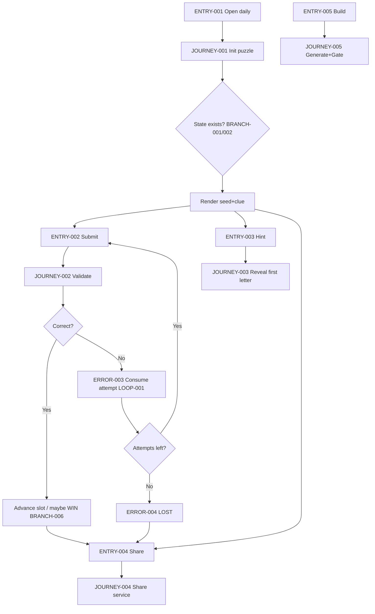
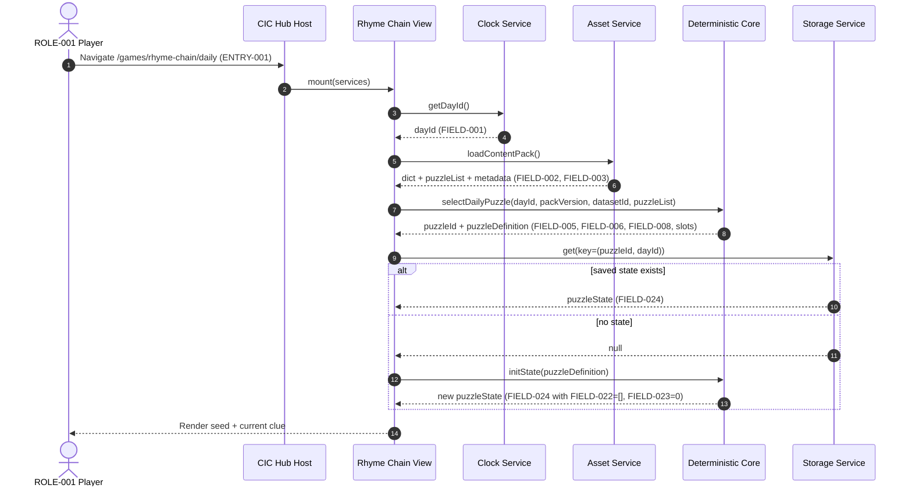
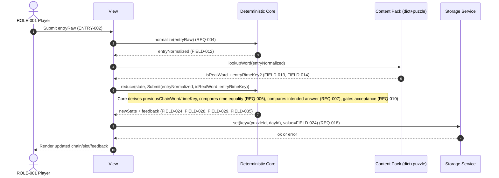
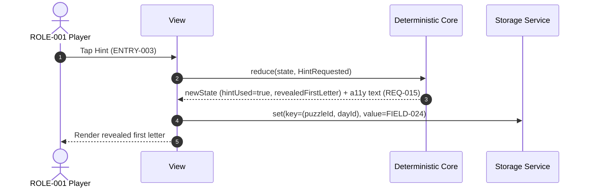
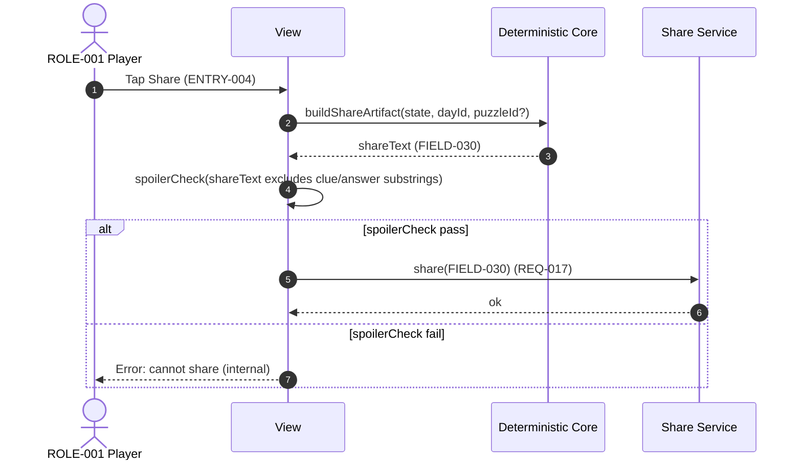
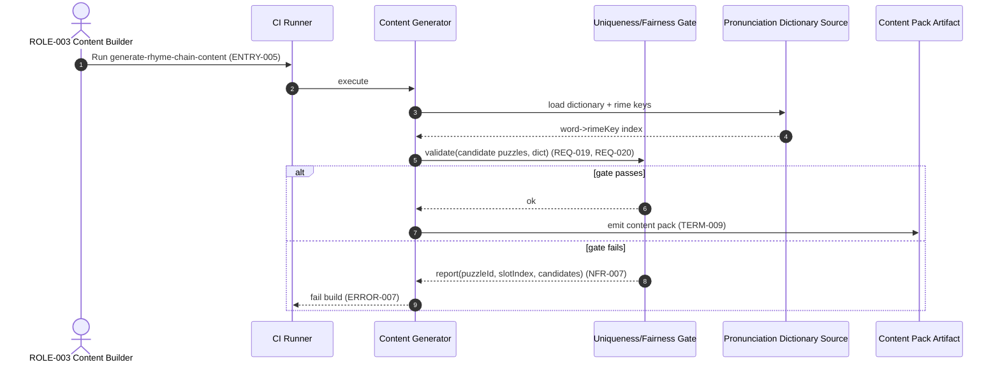
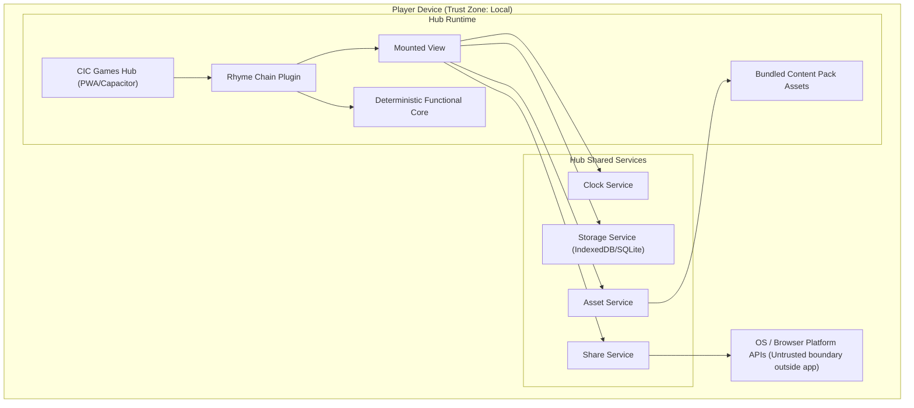

<!-- generated: 2026-07-24T08:33:04Z -->
<!-- mode: initial -->
<!-- feature-slug: rhyme-chain -->
<!-- a2a-endpoint: https://bob-sdlc-orchestrator.2as6l7wq9qj8.eu-gb.codeengine.appdomain.cloud/v1/rpc -->

# Glossary

## Terms

### TERM-001: Rhyme Chain
- **Definition:** The daily word puzzle game where a player enters a sequence of words such that each word rhymes with the previous word and matches a per-slot definitional clue.
- **Synonyms:** RhymeChain, Daily Rhyme Chain Puzzle
- **Anti-definition:** Not a free-form rhyme finder; not a multiplayer game; not a backend-served live game.
- **Source:** User request

### TERM-002: CIC Games Hub
- **Definition:** The host application that mounts games as plugins and provides shared services (storage, clock, share, assets) in an offline-first PWA + Capacitor iOS/Android app.
- **Synonyms:** Hub, CIC Hub
- **Anti-definition:** Not a backend service; not a game itself.
- **Source:** User request

### TERM-003: Game Plugin
- **Definition:** A packaged game module implementing the hub’s GamePlugin contract, mounted into the hub UI and calling injected hub services.
- **Synonyms:** Plugin, GamePlugin module
- **Anti-definition:** Not a standalone app; not allowed to depend on network at play time.
- **Source:** User request

### TERM-004: GamePlugin Contract
- **Definition:** The interface/spec that defines how a plugin exposes metadata, mounts a view, and receives injected services (e.g., storage/clock/share/assets).
- **Synonyms:** Plugin contract, Hub plugin API
- **Anti-definition:** Not the game logic itself; not storage.
- **Source:** User request

### TERM-005: Deterministic Functional Core
- **Definition:** Pure, deterministic functions for rhyme checking, clue-slot answer validation, and chain-state transitions, with no access to storage, clock, network, or randomness at runtime.
- **Synonyms:** Pure core, Functional core
- **Anti-definition:** Not UI code; not code reading system time; not code performing I/O.
- **Source:** User request

### TERM-006: View (Mounted Game UI)
- **Definition:** The UI component mounted into the hub that renders the puzzle, collects input, displays feedback, and calls the deterministic functional core and hub services.
- **Synonyms:** Game view, UI layer
- **Anti-definition:** Not the authoritative game rules; not the dictionary generator.
- **Source:** User request

### TERM-007: Daily Puzzle
- **Definition:** The single puzzle instance for a specific day that is identical for every player given the same content-pack version and dataset id.
- **Synonyms:** Daily challenge, Daily
- **Anti-definition:** Not user-specific; not random per device.
- **Source:** User request

### TERM-008: dayId
- **Definition:** The canonical identifier for the day used to select the deterministic daily puzzle.
- **Synonyms:** Daily id, Date key
- **Anti-definition:** Not local timezone-dependent wall-clock date unless explicitly defined by the hub clock service.
- **Source:** User request

### TERM-009: Content Pack
- **Definition:** The shipped dataset and metadata used by the game (dictionary, puzzles, clues) versioned as a unit.
- **Synonyms:** Dataset bundle, Pack
- **Anti-definition:** Not downloaded at play time.
- **Source:** User request

### TERM-010: content-pack version
- **Definition:** A version identifier included in deterministic puzzle selection and used to invalidate/segment stats if needed.
- **Synonyms:** Pack version, Content version
- **Anti-definition:** Not the app version.
- **Source:** User request

### TERM-011: dataset id
- **Definition:** An identifier for the content dataset used in deterministic daily selection.
- **Synonyms:** Dataset key
- **Anti-definition:** Not per-player.
- **Source:** User request

### TERM-012: Puzzle Definition
- **Definition:** The data record describing a puzzle: seed word plus an ordered list of clue slots with intended answers.
- **Synonyms:** Puzzle record, Puzzle spec
- **Anti-definition:** Not runtime player state; not a generated-on-device puzzle.
- **Source:** User request

### TERM-013: Seed Word
- **Definition:** The starting word for the chain; slot 1’s answer must rhyme with it.
- **Synonyms:** Seed, Start word
- **Anti-definition:** Not entered by player; not secret.
- **Source:** User request

### TERM-014: Clue Slot
- **Definition:** A single ordered position in the chain with a definitional clue and exactly one intended answer under the required rime constraint.
- **Synonyms:** Slot, Position
- **Anti-definition:** Not a free-response clue; not multiple-correct-answer.
- **Source:** User request

### TERM-015: Definitional Clue
- **Definition:** The hint text shown for a clue slot that defines the intended answer.
- **Synonyms:** Definition, Clue
- **Anti-definition:** Not a rhyme hint; not the answer text.
- **Source:** User request

### TERM-016: Intended Answer
- **Definition:** The unique correct dictionary word for a given clue slot in the puzzle definition.
- **Synonyms:** Correct answer
- **Anti-definition:** Not any word that fits the definition loosely; not multiple.
- **Source:** User request

### TERM-017: Chain
- **Definition:** The ordered list of player-entered words that have been accepted so far for the current puzzle.
- **Synonyms:** Word chain, Sequence
- **Anti-definition:** Not the clue list; not all attempted words.
- **Source:** User request

### TERM-018: Chain Length
- **Definition:** The number of successfully accepted words in the current chain (i.e., completed slots).
- **Synonyms:** Progress, Completed count
- **Anti-definition:** Not number of attempts.
- **Source:** User request

### TERM-019: Current Slot
- **Definition:** The clue slot index that the player is presently trying to solve.
- **Synonyms:** Active slot
- **Anti-definition:** Not any completed slot.
- **Source:** User request

### TERM-020: Player Entry
- **Definition:** The word string the player types and submits for the current slot.
- **Synonyms:** Guess, Submission
- **Anti-definition:** Not automatically corrected to another word; not multi-word phrase unless allowed by dictionary (not stated).
- **Source:** User request

### TERM-021: Pronunciation Dictionary
- **Definition:** A bundled dictionary mapping words to phonetic representations and rime keys used for rhyme validation.
- **Synonyms:** Rhyme dictionary, Phonetic dictionary
- **Anti-definition:** Not an online API; not user-editable at runtime.
- **Source:** User request

### TERM-022: Rime Key
- **Definition:** A phonetic key representing the rime (nucleus + coda) used to determine rhyming by equality.
- **Synonyms:** Rime, Rhyme key
- **Anti-definition:** Not a fuzzy similarity score; not spelling-based rhyme.
- **Source:** User request

### TERM-023: Rime Equality Check
- **Definition:** The deterministic operation that considers two words rhyming if their selected rime keys are equal under the bundled dictionary.
- **Synonyms:** Rhyme check
- **Anti-definition:** Not approximate rhyme; not “ends with same letters.”
- **Source:** User request

### TERM-024: Answer Validation
- **Definition:** The deterministic operation that accepts an entry only if it rhymes with the previous chain word and equals the intended answer for the slot.
- **Synonyms:** Guess validation
- **Anti-definition:** Not partial credit; not accepting synonyms.
- **Source:** User request

### TERM-025: Attempt
- **Definition:** A consumed opportunity when a submitted entry is incorrect for the current slot.
- **Synonyms:** Guess attempt
- **Anti-definition:** Not consumed on correct entries.
- **Source:** User request

### TERM-026: Attempt Limit
- **Definition:** The maximum number of incorrect attempts allowed per slot before the slot is failed/blocked (exact game behavior on exhaustion must be defined).
- **Synonyms:** Max attempts
- **Anti-definition:** Not unlimited tries.
- **Source:** User request

### TERM-027: Feedback
- **Definition:** The non-spoiler response to an incorrect entry indicating rhyme validity and dictionary validity (real word) without revealing the intended answer.
- **Synonyms:** Result indicators
- **Anti-definition:** Not the correct answer; not the clue text.
- **Source:** User request

### TERM-028: Hint
- **Definition:** An action that reveals the first letter of the current slot’s intended answer.
- **Synonyms:** First-letter hint
- **Anti-definition:** Not revealing the whole word.
- **Source:** User request

### TERM-029: Win (Puzzle Completion)
- **Definition:** The state where the player completes all clue slots (chain covers entire ordered list).
- **Synonyms:** Solved, Completed
- **Anti-definition:** Not “longest possible” beyond defined slots.
- **Source:** User request

### TERM-030: Loss / Slot Failure
- **Definition:** The state where the player can no longer proceed for the current slot due to attempt exhaustion or other defined failure condition.
- **Synonyms:** Failed, Out of attempts
- **Anti-definition:** Not a crash; not a network error.
- **Source:** User request

### TERM-031: Local Stats
- **Definition:** On-device persisted aggregates such as chain-length distribution and streaks for Rhyme Chain.
- **Synonyms:** Statistics, Metrics
- **Anti-definition:** Not server analytics; not personally identifying profile.
- **Source:** User request

### TERM-032: Streak
- **Definition:** A count of consecutive days with a defined success outcome (e.g., puzzle solved or reached a threshold; must be specified).
- **Synonyms:** Daily streak
- **Anti-definition:** Not total puzzles played.
- **Source:** User request

### TERM-033: Chain Length Distribution
- **Definition:** A histogram of outcomes keyed by chain length reached (number of slots completed).
- **Synonyms:** Outcome distribution, Histogram
- **Anti-definition:** Not per-word frequency.
- **Source:** User request

### TERM-034: Spoiler-safe Emoji Share Artifact
- **Definition:** A shareable text artifact using emoji blocks that communicates chain length reached and attempts per slot without disclosing words or clues.
- **Synonyms:** Share text, Emoji grid
- **Anti-definition:** Not a screenshot containing answers.
- **Source:** User request

### TERM-035: Hub Shared Services
- **Definition:** Injected services provided by the hub to plugins, including storage, clock, share, and asset loading.
- **Synonyms:** Services, Platform services
- **Anti-definition:** Not direct access to OS APIs from core.
- **Source:** User request

### TERM-036: Storage Service
- **Definition:** Hub service used to persist and retrieve local-only stats and per-day play state.
- **Synonyms:** Local storage, Persistence
- **Anti-definition:** Not cloud sync.
- **Source:** User request

### TERM-037: Clock Service
- **Definition:** Hub service that provides the current dayId used for selecting the daily puzzle.
- **Synonyms:** Time service
- **Anti-definition:** Not Date.now() in the deterministic core.
- **Source:** User request

### TERM-038: Share Service
- **Definition:** Hub service used to invoke the platform share sheet with the spoiler-safe emoji share artifact.
- **Synonyms:** OS share, Share API
- **Anti-definition:** Not posting to social networks directly.
- **Source:** User request

### TERM-039: Asset Service
- **Definition:** Hub service for retrieving bundled assets (e.g., content pack files).
- **Synonyms:** Asset loader
- **Anti-definition:** Not remote fetching at play time.
- **Source:** User request

### TERM-040: Build-time Content Generation
- **Definition:** The pipeline step that creates puzzles from the bundled pronunciation dictionary and clue data before shipping.
- **Synonyms:** Content build, Generator
- **Anti-definition:** Not runtime generation on device.
- **Source:** User request

### TERM-041: Uniqueness/Fairness Gate
- **Definition:** A build-time verifier that ensures each clue slot maps to exactly one dictionary word with the required rime and that each intended answer rhymes with the previous intended answer.
- **Synonyms:** Gate, Verifier
- **Anti-definition:** Not a runtime validator for player guesses.
- **Source:** User request

### TERM-042: Offline-first
- **Definition:** The game must be playable without network, using bundled assets and local persistence.
- **Synonyms:** Fully offline
- **Anti-definition:** Not requiring login or online validation.
- **Source:** User request

### TERM-043: Accessibility
- **Definition:** Conformance behaviors including keyboard operability, screen-reader announcements, and not conveying feedback by color alone.
- **Synonyms:** a11y
- **Anti-definition:** Not optional polish.
- **Source:** User request

## Data Dictionary

| ID | Name | Type | Format | Range/Enum | Units | Default | Nullable | PII | Source | Validation |
|---|---|---|---|---|---|---|---|---|---|---|
| FIELD-001 | dayId | string | `YYYY-MM-DD` | valid calendar day | n/a | from TERM-037 | No | Non-PII | TERM-037 | Must match regex `^\d{4}-\d{2}-\d{2}$` |
| FIELD-002 | contentPackVersion | string | semver-ish | e.g., `1.2.3` | n/a | bundled | No | Non-PII | TERM-009 | Must be non-empty |
| FIELD-003 | datasetId | string | slug | `[a-z0-9-_]+` | n/a | bundled | No | Non-PII | TERM-011 | Must be non-empty |
| FIELD-004 | dailySelectionSeed | string | concat/hash input | `{dayId}:{contentPackVersion}:{datasetId}` | n/a | computed | No | Non-PII | TERM-007 | Must be stable across platforms |
| FIELD-005 | puzzleId | string | slug | `[a-z0-9-_]+` | n/a | computed | No | Non-PII | TERM-012 | Must be unique within content pack |
| FIELD-006 | seedWord | string | lowercase token | dictionary word | n/a | from puzzle | No | Non-PII | TERM-013 | Must exist in TERM-021 |
| FIELD-007 | slotIndex | integer | int | `1..slotCount` | n/a | 1 | No | Non-PII | TERM-014 | Must be within bounds |
| FIELD-008 | slotCount | integer | int | `1..365` (pack-defined) | n/a | from puzzle | No | Non-PII | TERM-012 | Must be ≥1 |
| FIELD-009 | clueText | string | plain text | length `1..280` | n/a | from puzzle | No | Non-PII | TERM-015 | Must be non-empty |
| FIELD-010 | intendedAnswer | string | lowercase token | dictionary word | n/a | from puzzle | No | Non-PII | TERM-016 | Must exist in TERM-021 |
| FIELD-011 | playerEntryRaw | string | user text | length `0..64` | n/a | empty | Yes | Non-PII | TERM-020 | Trim leading/trailing whitespace |
| FIELD-012 | playerEntryNormalized | string | lowercase token | `[a-z']+` (TBD) | n/a | computed | Yes | Non-PII | TERM-020 | Must be deterministic normalization |
| FIELD-013 | isRealWord | boolean | boolean | true/false | n/a | false | No | Non-PII | TERM-021 | True iff entry exists in dictionary index |
| FIELD-014 | entryRimeKey | string | phonetic key | pack-defined | n/a | computed | Yes | Non-PII | TERM-022 | Must exist for dictionary words |
| FIELD-015 | previousChainWord | string | lowercase token | dictionary word | n/a | seed/last accepted | No | Non-PII | TERM-017 | Must equal seedWord when slotIndex=1 |
| FIELD-016 | previousRimeKey | string | phonetic key | pack-defined | n/a | computed | No | Non-PII | TERM-022 | Must be derivable from previousChainWord |
| FIELD-017 | rhymesWithPrevious | boolean | boolean | true/false | n/a | false | No | Non-PII | TERM-023 | True iff entryRimeKey == previousRimeKey |
| FIELD-018 | matchesIntendedAnswer | boolean | boolean | true/false | n/a | false | No | Non-PII | TERM-024 | True iff normalized entry equals intendedAnswer |
| FIELD-019 | attemptsUsedForSlot | integer | int | `0..attemptLimit` | attempts | 0 | No | Non-PII | TERM-025 | Increment only on incorrect submissions |
| FIELD-020 | attemptLimit | integer | int | `1..10` (pack/app-defined) | attempts | TBD | No | Non-PII | TERM-026 | Must be ≥1 |
| FIELD-021 | slotStatus | string | enum | `UNSTARTED, IN_PROGRESS, SOLVED, FAILED` | n/a | IN_PROGRESS | No | Non-PII | TERM-014 | Must be valid enum |
| FIELD-022 | chainWords | array<string> | JSON array | length `0..slotCount` | n/a | `[]` | No | Non-PII | TERM-017 | Each element must be dictionary word |
| FIELD-023 | chainLength | integer | int | `0..slotCount` | slots | 0 | No | Non-PII | TERM-018 | Equals length(chainWords) |
| FIELD-024 | puzzleState | object | JSON | schema-defined | n/a | new | No | Non-PII | TERM-017 | Must be versioned for migration |
| FIELD-025 | puzzleOutcome | string | enum | `IN_PROGRESS, WON, LOST` | n/a | IN_PROGRESS | No | Non-PII | TERM-029 | Must be consistent with slot statuses |
| FIELD-026 | hintUsedForSlot | boolean | boolean | true/false | n/a | false | No | Non-PII | TERM-028 | True after hint action |
| FIELD-027 | revealedFirstLetter | string | single char | `[A-Z]` or `[a-z]` | n/a | null | Yes | Non-PII | TERM-028 | Must equal first letter of intendedAnswer |
| FIELD-028 | feedbackRhyme | string | enum | `RHYMES, DOES_NOT_RHYME, UNKNOWN` | n/a | UNKNOWN | No | Non-PII | TERM-027 | UNKNOWN when no rime available |
| FIELD-029 | feedbackWord | string | enum | `REAL_WORD, NOT_IN_DICTIONARY` | n/a | NOT_IN_DICTIONARY | No | Non-PII | TERM-027 | REAL_WORD iff isRealWord=true |
| FIELD-030 | shareArtifactText | string | plain text | length `1..2000` | n/a | computed | No | Non-PII | TERM-034 | Must not contain intendedAnswer or clueText |
| FIELD-031 | attemptsPerSlot | array<int> | JSON array | each `0..attemptLimit` | attempts | `[]` | No | Non-PII | TERM-034 | Length equals slotCount after completion/loss |
| FIELD-032 | statsChainLengthHistogram | object | JSON map | keys `0..slotCount` -> count | plays | `{}` | No | Non-PII | TERM-033 | Counts must be integers ≥0 |
| FIELD-033 | statsStreakCount | integer | int | `0..10000` | days | 0 | No | Non-PII | TERM-032 | Non-negative |
| FIELD-034 | lastPlayedDayId | string | `YYYY-MM-DD` | valid day | n/a | null | Yes | Non-PII | TERM-032 | Must satisfy FIELD-001 |
| FIELD-035 | a11yAnnouncementText | string | plain text | length `0..280` | n/a | empty | Yes | Non-PII | TERM-043 | Must be set on feedback changes |

# User Journeys

## Roles

| Role ID | Role | Type | Description |
|---|---|---|---|
| ROLE-001 | Player | Primary | Plays the daily TERM-007 in the TERM-006, entering TERM-020 and viewing TERM-027. |
| ROLE-002 | Hub Host | System | Mounts TERM-003, injects TERM-035, provides navigation and shell. |
| ROLE-003 | Content Builder | Admin/Build | Runs TERM-040 and TERM-041 to produce shipped TERM-009 assets. |
| ROLE-004 | Screen Reader | System/Assistive | Consumes a11y output from the view (TERM-043), including FIELD-035. |

## Entry Points

| Entry ID | Location | Trigger | Auth |
|---|---|---|---|
| ENTRY-001 | Hub route: `/games/rhyme-chain/daily` | Player selects game in TERM-002 | None |
| ENTRY-002 | UI action: “Submit” button / Enter key | Player submits FIELD-011 for TERM-019 | None |
| ENTRY-003 | UI action: “Hint” button | Player requests TERM-028 | None |
| ENTRY-004 | UI action: “Share” button | Player requests TERM-034 | None |
| ENTRY-005 | Build pipeline job: `generate-rhyme-chain-content` | Content Builder runs build | CI credentials (build-time only) |

## Role Permission Matrix

| Capability | ROLE-001 Player | ROLE-002 Hub Host | ROLE-003 Content Builder | ROLE-004 Screen Reader |
|---|---:|---:|---:|---:|
| Play daily puzzle (read TERM-012, write FIELD-024) | Y | N | N | N |
| Validate entry via TERM-005 | Y (via UI) | N | N | N |
| Persist local stats via TERM-036 | Y (via UI) | Y (service) | N | N |
| Generate content (TERM-040) | N | N | Y | N |
| Run uniqueness gate (TERM-041) | N | N | Y | N |
| Read a11y announcements | N | N | N | Y |

## Journeys

### JOURNEY-001: Open daily puzzle and initialize state
- **Role/Goal:** ROLE-001; view today’s TERM-007 and begin play.
- **Success criteria:** Correct TERM-012 selected deterministically; FIELD-024 initialized/loaded; FIELD-007 points to the first unsolved TERM-014.
- **Failure criteria:** Missing assets; corrupted local state; cannot compute selection.
- **Entry:** ENTRY-001
- **Happy path:**
  1. The view requests FIELD-001 from TERM-037 (Clock Service). (TERM-037, FIELD-001)
  2. The view loads TERM-009 assets via TERM-039 (Asset Service), including TERM-021 and puzzle list keyed by FIELD-003 and FIELD-002. (TERM-009, FIELD-002, FIELD-003)
  3. The view computes FIELD-004 from FIELD-001 + FIELD-002 + FIELD-003 and selects the TERM-012 for the day, yielding FIELD-005, FIELD-006, FIELD-008, and per-slot FIELD-009/FIELD-010. (TERM-012)
  4. The view loads existing FIELD-024 for (FIELD-005, FIELD-001) from TERM-036 (Storage Service) or initializes FIELD-024 with empty FIELD-022, FIELD-023=0, FIELD-019=0, FIELD-021=IN_PROGRESS. (TERM-036)
  5. The view renders FIELD-006 (seed) and the current slot’s FIELD-009 (clue) for FIELD-007=1. (TERM-013, TERM-015)
- **Decision branches:**
  - **BRANCH-001:** Existing saved FIELD-024 found for FIELD-005 and FIELD-001.
    - Continue at step 5 using saved FIELD-022/FIELD-023/FIELD-007.
  - **BRANCH-002:** No saved FIELD-024 found.
    - Initialize fresh state at step 4.
- **Error states:**
  - **ERROR-001:** Asset load fails (missing/corrupt TERM-009).
    - **Response:** Show offline-safe error panel indicating content unavailable; disable submission.
    - **Recovery:** Player navigates back; app update/reinstall.
  - **ERROR-002:** Saved FIELD-024 fails schema validation (corruption).
    - **Response:** Offer “Reset today” option; do not crash.
    - **Recovery:** Player resets; state reinitialized from step 4.
- **Edge cases:**
  - **EDGE-001:** Clock service returns a dayId not matching FIELD-001 regex.
  - **EDGE-002:** Deterministic selection yields missing FIELD-005 (no puzzle for day).
  - **EDGE-003:** App resumed across midnight; dayId changes mid-session (state conflict).
  - **EDGE-004:** Content pack upgraded; FIELD-002 changes while old saved state exists.

### JOURNEY-002: Submit a word for the current slot
- **Role/Goal:** ROLE-001; enter TERM-020 and advance TERM-019 by solving TERM-014.
- **Success criteria:** Correct entry accepted; FIELD-022 appended; FIELD-023 increments; FIELD-007 advances; attempts reset for new slot.
- **Failure criteria:** Incorrect entry consumes attempts and returns TERM-027.
- **Entry:** ENTRY-002
- **Happy path:**
  1. Player types FIELD-011; view computes FIELD-012 (deterministic normalization). (TERM-020)
  2. View sets FIELD-015 to FIELD-006 if FIELD-007=1 else last of FIELD-022. (TERM-017, TERM-013)
  3. View queries TERM-021 for FIELD-012; sets FIELD-013 and (if real) FIELD-014. (TERM-021)
  4. Deterministic core computes FIELD-016 from FIELD-015 and TERM-021. (TERM-023)
  5. Deterministic core sets FIELD-017 by rime equality (FIELD-014 == FIELD-016). (TERM-023)
  6. Deterministic core sets FIELD-018 by comparing FIELD-012 to FIELD-010 for the current FIELD-007. (TERM-024)
  7. If FIELD-017=true and FIELD-018=true, core transitions: append FIELD-012 to FIELD-022, set FIELD-023, set FIELD-021=SOLVED for that slot, advance FIELD-007, reset FIELD-019=0, set FIELD-026=false for new slot. (TERM-017)
  8. View persists updated FIELD-024 via TERM-036. (TERM-036)
- **Decision branches:**
  - **BRANCH-003:** Entry not in dictionary (FIELD-013=false).
    - Set FIELD-029=NOT_IN_DICTIONARY; treat as incorrect; proceed to attempt consumption (see ERROR-003).
  - **BRANCH-004:** Entry is real but does not rhyme (FIELD-017=false).
    - Set FIELD-028=DOES_NOT_RHYME; treat as incorrect; proceed to attempt consumption.
  - **BRANCH-005:** Entry rhymes but is not the intended answer (FIELD-018=false).
    - Set FIELD-028=RHYMES; treat as incorrect; proceed to attempt consumption.
  - **BRANCH-006:** Entry correct and last slot completed (FIELD-007 becomes FIELD-008+1).
    - Transition to TERM-029; set FIELD-025=WON.
- **Error states:**
  - **ERROR-003:** Incorrect submission (any of BRANCH-003/4/5).
    - **Trigger:** FIELD-017=false OR FIELD-018=false.
    - **Response:** Increment FIELD-019 by 1; set FIELD-028/FIELD-029 accordingly; set FIELD-035 for screen-reader announcement.
    - **Recovery:** Player submits another word until attempts exhausted.
  - **ERROR-004:** Attempt limit reached.
    - **Trigger:** FIELD-019 == FIELD-020 after increment.
    - **Response:** Set FIELD-021=FAILED for slot; set FIELD-025=LOST; disable further submissions for the day (TBD) and enable share.
    - **Recovery:** Player can view results/share; next day play.
- **Loop-back paths:**
  - **LOOP-001:** After ERROR-003, return to step 1 for the same FIELD-007 while FIELD-019 < FIELD-020.
- **Edge cases:**
  - **EDGE-005:** FIELD-011 empty or whitespace only.
  - **EDGE-006:** Mixed case, punctuation, diacritics normalization differences across platforms (must match FIELD-012 rules).
  - **EDGE-007:** Words with multiple pronunciations/rime keys (dictionary ambiguity).
  - **EDGE-008:** Concurrent submissions (double-tap submit) causing duplicate state transitions.
  - **EDGE-009:** Storage write failure (quota/IO) after state transition.
  - **EDGE-010:** PreviousChainWord missing rime key (dictionary inconsistency).

### JOURNEY-003: Request a hint (first letter)
- **Role/Goal:** ROLE-001; get TERM-028 for current TERM-019.
- **Success criteria:** FIELD-027 displayed; FIELD-026 set; does not reveal more than first letter.
- **Failure criteria:** Hint requested when puzzle over.
- **Entry:** ENTRY-003
- **Happy path:**
  1. Player taps “Hint” for current FIELD-007. (TERM-028)
  2. View reads FIELD-010 for current slot and sets FIELD-027 to first character; sets FIELD-026=true. (FIELD-010, FIELD-027)
  3. View announces FIELD-035 indicating the first letter revealed. (TERM-043)
  4. View persists FIELD-024 via TERM-036. (TERM-036)
- **Decision branches:**
  - **BRANCH-007:** Hint already used for current slot (FIELD-026=true).
    - Do not change state; re-display FIELD-027.
- **Error states:**
  - **ERROR-005:** Hint requested while FIELD-025 != IN_PROGRESS.
    - **Response:** Disable hint control; announce “Puzzle finished.”
    - **Recovery:** None for the day.
- **Edge cases:**
  - **EDGE-011:** IntendedAnswer begins with non A-Z character (apostrophe).
  - **EDGE-012:** Player uses hint, then content pack changes (FIELD-002) and invalidates intendedAnswer.

### JOURNEY-004: Share spoiler-safe results
- **Role/Goal:** ROLE-001; generate TERM-034 and share via TERM-038.
- **Success criteria:** FIELD-030 contains no answers/clues; shows chain length and attempts per slot.
- **Failure criteria:** Share invoked when no progress (still allowed, but artifact must reflect state).
- **Entry:** ENTRY-004
- **Happy path:**
  1. Player taps “Share.”
  2. View composes FIELD-030 from FIELD-001, FIELD-005 (optional), FIELD-023, FIELD-031 (derived from per-slot attempts), and outcome FIELD-025 using emoji blocks. (TERM-034)
  3. View validates FIELD-030 does not contain any FIELD-010 or FIELD-009 substrings (spoiler check). (TERM-034)
  4. View calls TERM-038 with FIELD-030. (TERM-038)
- **Decision branches:**
  - **BRANCH-008:** Puzzle in progress (FIELD-025=IN_PROGRESS).
    - Artifact indicates current FIELD-023 progress.
- **Error states:**
  - **ERROR-006:** Share service unavailable/returns error.
    - **Response:** Copy FIELD-030 to clipboard (if hub provides) or show selectable text.
    - **Recovery:** Player manually copies.
- **Edge cases:**
  - **EDGE-013:** Very long slotCount causing FIELD-030 > platform share limit.
  - **EDGE-014:** Locale/RTL text direction affecting emoji grid readability.

### JOURNEY-005: Build-time content generation and uniqueness gate
- **Role/Goal:** ROLE-003; generate deterministic content and reject ambiguous/invalid puzzles.
- **Success criteria:** Every TERM-012 passes TERM-041; shipped assets include rime keys and clue slots.
- **Failure criteria:** Any slot ambiguous or rhyme constraint broken; build fails.
- **Entry:** ENTRY-005
- **Happy path:**
  1. Builder loads TERM-021 with words and FIELD-014 (rime keys). (TERM-021)
  2. Builder assembles candidate TERM-012: FIELD-006 and ordered slots with FIELD-009 and FIELD-010. (TERM-012)
  3. Uniqueness gate verifies each slot: FIELD-010 exists in dictionary; its rime key equals previous intended answer’s rime key (or seed’s); clue maps to exactly one dictionary word for that rime. (TERM-041)
  4. Builder emits bundled assets for the plugin (TERM-009) with puzzles indexed by FIELD-003/FIELD-002. (TERM-009)
- **Decision branches:**
  - **BRANCH-009:** Slot ambiguous (multiple candidate answers for clue+rime).
    - Reject puzzle; require content edit.
  - **BRANCH-010:** Rime chain broken (intended answer does not rhyme with previous).
    - Reject puzzle; require content edit.
- **Error states:**
  - **ERROR-007:** Dictionary missing rime key for a word used in puzzle.
    - **Response:** Fail build with the offending word list.
    - **Recovery:** Fix dictionary tagging.
- **Edge cases:**
  - **EDGE-015:** Homographs with multiple pronunciations causing multiple rime keys (policy needed).
  - **EDGE-016:** Non-ASCII words; normalization mismatch between build and runtime.

## Journey Map



# Requirements

### REQ-001: Select the daily puzzle deterministically
- **EARS Pattern:** Event-Driven
- **EARS Statement:** When the player opens ENTRY-001, the Rhyme Chain plugin shall select a TERM-012 using FIELD-004 derived from FIELD-001, FIELD-002, and FIELD-003.
- **Inputs:** FIELD-001, FIELD-002, FIELD-003
- **Outputs:** FIELD-005
- **Preconditions:** TERM-009 assets available via TERM-039
- **Postconditions:** A single FIELD-005 is selected for the session dayId
- **Invariants:** Selection is identical across platforms for identical inputs
- **Trigger:** ENTRY-001
- **Actor:** ROLE-001
- **EntityScope:** TERM-012
- **ErrorModes:** ERROR-001
- **NFR-Tags:** determinism
- **Source:** JOURNEY-001 step 1-3, ERROR-001
- **Dependencies:** NFR-006
- **Priority:** P0
- **AcceptanceCriteria:**
  - TEST-001: Given the same FIELD-001/FIELD-002/FIELD-003, when selection runs on iOS and Android, then FIELD-005 is equal.
  - TEST-002: Given different FIELD-001 values, when selection runs, then FIELD-005 differs for at least one adjacent day in the pack (if pack defines distinct puzzles).
- **Assumptions:** Hash/selection algorithm is provided by hub as stated.
- **OpenQuestions:** What is the exact selection algorithm contract (e.g., modulo list length, keyed map)?

### REQ-002: Initialize new puzzle state when none exists
- **EARS Pattern:** Event-Driven
- **EARS Statement:** When no saved FIELD-024 exists for FIELD-005 and FIELD-001, the system shall create FIELD-024 with FIELD-022 as an empty array and FIELD-023 equal to 0.
- **Inputs:** FIELD-005, FIELD-001
- **Outputs:** FIELD-024
- **Preconditions:** REQ-001 satisfied
- **Postconditions:** FIELD-024 exists in memory for rendering
- **Invariants:** FIELD-023 equals length(FIELD-022)
- **Trigger:** ENTRY-001
- **Actor:** ROLE-001
- **EntityScope:** TERM-017
- **ErrorModes:** ERROR-002
- **NFR-Tags:** offline
- **Source:** JOURNEY-001 step 4, BRANCH-002, ERROR-002
- **Dependencies:** REQ-001, REQ-003
- **Priority:** P0
- **AcceptanceCriteria:**
  - TEST-003: Given no stored state, when opening daily puzzle, then FIELD-022 is `[]` and FIELD-023 is `0`.
- **Assumptions:** Storage keying includes (puzzleId, dayId).
- **OpenQuestions:** Should attempts per slot be preallocated or computed on demand?

### REQ-003: Load existing puzzle state when present
- **EARS Pattern:** Event-Driven
- **EARS Statement:** When a saved FIELD-024 exists for FIELD-005 and FIELD-001, the system shall load FIELD-024 and render progress from FIELD-022 and FIELD-007.
- **Inputs:** FIELD-005, FIELD-001
- **Outputs:** Rendered state
- **Preconditions:** REQ-001 satisfied
- **Postconditions:** UI reflects stored progress
- **Invariants:** FIELD-023 equals length(FIELD-022)
- **Trigger:** ENTRY-001
- **Actor:** ROLE-001
- **EntityScope:** TERM-017
- **ErrorModes:** ERROR-002
- **NFR-Tags:** offline
- **Source:** JOURNEY-001 step 4-5, BRANCH-001, ERROR-002
- **Dependencies:** REQ-001
- **Priority:** P0
- **AcceptanceCriteria:**
  - TEST-004: Given stored FIELD-022 length 3, when opening, then UI shows chainLength FIELD-023=3 and current slot FIELD-007=4.
- **Assumptions:** Stored state includes current slot index or derivable from chain length.
- **OpenQuestions:** Is FIELD-007 stored or always computed as FIELD-023+1?

### REQ-004: Normalize player entry deterministically
- **EARS Pattern:** Event-Driven
- **EARS Statement:** When the player submits FIELD-011, the deterministic functional core shall compute FIELD-012 using a deterministic normalization rule.
- **Inputs:** FIELD-011
- **Outputs:** FIELD-012
- **Preconditions:** Puzzle in progress (FIELD-025=IN_PROGRESS)
- **Postconditions:** FIELD-012 available for validation
- **Invariants:** Same FIELD-011 yields same FIELD-012 across platforms
- **Trigger:** ENTRY-002
- **Actor:** ROLE-001
- **EntityScope:** TERM-020
- **ErrorModes:** ERROR-003
- **NFR-Tags:** determinism
- **Source:** JOURNEY-002 step 1, EDGE-006
- **Dependencies:** NFR-006
- **Priority:** P0
- **AcceptanceCriteria:**
  - TEST-005: Given `"  CoAt "` as FIELD-011, when normalized, then FIELD-012 equals a defined lowercased/trimmed token (exact expected output per spec).
- **Assumptions:** Normalization spec will be defined (trim + lowercase at minimum).
- **OpenQuestions:** Are apostrophes and hyphens allowed? Are diacritics folded?

### REQ-005: Determine dictionary membership for entry
- **EARS Pattern:** Event-Driven
- **EARS Statement:** When FIELD-012 is produced, the system shall set FIELD-013 to true if FIELD-012 exists in the TERM-021 index.
- **Inputs:** FIELD-012
- **Outputs:** FIELD-013
- **Preconditions:** TERM-021 loaded
- **Postconditions:** Dictionary membership known
- **Invariants:** Dictionary lookup uses bundled TERM-021 only
- **Trigger:** ENTRY-002
- **Actor:** ROLE-001
- **EntityScope:** TERM-021
- **ErrorModes:** ERROR-003
- **NFR-Tags:** offline
- **Source:** JOURNEY-002 step 3, BRANCH-003
- **Dependencies:** REQ-004
- **Priority:** P0
- **AcceptanceCriteria:**
  - TEST-006: Given FIELD-012 not in TERM-021, then FIELD-013=false.
- **Assumptions:** Dictionary is case-normalized consistent with FIELD-012.
- **OpenQuestions:** What about pluralization/inflections—must be explicit in dictionary?

### REQ-006: Compute rime equality result for entry
- **EARS Pattern:** Event-Driven
- **EARS Statement:** When FIELD-013 is true, the deterministic functional core shall set FIELD-017 to true only when FIELD-014 equals FIELD-016.
- **Inputs:** FIELD-013, FIELD-014, FIELD-016
- **Outputs:** FIELD-017
- **Preconditions:** FIELD-014 and FIELD-016 are available
- **Postconditions:** Rhyme validity determined
- **Invariants:** Uses TERM-023 rime equality only
- **Trigger:** ENTRY-002
- **Actor:** ROLE-001
- **EntityScope:** TERM-023
- **ErrorModes:** ERROR-003
- **NFR-Tags:** determinism
- **Source:** JOURNEY-002 step 4-5, BRANCH-004
- **Dependencies:** REQ-005, NFR-006
- **Priority:** P0
- **AcceptanceCriteria:**
  - TEST-007: Given FIELD-014 == FIELD-016, then FIELD-017=true.
  - TEST-008: Given FIELD-014 != FIELD-016, then FIELD-017=false.
- **Assumptions:** A single rime key is chosen per word at runtime.
- **OpenQuestions:** How to handle multiple pronunciations (EDGE-007)?

### REQ-007: Validate entry equals intended answer for the slot
- **EARS Pattern:** Event-Driven
- **EARS Statement:** When the player submits FIELD-012 for FIELD-007, the deterministic functional core shall set FIELD-018 to true only when FIELD-012 equals FIELD-010 for that slot.
- **Inputs:** FIELD-012, FIELD-007, FIELD-010
- **Outputs:** FIELD-018
- **Preconditions:** Puzzle data for current slot is loaded
- **Postconditions:** Answer match determined
- **Invariants:** Equality comparison uses normalized token string
- **Trigger:** ENTRY-002
- **Actor:** ROLE-001
- **EntityScope:** TERM-016
- **ErrorModes:** ERROR-003
- **NFR-Tags:** determinism
- **Source:** JOURNEY-002 step 6, BRANCH-005
- **Dependencies:** REQ-004
- **Priority:** P0
- **AcceptanceCriteria:**
  - TEST-009: Given FIELD-012 equals FIELD-010, then FIELD-018=true; otherwise false.
- **Assumptions:** FIELD-010 is stored in the same normalization domain as FIELD-012.
- **OpenQuestions:** Should alternative spellings ever be allowed? (currently no)

### REQ-008: Accept a correct submission and advance to next slot
- **EARS Pattern:** Event-Driven
- **EARS Statement:** When FIELD-017 is true, the system shall append FIELD-012 to FIELD-022.
- **Inputs:** FIELD-017, FIELD-012, FIELD-022
- **Outputs:** FIELD-022
- **Preconditions:** FIELD-018 is true (enforced by REQ-010)
- **Postconditions:** Chain extended by one word
- **Invariants:** FIELD-022 length increases by 1
- **Trigger:** ENTRY-002
- **Actor:** ROLE-001
- **EntityScope:** TERM-017
- **ErrorModes:** ERROR-003
- **NFR-Tags:** offline
- **Source:** JOURNEY-002 step 7
- **Dependencies:** REQ-006, REQ-007, REQ-010
- **Priority:** P0
- **AcceptanceCriteria:**
  - TEST-010: Given a correct submission, when applied, then the last element of FIELD-022 equals FIELD-012.
- **Assumptions:** State transitions are serialized per submission.
- **OpenQuestions:** None

### REQ-009: Increment attempts on an incorrect submission
- **EARS Pattern:** Event-Driven
- **EARS Statement:** When an incorrect submission occurs, the system shall increment FIELD-019 by 1.
- **Inputs:** FIELD-019
- **Outputs:** FIELD-019
- **Preconditions:** Puzzle in progress; current slot active
- **Postconditions:** Attempt consumed
- **Invariants:** FIELD-019 must not exceed FIELD-020
- **Trigger:** ENTRY-002
- **Actor:** ROLE-001
- **EntityScope:** TERM-025
- **ErrorModes:** ERROR-003
- **NFR-Tags:** none
- **Source:** JOURNEY-002 ERROR-003
- **Dependencies:** REQ-006, REQ-007, REQ-010
- **Priority:** P0
- **AcceptanceCriteria:**
  - TEST-011: Given FIELD-019=0 and an incorrect submission, then FIELD-019 becomes 1.
- **Assumptions:** Incorrect means NOT(FIELD-017 && FIELD-018).
- **OpenQuestions:** Do non-dictionary words consume attempts? (currently implied yes)

### REQ-010: Gate acceptance on both rhyme and intended answer match
- **EARS Pattern:** Ubiquitous
- **EARS Statement:** The deterministic functional core shall accept a submission only when FIELD-017 is true and FIELD-018 is true.
- **Inputs:** FIELD-017, FIELD-018
- **Outputs:** State transition decision
- **Preconditions:** None
- **Postconditions:** Only correct-and-rhyming entries advance
- **Invariants:** No other predicate can accept a word
- **Trigger:** ENTRY-002
- **Actor:** ROLE-001
- **EntityScope:** TERM-024
- **ErrorModes:** ERROR-003
- **NFR-Tags:** determinism
- **Source:** JOURNEY-002 step 5-7
- **Dependencies:** REQ-006, REQ-007
- **Priority:** P0
- **AcceptanceCriteria:**
  - TEST-012: Given FIELD-017=true and FIELD-018=false, then the chain does not advance.
  - TEST-013: Given FIELD-017=false and FIELD-018=true, then the chain does not advance.
- **Assumptions:** Intended answer itself rhymes with previous per build gate.
- **OpenQuestions:** None

### REQ-011: Provide non-spoiler feedback for incorrect submissions
- **EARS Pattern:** Event-Driven
- **EARS Statement:** When an incorrect submission occurs, the system shall set FIELD-028 to indicate whether the entry rhymes with the previous word.
- **Inputs:** FIELD-017
- **Outputs:** FIELD-028
- **Preconditions:** Submission processed
- **Postconditions:** Rhyme feedback available
- **Invariants:** FIELD-028 must not reveal FIELD-010
- **Trigger:** ENTRY-002
- **Actor:** ROLE-001
- **EntityScope:** TERM-027
- **ErrorModes:** ERROR-003
- **NFR-Tags:** accessibility
- **Source:** JOURNEY-002 BRANCH-004/5, ERROR-003
- **Dependencies:** REQ-006
- **Priority:** P0
- **AcceptanceCriteria:**
  - TEST-014: Given FIELD-017=true on an incorrect submission, then FIELD-028=RHYMES.
  - TEST-015: Given FIELD-017=false on an incorrect submission, then FIELD-028=DOES_NOT_RHYME.
- **Assumptions:** If rime key is unavailable, use UNKNOWN (FIELD-028).
- **OpenQuestions:** When FIELD-013=false, should FIELD-028 be UNKNOWN or computed by spelling? (prefer UNKNOWN)

### REQ-012: Provide dictionary validity feedback for incorrect submissions
- **EARS Pattern:** Event-Driven
- **EARS Statement:** When an incorrect submission occurs, the system shall set FIELD-029 to REAL_WORD only when FIELD-013 is true.
- **Inputs:** FIELD-013
- **Outputs:** FIELD-029
- **Preconditions:** Submission processed
- **Postconditions:** Word validity feedback available
- **Invariants:** FIELD-029 must be derived solely from TERM-021 presence
- **Trigger:** ENTRY-002
- **Actor:** ROLE-001
- **EntityScope:** TERM-027
- **ErrorModes:** ERROR-003
- **NFR-Tags:** none
- **Source:** JOURNEY-002 BRANCH-003, ERROR-003
- **Dependencies:** REQ-005
- **Priority:** P0
- **AcceptanceCriteria:**
  - TEST-016: Given FIELD-013=true, then FIELD-029=REAL_WORD.
  - TEST-017: Given FIELD-013=false, then FIELD-029=NOT_IN_DICTIONARY.
- **Assumptions:** Dictionary is authoritative for “real word.”
- **OpenQuestions:** None

### REQ-013: Mark puzzle as won on completion of final slot
- **EARS Pattern:** Event-Driven
- **EARS Statement:** When FIELD-023 becomes equal to FIELD-008, the system shall set FIELD-025 to WON.
- **Inputs:** FIELD-023, FIELD-008
- **Outputs:** FIELD-025
- **Preconditions:** A correct submission was applied
- **Postconditions:** Puzzle outcome is WON
- **Invariants:** WON is terminal for the day’s state
- **Trigger:** ENTRY-002
- **Actor:** ROLE-001
- **EntityScope:** TERM-029
- **ErrorModes:** none
- **NFR-Tags:** none
- **Source:** JOURNEY-002 BRANCH-006
- **Dependencies:** REQ-008
- **Priority:** P0
- **AcceptanceCriteria:**
  - TEST-018: Given slotCount=5 and chainLength transitions to 5, then FIELD-025=WON.
- **Assumptions:** slotCount fixed per puzzle.
- **OpenQuestions:** None

### REQ-014: Mark puzzle as lost when attempt limit is reached
- **EARS Pattern:** Event-Driven
- **EARS Statement:** When FIELD-019 becomes equal to FIELD-020 for the current slot, the system shall set FIELD-025 to LOST.
- **Inputs:** FIELD-019, FIELD-020
- **Outputs:** FIELD-025
- **Preconditions:** An incorrect submission occurred
- **Postconditions:** Puzzle outcome is LOST
- **Invariants:** LOST is terminal for the day’s state
- **Trigger:** ENTRY-002
- **Actor:** ROLE-001
- **EntityScope:** TERM-030
- **ErrorModes:** ERROR-004
- **NFR-Tags:** none
- **Source:** JOURNEY-002 ERROR-004
- **Dependencies:** REQ-009
- **Priority:** P0
- **AcceptanceCriteria:**
  - TEST-019: Given attemptLimit=3 and attemptsUsedForSlot transitions to 3, then FIELD-025=LOST.
- **Assumptions:** Loss condition is per-slot exhaustion as described.
- **OpenQuestions:** After loss, is further play for other slots blocked? (implied yes)

### REQ-015: Reveal first-letter hint for current slot
- **EARS Pattern:** Event-Driven
- **EARS Statement:** When the player invokes ENTRY-003, the system shall set FIELD-027 to the first character of FIELD-010 for the current FIELD-007.
- **Inputs:** FIELD-010, FIELD-007
- **Outputs:** FIELD-027
- **Preconditions:** FIELD-025=IN_PROGRESS
- **Postconditions:** First letter revealed in UI
- **Invariants:** Reveals exactly one character
- **Trigger:** ENTRY-003
- **Actor:** ROLE-001
- **EntityScope:** TERM-028
- **ErrorModes:** ERROR-005
- **NFR-Tags:** accessibility
- **Source:** JOURNEY-003 step 2, ERROR-005, EDGE-011
- **Dependencies:** REQ-003
- **Priority:** P1
- **AcceptanceCriteria:**
  - TEST-020: Given intendedAnswer=`coat`, when hint invoked, then FIELD-027=`c`.
- **Assumptions:** “First letter” uses the stored answer string.
- **OpenQuestions:** Should hint consume attempts or affect scoring? (not specified)

### REQ-016: Generate spoiler-safe emoji share artifact
- **EARS Pattern:** Event-Driven
- **EARS Statement:** When the player invokes ENTRY-004, the system shall generate FIELD-030 using FIELD-023 and FIELD-031 without including FIELD-009 or FIELD-010.
- **Inputs:** FIELD-023, FIELD-031, FIELD-009, FIELD-010
- **Outputs:** FIELD-030
- **Preconditions:** Puzzle selected and state available
- **Postconditions:** Share text available for TERM-038
- **Invariants:** FIELD-030 contains no answers or clue strings
- **Trigger:** ENTRY-004
- **Actor:** ROLE-001
- **EntityScope:** TERM-034
- **ErrorModes:** ERROR-006
- **NFR-Tags:** privacy
- **Source:** JOURNEY-004 step 2-3
- **Dependencies:** REQ-017
- **Priority:** P0
- **AcceptanceCriteria:**
  - TEST-021: Generated FIELD-030 does not contain any substring equal to a clueText FIELD-009.
  - TEST-022: Generated FIELD-030 does not contain any substring equal to an intendedAnswer FIELD-010.
- **Assumptions:** Substring checks are sufficient for spoiler control.
- **OpenQuestions:** Should seedWord be allowed in the share text? (likely no, but not specified)

### REQ-017: Invoke share service with generated artifact
- **EARS Pattern:** Event-Driven
- **EARS Statement:** When FIELD-030 is generated, the system shall pass FIELD-030 to TERM-038.
- **Inputs:** FIELD-030
- **Outputs:** Share invocation
- **Preconditions:** TERM-038 available
- **Postconditions:** Native share sheet requested
- **Invariants:** Shared content equals FIELD-030
- **Trigger:** ENTRY-004
- **Actor:** ROLE-001
- **EntityScope:** TERM-038
- **ErrorModes:** ERROR-006
- **NFR-Tags:** compatibility
- **Source:** JOURNEY-004 step 4, ERROR-006
- **Dependencies:** REQ-016
- **Priority:** P1
- **AcceptanceCriteria:**
  - TEST-023: When share invoked, then TERM-038 is called once with FIELD-030.
- **Assumptions:** Hub provides a share API on all platforms.
- **OpenQuestions:** Is a clipboard fallback service available?

### REQ-018: Persist updated puzzle state locally
- **EARS Pattern:** Event-Driven
- **EARS Statement:** When FIELD-024 changes due to a submission, the system shall persist FIELD-024 using TERM-036 keyed by FIELD-005 and FIELD-001.
- **Inputs:** FIELD-024, FIELD-005, FIELD-001
- **Outputs:** Stored state
- **Preconditions:** Storage service available
- **Postconditions:** State recoverable on reopen
- **Invariants:** No network calls are made
- **Trigger:** ENTRY-002
- **Actor:** ROLE-001
- **EntityScope:** TERM-036
- **ErrorModes:** ERROR-002
- **NFR-Tags:** offline
- **Source:** JOURNEY-002 step 8, EDGE-009
- **Dependencies:** REQ-008, REQ-009
- **Priority:** P0
- **AcceptanceCriteria:**
  - TEST-024: Given app closed after a correct entry, when reopened, then FIELD-022 includes that entry.
- **Assumptions:** Storage is transactional enough for single-record writes.
- **OpenQuestions:** What is the migration/versioning strategy for FIELD-024?

### REQ-019: Build-time uniqueness/fairness gate rejects ambiguous slots
- **EARS Pattern:** Event-Driven
- **EARS Statement:** When the build pipeline runs ENTRY-005, the uniqueness/fairness gate shall fail the build if any TERM-014 maps a FIELD-009 to more than one dictionary word for the required FIELD-016.
- **Inputs:** TERM-021, FIELD-009, FIELD-016
- **Outputs:** Build pass/fail
- **Preconditions:** Candidate puzzles assembled
- **Postconditions:** Only unambiguous puzzles shipped
- **Invariants:** Gate is applied to all slots in all puzzles
- **Trigger:** ENTRY-005
- **Actor:** ROLE-003
- **EntityScope:** TERM-041
- **ErrorModes:** ERROR-007
- **NFR-Tags:** quality
- **Source:** JOURNEY-005 step 3, BRANCH-009
- **Dependencies:** none
- **Priority:** P0
- **AcceptanceCriteria:**
  - TEST-025: Given a slot with two candidate answers matching clue+rime, when gate runs, then build fails with slot identification.
- **Assumptions:** There is a deterministic mapping from clue to candidate set.
- **OpenQuestions:** How is “clue maps to exactly one word” implemented (manual mapping vs NLP)?

### REQ-020: Build-time gate rejects broken rhyme chain between intended answers
- **EARS Pattern:** Event-Driven
- **EARS Statement:** When the build pipeline runs ENTRY-005, the uniqueness/fairness gate shall fail the build if any slot’s FIELD-010 does not rhyme with the previous intended word by rime equality.
- **Inputs:** FIELD-010, FIELD-006, FIELD-014
- **Outputs:** Build pass/fail
- **Preconditions:** TERM-021 includes rime keys for intended answers
- **Postconditions:** Shipped puzzles satisfy rhyme constraints
- **Invariants:** Uses the same TERM-023 rime equality definition as runtime
- **Trigger:** ENTRY-005
- **Actor:** ROLE-003
- **EntityScope:** TERM-041
- **ErrorModes:** ERROR-007
- **NFR-Tags:** determinism
- **Source:** JOURNEY-005 step 3, BRANCH-010
- **Dependencies:** NFR-006
- **Priority:** P0
- **AcceptanceCriteria:**
  - TEST-026: Given an intended answer with rime key != previous rime key, when gate runs, then build fails.
- **Assumptions:** SeedWord participates as previous for slot 1.
- **OpenQuestions:** Policy for multiple rime keys (EDGE-015).

### NFR-001: Offline-only gameplay at runtime
- **EARS Pattern:** Ubiquitous
- **EARS Statement:** The system shall not require network connectivity to load TERM-009, validate entries, or update FIELD-024 during play.
- **Inputs:** none
- **Outputs:** none
- **Preconditions:** Assets bundled
- **Postconditions:** Gameplay functions without network
- **Invariants:** No runtime HTTP/WebSocket calls from the plugin
- **Trigger:** n/a
- **Actor:** ROLE-001
- **EntityScope:** TERM-042
- **ErrorModes:** ERROR-001
- **NFR-Tags:** offline
- **Source:** User request; JOURNEY-001/002
- **Dependencies:** REQ-018
- **Priority:** P0
- **AcceptanceCriteria:**
  - TEST-027: With device in airplane mode, opening and playing accepts/rejects submissions correctly.
- **Assumptions:** Hub itself may make unrelated network calls; plugin must not.
- **OpenQuestions:** None

### NFR-002: Keyboard operability for core actions
- **EARS Pattern:** Ubiquitous
- **EARS Statement:** The view shall provide keyboard operability to focus the input for FIELD-011 and trigger ENTRY-002 without pointer input.
- **Inputs:** Keyboard events
- **Outputs:** Submission action
- **Preconditions:** View mounted
- **Postconditions:** Player can play using keyboard only
- **Invariants:** Focus order includes input, submit, hint, share
- **Trigger:** n/a
- **Actor:** ROLE-001
- **EntityScope:** TERM-043
- **ErrorModes:** none
- **NFR-Tags:** accessibility
- **Source:** User request; JOURNEY-002
- **Dependencies:** none
- **Priority:** P0
- **AcceptanceCriteria:**
  - TEST-028: Using Tab/Shift+Tab and Enter, a player can submit an entry for the current slot.
- **Assumptions:** WebView and PWA both expose standard keyboard events.
- **OpenQuestions:** Should there be a dedicated shortcut for Hint?

### NFR-003: Screen-reader announcements for feedback changes
- **EARS Pattern:** Event-Driven
- **EARS Statement:** When FIELD-028 or FIELD-029 changes, the view shall set FIELD-035 to a screen-reader readable message reflecting the new feedback state.
- **Inputs:** FIELD-028, FIELD-029
- **Outputs:** FIELD-035
- **Preconditions:** Submission processed
- **Postconditions:** Assistive tech can announce feedback
- **Invariants:** FIELD-035 must not include FIELD-010
- **Trigger:** ENTRY-002
- **Actor:** ROLE-004
- **EntityScope:** TERM-043
- **ErrorModes:** none
- **NFR-Tags:** accessibility
- **Source:** JOURNEY-002 ERROR-003; user request
- **Dependencies:** REQ-011, REQ-012
- **Priority:** P0
- **AcceptanceCriteria:**
  - TEST-029: Given an incorrect non-rhyming real-word entry, then FIELD-035 includes both “does not rhyme” and “is a valid word” (wording may vary) and does not include the answer.
- **Assumptions:** View uses ARIA live region (web) or equivalent.
- **OpenQuestions:** Exact phrasing/localization requirements?

### NFR-004: Feedback not conveyed by color alone
- **EARS Pattern:** Ubiquitous
- **EARS Statement:** The view shall present FIELD-028 and FIELD-029 using text or icons in addition to any color styling.
- **Inputs:** FIELD-028, FIELD-029
- **Outputs:** Rendered feedback
- **Preconditions:** Feedback exists
- **Postconditions:** Color-blind accessible feedback
- **Invariants:** A non-color cue is always present
- **Trigger:** n/a
- **Actor:** ROLE-001
- **EntityScope:** TERM-043
- **ErrorModes:** none
- **NFR-Tags:** accessibility
- **Source:** User request; JOURNEY-002
- **Dependencies:** REQ-011, REQ-012
- **Priority:** P0
- **AcceptanceCriteria:**
  - TEST-030: With CSS colors disabled, the feedback state remains distinguishable.
- **Assumptions:** UI design includes labels/icons.
- **OpenQuestions:** None

### NFR-005: Local-only persistence of stats
- **EARS Pattern:** Ubiquitous
- **EARS Statement:** The system shall store TERM-031 only via TERM-036 on the device and shall not transmit TERM-031 off-device.
- **Inputs:** Stats updates (FIELD-032, FIELD-033)
- **Outputs:** Stored stats
- **Preconditions:** Storage service available
- **Postconditions:** Stats available offline
- **Invariants:** No outbound network for stats
- **Trigger:** n/a
- **Actor:** ROLE-001
- **EntityScope:** TERM-031
- **ErrorModes:** none
- **NFR-Tags:** privacy, offline
- **Source:** User request
- **Dependencies:** NFR-001
- **Priority:** P1
- **AcceptanceCriteria:**
  - TEST-031: Inspecting network logs during play shows no requests containing stats payloads.
- **Assumptions:** Hub does not auto-sync plugin storage.
- **OpenQuestions:** Do stats reset on uninstall only?

### NFR-006: Cross-platform determinism for validation operations
- **EARS Pattern:** Ubiquitous
- **EARS Statement:** The deterministic functional core shall produce identical FIELD-017 and FIELD-018 results for identical inputs on all supported platforms.
- **Inputs:** FIELD-012, FIELD-015, TERM-021, FIELD-010
- **Outputs:** FIELD-017, FIELD-018
- **Preconditions:** Same content pack assets
- **Postconditions:** Fairness across devices
- **Invariants:** No locale-sensitive comparisons are used
- **Trigger:** n/a
- **Actor:** ROLE-001
- **EntityScope:** TERM-005
- **ErrorModes:** none
- **NFR-Tags:** determinism, compatibility
- **Source:** User request; JOURNEY-002; EDGE-006
- **Dependencies:** REQ-004, REQ-006, REQ-007
- **Priority:** P0
- **AcceptanceCriteria:**
  - TEST-032: A fixed corpus of (previousWord, entry, intendedAnswer) vectors yields identical results on web, iOS, and Android.
- **Assumptions:** All platforms use the same core implementation (shared library).
- **OpenQuestions:** What is the supported platform set (minimum OS versions)?

### NFR-007: Auditability of build-time gate failures
- **EARS Pattern:** Event-Driven
- **EARS Statement:** When the uniqueness/fairness gate fails, the build system shall output a report identifying the failing puzzleId FIELD-005 and slotIndex FIELD-007.
- **Inputs:** Gate evaluation results
- **Outputs:** Build log/report
- **Preconditions:** Gate executed
- **Postconditions:** Content team can correct issues
- **Invariants:** Report includes enough data to reproduce failure
- **Trigger:** ENTRY-005
- **Actor:** ROLE-003
- **EntityScope:** TERM-041
- **ErrorModes:** ERROR-007
- **NFR-Tags:** observability
- **Source:** JOURNEY-005 ERROR-007
- **Dependencies:** REQ-019, REQ-020
- **Priority:** P1
- **AcceptanceCriteria:**
  - TEST-033: Given an ambiguous slot, the report includes FIELD-005 and FIELD-007 and the candidate word list.
- **Assumptions:** CI logs are retained.
- **OpenQuestions:** Should reports be machine-readable JSON as well as text?
# Architecture

## Components & Responsibilities

### CIC Games Hub Host (Shell + Runtime)
- **Responsibilities**
  - Mounts the Rhyme Chain Game Plugin via the **GamePlugin Contract** (TERM-004).
  - Injects **Hub Shared Services** (TERM-035): Storage (TERM-036), Clock (TERM-037), Share (TERM-038), Asset (TERM-039).
  - Owns app navigation and route mounting for `/games/rhyme-chain/daily` (ENTRY-001).
- **Boundaries**
  - **Owns:** app lifecycle, platform APIs (PWA/Capacitor), service implementations, sandboxing boundaries.
  - **Does not own:** game rules, content validity, puzzle selection logic inside the plugin (except the seedable hash primitive, per REQ-001 assumption).
- **Interfaces it exposes**
  - `GamePlugin` mount lifecycle: `register()`, `getMetadata()`, `mount(container, services)`, `unmount()`.
  - Service interfaces: `ClockService.getDayId()`, `AssetService.loadPack(...)`, `StorageService.get/set(...)`, `ShareService.share(text)`.
- **Interfaces it consumes**
  - Plugin-provided view component and metadata.

**Maps to:** NFR-001 (offline runtime expectations), all journeys (mounting + service injection), ENTRY-001/2/3/4.

---

### Rhyme Chain Game Plugin (Composition Root)
- **Responsibilities**
  - Wires the View layer to injected hub services and to the Deterministic Functional Core.
  - Enforces “no runtime network” policy within plugin code (lint/build-time guard).
  - Loads content pack assets and holds in-memory references during a session.
- **Boundaries**
  - **Owns:** plugin packaging, local session orchestration, module boundaries.
  - **Does not own:** hub storage format internals, OS share sheet, system clock.
- **Interfaces it exposes**
  - Implements hub `GamePlugin` contract: route mount for `/daily`.
- **Interfaces it consumes**
  - Hub injected services (TERM-035).
  - Content pack asset schema (TERM-009).
  - Deterministic core API (below).

**Maps to:** REQ-001..REQ-018, NFR-001..NFR-006.

---

### View (Mounted Game UI) (TERM-006)
- **Responsibilities**
  - Implements UI for all entry points: Open daily (ENTRY-001), Submit (ENTRY-002), Hint (ENTRY-003), Share (ENTRY-004).
  - Computes/requests:
    - dayId via Clock Service (JOURNEY-001 step 1)
    - assets via Asset Service (JOURNEY-001 step 2)
    - local state via Storage Service (JOURNEY-001 step 4)
  - Calls deterministic core for:
    - normalization (REQ-004)
    - validation and transitions (REQ-006..REQ-014, REQ-010)
  - Renders feedback (REQ-011/012), a11y announcements (NFR-003), keyboard operability (NFR-002), non-color-only cues (NFR-004).
  - Generates spoiler-safe share artifact and calls Share Service (REQ-016/017).
- **Boundaries**
  - **Owns:** rendering, event handling, orchestration, ARIA/live-region messages, debounce/disable to prevent double-submit (EDGE-008).
  - **Does not own:** authoritative rules (must delegate to deterministic core), puzzle generation, uniqueness gate.
- **Interfaces it exposes**
  - UI routes: `/games/rhyme-chain/daily`.
  - Internal UI events: `onSubmit(word)`, `onHint()`, `onShare()`.
- **Interfaces it consumes**
  - Deterministic core functions.
  - Hub services: clock/storage/share/assets.

**Maps to:** JOURNEY-001..004, REQ-001..REQ-018, NFR-002..NFR-004.

---

### Deterministic Functional Core (TERM-005)
- **Responsibilities**
  - Pure functions for:
    - `normalizeEntry(playerEntryRaw) -> playerEntryNormalized` (REQ-004)
    - `isRealWord(word, dictIndex) -> boolean` (REQ-005)
    - `getRimeKey(word, dict) -> rimeKey | null` (supports REQ-006 with UNKNOWN)
    - `rhymes(rimeKeyA, rimeKeyB) -> boolean` (REQ-006)
    - `matchesIntended(entry, intendedAnswer) -> boolean` (REQ-007)
    - `reducePuzzleState(state, action) -> newState` for submit/hint and win/loss transitions (REQ-008..REQ-014, REQ-015)
  - Enforces determinism rules: no locale-sensitive comparisons, no clock, no storage, no randomness (NFR-006).
- **Boundaries**
  - **Owns:** game-rule truth, state transition rules, invariant checks (e.g., chainLength == chainWords.length).
  - **Does not own:** I/O (storage, assets), UI, content generation, OS services.
- **Interfaces it exposes**
  - A small stable API surface (versioned) used by the view.
- **Interfaces it consumes**
  - Read-only content and dictionary structures passed in as arguments.

**Maps to:** REQ-004..REQ-014, NFR-006.

---

### Content Pack (Bundled Assets) (TERM-009)
- **Responsibilities**
  - Provides offline runtime data:
    - Pronunciation/rime dictionary index (TERM-021)
    - Puzzle definitions list keyed by datasetId/contentPackVersion (TERM-012)
    - Metadata: `datasetId` (FIELD-003), `contentPackVersion` (FIELD-002), slotCount, clues/answers.
- **Boundaries**
  - **Owns:** data only; no executable runtime behavior.
  - **Does not own:** selection algorithm implementation, state persistence.
- **Interfaces it exposes**
  - File/schema contract loaded by Asset Service (e.g., JSON + compressed indexes).
- **Interfaces it consumes**
  - None at runtime (built ahead of time).

**Maps to:** REQ-001, REQ-005..REQ-007, JOURNEY-001/002.

---

### Build-time Content Generator (TERM-040)
- **Responsibilities**
  - Produces puzzles and associated indexes from source inputs (dictionary + clue authoring).
  - Emits `Content Pack` artifacts consumed by the plugin at runtime.
- **Boundaries**
  - **Owns:** build-time computation, CI/CD integration.
  - **Does not own:** runtime behavior, hub services.
- **Interfaces it exposes**
  - CI job/CLI: `generate-rhyme-chain-content` (ENTRY-005).
- **Interfaces it consumes**
  - Source dictionary data and clue authoring inputs (format TBD).

**Maps to:** JOURNEY-005, TERM-040.

---

### Uniqueness/Fairness Gate (TERM-041)
- **Responsibilities**
  - Verifies at build time:
    - Intended answer exists in dictionary with a valid rime key (ERROR-007).
    - Intended answers form a valid rhyme chain by rime equality (REQ-020).
    - Each clue slot is unambiguous for the required rime (REQ-019).
  - Emits auditable failure report with puzzleId/slotIndex and candidate list (NFR-007).
- **Boundaries**
  - **Owns:** acceptance criteria for shippable content.
  - **Does not own:** runtime validation outcomes (though must align with runtime rhyme definition).
- **Interfaces it exposes**
  - CLI/library used by generator; produces machine-readable + human logs (per NFR-007 open question).
- **Interfaces it consumes**
  - Dictionary + candidate puzzle data.

**Maps to:** REQ-019, REQ-020, NFR-007, JOURNEY-005.

---

### Hub Storage Service (TERM-036)
- **Responsibilities**
  - Persists and retrieves:
    - Per-day play state (FIELD-024) keyed by `(puzzleId, dayId)` (REQ-018, REQ-002/003).
    - Local-only stats/streaks (TERM-031, NFR-005).
- **Boundaries**
  - **Owns:** storage backend (IndexedDB/SQLite/etc.), quotas, serialization.
  - **Does not own:** schema semantics beyond versioning/migration support.
- **Interfaces it exposes**
  - `get(key) -> value|null`, `set(key, value)`, optional `transaction()`.
- **Interfaces it consumes**
  - Underlying platform storage.

**Maps to:** REQ-002/003/018, NFR-005, EDGE-009.

---

### Hub Clock Service (TERM-037)
- **Responsibilities**
  - Provides canonical `dayId` (FIELD-001) for daily selection (REQ-001).
  - Defines day boundary policy for determinism (addresses EDGE-003).
- **Boundaries**
  - **Owns:** dayId formatting and timezone policy.
  - **Does not own:** puzzle selection mapping beyond providing dayId.
- **Interfaces it exposes**
  - `getDayId() -> YYYY-MM-DD` (validated by plugin).
- **Interfaces it consumes**
  - OS time/timezone; hub-configured policy.

**Maps to:** JOURNEY-001, REQ-001, EDGE-001/003.

---

### Hub Asset Service (TERM-039)
- **Responsibilities**
  - Loads packaged assets for a specific plugin content pack version/dataset id.
  - Provides read-only access to large dictionaries efficiently (streaming/mmap-like as available).
- **Boundaries**
  - **Owns:** asset location, caching, decompression.
  - **Does not own:** content correctness.
- **Interfaces it exposes**
  - `loadText(name)`, `loadJson(name)`, `loadBinary(name)` or higher-level `loadContentPack()`.
- **Interfaces it consumes**
  - Packaged app assets.

**Maps to:** JOURNEY-001/002, REQ-001, REQ-005.

---

### Hub Share Service (TERM-038)
- **Responsibilities**
  - Invokes platform share sheet for provided text (REQ-017).
- **Boundaries**
  - **Owns:** platform bridging (Web Share API / iOS/Android native).
  - **Does not own:** share text composition or spoiler checks.
- **Interfaces it exposes**
  - `share(text) -> Promise<void|error>`.
- **Interfaces it consumes**
  - OS share primitives.

**Maps to:** JOURNEY-004, REQ-017, ERROR-006.

---

## Data Flow

### JOURNEY-001: Open daily puzzle and initialize state


**State transitions**
- `null -> IN_PROGRESS` on init (REQ-002).
- Validate stored state schema; if invalid, offer reset (ERROR-002).

---

### JOURNEY-002: Submit a word for the current slot


**State transitions**
- On correct: `slotStatus IN_PROGRESS -> SOLVED`, `chainLength +1`, advance `currentSlot` (REQ-008).
- On incorrect: `attemptsUsedForSlot +1` (REQ-009); if reaches limit then `puzzleOutcome -> LOST` (REQ-014).
- On completion: if `chainLength == slotCount` then `puzzleOutcome -> WON` (REQ-013).

---

### JOURNEY-003: Request a hint (first letter)


**State transitions**
- `hintUsedForSlot false -> true`; `revealedFirstLetter null -> firstChar(intendedAnswer)`.
- If puzzle not in progress: no-op + UI disabled (ERROR-005).

---

### JOURNEY-004: Share spoiler-safe results


**State transitions**
- None (share does not mutate state).

---

### JOURNEY-005: Build-time content generation and uniqueness gate


**State transitions**
- Build pipeline only; no runtime state.

---

## Deployment Topology

- **Runtime environments**
  - **PWA:** single-page app running in browser; plugin loaded as part of hub bundle or dynamic local module.
  - **Capacitor iOS/Android:** WebView-based runtime; same JS bundle; native bridges for share/storage as needed.
  - **No runtime backend services** for gameplay (NFR-001).
- **Network boundaries and trust zones**
  - **Trusted local zone:** device + hub runtime + bundled assets.
  - **Untrusted zone:** any network; plugin must not depend on it.
  - Optional OS-level share targets are outside trust boundary (share is explicit user action).
- **Scaling units and limits**
  - Scaling is per-device only.
  - Constraints:
    - Asset size: dictionary + puzzles must fit app bundle and memory; prefer indexed/compact formats.
    - Storage quotas: IndexedDB (web) / SQLite (mobile) constraints; handle write failures (EDGE-009).
- **Deployment diagram**


---

## Security Architecture

- **AuthN (Authentication)**
  - **ROLE-001 Player:** none (no accounts; offline-first).
  - **ROLE-003 Content Builder:** CI credentials for source repository and artifact signing (build-time only).
  - **ROLE-004 Screen Reader:** N/A (assistive tech consumes UI output).
- **AuthZ (Authorization)**
  - Runtime: implicit sandboxing; plugin access limited to injected services (capability-based model).
  - Build-time: CI job permissions scoped to read inputs and write artifacts.
- **Secret management**
  - Runtime: no secrets required for gameplay.
  - Build-time: store CI tokens in CI secret manager; rotate regularly; least privilege.
- **Data classification & encryption**
  - **Content pack:** public, non-PII.
  - **Puzzle state/stats (FIELD-024, TERM-031):** local-only, non-PII (per current spec). Store using platform storage; rely on OS at-rest protections (device encryption).
  - **In transit:** none required for gameplay; share uses OS mechanisms—treat share content as user-public.
- **Threat model summary (top 5)**
  1. **Tampered content pack leading to unfair puzzles or crashes**
     - *Mitigations:* content pack integrity via app-store signing; optional internal pack checksum verification at load; schema validation on load (ERROR-001 handling).
  2. **State corruption / schema drift causing loss of progress**
     - *Mitigations:* version FIELD-024 schema; validate on read; offer reset (ERROR-002); migrations (REQ-018 open question).
  3. **Spoiler leakage via share artifact (answers/clues embedded)**
     - *Mitigations:* generate artifact only from counts; enforce spoiler substring checks (REQ-016); keep clues/answers out of formatting templates.
  4. **Double-submit / race causing duplicated chain advancement**
     - *Mitigations:* UI disables submit while processing; core reducer validates expected slot index; serialize actions; idempotent store writes (EDGE-008).
  5. **Determinism failure across platforms (locale/case/Unicode differences)**
     - *Mitigations:* explicit normalization spec (REQ-004 open questions); avoid locale-aware APIs; shared core library; cross-platform golden test vectors (NFR-006).

---

## Integration Points

### Inbound interfaces
1. **Hub Route**
   - **Interface:** `/games/rhyme-chain/daily` (ENTRY-001)
   - **Protocol:** internal SPA routing
   - **Schema reference:** N/A
   - **Failure mode:** mount fails or assets missing → show offline-safe error (ERROR-001)
   - **SLA expectation:** local navigation latency < 200ms typical; asset load depends on device I/O

2. **UI Actions**
   - **Submit** (ENTRY-002), **Hint** (ENTRY-003), **Share** (ENTRY-004)
   - **Protocol:** UI event handlers
   - **Failure mode:** invalid state (puzzle finished) → disable controls (ERROR-005); share failure → fallback text (ERROR-006)
   - **SLA:** immediate; reducer < 16ms typical for responsiveness (dictionary lookup may dominate)

### Outbound dependencies
1. **Clock Service (TERM-037)**
   - **Protocol:** in-process function call
   - **Schema:** returns FIELD-001 (`YYYY-MM-DD`)
   - **Failure mode:** malformed dayId (EDGE-001) → plugin validates regex; fallback to last valid stored dayId or show error
   - **SLA:** in-process, negligible

2. **Asset Service (TERM-039)**
   - **Protocol:** in-process function call returning decoded assets
   - **Schema:** content pack manifest + dictionary + puzzles (TERM-009)
   - **Failure mode:** missing/corrupt assets (ERROR-001) → error panel; disable gameplay
   - **SLA:** local I/O; must be acceptable on low-end devices (consider lazy-loading dictionary index)

3. **Storage Service (TERM-036)**
   - **Protocol:** in-process async calls
   - **Schema:** versioned JSON for FIELD-024; stats objects for TERM-031
   - **Failure mode:** quota exceeded/write error (EDGE-009) → warn user; keep in-memory state; retry/backoff
   - **SLA:** local; expect < 50ms typical, but handle slower

4. **Share Service (TERM-038)**
   - **Protocol:** in-process call bridging to OS share sheet
   - **Schema:** `share(text: string)`
   - **Failure mode:** API not available or rejected (ERROR-006) → show selectable text / copy fallback if available
   - **SLA:** depends on OS UI; plugin should treat as best-effort

---

## Architecture Decision Records

### ADR-001: Offline-only runtime with no backend services
- **Status:** Accepted
- **Context:** Requirements mandate offline-first gameplay (NFR-001) and no accounts/backend. Deterministic daily puzzle selection must be identical across platforms (REQ-001, NFR-006).
- **Decision:** All runtime operations (selection, validation, feedback, persistence, share artifact generation) execute client-side using bundled assets; no network calls from the plugin.
- **Consequences:**
  - (+) Works in airplane mode; zero server cost; strong privacy.
  - (-) Content updates require app update or hub-managed asset updates (not allowed at play time per spec).
- **Alternatives:**
  - Server-validated submissions or daily puzzle fetch (rejected: violates offline/no-backend).

### ADR-002: Deterministic Functional Core + Imperative View (functional core / imperative shell)
- **Status:** Accepted
- **Context:** Need cross-platform determinism (NFR-006) and testability; plugin runs on multiple runtimes (web/iOS/Android).
- **Decision:** Implement game logic as a pure reducer-style core (TERM-005) with explicit inputs/outputs; View handles I/O via hub services.
- **Consequences:**
  - (+) Deterministic, easy to golden-test; prevents accidental clock/storage usage in logic.
  - (-) Requires careful API design and passing of dictionary/puzzle data into core.
- **Alternatives:**
  - Logic embedded in UI components (rejected: harder to test and ensure determinism).

### ADR-003: Rhyme definition uses rime-key equality from bundled dictionary
- **Status:** Accepted
- **Context:** Rhyme checking must be deterministic and offline (TERM-023, REQ-006). Spelling-based rhyme is inaccurate.
- **Decision:** Two words rhyme iff their selected rime keys are equal (FIELD-014 == FIELD-016).
- **Consequences:**
  - (+) Fast and deterministic; aligns with build-time gate.
  - (-) Multi-pronunciation words require a policy (EDGE-007/EDGE-015).
- **Alternatives:**
  - Phonetic edit distance / fuzzy rhyme (rejected: nondeterministic thresholds, complexity).
  - Spelling-based heuristics (rejected: poor quality).

### ADR-004: Policy for words with multiple pronunciations/rime keys
- **Status:** Proposed
- **Context:** Dictionary ambiguity (EDGE-007/EDGE-015) can break determinism or fairness if different platforms select different pronunciations.
- **Decision:** TBD. Candidate approach: content pack encodes a **single canonical rime key per word** for runtime; build-time gate fails any puzzle using a word without a single canonical rime key.
- **Consequences:**
  - (+) Preserves determinism and simplicity at runtime.
  - (-) Reduces dictionary coverage; content authoring constraints.
- **Alternatives:**
  - Allow multiple rime keys and accept if *any* matches (risk: changes difficulty and ambiguity).
  - Select pronunciation based on heuristic/stress (risk: platform differences).

### ADR-005: dayId boundary and “midnight resume” handling
- **Status:** Proposed
- **Context:** If app resumes across midnight (EDGE-003), dayId may change during a session, risking inconsistent selection/state keying.
- **Decision:** TBD. Candidate: lock `sessionDayId` at first open; continue that puzzle until user leaves route; next open refreshes dayId.
- **Consequences:**
  - (+) Predictable UX; prevents state confusion mid-play.
  - (-) Player may keep playing “yesterday” after midnight until navigating away.
- **Alternatives:**
  - Auto-switch puzzle at midnight (risk: data loss/confusion).

---

## Cross-Cutting Concerns

- **Logging, tracing, metrics, alerting**
  - Runtime (client): structured console logs behind a debug flag:
    - asset load success/fail (ERROR-001)
    - state schema validation failures (ERROR-002)
    - storage write failures (EDGE-009)
  - Build-time: gate outputs a report (NFR-007); archive as CI artifact.
  - No server-side telemetry by default (privacy/offline). If hub has global telemetry, plugin must not emit puzzle answers/clues.
- **Configuration and feature flags**
  - Content-pack-driven configuration: `attemptLimit` (FIELD-020) and slotCount; keep in pack manifest.
  - Feature flags (optional, local-only): enable/disable hint, share, advanced a11y phrasing; controlled by hub config injected at mount.
- **Error handling strategy**
  - Asset failures: show offline-safe blocking error with retry/back action (ERROR-001).
  - Corrupt state: validate on load; offer reset; never crash (ERROR-002).
  - Storage failures: keep playing in-memory; show non-blocking warning; attempt best-effort persistence (EDGE-009).
  - Share failures: fallback to displaying selectable text / copy if hub supports (ERROR-006).
- **Backwards compatibility / versioning**
  - Version FIELD-024 schema (`puzzleStateVersion`) and migrate on load; if migration fails, treat as corruption and offer reset.
  - Version content pack (`contentPackVersion`) is part of deterministic selection seed (REQ-001). When pack version changes:
    - do not load old state for a different pack version (segment storage keys by `contentPackVersion` or include in puzzleId derivation).
  - Deterministic core API versioned; keep reducer actions backward compatible within a major hub release cycle.
# Review

## Risks (table sorted by severity descending)

| Risk ID | Title | Category | Likelihood | Impact | Severity | Affected requirements | Mitigation | Owner | Status |
|---|---|---|---|---|---|---|---|---|---|
| RISK-001 | Normalization & Unicode/locale rules not specified → cross-platform nondeterminism | Technical / Schedule | High | High | **Critical** | REQ-004, REQ-007, NFR-006, REQ-001 | Define a full normalization spec (allowed chars, apostrophes/hyphens, diacritics folding, Unicode NFC/NFKD policy, lowercase without locale, max length, trimming). Add golden test vectors incl. diacritics/RTL edge cases; run in CI on web/iOS/Android. | Tech Lead (Core) | Open |
| RISK-002 | Multiple pronunciations/rime keys policy unresolved → rhyme acceptance differs & build gate mismatch | Technical / Quality | High | High | **Critical** | REQ-006, REQ-019, REQ-020, NFR-006, ADR-004 | Decide policy: enforce single canonical rime key per word in pack (or pack encodes the canonical pronunciation), and fail build for ambiguous words; alternatively accept “any rime matches” but then update uniqueness gate accordingly. Document in pack schema and core API. | Content + Core Owners | Open |
| RISK-003 | dayId boundary & “midnight resume” not finalized → wrong puzzle/state keying, streak errors | Operational / Technical | Medium | High | **High** | REQ-001, REQ-002, REQ-003, TERM-037, ADR-005 | Lock `sessionDayId` on entry; define when it refreshes; specify timezone (UTC vs user locale vs hub-configured). Add explicit behavior for app resume and for user changing device date/time. | Hub Owner + Plugin Lead | Proposed |
| RISK-004 | Storage keying does not include contentPackVersion/datasetId → state collisions or loading wrong puzzle after pack update | Technical | Medium | High | **High** | REQ-002, REQ-003, REQ-018, REQ-001 | Include `(datasetId, contentPackVersion, puzzleId, dayId)` in storage keys or guarantee puzzleId is namespaced by pack+dataset. Add migration/segmentation strategy; on pack change, show “new version” and archive old state. | Plugin Lead | Open |
| RISK-005 | Attempt-limit and loss semantics ambiguous (“disable further submissions for the day (TBD)”) → inconsistent UX and stats | Operational / Product | Medium | High | **High** | REQ-014, REQ-009, JOURNEY-002 ERROR-004, TERM-030 | Specify post-loss behavior: are hint/share allowed, can user continue other slots, does loss lock puzzle. Define how attempts reset per slot, and how loss affects streak/stats. | Product Owner | Open |
| RISK-006 | Spoiler-safe share relies on substring checks only → false negatives/positives and potential leakage | Security / Privacy | Medium | Medium | **Medium** | REQ-016, JOURNEY-004 step 3 | Prefer construction-only approach: share artifact generated solely from counts/outcome; do not run “contains clue/answer” as the main guard. If keeping check, normalize both sides and beware overlaps/emoji/RTL. Add unit tests that ensure no words/clues are ever interpolated. | Plugin Lead | Open |
| RISK-007 | Asset size/performance risk (dictionary + puzzles) on low-end devices and WebView memory | Technical / Operational | Medium | Medium | **Medium** | REQ-005, REQ-001, NFR-001 | Define target limits and loading strategy: compact index, lazy-load dictionary index vs full phonetic data, streaming decode, caching policy. Add perf budgets (time to interactive, lookup latency). | Hub + Plugin Perf Owner | Open |
| RISK-008 | Double-submit / concurrent actions can corrupt state (duplicate append, attempts miscount) | Technical | Medium | Medium | **Medium** | REQ-008, REQ-009, REQ-018, EDGE-008 | Make reducer validate expected slot index and puzzleOutcome=IN_PROGRESS; add submission “inFlight” lock in view; ensure storage writes are serialized and last-write-wins with monotonic revision. | Plugin Lead | Partially addressed (not fully specified) |
| RISK-009 | Storage write failure handling is described but not required → silent progress loss | Operational | Medium | Medium | **Medium** | REQ-018, EDGE-009 | Add explicit requirement: on set() failure, show non-blocking warning and keep in-memory state; retry with backoff; optionally queue writes until next successful write. Add AC test for quota exceeded path. | Hub Storage Owner + Plugin Lead | Open |
| RISK-010 | Stats/streak requirements are mentioned but not actually specified end-to-end | Schedule / Dependency | Medium | Medium | **Medium** | NFR-005, TERM-031..033, TERM-032 | Add functional requirements for stats update points (on win/loss), streak definition (what counts as success), and display/reset rules; define schema and migrations. | Product Owner | Open |
| RISK-011 | Accessibility requirements incomplete for hint/share and dynamic updates (focus mgmt, ARIA live priority) | Compliance (a11y) | Low | Medium | **Low** | NFR-002, NFR-003, NFR-004, REQ-015, REQ-016 | Add a11y acceptance criteria for: focus after submit, announcements for win/loss, hint reveal, disabled controls, error panels (assets missing/corrupt). Test with VoiceOver/TalkBack/NVDA. | UX/A11y Owner | Open |

## Missing Edge Cases

- **Normalization domain not fully defined**
  - Handling of hyphens, spaces, emoji, digits, multiple apostrophes, leading apostrophe (EDGE-011), and max-length truncation behavior.
  - Diacritics: whether “café” matches “cafe”; Unicode normalization form (NFC/NFKD) must be fixed.

- **Dictionary/rime lookup edge cases**
  - Entry is real word but has **no rime key** (FIELD-014 missing) → should feedbackRhyme be `UNKNOWN` and does it still consume attempts?
  - Previous chain word missing rime key (EDGE-010) → define fail-fast vs treat as `UNKNOWN` (and likely block progression with explicit error).

- **Per-slot attempt reset and attemptsPerSlot derivation**
  - Requirements don’t state how attempts reset on slot advance (implied in journey) nor how FIELD-031 is computed when puzzle ends mid-way (loss) vs win.

- **Hint interaction with attempts/scoring**
  - Whether hint affects share artifact, stats, or streak; whether hint can be used after loss/win (should be disabled).

- **Share behavior in unusual states**
  - Sharing when zero progress (allowed per journey) but FIELD-031 length rules are unclear (REQ-016 says uses attemptsPerSlot; schema says length equals slotCount after completion/loss).
  - Platform share text limits (EDGE-013): define truncation strategy and formatting fallback.

- **Corrupt/partial stored state**
  - If stored chainWords length doesn’t match attemptsUsed/currentSlot, or contains words no longer in dictionary after pack update—define remediation (migrate, reset, or “archive old run”).

- **Clock manipulation**
  - Player manually changes device date/time or timezone mid-session; should not allow re-playing multiple dailies or breaking streak logic (even if offline-only, define behavior).

- **Content pack mismatch**
  - If assets load but metadata (datasetId/contentPackVersion) changes while state exists: define whether to prompt reset, keep old puzzle accessible, or segment.

- **Internationalization**
  - RTL layout impacts for emoji grid (EDGE-014) and for clue text; ensure share artifact remains readable.

## Dependency Conflicts

- **REQ-001 vs assumption “Hash/selection algorithm is provided by hub”**
  - Architecture sequence diagram shows `Core.selectDailyPuzzle(...)` but REQ-001 states the algorithm contract is open and assumed provided by hub. This creates ambiguity: who owns selection function and its determinism guarantees? Decide single owner (hub-provided primitive vs plugin-owned selection).

- **REQ-016 depends on REQ-017 (listed), but actually REQ-017 depends on REQ-016**
  - REQ-016 says “generate artifact”; REQ-017 says “invoke share service with generated artifact.” Dependency direction should be REQ-017 → REQ-016 (current text has REQ-016 “Dependencies: REQ-017”, which is reversed).

- **REQ-015 dependency on REQ-003**
  - Hint does not inherently depend on loading existing state; it depends on puzzle data availability and current slot. If the intent was “state must be loaded/initialized,” dependency should be on REQ-002/REQ-003 (or a higher-level “state ready” condition). As written it’s asymmetric.

- **Stats/streak mentioned in narrative but absent in requirements**
  - Creates downstream dependency conflict: storage service responsibilities include stats (architecture), but no REQs define when/how they are updated, making implementation order unclear and risking scope creep late.

## Recommendations

1. **Finalize determinism specs now (blocking):** write a concrete, testable normalization + comparison spec (Unicode form, casefolding, allowed characters) and add cross-platform golden tests (NFR-006) as a release gate.
2. **Resolve multi-pronunciation policy (blocking):** adopt ADR-004 with an explicit pack schema field for canonical rime key per word (or per puzzle answer) and update both runtime core and build-time gate to use the same rule.
3. **Define dayId/timezone policy and session locking:** update TERM-037 + ADR-005 into a firm requirement, including behavior on midnight resume and device time changes; add acceptance tests.
4. **Fix storage keying and migrations:** include datasetId/contentPackVersion in persistence keys (or guarantee puzzleId uniqueness across packs); define puzzleState versioning + migration rules; add a “pack changed” UX path.
5. **Clarify loss/attempt semantics:** specify whether loss locks the entire puzzle, whether non-dictionary words consume attempts, and how attempts reset per slot; align REQ-009/REQ-014 with journeys and stats.
6. **Make share artifact construction-only:** generate share text purely from outcome/progress counts; treat spoiler checks as defense-in-depth, not primary control; define length/RTL formatting limits.
7. **Add explicit requirements for storage failure handling:** require user-visible warning + retry strategy and ensure game remains playable in-memory; add test coverage for quota exceeded/IO errors.
8. **Add missing functional requirements for stats/streaks:** define streak success criteria, update points (win/loss), and histogram update rules; include schema and migration expectations.
9. **Tighten concurrency/idempotency:** ensure reducer rejects submissions when puzzle not IN_PROGRESS, enforces slot index, and is robust to duplicate actions; add view-level debouncing/disable while processing.
10. **Expand a11y acceptance criteria:** cover focus management, announcements for win/loss and hint reveal, and accessibility of error panels; test across VoiceOver/TalkBack + keyboard-only.
# Test Plan

## Feature Files

```gherkin
# file: daily-selection-and-state.feature
@regression
Feature: Daily puzzle selection and state initialization/loading

  @REQ-001 @AC-TEST-001 @integration @regression
  Scenario: Daily selection is identical across platforms for identical inputs
    Given a content pack with contentPackVersion "1.2.3" and datasetId "main"
    And a puzzle list for datasetId "main" and contentPackVersion "1.2.3"
    And the dayId is "2026-06-01"
    When the daily selection runs on platform "iOS"
    And the daily selection runs on platform "Android"
    Then the selected puzzleId should be identical across platforms

  @REQ-001 @AC-TEST-002 @integration @regression
  Scenario: Daily selection differs for at least one adjacent day when dayId changes
    Given a content pack with contentPackVersion "1.2.3" and datasetId "main"
    And a puzzle list for datasetId "main" and contentPackVersion "1.2.3" containing distinct puzzles for adjacent days
    When the daily selection runs for dayId "2026-06-01"
    And the daily selection runs for dayId "2026-06-02"
    Then the selected puzzleId should differ for at least one of the two dayIds

  @REQ-002 @AC-TEST-003 @e2e @regression
  Scenario: Initialize new puzzle state when no saved state exists
    Given the device has no stored puzzle state for dayId "2026-06-01" and the selected puzzleId
    When the player opens the daily puzzle route
    Then the in-memory puzzleState chainWords should equal "[]"
    And the in-memory puzzleState chainLength should equal 0

  @REQ-003 @AC-TEST-004 @e2e @regression
  Scenario: Load existing puzzle state and render progress from stored chain
    Given the device has stored puzzle state for dayId "2026-06-01" and puzzleId "p-001" with chainWords:
      | word |
      | coat |
      | boat |
      | goat |
    When the player opens the daily puzzle route for puzzleId "p-001"
    Then the UI should show chainLength 3
    And the UI should show current slotIndex 4
```

```gherkin
# file: submission-validation.feature
@regression
Feature: Submission normalization, validation, attempts, and outcomes

  @REQ-004 @AC-TEST-005 @unit @regression
  Scenario: Normalize player entry deterministically
    Given the normalization specification is configured
    When the core normalizes the raw entry "  CoAt "
    Then the normalized entry should equal "coat"

  @REQ-005 @AC-TEST-006 @unit @regression
  Scenario: Dictionary membership is false when entry is not in the bundled dictionary
    Given the bundled pronunciation dictionary does not contain the word "nonwordxyz"
    When the system checks dictionary membership for "nonwordxyz"
    Then isRealWord should equal false

  @REQ-006 @AC-TEST-007 @unit @regression
  Scenario: Rime equality is true when rime keys are equal
    Given entryRimeKey is "AYT"
    And previousRimeKey is "AYT"
    When the core computes rhyme validity
    Then rhymesWithPrevious should equal true

  @REQ-006 @AC-TEST-008 @unit @regression
  Scenario: Rime equality is false when rime keys are different
    Given entryRimeKey is "AYT"
    And previousRimeKey is "OWT"
    When the core computes rhyme validity
    Then rhymesWithPrevious should equal false

  @REQ-007 @AC-TEST-009 @unit @regression
  Scenario Outline: Entry matches intended answer only on exact normalized equality
    Given the intended answer for slotIndex 1 is "<intendedAnswer>"
    When the core compares normalized entry "<entry>" to the intended answer
    Then matchesIntendedAnswer should equal <expected>

    Examples:
      | entry | intendedAnswer | expected |
      | coat  | coat           | true     |
      | cot   | coat           | false    |
      | Coat  | coat           | false    |

  @REQ-008 @AC-TEST-010 @integration @regression
  Scenario: Correct submission appends the entry to the chain
    Given an in-progress puzzleState with chainWords "[]", chainLength 0, current slotIndex 1
    And the seedWord is "boat"
    And the intended answer for slotIndex 1 is "coat"
    And the bundled dictionary marks "coat" as a real word with rimeKey "OWT"
    And the bundled dictionary marks "boat" as a real word with rimeKey "OWT"
    When the player submits raw entry "coat"
    Then the chainWords last element should equal "coat"

  @REQ-009 @AC-TEST-011 @integration @regression
  Scenario: Incorrect submission increments attempts used for the current slot
    Given an in-progress puzzleState with attemptsUsedForSlot 0 and attemptLimit 3 for current slotIndex 1
    And the intended answer for slotIndex 1 is "coat"
    And the seedWord is "boat"
    And the bundled dictionary marks "goat" as a real word with rimeKey "OWT"
    And the bundled dictionary marks "boat" as a real word with rimeKey "OWT"
    When the player submits raw entry "goat"
    Then attemptsUsedForSlot should equal 1

  @REQ-010 @AC-TEST-012 @unit @regression
  Scenario: A rhyming entry that does not match the intended answer does not advance the chain
    Given rhymesWithPrevious is true
    And matchesIntendedAnswer is false
    And an in-progress puzzleState with chainLength 0 and current slotIndex 1
    When the core decides whether to accept the submission
    Then the chainLength should NOT increase
    And the current slotIndex should NOT advance

  @REQ-010 @AC-TEST-013 @unit @regression
  Scenario: A matching entry that does not rhyme does not advance the chain
    Given rhymesWithPrevious is false
    And matchesIntendedAnswer is true
    And an in-progress puzzleState with chainLength 0 and current slotIndex 1
    When the core decides whether to accept the submission
    Then the chainLength should NOT increase
    And the current slotIndex should NOT advance

  @REQ-011 @AC-TEST-014 @integration @a11y @regression
  Scenario: Incorrect submission shows rhyme feedback RHYMES when entry rhymes but is wrong
    Given an in-progress puzzleState for slotIndex 1
    And the intended answer for slotIndex 1 is "coat"
    And the seedWord is "boat"
    And the bundled dictionary marks "goat" as a real word with rimeKey "OWT"
    And the bundled dictionary marks "boat" as a real word with rimeKey "OWT"
    When the player submits raw entry "goat"
    Then feedbackRhyme should equal "RHYMES"

  @REQ-011 @AC-TEST-015 @integration @a11y @regression
  Scenario: Incorrect submission shows rhyme feedback DOES_NOT_RHYME when entry does not rhyme
    Given an in-progress puzzleState for slotIndex 1
    And the intended answer for slotIndex 1 is "coat"
    And the seedWord is "boat"
    And the bundled dictionary marks "cat" as a real word with rimeKey "AT"
    And the bundled dictionary marks "boat" as a real word with rimeKey "OWT"
    When the player submits raw entry "cat"
    Then feedbackRhyme should equal "DOES_NOT_RHYME"

  @REQ-012 @AC-TEST-016 @integration @regression
  Scenario: Incorrect submission shows dictionary feedback REAL_WORD when entry exists in the dictionary
    Given an in-progress puzzleState for slotIndex 1
    And the intended answer for slotIndex 1 is "coat"
    And the seedWord is "boat"
    And the bundled dictionary marks "goat" as a real word with rimeKey "OWT"
    And the bundled dictionary marks "boat" as a real word with rimeKey "OWT"
    When the player submits raw entry "goat"
    Then feedbackWord should equal "REAL_WORD"

  @REQ-012 @AC-TEST-017 @integration @regression
  Scenario: Incorrect submission shows dictionary feedback NOT_IN_DICTIONARY when entry is not found
    Given an in-progress puzzleState for slotIndex 1
    And the intended answer for slotIndex 1 is "coat"
    And the seedWord is "boat"
    And the bundled dictionary does not contain the word "zzzzword"
    When the player submits raw entry "zzzzword"
    Then feedbackWord should equal "NOT_IN_DICTIONARY"

  @REQ-013 @AC-TEST-018 @integration @regression
  Scenario: Puzzle is marked WON when chainLength becomes equal to slotCount
    Given an in-progress puzzleState with chainLength 4 and slotCount 5 and current slotIndex 5
    And the intended answer for slotIndex 5 is "coat"
    And the previous chain word is "boat"
    And the bundled dictionary marks "coat" as a real word with rimeKey "OWT"
    And the bundled dictionary marks "boat" as a real word with rimeKey "OWT"
    When the player submits raw entry "coat"
    Then puzzleOutcome should equal "WON"

  @REQ-014 @AC-TEST-019 @integration @regression
  Scenario: Puzzle is marked LOST when attemptsUsedForSlot reaches attemptLimit
    Given an in-progress puzzleState with attemptsUsedForSlot 2 and attemptLimit 3 for current slotIndex 1
    And the intended answer for slotIndex 1 is "coat"
    And the seedWord is "boat"
    And the bundled dictionary marks "cat" as a real word with rimeKey "AT"
    And the bundled dictionary marks "boat" as a real word with rimeKey "OWT"
    When the player submits raw entry "cat"
    Then attemptsUsedForSlot should equal 3
    And puzzleOutcome should equal "LOST"
```

```gherkin
# file: hint-and-share.feature
@regression
Feature: Hint and share flows

  @REQ-015 @AC-TEST-020 @e2e @a11y @regression
  Scenario: Hint reveals the first character of the intended answer for the current slot
    Given an in-progress puzzleState at slotIndex 1
    And the intended answer for slotIndex 1 is "coat"
    When the player invokes Hint
    Then revealedFirstLetter should equal "c"
    And the UI should display the revealed first letter

  @REQ-016 @AC-TEST-021 @integration @security @regression
  Scenario: Share artifact must not contain any clue text substring
    Given a puzzle with clue texts:
      | clueText                 |
      | "A warm outer garment"   |
      | "A small floating craft" |
    And a puzzleState with chainLength 2 and attemptsPerSlot "[0,1]"
    When the player invokes Share
    Then the generated shareArtifactText should NOT contain the substring "A warm outer garment"
    And the generated shareArtifactText should NOT contain the substring "A small floating craft"

  @REQ-016 @AC-TEST-022 @integration @security @regression
  Scenario: Share artifact must not contain any intended answer substring
    Given a puzzle with intended answers:
      | intendedAnswer |
      | coat           |
      | boat           |
    And a puzzleState with chainLength 2 and attemptsPerSlot "[0,1]"
    When the player invokes Share
    Then the generated shareArtifactText should NOT contain the substring "coat"
    And the generated shareArtifactText should NOT contain the substring "boat"

  @REQ-017 @AC-TEST-023 @integration @regression
  Scenario: Share service is called once with the generated artifact text
    Given a puzzleState with chainLength 2 and attemptsPerSlot "[0,1]"
    And a stubbed share service
    When the player invokes Share
    Then the share service should be called once with the generated shareArtifactText
```

```gherkin
# file: persistence-and-offline-accessibility.feature
@regression
Feature: Persistence, offline-only runtime, and accessibility requirements

  @REQ-018 @AC-TEST-024 @e2e @regression
  Scenario: Updated puzzle state is persisted and recoverable after app restart
    Given an in-progress puzzle for dayId "2026-06-01" and puzzleId "p-001" with seedWord "boat"
    And the intended answer for slotIndex 1 is "coat"
    And the bundled dictionary marks "coat" as a real word with rimeKey "OWT"
    And the bundled dictionary marks "boat" as a real word with rimeKey "OWT"
    When the player submits raw entry "coat"
    And the app is closed and reopened
    Then the loaded puzzleState chainWords should contain "coat"

  @NFR-001 @AC-TEST-027 @e2e @security @regression
  Scenario: Gameplay works in airplane mode without any plugin network calls
    Given the device is in airplane mode
    And network request capture is enabled for the plugin runtime
    When the player opens the daily puzzle route
    And the player submits an entry
    Then the plugin should accept or reject the submission correctly
    And the plugin should have made zero network requests

  @NFR-002 @AC-TEST-028 @e2e @a11y @regression
  Scenario: Keyboard-only player can focus input and submit using Enter
    Given the daily puzzle view is mounted
    When the player navigates focus using Tab to the entry input
    And the player types "coat"
    And the player presses Enter to submit
    Then a submission should be processed for the current slot

  @NFR-003 @AC-TEST-029 @e2e @a11y @regression
  Scenario: Screen reader announcement includes rhyme and dictionary validity without revealing the answer
    Given an in-progress puzzle at slotIndex 1 with intended answer "coat" and seedWord "boat"
    And the bundled dictionary marks "cat" as a real word with rimeKey "AT"
    And the bundled dictionary marks "boat" as a real word with rimeKey "OWT"
    When the player submits raw entry "cat"
    Then the a11yAnnouncementText should include a phrase indicating "does not rhyme"
    And the a11yAnnouncementText should include a phrase indicating "valid word"
    And the a11yAnnouncementText should NOT include the substring "coat"

  @NFR-004 @AC-TEST-030 @e2e @a11y @regression
  Scenario: Feedback remains distinguishable when colors are disabled
    Given the daily puzzle view is mounted
    And an incorrect submission has produced feedbackRhyme and feedbackWord indicators
    When UI colors are disabled
    Then the UI should still present non-color cues for feedbackRhyme and feedbackWord

  @NFR-005 @AC-TEST-031 @e2e @security @regression
  Scenario: No network requests contain local stats payloads during play
    Given network request capture is enabled for the plugin runtime
    When the player plays until an outcome is reached
    Then there should be no network requests containing stats payload fields "statsChainLengthHistogram" or "statsStreakCount"
```

```gherkin
# file: determinism-and-build-gates.feature
@regression
Feature: Cross-platform determinism and build-time content validation

  @NFR-006 @AC-TEST-032 @unit @regression
  Scenario Outline: Validation results are identical across platforms for fixed test vectors
    Given a deterministic core implementation on platform "<platform>"
    And previousChainWord "<previousWord>" with previousRimeKey "<previousRimeKey>"
    And entryNormalized "<entry>" with entryRimeKey "<entryRimeKey>" and isRealWord <isRealWord>
    And intendedAnswer "<intendedAnswer>"
    When the core computes rhymesWithPrevious and matchesIntendedAnswer
    Then rhymesWithPrevious should equal <expectedRhymes>
    And matchesIntendedAnswer should equal <expectedMatches>

    Examples:
      | platform | previousWord | previousRimeKey | entry | entryRimeKey | isRealWord | intendedAnswer | expectedRhymes | expectedMatches |
      | web      | boat         | OWT             | coat  | OWT          | true       | coat           | true           | true            |
      | iOS      | boat         | OWT             | coat  | OWT          | true       | coat           | true           | true            |
      | Android  | boat         | OWT             | cat   | AT           | true       | coat           | false          | false           |

  @REQ-019 @AC-TEST-025 @integration @regression
  Scenario: Uniqueness gate fails when a clue slot maps to more than one candidate answer for the required rime
    Given a candidate puzzle "p-ambiguous" with slotIndex 2 and required previousRimeKey "OWT"
    And the clueText for slotIndex 2 is "A small floating craft"
    And the dictionary candidates for that clueText and rimeKey "OWT" are:
      | candidate |
      | boat      |
      | coat      |
    When the build-time uniqueness gate runs
    Then the build should fail
    And the gate report should include puzzleId "p-ambiguous" and slotIndex 2

  @REQ-020 @AC-TEST-026 @integration @regression
  Scenario: Build-time gate fails when an intended answer breaks the rime chain
    Given a candidate puzzle "p-broken-chain" with seedWord "boat" with rimeKey "OWT"
    And slotIndex 1 intendedAnswer "cat" with rimeKey "AT"
    When the build-time rhyme-chain gate runs
    Then the build should fail

  @NFR-007 @AC-TEST-033 @integration @regression
  Scenario: Gate failure report includes puzzleId, slotIndex, and candidate list
    Given a build-time gate failure for puzzleId "p-ambiguous" at slotIndex 2 with candidates:
      | candidate |
      | boat      |
      | coat      |
    When the build system outputs the gate report
    Then the report should include "p-ambiguous"
    And the report should include "2"
    And the report should include "boat"
    And the report should include "coat"
```

## Step Definitions

| Step (regex-ish) | Type | Reuse | Notes / Data bindings |
|---|---:|---:|---|
| Given a content pack with contentPackVersion {string} and datasetId {string} | Given | High | Loads manifest metadata into test context |
| Given a puzzle list for datasetId {string} and contentPackVersion {string} | Given | High | Fixture-backed list for deterministic selection |
| Given a puzzle list ... containing distinct puzzles for adjacent days | Given | Med | Ensures TEST-002 is meaningful |
| Given the dayId is {string} | Given | High | Uses ClockService stub |
| When the daily selection runs on platform {string} | When | Med | Executes selection with platform-specific runtime harness |
| When the daily selection runs for dayId {string} | When | Med | |
| Then the selected puzzleId should be identical across platforms | Then | Med | Compares captured selections |
| Then the selected puzzleId should differ for at least one of the two dayIds | Then | Low | |
| Given the device has no stored puzzle state for dayId {string} and the selected puzzleId | Given | Med | Clears storage key |
| Given the device has stored puzzle state for dayId {string} and puzzleId {string} with chainWords: | Given | Med | Seeds StorageService with FIELD-024 |
| When the player opens the daily puzzle route (for puzzleId {string}) | When | High | Mounts plugin view via hub harness |
| Then the in-memory puzzleState chainWords should equal {string} | Then | Med | |
| Then the UI should show chainLength {int} | Then | High | |
| Then the UI should show current slotIndex {int} | Then | High | |
| Given the normalization specification is configured | Given | Low | Locks deterministic normalization rules for unit tests |
| When the core normalizes the raw entry {string} | When | High | Calls core.normalizeEntry |
| Then the normalized entry should equal {string} | Then | High | |
| Given the bundled pronunciation dictionary (does not) contain(s) the word {string} | Given | High | Dict index fixture |
| Given the bundled dictionary marks {string} as a real word with rimeKey {string} | Given | High | Dict fixture for rime lookup |
| When the system checks dictionary membership for {string} | When | Med | |
| Then isRealWord should equal {bool} | Then | Med | |
| Given entryRimeKey is {string} / previousRimeKey is {string} | Given | Med | |
| When the core computes rhyme validity | When | Med | Calls core.rhymes |
| Then rhymesWithPrevious should equal {bool} | Then | Med | |
| Given the intended answer for slotIndex {int} is {string} | Given | High | Binds to current puzzle definition |
| When the core compares normalized entry {string} to the intended answer | When | Med | Calls core.matchesIntended |
| Then matchesIntendedAnswer should equal {bool} | Then | Med | |
| Given an in-progress puzzleState ... | Given | High | Creates FIELD-024 with outcome IN_PROGRESS |
| Given the seedWord is {string} / previous chain word is {string} | Given | Med | |
| When the player submits raw entry {string} | When | High | Triggers ENTRY-002 through view; uses core reducer |
| Then the chainWords last element should equal {string} | Then | Med | |
| Then attemptsUsedForSlot should equal {int} | Then | Med | |
| Then feedbackRhyme should equal {string} | Then | Med | Values: RHYMES/DOES_NOT_RHYME/UNKNOWN |
| Then feedbackWord should equal {string} | Then | Med | Values: REAL_WORD/NOT_IN_DICTIONARY |
| Then the chainLength should NOT increase | Then | Med | Captures pre/post reducer state |
| Then the current slotIndex should NOT advance | Then | Med | |
| Then puzzleOutcome should equal {string} | Then | Med | IN_PROGRESS/WON/LOST |
| When the player invokes Hint | When | High | Triggers ENTRY-003 |
| Then revealedFirstLetter should equal {string} | Then | Med | |
| Given a puzzle with clue texts: / intended answers: | Given | Med | Used for spoiler checks |
| When the player invokes Share | When | High | Triggers ENTRY-004, builds artifact |
| Then the generated shareArtifactText should NOT contain the substring {string} | Then | High | Security/spoiler guard |
| And a stubbed share service | Given | Med | Captures call count + argument |
| Then the share service should be called once with the generated shareArtifactText | Then | Med | |
| And the app is closed and reopened | When | Med | Unmount/remount + reload storage |
| Given the device is in airplane mode | Given | Low | Harness toggles offline (web) / disables network (mobile) |
| And network request capture is enabled for the plugin runtime | Given | Med | Instruments fetch/XHR/WebSocket |
| Then the plugin should have made zero network requests | Then | High | Enforces NFR-001 |
| Given the daily puzzle view is mounted | Given | High | |
| When the player navigates focus using Tab to the entry input | When | Med | |
| And the player presses Enter to submit | When | Med | |
| Then a submission should be processed for the current slot | Then | Med | |
| Then the a11yAnnouncementText should include a phrase indicating {string} | Then | Med | Text match with allowed variants |
| Then the a11yAnnouncementText should NOT include the substring {string} | Then | Med | |
| When UI colors are disabled | When | Low | Forces high-contrast/off or removes CSS color rules |
| Then the UI should still present non-color cues for feedbackRhyme and feedbackWord | Then | Med | Verifies text/icon presence |
| When the player plays until an outcome is reached | When | Low | Drives puzzle to WON/LOST via fixture |
| Then there should be no network requests containing stats payload fields {string} or {string} | Then | Med | Searches captured payloads |
| Given a deterministic core implementation on platform {string} | Given | Med | Loads shared library under platform harness |
| When the core computes rhymesWithPrevious and matchesIntendedAnswer | When | Med | |
| Given a candidate puzzle {string} ... | Given | Med | Build-time fixtures |
| When the build-time uniqueness gate runs | When | Med | Executes gate CLI/library |
| Then the build should fail | Then | Med | Non-zero exit / error thrown |
| Then the gate report should include puzzleId {string} and slotIndex {int} | Then | Med | |
| When the build-time rhyme-chain gate runs | When | Med | Executes chain validation |
| Given a build-time gate failure ... | Given | Low | Seeds report emitter |
| When the build system outputs the gate report | When | Low | Captures stdout/artifact |
| Then the report should include {string} | Then | High | |

## Test Fixtures

| Fixture Name | Contents | Used by |
|---|---|---|
| FIX-PACK-BASELINE | contentPackVersion=1.2.3, datasetId=main, puzzle list with stable ordering | REQ-001 |
| FIX-PACK-ADJACENT-DISTINCT | Two adjacent dayIds map to distinct puzzles | REQ-001 TEST-002 |
| FIX-DICT-SMALL-RIMES | boat/coat/goat (rimeKey OWT), cat (rimeKey AT), plus missing word zzzzword | REQ-005..012, NFR-003 |
| FIX-PUZZLE-P-001 | puzzleId p-001, seedWord boat, slotCount 5, intended answers for deterministic playthrough | REQ-003, REQ-018 |
| FIX-STATE-NONE | Storage cleared for (dayId,puzzleId) | REQ-002 |
| FIX-STATE-CHAIN-3 | Stored FIELD-024 with chainWords [coat, boat, goat] | REQ-003 |
| FIX-GATE-AMBIGUOUS | Candidate puzzle with ambiguous slot and candidate list | REQ-019, NFR-007 |
| FIX-GATE-BROKEN-CHAIN | Candidate puzzle where intended answer rimeKey != previous | REQ-020 |
| FIX-SHARE-SPOILER-CORPUS | clueText + intendedAnswer lists for substring checks | REQ-016 |
| FIX-NETWORK-CAPTURE | Instrumentation for fetch/XHR/WebSocket + payload capture | NFR-001, NFR-005 |

## Coverage Matrix

| Requirement | unit | integration | e2e | security | perf | a11y |
|---|---:|---:|---:|---:|---:|---:|
| REQ-001 |  | X |  |  |  |  |
| REQ-002 |  |  | X |  |  |  |
| REQ-003 |  |  | X |  |  |  |
| REQ-004 | X |  |  |  |  |  |
| REQ-005 | X |  |  |  |  |  |
| REQ-006 | X |  |  |  |  |  |
| REQ-007 | X |  |  |  |  |  |
| REQ-008 |  | X |  |  |  |  |
| REQ-009 |  | X |  |  |  |  |
| REQ-010 | X |  |  |  |  |  |
| REQ-011 |  | X |  |  |  | X |
| REQ-012 |  | X |  |  |  |  |
| REQ-013 |  | X |  |  |  |  |
| REQ-014 |  | X |  |  |  |  |
| REQ-015 |  |  | X |  |  | X |
| REQ-016 |  | X |  | X |  |  |
| REQ-017 |  | X |  |  |  |  |
| REQ-018 |  |  | X |  |  |  |
| REQ-019 |  | X |  |  |  |  |
| REQ-020 |  | X |  |  |  |  |
| NFR-001 |  |  | X | X |  |  |
| NFR-002 |  |  | X |  |  | X |
| NFR-003 |  |  | X |  |  | X |
| NFR-004 |  |  | X |  |  | X |
| NFR-005 |  |  | X | X |  |  |
| NFR-006 | X |  |  |  |  |  |
| NFR-007 |  | X |  |  |  |  |