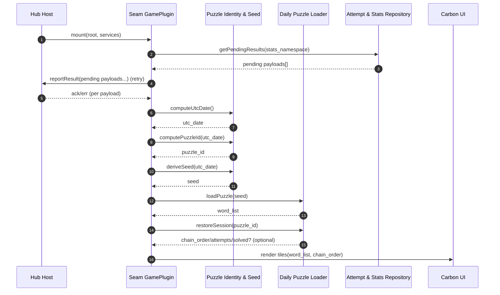
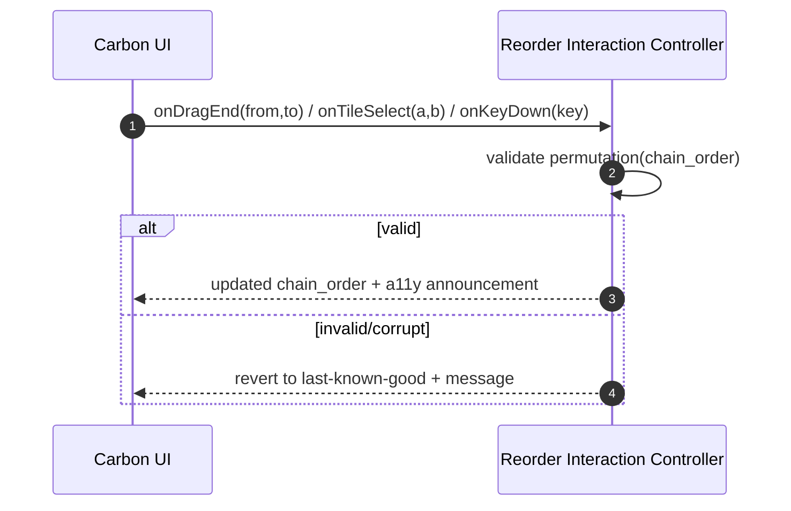
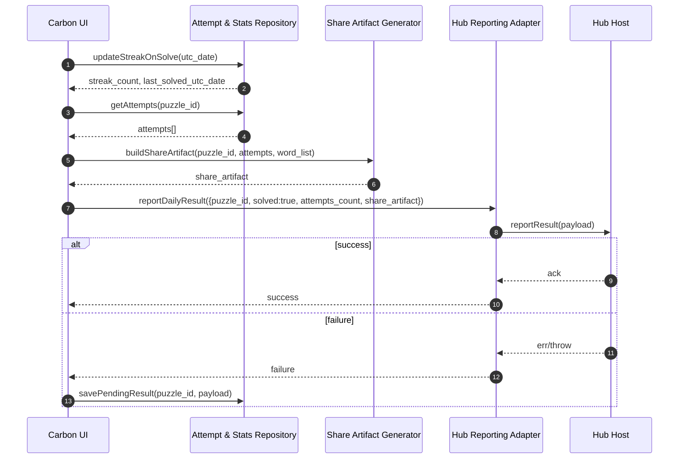
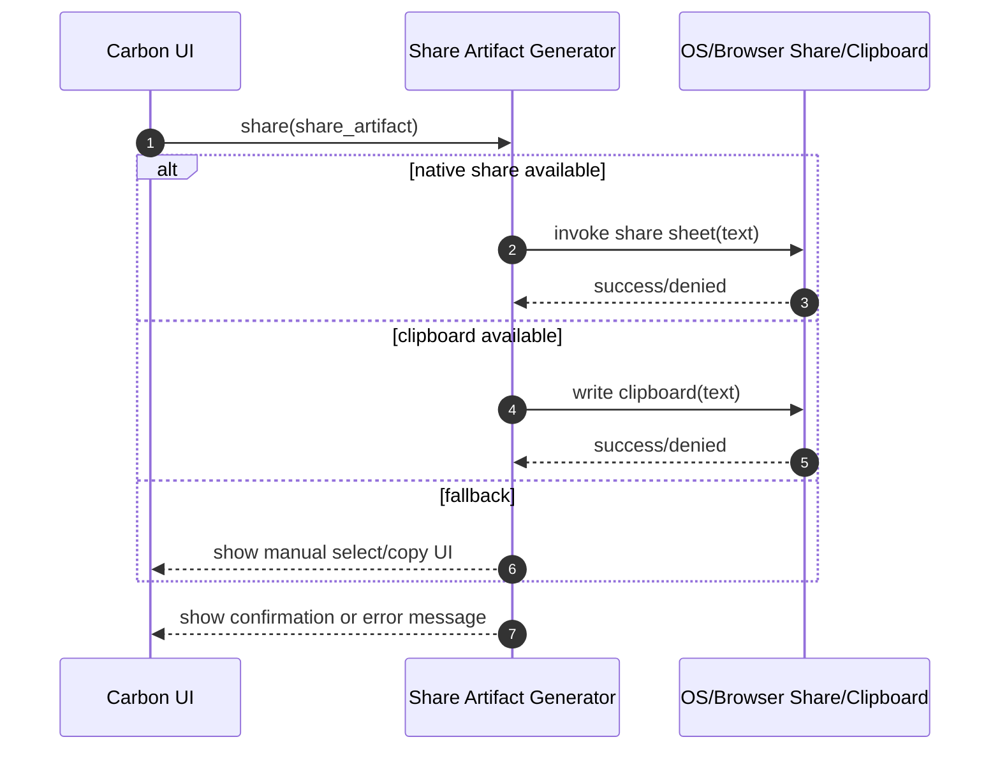
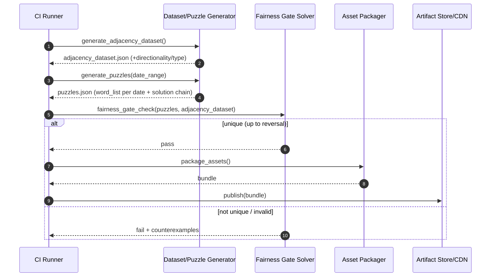

<!-- generated: 2026-07-25T16:48:09Z -->
<!-- mode: feature -->
<!-- feature-slug: seam -->
<!-- a2a-endpoint: https://bob-sdlc-orchestrator.2as6l7wq9qj8.eu-gb.codeengine.appdomain.cloud/v1/rpc -->

# Glossary

## Terms

### TERM-001: Seam
- **Definition:** The daily linear-chain word game in the CIC Games hub where the player orders a fixed set of words so each adjacent pair forms a valid hidden link.
- **Synonyms:** Seam game, daily Seam puzzle
- **Anti-definition:** Not an unordered grouping puzzle (e.g., not “Connections”); not a free-form word-entry game.
- **Source:** User request

### TERM-002: Daily Puzzle
- **Definition:** The specific Seam puzzle instance for a given **TERM-006 UTC Date**, deterministically generated from a seed.
- **Synonyms:** Today’s puzzle, puzzle of the day
- **Anti-definition:** Not a random puzzle; not user-generated content.
- **Source:** User request

### TERM-003: Word Tile
- **Definition:** A UI element representing one candidate word from the puzzle’s word set that can be reordered by the player.
- **Synonyms:** Tile, word card
- **Anti-definition:** Not a letter tile; not editable text input.
- **Source:** User request

### TERM-004: Chain
- **Definition:** An ordered list of **TERM-005 Word** items (length N) representing the player’s proposed solution; adjacency matters.
- **Synonyms:** Sequence, ordering, linear chain
- **Anti-definition:** Not groups/clusters; not a graph traversal.
- **Source:** User request

### TERM-005: Word
- **Definition:** A single vocabulary item used in a **TERM-002 Daily Puzzle** and shown on a **TERM-003 Word Tile**.
- **Synonyms:** Token, entry
- **Anti-definition:** Not a phrase; not a clue sentence.
- **Source:** User request

### TERM-006: UTC Date
- **Definition:** A calendar date derived from UTC (YYYY-MM-DD) used to determine the daily puzzle boundary and seed.
- **Synonyms:** UTC day, UTC-based date
- **Anti-definition:** Not local device date; not timezone-adjusted per user.
- **Source:** User request

### TERM-007: Seed
- **Definition:** Deterministic value derived from **TERM-006 UTC Date** that selects/generates the **TERM-002 Daily Puzzle**.
- **Synonyms:** Daily seed
- **Anti-definition:** Not a cryptographic secret; not user-specific.
- **Source:** User request

### TERM-008: Adjacency Link
- **Definition:** A valid relationship between two adjacent words indicating they share a hidden link (compound word, collocation, or shared category property).
- **Synonyms:** Link, valid adjacency
- **Anti-definition:** Not a synonym relationship; not a revealed hint by default.
- **Source:** User request

### TERM-009: Link Type
- **Definition:** The classification of an **TERM-008 Adjacency Link** (compound, collocation, shared category property).
- **Synonyms:** Relationship type
- **Anti-definition:** Not a difficulty rating.
- **Source:** User request

### TERM-010: Adjacency Dataset
- **Definition:** A bundled, build-time computed set of valid **TERM-008 Adjacency Link** pairs used for on-device validation.
- **Synonyms:** Link set, adjacency list, link database (bundled)
- **Anti-definition:** Not a server-side API; not dynamically updated at runtime.
- **Source:** User request

### TERM-011: Build-Time Fairness Gate
- **Definition:** A build pipeline check ensuring each **TERM-002 Daily Puzzle** has a unique valid **TERM-012 Solution Chain** up to full reversal.
- **Synonyms:** Uniqueness gate, fairness check
- **Anti-definition:** Not runtime validation; not a heuristic “difficulty” score.
- **Source:** User request

### TERM-012: Solution Chain
- **Definition:** The unique correct **TERM-004 Chain** that makes every adjacent pair a valid **TERM-008 Adjacency Link**, allowing reversal as equivalent.
- **Synonyms:** Correct ordering, solved chain
- **Anti-definition:** Not multiple alternative correct orderings (beyond reversal).
- **Source:** User request

### TERM-013: Attempt
- **Definition:** One submission of a proposed **TERM-004 Chain** for validation.
- **Synonyms:** Guess, submission
- **Anti-definition:** Not a drag action; not a partial reorder.
- **Source:** User request

### TERM-014: Feedback
- **Definition:** The per-attempt result indicating how many adjacent links are valid (e.g., “5/7”) without revealing which links are correct until solved.
- **Synonyms:** Result, score (per attempt)
- **Anti-definition:** Not a per-link correctness highlight (pre-solve); not a hint.
- **Source:** User request

### TERM-015: Solved State
- **Definition:** The state where an **TERM-013 Attempt** yields all adjacent links valid for the current **TERM-002 Daily Puzzle**.
- **Synonyms:** Completed, finished
- **Anti-definition:** Not “played”; not “attempted once”.
- **Source:** User request

### TERM-016: Reversal Equivalence
- **Definition:** The rule that a chain and its complete reverse are considered the same unique solution for fairness/uniqueness purposes.
- **Synonyms:** Reverse-allowed uniqueness
- **Anti-definition:** Not allowing arbitrary rotations; not allowing partial reversals.
- **Source:** User request

### TERM-017: Spoiler-Safe Share Artifact
- **Definition:** A shareable text block representing per-attempt counts of correct links using neutral blocks/symbols without including the words.
- **Synonyms:** Share card (text), share string
- **Anti-definition:** Not a screenshot; not containing word content.
- **Source:** User request

### TERM-018: Daily Result
- **Definition:** The structured outcome reported back to the hub platform for the daily puzzle (e.g., solved, attempts, share artifact).
- **Synonyms:** Result payload, completion record
- **Anti-definition:** Not global analytics; not server-verified.
- **Source:** User request

### TERM-019: GamePlugin
- **Definition:** The integration contract for CIC Games hub games, providing `mount(root, services)` and reporting **TERM-018 Daily Result**.
- **Synonyms:** Plugin, hub integration
- **Anti-definition:** Not a standalone app shell; not a backend service.
- **Source:** User request

### TERM-020: Services (Hub Services)
- **Definition:** The host-provided capabilities passed to the plugin at mount time (e.g., storage namespace, routing, share, telemetry if available).
- **Synonyms:** Platform services, host services
- **Anti-definition:** Not game-defined global singletons.
- **Source:** User request

### TERM-021: Namespaced Local Stats
- **Definition:** On-device persisted stats for Seam scoped to a hub-provided namespace (e.g., streak, plays, attempts distribution).
- **Synonyms:** Local stats, local profile stats
- **Anti-definition:** Not cross-device synced stats unless the hub provides it.
- **Source:** User request

### TERM-022: Streak
- **Definition:** Count of consecutive **TERM-006 UTC Date** days where the user entered **TERM-015 Solved State**.
- **Synonyms:** Daily streak
- **Anti-definition:** Not based on local timezone; not “days played”.
- **Source:** User request

### TERM-023: Offline-First PWA
- **Definition:** Web app designed to function without network after initial asset/linkset availability, using local caching/storage.
- **Synonyms:** Offline-capable PWA
- **Anti-definition:** Not requiring server validation; not streaming content daily.
- **Source:** User request

### TERM-024: On-Device Validation
- **Definition:** Validating an **TERM-013 Attempt** locally by checking adjacent pairs against the **TERM-010 Adjacency Dataset**.
- **Synonyms:** Client-side validation
- **Anti-definition:** Not server-side checking; not crowdsourced.
- **Source:** User request

### TERM-025: IBM Carbon Design System
- **Definition:** The UI component and interaction design system required for the game UI on supported platforms.
- **Synonyms:** Carbon, IBM Carbon
- **Anti-definition:** Not custom bespoke UI components outside Carbon without exception.
- **Source:** User request

### TERM-026: Accessibility (WCAG 2.1 AA)
- **Definition:** Conformance target including keyboard operable reordering, non-color-only state, visible focus, and reduced-motion support.
- **Synonyms:** A11y, WCAG AA
- **Anti-definition:** Not “best effort”; not partial compliance.
- **Source:** User request

### TERM-027: Reorder Interaction
- **Definition:** The user action to change the **TERM-004 Chain** order via drag-and-drop and/or tap-to-swap, including keyboard equivalents.
- **Synonyms:** Reordering, swap
- **Anti-definition:** Not deleting or adding words.
- **Source:** User request

### TERM-028: Day Boundary
- **Definition:** The moment the daily puzzle changes, defined at 00:00:00 UTC.
- **Synonyms:** Daily reset
- **Anti-definition:** Not midnight local time.
- **Source:** User request

### TERM-029: Session
- **Definition:** A single play period for a user on a given **TERM-002 Daily Puzzle**, designed for sub-3-minute completion.
- **Synonyms:** Play session
- **Anti-definition:** Not an account session; not authentication session.
- **Source:** User request

## Data Dictionary

| ID | Name | Type | Format | Range | Units | Default | Nullable | PII | Source | Validation |
|---|---|---|---|---|---|---|---|---|---|---|
| FIELD-001 | utc_date | string | YYYY-MM-DD | Valid calendar date | n/a | (computed) | No | Non-PII | Client clock (UTC) | Must equal UTC date derived from device time in UTC |
| FIELD-002 | puzzle_id | string | `seam:YYYY-MM-DD` | n/a | n/a | (computed) | No | Non-PII | Client | Must start with `seam:` and include FIELD-001 |
| FIELD-003 | seed | string | opaque | n/a | n/a | (computed) | No | Non-PII | Client | Must be deterministic function of FIELD-001 |
| FIELD-004 | word_list | array<string> | UTF-8 tokens | length N (e.g., 8) | words | n/a | No | Non-PII | Bundled puzzle content | Each entry must be non-empty; must be unique within list |
| FIELD-005 | chain_order | array<int> | indices | 0..N-1 | positions | identity order | No | Non-PII | Client state | Must be a permutation of 0..N-1 |
| FIELD-006 | adjacent_pair | object | `{a:string,b:string}` | a,b in word_list | n/a | n/a | No | Non-PII | Client derived | a != b; both must exist in FIELD-004 |
| FIELD-007 | link_exists | boolean | boolean | true/false | n/a | false | No | Non-PII | On-device validation | True iff pair exists in bundled adjacency dataset (direction-aware per FIELD-009) |
| FIELD-008 | correct_links_count | integer | int | 0..(N-1) | links | 0 | No | Non-PII | On-device validation | Must equal number of adjacent pairs with link_exists=true |
| FIELD-009 | link_directionality | enum | string | `undirected` \| `directed` | n/a | undirected | No | Non-PII | Build-time dataset | Must match dataset encoding; validation must follow encoding |
| FIELD-010 | link_type | enum | string | `compound` \| `collocation` \| `category_property` | n/a | n/a | Yes | Non-PII | Build-time dataset | If present, must be one of enum values |
| FIELD-011 | attempt_index | integer | int | >=1 | attempts | 1 | No | Non-PII | Client | Must increment by 1 per submission for puzzle_id |
| FIELD-012 | attempt_timestamp_utc | string | RFC3339 | n/a | n/a | (now) | No | Non-PII | Client clock (UTC) | Must parse as RFC3339 and be in UTC (`Z`) |
| FIELD-013 | solved | boolean | boolean | true/false | n/a | false | No | Non-PII | Client | True iff correct_links_count == N-1 |
| FIELD-014 | attempts_count | integer | int | >=0 | attempts | 0 | No | Non-PII | Client | Must equal number of stored attempts for puzzle_id |
| FIELD-015 | max_attempts | integer | int | 1..999 | attempts | 999 | No | Non-PII | Game config | Must be >=1 |
| FIELD-016 | feedback_display | string | `x/y` | x=0..y; y=N-1 | links | n/a | No | Non-PII | Client derived | Must render as `${correct_links_count}/${N-1}` |
| FIELD-017 | share_artifact | string | text block | n/a | n/a | n/a | Yes | Non-PII | Client derived | Must not include any word from FIELD-004 (case-insensitive containment check) |
| FIELD-018 | share_row | string | symbols | n/a | n/a | n/a | Yes | Non-PII | Client derived | Must encode correct_links_count without positional correctness |
| FIELD-019 | stats_namespace | string | opaque | n/a | n/a | provided | No | Non-PII | Hub services | Must be non-empty and stable per plugin instance |
| FIELD-020 | streak_count | integer | int | >=0 | days | 0 | No | Non-PII | Local stats | Must reset to 0 on streak break per UTC date rule |
| FIELD-021 | last_solved_utc_date | string | YYYY-MM-DD | valid date | n/a | n/a | Yes | Non-PII | Local stats | If present, must be a valid date string |
| FIELD-022 | daily_result_payload | object | JSON | schema-defined | n/a | n/a | No | Non-PII | Plugin -> Hub | Must include puzzle_id, solved, attempts_count, share_artifact (if solved) |
| FIELD-023 | platform | enum | string | `pwa` \| `ios` \| `android` | n/a | pwa | No | Non-PII | Runtime | Must be one of enum values |
| FIELD-024 | reduced_motion_enabled | boolean | boolean | true/false | n/a | (system) | No | Non-PII | OS/UA setting | Must reflect prefers-reduced-motion or OS equivalent |
| FIELD-025 | keyboard_reorder_mode | enum | string | `off` \| `focus-move` \| `swap` | n/a | focus-move | No | Non-PII | Client UI state | Must be one of enum values |

**FIELD-to-TERM mapping (implicit):**  
- Puzzle identity: FIELD-001..003 belong to TERM-002/006/007/028  
- Content: FIELD-004 belongs to TERM-005/003/002  
- Gameplay state: FIELD-005..016 belong to TERM-004/013/014/015/024/027  
- Share: FIELD-017..018 belong to TERM-017  
- Stats/integration: FIELD-019..023 belong to TERM-018/019/020/021/022  
- Accessibility settings: FIELD-024..025 belong to TERM-026/027  

# User Journeys

## Roles

| Role ID | Role | Type | Description |
|---|---|---|---|
| ROLE-001 | Player | Primary | End user who plays the daily Seam puzzle and shares results. |
| ROLE-002 | Hub Host | System | CIC Games hub container that mounts the plugin and receives results. |
| ROLE-003 | Build Engineer | Admin/Dev | Maintains build pipeline, dataset generation, and fairness gate. |

## Entry Points

| Entry ID | Location | Trigger | Auth |
|---|---|---|---|
| ENTRY-001 | UI Route: `/games/seam` (hub-defined) | Player opens Seam from hub | Hub-controlled (implicit) |
| ENTRY-002 | Plugin API: `mount(root, services)` | Hub Host loads plugin | Trusted host call |
| ENTRY-003 | UI Control: “Submit” | Player submits an **TERM-013 Attempt** | n/a |
| ENTRY-004 | UI Control: “Share” | Player shares **TERM-017 Spoiler-Safe Share Artifact** | OS/browser share permissions |
| ENTRY-005 | System Event: UTC day rollover | **TERM-028 Day Boundary** reached | n/a |
| ENTRY-006 | Build Pipeline Step: `generate_adjacency_dataset` | Build run starts | CI permissions |
| ENTRY-007 | Build Pipeline Step: `fairness_gate_check` | After puzzle generation | CI permissions |

## Role Permission Matrix

| Capability | ROLE-001 Player | ROLE-002 Hub Host | ROLE-003 Build Engineer |
|---|---:|---:|---:|
| Play **TERM-002 Daily Puzzle** | Yes | No | No |
| Reorder **TERM-003 Word Tile** | Yes | No | No |
| Submit **TERM-013 Attempt** | Yes | No | No |
| View **TERM-014 Feedback** | Yes | No | No |
| Generate **TERM-017 Share Artifact** | Yes | No | No |
| Receive **TERM-018 Daily Result** | No | Yes | No |
| Provide **TERM-020 Services** | No | Yes | No |
| Generate **TERM-010 Adjacency Dataset** | No | No | Yes |
| Enforce **TERM-011 Build-Time Fairness Gate** | No | No | Yes |

## Journeys

### JOURNEY-001: Launch daily Seam puzzle (mount + load)
- **Role/Goal:** ROLE-001 Player — start today’s **TERM-002 Daily Puzzle**.
- **Success criteria:** UI shows **FIELD-004 word_list** as **TERM-003 Word Tile** items; ready to reorder; uses **FIELD-001 utc_date**.
- **Failure criteria:** Puzzle cannot be determined or content cannot load offline.
- **Entry:** ENTRY-001, ENTRY-002
- **Happy path:**
  1. Hub Host calls `mount(root, services)` (**TERM-019 GamePlugin**, **TERM-020 Services**) and provides **FIELD-019 stats_namespace**.  
  2. Client computes **FIELD-001 utc_date** (UTC) and **FIELD-002 puzzle_id**.  
  3. Client derives **FIELD-003 seed** from **FIELD-001 utc_date**.  
  4. Client selects/constructs the day’s **FIELD-004 word_list** deterministically from **FIELD-003 seed** (offline).  
  5. Client renders **TERM-003 Word Tile** list in an initial **FIELD-005 chain_order**.
- **Decision branches:**
  - **BRANCH-001:** If local cached state exists for **FIELD-002 puzzle_id**, restore **FIELD-005 chain_order**, **FIELD-014 attempts_count**, and prior attempt history.
- **Error states:**
  - **ERROR-001:** Missing/invalid bundled content for **FIELD-004 word_list**.  
    - *Trigger:* content bundle parse fails.  
    - *Response:* show blocking error with retry action.  
    - *Recovery:* reload app; if persists, prompt user to update app.
- **Edge cases:**
  - **EDGE-001:** Device clock skew affects **FIELD-001 utc_date** causing wrong day puzzle.
  - **EDGE-002:** Cold start fully offline: must still load from bundled assets/service worker cache (**TERM-023 Offline-First PWA**).

### JOURNEY-002: Reorder words (drag, tap-to-swap, keyboard)
- **Role/Goal:** ROLE-001 Player — adjust **TERM-004 Chain** to find the **TERM-012 Solution Chain**.
- **Success criteria:** **FIELD-005 chain_order** updates correctly; operation is keyboard operable (**TERM-026 Accessibility**).
- **Failure criteria:** Reorder cannot be performed with keyboard; focus lost; state unclear without color.
- **Entry:** In-game board after JOURNEY-001 step 5
- **Happy path:**
  1. Player initiates **TERM-027 Reorder Interaction** on a **TERM-003 Word Tile**.  
  2. Client updates **FIELD-005 chain_order** to reflect new ordering.  
  3. Client announces updated position/state via accessible text (no color-only).
- **Decision branches:**
  - **BRANCH-002:** If **FIELD-024 reduced_motion_enabled** is true, use reduced-motion animations for reorder.
  - **BRANCH-003:** Player uses keyboard reordering via **FIELD-025 keyboard_reorder_mode**.
- **Error states:**
  - **ERROR-002:** Invalid reorder operation (e.g., corrupted state where **FIELD-005** is not a permutation).  
    - *Trigger:* validation of **FIELD-005 chain_order** fails.  
    - *Response:* reset to last known-good order and inform user.  
    - *Recovery:* retry reorder.
- **Edge cases:**
  - **EDGE-003:** Rapid repeated drags causing race in state updates.
  - **EDGE-004:** Screen reader interaction: ensure each **TERM-003 Word Tile** has a stable accessible name from **TERM-005 Word**.

### JOURNEY-003: Submit an attempt and get spoiler-safe feedback
- **Role/Goal:** ROLE-001 Player — validate current chain without revealing which links are correct.
- **Success criteria:** Feedback shows **FIELD-016 feedback_display** derived from **FIELD-008 correct_links_count**; does not reveal positions; increments **FIELD-011 attempt_index**.
- **Failure criteria:** Reveals which adjacency is wrong; cannot validate offline.
- **Entry:** ENTRY-003
- **Happy path:**
  1. Player presses “Submit” to create an **TERM-013 Attempt**.  
  2. Client builds adjacent pairs (**FIELD-006 adjacent_pair**) from **FIELD-004 word_list** and **FIELD-005 chain_order**.  
  3. Client checks each adjacent pair against **TERM-010 Adjacency Dataset** (**TERM-024 On-Device Validation**) producing **FIELD-007 link_exists** per pair.  
  4. Client computes **FIELD-008 correct_links_count** and renders **FIELD-016 feedback_display** (e.g., `5/7`) without indicating which pairs were correct (**TERM-014 Feedback**).  
  5. Client increments **FIELD-011 attempt_index**, updates **FIELD-014 attempts_count**, and stores attempt history locally under **FIELD-019 stats_namespace**.
- **Decision branches:**
  - **BRANCH-004:** If **FIELD-013 solved** is true (i.e., **FIELD-008 == N-1**), transition to **TERM-015 Solved State** (JOURNEY-004).
  - **BRANCH-005:** If **FIELD-014 attempts_count** reaches **FIELD-015 max_attempts**, lock further submissions for that **FIELD-002 puzzle_id** (still allow reorder).
- **Error states:**
  - **ERROR-003:** Adjacency dataset unavailable/corrupted.  
    - *Trigger:* dataset lookup fails.  
    - *Response:* show blocking error and do not record attempt.  
    - *Recovery:* reload/update app.
- **Edge cases:**
  - **EDGE-005:** Duplicate words accidentally present in **FIELD-004 word_list** (must be prevented by build validation).
  - **EDGE-006:** Validation directionality mismatch (**FIELD-009**): ensure consistent lookup rules.

### JOURNEY-004: Solve, update streak/stats, and report Daily Result to hub
- **Role/Goal:** ROLE-001 Player — upon solve, see completion UI, share, and persist streak; hub receives **TERM-018 Daily Result**.
- **Success criteria:** **FIELD-013 solved** true; **FIELD-020 streak_count** updated using **TERM-028 Day Boundary**; **FIELD-022 daily_result_payload** reported to hub.
- **Failure criteria:** Streak increments on wrong day; share includes words; hub not notified.
- **Entry:** From JOURNEY-003 BRANCH-004
- **Happy path:**
  1. Client enters **TERM-015 Solved State** and displays completion summary including **FIELD-014 attempts_count**.  
  2. Client updates **FIELD-020 streak_count** and **FIELD-021 last_solved_utc_date** based on **FIELD-001 utc_date**.  
  3. Client builds **FIELD-017 share_artifact** from attempt history (counts only) ensuring no words are included (**TERM-017**).  
  4. Client sends **FIELD-022 daily_result_payload** to Hub Host via plugin reporting mechanism (**TERM-019 GamePlugin**).
- **Decision branches:**
  - **BRANCH-006:** If user solved yesterday (UTC) (**FIELD-021 == utc_date-1**), increment streak; else reset to 1 for today.
- **Error states:**
  - **ERROR-004:** Reporting to hub fails (service unavailable).  
    - *Trigger:* host callback throws/returns error.  
    - *Response:* persist payload locally and show “Saved locally; will retry”.  
    - *Recovery:* retry on next app open.
- **Edge cases:**
  - **EDGE-007:** Solving near UTC midnight: if **FIELD-001 utc_date** changes mid-session, ensure the active **FIELD-002 puzzle_id** remains consistent for the session until user refreshes (define behavior in requirements).
  - **EDGE-008:** Multiple tabs/instances: avoid double-reporting for same **FIELD-002 puzzle_id**.

### JOURNEY-005: Share spoiler-safe result
- **Role/Goal:** ROLE-001 Player — share outcome without spoilers.
- **Success criteria:** Share uses **FIELD-017 share_artifact** with no **TERM-005 Word** leakage; uses platform share where available.
- **Failure criteria:** Words included; share blocked without fallback.
- **Entry:** ENTRY-004
- **Happy path:**
  1. Player taps “Share”.  
  2. Client copies **FIELD-017 share_artifact** to clipboard and/or invokes native share sheet when available.  
  3. Client confirms share action in UI with text (not color-only).
- **Decision branches:**
  - **BRANCH-007:** If native share is unavailable, present “Copy to clipboard” fallback.
- **Error states:**
  - **ERROR-005:** Clipboard/share permission denied.  
    - *Trigger:* OS/browser denies permission.  
    - *Response:* show error message and provide manual select/copy UI.  
    - *Recovery:* user retries or copies manually.
- **Edge cases:**
  - **EDGE-009:** Localization: share artifact must remain spoiler-safe across locales (avoid translated words list).

### JOURNEY-006: Build pipeline generates dataset and enforces uniqueness (fairness gate)
- **Role/Goal:** ROLE-003 Build Engineer — produce bundled content where each day’s puzzle has unique solution up to reversal.
- **Success criteria:** **TERM-011 Build-Time Fairness Gate** passes; **TERM-010 Adjacency Dataset** bundled.
- **Failure criteria:** Puzzle has multiple solutions; dataset inconsistencies.
- **Entry:** ENTRY-006, ENTRY-007
- **Happy path:**
  1. CI generates **TERM-010 Adjacency Dataset** including **FIELD-009 link_directionality** and optional **FIELD-010 link_type** metadata.  
  2. CI generates daily puzzles for a configured date range, each with **FIELD-004 word_list** and known **TERM-012 Solution Chain**.  
  3. CI runs **TERM-011 Build-Time Fairness Gate** verifying uniqueness up to **TERM-016 Reversal Equivalence**.  
  4. Build outputs bundled assets consumed by clients offline-first.
- **Decision branches:**
  - **BRANCH-008:** If fairness fails, CI blocks release and outputs counterexample solutions.
- **Error states:**
  - **ERROR-006:** Dataset generation produces invalid entries (e.g., self-links, missing tokens).  
    - *Trigger:* validation step fails.  
    - *Response:* fail build with actionable log.
- **Edge cases:**
  - **EDGE-010:** Homographs/case sensitivity: enforce normalized casing rules in dataset and word list.
  - **EDGE-011:** Duplicate adjacency entries: ensure deterministic lookup behavior.

## Journey Map

```mermaid
flowchart TD
  A[ENTRY-002 mount(root, services)] --> B[JOURNEY-001 Load Daily Puzzle]
  B --> C[JOURNEY-002 Reorder Words]
  C --> D[ENTRY-003 Submit]
  D --> E[JOURNEY-003 Validate Attempt]
  E -->|BRANCH-004 solved=true| F[JOURNEY-004 Solved + Report Result]
  E -->|BRANCH-005 max attempts reached| C
  E -->|not solved| C
  F --> G[ENTRY-004 Share]
  G --> H[JOURNEY-005 Share Artifact]
  I[ENTRY-006 Build] --> J[JOURNEY-006 Generate Dataset + Fairness Gate]
```

# Requirements

### REQ-001: Compute UTC puzzle identity
- **EARS Pattern:** Event-Driven
- **EARS Statement:** When the plugin is mounted via **TERM-019 GamePlugin**, the system shall compute **FIELD-001 utc_date** and **FIELD-002 puzzle_id** using **TERM-028 Day Boundary** rules.
- **Inputs:** Hub mount call; device time
- **Outputs:** FIELD-001, FIELD-002
- **Preconditions:** ENTRY-002 invoked
- **Postconditions:** Puzzle identity available for state lookup
- **Invariants:** FIELD-002 includes FIELD-001
- **Trigger:** ENTRY-002
- **Actor:** ROLE-002 Hub Host (invokes), ROLE-001 Player (benefits)
- **EntityScope:** TERM-002 Daily Puzzle
- **ErrorModes:** Device time not parseable
- **NFR-Tags:** i18n-agnostic
- **Source:** JOURNEY-001 step 1-2
- **Dependencies:** None
- **Priority:** P0
- **AcceptanceCriteria:**
  - **TEST-001:** Given a device time of `2026-07-25T23:59:00Z`, when mounted, then **FIELD-001** equals `2026-07-25`.
  - **TEST-002:** Given **FIELD-001** is `2026-07-25`, then **FIELD-002** equals `seam:2026-07-25`.
- **Assumptions:** Device time is available
- **OpenQuestions:** None

### REQ-002: Derive deterministic daily seed
- **EARS Pattern:** Event-Driven
- **EARS Statement:** When **FIELD-001 utc_date** is computed, the system shall derive **FIELD-003 seed** deterministically from **FIELD-001**.
- **Inputs:** FIELD-001
- **Outputs:** FIELD-003
- **Preconditions:** FIELD-001 present
- **Postconditions:** Seed available for deterministic selection
- **Invariants:** Same utc_date => same seed on all platforms (**FIELD-023 platform**)
- **Trigger:** Completion of REQ-001
- **Actor:** ROLE-001 Player
- **EntityScope:** TERM-007 Seed
- **ErrorModes:** Seed function unavailable
- **NFR-Tags:** compatibility
- **Source:** JOURNEY-001 step 3
- **Dependencies:** REQ-001
- **Priority:** P0
- **AcceptanceCriteria:**
  - **TEST-003:** Given **FIELD-001** is `2026-07-25`, when derived on PWA and iOS, then **FIELD-003** values are identical.
- **Assumptions:** Seed algorithm is specified in code
- **OpenQuestions:** What exact seed algorithm is desired (e.g., SHA-256 of date string)?

### REQ-003: Select daily word list offline
- **EARS Pattern:** Event-Driven
- **EARS Statement:** When **FIELD-003 seed** is derived, the system shall select the **FIELD-004 word_list** for the **TERM-002 Daily Puzzle** from bundled assets without network access.
- **Inputs:** FIELD-003; bundled puzzle content
- **Outputs:** FIELD-004
- **Preconditions:** Bundled assets installed/cached
- **Postconditions:** word_list loaded and ready to render
- **Invariants:** FIELD-004 contains unique non-empty strings
- **Trigger:** Completion of REQ-002
- **Actor:** ROLE-001 Player
- **EntityScope:** TERM-002 Daily Puzzle
- **ErrorModes:** Missing bundled content
- **NFR-Tags:** offline
- **Source:** JOURNEY-001 step 4; ERROR-001
- **Dependencies:** REQ-002
- **Priority:** P0
- **AcceptanceCriteria:**
  - **TEST-004:** Given airplane mode, when the app starts, then **FIELD-004** loads successfully from bundled assets.
  - **TEST-005:** Given **FIELD-004**, then all entries are unique and non-empty.
- **Assumptions:** Puzzles for a date range are bundled
- **OpenQuestions:** What date range must be bundled (e.g., 365 days rolling)?

### REQ-004: Render word tiles from word list
- **EARS Pattern:** Event-Driven
- **EARS Statement:** When **FIELD-004 word_list** is available, the system shall render one **TERM-003 Word Tile** per **TERM-005 Word**.
- **Inputs:** FIELD-004
- **Outputs:** Visible tile list UI
- **Preconditions:** FIELD-004 loaded
- **Postconditions:** Player can initiate **TERM-027 Reorder Interaction**
- **Invariants:** Tile accessible name equals the corresponding word string
- **Trigger:** Completion of REQ-003
- **Actor:** ROLE-001 Player
- **EntityScope:** TERM-003 Word Tile
- **ErrorModes:** UI render failure
- **NFR-Tags:** accessibility, design-system
- **Source:** JOURNEY-001 step 5; JOURNEY-002 EDGE-004
- **Dependencies:** REQ-003
- **Priority:** P0
- **AcceptanceCriteria:**
  - **TEST-006:** Given **FIELD-004** length N, then the UI displays N tiles.
- **Assumptions:** IBM Carbon components exist for list/tile UI
- **OpenQuestions:** Tile layout: single row vs wrapped grid?

### REQ-005: Support pointer drag reordering
- **EARS Pattern:** Event-Driven
- **EARS Statement:** When the player drags a **TERM-003 Word Tile**, the system shall update **FIELD-005 chain_order** to match the resulting **TERM-004 Chain** order.
- **Inputs:** Drag interaction; current FIELD-005
- **Outputs:** Updated FIELD-005
- **Preconditions:** Tiles rendered
- **Postconditions:** Order persisted in runtime state
- **Invariants:** FIELD-005 is a permutation of 0..N-1
- **Trigger:** Pointer drag end
- **Actor:** ROLE-001 Player
- **EntityScope:** TERM-004 Chain
- **ErrorModes:** Invalid permutation state
- **NFR-Tags:** accessibility
- **Source:** JOURNEY-002 step 1-2; ERROR-002
- **Dependencies:** REQ-004
- **Priority:** P0
- **AcceptanceCriteria:**
  - **TEST-007:** Given a drag moving tile index 0 to position 3, then **FIELD-005** reflects that new ordering and remains a valid permutation.
- **Assumptions:** Drag-and-drop is supported on all target platforms
- **OpenQuestions:** None

### REQ-006: Support tap-to-swap reordering
- **EARS Pattern:** Event-Driven
- **EARS Statement:** When the player selects two **TERM-003 Word Tile** items for swapping, the system shall swap their positions in **FIELD-005 chain_order**.
- **Inputs:** Two tile selections; FIELD-005
- **Outputs:** Updated FIELD-005
- **Preconditions:** Tiles rendered
- **Postconditions:** Order updated
- **Invariants:** FIELD-005 remains a permutation
- **Trigger:** Second tile selection
- **Actor:** ROLE-001 Player
- **EntityScope:** TERM-004 Chain
- **ErrorModes:** Invalid tile selection index
- **NFR-Tags:** accessibility
- **Source:** JOURNEY-002 (TERM-027 includes tap-to-swap)
- **Dependencies:** REQ-004
- **Priority:** P1
- **AcceptanceCriteria:**
  - **TEST-008:** Given a chain order `[0,1,2,3]`, when swapping positions 1 and 3, then **FIELD-005** becomes `[0,3,2,1]`.
- **Assumptions:** Tap-to-swap interaction is specified in UI
- **OpenQuestions:** How is selection indicated without color-only?

### REQ-007: Provide keyboard-operable reordering
- **EARS Pattern:** State-Driven
- **EARS Statement:** While keyboard focus is on a **TERM-003 Word Tile**, the system shall allow reordering actions consistent with **FIELD-025 keyboard_reorder_mode**.
- **Inputs:** Keyboard events; FIELD-025
- **Outputs:** Updated FIELD-005; accessible announcements
- **Preconditions:** Keyboard input available
- **Postconditions:** User can reorder without pointer
- **Invariants:** Visible focus is present
- **Trigger:** Key press
- **Actor:** ROLE-001 Player
- **EntityScope:** TERM-003 Word Tile
- **ErrorModes:** Unsupported key mapping
- **NFR-Tags:** accessibility (WCAG 2.1 AA)
- **Source:** JOURNEY-002 BRANCH-003
- **Dependencies:** REQ-004
- **Priority:** P0
- **AcceptanceCriteria:**
  - **TEST-009:** Given focus on a tile, when using defined keyboard commands, then the tile changes position and focus remains visible.
- **Assumptions:** Keyboard mapping will be documented
- **OpenQuestions:** Exact key bindings (arrow keys + space/enter?) for move vs swap?

### REQ-008: Respect prefers-reduced-motion during reorder
- **EARS Pattern:** State-Driven
- **EARS Statement:** While **FIELD-024 reduced_motion_enabled** is true, the system shall render reorder animations with motion-reduced transitions.
- **Inputs:** FIELD-024
- **Outputs:** UI animation behavior
- **Preconditions:** Reorder occurs
- **Postconditions:** Reduced motion respected
- **Invariants:** No essential information conveyed only through animation
- **Trigger:** Any reorder UI update
- **Actor:** ROLE-001 Player
- **EntityScope:** TERM-027 Reorder Interaction
- **ErrorModes:** None
- **NFR-Tags:** accessibility
- **Source:** JOURNEY-002 BRANCH-002
- **Dependencies:** REQ-005 or REQ-006 or REQ-007
- **Priority:** P1
- **AcceptanceCriteria:**
  - **TEST-010:** Given prefers-reduced-motion enabled, when reordering, then animation duration is reduced to near-instant (<=100ms) or disabled.
- **Assumptions:** 100ms threshold acceptable
- **OpenQuestions:** Confirm animation policy for Carbon components.

### REQ-009: Submit attempt and validate adjacent pairs on-device
- **EARS Pattern:** Event-Driven
- **EARS Statement:** When the player submits an **TERM-013 Attempt**, the system shall validate each **FIELD-006 adjacent_pair** against the **TERM-010 Adjacency Dataset** to produce **FIELD-008 correct_links_count**.
- **Inputs:** FIELD-004; FIELD-005; bundled adjacency dataset
- **Outputs:** FIELD-008
- **Preconditions:** Puzzle loaded; tiles ordered
- **Postconditions:** Attempt evaluated
- **Invariants:** Computed adjacent pair count equals N-1
- **Trigger:** ENTRY-003
- **Actor:** ROLE-001 Player
- **EntityScope:** TERM-013 Attempt
- **ErrorModes:** Dataset lookup failure
- **NFR-Tags:** offline
- **Source:** JOURNEY-003 steps 1-4; ERROR-003
- **Dependencies:** REQ-003, REQ-005/006/007
- **Priority:** P0
- **AcceptanceCriteria:**
  - **TEST-011:** Given N words, when submitting, then the system evaluates exactly N-1 adjacent pairs.
- **Assumptions:** Dataset lookups are deterministic
- **OpenQuestions:** Are links case-insensitive or normalized?

### REQ-010: Display spoiler-safe feedback count only
- **EARS Pattern:** Event-Driven
- **EARS Statement:** When **FIELD-008 correct_links_count** is computed, the system shall display **FIELD-016 feedback_display** without identifying which adjacent pairs are valid.
- **Inputs:** FIELD-008; N from FIELD-004 length
- **Outputs:** FIELD-016; UI feedback
- **Preconditions:** REQ-009 completed
- **Postconditions:** Player sees x/y feedback
- **Invariants:** No per-pair correctness indicators are shown while not in **TERM-015 Solved State**
- **Trigger:** Completion of REQ-009
- **Actor:** ROLE-001 Player
- **EntityScope:** TERM-014 Feedback
- **ErrorModes:** None
- **NFR-Tags:** gameplay-integrity
- **Source:** JOURNEY-003 step 4
- **Dependencies:** REQ-009
- **Priority:** P0
- **AcceptanceCriteria:**
  - **TEST-012:** Given a submission with 5 correct links out of 7, then the UI shows `5/7` and provides no per-link highlights.
- **Assumptions:** “No per-link highlights” includes color, icons, and text per adjacency
- **OpenQuestions:** After solved, is revealing the full chain explanation desired?

### REQ-011: Record attempt history locally per puzzle
- **EARS Pattern:** Event-Driven
- **EARS Statement:** When an **TERM-013 Attempt** is submitted, the system shall persist **FIELD-011 attempt_index** and **FIELD-008 correct_links_count** under **FIELD-019 stats_namespace** scoped to **FIELD-002 puzzle_id**.
- **Inputs:** FIELD-002; FIELD-011; FIELD-008; FIELD-019
- **Outputs:** Updated local storage record
- **Preconditions:** REQ-001 and hub services provide namespace
- **Postconditions:** Attempt history available for share artifact and resume
- **Invariants:** attempt_index increments by 1 per puzzle_id
- **Trigger:** ENTRY-003
- **Actor:** ROLE-001 Player
- **EntityScope:** TERM-021 Namespaced Local Stats
- **ErrorModes:** Storage quota/IO failure
- **NFR-Tags:** offline, reliability
- **Source:** JOURNEY-003 step 5; JOURNEY-001 BRANCH-001
- **Dependencies:** REQ-001, REQ-009
- **Priority:** P0
- **AcceptanceCriteria:**
  - **TEST-013:** Given two submissions for the same puzzle_id, then stored attempt_index values are 1 and 2 with matching stored counts.
- **Assumptions:** Hub provides a usable storage API or localStorage equivalent
- **OpenQuestions:** Storage API shape from hub services?

### REQ-012: Determine solved state
- **EARS Pattern:** Event-Driven
- **EARS Statement:** When **FIELD-008 correct_links_count** is computed, the system shall set **FIELD-013 solved** to true if **FIELD-008** equals `(length(FIELD-004) - 1)`.
- **Inputs:** FIELD-008; FIELD-004 length
- **Outputs:** FIELD-013
- **Preconditions:** REQ-009 completed
- **Postconditions:** Solved state determined
- **Invariants:** FIELD-013 implies all links valid
- **Trigger:** Completion of REQ-009
- **Actor:** ROLE-001 Player
- **EntityScope:** TERM-015 Solved State
- **ErrorModes:** None
- **NFR-Tags:** none
- **Source:** JOURNEY-003 BRANCH-004
- **Dependencies:** REQ-009
- **Priority:** P0
- **AcceptanceCriteria:**
  - **TEST-014:** Given N=8 and correct_links_count=7, then solved=true.
- **Assumptions:** None
- **OpenQuestions:** None

### REQ-013: Generate spoiler-safe share artifact
- **EARS Pattern:** Event-Driven
- **EARS Statement:** When **FIELD-013 solved** becomes true, the system shall generate **FIELD-017 share_artifact** that contains no element of **FIELD-004 word_list**.
- **Inputs:** FIELD-013; attempt history; FIELD-004
- **Outputs:** FIELD-017
- **Preconditions:** Solved; attempts exist
- **Postconditions:** Share artifact available
- **Invariants:** FIELD-017 passes the “no-words-contained” validation rule
- **Trigger:** Transition to solved=true
- **Actor:** ROLE-001 Player
- **EntityScope:** TERM-017 Spoiler-Safe Share Artifact
- **ErrorModes:** Share artifact generation failure
- **NFR-Tags:** privacy, gameplay-integrity
- **Source:** JOURNEY-004 step 3
- **Dependencies:** REQ-011, REQ-012
- **Priority:** P0
- **AcceptanceCriteria:**
  - **TEST-015:** Given word_list includes `FIRE`, then share_artifact does not contain `FIRE` in any casing.
- **Assumptions:** Word containment check is case-insensitive
- **OpenQuestions:** Exact block encoding specification?

### REQ-014: Share via native share or clipboard fallback
- **EARS Pattern:** Event-Driven
- **EARS Statement:** When the player activates Share, the system shall invoke the platform share mechanism using **FIELD-017 share_artifact**.
- **Inputs:** FIELD-017; platform share API availability
- **Outputs:** OS share sheet invocation
- **Preconditions:** FIELD-017 exists
- **Postconditions:** Share attempted
- **Invariants:** Shared content equals FIELD-017
- **Trigger:** ENTRY-004
- **Actor:** ROLE-001 Player
- **EntityScope:** TERM-017 Spoiler-Safe Share Artifact
- **ErrorModes:** Share permission denied
- **NFR-Tags:** compatibility
- **Source:** JOURNEY-005 step 1-2; ERROR-005
- **Dependencies:** REQ-013
- **Priority:** P1
- **AcceptanceCriteria:**
  - **TEST-016:** Given native share is available, when Share is tapped, then the share sheet opens with the share_artifact text.
- **Assumptions:** A separate fallback requirement covers clipboard
- **OpenQuestions:** None

### REQ-015: Provide copy-to-clipboard fallback
- **EARS Pattern:** Optional
- **EARS Statement:** Where native sharing is unavailable, the system shall copy **FIELD-017 share_artifact** to the clipboard upon Share activation.
- **Inputs:** FIELD-017
- **Outputs:** Clipboard content set
- **Preconditions:** Share invoked; native share unavailable
- **Postconditions:** User can paste share text elsewhere
- **Invariants:** Clipboard content equals FIELD-017
- **Trigger:** ENTRY-004
- **Actor:** ROLE-001 Player
- **EntityScope:** TERM-017 Spoiler-Safe Share Artifact
- **ErrorModes:** Clipboard permission denied
- **NFR-Tags:** compatibility
- **Source:** JOURNEY-005 BRANCH-007; ERROR-005
- **Dependencies:** REQ-013
- **Priority:** P1
- **AcceptanceCriteria:**
  - **TEST-017:** Given native share is unavailable, when Share is tapped, then clipboard contains share_artifact.
- **Assumptions:** Clipboard API available on most platforms
- **OpenQuestions:** Manual select/copy UX details?

### REQ-016: Report daily result to hub
- **EARS Pattern:** Event-Driven
- **EARS Statement:** When **FIELD-013 solved** becomes true, the system shall send **FIELD-022 daily_result_payload** to the hub via **TERM-019 GamePlugin** reporting.
- **Inputs:** puzzle_id; solved; attempts_count; share_artifact
- **Outputs:** FIELD-022 delivered to hub
- **Preconditions:** Hub services available
- **Postconditions:** Hub receives daily result
- **Invariants:** Payload puzzle_id equals FIELD-002
- **Trigger:** Transition to solved=true
- **Actor:** ROLE-001 Player (initiates solve), ROLE-002 Hub Host (receives)
- **EntityScope:** TERM-018 Daily Result
- **ErrorModes:** Host callback failure
- **NFR-Tags:** observability
- **Source:** JOURNEY-004 step 4; ERROR-004
- **Dependencies:** REQ-012, REQ-013
- **Priority:** P0
- **AcceptanceCriteria:**
  - **TEST-018:** Given solved=true, then the hub receives a payload containing puzzle_id and attempts_count.
- **Assumptions:** Hub defines the reporting API
- **OpenQuestions:** Exact payload schema required by hub?

### REQ-017: Persist deferred result reporting on failure
- **EARS Pattern:** Event-Driven
- **EARS Statement:** When hub reporting fails for **FIELD-022 daily_result_payload**, the system shall persist the payload locally under **FIELD-019 stats_namespace** for later retry.
- **Inputs:** FIELD-022; error signal
- **Outputs:** Locally stored pending payload
- **Preconditions:** REQ-016 attempted
- **Postconditions:** Payload not lost
- **Invariants:** Only one pending payload per puzzle_id
- **Trigger:** ERROR-004
- **Actor:** ROLE-001 Player
- **EntityScope:** TERM-018 Daily Result
- **ErrorModes:** Storage failure
- **NFR-Tags:** reliability
- **Source:** JOURNEY-004 ERROR-004
- **Dependencies:** REQ-016, REQ-011
- **Priority:** P1
- **AcceptanceCriteria:**
  - **TEST-019:** Given hub reporting throws an error, then a pending result record exists locally for that puzzle_id.
- **Assumptions:** Retry mechanism defined separately
- **OpenQuestions:** When to retry (next app open vs background)?

### REQ-018: Retry deferred result reporting on next mount
- **EARS Pattern:** Event-Driven
- **EARS Statement:** When the plugin is mounted, the system shall retry sending any locally persisted pending **FIELD-022 daily_result_payload** for the current **FIELD-019 stats_namespace**.
- **Inputs:** Pending payload record(s)
- **Outputs:** Reporting attempt to hub
- **Preconditions:** ENTRY-002 invoked
- **Postconditions:** Pending payload cleared on success
- **Invariants:** Do not resend already-acknowledged payloads
- **Trigger:** ENTRY-002
- **Actor:** ROLE-002 Hub Host
- **EntityScope:** TERM-018 Daily Result
- **ErrorModes:** Host callback failure
- **NFR-Tags:** reliability
- **Source:** JOURNEY-004 ERROR-004 recovery
- **Dependencies:** REQ-017
- **Priority:** P1
- **AcceptanceCriteria:**
  - **TEST-020:** Given a pending payload exists, when mounted and hub accepts, then pending payload is removed.
- **Assumptions:** Hub reporting call is idempotent or accepts duplicates safely
- **OpenQuestions:** Does hub provide an acknowledgement/receipt?

### REQ-019: Compute streak using UTC date
- **EARS Pattern:** Event-Driven
- **EARS Statement:** When **FIELD-013 solved** becomes true, the system shall update **FIELD-020 streak_count** using **FIELD-001 utc_date** and **FIELD-021 last_solved_utc_date**.
- **Inputs:** FIELD-001; FIELD-021; existing FIELD-020
- **Outputs:** Updated FIELD-020; FIELD-021 set to FIELD-001
- **Preconditions:** Local stats available
- **Postconditions:** Streak updated for today
- **Invariants:** Streak uses UTC day boundary
- **Trigger:** Transition to solved=true
- **Actor:** ROLE-001 Player
- **EntityScope:** TERM-022 Streak
- **ErrorModes:** Stats storage failure
- **NFR-Tags:** none
- **Source:** JOURNEY-004 step 2; BRANCH-006
- **Dependencies:** REQ-012, REQ-011
- **Priority:** P0
- **AcceptanceCriteria:**
  - **TEST-021:** Given last_solved_utc_date is yesterday and solved today, then streak_count increments by 1.
- **Assumptions:** “Yesterday” computed in UTC
- **OpenQuestions:** If solved multiple times in same day, keep streak constant?

### REQ-020: Lock submissions after max attempts reached
- **EARS Pattern:** State-Driven
- **EARS Statement:** While **FIELD-014 attempts_count** is greater than or equal to **FIELD-015 max_attempts**, the system shall prevent additional attempt submissions for the current **FIELD-002 puzzle_id**.
- **Inputs:** FIELD-014; FIELD-015
- **Outputs:** Disabled submit action; message
- **Preconditions:** Attempts recorded
- **Postconditions:** No further submissions recorded
- **Invariants:** Reordering remains allowed
- **Trigger:** Submit action while locked
- **Actor:** ROLE-001 Player
- **EntityScope:** TERM-013 Attempt
- **ErrorModes:** None
- **NFR-Tags:** none
- **Source:** JOURNEY-003 BRANCH-005
- **Dependencies:** REQ-011
- **Priority:** P2
- **AcceptanceCriteria:**
  - **TEST-022:** Given attempts_count equals max_attempts, when pressing Submit, then no new attempt is recorded and Submit is disabled.
- **Assumptions:** Default max_attempts is high (FIELD-015=999)
- **OpenQuestions:** Do we want an explicit max attempts at all?

### REQ-021: Use Carbon Design System components
- **EARS Pattern:** Ubiquitous
- **EARS Statement:** The system shall implement the UI using **TERM-025 IBM Carbon Design System** components and tokens.
- **Inputs:** n/a
- **Outputs:** Carbon-based UI
- **Preconditions:** Carbon library available per platform
- **Postconditions:** UI conforms to design system
- **Invariants:** Avoid non-Carbon custom components for primary interactions
- **Trigger:** n/a
- **Actor:** ROLE-001 Player
- **EntityScope:** TERM-001 Seam
- **ErrorModes:** None
- **NFR-Tags:** compatibility, design-system
- **Source:** User request (global); JOURNEY-001..005
- **Dependencies:** None
- **Priority:** P0
- **AcceptanceCriteria:**
  - **TEST-023:** UI review confirms primary controls (tiles, buttons, dialogs) use Carbon components or approved wrappers.
- **Assumptions:** Carbon is applicable to PWA and native wrappers
- **OpenQuestions:** For iOS/Android, is Carbon implemented via webview or native equivalents?

### NFR-001: Accessibility conformance (WCAG 2.1 AA basics)
- **EARS Pattern:** Ubiquitous
- **EARS Statement:** The system shall conform to **TERM-026 Accessibility (WCAG 2.1 AA)** for keyboard operability, non-color-only state, and visible focus.
- **Inputs:** n/a
- **Outputs:** Accessible interaction behavior
- **Preconditions:** UI available
- **Postconditions:** A11y audits pass
- **Invariants:** All interactive elements are reachable via keyboard and show visible focus
- **Trigger:** n/a
- **Actor:** ROLE-001 Player
- **EntityScope:** TERM-001 Seam
- **ErrorModes:** None
- **NFR-Tags:** accessibility
- **Source:** User request; JOURNEY-002, JOURNEY-005
- **Dependencies:** REQ-007
- **Priority:** P0
- **AcceptanceCriteria:**
  - **TEST-024:** Keyboard-only user can reorder tiles and submit an attempt without pointer input.
  - **TEST-025:** State feedback is conveyed via text/icon plus color where used.
  - **TEST-026:** Focus indicator is visible on all focusable elements.
- **Assumptions:** Formal audit tooling (axe, VoiceOver/TalkBack checks)
- **OpenQuestions:** Any additional WCAG success criteria explicitly required?

### NFR-002: Offline-first operation
- **EARS Pattern:** Ubiquitous
- **EARS Statement:** The system shall allow playing and validating the **TERM-002 Daily Puzzle** without network access after installation by relying on bundled content and local storage.
- **Inputs:** Bundled assets; local storage
- **Outputs:** Fully playable offline experience
- **Preconditions:** App previously loaded/installed
- **Postconditions:** Submit + feedback works offline
- **Invariants:** Validation uses **TERM-024 On-Device Validation**
- **Trigger:** n/a
- **Actor:** ROLE-001 Player
- **EntityScope:** TERM-023 Offline-First PWA
- **ErrorModes:** Missing cached assets
- **NFR-Tags:** offline, reliability
- **Source:** User request; JOURNEY-001 EDGE-002; JOURNEY-003
- **Dependencies:** REQ-003, REQ-009
- **Priority:** P0
- **AcceptanceCriteria:**
  - **TEST-027:** With airplane mode enabled, the user can load the puzzle, reorder, submit, and receive feedback.
- **Assumptions:** “After installation” includes service worker cache primed
- **OpenQuestions:** Required cache strategy (precache all puzzles vs on-demand)?

### NFR-003: Client-side spoiler safety for sharing
- **EARS Pattern:** Ubiquitous
- **EARS Statement:** The system shall prevent **TERM-005 Word** leakage in **FIELD-017 share_artifact** by enforcing the **FIELD-017** validation rule at generation time.
- **Inputs:** FIELD-004; FIELD-017
- **Outputs:** Validated share artifact
- **Preconditions:** Solved
- **Postconditions:** Share artifact is spoiler-safe
- **Invariants:** No words from word_list appear in share_artifact
- **Trigger:** n/a
- **Actor:** ROLE-001 Player
- **EntityScope:** TERM-017 Spoiler-Safe Share Artifact
- **ErrorModes:** Validation failure
- **NFR-Tags:** privacy, gameplay-integrity
- **Source:** User request; JOURNEY-004 step 3
- **Dependencies:** REQ-013
- **Priority:** P0
- **AcceptanceCriteria:**
  - **TEST-028:** For a puzzle with word_list of N items, the share artifact contains none of those N strings (case-insensitive).
- **Assumptions:** Word leakage via substrings is considered leakage
- **OpenQuestions:** Do we also forbid near-matches (e.g., pluralization)?

### NFR-004: Determinism across platforms
- **EARS Pattern:** Ubiquitous
- **EARS Statement:** The system shall present the same **FIELD-004 word_list** for the same **FIELD-001 utc_date** on all values of **FIELD-023 platform**.
- **Inputs:** FIELD-001; FIELD-023
- **Outputs:** Same puzzle content
- **Preconditions:** Same bundled release version installed
- **Postconditions:** Cross-platform consistency
- **Invariants:** Puzzle selection depends only on utc_date and bundled content
- **Trigger:** n/a
- **Actor:** ROLE-001 Player
- **EntityScope:** TERM-002 Daily Puzzle
- **ErrorModes:** Platform-specific randomness or locale affecting selection
- **NFR-Tags:** compatibility
- **Source:** User request; JOURNEY-001 step 4
- **Dependencies:** REQ-002, REQ-003
- **Priority:** P0
- **AcceptanceCriteria:**
  - **TEST-029:** Given the same app version and utc_date, PWA and Android produce identical word_list ordering set (ignoring initial shuffle if any).
- **Assumptions:** Release version parity enforced
- **OpenQuestions:** Should initial tile order be deterministic or randomized-per-day?

### NFR-005: Observability of attempt submissions (local)
- **EARS Pattern:** Event-Driven
- **EARS Statement:** When an **TERM-013 Attempt** is submitted, the system shall record a local diagnostic event including **FIELD-002 puzzle_id**, **FIELD-011 attempt_index**, and **FIELD-008 correct_links_count**.
- **Inputs:** Attempt data
- **Outputs:** Local event record (or hub telemetry if provided)
- **Preconditions:** Attempt submitted
- **Postconditions:** Debuggable behavior
- **Invariants:** Event contains no **FIELD-004 word_list**
- **Trigger:** ENTRY-003
- **Actor:** ROLE-001 Player
- **EntityScope:** TERM-013 Attempt
- **ErrorModes:** Telemetry sink unavailable
- **NFR-Tags:** observability, privacy
- **Source:** Derived from offline + spoiler-safe requirements; JOURNEY-003
- **Dependencies:** REQ-009, REQ-011
- **Priority:** P2
- **AcceptanceCriteria:**
  - **TEST-030:** After a submission, an event exists containing puzzle_id and attempt_index and does not contain any puzzle words.
- **Assumptions:** Hub services may include telemetry; otherwise local log only
- **OpenQuestions:** What telemetry API is available from **TERM-020 Services**?

### NFR-006: Build-time uniqueness enforcement
- **EARS Pattern:** Event-Driven
- **EARS Statement:** When CI runs the **TERM-011 Build-Time Fairness Gate**, the build system shall fail the build if any **TERM-002 Daily Puzzle** has more than one valid **TERM-012 Solution Chain** excluding **TERM-016 Reversal Equivalence**.
- **Inputs:** Generated puzzles; adjacency dataset
- **Outputs:** Pass/fail result with diagnostics
- **Preconditions:** ENTRY-007 invoked
- **Postconditions:** Only decisive puzzles shipped
- **Invariants:** Uniqueness evaluated against the same validation rules as client (**FIELD-009 link_directionality**)
- **Trigger:** ENTRY-007
- **Actor:** ROLE-003 Build Engineer
- **EntityScope:** TERM-011 Build-Time Fairness Gate
- **ErrorModes:** Gate execution error
- **NFR-Tags:** quality, gameplay-integrity
- **Source:** JOURNEY-006 step 3; BRANCH-008
- **Dependencies:** None
- **Priority:** P0
- **AcceptanceCriteria:**
  - **TEST-031:** Given a generated puzzle with two distinct valid orderings not related by full reversal, the fairness gate fails the build.
- **Assumptions:** Solver enumerates all valid chains for the word set
- **OpenQuestions:** Performance bounds for the gate across the full date range?
# Architecture

## Components & Responsibilities

### Seam GamePlugin (UI Shell)
**Satisfies:** REQ-001..004, REQ-014..016, REQ-018, REQ-021; NFR-001..005  
- **Responsibilities**
  - Implement `mount(root, services)` (TERM-019) lifecycle; wire hub services (TERM-020).
  - Own top-level routing/view composition for `/games/seam` (ENTRY-001).
  - Coordinate retry of deferred hub result reporting on mount (REQ-018).
  - Render Carbon-based UI layout, dialogs, buttons, toast/notifications (REQ-021).
- **Boundaries**
  - **Owns:** UI composition, lifecycle, service wiring, high-level state machine.
  - **Does not own:** puzzle generation rules/datasets, validation logic details, persistence schema (delegated).
- **Exposes**
  - `mount(root, services): void` (inbound from Hub Host).
- **Consumes**
  - `services.storage` (namespaced), `services.reportResult` (or equivalent), optional `services.share`, optional `services.telemetry`, optional `services.routing`.

### Puzzle Identity & Seed Module
**Satisfies:** REQ-001, REQ-002; NFR-004  
- **Responsibilities**
  - Compute `utc_date` (FIELD-001) from device time in UTC with 00:00:00Z day boundary (TERM-028).
  - Compute `puzzle_id = seam:YYYY-MM-DD` (FIELD-002).
  - Derive deterministic `seed` (FIELD-003) from `utc_date` (platform-consistent).
- **Boundaries**
  - **Owns:** date/seed algorithms and normalization.
  - **Does not own:** time sync; does not correct device clock skew (only surfaces warning).
- **Exposes**
  - `computeUtcDate(now: Date): YYYY-MM-DD`
  - `computePuzzleId(utcDate): string`
  - `deriveSeed(utcDate): string`
- **Consumes**
  - System clock; no network dependency.

### Daily Puzzle Loader (Bundled Content Selector)
**Satisfies:** REQ-003; NFR-002, NFR-004  
- **Responsibilities**
  - Load bundled puzzle index/content and select the day’s `word_list` (FIELD-004) deterministically from `seed`.
  - Validate integrity: non-empty, unique tokens; enforce normalization rules used by validator.
  - Provide restore of prior local session state for same `puzzle_id` (JOURNEY-001 BRANCH-001).
- **Boundaries**
  - **Owns:** mapping `seed -> puzzle content`, bundled asset parsing, local restore orchestration.
  - **Does not own:** generating puzzles/dataset (build-time concern).
- **Exposes**
  - `loadPuzzle(seed): { word_list, metadata }`
  - `restoreSession(puzzle_id): { chain_order, attempts, solved } | null`
- **Consumes**
  - Bundled puzzle assets (static files packaged with app), Service Worker cache (PWA), local storage adapter.

### Reorder Interaction Controller
**Satisfies:** REQ-005, REQ-006, REQ-007, REQ-008; NFR-001  
- **Responsibilities**
  - Maintain and update `chain_order` (FIELD-005) via:
    - pointer drag-and-drop,
    - tap-to-swap,
    - keyboard reordering modes (FIELD-025).
  - Enforce invariant: permutation of `0..N-1` with validation + rollback on corruption (ERROR-002).
  - Provide accessible announcements and visible focus management; respect reduced-motion (FIELD-024).
- **Boundaries**
  - **Owns:** interaction event handling and a11y behavior for reordering.
  - **Does not own:** attempt validation or persistence.
- **Exposes**
  - `getChainOrder(): number[]`
  - `setChainOrder(next): void` (validated)
  - UI event handlers: `onDragEnd`, `onTileSelect`, `onKeyDown`
- **Consumes**
  - Platform input events; reduced motion setting; Carbon components (list/tile patterns).

### On-Device Validation Engine
**Satisfies:** REQ-009, REQ-010, REQ-012; NFR-002  
- **Responsibilities**
  - Compute adjacent pairs (FIELD-006) from `word_list` + `chain_order`.
  - Lookup each pair in bundled adjacency dataset (TERM-010) respecting directionality (FIELD-009).
  - Produce `correct_links_count` (FIELD-008), `feedback_display` (FIELD-016), and `solved` (FIELD-013).
  - Enforce spoiler-safe feedback pre-solve: only counts, never per-link indicators (REQ-010).
- **Boundaries**
  - **Owns:** validation rules and efficient lookup structures.
  - **Does not own:** dataset generation (build-time) or share rendering.
- **Exposes**
  - `evaluateAttempt(word_list, chain_order): { correct_links_count, solved }`
- **Consumes**
  - Bundled adjacency dataset (read-only).

### Attempt & Stats Repository (Namespaced Local Persistence)
**Satisfies:** REQ-011, REQ-017, REQ-019, REQ-020; NFR-002  
- **Responsibilities**
  - Persist attempt history per `stats_namespace` (FIELD-019) and `puzzle_id`:
    - attempt_index (FIELD-011), correct_links_count (FIELD-008), timestamps (FIELD-012 optional).
  - Track streak state (`streak_count`, `last_solved_utc_date`) using UTC rules.
  - Persist pending hub-report payloads on failure (REQ-017) and ensure single pending payload per puzzle_id.
  - Provide submission lockout after `max_attempts` (REQ-020).
- **Boundaries**
  - **Owns:** local data model and migration/versioning for stored records.
  - **Does not own:** hub-side identity/accounts; no cross-device sync unless hub provides.
- **Exposes**
  - `appendAttempt(puzzle_id, attempt): void`
  - `getAttempts(puzzle_id): Attempt[]`
  - `getStats(): { streak_count, last_solved_utc_date }`
  - `updateStreakOnSolve(utc_date): void`
  - `savePendingResult(puzzle_id, payload): void`
  - `getPendingResults(): Payload[]`
  - `clearPendingResult(puzzle_id): void`
- **Consumes**
  - `services.storage` (preferred) or IndexedDB/localStorage fallback within PWA container constraints.

### Share Artifact Generator
**Satisfies:** REQ-013, REQ-014, REQ-015; NFR-003  
- **Responsibilities**
  - Convert attempt history into spoiler-safe share rows (FIELD-018) and composed text artifact (FIELD-017).
  - Enforce “no puzzle words contained” rule via case-insensitive containment check across `word_list`.
  - Invoke native share if available, else clipboard fallback, else manual select/copy UI.
- **Boundaries**
  - **Owns:** share encoding format and spoiler-safety enforcement.
  - **Does not own:** OS permissions; does not guarantee share success.
- **Exposes**
  - `buildShareArtifact(puzzle_id, attempts, word_list): string`
  - `share(text): Promise<void>`
- **Consumes**
  - `services.share` if provided; else `navigator.share`; else `navigator.clipboard`.

### Hub Reporting Adapter
**Satisfies:** REQ-016, REQ-018; NFR-005 (partial: telemetry hooks)  
- **Responsibilities**
  - Translate internal `DailyResult` into hub-required payload schema (FIELD-022).
  - Perform idempotent-ish reporting to Hub Host; on failure, surface to repository for persistence (REQ-017).
  - Optional: emit telemetry events via hub telemetry service with no word leakage (NFR-005).
- **Boundaries**
  - **Owns:** integration contract compliance, error mapping, retry trigger points.
  - **Does not own:** hub availability/SLA; no server-side verification.
- **Exposes**
  - `reportDailyResult(payload): Promise<Ack>`
- **Consumes**
  - `services.reportResult` (or hub-defined callback) and optional `services.telemetry`.

### Build-Time Content Pipeline (CI)
**Satisfies:** NFR-006; supports REQ-003, REQ-009 via shipped assets  
- **Responsibilities**
  - Generate/compile adjacency dataset (TERM-010) with normalization + directionality encoding.
  - Generate daily puzzles for configured date range, each with known solution chain.
  - Enforce fairness gate uniqueness up to reversal equivalence (TERM-011, TERM-016).
  - Produce versioned asset bundles consumed by clients offline-first.
- **Boundaries**
  - **Owns:** dataset generation, solver/gate, asset packaging.
  - **Does not own:** runtime behavior; no dynamic updates post-release.
- **Exposes**
  - CI steps: `generate_adjacency_dataset`, `generate_puzzles`, `fairness_gate_check`, `package_assets`
- **Consumes**
  - Source word/link corpora, build secrets (if any), CI runtime.

---

## Data Flow

### JOURNEY-001: Launch daily Seam puzzle (mount + load)


**State transitions**
- `NotMounted -> Mounted/Initializing -> PuzzleLoaded -> Playing`
- Optional: `Playing -> ResumedPlaying` when session restore exists.

### JOURNEY-002: Reorder words (drag, tap-to-swap, keyboard)


**State transitions**
- `Playing` remains `Playing` (no attempt boundary crossed).

### JOURNEY-003: Submit an attempt and get spoiler-safe feedback
```mermaid
sequenceDiagram
  autonumber
  participant UI as Carbon UI
  participant Reorder as Reorder Controller
  participant Validate as On-Device Validation Engine
  participant Repo as Attempt & Stats Repository
  participant Telemetry as (Optional) Hub Telemetry

  UI->>Reorder: getChainOrder()
  Reorder-->>UI: chain_order
  UI->>Validate: evaluateAttempt(word_list, chain_order)
  Validate-->>UI: correct_links_count, solved

  UI->>Repo: appendAttempt(puzzle_id, {attempt_index, correct_links_count})
  Repo-->>UI: attempts_count

  opt telemetry available
    UI->>Telemetry: emit(attempt_submitted{puzzle_id, attempt_index, correct_links_count})
  end

  UI-->>UI: render feedback "x/y" (no per-link reveal)
  alt solved == true
    UI-->>UI: transition to Solved (JOURNEY-004)
  else attempts_count >= max_attempts
    UI-->>UI: disable Submit; allow reorder
  end
```

**State transitions**
- `Playing -> Attempted -> Playing` (not solved)
- `Playing -> Attempted -> Solved` (solved)
- `Playing -> Locked` when `attempts_count >= max_attempts`.

### JOURNEY-004: Solve, update streak/stats, and report Daily Result to hub


**State transitions**
- `Solved (local) -> ReportedToHub` OR `Solved (local) -> PendingReport`.

### JOURNEY-005: Share spoiler-safe result


### JOURNEY-006: Build pipeline generates dataset and enforces uniqueness (fairness gate)


---

## Deployment Topology

- **Runtime environments**
  - **PWA:** Single-page app in browser; Service Worker for offline caching; IndexedDB/localStorage for persistence.
  - **iOS/Android:** WebView-wrapped PWA (assumption pending REQ-021 open question), same JS bundle/assets; OS-provided share/clipboard.
  - **CI:** Build agents running generator + solver; artifact publication to hub’s static hosting/CDN.

- **Network boundaries & trust zones**
  - **Client zone (untrusted):** All gameplay and validation runs locally; hub reporting is best-effort and non-authoritative.
  - **Hub host zone (trusted container):** Provides services object and receives results; considered trusted caller for `mount`.
  - **Build/CI zone (trusted):** Generates authoritative bundled assets; controls release.

- **Scaling units & limits**
  - Client scales per user/device; no backend scaling for validation.
  - CI scales by parallelizing date-range puzzle generation and solver checks; bounded by solver complexity (N words, adjacency density).
  - Static asset hosting scales via CDN; offline-first reduces steady-state fetches.

```mermaid
graph TD
  subgraph Client_Device["Client Device (Untrusted)"]
    PWA["Seam PWA / WebView App<br/>JS Bundle + Bundled Assets"]
    SW["Service Worker Cache"]
    LS["Namespaced Local Storage<br/>(IndexedDB/localStorage)"]
    PWA --> SW
    PWA --> LS
  end

  subgraph Hub_Zone["Hub Host (Trusted Container)"]
    HubUI["CIC Games Hub UI"]
    HubServices["Hub Services<br/>storage/reportResult/share/telemetry"]
    HubUI --> HubServices
  end

  subgraph Build_Zone["CI/Build (Trusted)"]
    CI["CI Runner"]
    Gen["Dataset + Puzzle Generator"]
    Gate["Fairness Gate Solver"]
    CDN["Static Artifact Store/CDN"]
    CI --> Gen --> Gate
    CI --> CDN
  end

  HubUI -->|mount(root, services)| PWA
  PWA -->|report DailyResult| HubServices
  CDN -->|download/update bundle| PWA
```

---

## Security Architecture

- **AuthN mechanism per actor type**
  - **Player (ROLE-001):** No explicit auth in Seam; identity (if any) is managed by hub container. Seam treats user as anonymous local user.
  - **Hub Host (ROLE-002):** Trusted in-process caller invoking `mount`; trust established by being loaded within hub origin/app container.
  - **Build Engineer/CI (ROLE-003):** CI credentials to publish artifacts; standard CI auth (OIDC/short-lived tokens) recommended.

- **AuthZ model**
  - **Within Seam:** Capability-based via passed `services` object (only call what hub provides). No user roles inside the plugin.
  - **CI:** RBAC in CI system for who can publish releases / modify datasets.

- **Secret management**
  - Seam runtime: no secrets required (seed is not secret; fully client-side).
  - CI: secrets for artifact publication (CDN token) stored in CI secret manager; rotate regularly; least privilege.

- **Data classification & encryption**
  - **Data types stored:** puzzle_id, attempts counts, streak, share artifact, pending payloads. All **Non-PII** per dictionary.
  - **At rest:** best-effort device storage (IndexedDB/localStorage/WebView storage). If native wrapper provides encrypted storage, prefer it; otherwise accept platform defaults (trade-off: simplicity vs stronger local protection).
  - **In transit:** when downloading bundles or reporting to hub services over network, rely on HTTPS/TLS as provided by hub/CDN.

- **Threat model summary (top 5)**
  1. **Tampering with local storage to fake streak/solve**  
     - *Impact:* Incorrect local stats / hub result inaccuracies.  
     - *Mitigation:* Treat results as non-authoritative; optionally include app version + simple integrity marker in payload; hub may display as “self-reported”.
  2. **Reverse engineering bundled puzzles / adjacency dataset to spoil solutions**  
     - *Impact:* Puzzle spoilers.  
     - *Mitigation:* Accept as inherent to offline-first; minimize explicit solution data in bundle (store word lists but not solution chain), keep share artifact spoiler-safe.
  3. **XSS or injection via puzzle words rendered in UI**  
     - *Impact:* Script execution in hub context.  
     - *Mitigation:* Strictly render words as text (no HTML injection); CSP from hub; sanitize/escape; avoid `dangerouslySetInnerHTML`.
  4. **Device clock manipulation causing wrong daily puzzle / streak errors**  
     - *Impact:* Confusing UX, streak inflation/deflation.  
     - *Mitigation:* Clearly label “Daily resets at 00:00 UTC”; optionally warn when clock jumps significantly during session; keep session pinned to initial puzzle_id.
  5. **Denial of service via oversized/invalid bundled assets** (supply chain / build mistake)  
     - *Impact:* App fails to load offline.  
     - *Mitigation:* CI validation checks (schema, size budgets, parsing tests); signature/hashes supported by hosting pipeline if available.

---

## Integration Points

### Inbound
1. **GamePlugin mount**
   - **Interface:** `mount(root, services)` (TERM-019)
   - **Protocol:** in-process JS call
   - **Schema reference:** `services` contract (hub-defined; *open question in REQ-011/REQ-016*)
   - **Failure mode:** missing required service (storage/reporting); plugin shows blocking error with instructions.
   - **SLA expectation:** N/A (in-process)

2. **UI Route**
   - **Interface:** `/games/seam` (ENTRY-001)
   - **Protocol:** hub routing (SPA route)
   - **Failure mode:** route not registered; handled by hub.
   - **SLA expectation:** hub-owned

3. **Player actions**
   - **Submit Attempt (ENTRY-003):** local event, no network.
   - **Share (ENTRY-004):** OS/browser permission mediated.

### Outbound
1. **Hub result reporting**
   - **Dependency:** `services.reportResult(payload)` or equivalent
   - **Protocol:** in-process JS call (may internally network)
   - **Schema reference:** FIELD-022 `daily_result_payload` (hub schema *open question in REQ-016*)
   - **Failure mode:** throw/error/timeout; persist pending payload (REQ-017) and retry on next mount (REQ-018)
   - **SLA expectation:** best-effort; user should not be blocked from completion UI

2. **Hub storage**
   - **Dependency:** `services.storage` (namespaced) OR local IndexedDB/localStorage
   - **Protocol:** in-process API
   - **Schema reference:** internal `SeamStorage_v1` (to be defined; versioned)
   - **Failure mode:** quota exceeded / IO error; degrade: disable persistence + show message; gameplay still possible in-memory for session
   - **SLA expectation:** local, low-latency

3. **Share/Clipboard**
   - **Dependency:** `services.share` or `navigator.share`; fallback `navigator.clipboard`
   - **Protocol:** browser/OS API
   - **Schema reference:** plain text FIELD-017
   - **Failure mode:** permission denied; show manual copy UI (ERROR-005)
   - **SLA expectation:** best-effort

4. **Telemetry (optional)**
   - **Dependency:** `services.telemetry.emit(event)`
   - **Protocol:** in-process
   - **Schema reference:** `attempt_submitted` event: `{puzzle_id, attempt_index, correct_links_count}` (no words)
   - **Failure mode:** no-op if absent/unavailable
   - **SLA expectation:** best-effort

5. **Static asset hosting/CDN**
   - **Dependency:** fetch app bundle + bundled datasets (initial install/update)
   - **Protocol:** HTTPS
   - **Failure mode:** offline/unavailable; rely on SW cache for offline-first (NFR-002)
   - **SLA expectation:** standard CDN availability; not required after cached

---

## Architecture Decision Records

### ADR-001: Offline-first, fully client-side validation with bundled adjacency dataset
- **Status:** Accepted
- **Context:** Requirements mandate offline play and on-device validation (REQ-003, REQ-009, NFR-002) with spoiler-safe behavior.
- **Decision:** Ship all required puzzle content + adjacency dataset in the client bundle; validate attempts locally; hub receives self-reported results.
- **Consequences:**
  - (+) Works fully offline; low latency; no backend cost.
  - (–) Dataset/puzzles can be extracted; cannot prevent cheating/spoilers; larger app size.
- **Alternatives:**
  - Server-side validation API (breaks offline-first, adds infra).
  - Hybrid: local play but server confirmation when online (complexity, still leakable).

### ADR-002: Fairness enforced at build time via exhaustive uniqueness gate (up to full reversal)
- **Status:** Accepted
- **Context:** Need decisive daily puzzles with unique solution chain except reversal (TERM-011/016, NFR-006).
- **Decision:** CI runs a solver to enumerate valid chains and fails build if >1 non-reversal solution exists; ship only vetted puzzles.
- **Consequences:**
  - (+) Guarantees fairness/determinism; simplifies runtime UX (no ambiguous “correct”).
  - (–) CI time can grow with puzzle size/density; requires robust solver and test coverage.
- **Alternatives:**
  - Heuristic/partial checks (risk missed ambiguities).
  - Runtime ambiguity handling (confusing; violates “unique chain” intent).

### ADR-003: Namespaced local persistence with deferred hub reporting retry-on-mount
- **Status:** Accepted
- **Context:** Must record attempts/streak locally and report daily result to hub, tolerating hub failures (REQ-011, REQ-016..018, TERM-021).
- **Decision:** Persist attempts/streak/pending result under hub-provided `stats_namespace`; on mount, replay pending payloads then clear on ack.
- **Consequences:**
  - (+) No data loss; supports offline/unstable host; simple retry trigger.
  - (–) Potential duplicate submissions if ack semantics unclear; requires idempotency strategy.
- **Alternatives:**
  - Background retries (harder in web; unreliable).
  - Don’t retry (results can be lost).

### ADR-004: Seed derivation algorithm choice (determinism vs simplicity vs stability)
- **Status:** Proposed
- **Context:** REQ-002 requires deterministic seed across platforms, but algorithm is unspecified.
- **Decision:** Use a specified, testable algorithm (e.g., UTF-8 date string `YYYY-MM-DD` hashed with SHA-256; seed = first 16 hex chars).
- **Consequences:**
  - (+) Stable, cross-platform; low collision risk.
  - (–) Requires consistent crypto/hash availability; needs polyfill for some environments.
- **Alternatives:**
  - Simple PRNG seeded by numeric date (simpler, but risk platform inconsistencies).
  - Use puzzle_id directly as seed (may be sufficient; no hashing).

### ADR-005: Session pinned to puzzle_id across UTC midnight rollover
- **Status:** Proposed
- **Context:** EDGE-007: solving near UTC midnight can change `utc_date` mid-session.
- **Decision:** Pin active `puzzle_id` at mount; only switch to new day’s puzzle on explicit refresh/reopen.
- **Consequences:**
  - (+) Predictable; avoids mid-play puzzle swap.
  - (–) User opening near midnight may need refresh to get “today’s” new puzzle.
- **Alternatives:**
  - Auto-switch at midnight (can invalidate session; confusing).
  - Prompt user to switch (extra UX complexity).

---

## Cross-Cutting Concerns

- **Logging, tracing, metrics, alerting**
  - Local diagnostic log (ring buffer) for key events: mount, puzzle load, submit attempt, dataset errors, hub report success/failure (NFR-005).
  - If hub telemetry exists, emit minimal, non-spoiler events (no words).
  - Error boundaries in UI: capture render failures and show recoverable message (ERROR-001/003).

- **Configuration and feature flags**
  - Config: `max_attempts` (FIELD-015), reorder keyboard mode default (FIELD-025), reduced-motion threshold (REQ-008).
  - Feature flags (optional): enable tap-to-swap (REQ-006), enable detailed post-solve explanations (if added later), telemetry on/off.

- **Error handling strategy**
  - **Fail fast + block** when core offline assets are missing/corrupt (ERROR-001, ERROR-003): show blocking error + update suggestion.
  - **Degrade gracefully** for hub reporting/share/telemetry failures: persist pending payload (REQ-017), provide clipboard/manual fallback (ERROR-005).
  - **State corruption recovery**: validate permutations and revert to last-known-good (ERROR-002).

- **Backwards compatibility / versioning**
  - Version local storage schema: `SeamStorage_v{n}` with migration path; keep read-compat for at least one prior version.
  - Bundle assets versioned with app release; puzzle determinism guaranteed only within same release version (documented).
  - Integration payload version field recommended in `daily_result_payload` to allow hub to evolve schema (tie to ADR-003 idempotency/ack needs).
# Review

## Risks (table sorted by severity descending)

| Risk ID | Title | Category | Likelihood | Impact | Severity | Affected requirements | Mitigation | Owner | Status |
|---|---|---:|---:|---:|---:|---|---|---|---|
| RISK-001 | Undefined hub `services` contract (storage/reporting/share/telemetry) may block integration | Dependency | High | High | **Critical** | REQ-011, REQ-016, REQ-018, REQ-014/015, NFR-005, REQ-021 | Define and version a formal `services` TypeScript interface + mock; document required vs optional services; add contract tests in CI against hub container; specify error UX when required service absent | Hub + Seam Tech Lead | Open |
| RISK-002 | Seed algorithm unspecified → cross-platform drift and “wrong puzzle” incidents | Technical | High | High | **Critical** | REQ-002, REQ-003, NFR-004 | Specify seed algorithm in requirements/ADR as normative (e.g., `seed = SHA-256("YYYY-MM-DD")`, hex prefix); add golden test vectors; lock normalization (UTF-8, casing) | Seam Tech Lead | Open |
| RISK-003 | Fairness gate computational blow-up (enumerating chains) may make CI too slow for date ranges | Schedule/Technical | Medium | High | **High** | NFR-006, REQ-003/009 (via shipped assets) | Constrain N (e.g., 8) and adjacency density; implement solver pruning + memoization; parallelize by date; define CI time budget and fail-fast diagnostics; consider precomputing solutions offline | Build Engineer | Open |
| RISK-004 | Adjacency normalization mismatch (case/diacritics/punctuation/plurals) causes false negatives on-device | Technical | Medium | High | **High** | REQ-003, REQ-009, NFR-004 | Define canonical normalization (e.g., NFC, uppercase, ASCII rules) for both dataset and runtime; enforce build-time validation + runtime asserts; include directionality rule tests | Seam Tech Lead | Open |
| RISK-005 | Dataset size/performance risk on low-end devices and WebView (lookup latency, memory, install size) | Operational/Technical | Medium | High | **High** | REQ-003, REQ-009, NFR-002 | Establish size budgets; choose compact data structure (hash set of encoded pairs, minimal metadata); lazy-load per initial puzzle set; benchmark on target devices; compress assets | Seam Tech Lead | Open |
| RISK-006 | Duplicate/incorrect hub reporting due to unclear ack/idempotency semantics | Operational/Dependency | Medium | High | **High** | REQ-016, REQ-017, REQ-018 | Require hub to return stable ack (e.g., `{puzzle_id, received_at}`) and treat reporting as idempotent by `puzzle_id`; store “reported” marker; ensure retry logic de-dupes | Hub + Seam Tech Lead | Open |
| RISK-007 | UTC midnight rollover mid-session not fully specified at requirements level (ADR proposed only) | Operational | Medium | Medium | **Medium** | REQ-001, REQ-019 (and streak correctness), session restore | Add explicit requirement: “pin puzzle_id per session until refresh” and define UI messaging (“New puzzle available”); add tests for rollover behavior | Product + Seam Tech Lead | Open |
| RISK-008 | Multi-tab / multi-instance leads to corrupted attempt_index or double pending payloads | Operational/Technical | Medium | Medium | **Medium** | REQ-011, REQ-017/018, REQ-020 | Use storage locking (BroadcastChannel/localStorage mutex) or atomic increment strategy; design repository to be last-write-wins with conflict detection; prevent double-report via “reported” marker | Seam Tech Lead | Open |
| RISK-009 | Share artifact “no-words-contained” check can false-pass via homoglyphs/zero-width chars or false-fail via substrings | Security/Operational | Low | Medium | **Low** | REQ-013, NFR-003 | Normalize share text before checking (NFKC, remove zero-width); define substring policy precisely (full token vs any substring); add fuzz tests | Seam Tech Lead | Open |
| RISK-010 | Drag-and-drop + Carbon accessibility gaps in WebView/older browsers may fail WCAG keyboard and focus requirements | Compliance/Technical | Medium | Medium | **Medium** | REQ-005, REQ-007, NFR-001, REQ-021 | Validate Carbon pattern supports reorder a11y; if not, implement accessible listbox/roving tabindex pattern; add axe + screen reader test runs; define supported browser/WebView versions | UX + Seam Tech Lead | Open |

## Missing Edge Cases

- **Service worker/cache lifecycle**
  - First-ever launch offline before SW precache completes (currently only “after installation” is assumed).
  - Partial cache eviction: puzzle index present but adjacency dataset missing (or vice versa).
  - App update mid-day: same `utc_date` but new bundle changes puzzle mapping (need explicit “determinism only within same app version” UX).

- **Persistence and data integrity**
  - Storage quota exceeded mid-session (REQ-011 error mode exists, but no behavior defined: continue without persistence? disable streak?).
  - Local storage cleared between attempts: attempt_index resets; how does share artifact behave?
  - Corrupted stored attempts: how to validate and repair (schema versioning mentioned but no requirement).

- **Gameplay/state**
  - Submitting while solved already (should lock submit? allow but not record?).
  - Changing `max_attempts` between versions affects an in-progress puzzle.
  - Handling N != 8 (requirements imply “e.g., 8” but no explicit constraint or dynamic UI rules).

- **Directionality**
  - Mixed directed/undirected links: whether dataset is globally one mode (FIELD-009 default suggests global) vs per-link; requirements don’t define.
  - Symmetry expectation: if undirected, ensure both (a,b) and (b,a) are considered valid with a single stored entry.

- **Localization/i18n**
  - Non-English word lists: casing rules (Turkish “i”), diacritics, right-to-left UI impacts on “chain” presentation.
  - Share artifact localization: ensure it doesn’t accidentally include translated day names or puzzle title words that match a tile.

- **Security hardening**
  - XSS prevention: requirement-level statement that words must be rendered as text nodes (architecture notes it, but no explicit requirement/test).
  - Supply-chain integrity of bundled datasets (hash/signature) not specified.

## Dependency Conflicts

- **Circular/ambiguous ownership between Loader and Repository**
  - Architecture says Loader “Provide restore of prior local session state” but Repository “owns local data model.” This can create a circular dependency or duplicated persistence logic.
  - Recommendation: Loader should depend on Repository interface for restore, not implement restore itself.

- **REQ-014 vs REQ-015 trigger overlap**
  - Both triggered by ENTRY-004; REQ-014 says “shall invoke platform share mechanism” and REQ-015 says “where native sharing unavailable, copy to clipboard.”
  - Not a true circular reference, but acceptance criteria should enforce a single decision tree and prevent double actions (e.g., share + clipboard both firing).

- **REQ-018 depends on REQ-017, but REQ-011 also stores under stats_namespace**
  - Potential conflict if pending payload storage and attempt history share the same namespace keys without a defined schema. Missing “SeamStorage_v1” spec is a dependency gap.

- **NFR-004 determinism vs “restore session”**
  - If restore includes prior `chain_order` and attempts, that’s fine, but if restore also persists a “selected puzzle content” snapshot, it could mask bundle/puzzle mapping bugs and break determinism expectations across installs.

## Recommendations

1. **Publish a versioned Hub Services contract** (required/optional methods, storage semantics, reportResult ack/idempotency, share/telemetry availability) and add automated contract tests using a hub-provided mock container.  
2. **Make the seed algorithm and text normalization rules normative requirements** (not open questions): specify hashing/encoding, NFC/NFKC policy, casing policy, and directionality semantics; add golden cross-platform test vectors.  
3. **Define a concrete storage schema (`SeamStorage_v1`)** including keys, migrations, corruption handling, and multi-tab concurrency strategy (mutex or atomic counters) for REQ-011/017/018/019.  
4. **Add explicit requirements for UTC rollover behavior** (pin puzzle_id per session; prompt/refresh behavior; streak calculation if solved after rollover without refresh) and add tests for EDGE-007.  
5. **Set performance and size budgets** for adjacency dataset and puzzle bundles (download size, memory, lookup latency) and enforce via CI checks + device benchmarks.  
6. **Clarify directionality model**: global undirected vs directed, per-link encoding, and lookup behavior; ensure fairness gate uses identical rules to runtime including normalization.  
7. **Elevate multi-instance handling to requirements** (EDGE-008): prevent double reporting and ensure attempt_index monotonicity under concurrency.  
8. **Add explicit security requirement/tests for safe rendering** of words (no HTML injection) and for share artifact normalization before “no-words-contained” checks.
# Test Plan

## Feature Files

```gherkin
# file: seam_puzzle_identity_and_determinism.feature
@regression
Feature: Puzzle identity, seed derivation, and cross-platform determinism
  The daily Seam puzzle is determined by UTC date and must be deterministic across platforms.

  @REQ-001 @AC-TEST-001 @integration @regression
  Scenario: Compute utc_date on mount using UTC time
    Given the hub mounts the Seam plugin with valid hub services
    And the device time in UTC is "2026-07-25T23:59:00Z"
    When the plugin is mounted
    Then the computed utc_date is "2026-07-25"

  @REQ-001 @AC-TEST-002 @unit @regression
  Scenario: Compute puzzle_id from utc_date
    Given utc_date is "2026-07-25"
    Then the computed puzzle_id is "seam:2026-07-25"

  @REQ-002 @AC-TEST-003 @integration @regression
  Scenario: Derive identical seed across PWA and iOS for same utc_date
    Given utc_date is "2026-07-25"
    When the seed is derived on platform "pwa"
    And the seed is derived on platform "ios"
    Then the derived seeds are identical
```

```gherkin
# file: seam_daily_puzzle_loader_offline.feature
@regression
Feature: Offline daily puzzle selection and rendering readiness
  The word list must load from bundled assets offline and be valid for gameplay.

  @REQ-003 @AC-TEST-004 @e2e @regression
  Scenario: Load word_list from bundled assets in airplane mode
    Given airplane mode is enabled
    And the hub mounts the Seam plugin with valid hub services
    And bundled puzzle assets are available locally
    When the plugin is mounted
    Then the daily puzzle word_list loads from bundled assets without network access

  @REQ-003 @AC-TEST-005 @unit @regression
  Scenario: Validate word_list entries are unique and non-empty
    Given a loaded word_list from bundled assets
    Then each word in the word_list is non-empty
    And all words in the word_list are unique

  @REQ-004 @AC-TEST-006 @e2e @a11y @regression
  Scenario: Render one word tile per word
    Given a loaded word_list with length 8
    When the puzzle board is rendered
    Then the UI displays 8 word tiles
```

```gherkin
# file: seam_reorder_interactions_accessibility.feature
@regression @a11y
Feature: Reordering interactions (drag, swap, keyboard) and reduced-motion support
  Players must be able to reorder tiles via multiple input methods while maintaining accessibility invariants.

  @REQ-005 @AC-TEST-007 @e2e @regression
  Scenario: Drag reordering updates chain_order and remains a valid permutation
    Given the puzzle board is rendered with 8 tiles in default order
    And the current chain_order is the identity permutation
    When the player drags the tile at index 0 to position 3
    Then chain_order reflects the tile moved from index 0 to position 3
    And chain_order is a valid permutation of indices 0 through 7

  @REQ-006 @AC-TEST-008 @e2e @regression
  Scenario: Tap-to-swap swaps two tile positions
    Given the puzzle board is rendered with 4 tiles in order [0,1,2,3]
    When the player selects tiles at positions 1 and 3 to swap
    Then chain_order becomes [0,3,2,1]

  @REQ-007 @AC-TEST-009 @e2e @a11y @regression
  Scenario: Keyboard reordering moves a focused tile and retains visible focus
    Given the puzzle board is rendered and keyboard input is available
    And keyboard_reorder_mode is "focus-move"
    And keyboard focus is on tile at position 2
    When the player performs the defined keyboard reorder command to move the focused tile by 1 position
    Then the focused tile changes position accordingly in chain_order
    And visible focus remains on an interactive tile

  @REQ-008 @AC-TEST-010 @e2e @a11y @regression
  Scenario: Reduced motion is respected during reorder animations
    Given prefers-reduced-motion is enabled
    And the puzzle board is rendered
    When the player reorders a tile
    Then reorder animation duration is less than or equal to 100 milliseconds or disabled
```

```gherkin
# file: seam_attempt_validation_and_feedback.feature
@regression
Feature: Attempt submission, on-device validation, and spoiler-safe feedback
  Submissions must validate adjacent pairs locally and show only a count-based result until solved.

  @REQ-009 @AC-TEST-011 @integration @regression
  Scenario: Submitting evaluates exactly N-1 adjacent pairs
    Given a loaded word_list with length 8
    And a valid chain_order permutation for that word_list
    And the bundled adjacency dataset is available
    When the player presses Submit
    Then the validation engine evaluates exactly 7 adjacent pairs

  @REQ-010 @AC-TEST-012 @e2e @security @regression
  Scenario: Feedback displays only x/y without per-link correctness indicators before solved
    Given a loaded word_list with length 8
    And the current chain_order will produce correct_links_count 5
    When the player presses Submit
    Then the UI displays feedback "5/7"
    And the UI does not display per-adjacent-pair correctness indicators

  @REQ-011 @AC-TEST-013 @integration @regression
  Scenario: Attempt history is persisted with incrementing attempt_index per puzzle_id
    Given the hub mounts the Seam plugin with valid hub services
    And a current puzzle_id exists
    And the bundled adjacency dataset is available
    When the player presses Submit
    And the player presses Submit again for the same puzzle_id
    Then the stored attempt_index values for that puzzle_id are 1 and 2
    And the stored correct_links_count values match the computed results

  @REQ-012 @AC-TEST-014 @unit @regression
  Scenario: solved becomes true when correct_links_count equals N-1
    Given a loaded word_list with length 8
    When correct_links_count is 7
    Then solved is true
```

```gherkin
# file: seam_share_and_reporting.feature
@regression
Feature: Share artifact generation, sharing mechanisms, hub reporting, retries, and streak updates
  Upon solve, the game must generate a spoiler-safe share artifact, report results to the hub, and maintain streak stats.

  @REQ-013 @AC-TEST-015 @integration @security @regression
  Scenario: Share artifact contains no puzzle words (case-insensitive)
    Given a loaded word_list that includes the word "FIRE"
    And the player is in solved state for the current puzzle
    When the share artifact is generated from attempt history
    Then the share_artifact does not contain "FIRE" in any casing

  @REQ-014 @AC-TEST-016 @e2e @regression
  Scenario: Native share sheet opens with share_artifact when available
    Given the player is in solved state and share_artifact exists
    And native sharing is available on the platform
    When the player taps Share
    Then the native share sheet opens containing the share_artifact text

  @REQ-015 @AC-TEST-017 @e2e @regression
  Scenario: Clipboard is populated with share_artifact when native share is unavailable
    Given the player is in solved state and share_artifact exists
    And native sharing is unavailable on the platform
    When the player taps Share
    Then the clipboard content equals the share_artifact text

  @REQ-016 @AC-TEST-018 @integration @regression
  Scenario: Report daily result payload to hub when solved
    Given the hub mounts the Seam plugin with valid hub services
    And the player reaches solved state for the current puzzle
    When the plugin reports the daily result to the hub
    Then the hub receives a daily_result_payload containing puzzle_id and attempts_count

  @REQ-017 @AC-TEST-019 @integration @regression
  Scenario: Persist pending result locally when hub reporting fails
    Given the hub mounts the Seam plugin with valid hub services
    And the player reaches solved state for the current puzzle
    And the hub reporting service will throw an error
    When the plugin reports the daily result to the hub
    Then a pending result record exists locally for that puzzle_id

  @REQ-018 @AC-TEST-020 @integration @regression
  Scenario: Retry pending result on next mount and clear on success
    Given a pending daily_result_payload exists locally for the current stats_namespace
    And the hub will accept result reporting
    When the hub mounts the Seam plugin with valid hub services
    Then the plugin retries sending the pending daily_result_payload
    And the pending payload is removed after hub acceptance

  @REQ-019 @AC-TEST-021 @integration @regression
  Scenario: Streak increments when last_solved_utc_date is yesterday and solved today
    Given local stats show last_solved_utc_date is "2026-07-24"
    And local stats show streak_count is 3
    And utc_date is "2026-07-25"
    When the player reaches solved state
    Then streak_count becomes 4
    And last_solved_utc_date becomes "2026-07-25"

  @REQ-020 @AC-TEST-022 @e2e @regression
  Scenario: Submissions are prevented when attempts_count reaches max_attempts
    Given attempts_count equals max_attempts for the current puzzle_id
    And the puzzle board is rendered
    When the player presses Submit
    Then no new attempt is recorded for the current puzzle_id
    And the Submit control is disabled
```

```gherkin
# file: seam_nfr_accessibility_offline_observability_build.feature
@regression
Feature: Cross-cutting NFRs (a11y, offline-first, spoiler safety enforcement, observability, and build-time fairness)
  These scenarios validate non-functional requirements across the system and pipeline.

  @NFR-001 @AC-TEST-024 @e2e @a11y @regression
  Scenario: Keyboard-only player can reorder and submit without pointer input
    Given the puzzle board is rendered and keyboard input is available
    When the player reorders tiles using keyboard controls only
    And the player presses Submit using keyboard controls only
    Then an attempt is submitted successfully
    And feedback is displayed

  @NFR-001 @AC-TEST-025 @e2e @a11y @regression
  Scenario: State feedback is conveyed using text or icon and not color alone
    Given the puzzle board is rendered
    When the UI displays feedback after an attempt submission
    Then the feedback is conveyed in text and/or iconography in addition to any color usage

  @NFR-001 @AC-TEST-026 @e2e @a11y @regression
  Scenario: Visible focus indicator appears on all focusable elements
    Given the puzzle board is rendered and keyboard input is available
    When the player tabs through all interactive elements
    Then each focused element shows a visible focus indicator

  @NFR-002 @AC-TEST-027 @e2e @regression
  Scenario: Fully playable offline after installation (load, reorder, submit, feedback)
    Given the app has been installed and offline assets are cached
    And airplane mode is enabled
    When the user opens Seam from the hub route
    And the user reorders tiles
    And the user presses Submit
    Then the puzzle loads successfully and feedback is shown without network access

  @NFR-003 @AC-TEST-028 @integration @security @regression
  Scenario: Share artifact contains none of the N puzzle words (case-insensitive)
    Given a loaded word_list with N words
    And the player is in solved state for the current puzzle
    When the share artifact is generated from attempt history
    Then the share_artifact contains none of the N words using a case-insensitive containment check

  @NFR-004 @AC-TEST-029 @integration @regression
  Scenario: Same app version yields identical word_list set across PWA and Android for same utc_date
    Given the app version is the same on platform "pwa" and platform "android"
    And utc_date is "2026-07-25"
    When the daily puzzle is loaded on platform "pwa"
    And the daily puzzle is loaded on platform "android"
    Then the word_list sets are identical across platforms

  @NFR-005 @AC-TEST-030 @integration @security @regression
  Scenario: Local diagnostic event recorded on submission without word leakage
    Given the hub mounts the Seam plugin with valid hub services
    And a current puzzle_id exists
    And the bundled adjacency dataset is available
    When the player presses Submit
    Then a local diagnostic event exists containing puzzle_id, attempt_index, and correct_links_count
    And the event does not contain any of the puzzle words

  @NFR-006 @AC-TEST-031 @integration @regression
  Scenario: Fairness gate fails build when puzzle has multiple non-reversal solutions
    Given CI has generated a daily puzzle with two distinct valid solution chains not related by full reversal
    When the fairness gate check is executed
    Then the build fails and outputs diagnostics identifying the counterexample solutions
```

```gherkin
# file: seam_design_system.feature
@regression
Feature: Carbon Design System conformance
  The UI must use IBM Carbon components/tokens for primary controls and interactions.

  @REQ-021 @AC-TEST-023 @e2e @regression
  Scenario: Primary UI controls use Carbon components or approved wrappers
    Given the Seam UI is rendered
    When a UI component inventory is collected for primary controls
    Then word tiles, buttons, and dialogs are implemented using Carbon components or approved wrappers
```

## Step Definitions

| Step (reusable) | Type | Notes / Parameters |
|---|---|---|
| Given the hub mounts the Seam plugin with valid hub services | Given | Provides `services.storage`, `services.reportResult`, optional `services.share`, `services.telemetry`, and a non-empty `stats_namespace` |
| Given the device time in UTC is "{rfc3339Z}" | Given | Test clock injection; must be UTC `Z` |
| When the plugin is mounted | When | Calls `mount(root, services)` |
| Then the computed utc_date is "{yyyy-mm-dd}" | Then | Asserts FIELD-001 |
| Given utc_date is "{yyyy-mm-dd}" | Given | Unit-level for identity/seed |
| Then the computed puzzle_id is "{puzzleId}" | Then | Asserts FIELD-002 format `seam:YYYY-MM-DD` |
| When the seed is derived on platform "{platform}" | When | Platform simulation: `pwa`/`ios`/`android` |
| Then the derived seeds are identical | Then | Compares derived FIELD-003 values |
| Given airplane mode is enabled | Given | Network disabled (Cypress/Playwright route abort) |
| Given bundled puzzle assets are available locally | Given | Service worker/fixture setup for assets |
| Then the daily puzzle word_list loads from bundled assets without network access | Then | Confirms no network calls + word_list present |
| Given a loaded word_list from bundled assets | Given | Loads fixed fixture word_list |
| Then each word in the word_list is non-empty | Then | Validates FIELD-004 tokens |
| And all words in the word_list are unique | Then | Validates uniqueness |
| Given a loaded word_list with length {int} | Given | Sets N |
| When the puzzle board is rendered | When | Renders tiles with initial chain_order |
| Then the UI displays {int} word tiles | Then | Count visible tiles |
| Given the puzzle board is rendered with {int} tiles in default order | Given | Default chain_order = identity |
| And the current chain_order is the identity permutation | Given | Asserts before-state |
| When the player drags the tile at index {int} to position {int} | When | Pointer DnD simulation |
| Then chain_order reflects the tile moved from index {int} to position {int} | Then | Verifies FIELD-005 transform |
| And chain_order is a valid permutation of indices {int} through {int} | Then | Invariant check |
| Given the puzzle board is rendered with 4 tiles in order [0,1,2,3] | Given | Specific small-N fixture for swap |
| When the player selects tiles at positions {int} and {int} to swap | When | Tap-to-swap interaction |
| Then chain_order becomes {jsonArray} | Then | Exact order check |
| Given the puzzle board is rendered and keyboard input is available | Given | Ensure focus management enabled |
| And keyboard_reorder_mode is "{mode}" | Given | FIELD-025: `focus-move`/`swap`/`off` |
| And keyboard focus is on tile at position {int} | Given | Focus a tile element |
| When the player performs the defined keyboard reorder command to move the focused tile by {int} position | When | Uses mapping defined by implementation |
| Then the focused tile changes position accordingly in chain_order | Then | Confirms move + ordering |
| And visible focus remains on an interactive tile | Then | Focus ring + active element assertions |
| Given prefers-reduced-motion is enabled | Given | Sets FIELD-024 / CSS media emulation |
| When the player reorders a tile | When | Any reorder action |
| Then reorder animation duration is less than or equal to {int} milliseconds or disabled | Then | Perf timing / CSS transition duration |
| And the bundled adjacency dataset is available | Given | Loads adjacency fixture into validator |
| Given a valid chain_order permutation for that word_list | Given | Ensures permutation invariant |
| When the player presses Submit | When | ENTRY-003 |
| Then the validation engine evaluates exactly {int} adjacent pairs | Then | N-1 pairs assertion |
| Given the current chain_order will produce correct_links_count {int} | Given | Uses fixture adjacency to force result |
| Then the UI displays feedback "{xOverY}" | Then | FIELD-016 |
| And the UI does not display per-adjacent-pair correctness indicators | Then | Ensure no per-pair icons/colors/text before solved |
| And a current puzzle_id exists | Given | Ensures FIELD-002 set |
| And the player presses Submit again for the same puzzle_id | When | Second submission |
| Then the stored attempt_index values for that puzzle_id are {int} and {int} | Then | REQ-011 invariant |
| And the stored correct_links_count values match the computed results | Then | Persistence correctness |
| When correct_links_count is {int} | When | Unit-level, bypass UI |
| Then solved is true | Then | FIELD-013 |
| Given the player is in solved state for the current puzzle | Given | solved=true and attempts exist |
| When the share artifact is generated from attempt history | When | Builds FIELD-017 |
| Then the share_artifact does not contain "{word}" in any casing | Then | Case-insensitive containment |
| And native sharing is available on the platform | Given | Mocks navigator.share/services.share |
| And native sharing is unavailable on the platform | Given | Forces fallback path |
| When the player taps Share | When | ENTRY-004 |
| Then the native share sheet opens containing the share_artifact text | Then | Assert invocation parameters |
| Then the clipboard content equals the share_artifact text | Then | Assert clipboard write |
| When the plugin reports the daily result to the hub | When | Triggers REQ-016 path |
| Then the hub receives a daily_result_payload containing puzzle_id and attempts_count | Then | Asserts payload schema fields |
| And the hub reporting service will throw an error | Given | Forces ERROR-004 |
| Then a pending result record exists locally for that puzzle_id | Then | REQ-017 invariant (single pending per puzzle_id) |
| Given a pending daily_result_payload exists locally for the current stats_namespace | Given | Seed repository with pending payload |
| And the hub will accept result reporting | Given | Mock ack |
| Then the plugin retries sending the pending daily_result_payload | Then | Assert retry on mount |
| And the pending payload is removed after hub acceptance | Then | Assert cleared |
| Given local stats show last_solved_utc_date is "{yyyy-mm-dd}" | Given | FIELD-021 |
| And local stats show streak_count is {int} | Given | FIELD-020 |
| When the player reaches solved state | When | Triggers streak update |
| Then streak_count becomes {int} | Then | FIELD-020 updated |
| And last_solved_utc_date becomes "{yyyy-mm-dd}" | Then | FIELD-021 updated |
| Given attempts_count equals max_attempts for the current puzzle_id | Given | FIELD-014 >= FIELD-015 |
| Then no new attempt is recorded for the current puzzle_id | Then | No appendAttempt performed |
| And the Submit control is disabled | Then | UI disabled state |
| When the user opens Seam from the hub route | When | ENTRY-001 simulated |
| And the user reorders tiles | When | Any reorder action |
| Then the puzzle loads successfully and feedback is shown without network access | Then | End-to-end offline |
| Given the app version is the same on platform "{platformA}" and platform "{platformB}" | Given | Ensures deterministic comparison |
| When the daily puzzle is loaded on platform "{platform}" | When | Loads word_list for same utc_date |
| Then the word_list sets are identical across platforms | Then | Set equality (order-insensitive) |
| Then a local diagnostic event exists containing puzzle_id, attempt_index, and correct_links_count | Then | NFR-005 |
| And the event does not contain any of the puzzle words | Then | Privacy/spoiler safety |
| Given CI has generated a daily puzzle with two distinct valid solution chains not related by full reversal | Given | Build pipeline fixture |
| When the fairness gate check is executed | When | Runs solver/gate |
| Then the build fails and outputs diagnostics identifying the counterexample solutions | Then | NFR-006 |
| Given the Seam UI is rendered | Given | For Carbon conformance |
| When a UI component inventory is collected for primary controls | When | Static analysis/runtime inspection |
| Then word tiles, buttons, and dialogs are implemented using Carbon components or approved wrappers | Then | REQ-021 |
| When the player tabs through all interactive elements | When | a11y focus traversal |
| Then each focused element shows a visible focus indicator | Then | WCAG focus visibility |
| When the UI displays feedback after an attempt submission | When | Any post-submit state |
| Then the feedback is conveyed in text and/or iconography in addition to any color usage | Then | Non-color-only |
| Given the app has been installed and offline assets are cached | Given | SW precache/fixture |
| Given a loaded word_list that includes the word "{word}" | Given | Share safety fixture |
| Given a loaded word_list with N words | Given | Parametrized list for NFR-003 |

## Test Fixtures

| Fixture Name | Purpose | Contents (high level) |
|---|---|---|
| FIXTURE-HUB-SERVICES-VALID | Standard mount services | `stats_namespace`, storage adapter, reportResult stub, optional share/telemetry |
| FIXTURE-TIME-2026-07-25T23-59Z | Deterministic time input | Mock clock at `2026-07-25T23:59:00Z` |
| FIXTURE-WORDLIST-8-VALID | Valid N=8 word list | 8 unique, non-empty tokens |
| FIXTURE-WORDLIST-INCLUDES-FIRE | Share spoiler test | word_list includes `"FIRE"` |
| FIXTURE-ADJACENCY-DATASET-SMALL | Deterministic validation | Minimal dataset enabling controlled correct_links_count outcomes |
| FIXTURE-CHAINORDER-IDENTITY-8 | Reorder baseline | `[0,1,2,3,4,5,6,7]` |
| FIXTURE-CHAINORDER-SWAP-4 | Tap-to-swap test | `[0,1,2,3]` |
| FIXTURE-ATTEMPTS-HISTORY-SOLVED | Share artifact generation | Attempts list with counts leading to solved |
| FIXTURE-PENDING-RESULT-ONE | Retry-on-mount | One pending daily_result_payload keyed by puzzle_id |
| FIXTURE-CI-NONUNIQUE-PUZZLE | Fairness gate failure | Puzzle with >1 valid chain excluding full reversal |
| FIXTURE-OFFLINE-CACHE-PRIMED | Offline-first | Service worker cache primed with app shell + bundled assets |

## Coverage Matrix

| Requirement | unit | integration | e2e | security | perf | a11y |
|---|---:|---:|---:|---:|---:|---:|
| REQ-001 |  | X | X |  |  |  |
| REQ-002 |  | X |  |  |  |  |
| REQ-003 | X |  | X |  |  |  |
| REQ-004 |  |  | X |  |  | X |
| REQ-005 |  |  | X |  |  |  |
| REQ-006 |  |  | X |  |  |  |
| REQ-007 |  |  | X |  |  | X |
| REQ-008 |  |  | X |  |  | X |
| REQ-009 |  | X |  |  |  |  |
| REQ-010 |  |  | X | X |  |  |
| REQ-011 |  | X |  |  |  |  |
| REQ-012 | X |  |  |  |  |  |
| REQ-013 |  | X |  | X |  |  |
| REQ-014 |  |  | X |  |  |  |
| REQ-015 |  |  | X |  |  |  |
| REQ-016 |  | X |  |  |  |  |
| REQ-017 |  | X |  |  |  |  |
| REQ-018 |  | X |  |  |  |  |
| REQ-019 |  | X |  |  |  |  |
| REQ-020 |  |  | X |  |  |  |
| REQ-021 |  |  | X |  |  |  |
| NFR-001 |  |  | X |  |  | X |
| NFR-002 |  |  | X |  |  |  |
| NFR-003 |  | X |  | X |  |  |
| NFR-004 |  | X |  |  |  |  |
| NFR-005 |  | X |  | X |  |  |
| NFR-006 |  | X |  |  |  |  |