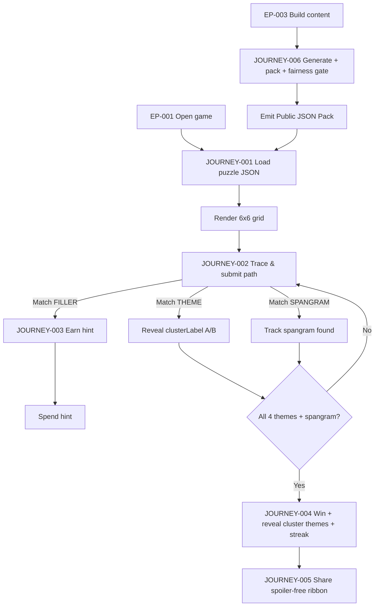
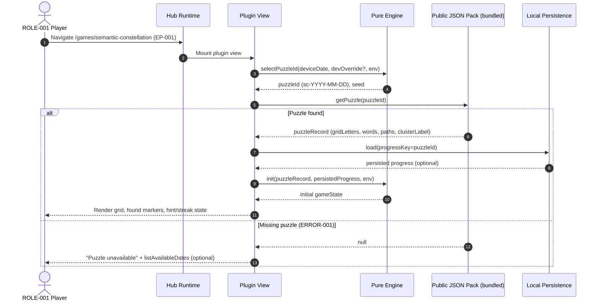
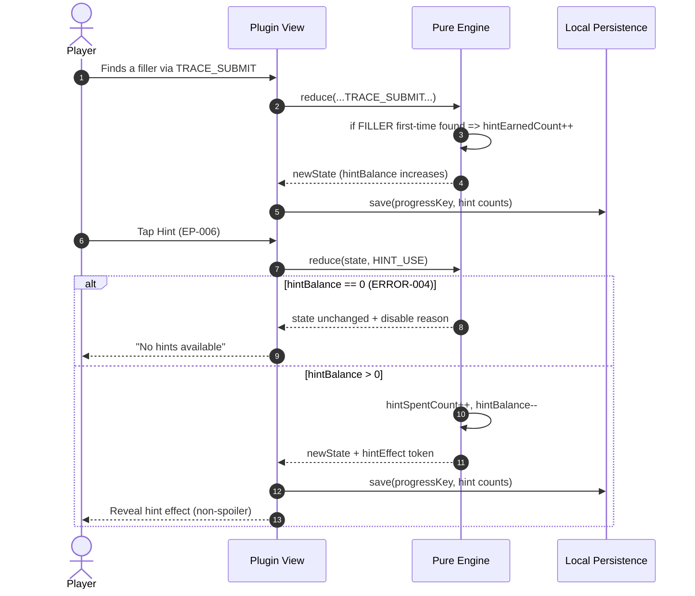
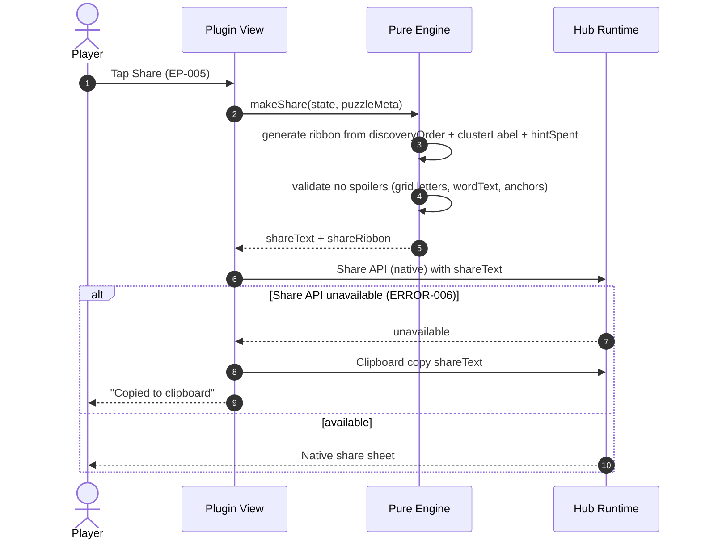
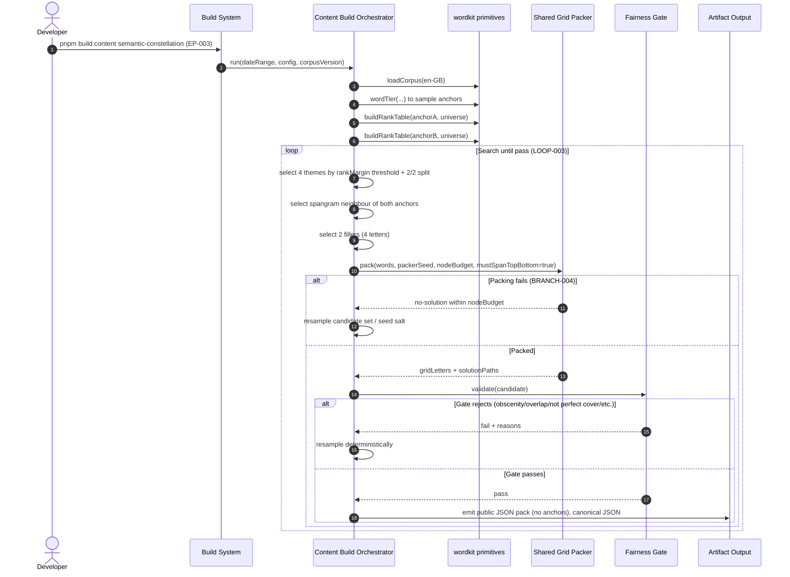
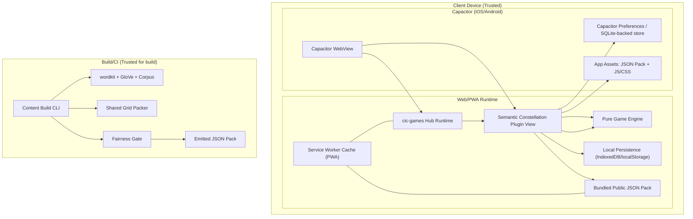

<!-- generated: 2026-07-25T09:39:22Z -->
<!-- mode: feature -->
<!-- feature-slug: semantic-constellation -->
<!-- a2a-endpoint: https://bob-sdlc-orchestrator.2as6l7wq9qj8.eu-gb.codeengine.appdomain.cloud/v1/rpc -->

# Glossary

## Terms

### TERM-001: Semantic Constellation
- **Definition:** The daily Strands-style word game mode in cic-games featuring a 6x6 letter grid that is a perfect cover of answer words and includes two hidden semantic clusters (A and B) plus a bridging spangram.
- **Synonyms:** Constellation game, SemanticConstellation mode
- **Anti-definition:** Not a freeform crossword; not a backend-served live puzzle; not a penalty-based guessing game.
- **Source:** User request

### TERM-002: Puzzle Day
- **Definition:** A single calendar-day instance of a Semantic Constellation puzzle deterministically selected by date and seed.
- **Synonyms:** Daily puzzle, day puzzle
- **Anti-definition:** Not a randomly generated per-session puzzle.
- **Source:** User request

### TERM-003: Anchor
- **Definition:** A hidden semantic “star” word used only during build-time generation to define one semantic cluster (A or B); not shown to players during play.
- **Synonyms:** Semantic anchor, star
- **Anti-definition:** Not a theme word; not displayed as a clue.
- **Source:** User request

### TERM-004: Anchor A
- **Definition:** The first hidden anchor (TERM-003) defining cluster A.
- **Synonyms:** Star A
- **Anti-definition:** Not revealed until completion; never included as a traced grid answer.
- **Source:** User request

### TERM-005: Anchor B
- **Definition:** The second hidden anchor (TERM-003) defining cluster B.
- **Synonyms:** Star B
- **Anti-definition:** Not revealed until completion; never included as a traced grid answer.
- **Source:** User request

### TERM-006: Cluster
- **Definition:** A grouping label (A or B) assigned to theme words based on signed GloVe rank margin relative to Anchor A vs Anchor B.
- **Synonyms:** Theme cluster, semantic cluster
- **Anti-definition:** Not a gameplay “team”; not a difficulty tier.
- **Source:** User request

### TERM-007: Cluster A
- **Definition:** The cluster for theme words decisively closer to Anchor A than Anchor B by rank margin.
- **Synonyms:** Group A
- **Anti-definition:** Not the anchor word itself.
- **Source:** User request

### TERM-008: Cluster B
- **Definition:** The cluster for theme words decisively closer to Anchor B than Anchor A by rank margin.
- **Synonyms:** Group B
- **Anti-definition:** Not the anchor word itself.
- **Source:** User request

### TERM-009: Theme Word
- **Definition:** One of four 5-letter answers; two belong to Cluster A and two belong to Cluster B; cluster membership is revealed when found.
- **Synonyms:** Theme answer
- **Anti-definition:** Not a filler; not the spangram.
- **Source:** User request

### TERM-010: Spangram
- **Definition:** The single 8-letter answer that relates to both anchors and must span the grid top-to-bottom (opposite sides) in the packed solution.
- **Synonyms:** Bridge word
- **Anti-definition:** Not optional; not a 5-letter theme word.
- **Source:** User request

### TERM-011: Filler Word
- **Definition:** One of two 4-letter answers used to complete the 36-cell perfect cover; finding fillers earns hints.
- **Synonyms:** Filler
- **Anti-definition:** Not required for win; not assigned to clusters.
- **Source:** User request

### TERM-012: Letter Grid
- **Definition:** The 6x6 grid of letters (36 cells) shown to the player for tracing paths.
- **Synonyms:** Grid, board
- **Anti-definition:** Not a word list UI; not variable-sized.
- **Source:** User request

### TERM-013: Tile (Cell)
- **Definition:** A single grid position containing one letter; may be used in exactly one answer word in the solution (perfect cover).
- **Synonyms:** Cell
- **Anti-definition:** Not reusable across multiple answers.
- **Source:** User request

### TERM-014: Path
- **Definition:** An ordered sequence of adjacent tiles used to spell an answer word.
- **Synonyms:** Trace, chain
- **Anti-definition:** Not necessarily linear; not allowed to skip tiles.
- **Source:** User request

### TERM-015: 8-Direction Adjacency
- **Definition:** The rule that consecutive tiles in a path must be adjacent orthogonally or diagonally.
- **Synonyms:** 8-neighbour, king-move adjacency
- **Anti-definition:** Not 4-direction only.
- **Source:** User request

### TERM-016: Snaking Path
- **Definition:** A path that may change direction at each step while respecting TERM-015.
- **Synonyms:** Non-linear path
- **Anti-definition:** Not restricted to straight lines.
- **Source:** User request

### TERM-017: Perfect Cover
- **Definition:** A packing property where every tile in the 6x6 grid belongs to exactly one answer word across spangram, theme words, and filler words.
- **Synonyms:** Exact cover
- **Anti-definition:** Not a grid with unused letters or overlapping answers.
- **Source:** User request

### TERM-018: Shared Grid Packer
- **Definition:** The existing build-time grid packing utility `kit/grid-pack.ts` that places words into a grid via node-budgeted seeded backtracking.
- **Synonyms:** Grid packer, packer
- **Anti-definition:** Not a runtime generator; not a UI component.
- **Source:** User request

### TERM-019: Node Budget
- **Definition:** A deterministic upper bound on backtracking search nodes used by the Shared Grid Packer.
- **Synonyms:** Search budget
- **Anti-definition:** Not a time limit expressed in milliseconds.
- **Source:** User request

### TERM-020: Seeded Backtracking
- **Definition:** Deterministic search using a seed to control choice ordering so the same inputs yield the same packed grid.
- **Synonyms:** Deterministic backtracking
- **Anti-definition:** Not nondeterministic/entropy-based search.
- **Source:** User request

### TERM-021: Fairness Gate
- **Definition:** Build-time validation that accepts only puzzles meeting constraints: perfect cover, valid paths, spangram spans top-to-bottom, decisive cluster margins, 2/2 split, low cluster overlap, and obscenity-free.
- **Synonyms:** Quality gate
- **Anti-definition:** Not a runtime anti-cheat.
- **Source:** User request

### TERM-022: Frequency-Tiered en-GB Corpus
- **Definition:** The English (UK) corpus with frequency tiers used as the word source for anchors and candidate words.
- **Synonyms:** en-GB corpus
- **Anti-definition:** Not en-US-only; not user-entered words.
- **Source:** User request

### TERM-023: wordTier
- **Definition:** The wordkit primitive that returns a frequency tier classification for a word from the corpus.
- **Synonyms:** Tier function
- **Anti-definition:** Not a semantic similarity function.
- **Source:** User request

### TERM-024: loadCorpus
- **Definition:** The wordkit primitive to load the bounded en-GB corpus universe for build-time selection.
- **Synonyms:** Corpus loader
- **Anti-definition:** Not a runtime network call.
- **Source:** User request

### TERM-025: buildRankTable
- **Definition:** The wordkit primitive that builds a rank table of neighbours for an anchor over a bounded universe in GloVe space.
- **Synonyms:** Rank-table builder
- **Anti-definition:** Not a cosine-threshold filter; not a nearest-neighbour query at runtime.
- **Source:** User request

### TERM-026: GloVe Rank Table
- **Definition:** A mapping from candidate word to neighbour rank (lower is closer) for a given anchor in 50d GloVe, built over a bounded universe.
- **Synonyms:** Rank table
- **Anti-definition:** Not a cosine-similarity score list exposed to users.
- **Source:** User request

### TERM-027: Rank Margin
- **Definition:** Signed difference between ranks of a candidate word in Anchor B’s table vs Anchor A’s table (e.g., rankB - rankA), used to assign clusters and “decisive closeness.”
- **Synonyms:** Signed rank delta
- **Anti-definition:** Not a cosine similarity margin.
- **Source:** User request

### TERM-028: Decisively Closer
- **Definition:** A candidate word is assigned to cluster A (or B) only if its rank margin magnitude meets a configured threshold, preventing coin-flip assignments.
- **Synonyms:** Clear margin
- **Anti-definition:** Not “slightly closer” or based on fine-grained cosine thresholds.
- **Source:** User request

### TERM-029: Bounded Universe
- **Definition:** The set of candidate words from the corpus considered when building rank tables and selecting theme/spangram/fillers.
- **Synonyms:** Candidate universe
- **Anti-definition:** Not an unbounded vocabulary; not user custom words.
- **Source:** User request

### TERM-030: Distinct Clusters (Low Overlap)
- **Definition:** A constraint that anchor neighbourhoods do not overlap beyond a configured limit so cluster A and B remain meaningfully distinct.
- **Synonyms:** Cluster separation
- **Anti-definition:** Not strict disjointness of all neighbours.
- **Source:** User request

### TERM-031: Obscenity Blocklist
- **Definition:** A build-time filter list that rejects anchors and all packed words if any match blocked terms.
- **Synonyms:** Profanity filter
- **Anti-definition:** Not a user reporting system.
- **Source:** User request

### TERM-032: Daily Deterministic Selection
- **Definition:** Selecting the puzzle content deterministically from date-derived seed (FNV-1a), producing the same puzzle for all users on the same day.
- **Synonyms:** Daily seed
- **Anti-definition:** Not per-user personalization.
- **Source:** User request

### TERM-033: FNV-1a
- **Definition:** The hash algorithm used to convert the puzzle date (and optional dev override) into a deterministic seed.
- **Synonyms:** FNV1a
- **Anti-definition:** Not cryptographic randomness.
- **Source:** User request

### TERM-034: Build-Time Content Build
- **Definition:** The pipeline step that generates and validates puzzles, emitting public JSON artifacts included in the app bundle.
- **Synonyms:** Content build
- **Anti-definition:** Not server-side generation.
- **Source:** User request

### TERM-035: Public JSON Pack
- **Definition:** The shipped JSON file(s) containing daily puzzles and metadata required by the runtime engine to run offline.
- **Synonyms:** Puzzle pack
- **Anti-definition:** Not private per-user data.
- **Source:** User request

### TERM-036: Game Engine (Pure)
- **Definition:** Deterministic, side-effect-minimized runtime logic that consumes a puzzle from the JSON pack and user input to produce game state transitions.
- **Synonyms:** Engine
- **Anti-definition:** Not UI rendering; not network I/O.
- **Source:** User request

### TERM-037: Plugin View
- **Definition:** The UI implementation conforming to cic-games hub plugin conventions, rendering the grid and interactions using Carbon g100 tokens.
- **Synonyms:** Game view
- **Anti-definition:** Not the engine.
- **Source:** User request

### TERM-038: Hub Registry
- **Definition:** The configuration/index in cic-games that registers available games so Semantic Constellation appears alongside existing games.
- **Synonyms:** Game list
- **Anti-definition:** Not the content JSON pack.
- **Source:** User request

### TERM-039: Trace Gesture
- **Definition:** User interaction forming a path by dragging or keyboard navigation across tiles.
- **Synonyms:** Swipe trace, selection trace
- **Anti-definition:** Not typing letters into an input box.
- **Source:** User request

### TERM-040: Found Word
- **Definition:** An answer word that the engine has validated as matched by a submitted path in the current puzzle.
- **Synonyms:** Discovered word
- **Anti-definition:** Not a partial selection.
- **Source:** User request

### TERM-041: Hint
- **Definition:** A consumable aid earned by finding filler words that reveals additional information (configured by the game) without revealing anchors or letters in sharing.
- **Synonyms:** Hint token
- **Anti-definition:** Not a penalty reduction; not a reveal of anchors.
- **Source:** User request

### TERM-042: Spoiler-Free Share
- **Definition:** A share payload that includes only discovery-order emojis and A/B markers for theme words, plus spangram and hints, but never letters, word text, or anchors.
- **Synonyms:** Share ribbon
- **Anti-definition:** Not a copy of the grid; not the solution words.
- **Source:** User request

### TERM-043: Discovery Order
- **Definition:** The sequence index in which the player finds the spangram/theme/filler words.
- **Synonyms:** Find order
- **Anti-definition:** Not the solution order used in packing.
- **Source:** User request

### TERM-044: Streak
- **Definition:** A per-device count of consecutive days where the win condition was met.
- **Synonyms:** Daily streak
- **Anti-definition:** Not a leaderboard; not synced across devices (no backend).
- **Source:** User request

### TERM-045: Win Condition
- **Definition:** The condition that the spangram and all four theme words are found; fillers are optional.
- **Synonyms:** Completion
- **Anti-definition:** Not “all words found” including fillers.
- **Source:** User request

### TERM-046: No Lose State
- **Definition:** Gameplay property where the puzzle cannot be failed; the user can continue attempting indefinitely.
- **Synonyms:** Relaxed mode
- **Anti-definition:** Not timed; not limited attempts.
- **Source:** User request

### TERM-047: Dev-Mode Override
- **Definition:** A developer-only mechanism to select a specific puzzle date/seed for testing.
- **Synonyms:** Debug day select
- **Anti-definition:** Not available in production to end users.
- **Source:** User request

### TERM-048: Capacitor Offline App
- **Definition:** iOS/Android distribution where the web app runs in Capacitor and must function offline using shipped JSON packs.
- **Synonyms:** Mobile wrapper
- **Anti-definition:** Not requiring network connectivity.
- **Source:** User request

### TERM-049: PWA Offline
- **Definition:** Progressive Web App mode using cached assets and puzzle packs to play offline.
- **Synonyms:** Offline web app
- **Anti-definition:** Not a server-rendered web page requiring connection.
- **Source:** User request

### TERM-050: IBM Carbon g100 Tokens
- **Definition:** The design token set used for styling the plugin view to match hub UI.
- **Synonyms:** Carbon theme tokens
- **Anti-definition:** Not custom ad-hoc colors.
- **Source:** User request

### TERM-051: Accessibility (Keyboard + Screen Reader)
- **Definition:** The requirement that all core gameplay is operable via keyboard and is correctly announced via screen reader semantics.
- **Synonyms:** a11y
- **Anti-definition:** Not mouse-only interaction.
- **Source:** User request

### TERM-052: buildEditDistanceGraph
- **Definition:** The wordkit primitive used to build adjacency/relatedness structures (where applicable) for word selection tooling.
- **Synonyms:** Edit-distance graph builder
- **Anti-definition:** Not required for runtime hinting unless explicitly used.
- **Source:** User request

## Data Dictionary

| ID | Name | Type | Format | Range | Units | Default | Nullable | PII | Source | Validation |
|---|---|---|---|---|---|---|---|---|---|---|
| FIELD-001 | puzzleId | string | `sc-YYYY-MM-DD` | n/a | n/a | n/a | No | None | TERM-035 | Must match regex `^sc-\d{4}-\d{2}-\d{2}$` |
| FIELD-002 | puzzleDate | string | `YYYY-MM-DD` | Gregorian | day | n/a | No | None | TERM-002 | Must be valid ISO date |
| FIELD-003 | seed | uint32 | FNV-1a output | 0..2^32-1 | n/a | n/a | No | None | TERM-033 | Must equal FNV-1a(date or override) |
| FIELD-004 | gridSize | object | `{rows:int, cols:int}` | rows=6, cols=6 | cells | `{6,6}` | No | None | TERM-012 | rows==6 and cols==6 |
| FIELD-005 | gridLetters | string[] | length 36, row-major | A-Z | n/a | n/a | No | None | TERM-012 | Must be length 36; each entry single A-Z letter |
| FIELD-006 | cellIndex | int | 0-based | 0..35 | cell | n/a | No | None | TERM-013 | Must be within bounds |
| FIELD-007 | wordId | string | `w-<slug>-<n>` | n/a | n/a | n/a | No | None | TERM-035 | Unique within puzzle |
| FIELD-008 | wordText | string | uppercase | A-Z | n/a | n/a | No | None | TERM-009/010/011 | Must be length per wordType; must pass TERM-031 |
| FIELD-009 | wordType | enum | n/a | `SPANGRAM`,`THEME`,`FILLER` | n/a | n/a | No | None | TERM-009/010/011 | Must be one of enum |
| FIELD-010 | wordLength | int | n/a | 4,5,8 | letters | n/a | No | None | derived | Must equal `len(wordText)` |
| FIELD-011 | solutionPath | int[] | list of cellIndex | 0..35 | cell | n/a | No | None | TERM-014 | Length equals wordLength; no duplicates within path; each step 8-adjacent |
| FIELD-012 | spansTopToBottom | boolean | n/a | true/false | n/a | false | No | None | TERM-010 | For spangram must be true |
| FIELD-013 | clusterLabel | enum | n/a | `A`,`B`, `NONE` | n/a | `NONE` | No | None | TERM-006 | THEME must be A or B; others NONE |
| FIELD-014 | anchorA | string | lowercase token | corpus word | n/a | n/a | No | None | TERM-004 | Build-time only; not shipped in public JSON |
| FIELD-015 | anchorB | string | lowercase token | corpus word | n/a | n/a | No | None | TERM-005 | Build-time only; not shipped in public JSON |
| FIELD-016 | rankTableARef | string | artifact key | n/a | n/a | n/a | Yes | None | TERM-025/026 | Must resolve during build; not required at runtime |
| FIELD-017 | rankTableBRef | string | artifact key | n/a | n/a | n/a | Yes | None | TERM-025/026 | Must resolve during build; not required at runtime |
| FIELD-018 | rankA | int | n/a | 1..N or sentinel | rank | n/a | Yes | None | TERM-026 | If present must be >=1 |
| FIELD-019 | rankB | int | n/a | 1..N or sentinel | rank | n/a | Yes | None | TERM-026 | If present must be >=1 |
| FIELD-020 | rankMargin | int | `rankB-rankA` | int | ranks | n/a | Yes | None | TERM-027 | Must equal rankB-rankA when both ranks exist |
| FIELD-021 | decisiveMarginThreshold | int | n/a | >=1 | ranks | config | No | None | TERM-028 | Must be >=1 |
| FIELD-022 | overlapLimit | int | n/a | >=0 | words | config | No | None | TERM-030 | Must be >=0 |
| FIELD-023 | nodeBudget | int | n/a | >=1 | nodes | config | No | None | TERM-019 | Must be >=1 |
| FIELD-024 | packerSeed | uint32 | n/a | 0..2^32-1 | n/a | n/a | No | None | TERM-020 | Deterministic from FIELD-003 + salt |
| FIELD-025 | obscenityStatus | enum | n/a | `PASS`,`BLOCKED` | n/a | `PASS` | No | None | TERM-031 | Must be PASS for shipped puzzles |
| FIELD-026 | foundWordIds | string[] | list | subset of wordId | n/a | [] | No | None | TERM-036 | Must be unique; must exist in puzzle word list |
| FIELD-027 | discoveryOrder | string[] | list | wordId | n/a | [] | No | None | TERM-043 | Each item must be in foundWordIds; no duplicates |
| FIELD-028 | hintBalance | int | n/a | >=0 | hints | 0 | No | None | TERM-041 | Must be >=0 |
| FIELD-029 | hintEarnedCount | int | n/a | >=0 | hints | 0 | No | None | TERM-041 | Must be >=0 |
| FIELD-030 | hintSpentCount | int | n/a | >=0 | hints | 0 | No | None | TERM-041 | Must be <= hintEarnedCount |
| FIELD-031 | winStatus | boolean | n/a | true/false | n/a | false | No | None | TERM-045 | true iff spangram+4 themes found |
| FIELD-032 | streakCount | int | n/a | >=0 | days | 0 | No | None | TERM-044 | Must be >=0 |
| FIELD-033 | lastWinDate | string | `YYYY-MM-DD` | Gregorian | day | n/a | Yes | None | TERM-044 | If present must be valid ISO date |
| FIELD-034 | shareText | string | text payload | n/a | n/a | n/a | No | None | TERM-042 | Must not contain FIELD-005 letters, FIELD-008 wordText, FIELD-014/015 anchors |
| FIELD-035 | shareRibbon | string | emoji sequence | n/a | n/a | n/a | No | None | TERM-042 | Must encode discovery order and A/B markers; must not encode letters |
| FIELD-036 | devOverrideDate | string | `YYYY-MM-DD` | Gregorian | day | null | Yes | None | TERM-047 | Only honored in dev builds |
| FIELD-037 | locale | string | BCP-47 | e.g. `en-GB` | n/a | `en-GB` | No | None | hub | Must be supported locale |
| FIELD-038 | platform | enum | n/a | `WEB`,`PWA`,`IOS`,`ANDROID` | n/a | `WEB` | No | None | TERM-048/049 | Must be one of enum |

# User Journeys

## Roles

| Role ID | Role | Type | Description |
|---|---|---|---|
| ROLE-001 | Player | Primary | Plays the daily Semantic Constellation puzzle (TERM-001) offline. |
| ROLE-002 | Developer | Admin | Builds content packs (TERM-035), configures thresholds, tests via dev override (TERM-047). |
| ROLE-003 | Build System | System | Executes build-time content generation and fairness gate (TERM-034/021). |
| ROLE-004 | Hub Runtime | System | Loads plugin, routes UI, persists local state, provides share surface. |
| ROLE-005 | Accessibility User | Secondary | Player using keyboard and screen reader (TERM-051). |

## Entry Points

| EP ID | Location | Trigger | Auth |
|---|---|---|---|
| EP-001 | Hub route `/games/semantic-constellation` | Player opens game from hub registry (TERM-038) | None |
| EP-002 | Daily auto-load on game open | Date changes / app launch | None |
| EP-003 | Build CLI `pnpm build:content semantic-constellation` | Developer runs build | Repo access |
| EP-004 | Dev setting panel (dev builds) | Developer sets FIELD-036 | Dev-only |
| EP-005 | Share action button | Player taps “Share” | None |
| EP-006 | Hint action button | Player uses a hint | None |

## Role Permission Matrix

| Capability | ROLE-001 Player | ROLE-005 A11y User | ROLE-002 Developer | ROLE-003 Build System | ROLE-004 Hub Runtime |
|---|---|---|---|---|---|
| Load today’s puzzle from TERM-035 | Yes | Yes | Yes | n/a | Yes |
| Trace selection (TERM-039) | Yes | Yes | n/a | n/a | n/a |
| Validate found word (TERM-040) | Yes (via engine) | Yes (via engine) | n/a | n/a | Yes (hosts engine) |
| Use hints (TERM-041) | Yes | Yes | n/a | n/a | n/a |
| Generate share (TERM-042) | Yes | Yes | n/a | n/a | Yes |
| Set dev override date (TERM-047) | No | No | Yes | n/a | Yes (dev builds) |
| Build content (TERM-034) | No | No | Yes | Yes | n/a |

## Journeys

### JOURNEY-001: Open today’s puzzle and start playing
- **Role/Goal:** ROLE-001 Player — load TERM-002 and begin tracing on TERM-012.
- **Entry Point:** EP-001 + EP-002
- **Happy path:**
  1. Hub runtime navigates to plugin route and loads Semantic Constellation plugin (TERM-037) from TERM-038.
  2. Engine computes FIELD-002 puzzleDate from device local date and derives FIELD-003 seed using TERM-033.
  3. Engine selects puzzle record from TERM-035 matching FIELD-001 puzzleId.
  4. View renders TERM-012 using FIELD-004 gridSize and FIELD-005 gridLetters.
  5. Player begins a TERM-039 trace over tiles (TERM-013) creating a candidate FIELD-011 solutionPath.
- **BRANCH-001 (Dev override active):**
  - Trigger: FIELD-036 devOverrideDate is set (TERM-047).
  - Path: Step 2 uses FIELD-036 instead of device date to compute FIELD-002 and FIELD-003.
- **ERROR-001 (Missing puzzle in JSON pack):**
  - Trigger: No record found in TERM-035 for FIELD-001.
  - System response: Show non-blocking message “Puzzle unavailable for this date” and offer nearest available date list (no network).
  - Recovery: Player selects available date (if implemented) or clears override (BRANCH-001).
- **EDGE-001 (Timezone boundary):**
  - Condition: Device date changes while game is open.
  - Expected: Next open or explicit “Today” action reloads puzzle; current in-progress state remains tied to FIELD-001 until user switches.
- **EDGE-002 (Offline):**
  - Condition: No network.
  - Expected: All steps succeed using shipped TERM-035 and local storage.

### JOURNEY-002: Trace and submit a word; reveal cluster for theme words
- **Role/Goal:** ROLE-001 Player — find TERM-009 and learn TERM-006 membership without seeing anchors.
- **Entry Point:** EP-001 (in-play interaction)
- **Happy path:**
  1. Player traces tiles producing a candidate path (TERM-014) with indices FIELD-011.
  2. Engine reads letters from FIELD-005 at each FIELD-006 cellIndex in FIELD-011 and constructs candidate string.
  3. Engine compares candidate string to each answer FIELD-008 wordText in puzzle word list (TERM-035).
  4. When matched and not already in FIELD-026 foundWordIds, engine marks word as found and appends its FIELD-007 wordId to FIELD-026 and FIELD-027 discoveryOrder.
  5. If matched wordType is THEME (FIELD-009), view reveals clusterLabel (FIELD-013) as A or B (TERM-007/008) for that theme word, without revealing TERM-004/005 anchors.
- **BRANCH-002 (Word already found):**
  - Trigger: wordId already in FIELD-026.
  - Path: Engine ignores duplicate and keeps state unchanged.
- **ERROR-002 (Invalid path adjacency):**
  - Trigger: FIELD-011 contains a step not satisfying TERM-015.
  - System response: Reject submission; provide accessible message “Tiles must touch” and keep selection for correction.
  - Recovery: Player adjusts trace (LOOP-001).
- **ERROR-003 (No match):**
  - Trigger: Candidate string not equal to any FIELD-008.
  - System response: Clear selection and provide subtle feedback (no penalty) per TERM-046.
  - Recovery: Continue tracing (LOOP-001).
- **LOOP-001 (Continue searching):**
  - Player repeats steps 1–4 until additional words are found.
- **EDGE-003 (Path revisits a tile):**
  - Condition: FIELD-011 includes duplicate FIELD-006.
  - Expected: Reject as invalid for TERM-014 in this game (since solution paths are simple).
- **EDGE-004 (Concurrency):**
  - Condition: Rapid pointer events produce overlapping traces.
  - Expected: Engine processes one active trace; cancels prior trace deterministically.

### JOURNEY-003: Find filler word(s) to earn hints; spend hints
- **Role/Goal:** ROLE-001 Player — earn TERM-041 via TERM-011 and spend them.
- **Entry Point:** EP-006
- **Happy path:**
  1. Player finds a filler (FIELD-009=`FILLER`) via JOURNEY-002 steps 1–4.
  2. Engine increments FIELD-029 hintEarnedCount and updates FIELD-028 hintBalance (earned - spent).
  3. Player presses “Hint” (EP-006).
  4. Engine decrements FIELD-028 hintBalance and increments FIELD-030 hintSpentCount.
  5. View reveals the hint effect (implementation-specific) without revealing FIELD-014/015 anchors or any un-found FIELD-008 wordText.
- **ERROR-004 (No hints available):**
  - Trigger: FIELD-028 hintBalance == 0.
  - System response: Disable hint button and announce “No hints available.”
  - Recovery: Find a filler (LOOP-002).
- **LOOP-002 (Earn more hints):**
  - Player continues searching for filler words using JOURNEY-002.
- **EDGE-005 (Repeat filler found):**
  - Condition: Same filler found again.
  - Expected: No additional hints granted (ties to BRANCH-002).

### JOURNEY-004: Complete the puzzle; reveal both cluster themes; update streak
- **Role/Goal:** ROLE-001 Player — achieve TERM-045 with TERM-046 no lose state, then see completion reveal.
- **Entry Point:** EP-001 (in-play)
- **Happy path:**
  1. Player finds spangram (FIELD-009=`SPANGRAM`) and all four theme words (FIELD-009=`THEME`) via JOURNEY-002.
  2. Engine sets FIELD-031 winStatus = true when requirements met (TERM-045).
  3. View presents completion state, revealing “cluster themes” for A and B (TERM-006) without showing anchors (TERM-004/005).
  4. Engine updates FIELD-032 streakCount and FIELD-033 lastWinDate for FIELD-002.
- **BRANCH-003 (Already won today):**
  - Trigger: FIELD-033 equals FIELD-002.
  - Path: Do not increment FIELD-032; keep winStatus true.
- **ERROR-005 (Local storage unavailable):**
  - Trigger: Persistence fails (quota/denied).
  - System response: Game remains playable; streak not updated; show message “Progress not saved on this device.”
  - Recovery: Player can still share (JOURNEY-005).

### JOURNEY-005: Spoiler-free share after play
- **Role/Goal:** ROLE-001 Player — share progress/completion without spoilers.
- **Entry Point:** EP-005
- **Happy path:**
  1. Player taps Share.
  2. Engine composes FIELD-035 shareRibbon using FIELD-027 discoveryOrder, encoding theme finds with clusterLabel markers (FIELD-013), spangram, and hint usage counts (FIELD-030), but not letters (FIELD-005) or words (FIELD-008).
  3. Engine composes FIELD-034 shareText including FIELD-001 puzzleId and ribbon.
  4. Hub runtime opens native share sheet (platform FIELD-038).
- **ERROR-006 (Share API unavailable):**
  - Trigger: Platform lacks share API.
  - System response: Copy FIELD-034 to clipboard.
  - Recovery: Player pastes into destination app.
- **EDGE-006 (Spoiler leakage check):**
  - Condition: shareText contains substrings matching any FIELD-008 or FIELD-014/015.
  - Expected: Engine blocks share and regenerates with redaction.

### JOURNEY-006: Build-time puzzle generation and packing with fairness gate
- **Role/Goal:** ROLE-002 Developer / ROLE-003 Build System — produce TERM-035 with TERM-021 constraints.
- **Entry Point:** EP-003
- **Happy path:**
  1. Build loads TERM-022 corpus via TERM-024 and selects candidate anchors using TERM-023 (frequency-tiered).
  2. For candidate anchors, build creates TERM-026 rank tables using TERM-025 over TERM-029 bounded universe.
  3. Build selects two 5-letter theme words for cluster A and two for cluster B using TERM-027 rankMargin and TERM-028 threshold (FIELD-021).
  4. Build selects an 8-letter TERM-010 that is a neighbour of both anchors (using rank presence thresholds in both tables).
  5. Build selects two 4-letter TERM-011 fillers.
  6. Build invokes TERM-018 Shared Grid Packer with FIELD-023 nodeBudget and FIELD-024 packerSeed to pack a 6x6 perfect cover (TERM-017) with spangram spanning top-to-bottom (FIELD-012 true).
  7. Build runs TERM-021 Fairness Gate including TERM-031 obscenity filtering, cluster split 2/2, and TERM-030 low overlap.
  8. Build emits TERM-035 Public JSON Pack with FIELD-005 letters and each word’s FIELD-011 solutionPath, but without FIELD-014/015 anchors.
- **BRANCH-004 (Packing fails under node budget):**
  - Trigger: Packer does not find perfect cover within FIELD-023.
  - Path: Build retries with a new candidate set or new packerSeed salt while maintaining daily determinism for the final selected puzzle.
- **ERROR-007 (Obscenity detected):**
  - Trigger: Any candidate word hits TERM-031.
  - System response: Reject candidate set; continue search.
  - Recovery: Continue selection loop (LOOP-003).
- **LOOP-003 (Search for acceptable puzzle):**
  - Repeats steps 1–7 until a puzzle passes fairness.
- **EDGE-007 (Anchor overlap too high):**
  - Condition: Neighbourhood overlap exceeds FIELD-022 overlapLimit.
  - Expected: Reject anchor pair and resample.
- **EDGE-008 (Determinism):**
  - Condition: Build executed on different machines.
  - Expected: Same input corpus version + config + date range produces identical TERM-035 bytes.

## Journey Map



# Requirements

### REQ-001: Register the game in the hub
- **EARS Pattern:** Ubiquitous
- **EARS Statement:** The hub registry (TERM-038) shall include a registration entry for Semantic Constellation (TERM-001).
- **Inputs:** n/a
- **Outputs:** Game appears in hub game list
- **Preconditions:** Build includes plugin bundle
- **Postconditions:** EP-001 is reachable
- **Invariants:** n/a
- **Trigger:** App start / hub render
- **Actor:** ROLE-004 Hub Runtime
- **EntityScope:** TERM-038
- **ErrorModes:** None
- **NFR-Tags:** compatibility
- **Source:** JOURNEY-001 step 1
- **Dependencies:** None
- **Priority:** P0
- **AcceptanceCriteria:**
  - **TEST-001:** Given the hub is loaded, when the game list is rendered, then “Semantic Constellation” is present and navigates to EP-001.
- **Assumptions:** Hub supports plugin entries for games.
- **OpenQuestions:** None

### REQ-002: Load puzzle by date-derived ID
- **EARS Pattern:** Event-Driven
- **EARS Statement:** When the Semantic Constellation view is opened (EP-001), the engine (TERM-036) shall compute FIELD-001 puzzleId from FIELD-002 puzzleDate.
- **Inputs:** FIELD-002
- **Outputs:** FIELD-001
- **Preconditions:** Device has a local date
- **Postconditions:** Puzzle lookup key is available
- **Invariants:** FIELD-001 format remains stable
- **Trigger:** EP-001
- **Actor:** ROLE-004 Hub Runtime
- **EntityScope:** TERM-002
- **ErrorModes:** None
- **NFR-Tags:** compatibility
- **Source:** JOURNEY-001 steps 2–3
- **Dependencies:** REQ-001
- **Priority:** P0
- **AcceptanceCriteria:**
  - **TEST-002:** Given FIELD-002=`2026-07-25`, when the view opens, then FIELD-001 equals `sc-2026-07-25`.
- **Assumptions:** Puzzle naming convention is accepted.
- **OpenQuestions:** None

### REQ-003: Derive daily deterministic seed
- **EARS Pattern:** Event-Driven
- **EARS Statement:** When FIELD-002 puzzleDate is determined, the engine (TERM-036) shall compute FIELD-003 seed using FNV-1a (TERM-033) over FIELD-002.
- **Inputs:** FIELD-002
- **Outputs:** FIELD-003
- **Preconditions:** FIELD-002 valid
- **Postconditions:** Seed available for deterministic behaviors
- **Invariants:** Same FIELD-002 yields same FIELD-003
- **Trigger:** FIELD-002 set
- **Actor:** ROLE-004 Hub Runtime
- **EntityScope:** TERM-033
- **ErrorModes:** None
- **NFR-Tags:** reliability
- **Source:** JOURNEY-001 step 2
- **Dependencies:** REQ-002
- **Priority:** P0
- **AcceptanceCriteria:**
  - **TEST-003:** Given a fixed FIELD-002, when seed is computed twice, then FIELD-003 values are identical.
- **Assumptions:** FNV-1a implementation is stable across platforms.
- **OpenQuestions:** Define exact input string (include prefix/salt?).

### REQ-004: Support dev override date in dev builds
- **EARS Pattern:** State-Driven
- **EARS Statement:** While a dev override date (FIELD-036) is set in a dev build (TERM-047), the engine (TERM-036) shall use FIELD-036 as FIELD-002 puzzleDate.
- **Inputs:** FIELD-036
- **Outputs:** FIELD-002
- **Preconditions:** Dev build flag enabled
- **Postconditions:** Selected puzzle follows override
- **Invariants:** Production builds ignore FIELD-036
- **Trigger:** FIELD-036 set
- **Actor:** ROLE-002 Developer
- **EntityScope:** TERM-047
- **ErrorModes:** None
- **NFR-Tags:** compatibility
- **Source:** JOURNEY-001 BRANCH-001
- **Dependencies:** REQ-003
- **Priority:** P1
- **AcceptanceCriteria:**
  - **TEST-004:** Given a dev build and FIELD-036=`2026-01-01`, when the game opens, then FIELD-002=`2026-01-01`.
  - **TEST-005:** Given a production build and FIELD-036 set, when the game opens, then FIELD-036 is not used to compute FIELD-002.
- **Assumptions:** Build system can flag dev builds.
- **OpenQuestions:** Where is FIELD-036 stored (query param, local storage, settings UI)?

### REQ-005: Load puzzle from public JSON pack offline
- **EARS Pattern:** Event-Driven
- **EARS Statement:** When FIELD-001 puzzleId is computed, the engine (TERM-036) shall load the matching puzzle record from the public JSON pack (TERM-035) without network access.
- **Inputs:** FIELD-001, TERM-035
- **Outputs:** FIELD-005, word list (FIELD-007..FIELD-013)
- **Preconditions:** TERM-035 bundled with app
- **Postconditions:** Puzzle is ready to render
- **Invariants:** No network requests are required
- **Trigger:** FIELD-001 available
- **Actor:** ROLE-004 Hub Runtime
- **EntityScope:** TERM-035
- **ErrorModes:** ERROR-001
- **NFR-Tags:** reliability, compatibility
- **Source:** JOURNEY-001 step 3, ERROR-001
- **Dependencies:** REQ-002
- **Priority:** P0
- **AcceptanceCriteria:**
  - **TEST-006:** Given airplane mode is enabled, when the game opens, then the grid renders for a date present in TERM-035.
  - **TEST-007:** Given a date absent from TERM-035, when the game opens, then ERROR-001 message is shown.
- **Assumptions:** TERM-035 includes an entry per supported day.
- **OpenQuestions:** Do we support browsing older days when missing?

### REQ-006: Render a 6x6 grid from puzzle letters
- **EARS Pattern:** Ubiquitous
- **EARS Statement:** The plugin view (TERM-037) shall render the letter grid (TERM-012) using FIELD-004 gridSize and FIELD-005 gridLetters.
- **Inputs:** FIELD-004, FIELD-005
- **Outputs:** Visual grid
- **Preconditions:** Puzzle loaded
- **Postconditions:** Grid visible and interactive
- **Invariants:** Grid is 6x6
- **Trigger:** Puzzle load complete
- **Actor:** ROLE-004 Hub Runtime
- **EntityScope:** TERM-012
- **ErrorModes:** None
- **NFR-Tags:** accessibility
- **Source:** JOURNEY-001 step 4
- **Dependencies:** REQ-005
- **Priority:** P0
- **AcceptanceCriteria:**
  - **TEST-008:** Given FIELD-005 length is 36, when rendered, then exactly 36 tiles are displayed in a 6x6 layout.
- **Assumptions:** Letters are uppercase A-Z.
- **OpenQuestions:** Do we support localized alphabets? (likely no)

### REQ-007: Validate path adjacency using 8-direction rule
- **EARS Pattern:** Event-Driven
- **EARS Statement:** When a player submits a trace (TERM-039), the engine (TERM-036) shall reject FIELD-011 solutionPath if any consecutive indices are not 8-direction adjacent (TERM-015).
- **Inputs:** FIELD-011
- **Outputs:** Validation result (accept/reject)
- **Preconditions:** Active puzzle loaded
- **Postconditions:** Invalid trace is not matched to a word
- **Invariants:** Adjacency rule is consistent
- **Trigger:** Trace submit
- **Actor:** ROLE-001 Player
- **EntityScope:** TERM-015
- **ErrorModes:** ERROR-002
- **NFR-Tags:** accessibility
- **Source:** JOURNEY-002 ERROR-002
- **Dependencies:** REQ-006
- **Priority:** P0
- **AcceptanceCriteria:**
  - **TEST-009:** Given a submitted FIELD-011 with a non-adjacent step, when validated, then it is rejected and ERROR-002 is surfaced.
- **Assumptions:** Coordinate mapping from cellIndex to row/col is row-major.
- **OpenQuestions:** Should we also validate min length before adjacency? (likely yes, separate REQ)

### REQ-008: Reject traces that reuse a tile
- **EARS Pattern:** Event-Driven
- **EARS Statement:** When a player submits a trace (TERM-039), the engine (TERM-036) shall reject FIELD-011 solutionPath if any FIELD-006 cellIndex appears more than once.
- **Inputs:** FIELD-011
- **Outputs:** Validation result
- **Preconditions:** Puzzle loaded
- **Postconditions:** Trace is not matched
- **Invariants:** No repeated tiles per word
- **Trigger:** Trace submit
- **Actor:** ROLE-001 Player
- **EntityScope:** TERM-014
- **ErrorModes:** ERROR-002
- **NFR-Tags:** None
- **Source:** JOURNEY-002 EDGE-003
- **Dependencies:** REQ-006
- **Priority:** P0
- **AcceptanceCriteria:**
  - **TEST-010:** Given FIELD-011 includes a duplicate cellIndex, when validated, then it is rejected.
- **Assumptions:** Game disallows repeated tiles even if letters would match.
- **OpenQuestions:** None

### REQ-009: Construct candidate string from traced tiles
- **EARS Pattern:** Event-Driven
- **EARS Statement:** When a trace (FIELD-011) is valid, the engine (TERM-036) shall construct a candidate string by concatenating FIELD-005 gridLetters for each FIELD-006 in FIELD-011.
- **Inputs:** FIELD-011, FIELD-005
- **Outputs:** Candidate string (internal)
- **Preconditions:** REQ-007 and REQ-008 passed
- **Postconditions:** Candidate is available for matching
- **Invariants:** Deterministic concatenation order
- **Trigger:** Valid trace submit
- **Actor:** ROLE-001 Player
- **EntityScope:** TERM-012
- **ErrorModes:** None
- **NFR-Tags:** None
- **Source:** JOURNEY-002 step 2
- **Dependencies:** REQ-007, REQ-008
- **Priority:** P0
- **AcceptanceCriteria:**
  - **TEST-011:** Given FIELD-011 `[0,1,2]` and letters at those indices `A,B,C`, when constructed, then candidate string is `ABC`.
- **Assumptions:** FIELD-005 is row-major aligned to FIELD-006.
- **OpenQuestions:** None

### REQ-010: Match candidate string to an answer word
- **EARS Pattern:** Event-Driven
- **EARS Statement:** When a candidate string is constructed, the engine (TERM-036) shall mark a word as found only if the candidate string equals a puzzle answer FIELD-008 wordText.
- **Inputs:** Candidate string, puzzle word list (FIELD-007..FIELD-013)
- **Outputs:** Found-word event (internal) and state updates
- **Preconditions:** Puzzle loaded
- **Postconditions:** Either a word is found or no match occurs
- **Invariants:** Exact-match only
- **Trigger:** Candidate string available
- **Actor:** ROLE-001 Player
- **EntityScope:** TERM-040
- **ErrorModes:** ERROR-003
- **NFR-Tags:** None
- **Source:** JOURNEY-002 steps 3–4, ERROR-003
- **Dependencies:** REQ-009
- **Priority:** P0
- **AcceptanceCriteria:**
  - **TEST-012:** Given candidate string equals an unfound FIELD-008, when matched, then its FIELD-007 is appended to FIELD-026.
  - **TEST-013:** Given candidate string equals no FIELD-008, when matched, then ERROR-003 feedback is shown and FIELD-026 remains unchanged.
- **Assumptions:** Answers are stored uppercase.
- **OpenQuestions:** Do we accept reverse paths? (not stated)

### REQ-011: Prevent duplicate credit for already found words
- **EARS Pattern:** Event-Driven
- **EARS Statement:** When a matched wordId (FIELD-007) is already present in FIELD-026 foundWordIds, the engine (TERM-036) shall not modify FIELD-026.
- **Inputs:** FIELD-007, FIELD-026
- **Outputs:** Unchanged state
- **Preconditions:** At least one found word
- **Postconditions:** No duplicate entries
- **Invariants:** FIELD-026 contains unique wordIds
- **Trigger:** Match occurs
- **Actor:** ROLE-001 Player
- **EntityScope:** TERM-040
- **ErrorModes:** None
- **NFR-Tags:** None
- **Source:** JOURNEY-002 BRANCH-002
- **Dependencies:** REQ-010
- **Priority:** P0
- **AcceptanceCriteria:**
  - **TEST-014:** Given wordId is already in FIELD-026, when matched again, then FIELD-026 length does not change.
- **Assumptions:** Uniqueness is enforced by engine.
- **OpenQuestions:** None

### REQ-012: Record discovery order for found words
- **EARS Pattern:** Event-Driven
- **EARS Statement:** When a word is first marked found, the engine (TERM-036) shall append its FIELD-007 wordId to FIELD-027 discoveryOrder.
- **Inputs:** FIELD-007
- **Outputs:** FIELD-027
- **Preconditions:** Word not previously found
- **Postconditions:** Discovery order updated
- **Invariants:** FIELD-027 has no duplicates
- **Trigger:** First-time found
- **Actor:** ROLE-001 Player
- **EntityScope:** TERM-043
- **ErrorModes:** None
- **NFR-Tags:** None
- **Source:** JOURNEY-002 step 4
- **Dependencies:** REQ-010, REQ-011
- **Priority:** P0
- **AcceptanceCriteria:**
  - **TEST-015:** Given a newly found wordId, when recorded, then it appears as the last element of FIELD-027.
- **Assumptions:** Discovery order includes fillers and spangram.
- **OpenQuestions:** None

### REQ-013: Reveal cluster label for theme words when found
- **EARS Pattern:** Event-Driven
- **EARS Statement:** When a found word has FIELD-009 wordType=`THEME`, the plugin view (TERM-037) shall display its FIELD-013 clusterLabel as `A` or `B`.
- **Inputs:** FIELD-009, FIELD-013
- **Outputs:** On-screen cluster indicator
- **Preconditions:** Theme word found
- **Postconditions:** Cluster is visible for that word
- **Invariants:** Anchors (FIELD-014/015) are not displayed
- **Trigger:** Theme word found
- **Actor:** ROLE-001 Player
- **EntityScope:** TERM-006
- **ErrorModes:** None
- **NFR-Tags:** accessibility
- **Source:** JOURNEY-002 step 5
- **Dependencies:** REQ-010
- **Priority:** P0
- **AcceptanceCriteria:**
  - **TEST-016:** Given a THEME word with clusterLabel `A` is found, when rendered, then the UI shows marker `A` for that theme word.
- **Assumptions:** Marker presentation is spoiler-safe.
- **OpenQuestions:** What exact UI element (badge, color, icon)?

### REQ-014: Earn one hint when a filler word is found
- **EARS Pattern:** Event-Driven
- **EARS Statement:** When a found word has FIELD-009 wordType=`FILLER`, the engine (TERM-036) shall increment FIELD-029 hintEarnedCount by 1.
- **Inputs:** FIELD-009
- **Outputs:** FIELD-029
- **Preconditions:** Filler word is first-time found
- **Postconditions:** Hint earned
- **Invariants:** No hints from duplicates
- **Trigger:** Filler found
- **Actor:** ROLE-001 Player
- **EntityScope:** TERM-041
- **ErrorModes:** None
- **NFR-Tags:** None
- **Source:** JOURNEY-003 step 2, EDGE-005
- **Dependencies:** REQ-010, REQ-011
- **Priority:** P1
- **AcceptanceCriteria:**
  - **TEST-017:** Given a newly found FILLER, when processed, then FIELD-029 increases by 1.
- **Assumptions:** Each filler grants exactly one hint.
- **OpenQuestions:** Do theme words also grant hints? (not requested)

### REQ-015: Spend one hint when hint action is used
- **EARS Pattern:** Event-Driven
- **EARS Statement:** When the player activates the hint action (EP-006) with FIELD-028 hintBalance greater than 0, the engine (TERM-036) shall increment FIELD-030 hintSpentCount by 1.
- **Inputs:** FIELD-028
- **Outputs:** FIELD-030
- **Preconditions:** hintBalance > 0
- **Postconditions:** Hint consumed
- **Invariants:** hintSpentCount <= hintEarnedCount
- **Trigger:** EP-006
- **Actor:** ROLE-001 Player
- **EntityScope:** TERM-041
- **ErrorModes:** ERROR-004
- **NFR-Tags:** accessibility
- **Source:** JOURNEY-003 steps 3–4, ERROR-004
- **Dependencies:** REQ-014
- **Priority:** P1
- **AcceptanceCriteria:**
  - **TEST-018:** Given hintBalance=1, when EP-006 is triggered, then hintSpentCount increases by 1.
- **Assumptions:** HintBalance is derived (or maintained) consistently.
- **OpenQuestions:** Define hint effect (reveal path segment? highlight starting tile?).

### REQ-016: Determine win status from found spangram and theme words
- **EARS Pattern:** Event-Driven
- **EARS Statement:** When a word is marked found, the engine (TERM-036) shall set FIELD-031 winStatus to true if and only if the spangram (TERM-010) and all four theme words (TERM-009) are present in FIELD-026 foundWordIds.
- **Inputs:** FIELD-026
- **Outputs:** FIELD-031
- **Preconditions:** Puzzle loaded
- **Postconditions:** Completion state updated
- **Invariants:** Fillers are not required for win
- **Trigger:** Word found
- **Actor:** ROLE-001 Player
- **EntityScope:** TERM-045
- **ErrorModes:** None
- **NFR-Tags:** reliability
- **Source:** JOURNEY-004 steps 1–2
- **Dependencies:** REQ-010, REQ-011
- **Priority:** P0
- **AcceptanceCriteria:**
  - **TEST-019:** Given spangram and 4 themes are found, when evaluated, then winStatus is true.
  - **TEST-020:** Given spangram is missing, when evaluated, then winStatus is false.
- **Assumptions:** Puzzle includes exactly one spangram and four themes.
- **OpenQuestions:** None

### REQ-017: Update streak on first win of the day
- **EARS Pattern:** Event-Driven
- **EARS Statement:** When FIELD-031 winStatus transitions from false to true, the engine (TERM-036) shall set FIELD-033 lastWinDate to FIELD-002 puzzleDate.
- **Inputs:** FIELD-031, FIELD-002
- **Outputs:** FIELD-033
- **Preconditions:** Persistence available
- **Postconditions:** lastWinDate recorded
- **Invariants:** lastWinDate is an ISO date
- **Trigger:** winStatus transition
- **Actor:** ROLE-001 Player
- **EntityScope:** TERM-044
- **ErrorModes:** ERROR-005
- **NFR-Tags:** auditability
- **Source:** JOURNEY-004 steps 2–4
- **Dependencies:** REQ-016
- **Priority:** P1
- **AcceptanceCriteria:**
  - **TEST-021:** Given winStatus becomes true, when stored, then lastWinDate equals puzzleDate.
- **Assumptions:** Streak storage is device-local.
- **OpenQuestions:** Define streak increment rule precisely (based on yesterday win?).

### REQ-018: Generate spoiler-free share ribbon
- **EARS Pattern:** Event-Driven
- **EARS Statement:** When the player triggers share (EP-005), the engine (TERM-036) shall generate FIELD-035 shareRibbon from FIELD-027 discoveryOrder and theme FIELD-013 clusterLabel values.
- **Inputs:** FIELD-027, FIELD-013
- **Outputs:** FIELD-035
- **Preconditions:** At least one found word or win
- **Postconditions:** Share ribbon available
- **Invariants:** Ribbon contains no letters or solution words
- **Trigger:** EP-005
- **Actor:** ROLE-001 Player
- **EntityScope:** TERM-042
- **ErrorModes:** ERROR-006
- **NFR-Tags:** privacy
- **Source:** JOURNEY-005 steps 1–2
- **Dependencies:** REQ-012, REQ-013
- **Priority:** P0
- **AcceptanceCriteria:**
  - **TEST-022:** Given discoveryOrder with a theme word labeled `A`, when shareRibbon is generated, then the ribbon contains an A-marker token for that discovery position.
- **Assumptions:** Emoji scheme is defined by design.
- **OpenQuestions:** Exact emoji vocabulary and formatting.

### REQ-019: Block spoilers in share payload
- **EARS Pattern:** Unwanted
- **EARS Statement:** The engine (TERM-036) shall not include FIELD-005 gridLetters, any FIELD-008 wordText, or FIELD-014/015 anchors in FIELD-034 shareText.
- **Inputs:** FIELD-005, FIELD-008, FIELD-014, FIELD-015
- **Outputs:** FIELD-034
- **Preconditions:** Share is requested
- **Postconditions:** Share text is spoiler-safe
- **Invariants:** Anchors never leak
- **Trigger:** EP-005
- **Actor:** ROLE-004 Hub Runtime
- **EntityScope:** TERM-042
- **ErrorModes:** None
- **NFR-Tags:** privacy
- **Source:** JOURNEY-005 EDGE-006
- **Dependencies:** REQ-018
- **Priority:** P0
- **AcceptanceCriteria:**
  - **TEST-023:** Given a completed game, when shareText is generated, then it does not contain any substring equal to an answer wordText.
- **Assumptions:** Engine has access to answer list for checking before emitting.
- **OpenQuestions:** Are partial leaks (e.g., first letters) also disallowed? (recommended yes)

### REQ-020: Build-time generation must not ship anchors
- **EARS Pattern:** Unwanted
- **EARS Statement:** The build-time content build (TERM-034) shall not write FIELD-014 anchorA or FIELD-015 anchorB into the public JSON pack (TERM-035).
- **Inputs:** FIELD-014, FIELD-015
- **Outputs:** TERM-035 without anchors
- **Preconditions:** Anchors exist during build
- **Postconditions:** Shipped pack contains only gameplay data
- **Invariants:** Anchors remain build-only
- **Trigger:** Pack emission
- **Actor:** ROLE-003 Build System
- **EntityScope:** TERM-035
- **ErrorModes:** None
- **NFR-Tags:** privacy
- **Source:** JOURNEY-006 step 8
- **Dependencies:** None
- **Priority:** P0
- **AcceptanceCriteria:**
  - **TEST-024:** Given a generated pack, when inspecting JSON, then no fields named anchorA/anchorB (or their values) are present.
- **Assumptions:** Anchor reveal on completion uses separate “cluster theme” labels not equal to anchors.
- **OpenQuestions:** What exactly are “cluster themes” shown at completion?

### REQ-021: Enforce perfect cover in build-time packing
- **EARS Pattern:** Event-Driven
- **EARS Statement:** When the grid packer (TERM-018) emits a candidate puzzle, the fairness gate (TERM-021) shall reject the puzzle if any FIELD-006 cellIndex is unused or used by more than one FIELD-011 solutionPath.
- **Inputs:** All FIELD-011 paths
- **Outputs:** Pass/fail
- **Preconditions:** Candidate packing exists
- **Postconditions:** Only perfect covers ship
- **Invariants:** Grid has exactly 36 used cells
- **Trigger:** Candidate puzzle produced
- **Actor:** ROLE-003 Build System
- **EntityScope:** TERM-017
- **ErrorModes:** None
- **NFR-Tags:** reliability
- **Source:** JOURNEY-006 step 7
- **Dependencies:** REQ-025
- **Priority:** P0
- **AcceptanceCriteria:**
  - **TEST-025:** Given candidate paths, when validated, then the union size of all indices equals 36 and intersections are empty.
- **Assumptions:** Exactly 7 words (1 spangram + 4 themes + 2 fillers).
- **OpenQuestions:** None

### REQ-022: Enforce spangram spans top-to-bottom in build-time gate
- **EARS Pattern:** Event-Driven
- **EARS Statement:** When validating a candidate puzzle, the fairness gate (TERM-021) shall reject the puzzle if the spangram (TERM-010) does not have FIELD-012 spansTopToBottom equal to true.
- **Inputs:** Spangram FIELD-011
- **Outputs:** Pass/fail
- **Preconditions:** Spangram exists
- **Postconditions:** Only spanning spangrams ship
- **Invariants:** Spangram length is 8
- **Trigger:** Candidate puzzle produced
- **Actor:** ROLE-003 Build System
- **EntityScope:** TERM-010
- **ErrorModes:** None
- **NFR-Tags:** None
- **Source:** JOURNEY-006 step 6–7
- **Dependencies:** REQ-026
- **Priority:** P0
- **AcceptanceCriteria:**
  - **TEST-026:** Given a spangram path, when validated, then it includes at least one tile in top row and at least one tile in bottom row.
- **Assumptions:** “Top-to-bottom” means row 0 to row 5.
- **OpenQuestions:** Must it be strictly opposite sides (top & bottom) vs any two opposite edges?

### REQ-023: Enforce decisive cluster assignment for theme words
- **EARS Pattern:** Event-Driven
- **EARS Statement:** When selecting a theme word (TERM-009) during build, the content build (TERM-034) shall assign FIELD-013 clusterLabel only if the absolute value of FIELD-020 rankMargin is greater than or equal to FIELD-021 decisiveMarginThreshold.
- **Inputs:** FIELD-020, FIELD-021
- **Outputs:** FIELD-013 assignment or rejection
- **Preconditions:** Rank tables built
- **Postconditions:** No coin-flip themes ship
- **Invariants:** Themes are 5 letters
- **Trigger:** Theme selection
- **Actor:** ROLE-003 Build System
- **EntityScope:** TERM-028
- **ErrorModes:** None
- **NFR-Tags:** reliability
- **Source:** JOURNEY-006 step 3
- **Dependencies:** REQ-027
- **Priority:** P0
- **AcceptanceCriteria:**
  - **TEST-027:** Given decisiveMarginThreshold=500 and rankMargin=499, when selecting, then the candidate is rejected.
- **Assumptions:** Threshold is configurable and stored in build config.
- **OpenQuestions:** Exact threshold value per tier?

### REQ-024: Enforce 2/2 cluster split for theme words
- **EARS Pattern:** Event-Driven
- **EARS Statement:** When validating a candidate puzzle, the fairness gate (TERM-021) shall reject the puzzle if the count of THEME words labeled `A` is not equal to 2.
- **Inputs:** Theme list FIELD-013
- **Outputs:** Pass/fail
- **Preconditions:** Four themes exist
- **Postconditions:** Balanced clusters
- **Invariants:** Exactly four themes
- **Trigger:** Candidate puzzle produced
- **Actor:** ROLE-003 Build System
- **EntityScope:** TERM-006
- **ErrorModes:** None
- **NFR-Tags:** None
- **Source:** JOURNEY-006 step 7
- **Dependencies:** REQ-023
- **Priority:** P0
- **AcceptanceCriteria:**
  - **TEST-028:** Given four themes, when validated, then exactly two have clusterLabel `A` and two have `B`.
- **Assumptions:** No `NONE` labels for themes.
- **OpenQuestions:** None

### REQ-025: Use shared grid packer with deterministic seed and node budget
- **EARS Pattern:** Event-Driven
- **EARS Statement:** When packing words into the grid, the content build (TERM-034) shall invoke the shared grid packer (TERM-018) with FIELD-024 packerSeed and FIELD-023 nodeBudget.
- **Inputs:** Word set, FIELD-024, FIELD-023
- **Outputs:** FIELD-005 and each FIELD-011 path
- **Preconditions:** Selected words are available
- **Postconditions:** Candidate packing produced or fails deterministically
- **Invariants:** Packer is `kit/grid-pack.ts`
- **Trigger:** Packing step
- **Actor:** ROLE-003 Build System
- **EntityScope:** TERM-018
- **ErrorModes:** BRANCH-004
- **NFR-Tags:** reliability, capacity
- **Source:** JOURNEY-006 step 6, BRANCH-004
- **Dependencies:** None
- **Priority:** P0
- **AcceptanceCriteria:**
  - **TEST-029:** Given identical inputs and packerSeed, when packing runs twice, then the emitted gridLetters and paths are identical.
- **Assumptions:** Packer API supports constraints for spanning.
- **OpenQuestions:** What is the exact interface for “spans top-to-bottom” constraint?

### REQ-026: Constrain word lengths to 8/5/4 during build
- **EARS Pattern:** Ubiquitous
- **EARS Statement:** The content build (TERM-034) shall select exactly one 8-letter spangram (TERM-010), four 5-letter theme words (TERM-009), and two 4-letter filler words (TERM-011) per puzzle.
- **Inputs:** TERM-022 corpus
- **Outputs:** Word set
- **Preconditions:** Corpus loaded
- **Postconditions:** Total letters equal 36
- **Invariants:** 8 + 20 + 8 = 36
- **Trigger:** Puzzle generation
- **Actor:** ROLE-003 Build System
- **EntityScope:** TERM-034
- **ErrorModes:** None
- **NFR-Tags:** None
- **Source:** JOURNEY-006 steps 3–5
- **Dependencies:** None
- **Priority:** P0
- **AcceptanceCriteria:**
  - **TEST-030:** Given a generated puzzle, when counting, then word lengths are {8,5,5,5,5,4,4}.
- **Assumptions:** All letters are single-character A-Z.
- **OpenQuestions:** None

### REQ-027: Build rank tables over bounded universe using buildRankTable
- **EARS Pattern:** Event-Driven
- **EARS Statement:** When anchors (TERM-003) are selected, the content build (TERM-034) shall generate a GloVe rank table (TERM-026) for each anchor using buildRankTable (TERM-025) over the bounded universe (TERM-029).
- **Inputs:** Anchor word, universe list
- **Outputs:** Rank table artifact
- **Preconditions:** GloVe resources available at build time
- **Postconditions:** Rank lookup available for selection
- **Invariants:** Uses rank-based comparisons, not cosine thresholds
- **Trigger:** Anchor selection
- **Actor:** ROLE-003 Build System
- **EntityScope:** TERM-025
- **ErrorModes:** None
- **NFR-Tags:** reliability
- **Source:** JOURNEY-006 step 2
- **Dependencies:** None
- **Priority:** P0
- **AcceptanceCriteria:**
  - **TEST-031:** Given the same anchor and universe, when rank table is built twice, then rank ordering is identical.
- **Assumptions:** Universe is deterministic and versioned.
- **OpenQuestions:** What is the maximum universe size N?

### REQ-028: Enforce obscenity blocklist across all selected words
- **EARS Pattern:** Event-Driven
- **EARS Statement:** When a candidate word set is assembled, the fairness gate (TERM-021) shall reject the puzzle if any FIELD-008 wordText is blocked by the obscenity blocklist (TERM-031).
- **Inputs:** Selected words
- **Outputs:** Pass/fail
- **Preconditions:** Blocklist is available
- **Postconditions:** No blocked words ship
- **Invariants:** Applies to spangram, themes, fillers, and anchors
- **Trigger:** Candidate puzzle produced
- **Actor:** ROLE-003 Build System
- **EntityScope:** TERM-031
- **ErrorModes:** ERROR-007
- **NFR-Tags:** compliance
- **Source:** JOURNEY-006 step 7, ERROR-007
- **Dependencies:** None
- **Priority:** P0
- **AcceptanceCriteria:**
  - **TEST-032:** Given a candidate containing a blocked term, when validated, then the candidate is rejected.
- **Assumptions:** Blocklist matching rules (casefolding) are defined.
- **OpenQuestions:** Are substrings blocked or exact tokens only?

### REQ-029: Persist game progress locally without backend
- **EARS Pattern:** Ubiquitous
- **EARS Statement:** The hub runtime (ROLE-004) shall persist FIELD-026 foundWordIds, FIELD-027 discoveryOrder, and FIELD-029/030 hint counts locally per FIELD-001 puzzleId without using a backend.
- **Inputs:** State fields
- **Outputs:** Local storage record
- **Preconditions:** Local storage available
- **Postconditions:** State restored on reopen
- **Invariants:** Storage key includes FIELD-001
- **Trigger:** State change
- **Actor:** ROLE-004 Hub Runtime
- **EntityScope:** TERM-035
- **ErrorModes:** ERROR-005
- **NFR-Tags:** reliability, privacy
- **Source:** JOURNEY-004 ERROR-005, JOURNEY-001 step 5 continuation
- **Dependencies:** REQ-005
- **Priority:** P0
- **AcceptanceCriteria:**
  - **TEST-033:** Given some foundWordIds, when the app reloads, then the same foundWordIds are restored for the same puzzleId.
- **Assumptions:** Storage is per-device.
- **OpenQuestions:** Storage mechanism (IndexedDB vs localStorage) per platform?

### NFR-001: Offline operation for PWA and Capacitor
- **EARS Pattern:** Ubiquitous
- **EARS Statement:** The system shall provide full gameplay for a loaded puzzle without network connectivity on platforms FIELD-038=`PWA`,`IOS`,`ANDROID`.
- **Inputs:** TERM-035, local persisted state
- **Outputs:** Playable UI
- **Preconditions:** Assets installed/cached
- **Postconditions:** User can complete puzzle offline
- **Invariants:** No API calls required
- **Trigger:** Gameplay actions
- **Actor:** ROLE-001 Player
- **EntityScope:** TERM-049/048
- **ErrorModes:** None
- **NFR-Tags:** reliability, compatibility
- **Source:** JOURNEY-001 EDGE-002
- **Dependencies:** REQ-005, REQ-029
- **Priority:** P0
- **AcceptanceCriteria:**
  - **TEST-034:** Given airplane mode, when playing through win, then all interactions succeed and winStatus can be reached.
- **Assumptions:** Service worker caching is configured for PWA.
- **OpenQuestions:** Cache update strategy for new packs?

### NFR-002: Accessibility for grid interaction
- **EARS Pattern:** Ubiquitous
- **EARS Statement:** The plugin view (TERM-037) shall allow completing the puzzle using keyboard-only interaction and screen reader announcements for tile focus and selection state (TERM-051).
- **Inputs:** Keyboard events
- **Outputs:** Equivalent trace submission
- **Preconditions:** Assistive tech enabled
- **Postconditions:** All words can be found without pointer input
- **Invariants:** Focus order is deterministic over FIELD-006 indices
- **Trigger:** Keyboard navigation
- **Actor:** ROLE-005 Accessibility User
- **EntityScope:** TERM-051
- **ErrorModes:** None
- **NFR-Tags:** accessibility
- **Source:** JOURNEY-002, ROLE-005
- **Dependencies:** REQ-006, REQ-007
- **Priority:** P0
- **AcceptanceCriteria:**
  - **TEST-035:** Given a screen reader, when moving focus across the grid, then each tile announces its row/col and letter.
- **Assumptions:** ARIA patterns for grid are used.
- **OpenQuestions:** Exact keyboard scheme (arrows + space to select?).

### NFR-003: Deterministic build outputs across machines
- **EARS Pattern:** Ubiquitous
- **EARS Statement:** The build-time content build (TERM-034) shall produce identical TERM-035 public JSON bytes when run with the same corpus version, configuration, and date range.
- **Inputs:** Corpus version, config, date range
- **Outputs:** TERM-035
- **Preconditions:** Identical inputs
- **Postconditions:** Byte-identical artifacts
- **Invariants:** Seeded behavior only
- **Trigger:** Build execution
- **Actor:** ROLE-003 Build System
- **EntityScope:** TERM-034
- **ErrorModes:** None
- **NFR-Tags:** reliability, auditability
- **Source:** JOURNEY-006 EDGE-008
- **Dependencies:** REQ-025, REQ-027
- **Priority:** P0
- **AcceptanceCriteria:**
  - **TEST-036:** Given two CI runs on different agents, when building, then SHA-256 of TERM-035 matches.
- **Assumptions:** JSON serialization order is stable.
- **OpenQuestions:** Do we canonicalize JSON (sorted keys)?

### NFR-004: Share payload privacy constraint
- **EARS Pattern:** Ubiquitous
- **EARS Statement:** The system shall classify FIELD-034 shareText and FIELD-035 shareRibbon as non-PII and shall not include device identifiers or user-entered text.
- **Inputs:** Share generation inputs
- **Outputs:** Share payload
- **Preconditions:** Share requested
- **Postconditions:** Payload is safe to post publicly
- **Invariants:** No unique user IDs
- **Trigger:** EP-005
- **Actor:** ROLE-001 Player
- **EntityScope:** TERM-042
- **ErrorModes:** None
- **NFR-Tags:** privacy
- **Source:** JOURNEY-005
- **Dependencies:** REQ-018, REQ-019
- **Priority:** P0
- **AcceptanceCriteria:**
  - **TEST-037:** Given shareText output, when scanned, then it contains only puzzleId, emojis, and counts; it contains no UUID-like substrings.
- **Assumptions:** No analytics beacons (no backend).
- **OpenQuestions:** Do we include locale in share? (probably no)

### NFR-005: UI theming with Carbon g100 tokens
- **EARS Pattern:** Ubiquitous
- **EARS Statement:** The plugin view (TERM-037) shall use IBM Carbon g100 tokens (TERM-050) for colors, typography, and spacing.
- **Inputs:** Token variables
- **Outputs:** Styled UI
- **Preconditions:** Hub provides token context
- **Postconditions:** Visual consistency with hub
- **Invariants:** No hard-coded hex colors in component styles
- **Trigger:** Render
- **Actor:** ROLE-004 Hub Runtime
- **EntityScope:** TERM-050
- **ErrorModes:** None
- **NFR-Tags:** compatibility, accessibility
- **Source:** User request (design constraint)
- **Dependencies:** REQ-006
- **Priority:** P1
- **AcceptanceCriteria:**
  - **TEST-038:** Given the game is rendered, when inspecting computed styles, then primary colors resolve from token variables rather than literal hex values.
- **Assumptions:** Token enforcement is feasible via linting.
- **OpenQuestions:** Are exceptions allowed for canvas rendering?

### NFR-006: Observability via local event log (no backend)
- **EARS Pattern:** Event-Driven
- **EARS Statement:** When a word is found, the engine (TERM-036) shall append a local, non-PII event record containing FIELD-001 puzzleId and FIELD-007 wordId for debugging in dev builds.
- **Inputs:** FIELD-001, FIELD-007
- **Outputs:** Local dev log
- **Preconditions:** Dev build enabled
- **Postconditions:** Debug trace exists
- **Invariants:** No FIELD-008 wordText is logged
- **Trigger:** Word found
- **Actor:** ROLE-004 Hub Runtime
- **EntityScope:** TERM-036
- **ErrorModes:** None
- **NFR-Tags:** observability, privacy
- **Source:** Derived from no-backend constraint + dev needs
- **Dependencies:** REQ-010
- **Priority:** P2
- **AcceptanceCriteria:**
  - **TEST-039:** Given a dev build, when a word is found, then a log entry exists containing puzzleId and wordId and not containing wordText.
- **Assumptions:** Dev logs are not shipped.
- **OpenQuestions:** Preferred log surface (console vs in-app panel)?
# Architecture

## Components & Responsibilities

### Hub Registry (TERM-038)
- **Responsibilities**
  - Registers “Semantic Constellation” entry and routes `/games/semantic-constellation`. (REQ-001)
  - Provides shared UI shell and token context for Carbon g100. (NFR-005)
- **Boundaries**
  - **Owns:** game list metadata and routing entry.
  - **Does not own:** puzzle content, gameplay state, or generation logic.
- **Exposes**
  - Route registration contract (plugin manifest/metadata).
- **Consumes**
  - Semantic Constellation Plugin bundle.

### Hub Runtime (ROLE-004)
- **Responsibilities**
  - Loads plugin bundle and mounts Plugin View at route. (REQ-001, JOURNEY-001)
  - Provides platform capabilities: share sheet, clipboard, storage abstraction. (REQ-029, JOURNEY-005)
  - Persists/restores per-puzzle local progress keyed by `puzzleId`. (REQ-029)
- **Boundaries**
  - **Owns:** platform integration layer (storage/share), lifecycle, navigation.
  - **Does not own:** game rules or puzzle generation.
- **Exposes**
  - Storage API (get/set by key), Share API (native share or fallback copy).
- **Consumes**
  - Browser/Capacitor primitives (IndexedDB/localStorage, Web Share, Clipboard).

### Semantic Constellation Plugin View (TERM-037)
- **Responsibilities**
  - Renders 6x6 grid UI from puzzle letters. (REQ-006)
  - Captures trace gestures (pointer) and keyboard-based tracing; emits trace submissions to engine. (NFR-002, REQ-007/008)
  - Displays found words as discovered (without revealing word text), and reveals cluster label A/B for found theme words. (REQ-013)
  - Displays hint UI state (available/disabled) and completion UI (cluster themes reveal, streak display). (REQ-015, REQ-017)
  - Applies IBM Carbon g100 tokens for styling. (NFR-005)
- **Boundaries**
  - **Owns:** presentation, interaction, accessibility semantics (ARIA grid), input normalization.
  - **Does not own:** validation rules, matching, hint/streak/share computation (delegated to engine).
- **Exposes**
  - UI route and components; UI events: `onTraceSubmit(path)`, `onHint()`, `onShare()`, `onSelectDate()` (optional recovery UX).
- **Consumes**
  - Engine API (pure functions / reducer).
  - Carbon token context from hub.

### Semantic Constellation Game Engine (Pure) (TERM-036)
- **Responsibilities**
  - Computes `puzzleId` from date and applies dev override in dev builds. (REQ-002, REQ-004)
  - Computes deterministic seed using FNV-1a over `puzzleDate` (exact input string defined by ADR). (REQ-003)
  - Validates traces: 8-direction adjacency + no tile reuse. (REQ-007, REQ-008)
  - Constructs candidate strings from traced tiles and matches exact answer words. (REQ-009, REQ-010, REQ-011)
  - Maintains game state: foundWordIds, discoveryOrder, hint counts, winStatus. (REQ-012, REQ-014..016)
  - Computes streak transitions and updates streak metadata on first win. (REQ-017)
  - Generates spoiler-free share ribbon/text and blocks spoiler leakage. (REQ-018, REQ-019, NFR-004)
  - Emits dev-only local event log records (non-PII, no word text). (NFR-006)
- **Boundaries**
  - **Owns:** rules, state transitions, deterministic computations, spoiler checks.
  - **Does not own:** persistence IO (done by hub runtime) or any network IO.
- **Exposes**
  - `init(puzzle, persistedState, env)` → state
  - `reduce(state, action)` → newState (actions: `TRACE_SUBMIT`, `HINT_USE`, `SHARE_REQUEST`, `PUZZLE_SWITCH`)
  - `selectPuzzleId(date, devOverride?, env)` → puzzleId
  - `makeShare(state, puzzleMeta)` → `{shareRibbon, shareText}` (spoiler-safe)
- **Consumes**
  - Public JSON Pack loader (in practice called by runtime, but engine defines required puzzle shape/schema).
  - FNV-1a hashing utility.

### Public JSON Pack (TERM-035) + Loader
- **Responsibilities**
  - Stores offline puzzle records keyed by `puzzleId`, including grid letters and solution paths, word ids, types, cluster labels (themes), and spangram span flag. (REQ-005, REQ-006)
  - Ensures anchors are not present in shipped artifact. (REQ-020)
  - Loader performs lookup by `puzzleId` and returns puzzle record; provides “nearest available” list for missing puzzle handling. (REQ-005 ERROR-001)
- **Boundaries**
  - **Owns:** immutable shipped content; schema versioning.
  - **Does not own:** runtime state/progress; any secrets.
- **Exposes**
  - Static asset(s): `semantic-constellation-pack.vX.json` (or sharded by month).
  - Loader API: `getPuzzle(puzzleId)`, `listAvailableDates()`.
- **Consumes**
  - App bundler / asset pipeline; PWA cache.

### Local Persistence Store (Device-Local)
- **Responsibilities**
  - Persists per-puzzle progress: foundWordIds, discoveryOrder, hintEarned/spent, winStatus (derivable), and streak metadata. (REQ-029)
  - Persists dev override date in dev builds. (REQ-004 open question: where stored)
- **Boundaries**
  - **Owns:** device-local records only.
  - **Does not own:** cross-device sync (explicitly none).
- **Exposes**
  - `load(key)`, `save(key, value)`, `delete(key)` with best-effort semantics.
- **Consumes**
  - IndexedDB (preferred for PWA) / localStorage (fallback) / Capacitor Preferences.

### Build-Time Content Build (TERM-034) Orchestrator (CLI/CI)
- **Responsibilities**
  - Deterministically generates daily puzzles for a configured date range. (JOURNEY-006, NFR-003)
  - Loads en-GB corpus and frequency tiers. (REQ-027, TERM-024/023)
  - Selects candidate anchors, bounded universe, builds rank tables via `buildRankTable`. (REQ-027)
  - Selects themes by rank margins meeting decisive threshold and balanced 2/2 split. (REQ-023, REQ-024, REQ-026)
  - Selects spangram neighbour of both anchors; selects two fillers. (REQ-026)
  - Packs via shared grid packer with seeded backtracking and node budget; enforces spangram spanning constraint. (REQ-025, REQ-022)
  - Runs fairness gate (perfect cover, adjacency validity, low overlap, obscenity blocklist). (REQ-021, REQ-022, REQ-024, REQ-028)
  - Emits public JSON pack without anchors; canonicalizes output for byte-identical builds. (REQ-020, NFR-003)
- **Boundaries**
  - **Owns:** generation, validation, artifact emission.
  - **Does not own:** runtime gameplay; any online serving.
- **Exposes**
  - CLI: `pnpm build:content semantic-constellation --from YYYY-MM-DD --to YYYY-MM-DD`
  - Build artifacts: JSON pack + optional build report (non-shipped).
- **Consumes**
  - wordkit primitives: `loadCorpus`, `wordTier`, `buildRankTable`, (optional tooling `buildEditDistanceGraph`).
  - Shared Grid Packer `kit/grid-pack.ts`.
  - Obscenity blocklist file(s).

### Fairness Gate (TERM-021)
- **Responsibilities**
  - Validates candidate puzzle against constraints before shipping. (REQ-021..024, REQ-028)
  - Ensures determinism by having fully deterministic accept/reject logic.
- **Boundaries**
  - **Owns:** validation rules only.
  - **Does not own:** search strategy (orchestrator) or packing algorithm.
- **Exposes**
  - `validate(candidate, config)` → `{pass:boolean, reasons:string[]}`
- **Consumes**
  - Candidate puzzle structure, thresholds/config, blocklist.

---

## Data Flow

### JOURNEY-001: Open today’s puzzle and start playing


**State transitions**
- `UNLOADED → LOADED(puzzleId) → READY(state hydrated)`; missing puzzle stays `UNAVAILABLE(puzzleId)`.

### JOURNEY-002: Trace and submit a word; reveal cluster for theme words
```mermaid
sequenceDiagram
  autonumber
  actor Player as Player
  participant View as Plugin View
  participant Engine as Pure Engine
  participant Store as Local Persistence

  Player->>View: Trace gesture / keyboard selection forms path[]
  View->>Engine: reduce(state, TRACE_SUBMIT{path})
  Engine->>Engine: validate adjacency + no-reuse
  alt Invalid path (ERROR-002)
    Engine-->>View: state unchanged + validation message key
    View-->>Player: Accessible announcement "Tiles must touch"
  else Valid path
    Engine->>Engine: candidateString = letters[path]
    alt Exact match and not already found
      Engine->>Engine: append foundWordIds + discoveryOrder
      opt If THEME
        Engine->>Engine: mark theme as found; clusterLabel already in puzzle
      end
      Engine-->>View: newState (includes found/discovery)
      View->>Store: save(progressKey, newState subset)
      Store-->>View: ok/fail
      View-->>Player: Reveal cluster A/B marker for that theme; no word text
    else No match (ERROR-003) or duplicate (BRANCH-002)
      Engine-->>View: state unchanged (+ subtle feedback token)
      View-->>Player: Subtle "not a word" feedback (no penalty)
    end
  end
```

**State transitions**
- `IN_PROGRESS` persists; `foundWordIds` monotonic; `discoveryOrder` monotonic.

### JOURNEY-003: Earn hints from fillers; spend hints


**State transitions**
- `hintEarnedCount` monotonic; `hintSpentCount` monotonic and ≤ earned.

### JOURNEY-004: Complete puzzle; update streak
```mermaid
sequenceDiagram
  autonumber
  actor Player as Player
  participant View as Plugin View
  participant Engine as Pure Engine
  participant Store as Local Persistence

  Player->>View: Finds final required word (spangram or last theme)
  View->>Engine: reduce(state, TRACE_SUBMIT{path})
  Engine->>Engine: recompute winStatus from foundWordIds
  alt winStatus transitions false -> true
    Engine->>Engine: lastWinDate = puzzleDate; streakCount update rule
    Engine-->>View: newState(winStatus=true, streak updated)
    View->>Store: save(streakKey, streak payload)
    alt storage fails (ERROR-005)
      Store-->>View: fail
      View-->>Player: "Progress not saved on this device"
    else ok
      Store-->>View: ok
    end
    View-->>Player: Completion UI, reveal cluster themes (not anchors)
  else already won today (BRANCH-003)
    Engine-->>View: newState(winStatus=true, streak unchanged)
    View-->>Player: Completion UI
  end
```

**State transitions**
- `winStatus: false → true` (sticky for that puzzle).
- `streakCount` updates only on first win for that day.

### JOURNEY-005: Spoiler-free share


### JOURNEY-006: Build-time puzzle generation + packing + fairness gate


---

## Deployment Topology

- **Runtime environments**
  - **Web/PWA:** Browser runtime; Service Worker caches app shell + JSON pack for offline. (NFR-001)
  - **iOS/Android:** Capacitor WebView bundle; JSON pack shipped in app assets; optional Capacitor Preferences for storage. (TERM-048)
  - **No backend services**: no server-side APIs, no databases.
- **Network boundaries & trust zones**
  - **Trusted:** local device execution environment + bundled assets.
  - **Untrusted:** any network; gameplay does not depend on it.
  - Share target apps are out-of-scope; share payload is treated as public.
- **Scaling units and limits**
  - Scaling is per-device; primary constraints are bundle size (JSON pack), memory footprint, and pack lookup time.
  - Build-time scaling is CI worker capacity; node-budgeted packing bounds compute. (REQ-025)
- **Mermaid deployment diagram**


---

## Security Architecture

- **AuthN mechanisms (per actor type)**
  - **Players / Accessibility users:** none (offline, no accounts).
  - **Developers / Build System:** repository/CI credentials and code review controls (out of runtime scope).
- **AuthZ model**
  - Runtime: none required (no multi-user permissions).
  - Dev-only features gated by **build-time environment flag** (e.g., `__DEV__`) and/or feature flag config. (REQ-004)
- **Secret management**
  - No runtime secrets.
  - Build-time secrets not required (corpus/GloVe are local artifacts). If CI uses private storage for corpora, use CI secret store (out of runtime).
- **Data classification & encryption**
  - **Public (non-PII):** JSON pack content; shareText/shareRibbon (NFR-004).
  - **Local device data (low sensitivity):** progress, streak, dev logs. Treat as private-to-device.
  - **In transit:** none required for gameplay (no network). Share payload is user-mediated and considered public once shared.
  - **At rest:** rely on platform storage protections; no additional encryption mandated given no PII, but avoid storing solution wordText in logs (NFR-006).
- **Threat model summary (top 5 threats + mitigations)**
  1. **Spoiler leakage via share payload**
     - Mitigation: generate from discoveryOrder + markers only; enforce blocker checks against grid letters/wordText/anchors before emitting. (REQ-019)
  2. **Accidental inclusion of anchors in shipped pack**
     - Mitigation: schema-level exclusion + pack emission tests scanning for `anchorA/anchorB` keys/values; CI gate. (REQ-020)
  3. **Determinism break across platforms leading to different “daily puzzle”**
     - Mitigation: canonicalize FNV-1a input string; strict date handling; pack lookup by puzzleId rather than regenerating at runtime. (REQ-003, REQ-005, ADR below)
  4. **Local storage corruption or denial causing progress loss**
     - Mitigation: best-effort saves; handle failures gracefully; game remains playable; show non-blocking message. (ERROR-005)
  5. **Obscene/offensive content shipping**
     - Mitigation: blocklist applied to anchors + all selected words; fairness gate rejection; CI report. (REQ-028)

---

## Integration Points

### Inbound interfaces
- **UI Route**
  - `/games/semantic-constellation`
  - Protocol: internal SPA routing
  - Failure mode: misregistration → route 404 or missing tile; mitigated by REQ-001 tests.
  - SLA: immediate (local).
- **User Input Events**
  - Pointer trace events and keyboard navigation events
  - Protocol: in-process event dispatch to view/engine
  - Failure mode: rapid concurrent traces; engine processes one active trace deterministically. (EDGE-004)
  - SLA: <16ms per frame target for interaction responsiveness (best-effort).
- **Dev Override Setting (dev builds)**
  - Source: dev settings panel / local storage key / query param (TBD)
  - Failure mode: invalid date; view should reject and fall back to device date.
  - SLA: immediate.

### Outbound dependencies
- **Local Persistence**
  - Protocol: IndexedDB / localStorage / Capacitor Preferences
  - Schema reference: local JSON state subset containing FIELD-026/027/029/030 and streak fields.
  - Failure mode: quota exceeded/denied → ERROR-005; continue without saving.
  - SLA: best-effort; do not block UI thread (prefer async storage APIs).
- **Share Surface**
  - Protocol: Web Share API / Capacitor Share plugin; fallback Clipboard API
  - Schema reference: `shareText` string containing `puzzleId` + `shareRibbon`
  - Failure mode: API unavailable → ERROR-006 fallback copy.
  - SLA: immediate; user-mediated.
- **Bundled Puzzle Pack**
  - Protocol: static asset import/fetch (from local bundle or SW cache)
  - Schema reference: TERM-035 JSON schema (versioned)
  - Failure mode: missing puzzleId → ERROR-001 with optional available-date list.
  - SLA: local I/O.

### Build-time integrations (non-runtime)
- **wordkit primitives**
  - Protocol: in-process library calls
  - Schema reference: corpus universe list + rank table artifact formats
  - Failure mode: missing resources/version mismatch → build fails fast.
  - SLA: CI job time-bounded; node-budget bounds packing. (REQ-025)
- **Shared Grid Packer**
  - Protocol: TypeScript module call `kit/grid-pack.ts`
  - Failure mode: no solution within node budget → BRANCH-004 retry loop.
  - SLA: bounded by nodeBudget per attempt.
- **Artifact emission**
  - Protocol: filesystem write in CI
  - Failure mode: nondeterministic JSON ordering → violates NFR-003; mitigated by canonical JSON emission.

---

## Architecture Decision Records

### ADR-001: Offline-first distribution via bundled Public JSON Pack (no backend)
- **Status:** Accepted
- **Context:** Requirements mandate offline PWA + Capacitor, no backend, daily deterministic selection, identical puzzle for all players.
- **Decision:** Generate puzzles at build time and ship as versioned JSON pack(s) bundled with the app; runtime only selects by `puzzleId` and never generates puzzles.
- **Consequences:**
  - Pros: works fully offline; deterministic; no infra; avoids runtime GloVe/corpus size.
  - Cons: app updates required to add future puzzles; bundle size growth.
- **Alternatives:**
  - Server-hosted daily puzzle API (rejected: violates no-backend/offline).
  - Runtime generation on device (rejected: heavy compute/resources; determinism risks across platforms).

### ADR-002: Determinism strategy for seed and date handling (FNV-1a input canonicalization)
- **Status:** Proposed
- **Context:** REQ-003 requires FNV-1a seed from puzzleDate; timezone/device locale variance can cause selection drift.
- **Decision:** Define canonical seed input as ASCII string `sc|YYYY-MM-DD` using **local device date** for “today” (as specified), with dev override replacing date in dev builds only; use a single, shared FNV-1a implementation and test vectors across platforms.
- **Consequences:**
  - Pros: stable and testable; avoids accidental collisions with other games; isolates from locale formatting.
  - Cons: local-date “today” means different users in different timezones may see different puzzle at the same instant; but this matches typical “local daily” behavior.
- **Alternatives:**
  - Use UTC date (trade-off: “day” changes at UTC midnight, surprising locally).
  - Include locale/platform in seed (rejected: violates “same puzzle for all users on same day”).

### ADR-003: Use rank-margin semantics (not cosine thresholds) for cluster assignment
- **Status:** Accepted
- **Context:** GloVe 50d similarity is noisy; requirements specify coarse rank margins only and “decisively closer” thresholding.
- **Decision:** Theme selection uses `rankMargin = rankB - rankA` with absolute threshold `decisiveMarginThreshold`; no cosine scores are used in selection or fairness validation.
- **Consequences:**
  - Pros: robustness to embedding scale; clearer separation; deterministic comparisons.
  - Cons: requires bounded universe and rank table generation; may reduce available candidate sets, increasing build retries.
- **Alternatives:**
  - Cosine similarity thresholds (rejected per constraints).
  - Hybrid (rank + cosine) (rejected for policy consistency).

### ADR-004: Store solution wordText in the public pack but never render it; share is spoiler-checked
- **Status:** Proposed
- **Context:** Engine matching requires comparing candidate string to answers; easiest is to include `wordText` in pack. Risk: spoilers via inspection or accidental UI/log/share leaks.
- **Decision:** Include `wordText` in TERM-035 for runtime matching, but enforce: (a) UI never displays it, (b) dev logs never include it, (c) shareText is validated to exclude it, (d) optional minification/obfuscation is not relied upon for security.
- **Consequences:**
  - Pros: simplest runtime; fast matching; no extra hashing schemes.
  - Cons: motivated users can inspect pack to see solutions; but this is acceptable for offline casual games.
- **Alternatives:**
  - Store hashes only and match via hashing candidate strings (trade-off: still brute-forceable; complexity).
  - Omit wordText and validate only by matching path equality to solutionPath (trade-off: would allow discovering by tracing any path that matches solution; changes feel and prevents “non-solution but spells answer” checks).

---

## Cross-Cutting Concerns

- **Logging, tracing, metrics, alerting**
  - No backend telemetry by default.
  - Dev builds: local event log append on word found with `{puzzleId, wordId, timestamp}` and explicitly **no `wordText`**. (NFR-006)
  - Console logging guarded behind dev flag; no PII.
- **Configuration and feature flags**
  - Build-time config: `decisiveMarginThreshold`, `overlapLimit`, `nodeBudget`, universe sizing, date range; committed and versioned for reproducibility. (REQ-023, REQ-025, NFR-003)
  - Runtime config: `__DEV__` flag to enable dev override UI and dev logs. (REQ-004)
- **Error handling strategy**
  - Runtime is “no lose state”: invalid traces and no-matches provide subtle feedback, no penalties. (TERM-046)
  - Missing puzzle: non-blocking “unavailable” UI with optional available-date selection. (ERROR-001)
  - Storage failure: continue play; warn that progress/streak cannot be saved. (ERROR-005)
  - Share failure: fallback to clipboard. (ERROR-006)
- **Backwards compatibility / versioning**
  - Version the JSON pack schema: e.g., `schemaVersion: 1` at top-level; loader supports current and (optionally) one prior version.
  - Keep `puzzleId` format stable (`sc-YYYY-MM-DD`). (REQ-002)
  - If share ribbon vocabulary changes, include a share format version prefix in shareText (e.g., `SC v1`) to avoid ambiguous parsing by users, while remaining spoiler-free.
# Review

## Risks (table sorted by severity descending)

| Risk ID | Title | Category | Likelihood | Impact | Severity | Affected requirements | Mitigation | Owner | Status |
|---|---|---:|---:|---:|---:|---|---|---|---|
| RISK-001 | “Same day for all users” conflicts with local-date selection | Compliance / Product | High | High | **Critical** | REQ-003, ADR-002, JOURNEY-001 | Decide and document the definition of “Puzzle Day” (local vs UTC) as a product rule; if “global same day” is required, switch to UTC date everywhere (selection, streak, share) and add timezone tests. If local-day is acceptable, update wording in glossary/user request and acceptance tests to avoid contradictory expectations. | Product + Tech Lead | Open |
| RISK-002 | Build-time generation may not converge (packer + semantic constraints + obscenity) within CI time | Schedule / Technical | High | High | **Critical** | REQ-021..028, REQ-025, NFR-003, JOURNEY-006 | Add explicit CI budget controls: max attempts/day, per-day failure reporting, and a fallback strategy (e.g., widen bounded universe / relax overlapLimit within guardrails / precomputed reserve puzzles). Produce build report with reasons histogram. | Build/Content Owner | Open |
| RISK-003 | Determinism break across machines due to JSON canonicalization and library/platform differences | Technical | Medium | High | **High** | NFR-003, REQ-003, REQ-027, REQ-025 | Implement canonical JSON writer (sorted keys, stable float/int formatting, stable array ordering), pin Node/version + dependencies, add golden test vectors for FNV-1a and rank-table ordering, and assert pack SHA in CI. | Platform/Build Eng | Open |
| RISK-004 | Large public JSON pack size hurts PWA install, iOS/Android app size, and load times | Operational / Performance | High | Medium | **High** | REQ-005, NFR-001 | Shard packs (monthly/quarterly), lazy-load from local assets (still offline), compress (gzip/brotli for web), add index map (date→offset) to avoid scanning. Define supported date range per release. | Platform Eng | Open |
| RISK-005 | Share spoiler-blocking via substring checks is brittle (false positives/negatives) | Security / Privacy | Medium | High | **High** | REQ-019, JOURNEY-005 EDGE-006 | Define a strict share format that never concatenates arbitrary strings; build share solely from fixed tokens + counts. For validation, compare against normalized token set (not substring), and add unit tests with adversarial cases (e.g., emojis adjacent to letters, locale punctuation). | Engine Owner | Open |
| RISK-006 | Anchors may leak indirectly via “cluster themes revealed on completion” ambiguity | Security / Compliance | Medium | High | **High** | REQ-020, JOURNEY-004 step 3 | Specify what “cluster themes” are: they must be non-anchor labels (e.g., “Theme A / Theme B”) or abstract descriptions not derived from anchor words. Add explicit tests that completion UI never renders anchor strings and pack contains no anchor-derived labels. | Product + UX + Engine | Open |
| RISK-007 | Accessibility complexity of tracing paths on a grid (keyboard + SR) may slip | Operational / Schedule | Medium | Medium | **Medium** | NFR-002, REQ-006..008 | Define an explicit keyboard interaction model (move focus, toggle select, submit/cancel), ARIA grid pattern, and SR announcements. Add automated a11y checks plus manual acceptance (VoiceOver/NVDA). | Frontend/A11y Owner | Open |
| RISK-008 | Hint “effect” is undefined, risking rework and inconsistent spoiler constraints | Product / Technical | Medium | Medium | **Medium** | REQ-015, JOURNEY-003 step 5 | Decide hint behavior now (e.g., reveal starting tile of an unfound theme/spangram; highlight a valid next tile from current selection; reveal cluster membership without word text). Add constraints: must not reveal letters/anchors/wordText and must be deterministic. | Product + Engine + UX | Open |
| RISK-009 | Streak definition is underspecified and will cause bugs across date changes and overrides | Operational | Medium | Medium | **Medium** | REQ-017, JOURNEY-001 EDGE-001, REQ-004 | Define streak algorithm precisely (win today increments if lastWinDate == yesterday; else reset to 1; dev override should not mutate streak or should be clearly scoped). Add tests for timezone boundary and “already won today”. | Engine Owner | Open |
| RISK-010 | Matching logic ambiguity: reverse paths, multiple paths spelling same word, and case normalization | Technical | Medium | Medium | **Medium** | REQ-010, REQ-007..009 | Specify whether reverse tracing counts (common in path games). If allowed, normalize by checking both candidate and reversed; if not, add explicit rejection rule and UI feedback. Ensure uppercase normalization is consistent. | Engine Owner | Open |
| RISK-011 | Dependency on GloVe/corpus licensing and provenance not addressed | Compliance / Dependency | Low | High | **Medium** | REQ-027, TERM-022 | Document corpus + embeddings licenses, attribution requirements, and redistribution constraints (especially if shipped in repo/CI artifacts). Keep them as build-time-only assets if licensing restricts redistribution. | Legal/Compliance + Build Owner | Open |
| RISK-012 | Obscenity blocklist matching rules (substring vs token) can over-block or under-block | Compliance | Medium | Low | **Low** | REQ-028 | Define matching rules (exact token, leetspeak, inflections, substrings). Add regression tests and a review process for blocked/allowed edge words (e.g., “SCUNTHORPE” problem). | Content Owner | Open |

## Missing Edge Cases

- **Date handling**
  - Leap day (Feb 29) puzzleId generation and pack coverage.
  - Device clock wrong / changed manually: selection drift and streak integrity.
  - Dev override: invalid date string, out-of-range date, and whether it should affect streak/share.

- **Puzzle pack & schema**
  - Pack schema versioning and migration rules for persisted state when schema changes.
  - Corrupted/partial pack asset (failed cache, truncated JSON) and recovery UX (show “reinstall/update” guidance).
  - Multiple packs present (e.g., v1 and v2) and precedence.

- **Gameplay validation**
  - **Path length validation** is not specified: reject paths not of length 4/5/8 (or allow but only match exact answers). This impacts UX and performance.
  - Reverse tracing rule (not stated).
  - Handling of a valid trace that spells a wordText but is **not the solutionPath** for that word (currently allowed by REQ-010; confirm intended).
  - Ambiguous matches if two answers share the same wordText (should be prevented by build gate: uniqueness across all 7 words).
  - Interaction edge: cancel trace mid-gesture; pointer leaves grid; multi-touch.

- **Persistence**
  - Storage keying for streak vs per-puzzle progress (risk of overwriting).
  - Concurrency: two tabs/windows open (web) causing last-write-wins; define conflict handling.
  - Data retention: how long progress for old days is kept; cleanup strategy.

- **Share**
  - Share output when no words found (empty discoveryOrder).
  - Share output before completion vs after completion (should be deterministic and spoiler-safe).
  - Localization/RTL: ensure share ribbon remains stable and does not reorder.

- **Build-time fairness gate completeness**
  - Explicit validation that **each solutionPath is itself valid** (8-adjacent and no duplicates) at build time; currently implied but not stated as a gate requirement.
  - Ensure spangram “spans opposite sides” precisely: top-to-bottom only vs any opposite edges; requirement text conflicts slightly.
  - Ensure word uniqueness, allowed characters, and that total tiles used equals 36 (already covered) *and* word count exactly 7.

## Dependency Conflicts

- **REQ-021 depends on REQ-025**: REQ-021 (“gate rejects if unused/overused”) is a gate validation and should not depend on the packer invocation requirement. This creates an unnecessary coupling; the gate can validate any candidate structure regardless of how it was produced.
- **Actor mismatch in REQ-002/REQ-003**: requirements list ROLE-004 Hub Runtime as actor for engine computations, but architecture says engine is pure and called by view/runtime. Clarify responsibility: runtime triggers, engine performs.
- **Seed usage ambiguity**: runtime seed (REQ-003) is computed but runtime does not generate content; clarify what runtime seed is used for (UI shuffles? deterministic hint targeting?) or remove to avoid unused dependency.
- **“Same puzzle for all users on the same day” vs ADR-002 local date**: conceptual circularity between glossary TERM-002 (“calendar-day instance”) and ADR-002; needs a single authoritative rule.

## Recommendations

1. **Resolve the “Puzzle Day” definition** (local vs UTC) and update TERM-002, ADR-002, REQ-003, streak logic, and acceptance tests to match one consistent rule.
2. **Add a Build Convergence Plan**: define max attempts/day, CI timeout behavior, and a deterministic fallback strategy; emit a build report and fail early with actionable diagnostics when generation can’t satisfy constraints.
3. **Harden determinism**: pin toolchain versions, implement canonical JSON emission, add cross-machine golden tests for FNV-1a and rank-table ordering, and enforce artifact SHA checks (NFR-003).
4. **Specify hint behavior and streak algorithm now**: write REQ(s) for hint effect and for streak increment/reset rules, including dev override behavior and timezone boundary handling.
5. **Tighten share format**: make share generation purely token-based (no free-form concatenation), add explicit share version prefix, and validate using token checks rather than substring scanning.
6. **Close validation gaps in the fairness gate**: add explicit gate checks for (a) each solutionPath adjacency/no-reuse, (b) wordText uniqueness across the 7 words, and (c) exact spangram spanning definition.
7. **Define reverse-path and “non-solution path spells answer” rules**: decide intended gameplay; update REQ-010 and tests accordingly to avoid later UX disputes.
8. **Plan pack scalability**: shard puzzle packs and add an indexed lookup to avoid large JSON parse costs; document supported date range per release and PWA cache update strategy.
9. **Clarify ownership/actors** in requirements (runtime vs engine vs view) to match the architecture boundaries and avoid implementation drift.
10. **Document licensing/provenance** for corpus, embeddings, and blocklists; ensure CI/build artifacts comply with redistribution requirements.
# Test Plan

## Feature Files

```gherkin
# file: hub-registry-semantic-constellation.feature
@regression
Feature: Hub registry registration for Semantic Constellation
  The game must appear in the hub list and navigate to the plugin route.

  @REQ-001 @AC-TEST-001 @e2e
  Scenario: Game is present in hub game list and navigates to route
    Given the hub application is loaded
    When the hub game list is rendered
    Then the game tile "Semantic Constellation" is present
    And selecting "Semantic Constellation" navigates to "/games/semantic-constellation"
```

```gherkin
# file: engine-selection-seed-dev-override.feature
@regression
Feature: Puzzle selection, puzzleId, deterministic seed, and dev override
  The engine selects the puzzle deterministically by date and supports dev override in dev builds only.

  @REQ-002 @AC-TEST-002 @unit
  Scenario: Compute puzzleId from puzzleDate
    Given puzzleDate is "2026-07-25"
    When the engine computes puzzleId from puzzleDate
    Then puzzleId equals "sc-2026-07-25"

  @REQ-003 @AC-TEST-003 @unit
  Scenario: Seed computation is deterministic for the same puzzleDate
    Given puzzleDate is "2026-07-25"
    When the engine computes the seed from puzzleDate twice
    Then both computed seed values are identical

  @REQ-004 @AC-TEST-004 @integration
  Scenario: Dev build uses devOverrideDate as puzzleDate
    Given the environment build type is "DEV"
    And devOverrideDate is "2026-01-01"
    When the game opens and determines puzzleDate
    Then puzzleDate equals "2026-01-01"

  @REQ-004 @AC-TEST-005 @integration @security
  Scenario: Production build ignores devOverrideDate
    Given the environment build type is "PROD"
    And devOverrideDate is "2026-01-01"
    When the game opens and determines puzzleDate
    Then puzzleDate is derived from the device local date
    And puzzleDate is not equal to "2026-01-01"
```

```gherkin
# file: runtime-pack-loading-offline.feature
@regression
Feature: Offline loading from bundled public JSON pack
  The puzzle must load from bundled assets without network access and handle missing dates gracefully.

  @REQ-005 @AC-TEST-006 @e2e @perf
  Scenario: Open game offline and render grid for a date present in the pack
    Given airplane mode is enabled
    And the public JSON pack contains puzzleId "sc-2026-07-25"
    When the player opens "/games/semantic-constellation" on date "2026-07-25"
    Then the puzzle record for "sc-2026-07-25" is loaded from the bundled pack without network requests
    And the 6x6 grid is rendered

  @REQ-005 @AC-TEST-007 @e2e
  Scenario: Show unavailable message when puzzle date is absent from pack
    Given airplane mode is enabled
    And the public JSON pack does not contain puzzleId "sc-2099-01-01"
    When the player opens "/games/semantic-constellation" on date "2099-01-01"
    Then a non-blocking message "Puzzle unavailable for this date" is shown
```

```gherkin
# file: view-grid-rendering.feature
@regression
Feature: Grid rendering
  The view renders a 6x6 grid from puzzle letters.

  @REQ-006 @AC-TEST-008 @e2e @a11y
  Scenario: Render exactly 36 tiles in a 6x6 layout
    Given a loaded puzzle with gridSize rows 6 and cols 6
    And gridLetters has length 36
    When the puzzle grid is rendered
    Then exactly 36 tiles are displayed
    And the tiles are arranged in 6 rows and 6 columns
```

```gherkin
# file: engine-trace-validation-and-matching.feature
@regression
Feature: Trace validation, candidate string construction, and matching
  The engine validates traces, constructs a candidate string, and matches exact answer words with no penalties.

  @REQ-007 @AC-TEST-009 @unit @a11y
  Scenario: Reject a submitted path containing a non-adjacent step
    Given a loaded puzzle
    And a submitted path includes a consecutive non-8-adjacent move
    When the engine validates the submitted path
    Then the submission is rejected
    And an accessible message "Tiles must touch" is surfaced

  @REQ-008 @AC-TEST-010 @unit
  Scenario: Reject a submitted path that reuses any tile
    Given a loaded puzzle
    And the submitted path includes a duplicate cellIndex
    When the engine validates the submitted path
    Then the submission is rejected

  @REQ-009 @AC-TEST-011 @unit
  Scenario: Construct candidate string from traced indices by concatenating grid letters
    Given gridLetters at indices 0, 1, and 2 are "A", "B", and "C"
    And the submitted path is [0,1,2]
    When the engine constructs the candidate string from the path
    Then the candidate string equals "ABC"

  @REQ-010 @AC-TEST-012 @unit
  Scenario: Matching an unfound answer marks it found
    Given a loaded puzzle with an answer wordText "BRIDGE" and wordId "w-bridge-1"
    And foundWordIds is empty
    When the engine receives a valid trace that constructs candidate string "BRIDGE"
    Then "w-bridge-1" is appended to foundWordIds

  @REQ-010 @AC-TEST-013 @unit
  Scenario: No match does not change foundWordIds and provides no-penalty feedback
    Given a loaded puzzle with no answer wordText equal to "NOTAW"
    And foundWordIds contains ["w-some-1"]
    When the engine receives a valid trace that constructs candidate string "NOTAW"
    Then foundWordIds remains ["w-some-1"]
    And the UI is instructed to show subtle no-penalty feedback

  @REQ-011 @AC-TEST-014 @unit
  Scenario: Matching an already found word does not modify foundWordIds
    Given a loaded puzzle with an answer wordId "w-theme-1" and wordText "ALPHA"
    And foundWordIds contains ["w-theme-1"]
    When the engine receives a valid trace that constructs candidate string "ALPHA"
    Then foundWordIds length does not change

  @REQ-012 @AC-TEST-015 @unit
  Scenario: Record discovery order when a word is first found
    Given a loaded puzzle with an answer wordId "w-theme-2" and wordText "BETAQ"
    And discoveryOrder contains ["w-spangram-1"]
    And "w-theme-2" is not in foundWordIds
    When the engine receives a valid trace that constructs candidate string "BETAQ"
    Then "w-theme-2" is the last element of discoveryOrder
```

```gherkin
# file: view-theme-cluster-reveal.feature
@regression
Feature: Theme cluster reveal
  When a theme word is found, the UI shows its A/B cluster label but not anchors.

  @REQ-013 @AC-TEST-016 @e2e @a11y @security
  Scenario: Show cluster marker for a found theme word
    Given a loaded puzzle with a THEME wordId "w-theme-a1" and clusterLabel "A"
    And the player finds "w-theme-a1"
    When the found words panel is rendered
    Then the UI shows marker "A" for "w-theme-a1"
    And the UI does not display any anchor strings
```

```gherkin
# file: engine-hints.feature
@regression
Feature: Hints earned from fillers and spent via hint action
  Fillers increment hintEarnedCount; hint action consumes available hints.

  @REQ-014 @AC-TEST-017 @unit
  Scenario: Finding a new filler increments hintEarnedCount by 1
    Given a loaded puzzle with a FILLER wordId "w-fill-1" and wordText "EARN"
    And hintEarnedCount is 0
    And "w-fill-1" is not in foundWordIds
    When the engine receives a valid trace that constructs candidate string "EARN"
    Then hintEarnedCount equals 1

  @REQ-015 @AC-TEST-018 @integration @a11y
  Scenario: Using hint action with positive balance increments hintSpentCount
    Given a loaded puzzle state with hintBalance 1
    And hintSpentCount is 0
    When the player triggers the hint action
    Then hintSpentCount equals 1
    And hintBalance equals 0
```

```gherkin
# file: engine-win-and-streak.feature
@regression
Feature: Win condition and streak metadata
  Win is achieved by spangram + four themes; streak metadata records first win date.

  @REQ-016 @AC-TEST-019 @unit
  Scenario: winStatus becomes true when spangram and four themes are found
    Given a loaded puzzle with wordIds for one SPANGRAM and four THEME words
    And foundWordIds contains all four THEME wordIds and the SPANGRAM wordId
    When the engine evaluates winStatus
    Then winStatus is true

  @REQ-016 @AC-TEST-020 @unit
  Scenario: winStatus remains false when spangram is missing
    Given a loaded puzzle with wordIds for one SPANGRAM and four THEME words
    And foundWordIds contains all four THEME wordIds and does not contain the SPANGRAM wordId
    When the engine evaluates winStatus
    Then winStatus is false

  @REQ-017 @AC-TEST-021 @integration
  Scenario: On first transition to win, lastWinDate is set to puzzleDate
    Given puzzleDate is "2026-07-25"
    And winStatus is false
    And foundWordIds is missing at least one required word
    When the final required word is marked found and winStatus transitions to true
    Then lastWinDate equals "2026-07-25"
```

```gherkin
# file: sharing-spoiler-free.feature
@regression
Feature: Spoiler-free share payload
  Share ribbon is generated from discovery order and cluster labels and must not leak letters, word text, or anchors.

  @REQ-018 @AC-TEST-022 @unit @security
  Scenario: Share ribbon includes A-marker for a theme found in discovery order
    Given a loaded puzzle where wordId "w-theme-a1" is THEME with clusterLabel "A"
    And discoveryOrder is ["w-fill-1","w-theme-a1"]
    When the engine generates the shareRibbon
    Then the shareRibbon contains an A-marker token at the theme's discovery position

  @REQ-019 @AC-TEST-023 @unit @security
  Scenario: shareText does not include any answer wordText substrings
    Given a loaded puzzle with answer wordText values ["BRIDGE","ALPHA","BETAQ","GAMMA","DELTA"]
    And a completed game state
    When the engine generates shareText
    Then shareText does not contain any substring equal to any answer wordText
```

```gherkin
# file: build-pack-privacy.feature
@regression
Feature: Build-time pack privacy constraints
  Build outputs must not include anchor fields in the shipped public JSON pack.

  @REQ-020 @AC-TEST-024 @integration @security
  Scenario: Public JSON pack does not contain anchorA or anchorB fields or values
    Given a generated public JSON pack artifact
    When the JSON is inspected recursively
    Then no fields named "anchorA" or "anchorB" exist
    And no values equal to the build-time anchorA or anchorB strings exist
```

```gherkin
# file: build-fairness-gate-perfect-cover-and-spanning.feature
@regression
Feature: Fairness gate validation for packing constraints
  Candidate puzzles must be a perfect cover and have a spangram that spans top-to-bottom.

  @REQ-021 @AC-TEST-025 @unit
  Scenario: Perfect cover uses every cell exactly once across all solution paths
    Given a candidate puzzle with 7 solution paths over a 6x6 grid
    When the fairness gate validates perfect cover
    Then the union of all cell indices across all paths has size 36
    And no cell index appears in more than one path

  @REQ-022 @AC-TEST-026 @unit
  Scenario: Spangram spans top row to bottom row
    Given a candidate puzzle with a spangram solution path
    When the fairness gate validates spangram spanning
    Then the spangram path includes at least one cell in row 0
    And the spangram path includes at least one cell in row 5
```

```gherkin
# file: build-theme-selection-and-cluster-balance.feature
@regression
Feature: Theme selection rules and cluster balance
  Theme words must be decisively assigned to A/B and balanced 2/2.

  @REQ-023 @AC-TEST-027 @unit
  Scenario: Reject theme candidate when rankMargin is below decisive threshold
    Given decisiveMarginThreshold is 500
    And a theme candidate has rankMargin 499
    When the content build evaluates decisive cluster assignment
    Then the candidate is rejected

  @REQ-024 @AC-TEST-028 @unit
  Scenario: Reject candidate puzzle unless themes are split 2 in A and 2 in B
    Given a candidate puzzle with exactly four THEME words
    When the fairness gate validates cluster split
    Then exactly two themes have clusterLabel "A"
    And exactly two themes have clusterLabel "B"
```

```gherkin
# file: build-packer-determinism-and-word-lengths.feature
@regression
Feature: Build-time packing invocation and deterministic outputs
  Word lengths are constrained and the shared packer is deterministic for the same inputs.

  @REQ-025 @AC-TEST-029 @integration
  Scenario: Shared grid packer emits identical outputs for identical inputs and packerSeed
    Given an identical selected word set and the same packerSeed and nodeBudget
    When the shared grid packer runs twice
    Then gridLetters outputs are identical
    And all solution paths are identical

  @REQ-026 @AC-TEST-030 @unit
  Scenario: Generated puzzle contains exactly {8,5,5,5,5,4,4} word lengths
    Given a generated puzzle word list
    When the wordText lengths are counted
    Then the multiset of lengths equals [8,5,5,5,5,4,4]
```

```gherkin
# file: build-rank-table-determinism.feature
@regression
Feature: Rank table determinism over bounded universe
  Rank tables must be stable for the same anchor and universe.

  @REQ-027 @AC-TEST-031 @integration
  Scenario: buildRankTable produces identical ordering for same anchor and bounded universe
    Given an anchor word and a bounded universe list
    When buildRankTable is executed twice with the same inputs
    Then the resulting rank ordering is identical
```

```gherkin
# file: build-obscenity-blocklist.feature
@regression
Feature: Obscenity blocklist enforcement
  Any blocked term in selected words causes rejection.

  @REQ-028 @AC-TEST-032 @unit @security
  Scenario: Reject candidate puzzle containing a blocked term
    Given a candidate puzzle word list contains a blocked term from the obscenity blocklist
    When the fairness gate validates obscenity
    Then the candidate puzzle is rejected
```

```gherkin
# file: local-persistence.feature
@regression
Feature: Local persistence and restore without backend
  Progress is persisted per puzzleId and restored on reload.

  @REQ-029 @AC-TEST-033 @integration
  Scenario: Restore foundWordIds after app reload for same puzzleId
    Given puzzleId is "sc-2026-07-25"
    And a persisted local record exists for "sc-2026-07-25" with foundWordIds ["w-theme-a1","w-spangram-1"]
    When the app reloads and the game opens for "sc-2026-07-25"
    Then the restored foundWordIds equals ["w-theme-a1","w-spangram-1"]
```

```gherkin
# file: nfr-offline-accessibility-determinism-privacy-theming-observability.feature
@regression
Feature: Cross-cutting NFR validations
  Validate offline completion, accessibility announcements, deterministic builds, privacy classification, theming, and dev-only observability.

  @NFR-001 @AC-TEST-034 @e2e @perf
  Scenario: Complete the puzzle fully offline on supported platforms
    Given airplane mode is enabled
    And platform is one of "PWA", "IOS", "ANDROID"
    And a playable puzzle is loaded from the bundled pack
    When the player finds the spangram and all four theme words
    Then all gameplay interactions succeed without network access
    And winStatus can be reached

  @NFR-002 @AC-TEST-035 @e2e @a11y
  Scenario: Screen reader announces tile row, column, and letter on focus
    Given a loaded puzzle grid with accessibility semantics enabled
    And a screen reader is active
    When focus moves across grid tiles in index order
    Then each focused tile announces its row, column, and letter

  @NFR-003 @AC-TEST-036 @integration
  Scenario: Content build produces byte-identical public JSON pack across CI agents
    Given two CI runs with the same corpus version, configuration, and date range
    When the content build produces the public JSON pack artifact
    Then the SHA-256 of the produced pack is identical across runs

  @NFR-004 @AC-TEST-037 @unit @security
  Scenario: Share payload contains no device identifiers or user-entered text patterns
    Given a generated shareText for a puzzle
    When shareText is scanned for UUID-like substrings and device identifier patterns
    Then none are found
    And shareText contains only puzzleId, emojis, and counts

  @NFR-005 @AC-TEST-038 @e2e @a11y
  Scenario: UI styles resolve from Carbon g100 tokens rather than hard-coded hex colors
    Given the game view is rendered within the hub token context
    When computed styles for primary UI elements are inspected
    Then color and typography values resolve from Carbon token variables
    And no literal hex color values are used in component styles

  @NFR-006 @AC-TEST-039 @integration @observability @security
  Scenario: Dev build logs word found events without wordText
    Given the environment build type is "DEV"
    And a loaded puzzle includes wordId "w-theme-a1" with wordText "ALPHA"
    When the player finds "w-theme-a1"
    Then a local dev log entry exists containing puzzleId and "w-theme-a1"
    And the log entry does not contain "ALPHA"
```

---

## Step Definitions

| Step | Reusable definition intent |
|---|---|
| Given the hub application is loaded | Launch hub shell in test runner, wait for initial render |
| When the hub game list is rendered | Ensure game list component has populated entries |
| Then the game tile "Semantic Constellation" is present | Assert presence by accessible name/text |
| And selecting "Semantic Constellation" navigates to "/games/semantic-constellation" | Click/tap tile; assert route/path |
| Given puzzleDate is "<YYYY-MM-DD>" | Set engine input date (or mock device date) |
| When the engine computes puzzleId from puzzleDate | Call `selectPuzzleId`/formatter |
| Then puzzleId equals "<id>" | Assert exact equality |
| When the engine computes the seed from puzzleDate twice | Invoke seed util twice with same input |
| Then both computed seed values are identical | Assert equality |
| Given the environment build type is "<DEV|PROD>" | Configure env flag / build mode in harness |
| And devOverrideDate is "<YYYY-MM-DD>" | Set override in env/storage/config |
| When the game opens and determines puzzleDate | Run selection logic used on open |
| Then puzzleDate is derived from the device local date | Assert it matches mocked device date |
| Given airplane mode is enabled | Disable network in harness / block fetch |
| Given the public JSON pack contains/does not contain puzzleId "<id>" | Provide fixture pack with/without entry |
| When the player opens "/games/semantic-constellation" on date "<date>" | Navigate + mock device date |
| Then the puzzle record for "<id>" is loaded from the bundled pack without network requests | Assert loader used local asset; assert no network calls |
| Then a non-blocking message "Puzzle unavailable for this date" is shown | Assert toast/banner text |
| Given a loaded puzzle with gridSize rows 6 and cols 6 | Load fixture puzzle into view |
| And gridLetters has length 36 | Validate fixture / set field |
| When the puzzle grid is rendered | Render plugin view |
| Then exactly 36 tiles are displayed | Query tiles by role and count |
| And the tiles are arranged in 6 rows and 6 columns | Assert grid semantics/layout |
| Given a loaded puzzle | Engine state initialized with fixture puzzle |
| And a submitted path includes a consecutive non-8-adjacent move | Provide invalid path fixture |
| When the engine validates the submitted path | Call trace validation |
| Then the submission is rejected | Assert reject result/state unchanged |
| And an accessible message "Tiles must touch" is surfaced | Assert returned message key / aria-live |
| And the submitted path includes a duplicate cellIndex | Provide duplicate-index path |
| Given gridLetters at indices 0, 1, and 2 are "A", "B", and "C" | Set gridLetters fixture mapping |
| And the submitted path is [0,1,2] | Provide path |
| When the engine constructs the candidate string from the path | Call candidate builder |
| Then the candidate string equals "<str>" | Assert equality |
| Given a loaded puzzle with an answer wordText "<WORD>" and wordId "<id>" | Provide puzzle fixture word list |
| And foundWordIds is empty/contains [...] | Initialize engine state |
| When the engine receives a valid trace that constructs candidate string "<WORD>" | Run reduce(TRACE_SUBMIT) with path that maps to letters |
| Then "<id>" is appended to foundWordIds | Assert state update |
| Given a loaded puzzle with no answer wordText equal to "<WORD>" | Provide puzzle fixture with different answers |
| Then foundWordIds remains [...] | Assert unchanged |
| And the UI is instructed to show subtle no-penalty feedback | Assert feedback token/effect in state/output |
| Given discoveryOrder contains [...] | Initialize state |
| Then "<id>" is the last element of discoveryOrder | Assert ordering |
| Given a loaded puzzle with a THEME wordId "<id>" and clusterLabel "<A|B>" | Provide puzzle fixture with theme metadata |
| And the player finds "<id>" | Drive UI/engine to found state |
| When the found words panel is rendered | Render found-words UI component |
| Then the UI shows marker "<A|B>" for "<id>" | Assert marker presence |
| And the UI does not display any anchor strings | Assert anchors not present in DOM/aria labels |
| Given a loaded puzzle with a FILLER wordId "<id>" and wordText "<WORD>" | Provide filler fixture |
| And hintEarnedCount is <n> | Initialize state |
| When the player triggers the hint action | Reduce(HINT_USE) |
| Then hintSpentCount equals <n> | Assert |
| And hintBalance equals <n> | Assert |
| Given a loaded puzzle with wordIds for one SPANGRAM and four THEME words | Provide fixture wordId set |
| When the engine evaluates winStatus | Run win evaluation |
| Then winStatus is true/false | Assert |
| Given winStatus is false | Initialize state |
| When the final required word is marked found and winStatus transitions to true | Reduce with final found action |
| Then lastWinDate equals "<date>" | Assert persisted metadata output |
| Given discoveryOrder is [...] | Initialize state |
| When the engine generates the shareRibbon | Call `makeShare` or ribbon generator |
| Then the shareRibbon contains an A-marker token at the theme's discovery position | Assert token placement |
| Given a completed game state | State has winStatus true and discoveryOrder set |
| When the engine generates shareText | Call share generator |
| Then shareText does not contain any substring equal to any answer wordText | Assert against answer list |
| Given a generated public JSON pack artifact | Provide built artifact fixture |
| When the JSON is inspected recursively | Parse JSON; walk keys/values |
| Then no fields named "anchorA" or "anchorB" exist | Assert keys absent |
| And no values equal to the build-time anchorA or anchorB strings exist | Assert values absent (if anchors known in test) |
| Given a candidate puzzle with 7 solution paths over a 6x6 grid | Provide candidate fixture |
| When the fairness gate validates perfect cover | Run gate validation |
| Then the union ... has size 36 | Assert |
| And no cell index appears in more than one path | Assert |
| Given a candidate puzzle with a spangram solution path | Provide spangram path fixture |
| When the fairness gate validates spangram spanning | Run gate check |
| Then the spangram path includes at least one cell in row 0/row 5 | Assert |
| Given decisiveMarginThreshold is <n> | Set build config |
| And a theme candidate has rankMargin <m> | Provide selection input fixture |
| When the content build evaluates decisive cluster assignment | Run selector |
| Then the candidate is rejected | Assert rejection |
| Given a candidate puzzle with exactly four THEME words | Provide theme list fixture |
| When the fairness gate validates cluster split | Run gate check |
| Then exactly two themes have clusterLabel "A" and two have "B" | Assert |
| Given an identical selected word set and the same packerSeed and nodeBudget | Provide packer inputs |
| When the shared grid packer runs twice | Run packer twice |
| Then gridLetters outputs are identical and all solution paths are identical | Assert |
| Given a generated puzzle word list | Provide generated word list fixture |
| When the wordText lengths are counted | Compute lengths |
| Then the multiset of lengths equals [8,5,5,5,5,4,4] | Assert |
| Given an anchor word and a bounded universe list | Provide fixtures |
| When buildRankTable is executed twice | Run twice |
| Then the resulting rank ordering is identical | Assert |
| Given a candidate puzzle word list contains a blocked term | Provide blocked word fixture |
| When the fairness gate validates obscenity | Run blocklist check |
| Then the candidate puzzle is rejected | Assert |
| Given a persisted local record exists for "<puzzleId>" with foundWordIds [...] | Seed storage fixture |
| When the app reloads and the game opens for "<puzzleId>" | Simulate reload; open |
| Then the restored foundWordIds equals [...] | Assert |
| Given platform is one of "PWA", "IOS", "ANDROID" | Parametrize runtime platform |
| When the player finds the spangram and all four theme words | Drive gameplay to completion |
| Then all gameplay interactions succeed without network access | Assert no network and no errors |
| Given a screen reader is active | Use a11y test harness / semantics assertions |
| When focus moves across grid tiles in index order | Simulate keyboard navigation |
| Then each focused tile announces its row, column, and letter | Assert aria-label/announcement text |
| Given two CI runs with the same corpus version, configuration, and date range | CI fixture or mocked runs |
| When the content build produces the public JSON pack artifact | Run build |
| Then the SHA-256 ... matches | Compare hashes |
| When shareText is scanned for UUID-like substrings | Regex scan |
| Then none are found | Assert |
| Then color and typography values resolve from Carbon token variables | Inspect computed CSS variables usage |
| Given the environment build type is "DEV" | Set dev flag |
| Then a local dev log entry exists containing puzzleId and "<wordId>" | Assert dev log capture |
| And the log entry does not contain "<wordText>" | Assert absence |

---

## Test Fixtures

| Fixture Name | Description |
|---|---|
| FIX-HUB-REGISTRY-BASE | Hub registry containing Semantic Constellation entry and route |
| FIX-PACK-WITH-2026-07-25 | Public JSON pack containing puzzleId `sc-2026-07-25` with valid gridLetters and 7 words |
| FIX-PACK-MISSING-DATE | Public JSON pack without a target puzzleId (for ERROR-001) |
| FIX-PUZZLE-VALID-MIN | Minimal valid puzzle record: 36 letters, 7 words with ids/types/cluster labels, valid paths |
| FIX-TRACE-NONADJACENT | Path containing at least one non-8-adjacent step |
| FIX-TRACE-DUPLICATE-TILE | Path reusing a cellIndex |
| FIX-TRACE-ABC-012 | GridLetters indices 0..2 set to A,B,C and path [0,1,2] |
| FIX-STATE-FOUND-DUPLICATE | State where wordId already exists in foundWordIds |
| FIX-STATE-DISCOVERY-ORDER | State with pre-populated discoveryOrder and a new word to append |
| FIX-THEME-A-FOUND | Puzzle+state where a THEME word with clusterLabel A is found |
| FIX-FILLER-FOUND | Puzzle+state where a FILLER is found first time |
| FIX-HINT-BALANCE-1 | State with hintEarnedCount=1, hintSpentCount=0 (balance 1) |
| FIX-WIN-READY | Puzzle+state where spangram + 4 themes are found |
| FIX-SHARE-COMPLETED | Completed state + puzzle meta for share generation tests |
| FIX-BUILD-PACK-ANCHOR-KNOWN | Build artifact + known anchors (to test value redaction as well as key absence) |
| FIX-CANDIDATE-PERFECT-COVER | Candidate puzzle whose 7 paths cover 0..35 exactly once |
| FIX-CANDIDATE-NOT-PERFECT-COVER | Candidate puzzle with a missing cell or overlapping paths |
| FIX-CANDIDATE-SPANGRAM-NOT-SPANNING | Candidate spangram path that does not touch row 0 and row 5 |
| FIX-CANDIDATE-THEMES-BAD-SPLIT | 4 themes with 3/1 split for gate rejection |
| FIX-RANKTABLE-UNIVERSE-SMALL | Anchor+bounded universe deterministic sample for buildRankTable determinism test |
| FIX-BLOCKLIST-HIT | Candidate with a blocked wordText |
| FIX-PERSISTED-PROGRESS-RECORD | Storage record keyed by puzzleId with foundWordIds/discoveryOrder/hint counts |
| FIX-DEV-LOG-CAPTURE | Dev log sink/collector enabled for NFR-006 tests |
| FIX-CARBON-TOKEN-CONTEXT | Hub-provided Carbon g100 token context for theming assertions |

---

## Coverage Matrix

| REQ / NFR | unit | integration | e2e |
|---|---:|---:|---:|
| REQ-001 |  |  | ✅ |
| REQ-002 | ✅ |  |  |
| REQ-003 | ✅ |  |  |
| REQ-004 |  | ✅ |  |
| REQ-005 |  |  | ✅ |
| REQ-006 |  |  | ✅ |
| REQ-007 | ✅ |  |  |
| REQ-008 | ✅ |  |  |
| REQ-009 | ✅ |  |  |
| REQ-010 | ✅ |  |  |
| REQ-011 | ✅ |  |  |
| REQ-012 | ✅ |  |  |
| REQ-013 |  |  | ✅ |
| REQ-014 | ✅ |  |  |
| REQ-015 |  | ✅ |  |
| REQ-016 | ✅ |  |  |
| REQ-017 |  | ✅ |  |
| REQ-018 | ✅ |  |  |
| REQ-019 | ✅ |  |  |
| REQ-020 |  | ✅ |  |
| REQ-021 | ✅ |  |  |
| REQ-022 | ✅ |  |  |
| REQ-023 | ✅ |  |  |
| REQ-024 | ✅ |  |  |
| REQ-025 |  | ✅ |  |
| REQ-026 | ✅ |  |  |
| REQ-027 |  | ✅ |  |
| REQ-028 | ✅ |  |  |
| REQ-029 |  | ✅ |  |
| NFR-001 |  |  | ✅ |
| NFR-002 |  |  | ✅ |
| NFR-003 |  | ✅ |  |
| NFR-004 | ✅ |  |  |
| NFR-005 |  |  | ✅ |
| NFR-006 |  | ✅ |  |