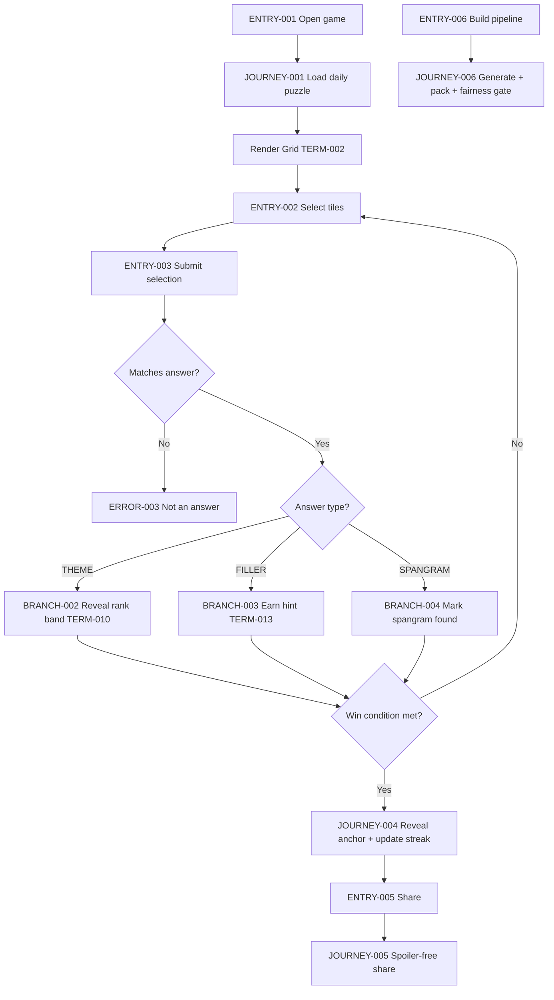
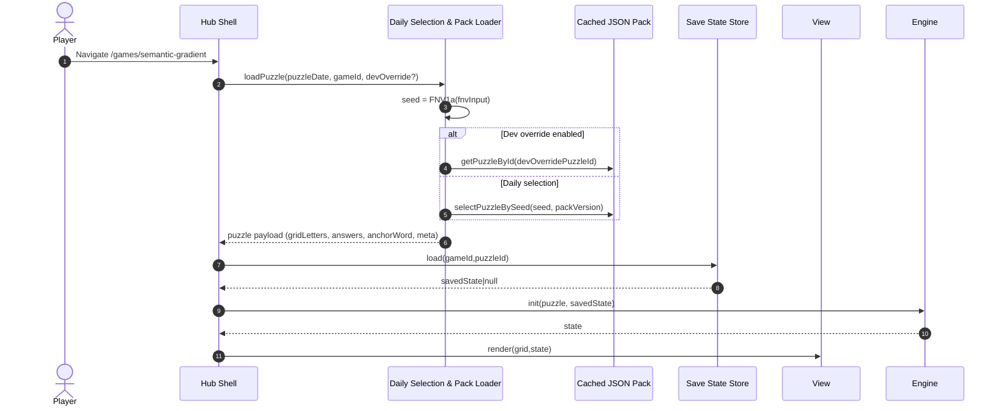
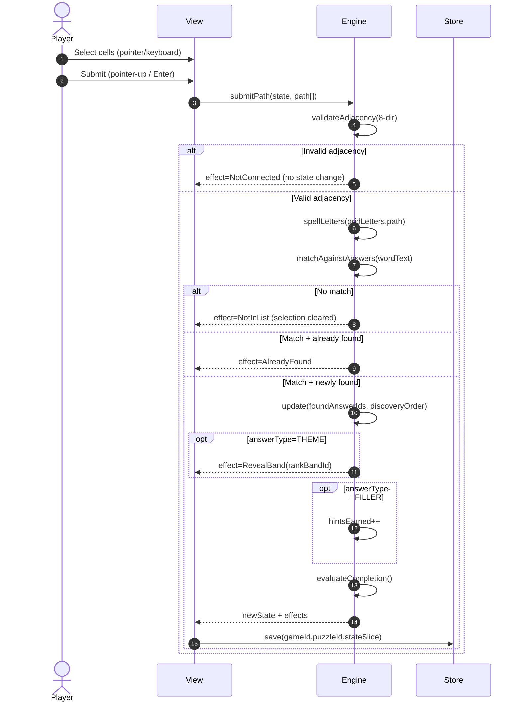
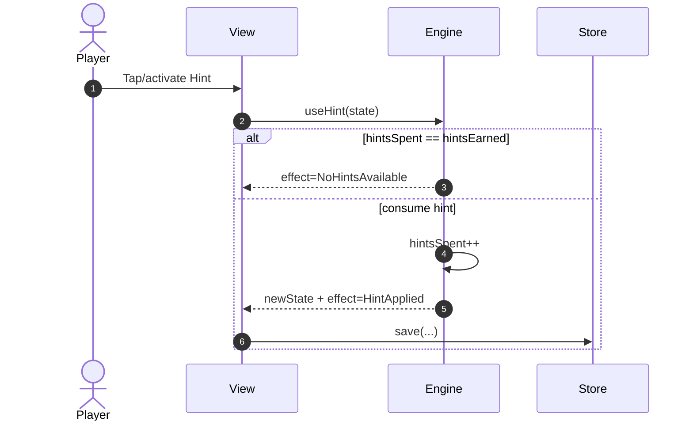
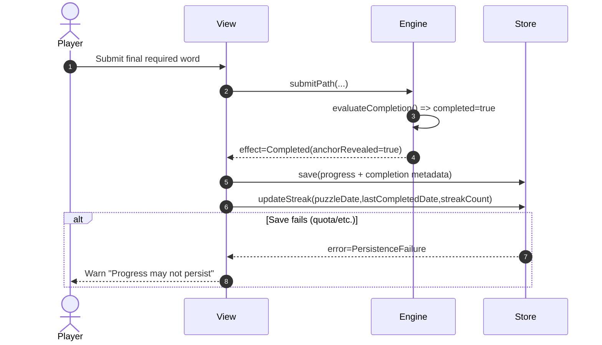
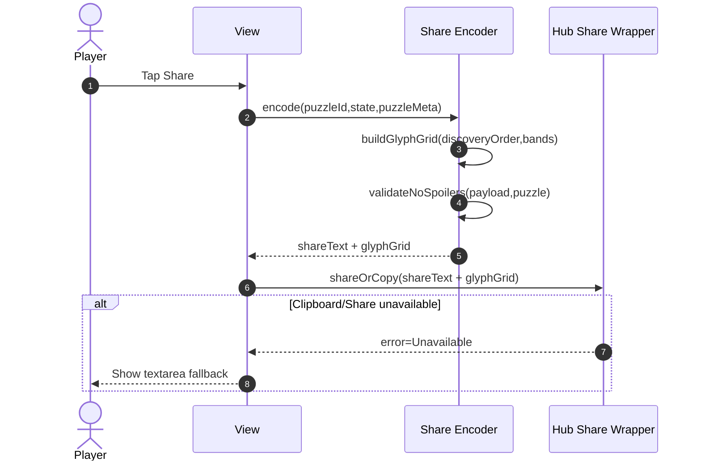
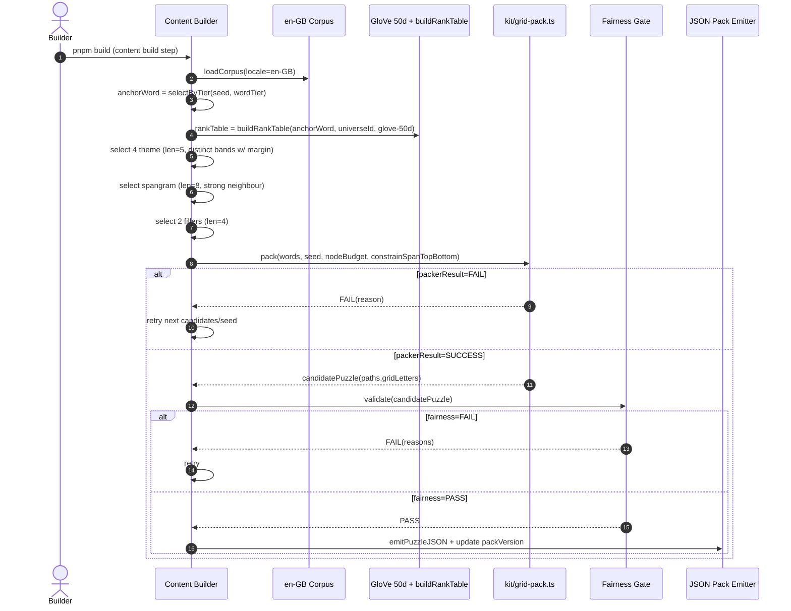
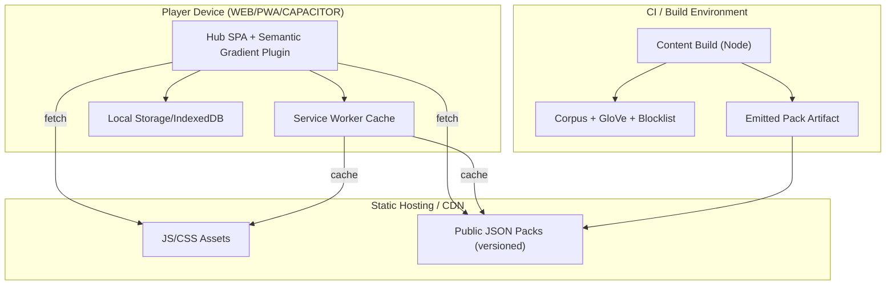

<!-- generated: 2026-07-25T09:25:54Z -->
<!-- mode: feature -->
<!-- feature-slug: semantic-gradient -->
<!-- a2a-endpoint: https://bob-sdlc-orchestrator.2as6l7wq9qj8.eu-gb.codeengine.appdomain.cloud/v1/rpc -->

# Glossary

## Terms

### TERM-001: Puzzle
- **Definition:** A daily Semantic Gradient board consisting of a 6x6 letter grid, a hidden **Anchor** (TERM-005), a **Spangram** (TERM-006), four **Theme Words** (TERM-007), and two **Filler Words** (TERM-008), satisfying **Perfect Cover** (TERM-009).
- **Synonyms:** daily board, daily puzzle
- **Anti-definition:** Not a free-play/random grid; not server-generated at runtime.
- **Source:** User request

### TERM-002: Grid
- **Definition:** The 6x6 arrangement of 36 letter **Cells** (TERM-003) shown to the player.
- **Synonyms:** letter grid, board
- **Anti-definition:** Not a word list; not a crossword with blanks.
- **Source:** User request

### TERM-003: Cell
- **Definition:** A single tile in the Grid with one uppercase letter and a coordinate.
- **Synonyms:** tile
- **Anti-definition:** Not a multi-letter tile; not an empty square.
- **Source:** User request

### TERM-004: Path
- **Definition:** A contiguous sequence of Cells connected via 8-direction adjacency that spells a Word when letters are read in order.
- **Synonyms:** trace, snake
- **Anti-definition:** Not 4-direction only; not requiring straight lines.
- **Source:** User request

### TERM-005: Anchor
- **Definition:** The hidden semantic target word for the Puzzle; Theme Words and Spangram are chosen as GloVe neighbours of the Anchor.
- **Synonyms:** hidden theme word, semantic anchor
- **Anti-definition:** Not shown to the player until completion; not necessarily present in the grid.
- **Source:** User request

### TERM-006: Spangram
- **Definition:** An 8-letter answer Word that is a strong GloVe neighbour of the Anchor and is placed as a Path spanning the Grid from top edge to bottom edge.
- **Synonyms:** span word
- **Anti-definition:** Not optional; not allowed to span left-to-right only.
- **Source:** User request

### TERM-007: Theme Word
- **Definition:** One of four 5-letter answer Words, each a GloVe neighbour of the Anchor and assigned to a distinct **Closeness Band** (TERM-010).
- **Synonyms:** themed answer
- **Anti-definition:** Not filler; not 4 letters; not 6+ letters.
- **Source:** User request

### TERM-008: Filler Word
- **Definition:** One of two 4-letter answer Words used to complete Perfect Cover; finding these contributes to **Hints** (TERM-013).
- **Synonyms:** non-theme word
- **Anti-definition:** Not part of the win condition.
- **Source:** User request

### TERM-009: Perfect Cover
- **Definition:** A packing constraint where every Cell in the Grid belongs to exactly one answer Word’s Path, with no overlap and no unused Cells.
- **Synonyms:** exact cover
- **Anti-definition:** Not allowing wasted letters; not allowing shared tiles.
- **Source:** User request

### TERM-010: Closeness Band
- **Definition:** A coarse bucket describing the Theme Word’s proximity to the Anchor, computed using GloVe neighbour **Rank** (TERM-018) margins (not cosine thresholds), mapped to a temperature-like label.
- **Synonyms:** temperature band, hot/cool band
- **Anti-definition:** Not a precise similarity score; not a numeric cosine value shown to player.
- **Source:** User request

### TERM-011: GloVe Model (50d)
- **Definition:** The 50-dimensional pre-trained embedding model used at build time to compute neighbours and ranks.
- **Synonyms:** embeddings
- **Anti-definition:** Not computed at runtime; not fine-grained similarity calibration.
- **Source:** User request

### TERM-012: Rank Table
- **Definition:** A build-time data structure produced by `buildRankTable` mapping candidate words to neighbour rank/order relative to an Anchor over a bounded universe.
- **Synonyms:** neighbour ranking
- **Anti-definition:** Not an unbounded nearest-neighbour search at runtime.
- **Source:** User request

### TERM-013: Hint
- **Definition:** A player resource earned by finding Filler Words and redeemable to reveal assistance according to hub conventions (e.g., reveal an unfound answer word’s starting cell or highlight path candidates).
- **Synonyms:** hint credit
- **Anti-definition:** Not a penalty system; not consumed on every guess.
- **Source:** User request + hub conventions

### TERM-014: Discovery Order
- **Definition:** The sequence in which the player completes the six answer words (4 Theme Words + 2 Filler Words), and separately the Spangram.
- **Synonyms:** found order
- **Anti-definition:** Not the order in the generator; not alphabetical.
- **Source:** User request

### TERM-015: Spoiler-free Share
- **Definition:** A share payload that encodes discovery order and Theme Word Closeness Bands using non-letter symbols (emoji/dots), without revealing letters or the Anchor.
- **Synonyms:** safe share
- **Anti-definition:** Not a screenshot of the grid; not including the anchor or any word text.
- **Source:** User request

### TERM-016: Build-time Content Build
- **Definition:** The deterministic generation pipeline run during app build that produces daily puzzles as JSON packs, including a **Fairness Gate** (TERM-017).
- **Synonyms:** precompute pipeline
- **Anti-definition:** Not a backend service; not client-runtime generation.
- **Source:** User request

### TERM-017: Fairness Gate
- **Definition:** A set of validation checks executed at build time to accept/reject a generated Puzzle, including Perfect Cover, valid Paths, spangram spanning, distinct decisive bands, cohesive neighbourhood, and blocklist compliance.
- **Synonyms:** validator
- **Anti-definition:** Not a runtime anti-cheat; not a manual review step.
- **Source:** User request

### TERM-018: Neighbour Rank
- **Definition:** The ordinal position of a candidate word in the Anchor’s neighbour list produced by the Rank Table.
- **Synonyms:** rank
- **Anti-definition:** Not a cosine similarity value.
- **Source:** User request

### TERM-019: Rank Margin
- **Definition:** The minimum required separation between Neighbour Ranks used to define decisive, well-separated Closeness Bands.
- **Synonyms:** band gap
- **Anti-definition:** Not a cosine delta; not a probabilistic confidence.
- **Source:** User request

### TERM-020: Candidate Universe
- **Definition:** The bounded set of words considered when building the Rank Table for an Anchor.
- **Synonyms:** candidate set
- **Anti-definition:** Not the full language; not user-generated.
- **Source:** User request

### TERM-021: Corpus (en-GB)
- **Definition:** The frequency-tiered British English word corpus used to select Anchors and filter allowable answers.
- **Synonyms:** dictionary, word list
- **Anti-definition:** Not en-US specific; not an online API.
- **Source:** User request

### TERM-022: Frequency Tier
- **Definition:** The corpus bucket classification (via `wordTier`) used to sample Anchors deterministically.
- **Synonyms:** tier
- **Anti-definition:** Not a per-user difficulty rating.
- **Source:** User request

### TERM-023: Obscenity Blocklist
- **Definition:** A build-time list of disallowed words; any puzzle containing a blocked word is rejected.
- **Synonyms:** profanity filter
- **Anti-definition:** Not a runtime chat filter.
- **Source:** User request

### TERM-024: Grid Packer
- **Definition:** The shared seeded backtracking placement engine (`kit/grid-pack.ts`) that packs given words into a 6x6 grid under constraints and a node budget.
- **Synonyms:** packer
- **Anti-definition:** Not a solver for arbitrary grids; not a backend service.
- **Source:** User request

### TERM-025: Seed
- **Definition:** The deterministic value used to select the daily puzzle and seed the Grid Packer.
- **Synonyms:** RNG seed
- **Anti-definition:** Not cryptographically random.
- **Source:** User request

### TERM-026: FNV-1a Daily Selection
- **Definition:** The deterministic hash method used to map a date + game ID to a daily index/Seed.
- **Synonyms:** daily hash
- **Anti-definition:** Not server time; not user locale dependent unless defined.
- **Source:** User request

### TERM-027: Dev-mode Puzzle Override
- **Definition:** A local development switch that forces the app to load a specified puzzle ID/date instead of the daily selection.
- **Synonyms:** override
- **Anti-definition:** Not available in production builds.
- **Source:** User request

### TERM-028: Game Plugin
- **Definition:** The hub integration unit consisting of a pure engine module, a view module, and build-time content builder, registered alongside other games.
- **Synonyms:** game module
- **Anti-definition:** Not a standalone app.
- **Source:** User request

### TERM-029: Engine
- **Definition:** The pure, deterministic state machine that evaluates selections as paths/words, updates found sets, hints, and completion, without UI concerns.
- **Synonyms:** rules engine
- **Anti-definition:** Not React components; not build pipeline code.
- **Source:** User request + hub conventions

### TERM-030: View
- **Definition:** The UI layer for Grid interaction, keyboard navigation, accessibility output, and share rendering, using IBM Carbon g100 tokens.
- **Synonyms:** UI
- **Anti-definition:** Not responsible for puzzle generation.
- **Source:** User request

### TERM-031: Save State
- **Definition:** The persisted per-day player progress for a Puzzle, stored locally for offline play and streaks.
- **Synonyms:** local progress
- **Anti-definition:** Not server-stored; not shared across devices unless platform provides it externally.
- **Source:** User request

### TERM-032: Streak
- **Definition:** The count of consecutive days where the player completes the win condition for the daily Puzzle.
- **Synonyms:** daily streak
- **Anti-definition:** Not number of plays; not based on guesses.
- **Source:** User request

### TERM-033: Keyboard Operability
- **Definition:** The ability to play the game entirely using keyboard controls, including grid navigation and selection.
- **Synonyms:** keyboard-only support
- **Anti-definition:** Not mouse/touch only.
- **Source:** User request

### TERM-034: Screen Reader Accessibility
- **Definition:** ARIA/semantic support such that a screen reader can navigate the grid, announce selections, found words (without spoilers beyond intended), and share output.
- **Synonyms:** SR support
- **Anti-definition:** Not purely visual cues.
- **Source:** User request

### TERM-035: Offline PWA
- **Definition:** A web app that caches assets and the public JSON pack to be playable without network.
- **Synonyms:** offline web app
- **Anti-definition:** Not requiring online calls for daily content.
- **Source:** User request

### TERM-036: Capacitor Mobile Build
- **Definition:** iOS/Android packaging of the web app via Capacitor with the same offline daily puzzle behavior.
- **Synonyms:** native wrapper
- **Anti-definition:** Not a separate codebase.
- **Source:** User request

## Data Dictionary

| ID | Name | Type | Format | Range | Units | Default | Nullable | PII | Source | Validation |
|---|---|---|---|---|---|---|---|---|---|---|
| FIELD-001 | puzzleId | string | `sg-YYYY-MM-DD` | date-valid | — | — | false | None | TERM-016 | Must match `/^sg-\d{4}-\d{2}-\d{2}$/` and parse to valid ISO date |
| FIELD-002 | puzzleDate | string | `YYYY-MM-DD` | calendar date | — | — | false | None | TERM-016 | Must be valid ISO local date and correspond to pack entry |
| FIELD-003 | gameId | string | `semantic-gradient` | fixed | — | `semantic-gradient` | false | None | TERM-028 | Must equal registered plugin ID |
| FIELD-004 | locale | string | BCP-47 | e.g. `en-GB` | — | `en-GB` | false | None | TERM-021 | Must be supported by corpus/assets |
| FIELD-005 | seed | integer | uint32 | 0..2^32-1 | — | — | false | None | TERM-025 | Must equal FNV-1a output (uint32) |
| FIELD-006 | fnvInput | string | UTF-8 | — | — | — | false | None | TERM-026 | Must include puzzleDate and gameId (exact template defined) |
| FIELD-007 | gridSize | object | `{rows, cols}` | rows=6, cols=6 | cells | `{6,6}` | false | None | TERM-002 | Must be exactly 6x6 |
| FIELD-008 | gridLetters | string[] | length 36 | A-Z | — | — | false | None | TERM-002 | Must be length 36; each item `/^[A-Z]$/` |
| FIELD-009 | cellIndex | integer | 0-based | 0..35 | index | — | false | None | TERM-003 | Must map to row/col within 6x6 |
| FIELD-010 | row | integer | 0-based | 0..5 | — | — | false | None | TERM-003 | Must be within grid bounds |
| FIELD-011 | col | integer | 0-based | 0..5 | — | — | false | None | TERM-003 | Must be within grid bounds |
| FIELD-012 | answers | object[] | array | size=7? (6 words + spangram included in words list or flagged) | — | — | false | None | TERM-001 | Must include exactly 7 entries if spangram is also an answer object; else 6 + separate spangram (see FIELD-019) |
| FIELD-013 | answerId | string | `a-<slug>-<n>` | unique | — | — | false | None | TERM-001 | Must be unique within puzzle |
| FIELD-014 | wordText | string | uppercase | A-Z length 4/5/8 | letters | — | false | None | TERM-006/007/008 | Must be `[A-Z]+` and length matches answerType |
| FIELD-015 | answerType | string | enum | `SPANGRAM`,`THEME`,`FILLER` | — | — | false | None | TERM-001 | Must be one of enum values |
| FIELD-016 | path | integer[] | indices | unique indices | cells | — | false | None | TERM-004 | Must be contiguous 8-neighbour; length equals wordText length |
| FIELD-017 | pathAdjacency | string | enum | `EIGHT_DIR` | — | `EIGHT_DIR` | false | None | TERM-004 | Must equal `EIGHT_DIR` |
| FIELD-018 | spansTopToBottom | boolean | — | true/false | — | false | false | None | TERM-006 | If answerType=SPANGRAM then must be true |
| FIELD-019 | spangramAnswerId | string | ref | in answers | — | — | false | None | TERM-006 | Must reference an existing answer with answerType=SPANGRAM |
| FIELD-020 | anchorWord | string | lowercase | a-z | — | — | false (in build artifact), true (in runtime until win) | None | TERM-005 | In public pack: allowed; in runtime UI: must not be revealed until win |
| FIELD-021 | anchorTier | string | enum | corpus tiers | — | — | false | None | TERM-022 | Must be a valid tier from wordTier |
| FIELD-022 | candidateUniverseId | string | slug | — | — | — | false | None | TERM-020 | Must map to a known bounded universe config |
| FIELD-023 | gloveModelId | string | enum | `glove-50d` | — | `glove-50d` | false | None | TERM-011 | Must be `glove-50d` |
| FIELD-024 | neighbourRank | integer | 1-based | 1..N | rank | — | false | None | TERM-018 | Must be within computed table size |
| FIELD-025 | rankBandId | string | enum | `HOT`,`WARM`,`COOL`,`COLD` | — | — | false | None | TERM-010 | Must be one of 4 bands |
| FIELD-026 | bandThresholds | object | `{HOTmax, WARMmax, COOLmax, COLDmax}` | monotone | rank | — | false | None | TERM-010 | Must be strictly increasing maxima |
| FIELD-027 | bandMargin | integer | int | ≥1 | rank | — | false | None | TERM-019 | Must be ≥ configured minimum |
| FIELD-028 | themeFeedbackOnFind | object | `{answerId, rankBandId}` | — | — | — | false | None | TERM-010 | Only for answerType=THEME; must not include anchorWord |
| FIELD-029 | foundAnswerIds | string[] | array | subset of answers | — | `[]` | false | None | TERM-031 | Must be unique; must exist in answers |
| FIELD-030 | hintsEarned | integer | int | ≥0 | count | 0 | false | None | TERM-013 | Must increment only on first-time completion of FILLER |
| FIELD-031 | hintsSpent | integer | int | 0..hintsEarned | count | 0 | false | None | TERM-013 | Must never exceed hintsEarned |
| FIELD-032 | streakCount | integer | int | ≥0 | days | 0 | false | None | TERM-032 | Must update only on completion |
| FIELD-033 | lastCompletedDate | string | `YYYY-MM-DD` | date | — | null | true | None | TERM-032 | Must be valid date if present |
| FIELD-034 | shareText | string | text | — | — | — | false | None | TERM-015 | Must contain no wordText, no anchorWord, no gridLetters |
| FIELD-035 | shareGlyphGrid | string[] | lines | fixed width | — | — | false | None | TERM-015 | Must encode discovery order + bands only |
| FIELD-036 | discoveryOrder | string[] | answerId list | length 0..7 | — | `[]` | false | None | TERM-014 | Must list each answerId at most once in completion order |
| FIELD-037 | obscenityHit | boolean | — | true/false | — | false | false | None | TERM-023 | If true, build must reject puzzle |
| FIELD-038 | packVersion | string | semver | — | — | — | false | None | TERM-016 | Must be semver and compatible with runtime |
| FIELD-039 | nodeBudget | integer | int | ≥1 | nodes | — | false | None | TERM-024 | Must be within configured min/max |
| FIELD-040 | packerResult | string | enum | `SUCCESS`,`FAIL` | — | — | false | None | TERM-024 | Must be SUCCESS for emitted puzzle |
| FIELD-041 | fairnessResult | string | enum | `PASS`,`FAIL` | — | — | false | None | TERM-017 | Must be PASS for emitted puzzle |
| FIELD-042 | devOverrideEnabled | boolean | — | true/false | — | false | false | None | TERM-027 | Must be false in production build |
| FIELD-043 | devOverridePuzzleId | string | `sg-YYYY-MM-DD` | — | — | null | true | None | TERM-027 | Required when devOverrideEnabled=true |
| FIELD-044 | inputMethod | string | enum | `MOUSE`,`TOUCH`,`KEYBOARD` | — | — | false | None | TERM-033 | Must be one of enum |
| FIELD-045 | ariaGridLabel | string | text | — | — | — | false | None | TERM-034 | Must be present and non-empty |
| FIELD-046 | installMode | string | enum | `WEB`,`PWA`,`CAPACITOR` | — | `WEB` | false | None | TERM-035/036 | Must be one of enum |

# User Journeys

## Roles

| Role ID | Role | Type | Description |
|---|---|---|---|
| ROLE-001 | Player | Primary | Plays the daily Puzzle (TERM-001) on web/PWA/mobile. |
| ROLE-002 | Builder | Admin/Dev | Runs build-time content build (TERM-016) to generate JSON pack. |
| ROLE-003 | Hub Runtime | System | Loads pack, hosts plugin, persists Save State (TERM-031), manages streak (TERM-032). |
| ROLE-004 | Accessibility User | Secondary | Player using keyboard (TERM-033) and/or screen reader (TERM-034). |

## Entry Points

| Entry ID | Location | Trigger | Auth |
|---|---|---|---|
| ENTRY-001 | UI route `/games/semantic-gradient` | Player opens game from hub | Anonymous/local |
| ENTRY-002 | UI action “Select tiles” | Pointer drag/click or keyboard selection | Anonymous/local |
| ENTRY-003 | UI action “Submit selection” | Pointer-up / Enter key | Anonymous/local |
| ENTRY-004 | UI action “Use hint” | Player taps hint button | Anonymous/local |
| ENTRY-005 | UI action “Share” | Player taps share button after some progress | Anonymous/local |
| ENTRY-006 | Build script `pnpm build` (or hub build pipeline) | Builder runs content build | Developer local |
| ENTRY-007 | Dev flag/config | Builder toggles dev override | Developer local |

## Role Permission Matrix

| Capability | ROLE-001 Player | ROLE-002 Builder | ROLE-003 Hub Runtime | ROLE-004 Accessibility User |
|---|---|---|---|---|
| Play daily puzzle | Yes | No | No | Yes |
| Load public JSON pack | Yes | Yes | Yes | Yes |
| Generate puzzles | No | Yes | No | No |
| Enable dev override | No | Yes | No | No |
| Persist Save State | Indirect | No | Yes | Indirect |
| Share spoiler-free result | Yes | No | No | Yes |

## Journeys

### JOURNEY-001: Open daily Semantic Gradient puzzle
- **Role/Goal:** ROLE-001 Player; view today’s Puzzle (TERM-001) determined by FNV-1a (TERM-026).
- **Entry:** ENTRY-001
- **Happy path:**
  1. System computes `FIELD-006 fnvInput` from `FIELD-002 puzzleDate` and `FIELD-003 gameId` and derives `FIELD-005 seed` (TERM-025).
  2. System selects today’s `FIELD-001 puzzleId` deterministically from the JSON pack (TERM-016).
  3. System renders `FIELD-007 gridSize` and `FIELD-008 gridLetters` (TERM-002), and initializes `FIELD-029 foundAnswerIds`, `FIELD-030 hintsEarned`, `FIELD-031 hintsSpent` from Save State (TERM-031).
- **BRANCH-001 (Dev override enabled):**
  - If `FIELD-042 devOverrideEnabled=true`, system loads `FIELD-043 devOverridePuzzleId` instead of daily selection.
- **ERROR-001 (Pack missing/offline cache miss):**
  - **Trigger:** JSON pack not available locally (TERM-035) and network unavailable.
  - **System response:** Show “Content unavailable offline” state with retry and instructions to open once online to cache.
  - **Recovery:** Player retries after connectivity or reloads after successful cache.
- **EDGE-001 (Timezone boundary):**
  - **Case:** Device date changes during session.
  - **Expected:** Puzzle remains stable for the session unless player explicitly navigates “Today” again; selection uses `FIELD-002 puzzleDate` at load time.

### JOURNEY-002: Trace a path to find a word
- **Role/Goal:** ROLE-001 Player; select a Path (TERM-004) that matches an answer Word (TERM-006/007/008).
- **Entry:** ENTRY-002 + ENTRY-003
- **Happy path:**
  1. Player selects adjacent Cells (TERM-003) forming a candidate `FIELD-016 path`.
  2. System validates 8-direction adjacency for each step (TERM-004).
  3. On submit, system compares the spelled letters from `FIELD-008 gridLetters` along `FIELD-016 path` to each `FIELD-014 wordText` in `FIELD-012 answers`.
  4. If matched and not previously found, system adds `FIELD-013 answerId` to `FIELD-029 foundAnswerIds` and appends to `FIELD-036 discoveryOrder`.
- **BRANCH-002 (Theme word found):**
  - If `FIELD-015 answerType=THEME`, system reveals `FIELD-025 rankBandId` as temperature feedback (TERM-010) without revealing `FIELD-020 anchorWord`.
- **BRANCH-003 (Filler word found):**
  - If `FIELD-015 answerType=FILLER`, system increments `FIELD-030 hintsEarned` (TERM-013).
- **BRANCH-004 (Spangram found):**
  - If `FIELD-015 answerType=SPANGRAM`, system marks spangram found and updates completion check.
- **ERROR-002 (Invalid path):**
  - **Trigger:** Non-adjacent step in `FIELD-016 path`.
  - **System response:** Reject submission; announce “Not connected” and keep selection for edit.
  - **Recovery:** Player adjusts selection.
- **ERROR-003 (Not an answer):**
  - **Trigger:** Valid path but no match to any `FIELD-014 wordText`.
  - **System response:** Clear selection; announce “Not in list”; no penalty.
  - **Recovery:** Player tries again.
- **EDGE-002 (Re-finding already found word):**
  - **Case:** Player submits a path matching an already found answer.
  - **Expected:** No change to `FIELD-029 foundAnswerIds` and no extra hint; provide a lightweight acknowledgement.

### JOURNEY-003: Use hints earned from filler words
- **Role/Goal:** ROLE-001 Player; convert Hint (TERM-013) into assistance to progress.
- **Entry:** ENTRY-004
- **Happy path:**
  1. Player opens hint UI; system displays `FIELD-030 hintsEarned` and `FIELD-031 hintsSpent`.
  2. Player redeems one hint; system increments `FIELD-031 hintsSpent`.
  3. System reveals hint effect consistent with hub conventions (TERM-013) without revealing `FIELD-020 anchorWord` or any `FIELD-014 wordText` outright unless that is the chosen hub-standard hint mechanic.
- **ERROR-004 (No hints available):**
  - **Trigger:** `FIELD-031 hintsSpent == FIELD-030 hintsEarned`.
  - **System response:** Disable hint action and announce “No hints available”.
  - **Recovery:** Find a Filler Word (TERM-008).
- **EDGE-003 (Hint on completed puzzle):**
  - **Case:** Player has already satisfied win condition.
  - **Expected:** Hint UI remains available but redemption is disabled or no-op (defined by hub conventions).

### JOURNEY-004: Complete puzzle and reveal anchor
- **Role/Goal:** ROLE-001 Player; win by finding Spangram + 4 Theme Words; reveal Anchor (TERM-005) and update Streak (TERM-032).
- **Entry:** ENTRY-003
- **Happy path:**
  1. System evaluates completion: spangram found and all four Theme Words found (TERM-007).
  2. System transitions to “Completed” state and reveals `FIELD-020 anchorWord` and spangram/theme context.
  3. System updates `FIELD-032 streakCount` and `FIELD-033 lastCompletedDate` in Save State (TERM-031).
- **BRANCH-005 (Already completed today):**
  - If Save State indicates completion for `FIELD-002 puzzleDate`, system does not increment streak again.
- **ERROR-005 (Save persistence failure):**
  - **Trigger:** Local storage write fails/quota exceeded.
  - **System response:** Warn that progress may not persist; keep in-memory state.
  - **Recovery:** Player frees space/reloads; system retries on next write.
- **EDGE-004 (No lose state):**
  - **Case:** Player makes unlimited incorrect submissions.
  - **Expected:** No counters/penalties; only state changes are found words, hints, and completion.

### JOURNEY-005: Spoiler-free share
- **Role/Goal:** ROLE-001 Player; share progress/completion without leaking letters or Anchor.
- **Entry:** ENTRY-005
- **Happy path:**
  1. System builds `FIELD-035 shareGlyphGrid` encoding `FIELD-036 discoveryOrder` and Theme Word `FIELD-025 rankBandId` (TERM-015).
  2. System composes `FIELD-034 shareText` including `FIELD-001 puzzleId` and attempt metadata (but no letters).
  3. System copies to clipboard / invokes native share sheet (platform-dependent) without including `FIELD-014 wordText` or `FIELD-020 anchorWord`.
- **ERROR-006 (Clipboard/share not available):**
  - **Trigger:** Clipboard API denied/unavailable.
  - **System response:** Display share text in selectable textarea for manual copy.
  - **Recovery:** Manual copy.
- **EDGE-005 (Mid-game share):**
  - **Case:** Player shares before completion.
  - **Expected:** Share reflects current discovery order and bands for found theme words only; unknowns remain placeholders.

### JOURNEY-006: Build-time generation and fairness gate
- **Role/Goal:** ROLE-002 Builder; deterministically generate daily puzzles and emit public JSON pack.
- **Entry:** ENTRY-006
- **Happy path:**
  1. Builder loads Corpus (TERM-021) via `loadCorpus` and selects `FIELD-020 anchorWord` by `FIELD-021 anchorTier` (TERM-022) under deterministic selection (TERM-026).
  2. Builder constructs Rank Table (TERM-012) via `buildRankTable` over `FIELD-022 candidateUniverseId`.
  3. Builder selects four 5-letter neighbours as Theme Words, each assigned a distinct `FIELD-025 rankBandId` using `FIELD-027 bandMargin` (TERM-019).
  4. Builder selects an 8-letter Spangram neighbour and two 4-letter Filler Words.
  5. Builder runs Grid Packer (TERM-024) with `FIELD-039 nodeBudget`, requiring spangram `FIELD-018 spansTopToBottom=true`.
  6. Builder runs Fairness Gate (TERM-017) and emits puzzle JSON if `FIELD-041 fairnessResult=PASS` and `FIELD-040 packerResult=SUCCESS`.
- **ERROR-007 (Packer fails):**
  - **Trigger:** `FIELD-040 packerResult=FAIL` within node budget.
  - **System response:** Retry generation with next candidate set/seed; log failure reason.
  - **Recovery:** Continue until target count built or fail build.
- **ERROR-008 (Fairness gate fails):**
  - **Trigger:** `FIELD-041 fairnessResult=FAIL` due to any validation (Perfect Cover, band separation, cohesion, blocklist).
  - **System response:** Reject puzzle; retry generation.
  - **Recovery:** Continue iteration.
- **EDGE-006 (Polysemy/cohesion):**
  - **Case:** Anchor neighbourhood not cohesive (TERM-017).
  - **Expected:** Puzzle rejected even if packable.

## Journey Map



# Requirements

### REQ-001: Register Semantic Gradient game plugin in hub
- **EARS Pattern:** Ubiquitous
- **EARS Statement:** The hub shall register the Semantic Gradient Game Plugin (TERM-028) under `FIELD-003 gameId`.
- **Inputs:** FIELD-003
- **Outputs:** Game appears in hub registry/navigation
- **Preconditions:** Hub build includes plugin bundle
- **Postconditions:** Game route is reachable
- **Invariants:** `FIELD-003 gameId` remains stable across versions
- **Trigger:** App initialization
- **Actor:** ROLE-003
- **EntityScope:** TERM-028
- **ErrorModes:** Plugin not found in registry
- **NFR-Tags:** compatibility
- **Source:** JOURNEY-001 step 1
- **Dependencies:** —
- **Priority:** P0
- **AcceptanceCriteria:**
  - TEST-001: Given the hub is running, when the registry is loaded, then `semantic-gradient` appears once and routes to ENTRY-001.
- **Assumptions:** Hub has existing plugin registration mechanism
- **OpenQuestions:** None

### REQ-002: Compute daily seed via FNV-1a
- **EARS Pattern:** Event-Driven
- **EARS Statement:** When the player opens the game route (ENTRY-001), the system shall compute `FIELD-005 seed` by applying FNV-1a (TERM-026) to `FIELD-006 fnvInput`.
- **Inputs:** FIELD-002, FIELD-003, FIELD-006
- **Outputs:** FIELD-005
- **Preconditions:** `FIELD-002 puzzleDate` is available from device date selection logic
- **Postconditions:** Seed stored in runtime state for selection
- **Invariants:** Same fnvInput yields same seed across platforms
- **Trigger:** ENTRY-001
- **Actor:** ROLE-001
- **EntityScope:** TERM-025
- **ErrorModes:** Invalid fnvInput template
- **NFR-Tags:** compatibility
- **Source:** JOURNEY-001 step 1
- **Dependencies:** REQ-001
- **Priority:** P0
- **AcceptanceCriteria:**
  - TEST-002: Given a fixed `FIELD-006 fnvInput`, when hashed, then the resulting `FIELD-005 seed` equals the reference uint32 value in a fixture.
- **Assumptions:** A canonical fnvInput template is defined
- **OpenQuestions:** What exact string template is used for fnvInput (e.g., `gameId|YYYY-MM-DD`)?

### REQ-003: Select daily puzzle deterministically from pack
- **EARS Pattern:** Event-Driven
- **EARS Statement:** When `FIELD-005 seed` is computed, the system shall select a `FIELD-001 puzzleId` deterministically from the public JSON pack (TERM-016).
- **Inputs:** FIELD-005, FIELD-038
- **Outputs:** FIELD-001
- **Preconditions:** Pack is available locally
- **Postconditions:** Selected puzzle is loaded into runtime
- **Invariants:** Same packVersion and seed yields same puzzleId
- **Trigger:** Seed computed
- **Actor:** ROLE-003
- **EntityScope:** TERM-001
- **ErrorModes:** Pack not loaded
- **NFR-Tags:** reliability
- **Source:** JOURNEY-001 step 2
- **Dependencies:** REQ-002
- **Priority:** P0
- **AcceptanceCriteria:**
  - TEST-003: Given a pack fixture and a seed fixture, when selecting, then the selected puzzleId matches the expected fixture.
- **Assumptions:** Pack contains an ordered list or indexable map
- **OpenQuestions:** Is selection by modulo over list length or by exact date key?

### REQ-004: Apply dev-mode puzzle override
- **EARS Pattern:** State-Driven
- **EARS Statement:** While `FIELD-042 devOverrideEnabled` is true, the system shall load `FIELD-043 devOverridePuzzleId` instead of the daily-selected `FIELD-001 puzzleId`.
- **Inputs:** FIELD-042, FIELD-043
- **Outputs:** Loaded puzzle corresponds to override ID
- **Preconditions:** Development build or dev flag present
- **Postconditions:** Override puzzle displayed
- **Invariants:** Override never mutates the pack
- **Trigger:** Game load
- **Actor:** ROLE-002
- **EntityScope:** TERM-027
- **ErrorModes:** Override puzzleId not found
- **NFR-Tags:** compatibility
- **Source:** JOURNEY-001 BRANCH-001
- **Dependencies:** REQ-003
- **Priority:** P2
- **AcceptanceCriteria:**
  - TEST-004: Given devOverrideEnabled=true and devOverridePuzzleId exists, when the route opens, then that puzzle loads.
  - TEST-005: Given devOverrideEnabled=true and devOverridePuzzleId missing, when the route opens, then an error state is shown and daily selection is not loaded.
- **Assumptions:** Dev flags are stripped/disabled in production
- **OpenQuestions:** How is dev override configured (query param, localStorage, build flag)?

### REQ-005: Render a 6x6 grid from puzzle data
- **EARS Pattern:** Event-Driven
- **EARS Statement:** When a Puzzle (TERM-001) is loaded, the View (TERM-030) shall render `FIELD-008 gridLetters` as a 6x6 Grid (TERM-002).
- **Inputs:** FIELD-007, FIELD-008
- **Outputs:** Visible grid UI
- **Preconditions:** `FIELD-007 gridSize` is `{6,6}`
- **Postconditions:** Player can interact with Cells
- **Invariants:** Cell order maps consistently to indices 0..35
- **Trigger:** Puzzle loaded
- **Actor:** ROLE-003
- **EntityScope:** TERM-002
- **ErrorModes:** Grid letters invalid length
- **NFR-Tags:** accessibility
- **Source:** JOURNEY-001 step 3
- **Dependencies:** REQ-003
- **Priority:** P0
- **AcceptanceCriteria:**
  - TEST-006: Given gridLetters length is 36, when rendered, then exactly 36 cells appear in 6 rows and 6 columns.
- **Assumptions:** Letters are pre-uppercased in pack
- **OpenQuestions:** None

### REQ-006: Enforce 8-direction adjacency for selection paths
- **EARS Pattern:** Event-Driven
- **EARS Statement:** When the player submits `FIELD-016 path`, the Engine (TERM-029) shall validate that each consecutive pair of Cell indices are 8-neighbour adjacent in the Grid (TERM-004).
- **Inputs:** FIELD-016, FIELD-007
- **Outputs:** Valid/invalid path result
- **Preconditions:** Path length ≥ 1
- **Postconditions:** Invalid paths do not progress to answer matching
- **Invariants:** Adjacency uses TERM-004 definition
- **Trigger:** ENTRY-003
- **Actor:** ROLE-001
- **EntityScope:** TERM-004
- **ErrorModes:** Invalid adjacency
- **NFR-Tags:** —
- **Source:** JOURNEY-002 step 2, ERROR-002
- **Dependencies:** REQ-005
- **Priority:** P0
- **AcceptanceCriteria:**
  - TEST-007: Given two indices that are diagonal neighbours, when validating, then the step is accepted.
  - TEST-008: Given two indices that are knight-move apart, when validating, then the path is rejected.
- **Assumptions:** Re-visiting the same cell within a single path is disallowed or allowed by pack rules (needs decision)
- **OpenQuestions:** Are repeated indices allowed in a submitted path (most word-trace games disallow)?

### REQ-007: Match submitted path letters to an answer word
- **EARS Pattern:** Event-Driven
- **EARS Statement:** When a submitted `FIELD-016 path` is adjacency-valid, the Engine (TERM-029) shall match the spelled letters against `FIELD-014 wordText` for each entry in `FIELD-012 answers`.
- **Inputs:** FIELD-016, FIELD-008, FIELD-012, FIELD-014
- **Outputs:** Matched `FIELD-013 answerId` or no-match
- **Preconditions:** REQ-006 passed
- **Postconditions:** Match result is produced
- **Invariants:** Spelled length equals path length
- **Trigger:** ENTRY-003
- **Actor:** ROLE-001
- **EntityScope:** TERM-001
- **ErrorModes:** No match
- **NFR-Tags:** —
- **Source:** JOURNEY-002 step 3–4, ERROR-003
- **Dependencies:** REQ-006
- **Priority:** P0
- **AcceptanceCriteria:**
  - TEST-009: Given a path whose letters equal a known answer wordText, when submitted, then the engine returns that answerId.
- **Assumptions:** Answers are unique by wordText (or disambiguated by answerId)
- **OpenQuestions:** Can two answers have identical wordText (likely no)?

### REQ-008: Record newly found answers once
- **EARS Pattern:** Event-Driven
- **EARS Statement:** When an answer match occurs for an `FIELD-013 answerId` not present in `FIELD-029 foundAnswerIds`, the Engine (TERM-029) shall append the answerId to `FIELD-029 foundAnswerIds`.
- **Inputs:** FIELD-013, FIELD-029
- **Outputs:** Updated FIELD-029
- **Preconditions:** REQ-007 matched
- **Postconditions:** Found state updated
- **Invariants:** foundAnswerIds contains unique IDs
- **Trigger:** Successful match
- **Actor:** ROLE-001
- **EntityScope:** TERM-031
- **ErrorModes:** Save state write failure (see REQ-015)
- **NFR-Tags:** reliability
- **Source:** JOURNEY-002 step 4, EDGE-002
- **Dependencies:** REQ-007
- **Priority:** P0
- **AcceptanceCriteria:**
  - TEST-010: Given a fresh answerId, when matched, then foundAnswerIds length increments by 1.
  - TEST-011: Given an already found answerId, when matched, then foundAnswerIds is unchanged.
- **Assumptions:** Engine has access to save-state layer
- **OpenQuestions:** None

### REQ-009: Record discovery order on first find
- **EARS Pattern:** Event-Driven
- **EARS Statement:** When an answer is newly found, the Engine (TERM-029) shall append the `FIELD-013 answerId` to `FIELD-036 discoveryOrder`.
- **Inputs:** FIELD-013, FIELD-036
- **Outputs:** Updated FIELD-036
- **Preconditions:** REQ-008 executed for this answer
- **Postconditions:** Discovery order updated
- **Invariants:** discoveryOrder has unique IDs
- **Trigger:** Newly found answer
- **Actor:** ROLE-001
- **EntityScope:** TERM-014
- **ErrorModes:** Duplicate insertion attempt
- **NFR-Tags:** —
- **Source:** JOURNEY-002 step 4
- **Dependencies:** REQ-008
- **Priority:** P1
- **AcceptanceCriteria:**
  - TEST-012: Given two different newly found answers, when found sequentially, then discoveryOrder preserves that order.
- **Assumptions:** discoveryOrder includes spangram as well (needs decision)
- **OpenQuestions:** Should discoveryOrder include the spangram or only non-spangram words?

### REQ-010: Reveal coarse closeness band on finding a theme word
- **EARS Pattern:** Event-Driven
- **EARS Statement:** When a newly found answer has `FIELD-015 answerType` equal to `THEME`, the system shall display its `FIELD-025 rankBandId` to the player.
- **Inputs:** FIELD-015, FIELD-025, FIELD-028
- **Outputs:** Theme feedback UI update
- **Preconditions:** Answer is newly found
- **Postconditions:** Player sees band label/temperature indicator
- **Invariants:** Feedback does not reveal `FIELD-020 anchorWord`
- **Trigger:** Theme word found
- **Actor:** ROLE-001
- **EntityScope:** TERM-010
- **ErrorModes:** Missing rankBandId in puzzle data
- **NFR-Tags:** accessibility
- **Source:** JOURNEY-002 BRANCH-002
- **Dependencies:** REQ-008
- **Priority:** P0
- **AcceptanceCriteria:**
  - TEST-013: Given a theme answer with band HOT, when found, then the UI shows HOT (or its mapped temperature) without showing the anchorWord.
- **Assumptions:** Band-to-visual mapping is predefined
- **OpenQuestions:** What exact labels/colors are used for bands (must be accessible and non-color-only)?

### REQ-011: Earn a hint on first-time completion of a filler word
- **EARS Pattern:** Event-Driven
- **EARS Statement:** When a newly found answer has `FIELD-015 answerType` equal to `FILLER`, the Engine (TERM-029) shall increment `FIELD-030 hintsEarned` by 1.
- **Inputs:** FIELD-015, FIELD-030
- **Outputs:** Updated hintsEarned
- **Preconditions:** Answer is newly found
- **Postconditions:** Hint count increased
- **Invariants:** Re-finding does not increment hintsEarned
- **Trigger:** Filler word found
- **Actor:** ROLE-001
- **EntityScope:** TERM-013
- **ErrorModes:** Overflow/invalid hint count
- **NFR-Tags:** —
- **Source:** JOURNEY-002 BRANCH-003
- **Dependencies:** REQ-008
- **Priority:** P0
- **AcceptanceCriteria:**
  - TEST-014: Given a filler answer newly found, when found, then hintsEarned increments by 1.
- **Assumptions:** Exactly two filler words exist per puzzle
- **OpenQuestions:** Are there any other hint sources?

### REQ-012: Spend a hint to apply a hint effect
- **EARS Pattern:** Event-Driven
- **EARS Statement:** When the player activates the hint control with `FIELD-031 hintsSpent` less than `FIELD-030 hintsEarned`, the system shall increment `FIELD-031 hintsSpent` by 1.
- **Inputs:** FIELD-030, FIELD-031
- **Outputs:** Updated hintsSpent
- **Preconditions:** hintsSpent < hintsEarned
- **Postconditions:** One hint consumed
- **Invariants:** hintsSpent ≤ hintsEarned
- **Trigger:** ENTRY-004
- **Actor:** ROLE-001
- **EntityScope:** TERM-013
- **ErrorModes:** No hints available
- **NFR-Tags:** —
- **Source:** JOURNEY-003 step 2, ERROR-004
- **Dependencies:** REQ-011
- **Priority:** P1
- **AcceptanceCriteria:**
  - TEST-015: Given hintsEarned=1 and hintsSpent=0, when using a hint, then hintsSpent becomes 1.
  - TEST-016: Given hintsEarned=0, when using a hint, then hintsSpent remains 0 and UI indicates no hints.
- **Assumptions:** The hint “effect” is implemented separately
- **OpenQuestions:** What is the exact hint effect for this game to remain spoiler-safe?

### REQ-013: Evaluate win condition
- **EARS Pattern:** Event-Driven
- **EARS Statement:** When `FIELD-029 foundAnswerIds` changes, the Engine (TERM-029) shall set the puzzle to completed if the Spangram (TERM-006) and all Theme Words (TERM-007) are found.
- **Inputs:** FIELD-029, FIELD-019
- **Outputs:** Completed flag in runtime state (implementation-defined)
- **Preconditions:** Puzzle loaded with spangramAnswerId and answers typed
- **Postconditions:** Completion state updated
- **Invariants:** Filler words are not required for completion
- **Trigger:** Found set updated
- **Actor:** ROLE-001
- **EntityScope:** TERM-001
- **ErrorModes:** Missing spangramAnswerId
- **NFR-Tags:** —
- **Source:** JOURNEY-004 step 1
- **Dependencies:** REQ-008
- **Priority:** P0
- **AcceptanceCriteria:**
  - TEST-017: Given all four theme answers and the spangram are found, when the last is found, then completed becomes true.
- **Assumptions:** Exactly four theme words exist
- **OpenQuestions:** None

### REQ-014: Reveal anchor word on completion
- **EARS Pattern:** Event-Driven
- **EARS Statement:** When the puzzle enters completed state, the system shall reveal `FIELD-020 anchorWord` in the completion UI.
- **Inputs:** FIELD-020
- **Outputs:** Anchor displayed
- **Preconditions:** REQ-013 completed
- **Postconditions:** Anchor visible
- **Invariants:** Anchor remains hidden before completion
- **Trigger:** Completion
- **Actor:** ROLE-001
- **EntityScope:** TERM-005
- **ErrorModes:** Anchor missing in pack
- **NFR-Tags:** —
- **Source:** JOURNEY-004 step 2
- **Dependencies:** REQ-013
- **Priority:** P0
- **AcceptanceCriteria:**
  - TEST-018: Given incomplete state, when viewing the puzzle, then anchorWord is not displayed.
  - TEST-019: Given completed state, when viewing the completion UI, then anchorWord is displayed.
- **Assumptions:** Public pack may include anchorWord; hiding is a UI/state behavior
- **OpenQuestions:** Should anchorWord be omitted from pack and derived from an ID to reduce datamining?

### REQ-015: Persist save state locally for offline play
- **EARS Pattern:** Event-Driven
- **EARS Statement:** When `FIELD-029 foundAnswerIds` changes, the system shall persist Save State (TERM-031) locally for `FIELD-001 puzzleId`.
- **Inputs:** FIELD-001, FIELD-029, FIELD-030, FIELD-031, FIELD-036
- **Outputs:** Local persisted state
- **Preconditions:** Local storage is available
- **Postconditions:** Progress is recoverable offline
- **Invariants:** Save state is namespaced by gameId and puzzleId
- **Trigger:** Found set updated
- **Actor:** ROLE-003
- **EntityScope:** TERM-031
- **ErrorModes:** Local persistence failure
- **NFR-Tags:** reliability, privacy
- **Source:** JOURNEY-004 ERROR-005
- **Dependencies:** REQ-008
- **Priority:** P0
- **AcceptanceCriteria:**
  - TEST-020: Given progress is made, when the page is reloaded offline, then foundAnswerIds is restored.
- **Assumptions:** Hub provides a storage abstraction
- **OpenQuestions:** Storage medium (IndexedDB vs localStorage) standard in hub?

### REQ-016: Update streak on first completion of the daily puzzle
- **EARS Pattern:** Event-Driven
- **EARS Statement:** When the puzzle is completed for `FIELD-002 puzzleDate` and `FIELD-033 lastCompletedDate` is not equal to `FIELD-002 puzzleDate`, the system shall update `FIELD-032 streakCount` and `FIELD-033 lastCompletedDate`.
- **Inputs:** FIELD-002, FIELD-032, FIELD-033
- **Outputs:** Updated streak fields
- **Preconditions:** REQ-013 completed
- **Postconditions:** Streak reflects completion
- **Invariants:** Completing the same day twice does not increment streak
- **Trigger:** Completion
- **Actor:** ROLE-003
- **EntityScope:** TERM-032
- **ErrorModes:** Invalid lastCompletedDate value
- **NFR-Tags:** reliability
- **Source:** JOURNEY-004 step 3, BRANCH-005
- **Dependencies:** REQ-015
- **Priority:** P1
- **AcceptanceCriteria:**
  - TEST-021: Given lastCompletedDate is yesterday and streakCount=3, when completing today, then streakCount becomes 4 and lastCompletedDate becomes today.
  - TEST-022: Given lastCompletedDate is today, when completing again, then streakCount is unchanged.
- **Assumptions:** “Yesterday” computed in local date space consistent with puzzleDate
- **OpenQuestions:** Does hub define streak breaks by local date or fixed UTC?

### REQ-017: Generate spoiler-free share payload
- **EARS Pattern:** Event-Driven
- **EARS Statement:** When the player activates share (ENTRY-005), the system shall generate `FIELD-034 shareText` and `FIELD-035 shareGlyphGrid` from `FIELD-036 discoveryOrder` and Theme `FIELD-025 rankBandId`.
- **Inputs:** FIELD-036, FIELD-025
- **Outputs:** FIELD-034, FIELD-035
- **Preconditions:** Puzzle loaded
- **Postconditions:** Share payload ready
- **Invariants:** Share includes no `FIELD-014 wordText`, no `FIELD-008 gridLetters`, and no `FIELD-020 anchorWord`
- **Trigger:** ENTRY-005
- **Actor:** ROLE-001
- **EntityScope:** TERM-015
- **ErrorModes:** Share encoding fails
- **NFR-Tags:** privacy
- **Source:** JOURNEY-005 step 1–2
- **Dependencies:** REQ-009, REQ-010
- **Priority:** P0
- **AcceptanceCriteria:**
  - TEST-023: Given a partially completed puzzle, when share is generated, then the output contains band glyphs for found theme words and contains no alphabetic sequences equal to any answer wordText.
- **Assumptions:** A canonical encoding scheme is defined
- **OpenQuestions:** What exact glyph set is used for bands and unknowns?

### REQ-018: Provide share fallback when clipboard/share API unavailable
- **EARS Pattern:** Event-Driven
- **EARS Statement:** When the system cannot access a clipboard or native share API, the View (TERM-030) shall display `FIELD-034 shareText` for manual copy.
- **Inputs:** FIELD-034
- **Outputs:** Visible selectable text UI
- **Preconditions:** Share generated
- **Postconditions:** Player can manually copy share content
- **Invariants:** Displayed share content is spoiler-free (TERM-015)
- **Trigger:** Share attempt
- **Actor:** ROLE-001
- **EntityScope:** TERM-015
- **ErrorModes:** Clipboard denied/unavailable
- **NFR-Tags:** compatibility, accessibility
- **Source:** JOURNEY-005 ERROR-006
- **Dependencies:** REQ-017
- **Priority:** P1
- **AcceptanceCriteria:**
  - TEST-024: Given clipboard API throws, when share is invoked, then a textarea containing shareText is shown.
- **Assumptions:** Hub has a standard share component
- **OpenQuestions:** None

### REQ-019: Build-time generator selects anchor from tiered en-GB corpus deterministically
- **EARS Pattern:** Ubiquitous
- **EARS Statement:** The Build-time Content Build (TERM-016) shall select `FIELD-020 anchorWord` from the en-GB Corpus (TERM-021) using `FIELD-021 anchorTier` under deterministic selection keyed by `FIELD-005 seed`.
- **Inputs:** FIELD-005, FIELD-021
- **Outputs:** FIELD-020
- **Preconditions:** Corpus is available at build time
- **Postconditions:** Anchor chosen
- **Invariants:** Same seed and corpus version yields same anchor
- **Trigger:** Build pipeline run
- **Actor:** ROLE-002
- **EntityScope:** TERM-005
- **ErrorModes:** No eligible anchors in tier
- **NFR-Tags:** compatibility
- **Source:** JOURNEY-006 step 1
- **Dependencies:** —
- **Priority:** P0
- **AcceptanceCriteria:**
  - TEST-025: Given fixed corpus fixture and seed, when selecting, then anchorWord equals expected fixture.
- **Assumptions:** Corpus versioning is controlled
- **OpenQuestions:** Which tiers are eligible for anchors (difficulty)?

### REQ-020: Build rank table over bounded candidate universe
- **EARS Pattern:** Event-Driven
- **EARS Statement:** When `FIELD-020 anchorWord` is selected, the build system shall compute a Rank Table (TERM-012) using `buildRankTable` over `FIELD-022 candidateUniverseId`.
- **Inputs:** FIELD-020, FIELD-022, FIELD-023
- **Outputs:** TERM-012 (internal build artifact)
- **Preconditions:** GloVe model assets available
- **Postconditions:** Neighbour ranks available for selection
- **Invariants:** Uses rank ordering (TERM-018) not cosine thresholds
- **Trigger:** Anchor selected
- **Actor:** ROLE-002
- **EntityScope:** TERM-012
- **ErrorModes:** Rank table build fails
- **NFR-Tags:** —
- **Source:** JOURNEY-006 step 2
- **Dependencies:** REQ-019
- **Priority:** P0
- **AcceptanceCriteria:**
  - TEST-026: Given anchorWord and candidate universe fixture, when building rank table, then the output contains deterministic ranks for known candidates.
- **Assumptions:** Candidate universe is preconfigured and bounded
- **OpenQuestions:** What is the candidate universe composition (tiers/length constraints)?

### REQ-021: Select four 5-letter theme words in distinct decisive closeness bands
- **EARS Pattern:** Event-Driven
- **EARS Statement:** When the Rank Table (TERM-012) is available, the build system shall select four `FIELD-014 wordText` entries of length 5 whose `FIELD-024 neighbourRank` values map to four distinct `FIELD-025 rankBandId` values separated by at least `FIELD-027 bandMargin`.
- **Inputs:** TERM-012, FIELD-027, FIELD-026
- **Outputs:** Four THEME answers with band assignments
- **Preconditions:** Rank table contains sufficient 5-letter neighbours
- **Postconditions:** Theme set selected
- **Invariants:** Bands are margin-based (TERM-019)
- **Trigger:** Rank table built
- **Actor:** ROLE-002
- **EntityScope:** TERM-007
- **ErrorModes:** Insufficient candidates to satisfy band separation
- **NFR-Tags:** —
- **Source:** JOURNEY-006 step 3, TERM-017
- **Dependencies:** REQ-020
- **Priority:** P0
- **AcceptanceCriteria:**
  - TEST-027: Given a rank table fixture, when selecting themes, then exactly four 5-letter words are chosen and their band IDs are all distinct.
- **Assumptions:** Exactly four bands exist
- **OpenQuestions:** What are the concrete rank thresholds for HOT/WARM/COOL/COLD per universe size?

### REQ-022: Select 8-letter spangram neighbour
- **EARS Pattern:** Event-Driven
- **EARS Statement:** When the Rank Table (TERM-012) is available, the build system shall select one 8-letter neighbour as the Spangram (TERM-006).
- **Inputs:** TERM-012
- **Outputs:** One SPANGRAM answer
- **Preconditions:** Rank table contains at least one eligible 8-letter neighbour
- **Postconditions:** Spangram selected
- **Invariants:** Spangram is a strong neighbour by rank ordering (TERM-018)
- **Trigger:** Rank table built
- **Actor:** ROLE-002
- **EntityScope:** TERM-006
- **ErrorModes:** No eligible spangram candidates
- **NFR-Tags:** —
- **Source:** JOURNEY-006 step 4
- **Dependencies:** REQ-020
- **Priority:** P0
- **AcceptanceCriteria:**
  - TEST-028: Given a rank table fixture with an 8-letter neighbour, when selecting spangram, then a length-8 word is produced.
- **Assumptions:** “Strong neighbour” is encoded as max-rank cutoff
- **OpenQuestions:** What max rank cutoff defines spangram eligibility?

### REQ-023: Select two 4-letter filler words to complete perfect cover
- **EARS Pattern:** Event-Driven
- **EARS Statement:** When theme words and the spangram are selected, the build system shall select two 4-letter filler words (TERM-008).
- **Inputs:** Selected answers so far
- **Outputs:** Two FILLER answers
- **Preconditions:** Corpus provides eligible 4-letter words
- **Postconditions:** Full word set size achieved
- **Invariants:** Total letters sum to 36 (8+20+8)
- **Trigger:** After selecting themes and spangram
- **Actor:** ROLE-002
- **EntityScope:** TERM-008
- **ErrorModes:** No eligible fillers found
- **NFR-Tags:** —
- **Source:** JOURNEY-006 step 4
- **Dependencies:** REQ-021, REQ-022
- **Priority:** P0
- **AcceptanceCriteria:**
  - TEST-029: Given selected 4 theme and 1 spangram, when selecting fillers, then exactly two length-4 words are added and total letters equals 36.
- **Assumptions:** Fillers may be semantically unrelated
- **OpenQuestions:** Should fillers avoid being close neighbours to reduce confusion?

### REQ-024: Pack selected words into a 6x6 grid using shared packer
- **EARS Pattern:** Event-Driven
- **EARS Statement:** When the full word set is selected, the build system shall invoke the Grid Packer (TERM-024) to produce `FIELD-008 gridLetters` and `FIELD-016 path` for each answer.
- **Inputs:** Word list, FIELD-039
- **Outputs:** FIELD-008, FIELD-012 (with paths)
- **Preconditions:** Word lengths sum to 36
- **Postconditions:** Candidate packed puzzle produced
- **Invariants:** Uses shared `kit/grid-pack.ts`
- **Trigger:** After word selection
- **Actor:** ROLE-002
- **EntityScope:** TERM-024
- **ErrorModes:** Packer fails within node budget
- **NFR-Tags:** performance
- **Source:** JOURNEY-006 step 5, ERROR-007
- **Dependencies:** REQ-023
- **Priority:** P0
- **AcceptanceCriteria:**
  - TEST-030: Given a known solvable word set fixture, when packing, then packerResult=SUCCESS and gridLetters length=36.
- **Assumptions:** Packer supports constraint: spangram spans top-to-bottom
- **OpenQuestions:** How is “spans top-to-bottom” constraint expressed to packer API?

### REQ-025: Enforce spangram spans top-to-bottom in packed solution
- **EARS Pattern:** Ubiquitous
- **EARS Statement:** The build system shall reject any packed puzzle where the Spangram (TERM-006) Path does not include at least one Cell in row 0 and at least one Cell in row 5.
- **Inputs:** FIELD-016 (spangram), FIELD-007
- **Outputs:** fairness fail/pass
- **Preconditions:** Packer produced a candidate
- **Postconditions:** Non-spanning candidates are discarded
- **Invariants:** Spangram path remains contiguous
- **Trigger:** Fairness gate run
- **Actor:** ROLE-002
- **EntityScope:** TERM-017
- **ErrorModes:** Spangram does not span
- **NFR-Tags:** —
- **Source:** JOURNEY-006 step 6
- **Dependencies:** REQ-024
- **Priority:** P0
- **AcceptanceCriteria:**
  - TEST-031: Given a spangram path that touches row 0 and row 5, when validating, then spansTopToBottom=true.
- **Assumptions:** Spanning opposite sides is strictly top/bottom, not corners
- **OpenQuestions:** Must it touch the top edge first and bottom edge last, or anywhere along path?

### REQ-026: Validate perfect cover of the 6x6 grid at build time
- **EARS Pattern:** Ubiquitous
- **EARS Statement:** The Fairness Gate (TERM-017) shall reject any puzzle where any Cell (TERM-003) is used by zero or more than one answer Path (TERM-009).
- **Inputs:** All FIELD-016 paths
- **Outputs:** FIELD-041 fairnessResult
- **Preconditions:** Candidate puzzle packed
- **Postconditions:** Only perfect-cover puzzles emitted
- **Invariants:** Total unique used cells equals 36
- **Trigger:** Fairness gate run
- **Actor:** ROLE-002
- **EntityScope:** TERM-009
- **ErrorModes:** Overlap or unused cells
- **NFR-Tags:** —
- **Source:** JOURNEY-006 step 6
- **Dependencies:** REQ-024
- **Priority:** P0
- **AcceptanceCriteria:**
  - TEST-032: Given candidate paths, when validating, then each index 0..35 appears exactly once across all paths.
- **Assumptions:** Spangram included among cover words
- **OpenQuestions:** None

### REQ-027: Validate each answer path spells its word
- **EARS Pattern:** Ubiquitous
- **EARS Statement:** The Fairness Gate (TERM-017) shall reject any puzzle where `FIELD-014 wordText` does not equal the letters read from `FIELD-008 gridLetters` along `FIELD-016 path`.
- **Inputs:** FIELD-014, FIELD-008, FIELD-016
- **Outputs:** fairness pass/fail
- **Preconditions:** Candidate puzzle exists
- **Postconditions:** Emitted puzzle is internally consistent
- **Invariants:** Letter casing is consistent
- **Trigger:** Fairness gate run
- **Actor:** ROLE-002
- **EntityScope:** TERM-017
- **ErrorModes:** Word-path mismatch
- **NFR-Tags:** —
- **Source:** JOURNEY-006 step 6
- **Dependencies:** REQ-024
- **Priority:** P0
- **AcceptanceCriteria:**
  - TEST-033: Given a candidate puzzle, when validating, then all answers pass word-path match.
- **Assumptions:** gridLetters are stored in row-major order
- **OpenQuestions:** None

### REQ-028: Validate distinct decisive bands for theme words
- **EARS Pattern:** Ubiquitous
- **EARS Statement:** The Fairness Gate (TERM-017) shall reject any puzzle where two Theme Words (TERM-007) share the same `FIELD-025 rankBandId`.
- **Inputs:** Theme answers’ FIELD-025
- **Outputs:** fairness pass/fail
- **Preconditions:** Themes selected with band IDs
- **Postconditions:** Feedback remains meaningful
- **Invariants:** Exactly four theme words exist
- **Trigger:** Fairness gate run
- **Actor:** ROLE-002
- **EntityScope:** TERM-010
- **ErrorModes:** Duplicate band assignment
- **NFR-Tags:** —
- **Source:** JOURNEY-006 step 6
- **Dependencies:** REQ-021
- **Priority:** P0
- **AcceptanceCriteria:**
  - TEST-034: Given four theme words, when validating, then the set of band IDs has cardinality 4.
- **Assumptions:** Bands are exactly {HOT,WARM,COOL,COLD}
- **OpenQuestions:** None

### REQ-029: Blocklist filter all generated words
- **EARS Pattern:** Ubiquitous
- **EARS Statement:** The build system shall reject any puzzle where any selected `FIELD-014 wordText` matches the Obscenity Blocklist (TERM-023).
- **Inputs:** FIELD-014, TERM-023
- **Outputs:** Reject/accept
- **Preconditions:** Blocklist available at build time
- **Postconditions:** No blocked content in pack
- **Invariants:** Case-insensitive matching
- **Trigger:** Word selection and fairness gate
- **Actor:** ROLE-002
- **EntityScope:** TERM-023
- **ErrorModes:** Blocklist match
- **NFR-Tags:** safety
- **Source:** User request (obscenity blocklist)
- **Dependencies:** REQ-021, REQ-022, REQ-023
- **Priority:** P0
- **AcceptanceCriteria:**
  - TEST-035: Given a candidate word in the blocklist, when generating, then obscenityHit=true and the puzzle is not emitted.
- **Assumptions:** Blocklist is maintained centrally in wordkit/hub
- **OpenQuestions:** Is blocklist applied to anchorWord as well (recommended yes)?

### NFR-001: Offline operation with no backend dependencies
- **EARS Pattern:** Ubiquitous
- **EARS Statement:** The system shall not require network access to play a Puzzle after the public JSON pack is cached locally.
- **Inputs:** Cached pack
- **Outputs:** Playable game offline
- **Preconditions:** Pack cached at least once
- **Postconditions:** All gameplay features function offline
- **Invariants:** No API calls for generation or validation at runtime
- **Trigger:** Offline launch
- **Actor:** ROLE-001
- **EntityScope:** TERM-035
- **ErrorModes:** Cache missing (handled by JOURNEY-001 ERROR-001)
- **NFR-Tags:** reliability, compatibility
- **Source:** User request; JOURNEY-001 ERROR-001
- **Dependencies:** REQ-015
- **Priority:** P0
- **AcceptanceCriteria:**
  - TEST-036: Given airplane mode and a previously cached pack, when opening the game, then the grid loads and word finding works.
- **Assumptions:** Service worker caching is configured by hub
- **OpenQuestions:** Cache strategy (precache vs runtime cache) for packs?

### NFR-002: Keyboard-only gameplay parity
- **EARS Pattern:** Ubiquitous
- **EARS Statement:** The View (TERM-030) shall provide keyboard controls to navigate Cells (TERM-003), extend/retract the current Path (TERM-004), and submit (ENTRY-003) without pointer input.
- **Inputs:** Keyboard events
- **Outputs:** Same actions as pointer
- **Preconditions:** Grid rendered
- **Postconditions:** Full play possible via keyboard
- **Invariants:** No required gesture-only actions
- **Trigger:** Keyboard input
- **Actor:** ROLE-004
- **EntityScope:** TERM-033
- **ErrorModes:** Focus lost / unreachable cell
- **NFR-Tags:** accessibility
- **Source:** User request; JOURNEY-002
- **Dependencies:** REQ-005
- **Priority:** P0
- **AcceptanceCriteria:**
  - TEST-037: Given keyboard focus on the grid, when using arrow keys, then focus moves cell-by-cell.
  - TEST-038: Given a built path, when pressing Enter, then the selection submits.
- **Assumptions:** Hub has existing grid keyboard pattern to reuse
- **OpenQuestions:** Exact keybindings (arrows vs WASD; backspace behavior)?

### NFR-003: Screen reader accessible grid semantics
- **EARS Pattern:** Ubiquitous
- **EARS Statement:** The View (TERM-030) shall expose the Grid (TERM-002) using appropriate ARIA roles and labels including `FIELD-045 ariaGridLabel`.
- **Inputs:** FIELD-045
- **Outputs:** Screen-reader navigable UI
- **Preconditions:** Grid rendered
- **Postconditions:** SR can announce position and selection state
- **Invariants:** Announcements do not reveal unfound answers
- **Trigger:** Screen reader interaction
- **Actor:** ROLE-004
- **EntityScope:** TERM-034
- **ErrorModes:** Missing ARIA labels
- **NFR-Tags:** accessibility, privacy
- **Source:** User request
- **Dependencies:** REQ-005
- **Priority:** P0
- **AcceptanceCriteria:**
  - TEST-039: Given a screen reader, when moving focus across cells, then each cell announces row/col and letter.
- **Assumptions:** Announcing letters is acceptable (grid is visible anyway)
- **OpenQuestions:** Should SR announce band feedback immediately or via live region?

### NFR-004: Determinism across platforms for daily selection and packing
- **EARS Pattern:** Ubiquitous
- **EARS Statement:** The system shall produce the same `FIELD-001 puzzleId` for the same `FIELD-002 puzzleDate` and `FIELD-003 gameId` on WEB, PWA, and CAPACITOR install modes (FIELD-046).
- **Inputs:** FIELD-002, FIELD-003
- **Outputs:** Same selected puzzle
- **Preconditions:** Same packVersion installed
- **Postconditions:** Consistent daily experience
- **Invariants:** Hashing and modulo behavior are identical
- **Trigger:** Game open
- **Actor:** ROLE-003
- **EntityScope:** TERM-026
- **ErrorModes:** Platform integer overflow differences
- **NFR-Tags:** compatibility
- **Source:** User request
- **Dependencies:** REQ-002, REQ-003
- **Priority:** P0
- **AcceptanceCriteria:**
  - TEST-040: Given the same pack fixture and date fixture, when selecting on web and capacitor test harnesses, then puzzleId matches.
- **Assumptions:** uint32 arithmetic is implemented consistently
- **OpenQuestions:** Is puzzleDate derived from local date or UTC (affects cross-platform determinism)?

### NFR-005: Spoiler safety for share output
- **EARS Pattern:** Ubiquitous
- **EARS Statement:** The system shall not include `FIELD-020 anchorWord`, any `FIELD-014 wordText`, or any substring of `FIELD-008 gridLetters` longer than 2 characters in `FIELD-034 shareText`.
- **Inputs:** FIELD-034, FIELD-020, FIELD-014, FIELD-008
- **Outputs:** Validated share content
- **Preconditions:** Share content generated
- **Postconditions:** Spoiler-safe share
- **Invariants:** Validation runs before copying/sharing
- **Trigger:** Share generation
- **Actor:** ROLE-001
- **EntityScope:** TERM-015
- **ErrorModes:** Spoiler content detected
- **NFR-Tags:** privacy
- **Source:** User request; JOURNEY-005
- **Dependencies:** REQ-017
- **Priority:** P0
- **AcceptanceCriteria:**
  - TEST-041: Given a completed puzzle, when generating shareText, then it contains no anchorWord and none of the answer wordText values.
- **Assumptions:** “Substring of gridLetters” check is feasible (optional but required here)
- **OpenQuestions:** Is the “>2 characters” rule acceptable or too strict for incidental words like “THE”?
# Architecture

## Components & Responsibilities

### Hub Shell (cic-games)
- **Responsibilities**
  - Hosts routing and navigation for all games; mounts the Semantic Gradient plugin at `/games/semantic-gradient`. (REQ-001)
  - Provides shared UI primitives (layout, dialogs), theming tokens (IBM Carbon g100), and cross-game utilities (share wrapper, storage abstraction). (REQ-005, REQ-018, NFR-002/003)
  - Owns the service worker / offline caching strategy for static assets and JSON packs. (NFR-001)
- **Boundaries**
  - **Owns:** App bootstrapping, plugin lifecycle, global install-mode differences (WEB/PWA/CAPACITOR).
  - **Does not own:** Puzzle generation, game rules, or puzzle-specific persistence schema.
- **Interfaces exposed**
  - Plugin registry API: `registerGamePlugin({gameId, routes, engine, view, contentPackRef})`.
  - Storage API: `hubStorage.get/set(namespaceKey, value)`.
  - Share API wrapper: `hubShare.shareOrCopy(text)`.
- **Interfaces consumed**
  - Semantic Gradient Game Plugin exports.

### Semantic Gradient Game Plugin (TERM-028)
- **Responsibilities**
  - Registers under stable `gameId=semantic-gradient` and wires engine + view + pack reference. (REQ-001)
  - Declares pack schema version compatibility (`FIELD-038 packVersion`). (REQ-003, Cross-cutting versioning)
- **Boundaries**
  - **Owns:** Game-specific engine/view/build tooling and schemas.
  - **Does not own:** Global hub navigation, global caching policies.
- **Interfaces exposed**
  - `engineFactory()`, `ViewComponent`, `contentBuild()` (build-time), `shareEncoder()`.
- **Interfaces consumed**
  - Hub plugin API; wordkit primitives; shared grid packer (`kit/grid-pack.ts`).

### Daily Selection & Pack Loader
- **Responsibilities**
  - Computes `seed` via canonical FNV-1a over `fnvInput` (date + gameId template). (REQ-002, NFR-004)
  - Selects puzzle deterministically from the cached JSON pack. (REQ-003)
  - Applies dev-mode override (dev builds only). (REQ-004)
  - Handles pack-missing/offline-cache-miss error state. (JOURNEY-001 ERROR-001)
- **Boundaries**
  - **Owns:** Deterministic selection logic and pack lookup strategy.
  - **Does not own:** Service worker caching; puzzle generation.
- **Interfaces exposed**
  - `loadPuzzle({puzzleDate, gameId, devOverride?}) -> PuzzleRuntimePayload`.
- **Interfaces consumed**
  - Pack asset fetch (`fetch('/packs/semantic-gradient/vX.json')` or equivalent); hub environment flags.

### Engine (TERM-029) — Pure Deterministic State Machine
- **Responsibilities**
  - Validates submitted paths for 8-direction adjacency. (REQ-006)
  - Spells letters from grid and matches against answers list. (REQ-007)
  - Records found answers once and maintains discovery order. (REQ-008, REQ-009)
  - Applies per-answer side effects: theme band reveal; filler hints earned; spangram found flag. (REQ-010, REQ-011)
  - Evaluates win condition (spangram + all theme words). (REQ-013)
  - Emits state transitions/events for the view (invalid path, no match, found, completed). (Journeys 2–4)
- **Boundaries**
  - **Owns:** Game rules and state transitions; spoiler rules in state (anchor hidden until completion).
  - **Does not own:** Rendering, ARIA announcements, persistence I/O implementation (calls an injected port).
- **Interfaces exposed**
  - `init(puzzle, savedState?) -> GameState`
  - `submitPath(state, path) -> {state, effects[]}`
  - `useHint(state) -> {state, hintEffect?}`
  - `computeShare(state) -> SharePayload` (or delegates to Share Encoder)
- **Interfaces consumed**
  - Persistence port: `save(stateSlice)`; `load(puzzleId)`.

### View (TERM-030) — UI + Accessibility
- **Responsibilities**
  - Renders the 6x6 grid from puzzle data and current state. (REQ-005)
  - Captures pointer + keyboard input to build/edit a candidate path and submit it. (NFR-002, REQ-006/007)
  - Provides screen-reader semantics: ARIA grid roles/labels, live-region announcements for results without spoilers. (NFR-003, REQ-010)
  - Presents hint UI and triggers `useHint`; disables when none available. (REQ-012)
  - Presents completion UI and reveals anchor only after completion. (REQ-014)
  - Generates and shares spoiler-free payload; provides fallback textarea if clipboard/share unavailable. (REQ-017, REQ-018, NFR-005)
- **Boundaries**
  - **Owns:** Interaction design, focus management, announcements, Carbon g100 styling.
  - **Does not own:** Game rule correctness; pack generation.
- **Interfaces exposed**
  - Route component `/games/semantic-gradient` and internal UI actions.
- **Interfaces consumed**
  - Engine API; hub share wrapper; hub UI primitives.

### Save State Store (TERM-031) — Local Persistence Adapter
- **Responsibilities**
  - Persists and loads per-puzzle progress locally (foundAnswerIds, hintsEarned/spent, discoveryOrder, completion metadata, streak fields). (REQ-015, REQ-016)
  - Namespaces keys by `gameId` + `puzzleId`; supports offline restoration. (REQ-015, NFR-001)
  - Reports write failures (quota/denied) to view for warning. (JOURNEY-004 ERROR-005)
- **Boundaries**
  - **Owns:** Storage keying, migration between schema versions if needed.
  - **Does not own:** Selecting the daily puzzle; computing streak semantics beyond rules supplied by hub.
- **Interfaces exposed**
  - `load(gameId, puzzleId) -> SaveState | null`
  - `save(gameId, puzzleId, saveState) -> Result`
- **Interfaces consumed**
  - Hub storage abstraction (IndexedDB preferred; fallback to localStorage).

### Share Encoder (TERM-015)
- **Responsibilities**
  - Encodes discovery order and theme bands into a glyph grid + shareText with zero letters/anchor leakage. (REQ-017, NFR-005)
  - Validates spoiler constraints before returning payload (reject if unsafe). (NFR-005)
- **Boundaries**
  - **Owns:** Encoding scheme and validation.
  - **Does not own:** Clipboard/native share invocation.
- **Interfaces exposed**
  - `encode(puzzleId, state, puzzleMeta) -> {shareText, shareGlyphGrid}`
  - `validateNoSpoilers(payload, puzzle) -> ok|error`
- **Interfaces consumed**
  - None (pure).

### Build-time Content Builder (TERM-016)
- **Responsibilities**
  - Deterministically generates puzzles at build time; emits public JSON pack (packVersioned). (REQ-019..REQ-024)
  - Uses only wordkit primitives and shared grid packer. (Constraint)
  - Runs retries across seeds/candidates until required count is met or fails build. (JOURNEY-006 ERROR-007/008)
- **Boundaries**
  - **Owns:** Generation algorithm, selection heuristics, pack format.
  - **Does not own:** Runtime selection logic; service worker caching.
- **Interfaces exposed**
  - CLI/build entry: `pnpm build` hook / `contentBuildSemanticGradient()`.
- **Interfaces consumed**
  - wordkit: `loadCorpus`, `wordTier`, `buildRankTable`, `buildEditDistanceGraph` (for cohesion heuristics), obscenity blocklist.
  - shared packer: `kit/grid-pack.ts`.

### Fairness Gate (TERM-017)
- **Responsibilities**
  - Validates: perfect cover, path contiguity/spelling, spangram spans top-to-bottom, distinct theme bands, neighbourhood cohesion, blocklist compliance. (REQ-025..REQ-029)
  - Produces structured failure reasons for build logs/metrics. (JOURNEY-006)
- **Boundaries**
  - **Owns:** Acceptance criteria checks; deterministic validation.
  - **Does not own:** Word selection or packing attempts.
- **Interfaces exposed**
  - `validate(candidatePuzzle) -> {PASS|FAIL, reasons[]}`
- **Interfaces consumed**
  - Blocklist; (optional) cohesion heuristics using edit-distance graph and/or neighbour overlap scoring.

---

## Data Flow

### JOURNEY-001: Open daily Semantic Gradient puzzle

**State transitions**
- `Uninitialized -> Loaded(puzzleId) -> Playing`
- Error: `Loaded -> ContentUnavailableOffline` when pack missing and offline.

### JOURNEY-002: Trace a path to find a word

**State transitions**
- `Playing` (selection changes are view-local)
- On submit:
  - `Playing -> Playing` (found set updated) or no-op.
  - `Playing -> Completed` when win condition met.

### JOURNEY-003: Use hints earned from filler words

**State transitions**
- `Playing -> Playing` (hintsSpent increments).
- `Completed -> Completed` (hint redemption disabled/no-op per hub convention).

### JOURNEY-004: Complete puzzle and reveal anchor

**State transitions**
- `Playing -> Completed` (anchor becomes visible).
- Streak updates only if first completion for puzzleDate.

### JOURNEY-005: Spoiler-free share


### JOURNEY-006: Build-time generation and fairness gate

**State transitions**
- Build loop: `Candidate -> Packed -> Validated -> Emitted` or `Rejected -> Retry`.

---

## Deployment Topology

- **Runtime environments**
  - **Web/PWA:** Single-page app in browser; service worker caches static assets and JSON packs. (NFR-001)
  - **Capacitor:** WebView-hosted SPA; packs shipped with app bundle and/or cached similarly; uses same deterministic selection. (NFR-004)
  - **Build-time:** Node.js process in CI/local dev; runs content builder and emits pack artifact.
- **Network boundaries / trust zones**
  - **Client trust zone:** Browser/WebView runtime; no secrets assumed; all pack content is public.
  - **Build/CI trust zone:** Has access to generation assets (corpus, GloVe model, blocklist) and writes pack into release artifacts.
- **Scaling units and limits**
  - Runtime scales with static hosting/CDN; no backend scaling.
  - Build-time scales by CI resources; bounded by packer nodeBudget and retry limits; generation time is the key constraint.
- **Deployment diagram**


---

## Security Architecture

- **AuthN (per actor type)**
  - **Player / Accessibility User:** Anonymous; no login required; gameplay fully local/offline. (NFR-001)
  - **Builder:** Developer/CI identity via repository access controls (outside app runtime).
  - **Hub Runtime:** N/A (client-side system role).
- **AuthZ model**
  - No runtime authorization; capabilities are local UI actions.
  - Build-time operations governed by repo/CI permissions (RBAC at platform level).
- **Secret management**
  - No application secrets required at runtime.
  - Build-time assets (if licensed) stored as CI secrets/artifacts access-controlled by CI system; not embedded as secrets in the client.
- **Data classification & encryption**
  - **Pack data:** Public, non-PII. Considered “Public Content”.
  - **Save State:** Local-only, non-PII gameplay progress; “User Local Data”.
  - **Encryption in transit:** HTTPS for static assets/packs when online.
  - **Encryption at rest:** Delegated to device/browser storage; no additional encryption required given non-PII, but avoid storing any identifiers beyond puzzle progress.
- **Threat model (top 5) + mitigations**
  1. **Datamining spoilers (anchor/answers extracted from pack)**
     - *Mitigation:* Share output validation forbids letters/anchor (NFR-005). Anchor is hidden in UI until completion (REQ-014).  
     - *Trade-off:* If anchorWord is shipped in pack, determined users can still read it; stronger mitigation would be to omit or obfuscate anchor (ADR-002).
  2. **XSS via share payload rendering**
     - *Mitigation:* Share payload is generated locally from controlled glyph set; render as plain text; no HTML injection; sanitize any user-visible rendering.
  3. **Tampering with local save state (cheating streak/hints)**
     - *Mitigation:* Accept as non-security issue (no backend, relaxed play). Keep state machine deterministic and robust against malformed state (schema validation on load).
  4. **Malicious/invalid pack causing crashes**
     - *Mitigation:* Validate pack schema at load (grid length=36, answer paths, enum checks); fail closed with a user-friendly error and telemetry (if hub has it).
  5. **Supply-chain risk in build assets (corpus/model/blocklist)**
     - *Mitigation:* Pin versions/hashes of build assets; store in repo or trusted artifact store; CI provenance for emitted packs; run fairness gate deterministically.

---

## Integration Points

### Inbound interfaces
- **UI Route:** `GET /games/semantic-gradient`
  - Protocol: SPA route (client-side)
  - Schema: N/A
  - Failure mode: plugin not registered → hub 404/“Game unavailable”. (REQ-001)
  - SLA: best-effort; local.
- **UI Actions:** Select cells, Submit, Hint, Share
  - Protocol: DOM events / Capacitor bridge events
  - Failure mode: unsupported APIs (clipboard/share) → fallback UI. (REQ-018)
  - SLA: immediate; local.

### Outbound dependencies
- **Public JSON Pack fetch**
  - Protocol: HTTPS `GET` (or bundled file in Capacitor)
  - Schema reference: Pack schema includes `FIELD-038 packVersion`, puzzle entries with `FIELD-008 gridLetters`, `FIELD-012 answers`, `FIELD-019 spangramAnswerId`, `FIELD-020 anchorWord` (decision pending), etc.
  - Failure modes:
    - Offline + not cached → “Content unavailable offline” state. (JOURNEY-001 ERROR-001)
    - Corrupt/invalid schema → show error and stop.
  - SLA expectation: CDN availability when online; offline supported after first cache. (NFR-001)
- **Local persistence (Hub Storage abstraction)**
  - Protocol: IndexedDB/localStorage API wrapper
  - Schema reference: SaveState schema (foundAnswerIds, hintsEarned/spent, discoveryOrder, streak fields)
  - Failure modes: quota exceeded/denied → warn and keep in-memory state. (JOURNEY-004 ERROR-005)
  - SLA: best-effort; local.
- **Build-time wordkit primitives**
  - Protocol: Node module calls
  - Schema: corpus format, rank table internal representation
  - Failure modes: missing assets, insufficient candidates, non-determinism → fail build.
  - SLA: CI must complete within budgeted time; bounded by nodeBudget and retries.

---

## Architecture Decision Records

### ADR-001: Daily puzzle selection strategy (seed → puzzle)
- **Status:** Proposed
- **Context:** REQ-003 requires deterministic selection from a pack given `seed` and `packVersion`. Open question: modulo-by-length vs date-keyed lookup.
- **Decision:** Use **date-keyed lookup** when pack includes an entry per date (`puzzleId=sg-YYYY-MM-DD`), with fallback to modulo selection only for legacy/testing packs.
- **Consequences:**
  - Pros: Stable mapping independent of pack length changes; simplifies debugging and dev override; aligns puzzleId semantics.
  - Cons: Requires pack to include every date or a defined range; cannot trivially “rotate” content without regenerating IDs.
- **Alternatives:**
  - Modulo over ordered list length.
  - Seeded shuffle table per packVersion.

### ADR-002: Whether to ship `anchorWord` in the public pack
- **Status:** Proposed
- **Context:** REQ-014 reveals anchor on completion, but REQ-014/TERM-020 allow anchor in build artifact while hidden in UI. Shipping anchor enables trivial datamining.
- **Decision:** Prefer **not** shipping raw `anchorWord`; ship `anchorId` plus a small completion-time reveal mechanism.
- **Consequences:**
  - Pros: Reduces casual spoilers/datamining; better aligns with “hidden anchor” premise.
  - Cons: With no backend, any reveal mechanism must still ship data client-side (e.g., encrypted blob/key-in-code), which is security-through-obscurity; added complexity and migration burden.
- **Alternatives:**
  - Ship anchorWord plainly and accept datamining (simplest).
  - Ship anchorWord but only in a “post-completion pack section” downloaded later (violates offline/no-backend unless pre-cached).

### ADR-003: Path rule — can a submitted path revisit the same cell?
- **Status:** Proposed
- **Context:** REQ-006 open question. Most trace-word games disallow revisiting; pack solutions for perfect cover inherently use each cell once across answers, but user input could repeat cells.
- **Decision:** Disallow repeated indices within a submitted path (`path` must have unique cell indices).
- **Consequences:**
  - Pros: Matches player expectations; simplifies adjacency validation and spelling; prevents degenerate loops.
  - Cons: Slightly stricter than necessary; must provide clear UX when a player attempts to reselect a cell.
- **Alternatives:**
  - Allow repeats but treat as invalid on submit.
  - Allow repeats and include them in spelled letters (unlikely desired).

### ADR-004: Hint effect definition for Semantic Gradient
- **Status:** Proposed
- **Context:** REQ-012 requires consuming hints; exact hint effect is open. Must be spoiler-safe and consistent with hub conventions.
- **Decision:** Implement hint as **reveal the starting cell of one unfound answer** (prioritizing theme words, then spangram), without revealing letters/word text; optionally highlight possible next steps for 1 move.
- **Consequences:**
  - Pros: Helps progress without revealing answers; accessible (can announce coordinates); consistent with grid games.
  - Cons: Might reduce discovery satisfaction; needs careful selection to avoid effectively solving.
- **Alternatives:**
  - Reveal a random cell belonging to an unfound theme path.
  - Provide “adjacency heat” overlay (more complex, may confuse SR users).

---

## Cross-Cutting Concerns

- **Logging / tracing / metrics / alerting**
  - Runtime (client): structured console logs in dev; optionally hub telemetry hooks for:
    - pack load success/failure (offline miss vs schema invalid),
    - build version/packVersion,
    - fairness-gate rejection reasons (build-time).
  - Build-time: emit JSONL logs with attempt counts, packerResult, fairness failure reasons, time per puzzle, nodeBudget usage.
- **Configuration & feature flags**
  - `devOverrideEnabled` and `devOverridePuzzleId` available only in dev builds; enforce stripping in prod builds. (REQ-004)
  - Content build config: `candidateUniverseId`, `bandThresholds`, `bandMargin`, `nodeBudget`, max retries.
- **Error handling strategy**
  - Fail closed on invalid pack/schema: show “Puzzle data invalid” with retry and instructions (do not attempt partial play).
  - Persistence failures: continue in-memory; warn user; retry on next save. (JOURNEY-004 ERROR-005)
  - Share failures: fallback to manual copy textarea. (REQ-018)
- **Backwards compatibility / versioning**
  - Version all packs with `packVersion` (semver). Runtime enforces compatibility matrix:
    - Major mismatch → refuse to load and prompt update.
    - Minor mismatch → allow with feature flags/defaults.
  - Save state includes `packVersion` (or schemaVersion) to enable migrations (e.g., if discoveryOrder semantics change).
  - Share encoding version tag in shareText header to allow future decoding changes without breaking old shares.
# Review

## Risks (table sorted by severity descending)

| Risk ID | Title | Category | Likelihood | Impact | Severity | Affected requirements | Mitigation | Owner | Status |
|---|---|---:|---:|---:|---:|---|---|---|---|
| RISK-001 | Build-time generation may not converge (packer + fairness gate rejection loop) | Schedule / Technical | High | High | **Critical** | REQ-019..REQ-029, NFR-004 | Add explicit generation SLOs (e.g., max attempts per date, max wall-clock per pack), fallback strategies (alternate anchor, relax bandMargin within bounded range, expand candidate universe), and CI visibility (metrics on failure reasons). Pre-generate at least N days ahead and fail build early if below threshold. | Builder / Content pipeline | Open |
| RISK-002 | “No backend” + public pack makes anchor/answers trivially datamineable (spoils core premise) | Security / Product | High | High | **Critical** | REQ-014, ADR-002, NFR-005 | Decide stance: (A) accept as known limitation and message it; or (B) ship only hashed/encoded anchor and reveal via client-side obfuscation (limited value); or (C) split pack into “play pack” and “reveal pack” pre-cached but gated by completion (still datamineable). Document threat acceptance explicitly. | Product + Tech Lead | Open |
| RISK-003 | Daily selection determinism unclear (date-key vs modulo; local date vs UTC) causing cross-platform mismatch and streak bugs | Operational / Technical | High | High | **Critical** | REQ-002, REQ-003, REQ-016, NFR-004, ADR-001 | Finalize: canonical `fnvInput` template, timezone basis for `puzzleDate` (UTC vs local), and selection method (recommend date-keyed as ADR-001). Add golden fixtures across WEB/PWA/CAPACITOR and DST boundary tests. | Hub Runtime + Plugin | Open |
| RISK-004 | Pack/schema ambiguity around answers count (6 vs 7) and spangram representation can break engine/share/win checks | Technical / Dependency | Med | High | **High** | FIELD-012, FIELD-019, REQ-007, REQ-013, REQ-017 | Normalize schema: `answers` always includes spangram (7 entries) and `spangramAnswerId` references it, or remove `spangramAnswerId` and require exactly one SPANGRAM typed entry. Update validations and fixtures accordingly. | Plugin Architect | Open |
| RISK-005 | Hint “effect” is underspecified; may conflict with spoiler-free requirements and accessibility expectations | Operational / UX | Med | High | **High** | REQ-012, ADR-004, NFR-003, NFR-005 | Specify one deterministic hint mechanic and its SR announcements. Define what is revealed (cell coordinate only vs highlighting) and ensure it cannot reveal wordText/anchor or create letter sequences in share output. Add acceptance tests for hint behavior. | UX + Accessibility | Open |
| RISK-006 | Cohesion / polysemy fairness gate is underspecified and may be non-deterministic or too strict | Technical / Schedule | Med | High | **High** | TERM-017, JOURNEY-006 EDGE-006, REQ-020..REQ-028 | Define a deterministic cohesion metric (e.g., neighbour overlap score among selected answers; or edit-distance-graph constraints) with thresholds and allow tuning. Log rejection reasons separately for “cohesion fail” to tune without breaking build. | Content pipeline | Open |
| RISK-007 | FNV-1a uint32 implementation differences across JS runtimes (bit ops) could break determinism | Technical | Med | Med | **Medium** | REQ-002, NFR-004 | Provide a single shared implementation in a common hub utility with fixture tests; avoid reliance on platform-specific integer overflow semantics outside JS bitwise ops; document encoding (UTF-8). | Hub Platform | Open |
| RISK-008 | Offline pack caching strategy not defined; first-run offline failure mode may be common on mobile | Operational | Med | Med | **Medium** | NFR-001, JOURNEY-001 ERROR-001 | Define whether packs are bundled (Capacitor) vs fetched and cached; for PWA, decide precache vs runtime cache and show a clear “download content” CTA. Consider shipping a small starter pack in the app bundle. | Hub Platform | Open |
| RISK-009 | Save-state corruption/migration not specified; malformed local data may crash engine or break streak | Operational / Technical | Med | Med | **Medium** | REQ-015, REQ-016, Architecture Save State Store | Add schema versioning for save state, validate on load, and implement reset/recovery path. Ensure streak uses validated dates. | Hub Runtime | Open |
| RISK-010 | Accessibility: ARIA grid semantics + live announcements can accidentally reveal spoilers or become unusable | Compliance / Accessibility | Low | High | **Medium** | NFR-002, NFR-003, REQ-010, REQ-014 | Specify SR announcement policy (what is spoken on find/completion; ensure no reading of hidden anchor; ensure band feedback is conveyed non-visually). Add SR-focused test scripts. | Accessibility owner | Open |
| RISK-011 | Obscenity filter scope unclear (anchorWord, substrings, morphology); reputational risk if missed | Compliance / Safety | Med | Med | **Medium** | REQ-029, FIELD-020 | Apply blocklist to **all** surfaced words including anchorWord; define matching (case-insensitive exact match vs substring); consider secondary “sensitive topics” list. Add regression fixtures. | Content + Safety | Open |
| RISK-012 | Share “no substring of gridLetters >2 chars” may false-positive and block sharing frequently | Operational / UX | Med | Low | **Low** | NFR-005, REQ-017 | Revisit rule: validate against full answer words + anchor only, or whitelist allowed header text. If keeping substring rule, ensure share payload uses only a fixed glyph set and no alphabetic content at all. | Product + Plugin | Open |

## Missing Edge Cases

- **Path submission rules**
  - Empty path, single-cell path, and maximum-length path behavior (UI and engine).
  - **Cell re-use within a single submitted path** is still an open decision in REQ-006; must be enforced consistently in UI (prevent/allow) and engine (validate).
  - What happens if player submits a valid path that spells an answer but in reverse order (path direction)? Requirements imply ordered reading; clarify whether reverse paths are accepted.

- **Ambiguous matches**
  - Two answers could theoretically share the same `wordText` (REQ-007 open question). Even if “shouldn’t happen”, engine behavior should be defined (reject pack at build-time or pick first deterministically).

- **DiscoveryOrder semantics**
  - Whether spangram is included in `discoveryOrder` is open (REQ-009). Share encoding depends on this; define length and placeholders unambiguously.

- **Hint usage and completion**
  - REQ-012 says increment `hintsSpent`; but not defined: can a hint be spent when completed (EDGE-003) and should it be blocked in engine vs view?
  - If hint reveals a starting cell, what if that answer is already partially inferred/selected? Any tie-breaking rule?

- **Streak boundary conditions**
  - Device clock changes backward/forward (manual adjustment), timezone travel, DST changes.
  - “Missed day” handling: if lastCompletedDate is two+ days ago, should streak reset to 1 on completion or remain unchanged? Not specified.

- **Pack range and missing-date behavior**
  - If using date-keyed lookup (ADR-001), what happens when pack lacks today’s date (app old)? Needs a defined UX: “Update required” vs fallback to closest available.

- **Localization / locale drift**
  - `FIELD-004 locale` exists but requirements assume `en-GB`. Define behavior if hub locale is different (force en-GB for this game?).

- **Capacitor packaging**
  - If packs are bundled, how does packVersion update with app updates, and how are stale cached packs invalidated?

- **Error handling for invalid pack**
  - Requirements mention “Grid letters invalid length” but not the full schema validation and fail-closed UX (e.g., missing answers, invalid paths). This is a frequent operational edge case.

## Dependency Conflicts

- **Circular/ambiguous design dependency: ADR-001 vs REQ-003**
  - ADR-001 proposes date-keyed lookup; REQ-003 is framed as seed-driven selection from a pack. If date-keyed is chosen, seed becomes redundant for selection (still fine for dev/test) and REQ-003 should be rewritten to avoid conflicting selection mechanisms.

- **Anchor shipping conflict: REQ-014 vs ADR-002**
  - REQ-014 assumes `anchorWord` available to reveal on completion; ADR-002 prefers not shipping it. This is a hard architectural fork impacting pack schema, runtime, and offline constraint.

- **Share encoding depends on unresolved discoveryOrder + band data**
  - REQ-017 depends on REQ-009 and REQ-010, both have open semantics (spangram inclusion; exact band labels/colors). Share scheme cannot be finalized without those.

- **Fairness Gate cohesion depends on buildEditDistanceGraph but not captured in requirements**
  - Architecture lists `buildEditDistanceGraph` as a tool; no requirement defines how cohesion is computed. This creates an “architecture-only” dependency likely to drift or be implemented ad hoc.

- **Pack schema ambiguity: FIELD-012 answers size “7?”**
  - Multiple downstream consumers (engine, share encoder, validator) rely on this. Leaving it ambiguous increases integration risk across plugin/hub.

## Recommendations

1. **Finalize daily selection contract**: define `puzzleDate` basis (UTC vs local), the exact `fnvInput` template, and whether selection is date-keyed or seed-modulo; update REQ-002/REQ-003/REQ-016 and add cross-platform golden tests including DST/timezone travel.
2. **Lock the puzzle pack schema**: choose one representation for spangram and answers count (prefer: `answers` contains exactly 7 entries with exactly one `SPANGRAM`), and add strict runtime schema validation with fail-closed UX.
3. **Put hard limits and observability on content generation**: set max attempts/time per puzzle, emit structured metrics for packer/fairness failures, and define fallback heuristics to prevent CI flakiness (e.g., alternate anchor tiers/universes).
4. **Define cohesion/polysemy check deterministically**: specify the metric, thresholds, and tuning process; make it configurable but versioned so old packs remain reproducible.
5. **Close open gameplay rules**: decide path cell-reuse, reverse-path acceptance, and spangram inclusion in discoveryOrder; ensure engine, UI, fairness validation, and share encoder are consistent.
6. **Specify hint mechanic precisely and test it**: exact reveal behavior, prioritization, SR announcements, and completion-state behavior; ensure it remains spoiler-safe and does not leak letters/words.
7. **Resolve the anchor datamining stance explicitly**: accept-and-document vs obfuscate vs alternative packaging; ensure product expectations align with the technical reality of offline public content.
8. **Harden persistence**: validate save-state on load, include a save schema version, provide a “reset today” recovery option, and define streak reset rules for gaps and clock anomalies.
9. **Clarify blocklist scope**: apply to anchorWord and all answers, specify matching rules, and add regression fixtures; consider extending to “sensitive” non-obscene terms if needed for a daily public game.
# Test Plan

## Feature Files

```gherkin
# file: plugin_registration.feature
@regression
Feature: Plugin registration and routing for Semantic Gradient

  @REQ-001 @AC-TEST-001 @integration @regression
  Scenario: Register Semantic Gradient plugin once and route is reachable
    Given the hub is running
    When the game plugin registry is loaded
    Then the "semantic-gradient" plugin appears exactly once in the registry
    And navigating to "/games/semantic-gradient" mounts the Semantic Gradient view
```

```gherkin
# file: daily_selection.feature
@regression
Feature: Daily seed computation, deterministic puzzle selection, and dev override

  @REQ-002 @AC-TEST-002 @unit @regression
  Scenario Outline: Compute daily seed via FNV-1a as canonical uint32
    Given a canonical fnvInput "<fnvInput>"
    When I compute the FNV-1a uint32 hash
    Then the computed seed equals <expectedSeed>

    Examples:
      | fnvInput                          | expectedSeed |
      | semantic-gradient|2026-01-01      | 1234567890   |

  @REQ-003 @AC-TEST-003 @integration @regression
  Scenario: Select daily puzzle deterministically from a pack using a seed fixture
    Given a public JSON pack fixture "pack_v1_fixture"
    And a seed fixture "seed_fixture_1"
    When I select a puzzle from the pack using the seed
    Then the selected puzzleId equals the expected fixture puzzleId

  @REQ-004 @AC-TEST-004 @e2e @regression
  Scenario: Dev override loads the specified puzzleId instead of daily selection
    Given devOverrideEnabled is true
    And devOverridePuzzleId exists in the pack
    When the player opens "/games/semantic-gradient"
    Then the loaded puzzleId equals devOverridePuzzleId
    And the grid renders for the override puzzle

  @REQ-004 @AC-TEST-005 @e2e @regression
  Scenario: Dev override missing puzzleId shows error and does not load daily selection
    Given devOverrideEnabled is true
    And devOverridePuzzleId does not exist in the pack
    When the player opens "/games/semantic-gradient"
    Then an override-not-found error state is shown
    And the daily-selected puzzle is not loaded

  @NFR-004 @AC-TEST-040 @integration @regression
  Scenario: Daily selection determinism matches between WEB and CAPACITOR harnesses
    Given the same pack fixture "pack_v1_fixture" is installed on WEB and CAPACITOR
    And the same puzzleDate fixture "2026-01-01" and gameId "semantic-gradient"
    When each platform selects today's puzzle
    Then both platforms produce the same puzzleId
```

```gherkin
# file: grid_rendering.feature
@regression
Feature: Grid rendering from puzzle data

  @REQ-005 @AC-TEST-006 @e2e @a11y @regression
  Scenario: Render a 6x6 grid with exactly 36 cells from gridLetters
    Given a loaded puzzle whose gridLetters length is 36 and gridSize is 6x6
    When the Semantic Gradient grid view is rendered
    Then exactly 36 grid cells are present
    And the cells are arranged as 6 rows and 6 columns
```

```gherkin
# file: engine_paths_and_matching.feature
@regression
Feature: Engine path validation, answer matching, and found state updates

  @REQ-006 @AC-TEST-007 @unit @regression
  Scenario: Accept diagonal adjacency as valid in an 8-direction path
    Given a 6x6 grid coordinate system
    And a candidate path step from index 0 to index 7
    When I validate 8-direction adjacency for the step
    Then the step is accepted as adjacent

  @REQ-006 @AC-TEST-008 @unit @regression
  Scenario: Reject non-adjacent (knight-move) steps in a path
    Given a 6x6 grid coordinate system
    And a candidate path step from index 0 to index 13
    When I validate 8-direction adjacency for the step
    Then the step is rejected as not adjacent

  @REQ-007 @AC-TEST-009 @unit @regression
  Scenario: Match a submitted adjacency-valid path letters to an answer wordText
    Given a loaded puzzle fixture "puzzle_runtime_fixture_1"
    And an adjacency-valid path fixture "path_for_known_answer"
    When the player submits the path to the engine
    Then the engine returns the expected answerId match

  @REQ-008 @AC-TEST-010 @unit @regression
  Scenario: Record a newly found answerId once by appending to foundAnswerIds
    Given an engine state with foundAnswerIds empty
    And a match result for a fresh answerId "a-theme-1"
    When the engine applies the match to update found state
    Then foundAnswerIds length increments by 1
    And foundAnswerIds contains "a-theme-1"

  @REQ-008 @AC-TEST-011 @unit @regression
  Scenario: Re-finding an already found answerId does not change foundAnswerIds
    Given an engine state with foundAnswerIds containing "a-theme-1"
    And a match result for answerId "a-theme-1"
    When the engine applies the match to update found state
    Then foundAnswerIds is unchanged
```

```gherkin
# file: discovery_and_feedback.feature
@regression
Feature: Discovery order and theme band feedback

  @REQ-009 @AC-TEST-012 @unit @regression
  Scenario: Discovery order preserves the sequence of first-time found answers
    Given an engine state with discoveryOrder empty
    When the engine records newly found answerId "a-theme-1"
    And the engine records newly found answerId "a-filler-1"
    Then discoveryOrder equals ["a-theme-1","a-filler-1"]

  @REQ-010 @AC-TEST-013 @e2e @a11y @regression
  Scenario: Finding a theme word reveals its rankBandId without revealing the anchor
    Given a loaded puzzle fixture with a THEME answer having rankBandId "HOT"
    And the anchorWord is present in puzzle data but is hidden in the UI
    When the player finds that THEME answer by submitting its correct path
    Then the UI displays the band "HOT" (or its mapped temperature label)
    And the UI does not display the anchorWord anywhere on the game screen
```

```gherkin
# file: hints.feature
@regression
Feature: Hint earning and spending

  @REQ-011 @AC-TEST-014 @unit @regression
  Scenario: Finding a filler word first-time increments hintsEarned
    Given an engine state with hintsEarned 0 and foundAnswerIds empty
    And a newly found answer of answerType "FILLER"
    When the engine applies the filler side effect
    Then hintsEarned becomes 1

  @REQ-012 @AC-TEST-015 @e2e @regression
  Scenario: Spending a hint increments hintsSpent when hints are available
    Given a game state with hintsEarned 1 and hintsSpent 0
    When the player activates the hint control
    Then hintsSpent becomes 1

  @REQ-012 @AC-TEST-016 @e2e @a11y @regression
  Scenario: Spending a hint is blocked when no hints are available
    Given a game state with hintsEarned 0 and hintsSpent 0
    When the player activates the hint control
    Then hintsSpent remains 0
    And the hint control is disabled or announces "No hints available"
```

```gherkin
# file: completion_and_anchor.feature
@regression
Feature: Completion evaluation, anchor reveal, persistence, and streak updates

  @REQ-013 @AC-TEST-017 @unit @regression
  Scenario: Puzzle becomes completed when spangram and all four theme answers are found
    Given a loaded puzzle with one SPANGRAM answer and four THEME answers
    And an engine state where all required answerIds except the last theme are found
    When the last missing THEME answerId is added to foundAnswerIds
    Then the engine sets completed to true

  @REQ-014 @AC-TEST-018 @e2e @security @regression
  Scenario: Anchor is not displayed before completion
    Given a loaded puzzle with an anchorWord available in puzzle data
    And the puzzle is not completed
    When the player views the game screen
    Then the anchorWord is not displayed

  @REQ-014 @AC-TEST-019 @e2e @regression
  Scenario: Anchor is displayed after completion
    Given a loaded puzzle with an anchorWord available in puzzle data
    And the puzzle is completed
    When the player views the completion UI
    Then the anchorWord is displayed

  @REQ-015 @AC-TEST-020 @e2e @regression
  Scenario: Save state restores foundAnswerIds after reload while offline
    Given a loaded puzzle with puzzleId "sg-2026-01-01"
    And the player has found at least one answer and progress has been saved locally
    And the device is offline
    When the player reloads the app and opens the same puzzle
    Then the restored foundAnswerIds matches the previously saved foundAnswerIds

  @REQ-016 @AC-TEST-021 @integration @regression
  Scenario: Completing today increments streak when lastCompletedDate was yesterday
    Given puzzleDate is "2026-01-02"
    And save state has streakCount 3 and lastCompletedDate "2026-01-01"
    And the puzzle becomes completed
    When the system updates streak
    Then streakCount becomes 4
    And lastCompletedDate becomes "2026-01-02"

  @REQ-016 @AC-TEST-022 @integration @regression
  Scenario: Completing again the same day does not increment streak
    Given puzzleDate is "2026-01-02"
    And save state has streakCount 4 and lastCompletedDate "2026-01-02"
    And the puzzle becomes completed
    When the system updates streak
    Then streakCount remains 4
    And lastCompletedDate remains "2026-01-02"
```

```gherkin
# file: sharing.feature
@regression
Feature: Spoiler-free share generation and share fallback

  @REQ-017 @AC-TEST-023 @e2e @security @regression
  Scenario: Share output encodes bands for found theme words and does not include answer text
    Given a loaded puzzle fixture "puzzle_runtime_fixture_1" with known answers and bands
    And the player has partially completed the puzzle with at least one THEME found
    When the player activates share
    Then shareGlyphGrid contains band glyphs for found theme words
    And shareText does not contain the anchorWord
    And shareText does not contain any answer wordText values

  @REQ-018 @AC-TEST-024 @e2e @a11y @regression
  Scenario: Share fallback shows selectable text when clipboard/share API is unavailable
    Given a loaded puzzle with a generated shareText payload
    And the clipboard/share API is unavailable or throws an error
    When the player activates share
    Then a textarea containing shareText is shown
    And the textarea content is selectable for manual copy

  @NFR-005 @AC-TEST-041 @e2e @security @regression
  Scenario: ShareText contains no anchorWord and no answer wordText on completion
    Given a loaded puzzle fixture "puzzle_runtime_fixture_1" with known anchorWord and answers
    And the player has completed the puzzle
    When the system generates shareText
    Then shareText contains no anchorWord
    And shareText contains none of the answer wordText values
```

```gherkin
# file: build_time_generation.feature
@regression
Feature: Build-time deterministic generation and fairness gate validations

  @REQ-019 @AC-TEST-025 @integration @regression
  Scenario: Select anchor deterministically from tiered en-GB corpus using seed
    Given a corpus fixture "corpus_en_gb_fixture_v1"
    And an anchorTier fixture "TIER_COMMON"
    And a seed fixture "seed_fixture_1"
    When the content builder selects an anchorWord
    Then the selected anchorWord equals the expected fixture anchorWord

  @REQ-020 @AC-TEST-026 @integration @regression
  Scenario: Build rank table deterministically over bounded candidate universe
    Given an anchorWord fixture "anchor_fixture_1"
    And a candidateUniverseId fixture "universe_fixture_1"
    And gloveModelId is "glove-50d"
    When buildRankTable is executed
    Then the rank table contains deterministic neighbour ranks for known candidates

  @REQ-021 @AC-TEST-027 @integration @regression
  Scenario: Select exactly four 5-letter theme words with distinct band IDs
    Given a rank table fixture "rank_table_fixture_1"
    And a bandMargin fixture "band_margin_fixture_1"
    And bandThresholds fixture "band_thresholds_fixture_1"
    When the builder selects theme words
    Then exactly 4 THEME answers are produced
    And each THEME wordText length is 5
    And the set of THEME rankBandId values has cardinality 4

  @REQ-022 @AC-TEST-028 @integration @regression
  Scenario: Select one 8-letter spangram neighbour
    Given a rank table fixture "rank_table_fixture_1" containing at least one 8-letter neighbour
    When the builder selects a spangram
    Then the selected spangram wordText length is 8
    And the answerType is "SPANGRAM"

  @REQ-023 @AC-TEST-029 @integration @regression
  Scenario: Select exactly two 4-letter filler words and total letters equals 36
    Given selected answers include 4 THEME (len 5) and 1 SPANGRAM (len 8)
    When the builder selects filler words
    Then exactly 2 FILLER answers are added
    And each FILLER wordText length is 4
    And the total letters across all answers equals 36

  @REQ-024 @AC-TEST-030 @integration @perf @regression
  Scenario: Pack selected words into a 6x6 grid successfully using shared packer
    Given a solvable word set fixture "word_set_solvable_fixture_1"
    And a nodeBudget fixture "node_budget_fixture_1"
    When the grid packer packs the word set
    Then packerResult equals "SUCCESS"
    And gridLetters length equals 36

  @REQ-025 @AC-TEST-031 @integration @regression
  Scenario: Validate spangram spans top-to-bottom
    Given a candidate puzzle whose spangram path includes a cell in row 0
    And the spangram path includes a cell in row 5
    When the fairness gate validates spangram spanning
    Then spansTopToBottom equals true

  @REQ-026 @AC-TEST-032 @integration @regression
  Scenario: Validate perfect cover uses each cell index exactly once
    Given a candidate puzzle with all answer paths present
    When the fairness gate validates perfect cover
    Then each cell index from 0 to 35 appears exactly once across all answer paths

  @REQ-027 @AC-TEST-033 @integration @regression
  Scenario: Validate each answer path spells its word from grid letters
    Given a candidate puzzle fixture "candidate_puzzle_fixture_1"
    When the fairness gate validates word-path spelling
    Then all answers pass the word-path match validation

  @REQ-028 @AC-TEST-034 @integration @regression
  Scenario: Validate theme words have distinct decisive bands
    Given a candidate puzzle with four THEME answers
    When the fairness gate validates theme band distinctness
    Then the set of THEME rankBandId values has cardinality 4

  @REQ-029 @AC-TEST-035 @integration @security @regression
  Scenario: Reject any puzzle containing a blocked word
    Given an obscenity blocklist fixture "blocklist_fixture_1"
    And a candidate puzzle containing a wordText that matches the blocklist
    When the fairness gate runs blocklist validation
    Then obscenityHit equals true
    And the puzzle is rejected and not emitted
```

```gherkin
# file: offline_and_accessibility.feature
@regression
Feature: Offline play and accessibility (keyboard + screen reader)

  @NFR-001 @AC-TEST-036 @e2e @regression
  Scenario: Game is playable offline after pack is cached
    Given the public JSON pack has been cached locally
    And the device is in airplane mode
    When the player opens "/games/semantic-gradient"
    Then the grid loads successfully
    And submitting a correct path can find an answer without network access

  @NFR-002 @AC-TEST-037 @e2e @a11y @regression
  Scenario: Keyboard arrow keys move focus cell-by-cell within the grid
    Given the Semantic Gradient grid is rendered
    And keyboard focus is on the grid
    When the player presses arrow keys
    Then focus moves by one cell per keypress within grid bounds

  @NFR-002 @AC-TEST-038 @e2e @a11y @regression
  Scenario: Keyboard Enter submits the currently built path
    Given the Semantic Gradient grid is rendered
    And a candidate path is built using keyboard controls
    When the player presses Enter
    Then the selection is submitted to the engine

  @NFR-003 @AC-TEST-039 @e2e @a11y @regression
  Scenario: Screen reader announces each cell row, column, and letter
    Given the Semantic Gradient grid is rendered with ariaGridLabel set
    And a screen reader is active
    When the user moves focus across cells
    Then each focused cell announces its row and column
    And each focused cell announces its letter
```

## Step Definitions

| Step | Reusable Given/When/Then |
|---|---|
| Given the hub is running | Boot hub shell in test mode with plugin registry enabled |
| When the game plugin registry is loaded | Trigger registry load lifecycle hook |
| Then the "semantic-gradient" plugin appears exactly once in the registry | Assert unique gameId registration |
| And navigating to "/games/semantic-gradient" mounts the Semantic Gradient view | Route navigation + component mounted assertion |
| Given a canonical fnvInput "<fnvInput>" | Provide exact UTF-8 string fixture |
| When I compute the FNV-1a uint32 hash | Call shared hashing implementation |
| Then the computed seed equals <expectedSeed> | Compare to golden uint32 |
| Given a public JSON pack fixture "<packName>" | Load pack JSON fixture into loader |
| When I select a puzzle from the pack using the seed | Call selection algorithm with seed |
| Then the selected puzzleId equals the expected fixture puzzleId | Assert puzzleId equality |
| Given devOverrideEnabled is true | Set dev flag in environment/config |
| And devOverridePuzzleId exists/does not exist in the pack | Configure fixture pack entries |
| Then an override-not-found error state is shown | Assert error UI state |
| Given a loaded puzzle whose gridLetters length is 36 and gridSize is 6x6 | Load runtime puzzle payload fixture |
| When the Semantic Gradient grid view is rendered | Render view component |
| Then exactly 36 grid cells are present | Query DOM for cell elements |
| And the cells are arranged as 6 rows and 6 columns | Assert layout semantics (ARIA grid or CSS grid) |
| Given a 6x6 grid coordinate system | Helper mapping index↔row/col |
| When I validate 8-direction adjacency for the step | Call engine adjacency check |
| Then the step is accepted/rejected as adjacent | Boolean assertion |
| Given a loaded puzzle fixture "<name>" | Provide puzzle + answers + paths fixture |
| And an adjacency-valid path fixture "<name>" | Provide path indices array fixture |
| When the player submits the path to the engine | Call engine.submitPath |
| Then the engine returns the expected answerId match | Assert match result |
| Given an engine state with foundAnswerIds ... | Construct engine state fixture |
| When the engine applies the match to update found state | Apply reducer/update function |
| Then foundAnswerIds is unchanged / increments | Assert state invariants |
| When the engine records newly found answerId "<id>" | Call recordDiscoveryOrder |
| Then discoveryOrder equals [...] | Assert ordered array |
| Given a loaded puzzle fixture with a THEME answer having rankBandId "HOT" | Ensure answer meta includes band |
| Then the UI displays the band "HOT" ... | Assert visible label + non-color cue |
| And the UI does not display the anchorWord | Assert anchor absent pre-completion |
| Given a newly found answer of answerType "FILLER" | Provide matched answer metadata |
| When the engine applies the filler side effect | Apply hint earning logic |
| Given a game state with hintsEarned X and hintsSpent Y | Setup state |
| When the player activates the hint control | Click/keypress on hint button |
| Then the hint control is disabled or announces "No hints available" | Assert disabled + SR text/live region |
| Given an engine state where all required answerIds except ... are found | Setup state with required sets |
| When the last missing THEME answerId is added to foundAnswerIds | Simulate last find |
| Then the engine sets completed to true | Assert completion flag |
| Given progress has been saved locally | Write to storage adapter fixture |
| When the player reloads the app and opens the same puzzle | Remount + load state |
| Then restored foundAnswerIds matches saved | Assert restore correctness |
| Given save state has streakCount ... and lastCompletedDate ... | Setup save state fixture |
| When the system updates streak | Call streak update function |
| Then streakCount/lastCompletedDate updated | Assert |
| When the player activates share | Trigger share generation + share wrapper |
| Then shareText does not contain ... | Validate spoiler constraints |
| And a textarea containing shareText is shown | Assert fallback UI |
| Given the public JSON pack has been cached locally | Prime SW cache / mock cache hit |
| And the device is in airplane mode | Simulate offline network conditions |
| Then submitting a correct path can find an answer without network access | Assert no network calls + correct behavior |
| Given keyboard focus is on the grid | Focus management helper |
| When the player presses arrow keys | Dispatch key events |
| Then focus moves by one cell per keypress | Assert focus index changes |
| Given a screen reader is active | Use a11y tree assertions (role/aria-label) |
| Then each focused cell announces ... | Assert aria-label includes row/col/letter |
| When buildRankTable is executed | Invoke builder with fixtures |
| Then the rank table contains deterministic neighbour ranks | Assert known candidates ranks equal fixtures |
| When the grid packer packs the word set | Call kit/grid-pack.ts wrapper with seed/nodeBudget |
| Then packerResult equals "SUCCESS" | Assert |
| When the fairness gate validates ... | Call validate(candidatePuzzle) with reason filters |
| Then obscenityHit equals true and the puzzle is rejected | Assert FAIL + reason contains BLOCKLIST |

## Test Fixtures

- **pack_v1_fixture**: Minimal pack JSON including `packVersion`, at least 2 puzzle entries with stable `puzzleId`, valid `gridLetters`, `answers`, and `spangramAnswerId`.
- **seed_fixture_1**: Golden seed uint32 for deterministic selection tests.
- **puzzle_runtime_fixture_1**: Runtime payload with:
  - 6x6 `gridLetters` (36),
  - answers: 4 THEME (len 5) with `rankBandId` values HOT/WARM/COOL/COLD, 2 FILLER (len 4), 1 SPANGRAM (len 8),
  - valid contiguous 8-neighbour paths for each answer,
  - `anchorWord` present (or placeholder if ADR-002 changes).
- **path_for_known_answer**: Path indices that spell a known answer in `puzzle_runtime_fixture_1`.
- **corpus_en_gb_fixture_v1**: Deterministic corpus subset with stable tiering for anchor selection.
- **anchor_fixture_1**: Known anchor word tied to `seed_fixture_1`.
- **universe_fixture_1**: Candidate universe list for rank table build with expected deterministic ranks.
- **rank_table_fixture_1**: Precomputed rank table mapping candidate→rank for deterministic theme/spangram selection tests.
- **band_margin_fixture_1** / **band_thresholds_fixture_1**: Config fixtures used for band assignment.
- **word_set_solvable_fixture_1**: Word list (4x5 + 2x4 + 1x8 letters) known to be packable by `kit/grid-pack.ts`.
- **node_budget_fixture_1**: Node budget value expected to succeed for `word_set_solvable_fixture_1`.
- **candidate_puzzle_fixture_1**: Candidate puzzle output from packer to validate spelling/perfect cover/bands/spanning.
- **blocklist_fixture_1**: Blocklist containing at least one word that appears in a candidate puzzle to assert rejection.
- **date fixtures**: `"2026-01-01"`, `"2026-01-02"` plus “yesterday” mapping for streak tests.

## Coverage Matrix

| REQ/NFR | unit | integration | e2e |
|---|---:|---:|---:|
| REQ-001 |  | X | X |
| REQ-002 | X |  |  |
| REQ-003 |  | X |  |
| REQ-004 |  |  | X |
| REQ-005 |  |  | X |
| REQ-006 | X |  |  |
| REQ-007 | X |  |  |
| REQ-008 | X |  |  |
| REQ-009 | X |  |  |
| REQ-010 |  |  | X |
| REQ-011 | X |  |  |
| REQ-012 |  |  | X |
| REQ-013 | X |  |  |
| REQ-014 |  |  | X |
| REQ-015 |  |  | X |
| REQ-016 |  | X |  |
| REQ-017 |  |  | X |
| REQ-018 |  |  | X |
| REQ-019 |  | X |  |
| REQ-020 |  | X |  |
| REQ-021 |  | X |  |
| REQ-022 |  | X |  |
| REQ-023 |  | X |  |
| REQ-024 |  | X |  |
| REQ-025 |  | X |  |
| REQ-026 |  | X |  |
| REQ-027 |  | X |  |
| REQ-028 |  | X |  |
| REQ-029 |  | X |  |
| NFR-001 |  |  | X |
| NFR-002 |  |  | X |
| NFR-003 |  |  | X |
| NFR-004 |  | X |  |
| NFR-005 |  |  | X |