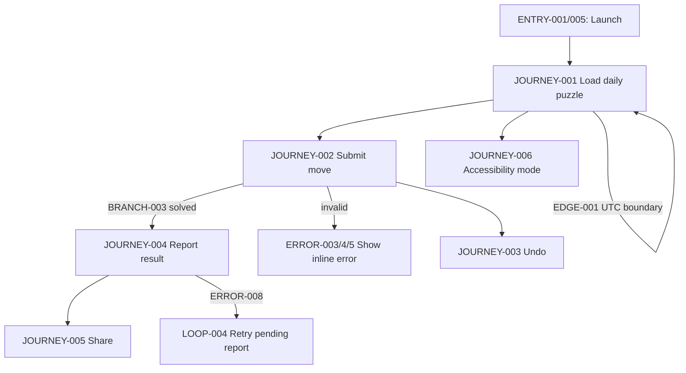
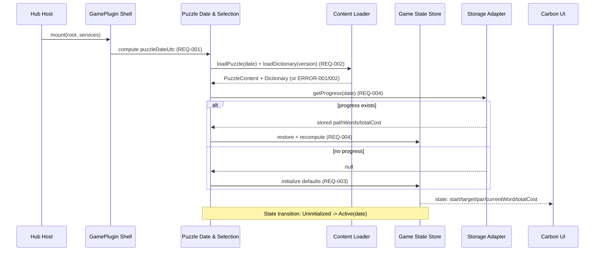
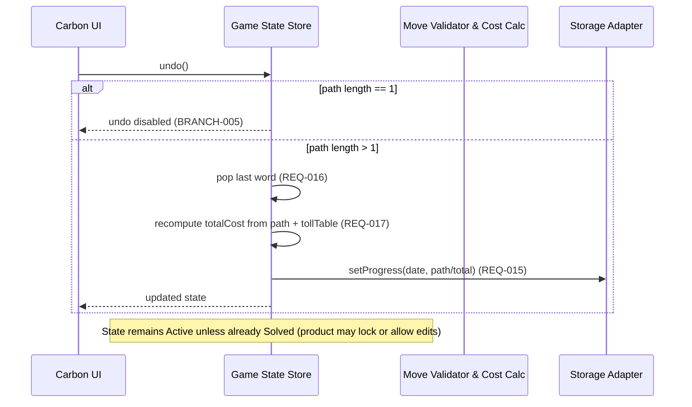
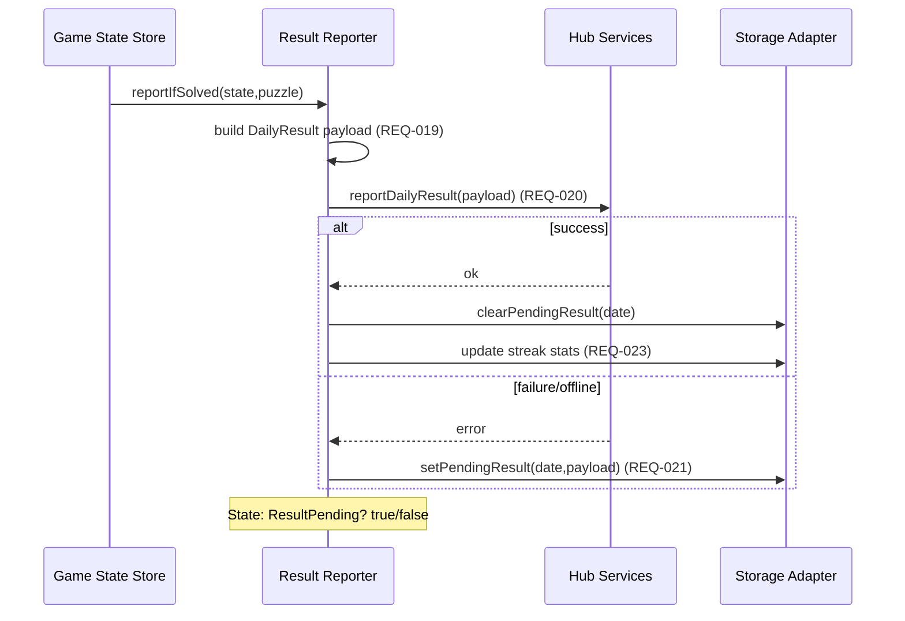
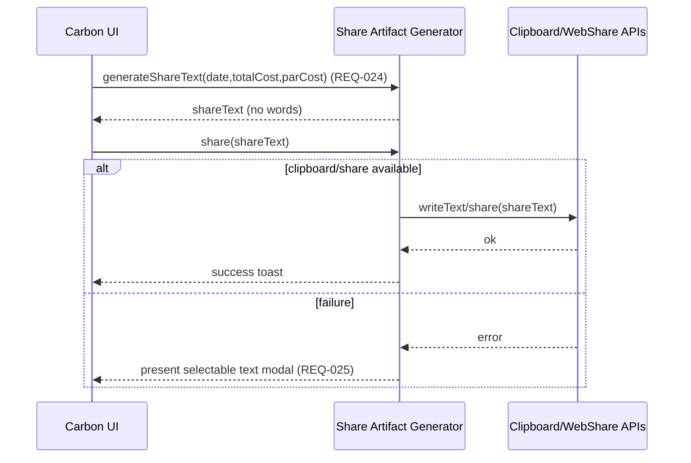
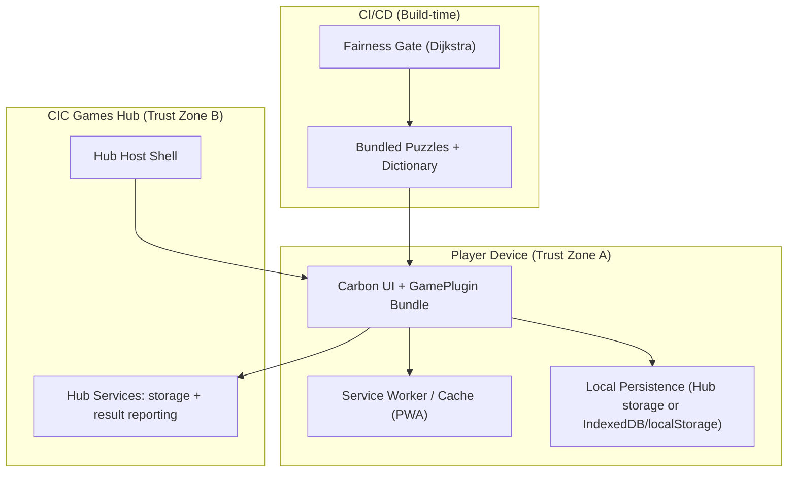

<!-- generated: 2026-07-25T18:58:43Z -->
<!-- mode: feature -->
<!-- feature-slug: tollgate -->
<!-- a2a-endpoint: https://bob-sdlc-orchestrator.2as6l7wq9qj8.eu-gb.codeengine.appdomain.cloud/v1/rpc -->

# Glossary

## Terms

### TERM-001: Tollgate
- **Definition:** The daily weighted word-ladder game that requires transforming a START word into a TARGET word by changing exactly one letter per move, minimizing total toll cost rather than number of steps.
- **Synonyms:** Tollgate daily puzzle, weighted word ladder
- **Anti-definition (what it is NOT):** Not a step-minimizing Word Ladder/Weaver puzzle; not a multiplayer game; not server-validated gameplay.
- **Source:** User request

### TERM-002: Puzzle (Daily Puzzle)
- **Definition:** A deterministic instance of Tollgate identified by a UTC date, with a specific START word, TARGET word, letter tolls, and precomputed par cost.
- **Synonyms:** daily puzzle, daily challenge
- **Anti-definition:** Not user-generated; not randomized per player; not dependent on local timezone.
- **Source:** User request

### TERM-003: UTC Day Boundary
- **Definition:** The time boundary at 00:00:00 UTC that determines which daily puzzle is active and how streaks are computed.
- **Synonyms:** UTC rollover, daily reset
- **Anti-definition:** Not device-local midnight; not configurable by user.
- **Source:** User request

### TERM-004: START Word
- **Definition:** The initial valid dictionary word for a Puzzle.
- **Synonyms:** start, source word
- **Anti-definition:** Not an arbitrary string; not necessarily the lowest-cost node.
- **Source:** User request

### TERM-005: TARGET Word
- **Definition:** The destination valid dictionary word for a Puzzle that the player must reach.
- **Synonyms:** target, goal word
- **Anti-definition:** Not unreachable; not necessarily closest by steps.
- **Source:** User request

### TERM-006: Move
- **Definition:** A single transition from one word to another where exactly one character position differs and the resulting word is valid in the bundled dictionary.
- **Synonyms:** step, turn, transition
- **Anti-definition:** Not insertion/deletion; not changing multiple letters; not moving to a non-dictionary word.
- **Source:** User request

### TERM-007: Word Graph
- **Definition:** An implicit graph where each node is a dictionary word and edges connect words that differ by exactly one letter (same length).
- **Synonyms:** one-letter-change graph, adjacency graph
- **Anti-definition:** Not a graph over substrings; not cross-length transformations.
- **Source:** User request

### TERM-008: Toll Letter
- **Definition:** A letter that has an associated non-negative integer toll value used to compute move cost.
- **Synonyms:** priced letter, weighted letter
- **Anti-definition:** Not a per-position toll; not negative cost.
- **Source:** User request

### TERM-009: Toll Table
- **Definition:** A mapping from letters (A–Z) to non-negative integer toll values used by a Puzzle.
- **Synonyms:** letter cost table, weight table
- **Anti-definition:** Not player-specific; not fetched from server at runtime.
- **Source:** User request

### TERM-010: Move Cost
- **Definition:** The toll value of the introduced letter in the resulting word (the letter that differs from the previous word after a Move).
- **Synonyms:** step cost, toll cost
- **Anti-definition:** Not the sum of all letters in the resulting word; not based on removed letter.
- **Source:** User request

### TERM-011: Total Cost
- **Definition:** The sum of Move Costs across the player’s Move sequence from START Word to TARGET Word.
- **Synonyms:** run cost, path cost
- **Anti-definition:** Not step count; not time-based scoring.
- **Source:** User request

### TERM-012: Path
- **Definition:** An ordered list of words starting at START Word where each consecutive pair is connected by a valid Move.
- **Synonyms:** solution path, ladder
- **Anti-definition:** Not a set (order matters); not containing invalid intermediate words.
- **Source:** User request

### TERM-013: Intermediate Word
- **Definition:** Any word in a Path excluding the START Word and TARGET Word.
- **Synonyms:** rung, intermediate step
- **Anti-definition:** Not optional for validity; not allowed to be non-dictionary.
- **Source:** User request

### TERM-014: Par (Par Cost)
- **Definition:** The known minimum Total Cost required to reach the TARGET Word from the START Word for a Puzzle, computed at build time on the Word Graph using Dijkstra’s algorithm and the Puzzle’s Toll Table.
- **Synonyms:** optimal cost, minimum cost
- **Anti-definition:** Not a guess; not computed from player data; not minimum steps.
- **Source:** User request

### TERM-015: Fairness Gate
- **Definition:** A build-time validation process that ensures the Puzzle is solvable and computes Par Cost using Dijkstra over the Word Graph with Move Cost weights.
- **Synonyms:** build-time solver, puzzle validator
- **Anti-definition:** Not a runtime requirement; not a server-side gate.
- **Source:** User request

### TERM-016: Bundled Dictionary
- **Definition:** The on-device word list shipped with the app used to validate whether a word is “real” and to determine adjacency for Moves.
- **Synonyms:** word list, lexicon
- **Anti-definition:** Not online lookup; not user-editable during play.
- **Source:** User request

### TERM-017: Deterministic Seeding
- **Definition:** The method of selecting the daily Puzzle content based solely on UTC date, producing the same Puzzle for all players on the same date.
- **Synonyms:** date-seeded puzzle selection
- **Anti-definition:** Not random per session; not dependent on locale/timezone.
- **Source:** User request

### TERM-018: Spoiler-safe Share Artifact
- **Definition:** A shareable text block that communicates performance (Total Cost vs Par Cost) without revealing START, TARGET, or any Intermediate Words.
- **Synonyms:** share card (text), share string
- **Anti-definition:** Not an image requiring server rendering; not disclosing words.
- **Source:** User request

### TERM-019: Daily Result
- **Definition:** The record reported to the CIC Games hub representing a player’s completion state and score for a specific Puzzle date.
- **Synonyms:** game result, completion result
- **Anti-definition:** Not a full move log necessarily; not cross-game aggregated by the plugin.
- **Source:** User request

### TERM-020: GamePlugin
- **Definition:** The integration contract for the CIC Games hub where the game is mounted via `mount(root, services)` and reports Daily Result and namespaced local stats/streak.
- **Synonyms:** plugin, hub integration
- **Anti-definition:** Not a standalone app distribution requirement; not requiring server APIs beyond hub services.
- **Source:** User request

### TERM-021: Services (Hub Services)
- **Definition:** The set of APIs provided to the GamePlugin by the CIC Games hub (e.g., storage namespace, result reporting, navigation).
- **Synonyms:** platform services, plugin services
- **Anti-definition:** Not direct network services; not global window APIs.
- **Source:** User request

### TERM-022: Offline-first
- **Definition:** A runtime property where the game is playable without network connectivity after initial install/load, using bundled content and local persistence.
- **Synonyms:** offline-capable
- **Anti-definition:** Not “no network ever”; not requiring live dictionary queries.
- **Source:** User request

### TERM-023: PWA
- **Definition:** Progressive Web App distribution target providing installability and offline caching.
- **Synonyms:** web app install
- **Anti-definition:** Not limited to browser tab only; not requiring app stores.
- **Source:** User request

### TERM-024: On-device Validation
- **Definition:** Validation of Moves and words locally using the Bundled Dictionary and game rules, without server verification.
- **Synonyms:** client-side validation
- **Anti-definition:** Not server authoritative validation; not crowd-sourced validation.
- **Source:** User request

### TERM-025: Session
- **Definition:** A single play attempt for the active Puzzle, expected to complete in under 3 minutes.
- **Synonyms:** run, play session
- **Anti-definition:** Not a multi-day campaign; not indefinite play with multiple puzzles.
- **Source:** User request

### TERM-026: Streak
- **Definition:** A count of consecutive UTC-dated Puzzle completions recorded locally within a namespaced storage scope.
- **Synonyms:** daily streak
- **Anti-definition:** Not based on local time; not global across devices unless hub sync exists.
- **Source:** User request

### TERM-027: Namespaced Local Stats
- **Definition:** Locally persisted statistics scoped to the game’s namespace within hub storage.
- **Synonyms:** local stats, per-game stats
- **Anti-definition:** Not stored under shared/global keys; not necessarily cloud-synced.
- **Source:** User request

### TERM-028: Carbon Design System UI
- **Definition:** The IBM Carbon Design System components and interaction patterns used for the game UI.
- **Synonyms:** Carbon UI
- **Anti-definition:** Not custom UI kit requirements beyond Carbon usage.
- **Source:** User request

### TERM-029: WCAG 2.1 AA Compliance
- **Definition:** Accessibility requirements including keyboard operability, visible focus, non-color-only state, and honoring `prefers-reduced-motion`.
- **Synonyms:** accessibility AA
- **Anti-definition:** Not WCAG AAA; not optional accessibility.
- **Source:** User request

### TERM-030: Dijkstra Solver (Build-time)
- **Definition:** The algorithm used in the Fairness Gate to compute Par Cost in a non-negative weighted Word Graph.
- **Synonyms:** shortest path solver (weighted)
- **Anti-definition:** Not BFS step-minimizing solver; not A* required.
- **Source:** User request

## Data Dictionary

| ID | Name | Type | Format | Range | Units | Default | Nullable | PII | Source | Validation |
|---|---|---|---|---|---|---|---|---|---|---|
| FIELD-001 | puzzleDateUtc | string | YYYY-MM-DD | valid UTC date | n/a | n/a | No | Non-PII | TERM-002 | Must parse as ISO date and match UTC day boundary |
| FIELD-002 | seed | string | opaque | 1..128 chars | n/a | derived | No | Non-PII | TERM-017 | Must be deterministically derived from FIELD-001 |
| FIELD-003 | startWord | string | uppercase A-Z | length = wordLength | n/a | n/a | No | Non-PII | TERM-004 | Must exist in TERM-016 and match FIELD-006 |
| FIELD-004 | targetWord | string | uppercase A-Z | length = wordLength | n/a | n/a | No | Non-PII | TERM-005 | Must exist in TERM-016 and match FIELD-006 |
| FIELD-005 | wordLength | integer | int | 2..15 | chars | n/a | No | Non-PII | TERM-002 | Must equal length of FIELD-003 and FIELD-004 |
| FIELD-006 | dictionaryVersion | string | semver or hash | 1..64 chars | n/a | n/a | No | Non-PII | TERM-016 | Must be present in bundled assets manifest |
| FIELD-007 | dictionaryWord | string | uppercase A-Z | length=2..15 | n/a | n/a | No | Non-PII | TERM-016 | Must match regex `^[A-Z]+$` |
| FIELD-008 | tollTable | object | map | keys A-Z | n/a | n/a | No | Non-PII | TERM-009 | Must include 26 keys A..Z |
| FIELD-009 | tollValue | integer | int | 0..999 | points | 0 | No | Non-PII | TERM-008 | Must be non-negative integer |
| FIELD-010 | parCost | integer | int | 0..999999 | points | n/a | No | Non-PII | TERM-014 | Must equal Dijkstra minimum over Word Graph for puzzle |
| FIELD-011 | currentWord | string | uppercase A-Z | length=wordLength | n/a | startWord | No | Non-PII | TERM-006 | Must exist in dictionary and equal last element of FIELD-015 |
| FIELD-012 | nextWord | string | uppercase A-Z | length=wordLength | n/a | n/a | Yes | Non-PII | TERM-006 | If present, must differ by exactly 1 position from FIELD-011 |
| FIELD-013 | changedIndex | integer | int | 0..(wordLength-1) | index | n/a | Yes | Non-PII | TERM-010 | Must be the only differing index between prior and next word |
| FIELD-014 | introducedLetter | string | char | A-Z | n/a | n/a | Yes | Non-PII | TERM-010 | Must equal nextWord[changedIndex] |
| FIELD-015 | pathWords | array<string> | list | length 1..512 | n/a | [startWord] | No | Non-PII | TERM-012 | Each adjacent pair must be a valid Move; all must be dictionary words |
| FIELD-016 | moveCost | integer | int | 0..999 | points | n/a | No | Non-PII | TERM-010 | Must equal tollTable[introducedLetter] |
| FIELD-017 | totalCost | integer | int | 0..999999 | points | 0 | No | Non-PII | TERM-011 | Must equal sum of FIELD-016 across moves |
| FIELD-018 | moveCount | integer | int | 0..512 | moves | 0 | No | Non-PII | TERM-006 | Must equal (len(pathWords)-1) |
| FIELD-019 | isSolved | boolean | boolean | true/false | n/a | false | No | Non-PII | TERM-019 | True iff currentWord == targetWord |
| FIELD-020 | solvedAtUtc | string | ISO-8601 | datetime | n/a | n/a | Yes | Non-PII | TERM-019 | If present, must be >= puzzle UTC start and parseable |
| FIELD-021 | shareText | string | text | 1..2000 chars | n/a | n/a | Yes | Non-PII | TERM-018 | Must not contain startWord/targetWord/intermediate words (see validation in REQs) |
| FIELD-022 | performanceDelta | integer | int | -999999..999999 | points | n/a | Yes | Non-PII | TERM-018 | Must equal totalCost - parCost |
| FIELD-023 | blocksString | string | text | pattern | n/a | n/a | Yes | Non-PII | TERM-018 | Must encode cost vs par without letters beyond allowed legend |
| FIELD-024 | localStatsNamespace | string | reverse-DNS | 3..128 chars | n/a | `cic.tollgate` | No | Non-PII | TERM-027 | Must be constant per app build |
| FIELD-025 | streakCount | integer | int | 0..9999 | days | 0 | No | Non-PII | TERM-026 | Must update only on UTC day completion |
| FIELD-026 | lastCompletedPuzzleDateUtc | string | YYYY-MM-DD | valid UTC date | n/a | n/a | Yes | Non-PII | TERM-026 | If present, must be <= current UTC date |
| FIELD-027 | dailyResultPayload | object | JSON | schema | n/a | n/a | No | Non-PII | TERM-019 | Must include puzzleDateUtc, isSolved, totalCost, parCost |
| FIELD-028 | platform | string | enum | {PWA,iOS,Android} | n/a | n/a | No | Non-PII | TERM-020 | Must be one of enum |
| FIELD-029 | prefersReducedMotion | boolean | boolean | true/false | n/a | from OS | No | Non-PII | TERM-029 | Must reflect media query / platform setting |
| FIELD-030 | keyboardFocusVisible | boolean | boolean | true/false | n/a | true | No | Non-PII | TERM-029 | Must be true when navigating by keyboard |
| FIELD-031 | installState | string | enum | {notInstalled,installed} | n/a | notInstalled | No | Non-PII | TERM-023 | Must reflect PWA installability state where applicable |
| FIELD-032 | networkState | string | enum | {online,offline} | n/a | n/a | No | Non-PII | TERM-022 | Must reflect runtime connectivity detection |
| FIELD-033 | pluginMountRootId | string | DOM id | 1..128 chars | n/a | n/a | No | Non-PII | TERM-020 | Must exist in DOM at mount time |

# User Journeys

## Roles

| Role ID | Role | Type | Description |
|---|---|---|---|
| ROLE-001 | Player | Primary | Plays the daily TERM-001 Puzzle, tries to minimize FIELD-017 vs FIELD-010 |
| ROLE-002 | Hub Host | System | CIC Games hub that loads the TERM-020 and provides TERM-021 |
| ROLE-003 | Build Engineer | Admin/Dev | Produces bundled content, runs TERM-015 fairness gate |
| ROLE-004 | Accessibility User | Primary | Player who relies on keyboard and assistive technology per TERM-029 |

## Entry Points

| Entry ID | Location | Trigger | Auth |
|---|---|---|---|
| ENTRY-001 | Hub route: `/games/tollgate` (example) | Player selects game tile | Hub session (out of scope); plugin receives TERM-021 |
| ENTRY-002 | `mount(root, services)` | Hub Host initializes plugin | Trusted host-to-plugin call |
| ENTRY-003 | In-game “Submit move” UI control | Player commits FIELD-012 as next word | None beyond local |
| ENTRY-004 | In-game “Share” UI control | Player requests TERM-018 | None beyond local |
| ENTRY-005 | App start / resume | App becomes active; compute FIELD-001 | None beyond local |
| ENTRY-006 | Build pipeline command | Build Engineer runs fairness gate | CI auth (out of scope) |

## Role Permission Matrix

| Capability | ROLE-001 Player | ROLE-002 Hub Host | ROLE-003 Build Engineer | ROLE-004 Accessibility User |
|---|---:|---:|---:|---:|
| Play daily Puzzle (read bundled content) | Yes | No | No | Yes |
| Validate a Move using TERM-016 | Yes | No | No | Yes |
| Persist namespaced stats (FIELD-024) | Yes | Via services | No | Yes |
| Report TERM-019 Daily Result | Yes (via plugin) | Receives | No | Yes |
| Generate spoiler-safe share text | Yes | No | No | Yes |
| Run TERM-015 fairness gate | No | No | Yes | No |

## Journeys

### JOURNEY-001: Launch daily Puzzle and load deterministic content
- **Role/Goal:** ROLE-001 loads today’s TERM-002 and can begin from TERM-004.
- **Success criteria:** UI shows FIELD-003, FIELD-004, FIELD-010, and current state (FIELD-011, FIELD-017).
- **Failure criteria:** No puzzle found for FIELD-001; corrupted assets; dictionary missing.
- **Entry:** ENTRY-001 / ENTRY-002 / ENTRY-005

**Happy path**
1. System computes FIELD-001 from current time using TERM-003.
2. System derives FIELD-002 via TERM-017 from FIELD-001.
3. System selects bundled Puzzle content (FIELD-003, FIELD-004, FIELD-008, FIELD-010, FIELD-006).
4. System initializes play state: FIELD-015 = [FIELD-003], FIELD-011 = FIELD-003, FIELD-017 = 0, FIELD-019 = false.
5. System renders UI using TERM-028 showing START/TARGET and current cost (FIELD-017) vs par (FIELD-010).

**Decision branches**
- **BRANCH-001:** If FIELD-001 has no corresponding bundled Puzzle -> show “No puzzle available” state.
- **BRANCH-002:** If stored progress exists for FIELD-001 -> restore FIELD-015, FIELD-017, FIELD-011.

**Error states**
- **ERROR-001:** Bundled content missing/corrupt  
  - Trigger: cannot load FIELD-006 assets  
  - Response: show blocking error with retry; do not allow play  
  - Recovery: reload app / reinstall
- **ERROR-002:** Dictionary missing  
  - Trigger: TERM-016 not available  
  - Response: show blocking error  
  - Recovery: reinstall / clear cache

**Loops**
- **LOOP-001:** App resume re-evaluates FIELD-001 and reloads if UTC day changed.

**Edge cases**
- **EDGE-001:** UTC day changes while app open (23:59:59 -> 00:00:00 UTC) causing active puzzle swap.
- **EDGE-002:** Offline state (FIELD-032=offline) at first load after install (assets not cached yet).
- **EDGE-003:** Cross-platform (FIELD-028) font/keyboard differences affecting input.

---

### JOURNEY-002: Enter a word and commit a Move (rule validation + cost)
- **Role/Goal:** ROLE-001 performs a valid TERM-006 and advances along a TERM-012 while tracking FIELD-017.
- **Success criteria:** Valid move updates FIELD-015, FIELD-011, FIELD-016, FIELD-017; invalid move yields actionable error.
- **Failure criteria:** Invalid word; changes not exactly one letter; non-dictionary word; concurrency conflict with restored state.
- **Entry:** ENTRY-003

**Happy path**
1. Player inputs FIELD-012.
2. System validates FIELD-012 format (same FIELD-005 length; regex for letters).
3. System computes FIELD-013 as differing index between FIELD-011 and FIELD-012.
4. System validates exactly one differing index exists (TERM-006).
5. System validates FIELD-012 exists in TERM-016.
6. System sets FIELD-014 = FIELD-012[FIELD-013].
7. System computes FIELD-016 = FIELD-008[FIELD-014] per TERM-010.
8. System appends FIELD-012 to FIELD-015 and sets FIELD-011 = FIELD-012.
9. System increments FIELD-017 by FIELD-016; updates FIELD-018.
10. System persists progress in FIELD-024 namespace.

**Decision branches**
- **BRANCH-003:** If FIELD-012 equals FIELD-004 after commit -> mark FIELD-019 true and set FIELD-020.
- **BRANCH-004:** If FIELD-012 already exists in FIELD-015 -> allow or disallow cycles (requires product decision).

**Error states**
- **ERROR-003:** Not exactly one letter changed  
  - Trigger: diff count != 1  
  - Response: show inline error text stating rule requirement  
  - Recovery: edit input and resubmit
- **ERROR-004:** Not in dictionary  
  - Trigger: FIELD-012 not in TERM-016  
  - Response: show inline error “Not a word in this game’s dictionary”  
  - Recovery: try another word
- **ERROR-005:** Wrong length / invalid characters  
  - Trigger: length != FIELD-005 or contains non A-Z  
  - Response: show inline error; prevent submit  
  - Recovery: correct input
- **ERROR-006:** Progress persistence failure  
  - Trigger: storage quota/exception  
  - Response: show non-blocking banner; keep in-memory state  
  - Recovery: continue; optionally “Export/share” (open question)

**Loops**
- **LOOP-002:** Player repeats Move entry until FIELD-019 true or abandons session.

**Edge cases**
- **EDGE-004:** Rapid double-submit causing duplicate append to FIELD-015.
- **EDGE-005:** Device autocorrect changes input unexpectedly (mobile).
- **EDGE-006:** Player enters lowercase; system normalization rules needed.
- **EDGE-007:** Very high move count (FIELD-018 near max) performance in rendering list.

---

### JOURNEY-003: Undo / edit last move
- **Role/Goal:** ROLE-001 corrects mistakes by removing the last Move.
- **Success criteria:** State reverts by one step and cost updates deterministically.
- **Failure criteria:** Undo at START; corrupted path.
- **Entry:** In-game “Undo” control (implicit UI)

**Happy path**
1. Player taps Undo.
2. System removes last element from FIELD-015 if length > 1.
3. System sets FIELD-011 to new last element.
4. System recomputes FIELD-017 from FIELD-015 and FIELD-008 (or subtract last FIELD-016 if tracked).
5. System persists updated progress.

**Decision branches**
- **BRANCH-005:** If FIELD-015 length == 1 -> disable Undo.

**Error states**
- **ERROR-007:** Path recomputation fails  
  - Trigger: invalid adjacency in stored FIELD-015  
  - Response: show recovery prompt “Reset today’s puzzle?”  
  - Recovery: reset progress

**Loops**
- **LOOP-003:** Player alternates Undo and Submit to explore paths.

**Edge cases**
- **EDGE-008:** Undo after UTC boundary swap; ensure undo applies only within same FIELD-001 puzzle.
- **EDGE-009:** Concurrent state update between restore and undo (e.g., resume + input).

---

### JOURNEY-004: Complete puzzle and report Daily Result to hub
- **Role/Goal:** ROLE-001 completes TERM-002 and records TERM-019 with the hub.
- **Success criteria:** FIELD-019 true; TERM-019 reported once per puzzle date; streak updates.
- **Failure criteria:** Reporting service unavailable; duplicate reporting.
- **Entry:** Completion event within play loop (from JOURNEY-002 BRANCH-003)

**Happy path**
1. On reaching TARGET (FIELD-011 == FIELD-004), system sets FIELD-019=true and FIELD-020.
2. System constructs FIELD-027 including FIELD-001, FIELD-019, FIELD-017, FIELD-010.
3. System calls hub service to report TERM-019 (via TERM-021).
4. System updates FIELD-025 and FIELD-026 based on TERM-003.
5. System shows completion summary: Total cost (FIELD-017), Par cost (FIELD-010), Delta (FIELD-022).

**Decision branches**
- **BRANCH-006:** If FIELD-017 == FIELD-010 -> show “Matched par”.
- **BRANCH-007:** If reporting fails -> queue for retry locally (offline-first).

**Error states**
- **ERROR-008:** Hub result reporting failed  
  - Trigger: service throws / offline  
  - Response: persist pending report; show “Will sync when online”  
  - Recovery: automatic retry on next online/resume

**Loops**
- **LOOP-004:** Retry pending report on app resume or network online transition.

**Edge cases**
- **EDGE-010:** Player completes puzzle multiple times (replay) — define whether only first completion counts.
- **EDGE-011:** Completion occurs exactly at UTC boundary (race between FIELD-001 computation and completion timestamp).

---

### JOURNEY-005: Generate spoiler-safe share artifact
- **Role/Goal:** ROLE-001 shares results without revealing words.
- **Success criteria:** FIELD-021 contains no START/TARGET/intermediate words; includes FIELD-017 vs FIELD-010; copy/share works offline.
- **Failure criteria:** Artifact leaks words; clipboard/share API unavailable.
- **Entry:** ENTRY-004

**Happy path**
1. Player taps Share.
2. System computes FIELD-022 = FIELD-017 - FIELD-010.
3. System generates FIELD-023 blocks encoding performance (e.g., cost blocks and par marker) without words.
4. System generates FIELD-021 including FIELD-001, FIELD-017, FIELD-010, and FIELD-023.
5. System copies FIELD-021 to clipboard and/or opens native share sheet depending on platform.

**Decision branches**
- **BRANCH-008:** If not solved (FIELD-019=false) -> share current status without spoilers (product decision).
- **BRANCH-009:** If clipboard API unavailable -> present manual select/copy UI.

**Error states**
- **ERROR-009:** Clipboard write failed  
  - Trigger: permission denied/unavailable  
  - Response: show modal with selectable FIELD-021 text  
  - Recovery: user copies manually

**Loops**
- **LOOP-005:** User reopens Share after additional moves; regenerate FIELD-021.

**Edge cases**
- **EDGE-012:** Localization/i18n may introduce words that accidentally match START/TARGET (ensure words are never included at all).
- **EDGE-013:** Very large FIELD-021 length due to verbose metadata (cap length).

---

### JOURNEY-006: Accessibility-first play (keyboard + reduced motion)
- **Role/Goal:** ROLE-004 can complete core gameplay using keyboard and with reduced motion settings respected.
- **Success criteria:** All actions reachable by keyboard; focus visible; state not color-only; animations reduced when FIELD-029=true.
- **Failure criteria:** Focus trap; insufficient contrast; motion not reduced.
- **Entry:** ENTRY-001 / ENTRY-003

**Happy path**
1. Player navigates to word input and controls using Tab/Shift+Tab.
2. System shows visible focus indicator (FIELD-030=true).
3. System provides text/icon indicators in addition to color for validity/cost feedback.
4. If FIELD-029=true, system uses reduced animation variants and disables non-essential motion.

**Decision branches**
- **BRANCH-010:** If screen reader detected (heuristic) -> ensure ARIA labels for controls (implementation detail).

**Error states**
- **ERROR-010:** Keyboard action unreachable  
  - Trigger: control lacks focusability  
  - Response: bug state (no in-app recovery)  
  - Recovery: none; must be fixed

**Loops**
- **LOOP-006:** Keyboard user repeats submit/undo until solved.

**Edge cases**
- **EDGE-014:** Mobile external keyboard key events differ across iOS/Android.
- **EDGE-015:** Focus order changes when error banners appear.

## Journey Map



# Requirements

### REQ-001: Compute active puzzle date by UTC
- **EARS Pattern:** Ubiquitous
- **EARS Statement:** The system shall compute FIELD-001 using the current time at the TERM-003 boundary.
- **Inputs:** System clock
- **Outputs:** FIELD-001
- **Preconditions:** App is running (TERM-025)
- **Postconditions:** FIELD-001 is available for puzzle selection
- **Invariants:** FIELD-001 is UTC-derived, not locale-derived
- **Trigger:** App start/resume (ENTRY-005)
- **Actor:** ROLE-001
- **EntityScope:** TERM-002
- **ErrorModes:** Incorrect timezone basis
- **NFR-Tags:** i18n-compatibility
- **Source:** JOURNEY-001 step 1; EDGE-001
- **Dependencies:** None
- **Priority:** P0
- **AcceptanceCriteria:**
  - **TEST-001:** Given a device set to any local timezone, when time is 00:00:01 UTC, then FIELD-001 equals that UTC date.
  - **TEST-002:** Given time is 23:59:59 UTC, then FIELD-001 equals the prior UTC date.
- **Assumptions:** Device time is reasonably accurate
- **OpenQuestions:** Should hub provide canonical UTC time service?

### REQ-002: Select deterministic daily puzzle from bundled content
- **EARS Pattern:** Event-Driven
- **EARS Statement:** When FIELD-001 is computed, the system shall select a TERM-002 from bundled content using FIELD-002 derived from TERM-017.
- **Inputs:** FIELD-001
- **Outputs:** FIELD-002, Puzzle content (FIELD-003, FIELD-004, FIELD-008, FIELD-010, FIELD-006)
- **Preconditions:** Bundled assets present
- **Postconditions:** Active puzzle content loaded
- **Invariants:** Same FIELD-001 yields same selected puzzle on same app version
- **Trigger:** Completion of REQ-001
- **Actor:** ROLE-001
- **EntityScope:** TERM-002
- **ErrorModes:** No matching puzzle
- **NFR-Tags:** offline-first
- **Source:** JOURNEY-001 steps 2–3; BRANCH-001
- **Dependencies:** REQ-001
- **Priority:** P0
- **AcceptanceCriteria:**
  - **TEST-003:** Given two devices with same app build and FIELD-001, then selected FIELD-003 and FIELD-004 are identical.
  - **TEST-004:** Given no puzzle exists for FIELD-001, then app enters “No puzzle available” state.
- **Assumptions:** Bundled content includes a mapping/selection mechanism
- **OpenQuestions:** How many days of puzzles are bundled per release?

### REQ-003: Initialize new puzzle state
- **EARS Pattern:** Event-Driven
- **EARS Statement:** When a TERM-002 is loaded without stored progress for FIELD-001, the system shall initialize FIELD-015, FIELD-011, FIELD-017, FIELD-018, and FIELD-019 to their defaults.
- **Inputs:** FIELD-003, FIELD-001
- **Outputs:** FIELD-015, FIELD-011, FIELD-017, FIELD-018, FIELD-019
- **Preconditions:** Puzzle loaded
- **Postconditions:** Player can start from START Word
- **Invariants:** FIELD-011 equals last element of FIELD-015
- **Trigger:** Puzzle load
- **Actor:** ROLE-001
- **EntityScope:** TERM-012
- **ErrorModes:** None
- **NFR-Tags:** offline-first
- **Source:** JOURNEY-001 step 4
- **Dependencies:** REQ-002
- **Priority:** P0
- **AcceptanceCriteria:**
  - **TEST-005:** Given no stored progress, then FIELD-015 equals [FIELD-003].
  - **TEST-006:** Given no stored progress, then FIELD-017 equals 0 and FIELD-019 equals false.
- **Assumptions:** Defaults as defined in data dictionary
- **OpenQuestions:** None

### REQ-004: Restore stored progress for today’s puzzle
- **EARS Pattern:** Event-Driven
- **EARS Statement:** When stored progress exists for FIELD-001 in FIELD-024, the system shall restore FIELD-015 and recompute FIELD-011 and FIELD-017.
- **Inputs:** FIELD-001, stored FIELD-015
- **Outputs:** FIELD-015, FIELD-011, FIELD-017
- **Preconditions:** Storage accessible
- **Postconditions:** Player resumes where left off
- **Invariants:** Recomputed FIELD-017 equals sum of move costs implied by FIELD-015
- **Trigger:** Puzzle load
- **Actor:** ROLE-001
- **EntityScope:** TERM-025
- **ErrorModes:** Stored path invalid
- **NFR-Tags:** offline-first
- **Source:** JOURNEY-001 BRANCH-002
- **Dependencies:** REQ-002
- **Priority:** P0
- **AcceptanceCriteria:**
  - **TEST-007:** Given stored FIELD-015 with valid adjacency, then FIELD-011 equals the last word in FIELD-015.
  - **TEST-008:** Given stored FIELD-015, then FIELD-017 equals the recomputed total from FIELD-008.
- **Assumptions:** Stored state is per puzzle date
- **OpenQuestions:** Should invalid stored state auto-reset or prompt?

### REQ-005: Validate candidate next word character set and length
- **EARS Pattern:** Event-Driven
- **EARS Statement:** When ROLE-001 submits FIELD-012, the system shall reject the submission if FIELD-012 length differs from FIELD-005.
- **Inputs:** FIELD-012, FIELD-005
- **Outputs:** Validation error state
- **Preconditions:** Puzzle active; FIELD-011 set
- **Postconditions:** Invalid submissions do not modify FIELD-015
- **Invariants:** None
- **Trigger:** ENTRY-003
- **Actor:** ROLE-001
- **EntityScope:** TERM-006
- **ErrorModes:** Wrong length
- **NFR-Tags:** accessibility
- **Source:** JOURNEY-002 steps 1–2; ERROR-005
- **Dependencies:** REQ-002, REQ-003/REQ-004
- **Priority:** P0
- **AcceptanceCriteria:**
  - **TEST-009:** Given FIELD-005=4, when FIELD-012 has length 3, then FIELD-015 remains unchanged and an inline error is shown.
- **Assumptions:** Word length is fixed within a puzzle
- **OpenQuestions:** Allow spaces/hyphens in dictionary? (likely no)

### REQ-006: Normalize submitted word to uppercase A–Z
- **EARS Pattern:** Event-Driven
- **EARS Statement:** When ROLE-001 submits FIELD-012 containing lowercase letters, the system shall normalize FIELD-012 to uppercase before further validation.
- **Inputs:** Raw input text
- **Outputs:** Normalized FIELD-012
- **Preconditions:** Puzzle active
- **Postconditions:** Validation proceeds on normalized text
- **Invariants:** Normalization does not change string length
- **Trigger:** ENTRY-003
- **Actor:** ROLE-001
- **EntityScope:** TERM-006
- **ErrorModes:** None
- **NFR-Tags:** usability, accessibility
- **Source:** JOURNEY-002 EDGE-006
- **Dependencies:** REQ-002
- **Priority:** P1
- **AcceptanceCriteria:**
  - **TEST-010:** When input is `cAt`, then normalized FIELD-012 equals `CAT`.
- **Assumptions:** Dictionary words stored uppercase
- **OpenQuestions:** Should diacritics be stripped or rejected?

### REQ-007: Validate exactly one letter changed
- **EARS Pattern:** Event-Driven
- **EARS Statement:** When ROLE-001 submits FIELD-012, the system shall reject the submission if FIELD-012 differs from FIELD-011 at a count other than 1.
- **Inputs:** FIELD-011, FIELD-012
- **Outputs:** Validation error state
- **Preconditions:** FIELD-011 exists
- **Postconditions:** Invalid submissions do not modify FIELD-015
- **Invariants:** TERM-006 rule enforced
- **Trigger:** ENTRY-003
- **Actor:** ROLE-001
- **EntityScope:** TERM-006
- **ErrorModes:** Diff count not equal to 1
- **NFR-Tags:** accessibility
- **Source:** JOURNEY-002 steps 3–4; ERROR-003
- **Dependencies:** REQ-005, REQ-006
- **Priority:** P0
- **AcceptanceCriteria:**
  - **TEST-011:** Given FIELD-011=`COLD`, when FIELD-012=`CORD`, then validation passes.
  - **TEST-012:** Given FIELD-011=`COLD`, when FIELD-012=`CARD`, then validation fails and FIELD-015 is unchanged.
- **Assumptions:** Words are same length
- **OpenQuestions:** None

### REQ-008: Validate next word exists in bundled dictionary
- **EARS Pattern:** Event-Driven
- **EARS Statement:** When ROLE-001 submits FIELD-012 that passes the one-letter-change rule, the system shall reject the submission if FIELD-012 is not present in TERM-016.
- **Inputs:** FIELD-012, TERM-016
- **Outputs:** Validation error state
- **Preconditions:** Dictionary loaded (FIELD-006)
- **Postconditions:** Invalid submissions do not modify FIELD-015
- **Invariants:** All Intermediate Words are dictionary words
- **Trigger:** ENTRY-003
- **Actor:** ROLE-001
- **EntityScope:** TERM-016
- **ErrorModes:** Word not found
- **NFR-Tags:** offline-first
- **Source:** JOURNEY-002 step 5; ERROR-004
- **Dependencies:** REQ-002, REQ-007
- **Priority:** P0
- **AcceptanceCriteria:**
  - **TEST-013:** Given FIELD-012 is absent from dictionary, then inline error “Not a word in this game’s dictionary” is shown and state is unchanged.
- **Assumptions:** Dictionary membership check is deterministic
- **OpenQuestions:** What dictionary size/word rules (proper nouns, plurals)?

### REQ-009: Compute move cost from introduced letter
- **EARS Pattern:** Event-Driven
- **EARS Statement:** When a submitted FIELD-012 is accepted, the system shall compute FIELD-016 as FIELD-008[FIELD-014].
- **Inputs:** FIELD-011, FIELD-012, FIELD-008
- **Outputs:** FIELD-013, FIELD-014, FIELD-016
- **Preconditions:** Submission accepted by REQ-008
- **Postconditions:** Move cost is known
- **Invariants:** FIELD-016 is non-negative integer
- **Trigger:** Acceptance of move
- **Actor:** ROLE-001
- **EntityScope:** TERM-010
- **ErrorModes:** Toll table missing key
- **NFR-Tags:** correctness
- **Source:** JOURNEY-002 steps 6–7
- **Dependencies:** REQ-002, REQ-008
- **Priority:** P0
- **AcceptanceCriteria:**
  - **TEST-014:** Given FIELD-011=`COLD`, FIELD-012=`CORD`, then FIELD-014=`R` and FIELD-016 equals FIELD-008[`R`].
- **Assumptions:** Exactly one differing index exists
- **OpenQuestions:** None

### REQ-010: Apply accepted move to path and totals
- **EARS Pattern:** Event-Driven
- **EARS Statement:** When a submitted FIELD-012 is accepted, the system shall append FIELD-012 to FIELD-015.
- **Inputs:** FIELD-012, FIELD-015
- **Outputs:** Updated FIELD-015
- **Preconditions:** Move accepted
- **Postconditions:** Path extended by one word
- **Invariants:** FIELD-015 is ordered
- **Trigger:** Acceptance of move
- **Actor:** ROLE-001
- **EntityScope:** TERM-012
- **ErrorModes:** Duplicate append due to double-submit
- **NFR-Tags:** reliability
- **Source:** JOURNEY-002 step 8; EDGE-004
- **Dependencies:** REQ-008
- **Priority:** P0
- **AcceptanceCriteria:**
  - **TEST-015:** When a move is accepted, then len(FIELD-015) increases by 1 and last element equals FIELD-012.
- **Assumptions:** UI prevents multiple submits; still must guard
- **OpenQuestions:** None

### REQ-011: Update current word after accepted move
- **EARS Pattern:** Event-Driven
- **EARS Statement:** When a submitted FIELD-012 is accepted, the system shall set FIELD-011 to FIELD-012.
- **Inputs:** FIELD-012
- **Outputs:** FIELD-011
- **Preconditions:** Move accepted
- **Postconditions:** Current word equals last path word
- **Invariants:** FIELD-011 == last(FIELD-015)
- **Trigger:** Acceptance of move
- **Actor:** ROLE-001
- **EntityScope:** TERM-006
- **ErrorModes:** None
- **NFR-Tags:** correctness
- **Source:** JOURNEY-002 step 8
- **Dependencies:** REQ-010
- **Priority:** P0
- **AcceptanceCriteria:**
  - **TEST-016:** After accepted move, FIELD-011 equals FIELD-012.
- **Assumptions:** FIELD-015 updated first or atomically
- **OpenQuestions:** None

### REQ-012: Update total cost after accepted move
- **EARS Pattern:** Event-Driven
- **EARS Statement:** When a submitted FIELD-012 is accepted, the system shall increment FIELD-017 by FIELD-016.
- **Inputs:** FIELD-017, FIELD-016
- **Outputs:** Updated FIELD-017
- **Preconditions:** Move accepted; FIELD-016 computed
- **Postconditions:** Total cost reflects the path
- **Invariants:** FIELD-017 equals sum of move costs for FIELD-015
- **Trigger:** Acceptance of move
- **Actor:** ROLE-001
- **EntityScope:** TERM-011
- **ErrorModes:** Integer overflow
- **NFR-Tags:** correctness
- **Source:** JOURNEY-002 step 9
- **Dependencies:** REQ-009
- **Priority:** P0
- **AcceptanceCriteria:**
  - **TEST-017:** Given FIELD-017=5 and FIELD-016=2, after accepted move FIELD-017=7.
- **Assumptions:** Totals fit within FIELD-017 range
- **OpenQuestions:** Confirm max tolls and expected max path length

### REQ-013: Determine solved state on reaching target
- **EARS Pattern:** Event-Driven
- **EARS Statement:** When FIELD-011 equals FIELD-004, the system shall set FIELD-019 to true.
- **Inputs:** FIELD-011, FIELD-004
- **Outputs:** FIELD-019
- **Preconditions:** Puzzle active
- **Postconditions:** Completion state available
- **Invariants:** If FIELD-019 is true then FIELD-011 == FIELD-004
- **Trigger:** After REQ-011 updates FIELD-011
- **Actor:** ROLE-001
- **EntityScope:** TERM-019
- **ErrorModes:** None
- **NFR-Tags:** correctness
- **Source:** JOURNEY-002 BRANCH-003
- **Dependencies:** REQ-011
- **Priority:** P0
- **AcceptanceCriteria:**
  - **TEST-018:** When FIELD-011 equals FIELD-004, FIELD-019 becomes true.
- **Assumptions:** Equality is strict string equality
- **OpenQuestions:** None

### REQ-014: Timestamp completion in UTC
- **EARS Pattern:** Event-Driven
- **EARS Statement:** When FIELD-019 becomes true, the system shall set FIELD-020 to an ISO-8601 UTC timestamp.
- **Inputs:** System clock
- **Outputs:** FIELD-020
- **Preconditions:** REQ-013 satisfied
- **Postconditions:** Completion time recorded
- **Invariants:** FIELD-020 ends with `Z` (UTC)
- **Trigger:** Solved transition
- **Actor:** ROLE-001
- **EntityScope:** TERM-019
- **ErrorModes:** Clock unavailable
- **NFR-Tags:** auditability
- **Source:** JOURNEY-004 step 1
- **Dependencies:** REQ-013
- **Priority:** P1
- **AcceptanceCriteria:**
  - **TEST-019:** On solve, FIELD-020 parses as ISO-8601 and is UTC (`Z`).
- **Assumptions:** Device provides time API
- **OpenQuestions:** None

### REQ-015: Persist progress in namespaced storage
- **EARS Pattern:** Event-Driven
- **EARS Statement:** When FIELD-015 changes, the system shall persist FIELD-015 and FIELD-017 under FIELD-024 keyed by FIELD-001.
- **Inputs:** FIELD-015, FIELD-017, FIELD-024, FIELD-001
- **Outputs:** Stored progress record
- **Preconditions:** Storage available via TERM-021 or local storage
- **Postconditions:** Progress restorable
- **Invariants:** Storage keys are namespaced
- **Trigger:** After accepted move or undo
- **Actor:** ROLE-001
- **EntityScope:** TERM-027
- **ErrorModes:** Storage write failure
- **NFR-Tags:** offline-first, reliability
- **Source:** JOURNEY-002 step 10; ERROR-006; JOURNEY-003 step 5
- **Dependencies:** REQ-010, REQ-012, REQ-020
- **Priority:** P0
- **AcceptanceCriteria:**
  - **TEST-020:** After an accepted move, reloading the app restores the same FIELD-015 for FIELD-001.
- **Assumptions:** Hub services expose storage, or fallback exists
- **OpenQuestions:** Exact storage API from CIC hub services?

### REQ-016: Undo last move
- **EARS Pattern:** Event-Driven
- **EARS Statement:** When ROLE-001 activates Undo and FIELD-015 length is greater than 1, the system shall remove the last element from FIELD-015.
- **Inputs:** FIELD-015
- **Outputs:** Updated FIELD-015
- **Preconditions:** Puzzle active
- **Postconditions:** Path shortened by one
- **Invariants:** START word remains first element
- **Trigger:** Undo UI action
- **Actor:** ROLE-001
- **EntityScope:** TERM-012
- **ErrorModes:** None
- **NFR-Tags:** usability
- **Source:** JOURNEY-003 steps 1–2; BRANCH-005
- **Dependencies:** REQ-003/REQ-004
- **Priority:** P1
- **AcceptanceCriteria:**
  - **TEST-021:** Given FIELD-015=[START,A,B], when Undo, then FIELD-015=[START,A].
- **Assumptions:** Undo is a single-step undo
- **OpenQuestions:** Provide multi-undo via long-press?

### REQ-017: Recompute totals after undo
- **EARS Pattern:** Event-Driven
- **EARS Statement:** When the system removes a word from FIELD-015 via Undo, the system shall recompute FIELD-017 from FIELD-015 and FIELD-008.
- **Inputs:** FIELD-015, FIELD-008
- **Outputs:** FIELD-017
- **Preconditions:** Undo executed
- **Postconditions:** Total cost consistent
- **Invariants:** FIELD-017 equals sum of move costs for FIELD-015
- **Trigger:** Completion of REQ-016
- **Actor:** ROLE-001
- **EntityScope:** TERM-011
- **ErrorModes:** Recompute failure due to invalid adjacency
- **NFR-Tags:** correctness
- **Source:** JOURNEY-003 step 4; ERROR-007
- **Dependencies:** REQ-016
- **Priority:** P1
- **AcceptanceCriteria:**
  - **TEST-022:** After Undo, FIELD-017 equals the sum implied by the remaining adjacent pairs.
- **Assumptions:** Toll table unchanged within a puzzle
- **OpenQuestions:** Store per-move costs to avoid recompute?

### REQ-018: Prevent duplicate move commit on rapid submit
- **EARS Pattern:** Unwanted
- **EARS Statement:** The system shall not append FIELD-012 to FIELD-015 more than once for a single submit action.
- **Inputs:** Submit event
- **Outputs:** At most one path append
- **Preconditions:** Submit control available
- **Postconditions:** Path integrity maintained
- **Invariants:** moveCount increases by 1 per submit
- **Trigger:** ENTRY-003
- **Actor:** ROLE-001
- **EntityScope:** TERM-012
- **ErrorModes:** Duplicate append
- **NFR-Tags:** reliability
- **Source:** JOURNEY-002 EDGE-004
- **Dependencies:** REQ-010
- **Priority:** P1
- **AcceptanceCriteria:**
  - **TEST-023:** Given a double-click/double-tap submit within 250ms, len(FIELD-015) increases by exactly 1.
- **Assumptions:** UI layer can debounce or state-lock
- **OpenQuestions:** Exact debounce window?

### REQ-019: Build Daily Result payload
- **EARS Pattern:** Event-Driven
- **EARS Statement:** When FIELD-019 becomes true, the system shall construct FIELD-027 containing FIELD-001, FIELD-019, FIELD-017, and FIELD-010.
- **Inputs:** FIELD-001, FIELD-019, FIELD-017, FIELD-010
- **Outputs:** FIELD-027
- **Preconditions:** Puzzle solved
- **Postconditions:** Result ready to report
- **Invariants:** Payload includes the same par as the active puzzle
- **Trigger:** Solve event
- **Actor:** ROLE-001
- **EntityScope:** TERM-019
- **ErrorModes:** Missing fields
- **NFR-Tags:** compatibility
- **Source:** JOURNEY-004 steps 1–2
- **Dependencies:** REQ-013
- **Priority:** P0
- **AcceptanceCriteria:**
  - **TEST-024:** On solve, FIELD-027 contains puzzleDateUtc=FIELD-001 and totalCost=FIELD-017 and parCost=FIELD-010.
- **Assumptions:** Hub schema accepts these fields
- **OpenQuestions:** Additional required fields for hub (duration, attempts)?

### REQ-020: Report Daily Result to hub services
- **EARS Pattern:** Event-Driven
- **EARS Statement:** When FIELD-027 is constructed, the system shall submit FIELD-027 to TERM-021 for TERM-019 reporting.
- **Inputs:** FIELD-027, TERM-021
- **Outputs:** Report submission attempt outcome
- **Preconditions:** Plugin mounted (ENTRY-002)
- **Postconditions:** Hub informed of completion (or queued)
- **Invariants:** Report is associated with FIELD-001
- **Trigger:** Completion of REQ-019
- **Actor:** ROLE-001
- **EntityScope:** TERM-020
- **ErrorModes:** Service call failure
- **NFR-Tags:** offline-first, reliability
- **Source:** JOURNEY-004 step 3; ERROR-008
- **Dependencies:** REQ-019
- **Priority:** P0
- **AcceptanceCriteria:**
  - **TEST-025:** Given services available, when solved then hub reporting function is called once with FIELD-027.
- **Assumptions:** TERM-021 provides a result reporting API
- **OpenQuestions:** Idempotency key support?

### REQ-021: Queue pending Daily Result when reporting fails
- **EARS Pattern:** Event-Driven
- **EARS Statement:** When result reporting fails for FIELD-027, the system shall persist a pending report record keyed by FIELD-001.
- **Inputs:** FIELD-027, failure signal
- **Outputs:** Stored pending report
- **Preconditions:** Reporting attempted
- **Postconditions:** Pending report exists for retry
- **Invariants:** At most one pending report per FIELD-001
- **Trigger:** ERROR-008
- **Actor:** ROLE-001
- **EntityScope:** TERM-019
- **ErrorModes:** Pending record write failure
- **NFR-Tags:** offline-first, reliability
- **Source:** JOURNEY-004 BRANCH-007; ERROR-008
- **Dependencies:** REQ-020, REQ-015
- **Priority:** P1
- **AcceptanceCriteria:**
  - **TEST-026:** Given offline network, when solved then a pending report for FIELD-001 is stored.
- **Assumptions:** Local storage available even if hub service fails
- **OpenQuestions:** Storage location: hub services vs localStorage/SQLite?

### REQ-022: Retry pending result report on network regain or resume
- **EARS Pattern:** Event-Driven
- **EARS Statement:** When FIELD-032 transitions to `online`, the system shall attempt to submit any pending report for FIELD-001.
- **Inputs:** FIELD-032, pending report
- **Outputs:** Report submission attempt
- **Preconditions:** Pending report exists
- **Postconditions:** Pending report cleared on success
- **Invariants:** Only retries for matching FIELD-001
- **Trigger:** Network online transition
- **Actor:** ROLE-001
- **EntityScope:** TERM-022
- **ErrorModes:** Retry failure
- **NFR-Tags:** offline-first, reliability
- **Source:** JOURNEY-004 LOOP-004
- **Dependencies:** REQ-021
- **Priority:** P2
- **AcceptanceCriteria:**
  - **TEST-027:** Given a pending report and network becomes online, then the system attempts submission within 5 seconds.
- **Assumptions:** Network transition events available
- **OpenQuestions:** Also retry on app resume regardless of network event?

### REQ-023: Update UTC-based streak after completion
- **EARS Pattern:** Event-Driven
- **EARS Statement:** When FIELD-019 becomes true, the system shall update FIELD-025 and FIELD-026 using FIELD-001.
- **Inputs:** FIELD-019, FIELD-001, FIELD-026
- **Outputs:** FIELD-025, FIELD-026
- **Preconditions:** Puzzle solved
- **Postconditions:** Streak stored locally
- **Invariants:** Streak increments only for consecutive UTC dates
- **Trigger:** Solve event
- **Actor:** ROLE-001
- **EntityScope:** TERM-026
- **ErrorModes:** Incorrect UTC day math
- **NFR-Tags:** correctness
- **Source:** JOURNEY-004 step 4; TERM-003
- **Dependencies:** REQ-013, REQ-015
- **Priority:** P1
- **AcceptanceCriteria:**
  - **TEST-028:** Given FIELD-026 is yesterday (UTC) and solve today, then FIELD-025 increments by 1.
  - **TEST-029:** Given FIELD-026 is not yesterday (UTC) and solve today, then FIELD-025 becomes 1.
- **Assumptions:** Only one puzzle per UTC date
- **OpenQuestions:** If user re-solves same day, does streak change?

### REQ-024: Generate spoiler-safe share text without words
- **EARS Pattern:** Event-Driven
- **EARS Statement:** When ROLE-001 requests sharing, the system shall generate FIELD-021 containing FIELD-001, FIELD-017, FIELD-010, and FIELD-023 without including FIELD-003, FIELD-004, or any element of FIELD-015.
- **Inputs:** FIELD-001, FIELD-017, FIELD-010, FIELD-015
- **Outputs:** FIELD-021, FIELD-023
- **Preconditions:** Puzzle loaded
- **Postconditions:** Share artifact ready
- **Invariants:** No puzzle words appear in FIELD-021
- **Trigger:** ENTRY-004
- **Actor:** ROLE-001
- **EntityScope:** TERM-018
- **ErrorModes:** Spoiler leakage
- **NFR-Tags:** privacy
- **Source:** JOURNEY-005 steps 2–4
- **Dependencies:** REQ-002
- **Priority:** P0
- **AcceptanceCriteria:**
  - **TEST-030:** Generated FIELD-021 does not contain FIELD-003 as a substring.
  - **TEST-031:** Generated FIELD-021 does not contain FIELD-004 as a substring.
  - **TEST-032:** Generated FIELD-021 does not contain any word from FIELD-015 as a substring.
- **Assumptions:** Share text is purely numeric/symbolic plus fixed labels
- **OpenQuestions:** Share format specification (exact blocks legend)?

### REQ-025: Provide manual copy fallback when clipboard fails
- **EARS Pattern:** Event-Driven
- **EARS Statement:** When clipboard write fails for FIELD-021, the system shall display FIELD-021 in a selectable text control.
- **Inputs:** FIELD-021, clipboard failure
- **Outputs:** Fallback UI
- **Preconditions:** Share requested
- **Postconditions:** User can manually copy
- **Invariants:** Content unchanged between clipboard and fallback
- **Trigger:** ERROR-009
- **Actor:** ROLE-001
- **EntityScope:** TERM-018
- **ErrorModes:** Clipboard failure
- **NFR-Tags:** accessibility, compatibility
- **Source:** JOURNEY-005 ERROR-009
- **Dependencies:** REQ-024
- **Priority:** P1
- **AcceptanceCriteria:**
  - **TEST-033:** Given clipboard API throws, then modal appears with FIELD-021 selectable.
- **Assumptions:** UI supports selection on all platforms
- **OpenQuestions:** Use native share sheet on iOS/Android?

### REQ-026: Enforce per-letter toll table completeness
- **EARS Pattern:** Ubiquitous
- **EARS Statement:** The system shall require FIELD-008 to include toll values for all letters A through Z.
- **Inputs:** FIELD-008
- **Outputs:** Validation pass/fail
- **Preconditions:** Puzzle content loaded
- **Postconditions:** Move costs always computable
- **Invariants:** No missing keys
- **Trigger:** Puzzle load
- **Actor:** ROLE-001
- **EntityScope:** TERM-009
- **ErrorModes:** Missing toll key
- **NFR-Tags:** correctness
- **Source:** JOURNEY-001 step 3; FIELD-008 validation
- **Dependencies:** REQ-002
- **Priority:** P0
- **AcceptanceCriteria:**
  - **TEST-034:** Given FIELD-008 missing key `Q`, puzzle load fails with content error.
- **Assumptions:** Toll values are integers
- **OpenQuestions:** Allow non-ASCII letters? (likely no)

### REQ-027: Integrate as CIC GamePlugin mount contract
- **EARS Pattern:** Event-Driven
- **EARS Statement:** When ENTRY-002 is invoked with FIELD-033 and TERM-021, the system shall render the game UI into the provided root element.
- **Inputs:** FIELD-033, TERM-021
- **Outputs:** Mounted UI
- **Preconditions:** Root element exists
- **Postconditions:** Game visible and interactive
- **Invariants:** No DOM writes outside root (within reason)
- **Trigger:** mount(root, services)
- **Actor:** ROLE-002
- **EntityScope:** TERM-020
- **ErrorModes:** Missing root element
- **NFR-Tags:** compatibility
- **Source:** User request; ENTRY-002
- **Dependencies:** None
- **Priority:** P0
- **AcceptanceCriteria:**
  - **TEST-035:** Given valid root element, calling mount renders START/TARGET UI within root.
- **Assumptions:** Plugin lifecycle hooks defined by hub
- **OpenQuestions:** Required unmount/dispose contract?

---

### NFR-001: Offline-first gameplay availability
- **EARS Pattern:** Ubiquitous
- **EARS Statement:** The system shall permit completing a TERM-002 without network connectivity by using bundled content and on-device validation.
- **Inputs:** FIELD-032, bundled assets
- **Outputs:** Playable game state
- **Preconditions:** Assets previously installed/cached
- **Postconditions:** FIELD-019 can be achieved offline
- **Invariants:** No network dependency for move validation
- **Trigger:** Any gameplay action
- **Actor:** ROLE-001
- **EntityScope:** TERM-022
- **ErrorModes:** Asset not cached
- **NFR-Tags:** offline-first
- **Source:** JOURNEY-001 EDGE-002; JOURNEY-002 steps 2–5
- **Dependencies:** REQ-002, REQ-008
- **Priority:** P0
- **AcceptanceCriteria:**
  - **TEST-036:** Given FIELD-032=offline and assets cached, user can submit valid moves and reach solved state.
- **Assumptions:** Initial load may require connectivity once
- **OpenQuestions:** PWA service worker caching strategy?

### NFR-002: Session length support (interaction efficiency constraint)
- **EARS Pattern:** Ubiquitous
- **EARS Statement:** The system shall allow reaching FIELD-019 within a TERM-025 expected duration by minimizing required screens to a single primary play screen.
- **Inputs:** UI flow
- **Outputs:** Single-screen play
- **Preconditions:** Puzzle loaded
- **Postconditions:** Core loop uninterrupted
- **Invariants:** Submit/undo/share accessible from primary screen
- **Trigger:** Normal play
- **Actor:** ROLE-001
- **EntityScope:** TERM-025
- **ErrorModes:** None
- **NFR-Tags:** usability
- **Source:** User request “Sub-3-minute session”; JOURNEY-002 LOOP-002
- **Dependencies:** REQ-002, REQ-010, REQ-016, REQ-024
- **Priority:** P2
- **AcceptanceCriteria:**
  - **TEST-037:** Core actions (submit, undo, share) are available without navigating away from the play screen.
- **Assumptions:** Time-to-complete is design-driven; not strictly testable on all users
- **OpenQuestions:** Track duration metric in DailyResult?

### NFR-003: Keyboard operability for all core actions
- **EARS Pattern:** Ubiquitous
- **EARS Statement:** The system shall provide keyboard access to word input, submit, undo, and share controls.
- **Inputs:** Keyboard events
- **Outputs:** Activated actions
- **Preconditions:** Focus within app
- **Postconditions:** Actions executed without pointer
- **Invariants:** No keyboard traps
- **Trigger:** ROLE-004 interaction
- **Actor:** ROLE-004
- **EntityScope:** TERM-029
- **ErrorModes:** Unfocusable control
- **NFR-Tags:** accessibility
- **Source:** JOURNEY-006 steps 1–2; ERROR-010
- **Dependencies:** REQ-010, REQ-016, REQ-024
- **Priority:** P0
- **AcceptanceCriteria:**
  - **TEST-038:** Using only Tab/Enter/Space, user can submit a move, undo, and open share.
- **Assumptions:** Web and native wrappers support keyboard
- **OpenQuestions:** Define keyboard shortcuts beyond default activation?

### NFR-004: Visible focus indication
- **EARS Pattern:** Ubiquitous
- **EARS Statement:** The system shall display a visible focus indicator on the currently focused interactive element.
- **Inputs:** Focus state
- **Outputs:** Visual focus UI
- **Preconditions:** Keyboard navigation
- **Postconditions:** FIELD-030 effectively true in UX
- **Invariants:** Focus indicator meets WCAG 2.1 AA expectations
- **Trigger:** Focus change
- **Actor:** ROLE-004
- **EntityScope:** TERM-029
- **ErrorModes:** Focus not visible
- **NFR-Tags:** accessibility
- **Source:** User request; JOURNEY-006 step 2
- **Dependencies:** REQ-027
- **Priority:** P0
- **AcceptanceCriteria:**
  - **TEST-039:** When tabbing through controls, each focused control shows a visible outline distinct from unfocused state.
- **Assumptions:** Carbon focus styles available
- **OpenQuestions:** Contrast requirements specifics for focus ring?

### NFR-005: Do not convey state by color alone
- **EARS Pattern:** Ubiquitous
- **EARS Statement:** The system shall present move validity and completion status using text and/or icons in addition to color.
- **Inputs:** Validation state; solved state
- **Outputs:** Multimodal indicators
- **Preconditions:** UI rendered
- **Postconditions:** Status understandable without color
- **Invariants:** Color is supplementary only
- **Trigger:** Validation error or solve
- **Actor:** ROLE-004
- **EntityScope:** TERM-029
- **ErrorModes:** Color-only feedback
- **NFR-Tags:** accessibility
- **Source:** User request; JOURNEY-006 step 3
- **Dependencies:** REQ-007, REQ-008, REQ-013
- **Priority:** P0
- **AcceptanceCriteria:**
  - **TEST-040:** When an invalid move occurs, an error message is shown in text regardless of color styling.
- **Assumptions:** Icons are accessible with labels
- **OpenQuestions:** Icon set from Carbon?

### NFR-006: Honor prefers-reduced-motion
- **EARS Pattern:** State-Driven
- **EARS Statement:** While FIELD-029 is true, the system shall disable non-essential animations and use reduced-motion transitions.
- **Inputs:** FIELD-029
- **Outputs:** Reduced motion UI behavior
- **Preconditions:** UI rendered
- **Postconditions:** Motion reduced
- **Invariants:** Core feedback remains perceivable
- **Trigger:** App render and setting changes
- **Actor:** ROLE-004
- **EntityScope:** TERM-029
- **ErrorModes:** Motion remains enabled
- **NFR-Tags:** accessibility
- **Source:** User request; JOURNEY-006 step 4
- **Dependencies:** REQ-027
- **Priority:** P1
- **AcceptanceCriteria:**
  - **TEST-041:** With prefers-reduced-motion enabled, no continuous animations are shown and transitions use reduced settings.
- **Assumptions:** Platform exposes the setting (web media query / native)
- **OpenQuestions:** Define “non-essential” animations list

### NFR-007: On-device validation privacy constraint
- **EARS Pattern:** Unwanted
- **EARS Statement:** The system shall not transmit FIELD-015 or submitted words to any network endpoint during gameplay.
- **Inputs:** Gameplay events
- **Outputs:** None (network)
- **Preconditions:** Gameplay active
- **Postconditions:** No word leakage
- **Invariants:** Network calls limited to optional result reporting (REQ-020) without word data
- **Trigger:** Any submit/undo
- **Actor:** ROLE-001
- **EntityScope:** TERM-024
- **ErrorModes:** Accidental telemetry
- **NFR-Tags:** privacy, security
- **Source:** User request “Fully client-side; on-device validation”; JOURNEY-002
- **Dependencies:** REQ-020
- **Priority:** P0
- **AcceptanceCriteria:**
  - **TEST-042:** Inspect network logs during play; no requests contain START/TARGET/intermediate words.
- **Assumptions:** Analytics can be disabled or word-free
- **OpenQuestions:** Is any analytics permitted if word-free?

### NFR-008: Observability for critical errors (local)
- **EARS Pattern:** Event-Driven
- **EARS Statement:** When ERROR-001 or ERROR-002 occurs, the system shall record a local diagnostic event including FIELD-001 and FIELD-006.
- **Inputs:** Error occurrence, FIELD-001, FIELD-006
- **Outputs:** Local diagnostic record
- **Preconditions:** App running
- **Postconditions:** Debugging info available without network
- **Invariants:** Diagnostic record contains no TERM-012 word list
- **Trigger:** ERROR-001 or ERROR-002
- **Actor:** ROLE-001
- **EntityScope:** TERM-022
- **ErrorModes:** Diagnostic write failure
- **NFR-Tags:** observability, privacy
- **Source:** JOURNEY-001 ERROR-001/ERROR-002
- **Dependencies:** REQ-001, REQ-002
- **Priority:** P2
- **AcceptanceCriteria:**
  - **TEST-043:** Simulate missing dictionary; verify a local log entry exists with puzzleDateUtc and dictionaryVersion and no words.
- **Assumptions:** Local logging facility exists
- **OpenQuestions:** Should diagnostics be exportable by user?
# Architecture

## Components & Responsibilities

### GamePlugin Shell (Mount Adapter)
- **Responsibilities**
  - Implement `mount(root, services)` and render the application into the provided root (REQ-027).
  - Register lifecycle listeners (resume/visibility, online/offline) to trigger reload/retry logic (REQ-001, REQ-022).
  - Provide a single “primary play screen” composition to satisfy sub-3-minute session constraint (NFR-002).
- **Boundaries**
  - **Owns:** plugin bootstrapping, wiring services into internal modules, top-level error boundary.
  - **Does not own:** hub authentication/session, cross-game navigation rules (provided by hub).
- **Exposes (interfaces)**
  - `mount(root: HTMLElement, services: HubServices): UnmountFn|void` (TERM-020).
- **Consumes (interfaces)**
  - Hub `services` APIs (storage namespace, result reporting, optional navigation) (TERM-021).

### Puzzle Date & Selection Service
- **Responsibilities**
  - Compute active `puzzleDateUtc` using UTC boundary rules (REQ-001).
  - Derive deterministic seed and select the bundled puzzle for the date (REQ-002).
  - Validate puzzle content invariants on load (toll-table completeness REQ-026; dictionary present ERROR-002).
  - Handle UTC rollover while app open by reloading puzzle state (JOURNEY-001 LOOP-001 / EDGE-001).
- **Boundaries**
  - **Owns:** date calculation, seed derivation, mapping from date/seed → puzzle asset id.
  - **Does not own:** generating new puzzles (build-time only), server time authority.
- **Exposes**
  - `getActivePuzzle(now): {puzzleDateUtc, puzzle}`
  - `onUtcDayBoundary(callback)`
- **Consumes**
  - Bundled assets manifest (puzzles index, dictionary version).
  - System clock.

### Bundled Content Loader (Assets + Dictionary)
- **Responsibilities**
  - Load puzzle bundle (start/target/tollTable/par/dictionaryVersion) for a given date (REQ-002).
  - Load bundled dictionary and expose membership checks (REQ-008).
  - Surface blocking content errors (ERROR-001/ERROR-002) and record local diagnostics (NFR-008).
- **Boundaries**
  - **Owns:** reading packaged/cached assets; content schema validation.
  - **Does not own:** runtime mutation of dictionary/puzzles.
- **Exposes**
  - `loadPuzzle(date): PuzzleContent`
  - `loadDictionary(version): Dictionary`
  - `dictionary.has(word): boolean`
- **Consumes**
  - PWA cache / app bundle resources (service worker cache or native packaged assets).

### Game State Store (Session + Persistence Orchestrator)
- **Responsibilities**
  - Initialize new state for the day (REQ-003).
  - Restore stored progress and recompute derived values (REQ-004).
  - Apply move commits atomically and persist after state change (REQ-010/11/12/15).
  - Apply undo and recompute totals (REQ-016/17).
  - Prevent duplicate commit on rapid submit (REQ-018).
  - Maintain solved state + completion timestamp (REQ-013/14).
- **Boundaries**
  - **Owns:** canonical runtime state: `pathWords`, `currentWord`, `totalCost`, `isSolved`, `solvedAtUtc`.
  - **Does not own:** UI rendering; network calls beyond delegating to Result Reporter.
- **Exposes**
  - `initOrRestore(date, puzzle): GameState`
  - `submitCandidate(nextWordRaw): ValidationResult`
  - `undo(): void`
  - `resetToday(): void` (recovery for invalid stored state; aligns to ERROR-007)
- **Consumes**
  - Storage Adapter (namespaced).
  - Move Validator / Cost Calculator.
  - Puzzle Date & Selection Service (for day changes).

### Move Validator & Cost Calculator
- **Responsibilities**
  - Normalize submitted word to uppercase (REQ-006).
  - Validate length/charset (REQ-005), one-letter-change rule (REQ-007), dictionary membership (REQ-008).
  - Compute changed index / introduced letter / move cost (REQ-009) and update totals (REQ-012).
  - Enforce “no network word leakage” by ensuring validation uses only local dictionary (NFR-007).
- **Boundaries**
  - **Owns:** rule correctness; deterministic cost computation.
  - **Does not own:** dictionary data itself (provided by loader).
- **Exposes**
  - `validateAndScore(currentWord, nextWordRaw, puzzle, dictionary): {nextWord, changedIndex, introducedLetter, moveCost}`
- **Consumes**
  - Dictionary membership interface.
  - Puzzle toll table.

### Storage Adapter (Namespaced Local Stats/Progress)
- **Responsibilities**
  - Persist progress keyed by puzzle date in a namespaced scope (REQ-015).
  - Persist pending result report keyed by puzzle date (REQ-021).
  - Persist streak counters and last completion date (REQ-023).
  - Provide graceful degradation on quota/errors (ERROR-006).
- **Boundaries**
  - **Owns:** key structure, serialization, migrations between schema versions.
  - **Does not own:** storage medium implementation details beyond adapter (hub storage vs Web Storage).
- **Exposes**
  - `getProgress(date) / setProgress(date, record)`
  - `getPendingResult(date) / setPendingResult(date, payload) / clearPendingResult(date)`
  - `getStats() / setStats(stats)` (streak, lastCompletedPuzzleDateUtc)
- **Consumes**
  - Hub storage service if available; otherwise local persistence (e.g., IndexedDB/localStorage) as fallback.

### Result Reporter (Hub Integration)
- **Responsibilities**
  - Build Daily Result payload on solve (REQ-019).
  - Report result via hub services and ensure “report once per puzzle date” semantics (REQ-020, JOURNEY-004).
  - Queue pending result on failure and retry on connectivity/resume (REQ-021/REQ-022).
- **Boundaries**
  - **Owns:** idempotency handling at client (per-date sent flag), retry policy.
  - **Does not own:** hub-side aggregation, authentication, global leaderboards.
- **Exposes**
  - `reportIfSolved(state, puzzle): Promise<void>`
  - `retryPending(date): Promise<void>`
- **Consumes**
  - Hub services result-reporting API.
  - Storage Adapter (pending report).

### Share Artifact Generator
- **Responsibilities**
  - Generate spoiler-safe text artifact including date and cost vs par blocks without any puzzle words (REQ-024).
  - Provide clipboard/share invocation with manual fallback UI (REQ-025).
- **Boundaries**
  - **Owns:** share format and validation that no words appear.
  - **Does not own:** OS-level share sheet availability.
- **Exposes**
  - `generateShareText(date, totalCost, parCost): {shareText, blocksString}`
  - `share(shareText): Promise<ShareOutcome>`
- **Consumes**
  - Clipboard API / Web Share API (where available).

### Accessibility & Carbon UI Layer
- **Responsibilities**
  - Implement the single-screen play UI using Carbon components (TERM-028).
  - Ensure keyboard operability, visible focus, non-color-only state, reduced motion compliance (NFR-003..NFR-006).
  - Present inline validation errors and recovery prompts.
- **Boundaries**
  - **Owns:** UI semantics, ARIA labeling, focus management, reduced-motion styling toggles.
  - **Does not own:** game rule logic or persistence.
- **Exposes**
  - UI routes/views within the plugin root (no external routing required).
- **Consumes**
  - Game State Store selectors/actions.
  - `prefers-reduced-motion` media query (web) / platform setting.

### Build-time Fairness Gate (CI Tooling)
- **Responsibilities**
  - Validate each daily puzzle is solvable and compute `parCost` using Dijkstra on word graph (TERM-015, TERM-030).
  - Emit bundled puzzle assets: start/target, toll table, par cost, dictionary version.
- **Boundaries**
  - **Owns:** puzzle generation/validation correctness at build time.
  - **Does not own:** runtime gameplay enforcement (client is not server-validated).
- **Exposes**
  - CLI command in CI (ENTRY-006).
- **Consumes**
  - Source dictionary, puzzle candidate list, Dijkstra implementation.

---

## Data Flow

### JOURNEY-001: Launch daily Puzzle and load deterministic content


### JOURNEY-002: Enter a word and commit a Move
```mermaid
sequenceDiagram
  participant UI as Carbon UI
  participant Store as Game State Store
  participant Rules as Move Validator & Cost Calc
  participant Dict as Dictionary
  participant Storage as Storage Adapter
  participant Reporter as Result Reporter

  UI->>Store: submitCandidate(nextWordRaw)
  Store->>Rules: normalize + validate + score (REQ-005..REQ-009)
  Rules->>Dict: has(nextWord) (REQ-008)
  alt invalid
    Rules-->>Store: validation error (ERROR-003/4/5)
    Store-->>UI: show inline error (NFR-005)
  else valid
    Rules-->>Store: nextWord + moveCost
    Store->>Store: append path, set currentWord, add cost (REQ-010/11/12)
    Store->>Storage: setProgress(date, path/total) (REQ-015)
    alt reached target
      Store->>Store: isSolved=true; solvedAtUtc set (REQ-013/14)
      Store->>Reporter: reportIfSolved(state,puzzle) (REQ-019/20)
    end
    Store-->>UI: updated state
  end
  Note over Store: State: Active -> Active(updated) OR Active -> Solved
```

### JOURNEY-003: Undo / edit last move


### JOURNEY-004: Complete puzzle and report Daily Result to hub


### JOURNEY-005: Generate spoiler-safe share artifact


### JOURNEY-006: Accessibility-first play
```mermaid
sequenceDiagram
  participant User as Accessibility User
  participant UI as Carbon UI
  participant Store as Game State Store

  User->>UI: Tab/Shift+Tab navigation
  UI-->>User: visible focus indicator (NFR-004)
  User->>UI: Enter/Space activates Submit/Undo/Share (NFR-003)
  UI->>Store: actions (submit/undo/share)
  UI-->>User: text+icon feedback; reduced motion if enabled (NFR-005/006)
```

---

## Deployment Topology

- **Runtime environments**
  - **Web/PWA:** Single-page application loaded by CIC hub, with Service Worker for offline caching.
  - **iOS/Android:** WebView-based wrapper or equivalent “hosted PWA container” embedding the same web bundle; uses platform share/clipboard where available.
  - **Build-time:** CI runner executes Fairness Gate CLI and packages assets.

- **Network boundaries / trust zones**
  - **Trust Zone A (Device/Client):** All gameplay logic, dictionary, puzzle content, progress storage.
  - **Trust Zone B (CIC Hub):** Provides authenticated session and plugin services; plugin trusts services object but treats failures as expected.
  - **Trust Zone C (Optional network):** Only for hub result reporting; no word/path data transmitted (NFR-007).

- **Scaling units and limits**
  - Client-only scaling: per-user device resources.
  - Hub reporting endpoint scaling: out of scope, but plugin assumes intermittent availability and retries (REQ-021/022).
  - Limits: `pathWords` length capped (FIELD-015 up to 512) to bound memory/UI rendering.



---

## Security Architecture

- **AuthN (by actor type)**
  - **Player (ROLE-001/004):** AuthN handled by hub session; plugin receives already-authenticated `services` object. No in-game login.
  - **Hub Host (ROLE-002):** Trusted caller of `mount`; integrity relies on hub.
  - **Build Engineer (ROLE-003):** CI auth to run pipeline; out of scope for runtime.

- **AuthZ model**
  - **Capability-based via injected services**: plugin can only access what `services` exposes. Within the plugin, no multi-user roles; actions are local.
  - For result reporting, rely on hub service enforcing user identity; plugin sends only daily result payload (REQ-019/020).

- **Secret management**
  - No secrets stored in plugin. If hub services require tokens, they remain encapsulated within hub (not in plugin storage).
  - Service Worker cache contains only public game assets and local state.

- **Data classification & encryption**
  - **Classification:** All stored fields are Non-PII per data dictionary; still treat progress as user data.
  - **At rest:** Browser storage encryption not guaranteed; minimize sensitivity (no words sent over network; local words are intrinsic to gameplay).
  - **In transit:** Hub reporting uses HTTPS (assumed). Payload excludes path/words (NFR-007).

- **Threat model summary (top 5)**
  1. **Spoiler leakage via share artifact**
     - *Threat:* Share text accidentally includes START/TARGET/path.
     - *Mitigation:* Generate share text from numeric/symbolic legend only (REQ-024) + automated tests scanning for substrings (TEST-030..032).
  2. **Word/path exfiltration via telemetry or hub calls**
     - *Threat:* Logging/analytics includes entered words.
     - *Mitigation:* Enforce “no network word data” policy (NFR-007); structured logging redaction; code review rule: never log `pathWords` or `nextWord`.
  3. **Tampering with local storage to fake results/streak**
     - *Threat:* User edits local storage to report impossible scores.
     - *Mitigation:* Accept that runtime is non-authoritative (per requirements); optionally include lightweight consistency checks (e.g., totalCost recompute) before reporting; hub may treat as casual.
  4. **Supply chain / asset tampering**
     - *Threat:* Modified puzzle assets/dictionary changes par or rules.
     - *Mitigation:* Bundle assets with integrity (content hashes in manifest); serve over HTTPS; consider Subresource Integrity where applicable in hub.
  5. **XSS within plugin root leading to data access**
     - *Threat:* Injection could read storage and manipulate UI.
     - *Mitigation:* Avoid `dangerouslySetInnerHTML`; strict Content Security Policy from hub; sanitize any dynamic text; keep share text generation deterministic.

---

## Integration Points

### Inbound interfaces
- **GamePlugin mount**
  - **Protocol:** in-process JS call
  - **Interface:** `mount(root, services)` (TERM-020)
  - **Failure mode:** missing root element (REQ-027 error); show fatal UI error
  - **SLA expectation:** immediate/local (no network)

- **UI actions**
  - **Routes/controls:** Submit move (ENTRY-003), Undo, Share (ENTRY-004)
  - **Failure mode:** validation errors (ERROR-003/4/5); clipboard failures (ERROR-009)

- **Network state events**
  - **Protocol:** browser `online/offline` events or hub-provided signal
  - **Use:** trigger retry pending report (REQ-022)
  - **Failure mode:** event not fired; fallback to retry on resume (open question)

### Outbound dependencies
- **Hub Storage Service (optional but preferred)**
  - **Protocol:** in-process service API
  - **Schema reference:** progress record includes `puzzleDateUtc`, `pathWords`, `totalCost`; stats include `streakCount`, `lastCompletedPuzzleDateUtc`
  - **Failure mode:** quota/exception (ERROR-006) → keep in-memory, show banner
  - **SLA:** best-effort local; must not block play

- **Hub Result Reporting Service**
  - **Protocol:** in-process service API (hub may call network)
  - **Schema reference:** `dailyResultPayload` (FIELD-027) with `puzzleDateUtc`, `isSolved`, `totalCost`, `parCost` (REQ-019)
  - **Failure mode:** throws/offline (ERROR-008) → queue pending (REQ-021), retry (REQ-022)
  - **SLA:** eventual; not required for offline completion

- **Clipboard / Web Share**
  - **Protocol:** Web APIs / platform bridge
  - **Schema:** plain text share string (FIELD-021)
  - **Failure mode:** permission denied/unavailable → selectable modal fallback (REQ-025)
  - **SLA:** immediate; graceful degradation required

---

## Architecture Decision Records

### ADR-001: Client-side authoritative gameplay with build-time “Fairness Gate”
- **Status:** Accepted
- **Context:** Requirements specify fully client-side, on-device validation, offline-first, and par precomputed at build time.
- **Decision:** Make the client the sole runtime authority for move validation and scoring; compute `parCost` via build-time Dijkstra and ship it with puzzles.
- **Consequences:**
  - (+) Offline play is always possible; low latency and no server dependency.
  - (-) Hub cannot fully trust reported results; users can tamper with local state.
- **Alternatives:**
  - Server-authoritative validation and scoring (rejected: violates offline-first and “no server-validated gameplay”).
  - Hybrid: server validates only on completion (rejected: still blocks offline completion or complicates).

### ADR-002: Storage strategy: prefer hub namespaced storage with local fallback
- **Status:** Proposed
- **Context:** REQ-015/021 require persistence; exact hub storage API is an open question; game must work offline.
- **Decision:** Implement a Storage Adapter that uses hub-provided namespaced storage when available; otherwise falls back to IndexedDB/localStorage.
- **Consequences:**
  - (+) Works consistently inside hub and in standalone/offline contexts.
  - (-) Potential divergence of stored data if both backends used across environments; requires careful keying/migrations.
- **Alternatives:**
  - Only hub storage (risk: unavailable or fails in offline/edge cases).
  - Only browser storage (loses hub integration benefits and potential sync semantics).

### ADR-003: Result reporting idempotency keyed by `puzzleDateUtc`
- **Status:** Accepted
- **Context:** REQ-020 wants “report once per puzzle date”; failures require queueing and retry; hub idempotency support is unknown.
- **Decision:** Enforce client-side idempotency using `puzzleDateUtc` as the idempotency key; store a “reported” flag or clear pending on success; never send `pathWords`.
- **Consequences:**
  - (+) Prevents duplicate submissions from retries/double completion flows.
  - (-) If hub expects a different idempotency mechanism, duplicates may still occur across devices.
- **Alternatives:**
  - Rely entirely on hub to dedupe (risky if hub doesn’t).
  - Include a generated UUID per solve attempt (harder to reason about once-per-day semantics).

### ADR-004: Cycle handling in paths (allow vs disallow revisits)
- **Status:** Proposed
- **Context:** JOURNEY-002 BRANCH-004 asks whether repeating a word in `pathWords` is allowed.
- **Decision:** Default to **allow cycles** (simple rule set) but optionally warn about revisits; do not prohibit unless product decides.
- **Consequences:**
  - (+) Simpler UX; aligns with “classic” ladders where revisits are possible.
  - (-) Can enable infinite loops; requires UI protections (move limit) and may confuse scoring exploration.
- **Alternatives:**
  - Disallow revisits (more constraints, but clearer and bounded).

---

## Cross-Cutting Concerns

- **Logging / tracing / metrics / alerting**
  - Local-only diagnostic logging for blocking asset errors (NFR-008), including `puzzleDateUtc` and `dictionaryVersion` only; **never** log `pathWords` or submitted words (NFR-007).
  - Optional lightweight counters (locally): number of validation failures by type, pending-report retries; exportable only if product approves (open question).
  - If hub provides telemetry, ensure strict redaction policy and schema review.

- **Configuration and feature flags**
  - Build-time flags: puzzle pack range (days bundled), dictionary version, share format version.
  - Runtime flags (optional): cycle policy (ADR-004), “share before solved” behavior (BRANCH-008), retry-on-resume behavior (REQ-022 open question).

- **Error handling strategy**
  - **Blocking errors** (missing/corrupt assets, missing dictionary): show full-screen error with retry/reload guidance (ERROR-001/002) and write local diagnostic (NFR-008).
  - **Inline validation errors**: non-blocking, text-first messages with ARIA live region for screen readers; never rely on color only (NFR-005).
  - **Persistence/reporting failures**: non-blocking banner + best-effort retry; keep in-memory state authoritative for the session (ERROR-006/008).

- **Backwards compatibility / versioning**
  - Version bundled assets via `dictionaryVersion` and puzzle pack manifest hash; store these alongside persisted progress to detect mismatches after upgrade.
  - Storage record versioning: include `schemaVersion` in persisted blobs; on mismatch, attempt migration or prompt reset (ties to REQ-004 open question).
  - Share text format version tag to ensure future parsability without introducing spoilers (e.g., `Tollgate YYYY-MM-DD v1`), while still meeting REQ-024.
# Review

## Risks (table sorted by severity descending)

| ID | Title | Category | Likelihood | Impact | Severity | Affected requirements | Mitigation | Owner | Status |
|---|---|---|---|---|---|---|---|---|---|
| RISK-001 | Hub services contract ambiguity (storage + result reporting + lifecycle) could block integration | Dependency | High | High | **Critical** | REQ-015, REQ-019..REQ-023, REQ-027, NFR-001 | Obtain/lock HubServices interface spec (methods, quotas, sync semantics, errors). Create adapter with feature-detection + contract tests against a hub-provided mock. Define plugin lifecycle incl. unmount/dispose and resume/visibility hooks. | Tech Lead + Hub Host team | Open |
| RISK-002 | Deterministic daily selection can drift across versions/releases, breaking “same puzzle for all players” | Operational / Dependency | High | High | **Critical** | REQ-002, REQ-004, REQ-023, REQ-024 | Pin puzzle pack by explicit `puzzleDateUtc -> puzzleId` manifest rather than PRNG-only; version manifest; on upgrade, keep older dates stable or declare “puzzles are per app version”. Store `puzzlePackVersion` with progress and show mismatch/reset UX. | Product + Build Engineer | Open |
| RISK-003 | Offline-first not met on first load (PWA cache miss, hub-hosted assets, SW lifecycle) | Operational / Technical | High | High | **Critical** | NFR-001, REQ-002, JOURNEY-001 EDGE-002 | Define service worker caching strategy (precache puzzle pack + dictionary, cache-busting). Add explicit “download for offline” readiness state before claiming offline-first. Handle partial caches and atomic upgrade of caches. | Web/PWA Engineer | Open |
| RISK-004 | Dictionary size & membership checks may cause performance/memory issues on mobile WebView (large word list, repeated lookups) | Technical | Medium | High | **High** | REQ-008, JOURNEY-002 LOOP-002, EDGE-007 | Choose compact dictionary structure (sorted array + binary search, DAWG/Trie, Bloom filter+verification). Benchmark on low-end devices. Avoid rendering full path list; virtualize if needed. | Tech Lead | Open |
| RISK-005 | “No network word leakage” violated via logs/telemetry, error reporting, or hub instrumentation | Security / Privacy | Medium | High | **High** | NFR-007, NFR-008, REQ-024 | Establish hard rule: never log raw inputs/path words. Add lint rule/static check + unit tests scanning log payloads. Review hub SDK telemetry defaults; disable or redact. | Security reviewer + Tech Lead | Open |
| RISK-006 | Spoiler-safe share artifact substring tests are insufficient (false positives/negatives, localization, case, separators) | Security / Operational | Medium | Medium | **Medium** | REQ-024, JOURNEY-005 EDGE-012 | Make share generation purely template-based with allowed-character whitelist (e.g., digits, punctuation, fixed tokens) rather than “must not contain words” scanning. Add property-based tests; ensure i18n strings cannot inject words. | Product + QA | Open |
| RISK-007 | Client-side idempotency “once per day” may break across devices or reinstall; duplicates or lost results possible | Operational / Dependency | Medium | Medium | **Medium** | REQ-020..REQ-022, ADR-003 | Ask hub for server-side idempotency support (idempotency key = date+gameId). If not available, accept duplicates or include `attemptId` and let hub dedupe best-effort. Persist “reported” flag separate from “pending”. | Hub team + Tech Lead | Open |
| RISK-008 | UTC boundary race conditions can corrupt state/reporting (solve at midnight, restore vs rollover) | Technical | Medium | Medium | **Medium** | REQ-001, REQ-014, REQ-022..REQ-023, EDGE-001/008/011 | Treat puzzleDateUtc as immutable for a session instance; on rollover, require explicit user action to switch (or auto-switch but snapshot/close old session). When solved, stamp with puzzleDateUtc used for that run (not recomputed). | Tech Lead | Open |
| RISK-009 | Storage quota / eviction can silently lose progress and pending results | Operational | Medium | Medium | **Medium** | REQ-015, REQ-021, ERROR-006 | Implement storage size budgeting (cap path length, compress). Surface clear UI when persistence fails and offer “export progress” (optional). Prefer IndexedDB over localStorage. | Web/PWA Engineer | Open |
| RISK-010 | Accessibility gaps due to Carbon component defaults (focus visibility, ARIA errors, live regions) | Compliance | Low | High | **Medium** | NFR-003..NFR-006, REQ-005/7/8 errors | Add WCAG test plan (keyboard-only, SR smoke tests). Ensure inline errors use `aria-describedby`/`aria-live`. Verify focus order when banners/modals appear. | UX + QA | Open |
| RISK-011 | Build-time fairness gate correctness + reproducibility (dictionary versioning, Dijkstra implementation drift) | Dependency / Schedule | Low | High | **Medium** | TERM-014/015, REQ-002, REQ-026 | Lock solver implementation + fixtures; include solver version and dictionary hash in puzzle assets; CI verifies parCost matches recomputation. | Build Engineer | Open |

## Missing Edge Cases

- **Progress schema/version mismatch after app update:** REQ-004 mentions invalid stored state but no explicit requirement for schemaVersion, dictionaryVersion mismatch handling, or migration/reset behavior.
- **Puzzle pack availability horizon:** REQ-002 open question “how many days bundled” impacts “No puzzle available” frequency; need UX for future dates and past dates.
- **Restart/reset flow:** Architecture mentions `resetToday()` but no requirement covers when/how user can reset, and how it affects streak/reporting.
- **Solved-state mutability:** After solve, can user continue making moves/undo? Impacts reporting “once”, streak stability, and share text.
- **Cycle policy unresolved:** BRANCH-004 left as product decision; if allowed, path length cap behavior and UI warnings should be specified.
- **Input method editor (IME) and non A–Z characters:** REQ-005 focuses on length only; need explicit rejection/normalization for whitespace, punctuation, diacritics, multi-codepoint characters, and pasted text.
- **Dictionary membership performance edge:** repeated failed lookups (typos) could be slow if dictionary structure isn’t optimized; consider debounced validation vs on-submit only.
- **Network transition unreliability:** REQ-022 relies on online events; some WebViews are unreliable. Need fallback retry on resume/interval.
- **Multiple pending reports across dates:** REQ-022 retries “pending report for FIELD-001” only; if user finishes offline for several days, you need queue semantics for multiple dates.
- **Result payload completeness/compat:** REQ-019 assumes hub accepts only (date, isSolved, totalCost, parCost). If hub requires gameId, version, duration, etc., reporting will fail.
- **Share length limits across platforms:** FIELD-021 max 2000 chars; iOS share sheet/clipboard may handle longer/shorter differently. Need deterministic cap strategy.
- **Security/CSP constraints inside hub:** If hub CSP blocks service worker, clipboard, or inline styles, offline/share features may break; specify required CSP allowances.

## Dependency Conflicts

- **REQ-015 depends on REQ-020 (and vice versa indirectly via REQ-021):** REQ-015 lists dependency on REQ-020, but persistence of progress should not depend on result reporting. This creates an unnecessary coupling and can become circular conceptually (progress persistence should stand alone).
- **REQ-020/21/22 vs NFR-007 (“no network word leakage”):** Not a direct conflict, but the dependency note in NFR-007 (“Network calls limited to optional result reporting”) needs tighter specification of allowed fields; otherwise future additions to DailyResult risk violating NFR-007.
- **REQ-002 deterministic selection vs “same for all players” across app versions:** The invariant says “same on same app version”, while the user request implies same puzzle for all players. This is a product/requirements mismatch that must be resolved.
- **Architecture data flow updates streak in Result Reporter (sequence diagram) vs REQ-023 says update on solve event:** Decide whether streak updates are independent of reporting success (recommended) or tied to successful report (currently ambiguous).

## Recommendations

1. **Lock the CIC Hub services contract now** (storage, reporting, lifecycle/unmount, error semantics, quotas) and add automated contract tests using a hub-provided mock services package.
2. **Clarify “global determinism” scope**: either (a) puzzles are identical across all users regardless of app version (requires stable manifest + long-lived pack) or (b) determinism is per-build; update REQ-002 invariants and UX accordingly.
3. **Specify and implement a concrete offline caching strategy** (SW precache, atomic cache versioning, first-run behavior) and update NFR-001 to explicitly cover first-load limitations vs “after install”.
4. **Decouple persistence from reporting**: remove REQ-015’s dependency on REQ-020; define progress/streak storage as independent, with reporting as best-effort.
5. **Define solved-state rules** (lock editing vs allow undo/replay) and “first completion counts” behavior (EDGE-010), then align REQ-020/23/24 and UI.
6. **Upgrade share safety from “blacklist scanning” to “whitelist generation”**: constrain share text to an allowed character set and fixed tokens; treat i18n strings as untrusted inputs to share.
7. **Add multi-date pending report queue semantics**: store a list/queue keyed by date, retry oldest-first on resume/online; ensure idempotency and clearing logic is robust.
8. **Add explicit requirements for schemaVersion/dictionaryVersion mismatch handling** on restore (prompt reset, migrate if possible), and include these fields in persisted blobs.
9. **Performance proof**: set target budgets (dictionary lookup latency, initial load time, memory) and choose a dictionary data structure accordingly; test on low-end Android WebView.
10. **Accessibility verification plan**: add acceptance tests for ARIA error announcement, focus management in modals/banners, and reduced-motion behavior across web + iOS/Android wrappers.
# Test Plan

## Feature Files

```gherkin
# file: puzzle_date_and_selection.feature
@regression
Feature: Puzzle date calculation and deterministic daily selection (UTC-seeded)

  @REQ-001 @AC-TEST-001 @integration @regression
  Scenario: Compute puzzleDateUtc at 00:00:01 UTC regardless of device timezone
    Given the device local timezone is set to "Pacific/Auckland"
      And the system clock is "2026-06-01T00:00:01Z"
    When the app computes the active puzzle date at the UTC day boundary
    Then puzzleDateUtc should equal "2026-06-01"

  @REQ-001 @AC-TEST-002 @integration @regression
  Scenario: Compute puzzleDateUtc at 23:59:59 UTC as the prior UTC date
    Given the device local timezone is set to "America/Los_Angeles"
      And the system clock is "2026-06-01T23:59:59Z"
    When the app computes the active puzzle date at the UTC day boundary
    Then puzzleDateUtc should equal "2026-06-01"

  @REQ-002 @AC-TEST-003 @integration @regression
  Scenario: Select the same daily puzzle on two devices with the same build and UTC date
    Given device A and device B run the same app build "1.0.0"
      And both devices have system clock "2026-06-01T12:00:00Z"
      And bundled puzzle content exists for puzzleDateUtc "2026-06-01"
    When each device loads the active puzzle using deterministic seeding
    Then both devices should load identical startWord and targetWord for "2026-06-01"

  @REQ-002 @AC-TEST-004 @e2e @regression
  Scenario: Enter No puzzle available state when no bundled puzzle exists for today
    Given the system clock is "2030-01-01T12:00:00Z"
      And no bundled puzzle content exists for puzzleDateUtc "2030-01-01"
    When the app loads the active puzzle
    Then the app should show a "No puzzle available" state
      And the app should not allow submitting moves

  @REQ-026 @AC-TEST-034 @integration @regression
  Scenario: Fail puzzle load when tollTable is missing a required letter key
    Given the system clock is "2026-06-01T12:00:00Z"
      And bundled puzzle content for "2026-06-01" has a tollTable missing key "Q"
    When the app loads the active puzzle
    Then the app should show a blocking content error
      And gameplay should be disabled
```

```gherkin
# file: puzzle_state_initialization_and_restore.feature
@regression
Feature: Initialize and restore daily puzzle session state

  @REQ-003 @AC-TEST-005 @integration @regression
  Scenario: Initialize pathWords to [startWord] when no stored progress exists
    Given the system clock is "2026-06-01T12:00:00Z"
      And bundled puzzle content exists for puzzleDateUtc "2026-06-01"
      And there is no stored progress for puzzleDateUtc "2026-06-01" in namespace "cic.tollgate"
    When the app loads the active puzzle
    Then pathWords should equal ["<START>"]
      And currentWord should equal "<START>"

  @REQ-003 @AC-TEST-006 @integration @regression
  Scenario: Initialize totalCost and isSolved defaults when no stored progress exists
    Given the system clock is "2026-06-01T12:00:00Z"
      And bundled puzzle content exists for puzzleDateUtc "2026-06-01"
      And there is no stored progress for puzzleDateUtc "2026-06-01" in namespace "cic.tollgate"
    When the app loads the active puzzle
    Then totalCost should equal 0
      And isSolved should equal false

  @REQ-004 @AC-TEST-007 @integration @regression
  Scenario: Restore currentWord from the last stored path word
    Given the system clock is "2026-06-01T12:00:00Z"
      And bundled puzzle content exists for puzzleDateUtc "2026-06-01"
      And stored progress for "2026-06-01" has pathWords ["COLD","CORD","CARD"]
      And the stored pathWords are valid one-letter moves in the bundled dictionary
    When the app loads the active puzzle
    Then pathWords should equal ["COLD","CORD","CARD"]
      And currentWord should equal "CARD"

  @REQ-004 @AC-TEST-008 @integration @regression
  Scenario: Recompute totalCost from stored pathWords and tollTable on restore
    Given the system clock is "2026-06-01T12:00:00Z"
      And bundled puzzle content exists for puzzleDateUtc "2026-06-01" with tollTable:
        | letter | toll |
        | R      | 2    |
        | A      | 3    |
      And stored progress for "2026-06-01" has pathWords ["COLD","CORD","CARD"]
      And the stored pathWords are valid one-letter moves in the bundled dictionary
    When the app loads the active puzzle
    Then totalCost should equal 5
```

```gherkin
# file: move_submission_validation_and_scoring.feature
@regression
Feature: Submit a move with on-device validation and weighted cost scoring

  @REQ-005 @AC-TEST-009 @e2e @a11y @regression
  Scenario: Reject submitted word with wrong length and keep state unchanged
    Given the active puzzle has wordLength 4
      And currentWord is "COLD"
      And pathWords is ["COLD"]
    When the player submits nextWord "CAT"
    Then an inline validation error should be shown stating the word length requirement
      And pathWords should remain ["COLD"]

  @REQ-006 @AC-TEST-010 @unit @regression
  Scenario: Normalize submitted word to uppercase before further validation
    Given currentWord is "COLD"
    When the player submits nextWord "cAt"
    Then the normalized nextWord should equal "CAT"

  @REQ-007 @AC-TEST-011 @unit @regression
  Scenario: Accept a submission that changes exactly one letter
    Given currentWord is "COLD"
    When the player submits nextWord "CORD"
    Then the one-letter-change validation should pass

  @REQ-007 @AC-TEST-012 @unit @regression
  Scenario: Reject a submission that changes more than one letter and keep state unchanged
    Given currentWord is "COLD"
      And pathWords is ["COLD"]
    When the player submits nextWord "CARD"
    Then an inline validation error should be shown stating exactly one letter must change
      And pathWords should remain ["COLD"]

  @REQ-008 @AC-TEST-013 @e2e @regression
  Scenario: Reject a non-dictionary word after passing one-letter-change rule
    Given currentWord is "COLD"
      And the bundled dictionary does not contain "COXD"
      And pathWords is ["COLD"]
    When the player submits nextWord "COXD"
    Then an inline validation error should be shown: "Not a word in this game’s dictionary"
      And pathWords should remain ["COLD"]

  @REQ-009 @AC-TEST-014 @unit @regression
  Scenario: Compute introducedLetter and moveCost from tollTable on an accepted move
    Given currentWord is "COLD"
      And the puzzle tollTable includes:
        | letter | toll |
        | R      | 2    |
    When the player submits nextWord "CORD"
      And the move is accepted
    Then introducedLetter should equal "R"
      And moveCost should equal 2

  @REQ-010 @AC-TEST-015 @integration @regression
  Scenario: Append accepted nextWord to pathWords
    Given pathWords is ["COLD"]
      And currentWord is "COLD"
      And the bundled dictionary contains "CORD"
      And the active puzzle has wordLength 4
    When the player submits nextWord "CORD"
      And the move is accepted
    Then pathWords length should increase by 1
      And the last pathWords element should equal "CORD"

  @REQ-011 @AC-TEST-016 @integration @regression
  Scenario: Update currentWord after an accepted move
    Given currentWord is "COLD"
      And the bundled dictionary contains "CORD"
      And the active puzzle has wordLength 4
    When the player submits nextWord "CORD"
      And the move is accepted
    Then currentWord should equal "CORD"

  @REQ-012 @AC-TEST-017 @unit @regression
  Scenario: Increment totalCost by moveCost after an accepted move
    Given totalCost is 5
      And moveCost is 2
    When the game applies an accepted move
    Then totalCost should equal 7

  @REQ-013 @AC-TEST-018 @integration @regression
  Scenario: Set isSolved true when currentWord equals targetWord
    Given targetWord is "WARM"
      And currentWord is "WARM"
      And isSolved is false
    When the game evaluates solved state after updating currentWord
    Then isSolved should equal true

  @REQ-014 @AC-TEST-019 @integration @regression
  Scenario: Set solvedAtUtc as an ISO-8601 UTC timestamp when solved
    Given the system clock is "2026-06-01T12:34:56Z"
      And isSolved transitions from false to true
    When the game records completion time
    Then solvedAtUtc should be a valid ISO-8601 timestamp ending with "Z"
```

```gherkin
# file: undo_and_duplicate_submit.feature
@regression
Feature: Undo and reliability protections for move commits

  @REQ-016 @AC-TEST-021 @integration @regression
  Scenario: Undo removes the last path word when path length is greater than 1
    Given pathWords is ["START","A","B"]
      And currentWord is "B"
    When the player activates Undo
    Then pathWords should equal ["START","A"]

  @REQ-017 @AC-TEST-022 @integration @regression
  Scenario: Recompute totalCost from remaining pathWords after Undo
    Given the puzzle tollTable includes:
        | letter | toll |
        | R      | 2    |
        | A      | 3    |
      And pathWords is ["COLD","CORD","CARD"]
    When the player activates Undo
    Then totalCost should equal 2

  @REQ-018 @AC-TEST-023 @integration @regression
  Scenario: Prevent duplicate append on rapid double-submit
    Given pathWords is ["COLD"]
      And currentWord is "COLD"
      And the bundled dictionary contains "CORD"
      And the active puzzle has wordLength 4
    When the player submits nextWord "CORD" twice within 250 milliseconds
    Then pathWords length should increase by exactly 1
      And the last pathWords element should equal "CORD"
```

```gherkin
# file: persistence_progress.feature
@regression
Feature: Persist progress in namespaced local storage

  @REQ-015 @AC-TEST-020 @e2e @regression
  Scenario: Persist progress after an accepted move and restore it on reload
    Given the system clock is "2026-06-01T12:00:00Z"
      And bundled puzzle content exists for puzzleDateUtc "2026-06-01"
      And there is no stored progress for puzzleDateUtc "2026-06-01" in namespace "cic.tollgate"
      And the bundled dictionary contains "CORD"
      And currentWord is "<START>"
    When the player submits nextWord "CORD"
      And the move is accepted
      And the app is reloaded
    Then the app should restore the same pathWords for puzzleDateUtc "2026-06-01"
```

```gherkin
# file: result_reporting_and_retry.feature
@regression
Feature: Daily Result payload construction, reporting, queueing, retry, and streak updates

  @REQ-019 @AC-TEST-024 @integration @regression
  Scenario: Build Daily Result payload on solve with required fields
    Given puzzleDateUtc is "2026-06-01"
      And isSolved is true
      And totalCost is 12
      And parCost is 10
    When the game constructs the Daily Result payload
    Then dailyResultPayload should include:
      | field        | value       |
      | puzzleDateUtc| 2026-06-01   |
      | isSolved     | true        |
      | totalCost    | 12          |
      | parCost      | 10          |

  @REQ-020 @AC-TEST-025 @integration @regression
  Scenario: Report Daily Result once via hub services on solve
    Given the hub services result reporting API is available
      And the game has constructed dailyResultPayload for puzzleDateUtc "2026-06-01"
    When the game reports the Daily Result to hub services
    Then the hub reporting function should be called once with that dailyResultPayload

  @REQ-021 @AC-TEST-026 @integration @regression
  Scenario: Queue a pending Daily Result when reporting fails while offline
    Given networkState is "offline"
      And the hub services result reporting API will fail
      And the game has constructed dailyResultPayload for puzzleDateUtc "2026-06-01"
    When the game attempts to report the Daily Result to hub services
    Then a pending report record should be stored for puzzleDateUtc "2026-06-01"

  @REQ-022 @AC-TEST-027 @integration @regression
  Scenario: Retry pending report within 5 seconds when network becomes online
    Given a pending report record exists for puzzleDateUtc "2026-06-01"
      And networkState is "offline"
    When networkState transitions to "online"
    Then the game should attempt to submit the pending report within 5 seconds

  @REQ-023 @AC-TEST-028 @integration @regression
  Scenario: Increment streak when lastCompletedPuzzleDateUtc is yesterday and puzzle solved today
    Given puzzleDateUtc is "2026-06-02"
      And lastCompletedPuzzleDateUtc is "2026-06-01"
      And streakCount is 4
      And isSolved becomes true
    When the game updates streak stats using UTC dates
    Then streakCount should equal 5
      And lastCompletedPuzzleDateUtc should equal "2026-06-02"

  @REQ-023 @AC-TEST-029 @integration @regression
  Scenario: Reset streak to 1 when lastCompletedPuzzleDateUtc is not yesterday and puzzle solved today
    Given puzzleDateUtc is "2026-06-10"
      And lastCompletedPuzzleDateUtc is "2026-06-01"
      And streakCount is 9
      And isSolved becomes true
    When the game updates streak stats using UTC dates
    Then streakCount should equal 1
      And lastCompletedPuzzleDateUtc should equal "2026-06-10"
```

```gherkin
# file: share_artifact_and_clipboard_fallback.feature
@regression
Feature: Spoiler-safe share artifact generation and clipboard fallback

  @REQ-024 @AC-TEST-030 @integration @security @regression
  Scenario: Share text must not contain startWord as a substring
    Given puzzleDateUtc is "2026-06-01"
      And startWord is "COLD"
      And targetWord is "WARM"
      And pathWords is ["COLD","CORD","CARD","WARD","WARM"]
      And totalCost is 12
      And parCost is 10
    When the game generates shareText
    Then shareText should not contain substring "COLD"

  @REQ-024 @AC-TEST-031 @integration @security @regression
  Scenario: Share text must not contain targetWord as a substring
    Given puzzleDateUtc is "2026-06-01"
      And startWord is "COLD"
      And targetWord is "WARM"
      And pathWords is ["COLD","CORD","CARD","WARD","WARM"]
      And totalCost is 12
      And parCost is 10
    When the game generates shareText
    Then shareText should not contain substring "WARM"

  @REQ-024 @AC-TEST-032 @integration @security @regression
  Scenario: Share text must not contain any pathWords element as a substring
    Given puzzleDateUtc is "2026-06-01"
      And pathWords is ["COLD","CORD","CARD","WARD","WARM"]
      And totalCost is 12
      And parCost is 10
    When the game generates shareText
    Then shareText should not contain any substring from pathWords

  @REQ-025 @AC-TEST-033 @e2e @a11y @regression
  Scenario: Show selectable share text modal when clipboard write fails
    Given shareText has been generated for puzzleDateUtc "2026-06-01"
      And the clipboard writeText API throws an error
    When the player activates Share
    Then a modal should be displayed containing the shareText in a selectable text control
      And the displayed shareText should exactly equal the generated shareText
```

```gherkin
# file: plugin_mount_and_accessibility.feature
@regression
Feature: CIC GamePlugin mount contract and WCAG 2.1 AA core accessibility behaviors

  @REQ-027 @AC-TEST-035 @e2e @regression
  Scenario: Mount renders the game UI inside the provided root element
    Given a DOM root element exists with id "tollgate-root"
      And valid hub services are provided
      And bundled puzzle content exists for the active puzzleDateUtc
    When the hub calls mount with that root and services
    Then the game UI should render within the root element
      And the UI should display the START and TARGET words

  @NFR-001 @AC-TEST-036 @e2e @regression
  Scenario: Allow solving the puzzle while offline when assets are cached
    Given networkState is "offline"
      And bundled puzzle assets and dictionary are cached locally
      And an active puzzle is loaded
    When the player submits only valid moves until reaching the targetWord
    Then the game should reach isSolved true without requiring network connectivity

  @NFR-002 @AC-TEST-037 @e2e @regression
  Scenario: Core actions are available on the primary play screen without navigation
    Given the game is mounted and the active puzzle is loaded
    When the player views the primary play screen
    Then controls for Submit, Undo, and Share should be available on the same screen

  @NFR-003 @AC-TEST-038 @e2e @a11y @regression
  Scenario: Keyboard-only user can submit a move, undo, and open share
    Given the game is mounted and the active puzzle is loaded
    When the player uses only Tab and Shift+Tab to focus the word input and controls
      And the player uses Enter or Space to activate Submit, Undo, and Share
    Then a move should be submittable by keyboard
      And Undo should be activatable by keyboard
      And Share should be openable by keyboard
      And there should be no keyboard trap

  @NFR-004 @AC-TEST-039 @e2e @a11y @regression
  Scenario: Focus is visibly indicated for each interactive element when tabbing
    Given the game is mounted and the active puzzle is loaded
    When the player tabs through interactive elements
    Then each focused element should display a visible focus indicator distinct from its unfocused state

  @NFR-005 @AC-TEST-040 @e2e @a11y @regression
  Scenario: Invalid move feedback is conveyed via text (not color alone)
    Given the game is mounted and the active puzzle is loaded
      And currentWord is "COLD"
    When the player submits an invalid nextWord "CARD"
    Then a textual error message should be displayed describing the rule violation

  @NFR-006 @AC-TEST-041 @e2e @a11y @regression
  Scenario: Reduced motion preference disables non-essential animations
    Given prefersReducedMotion is true
      And the game is mounted and the active puzzle is loaded
    When the UI renders state transitions during play
    Then non-essential animations should be disabled
      And transitions should use reduced-motion behavior
```

```gherkin
# file: privacy_and_observability.feature
@regression
Feature: Privacy constraints and local observability for critical errors

  @NFR-007 @AC-TEST-042 @e2e @security @regression
  Scenario: Do not transmit pathWords or submitted words over the network during gameplay
    Given network logging is enabled for the test session
      And the game is mounted and the active puzzle is loaded
    When the player submits moves and uses Undo during gameplay
    Then no network request payload should contain startWord, targetWord, or any pathWords element

  @NFR-008 @AC-TEST-043 @integration @regression
  Scenario: Record a local diagnostic event for missing dictionary without storing words
    Given the system clock is "2026-06-01T12:00:00Z"
      And bundled puzzle content exists for puzzleDateUtc "2026-06-01"
      And the bundled dictionary asset is missing or fails to load
    When the app attempts to load the active puzzle
    Then a local diagnostic record should be written including puzzleDateUtc and dictionaryVersion
      And the local diagnostic record should not include startWord, targetWord, or pathWords
```

---

## Step Definitions

| Step (reusable) | Type | Notes / Parameters |
|---|---|---|
| Given the device local timezone is set to {tz} | Given | Use test runner timezone override where supported |
| Given the system clock is {isoZ} | Given | Fake timers; must support UTC `Z` |
| When the app computes the active puzzle date at the UTC day boundary | When | Calls date service / selector |
| Then puzzleDateUtc should equal {yyyy-mm-dd} | Then | Assert FIELD-001 |
| Given bundled puzzle content exists for puzzleDateUtc {date} | Given | Fixture loads puzzle pack |
| Given no bundled puzzle content exists for puzzleDateUtc {date} | Given | Fixture with missing mapping |
| When the app loads the active puzzle | When | Drives load path; handles errors |
| Then the app should show a {stateName} state | Then | UI assertion |
| Then the app should not allow submitting moves | Then | Submit disabled or blocked |
| Given bundled puzzle content for {date} has a tollTable missing key {letter} | Given | Content validation fixture |
| Then the app should show a blocking content error | Then | Error boundary UI |
| Then gameplay should be disabled | Then | Inputs disabled |
| Given there is no stored progress for puzzleDateUtc {date} in namespace {ns} | Given | Storage adapter stub |
| Given stored progress for {date} has pathWords {jsonArray} | Given | Store in namespaced storage |
| Given the stored pathWords are valid one-letter moves in the bundled dictionary | Given | Precondition validation helper |
| Then pathWords should equal {jsonArray} | Then | Assert FIELD-015 |
| Then currentWord should equal {word} | Then | Assert FIELD-011 |
| Then totalCost should equal {int} | Then | Assert FIELD-017 |
| Given the active puzzle has wordLength {int} | Given | Assert/force FIELD-005 |
| When the player submits nextWord {string} | When | UI submit or store action |
| Then an inline validation error should be shown stating the word length requirement | Then | Text-based error; a11y friendly |
| Then an inline validation error should be shown stating exactly one letter must change | Then | Text-based error |
| Given the bundled dictionary does not contain {word} | Given | Dictionary fixture |
| Given the bundled dictionary contains {word} | Given | Dictionary fixture |
| Then an inline validation error should be shown: {message} | Then | Exact message match (or i18n key) |
| Then the normalized nextWord should equal {word} | Then | Unit assertion of normalization |
| Then the one-letter-change validation should pass | Then | Unit assertion |
| Given the puzzle tollTable includes: | Given | DataTable: letter/toll |
| And the move is accepted | When | Drives acceptance path (after validations) |
| Then introducedLetter should equal {letter} | Then | Assert FIELD-014 |
| Then moveCost should equal {int} | Then | Assert FIELD-016 |
| Then pathWords length should increase by {int} | Then | Delta assertion |
| Then pathWords length should increase by exactly {int} | Then | For duplicate-prevention |
| Then the last pathWords element should equal {word} | Then | |
| When the game applies an accepted move | When | Unit for REQ-012 |
| Given targetWord is {word} | Given | FIELD-004 |
| Given isSolved is {bool} | Given | FIELD-019 |
| When the game evaluates solved state after updating currentWord | When | |
| Then isSolved should equal {bool} | Then | |
| Given isSolved transitions from false to true | Given | Trigger solve transition |
| When the game records completion time | When | |
| Then solvedAtUtc should be a valid ISO-8601 timestamp ending with "Z" | Then | Regex + parse |
| When the player activates Undo | When | UI or store action |
| When the player submits nextWord {word} twice within {ms} milliseconds | When | Simulate double-tap |
| And the app is reloaded | When | Re-mount + reload puzzle |
| Then the app should restore the same pathWords for puzzleDateUtc {date} | Then | Validate restore |
| Given the hub services result reporting API is available | Given | Stub/mock services |
| When the game reports the Daily Result to hub services | When | Calls REQ-020 |
| Then the hub reporting function should be called once with that dailyResultPayload | Then | Spy assertion |
| Given networkState is {onlineOrOffline} | Given | Control FIELD-032 + event emitter |
| Given the hub services result reporting API will fail | Given | Force throw/reject |
| Then a pending report record should be stored for puzzleDateUtc {date} | Then | Storage assertion |
| When networkState transitions to "online" | When | Fire event |
| Then the game should attempt to submit the pending report within {seconds} seconds | Then | Time-bounded assertion |
| Given lastCompletedPuzzleDateUtc is {date} | Given | FIELD-026 |
| Given streakCount is {int} | Given | FIELD-025 |
| When the game updates streak stats using UTC dates | When | Trigger REQ-023 |
| Then lastCompletedPuzzleDateUtc should equal {date} | Then | |
| When the game generates shareText | When | Calls generator |
| Then shareText should not contain substring {string} | Then | Case-sensitive per requirements (add case variants if needed) |
| Then shareText should not contain any substring from pathWords | Then | Iterate elements |
| Given the clipboard writeText API throws an error | Given | Mock Clipboard API |
| When the player activates Share | When | UI action |
| Then a modal should be displayed containing the shareText in a selectable text control | Then | Modal + selectable element |
| Then the displayed shareText should exactly equal the generated shareText | Then | Equality |
| Given network logging is enabled for the test session | Given | Proxy/har capture |
| Then no network request payload should contain startWord, targetWord, or any pathWords element | Then | Scan requests/responses |
| Then a local diagnostic record should be written including puzzleDateUtc and dictionaryVersion | Then | Inspect local log sink |
| Then the local diagnostic record should not include startWord, targetWord, or pathWords | Then | Ensure redaction/no inclusion |
| Given prefersReducedMotion is {bool} | Given | Mock media query / platform setting |
| Then non-essential animations should be disabled | Then | CSS/animation hooks |
| Then transitions should use reduced-motion behavior | Then | Snapshot/behavior check |
| Then each focused element should display a visible focus indicator distinct from its unfocused state | Then | Visual regression / computed style check |
| Then controls for Submit, Undo, and Share should be available on the same screen | Then | UI presence without navigation |
| Then there should be no keyboard trap | Then | Tabbing cycles out/in correctly |

---

## Test Fixtures

| Fixture Name | Purpose | Contents |
|---|---|---|
| FX-UTC-TIMES | Deterministic UTC boundary testing | Set of `now` timestamps around 00:00:00Z and 23:59:59Z |
| FX-PUZZLE-2026-06-01 | Standard solvable puzzle | puzzleDateUtc=2026-06-01, startWord/targetWord, parCost, tollTable complete, dictionaryVersion |
| FX-PUZZLE-NONE | No puzzle available | Empty puzzle mapping for a date |
| FX-TOLLTABLE-MISSING-Q | Content error validation | tollTable missing key Q |
| FX-DICT-SMALL | Fast unit/integration dictionary | Minimal word set containing COLD/CORD/CARD/WARD/WARM etc. |
| FX-PROGRESS-VALID | Restore testing | Stored pathWords ["COLD","CORD","CARD"] with known costs |
| FX-HUB-SERVICES-SUCCESS | Reporting contract happy path | `reportDailyResult` resolves, storage works |
| FX-HUB-SERVICES-FAIL | Reporting failure | `reportDailyResult` rejects/throws |
| FX-CLIPBOARD-FAIL | Clipboard fallback | Clipboard API throws; UI must show selectable modal |
| FX-LOCAL-LOG-SINK | Observability testing | Captures local diagnostic records for assertions |
| FX-NETWORK-HAR | Privacy testing | Captures all network calls for scan assertions |
| FX-A11Y-SETTINGS | Accessibility testing | prefersReducedMotion=true/false; keyboard navigation enabled |

---

## Coverage Matrix

| REQ / NFR | unit | integration | e2e | security | perf | a11y |
|---|---:|---:|---:|---:|---:|---:|
| REQ-001 |  | ✅ |  |  |  |  |
| REQ-002 |  | ✅ | ✅ |  |  |  |
| REQ-003 |  | ✅ |  |  |  |  |
| REQ-004 |  | ✅ |  |  |  |  |
| REQ-005 |  |  | ✅ |  |  | ✅ |
| REQ-006 | ✅ |  |  |  |  |  |
| REQ-007 | ✅ |  |  |  |  |  |
| REQ-008 |  |  | ✅ |  |  |  |
| REQ-009 | ✅ |  |  |  |  |  |
| REQ-010 |  | ✅ |  |  |  |  |
| REQ-011 |  | ✅ |  |  |  |  |
| REQ-012 | ✅ |  |  |  |  |  |
| REQ-013 |  | ✅ |  |  |  |  |
| REQ-014 |  | ✅ |  |  |  |  |
| REQ-015 |  |  | ✅ |  |  |  |
| REQ-016 |  | ✅ |  |  |  |  |
| REQ-017 |  | ✅ |  |  |  |  |
| REQ-018 |  | ✅ |  |  |  |  |
| REQ-019 |  | ✅ |  |  |  |  |
| REQ-020 |  | ✅ |  |  |  |  |
| REQ-021 |  | ✅ |  |  |  |  |
| REQ-022 |  | ✅ |  |  |  |  |
| REQ-023 |  | ✅ |  |  |  |  |
| REQ-024 |  | ✅ |  | ✅ |  |  |
| REQ-025 |  |  | ✅ |  |  | ✅ |
| REQ-026 |  | ✅ |  |  |  |  |
| REQ-027 |  |  | ✅ |  |  |  |
| NFR-001 |  |  | ✅ |  |  |  |
| NFR-002 |  |  | ✅ |  |  |  |
| NFR-003 |  |  | ✅ |  |  | ✅ |
| NFR-004 |  |  | ✅ |  |  | ✅ |
| NFR-005 |  |  | ✅ |  |  | ✅ |
| NFR-006 |  |  | ✅ |  |  | ✅ |
| NFR-007 |  |  | ✅ | ✅ |  |  |
| NFR-008 |  | ✅ |  | ✅ |  |  |