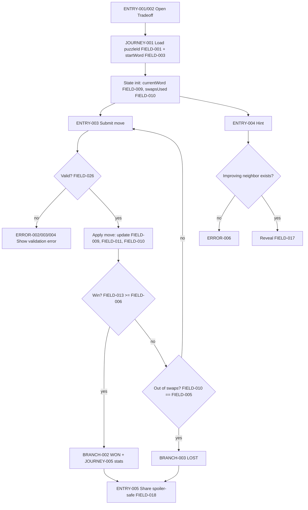
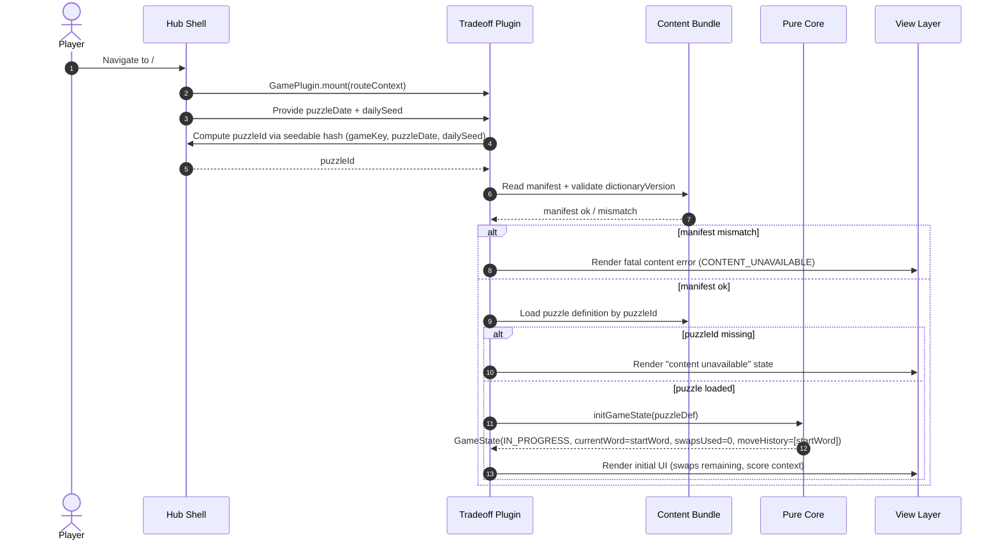
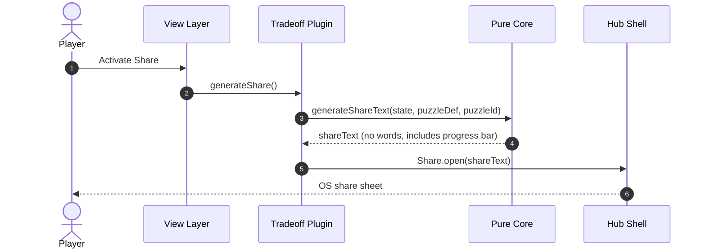
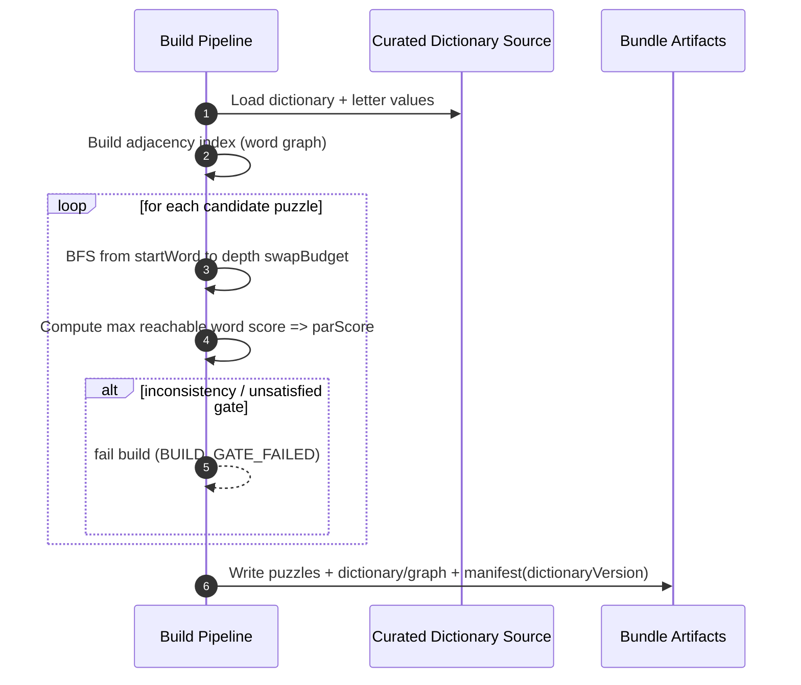

<!-- generated: 2026-07-24T09:47:50Z -->
<!-- mode: initial -->
<!-- feature-slug: tradeoff -->
<!-- a2a-endpoint: https://bob-sdlc-orchestrator.2as6l7wq9qj8.eu-gb.codeengine.appdomain.cloud/v1/rpc -->

# Glossary

## Terms

### TERM-001: Tradeoff Puzzle
- **Definition:** A single daily instance of the Tradeoff word-swap challenge defined by a start word, swap budget, par score, dictionary graph, and deterministic daily ID.
- **Synonyms:** daily puzzle, daily challenge
- **Anti-definition:** Not a procedurally generated-on-device puzzle; not a multiplayer match.
- **Source:** User request

### TERM-002: Start Word
- **Definition:** The initial word presented to the player at the beginning of a Tradeoff Puzzle.
- **Synonyms:** seed word, initial word
- **Anti-definition:** Not the daily seed/hash; not necessarily optimal.
- **Source:** User request

### TERM-003: Current Word
- **Definition:** The word at the player’s current state after zero or more swaps.
- **Synonyms:** active word
- **Anti-definition:** Not the highest-score word reachable; not the solution word unless win condition met.
- **Source:** User request

### TERM-004: Swap (Move)
- **Definition:** A single turn action where the player replaces exactly one letter in exactly one position of the Current Word to form a new valid dictionary word of the same length.
- **Synonyms:** move, step, turn
- **Anti-definition:** Not insertion/deletion; not multi-letter change; not an anagram.
- **Source:** User request

### TERM-005: One-Letter-Change Rule
- **Definition:** Constraint that a Swap must change exactly one character position and keep the word length unchanged.
- **Synonyms:** edit-distance-1 (substitution-only), Hamming distance 1
- **Anti-definition:** Not Levenshtein distance with insertions/deletions; not “one letter anywhere” without position constraint.
- **Source:** User request

### TERM-006: Dictionary Word
- **Definition:** A word present in the curated bundled dictionary used by the puzzle and word graph.
- **Synonyms:** valid word
- **Anti-definition:** Not “any English word”; not user-defined; not fetched online.
- **Source:** User request

### TERM-007: Curated Dictionary
- **Definition:** The offline bundled list/set of Dictionary Words used for validation and graph construction.
- **Synonyms:** word list, lexicon
- **Anti-definition:** Not the OS dictionary; not user locale spellcheck list.
- **Source:** User request

### TERM-008: Word Graph
- **Definition:** A graph where nodes are Dictionary Words and edges connect words that differ by the One-Letter-Change Rule (same length, exactly one position differs).
- **Synonyms:** adjacency graph, edit graph
- **Anti-definition:** Not runtime-generated from the internet; not cross-length edges.
- **Source:** User request

### TERM-009: Adjacency (Neighbor)
- **Definition:** A Dictionary Word that can be reached from another Dictionary Word via a single Swap under the One-Letter-Change Rule.
- **Synonyms:** neighbor, adjacent word
- **Anti-definition:** Not any word with similar meaning; not edit distance 1 with insertion/deletion.
- **Source:** User request

### TERM-010: Swap Budget
- **Definition:** The maximum number of Swaps allowed to attempt reaching a word meeting or exceeding Par Score.
- **Synonyms:** move limit, max swaps
- **Anti-definition:** Not a time limit; not a suggestion.
- **Source:** User request

### TERM-011: Letter Values
- **Definition:** A fixed mapping from letters to integer point values (Scrabble-style) used to score words.
- **Synonyms:** tile values, letter scores
- **Anti-definition:** Not locale-dependent scoring unless explicitly defined in mapping; not variable per puzzle.
- **Source:** User request

### TERM-012: Word Score
- **Definition:** The sum of Letter Values for all letters in a given word.
- **Synonyms:** score
- **Anti-definition:** Not including multipliers/bonuses; not based on word rarity.
- **Source:** User request

### TERM-013: Par Score
- **Definition:** The required minimum Word Score to win the puzzle, computed at build time as the optimal reachable score within the Swap Budget from the Start Word.
- **Synonyms:** target score, par
- **Anti-definition:** Not an average score; not a user-specific threshold.
- **Source:** User request

### TERM-014: Win Condition
- **Definition:** The condition where the Current Word’s Word Score is greater than or equal to the Par Score within the Swap Budget.
- **Synonyms:** solved
- **Anti-definition:** Not “reach a specific word”; not “use all swaps.”
- **Source:** User request

### TERM-015: BFS Gate (Build-Time Solvability Gate)
- **Definition:** A build-time process that runs breadth-first search from the Start Word over the Word Graph up to the Swap Budget to ensure at least one reachable word meets Par Score and that Par Score equals the maximum reachable Word Score within budget.
- **Synonyms:** solvability verifier, build gate
- **Anti-definition:** Not executed on device at runtime; not heuristic.
- **Source:** User request

### TERM-016: Daily Selection
- **Definition:** Deterministic selection of the day’s Tradeoff Puzzle using the CIC Games hub’s seedable hash mechanism.
- **Synonyms:** daily pick
- **Anti-definition:** Not random per user; not server-chosen.
- **Source:** User request

### TERM-017: Puzzle ID
- **Definition:** A deterministic identifier for the daily puzzle derived from the hub seedable hash inputs.
- **Synonyms:** daily id
- **Anti-definition:** Not a user account ID; not a GUID generated online.
- **Source:** User request

### TERM-018: Plugin
- **Definition:** The Tradeoff game module integrated into the CIC Games hub implementing the hub’s GamePlugin interface.
- **Synonyms:** game plugin, module
- **Anti-definition:** Not a standalone app; not requiring backend services.
- **Source:** User request

### TERM-019: GamePlugin Interface
- **Definition:** The hub contract that the Plugin must implement (lifecycle, rendering, input handling, and integration points).
- **Synonyms:** plugin API
- **Anti-definition:** Not a network API; not a backend SDK.
- **Source:** User request

### TERM-020: Pure Core
- **Definition:** A platform-independent, deterministic library containing validation, scoring, hint selection, and state transition logic with no storage or clock access.
- **Synonyms:** core engine, domain logic
- **Anti-definition:** Not UI; not persistence; not date/time logic.
- **Source:** User request

### TERM-021: View Layer
- **Definition:** UI and input layer that renders game state and dispatches user intents to the Pure Core.
- **Synonyms:** UI, renderer
- **Anti-definition:** Not authoritative for rules; not containing deterministic puzzle selection.
- **Source:** User request

### TERM-022: Game State
- **Definition:** The serializable state of an in-progress puzzle attempt including Current Word, swaps used, history, and hint usage.
- **Synonyms:** run state, session state
- **Anti-definition:** Not global hub stats; not build-time content.
- **Source:** User request

### TERM-023: Move History
- **Definition:** The ordered list of words (or deltas) representing the sequence from Start Word to Current Word.
- **Synonyms:** path, trail
- **Anti-definition:** Not required to be shared externally in spoiler-safe share.
- **Source:** User request

### TERM-024: Hint
- **Definition:** An action that reveals one valid Neighbor word from the Current Word that strictly increases Word Score.
- **Synonyms:** tip
- **Anti-definition:** Not a full solution path; not revealing hidden words in share text.
- **Source:** User request

### TERM-025: Hidden Score Context
- **Definition:** The design property that the player’s objective is framed as maximizing a score with a par threshold, where content generation ensures par is the optimum reachable within budget.
- **Synonyms:** concealed optimization target
- **Anti-definition:** Not a stochastic reward; not dependent on opponents.
- **Source:** User request

### TERM-026: Offline-First PWA + Capacitor Runtime
- **Definition:** Deployment target where the hub runs as an offline-capable PWA and as native-wrapped apps via Capacitor.
- **Synonyms:** offline PWA, hybrid runtime
- **Anti-definition:** Not requiring continuous connectivity; not browser-only.
- **Source:** User request

### TERM-027: Local Stats
- **Definition:** On-device persisted aggregate metrics (e.g., plays, wins, streak) managed via hub services.
- **Synonyms:** player stats
- **Anti-definition:** Not cloud-synced; not tied to accounts.
- **Source:** User request

### TERM-028: Streak
- **Definition:** Count of consecutive days where the player wins the daily puzzle.
- **Synonyms:** win streak
- **Anti-definition:** Not total wins; not session length.
- **Source:** User request

### TERM-029: Spoiler-Safe Share
- **Definition:** A shareable text/emoji summary that includes swaps used vs budget and score progress indication without revealing any words.
- **Synonyms:** share card, emoji share
- **Anti-definition:** Not including the Move History words; not including hints content.
- **Source:** User request

### TERM-030: Score Progress Bar
- **Definition:** A non-spoiler representation of Current Word Score relative to Par Score and/or max context, expressed as a fixed-length bar (e.g., emoji blocks).
- **Synonyms:** progress meter
- **Anti-definition:** Not a numeric list of words; not a gradient relying solely on color.
- **Source:** User request

### TERM-031: Accessibility Support
- **Definition:** Conformance behaviors for keyboard operation, screen reader labeling, and non-color-only feedback for game status.
- **Synonyms:** a11y
- **Anti-definition:** Not “best effort”; not visual-only cues.
- **Source:** User request

### TERM-032: Deterministic Operation
- **Definition:** A computation that returns identical outputs for identical inputs across platforms and runs (no randomness, no clock, no locale-dependent transforms).
- **Synonyms:** pure deterministic
- **Anti-definition:** Not relying on system time or external services.
- **Source:** User request

## Data Dictionary

| ID | Name | Type | Format | Range/Enum | Units | Default | Nullable | PII | Source | Validation |
|---|---|---|---|---|---|---|---|---|---|---|
| FIELD-001 | puzzleId | string | slug/hex | non-empty | n/a | none | No | None | TERM-016 hub seedable hash | Must equal deterministic output for (date, hubSeed, gameKey) |
| FIELD-002 | puzzleDate | string | YYYY-MM-DD | valid date | n/a | none | No | None | hub clock (outside TERM-020) | Must be parseable ISO date; used only outside Pure Core |
| FIELD-003 | startWord | string | A-Z uppercase | length 2..20 | chars | none | No | None | build-time content bundle | Must exist in TERM-007; must match wordLength |
| FIELD-004 | wordLength | integer | int32 | 2..20 | letters | none | No | None | derived from FIELD-003 | Must equal length(startWord) |
| FIELD-005 | swapBudget | integer | int32 | 1..20 | swaps | none | No | None | build-time content bundle | Must be >= 1 |
| FIELD-006 | parScore | integer | int32 | 0..999 | points | none | No | None | build-time BFS gate | Must equal max reachable score within budget from startWord |
| FIELD-007 | letterValues | object/map | JSON | A..Z -> int | points | none | No | None | build-time content bundle | Must define values for all letters A..Z; integers >=0 |
| FIELD-008 | dictionaryVersion | string | semver-ish | non-empty | n/a | none | No | None | build-time bundle metadata | Must match bundle manifest |
| FIELD-009 | currentWord | string | A-Z uppercase | length = wordLength | chars | startWord | No | None | TERM-022 Game State | Must exist in TERM-007 |
| FIELD-010 | swapsUsed | integer | int32 | 0..swapBudget | swaps | 0 | No | None | TERM-022 Game State | Must be <= swapBudget |
| FIELD-011 | moveHistory | string[] | array | words | n/a | [startWord] | No | None | TERM-023 | First element must equal startWord; last must equal currentWord |
| FIELD-012 | lastMoveAtIndex | integer | int32 | 0.. | n/a | none | Yes | None | derived UI helper | If present, must be < moveHistory.length |
| FIELD-013 | currentScore | integer | int32 | 0..999 | points | derived | No | None | derived from FIELD-009 & FIELD-007 | Must equal sum(letterValues[char]) |
| FIELD-014 | bestScoreThisRun | integer | int32 | 0..999 | points | start score | No | None | derived/persisted in state | Must be >= currentScore at any time; updated on moves |
| FIELD-015 | winState | string | enum | IN_PROGRESS, WON, LOST | n/a | IN_PROGRESS | No | None | derived in core | WON iff currentScore >= parScore and swapsUsed <= swapBudget |
| FIELD-016 | hintUsedCount | integer | int32 | 0..swapBudget | hints | 0 | No | None | TERM-022 | Must be >=0 |
| FIELD-017 | revealedHintWord | string | A-Z uppercase | length=wordLength | chars | none | Yes | None | TERM-024 | If present, must be valid neighbor and score-improving |
| FIELD-018 | shareText | string | UTF-8 | <= 500 chars | chars | none | No | None | generated client-side | Must not contain any substring equal to any word in moveHistory |
| FIELD-019 | statsPlays | integer | int32 | 0.. | plays | 0 | No | None | hub stats service | Must increment once per puzzle attempt start |
| FIELD-020 | statsWins | integer | int32 | 0.. | wins | 0 | No | None | hub stats service | Must increment once per puzzleId on first win |
| FIELD-021 | currentStreak | integer | int32 | 0.. | days | 0 | No | None | hub stats service | Must follow hub streak rules (daily) |
| FIELD-022 | lastWinPuzzleId | string | slug/hex | non-empty | n/a | none | Yes | None | hub stats service | If present, must be a prior FIELD-001 |
| FIELD-023 | adjacencyIndexKey | string | internal | non-empty | n/a | none | No | None | build-time bundle | Must map to adjacency list for a word |
| FIELD-024 | neighbors | string[] | array | words | n/a | [] | No | None | derived from TERM-008 | Each must be same length and differ by exactly one position |
| FIELD-025 | inputWord | string | user input | A-Z uppercase | chars | none | No | None | UI input | Must be same length and match allowed character set |
| FIELD-026 | validationResult | object | JSON | enum fields | n/a | none | No | None | Pure Core | Must contain exactly one error code when invalid |
| FIELD-027 | errorCode | string | enum | NOT_IN_DICTIONARY, NOT_ONE_LETTER_CHANGE, WRONG_LENGTH, OUT_OF_SWAPS, ALREADY_ENDED, NO_IMPROVING_HINT | n/a | none | No | None | Pure Core | Must be one of enum values |
| FIELD-028 | dailySeed | string | opaque | non-empty | n/a | none | No | None | hub seedable hash input | Must be stable for a given day/device per hub rules |

Cross-links (FIELD → TERM):
- FIELD-001/002/028 → TERM-016/017
- FIELD-003/004/005/006/007/008/023 → TERM-001/007/008/011/013/015
- FIELD-009..017/024..027 → TERM-003/004/022/023/024/014/012
- FIELD-018/030 → TERM-029/030
- FIELD-019..022 → TERM-027/028


# User Journeys

## Roles

| Role ID | Role | Type | Description |
|---|---|---|---|
| ROLE-001 | Player | Primary | Plays the daily Tradeoff Puzzle (TERM-001) offline in the hub. |
| ROLE-002 | Hub Shell | System | Provides routing, seedable hash, stats service, and share affordances. |
| ROLE-003 | Plugin (Tradeoff) | System | Implements TERM-019 and hosts TERM-020 + TERM-021. |
| ROLE-004 | Build Pipeline | Admin/System | Generates bundled content, runs TERM-015 gate, produces manifest. |
| ROLE-005 | Accessibility Tech | Secondary | Screen reader/keyboard users consuming TERM-021 behaviors. |

## Entry Points

| Entry ID | Location | Trigger | Auth |
|---|---|---|---|
| ENTRY-001 | Hub route `/#/games/tradeoff` | Player selects game | None |
| ENTRY-002 | Hub “Daily” deep link | Open daily game | None |
| ENTRY-003 | In-game “Submit move” | Player submits FIELD-025 | None |
| ENTRY-004 | In-game “Hint” button | Player requests TERM-024 | None |
| ENTRY-005 | In-game “Share” button | Player generates TERM-029 | None |
| ENTRY-006 | Build job `generate-tradeoff-content` | CI build | CI permissions |

## Role Permission Matrix

| Capability | ROLE-001 Player | ROLE-002 Hub Shell | ROLE-003 Plugin | ROLE-004 Build Pipeline |
|---|---:|---:|---:|---:|
| Load daily selection (TERM-016) | R | R/W | R | n/a |
| Compute rule validation (TERM-005) | n/a | n/a | R/W | n/a |
| Read bundled dictionary/graph | R | R | R/W | R/W |
| Persist local stats (TERM-027) | n/a | R/W | R | n/a |
| Generate share text (TERM-029) | R | R | R/W | n/a |
| Generate content + BFS gate (TERM-015) | n/a | n/a | n/a | R/W |

## Journeys

### JOURNEY-001: Open today’s puzzle and view initial state
- **Role/Goal:** ROLE-001 Player; start today’s TERM-001.
- **Entry:** ENTRY-001 or ENTRY-002.
- **Happy path:**
  1. Hub Shell computes FIELD-001 `puzzleId` using FIELD-028 `dailySeed` and FIELD-002 `puzzleDate` per TERM-016.
  2. Plugin loads bundled puzzle definition for FIELD-001 including FIELD-003 `startWord`, FIELD-005 `swapBudget`, FIELD-006 `parScore`, FIELD-007 `letterValues`.
  3. Pure Core initializes TERM-022 Game State: FIELD-009 `currentWord` = FIELD-003, FIELD-010 `swapsUsed`=0, FIELD-011 `moveHistory`=[startWord], FIELD-015 `winState`=IN_PROGRESS.
  4. View Layer renders start word (FIELD-003), remaining swaps (FIELD-005 - FIELD-010), and score context (FIELD-013 vs FIELD-006) without revealing solution.
- **BRANCH-001 (missing content):** If puzzle bundle lacks FIELD-001, show “content unavailable” and disable play for that day.
- **ERROR-001:** Trigger: bundle manifest invalid (FIELD-008 mismatch). Response: show error screen and prevent state changes. Recovery: reload app / update build.
- **EDGE-001:** Device offline at open. Expected: journey still succeeds (offline-first TERM-026).
- **EDGE-002:** Day changes while app is open. Expected: Hub Shell recomputes FIELD-001 only on explicit “New day” action or next app launch (open question for hub policy).

### JOURNEY-002: Submit a valid swap
- **Role/Goal:** ROLE-001 Player; perform a TERM-004 Swap within budget to increase score.
- **Entry:** ENTRY-003.
- **Happy path:**
  1. Player enters FIELD-025 `inputWord` (same length as FIELD-004) via keyboard.
  2. View calls Pure Core `validateMove(currentWord=FIELD-009, inputWord=FIELD-025, dictionary=TERM-007)` producing FIELD-026 `validationResult`.
  3. Pure Core confirms TERM-005 One-Letter-Change Rule and that FIELD-025 is a TERM-006 Dictionary Word.
  4. Pure Core applies state transition: update FIELD-009 `currentWord` to FIELD-025, append to FIELD-011 `moveHistory`, increment FIELD-010 `swapsUsed`.
  5. Pure Core recomputes FIELD-013 `currentScore` using FIELD-007 and updates FIELD-014 `bestScoreThisRun` if needed.
  6. Pure Core evaluates TERM-014 Win Condition against FIELD-006/005 and sets FIELD-015.
  7. View renders updated word, swaps remaining, and score progress (TERM-030).
- **BRANCH-002 (win):** If FIELD-013 >= FIELD-006 and FIELD-010 <= FIELD-005 then set FIELD-015=WON and show win UI.
- **BRANCH-003 (out of swaps):** If FIELD-010 == FIELD-005 and FIELD-013 < FIELD-006 then set FIELD-015=LOST and show loss UI.
- **ERROR-002:** Trigger: FIELD-025 not in dictionary. Response: return FIELD-027=NOT_IN_DICTIONARY; UI announces error text. Recovery: edit input and resubmit.
- **ERROR-003:** Trigger: not exactly one position differs. Response: FIELD-027=NOT_ONE_LETTER_CHANGE. Recovery: edit input.
- **ERROR-004:** Trigger: wrong length vs FIELD-004. Response: FIELD-027=WRONG_LENGTH. Recovery: edit input.
- **ERROR-005:** Trigger: attempt move when FIELD-015 != IN_PROGRESS. Response: FIELD-027=ALREADY_ENDED. Recovery: start next day’s puzzle.
- **EDGE-003:** Rapid double-submit/concurrency. Expected: Pure Core processes moves sequentially; second submit validated against updated state.
- **EDGE-004:** Non A–Z characters / locale casing. Expected: UI normalizes to uppercase A–Z; otherwise invalid with WRONG_LENGTH or NOT_IN_DICTIONARY (see OpenQuestions).

### JOURNEY-003: Request a hint
- **Role/Goal:** ROLE-001 Player; obtain TERM-024 to find a better-scoring neighbor.
- **Entry:** ENTRY-004.
- **Happy path:**
  1. View requests hint from Pure Core with FIELD-009 `currentWord`.
  2. Pure Core enumerates FIELD-024 `neighbors` from TERM-008 for FIELD-009.
  3. Pure Core computes each neighbor’s Word Score (TERM-012) using FIELD-007 and selects one with strictly greater score than FIELD-013.
  4. Pure Core increments FIELD-016 `hintUsedCount` and returns FIELD-017 `revealedHintWord`.
  5. View displays FIELD-017 and offers “Apply hint” by copying into FIELD-025 (without auto-submitting).
- **ERROR-006:** Trigger: no improving neighbor exists. Response: FIELD-027=NO_IMPROVING_HINT; UI announces “No higher-scoring hint available.” Recovery: proceed without hint.
- **EDGE-005:** Hint requested when FIELD-015 != IN_PROGRESS. Expected: ALREADY_ENDED.
- **EDGE-006:** Multiple hints requested. Expected: each increments FIELD-016; selection remains deterministic given same inputs (TERM-032).

### JOURNEY-004: Share result spoiler-safely
- **Role/Goal:** ROLE-001 Player; share outcome without revealing words.
- **Entry:** ENTRY-005.
- **Happy path:**
  1. View requests Pure Core to generate FIELD-018 `shareText` from FIELD-001, FIELD-010, FIELD-005, FIELD-013, FIELD-006, FIELD-015 (no FIELD-011 words).
  2. Pure Core formats swaps used vs par/budget and a TERM-030 progress bar.
  3. View invokes Hub Shell share sheet with FIELD-018.
- **ERROR-007:** Trigger: share invoked before puzzle loaded (missing FIELD-001). Response: disable share button. Recovery: open puzzle first.
- **EDGE-007:** Ensure FIELD-018 contains no substrings equal to any element in FIELD-011 (spoiler-safe).

### JOURNEY-005: Local stats and streak update on win
- **Role/Goal:** ROLE-002 Hub Shell; record local stats via hub services.
- **Entry:** Implicit event upon FIELD-015 transition to WON in JOURNEY-002 step 6.
- **Happy path:**
  1. Plugin notifies Hub Shell of win event including FIELD-001 `puzzleId`, FIELD-010 `swapsUsed`, FIELD-016 `hintUsedCount`, FIELD-015.
  2. Hub stats service increments FIELD-020 `statsWins` once per FIELD-001 and updates FIELD-021 `currentStreak` per TERM-028.
  3. Hub stats service stores FIELD-022 `lastWinPuzzleId` = FIELD-001.
- **ERROR-008:** Trigger: stats service unavailable (local storage failure). Response: show non-blocking toast and continue. Recovery: retry on next app start.
- **EDGE-008:** Duplicate win notifications due to re-render. Expected: hub deduplicates by FIELD-001.

### JOURNEY-006: Build-time content generation and solvability gate
- **Role/Goal:** ROLE-004 Build Pipeline; generate daily content ensuring solvable optimum par.
- **Entry:** ENTRY-006.
- **Happy path:**
  1. Build loads TERM-007 Curated Dictionary and TERM-011 Letter Values (FIELD-007).
  2. Build constructs TERM-008 Word Graph adjacency indexes (FIELD-023) for same-length one-letter substitutions.
  3. For each candidate puzzle: choose FIELD-003, FIELD-005.
  4. Run TERM-015 BFS Gate to compute maximum reachable Word Score within budget and set FIELD-006 `parScore` to that maximum.
  5. Emit bundle artifacts with FIELD-008 dictionaryVersion and puzzle definitions keyed by deterministic selection domain.
- **ERROR-009:** Trigger: BFS finds no reachable node meeting computed par within budget (inconsistent). Response: fail build. Recovery: adjust candidates/budget/dictionary.
- **EDGE-009:** Graph disconnected components. Expected: BFS bounded to reachable subset; still computes max reachable.

## Journey Map



# Requirements

### REQ-001: Deterministic daily puzzle identification
- **EARS Pattern:** Event-Driven
- **EARS Statement:** When the hub provides FIELD-028 `dailySeed` and FIELD-002 `puzzleDate`, the Plugin shall compute FIELD-001 `puzzleId` deterministically.
- **Inputs:** FIELD-028, FIELD-002
- **Outputs:** FIELD-001
- **Preconditions:** Hub Shell has a valid puzzleDate for “today”.
- **Postconditions:** puzzleId is stable for identical inputs.
- **Invariants:** TERM-032 deterministic operation.
- **Trigger:** Puzzle route opened (ENTRY-001/002).
- **Actor:** ROLE-002 Hub Shell invokes ROLE-003 Plugin.
- **EntityScope:** TERM-017 Puzzle ID
- **ErrorModes:** errorCode=CONTENT_UNAVAILABLE (see OpenQuestions for enum alignment)
- **NFR-Tags:** compatibility
- **Source:** JOURNEY-001 step 1
- **Dependencies:** NFR-006 (determinism definition)
- **Priority:** P0
- **AcceptanceCriteria:**
  - TEST-001: Given identical (dailySeed, puzzleDate), puzzleId equals previous computed value.
  - TEST-002: Given different puzzleDate, puzzleId differs for at least one date in a 7-day window.
- **Assumptions:** Hub defines seedable hash inputs and algorithm.
- **OpenQuestions:** What is the canonical error code name when content is missing?

### REQ-002: Load bundled daily puzzle definition by puzzleId
- **EARS Pattern:** Event-Driven
- **EARS Statement:** When FIELD-001 `puzzleId` is computed, the Plugin shall load the corresponding puzzle definition containing FIELD-003 `startWord`, FIELD-005 `swapBudget`, FIELD-006 `parScore`, and FIELD-007 `letterValues`.
- **Inputs:** FIELD-001
- **Outputs:** FIELD-003, FIELD-005, FIELD-006, FIELD-007
- **Preconditions:** Bundled content is present on device.
- **Postconditions:** Puzzle definition is available to initialize TERM-022.
- **Invariants:** Loaded fields match validation rules in glossary.
- **Trigger:** Completion of REQ-001.
- **Actor:** ROLE-003 Plugin
- **EntityScope:** TERM-001 Tradeoff Puzzle
- **ErrorModes:** errorCode=CONTENT_UNAVAILABLE
- **NFR-Tags:** offline
- **Source:** JOURNEY-001 step 2, BRANCH-001
- **Dependencies:** REQ-001
- **Priority:** P0
- **AcceptanceCriteria:**
  - TEST-003: Given a valid puzzleId present in the bundle, load returns non-null startWord/swapBudget/parScore/letterValues.
  - TEST-004: Given an unknown puzzleId, load returns CONTENT_UNAVAILABLE and no game state is created.
- **Assumptions:** Bundle keyspace aligns with puzzleId generation.
- **OpenQuestions:** Do letterValues vary by puzzle or remain global in bundle?

### REQ-003: Initialize game state from start word
- **EARS Pattern:** Event-Driven
- **EARS Statement:** When a puzzle definition is loaded, the Pure Core shall initialize TERM-022 Game State with FIELD-009 `currentWord` equal to FIELD-003 `startWord` and FIELD-011 `moveHistory` containing only FIELD-003.
- **Inputs:** FIELD-003
- **Outputs:** FIELD-009, FIELD-011
- **Preconditions:** FIELD-003 passes dictionary validation.
- **Postconditions:** State is ready for moves.
- **Invariants:** moveHistory[0]=startWord and last= currentWord.
- **Trigger:** New puzzle session created.
- **Actor:** ROLE-003 Plugin (Pure Core)
- **EntityScope:** TERM-022 Game State
- **ErrorModes:** errorCode=CONTENT_UNAVAILABLE
- **NFR-Tags:** determinism
- **Source:** JOURNEY-001 step 3
- **Dependencies:** REQ-002
- **Priority:** P0
- **AcceptanceCriteria:**
  - TEST-005: After init, currentWord equals startWord.
  - TEST-006: After init, moveHistory length equals 1 and moveHistory[0] equals startWord.
- **Assumptions:** Start word is present in dictionary bundle.
- **OpenQuestions:** None

### REQ-004: Initialize swaps used counter
- **EARS Pattern:** Event-Driven
- **EARS Statement:** When the Pure Core initializes TERM-022 Game State, the Pure Core shall set FIELD-010 `swapsUsed` to 0.
- **Inputs:** none
- **Outputs:** FIELD-010
- **Preconditions:** REQ-003 executed.
- **Postconditions:** swapsUsed is 0.
- **Invariants:** swapsUsed never decreases.
- **Trigger:** Game state initialization.
- **Actor:** ROLE-003 Plugin (Pure Core)
- **EntityScope:** TERM-022 Game State
- **ErrorModes:** errorCode=CONTENT_UNAVAILABLE
- **NFR-Tags:** determinism
- **Source:** JOURNEY-001 step 3
- **Dependencies:** REQ-003
- **Priority:** P0
- **AcceptanceCriteria:**
  - TEST-007: swapsUsed equals 0 immediately after init.
- **Assumptions:** None
- **OpenQuestions:** None

### REQ-005: Validate candidate move is correct length
- **EARS Pattern:** Event-Driven
- **EARS Statement:** When the player submits FIELD-025 `inputWord`, the Pure Core shall return FIELD-027 `errorCode` equal to WRONG_LENGTH if the length of FIELD-025 differs from FIELD-004 `wordLength`.
- **Inputs:** FIELD-025, FIELD-004
- **Outputs:** FIELD-027
- **Preconditions:** FIELD-015 winState is IN_PROGRESS.
- **Postconditions:** No state transition occurs on WRONG_LENGTH.
- **Invariants:** TERM-005 enforced.
- **Trigger:** ENTRY-003
- **Actor:** ROLE-001 Player via ROLE-003 Plugin
- **EntityScope:** TERM-004 Swap
- **ErrorModes:** errorCode=WRONG_LENGTH
- **NFR-Tags:** determinism
- **Source:** JOURNEY-002 ERROR-004
- **Dependencies:** REQ-003, REQ-012
- **Priority:** P0
- **AcceptanceCriteria:**
  - TEST-008: Given inputWord shorter than wordLength, validation returns WRONG_LENGTH.
  - TEST-009: Given inputWord longer than wordLength, validation returns WRONG_LENGTH.
- **Assumptions:** wordLength is derived from startWord.
- **OpenQuestions:** Should UI preclude wrong-length input entirely?

### REQ-006: Validate candidate move differs by exactly one position
- **EARS Pattern:** Event-Driven
- **EARS Statement:** When the player submits FIELD-025 `inputWord`, the Pure Core shall return FIELD-027 `errorCode` equal to NOT_ONE_LETTER_CHANGE if FIELD-025 differs from FIELD-009 `currentWord` in a number of positions not equal to 1.
- **Inputs:** FIELD-025, FIELD-009
- **Outputs:** FIELD-027
- **Preconditions:** FIELD-015 winState is IN_PROGRESS and REQ-005 did not return WRONG_LENGTH.
- **Postconditions:** No state transition occurs on NOT_ONE_LETTER_CHANGE.
- **Invariants:** TERM-005 enforced.
- **Trigger:** ENTRY-003
- **Actor:** ROLE-001 Player via ROLE-003 Plugin
- **EntityScope:** TERM-004 Swap
- **ErrorModes:** errorCode=NOT_ONE_LETTER_CHANGE
- **NFR-Tags:** determinism
- **Source:** JOURNEY-002 ERROR-003
- **Dependencies:** REQ-005, REQ-012
- **Priority:** P0
- **AcceptanceCriteria:**
  - TEST-010: Given inputWord equal to currentWord, validation returns NOT_ONE_LETTER_CHANGE.
  - TEST-011: Given inputWord differing in 2 positions, validation returns NOT_ONE_LETTER_CHANGE.
- **Assumptions:** Comparison is position-based with uppercase A–Z.
- **OpenQuestions:** Are non A–Z characters normalized or rejected?

### REQ-007: Validate candidate move is in curated dictionary
- **EARS Pattern:** Event-Driven
- **EARS Statement:** When the player submits FIELD-025 `inputWord`, the Pure Core shall return FIELD-027 `errorCode` equal to NOT_IN_DICTIONARY if FIELD-025 is not a TERM-006 Dictionary Word in TERM-007.
- **Inputs:** FIELD-025, TERM-007 dictionary
- **Outputs:** FIELD-027
- **Preconditions:** FIELD-015 winState is IN_PROGRESS and REQ-005 and REQ-006 did not return errors.
- **Postconditions:** No state transition occurs on NOT_IN_DICTIONARY.
- **Invariants:** Dictionary membership is evaluated against bundled content only.
- **Trigger:** ENTRY-003
- **Actor:** ROLE-001 Player via ROLE-003 Plugin
- **EntityScope:** TERM-006 Dictionary Word
- **ErrorModes:** errorCode=NOT_IN_DICTIONARY
- **NFR-Tags:** offline, determinism
- **Source:** JOURNEY-002 ERROR-002
- **Dependencies:** REQ-006, REQ-012
- **Priority:** P0
- **AcceptanceCriteria:**
  - TEST-012: Given a word not present in the bundled dictionary, validation returns NOT_IN_DICTIONARY.
  - TEST-013: Given a word present, validation does not return NOT_IN_DICTIONARY.
- **Assumptions:** Dictionary lookup is exact-match.
- **OpenQuestions:** Is dictionary case-insensitive or stored uppercase only?

### REQ-008: Apply a valid move updates current word
- **EARS Pattern:** Event-Driven
- **EARS Statement:** When a submitted FIELD-025 `inputWord` passes validation, the Pure Core shall set FIELD-009 `currentWord` to FIELD-025.
- **Inputs:** FIELD-025
- **Outputs:** FIELD-009
- **Preconditions:** REQ-005..REQ-007 produced no error and FIELD-010 < FIELD-005.
- **Postconditions:** currentWord reflects the move.
- **Invariants:** currentWord remains a Dictionary Word.
- **Trigger:** ENTRY-003 valid move
- **Actor:** ROLE-003 Plugin (Pure Core)
- **EntityScope:** TERM-003 Current Word
- **ErrorModes:** errorCode=OUT_OF_SWAPS
- **NFR-Tags:** determinism
- **Source:** JOURNEY-002 step 4
- **Dependencies:** REQ-005, REQ-006, REQ-007, REQ-010
- **Priority:** P0
- **AcceptanceCriteria:**
  - TEST-014: After applying a valid move, currentWord equals inputWord.
- **Assumptions:** State transition is atomic.
- **OpenQuestions:** None

### REQ-009: Apply a valid move appends to move history
- **EARS Pattern:** Event-Driven
- **EARS Statement:** When a submitted FIELD-025 `inputWord` passes validation, the Pure Core shall append FIELD-025 to FIELD-011 `moveHistory`.
- **Inputs:** FIELD-025, FIELD-011
- **Outputs:** FIELD-011
- **Preconditions:** Same as REQ-008.
- **Postconditions:** moveHistory last element equals currentWord.
- **Invariants:** moveHistory[0]=startWord.
- **Trigger:** ENTRY-003 valid move
- **Actor:** ROLE-003 Plugin (Pure Core)
- **EntityScope:** TERM-023 Move History
- **ErrorModes:** errorCode=OUT_OF_SWAPS
- **NFR-Tags:** determinism
- **Source:** JOURNEY-002 step 4
- **Dependencies:** REQ-008
- **Priority:** P0
- **AcceptanceCriteria:**
  - TEST-015: After one valid move, moveHistory length increases by 1 and last equals inputWord.
- **Assumptions:** None
- **OpenQuestions:** None

### REQ-010: Apply a valid move increments swaps used
- **EARS Pattern:** Event-Driven
- **EARS Statement:** When a submitted FIELD-025 `inputWord` passes validation, the Pure Core shall increment FIELD-010 `swapsUsed` by 1.
- **Inputs:** FIELD-010
- **Outputs:** FIELD-010
- **Preconditions:** Same as REQ-008.
- **Postconditions:** swapsUsed reflects number of applied moves.
- **Invariants:** swapsUsed <= swapBudget.
- **Trigger:** ENTRY-003 valid move
- **Actor:** ROLE-003 Plugin (Pure Core)
- **EntityScope:** TERM-010 Swap Budget
- **ErrorModes:** errorCode=OUT_OF_SWAPS
- **NFR-Tags:** determinism
- **Source:** JOURNEY-002 step 4
- **Dependencies:** REQ-004
- **Priority:** P0
- **AcceptanceCriteria:**
  - TEST-016: After N valid moves, swapsUsed equals N.
- **Assumptions:** None
- **OpenQuestions:** None

### REQ-011: Reject move when out of swaps
- **EARS Pattern:** Event-Driven
- **EARS Statement:** When FIELD-010 `swapsUsed` equals FIELD-005 `swapBudget`, the Pure Core shall return FIELD-027 `errorCode` equal to OUT_OF_SWAPS for any move submission.
- **Inputs:** FIELD-010, FIELD-005
- **Outputs:** FIELD-027
- **Preconditions:** FIELD-015 is IN_PROGRESS.
- **Postconditions:** No state change occurs.
- **Invariants:** swapBudget is enforced.
- **Trigger:** ENTRY-003 with no remaining swaps
- **Actor:** ROLE-001 Player via ROLE-003 Plugin
- **EntityScope:** TERM-010 Swap Budget
- **ErrorModes:** errorCode=OUT_OF_SWAPS
- **NFR-Tags:** determinism
- **Source:** JOURNEY-002 BRANCH-003 (guard) and ERROR patterns
- **Dependencies:** REQ-010
- **Priority:** P0
- **AcceptanceCriteria:**
  - TEST-017: Given swapsUsed == swapBudget, submitting any inputWord returns OUT_OF_SWAPS.
- **Assumptions:** Loss state may be computed separately (REQ-015).
- **OpenQuestions:** Should OUT_OF_SWAPS also force winState=LOST immediately?

### REQ-012: Reject move when puzzle is ended
- **EARS Pattern:** State-Driven
- **EARS Statement:** While FIELD-015 `winState` is not IN_PROGRESS, the Pure Core shall return FIELD-027 `errorCode` equal to ALREADY_ENDED for any move submission.
- **Inputs:** FIELD-015
- **Outputs:** FIELD-027
- **Preconditions:** None
- **Postconditions:** No state change occurs.
- **Invariants:** End states are terminal.
- **Trigger:** ENTRY-003 during ended state
- **Actor:** ROLE-001 Player via ROLE-003 Plugin
- **EntityScope:** TERM-014 Win Condition
- **ErrorModes:** errorCode=ALREADY_ENDED
- **NFR-Tags:** determinism
- **Source:** JOURNEY-002 ERROR-005
- **Dependencies:** REQ-015, REQ-016
- **Priority:** P0
- **AcceptanceCriteria:**
  - TEST-018: After winState=WON, move submission returns ALREADY_ENDED.
  - TEST-019: After winState=LOST, move submission returns ALREADY_ENDED.
- **Assumptions:** Hint requests follow similar guard (REQ-020).
- **OpenQuestions:** None

### REQ-013: Compute word score from letter values
- **EARS Pattern:** Ubiquitous
- **EARS Statement:** The Pure Core shall compute FIELD-013 `currentScore` as the sum of FIELD-007 `letterValues` for each character in FIELD-009 `currentWord`.
- **Inputs:** FIELD-009, FIELD-007
- **Outputs:** FIELD-013
- **Preconditions:** currentWord contains only letters present in letterValues.
- **Postconditions:** currentScore updated after init and after each valid move.
- **Invariants:** TERM-012 scoring.
- **Trigger:** State init or currentWord change.
- **Actor:** ROLE-003 Plugin (Pure Core)
- **EntityScope:** TERM-012 Word Score
- **ErrorModes:** errorCode=CONTENT_UNAVAILABLE
- **NFR-Tags:** determinism, compatibility
- **Source:** JOURNEY-002 step 5; TERM-011/012
- **Dependencies:** REQ-003, REQ-008
- **Priority:** P0
- **AcceptanceCriteria:**
  - TEST-020: Given letterValues and a word, computed score equals expected sum.
  - TEST-021: Same inputs produce same score on web and native builds.
- **Assumptions:** Letter set is A–Z.
- **OpenQuestions:** Are blanks/diacritics ever allowed?

### REQ-014: Track best score within a run
- **EARS Pattern:** Event-Driven
- **EARS Statement:** When FIELD-013 `currentScore` increases above FIELD-014 `bestScoreThisRun`, the Pure Core shall set FIELD-014 to FIELD-013.
- **Inputs:** FIELD-013, FIELD-014
- **Outputs:** FIELD-014
- **Preconditions:** Game State initialized.
- **Postconditions:** bestScoreThisRun equals max observed currentScore.
- **Invariants:** bestScoreThisRun never decreases.
- **Trigger:** Score recomputed after valid move.
- **Actor:** ROLE-003 Plugin (Pure Core)
- **EntityScope:** TERM-022 Game State
- **ErrorModes:** errorCode=CONTENT_UNAVAILABLE
- **NFR-Tags:** determinism
- **Source:** JOURNEY-002 step 5
- **Dependencies:** REQ-013
- **Priority:** P1
- **AcceptanceCriteria:**
  - TEST-022: After a sequence of moves, bestScoreThisRun equals max of all observed scores.
- **Assumptions:** bestScoreThisRun is stored in state.
- **OpenQuestions:** Should bestScoreThisRun be shown in UI?

### REQ-015: Set win state when par is met
- **EARS Pattern:** Event-Driven
- **EARS Statement:** When FIELD-013 `currentScore` becomes greater than or equal to FIELD-006 `parScore`, the Pure Core shall set FIELD-015 `winState` to WON.
- **Inputs:** FIELD-013, FIELD-006
- **Outputs:** FIELD-015
- **Preconditions:** FIELD-015 is IN_PROGRESS.
- **Postconditions:** Puzzle is ended as WON.
- **Invariants:** Won is terminal.
- **Trigger:** After applying a valid move and recomputing score.
- **Actor:** ROLE-003 Plugin (Pure Core)
- **EntityScope:** TERM-014 Win Condition
- **ErrorModes:** errorCode=CONTENT_UNAVAILABLE
- **NFR-Tags:** determinism
- **Source:** JOURNEY-002 step 6, BRANCH-002
- **Dependencies:** REQ-013, REQ-012
- **Priority:** P0
- **AcceptanceCriteria:**
  - TEST-023: Given currentScore == parScore after a move, winState becomes WON.
- **Assumptions:** Meeting par is sufficient regardless of swaps remaining.
- **OpenQuestions:** None

### REQ-016: Set loss state when budget exhausted without meeting par
- **EARS Pattern:** Event-Driven
- **EARS Statement:** When FIELD-010 `swapsUsed` becomes equal to FIELD-005 `swapBudget` while FIELD-013 `currentScore` is less than FIELD-006 `parScore`, the Pure Core shall set FIELD-015 `winState` to LOST.
- **Inputs:** FIELD-010, FIELD-005, FIELD-013, FIELD-006
- **Outputs:** FIELD-015
- **Preconditions:** FIELD-015 is IN_PROGRESS.
- **Postconditions:** Puzzle is ended as LOST.
- **Invariants:** Lost is terminal.
- **Trigger:** After applying a valid move and recomputing score.
- **Actor:** ROLE-003 Plugin (Pure Core)
- **EntityScope:** TERM-014 Win Condition
- **ErrorModes:** errorCode=CONTENT_UNAVAILABLE
- **NFR-Tags:** determinism
- **Source:** JOURNEY-002 BRANCH-003
- **Dependencies:** REQ-010, REQ-013, REQ-012
- **Priority:** P0
- **AcceptanceCriteria:**
  - TEST-024: Given swapsUsed == swapBudget and currentScore < parScore, winState becomes LOST.
- **Assumptions:** Loss is determined immediately upon last move.
- **OpenQuestions:** If user never submits final move (e.g., quits), is loss recorded?

### REQ-017: Provide neighbor list for a word (core support)
- **EARS Pattern:** Event-Driven
- **EARS Statement:** When the Pure Core is asked for neighbors of FIELD-009 `currentWord`, the Pure Core shall return FIELD-024 `neighbors` from the bundled TERM-008 Word Graph.
- **Inputs:** FIELD-009, bundled graph index
- **Outputs:** FIELD-024
- **Preconditions:** currentWord exists in dictionary.
- **Postconditions:** neighbors list is available for hinting/UI affordances.
- **Invariants:** Each neighbor satisfies TERM-005.
- **Trigger:** Hint request preparation.
- **Actor:** ROLE-003 Plugin (Pure Core)
- **EntityScope:** TERM-008 Word Graph
- **ErrorModes:** errorCode=CONTENT_UNAVAILABLE
- **NFR-Tags:** offline, performance
- **Source:** JOURNEY-003 step 2
- **Dependencies:** REQ-002
- **Priority:** P1
- **AcceptanceCriteria:**
  - TEST-025: Every returned neighbor has same length as currentWord and differs by exactly one position.
- **Assumptions:** Graph is precomputed and bundled.
- **OpenQuestions:** Is neighbor order important or arbitrary but deterministic?

### REQ-018: Hint returns one score-improving neighbor
- **EARS Pattern:** Event-Driven
- **EARS Statement:** When the player requests a hint, the Pure Core shall return FIELD-017 `revealedHintWord` that is an element of FIELD-024 `neighbors` whose Word Score is greater than FIELD-013 `currentScore`.
- **Inputs:** FIELD-024, FIELD-007, FIELD-013
- **Outputs:** FIELD-017
- **Preconditions:** FIELD-015 is IN_PROGRESS.
- **Postconditions:** A single hint word is revealed.
- **Invariants:** Hint selection is TERM-032 deterministic given inputs.
- **Trigger:** ENTRY-004
- **Actor:** ROLE-001 Player via ROLE-003 Plugin
- **EntityScope:** TERM-024 Hint
- **ErrorModes:** errorCode=NO_IMPROVING_HINT
- **NFR-Tags:** determinism
- **Source:** JOURNEY-003 steps 1–4; ERROR-006
- **Dependencies:** REQ-017, REQ-013, REQ-020
- **Priority:** P1
- **AcceptanceCriteria:**
  - TEST-026: If at least one improving neighbor exists, revealedHintWord score is strictly greater than currentScore.
- **Assumptions:** “Improves the score” means strictly greater.
- **OpenQuestions:** If multiple improving neighbors exist, what tie-breaker is required?

### REQ-019: Increment hint usage count
- **EARS Pattern:** Event-Driven
- **EARS Statement:** When the Pure Core returns a hint word, the Pure Core shall increment FIELD-016 `hintUsedCount` by 1.
- **Inputs:** FIELD-016
- **Outputs:** FIELD-016
- **Preconditions:** REQ-018 returned a revealedHintWord.
- **Postconditions:** hintUsedCount reflects hints used in run.
- **Invariants:** hintUsedCount never decreases.
- **Trigger:** Successful hint generation.
- **Actor:** ROLE-003 Plugin (Pure Core)
- **EntityScope:** TERM-022 Game State
- **ErrorModes:** errorCode=ALREADY_ENDED
- **NFR-Tags:** determinism
- **Source:** JOURNEY-003 step 4
- **Dependencies:** REQ-018
- **Priority:** P2
- **AcceptanceCriteria:**
  - TEST-027: After K successful hint requests, hintUsedCount equals K.
- **Assumptions:** Hints do not consume swaps.
- **OpenQuestions:** Do hints affect stats/emoji share?

### REQ-020: Reject hint when puzzle is ended
- **EARS Pattern:** State-Driven
- **EARS Statement:** While FIELD-015 `winState` is not IN_PROGRESS, the Pure Core shall return FIELD-027 `errorCode` equal to ALREADY_ENDED for any hint request.
- **Inputs:** FIELD-015
- **Outputs:** FIELD-027
- **Preconditions:** None
- **Postconditions:** No hint is revealed.
- **Invariants:** End states are terminal for hinting.
- **Trigger:** ENTRY-004 during ended state
- **Actor:** ROLE-001 Player via ROLE-003 Plugin
- **EntityScope:** TERM-024 Hint
- **ErrorModes:** errorCode=ALREADY_ENDED
- **NFR-Tags:** determinism
- **Source:** JOURNEY-003 EDGE-005
- **Dependencies:** REQ-015, REQ-016
- **Priority:** P1
- **AcceptanceCriteria:**
  - TEST-028: After winState=WON, hint request returns ALREADY_ENDED.
- **Assumptions:** None
- **OpenQuestions:** None

### REQ-021: Generate spoiler-safe share text without words
- **EARS Pattern:** Event-Driven
- **EARS Statement:** When the player requests sharing, the Pure Core shall generate FIELD-018 `shareText` containing FIELD-010 `swapsUsed`, FIELD-005 `swapBudget`, FIELD-015 `winState`, and a TERM-030 progress bar without including any word from FIELD-011 `moveHistory`.
- **Inputs:** FIELD-010, FIELD-005, FIELD-015, FIELD-011, FIELD-013, FIELD-006, FIELD-001
- **Outputs:** FIELD-018
- **Preconditions:** Puzzle is loaded (FIELD-001 present).
- **Postconditions:** shareText is ready for OS share sheet.
- **Invariants:** Spoiler-safe content rule.
- **Trigger:** ENTRY-005
- **Actor:** ROLE-001 Player via ROLE-003 Plugin
- **EntityScope:** TERM-029 Spoiler-Safe Share
- **ErrorModes:** errorCode=CONTENT_UNAVAILABLE
- **NFR-Tags:** privacy
- **Source:** JOURNEY-004 steps 1–2; EDGE-007
- **Dependencies:** REQ-002, REQ-013
- **Priority:** P1
- **AcceptanceCriteria:**
  - TEST-029: shareText contains swapsUsed and swapBudget numbers.
  - TEST-030: For each word in moveHistory, shareText does not contain that word as a substring.
- **Assumptions:** Substring check uses exact uppercase representation.
- **OpenQuestions:** Should share include puzzle number/date?

### REQ-022: Notify hub stats service on first win for a puzzleId
- **EARS Pattern:** Event-Driven
- **EARS Statement:** When FIELD-015 `winState` transitions to WON, the Plugin shall emit a win event to the Hub Shell including FIELD-001 `puzzleId`, FIELD-010 `swapsUsed`, and FIELD-016 `hintUsedCount`.
- **Inputs:** FIELD-015, FIELD-001, FIELD-010, FIELD-016
- **Outputs:** hub win event payload
- **Preconditions:** Puzzle is loaded.
- **Postconditions:** Hub may update FIELD-020/FIELD-021.
- **Invariants:** Event payload contains no words.
- **Trigger:** Transition to WON.
- **Actor:** ROLE-003 Plugin to ROLE-002 Hub Shell
- **EntityScope:** TERM-027 Local Stats
- **ErrorModes:** errorCode=STATS_UNAVAILABLE (hub-side)
- **NFR-Tags:** privacy
- **Source:** JOURNEY-005 step 1
- **Dependencies:** REQ-015
- **Priority:** P1
- **AcceptanceCriteria:**
  - TEST-031: On win, emitted payload includes puzzleId, swapsUsed, hintUsedCount and excludes currentWord/moveHistory.
- **Assumptions:** Hub provides deduplication by puzzleId.
- **OpenQuestions:** Exact hub event name/schema?

### REQ-023: Build-time BFS gate computes par as optimal reachable score
- **EARS Pattern:** Event-Driven
- **EARS Statement:** When the Build Pipeline generates a puzzle candidate, the Build Pipeline shall set FIELD-006 `parScore` to the maximum Word Score reachable from FIELD-003 `startWord` within FIELD-005 `swapBudget` over TERM-008.
- **Inputs:** FIELD-003, FIELD-005, TERM-008, FIELD-007
- **Outputs:** FIELD-006
- **Preconditions:** Word graph constructed for the dictionary.
- **Postconditions:** Par reflects optimum reachable score within budget.
- **Invariants:** BFS exploration depth is bounded by swapBudget.
- **Trigger:** ENTRY-006 candidate generation.
- **Actor:** ROLE-004 Build Pipeline
- **EntityScope:** TERM-015 BFS Gate
- **ErrorModes:** errorCode=BUILD_GATE_FAILED
- **NFR-Tags:** auditability
- **Source:** JOURNEY-006 step 4
- **Dependencies:** REQ-024
- **Priority:** P0
- **AcceptanceCriteria:**
  - TEST-032: For a known small graph fixture, computed parScore equals the fixture’s known optimum reachable score within budget.
- **Assumptions:** “Maximum reachable score” computed across all visited nodes depth<=budget.
- **OpenQuestions:** Are revisits allowed in paths (they are in BFS visitation but score max ignores path simplicity)?

### REQ-024: Build fails if puzzle is not solvable to par within budget
- **EARS Pattern:** Event-Driven
- **EARS Statement:** When the BFS gate cannot reach any word with Word Score equal to FIELD-006 `parScore` within FIELD-005 `swapBudget`, the Build Pipeline shall fail the build.
- **Inputs:** BFS results, FIELD-006, FIELD-005
- **Outputs:** build failure
- **Preconditions:** REQ-023 attempted.
- **Postconditions:** No invalid puzzle is shipped.
- **Invariants:** Shipped puzzles are solvable.
- **Trigger:** ENTRY-006
- **Actor:** ROLE-004 Build Pipeline
- **EntityScope:** TERM-015 BFS Gate
- **ErrorModes:** errorCode=BUILD_GATE_FAILED
- **NFR-Tags:** reliability
- **Source:** JOURNEY-006 ERROR-009
- **Dependencies:** REQ-023
- **Priority:** P0
- **AcceptanceCriteria:**
  - TEST-033: Given a contrived unsolvable candidate, the build exits non-zero.
- **Assumptions:** Par is computed from BFS; this requirement protects against pipeline inconsistencies.
- **OpenQuestions:** Should the build also emit a report artifact for failures?

### NFR-001: Offline operation for play loop
- **EARS Pattern:** Ubiquitous
- **EARS Statement:** The Plugin shall allow completing JOURNEY-001 through JOURNEY-004 without network connectivity.
- **Inputs:** none
- **Outputs:** none
- **Preconditions:** Bundle installed.
- **Postconditions:** Game is playable offline.
- **Invariants:** No remote calls required for validation/scoring/content.
- **Trigger:** Any gameplay action.
- **Actor:** ROLE-001 Player
- **EntityScope:** TERM-026 Offline-First PWA + Capacitor Runtime
- **ErrorModes:** none
- **NFR-Tags:** offline
- **Source:** JOURNEY-001 EDGE-001
- **Dependencies:** REQ-002, REQ-013
- **Priority:** P0
- **AcceptanceCriteria:**
  - TEST-034: In airplane mode, user can open puzzle, make valid moves, win/lose, and generate shareText.
- **Assumptions:** Hub shell itself loads offline.
- **OpenQuestions:** None

### NFR-002: Cross-platform deterministic core behavior
- **EARS Pattern:** Ubiquitous
- **EARS Statement:** The Pure Core shall produce identical FIELD-026 `validationResult` and FIELD-013 `currentScore` for identical inputs across web and native (Capacitor) builds.
- **Inputs:** FIELD-009, FIELD-025, FIELD-007
- **Outputs:** FIELD-026, FIELD-013
- **Preconditions:** Same bundle versions and same inputs.
- **Postconditions:** Outputs match bit-for-bit (numbers/enum).
- **Invariants:** TERM-032.
- **Trigger:** Validation or scoring invoked.
- **Actor:** ROLE-003 Plugin
- **EntityScope:** TERM-020 Pure Core
- **ErrorModes:** none
- **NFR-Tags:** compatibility, determinism
- **Source:** User request; JOURNEY-002 steps 2–5
- **Dependencies:** REQ-005, REQ-006, REQ-007, REQ-013
- **Priority:** P0
- **AcceptanceCriteria:**
  - TEST-035: Run shared test vectors in CI for web and native builds and assert identical outputs.
- **Assumptions:** Core avoids locale-sensitive casing and Unicode pitfalls.
- **OpenQuestions:** What is the canonical normalization (uppercase) point—UI or core?

### NFR-003: Performance bound for move validation
- **EARS Pattern:** Ubiquitous
- **EARS Statement:** The Pure Core shall complete move validation (REQ-005 to REQ-007) within 5 ms on a mid-tier mobile device for a single submission using an in-memory dictionary index.
- **Inputs:** FIELD-009, FIELD-025, dictionary index
- **Outputs:** FIELD-026 / FIELD-027
- **Preconditions:** Dictionary index is loaded in memory.
- **Postconditions:** Validation response delivered.
- **Invariants:** Same complexity regardless of network.
- **Trigger:** ENTRY-003
- **Actor:** ROLE-003 Plugin
- **EntityScope:** TERM-020 Pure Core
- **ErrorModes:** none
- **NFR-Tags:** performance
- **Source:** JOURNEY-002 step 2
- **Dependencies:** REQ-007
- **Priority:** P1
- **AcceptanceCriteria:**
  - TEST-036: Microbenchmark 10,000 validations; p95 latency <= 5 ms on target device class.
- **Assumptions:** Target device class defined by hub.
- **OpenQuestions:** What devices constitute “mid-tier” for CIC Games?

### NFR-004: Accessibility—keyboard operability
- **EARS Pattern:** Ubiquitous
- **EARS Statement:** The View Layer shall allow all gameplay actions in JOURNEY-002 through JOURNEY-004 using keyboard-only input.
- **Inputs:** keyboard events
- **Outputs:** UI actions dispatched
- **Preconditions:** App running in PWA or desktop web context.
- **Postconditions:** User can play without pointer.
- **Invariants:** Focus order is consistent.
- **Trigger:** User navigation.
- **Actor:** ROLE-005 Accessibility Tech / ROLE-001
- **EntityScope:** TERM-031 Accessibility Support
- **ErrorModes:** none
- **NFR-Tags:** accessibility
- **Source:** User request
- **Dependencies:** REQ-005..REQ-021
- **Priority:** P0
- **AcceptanceCriteria:**
  - TEST-037: Tab/Shift-Tab reaches input, submit, hint, share controls and activates via Enter/Space.
- **Assumptions:** Hub provides baseline focus management primitives.
- **OpenQuestions:** Should there be explicit keyboard shortcuts (e.g., Enter submits)?

### NFR-005: Accessibility—screen reader announcements for validation errors
- **EARS Pattern:** Event-Driven
- **EARS Statement:** When the Pure Core returns FIELD-027 `errorCode`, the View Layer shall present an assistive-technology-readable message describing the errorCode.
- **Inputs:** FIELD-027
- **Outputs:** ARIA live region update (or platform equivalent)
- **Preconditions:** Screen reader enabled.
- **Postconditions:** Error is announced.
- **Invariants:** Messages do not rely on color.
- **Trigger:** Validation error in ENTRY-003.
- **Actor:** ROLE-005 Accessibility Tech
- **EntityScope:** TERM-031 Accessibility Support
- **ErrorModes:** none
- **NFR-Tags:** accessibility
- **Source:** JOURNEY-002 ERROR-002/003/004
- **Dependencies:** REQ-005, REQ-006, REQ-007
- **Priority:** P0
- **AcceptanceCriteria:**
  - TEST-038: For NOT_IN_DICTIONARY, screen reader reads a message containing “not in dictionary” (or localized equivalent).
  - TEST-039: For NOT_ONE_LETTER_CHANGE, screen reader reads a message containing “change exactly one letter”.
- **Assumptions:** Localization handled by hub (see NFR-009).
- **OpenQuestions:** Which localization system is used by the hub?

### NFR-006: Observability—local debug trace for core decisions
- **EARS Pattern:** Optional
- **EARS Statement:** Where developer mode is enabled, the Plugin shall record a local debug trace of validation outcomes and state transitions without storing any Move History words.
- **Inputs:** developer mode flag, error codes, swapsUsed, scores
- **Outputs:** local trace log
- **Preconditions:** Developer mode enabled.
- **Postconditions:** Trace available for diagnostics.
- **Invariants:** No TERM-023 words persisted in trace.
- **Trigger:** Any validation/state transition.
- **Actor:** ROLE-003 Plugin
- **EntityScope:** TERM-020 Pure Core
- **ErrorModes:** none
- **NFR-Tags:** observability, privacy
- **Source:** Derived from offline/no-backend constraint
- **Dependencies:** REQ-005..REQ-016
- **Priority:** P3
- **AcceptanceCriteria:**
  - TEST-040: Trace includes puzzleId and errorCode but contains no dictionary words.
- **Assumptions:** Developer mode exists in hub.
- **OpenQuestions:** What is the hub standard for developer logs?

### NFR-007: Privacy—no account and no backend calls
- **EARS Pattern:** Unwanted
- **EARS Statement:** The Plugin shall not transmit gameplay data, Move History, or Dictionary Words to any remote service.
- **Inputs:** none
- **Outputs:** none
- **Preconditions:** Network may be available.
- **Postconditions:** No outbound requests initiated by plugin.
- **Invariants:** Offline-first, no accounts.
- **Trigger:** Any plugin lifecycle event.
- **Actor:** ROLE-003 Plugin
- **EntityScope:** TERM-018 Plugin
- **ErrorModes:** none
- **NFR-Tags:** privacy, security
- **Source:** User request
- **Dependencies:** NFR-001
- **Priority:** P0
- **AcceptanceCriteria:**
  - TEST-041: Network inspector shows zero outbound requests initiated by the plugin during play and share generation.
- **Assumptions:** Hub shell may perform unrelated network actions.
- **OpenQuestions:** Should loading remote fonts/assets be disallowed for this plugin?

### NFR-008: Auditability—bundle manifest integrity
- **EARS Pattern:** Ubiquitous
- **EARS Statement:** The Plugin shall validate FIELD-008 `dictionaryVersion` against the bundle manifest before allowing gameplay initialization.
- **Inputs:** FIELD-008, manifest value
- **Outputs:** allow/deny initialization
- **Preconditions:** Bundle present.
- **Postconditions:** Invalid bundles are blocked.
- **Invariants:** Prevent inconsistent dictionary/graph pairs.
- **Trigger:** JOURNEY-001 step 2.
- **Actor:** ROLE-003 Plugin
- **EntityScope:** TERM-007 Curated Dictionary
- **ErrorModes:** errorCode=CONTENT_UNAVAILABLE
- **NFR-Tags:** auditability, reliability
- **Source:** JOURNEY-001 ERROR-001
- **Dependencies:** REQ-002
- **Priority:** P1
- **AcceptanceCriteria:**
  - TEST-042: If manifest version differs from dictionaryVersion, plugin blocks play and surfaces error UI.
- **Assumptions:** Manifest format is defined by build pipeline.
- **OpenQuestions:** Where is manifest stored and how is it accessed?

### NFR-009: Internationalization—non-word UI strings localizable
- **EARS Pattern:** Optional
- **EARS Statement:** Where the hub localization service is available, the View Layer shall source all UI labels and error messages from the localization service.
- **Inputs:** localization keys
- **Outputs:** localized strings
- **Preconditions:** Hub exposes i18n API.
- **Postconditions:** Strings appear localized.
- **Invariants:** Dictionary words remain in their bundled language (no translation).
- **Trigger:** UI render.
- **Actor:** ROLE-003 Plugin
- **EntityScope:** TERM-021 View Layer
- **ErrorModes:** none
- **NFR-Tags:** i18n, accessibility
- **Source:** Derived from a11y requirements
- **Dependencies:** NFR-005
- **Priority:** P2
- **AcceptanceCriteria:**
  - TEST-043: Swapping locale changes UI labels but does not change dictionary validation behavior.
- **Assumptions:** Dictionary language is fixed (likely English).
- **OpenQuestions:** Will there be multi-language dictionaries later?
# Architecture

## Components & Responsibilities

### Hub Shell (CIC Games Hub Runtime)
- **Responsibilities**
  - Owns routing and entry points (e.g., `/#/games/tradeoff`, “Daily” deep links). *(JOURNEY-001, ENTRY-001/002)*
  - Provides canonical `puzzleDate` and `dailySeed` and the seedable-hash mechanism used for deterministic daily selection. *(REQ-001)*
  - Provides local stats/streak service (device-local persistence) and OS share sheet affordance. *(JOURNEY-005, REQ-022)*
  - Provides localization and accessibility primitives (focus management, live regions) where available. *(NFR-004/005/009)*
- **Boundaries**
  - **Owns:** clock/date determination; seedable hash implementation; storage for hub-level stats; share sheet invocation.
  - **Does not own:** Tradeoff rules, validation, scoring, puzzle content format, hint logic.
- **Interfaces exposed**
  - `SeedableHash.getPuzzleId(gameKey, puzzleDate, dailySeed) -> puzzleId` (conceptual; hub-defined).
  - `Stats.recordWin(gameKey, puzzleId, swapsUsed, hintUsedCount)` with dedupe-by-`puzzleId`.
  - `Share.open(text: string)` (platform share sheet).
  - `I18n.t(key) -> string` (optional).
- **Interfaces consumed**
  - Plugin lifecycle + rendering via `GamePlugin Interface` (TERM-019).
  - Win event callback from Plugin. *(REQ-022)*

### Tradeoff Plugin (Game Module / Adapter Layer)
- **Responsibilities**
  - Implements hub `GamePlugin Interface` lifecycle: mount/unmount, route handling, render loop, input dispatch. *(TERM-018/019)*
  - Orchestrates daily selection: request `puzzleDate`/`dailySeed` from hub, compute `puzzleId`, load puzzle definition. *(REQ-001/002)*
  - Validates bundle manifest integrity before enabling play. *(NFR-008)*
  - Bridges View intents to Pure Core functions and persists/rehydrates per-run Game State locally (attempt state only). *(TERM-022; REQ-003..016)*
  - Emits win event to hub stats service (payload contains no words). *(REQ-022, NFR-007)*
- **Boundaries**
  - **Owns:** integration glue; per-run state persistence strategy (where/how to store Game State locally); UI composition; calling hub services.
  - **Does not own:** deterministic rule decisions (delegated to Pure Core); build-time graph generation.
- **Interfaces exposed**
  - Hub-facing `GamePlugin` implementation (render + event handlers).
  - Internal functions to View: `openDaily()`, `submitMove(inputWord)`, `requestHint()`, `generateShare()`.
- **Interfaces consumed**
  - Hub Shell: seedable hash, stats, share sheet, optional i18n.
  - Content bundle reader (static assets within app package).

### Pure Core (Deterministic Domain Library)
- **Responsibilities**
  - Deterministic initialization of Game State from puzzle definition. *(REQ-003/004)*
  - Deterministic move validation (length, one-letter-change, dictionary membership) and error codes. *(REQ-005/006/007/011/012; NFR-002/003)*
  - Deterministic state transitions on valid move: update `currentWord`, `moveHistory`, `swapsUsed`, recompute `currentScore`, `bestScoreThisRun`, and set terminal `winState`. *(REQ-008..016)*
  - Deterministic neighbor retrieval + hint selection (score-improving neighbor). *(REQ-017..020)*
  - Deterministic spoiler-safe share text generation with progress bar and substring-safe exclusion of move words. *(REQ-021)*
- **Boundaries**
  - **Owns:** all game rules; deterministic scoring; hint algorithm; share text formatting rules.
  - **Does not own:** clock/date; storage; network; UI rendering; localization.
- **Interfaces exposed** (pure functions)
  - `initGameState(puzzleDef) -> GameState`
  - `validateMove(state, inputWord, dictionaryIndex) -> ValidationResult`
  - `applyMove(state, inputWord, puzzleDef, dictionaryIndex) -> GameState`
  - `getNeighbors(word, adjacencyIndex) -> string[]`
  - `getHint(state, puzzleDef, adjacencyIndex) -> { revealedHintWord } | { errorCode }`
  - `generateShareText(state, puzzleDef, puzzleId) -> shareText`
- **Interfaces consumed**
  - Read-only data: dictionary membership index + adjacency index + letter values + puzzle definition (from bundle).

### View Layer (Tradeoff UI)
- **Responsibilities**
  - Renders current state: start/current word, swaps remaining, score progress bar, win/loss status. *(JOURNEY-001/002)*
  - Collects user input (keyboard + pointer) and dispatches intents to Plugin. *(NFR-004)*
  - Announces validation errors via screen-reader compatible mechanisms (ARIA live region / platform equivalent). *(NFR-005)*
  - Ensures non-color-only feedback (text + patterns/icons in progress bar). *(TERM-030/031)*
  - Normalizes user-entered word representation (e.g., uppercase A–Z) per deterministic rules policy. *(Open: NFR-002 normalization point)*
- **Boundaries**
  - **Owns:** accessibility behaviors, focus management, input UX, visual formatting.
  - **Does not own:** rule authority; scoring; hint selection; daily selection.
- **Interfaces exposed**
  - UI routes/screens: loading, error (content unavailable), in-progress, won, lost.
- **Interfaces consumed**
  - Plugin orchestration API; hub UI primitives (share button, i18n keys) if available.

### Content Bundle (Static Offline Assets)
- **Responsibilities**
  - Stores curated dictionary, adjacency index (word graph), letter values, and daily puzzle definitions keyed by `puzzleId` domain.
  - Provides manifest containing `dictionaryVersion` and integrity metadata. *(FIELD-008, NFR-008)*
- **Boundaries**
  - **Owns:** offline data required for play; versioning of dictionary/graph consistency.
  - **Does not own:** generation logic (Build Pipeline).
- **Interfaces exposed**
  - `manifest.json` (includes `dictionaryVersion`)
  - `puzzles/{puzzleId}.json` or equivalent lookup table
  - `dictionary.dat` + `adjacency.idx` (implementation-specific)
- **Interfaces consumed**
  - None at runtime beyond local file access.

### Build Pipeline: `generate-tradeoff-content` (CI Job)
- **Responsibilities**
  - Generates curated dictionary index and adjacency graph index. *(JOURNEY-006 step 2)*
  - Selects candidates (start word, budget) and computes `parScore` via BFS gate as maximum reachable score within budget. *(REQ-023)*
  - Fails build if gate conditions are not met / inconsistencies detected. *(REQ-024)*
  - Produces bundle artifacts + manifest with `dictionaryVersion`. *(NFR-008)*
- **Boundaries**
  - **Owns:** puzzle content quality/solvability; reproducibility/audit artifacts in CI.
  - **Does not own:** runtime game logic; hub selection algorithm.
- **Interfaces exposed**
  - Build artifacts: dictionary/graph/puzzles + manifest.
  - CI logs/reports (recommended; see ADR Proposed).
- **Interfaces consumed**
  - Source dictionary; letter values; CI environment.

**Requirement-to-component mapping (summary)**
- REQ-001: Hub Shell + Plugin (compute `puzzleId` using hub seed/hash)
- REQ-002, NFR-008: Plugin + Content Bundle
- REQ-003..016, 017..021: Pure Core (invoked by Plugin)
- REQ-022: Plugin -> Hub Shell Stats
- REQ-023..024: Build Pipeline
- NFR-001/007: All runtime components (no network dependency; plugin initiates no outbound calls)
- NFR-004/005/009: View Layer (+ Hub i18n if available)
- NFR-002/003: Pure Core + data structures (dictionary index)

---

## Data Flow

### JOURNEY-001: Open today’s puzzle and view initial state


**State transitions**
- `winState`: not applicable here beyond initial `IN_PROGRESS`. *(REQ-003/004)*

### JOURNEY-002: Submit a valid swap
```mermaid
sequenceDiagram
  autonumber
  actor Player
  participant View as View Layer
  participant Plugin as Tradeoff Plugin
  participant Core as Pure Core
  participant Bundle as Content Bundle

  Player->>View: Enter inputWord + Submit
  View->>Plugin: submitMove(inputWordNormalized)
  Plugin->>Core: validateMove(state, inputWord, dictionaryIndex)
  Core-->>Plugin: ValidationResult(ok | errorCode)
  alt validation error
    Plugin->>View: Show/announce errorCode (no state change)
  else valid
    Plugin->>Core: applyMove(state, inputWord, puzzleDef, dictionaryIndex)
    Core->>Core: recompute currentScore; update bestScoreThisRun
    Core->>Core: evaluate win/loss terminals
    Core-->>Plugin: new GameState (possibly WON/LOST)
    Plugin->>View: Render updated state + progress bar
  end
```

**State transitions**
- `IN_PROGRESS -> WON` when `currentScore >= parScore`. *(REQ-015)*
- `IN_PROGRESS -> LOST` when `swapsUsed == swapBudget` and score < par. *(REQ-016)*
- Terminal states reject further moves. *(REQ-012)*

### JOURNEY-003: Request a hint
```mermaid
sequenceDiagram
  autonumber
  actor Player
  participant View as View Layer
  participant Plugin as Tradeoff Plugin
  participant Core as Pure Core
  participant Bundle as Content Bundle

  Player->>View: Tap/activate Hint
  View->>Plugin: requestHint()
  Plugin->>Core: getHint(state, puzzleDef, adjacencyIndex)
  alt winState != IN_PROGRESS
    Core-->>Plugin: errorCode=ALREADY_ENDED
    Plugin->>View: Announce ended-state error
  else IN_PROGRESS
    Core->>Core: neighbors = getNeighbors(currentWord)
    Core->>Core: filter improving neighbors by score; pick deterministically
    alt none improving
      Core-->>Plugin: errorCode=NO_IMPROVING_HINT
      Plugin->>View: Announce "No higher-scoring hint"
    else hint exists
      Core-->>Plugin: revealedHintWord + updated hintUsedCount
      Plugin->>View: Display hint word (copy-to-input only)
    end
  end
```

**State transitions**
- No `winState` transition; only increments `hintUsedCount` on success. *(REQ-019)*

### JOURNEY-004: Share result spoiler-safely


**State transitions**
- None; share is derived output. *(REQ-021)*

### JOURNEY-005: Local stats and streak update on win
```mermaid
sequenceDiagram
  autonumber
  participant Core as Pure Core
  participant Plugin as Tradeoff Plugin
  participant Hub as Hub Shell (Stats)

  Core-->>Plugin: GameState winState transitions to WON
  Plugin->>Hub: emitWinEvent(puzzleId, swapsUsed, hintUsedCount)
  Hub->>Hub: dedupe by puzzleId; update local wins/streak
  Hub-->>Plugin: ack / or local error
  alt stats failure
    Plugin->>Plugin: queue retry or show non-blocking toast
  end
```

**State transitions**
- Hub stats state updates are hub-owned; plugin does not persist hub stats. *(REQ-022, JOURNEY-005)*

### JOURNEY-006: Build-time content generation and solvability gate


---

## Deployment Topology

- **Runtime environments**
  - **Hub + Plugin (Web):** PWA running in browser; plugin is a module loaded by hub (bundled JS/CSS/assets).
  - **Hub + Plugin (Native):** Capacitor-wrapped WebView; same web bundle.
  - **No serverless/edge/backend** required for Tradeoff gameplay (plugin must not call network). *(NFR-001/007)*

- **Network boundaries / trust zones**
  - **Device-local trust zone:** Hub runtime, plugin code, and local storage.
  - **OS share boundary:** share sheet API call crosses into OS-level UI.
  - **No remote trust zone** used by plugin; any hub remote calls are out of scope and must not include plugin gameplay data. *(NFR-007)*

- **Scaling units and limits**
  - Scaling is per-device only:
    - Dictionary index and adjacency index must fit in memory for validation under 5ms p95. *(NFR-003)*
    - Bundle size limits governed by hub distribution constraints (unresolved—track via ADR).
  - CI build scales by candidate count; BFS gate cost bounded by `swapBudget` and reachable nodes.

```mermaid
graph TD
  subgraph Device["User Device Trust Zone"]
    subgraph Runtime["Hub Runtime"]
      Hub["CIC Games Hub Shell (PWA/Capacitor WebView)"]
      Plugin["Tradeoff Plugin"]
      Core["Pure Core (library)"]
      View["View Layer (UI)"]
      Storage["Local Storage (hub stats + plugin run state)"]
      Assets["Bundled Content (dictionary/graph/puzzles/manifest)"]
    end
    OS["OS Share Sheet"]
  end

  Hub -->|GamePlugin lifecycle| Plugin
  Plugin --> Core
  Plugin --> View
  Plugin --> Assets
  Hub --> Storage
  Plugin --> Storage
  Plugin -->|Share.open(text)| OS
  Plugin -->|Stats.recordWin(...)| Hub
```

---

## Security Architecture

- **AuthN (authentication)**
  - **Player (ROLE-001):** none (no accounts). *(NFR-007)*
  - **Build Pipeline (ROLE-004):** CI identity with repository write access to artifacts (standard CI auth, outside runtime scope).
  - **Hub Shell (ROLE-002):** local runtime identity; no user auth.

- **AuthZ (authorization)**
  - **Model:** Capability-based boundary via the hub `GamePlugin Interface`:
    - Plugin can only call explicitly provided hub services (stats, share, seed/hash).
    - No permission to access arbitrary device resources beyond Web APIs available in PWA/WebView.
  - Within plugin: no multi-user permissions; all actions are local.

- **Secret management**
  - No secrets required for runtime gameplay (no API keys, no tokens). *(NFR-007)*
  - CI secrets (if any) limited to signing/build publishing; not embedded in plugin bundle.

- **Data classification & encryption**
  - **Gameplay state (moveHistory, currentWord):** local-only; treat as *non-PII but sensitive-to-spoilers*. Stored on device; encryption at rest depends on platform storage (browser/OS). Avoid including in logs/telemetry. *(NFR-006, REQ-021)*
  - **Share text:** explicitly spoiler-safe; no words. *(REQ-021)*
  - **Stats:** local aggregate counts; no PII. Stored by hub.
  - **In transit:** none initiated by plugin. If hub sync exists, must exclude Tradeoff gameplay content per NFR-007 (hub responsibility).

- **Threat model summary (top 5)**
  1. **Bundle tampering / inconsistent dictionary-graph pair** leads to invalid validation or unsolvable puzzles.  
     - Mitigations: manifest `dictionaryVersion` check at runtime (NFR-008); CI gate (REQ-024); (optional) integrity hashes/signature—see ADR.
  2. **Spoiler leakage through share text or logs** (words appear).  
     - Mitigations: Pure Core share generator excludes move words + substring checks (REQ-021); developer trace prohibits words (NFR-006); win event payload excludes words (REQ-022).
  3. **Non-determinism across platforms** causing inconsistent validation/scoring.  
     - Mitigations: Pure Core avoids locale/Unicode pitfalls; shared test vectors in CI (NFR-002); define normalization policy (ADR Proposed).
  4. **Denial of service / performance regression** from large dictionary or inefficient neighbor lookup.  
     - Mitigations: precomputed dictionary membership index; precomputed adjacency; microbenchmarks (NFR-003); cap word length/budget (FIELD constraints).
  5. **Stats manipulation / duplicate win events** (user triggers multiple win notifications).  
     - Mitigations: hub dedupe by `puzzleId` (JOURNEY-005 EDGE-008); plugin emits only on transition to WON (REQ-022).

---

## Integration Points

### Inbound interfaces (into Plugin)
1. **Hub Route Activation**
   - **Interface:** hub router → `GamePlugin.mount(routeContext)`
   - **Protocol:** in-process JS call
   - **Schema:** `routeContext` (hub-defined)
   - **Failure mode:** missing date/seed; plugin renders content unavailable
   - **SLA expectation:** immediate/local; no network dependency

2. **Seedable Hash Inputs**
   - **Interface:** hub provides `puzzleDate` (FIELD-002) + `dailySeed` (FIELD-028)
   - **Protocol:** in-process
   - **Schema reference:** FIELD-002/028
   - **Failure mode:** invalid date format; plugin blocks initialization
   - **SLA:** immediate/local

3. **User Actions**
   - **Interface:** UI events → plugin handlers (`submitMove`, `requestHint`, `generateShare`)
   - **Protocol:** in-process
   - **Schema reference:** FIELD-025, plus Game State fields
   - **Failure mode:** invalid input → errorCode surfaced (REQ-005..007)
   - **SLA:** validation p95 <= 5ms (NFR-003)

### Outbound dependencies (from Plugin)
1. **Hub Stats Service**
   - **Interface:** `Stats.recordWin(gameKey, puzzleId, swapsUsed, hintUsedCount)`
   - **Protocol:** in-process; persistence via hub storage
   - **Schema:** per REQ-022 payload (no words)
   - **Failure mode:** local storage failure → non-blocking toast; retry later (JOURNEY-005 ERROR-008)
   - **SLA:** best-effort local; must not block win UI

2. **OS Share Sheet**
   - **Interface:** `Share.open(text)`
   - **Protocol:** platform bridge (Web Share API / Capacitor share plugin)
   - **Schema:** FIELD-018 <= 500 chars
   - **Failure mode:** share unavailable/cancelled; no gameplay impact
   - **SLA:** best-effort

3. **Content Bundle Access**
   - **Interface:** fetch/read static assets packaged with hub/app
   - **Protocol:** local file/HTTP asset fetch within app origin
   - **Schema:** manifest (FIELD-008), puzzle defs (FIELD-003/005/006/007), dictionary/adjacency
   - **Failure mode:** missing/invalid asset → CONTENT_UNAVAILABLE (REQ-002, NFR-008)
   - **SLA:** local; should be fast enough for immediate open

**Note:** Plugin must initiate **no external network calls**. *(NFR-007)*

---

## Architecture Decision Records

### ADR-001: Offline-first, no-backend architecture
- **Status:** Accepted
- **Context:** Requirements mandate offline play, no accounts, and no gameplay data transmission. *(NFR-001, NFR-007)*
- **Decision:** All gameplay logic and content are bundled on-device; runtime does not depend on servers. Hub stats are local-only.
- **Consequences:**
  - Pros: works offline; strong privacy; simpler operations.
  - Cons/trade-off: larger app bundle (dictionary/graph); no cross-device sync; harder to hotfix content without releasing a new bundle.
- **Alternatives:**
  - Backend-served daily puzzles and validation (rejected due to NFR-007).
  - Hybrid: bundled dictionary but server-served daily selection (rejected; must work offline).

### ADR-002: Pure Core as deterministic functional library (no I/O)
- **Status:** Accepted
- **Context:** Deterministic cross-platform behavior is required. *(NFR-002, TERM-020/032)*
- **Decision:** Implement all rules, scoring, hinting, and share formatting in a pure library that accepts explicit inputs (state + bundle data) and returns outputs without storage/clock/randomness.
- **Consequences:**
  - Pros: testable with golden vectors; consistent behavior across PWA/Capacitor; easier auditing.
  - Cons/trade-off: plugin must handle orchestration/persistence; additional adapter code.
- **Alternatives:**
  - Put logic in UI components (rejected: increases nondeterminism and test difficulty).
  - Use platform-specific native modules for speed (rejected: harms determinism/portability).

### ADR-003: Precomputed adjacency index shipped in bundle (vs runtime neighbor generation)
- **Status:** Accepted
- **Context:** Hinting needs neighbor enumeration; validation must be fast. *(REQ-017, NFR-003)*
- **Decision:** Build pipeline generates and bundles a word-graph adjacency index keyed by word; runtime uses O(1) lookup to get neighbors.
- **Consequences:**
  - Pros: fast hints and potential UI affordances; stable determinism; bounded runtime CPU.
  - Cons/trade-off: increased bundle size; more complex build pipeline; must ensure dictionary/graph consistency (handled via NFR-008).
- **Alternatives:**
  - Generate neighbors on device by trying 26 substitutions per position and checking dictionary membership (smaller bundle; potentially acceptable). Rejected due to hint needing *all* neighbors and performance uncertainty on mobile; keep as fallback option if bundle size becomes a problem (see ADR-006 Proposed).

### ADR-004: Hint tie-breaker must be deterministic and content-stable
- **Status:** Proposed
- **Context:** REQ-018 requires deterministic hint selection when multiple improving neighbors exist; neighbor order may vary by data structure or build. *(REQ-018 OpenQuestion, REQ-017 OpenQuestion)*
- **Decision:** Define hint selection as: choose improving neighbor with **highest score**, tie-break by **lexicographic order (A–Z)** (or by stable index order in bundle manifest, if defined).
- **Consequences:**
  - Pros: deterministic across platforms; easy to test.
  - Cons/trade-off: hints may feel “samey” (always best); may reduce puzzle exploration.
- **Alternatives:**
  - Choose first neighbor in adjacency list (requires guaranteeing list order in build).
  - Choose “smallest improvement” to nudge without optimizing (more design-driven).

### ADR-005: Input normalization policy (UI vs Core)
- **Status:** Proposed
- **Context:** Determinism and validation depend on casing/character set; open questions exist about normalization point. *(NFR-002, JOURNEY-002 EDGE-004, REQ-006/007 assumptions)*
- **Decision:** Make Pure Core accept only `[A-Z]` and enforce normalization at the plugin boundary: trim, uppercase (locale-independent), reject non A–Z before calling Core (mapping to WRONG_LENGTH or NOT_IN_DICTIONARY per spec).
- **Consequences:**
  - Pros: core stays simple and deterministic; consistent behavior.
  - Cons/trade-off: error semantics depend on adapter; must keep adapter consistent across platforms.
- **Alternatives:**
  - Normalize inside core (increases Unicode/locale risk if not carefully constrained).
  - Allow broader Unicode and map to dictionary (rejected; curated dictionary is A–Z).

### ADR-006: Bundle integrity verification level (version-only vs cryptographic hash/signature)
- **Status:** Proposed
- **Context:** NFR-008 requires manifest integrity checks; version mismatch detection is helpful but doesn’t detect tampering or partial corruption.
- **Decision:** Start with `dictionaryVersion` consistency checks; optionally add cryptographic hashes for dictionary/adjacency/puzzle tables validated at runtime.
- **Consequences:**
  - Pros: stronger tamper/corruption detection.
  - Cons/trade-off: runtime startup cost; extra build complexity; key management if signatures used.
- **Alternatives:**
  - Version-only (current minimum).
  - Full signature verification (strongest; likely overkill for offline game unless hub mandates).

---

## Cross-Cutting Concerns

- **Logging, tracing, metrics, alerting**
  - Runtime: no remote telemetry from plugin (NFR-007).
  - Local developer-mode trace (NFR-006): record `puzzleId`, `swapsUsed`, `currentScore`, `winState` transitions, `errorCode`—**never** store `currentWord` or `moveHistory` words.
  - Hub may provide global logging; plugin should tag logs with `gameKey=tradeoff` and `dictionaryVersion`.

- **Configuration and feature flags**
  - Feature flags (hub-provided) recommended for:
    - Enabling developer trace (NFR-006).
    - Toggling hint availability or share format variants (A/B without backend, but still deterministic per installed version).
  - All flags must be treated as inputs outside Pure Core to preserve deterministic core behavior.

- **Error handling strategy**
  - **Content errors (CONTENT_UNAVAILABLE):** hard-stop gameplay initialization; render dedicated error screen with retry/update guidance. *(JOURNEY-001 BRANCH-001, ERROR-001; REQ-002, NFR-008)*
  - **Validation errors:** return `errorCode` and announce via accessibility live region; no state mutation. *(REQ-005..007, NFR-005)*
  - **Ended-state guards:** `ALREADY_ENDED` for moves/hints post terminal state. *(REQ-012/020)*
  - **Stats failures:** non-blocking; queue retry and/or show toast. *(JOURNEY-005 ERROR-008)*

- **Backwards compatibility / versioning**
  - Bundle versioning via `dictionaryVersion` (FIELD-008) + manifest.
  - Share text format should be versioned implicitly by app version; avoid including raw words; keep within 500 chars (FIELD-018).
  - Puzzle selection compatibility: `puzzleId` derivation depends on hub algorithm; plugin must treat hub’s seed/hash as the source of truth. If hub changes algorithm, it must coordinate app updates or supply a versioned API to avoid breaking daily continuity (unresolved—coordinate via hub ADR outside this doc).
# Review

## Risks (table sorted by severity descending)

| Risk ID | Title | Category | Likelihood | Impact | Severity | Affected requirements | Mitigation | Owner | Status |
|---|---|---:|---:|---:|---:|---|---|---|---|
| RISK-001 | **PuzzleId/bundle keyspace mismatch leads to “content unavailable” days** | Dependency / Operational | Med | High | **Critical** | REQ-001, REQ-002, NFR-001 | Define an explicit **puzzleId domain contract**: (a) allowed range/format, (b) expected cardinality (e.g., 365 entries/year), (c) versioning/rollover strategy. Add CI test that for a representative window (e.g., next 400 days) generated puzzleIds all exist in bundle. | Hub + Build Pipeline | Open |
| RISK-002 | **Bundle size & memory pressure from dictionary + adjacency index** | Technical / Schedule | High | High | **Critical** | REQ-017, NFR-001, NFR-003, ADR-003 | Quantify target bundle size + RAM budget early. Add size budgets in CI, compress indices, consider fallback neighbor-gen (ADR-006 fallback in ADR-003), consider per-length partitioning/lazy loading. Benchmark on low-end devices. | Plugin + Build Pipeline | Open |
| RISK-003 | **Hint determinism not fully specified (tie-breakers + neighbor ordering)** | Technical | High | Med | **High** | REQ-017, REQ-018, NFR-002, ADR-004 | Accept ADR-004 (highest score then lexicographic) and require adjacency lists to be stored/loaded in a stable order (or explicitly sort in core). Add golden tests for hint outputs given fixtures. | Pure Core | Open |
| RISK-004 | **Error code enum misalignment (“CONTENT_UNAVAILABLE” missing / referenced inconsistently)** | Operational / Schedule | Med | High | **High** | REQ-001, REQ-002, REQ-003, NFR-008 | Create a single canonical `errorCode` enum including CONTENT_UNAVAILABLE, BUILD_GATE_FAILED (build-only), STATS_UNAVAILABLE (hub-only) or separate them by domain. Update requirements + tests accordingly. | Product + Tech Lead | Open |
| RISK-005 | **Share “substring” spoiler rule is insufficient and can false-positive/false-negative** | Security / Privacy | Med | Med | **Medium** | REQ-021, FIELD-018 | Tighten spec: define tokenization boundaries (e.g., forbid whole-word matches only), normalize casing, and confirm share template never includes any dictionary-like tokens. Consider avoiding any A–Z sequences of length 2..20 in share output rather than substring checking moveHistory. | Pure Core | Open |
| RISK-006 | **Daily date handling policy ambiguity breaks streaks and “day change while open” behavior** | Operational / Compliance (UX expectations) | Med | Med | **Medium** | REQ-001, JOURNEY-001 EDGE-002, REQ-022 | Align with hub policy: what constitutes “today” (timezone, locale), when puzzle rolls over, and how streak is computed when offline. Add explicit requirement + tests around day rollover and “new day” action. | Hub Shell | Open |
| RISK-007 | **Local storage failure handling for run state and stats is underspecified (data loss, retries, corruption)** | Operational | Med | Med | **Medium** | JOURNEY-005 ERROR-008, REQ-022, (implied run-state persistence) | Specify persistence semantics: when run state is saved (each move vs debounce), corruption recovery (reset run), stats retry queue idempotency, and storage quota handling. Add chaos tests simulating quota exceeded / storage unavailable. | Plugin + Hub | Open |
| RISK-008 | **Runtime integrity check is version-only; corruption/tampering may yield crashes or incorrect validation** | Security / Reliability | Low | High | **Medium** | NFR-008, ADR-006 | Add optional hashes for core assets (dictionary + adjacency + puzzles) and validate at startup; at minimum include per-file length + checksum in manifest. Fail closed to CONTENT_UNAVAILABLE with user guidance. | Build Pipeline + Plugin | Proposed |
| RISK-009 | **Deterministic normalization point unclear; locale/Unicode casing may diverge across platforms** | Technical | Med | Med | **Medium** | NFR-002, ADR-005, REQ-006/007 assumptions | Accept ADR-005 and enforce ASCII-only normalization at plugin boundary (or in core using locale-independent mapping). Add cross-platform test vectors including tricky inputs (ß, accents, whitespace). | Plugin + Pure Core | Proposed |
| RISK-010 | **BFS gate compute cost in CI may become large as dictionary grows** | Schedule / Technical | Low | Med | **Low** | REQ-023, REQ-024 | Bound candidate generation, cache adjacency, optimize BFS (depth-limited, visited sets), parallelize in CI. Emit build metrics (nodes visited, time). | Build Pipeline | Open |
| RISK-011 | **Accessibility gaps: non-color progress bar + live announcements for all error states not fully enumerated** | Compliance / Operational | Med | Low | **Low** | NFR-004, NFR-005, REQ-021 | Add explicit a11y acceptance criteria for won/lost announcements, hint errors, “content unavailable”, and progress representation that works with screen readers. | View Layer | Open |

## Missing Edge Cases

1. **State persistence/rehydration not specified**: What happens if the app is killed mid-run? Is the same day’s in-progress state restored? How is it keyed (puzzleId + dictionaryVersion)? What if dictionaryVersion changes after an update?
2. **Multiple attempts per day**: Are replays allowed after LOST/WON? If allowed, how do stats dedupe and what happens to streak logic?
3. **Win at initialization**: If `startWord` score already meets/exceeds `parScore`, should the puzzle instantly be WON at init (REQ-015 is move-triggered today).
4. **Hint when no adjacency index entry exists**: currentWord is in dictionary but missing adjacency key due to bundle bug—should return CONTENT_UNAVAILABLE vs empty neighbors.
5. **Handling of repeated words / cycles**: Are players allowed to revisit previous words? Requirements permit it implicitly; confirm intended UX (and hint behavior if it suggests already-used words).
6. **Out-of-swaps timing**: REQ-011 returns OUT_OF_SWAPS while win/loss is set by REQ-016 after last move. Need explicit order: once swapsUsed==budget and score<par, state becomes LOST immediately; subsequent submissions return ALREADY_ENDED (not OUT_OF_SWAPS).
7. **Share pre/post completion**: Can the player share while IN_PROGRESS? If yes, what should the share show (and does it risk leaking progress patterns)?
8. **Non-ASCII input and whitespace**: trimming, internal spaces/hyphens/apostrophes; whether to reject with a dedicated error vs mapping to NOT_IN_DICTIONARY/WRONG_LENGTH.
9. **Word length bounds vs actual content**: Fields allow length 2..20; confirm dictionary actually supports those and UI input constraints match (especially mobile keyboard UX).
10. **Stats event retry semantics**: If stats update fails, what is the retry trigger and how to avoid duplicate increments across retries (beyond hub dedupe)?

## Dependency Conflicts

1. **Circular dependency in requirements ordering**:  
   - REQ-012 depends on REQ-015/REQ-016, but REQ-015/REQ-016 list REQ-012 as a dependency. This is a documentation-level cycle that can confuse implementation sequencing.  
   **Fix**: Make REQ-012 a pure guard with no dependencies; have REQ-015/016 depend on REQ-013/010 only.
2. **Error code namespace mixing build-time vs runtime**: BUILD_GATE_FAILED is referenced in REQ-023/024 but `errorCode` enum (FIELD-027) is runtime-facing. STATS_UNAVAILABLE is hub-side.  
   **Fix**: Separate enums: `CoreErrorCode` (runtime), `BuildErrorCode` (CI), `HubErrorCode` (hub services) or clearly scope them.
3. **REQ-001 ownership ambiguity**: Requirement says “Plugin shall compute puzzleId” but architecture sequence shows Plugin calling Hub seedable hash and Hub returning puzzleId.  
   **Fix**: Choose one: either hub computes puzzleId and provides it, or plugin computes using hub-provided function. Document exact API to avoid duplicated implementations.
4. **Normalization responsibility split (UI vs Core)**: Requirements assume UI normalizes but NFR-002 implies core determinism must include normalization effects.  
   **Fix**: Specify the normalization pipeline as part of the contract between View/Plugin and Core and add test vectors at that boundary.

## Recommendations

1. **Lock the puzzleId↔bundle contract**: publish a versioned spec for puzzleId derivation inputs, rollover, and bundle coverage; add CI coverage tests for future dates to prevent missing-days defects.
2. **Resolve enum scopes and remove the REQ-012 dependency cycle**: define clear, scoped error enums and update requirements to eliminate circular dependencies and inconsistent codes.
3. **Accept ADR-004 + enforce stable ordering**: make hint selection and neighbor ordering deterministic by specification (sort or stable build order) and add golden tests.
4. **Define persistence semantics explicitly**: add requirements for run-state rehydration, corruption recovery, quota exceeded handling, and per-puzzleId keying; clarify multi-attempt behavior and its effect on stats/streak.
5. **Quantify and gate bundle size/performance early**: set explicit budgets (bundle MB, memory peak, startup time) and add CI checks + device benchmarks; keep ADR-003 fallback feasible if size exceeds budget.
6. **Clarify day rollover + offline streak policy**: define what “today” means, how “new day” is triggered, and how streak behaves when the device is offline across midnight.
7. **Harden spoiler-safe share rules**: replace substring-against-moveHistory with a format-level guarantee (no A–Z word tokens) and add automated tests ensuring no accidental dictionary words appear.
8. **Expand a11y acceptance tests**: include live announcements for all error states (including content unavailable, already ended, no improving hint), and verify progress bar is screen-reader interpretable and not color-only.
# Test Plan

## Feature Files

```gherkin
# file: daily_selection_and_loading.feature
@regression
Feature: Daily selection and bundled content loading
  The plugin deterministically selects the daily puzzle, validates the bundle manifest,
  and loads the corresponding offline puzzle definition.

  @REQ-001 @AC-TEST-001 @integration @regression
  Scenario: Deterministic puzzleId for identical dailySeed and puzzleDate
    Given the hub provides puzzleDate "2026-07-24" and dailySeed "SEED-ABC"
    When the plugin computes the puzzleId for gameKey "tradeoff"
    Then the computed puzzleId equals the previously computed puzzleId for the same inputs

  @REQ-001 @AC-TEST-002 @integration @regression
  Scenario: Different puzzleDate yields a different puzzleId within a 7-day window
    Given the hub provides dailySeed "SEED-ABC" for gameKey "tradeoff"
    When the plugin computes puzzleIds for puzzleDates in a 7-day window starting "2026-07-24"
    Then at least one computed puzzleId differs from the first day's puzzleId

  @REQ-002 @AC-TEST-003 @integration @regression
  Scenario: Load puzzle definition by valid puzzleId from bundle
    Given a valid bundle is installed with a puzzle definition for puzzleId "PZ-VALID-001"
    When the plugin loads the puzzle definition for puzzleId "PZ-VALID-001"
    Then the puzzle definition contains startWord, swapBudget, parScore, and letterValues

  @REQ-002 @AC-TEST-004 @integration @regression
  Scenario: Unknown puzzleId returns CONTENT_UNAVAILABLE and no game state is created
    Given a valid bundle is installed without a puzzle definition for puzzleId "PZ-MISSING-404"
    When the plugin loads the puzzle definition for puzzleId "PZ-MISSING-404"
    Then the load result is errorCode "CONTENT_UNAVAILABLE"
    And no game state exists

  @NFR-008 @AC-TEST-042 @integration @security @regression
  Scenario: Manifest dictionaryVersion mismatch blocks gameplay initialization
    Given a bundle manifest dictionaryVersion is "2.0.0"
    And the dictionary asset reports dictionaryVersion "1.9.9"
    When the player opens the Tradeoff route
    Then the plugin blocks initialization with errorCode "CONTENT_UNAVAILABLE"
    And the view shows a fatal content error screen
```

```gherkin
# file: game_state_initialization.feature
@regression
Feature: Game state initialization
  Initial state is created deterministically from the loaded puzzle definition.

  @REQ-003 @AC-TEST-005 @unit @regression
  Scenario: Init sets currentWord equal to startWord
    Given a puzzle definition with startWord "COLD"
    When the core initializes a new game state
    Then currentWord equals "COLD"

  @REQ-003 @AC-TEST-006 @unit @regression
  Scenario: Init sets moveHistory to only the startWord
    Given a puzzle definition with startWord "COLD"
    When the core initializes a new game state
    Then moveHistory length is 1
    And moveHistory[0] equals "COLD"

  @REQ-004 @AC-TEST-007 @unit @regression
  Scenario: Init sets swapsUsed to 0
    Given a puzzle definition with startWord "COLD"
    When the core initializes a new game state
    Then swapsUsed equals 0
```

```gherkin
# file: move_validation.feature
@regression
Feature: Move validation and rejection rules
  Validation rejects wrong length, non-one-letter changes, and non-dictionary words,
  and rejects move submissions when ended or out of swaps.

  @REQ-005 @AC-TEST-008 @unit @regression
  Scenario: Submit shorter word than wordLength returns WRONG_LENGTH
    Given an in-progress game state with wordLength 4 and currentWord "COLD"
    When the player submits inputWord "COL"
    Then validation returns errorCode "WRONG_LENGTH"
    And the game state is unchanged

  @REQ-005 @AC-TEST-009 @unit @regression
  Scenario: Submit longer word than wordLength returns WRONG_LENGTH
    Given an in-progress game state with wordLength 4 and currentWord "COLD"
    When the player submits inputWord "COLDS"
    Then validation returns errorCode "WRONG_LENGTH"
    And the game state is unchanged

  @REQ-006 @AC-TEST-010 @unit @regression
  Scenario: Submitting the same word returns NOT_ONE_LETTER_CHANGE
    Given an in-progress game state with currentWord "COLD" and wordLength 4
    When the player submits inputWord "COLD"
    Then validation returns errorCode "NOT_ONE_LETTER_CHANGE"
    And the game state is unchanged

  @REQ-006 @AC-TEST-011 @unit @regression
  Scenario: Submitting a word differing by 2 positions returns NOT_ONE_LETTER_CHANGE
    Given an in-progress game state with currentWord "COLD" and wordLength 4
    When the player submits inputWord "WARM"
    Then validation returns errorCode "NOT_ONE_LETTER_CHANGE"
    And the game state is unchanged

  @REQ-007 @AC-TEST-012 @unit @regression
  Scenario: Submitting a non-dictionary word returns NOT_IN_DICTIONARY
    Given an in-progress game state with currentWord "COLD" and wordLength 4
    And the curated dictionary does not contain "CORD"
    When the player submits inputWord "CORD"
    Then validation returns errorCode "NOT_IN_DICTIONARY"
    And the game state is unchanged

  @REQ-007 @AC-TEST-013 @unit @regression
  Scenario: Submitting a dictionary word does not return NOT_IN_DICTIONARY
    Given an in-progress game state with currentWord "COLD" and wordLength 4
    And the curated dictionary contains "CORD"
    And "CORD" differs by exactly one position from "COLD"
    When the player submits inputWord "CORD"
    Then validation does not return errorCode "NOT_IN_DICTIONARY"

  @REQ-011 @AC-TEST-017 @unit @regression
  Scenario: When swapsUsed equals swapBudget, any move submission returns OUT_OF_SWAPS
    Given an in-progress game state with currentWord "COLD"
    And swapBudget is 3
    And swapsUsed is 3
    When the player submits inputWord "CORD"
    Then validation returns errorCode "OUT_OF_SWAPS"
    And the game state is unchanged

  @REQ-012 @AC-TEST-018 @unit @regression
  Scenario: After winState is WON, move submission returns ALREADY_ENDED
    Given a game state with winState "WON" and currentWord "COLD"
    When the player submits inputWord "CORD"
    Then validation returns errorCode "ALREADY_ENDED"
    And the game state is unchanged

  @REQ-012 @AC-TEST-019 @unit @regression
  Scenario: After winState is LOST, move submission returns ALREADY_ENDED
    Given a game state with winState "LOST" and currentWord "COLD"
    When the player submits inputWord "CORD"
    Then validation returns errorCode "ALREADY_ENDED"
    And the game state is unchanged
```

```gherkin
# file: move_application_and_outcomes.feature
@regression
Feature: Apply valid moves, scoring, and end-state transitions
  When a move is valid and within budget, the core updates state deterministically,
  recomputes scores, and sets win/loss terminal states.

  @REQ-008 @AC-TEST-014 @unit @regression
  Scenario: Applying a valid move updates currentWord to inputWord
    Given an in-progress game state with currentWord "COLD"
    And swapBudget is 3 and swapsUsed is 0
    And the curated dictionary contains "CORD"
    And "CORD" differs by exactly one position from "COLD"
    When the core applies the valid move "CORD"
    Then currentWord equals "CORD"

  @REQ-009 @AC-TEST-015 @unit @regression
  Scenario: Applying a valid move appends inputWord to moveHistory
    Given an in-progress game state with startWord "COLD" and moveHistory ["COLD"]
    And currentWord is "COLD"
    And swapBudget is 3 and swapsUsed is 0
    And the curated dictionary contains "CORD"
    And "CORD" differs by exactly one position from "COLD"
    When the core applies the valid move "CORD"
    Then moveHistory length is 2
    And moveHistory last element equals "CORD"

  @REQ-010 @AC-TEST-016 @unit @regression
  Scenario Outline: After N valid moves, swapsUsed equals N
    Given an in-progress game state with startWord "COLD"
    And swapBudget is 10 and swapsUsed is 0
    And the curated dictionary contains the move sequence for N moves
    When the core applies N valid moves sequentially
    Then swapsUsed equals <N>

    Examples:
      | N |
      | 1 |
      | 2 |
      | 5 |

  @REQ-013 @AC-TEST-020 @unit @regression
  Scenario: Compute currentScore as sum of letter values for the currentWord
    Given letterValues where "A"=1, "B"=3, "C"=3, "D"=2, "L"=1, "O"=1
    And an in-progress game state with currentWord "COLD"
    When the core recomputes currentScore
    Then currentScore equals 3 + 1 + 1 + 2

  @REQ-013 @AC-TEST-021 @integration @regression
  Scenario: Score computation matches across web and native builds for the same inputs
    Given the same bundle version is used on web and native
    And letterValues and currentWord test vector "COLD"
    When the core computes currentScore on web and native
    Then the computed currentScore values are identical

  @REQ-014 @AC-TEST-022 @unit @regression
  Scenario: bestScoreThisRun equals the maximum observed currentScore across a run
    Given an in-progress game state with bestScoreThisRun equal to the start word score
    And the curated dictionary contains a valid move sequence producing varying scores
    When the core applies the valid move sequence
    Then bestScoreThisRun equals the maximum currentScore observed during the sequence

  @REQ-015 @AC-TEST-023 @unit @regression
  Scenario: When currentScore equals parScore after a move, winState becomes WON
    Given an in-progress game state with currentWord "COLD"
    And parScore is 10
    And the next valid move results in currentScore 10
    When the core applies that valid move
    Then winState equals "WON"

  @REQ-016 @AC-TEST-024 @unit @regression
  Scenario: When swapsUsed reaches swapBudget and score is below par, winState becomes LOST
    Given an in-progress game state with currentWord "COLD"
    And swapBudget is 2
    And swapsUsed is 1
    And parScore is 20
    And the next valid move results in currentScore 19
    When the core applies that valid move
    Then swapsUsed equals 2
    And winState equals "LOST"
```

```gherkin
# file: hints.feature
@regression
Feature: Hints and neighbor retrieval
  Hints reveal one deterministic score-improving neighbor and track hint usage.

  @REQ-017 @AC-TEST-025 @unit @regression
  Scenario: Returned neighbors are same length and differ by exactly one position
    Given a bundled adjacency index for word "COLD" returns neighbors ["CORD","COLT"]
    When the core returns neighbors for currentWord "COLD"
    Then every neighbor has the same length as "COLD"
    And every neighbor differs by exactly one position from "COLD"

  @REQ-018 @AC-TEST-026 @unit @regression
  Scenario: Hint reveals an improving neighbor when one exists
    Given an in-progress game state with currentWord "COLD"
    And the adjacency index for "COLD" includes an improving neighbor "CORD"
    And letterValues produce score("CORD") > score("COLD")
    When the player requests a hint
    Then revealedHintWord equals "CORD"
    And score(revealedHintWord) is greater than currentScore

  @REQ-019 @AC-TEST-027 @unit @regression
  Scenario Outline: After K successful hints, hintUsedCount equals K
    Given an in-progress game state with hintUsedCount 0
    And the currentWord has at least one improving neighbor available deterministically for each request
    When the player requests a hint <K> times
    Then hintUsedCount equals <K>

    Examples:
      | K |
      | 1 |
      | 2 |
      | 3 |

  @REQ-020 @AC-TEST-028 @unit @regression
  Scenario: After winState is WON, hint request returns ALREADY_ENDED
    Given a game state with winState "WON" and currentWord "COLD"
    When the player requests a hint
    Then the hint response returns errorCode "ALREADY_ENDED"
    And no revealedHintWord is returned
```

```gherkin
# file: share_and_stats.feature
@regression
Feature: Spoiler-safe share and hub stats notification
  Share text must include progress and counts without revealing any words,
  and the win event must contain no dictionary words.

  @REQ-021 @AC-TEST-029 @unit @regression
  Scenario: shareText contains swapsUsed and swapBudget numbers
    Given a loaded puzzle with puzzleId "PZ-VALID-001"
    And a game state with swapsUsed 3 and swapBudget 6 and winState "WON"
    And currentScore 25 and parScore 20
    And moveHistory ["COLD","CORD","CARD","WARD"]
    When the core generates shareText
    Then shareText contains "3"
    And shareText contains "6"

  @REQ-021 @AC-TEST-030 @unit @security @regression
  Scenario: shareText does not contain any moveHistory word as a substring
    Given a loaded puzzle with puzzleId "PZ-VALID-001"
    And a game state with moveHistory ["COLD","CORD","CARD","WARD"]
    When the core generates shareText
    Then shareText does not contain substring "COLD"
    And shareText does not contain substring "CORD"
    And shareText does not contain substring "CARD"
    And shareText does not contain substring "WARD"

  @REQ-022 @AC-TEST-031 @integration @security @regression
  Scenario: On win, plugin emits a hub win event payload excluding words
    Given a loaded puzzle with puzzleId "PZ-VALID-001"
    And a game state transitions to winState "WON" with swapsUsed 4 and hintUsedCount 1
    When the plugin emits the win event to the hub
    Then the win event payload includes puzzleId, swapsUsed, and hintUsedCount
    And the win event payload does not include currentWord
    And the win event payload does not include moveHistory
```

```gherkin
# file: build_time_bfs_gate.feature
@regression
Feature: Build-time BFS gate for par score and solvability
  The CI build computes parScore as the optimum reachable score within budget
  and fails the build when the gate conditions are not met.

  @REQ-023 @AC-TEST-032 @integration @regression
  Scenario: BFS gate computes parScore as known optimum for a small graph fixture
    Given a small word graph fixture with startWord "COLD" and swapBudget 2
    And letterValues fixture is loaded
    When the build pipeline runs the BFS gate for the candidate
    Then computed parScore equals the known optimum reachable score within budget

  @REQ-024 @AC-TEST-033 @integration @regression
  Scenario: Build fails for a contrived unsolvable candidate
    Given a candidate puzzle where no word meeting parScore is reachable within swapBudget
    When the build pipeline runs the BFS gate
    Then the build exits non-zero
```

```gherkin
# file: nfr_offline_determinism_performance_a11y_security.feature
@regression
Feature: Non-functional requirements (offline, determinism, performance, accessibility, privacy, observability)
  Ensures core gameplay works offline, behaves deterministically across platforms,
  meets validation latency targets, is accessible, and does not initiate network calls.

  @NFR-001 @AC-TEST-034 @e2e @regression
  Scenario: Complete the play loop and share in airplane mode
    Given the device is in airplane mode
    And a valid bundle is installed
    When the player opens today's puzzle
    And the player makes valid moves until the puzzle is WON or LOST
    And the player generates shareText
    Then the puzzle was playable end-to-end without network connectivity

  @NFR-002 @AC-TEST-035 @integration @regression
  Scenario: Shared validation and scoring test vectors match across web and native builds
    Given a set of shared test vectors for (currentWord, inputWord, letterValues, dictionary membership)
    When the test vectors are executed on web and native builds
    Then every validationResult and currentScore output matches exactly

  @NFR-003 @AC-TEST-036 @perf @regression
  Scenario: Validation p95 latency is within 5 ms on target device class
    Given an in-memory dictionary index is loaded on a mid-tier mobile device
    When the benchmark runs 10000 move validations
    Then the p95 validation latency is at most 5 milliseconds

  @NFR-004 @AC-TEST-037 @e2e @a11y @regression
  Scenario: Keyboard-only operation can reach and activate input, submit, hint, and share
    Given the Tradeoff game screen is visible
    When the user navigates using Tab and Shift-Tab
    Then focus can reach the word input field, Submit button, Hint button, and Share button
    When the user activates each control using Enter or Space
    Then the corresponding action occurs

  @NFR-005 @AC-TEST-038 @e2e @a11y @regression
  Scenario: Screen reader announces NOT_IN_DICTIONARY validation error
    Given a screen reader is enabled
    And the game is in progress
    When the player submits a non-dictionary word
    Then an aria-live message is announced containing "not in dictionary"

  @NFR-005 @AC-TEST-039 @e2e @a11y @regression
  Scenario: Screen reader announces NOT_ONE_LETTER_CHANGE validation error
    Given a screen reader is enabled
    And the game is in progress
    When the player submits a word that does not change exactly one letter
    Then an aria-live message is announced containing "change exactly one letter"

  @NFR-006 @AC-TEST-040 @integration @security @regression
  Scenario: Developer trace contains puzzleId and outcomes but no dictionary words
    Given developer mode is enabled
    And a loaded puzzle with puzzleId "PZ-VALID-001"
    When the player submits a move that produces errorCode "WRONG_LENGTH"
    Then the local debug trace contains puzzleId "PZ-VALID-001"
    And the local debug trace contains errorCode "WRONG_LENGTH"
    And the local debug trace does not contain any moveHistory words

  @NFR-007 @AC-TEST-041 @e2e @security @regression
  Scenario: Plugin initiates no outbound network requests during play and share
    Given network connectivity is available
    And network inspection is active
    When the player opens today's puzzle
    And the player makes at least one valid move
    And the player requests a hint
    And the player generates shareText
    Then zero outbound network requests were initiated by the Tradeoff plugin

  @NFR-009 @AC-TEST-043 @e2e @a11y @regression
  Scenario: Changing locale localizes UI labels without changing dictionary validation behavior
    Given the hub localization service is available
    And the game is in progress with currentWord "COLD"
    When the user switches locale from "en" to "es"
    Then the UI labels are shown in "es"
    When the player submits inputWord "CORD"
    Then validation behavior is unchanged for the same dictionary and rules
```

---

## Step Definitions

| Step (regex-friendly text) | Type | Reuse Notes / Data |
|---|---|---|
| Given the hub provides puzzleDate {string} and dailySeed {string} | integration | Stubs hub route context inputs (FIELD-002/028). |
| Given the hub provides dailySeed {string} for gameKey {string} | integration | For multi-date compute tests. |
| When the plugin computes the puzzleId for gameKey {string} | integration | Uses hub seedable hash API (or stub) per REQ-001. |
| When the plugin computes puzzleIds for puzzleDates in a 7-day window starting {string} | integration | Produces list of puzzleIds. |
| Then the computed puzzleId equals the previously computed puzzleId for the same inputs | integration | Stores prior result in test context. |
| Then at least one computed puzzleId differs from the first day's puzzleId | integration | Asserts uniqueness property in window. |
| Given a valid bundle is installed with a puzzle definition for puzzleId {string} | integration | Loads bundle fixture manifest + puzzles table. |
| Given a valid bundle is installed without a puzzle definition for puzzleId {string} | integration | Bundle fixture missing that key. |
| When the plugin loads the puzzle definition for puzzleId {string} | integration | Reads local asset; no network. |
| Then the puzzle definition contains startWord, swapBudget, parScore, and letterValues | integration | Validates non-null + schema constraints. |
| Then the load result is errorCode {string} | integration | Error enum per requirements (noting CONTENT_UNAVAILABLE open question). |
| And no game state exists | integration | Ensures initGameState not invoked / state store empty. |
| Given a bundle manifest dictionaryVersion is {string} | integration | Fixture manifest. |
| And the dictionary asset reports dictionaryVersion {string} | integration | Fixture mismatch injection. |
| When the player opens the Tradeoff route | e2e | Navigates to ENTRY-001. |
| Then the plugin blocks initialization with errorCode {string} | e2e | Asserts fatal state. |
| And the view shows a fatal content error screen | e2e | UI assertion. |
| Given a puzzle definition with startWord {string} | unit | Minimal puzzleDef fixture. |
| When the core initializes a new game state | unit | Calls initGameState. |
| Then currentWord equals {string} | unit | FIELD-009. |
| Then moveHistory length is {int} | unit | FIELD-011. |
| And moveHistory[0] equals {string} | unit | FIELD-011[0]. |
| And moveHistory last element equals {string} | unit | FIELD-011[-1]. |
| Then swapsUsed equals {int} | unit | FIELD-010. |
| Given an in-progress game state with wordLength {int} and currentWord {string} | unit | Builds GameState with FIELD-015=IN_PROGRESS. |
| When the player submits inputWord {string} | unit | Calls validateMove (or submitMove adapter). |
| Then validation returns errorCode {string} | unit | FIELD-027. |
| Then validation does not return errorCode {string} | unit | Negative assertion. |
| And the game state is unchanged | unit | Deep-equality of state snapshot. |
| Given a game state with winState {string} and currentWord {string} | unit | Terminal state guard tests. |
| Given swapBudget is {int} and swapsUsed is {int} | unit | Budget setup. |
| And the curated dictionary contains {string} | unit | Dictionary membership fixture. |
| And the curated dictionary does not contain {string} | unit | Negative membership fixture. |
| And {string} differs by exactly one position from {string} | unit | Precondition assertion helper. |
| When the core applies the valid move {string} | unit | Calls applyMove. |
| Then winState equals {string} | unit | FIELD-015. |
| Given letterValues where {string}={int}, ... | unit | Map fixture builder for FIELD-007. |
| When the core recomputes currentScore | unit | Calls scoring function or applyMove recompute. |
| Then currentScore equals {int} + {int} + {int} + {int} | unit | Explicit expected sum assertion. |
| Given the same bundle version is used on web and native | integration | Ensures identical assets and config. |
| When the core computes currentScore on web and native | integration | Runs in both targets; collects outputs. |
| Then the computed currentScore values are identical | integration | Bit-for-bit numeric check. |
| Given an in-progress game state with bestScoreThisRun equal to the start word score | unit | Initializes FIELD-014. |
| And the curated dictionary contains a valid move sequence producing varying scores | unit | Sequence fixture. |
| When the core applies the valid move sequence | unit | Applies sequentially. |
| Then bestScoreThisRun equals the maximum currentScore observed during the sequence | unit | Max check. |
| Given parScore is {int} | unit | FIELD-006 in puzzleDef/state context. |
| And the next valid move results in currentScore {int} | unit | Controlled fixture via letterValues/word. |
| Given a bundled adjacency index for word {string} returns neighbors {string[]} | unit | Adjacency fixture for REQ-017. |
| When the core returns neighbors for currentWord {string} | unit | getNeighbors call. |
| Then every neighbor has the same length as {string} | unit | Length check. |
| And every neighbor differs by exactly one position from {string} | unit | Hamming distance==1 check. |
| When the player requests a hint | unit | Calls getHint. |
| Then revealedHintWord equals {string} | unit | FIELD-017. |
| And score(revealedHintWord) is greater than currentScore | unit | Uses same scoring fn. |
| Given an in-progress game state with hintUsedCount {int} | unit | FIELD-016. |
| When the player requests a hint {int} times | unit | Repeated calls. |
| Then the hint response returns errorCode {string} | unit | Error object assertion. |
| And no revealedHintWord is returned | unit | Field absent/null. |
| Given a loaded puzzle with puzzleId {string} | unit/integration | Provides FIELD-001 + puzzleDef. |
| And a game state with swapsUsed {int} and swapBudget {int} and winState {string} | unit | Setup for share. |
| And currentScore {int} and parScore {int} | unit | Setup for progress bar. |
| And moveHistory {string[]} | unit | Spoiler set. |
| When the core generates shareText | unit | Calls generateShareText. |
| Then shareText contains {string} | unit | String contains assertion. |
| Then shareText does not contain substring {string} | unit | Spoiler substring check. |
| Given a game state transitions to winState {string} with swapsUsed {int} and hintUsedCount {int} | integration | Simulate transition hook. |
| When the plugin emits the win event to the hub | integration | Captures outbound payload. |
| Then the win event payload includes puzzleId, swapsUsed, and hintUsedCount | integration | Schema assert. |
| And the win event payload does not include currentWord | integration | Ensure absent. |
| And the win event payload does not include moveHistory | integration | Ensure absent. |
| Given a small word graph fixture with startWord {string} and swapBudget {int} | integration | Build-pipeline test harness. |
| When the build pipeline runs the BFS gate for the candidate | integration | Executes generate-tradeoff-content gate logic. |
| Then computed parScore equals the known optimum reachable score within budget | integration | Golden optimum. |
| Given a candidate puzzle where no word meeting parScore is reachable within swapBudget | integration | Contrived unsolvable graph. |
| Then the build exits non-zero | integration | CI command exit code check. |
| Given the device is in airplane mode | e2e | Disables network. |
| When the player opens today's puzzle | e2e | ENTRY-001/002. |
| And the player makes valid moves until the puzzle is WON or LOST | e2e | Scripted play using fixture puzzle. |
| And the player generates shareText | e2e | Press Share (without requiring OS sheet success). |
| Then the puzzle was playable end-to-end without network connectivity | e2e | No network dependency assertions. |
| Given a set of shared test vectors for (currentWord, inputWord, letterValues, dictionary membership) | integration | Golden vectors for determinism. |
| When the test vectors are executed on web and native builds | integration | CI matrix job. |
| Then every validationResult and currentScore output matches exactly | integration | Exact match. |
| Given an in-memory dictionary index is loaded on a mid-tier mobile device | perf | Benchmark precondition. |
| When the benchmark runs {int} move validations | perf | Microbenchmark harness. |
| Then the p95 validation latency is at most {int} milliseconds | perf | Perf threshold. |
| Given the Tradeoff game screen is visible | e2e | UI ready. |
| When the user navigates using Tab and Shift-Tab | e2e | Keyboard actions. |
| Then focus can reach the word input field, Submit button, Hint button, and Share button | e2e | Focus order assertions. |
| When the user activates each control using Enter or Space | e2e | Activation semantics. |
| Then the corresponding action occurs | e2e | Observe state/UI changes. |
| Given a screen reader is enabled | e2e | Enable SR / simulate aria-live capture. |
| When the player submits a non-dictionary word | e2e | Trigger NOT_IN_DICTIONARY. |
| Then an aria-live message is announced containing {string} | e2e | Live region assertion. |
| Given developer mode is enabled | integration | Feature flag. |
| When the player submits a move that produces errorCode {string} | integration | Trace emission. |
| Then the local debug trace contains puzzleId {string} | integration | Log contains. |
| And the local debug trace contains errorCode {string} | integration | Log contains. |
| And the local debug trace does not contain any moveHistory words | integration | No-spoiler log scan. |
| Given network inspection is active | e2e | Capture fetch/XHR/WebSocket initiated by plugin origin/module. |
| Then zero outbound network requests were initiated by the Tradeoff plugin | e2e | Assert none by plugin. |
| Given the hub localization service is available | e2e | i18n API stub. |
| When the user switches locale from {string} to {string} | e2e | Locale change event. |
| Then the UI labels are shown in {string} | e2e | Localized labels. |
| Then validation behavior is unchanged for the same dictionary and rules | e2e | Same error/success outcome. |

---

## Test Fixtures

| Fixture Name | Type | Contents / Purpose |
|---|---|---|
| FIX-BUNDLE-VALID | integration/e2e | Manifest with dictionaryVersion "2.0.0"; puzzles table includes "PZ-VALID-001"; dictionary + adjacency consistent. |
| FIX-BUNDLE-MISSING-PUZZLE | integration | Same as valid but missing puzzleId "PZ-MISSING-404". |
| FIX-BUNDLE-MANIFEST-MISMATCH | integration/e2e | Manifest version differs from dictionary asset version to trigger NFR-008. |
| FIX-DICT-MINIMAL-4 | unit | Small uppercase dictionary: ["COLD","CORD","CARD","WARD","WARM","COLT"] for validation tests. |
| FIX-LETTERVALUES-SIMPLE | unit | Deterministic A–Z mapping subset (A=1,B=3,C=3,D=2,L=1,O=1,R=1,T=1,W=4,...) sufficient for scenarios. |
| FIX-ADJACENCY-COLD | unit | Adjacency for "COLD" => ["CORD","COLT"] ensuring Hamming distance 1. |
| FIX-HINT-IMPROVING | unit | State+letterValues+neighbors such that at least one neighbor strictly improves score. |
| FIX-HINT-NO-IMPROVEMENT | unit | State+neighbors all <= currentScore to trigger NO_IMPROVING_HINT (used indirectly; note no AC currently references it). |
| FIX-BFS-SMALL-GRAPH | integration | Build harness graph with known optimum reachable score within budget for REQ-023. |
| FIX-BFS-UNSOLVABLE | integration | Graph where computed/par cannot be reached within budget to force build failure for REQ-024. |
| FIX-CROSSPLATFORM-VECTORS | integration | Golden vectors for NFR-002: (currentWord,inputWord,expectedValidationResult,expectedScore) across edge inputs (ASCII-only). |
| FIX-A11Y-LIVE-REGION | e2e | DOM hooks for capturing aria-live announcements in automated tests. |
| FIX-NETWORK-SPY | e2e | Instrumentation that attributes network calls to plugin module (fetch/XHR/WS wrappers). |

---

## Coverage Matrix

| Requirement | unit | integration | e2e | perf | a11y | security |
|---|---:|---:|---:|---:|---:|---:|
| REQ-001 |  | X |  |  |  |  |
| REQ-002 |  | X |  |  |  |  |
| REQ-003 | X |  |  |  |  |  |
| REQ-004 | X |  |  |  |  |  |
| REQ-005 | X |  |  |  |  |  |
| REQ-006 | X |  |  |  |  |  |
| REQ-007 | X |  |  |  |  |  |
| REQ-008 | X |  |  |  |  |  |
| REQ-009 | X |  |  |  |  |  |
| REQ-010 | X |  |  |  |  |  |
| REQ-011 | X |  |  |  |  |  |
| REQ-012 | X |  |  |  |  |  |
| REQ-013 | X | X |  |  |  |  |
| REQ-014 | X |  |  |  |  |  |
| REQ-015 | X |  |  |  |  |  |
| REQ-016 | X |  |  |  |  |  |
| REQ-017 | X |  |  |  |  |  |
| REQ-018 | X |  |  |  |  |  |
| REQ-019 | X |  |  |  |  |  |
| REQ-020 | X |  |  |  |  |  |
| REQ-021 | X |  |  |  |  | X |
| REQ-022 |  | X |  |  |  | X |
| REQ-023 |  | X |  |  |  |  |
| REQ-024 |  | X |  |  |  |  |
| NFR-001 |  |  | X |  |  |  |
| NFR-002 |  | X |  |  |  |  |
| NFR-003 |  |  |  | X |  |  |
| NFR-004 |  |  | X |  | X |  |
| NFR-005 |  |  | X |  | X |  |
| NFR-006 |  | X |  |  |  | X |
| NFR-007 |  |  | X |  |  | X |
| NFR-008 |  | X |  |  |  | X |
| NFR-009 |  |  | X |  | X |  |