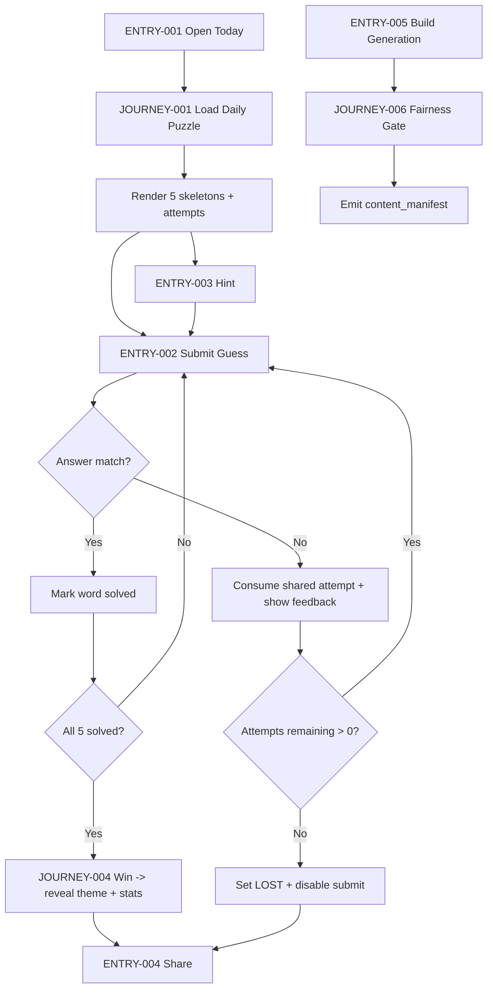
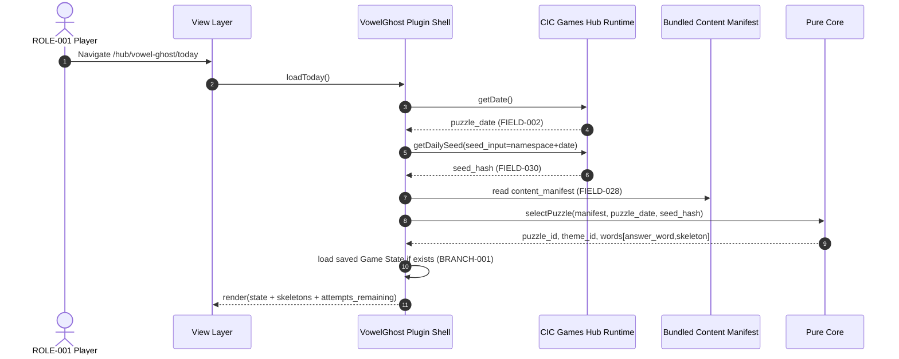
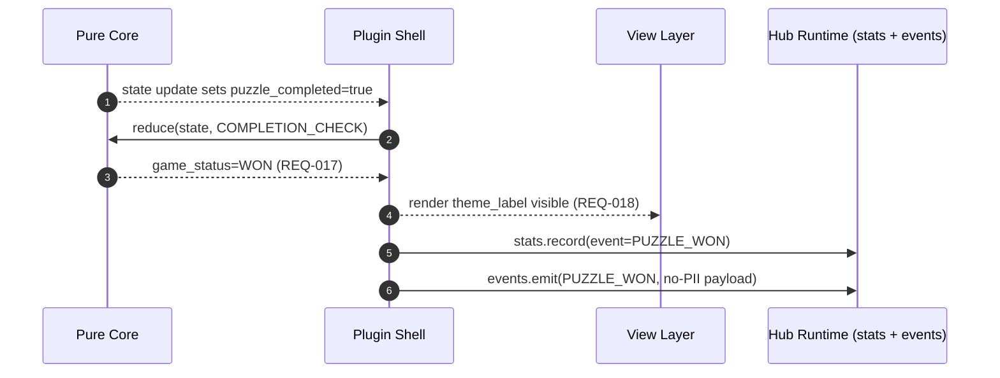
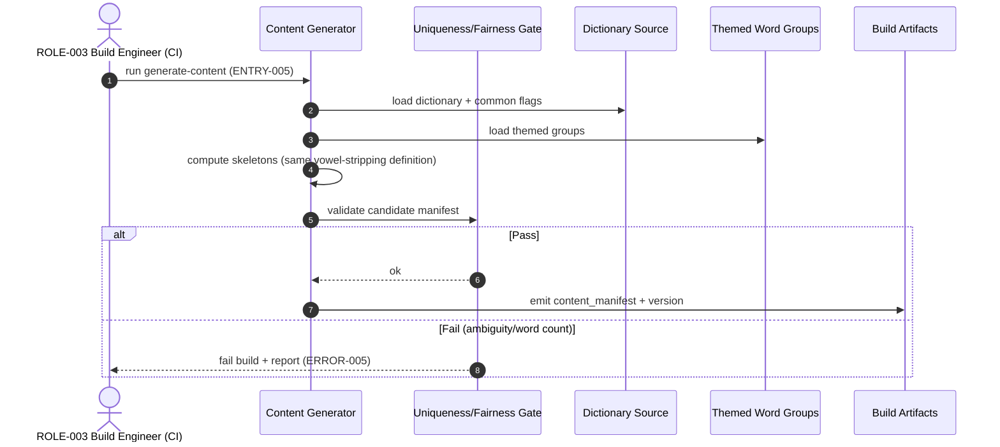
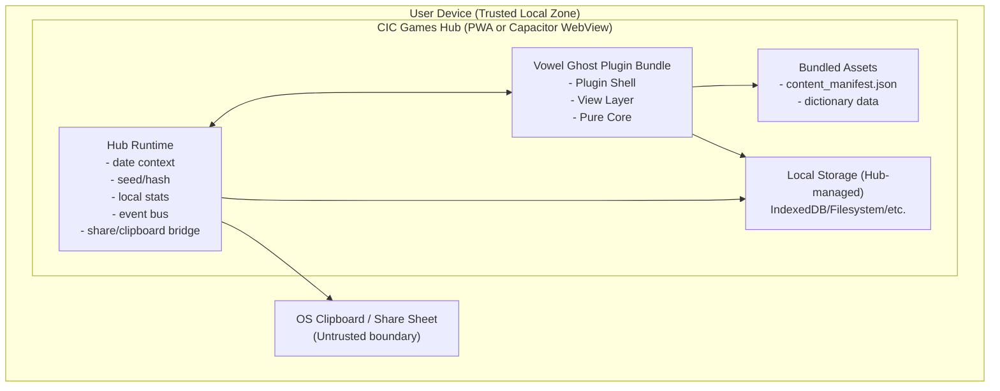

<!-- generated: 2026-07-24T10:15:26Z -->
<!-- mode: initial -->
<!-- feature-slug: vowel-ghost -->
<!-- a2a-endpoint: https://bob-sdlc-orchestrator.2as6l7wq9qj8.eu-gb.codeengine.appdomain.cloud/v1/rpc -->

# Glossary

## Terms

### TERM-001: Vowel Ghost
- **Definition:** The daily word puzzle game plugin in the CIC Games hub where the player restores vowels in 5 themed words.
- **Synonyms:** VowelGhost, daily vowel puzzle
- **Anti-definition:** Not a crossword, not a hangman clone, not a multiplayer game, not a server-hosted game.
- **Source:** User request

### TERM-002: CIC Games Hub
- **Definition:** The host application/platform that runs game plugins, provides offline-first PWA + Capacitor runtime, and shared services (e.g., seed, stats, share).
- **Synonyms:** Hub, CIC Hub
- **Anti-definition:** Not the Vowel Ghost plugin itself; not a backend service.
- **Source:** User request

### TERM-003: GamePlugin
- **Definition:** The plugin interface/contract implemented by Vowel Ghost to integrate with the hub (lifecycle, rendering, service access).
- **Synonyms:** Plugin contract
- **Anti-definition:** Not the game logic itself; not the hub.
- **Source:** User request

### TERM-004: Daily Puzzle
- **Definition:** The per-day instance containing exactly 5 target words, a theme label, and a shared attempts budget, deterministically selected for a date.
- **Synonyms:** Daily, today’s puzzle
- **Anti-definition:** Not an endless/random puzzle; not user-generated content.
- **Source:** User request

### TERM-005: Theme
- **Definition:** A label describing the relationship among the 5 target words, revealed only after the puzzle is solved.
- **Synonyms:** Category, theme label
- **Anti-definition:** Not shown during active solving; not a hint text that reveals answers.
- **Source:** User request

### TERM-006: Themed Word Group
- **Definition:** A curated set of candidate answers associated with a Theme used for build-time generation of Daily Puzzles.
- **Synonyms:** Theme pack, word set
- **Anti-definition:** Not dynamically fetched; not user-editable at runtime.
- **Source:** User request

### TERM-007: Dictionary (Bundled)
- **Definition:** A bundled word list used to validate that a guess is a real word and to support build-time uniqueness/fairness validation.
- **Synonyms:** Word list, lexicon
- **Anti-definition:** Not an online dictionary lookup; not locale-dependent unless explicitly bundled.
- **Source:** User request

### TERM-008: Common Dictionary Word
- **Definition:** A dictionary entry marked as common/acceptable for gameplay (used by the build-time gate to avoid obscure alternatives).
- **Synonyms:** Allowed word, common word
- **Anti-definition:** Not every possible spelling; not proper nouns unless explicitly allowed.
- **Source:** User request

### TERM-009: Answer Word
- **Definition:** The intended target word for a given skeleton in the Daily Puzzle, drawn from a Themed Word Group.
- **Synonyms:** Solution, target
- **Anti-definition:** Not any word that matches the skeleton; must match the intended themed answer.
- **Source:** User request

### TERM-010: Vowel
- **Definition:** The characters removed/inserted for this game: A, E, I, O, U (case-insensitive).
- **Synonyms:** AEIOU
- **Anti-definition:** Not Y (unless later specified); not accented vowels unless later specified.
- **Source:** User request

### TERM-011: Vowel Stripping
- **Definition:** Deterministic transformation that removes all vowels (TERM-010) from a word, preserving the order of remaining characters.
- **Synonyms:** De-vowel, consonant extraction
- **Anti-definition:** Not phonetic analysis; not locale/OS dependent; not regex behavior that differs across platforms.
- **Source:** User request

### TERM-012: Skeleton
- **Definition:** The consonant-only representation shown to the player for an Answer Word (computed by Vowel Stripping).
- **Synonyms:** Consonant skeleton, pattern
- **Anti-definition:** Not an anagram; not a masked word with underscores.
- **Source:** User request

### TERM-013: Guess
- **Definition:** A player-entered candidate full word for a specific Skeleton.
- **Synonyms:** Entry, attempt word
- **Anti-definition:** Not automatically accepted; not stored server-side.
- **Source:** User request

### TERM-014: Guess Validation
- **Definition:** The ordered checks applied to a Guess: dictionary membership, skeleton match (via vowel stripping), and equality to the Answer Word.
- **Synonyms:** Validation pipeline
- **Anti-definition:** Not fuzzy matching; not “close enough” acceptance.
- **Source:** User request

### TERM-015: Attempts Budget
- **Definition:** A limited number of incorrect guesses allowed for the entire Daily Puzzle, shared across all 5 Skeletons.
- **Synonyms:** Lives, tries
- **Anti-definition:** Not per-word attempts; not infinite.
- **Source:** User request

### TERM-016: Feedback
- **Definition:** Non-spoiler response shown after a Guess indicating which validation checks passed/failed (real word? skeleton match?) without revealing the Answer Word.
- **Synonyms:** Validation feedback
- **Anti-definition:** Not revealing the correct answer or theme before completion.
- **Source:** User request

### TERM-017: Hint
- **Definition:** An action that reveals the first vowel position of the currently selected unsolved word.
- **Synonyms:** Assist, clue
- **Anti-definition:** Not revealing the full answer; not revealing the theme.
- **Source:** User request

### TERM-018: Solved Word
- **Definition:** A word state where the player has entered the correct Answer Word for its Skeleton.
- **Synonyms:** Completed word
- **Anti-definition:** Not partially correct; not “skeleton matched but wrong answer.”
- **Source:** User request

### TERM-019: Puzzle Completion
- **Definition:** State where all 5 words are Solved Words.
- **Synonyms:** Win, solved puzzle
- **Anti-definition:** Not “ran out of attempts”; not partial progress.
- **Source:** User request

### TERM-020: Build-Time Content Generation
- **Definition:** The build pipeline step that selects/compiles Daily Puzzle content from Themed Word Groups and the Bundled Dictionary into a shipped content manifest.
- **Synonyms:** Static generation, content compile
- **Anti-definition:** Not runtime generation; not network-dependent.
- **Source:** User request

### TERM-021: Uniqueness/Fairness Gate
- **Definition:** A build-time verifier that rejects candidate skeletons/words if the skeleton maps to multiple plausible common dictionary words (within scope) and ensures theme cohesion/labeling rules.
- **Synonyms:** Content gate, validator
- **Anti-definition:** Not a runtime check; not optional for released builds.
- **Source:** User request

### TERM-022: Deterministic Daily Selection
- **Definition:** The method that picks the Daily Puzzle for a given date using a hub-provided seedable hash so all players get the same puzzle for that date without a backend.
- **Synonyms:** Daily seed, seeded selection
- **Anti-definition:** Not device-random; not timezone-ambiguous without defined date source.
- **Source:** User request

### TERM-023: Hub Seedable Hash
- **Definition:** A deterministic hash/PRNG service from the hub used to select content consistently by date.
- **Synonyms:** Seed service
- **Anti-definition:** Not cryptographic security; not a network call.
- **Source:** User request

### TERM-024: Offline-First PWA + Capacitor
- **Definition:** The runtime environment where the hub and plugin operate, enabling offline play and mobile packaging.
- **Synonyms:** Offline-first app
- **Anti-definition:** Not requiring connectivity; not server-synced accounts.
- **Source:** User request

### TERM-025: Pure Core
- **Definition:** The plugin’s platform-independent logic module containing only deterministic string operations and state transitions, with no storage and no clock access.
- **Synonyms:** Core engine, pure functions
- **Anti-definition:** Not performing IO; not reading system time; not writing storage.
- **Source:** User request

### TERM-026: View Layer
- **Definition:** UI component(s) that render the puzzle, accept input, and call Pure Core functions; may use hub services.
- **Synonyms:** UI, frontend
- **Anti-definition:** Not containing gameplay rules that affect validation outcomes differently across platforms.
- **Source:** User request

### TERM-027: Game State
- **Definition:** Serializable representation of current progress in the Daily Puzzle (per-word solved status, remaining attempts, revealed hint data, etc.).
- **Synonyms:** State
- **Anti-definition:** Not including any backend identifiers; not containing the current date from system clock.
- **Source:** User request

### TERM-028: Local Stats/Streaks
- **Definition:** Per-device stats such as plays, wins, current streak, and distribution stored locally via hub services.
- **Synonyms:** Statistics, streak
- **Anti-definition:** Not cross-device; not account-based.
- **Source:** User request

### TERM-029: Spoiler-Safe Emoji Share
- **Definition:** A shareable text block using emojis that encodes solve status and attempts without revealing any words or the Theme prior to completion.
- **Synonyms:** Share card, emoji grid
- **Anti-definition:** Not including the answers; not including theme before solved.
- **Source:** User request

### TERM-030: Accessibility Support
- **Definition:** Keyboard operability, screen-reader compatibility, and non-color-only feedback for game status and validation.
- **Synonyms:** A11y
- **Anti-definition:** Not relying solely on color; not mouse/touch-only.
- **Source:** User request

---

## Data Dictionary

| ID | Name | Type | Format | Range/Enum | Units | Default | Nullable | PII | Source | Validation |
|---|---|---|---|---|---|---|---|---|---|---|
| FIELD-001 | puzzle_id | string | `VG-YYYY-MM-DD` | regex `^VG-\d{4}-\d{2}-\d{2}$` | n/a | n/a | No | None | Hub date + plugin | Must match date key used by TERM-022 |
| FIELD-002 | puzzle_date | string | `YYYY-MM-DD` | ISO date | n/a | hub-provided | No | None | Hub service | Must be parseable ISO-8601 date (no time) |
| FIELD-003 | theme_id | string | slug | `[a-z0-9-]+` | n/a | n/a | No | None | Build-time manifest | Must exist in manifest |
| FIELD-004 | theme_label | string | text | 1..40 chars | n/a | hidden until solved | No | None | Build-time manifest | Must be non-empty; displayed only post-solve |
| FIELD-005 | word_index | integer | int | 1..5 | n/a | n/a | No | None | Plugin | Must be within 1..5 |
| FIELD-006 | answer_word | string | uppercase A-Z | length 1..32 | n/a | n/a | No | None | Build-time manifest | Must be in dictionary scope and match skeleton (FIELD-007) |
| FIELD-007 | skeleton | string | uppercase A-Z | length 0..32 | n/a | n/a | No | None | Derived (TERM-011) | Must equal VowelStripping(answer_word) |
| FIELD-008 | guess_text | string | user input | length 0..32 | n/a | "" | No | Potentially PII (free text) | User input | Must be normalized before validation (FIELD-023) |
| FIELD-009 | guess_normalized | string | uppercase A-Z | length 0..32 | n/a | "" | No | Potentially PII (derived from free text) | Pure core | Must contain only A-Z after normalization (FIELD-023) |
| FIELD-010 | is_dictionary_word | boolean | true/false | {true,false} | n/a | false | No | None | Pure core + bundled dict | True iff guess_normalized in dictionary |
| FIELD-011 | is_skeleton_match | boolean | true/false | {true,false} | n/a | false | No | None | Pure core | True iff VowelStripping(guess_normalized)==skeleton |
| FIELD-012 | is_answer_match | boolean | true/false | {true,false} | n/a | false | No | None | Pure core | True iff guess_normalized==answer_word |
| FIELD-013 | attempts_total | integer | int | 1..20 | attempts | 8 | No | None | Build-time/config | Must be >= words_count (FIELD-014) |
| FIELD-014 | words_count | integer | int | fixed {5} | words | 5 | No | None | Build-time/config | Must equal 5 |
| FIELD-015 | attempts_used | integer | int | 0..attempts_total | attempts | 0 | No | None | Game state | Must not exceed attempts_total |
| FIELD-016 | attempts_remaining | integer | int | 0..attempts_total | attempts | attempts_total | No | None | Derived | attempts_total - attempts_used |
| FIELD-017 | word_solved | boolean | true/false | {true,false} | n/a | false | No | None | Game state | True only after correct guess |
| FIELD-018 | selected_word_index | integer | int | 1..5 | n/a | 1 | No | None | View state | Must reference an unsolved or any word based on UX rules |
| FIELD-019 | hint_used | boolean | true/false | {true,false} | n/a | false | No | None | Game state | True after hint action for a word |
| FIELD-020 | first_vowel_position | integer | int | 1..len(answer_word) | 1-based index | n/a | Yes | None | Derived at reveal time | Must point to a vowel (TERM-010) in answer_word |
| FIELD-021 | puzzle_completed | boolean | true/false | {true,false} | n/a | false | No | None | Derived | True iff all word_solved are true |
| FIELD-022 | game_status | string | enum | {IN_PROGRESS, WON, LOST} | n/a | IN_PROGRESS | No | None | Derived | WON if puzzle_completed; LOST if attempts_remaining==0 and not completed |
| FIELD-023 | normalization_mode | string | enum | {A_Z_ONLY_UPPERCASE} | n/a | A_Z_ONLY_UPPERCASE | No | None | Pure core | Must produce deterministic output across platforms |
| FIELD-024 | validation_feedback | object | JSON | keys: `dictionary`, `skeleton` | n/a | n/a | No | None | Pure core | Must not include answer_word or theme_label |
| FIELD-025 | share_text | string | text | 1..280 chars | n/a | n/a | No | None | View layer | Must not contain answer_word, skeleton text, or theme_label before WON |
| FIELD-026 | emoji_grid | string | text | lines of emoji | n/a | n/a | No | None | View layer | Must encode only solved/attempt counts |
| FIELD-027 | build_manifest_version | string | semver | `MAJOR.MINOR.PATCH` | n/a | n/a | No | None | Build pipeline | Must be valid semver |
| FIELD-028 | content_manifest | object | JSON | themes+puzzles | n/a | n/a | No | None | Build-time output | Must include entries for all dates supported |
| FIELD-029 | seed_input | string | text | date + namespace | n/a | n/a | No | None | Hub seed service | Must be stable for same date |
| FIELD-030 | seed_hash | string | hex/base64 | implementation-defined | n/a | n/a | No | None | Hub seed service | Must be deterministic for same seed_input |
| FIELD-031 | local_stats | object | JSON | hub-defined | n/a | empty | No | None | Hub stats service | Must validate against hub schema |
| FIELD-032 | streak_count | integer | int | 0..9999 | days | 0 | No | None | Hub stats service | Non-negative |
| FIELD-033 | event_name | string | enum | {PUZZLE_START, GUESS_SUBMIT, WORD_SOLVED, PUZZLE_WON, PUZZLE_LOST, SHARE} | n/a | n/a | No | None | Plugin telemetry (local) | Must be one of enum |
| FIELD-034 | aria_label | string | text | 1..120 chars | n/a | n/a | Yes | None | View layer | Must exist for interactive controls |

**FIELD-to-TERM linkage (ownership):**
- Daily Puzzle (TERM-004): FIELD-001..002, 003..004, 013..016, 021..022, 028..030
- Theme (TERM-005): FIELD-003..004
- Answer Word (TERM-009): FIELD-006
- Skeleton (TERM-012): FIELD-007
- Guess (TERM-013): FIELD-008..012, 024
- Hint (TERM-017): FIELD-019..020
- Game State (TERM-027): FIELD-015, 017, 019, 021, 022, 031..032
- Spoiler-Safe Emoji Share (TERM-029): FIELD-025..026
- Build-Time Content Generation / Gate (TERM-020/021): FIELD-027..028, 006..007, 003..004

# User Journeys

## Roles

| Role ID | Role | Type | Description |
|---|---|---|---|
| ROLE-001 | Player | Primary | Solves the TERM-004 Daily Puzzle in the plugin UI. |
| ROLE-002 | Hub Runtime | System | Provides TERM-023 hash/seed and TERM-028 stats services; hosts offline-first runtime. |
| ROLE-003 | Build Engineer | Admin/Dev | Runs TERM-020 build-time generation and TERM-021 gate to produce FIELD-028 content_manifest. |
| ROLE-004 | Screen Reader | System/Assistive | Consumes accessibility metadata (FIELD-034 aria_label) to announce state/feedback. |

## Entry Points

| Entry ID | Location | Trigger | Auth |
|---|---|---|---|
| ENTRY-001 | UI Route: `/hub/vowel-ghost/today` | Player opens today’s game | None |
| ENTRY-002 | UI Control: “Submit Guess” | Player submits FIELD-008 guess_text for FIELD-005 word_index | None |
| ENTRY-003 | UI Control: “Hint” | Player requests TERM-017 hint for current FIELD-018 selected_word_index | None |
| ENTRY-004 | UI Control: “Share” | Player taps share after FIELD-022 game_status is WON/LOST | None |
| ENTRY-005 | Build Step: `generate-content` | CI/build runs TERM-020 | Internal |
| ENTRY-006 | Hub Service Call: `getDailySeed(date)` | Plugin requests deterministic seed for FIELD-002 | None |
| ENTRY-007 | Hub Service Call: `stats.record(event)` | Plugin records FIELD-031 local_stats updates | None |

## Role Permission Matrix

| Capability | ROLE-001 Player | ROLE-002 Hub Runtime | ROLE-003 Build Engineer | ROLE-004 Screen Reader |
|---|---:|---:|---:|---:|
| View skeletons (FIELD-007) | Y | Y | Y | Y |
| Submit guess (FIELD-008) | Y | N | N | N |
| Request hint (FIELD-019) | Y | N | N | N |
| Reveal theme_label (FIELD-004) before win | N | N | N | N |
| Generate content_manifest (FIELD-028) | N | N | Y | N |
| Provide seed_hash (FIELD-030) | N | Y | N | N |
| Record local_stats (FIELD-031) | N (indirect) | Y | N | N |
| Use share_text (FIELD-025) | Y | N | N | N |

## Journeys

### JOURNEY-001: Open today’s Daily Puzzle
- **Role/Goal:** ROLE-001 Player; load TERM-004 Daily Puzzle for FIELD-002 puzzle_date and begin play.
  - **Success criteria:** UI shows 5 TERM-012 skeleton values (FIELD-007), attempts remaining (FIELD-016), and input for selected word (FIELD-018) while FIELD-022 game_status is IN_PROGRESS.
  - **Failure criteria:** No content available for date; manifest missing/corrupt.
- **Entry:** ENTRY-001
- **Happy path:**
  1. Plugin requests FIELD-002 puzzle_date from hub date context (no device clock in TERM-025).  
     Data: FIELD-002.
  2. Plugin calls hub seed service (TERM-023) with FIELD-029 seed_input derived from FIELD-002.  
     Data: FIELD-029, FIELD-030.
  3. Plugin selects the deterministic puzzle entry from FIELD-028 content_manifest (TERM-022).  
     Data: FIELD-028, FIELD-001, FIELD-003.
  4. View renders 5 TERM-012 skeletons (FIELD-007) and sets FIELD-018 selected_word_index=1.  
     Data: FIELD-007, FIELD-018.
  5. View shows attempts remaining from FIELD-016 and hides FIELD-004 theme_label.  
     Data: FIELD-016, FIELD-004.
- **BRANCH-001 (existing in-progress state):** If a serialized TERM-027 Game State exists for FIELD-001 puzzle_id, load it and render solved states (FIELD-017) and attempts used (FIELD-015).
- **ERROR-001 (missing manifest entry):**
  - **Trigger:** FIELD-028 has no puzzle for FIELD-002.
  - **System response:** Show non-spoiler error UI “Puzzle unavailable for this date” and disable submission controls.
  - **Recovery:** Player can change date only via hub navigation (not plugin).
- **EDGE-001 (offline mode):** Ensure all steps succeed without network; no remote calls other than local hub services.
- **EDGE-002 (timezone ambiguity):** Plugin must use hub-provided date (FIELD-002), not OS time.

### JOURNEY-002: Submit a guess for a skeleton
- **Role/Goal:** ROLE-001 Player; enter a TERM-013 Guess for the selected word and receive TERM-016 Feedback, consuming TERM-015 Attempts Budget only on incorrect guess.
  - **Success criteria:** Correct guess marks FIELD-017 word_solved; incorrect guess decrements FIELD-016 attempts_remaining and provides FIELD-024 validation_feedback.
  - **Failure criteria:** Input rejected unexpectedly; attempts miscounted; feedback reveals answer.
- **Entry:** ENTRY-002
- **Happy path:**
  1. Player selects a word (FIELD-018 selected_word_index) and types FIELD-008 guess_text.  
     Data: FIELD-018, FIELD-008.
  2. View normalizes input per FIELD-023 normalization_mode to FIELD-009 guess_normalized (TERM-025).  
     Data: FIELD-023, FIELD-009.
  3. Pure Core performs Guess Validation (TERM-014): dictionary membership to set FIELD-010 is_dictionary_word.  
     Data: FIELD-010.
  4. Pure Core computes Vowel Stripping (TERM-011) of FIELD-009 and compares to FIELD-007 skeleton to set FIELD-011 is_skeleton_match.  
     Data: FIELD-009, FIELD-007, FIELD-011.
  5. Pure Core compares FIELD-009 to FIELD-006 answer_word to set FIELD-012 is_answer_match.  
     Data: FIELD-006, FIELD-012.
  6. If FIELD-012 is true, mark FIELD-017 word_solved=true for that FIELD-005 word_index and update FIELD-021 puzzle_completed if applicable.  
     Data: FIELD-017, FIELD-005, FIELD-021.
  7. If FIELD-012 is false, increment FIELD-015 attempts_used and compute FIELD-016 attempts_remaining; show FIELD-024 validation_feedback indicating (FIELD-010, FIELD-011) only.  
     Data: FIELD-015, FIELD-016, FIELD-024.
- **BRANCH-002 (guess not in dictionary):** FIELD-010=false; feedback indicates “not a dictionary word”; treat as incorrect guess and consume one attempt.
- **BRANCH-003 (dictionary word but skeleton mismatch):** FIELD-010=true and FIELD-011=false; feedback indicates “does not match skeleton”; consume one attempt.
- **BRANCH-004 (skeleton match but not intended answer):** FIELD-010=true and FIELD-011=true and FIELD-012=false; feedback indicates “matches skeleton but not correct” (without revealing alternative); consume one attempt.
- **ERROR-002 (attempts exhausted):**
  - **Trigger:** FIELD-016 attempts_remaining becomes 0 while FIELD-021 puzzle_completed=false.
  - **System response:** Set FIELD-022 game_status=LOST; disable further guess submissions.
  - **Recovery:** None for same day; player can view share.
- **LOOP-001 (solve remaining words):** After any submission, return to step 1 for another FIELD-018 selection until FIELD-022 becomes WON or LOST.
- **EDGE-003 (empty input):** FIELD-009 empty; treat as invalid submission with no attempt consumed and show inline prompt.
- **EDGE-004 (already solved word):** Submitting for FIELD-017 word_solved=true is blocked and does not consume attempts.
- **EDGE-005 (concurrency/double submit):** Rapid double-tap submit must result in at most one attempt consumed and one state transition.

### JOURNEY-003: Use a hint on the current unsolved word
- **Role/Goal:** ROLE-001 Player; reveal TERM-017 Hint (first vowel position) for the selected unsolved word.
  - **Success criteria:** FIELD-020 first_vowel_position becomes visible for that word without revealing full answer.
  - **Failure criteria:** Hint reveals too much; hint inconsistent across platforms.
- **Entry:** ENTRY-003
- **Happy path:**
  1. Player selects an unsolved word (FIELD-018) where FIELD-017=false.  
     Data: FIELD-018, FIELD-017.
  2. View requests Pure Core to compute first vowel position from FIELD-006 answer_word and TERM-010 vowels.  
     Data: FIELD-006, FIELD-020.
  3. Game State marks FIELD-019 hint_used=true and shows FIELD-020 in UI (e.g., “first vowel at position N”).  
     Data: FIELD-019, FIELD-020.
- **BRANCH-005 (hint already used):** If FIELD-019 is true, the UI shows the existing FIELD-020 and does not change attempts.
- **ERROR-003 (no vowels edge):**
  - **Trigger:** Answer has no TERM-010 vowels (e.g., “MYTH” if allowed).
  - **System response:** Show “No vowel positions” message and set FIELD-019 hint_used=true with FIELD-020 null.
  - **Recovery:** Continue solving without hint.
- **EDGE-006 (solved word):** Hint action disabled if FIELD-017=true.

### JOURNEY-004: Win and reveal theme; update stats
- **Role/Goal:** ROLE-001 Player; complete all 5 words and see Theme label; stats updated locally.
  - **Success criteria:** FIELD-022 game_status=WON; FIELD-004 theme_label revealed; hub stats updated (FIELD-031).
  - **Failure criteria:** Theme revealed early; stats not updated deterministically.
- **Entry:** Triggered from JOURNEY-002 step 6 (completion)
- **Happy path:**
  1. When FIELD-021 puzzle_completed becomes true, set FIELD-022 game_status=WON.  
     Data: FIELD-021, FIELD-022.
  2. View reveals FIELD-004 theme_label and displays completion summary with attempts used (FIELD-015).  
     Data: FIELD-004, FIELD-015.
  3. Plugin calls hub stats service to record play/win and update FIELD-032 streak_count via FIELD-031 local_stats.  
     Data: FIELD-031, FIELD-032, FIELD-033 event_name=PUZZLE_WON.
- **EDGE-007 (offline stats):** Stats update must work offline via hub local storage services.

### JOURNEY-005: Share spoiler-safe emoji summary
- **Role/Goal:** ROLE-001 Player; share TERM-029 Spoiler-Safe Emoji Share without leaking words or Theme prior to solving.
  - **Success criteria:** Generated FIELD-025 share_text contains FIELD-026 emoji_grid and counts; no answers; theme included only if WON.
  - **Failure criteria:** Share reveals any FIELD-006 answer_word or FIELD-004 theme_label before WON.
- **Entry:** ENTRY-004
- **Happy path:**
  1. Player taps Share; plugin builds FIELD-026 emoji_grid from solved markers (FIELD-017) and attempts used/remaining (FIELD-015/016).  
     Data: FIELD-026, FIELD-017, FIELD-015, FIELD-016.
  2. If FIELD-022 is WON, include FIELD-004 theme_label; otherwise exclude it.  
     Data: FIELD-022, FIELD-004.
  3. Plugin copies FIELD-025 share_text to clipboard / invokes native share sheet via hub.  
     Data: FIELD-025.
- **ERROR-004 (share unavailable):**
  - **Trigger:** Clipboard/share API fails.
  - **System response:** Show error toast and provide manual select/copy field.
  - **Recovery:** Player retries share.
- **EDGE-008 (spoiler safety pre-win):** Ensure no word strings (FIELD-006, FIELD-007) appear in FIELD-025 when FIELD-022=IN_PROGRESS.

### JOURNEY-006: Build-time content generation and fairness gate
- **Role/Goal:** ROLE-003 Build Engineer; produce FIELD-028 content_manifest passing TERM-021 gate.
  - **Success criteria:** All shipped puzzles pass uniqueness/fairness; build fails on violations.
  - **Failure criteria:** Ambiguous skeletons shipped; theme label leaked early via manifest metadata in runtime.
- **Entry:** ENTRY-005
- **Happy path:**
  1. Build loads TERM-007 Bundled Dictionary and TERM-006 Themed Word Groups.  
     Data: FIELD-028 input sources (conceptual).
  2. For each candidate FIELD-006 answer_word, compute FIELD-007 skeleton via TERM-011.  
     Data: FIELD-006, FIELD-007.
  3. Gate checks that for each (theme, skeleton), exactly one TERM-008 Common Dictionary Word in scope matches that skeleton and equals FIELD-006.  
     Data: FIELD-006, FIELD-007.
  4. Gate checks each Daily Puzzle has FIELD-014 words_count=5 and shares a single FIELD-004 theme_label (hidden at runtime until WON).  
     Data: FIELD-014, FIELD-004.
  5. Emit FIELD-028 content_manifest with FIELD-027 build_manifest_version.
- **ERROR-005 (ambiguity found):**
  - **Trigger:** Skeleton maps to >1 common word.
  - **System response:** Fail build with report listing theme_id, skeleton, conflicting words.
  - **Recovery:** Curate word lists or adjust dictionary “common” flags.

## Journey Map



# Requirements

### REQ-001: Load daily puzzle by hub date and seed
- **EARS Pattern:** Event-Driven
- **EARS Statement:** When the player opens ENTRY-001, the Vowel Ghost plugin shall derive FIELD-001 puzzle_id using FIELD-002 puzzle_date provided by the hub.
- **Inputs:** FIELD-002
- **Outputs:** FIELD-001
- **Preconditions:** Hub provides FIELD-002.
- **Postconditions:** FIELD-001 is available for selection/loading.
- **Invariants:** No device clock access in TERM-025.
- **Trigger:** ENTRY-001
- **Actor:** ROLE-001
- **EntityScope:** TERM-004 Daily Puzzle
- **ErrorModes:** Invalid hub date format
- **NFR-Tags:** compatibility
- **Source:** JOURNEY-001 step 1, EDGE-002
- **Dependencies:** NFR-006 (determinism)
- **Priority:** P0
- **AcceptanceCriteria:**
  - **TEST-001:** Given FIELD-002=`2026-07-24`, when opening ENTRY-001, then FIELD-001=`VG-2026-07-24`.
  - **TEST-002:** Given FIELD-002 is not ISO `YYYY-MM-DD`, when opening ENTRY-001, then ERROR-001 UI state is shown.
- **Assumptions:** Hub is the source of date truth.
- **OpenQuestions:** None.

### REQ-002: Select deterministic puzzle from manifest using hub seed
- **EARS Pattern:** Event-Driven
- **EARS Statement:** When FIELD-029 seed_input is provided for FIELD-002 puzzle_date, the Vowel Ghost plugin shall select the Daily Puzzle entry deterministically from FIELD-028 content_manifest using FIELD-030 seed_hash.
- **Inputs:** FIELD-028, FIELD-029, FIELD-030
- **Outputs:** FIELD-003 theme_id and 5 (FIELD-006 answer_word, FIELD-007 skeleton)
- **Preconditions:** FIELD-028 is available locally.
- **Postconditions:** A single puzzle instance is selected for the date.
- **Invariants:** Selection result must be identical for same (manifest, date).
- **Trigger:** ENTRY-006
- **Actor:** ROLE-002 (service call invoked by plugin)
- **EntityScope:** TERM-022 Deterministic Daily Selection
- **ErrorModes:** Missing manifest entry
- **NFR-Tags:** reliability
- **Source:** JOURNEY-001 steps 2–3, ERROR-001
- **Dependencies:** NFR-006
- **Priority:** P0
- **AcceptanceCriteria:**
  - **TEST-003:** Given the same FIELD-028 and FIELD-002 across two devices, when selecting, then the same puzzle words are chosen.
  - **TEST-004:** Given no entry for FIELD-002, when selecting, then ERROR-001 is triggered.
- **Assumptions:** Hub seed hash is stable.
- **OpenQuestions:** Define manifest indexing strategy (date->list vs global list).

### REQ-003: Render skeletons and hide theme during play
- **EARS Pattern:** State-Driven
- **EARS Statement:** While FIELD-022 game_status is IN_PROGRESS, the view layer shall display the 5 FIELD-007 skeleton values and shall not display FIELD-004 theme_label.
- **Inputs:** FIELD-007, FIELD-022, FIELD-004
- **Outputs:** UI state
- **Preconditions:** Puzzle loaded.
- **Postconditions:** Player can attempt guesses without seeing theme.
- **Invariants:** Theme remains hidden until completion.
- **Trigger:** UI render
- **Actor:** ROLE-001
- **EntityScope:** TERM-026 View Layer
- **ErrorModes:** None
- **NFR-Tags:** privacy
- **Source:** JOURNEY-001 steps 4–5
- **Dependencies:** REQ-002
- **Priority:** P0
- **AcceptanceCriteria:**
  - **TEST-005:** Given IN_PROGRESS, then theme label is not present in the DOM/accessibility tree.
- **Assumptions:** Theme label exists in manifest.
- **OpenQuestions:** None.

### REQ-004: Normalize guess input deterministically
- **EARS Pattern:** Event-Driven
- **EARS Statement:** When the player submits FIELD-008 guess_text, the pure core shall produce FIELD-009 guess_normalized according to FIELD-023 normalization_mode.
- **Inputs:** FIELD-008, FIELD-023
- **Outputs:** FIELD-009
- **Preconditions:** None
- **Postconditions:** Normalized text is ready for validation.
- **Invariants:** Identical input yields identical output across platforms.
- **Trigger:** ENTRY-002
- **Actor:** ROLE-001
- **EntityScope:** TERM-025 Pure Core
- **ErrorModes:** None
- **NFR-Tags:** compatibility
- **Source:** JOURNEY-002 step 2
- **Dependencies:** NFR-006
- **Priority:** P0
- **AcceptanceCriteria:**
  - **TEST-006:** Given guess_text=`"gRaPe!"`, then guess_normalized=`"GRAPE"`.
- **Assumptions:** Only A-Z letters are supported.
- **OpenQuestions:** Support diacritics/locales later?

### REQ-005: Perform dictionary membership check
- **EARS Pattern:** Event-Driven
- **EARS Statement:** When FIELD-009 guess_normalized is submitted, the pure core shall set FIELD-010 is_dictionary_word to true only if FIELD-009 exists in TERM-007 Dictionary (Bundled).
- **Inputs:** FIELD-009, bundled dictionary
- **Outputs:** FIELD-010
- **Preconditions:** Dictionary loaded in-memory.
- **Postconditions:** Dictionary check outcome available for feedback.
- **Invariants:** No network lookup.
- **Trigger:** ENTRY-002
- **Actor:** ROLE-001
- **EntityScope:** TERM-014 Guess Validation
- **ErrorModes:** None
- **NFR-Tags:** offline
- **Source:** JOURNEY-002 step 3, BRANCH-002
- **Dependencies:** REQ-004
- **Priority:** P0
- **AcceptanceCriteria:**
  - **TEST-007:** Given guess_normalized not in dictionary, then is_dictionary_word=false.
- **Assumptions:** Dictionary is uppercase normalized.
- **OpenQuestions:** How to handle hyphenated words?

### REQ-006: Compute vowel stripping deterministically
- **EARS Pattern:** Ubiquitous
- **EARS Statement:** The pure core shall compute TERM-011 Vowel Stripping by removing all TERM-010 vowels (A,E,I,O,U) case-insensitively from an input word.
- **Inputs:** word string
- **Outputs:** stripped string
- **Preconditions:** Input is FIELD-009 guess_normalized or FIELD-006 answer_word.
- **Postconditions:** Result can be compared to FIELD-007 skeleton.
- **Invariants:** No locale-dependent casing rules.
- **Trigger:** Any validation
- **Actor:** ROLE-002 (system usage within core)
- **EntityScope:** TERM-011 Vowel Stripping
- **ErrorModes:** None
- **NFR-Tags:** compatibility
- **Source:** User request; JOURNEY-002 step 4
- **Dependencies:** NFR-006
- **Priority:** P0
- **AcceptanceCriteria:**
  - **TEST-008:** Given `"ORANGE"`, then stripping returns `"RNG"`.
- **Assumptions:** Y is not a vowel.
- **OpenQuestions:** Confirm treatment of Y.

### REQ-007: Check skeleton match for a guess
- **EARS Pattern:** Event-Driven
- **EARS Statement:** When FIELD-009 guess_normalized is submitted for a word, the pure core shall set FIELD-011 is_skeleton_match to true only if Vowel Stripping(FIELD-009) equals FIELD-007 skeleton.
- **Inputs:** FIELD-009, FIELD-007
- **Outputs:** FIELD-011
- **Preconditions:** FIELD-007 exists for selected word.
- **Postconditions:** Skeleton match outcome available for feedback.
- **Invariants:** Uses REQ-006 stripping.
- **Trigger:** ENTRY-002
- **Actor:** ROLE-001
- **EntityScope:** TERM-012 Skeleton
- **ErrorModes:** None
- **NFR-Tags:** correctness
- **Source:** JOURNEY-002 step 4, BRANCH-003
- **Dependencies:** REQ-006
- **Priority:** P0
- **AcceptanceCriteria:**
  - **TEST-009:** Given skeleton=`"GRP"` and guess_normalized=`"GRAPE"`, then is_skeleton_match=true.
- **Assumptions:** Skeletons are uppercase A-Z.
- **OpenQuestions:** None.

### REQ-008: Check answer match for a guess
- **EARS Pattern:** Event-Driven
- **EARS Statement:** When FIELD-009 guess_normalized is submitted for a word, the pure core shall set FIELD-012 is_answer_match to true only if FIELD-009 equals FIELD-006 answer_word.
- **Inputs:** FIELD-009, FIELD-006
- **Outputs:** FIELD-012
- **Preconditions:** Answer word is loaded from manifest.
- **Postconditions:** Correctness is determined.
- **Invariants:** Exact match only.
- **Trigger:** ENTRY-002
- **Actor:** ROLE-001
- **EntityScope:** TERM-009 Answer Word
- **ErrorModes:** None
- **NFR-Tags:** correctness
- **Source:** JOURNEY-002 step 5, BRANCH-004
- **Dependencies:** REQ-004
- **Priority:** P0
- **AcceptanceCriteria:**
  - **TEST-010:** Given answer_word=`"APPLE"` and guess_normalized=`"APPLE"`, then is_answer_match=true.
- **Assumptions:** Answers are single tokens.
- **OpenQuestions:** None.

### REQ-009: Mark word solved on correct answer
- **EARS Pattern:** Event-Driven
- **EARS Statement:** When FIELD-012 is_answer_match becomes true for FIELD-005 word_index, the system shall set FIELD-017 word_solved to true for that word.
- **Inputs:** FIELD-012, FIELD-005
- **Outputs:** FIELD-017
- **Preconditions:** Word not already solved.
- **Postconditions:** Word is in solved state.
- **Invariants:** Solved state is immutable for the puzzle.
- **Trigger:** Guess submission evaluation
- **Actor:** ROLE-001
- **EntityScope:** TERM-018 Solved Word
- **ErrorModes:** None
- **NFR-Tags:** correctness
- **Source:** JOURNEY-002 step 6
- **Dependencies:** REQ-008
- **Priority:** P0
- **AcceptanceCriteria:**
  - **TEST-011:** Given a correct guess, then the UI displays the filled word and disables editing for that word.
- **Assumptions:** View respects solved flag.
- **OpenQuestions:** None.

### REQ-010: Consume one shared attempt on incorrect answer
- **EARS Pattern:** Event-Driven
- **EARS Statement:** When FIELD-012 is_answer_match is false and FIELD-009 guess_normalized is non-empty, the system shall increment FIELD-015 attempts_used by 1.
- **Inputs:** FIELD-012, FIELD-009, FIELD-015
- **Outputs:** FIELD-015
- **Preconditions:** FIELD-022 game_status=IN_PROGRESS.
- **Postconditions:** attempts_used increases by exactly 1.
- **Invariants:** Shared across all words.
- **Trigger:** Guess submission evaluation
- **Actor:** ROLE-001
- **EntityScope:** TERM-015 Attempts Budget
- **ErrorModes:** None
- **NFR-Tags:** correctness
- **Source:** JOURNEY-002 step 7, BRANCH-002/003/004
- **Dependencies:** REQ-008
- **Priority:** P0
- **AcceptanceCriteria:**
  - **TEST-012:** Given two incorrect guesses on different words, then attempts_used increases by 2 total.
- **Assumptions:** attempts_total is configured.
- **OpenQuestions:** None.

### REQ-011: Do not consume attempts for empty normalized input
- **EARS Pattern:** Unwanted
- **EARS Statement:** The system shall not increment FIELD-015 attempts_used when FIELD-009 guess_normalized is empty.
- **Inputs:** FIELD-009, FIELD-015
- **Outputs:** FIELD-015 unchanged
- **Preconditions:** None
- **Postconditions:** Attempts remain the same.
- **Invariants:** Empty submissions are non-penalizing.
- **Trigger:** ENTRY-002
- **Actor:** ROLE-001
- **EntityScope:** TERM-015 Attempts Budget
- **ErrorModes:** None
- **NFR-Tags:** usability
- **Source:** JOURNEY-002 EDGE-003
- **Dependencies:** REQ-004
- **Priority:** P1
- **AcceptanceCriteria:**
  - **TEST-013:** Given guess_text=`""`, when submitted, then attempts_used unchanged and inline prompt displayed.
- **Assumptions:** UI supports inline prompt.
- **OpenQuestions:** None.

### REQ-012: Provide spoiler-safe validation feedback
- **EARS Pattern:** Event-Driven
- **EARS Statement:** When a guess is evaluated, the system shall output FIELD-024 validation_feedback containing only FIELD-010 is_dictionary_word and FIELD-011 is_skeleton_match.
- **Inputs:** FIELD-010, FIELD-011
- **Outputs:** FIELD-024
- **Preconditions:** REQ-005 and REQ-007 executed.
- **Postconditions:** Feedback is available for display.
- **Invariants:** Feedback excludes FIELD-006 and FIELD-004.
- **Trigger:** ENTRY-002
- **Actor:** ROLE-001
- **EntityScope:** TERM-016 Feedback
- **ErrorModes:** None
- **NFR-Tags:** privacy
- **Source:** JOURNEY-002 step 7
- **Dependencies:** REQ-005, REQ-007
- **Priority:** P0
- **AcceptanceCriteria:**
  - **TEST-014:** Given an incorrect guess, then feedback contains keys `dictionary` and `skeleton` only.
- **Assumptions:** UI interprets feedback.
- **OpenQuestions:** Should feedback distinguish “skeleton match but wrong answer” explicitly?

### REQ-013: Block submissions when word already solved
- **EARS Pattern:** State-Driven
- **EARS Statement:** While FIELD-017 word_solved is true for FIELD-005 word_index, the view layer shall disable guess submission for that word.
- **Inputs:** FIELD-017, FIELD-005
- **Outputs:** Disabled UI control
- **Preconditions:** Word solved.
- **Postconditions:** No further guesses applied to that word.
- **Invariants:** No attempts consumed.
- **Trigger:** UI render / interaction
- **Actor:** ROLE-001
- **EntityScope:** TERM-026 View Layer
- **ErrorModes:** None
- **NFR-Tags:** usability
- **Source:** JOURNEY-002 EDGE-004
- **Dependencies:** REQ-009
- **Priority:** P1
- **AcceptanceCriteria:**
  - **TEST-015:** Given solved word, submit control is disabled and not focusable by keyboard.
- **Assumptions:** Accessibility rules allow disabled controls with explanation text.
- **OpenQuestions:** None.

### REQ-014: Prevent double-submit from consuming multiple attempts
- **EARS Pattern:** Unwanted
- **EARS Statement:** The system shall not apply more than one FIELD-015 attempts_used increment for the same UI submission action.
- **Inputs:** Submit event, FIELD-015
- **Outputs:** FIELD-015
- **Preconditions:** Rapid repeated click/tap within the same event loop or debounce window.
- **Postconditions:** At most one increment occurs.
- **Invariants:** State transitions are idempotent per submission.
- **Trigger:** ENTRY-002
- **Actor:** ROLE-001
- **EntityScope:** TERM-027 Game State
- **ErrorModes:** None
- **NFR-Tags:** reliability
- **Source:** JOURNEY-002 EDGE-005
- **Dependencies:** REQ-010
- **Priority:** P1
- **AcceptanceCriteria:**
  - **TEST-016:** Given two submit events fired within 100ms for same guess, then attempts_used increments by 1.
- **Assumptions:** UI can debounce or core can reject duplicate nonce.
- **OpenQuestions:** Should core accept an explicit submission_id?

### REQ-015: Compute attempts remaining from attempts used
- **EARS Pattern:** Ubiquitous
- **EARS Statement:** The system shall compute FIELD-016 attempts_remaining as FIELD-013 attempts_total minus FIELD-015 attempts_used.
- **Inputs:** FIELD-013, FIELD-015
- **Outputs:** FIELD-016
- **Preconditions:** attempts_total configured.
- **Postconditions:** attempts_remaining is updated.
- **Invariants:** attempts_remaining is never negative.
- **Trigger:** Any state update
- **Actor:** ROLE-002
- **EntityScope:** TERM-015 Attempts Budget
- **ErrorModes:** None
- **NFR-Tags:** correctness
- **Source:** JOURNEY-002 step 7
- **Dependencies:** REQ-010
- **Priority:** P0
- **AcceptanceCriteria:**
  - **TEST-017:** Given attempts_total=8 and attempts_used=3, then attempts_remaining=5.
- **Assumptions:** None
- **OpenQuestions:** None.

### REQ-016: Set LOST when attempts reach zero before completion
- **EARS Pattern:** Event-Driven
- **EARS Statement:** When FIELD-016 attempts_remaining becomes 0 and FIELD-021 puzzle_completed is false, the system shall set FIELD-022 game_status to LOST.
- **Inputs:** FIELD-016, FIELD-021
- **Outputs:** FIELD-022
- **Preconditions:** Game in progress.
- **Postconditions:** Game status is LOST.
- **Invariants:** No further guesses accepted.
- **Trigger:** Post-guess evaluation
- **Actor:** ROLE-001
- **EntityScope:** TERM-004 Daily Puzzle
- **ErrorModes:** None
- **NFR-Tags:** correctness
- **Source:** JOURNEY-002 ERROR-002
- **Dependencies:** REQ-015
- **Priority:** P0
- **AcceptanceCriteria:**
  - **TEST-018:** Given attempts_remaining becomes 0 and not all words solved, then status=LOST and submit disabled.
- **Assumptions:** UI respects status.
- **OpenQuestions:** None.

### REQ-017: Set WON when all words are solved
- **EARS Pattern:** Event-Driven
- **EARS Statement:** When FIELD-021 puzzle_completed becomes true, the system shall set FIELD-022 game_status to WON.
- **Inputs:** FIELD-021
- **Outputs:** FIELD-022
- **Preconditions:** All 5 FIELD-017 are true.
- **Postconditions:** Game is won.
- **Invariants:** WON is terminal for the day.
- **Trigger:** Post-solve update
- **Actor:** ROLE-001
- **EntityScope:** TERM-019 Puzzle Completion
- **ErrorModes:** None
- **NFR-Tags:** correctness
- **Source:** JOURNEY-004 step 1
- **Dependencies:** REQ-009
- **Priority:** P0
- **AcceptanceCriteria:**
  - **TEST-019:** Given last unsolved word is solved, then status becomes WON immediately.
- **Assumptions:** None
- **OpenQuestions:** None.

### REQ-018: Reveal theme label only after win
- **EARS Pattern:** Event-Driven
- **EARS Statement:** When FIELD-022 game_status becomes WON, the view layer shall display FIELD-004 theme_label.
- **Inputs:** FIELD-022, FIELD-004
- **Outputs:** UI state
- **Preconditions:** Theme exists.
- **Postconditions:** Theme is visible.
- **Invariants:** Theme hidden otherwise (REQ-003).
- **Trigger:** Status transition
- **Actor:** ROLE-001
- **EntityScope:** TERM-005 Theme
- **ErrorModes:** None
- **NFR-Tags:** privacy
- **Source:** JOURNEY-004 step 2
- **Dependencies:** REQ-017, REQ-003
- **Priority:** P0
- **AcceptanceCriteria:**
  - **TEST-020:** Given WON, theme label is displayed and announced by screen reader.
- **Assumptions:** Theme label is safe post-solve.
- **OpenQuestions:** None.

### REQ-019: Hint reveals first vowel position for current unsolved word
- **EARS Pattern:** Event-Driven
- **EARS Statement:** When the player triggers ENTRY-003 for an unsolved word, the pure core shall output FIELD-020 first_vowel_position for FIELD-006 answer_word.
- **Inputs:** FIELD-006
- **Outputs:** FIELD-020
- **Preconditions:** Selected word is unsolved (FIELD-017=false).
- **Postconditions:** Hint info available to display.
- **Invariants:** Does not reveal the vowel character, only position.
- **Trigger:** ENTRY-003
- **Actor:** ROLE-001
- **EntityScope:** TERM-017 Hint
- **ErrorModes:** No vowel present
- **NFR-Tags:** correctness
- **Source:** JOURNEY-003 steps 1–2, ERROR-003
- **Dependencies:** REQ-006
- **Priority:** P1
- **AcceptanceCriteria:**
  - **TEST-021:** Given answer_word=`"ORANGE"`, then first_vowel_position=1.
  - **TEST-022:** Given answer_word contains no AEIOU, then first_vowel_position is null and ERROR-003 messaging is shown.
- **Assumptions:** Answers typically contain vowels.
- **OpenQuestions:** Should hint consume an attempt or be limited per puzzle?

### REQ-020: Record hint usage per word
- **EARS Pattern:** Event-Driven
- **EARS Statement:** When a hint is shown for FIELD-005 word_index, the system shall set FIELD-019 hint_used to true for that word.
- **Inputs:** FIELD-005
- **Outputs:** FIELD-019
- **Preconditions:** Hint action invoked.
- **Postconditions:** Hint is marked used.
- **Invariants:** Hint use persists in game state.
- **Trigger:** ENTRY-003
- **Actor:** ROLE-001
- **EntityScope:** TERM-027 Game State
- **ErrorModes:** None
- **NFR-Tags:** usability
- **Source:** JOURNEY-003 step 3, BRANCH-005
- **Dependencies:** REQ-019
- **Priority:** P2
- **AcceptanceCriteria:**
  - **TEST-023:** Given hint_used=true, when pressing Hint again, then no state change occurs.
- **Assumptions:** Game state persists via hub (outside pure core).
- **OpenQuestions:** None.

### REQ-021: Generate spoiler-safe share text
- **EARS Pattern:** Event-Driven
- **EARS Statement:** When the player triggers ENTRY-004, the view layer shall generate FIELD-025 share_text containing FIELD-026 emoji_grid and numeric attempts summary derived from FIELD-015 and FIELD-013.
- **Inputs:** FIELD-017, FIELD-015, FIELD-013, FIELD-022
- **Outputs:** FIELD-025, FIELD-026
- **Preconditions:** Game has started.
- **Postconditions:** Share text is available.
- **Invariants:** No answers included.
- **Trigger:** ENTRY-004
- **Actor:** ROLE-001
- **EntityScope:** TERM-029 Spoiler-Safe Emoji Share
- **ErrorModes:** None
- **NFR-Tags:** privacy
- **Source:** JOURNEY-005 steps 1–3
- **Dependencies:** REQ-015
- **Priority:** P1
- **AcceptanceCriteria:**
  - **TEST-024:** Given IN_PROGRESS, share_text contains no theme_label and no answer words.
- **Assumptions:** Emoji encoding scheme is defined.
- **OpenQuestions:** Define exact emoji legend.

### REQ-022: Exclude theme label from share text before win
- **EARS Pattern:** State-Driven
- **EARS Statement:** While FIELD-022 game_status is IN_PROGRESS, the view layer shall not include FIELD-004 theme_label in FIELD-025 share_text.
- **Inputs:** FIELD-022, FIELD-004
- **Outputs:** FIELD-025
- **Preconditions:** Share invoked.
- **Postconditions:** Share remains spoiler-safe.
- **Invariants:** Theme hidden pre-win.
- **Trigger:** ENTRY-004
- **Actor:** ROLE-001
- **EntityScope:** TERM-029 Spoiler-Safe Emoji Share
- **ErrorModes:** None
- **NFR-Tags:** privacy
- **Source:** JOURNEY-005 EDGE-008
- **Dependencies:** REQ-021
- **Priority:** P0
- **AcceptanceCriteria:**
  - **TEST-025:** Given IN_PROGRESS, theme_label is absent from share_text.
- **Assumptions:** None
- **OpenQuestions:** Should theme be included on LOST?

### REQ-023: Update local stats on win
- **EARS Pattern:** Event-Driven
- **EARS Statement:** When FIELD-022 game_status becomes WON, the plugin shall call the hub stats service to update FIELD-031 local_stats including FIELD-032 streak_count.
- **Inputs:** FIELD-022
- **Outputs:** FIELD-031, FIELD-032
- **Preconditions:** Hub stats service available offline.
- **Postconditions:** Stats reflect win.
- **Invariants:** No account required.
- **Trigger:** Status transition
- **Actor:** ROLE-002 (service) initiated by plugin
- **EntityScope:** TERM-028 Local Stats/Streaks
- **ErrorModes:** Stats service failure
- **NFR-Tags:** offline
- **Source:** JOURNEY-004 step 3
- **Dependencies:** REQ-017
- **Priority:** P1
- **AcceptanceCriteria:**
  - **TEST-026:** Given WON, stats.record called with event_name=PUZZLE_WON.
- **Assumptions:** Hub defines stats schema.
- **OpenQuestions:** Also record LOST and START?

### REQ-024: Pure core must not access storage or clock
- **EARS Pattern:** Unwanted
- **EARS Statement:** The pure core shall not read from or write to device storage and shall not read system time.
- **Inputs:** n/a
- **Outputs:** n/a
- **Preconditions:** None
- **Postconditions:** Core remains deterministic and portable.
- **Invariants:** All IO occurs outside TERM-025.
- **Trigger:** Any core execution
- **Actor:** ROLE-002
- **EntityScope:** TERM-025 Pure Core
- **ErrorModes:** None
- **NFR-Tags:** architecture
- **Source:** User request; JOURNEY-001 EDGE-002
- **Dependencies:** NFR-006
- **Priority:** P0
- **AcceptanceCriteria:**
  - **TEST-027:** Static analysis/build rule verifies core module has no imports of storage/time APIs.
- **Assumptions:** Lint tooling exists.
- **OpenQuestions:** None.

### REQ-025: Build-time gate rejects ambiguous skeletons
- **EARS Pattern:** Event-Driven
- **EARS Statement:** When TERM-020 Build-Time Content Generation runs, the Uniqueness/Fairness Gate shall fail the build if any FIELD-007 skeleton maps to more than one TERM-008 Common Dictionary Word within the associated FIELD-003 theme_id scope.
- **Inputs:** Dictionary, themed word groups
- **Outputs:** Build pass/fail report
- **Preconditions:** “Common” flags exist in dictionary.
- **Postconditions:** Only unambiguous puzzles ship.
- **Invariants:** Gate runs for release builds.
- **Trigger:** ENTRY-005
- **Actor:** ROLE-003
- **EntityScope:** TERM-021 Uniqueness/Fairness Gate
- **ErrorModes:** Ambiguity detected
- **NFR-Tags:** quality
- **Source:** JOURNEY-006 steps 2–3, ERROR-005
- **Dependencies:** REQ-006
- **Priority:** P0
- **AcceptanceCriteria:**
  - **TEST-028:** Given skeleton has two common matches, build fails and report lists both words.
- **Assumptions:** Scope is “within theme”; not global.
- **OpenQuestions:** Confirm ambiguity scope: theme-only vs global dictionary.

### REQ-026: Build-time gate ensures 5 words per puzzle
- **EARS Pattern:** Event-Driven
- **EARS Statement:** When generating each Daily Puzzle, the build pipeline shall set FIELD-014 words_count to 5 and fail the build if the puzzle does not contain exactly 5 FIELD-006 answer_word entries.
- **Inputs:** Candidate puzzle definition
- **Outputs:** Manifest or build failure
- **Preconditions:** Theme has sufficient words.
- **Postconditions:** Manifest conforms to rules.
- **Invariants:** Fixed 5-word mechanic.
- **Trigger:** ENTRY-005
- **Actor:** ROLE-003
- **EntityScope:** TERM-004 Daily Puzzle
- **ErrorModes:** Wrong word count
- **NFR-Tags:** quality
- **Source:** User request; JOURNEY-006 step 4
- **Dependencies:** None
- **Priority:** P0
- **AcceptanceCriteria:**
  - **TEST-029:** Given 4 or 6 words, build fails with word count error.
- **Assumptions:** None
- **OpenQuestions:** None.

### NFR-001: Offline-only operation
- **EARS Pattern:** Ubiquitous
- **EARS Statement:** The Vowel Ghost plugin shall function without network connectivity after installation by using only bundled content (FIELD-028) and hub-local services.
- **Inputs:** FIELD-028
- **Outputs:** Gameplay available offline
- **Preconditions:** App installed.
- **Postconditions:** All journeys except external share sheets succeed offline.
- **Invariants:** No remote API calls for dictionary/content.
- **Trigger:** Any gameplay
- **Actor:** ROLE-001
- **EntityScope:** TERM-024 Offline-First PWA + Capacitor
- **ErrorModes:** None
- **NFR-Tags:** offline, reliability
- **Source:** JOURNEY-001 EDGE-001; user request
- **Dependencies:** REQ-005
- **Priority:** P0
- **AcceptanceCriteria:**
  - **TEST-030:** With airplane mode enabled, player can load today’s puzzle and submit guesses successfully.
- **Assumptions:** Hub services are local.
- **OpenQuestions:** None.

### NFR-002: Accessibility for non-color feedback and screen readers
- **EARS Pattern:** Ubiquitous
- **EARS Statement:** The view layer shall provide FIELD-034 aria_label text for each interactive control and shall present validation outcomes using text in addition to color.
- **Inputs:** UI controls, validation_feedback (FIELD-024)
- **Outputs:** Accessible announcements and visible text
- **Preconditions:** None
- **Postconditions:** Screen readers can navigate and understand state.
- **Invariants:** No color-only meaning.
- **Trigger:** UI render
- **Actor:** ROLE-004
- **EntityScope:** TERM-030 Accessibility Support
- **ErrorModes:** None
- **NFR-Tags:** accessibility
- **Source:** User request; JOURNEY-002 feedback display
- **Dependencies:** REQ-012
- **Priority:** P0
- **AcceptanceCriteria:**
  - **TEST-031:** Screen reader can focus Submit and hears an aria-label describing the action.
  - **TEST-032:** After incorrect guess, UI shows text stating dictionary/skeleton results.
- **Assumptions:** Target WCAG level to be confirmed.
- **OpenQuestions:** Confirm WCAG 2.1 AA requirement?

### NFR-003: Privacy—no accounts and no backend identifiers
- **EARS Pattern:** Ubiquitous
- **EARS Statement:** The system shall not require user accounts and shall not transmit gameplay data to a backend service.
- **Inputs:** n/a
- **Outputs:** n/a
- **Preconditions:** None
- **Postconditions:** All data remains local.
- **Invariants:** Share output is user-initiated only.
- **Trigger:** Any gameplay
- **Actor:** ROLE-001
- **EntityScope:** TERM-002 CIC Games Hub
- **ErrorModes:** None
- **NFR-Tags:** privacy
- **Source:** User request
- **Dependencies:** NFR-001
- **Priority:** P0
- **AcceptanceCriteria:**
  - **TEST-033:** Network inspector shows no outbound requests from plugin during play.
- **Assumptions:** Hub itself does not add telemetry beyond scope.
- **OpenQuestions:** Is anonymous aggregate telemetry allowed locally only?

### NFR-004: Observability via local events
- **EARS Pattern:** Event-Driven
- **EARS Statement:** When key gameplay events occur, the plugin shall emit FIELD-033 event_name to the hub local event bus for stats/debugging.
- **Inputs:** Gameplay events
- **Outputs:** Event records (local)
- **Preconditions:** Hub event bus exists.
- **Postconditions:** Events available to hub services.
- **Invariants:** No PII from FIELD-008 in events.
- **Trigger:** PUZZLE_START, GUESS_SUBMIT, WORD_SOLVED, PUZZLE_WON, PUZZLE_LOST, SHARE
- **Actor:** ROLE-002
- **EntityScope:** TERM-028 Local Stats/Streaks
- **ErrorModes:** Event bus unavailable
- **NFR-Tags:** observability, privacy
- **Source:** User request (stats); journeys 2/4/5
- **Dependencies:** REQ-023
- **Priority:** P2
- **AcceptanceCriteria:**
  - **TEST-034:** Emitted GUESS_SUBMIT event contains no guess_text and no answer_word.
- **Assumptions:** Hub event bus is local only.
- **OpenQuestions:** Required event payload schema?

### NFR-005: Compatibility across PWA and native (Capacitor)
- **EARS Pattern:** Ubiquitous
- **EARS Statement:** The plugin shall provide identical validation outcomes (FIELD-010..FIELD-012) for the same inputs on PWA and Capacitor targets.
- **Inputs:** FIELD-009, FIELD-007, FIELD-006
- **Outputs:** FIELD-010..FIELD-012
- **Preconditions:** Same bundled dictionary/manifest version.
- **Postconditions:** Cross-platform parity.
- **Invariants:** Pure deterministic string ops.
- **Trigger:** Any guess evaluation
- **Actor:** ROLE-001
- **EntityScope:** TERM-025 Pure Core
- **ErrorModes:** None
- **NFR-Tags:** compatibility
- **Source:** User request
- **Dependencies:** REQ-004, REQ-006, REQ-007, REQ-008
- **Priority:** P0
- **AcceptanceCriteria:**
  - **TEST-035:** Golden test vectors produce identical outputs on web and native builds.
- **Assumptions:** Same Unicode handling constraints apply.
- **OpenQuestions:** Restrict to ASCII to avoid Unicode variance?

### NFR-006: Determinism of core operations and selection
- **EARS Pattern:** Ubiquitous
- **EARS Statement:** The system shall produce identical outputs for TERM-011 Vowel Stripping, skeleton matching, answer matching, and daily selection given identical inputs and FIELD-028 content_manifest.
- **Inputs:** FIELD-028, FIELD-006..FIELD-012, FIELD-002..FIELD-030
- **Outputs:** Deterministic selected puzzle and validation booleans
- **Preconditions:** Same manifest and hub seed.
- **Postconditions:** Same daily puzzle and results.
- **Invariants:** No randomness outside hub seed.
- **Trigger:** Any evaluation/selection
- **Actor:** ROLE-002
- **EntityScope:** TERM-022 Deterministic Daily Selection
- **ErrorModes:** None
- **NFR-Tags:** correctness, compatibility
- **Source:** User request; JOURNEY-001, JOURNEY-002
- **Dependencies:** REQ-002, REQ-006
- **Priority:** P0
- **AcceptanceCriteria:**
  - **TEST-036:** Snapshot tests of selection + validation match expected outputs for a fixed seed_input.
- **Assumptions:** Hub seedable hash function is stable across hub versions.
- **OpenQuestions:** Version pinning strategy for seed/hash?
# Architecture

## Components & Responsibilities

### CIC Games Hub (Host App / Runtime)
- **Responsibilities**
  - Hosts the GamePlugin lifecycle and routing (`/hub/vowel-ghost/today`) (REQ-001, JOURNEY-001).
  - Provides **hub date context** (FIELD-002) to avoid device clock use (REQ-001, EDGE-002).
  - Provides **Hub Seedable Hash** service (TERM-023) for deterministic daily selection (REQ-002, NFR-006).
  - Provides local services:
    - Stats/streak storage + APIs (REQ-023, NFR-001).
    - Local event bus (NFR-004).
    - Clipboard / native share sheet integration (JOURNEY-005).
- **Boundaries**
  - Owns: plugin loading, local storage abstraction, date source of truth, seed/hash algorithm, platform APIs.
  - Does not own: Vowel Ghost gameplay rules, content curation, build-time generation.
- **Interfaces it exposes**
  - `hub.getDate(): YYYY-MM-DD` (logical; provides FIELD-002).
  - `hub.getDailySeed(date|seed_input): seed_hash` (FIELD-029→FIELD-030).
  - `hub.stats.record(event)` / `hub.stats.get()` (local).
  - `hub.events.emit(name, payload)` (local).
  - `hub.share(text)` / `hub.clipboard.copy(text)`.
- **Interfaces it consumes**
  - Loads the plugin via the GamePlugin contract (TERM-003).

### Vowel Ghost GamePlugin (Plugin Shell / Adapter Layer)
- **Responsibilities**
  - Implements GamePlugin lifecycle hooks; binds hub services to plugin internals.
  - Orchestrates journeys: load puzzle, submit guess, hint, win/loss transitions, share, stats updates (REQ-001..REQ-023).
  - Owns serialization/deserialization of **Game State** (TERM-027) *via hub services* (BRANCH-001; supports NFR-001).
  - Enforces UI-level constraints: disable submit when solved or when LOST/WON; debounce/deduplicate submits (REQ-013, REQ-014, REQ-016/017).
  - Emits local telemetry events without PII (NFR-004).
- **Boundaries**
  - Owns: integration with hub, state persistence strategy (but not persistence mechanism), wiring of content manifest into core.
  - Does not own: deterministic string/validation logic (that is Pure Core); dictionary content generation (build time).
- **Interfaces it exposes**
  - GamePlugin entry route: `/hub/vowel-ghost/today` (ENTRY-001).
  - Internal module API to View: `loadToday()`, `submitGuess()`, `useHint()`, `share()`.
- **Interfaces it consumes**
  - Hub runtime services listed above.
  - Pure Core functions (TERM-025).
  - Bundled Content Manifest + Dictionary.

### Vowel Ghost Pure Core (Deterministic Engine)
- **Responsibilities**
  - Deterministic normalization (REQ-004).
  - Dictionary membership check using bundled dictionary (REQ-005, NFR-001).
  - Vowel stripping (REQ-006).
  - Skeleton match (REQ-007) and answer match (REQ-008).
  - Computes hint (first vowel position) deterministically (REQ-019).
  - Applies state transitions for:
    - Mark solved (REQ-009)
    - Consume attempts (REQ-010/011)
    - Compute attempts remaining (REQ-015)
    - Determine WON/LOST (REQ-016/017)
    - Produce spoiler-safe validation feedback object (REQ-012)
- **Boundaries**
  - Owns: gameplay rules and deterministic computations.
  - Does not own: IO (no storage/clock/network), UI rendering, share-sheet invocation (REQ-024).
- **Interfaces it exposes**
  - `normalizeGuess(guess_text, normalization_mode) -> guess_normalized`
  - `isDictionaryWord(guess_normalized, dictionary) -> boolean`
  - `stripVowels(word) -> skeleton`
  - `validateGuess({guess_normalized, skeleton, answer_word, dictionary}) -> {is_dictionary_word,is_skeleton_match,is_answer_match,validation_feedback}`
  - `computeHint(answer_word) -> first_vowel_position|null`
  - `reduce(state, action) -> newState` (recommended) for idempotent transitions (REQ-014).
- **Interfaces it consumes**
  - Bundled dictionary data structure (read-only).
  - Selected puzzle content (answer_word, skeletons) from manifest (read-only).

### View Layer (UI for PWA + Capacitor)
- **Responsibilities**
  - Renders skeletons, attempts remaining, solved states, and feedback text (REQ-003, REQ-015, REQ-012).
  - Ensures theme label is hidden until WON and not present in DOM/accessibility tree pre-win (REQ-003, TEST-005).
  - Provides accessible interactions: keyboard, focus management, aria labels, non-color feedback (NFR-002).
  - Implements share UI; generates emoji grid and share text (REQ-021, REQ-022).
- **Boundaries**
  - Owns: presentation, accessibility semantics, interaction ergonomics (debounce UX).
  - Does not own: validation outcomes or rules (Pure Core); content generation.
- **Interfaces it exposes**
  - UI controls: Submit Guess, Hint, Share (ENTRY-002/003/004).
- **Interfaces it consumes**
  - Plugin shell orchestration methods and state.
  - Hub share/clipboard APIs (through plugin shell).

### Bundled Content Manifest (FIELD-028) + Bundled Dictionary (TERM-007)
- **Responsibilities**
  - Provide all offline content:
    - Daily puzzle entries, theme metadata (hidden until WON), answer words, skeletons (REQ-002, NFR-001).
    - Dictionary for validation (REQ-005).
- **Boundaries**
  - Owns: static data shipped with the app.
  - Does not own: runtime logic; does not mutate at runtime.
- **Interfaces it exposes**
  - Static JSON (manifest) + dictionary format (implementation-defined; must be deterministic and consistent).
- **Interfaces it consumes**
  - Produced by build pipeline components below.

### Build-Time Content Generator (TERM-020)
- **Responsibilities**
  - Generates per-day puzzles (5 words) from themed word groups and dictionary (REQ-026).
  - Computes skeletons using the same vowel-stripping definition (REQ-006) to populate manifest consistently.
  - Outputs versioned content manifest (FIELD-027, FIELD-028).
- **Boundaries**
  - Owns: compilation of static content; does not ship runtime behavior.
  - Does not own: hub selection algorithm; runtime state management.
- **Interfaces it exposes**
  - CLI task: `generate-content` (ENTRY-005).
  - Output artifacts: `content_manifest.json`, `dictionary.dat/json`.
- **Interfaces it consumes**
  - Themed word group source files.
  - Dictionary source with “common” flags.

### Uniqueness/Fairness Gate (TERM-021)
- **Responsibilities**
  - Fails build if any skeleton maps to multiple **common** dictionary words within the defined ambiguity scope (REQ-025).
  - Ensures exactly 5 words per puzzle (REQ-026).
  - Ensures theme label exists and is treated as post-win metadata (quality/security-by-design).
- **Boundaries**
  - Owns: build-time validation only.
  - Does not own: runtime enforcement (runtime still hides theme; gate prevents shipping bad content).
- **Interfaces it exposes**
  - CI/build step that returns pass/fail + report (ERROR-005).
- **Interfaces it consumes**
  - Generated candidate manifest and dictionary.

---

## Data Flow

### JOURNEY-001: Open today’s Daily Puzzle


**State transitions**
- `UNINITIALIZED -> IN_PROGRESS` on successful load.
- If saved state exists: `IN_PROGRESS (restored)` with existing `attempts_used`, `word_solved[]`, `hint_used[]`.

### JOURNEY-002: Submit a guess
```mermaid
sequenceDiagram
  autonumber
  actor Player as ROLE-001 Player
  participant View as View Layer
  participant Plugin as Plugin Shell
  participant Core as Pure Core
  participant Dict as Bundled Dictionary
  participant Hub as Hub Runtime (local storage/events)

  Player->>View: Enter guess_text + press Submit (ENTRY-002)
  View->>Plugin: submitGuess(word_index, guess_text)
  Plugin->>Core: normalizeGuess(guess_text, mode=A_Z_ONLY_UPPERCASE)
  Core-->>Plugin: guess_normalized (FIELD-009)

  alt Empty normalized input
    Plugin-->>View: show inline prompt (REQ-011)
  else Non-empty input
    Plugin->>Core: validateGuess(guess_normalized, skeleton, answer_word, Dict)
    Core-->>Plugin: {is_dictionary_word,is_skeleton_match,is_answer_match,validation_feedback}

    alt Word already solved or game terminal
      Plugin-->>View: no-op (REQ-013/terminal)
    else
      Plugin->>Core: reduce(state, GUESS_EVALUATED)
      Core-->>Plugin: newState (attempts_used maybe incremented; word_solved maybe set)
      Plugin->>Hub: persist newState (local) + emit event (no PII)
      Hub-->>Plugin: ok
      Plugin-->>View: render(newState + validation feedback)
    end
  end
```

**State transitions**
- On correct answer: `word_solved[i]=true`; potentially `puzzle_completed=true`.
- On incorrect (including not-in-dictionary / skeleton mismatch / wrong themed answer): `attempts_used += 1`.
- Terminal transitions:
  - `IN_PROGRESS -> WON` when all 5 solved (REQ-017)
  - `IN_PROGRESS -> LOST` when attempts remaining hits 0 before completion (REQ-016)

### JOURNEY-003: Hint
```mermaid
sequenceDiagram
  autonumber
  actor Player as ROLE-001 Player
  participant View as View Layer
  participant Plugin as Plugin Shell
  participant Core as Pure Core
  participant Hub as Hub Runtime

  Player->>View: Tap Hint (ENTRY-003)
  View->>Plugin: useHint(word_index)
  alt Word solved or hint already used
    Plugin-->>View: show existing hint / disabled (REQ-020, EDGE-006)
  else Unsolved and hint not used
    Plugin->>Core: computeHint(answer_word)
    Core-->>Plugin: first_vowel_position|null (FIELD-020)
    Plugin->>Core: reduce(state, HINT_SHOWN)
    Core-->>Plugin: newState (hint_used=true; store FIELD-020)
    Plugin->>Hub: persist newState
    Plugin-->>View: render hint text
  end
```

### JOURNEY-004: Win -> reveal theme; update stats


### JOURNEY-005: Share spoiler-safe summary
```mermaid
sequenceDiagram
  autonumber
  actor Player as ROLE-001 Player
  participant View as View Layer
  participant Plugin as Plugin Shell
  participant Hub as Hub Runtime

  Player->>View: Tap Share (ENTRY-004)
  View->>Plugin: share()
  Plugin->>View: build emoji_grid + share_text (no answers; theme only if WON)
  alt Clipboard/native share available
    Plugin->>Hub: share(share_text) or clipboard.copy(share_text)
    Hub-->>Plugin: ok
  else Failure
    Hub-->>Plugin: error
    Plugin-->>View: show manual copy UI (ERROR-004)
  end
  Plugin->>Hub: events.emit(SHARE, no-PII payload)
```

### JOURNEY-006: Build-time generation + fairness gate


---

## Deployment Topology

- **Runtime environments**
  - **PWA**: browser runtime (single-page app) with Service Worker caching; plugin runs as JS bundle inside hub.
  - **Capacitor native**: WebView-hosted runtime; plugin runs similarly; share/clipboard uses native bridge.
  - **No server-side runtime** for gameplay or content selection (NFR-001, NFR-003).
- **Network boundaries / trust zones**
  - **Device-local trust zone**: Hub runtime + plugin + bundled assets + local storage.
  - **OS share boundary**: native share sheet/clipboard is outside app trust zone; user-initiated only.
  - **No backend zone** (by requirement).
- **Scaling units and limits**
  - Scaling is per-device; primary constraints are bundle size (dictionary + manifests) and memory usage.
  - Dictionary lookup should be O(1) (e.g., hashed set) to keep UI responsive on low-end devices.
- **Deployment diagram**


---

## Security Architecture

- **AuthN mechanisms**
  - **Player (ROLE-001):** none (no accounts) (NFR-003).
  - **Hub Runtime (ROLE-002):** local in-process calls; no auth.
  - **Build Engineer (ROLE-003):** CI credentials (out of runtime scope); access-controlled repo/build pipeline.
  - **Screen Reader (ROLE-004):** OS-level assistive tech; no auth.
- **AuthZ model**
  - In-app authorization is implicit via UI state machine:
    - Submissions allowed only when `game_status=IN_PROGRESS` and `word_solved=false` (REQ-013, REQ-016/017).
    - Theme label visibility gated by `game_status=WON` (REQ-003, REQ-018).
- **Secret management**
  - No runtime secrets required (offline-only, no backend tokens).
  - Build pipeline secrets (if any) only for CI artifact signing/distribution (outside plugin runtime).
- **Data classification & encryption**
  - **Content manifest/dictionary:** non-PII, public game content. Integrity important to prevent tampering/spoilers.
  - **Game state/local stats:** low sensitivity; still user-local. Store via hub mechanisms (may be encrypted by OS for native; browser storage for PWA).
  - **In transit:** no network transit required by plugin (NFR-003). Local bridge to share sheet is OS IPC.
- **Threat model summary (top 5)**
  1. **Theme/answer leakage before solve (spoilers)**
     - Mitigations: UI gating (REQ-003/018/022), tests ensuring theme not present in DOM pre-win (TEST-005), share text sanitization (REQ-021/022).
  2. **Ambiguous skeletons causing unfair puzzles**
     - Mitigations: build-time uniqueness gate (REQ-025) + fail-fast reports (ERROR-005).
  3. **Double-submit / race conditions consuming extra attempts**
     - Mitigations: UI debounce + core reducer idempotency per action (REQ-014); disable submit while processing.
  4. **Dictionary/manifest tampering (modded app reveals answers)**
     - Mitigations: treat as out-of-scope for offline single-player fairness; optionally sign/verify manifest integrity at hub level (trade-off: complexity vs minimal offline design).
  5. **PII leakage through telemetry/share**
     - Mitigations: events exclude guess_text and answers (NFR-004, TEST-034); share output excludes words/skeletons and excludes theme before WON (REQ-021/022).

---

## Integration Points

### Inbound interfaces
- **UI Route**
  - `/hub/vowel-ghost/today` (ENTRY-001)
  - Protocol: internal SPA route
  - Failure mode: missing content for date → error UI (ERROR-001)
  - SLA: local; must render within acceptable UI time budget (target <200ms after assets loaded)
- **UI Controls**
  - Submit Guess (ENTRY-002)
    - Input schema: `{word_index: 1..5, guess_text: string}`
    - Failure modes: empty input (EDGE-003), already solved (EDGE-004), double-submit (EDGE-005)
  - Hint (ENTRY-003)
    - Input schema: `{word_index}`
    - Failure modes: no vowels (ERROR-003)
  - Share (ENTRY-004)
    - Input schema: `{}` (uses current state)
    - Failure modes: share API unavailable (ERROR-004)

### Outbound dependencies
- **Hub Date Context**
  - Protocol: in-process API call
  - Schema: returns FIELD-002 `YYYY-MM-DD`
  - Failure mode: invalid format → show unavailable/error UI (REQ-001 ERROR-001)
  - SLA: local; expected always available
- **Hub Seedable Hash (`getDailySeed`)**
  - Protocol: in-process API call
  - Schema: input FIELD-029 (string), output FIELD-030 (string)
  - Failure mode: service unavailable → cannot select puzzle; show error UI (treated like ERROR-001)
  - SLA: local; deterministic and stable across hub versions (open question NFR-006)
- **Hub Stats Service (`stats.record`)**
  - Protocol: in-process API call
  - Schema reference: hub-defined stats schema (FIELD-031)
  - Failure mode: local write failure → show non-blocking toast; do not affect game completion
  - SLA: best-effort local; should not block UI (REQ-023)
- **Hub Event Bus (`events.emit`)**
  - Protocol: in-process publish
  - Schema: `{event_name: FIELD-033, puzzle_id, metadata(no PII)}`
  - Failure mode: bus unavailable → drop event; no gameplay impact (NFR-004)
- **Share/Clipboard**
  - Protocol: in-process to hub, then OS bridge
  - Schema: `share_text` (FIELD-025)
  - Failure mode: OS denies/unsupported → fallback manual copy UI (ERROR-004)
  - SLA: best-effort; user-visible

---

## Architecture Decision Records

### ADR-001: Offline-only, no backend for gameplay/content
- **Status:** Accepted
- **Context:** Requirements mandate no accounts, no backend identifiers, and offline-first operation (NFR-001, NFR-003).
- **Decision:** Ship all content (manifest + dictionary) bundled; run all validation locally; use hub-local services only.
- **Consequences:**
  - Pros: works fully offline; privacy-preserving; simpler ops.
  - Cons (trade-off): content updates require app release; content can be inspected by advanced users (spoiler risk not fully preventable offline).
- **Alternatives:**
  - Hosted daily API/content delivery (rejected due to NFR-001/NFR-003).
  - Hybrid: offline cache with periodic sync (rejected).

### ADR-002: Pure Core as deterministic, IO-free reducer-based engine
- **Status:** Accepted
- **Context:** Need identical outcomes across PWA and Capacitor and strict no clock/storage in core (REQ-024, NFR-005/006).
- **Decision:** Implement Pure Core as pure functions + a `reduce(state, action)` pattern; all IO handled in plugin shell via hub services.
- **Consequences:**
  - Pros: testability (golden vectors), determinism, portability.
  - Cons (trade-off): extra adapter code in plugin shell; must design state/action schemas carefully.
- **Alternatives:**
  - Put logic in UI components (rejected: hard to guarantee determinism).
  - Allow core to read date/storage (rejected: violates REQ-024).

### ADR-003: Build-time uniqueness/fairness gate for skeleton ambiguity
- **Status:** Accepted
- **Context:** Gameplay fairness requires skeletons not map to multiple plausible common words (REQ-025).
- **Decision:** Enforce ambiguity constraints in CI/build; fail release builds when violated.
- **Consequences:**
  - Pros: prevents shipping unfair puzzles; avoids runtime complexity.
  - Cons (trade-off): increases content curation effort; requires maintaining “common word” flags.
- **Alternatives:**
  - Runtime accept any skeleton match (rejected: undermines themed intended answer).
  - Runtime disambiguation/hints (rejected: spoiler risk and complexity).

### ADR-004: Ambiguity scope for uniqueness gate (theme-only vs global)
- **Status:** Proposed
- **Context:** REQ-025 states “within theme scope,” but global ambiguity could still frustrate players who know alternative common words from outside the theme.
- **Decision:** TBD—choose one:
  - A) Enforce uniqueness within theme only (current wording).
  - B) Enforce uniqueness across entire dictionary common set.
- **Consequences:**
  - Trade-off: A allows more content; B increases fairness but may reject too many candidates.
- **Alternatives:**
  - Tiered approach: theme-only for acceptance; global ambiguity logged as warning.

### ADR-005: Submission idempotency mechanism (UI debounce vs core submission_id)
- **Status:** Proposed
- **Context:** Need to prevent double-submit from consuming multiple attempts (REQ-014).
- **Decision:** TBD—either:
  - A) UI-level debounce + disable submit while processing, relying on single-threaded reducer.
  - B) Include `submission_id` in action and have core ignore duplicates.
- **Consequences:**
  - Trade-off: A simpler; B more robust if multiple event sources or async persistence introduces replays.
- **Alternatives:**
  - Optimistic locking on persisted state (heavier).

---

## Cross-Cutting Concerns

- **Logging, tracing, metrics, alerting**
  - Use hub local event bus for structured events (NFR-004):
    - `PUZZLE_START`, `GUESS_SUBMIT`, `WORD_SOLVED`, `PUZZLE_WON`, `PUZZLE_LOST`, `SHARE`.
  - Ensure payload is spoiler/PII-safe: no `guess_text`, no `answer_word`, no `theme_label` pre-win (TEST-034).
  - Debug logging: gated by hub dev mode flag; never logs answers in production builds.
- **Configuration and feature flags**
  - `attempts_total` (FIELD-013) and normalization mode (FIELD-023) as build-time or hub-provided config.
  - Feature flags (hub-managed) for: hint availability/rules, share legend variant, dictionary format migration.
- **Error handling strategy**
  - Missing/invalid date or missing manifest entry: render non-spoiler “Puzzle unavailable” and disable submit (ERROR-001).
  - Stats/event bus failures: best-effort; do not block gameplay; surface minimal toast in debug/optional UI.
  - Share failures: fallback to manual copy text field (ERROR-004).
- **Backwards compatibility / versioning**
  - Version manifest with `build_manifest_version` (FIELD-027); plugin reads and validates schema before use.
  - Seed/hash compatibility: pin or negotiate hub seed algorithm version (open question in NFR-006); add compatibility tests to ensure stable selection across hub releases.
  - State schema migration: include `state_version` (recommended) in serialized Game State; provide deterministic migrations in plugin shell (not core).
# Review

## Risks (table sorted by severity descending)

| ID | Title | Category | Likelihood | Impact | Severity | Affected requirements | Mitigation | Owner | Status |
|---|---|---|---|---|---|---|---|---|---|
| RISK-001 | Seed/hash version drift breaks “same puzzle for same date” across hub releases | Dependency | Med | High | **High** | REQ-002, REQ-001, NFR-006 | Define and pin `seed_algorithm_version` in hub API or seed_input namespace; add cross-version golden tests in CI; fail fast if hub reports unsupported version | Hub Runtime + Plugin Lead | Open |
| RISK-002 | Ambiguity scope “within theme” can still ship frustrating skeletons (global ambiguity) | Operational | High | Med | **High** | REQ-025, ADR-004 | Decide scope explicitly (theme-only vs global); at minimum add “global ambiguity warning” report and curated denylist; optionally enforce global uniqueness for “common” set | Product + Build Engineer | Open |
| RISK-003 | Content leakage via bundled manifest (answers/theme extractable offline) undermines spoiler intent | Security | High | Med | **High** | REQ-003, REQ-018, REQ-021/022, ADR-001 | Accept as design trade-off explicitly; minimize accidental leakage (don’t render theme pre-win; strip from DOM); optionally obfuscate/encrypt manifest with hub-held key (but conflicts with offline/no-secrets) or split “theme_label” into post-win-only resource (still extractable) | Product + Security Reviewer | Accepted (needs explicit statement) |
| RISK-004 | Manifest size / dictionary memory footprint causes slow loads or crashes on low-end devices | Technical | Med | High | **High** | REQ-005, NFR-001, Deployment “bundle size” | Use compact dictionary structure (Bloom filter + hash set fallback, or minimal perfect hash); lazy-load per-letter buckets; measure memory budgets; add performance NFRs (startup time, peak memory) | Tech Lead | Open |
| RISK-005 | State persistence/migration not specified; corrupted/old state can block play or miscount attempts | Operational | Med | High | **High** | JOURNEY-001 BRANCH-001, REQ-015..REQ-017 | Add `state_version`, schema validation, and deterministic migration in plugin shell; on validation failure, offer “reset today” recovery (non-spoiler) | Plugin Lead | Open |
| RISK-006 | Double-submit protection depends on UI timing; async persistence/event replay may still double-consume attempts | Technical | Med | Med | **Medium** | REQ-014, Architecture “reduce(state, action)” | Implement core-level idempotency with `submission_id` (ADR-005 option B); disable submit while processing; treat persistence as side-effect after state commit | Plugin Lead | Proposed |
| RISK-007 | Stats/streak correctness depends on hub date context; streak logic unclear for missed days/timezone boundaries | Operational | Med | Med | **Medium** | REQ-023, REQ-001, EDGE-002 | Specify streak rules (uses hub date, increments on consecutive hub days won); add tests around date rollover and offline multi-day gaps; ensure stats update idempotent per puzzle_id | Hub + Plugin Lead | Open |
| RISK-008 | Accessibility regression risk: “theme not in accessibility tree” may conflict with implementation patterns | Compliance | Med | Med | **Medium** | REQ-003, REQ-018, NFR-002, TEST-005 | Define implementation rule: don’t mount theme element pre-win (not just visually hidden); add automated a11y tests (axe + screen-reader smoke scripts) | UI Lead | Open |
| RISK-009 | Hint edge cases: words with no vowels, multiple first-vowel positions under normalization, or non A–Z answers | Technical | Low | Med | **Low** | REQ-019, REQ-004/006 | Constrain answers strictly to A–Z (already implied); require content gate to reject no-vowel answers unless desired; clarify null behavior and UI copy | Build Engineer + Product | Open |
| RISK-010 | Telemetry/events may accidentally include guess_text via logging or debug payloads | Security | Low | High | **Medium** | NFR-004, NFR-003 | Enforce event payload schema at compile-time; lint rule to prohibit `guess_text` fields; production log scrubber; add negative tests | Plugin Lead | Open |
| RISK-011 | Determinism risk from Unicode/casing differences if non-ASCII slips into dictionary/content | Technical | Low | High | **Medium** | REQ-004, NFR-005, NFR-006 | Enforce ASCII-only at build gate; normalize with explicit A–Z filter (already); add build-time validation that answer_word and dictionary entries are `[A-Z]+` | Build Engineer | Open |
| RISK-012 | Share text constraints (280 chars) may be exceeded depending on legend/format/localization | Schedule/Operational | Med | Low | **Low** | REQ-021 | Define exact share format and max length; add unit tests to assert <=280; avoid localization in share block or keep short | UI Lead | Open |

## Missing Edge Cases

1. **Puzzle selection algorithm undefined** (REQ-002 open question): how seed_hash maps to an entry (modulo list length? stable shuffle? per-date direct index?). This affects determinism and backward compatibility.
2. **Game start and lost stats not specified**: REQ-023 only updates on win; journeys mention LOST share but not stats updates (OpenQuestion in REQ-023). Define whether to record `PUZZLE_START`, `PUZZLE_LOST`, and whether streak increments only on wins.
3. **Reload behavior at hub date rollover**: what happens if the app remains open across midnight hub-date change? Should it prompt reload, auto-switch, or keep current puzzle until navigation?
4. **Handling of guesses longer/shorter than answer length**: normalization permits 0..32; specify UX and whether skeleton match can succeed with different lengths (it can). Consider adding explicit length feedback or rely on skeleton logic.
5. **Per-word hint storage details**: FIELD-019 is boolean but described “per word”; data dictionary lists it as single boolean. Need `hint_used[5]` and `first_vowel_position[5]` (arrays or keyed by word_index).
6. **Per-word solved flag similarly**: FIELD-017 is boolean but functionally per word; needs array/collection in state schema.
7. **Attempt budget configuration guardrails**: FIELD-013 says 1..20 default 8 and “>= words_count”; add explicit validation and what happens if misconfigured (fail build vs runtime fallback).
8. **“Empty input” vs “non A–Z only” input**: e.g., guess_text `"!!!"` normalizes to empty—should behave like empty (no attempt) (implied, but add test).
9. **Dictionary membership performance**: requirements don’t specify lookup structure, load time, or incremental loading; risk of UI jank without a stated budget.
10. **Corrupt/missing dictionary asset**: similar to missing manifest entry, but not specified (error UI and disabling gameplay).
11. **Share before puzzle load**: ENTRY-004 preconditions say “game has started”; specify UI should disable Share until puzzle loaded/state initialized.
12. **Multiple devices with different manifest versions**: determinism only guaranteed given same manifest; specify UX for version skew (e.g., in release notes) and ensure share text includes manifest version or date only (to reduce confusion).

## Dependency Conflicts

1. **REQ-012 vs OpenQuestion (“explicit skeleton-match-but-wrong-answer”)**: Requirements constrain feedback to only `(dictionary, skeleton)` booleans. Explicitly stating “matches skeleton but not correct” requires either (a) deriving from `dictionary=true && skeleton=true && answer=false` in UI without adding new fields, or (b) expanding feedback schema (which conflicts with “contains only” wording). Recommendation: keep schema as-is; allow UI message derived from the three booleans but do not include answer in feedback payload.
2. **REQ-025 ambiguity scope vs player experience**: Build gate “within theme” can conflict with the game rule that only the themed answer is accepted—players may enter a globally common alternate that matches skeleton and dictionary and still be rejected, consuming attempts. This is a rules/content dependency conflict; resolve by tightening gate scope or by changing attempt consumption rules for “skeleton match but not intended answer” (but that would change core mechanic).
3. **Data dictionary singletons vs per-word state**: FIELD-017, FIELD-019, FIELD-020 are modeled as scalars but journeys require per-word tracking. This is a schema/requirements mismatch that will cause implementation divergence and migration risk.
4. **REQ-003 “theme not present in DOM/accessibility tree” vs architecture bundling**: If theme_label is stored alongside other puzzle data and bound into view model, it may accidentally render in hidden elements or be exposed to assistive tech. This is a subtle UI-framework dependency (e.g., SSR, hydration, devtools). Needs explicit “do not mount until WON” guidance.

## Recommendations

1. **Close ADR-004 and update REQ-025** to explicitly define ambiguity scope (theme-only vs global), and add CI reporting for the non-chosen scope (warning or fail) to prevent player frustration.
2. **Define the daily selection algorithm precisely** (REQ-002): specify seed_input format, hash-to-index mapping, and how manifest ordering is stabilized; add cross-platform golden vectors and a hub-version compatibility plan (ties to RISK-001).
3. **Fix the state schema**: model `word_solved`, `hint_used`, and `first_vowel_position` as arrays keyed by `word_index` (or a map), add `state_version`, and specify validation + recovery/reset behavior for corrupted state.
4. **Implement core-level idempotency** for submissions (ADR-005 option B): include a `submission_id` in actions and have `reduce()` ignore duplicates; keep UI debounce as a secondary layer.
5. **Add explicit asset integrity/error handling**: requirements for missing/corrupt dictionary/manifest (user-facing non-spoiler error, disable inputs, optional retry) and build-time validation that all answer words/dictionary entries are `[A-Z]+`.
6. **Add performance NFRs and tests**: startup time budget, dictionary lookup latency, and memory ceiling; enforce with perf tests on representative low-end devices/emulators.
7. **Clarify stats/streak rules and events**: specify whether to record START/LOST/SHARE, idempotency per `puzzle_id`, and how streak interacts with hub date and missed days.
8. **Strengthen spoiler-safety controls**: mandate “theme UI element not mounted pre-win,” add automated DOM/a11y-tree checks (beyond TEST-005), and ensure share text length + content constraints are unit-tested.
# Test Plan

## Feature Files

```gherkin
# file: load_daily_puzzle.feature
@regression
Feature: Load today's daily puzzle (hub date + deterministic seed selection)
  The plugin loads the daily puzzle using hub-provided date and seed, without using device clock,
  and handles missing/invalid content with non-spoiler UI.

  @REQ-001 @AC-TEST-001 @integration @regression
  Scenario: Derive puzzle_id from hub puzzle_date when opening Today
    Given the hub date context returns puzzle_date "2026-07-24"
    When the player opens the route "/hub/vowel-ghost/today"
    Then the plugin derives puzzle_id "VG-2026-07-24"

  @REQ-001 @AC-TEST-002 @e2e @regression
  Scenario: Show unavailable UI when hub puzzle_date is not ISO YYYY-MM-DD
    Given the hub date context returns puzzle_date "07/24/2026"
    When the player opens the route "/hub/vowel-ghost/today"
    Then the UI shows a non-spoiler error state "Puzzle unavailable for this date"
    And guess submission controls are disabled

  @REQ-002 @AC-TEST-003 @integration @regression
  Scenario: Select the same puzzle across two devices with identical manifest and date
    Given device "A" and device "B" have identical content_manifest "manifest_v1"
    And the hub date context returns puzzle_date "2026-07-24" on both devices
    And the hub seed service returns seed_hash "deadbeef" for seed_input "vowel-ghost|2026-07-24" on both devices
    When each device selects the daily puzzle from the manifest
    Then both devices select the same theme_id and the same 5 answer_word values in the same order

  @REQ-002 @AC-TEST-004 @integration @regression
  Scenario: Trigger unavailable UI when no manifest entry exists for the hub date
    Given the content_manifest "manifest_missing_date" has no entry for puzzle_date "2026-07-24"
    And the hub date context returns puzzle_date "2026-07-24"
    And the hub seed service returns seed_hash "deadbeef" for seed_input "vowel-ghost|2026-07-24"
    When the player opens the route "/hub/vowel-ghost/today"
    Then the UI shows a non-spoiler error state "Puzzle unavailable for this date"
    And guess submission controls are disabled
```

```gherkin
# file: view_spoiler_gating.feature
@regression
Feature: Spoiler-safe rendering during play and theme reveal on win
  Theme label must not be exposed before winning (including DOM/a11y tree),
  and must be shown and announced after winning.

  @REQ-003 @AC-TEST-005 @e2e @security @a11y @regression
  Scenario: Theme label is not present in DOM or accessibility tree while IN_PROGRESS
    Given a loaded puzzle with theme_label "FRUITS" and game_status "IN_PROGRESS"
    When the view renders the puzzle screen
    Then the UI displays 5 skeleton values
    And the theme label is not present in the DOM
    And the theme label is not present in the accessibility tree

  @REQ-018 @AC-TEST-020 @e2e @a11y @regression
  Scenario: Theme label is displayed and announced when status becomes WON
    Given a loaded puzzle with theme_label "FRUITS" and game_status "IN_PROGRESS"
    When the game_status changes to "WON"
    Then the UI displays the theme label "FRUITS"
    And a screen reader announcement includes the theme label "FRUITS"
```

```gherkin
# file: guess_validation_core.feature
@regression
Feature: Pure core guess normalization and validation pipeline
  Normalization and validation are deterministic, offline, and do not reveal answers via feedback.

  @REQ-004 @AC-TEST-006 @unit @regression
  Scenario: Normalize guess text to A-Z uppercase deterministically
    Given normalization_mode "A_Z_ONLY_UPPERCASE"
    When the player submits guess_text "gRaPe!"
    Then the core returns guess_normalized "GRAPE"

  @REQ-005 @AC-TEST-007 @unit @regression
  Scenario: Dictionary membership is false when normalized guess is not in bundled dictionary
    Given the bundled dictionary "dict_basic"
    When the core checks dictionary membership for guess_normalized "ZZZTOP"
    Then is_dictionary_word is false

  @REQ-006 @AC-TEST-008 @unit @regression
  Scenario: Vowel stripping removes AEIOU case-insensitively
    When the core strips vowels from word "ORANGE"
    Then the stripped result is "RNG"

  @REQ-007 @AC-TEST-009 @unit @regression
  Scenario: Skeleton match is true only when stripped guess equals skeleton
    Given skeleton "GRP"
    When the core validates skeleton match for guess_normalized "GRAPE"
    Then is_skeleton_match is true

  @REQ-008 @AC-TEST-010 @unit @regression
  Scenario: Answer match is true only when normalized guess equals the intended answer word
    Given answer_word "APPLE"
    When the core checks answer match for guess_normalized "APPLE"
    Then is_answer_match is true

  @REQ-009 @AC-TEST-011 @e2e @regression
  Scenario: Correct guess fills the word and disables editing for that word
    Given a loaded puzzle with word_index 1 answer_word "APPLE" and skeleton "PPL"
    And the word at index 1 is unsolved
    When the player submits guess_text "APPLE" for word_index 1
    Then the word at index 1 is marked solved
    And the UI displays the filled word "APPLE" for word_index 1
    And the input for word_index 1 is disabled

  @REQ-010 @AC-TEST-012 @integration @regression
  Scenario: Two incorrect guesses on different words consume two total shared attempts
    Given a loaded puzzle with attempts_total 8 and attempts_used 0
    And word_index 1 is unsolved with answer_word "APPLE" and skeleton "PPL"
    And word_index 2 is unsolved with answer_word "ORANGE" and skeleton "RNG"
    And the bundled dictionary "dict_basic"
    When the player submits guess_text "APPLY" for word_index 1
    And the player submits guess_text "ORNATE" for word_index 2
    Then attempts_used is 2

  @REQ-011 @AC-TEST-013 @e2e @security @regression
  Scenario: Empty submission does not consume an attempt and shows inline prompt
    Given a loaded puzzle with attempts_total 8 and attempts_used 3
    When the player submits guess_text "" for word_index 1
    Then attempts_used is 3
    And the UI shows an inline prompt "Enter a guess"

  @REQ-012 @AC-TEST-014 @unit @security @regression
  Scenario: Validation feedback contains only dictionary and skeleton keys
    Given the bundled dictionary "dict_basic"
    And word_index 1 has answer_word "APPLE" and skeleton "PPL"
    When the core evaluates guess_normalized "APPLY" for that word
    Then validation_feedback has exactly the keys:
      | key        |
      | dictionary |
      | skeleton   |
    And validation_feedback does not contain the fields:
      | field       |
      | answer_word |
      | theme_label |

  @REQ-013 @AC-TEST-015 @e2e @a11y @regression
  Scenario: Submission control is disabled and not keyboard-focusable for a solved word
    Given a loaded puzzle where word_index 3 is solved
    When the player navigates by keyboard focus through controls for word_index 3
    Then the submit control for word_index 3 is disabled
    And the submit control for word_index 3 is not focusable

  @REQ-014 @AC-TEST-016 @integration @security @regression
  Scenario: Double-submit within 100ms increments attempts_used at most once
    Given a loaded puzzle with attempts_total 8 and attempts_used 0
    And word_index 1 is unsolved with answer_word "APPLE" and skeleton "PPL"
    And the bundled dictionary "dict_basic"
    When two submit events occur within 100ms for word_index 1 with guess_text "APPLY"
    Then attempts_used is 1
```

```gherkin
# file: attempts_and_outcomes.feature
@regression
Feature: Attempts budget computation and terminal outcomes (WON/LOST)

  @REQ-015 @AC-TEST-017 @unit @regression
  Scenario: attempts_remaining equals attempts_total minus attempts_used
    Given attempts_total is 8
    And attempts_used is 3
    When attempts_remaining is computed
    Then attempts_remaining is 5
    And attempts_remaining is not negative

  @REQ-016 @AC-TEST-018 @e2e @regression
  Scenario: Game becomes LOST when attempts reach zero before completion and submissions are disabled
    Given a loaded puzzle where puzzle_completed is false
    And attempts_total is 8
    And attempts_used is 7
    And the game_status is "IN_PROGRESS"
    And word_index 1 is unsolved with answer_word "APPLE" and skeleton "PPL"
    When the player submits an incorrect non-empty guess for word_index 1
    Then attempts_remaining is 0
    And game_status is "LOST"
    And guess submission controls are disabled

  @REQ-017 @AC-TEST-019 @integration @regression
  Scenario: Game becomes WON immediately after the fifth word is solved
    Given a loaded puzzle with 4 solved words and 1 unsolved word at word_index 5
    And the game_status is "IN_PROGRESS"
    When the player submits the correct answer for word_index 5
    Then puzzle_completed is true
    And game_status is "WON"
```

```gherkin
# file: hint.feature
@regression
Feature: Hint reveals first vowel position and records hint usage per word

  @REQ-019 @AC-TEST-021 @unit @regression
  Scenario: Hint returns the first vowel position for a word with vowels
    When the core computes hint for answer_word "ORANGE"
    Then first_vowel_position is 1

  @REQ-019 @AC-TEST-022 @e2e @regression
  Scenario: Hint returns null and shows messaging when a word has no vowels
    Given a loaded puzzle with selected word_index 2 answer_word "MYTH"
    And the word at index 2 is unsolved
    When the player presses "Hint"
    Then first_vowel_position for word_index 2 is null
    And the UI shows a message "No vowel positions"

  @REQ-020 @AC-TEST-023 @integration @regression
  Scenario: Pressing Hint again after hint_used is true causes no state change
    Given a loaded puzzle where word_index 4 has hint_used true and stored first_vowel_position 2
    When the player presses "Hint" for word_index 4
    Then hint_used for word_index 4 remains true
    And first_vowel_position for word_index 4 remains 2
    And attempts_used is unchanged
```

```gherkin
# file: share.feature
@regression
Feature: Spoiler-safe emoji share text generation and theme exclusion before win

  @REQ-021 @AC-TEST-024 @e2e @security @regression
  Scenario: Share text in progress contains no theme label and no answer words
    Given a loaded puzzle with theme_label "FRUITS" and game_status "IN_PROGRESS"
    And the puzzle contains answer words:
      | answer_word |
      | APPLE       |
      | ORANGE      |
      | GRAPE       |
      | BANANA      |
      | MELON       |
    When the player taps "Share"
    Then share_text contains an emoji_grid
    And share_text contains an attempts summary derived from attempts_used and attempts_total
    And share_text does not contain "FRUITS"
    And share_text does not contain any answer_word from the puzzle

  @REQ-022 @AC-TEST-025 @e2e @security @regression
  Scenario: Theme label is absent from share_text while IN_PROGRESS
    Given a loaded puzzle with theme_label "FRUITS" and game_status "IN_PROGRESS"
    When the player taps "Share"
    Then share_text does not contain "FRUITS"
```

```gherkin
# file: stats_and_observability.feature
@regression
Feature: Local stats update and observability events (no PII)

  @REQ-023 @AC-TEST-026 @integration @regression
  Scenario: On WON the plugin records a PUZZLE_WON event to hub stats service
    Given a loaded puzzle with puzzle_id "VG-2026-07-24" and game_status "IN_PROGRESS"
    And the hub stats service is available
    When the game_status changes to "WON"
    Then the plugin calls hub.stats.record with:
      | event_name  |
      | PUZZLE_WON  |

  @NFR-004 @AC-TEST-034 @integration @security @regression
  Scenario: GUESS_SUBMIT event payload contains no guess_text and no answer_word
    Given a loaded puzzle with puzzle_id "VG-2026-07-24"
    And the hub local event bus is capturing emitted events
    When the player submits guess_text "GRAPE" for word_index 3
    Then an event "GUESS_SUBMIT" is emitted
    And the emitted event payload does not contain the fields:
      | field      |
      | guess_text |
      | answer_word |
```

```gherkin
# file: architecture_and_nfrs.feature
@regression
Feature: Cross-cutting NFRs (offline, a11y, privacy, compatibility, determinism, core purity)

  @REQ-024 @AC-TEST-027 @unit @security @regression
  Scenario: Pure core has no imports of storage or time APIs
    Given static analysis rules for the pure core module
    When the build runs static analysis on the pure core module
    Then the build passes only if the core imports no storage APIs
    And the build passes only if the core imports no time/clock APIs

  @NFR-001 @AC-TEST-030 @e2e @regression
  Scenario: Full gameplay loop works offline after installation
    Given the device has airplane mode enabled
    And the app is installed with bundled content_manifest and bundled dictionary
    When the player opens "/hub/vowel-ghost/today"
    And the player submits guesses successfully for multiple words
    Then the puzzle loads and guesses are validated without any network connectivity requirement

  @NFR-002 @AC-TEST-031 @e2e @a11y @regression
  Scenario: Submit control has an aria-label and is keyboard operable
    Given a loaded puzzle screen
    When a screen reader focuses the "Submit Guess" control
    Then the control has a non-empty aria-label describing the action
    And the control can be activated using keyboard input

  @NFR-002 @AC-TEST-032 @e2e @a11y @regression
  Scenario: Validation outcomes are presented using text not color-only
    Given a loaded puzzle with game_status "IN_PROGRESS"
    When the player submits an incorrect guess
    Then the UI displays text stating the dictionary result and the skeleton match result

  @NFR-003 @AC-TEST-033 @e2e @security @regression
  Scenario: No outbound network requests occur from the plugin during play
    Given a network inspector is capturing all outbound requests for the plugin scope
    When the player loads today's puzzle and submits several guesses and uses hint and share generation
    Then no outbound network requests are observed from the plugin during play

  @NFR-005 @AC-TEST-035 @integration @regression
  Scenario: Golden validation vectors produce identical outputs on PWA and Capacitor targets
    Given the golden test vectors "golden_vectors_v1"
    When the vectors are executed on target "PWA"
    And the vectors are executed on target "CAPACITOR"
    Then the validation outputs match exactly between targets

  @NFR-006 @AC-TEST-036 @integration @regression
  Scenario: Snapshot of daily selection and validation matches expected outputs for fixed seed_input
    Given the content_manifest "manifest_v1"
    And the hub date context returns puzzle_date "2026-07-24"
    And the hub seed service returns seed_hash "deadbeef" for seed_input "vowel-ghost|2026-07-24"
    And the golden snapshot expectations "selection_and_validation_snapshot_v1"
    When the plugin selects the daily puzzle and evaluates the snapshot validation vectors
    Then the selected theme_id and 5 words match the snapshot expectations
    And the validation booleans match the snapshot expectations
```

```gherkin
# file: build_time_gate.feature
@regression
Feature: Build-time content generation gate (uniqueness/fairness and 5-word rule)

  @REQ-025 @AC-TEST-028 @integration @security @regression
  Scenario: Build fails when a skeleton maps to two common dictionary words within theme scope
    Given a themed word group "theme_animals" includes candidate answer_word "SEAL"
    And the bundled dictionary marks the following words as common within scope:
      | word |
      | SEAL |
      | SOUL |
    And both words strip to the same skeleton "SL"
    When the build-time uniqueness/fairness gate runs for theme_id "animals"
    Then the build fails
    And the gate report lists the theme_id "animals"
    And the gate report lists skeleton "SL"
    And the gate report lists the conflicting common words:
      | word |
      | SEAL |
      | SOUL |

  @REQ-026 @AC-TEST-029 @integration @regression
  Scenario Outline: Build fails when a daily puzzle does not contain exactly five answer_word entries
    Given a candidate daily puzzle definition with <word_count> answer_word entries
    When the build-time gate validates the puzzle
    Then the build fails with a word count error

    Examples:
      | word_count |
      | 4          |
      | 6          |
```

---

## Step Definitions

| Step (reusable) | Type | Notes / Parameters |
|---|---|---|
| Given the hub date context returns puzzle_date {string} | Given | Stubs `hub.getDate()` |
| Given device {string} and device {string} have identical content_manifest {string} | Given | Fixture loads same manifest bytes/version |
| Given the content_manifest {string} has no entry for puzzle_date {string} | Given | Manifest fixture without date |
| Given the hub seed service returns seed_hash {string} for seed_input {string} | Given | Stubs `hub.getDailySeed(seed_input)` |
| When the player opens the route {string} | When | SPA route navigation |
| When each device selects the daily puzzle from the manifest | When | Calls selection function via plugin/core adapter |
| Then both devices select the same theme_id and the same 5 answer_word values in the same order | Then | Compares selected puzzle payloads |
| Then the UI shows a non-spoiler error state {string} | Then | Assertion on error panel text (no answers/theme) |
| Then guess submission controls are disabled | Then | Submit button disabled; inputs read-only as applicable |
| Given a loaded puzzle with theme_label {string} and game_status {string} | Given | Initializes state + view model |
| When the view renders the puzzle screen | When | Forces render/rehydration |
| Then the UI displays 5 skeleton values | Then | DOM list count=5, values match fixture |
| Then the theme label is not present in the DOM | Then | Not mounted (not just hidden) |
| Then the theme label is not present in the accessibility tree | Then | Uses accessibility snapshot query |
| When the game_status changes to {string} | When | State transition through plugin/core reducer |
| Then the UI displays the theme label {string} | Then | Visible text |
| Then a screen reader announcement includes the theme label {string} | Then | ARIA live region / announcement harness |
| Given normalization_mode {string} | Given | e.g., `A_Z_ONLY_UPPERCASE` |
| When the player submits guess_text {string} | When | Routes through plugin submission path |
| When the player submits guess_text {string} for word_index {int} | When | Includes selected word |
| Then the core returns guess_normalized {string} | Then | Pure core unit check |
| Given the bundled dictionary {string} | Given | Dictionary fixture injected |
| When the core checks dictionary membership for guess_normalized {string} | When | Unit |
| Then is_dictionary_word is {word} | Then | true/false |
| When the core strips vowels from word {string} | When | Unit |
| Then the stripped result is {string} | Then | Unit |
| Given skeleton {string} | Given | Unit |
| When the core validates skeleton match for guess_normalized {string} | When | Uses strip + compare |
| Then is_skeleton_match is {word} | Then | true/false |
| Given answer_word {string} | Given | Unit |
| When the core checks answer match for guess_normalized {string} | When | Unit |
| Then is_answer_match is {word} | Then | true/false |
| Given a loaded puzzle with word_index {int} answer_word {string} and skeleton {string} | Given | Sets puzzle content for index |
| Given the word at index {int} is unsolved | Given | word_solved=false |
| Then the word at index {int} is marked solved | Then | word_solved=true |
| Then the UI displays the filled word {string} for word_index {int} | Then | UI renders answer for solved word |
| Then the input for word_index {int} is disabled | Then | UI control state |
| Given a loaded puzzle with attempts_total {int} and attempts_used {int} | Given | Initializes attempts fields |
| When two submit events occur within {int}ms for word_index {int} with guess_text {string} | When | Simulates rapid double event |
| Then attempts_used is {int} | Then | Shared budget check |
| Then the UI shows an inline prompt {string} | Then | Empty input UX |
| When the core evaluates guess_normalized {string} for that word | When | Returns feedback structure |
| Then validation_feedback has exactly the keys: | Then | Table-driven key set equality |
| Then validation_feedback does not contain the fields: | Then | Negative assertion |
| Given a loaded puzzle where word_index {int} is solved | Given | Solved state set |
| When the player navigates by keyboard focus through controls for word_index {int} | When | Tab order test |
| Then the submit control for word_index {int} is disabled | Then | UI |
| Then the submit control for word_index {int} is not focusable | Then | a11y/keyboard |
| Given attempts_total is {int} | Given | Unit setup |
| Given attempts_used is {int} | Given | Unit setup |
| When attempts_remaining is computed | When | Calls derived computation |
| Then attempts_remaining is {int} | Then | Unit |
| Then attempts_remaining is not negative | Then | Guard |
| Given a loaded puzzle where puzzle_completed is {word} | Given | State setup |
| Given the game_status is {string} | Given | State setup |
| When the player submits an incorrect non-empty guess for word_index {int} | When | Chooses guess that is not answer and normalizes non-empty |
| Then attempts_remaining is {int} | Then | Derived |
| Then game_status is {string} | Then | LOST/WON |
| Given a loaded puzzle with 4 solved words and 1 unsolved word at word_index {int} | Given | State setup |
| When the player submits the correct answer for word_index {int} | When | Uses fixture’s answer |
| Then puzzle_completed is {word} | Then | true/false |
| When the core computes hint for answer_word {string} | When | Unit |
| Then first_vowel_position is {int} | Then | Unit |
| Given a loaded puzzle with selected word_index {int} answer_word {string} | Given | View selection |
| When the player presses {string} | When | UI click/key activation |
| Then first_vowel_position for word_index {int} is null | Then | Edge case |
| Then the UI shows a message {string} | Then | Hint messaging |
| Given a loaded puzzle where word_index {int} has hint_used true and stored first_vowel_position {int} | Given | State fixture |
| Then hint_used for word_index {int} remains true | Then | Idempotent |
| Then first_vowel_position for word_index {int} remains {int} | Then | No mutation |
| Given the puzzle contains answer words: | Given | Table of answer words for negative share assertions |
| When the player taps {string} | When | Share action |
| Then share_text contains an emoji_grid | Then | Pattern/section assertion |
| Then share_text contains an attempts summary derived from attempts_used and attempts_total | Then | Numeric assertion |
| Then share_text does not contain {string} | Then | Substring negative |
| Then share_text does not contain any answer_word from the puzzle | Then | Iterate table |
| Given a loaded puzzle with puzzle_id {string} and game_status {string} | Given | State + id |
| Given the hub stats service is available | Given | Stub |
| Then the plugin calls hub.stats.record with: | Then | Captures invocation args |
| Given the hub local event bus is capturing emitted events | Given | Event sink harness |
| Then an event {string} is emitted | Then | Event capture |
| Then the emitted event payload does not contain the fields: | Then | Negative payload schema check |
| Given static analysis rules for the pure core module | Given | Lint config fixture |
| When the build runs static analysis on the pure core module | When | CI step |
| Then the build passes only if the core imports no storage APIs | Then | Rule assertion |
| And the build passes only if the core imports no time/clock APIs | Then | Rule assertion |
| Given the device has airplane mode enabled | Given | E2E environment control |
| Given the app is installed with bundled content_manifest and bundled dictionary | Given | Offline fixture |
| Given a network inspector is capturing all outbound requests for the plugin scope | Given | Proxy/DevTools harness |
| Then no outbound network requests are observed from the plugin during play | Then | Assert none |
| Given the golden test vectors {string} | Given | Cross-target deterministic vector set |
| When the vectors are executed on target {string} | When | Runs in each runtime |
| Then the validation outputs match exactly between targets | Then | Deep equality |
| Given the golden snapshot expectations {string} | Given | Snapshot fixture |
| Then the selected theme_id and 5 words match the snapshot expectations | Then | Deterministic selection |
| Then the validation booleans match the snapshot expectations | Then | Deterministic validation |
| Given a themed word group {string} includes candidate answer_word {string} | Given | Build input fixture |
| And the bundled dictionary marks the following words as common within scope: | Given | Gate input |
| And both words strip to the same skeleton {string} | Given | Gate condition |
| When the build-time uniqueness/fairness gate runs for theme_id {string} | When | Build tool invocation |
| Then the build fails | Then | Exit code non-zero |
| And the gate report lists the theme_id {string} | Then | Report content |
| And the gate report lists skeleton {string} | Then | Report content |
| And the gate report lists the conflicting common words: | Then | Report content |
| Given a candidate daily puzzle definition with {int} answer_word entries | Given | Build input |
| When the build-time gate validates the puzzle | When | Gate invocation |
| Then the build fails with a word count error | Then | Specific error class/message |

---

## Test Fixtures

| Fixture Name | Purpose | Contents (high level) |
|---|---|---|
| manifest_v1 | Deterministic selection + render | At least one date entry with theme_id, theme_label, 5 answer_word + skeleton, attempts_total |
| manifest_missing_date | Error path for missing date | Manifest without requested puzzle_date |
| dict_basic | Dictionary membership tests | Uppercase word set including common test words (APPLE, GRAPE, ORANGE, APPLY, ORNATE) and excluding ZZZTOP |
| golden_vectors_v1 | Cross-platform parity | Inputs/expected outputs for normalize/strip/validate across representative cases |
| selection_and_validation_snapshot_v1 | Determinism snapshot | Expected selected puzzle for (manifest_v1, date, seed_hash) + expected validation boolean results |
| a11y_puzzle_state | A11y smoke | Loaded puzzle IN_PROGRESS with controls present |
| build_gate_ambiguity_animals | Gate failure | Theme “animals” with ambiguous skeleton example and dictionary common flags |
| build_gate_wordcount_variants | Gate failure | Candidate puzzles with 4 and 6 words |
| network_capture_harness | Privacy NFR | Test harness that records outbound requests limited to plugin origin/scope |

---

## Coverage Matrix

| Requirement | unit | integration | e2e | security | perf | a11y |
|---|---:|---:|---:|---:|---:|---:|
| REQ-001 |  | X | X |  |  |  |
| REQ-002 |  | X |  |  |  |  |
| REQ-003 |  |  | X | X |  | X |
| REQ-004 | X |  |  |  |  |  |
| REQ-005 | X |  |  |  |  |  |
| REQ-006 | X |  |  |  |  |  |
| REQ-007 | X |  |  |  |  |  |
| REQ-008 | X |  |  |  |  |  |
| REQ-009 |  |  | X |  |  |  |
| REQ-010 |  | X |  |  |  |  |
| REQ-011 |  |  | X | X |  |  |
| REQ-012 | X |  |  | X |  |  |
| REQ-013 |  |  | X |  |  | X |
| REQ-014 |  | X |  | X |  |  |
| REQ-015 | X |  |  |  |  |  |
| REQ-016 |  |  | X |  |  |  |
| REQ-017 |  | X |  |  |  |  |
| REQ-018 |  |  | X |  |  | X |
| REQ-019 | X |  | X |  |  |  |
| REQ-020 |  | X |  |  |  |  |
| REQ-021 |  |  | X | X |  |  |
| REQ-022 |  |  | X | X |  |  |
| REQ-023 |  | X |  |  |  |  |
| REQ-024 | X |  |  | X |  |  |
| REQ-025 |  | X |  | X |  |  |
| REQ-026 |  | X |  |  |  |  |
| NFR-001 |  |  | X |  |  |  |
| NFR-002 |  |  | X |  |  | X |
| NFR-003 |  |  | X | X |  |  |
| NFR-004 |  | X |  | X |  |  |
| NFR-005 |  | X |  |  |  |  |
| NFR-006 |  | X |  |  |  |  |