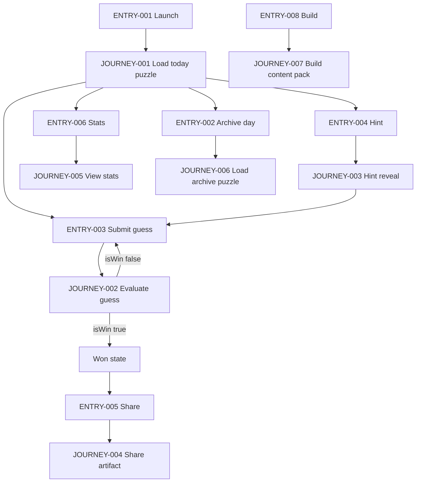
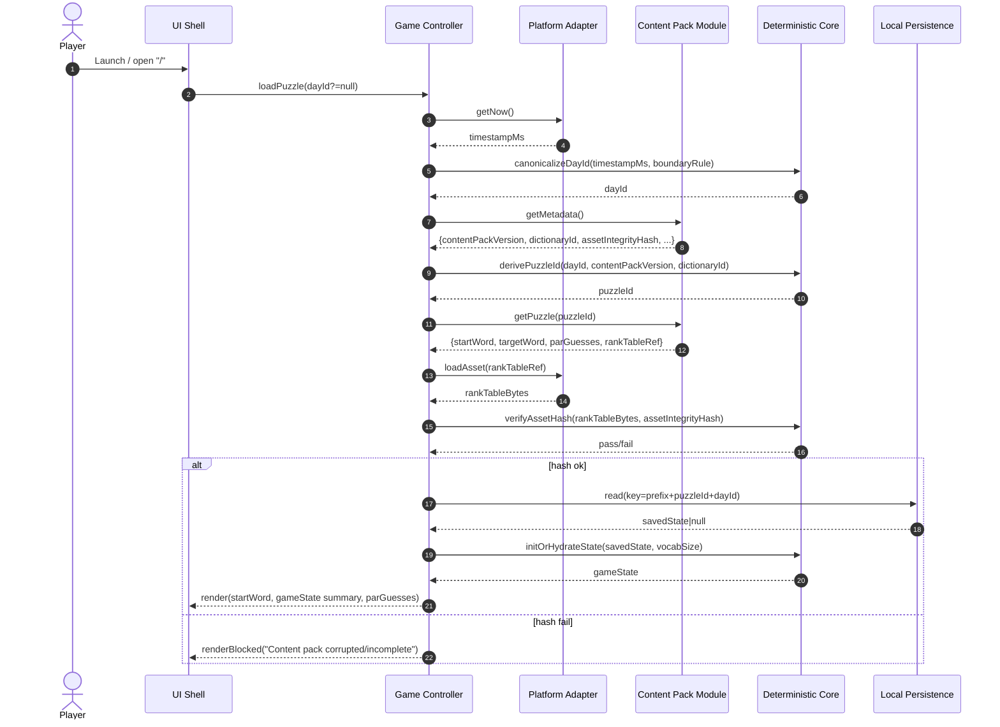
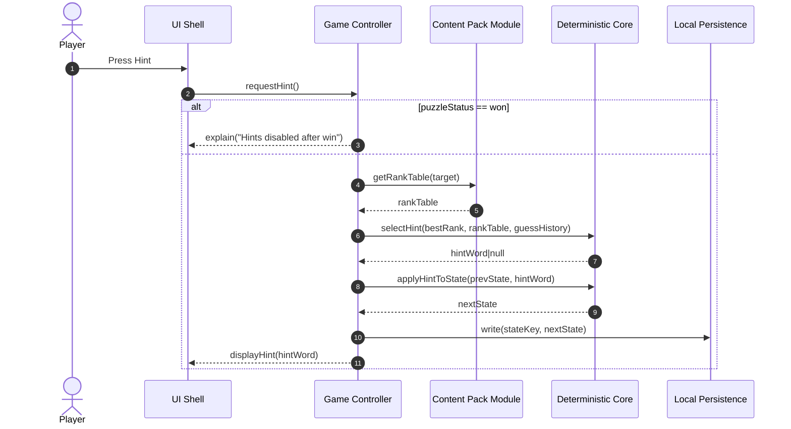
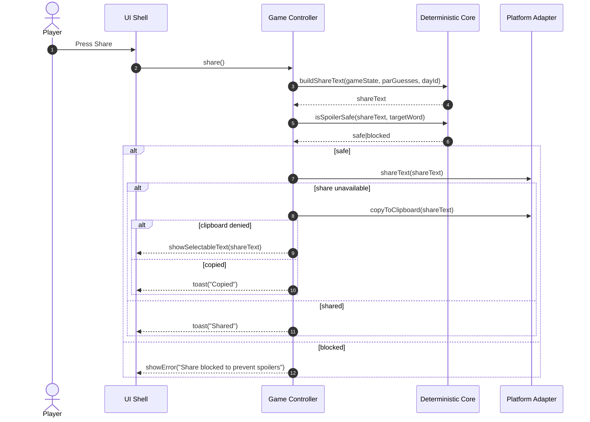
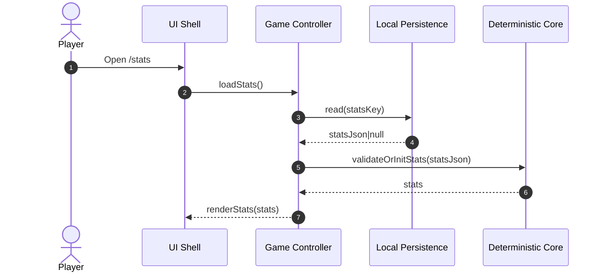
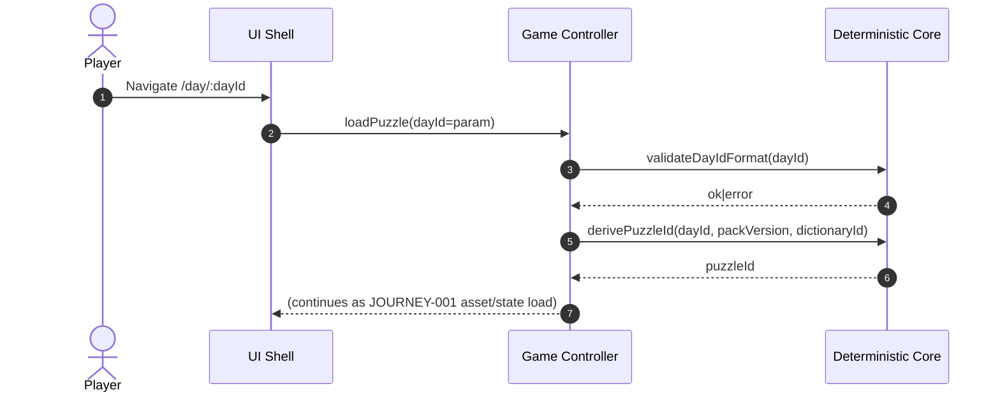
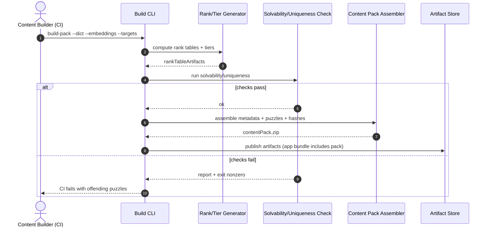
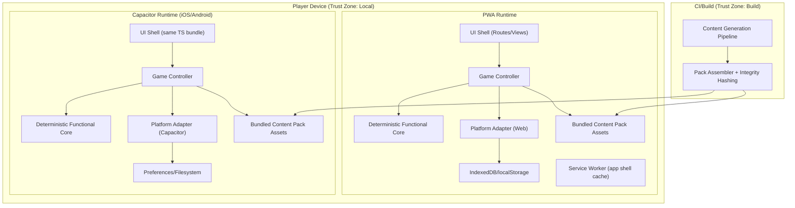

<!-- generated: 2026-07-23T20:41:51Z -->
<!-- mode: initial -->
<!-- feature-slug: ladderless -->
<!-- a2a-endpoint: https://bob-sdlc-orchestrator.2as6l7wq9qj8.eu-gb.codeengine.appdomain.cloud/v1/rpc -->

# Glossary

## Terms

### TERM-001: Puzzle
- **Definition:** The deterministic daily semantic word challenge consisting of a **START word** (TERM-003), a hidden **TARGET word** (TERM-004), and the rules for evaluating **guesses** (TERM-005) using a **rank table** (TERM-008).
- **Synonyms:** daily puzzle, daily challenge
- **Anti-definition:** Not a randomized session; not user-specific content; not server-delivered at play time.
- **Source:** User request

### TERM-002: Day
- **Definition:** A calendar day identifier used to select the daily **Puzzle** (TERM-001) deterministically.
- **Synonyms:** date, dayId
- **Anti-definition:** Not a timestamp with time-of-day precision; not locale-dependent once normalized.
- **Source:** User request

### TERM-003: START Word
- **Definition:** The visible initial word for the daily **Puzzle** (TERM-001) from which players begin making **guesses** (TERM-005).
- **Synonyms:** start, seed word
- **Anti-definition:** Not the hidden answer; not dynamically generated at runtime.
- **Source:** User request

### TERM-004: TARGET Word
- **Definition:** The hidden answer word for the daily **Puzzle** (TERM-001); the player wins by guessing it exactly.
- **Synonyms:** answer, goal word
- **Anti-definition:** Not revealed during play except upon win or explicit reveal action (if provided).
- **Source:** User request

### TERM-005: Guess
- **Definition:** A player-entered word candidate evaluated against the daily **TARGET word** (TERM-004) using the on-device **rank table** (TERM-008).
- **Synonyms:** attempt, entered word
- **Anti-definition:** Not a partial string; not an out-of-dictionary token.
- **Source:** User request

### TERM-006: Vocabulary Word
- **Definition:** A word contained in the curated dictionary for a given **Dictionary ID** (TERM-013) and eligible as a **Guess** (TERM-005).
- **Synonyms:** dictionary word
- **Anti-definition:** Not arbitrary user text; not a phrase; not a word from a different dictionary version.
- **Source:** User request

### TERM-007: Semantic Similarity Rank
- **Definition:** A deterministic integer ordering of a **Vocabulary Word** (TERM-006) relative to the **TARGET word** (TERM-004), where lower rank indicates closer similarity.
- **Synonyms:** rank, closeness rank
- **Anti-definition:** Not a floating-point cosine similarity computed at runtime; not platform-dependent.
- **Source:** User request

### TERM-008: Per-Target Rank Table
- **Definition:** A compact build-time-generated lookup mapping each **Vocabulary Word** (TERM-006) to its **Semantic Similarity Rank** (TERM-007) and **Rank Tier** (TERM-009) for a specific **TARGET word** (TERM-004), packaged with the app for offline runtime use.
- **Synonyms:** rank table, lookup table, precomputed table
- **Anti-definition:** Not generated on device; not fetched from a server during play.
- **Source:** User request

### TERM-009: Rank Tier
- **Definition:** A categorical bucket derived from **Semantic Similarity Rank** (TERM-007) used for feedback to the player without revealing exact closeness.
- **Synonyms:** tier, tier bucket
- **Anti-definition:** Not a continuous score; not a color-only indicator.
- **Source:** User request

### TERM-010: Warmer/Colder Verdict
- **Definition:** The feedback for a **Guess** (TERM-005) indicating whether its **Semantic Similarity Rank** (TERM-007) is better (warmer) or worse (colder) than the player’s prior **Best Rank** (TERM-011).
- **Synonyms:** warmer/colder, hot/cold feedback
- **Anti-definition:** Not relative to immediately previous guess; not based on distance to START word.
- **Source:** User request

### TERM-011: Best Rank
- **Definition:** The best (lowest) **Semantic Similarity Rank** (TERM-007) achieved so far in the current **Puzzle** (TERM-001).
- **Synonyms:** personal best rank, current best
- **Anti-definition:** Not global leaderboard; not persisted across puzzles as a single value.
- **Source:** User request

### TERM-012: Par
- **Definition:** A build-time precomputed baseline guess count for the daily **Puzzle** (TERM-001) used for scoring comparison.
- **Synonyms:** par guesses, baseline
- **Anti-definition:** Not player-specific; not computed at runtime.
- **Source:** User request

### TERM-013: Dictionary
- **Definition:** The curated set of **Vocabulary Words** (TERM-006) used for validation and rank-table indexing.
- **Synonyms:** wordlist, lexicon
- **Anti-definition:** Not OS spellcheck; not a third-party online dictionary.
- **Source:** User request

### TERM-014: Dictionary ID
- **Definition:** The identifier for a specific **Dictionary** (TERM-013) version used in deterministic daily selection and compatibility with **rank tables** (TERM-008).
- **Synonyms:** dictId
- **Anti-definition:** Not a locale alone; not a build number without semantic meaning.
- **Source:** User request

### TERM-015: Content Pack
- **Definition:** The shipped set of daily puzzles and required assets, including **START/TARGET** pairs, **Par** (TERM-012), and **Per-Target Rank Tables** (TERM-008).
- **Synonyms:** puzzle pack
- **Anti-definition:** Not downloaded at play time; not user-generated.
- **Source:** User request

### TERM-016: Content Pack Version
- **Definition:** A version identifier for the **Content Pack** (TERM-015) used as an input to deterministic selection and stability across releases.
- **Synonyms:** pack version
- **Anti-definition:** Not the app version; not device OS version.
- **Source:** User request

### TERM-017: Deterministic Daily Selection
- **Definition:** The algorithm that maps (**Day ID**, **Content Pack Version**, **Dictionary ID**) to the selected daily **Puzzle** (TERM-001) such that the same inputs yield the same output across platforms and time.
- **Synonyms:** daily picker, daily selection
- **Anti-definition:** Not randomness from device entropy; not server-assigned.
- **Source:** User request

### TERM-018: Seedable Hash
- **Definition:** The pure deterministic hash function used by **Deterministic Daily Selection** (TERM-017) over canonicalized inputs.
- **Synonyms:** hash, selection hash
- **Anti-definition:** Not crypto proof-of-work; not non-deterministic PRNG.
- **Source:** User request

### TERM-019: Offline-First
- **Definition:** The constraint that the game is fully playable without network connectivity, including puzzle selection, validation, evaluation, and persistence.
- **Synonyms:** offline, no-backend play
- **Anti-definition:** Not “offline-capable but requires initial fetch”; not cloud-synced accounts.
- **Source:** User request

### TERM-020: Local Persistence
- **Definition:** On-device storage of game state, stats, and settings using platform-appropriate storage adapters.
- **Synonyms:** device storage, local save
- **Anti-definition:** Not server storage; not shared between devices.
- **Source:** User request

### TERM-021: Game State
- **Definition:** The persisted representation of the in-progress daily **Puzzle** (TERM-001) including **guess history** and current **Best Rank** (TERM-011).
- **Synonyms:** session state, run state
- **Anti-definition:** Not analytics telemetry; not remote state.
- **Source:** User request

### TERM-022: Stats
- **Definition:** Aggregated local metrics per user/device such as wins, guess counts, and streaks.
- **Synonyms:** local stats
- **Anti-definition:** Not leaderboards; not shared publicly unless user shares manually.
- **Source:** User request

### TERM-023: Streak
- **Definition:** Count of consecutive **Days** (TERM-002) where the daily **Puzzle** (TERM-001) was completed successfully.
- **Synonyms:** win streak
- **Anti-definition:** Not hours-played; not dependent on continuous app usage.
- **Source:** User request

### TERM-024: Share Artifact
- **Definition:** A spoiler-safe text/emoji grid summarizing results using warm/cold blocks and a terminal star without revealing the **TARGET word** (TERM-004).
- **Synonyms:** emoji share, share grid
- **Anti-definition:** Not an image that includes the answer; not a link requiring a backend.
- **Source:** User request

### TERM-025: Hint
- **Definition:** A user-invoked assist that reveals a next **Vocabulary Word** (TERM-006) whose rank is strictly better than the current **Best Rank** (TERM-011) for the current **Puzzle** (TERM-001).
- **Synonyms:** nudge, next warmer word
- **Anti-definition:** Not revealing the TARGET directly (unless it is the only improvement).
- **Source:** User request

### TERM-026: Deterministic Functional Core
- **Definition:** Pure logic module that computes selection, validation, evaluation, hinting, and state transitions without side effects (no storage, no clock, no network).
- **Synonyms:** core engine, pure core
- **Anti-definition:** Not the UI; not adapters; not platform-specific APIs.
- **Source:** User request

### TERM-027: Platform Adapter
- **Definition:** Thin layer providing side-effecting services (clock, storage, share, asset loading) to the **Deterministic Functional Core** (TERM-026).
- **Synonyms:** adapter, port
- **Anti-definition:** Not business logic; not puzzle evaluation rules.
- **Source:** User request

### TERM-028: Composition Root
- **Definition:** Per-platform wiring that selects and configures the **Platform Adapter** (TERM-027) for PWA vs Capacitor iOS/Android.
- **Synonyms:** bootstrap, platform composition
- **Anti-definition:** Not runtime feature flags from a server.
- **Source:** User request

### TERM-029: PWA
- **Definition:** Installable Progressive Web App distribution of the game using web storage mechanisms.
- **Synonyms:** web app
- **Anti-definition:** Not native app packaging; not requiring app store distribution.
- **Source:** User request

### TERM-030: Capacitor App
- **Definition:** iOS/Android app wrapper distribution using Capacitor APIs for storage and OS integrations.
- **Synonyms:** native wrapper app
- **Anti-definition:** Not separate native codebases per platform for game logic.
- **Source:** User request

### TERM-031: Accessibility Support
- **Definition:** Features enabling keyboard operation, screen reader announcements, and non-color-only feedback for **Warmer/Colder Verdict** (TERM-010) and **Rank Tier** (TERM-009).
- **Synonyms:** a11y
- **Anti-definition:** Not optional “nice to have” without acceptance criteria.
- **Source:** User request

### TERM-032: Build-Time Content Generation
- **Definition:** Offline pipeline that produces **Content Pack** (TERM-015) artifacts (targets, start words, rank tables, par) from curated wordlist and a source embedding.
- **Synonyms:** content build pipeline
- **Anti-definition:** Not on-device generation; not runtime ML inference.
- **Source:** User request

### TERM-033: Solvability Check
- **Definition:** Build-time verification that each daily **TARGET word** (TERM-004) is reachable and has a smooth enough rank gradient for enjoyable play.
- **Synonyms:** reachability check, quality gate
- **Anti-definition:** Not a runtime check; not manual playtesting only.
- **Source:** User request

## Data Dictionary

| ID | Name | Type | Format | Range/Enum | Units | Default | Nullable | PII | Source | Validation |
|---|---|---|---|---|---|---|---|---|---|---|
| FIELD-001 | dayId | string | `YYYY-MM-DD` (Gregorian) | valid date | n/a | device “today” | false | None | Platform Adapter (clock) | Must parse as ISO date; must be canonicalized to UTC day boundary rule |
| FIELD-002 | contentPackVersion | string | semver-like | pattern `^\d+\.\d+\.\d+` | n/a | bundled value | false | None | Content Pack | Must equal packaged metadata version |
| FIELD-003 | dictionaryId | string | token | `[a-z0-9._-]+` | n/a | bundled value | false | None | Content Pack | Must match rank-table dictionary id |
| FIELD-004 | puzzleId | string | token | `[a-z0-9._-]+` | n/a | derived | false | None | Deterministic Functional Core | Must be stable for same (FIELD-001,2,3) |
| FIELD-005 | startWord | string | lowercase | in Dictionary | n/a | derived | false | None | Content Pack | Must exist in Dictionary (TERM-013) |
| FIELD-006 | targetWord | string | lowercase | in Dictionary | n/a | derived | false | None | Content Pack | Must exist in Dictionary and have rank table |
| FIELD-007 | guessWord | string | trimmed lowercase | in Dictionary | n/a | n/a | false | None | User input | Must match Dictionary tokenization rules; length bounds 1..64 |
| FIELD-008 | guessIndex | integer | int32 | `>=1` | guesses | 1 | false | None | Deterministic Functional Core | Must increment by 1 per accepted guess |
| FIELD-009 | guessTimestamp | integer | unix ms | `>=0` | ms | set on write | false | None | Platform Adapter (clock) | Must be monotonic non-decreasing within same dayId |
| FIELD-010 | semanticRank | integer | int32 | `1..vocabSize` (1=best) | rank | n/a | false | None | Per-Target Rank Table | Must exist for guessWord; must be deterministic |
| FIELD-011 | rankTier | integer | int32 | enum `0..N` (0=best) | tier | n/a | false | None | Per-Target Rank Table | Must map from semanticRank via tier thresholds |
| FIELD-012 | bestRank | integer | int32 | `1..vocabSize` | rank | vocabSize | false | None | Game State | Must equal min of all semanticRank in run |
| FIELD-013 | verdict | string | token | enum `warmer|colder|equal|best` | n/a | n/a | false | None | Deterministic Functional Core | Must be derived from comparing semanticRank vs bestRank-before |
| FIELD-014 | isWin | boolean | boolean | true/false | n/a | false | false | None | Deterministic Functional Core | True iff guessWord == targetWord |
| FIELD-015 | parGuesses | integer | int32 | `>=1` | guesses | derived | false | None | Content Pack | Must be present for puzzleId |
| FIELD-016 | puzzleStatus | string | token | enum `not_started|in_progress|won` | n/a | not_started | false | None | Game State | Must transition forward only |
| FIELD-017 | guessHistory | array | JSON array | list of guess records | n/a | [] | false | None | Game State | Each record must include FIELD-007,10,11,13,14,8 |
| FIELD-018 | currentStreak | integer | int32 | `>=0` | days | 0 | false | None | Stats | Must increment only on first win per dayId |
| FIELD-019 | maxStreak | integer | int32 | `>=0` | days | 0 | false | None | Stats | Must be >= currentStreak at all times |
| FIELD-020 | gamesPlayed | integer | int32 | `>=0` | games | 0 | false | None | Stats | Must increment once when puzzleStatus becomes in_progress |
| FIELD-021 | gamesWon | integer | int32 | `>=0` | wins | 0 | false | None | Stats | Must increment once per dayId upon win |
| FIELD-022 | guessesToWin | integer | int32 | `>=1` | guesses | n/a | true | None | Stats | Nullable until win; must equal final guessIndex on win |
| FIELD-023 | hintCount | integer | int32 | `>=0` | hints | 0 | false | None | Game State | Must increment per hint reveal |
| FIELD-024 | hintWord | string | lowercase | in Dictionary | n/a | n/a | true | None | Deterministic Functional Core | If non-null, must have semanticRank < bestRank-before |
| FIELD-025 | shareText | string | UTF-8 text | length 1..4000 | n/a | n/a | false | None | Deterministic Functional Core | Must not contain targetWord literal |
| FIELD-026 | platformId | string | token | enum `pwa|ios|android` | n/a | derived | false | None | Composition Root | Must be set at boot |
| FIELD-027 | storageKeyPrefix | string | token | `[A-Za-z0-9._:-]+` | n/a | `ladderless:` | false | None | Platform Adapter | Must be consistent across reads/writes |
| FIELD-028 | a11yAnnouncementsEnabled | boolean | boolean | true/false | n/a | true | false | None | Settings | Must default true |
| FIELD-029 | reducedMotionEnabled | boolean | boolean | true/false | n/a | system-pref | false | None | Settings | Must mirror OS/browser preference on first run |
| FIELD-030 | assetIntegrityHash | string | hex/base64 | `[A-Za-z0-9+/=]{16,}` | n/a | bundled | false | None | Content Pack | Must verify loaded assets match expected hash |

# User Journeys

## Roles

| Role ID | Role | Type | Description |
|---|---|---|---|
| ROLE-001 | Player | Primary | Plays the daily puzzle, enters guesses, requests hints, views stats, shares results. |
| ROLE-002 | System | System | Deterministic Functional Core (TERM-026) + Platform Adapter (TERM-027) performing selection, evaluation, persistence, a11y announcements. |
| ROLE-003 | Platform (PWA) | Secondary | Provides IndexedDB/localStorage, Web Share (if available), clock. |
| ROLE-004 | Platform (Capacitor) | Secondary | Provides Preferences/Filesystem, native share sheet, clock bridge. |
| ROLE-005 | Content Builder | Admin/Build | Generates Content Pack (TERM-015), rank tables, par, solvability/uniqueness checks. |

## Entry Points

| Entry ID | Location | Trigger | Auth |
|---|---|---|---|
| ENTRY-001 | UI Route: `/` (Today) | App launch / open | None |
| ENTRY-002 | UI Route: `/day/:dayId` (Archive day) | Player navigates date | None |
| ENTRY-003 | UI Action: Submit Guess | Player presses Enter/clicks Submit | None |
| ENTRY-004 | UI Action: Request Hint | Player presses Hint | None |
| ENTRY-005 | UI Action: Share | Player presses Share | None |
| ENTRY-006 | UI Route: `/stats` | Player opens Stats | None |
| ENTRY-007 | UI Route: `/settings` | Player opens Settings | None |
| ENTRY-008 | Build Pipeline CLI | Build step runs | n/a |

## Role Permission Matrix

| Capability | ROLE-001 Player | ROLE-002 System | ROLE-005 Content Builder |
|---|---:|---:|---:|
| Select daily puzzle (TERM-017) | R | RW | n/a |
| Enter/validate guess (TERM-005) | RW | RW | n/a |
| Evaluate warmer/colder (TERM-010) | R | RW | n/a |
| Persist/load game state (TERM-020) | R | RW | n/a |
| View stats/streak (TERM-022/023) | R | RW | n/a |
| Generate share artifact (TERM-024) | R | RW | n/a |
| Generate content pack (TERM-032) | n/a | n/a | RW |
| Run solvability check (TERM-033) | n/a | n/a | RW |

## Journeys

### JOURNEY-001: Open app and load today’s puzzle
- **Role/Goal:** ROLE-001 Player; view today’s deterministic Puzzle (TERM-001) with START word (TERM-003) and continue prior progress if any.
- **Entry:** ENTRY-001
- **Happy path:**
  1. System reads FIELD-001 (dayId) from Platform Adapter clock and canonicalizes it. (TERM-027)
  2. System reads FIELD-002 (contentPackVersion) and FIELD-003 (dictionaryId) from bundled Content Pack metadata. (TERM-015)
  3. System computes FIELD-004 (puzzleId) using TERM-017 + TERM-018 over (FIELD-001, FIELD-002, FIELD-003). (TERM-026)
  4. System loads Content Pack assets for puzzleId including FIELD-005 (startWord), FIELD-006 (targetWord), FIELD-015 (parGuesses), and required TERM-008 rank table; verifies FIELD-030 (assetIntegrityHash). (TERM-015)
  5. System loads persisted FIELD-016 (puzzleStatus), FIELD-017 (guessHistory), FIELD-012 (bestRank) for this (FIELD-004, FIELD-001) from Local Persistence (TERM-020).
  6. UI displays FIELD-005 (startWord), guess input, and summary (guesses count from FIELD-017 length; par from FIELD-015) without revealing FIELD-006. (TERM-004)
- **BRANCH-001 (No saved state):** If no record exists for (FIELD-004, FIELD-001), system initializes FIELD-016=`not_started`, FIELD-017=`[]`, FIELD-012=`vocabSize`.
- **BRANCH-002 (Asset integrity mismatch):** If FIELD-030 verification fails, system blocks play and shows an offline-safe error with recovery (reinstall/update).
- **ERROR-001 (Missing content asset):**
  - **Trigger:** Rank table for FIELD-006 not found in packaged assets.
  - **System response:** Show error screen “Content pack corrupted/incomplete”.
  - **Recovery:** Player can reinstall/update app; no gameplay continues.
- **EDGE-001 (Timezone boundary):** Device local day differs from UTC day rule; system must canonicalize using a single rule for FIELD-001.
- **EDGE-002 (Clock changes):** Device clock changes during session; selection remains stable for the session’s FIELD-001 unless player explicitly navigates to another day.
- **EDGE-003 (Concurrent launches):** Two tabs/windows open; state merges by last-write-wins with monotonic FIELD-009 per guess.

### JOURNEY-002: Submit a guess and receive warmer/colder + tier feedback
- **Role/Goal:** ROLE-001 Player; evaluate a Guess (TERM-005) and see TERM-010 verdict and TERM-009 tier; win if guess equals TARGET.
- **Entry:** ENTRY-003
- **Happy path:**
  1. Player enters FIELD-007 (guessWord) and submits.
  2. System normalizes guessWord (trim, lowercase) and validates it exists in TERM-013 Dictionary for FIELD-003. (TERM-006)
  3. System looks up FIELD-010 (semanticRank) and FIELD-011 (rankTier) from TERM-008 Per-Target Rank Table for FIELD-006 (targetWord).
  4. System computes FIELD-013 (verdict) by comparing FIELD-010 to prior FIELD-012 (bestRank).
  5. System appends a new record to FIELD-017 (guessHistory) with FIELD-008 (guessIndex), FIELD-007, FIELD-010, FIELD-011, FIELD-013, FIELD-014 (isWin), and FIELD-009 (guessTimestamp from adapter clock).
  6. System updates FIELD-012 (bestRank) if FIELD-010 is lower.
  7. If FIELD-007 equals FIELD-006, system sets FIELD-014=true and transitions FIELD-016 (puzzleStatus) to `won`; updates Stats (TERM-022).
  8. UI displays verdict and tier for this guess and announces via screen reader if FIELD-028 enabled. (TERM-031)
- **BRANCH-003 (Invalid word):** If FIELD-007 not in dictionary, show “Not in dictionary” and do not change FIELD-017.
- **BRANCH-004 (Duplicate guess):** If FIELD-007 already exists in FIELD-017, show “Already guessed” and do not append.
- **ERROR-002 (Rank lookup missing):**
  - **Trigger:** guessWord exists in dictionary but is absent in the rank table.
  - **System response:** Block acceptance; show “Content mismatch” error.
  - **Recovery:** Reinstall/update; optional reset local content cache.
- **ERROR-003 (Storage write fails):**
  - **Trigger:** Local Persistence write throws/quota/permission.
  - **System response:** Show “Could not save progress” and keep in-memory state for session.
  - **Recovery:** Player can retry; provide “Export/share current session text” if available.
- **EDGE-004 (Rapid submits):** Multiple submissions in <250ms; system must process sequentially and ensure FIELD-008 increments correctly.
- **EDGE-005 (Keyboard-only):** Entire flow must be operable by keyboard; focus returns to input after submission.
- **EDGE-006 (Non-color feedback):** Warmer/colder must be conveyed by text/icon + aria-live, not color only.

### JOURNEY-003: Request a hint (“next warmer word”)
- **Role/Goal:** ROLE-001 Player; obtain a Hint (TERM-025) that improves current Best Rank (TERM-011).
- **Entry:** ENTRY-004
- **Happy path:**
  1. Player presses Hint.
  2. System reads current FIELD-012 (bestRank) and uses rank table (TERM-008) to select FIELD-024 (hintWord) such that its rank is strictly lower than current best.
  3. System increments FIELD-023 (hintCount) and persists updated Game State (TERM-021).
  4. UI displays hintWord and its tier (FIELD-011 for hintWord) and announces it if FIELD-028 enabled.
- **BRANCH-005 (Already at target):** If FIELD-016=`won`, disable hint and show explanation.
- **BRANCH-006 (No better word available):** If bestRank is already 1, system returns null hintWord and shows “No hint available”.
- **ERROR-004 (Hint selection fails):**
  - **Trigger:** Rank table missing required metadata to select a next step.
  - **System response:** Show “Hint unavailable for this puzzle”.
  - **Recovery:** Continue without hints.
- **EDGE-007 (Hint repeats existing guess):** If selected hintWord is already in FIELD-017, system must choose a different qualifying word or return no hint.

### JOURNEY-004: Share spoiler-safe results
- **Role/Goal:** ROLE-001 Player; share results without revealing TARGET.
- **Entry:** ENTRY-005
- **Happy path:**
  1. Player presses Share after win or during play (if allowed).
  2. System generates FIELD-025 (shareText) from FIELD-017 (guessHistory), FIELD-015 (parGuesses), and FIELD-001 (dayId) using TERM-024 format (warm/cold blocks ending with a star on win).
  3. System verifies FIELD-025 does not contain FIELD-006 (targetWord) literal.
  4. Platform Adapter invokes native/web share, or copies to clipboard if share is unavailable.
- **BRANCH-007 (Share unavailable):** If platform share API not present, show “Copy to clipboard” action.
- **ERROR-005 (Clipboard denied):**
  - **Trigger:** Clipboard permission denied/unavailable.
  - **System response:** Display shareText in a selectable text area.
  - **Recovery:** Player manually copies.
- **EDGE-008 (Spoiler safety):** shareText must not include targetWord, startWord, or any explicit rank numbers if that could trivially identify the target (configurable).

### JOURNEY-005: View stats and streaks (local only)
- **Role/Goal:** ROLE-001 Player; see local Stats (TERM-022) and Streak (TERM-023).
- **Entry:** ENTRY-006
- **Happy path:**
  1. System loads Stats fields FIELD-018..FIELD-022 from Local Persistence (TERM-020).
  2. UI renders gamesPlayed, gamesWon, currentStreak, maxStreak, and last guessesToWin values where present.
- **ERROR-006 (Stats corrupted):**
  - **Trigger:** Stats JSON fails to parse/validate.
  - **System response:** Offer “Reset stats” (with confirmation) and show zeros until resolved.
  - **Recovery:** Player resets stats; game progress for current day remains separate.

### JOURNEY-006: Navigate to a past day (archive puzzle)
- **Role/Goal:** ROLE-001 Player; play or review a prior day’s stable puzzle.
- **Entry:** ENTRY-002
- **Happy path:**
  1. Player selects a FIELD-001 (dayId) in UI.
  2. System runs deterministic selection (TERM-017) for that dayId using current FIELD-002 and FIELD-003 unless a per-version archive mapping is shipped.
  3. System loads/initializes Game State for that dayId and puzzleId and proceeds as in JOURNEY-001.
- **BRANCH-008 (Day out of range):** If no content exists for that day, show “No puzzle available” and disable play.
- **EDGE-009 (Content pack updates):** Past day must remain stable; if FIELD-002 changes, selection must still map that dayId to the same puzzleId for that pack version.

### JOURNEY-007: Build-time content generation and validation gate
- **Role/Goal:** ROLE-005 Content Builder; produce deterministic assets ensuring solvability and uniqueness.
- **Entry:** ENTRY-008
- **Happy path:**
  1. Pipeline ingests curated TERM-013 Dictionary and embedding source.
  2. For each selected TARGET, pipeline computes TERM-008 Per-Target Rank Table and tier thresholds.
  3. Pipeline computes FIELD-015 (parGuesses) per puzzle.
  4. Pipeline runs TERM-033 Solvability Check and uniqueness constraints; fails build if violations found.
  5. Pipeline emits Content Pack metadata including FIELD-002, FIELD-003, FIELD-030.
- **ERROR-007 (Unsolvable puzzle):**
  - **Trigger:** Solvability check fails.
  - **System response:** CI fails with artifact report listing offending targets.
  - **Recovery:** Adjust target selection/wordlist/tiering and rerun.

## Journey Map



# Requirements

### REQ-001: Canonicalize dayId for daily selection
- **EARS Pattern:** Event-Driven
- **EARS Statement:** When the app loads a daily puzzle, the system shall derive FIELD-001 (dayId) as a canonical `YYYY-MM-DD` value using a single documented day-boundary rule.
- **Inputs:** Platform clock
- **Outputs:** FIELD-001
- **Preconditions:** App launched (ENTRY-001) or day route opened (ENTRY-002)
- **Postconditions:** FIELD-001 is available to TERM-017
- **Invariants:** Same clock instant maps to exactly one dayId
- **Trigger:** ENTRY-001, ENTRY-002
- **Actor:** ROLE-002 System
- **EntityScope:** TERM-002 Day
- **ErrorModes:** Invalid clock value
- **NFR-Tags:** compatibility
- **Source:** JOURNEY-001 step 1; EDGE-001
- **Dependencies:** None
- **Priority:** P0
- **AcceptanceCriteria:**
  - TEST-001: Given a fixed timestamp and configured boundary rule, when derived, then FIELD-001 equals expected `YYYY-MM-DD`.
  - TEST-002: Given two platforms with the same timestamp, when derived, then FIELD-001 matches across platforms.
- **Assumptions:** Boundary rule is specified (e.g., UTC)
- **OpenQuestions:** What exact boundary rule is desired (UTC vs local)?

### REQ-002: Compute deterministic puzzleId
- **EARS Pattern:** Event-Driven
- **EARS Statement:** When FIELD-001, FIELD-002, and FIELD-003 are available, the system shall compute FIELD-004 (puzzleId) using TERM-018 (Seedable Hash) deterministically.
- **Inputs:** FIELD-001, FIELD-002, FIELD-003
- **Outputs:** FIELD-004
- **Preconditions:** Content Pack metadata loaded
- **Postconditions:** puzzleId selected for the session/day
- **Invariants:** Same inputs yield same FIELD-004 on all platforms
- **Trigger:** Daily selection invoked
- **Actor:** ROLE-002 System
- **EntityScope:** TERM-017 Deterministic Daily Selection
- **ErrorModes:** Missing input field
- **NFR-Tags:** compatibility
- **Source:** JOURNEY-001 step 3
- **Dependencies:** REQ-001
- **Priority:** P0
- **AcceptanceCriteria:**
  - TEST-003: Given identical FIELD-001/2/3, when computed, then FIELD-004 is identical across pwa/ios/android.
  - TEST-004: Given any change to FIELD-001, when computed, then FIELD-004 changes or maps to a different puzzle with a documented collision strategy.
- **Assumptions:** Hash collision strategy is defined
- **OpenQuestions:** Is collision resolution required, or is hash space sufficient?

### REQ-003: Load content pack assets for selected puzzle
- **EARS Pattern:** Event-Driven
- **EARS Statement:** When FIELD-004 is computed, the system shall load FIELD-005 (startWord), FIELD-006 (targetWord), FIELD-015 (parGuesses), and TERM-008 (Per-Target Rank Table) for that puzzleId from the bundled TERM-015 (Content Pack).
- **Inputs:** FIELD-004
- **Outputs:** FIELD-005, FIELD-006, FIELD-015, rank table handle
- **Preconditions:** Content Pack is installed
- **Postconditions:** Puzzle data available for play
- **Invariants:** Loaded assets correspond to FIELD-002 and FIELD-003
- **Trigger:** Post-selection load
- **Actor:** ROLE-002 System
- **EntityScope:** TERM-015 Content Pack
- **ErrorModes:** Missing asset
- **NFR-Tags:** reliability
- **Source:** JOURNEY-001 step 4; ERROR-001
- **Dependencies:** REQ-002
- **Priority:** P0
- **AcceptanceCriteria:**
  - TEST-005: Given a valid puzzleId, when loading, then startWord/targetWord/parGuesses are non-null and valid.
  - TEST-006: Given missing rank table asset, when loading, then ERROR-001 response is shown and play is blocked.
- **Assumptions:** Content pack contains a mapping from puzzleId to assets
- **OpenQuestions:** Are archives shipped as (dayId→puzzle) mapping or computed only?

### REQ-004: Verify content asset integrity
- **EARS Pattern:** Event-Driven
- **EARS Statement:** When a Content Pack asset is loaded, the system shall validate it against FIELD-030 (assetIntegrityHash).
- **Inputs:** Loaded asset bytes, FIELD-030
- **Outputs:** Pass/fail signal
- **Preconditions:** Asset accessible
- **Postconditions:** Asset accepted or blocked
- **Invariants:** Failed validation prevents gameplay using that asset
- **Trigger:** Asset load
- **Actor:** ROLE-002 System
- **EntityScope:** TERM-015 Content Pack
- **ErrorModes:** Hash mismatch
- **NFR-Tags:** security, reliability
- **Source:** JOURNEY-001 step 4; BRANCH-002
- **Dependencies:** REQ-003
- **Priority:** P1
- **AcceptanceCriteria:**
  - TEST-007: Given corrupted asset bytes, when validated, then validation fails and UI shows blocked state.
  - TEST-008: Given intact bytes, when validated, then validation passes.
- **Assumptions:** Hash algorithm is defined and implemented consistently
- **OpenQuestions:** Which hash algorithm (e.g., SHA-256)?

### REQ-005: Initialize game state when none exists
- **EARS Pattern:** Event-Driven
- **EARS Statement:** When no persisted TERM-021 (Game State) exists for FIELD-004 and FIELD-001, the system shall initialize FIELD-016 to `not_started`, FIELD-017 to an empty list, and FIELD-012 to `vocabSize`.
- **Inputs:** FIELD-004, FIELD-001
- **Outputs:** Initialized game state fields
- **Preconditions:** Puzzle assets loaded
- **Postconditions:** State ready for first guess
- **Invariants:** Initialization does not reveal FIELD-006
- **Trigger:** State load
- **Actor:** ROLE-002 System
- **EntityScope:** TERM-021 Game State
- **ErrorModes:** Storage read fails
- **NFR-Tags:** reliability
- **Source:** JOURNEY-001 BRANCH-001
- **Dependencies:** REQ-003
- **Priority:** P0
- **AcceptanceCriteria:**
  - TEST-009: Given no saved record, when opening puzzle, then UI shows startWord and 0 guesses.
  - TEST-010: Given storage read error, when opening puzzle, then system starts in-memory state and signals non-persistence.
- **Assumptions:** vocabSize is derivable from TERM-013 Dictionary
- **OpenQuestions:** Where is vocabSize stored (metadata vs derived)?

### REQ-006: Validate guessWord is in dictionary
- **EARS Pattern:** Event-Driven
- **EARS Statement:** When the player submits FIELD-007 (guessWord), the system shall reject the guess if FIELD-007 is not a TERM-006 (Vocabulary Word) in the TERM-013 (Dictionary) for FIELD-003.
- **Inputs:** FIELD-007, FIELD-003
- **Outputs:** Validation result
- **Preconditions:** Puzzle loaded
- **Postconditions:** Guess accepted or rejected without changing FIELD-017 on rejection
- **Invariants:** Dictionary validation is deterministic and offline
- **Trigger:** ENTRY-003
- **Actor:** ROLE-001 Player
- **EntityScope:** TERM-013 Dictionary
- **ErrorModes:** Dictionary asset missing
- **NFR-Tags:** reliability
- **Source:** JOURNEY-002 step 2; BRANCH-003
- **Dependencies:** REQ-003
- **Priority:** P0
- **AcceptanceCriteria:**
  - TEST-011: Given a non-dictionary word, when submitted, then UI shows “Not in dictionary” and guessHistory length unchanged.
  - TEST-012: Given a dictionary word, when submitted, then validation passes.
- **Assumptions:** Tokenization rules are defined for FIELD-007
- **OpenQuestions:** Are inflections/diacritics allowed?

### REQ-007: Prevent duplicate guesses
- **EARS Pattern:** Event-Driven
- **EARS Statement:** When the player submits FIELD-007, the system shall reject the guess if FIELD-007 already exists in FIELD-017.
- **Inputs:** FIELD-007, FIELD-017
- **Outputs:** Duplicate rejection signal
- **Preconditions:** Any puzzleStatus except `won` (or as configured)
- **Postconditions:** No append occurs on duplicate
- **Invariants:** Comparison uses the normalized form of FIELD-007
- **Trigger:** ENTRY-003
- **Actor:** ROLE-001 Player
- **EntityScope:** TERM-021 Game State
- **ErrorModes:** None
- **NFR-Tags:** usability
- **Source:** JOURNEY-002 BRANCH-004
- **Dependencies:** REQ-006
- **Priority:** P1
- **AcceptanceCriteria:**
  - TEST-013: Given a previously guessed word, when resubmitted, then UI shows “Already guessed” and guessHistory unchanged.
- **Assumptions:** Normalization is applied before duplicate check
- **OpenQuestions:** Should duplicates be allowed but not counted?

### REQ-008: Lookup rank and tier from per-target rank table
- **EARS Pattern:** Event-Driven
- **EARS Statement:** When a validated FIELD-007 is submitted, the system shall obtain FIELD-010 (semanticRank) and FIELD-011 (rankTier) from TERM-008 for FIELD-006.
- **Inputs:** FIELD-007, FIELD-006, rank table
- **Outputs:** FIELD-010, FIELD-011
- **Preconditions:** Rank table loaded
- **Postconditions:** Guess can be evaluated for verdict
- **Invariants:** No floating-point runtime similarity computation occurs
- **Trigger:** ENTRY-003
- **Actor:** ROLE-002 System
- **EntityScope:** TERM-008 Per-Target Rank Table
- **ErrorModes:** Rank lookup missing
- **NFR-Tags:** compatibility, performance
- **Source:** JOURNEY-002 step 3; ERROR-002
- **Dependencies:** REQ-006
- **Priority:** P0
- **AcceptanceCriteria:**
  - TEST-014: Given a guessWord present in the rank table, when looked up, then semanticRank and rankTier are returned deterministically.
  - TEST-015: Given a dictionary word absent in the rank table, when looked up, then ERROR-002 response is shown and guess is not accepted.
- **Assumptions:** Rank tables cover all dictionary words
- **OpenQuestions:** Is partial coverage allowed for memory savings?

### REQ-009: Compute warmer/colder verdict against bestRank
- **EARS Pattern:** Event-Driven
- **EARS Statement:** When FIELD-010 is obtained, the system shall set FIELD-013 (verdict) by comparing FIELD-010 to the prior FIELD-012.
- **Inputs:** FIELD-010, prior FIELD-012
- **Outputs:** FIELD-013
- **Preconditions:** bestRank initialized
- **Postconditions:** Verdict displayed
- **Invariants:** Verdict uses best-so-far comparison, not previous guess
- **Trigger:** ENTRY-003
- **Actor:** ROLE-002 System
- **EntityScope:** TERM-010 Warmer/Colder Verdict
- **ErrorModes:** None
- **NFR-Tags:** compatibility
- **Source:** JOURNEY-002 step 4; TERM-010
- **Dependencies:** REQ-008
- **Priority:** P0
- **AcceptanceCriteria:**
  - TEST-016: Given semanticRank lower than bestRank, when computed, then verdict is `warmer` (or `best` per enum) and bestRank updates.
  - TEST-017: Given semanticRank higher than bestRank, when computed, then verdict is `colder` and bestRank unchanged.
- **Assumptions:** Handling of equality is defined (`equal` vs `colder`)
- **OpenQuestions:** What is desired verdict for rank equality?

### REQ-010: Append accepted guess to guessHistory
- **EARS Pattern:** Event-Driven
- **EARS Statement:** When a guess is accepted, the system shall append a record to FIELD-017 containing FIELD-008, FIELD-007, FIELD-010, FIELD-011, FIELD-013, FIELD-014, and FIELD-009.
- **Inputs:** Evaluated guess fields + adapter timestamp
- **Outputs:** Updated FIELD-017
- **Preconditions:** Guess validated and ranked
- **Postconditions:** Guess is persisted (subject to storage success)
- **Invariants:** FIELD-008 increments by 1 from previous accepted guess
- **Trigger:** ENTRY-003
- **Actor:** ROLE-002 System
- **EntityScope:** TERM-021 Game State
- **ErrorModes:** Storage write fails
- **NFR-Tags:** reliability
- **Source:** JOURNEY-002 step 5; ERROR-003; EDGE-004
- **Dependencies:** REQ-008, REQ-009
- **Priority:** P0
- **AcceptanceCriteria:**
  - TEST-018: Given two accepted guesses, when appended, then guessIndex values are 1 then 2.
  - TEST-019: Given a storage failure, when attempting to append, then ERROR-003 response is shown and in-memory history contains the new record.
- **Assumptions:** Timestamp source is available offline
- **OpenQuestions:** Do we need idempotency tokens for retries?

### REQ-011: Detect win by exact target match
- **EARS Pattern:** Event-Driven
- **EARS Statement:** When a guess is accepted, the system shall set FIELD-014 (isWin) to true if FIELD-007 equals FIELD-006.
- **Inputs:** FIELD-007, FIELD-006
- **Outputs:** FIELD-014
- **Preconditions:** Puzzle loaded
- **Postconditions:** Win state may be triggered
- **Invariants:** Exact string match uses the normalized form
- **Trigger:** ENTRY-003
- **Actor:** ROLE-002 System
- **EntityScope:** TERM-004 TARGET Word
- **ErrorModes:** None
- **NFR-Tags:** compatibility
- **Source:** JOURNEY-002 step 7
- **Dependencies:** REQ-006
- **Priority:** P0
- **AcceptanceCriteria:**
  - TEST-020: Given guessWord equals targetWord, when submitted, then isWin is true.
  - TEST-021: Given guessWord differs, when submitted, then isWin is false.
- **Assumptions:** Target is a single dictionary token
- **OpenQuestions:** None

### REQ-012: Transition puzzleStatus to won on win
- **EARS Pattern:** Event-Driven
- **EARS Statement:** When FIELD-014 becomes true, the system shall set FIELD-016 (puzzleStatus) to `won`.
- **Inputs:** FIELD-014
- **Outputs:** FIELD-016
- **Preconditions:** Puzzle in_progress or not_started
- **Postconditions:** Puzzle locked as won (policy-defined)
- **Invariants:** puzzleStatus does not transition from `won` to other values
- **Trigger:** Win detected
- **Actor:** ROLE-002 System
- **EntityScope:** TERM-021 Game State
- **ErrorModes:** Storage write fails
- **NFR-Tags:** reliability
- **Source:** JOURNEY-002 step 7
- **Dependencies:** REQ-011
- **Priority:** P0
- **AcceptanceCriteria:**
  - TEST-022: Given a winning guess, when applied, then puzzleStatus equals `won`.
- **Assumptions:** Post-win guessing policy is defined elsewhere
- **OpenQuestions:** After win, are further guesses allowed for exploration?

### REQ-013: Generate hint word that improves bestRank
- **EARS Pattern:** Event-Driven
- **EARS Statement:** When the player requests a hint, the system shall return FIELD-024 (hintWord) whose rank is strictly lower than the current FIELD-012.
- **Inputs:** FIELD-012, rank table
- **Outputs:** FIELD-024
- **Preconditions:** Puzzle loaded
- **Postconditions:** Hint word shown or null
- **Invariants:** Hint selection is deterministic given state and content
- **Trigger:** ENTRY-004
- **Actor:** ROLE-001 Player
- **EntityScope:** TERM-025 Hint
- **ErrorModes:** No qualifying hint exists
- **NFR-Tags:** compatibility
- **Source:** JOURNEY-003 steps 1-2; BRANCH-006
- **Dependencies:** REQ-003, REQ-008
- **Priority:** P1
- **AcceptanceCriteria:**
  - TEST-023: Given bestRank > 1, when hint requested, then hintWord is non-null and its semanticRank < bestRank.
  - TEST-024: Given bestRank == 1, when hint requested, then hintWord is null and UI shows “No hint available”.
- **Assumptions:** Rank table iteration/aux index is available for hinting
- **OpenQuestions:** Should hint be the “next” by rank or computed path?

### REQ-014: Exclude already-guessed words from hint
- **EARS Pattern:** Event-Driven
- **EARS Statement:** When selecting FIELD-024, the system shall not return a hintWord that exists in FIELD-017.
- **Inputs:** Candidate hintWord, FIELD-017
- **Outputs:** Filtered hintWord
- **Preconditions:** Hint requested
- **Postconditions:** Hint avoids duplicates
- **Invariants:** If all improving words are already guessed, no hint is returned
- **Trigger:** ENTRY-004
- **Actor:** ROLE-002 System
- **EntityScope:** TERM-025 Hint
- **ErrorModes:** No qualifying hint exists
- **NFR-Tags:** usability
- **Source:** JOURNEY-003 EDGE-007
- **Dependencies:** REQ-013
- **Priority:** P2
- **AcceptanceCriteria:**
  - TEST-025: Given improving candidates that include already guessed words, when hint requested, then returned hintWord is not in guessHistory.
- **Assumptions:** There exists at least one improving unguessed word for most puzzles
- **OpenQuestions:** None

### REQ-015: Generate spoiler-safe shareText
- **EARS Pattern:** Event-Driven
- **EARS Statement:** When the player requests share, the system shall generate FIELD-025 (shareText) from FIELD-017 and FIELD-015 using TERM-024 format.
- **Inputs:** FIELD-017, FIELD-015, FIELD-001, FIELD-016
- **Outputs:** FIELD-025
- **Preconditions:** Puzzle loaded
- **Postconditions:** Share text available to adapter
- **Invariants:** Share text is deterministic for same guessHistory
- **Trigger:** ENTRY-005
- **Actor:** ROLE-001 Player
- **EntityScope:** TERM-024 Share Artifact
- **ErrorModes:** None
- **NFR-Tags:** compatibility
- **Source:** JOURNEY-004 step 2
- **Dependencies:** REQ-010
- **Priority:** P1
- **AcceptanceCriteria:**
  - TEST-026: Given a won puzzle, when share requested, then shareText ends with a star marker.
  - TEST-027: Given in-progress puzzle (if allowed), when share requested, then shareText contains no win marker.
- **Assumptions:** In-progress sharing policy is defined
- **OpenQuestions:** Allow share before win?

### REQ-016: Enforce spoiler safety by excluding targetWord literal
- **EARS Pattern:** Event-Driven
- **EARS Statement:** When FIELD-025 is generated, the system shall reject the share action if FIELD-025 contains FIELD-006 as a substring.
- **Inputs:** FIELD-025, FIELD-006
- **Outputs:** Share-block signal
- **Preconditions:** shareText generated
- **Postconditions:** Share proceeds or is blocked with message
- **Invariants:** No automatic share of targetWord
- **Trigger:** ENTRY-005
- **Actor:** ROLE-002 System
- **EntityScope:** TERM-004 TARGET Word
- **ErrorModes:** Spoiler detected
- **NFR-Tags:** privacy
- **Source:** JOURNEY-004 step 3; EDGE-008
- **Dependencies:** REQ-015
- **Priority:** P1
- **AcceptanceCriteria:**
  - TEST-028: Given a shareText that includes the targetWord, when share attempted, then share is blocked and user is informed.
- **Assumptions:** Target word is not otherwise derivable from blocks alone
- **OpenQuestions:** Also exclude startWord literal?

### REQ-017: Persist game state locally per puzzle/day
- **EARS Pattern:** Event-Driven
- **EARS Statement:** When FIELD-017 or FIELD-016 changes, the system shall write the updated TERM-021 (Game State) to TERM-020 (Local Persistence) under a key derived from FIELD-027, FIELD-004, and FIELD-001.
- **Inputs:** Game State fields, FIELD-027, FIELD-004, FIELD-001
- **Outputs:** Stored record
- **Preconditions:** Storage adapter available
- **Postconditions:** State restorable after restart
- **Invariants:** No network is required
- **Trigger:** State mutation
- **Actor:** ROLE-002 System
- **EntityScope:** TERM-020 Local Persistence
- **ErrorModes:** Storage write fails
- **NFR-Tags:** reliability
- **Source:** JOURNEY-002 ERROR-003; JOURNEY-001 step 5
- **Dependencies:** REQ-010, REQ-012
- **Priority:** P0
- **AcceptanceCriteria:**
  - TEST-029: Given accepted guesses, when app restarts, then guessHistory is restored for the same dayId/puzzleId.
- **Assumptions:** Storage backend differs by platform but keying is stable
- **OpenQuestions:** Use IndexedDB vs localStorage for PWA baseline?

### REQ-018: Update stats on first transition to in_progress
- **EARS Pattern:** Event-Driven
- **EARS Statement:** When FIELD-016 transitions to `in_progress` for a dayId the first time, the system shall increment FIELD-020 (gamesPlayed) by 1.
- **Inputs:** FIELD-016 transition, FIELD-001
- **Outputs:** FIELD-020 updated
- **Preconditions:** Stats store exists or is initialized
- **Postconditions:** gamesPlayed reflects started puzzles
- **Invariants:** One increment per dayId
- **Trigger:** First accepted guess causes in_progress
- **Actor:** ROLE-002 System
- **EntityScope:** TERM-022 Stats
- **ErrorModes:** Storage write fails
- **NFR-Tags:** reliability
- **Source:** JOURNEY-005
- **Dependencies:** REQ-010
- **Priority:** P2
- **AcceptanceCriteria:**
  - TEST-030: Given first accepted guess of a day, when recorded, then gamesPlayed increments by 1 and does not increment again for that day.
- **Assumptions:** puzzleStatus becomes in_progress on first accepted guess (policy)
- **OpenQuestions:** Is `in_progress` set explicitly or inferred?

### REQ-019: Update stats and streak on win
- **EARS Pattern:** Event-Driven
- **EARS Statement:** When FIELD-016 becomes `won` for a dayId the first time, the system shall increment FIELD-021 (gamesWon) by 1.
- **Inputs:** puzzleStatus transition, FIELD-001
- **Outputs:** FIELD-021 updated
- **Preconditions:** Stats store available
- **Postconditions:** wins counted
- **Invariants:** One increment per dayId
- **Trigger:** Win transition
- **Actor:** ROLE-002 System
- **EntityScope:** TERM-022 Stats
- **ErrorModes:** Storage write fails
- **NFR-Tags:** reliability
- **Source:** JOURNEY-002 step 7; JOURNEY-005
- **Dependencies:** REQ-012
- **Priority:** P1
- **AcceptanceCriteria:**
  - TEST-031: Given a win on a day, when recorded, then gamesWon increments once even if app restarts.
- **Assumptions:** “First time” is tracked by stored per-day completion marker
- **OpenQuestions:** Where is per-day completion marker stored?

### REQ-020: Provide keyboard operability for core gameplay
- **EARS Pattern:** Ubiquitous
- **EARS Statement:** The system shall allow completing JOURNEY-002 using keyboard input only, including submitting FIELD-007 and invoking ENTRY-004 and ENTRY-005.
- **Inputs:** Keyboard events
- **Outputs:** Same outcomes as pointer interaction
- **Preconditions:** UI loaded
- **Postconditions:** Actions executed
- **Invariants:** Focus is visible and order is logical
- **Trigger:** Any time UI is active
- **Actor:** ROLE-001 Player
- **EntityScope:** TERM-031 Accessibility Support
- **ErrorModes:** None
- **NFR-Tags:** accessibility
- **Source:** JOURNEY-002 EDGE-005
- **Dependencies:** None
- **Priority:** P0
- **AcceptanceCriteria:**
  - TEST-032: Given focus on guess input, when Enter is pressed, then ENTRY-003 occurs.
  - TEST-033: Given focus on Hint button, when Space/Enter is pressed, then ENTRY-004 occurs.
  - TEST-034: Given focus on Share button, when Space/Enter is pressed, then ENTRY-005 occurs.
- **Assumptions:** Standard HTML button/input semantics are used
- **OpenQuestions:** None

### NFR-001: Offline-only gameplay (no network dependency)
- **EARS Pattern:** Ubiquitous
- **EARS Statement:** The system shall not require network access to execute JOURNEY-001 through JOURNEY-006 for any FIELD-002 and FIELD-003 bundled in the app.
- **Inputs:** None
- **Outputs:** Full gameplay available offline
- **Preconditions:** App installed
- **Postconditions:** Gameplay completes without network
- **Invariants:** No runtime API calls for ranking or selection
- **Trigger:** Any gameplay action
- **Actor:** ROLE-002 System
- **EntityScope:** TERM-019 Offline-First
- **ErrorModes:** None
- **NFR-Tags:** reliability, compatibility
- **Source:** User request; JOURNEY-001..006
- **Dependencies:** REQ-003, REQ-008, REQ-017
- **Priority:** P0
- **AcceptanceCriteria:**
  - TEST-035: Given device in airplane mode, when playing to completion, then selection, validation, ranking, win detection, and shareText generation all function.
- **Assumptions:** OS permits local asset access offline
- **OpenQuestions:** None

### NFR-002: Cross-platform deterministic verdicts
- **EARS Pattern:** Ubiquitous
- **EARS Statement:** The system shall produce identical FIELD-013 (verdict) and FIELD-011 (rankTier) outputs for the same FIELD-006 and FIELD-007 across TERM-029 (PWA) and TERM-030 (Capacitor App).
- **Inputs:** Same content pack + same guess sequence
- **Outputs:** Matching verdict/tier sequences
- **Preconditions:** Same FIELD-002 and FIELD-003 installed
- **Postconditions:** Share artifacts are comparable across platforms
- **Invariants:** No floating-point math is used in evaluation
- **Trigger:** ENTRY-003
- **Actor:** ROLE-002 System
- **EntityScope:** TERM-026 Deterministic Functional Core
- **ErrorModes:** None
- **NFR-Tags:** compatibility
- **Source:** User request; JOURNEY-002
- **Dependencies:** REQ-008, REQ-009
- **Priority:** P0
- **AcceptanceCriteria:**
  - TEST-036: Given a fixed guess list and same pack, when replayed on pwa/ios/android, then the emitted verdict/tier list matches exactly.
- **Assumptions:** Integer rank tables are identical byte-for-byte
- **OpenQuestions:** None

### NFR-003: Screen reader announcements for guess feedback
- **EARS Pattern:** Event-Driven
- **EARS Statement:** When a guess is accepted, the system shall announce FIELD-013 and FIELD-011 via an aria-live region when FIELD-028 is true.
- **Inputs:** FIELD-013, FIELD-011, FIELD-028
- **Outputs:** Screen reader announcement
- **Preconditions:** Accessibility enabled
- **Postconditions:** Feedback is perceivable non-visually
- **Invariants:** Announcement contains no FIELD-006
- **Trigger:** ENTRY-003 accepted guess
- **Actor:** ROLE-002 System
- **EntityScope:** TERM-031 Accessibility Support
- **ErrorModes:** None
- **NFR-Tags:** accessibility, privacy
- **Source:** JOURNEY-002 step 8; EDGE-006
- **Dependencies:** REQ-009
- **Priority:** P0
- **AcceptanceCriteria:**
  - TEST-037: Given a warmer verdict, when accepted, then aria-live text includes the word “Warmer” (or localized equivalent) and tier label.
- **Assumptions:** Tier has a human-readable label mapping
- **OpenQuestions:** Localization requirements?

### NFR-004: Reduced motion compliance
- **EARS Pattern:** State-Driven
- **EARS Statement:** While FIELD-029 is true, the system shall disable non-essential animations for verdict/tier feedback.
- **Inputs:** FIELD-029
- **Outputs:** Motion-reduced UI behavior
- **Preconditions:** UI rendered
- **Postconditions:** Animations reduced
- **Invariants:** Gameplay feedback remains available via text/aria
- **Trigger:** Preference detected
- **Actor:** ROLE-002 System
- **EntityScope:** TERM-031 Accessibility Support
- **ErrorModes:** None
- **NFR-Tags:** accessibility
- **Source:** FIELD-029; TERM-031
- **Dependencies:** None
- **Priority:** P2
- **AcceptanceCriteria:**
  - TEST-038: Given prefers-reduced-motion enabled, when verdict changes, then no animation longer than 100ms occurs for that component.
- **Assumptions:** System preference can be read on each platform
- **OpenQuestions:** Should user override be allowed?

### NFR-005: Local-only privacy (no account identifiers)
- **EARS Pattern:** Unwanted
- **EARS Statement:** The system shall not collect or transmit any player identifiers or gameplay events to a backend service.
- **Inputs:** None
- **Outputs:** None
- **Preconditions:** App running
- **Postconditions:** No outbound telemetry
- **Invariants:** Share is user-initiated and content-limited to FIELD-025
- **Trigger:** Any time
- **Actor:** ROLE-002 System
- **EntityScope:** TERM-019 Offline-First
- **ErrorModes:** None
- **NFR-Tags:** privacy, security
- **Source:** User request (no accounts, no backend)
- **Dependencies:** NFR-001
- **Priority:** P0
- **AcceptanceCriteria:**
  - TEST-039: Given network inspection during gameplay, when playing and viewing stats, then no outbound requests are made by the app runtime (excluding OS-level connectivity checks outside the app).
- **Assumptions:** Third-party SDKs are not included
- **OpenQuestions:** Are crash reports allowed if fully offline/opt-in?

### NFR-006: Observability via local diagnostics only
- **EARS Pattern:** Optional
- **EARS Statement:** Where a diagnostics screen is enabled, the system shall display FIELD-002, FIELD-003, FIELD-004, and FIELD-001 for troubleshooting without revealing FIELD-006.
- **Inputs:** Metadata fields
- **Outputs:** Diagnostics UI
- **Preconditions:** Diagnostics feature enabled in build
- **Postconditions:** Player can copy metadata
- **Invariants:** No target word displayed
- **Trigger:** Opening diagnostics route/action
- **Actor:** ROLE-001 Player
- **EntityScope:** TERM-015 Content Pack
- **ErrorModes:** None
- **NFR-Tags:** observability, privacy
- **Source:** User request (offline, deterministic)
- **Dependencies:** REQ-002
- **Priority:** P3
- **AcceptanceCriteria:**
  - TEST-040: Given diagnostics enabled, when opened, then displayed fields include dayId/puzzleId/versions and exclude targetWord.
- **Assumptions:** Diagnostics is optional
- **OpenQuestions:** Do you want a user-accessible “export save” feature?
# Architecture

## Components & Responsibilities

### UI Shell (Web UI: Routes + Views)
- **Responsibilities**
  - Render routes: `/` (today), `/day/:dayId`, `/stats`, `/settings` (and optional diagnostics).
  - Capture player input (guess submit, hint, share) and display feedback (tier + warmer/colder verdict).
  - Enforce accessibility behaviors: keyboard focus order, aria-live announcements, non-color-only cues.
- **Boundaries**
  - **Owns:** presentation state, layout, interaction handling, accessibility markup.
  - **Does not own:** puzzle selection logic, guess validation, rank evaluation, persistence formats.
- **Exposes**
  - UI actions/events: `onSubmitGuess(guessWord)`, `onRequestHint()`, `onShare()`, `onNavigateDay(dayId)`.
- **Consumes**
  - `GameController` API (below) for all state mutations and derived view models.

**Requirements satisfied:** REQ-020, NFR-003, NFR-004, NFR-006 (if diagnostics UI exists).

---

### Game Controller / Application Service (Impure Orchestrator)
- **Responsibilities**
  - Orchestrate journeys by calling the pure core and platform adapter (load puzzle, submit guess, request hint, share, load stats).
  - Sequence: load metadata → select puzzleId → load assets → verify integrity → load/initialize state → render.
  - Handle error mapping to user-safe UI states (content corrupted, storage failures).
  - Ensure sequential processing (queue) for rapid submits and consistent `guessIndex`.
- **Boundaries**
  - **Owns:** side-effect orchestration, in-memory session state, concurrency control.
  - **Does not own:** deterministic rules (selection, ranking, verdict, hint algorithm); does not implement platform APIs directly.
- **Exposes**
  - `loadPuzzle(dayId?)`, `submitGuess(guessWord)`, `requestHint()`, `share()`, `loadStats()`, `loadSettings()`.
- **Consumes**
  - `Deterministic Functional Core`
  - `Platform Adapter` (clock, storage, share, asset loading)
  - Content Pack reader/loader

**Requirements satisfied:** REQ-001..005, REQ-010, REQ-012, REQ-017..019, NFR-001, NFR-005.

Trade-off: central controller simplifies sequencing/errors but adds a layer; alternative is direct UI-to-core calls with hooks, which complicates cross-platform adapter interactions and concurrency guarantees.

---

### Deterministic Functional Core (Pure Logic Module)
- **Responsibilities**
  - Canonicalize and validate inputs (normalized guess tokens, deterministic selection inputs).
  - Deterministic daily selection: compute `puzzleId` via seedable hash from `(dayId, contentPackVersion, dictionaryId)`.
  - Validate guess (dictionary membership, duplicate detection).
  - Rank evaluation: lookup `(semanticRank, rankTier)` from per-target rank table.
  - Compute verdict by comparing `semanticRank` vs prior `bestRank`.
  - Compute state transitions: append guess, update bestRank, set puzzleStatus (`not_started` → `in_progress` → `won`).
  - Hint selection: return a strictly better-ranked word not already guessed (deterministic selection).
  - Share artifact generation and spoiler checks (must not contain targetWord; optionally startWord).
- **Boundaries**
  - **Owns:** all game rules and deterministic transformations; state transition functions.
  - **Does not own:** clock, storage, asset IO, UI, localization resources, platform-specific behaviors.
- **Exposes**
  - Pure functions (examples):
    - `derivePuzzleId(dayId, packVersion, dictionaryId) -> puzzleId`
    - `normalizeGuess(input) -> guessWord`
    - `validateGuess(guessWord, dictionary, guessHistory) -> ok|error`
    - `evaluateGuess(guessWord, targetRankTable, priorBestRank) -> {semanticRank, rankTier, verdict, isWin}`
    - `reduceGameState(prevState, evaluatedGuess, timestamp) -> nextState`
    - `selectHint(bestRank, rankTable, guessHistory) -> hintWord|null`
    - `buildShareText(state, par, dayId) -> shareText`
    - `isSpoilerSafe(shareText, targetWord[, startWord]) -> boolean`
- **Consumes**
  - None (pure; receives all dependencies as data).

**Requirements satisfied:** REQ-002, REQ-006..016, NFR-001, NFR-002, NFR-003, NFR-005.

Trade-off: strict purity maximizes determinism/testability but requires careful data plumbing (e.g., passing timestamps and loaded assets in).

---

### Platform Adapter (Ports for Side Effects)
- **Responsibilities**
  - Provide side-effecting services behind stable interfaces:
    - Clock: read “now” and derive canonical day inputs (or provide timestamp for core canonicalization).
    - Storage: read/write game state and stats (PWA: IndexedDB/localStorage; Capacitor: Preferences/Filesystem).
    - Share: Web Share API / native share sheet; clipboard fallback.
    - Asset loading: load content pack assets from bundled resources.
- **Boundaries**
  - **Owns:** interaction with browser/OS APIs; storage backend implementation details; permission handling.
  - **Does not own:** game rules, content selection, rank evaluation.
- **Exposes**
  - `getNow(): number` (unix ms)
  - `read(key): string|null`, `write(key, value): void`, optional `compareAndSwap`/atomic write if available
  - `loadAsset(path): Uint8Array`
  - `shareText(text): Result`, `copyToClipboard(text): Result`
- **Consumes**
  - Browser APIs (PWA) or Capacitor plugins (iOS/Android)

**Requirements satisfied:** REQ-001 (clock input), REQ-003..004 (asset IO), REQ-017 (persistence), JOURNEY-004 branches (share/clipboard).

Trade-off: using the “least common denominator” adapter API increases portability but may forgo platform-specific optimizations (e.g., transactional IndexedDB writes vs simple KV).

---

### Composition Root (Per-Platform Bootstrap)
- **Responsibilities**
  - Select and wire the correct adapter implementation based on `platformId` (`pwa|ios|android`).
  - Provide configuration defaults (storageKeyPrefix, a11y settings initial values, reduced motion detection).
  - Initialize controller and mount UI.
- **Boundaries**
  - **Owns:** dependency injection/wiring, platform identification.
  - **Does not own:** any business rules or UI behavior beyond configuration.
- **Exposes**
  - App startup entrypoint: `main()`.
- **Consumes**
  - Platform runtime detection, adapter implementations.

**Requirements satisfied:** FIELD-026 wiring, NFR-001 (no network deps by design).

---

### Content Pack Runtime Module (Bundled Content Reader)
- **Responsibilities**
  - Provide indexed access to:
    - Pack metadata: `contentPackVersion`, `dictionaryId`, `assetIntegrityHash`, vocab size (or dictionary length).
    - Puzzle mapping: `puzzleId -> {startWord, targetWord, parGuesses, rankTablePath}`
    - Dictionary asset for validation.
    - Per-target rank tables.
  - Provide canonical asset paths and schema versions.
- **Boundaries**
  - **Owns:** content pack schema, lookup/index format, mapping structures.
  - **Does not own:** generation of content; integrity verification policy; gameplay rules.
- **Exposes**
  - `getMetadata()`, `getPuzzle(puzzleId)`, `getDictionary()`, `getRankTable(targetWord|rankTableId)`.
- **Consumes**
  - `PlatformAdapter.loadAsset`

**Requirements satisfied:** REQ-003, REQ-005, REQ-006, REQ-008, REQ-013.

Trade-off: shipping fully offline packs increases binary size; alternative is downloadable packs, which violates offline-only/no-backend constraints.

---

### Build-Time Content Generation Pipeline (CI/CLI)
- **Responsibilities**
  - Ingest curated dictionary + embedding source.
  - Choose daily targets/starts; compute per-target rank tables and tier thresholds.
  - Compute `parGuesses`.
  - Run solvability/uniqueness checks; fail build on violations; emit reports.
  - Emit deterministic content pack artifacts + metadata hashes for integrity checks.
- **Boundaries**
  - **Owns:** offline ML/embedding computations, rank/tier computation, solvability gates, pack build outputs.
  - **Does not own:** runtime gameplay, persistence, UI.
- **Exposes**
  - CLI commands: `build-pack`, `validate-pack`, `report`.
- **Consumes**
  - CI environment, file system, possibly Python/Node tooling, embedding source files/models.

**Requirements satisfied:** JOURNEY-007, TERM-032, TERM-033, REQ-004 (hash generation input).

---

## Data Flow

### JOURNEY-001: Open app and load today’s puzzle


**State transitions**
- If no saved state: `puzzleStatus = not_started`, `guessHistory=[]`, `bestRank=vocabSize` (REQ-005).
- Selection stability: once `dayId` is chosen for session, controller keeps it stable unless navigating to another day (EDGE-002).

---

### JOURNEY-002: Submit a guess and receive warmer/colder + tier feedback
```mermaid
sequenceDiagram
  autonumber
  actor Player
  participant UI as UI Shell
  participant GC as Game Controller
  participant Core as Deterministic Core
  participant CP as Content Pack Module
  participant PA as Platform Adapter
  participant Store as Local Persistence

  Player->>UI: Submit guessWord
  UI->>GC: submitGuess(guessWordRaw)
  GC->>Core: normalizeGuess(guessWordRaw)
  Core-->>GC: guessWord

  GC->>CP: getDictionary()
  CP-->>GC: dictionary
  GC->>Core: validateGuess(guessWord, dictionary, guessHistory)
  Core-->>GC: ok|error(invalid|duplicate)

  alt ok
    GC->>CP: getRankTable(target)
    CP-->>GC: rankTable
    GC->>Core: evaluateGuess(guessWord, rankTable, bestRank)
    Core-->>GC: {semanticRank, rankTier, verdict, isWin}

    GC->>PA: getNow()
    PA-->>GC: timestampMs
    GC->>Core: reduceGameState(prevState, evaluatedGuess, timestampMs)
    Core-->>GC: nextState

    GC->>Store: write(stateKey, nextState)
    alt write fails
      GC-->>UI: showNonBlockingError("Could not save progress")
    end

    GC-->>UI: renderGuessResult(verdict, rankTier); aria-live announce if enabled
  else invalid/duplicate
    GC-->>UI: renderValidationError()
  end
```

**State transitions**
- `not_started` → `in_progress` on first accepted guess (policy; REQ-018 assumes explicit transition).
- `in_progress` → `won` when `isWin=true` (REQ-012).
- `won` is terminal (no backward transitions).

---

### JOURNEY-003: Request a hint (“next warmer word”)


---

### JOURNEY-004: Share spoiler-safe results


---

### JOURNEY-005: View stats and streaks (local only)


---

### JOURNEY-006: Navigate to a past day (archive puzzle)


---

### JOURNEY-007: Build-time content generation and validation gate


---

## Deployment Topology

- **Runtime environments**
  - **PWA:** Single-page app in browser tab; optional Service Worker for offline caching of the app shell (content pack is bundled, not fetched at play time).
  - **iOS/Android (Capacitor):** WebView-hosted SPA + Capacitor plugins for storage/share.
  - **Build/CI:** Node-based TypeScript build + content generation tooling (may include Python or Node native deps).
- **Network boundaries & trust zones**
  - **No trusted backend zone** (by design). Gameplay must not depend on network (NFR-001, NFR-005).
  - **Device boundary:** Local storage is best-effort and user-controlled; treat as untrusted input on read (validate/repair).
- **Scaling units and limits**
  - **Client-side only:** scaling is per-device.
  - **Content pack size is the primary limit:** rank tables for full dictionary coverage can be large; must be optimized (compression/encoding) to stay within app store/PWA constraints.



---

## Security Architecture

- **AuthN mechanism per actor type**
  - **Player:** none (no accounts, offline-only).
  - **Content Builder (CI):** CI system credentials for artifact publishing (outside gameplay scope).
- **AuthZ model**
  - Not applicable at runtime (no multi-user roles, no privileged operations).
  - Build pipeline access controlled by repository permissions (RBAC in VCS/CI).
- **Secret management**
  - **Runtime:** no secrets required.
  - **Build/CI:** store signing keys / app store credentials in CI secret store; not embedded in app.
- **Data classification & encryption**
  - **Local game state/stats:** non-PII, low sensitivity. Still validate on read to prevent crashes/corruption.
  - **At rest:** rely on OS/browser storage protections; optionally encrypt local saves is not necessary for threat model but could deter casual tampering (trade-off: complexity, key management).
  - **In transit:** none required for gameplay; distribution uses standard app store / HTTPS for PWA hosting (out of scope for “play time”).
- **Threat model summary (top 5)**
  1. **Content pack tampering/corruption** (modified rank tables to spoil/alter gameplay)  
     - Mitigation: asset integrity verification using strong hash (REQ-004); block play on mismatch (BRANCH-002).
  2. **Local save tampering** (edit stats/streaks)  
     - Mitigation: treat local stats as informational; validate schema and bounds; repair/reset on corruption (ERROR-006). Trade-off: cannot prevent cheating without accounts/backend.
  3. **Information leakage of TARGET word** (accidental UI reveal or share text spoiler)  
     - Mitigation: strict UI boundary (never render target); spoiler-safe share generation + substring checks (REQ-016); optional additional checks to exclude startWord and rank numbers (EDGE-008).
  4. **Denial of service via storage quota/permission failures**  
     - Mitigation: graceful degradation to in-memory state; clear user messaging and retry (ERROR-003); keep content read-only separate from saves.
  5. **Supply-chain risk in build pipeline** (dependency compromise affecting generated content or shipped JS)  
     - Mitigation: lockfiles, reproducible builds where feasible, CI provenance, artifact hashing, dependency scanning.

---

## Integration Points

### Inbound interfaces
1. **UI Routes (client-side router)**
   - `/` (ENTRY-001), `/day/:dayId` (ENTRY-002), `/stats` (ENTRY-006), `/settings` (ENTRY-007)
   - **Protocol:** internal SPA routing
   - **Schema:** dayId must match `YYYY-MM-DD` (FIELD-001)
   - **Failure mode:** invalid dayId → show “No puzzle available” or validation error
   - **SLA expectation:** instantaneous local navigation (<100ms typical)
2. **UI Actions**
   - Submit Guess (ENTRY-003), Hint (ENTRY-004), Share (ENTRY-005)
   - **Protocol:** internal event dispatch
   - **Failure mode:** invalid word/duplicate → no state change; storage failure → non-blocking warning
   - **SLA expectation:** ranking lookup should be sub-50ms typical on-device (dependent on rank table format)

### Outbound dependencies (runtime)
1. **Browser Storage (PWA)**
   - **Protocol/API:** IndexedDB preferred; localStorage fallback
   - **Schema:** JSON-serialized `GameState`, `Stats` with versioning
   - **Failure mode:** quota exceeded, private mode restrictions, serialization errors → degrade to in-memory + warning
   - **SLA expectation:** best-effort; no hard guarantee
2. **Capacitor Storage**
   - **Protocol/API:** Capacitor Preferences and/or Filesystem
   - **Schema:** same logical models as PWA
   - **Failure mode:** permission/IO error → degrade to in-memory + warning
   - **SLA expectation:** best-effort
3. **Share**
   - **Protocol/API:** Web Share API / native share sheet; Clipboard API fallback
   - **Schema:** plain text `shareText` (FIELD-025)
   - **Failure mode:** API unavailable/denied → show selectable text (ERROR-005)
   - **SLA expectation:** user-perceived immediate; OS-controlled

### Outbound dependencies (build-time)
1. **Embedding source / ML assets**
   - **Protocol:** file-based input to pipeline
   - **Failure mode:** missing/invalid embeddings → CI fail
   - **SLA expectation:** CI budgeted; not user-facing

---

## Architecture Decision Records

### ADR-001: Pure deterministic functional core with platform adapters
- **Status:** Accepted
- **Context:** Need identical behavior across PWA/iOS/Android; offline-first; avoid platform-specific divergence.
- **Decision:** Implement all game rules (selection, validation, ranking, hinting, state transitions, share text) in a pure TS module with no side effects; isolate clock/storage/share/asset IO behind adapters wired by a composition root.
- **Consequences:**
  - + High testability and determinism; easy cross-platform parity (NFR-002).
  - + Clear separation of concerns; fewer heisenbugs from platform APIs.
  - − More plumbing: must pass timestamp/loaded assets explicitly; requires disciplined boundaries.
- **Alternatives:**
  - Embed logic in UI components with hooks (rejected: harder to ensure parity).
  - Separate native implementations per platform (rejected: violates single codebase goal).

### ADR-002: Precomputed per-target rank tables shipped in the app (no runtime similarity)
- **Status:** Accepted
- **Context:** Must be offline-only and deterministic; runtime vector math can diverge across platforms and is heavier.
- **Decision:** Generate per-target rank tables at build time; runtime evaluation is integer lookup + comparison.
- **Consequences:**
  - + Deterministic across platforms; fast runtime; no ML inference dependency.
  - − Potentially large content pack size; requires compression/encoding strategy.
- **Alternatives:**
  - Runtime embeddings + cosine similarity (rejected: nondeterminism/perf/offline constraints).
  - Server-evaluated similarity (rejected: violates no-backend/no-network).

### ADR-003: Content integrity verification using bundled strong hashes
- **Status:** Proposed
- **Context:** Offline content can be corrupted/tampered; need reliable detection (REQ-004) and consistent algorithm choice.
- **Decision:** Use SHA-256 over canonical asset bytes; store expected hash in pack metadata; verify on load and block play if mismatch.
- **Consequences:**
  - + Strong integrity check; simple mental model.
  - − Adds load-time cost; requires careful canonicalization of bytes and consistent implementation across runtimes.
- **Alternatives:**
  - CRC32 (faster but weaker; more collision-prone).
  - Skip verification (rejected: conflicts with REQ-004 and reliability goals).

### ADR-004: Canonical day boundary rule for dayId derivation
- **Status:** Proposed
- **Context:** REQ-001 open question: UTC vs local day boundary affects “today” puzzle and cross-timezone consistency.
- **Decision:** Default to UTC day boundary for `dayId` derivation; expose as documented constant in core; optionally allow user setting later (but that would break “same puzzle everywhere” expectation).
- **Consequences:**
  - + Global consistency; minimizes “different puzzle depending on locale.”
  - − Some players may feel the day flips at an unexpected local time.
- **Alternatives:**
  - Local midnight (more intuitive locally; but diverges by timezone).
  - “Game day” boundary (e.g., 05:00 local) (complex; still diverges).

### ADR-005: PWA storage baseline (IndexedDB vs localStorage)
- **Status:** Proposed
- **Context:** REQ-017 open question: choose reliable storage; localStorage is simpler but smaller and synchronous.
- **Decision:** Use IndexedDB as primary; fallback to localStorage only for minimal settings if IndexedDB unavailable.
- **Consequences:**
  - + Better capacity and async writes; fewer quota issues for history.
  - − More implementation complexity and migration/versioning.
- **Alternatives:**
  - localStorage only (simpler; higher risk of quota/perf issues).

---

## Cross-Cutting Concerns

- **Logging, tracing, metrics, alerting**
  - No outbound telemetry (NFR-005). Provide **local diagnostics** (optional) showing pack version, dictionaryId, puzzleId, dayId and last error codes without revealing targetWord (NFR-006).
  - Local console logging gated by build flag (dev only); in production, keep minimal to avoid leaking internals.
- **Configuration and feature flags**
  - Build-time flags only (no remote config): diagnostics enabled, allow share before win (REQ-015 open question), allow hints after win (policy).
  - Settings persisted locally: `a11yAnnouncementsEnabled` (FIELD-028), reduced motion initial detection (FIELD-029) with optional user override (NFR-004 open question).
- **Error handling strategy**
  - **Content errors (missing assets, hash mismatch):** hard-block gameplay with actionable remediation (“update/reinstall”).
  - **Storage errors:** degrade to in-memory session, show non-blocking warning; avoid losing current UX.
  - **Validation errors (invalid/duplicate):** no state change; clear inline messaging.
- **Backwards compatibility / versioning**
  - Version **content pack schema** and **save schema** independently.
  - On read, validate and migrate saved state/stats by schema version; if migration fails, offer reset (ERROR-006) while keeping current-day progress separate where possible.
  - Deterministic selection inputs include `contentPackVersion` and `dictionaryId` to keep past-day stability per pack version; archive stability across pack updates requires either:
    - keep old packs available in-app, or
    - ship an explicit `(dayId -> puzzleId)` mapping for historical ranges (open question from REQ-003).
# Review

## Risks (table sorted by severity descending)

| Risk ID | Title | Category | Likelihood | Impact | Severity | Affected requirements | Mitigation | Owner | Status |
|---|---|---:|---:|---:|---|---|---|---|---|
| RISK-001 | Content pack size/performance blow-up from per-target full rank tables | Technical / Schedule | High | High | **Critical** | REQ-003, REQ-008, NFR-001, NFR-002 | Define target dictionary size and max pack size budgets; adopt compact encoding (delta/RLE/bitpacking), streaming decode, and caching; add CI gate for pack size + on-device lookup latency; benchmark low-end devices. | Tech Lead + Content Builder | Open |
| RISK-002 | “Past days remain stable” not guaranteed across contentPackVersion changes (archive determinism ambiguity) | Operational / Dependency | High | High | **Critical** | REQ-002, REQ-003, JOURNEY-006, EDGE-009 | Decide and document archive strategy: (A) ship explicit `dayId→puzzleId` mapping per pack, or (B) keep historical packs accessible in-app, or (C) freeze selection space forever; add acceptance tests that a dayId resolves to same puzzleId across app updates. | Product + Tech Lead | Open |
| RISK-003 | Integrity hash verification design is underspecified (what is hashed; per-asset vs pack; canonicalization differences) | Security / Technical | Med | High | **High** | REQ-004, REQ-003 | Specify algorithm (e.g., SHA-256) and scope: hash each asset individually with explicit byte canonicalization; include schemaVersion + file list manifest; verify dictionary + puzzle map + rank tables, not only rank table bytes. Add cross-platform test vectors. | Security/Platform Lead | Open |
| RISK-004 | Hint algorithm may be expensive or impossible without additional metadata/index | Technical | Med | High | **High** | REQ-013, REQ-014 | Define hint selection method and required auxiliary structures (e.g., “next-better list” per rank bucket, or an index from rank→word); add CI step generating hint indices; enforce O(1)/O(log n) hint retrieval. | Core Engineer + Content Builder | Open |
| RISK-005 | Dictionary/rank-table coverage mismatch handling leads to hard-blocked gameplay for valid dictionary guesses | Operational / Reliability | Med | High | **High** | REQ-006, REQ-008, ERROR-002 | Treat as pack build failure: add CI validation that rank tables cover *exact* dictionaryId vocab (1:1); include dictionary checksum in rank-table header; add runtime “safe mode” UX (continue but mark puzzle invalid) if desired. | Content Builder | Open |
| RISK-006 | dayId boundary rule unresolved; can cause perceived “wrong puzzle today” and streak disputes | Operational / UX | High | Med | **High** | REQ-001, JOURNEY-001 EDGE-001/002 | Make boundary rule explicit (likely UTC per ADR-004), communicate in UI (“Puzzle day uses UTC”); add a “today” indicator with UTC date; define streak computation consistent with dayId rule. | Product Owner | Open |
| RISK-007 | Streak/gamesPlayed “first time per dayId” markers not defined; prone to double counting after crashes/multi-tab | Technical / Operational | Med | Med | **Medium** | REQ-018, REQ-019, JOURNEY-001 EDGE-003 | Add explicit per-day stats marker in storage (e.g., `completedDayIds` set or lastCompletedDayId + streak rules); use atomic/transactional writes where possible; specify merge strategy for multi-tab (LWW may lose increments). | Core Engineer | Open |
| RISK-008 | Local persistence schema/version migrations not specified; corrupted state may break determinism or crash | Operational | Med | Med | **Medium** | REQ-017, ERROR-006 | Introduce `saveSchemaVersion` and `statsSchemaVersion`; implement validate/migrate/repair; add fuzz tests for corrupted JSON; ensure hydration clamps ranges (bestRank, guessIndex). | Platform Lead | Open |
| RISK-009 | Share spoiler safety is weak (substring check only; startWord leakage; rank/tier patterns could identify target) | Security / Privacy | Med | Med | **Medium** | REQ-015, REQ-016, EDGE-008 | Expand spoiler policy: exclude startWord as well; exclude any literal guesses list; avoid exposing numeric ranks; ensure tiers are coarse; optionally add configurable “safe share mode” and tests with known target names. | Product + Core Engineer | Open |
| RISK-010 | Multi-tab concurrency strategy “last-write-wins” can drop guesses or reorder indices | Technical | Low | High | **Medium** | REQ-010, REQ-017, EDGE-003/004 | Prefer append-only log with monotonic counters and merge-on-read; or use storage transactions/locks (IndexedDB) and per-guess UUID; add recovery reconciliation to recompute guessIndex from sorted timestamps. | Platform Lead | Open |
| RISK-011 | Accessibility acceptance criteria incomplete for non-visual tier labels and focus management | Compliance (a11y) | Med | Low | **Low** | REQ-020, NFR-003, TERM-031 | Define tier label text equivalents, aria-live politeness, and focus return behavior on errors; add WCAG-oriented checks (non-color, keyboard traps). | UX/Frontend Lead | Open |

## Missing Edge Cases

- **PuzzleStatus transition to `in_progress` is not specified in requirements** (REQ-018 assumes it happens on first accepted guess, but no REQ defines the transition rule). Add explicit requirement: on first accepted guess, set `puzzleStatus=in_progress`.
- **Archive dayId validation and range policy**: JOURNEY-006 has “day out of range” but no requirement defines how available ranges are determined (pack metadata? min/max day?).
- **Device clock invalid or extreme** (far past/future): REQ-001 error mode says “Invalid clock value” but no behavior (fallback dayId? block?).
- **Day change mid-session**: EDGE-002 says keep selection stable unless navigate; no requirement defines how “session dayId” is stored/locked and when it resets.
- **Guess normalization rules are incomplete**: diacritics, apostrophes, hyphens, pluralization, and Unicode normalization (NFC/NFKD) can break dictionary matching across platforms.
- **Maximum guess length / input sanitization**: FIELD-007 says length 1..64 but there is no requirement to enforce it; also no handling for whitespace-only input.
- **RankTier definition and thresholds**: Tier count `0..N` exists, but N and threshold rules are unspecified; can lead to inconsistent UX and share encoding.
- **Hint when only improvement is the target**: TERM-025 says do not reveal target unless it is the only improvement—this policy is not encoded as a requirement/AC.
- **Storage “in-memory only” mode persistence**: ERROR-003 mentions exporting session text optionally; not in requirements.
- **Service Worker caching interactions**: PWA SW could serve stale content pack after update, causing packVersion mismatch with cached assets; no update/cache invalidation policy defined.
- **Localization**: NFR-003 references “localized equivalent”; no i18n requirements (supported locales, deterministic text vs localization affecting share artifact).
- **Asset integrity hash for composite pack**: FIELD-030 implies a single hash; but many assets exist. Need edge-case handling for partial updates/corruption.
- **Stats reset scope**: ERROR-006 says reset stats while keeping current day separate “where possible”—not specified how separation is guaranteed.

## Dependency Conflicts

- **Circular policy dependency (archive stability)**: “Deterministic selection uses (dayId, packVersion, dictionaryId)” conflicts with “past days remain stable” when packVersion changes. Stability depends on whether you keep the old packVersion available or introduce a mapping layer. This is currently a logical dependency conflict across REQ-002/REQ-003/JOURNEY-006/EDGE-009.
- **Hint determinism vs required metadata**: REQ-013 demands deterministic hint selection, but the architecture notes “iteration/aux index is available for hinting” as an assumption. If runtime iteration order differs (object key order, map enumeration), determinism can break. Dependency on a *defined ordering* (e.g., by rank then lexicographic) is missing.
- **Asset integrity verification placement**: Architecture sequence verifies hash on rankTableBytes using a single `assetIntegrityHash` from pack metadata, which implies either (a) the hash is per-rank-table but then metadata must be per-asset, or (b) it is a pack-level hash but then verifying only one asset is insufficient. Requirements and architecture are inconsistent here.

## Recommendations

1. **Decide and document the archive stability mechanism** (mapping vs shipping historical packs vs frozen selection space), then add acceptance tests proving dayId→puzzleId remains unchanged across app updates for a defined historical window.
2. **Introduce explicit content pack format contracts**: schema versioning, manifest listing all assets with per-asset SHA-256 hashes, and deterministic decoding rules; align REQ-004/architecture to verify the correct scope.
3. **Set hard budgets and CI gates for pack size + runtime performance** (max MB, max lookup latency, max memory); require benchmarks on low-end Android and older iPhones.
4. **Specify deterministic ordering everywhere it matters** (hint selection ordering, dictionary token normalization with Unicode rules, tier threshold computation) and add cross-platform golden tests (test vectors).
5. **Add a requirement for `puzzleStatus` transitions**, especially `not_started→in_progress` on first accepted guess, and define post-win behavior (can users keep guessing or is input locked).
6. **Define robust stats/streak idempotency markers** (per-day started/completed flags) and a merge strategy for multi-tab/multi-window to prevent double counting and lost progress.
7. **Expand spoiler-safety requirements** beyond substring target checks: exclude startWord, prohibit including any guessed words, and explicitly define what share encodes; add automated tests that share never contains sensitive tokens.
8. **Define PWA update/cache strategy** (service worker versioning and cache busting for content packs) to prevent mixed packVersion/assets causing ERROR-001/002 in the field.
# Test Plan

## Feature Files

```gherkin
# file: selection_and_dayid.feature
@regression
Feature: Deterministic dayId derivation and daily puzzle selection
  The game must derive a canonical dayId and deterministically map (dayId, packVersion, dictionaryId) to a puzzleId cross-platform.

  @REQ-001 @AC-TEST-001 @unit @regression
  Scenario: Derive canonical dayId from a fixed timestamp using the configured boundary rule
    Given the day-boundary rule is "UTC"
    And the platform clock returns timestamp "1711929600000"
    When the system derives the canonical dayId
    Then the derived dayId equals "2024-04-01"

  @REQ-001 @AC-TEST-002 @integration @regression
  Scenario: Derive identical dayId across platforms for the same timestamp
    Given the day-boundary rule is "UTC"
    And the platform clock returns timestamp "1711929600000" on "pwa"
    And the platform clock returns timestamp "1711929600000" on "ios"
    And the platform clock returns timestamp "1711929600000" on "android"
    When each platform derives the canonical dayId
    Then each platform derived dayId equals "2024-04-01"

  @REQ-002 @AC-TEST-003 @unit @regression
  Scenario: Compute identical puzzleId across platforms for identical selection inputs
    Given dayId is "2024-04-01"
    And contentPackVersion is "1.0.0"
    And dictionaryId is "core.en.v1"
    When the system computes the puzzleId using the seedable hash
    Then the computed puzzleId equals the known puzzleId for these inputs

  @REQ-002 @AC-TEST-004 @unit @regression
  Scenario: Changing dayId changes the selected puzzle or follows the documented collision strategy
    Given contentPackVersion is "1.0.0"
    And dictionaryId is "core.en.v1"
    And dayId is "2024-04-01"
    When the system computes the puzzleId using the seedable hash
    Then the computed puzzleId is recorded as "puzzleIdA"
    When dayId is changed to "2024-04-02" and the system computes the puzzleId using the seedable hash
    Then the computed puzzleId is not equal to "puzzleIdA" or a collision strategy is applied as documented
```

```gherkin
# file: content_pack_loading_and_integrity.feature
@regression
Feature: Content pack loading and integrity verification
  The app must load required puzzle assets from the bundled content pack and block play if required assets are missing or corrupted.

  @REQ-003 @AC-TEST-005 @integration @regression
  Scenario: Load puzzle assets for a valid puzzleId
    Given a bundled content pack with version "1.0.0" and dictionaryId "core.en.v1"
    And puzzleId "puz-0001" exists in the content pack
    When the system loads puzzle assets for puzzleId "puz-0001"
    Then startWord is non-null and exists in the dictionary
    And targetWord is non-null and exists in the dictionary
    And parGuesses is non-null and is an integer greater than or equal to 1
    And a per-target rank table is available for the targetWord

  @REQ-003 @AC-TEST-006 @integration @regression
  Scenario: Block play when the rank table asset is missing
    Given a bundled content pack where puzzleId "puz-missing-rank" has no rank table asset
    When the system loads puzzle assets for puzzleId "puz-missing-rank"
    Then the UI shows a blocked state for error code "ERROR-001"
    And gameplay actions are disabled

  @REQ-004 @AC-TEST-007 @integration @security @regression
  Scenario: Fail integrity validation for corrupted asset bytes and block gameplay
    Given a bundled content pack asset "ranktable:puz-0001" with expected integrity hash "EXPECTED_HASH"
    And the loaded asset bytes for "ranktable:puz-0001" are corrupted
    When the system validates the loaded asset against the expected integrity hash
    Then integrity validation fails
    And the UI shows a blocked state for "content integrity mismatch"

  @REQ-004 @AC-TEST-008 @integration @security @regression
  Scenario: Pass integrity validation for intact asset bytes
    Given a bundled content pack asset "ranktable:puz-0001" with expected integrity hash "EXPECTED_HASH"
    And the loaded asset bytes for "ranktable:puz-0001" are intact
    When the system validates the loaded asset against the expected integrity hash
    Then integrity validation passes
```

```gherkin
# file: game_state_init_and_persistence.feature
@regression
Feature: Game state initialization and local persistence
  The game must initialize state when absent and persist/restore it per (dayId, puzzleId) without network dependency.

  @REQ-005 @AC-TEST-009 @e2e @regression
  Scenario: Initialize state when no saved record exists
    Given no saved game state exists for dayId "2024-04-01" and puzzleId "puz-0001"
    And the puzzle assets are loaded for dayId "2024-04-01" and puzzleId "puz-0001"
    When the player opens the puzzle
    Then puzzleStatus equals "not_started"
    And guessHistory length equals 0
    And bestRank equals vocabSize
    And the UI shows the startWord and "0 guesses"

  @REQ-005 @AC-TEST-010 @integration @regression
  Scenario: Start in-memory state when storage read fails and signal non-persistence
    Given the puzzle assets are loaded for dayId "2024-04-01" and puzzleId "puz-0001"
    And the storage adapter fails to read the game state key for dayId "2024-04-01" and puzzleId "puz-0001"
    When the player opens the puzzle
    Then the system initializes an in-memory game state
    And the UI indicates that progress may not be saved

  @REQ-017 @AC-TEST-029 @e2e @regression
  Scenario: Restore guessHistory after app restart for the same dayId and puzzleId
    Given a saved game state exists for dayId "2024-04-01" and puzzleId "puz-0001" with at least 2 guesses
    When the app restarts
    And the player opens dayId "2024-04-01"
    Then the UI displays the restored guessHistory for puzzleId "puz-0001"
    And the restored guessHistory length equals the saved length
```

```gherkin
# file: guessing_validation_ranking_and_verdict.feature
@regression
Feature: Guess submission validation, rank lookup, verdict computation, and guess history
  The game must validate guesses offline, rank them via the per-target rank table, compute warmer/colder against best-so-far, and append accepted guesses sequentially.

  @REQ-006 @AC-TEST-011 @e2e @regression
  Scenario: Reject non-dictionary words without changing guessHistory
    Given the puzzle is loaded for dayId "2024-04-01"
    And the guessHistory is empty
    When the player submits guessWord "qwertyuiop"
    Then the UI shows "Not in dictionary"
    And guessHistory length remains 0

  @REQ-006 @AC-TEST-012 @e2e @regression
  Scenario: Accept dictionary words during validation
    Given the puzzle is loaded for dayId "2024-04-01"
    And the dictionary contains the word "ocean"
    When the player submits guessWord "ocean"
    Then the guess passes dictionary validation

  @REQ-007 @AC-TEST-013 @e2e @regression
  Scenario: Reject duplicate guesses without appending to history
    Given the puzzle is loaded for dayId "2024-04-01"
    And guessHistory contains the guessWord "ocean"
    When the player submits guessWord "ocean"
    Then the UI shows "Already guessed"
    And guessHistory length remains 1

  @REQ-008 @AC-TEST-014 @integration @regression
  Scenario: Lookup semanticRank and rankTier deterministically from the per-target rank table
    Given the puzzle is loaded for dayId "2024-04-01"
    And the per-target rank table is loaded for the current targetWord
    And the dictionary contains the word "ocean"
    And the rank table contains the word "ocean"
    When the player submits guessWord "ocean"
    Then the system returns a deterministic semanticRank for "ocean"
    And the system returns a deterministic rankTier for "ocean"
    And no floating-point similarity computation is performed at runtime

  @REQ-008 @AC-TEST-015 @integration @regression
  Scenario: Block acceptance when a dictionary word is missing from the rank table
    Given the puzzle is loaded for dayId "2024-04-01"
    And the dictionary contains the word "ocean"
    And the per-target rank table does not contain the word "ocean"
    When the player submits guessWord "ocean"
    Then the UI shows a blocked state for error code "ERROR-002"
    And guessHistory is not appended

  @REQ-009 @AC-TEST-016 @unit @regression
  Scenario: Compute warmer verdict when semanticRank improves bestRank and update bestRank
    Given prior bestRank is 5000
    When semanticRank 3000 is evaluated against the prior bestRank
    Then verdict equals "warmer" or "best" per the verdict enum policy
    And next bestRank equals 3000

  @REQ-009 @AC-TEST-017 @unit @regression
  Scenario: Compute colder verdict when semanticRank is worse than bestRank and do not update bestRank
    Given prior bestRank is 3000
    When semanticRank 4000 is evaluated against the prior bestRank
    Then verdict equals "colder"
    And next bestRank equals 3000

  @REQ-010 @AC-TEST-018 @integration @regression
  Scenario: Append accepted guesses with sequential guessIndex values
    Given the puzzle is loaded for dayId "2024-04-01"
    And the per-target rank table is loaded for the current targetWord
    And the dictionary contains the words "ocean" and "river"
    When the player submits guessWord "ocean"
    And the player submits guessWord "river"
    Then guessHistory contains 2 records
    And the first record guessIndex equals 1
    And the second record guessIndex equals 2

  @REQ-010 @AC-TEST-019 @integration @regression
  Scenario: Degrade gracefully when storage write fails while appending a guess
    Given the puzzle is loaded for dayId "2024-04-01"
    And the storage adapter fails on write
    And the dictionary contains the word "ocean"
    When the player submits guessWord "ocean"
    Then the UI shows "Could not save progress"
    And the in-memory guessHistory contains the new guess record

  @REQ-011 @AC-TEST-020 @unit @regression
  Scenario: Mark isWin true when the normalized guess equals the targetWord
    Given targetWord is "ocean"
    When the player submits guessWord "ocean"
    Then isWin equals true

  @REQ-011 @AC-TEST-021 @unit @regression
  Scenario: Mark isWin false when the normalized guess differs from the targetWord
    Given targetWord is "ocean"
    When the player submits guessWord "river"
    Then isWin equals false

  @REQ-012 @AC-TEST-022 @integration @regression
  Scenario: Transition puzzleStatus to won upon a winning guess
    Given the puzzle is loaded for dayId "2024-04-01"
    And targetWord is "ocean"
    When the player submits guessWord "ocean"
    Then puzzleStatus equals "won"
    And puzzleStatus does not transition away from "won" thereafter
```

```gherkin
# file: hints.feature
@regression
Feature: Hint selection
  Hints must deterministically return a strictly better-ranked word than current bestRank and avoid words already guessed.

  @REQ-013 @AC-TEST-023 @integration @regression
  Scenario: Return a non-null hintWord with semanticRank strictly better than bestRank
    Given the puzzle is loaded for dayId "2024-04-01"
    And bestRank is 5000
    And the per-target rank table is loaded for the current targetWord
    And guessHistory contains no improving candidate words
    When the player requests a hint
    Then hintWord is not null
    And the semanticRank of hintWord is less than 5000

  @REQ-013 @AC-TEST-024 @integration @regression
  Scenario: Return null hintWord when bestRank is already 1
    Given the puzzle is loaded for dayId "2024-04-01"
    And bestRank is 1
    When the player requests a hint
    Then hintWord is null
    And the UI shows "No hint available"

  @REQ-014 @AC-TEST-025 @integration @regression
  Scenario: Do not return a hintWord that is already in guessHistory
    Given the puzzle is loaded for dayId "2024-04-01"
    And bestRank is 5000
    And guessHistory contains the word "ocean"
    And the per-target rank table would otherwise select "ocean" as an improving hint
    When the player requests a hint
    Then hintWord is not equal to "ocean"
    And hintWord is not present in guessHistory
```

```gherkin
# file: share_artifact_and_spoiler_safety.feature
@regression
Feature: Share artifact generation and spoiler safety
  Share text must be deterministic, spoiler-safe, and work via platform share or clipboard fallback.

  @REQ-015 @AC-TEST-026 @e2e @regression
  Scenario: ShareText for a won puzzle ends with a star marker
    Given the puzzle is loaded for dayId "2024-04-01"
    And the puzzleStatus is "won"
    And guessHistory has at least 1 guess including the winning guess
    When the player requests share
    Then shareText is generated
    And shareText ends with a star marker

  @REQ-015 @AC-TEST-027 @e2e @regression
  Scenario: ShareText for an in-progress puzzle contains no win marker
    Given the puzzle is loaded for dayId "2024-04-01"
    And the puzzleStatus is "in_progress"
    And guessHistory has at least 1 guess
    When the player requests share
    Then shareText is generated
    And shareText does not contain a win marker

  @REQ-016 @AC-TEST-028 @security @integration @regression
  Scenario: Block share when shareText contains the targetWord substring
    Given targetWord is "ocean"
    And shareText is "I solved it: ocean"
    When the system checks shareText for spoiler safety
    Then the share action is blocked
    And the user is informed that sharing was blocked to prevent spoilers
```

```gherkin
# file: stats_and_streaks.feature
@regression
Feature: Local-only stats updates
  Stats must update deterministically and idempotently per dayId using local persistence only.

  @REQ-018 @AC-TEST-030 @integration @regression
  Scenario: Increment gamesPlayed once on the first transition to in_progress for a given dayId
    Given stats show gamesPlayed equals 10
    And the puzzle for dayId "2024-04-01" has not yet been started in stats markers
    When the first accepted guess is recorded for dayId "2024-04-01"
    Then gamesPlayed equals 11
    When a second accepted guess is recorded for dayId "2024-04-01"
    Then gamesPlayed remains 11

  @REQ-019 @AC-TEST-031 @integration @regression
  Scenario: Increment gamesWon once on the first transition to won for a given dayId even after restart
    Given stats show gamesWon equals 5
    And the puzzle for dayId "2024-04-01" is not yet marked won in stats markers
    When the puzzleStatus transitions to "won" for dayId "2024-04-01"
    Then gamesWon equals 6
    When the app restarts and dayId "2024-04-01" is loaded again
    And the puzzleStatus is still "won" for dayId "2024-04-01"
    Then gamesWon remains 6
```

```gherkin
# file: accessibility.feature
@regression
Feature: Accessibility support
  Core gameplay must be keyboard operable, screen reader perceivable, and respect reduced motion.

  @REQ-020 @AC-TEST-032 @e2e @a11y @regression
  Scenario: Submit guess using keyboard Enter key from the guess input
    Given the puzzle page is open
    And keyboard focus is on the guess input
    When the player presses "Enter"
    Then the app triggers the Submit Guess action

  @REQ-020 @AC-TEST-033 @e2e @a11y @regression
  Scenario: Request hint using keyboard Space or Enter on the Hint button
    Given the puzzle page is open
    And keyboard focus is on the Hint button
    When the player presses "Space"
    Then the app triggers the Request Hint action

  @REQ-020 @AC-TEST-034 @e2e @a11y @regression
  Scenario: Request share using keyboard Space or Enter on the Share button
    Given the puzzle page is open
    And keyboard focus is on the Share button
    When the player presses "Enter"
    Then the app triggers the Share action

  @NFR-003 @AC-TEST-037 @e2e @a11y @regression
  Scenario: Announce verdict and tier via aria-live when announcements are enabled
    Given the puzzle is loaded
    And a11yAnnouncementsEnabled is true
    When the player submits an accepted guess resulting in verdict "warmer" and tier label "Tier 2"
    Then an aria-live region announces text containing "Warmer"
    And the aria-live region announces text containing "Tier 2"
    And the announcement contains no targetWord

  @NFR-004 @AC-TEST-038 @e2e @a11y @regression
  Scenario: Disable non-essential animations when reduced motion is enabled
    Given the puzzle is loaded
    And reducedMotionEnabled is true
    When the verdict feedback UI updates after an accepted guess
    Then no non-essential animation longer than 100ms occurs in the verdict/tier feedback component
```

```gherkin
# file: offline_privacy_and_determinism_nfrs.feature
@regression
Feature: Offline-first, privacy, and cross-platform determinism NFRs
  Gameplay must work in airplane mode, produce identical outputs cross-platform, and avoid outbound telemetry.

  @NFR-001 @AC-TEST-035 @e2e @regression
  Scenario: Complete gameplay offline without network dependency
    Given the device network is disabled
    And the app is installed with a bundled content pack
    When the player opens today's puzzle
    And the player submits dictionary-valid guesses until the puzzle is won
    And the player generates shareText
    Then puzzle selection, dictionary validation, rank lookup, verdict computation, win detection, and shareText generation all succeed without network access

  @NFR-002 @AC-TEST-036 @integration @regression
  Scenario: Emit identical verdict and tier sequences across platforms for the same pack and guess list
    Given contentPackVersion is "1.0.0" and dictionaryId is "core.en.v1"
    And dayId is "2024-04-01"
    And the guess list is:
      | guessWord |
      | ocean     |
      | river     |
      | cloud     |
    When the guess list is replayed on "pwa"
    And the guess list is replayed on "ios"
    And the guess list is replayed on "android"
    Then the verdict sequence matches exactly across "pwa", "ios", and "android"
    And the rankTier sequence matches exactly across "pwa", "ios", and "android"

  @NFR-005 @AC-TEST-039 @e2e @security @regression
  Scenario: Make no outbound network requests during gameplay and stats viewing
    Given network inspection is enabled
    When the player opens today's puzzle and submits 3 valid guesses
    And the player opens the stats screen
    Then the app runtime makes zero outbound network requests excluding OS-level connectivity checks outside the app
```

```gherkin
# file: local_diagnostics_optional.feature
@regression
Feature: Local diagnostics (optional)
  If enabled, diagnostics must aid troubleshooting without revealing the target word.

  @NFR-006 @AC-TEST-040 @e2e @regression
  Scenario: Show metadata fields and exclude the target word on diagnostics screen when enabled
    Given the diagnostics feature is enabled
    And the puzzle is loaded for dayId "2024-04-01"
    When the player opens the diagnostics screen
    Then the UI displays contentPackVersion
    And the UI displays dictionaryId
    And the UI displays puzzleId
    And the UI displays dayId
    And the UI does not display the targetWord
```

## Step Definitions

| Step (Reusable) | Type | Notes / Parameters |
|---|---|---|
| Given the day-boundary rule is {string} | Given | e.g., `"UTC"`; injected into core canonicalization |
| Given the platform clock returns timestamp {string} | Given | ms since epoch as string to avoid JS int issues |
| Given the platform clock returns timestamp {string} on {string} | Given | platform in `{pwa|ios|android}` |
| When the system derives the canonical dayId | When | calls core canonicalize function |
| When each platform derives the canonical dayId | When | run canonicalize for each platform harness |
| Then the derived dayId equals {string} | Then | strict equality |
| Given dayId is {string} | Given | ISO `YYYY-MM-DD` |
| Given contentPackVersion is {string} | Given | semver-like |
| Given dictionaryId is {string} | Given | token |
| When the system computes the puzzleId using the seedable hash | When | core derivePuzzleId |
| Then the computed puzzleId equals the known puzzleId for these inputs | Then | golden vector assertion |
| Given a bundled content pack with version {string} and dictionaryId {string} | Given | fixture pack loader |
| Given puzzleId {string} exists in the content pack | Given | ensures mapping present |
| When the system loads puzzle assets for puzzleId {string} | When | via content pack module + adapter |
| Then startWord is non-null and exists in the dictionary | Then | dictionary membership |
| Then targetWord is non-null and exists in the dictionary | Then | dictionary membership |
| Then parGuesses is non-null and is an integer greater than or equal to 1 | Then | numeric validation |
| Then a per-target rank table is available for the targetWord | Then | rank table handle exists |
| Given a bundled content pack where puzzleId {string} has no rank table asset | Given | missing asset fixture |
| Then the UI shows a blocked state for error code {string} | Then | error UI model check |
| And gameplay actions are disabled | Then | submit/hint/share disabled |
| Given a bundled content pack asset {string} with expected integrity hash {string} | Given | manifest fixture |
| Given the loaded asset bytes for {string} are corrupted | Given | mutate bytes |
| Given the loaded asset bytes for {string} are intact | Given | pristine bytes |
| When the system validates the loaded asset against the expected integrity hash | When | core verifyAssetHash |
| Then integrity validation fails | Then | boolean false |
| Then integrity validation passes | Then | boolean true |
| Given no saved game state exists for dayId {string} and puzzleId {string} | Given | storage cleared |
| Given the puzzle assets are loaded for dayId {string} and puzzleId {string} | Given | controller load precondition |
| When the player opens the puzzle | When | controller loadPuzzle |
| Then puzzleStatus equals {string} | Then | state assertion |
| And guessHistory length equals {int} | Then | |
| And bestRank equals vocabSize | Then | requires fixture vocabSize |
| And the UI shows the startWord and {string} | Then | view model assertion |
| Given the storage adapter fails to read the game state key for dayId {string} and puzzleId {string} | Given | adapter stub throws |
| Then the system initializes an in-memory game state | Then | controller flag |
| And the UI indicates that progress may not be saved | Then | warning shown |
| Given a saved game state exists for dayId {string} and puzzleId {string} with at least {int} guesses | Given | storage seeded |
| When the app restarts | When | new controller instance |
| Then the UI displays the restored guessHistory for puzzleId {string} | Then | |
| Given the puzzle is loaded for dayId {string} | Given | loadPuzzle(dayId) |
| Given the guessHistory is empty | Given | state seed |
| When the player submits guessWord {string} | When | submitGuess |
| Then the UI shows {string} | Then | validation messaging |
| And guessHistory length remains {int} | Then | |
| Given the dictionary contains the word {string} | Given | dictionary fixture |
| Then the guess passes dictionary validation | Then | internal validation result |
| Given guessHistory contains the guessWord {string} | Given | |
| Given the per-target rank table is loaded for the current targetWord | Given | |
| Given the rank table contains the word {string} | Given | |
| Then the system returns a deterministic semanticRank for {string} | Then | stable integer |
| Then the system returns a deterministic rankTier for {string} | Then | stable int tier |
| And no floating-point similarity computation is performed at runtime | Then | assert no FP path invoked (spy) |
| Given the per-target rank table does not contain the word {string} | Given | mismatch fixture |
| And guessHistory is not appended | Then | |
| Given prior bestRank is {int} | Given | unit core |
| When semanticRank {int} is evaluated against the prior bestRank | When | core verdict fn |
| Then verdict equals {string} or {string} per the verdict enum policy | Then | allow policy variants |
| And next bestRank equals {int} | Then | |
| Given the storage adapter fails on write | Given | adapter stub throws |
| Then the UI shows {string} | Then | toast/banner |
| And the in-memory guessHistory contains the new guess record | Then | |
| Given targetWord is {string} | Given | test-only exposure |
| Then isWin equals {bool} | Then | |
| And puzzleStatus does not transition away from {string} thereafter | Then | attempt subsequent transitions |
| Given bestRank is {int} | Given | |
| When the player requests a hint | When | requestHint |
| Then hintWord is not null | Then | |
| Then hintWord is null | Then | |
| And the semanticRank of hintWord is less than {int} | Then | lookup in table |
| And the UI shows {string} | Then | |
| Given the per-target rank table would otherwise select {string} as an improving hint | Given | deterministic hint fixture |
| Then hintWord is not equal to {string} | Then | |
| And hintWord is not present in guessHistory | Then | |
| Given the puzzleStatus is {string} | Given | |
| When the player requests share | When | controller share |
| Then shareText is generated | Then | non-empty |
| And shareText ends with a star marker | Then | suffix check |
| And shareText does not contain a win marker | Then | pattern check |
| Given shareText is {string} | Given | |
| When the system checks shareText for spoiler safety | When | core isSpoilerSafe |
| Then the share action is blocked | Then | blocked signal |
| And the user is informed that sharing was blocked to prevent spoilers | Then | message shown |
| Given stats show gamesPlayed equals {int} | Given | stats fixture |
| Given the puzzle for dayId {string} has not yet been started in stats markers | Given | marker seed |
| When the first accepted guess is recorded for dayId {string} | When | simulate transition |
| Then gamesPlayed equals {int} | Then | |
| Then gamesPlayed remains {int} | Then | |
| Given stats show gamesWon equals {int} | Given | |
| Given the puzzle for dayId {string} is not yet marked won in stats markers | Given | |
| When the puzzleStatus transitions to {string} for dayId {string} | When | apply win |
| Then gamesWon equals {int} | Then | |
| Then gamesWon remains {int} | Then | |
| Given the puzzle page is open | Given | UI navigated |
| And keyboard focus is on the {string} | Given | "guess input" / "Hint button" / "Share button" |
| When the player presses {string} | When | key event |
| Then the app triggers the {string} action | Then | action spy |
| Given a11yAnnouncementsEnabled is true | Given | setting |
| When the player submits an accepted guess resulting in verdict {string} and tier label {string} | When | fixture to force output |
| Then an aria-live region announces text containing {string} | Then | DOM assertion |
| And the announcement contains no targetWord | Then | |
| Given reducedMotionEnabled is true | Given | |
| Then no non-essential animation longer than {int}ms occurs in the verdict/tier feedback component | Then | animation timing hook |
| Given the device network is disabled | Given | airplane-mode harness |
| Given network inspection is enabled | Given | e2e harness |
| Then the app runtime makes zero outbound network requests excluding OS-level connectivity checks outside the app | Then | network log assertion |
| Given the diagnostics feature is enabled | Given | build flag |
| When the player opens the diagnostics screen | When | route/action |
| Then the UI displays {string} | Then | fields list |
| And the UI does not display the targetWord | Then | negative assertion |

## Test Fixtures

| Fixture Name | Description | Used By |
|---|---|---|
| FIX-PACK-VALID-1 | Minimal valid content pack with metadata (packVersion, dictionaryId, integrity hash/manifest), one puzzleId mapping, dictionary, rank table | REQ-003/004/006/008 baseline |
| FIX-PACK-MISSING-RANK | Content pack where puzzle mapping exists but rank table asset ref is missing | REQ-003 TEST-006 |
| FIX-ASSET-CORRUPTED | Byte-mutated asset blob for integrity failure | REQ-004 TEST-007 |
| FIX-ASSET-INTACT | Exact bytes matching expected hash | REQ-004 TEST-008 |
| FIX-DICT-SMALL | Small dictionary containing {ocean, river, cloud, ...} with stable tokenization | REQ-006/007 |
| FIX-RANKTABLE-COVERAGE-OK | Rank table containing all FIX-DICT-SMALL words with deterministic ranks/tiers | REQ-008/009 |
| FIX-RANKTABLE-COVERAGE-MISSING | Rank table missing one dictionary word to trigger ERROR-002 | REQ-008 TEST-015 |
| FIX-STATE-NONE | Storage cleared/no record for (dayId,puzzleId) | REQ-005 TEST-009 |
| FIX-STATE-SAVED-2GUESSES | Persisted state containing 2 valid guess records for restore tests | REQ-017 TEST-029 |
| FIX-STATS-BASE | Stats with gamesPlayed=10 gamesWon=5 and empty per-day markers | REQ-018/019 |
| FIX-A11Y-ON | Settings with a11yAnnouncementsEnabled=true | NFR-003 |
| FIX-REDUCED-MOTION-ON | Settings/system pref reducedMotionEnabled=true | NFR-004 |
| FIX-NETWORK-OFF | Harness configuration disabling network | NFR-001 |
| FIX-NETWORK-INSPECT | Harness that records all runtime outbound requests | NFR-005 |
| FIX-GOLDEN-VECTORS | Golden inputs/outputs for dayId→puzzleId and guess→(rank,tier,verdict) | REQ-001/002, NFR-002 |

## Coverage Matrix

| Requirement | unit | integration | e2e | security | perf | a11y | regression |
|---|---:|---:|---:|---:|---:|---:|---:|
| REQ-001 | X | X |  |  |  |  | X |
| REQ-002 | X |  |  |  |  |  | X |
| REQ-003 |  | X |  |  |  |  | X |
| REQ-004 |  | X |  | X |  |  | X |
| REQ-005 |  | X | X |  |  |  | X |
| REQ-006 |  |  | X |  |  |  | X |
| REQ-007 |  |  | X |  |  |  | X |
| REQ-008 |  | X |  |  |  |  | X |
| REQ-009 | X |  |  |  |  |  | X |
| REQ-010 |  | X |  |  |  |  | X |
| REQ-011 | X |  |  |  |  |  | X |
| REQ-012 |  | X |  |  |  |  | X |
| REQ-013 |  | X |  |  |  |  | X |
| REQ-014 |  | X |  |  |  |  | X |
| REQ-015 |  |  | X |  |  |  | X |
| REQ-016 |  | X |  | X |  |  | X |
| REQ-017 |  |  | X |  |  |  | X |
| REQ-018 |  | X |  |  |  |  | X |
| REQ-019 |  | X |  |  |  |  | X |
| REQ-020 |  |  | X |  |  | X | X |
| NFR-001 |  |  | X |  |  |  | X |
| NFR-002 |  | X |  |  |  |  | X |
| NFR-003 |  |  | X |  |  | X | X |
| NFR-004 |  |  | X |  |  | X | X |
| NFR-005 |  |  | X | X |  |  | X |
| NFR-006 |  |  | X |  |  |  | X |