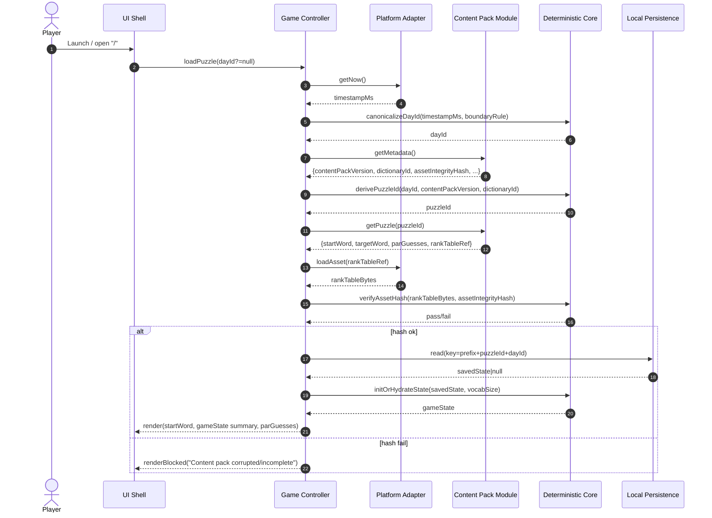
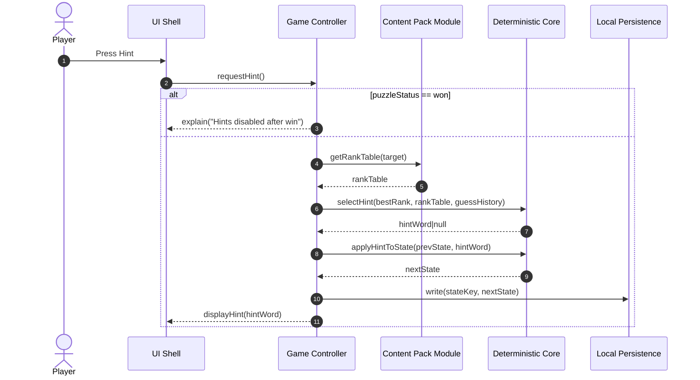
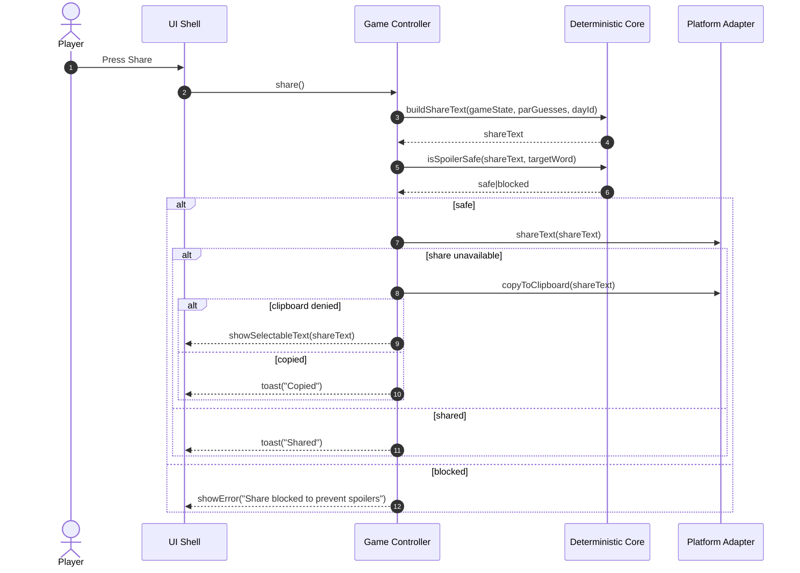
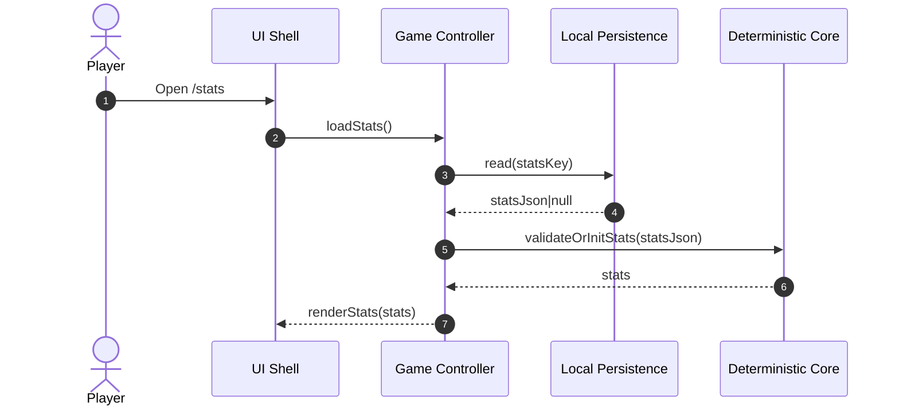
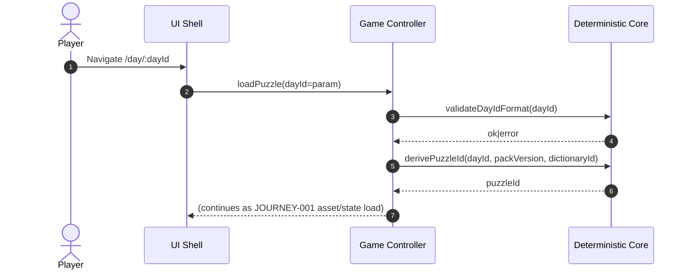
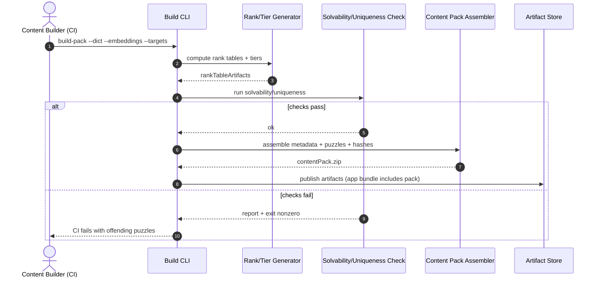
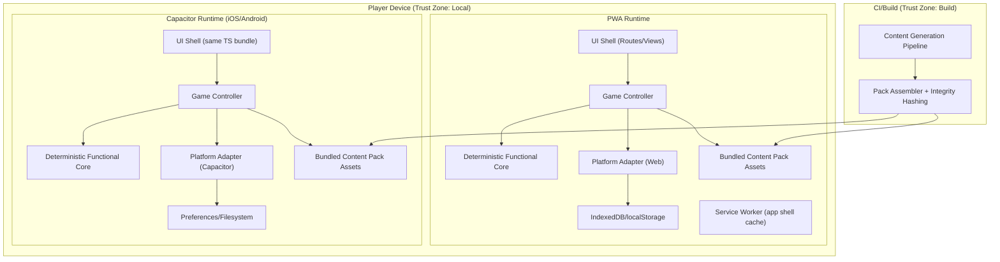

# Architecture

## Components & Responsibilities

### UI Shell (Web UI: Routes + Views)
- **Responsibilities**
  - Render routes: `/` (today), `/day/:dayId`, `/stats`, `/settings` (and optional diagnostics).
  - Capture player input (guess submit, hint, share) and display feedback (tier + warmer/colder verdict).
  - Enforce accessibility behaviors: keyboard focus order, aria-live announcements, non-color-only cues.
- **Boundaries**
  - **Owns:** presentation state, layout, interaction handling, accessibility markup.
  - **Does not own:** puzzle selection logic, guess validation, rank evaluation, persistence formats.
- **Exposes**
  - UI actions/events: `onSubmitGuess(guessWord)`, `onRequestHint()`, `onShare()`, `onNavigateDay(dayId)`.
- **Consumes**
  - `GameController` API (below) for all state mutations and derived view models.

**Requirements satisfied:** REQ-020, NFR-003, NFR-004, NFR-006 (if diagnostics UI exists).

---

### Game Controller / Application Service (Impure Orchestrator)
- **Responsibilities**
  - Orchestrate journeys by calling the pure core and platform adapter (load puzzle, submit guess, request hint, share, load stats).
  - Sequence: load metadata → select puzzleId → load assets → verify integrity → load/initialize state → render.
  - Handle error mapping to user-safe UI states (content corrupted, storage failures).
  - Ensure sequential processing (queue) for rapid submits and consistent `guessIndex`.
- **Boundaries**
  - **Owns:** side-effect orchestration, in-memory session state, concurrency control.
  - **Does not own:** deterministic rules (selection, ranking, verdict, hint algorithm); does not implement platform APIs directly.
- **Exposes**
  - `loadPuzzle(dayId?)`, `submitGuess(guessWord)`, `requestHint()`, `share()`, `loadStats()`, `loadSettings()`.
- **Consumes**
  - `Deterministic Functional Core`
  - `Platform Adapter` (clock, storage, share, asset loading)
  - Content Pack reader/loader

**Requirements satisfied:** REQ-001..005, REQ-010, REQ-012, REQ-017..019, NFR-001, NFR-005.

Trade-off: central controller simplifies sequencing/errors but adds a layer; alternative is direct UI-to-core calls with hooks, which complicates cross-platform adapter interactions and concurrency guarantees.

---

### Deterministic Functional Core (Pure Logic Module)
- **Responsibilities**
  - Canonicalize and validate inputs (normalized guess tokens, deterministic selection inputs).
  - Deterministic daily selection: compute `puzzleId` via seedable hash from `(dayId, contentPackVersion, dictionaryId)`.
  - Validate guess (dictionary membership, duplicate detection).
  - Rank evaluation: lookup `(semanticRank, rankTier)` from per-target rank table.
  - Compute verdict by comparing `semanticRank` vs prior `bestRank`.
  - Compute state transitions: append guess, update bestRank, set puzzleStatus (`not_started` → `in_progress` → `won`).
  - Hint selection: return a strictly better-ranked word not already guessed (deterministic selection).
  - Share artifact generation and spoiler checks (must not contain targetWord; optionally startWord).
- **Boundaries**
  - **Owns:** all game rules and deterministic transformations; state transition functions.
  - **Does not own:** clock, storage, asset IO, UI, localization resources, platform-specific behaviors.
- **Exposes**
  - Pure functions (examples):
    - `derivePuzzleId(dayId, packVersion, dictionaryId) -> puzzleId`
    - `normalizeGuess(input) -> guessWord`
    - `validateGuess(guessWord, dictionary, guessHistory) -> ok|error`
    - `evaluateGuess(guessWord, targetRankTable, priorBestRank) -> {semanticRank, rankTier, verdict, isWin}`
    - `reduceGameState(prevState, evaluatedGuess, timestamp) -> nextState`
    - `selectHint(bestRank, rankTable, guessHistory) -> hintWord|null`
    - `buildShareText(state, par, dayId) -> shareText`
    - `isSpoilerSafe(shareText, targetWord[, startWord]) -> boolean`
- **Consumes**
  - None (pure; receives all dependencies as data).

**Requirements satisfied:** REQ-002, REQ-006..016, NFR-001, NFR-002, NFR-003, NFR-005.

Trade-off: strict purity maximizes determinism/testability but requires careful data plumbing (e.g., passing timestamps and loaded assets in).

---

### Platform Adapter (Ports for Side Effects)
- **Responsibilities**
  - Provide side-effecting services behind stable interfaces:
    - Clock: read “now” and derive canonical day inputs (or provide timestamp for core canonicalization).
    - Storage: read/write game state and stats (PWA: IndexedDB/localStorage; Capacitor: Preferences/Filesystem).
    - Share: Web Share API / native share sheet; clipboard fallback.
    - Asset loading: load content pack assets from bundled resources.
- **Boundaries**
  - **Owns:** interaction with browser/OS APIs; storage backend implementation details; permission handling.
  - **Does not own:** game rules, content selection, rank evaluation.
- **Exposes**
  - `getNow(): number` (unix ms)
  - `read(key): string|null`, `write(key, value): void`, optional `compareAndSwap`/atomic write if available
  - `loadAsset(path): Uint8Array`
  - `shareText(text): Result`, `copyToClipboard(text): Result`
- **Consumes**
  - Browser APIs (PWA) or Capacitor plugins (iOS/Android)

**Requirements satisfied:** REQ-001 (clock input), REQ-003..004 (asset IO), REQ-017 (persistence), JOURNEY-004 branches (share/clipboard).

Trade-off: using the “least common denominator” adapter API increases portability but may forgo platform-specific optimizations (e.g., transactional IndexedDB writes vs simple KV).

---

### Composition Root (Per-Platform Bootstrap)
- **Responsibilities**
  - Select and wire the correct adapter implementation based on `platformId` (`pwa|ios|android`).
  - Provide configuration defaults (storageKeyPrefix, a11y settings initial values, reduced motion detection).
  - Initialize controller and mount UI.
- **Boundaries**
  - **Owns:** dependency injection/wiring, platform identification.
  - **Does not own:** any business rules or UI behavior beyond configuration.
- **Exposes**
  - App startup entrypoint: `main()`.
- **Consumes**
  - Platform runtime detection, adapter implementations.

**Requirements satisfied:** FIELD-026 wiring, NFR-001 (no network deps by design).

---

### Content Pack Runtime Module (Bundled Content Reader)
- **Responsibilities**
  - Provide indexed access to:
    - Pack metadata: `contentPackVersion`, `dictionaryId`, `assetIntegrityHash`, vocab size (or dictionary length).
    - Puzzle mapping: `puzzleId -> {startWord, targetWord, parGuesses, rankTablePath}`
    - Dictionary asset for validation.
    - Per-target rank tables.
  - Provide canonical asset paths and schema versions.
- **Boundaries**
  - **Owns:** content pack schema, lookup/index format, mapping structures.
  - **Does not own:** generation of content; integrity verification policy; gameplay rules.
- **Exposes**
  - `getMetadata()`, `getPuzzle(puzzleId)`, `getDictionary()`, `getRankTable(targetWord|rankTableId)`.
- **Consumes**
  - `PlatformAdapter.loadAsset`

**Requirements satisfied:** REQ-003, REQ-005, REQ-006, REQ-008, REQ-013.

Trade-off: shipping fully offline packs increases binary size; alternative is downloadable packs, which violates offline-only/no-backend constraints.

---

### Build-Time Content Generation Pipeline (CI/CLI)
- **Responsibilities**
  - Ingest curated dictionary + embedding source.
  - Choose daily targets/starts; compute per-target rank tables and tier thresholds.
  - Compute `parGuesses`.
  - Run solvability/uniqueness checks; fail build on violations; emit reports.
  - Emit deterministic content pack artifacts + metadata hashes for integrity checks.
- **Boundaries**
  - **Owns:** offline ML/embedding computations, rank/tier computation, solvability gates, pack build outputs.
  - **Does not own:** runtime gameplay, persistence, UI.
- **Exposes**
  - CLI commands: `build-pack`, `validate-pack`, `report`.
- **Consumes**
  - CI environment, file system, possibly Python/Node tooling, embedding source files/models.

**Requirements satisfied:** JOURNEY-007, TERM-032, TERM-033, REQ-004 (hash generation input).

---

## Data Flow

### JOURNEY-001: Open app and load today’s puzzle


**State transitions**
- If no saved state: `puzzleStatus = not_started`, `guessHistory=[]`, `bestRank=vocabSize` (REQ-005).
- Selection stability: once `dayId` is chosen for session, controller keeps it stable unless navigating to another day (EDGE-002).

---

### JOURNEY-002: Submit a guess and receive warmer/colder + tier feedback
```mermaid
sequenceDiagram
  autonumber
  actor Player
  participant UI as UI Shell
  participant GC as Game Controller
  participant Core as Deterministic Core
  participant CP as Content Pack Module
  participant PA as Platform Adapter
  participant Store as Local Persistence

  Player->>UI: Submit guessWord
  UI->>GC: submitGuess(guessWordRaw)
  GC->>Core: normalizeGuess(guessWordRaw)
  Core-->>GC: guessWord

  GC->>CP: getDictionary()
  CP-->>GC: dictionary
  GC->>Core: validateGuess(guessWord, dictionary, guessHistory)
  Core-->>GC: ok|error(invalid|duplicate)

  alt ok
    GC->>CP: getRankTable(target)
    CP-->>GC: rankTable
    GC->>Core: evaluateGuess(guessWord, rankTable, bestRank)
    Core-->>GC: {semanticRank, rankTier, verdict, isWin}

    GC->>PA: getNow()
    PA-->>GC: timestampMs
    GC->>Core: reduceGameState(prevState, evaluatedGuess, timestampMs)
    Core-->>GC: nextState

    GC->>Store: write(stateKey, nextState)
    alt write fails
      GC-->>UI: showNonBlockingError("Could not save progress")
    end

    GC-->>UI: renderGuessResult(verdict, rankTier); aria-live announce if enabled
  else invalid/duplicate
    GC-->>UI: renderValidationError()
  end
```

**State transitions**
- `not_started` → `in_progress` on first accepted guess (policy; REQ-018 assumes explicit transition).
- `in_progress` → `won` when `isWin=true` (REQ-012).
- `won` is terminal (no backward transitions).

---

### JOURNEY-003: Request a hint (“next warmer word”)


---

### JOURNEY-004: Share spoiler-safe results


---

### JOURNEY-005: View stats and streaks (local only)


---

### JOURNEY-006: Navigate to a past day (archive puzzle)


---

### JOURNEY-007: Build-time content generation and validation gate


---

## Deployment Topology

- **Runtime environments**
  - **PWA:** Single-page app in browser tab; optional Service Worker for offline caching of the app shell (content pack is bundled, not fetched at play time).
  - **iOS/Android (Capacitor):** WebView-hosted SPA + Capacitor plugins for storage/share.
  - **Build/CI:** Node-based TypeScript build + content generation tooling (may include Python or Node native deps).
- **Network boundaries & trust zones**
  - **No trusted backend zone** (by design). Gameplay must not depend on network (NFR-001, NFR-005).
  - **Device boundary:** Local storage is best-effort and user-controlled; treat as untrusted input on read (validate/repair).
- **Scaling units and limits**
  - **Client-side only:** scaling is per-device.
  - **Content pack size is the primary limit:** rank tables for full dictionary coverage can be large; must be optimized (compression/encoding) to stay within app store/PWA constraints.



---

## Security Architecture

- **AuthN mechanism per actor type**
  - **Player:** none (no accounts, offline-only).
  - **Content Builder (CI):** CI system credentials for artifact publishing (outside gameplay scope).
- **AuthZ model**
  - Not applicable at runtime (no multi-user roles, no privileged operations).
  - Build pipeline access controlled by repository permissions (RBAC in VCS/CI).
- **Secret management**
  - **Runtime:** no secrets required.
  - **Build/CI:** store signing keys / app store credentials in CI secret store; not embedded in app.
- **Data classification & encryption**
  - **Local game state/stats:** non-PII, low sensitivity. Still validate on read to prevent crashes/corruption.
  - **At rest:** rely on OS/browser storage protections; optionally encrypt local saves is not necessary for threat model but could deter casual tampering (trade-off: complexity, key management).
  - **In transit:** none required for gameplay; distribution uses standard app store / HTTPS for PWA hosting (out of scope for “play time”).
- **Threat model summary (top 5)**
  1. **Content pack tampering/corruption** (modified rank tables to spoil/alter gameplay)  
     - Mitigation: asset integrity verification using strong hash (REQ-004); block play on mismatch (BRANCH-002).
  2. **Local save tampering** (edit stats/streaks)  
     - Mitigation: treat local stats as informational; validate schema and bounds; repair/reset on corruption (ERROR-006). Trade-off: cannot prevent cheating without accounts/backend.
  3. **Information leakage of TARGET word** (accidental UI reveal or share text spoiler)  
     - Mitigation: strict UI boundary (never render target); spoiler-safe share generation + substring checks (REQ-016); optional additional checks to exclude startWord and rank numbers (EDGE-008).
  4. **Denial of service via storage quota/permission failures**  
     - Mitigation: graceful degradation to in-memory state; clear user messaging and retry (ERROR-003); keep content read-only separate from saves.
  5. **Supply-chain risk in build pipeline** (dependency compromise affecting generated content or shipped JS)  
     - Mitigation: lockfiles, reproducible builds where feasible, CI provenance, artifact hashing, dependency scanning.

---

## Integration Points

### Inbound interfaces
1. **UI Routes (client-side router)**
   - `/` (ENTRY-001), `/day/:dayId` (ENTRY-002), `/stats` (ENTRY-006), `/settings` (ENTRY-007)
   - **Protocol:** internal SPA routing
   - **Schema:** dayId must match `YYYY-MM-DD` (FIELD-001)
   - **Failure mode:** invalid dayId → show “No puzzle available” or validation error
   - **SLA expectation:** instantaneous local navigation (<100ms typical)
2. **UI Actions**
   - Submit Guess (ENTRY-003), Hint (ENTRY-004), Share (ENTRY-005)
   - **Protocol:** internal event dispatch
   - **Failure mode:** invalid word/duplicate → no state change; storage failure → non-blocking warning
   - **SLA expectation:** ranking lookup should be sub-50ms typical on-device (dependent on rank table format)

### Outbound dependencies (runtime)
1. **Browser Storage (PWA)**
   - **Protocol/API:** IndexedDB preferred; localStorage fallback
   - **Schema:** JSON-serialized `GameState`, `Stats` with versioning
   - **Failure mode:** quota exceeded, private mode restrictions, serialization errors → degrade to in-memory + warning
   - **SLA expectation:** best-effort; no hard guarantee
2. **Capacitor Storage**
   - **Protocol/API:** Capacitor Preferences and/or Filesystem
   - **Schema:** same logical models as PWA
   - **Failure mode:** permission/IO error → degrade to in-memory + warning
   - **SLA expectation:** best-effort
3. **Share**
   - **Protocol/API:** Web Share API / native share sheet; Clipboard API fallback
   - **Schema:** plain text `shareText` (FIELD-025)
   - **Failure mode:** API unavailable/denied → show selectable text (ERROR-005)
   - **SLA expectation:** user-perceived immediate; OS-controlled

### Outbound dependencies (build-time)
1. **Embedding source / ML assets**
   - **Protocol:** file-based input to pipeline
   - **Failure mode:** missing/invalid embeddings → CI fail
   - **SLA expectation:** CI budgeted; not user-facing

---

## Architecture Decision Records

### ADR-001: Pure deterministic functional core with platform adapters
- **Status:** Accepted
- **Context:** Need identical behavior across PWA/iOS/Android; offline-first; avoid platform-specific divergence.
- **Decision:** Implement all game rules (selection, validation, ranking, hinting, state transitions, share text) in a pure TS module with no side effects; isolate clock/storage/share/asset IO behind adapters wired by a composition root.
- **Consequences:**
  - + High testability and determinism; easy cross-platform parity (NFR-002).
  - + Clear separation of concerns; fewer heisenbugs from platform APIs.
  - − More plumbing: must pass timestamp/loaded assets explicitly; requires disciplined boundaries.
- **Alternatives:**
  - Embed logic in UI components with hooks (rejected: harder to ensure parity).
  - Separate native implementations per platform (rejected: violates single codebase goal).

### ADR-002: Precomputed per-target rank tables shipped in the app (no runtime similarity)
- **Status:** Accepted
- **Context:** Must be offline-only and deterministic; runtime vector math can diverge across platforms and is heavier.
- **Decision:** Generate per-target rank tables at build time; runtime evaluation is integer lookup + comparison.
- **Consequences:**
  - + Deterministic across platforms; fast runtime; no ML inference dependency.
  - − Potentially large content pack size; requires compression/encoding strategy.
- **Alternatives:**
  - Runtime embeddings + cosine similarity (rejected: nondeterminism/perf/offline constraints).
  - Server-evaluated similarity (rejected: violates no-backend/no-network).

### ADR-003: Content integrity verification using bundled strong hashes
- **Status:** Proposed
- **Context:** Offline content can be corrupted/tampered; need reliable detection (REQ-004) and consistent algorithm choice.
- **Decision:** Use SHA-256 over canonical asset bytes; store expected hash in pack metadata; verify on load and block play if mismatch.
- **Consequences:**
  - + Strong integrity check; simple mental model.
  - − Adds load-time cost; requires careful canonicalization of bytes and consistent implementation across runtimes.
- **Alternatives:**
  - CRC32 (faster but weaker; more collision-prone).
  - Skip verification (rejected: conflicts with REQ-004 and reliability goals).

### ADR-004: Canonical day boundary rule for dayId derivation
- **Status:** Proposed
- **Context:** REQ-001 open question: UTC vs local day boundary affects “today” puzzle and cross-timezone consistency.
- **Decision:** Default to UTC day boundary for `dayId` derivation; expose as documented constant in core; optionally allow user setting later (but that would break “same puzzle everywhere” expectation).
- **Consequences:**
  - + Global consistency; minimizes “different puzzle depending on locale.”
  - − Some players may feel the day flips at an unexpected local time.
- **Alternatives:**
  - Local midnight (more intuitive locally; but diverges by timezone).
  - “Game day” boundary (e.g., 05:00 local) (complex; still diverges).

### ADR-005: PWA storage baseline (IndexedDB vs localStorage)
- **Status:** Proposed
- **Context:** REQ-017 open question: choose reliable storage; localStorage is simpler but smaller and synchronous.
- **Decision:** Use IndexedDB as primary; fallback to localStorage only for minimal settings if IndexedDB unavailable.
- **Consequences:**
  - + Better capacity and async writes; fewer quota issues for history.
  - − More implementation complexity and migration/versioning.
- **Alternatives:**
  - localStorage only (simpler; higher risk of quota/perf issues).

---

## Cross-Cutting Concerns

- **Logging, tracing, metrics, alerting**
  - No outbound telemetry (NFR-005). Provide **local diagnostics** (optional) showing pack version, dictionaryId, puzzleId, dayId and last error codes without revealing targetWord (NFR-006).
  - Local console logging gated by build flag (dev only); in production, keep minimal to avoid leaking internals.
- **Configuration and feature flags**
  - Build-time flags only (no remote config): diagnostics enabled, allow share before win (REQ-015 open question), allow hints after win (policy).
  - Settings persisted locally: `a11yAnnouncementsEnabled` (FIELD-028), reduced motion initial detection (FIELD-029) with optional user override (NFR-004 open question).
- **Error handling strategy**
  - **Content errors (missing assets, hash mismatch):** hard-block gameplay with actionable remediation (“update/reinstall”).
  - **Storage errors:** degrade to in-memory session, show non-blocking warning; avoid losing current UX.
  - **Validation errors (invalid/duplicate):** no state change; clear inline messaging.
- **Backwards compatibility / versioning**
  - Version **content pack schema** and **save schema** independently.
  - On read, validate and migrate saved state/stats by schema version; if migration fails, offer reset (ERROR-006) while keeping current-day progress separate where possible.
  - Deterministic selection inputs include `contentPackVersion` and `dictionaryId` to keep past-day stability per pack version; archive stability across pack updates requires either:
    - keep old packs available in-app, or
    - ship an explicit `(dayId -> puzzleId)` mapping for historical ranges (open question from REQ-003).
