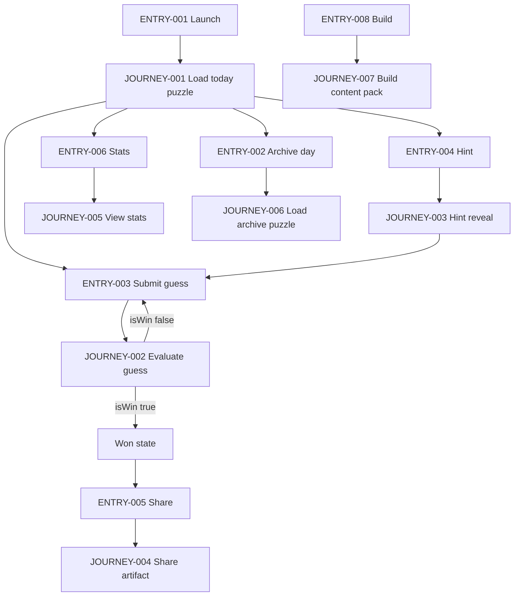

# User Journeys

## Roles

| Role ID | Role | Type | Description |
|---|---|---|---|
| ROLE-001 | Player | Primary | Plays the daily puzzle, enters guesses, requests hints, views stats, shares results. |
| ROLE-002 | System | System | Deterministic Functional Core (TERM-026) + Platform Adapter (TERM-027) performing selection, evaluation, persistence, a11y announcements. |
| ROLE-003 | Platform (PWA) | Secondary | Provides IndexedDB/localStorage, Web Share (if available), clock. |
| ROLE-004 | Platform (Capacitor) | Secondary | Provides Preferences/Filesystem, native share sheet, clock bridge. |
| ROLE-005 | Content Builder | Admin/Build | Generates Content Pack (TERM-015), rank tables, par, solvability/uniqueness checks. |

## Entry Points

| Entry ID | Location | Trigger | Auth |
|---|---|---|---|
| ENTRY-001 | UI Route: `/` (Today) | App launch / open | None |
| ENTRY-002 | UI Route: `/day/:dayId` (Archive day) | Player navigates date | None |
| ENTRY-003 | UI Action: Submit Guess | Player presses Enter/clicks Submit | None |
| ENTRY-004 | UI Action: Request Hint | Player presses Hint | None |
| ENTRY-005 | UI Action: Share | Player presses Share | None |
| ENTRY-006 | UI Route: `/stats` | Player opens Stats | None |
| ENTRY-007 | UI Route: `/settings` | Player opens Settings | None |
| ENTRY-008 | Build Pipeline CLI | Build step runs | n/a |

## Role Permission Matrix

| Capability | ROLE-001 Player | ROLE-002 System | ROLE-005 Content Builder |
|---|---:|---:|---:|
| Select daily puzzle (TERM-017) | R | RW | n/a |
| Enter/validate guess (TERM-005) | RW | RW | n/a |
| Evaluate warmer/colder (TERM-010) | R | RW | n/a |
| Persist/load game state (TERM-020) | R | RW | n/a |
| View stats/streak (TERM-022/023) | R | RW | n/a |
| Generate share artifact (TERM-024) | R | RW | n/a |
| Generate content pack (TERM-032) | n/a | n/a | RW |
| Run solvability check (TERM-033) | n/a | n/a | RW |

## Journeys

### JOURNEY-001: Open app and load today’s puzzle
- **Role/Goal:** ROLE-001 Player; view today’s deterministic Puzzle (TERM-001) with START word (TERM-003) and continue prior progress if any.
- **Entry:** ENTRY-001
- **Happy path:**
  1. System reads FIELD-001 (dayId) from Platform Adapter clock and canonicalizes it. (TERM-027)
  2. System reads FIELD-002 (contentPackVersion) and FIELD-003 (dictionaryId) from bundled Content Pack metadata. (TERM-015)
  3. System computes FIELD-004 (puzzleId) using TERM-017 + TERM-018 over (FIELD-001, FIELD-002, FIELD-003). (TERM-026)
  4. System loads Content Pack assets for puzzleId including FIELD-005 (startWord), FIELD-006 (targetWord), FIELD-015 (parGuesses), and required TERM-008 rank table; verifies FIELD-030 (assetIntegrityHash). (TERM-015)
  5. System loads persisted FIELD-016 (puzzleStatus), FIELD-017 (guessHistory), FIELD-012 (bestRank) for this (FIELD-004, FIELD-001) from Local Persistence (TERM-020).
  6. UI displays FIELD-005 (startWord), guess input, and summary (guesses count from FIELD-017 length; par from FIELD-015) without revealing FIELD-006. (TERM-004)
- **BRANCH-001 (No saved state):** If no record exists for (FIELD-004, FIELD-001), system initializes FIELD-016=`not_started`, FIELD-017=`[]`, FIELD-012=`vocabSize`.
- **BRANCH-002 (Asset integrity mismatch):** If FIELD-030 verification fails, system blocks play and shows an offline-safe error with recovery (reinstall/update).
- **ERROR-001 (Missing content asset):**
  - **Trigger:** Rank table for FIELD-006 not found in packaged assets.
  - **System response:** Show error screen “Content pack corrupted/incomplete”.
  - **Recovery:** Player can reinstall/update app; no gameplay continues.
- **EDGE-001 (Timezone boundary):** Device local day differs from UTC day rule; system must canonicalize using a single rule for FIELD-001.
- **EDGE-002 (Clock changes):** Device clock changes during session; selection remains stable for the session’s FIELD-001 unless player explicitly navigates to another day.
- **EDGE-003 (Concurrent launches):** Two tabs/windows open; state merges by last-write-wins with monotonic FIELD-009 per guess.

### JOURNEY-002: Submit a guess and receive warmer/colder + tier feedback
- **Role/Goal:** ROLE-001 Player; evaluate a Guess (TERM-005) and see TERM-010 verdict and TERM-009 tier; win if guess equals TARGET.
- **Entry:** ENTRY-003
- **Happy path:**
  1. Player enters FIELD-007 (guessWord) and submits.
  2. System normalizes guessWord (trim, lowercase) and validates it exists in TERM-013 Dictionary for FIELD-003. (TERM-006)
  3. System looks up FIELD-010 (semanticRank) and FIELD-011 (rankTier) from TERM-008 Per-Target Rank Table for FIELD-006 (targetWord).
  4. System computes FIELD-013 (verdict) by comparing FIELD-010 to prior FIELD-012 (bestRank).
  5. System appends a new record to FIELD-017 (guessHistory) with FIELD-008 (guessIndex), FIELD-007, FIELD-010, FIELD-011, FIELD-013, FIELD-014 (isWin), and FIELD-009 (guessTimestamp from adapter clock).
  6. System updates FIELD-012 (bestRank) if FIELD-010 is lower.
  7. If FIELD-007 equals FIELD-006, system sets FIELD-014=true and transitions FIELD-016 (puzzleStatus) to `won`; updates Stats (TERM-022).
  8. UI displays verdict and tier for this guess and announces via screen reader if FIELD-028 enabled. (TERM-031)
- **BRANCH-003 (Invalid word):** If FIELD-007 not in dictionary, show “Not in dictionary” and do not change FIELD-017.
- **BRANCH-004 (Duplicate guess):** If FIELD-007 already exists in FIELD-017, show “Already guessed” and do not append.
- **ERROR-002 (Rank lookup missing):**
  - **Trigger:** guessWord exists in dictionary but is absent in the rank table.
  - **System response:** Block acceptance; show “Content mismatch” error.
  - **Recovery:** Reinstall/update; optional reset local content cache.
- **ERROR-003 (Storage write fails):**
  - **Trigger:** Local Persistence write throws/quota/permission.
  - **System response:** Show “Could not save progress” and keep in-memory state for session.
  - **Recovery:** Player can retry; provide “Export/share current session text” if available.
- **EDGE-004 (Rapid submits):** Multiple submissions in <250ms; system must process sequentially and ensure FIELD-008 increments correctly.
- **EDGE-005 (Keyboard-only):** Entire flow must be operable by keyboard; focus returns to input after submission.
- **EDGE-006 (Non-color feedback):** Warmer/colder must be conveyed by text/icon + aria-live, not color only.

### JOURNEY-003: Request a hint (“next warmer word”)
- **Role/Goal:** ROLE-001 Player; obtain a Hint (TERM-025) that improves current Best Rank (TERM-011).
- **Entry:** ENTRY-004
- **Happy path:**
  1. Player presses Hint.
  2. System reads current FIELD-012 (bestRank) and uses rank table (TERM-008) to select FIELD-024 (hintWord) such that its rank is strictly lower than current best.
  3. System increments FIELD-023 (hintCount) and persists updated Game State (TERM-021).
  4. UI displays hintWord and its tier (FIELD-011 for hintWord) and announces it if FIELD-028 enabled.
- **BRANCH-005 (Already at target):** If FIELD-016=`won`, disable hint and show explanation.
- **BRANCH-006 (No better word available):** If bestRank is already 1, system returns null hintWord and shows “No hint available”.
- **ERROR-004 (Hint selection fails):**
  - **Trigger:** Rank table missing required metadata to select a next step.
  - **System response:** Show “Hint unavailable for this puzzle”.
  - **Recovery:** Continue without hints.
- **EDGE-007 (Hint repeats existing guess):** If selected hintWord is already in FIELD-017, system must choose a different qualifying word or return no hint.

### JOURNEY-004: Share spoiler-safe results
- **Role/Goal:** ROLE-001 Player; share results without revealing TARGET.
- **Entry:** ENTRY-005
- **Happy path:**
  1. Player presses Share after win or during play (if allowed).
  2. System generates FIELD-025 (shareText) from FIELD-017 (guessHistory), FIELD-015 (parGuesses), and FIELD-001 (dayId) using TERM-024 format (warm/cold blocks ending with a star on win).
  3. System verifies FIELD-025 does not contain FIELD-006 (targetWord) literal.
  4. Platform Adapter invokes native/web share, or copies to clipboard if share is unavailable.
- **BRANCH-007 (Share unavailable):** If platform share API not present, show “Copy to clipboard” action.
- **ERROR-005 (Clipboard denied):**
  - **Trigger:** Clipboard permission denied/unavailable.
  - **System response:** Display shareText in a selectable text area.
  - **Recovery:** Player manually copies.
- **EDGE-008 (Spoiler safety):** shareText must not include targetWord, startWord, or any explicit rank numbers if that could trivially identify the target (configurable).

### JOURNEY-005: View stats and streaks (local only)
- **Role/Goal:** ROLE-001 Player; see local Stats (TERM-022) and Streak (TERM-023).
- **Entry:** ENTRY-006
- **Happy path:**
  1. System loads Stats fields FIELD-018..FIELD-022 from Local Persistence (TERM-020).
  2. UI renders gamesPlayed, gamesWon, currentStreak, maxStreak, and last guessesToWin values where present.
- **ERROR-006 (Stats corrupted):**
  - **Trigger:** Stats JSON fails to parse/validate.
  - **System response:** Offer “Reset stats” (with confirmation) and show zeros until resolved.
  - **Recovery:** Player resets stats; game progress for current day remains separate.

### JOURNEY-006: Navigate to a past day (archive puzzle)
- **Role/Goal:** ROLE-001 Player; play or review a prior day’s stable puzzle.
- **Entry:** ENTRY-002
- **Happy path:**
  1. Player selects a FIELD-001 (dayId) in UI.
  2. System runs deterministic selection (TERM-017) for that dayId using current FIELD-002 and FIELD-003 unless a per-version archive mapping is shipped.
  3. System loads/initializes Game State for that dayId and puzzleId and proceeds as in JOURNEY-001.
- **BRANCH-008 (Day out of range):** If no content exists for that day, show “No puzzle available” and disable play.
- **EDGE-009 (Content pack updates):** Past day must remain stable; if FIELD-002 changes, selection must still map that dayId to the same puzzleId for that pack version.

### JOURNEY-007: Build-time content generation and validation gate
- **Role/Goal:** ROLE-005 Content Builder; produce deterministic assets ensuring solvability and uniqueness.
- **Entry:** ENTRY-008
- **Happy path:**
  1. Pipeline ingests curated TERM-013 Dictionary and embedding source.
  2. For each selected TARGET, pipeline computes TERM-008 Per-Target Rank Table and tier thresholds.
  3. Pipeline computes FIELD-015 (parGuesses) per puzzle.
  4. Pipeline runs TERM-033 Solvability Check and uniqueness constraints; fails build if violations found.
  5. Pipeline emits Content Pack metadata including FIELD-002, FIELD-003, FIELD-030.
- **ERROR-007 (Unsolvable puzzle):**
  - **Trigger:** Solvability check fails.
  - **System response:** CI fails with artifact report listing offending targets.
  - **Recovery:** Adjust target selection/wordlist/tiering and rerun.

## Journey Map

