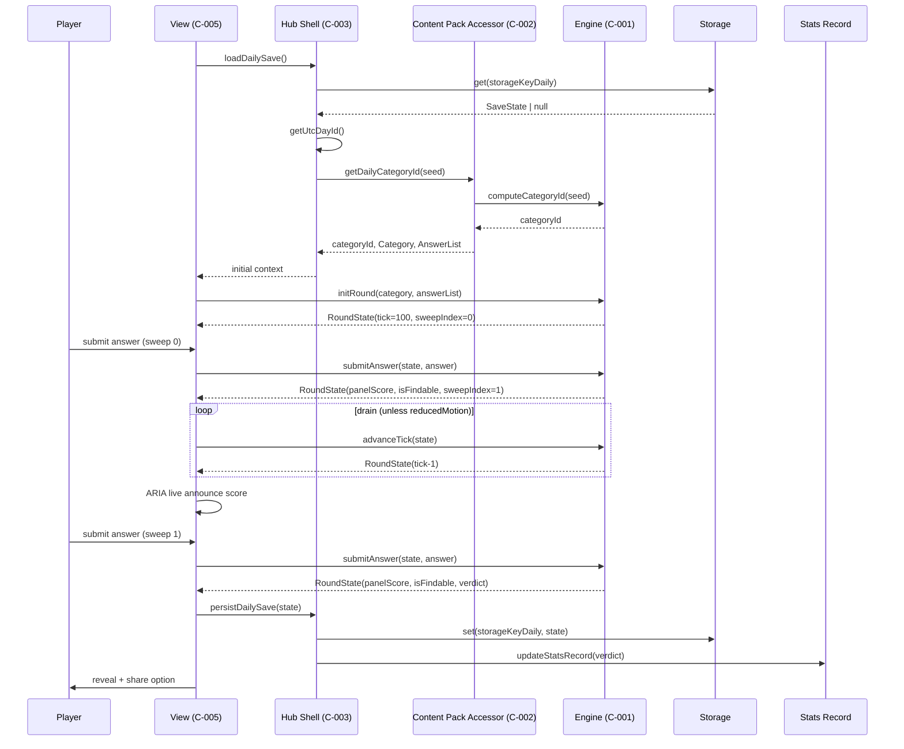
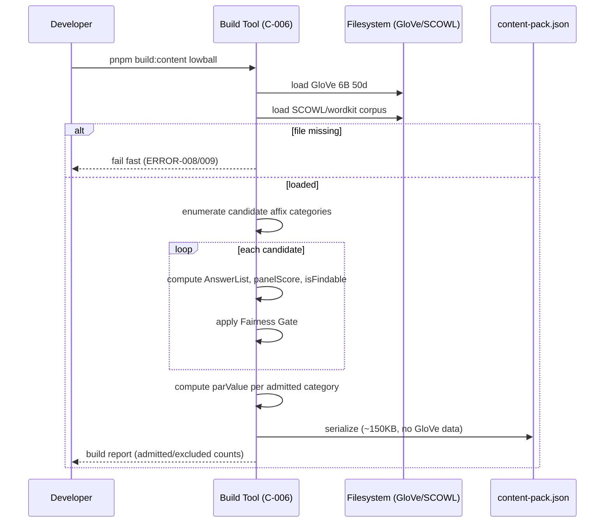
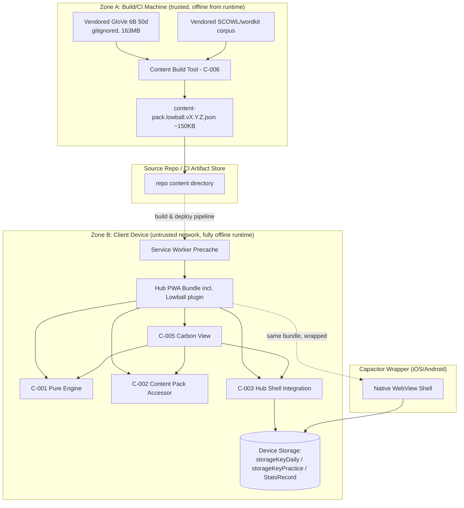

# Architecture

## Components & Responsibilities

### C-001: Lowball Engine (Pure Core)

**Satisfies:** REQ-001, REQ-002, REQ-003, REQ-004+ (validation/scoring), TERM-001 through TERM-020, FIELD-008/009/014–019/024

- Executes all round-state transitions (submit answer, advance sweep, advance player, compute verdict) as pure functions: `(state, action) -> newState`.
- Computes `categoryId` via FNV-1a 32-bit hash over the Dataset Seed (TERM-019).
- Validates submitted answers against a supplied Answer List (corpus membership, affix fit, non-duplication).
- Computes `panelScore`, `isFindable` lookups (read-only, from Content Pack data — never recomputes GloVe/SCOWL formulas at runtime), `totalScore`, and `verdict`.
- Advances the Tick Counter (TERM-015) by explicit discrete transitions only.
- Maintains `players[]`, `activePlayerIndex`, `sweepIndex` shape to support future multiplayer without engine rewrite.

**Boundaries:**
- Owns: round state shape, transition logic, hashing, verdict/score arithmetic, tick advancement logic.
- Does not own: wall-clock/UTC day computation, storage I/O, DOM/ARIA rendering, `prefers-reduced-motion` detection, Content Pack loading/parsing, Stats Record mutation.
- Never performs I/O, never calls `Date.now()`, never accesses storage.

**Interfaces exposed:**
- `computeCategoryId(seed: DatasetSeed): CategoryId` (pure function)
- `initRound(category: Category, answerList: AnswerList): RoundState`
- `submitAnswer(state: RoundState, answer: string): RoundState`
- `advanceTick(state: RoundState): RoundState`
- `getVerdict(state: RoundState): Verdict`

**Interfaces consumed:**
- Content Pack accessor (category + Answer List + par, supplied by caller, not fetched by engine)
- `reducedMotion: boolean` as a plain input parameter (read-only; engine never mutates it)

---

### C-002: Content Pack Runtime Accessor

**Satisfies:** TERM-012, FIELD-002/003/004/005/006/007, ERROR-005

- Loads and indexes the precached Content Pack JSON at app boot.
- Exposes lookup by `categoryId`, and a deterministic "select a Practice category ≠ today's Daily category" function.
- Validates pack integrity (schema shape) on load; surfaces a typed "pack unavailable" error rather than throwing.

**Boundaries:**
- Owns: in-memory indexed representation of the installed pack, category lookup, Practice category selection algorithm.
- Does not own: pack generation (Build Tool's job), network fetch (none at runtime — pack ships precached via service worker).

**Interfaces exposed:**
- `getCategory(categoryId): Category | null`
- `getDailyCategoryId(seed): CategoryId`
- `selectPracticeCategory(excludeCategoryId): CategoryId`
- `getPackVersion(): string`

**Interfaces consumed:**
- Service worker precache (via `fetch`/cache API at boot only, not at runtime gameplay)

---

### C-003: Hub Shell Integration Layer (Lowball-specific adapter)

**Satisfies:** TERM-011, TERM-023, FIELD-020–023, REQ-002, REQ-003, ERROR-004/006/007, all Role Permission Matrix rows for Hub Shell

- Reads/writes Save State under `storageKeyDaily` / `storageKeyPractice` (namespaced, structurally incapable of cross-writing per ERROR-006's design mitigation).
- Computes UTC `dayId` and passes it into the engine/content layer as a plain value.
- Reads `prefers-reduced-motion` from the hub-global signal and passes it to the view layer.
- On Daily Round completion, calls the hub's existing Stats Record API; never calls it for Practice.
- Implements schema-version migration/discard-on-corrupt logic (never throws).

**Boundaries:**
- Owns: storage key namespacing, UTC clock access, Stats Record write authority, reduced-motion signal plumbing, schema migration.
- Does not own: round rules, scoring, hashing math (delegates to Engine/Content Pack accessor).

**Interfaces exposed:**
- `loadDailySave(): SaveState | null`
- `loadPracticeSave(): SaveState | null`
- `persistDailySave(state)`, `persistPracticeSave(state)`
- `updateStatsRecord(verdict)` — Daily-only, never invoked from Practice code path
- `getUtcDayId(): string`
- `getReducedMotion(): boolean`

**Interfaces consumed:**
- Hub's existing generic storage API (get/set by key)
- Hub's existing Stats Record module API
- Hub's existing registry/plugin contract
- Browser/OS `matchMedia('(prefers-reduced-motion: reduce)')`

---

### C-004: Spoiler-Safe Share Module

**Satisfies:** TERM-021, FIELD-025, ERROR-011

- Pure function accepting only `{ totalScore, parValue, verdict, mode: "daily"|"practice" }` — structurally never receives answer words as input, preventing leakage by construction rather than by filtering.
- Renders numeric/bar representation of score vs par as plain text.

**Boundaries:**
- Owns: share text templating/formatting.
- Does not own: clipboard/share-sheet invocation (delegates to Capacitor/Web Share API caller), any answer data.

**Interfaces exposed:**
- `generateShareText(input: ShareInput): string`

**Interfaces consumed:**
- None (pure, no I/O). Caller (View) invokes platform share sheet separately.

---

### C-005: Lowball Carbon View (Plugin UI)

**Satisfies:** WCAG 2.1 AA requirements, TERM-014, TERM-022, JOURNEY-001/002/004 UI steps

- Renders category prompt, accessible text input (proper `<label>`/`aria-label`), Tension Counter (100 discrete bars), ARIA live region for submission/score announcements, reveal screen with findability badges, Share button.
- Drives Tension Counter drain by repeatedly calling `advanceTick` (engine) on a `requestAnimationFrame`-throttled schedule *outside* the engine — animation timing lives here, not in engine state.
- Honors `reducedMotion` by skipping to final tick value with no intermediate render frames.

**Boundaries:**
- Owns: DOM rendering, Carbon Web Component composition, animation scheduling/timing (the *when* to call `advanceTick`, not the *what* it computes), accessibility markup.
- Does not own: score computation, validation logic, persistence, hashing.

**Interfaces exposed:**
- Hub plugin route contract: `/games/lowball`, `/games/lowball/practice` (ENTRY-001/002)

**Interfaces consumed:**
- C-001 Engine (all pure transitions)
- C-002 Content Pack Accessor
- C-003 Hub Shell Integration Layer
- C-004 Share Module
- Hub design system (Carbon Web Components)

---

### C-006: Content Build Tool (offline, dev-only)

**Satisfies:** TERM-013, JOURNEY-003, ERROR-008/009/010, EDGE-012–015

- Loads vendored GloVe 6B 50d + SCOWL corpus (build machine only).
- Enumerates candidate Affix Categories, computes Answer Lists, panel scores, findability flags.
- Applies Fairness Gate; computes `parValue`; serializes Content Pack (~150 KB), excluding GloVe data.

**Boundaries:**
- Owns: the panel-score formula, fairness gate logic, pack serialization, build report/logging.
- Does not own: runtime behavior; never runs in the shipped app; not present in production bundle.

**Interfaces exposed:**
- CLI: `pnpm build:content lowball` (ENTRY-003)
- Emits: `content-pack.lowball.vX.Y.Z.json` + build report

**Interfaces consumed:**
- Vendored GloVe file (filesystem, gitignored)
- Vendored SCOWL/wordkit corpus (filesystem)

---

### C-007: Hub Registry Entry

**Satisfies:** hub's existing 50-game plugin architecture

- Static manifest entry: game id, routes, tile metadata, precache manifest reference for the content pack.

**Boundaries:**
- Owns: registration metadata only.
- Does not own: any runtime logic.

**Interfaces exposed:** Hub registry contract (`GameManifest` shape, pre-existing in repo).
**Interfaces consumed:** none.

---

## Data Flow

### Daily Round completion (JOURNEY-001)

1. View → Hub Shell: request Daily Save State.
2. Hub Shell → Storage: read `storageKeyDaily`; compute `dayId`.
3. Hub Shell → Content Pack Accessor: resolve `categoryId` (via Engine's pure hash fn).
4. Content Pack Accessor → Engine: supply Category + Answer List.
5. Engine → View: initial `RoundState` (tick=100, sweepIndex=0).
6. Player → View: submits answer.
7. View → Engine: `submitAnswer(state, answer)` → new state (score, isFindable).
8. View: loop `advanceTick` calls (or jump if reducedMotion) → re-render bars + ARIA live announce.
9. Repeat 6–8 for sweep 1.
10. Engine → View: `verdict` computed.
11. View → Hub Shell: persist Save State; trigger Stats Record update (Daily only).
12. View → Share Module (optional): generate `shareText`.



**State transitions:** `pending(sweepIndex=0)` → `pending(sweepIndex=1)` → `pending/complete(verdict="win"|"loss")`. Persisted at every transition (resumability, LOOP-001).

### Practice Round (JOURNEY-002)

```mermaid
sequenceDiagram
    participant Pl as Player
    participant V as View (C-005)
    participant HS as Hub Shell (C-003)
    participant CP as Content Pack Accessor (C-002)
    participant E as Engine (C-001)
    participant St as Storage

    V->>HS: loadPracticeSave()
    HS->>St: get(storageKeyPractice)
    HS->>CP: getDailyCategoryId(seed)
    CP-->>HS: todaysCategoryId
    HS->>CP: selectPracticeCategory(excl=todaysCategoryId)
    CP-->>HS: practiceCategoryId, Category, AnswerList
    HS-->>V: initial context
    V->>E: initRound(category, answerList)
    Pl->>V: submit answer (sweep 0, 1)
    V->>E: submitAnswer(...) x2
    E-->>V: verdict
    V->>HS: persistPracticeSave(state)
    HS->>St: set(storageKeyPractice, state)
    Note over HS,St: Stats Record NEVER called; storageKeyDaily NEVER touched
    V->>Pl: reveal + share (labelled Practice)
```

### Content Pack Build (JOURNEY-003)



**State transitions:** candidate category → `{admitted, excluded}` (gate), never revisited at runtime.

---

## Deployment Topology

- **Runtime environment:** Client-only. No server component for Lowball. Ships as part of the existing hub PWA bundle (Vite build) and Capacitor-wrapped iOS/Android binaries. Runs entirely in-process inside the WebView/browser tab — no containers, no serverless functions at runtime.
- **Build-time environment:** Content Build Tool (C-006) runs as a Node.js CLI process on developer/CI machines only; never deployed, never shipped in the client bundle. Treated as a separate "trust zone" from runtime code since it touches large gitignored vendor files.
- **Network boundaries / trust zones:**
  - **Zone A — CI/Build machine:** has access to vendored GloVe/SCOWL files; produces Content Pack artifact; zero runtime trust boundary crossing (artifact is the only output that crosses into Zone B).
  - **Zone B — Client device (browser/WebView):** fully offline after install; no network calls at runtime; Content Pack + app shell precached via service worker (PWA) / bundled assets (Capacitor).
  - No Zone C (no backend/API) exists for Lowball v1 — this is a deliberate boundary since the hub has no backend at all for this game.
- **Scaling units:** None in the traditional sense (no server to scale). The relevant "scaling" concern is Content Pack size (~150 KB target, hard ceiling implied by precache budget alongside 50+ other games' packs) and category count (≥120 required, 1,045 available headroom).
- **Limits:** Player Slots capped at 4 (FIELD-016, only 1 active in v1); Sweeps capped at 2; Content Pack categories bounded by Fairness Gate math (10–36 answers/category).



**Trade-off:** Shipping the entire ~150 KB pack eagerly (vs. lazy per-category fetch) simplifies offline guarantees and avoids any runtime network dependency, at the cost of a small fixed download for all 1,045-category superset if the pack ever grows beyond the curated ~120 (mitigated by capping admitted categories in the Build Tool, not at runtime).

---

## Security Architecture

**AuthN mechanism per actor type:**
- **Player:** None. No accounts, no login, no PII collected (per Glossary EDGE-006/ EDGE-007). Identity is implicitly "this device's local storage."
- **System (Engine):** N/A — not a network-addressable actor; invoked in-process only.
- **Build Tool:** Local filesystem trust only; authenticated implicitly by developer's OS/CI credentials to the source repo (existing hub CI, not Lowball-specific).
- **Hub Shell:** Inherits whatever hub-wide session/device trust model already exists (out of scope for this game — Lowball adds no new AuthN surface).

**AuthZ model:** None required — this is a single-player, local-only feature with no privilege tiers beyond the existing Role Permission Matrix, which is enforced structurally (namespacing, function boundaries) rather than via a runtime policy engine. Specifically:
- Namespace-based enforcement: `persistDailySave`/`persistPracticeSave` are distinct functions closed over distinct storage keys — there is no shared "write(key, data)" call site that Practice code could misuse to hit `storageKeyDaily`.
- Stats Record mutation is a single call site (`updateStatsRecord`) invoked only from the Daily completion path in C-003; Practice path has no reference to it (enforced by module structure / dependency graph, verified by lint rule + ERROR-006 test).

**Secret management:** None applicable at runtime (no API keys, no backend credentials). At build time, GloVe/SCOWL files are not secrets but are large vendored assets excluded from git and from the shipped bundle via `.gitignore` + build tool asserting their absence in pack output (test-verified, per TERM-012 anti-definition).

**Data classification and encryption:**
- All Lowball data (Save State, Stats Record deltas, Content Pack) is classified **non-sensitive, non-PII** (FIELD-level "PII: No" for every field in the Data Dictionary).
- **At rest:** relies on existing hub local-storage mechanism's protections (e.g., browser storage sandboxing, OS-level app sandbox for Capacitor); no additional encryption required or added by Lowball since no PII/sensitive data exists.
- **In transit:** N/A at runtime (no network calls). At build time, artifact transfer from CI to repo/CDN uses whatever existing hub CI pipeline transport security already applies (HTTPS/signed artifacts) — not a Lowball-specific concern.

**Threat model summary (top 5 threats + mitigations):**

| # | Threat | Mitigation |
|---|---|---|
| 1 | Practice Round code path accidentally writes to `storageKeyDaily` or Stats Record, corrupting streak integrity (ERROR-006) | Structural namespacing: separate functions/modules per storage key with no shared generic writer; unit/integration test asserts zero cross-writes; code review checklist item |
| 2 | Corrupt/malformed Save State (manual tampering, storage quota eviction mid-write, browser bugs) crashes the app | Schema-versioned Save State (FIELD-023) with repair-or-discard logic (ERROR-004/007); engine never trusts raw storage input without validation |
| 3 | GloVe raw vector data or intermediate corpus artifacts accidentally leak into the shipped Content Pack, bloating size or exposing vendor licensing content client-side | Build Tool asserts pack excludes GloVe data as a build-time invariant test; pack size budget (~150 KB) checked in CI as a regression guard |
| 4 | Share text leaks an answer word, spoiling the puzzle for others (ERROR-011) | Structural prevention: Share Module's function signature never accepts answer words as a parameter (type-level enforcement), not just runtime filtering; unit tests assert no substring match |
| 5 | Cross-tab/cross-webview concurrent writes (EDGE-004) cause last-write-wins data loss for a round in progress | Documented as an accepted limitation (no distributed lock available client-only); mitigated by writing after every discrete transition (minimizing loss window) rather than only at round end |

---

## Integration Points

**Inbound interfaces:**

| Interface | Type | Consumer | Notes |
|---|---|---|---|
| `/games/lowball` | UI route (ENTRY-001) | Player via hub shell router | Renders Daily Round view |
| `/games/lowball/practice` | UI route (ENTRY-002) | Player via hub shell router | Renders Practice Round view |
| `pnpm build:content lowball` | CLI (ENTRY-003) | Developer/CI | Build-time only, not present in runtime bundle |
| `hub:init` | App boot event (ENTRY-004) | Hub Shell → Content Pack Accessor | Triggers pack index load from precache |
| Service worker install/update event | Precache event (ENTRY-005) | Service worker | Fetches/caches Content Pack + bundle assets |

**Outbound dependencies:**

| Dependency | Protocol/Mechanism | Schema Reference | Failure Mode | SLA Expectation |
|---|---|---|---|---|
| Hub generic storage API (get/set by key) | In-process function call (localStorage/IndexedDB wrapper) | `SaveState` (FIELD-023 schemaVersion + round fields) | Storage quota exceeded / corrupt read → repair-or-discard (ERROR-004/007), never throws | Synchronous or near-synchronous; no timeout needed (local only) |
| Hub Stats Record module | In-process function call | Existing hub `StatsRecord` shape (TERM-011, external to this spec) | If call throws/unavailable, Daily completion must not silently lose the verdict — verdict is still persisted to Save State independently, Stats Record update is best-effort but logged if it fails | Synchronous, local, no network |
| Service Worker precache (Content Pack + bundle) | Cache API / fetch (install-time only) | Content Pack JSON schema (categoryId, categoryLabel, affixType, affixValue, answerList[], parValue) | Precache miss → ERROR-005, offline-safe error state, no runtime network retry | Must be fully available before first gameplay; failure is a defect requiring reinstall/update (ENTRY-005) |
| Vendored GloVe 6B 50d file (build-time only) | Filesystem read | Raw GloVe text format (word + 50 floats per line) | Missing/unreadable → fail fast (ERROR-008) | Build-time only; no runtime SLA |
| Vendored SCOWL/wordkit corpus (build-time only) | Filesystem read | Wordkit corpus format (word + tier) | Missing/malformed → fail fast (ERROR-009) | Build-time only; no runtime SLA |
| Capacitor Share API / Web Share API / Clipboard | Platform API call | Plain string (`shareText`) | API unavailable → fallback to clipboard copy or visible text display | Best-effort, non-critical path |
| `prefers-reduced-motion` media query | Browser/OS API (`matchMedia`) | Boolean | Unsupported browser → defaults to `false` (motion allowed), never blocks rendering | Synchronous, always available in target platforms |

---

## Architecture Decision Records

### ADR-001: Tension Counter driven by logical tick state, not wall-clock animation

- **Status:** Accepted
- **Context:** The signature UI element must be deterministic and unit-testable per the hub's existing "decay" game precedent, while also supporting instant display under Reduced Motion Mode.
- **Decision:** The Tick Counter (FIELD-019) is pure engine state advanced only via explicit `advanceTick(state)` transitions. The View schedules calls to `advanceTick` using its own timing (rAF-throttled) but the engine has zero knowledge of time.
- **Consequences:** Engine tests can assert exact tick sequences without mocking timers. Animation smoothness becomes entirely a View-layer concern, decoupling visual polish work from engine correctness work. Slight duplication of "how many ticks per frame" logic exists only in the View.
- **Alternatives considered:** (a) CSS/Web Animations API driven drain — rejected, not verdict/state-testable and harder to guarantee determinism across platforms. (b) `requestAnimationFrame`-driven engine internally — rejected, violates purity constraint (no clock access in engine).

---

### ADR-002: Content Pack is the runtime validator; no shipped dictionary

- **Status:** Accepted
- **Context:** Each category's Answer List is already exhaustive over the full corpus for that affix pattern; shipping a separate dictionary would bloat the pack (target ~150 KB vs. 4.7 MB largest existing pack) and duplicate validation logic.
- **Decision:** Runtime answer validation checks submitted words against the per-category Answer List already present in the Content Pack; there is no separate dictionary artifact.
- **Consequences:** Massive pack size win; validation logic is a simple set-membership + affix check, easy to keep pure. Trade-off: a word missing from Answer List due to a Build Tool gap (e.g., corpus omission) will be incorrectly rejected at runtime with no fallback — correctness is entirely dependent on Build Tool corpus completeness, with no live escape hatch.
- **Alternatives considered:** (a) Ship a full en-GB dictionary for validation, compute scores dynamically — rejected, breaks the "no ground truth implied" build-time-only formula constraint and bloats pack size by ~30x. (b) Hybrid: ship dictionary + precomputed scores separately — rejected as unnecessary complexity once (a) is rejected.

---

### ADR-003: Separate storage keys and separate function namespaces for Daily vs Practice

- **Status:** Accepted
- **Context:** Practice Rounds must never contaminate Daily Save State or the shared Stats Record (ERROR-006 is a *critical* defect class), and this must hold even under future refactors.
- **Decision:** Enforce the Daily/Practice separation structurally: distinct constants (`storageKeyDaily`, `storageKeyPractice`), distinct persistence functions with no shared generic `write(key, value)` call site exposed to feature code, and Stats Record mutation reachable only from the Daily completion code path (verified by a dependency-graph/lint check and an explicit integration test).
- **Consequences:** Slightly more boilerplate (two near-identical persistence functions instead of one parametrized one) in exchange for a compile-time/lint-time guarantee rather than a runtime `if (mode === 'daily')` check that could be forgotten in a future PR.
- **Alternatives considered:** (a) Single parametrized `persistSave(mode, state)` function — rejected, reintroduces exactly the shared call site this ADR exists to avoid. (b) Runtime assertion/guard only — rejected as insufficient; a forgotten guard is a silent data-integrity bug, not a loud failure.

---

### ADR-004: Panel score formula and Fairness Gate parameters are frozen at Content Pack version boundaries

- **Status:** Accepted
- **Context:** Historical Daily Rounds must remain stable (byte-identical verdicts) as long as `contentPackVersion` used in the Dataset Seed hash is unchanged (TERM-019, LOOP-004). Any formula or gate tweak changes which categories/scores exist.
- **Decision:** The panel-score formula, Fairness Gate thresholds, and per-category `parValue` are computed once at Content Pack build time and versioned via `contentPackVersion` (semver). A version bump only affects *future* `dayId`s' category selection; already-played historical days retain their original pack version's data as long as that pack version remains installed/cached.
- **Consequences:** Enables safe iteration on the scoring model without corrupting past verdicts, at the cost of needing to potentially retain/support multiple pack versions in precache during a transition window (not fully specified here — see ADR-006, Proposed).
- **Alternatives considered:** (a) Always use latest formula regardless of version, recomputing historical days' categories on the fly — rejected, violates determinism/offline guarantee and could silently change a completed Daily Round's implied difficulty. (b) Never allow formula changes post-launch — rejected as impractical for a live, iterated product.

---

### ADR-005: Content Build Tool excluded entirely from runtime bundle

- **Status:** Accepted
- **Context:** The Build Tool depends on a 163 MB gitignored GloVe file and large corpus data; none of this may ship to clients (size budget, honesty constraint that GloVe/SCOWL are internal derivation sources, not user-facing).
- **Decision:** Content Build Tool lives in a separate build-time package/directory, has its own `package.json`/build target excluded from the Vite client bundle graph, and CI asserts the shipped Content Pack contains no raw GloVe/SCOWL artifacts (test-enforced, tying back to Threat #3 in Security Architecture).
- **Consequences:** Clean separation of concerns; zero risk of accidental bundling via tree-shaking failure being *undetected* (an explicit test catches it). Slight duplication risk: scoring formula constants (thresholds, exponent) exist only in Build Tool, not in runtime — runtime never needs them since scores are precomputed, which is intentional.
- **Alternatives considered:** (a) Single package with conditional runtime/build code paths — rejected, higher risk of accidental inclusion via bundler misconfiguration. (b) Compute scores lazily at runtime from a shipped compressed corpus — rejected outright per the "build-time only" non-negotiable constraint.

---

### ADR-006: Practice history retention scope (single-slot vs. multi-round history)

- **Status:** Proposed
- **Context:** LOOP-003 notes that each new Practice Round currently overwrites the prior one under `storageKeyPractice` (single-slot v1 scope). Product has not resolved whether Practice should retain history (e.g., last N rounds, or a running practice-only stats view) — flagged as an OPEN QUESTION in Requirements/Journeys.
- **Decision (proposed):** Ship v1 with single-slot Practice state only (current latest round, overwritten each time), matching the journey spec's stated v1 scope; defer multi-round history to a future iteration pending product decision.
- **Consequences:** Simplest implementation and smallest storage footprint now; risk of needing a schema migration later if history is added (mitigated by FIELD-023 schemaVersion already being in place). Players lose visibility into past Practice performance, which may reduce Practice Mode's perceived value.
- **Alternatives considered:** (a) Store last N practice rounds in an array under the same key — deferred, adds schema complexity without confirmed product requirement. (b) Add a separate lightweight Practice-only stats aggregate (distinct from Stats Record, never touching it) — deferred, same reasoning.

---

### ADR-007: Par value of 0 (unwinnable category) handling

- **Status:** Proposed
- **Context:** EDGE-016 identifies that a `parValue` of 0 makes a category mathematically unwinnable (`totalScore < 0` is impossible given the score floor of 0). The current Fairness Gate (TERM-013) does not explicitly require `parValue > 0`.
- **Decision (proposed):** Add `parValue > 0` (or a stronger `parValue ≥ some minimum`, e.g. ≥5) as an additional Fairness Gate admission criterion in the Build Tool, preventing unwinnable categories from ever being admitted to the Content Pack.
- **Consequences:** Requires a small addition to REQ-level Fairness Gate acceptance criteria and Build Tool logic; negligible risk of shrinking the admitted category pool (1,045 candidates already comfortably exceed the ~120 needed, so a modest additional filter is safe headroom-wise). Until resolved, ships with a documented known-gap risk.
- **Alternatives considered:** (a) Leave as-is and treat a 0-par day as an intentional, extremely hard/impossible day — rejected as poor player experience with no upside. (b) Handle at runtime by re-rolling the category if `parValue == 0` — rejected, breaks determinism (every player must get the same category for a given day; a runtime re-roll would need to be itself deterministic and would complicate the hash scheme unnecessarily versus just gating it out at build time).

---

### ADR-008: Practice share text labelling to avoid implying Daily streak progress

- **Status:** Proposed
- **Context:** BRANCH-008 flags an open question: Practice Round shares should not be confusable with Daily streak-relevant results, but the exact wording/format is unresolved.
- **Decision (proposed):** `generateShareText` (C-004) accepts a required `mode: "daily" | "practice"` field and prepends/labels Practice shares with an explicit "(Practice)" marker in the rendered text, with no reference to streak/stats language in that branch.
- **Consequences:** Small addition to the Share Module's input contract (already designed to be extensible per ADR's sibling decisions); prevents player confusion and prevents any implication that a Practice result affects the Stats Record. Exact copy wording still needs product/content sign-off.
- **Alternatives considered:** (a) Suppress sharing entirely for Practice — rejected, removes a low-risk, well-liked feature (sharing) without necessity. (b) Identical share text with no mode distinction — rejected, directly risks the confusion this ADR exists to prevent.

---

## Cross-Cutting Concerns

**Logging, tracing, metrics, alerting:**
- No telemetry at runtime (explicit non-negotiable constraint — "no network calls at runtime, no telemetry"). All "logging" in the traditional sense is therefore scoped to:
  - **Build-time:** Content Build Tool emits a structured build report (admitted/excluded category counts, per-category gate pass/fail reasons, formula anomalies per ERROR-010) to local filesystem/CI logs only. This is the sole logging surface for Lowball.
  - **Client-side dev diagnostics:** Standard hub-wide console warnings (existing hub convention) may be used for developer-facing corrupt-state repair notices (e.g., "Lowball: Daily save state schema mismatch, migrated v1→v2"), but these are not sent anywhere — purely local console output, non-PII, disabled/stripped in production builds if the hub convention does so.
- No alerting infrastructure applies (no backend, no on-call surface for this feature). Regressions are caught via CI test suite (unit + e2e) and the Build Tool's fail-fast behavior (ERROR-008/009), not via runtime alerting.
- Metrics: none collected. If the hub later wants aggregate, privacy-preserving product analytics, that would be a hub-wide concern layered on top, out of scope for Lowball's own architecture.

**Configuration and feature flags:**
- `contentPackVersion` acts as the primary "configuration" surface — bumping it is the mechanism for shipping new categories/formula changes (see ADR-004).
- No runtime feature flags are needed for v1 (single fixed ruleset). If Practice Mode or multiplayer-readiness fields need staged rollout later, the existing `players[]`/`sweepIndex` shape (already multiplayer-ready per spec) means no engine schema change would be required to flag-gate a future multiplayer UI — only the View/Hub Shell would need a flag.
- `prefers-reduced-motion` is treated as a read-only environmental input, not a configurable flag — it must always be honored per the "not optional to honor" anti-definition (TERM-022).

**Error handling strategy:**
- Engine: never throws for player-input-driven cases (invalid word, duplicate, empty string) — these are modeled as valid state transitions resulting in `panelScore = 100`, per ERROR-001/002/003/EDGE-001. Only truly exceptional programmer errors (e.g., calling `submitAnswer` when `sweepIndex` is already terminal) would throw, and such calls should be structurally prevented by the View never issuing them.
- Hub Shell: all storage reads are wrapped in schema validation; on mismatch/corruption, attempt migration, else discard and reinitialize — **never propagate an exception to the View** (ERROR-004/007).
- Content Pack Accessor: missing/corrupt pack data surfaces as a typed `PackUnavailable` result (not a thrown exception) so the View can render an explicit offline-safe error state (ERROR-005) rather than an unhandled crash.
- Build Tool: the only component permitted to fail fast/hard (ERROR-008/009), since it runs in a controlled developer/CI environment where a loud failure is the correct behavior (no player-facing risk).

**Backwards compatibility / versioning:**
- **Save State:** `schemaVersion` (FIELD-023) gates all persisted round state; any shape change ships with a migration function or an explicit "cannot migrate, discard" path — never a crash. This applies independently and separately to `storageKeyDaily` and `storageKeyPractice`.
- **Content Pack:** `contentPackVersion` (semver) is embedded in every pack and is part of the Dataset Seed hash input — changing formula/gate/category-set logic requires a version bump (ADR-004), and old completed-round history remains interpretable because the Save State stores enough context (categoryId, scores) to render historically without re-deriving from a possibly-different current pack.
- **Engine API:** Treated as an internal module boundary within the monorepo (not a published external package in v1), so strict semver is not required, but the `players[]`/`activePlayerIndex`/`sweepIndex` shape is intentionally forward-compatible with multiplayer from day one specifically to avoid a breaking engine-state migration when multiplayer ships (explicit design goal, not just an accident of convenience).
