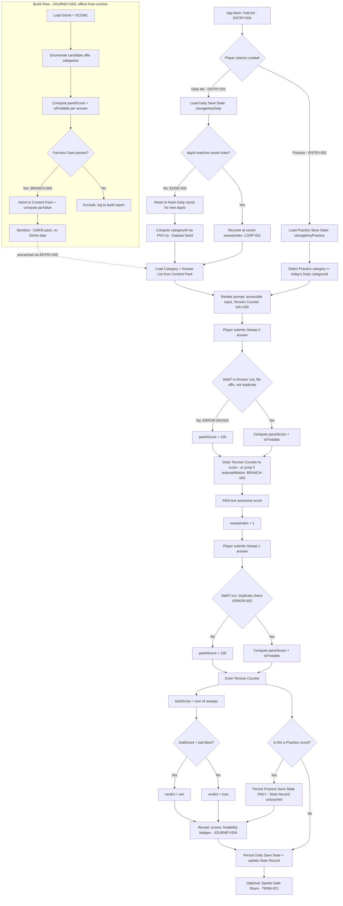

# User Journeys

## Roles

| Role | Description |
|---|---|
| Player | The single local user playing Daily and/or Practice rounds; no accounts, no PII. |
| System (Engine) | The pure, deterministic Lowball engine executing state transitions. |
| Build Tool | Offline, developer-run tool that generates the Content Pack (not present at runtime). |
| Hub Shell | The surrounding CIC Games hub app: registry, storage, reduced-motion signal, stats/streak module. |
| Anonymous/Installer | A user who has installed the PWA/Capacitor app but has not yet opened Lowball. |

## Entry Points

| Entry Point | Location | Trigger | Auth |
|---|---|---|---|
| ENTRY-001 | UI route `/games/lowball` (Daily) | Player taps Lowball tile in hub | None (local only) |
| ENTRY-002 | UI route `/games/lowball/practice` | Player taps "Practice" within Lowball view | None |
| ENTRY-003 | CLI/build script `pnpm build:content lowball` | Developer runs content build | Local filesystem only |
| ENTRY-004 | App boot event `hub:init` | PWA/Capacitor app launch | None |
| ENTRY-005 | Service worker precache event | Install/update of PWA | None |

## Role Permission Matrix

| Action | Player | System (Engine) | Build Tool | Hub Shell |
|---|---|---|---|---|
| Submit answer | Yes | Executes transition | No | No |
| Read Daily Save State | Yes (via Hub Shell) | Yes (pure read) | No | Yes |
| Write Daily Save State | No (via Hub Shell only) | No (returns new state) | No | Yes |
| Write Practice Save State | No (via Hub Shell only) | No | No | Yes |
| Write Stats Record (TERM-011) | No | No | No | Yes (Daily only, never Practice) |
| Generate Content Pack | No | No | Yes | No |
| Advance Tick Counter | No (indirectly triggers) | Yes | No | No |
| Read `prefers-reduced-motion` | No | No (receives as input) | No | Yes |

## Journeys

### JOURNEY-001: Player completes the Daily Round and wins

**Role:** Player
**Goal:** Submit two valid answers for today's category and beat par (TERM-008).
**Entry Point:** ENTRY-001
**Success:** FIELD-018 `verdict = "win"`; Stats Record (TERM-011) updated with a win, streak incremented.
**Failure:** `verdict = "loss"`, or Player abandons before both sweeps complete (state persists as `"pending"` for resumption).

**Happy Path:**
1. Player opens `/games/lowball` (ENTRY-001). Hub Shell reads Save State under FIELD-021 `storageKeyDaily`.
2. Hub Shell computes FIELD-001 `dayId` (UTC) and derives FIELD-004 `categoryId` via FNV-1a hash over Dataset Seed (TERM-019, FIELD-001–003).
3. System loads the Affix Category (TERM-003), its label (FIELD-005), affixType/affixValue (FIELD-006/007), and Answer List (TERM-009) from Content Pack (TERM-012).
4. View renders category prompt, accessible text input (WCAG 2.1 AA label), and empty Tension Counter (TERM-014) at FIELD-019 `tickCounter = 100`.
5. Player types and submits an Answer (FIELD-008) for Sweep 0 (FIELD-014 `sweepIndex = 0`).
6. System validates the answer against the Answer List (TERM-009): corpus membership, affix fit, non-duplication (FIELD-024).
7. System computes FIELD-009 `panelScore`, sets FIELD-010 `isFindable`, and begins Tension Counter drain by transitioning FIELD-019 `tickCounter` downward one discrete step per engine tick call until it equals `panelScore` (unless Reduced Motion Mode, TERM-022/FIELD-020, is active, in which case it jumps directly).
8. ARIA live region announces the submitted answer and resulting score (non-visual channel, per accessibility requirement).
9. System advances FIELD-014 `sweepIndex` to 1.
10. Player submits Sweep 1 answer; steps 6–8 repeat.
11. System computes FIELD-017 `totalScore` = sum of both sweep scores.
12. System compares `totalScore` to FIELD-013 `parValue`; sets FIELD-018 `verdict`.
13. Post-round reveal displays both answers with score, Findability (TERM-010) badge distinguishing findable-zero vs unfindable-zero, and total-vs-par comparison.
14. Hub Shell persists Save State (schema-versioned, FIELD-023) under `storageKeyDaily` and, because this is the Daily Round, updates Stats Record (TERM-011).
15. Player may invoke Spoiler-Safe Share (TERM-021) to generate FIELD-025 `shareText`.

**Branches:**
- BRANCH-001 (at step 5/10): Player requests Practice instead of continuing Daily → diverges to JOURNEY-002 without altering Daily Save State.
- BRANCH-002 (at step 13): Player taps Share → produces `shareText`; does not mutate `verdict` or Save State.
- BRANCH-003 (at step 4): Reduced Motion Mode active → Tension Counter renders final `tickCounter = panelScore` immediately, skipping drain steps in step 7.

**Error States:**
- ERROR-001: Trigger — submitted `answerWord` absent from Answer List (TERM-009). System response — sets `panelScore = 100` for that sweep, marks answer invalid, does not raise an exception. Recovery — Player is shown "not accepted" state and proceeds to the same sweep index's terminal scoring (no re-attempt within the same sweep; sweep is consumed).
- ERROR-002: Trigger — submitted `answerWord` fits corpus but not the affix pattern (FIELD-006/007). System response — same as ERROR-001 (score 100, sweep consumed). Recovery — Player sees reveal explaining pattern mismatch; proceeds to next sweep or reveal.
- ERROR-003: Trigger — submitted `answerWord` equals the player's Sweep 0 answer exactly (FIELD-024 `isDuplicateOfEarlierAnswer = true`) during Sweep 1. System response — `panelScore = 100` for Sweep 1. Recovery — Player proceeds to reveal; no retry.
- ERROR-004: Trigger — Save State under `storageKeyDaily` fails schema validation (FIELD-023 mismatch or corrupt JSON) on load (step 1). System response — Hub Shell attempts migration; if migration impossible, discards corrupt state and starts a fresh Daily Round for today's `dayId`, never crashing. Recovery — none needed; Player sees a fresh round.
- ERROR-005: Trigger — Content Pack missing/uninstalled category data for computed `categoryId` (e.g., precache failure). System response — View shows an offline-safe error state, no network call attempted. Recovery — Player retries after reinstalling/updating PWA precache (ENTRY-005).

**Loop-back Paths:**
- LOOP-001: After step 9 (Sweep 0 complete, Sweep 1 pending), if Player closes the app, Save State persists `sweepIndex = 1`, `verdict = "pending"`; reopening at ENTRY-001 resumes exactly at step 10.
- LOOP-002: From reveal (step 13), Player may navigate to Practice Mode (JOURNEY-002) and later return to Daily view, which remains in its completed/terminal state for the current `dayId` (no re-play of Daily same-day).

**Edge Cases:**
- EDGE-001: Empty/null submission (empty string) at step 5/10 → treated identically to ERROR-001 (not in Answer List), score 100; input field enforces non-empty via accessible validation message, but engine itself still defends against empty string defensively.
- EDGE-002: Player submits an answer already used as the category's own example text (none exists in spec) — N/A, no category self-reference exists; category labels are excluded from Answer List membership checks by construction (TERM-003 vs TERM-009 are distinct sets).
- EDGE-003: `totalScore` exceeds 100 (e.g., 60 + 60 = 120) → NOT an instant loss; verdict still computed purely by `totalScore < parValue` (TERM-007, TERM-008).
- EDGE-004: Concurrency — Player opens Lowball in two browser tabs/webviews simultaneously and submits in both → Hub Shell persistence is last-write-wins at the storage layer; engine itself has no concurrency concept (pure functions only); this is documented as a known limitation, not engine-resolved.
- EDGE-005: State conflict — Save State indicates `dayId` from a previous UTC day (Player did not open app across a day boundary mid-round) → on load (step 1), System detects `dayId` mismatch and archives/resets to a fresh round for the new `dayId`; the stale pending round is not resumed and does not retroactively update Stats Record.
- EDGE-006: Permissions — none apply (no auth, no accounts); N/A by design.
- EDGE-007: Network — none apply at runtime (fully offline); any attempted network call is a defect, not a handled path.
- EDGE-008: Data corruption — GloVe/SCOWL-derived fields (FIELD-011, FIELD-012) are build-time only and never appear in runtime Save State; runtime corruption can only affect FIELD-008/009/014/015/016/017/018/019/023, all covered by ERROR-004's schema-repair-or-discard rule.

### JOURNEY-002: Player plays a Practice Round without affecting Daily stats

**Role:** Player
**Goal:** Play an additional round using a different Affix Category (TERM-003) from the same Content Pack, without mutating Stats Record (TERM-011) or Daily Save State.
**Entry Point:** ENTRY-002
**Success:** Practice round reaches a `verdict`, persisted only under `storageKeyPractice` (FIELD-022); Daily Save State and Stats Record remain byte-for-byte unchanged.
**Failure:** Any code path that writes to `storageKeyDaily` or Stats Record during a Practice Round is a critical defect (see ERROR-006).

**Happy Path:**
1. Player taps "Practice" (ENTRY-002). Hub Shell reads Save State under `storageKeyPractice` (FIELD-022), entirely separate from `storageKeyDaily`.
2. System selects a Practice category deterministically distinct from today's Daily `categoryId` (implementation detail: e.g., a rotating or randomizable-but-still-deterministic-per-request index over Content Pack categories, excluding today's Daily categoryId).
3. View renders category prompt, input, and Tension Counter identically to JOURNEY-001 steps 4–13, operating entirely on Practice Save State.
4. Player completes two sweeps (mirrors JOURNEY-001 steps 5–12).
5. System computes `verdict` for the Practice round.
6. Hub Shell persists result under `storageKeyPractice` only. Stats Record (TERM-011) is NOT touched. Daily Save State (`storageKeyDaily`) is NOT touched.
7. Player may play another Practice round (loop) or return to Daily (ENTRY-001).

**Branches:**
- BRANCH-004 (step 2): Content Pack has only one category (degenerate/misconfigured pack) → System falls back to reusing today's Daily category for Practice, clearly labelled "Practice" in UI to avoid confusion, still writing only to `storageKeyPractice`.

**Error States:**
- ERROR-006: Trigger — a code path attempts to write Practice results to `storageKeyDaily` or Stats Record. System response — this is treated as an invariant violation caught by unit/integration tests (see REQ layer); at runtime, storage write functions are namespaced per key and structurally cannot cross-write. Recovery — N/A at runtime (prevented by design); surfaced only as a build-time/test failure.
- ERROR-007: Trigger — `storageKeyPractice` Save State corrupt (FIELD-023 mismatch). System response — same repair-or-discard rule as ERROR-004, scoped only to Practice state. Recovery — Player sees a fresh Practice round; Daily state is provably untouched.

**Loop-back Paths:**
- LOOP-003: After step 7, Player starts another Practice round repeatedly; each iteration re-runs steps 1–6 under the same `storageKeyPractice`, potentially overwriting prior Practice state (Practice retains only latest round per v1 scope, unless product later specifies Practice history — OPEN QUESTION, see Requirements).

**Edge Cases:**
- EDGE-009: Player switches from Practice to Daily mid-sweep (BRANCH at JOURNEY-001 BRANCH-001) → each mode's `sweepIndex`/`activePlayerIndex` state is tracked independently per storage key; no shared in-memory engine instance carries state across the switch.
- EDGE-010: Practice category coincidentally equals a category used in a past Daily round (different day) → permitted; only same-day collision with today's Daily category is excluded (step 2).
- EDGE-011: Boundary — Practice round started just before UTC day rollover, completed just after → unaffected, since Practice never reads/writes `dayId`-keyed Daily state.

### JOURNEY-003: Build Tool generates and gates the Content Pack

**Role:** Build Tool
**Goal:** Enumerate candidate Affix Categories, compute Panel Scores from vendored GloVe + SCOWL sources, apply the Fairness Gate (TERM-013), and emit a Content Pack (TERM-012) of ≥120 categories.
**Entry Point:** ENTRY-003
**Success:** Content Pack emitted with all categories passing Fairness Gate; pack size ≈150 KB; no GloVe data present in output.
**Failure:** Fewer than the required puzzle count pass the gate, or a category incorrectly admitted violates a gate rule (caught by content unit tests, not at runtime).

**Happy Path:**
1. Developer runs ENTRY-003. Build Tool loads vendored GloVe 6B 50d file (gitignored, build-time only) and SCOWL corpus (wordkit, 111,676 en-GB words, FIELD-011 tiers).
2. Build Tool enumerates candidate suffixes (length 2–4) and prefixes (length 3–4) across the corpus as candidate Affix Categories (FIELD-006/007).
3. For each candidate category, Build Tool computes the full Answer List (TERM-009): for every corpus word matching the affix, compute FIELD-012 `gloveRank`, FIELD-011 `scowlTier`, then FIELD-009 `panelScore` via the formula (score 0 if out-of-GloVe-vocabulary OR tier > 50; else `100 * ((5.2 - log10(rank)) / 2.2)^2.2` clamped to [0,100]), and FIELD-010 `isFindable` (`true` iff tier ≤ 50 and score = 0... [findability specifically flags zero-scorers that are tier ≤50; non-zero scorers' findability is not gate-relevant]).
4. Build Tool applies Fairness Gate (TERM-013): 10–36 valid answers; top score ≥45; ≥6 findable answers at tier ≤50; ≥1 findable zero-scorer; ≥5 non-zero answers spanning ≥4 distinct score values; and `parValue` greater than 0 (added by ADR-007 / REQ-042 — six criteria in total, evaluated after par computation in step 5).
5. Build Tool computes FIELD-013 `parValue` as the median score of the plausibly-retrievable (findable) answer subset.
6. Build Tool admits passing categories to the Content Pack, assigning FIELD-004 `categoryId` and FIELD-005 `categoryLabel`.
7. Build Tool serializes the Content Pack (target ~150 KB), excluding all GloVe raw data and any intermediate corpus artifacts.
8. Build Tool writes pack + FIELD-002 `contentPackVersion` to the repo's content directory for precaching (ENTRY-005).

**Branches:**
- BRANCH-005 (step 4): Category fails gate → excluded from pack; logged to build report; not an error, expected filtering behavior.
- BRANCH-006 (step 4): Fewer than target puzzle count (~120) pass gate → Build Tool emits a warning but still succeeds if ≥1 category passes; CI-level threshold enforcement is a separate concern (see NFR).

**Error States:**
- ERROR-008: Trigger — GloVe file missing/unreadable at build time. System response — Build Tool fails fast with a clear message; does not silently substitute empty ranks. Recovery — Developer restores vendored file per repo setup docs.
- ERROR-009: Trigger — SCOWL corpus missing/malformed. System response — Build Tool fails fast, halts pack generation. Recovery — Developer restores wordkit corpus.
- ERROR-010: Trigger — Formula produces NaN/Infinity (e.g., rank ≤ 0 edge case in log10). System response — Build Tool treats as score 0 (out-of-vocabulary-equivalent) and logs the anomaly; does not crash the full build. Recovery — Developer inspects build report for anomalous entries.

**Loop-back Paths:**
- LOOP-004: Build Tool re-run with a bumped `contentPackVersion` (FIELD-002) after corpus/formula changes → historical Daily rounds keyed to old `dayId`s remain stable only if version is frozen for those days' hashing input (TERM-019); re-running with a new version changes future day selections only, per spec's determinism guarantee.

**Edge Cases:**
- EDGE-012: Candidate category with exactly 10 or exactly 36 valid answers → boundary-inclusive per gate ("between 10 and 36"); admitted if inclusive bounds are met.
- EDGE-013: Candidate category's top score exactly 45 → boundary-inclusive ("at least 45"); admitted.
- EDGE-014: A word appears in GloVe vocabulary but with `gloveRank` such that computed raw score before clamping is negative or >100 → clamped to [0,100] per formula spec.
- EDGE-015: A word satisfies SCOWL tier ≤50 but is absent from GloVe vocabulary → out-of-vocabulary rule dominates; score = 0; `isFindable` may still be `true` (tier condition satisfied) making it a candidate for the "findable zero-scorer" gate requirement.

### JOURNEY-004: Player views score reveal with findability distinction and shares result

**Role:** Player
**Goal:** After both sweeps, understand which zero-scoring answers (own or category-level context) were genuinely findable versus not, and share a spoiler-safe result.
**Entry Point:** Continuation of ENTRY-001 or ENTRY-002 (post-sweep-2)
**Success:** Reveal UI visually and textually distinguishes Findability (TERM-010); `shareText` (FIELD-025) generated containing no Answer word.
**Failure:** Reveal fails to distinguish findable/unfindable zero-scorers (accessibility/fairness defect); share text leaks an answer word (critical defect).

**Happy Path:**
1. Following JOURNEY-001 step 12 or JOURNEY-002 step 5, System renders reveal view with both submitted answers, their `panelScore`, and `isFindable` badges.
2. For any zero-scoring answer, UI applies distinct visual treatment (e.g., icon/label) for `isFindable = true` ("findable") vs `false` ("unfindable"), per FIELD-010, satisfying the fairness concern (TERM-010).
3. UI displays `totalScore` vs `parValue` and the resulting `verdict`, using both the Tension Counter's final bar state AND a textual/numeric readout (non-bar channel), per accessibility requirement that the bar is not the sole channel.
4. Player taps "Share". Spoiler-Safe Share module (TERM-021) generates `shareText` from `totalScore`, `parValue`, and `verdict` only.
5. System validates (at minimum via unit test, not runtime UI logic) that `shareText` contains no substring equal to either submitted `answerWord`.
6. Player copies/shares `shareText` via platform share sheet (Capacitor) or clipboard (web).

**Branches:**
- BRANCH-007 (step 2): Both answers non-zero-scoring → no findability badge shown; reveal shows scores only.
- BRANCH-008 (step 4): Practice round → Share still available but should be clearly labelled "Practice" in the shared text or explicitly suppressed from implying Daily streak progress — OPEN QUESTION for Requirements to resolve.

**Error States:**
- ERROR-011: Trigger — `shareText` generation somehow includes an answer word (defect). System response — this must be structurally prevented (share module never receives answer words as input, only scores/par/verdict) rather than filtered after the fact. Recovery — N/A at runtime; caught by unit tests (TEST references in Requirements).

**Loop-back Paths:**
- LOOP-005: Player returns from share sheet to reveal view; state unchanged (share is a pure read/export operation).

**Edge Cases:**
- EDGE-016: `parValue` is 0 (extreme category) → `verdict = "win"` only if `totalScore < 0`, which is impossible given score floor 0; effectively unwinnable category — flagged as OPEN QUESTION for Fairness Gate (should gate also enforce `parValue > 0`?).
- EDGE-017: Reduced Motion Mode active throughout → reveal still shows full findability and score information immediately; no information is exclusively conveyed via drain animation.

## Journey Map

