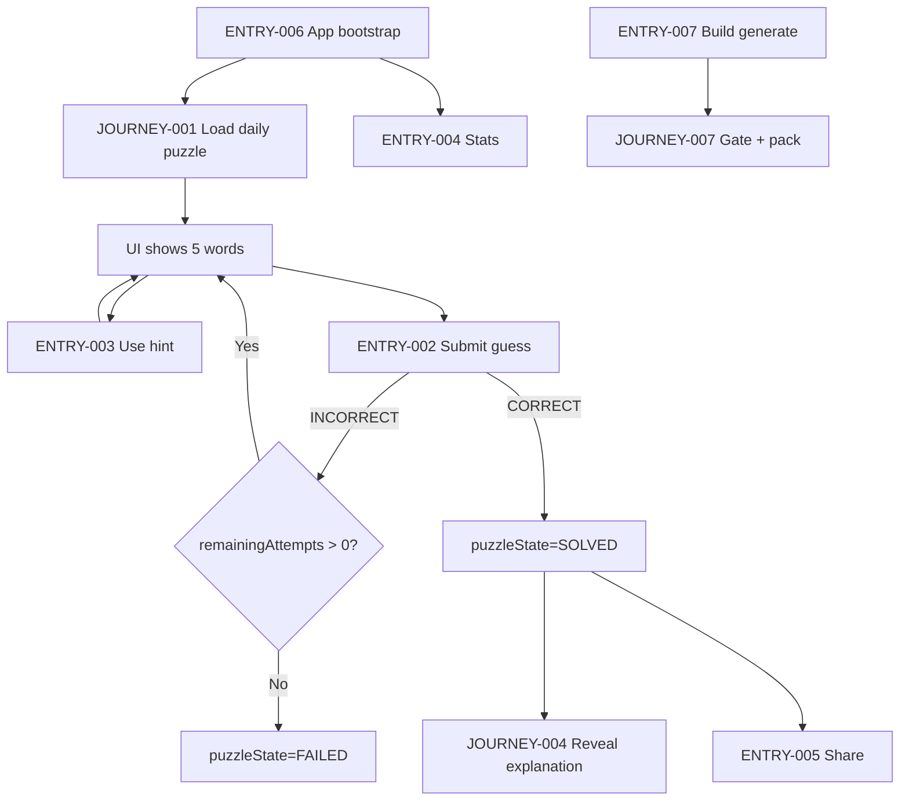
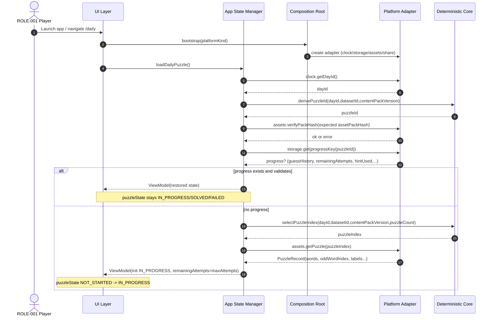
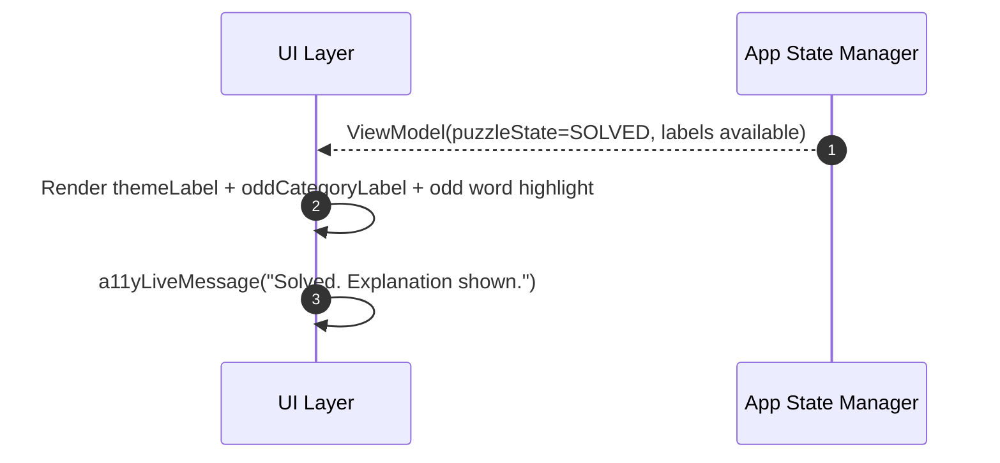
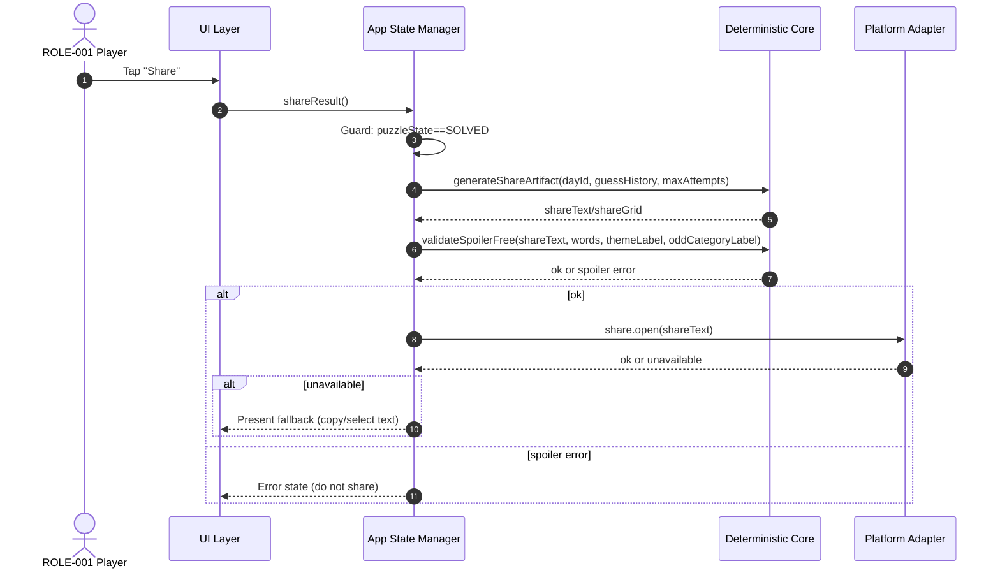
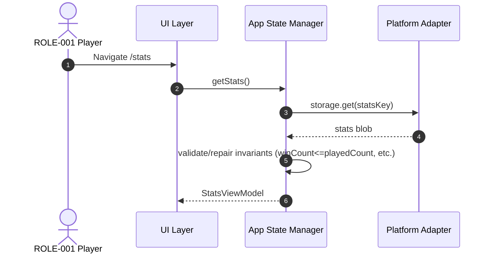
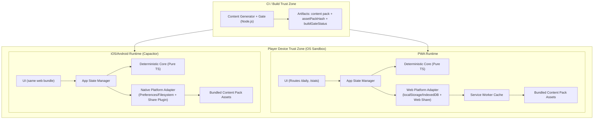

<!-- generated: 2026-07-24T07:14:43Z -->
<!-- mode: initial -->
<!-- feature-slug: odd-sense -->
<!-- a2a-endpoint: https://bob-sdlc-orchestrator.2as6l7wq9qj8.eu-gb.codeengine.appdomain.cloud/v1/rpc -->

# Glossary

## Terms

### TERM-001: Puzzle
- **Definition:** A daily playable instance containing exactly five (5) words, one correct **Odd Word** and four **Themed Words**, plus configuration such as max attempts and hint availability.
- **Synonyms:** Daily puzzle, daily set
- **Anti-definition:** Not a user-created level; not a randomized per-user session.
- **Source:** User request

### TERM-002: Day ID
- **Definition:** A canonical identifier for a calendar day used to deterministically select the daily **Puzzle**.
- **Synonyms:** dayId, puzzle date key
- **Anti-definition:** Not the device locale date string; not a server timestamp.
- **Source:** User request

### TERM-003: Word
- **Definition:** A single playable token displayed to the player as text and used as a selectable option in a **Puzzle**.
- **Synonyms:** entry, option
- **Anti-definition:** Not a definition sentence; not a theme label.
- **Source:** User request

### TERM-004: Word Set
- **Definition:** The ordered collection of exactly five (5) **Words** presented for a **Puzzle**.
- **Synonyms:** set, list of words
- **Anti-definition:** Not the whole lexicon/dataset.
- **Source:** User request

### TERM-005: Theme (Dominant Category)
- **Definition:** The single hidden category/sense shared by exactly four (4) words in the **Word Set**.
- **Synonyms:** shared category, dominant sense
- **Anti-definition:** Not the odd word’s category; not a UI hint (until reveal).
- **Source:** User request

### TERM-006: Odd Word
- **Definition:** The single word in the **Word Set** that does not belong to the **Theme** shared by the other four.
- **Synonyms:** odd one out, outlier
- **Anti-definition:** Not “hardest word”; not randomly chosen by player.
- **Source:** User request

### TERM-007: Odd Category (Odd Word True Category)
- **Definition:** The hidden category/sense that the **Odd Word** belongs to, revealed after solving.
- **Synonyms:** odd sense, true sense
- **Anti-definition:** Not necessarily unique in the full lexicon; only distinct from the **Theme** for this puzzle.
- **Source:** User request

### TERM-008: Sense-Tagged Lexicon
- **Definition:** Bundled build-time dataset mapping **Words** to one or more **Categories/Senses**, used to generate puzzles.
- **Synonyms:** dataset, lexicon
- **Anti-definition:** Not fetched at runtime; not user-editable.
- **Source:** User request

### TERM-009: Category/Sense
- **Definition:** A label representing a meaning grouping for words (e.g., “baseball terms”).
- **Synonyms:** sense, category
- **Anti-definition:** Not a part-of-speech tag; not a UI color group.
- **Source:** User request

### TERM-010: Build-Time Content Pack
- **Definition:** A versioned, bundled set of generated daily puzzles and supporting data shipped with the app build.
- **Synonyms:** content pack, puzzle pack
- **Anti-definition:** Not remote live-ops content.
- **Source:** User request

### TERM-011: Uniqueness & Fairness Gate
- **Definition:** A build-time validation process that rejects any generated puzzle where more than one word could be the odd one out or the four themed words do not unambiguously share exactly one category.
- **Synonyms:** validator, gate, build-time checks
- **Anti-definition:** Not a runtime anti-cheat system.
- **Source:** User request

### TERM-012: Deterministic Selection Function
- **Definition:** A pure function that chooses the daily puzzle using only stable inputs (e.g., **Day ID**, dataset id, content-pack version) and a seedable hash.
- **Synonyms:** selector, daily picker
- **Anti-definition:** Not dependent on device clock directly (clock is adapter-provided); not dependent on network.
- **Source:** User request

### TERM-013: Seedable Hash
- **Definition:** A deterministic hash function producing a stable numeric seed from specific inputs to drive puzzle selection identically across platforms.
- **Synonyms:** seeded hash, deterministic hash
- **Anti-definition:** Not cryptographic security; not a random generator requiring entropy.
- **Source:** User request

### TERM-014: Attempt
- **Definition:** One submitted guess selecting a single **Word** as the **Odd Word**, consuming 0 or 1 remaining attempts.
- **Synonyms:** guess, try
- **Anti-definition:** Not a hover/selection before submission.
- **Source:** User request

### TERM-015: Max Attempts
- **Definition:** The configured upper limit of incorrect submitted guesses permitted for a daily puzzle.
- **Synonyms:** attempt limit
- **Anti-definition:** Not time-based; not dependent on difficulty setting unless explicitly configured.
- **Source:** User request

### TERM-016: Feedback
- **Definition:** Post-guess information shown to the player indicating correctness and progress, without revealing the answer prior to solve.
- **Synonyms:** result indicator
- **Anti-definition:** Not the theme label reveal (until solved); not word definitions.
- **Source:** User request

### TERM-017: Hint
- **Definition:** A player-invoked action that eliminates exactly one of the four themed (non-odd) words from consideration for the current puzzle.
- **Synonyms:** eliminate, remove one
- **Anti-definition:** Not revealing the odd word; not eliminating multiple words in one use.
- **Source:** User request

### TERM-018: Elimination
- **Definition:** A state where a specific themed word is marked as removed/disabled for selection due to a **Hint**.
- **Synonyms:** crossed out, disabled option
- **Anti-definition:** Not deleting from dataset; not hiding the odd word.
- **Source:** User request

### TERM-019: Solve
- **Definition:** The state transition where the player correctly identifies the **Odd Word**, ending active play for that day and triggering reveal of explanations.
- **Synonyms:** win, completed
- **Anti-definition:** Not merely exhausting attempts (loss condition is distinct unless specified).
- **Source:** User request

### TERM-020: Explanation Reveal
- **Definition:** Post-solve display of the **Theme** label and the **Odd Category** label to provide the “aha” moment.
- **Synonyms:** reveal, solution explanation
- **Anti-definition:** Not shown during active play.
- **Source:** User request

### TERM-021: Spoiler-Safe Share Artifact
- **Definition:** A shareable text/emoji block representation of guess outcomes per attempt that omits words and theme/category labels.
- **Synonyms:** emoji share, share card text
- **Anti-definition:** Not a screenshot requirement; not containing the answer.
- **Source:** User request

### TERM-022: Local Stats
- **Definition:** On-device persisted metrics such as played count, win count, current streak, best streak, and per-day outcomes.
- **Synonyms:** statistics, records
- **Anti-definition:** Not synced across devices; not tied to an account.
- **Source:** User request

### TERM-023: Streak
- **Definition:** A count of consecutive days (by **Day ID**) with a solved puzzle.
- **Synonyms:** win streak
- **Anti-definition:** Not “consecutive app opens”; not time-zone ambiguous if dayId is canonical.
- **Source:** User request

### TERM-024: Offline-First Client-Side App
- **Definition:** An application that runs without network at play time and persists required data locally, shipped as PWA and native shells.
- **Synonyms:** offline-first
- **Anti-definition:** Not requiring server APIs for puzzle logic.
- **Source:** User request

### TERM-025: Platform Adapter
- **Definition:** Thin layer providing side-effecting services (storage, clock, share, asset loading) to the deterministic core.
- **Synonyms:** adapter, ports
- **Anti-definition:** Not containing puzzle validation/selection logic.
- **Source:** User request

### TERM-026: Deterministic Functional Core
- **Definition:** Pure functions implementing selection, validation, guess checking, hint elimination, and share generation without storage/clock/network access.
- **Synonyms:** core logic
- **Anti-definition:** Not using localStorage/Preferences directly.
- **Source:** User request

### TERM-027: Composition Root
- **Definition:** Platform-specific bootstrap wiring that selects the correct **Platform Adapter** and initializes the app.
- **Synonyms:** app entry, bootstrap
- **Anti-definition:** Not containing business rules beyond wiring.
- **Source:** User request

### TERM-028: Accessibility Support
- **Definition:** Capability for keyboard-only operation, screen-reader announcements, and non-color-only feedback for key states in the puzzle UI.
- **Synonyms:** a11y
- **Anti-definition:** Not limited to color contrast only; not optional UI polish.
- **Source:** User request

## Data Dictionary

| ID | Name | Type | Format | Range/Enum | Units | Default | Nullable | PII | Source | Validation |
|---|---|---|---|---|---|---|---|---|---|---|
| FIELD-001 | dayId | string | `YYYY-MM-DD` | valid calendar date | n/a | none | No | None | Platform Adapter (clock) | Must match regex `^\d{4}-\d{2}-\d{2}$` and be a real date |
| FIELD-002 | datasetId | string | slug | `[a-z0-9\-_.]+` | n/a | build-time constant | No | None | Build config | Non-empty; stable across builds for same dataset |
| FIELD-003 | contentPackVersion | string | semver | `MAJOR.MINOR.PATCH` | n/a | build-time constant | No | None | Build config | Must match `^\d+\.\d+\.\d+$` |
| FIELD-004 | puzzleId | string | `datasetId:contentPackVersion:dayId` | n/a | n/a | derived | No | None | Deterministic core | Must be deterministic concatenation of FIELD-002/003/001 |
| FIELD-005 | puzzleIndex | integer | int32 | `0..(FIELD-033-1)` | index | derived | No | None | Deterministic core | Must be within bounds of available puzzle count |
| FIELD-006 | wordSetId | string | opaque id | n/a | n/a | build-time | No | None | Content pack | Must be unique within a content pack |
| FIELD-007 | words | string[] | array length 5 | exactly 5 items | n/a | none | No | None | Content pack | All items non-empty; must be unique within the set |
| FIELD-008 | wordId | string | opaque id | n/a | n/a | build-time | No | None | Sense-tagged lexicon | Must map to exactly one displayed FIELD-031 in the set context |
| FIELD-009 | displayedWord | string | Unicode text | 1..64 chars | n/a | none | No | None | Content pack | Trimmed; must not contain newline |
| FIELD-010 | themeCategoryId | string | opaque id | n/a | n/a | none | No | None | Content pack (generated) | Must be the unique shared category for 4 themed words |
| FIELD-011 | themeLabel | string | Unicode text | 1..80 chars | n/a | none | No | None | Content pack (generated) | Non-empty; no newline |
| FIELD-012 | oddWordIndex | integer | int | 0..4 | index | none | No | None | Content pack (generated) | Must point to word not in dominant category |
| FIELD-013 | oddCategoryId | string | opaque id | n/a | n/a | none | No | None | Content pack (generated) | Must differ from FIELD-010 in puzzle context |
| FIELD-014 | oddCategoryLabel | string | Unicode text | 1..80 chars | n/a | none | No | None | Content pack (generated) | Non-empty; no newline |
| FIELD-015 | maxAttempts | integer | int | 1..10 | attempts | 4 | No | None | App config | Must be >= 1 |
| FIELD-016 | attemptNumber | integer | int | 1..FIELD-015 | attempts | n/a | No | None | Deterministic core | Must increment by 1 per submitted guess |
| FIELD-017 | selectedWordIndex | integer | int | 0..4 | index | n/a | No | None | UI state | Must not reference an eliminated word (FIELD-023) |
| FIELD-018 | guessResult | string | enum | `CORRECT` \| `INCORRECT` | n/a | n/a | No | None | Deterministic core | Must be derivable from selectedWordIndex vs oddWordIndex |
| FIELD-019 | remainingAttempts | integer | int | 0..FIELD-015 | attempts | FIELD-015 | No | None | App state | Must decrement by 1 on incorrect submission only |
| FIELD-020 | puzzleState | string | enum | `NOT_STARTED` \| `IN_PROGRESS` \| `SOLVED` \| `FAILED` | n/a | `NOT_STARTED` | No | None | App state | Transition rules enforced by core |
| FIELD-021 | guessHistory | object[] | array | length 0..FIELD-015 | n/a | `[]` | No | None | Local storage | Each entry must include FIELD-016/017/018 |
| FIELD-022 | hintUsed | boolean | bool | true/false | n/a | false | No | None | Local storage | If true then FIELD-023 must be non-null |
| FIELD-023 | eliminatedWordIndex | integer | int | 0..4 | index | null | Yes | None | Deterministic core | Must not equal oddWordIndex; must refer to a themed word |
| FIELD-024 | shareText | string | text | 1..2000 chars | n/a | none | No | None | Deterministic core | Must not contain any item from FIELD-007 or FIELD-011/014 |
| FIELD-025 | shareGrid | string | text | n/a | n/a | none | No | None | Deterministic core | Must be derivable from guessHistory and maxAttempts |
| FIELD-026 | playedCount | integer | int | >=0 | days | 0 | No | None | Local stats | Monotonic non-decreasing |
| FIELD-027 | winCount | integer | int | >=0 | days | 0 | No | None | Local stats | Must be <= playedCount |
| FIELD-028 | currentStreak | integer | int | >=0 | days | 0 | No | None | Local stats | Recomputed from per-day outcomes and dayId adjacency |
| FIELD-029 | bestStreak | integer | int | >=0 | days | 0 | No | None | Local stats | Must be >= currentStreak over time |
| FIELD-030 | lastSolvedDayId | string | `YYYY-MM-DD` | valid date | n/a | null | Yes | None | Local stats | If set, must be <= current dayId |
| FIELD-031 | wordSetOrder | integer[] | array length 5 | permutation of 0..4 | n/a | `[0,1,2,3,4]` | No | None | Content pack | Must be a permutation without duplicates |
| FIELD-032 | buildGateStatus | string | enum | `PASS` \| `FAIL` | n/a | n/a | No | None | Build pipeline | Must be PASS for release artifacts |
| FIELD-033 | puzzleCount | integer | int | >=1 | puzzles | n/a | No | None | Content pack | Must equal number of generated day entries |
| FIELD-034 | storageNamespace | string | slug | `[A-Za-z0-9_.-]+` | n/a | `odd-sense` | No | None | Platform Adapter | Non-empty; used to isolate keys |
| FIELD-035 | platformKind | string | enum | `PWA` \| `IOS` \| `ANDROID` | n/a | n/a | No | None | Composition root | Must be one of enum values |
| FIELD-036 | a11yLiveMessage | string | text | 0..500 chars | n/a | `""` | No | None | UI state | Must be set on key events (guess result, solve) |
| FIELD-037 | assetPackHash | string | hex | `[0-9a-f]{32,64}` | n/a | build-time | No | None | Build pipeline | Must match hash of content pack bytes |

# User Journeys

## Roles

| Role ID | Role | Type | Description |
|---|---|---|---|
| ROLE-001 | Player | Primary | Plays the daily **Puzzle** (TERM-001), uses **Hint** (TERM-017), views stats, shares results. |
| ROLE-002 | Build Engineer | Secondary | Runs build pipeline producing **Build-Time Content Pack** (TERM-010) and enforcing **Uniqueness & Fairness Gate** (TERM-011). |
| ROLE-003 | System (Deterministic Core) | System | Executes pure logic: selection, validation, guess checking, hint elimination, share generation (TERM-026). |
| ROLE-004 | System (Platform Adapter) | System | Provides clock (FIELD-001), storage (FIELD-034), share integration, asset loading (TERM-025). |

## Entry Points

| Entry ID | Location | Trigger | Auth |
|---|---|---|---|
| ENTRY-001 | UI Route: `/daily` | App open / navigate to daily puzzle | None |
| ENTRY-002 | UI Control: “Submit guess” | Player submits selected word (FIELD-017) | None |
| ENTRY-003 | UI Control: “Use hint” | Player requests a hint (TERM-017) | None |
| ENTRY-004 | UI Route: `/stats` | Player opens stats screen | None |
| ENTRY-005 | UI Control: “Share” | Player shares after solve | None |
| ENTRY-006 | App bootstrap (composition root) | App launch on platformKind (FIELD-035) | None |
| ENTRY-007 | Build pipeline task: `generate-content-pack` | CI/build invocation | n/a |

## Role Permission Matrix

| Capability | ROLE-001 Player | ROLE-002 Build Engineer | ROLE-003 Core | ROLE-004 Adapter |
|---|---:|---:|---:|---:|
| View daily puzzle words (FIELD-007) | Y | N | Y | Y (loads assets) |
| Submit guess (FIELD-017) | Y | N | Y | N |
| Use hint (FIELD-022/023) | Y | N | Y | N |
| Reveal explanation (FIELD-011/014) | Y (post-solve) | N | Y | N |
| Read/write local stats (FIELD-026..030) | Y | N | N | Y |
| Generate share artifact (FIELD-024/025) | Y | N | Y | Y (share sheet) |
| Generate content pack | N | Y | N | N |
| Enforce fairness gate (FIELD-032) | N | Y | N | N |

## Journeys

### JOURNEY-001: Open app and load today’s deterministic puzzle
- **Role/Goal:** ROLE-001 Player; see today’s **Puzzle** (TERM-001) identical across devices.
- **Entry:** ENTRY-001, ENTRY-006
- **Happy path:**
  1. App launches via composition root selecting **Platform Adapter** (TERM-025) by platformKind (FIELD-035). (Uses FIELD-035)
  2. Adapter provides current dayId (FIELD-001) to deterministic core without exposing device clock to core. (Uses FIELD-001)
  3. Core computes puzzleId (FIELD-004) and selects puzzleIndex (FIELD-005) using **Seedable Hash** (TERM-013) over dayId (FIELD-001), datasetId (FIELD-002), contentPackVersion (FIELD-003). (Uses FIELD-001/002/003/004/005)
  4. Adapter loads the selected content-pack puzzle (TERM-010) containing words (FIELD-007), oddWordIndex (FIELD-012), theme label (FIELD-011), odd category label (FIELD-014), and wordSetId (FIELD-006). (Uses FIELD-006/007/011/012/014)
  5. UI renders five selectable words (FIELD-007) and initializes puzzleState (FIELD-020) to `IN_PROGRESS`. (Uses FIELD-007/020)
- **BRANCH-001 (Returning player):** If local storage contains existing puzzle progress for puzzleId (FIELD-004), load guessHistory (FIELD-021), remainingAttempts (FIELD-019), hintUsed (FIELD-022), eliminatedWordIndex (FIELD-023), and puzzleState (FIELD-020) instead of starting fresh.
- **ERROR-001 (Missing/invalid content pack):**
  - **Trigger:** Adapter cannot load puzzle asset or assetPackHash (FIELD-037) validation fails.
  - **System response:** Show blocking error state and prevent play for that day.
  - **Recovery:** Player reinstalls/updates app; retry load.
- **EDGE-001 (Day boundary):** If dayId (FIELD-001) changes while app is open, show a “new puzzle available” prompt and allow reload to recompute selection.
- **EDGE-002 (Determinism):** Same inputs (FIELD-001/002/003) must yield same puzzleIndex (FIELD-005) across platformKind (FIELD-035).

### JOURNEY-002: Make guesses until solved or attempts exhausted
- **Role/Goal:** ROLE-001 Player; identify **Odd Word** (TERM-006) within maxAttempts (FIELD-015).
- **Entry:** ENTRY-002
- **Happy path:**
  1. Player selects a word (selectedWordIndex, FIELD-017) from displayed words (FIELD-007).
  2. Player submits guess; core evaluates guessResult (FIELD-018) by comparing FIELD-017 to oddWordIndex (FIELD-012).
  3. Core appends an entry to guessHistory (FIELD-021) with attemptNumber (FIELD-016), selectedWordIndex (FIELD-017), and guessResult (FIELD-018).
  4. If guessResult is `INCORRECT`, app decrements remainingAttempts (FIELD-019) by 1.
  5. UI displays feedback (TERM-016) and updates a11yLiveMessage (FIELD-036) announcing correctness and attempts remaining (FIELD-019).
  6. If guessResult is `CORRECT`, puzzleState (FIELD-020) becomes `SOLVED` and **Explanation Reveal** (TERM-020) becomes available.
- **BRANCH-002 (Solved):** On `CORRECT`, transition puzzleState (FIELD-020) to `SOLVED`.
- **BRANCH-003 (Failed):** If remainingAttempts (FIELD-019) reaches 0 after an incorrect guess, transition puzzleState (FIELD-020) to `FAILED` (if failure state is supported) and end active play.
- **ERROR-002 (Submit without selection):**
  - **Trigger:** Submit invoked while selectedWordIndex (FIELD-017) is unset.
  - **System response:** No state change; set a11yLiveMessage (FIELD-036) prompting selection.
  - **Recovery:** Player selects a word then submits.
- **ERROR-003 (Select eliminated word):**
  - **Trigger:** Player attempts to select eliminatedWordIndex (FIELD-023).
  - **System response:** Prevent selection and announce via FIELD-036.
  - **Recovery:** Player selects a non-eliminated index.
- **LOOP-001 (Repeat guessing):** After each incorrect guess with remainingAttempts > 0, return to step 1.
- **EDGE-003 (Double-submit concurrency):** Rapid repeated submit must not create two guessHistory entries for the same attemptNumber (FIELD-016).
- **EDGE-004 (State conflict):** Submissions while puzzleState (FIELD-020) is `SOLVED` or `FAILED` must not modify guessHistory (FIELD-021).

### JOURNEY-003: Use a hint to eliminate one themed word
- **Role/Goal:** ROLE-001 Player; narrow choices by eliminating one non-odd themed word (TERM-017).
- **Entry:** ENTRY-003
- **Happy path:**
  1. Player invokes hint; core verifies puzzleState (FIELD-020) is `IN_PROGRESS` and hintUsed (FIELD-022) is false.
  2. Core deterministically selects eliminatedWordIndex (FIELD-023) such that it is not oddWordIndex (FIELD-012) and corresponds to a themed word under themeCategoryId (FIELD-010).
  3. App persists hintUsed (FIELD-022)=true and eliminatedWordIndex (FIELD-023).
  4. UI disables the eliminated word option; updates a11yLiveMessage (FIELD-036) describing which option was eliminated without implying the answer.
- **BRANCH-004 (Hint already used):** If hintUsed (FIELD-022)=true, do not change state; announce via FIELD-036.
- **ERROR-004 (Hint in invalid state):**
  - **Trigger:** Hint invoked when puzzleState (FIELD-020) is `SOLVED` or `FAILED`.
  - **System response:** No-op; announce via FIELD-036.
  - **Recovery:** None (hint not applicable).
- **EDGE-005 (Deterministic elimination):** Given same puzzleId (FIELD-004), eliminatedWordIndex (FIELD-023) must be identical across platforms.

### JOURNEY-004: Reveal explanation after solve
- **Role/Goal:** ROLE-001 Player; see the “aha” explanation (TERM-020).
- **Entry:** ENTRY-001 (post-solve view) / implicit after JOURNEY-002 BRANCH-002
- **Happy path:**
  1. When puzzleState (FIELD-020) becomes `SOLVED`, UI reveals themeLabel (FIELD-011) and oddCategoryLabel (FIELD-014).
  2. UI displays the odd word (FIELD-007 at oddWordIndex FIELD-012) and indicates it belongs to oddCategoryLabel (FIELD-014).
  3. UI updates a11yLiveMessage (FIELD-036) announcing solved state and that explanation is shown.
- **ERROR-005 (Attempted reveal before solve):**
  - **Trigger:** UI tries to show FIELD-011/014 while puzzleState is `IN_PROGRESS`.
  - **System response:** Keep labels hidden; announce restricted content via FIELD-036 only if user explicitly requests.
  - **Recovery:** Solve puzzle.

### JOURNEY-005: Share spoiler-safe result after solve
- **Role/Goal:** ROLE-001 Player; share results without spoilers.
- **Entry:** ENTRY-005
- **Happy path:**
  1. Player taps Share; core generates shareGrid (FIELD-025) and shareText (FIELD-024) from guessHistory (FIELD-021), maxAttempts (FIELD-015), and dayId (FIELD-001).
  2. Core validates shareText (FIELD-024) contains no words from FIELD-007 and no labels FIELD-011/014.
  3. Adapter opens platform share sheet with shareText (FIELD-024).
- **BRANCH-005 (Share blocked pre-solve):** If puzzleState (FIELD-020) is not `SOLVED`, disable Share control.
- **ERROR-006 (Share integration unavailable):**
  - **Trigger:** Adapter cannot open share sheet on platform.
  - **System response:** Copy shareText (FIELD-024) to clipboard (if available) or present selectable text.
  - **Recovery:** User manually copies.
- **EDGE-006 (Localization):** shareGrid (FIELD-025) must remain spoiler-safe regardless of UI locale; do not include translated theme labels.

### JOURNEY-006: View stats and streaks (local-only)
- **Role/Goal:** ROLE-001 Player; see local stats (TERM-022) and streak (TERM-023).
- **Entry:** ENTRY-004
- **Happy path:**
  1. UI reads local stats: playedCount (FIELD-026), winCount (FIELD-027), currentStreak (FIELD-028), bestStreak (FIELD-029), lastSolvedDayId (FIELD-030).
  2. UI renders stats; screen-reader announces headings and values.
- **ERROR-007 (Corrupt local stats):**
  - **Trigger:** Stored values fail validation (e.g., winCount > playedCount).
  - **System response:** Reset only invalid fields to defaults and keep others; log diagnostic event locally (if supported).
  - **Recovery:** Stats screen shows corrected values.

### JOURNEY-007: Build-time generation and gating of puzzles
- **Role/Goal:** ROLE-002 Build Engineer; generate shippable content pack with guaranteed uniqueness/fairness.
- **Entry:** ENTRY-007
- **Happy path:**
  1. Build loads sense-tagged lexicon (TERM-008) containing wordId (FIELD-008), displayedWord (FIELD-009), and category mappings (TERM-009).
  2. Generator proposes candidate word sets of five (FIELD-007) and computes themeCategoryId (FIELD-010), oddWordIndex (FIELD-012), oddCategoryId (FIELD-013).
  3. **Uniqueness & Fairness Gate** (TERM-011) validates: exactly one odd word exists and themed words share exactly one category.
  4. On pass, emit content pack including themeLabel (FIELD-011) and oddCategoryLabel (FIELD-014), plus puzzleCount (FIELD-033) and assetPackHash (FIELD-037). Set buildGateStatus (FIELD-032)=`PASS`.
- **BRANCH-006 (Gate fail):** If any candidate fails validation, discard and generate a new candidate set.
- **ERROR-008 (Insufficient candidates):**
  - **Trigger:** Generator cannot produce enough valid puzzles to meet required puzzleCount (FIELD-033).
  - **System response:** Fail build with buildGateStatus (FIELD-032)=`FAIL`.
  - **Recovery:** Expand lexicon or adjust generation parameters (outside runtime app).

## Journey Map



# Requirements

### REQ-001: Select platform adapter at bootstrap
- **EARS Pattern:** Event-Driven
- **EARS Statement:** When the app launches, the composition root shall select the Platform Adapter (TERM-025) corresponding to platformKind (FIELD-035).
- **Inputs:** FIELD-035
- **Outputs:** Adapter instance bound to ports (clock, storage, share, asset loading)
- **Preconditions:** App bundle loaded
- **Postconditions:** Adapter is available to provide FIELD-001 and persistence under FIELD-034
- **Invariants:** Deterministic Functional Core (TERM-026) receives side-effects only via adapter interfaces
- **Trigger:** App launch
- **Actor:** ROLE-004 System (Platform Adapter)
- **EntityScope:** TERM-027 Composition Root
- **ErrorModes:** Wrong adapter selected
- **NFR-Tags:** Compatibility
- **Source:** JOURNEY-001 step 1
- **Dependencies:** None
- **Priority:** P0
- **AcceptanceCriteria:**
  - TEST-001: Given platformKind=`PWA`, when app launches, then PWA adapter is selected.
  - TEST-002: Given platformKind=`IOS`, when app launches, then Capacitor iOS adapter is selected.
  - TEST-003: Given platformKind=`ANDROID`, when app launches, then Capacitor Android adapter is selected.
- **Assumptions:** platformKind is determinable at runtime
- **OpenQuestions:** None

### REQ-002: Compute puzzle identifier deterministically
- **EARS Pattern:** Event-Driven
- **EARS Statement:** When dayId (FIELD-001) is provided, the deterministic core (TERM-026) shall derive puzzleId (FIELD-004) from datasetId (FIELD-002), contentPackVersion (FIELD-003), and dayId (FIELD-001).
- **Inputs:** FIELD-001, FIELD-002, FIELD-003
- **Outputs:** FIELD-004
- **Preconditions:** Build config values available (FIELD-002/003)
- **Postconditions:** puzzleId is stable for the same inputs
- **Invariants:** No platform-specific behavior in derivation
- **Trigger:** dayId acquisition
- **Actor:** ROLE-003 System (Deterministic Core)
- **EntityScope:** TERM-001 Puzzle
- **ErrorModes:** Invalid dayId format
- **NFR-Tags:** Compatibility
- **Source:** JOURNEY-001 step 3
- **Dependencies:** REQ-001
- **Priority:** P0
- **AcceptanceCriteria:**
  - TEST-004: Given identical FIELD-001/002/003, then FIELD-004 equals the same string across runs.
  - TEST-005: Given dayId not matching FIELD-001 validation, then derivation is rejected with an error result.
- **Assumptions:** datasetId and contentPackVersion are constant per build
- **OpenQuestions:** None

### REQ-003: Select daily puzzle index using seedable hash
- **EARS Pattern:** Event-Driven
- **EARS Statement:** When puzzleId (FIELD-004) is computed, the deterministic core (TERM-026) shall compute puzzleIndex (FIELD-005) using a Seedable Hash (TERM-013) over dayId (FIELD-001), datasetId (FIELD-002), and contentPackVersion (FIELD-003).
- **Inputs:** FIELD-001, FIELD-002, FIELD-003, FIELD-033
- **Outputs:** FIELD-005
- **Preconditions:** puzzleCount (FIELD-033) known
- **Postconditions:** puzzleIndex is within `0..(puzzleCount-1)`
- **Invariants:** Same inputs produce same output across platforms (FIELD-035)
- **Trigger:** puzzleId computed
- **Actor:** ROLE-003
- **EntityScope:** TERM-012 Deterministic Selection Function
- **ErrorModes:** puzzleCount out of range
- **NFR-Tags:** Compatibility
- **Source:** JOURNEY-001 step 3, EDGE-002
- **Dependencies:** REQ-002
- **Priority:** P0
- **AcceptanceCriteria:**
  - TEST-006: Given puzzleCount=100, then puzzleIndex is between 0 and 99 inclusive.
  - TEST-007: Given same FIELD-001/002/003 and puzzleCount, then puzzleIndex matches across PWA/iOS/Android.
- **Assumptions:** Hash function implementation is identical across platforms (same TS)
- **OpenQuestions:** How to handle dayId outside generated pack range (wrap vs clamp vs error)?

### REQ-004: Load content pack puzzle by selected index
- **EARS Pattern:** Event-Driven
- **EARS Statement:** When puzzleIndex (FIELD-005) is requested, the platform adapter (TERM-025) shall load the corresponding puzzle data including words (FIELD-007) and oddWordIndex (FIELD-012).
- **Inputs:** FIELD-005
- **Outputs:** FIELD-007, FIELD-012, FIELD-011, FIELD-014, FIELD-006
- **Preconditions:** Content pack assets present locally
- **Postconditions:** Puzzle is available for rendering
- **Invariants:** No network access is required
- **Trigger:** Puzzle selection
- **Actor:** ROLE-004
- **EntityScope:** TERM-010 Build-Time Content Pack
- **ErrorModes:** Asset missing or unreadable
- **NFR-Tags:** Offline, Reliability
- **Source:** JOURNEY-001 step 4, ERROR-001
- **Dependencies:** REQ-003
- **Priority:** P0
- **AcceptanceCriteria:**
  - TEST-008: If assets are present, then words array length equals 5.
  - TEST-009: If asset cannot be loaded, then app enters blocking error state for that day.
- **Assumptions:** Content pack format is stable
- **OpenQuestions:** Define the blocking error UI route/state name.

### REQ-005: Initialize puzzle play state
- **EARS Pattern:** Event-Driven
- **EARS Statement:** When a puzzle is loaded with words (FIELD-007), the app shall set puzzleState (FIELD-020) to `IN_PROGRESS` and remainingAttempts (FIELD-019) to maxAttempts (FIELD-015).
- **Inputs:** FIELD-007, FIELD-015
- **Outputs:** FIELD-020, FIELD-019
- **Preconditions:** No existing progress for puzzleId (FIELD-004)
- **Postconditions:** Player can begin guessing
- **Invariants:** remainingAttempts is within `0..maxAttempts`
- **Trigger:** Puzzle load
- **Actor:** ROLE-003
- **EntityScope:** TERM-001 Puzzle
- **ErrorModes:** maxAttempts invalid
- **NFR-Tags:** None
- **Source:** JOURNEY-001 step 5
- **Dependencies:** REQ-004
- **Priority:** P0
- **AcceptanceCriteria:**
  - TEST-010: Given maxAttempts=4, then remainingAttempts initializes to 4.
  - TEST-011: puzzleState initializes to `IN_PROGRESS`.
- **Assumptions:** maxAttempts is fixed per build or config
- **OpenQuestions:** None

### REQ-006: Restore existing puzzle progress
- **EARS Pattern:** Event-Driven
- **EARS Statement:** When stored progress exists for puzzleId (FIELD-004), the app shall restore puzzleState (FIELD-020), guessHistory (FIELD-021), remainingAttempts (FIELD-019), hintUsed (FIELD-022), and eliminatedWordIndex (FIELD-023).
- **Inputs:** FIELD-004
- **Outputs:** FIELD-020, FIELD-021, FIELD-019, FIELD-022, FIELD-023
- **Preconditions:** Storage contains values under storageNamespace (FIELD-034)
- **Postconditions:** UI reflects prior progress
- **Invariants:** Restored values must satisfy field validation rules
- **Trigger:** Puzzle open
- **Actor:** ROLE-004
- **EntityScope:** TERM-022 Local Stats / per-puzzle state
- **ErrorModes:** Stored data fails validation
- **NFR-Tags:** Reliability
- **Source:** JOURNEY-001 BRANCH-001
- **Dependencies:** REQ-004
- **Priority:** P0
- **AcceptanceCriteria:**
  - TEST-012: Given stored guessHistory length 2, then UI shows two prior attempts.
  - TEST-013: Given stored remainingAttempts=2, then remainingAttempts displays as 2.
- **Assumptions:** Storage keys are namespaced by FIELD-034 and FIELD-004
- **OpenQuestions:** Storage schema versioning approach?

### REQ-007: Prevent submission without a selection
- **EARS Pattern:** Event-Driven
- **EARS Statement:** When Submit is invoked while selectedWordIndex (FIELD-017) is unset, the app shall not append to guessHistory (FIELD-021).
- **Inputs:** FIELD-017
- **Outputs:** No change to FIELD-021
- **Preconditions:** puzzleState (FIELD-020)=`IN_PROGRESS`
- **Postconditions:** Attempt not consumed
- **Invariants:** attemptNumber (FIELD-016) remains unchanged
- **Trigger:** Submit guess action
- **Actor:** ROLE-001
- **EntityScope:** TERM-014 Attempt
- **ErrorModes:** None
- **NFR-Tags:** Accessibility
- **Source:** JOURNEY-002 ERROR-002
- **Dependencies:** REQ-005
- **Priority:** P0
- **AcceptanceCriteria:**
  - TEST-014: Given no selection, when submit, then guessHistory length is unchanged.
- **Assumptions:** UI can represent “no selection”
- **OpenQuestions:** None

### REQ-008: Evaluate a guess deterministically
- **EARS Pattern:** Event-Driven
- **EARS Statement:** When the player submits selectedWordIndex (FIELD-017), the deterministic core (TERM-026) shall compute guessResult (FIELD-018) by comparing selectedWordIndex (FIELD-017) to oddWordIndex (FIELD-012).
- **Inputs:** FIELD-017, FIELD-012
- **Outputs:** FIELD-018
- **Preconditions:** puzzleState (FIELD-020)=`IN_PROGRESS`
- **Postconditions:** A guess result exists for recording
- **Invariants:** Pure function with no adapter access
- **Trigger:** Submit guess action
- **Actor:** ROLE-003
- **EntityScope:** TERM-014 Attempt
- **ErrorModes:** selectedWordIndex out of range
- **NFR-Tags:** Compatibility
- **Source:** JOURNEY-002 step 2
- **Dependencies:** REQ-005
- **Priority:** P0
- **AcceptanceCriteria:**
  - TEST-015: Given selectedWordIndex equals oddWordIndex, then guessResult=`CORRECT`.
  - TEST-016: Given selectedWordIndex differs from oddWordIndex, then guessResult=`INCORRECT`.
- **Assumptions:** oddWordIndex is valid 0..4
- **OpenQuestions:** None

### REQ-009: Append guess to history
- **EARS Pattern:** Event-Driven
- **EARS Statement:** When guessResult (FIELD-018) is computed, the app shall append a new entry to guessHistory (FIELD-021) containing attemptNumber (FIELD-016), selectedWordIndex (FIELD-017), and guessResult (FIELD-018).
- **Inputs:** FIELD-018, FIELD-017, FIELD-021
- **Outputs:** Updated FIELD-021
- **Preconditions:** puzzleState (FIELD-020)=`IN_PROGRESS`
- **Postconditions:** guessHistory length increases by 1
- **Invariants:** attemptNumber increments by 1 from previous entry
- **Trigger:** Guess evaluation complete
- **Actor:** ROLE-004
- **EntityScope:** TERM-014 Attempt
- **ErrorModes:** Duplicate attemptNumber
- **NFR-Tags:** Reliability
- **Source:** JOURNEY-002 step 3, EDGE-003
- **Dependencies:** REQ-008
- **Priority:** P0
- **AcceptanceCriteria:**
  - TEST-017: Given guessHistory length N, after append, length is N+1.
  - TEST-018: New entry attemptNumber equals previous attemptNumber + 1 (or 1 if first).
- **Assumptions:** attemptNumber is stored or derivable from history length
- **OpenQuestions:** None

### REQ-010: Decrement remaining attempts on incorrect guess
- **EARS Pattern:** Event-Driven
- **EARS Statement:** When guessResult (FIELD-018) is `INCORRECT`, the app shall decrement remainingAttempts (FIELD-019) by 1.
- **Inputs:** FIELD-018, FIELD-019
- **Outputs:** Updated FIELD-019
- **Preconditions:** remainingAttempts (FIELD-019) > 0
- **Postconditions:** remainingAttempts decreases by exactly 1
- **Invariants:** remainingAttempts is never negative
- **Trigger:** Incorrect guess recorded
- **Actor:** ROLE-004
- **EntityScope:** TERM-014 Attempt
- **ErrorModes:** remainingAttempts already 0
- **NFR-Tags:** None
- **Source:** JOURNEY-002 step 4
- **Dependencies:** REQ-009
- **Priority:** P0
- **AcceptanceCriteria:**
  - TEST-019: Given remainingAttempts=3 and incorrect guess, then remainingAttempts=2.
- **Assumptions:** Correct guess does not decrement
- **OpenQuestions:** None

### REQ-011: Transition to solved on correct guess
- **EARS Pattern:** Event-Driven
- **EARS Statement:** When guessResult (FIELD-018) is `CORRECT`, the app shall set puzzleState (FIELD-020) to `SOLVED`.
- **Inputs:** FIELD-018
- **Outputs:** FIELD-020
- **Preconditions:** puzzleState (FIELD-020)=`IN_PROGRESS`
- **Postconditions:** Active play ends
- **Invariants:** No further guesses allowed in SOLVED
- **Trigger:** Correct guess
- **Actor:** ROLE-004
- **EntityScope:** TERM-019 Solve
- **ErrorModes:** None
- **NFR-Tags:** None
- **Source:** JOURNEY-002 step 6, BRANCH-002
- **Dependencies:** REQ-008
- **Priority:** P0
- **AcceptanceCriteria:**
  - TEST-020: After a correct guess, puzzleState equals `SOLVED`.
- **Assumptions:** Solve is immediate
- **OpenQuestions:** None

### REQ-012: Prevent state mutation after completion
- **EARS Pattern:** State-Driven
- **EARS Statement:** While puzzleState (FIELD-020) is `SOLVED`, the app shall not modify guessHistory (FIELD-021).
- **Inputs:** FIELD-020
- **Outputs:** No change to FIELD-021
- **Preconditions:** puzzleState=`SOLVED`
- **Postconditions:** History remains stable
- **Invariants:** Share artifact is reproducible from stored history
- **Trigger:** Any submit attempt
- **Actor:** ROLE-004
- **EntityScope:** TERM-001 Puzzle
- **ErrorModes:** None
- **NFR-Tags:** Reliability
- **Source:** JOURNEY-002 EDGE-004
- **Dependencies:** REQ-011
- **Priority:** P0
- **AcceptanceCriteria:**
  - TEST-021: Given solved puzzle, when submit is pressed, then guessHistory length is unchanged.
- **Assumptions:** Similar behavior applies to FAILED if implemented separately
- **OpenQuestions:** Is `FAILED` a visible state or do we allow continued attempts until solve only?

### REQ-013: Use hint to eliminate a themed word deterministically
- **EARS Pattern:** Event-Driven
- **EARS Statement:** When Hint is invoked and hintUsed (FIELD-022) is false, the deterministic core (TERM-026) shall set eliminatedWordIndex (FIELD-023) to an index that is not oddWordIndex (FIELD-012).
- **Inputs:** FIELD-022, FIELD-012
- **Outputs:** FIELD-023
- **Preconditions:** puzzleState (FIELD-020)=`IN_PROGRESS`
- **Postconditions:** One non-odd choice is eliminated
- **Invariants:** Same puzzleId (FIELD-004) yields same eliminatedWordIndex (FIELD-023)
- **Trigger:** Hint action
- **Actor:** ROLE-003
- **EntityScope:** TERM-017 Hint
- **ErrorModes:** No eligible themed word found
- **NFR-Tags:** Compatibility
- **Source:** JOURNEY-003 step 2, EDGE-005
- **Dependencies:** REQ-005
- **Priority:** P1
- **AcceptanceCriteria:**
  - TEST-022: eliminatedWordIndex is not equal to oddWordIndex.
  - TEST-023: For the same puzzleId, eliminatedWordIndex is identical across PWA/iOS/Android.
- **Assumptions:** Content pack provides enough info to identify themed words, or elimination can be precomputed
- **OpenQuestions:** Should eliminatedWordIndex be precomputed in content pack to avoid needing category membership at runtime?

### REQ-014: Persist hint usage
- **EARS Pattern:** Event-Driven
- **EARS Statement:** When eliminatedWordIndex (FIELD-023) is set, the app shall set hintUsed (FIELD-022) to true and persist hintUsed (FIELD-022) and eliminatedWordIndex (FIELD-023) in local storage.
- **Inputs:** FIELD-023
- **Outputs:** FIELD-022, persisted state
- **Preconditions:** Storage available
- **Postconditions:** Hint state restored on reopen
- **Invariants:** If hintUsed is true then eliminatedWordIndex is not null
- **Trigger:** Hint applied
- **Actor:** ROLE-004
- **EntityScope:** TERM-022 Local Stats / per-puzzle state
- **ErrorModes:** Storage write failure
- **NFR-Tags:** Reliability, Offline
- **Source:** JOURNEY-003 step 3
- **Dependencies:** REQ-013
- **Priority:** P1
- **AcceptanceCriteria:**
  - TEST-024: After using hint, reopening the app shows the same eliminated word disabled.
- **Assumptions:** Storage is synchronous or async with completion
- **OpenQuestions:** Behavior if storage write fails mid-session?

### REQ-015: Block selecting eliminated word
- **EARS Pattern:** State-Driven
- **EARS Statement:** While eliminatedWordIndex (FIELD-023) is not null, the UI shall prevent setting selectedWordIndex (FIELD-017) to eliminatedWordIndex (FIELD-023).
- **Inputs:** FIELD-023
- **Outputs:** FIELD-017 unchanged when attempting eliminated selection
- **Preconditions:** Hint used
- **Postconditions:** Player cannot submit eliminated option
- **Invariants:** Eliminated option remains visible but disabled (implementation detail acceptable)
- **Trigger:** Word selection action
- **Actor:** ROLE-004
- **EntityScope:** TERM-018 Elimination
- **ErrorModes:** None
- **NFR-Tags:** Accessibility
- **Source:** JOURNEY-002 ERROR-003
- **Dependencies:** REQ-014
- **Priority:** P1
- **AcceptanceCriteria:**
  - TEST-025: Attempting to select eliminated index does not change selectedWordIndex.
- **Assumptions:** UI maintains selectedWordIndex state
- **OpenQuestions:** Should eliminated word be focusable for screen readers (with disabled state) or removed from tab order?

### REQ-016: Reveal explanation only after solve
- **EARS Pattern:** State-Driven
- **EARS Statement:** While puzzleState (FIELD-020) is `IN_PROGRESS`, the UI shall not display themeLabel (FIELD-011).
- **Inputs:** FIELD-020
- **Outputs:** Theme label hidden
- **Preconditions:** Puzzle loaded
- **Postconditions:** No spoilers during play
- **Invariants:** Share artifact remains spoiler-safe
- **Trigger:** UI render
- **Actor:** ROLE-004
- **EntityScope:** TERM-020 Explanation Reveal
- **ErrorModes:** None
- **NFR-Tags:** None
- **Source:** JOURNEY-004 ERROR-005
- **Dependencies:** REQ-005
- **Priority:** P0
- **AcceptanceCriteria:**
  - TEST-026: During IN_PROGRESS, theme label text is not present in the rendered view.
- **Assumptions:** Similar for oddCategoryLabel
- **OpenQuestions:** Should a “reveal” button exist post-fail?

### REQ-017: Display explanation after solve
- **EARS Pattern:** State-Driven
- **EARS Statement:** While puzzleState (FIELD-020) is `SOLVED`, the UI shall display themeLabel (FIELD-011) and oddCategoryLabel (FIELD-014).
- **Inputs:** FIELD-020, FIELD-011, FIELD-014
- **Outputs:** Explanation visible
- **Preconditions:** Puzzle solved
- **Postconditions:** Player sees “aha” explanation
- **Invariants:** Displayed labels match loaded content pack values
- **Trigger:** UI render after solve
- **Actor:** ROLE-004
- **EntityScope:** TERM-020 Explanation Reveal
- **ErrorModes:** Missing labels in content pack
- **NFR-Tags:** None
- **Source:** JOURNEY-004 steps 1-2
- **Dependencies:** REQ-011
- **Priority:** P0
- **AcceptanceCriteria:**
  - TEST-027: After solving, themeLabel and oddCategoryLabel are visible.
- **Assumptions:** Labels are included in content pack
- **OpenQuestions:** None

### REQ-018: Generate spoiler-safe share text from history
- **EARS Pattern:** Event-Driven
- **EARS Statement:** When Share is invoked and puzzleState (FIELD-020) is `SOLVED`, the deterministic core (TERM-026) shall generate shareText (FIELD-024) from guessHistory (FIELD-021) and maxAttempts (FIELD-015).
- **Inputs:** FIELD-020, FIELD-021, FIELD-015, FIELD-001
- **Outputs:** FIELD-024
- **Preconditions:** Solved state
- **Postconditions:** Shareable artifact exists
- **Invariants:** Generated text is deterministic from inputs
- **Trigger:** Share action
- **Actor:** ROLE-003
- **EntityScope:** TERM-021 Spoiler-Safe Share Artifact
- **ErrorModes:** guessHistory empty in SOLVED
- **NFR-Tags:** Compatibility
- **Source:** JOURNEY-005 step 1, BRANCH-005
- **Dependencies:** REQ-011
- **Priority:** P1
- **AcceptanceCriteria:**
  - TEST-028: For the same guessHistory and maxAttempts, shareText is identical across platforms.
  - TEST-029: shareText does not include any literal word from words (FIELD-007).
- **Assumptions:** shareText may include dayId but not theme labels
- **OpenQuestions:** Include puzzle number/date in shareText header?

### REQ-019: Enforce share spoiler constraints
- **EARS Pattern:** Event-Driven
- **EARS Statement:** When shareText (FIELD-024) is generated, the deterministic core (TERM-026) shall reject the shareText (FIELD-024) if it contains any entry from words (FIELD-007).
- **Inputs:** FIELD-024, FIELD-007
- **Outputs:** Error result (no share) on violation
- **Preconditions:** shareText computed
- **Postconditions:** Spoiler-safe guarantee enforced
- **Invariants:** Words are never leaked via share
- **Trigger:** Share generation
- **Actor:** ROLE-003
- **EntityScope:** TERM-021 Spoiler-Safe Share Artifact
- **ErrorModes:** Spoiler content detected
- **NFR-Tags:** Privacy
- **Source:** JOURNEY-005 step 2
- **Dependencies:** REQ-018
- **Priority:** P0
- **AcceptanceCriteria:**
  - TEST-030: Given shareText includes a word from FIELD-007, generation fails with spoiler error.
- **Assumptions:** Simple substring match is sufficient for leakage prevention
- **OpenQuestions:** Should we also disallow themeLabel and oddCategoryLabel explicitly (FIELD-011/014)?

### REQ-020: Open platform share mechanism
- **EARS Pattern:** Event-Driven
- **EARS Statement:** When shareText (FIELD-024) is provided, the platform adapter (TERM-025) shall invoke the platform share mechanism with shareText (FIELD-024).
- **Inputs:** FIELD-024
- **Outputs:** OS share sheet invocation result
- **Preconditions:** Share supported
- **Postconditions:** User can send shareText to another app
- **Invariants:** No network required
- **Trigger:** Share action after generation
- **Actor:** ROLE-004
- **EntityScope:** TERM-021 Spoiler-Safe Share Artifact
- **ErrorModes:** Share mechanism unavailable
- **NFR-Tags:** Compatibility, Offline
- **Source:** JOURNEY-005 step 3, ERROR-006
- **Dependencies:** REQ-018
- **Priority:** P1
- **AcceptanceCriteria:**
  - TEST-031: On supported platform, share sheet opens containing shareText.
- **Assumptions:** Clipboard fallback may be separate requirement
- **OpenQuestions:** Do we require clipboard fallback on all platforms?

### REQ-021: Persist per-day play outcome into local stats
- **EARS Pattern:** Event-Driven
- **EARS Statement:** When puzzleState (FIELD-020) transitions to `SOLVED`, the platform adapter (TERM-025) shall increment winCount (FIELD-027) by 1 and increment playedCount (FIELD-026) by 1.
- **Inputs:** FIELD-020
- **Outputs:** FIELD-026, FIELD-027 (persisted)
- **Preconditions:** Solve transition occurs once per puzzleId (FIELD-004)
- **Postconditions:** Stats updated
- **Invariants:** winCount <= playedCount
- **Trigger:** Solve transition
- **Actor:** ROLE-004
- **EntityScope:** TERM-022 Local Stats
- **ErrorModes:** Duplicate solve recording
- **NFR-Tags:** Reliability, Offline
- **Source:** JOURNEY-006 step 1 (implied), JOURNEY-002 BRANCH-002
- **Dependencies:** REQ-011
- **Priority:** P1
- **AcceptanceCriteria:**
  - TEST-032: Solving a puzzle increases playedCount by 1.
  - TEST-033: Solving a puzzle increases winCount by 1.
- **Assumptions:** playedCount counts only completed puzzles (solve); losses unclear
- **OpenQuestions:** Should playedCount increment on first attempt submission or on completion (solve/fail)?

### REQ-022: Compute and persist streak after solve
- **EARS Pattern:** Event-Driven
- **EARS Statement:** When puzzleState (FIELD-020) transitions to `SOLVED`, the app shall update currentStreak (FIELD-028) based on dayId (FIELD-001) and lastSolvedDayId (FIELD-030).
- **Inputs:** FIELD-020, FIELD-001, FIELD-030
- **Outputs:** FIELD-028, FIELD-030 (persisted)
- **Preconditions:** Day ID available
- **Postconditions:** currentStreak updated; lastSolvedDayId set to current dayId
- **Invariants:** currentStreak >= 0
- **Trigger:** Solve transition
- **Actor:** ROLE-004
- **EntityScope:** TERM-023 Streak
- **ErrorModes:** lastSolvedDayId invalid format
- **NFR-Tags:** Reliability
- **Source:** JOURNEY-006
- **Dependencies:** REQ-011
- **Priority:** P2
- **AcceptanceCriteria:**
  - TEST-034: If lastSolvedDayId equals previous day, then currentStreak increments by 1.
  - TEST-035: If lastSolvedDayId is not previous day, then currentStreak becomes 1.
- **Assumptions:** “Previous day” is computed in the same calendar system as FIELD-001
- **OpenQuestions:** Define day adjacency around DST/time zones (recommend dayId derived from UTC).

### REQ-023: Build-time enforce unique odd-one-out validity
- **EARS Pattern:** Event-Driven
- **EARS Statement:** When generating a word set (TERM-004) at build time, the Uniqueness & Fairness Gate (TERM-011) shall reject the set if more than one word could be the Odd Word (TERM-006).
- **Inputs:** Candidate set with category mappings from TERM-008
- **Outputs:** Pass/fail decision
- **Preconditions:** Sense-tagged lexicon available
- **Postconditions:** Invalid sets are not emitted
- **Invariants:** Exactly one odd word per emitted set
- **Trigger:** Candidate evaluation
- **Actor:** ROLE-002
- **EntityScope:** TERM-011 Uniqueness & Fairness Gate
- **ErrorModes:** Gate algorithm error (false pass)
- **NFR-Tags:** Quality
- **Source:** JOURNEY-007 step 3, BRANCH-006
- **Dependencies:** None
- **Priority:** P0
- **AcceptanceCriteria:**
  - TEST-036: Given a candidate where two words do not share the dominant category, gate rejects.
- **Assumptions:** Gate has deterministic implementation
- **OpenQuestions:** Formal definition of “could be odd” when words have multiple senses?

### REQ-024: Build-time enforce unambiguous single shared theme
- **EARS Pattern:** Event-Driven
- **EARS Statement:** When generating a word set (TERM-004) at build time, the Uniqueness & Fairness Gate (TERM-011) shall reject the set if the four themed words do not share exactly one Theme (TERM-005).
- **Inputs:** Candidate set with category mappings
- **Outputs:** Pass/fail decision
- **Preconditions:** Lexicon categories available
- **Postconditions:** ThemeCategoryId (FIELD-010) is unambiguous for emitted puzzles
- **Invariants:** Single dominant category per puzzle
- **Trigger:** Candidate evaluation
- **Actor:** ROLE-002
- **EntityScope:** TERM-005 Theme
- **ErrorModes:** Theme ambiguity not detected
- **NFR-Tags:** Quality
- **Source:** JOURNEY-007 step 3
- **Dependencies:** None
- **Priority:** P0
- **AcceptanceCriteria:**
  - TEST-037: Given a candidate where the four words share two categories, gate rejects.
- **Assumptions:** Category mapping supports intersection checks
- **OpenQuestions:** Should we allow hierarchical categories (e.g., “sport” vs “baseball”)?

### NFR-001: Offline play without network dependencies
- **EARS Pattern:** Ubiquitous
- **EARS Statement:** The app shall provide gameplay for the daily Puzzle (TERM-001) without requiring network access after installation.
- **Inputs:** n/a
- **Outputs:** n/a
- **Preconditions:** App installed with content pack
- **Postconditions:** All gameplay actions function offline
- **Invariants:** No API calls are required for puzzle selection, checking, hint, stats, share generation
- **Trigger:** Any gameplay action
- **Actor:** ROLE-001
- **EntityScope:** TERM-024 Offline-First Client-Side App
- **ErrorModes:** Network call attempted
- **NFR-Tags:** Offline
- **Source:** User request; JOURNEY-001/002/003/005
- **Dependencies:** REQ-004
- **Priority:** P0
- **AcceptanceCriteria:**
  - TEST-038: With device in airplane mode, user can load, play, solve, and view explanation.
- **Assumptions:** OS share sheet may hand off to network-enabled apps, which is outside scope
- **OpenQuestions:** None

### NFR-002: Determinism across platforms
- **EARS Pattern:** Ubiquitous
- **EARS Statement:** The deterministic core (TERM-026) shall produce identical outputs for selection (FIELD-005), guess evaluation (FIELD-018), hint elimination (FIELD-023), and shareText (FIELD-024) given identical inputs.
- **Inputs:** FIELD-001/002/003/012/017/021/015/004
- **Outputs:** FIELD-005/018/023/024
- **Preconditions:** Same content pack assets installed
- **Postconditions:** Cross-platform equivalence
- **Invariants:** No adapter calls inside core computations
- **Trigger:** Core function invocation
- **Actor:** ROLE-003
- **EntityScope:** TERM-026 Deterministic Functional Core
- **ErrorModes:** Platform-specific behavior changes output
- **NFR-Tags:** Compatibility
- **Source:** User request; JOURNEY-001 EDGE-002; JOURNEY-003 EDGE-005; JOURNEY-005 step 1
- **Dependencies:** REQ-003, REQ-008, REQ-013, REQ-018
- **Priority:** P0
- **AcceptanceCriteria:**
  - TEST-039: Golden test vectors for inputs produce identical outputs on PWA/iOS/Android builds.
- **Assumptions:** JavaScript engine differences are mitigated by integer-safe operations
- **OpenQuestions:** Specify hash algorithm and numeric range constraints (32-bit vs 53-bit).

### NFR-003: Keyboard operability for core gameplay
- **EARS Pattern:** Ubiquitous
- **EARS Statement:** The UI shall allow completing a puzzle using only a keyboard by moving focus among the five words (FIELD-007) and invoking Submit.
- **Inputs:** Keyboard events
- **Outputs:** Changes to FIELD-017 and submit trigger
- **Preconditions:** Puzzle loaded
- **Postconditions:** Puzzle can be solved without pointer input
- **Invariants:** Focus order is predictable
- **Trigger:** Keyboard navigation
- **Actor:** ROLE-001
- **EntityScope:** TERM-028 Accessibility Support
- **ErrorModes:** Focus trap prevents selection/submit
- **NFR-Tags:** Accessibility
- **Source:** User request; JOURNEY-002 step 1
- **Dependencies:** REQ-007, REQ-008
- **Priority:** P0
- **AcceptanceCriteria:**
  - TEST-040: Using Tab/Arrow keys and Enter/Space, player can select a word and submit a guess.
- **Assumptions:** Exact key bindings may vary; must be documented
- **OpenQuestions:** Do we prefer radiogroup semantics or listbox semantics for words?

### NFR-004: Screen-reader announcements for guess feedback
- **EARS Pattern:** Event-Driven
- **EARS Statement:** When a guessResult (FIELD-018) is recorded, the UI shall set a11yLiveMessage (FIELD-036) to announce correctness and remainingAttempts (FIELD-019).
- **Inputs:** FIELD-018, FIELD-019
- **Outputs:** FIELD-036
- **Preconditions:** A guess was submitted
- **Postconditions:** Screen readers can perceive feedback
- **Invariants:** Feedback is not conveyed by color alone
- **Trigger:** Guess recorded
- **Actor:** ROLE-004
- **EntityScope:** TERM-028 Accessibility Support
- **ErrorModes:** Live region not updated
- **NFR-Tags:** Accessibility
- **Source:** JOURNEY-002 step 5
- **Dependencies:** REQ-009, REQ-010
- **Priority:** P0
- **AcceptanceCriteria:**
  - TEST-041: After incorrect guess with remainingAttempts=2, live region contains “incorrect” and “2 attempts remaining”.
- **Assumptions:** Wording can vary; must include both facts
- **OpenQuestions:** Should we announce attemptNumber as well?

### NFR-005: Local storage privacy (no account, no PII)
- **EARS Pattern:** Ubiquitous
- **EARS Statement:** The app shall store only non-PII local gameplay state and stats fields (FIELD-019..023, FIELD-026..030) and shall not require user account identifiers.
- **Inputs:** n/a
- **Outputs:** n/a
- **Preconditions:** None
- **Postconditions:** No account creation flows exist
- **Invariants:** PII classification remains None for stored fields
- **Trigger:** Any persistence operation
- **Actor:** ROLE-004
- **EntityScope:** TERM-022 Local Stats
- **ErrorModes:** Introduction of PII fields
- **NFR-Tags:** Privacy
- **Source:** User request
- **Dependencies:** REQ-006, REQ-014, REQ-021, REQ-022
- **Priority:** P0
- **AcceptanceCriteria:**
  - TEST-042: Static analysis/config review confirms no fields marked PII are persisted.
- **Assumptions:** Device identifiers are not captured
- **OpenQuestions:** Do we allow optional analytics? (currently implied no)

### NFR-006: Auditability of build gate outcome
- **EARS Pattern:** Event-Driven
- **EARS Statement:** When the build pipeline completes content generation, it shall emit buildGateStatus (FIELD-032) and assetPackHash (FIELD-037) as build artifacts.
- **Inputs:** Generated content pack bytes
- **Outputs:** FIELD-032, FIELD-037
- **Preconditions:** Build run executed
- **Postconditions:** Release artifacts can be verified
- **Invariants:** assetPackHash matches packaged bytes
- **Trigger:** Build completion
- **Actor:** ROLE-002
- **EntityScope:** TERM-010 Build-Time Content Pack
- **ErrorModes:** Hash mismatch
- **NFR-Tags:** Auditability
- **Source:** JOURNEY-007 step 4, ERROR-001
- **Dependencies:** REQ-023, REQ-024
- **Priority:** P1
- **AcceptanceCriteria:**
  - TEST-043: Given a content pack, recomputing the hash equals assetPackHash artifact.
- **Assumptions:** Hash algorithm selected and fixed
- **OpenQuestions:** Which hash algorithm (e.g., SHA-256 vs MD5) and why?
# Architecture

## Components & Responsibilities

### Composition Root (Bootstrapper)
- **Responsibilities**
  - Detect `platformKind` (FIELD-035) and instantiate the correct Platform Adapter (TERM-025). *(REQ-001)*
  - Wire adapter “ports” (clock, storage, share, asset loader) into app services without leaking side effects into the Deterministic Functional Core. *(NFR-002)*
  - Load build constants `datasetId` (FIELD-002), `contentPackVersion` (FIELD-003), and expected `assetPackHash` (FIELD-037) into configuration.
- **Boundaries**
  - **Owns:** platform selection, dependency injection, app startup sequencing.
  - **Does not own:** puzzle logic, selection algorithms, persistence schema semantics.
- **Interfaces exposed**
  - `bootstrap(): AppContext` (returns configured adapter + config + core bindings).
- **Interfaces consumed**
  - `PlatformKindDetector` (internal utility)
  - `PlatformAdapterFactory.create(platformKind)`

### Platform Adapter (Ports Implementation)
- **Responsibilities**
  - Provide **Clock Port**: canonical `dayId` (FIELD-001) acquisition independent of core. *(REQ-002 precondition, JOURNEY-001 step 2)*
  - Provide **Storage Port**: persist/restore per-puzzle progress and local stats under `storageNamespace` (FIELD-034). *(REQ-006, REQ-014, REQ-021, REQ-022, NFR-005)*
  - Provide **Asset Loader Port**: load content pack puzzle by `puzzleIndex` (FIELD-005) and validate `assetPackHash` (FIELD-037). *(REQ-004, ERROR-001, NFR-001)*
  - Provide **Share Port**: invoke OS share sheet (or fallback to clipboard/selectable text). *(REQ-020, ERROR-006)*
- **Boundaries**
  - **Owns:** all side effects (I/O), platform-specific storage mechanisms, share integration, asset access.
  - **Does not own:** deterministic computations (hashing, selection, hint selection, share formatting rules).
- **Interfaces exposed**
  - `clock.getDayId(): Result<dayId>`
  - `assets.getPuzzle(puzzleIndex): Result<PuzzleRecord>`
  - `assets.verifyPackHash(expectedHash): Result<void>`
  - `storage.get(key): Result<unknown>`, `storage.set(key, value): Result<void>`
  - `share.open(text): Result<void>`
  - (optional) `clipboard.copy(text): Result<void>`
- **Interfaces consumed**
  - Web: `localStorage` and/or `IndexedDB`, `Web Share API`, fetch-less asset access (bundled files)
  - iOS/Android (Capacitor): `Preferences`, `Filesystem`, native share plugin

### Deterministic Functional Core (Pure Domain Library)
- **Responsibilities**
  - Validate `dayId` format and derive `puzzleId` (FIELD-004). *(REQ-002)*
  - Compute daily `puzzleIndex` (FIELD-005) via Seedable Hash over (`dayId`,`datasetId`,`contentPackVersion`) and `puzzleCount` (FIELD-033). *(REQ-003, NFR-002)*
  - Evaluate guesses: compute `guessResult` (FIELD-018). *(REQ-008)*
  - Compute hint elimination `eliminatedWordIndex` deterministically from puzzle identity (and puzzle data as needed). *(REQ-013, EDGE-005)*
  - Generate spoiler-safe `shareText`/`shareGrid` deterministically and validate spoiler constraints. *(REQ-018, REQ-019)*
  - Provide state transition helpers for `puzzleState` (FIELD-020) and attempt bookkeeping invariants (attempt numbers, remaining attempts) as pure functions.
- **Boundaries**
  - **Owns:** algorithms and invariants; deterministic output guarantees.
  - **Does not own:** storage, clock, asset loading, UI rendering, accessibility APIs.
- **Interfaces exposed**
  - `derivePuzzleId(dayId, datasetId, contentPackVersion): Result<puzzleId>`
  - `selectPuzzleIndex(dayId, datasetId, contentPackVersion, puzzleCount): Result<puzzleIndex>`
  - `evaluateGuess(selectedWordIndex, oddWordIndex): Result<guessResult>`
  - `computeHintElimination(puzzleId, oddWordIndex, themedWordMask|themeCategoryId?): Result<eliminatedWordIndex>`
  - `generateShareArtifact(dayId, guessHistory, maxAttempts): Result<{shareText, shareGrid}>`
  - `validateSpoilerFree(shareText, words, themeLabel?, oddCategoryLabel?): Result<void>`
- **Interfaces consumed**
  - None (must remain pure)

### Application State Manager (Session Orchestrator)
- **Responsibilities**
  - Coordinate journey flows: load/restore state, call core functions, persist outcomes. *(REQ-005, REQ-006, REQ-009..REQ-012, REQ-014, REQ-021, REQ-022)*
  - Enforce mutation rules: no submissions in `SOLVED`/`FAILED`, prevent double-submit races. *(REQ-012, EDGE-003/004)*
  - Validate/repair stored state on restore (e.g., corrupt stats). *(JOURNEY-006 ERROR-007)*
- **Boundaries**
  - **Owns:** runtime state machine, persistence triggers, idempotency guards.
  - **Does not own:** UI semantics, platform I/O implementations, deterministic algorithms.
- **Interfaces exposed**
  - `loadDailyPuzzle(): Result<ViewModel>`
  - `submitGuess(selectedWordIndex): Result<ViewModel>`
  - `useHint(): Result<ViewModel>`
  - `shareResult(): Result<void|ShareFallback>`
  - `getStats(): Result<StatsViewModel>`
- **Interfaces consumed**
  - Deterministic Core
  - Platform Adapter ports

### UI Layer (Views + A11y)
- **Responsibilities**
  - Render routes: `/daily`, `/stats`. *(ENTRY-001, ENTRY-004)*
  - Collect user inputs (selection, submit, hint, share) and call State Manager.
  - Enforce accessibility requirements:
    - Keyboard-only operation for selecting and submitting. *(NFR-003)*
    - Screen-reader announcements via live region `a11yLiveMessage` (FIELD-036). *(NFR-004)*
    - Non-color-only feedback.
  - Hide explanation labels until `SOLVED`. *(REQ-016, REQ-017)*
  - Prevent selecting eliminated word in UI. *(REQ-015)*
- **Boundaries**
  - **Owns:** presentation, interaction patterns, focus management, ARIA semantics.
  - **Does not own:** deterministic logic; storage; platform features.
- **Interfaces exposed**
  - UI routes and event handlers.
- **Interfaces consumed**
  - Application State Manager APIs

### Build-Time Content Pipeline (Generator + Gate)
- **Responsibilities**
  - Generate puzzles from Sense-Tagged Lexicon (TERM-008). *(JOURNEY-007)*
  - Enforce Uniqueness & Fairness Gate: exactly one odd word; four themed words share exactly one category. *(REQ-023, REQ-024)*
  - Emit Build-Time Content Pack (TERM-010) with `puzzleCount` (FIELD-033), per-puzzle records, and `assetPackHash` (FIELD-037). *(NFR-006)*
- **Boundaries**
  - **Owns:** offline content generation, validation algorithms, pack format emission.
  - **Does not own:** runtime UX, platform adapter behavior.
- **Interfaces exposed**
  - CLI task: `generate-content-pack`
  - Build artifacts: `content-pack.json|bin`, `assetPackHash.txt`, `buildGateStatus` (FIELD-032)
- **Interfaces consumed**
  - Lexicon source files (bundled dataset)
  - CI environment (Node.js)

---

## Data Flow

### JOURNEY-001: Open app and load today’s deterministic puzzle


### JOURNEY-002: Make guesses until solved or attempts exhausted
```mermaid
sequenceDiagram
  autonumber
  actor Player as ROLE-001 Player
  participant UI as UI Layer
  participant SM as App State Manager
  participant AD as Platform Adapter
  participant Core as Deterministic Core

  Player->>UI: Select word index i
  Player->>UI: Submit guess
  UI->>SM: submitGuess(i)
  SM->>SM: Guard: puzzleState must be IN_PROGRESS
  SM->>Core: evaluateGuess(i, oddWordIndex)
  Core-->>SM: guessResult (CORRECT/INCORRECT)
  SM->>SM: Append to guessHistory; compute attemptNumber
  alt INCORRECT
    SM->>SM: remainingAttempts -= 1
    alt remainingAttempts == 0
      SM->>SM: puzzleState = FAILED
      Note over SM: IN_PROGRESS -> FAILED
    else remainingAttempts > 0
      Note over SM: stays IN_PROGRESS
    end
  else CORRECT
    SM->>SM: puzzleState = SOLVED
    Note over SM: IN_PROGRESS -> SOLVED
  end
  SM->>AD: storage.set(progressKey(puzzleId), state)
  AD-->>SM: ok (or failure noted)
  SM-->>UI: ViewModel(updated)
  UI->>UI: Set a11yLiveMessage(correctness + attempts remaining)
```

### JOURNEY-003: Use a hint to eliminate one themed word
```mermaid
sequenceDiagram
  autonumber
  actor Player as ROLE-001 Player
  participant UI as UI Layer
  participant SM as App State Manager
  participant Core as Deterministic Core
  participant AD as Platform Adapter

  Player->>UI: Tap "Use hint"
  UI->>SM: useHint()
  SM->>SM: Guard: puzzleState==IN_PROGRESS and hintUsed==false
  SM->>Core: computeHintElimination(puzzleId, oddWordIndex, themedWordInfo?)
  Core-->>SM: eliminatedWordIndex
  SM->>SM: hintUsed=true; store eliminatedWordIndex
  SM->>AD: storage.set(progressKey(puzzleId), state)
  AD-->>SM: ok
  SM-->>UI: ViewModel(updated; eliminated option disabled)
  UI->>UI: Set a11yLiveMessage("One option eliminated")
```

### JOURNEY-004: Reveal explanation after solve


### JOURNEY-005: Share spoiler-safe result after solve


### JOURNEY-006: View stats and streaks (local-only)


### JOURNEY-007: Build-time generation and gating of puzzles
```mermaid
sequenceDiagram
  autonumber
  actor BE as ROLE-002 Build Engineer
  participant CI as CI Runner
  participant Gen as Generator
  participant Gate as Uniqueness & Fairness Gate
  participant Pack as Packager/Hasher

  BE->>CI: run generate-content-pack
  CI->>Gen: load lexicon
  loop until puzzleCount reached
    Gen->>Gate: propose candidate word set
    Gate-->>Gen: PASS/FAIL (unique odd + single shared theme)
  end
  Gen->>Pack: emit content pack (puzzles + labels + metadata)
  Pack->>Pack: compute assetPackHash; emit buildGateStatus=PASS
  Pack-->>CI: artifacts (pack + hash + status)
```

---

## Deployment Topology

- **Runtime environments**
  - **PWA:** browser tab + Service Worker cache (static assets + content pack).
  - **iOS/Android:** Capacitor WebView hosting same TS bundle; native plugins for storage/share/filesystem as needed.
  - **Build-time:** Node.js in CI to generate content pack artifacts.

- **Network boundaries / trust zones**
  - **Offline-first:** no runtime backend. Trusted boundary is the installed app + OS sandbox.
  - Optional outbound traffic only occurs if the user’s share target app transmits content (out of scope).

- **Scaling units and limits**
  - Client-only: “scaling” is per-device. Main limits:
    - Storage quota (IndexedDB/localStorage/Preferences).
    - Bundle size (content pack growth) impacts install/update time.
    - Hash/selection must remain O(1) per load; hint/share O(attempts).



---

## Security Architecture

- **AuthN (by actor type)**
  - **Player:** none (no accounts).
  - **Build Engineer / CI:** CI job identity (GitHub Actions/OIDC or CI credentials) controlling artifact generation and signing (if used).
  - **Core/Adapter:** not applicable.

- **AuthZ model**
  - Runtime: not applicable (no multi-user, no backend).
  - Build pipeline: RBAC via repository permissions and CI environment protections (who can trigger releases).

- **Secret management**
  - Runtime: no secrets required.
  - Build-time: CI secrets limited to signing keys/store credentials (App Store/Play) if publishing; stored in CI secret vault; least-privilege access.

- **Data classification & encryption**
  - Stored data: **Non-PII gameplay state** only (NFR-005).
  - **At rest:** relies on OS/browser sandbox; optionally use platform secure storage *not required* (trade-off: complexity vs low sensitivity).
  - **In transit:** none required for gameplay; distribution of app/pack via app stores/HTTPS.

- **Threat model summary (top 5)**
  1. **Content pack tampering (modified puzzles / spoilers)**
     - Mitigations: `assetPackHash` verification at runtime before play (REQ-004 error path, NFR-006); app-store signing; service worker cache integrity checks.
  2. **Determinism drift across platforms (hash differences / numeric issues)**
     - Mitigations: single shared TS core; integer-safe hashing; golden test vectors in CI for PWA/iOS/Android builds (NFR-002).
  3. **Local storage corruption / partial writes**
     - Mitigations: schema validation on read; repair strategy (ERROR-007); atomic write pattern where available (write temp then swap) for Filesystem.
  4. **Spoiler leakage through share artifact**
     - Mitigations: core-level spoiler validation (REQ-019) including disallowing words and (recommended) labels; keep share locale-independent.
  5. **Client-side cheating (editing local state to fake streaks)**
     - Mitigations: accept as non-security issue due to no competitive backend; optionally add lightweight consistency checks (e.g., recompute streak from per-day outcomes) to reduce accidental corruption (trade-off: extra stored history vs simple counters).

---

## Integration Points

### Inbound interfaces
1. **UI Route `/daily`**
   - Protocol: internal SPA routing
   - Schema: ViewModel includes `words[5]`, `puzzleState`, `remainingAttempts`, `guessHistory`, `hintUsed`, `eliminatedWordIndex`
   - Failure mode: missing/invalid content pack => blocking error UI (ERROR-001)
   - SLA: local, immediate (<200ms typical after warm load)

2. **UI Route `/stats`**
   - Protocol: internal SPA routing
   - Failure mode: corrupt stats => repaired defaults (ERROR-007)
   - SLA: local

3. **UI Controls**
   - Submit guess, Use hint, Share
   - Failure mode: invalid state (no selection, already solved, hint already used) => no-op + a11y message
   - SLA: local

### Outbound dependencies
1. **Web Storage (localStorage/IndexedDB)**
   - Protocol: browser APIs
   - Schema reference: fields FIELD-019..023, FIELD-026..030, FIELD-021; namespaced by FIELD-034 and puzzleId (FIELD-004)
   - Failure modes: quota exceeded, unavailable in private mode
   - SLA expectation: best-effort; app remains playable in-session even if persistence fails (see ADR-003)

2. **Capacitor Preferences / Filesystem**
   - Protocol: Capacitor plugin calls
   - Failure modes: permission issues, write failures
   - SLA: best-effort; same as above

3. **Asset Loading (bundled content pack)**
   - Protocol: file read / bundled resource fetch (no network)
   - Schema: `PuzzleRecord` containing FIELD-006/007/011/012/014 (+ optionally FIELD-010/013 or precomputed hint)
   - Failure mode: missing asset, hash mismatch => blocking error (ERROR-001)
   - SLA: local; may be slower on first install/unzip

4. **OS Share Sheet**
   - Protocol: Web Share API / native share plugin
   - Schema: plain text `shareText` (FIELD-024)
   - Failure mode: unavailable => clipboard/selectable-text fallback (ERROR-006)
   - SLA: best-effort

---

## Architecture Decision Records

### ADR-001: Pure deterministic core with adapter ports (Hexagonal / Functional Core, Imperative Shell)
- **Status:** Accepted
- **Context:** Need offline-first gameplay with cross-platform deterministic behavior (NFR-001, NFR-002) and platform-specific I/O differences (web vs Capacitor).
- **Decision:** Implement all puzzle algorithms (selection, guess eval, hint, share) as pure functions in a shared TS library (TERM-026). All side effects (clock/storage/assets/share) occur only through a Platform Adapter selected by Composition Root (REQ-001).
- **Consequences:**
  - (+) Determinism testable with golden vectors; easier to reason about.
  - (+) Minimal platform-specific code surface.
  - (-) Requires careful boundary design and extra orchestration code (State Manager).
- **Alternatives:**
  - Embed logic directly in UI layer (simpler initially, high risk of drift).
  - Platform-native implementations per OS (max drift, more cost).

### ADR-002: Daily puzzle distribution via build-time content pack (no backend)
- **Status:** Accepted
- **Context:** Requirement explicitly forbids network dependency at play time and wants identical daily puzzle for all players.
- **Decision:** Generate puzzles at build time from lexicon; ship versioned content pack in the app bundle; runtime selects index deterministically (REQ-003/004, NFR-001).
- **Consequences:**
  - (+) True offline operation; no service cost.
  - (+) Past days stable within a content pack version.
  - (-) Content updates require app updates; pack size grows with more days.
- **Alternatives:**
  - Remote daily puzzle API (violates offline-first requirement).
  - Hybrid: ship baseline + optional remote packs (would introduce network and complexity).

### ADR-003: Persistence failure handling is “play continues, durability best-effort”
- **Status:** Proposed
- **Context:** Storage writes can fail (quota, plugin errors). Requirements call out storage write failure as an error mode (REQ-014), but gameplay should remain usable.
- **Decision:** If persistence fails mid-session, keep in-memory state authoritative for that session; surface non-blocking warning only where appropriate; on next launch, state may revert to last successful save.
- **Consequences:**
  - (+) Player can finish today’s puzzle even under transient storage constraints.
  - (-) Risk of losing progress/stats after app close; may frustrate users.
- **Alternatives:**
  - Fail closed (block gameplay if cannot persist) — strong durability, poor UX.
  - Retry with exponential backoff + fallback storage backend (more complexity).

### ADR-004: Hint elimination computation location (runtime vs precomputed)
- **Status:** Proposed
- **Context:** REQ-013 needs deterministic elimination of a *themed* (non-odd) word. Runtime may need themed-word membership info (FIELD-010/category mapping) which we may not want to ship or compute at runtime.
- **Decision (candidate):** Precompute `eliminatedWordIndex` at build time per puzzle and store it in the content pack to avoid needing category membership at runtime.
- **Consequences:**
  - (+) Simplifies runtime; keeps core pure without requiring category graph.
  - (+) Guarantees eligibility without additional data.
  - (-) Slightly increases pack schema; reduces flexibility if hint rules change.
- **Alternatives:**
  - Compute at runtime from `themeCategoryId` + per-word category ids shipped in pack.
  - Compute at runtime using a hash over `puzzleId` but choose from indices excluding odd (risk: might pick non-themed unless additional info exists).

---

## Cross-Cutting Concerns

- **Logging / tracing / metrics / alerting**
  - Default: no external telemetry (privacy-first, NFR-005).
  - Local-only diagnostics (optional): ring-buffer log in storage for debugging asset load failures/hash mismatch and schema repair events.
  - Build pipeline: CI logs include gate failures, candidate rejection reasons, and final `assetPackHash`/`buildGateStatus`.

- **Configuration and feature flags**
  - Build-time constants: `datasetId`, `contentPackVersion`, expected `assetPackHash`, `maxAttempts`.
  - Feature flags (compile-time or runtime config): enable/disable hint, enable/disable FAILED state UX, enable clipboard fallback.
  - Configuration must not affect deterministic selection unless included explicitly in the selection inputs (to avoid drift).

- **Error handling strategy**
  - Use typed `Result<T, E>` across adapter and core boundaries.
  - Blocking errors: missing/invalid content pack or hash mismatch => dedicated error state for the day (ERROR-001).
  - Non-blocking errors: share unavailable => fallback; storage write failure => best-effort per ADR-003; corrupt stats => repair (ERROR-007).

- **Backwards compatibility / versioning**
  - Content pack schema version embedded; adapter rejects unknown major versions.
  - Storage schema version key under `storageNamespace`; migrations on read:
    - Additive fields defaulted safely.
    - Invariant checks repair invalid values (e.g., winCount > playedCount).
  - Share artifact format version prefix in `shareText` header to allow future changes without ambiguity (trade-off: slightly more text vs future-proofing).
# Review

## Risks (table sorted by severity descending)

| ID | Title | Category | Likelihood | Impact | Severity | Affected requirements | Mitigation | Owner | Status |
|---|---|---|---|---|---|---|---|---|---|
| RISK-001 | Undefined canonical Day ID/timezone → different “daily” puzzle across devices | Operational / Technical | High | High | **Critical** | REQ-002, REQ-003, REQ-022, JOURNEY-001 EDGE-001, TERM-002 | Specify Day ID derivation precisely (e.g., UTC date at 00:00Z) and require adapters to implement it; add conformance tests around DST, locale changes, and manual clock skew; document behavior when device clock is wrong/offline. | Tech Lead | Open |
| RISK-002 | Hash / numeric behavior drift across JS engines breaks determinism | Technical | Medium | High | **High** | REQ-003, NFR-002, NFR-006 | Pin a specific hash algorithm and integer range (e.g., 32-bit unsigned with explicit `>>>0`); add golden vectors executed in CI for PWA + iOS/Android WebViews; avoid floating point modulo pitfalls. | Core Engineer | Open |
| RISK-003 | Content pack range behavior undefined (dayId outside pack) causing crashes or inconsistent fallback | Schedule / Operational | High | Medium | **High** | REQ-003 (OpenQuestion), REQ-004, JOURNEY-001 | Decide and specify: error vs wrap vs “closest available”; if error, provide UX for “no puzzle available for this day”; include pack metadata (startDayId/endDayId). | Product + Tech Lead | Open |
| RISK-004 | Hint elimination cannot guarantee “themed word” with current runtime inputs | Technical / Dependency | Medium | High | **High** | REQ-013 (+ OpenQuestion), ADR-004, FIELD-010 usage in Journey but not guaranteed in runtime APIs | Choose and lock approach: (A) precompute `eliminatedWordIndex` per puzzle in content pack; or (B) ship sufficient themed-word membership metadata; add validator ensuring eliminated index is one of the four themed words. | Core + Build Pipeline Engineer | Open |
| RISK-005 | Share spoiler validation via substring match is bypassable/false positives | Security / Privacy | Medium | High | **High** | REQ-019, REQ-018, JOURNEY-005 | Define a strict share template that never incorporates variable user/content strings (words/labels) at all; validate against both words and labels (FIELD-011/014); normalize case/Unicode (NFKC), strip punctuation before checks; consider allowlist-based generation rather than blacklist validation. | Core Engineer | Open |
| RISK-006 | Stats semantics unclear (playedCount/losses/failed state) leading to inconsistent UX and streak bugs | Operational | High | Medium | **High** | REQ-012 (OpenQuestion), REQ-021 (OpenQuestion), REQ-022 | Specify whether `FAILED` exists and whether playedCount increments on first submission vs completion; specify loss recording and whether losses break streak; add per-day outcome storage to recompute streak robustly. | Product Owner | Open |
| RISK-007 | Storage failures and private-mode limitations cause silent progress loss | Operational | Medium | Medium | **Medium** | REQ-006, REQ-014, ADR-003 | Make failure user-visible in-session (non-blocking banner); implement write-ahead/atomic writes where possible; support in-memory play with explicit “progress may not be saved”; add adapter capability detection (storage available/quota). | Platform Engineer | Open |
| RISK-008 | Asset pack hash verification may be brittle with PWA caching/service worker updates | Technical / Security | Medium | Medium | **Medium** | REQ-004, NFR-006, ERROR-001 | Define exactly what bytes are hashed (single pack file preferred); ensure SW update strategy is atomic (cache versioning); on mismatch, prompt “Update required” rather than generic block; log local diagnostic details. | Platform Engineer | Open |
| RISK-009 | Accessibility requirements under-specified for disabled/eliminated options and focus management | Compliance / Operational | Medium | Medium | **Medium** | REQ-015 (OpenQuestion), NFR-003, NFR-004 | Specify ARIA pattern (radiogroup vs listbox) and required behaviors for disabled items (focusability, announcement); require non-color cues; include automated a11y tests (axe) + manual SR test plan. | UX + Frontend Lead | Open |
| RISK-010 | Content pack size growth forces frequent app updates, risking “no puzzle today” periods | Schedule / Dependency | Medium | Medium | **Medium** | ADR-002, REQ-003/004 | Define pack horizon (e.g., 6–12 months) and release cadence; include “update required” UX when outside horizon; monitor app store review lead times. | Product + Release Manager | Open |
| RISK-011 | Gate definition for polysemy/multiple senses is ambiguous → false “fairness” passes | Quality / Technical | Medium | Medium | **Medium** | REQ-023 (OpenQuestion), REQ-024 (OpenQuestion) | Formally define “could be odd” using sense-tagged mappings (e.g., any alternate sense intersection counts as ambiguity); add adversarial tests and explainability reports from the gate. | Build Pipeline Engineer | Open |
| RISK-012 | Concurrency/double-submit guard not fully specified at state manager boundary | Technical | Low | Medium | **Low** | JOURNEY-002 EDGE-003, REQ-009 | Add explicit idempotency token or UI disable-on-submit; serialize submit actions; test rapid taps/Enter key repeats. | Frontend Lead | Open |

## Missing Edge Cases

- **Day ID & clock**
  - Device clock wrong/offline: define whether you accept local device time (likely yes) and what messaging appears.
  - User changes timezone/locale while app open: EDGE-001 exists, but needs explicit state reconciliation rules (e.g., keep current puzzle until user confirms reload).
  - Leap day handling in streak adjacency logic; month/year boundaries.

- **Puzzle availability / pack horizon**
  - No puzzle for a given day (before pack start / after pack end).
  - App updated mid-day: does “today” change due to contentPackVersion change? If yes, define whether to pin to the original pack for that day to avoid surprise.

- **FAILED state behavior**
  - If FAILED is implemented: do you reveal explanation on failure? allow share on failure? record loss in stats? break streak?
  - If FAILED not implemented: what prevents infinite attempts beyond maxAttempts?

- **Hint + guess interactions**
  - Using hint after some guesses: still allowed? (implied yes) Ensure elimination never targets already-guessed incorrect selections (optional but UX-relevant).
  - Hint selection must avoid odd word *and* guarantee themed membership; currently not enforceable without more data.

- **Share formatting**
  - Share invoked with SOLVED but empty history (REQ-018 error mode): how can SOLVED exist without a correct guess in history? Clarify invariant.
  - Localization/RTL text direction impacts the share grid formatting and copy/paste fidelity.

- **Persistence and schema evolution**
  - Storage schema versioning is an open question (REQ-006): need migration rules for per-puzzle state and stats.
  - Partial writes: per-puzzle state written but stats not written (or vice versa) after solve.

- **Content validation runtime**
  - Missing/invalid fields in PuzzleRecord (e.g., words not unique, oddWordIndex out of range) should be detected and handled (block day vs fallback).

- **Accessibility**
  - Screen-reader announcement when hint applied must not disclose which remaining word is odd; current requirement says “describe which option was eliminated” but that can still be interpreted as implying remaining set—needs careful wording.
  - Keyboard focus after submitting guess (stay on selected word? move to feedback?).

## Dependency Conflicts

- **REQ-013 vs available runtime data (circular “needs theme info” problem):**
  - Journeys/architecture step for hint elimination references `themeCategoryId (FIELD-010)` but runtime puzzle load (REQ-004) does not guarantee it is available to the core. This creates a dependency gap: core can’t ensure “themed word” elimination using only `oddWordIndex`.
  - ADR-004 proposes precomputing elimination, but requirements haven’t been updated to align (REQ-013 currently implies runtime computation).

- **REQ-003 selection inputs vs REQ-002 puzzleId derivation:**
  - REQ-003 says selection uses hash over dayId/datasetId/contentPackVersion, while also implying puzzleId computed earlier. Not a strict conflict, but duplication invites divergence if one path changes. Prefer selecting based on puzzleId only (or specify both consistently).

- **Stats/streak dependencies on undefined “played” semantics:**
  - REQ-021 increments playedCount on SOLVED only, but REQ-022 streak update triggers on SOLVED only; if FAILED exists, streak/played become inconsistent unless a loss path is defined.

- **Asset hash verification dependency timing:**
  - Sequence diagram verifies pack hash before reading stored progress. If hash mismatch blocks, users can’t even see their previous local progress; decide if that’s acceptable.

## Recommendations

1. **Define Day ID canonically (UTC-based) and enforce adapter conformance** (update TERM-002, REQ-002/003/022): include DST/timezone tests and explicit behavior for clock skew.
2. **Close REQ-003 “out of pack range” decision** and add pack metadata (`startDayId`, `endDayId`, `puzzleCount`) plus a clear UX (“Update required” vs “No puzzle available”).
3. **Resolve hint computation design and update requirements accordingly**: either (a) add `eliminatedWordIndex` to the content pack schema and make REQ-013 a load-time read, or (b) ship `themeCategoryId` + per-word category membership sufficient for runtime selection.
4. **Specify the hash algorithm and integer constraints** (NFR-002 OpenQuestion): publish test vectors; mandate 32-bit operations; run determinism tests in CI across all targets.
5. **Harden spoiler-safe sharing by construction**: generate share text from a fixed template/allowlist; explicitly prohibit themeLabel/oddCategoryLabel too; normalize Unicode before validation.
6. **Clarify FAILED state and stats semantics**: decide whether failure exists, whether explanation reveals on failure, and when playedCount increments; add requirements for loss recording and streak-breaking rules.
7. **Add storage schema versioning and migration plan** (REQ-006 OpenQuestion): include atomic write strategy, partial-write reconciliation, and explicit user messaging on persistence failure (ADR-003).
8. **Strengthen runtime validation of loaded puzzles**: validate words uniqueness/length, indices in range, labels present post-solve, and fail with an actionable “Update/Reinstall” message.
9. **Specify accessibility interaction details**: choose ARIA pattern, disabled option focus rules, live region announcement content for hint/guess/solve, and add automated + manual SR test cases.
10. **Add explicit idempotency/serialization for submit actions** at the state manager boundary to eliminate double-submit races (disable submit during processing, debounce Enter, or sequence lock).
# Test Plan

## Feature Files

```gherkin
# file: bootstrap_adapter_selection.feature
@regression
Feature: Composition root selects the correct platform adapter at app launch
  The app must bind platform-specific ports (clock, storage, share, assets)
  without leaking side effects into the deterministic core.

  @REQ-001 @AC-TEST-001 @unit @regression
  Scenario: Select PWA adapter when platformKind is PWA
    Given platformKind is "PWA"
    When the app bootstraps
    Then the selected platform adapter is "PWA"

  @REQ-001 @AC-TEST-002 @unit @regression
  Scenario: Select iOS adapter when platformKind is IOS
    Given platformKind is "IOS"
    When the app bootstraps
    Then the selected platform adapter is "IOS"

  @REQ-001 @AC-TEST-003 @unit @regression
  Scenario: Select Android adapter when platformKind is ANDROID
    Given platformKind is "ANDROID"
    When the app bootstraps
    Then the selected platform adapter is "ANDROID"
```

```gherkin
# file: core_puzzle_identity_and_selection.feature
@regression
Feature: Deterministic puzzle identity and daily selection
  The deterministic core derives puzzleId and selects puzzleIndex identically across platforms.

  @REQ-002 @AC-TEST-004 @unit @regression
  Scenario: Derive puzzleId deterministically for identical inputs
    Given datasetId is "odd-sense-lexicon"
    And contentPackVersion is "1.2.3"
    And dayId is "2026-06-01"
    When the core derives the puzzleId
    Then the derived puzzleId equals "odd-sense-lexicon:1.2.3:2026-06-01"
    And deriving again with the same inputs yields the same puzzleId

  @REQ-002 @AC-TEST-005 @unit @security @regression
  Scenario Outline: Reject invalid dayId during puzzleId derivation
    Given datasetId is "odd-sense-lexicon"
    And contentPackVersion is "1.2.3"
    And dayId is "<dayId>"
    When the core derives the puzzleId
    Then derivation is rejected with error code "INVALID_DAY_ID"
    Examples:
      | dayId       |
      | 06-01-2026  |
      | 2026-6-01   |
      | 2026-06-1   |
      | 2026-13-01  |
      | 2026-02-30  |
      | not-a-date  |

  @REQ-003 @AC-TEST-006 @unit @regression
  Scenario: Selected puzzleIndex is within bounds for a known puzzleCount
    Given datasetId is "odd-sense-lexicon"
    And contentPackVersion is "1.2.3"
    And dayId is "2026-06-01"
    And puzzleCount is 100
    When the core selects the puzzleIndex
    Then the puzzleIndex is between 0 and 99 inclusive

  @REQ-003 @AC-TEST-007 @integration @regression
  Scenario Outline: Selected puzzleIndex matches across platforms for identical inputs
    Given datasetId is "odd-sense-lexicon"
    And contentPackVersion is "1.2.3"
    And dayId is "2026-06-01"
    And puzzleCount is 100
    And the platformKind is "<platformKind>"
    When the core selects the puzzleIndex
    Then the puzzleIndex equals the golden value "GOLDEN_INDEX_FOR_2026-06-01_1.2.3"
    Examples:
      | platformKind |
      | PWA          |
      | IOS          |
      | ANDROID      |
```

```gherkin
# file: content_pack_loading_and_init.feature
@regression
Feature: Content pack loading and puzzle initialization
  The platform adapter loads the daily puzzle without network and the app initializes play state.

  @REQ-004 @AC-TEST-008 @integration @regression
  Scenario: Load puzzle data by index returns a word set of exactly five unique words
    Given a valid installed content pack is available
    And the content pack puzzle at index 0 exists
    When the adapter loads the puzzle at index 0
    Then the loaded words array length is 5
    And the loaded words are all non-empty and unique
    And the loaded oddWordIndex is between 0 and 4 inclusive

  @REQ-004 @AC-TEST-009 @e2e @regression
  Scenario: Missing/unreadable asset places the app in a blocking error state for that day
    Given the content pack asset for today is missing or unreadable
    When the player opens the daily puzzle route "/daily"
    Then the app shows a blocking content-pack error state
    And the player cannot start or continue gameplay for that day

  @REQ-005 @AC-TEST-010 @unit @regression
  Scenario: Initialize remainingAttempts from maxAttempts when no stored progress exists
    Given a puzzle is loaded with 5 words
    And there is no stored progress for the puzzleId
    And maxAttempts is 4
    When the app initializes the puzzle state
    Then remainingAttempts equals 4

  @REQ-005 @AC-TEST-011 @unit @regression
  Scenario: Initialize puzzleState to IN_PROGRESS when no stored progress exists
    Given a puzzle is loaded with 5 words
    And there is no stored progress for the puzzleId
    When the app initializes the puzzle state
    Then puzzleState equals "IN_PROGRESS"

  @REQ-006 @AC-TEST-012 @integration @regression
  Scenario: Restore stored guessHistory length into the UI
    Given stored progress exists for the puzzleId with guessHistory length 2
    When the player opens the daily puzzle route "/daily"
    Then the UI shows 2 prior attempts

  @REQ-006 @AC-TEST-013 @integration @regression
  Scenario: Restore stored remainingAttempts into the UI
    Given stored progress exists for the puzzleId with remainingAttempts 2
    When the player opens the daily puzzle route "/daily"
    Then remainingAttempts displays as 2
```

```gherkin
# file: gameplay_guessing_and_state_transitions.feature
@regression
Feature: Guess submission, attempt bookkeeping, and completion rules
  Guess evaluation is deterministic and the app enforces attempt/state invariants.

  @REQ-007 @AC-TEST-014 @e2e @a11y @regression
  Scenario: Submitting without selecting a word does not append guessHistory
    Given the daily puzzle is in state "IN_PROGRESS"
    And no word is selected
    And guessHistory length is 0
    When the player invokes "Submit guess"
    Then guessHistory length remains 0
    And the live region message prompts the player to select a word

  @REQ-008 @AC-TEST-015 @unit @regression
  Scenario: A guess is CORRECT when selectedWordIndex equals oddWordIndex
    Given oddWordIndex is 3
    And selectedWordIndex is 3
    When the core evaluates the guess
    Then guessResult equals "CORRECT"

  @REQ-008 @AC-TEST-016 @unit @regression
  Scenario: A guess is INCORRECT when selectedWordIndex differs from oddWordIndex
    Given oddWordIndex is 3
    And selectedWordIndex is 1
    When the core evaluates the guess
    Then guessResult equals "INCORRECT"

  @REQ-009 @AC-TEST-017 @unit @regression
  Scenario: Appending a guess increases guessHistory length by one
    Given the puzzle is in state "IN_PROGRESS"
    And guessHistory length is 1
    And a guessResult has been computed as "INCORRECT"
    And selectedWordIndex is 2
    When the app appends the guess to history
    Then guessHistory length is 2

  @REQ-009 @AC-TEST-018 @unit @regression
  Scenario: Appended guess attemptNumber increments from the previous entry
    Given the puzzle is in state "IN_PROGRESS"
    And guessHistory contains an entry with attemptNumber 2
    And a guessResult has been computed as "INCORRECT"
    And selectedWordIndex is 2
    When the app appends the guess to history
    Then the newest guessHistory entry has attemptNumber 3

  @REQ-010 @AC-TEST-019 @unit @regression
  Scenario: Incorrect guess decrements remainingAttempts by exactly one
    Given the puzzle is in state "IN_PROGRESS"
    And remainingAttempts is 3
    And the computed guessResult is "INCORRECT"
    When the app records the incorrect guess
    Then remainingAttempts equals 2
    And remainingAttempts is not negative

  @REQ-011 @AC-TEST-020 @integration @regression
  Scenario: Correct guess transitions puzzleState to SOLVED
    Given the puzzle is in state "IN_PROGRESS"
    And oddWordIndex is 4
    When the player submits selectedWordIndex 4
    Then puzzleState equals "SOLVED"

  @REQ-012 @AC-TEST-021 @e2e @regression @security
  Scenario: Submitting after solve does not mutate guessHistory
    Given the puzzle is in state "SOLVED"
    And guessHistory length is 3
    When the player invokes "Submit guess"
    Then guessHistory length remains 3
```

```gherkin
# file: hints_elimination.feature
@regression
Feature: Hint usage and elimination constraints
  A hint eliminates one non-odd (themed) word deterministically and persists across sessions.

  @REQ-013 @AC-TEST-022 @unit @regression
  Scenario: Hint elimination never selects the oddWordIndex
    Given puzzleId is "odd-sense-lexicon:1.2.3:2026-06-01"
    And oddWordIndex is 2
    And hintUsed is false
    When the core computes the hint elimination
    Then eliminatedWordIndex is not equal to 2

  @REQ-013 @AC-TEST-023 @integration @regression
  Scenario Outline: Hint elimination is identical across platforms for the same puzzleId
    Given puzzleId is "odd-sense-lexicon:1.2.3:2026-06-01"
    And oddWordIndex is 2
    And hintUsed is false
    And the platformKind is "<platformKind>"
    When the core computes the hint elimination
    Then eliminatedWordIndex equals the golden value "GOLDEN_ELIMINATED_INDEX_FOR_2026-06-01_1.2.3"
    Examples:
      | platformKind |
      | PWA          |
      | IOS          |
      | ANDROID      |

  @REQ-014 @AC-TEST-024 @e2e @regression
  Scenario: Hint state persists and is restored on reopen
    Given the daily puzzle is in state "IN_PROGRESS"
    And the player uses a hint successfully
    When the player closes and reopens the app
    And the player opens the daily puzzle route "/daily"
    Then hintUsed is true
    And the same eliminated word remains disabled

  @REQ-015 @AC-TEST-025 @e2e @a11y @regression
  Scenario: Eliminated word cannot be selected
    Given the daily puzzle is in state "IN_PROGRESS"
    And eliminatedWordIndex is 1
    And selectedWordIndex is unset
    When the player attempts to select word index 1
    Then selectedWordIndex remains unset
    And the live region message announces the option is disabled
```

```gherkin
# file: explanation_reveal.feature
@regression
Feature: Explanation reveal rules
  Theme and odd-category labels must be hidden during play and shown after solve.

  @REQ-016 @AC-TEST-026 @e2e @regression
  Scenario: Theme label is not displayed during IN_PROGRESS
    Given the daily puzzle is in state "IN_PROGRESS"
    When the daily puzzle view is rendered
    Then the themeLabel text is not present in the rendered view

  @REQ-017 @AC-TEST-027 @e2e @regression
  Scenario: Theme label and odd category label are displayed after SOLVED
    Given the daily puzzle is in state "SOLVED"
    And themeLabel is present in the loaded puzzle record
    And oddCategoryLabel is present in the loaded puzzle record
    When the daily puzzle view is rendered
    Then the themeLabel is visible
    And the oddCategoryLabel is visible
```

```gherkin
# file: sharing_spoiler_safe.feature
@regression
Feature: Spoiler-safe sharing after solve
  Sharing must be deterministic, offline, and must not leak words or labels.

  @REQ-018 @AC-TEST-028 @integration @regression
  Scenario Outline: shareText is identical across platforms for the same solved history
    Given the puzzle is solved for dayId "2026-06-01"
    And maxAttempts is 4
    And guessHistory is:
      | attemptNumber | selectedWordIndex | guessResult |
      | 1             | 0                 | INCORRECT   |
      | 2             | 2                 | INCORRECT   |
      | 3             | 4                 | CORRECT     |
    And the platformKind is "<platformKind>"
    When the core generates the share artifact
    Then shareText equals the golden value "GOLDEN_SHARETEXT_SOLVE_IN_3_OF_4"
    Examples:
      | platformKind |
      | PWA          |
      | IOS          |
      | ANDROID      |

  @REQ-018 @AC-TEST-029 @integration @security @regression
  Scenario: shareText does not include any literal word from the current puzzle
    Given the puzzle is solved for dayId "2026-06-01"
    And the current puzzle words are:
      | word   |
      | bat    |
      | glove  |
      | pitch  |
      | diamond|
      | mole   |
    And maxAttempts is 4
    And guessHistory is:
      | attemptNumber | selectedWordIndex | guessResult |
      | 1             | 4                 | CORRECT     |
    When the core generates the share artifact
    Then shareText does not contain any of the current puzzle words

  @REQ-019 @AC-TEST-030 @unit @security @regression
  Scenario: Share generation fails when shareText contains a puzzle word
    Given shareText is "I found the odd word: mole"
    And the current puzzle words are:
      | word |
      | mole |
    When the core validates spoiler-free shareText
    Then validation fails with error code "SPOILER_DETECTED"

  @REQ-020 @AC-TEST-031 @e2e @regression
  Scenario: Platform share mechanism opens with generated shareText
    Given the daily puzzle is in state "SOLVED"
    And a spoiler-safe shareText has been generated
    When the player invokes "Share"
    Then the platform share sheet is opened containing that shareText
```

```gherkin
# file: stats_and_streaks.feature
@regression
Feature: Local-only stats and streak updates
  Solving updates local counters and streak logic; values are persisted.

  @REQ-021 @AC-TEST-032 @integration @regression
  Scenario: Solving a puzzle increments playedCount by one
    Given local stats have playedCount 10 and winCount 7
    And the daily puzzle transitions from "IN_PROGRESS" to "SOLVED"
    When the app persists the solve outcome
    Then playedCount equals 11

  @REQ-021 @AC-TEST-033 @integration @regression
  Scenario: Solving a puzzle increments winCount by one
    Given local stats have playedCount 10 and winCount 7
    And the daily puzzle transitions from "IN_PROGRESS" to "SOLVED"
    When the app persists the solve outcome
    Then winCount equals 8
    And winCount is less than or equal to playedCount

  @REQ-022 @AC-TEST-034 @unit @regression
  Scenario: currentStreak increments when lastSolvedDayId is the previous day
    Given current dayId is "2026-06-02"
    And lastSolvedDayId is "2026-06-01"
    And currentStreak is 5
    When the app updates streak on solve
    Then currentStreak equals 6
    And lastSolvedDayId equals "2026-06-02"

  @REQ-022 @AC-TEST-035 @unit @regression
  Scenario: currentStreak resets to 1 when lastSolvedDayId is not the previous day
    Given current dayId is "2026-06-10"
    And lastSolvedDayId is "2026-06-01"
    And currentStreak is 5
    When the app updates streak on solve
    Then currentStreak equals 1
    And lastSolvedDayId equals "2026-06-10"
```

```gherkin
# file: build_time_gate_and_artifacts.feature
@regression
Feature: Build-time generation gate and audit artifacts
  Content generation rejects ambiguous/invalid puzzles and emits verifiable artifacts.

  @REQ-023 @AC-TEST-036 @integration @regression
  Scenario: Gate rejects a candidate where more than one word could be the odd one out
    Given a candidate word set with sense mappings that yields two possible odd words
    When the uniqueness and fairness gate evaluates the candidate
    Then the gate decision is "REJECT"

  @REQ-024 @AC-TEST-037 @integration @regression
  Scenario: Gate rejects a candidate where themed words share more than one theme category
    Given a candidate word set where the four themed words share two categories
    When the uniqueness and fairness gate evaluates the candidate
    Then the gate decision is "REJECT"

  @NFR-006 @AC-TEST-043 @integration @regression
  Scenario: assetPackHash artifact matches recomputed hash of the packaged bytes
    Given a generated content pack artifact exists
    And an assetPackHash artifact exists for that content pack
    When the hash is recomputed over the defined content pack bytes
    Then the recomputed hash equals the assetPackHash artifact
```

```gherkin
# file: nfr_offline_determinism_accessibility_privacy.feature
@regression
Feature: Cross-cutting NFRs (offline, determinism vectors, accessibility, privacy)
  Ensures the offline-first and accessibility posture and guards against drift/PII.

  @NFR-001 @AC-TEST-038 @e2e @perf @regression
  Scenario: Full daily gameplay works in airplane mode without network
    Given the device is offline (airplane mode enabled)
    When the player opens the daily puzzle route "/daily"
    And the player makes guesses until the puzzle is solved
    Then the puzzle can be solved without any network requests
    And the explanation is viewable after solve

  @NFR-002 @AC-TEST-039 @integration @regression
  Scenario Outline: Golden test vectors for deterministic core match on every platform build
    Given the deterministic core test vector set "<vectorSetName>" is available
    And the platformKind is "<platformKind>"
    When the platform build runs deterministic core golden tests
    Then all vectors pass with identical outputs to the golden baselines
    Examples:
      | vectorSetName         | platformKind |
      | selection-vectors-v1  | PWA          |
      | selection-vectors-v1  | IOS          |
      | selection-vectors-v1  | ANDROID      |
      | hint-vectors-v1       | PWA          |
      | hint-vectors-v1       | IOS          |
      | hint-vectors-v1       | ANDROID      |
      | share-vectors-v1      | PWA          |
      | share-vectors-v1      | IOS          |
      | share-vectors-v1      | ANDROID      |

  @NFR-003 @AC-TEST-040 @e2e @a11y @regression
  Scenario: Keyboard-only player can select a word and submit a guess
    Given the daily puzzle is in state "IN_PROGRESS"
    When the player navigates focus among the five word options using the keyboard
    And the player activates a focused word using the keyboard
    And the player invokes "Submit guess" using the keyboard
    Then a guess is submitted and recorded in guessHistory

  @NFR-004 @AC-TEST-041 @e2e @a11y @regression
  Scenario: Screen reader live region announces incorrect/correct and attempts remaining
    Given the daily puzzle is in state "IN_PROGRESS"
    And remainingAttempts is 3
    And oddWordIndex is 4
    When the player submits selectedWordIndex 0
    Then the live region message contains "incorrect"
    And the live region message contains "2"
    And the live region message contains "attempt"

  @NFR-005 @AC-TEST-042 @integration @security @regression
  Scenario: Persisted local storage contains only non-PII allowed fields
    Given the app has stored per-puzzle state and stats in local storage
    When the persisted keys and values are inspected
    Then only the allowed non-PII fields are present:
      | field |
      | remainingAttempts |
      | puzzleState |
      | guessHistory |
      | hintUsed |
      | eliminatedWordIndex |
      | playedCount |
      | winCount |
      | currentStreak |
      | bestStreak |
      | lastSolvedDayId |
    And no user account identifiers are present
```

## Step Definitions

| Step | Reusable step definition intent |
|---|---|
| Given platformKind is {string} | Stub/detect platform kind for bootstrap tests |
| When the app bootstraps | Invoke composition root bootstrap |
| Then the selected platform adapter is {string} | Assert adapter factory output |
| Given datasetId is {string} | Provide build config constant |
| And contentPackVersion is {string} | Provide build config constant |
| And dayId is {string} | Provide clock output / input to core |
| When the core derives the puzzleId | Call `derivePuzzleId` |
| Then the derived puzzleId equals {string} | Assert exact value |
| Then derivation is rejected with error code {string} | Assert Result error |
| And puzzleCount is {int} | Provide content pack metadata |
| When the core selects the puzzleIndex | Call `selectPuzzleIndex` |
| Then the puzzleIndex is between {int} and {int} inclusive | Range assertion |
| And the platformKind is {string} | Parameterize multi-platform runs |
| Then the puzzleIndex equals the golden value {string} | Compare to golden baseline |
| Given a valid installed content pack is available | Ensure assets exist locally; no network |
| And the content pack puzzle at index {int} exists | Fixture ensures index is valid |
| When the adapter loads the puzzle at index {int} | Call `assets.getPuzzle` |
| Then the loaded words array length is {int} | Assert length |
| And the loaded words are all non-empty and unique | Validate word constraints |
| And the loaded oddWordIndex is between {int} and {int} inclusive | Bounds assert |
| Given the content pack asset for today is missing or unreadable | Force adapter asset error |
| When the player opens the daily puzzle route {string} | UI navigation helper |
| Then the app shows a blocking content-pack error state | Assert blocking UI state |
| And the player cannot start or continue gameplay for that day | Inputs disabled / no state transitions |
| Given a puzzle is loaded with {int} words | Provide loaded puzzle record |
| And there is no stored progress for the puzzleId | Storage returns not-found |
| And maxAttempts is {int} | Provide config |
| When the app initializes the puzzle state | Call state manager init |
| Then remainingAttempts equals {int} | Assert |
| Then puzzleState equals {string} | Assert |
| Given stored progress exists for the puzzleId with guessHistory length {int} | Storage fixture |
| Then the UI shows {int} prior attempts | UI assertion |
| Given stored progress exists for the puzzleId with remainingAttempts {int} | Storage fixture |
| Then remainingAttempts displays as {int} | UI assertion |
| Given the daily puzzle is in state {string} | Put state manager in state |
| And no word is selected | Ensure selectedWordIndex unset |
| And guessHistory length is {int} | Seed history |
| When the player invokes {string} | Trigger UI action (submit/share/hint) |
| Then guessHistory length remains {int} | Assert no mutation |
| And the live region message prompts the player to select a word | Assert a11yLiveMessage content intent |
| Given oddWordIndex is {int} | Provide puzzle record value |
| And selectedWordIndex is {int} | Provide selected index |
| When the core evaluates the guess | Call `evaluateGuess` |
| Then guessResult equals {string} | Assert |
| And a guessResult has been computed as {string} | Seed computed result for app-layer tests |
| When the app appends the guess to history | App-layer append behavior |
| Then the newest guessHistory entry has attemptNumber {int} | Attempt numbering assertion |
| And remainingAttempts is {int} | Seed remaining attempts |
| When the app records the incorrect guess | Apply decrement rule |
| And remainingAttempts is not negative | Invariant |
| When the player submits selectedWordIndex {int} | UI->state manager submit flow |
| Given puzzleId is {string} | Provide derived puzzle identity |
| And hintUsed is false | Seed hint state |
| When the core computes the hint elimination | Call `computeHintElimination` |
| Then eliminatedWordIndex is not equal to {int} | Assert |
| Then eliminatedWordIndex equals the golden value {string} | Golden comparison |
| And the player uses a hint successfully | Execute `useHint()` |
| When the player closes and reopens the app | Restart app; preserve storage |
| Then hintUsed is true | Assert |
| And the same eliminated word remains disabled | UI + state restored |
| Given eliminatedWordIndex is {int} | Seed elimination |
| When the player attempts to select word index {int} | UI selection attempt |
| Then selectedWordIndex remains unset | Assert UI/state prevented |
| And the live region message announces the option is disabled | Assert a11y intent |
| When the daily puzzle view is rendered | Render UI snapshot |
| Then the themeLabel text is not present in the rendered view | Spoiler hidden assertion |
| And themeLabel is present in the loaded puzzle record | Fixture ensures available |
| And oddCategoryLabel is present in the loaded puzzle record | Fixture ensures available |
| Then the themeLabel is visible | Assert visible |
| And the oddCategoryLabel is visible | Assert visible |
| Given the puzzle is solved for dayId {string} | Seed SOLVED core inputs |
| And guessHistory is: | Provide table to core |
| And the current puzzle words are: | Provide words list |
| When the core generates the share artifact | Call `generateShareArtifact` |
| Then shareText equals the golden value {string} | Golden compare |
| Then shareText does not contain any of the current puzzle words | Spoiler guard |
| Given shareText is {string} | Provide candidate share text |
| When the core validates spoiler-free shareText | Call `validateSpoilerFree` |
| Then validation fails with error code {string} | Assert |
| And a spoiler-safe shareText has been generated | Generate + validate success |
| Then the platform share sheet is opened containing that shareText | Adapter invocation assertion |
| Given local stats have playedCount {int} and winCount {int} | Seed stats |
| And the daily puzzle transitions from {string} to {string} | Trigger solve transition |
| When the app persists the solve outcome | Persist stats update |
| Then playedCount equals {int} | Assert |
| Then winCount equals {int} | Assert |
| And winCount is less than or equal to playedCount | Invariant |
| Given current dayId is {string} | Seed clock day |
| And lastSolvedDayId is {string} | Seed stats |
| And currentStreak is {int} | Seed |
| When the app updates streak on solve | Apply streak logic |
| Then currentStreak equals {int} | Assert |
| And lastSolvedDayId equals {string} | Assert |
| Given a candidate word set with sense mappings that yields two possible odd words | Build-pipeline fixture |
| When the uniqueness and fairness gate evaluates the candidate | Run gate |
| Then the gate decision is {string} | PASS/REJECT |
| Given a candidate word set where the four themed words share two categories | Build-pipeline fixture |
| Given a generated content pack artifact exists | Fixture: built pack bytes |
| And an assetPackHash artifact exists for that content pack | Fixture: hash string |
| When the hash is recomputed over the defined content pack bytes | Recompute hash |
| Then the recomputed hash equals the assetPackHash artifact | Assert |
| Given the device is offline (airplane mode enabled) | Network disabled |
| Then the puzzle can be solved without any network requests | Assert no HTTP calls occurred |
| Given the deterministic core test vector set {string} is available | Load vectors |
| When the platform build runs deterministic core golden tests | Execute suite |
| Then all vectors pass with identical outputs to the golden baselines | Assert |
| When the player navigates focus among the five word options using the keyboard | Keyboard focus moves |
| And the player activates a focused word using the keyboard | Select |
| And the player invokes "Submit guess" using the keyboard | Submit |
| Then a guess is submitted and recorded in guessHistory | History increment |
| Then the live region message contains {string} | Assert substring/token presence |
| Given the app has stored per-puzzle state and stats in local storage | Seed storage |
| When the persisted keys and values are inspected | Read storage |
| Then only the allowed non-PII fields are present: | Allowlist validation |
| And no user account identifiers are present | Ensure no account/PII keys |

## Test Fixtures

| Fixture name | Description |
|---|---|
| FIX-BOOTSTRAP-PLATFORMKIND | Stubbed platformKind detector returning PWA/IOS/ANDROID |
| FIX-CONFIG-DEFAULTS | datasetId=`odd-sense-lexicon`, contentPackVersion=`1.2.3`, maxAttempts=4, storageNamespace=`odd-sense` |
| FIX-DAYIDS-VALID | Valid canonical dayIds for boundary testing (month/year/leap day) |
| FIX-DAYIDS-INVALID | Invalid dayId strings/dates for REQ-002 rejection tests |
| FIX-CONTENTPACK-VALID | Minimal content pack with puzzleCount=100 and at least one PuzzleRecord |
| FIX-CONTENTPACK-MISSING-ASSET | Adapter configured to fail asset read for today |
| FIX-STORAGE-PROGRESS-NONE | Storage returns not-found for progressKey(puzzleId) |
| FIX-STORAGE-PROGRESS-WITH-2-GUESSES | Stored progress with guessHistory length 2 and remainingAttempts=2 |
| FIX-PUZZLE-RECORD-BASEBALL-MOLE | words=[bat, glove, pitch, diamond, mole], oddWordIndex=4, labels present |
| FIX-SHARE-VECTORS-V1 | Golden vectors for share generation/validation (SOLVED histories) |
| FIX-SELECTION-VECTORS-V1 | Golden vectors for selectPuzzleIndex (dayId/datasetId/version/puzzleCount) |
| FIX-HINT-VECTORS-V1 | Golden vectors for computeHintElimination |
| FIX-STATS-BASELINE | Stats blob with playedCount/winCount/currentStreak/bestStreak/lastSolvedDayId |
| FIX-GATE-CANDIDATE-TWO-ODDS | Lexicon-backed candidate that makes two words plausible odds |
| FIX-GATE-CANDIDATE-TWO-THEMES | Candidate where 4 themed words share two categories |
| FIX-PACK-HASH-ARTIFACTS | Pair of (content pack bytes, expected assetPackHash) for NFR-006 |

## Coverage Matrix

| REQ/NFR | unit | integration | e2e |
|---|---:|---:|---:|
| REQ-001 | X |  |  |
| REQ-002 | X |  |  |
| REQ-003 |  | X |  |
| REQ-004 |  | X | X |
| REQ-005 | X |  |  |
| REQ-006 |  | X |  |
| REQ-007 |  |  | X |
| REQ-008 | X |  |  |
| REQ-009 | X |  |  |
| REQ-010 | X |  |  |
| REQ-011 |  | X |  |
| REQ-012 |  |  | X |
| REQ-013 | X | X |  |
| REQ-014 |  |  | X |
| REQ-015 |  |  | X |
| REQ-016 |  |  | X |
| REQ-017 |  |  | X |
| REQ-018 |  | X |  |
| REQ-019 | X |  |  |
| REQ-020 |  |  | X |
| REQ-021 |  | X |  |
| REQ-022 | X |  |  |
| REQ-023 |  | X |  |
| REQ-024 |  | X |  |
| NFR-001 |  |  | X |
| NFR-002 |  | X |  |
| NFR-003 |  |  | X |
| NFR-004 |  |  | X |
| NFR-005 |  | X |  |
| NFR-006 |  | X |  |