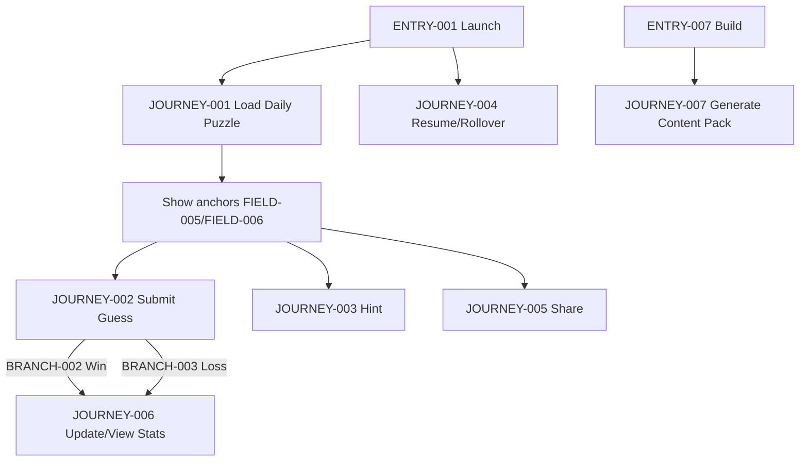
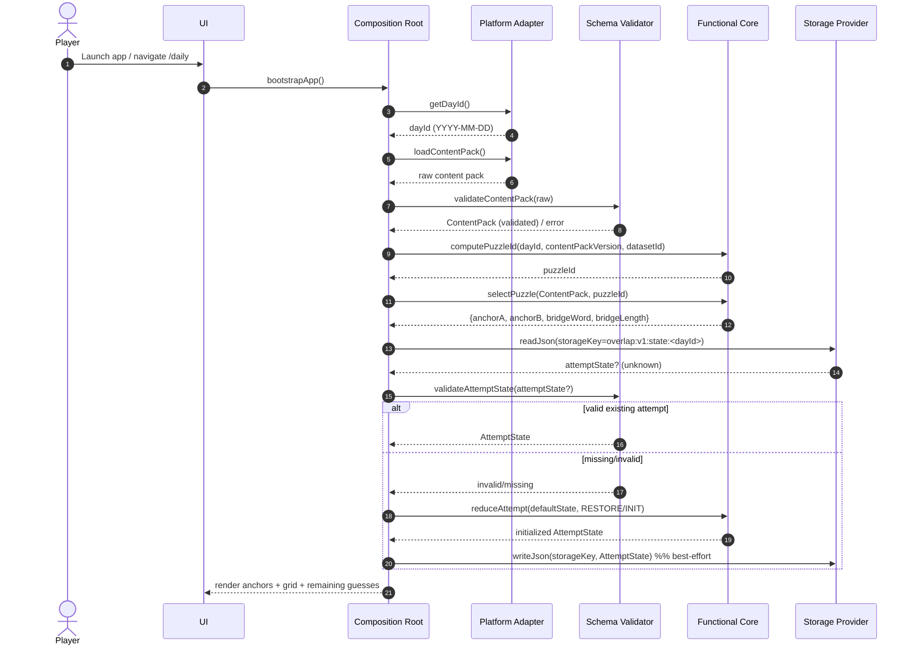
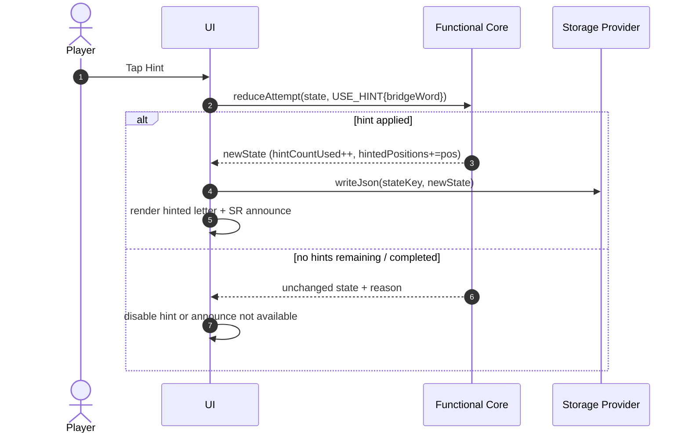
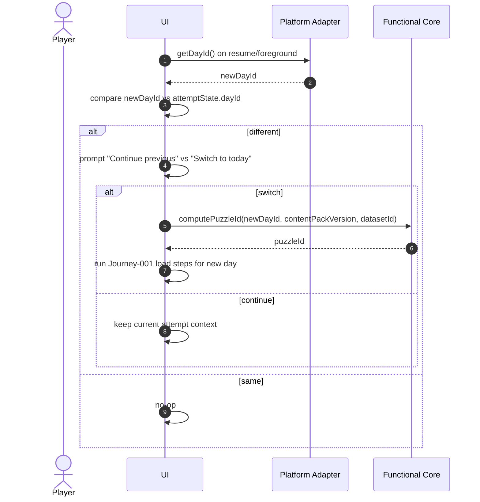
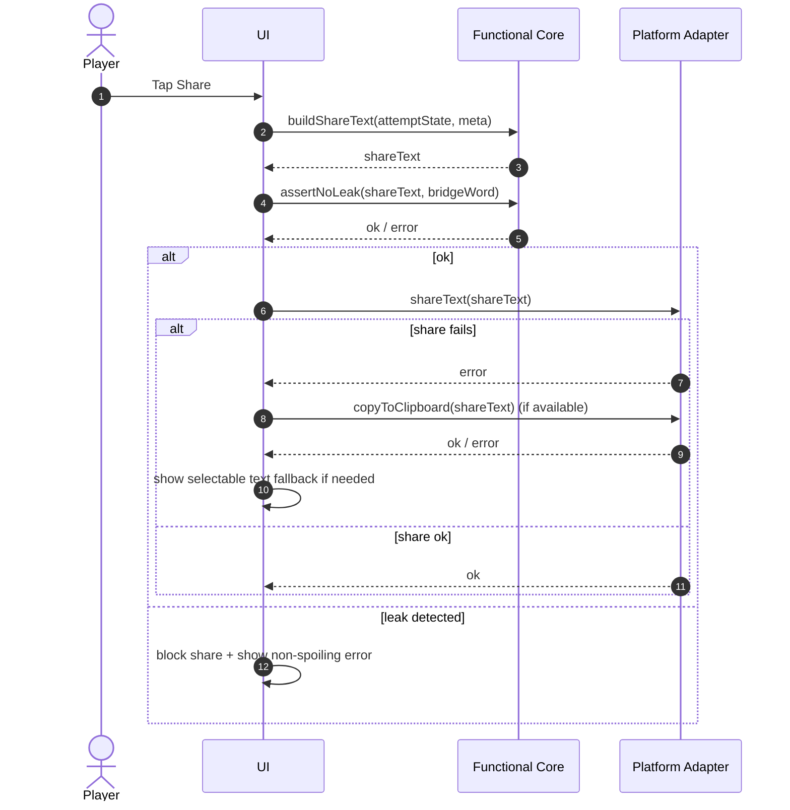

<!-- generated: 2026-07-24T06:03:00Z -->
<!-- mode: initial -->
<!-- feature-slug: overlap -->
<!-- a2a-endpoint: https://bob-sdlc-orchestrator.2as6l7wq9qj8.eu-gb.codeengine.appdomain.cloud/v1/rpc -->

# Glossary

## Terms

### TERM-001: Overlap App
- **Definition:** The offline-first, fully client-side daily bridge-word puzzle application delivered as an installable PWA and as iOS/Android apps via Capacitor from a single TypeScript codebase.
- **Synonyms:** Overlap, the app, client app.
- **Anti-definition:** Not a client-server service; not an account-based game.
- **Source:** User request.

### TERM-002: Daily Puzzle
- **Definition:** The single deterministic puzzle for a given calendar day that is identical for every player and consists of two visible anchor words and one hidden bridge word.
- **Synonyms:** Puzzle of the day, today’s puzzle.
- **Anti-definition:** Not randomized per-user; not fetched from a backend at play time.
- **Source:** User request.

### TERM-003: Anchor Word
- **Definition:** One of the two visible words (A and B) presented in a Daily Puzzle that must each form a valid compound/collocation with the Bridge Word.
- **Synonyms:** Anchor, anchor A, anchor B.
- **Anti-definition:** Not hidden; not the word the player is trying to guess.
- **Source:** User request.

### TERM-004: Bridge Word
- **Definition:** The single hidden target word (X) that forms a valid English compound word or common collocation with both Anchor Words.
- **Synonyms:** Bridge, target word, answer.
- **Anti-definition:** Not multiple words; not ambiguous (uniqueness is guaranteed by build-time gating).
- **Source:** User request.

### TERM-005: Compound/Collocation
- **Definition:** A real English compound word or common collocation formed by combining an Anchor Word with a Bridge Word (e.g., “firecracker”, “cream cracker”).
- **Synonyms:** Compound, collocation, valid pair.
- **Anti-definition:** Not an arbitrary concatenation; not a non-English or invalid phrase per the bundled dataset.
- **Source:** User request.

### TERM-006: Guess
- **Definition:** A word entered by the player as an attempt to match the Bridge Word; each non-winning Guess yields letter-reveal feedback and consumes allowance.
- **Synonyms:** Attempt, entry.
- **Anti-definition:** Not the anchors; not a hint action.
- **Source:** User request.

### TERM-007: Guess Allowance
- **Definition:** The maximum number of guesses permitted for a puzzle attempt; decreases by 1 for each submitted Guess that is not the Bridge Word.
- **Synonyms:** Remaining guesses, tries.
- **Anti-definition:** Not time-based; not replenished by network actions.
- **Source:** User request.

### TERM-008: Letter-Reveal Feedback
- **Definition:** Wordle-style per-position feedback comparing a Guess to the Bridge Word with three states: correct letter/correct position, correct letter/wrong position, and absent letter.
- **Synonyms:** Feedback grid, reveal pattern.
- **Anti-definition:** Not revealing the answer string; not color-only (must be accessible).
- **Source:** User request.

### TERM-009: Reveal State
- **Definition:** The per-letter classification output for a position in a Guess relative to the Bridge Word (e.g., EXACT, PRESENT, ABSENT).
- **Synonyms:** Tile state, cell state.
- **Anti-definition:** Not a UI color; not a freeform label.
- **Source:** User request.

### TERM-010: Hint
- **Definition:** An action that reveals one additional correct letter of the Bridge Word.
- **Synonyms:** Reveal letter hint.
- **Anti-definition:** Not revealing the full word; not changing the puzzle.
- **Source:** User request.

### TERM-011: Deterministic Selection
- **Definition:** The method by which the Daily Puzzle is chosen using a self-shipped seedable hash over identifiers so that the same date yields the same puzzle everywhere and past days remain stable.
- **Synonyms:** Deterministic daily selection, seeded selection.
- **Anti-definition:** Not dependent on device locale/timezone without explicit definition; not dependent on network.
- **Source:** User request.

### TERM-012: Day ID
- **Definition:** A canonical identifier for the puzzle date used as an input to deterministic selection.
- **Synonyms:** dayId, puzzle date key.
- **Anti-definition:** Not device wall-clock time object; not user-entered text.
- **Source:** User request.

### TERM-013: Content Pack
- **Definition:** The bundled set of puzzle content and dataset identifiers embedded in an app build, including the daily puzzle mapping inputs.
- **Synonyms:** Content version, pack.
- **Anti-definition:** Not fetched at runtime; not user-modified content.
- **Source:** User request.

### TERM-014: Dataset
- **Definition:** The bundled compound-word/collocation source used to generate puzzles; modeled as a bipartite graph between word forms and anchors.
- **Synonyms:** Compound dataset, collocation dataset.
- **Anti-definition:** Not an online dictionary lookup; not user-generated content.
- **Source:** User request.

### TERM-015: Bipartite Graph
- **Definition:** A graph model connecting Anchor Words to word forms that “compound-with” them, enabling selection of anchor pairs sharing exactly one Bridge Word.
- **Synonyms:** Anchor–wordform graph.
- **Anti-definition:** Not a general-purpose social graph; not stored server-side.
- **Source:** User request.

### TERM-016: Build-Time Uniqueness & Fairness Gate
- **Definition:** The build pipeline step that filters/chooses anchor pairs such that each pair has exactly one common bridge and meets a commonness threshold.
- **Synonyms:** Gate, generator gate, content validation.
- **Anti-definition:** Not executed during gameplay; not heuristic at runtime.
- **Source:** User request.

### TERM-017: Local Stats
- **Definition:** On-device persisted metrics such as played count, win count, guess distribution, and hint usage.
- **Synonyms:** Statistics, metrics.
- **Anti-definition:** Not server analytics; not shared across devices.
- **Source:** User request.

### TERM-018: Streak
- **Definition:** A locally computed consecutive-days measure based on solved Daily Puzzles.
- **Synonyms:** Current streak, max streak.
- **Anti-definition:** Not account-based; not cross-device synced.
- **Source:** User request.

### TERM-019: Share Artifact
- **Definition:** A spoiler-safe emoji text representation of the Letter-Reveal Feedback rows up to solve (or failure) that does not print the Bridge Word.
- **Synonyms:** Share text, emoji share.
- **Anti-definition:** Not a screenshot requirement; not including the answer string.
- **Source:** User request.

### TERM-020: Offline-First
- **Definition:** The app is playable without a network connection after installation; gameplay does not depend on network availability.
- **Synonyms:** Offline mode, fully offline at play time.
- **Anti-definition:** Not requiring connectivity for validation, puzzle retrieval, or stats.
- **Source:** User request.

### TERM-021: Functional Core
- **Definition:** A pure deterministic module that implements puzzle selection, guess validation, and letter-reveal computation without storage or clock dependencies.
- **Synonyms:** Core logic, pure core.
- **Anti-definition:** Not directly calling platform APIs; not non-deterministic.
- **Source:** User request.

### TERM-022: Platform Adapter
- **Definition:** Thin layer providing storage, clock/dayId, sharing, and asset-loading, implemented per platform (Web vs Capacitor).
- **Synonyms:** Adapter, integration layer.
- **Anti-definition:** Not containing game rules; not diverging algorithmically between platforms.
- **Source:** User request.

### TERM-023: Composition Root
- **Definition:** The per-platform bootstrap that wires the Functional Core to the appropriate Platform Adapter (web storage vs Capacitor Preferences/Filesystem).
- **Synonyms:** Bootstrap, wiring module.
- **Anti-definition:** Not part of pure core logic.
- **Source:** User request.

### TERM-024: Storage Provider
- **Definition:** The platform-specific persistence mechanism used to store Local Stats, Streak, and per-day attempt state (e.g., localStorage/IndexedDB vs Capacitor Preferences/Filesystem).
- **Synonyms:** Persistence layer, local storage.
- **Anti-definition:** Not remote database; not requiring login.
- **Source:** User request.

### TERM-025: Attempt State
- **Definition:** The persisted per-day gameplay state including guesses submitted, reveal rows, remaining allowance, and hint progress.
- **Synonyms:** Saved game state, run state.
- **Anti-definition:** Not global settings; not shared remotely.
- **Source:** User request.

### TERM-026: Accessibility Announcement
- **Definition:** Screen-reader friendly text that conveys Letter-Reveal Feedback and state changes without relying on color.
- **Synonyms:** SR announcement, ARIA live update.
- **Anti-definition:** Not visual-only feedback.
- **Source:** User request.

### TERM-027: Keyboard Operability
- **Definition:** Ability to play the puzzle using keyboard input for navigation and submission in supported platforms.
- **Synonyms:** Keyboard support.
- **Anti-definition:** Not touch-only interaction.
- **Source:** User request.

### TERM-028: Content Determinism Inputs
- **Definition:** The trio of identifiers used to seed deterministic selection: Day ID, Content Pack Version, and Dataset ID.
- **Synonyms:** Selection seed inputs.
- **Anti-definition:** Not including device ID; not including network randomness.
- **Source:** User request.

## Data Dictionary

| ID | Name | Type | Format | Range | Units | Default | Nullable | PII | Source | Validation |
|---|---|---|---|---|---|---|---|---|---|---|
| FIELD-001 | dayId | string | `YYYY-MM-DD` | ISO-like date string | N/A | computed | false | None | TERM-022 (clock) | Must match regex `^\d{4}-\d{2}-\d{2}$` and represent a valid calendar date |
| FIELD-002 | contentPackVersion | string | semver-like | e.g., `1.2.3` | N/A | build-time constant | false | None | TERM-013 | Must be non-empty; recommended regex `^\d+\.\d+\.\d+(-[0-9A-Za-z.-]+)?$` |
| FIELD-003 | datasetId | string | slug | e.g., `en_compounds_v5` | N/A | build-time constant | false | None | TERM-014 | Must be non-empty and match `^[a-z0-9_/-]+$` |
| FIELD-004 | puzzleId | string | deterministic hash/slug | e.g., `pzl_<hash>` | N/A | computed | false | None | TERM-011 | Must be stable for same (FIELD-001, FIELD-002, FIELD-003) |
| FIELD-005 | anchorA | string | uppercase A–Z | 1–20 chars | chars | from content | false | None | TERM-002 content | Must match `^[A-Z]+$` |
| FIELD-006 | anchorB | string | uppercase A–Z | 1–20 chars | chars | from content | false | None | TERM-002 content | Must match `^[A-Z]+$` |
| FIELD-007 | bridgeWord | string | uppercase A–Z | length 3–12 | chars | from content | false | None | TERM-004 content | Must match `^[A-Z]+$` and length within configured bounds |
| FIELD-008 | bridgeLength | number | integer | 3–12 | chars | derived | false | None | TERM-004 | Must equal `len(FIELD-007)` |
| FIELD-009 | maxGuesses | number | integer | 1–10 | guesses | 6 | false | None | game rules | Must be >=1 |
| FIELD-010 | remainingGuesses | number | integer | 0..FIELD-009 | guesses | FIELD-009 | false | None | TERM-025 | Must be within range and decrement on non-winning submit |
| FIELD-011 | guessText | string | letters | 0–32 chars | chars | empty | false | Potentially sensitive (User input) | UI input | Must normalize to uppercase A–Z; reject other characters on submit |
| FIELD-012 | guessWord | string | uppercase A–Z | length = FIELD-008 | chars | computed | false | Potentially sensitive (User input) | TERM-006 | Must match `^[A-Z]+$` and length equals bridgeLength |
| FIELD-013 | guessIndex | number | integer | 1..FIELD-009 | N/A | computed | false | None | TERM-025 | Must increment by 1 per submitted guess |
| FIELD-014 | revealState | string | enum | `EXACT \| PRESENT \| ABSENT` | N/A | computed | false | None | TERM-009 | Must be one of enum values |
| FIELD-015 | revealRow | array<string> | array of enums | length = FIELD-008 | N/A | computed | false | None | TERM-008 | Each element must validate as FIELD-014 |
| FIELD-016 | revealGrid | array<array<string>> | 2D array | rows <= FIELD-009 | N/A | empty | false | None | TERM-025 | Each row must validate as FIELD-015 |
| FIELD-017 | isSolved | boolean | boolean | true/false | N/A | false | false | None | TERM-025 | True iff last submitted guess equals bridgeWord |
| FIELD-018 | isFailed | boolean | boolean | true/false | N/A | false | false | None | TERM-025 | True iff remainingGuesses = 0 and not solved |
| FIELD-019 | hintCountUsed | number | integer | 0..FIELD-008 | hints | 0 | false | None | TERM-010 | Must not exceed bridgeLength |
| FIELD-020 | hintedPositions | array<number> | array of ints | each 0..FIELD-008-1 unique | index | empty | false | None | TERM-010 | Must contain unique integers within bounds |
| FIELD-021 | localStats | object | JSON | schema-defined | N/A | initialized | false | None | TERM-017 | Must validate required keys and non-negative integers |
| FIELD-022 | playedCount | number | integer | >=0 | puzzles | 0 | false | None | TERM-017 | Must be >=0 |
| FIELD-023 | winCount | number | integer | >=0 | puzzles | 0 | false | None | TERM-017 | Must be <= playedCount |
| FIELD-024 | currentStreak | number | integer | >=0 | days | 0 | false | None | TERM-018 | Must be >=0 |
| FIELD-025 | maxStreak | number | integer | >=0 | days | 0 | false | None | TERM-018 | Must be >= currentStreak |
| FIELD-026 | lastSolvedDayId | string | `YYYY-MM-DD` | valid date | N/A | null | true | None | TERM-018 | If non-null, must validate as FIELD-001 |
| FIELD-027 | guessDistribution | array<number> | array of ints | length=FIELD-009 | puzzles | zeros | false | None | TERM-017/TERM-018 | All entries must be >=0 |
| FIELD-028 | shareText | string | plain text | <= 4000 chars | chars | computed | false | None | TERM-019 | Must not contain FIELD-007; must contain only reveal emojis + header metadata |
| FIELD-029 | platformId | string | enum | `web \| ios \| android` | N/A | detected | false | None | TERM-022 | Must be one of enum values |
| FIELD-030 | storageKey | string | namespaced | e.g., `overlap:v1:state:<dayId>` | N/A | computed | false | None | TERM-024 | Must be deterministic and collision-free within app |
| FIELD-031 | attemptState | object | JSON | schema-defined | N/A | initialized | false | None | TERM-025 | Must include puzzleId, dayId, revealGrid, remainingGuesses, isSolved, isFailed |
| FIELD-032 | accessibilityText | string | plain text | <= 500 chars | chars | computed | false | None | TERM-026 | Must include non-color descriptors for FIELD-014 values |
| FIELD-033 | guessValidity | string | enum | `VALID \| INVALID_LENGTH \| INVALID_CHARS \| NOT_IN_DATASET` | N/A | computed | false | None | guess validation | Must be one of enum values |
| FIELD-034 | allowedWordSetId | string | slug | e.g., `en_wordforms_v3` | N/A | build-time constant | false | None | TERM-014 | Must be non-empty |

# User Journeys

## Roles

| Role ID | Role | Type | Description |
|---|---|---|---|
| ROLE-001 | Player | Primary | Plays the TERM-002, submits TERM-006, uses TERM-010, views TERM-017/TERM-018, shares TERM-019 |
| ROLE-002 | System | System | Executes TERM-021 logic, selects TERM-002 via TERM-011, persists via TERM-024, renders accessibility via TERM-026 |
| ROLE-003 | Builder | Admin/Dev | Runs TERM-016 at build time to produce TERM-013 content and ship TERM-014 |

## Entry Points

| Entry ID | Location | Trigger | Auth |
|---|---|---|---|
| ENTRY-001 | App launch (PWA/App icon) | Player opens app | None |
| ENTRY-002 | Route: `/daily` (or default screen) | Navigation to today’s puzzle | None |
| ENTRY-003 | On-screen keyboard / hardware keyboard | Player types and submits guess | None |
| ENTRY-004 | Hint button | Player requests TERM-010 | None |
| ENTRY-005 | Share button | Player requests TERM-019 | None |
| ENTRY-006 | Stats screen | Player views TERM-017/TERM-018 | None |
| ENTRY-007 | Build pipeline command | Builder runs generator/gate | Dev env |

## Role Permission Matrix

| Capability | ROLE-001 Player | ROLE-002 System | ROLE-003 Builder |
|---|---:|---:|---:|
| View TERM-002 (anchors) | Y | Y | Y |
| Submit TERM-006 | Y | Y | N |
| Compute TERM-008 | N | Y | N |
| Use TERM-010 | Y | Y | N |
| Persist TERM-025 | N | Y | N |
| View TERM-017/TERM-018 | Y | Y | N |
| Generate TERM-013 via TERM-016 | N | N | Y |
| Create TERM-019 | Y | Y | N |

## Journeys

### JOURNEY-001: Launch into today’s deterministic puzzle
- **Role/Goal:** ROLE-001 Player; see today’s TERM-002 with TERM-003 anchors and start playing.
- **Entry:** ENTRY-001 / ENTRY-002
- **Happy path:**
  1. System determines FIELD-001 (dayId) via TERM-022 clock provider. (FIELD-001)
  2. System computes FIELD-004 (puzzleId) using TERM-011 with FIELD-001, FIELD-002, FIELD-003. (FIELD-001, FIELD-002, FIELD-003, FIELD-004)
  3. System loads today’s puzzle content from TERM-013 using FIELD-004 and obtains FIELD-005/FIELD-006 and hidden FIELD-007. (FIELD-004, FIELD-005, FIELD-006, FIELD-007)
  4. System loads FIELD-031 (attemptState) from TERM-024 using FIELD-030; if absent, initializes new attempt with FIELD-009 and FIELD-010=FIELD-009. (FIELD-030, FIELD-031, FIELD-009, FIELD-010)
  5. UI displays FIELD-005 and FIELD-006 and an empty grid sized by FIELD-008. (FIELD-005, FIELD-006, FIELD-008, FIELD-016)
- **BRANCH-001 (existing attempt found):**
  - Trigger: Stored FIELD-031 exists for FIELD-001.
  - Response: Restore FIELD-016, FIELD-010, FIELD-017, FIELD-018, FIELD-019. (FIELD-031, FIELD-016, FIELD-010, FIELD-017, FIELD-018, FIELD-019)
- **ERROR-001 (content missing/corrupt):**
  - Trigger: Puzzle content for FIELD-004 cannot be loaded/validated.
  - System response: Show non-spoiling error state and disable submissions.
  - Recovery: Player can reinstall/update app; System can offer “Reload assets” action (offline-safe).
- **EDGE-001 (timezone boundary):**
  - Case: Device crosses midnight; FIELD-001 changes while app is open.
  - Expected: System prompts to switch to new day or keeps current until player opts in (see JOURNEY-004).
- **EDGE-002 (storage unavailable):**
  - Case: TERM-024 provider fails (quota/permission).
  - Expected: App remains playable in-memory; stats persistence disabled with notice.

### JOURNEY-002: Submit guesses and receive letter-reveal feedback
- **Role/Goal:** ROLE-001 Player; solve by entering the TERM-004 (FIELD-007) within FIELD-009.
- **Entry:** ENTRY-003
- **Happy path:**
  1. Player types input into guess box; System maintains FIELD-011. (FIELD-011)
  2. Player submits; System normalizes to FIELD-012 (uppercase A–Z). (FIELD-011, FIELD-012)
  3. System validates FIELD-012 and produces FIELD-033=VALID. (FIELD-012, FIELD-033, FIELD-034)
  4. System compares FIELD-012 vs FIELD-007 and computes FIELD-015 (revealRow) using TERM-021 deterministic algorithm. (FIELD-012, FIELD-007, FIELD-015)
  5. System appends FIELD-015 to FIELD-016, decrements FIELD-010 if FIELD-017 remains false, and persists FIELD-031. (FIELD-015, FIELD-016, FIELD-010, FIELD-017, FIELD-031)
  6. UI renders reveal states and emits TERM-026 announcement via FIELD-032. (FIELD-015, FIELD-032)
- **BRANCH-002 (win):**
  - Trigger: FIELD-012 equals FIELD-007.
  - Response: Set FIELD-017=true, stop decrementing FIELD-010, update FIELD-021 stats (winCount, streak, distribution), persist. (FIELD-017, FIELD-021, FIELD-023, FIELD-024, FIELD-027)
- **BRANCH-003 (loss):**
  - Trigger: After step 5, FIELD-010 becomes 0 and FIELD-017=false.
  - Response: Set FIELD-018=true, update FIELD-021 playedCount and streak rules, persist. (FIELD-010, FIELD-017, FIELD-018, FIELD-021, FIELD-022)
- **ERROR-002 (invalid length):**
  - Trigger: len(FIELD-012) != FIELD-008.
  - System response: Do not consume a guess; show inline validation and SR text.
  - Recovery: Player edits input.
- **ERROR-003 (invalid characters):**
  - Trigger: FIELD-012 contains non A–Z.
  - System response: Do not consume a guess; present constraint message.
  - Recovery: Player edits input.
- **ERROR-004 (not in dataset/word list):**
  - Trigger: FIELD-033=NOT_IN_DATASET (if a bundled allowed-word policy is used).
  - System response: Do not consume a guess; display “not in word list”.
  - Recovery: Player tries another word.
- **EDGE-003 (repeated guess):**
  - Case: Player submits a duplicate FIELD-012 already in FIELD-016.
  - Expected: Policy-defined; either allow and consume or block without consuming (see OpenQuestions).
- **EDGE-004 (concurrent input):**
  - Case: Double-submit due to key repeat/tap.
  - Expected: Only one submission processed per UI tick; no double decrement.

### JOURNEY-003: Use a hint to reveal a correct letter
- **Role/Goal:** ROLE-001 Player; get assistance by revealing one correct letter position.
- **Entry:** ENTRY-004
- **Happy path:**
  1. Player taps Hint; System checks FIELD-017=false and FIELD-018=false. (FIELD-017, FIELD-018)
  2. System selects a position not in FIELD-020 and reveals the correct letter from FIELD-007 for that position. (FIELD-020, FIELD-007)
  3. System increments FIELD-019 and appends position to FIELD-020; persists FIELD-031. (FIELD-019, FIELD-020, FIELD-031)
  4. UI displays the hint (without revealing unrevealed positions) and emits FIELD-032 announcement. (FIELD-032)
- **BRANCH-004 (no hints remaining):**
  - Trigger: FIELD-019 == FIELD-008.
  - Response: Disable hint button and announce “no more hints”.
- **ERROR-005 (hint after completion):**
  - Trigger: FIELD-017=true or FIELD-018=true.
  - Response: No state change; announce not available.
- **EDGE-005 (hint determinism):**
  - Case: Restoring attempt state across sessions.
  - Expected: Same hinted positions FIELD-020 must persist; hints must not reshuffle on reload.

### JOURNEY-004: Day rollover and past-day stability
- **Role/Goal:** ROLE-001 Player; ensure puzzles are stable per date and handle midnight change.
- **Entry:** ENTRY-001 (resume) / background-foreground event
- **Happy path:**
  1. System recomputes FIELD-001 on resume. (FIELD-001)
  2. If FIELD-001 differs from attempt’s stored dayId in FIELD-031, System offers choice: continue previous puzzle or switch to today. (FIELD-001, FIELD-031)
  3. If player chooses switch, System loads new day using JOURNEY-001 steps 2–5. (FIELD-001..FIELD-006)
- **ERROR-006 (clock anomaly):**
  - Trigger: Device clock jumps backward/forward causing unexpected FIELD-001 changes.
  - Response: Keep current attempt by default; allow manual navigation to today.
- **EDGE-006 (past day stability):**
  - Case: Opening a previously saved day.
  - Expected: Same FIELD-004 selection given same FIELD-001/FIELD-002/FIELD-003.

### JOURNEY-005: Share spoiler-safe results
- **Role/Goal:** ROLE-001 Player; share results without revealing FIELD-007.
- **Entry:** ENTRY-005
- **Happy path:**
  1. Player taps Share; System generates FIELD-028 from FIELD-016 and metadata (dayId, guess count, hints). (FIELD-028, FIELD-016, FIELD-001, FIELD-013, FIELD-019)
  2. System validates FIELD-028 does not contain FIELD-007. (FIELD-028, FIELD-007)
  3. System invokes TERM-022 share adapter to copy/share FIELD-028. (FIELD-028, FIELD-029)
- **BRANCH-005 (share before completion):**
  - Trigger: FIELD-017=false and FIELD-018=false.
  - Response: Policy-defined; either allow partial grid or require completion (see OpenQuestions).
- **ERROR-007 (share API unavailable):**
  - Trigger: Platform share fails.
  - Response: Copy to clipboard fallback if available; otherwise show selectable text.
- **EDGE-007 (emoji rendering differences):**
  - Case: Platform fonts render emojis differently.
  - Expected: Use a constrained set of standard square emojis and plain-text header.

### JOURNEY-006: View local stats and streaks
- **Role/Goal:** ROLE-001 Player; view TERM-017/TERM-018 computed from local play.
- **Entry:** ENTRY-006
- **Happy path:**
  1. System loads FIELD-021 from TERM-024. (FIELD-021)
  2. UI displays FIELD-022..FIELD-027. (FIELD-022, FIELD-023, FIELD-024, FIELD-025, FIELD-027)
- **ERROR-008 (stats corrupt):**
  - Trigger: Stored stats JSON fails validation.
  - Response: Offer “Reset stats” action; reinitialize defaults.
- **EDGE-008 (reinstall/data loss):**
  - Case: App reinstalled clears storage.
  - Expected: Stats reset; no recovery without accounts.

### JOURNEY-007: Build-time content generation with uniqueness & fairness gate
- **Role/Goal:** ROLE-003 Builder; generate TERM-013 so each anchor pair has exactly one bridge and meets commonness threshold.
- **Entry:** ENTRY-007
- **Happy path:**
  1. Build loads TERM-014 bipartite graph input and word list (FIELD-034). (FIELD-034)
  2. Gate finds anchor pairs whose neighbor intersection size equals 1 (unique bridge). (TERM-016)
  3. Gate filters by commonness threshold (dataset-provided frequency/score). (TERM-016)
  4. Build emits content pack mapping for deterministic selection and embeds FIELD-002/FIELD-003 constants. (FIELD-002, FIELD-003)
- **ERROR-009 (non-unique bridge found):**
  - Trigger: Candidate pair has intersection size != 1.
  - Response: Pair excluded; build fails if insufficient puzzles to cover target range.
- **EDGE-009 (dataset update):**
  - Case: Dataset changes but past-day stability desired.
  - Expected: Increment FIELD-002 and/or FIELD-003 to create a new “season” while preserving old mapping for prior versions.

## Journey Map



# Requirements

### REQ-001: Compute canonical day identifier
- **EARS Pattern:** Ubiquitous
- **EARS Statement:** The system shall compute FIELD-001 (dayId) in format `YYYY-MM-DD` using the TERM-022 clock provider.
- **Inputs:** Platform date/time (adapter)
- **Outputs:** FIELD-001
- **Preconditions:** App is running (TERM-001)
- **Postconditions:** FIELD-001 is available to TERM-011 selection
- **Invariants:** FIELD-001 matches FIELD-001 validation rule
- **Trigger:** App initialization or resume
- **Actor:** ROLE-002 System
- **EntityScope:** TERM-012 Day ID
- **ErrorModes:** Invalid date format produced by adapter
- **NFR-Tags:** compatibility
- **Source:** JOURNEY-001 step 1; JOURNEY-004 step 1
- **Dependencies:** NFR-006 (compatibility policy for date/time)
- **Priority:** P0
- **AcceptanceCriteria:**
  - **TEST-001:** Given an adapter date of 2026-07-24, when dayId is computed, then FIELD-001 equals `2026-07-24`.
  - **TEST-002:** Given adapter returns a date, when dayId is computed, then it matches regex `^\d{4}-\d{2}-\d{2}$`.
- **Assumptions:** A single canonical day definition is used across platforms (see OpenQuestions).
- **OpenQuestions:** Is day computed in local timezone or fixed UTC?

### REQ-002: Compute deterministic puzzle identifier
- **EARS Pattern:** Ubiquitous
- **EARS Statement:** The system shall compute FIELD-004 (puzzleId) deterministically from FIELD-001, FIELD-002, and FIELD-003 using TERM-011.
- **Inputs:** FIELD-001, FIELD-002, FIELD-003
- **Outputs:** FIELD-004
- **Preconditions:** FIELD-001 is computed; build constants are available
- **Postconditions:** FIELD-004 can be used to locate a puzzle in TERM-013
- **Invariants:** Same inputs produce same FIELD-004 across platforms
- **Trigger:** Puzzle load
- **Actor:** ROLE-002 System
- **EntityScope:** TERM-011 Deterministic Selection
- **ErrorModes:** Hash function mismatch across platforms/builds
- **NFR-Tags:** compatibility
- **Source:** JOURNEY-001 step 2
- **Dependencies:** NFR-005 (cross-platform determinism testing)
- **Priority:** P0
- **AcceptanceCriteria:**
  - **TEST-003:** Given identical (FIELD-001, FIELD-002, FIELD-003), when puzzleId is computed on web and mobile builds, then FIELD-004 strings are identical.
- **Assumptions:** TERM-011 implementation is shipped within the codebase (no platform crypto dependency).
- **OpenQuestions:** What is the exact hash algorithm and output encoding (base32/base64/hex)?

### REQ-003: Load daily puzzle content from bundled content pack
- **EARS Pattern:** Event-Driven
- **EARS Statement:** When FIELD-004 is computed, the system shall load FIELD-005 and FIELD-006 for the corresponding TERM-002 from the bundled TERM-013 content pack.
- **Inputs:** FIELD-004
- **Outputs:** FIELD-005, FIELD-006
- **Preconditions:** TERM-013 assets are accessible via TERM-022 asset-loading adapter
- **Postconditions:** UI can render anchors
- **Invariants:** FIELD-005 and FIELD-006 satisfy validation rules
- **Trigger:** FIELD-004 computed
- **Actor:** ROLE-002 System
- **EntityScope:** TERM-002 Daily Puzzle
- **ErrorModes:** Content record missing for puzzleId
- **NFR-Tags:** reliability
- **Source:** JOURNEY-001 step 3
- **Dependencies:** NFR-009 (asset integrity)
- **Priority:** P0
- **AcceptanceCriteria:**
  - **TEST-004:** Given a valid puzzleId that exists in TERM-013, when loading occurs, then anchorA/anchorB are returned and match `^[A-Z]+$`.
- **Assumptions:** The bridge word (FIELD-007) is bundled but not displayed.
- **OpenQuestions:** Is content pack stored as JSON, binary, or embedded module?

### REQ-004: Initialize attempt state for a day when absent
- **EARS Pattern:** Event-Driven
- **EARS Statement:** When no persisted FIELD-031 exists for FIELD-001, the system shall create FIELD-031 with FIELD-010 equal to FIELD-009 and FIELD-016 empty.
- **Inputs:** FIELD-001, FIELD-009
- **Outputs:** FIELD-031
- **Preconditions:** Puzzle loaded (FIELD-005, FIELD-006, FIELD-004)
- **Postconditions:** Attempt can accept guesses
- **Invariants:** FIELD-010 within 0..FIELD-009
- **Trigger:** Attempt load
- **Actor:** ROLE-002 System
- **EntityScope:** TERM-025 Attempt State
- **ErrorModes:** Storage provider write failure
- **NFR-Tags:** reliability
- **Source:** JOURNEY-001 step 4
- **Dependencies:** REQ-005 (persist attempt state)
- **Priority:** P0
- **AcceptanceCriteria:**
  - **TEST-005:** Given no stored attemptState for dayId, when initializing, then revealGrid is empty and remainingGuesses equals maxGuesses.

### REQ-005: Persist attempt state locally
- **EARS Pattern:** Event-Driven
- **EARS Statement:** When FIELD-031 changes, the system shall persist FIELD-031 using TERM-024 under FIELD-030.
- **Inputs:** FIELD-031, FIELD-030
- **Outputs:** Stored attempt state
- **Preconditions:** TERM-024 storage provider available
- **Postconditions:** Attempt can be restored
- **Invariants:** Stored JSON validates against FIELD-031 schema
- **Trigger:** Attempt state mutation
- **Actor:** ROLE-002 System
- **EntityScope:** TERM-024 Storage Provider
- **ErrorModes:** Storage provider unavailable/quota exceeded
- **NFR-Tags:** reliability, observability
- **Source:** JOURNEY-002 step 5; JOURNEY-003 step 3
- **Dependencies:** NFR-010 (local error logging)
- **Priority:** P0
- **AcceptanceCriteria:**
  - **TEST-006:** Given a state update, when persistence succeeds, then reloading the app restores identical attemptState fields.

### REQ-006: Normalize guess input to uppercase A–Z on submit
- **EARS Pattern:** Event-Driven
- **EARS Statement:** When the player submits FIELD-011, the system shall produce FIELD-012 by uppercasing and filtering to letters A–Z.
- **Inputs:** FIELD-011
- **Outputs:** FIELD-012
- **Preconditions:** Puzzle active (FIELD-017=false and FIELD-018=false)
- **Postconditions:** FIELD-012 is ready for validation
- **Invariants:** FIELD-012 matches `^[A-Z]*$`
- **Trigger:** Guess submit action
- **Actor:** ROLE-001 Player
- **EntityScope:** TERM-006 Guess
- **ErrorModes:** None (empty result handled by validation REQ-007)
- **NFR-Tags:** compatibility
- **Source:** JOURNEY-002 step 2
- **Dependencies:** REQ-007
- **Priority:** P0
- **AcceptanceCriteria:**
  - **TEST-007:** Given input `Crack3r`, when submitted, then FIELD-012 equals `CRACKR`.

### REQ-007: Reject guess submissions with invalid length
- **EARS Pattern:** Event-Driven
- **EARS Statement:** When len(FIELD-012) does not equal FIELD-008, the system shall set FIELD-033 to `INVALID_LENGTH` and shall not decrement FIELD-010.
- **Inputs:** FIELD-012, FIELD-008, FIELD-010
- **Outputs:** FIELD-033
- **Preconditions:** Puzzle active
- **Postconditions:** No change to FIELD-016 and FIELD-010
- **Invariants:** Attempt state unchanged except validation UI state
- **Trigger:** Guess validation
- **Actor:** ROLE-002 System
- **EntityScope:** TERM-006 Guess
- **ErrorModes:** Invalid length
- **NFR-Tags:** accessibility
- **Source:** JOURNEY-002 ERROR-002
- **Dependencies:** NFR-012 (SR messaging)
- **Priority:** P0
- **AcceptanceCriteria:**
  - **TEST-008:** Given bridgeLength=7 and guessWord length=6, when submitted, then remainingGuesses is unchanged and guessValidity is INVALID_LENGTH.

### REQ-008: Reject guess submissions with invalid characters
- **EARS Pattern:** Event-Driven
- **EARS Statement:** When FIELD-012 does not match `^[A-Z]+$`, the system shall set FIELD-033 to `INVALID_CHARS` and shall not decrement FIELD-010.
- **Inputs:** FIELD-012, FIELD-010
- **Outputs:** FIELD-033
- **Preconditions:** Puzzle active
- **Postconditions:** No guess consumed
- **Invariants:** Remaining guesses unchanged
- **Trigger:** Guess validation
- **Actor:** ROLE-002 System
- **EntityScope:** TERM-006 Guess
- **ErrorModes:** Invalid characters
- **NFR-Tags:** accessibility
- **Source:** JOURNEY-002 ERROR-003
- **Dependencies:** NFR-012
- **Priority:** P0
- **AcceptanceCriteria:**
  - **TEST-009:** Given FIELD-012 includes a hyphen, when validated, then FIELD-033 is INVALID_CHARS and remainingGuesses unchanged.

### REQ-009: Validate guess against bundled allowed word set (optional policy)
- **EARS Pattern:** Optional
- **EARS Statement:** Where an allowed-word policy is enabled, the system shall set FIELD-033 to `NOT_IN_DATASET` when FIELD-012 is not present in the bundled allowed word set identified by FIELD-034.
- **Inputs:** FIELD-012, FIELD-034
- **Outputs:** FIELD-033
- **Preconditions:** Puzzle active; allowed word set bundled
- **Postconditions:** No guess consumed on NOT_IN_DATASET
- **Invariants:** Deterministic lookup
- **Trigger:** Guess validation
- **Actor:** ROLE-002 System
- **EntityScope:** TERM-014 Dataset
- **ErrorModes:** Word list asset missing
- **NFR-Tags:** compatibility
- **Source:** JOURNEY-002 ERROR-004
- **Dependencies:** NFR-009 (asset integrity)
- **Priority:** P1
- **AcceptanceCriteria:**
  - **TEST-010:** Given allowed-word policy enabled and guess not in set, when validated, then guessValidity is NOT_IN_DATASET and remainingGuesses unchanged.
- **Assumptions:** Policy is configurable.
- **OpenQuestions:** Is NOT_IN_DATASET required or are all alphabetic guesses allowed?

### REQ-010: Compute letter-reveal feedback deterministically
- **EARS Pattern:** Event-Driven
- **EARS Statement:** When FIELD-033 is `VALID`, the system shall compute FIELD-015 by comparing FIELD-012 to FIELD-007 using TERM-021 deterministic string operations.
- **Inputs:** FIELD-012, FIELD-007
- **Outputs:** FIELD-015
- **Preconditions:** Guess is valid; bridgeWord loaded
- **Postconditions:** A revealRow exists for rendering and share
- **Invariants:** Algorithm produces identical FIELD-015 across platforms for same inputs
- **Trigger:** Valid guess submission
- **Actor:** ROLE-002 System
- **EntityScope:** TERM-008 Letter-Reveal Feedback
- **ErrorModes:** Mismatched lengths (guarded by REQ-007)
- **NFR-Tags:** compatibility
- **Source:** JOURNEY-002 step 4
- **Dependencies:** NFR-005
- **Priority:** P0
- **AcceptanceCriteria:**
  - **TEST-011:** Given bridgeWord `CRACKER` and guessWord `CRATER`, when computed, then FIELD-015 equals `[EXACT, EXACT, EXACT, ABSENT, EXACT, PRESENT, ABSENT]` (per defined duplicate-letter rules).
- **Assumptions:** Duplicate-letter handling matches a documented Wordle-like policy.
- **OpenQuestions:** What exact duplicate-letter scoring rule is used?

### REQ-011: Append reveal row to the grid
- **EARS Pattern:** Event-Driven
- **EARS Statement:** When FIELD-015 is computed, the system shall append FIELD-015 to FIELD-016.
- **Inputs:** FIELD-015, FIELD-016
- **Outputs:** Updated FIELD-016
- **Preconditions:** Puzzle active
- **Postconditions:** Grid includes new row
- **Invariants:** Each row length equals FIELD-008
- **Trigger:** Reveal computed
- **Actor:** ROLE-002 System
- **EntityScope:** TERM-025 Attempt State
- **ErrorModes:** Grid exceeds FIELD-009 rows
- **NFR-Tags:** reliability
- **Source:** JOURNEY-002 step 5
- **Dependencies:** REQ-012
- **Priority:** P0
- **AcceptanceCriteria:**
  - **TEST-012:** Given existing grid with n rows, when appending, then grid has n+1 rows and last row equals revealRow.

### REQ-012: Decrement remaining guesses on non-winning valid submit
- **EARS Pattern:** Event-Driven
- **EARS Statement:** When FIELD-015 is appended and FIELD-012 does not equal FIELD-007, the system shall decrement FIELD-010 by 1.
- **Inputs:** FIELD-012, FIELD-007, FIELD-010
- **Outputs:** FIELD-010
- **Preconditions:** Valid guess submitted; remainingGuesses > 0
- **Postconditions:** remainingGuesses reduced by 1
- **Invariants:** FIELD-010 remains within 0..FIELD-009
- **Trigger:** Post-append evaluation
- **Actor:** ROLE-002 System
- **EntityScope:** TERM-007 Guess Allowance
- **ErrorModes:** Underflow below 0
- **NFR-Tags:** reliability
- **Source:** JOURNEY-002 step 5
- **Dependencies:** REQ-013 (mark solved), REQ-014 (mark failed)
- **Priority:** P0
- **AcceptanceCriteria:**
  - **TEST-013:** Given remainingGuesses=6 and non-winning guess, when processed, then remainingGuesses=5.

### REQ-013: Mark puzzle solved on correct guess
- **EARS Pattern:** Event-Driven
- **EARS Statement:** When FIELD-012 equals FIELD-007, the system shall set FIELD-017 to true.
- **Inputs:** FIELD-012, FIELD-007
- **Outputs:** FIELD-017
- **Preconditions:** Valid guess submitted
- **Postconditions:** Puzzle is in solved state
- **Invariants:** If FIELD-017=true then FIELD-018=false
- **Trigger:** Guess comparison
- **Actor:** ROLE-002 System
- **EntityScope:** TERM-002 Daily Puzzle
- **ErrorModes:** None
- **NFR-Tags:** none
- **Source:** JOURNEY-002 BRANCH-002
- **Dependencies:** REQ-015 (update stats on win)
- **Priority:** P0
- **AcceptanceCriteria:**
  - **TEST-014:** Given guessWord equals bridgeWord, when evaluated, then isSolved is true.

### REQ-014: Mark puzzle failed when guesses reach zero unsolved
- **EARS Pattern:** Event-Driven
- **EARS Statement:** When FIELD-010 equals 0 while FIELD-017 is false, the system shall set FIELD-018 to true.
- **Inputs:** FIELD-010, FIELD-017
- **Outputs:** FIELD-018
- **Preconditions:** At least one valid guess was processed
- **Postconditions:** Puzzle is in failed state
- **Invariants:** If FIELD-018=true then FIELD-017=false
- **Trigger:** Remaining guesses update
- **Actor:** ROLE-002 System
- **EntityScope:** TERM-002 Daily Puzzle
- **ErrorModes:** None
- **NFR-Tags:** none
- **Source:** JOURNEY-002 BRANCH-003
- **Dependencies:** REQ-016 (update stats on loss)
- **Priority:** P0
- **AcceptanceCriteria:**
  - **TEST-015:** Given remainingGuesses becomes 0 and isSolved=false, when evaluated, then isFailed=true.

### REQ-015: Update local stats on win
- **EARS Pattern:** Event-Driven
- **EARS Statement:** When FIELD-017 becomes true, the system shall increment FIELD-023 by 1 in FIELD-021.
- **Inputs:** FIELD-017, FIELD-021
- **Outputs:** FIELD-021
- **Preconditions:** Puzzle transitioned to solved
- **Postconditions:** Stats reflect win
- **Invariants:** FIELD-023 <= FIELD-022
- **Trigger:** Solved transition
- **Actor:** ROLE-002 System
- **EntityScope:** TERM-017 Local Stats
- **ErrorModes:** Stats storage invalid/corrupt
- **NFR-Tags:** reliability
- **Source:** JOURNEY-002 BRANCH-002
- **Dependencies:** REQ-017 (persist stats)
- **Priority:** P0
- **AcceptanceCriteria:**
  - **TEST-016:** Given winCount=10, when puzzle is solved, then winCount=11.

### REQ-016: Update local stats on loss
- **EARS Pattern:** Event-Driven
- **EARS Statement:** When FIELD-018 becomes true, the system shall increment FIELD-022 by 1 in FIELD-021.
- **Inputs:** FIELD-018, FIELD-021
- **Outputs:** FIELD-021
- **Preconditions:** Puzzle transitioned to failed
- **Postconditions:** Stats reflect play
- **Invariants:** FIELD-022 is non-negative
- **Trigger:** Failed transition
- **Actor:** ROLE-002 System
- **EntityScope:** TERM-017 Local Stats
- **ErrorModes:** Stats storage invalid/corrupt
- **NFR-Tags:** reliability
- **Source:** JOURNEY-002 BRANCH-003
- **Dependencies:** REQ-017
- **Priority:** P0
- **AcceptanceCriteria:**
  - **TEST-017:** Given playedCount=20, when puzzle fails, then playedCount=21.

### REQ-017: Persist local stats locally
- **EARS Pattern:** Event-Driven
- **EARS Statement:** When FIELD-021 changes, the system shall persist FIELD-021 using TERM-024.
- **Inputs:** FIELD-021
- **Outputs:** Stored stats
- **Preconditions:** TERM-024 available or failure handled
- **Postconditions:** Stats can be restored
- **Invariants:** Stored stats validate (non-negative integers)
- **Trigger:** Stats mutation
- **Actor:** ROLE-002 System
- **EntityScope:** TERM-024 Storage Provider
- **ErrorModes:** Storage provider unavailable/quota exceeded
- **NFR-Tags:** reliability, observability
- **Source:** JOURNEY-002 BRANCH-002; JOURNEY-006 step 1
- **Dependencies:** NFR-010
- **Priority:** P0
- **AcceptanceCriteria:**
  - **TEST-018:** Given updated stats, when app reloads, then stats screen shows persisted values.

### REQ-018: Apply a hint by revealing one correct letter position
- **EARS Pattern:** Event-Driven
- **EARS Statement:** When the player activates TERM-010 and FIELD-017 is false, the system shall add one new position to FIELD-020 and increment FIELD-019 by 1.
- **Inputs:** Hint action, FIELD-017, FIELD-020, FIELD-019, FIELD-008
- **Outputs:** FIELD-020, FIELD-019
- **Preconditions:** Puzzle active and not completed
- **Postconditions:** One additional letter position is revealed
- **Invariants:** FIELD-020 contains unique indices within bounds
- **Trigger:** Hint button press
- **Actor:** ROLE-001 Player
- **EntityScope:** TERM-010 Hint
- **ErrorModes:** No remaining positions
- **NFR-Tags:** accessibility
- **Source:** JOURNEY-003 steps 1–3; BRANCH-004
- **Dependencies:** REQ-005 (persist attempt), NFR-012
- **Priority:** P1
- **AcceptanceCriteria:**
  - **TEST-019:** Given hintedPositions length k < bridgeLength, when hint used, then hintedPositions length becomes k+1 and hintCountUsed increments.

### REQ-019: Generate spoiler-safe share text
- **EARS Pattern:** Event-Driven
- **EARS Statement:** When the player requests sharing, the system shall generate FIELD-028 from FIELD-016 without including FIELD-007.
- **Inputs:** FIELD-016, FIELD-007, FIELD-001, FIELD-019
- **Outputs:** FIELD-028
- **Preconditions:** Attempt has at least one reveal row or completion policy allows sharing
- **Postconditions:** ShareText ready for adapter
- **Invariants:** FIELD-028 passes FIELD-028 validation rule
- **Trigger:** Share button press
- **Actor:** ROLE-001 Player
- **EntityScope:** TERM-019 Share Artifact
- **ErrorModes:** Share text includes forbidden substring (answer leak)
- **NFR-Tags:** privacy
- **Source:** JOURNEY-005 steps 1–2
- **Dependencies:** REQ-020 (invoke share adapter)
- **Priority:** P0
- **AcceptanceCriteria:**
  - **TEST-020:** Given a solved grid, when share text generated, then it contains only emoji squares for reveal states and does not contain the bridge word.

### REQ-020: Invoke platform share adapter
- **EARS Pattern:** Event-Driven
- **EARS Statement:** When FIELD-028 is generated, the system shall invoke the TERM-022 sharing adapter with FIELD-028.
- **Inputs:** FIELD-028, FIELD-029
- **Outputs:** OS share sheet or clipboard result
- **Preconditions:** Adapter available
- **Postconditions:** Player can share/copy
- **Invariants:** No mutation of attempt state required
- **Trigger:** Share action
- **Actor:** ROLE-002 System
- **EntityScope:** TERM-022 Platform Adapter
- **ErrorModes:** Share API unavailable
- **NFR-Tags:** compatibility
- **Source:** JOURNEY-005 step 3; ERROR-007
- **Dependencies:** NFR-007 (clipboard fallback behavior)
- **Priority:** P1
- **AcceptanceCriteria:**
  - **TEST-021:** Given share API fails, when sharing attempted, then the app presents copy-to-clipboard fallback or selectable text.

### REQ-021: Restore attempt state on launch when present
- **EARS Pattern:** Event-Driven
- **EARS Statement:** When a persisted FIELD-031 exists for FIELD-001, the system shall restore FIELD-031 into the current session.
- **Inputs:** FIELD-001, FIELD-030
- **Outputs:** In-memory FIELD-031
- **Preconditions:** Storage readable
- **Postconditions:** UI reflects restored grid and remaining guesses
- **Invariants:** Restored state validates schema
- **Trigger:** Attempt load
- **Actor:** ROLE-002 System
- **EntityScope:** TERM-025 Attempt State
- **ErrorModes:** Stored JSON fails validation
- **NFR-Tags:** reliability
- **Source:** JOURNEY-001 BRANCH-001
- **Dependencies:** NFR-011 (corruption handling)
- **Priority:** P0
- **AcceptanceCriteria:**
  - **TEST-022:** Given a previously persisted attempt, when app relaunches, then revealGrid and remainingGuesses match persisted values.

### REQ-022: Handle day rollover by offering switch/continue choice
- **EARS Pattern:** Event-Driven
- **EARS Statement:** When FIELD-001 differs from the stored dayId in FIELD-031, the system shall present a choice to load the new day or continue the existing attempt.
- **Inputs:** FIELD-001, FIELD-031
- **Outputs:** UI prompt state; selected day context
- **Preconditions:** App resume and an existing attempt
- **Postconditions:** Player remains in a consistent puzzle context
- **Invariants:** No silent puzzle swap mid-attempt
- **Trigger:** App resume / foreground
- **Actor:** ROLE-002 System
- **EntityScope:** TERM-002 Daily Puzzle
- **ErrorModes:** None
- **NFR-Tags:** usability, reliability
- **Source:** JOURNEY-004 step 2
- **Dependencies:** REQ-001, REQ-021
- **Priority:** P1
- **AcceptanceCriteria:**
  - **TEST-023:** Given an open attempt for yesterday and app resumes today, when resume occurs, then the app prompts to switch or continue.

### REQ-023: Enforce build-time bridge uniqueness for shipped puzzles
- **EARS Pattern:** Ubiquitous
- **EARS Statement:** The build pipeline shall not emit a TERM-002 whose TERM-003 anchor pair has an intersection size other than 1 in the TERM-015 bipartite graph.
- **Inputs:** Dataset graph
- **Outputs:** Build pass/fail; emitted content pack
- **Preconditions:** Builder runs generator
- **Postconditions:** Shipped puzzles have unique bridge
- **Invariants:** Exactly one bridge per anchor pair in shipped pack
- **Trigger:** Build content generation
- **Actor:** ROLE-003 Builder
- **EntityScope:** TERM-016 Build-Time Uniqueness & Fairness Gate
- **ErrorModes:** Non-unique anchor pair included
- **NFR-Tags:** quality
- **Source:** JOURNEY-007 step 2; ERROR-009
- **Dependencies:** None
- **Priority:** P0
- **AcceptanceCriteria:**
  - **TEST-024:** Given a candidate pair with 2 common bridges, when gate runs, then that pair is excluded or build fails per configuration.

### REQ-024: Enforce build-time fairness/commonness threshold
- **EARS Pattern:** Ubiquitous
- **EARS Statement:** The build pipeline shall exclude a candidate TERM-002 when its compounds’ commonness score is below the configured threshold.
- **Inputs:** Dataset frequency/score metric (implementation-defined)
- **Outputs:** Filtered puzzle set
- **Preconditions:** Dataset provides commonness metric
- **Postconditions:** Shipped content meets fairness criterion
- **Invariants:** Threshold application is deterministic for same dataset
- **Trigger:** Build content generation
- **Actor:** ROLE-003 Builder
- **EntityScope:** TERM-016 Build-Time Uniqueness & Fairness Gate
- **ErrorModes:** Missing commonness metric
- **NFR-Tags:** quality
- **Source:** JOURNEY-007 step 3
- **Dependencies:** Open question on metric definition
- **Priority:** P1
- **AcceptanceCriteria:**
  - **TEST-025:** Given a candidate below threshold, when gate runs, then it is excluded.
- **Assumptions:** A numeric score exists in dataset.
- **OpenQuestions:** What metric and threshold are used (frequency, Zipf, curated list)?

### NFR-001: Offline gameplay without network dependency
- **EARS Pattern:** Ubiquitous
- **EARS Statement:** The system shall not require network connectivity to load TERM-002 content, validate TERM-006, compute TERM-008, persist TERM-025, or generate TERM-019.
- **Inputs:** None
- **Outputs:** None
- **Preconditions:** App installed with bundled assets
- **Postconditions:** Full gameplay works offline
- **Invariants:** No runtime fetch calls for core loop
- **Trigger:** Any gameplay action
- **Actor:** ROLE-001 Player
- **EntityScope:** TERM-020 Offline-First
- **ErrorModes:** Accidental network call blocks flow
- **NFR-Tags:** reliability
- **Source:** User request; JOURNEY-001..JOURNEY-006
- **Dependencies:** NFR-009
- **Priority:** P0
- **AcceptanceCriteria:**
  - **TEST-026:** With device in airplane mode, when playing from launch through share, then all actions complete without errors attributable to networking.

### NFR-002: Accessibility—keyboard operability for core gameplay
- **EARS Pattern:** Ubiquitous
- **EARS Statement:** The system shall provide TERM-027 keyboard operability for entering and submitting FIELD-011 and activating ENTRY-004 and ENTRY-005.
- **Inputs:** Keyboard events
- **Outputs:** UI actions
- **Preconditions:** Platform supports keyboard input
- **Postconditions:** Player can complete puzzle without touch
- **Invariants:** Focus order reaches guess input, hint, share
- **Trigger:** Keyboard navigation
- **Actor:** ROLE-001 Player
- **EntityScope:** TERM-027 Keyboard Operability
- **ErrorModes:** Focus trap prevents submission
- **NFR-Tags:** accessibility
- **Source:** User request; JOURNEY-002/003/005
- **Dependencies:** None
- **Priority:** P0
- **AcceptanceCriteria:**
  - **TEST-027:** Using only keyboard, when player tabs to input, types a guess, and presses Enter, then submission occurs.

### NFR-003: Accessibility—screen-reader announcements for reveal feedback
- **EARS Pattern:** Event-Driven
- **EARS Statement:** When a revealRow FIELD-015 is rendered, the system shall emit FIELD-032 that conveys FIELD-014 states without using color terms.
- **Inputs:** FIELD-015
- **Outputs:** FIELD-032 (ARIA/live region text)
- **Preconditions:** Reveal row computed
- **Postconditions:** Screen reader can announce feedback
- **Invariants:** FIELD-032 includes per-position descriptors (e.g., “correct position”, “present elsewhere”, “not in word”)
- **Trigger:** Reveal render
- **Actor:** ROLE-002 System
- **EntityScope:** TERM-026 Accessibility Announcement
- **ErrorModes:** Missing announcement
- **NFR-Tags:** accessibility
- **Source:** JOURNEY-002 step 6
- **Dependencies:** REQ-010
- **Priority:** P0
- **AcceptanceCriteria:**
  - **TEST-028:** Given a revealRow with at least one ABSENT, when announced, then announcement includes a non-color descriptor for ABSENT.

### NFR-004: Accessibility—letter-reveal not conveyed by color alone
- **EARS Pattern:** Ubiquitous
- **EARS Statement:** The system shall render each FIELD-014 revealState with a non-color visual indicator.
- **Inputs:** FIELD-015
- **Outputs:** UI tiles
- **Preconditions:** Reveal grid displayed
- **Postconditions:** Meaning is perceivable in monochrome
- **Invariants:** Each revealState maps to distinct pattern/text/iconography
- **Trigger:** Grid render
- **Actor:** ROLE-002 System
- **EntityScope:** TERM-008 Letter-Reveal Feedback
- **ErrorModes:** Two states indistinguishable without color
- **NFR-Tags:** accessibility
- **Source:** User request; JOURNEY-002 step 6
- **Dependencies:** None
- **Priority:** P0
- **AcceptanceCriteria:**
  - **TEST-029:** In a simulated grayscale mode, when the grid is shown, then EXACT/PRESENT/ABSENT remain distinguishable.

### NFR-005: Cross-platform determinism test coverage for core algorithms
- **EARS Pattern:** Ubiquitous
- **EARS Statement:** The system shall provide automated tests that assert identical outputs for TERM-011 selection and TERM-021 letter-reveal computation across web, iOS, and Android builds.
- **Inputs:** Fixed test vectors for FIELD-001/002/003 and guess/bridge pairs
- **Outputs:** Test pass/fail
- **Preconditions:** CI can run TypeScript unit tests
- **Postconditions:** Determinism regressions detected
- **Invariants:** Same inputs produce same outputs
- **Trigger:** CI run
- **Actor:** ROLE-003 Builder
- **EntityScope:** TERM-021 Functional Core
- **ErrorModes:** Platform-specific string/locale behavior differences
- **NFR-Tags:** compatibility, quality
- **Source:** User request; JOURNEY-001 step 2; JOURNEY-002 step 4
- **Dependencies:** REQ-002, REQ-010
- **Priority:** P0
- **AcceptanceCriteria:**
  - **TEST-030:** Given published test vectors, when run in CI, then all platforms produce the same puzzleId and reveal rows.

### NFR-006: Date/time compatibility policy
- **EARS Pattern:** Ubiquitous
- **EARS Statement:** The system shall define and use a single date boundary policy for computing FIELD-001 across all platforms.
- **Inputs:** Platform time
- **Outputs:** FIELD-001
- **Preconditions:** Clock provider exists
- **Postconditions:** No platform-dependent day rollover differences
- **Invariants:** Policy is documented and unit tested
- **Trigger:** dayId computation
- **Actor:** ROLE-003 Builder
- **EntityScope:** TERM-012 Day ID
- **ErrorModes:** Different dayId on different devices at same instant
- **NFR-Tags:** compatibility
- **Source:** JOURNEY-004 EDGE-006; REQ-001
- **Dependencies:** REQ-001
- **Priority:** P0
- **AcceptanceCriteria:**
  - **TEST-031:** Given the same UTC timestamp, when converted per policy, then dayId is identical across platforms.

### NFR-007: Share fallback behavior
- **EARS Pattern:** Event-Driven
- **EARS Statement:** When the platform share invocation fails, the system shall present a copy-to-clipboard fallback for FIELD-028 where clipboard APIs are available.
- **Inputs:** Share failure, FIELD-028
- **Outputs:** Clipboard write or selectable text UI
- **Preconditions:** Share attempted
- **Postconditions:** Player can still obtain share artifact
- **Invariants:** Copied text equals FIELD-028
- **Trigger:** Share failure
- **Actor:** ROLE-002 System
- **EntityScope:** TERM-019 Share Artifact
- **ErrorModes:** Clipboard API unavailable
- **NFR-Tags:** compatibility, reliability
- **Source:** JOURNEY-005 ERROR-007
- **Dependencies:** REQ-020
- **Priority:** P1
- **AcceptanceCriteria:**
  - **TEST-032:** Given share API throws, when fallback runs, then FIELD-028 is available to copy or select.

### NFR-008: Privacy—local-only data storage
- **EARS Pattern:** Ubiquitous
- **EARS Statement:** The system shall not transmit FIELD-021, FIELD-031, FIELD-011, or FIELD-012 off-device.
- **Inputs:** None
- **Outputs:** None
- **Preconditions:** App running
- **Postconditions:** No external transmission of local data
- **Invariants:** No telemetry endpoints configured for these fields
- **Trigger:** Any app operation
- **Actor:** ROLE-002 System
- **EntityScope:** TERM-017 Local Stats
- **ErrorModes:** Accidental analytics capture
- **NFR-Tags:** privacy, security
- **Source:** User request (no accounts, no backend)
- **Dependencies:** NFR-001
- **Priority:** P0
- **AcceptanceCriteria:**
  - **TEST-033:** With network inspector enabled, when playing and viewing stats, then no requests containing these fields are emitted.

### NFR-009: Asset integrity for bundled content
- **EARS Pattern:** Ubiquitous
- **EARS Statement:** The system shall validate the schema of bundled TERM-013 content before enabling gameplay.
- **Inputs:** Content pack assets
- **Outputs:** Validation pass/fail
- **Preconditions:** Assets accessible
- **Postconditions:** Prevent play with corrupt content
- **Invariants:** Validation checks required fields for puzzles (anchors/bridge length constraints)
- **Trigger:** App launch content load
- **Actor:** ROLE-002 System
- **EntityScope:** TERM-013 Content Pack
- **ErrorModes:** Corrupt/mismatched content pack
- **NFR-Tags:** reliability
- **Source:** JOURNEY-001 ERROR-001; REQ-003
- **Dependencies:** None
- **Priority:** P0
- **AcceptanceCriteria:**
  - **TEST-034:** Given a content pack missing anchorB, when validated, then gameplay is disabled and an error state is shown.

### NFR-010: Local observability for storage failures
- **EARS Pattern:** Event-Driven
- **EARS Statement:** When a TERM-024 storage operation fails, the system shall record a local diagnostic entry containing FIELD-029 and error code without including FIELD-011 or FIELD-012.
- **Inputs:** Storage error, FIELD-029
- **Outputs:** Local diagnostic log entry
- **Preconditions:** Storage operation attempted
- **Postconditions:** Debug info exists for support
- **Invariants:** No user-entered guesses are logged
- **Trigger:** Storage failure
- **Actor:** ROLE-002 System
- **EntityScope:** TERM-024 Storage Provider
- **ErrorModes:** Log write failure
- **NFR-Tags:** observability, privacy
- **Source:** JOURNEY-001 EDGE-002; REQ-005/REQ-017
- **Dependencies:** NFR-008
- **Priority:** P2
- **AcceptanceCriteria:**
  - **TEST-035:** Given a forced quota error, when persisting, then a local log entry is created that excludes guess text.

### NFR-011: Corruption handling for persisted JSON
- **EARS Pattern:** Event-Driven
- **EARS Statement:** When persisted FIELD-031 or FIELD-021 fails schema validation on load, the system shall reinitialize the invalid object to defaults.
- **Inputs:** Stored JSON
- **Outputs:** Default-initialized object
- **Preconditions:** Load attempted
- **Postconditions:** App remains usable
- **Invariants:** Reinitialized object satisfies schema
- **Trigger:** App launch or stats screen open
- **Actor:** ROLE-002 System
- **EntityScope:** TERM-025 Attempt State
- **ErrorModes:** Reinitialization fails
- **NFR-Tags:** reliability
- **Source:** JOURNEY-006 ERROR-008; JOURNEY-001 BRANCH-001
- **Dependencies:** REQ-004, REQ-021
- **Priority:** P1
- **AcceptanceCriteria:**
  - **TEST-036:** Given corrupted attemptState JSON, when launching, then app starts a new attempt without crashing.

### NFR-012: Accessible error messaging for invalid submissions
- **EARS Pattern:** Ubiquitous
- **EARS Statement:** The system shall present validation failures (FIELD-033 != `VALID`) with text that is exposed to assistive technologies.
- **Inputs:** FIELD-033
- **Outputs:** On-screen message + SR-readable text
- **Preconditions:** Guess submit attempted
- **Postconditions:** Player understands what to fix
- **Invariants:** Message does not reveal FIELD-007
- **Trigger:** Validation failure
- **Actor:** ROLE-002 System
- **EntityScope:** TERM-026 Accessibility Announcement
- **ErrorModes:** Message not announced
- **NFR-Tags:** accessibility
- **Source:** JOURNEY-002 ERROR-002/003/004
- **Dependencies:** REQ-007, REQ-008, REQ-009
- **Priority:** P0
- **AcceptanceCriteria:**
  - **TEST-037:** Given INVALID_LENGTH, when shown, then message includes required length (=bridgeLength) and is exposed via ARIA.

### NFR-013: No-answer-leak constraint in UI and share
- **EARS Pattern:** Unwanted
- **EARS Statement:** The system shall not display FIELD-007 in the UI or include FIELD-007 in FIELD-028.
- **Inputs:** FIELD-007, FIELD-028
- **Outputs:** None
- **Preconditions:** Puzzle loaded
- **Postconditions:** Answer remains hidden unless inferred by user
- **Invariants:** Share text validation enforced
- **Trigger:** Render/share
- **Actor:** ROLE-002 System
- **EntityScope:** TERM-004 Bridge Word
- **ErrorModes:** Accidental answer string rendering
- **NFR-Tags:** privacy, quality
- **Source:** User request; JOURNEY-005 step 2
- **Dependencies:** REQ-019
- **Priority:** P0
- **AcceptanceCriteria:**
  - **TEST-038:** Search UI DOM/text for bridgeWord after solve, then it is absent except in internal state not rendered.

# Architecture

## Components & Responsibilities

### Functional Core (`@overlap/core`)
- **Responsibilities**
  - Compute `dayId` *input validation only* (format helpers); actual time source is external. *(REQ-001 boundary)*
  - Deterministic puzzle selection: `puzzleId = f(dayId, contentPackVersion, datasetId)` using self-shipped hash. *(REQ-002, NFR-005)*
  - Load/resolve puzzle record from already-parsed content pack (pure lookup). *(REQ-003)*
  - Normalize and validate guesses (length, charset, optional word-list membership). *(REQ-006..REQ-009)*
  - Compute letter-reveal feedback deterministically (Wordle-like scoring policy). *(REQ-010, NFR-003/004/005)*
  - Apply state transitions: append row, decrement guesses, set solved/failed. *(REQ-011..REQ-014)*
  - Hint selection logic based on current state and bridge word. *(REQ-018)*
  - Share artifact generation and validation (no-answer-leak). *(REQ-019, NFR-013)*
  - Stats/streak computation/update (pure transforms). *(REQ-015..REQ-016)*
- **Boundaries**
  - **Owns:** all game rules, determinism-sensitive logic, state transition functions, schemas/types.
  - **Does not own:** storage, clock, OS share sheet, filesystem, network, UI rendering, platform event lifecycle.
- **Interfaces exposed**
  - `computePuzzleId(inputs: {dayId, contentPackVersion, datasetId}): puzzleId`
  - `selectPuzzle(content: ContentPack, puzzleId): DailyPuzzle`
  - `normalizeGuess(input: string): guessWord`
  - `validateGuess(guessWord, bridgeLength, policy): GuessValidity`
  - `scoreGuess(guessWord, bridgeWord): RevealRow`
  - `reduceAttempt(state, action): newState` (actions: `SUBMIT_GUESS`, `USE_HINT`, `RESET`, `RESTORE`)
  - `updateStats(stats, outcome, context): newStats`
  - `buildShareText(attemptState, meta): shareText` + `assertNoLeak(shareText, bridgeWord)`
- **Interfaces consumed**
  - None (pure module); takes all dependencies as parameters.

**Maps to:** REQ-002, REQ-006..REQ-016, REQ-018..REQ-019, NFR-005, NFR-013.

---

### Platform Adapter (`@overlap/platform-*`)
- **Responsibilities**
  - Provide canonical clock → `dayId` per defined policy. *(REQ-001, NFR-006)*
  - Storage provider for attempt state + stats (web: IndexedDB/localStorage; mobile: Capacitor Preferences/Filesystem). *(REQ-005, REQ-017, REQ-021)*
  - Asset loading for bundled content pack + optional allowed word set. *(REQ-003, REQ-009, NFR-009)*
  - Sharing adapter: OS share sheet; clipboard fallback; selectable-text fallback. *(REQ-020, NFR-007)*
  - Platform identification `platformId`. *(FIELD-029)*
  - Local diagnostics sink for storage failures (privacy-preserving). *(NFR-010, NFR-008)*
- **Boundaries**
  - **Owns:** all side effects and platform APIs.
  - **Does not own:** any game logic or determinism-critical algorithms.
- **Interfaces exposed**
  - `getDayId(): dayId`
  - `loadContentPack(): RawContentPackBytes | ContentPackJson`
  - `loadAllowedWordSet?(): WordSet`
  - `readJson(key): unknown`, `writeJson(key, value): void`
  - `shareText(text): Promise<void>`
  - `copyToClipboard?(text): Promise<void>`
  - `getPlatformId(): 'web'|'ios'|'android'`
  - `logDiagnostic(event): void`
- **Interfaces consumed**
  - Browser Web APIs (Storage/IndexedDB/Clipboard/Share API, Service Worker cache)
  - Capacitor plugins (Preferences, Filesystem, Share, Clipboard)

**Maps to:** REQ-001/003/005/017/020/021, NFR-006/007/008/009/010.

---

### Composition Root (`@overlap/app-bootstrap`)
- **Responsibilities**
  - Detect platform (web vs Capacitor) and instantiate the correct adapter. *(TERM-023)*
  - Wire adapter + functional core into app services (content service, attempt service, stats service).
  - Own startup sequence: load assets, validate schemas, restore state, route to `/daily`. *(JOURNEY-001)*
  - Register lifecycle hooks (foreground/resume) and trigger rollover flow. *(REQ-022)*
- **Boundaries**
  - **Owns:** dependency injection/wiring and lifecycle orchestration.
  - **Does not own:** business logic and side-effect implementations.
- **Interfaces exposed**
  - `bootstrapApp(): Promise<AppServices>`
- **Interfaces consumed**
  - Platform Adapter
  - Functional Core

**Maps to:** REQ-003/021/022, NFR-009.

---

### UI Shell (PWA + Capacitor WebView UI)
- **Responsibilities**
  - Render anchors, grid, keyboard/input, hint/share/stats screens. *(JOURNEY-001..006)*
  - Enforce keyboard operability and focus management. *(NFR-002)*
  - Provide SR announcements and non-color indicators for reveal states. *(NFR-003, NFR-004, NFR-012)*
  - Present error states (content corrupt, storage unavailable) without spoilers. *(JOURNEY-001 ERROR-001, EDGE-002)*
  - Prevent double-submit (debounce per tick). *(JOURNEY-002 EDGE-004)*
- **Boundaries**
  - **Owns:** presentation, accessibility behavior, routing.
  - **Does not own:** scoring logic, selection logic, persistence primitives.
- **Interfaces exposed**
  - UI routes: `/daily`, `/stats`, (optional) `/archive/:dayId`
  - UI events → app services: `onSubmitGuess`, `onHint`, `onShare`, `onResume`
- **Interfaces consumed**
  - App services from Composition Root (attempt service, stats service, share service)

**Maps to:** NFR-002/003/004/012, REQ-007/008 UX, REQ-022 prompt.

---

### Content Pack Generator & Gate (Build-time CLI) (`tools/generate-pack`)
- **Responsibilities**
  - Load dataset bipartite graph + metadata/word lists. *(JOURNEY-007)*
  - Apply uniqueness gate: anchor-pair intersection size must be exactly 1. *(REQ-023)*
  - Apply fairness/commonness threshold filter. *(REQ-024)*
  - Emit versioned content pack assets + constants (`contentPackVersion`, `datasetId`, `allowedWordSetId`). *(FIELD-002/003/034)*
  - Emit determinism test vectors and/or snapshot outputs for CI. *(NFR-005)*
- **Boundaries**
  - **Owns:** build-time curation, filtering, content emission format.
  - **Does not own:** runtime selection/scoring logic.
- **Interfaces exposed**
  - CLI: `overlap-generate-pack --dataset ... --threshold ... --out ...`
  - Output artifacts: `contentPack.json|bin`, `allowedWords.*`, `manifest.json`
- **Interfaces consumed**
  - Node.js FS, dataset source files, CI environment

**Maps to:** REQ-023/024, NFR-005.

---

### Asset Schema Validator (`@overlap/content-schema`)
- **Responsibilities**
  - Validate content pack structure and constraints at runtime before enabling gameplay. *(NFR-009)*
  - Validate persisted JSON (attemptState/stats) on load; trigger reinit on failure. *(NFR-011)*
- **Boundaries**
  - **Owns:** schemas, validation functions, migration hooks (if introduced).
  - **Does not own:** UI decisions beyond “valid/invalid + reason”.
- **Interfaces exposed**
  - `validateContentPack(x): Result<ContentPack>`
  - `validateAttemptState(x): Result<AttemptState>`
  - `validateStats(x): Result<LocalStats>`
- **Interfaces consumed**
  - None (pure)

**Maps to:** NFR-009/011.

---

## Data Flow

### JOURNEY-001: Launch into today’s deterministic puzzle


**State transitions**
- `AttemptState: NONE → IN_PROGRESS` on init/restore.
- `Gameplay disabled` if `ContentPack` invalid (error state).

---

### JOURNEY-002: Submit guesses and receive letter-reveal feedback
```mermaid
sequenceDiagram
  autonumber
  actor Player
  participant UI
  participant Core as Functional Core
  participant Store as Storage Provider
  participant Schema as Schema Validator

  Player->>UI: Type + Submit guess
  UI->>Core: normalizeGuess(guessText)
  Core-->>UI: guessWord
  UI->>Core: validateGuess(guessWord, bridgeLength, policy)
  Core-->>UI: guessValidity
  alt VALID
    UI->>Core: scoreGuess(guessWord, bridgeWord)
    Core-->>UI: revealRow
    UI->>Core: reduceAttempt(state, SUBMIT_GUESS{guessWord,revealRow})
    Core-->>UI: newState (grid++, remainingGuesses-- unless solved, solved/failed maybe set)
    UI->>Store: writeJson(stateKey, newState)
    alt storage fails
      Store-->>UI: error
      UI->>UI: continue in-memory; show persistence disabled notice
    else ok
      Store-->>UI: ok
    end
    UI->>UI: render revealRow + announce SR text
    opt solved or failed
      UI->>Core: updateStats(stats, outcome, context)
      Core-->>UI: newStats
      UI->>Store: writeJson(statsKey, newStats)
      UI->>Schema: (optional) validateStats(newStats) before persist
    end
  else INVALID_*
    UI->>UI: show accessible validation message (no state mutation)
  end
```

**State transitions**
- `IN_PROGRESS → SOLVED` when `guessWord == bridgeWord`. *(REQ-013)*
- `IN_PROGRESS → FAILED` when `remainingGuesses == 0 && !solved`. *(REQ-014)*

---

### JOURNEY-003: Use a hint to reveal a correct letter


**State transitions**
- `IN_PROGRESS` remains `IN_PROGRESS`; `hintedPositions` monotonically increases.

---

### JOURNEY-004: Day rollover and past-day stability


---

### JOURNEY-005: Share spoiler-safe results


---

### JOURNEY-006: View local stats and streaks
```mermaid
sequenceDiagram
  autonumber
  actor Player
  participant UI
  participant Store as Storage Provider
  participant Schema as Schema Validator

  Player->>UI: Open /stats
  UI->>Store: readJson(statsKey)
  Store-->>UI: stats? (unknown)
  UI->>Schema: validateStats(stats?)
  alt valid
    Schema-->>UI: LocalStats
    UI->>UI: render stats
  else invalid/missing
    Schema-->>UI: invalid
    UI->>UI: offer reset; initialize defaults
  end
```

---

## Deployment Topology

- **Runtime environments**
  - **Web (PWA):** single-page app in browser tab; optional Service Worker for offline asset caching.
  - **iOS/Android:** Capacitor WebView hosting same built web bundle; native plugins for storage/share/clipboard as available.
  - **Build-time:** Node.js CLI run in CI and developer machines.
- **Network boundaries / trust zones**
  - **Device boundary:** all gameplay data (attemptState, stats, guesses) stays on device (no backend).
  - **OS boundary:** share sheet/clipboard are external OS services; treat as untrusted egress of *only* `shareText`.
  - **No trusted server zone** at runtime.
- **Scaling units and limits**
  - Client-only; “scale” is per-install.
  - Main limits: storage quota (IndexedDB/localStorage/Preferences), memory for allowed word set (may need compact representation).
- **Deployment diagram**
```mermaid
graph TD
  subgraph Device[Player Device]
    subgraph Browser[PWA Runtime (Browser)]
      UIW[UI Shell]
      CoreW[Functional Core (TS)]
      AdaptW[Web Platform Adapter]
      StoreW[(IndexedDB/localStorage)]
      SW[Service Worker Cache]
      AssetsW[(Bundled Content Pack)]
      UIW --> CoreW
      UIW --> AdaptW
      AdaptW --> StoreW
      AdaptW --> SW
      AdaptW --> AssetsW
    end

    subgraph Mobile[iOS/Android Runtime (Capacitor WebView)]
      UIM[UI Shell]
      CoreM[Functional Core (TS)]
      AdaptM[Capacitor Platform Adapter]
      Prefs[(Preferences/Filesystem)]
      AssetsM[(Bundled Content Pack)]
      UIM --> CoreM
      UIM --> AdaptM
      AdaptM --> Prefs
      AdaptM --> AssetsM
    end

    OSShare[OS Share Sheet / Clipboard]
    AdaptW --- OSShare
    AdaptM --- OSShare
  end

  subgraph Build[CI / Dev Machine]
    Gen[Content Pack Generator & Gate]
    Dataset[(Dataset Sources)]
    Out[Pack Artifacts + Constants]
    Gen --> Dataset
    Gen --> Out
  end
```

---

## Security Architecture

- **AuthN (per actor type)**
  - **Player:** none (no accounts, offline). *(NFR-008)*
  - **Builder:** developer workstation/CI identity (out of scope for runtime; standard repo/CI controls).
- **AuthZ model**
  - No runtime authorization model (no protected remote resources).
  - Internal capability gating is **state-based** (e.g., cannot hint after solved; cannot submit when failed).
- **Secret management**
  - No runtime secrets required.
  - Build pipeline may use CI secrets only for code signing (iOS/Android) and distribution; not used by app logic.
- **Data classification & encryption**
  - **AttemptState / LocalStats:** local-only, non-PII but potentially sensitive as behavioral data; store on device.
  - **Guesses (`FIELD-011/012`):** user-entered text; never logged; never transmitted. *(NFR-008, NFR-010)*
  - **Encryption in transit:** not applicable for gameplay (no network). If app store update checks occur, handled by OS.
  - **Encryption at rest:** rely on platform defaults:
    - iOS/Android app sandbox + device encryption; Capacitor Preferences may not be encrypted—avoid storing anything requiring secrecy.
    - Browser storage not encrypted; acceptable given data classification.
- **Threat model summary (top 5 + mitigations)**
  1. **Answer leakage via UI/share/logging**
     - Mitigations: no rendering of `bridgeWord`; share validation `assertNoLeak`; diagnostics exclude guesses; tests scanning DOM/share outputs. *(NFR-013, NFR-010)*
  2. **Determinism divergence across platforms (fairness issue)**
     - Mitigations: pure TS algorithms; fixed test vectors in CI; avoid locale-sensitive APIs. *(NFR-005, REQ-002/010)*
  3. **Content pack tampering/corruption causing crashes or invalid puzzles**
     - Mitigations: schema validation at startup; disable gameplay on failure; build-time gate guarantees uniqueness. *(NFR-009, REQ-023)*
  4. **Local storage corruption/quota failures leading to data loss or broken loop**
     - Mitigations: schema validation + reinit; best-effort persistence; in-memory fallback with user notice; local diagnostics. *(NFR-011, JOURNEY-001 EDGE-002, NFR-010)*
  5. **Share channel privacy leak (user posts content publicly)**
     - Mitigations: share artifact contains only reveal emojis + day metadata; does not include guesses or answer; allow user preview. *(REQ-019, NFR-013)*

---

## Integration Points

### Inbound interfaces
1. **UI Routes**
   - `/daily` (default)
     - Protocol: client-side router
     - Schema: N/A
     - Failure mode: content invalid → non-spoiling error screen
     - SLA: instantaneous; no network dependency
   - `/stats`
     - Failure mode: stats corrupt → reset prompt (NFR-011)
2. **UI Events**
   - `SubmitGuess(guessText)`
     - Contract: string input; normalized to `guessWord`
     - Failure mode: invalid length/chars/word-list → no state mutation; accessible error (NFR-012)
   - `UseHint()`
     - Failure mode: none remaining or completed → no-op + announce
   - `Share()`
     - Failure mode: share API fails → clipboard/selectable fallback (NFR-007)
3. **Lifecycle Events**
   - `onResume/onForeground`
     - Failure mode: clock anomaly → keep current attempt by default (JOURNEY-004 ERROR-006)

### Outbound dependencies
1. **Storage Provider**
   - Protocol: Web Storage/IndexedDB OR Capacitor Preferences/Filesystem
   - Schema refs: `AttemptState` (FIELD-031), `LocalStats` (FIELD-021)
   - Failure modes: quota exceeded, permission denied, plugin failure
   - SLA expectation: local I/O; soft real-time (<100ms typical); app must remain playable if it fails
2. **Asset Loading**
   - Protocol: fetch/asset import (web), file bundle read (mobile)
   - Schema refs: ContentPack schema, AllowedWordSet schema (if enabled)
   - Failure modes: missing asset, parse error, schema invalid → disable gameplay (NFR-009)
   - SLA: local read; allow splash/loading screen
3. **OS Share / Clipboard**
   - Protocol: Web Share API / Capacitor Share; Clipboard API / Capacitor Clipboard
   - Payload: `shareText` (FIELD-028)
   - Failure modes: API unsupported, user cancels, permission denied
   - SLA: user-driven; must offer fallback (NFR-007)

---

## Architecture Decision Records

### ADR-001: Offline-first, no-backend architecture
- **Status:** Accepted
- **Context:** Requirements mandate no accounts, no backend, no network at play time, and local-only persistence.
- **Decision:** Implement as fully client-side PWA + Capacitor apps; all content bundled; no runtime API calls for core loop.
- **Consequences:**
  - Pros: works offline; low ops cost; strong privacy posture.
  - Cons (trade-off): no cross-device sync; reinstall loses stats/attempts; harder to prevent reverse engineering of content.
- **Alternatives:**
  - Minimal backend for sync/leaderboards (rejected: violates NFR-001/NFR-008).
  - Hybrid: fetch daily puzzle from CDN (rejected: network dependency).

### ADR-002: Pure functional core with platform adapters
- **Status:** Accepted
- **Context:** Determinism across platforms is critical (REQ-002, REQ-010, NFR-005) and platform APIs differ.
- **Decision:** Keep all game rules in a pure TS core; isolate clock/storage/share/asset loading behind adapters; composition root wires them.
- **Consequences:**
  - Pros: deterministic behavior; testability; fewer platform-specific bugs.
  - Cons (trade-off): extra abstraction and boilerplate; adapter bugs can still impact UX (e.g., storage).
- **Alternatives:**
  - Platform-specific implementations per target (rejected: high divergence risk).
  - Use platform crypto/time APIs directly in core (rejected: determinism/locale risk).

### ADR-003: Deterministic selection hash algorithm & encoding
- **Status:** Proposed
- **Context:** REQ-002 requires a deterministic, self-shipped hash; open question on exact algorithm/encoding.
- **Decision:** Use a self-contained non-crypto hash (e.g., xxHash32/64 or Murmur3) with explicit UTF-8 normalization and base32/hex encoding; publish test vectors.
- **Consequences:**
  - Pros: fast; consistent across JS runtimes; no dependency on WebCrypto.
  - Cons (trade-off): non-cryptographic; easier to predict mapping (acceptable because fairness not secrecy).
- **Alternatives:**
  - SHA-256 via WebCrypto (risk: platform availability differences; heavier).
  - Simple PRNG with seed (risk: implementation mistakes; still need encoding rules).

### ADR-004: Canonical day boundary policy (local midnight vs UTC)
- **Status:** Proposed
- **Context:** REQ-001/NFR-006 require a single day definition; open question remains.
- **Decision:** Define `dayId` using **local timezone** midnight for player-familiar “daily” behavior, but compute via adapter with explicit `Intl`-free logic; document edge cases for travel.
- **Consequences:**
  - Pros: matches user expectation of “today”.
  - Cons (trade-off): players in different timezones see different puzzle at same instant; travel can cause rollover prompts more often.
- **Alternatives:**
  - UTC day boundary (global simultaneity; but “today” may feel wrong locally).

### ADR-005: Allowed-word validation policy (strict vs permissive)
- **Status:** Proposed
- **Context:** REQ-009 is optional; strict word lists can frustrate players; permissive accepts any A–Z string (but enables “nonsense” guesses).
- **Decision:** Ship with a **configurable** policy defaulting to enabled if word set size/perf acceptable; otherwise disable on low-end devices.
- **Consequences:**
  - Pros: better puzzle feel when enabled; avoids rejecting valid obscure words if permissive.
  - Cons (trade-off): memory footprint and load time; potential false negatives depending on dataset.
- **Alternatives:**
  - Always permissive (simpler, but lower quality).
  - Always strict (potential frustration).

---

## Cross-Cutting Concerns

- **Logging, tracing, metrics, alerting**
  - No remote telemetry by default (NFR-008).
  - Local diagnostics ring buffer for adapter/storage failures only; include `platformId`, error code, timestamp; **never** include `guessText/guessWord` or `bridgeWord`. *(NFR-010)*
  - Optional “Export diagnostics” user action (text file) for support, still redacted.

- **Configuration and feature flags**
  - Build-time constants: `contentPackVersion`, `datasetId`, `allowedWordSetId`.
  - Runtime flags (local): `allowedWordPolicyEnabled`, `shareBeforeCompletionAllowed`, `duplicateGuessPolicy` (block vs allow).
  - Feature flags stored in local settings; default values shipped with build.

- **Error handling strategy**
  - **Fail-closed for content integrity:** invalid content pack disables gameplay with non-spoiling message and “reload assets”/update suggestion. *(NFR-009)*
  - **Fail-open for persistence:** if storage fails, keep in-memory state, warn user that progress may not save. *(JOURNEY-001 EDGE-002)*
  - **Corruption recovery:** schema-validate on load; reinitialize stats/attempt as needed; never crash. *(NFR-011)*

- **Backwards compatibility / versioning**
  - Storage keys namespaced: `overlap:v1:*` to allow future migrations. *(FIELD-030)*
  - Content packs versioned by `contentPackVersion` and `datasetId`; selection seed includes both to preserve past stability within a “season”. *(TERM-028)*
  - Share text includes minimal header metadata (e.g., `Overlap YYYY-MM-DD x/y hints:z`) but must remain spoiler-safe; if format changes, version header (e.g., `v1`) to preserve readability.
# Review

## Risks (table sorted by severity descending)

| Risk ID | Title | Category | Likelihood | Impact | Severity | Affected requirements | Mitigation | Owner | Status |
|---|---|---|---|---|---|---|---|---|---|
| RISK-001 | Day boundary ambiguity causes “different daily puzzle” across users/devices | Technical / Operational | High | High | **Critical** | REQ-001, REQ-002, REQ-022, NFR-006 | Decide and document a single day boundary policy (UTC vs local vs fixed TZ). Add test vectors around DST, travel, and “same UTC instant” (NFR-006 TEST-031). Ensure adapter implementation is Intl/locale independent. | Product + Tech Lead | Open |
| RISK-002 | Duplicate-letter scoring rule undefined → inconsistent feedback and fairness disputes | Technical | High | High | **Critical** | REQ-010, NFR-005, NFR-003/004 | Specify exact Wordle-like duplicate-letter algorithm (including multi-occurrence handling and tie-breaking). Publish canonical test vectors beyond a single example; add property-based tests. | Tech Lead | Open |
| RISK-003 | Content pack reverse engineering reveals all answers (offline, bundled) | Security / Product | High | Medium | **High** | REQ-003, NFR-013 | Accept as a known trade-off (ADR). Reduce casual extraction: pack in binary + simple obfuscation, avoid shipping obvious plaintext lists, keep bridgeWord out of UI state where possible, and ensure share/logging never leaks. Document “not a security boundary.” | Product | Acknowledged |
| RISK-004 | Storage provider differences (localStorage/IndexedDB vs Capacitor Preferences/Filesystem) lead to data loss/corruption | Operational / Technical | Medium | High | **High** | REQ-005, REQ-017, REQ-021, NFR-011 | Define storage strategy per platform (size limits, atomicity, sync/async). Prefer IndexedDB on web for reliability; implement write-then-verify; add migration/versioning for attemptState/stats; chaos tests forcing quota errors. | Tech Lead | Open |
| RISK-005 | Allowed word set memory/performance on low-end devices (especially mobile WebView) | Technical / Schedule | Medium | High | **High** | REQ-009, REQ-003, NFR-001 | Choose compact representation (Bloom filter + fallback list, minimal DAWG/Trie, or hashed set with chunking). Lazy-load by length. Provide a hard cap and automatic fallback to permissive mode. Measure startup time budgets in CI/perf tests. | Tech Lead | Open |
| RISK-006 | Share artifact “no-answer-leak” check is substring-based and can be bypassed by normalization differences | Security / Privacy | Medium | Medium | **Medium** | REQ-019, NFR-013 | Define strict normalization for bridgeWord and shareText generation; use a robust leak assertion (casefold + remove non-letters + compare against tokens; ensure bridgeWord never appears in any header fields). Add automated DOM/share text scanning tests (TEST-038) with multiple encodings. | Security Champion | Open |
| RISK-007 | Build-time gate may fail to generate enough puzzles for target date range / “season” | Dependency / Schedule | Medium | Medium | **Medium** | REQ-023, REQ-024 | Define required coverage window (e.g., 365/730 days) and enforce in generator with clear failure reporting. Maintain dataset quality metrics and curated overrides. | Builder/Content | Open |
| RISK-008 | “Past-day stability” breaks when contentPackVersion/datasetId changes without archive strategy | Operational | Medium | Medium | **Medium** | REQ-002, JOURNEY-004 EDGE-006, ADR-004/EDGE-009 | Decide product stance: stability only within a build vs across updates. If across updates is desired, ship old pack(s) or embed mapping table for prior seasons; add `/archive/:dayId` behavior definition. | Product | Open |
| RISK-009 | Keyboard/screen-reader behavior inconsistent across PWA and Capacitor WebView | Operational / Accessibility | Medium | Medium | **Medium** | NFR-002, NFR-003, NFR-004, NFR-012 | Add accessibility regression tests (Playwright + axe-core) for web; manual a11y test matrix for iOS VoiceOver and Android TalkBack; define focus management requirements explicitly (tab order, live region politeness). | UX/A11y Lead | Open |
| RISK-010 | Double-submit and concurrency edge causes state underflow (remainingGuesses < 0) or duplicate rows | Technical | Medium | Medium | **Medium** | REQ-011, REQ-012, JOURNEY-002 EDGE-004 | Enforce reducer-level idempotency: reject SUBMIT_GUESS if already processing, if solved/failed, or if grid length==maxGuesses. Add UI debounce plus core guardrails. | Tech Lead | Open |
| RISK-011 | No explicit compliance stance for dictionaries/word datasets licensing | Compliance / Dependency | Low | High | **Medium** | REQ-003, REQ-024, REQ-009 | Track dataset provenance and license compatibility for commercial distribution. Keep attribution in-app if required. Add a CI license check step. | Product + Legal | Open |
| RISK-012 | Diagnostics export (if added) could accidentally include sensitive user-entered guesses | Security / Privacy | Low | Medium | **Low** | NFR-010, NFR-008 | Keep diagnostics schema fixed and redacted by construction; automated tests to assert excluded fields. Require explicit user action for export. | Security Champion | Proposed |

## Missing Edge Cases

1. **Repeated guess policy is unresolved** (JOURNEY-002 EDGE-003): requirements should explicitly state whether duplicates are blocked and whether they consume guesses; also how UI communicates “already tried”.
2. **Guess submission when puzzle is solved/failed**: REQ-006 says precondition “puzzle active” but there is no explicit rejection requirement; define behavior (ignore, show message, don’t mutate state).
3. **Max guesses vs reveal grid overflow**: REQ-011 has an error mode “Grid exceeds max rows” but no requirement on handling (block submission, mark failed, etc.). Define fail-safe behavior in the reducer.
4. **Hint interaction with guessing**:
   - What if hint reveals a position the player already has as EXACT from prior guesses?
   - If the UI shows hinted letters in the input row, do they auto-fill and lock?
   - Can hints be used after all guesses are consumed but before marking failed?
5. **Streak computation rules are underspecified**:
   - How to update `currentStreak`, `maxStreak`, and `lastSolvedDayId` on win/loss.
   - Does failing break a streak? Does “not playing” break a streak?
   - What about solving yesterday after midnight via “continue previous”?
6. **Day rollover + choice impact on stats**: If the player continues “yesterday” after midnight, confirm which dayId is recorded for streak/stats and how “today” remains available.
7. **Clock anomalies beyond simple jumps**: device time set far into future then back; repeated dayIds; should the app allow manual day navigation or lock to “computed dayId only”.
8. **Share before completion policy unresolved** (JOURNEY-005 BRANCH-005): requirements should choose allow/deny and define format for partial attempts.
9. **User cancellation of share sheet**: treat as non-error (no fallback needed) vs error path; define expected UX and logging (likely no diagnostic).
10. **Input normalization for non-English keyboards**: REQ-006 filters to A–Z which drops accented letters; ensure UX messaging clarifies. Also define behavior for IME/composition events.
11. **Persistence schema evolution**: storage keys are namespaced (`overlap:v1:*`) but no migration requirement exists; define upgrade behavior for `v2` schemas.
12. **Content pack validation depth**: NFR-009 mentions anchors/bridge constraints; add validation for uniqueness within the pack (no duplicate puzzleId entries), bridgeLength consistency, and that every selected puzzleId exists for all dates in supported range (if required).

## Dependency Conflicts

1. **REQ-004 depends on REQ-005**, but REQ-005’s precondition “storage available” conflicts with JOURNEY-001 EDGE-002 (storage unavailable). The design intends “best-effort persist”; requirements should reflect that REQ-005 must degrade gracefully and REQ-004 must succeed in-memory without REQ-005.
2. **REQ-015 invariant `winCount <= playedCount` conflicts with REQ-016 incrementing playedCount only on loss**. As written, a win increments winCount but does not increment playedCount, breaking the invariant. Either:
   - increment playedCount on both win and loss, or
   - redefine playedCount as “lossCount + winCount” and update both paths consistently.
3. **NFR-006 depends on REQ-001 and REQ-001 depends on NFR-006** (a mild circularity). It’s conceptually fine, but in documentation it should be resolved by making NFR-006 the higher-level policy requirement and REQ-001 the implementation requirement referencing it (one direction).
4. **REQ-003 and NFR-009 interplay**: REQ-003 says “load anchors when puzzleId computed”, but NFR-009 says validate schema before enabling gameplay. Define ordering: validate content pack first, then allow REQ-003 selection/lookup; otherwise partial loads can occur.
5. **Architecture states core does “dayId input validation only,”** while REQ-001 requires system computes dayId. Ensure the adapter truly owns computation and core only validates/format; otherwise responsibility ambiguity can cause duplicated logic and divergence.

## Recommendations

1. **Resolve day boundary policy (UTC vs local) and codify it** in NFR-006 + REQ-001, including DST/travel scenarios and explicit test vectors.
2. **Specify the exact duplicate-letter scoring algorithm** (REQ-010) and add a comprehensive cross-platform test vector suite (NFR-005) to eliminate interpretation drift.
3. **Fix stats requirements for playedCount/winCount/streak**: add explicit REQs for playedCount on win, streak update rules, and how “continue previous day” affects streak.
4. **Convert “best-effort persistence” into explicit requirements**: define that gameplay must continue in-memory when storage fails (for REQ-005/REQ-017/REQ-021) and what UI notice is required.
5. **Close open policy decisions**: repeated guesses, share-before-completion, allowed-word validation default, hint UX rules. Promote these from “OpenQuestions” to requirements with acceptance tests.
6. **Add schema/version migration requirements** for attemptState and stats (even if only “reset on incompatible version”), leveraging the existing `overlap:v1:*` key namespace.
7. **Define performance budgets and representation for allowed word sets** (REQ-009): memory cap, startup time target, and fallback behavior when caps are exceeded.
8. **Strengthen content pack validation and generator guarantees**: coverage window, uniqueness within emitted pack, deterministic ordering, and clear build failure diagnostics when insufficient puzzles exist.
9. **Add an accessibility verification plan**: automated web checks + manual mobile SR test cases; explicitly define focus order, live region behavior, and non-color indicators mapping.
10. **Document security posture explicitly**: bundled content is not secret; ensure no-answer-leak is about UI/share/logging only. Add regression tests that scan rendered UI and share output for bridgeWord across representative puzzles.
# Test Plan

## Feature Files

```gherkin
# file: core_dayid_and_selection.feature
@regression
Feature: Canonical dayId computation and deterministic puzzle selection
  The app computes a canonical day identifier via the platform clock adapter and
  derives a deterministic puzzleId using (dayId, contentPackVersion, datasetId).

  @REQ-001 @AC-TEST-001 @unit @regression
  Scenario: Compute dayId equals adapter date
    Given the clock adapter returns date "2026-07-24"
    When the system computes the canonical dayId
    Then the dayId should equal "2026-07-24"

  @REQ-001 @AC-TEST-002 @unit @regression
  Scenario: Compute dayId matches YYYY-MM-DD regex
    Given the clock adapter returns a valid date
    When the system computes the canonical dayId
    Then the dayId should match regex "^\d{4}-\d{2}-\d{2}$"

  @REQ-002 @AC-TEST-003 @integration @regression
  Scenario: Deterministic puzzleId matches across web and mobile builds
    Given dayId "2026-07-24" and contentPackVersion "1.2.3" and datasetId "en_compounds_v5"
    When puzzleId is computed on "web" and "ios" and "android"
    Then the computed puzzleId strings should be identical
```

```gherkin
# file: content_pack_loading_and_integrity.feature
@regression
Feature: Bundled content pack loading and schema integrity
  Content pack must load offline and validate before gameplay is enabled.

  @REQ-003 @AC-TEST-004 @integration @regression
  Scenario: Load anchors for an existing puzzleId
    Given a validated content pack is available
    And a puzzleId "pzl_known_good" exists in the content pack
    When the system loads the daily puzzle for puzzleId "pzl_known_good"
    Then anchorA and anchorB should be returned
    And anchorA should match regex "^[A-Z]+$"
    And anchorB should match regex "^[A-Z]+$"

  @NFR-009 @AC-TEST-034 @integration @regression
  Scenario: Disable gameplay when content pack schema is invalid
    Given a bundled content pack missing required field "anchorB"
    When the system validates the bundled content pack schema
    Then gameplay should be disabled
    And a non-spoiling content error state should be shown
```

```gherkin
# file: attempt_state_init_restore_persist.feature
@regression
Feature: Attempt state initialization, persistence, and restoration
  Attempt state is created when absent, persisted on change, and restored on launch.

  @REQ-004 @AC-TEST-005 @unit @regression
  Scenario: Initialize attempt state when absent
    Given no persisted attemptState exists for dayId "2026-07-24"
    And maxGuesses is 6
    When the system initializes the attempt state for dayId "2026-07-24"
    Then the revealGrid should be empty
    And remainingGuesses should equal maxGuesses

  @REQ-005 @AC-TEST-006 @integration @regression
  Scenario: Persist attempt state and restore identical fields after reload
    Given an in-progress attemptState for dayId "2026-07-24"
    When the attemptState is persisted
    And the app is reloaded for dayId "2026-07-24"
    Then the restored attemptState should equal the previously persisted attemptState

  @REQ-021 @AC-TEST-022 @integration @regression
  Scenario: Restore persisted attempt state on relaunch
    Given a persisted attemptState exists for dayId "2026-07-24"
    When the app launches and loads the attemptState for dayId "2026-07-24"
    Then the revealGrid should match the persisted revealGrid
    And remainingGuesses should match the persisted remainingGuesses
```

```gherkin
# file: guessing_normalization_and_validation.feature
@regression
Feature: Guess normalization and validation
  Guess input is normalized to uppercase A–Z and validated (length, characters, optional word list).

  @REQ-006 @AC-TEST-007 @unit @regression
  Scenario: Normalize guess input by uppercasing and filtering to A–Z
    Given the player enters guessText "Crack3r"
    When the player submits the guess
    Then the normalized guessWord should equal "CRACKR"

  @REQ-007 @AC-TEST-008 @unit @a11y @regression
  Scenario: Reject invalid length without consuming a guess
    Given bridgeLength is 7
    And remainingGuesses is 6
    And the normalized guessWord is "CRATER"
    When the system validates the guess
    Then guessValidity should equal "INVALID_LENGTH"
    And remainingGuesses should remain 6
    And the revealGrid should be unchanged
    And an accessible validation message should be available

  @REQ-008 @AC-TEST-009 @unit @a11y @regression
  Scenario: Reject invalid characters without consuming a guess
    Given remainingGuesses is 6
    And the normalized guessWord is "ICE-CREAM"
    When the system validates the guess
    Then guessValidity should equal "INVALID_CHARS"
    And remainingGuesses should remain 6
    And the revealGrid should be unchanged
    And an accessible validation message should be available

  @REQ-009 @AC-TEST-010 @integration @regression
  Scenario: Reject guess not in allowed word set when policy enabled
    Given allowed-word policy is enabled
    And the bundled allowed word set "en_wordforms_v3" is loaded
    And remainingGuesses is 6
    And the normalized guessWord is "ZZZZZZZ"
    When the system validates the guess against the allowed word set
    Then guessValidity should equal "NOT_IN_DATASET"
    And remainingGuesses should remain 6
    And the revealGrid should be unchanged
```

```gherkin
# file: reveal_scoring_and_state_transitions.feature
@regression
Feature: Reveal scoring and attempt state transitions
  Valid guesses produce deterministic reveal rows, update the reveal grid, decrement guesses, and set solved/failed flags.

  @REQ-010 @AC-TEST-011 @unit @regression
  Scenario: Compute deterministic letter-reveal feedback row
    Given bridgeWord is "CRACKER"
    And guessWord is "CRATER"
    When the system computes the letter-reveal feedback
    Then the revealRow should equal "[EXACT, EXACT, EXACT, ABSENT, EXACT, PRESENT, ABSENT]"

  @REQ-011 @AC-TEST-012 @unit @regression
  Scenario: Append reveal row to the grid
    Given an existing revealGrid with 2 rows
    And a revealRow "[ABSENT, ABSENT, ABSENT]"
    When the system appends the revealRow to the revealGrid
    Then the revealGrid should have 3 rows
    And the last revealGrid row should equal "[ABSENT, ABSENT, ABSENT]"

  @REQ-012 @AC-TEST-013 @unit @regression
  Scenario: Decrement remaining guesses on a non-winning valid submission
    Given remainingGuesses is 6
    And bridgeWord is "CRACKER"
    And guessWord is "CRATER"
    And the revealRow has been appended
    When the system evaluates post-append guess allowance
    Then remainingGuesses should equal 5

  @REQ-013 @AC-TEST-014 @unit @regression
  Scenario: Mark puzzle solved on correct guess
    Given bridgeWord is "CRACKER"
    And guessWord is "CRACKER"
    When the system evaluates the guess outcome
    Then isSolved should be true
    And isFailed should be false

  @REQ-014 @AC-TEST-015 @unit @regression
  Scenario: Mark puzzle failed when remaining guesses reach zero while unsolved
    Given remainingGuesses is 0
    And isSolved is false
    When the system evaluates the attempt terminal state
    Then isFailed should be true
    And isSolved should be false
```

```gherkin
# file: stats_persist_and_view.feature
@regression
Feature: Local stats update and persistence
  Stats are updated on win/loss and persisted locally for later viewing.

  @REQ-015 @AC-TEST-016 @unit @regression
  Scenario: Increment winCount when puzzle transitions to solved
    Given localStats has winCount 10
    When the puzzle transitions to solved
    Then localStats winCount should equal 11

  @REQ-016 @AC-TEST-017 @unit @regression
  Scenario: Increment playedCount when puzzle transitions to failed
    Given localStats has playedCount 20
    When the puzzle transitions to failed
    Then localStats playedCount should equal 21

  @REQ-017 @AC-TEST-018 @integration @regression
  Scenario: Persist local stats and restore values on stats screen after reload
    Given localStats has playedCount 21 and winCount 11 and currentStreak 3 and maxStreak 5
    When localStats is persisted
    And the app is reloaded
    And the player opens the stats screen
    Then the stats screen should display playedCount 21 and winCount 11 and currentStreak 3 and maxStreak 5
```

```gherkin
# file: hints.feature
@regression
Feature: Hints reveal correct letters deterministically and persist
  A hint reveals one additional correct letter position in the bridge word while puzzle is active.

  @REQ-018 @AC-TEST-019 @integration @a11y @regression
  Scenario: Use hint increments hint count and adds a new hinted position
    Given bridgeLength is 7
    And isSolved is false
    And isFailed is false
    And hintedPositions has length 2
    And hintCountUsed is 2
    When the player uses a hint
    Then hintedPositions should have length 3
    And hintCountUsed should equal 3
    And hintedPositions should contain unique indices within range 0 to 6
```

```gherkin
# file: sharing_and_no_answer_leak.feature
@regression
Feature: Share artifact generation and platform sharing behavior
  Share text must be spoiler-safe, and sharing must use adapter with fallback on failures.

  @REQ-019 @AC-TEST-020 @unit @security @regression
  Scenario: Generate spoiler-safe share text without including the bridge word
    Given a solved attemptState for dayId "2026-07-24" with a revealGrid
    And bridgeWord is "CRACKER"
    When the system generates shareText from the attemptState
    Then shareText should contain only emoji squares and header metadata
    And shareText should not contain the bridgeWord "CRACKER"

  @REQ-020 @AC-TEST-021 @integration @regression
  Scenario: Provide clipboard or selectable-text fallback when platform share fails
    Given shareText has been generated
    And the platform share adapter is configured to fail
    When the system attempts to invoke platform sharing
    Then the app should present copy-to-clipboard fallback or selectable text

  @NFR-007 @AC-TEST-032 @integration @regression
  Scenario: Copy/share fallback preserves exact share text
    Given shareText has been generated
    And the platform share adapter throws an error
    When the system runs the share failure fallback flow
    Then the shareText should be available to copy or select
    And the copied or displayed text should equal the generated shareText

  @NFR-013 @AC-TEST-038 @e2e @security @regression
  Scenario: Bridge word is not present in rendered UI or share artifact
    Given today's puzzle has bridgeWord "CRACKER"
    When the player solves the puzzle
    Then the rendered UI text content should not contain "CRACKER"
    And the generated shareText should not contain "CRACKER"
```

```gherkin
# file: offline_accessibility_observability.feature
@regression
Feature: Offline-first behavior, accessibility, and local observability
  Gameplay must work offline, be accessible, and record privacy-preserving diagnostics on storage errors.

  @NFR-001 @AC-TEST-026 @e2e @regression
  Scenario: Play and share in airplane mode without network dependency
    Given the device network is disabled
    When the player launches the app and loads today's puzzle
    And the player submits a valid guess
    And the player uses a hint
    And the player generates share text
    Then all actions should complete without network-related errors
    And no runtime network requests required for gameplay should be observed

  @NFR-002 @AC-TEST-027 @e2e @a11y @regression
  Scenario: Core gameplay is operable using only keyboard
    Given the daily puzzle screen is displayed
    When the player navigates focus to the guess input using Tab
    And the player types a guess and presses Enter
    Then a guess submission should occur
    And focus should remain usable to activate Hint and Share via keyboard

  @NFR-003 @AC-TEST-028 @e2e @a11y @regression
  Scenario: Screen reader announcement includes non-color descriptor for ABSENT
    Given a revealRow contains at least one "ABSENT"
    When the revealRow is rendered
    Then an accessibility announcement should be emitted
    And the announcement should include a non-color descriptor for "ABSENT"

  @NFR-004 @AC-TEST-029 @e2e @a11y @regression
  Scenario: Reveal states are distinguishable without color
    Given the reveal grid contains EXACT and PRESENT and ABSENT states
    When the UI is viewed in simulated grayscale mode
    Then the UI should present non-color indicators that distinguish EXACT vs PRESENT vs ABSENT

  @NFR-006 @AC-TEST-031 @unit @regression
  Scenario: Day boundary policy yields identical dayId from the same UTC timestamp
    Given the same UTC timestamp "2026-07-24T23:30:00Z" is provided to the clock adapters on all platforms
    When each platform applies the documented day boundary policy to compute dayId
    Then all platforms should return the same dayId value

  @NFR-008 @AC-TEST-033 @e2e @security @regression
  Scenario: No transmission of local stats, attempt state, or guesses off-device
    Given network inspection is enabled
    When the player plays a puzzle, submits guesses, and views stats
    Then no network requests should contain attemptState, localStats, guessText, or guessWord fields

  @NFR-010 @AC-TEST-035 @integration @security @regression
  Scenario: Storage failure records local diagnostic entry without guesses
    Given the platformId is "web"
    And a storage write operation is forced to fail with error code "QUOTA_EXCEEDED"
    When the system attempts to persist attemptState
    Then a local diagnostic log entry should be recorded including platformId "web" and error code "QUOTA_EXCEEDED"
    And the diagnostic log entry should not include guessText or guessWord

  @NFR-011 @AC-TEST-036 @integration @regression
  Scenario: Corrupted persisted attemptState is reinitialized to defaults on launch
    Given persisted attemptState JSON is corrupted for dayId "2026-07-24"
    When the app launches and loads attemptState for dayId "2026-07-24"
    Then the app should initialize a new attemptState without crashing
    And the new attemptState should satisfy the attemptState schema

  @NFR-012 @AC-TEST-037 @e2e @a11y @regression
  Scenario: Validation failures are shown with ARIA-accessible text and required length
    Given bridgeLength is 7
    When the player submits a guess with invalid length
    Then an on-screen validation message should be shown
    And the message should include the required length "7"
    And the message should be exposed to assistive technologies
    And the message should not reveal the bridgeWord
```

```gherkin
# file: day_rollover.feature
@regression
Feature: Day rollover handling
  The app must not silently swap puzzles mid-attempt when dayId changes.

  @REQ-022 @AC-TEST-023 @e2e @regression
  Scenario: Prompt to switch or continue when dayId differs on resume
    Given there is an existing attemptState stored for dayId "2026-07-23"
    And the clock adapter now returns dayId "2026-07-24"
    When the app resumes from background
    Then the app should prompt the player to "Continue previous" or "Switch to today"
```

```gherkin
# file: build_time_gate.feature
@regression
Feature: Build-time content generation gate for uniqueness and fairness
  The generator must enforce one-bridge uniqueness per anchor pair and apply a commonness threshold.

  @REQ-023 @AC-TEST-024 @integration @regression
  Scenario: Exclude or fail build for anchor pair with non-unique bridge intersection
    Given a dataset graph contains an anchor pair with 2 common bridges
    When the build-time uniqueness gate runs
    Then the candidate pair should be excluded or the build should fail per configuration

  @REQ-024 @AC-TEST-025 @integration @regression
  Scenario: Exclude candidate below fairness/commonness threshold
    Given a candidate puzzle has commonness score below the configured threshold
    When the build-time fairness gate runs
    Then the candidate puzzle should be excluded
```

## Step Definitions

| Step | Reusable definition intent |
|---|---|
| Given the clock adapter returns date {string} | Stub adapter clock provider to return the provided canonical date |
| Given the clock adapter returns a valid date | Stub adapter to return any valid date instance/string for the platform |
| When the system computes the canonical dayId | Call adapter `getDayId()` (or core helper + adapter boundary) |
| Then the dayId should equal {string} | Assert exact equality |
| Then the dayId should match regex {string} | Regex assert |
| Given dayId {string} and contentPackVersion {string} and datasetId {string} | Set deterministic selection inputs |
| When puzzleId is computed on {string} and {string} and {string} | Run same algorithm in each target runtime/build harness |
| Then the computed puzzleId strings should be identical | Cross-compare outputs |
| Given a validated content pack is available | Load fixture content pack and validate schema |
| Given a puzzleId {string} exists in the content pack | Ensure mapping includes id |
| When the system loads the daily puzzle for puzzleId {string} | Core `selectPuzzle(content, puzzleId)` |
| Then anchorA and anchorB should be returned | Non-null assertions |
| Then anchorA should match regex {string} | Regex assert |
| Then anchorB should match regex {string} | Regex assert |
| Given a bundled content pack missing required field {string} | Load invalid content fixture missing field |
| When the system validates the bundled content pack schema | Run schema validator |
| Then gameplay should be disabled | App state indicates disable submit/hint/share (except error actions) |
| And a non-spoiling content error state should be shown | UI error banner without answer |
| Given no persisted attemptState exists for dayId {string} | Storage fixture has no key for that day |
| And maxGuesses is {int} | Configure game setting |
| When the system initializes the attempt state for dayId {string} | Core init/reducer action |
| Then the revealGrid should be empty | Array length 0 |
| Then remainingGuesses should equal maxGuesses | Equality assert |
| Given an in-progress attemptState for dayId {string} | Create attemptState fixture with guesses |
| When the attemptState is persisted | Adapter storage writeJson |
| And the app is reloaded for dayId {string} | Re-bootstrap and load state |
| Then the restored attemptState should equal the previously persisted attemptState | Deep equality |
| Given a persisted attemptState exists for dayId {string} | Storage preloaded |
| When the app launches and loads the attemptState for dayId {string} | Bootstrap load path |
| Then the revealGrid should match the persisted revealGrid | Deep equality |
| And remainingGuesses should match the persisted remainingGuesses | Equality |
| Given the player enters guessText {string} | UI input set |
| When the player submits the guess | Trigger submit event |
| Then the normalized guessWord should equal {string} | Assert normalization result |
| Given bridgeLength is {int} | Set bridge length context |
| Given remainingGuesses is {int} | Set attempt state |
| Given the normalized guessWord is {string} | Provide guessWord directly |
| When the system validates the guess | Core validateGuess |
| Then guessValidity should equal {string} | Enum assert |
| And the revealGrid should be unchanged | Deep equality vs baseline |
| And an accessible validation message should be available | UI has text + ARIA exposure |
| Given allowed-word policy is enabled | Feature flag on |
| And the bundled allowed word set {string} is loaded | Load word set fixture |
| When the system validates the guess against the allowed word set | validateGuess with policy enabled |
| Given bridgeWord is {string} | Set bridge word |
| Given guessWord is {string} | Set guess word |
| When the system computes the letter-reveal feedback | Core scoreGuess |
| Then the revealRow should equal {string} | Parse and compare sequence |
| Given an existing revealGrid with {int} rows | Setup grid fixture |
| And a revealRow {string} | Provide row |
| When the system appends the revealRow to the revealGrid | Core append logic/reducer |
| Then the revealGrid should have {int} rows | Length assert |
| And the last revealGrid row should equal {string} | Equality |
| And the revealRow has been appended | Ensure reducer step executed |
| When the system evaluates post-append guess allowance | Apply decrement rule |
| Then remainingGuesses should equal {int} | Equality |
| When the system evaluates the guess outcome | Apply solved rule |
| Then isSolved should be true/false | Bool assert |
| And isFailed should be true/false | Bool assert |
| When the system evaluates the attempt terminal state | Apply failed rule |
| Given localStats has winCount {int} | Stats fixture |
| When the puzzle transitions to solved | Trigger stats update for win |
| Then localStats winCount should equal {int} | Equality |
| Given localStats has playedCount {int} | Stats fixture |
| When the puzzle transitions to failed | Trigger stats update for loss |
| Then localStats playedCount should equal {int} | Equality |
| Given localStats has playedCount {int} and winCount {int} and currentStreak {int} and maxStreak {int} | Full stats fixture |
| When localStats is persisted | Persist via adapter |
| And the player opens the stats screen | Navigate /stats |
| Then the stats screen should display ... | UI assertions |
| Given hintedPositions has length {int} | AttemptState hint fixture |
| And hintCountUsed is {int} | AttemptState hint fixture |
| When the player uses a hint | Trigger hint action |
| Then hintedPositions should have length {int} | Length assert |
| And hintCountUsed should equal {int} | Equality |
| And hintedPositions should contain unique indices within range {int} to {int} | Uniqueness + bounds assert |
| Given a solved attemptState for dayId {string} with a revealGrid | AttemptState fixture |
| When the system generates shareText from the attemptState | Core buildShareText |
| Then shareText should contain only emoji squares and header metadata | Regex/whitelist assert |
| And shareText should not contain the bridgeWord {string} | Leak assertion |
| Given shareText has been generated | Precondition |
| And the platform share adapter is configured to fail | Adapter stub throws |
| When the system attempts to invoke platform sharing | Call share adapter |
| Then the app should present copy-to-clipboard fallback or selectable text | UI assertion |
| When the system runs the share failure fallback flow | Trigger fallback branch |
| Then the copied or displayed text should equal the generated shareText | Equality |
| Given today's puzzle has bridgeWord {string} | Fixed puzzle fixture |
| When the player solves the puzzle | E2E solve flow |
| Then the rendered UI text content should not contain {string} | DOM scan |
| Given the device network is disabled | Airplane mode / network intercept off |
| When the player launches the app and loads today's puzzle | E2E boot |
| And the player submits a valid guess | E2E submit |
| And the player generates share text | E2E share build |
| Then all actions should complete without network-related errors | Assertions + no fetch failures |
| And no runtime network requests required for gameplay should be observed | Network log assert |
| Given the daily puzzle screen is displayed | E2E route |
| When the player navigates focus to the guess input using Tab | Keyboard nav |
| And the player types a guess and presses Enter | Input + submit |
| Then a guess submission should occur | Grid row added |
| And focus should remain usable to activate Hint and Share via keyboard | Focus order assertions |
| Given a revealRow contains at least one {string} | RevealRow fixture |
| When the revealRow is rendered | UI render |
| Then an accessibility announcement should be emitted | ARIA live region update |
| And the announcement should include a non-color descriptor for {string} | Text contains descriptor |
| Given the reveal grid contains EXACT and PRESENT and ABSENT states | Fixture |
| When the UI is viewed in simulated grayscale mode | CSS/media emulation |
| Then the UI should present non-color indicators... | Visual/DOM attribute assertions |
| Given the same UTC timestamp {string} is provided... | Adapter clock stub per platform |
| When each platform applies the documented day boundary policy... | Call getDayId on each |
| Then all platforms should return the same dayId value | Equality |
| Given network inspection is enabled | Proxy/Playwright route |
| When the player plays a puzzle... | Actions |
| Then no network requests should contain ... | Payload scan |
| Given the platformId is {string} | Adapter stub |
| And a storage write operation is forced to fail with error code {string} | Storage stub throws |
| When the system attempts to persist attemptState | Persist call |
| Then a local diagnostic log entry should be recorded including ... | Log sink asserts |
| And the diagnostic log entry should not include guessText or guessWord | Negative asserts |
| Given persisted attemptState JSON is corrupted for dayId {string} | Storage has invalid JSON |
| Then the app should initialize a new attemptState without crashing | No exception + default state |
| And the new attemptState should satisfy the attemptState schema | Schema validate |
| When the player submits a guess with invalid length | UI action |
| Then an on-screen validation message should be shown | UI |
| And the message should include the required length {string} | Content |
| And the message should be exposed to assistive technologies | ARIA |
| And the message should not reveal the bridgeWord | Leak check |
| Given there is an existing attemptState stored for dayId {string} | Storage fixture |
| And the clock adapter now returns dayId {string} | Clock stub update |
| When the app resumes from background | Lifecycle trigger |
| Then the app should prompt the player to ... | Modal/prompt assert |
| Given a dataset graph contains an anchor pair with {int} common bridges | Generator fixture graph |
| When the build-time uniqueness gate runs | Run CLI/library |
| Then the candidate pair should be excluded or the build should fail per configuration | Assert output / exit code |
| Given a candidate puzzle has commonness score below the configured threshold | Generator fixture |
| When the build-time fairness gate runs | Run gate |
| Then the candidate puzzle should be excluded | Assert filtered output |

## Test Fixtures

| Fixture name | Purpose | Contents (summary) |
|---|---|---|
| `FX-CLOCK-2026-07-24` | dayId computation | Adapter returns 2026-07-24 |
| `FX-SELECTION-VECTORS-V1` | determinism across platforms | Known tuples of (dayId, contentPackVersion, datasetId) with expected puzzleIds |
| `FX-CONTENTPACK-VALID-MIN` | content load happy path | Minimal valid content pack with `pzl_known_good` anchors + bridge |
| `FX-CONTENTPACK-INVALID-MISSING-ANCHORB` | schema failure | Content pack record missing `anchorB` |
| `FX-ATTEMPT-NONE` | init path | No attempt state stored for given dayId |
| `FX-ATTEMPT-INPROGRESS-DAY-2026-07-24` | persistence/restore | revealGrid with 2 rows, remainingGuesses 4, not solved/failed |
| `FX-ALLOWEDWORDS-SMALL-en_wordforms_v3` | REQ-009 | Small deterministic word set excluding `ZZZZZZZ` |
| `FX-REVEAL-CASE-CRACKER-CRATER` | scoring vector | bridgeWord=CRACKER, guessWord=CRATER, expected revealRow |
| `FX-STATS-BASELINE` | stats tests | LocalStats with specific counters and valid schema |
| `FX-HINT-STATE-K2-L7` | hint tests | hintedPositions length 2, bridgeLength 7 |
| `FX-SHARE-SOLVED-GRID` | share generation | Solved attemptState with revealGrid rows and meta (dayId, hints) |
| `FX-ROLL-OVER-YESTERDAY` | rollover prompt | attemptState.dayId=2026-07-23; clock returns 2026-07-24 |
| `FX-GENERATOR-GRAPH-NONUNIQUE` | REQ-023 | Graph with anchor pair intersection size 2 |
| `FX-GENERATOR-CANDIDATE-BELOW-THRESHOLD` | REQ-024 | Candidate puzzle with score just below threshold |

## Coverage Matrix

| REQ/NFR | @unit | @integration | @e2e | @security | @perf | @a11y |
|---|---:|---:|---:|---:|---:|---:|
| REQ-001 | X |  |  |  |  |  |
| REQ-002 |  | X |  |  |  |  |
| REQ-003 |  | X |  |  |  |  |
| REQ-004 | X |  |  |  |  |  |
| REQ-005 |  | X |  |  |  |  |
| REQ-006 | X |  |  |  |  |  |
| REQ-007 | X |  |  |  |  | X |
| REQ-008 | X |  |  |  |  | X |
| REQ-009 |  | X |  |  |  |  |
| REQ-010 | X |  |  |  |  |  |
| REQ-011 | X |  |  |  |  |  |
| REQ-012 | X |  |  |  |  |  |
| REQ-013 | X |  |  |  |  |  |
| REQ-014 | X |  |  |  |  |  |
| REQ-015 | X |  |  |  |  |  |
| REQ-016 | X |  |  |  |  |  |
| REQ-017 |  | X |  |  |  |  |
| REQ-018 |  | X |  |  |  | X |
| REQ-019 | X |  |  | X |  |  |
| REQ-020 |  | X |  |  |  |  |
| REQ-021 |  | X |  |  |  |  |
| REQ-022 |  |  | X |  |  |  |
| REQ-023 |  | X |  |  |  |  |
| REQ-024 |  | X |  |  |  |  |
| NFR-001 |  |  | X |  |  |  |
| NFR-002 |  |  | X |  |  | X |
| NFR-003 |  |  | X |  |  | X |
| NFR-004 |  |  | X |  |  | X |
| NFR-005 |  | X |  |  |  |  |
| NFR-006 | X |  |  |  |  |  |
| NFR-007 |  | X |  |  |  |  |
| NFR-008 |  |  | X | X |  |  |
| NFR-009 |  | X |  |  |  |  |
| NFR-010 |  | X |  | X |  |  |
| NFR-011 |  | X |  |  |  |  |
| NFR-012 |  |  | X |  |  | X |
| NFR-013 |  |  | X | X |  |  |