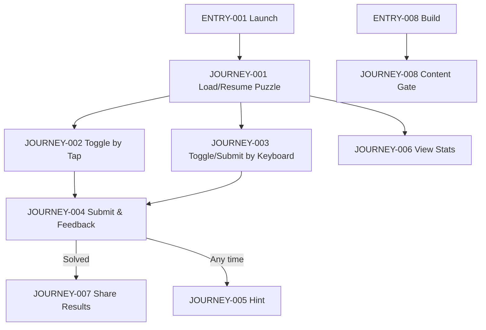
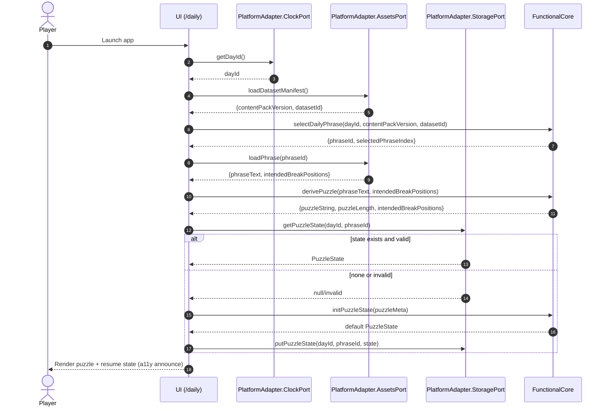
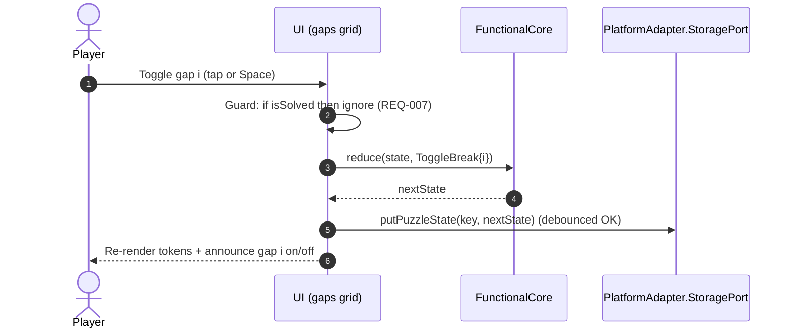
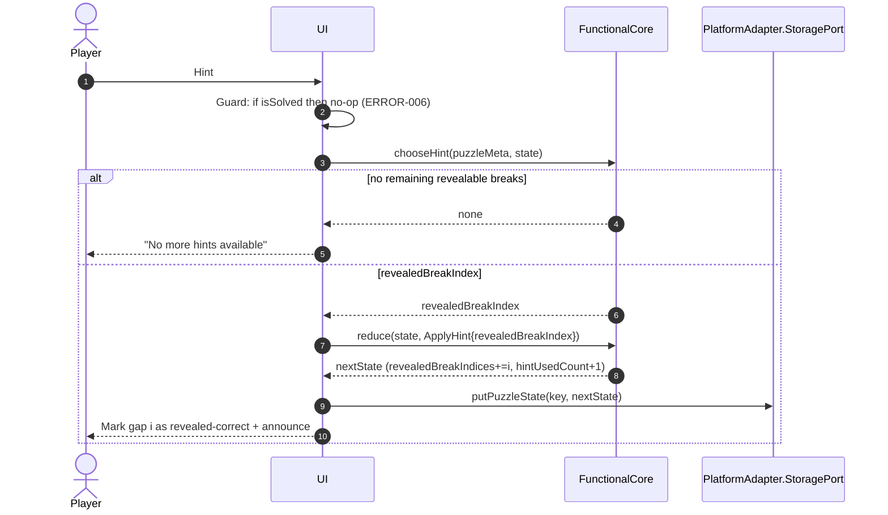
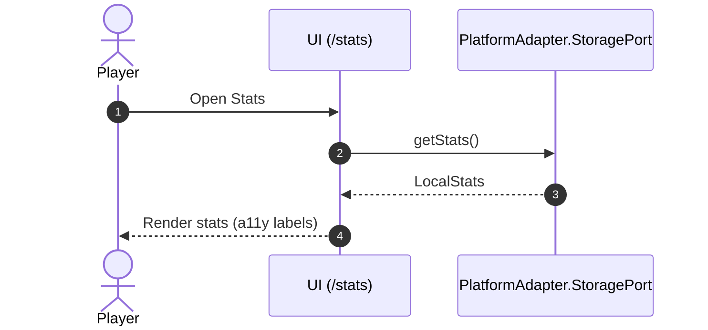
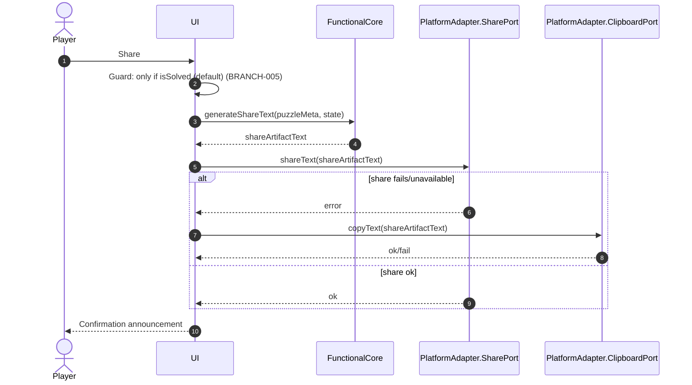
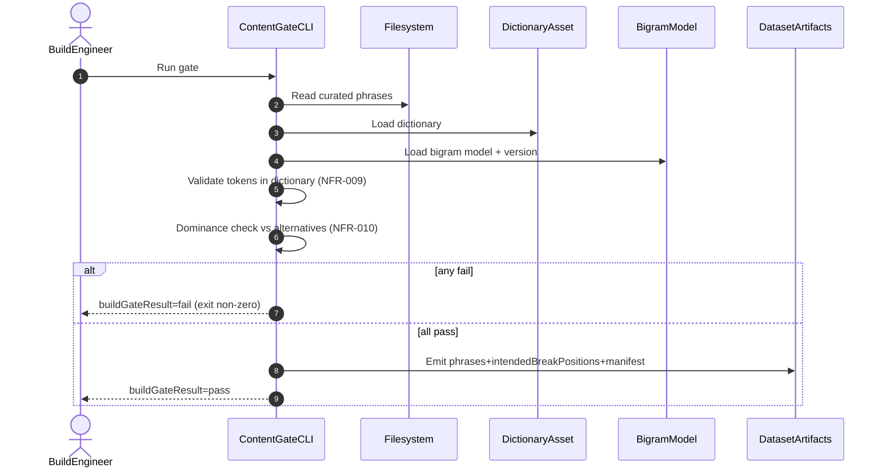

<!-- generated: 2026-07-24T06:46:51Z -->
<!-- mode: initial -->
<!-- feature-slug: sever -->
<!-- a2a-endpoint: https://bob-sdlc-orchestrator.2as6l7wq9qj8.eu-gb.codeengine.appdomain.cloud/v1/rpc -->

# Glossary

## Terms

### TERM-001: Puzzle
- **Definition:** The daily challenge consisting of a run-together letter string (**TERM-002**) and a single intended segmentation (**TERM-003**) derived from a curated phrase (**TERM-004**) for a specific **TERM-010 DayId**.
- **Synonyms:** daily puzzle, today’s puzzle
- **Anti-definition:** Not a user-generated puzzle; not randomized at play time; not fetched from a server.
- **Source:** User request

### TERM-002: Puzzle String
- **Definition:** The unspaced, uppercase (or display-cased) concatenation of the intended tokens from the intended phrase, e.g., `THERAPISTFINISHED`.
- **Synonyms:** run-together string, unsegmented string
- **Anti-definition:** Not the user’s candidate answer; not a phrase with spaces.
- **Source:** User request

### TERM-003: Intended Segmentation
- **Definition:** The canonical set of break positions between letters that yields the intended tokenization of the puzzle string for the day.
- **Synonyms:** solution, correct breaks
- **Anti-definition:** Not any alternative plausible segmentation; not partially correct.
- **Source:** User request

### TERM-004: Phrase (Content Phrase)
- **Definition:** A curated multi-word phrase whose spaces define the intended segmentation; spaces are stripped to create the puzzle string.
- **Synonyms:** content item
- **Anti-definition:** Not dynamically generated from user input; not fetched from network at runtime.
- **Source:** User request

### TERM-005: Token
- **Definition:** A contiguous sequence of letters produced by applying a segmentation (intended or candidate) to the puzzle string.
- **Synonyms:** word, segment
- **Anti-definition:** Not punctuation; not empty; not overlapping.
- **Source:** User request

### TERM-006: Candidate Segmentation
- **Definition:** The player’s current selection of break toggles between letters representing their attempted tokenization of the puzzle string.
- **Synonyms:** guess, attempt draft
- **Anti-definition:** Not automatically corrected; not a partial “score”; not the intended segmentation unless exact match.
- **Source:** User request

### TERM-007: Break Position
- **Definition:** A specific gap index between two adjacent letters in the puzzle string where a space may be inserted; valid indices are `1..(len-1)`.
- **Synonyms:** gap, boundary
- **Anti-definition:** Not a character index; not before the first or after the last letter.
- **Source:** User request

### TERM-008: Submission
- **Definition:** An explicit action to check the current candidate segmentation against the intended segmentation, consuming an attempt if incorrect.
- **Synonyms:** check, enter, submit guess
- **Anti-definition:** Not a mere toggle interaction; not an auto-check on every keystroke.
- **Source:** User request

### TERM-009: Attempt
- **Definition:** One of a limited number of allowed incorrect submissions for a puzzle; decremented when a submission is incorrect.
- **Synonyms:** guess count, remaining tries
- **Anti-definition:** Not decremented on correct solve; not decremented on toggling breaks.
- **Source:** User request

### TERM-010: DayId
- **Definition:** The canonical date identifier used for deterministic daily puzzle selection.
- **Synonyms:** puzzle date, daily key
- **Anti-definition:** Not device local time string without normalization.
- **Source:** User request

### TERM-011: Deterministic Daily Selection
- **Definition:** The pure function mapping (**TERM-010 DayId**, **TERM-012 Content Pack Version**, **TERM-013 DatasetId**) to a specific **TERM-004 Phrase** (and thus **TERM-001 Puzzle**) using a shipped seedable hash.
- **Synonyms:** daily picker
- **Anti-definition:** Not random per device; not dependent on network; not dependent on locale.
- **Source:** User request

### TERM-012: Content Pack Version
- **Definition:** The version identifier for the shipped phrase dataset used in selection and stability.
- **Synonyms:** content version
- **Anti-definition:** Not the app build number unless explicitly mapped.
- **Source:** User request

### TERM-013: DatasetId
- **Definition:** The identifier for the dataset/bundle of phrases used to ensure stable selection across releases and variants.
- **Synonyms:** dataset key
- **Anti-definition:** Not user-specific; not server-provided.
- **Source:** User request

### TERM-014: Seedable Hash
- **Definition:** A deterministic hashing function shipped with the app used to select the daily puzzle from inputs.
- **Synonyms:** deterministic hash
- **Anti-definition:** Not crypto required; not platform-provided randomness.
- **Source:** User request

### TERM-015: Feedback
- **Definition:** The post-submission results shown to the player: (a) count of correct break positions, and (b) whether all produced tokens are dictionary words.
- **Synonyms:** result, evaluation
- **Anti-definition:** Not revealing which specific breaks are correct; not revealing the intended phrase text.
- **Source:** User request

### TERM-016: Correct Break Count
- **Definition:** The integer count of break positions in the candidate segmentation that match the intended segmentation.
- **Synonyms:** matches, correct boundaries
- **Anti-definition:** Not a percentage; not positional disclosure.
- **Source:** User request

### TERM-017: Dictionary Word
- **Definition:** A token that exists in the shipped dictionary asset used for validation.
- **Synonyms:** valid word
- **Anti-definition:** Not an online dictionary lookup; not “looks like a word.”
- **Source:** User request

### TERM-018: Dictionary Check
- **Definition:** The deterministic evaluation that returns whether every token in the candidate segmentation is a **TERM-017 Dictionary Word**.
- **Synonyms:** word validity check
- **Anti-definition:** Not a spellchecker; not suggesting alternatives.
- **Source:** User request

### TERM-019: Hint
- **Definition:** A user-invoked action that reveals one correct break position for the current puzzle.
- **Synonyms:** reveal boundary
- **Anti-definition:** Not revealing multiple breaks; not revealing the full segmentation.
- **Source:** User request

### TERM-020: Hint Reveal
- **Definition:** The stateful effect of applying a hint: a particular break position is disclosed as correct to the player and typically locked/marked.
- **Synonyms:** revealed break
- **Anti-definition:** Not an automatic hint; not a spoiler of the phrase.
- **Source:** User request

### TERM-021: Local Stats
- **Definition:** On-device aggregates for play history (e.g., played count, wins, distribution, current/best streak).
- **Synonyms:** statistics, records
- **Anti-definition:** Not cloud-synced; not shared between devices.
- **Source:** User request

### TERM-022: Streak
- **Definition:** Consecutive days with successful solves (per DayId) recorded in local storage.
- **Synonyms:** run
- **Anti-definition:** Not consecutive app opens; not time-zone ambiguous without DayId rules.
- **Source:** User request

### TERM-023: Share Artifact
- **Definition:** A spoiler-safe, text/emoji block representation of attempt outcomes per submission ending on solve, excluding the puzzle phrase.
- **Synonyms:** share text, emoji share
- **Anti-definition:** Not a screenshot requirement; not including the actual phrase or exact breaks.
- **Source:** User request

### TERM-024: Offline-first
- **Definition:** The app is fully playable without network connectivity after installation, using only bundled assets and local persistence.
- **Synonyms:** offline playable
- **Anti-definition:** Not requiring login; not requiring API calls at play time.
- **Source:** User request

### TERM-025: Platform Adapter
- **Definition:** The thin layer providing storage/clock/share/asset-loading implementations per platform (web vs Capacitor) to a pure functional core.
- **Synonyms:** ports/adapters layer
- **Anti-definition:** Not containing game rules; not containing puzzle logic.
- **Source:** User request

### TERM-026: Functional Core
- **Definition:** A pure deterministic module implementing selection, validation, scoring, and state transitions without direct IO.
- **Synonyms:** game engine, rules engine
- **Anti-definition:** Not reading time; not reading/writing storage; not platform-dependent.
- **Source:** User request

### TERM-027: Composition Root
- **Definition:** The per-platform entry point that wires the functional core to a chosen platform adapter.
- **Synonyms:** bootstrap
- **Anti-definition:** Not shared game logic; not data storage.
- **Source:** User request

### TERM-028: Build-time Content Gate
- **Definition:** A build pipeline step that validates phrase quality and uniqueness before shipping.
- **Synonyms:** content QA gate
- **Anti-definition:** Not a runtime check; not a network-based validation.
- **Source:** User request

### TERM-029: Bigram Frequency Model
- **Definition:** A bundled model scoring token transitions to estimate plausibility of segmentations for quality gating.
- **Synonyms:** word-bigram model
- **Anti-definition:** Not user-personalized; not remote.
- **Source:** User request

### TERM-030: Dominant Segmentation
- **Definition:** The intended segmentation is scored sufficiently higher than alternative segmentations by the bigram model so ambiguous phrases are rejected.
- **Synonyms:** unambiguous best reading
- **Anti-definition:** Not “one of several equally plausible solutions.”
- **Source:** User request

### TERM-031: Accessibility Support
- **Definition:** Keyboard operability, screen-reader announcement of state/feedback, and non-color-only feedback.
- **Synonyms:** a11y
- **Anti-definition:** Not visual-only cues; not mouse-only interaction.
- **Source:** User request

### TERM-032: Attempt Limit
- **Definition:** The maximum number of incorrect submissions allowed per puzzle.
- **Synonyms:** max tries
- **Anti-definition:** Not unlimited practice mode.
- **Source:** User request

### TERM-033: Puzzle State
- **Definition:** The persisted per-DayId record including candidate breaks, attempts used, solved flag, hint usage, and submission history.
- **Synonyms:** saved game
- **Anti-definition:** Not global stats; not server-side.
- **Source:** User request

## Data Dictionary

| ID | Name | Type | Format | Range | Units | Default | Nullable | PII | Source | Validation |
|---|---|---|---|---|---|---|---|---|---|---|
| FIELD-001 | dayId | string | `YYYY-MM-DD` (ISO local-normalized rule) | valid calendar date | n/a | today | false | None | Platform Adapter (clock) | Must match regex `^\d{4}-\d{2}-\d{2}$` and parse to valid date |
| FIELD-002 | contentPackVersion | string | semver-like | pattern `x.y.z` | n/a | bundled | false | None | Bundled asset manifest | Must be non-empty; must match manifest value |
| FIELD-003 | datasetId | string | slug | `[a-z0-9-_.]+` | n/a | bundled | false | None | Bundled asset manifest | Must be non-empty; must match manifest value |
| FIELD-004 | phraseId | string | uuid/slug | implementation-defined | n/a | n/a | false | None | Bundled phrases dataset | Must exist in dataset index |
| FIELD-005 | phraseText | string | uppercase words w/ spaces | letters+spaces | n/a | n/a | false | None | Bundled phrases dataset | Must have ≥1 space; tokens must be alphabetic per ruleset |
| FIELD-006 | puzzleString | string | uppercase A–Z | `[A-Z]+` | n/a | n/a | false | None | Derived (Functional Core) | Must equal `phraseText` with spaces removed; length ≥ 2 |
| FIELD-007 | puzzleLength | integer | int32 | `2..512` | chars | derived | false | None | Derived | Must equal `len(puzzleString)` |
| FIELD-008 | breakPositions | boolean[] | array | length=`puzzleLength-1` | n/a | all false | false | None | Candidate state (Puzzle State) | Array length must equal `puzzleLength-1` |
| FIELD-009 | intendedBreakPositions | boolean[] | array | length=`puzzleLength-1` | n/a | n/a | false | None | Derived from phraseText (build-time) | True exactly at intended token boundaries |
| FIELD-010 | submissionId | string | uuid | uuid v4 | n/a | generated | false | None | Derived | Must be unique within a puzzle state |
| FIELD-011 | attemptIndex | integer | int32 | `1..FIELD-012` | attempts | n/a | false | None | Derived | Must increment by 1 per incorrect submission |
| FIELD-012 | attemptLimit | integer | int32 | `1..20` | attempts | 6 | false | None | Config (bundled) | Must be constant across platforms for fairness |
| FIELD-013 | correctBreakCount | integer | int32 | `0..(puzzleLength-1)` | breaks | n/a | false | None | Derived (Functional Core) | Must equal count of indices where candidate=true and intended=true |
| FIELD-014 | allTokensAreDictionaryWords | boolean | boolean | true/false | n/a | n/a | false | None | Derived (Functional Core) | True iff every token exists in dictionary |
| FIELD-015 | isSolved | boolean | boolean | true/false | n/a | false | false | None | Puzzle State | True iff candidate breaks exactly match intended breaks |
| FIELD-016 | attemptsUsed | integer | int32 | `0..attemptLimit` | attempts | 0 | false | None | Puzzle State | Must equal number of incorrect submissions recorded |
| FIELD-017 | submissionTimestampLocal | string | ISO-8601 | `YYYY-MM-DDTHH:mm:ss` | n/a | now | false | None | Platform Adapter (clock) | Must be parseable local timestamp |
| FIELD-018 | hintUsedCount | integer | int32 | `0..(puzzleLength-1)` | hints | 0 | false | None | Puzzle State | Must increment by 1 per hint; may be capped by config |
| FIELD-019 | revealedBreakIndex | integer | int32 | `1..(puzzleLength-1)` | index | n/a | false | None | Derived (Functional Core) | Must correspond to an intended break not previously revealed |
| FIELD-020 | revealedBreakIndices | integer[] | array | unique ints | n/a | [] | false | None | Puzzle State | Must be unique; each in `1..(puzzleLength-1)` |
| FIELD-021 | shareArtifactText | string | UTF-8 | length `1..4000` | n/a | n/a | false | None | Derived (Functional Core) | Must not contain `phraseText` or `puzzleString` as substring |
| FIELD-022 | streakCurrent | integer | int32 | `0..10000` | days | 0 | false | None | Local Stats | Recomputed from solve history if needed |
| FIELD-023 | streakBest | integer | int32 | `0..10000` | days | 0 | false | None | Local Stats | Must be ≥ `streakCurrent` over lifetime |
| FIELD-024 | totalPlayed | integer | int32 | `0..1000000` | puzzles | 0 | false | None | Local Stats | Increments once per DayId when first opened or first submission (define) |
| FIELD-025 | totalSolved | integer | int32 | `0..1000000` | puzzles | 0 | false | None | Local Stats | Increments once per DayId when first solved |
| FIELD-026 | solveAttemptNumber | integer | int32 | `1..attemptLimit` | attempts | n/a | true | None | Puzzle State | Nullable until solved; set to attempt number when solved |
| FIELD-027 | distributionByAttempts | object/map | JSON | keys `1..attemptLimit` | puzzles | empty | false | None | Local Stats | Counts non-negative ints; sum equals `totalSolved` |
| FIELD-028 | buildGateResult | string | enum | `pass|fail` | n/a | n/a | false | None | Build pipeline | Must be `pass` to ship |
| FIELD-029 | bigramModelVersion | string | semver-like | pattern `x.y.z` | n/a | bundled | false | None | Bundled model | Must match asset |
| FIELD-030 | dominanceMargin | number | float | `0..1` | score | 0.15 | false | None | Build config | Must be >0; used in dominance check |
| FIELD-031 | selectedPhraseIndex | integer | int32 | `0..(N-1)` | index | n/a | false | None | Derived (Functional Core) | Must be within dataset bounds |
| FIELD-032 | storageNamespace | string | slug | `[a-z0-9-_.]+` | n/a | `sever` | false | None | Platform Adapter | Must be constant per app id |
| FIELD-033 | platformId | string | enum | `web|ios|android` | n/a | n/a | false | None | Composition Root | Must be one of enum values |

**FIELD↔TERM membership (implicit via names):** Puzzle State fields (FIELD-008,015,016,018,020,026) belong to **TERM-033**; selection fields (FIELD-001..003,031) belong to **TERM-011**; feedback fields (FIELD-013,014) belong to **TERM-015**; share field (FIELD-021) belongs to **TERM-023**; build gate fields (FIELD-028..030) belong to **TERM-028/029/030**.

# User Journeys

## Roles

| Role ID | Role | Type | Description |
|---|---|---|---|
| ROLE-001 | Player | Primary | Plays the daily **TERM-001 Puzzle**, submits **TERM-008 Submissions**, uses **TERM-019 Hint**, views **TERM-021 Local Stats**, shares **TERM-023 Share Artifact** |
| ROLE-002 | Device OS | System | Provides storage, clipboard/share sheet, app lifecycle, accessibility APIs |
| ROLE-003 | Build Engineer | Admin/Dev | Runs build-time generation and **TERM-028 Build-time Content Gate** |
| ROLE-004 | QA/Tester | Secondary | Verifies determinism and cross-platform parity (web/iOS/Android) |

## Entry Points

| Entry ID | Location | Trigger | Auth |
|---|---|---|---|
| ENTRY-001 | App launch → `/daily` | User opens app/PWA | None |
| ENTRY-002 | In-puzzle UI (tap/click gap) | User toggles a **TERM-007 Break Position** | None |
| ENTRY-003 | In-puzzle UI (keyboard) | User moves focus and toggles break; submits | None |
| ENTRY-004 | “Submit” button / Enter key | User creates **TERM-008 Submission** | None |
| ENTRY-005 | “Hint” button | User requests **TERM-019 Hint** | None |
| ENTRY-006 | “Stats” screen | User navigates to stats | None |
| ENTRY-007 | “Share” button | User generates and invokes system share | None |
| ENTRY-008 | Build pipeline CLI | CI/build runs content gate | n/a |

## Role Permission Matrix

| Action | ROLE-001 Player | ROLE-002 Device OS | ROLE-003 Build Engineer | ROLE-004 QA |
|---|---:|---:|---:|---:|
| View daily puzzle | Y | N | N | Y |
| Toggle breaks (tap/keyboard) | Y | N | N | Y |
| Submit candidate | Y | N | N | Y |
| Use hint | Y | N | N | Y |
| View stats/streak | Y | N | N | Y |
| Share results | Y | Y (share sheet/clipboard) | N | Y |
| Persist/read local state | N | Y (via adapter) | N | N |
| Run build-time content gate | N | N | Y | Y |

## Journeys

### JOURNEY-001: Open today’s puzzle (load or resume)
- **Role/Goal:** ROLE-001 Player; open the deterministic **TERM-001 Puzzle** for **FIELD-001 dayId** and resume **TERM-033 Puzzle State**.
- **Success criteria:** The UI displays **FIELD-006 puzzleString**, current **FIELD-008 breakPositions**, **FIELD-016 attemptsUsed**, and **FIELD-015 isSolved** consistent with local persistence.
- **Failure criteria:** Missing assets or corrupt local state prevents rendering.

**Happy path**
1. Player launches app (ENTRY-001).
2. Platform Adapter (**TERM-025**) reads current **FIELD-001 dayId** from clock.
3. Functional Core (**TERM-026**) computes daily selection (**TERM-011**) using **FIELD-001**, **FIELD-002**, **FIELD-003** → **FIELD-031 selectedPhraseIndex**.
4. Functional Core loads **FIELD-004 phraseId** and derived **FIELD-006 puzzleString**, **FIELD-007 puzzleLength**, **FIELD-009 intendedBreakPositions** (from bundled assets).
5. Platform Adapter loads persisted **TERM-033 Puzzle State** for (**FIELD-001 dayId**, **FIELD-004 phraseId**) if present: **FIELD-008**, **FIELD-016**, **FIELD-015**, **FIELD-020**, **FIELD-026**.
6. UI renders puzzle string and current candidate breaks (**FIELD-008**), and announces state via accessibility (**TERM-031**).

**BRANCH-001 (no saved state)**
- Trigger: No persisted record exists for (**FIELD-001**, **FIELD-004**).
- Response: Initialize **FIELD-008** to all false, **FIELD-016=0**, **FIELD-015=false**, **FIELD-020=[]**.

**ERROR-001 (asset missing/corrupt)**
- Trigger: Bundled phrases/dictionary/model not loadable.
- System response: Show blocking error screen with retry.
- Recovery: Player retries; if still failing, show instructions to reinstall/update.

**ERROR-002 (saved state invalid)**
- Trigger: Persisted **FIELD-008** length != **FIELD-007-1**, or invalid indices in **FIELD-020**.
- System response: Reset only the invalid portion (or full puzzle state) and record a local diagnostic event.
- Recovery: Player continues with reset state.

**EDGE-001 (time-zone boundary)**
- Case: Launch around midnight causes **FIELD-001** change during session.
- Handling: Keep puzzle pinned to initial **FIELD-001** until user explicitly refreshes or relaunches; or prompt to switch (define in requirements).

---

### JOURNEY-002: Toggle breaks by tap/click
- **Role/Goal:** ROLE-001 Player; set **TERM-006 Candidate Segmentation** by toggling **TERM-007 Break Positions**.
- **Success criteria:** Tapping a gap toggles the corresponding entry in **FIELD-008 breakPositions** and updates token display without submitting.
- **Failure criteria:** Toggles apply to wrong index or are lost.

**Happy path**
1. Player taps/clicks a gap between letters (ENTRY-002).
2. UI maps gap to **TERM-007 Break Position** index `i` in `1..(FIELD-007-1)`.
3. Functional Core toggles **FIELD-008[i]`.
4. Platform Adapter persists updated **FIELD-008** in **TERM-033 Puzzle State**.
5. UI re-renders tokens (derived) and announces change for screen readers.

**ERROR-003 (puzzle solved)**
- Trigger: **FIELD-015 isSolved=true**.
- System response: Prevent toggling and announce “Puzzle already solved.”
- Recovery: None (view-only).

**EDGE-002 (multi-touch/rapid toggles)**
- Case: Multiple toggles fired quickly.
- Handling: Apply toggles sequentially; persistence debounced but state consistent.

---

### JOURNEY-003: Toggle breaks and submit by keyboard (accessible play)
- **Role/Goal:** ROLE-001 Player; complete all actions without pointer using keyboard/screen reader.
- **Success criteria:** All break positions are reachable and togglable; submit is possible; feedback is announced not by color alone.
- **Failure criteria:** Focus trap; unlabeled controls; feedback not announced.

**Happy path**
1. Player focuses puzzle region (ENTRY-003).
2. Player uses defined keys to move focus between gaps (e.g., Left/Right).
3. Player toggles focused gap (e.g., Space) updating **FIELD-008**.
4. Player presses Enter on submit (ENTRY-004) to create **TERM-008 Submission**.
5. UI announces **TERM-015 Feedback** including **FIELD-013 correctBreakCount** and **FIELD-014 allTokensAreDictionaryWords**.

**ERROR-004 (no focusable gaps)**
- Trigger: Gaps not represented as focusable elements.
- System response: Provide fallback list/grid of gaps as accessible controls.
- Recovery: Player continues.

**EDGE-003 (screen-reader verbosity)**
- Case: Announcing entire puzzle string each toggle is overwhelming.
- Handling: Announce only focused gap index and state (break on/off), plus resulting token boundary context (configurable).

---

### JOURNEY-004: Submit a candidate segmentation and receive feedback
- **Role/Goal:** ROLE-001 Player; submit **TERM-006 Candidate Segmentation** and learn progress without spoilers.
- **Success criteria:** Correct solution sets **FIELD-015=true**; incorrect consumes an attempt and returns **TERM-015 Feedback**.
- **Failure criteria:** Attempts not decremented correctly; feedback reveals break positions.

**Happy path**
1. Player presses Submit (ENTRY-004) with current **FIELD-008 breakPositions**.
2. Functional Core compares **FIELD-008** to **FIELD-009 intendedBreakPositions**.
3. If not equal: increment **FIELD-016 attemptsUsed**; compute **FIELD-013 correctBreakCount** and **FIELD-014 allTokensAreDictionaryWords**.
4. Persist a submission record with **FIELD-010 submissionId**, **FIELD-011 attemptIndex**, **FIELD-013**, **FIELD-014**, **FIELD-017**.
5. UI displays feedback counts and “all words valid” indicator without revealing which breaks were correct.

**BRANCH-002 (correct solve)**
- Trigger: **FIELD-008** exactly equals **FIELD-009**.
- Response: Set **FIELD-015 isSolved=true**, set **FIELD-026 solveAttemptNumber**, update **TERM-021 Local Stats** (FIELD-025, FIELD-027, FIELD-022/023), enable share.

**BRANCH-003 (attempt limit reached)**
- Trigger: **FIELD-016 attemptsUsed == FIELD-012 attemptLimit** after an incorrect submission.
- Response: Lock further submissions; show end state (optionally reveal solution—NOT requested; default is no reveal unless specified).

**ERROR-005 (submit with invalid state)**
- Trigger: **FIELD-008** wrong length or contains non-boolean.
- System response: Reject submission and repair/reset candidate.
- Recovery: Player reattempts.

**EDGE-004 (double-submit)**
- Case: User presses Enter twice rapidly.
- Handling: Ignore duplicate submits while evaluation in progress; do not double-decrement attempts.

---

### JOURNEY-005: Request and apply a hint
- **Role/Goal:** ROLE-001 Player; reveal one correct break position (**TERM-020 Hint Reveal**) to reduce search space.
- **Success criteria:** One correct break index is revealed and recorded in **FIELD-020 revealedBreakIndices**.
- **Failure criteria:** Reveals incorrect break; reveals multiple at once; not persisted.

**Happy path**
1. Player presses Hint (ENTRY-005).
2. Functional Core selects a break index **FIELD-019 revealedBreakIndex** such that **FIELD-009[int]=true** and not already in **FIELD-020**.
3. Functional Core adds index to **FIELD-020 revealedBreakIndices** and increments **FIELD-018 hintUsedCount**.
4. UI marks that gap as “correct break” and announces it via screen reader.
5. Platform Adapter persists updated **TERM-033 Puzzle State**.

**BRANCH-004 (no remaining correct breaks to reveal)**
- Trigger: All intended true breaks already revealed.
- Response: Show message “No more hints available.”

**ERROR-006 (hint on solved puzzle)**
- Trigger: **FIELD-015=true**.
- Response: No-op with announcement.

**EDGE-005 (locking behavior)**
- Case: Player tries to toggle a revealed correct break off.
- Handling: Either prevent toggling revealed breaks or allow but keep reveal marker; must be consistent (decide in requirements).

---

### JOURNEY-006: View stats and streak
- **Role/Goal:** ROLE-001 Player; view **TERM-021 Local Stats** and **TERM-022 Streak** computed from local history.
- **Success criteria:** Stats render without network and reflect local play accurately.
- **Failure criteria:** Incorrect streak across DayId boundaries.

**Happy path**
1. Player opens Stats (ENTRY-006).
2. Platform Adapter loads **FIELD-022 streakCurrent**, **FIELD-023 streakBest**, **FIELD-024 totalPlayed**, **FIELD-025 totalSolved**, **FIELD-027 distributionByAttempts**.
3. UI renders and provides accessible labels.

**EDGE-006 (device date changed)**
- Case: Player changes device clock.
- Handling: Stats are based on recorded **FIELD-001 dayId** per puzzle session; streak computation uses DayId sequence rules.

---

### JOURNEY-007: Share spoiler-safe results
- **Role/Goal:** ROLE-001 Player; share **TERM-023 Share Artifact** without revealing the phrase.
- **Success criteria:** Generated text contains attempt grid and metadata (dayId/attempts) but not **FIELD-005/006**.
- **Failure criteria:** Share includes phrase; share not available when unsolved (unless specified).

**Happy path**
1. Player taps Share (ENTRY-007) after solve (**FIELD-015=true**).
2. Functional Core generates **FIELD-021 shareArtifactText** from submission history (counts only).
3. Platform Adapter invokes OS share sheet / clipboard with **FIELD-021**.
4. UI confirms share action with an accessible announcement.

**BRANCH-005 (share before solve)**
- Trigger: **FIELD-015=false**.
- Response: Disable share button or generate partial share (must decide; default disable).

**ERROR-007 (share API unavailable)**
- Trigger: Share invocation fails.
- Response: Offer “Copy to clipboard” fallback where available.

---

### JOURNEY-008: Build-time content generation and quality gate
- **Role/Goal:** ROLE-003 Build Engineer; ensure shipped content meets dictionary and dominance constraints.
- **Success criteria:** Gate outputs **FIELD-028 buildGateResult=pass** and emits dataset artifacts with intended breaks.
- **Failure criteria:** Any phrase fails dictionary or dominance constraints.

**Happy path**
1. Build runs CLI (ENTRY-008).
2. Pipeline loads curated phrases (**FIELD-005 phraseText** list).
3. For each phrase: compute tokens; verify each token is a **TERM-017 Dictionary Word**.
4. For each phrase: compute alternative segmentations scored via **TERM-029 Bigram Frequency Model**; enforce **TERM-030 Dominant Segmentation** using **FIELD-030 dominanceMargin**.
5. If all pass: emit dataset with **FIELD-004 phraseId**, **FIELD-005**, derived **FIELD-006**, and intended breaks **FIELD-009**; set **FIELD-028=pass**.
6. If any fail: set **FIELD-028=fail** and fail the build.

**EDGE-007 (multiple equally plausible segmentations)**
- Case: Competing segmentations within margin.
- Handling: Reject phrase.

## Journey Map



# Requirements

### REQ-001: Deterministic daily puzzle selection
- **EARS Pattern:** Ubiquitous
- **EARS Statement:** The system shall select the daily **TERM-004 Phrase** by applying **TERM-011 Deterministic Daily Selection** to **FIELD-001 dayId**, **FIELD-002 contentPackVersion**, and **FIELD-003 datasetId**.
- **Inputs:** FIELD-001, FIELD-002, FIELD-003
- **Outputs:** FIELD-031, FIELD-004
- **Preconditions:** Bundled dataset is loadable
- **Postconditions:** Selected phrase index is within dataset bounds
- **Invariants:** Same inputs yield same output across platforms (**FIELD-033 platformId**)
- **Trigger:** App load (JOURNEY-001 step 3)
- **Actor:** ROLE-001 (indirect), ROLE-002 clock
- **EntityScope:** TERM-011
- **ErrorModes:** Asset missing (see NFR/REQ error handling)
- **NFR-Tags:** compatibility
- **Source:** JOURNEY-001 step 3
- **Dependencies:** REQ-002
- **Priority:** P0
- **AcceptanceCriteria:**
  - TEST-001: Given identical FIELD-001/002/003 on web and iOS, when selection runs, then FIELD-004 is identical.
  - TEST-002: Given identical FIELD-001/002/003 on iOS and Android, when selection runs, then FIELD-004 is identical.
  - TEST-003: Given a dataset of size N, then FIELD-031 is in `0..N-1`.
- **Assumptions:** Dataset ordering is stable within a (contentPackVersion,datasetId)
- **OpenQuestions:** Define canonical timezone rule for FIELD-001 generation.

### REQ-002: Seedable hash implementation
- **EARS Pattern:** Ubiquitous
- **EARS Statement:** The system shall compute the selection seed using a shipped **TERM-014 Seedable Hash** over the concatenation of **FIELD-001 dayId**, **FIELD-002 contentPackVersion**, and **FIELD-003 datasetId**.
- **Inputs:** FIELD-001, FIELD-002, FIELD-003
- **Outputs:** FIELD-031
- **Preconditions:** None
- **Postconditions:** Hash output maps deterministically to index range
- **Invariants:** No platform API randomness used
- **Trigger:** Selection execution (JOURNEY-001 step 3)
- **Actor:** System
- **EntityScope:** TERM-014
- **ErrorModes:** None
- **NFR-Tags:** compatibility
- **Source:** JOURNEY-001 step 3
- **Dependencies:** None
- **Priority:** P0
- **AcceptanceCriteria:**
  - TEST-004: Given fixed inputs, hash output is identical across JS runtimes used by web/iOS/Android.
- **Assumptions:** Hash is implemented in TypeScript with no native calls
- **OpenQuestions:** Specify hash algorithm (e.g., xxHash32-like) and encoding (UTF-8).

### REQ-003: Derive puzzle string from phrase
- **EARS Pattern:** Ubiquitous
- **EARS Statement:** The system shall derive **FIELD-006 puzzleString** by removing spaces from **FIELD-005 phraseText**.
- **Inputs:** FIELD-005
- **Outputs:** FIELD-006
- **Preconditions:** Phrase loaded
- **Postconditions:** FIELD-006 contains only letters per dataset rules
- **Invariants:** FIELD-006 length equals sum of token lengths
- **Trigger:** Puzzle load (JOURNEY-001 step 4)
- **Actor:** System
- **EntityScope:** TERM-002
- **ErrorModes:** Invalid phrase format
- **NFR-Tags:** compatibility
- **Source:** JOURNEY-001 step 4
- **Dependencies:** None
- **Priority:** P0
- **AcceptanceCriteria:**
  - TEST-005: Given `THERAPIST FINISHED`, then FIELD-006 equals `THERAPISTFINISHED`.
- **Assumptions:** PhraseText uses single spaces between tokens
- **OpenQuestions:** Case normalization rules (upper vs preserve).

### REQ-004: Represent candidate breaks as boolean array
- **EARS Pattern:** Ubiquitous
- **EARS Statement:** The system shall represent the **TERM-006 Candidate Segmentation** as **FIELD-008 breakPositions** with length **FIELD-007 puzzleLength-1**.
- **Inputs:** FIELD-006
- **Outputs:** FIELD-008, FIELD-007
- **Preconditions:** Puzzle string derived
- **Postconditions:** Break array initialized or loaded
- **Invariants:** Length consistency
- **Trigger:** Puzzle init/load (JOURNEY-001 steps 4–5)
- **Actor:** System
- **EntityScope:** TERM-006
- **ErrorModes:** Saved state invalid length
- **NFR-Tags:** reliability
- **Source:** JOURNEY-001 step 5; ERROR-002
- **Dependencies:** REQ-003
- **Priority:** P0
- **AcceptanceCriteria:**
  - TEST-006: Given puzzleLength=L, then breakPositions length equals L-1.
- **Assumptions:** Max puzzle length bounded by dataset rules
- **OpenQuestions:** Upper bound for FIELD-007.

### REQ-005: Initialize puzzle state when absent
- **EARS Pattern:** Event-Driven
- **EARS Statement:** When no persisted **TERM-033 Puzzle State** exists for **FIELD-001 dayId** and **FIELD-004 phraseId**, the system shall initialize **FIELD-008** to all false and set **FIELD-016=0** and **FIELD-015=false**.
- **Inputs:** FIELD-001, FIELD-004
- **Outputs:** FIELD-008, FIELD-016, FIELD-015
- **Preconditions:** Puzzle identified
- **Postconditions:** New state persisted
- **Invariants:** Deterministic initialization
- **Trigger:** State load (JOURNEY-001 BRANCH-001)
- **Actor:** System
- **EntityScope:** TERM-033
- **ErrorModes:** Storage write failure
- **NFR-Tags:** reliability
- **Source:** JOURNEY-001 BRANCH-001
- **Dependencies:** REQ-004, NFR-004
- **Priority:** P0
- **AcceptanceCriteria:**
  - TEST-007: Given no saved state, when opening puzzle, then attemptsUsed=0 and isSolved=false.
- **Assumptions:** Storage namespace FIELD-032 is stable
- **OpenQuestions:** Persist-on-open vs persist-on-first-interaction.

### REQ-006: Toggle a break position by pointer
- **EARS Pattern:** Event-Driven
- **EARS Statement:** When the player toggles a **TERM-007 Break Position** at index `i`, the system shall invert **FIELD-008[i]**.
- **Inputs:** FIELD-008, break index i
- **Outputs:** Updated FIELD-008
- **Preconditions:** **FIELD-015=false**
- **Postconditions:** Updated state persisted
- **Invariants:** Only index i changes
- **Trigger:** Tap/click gap (JOURNEY-002 step 1)
- **Actor:** ROLE-001
- **EntityScope:** TERM-007
- **ErrorModes:** Index out of range
- **NFR-Tags:** accessibility
- **Source:** JOURNEY-002 steps 1–4
- **Dependencies:** REQ-004, NFR-004
- **Priority:** P0
- **AcceptanceCriteria:**
  - TEST-008: Given breakPositions[i]=false, when toggled, then breakPositions[i]=true.
  - TEST-009: Given i outside `1..(puzzleLength-1)`, then the toggle is rejected and state is unchanged.
- **Assumptions:** UI can map pointer location to i
- **OpenQuestions:** Whether revealed hint breaks are lock-protected (see REQ-014/REQ-015).

### REQ-007: Prevent toggling after solve
- **EARS Pattern:** State-Driven
- **EARS Statement:** While **FIELD-015 isSolved** is true, the system shall not modify **FIELD-008 breakPositions** in response to toggle interactions.
- **Inputs:** FIELD-015, toggle event
- **Outputs:** None (no state change)
- **Preconditions:** Puzzle loaded
- **Postconditions:** State unchanged
- **Invariants:** Solved puzzles are view-only
- **Trigger:** Toggle attempt (JOURNEY-002 ERROR-003)
- **Actor:** ROLE-001
- **EntityScope:** TERM-033
- **ErrorModes:** None
- **NFR-Tags:** reliability
- **Source:** JOURNEY-002 ERROR-003
- **Dependencies:** REQ-006
- **Priority:** P1
- **AcceptanceCriteria:**
  - TEST-010: Given isSolved=true, when toggling any gap, then breakPositions array is unchanged.
- **Assumptions:** UI indicates locked state
- **OpenQuestions:** Allow “practice mode” later?

### REQ-008: Submit candidate segmentation
- **EARS Pattern:** Event-Driven
- **EARS Statement:** When the player submits, the system shall compare **FIELD-008 breakPositions** to **FIELD-009 intendedBreakPositions**.
- **Inputs:** FIELD-008, FIELD-009
- **Outputs:** Comparison result (equal/not equal)
- **Preconditions:** Puzzle loaded
- **Postconditions:** Branch handled by REQ-009 or REQ-010
- **Invariants:** Comparison is pure deterministic
- **Trigger:** Submit action (JOURNEY-004 step 1–2)
- **Actor:** ROLE-001
- **EntityScope:** TERM-008
- **ErrorModes:** Candidate state invalid length
- **NFR-Tags:** compatibility
- **Source:** JOURNEY-004 step 2; ERROR-005
- **Dependencies:** REQ-004
- **Priority:** P0
- **AcceptanceCriteria:**
  - TEST-011: Given identical arrays, comparison returns equal.
- **Assumptions:** Intended breaks provided by dataset
- **OpenQuestions:** None

### REQ-009: Record incorrect submission feedback and decrement attempts
- **EARS Pattern:** Event-Driven
- **EARS Statement:** When a submission comparison is not equal, the system shall increment **FIELD-016 attemptsUsed** by 1.
- **Inputs:** FIELD-016
- **Outputs:** Updated FIELD-016
- **Preconditions:** **FIELD-015=false** and **FIELD-016 < FIELD-012**
- **Postconditions:** attemptsUsed persisted
- **Invariants:** Exactly +1 per incorrect submission
- **Trigger:** Incorrect submission (JOURNEY-004 step 3)
- **Actor:** System
- **EntityScope:** TERM-009
- **ErrorModes:** Attempt limit exceeded
- **NFR-Tags:** reliability
- **Source:** JOURNEY-004 step 3; BRANCH-003
- **Dependencies:** REQ-008, REQ-011
- **Priority:** P0
- **AcceptanceCriteria:**
  - TEST-012: Given attemptsUsed=2, when incorrect submit, then attemptsUsed=3.
- **Assumptions:** Correct solve does not increment attemptsUsed
- **OpenQuestions:** Define whether totalPlayed increments on first open or first submit (stats coupling).

### REQ-010: Mark puzzle solved on correct submission
- **EARS Pattern:** Event-Driven
- **EARS Statement:** When a submission comparison is equal, the system shall set **FIELD-015 isSolved** to true.
- **Inputs:** Comparison result
- **Outputs:** FIELD-015
- **Preconditions:** Puzzle loaded
- **Postconditions:** Solve recorded
- **Invariants:** isSolved remains true once set
- **Trigger:** Correct submission (JOURNEY-004 BRANCH-002)
- **Actor:** System
- **EntityScope:** TERM-033
- **ErrorModes:** None
- **NFR-Tags:** reliability
- **Source:** JOURNEY-004 BRANCH-002
- **Dependencies:** REQ-008, REQ-012, REQ-013
- **Priority:** P0
- **AcceptanceCriteria:**
  - TEST-013: Given candidate breaks equal intended breaks, when submit, then isSolved=true.
- **Assumptions:** Exact match required
- **OpenQuestions:** None

### REQ-011: Compute correct break count
- **EARS Pattern:** Event-Driven
- **EARS Statement:** When a submission comparison is not equal, the system shall compute **FIELD-013 correctBreakCount** as the number of indices where **FIELD-008** and **FIELD-009** are both true.
- **Inputs:** FIELD-008, FIELD-009
- **Outputs:** FIELD-013
- **Preconditions:** Arrays same length
- **Postconditions:** Feedback available for display
- **Invariants:** Does not reveal positions
- **Trigger:** Incorrect submission (JOURNEY-004 step 3)
- **Actor:** System
- **EntityScope:** TERM-016
- **ErrorModes:** None
- **NFR-Tags:** compatibility
- **Source:** JOURNEY-004 step 3
- **Dependencies:** REQ-008
- **Priority:** P0
- **AcceptanceCriteria:**
  - TEST-014: Given intended true at indices {2,5} and candidate true at {5,7}, then correctBreakCount=1.
- **Assumptions:** Count includes only true breaks (not correct non-breaks)
- **OpenQuestions:** Should correct non-break count also be tracked? (Request implies breaks only.)

### REQ-012: Validate that all tokens are dictionary words
- **EARS Pattern:** Event-Driven
- **EARS Statement:** When a submission comparison is not equal, the system shall set **FIELD-014 allTokensAreDictionaryWords** to true if and only if every token produced by **FIELD-008** is a **TERM-017 Dictionary Word**.
- **Inputs:** FIELD-006, FIELD-008, dictionary asset
- **Outputs:** FIELD-014
- **Preconditions:** Dictionary asset loaded
- **Postconditions:** Feedback available for display
- **Invariants:** Deterministic tokenization and lookup
- **Trigger:** Incorrect submission (JOURNEY-004 step 3)
- **Actor:** System
- **EntityScope:** TERM-018
- **ErrorModes:** Dictionary asset missing
- **NFR-Tags:** compatibility
- **Source:** JOURNEY-004 step 3
- **Dependencies:** REQ-003, REQ-004, NFR-003
- **Priority:** P0
- **AcceptanceCriteria:**
  - TEST-015: Given tokens all present in dictionary, then allTokensAreDictionaryWords=true.
  - TEST-016: Given any token absent, then allTokensAreDictionaryWords=false.
- **Assumptions:** Dictionary words are normalized same as puzzle casing
- **OpenQuestions:** Token character set (A–Z only vs allowing apostrophes).

### REQ-013: Persist submission record
- **EARS Pattern:** Event-Driven
- **EARS Statement:** When the player submits, the system shall append a submission record containing **FIELD-010 submissionId**, **FIELD-011 attemptIndex**, **FIELD-013 correctBreakCount**, **FIELD-014 allTokensAreDictionaryWords**, and **FIELD-017 submissionTimestampLocal** to the **TERM-033 Puzzle State**.
- **Inputs:** Submission event, derived feedback fields, clock
- **Outputs:** Updated persisted puzzle state
- **Preconditions:** Puzzle loaded
- **Postconditions:** Submission history available for share artifact
- **Invariants:** attemptIndex is strictly increasing for incorrect submissions
- **Trigger:** Submit action (JOURNEY-004 step 4)
- **Actor:** System
- **EntityScope:** TERM-033
- **ErrorModes:** Storage write failure
- **NFR-Tags:** auditability
- **Source:** JOURNEY-004 step 4
- **Dependencies:** REQ-009, REQ-011, REQ-012, NFR-004
- **Priority:** P1
- **AcceptanceCriteria:**
  - TEST-017: Given an incorrect submission, then a new record exists with attemptIndex=attemptsUsed (post-increment).
- **Assumptions:** Timestamp is local-only metadata
- **OpenQuestions:** Whether to record correct submissions as well (for share).

### REQ-014: Provide a hint revealing one correct break
- **EARS Pattern:** Event-Driven
- **EARS Statement:** When the player requests a hint, the system shall select one break index **FIELD-019 revealedBreakIndex** where **FIELD-009** is true and the index is not in **FIELD-020 revealedBreakIndices**.
- **Inputs:** FIELD-009, FIELD-020
- **Outputs:** FIELD-019
- **Preconditions:** **FIELD-015=false**
- **Postconditions:** Index available to apply reveal
- **Invariants:** Revealed index is always a correct break
- **Trigger:** Hint action (JOURNEY-005 step 1–2)
- **Actor:** ROLE-001
- **EntityScope:** TERM-019
- **ErrorModes:** No remaining revealable breaks
- **NFR-Tags:** reliability
- **Source:** JOURNEY-005 step 2; BRANCH-004
- **Dependencies:** REQ-015
- **Priority:** P1
- **AcceptanceCriteria:**
  - TEST-018: Given at least one unrevealed true intended break, then revealedBreakIndex is one of them.
- **Assumptions:** Selection method may be deterministic (e.g., lowest index) to preserve parity
- **OpenQuestions:** Deterministic vs random reveal (random must still be deterministic offline).

### REQ-015: Apply hint reveal to puzzle state
- **EARS Pattern:** Event-Driven
- **EARS Statement:** When a hint index **FIELD-019 revealedBreakIndex** is produced, the system shall append it to **FIELD-020 revealedBreakIndices** and increment **FIELD-018 hintUsedCount** by 1.
- **Inputs:** FIELD-019, FIELD-020, FIELD-018
- **Outputs:** Updated FIELD-020, FIELD-018
- **Preconditions:** Hint index valid
- **Postconditions:** State persisted
- **Invariants:** revealedBreakIndices contains unique indices
- **Trigger:** Hint selection (JOURNEY-005 steps 2–3)
- **Actor:** System
- **EntityScope:** TERM-020
- **ErrorModes:** Storage write failure
- **NFR-Tags:** reliability
- **Source:** JOURNEY-005 step 3
- **Dependencies:** NFR-004
- **Priority:** P1
- **AcceptanceCriteria:**
  - TEST-019: Given hintUsedCount=k, after applying hint, hintUsedCount=k+1.
- **Assumptions:** Hints allowed without consuming attempts
- **OpenQuestions:** Lock revealed break toggling behavior (see REQ-016).

### REQ-016: Hint-revealed break interaction rule
- **EARS Pattern:** Ubiquitous
- **EARS Statement:** The system shall render each index in **FIELD-020 revealedBreakIndices** as disclosed-correct feedback without revealing any other indices in **FIELD-009**.
- **Inputs:** FIELD-020, FIELD-009
- **Outputs:** UI state
- **Preconditions:** Puzzle rendered
- **Postconditions:** Player sees exactly the revealed breaks
- **Invariants:** No additional solution leakage
- **Trigger:** Render (JOURNEY-005 step 4)
- **Actor:** System
- **EntityScope:** TERM-020
- **ErrorModes:** None
- **NFR-Tags:** accessibility
- **Source:** JOURNEY-005 step 4
- **Dependencies:** REQ-015
- **Priority:** P1
- **AcceptanceCriteria:**
  - TEST-020: Given revealedBreakIndices=[3], UI indicates break 3 is correct and does not indicate correctness of any other break.
- **Assumptions:** “Indicate” includes aria-label text
- **OpenQuestions:** Should toggling a revealed break be prevented (lock) or allowed?

### REQ-017: Enforce attempt limit on submissions
- **EARS Pattern:** State-Driven
- **EARS Statement:** While **FIELD-016 attemptsUsed** equals **FIELD-012 attemptLimit** and **FIELD-015** is false, the system shall not evaluate further submissions.
- **Inputs:** FIELD-016, FIELD-012, FIELD-015
- **Outputs:** None (no evaluation); UI message
- **Preconditions:** Puzzle loaded
- **Postconditions:** State unchanged
- **Invariants:** No attempts beyond limit
- **Trigger:** Submit action (JOURNEY-004 BRANCH-003)
- **Actor:** ROLE-001
- **EntityScope:** TERM-032
- **ErrorModes:** None
- **NFR-Tags:** reliability
- **Source:** JOURNEY-004 BRANCH-003
- **Dependencies:** REQ-009
- **Priority:** P0
- **AcceptanceCriteria:**
  - TEST-021: Given attemptsUsed=attemptLimit and isSolved=false, when submit, then attemptsUsed remains attemptLimit and no new submission record is added.
- **Assumptions:** Game-over state does not reveal solution by default
- **OpenQuestions:** Should the solution ever be revealable after failure?

### REQ-018: Generate spoiler-safe share artifact
- **EARS Pattern:** Event-Driven
- **EARS Statement:** When the player requests share and **FIELD-015** is true, the system shall generate **FIELD-021 shareArtifactText** containing per-attempt outcome rows derived from submission history and excluding **FIELD-005 phraseText** and **FIELD-006 puzzleString**.
- **Inputs:** Submission history, FIELD-015, FIELD-001
- **Outputs:** FIELD-021
- **Preconditions:** Solved puzzle
- **Postconditions:** Share text available to adapter
- **Invariants:** No phrase leakage
- **Trigger:** Share action (JOURNEY-007 steps 1–2)
- **Actor:** ROLE-001
- **EntityScope:** TERM-023
- **ErrorModes:** Missing submission history
- **NFR-Tags:** privacy
- **Source:** JOURNEY-007 steps 1–2
- **Dependencies:** REQ-013
- **Priority:** P1
- **AcceptanceCriteria:**
  - TEST-022: Given phraseText and puzzleString, generated shareArtifactText does not contain either as a substring.
  - TEST-023: Given N incorrect submissions then solve, shareArtifactText contains N+1 rows (ending on solve).
- **Assumptions:** Emoji/block alphabet is fixed
- **OpenQuestions:** Include DayId and attempt count header format?

### REQ-019: Invoke platform share mechanisms
- **EARS Pattern:** Event-Driven
- **EARS Statement:** When **FIELD-021 shareArtifactText** is generated, the system shall pass it to the **TERM-025 Platform Adapter** to invoke the platform share UI.
- **Inputs:** FIELD-021, FIELD-033
- **Outputs:** Share invocation result
- **Preconditions:** Share supported or fallback available
- **Postconditions:** User can share or copy
- **Invariants:** Core remains IO-free
- **Trigger:** Share request (JOURNEY-007 step 3)
- **Actor:** ROLE-002 Device OS
- **EntityScope:** TERM-025
- **ErrorModes:** Share API unavailable
- **NFR-Tags:** compatibility
- **Source:** JOURNEY-007 step 3; ERROR-007
- **Dependencies:** REQ-018
- **Priority:** P2
- **AcceptanceCriteria:**
  - TEST-024: Given share API failure, then user is offered a copy-to-clipboard fallback where supported.
- **Assumptions:** Capacitor Share plugin availability varies
- **OpenQuestions:** Web fallback behavior (navigator.share vs clipboard).

### REQ-020: Update local stats on first solve per DayId
- **EARS Pattern:** Event-Driven
- **EARS Statement:** When **FIELD-015 isSolved** becomes true for a **FIELD-001 dayId** that was not previously solved, the system shall increment **FIELD-025 totalSolved** by 1.
- **Inputs:** FIELD-015 transition, solve history
- **Outputs:** Updated FIELD-025
- **Preconditions:** Local stats exist or are initializable
- **Postconditions:** Stats persisted
- **Invariants:** One increment max per DayId
- **Trigger:** Solve event (JOURNEY-004 BRANCH-002)
- **Actor:** System
- **EntityScope:** TERM-021
- **ErrorModes:** Storage write failure
- **NFR-Tags:** reliability
- **Source:** JOURNEY-004 BRANCH-002
- **Dependencies:** REQ-010, NFR-004
- **Priority:** P1
- **AcceptanceCriteria:**
  - TEST-025: Given DayId unsolved, when solved, totalSolved increments by 1.
- **Assumptions:** Solve history keyed by DayId
- **OpenQuestions:** Define totalPlayed increment rule (open vs submit).

### REQ-021: Compute and persist streak values
- **EARS Pattern:** Event-Driven
- **EARS Statement:** When a puzzle is solved, the system shall recompute **FIELD-022 streakCurrent** from locally recorded solved **FIELD-001 dayId** values.
- **Inputs:** Solve history (DayIds)
- **Outputs:** FIELD-022
- **Preconditions:** Local solve history present
- **Postconditions:** streak persisted
- **Invariants:** Computation uses DayId sequence, not device clock time
- **Trigger:** Solve event (JOURNEY-004 BRANCH-002)
- **Actor:** System
- **EntityScope:** TERM-022
- **ErrorModes:** Corrupt history
- **NFR-Tags:** reliability
- **Source:** JOURNEY-004 BRANCH-002; JOURNEY-006 EDGE-006
- **Dependencies:** REQ-020
- **Priority:** P2
- **AcceptanceCriteria:**
  - TEST-026: Given solved DayIds for three consecutive dates ending at today, streakCurrent=3.
- **Assumptions:** DayId canonicalization defined
- **OpenQuestions:** Whether “today” is required for streakCurrent or last-solved date.

### REQ-022: Repair invalid saved puzzle state
- **EARS Pattern:** Event-Driven
- **EARS Statement:** When persisted **FIELD-008 breakPositions** length does not equal **FIELD-007 puzzleLength-1**, the system shall reset **FIELD-008** to the default value.
- **Inputs:** Persisted FIELD-008, derived FIELD-007
- **Outputs:** Repaired FIELD-008
- **Preconditions:** Puzzle loaded
- **Postconditions:** Repaired state persisted
- **Invariants:** Repair does not alter intended breaks
- **Trigger:** Load state (JOURNEY-001 ERROR-002)
- **Actor:** System
- **EntityScope:** TERM-033
- **ErrorModes:** Storage write failure
- **NFR-Tags:** reliability, observability
- **Source:** JOURNEY-001 ERROR-002
- **Dependencies:** REQ-004, NFR-004, NFR-006
- **Priority:** P1
- **AcceptanceCriteria:**
  - TEST-027: Given breakPositions length mismatch, when loading, then breakPositions equals all-false of length L-1.
- **Assumptions:** Reset is acceptable over attempting partial migration
- **OpenQuestions:** Add versioned state migrations?

### REQ-023: Functional core purity boundary
- **EARS Pattern:** Unwanted
- **EARS Statement:** The system shall not access storage, network, or platform clock APIs from the **TERM-026 Functional Core**.
- **Inputs:** n/a
- **Outputs:** n/a
- **Preconditions:** Architecture implemented
- **Postconditions:** IO occurs only in adapter
- **Invariants:** Core testable deterministically
- **Trigger:** Any core execution (multiple journeys)
- **Actor:** System
- **EntityScope:** TERM-026
- **ErrorModes:** None
- **NFR-Tags:** compatibility, testability
- **Source:** User request architecture; JOURNEY-001 steps 2–4
- **Dependencies:** None
- **Priority:** P0
- **AcceptanceCriteria:**
  - TEST-028: Static analysis or unit tests demonstrate core modules have no imports of storage/clock/share libraries.
- **Assumptions:** Composition root supplies ports
- **OpenQuestions:** Define allowed dependencies for core (e.g., pure hashing lib).

---

### NFR-001: Offline play (no runtime network dependency)
- **EARS Pattern:** Unwanted
- **EARS Statement:** The system shall not require network connectivity to load or play the daily **TERM-001 Puzzle**.
- **Inputs:** n/a
- **Outputs:** n/a
- **Preconditions:** App installed with assets
- **Postconditions:** Gameplay possible offline
- **Invariants:** All assets bundled
- **Trigger:** Puzzle load and play (JOURNEY-001..007)
- **Actor:** ROLE-001
- **EntityScope:** TERM-024
- **ErrorModes:** None
- **NFR-Tags:** reliability, compatibility
- **Source:** User request; JOURNEY-001
- **Dependencies:** NFR-002, NFR-003
- **Priority:** P0
- **AcceptanceCriteria:**
  - TEST-029: With device in airplane mode, user can open today’s puzzle and submit guesses successfully.
- **Assumptions:** OS may still attempt captive checks; app must not block
- **OpenQuestions:** None

### NFR-002: Asset availability for offline use (PWA)
- **EARS Pattern:** Ubiquitous
- **EARS Statement:** The system shall cache the phrases dataset, dictionary asset, and bigram model assets for offline use in the installable PWA.
- **Inputs:** Asset list from manifest
- **Outputs:** Cached assets
- **Preconditions:** First-run online (install time) may occur
- **Postconditions:** Assets available offline thereafter
- **Invariants:** Cache version tied to **FIELD-002 contentPackVersion**
- **Trigger:** PWA install/first run (related to JOURNEY-001 ERROR-001)
- **Actor:** System
- **EntityScope:** TERM-024
- **ErrorModes:** Cache write failure
- **NFR-Tags:** reliability
- **Source:** User request offline-first; JOURNEY-001 ERROR-001
- **Dependencies:** None
- **Priority:** P0
- **AcceptanceCriteria:**
  - TEST-030: After one successful load, subsequent loads succeed offline with no network requests for required assets.
- **Assumptions:** Service worker strategy available
- **OpenQuestions:** Cache busting strategy across versions.

### NFR-003: Deterministic core operations across platforms
- **EARS Pattern:** Ubiquitous
- **EARS Statement:** The system shall implement segmentation validation and **FIELD-013 correctBreakCount** computation as pure deterministic string/array operations that produce identical outputs for identical inputs on web, iOS, and Android.
- **Inputs:** FIELD-006, FIELD-008, FIELD-009
- **Outputs:** FIELD-013, FIELD-014, FIELD-015
- **Preconditions:** None
- **Postconditions:** Same outputs across platforms
- **Invariants:** No locale-sensitive operations (e.g., locale casing)
- **Trigger:** Submit (JOURNEY-004)
- **Actor:** System
- **EntityScope:** TERM-026
- **ErrorModes:** None
- **NFR-Tags:** compatibility
- **Source:** User request; JOURNEY-004
- **Dependencies:** REQ-011, REQ-012
- **Priority:** P0
- **AcceptanceCriteria:**
  - TEST-031: Golden test vectors produce identical outputs on all platform builds.
- **Assumptions:** Use ASCII-only operations for tokens
- **OpenQuestions:** Define normalization/casing rules.

### NFR-004: Local persistence durability
- **EARS Pattern:** Ubiquitous
- **EARS Statement:** The system shall persist **TERM-033 Puzzle State** and **TERM-021 Local Stats** locally using the **TERM-025 Platform Adapter**.
- **Inputs:** Puzzle state/stats objects
- **Outputs:** Stored records
- **Preconditions:** Storage available
- **Postconditions:** State restored on relaunch
- **Invariants:** No remote sync
- **Trigger:** State changes (JOURNEY-002,004,005,006)
- **Actor:** ROLE-002
- **EntityScope:** TERM-025
- **ErrorModes:** Storage read/write failure
- **NFR-Tags:** reliability
- **Source:** User request; JOURNEY-001 step 5
- **Dependencies:** None
- **Priority:** P0
- **AcceptanceCriteria:**
  - TEST-032: After toggling breaks and force-closing the app, relaunch restores FIELD-008 exactly.
- **Assumptions:** Use IndexedDB/localStorage for web; Capacitor Preferences/Filesystem for native
- **OpenQuestions:** Define which storage backend is authoritative per platform.

### NFR-005: Keyboard operability
- **EARS Pattern:** Ubiquitous
- **EARS Statement:** The system shall provide keyboard-only controls to move focus across all **TERM-007 Break Positions**, toggle the focused break, and trigger **TERM-008 Submission**.
- **Inputs:** Keyboard events
- **Outputs:** Updated FIELD-008; submit trigger
- **Preconditions:** Puzzle rendered
- **Postconditions:** Actions performed without pointer
- **Invariants:** Focus order covers all gaps and key controls
- **Trigger:** Keyboard input (JOURNEY-003)
- **Actor:** ROLE-001
- **EntityScope:** TERM-031
- **ErrorModes:** None
- **NFR-Tags:** accessibility
- **Source:** User request; JOURNEY-003
- **Dependencies:** REQ-006, REQ-008
- **Priority:** P0
- **AcceptanceCriteria:**
  - TEST-033: Using only keyboard, user can toggle any gap and submit.
- **Assumptions:** Key bindings documented in UI
- **OpenQuestions:** Exact key mapping (arrows/Tab/space/enter).

### NFR-006: Screen-reader announcements and non-color feedback
- **EARS Pattern:** Ubiquitous
- **EARS Statement:** The system shall expose accessible names/roles for puzzle controls and announce **TERM-015 Feedback** values (**FIELD-013**, **FIELD-014**) without relying on color.
- **Inputs:** UI state, feedback fields
- **Outputs:** ARIA/accessibility tree updates
- **Preconditions:** Assistive tech enabled
- **Postconditions:** Feedback perceivable
- **Invariants:** No color-only meaning
- **Trigger:** Toggle and submit (JOURNEY-003, JOURNEY-004)
- **Actor:** ROLE-001
- **EntityScope:** TERM-031
- **ErrorModes:** None
- **NFR-Tags:** accessibility
- **Source:** User request; JOURNEY-003 step 5
- **Dependencies:** REQ-011, REQ-012
- **Priority:** P0
- **AcceptanceCriteria:**
  - TEST-034: After submission, screen reader reads correctBreakCount and allTokensAreDictionaryWords state.
- **Assumptions:** ARIA live region or equivalent is used
- **OpenQuestions:** Level of verbosity for announcing toggles.

### NFR-007: Privacy (no accounts, no PII collection)
- **EARS Pattern:** Unwanted
- **EARS Statement:** The system shall not collect or transmit personal data or require user accounts to play.
- **Inputs:** n/a
- **Outputs:** n/a
- **Preconditions:** None
- **Postconditions:** No account flows exist
- **Invariants:** Local-only stats
- **Trigger:** Any app usage
- **Actor:** System
- **EntityScope:** TERM-024
- **ErrorModes:** None
- **NFR-Tags:** privacy, security
- **Source:** User request
- **Dependencies:** NFR-001
- **Priority:** P0
- **AcceptanceCriteria:**
  - TEST-035: Network inspection during gameplay shows zero outbound requests initiated by game logic.
- **Assumptions:** OS services may make unrelated requests outside app control
- **OpenQuestions:** Whether to include optional analytics (not requested; default no).

### NFR-008: Observability via local diagnostics (no backend)
- **EARS Pattern:** Event-Driven
- **EARS Statement:** When the system repairs or resets invalid local state, the system shall record a local diagnostic entry including **FIELD-033 platformId** and error type.
- **Inputs:** Error event, platformId
- **Outputs:** Local diagnostic log entry
- **Preconditions:** Storage available
- **Postconditions:** Log persisted locally
- **Invariants:** Does not include **FIELD-005 phraseText**
- **Trigger:** State repair (JOURNEY-001 ERROR-002)
- **Actor:** System
- **EntityScope:** TERM-025
- **ErrorModes:** Diagnostic log write failure
- **NFR-Tags:** observability, privacy
- **Source:** JOURNEY-001 ERROR-002
- **Dependencies:** REQ-022, NFR-004
- **Priority:** P2
- **AcceptanceCriteria:**
  - TEST-036: Given an invalid saved FIELD-008 length, a diagnostic entry is created locally and does not include phraseText/puzzleString.
- **Assumptions:** Diagnostics are viewable via hidden debug screen in dev builds
- **OpenQuestions:** Should diagnostics be omitted in release builds?

### NFR-009: Build-time content gate enforcement
- **EARS Pattern:** Event-Driven
- **EARS Statement:** When the build-time content gate evaluates a phrase whose tokens are not all **TERM-017 Dictionary Word** values, the system shall set **FIELD-028 buildGateResult** to `fail`.
- **Inputs:** FIELD-005, dictionary asset
- **Outputs:** FIELD-028
- **Preconditions:** Gate running
- **Postconditions:** Build fails
- **Invariants:** Gate runs deterministically
- **Trigger:** Content gate run (JOURNEY-008 step 3)
- **Actor:** ROLE-003
- **EntityScope:** TERM-028
- **ErrorModes:** Missing dictionary asset
- **NFR-Tags:** quality
- **Source:** JOURNEY-008 step 3
- **Dependencies:** None
- **Priority:** P0
- **AcceptanceCriteria:**
  - TEST-037: Given a phrase containing a token not in dictionary, gate fails the build.
- **Assumptions:** Dictionary is the same as runtime dictionary
- **OpenQuestions:** Dictionary update workflow.

### NFR-010: Build-time dominance check enforcement
- **EARS Pattern:** Event-Driven
- **EARS Statement:** When the score difference between the best-scoring alternative segmentation and the intended segmentation is less than **FIELD-030 dominanceMargin**, the system shall set **FIELD-028 buildGateResult** to `fail`.
- **Inputs:** Phrase, bigram model, dominanceMargin
- **Outputs:** FIELD-028
- **Preconditions:** Gate running
- **Postconditions:** Ambiguous phrase rejected
- **Invariants:** Scoring is deterministic using **FIELD-029 bigramModelVersion**
- **Trigger:** Content gate run (JOURNEY-008 steps 4–6)
- **Actor:** ROLE-003
- **EntityScope:** TERM-030
- **ErrorModes:** Missing model asset
- **NFR-Tags:** quality
- **Source:** JOURNEY-008 EDGE-007
- **Dependencies:** None
- **Priority:** P0
- **AcceptanceCriteria:**
  - TEST-038: Given a phrase with two segmentations within margin, gate fails.
- **Assumptions:** Alternative segmentation search space is bounded
- **OpenQuestions:** Define segmentation search algorithm and max tokens length.
# Architecture

## Components & Responsibilities

### Functional Core (Pure Game Engine) — `@sever/core`
- **Satisfies:** REQ-001..004, REQ-008..012, REQ-014..018, REQ-020..021, REQ-023; NFR-003
- **Responsibilities**
  - Deterministic daily selection: compute `selectedPhraseIndex`/`phraseId` from (`dayId`,`contentPackVersion`,`datasetId`) using shipped seedable hash. (REQ-001, REQ-002)
  - Derive `puzzleString` and `puzzleLength` from `phraseText`. (REQ-003)
  - Define and validate core domain types: `breakPositions` boolean array of length `puzzleLength-1`. (REQ-004)
  - State transitions for:
    - Toggle break (pure transform). (REQ-006/REQ-007 as rules; UI/adapter enforces “no-op after solved” too)
    - Submit evaluation: exact-match solve, attempt decrement, feedback computation. (REQ-008..012, REQ-017)
    - Hint selection + application. (REQ-014..016)
  - Generate spoiler-safe share artifact from submission history. (REQ-018)
  - Stats/streak calculation based on recorded DayIds (pure function; persistence in adapter). (REQ-020, REQ-021)
  - Provide deterministic “golden test vectors” and invariants for cross-platform parity. (NFR-003)
- **Boundaries**
  - **Owns:** game rules, deterministic algorithms, domain state shape, state transition functions, share text format generation.
  - **Does not own:** storage IO, clock/timezone resolution, asset loading, OS share sheet, UI rendering, accessibility tree manipulation. (REQ-023)
- **Interfaces it exposes**
  - `selectDailyPhrase(inputs): { phraseId, selectedPhraseIndex }`
  - `derivePuzzle(phrase): { puzzleString, puzzleLength, intendedBreakPositions }`
  - `initPuzzleState(puzzleMeta): PuzzleState`
  - `reduce(state, action): { state, effects? }` (pure reducer pattern)
  - `evaluateSubmission(puzzleMeta, state, candidate): { isSolved, attemptsUsed, feedback, submissionRecord }`
  - `chooseHint(puzzleMeta, state): { revealedBreakIndex | none }`
  - `generateShareText(puzzleMeta, state): shareArtifactText`
  - `computeStats(solveHistory, previousStats): nextStats`
- **Interfaces it consumes**
  - None directly (no IO). Receives all external inputs as parameters (clock-derived `dayId`, loaded assets, prior persisted state).

---

### Platform Adapter (Ports/Adapters Layer) — `@sever/platform-*`
- **Satisfies:** REQ-005, REQ-013, REQ-019, REQ-022; NFR-002, NFR-004, NFR-008; supports all journeys requiring IO
- **Responsibilities**
  - Clock port: produce canonical `dayId` per defined rule. (REQ-001 OpenQuestion; used in JOURNEY-001)
  - Storage port:
    - Read/write `PuzzleState` keyed by (`dayId`,`phraseId`) and `LocalStats`/solve history. (NFR-004)
    - Repair/reset invalid state and persist the repair. (REQ-022)
  - Asset-loading port:
    - Load bundled dataset index/phrases, dictionary, and (build-time only) bigram model artifacts when applicable.
    - PWA: service worker caching of required assets for offline play. (NFR-002)
  - Share port: invoke OS share UI or fallback (clipboard). (REQ-019)
  - Local diagnostics port: append local-only diagnostic entries on repair paths without phrase leakage. (NFR-008)
- **Boundaries**
  - **Owns:** all side effects; platform-specific implementations and permissions.
  - **Does not own:** puzzle selection, submission evaluation, hint logic, share text content, stats formulas.
- **Interfaces it exposes (ports)**
  - `ClockPort.getDayId(): dayId`
  - `StoragePort.getPuzzleState(key): PuzzleState | null`
  - `StoragePort.putPuzzleState(key, state): void`
  - `StoragePort.getStats(): LocalStats`
  - `StoragePort.putStats(stats): void`
  - `StoragePort.getSolveHistory(): DayId[]` / `putSolveHistory(...)`
  - `AssetsPort.loadDatasetManifest(): {contentPackVersion,datasetId,...}`
  - `AssetsPort.loadPhrasesIndex()/loadPhrase(phraseId)`
  - `AssetsPort.loadDictionary()`
  - `SharePort.shareText(text)` / `ClipboardPort.copyText(text)`
  - `DiagnosticsPort.log(event)`
- **Interfaces it consumes**
  - OS/browser APIs:
    - Web: Service Worker Cache Storage, IndexedDB/localStorage, `navigator.share`, Clipboard API.
    - Capacitor: Preferences/Filesystem, Share plugin, Device/Localization (for timezone rule if used).

---

### Composition Root (Per-Platform Bootstrap) — `apps/web`, `apps/ios`, `apps/android`
- **Satisfies:** REQ-023; enables NFR-001 (no runtime backend)
- **Responsibilities**
  - Select correct Platform Adapter implementation (web vs Capacitor) and wire to core.
  - Initialize asset cache strategy (PWA) and load manifest/config constants.
  - Provide runtime configuration (attempt limit, feature flags) as immutable inputs to core.
- **Boundaries**
  - **Owns:** dependency wiring only.
  - **Does not own:** business rules; should contain minimal logic.
- **Interfaces it exposes**
  - App entrypoints/routes (e.g., `/daily`, `/stats`) and DI container initialization.
- **Interfaces it consumes**
  - Platform adapter constructors and UI runtime.

---

### UI Layer (Puzzle, Stats, Share, Settings) — `@sever/ui`
- **Satisfies:** REQ-006..007, REQ-016..017, REQ-018 (invokes), NFR-005, NFR-006
- **Responsibilities**
  - Render puzzle string as letter sequence with focusable “gaps” (break positions) that can be toggled.
  - Dispatch user actions (toggle, submit, hint, share, navigate) to core reducer; request persistence via adapter.
  - Enforce interaction constraints at UX level (e.g., disable toggles when solved; disable submit when attempts exhausted; disable share until solved per BRANCH-005 default).
  - Accessibility:
    - Keyboard navigation across gaps; submit via Enter; toggle via Space. (NFR-005)
    - Screen-reader announcements for toggle state and submission feedback via live region; non-color cues. (NFR-006)
  - Display feedback without leaking break positions (count-only). (REQ-011, REQ-016)
- **Boundaries**
  - **Owns:** presentation, interaction mapping (gap index calculation), a11y labeling/announcements.
  - **Does not own:** correctness logic, determinism logic, dictionary membership rules.
- **Interfaces it exposes**
  - UI routes: `/daily`, `/stats`, (optional) `/about`, (optional) `/debug` (dev builds)
- **Interfaces it consumes**
  - Core public API/reducer; platform ports via composition root.

---

### Build-Time Content Pipeline & Gate (CLI) — `tools/content-gate`
- **Satisfies:** JOURNEY-008; NFR-009, NFR-010; also underpins REQ-003 dataset correctness
- **Responsibilities**
  - Ingest curated phrase list and dictionary asset.
  - Validate each phrase:
    - Tokens are dictionary words. (NFR-009)
    - Dominant intended segmentation per bigram model and dominance margin. (NFR-010)
  - Emit runtime dataset artifacts:
    - `phrases.json` / index containing `phraseId`, `phraseText`, derived `puzzleString`, `intendedBreakPositions`, and manifest with `contentPackVersion`, `datasetId`.
- **Boundaries**
  - **Owns:** offline build-time validation and artifact generation.
  - **Does not own:** runtime selection/evaluation; no runtime dependency.
- **Interfaces it exposes**
  - CLI: `sever-content-gate --phrases ... --dict ... --model ... --out ...`
  - Output schema references for bundled assets (versioned).
- **Interfaces it consumes**
  - Node.js filesystem, CI environment, bigram model file.

---

## Data Flow

### JOURNEY-001: Open today’s puzzle (load or resume)

**State transitions**
- `null -> initialized` (REQ-005)
- `invalid -> repaired(reset candidate)` (REQ-022)

---

### JOURNEY-002/003: Toggle breaks (pointer or keyboard)

**State transitions**
- `breakPositions[i]: false <-> true` (REQ-006)
- No change when `isSolved=true` (REQ-007)

---

### JOURNEY-004: Submit candidate and receive feedback
```mermaid
sequenceDiagram
  autonumber
  actor Player
  participant UI as UI
  participant Core as FunctionalCore
  participant Clock as PlatformAdapter.ClockPort
  participant Store as PlatformAdapter.StoragePort

  Player->>UI: Submit (Enter / button)
  UI->>UI: Guard: if attemptsUsed==attemptLimit and !isSolved then block (REQ-017)
  UI->>Core: evaluateSubmission(puzzleMeta, state, breakPositions)
  alt Correct
    Core-->>UI: {isSolved=true, solveAttemptNumber, submissionRecord?}
    UI->>Store: putPuzzleState(key, updatedState)
    UI->>Store: updateStatsAndHistory(dayId, solveAttemptNumber)
    UI-->>Player: Show solved state; enable Share
  else Incorrect
    Core-->>UI: {attemptsUsed+1, feedback(correctBreakCount, allWords), submissionRecord}
    UI->>Clock: nowLocal()
    Clock-->>UI: submissionTimestampLocal
    UI->>Store: appendSubmissionRecord + putPuzzleState(key, updatedState)
    UI-->>Player: Show feedback (count-only) and announce via live region
  end
```
**State transitions**
- Incorrect: `attemptsUsed += 1` (REQ-009), append submission record (REQ-013)
- Correct: `isSolved: false -> true` (REQ-010), stats updated (REQ-020/021)
- Game over: when `attemptsUsed == attemptLimit` lock submissions (REQ-017)

---

### JOURNEY-005: Hint reveal

**State transitions**
- `revealedBreakIndices: [] -> [i...]` unique (REQ-015)

---

### JOURNEY-006: View stats and streak


---

### JOURNEY-007: Share spoiler-safe results


---

### JOURNEY-008: Build-time content gate


---

## Deployment Topology

- **Runtime environments**
  - **Web/PWA:** Single-page app running in browser tab; Service Worker for offline cache; local storage (IndexedDB preferred).
  - **iOS/Android:** Capacitor wrapper hosting WebView; native plugins for Preferences/Filesystem + Share; bundled assets included in app package.
  - **No backend services** for gameplay (NFR-001, NFR-007).

- **Network boundaries and trust zones**
  - **Trust zone: Device-only.** All state and assets are local.
  - **Optional network at install/update time (PWA):** to fetch initial assets; thereafter cached (NFR-002). Gameplay must not depend on network.
  - **No inbound network interfaces** (no server, no listening sockets).

- **Scaling units and limits**
  - Scaling is per-device; primary constraints are:
    - Asset size (phrases + dictionary).
    - Storage quota (IndexedDB, filesystem).
    - Performance: tokenization and dictionary lookup on submit must be fast for max puzzle length (FIELD-007 bound TBD).

```mermaid
graph TD
  subgraph Device[User Device Trust Zone]
    subgraph Browser[Web/PWA Runtime]
      UIW[UI Layer]
      COREW[Functional Core (TS)]
      ADAPTW[Web Platform Adapter]
      SW[Service Worker Cache]
      IDB[IndexedDB / localStorage]
      OSW[Browser Share/Clipboard APIs]
      ASSETW[Bundled/Cached Assets<br/>phrases+dict+manifest]
      UIW --> COREW
      UIW --> ADAPTW
      ADAPTW --> IDB
      ADAPTW --> OSW
      ADAPTW --> ASSETW
      SW --> ASSETW
    end

    subgraph Mobile[iOS/Android (Capacitor WebView)]
      UIM[UI Layer]
      COREM[Functional Core (TS)]
      ADAPTM[Capacitor Platform Adapter]
      PREF[Capacitor Preferences/Filesystem]
      SHARE[Capacitor Share Plugin]
      ASSETM[Bundled App Assets<br/>phrases+dict+manifest]
      UIM --> COREM
      UIM --> ADAPTM
      ADAPTM --> PREF
      ADAPTM --> SHARE
      ADAPTM --> ASSETM
    end
  end
```

---

## Security Architecture

- **AuthN mechanism per actor type**
  - **ROLE-001 Player:** None (no accounts) (NFR-007).
  - **ROLE-003 Build Engineer:** CI identity/permissions handled by CI provider (outside runtime scope).
  - **ROLE-002 Device OS:** Trusted via platform sandbox; no additional auth.

- **AuthZ model**
  - None at runtime (single-user local app). Internally, enforce capability boundaries via module boundaries (core cannot import adapter modules) (REQ-023).

- **Secret management**
  - No secrets required for gameplay.
  - If code-signing keys exist (mobile build), managed in CI secret store (out of app scope).

- **Data classification and encryption**
  - **Classification**
    - Local game state/stats: non-PII (per glossary PII=None); still user-generated behavioral data.
    - Content assets (phrases/dictionary/model): public within app.
  - **Encryption in transit:** Not applicable for gameplay (offline). PWA install/update may use HTTPS as required by Service Workers.
  - **Encryption at rest:** Rely on OS/browser storage protections. No additional encryption required given no PII; consider optional at-rest obfuscation as non-goal unless requested.

- **Threat model summary (top 5 threats + mitigations)**
  1. **Tampering with local storage to fake stats/streak**
     - *Mitigation:* Treat stats as local/for-fun only; optionally store derived stats and recompute from solve history to reduce inconsistency (REQ-021). Add state validation/repair (REQ-022).
     - *Trade-off:* Strong anti-cheat would require backend or secrets, conflicting with offline/no-accounts.
  2. **Reverse-engineering bundled dataset to reveal future answers**
     - *Mitigation:* Accept as inherent to fully client-side; reduce spoiler impact via share artifact not containing phrase (REQ-018). Optionally obfuscate dataset format (minimal deterrent).
     - *Trade-off:* Obfuscation adds complexity without real security.
  3. **Accidental solution leakage through logs/diagnostics**
     - *Mitigation:* NFR-008 forbids phraseText/puzzleString in diagnostics; enforce lint/tests to prevent logging content; ensure share artifact excludes phrase/puzzleString (REQ-018 AC).
  4. **XSS in PWA leading to data exfiltration (stats/state)**
     - *Mitigation:* CSP (no inline scripts), framework sanitization, avoid dynamic HTML injection, strict dependency review.
     - *Trade-off:* CSP strictness can complicate tooling/dev; must be tuned.
  5. **Service Worker cache poisoning / stale asset mismatch**
     - *Mitigation:* Versioned cache keys tied to `contentPackVersion` (NFR-002); atomic SW update strategy; integrity checks (hash manifest) for assets.
     - *Trade-off:* More aggressive cache invalidation increases update bandwidth.

---

## Integration Points

### Inbound interfaces
1. **UI Routes**
   - `/daily`: loads/resumes today’s puzzle (JOURNEY-001)
   - `/stats`: displays local stats (JOURNEY-006)
   - (Optional `/debug` in dev builds): local diagnostics viewer (NFR-008 OpenQuestion)
   - **Protocol:** internal SPA routing
   - **Failure mode:** route asset missing → show error boundary
   - **SLA:** instantaneous local navigation (no network dependency)

2. **User Input Events**
   - Pointer: click/tap on gap -> `ToggleBreak(i)` (JOURNEY-002)
   - Keyboard: arrows/tab to focus gaps; Space toggles; Enter submits (JOURNEY-003)
   - **Protocol:** DOM/Capacitor WebView events
   - **Failure mode:** focus trap/unreachable controls (NFR-005); mitigated by accessible fallback controls.

### Outbound dependencies (device-local)
1. **Storage**
   - **Web:** IndexedDB (preferred) or localStorage fallback
     - **Schema reference:** `PuzzleState`, `LocalStats`, `SolveHistory`, `DiagnosticsEvent` (project-defined JSON schemas; versioned)
     - **Failure modes:** quota exceeded, private browsing restrictions, corruption
     - **SLA:** read/write < 50ms typical; handle async and debounce writes
   - **Capacitor:** Preferences (key-value) and/or Filesystem (JSON files)
     - **Failure modes:** permission issues, partial writes on crash
     - **SLA:** similar; must be resilient to failures with in-memory state fallback

2. **Asset Loading**
   - **Web:** fetch from same-origin app bundle; offline via Service Worker cache
     - **Schema reference:** `DatasetManifest` includes `contentPackVersion`, `datasetId`; `PhrasesIndex` with `phraseId`, `phraseText`, `intendedBreakPositions`, derived `puzzleString`.
     - **Failure modes:** cache miss, corrupted response
     - **SLA:** must succeed offline post-install (NFR-002)
   - **Mobile:** load from bundled app assets
     - **Failure modes:** packaging error → blocking error screen (JOURNEY-001 ERROR-001)

3. **Share/Clipboard**
   - **Web:** `navigator.share` (if available), else Clipboard API
   - **Mobile:** Capacitor Share plugin, else clipboard fallback
   - **Schema:** plain text `shareArtifactText` (FIELD-021)
   - **Failure modes:** API not available/user cancels
   - **SLA:** best-effort; cancel is not error

4. **Clock**
   - **Protocol:** platform time API
   - **Failure modes:** user changes device time; midnight boundary (EDGE-001)
   - **SLA:** immediate; correctness depends on canonical DayId rule.

---

## Architecture Decision Records

### ADR-001: Functional Core + Platform Adapter (Ports/Adapters) split
- **Status:** Accepted
- **Context:** Must run identically across web/iOS/Android from one TS codebase, be fully offline, and be testable/deterministic (REQ-023, NFR-003).
- **Decision:** Implement all game rules and state transitions in a pure `@sever/core` module with explicit ports for clock/storage/assets/share provided by per-platform adapters, wired by composition roots.
- **Consequences:**
  - + Deterministic golden tests; fewer platform parity bugs.
  - + Easy to simulate journeys in unit tests.
  - − Requires disciplined boundaries; some duplication in adapters.
- **Alternatives:**
  - Monolithic app logic per platform (rejected: parity risk).
  - Use a shared “service” layer with partial IO (rejected: harder determinism).

### ADR-002: Deterministic daily selection via shipped seedable hash over (dayId, contentPackVersion, datasetId)
- **Status:** Accepted
- **Context:** Must be identical for all players and stable across platforms/releases (REQ-001, REQ-002).
- **Decision:** Define a specific hash algorithm and encoding (UTF-8, ASCII-safe inputs) implemented in TypeScript; map hash output to dataset index range.
- **Consequences:**
  - + Offline; no backend schedule needed.
  - + Stable past puzzles when dataset/version unchanged.
  - − If hash algorithm/encoding changes, selection changes; requires strict versioning tests.
- **Alternatives:**
  - Platform crypto APIs (rejected: parity/availability).
  - Server-provided daily puzzle (rejected: violates offline/no-backend).

### ADR-003: Hint reveal selection strategy (deterministic vs pseudo-random)
- **Status:** Proposed
- **Context:** REQ-014 requires selecting an unrevealed correct break. Random selection could feel better, but must remain deterministic and offline.
- **Decision:** Default to deterministic selection (e.g., lowest unrevealed intended break index) unless a deterministic PRNG seeded from (dayId, phraseId, hintUsedCount) is adopted.
- **Consequences:**
  - + Determinism and easy testing.
  - − Predictable hint order may reduce perceived “helpfulness.”
- **Alternatives:**
  - Deterministic PRNG (better UX, more complexity).
  - True randomness (rejected: parity and reproducibility issues).

### ADR-004: DayId canonicalization and midnight boundary behavior
- **Status:** Proposed
- **Context:** REQ-001 OpenQuestion; EDGE-001 time-zone boundary; streak correctness (REQ-021).
- **Decision:** Define DayId as local calendar date in a fixed timezone rule (e.g., device local date at app launch, pinned for session), and store the DayId used for the puzzle session.
- **Consequences:**
  - + Aligns with user expectations “today”.
  - − Device clock manipulation can shift DayId; streak may be gamed or confused.
- **Alternatives:**
  - UTC-based DayId (more consistent globally, but “today” may differ from user local).
  - Use timezone from OS locale services with explicit offset snapshot.

### ADR-005: Storage backend choice on web (IndexedDB vs localStorage)
- **Status:** Proposed
- **Context:** Need durable local persistence and potentially larger assets/records (NFR-004, NFR-002).
- **Decision:** Use IndexedDB for puzzle state/stats/diagnostics; keep localStorage only for tiny flags if needed.
- **Consequences:**
  - + Better quotas and async IO.
  - − More complex API and migration handling.
- **Alternatives:**
  - localStorage only (simpler, higher risk of quota/perf issues).

---

## Cross-Cutting Concerns

- **Logging, tracing, metrics, alerting**
  - No backend observability. Use **local diagnostics log** (NFR-008) for:
    - State repair events (REQ-022), asset load failures (ERROR-001), storage failures.
  - In dev builds: expose a debug screen/export to file; in release builds consider minimal/no UI exposure (OpenQuestion from NFR-008).
  - **Rule:** Never log `phraseText` or `puzzleString` (privacy/spoiler safety).

- **Configuration and feature flags**
  - Bundle immutable config with manifest:
    - `attemptLimit` (FIELD-012), `dominanceMargin` (FIELD-030, build-time), UI verbosity settings (a11y).
  - Feature flags should be local-only (no remote config) to preserve offline/no-backend constraints.

- **Error handling strategy**
  - Asset missing/corrupt: blocking error boundary with retry; recommend reinstall/update if persistent (JOURNEY-001 ERROR-001).
  - Saved state invalid: repair/reset minimal fields; persist repaired state; write diagnostic event (REQ-022, NFR-008).
  - Storage write failure: keep in-memory session state; show non-blocking warning; attempt retry on next interaction.

- **Backwards compatibility / versioning**
  - Version all persisted schemas:
    - `PuzzleState.schemaVersion`, `LocalStats.schemaVersion` (not yet in data dictionary; add).
  - Migration strategy:
    - If compatible: migrate in adapter on load.
    - If incompatible/corrupt: reset per REQ-022 and log diagnostic.
  - Asset versioning:
    - `contentPackVersion` and `datasetId` are part of selection seed and cache key (REQ-001, NFR-002).
  - Share artifact version header (recommended) so format changes don’t break comparisons (ties to REQ-018 OpenQuestion).
# Review

## Risks (table sorted by severity descending)

| Risk ID | Title | Category | Likelihood | Impact | Severity | Affected requirements | Mitigation | Owner | Status |
|---|---|---|---|---|---|---|---|---|---|
| RISK-001 | DayId canonicalization undefined → “today” mismatch, streak errors, cross-device inconsistency | Operational / Dependency | High | High | **Critical** | REQ-001, REQ-020, REQ-021; FIELD-001; ADR-004 (Proposed) | Decide and document a single DayId rule (UTC vs fixed tz vs device-local) + pinning behavior during session; persist the DayId used when creating/opening a puzzle session; add golden tests around midnight and DST transitions across platforms. | Product + Tech Lead | Open |
| RISK-002 | Share artifact may leak spoilers or be trivially reversible | Security / Privacy | Medium | High | **High** | REQ-018, FIELD-021, NFR-008 | Define an explicit share format spec (header + per-attempt encoding) and formal “no-leak” constraints beyond substring checks (e.g., disallow any contiguous 6+ chars from puzzleString; disallow phraseId; cap metadata); add fuzz tests and snapshot tests. | Security/Engineering | Open |
| RISK-003 | Determinism drift due to unspecified hash algorithm/encoding and JS numeric edge cases | Technical / Dependency | Medium | High | **High** | REQ-002, REQ-001, NFR-003, ADR-002 | Specify hash algorithm precisely (bit width, overflow semantics, UTF-8 bytes, normalization); implement with explicit uint32 operations; publish test vectors; run CI cross-runtime (Chrome/WebKit/Node) golden tests. | Core Maintainer | Open |
| RISK-004 | Content gate computational complexity (alternative segmentation search) could blow up build times | Schedule / Technical | Medium | High | **High** | NFR-010, TERM-030, FIELD-030, JOURNEY-008 | Bound the search space explicitly (max puzzle length, max tokens, max candidates, pruning strategy); measure and enforce timeouts; cache model data; parallelize per phrase. | Build Engineer | Open |
| RISK-005 | Dictionary mismatch between build-time gate and runtime validation leads to “impossible” feedback or inconsistent UX | Operational / Dependency | Medium | Medium | **Medium** | REQ-012, NFR-009, JOURNEY-008 | Ensure runtime dictionary asset is exactly the gate dictionary (same file/version hash embedded in manifest); fail build if mismatch; add runtime self-check verifying dictionary version matches manifest. | Content Pipeline Owner | Open |
| RISK-006 | Persisted-state schema evolution without versioning causes resets, lost progress, or incorrect stats | Operational / Technical | Medium | Medium | **Medium** | REQ-022, NFR-004, Architecture “Backwards compatibility/versioning” note | Add `schemaVersion` to PuzzleState/LocalStats and migration functions in adapter; define compatibility policy; add migration tests; only hard-reset on truly incompatible/corrupt states. | Platform Adapter Owner | Open |
| RISK-007 | Storage failures/quota/private mode cause silent loss of progress and misleading stats | Operational | Medium | Medium | **Medium** | REQ-005, REQ-013, REQ-020..022, NFR-004 | Define user-visible handling: warn banner when persistence unavailable; retry strategy; degrade to in-memory with explicit “not saved” indication; on web prefer IndexedDB and detect blocked storage early. | Platform Adapter Owner | Open |
| RISK-008 | Hint selection strategy underspecified → parity issues and user confusion | Technical / UX | Medium | Medium | **Medium** | REQ-014, ADR-003, REQ-016 | Decide deterministic order (e.g., lowest index) or deterministic PRNG (seed = dayId+phraseId+hintUsedCount); document; add tests ensuring same revealed indices across platforms and sessions. | Core Maintainer + Product | Open |
| RISK-009 | Revealed-break interaction ambiguity (lock vs allow toggle) can create inconsistent game rules and a11y announcements | Operational / UX | Medium | Medium | **Medium** | REQ-006, REQ-015, REQ-016; JOURNEY-005 EDGE-005 | Add explicit rule: either “revealed breaks are locked on” or “toggle allowed but marker persists and evaluation uses candidate”; implement consistently in UI + core reducer; update a11y announcements accordingly. | Product + UI Lead | Open |
| RISK-010 | PWA service worker cache versioning/atomicity issues yield stale or mismatched assets (manifest vs dataset) | Dependency / Operational | Medium | Medium | **Medium** | NFR-002, REQ-001, Architecture Security threat #5 | Use atomic cache versioning keyed by contentPackVersion+datasetId; only activate new SW after full precache success; include integrity hashes in manifest and validate on load. | Web Platform Owner | Open |
| RISK-011 | Accessibility gaps: “focusable gaps” scale poorly for long strings; screen reader verbosity may be unusable | Operational / Compliance (a11y) | Medium | Medium | **Medium** | NFR-005, NFR-006, JOURNEY-003 EDGE-003 | Provide alternate interaction model (e.g., segmented token list editor, or “cursor” with ARIA-activedescendant) for long puzzles; define verbosity levels; test with VoiceOver/NVDA/TalkBack. | UI Lead | Open |
| RISK-012 | Stats definitions incomplete (totalPlayed, streak semantics) lead to inconsistent metrics and user distrust | Operational | High | Low | **Medium** | FIELD-024, REQ-020, REQ-021 (OpenQuestions) | Define clear rules: when totalPlayed increments; whether streakCurrent requires solving “today” vs last-solved chain; add acceptance tests and UI copy. | Product Owner | Open |
| RISK-013 | Anti-cheat expectations mismatch (local-only) could trigger negative reviews if not messaged | Operational | Medium | Low | **Low** | NFR-007, Security architecture | Set expectation in UI/help: stats are local and can be reset; optionally add “reset stats” control; avoid competitive framing. | Product | Open |

## Missing Edge Cases

- **DayId & clock**
  - DST transitions and leap day behavior for DayId sequencing (REQ-021).
  - App backgrounded across midnight then resumed: whether to prompt switch puzzles, auto-switch, or keep pinned (EDGE-001 exists but not decided).
  - Device clock rollback/forward by days: how it impacts “today”, streak continuity, and which puzzle loads (EDGE-006 partially covered but needs requirements-level rule).

- **Attempt/submission recording**
  - Whether **correct submissions** are recorded in submission history (REQ-013 OpenQuestion) is essential for REQ-018’s “N+1 rows ending on solve”.
  - Handling submit when already solved (should be no-op and not append history).
  - Handling submit when candidate state is valid but identical to last incorrect submission: do you allow consuming another attempt (likely yes, but clarify).

- **Hint behavior**
  - What if the user’s candidate currently has the revealed break set to false: does applying a hint force that break on, or only “marks” it? (Directly affects gameplay and evaluation.)
  - Hint cap policy: FIELD-018 says “may be capped by config” but no requirement defines max hints or relation to attemptLimit.

- **Dictionary/tokenization**
  - Token normalization rules (REQ-012 OpenQuestion): apostrophes, hyphens, accented letters, plurals; current spec implies A–Z only but isn’t fully enforced at requirements level.
  - Very short tokens (1-letter words like “A”, “I”) and whether they are allowed/expected in phrases/dictionary.
  - Performance edge: worst-case puzzleLength (FIELD-007 up to 512) with repeated submits—ensure dictionary lookup is O(total chars) with hash set.

- **Persistence and corruption**
  - Partial write/crash mid-update: how to ensure attemptsUsed and submission history stay consistent (atomic update).
  - Multiple datasets/versions: if contentPackVersion changes, what happens to existing saved states for same DayId? (Keying currently is dayId+phraseId, but phraseId might change between packs; define migration/retention policy.)

- **PWA offline install**
  - First run offline (no prior cache) behavior: show an explicit “needs initial download” screen vs generic error (NFR-002 implies first-run online may occur, but UX not specified).

- **Share**
  - Share cancellation by user should not be treated as an error; define UI response.
  - Clipboard fallback availability/permissions on iOS Safari / some Android WebViews.

## Dependency Conflicts

- **REQ-018 depends on REQ-013 but REQ-013’s invariant conflicts with REQ-018’s row-count expectation**
  - REQ-013 says attemptIndex is strictly increasing for incorrect submissions; REQ-018 expects rows “ending on solve”. If correct submissions are not recorded, you can’t generate the final “solve” row without special-casing; if you do record them, attemptIndex semantics must expand to include correct attempts or introduce a separate `submissionNumber` vs `attemptIndex`.
  - Recommendation: separate `submissionNumber` (increments on every submit) from `attemptIndex` (increments only on incorrect), or redefine attemptIndex to mean “submission count”.

- **Hint lock behavior creates a circular UX/logic dependency**
  - UI needs to know whether to allow toggling a revealed break (REQ-006 OpenQuestion, JOURNEY-005 EDGE-005) but core evaluation semantics depend on whether hints force candidate breaks. Without a core-level rule, UI-only enforcement risks parity drift and inconsistent state.
  - Recommendation: specify and implement hint behavior in core reducer, not only UI.

- **Determinism boundary vs adapter responsibilities**
  - Architecture sequence diagram shows timestamp obtained in UI after core evaluation, but REQ-013 states submission record includes timestamp; that makes the record generation partially impure unless the timestamp is passed into core as an input or appended in adapter.
  - Recommendation: define that core returns a “record without timestamp” and adapter stamps it, or pass timestamp into core evaluate as parameter.

- **Content gate model referenced as “bundled” but runtime doesn’t use it**
  - TERM-029/030 suggest a bundled model; runtime doesn’t need it. If it’s shipped unnecessarily, it increases app size and caching risk (NFR-002). If it’s required only at build time, clarify it is not shipped to clients.
  - Recommendation: explicitly mark bigram model as build-time-only asset unless there is a future runtime use.

## Recommendations

1. **Finalize ADR-004 and codify DayId rules** (UTC vs local; session pinning; DST/leap handling), then add cross-platform golden tests around midnight/DST and streak computation.
2. **Specify the hash algorithm and encoding in REQ-002** (bit operations, UTF-8 bytes, normalization) and publish test vectors; enforce via CI across Node + browser engines.
3. **Resolve submission-history semantics** by introducing `submissionNumber` and deciding whether to record the correct submission; update REQ-013/REQ-018 acceptance criteria to remove ambiguity.
4. **Make hint semantics explicit in core**: whether a reveal forces candidate break on and whether revealed breaks are locked; update REQ-014..016 and add tests for parity and persistence.
5. **Add schemaVersion + migrations** for PuzzleState/LocalStats and define the “content pack upgrade” policy (retain old days, reset, or migrate by phraseId).
6. **Strengthen share “no spoiler” guarantees** beyond substring checks: forbid phraseId, add pattern-based leak prevention, and add fuzz/property tests on share generation.
7. **Bound and measure content-gate complexity** (max length, pruning, timeouts) to protect build schedules; include performance budgets in CI.
8. **Define storage failure UX** (banner + degraded mode) and implement atomic writes/transactions where possible (IndexedDB transaction; file write temp+rename on native).
9. **Add an accessibility scalability plan** for long puzzles (ARIA-activedescendant cursor or alternative editor) and test on NVDA/JAWS/VoiceOver/TalkBack with verbosity controls.
10. **Clarify stats definitions** (totalPlayed, streakCurrent semantics, what counts as “played”) and align UI copy + tests so users see consistent results.
# Test Plan

## Feature Files

```gherkin
# file: core_selection.feature
@regression
Feature: Deterministic daily puzzle selection (functional core)

  @REQ-001 @AC-TEST-001 @integration
  Scenario: Web and iOS select the same phraseId for identical dayId/contentPackVersion/datasetId
    Given the dataset manifest has contentPackVersion "1.0.0" and datasetId "base"
    And the platform "web" provides dayId "2026-01-02"
    And the platform "ios" provides dayId "2026-01-02"
    When the daily selection runs on platform "web"
    And the daily selection runs on platform "ios"
    Then the selected phraseId for platform "web" equals the selected phraseId for platform "ios"

  @REQ-001 @AC-TEST-002 @integration
  Scenario: iOS and Android select the same phraseId for identical dayId/contentPackVersion/datasetId
    Given the dataset manifest has contentPackVersion "1.0.0" and datasetId "base"
    And the platform "ios" provides dayId "2026-01-02"
    And the platform "android" provides dayId "2026-01-02"
    When the daily selection runs on platform "ios"
    And the daily selection runs on platform "android"
    Then the selected phraseId for platform "ios" equals the selected phraseId for platform "android"

  @REQ-001 @AC-TEST-003 @unit
  Scenario Outline: Selected phrase index is within dataset bounds
    Given a dataset size of <N>
    And the dataset manifest has contentPackVersion "1.0.0" and datasetId "base"
    And the platform "web" provides dayId "2026-01-02"
    When the daily selection runs on platform "web"
    Then the selectedPhraseIndex is between 0 and <N-1> inclusive

    Examples:
      | N  | N-1 |
      | 1  | 0   |
      | 10 | 9   |
      | 365| 364 |

  @REQ-002 @AC-TEST-004 @unit
  Scenario: Seedable hash output is identical across JS runtimes for fixed inputs
    Given selection inputs dayId "2026-01-02", contentPackVersion "1.0.0", datasetId "base"
    When the seedable hash is computed in runtime "node"
    And the seedable hash is computed in runtime "chromium"
    And the seedable hash is computed in runtime "webkit"
    Then all computed hash outputs are identical
```

```gherkin
# file: core_puzzle_derivation.feature
@regression
Feature: Puzzle string and candidate break representation (functional core)

  @REQ-003 @AC-TEST-005 @unit
  Scenario: Derive puzzleString by removing spaces from phraseText
    Given the phraseText "THERAPIST FINISHED"
    When the puzzleString is derived from the phraseText
    Then the puzzleString equals "THERAPISTFINISHED"

  @REQ-004 @AC-TEST-006 @unit
  Scenario Outline: Candidate breakPositions array length equals puzzleLength-1
    Given a puzzleString of length <L>
    When the candidate breakPositions are initialized for the puzzleString
    Then the breakPositions length equals <L-1>

    Examples:
      | L  | L-1 |
      | 2  | 1   |
      | 16 | 15  |
      | 512| 511 |
```

```gherkin
# file: state_init_and_repair.feature
@regression
Feature: Puzzle state initialization, persistence durability, and repair (adapter + UI integration)

  @REQ-005 @AC-TEST-007 @integration
  Scenario: Initialize puzzle state when no saved state exists
    Given no persisted puzzle state exists for dayId "2026-01-02" and phraseId "phrase-001"
    And the puzzle meta has puzzleLength 16
    When the player opens the daily puzzle for dayId "2026-01-02" and phraseId "phrase-001"
    Then attemptsUsed equals 0
    And isSolved equals false
    And breakPositions is all false of length 15
    And the puzzle state is persisted locally

  @REQ-022 @AC-TEST-027 @integration
  Scenario: Repair invalid saved breakPositions length by resetting to default
    Given a persisted puzzle state exists for dayId "2026-01-02" and phraseId "phrase-001"
    And the persisted breakPositions length is 3
    And the puzzle meta has puzzleLength 16
    When the player opens the daily puzzle for dayId "2026-01-02" and phraseId "phrase-001"
    Then breakPositions is all false of length 15
    And the repaired puzzle state is persisted locally

  @NFR-004 @AC-TEST-032 @e2e
  Scenario: Local persistence restores breakPositions after force close and relaunch
    Given the player has opened the daily puzzle for dayId "2026-01-02"
    And the player toggles break index 5 on
    When the app is force-closed and relaunched
    Then the breakPositions at index 5 is true
    And no network connectivity is required
```

```gherkin
# file: interaction_toggle.feature
@regression
Feature: Toggle break positions (pointer interactions)

  @REQ-006 @AC-TEST-008 @integration
  Scenario: Toggling a valid break index inverts that entry only
    Given an unsolved puzzle with puzzleLength 16
    And breakPositions are all false
    When the player toggles break index 5
    Then breakPositions at index 5 is true
    And all other breakPositions remain false

  @REQ-006 @AC-TEST-009 @integration
  Scenario Outline: Toggling an out-of-range break index is rejected without state change
    Given an unsolved puzzle with puzzleLength 16
    And breakPositions are all false
    When the player toggles break index <i>
    Then the toggle is rejected
    And breakPositions are unchanged

    Examples:
      | i  |
      | 0  |
      | 16 |
      | -1 |

  @REQ-007 @AC-TEST-010 @integration
  Scenario: Prevent toggling after puzzle is solved
    Given a solved puzzle with puzzleLength 16
    And breakPositions have some true values
    When the player toggles break index 5
    Then breakPositions are unchanged
```

```gherkin
# file: submission_and_feedback.feature
@regression
Feature: Submissions, attempts, feedback, and limits

  @REQ-008 @AC-TEST-011 @unit
  Scenario: Comparing identical candidate and intended break arrays returns equal
    Given intendedBreakPositions are [false,true,false]
    And candidate breakPositions are [false,true,false]
    When the submission comparison runs
    Then the comparison result is equal

  @REQ-009 @AC-TEST-012 @integration
  Scenario: Incorrect submission increments attemptsUsed by exactly 1
    Given an unsolved puzzle with attemptLimit 6 and attemptsUsed 2
    And candidate breakPositions do not equal intendedBreakPositions
    When the player submits
    Then attemptsUsed equals 3

  @REQ-010 @AC-TEST-013 @integration
  Scenario: Correct submission marks the puzzle solved
    Given an unsolved puzzle with attemptLimit 6
    And candidate breakPositions equal intendedBreakPositions
    When the player submits
    Then isSolved equals true

  @REQ-011 @AC-TEST-014 @unit
  Scenario: correctBreakCount counts indices where both candidate and intended are true
    Given intendedBreakPositions are true at indices [2,5]
    And candidate breakPositions are true at indices [5,7]
    When the correctBreakCount is computed
    Then correctBreakCount equals 1

  @REQ-012 @AC-TEST-015 @unit
  Scenario: allTokensAreDictionaryWords is true when every token is in the dictionary
    Given puzzleString "THERAPISTFINISHED"
    And candidate breakPositions split tokens ["THERAPIST","FINISHED"]
    And the dictionary contains words ["THERAPIST","FINISHED"]
    When the dictionary check runs for the candidate segmentation
    Then allTokensAreDictionaryWords equals true

  @REQ-012 @AC-TEST-016 @unit
  Scenario: allTokensAreDictionaryWords is false when any token is missing from the dictionary
    Given puzzleString "THERAPISTFINISHED"
    And candidate breakPositions split tokens ["THERAPIST","FINISH","ED"]
    And the dictionary contains words ["THERAPIST","FINISH"]
    When the dictionary check runs for the candidate segmentation
    Then allTokensAreDictionaryWords equals false

  @REQ-013 @AC-TEST-017 @integration
  Scenario: Incorrect submission appends a submission record with attemptIndex equal to attemptsUsed post-increment
    Given an unsolved puzzle with attemptLimit 6 and attemptsUsed 2
    And candidate breakPositions do not equal intendedBreakPositions
    And the platform clock provides submissionTimestampLocal "2026-01-02T10:11:12"
    When the player submits
    Then a new submission record is appended
    And the last submission record has a non-empty submissionId
    And the last submission record has attemptIndex 3
    And the last submission record has a correctBreakCount
    And the last submission record has allTokensAreDictionaryWords
    And the last submission record has submissionTimestampLocal "2026-01-02T10:11:12"

  @REQ-017 @AC-TEST-021 @integration
  Scenario: Submissions are blocked when attemptsUsed equals attemptLimit and puzzle is unsolved
    Given an unsolved puzzle with attemptLimit 6 and attemptsUsed 6
    When the player submits
    Then no evaluation occurs
    And attemptsUsed remains 6
    And no new submission record is added
```

```gherkin
# file: hints.feature
@regression
Feature: Hint selection and reveal behavior

  @REQ-014 @AC-TEST-018 @unit
  Scenario: Hint chooses an unrevealed intended-true break index
    Given an unsolved puzzle
    And intendedBreakPositions are true at indices [3,8]
    And revealedBreakIndices are [3]
    When the player requests a hint
    Then revealedBreakIndex is 8

  @REQ-015 @AC-TEST-019 @integration
  Scenario: Applying a hint appends to revealedBreakIndices uniquely and increments hintUsedCount
    Given an unsolved puzzle with hintUsedCount 1
    And revealedBreakIndices are [3]
    When a hint is applied with revealedBreakIndex 8
    Then revealedBreakIndices equals [3,8]
    And hintUsedCount equals 2
    And the puzzle state is persisted locally

  @REQ-016 @AC-TEST-020 @a11y @integration
  Scenario: UI indicates only the revealed breaks as correct without indicating any other break correctness
    Given an unsolved puzzle rendered with puzzleLength 16
    And revealedBreakIndices are [3]
    When the puzzle UI is rendered
    Then the gap at index 3 has an accessible indication of "correct break revealed"
    And no other gap has an accessible indication of correctness
```

```gherkin
# file: share.feature
@regression
Feature: Spoiler-safe share artifact and platform sharing

  @REQ-018 @AC-TEST-022 @security @unit
  Scenario: Share artifact text does not include phraseText or puzzleString as a substring
    Given a solved puzzle for dayId "2026-01-02"
    And phraseText is "THERAPIST FINISHED"
    And puzzleString is "THERAPISTFINISHED"
    And submission history exists for the puzzle
    When the share artifact is generated
    Then shareArtifactText does not contain "THERAPIST FINISHED"
    And shareArtifactText does not contain "THERAPISTFINISHED"

  @REQ-018 @AC-TEST-023 @unit
  Scenario: Share artifact has N+1 rows for N incorrect submissions then solve
    Given a solved puzzle with 2 incorrect submissions recorded and a final solve
    When the share artifact is generated
    Then the shareArtifactText contains 3 attempt rows
    And the last row indicates solve

  @REQ-019 @AC-TEST-024 @integration
  Scenario: Share API failure offers a copy-to-clipboard fallback where supported
    Given a solved puzzle and a generated shareArtifactText
    And the platform share API is unavailable
    And the platform clipboard API is available
    When the player invokes share
    Then the shareArtifactText is copied to the clipboard
    And the UI indicates the result to the player accessibly
```

```gherkin
# file: stats_and_streak.feature
@regression
Feature: Local stats and streaks (local-only)

  @REQ-020 @AC-TEST-025 @integration
  Scenario: totalSolved increments once on first solve for a DayId
    Given local stats totalSolved is 10
    And dayId "2026-01-02" is not previously solved
    When the puzzle for dayId "2026-01-02" becomes solved
    Then local stats totalSolved equals 11

  @REQ-021 @AC-TEST-026 @unit
  Scenario: streakCurrent equals length of consecutive solved DayIds ending at today
    Given today dayId is "2026-01-03"
    And the solved DayIds are ["2026-01-01","2026-01-02","2026-01-03"]
    When streakCurrent is recomputed
    Then streakCurrent equals 3
```

```gherkin
# file: offline_and_privacy.feature
@regression
Feature: Offline-first operation and privacy/security constraints

  @NFR-001 @AC-TEST-029 @e2e @security
  Scenario: Gameplay works in airplane mode with bundled assets
    Given the device network is offline
    When the player opens the daily puzzle
    And the player toggles a break
    And the player submits a guess
    Then the puzzle renders and submission feedback is shown
    And no network connectivity is required

  @NFR-002 @AC-TEST-030 @e2e
  Scenario: PWA caches required assets and later loads with zero network requests
    Given the PWA has successfully loaded once online
    And required assets are listed in the manifest
    When the device network is offline
    And the player reloads the PWA
    Then the phrases dataset loads from cache
    And the dictionary asset loads from cache
    And no network requests are made for required assets

  @NFR-007 @AC-TEST-035 @security @e2e
  Scenario: No outbound requests are initiated by game logic during gameplay
    Given network inspection is enabled
    When the player opens the daily puzzle and plays through one submission
    Then the number of outbound requests initiated by the app is 0

  @REQ-023 @AC-TEST-028 @security @unit
  Scenario: Functional core does not import storage, network, or clock APIs
    Given a static analysis rule set for forbidden imports in "@sever/core"
    When the functional core source is analyzed
    Then no forbidden imports are present
```

```gherkin
# file: determinism_and_vectors.feature
@regression
Feature: Cross-platform determinism for submission evaluation

  @NFR-003 @AC-TEST-031 @integration
  Scenario Outline: Golden vectors produce identical outputs across platforms
    Given the golden vector <vectorId> with inputs puzzleString, intendedBreakPositions, candidateBreakPositions, and dictionary
    When the submission evaluation runs on platform "web"
    And the submission evaluation runs on platform "ios"
    And the submission evaluation runs on platform "android"
    Then isSolved is identical across platforms
    And correctBreakCount is identical across platforms
    And allTokensAreDictionaryWords is identical across platforms

    Examples:
      | vectorId |
      | VEC-001  |
      | VEC-002  |
      | VEC-003  |
```

```gherkin
# file: accessibility.feature
@regression
Feature: Accessibility - keyboard operability and screen-reader feedback

  @NFR-005 @AC-TEST-033 @a11y @e2e
  Scenario: Keyboard-only play can toggle any gap and submit
    Given the daily puzzle is open
    When the player uses the keyboard to move focus across all break positions
    And the player toggles a focused break using the keyboard
    And the player triggers submit using the keyboard
    Then the toggle affects the intended break index
    And a submission is triggered without requiring pointer input

  @NFR-006 @AC-TEST-034 @a11y @e2e
  Scenario: Screen reader announces feedback values without relying on color
    Given a screen reader is enabled
    And the daily puzzle is open
    When the player submits an incorrect segmentation
    Then an announcement includes the numeric correctBreakCount
    And an announcement includes whether allTokensAreDictionaryWords is true or false
    And the feedback is perceivable without color
```

```gherkin
# file: diagnostics_observability.feature
@regression
Feature: Local diagnostics for repair events (no spoilers)

  @NFR-008 @AC-TEST-036 @security @integration
  Scenario: Repairing invalid state records a local diagnostic without phrase leakage
    Given platformId is "web"
    And a persisted puzzle state exists with invalid breakPositions length
    When the puzzle state is repaired on load
    Then a local diagnostic entry is created with platformId "web"
    And the diagnostic entry includes error type "INVALID_BREAKPOSITIONS_LENGTH"
    And the diagnostic entry does not contain phraseText
    And the diagnostic entry does not contain puzzleString
```

```gherkin
# file: build_content_gate.feature
@regression
Feature: Build-time content gate - dictionary and dominance enforcement

  @NFR-009 @AC-TEST-037 @integration
  Scenario: Gate fails when any intended token is not in the dictionary
    Given the curated phraseText "THERAPIST F1NISHED"
    And the dictionary does not contain token "F1NISHED"
    When the content gate evaluates the phrase
    Then buildGateResult equals "fail"
    And the build exits non-zero

  @NFR-010 @AC-TEST-038 @integration
  Scenario: Gate fails when intended segmentation is not dominant within dominanceMargin
    Given a phrase with an intended segmentation and at least one alternative segmentation within dominanceMargin 0.15
    When the content gate evaluates dominance using bigramModelVersion "1.0.0"
    Then buildGateResult equals "fail"
    And the build exits non-zero
```

## Step Definitions

| Step | Reusable definition intent |
|---|---|
| Given the dataset manifest has contentPackVersion {string} and datasetId {string} | Fixture manifest loaded for selection inputs |
| Given a dataset size of {int} | Provide N for selection bound checks |
| Given selection inputs dayId {string}, contentPackVersion {string}, datasetId {string} | Canonical selection tuple |
| Given the platform {string} provides dayId {string} | Stub ClockPort for platform runtime |
| When the daily selection runs on platform {string} | Call core `selectDailyPhrase` with manifest + dayId |
| Then the selected phraseId for platform {string} equals the selected phraseId for platform {string} | Compare results |
| Then the selectedPhraseIndex is between {int} and {int} inclusive | Range assertion |
| When the seedable hash is computed in runtime {string} | Execute identical hash function in target runtime harness |
| Then all computed hash outputs are identical | Equality across runtimes |
| Given the phraseText {string} | Provide phrase input |
| When the puzzleString is derived from the phraseText | Call derive function |
| Then the puzzleString equals {string} | Assertion |
| Given a puzzleString of length {int} | Generate dummy A–Z string |
| When the candidate breakPositions are initialized for the puzzleString | Create boolean array |
| Then the breakPositions length equals {int} | Assertion |
| Given no persisted puzzle state exists for dayId {string} and phraseId {string} | Storage fixture: empty |
| Given a persisted puzzle state exists for dayId {string} and phraseId {string} | Storage fixture: seeded |
| Given the persisted breakPositions length is {int} | Seed invalid state |
| Given the puzzle meta has puzzleLength {int} | Provide derived L |
| When the player opens the daily puzzle for dayId {string} and phraseId {string} | UI+adapter flow load/resume |
| Then attemptsUsed equals {int} / isSolved equals {bool} | State assertions |
| Then breakPositions is all false of length {int} | Array assertions |
| Then the puzzle state is persisted locally | Verify StoragePort.put called / record exists |
| When the app is force-closed and relaunched | E2E lifecycle harness |
| Then the breakPositions at index {int} is {bool} | State assertions |
| Given an unsolved puzzle with puzzleLength {int} | Initialize state fixture with isSolved=false |
| Given a solved puzzle with puzzleLength {int} | Initialize state fixture with isSolved=true |
| Given breakPositions are all false / have some true values | Array fixtures |
| When the player toggles break index {int} | Dispatch ToggleBreak(i) via UI/core |
| Then all other breakPositions remain false | Verify only i changed |
| Then the toggle is rejected | Verify guard/error |
| Then breakPositions are unchanged | Deep equality |
| Given intendedBreakPositions are [...] / true at indices [...] | Intended breaks fixture |
| Given candidate breakPositions are [...] / true at indices [...] | Candidate fixture |
| When the submission comparison runs | Core compare |
| Then the comparison result is equal | Assertion |
| Given an unsolved puzzle with attemptLimit {int} and attemptsUsed {int} | State fixture |
| Given candidate breakPositions do not equal intendedBreakPositions | Fixture mismatch |
| When the player submits | Dispatch Submit; run core evaluation with adapter stamping as needed |
| Then attemptsUsed equals {int} / isSolved equals {bool} | Assertions |
| When the correctBreakCount is computed | Core function |
| Then correctBreakCount equals {int} | Assertion |
| Given puzzleString {string} | Provide string for tokenization |
| Given candidate breakPositions split tokens [...] | Provide explicit tokenization outcome (or derive via breaks) |
| Given the dictionary contains words [...] | Dictionary fixture set |
| When the dictionary check runs for the candidate segmentation | Core dictionary validation |
| Then allTokensAreDictionaryWords equals {bool} | Assertion |
| Given the platform clock provides submissionTimestampLocal {string} | Stub ClockPort.nowLocal() |
| Then a new submission record is appended | Verify submission history length +1 |
| Then the last submission record has ... | Field presence checks |
| Given an unsolved puzzle with attemptLimit {int} and attemptsUsed {int} | Used for attempt limit scenario |
| Then no evaluation occurs | Verify evaluate not called / no effects |
| And no new submission record is added | History unchanged |
| Given revealedBreakIndices are [...] | Hint state fixture |
| When the player requests a hint | Core chooseHint |
| Then revealedBreakIndex is {int} | Deterministic choice assertion |
| When a hint is applied with revealedBreakIndex {int} | ApplyHint action |
| Then revealedBreakIndices equals [...] and hintUsedCount equals {int} | Assertions |
| Given an unsolved puzzle rendered with puzzleLength {int} | UI render harness |
| When the puzzle UI is rendered | Trigger render |
| Then the gap at index {int} has an accessible indication of {string} | ARIA/AX tree assertion |
| And no other gap has an accessible indication of correctness | Negative assertion across all gaps |
| Given a solved puzzle and a generated shareArtifactText | Share ready fixture |
| When the share artifact is generated | Core generateShareText |
| Then shareArtifactText does not contain {string} | Substring assertion |
| Then the shareArtifactText contains {int} attempt rows | Parse share format rows |
| And the last row indicates solve | Parse/semantic assertion |
| Given the platform share API is unavailable | Stub SharePort failure |
| Given the platform clipboard API is available | Stub ClipboardPort |
| When the player invokes share | UI flow invoking adapter |
| Then the shareArtifactText is copied to the clipboard | ClipboardPort called |
| Given local stats totalSolved is {int} | Stats fixture |
| Given dayId {string} is not previously solved | Solve history fixture |
| When the puzzle for dayId {string} becomes solved | Trigger solve transition |
| Then local stats totalSolved equals {int} | Assertion |
| Given today dayId is {string} and the solved DayIds are [...] | Inputs for computeStats |
| When streakCurrent is recomputed | Core function |
| Then streakCurrent equals {int} | Assertion |
| Given the device network is offline | E2E network control |
| When the player opens the daily puzzle / toggles / submits | E2E interactions |
| Then no network requests are made for required assets | Network log assertion (allowlist none) |
| Given the PWA has successfully loaded once online | SW cache warmed fixture |
| And required assets are listed in the manifest | Manifest parse |
| Then the phrases/dictionary load from cache | Cache hit assertions |
| Given a static analysis rule set for forbidden imports in "@sever/core" | Lint config fixture |
| When the functional core source is analyzed | Run linter |
| Then no forbidden imports are present | Report empty |
| Given the golden vector {string} | Load test vector dataset |
| When the submission evaluation runs on platform {string} | Run in each platform harness |
| Then {field} is identical across platforms | Compare outputs |
| Given a screen reader is enabled | a11y automation harness |
| Then an announcement includes ... | Live region / accessibility announcement assertion |
| Given platformId is {string} | Adapter context |
| Then a local diagnostic entry is created with ... | DiagnosticsPort assertions |
| Given the curated phraseText {string} | Build tool input |
| When the content gate evaluates the phrase | Run CLI/tool module |
| Then buildGateResult equals {string} and the build exits non-zero | Process exit assertions |
| Given a phrase with an intended segmentation and at least one alternative segmentation within dominanceMargin {float} | Fixture phrase known ambiguous |
| When the content gate evaluates dominance using bigramModelVersion {string} | Run gate with model fixture |
| Then buildGateResult equals "fail" | Assertion |

## Test Fixtures

- **FIX-DS-001 MinimalDatasetN1**: dataset size N=1, stable ordering, phraseIds `[phrase-001]`.
- **FIX-DS-010 StandardDatasetN10**: dataset size N=10 with deterministic phraseIds and intended breaks.
- **FIX-MAN-001 ManifestBase**: `{ contentPackVersion:"1.0.0", datasetId:"base" }`.
- **FIX-PH-001 TherapistFinished**: `phraseId:"phrase-001"`, `phraseText:"THERAPIST FINISHED"`, `puzzleString:"THERAPISTFINISHED"`, intendedBreakIndices `[9]`.
- **FIX-DICT-001 BasicDict**: contains `THERAPIST`, `FINISHED`, `FINISH`, `ED`, `A`, `I` (as needed by vectors).
- **FIX-VEC-001..003 GoldenVectors**:
  - VEC-001: exact solve case.
  - VEC-002: incorrect with overlapping true breaks (for correctBreakCount).
  - VEC-003: incorrect with non-dictionary token (for allTokensAreDictionaryWords=false).
- **FIX-STATE-001 UnsolvedDefaultL16**: breakPositions all false length 15, attemptsUsed 0, isSolved false, revealedBreakIndices [], hintUsedCount 0.
- **FIX-STATE-002 SolvedStateL16**: isSolved true with arbitrary breaks and submission history.
- **FIX-STATE-BAD-001 BreakLenMismatch**: persisted breakPositions length 3 for puzzleLength 16.
- **FIX-SHARE-001 ShareHistory2WrongThenSolve**: submission history representing 2 incorrect attempts and a final solve (per REQ-018 AC).
- **FIX-STATS-001 StatsSeed**: totalSolved=10, solveHistory excludes target DayId.
- **FIX-GATE-001 InvalidTokenPhrase**: phrase with token absent from dictionary.
- **FIX-GATE-002 AmbiguousDominancePhrase**: known phrase causing alternative segmentation within margin.

## Coverage Matrix

| Requirement | @unit | @integration | @e2e | @security | @perf | @a11y |
|---|---:|---:|---:|---:|---:|---:|
| REQ-001 | 1 | 2 | 0 | 0 | 0 | 0 |
| REQ-002 | 1 | 0 | 0 | 0 | 0 | 0 |
| REQ-003 | 1 | 0 | 0 | 0 | 0 | 0 |
| REQ-004 | 1 | 0 | 0 | 0 | 0 | 0 |
| REQ-005 | 0 | 1 | 0 | 0 | 0 | 0 |
| REQ-006 | 0 | 2 | 0 | 0 | 0 | 0 |
| REQ-007 | 0 | 1 | 0 | 0 | 0 | 0 |
| REQ-008 | 1 | 0 | 0 | 0 | 0 | 0 |
| REQ-009 | 0 | 1 | 0 | 0 | 0 | 0 |
| REQ-010 | 0 | 1 | 0 | 0 | 0 | 0 |
| REQ-011 | 1 | 0 | 0 | 0 | 0 | 0 |
| REQ-012 | 2 | 0 | 0 | 0 | 0 | 0 |
| REQ-013 | 0 | 1 | 0 | 0 | 0 | 0 |
| REQ-014 | 1 | 0 | 0 | 0 | 0 | 0 |
| REQ-015 | 0 | 1 | 0 | 0 | 0 | 0 |
| REQ-016 | 0 | 1 | 0 | 0 | 0 | 1 |
| REQ-017 | 0 | 1 | 0 | 0 | 0 | 0 |
| REQ-018 | 2 | 0 | 0 | 1 | 0 | 0 |
| REQ-019 | 0 | 1 | 0 | 0 | 0 | 0 |
| REQ-020 | 0 | 1 | 0 | 0 | 0 | 0 |
| REQ-021 | 1 | 0 | 0 | 0 | 0 | 0 |
| REQ-022 | 0 | 1 | 0 | 0 | 0 | 0 |
| REQ-023 | 0 | 0 | 0 | 1 | 0 | 0 |
| NFR-001 | 0 | 0 | 1 | 1 | 0 | 0 |
| NFR-002 | 0 | 0 | 1 | 0 | 0 | 0 |
| NFR-003 | 0 | 1 | 0 | 0 | 0 | 0 |
| NFR-004 | 0 | 0 | 1 | 0 | 0 | 0 |
| NFR-005 | 0 | 0 | 1 | 0 | 0 | 1 |
| NFR-006 | 0 | 0 | 1 | 0 | 0 | 1 |
| NFR-007 | 0 | 0 | 1 | 1 | 0 | 0 |
| NFR-008 | 0 | 1 | 0 | 1 | 0 | 0 |
| NFR-009 | 0 | 1 | 0 | 0 | 0 | 0 |
| NFR-010 | 0 | 1 | 0 | 0 | 0 | 0 |